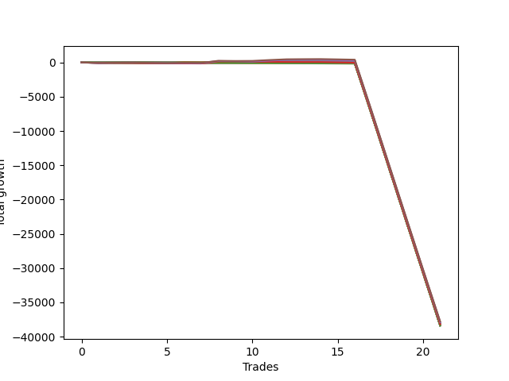

# Long Wallace Doodle 011 
- Symbol: NQ
- Date Range: 3/18/22 - 6/24/22
- Trading Period: 7:20-12:30
- Number of Trades: 22


| Name | Win Percent | Profit | Avg Profit / Trade |     | Name | Win Percent | Profit | Avg Profit / Trade |
| ---- | ----------- | ------ | ------------------ | --- | ---- | ----------- | ------ | ------------------ |
| Sorted By <br> Profit | | | | | Sorted By <br> Win Percentage ||||
| Thirty-Six | 40.91 | -18947750.00 | -861261.36 |     | Two | 54.55 | -19042500.00 | -865568.18 |
| Five | 45.45 | -19020125.00 | -864551.14 |     | One | 50.00 | -19093125.00 | -867869.32 |
| Two | 54.55 | -19042500.00 | -865568.18 |     | Five | 45.45 | -19020125.00 | -864551.14 |
| Three | 45.45 | -19054125.00 | -866096.59 |     | Three | 45.45 | -19054125.00 | -866096.59 |
| One | 50.00 | -19093125.00 | -867869.32 |     | Four | 45.45 | -19096375.00 | -868017.05 |
| Four | 45.45 | -19096375.00 | -868017.05 |     | Thirty-Six | 40.91 | -18947750.00 | -861261.36 |
| Thirty-Five | 13.64 | -19103375.00 | -868335.23 |     | Twenty-Four | 22.73 | -19135500.00 | -869795.45 |
| Eighteen | 18.18 | -19127500.00 | -869431.82 |     | Eleven | 22.73 | -19151125.00 | -870505.68 |
| Twenty-Four | 22.73 | -19135500.00 | -869795.45 |     | Nine | 22.73 | -19151125.00 | -870505.68 |
| Twelve | 9.09 | -19135750.00 | -869806.82 |     | Seven | 22.73 | -19151125.00 | -870505.68 |
| Eleven | 22.73 | -19151125.00 | -870505.68 |     | Thirty-Four | 22.73 | -19170000.00 | -871363.64 |
| Nine | 22.73 | -19151125.00 | -870505.68 |     | Eighteen | 18.18 | -19127500.00 | -869431.82 |
| Seven | 22.73 | -19151125.00 | -870505.68 |     | Twenty-Five | 18.18 | -19155000.00 | -870681.82 |
| Twenty-Five | 18.18 | -19155000.00 | -870681.82 |     | Thirty-Three | 18.18 | -19164625.00 | -871119.32 |
| Seventeen | 13.64 | -19156125.00 | -870732.95 |     | Thirty-One | 18.18 | -19164625.00 | -871119.32 |
| Fifteen | 13.64 | -19156125.00 | -870732.95 |     | Twenty-Nine | 18.18 | -19164625.00 | -871119.32 |
| Thirteen | 13.64 | -19156125.00 | -870732.95 |     | Twenty-Seven | 18.18 | -19164625.00 | -871119.32 |
| Twenty-Three | 13.64 | -19158250.00 | -870829.55 |     | Thirty-Five | 13.64 | -19103375.00 | -868335.23 |
| Twenty-One | 13.64 | -19158250.00 | -870829.55 |     | Seventeen | 13.64 | -19156125.00 | -870732.95 |
| Nineteen | 13.64 | -19158250.00 | -870829.55 |     | Fifteen | 13.64 | -19156125.00 | -870732.95 |
| Six | 4.55 | -19158500.00 | -870840.91 |     | Thirteen | 13.64 | -19156125.00 | -870732.95 |
| Thirty | 13.64 | -19159750.00 | -870897.73 |     | Twenty-Three | 13.64 | -19158250.00 | -870829.55 |
| Thirty-Three | 18.18 | -19164625.00 | -871119.32 |     | Twenty-One | 13.64 | -19158250.00 | -870829.55 |
| Thirty-One | 18.18 | -19164625.00 | -871119.32 |     | Nineteen | 13.64 | -19158250.00 | -870829.55 |
| Twenty-Nine | 18.18 | -19164625.00 | -871119.32 |     | Thirty | 13.64 | -19159750.00 | -870897.73 |
| Twenty-Seven | 18.18 | -19164625.00 | -871119.32 |     | Twelve | 9.09 | -19135750.00 | -869806.82 |
| Ten | 0.00 | -19168250.00 | -871284.09 |     | Thirty-Two | 9.09 | -19172500.00 | -871477.27 |
| Eight | 0.00 | -19168250.00 | -871284.09 |     | Twenty-Eight | 9.09 | -19185125.00 | -872051.14 |
| Twenty-Two | 4.55 | -19169125.00 | -871323.86 |     | Twenty-Six | 9.09 | -19196625.00 | -872573.86 |
| Thirty-Four | 22.73 | -19170000.00 | -871363.64 |     | Six | 4.55 | -19158500.00 | -870840.91 |
| Sixteen | 0.00 | -19172375.00 | -871471.59 |     | Twenty-Two | 4.55 | -19169125.00 | -871323.86 |
| Fourteen | 0.00 | -19172375.00 | -871471.59 |     | Twenty | 4.55 | -19177000.00 | -871681.82 |
| Thirty-Two | 9.09 | -19172500.00 | -871477.27 |     | Ten | 0.00 | -19168250.00 | -871284.09 |
| Twenty | 4.55 | -19177000.00 | -871681.82 |     | Eight | 0.00 | -19168250.00 | -871284.09 |
| Twenty-Eight | 9.09 | -19185125.00 | -872051.14 |     | Sixteen | 0.00 | -19172375.00 | -871471.59 |
| Twenty-Six | 9.09 | -19196625.00 | -872573.86 |     | Fourteen | 0.00 | -19172375.00 | -871471.59 |

### Test One
* Sell when price hits the middle line of the 20p bollinger
* No Stoploss
* Results:
```
Total Trades: 22
Percent Up: 50.00
Percent Down: 50.00
Total Points Moved Up: -38186.25
Potential Profit: -19093125.00
Total Points Ups: 221.50 Count Ups: 11
Total Points Downs: -38407.75 Count Downs: 11
```

<details><summary>Trades</summary>

<code>In: 2022-03-29 09:37:00		Out: 2022-03-29 09:42:40		Total Position Time: 05:40		Total Move Up: 15.00		Total to Date: 15.00</code> <br />
<code>In: 2022-03-30 08:02:00		Out: 2022-03-30 08:19:10		Total Position Time: 17:10		Total Move Up: -30.00		Total to Date: -15.00</code> <br />
<code>In: 2022-04-08 11:30:00		Out: 2022-04-08 11:39:40		Total Position Time: 09:40		Total Move Up: 7.75		Total to Date: -7.25</code> <br />
<code>In: 2022-04-08 11:30:00		Out: 2022-04-08 11:39:40		Total Position Time: 09:40		Total Move Up: 7.75		Total to Date: 0.50</code> <br />
<code>In: 2022-04-12 07:41:00		Out: 2022-04-12 07:59:30		Total Position Time: 18:30		Total Move Up: -17.25		Total to Date: -16.75</code> <br />
<code>In: 2022-04-12 07:42:00		Out: 2022-04-12 07:59:30		Total Position Time: 17:30		Total Move Up: -21.75		Total to Date: -38.50</code> <br />
<code>In: 2022-04-25 08:51:00		Out: 2022-04-25 08:56:05		Total Position Time: 05:05		Total Move Up: 24.25		Total to Date: -14.25</code> <br />
<code>In: 2022-04-27 12:00:00		Out: 2022-04-27 12:13:55		Total Position Time: 13:55		Total Move Up: 0.00		Total to Date: -14.25</code> <br />
<code>In: 2022-05-04 11:36:00		Out: 2022-05-04 11:36:40		Total Position Time: 00:40		Total Move Up: 27.75		Total to Date: 13.50</code> <br />
<code>In: 2022-05-06 11:09:00		Out: 2022-05-06 11:12:20		Total Position Time: 03:20		Total Move Up: 31.50		Total to Date: 45.00</code> <br />
<code>In: 2022-05-16 07:55:00		Out: 2022-05-16 08:09:35		Total Position Time: 14:35		Total Move Up: -17.75		Total to Date: 27.25</code> <br />
<code>In: 2022-05-17 11:24:00		Out: 2022-05-17 11:27:30		Total Position Time: 03:30		Total Move Up: 46.50		Total to Date: 73.75</code> <br />
<code>In: 2022-05-17 11:25:00		Out: 2022-05-17 11:27:30		Total Position Time: 02:30		Total Move Up: 33.50		Total to Date: 107.25</code> <br />
<code>In: 2022-05-25 09:30:00		Out: 2022-05-25 09:32:15		Total Position Time: 02:15		Total Move Up: 17.00		Total to Date: 124.25</code> <br />
<code>In: 2022-06-06 08:19:00		Out: 2022-06-06 08:30:10		Total Position Time: 11:10		Total Move Up: 10.50		Total to Date: 134.75</code> <br />
<code>In: 2022-06-08 09:29:00		Out: 2022-06-08 09:54:10		Total Position Time: 25:10		Total Move Up: -46.75		Total to Date: 88.00</code> <br />
<code>In: 2022-06-08 09:30:00		Out: 2022-06-08 09:54:10		Total Position Time: 24:10		Total Move Up: -55.25		Total to Date: 32.75</code> <br />
<code>In: 2022-06-14 11:52:00		Out: 2022-06-14 12:21:55		Total Position Time: 29:55		Total Move Up: -7573.00		Total to Date: -7540.25</code> <br />
<code>In: 2022-06-15 07:35:00		Out: 2022-06-15 08:04:55		Total Position Time: 29:55		Total Move Up: -7692.75		Total to Date: -15233.00</code> <br />
<code>In: 2022-06-15 10:01:00		Out: 2022-06-15 10:30:55		Total Position Time: 29:55		Total Move Up: -7691.50		Total to Date: -22924.50</code> <br />
<code>In: 2022-06-15 11:08:00		Out: 2022-06-15 11:37:55		Total Position Time: 29:55		Total Move Up: -7665.25		Total to Date: -30589.75</code> <br />
<code>In: 2022-06-15 11:34:00		Out: 2022-06-15 12:03:55		Total Position Time: 29:55		Total Move Up: -7596.50		Total to Date: -38186.25</code> <br />


</details>

### Test Two
* Sell when the price hits the upper line of the 20p 1std bollinger
* No Stoploss
* Results:
```
Total Trades: 22
Percent Up: 54.55
Percent Down: 45.45
Total Points Moved Up: -38085.00
Potential Profit: -19042500.00
Total Points Ups: 256.75 Count Ups: 12
Total Points Downs: -38341.75 Count Downs: 10
```

<details><summary>Trades</summary>

<code>In: 2022-03-29 09:37:00		Out: 2022-03-29 09:45:00		Total Position Time: 08:00		Total Move Up: 27.75		Total to Date: 27.75</code> <br />
<code>In: 2022-03-30 08:02:00		Out: 2022-03-30 08:23:45		Total Position Time: 21:45		Total Move Up: -25.50		Total to Date: 2.25</code> <br />
<code>In: 2022-04-08 11:30:00		Out: 2022-04-08 11:46:10		Total Position Time: 16:10		Total Move Up: 1.00		Total to Date: 3.25</code> <br />
<code>In: 2022-04-08 11:30:00		Out: 2022-04-08 11:46:10		Total Position Time: 16:10		Total Move Up: 1.00		Total to Date: 4.25</code> <br />
<code>In: 2022-04-12 07:41:00		Out: 2022-04-12 08:02:35		Total Position Time: 21:35		Total Move Up: 0.00		Total to Date: 4.25</code> <br />
<code>In: 2022-04-12 07:42:00		Out: 2022-04-12 08:02:35		Total Position Time: 20:35		Total Move Up: -4.50		Total to Date: -0.25</code> <br />
<code>In: 2022-04-25 08:51:00		Out: 2022-04-25 09:05:10		Total Position Time: 14:10		Total Move Up: 23.25		Total to Date: 23.00</code> <br />
<code>In: 2022-04-27 12:00:00		Out: 2022-04-27 12:15:20		Total Position Time: 15:20		Total Move Up: 6.50		Total to Date: 29.50</code> <br />
<code>In: 2022-05-04 11:36:00		Out: 2022-05-04 11:42:00		Total Position Time: 06:00		Total Move Up: 76.50		Total to Date: 106.00</code> <br />
<code>In: 2022-05-06 11:09:00		Out: 2022-05-06 11:24:20		Total Position Time: 15:20		Total Move Up: 31.50		Total to Date: 137.50</code> <br />
<code>In: 2022-05-16 07:55:00		Out: 2022-05-16 08:10:30		Total Position Time: 15:30		Total Move Up: -3.75		Total to Date: 133.75</code> <br />
<code>In: 2022-05-17 11:24:00		Out: 2022-05-17 11:39:45		Total Position Time: 15:45		Total Move Up: 44.25		Total to Date: 178.00</code> <br />
<code>In: 2022-05-17 11:25:00		Out: 2022-05-17 11:39:45		Total Position Time: 14:45		Total Move Up: 31.25		Total to Date: 209.25</code> <br />
<code>In: 2022-05-25 09:30:00		Out: 2022-05-25 09:45:20		Total Position Time: 15:20		Total Move Up: 7.00		Total to Date: 216.25</code> <br />
<code>In: 2022-06-06 08:19:00		Out: 2022-06-06 08:39:15		Total Position Time: 20:15		Total Move Up: 6.75		Total to Date: 223.00</code> <br />
<code>In: 2022-06-08 09:29:00		Out: 2022-06-08 09:57:05		Total Position Time: 28:05		Total Move Up: -40.25		Total to Date: 182.75</code> <br />
<code>In: 2022-06-08 09:30:00		Out: 2022-06-08 09:57:05		Total Position Time: 27:05		Total Move Up: -48.75		Total to Date: 134.00</code> <br />
<code>In: 2022-06-14 11:52:00		Out: 2022-06-14 12:21:55		Total Position Time: 29:55		Total Move Up: -7573.00		Total to Date: -7439.00</code> <br />
<code>In: 2022-06-15 07:35:00		Out: 2022-06-15 08:04:55		Total Position Time: 29:55		Total Move Up: -7692.75		Total to Date: -15131.75</code> <br />
<code>In: 2022-06-15 10:01:00		Out: 2022-06-15 10:30:55		Total Position Time: 29:55		Total Move Up: -7691.50		Total to Date: -22823.25</code> <br />
<code>In: 2022-06-15 11:08:00		Out: 2022-06-15 11:37:55		Total Position Time: 29:55		Total Move Up: -7665.25		Total to Date: -30488.50</code> <br />
<code>In: 2022-06-15 11:34:00		Out: 2022-06-15 12:03:55		Total Position Time: 29:55		Total Move Up: -7596.50		Total to Date: -38085.00</code> <br />


</details>

### Test Three
* Sell when the price hits the upper line of the 20p 2std bollinger
* No Stoploss
* Results:
```
Total Trades: 22
Percent Up: 45.45
Percent Down: 54.55
Total Points Moved Up: -38108.25
Potential Profit: -19054125.00
Total Points Ups: 370.75 Count Ups: 10
Total Points Downs: -38479.00 Count Downs: 12
```

<details><summary>Trades</summary>

<code>In: 2022-03-29 09:37:00		Out: 2022-03-29 09:46:55		Total Position Time: 09:55		Total Move Up: 43.50		Total to Date: 43.50</code> <br />
<code>In: 2022-03-30 08:02:00		Out: 2022-03-30 08:31:55		Total Position Time: 29:55		Total Move Up: -42.25		Total to Date: 1.25</code> <br />
<code>In: 2022-04-08 11:30:00		Out: 2022-04-08 11:47:25		Total Position Time: 17:25		Total Move Up: 7.25		Total to Date: 8.50</code> <br />
<code>In: 2022-04-08 11:30:00		Out: 2022-04-08 11:47:25		Total Position Time: 17:25		Total Move Up: 7.25		Total to Date: 15.75</code> <br />
<code>In: 2022-04-12 07:41:00		Out: 2022-04-12 08:10:55		Total Position Time: 29:55		Total Move Up: -40.00		Total to Date: -24.25</code> <br />
<code>In: 2022-04-12 07:42:00		Out: 2022-04-12 08:11:55		Total Position Time: 29:55		Total Move Up: -44.50		Total to Date: -68.75</code> <br />
<code>In: 2022-04-25 08:51:00		Out: 2022-04-25 09:05:25		Total Position Time: 14:25		Total Move Up: 30.50		Total to Date: -38.25</code> <br />
<code>In: 2022-04-27 12:00:00		Out: 2022-04-27 12:29:55		Total Position Time: 29:55		Total Move Up: -20.75		Total to Date: -59.00</code> <br />
<code>In: 2022-05-04 11:36:00		Out: 2022-05-04 11:44:15		Total Position Time: 08:15		Total Move Up: 139.25		Total to Date: 80.25</code> <br />
<code>In: 2022-05-06 11:09:00		Out: 2022-05-06 11:38:55		Total Position Time: 29:55		Total Move Up: -27.00		Total to Date: 53.25</code> <br />
<code>In: 2022-05-16 07:55:00		Out: 2022-05-16 08:13:05		Total Position Time: 18:05		Total Move Up: 7.50		Total to Date: 60.75</code> <br />
<code>In: 2022-05-17 11:24:00		Out: 2022-05-17 11:40:00		Total Position Time: 16:00		Total Move Up: 53.75		Total to Date: 114.50</code> <br />
<code>In: 2022-05-17 11:25:00		Out: 2022-05-17 11:40:00		Total Position Time: 15:00		Total Move Up: 40.75		Total to Date: 155.25</code> <br />
<code>In: 2022-05-25 09:30:00		Out: 2022-05-25 09:49:10		Total Position Time: 19:10		Total Move Up: 21.75		Total to Date: 177.00</code> <br />
<code>In: 2022-06-06 08:19:00		Out: 2022-06-06 08:44:30		Total Position Time: 25:30		Total Move Up: 19.25		Total to Date: 196.25</code> <br />
<code>In: 2022-06-08 09:29:00		Out: 2022-06-08 09:58:55		Total Position Time: 29:55		Total Move Up: -42.75		Total to Date: 153.50</code> <br />
<code>In: 2022-06-08 09:30:00		Out: 2022-06-08 09:59:15		Total Position Time: 29:15		Total Move Up: -42.75		Total to Date: 110.75</code> <br />
<code>In: 2022-06-14 11:52:00		Out: 2022-06-14 12:21:55		Total Position Time: 29:55		Total Move Up: -7573.00		Total to Date: -7462.25</code> <br />
<code>In: 2022-06-15 07:35:00		Out: 2022-06-15 08:04:55		Total Position Time: 29:55		Total Move Up: -7692.75		Total to Date: -15155.00</code> <br />
<code>In: 2022-06-15 10:01:00		Out: 2022-06-15 10:30:55		Total Position Time: 29:55		Total Move Up: -7691.50		Total to Date: -22846.50</code> <br />
<code>In: 2022-06-15 11:08:00		Out: 2022-06-15 11:37:55		Total Position Time: 29:55		Total Move Up: -7665.25		Total to Date: -30511.75</code> <br />
<code>In: 2022-06-15 11:34:00		Out: 2022-06-15 12:03:55		Total Position Time: 29:55		Total Move Up: -7596.50		Total to Date: -38108.25</code> <br />


</details>

### Test Four
* Sell when the price hits the middle line of the 1std VWAP
* No Stoploss
* Results:
```
Total Trades: 22
Percent Up: 45.45
Percent Down: 54.55
Total Points Moved Up: -38192.75
Potential Profit: -19096375.00
Total Points Ups: 288.00 Count Ups: 10
Total Points Downs: -38480.75 Count Downs: 12
```

<details><summary>Trades</summary>

<code>In: 2022-03-29 09:37:00		Out: 2022-03-29 09:45:20		Total Position Time: 08:20		Total Move Up: 35.50		Total to Date: 35.50</code> <br />
<code>In: 2022-03-30 08:02:00		Out: 2022-03-30 08:31:55		Total Position Time: 29:55		Total Move Up: -42.25		Total to Date: -6.75</code> <br />
<code>In: 2022-04-08 11:30:00		Out: 2022-04-08 11:59:55		Total Position Time: 29:55		Total Move Up: 22.00		Total to Date: 15.25</code> <br />
<code>In: 2022-04-08 11:30:00		Out: 2022-04-08 11:59:55		Total Position Time: 29:55		Total Move Up: 22.00		Total to Date: 37.25</code> <br />
<code>In: 2022-04-12 07:41:00		Out: 2022-04-12 08:10:55		Total Position Time: 29:55		Total Move Up: -40.00		Total to Date: -2.75</code> <br />
<code>In: 2022-04-12 07:42:00		Out: 2022-04-12 08:11:55		Total Position Time: 29:55		Total Move Up: -44.50		Total to Date: -47.25</code> <br />
<code>In: 2022-04-25 08:51:00		Out: 2022-04-25 09:08:05		Total Position Time: 17:05		Total Move Up: 77.25		Total to Date: 30.00</code> <br />
<code>In: 2022-04-27 12:00:00		Out: 2022-04-27 12:29:55		Total Position Time: 29:55		Total Move Up: -20.75		Total to Date: 9.25</code> <br />
<code>In: 2022-05-04 11:36:00		Out: 2022-05-04 11:36:10		Total Position Time: 00:10		Total Move Up: 0.00		Total to Date: 9.25</code> <br />
<code>In: 2022-05-06 11:09:00		Out: 2022-05-06 11:38:55		Total Position Time: 29:55		Total Move Up: -27.00		Total to Date: -17.75</code> <br />
<code>In: 2022-05-16 07:55:00		Out: 2022-05-16 08:24:55		Total Position Time: 29:55		Total Move Up: 2.50		Total to Date: -15.25</code> <br />
<code>In: 2022-05-17 11:24:00		Out: 2022-05-17 11:40:00		Total Position Time: 16:00		Total Move Up: 53.75		Total to Date: 38.50</code> <br />
<code>In: 2022-05-17 11:25:00		Out: 2022-05-17 11:40:00		Total Position Time: 15:00		Total Move Up: 40.75		Total to Date: 79.25</code> <br />
<code>In: 2022-05-25 09:30:00		Out: 2022-05-25 09:49:20		Total Position Time: 19:20		Total Move Up: 23.00		Total to Date: 102.25</code> <br />
<code>In: 2022-06-06 08:19:00		Out: 2022-06-06 08:48:55		Total Position Time: 29:55		Total Move Up: 11.25		Total to Date: 113.50</code> <br />
<code>In: 2022-06-08 09:29:00		Out: 2022-06-08 09:58:55		Total Position Time: 29:55		Total Move Up: -42.75		Total to Date: 70.75</code> <br />
<code>In: 2022-06-08 09:30:00		Out: 2022-06-08 09:59:55		Total Position Time: 29:55		Total Move Up: -44.50		Total to Date: 26.25</code> <br />
<code>In: 2022-06-14 11:52:00		Out: 2022-06-14 12:21:55		Total Position Time: 29:55		Total Move Up: -7573.00		Total to Date: -7546.75</code> <br />
<code>In: 2022-06-15 07:35:00		Out: 2022-06-15 08:04:55		Total Position Time: 29:55		Total Move Up: -7692.75		Total to Date: -15239.50</code> <br />
<code>In: 2022-06-15 10:01:00		Out: 2022-06-15 10:30:55		Total Position Time: 29:55		Total Move Up: -7691.50		Total to Date: -22931.00</code> <br />
<code>In: 2022-06-15 11:08:00		Out: 2022-06-15 11:37:55		Total Position Time: 29:55		Total Move Up: -7665.25		Total to Date: -30596.25</code> <br />
<code>In: 2022-06-15 11:34:00		Out: 2022-06-15 12:03:55		Total Position Time: 29:55		Total Move Up: -7596.50		Total to Date: -38192.75</code> <br />


</details>

### Test Five
* Sell when the price hits the upper line of the 1std VWAP
* No Stoploss
* Results:
```
Total Trades: 22
Percent Up: 45.45
Percent Down: 54.55
Total Points Moved Up: -38040.25
Potential Profit: -19020125.00
Total Points Ups: 440.50 Count Ups: 10
Total Points Downs: -38480.75 Count Downs: 12
```

<details><summary>Trades</summary>

<code>In: 2022-03-29 09:37:00		Out: 2022-03-29 10:06:55		Total Position Time: 29:55		Total Move Up: 14.50		Total to Date: 14.50</code> <br />
<code>In: 2022-03-30 08:02:00		Out: 2022-03-30 08:31:55		Total Position Time: 29:55		Total Move Up: -42.25		Total to Date: -27.75</code> <br />
<code>In: 2022-04-08 11:30:00		Out: 2022-04-08 11:59:55		Total Position Time: 29:55		Total Move Up: 22.00		Total to Date: -5.75</code> <br />
<code>In: 2022-04-08 11:30:00		Out: 2022-04-08 11:59:55		Total Position Time: 29:55		Total Move Up: 22.00		Total to Date: 16.25</code> <br />
<code>In: 2022-04-12 07:41:00		Out: 2022-04-12 08:10:55		Total Position Time: 29:55		Total Move Up: -40.00		Total to Date: -23.75</code> <br />
<code>In: 2022-04-12 07:42:00		Out: 2022-04-12 08:11:55		Total Position Time: 29:55		Total Move Up: -44.50		Total to Date: -68.25</code> <br />
<code>In: 2022-04-25 08:51:00		Out: 2022-04-25 09:20:55		Total Position Time: 29:55		Total Move Up: 84.75		Total to Date: 16.50</code> <br />
<code>In: 2022-04-27 12:00:00		Out: 2022-04-27 12:29:55		Total Position Time: 29:55		Total Move Up: -20.75		Total to Date: -4.25</code> <br />
<code>In: 2022-05-04 11:36:00		Out: 2022-05-04 11:42:00		Total Position Time: 06:00		Total Move Up: 76.50		Total to Date: 72.25</code> <br />
<code>In: 2022-05-06 11:09:00		Out: 2022-05-06 11:38:55		Total Position Time: 29:55		Total Move Up: -27.00		Total to Date: 45.25</code> <br />
<code>In: 2022-05-16 07:55:00		Out: 2022-05-16 08:24:55		Total Position Time: 29:55		Total Move Up: 2.50		Total to Date: 47.75</code> <br />
<code>In: 2022-05-17 11:24:00		Out: 2022-05-17 11:47:10		Total Position Time: 23:10		Total Move Up: 96.00		Total to Date: 143.75</code> <br />
<code>In: 2022-05-17 11:25:00		Out: 2022-05-17 11:47:10		Total Position Time: 22:10		Total Move Up: 83.00		Total to Date: 226.75</code> <br />
<code>In: 2022-05-25 09:30:00		Out: 2022-05-25 09:59:55		Total Position Time: 29:55		Total Move Up: 28.00		Total to Date: 254.75</code> <br />
<code>In: 2022-06-06 08:19:00		Out: 2022-06-06 08:48:55		Total Position Time: 29:55		Total Move Up: 11.25		Total to Date: 266.00</code> <br />
<code>In: 2022-06-08 09:29:00		Out: 2022-06-08 09:58:55		Total Position Time: 29:55		Total Move Up: -42.75		Total to Date: 223.25</code> <br />
<code>In: 2022-06-08 09:30:00		Out: 2022-06-08 09:59:55		Total Position Time: 29:55		Total Move Up: -44.50		Total to Date: 178.75</code> <br />
<code>In: 2022-06-14 11:52:00		Out: 2022-06-14 12:21:55		Total Position Time: 29:55		Total Move Up: -7573.00		Total to Date: -7394.25</code> <br />
<code>In: 2022-06-15 07:35:00		Out: 2022-06-15 08:04:55		Total Position Time: 29:55		Total Move Up: -7692.75		Total to Date: -15087.00</code> <br />
<code>In: 2022-06-15 10:01:00		Out: 2022-06-15 10:30:55		Total Position Time: 29:55		Total Move Up: -7691.50		Total to Date: -22778.50</code> <br />
<code>In: 2022-06-15 11:08:00		Out: 2022-06-15 11:37:55		Total Position Time: 29:55		Total Move Up: -7665.25		Total to Date: -30443.75</code> <br />
<code>In: 2022-06-15 11:34:00		Out: 2022-06-15 12:03:55		Total Position Time: 29:55		Total Move Up: -7596.50		Total to Date: -38040.25</code> <br />


</details>

### Test Six
* Sell when the price hits the middle line of the 20p bollinger
* Stoploss is 2 points
* Results:
```
Total Trades: 22
Percent Up: 4.55
Percent Down: 95.45
Total Points Moved Up: -38317.00
Potential Profit: -19158500.00
Total Points Ups: 17.00 Count Ups: 1
Total Points Downs: -38334.00 Count Downs: 21
```

<details><summary>Trades</summary>

<code>In: 2022-03-29 09:37:00		Out: 2022-03-29 09:37:15		Total Position Time: 00:15		Total Move Up: -1.75		Total to Date: -1.75</code> <br />
<code>In: 2022-03-30 08:02:00		Out: 2022-03-30 08:02:10		Total Position Time: 00:10		Total Move Up: -4.00		Total to Date: -5.75</code> <br />
<code>In: 2022-04-08 11:30:00		Out: 2022-04-08 11:30:35		Total Position Time: 00:35		Total Move Up: -3.50		Total to Date: -9.25</code> <br />
<code>In: 2022-04-08 11:30:00		Out: 2022-04-08 11:30:35		Total Position Time: 00:35		Total Move Up: -3.50		Total to Date: -12.75</code> <br />
<code>In: 2022-04-12 07:41:00		Out: 2022-04-12 07:41:10		Total Position Time: 00:10		Total Move Up: -4.00		Total to Date: -16.75</code> <br />
<code>In: 2022-04-12 07:42:00		Out: 2022-04-12 07:42:30		Total Position Time: 00:30		Total Move Up: -3.00		Total to Date: -19.75</code> <br />
<code>In: 2022-04-25 08:51:00		Out: 2022-04-25 08:53:35		Total Position Time: 02:35		Total Move Up: -2.50		Total to Date: -22.25</code> <br />
<code>In: 2022-04-27 12:00:00		Out: 2022-04-27 12:00:15		Total Position Time: 00:15		Total Move Up: -5.25		Total to Date: -27.50</code> <br />
<code>In: 2022-05-04 11:36:00		Out: 2022-05-04 11:36:15		Total Position Time: 00:15		Total Move Up: -12.00		Total to Date: -39.50</code> <br />
<code>In: 2022-05-06 11:09:00		Out: 2022-05-06 11:09:15		Total Position Time: 00:15		Total Move Up: -4.50		Total to Date: -44.00</code> <br />
<code>In: 2022-05-16 07:55:00		Out: 2022-05-16 07:55:10		Total Position Time: 00:10		Total Move Up: -11.25		Total to Date: -55.25</code> <br />
<code>In: 2022-05-17 11:24:00		Out: 2022-05-17 11:24:15		Total Position Time: 00:15		Total Move Up: -1.75		Total to Date: -57.00</code> <br />
<code>In: 2022-05-17 11:25:00		Out: 2022-05-17 11:25:30		Total Position Time: 00:30		Total Move Up: -4.75		Total to Date: -61.75</code> <br />
<code>In: 2022-05-25 09:30:00		Out: 2022-05-25 09:32:15		Total Position Time: 02:15		Total Move Up: 17.00		Total to Date: -44.75</code> <br />
<code>In: 2022-06-06 08:19:00		Out: 2022-06-06 08:19:30		Total Position Time: 00:30		Total Move Up: -4.50		Total to Date: -49.25</code> <br />
<code>In: 2022-06-08 09:29:00		Out: 2022-06-08 09:31:50		Total Position Time: 02:50		Total Move Up: -2.25		Total to Date: -51.50</code> <br />
<code>In: 2022-06-08 09:30:00		Out: 2022-06-08 09:30:10		Total Position Time: 00:10		Total Move Up: -3.00		Total to Date: -54.50</code> <br />
<code>In: 2022-06-14 11:52:00		Out: 2022-06-14 11:52:10		Total Position Time: 00:10		Total Move Up: -7560.50		Total to Date: -7615.00</code> <br />
<code>In: 2022-06-15 07:35:00		Out: 2022-06-15 07:35:10		Total Position Time: 00:10		Total Move Up: -7684.00		Total to Date: -15299.00</code> <br />
<code>In: 2022-06-15 10:01:00		Out: 2022-06-15 10:01:10		Total Position Time: 00:10		Total Move Up: -7704.25		Total to Date: -23003.25</code> <br />
<code>In: 2022-06-15 11:08:00		Out: 2022-06-15 11:08:10		Total Position Time: 00:10		Total Move Up: -7664.75		Total to Date: -30668.00</code> <br />
<code>In: 2022-06-15 11:34:00		Out: 2022-06-15 11:34:10		Total Position Time: 00:10		Total Move Up: -7649.00		Total to Date: -38317.00</code> <br />


</details>

### Test Seven
* Sell when the price hits the middle line of the 20p bollinger
* Trailing Stop is 2 points
* Results:
```
Total Trades: 22
Percent Up: 22.73
Percent Down: 77.27
Total Points Moved Up: -38302.25
Potential Profit: -19151125.00
Total Points Ups: 7.00 Count Ups: 5
Total Points Downs: -38309.25 Count Downs: 17
```

<details><summary>Trades</summary>

<code>In: 2022-03-29 09:37:00		Out: 2022-03-29 09:37:10		Total Position Time: 00:10		Total Move Up: -1.25		Total to Date: -1.25</code> <br />
<code>In: 2022-03-30 08:02:00		Out: 2022-03-30 08:02:10		Total Position Time: 00:10		Total Move Up: -4.00		Total to Date: -5.25</code> <br />
<code>In: 2022-04-08 11:30:00		Out: 2022-04-08 11:30:25		Total Position Time: 00:25		Total Move Up: 0.25		Total to Date: -5.00</code> <br />
<code>In: 2022-04-08 11:30:00		Out: 2022-04-08 11:30:25		Total Position Time: 00:25		Total Move Up: 0.25		Total to Date: -4.75</code> <br />
<code>In: 2022-04-12 07:41:00		Out: 2022-04-12 07:41:10		Total Position Time: 00:10		Total Move Up: -4.00		Total to Date: -8.75</code> <br />
<code>In: 2022-04-12 07:42:00		Out: 2022-04-12 07:42:30		Total Position Time: 00:30		Total Move Up: -3.00		Total to Date: -11.75</code> <br />
<code>In: 2022-04-25 08:51:00		Out: 2022-04-25 08:51:10		Total Position Time: 00:10		Total Move Up: -1.50		Total to Date: -13.25</code> <br />
<code>In: 2022-04-27 12:00:00		Out: 2022-04-27 12:00:15		Total Position Time: 00:15		Total Move Up: -5.25		Total to Date: -18.50</code> <br />
<code>In: 2022-05-04 11:36:00		Out: 2022-05-04 11:36:10		Total Position Time: 00:10		Total Move Up: 0.00		Total to Date: -18.50</code> <br />
<code>In: 2022-05-06 11:09:00		Out: 2022-05-06 11:09:15		Total Position Time: 00:15		Total Move Up: -4.50		Total to Date: -23.00</code> <br />
<code>In: 2022-05-16 07:55:00		Out: 2022-05-16 07:55:20		Total Position Time: 00:20		Total Move Up: -12.75		Total to Date: -35.75</code> <br />
<code>In: 2022-05-17 11:24:00		Out: 2022-05-17 11:24:10		Total Position Time: 00:10		Total Move Up: -2.75		Total to Date: -38.50</code> <br />
<code>In: 2022-05-17 11:25:00		Out: 2022-05-17 11:25:25		Total Position Time: 00:25		Total Move Up: -2.25		Total to Date: -40.75</code> <br />
<code>In: 2022-05-25 09:30:00		Out: 2022-05-25 09:30:10		Total Position Time: 00:10		Total Move Up: 3.00		Total to Date: -37.75</code> <br />
<code>In: 2022-06-06 08:19:00		Out: 2022-06-06 08:19:25		Total Position Time: 00:25		Total Move Up: -1.50		Total to Date: -39.25</code> <br />
<code>In: 2022-06-08 09:29:00		Out: 2022-06-08 09:29:10		Total Position Time: 00:10		Total Move Up: 3.50		Total to Date: -35.75</code> <br />
<code>In: 2022-06-08 09:30:00		Out: 2022-06-08 09:30:25		Total Position Time: 00:25		Total Move Up: -4.00		Total to Date: -39.75</code> <br />
<code>In: 2022-06-14 11:52:00		Out: 2022-06-14 11:52:10		Total Position Time: 00:10		Total Move Up: -7560.50		Total to Date: -7600.25</code> <br />
<code>In: 2022-06-15 07:35:00		Out: 2022-06-15 07:35:10		Total Position Time: 00:10		Total Move Up: -7684.00		Total to Date: -15284.25</code> <br />
<code>In: 2022-06-15 10:01:00		Out: 2022-06-15 10:01:10		Total Position Time: 00:10		Total Move Up: -7704.25		Total to Date: -22988.50</code> <br />
<code>In: 2022-06-15 11:08:00		Out: 2022-06-15 11:08:10		Total Position Time: 00:10		Total Move Up: -7664.75		Total to Date: -30653.25</code> <br />
<code>In: 2022-06-15 11:34:00		Out: 2022-06-15 11:34:10		Total Position Time: 00:10		Total Move Up: -7649.00		Total to Date: -38302.25</code> <br />


</details>

### Test Eight
* Sell when the price hits the upper line of the 20p 1std bollinger
* Stoploss is 2 points
* Results:
```
Total Trades: 22
Percent Up: 0.00
Percent Down: 100.00
Total Points Moved Up: -38336.50
Potential Profit: -19168250.00
Total Points Ups: 0.00 Count Ups: 0
Total Points Downs: -38336.50 Count Downs: 22
```

<details><summary>Trades</summary>

<code>In: 2022-03-29 09:37:00		Out: 2022-03-29 09:37:15		Total Position Time: 00:15		Total Move Up: -1.75		Total to Date: -1.75</code> <br />
<code>In: 2022-03-30 08:02:00		Out: 2022-03-30 08:02:10		Total Position Time: 00:10		Total Move Up: -4.00		Total to Date: -5.75</code> <br />
<code>In: 2022-04-08 11:30:00		Out: 2022-04-08 11:30:35		Total Position Time: 00:35		Total Move Up: -3.50		Total to Date: -9.25</code> <br />
<code>In: 2022-04-08 11:30:00		Out: 2022-04-08 11:30:35		Total Position Time: 00:35		Total Move Up: -3.50		Total to Date: -12.75</code> <br />
<code>In: 2022-04-12 07:41:00		Out: 2022-04-12 07:41:10		Total Position Time: 00:10		Total Move Up: -4.00		Total to Date: -16.75</code> <br />
<code>In: 2022-04-12 07:42:00		Out: 2022-04-12 07:42:30		Total Position Time: 00:30		Total Move Up: -3.00		Total to Date: -19.75</code> <br />
<code>In: 2022-04-25 08:51:00		Out: 2022-04-25 08:53:35		Total Position Time: 02:35		Total Move Up: -2.50		Total to Date: -22.25</code> <br />
<code>In: 2022-04-27 12:00:00		Out: 2022-04-27 12:00:15		Total Position Time: 00:15		Total Move Up: -5.25		Total to Date: -27.50</code> <br />
<code>In: 2022-05-04 11:36:00		Out: 2022-05-04 11:36:15		Total Position Time: 00:15		Total Move Up: -12.00		Total to Date: -39.50</code> <br />
<code>In: 2022-05-06 11:09:00		Out: 2022-05-06 11:09:15		Total Position Time: 00:15		Total Move Up: -4.50		Total to Date: -44.00</code> <br />
<code>In: 2022-05-16 07:55:00		Out: 2022-05-16 07:55:10		Total Position Time: 00:10		Total Move Up: -11.25		Total to Date: -55.25</code> <br />
<code>In: 2022-05-17 11:24:00		Out: 2022-05-17 11:24:15		Total Position Time: 00:15		Total Move Up: -1.75		Total to Date: -57.00</code> <br />
<code>In: 2022-05-17 11:25:00		Out: 2022-05-17 11:25:30		Total Position Time: 00:30		Total Move Up: -4.75		Total to Date: -61.75</code> <br />
<code>In: 2022-05-25 09:30:00		Out: 2022-05-25 09:33:25		Total Position Time: 03:25		Total Move Up: -2.50		Total to Date: -64.25</code> <br />
<code>In: 2022-06-06 08:19:00		Out: 2022-06-06 08:19:30		Total Position Time: 00:30		Total Move Up: -4.50		Total to Date: -68.75</code> <br />
<code>In: 2022-06-08 09:29:00		Out: 2022-06-08 09:31:50		Total Position Time: 02:50		Total Move Up: -2.25		Total to Date: -71.00</code> <br />
<code>In: 2022-06-08 09:30:00		Out: 2022-06-08 09:30:10		Total Position Time: 00:10		Total Move Up: -3.00		Total to Date: -74.00</code> <br />
<code>In: 2022-06-14 11:52:00		Out: 2022-06-14 11:52:10		Total Position Time: 00:10		Total Move Up: -7560.50		Total to Date: -7634.50</code> <br />
<code>In: 2022-06-15 07:35:00		Out: 2022-06-15 07:35:10		Total Position Time: 00:10		Total Move Up: -7684.00		Total to Date: -15318.50</code> <br />
<code>In: 2022-06-15 10:01:00		Out: 2022-06-15 10:01:10		Total Position Time: 00:10		Total Move Up: -7704.25		Total to Date: -23022.75</code> <br />
<code>In: 2022-06-15 11:08:00		Out: 2022-06-15 11:08:10		Total Position Time: 00:10		Total Move Up: -7664.75		Total to Date: -30687.50</code> <br />
<code>In: 2022-06-15 11:34:00		Out: 2022-06-15 11:34:10		Total Position Time: 00:10		Total Move Up: -7649.00		Total to Date: -38336.50</code> <br />


</details>

### Test Nine
* Sell when the price hits the upper line of the 20p 1std bollinger
* Trailing Stop is 2 points
* Results:
```
Total Trades: 22
Percent Up: 22.73
Percent Down: 77.27
Total Points Moved Up: -38302.25
Potential Profit: -19151125.00
Total Points Ups: 7.00 Count Ups: 5
Total Points Downs: -38309.25 Count Downs: 17
```

<details><summary>Trades</summary>

<code>In: 2022-03-29 09:37:00		Out: 2022-03-29 09:37:10		Total Position Time: 00:10		Total Move Up: -1.25		Total to Date: -1.25</code> <br />
<code>In: 2022-03-30 08:02:00		Out: 2022-03-30 08:02:10		Total Position Time: 00:10		Total Move Up: -4.00		Total to Date: -5.25</code> <br />
<code>In: 2022-04-08 11:30:00		Out: 2022-04-08 11:30:25		Total Position Time: 00:25		Total Move Up: 0.25		Total to Date: -5.00</code> <br />
<code>In: 2022-04-08 11:30:00		Out: 2022-04-08 11:30:25		Total Position Time: 00:25		Total Move Up: 0.25		Total to Date: -4.75</code> <br />
<code>In: 2022-04-12 07:41:00		Out: 2022-04-12 07:41:10		Total Position Time: 00:10		Total Move Up: -4.00		Total to Date: -8.75</code> <br />
<code>In: 2022-04-12 07:42:00		Out: 2022-04-12 07:42:30		Total Position Time: 00:30		Total Move Up: -3.00		Total to Date: -11.75</code> <br />
<code>In: 2022-04-25 08:51:00		Out: 2022-04-25 08:51:10		Total Position Time: 00:10		Total Move Up: -1.50		Total to Date: -13.25</code> <br />
<code>In: 2022-04-27 12:00:00		Out: 2022-04-27 12:00:15		Total Position Time: 00:15		Total Move Up: -5.25		Total to Date: -18.50</code> <br />
<code>In: 2022-05-04 11:36:00		Out: 2022-05-04 11:36:10		Total Position Time: 00:10		Total Move Up: 0.00		Total to Date: -18.50</code> <br />
<code>In: 2022-05-06 11:09:00		Out: 2022-05-06 11:09:15		Total Position Time: 00:15		Total Move Up: -4.50		Total to Date: -23.00</code> <br />
<code>In: 2022-05-16 07:55:00		Out: 2022-05-16 07:55:20		Total Position Time: 00:20		Total Move Up: -12.75		Total to Date: -35.75</code> <br />
<code>In: 2022-05-17 11:24:00		Out: 2022-05-17 11:24:10		Total Position Time: 00:10		Total Move Up: -2.75		Total to Date: -38.50</code> <br />
<code>In: 2022-05-17 11:25:00		Out: 2022-05-17 11:25:25		Total Position Time: 00:25		Total Move Up: -2.25		Total to Date: -40.75</code> <br />
<code>In: 2022-05-25 09:30:00		Out: 2022-05-25 09:30:10		Total Position Time: 00:10		Total Move Up: 3.00		Total to Date: -37.75</code> <br />
<code>In: 2022-06-06 08:19:00		Out: 2022-06-06 08:19:25		Total Position Time: 00:25		Total Move Up: -1.50		Total to Date: -39.25</code> <br />
<code>In: 2022-06-08 09:29:00		Out: 2022-06-08 09:29:10		Total Position Time: 00:10		Total Move Up: 3.50		Total to Date: -35.75</code> <br />
<code>In: 2022-06-08 09:30:00		Out: 2022-06-08 09:30:25		Total Position Time: 00:25		Total Move Up: -4.00		Total to Date: -39.75</code> <br />
<code>In: 2022-06-14 11:52:00		Out: 2022-06-14 11:52:10		Total Position Time: 00:10		Total Move Up: -7560.50		Total to Date: -7600.25</code> <br />
<code>In: 2022-06-15 07:35:00		Out: 2022-06-15 07:35:10		Total Position Time: 00:10		Total Move Up: -7684.00		Total to Date: -15284.25</code> <br />
<code>In: 2022-06-15 10:01:00		Out: 2022-06-15 10:01:10		Total Position Time: 00:10		Total Move Up: -7704.25		Total to Date: -22988.50</code> <br />
<code>In: 2022-06-15 11:08:00		Out: 2022-06-15 11:08:10		Total Position Time: 00:10		Total Move Up: -7664.75		Total to Date: -30653.25</code> <br />
<code>In: 2022-06-15 11:34:00		Out: 2022-06-15 11:34:10		Total Position Time: 00:10		Total Move Up: -7649.00		Total to Date: -38302.25</code> <br />


</details>

### Test Ten
* Sell when the price hits the upper line of the 20p 2std bollinger
* Stoploss is 2 points
* Results:
```
Total Trades: 22
Percent Up: 0.00
Percent Down: 100.00
Total Points Moved Up: -38336.50
Potential Profit: -19168250.00
Total Points Ups: 0.00 Count Ups: 0
Total Points Downs: -38336.50 Count Downs: 22
```

<details><summary>Trades</summary>

<code>In: 2022-03-29 09:37:00		Out: 2022-03-29 09:37:15		Total Position Time: 00:15		Total Move Up: -1.75		Total to Date: -1.75</code> <br />
<code>In: 2022-03-30 08:02:00		Out: 2022-03-30 08:02:10		Total Position Time: 00:10		Total Move Up: -4.00		Total to Date: -5.75</code> <br />
<code>In: 2022-04-08 11:30:00		Out: 2022-04-08 11:30:35		Total Position Time: 00:35		Total Move Up: -3.50		Total to Date: -9.25</code> <br />
<code>In: 2022-04-08 11:30:00		Out: 2022-04-08 11:30:35		Total Position Time: 00:35		Total Move Up: -3.50		Total to Date: -12.75</code> <br />
<code>In: 2022-04-12 07:41:00		Out: 2022-04-12 07:41:10		Total Position Time: 00:10		Total Move Up: -4.00		Total to Date: -16.75</code> <br />
<code>In: 2022-04-12 07:42:00		Out: 2022-04-12 07:42:30		Total Position Time: 00:30		Total Move Up: -3.00		Total to Date: -19.75</code> <br />
<code>In: 2022-04-25 08:51:00		Out: 2022-04-25 08:53:35		Total Position Time: 02:35		Total Move Up: -2.50		Total to Date: -22.25</code> <br />
<code>In: 2022-04-27 12:00:00		Out: 2022-04-27 12:00:15		Total Position Time: 00:15		Total Move Up: -5.25		Total to Date: -27.50</code> <br />
<code>In: 2022-05-04 11:36:00		Out: 2022-05-04 11:36:15		Total Position Time: 00:15		Total Move Up: -12.00		Total to Date: -39.50</code> <br />
<code>In: 2022-05-06 11:09:00		Out: 2022-05-06 11:09:15		Total Position Time: 00:15		Total Move Up: -4.50		Total to Date: -44.00</code> <br />
<code>In: 2022-05-16 07:55:00		Out: 2022-05-16 07:55:10		Total Position Time: 00:10		Total Move Up: -11.25		Total to Date: -55.25</code> <br />
<code>In: 2022-05-17 11:24:00		Out: 2022-05-17 11:24:15		Total Position Time: 00:15		Total Move Up: -1.75		Total to Date: -57.00</code> <br />
<code>In: 2022-05-17 11:25:00		Out: 2022-05-17 11:25:30		Total Position Time: 00:30		Total Move Up: -4.75		Total to Date: -61.75</code> <br />
<code>In: 2022-05-25 09:30:00		Out: 2022-05-25 09:33:25		Total Position Time: 03:25		Total Move Up: -2.50		Total to Date: -64.25</code> <br />
<code>In: 2022-06-06 08:19:00		Out: 2022-06-06 08:19:30		Total Position Time: 00:30		Total Move Up: -4.50		Total to Date: -68.75</code> <br />
<code>In: 2022-06-08 09:29:00		Out: 2022-06-08 09:31:50		Total Position Time: 02:50		Total Move Up: -2.25		Total to Date: -71.00</code> <br />
<code>In: 2022-06-08 09:30:00		Out: 2022-06-08 09:30:10		Total Position Time: 00:10		Total Move Up: -3.00		Total to Date: -74.00</code> <br />
<code>In: 2022-06-14 11:52:00		Out: 2022-06-14 11:52:10		Total Position Time: 00:10		Total Move Up: -7560.50		Total to Date: -7634.50</code> <br />
<code>In: 2022-06-15 07:35:00		Out: 2022-06-15 07:35:10		Total Position Time: 00:10		Total Move Up: -7684.00		Total to Date: -15318.50</code> <br />
<code>In: 2022-06-15 10:01:00		Out: 2022-06-15 10:01:10		Total Position Time: 00:10		Total Move Up: -7704.25		Total to Date: -23022.75</code> <br />
<code>In: 2022-06-15 11:08:00		Out: 2022-06-15 11:08:10		Total Position Time: 00:10		Total Move Up: -7664.75		Total to Date: -30687.50</code> <br />
<code>In: 2022-06-15 11:34:00		Out: 2022-06-15 11:34:10		Total Position Time: 00:10		Total Move Up: -7649.00		Total to Date: -38336.50</code> <br />


</details>

### Test Eleven
* Sell when the price hits the upper line of the 20p 2std bollinger
* Trailing Stop is 2 points
* Results:
```
Total Trades: 22
Percent Up: 22.73
Percent Down: 77.27
Total Points Moved Up: -38302.25
Potential Profit: -19151125.00
Total Points Ups: 7.00 Count Ups: 5
Total Points Downs: -38309.25 Count Downs: 17
```

<details><summary>Trades</summary>

<code>In: 2022-03-29 09:37:00		Out: 2022-03-29 09:37:10		Total Position Time: 00:10		Total Move Up: -1.25		Total to Date: -1.25</code> <br />
<code>In: 2022-03-30 08:02:00		Out: 2022-03-30 08:02:10		Total Position Time: 00:10		Total Move Up: -4.00		Total to Date: -5.25</code> <br />
<code>In: 2022-04-08 11:30:00		Out: 2022-04-08 11:30:25		Total Position Time: 00:25		Total Move Up: 0.25		Total to Date: -5.00</code> <br />
<code>In: 2022-04-08 11:30:00		Out: 2022-04-08 11:30:25		Total Position Time: 00:25		Total Move Up: 0.25		Total to Date: -4.75</code> <br />
<code>In: 2022-04-12 07:41:00		Out: 2022-04-12 07:41:10		Total Position Time: 00:10		Total Move Up: -4.00		Total to Date: -8.75</code> <br />
<code>In: 2022-04-12 07:42:00		Out: 2022-04-12 07:42:30		Total Position Time: 00:30		Total Move Up: -3.00		Total to Date: -11.75</code> <br />
<code>In: 2022-04-25 08:51:00		Out: 2022-04-25 08:51:10		Total Position Time: 00:10		Total Move Up: -1.50		Total to Date: -13.25</code> <br />
<code>In: 2022-04-27 12:00:00		Out: 2022-04-27 12:00:15		Total Position Time: 00:15		Total Move Up: -5.25		Total to Date: -18.50</code> <br />
<code>In: 2022-05-04 11:36:00		Out: 2022-05-04 11:36:10		Total Position Time: 00:10		Total Move Up: 0.00		Total to Date: -18.50</code> <br />
<code>In: 2022-05-06 11:09:00		Out: 2022-05-06 11:09:15		Total Position Time: 00:15		Total Move Up: -4.50		Total to Date: -23.00</code> <br />
<code>In: 2022-05-16 07:55:00		Out: 2022-05-16 07:55:20		Total Position Time: 00:20		Total Move Up: -12.75		Total to Date: -35.75</code> <br />
<code>In: 2022-05-17 11:24:00		Out: 2022-05-17 11:24:10		Total Position Time: 00:10		Total Move Up: -2.75		Total to Date: -38.50</code> <br />
<code>In: 2022-05-17 11:25:00		Out: 2022-05-17 11:25:25		Total Position Time: 00:25		Total Move Up: -2.25		Total to Date: -40.75</code> <br />
<code>In: 2022-05-25 09:30:00		Out: 2022-05-25 09:30:10		Total Position Time: 00:10		Total Move Up: 3.00		Total to Date: -37.75</code> <br />
<code>In: 2022-06-06 08:19:00		Out: 2022-06-06 08:19:25		Total Position Time: 00:25		Total Move Up: -1.50		Total to Date: -39.25</code> <br />
<code>In: 2022-06-08 09:29:00		Out: 2022-06-08 09:29:10		Total Position Time: 00:10		Total Move Up: 3.50		Total to Date: -35.75</code> <br />
<code>In: 2022-06-08 09:30:00		Out: 2022-06-08 09:30:25		Total Position Time: 00:25		Total Move Up: -4.00		Total to Date: -39.75</code> <br />
<code>In: 2022-06-14 11:52:00		Out: 2022-06-14 11:52:10		Total Position Time: 00:10		Total Move Up: -7560.50		Total to Date: -7600.25</code> <br />
<code>In: 2022-06-15 07:35:00		Out: 2022-06-15 07:35:10		Total Position Time: 00:10		Total Move Up: -7684.00		Total to Date: -15284.25</code> <br />
<code>In: 2022-06-15 10:01:00		Out: 2022-06-15 10:01:10		Total Position Time: 00:10		Total Move Up: -7704.25		Total to Date: -22988.50</code> <br />
<code>In: 2022-06-15 11:08:00		Out: 2022-06-15 11:08:10		Total Position Time: 00:10		Total Move Up: -7664.75		Total to Date: -30653.25</code> <br />
<code>In: 2022-06-15 11:34:00		Out: 2022-06-15 11:34:10		Total Position Time: 00:10		Total Move Up: -7649.00		Total to Date: -38302.25</code> <br />


</details>

### Test Twelve
* Sell when the price hits the middle line of the 20p bollinger
* Stoploss is 3 points
* Results:
```
Total Trades: 22
Percent Up: 9.09
Percent Down: 90.91
Total Points Moved Up: -38271.50
Potential Profit: -19135750.00
Total Points Ups: 63.50 Count Ups: 2
Total Points Downs: -38335.00 Count Downs: 20
```

<details><summary>Trades</summary>

<code>In: 2022-03-29 09:37:00		Out: 2022-03-29 09:38:35		Total Position Time: 01:35		Total Move Up: -2.50		Total to Date: -2.50</code> <br />
<code>In: 2022-03-30 08:02:00		Out: 2022-03-30 08:02:10		Total Position Time: 00:10		Total Move Up: -4.00		Total to Date: -6.50</code> <br />
<code>In: 2022-04-08 11:30:00		Out: 2022-04-08 11:30:35		Total Position Time: 00:35		Total Move Up: -3.50		Total to Date: -10.00</code> <br />
<code>In: 2022-04-08 11:30:00		Out: 2022-04-08 11:30:35		Total Position Time: 00:35		Total Move Up: -3.50		Total to Date: -13.50</code> <br />
<code>In: 2022-04-12 07:41:00		Out: 2022-04-12 07:41:10		Total Position Time: 00:10		Total Move Up: -4.00		Total to Date: -17.50</code> <br />
<code>In: 2022-04-12 07:42:00		Out: 2022-04-12 07:42:30		Total Position Time: 00:30		Total Move Up: -3.00		Total to Date: -20.50</code> <br />
<code>In: 2022-04-25 08:51:00		Out: 2022-04-25 08:53:40		Total Position Time: 02:40		Total Move Up: -3.50		Total to Date: -24.00</code> <br />
<code>In: 2022-04-27 12:00:00		Out: 2022-04-27 12:00:15		Total Position Time: 00:15		Total Move Up: -5.25		Total to Date: -29.25</code> <br />
<code>In: 2022-05-04 11:36:00		Out: 2022-05-04 11:36:15		Total Position Time: 00:15		Total Move Up: -12.00		Total to Date: -41.25</code> <br />
<code>In: 2022-05-06 11:09:00		Out: 2022-05-06 11:09:15		Total Position Time: 00:15		Total Move Up: -4.50		Total to Date: -45.75</code> <br />
<code>In: 2022-05-16 07:55:00		Out: 2022-05-16 07:55:10		Total Position Time: 00:10		Total Move Up: -11.25		Total to Date: -57.00</code> <br />
<code>In: 2022-05-17 11:24:00		Out: 2022-05-17 11:27:30		Total Position Time: 03:30		Total Move Up: 46.50		Total to Date: -10.50</code> <br />
<code>In: 2022-05-17 11:25:00		Out: 2022-05-17 11:25:30		Total Position Time: 00:30		Total Move Up: -4.75		Total to Date: -15.25</code> <br />
<code>In: 2022-05-25 09:30:00		Out: 2022-05-25 09:32:15		Total Position Time: 02:15		Total Move Up: 17.00		Total to Date: 1.75</code> <br />
<code>In: 2022-06-06 08:19:00		Out: 2022-06-06 08:19:30		Total Position Time: 00:30		Total Move Up: -4.50		Total to Date: -2.75</code> <br />
<code>In: 2022-06-08 09:29:00		Out: 2022-06-08 09:31:55		Total Position Time: 02:55		Total Move Up: -3.75		Total to Date: -6.50</code> <br />
<code>In: 2022-06-08 09:30:00		Out: 2022-06-08 09:30:20		Total Position Time: 00:20		Total Move Up: -2.50		Total to Date: -9.00</code> <br />
<code>In: 2022-06-14 11:52:00		Out: 2022-06-14 11:52:10		Total Position Time: 00:10		Total Move Up: -7560.50		Total to Date: -7569.50</code> <br />
<code>In: 2022-06-15 07:35:00		Out: 2022-06-15 07:35:10		Total Position Time: 00:10		Total Move Up: -7684.00		Total to Date: -15253.50</code> <br />
<code>In: 2022-06-15 10:01:00		Out: 2022-06-15 10:01:10		Total Position Time: 00:10		Total Move Up: -7704.25		Total to Date: -22957.75</code> <br />
<code>In: 2022-06-15 11:08:00		Out: 2022-06-15 11:08:10		Total Position Time: 00:10		Total Move Up: -7664.75		Total to Date: -30622.50</code> <br />
<code>In: 2022-06-15 11:34:00		Out: 2022-06-15 11:34:10		Total Position Time: 00:10		Total Move Up: -7649.00		Total to Date: -38271.50</code> <br />


</details>

### Test Thirteen
* Sell when the price hits the middle line of the 20p bollinger
* Trailing Stop is 3 points
* Results:
```
Total Trades: 22
Percent Up: 13.64
Percent Down: 86.36
Total Points Moved Up: -38312.25
Potential Profit: -19156125.00
Total Points Ups: 6.50 Count Ups: 3
Total Points Downs: -38318.75 Count Downs: 19
```

<details><summary>Trades</summary>

<code>In: 2022-03-29 09:37:00		Out: 2022-03-29 09:37:10		Total Position Time: 00:10		Total Move Up: -1.25		Total to Date: -1.25</code> <br />
<code>In: 2022-03-30 08:02:00		Out: 2022-03-30 08:02:10		Total Position Time: 00:10		Total Move Up: -4.00		Total to Date: -5.25</code> <br />
<code>In: 2022-04-08 11:30:00		Out: 2022-04-08 11:30:35		Total Position Time: 00:35		Total Move Up: -3.50		Total to Date: -8.75</code> <br />
<code>In: 2022-04-08 11:30:00		Out: 2022-04-08 11:30:35		Total Position Time: 00:35		Total Move Up: -3.50		Total to Date: -12.25</code> <br />
<code>In: 2022-04-12 07:41:00		Out: 2022-04-12 07:41:10		Total Position Time: 00:10		Total Move Up: -4.00		Total to Date: -16.25</code> <br />
<code>In: 2022-04-12 07:42:00		Out: 2022-04-12 07:42:30		Total Position Time: 00:30		Total Move Up: -3.00		Total to Date: -19.25</code> <br />
<code>In: 2022-04-25 08:51:00		Out: 2022-04-25 08:51:10		Total Position Time: 00:10		Total Move Up: -1.50		Total to Date: -20.75</code> <br />
<code>In: 2022-04-27 12:00:00		Out: 2022-04-27 12:00:15		Total Position Time: 00:15		Total Move Up: -5.25		Total to Date: -26.00</code> <br />
<code>In: 2022-05-04 11:36:00		Out: 2022-05-04 11:36:10		Total Position Time: 00:10		Total Move Up: 0.00		Total to Date: -26.00</code> <br />
<code>In: 2022-05-06 11:09:00		Out: 2022-05-06 11:09:15		Total Position Time: 00:15		Total Move Up: -4.50		Total to Date: -30.50</code> <br />
<code>In: 2022-05-16 07:55:00		Out: 2022-05-16 07:55:40		Total Position Time: 00:40		Total Move Up: -11.50		Total to Date: -42.00</code> <br />
<code>In: 2022-05-17 11:24:00		Out: 2022-05-17 11:24:10		Total Position Time: 00:10		Total Move Up: -2.75		Total to Date: -44.75</code> <br />
<code>In: 2022-05-17 11:25:00		Out: 2022-05-17 11:25:25		Total Position Time: 00:25		Total Move Up: -2.25		Total to Date: -47.00</code> <br />
<code>In: 2022-05-25 09:30:00		Out: 2022-05-25 09:30:10		Total Position Time: 00:10		Total Move Up: 3.00		Total to Date: -44.00</code> <br />
<code>In: 2022-06-06 08:19:00		Out: 2022-06-06 08:19:25		Total Position Time: 00:25		Total Move Up: -1.50		Total to Date: -45.50</code> <br />
<code>In: 2022-06-08 09:29:00		Out: 2022-06-08 09:29:10		Total Position Time: 00:10		Total Move Up: 3.50		Total to Date: -42.00</code> <br />
<code>In: 2022-06-08 09:30:00		Out: 2022-06-08 09:30:30		Total Position Time: 00:30		Total Move Up: -7.75		Total to Date: -49.75</code> <br />
<code>In: 2022-06-14 11:52:00		Out: 2022-06-14 11:52:10		Total Position Time: 00:10		Total Move Up: -7560.50		Total to Date: -7610.25</code> <br />
<code>In: 2022-06-15 07:35:00		Out: 2022-06-15 07:35:10		Total Position Time: 00:10		Total Move Up: -7684.00		Total to Date: -15294.25</code> <br />
<code>In: 2022-06-15 10:01:00		Out: 2022-06-15 10:01:10		Total Position Time: 00:10		Total Move Up: -7704.25		Total to Date: -22998.50</code> <br />
<code>In: 2022-06-15 11:08:00		Out: 2022-06-15 11:08:10		Total Position Time: 00:10		Total Move Up: -7664.75		Total to Date: -30663.25</code> <br />
<code>In: 2022-06-15 11:34:00		Out: 2022-06-15 11:34:10		Total Position Time: 00:10		Total Move Up: -7649.00		Total to Date: -38312.25</code> <br />


</details>

### Test Fourteen
* Sell when the price hits the upper line of the 20p 1std bollinger
* Stoploss is 3 points
* Results:
```
Total Trades: 22
Percent Up: 0.00
Percent Down: 100.00
Total Points Moved Up: -38344.75
Potential Profit: -19172375.00
Total Points Ups: 0.00 Count Ups: 0
Total Points Downs: -38344.75 Count Downs: 22
```

<details><summary>Trades</summary>

<code>In: 2022-03-29 09:37:00		Out: 2022-03-29 09:38:35		Total Position Time: 01:35		Total Move Up: -2.50		Total to Date: -2.50</code> <br />
<code>In: 2022-03-30 08:02:00		Out: 2022-03-30 08:02:10		Total Position Time: 00:10		Total Move Up: -4.00		Total to Date: -6.50</code> <br />
<code>In: 2022-04-08 11:30:00		Out: 2022-04-08 11:30:35		Total Position Time: 00:35		Total Move Up: -3.50		Total to Date: -10.00</code> <br />
<code>In: 2022-04-08 11:30:00		Out: 2022-04-08 11:30:35		Total Position Time: 00:35		Total Move Up: -3.50		Total to Date: -13.50</code> <br />
<code>In: 2022-04-12 07:41:00		Out: 2022-04-12 07:41:10		Total Position Time: 00:10		Total Move Up: -4.00		Total to Date: -17.50</code> <br />
<code>In: 2022-04-12 07:42:00		Out: 2022-04-12 07:42:30		Total Position Time: 00:30		Total Move Up: -3.00		Total to Date: -20.50</code> <br />
<code>In: 2022-04-25 08:51:00		Out: 2022-04-25 08:53:40		Total Position Time: 02:40		Total Move Up: -3.50		Total to Date: -24.00</code> <br />
<code>In: 2022-04-27 12:00:00		Out: 2022-04-27 12:00:15		Total Position Time: 00:15		Total Move Up: -5.25		Total to Date: -29.25</code> <br />
<code>In: 2022-05-04 11:36:00		Out: 2022-05-04 11:36:15		Total Position Time: 00:15		Total Move Up: -12.00		Total to Date: -41.25</code> <br />
<code>In: 2022-05-06 11:09:00		Out: 2022-05-06 11:09:15		Total Position Time: 00:15		Total Move Up: -4.50		Total to Date: -45.75</code> <br />
<code>In: 2022-05-16 07:55:00		Out: 2022-05-16 07:55:10		Total Position Time: 00:10		Total Move Up: -11.25		Total to Date: -57.00</code> <br />
<code>In: 2022-05-17 11:24:00		Out: 2022-05-17 11:35:05		Total Position Time: 11:05		Total Move Up: -5.50		Total to Date: -62.50</code> <br />
<code>In: 2022-05-17 11:25:00		Out: 2022-05-17 11:25:30		Total Position Time: 00:30		Total Move Up: -4.75		Total to Date: -67.25</code> <br />
<code>In: 2022-05-25 09:30:00		Out: 2022-05-25 09:33:30		Total Position Time: 03:30		Total Move Up: -4.25		Total to Date: -71.50</code> <br />
<code>In: 2022-06-06 08:19:00		Out: 2022-06-06 08:19:30		Total Position Time: 00:30		Total Move Up: -4.50		Total to Date: -76.00</code> <br />
<code>In: 2022-06-08 09:29:00		Out: 2022-06-08 09:31:55		Total Position Time: 02:55		Total Move Up: -3.75		Total to Date: -79.75</code> <br />
<code>In: 2022-06-08 09:30:00		Out: 2022-06-08 09:30:20		Total Position Time: 00:20		Total Move Up: -2.50		Total to Date: -82.25</code> <br />
<code>In: 2022-06-14 11:52:00		Out: 2022-06-14 11:52:10		Total Position Time: 00:10		Total Move Up: -7560.50		Total to Date: -7642.75</code> <br />
<code>In: 2022-06-15 07:35:00		Out: 2022-06-15 07:35:10		Total Position Time: 00:10		Total Move Up: -7684.00		Total to Date: -15326.75</code> <br />
<code>In: 2022-06-15 10:01:00		Out: 2022-06-15 10:01:10		Total Position Time: 00:10		Total Move Up: -7704.25		Total to Date: -23031.00</code> <br />
<code>In: 2022-06-15 11:08:00		Out: 2022-06-15 11:08:10		Total Position Time: 00:10		Total Move Up: -7664.75		Total to Date: -30695.75</code> <br />
<code>In: 2022-06-15 11:34:00		Out: 2022-06-15 11:34:10		Total Position Time: 00:10		Total Move Up: -7649.00		Total to Date: -38344.75</code> <br />


</details>

### Test Fifteen
* Sell when the price hits the upper line of the 20p 1std bollinger
* Trailing Stop is 3 points
* Results:
```
Total Trades: 22
Percent Up: 13.64
Percent Down: 86.36
Total Points Moved Up: -38312.25
Potential Profit: -19156125.00
Total Points Ups: 6.50 Count Ups: 3
Total Points Downs: -38318.75 Count Downs: 19
```

<details><summary>Trades</summary>

<code>In: 2022-03-29 09:37:00		Out: 2022-03-29 09:37:10		Total Position Time: 00:10		Total Move Up: -1.25		Total to Date: -1.25</code> <br />
<code>In: 2022-03-30 08:02:00		Out: 2022-03-30 08:02:10		Total Position Time: 00:10		Total Move Up: -4.00		Total to Date: -5.25</code> <br />
<code>In: 2022-04-08 11:30:00		Out: 2022-04-08 11:30:35		Total Position Time: 00:35		Total Move Up: -3.50		Total to Date: -8.75</code> <br />
<code>In: 2022-04-08 11:30:00		Out: 2022-04-08 11:30:35		Total Position Time: 00:35		Total Move Up: -3.50		Total to Date: -12.25</code> <br />
<code>In: 2022-04-12 07:41:00		Out: 2022-04-12 07:41:10		Total Position Time: 00:10		Total Move Up: -4.00		Total to Date: -16.25</code> <br />
<code>In: 2022-04-12 07:42:00		Out: 2022-04-12 07:42:30		Total Position Time: 00:30		Total Move Up: -3.00		Total to Date: -19.25</code> <br />
<code>In: 2022-04-25 08:51:00		Out: 2022-04-25 08:51:10		Total Position Time: 00:10		Total Move Up: -1.50		Total to Date: -20.75</code> <br />
<code>In: 2022-04-27 12:00:00		Out: 2022-04-27 12:00:15		Total Position Time: 00:15		Total Move Up: -5.25		Total to Date: -26.00</code> <br />
<code>In: 2022-05-04 11:36:00		Out: 2022-05-04 11:36:10		Total Position Time: 00:10		Total Move Up: 0.00		Total to Date: -26.00</code> <br />
<code>In: 2022-05-06 11:09:00		Out: 2022-05-06 11:09:15		Total Position Time: 00:15		Total Move Up: -4.50		Total to Date: -30.50</code> <br />
<code>In: 2022-05-16 07:55:00		Out: 2022-05-16 07:55:40		Total Position Time: 00:40		Total Move Up: -11.50		Total to Date: -42.00</code> <br />
<code>In: 2022-05-17 11:24:00		Out: 2022-05-17 11:24:10		Total Position Time: 00:10		Total Move Up: -2.75		Total to Date: -44.75</code> <br />
<code>In: 2022-05-17 11:25:00		Out: 2022-05-17 11:25:25		Total Position Time: 00:25		Total Move Up: -2.25		Total to Date: -47.00</code> <br />
<code>In: 2022-05-25 09:30:00		Out: 2022-05-25 09:30:10		Total Position Time: 00:10		Total Move Up: 3.00		Total to Date: -44.00</code> <br />
<code>In: 2022-06-06 08:19:00		Out: 2022-06-06 08:19:25		Total Position Time: 00:25		Total Move Up: -1.50		Total to Date: -45.50</code> <br />
<code>In: 2022-06-08 09:29:00		Out: 2022-06-08 09:29:10		Total Position Time: 00:10		Total Move Up: 3.50		Total to Date: -42.00</code> <br />
<code>In: 2022-06-08 09:30:00		Out: 2022-06-08 09:30:30		Total Position Time: 00:30		Total Move Up: -7.75		Total to Date: -49.75</code> <br />
<code>In: 2022-06-14 11:52:00		Out: 2022-06-14 11:52:10		Total Position Time: 00:10		Total Move Up: -7560.50		Total to Date: -7610.25</code> <br />
<code>In: 2022-06-15 07:35:00		Out: 2022-06-15 07:35:10		Total Position Time: 00:10		Total Move Up: -7684.00		Total to Date: -15294.25</code> <br />
<code>In: 2022-06-15 10:01:00		Out: 2022-06-15 10:01:10		Total Position Time: 00:10		Total Move Up: -7704.25		Total to Date: -22998.50</code> <br />
<code>In: 2022-06-15 11:08:00		Out: 2022-06-15 11:08:10		Total Position Time: 00:10		Total Move Up: -7664.75		Total to Date: -30663.25</code> <br />
<code>In: 2022-06-15 11:34:00		Out: 2022-06-15 11:34:10		Total Position Time: 00:10		Total Move Up: -7649.00		Total to Date: -38312.25</code> <br />


</details>

### Test Sixteen
* Sell when the price hits the upper line of the 20p 2std bollinger
* Stoploss is 3 points
* Results:
```
Total Trades: 22
Percent Up: 0.00
Percent Down: 100.00
Total Points Moved Up: -38344.75
Potential Profit: -19172375.00
Total Points Ups: 0.00 Count Ups: 0
Total Points Downs: -38344.75 Count Downs: 22
```

<details><summary>Trades</summary>

<code>In: 2022-03-29 09:37:00		Out: 2022-03-29 09:38:35		Total Position Time: 01:35		Total Move Up: -2.50		Total to Date: -2.50</code> <br />
<code>In: 2022-03-30 08:02:00		Out: 2022-03-30 08:02:10		Total Position Time: 00:10		Total Move Up: -4.00		Total to Date: -6.50</code> <br />
<code>In: 2022-04-08 11:30:00		Out: 2022-04-08 11:30:35		Total Position Time: 00:35		Total Move Up: -3.50		Total to Date: -10.00</code> <br />
<code>In: 2022-04-08 11:30:00		Out: 2022-04-08 11:30:35		Total Position Time: 00:35		Total Move Up: -3.50		Total to Date: -13.50</code> <br />
<code>In: 2022-04-12 07:41:00		Out: 2022-04-12 07:41:10		Total Position Time: 00:10		Total Move Up: -4.00		Total to Date: -17.50</code> <br />
<code>In: 2022-04-12 07:42:00		Out: 2022-04-12 07:42:30		Total Position Time: 00:30		Total Move Up: -3.00		Total to Date: -20.50</code> <br />
<code>In: 2022-04-25 08:51:00		Out: 2022-04-25 08:53:40		Total Position Time: 02:40		Total Move Up: -3.50		Total to Date: -24.00</code> <br />
<code>In: 2022-04-27 12:00:00		Out: 2022-04-27 12:00:15		Total Position Time: 00:15		Total Move Up: -5.25		Total to Date: -29.25</code> <br />
<code>In: 2022-05-04 11:36:00		Out: 2022-05-04 11:36:15		Total Position Time: 00:15		Total Move Up: -12.00		Total to Date: -41.25</code> <br />
<code>In: 2022-05-06 11:09:00		Out: 2022-05-06 11:09:15		Total Position Time: 00:15		Total Move Up: -4.50		Total to Date: -45.75</code> <br />
<code>In: 2022-05-16 07:55:00		Out: 2022-05-16 07:55:10		Total Position Time: 00:10		Total Move Up: -11.25		Total to Date: -57.00</code> <br />
<code>In: 2022-05-17 11:24:00		Out: 2022-05-17 11:35:05		Total Position Time: 11:05		Total Move Up: -5.50		Total to Date: -62.50</code> <br />
<code>In: 2022-05-17 11:25:00		Out: 2022-05-17 11:25:30		Total Position Time: 00:30		Total Move Up: -4.75		Total to Date: -67.25</code> <br />
<code>In: 2022-05-25 09:30:00		Out: 2022-05-25 09:33:30		Total Position Time: 03:30		Total Move Up: -4.25		Total to Date: -71.50</code> <br />
<code>In: 2022-06-06 08:19:00		Out: 2022-06-06 08:19:30		Total Position Time: 00:30		Total Move Up: -4.50		Total to Date: -76.00</code> <br />
<code>In: 2022-06-08 09:29:00		Out: 2022-06-08 09:31:55		Total Position Time: 02:55		Total Move Up: -3.75		Total to Date: -79.75</code> <br />
<code>In: 2022-06-08 09:30:00		Out: 2022-06-08 09:30:20		Total Position Time: 00:20		Total Move Up: -2.50		Total to Date: -82.25</code> <br />
<code>In: 2022-06-14 11:52:00		Out: 2022-06-14 11:52:10		Total Position Time: 00:10		Total Move Up: -7560.50		Total to Date: -7642.75</code> <br />
<code>In: 2022-06-15 07:35:00		Out: 2022-06-15 07:35:10		Total Position Time: 00:10		Total Move Up: -7684.00		Total to Date: -15326.75</code> <br />
<code>In: 2022-06-15 10:01:00		Out: 2022-06-15 10:01:10		Total Position Time: 00:10		Total Move Up: -7704.25		Total to Date: -23031.00</code> <br />
<code>In: 2022-06-15 11:08:00		Out: 2022-06-15 11:08:10		Total Position Time: 00:10		Total Move Up: -7664.75		Total to Date: -30695.75</code> <br />
<code>In: 2022-06-15 11:34:00		Out: 2022-06-15 11:34:10		Total Position Time: 00:10		Total Move Up: -7649.00		Total to Date: -38344.75</code> <br />


</details>

### Test Seventeen
* Sell when the price hits the upper line of the 20p 2std bollinger
* Trailing Stop is 3 points
* Results:
```
Total Trades: 22
Percent Up: 13.64
Percent Down: 86.36
Total Points Moved Up: -38312.25
Potential Profit: -19156125.00
Total Points Ups: 6.50 Count Ups: 3
Total Points Downs: -38318.75 Count Downs: 19
```

<details><summary>Trades</summary>

<code>In: 2022-03-29 09:37:00		Out: 2022-03-29 09:37:10		Total Position Time: 00:10		Total Move Up: -1.25		Total to Date: -1.25</code> <br />
<code>In: 2022-03-30 08:02:00		Out: 2022-03-30 08:02:10		Total Position Time: 00:10		Total Move Up: -4.00		Total to Date: -5.25</code> <br />
<code>In: 2022-04-08 11:30:00		Out: 2022-04-08 11:30:35		Total Position Time: 00:35		Total Move Up: -3.50		Total to Date: -8.75</code> <br />
<code>In: 2022-04-08 11:30:00		Out: 2022-04-08 11:30:35		Total Position Time: 00:35		Total Move Up: -3.50		Total to Date: -12.25</code> <br />
<code>In: 2022-04-12 07:41:00		Out: 2022-04-12 07:41:10		Total Position Time: 00:10		Total Move Up: -4.00		Total to Date: -16.25</code> <br />
<code>In: 2022-04-12 07:42:00		Out: 2022-04-12 07:42:30		Total Position Time: 00:30		Total Move Up: -3.00		Total to Date: -19.25</code> <br />
<code>In: 2022-04-25 08:51:00		Out: 2022-04-25 08:51:10		Total Position Time: 00:10		Total Move Up: -1.50		Total to Date: -20.75</code> <br />
<code>In: 2022-04-27 12:00:00		Out: 2022-04-27 12:00:15		Total Position Time: 00:15		Total Move Up: -5.25		Total to Date: -26.00</code> <br />
<code>In: 2022-05-04 11:36:00		Out: 2022-05-04 11:36:10		Total Position Time: 00:10		Total Move Up: 0.00		Total to Date: -26.00</code> <br />
<code>In: 2022-05-06 11:09:00		Out: 2022-05-06 11:09:15		Total Position Time: 00:15		Total Move Up: -4.50		Total to Date: -30.50</code> <br />
<code>In: 2022-05-16 07:55:00		Out: 2022-05-16 07:55:40		Total Position Time: 00:40		Total Move Up: -11.50		Total to Date: -42.00</code> <br />
<code>In: 2022-05-17 11:24:00		Out: 2022-05-17 11:24:10		Total Position Time: 00:10		Total Move Up: -2.75		Total to Date: -44.75</code> <br />
<code>In: 2022-05-17 11:25:00		Out: 2022-05-17 11:25:25		Total Position Time: 00:25		Total Move Up: -2.25		Total to Date: -47.00</code> <br />
<code>In: 2022-05-25 09:30:00		Out: 2022-05-25 09:30:10		Total Position Time: 00:10		Total Move Up: 3.00		Total to Date: -44.00</code> <br />
<code>In: 2022-06-06 08:19:00		Out: 2022-06-06 08:19:25		Total Position Time: 00:25		Total Move Up: -1.50		Total to Date: -45.50</code> <br />
<code>In: 2022-06-08 09:29:00		Out: 2022-06-08 09:29:10		Total Position Time: 00:10		Total Move Up: 3.50		Total to Date: -42.00</code> <br />
<code>In: 2022-06-08 09:30:00		Out: 2022-06-08 09:30:30		Total Position Time: 00:30		Total Move Up: -7.75		Total to Date: -49.75</code> <br />
<code>In: 2022-06-14 11:52:00		Out: 2022-06-14 11:52:10		Total Position Time: 00:10		Total Move Up: -7560.50		Total to Date: -7610.25</code> <br />
<code>In: 2022-06-15 07:35:00		Out: 2022-06-15 07:35:10		Total Position Time: 00:10		Total Move Up: -7684.00		Total to Date: -15294.25</code> <br />
<code>In: 2022-06-15 10:01:00		Out: 2022-06-15 10:01:10		Total Position Time: 00:10		Total Move Up: -7704.25		Total to Date: -22998.50</code> <br />
<code>In: 2022-06-15 11:08:00		Out: 2022-06-15 11:08:10		Total Position Time: 00:10		Total Move Up: -7664.75		Total to Date: -30663.25</code> <br />
<code>In: 2022-06-15 11:34:00		Out: 2022-06-15 11:34:10		Total Position Time: 00:10		Total Move Up: -7649.00		Total to Date: -38312.25</code> <br />


</details>

### Test Eighteen
* Sell when the price hits the middle line of the 20p bollinger
* Stoploss is 5 points
* Results:
```
Total Trades: 22
Percent Up: 18.18
Percent Down: 81.82
Total Points Moved Up: -38255.00
Potential Profit: -19127500.00
Total Points Ups: 102.75 Count Ups: 4
Total Points Downs: -38357.75 Count Downs: 18
```

<details><summary>Trades</summary>

<code>In: 2022-03-29 09:37:00		Out: 2022-03-29 09:42:40		Total Position Time: 05:40		Total Move Up: 15.00		Total to Date: 15.00</code> <br />
<code>In: 2022-03-30 08:02:00		Out: 2022-03-30 08:02:35		Total Position Time: 00:35		Total Move Up: -5.50		Total to Date: 9.50</code> <br />
<code>In: 2022-04-08 11:30:00		Out: 2022-04-08 11:30:40		Total Position Time: 00:40		Total Move Up: -5.25		Total to Date: 4.25</code> <br />
<code>In: 2022-04-08 11:30:00		Out: 2022-04-08 11:30:40		Total Position Time: 00:40		Total Move Up: -5.25		Total to Date: -1.00</code> <br />
<code>In: 2022-04-12 07:41:00		Out: 2022-04-12 07:41:15		Total Position Time: 00:15		Total Move Up: -7.25		Total to Date: -8.25</code> <br />
<code>In: 2022-04-12 07:42:00		Out: 2022-04-12 07:43:05		Total Position Time: 01:05		Total Move Up: -9.75		Total to Date: -18.00</code> <br />
<code>In: 2022-04-25 08:51:00		Out: 2022-04-25 08:56:05		Total Position Time: 05:05		Total Move Up: 24.25		Total to Date: 6.25</code> <br />
<code>In: 2022-04-27 12:00:00		Out: 2022-04-27 12:00:20		Total Position Time: 00:20		Total Move Up: -7.50		Total to Date: -1.25</code> <br />
<code>In: 2022-05-04 11:36:00		Out: 2022-05-04 11:36:15		Total Position Time: 00:15		Total Move Up: -12.00		Total to Date: -13.25</code> <br />
<code>In: 2022-05-06 11:09:00		Out: 2022-05-06 11:09:20		Total Position Time: 00:20		Total Move Up: -6.00		Total to Date: -19.25</code> <br />
<code>In: 2022-05-16 07:55:00		Out: 2022-05-16 07:55:10		Total Position Time: 00:10		Total Move Up: -11.25		Total to Date: -30.50</code> <br />
<code>In: 2022-05-17 11:24:00		Out: 2022-05-17 11:27:30		Total Position Time: 03:30		Total Move Up: 46.50		Total to Date: 16.00</code> <br />
<code>In: 2022-05-17 11:25:00		Out: 2022-05-17 11:25:35		Total Position Time: 00:35		Total Move Up: -6.50		Total to Date: 9.50</code> <br />
<code>In: 2022-05-25 09:30:00		Out: 2022-05-25 09:32:15		Total Position Time: 02:15		Total Move Up: 17.00		Total to Date: 26.50</code> <br />
<code>In: 2022-06-06 08:19:00		Out: 2022-06-06 08:19:50		Total Position Time: 00:50		Total Move Up: -6.00		Total to Date: 20.50</code> <br />
<code>In: 2022-06-08 09:29:00		Out: 2022-06-08 09:32:00		Total Position Time: 03:00		Total Move Up: -5.25		Total to Date: 15.25</code> <br />
<code>In: 2022-06-08 09:30:00		Out: 2022-06-08 09:30:30		Total Position Time: 00:30		Total Move Up: -7.75		Total to Date: 7.50</code> <br />
<code>In: 2022-06-14 11:52:00		Out: 2022-06-14 11:52:10		Total Position Time: 00:10		Total Move Up: -7560.50		Total to Date: -7553.00</code> <br />
<code>In: 2022-06-15 07:35:00		Out: 2022-06-15 07:35:10		Total Position Time: 00:10		Total Move Up: -7684.00		Total to Date: -15237.00</code> <br />
<code>In: 2022-06-15 10:01:00		Out: 2022-06-15 10:01:10		Total Position Time: 00:10		Total Move Up: -7704.25		Total to Date: -22941.25</code> <br />
<code>In: 2022-06-15 11:08:00		Out: 2022-06-15 11:08:10		Total Position Time: 00:10		Total Move Up: -7664.75		Total to Date: -30606.00</code> <br />
<code>In: 2022-06-15 11:34:00		Out: 2022-06-15 11:34:10		Total Position Time: 00:10		Total Move Up: -7649.00		Total to Date: -38255.00</code> <br />


</details>

### Test Nineteen
* Sell when the price hits the middle line of the 20p bollinger
* Trailing Stop is 5 points
* Results:
```
Total Trades: 22
Percent Up: 13.64
Percent Down: 86.36
Total Points Moved Up: -38316.50
Potential Profit: -19158250.00
Total Points Ups: 5.25 Count Ups: 3
Total Points Downs: -38321.75 Count Downs: 19
```

<details><summary>Trades</summary>

<code>In: 2022-03-29 09:37:00		Out: 2022-03-29 09:37:10		Total Position Time: 00:10		Total Move Up: -1.25		Total to Date: -1.25</code> <br />
<code>In: 2022-03-30 08:02:00		Out: 2022-03-30 08:02:35		Total Position Time: 00:35		Total Move Up: -5.50		Total to Date: -6.75</code> <br />
<code>In: 2022-04-08 11:30:00		Out: 2022-04-08 11:30:35		Total Position Time: 00:35		Total Move Up: -3.50		Total to Date: -10.25</code> <br />
<code>In: 2022-04-08 11:30:00		Out: 2022-04-08 11:30:35		Total Position Time: 00:35		Total Move Up: -3.50		Total to Date: -13.75</code> <br />
<code>In: 2022-04-12 07:41:00		Out: 2022-04-12 07:41:10		Total Position Time: 00:10		Total Move Up: -4.00		Total to Date: -17.75</code> <br />
<code>In: 2022-04-12 07:42:00		Out: 2022-04-12 07:42:30		Total Position Time: 00:30		Total Move Up: -3.00		Total to Date: -20.75</code> <br />
<code>In: 2022-04-25 08:51:00		Out: 2022-04-25 08:51:10		Total Position Time: 00:10		Total Move Up: -1.50		Total to Date: -22.25</code> <br />
<code>In: 2022-04-27 12:00:00		Out: 2022-04-27 12:00:15		Total Position Time: 00:15		Total Move Up: -5.25		Total to Date: -27.50</code> <br />
<code>In: 2022-05-04 11:36:00		Out: 2022-05-04 11:36:10		Total Position Time: 00:10		Total Move Up: 0.00		Total to Date: -27.50</code> <br />
<code>In: 2022-05-06 11:09:00		Out: 2022-05-06 11:09:20		Total Position Time: 00:20		Total Move Up: -6.00		Total to Date: -33.50</code> <br />
<code>In: 2022-05-16 07:55:00		Out: 2022-05-16 07:55:40		Total Position Time: 00:40		Total Move Up: -11.50		Total to Date: -45.00</code> <br />
<code>In: 2022-05-17 11:24:00		Out: 2022-05-17 11:24:10		Total Position Time: 00:10		Total Move Up: -2.75		Total to Date: -47.75</code> <br />
<code>In: 2022-05-17 11:25:00		Out: 2022-05-17 11:25:25		Total Position Time: 00:25		Total Move Up: -2.25		Total to Date: -50.00</code> <br />
<code>In: 2022-05-25 09:30:00		Out: 2022-05-25 09:30:10		Total Position Time: 00:10		Total Move Up: 3.00		Total to Date: -47.00</code> <br />
<code>In: 2022-06-06 08:19:00		Out: 2022-06-06 08:19:25		Total Position Time: 00:25		Total Move Up: -1.50		Total to Date: -48.50</code> <br />
<code>In: 2022-06-08 09:29:00		Out: 2022-06-08 09:29:25		Total Position Time: 00:25		Total Move Up: 2.25		Total to Date: -46.25</code> <br />
<code>In: 2022-06-08 09:30:00		Out: 2022-06-08 09:30:30		Total Position Time: 00:30		Total Move Up: -7.75		Total to Date: -54.00</code> <br />
<code>In: 2022-06-14 11:52:00		Out: 2022-06-14 11:52:10		Total Position Time: 00:10		Total Move Up: -7560.50		Total to Date: -7614.50</code> <br />
<code>In: 2022-06-15 07:35:00		Out: 2022-06-15 07:35:10		Total Position Time: 00:10		Total Move Up: -7684.00		Total to Date: -15298.50</code> <br />
<code>In: 2022-06-15 10:01:00		Out: 2022-06-15 10:01:10		Total Position Time: 00:10		Total Move Up: -7704.25		Total to Date: -23002.75</code> <br />
<code>In: 2022-06-15 11:08:00		Out: 2022-06-15 11:08:10		Total Position Time: 00:10		Total Move Up: -7664.75		Total to Date: -30667.50</code> <br />
<code>In: 2022-06-15 11:34:00		Out: 2022-06-15 11:34:10		Total Position Time: 00:10		Total Move Up: -7649.00		Total to Date: -38316.50</code> <br />


</details>

### Test Twenty
* Sell when the price hits the upper line of the 20p 1std bollinger
* Stoploss is 5 points
* Results:
```
Total Trades: 22
Percent Up: 4.55
Percent Down: 95.45
Total Points Moved Up: -38354.00
Potential Profit: -19177000.00
Total Points Ups: 27.75 Count Ups: 1
Total Points Downs: -38381.75 Count Downs: 21
```

<details><summary>Trades</summary>

<code>In: 2022-03-29 09:37:00		Out: 2022-03-29 09:45:00		Total Position Time: 08:00		Total Move Up: 27.75		Total to Date: 27.75</code> <br />
<code>In: 2022-03-30 08:02:00		Out: 2022-03-30 08:02:35		Total Position Time: 00:35		Total Move Up: -5.50		Total to Date: 22.25</code> <br />
<code>In: 2022-04-08 11:30:00		Out: 2022-04-08 11:30:40		Total Position Time: 00:40		Total Move Up: -5.25		Total to Date: 17.00</code> <br />
<code>In: 2022-04-08 11:30:00		Out: 2022-04-08 11:30:40		Total Position Time: 00:40		Total Move Up: -5.25		Total to Date: 11.75</code> <br />
<code>In: 2022-04-12 07:41:00		Out: 2022-04-12 07:41:15		Total Position Time: 00:15		Total Move Up: -7.25		Total to Date: 4.50</code> <br />
<code>In: 2022-04-12 07:42:00		Out: 2022-04-12 07:43:05		Total Position Time: 01:05		Total Move Up: -9.75		Total to Date: -5.25</code> <br />
<code>In: 2022-04-25 08:51:00		Out: 2022-04-25 09:01:15		Total Position Time: 10:15		Total Move Up: -8.50		Total to Date: -13.75</code> <br />
<code>In: 2022-04-27 12:00:00		Out: 2022-04-27 12:00:20		Total Position Time: 00:20		Total Move Up: -7.50		Total to Date: -21.25</code> <br />
<code>In: 2022-05-04 11:36:00		Out: 2022-05-04 11:36:15		Total Position Time: 00:15		Total Move Up: -12.00		Total to Date: -33.25</code> <br />
<code>In: 2022-05-06 11:09:00		Out: 2022-05-06 11:09:20		Total Position Time: 00:20		Total Move Up: -6.00		Total to Date: -39.25</code> <br />
<code>In: 2022-05-16 07:55:00		Out: 2022-05-16 07:55:10		Total Position Time: 00:10		Total Move Up: -11.25		Total to Date: -50.50</code> <br />
<code>In: 2022-05-17 11:24:00		Out: 2022-05-17 11:35:10		Total Position Time: 11:10		Total Move Up: -9.00		Total to Date: -59.50</code> <br />
<code>In: 2022-05-17 11:25:00		Out: 2022-05-17 11:25:35		Total Position Time: 00:35		Total Move Up: -6.50		Total to Date: -66.00</code> <br />
<code>In: 2022-05-25 09:30:00		Out: 2022-05-25 09:34:50		Total Position Time: 04:50		Total Move Up: -6.50		Total to Date: -72.50</code> <br />
<code>In: 2022-06-06 08:19:00		Out: 2022-06-06 08:19:50		Total Position Time: 00:50		Total Move Up: -6.00		Total to Date: -78.50</code> <br />
<code>In: 2022-06-08 09:29:00		Out: 2022-06-08 09:32:00		Total Position Time: 03:00		Total Move Up: -5.25		Total to Date: -83.75</code> <br />
<code>In: 2022-06-08 09:30:00		Out: 2022-06-08 09:30:30		Total Position Time: 00:30		Total Move Up: -7.75		Total to Date: -91.50</code> <br />
<code>In: 2022-06-14 11:52:00		Out: 2022-06-14 11:52:10		Total Position Time: 00:10		Total Move Up: -7560.50		Total to Date: -7652.00</code> <br />
<code>In: 2022-06-15 07:35:00		Out: 2022-06-15 07:35:10		Total Position Time: 00:10		Total Move Up: -7684.00		Total to Date: -15336.00</code> <br />
<code>In: 2022-06-15 10:01:00		Out: 2022-06-15 10:01:10		Total Position Time: 00:10		Total Move Up: -7704.25		Total to Date: -23040.25</code> <br />
<code>In: 2022-06-15 11:08:00		Out: 2022-06-15 11:08:10		Total Position Time: 00:10		Total Move Up: -7664.75		Total to Date: -30705.00</code> <br />
<code>In: 2022-06-15 11:34:00		Out: 2022-06-15 11:34:10		Total Position Time: 00:10		Total Move Up: -7649.00		Total to Date: -38354.00</code> <br />


</details>

### Test Twenty-One
* Sell when the price hits the upper line of the 20p 1std bollinger
* Trailing Stop is 5 points
* Results:
```
Total Trades: 22
Percent Up: 13.64
Percent Down: 86.36
Total Points Moved Up: -38316.50
Potential Profit: -19158250.00
Total Points Ups: 5.25 Count Ups: 3
Total Points Downs: -38321.75 Count Downs: 19
```

<details><summary>Trades</summary>

<code>In: 2022-03-29 09:37:00		Out: 2022-03-29 09:37:10		Total Position Time: 00:10		Total Move Up: -1.25		Total to Date: -1.25</code> <br />
<code>In: 2022-03-30 08:02:00		Out: 2022-03-30 08:02:35		Total Position Time: 00:35		Total Move Up: -5.50		Total to Date: -6.75</code> <br />
<code>In: 2022-04-08 11:30:00		Out: 2022-04-08 11:30:35		Total Position Time: 00:35		Total Move Up: -3.50		Total to Date: -10.25</code> <br />
<code>In: 2022-04-08 11:30:00		Out: 2022-04-08 11:30:35		Total Position Time: 00:35		Total Move Up: -3.50		Total to Date: -13.75</code> <br />
<code>In: 2022-04-12 07:41:00		Out: 2022-04-12 07:41:10		Total Position Time: 00:10		Total Move Up: -4.00		Total to Date: -17.75</code> <br />
<code>In: 2022-04-12 07:42:00		Out: 2022-04-12 07:42:30		Total Position Time: 00:30		Total Move Up: -3.00		Total to Date: -20.75</code> <br />
<code>In: 2022-04-25 08:51:00		Out: 2022-04-25 08:51:10		Total Position Time: 00:10		Total Move Up: -1.50		Total to Date: -22.25</code> <br />
<code>In: 2022-04-27 12:00:00		Out: 2022-04-27 12:00:15		Total Position Time: 00:15		Total Move Up: -5.25		Total to Date: -27.50</code> <br />
<code>In: 2022-05-04 11:36:00		Out: 2022-05-04 11:36:10		Total Position Time: 00:10		Total Move Up: 0.00		Total to Date: -27.50</code> <br />
<code>In: 2022-05-06 11:09:00		Out: 2022-05-06 11:09:20		Total Position Time: 00:20		Total Move Up: -6.00		Total to Date: -33.50</code> <br />
<code>In: 2022-05-16 07:55:00		Out: 2022-05-16 07:55:40		Total Position Time: 00:40		Total Move Up: -11.50		Total to Date: -45.00</code> <br />
<code>In: 2022-05-17 11:24:00		Out: 2022-05-17 11:24:10		Total Position Time: 00:10		Total Move Up: -2.75		Total to Date: -47.75</code> <br />
<code>In: 2022-05-17 11:25:00		Out: 2022-05-17 11:25:25		Total Position Time: 00:25		Total Move Up: -2.25		Total to Date: -50.00</code> <br />
<code>In: 2022-05-25 09:30:00		Out: 2022-05-25 09:30:10		Total Position Time: 00:10		Total Move Up: 3.00		Total to Date: -47.00</code> <br />
<code>In: 2022-06-06 08:19:00		Out: 2022-06-06 08:19:25		Total Position Time: 00:25		Total Move Up: -1.50		Total to Date: -48.50</code> <br />
<code>In: 2022-06-08 09:29:00		Out: 2022-06-08 09:29:25		Total Position Time: 00:25		Total Move Up: 2.25		Total to Date: -46.25</code> <br />
<code>In: 2022-06-08 09:30:00		Out: 2022-06-08 09:30:30		Total Position Time: 00:30		Total Move Up: -7.75		Total to Date: -54.00</code> <br />
<code>In: 2022-06-14 11:52:00		Out: 2022-06-14 11:52:10		Total Position Time: 00:10		Total Move Up: -7560.50		Total to Date: -7614.50</code> <br />
<code>In: 2022-06-15 07:35:00		Out: 2022-06-15 07:35:10		Total Position Time: 00:10		Total Move Up: -7684.00		Total to Date: -15298.50</code> <br />
<code>In: 2022-06-15 10:01:00		Out: 2022-06-15 10:01:10		Total Position Time: 00:10		Total Move Up: -7704.25		Total to Date: -23002.75</code> <br />
<code>In: 2022-06-15 11:08:00		Out: 2022-06-15 11:08:10		Total Position Time: 00:10		Total Move Up: -7664.75		Total to Date: -30667.50</code> <br />
<code>In: 2022-06-15 11:34:00		Out: 2022-06-15 11:34:10		Total Position Time: 00:10		Total Move Up: -7649.00		Total to Date: -38316.50</code> <br />


</details>

### Test Twenty-Two
* Sell when the price hits the upper line of the 20p 2std bollinger
* Stoploss is 5 points
* Results:
```
Total Trades: 22
Percent Up: 4.55
Percent Down: 95.45
Total Points Moved Up: -38338.25
Potential Profit: -19169125.00
Total Points Ups: 43.50 Count Ups: 1
Total Points Downs: -38381.75 Count Downs: 21
```

<details><summary>Trades</summary>

<code>In: 2022-03-29 09:37:00		Out: 2022-03-29 09:46:55		Total Position Time: 09:55		Total Move Up: 43.50		Total to Date: 43.50</code> <br />
<code>In: 2022-03-30 08:02:00		Out: 2022-03-30 08:02:35		Total Position Time: 00:35		Total Move Up: -5.50		Total to Date: 38.00</code> <br />
<code>In: 2022-04-08 11:30:00		Out: 2022-04-08 11:30:40		Total Position Time: 00:40		Total Move Up: -5.25		Total to Date: 32.75</code> <br />
<code>In: 2022-04-08 11:30:00		Out: 2022-04-08 11:30:40		Total Position Time: 00:40		Total Move Up: -5.25		Total to Date: 27.50</code> <br />
<code>In: 2022-04-12 07:41:00		Out: 2022-04-12 07:41:15		Total Position Time: 00:15		Total Move Up: -7.25		Total to Date: 20.25</code> <br />
<code>In: 2022-04-12 07:42:00		Out: 2022-04-12 07:43:05		Total Position Time: 01:05		Total Move Up: -9.75		Total to Date: 10.50</code> <br />
<code>In: 2022-04-25 08:51:00		Out: 2022-04-25 09:01:15		Total Position Time: 10:15		Total Move Up: -8.50		Total to Date: 2.00</code> <br />
<code>In: 2022-04-27 12:00:00		Out: 2022-04-27 12:00:20		Total Position Time: 00:20		Total Move Up: -7.50		Total to Date: -5.50</code> <br />
<code>In: 2022-05-04 11:36:00		Out: 2022-05-04 11:36:15		Total Position Time: 00:15		Total Move Up: -12.00		Total to Date: -17.50</code> <br />
<code>In: 2022-05-06 11:09:00		Out: 2022-05-06 11:09:20		Total Position Time: 00:20		Total Move Up: -6.00		Total to Date: -23.50</code> <br />
<code>In: 2022-05-16 07:55:00		Out: 2022-05-16 07:55:10		Total Position Time: 00:10		Total Move Up: -11.25		Total to Date: -34.75</code> <br />
<code>In: 2022-05-17 11:24:00		Out: 2022-05-17 11:35:10		Total Position Time: 11:10		Total Move Up: -9.00		Total to Date: -43.75</code> <br />
<code>In: 2022-05-17 11:25:00		Out: 2022-05-17 11:25:35		Total Position Time: 00:35		Total Move Up: -6.50		Total to Date: -50.25</code> <br />
<code>In: 2022-05-25 09:30:00		Out: 2022-05-25 09:34:50		Total Position Time: 04:50		Total Move Up: -6.50		Total to Date: -56.75</code> <br />
<code>In: 2022-06-06 08:19:00		Out: 2022-06-06 08:19:50		Total Position Time: 00:50		Total Move Up: -6.00		Total to Date: -62.75</code> <br />
<code>In: 2022-06-08 09:29:00		Out: 2022-06-08 09:32:00		Total Position Time: 03:00		Total Move Up: -5.25		Total to Date: -68.00</code> <br />
<code>In: 2022-06-08 09:30:00		Out: 2022-06-08 09:30:30		Total Position Time: 00:30		Total Move Up: -7.75		Total to Date: -75.75</code> <br />
<code>In: 2022-06-14 11:52:00		Out: 2022-06-14 11:52:10		Total Position Time: 00:10		Total Move Up: -7560.50		Total to Date: -7636.25</code> <br />
<code>In: 2022-06-15 07:35:00		Out: 2022-06-15 07:35:10		Total Position Time: 00:10		Total Move Up: -7684.00		Total to Date: -15320.25</code> <br />
<code>In: 2022-06-15 10:01:00		Out: 2022-06-15 10:01:10		Total Position Time: 00:10		Total Move Up: -7704.25		Total to Date: -23024.50</code> <br />
<code>In: 2022-06-15 11:08:00		Out: 2022-06-15 11:08:10		Total Position Time: 00:10		Total Move Up: -7664.75		Total to Date: -30689.25</code> <br />
<code>In: 2022-06-15 11:34:00		Out: 2022-06-15 11:34:10		Total Position Time: 00:10		Total Move Up: -7649.00		Total to Date: -38338.25</code> <br />


</details>

### Test Twenty-Three
* Sell when the price hits the upper line of the 20p 2std bollinger
* Trailing Stop is 5 points
* Results:
```
Total Trades: 22
Percent Up: 13.64
Percent Down: 86.36
Total Points Moved Up: -38316.50
Potential Profit: -19158250.00
Total Points Ups: 5.25 Count Ups: 3
Total Points Downs: -38321.75 Count Downs: 19
```

<details><summary>Trades</summary>

<code>In: 2022-03-29 09:37:00		Out: 2022-03-29 09:37:10		Total Position Time: 00:10		Total Move Up: -1.25		Total to Date: -1.25</code> <br />
<code>In: 2022-03-30 08:02:00		Out: 2022-03-30 08:02:35		Total Position Time: 00:35		Total Move Up: -5.50		Total to Date: -6.75</code> <br />
<code>In: 2022-04-08 11:30:00		Out: 2022-04-08 11:30:35		Total Position Time: 00:35		Total Move Up: -3.50		Total to Date: -10.25</code> <br />
<code>In: 2022-04-08 11:30:00		Out: 2022-04-08 11:30:35		Total Position Time: 00:35		Total Move Up: -3.50		Total to Date: -13.75</code> <br />
<code>In: 2022-04-12 07:41:00		Out: 2022-04-12 07:41:10		Total Position Time: 00:10		Total Move Up: -4.00		Total to Date: -17.75</code> <br />
<code>In: 2022-04-12 07:42:00		Out: 2022-04-12 07:42:30		Total Position Time: 00:30		Total Move Up: -3.00		Total to Date: -20.75</code> <br />
<code>In: 2022-04-25 08:51:00		Out: 2022-04-25 08:51:10		Total Position Time: 00:10		Total Move Up: -1.50		Total to Date: -22.25</code> <br />
<code>In: 2022-04-27 12:00:00		Out: 2022-04-27 12:00:15		Total Position Time: 00:15		Total Move Up: -5.25		Total to Date: -27.50</code> <br />
<code>In: 2022-05-04 11:36:00		Out: 2022-05-04 11:36:10		Total Position Time: 00:10		Total Move Up: 0.00		Total to Date: -27.50</code> <br />
<code>In: 2022-05-06 11:09:00		Out: 2022-05-06 11:09:20		Total Position Time: 00:20		Total Move Up: -6.00		Total to Date: -33.50</code> <br />
<code>In: 2022-05-16 07:55:00		Out: 2022-05-16 07:55:40		Total Position Time: 00:40		Total Move Up: -11.50		Total to Date: -45.00</code> <br />
<code>In: 2022-05-17 11:24:00		Out: 2022-05-17 11:24:10		Total Position Time: 00:10		Total Move Up: -2.75		Total to Date: -47.75</code> <br />
<code>In: 2022-05-17 11:25:00		Out: 2022-05-17 11:25:25		Total Position Time: 00:25		Total Move Up: -2.25		Total to Date: -50.00</code> <br />
<code>In: 2022-05-25 09:30:00		Out: 2022-05-25 09:30:10		Total Position Time: 00:10		Total Move Up: 3.00		Total to Date: -47.00</code> <br />
<code>In: 2022-06-06 08:19:00		Out: 2022-06-06 08:19:25		Total Position Time: 00:25		Total Move Up: -1.50		Total to Date: -48.50</code> <br />
<code>In: 2022-06-08 09:29:00		Out: 2022-06-08 09:29:25		Total Position Time: 00:25		Total Move Up: 2.25		Total to Date: -46.25</code> <br />
<code>In: 2022-06-08 09:30:00		Out: 2022-06-08 09:30:30		Total Position Time: 00:30		Total Move Up: -7.75		Total to Date: -54.00</code> <br />
<code>In: 2022-06-14 11:52:00		Out: 2022-06-14 11:52:10		Total Position Time: 00:10		Total Move Up: -7560.50		Total to Date: -7614.50</code> <br />
<code>In: 2022-06-15 07:35:00		Out: 2022-06-15 07:35:10		Total Position Time: 00:10		Total Move Up: -7684.00		Total to Date: -15298.50</code> <br />
<code>In: 2022-06-15 10:01:00		Out: 2022-06-15 10:01:10		Total Position Time: 00:10		Total Move Up: -7704.25		Total to Date: -23002.75</code> <br />
<code>In: 2022-06-15 11:08:00		Out: 2022-06-15 11:08:10		Total Position Time: 00:10		Total Move Up: -7664.75		Total to Date: -30667.50</code> <br />
<code>In: 2022-06-15 11:34:00		Out: 2022-06-15 11:34:10		Total Position Time: 00:10		Total Move Up: -7649.00		Total to Date: -38316.50</code> <br />


</details>

### Test Twenty-Four
* Sell when the price hits the middle line of the 20p bollinger
* Stoploss is 10 points
* Results:
```
Total Trades: 22
Percent Up: 22.73
Percent Down: 77.27
Total Points Moved Up: -38271.00
Potential Profit: -19135500.00
Total Points Ups: 136.25 Count Ups: 5
Total Points Downs: -38407.25 Count Downs: 17
```

<details><summary>Trades</summary>

<code>In: 2022-03-29 09:37:00		Out: 2022-03-29 09:42:40		Total Position Time: 05:40		Total Move Up: 15.00		Total to Date: 15.00</code> <br />
<code>In: 2022-03-30 08:02:00		Out: 2022-03-30 08:04:05		Total Position Time: 02:05		Total Move Up: -18.00		Total to Date: -3.00</code> <br />
<code>In: 2022-04-08 11:30:00		Out: 2022-04-08 11:32:40		Total Position Time: 02:40		Total Move Up: -11.50		Total to Date: -14.50</code> <br />
<code>In: 2022-04-08 11:30:00		Out: 2022-04-08 11:32:40		Total Position Time: 02:40		Total Move Up: -11.50		Total to Date: -26.00</code> <br />
<code>In: 2022-04-12 07:41:00		Out: 2022-04-12 07:48:10		Total Position Time: 07:10		Total Move Up: -15.50		Total to Date: -41.50</code> <br />
<code>In: 2022-04-12 07:42:00		Out: 2022-04-12 07:43:10		Total Position Time: 01:10		Total Move Up: -11.50		Total to Date: -53.00</code> <br />
<code>In: 2022-04-25 08:51:00		Out: 2022-04-25 08:56:05		Total Position Time: 05:05		Total Move Up: 24.25		Total to Date: -28.75</code> <br />
<code>In: 2022-04-27 12:00:00		Out: 2022-04-27 12:00:35		Total Position Time: 00:35		Total Move Up: -10.75		Total to Date: -39.50</code> <br />
<code>In: 2022-05-04 11:36:00		Out: 2022-05-04 11:36:15		Total Position Time: 00:15		Total Move Up: -12.00		Total to Date: -51.50</code> <br />
<code>In: 2022-05-06 11:09:00		Out: 2022-05-06 11:09:50		Total Position Time: 00:50		Total Move Up: -11.50		Total to Date: -63.00</code> <br />
<code>In: 2022-05-16 07:55:00		Out: 2022-05-16 07:55:10		Total Position Time: 00:10		Total Move Up: -11.25		Total to Date: -74.25</code> <br />
<code>In: 2022-05-17 11:24:00		Out: 2022-05-17 11:27:30		Total Position Time: 03:30		Total Move Up: 46.50		Total to Date: -27.75</code> <br />
<code>In: 2022-05-17 11:25:00		Out: 2022-05-17 11:27:30		Total Position Time: 02:30		Total Move Up: 33.50		Total to Date: 5.75</code> <br />
<code>In: 2022-05-25 09:30:00		Out: 2022-05-25 09:32:15		Total Position Time: 02:15		Total Move Up: 17.00		Total to Date: 22.75</code> <br />
<code>In: 2022-06-06 08:19:00		Out: 2022-06-06 08:19:55		Total Position Time: 00:55		Total Move Up: -11.25		Total to Date: 11.50</code> <br />
<code>In: 2022-06-08 09:29:00		Out: 2022-06-08 09:32:20		Total Position Time: 03:20		Total Move Up: -9.75		Total to Date: 1.75</code> <br />
<code>In: 2022-06-08 09:30:00		Out: 2022-06-08 09:31:15		Total Position Time: 01:15		Total Move Up: -10.25		Total to Date: -8.50</code> <br />
<code>In: 2022-06-14 11:52:00		Out: 2022-06-14 11:52:10		Total Position Time: 00:10		Total Move Up: -7560.50		Total to Date: -7569.00</code> <br />
<code>In: 2022-06-15 07:35:00		Out: 2022-06-15 07:35:10		Total Position Time: 00:10		Total Move Up: -7684.00		Total to Date: -15253.00</code> <br />
<code>In: 2022-06-15 10:01:00		Out: 2022-06-15 10:01:10		Total Position Time: 00:10		Total Move Up: -7704.25		Total to Date: -22957.25</code> <br />
<code>In: 2022-06-15 11:08:00		Out: 2022-06-15 11:08:10		Total Position Time: 00:10		Total Move Up: -7664.75		Total to Date: -30622.00</code> <br />
<code>In: 2022-06-15 11:34:00		Out: 2022-06-15 11:34:10		Total Position Time: 00:10		Total Move Up: -7649.00		Total to Date: -38271.00</code> <br />


</details>

### Test Twenty-Five
* Sell when the price hits the middle line of the 20p bollinger
* Trailing Stop is 10 points
* Results:
```
Total Trades: 22
Percent Up: 18.18
Percent Down: 81.82
Total Points Moved Up: -38310.00
Potential Profit: -19155000.00
Total Points Ups: 55.50 Count Ups: 4
Total Points Downs: -38365.50 Count Downs: 18
```

<details><summary>Trades</summary>

<code>In: 2022-03-29 09:37:00		Out: 2022-03-29 09:38:35		Total Position Time: 01:35		Total Move Up: -2.50		Total to Date: -2.50</code> <br />
<code>In: 2022-03-30 08:02:00		Out: 2022-03-30 08:03:50		Total Position Time: 01:50		Total Move Up: -10.00		Total to Date: -12.50</code> <br />
<code>In: 2022-04-08 11:30:00		Out: 2022-04-08 11:31:30		Total Position Time: 01:30		Total Move Up: -7.00		Total to Date: -19.50</code> <br />
<code>In: 2022-04-08 11:30:00		Out: 2022-04-08 11:31:30		Total Position Time: 01:30		Total Move Up: -7.00		Total to Date: -26.50</code> <br />
<code>In: 2022-04-12 07:41:00		Out: 2022-04-12 07:41:15		Total Position Time: 00:15		Total Move Up: -7.25		Total to Date: -33.75</code> <br />
<code>In: 2022-04-12 07:42:00		Out: 2022-04-12 07:43:05		Total Position Time: 01:05		Total Move Up: -9.75		Total to Date: -43.50</code> <br />
<code>In: 2022-04-25 08:51:00		Out: 2022-04-25 08:52:00		Total Position Time: 01:00		Total Move Up: 5.00		Total to Date: -38.50</code> <br />
<code>In: 2022-04-27 12:00:00		Out: 2022-04-27 12:00:35		Total Position Time: 00:35		Total Move Up: -10.75		Total to Date: -49.25</code> <br />
<code>In: 2022-05-04 11:36:00		Out: 2022-05-04 11:36:10		Total Position Time: 00:10		Total Move Up: 0.00		Total to Date: -49.25</code> <br />
<code>In: 2022-05-06 11:09:00		Out: 2022-05-06 11:09:50		Total Position Time: 00:50		Total Move Up: -11.50		Total to Date: -60.75</code> <br />
<code>In: 2022-05-16 07:55:00		Out: 2022-05-16 07:55:50		Total Position Time: 00:50		Total Move Up: -14.50		Total to Date: -75.25</code> <br />
<code>In: 2022-05-17 11:24:00		Out: 2022-05-17 11:24:10		Total Position Time: 00:10		Total Move Up: -2.75		Total to Date: -78.00</code> <br />
<code>In: 2022-05-17 11:25:00		Out: 2022-05-17 11:27:30		Total Position Time: 02:30		Total Move Up: 33.50		Total to Date: -44.50</code> <br />
<code>In: 2022-05-25 09:30:00		Out: 2022-05-25 09:32:15		Total Position Time: 02:15		Total Move Up: 17.00		Total to Date: -27.50</code> <br />
<code>In: 2022-06-06 08:19:00		Out: 2022-06-06 08:19:50		Total Position Time: 00:50		Total Move Up: -6.00		Total to Date: -33.50</code> <br />
<code>In: 2022-06-08 09:29:00		Out: 2022-06-08 09:31:15		Total Position Time: 02:15		Total Move Up: -1.75		Total to Date: -35.25</code> <br />
<code>In: 2022-06-08 09:30:00		Out: 2022-06-08 09:31:55		Total Position Time: 01:55		Total Move Up: -12.25		Total to Date: -47.50</code> <br />
<code>In: 2022-06-14 11:52:00		Out: 2022-06-14 11:52:10		Total Position Time: 00:10		Total Move Up: -7560.50		Total to Date: -7608.00</code> <br />
<code>In: 2022-06-15 07:35:00		Out: 2022-06-15 07:35:10		Total Position Time: 00:10		Total Move Up: -7684.00		Total to Date: -15292.00</code> <br />
<code>In: 2022-06-15 10:01:00		Out: 2022-06-15 10:01:10		Total Position Time: 00:10		Total Move Up: -7704.25		Total to Date: -22996.25</code> <br />
<code>In: 2022-06-15 11:08:00		Out: 2022-06-15 11:08:10		Total Position Time: 00:10		Total Move Up: -7664.75		Total to Date: -30661.00</code> <br />
<code>In: 2022-06-15 11:34:00		Out: 2022-06-15 11:34:10		Total Position Time: 00:10		Total Move Up: -7649.00		Total to Date: -38310.00</code> <br />


</details>

### Test Twenty-Six
* Sell when the price hits the upper line of the 20p 1std bollinger
* Stoploss is 10 points
* Results:
```
Total Trades: 22
Percent Up: 9.09
Percent Down: 90.91
Total Points Moved Up: -38393.25
Potential Profit: -19196625.00
Total Points Ups: 51.00 Count Ups: 2
Total Points Downs: -38444.25 Count Downs: 20
```

<details><summary>Trades</summary>

<code>In: 2022-03-29 09:37:00		Out: 2022-03-29 09:45:00		Total Position Time: 08:00		Total Move Up: 27.75		Total to Date: 27.75</code> <br />
<code>In: 2022-03-30 08:02:00		Out: 2022-03-30 08:04:05		Total Position Time: 02:05		Total Move Up: -18.00		Total to Date: 9.75</code> <br />
<code>In: 2022-04-08 11:30:00		Out: 2022-04-08 11:32:40		Total Position Time: 02:40		Total Move Up: -11.50		Total to Date: -1.75</code> <br />
<code>In: 2022-04-08 11:30:00		Out: 2022-04-08 11:32:40		Total Position Time: 02:40		Total Move Up: -11.50		Total to Date: -13.25</code> <br />
<code>In: 2022-04-12 07:41:00		Out: 2022-04-12 07:48:10		Total Position Time: 07:10		Total Move Up: -15.50		Total to Date: -28.75</code> <br />
<code>In: 2022-04-12 07:42:00		Out: 2022-04-12 07:43:10		Total Position Time: 01:10		Total Move Up: -11.50		Total to Date: -40.25</code> <br />
<code>In: 2022-04-25 08:51:00		Out: 2022-04-25 09:05:10		Total Position Time: 14:10		Total Move Up: 23.25		Total to Date: -17.00</code> <br />
<code>In: 2022-04-27 12:00:00		Out: 2022-04-27 12:00:35		Total Position Time: 00:35		Total Move Up: -10.75		Total to Date: -27.75</code> <br />
<code>In: 2022-05-04 11:36:00		Out: 2022-05-04 11:36:15		Total Position Time: 00:15		Total Move Up: -12.00		Total to Date: -39.75</code> <br />
<code>In: 2022-05-06 11:09:00		Out: 2022-05-06 11:09:50		Total Position Time: 00:50		Total Move Up: -11.50		Total to Date: -51.25</code> <br />
<code>In: 2022-05-16 07:55:00		Out: 2022-05-16 07:55:10		Total Position Time: 00:10		Total Move Up: -11.25		Total to Date: -62.50</code> <br />
<code>In: 2022-05-17 11:24:00		Out: 2022-05-17 11:35:15		Total Position Time: 11:15		Total Move Up: -13.75		Total to Date: -76.25</code> <br />
<code>In: 2022-05-17 11:25:00		Out: 2022-05-17 11:34:35		Total Position Time: 09:35		Total Move Up: -10.00		Total to Date: -86.25</code> <br />
<code>In: 2022-05-25 09:30:00		Out: 2022-05-25 09:36:05		Total Position Time: 06:05		Total Move Up: -13.25		Total to Date: -99.50</code> <br />
<code>In: 2022-06-06 08:19:00		Out: 2022-06-06 08:19:55		Total Position Time: 00:55		Total Move Up: -11.25		Total to Date: -110.75</code> <br />
<code>In: 2022-06-08 09:29:00		Out: 2022-06-08 09:32:20		Total Position Time: 03:20		Total Move Up: -9.75		Total to Date: -120.50</code> <br />
<code>In: 2022-06-08 09:30:00		Out: 2022-06-08 09:31:15		Total Position Time: 01:15		Total Move Up: -10.25		Total to Date: -130.75</code> <br />
<code>In: 2022-06-14 11:52:00		Out: 2022-06-14 11:52:10		Total Position Time: 00:10		Total Move Up: -7560.50		Total to Date: -7691.25</code> <br />
<code>In: 2022-06-15 07:35:00		Out: 2022-06-15 07:35:10		Total Position Time: 00:10		Total Move Up: -7684.00		Total to Date: -15375.25</code> <br />
<code>In: 2022-06-15 10:01:00		Out: 2022-06-15 10:01:10		Total Position Time: 00:10		Total Move Up: -7704.25		Total to Date: -23079.50</code> <br />
<code>In: 2022-06-15 11:08:00		Out: 2022-06-15 11:08:10		Total Position Time: 00:10		Total Move Up: -7664.75		Total to Date: -30744.25</code> <br />
<code>In: 2022-06-15 11:34:00		Out: 2022-06-15 11:34:10		Total Position Time: 00:10		Total Move Up: -7649.00		Total to Date: -38393.25</code> <br />


</details>

### Test Twenty-Seven
* Sell when the price hits the upper line of the 20p 1std bollinger
* Trailing Stop is 10 points
* Results:
```
Total Trades: 22
Percent Up: 18.18
Percent Down: 81.82
Total Points Moved Up: -38329.25
Potential Profit: -19164625.00
Total Points Ups: 36.25 Count Ups: 4
Total Points Downs: -38365.50 Count Downs: 18
```

<details><summary>Trades</summary>

<code>In: 2022-03-29 09:37:00		Out: 2022-03-29 09:38:35		Total Position Time: 01:35		Total Move Up: -2.50		Total to Date: -2.50</code> <br />
<code>In: 2022-03-30 08:02:00		Out: 2022-03-30 08:03:50		Total Position Time: 01:50		Total Move Up: -10.00		Total to Date: -12.50</code> <br />
<code>In: 2022-04-08 11:30:00		Out: 2022-04-08 11:31:30		Total Position Time: 01:30		Total Move Up: -7.00		Total to Date: -19.50</code> <br />
<code>In: 2022-04-08 11:30:00		Out: 2022-04-08 11:31:30		Total Position Time: 01:30		Total Move Up: -7.00		Total to Date: -26.50</code> <br />
<code>In: 2022-04-12 07:41:00		Out: 2022-04-12 07:41:15		Total Position Time: 00:15		Total Move Up: -7.25		Total to Date: -33.75</code> <br />
<code>In: 2022-04-12 07:42:00		Out: 2022-04-12 07:43:05		Total Position Time: 01:05		Total Move Up: -9.75		Total to Date: -43.50</code> <br />
<code>In: 2022-04-25 08:51:00		Out: 2022-04-25 08:52:00		Total Position Time: 01:00		Total Move Up: 5.00		Total to Date: -38.50</code> <br />
<code>In: 2022-04-27 12:00:00		Out: 2022-04-27 12:00:35		Total Position Time: 00:35		Total Move Up: -10.75		Total to Date: -49.25</code> <br />
<code>In: 2022-05-04 11:36:00		Out: 2022-05-04 11:36:10		Total Position Time: 00:10		Total Move Up: 0.00		Total to Date: -49.25</code> <br />
<code>In: 2022-05-06 11:09:00		Out: 2022-05-06 11:09:50		Total Position Time: 00:50		Total Move Up: -11.50		Total to Date: -60.75</code> <br />
<code>In: 2022-05-16 07:55:00		Out: 2022-05-16 07:55:50		Total Position Time: 00:50		Total Move Up: -14.50		Total to Date: -75.25</code> <br />
<code>In: 2022-05-17 11:24:00		Out: 2022-05-17 11:24:10		Total Position Time: 00:10		Total Move Up: -2.75		Total to Date: -78.00</code> <br />
<code>In: 2022-05-17 11:25:00		Out: 2022-05-17 11:27:55		Total Position Time: 02:55		Total Move Up: 22.25		Total to Date: -55.75</code> <br />
<code>In: 2022-05-25 09:30:00		Out: 2022-05-25 09:33:00		Total Position Time: 03:00		Total Move Up: 9.00		Total to Date: -46.75</code> <br />
<code>In: 2022-06-06 08:19:00		Out: 2022-06-06 08:19:50		Total Position Time: 00:50		Total Move Up: -6.00		Total to Date: -52.75</code> <br />
<code>In: 2022-06-08 09:29:00		Out: 2022-06-08 09:31:15		Total Position Time: 02:15		Total Move Up: -1.75		Total to Date: -54.50</code> <br />
<code>In: 2022-06-08 09:30:00		Out: 2022-06-08 09:31:55		Total Position Time: 01:55		Total Move Up: -12.25		Total to Date: -66.75</code> <br />
<code>In: 2022-06-14 11:52:00		Out: 2022-06-14 11:52:10		Total Position Time: 00:10		Total Move Up: -7560.50		Total to Date: -7627.25</code> <br />
<code>In: 2022-06-15 07:35:00		Out: 2022-06-15 07:35:10		Total Position Time: 00:10		Total Move Up: -7684.00		Total to Date: -15311.25</code> <br />
<code>In: 2022-06-15 10:01:00		Out: 2022-06-15 10:01:10		Total Position Time: 00:10		Total Move Up: -7704.25		Total to Date: -23015.50</code> <br />
<code>In: 2022-06-15 11:08:00		Out: 2022-06-15 11:08:10		Total Position Time: 00:10		Total Move Up: -7664.75		Total to Date: -30680.25</code> <br />
<code>In: 2022-06-15 11:34:00		Out: 2022-06-15 11:34:10		Total Position Time: 00:10		Total Move Up: -7649.00		Total to Date: -38329.25</code> <br />


</details>

### Test Twenty-Eight
* Sell when the price hits the upper line of the 20p 2std bollinger
* Stoploss is 10 points
* Results:
```
Total Trades: 22
Percent Up: 9.09
Percent Down: 90.91
Total Points Moved Up: -38370.25
Potential Profit: -19185125.00
Total Points Ups: 74.00 Count Ups: 2
Total Points Downs: -38444.25 Count Downs: 20
```

<details><summary>Trades</summary>

<code>In: 2022-03-29 09:37:00		Out: 2022-03-29 09:46:55		Total Position Time: 09:55		Total Move Up: 43.50		Total to Date: 43.50</code> <br />
<code>In: 2022-03-30 08:02:00		Out: 2022-03-30 08:04:05		Total Position Time: 02:05		Total Move Up: -18.00		Total to Date: 25.50</code> <br />
<code>In: 2022-04-08 11:30:00		Out: 2022-04-08 11:32:40		Total Position Time: 02:40		Total Move Up: -11.50		Total to Date: 14.00</code> <br />
<code>In: 2022-04-08 11:30:00		Out: 2022-04-08 11:32:40		Total Position Time: 02:40		Total Move Up: -11.50		Total to Date: 2.50</code> <br />
<code>In: 2022-04-12 07:41:00		Out: 2022-04-12 07:48:10		Total Position Time: 07:10		Total Move Up: -15.50		Total to Date: -13.00</code> <br />
<code>In: 2022-04-12 07:42:00		Out: 2022-04-12 07:43:10		Total Position Time: 01:10		Total Move Up: -11.50		Total to Date: -24.50</code> <br />
<code>In: 2022-04-25 08:51:00		Out: 2022-04-25 09:05:25		Total Position Time: 14:25		Total Move Up: 30.50		Total to Date: 6.00</code> <br />
<code>In: 2022-04-27 12:00:00		Out: 2022-04-27 12:00:35		Total Position Time: 00:35		Total Move Up: -10.75		Total to Date: -4.75</code> <br />
<code>In: 2022-05-04 11:36:00		Out: 2022-05-04 11:36:15		Total Position Time: 00:15		Total Move Up: -12.00		Total to Date: -16.75</code> <br />
<code>In: 2022-05-06 11:09:00		Out: 2022-05-06 11:09:50		Total Position Time: 00:50		Total Move Up: -11.50		Total to Date: -28.25</code> <br />
<code>In: 2022-05-16 07:55:00		Out: 2022-05-16 07:55:10		Total Position Time: 00:10		Total Move Up: -11.25		Total to Date: -39.50</code> <br />
<code>In: 2022-05-17 11:24:00		Out: 2022-05-17 11:35:15		Total Position Time: 11:15		Total Move Up: -13.75		Total to Date: -53.25</code> <br />
<code>In: 2022-05-17 11:25:00		Out: 2022-05-17 11:34:35		Total Position Time: 09:35		Total Move Up: -10.00		Total to Date: -63.25</code> <br />
<code>In: 2022-05-25 09:30:00		Out: 2022-05-25 09:36:05		Total Position Time: 06:05		Total Move Up: -13.25		Total to Date: -76.50</code> <br />
<code>In: 2022-06-06 08:19:00		Out: 2022-06-06 08:19:55		Total Position Time: 00:55		Total Move Up: -11.25		Total to Date: -87.75</code> <br />
<code>In: 2022-06-08 09:29:00		Out: 2022-06-08 09:32:20		Total Position Time: 03:20		Total Move Up: -9.75		Total to Date: -97.50</code> <br />
<code>In: 2022-06-08 09:30:00		Out: 2022-06-08 09:31:15		Total Position Time: 01:15		Total Move Up: -10.25		Total to Date: -107.75</code> <br />
<code>In: 2022-06-14 11:52:00		Out: 2022-06-14 11:52:10		Total Position Time: 00:10		Total Move Up: -7560.50		Total to Date: -7668.25</code> <br />
<code>In: 2022-06-15 07:35:00		Out: 2022-06-15 07:35:10		Total Position Time: 00:10		Total Move Up: -7684.00		Total to Date: -15352.25</code> <br />
<code>In: 2022-06-15 10:01:00		Out: 2022-06-15 10:01:10		Total Position Time: 00:10		Total Move Up: -7704.25		Total to Date: -23056.50</code> <br />
<code>In: 2022-06-15 11:08:00		Out: 2022-06-15 11:08:10		Total Position Time: 00:10		Total Move Up: -7664.75		Total to Date: -30721.25</code> <br />
<code>In: 2022-06-15 11:34:00		Out: 2022-06-15 11:34:10		Total Position Time: 00:10		Total Move Up: -7649.00		Total to Date: -38370.25</code> <br />


</details>

### Test Twenty-Nine
* Sell when the price hits the upper line of the 20p 2std bollinger
* Trailing Stop is 10 points
* Results:
```
Total Trades: 22
Percent Up: 18.18
Percent Down: 81.82
Total Points Moved Up: -38329.25
Potential Profit: -19164625.00
Total Points Ups: 36.25 Count Ups: 4
Total Points Downs: -38365.50 Count Downs: 18
```

<details><summary>Trades</summary>

<code>In: 2022-03-29 09:37:00		Out: 2022-03-29 09:38:35		Total Position Time: 01:35		Total Move Up: -2.50		Total to Date: -2.50</code> <br />
<code>In: 2022-03-30 08:02:00		Out: 2022-03-30 08:03:50		Total Position Time: 01:50		Total Move Up: -10.00		Total to Date: -12.50</code> <br />
<code>In: 2022-04-08 11:30:00		Out: 2022-04-08 11:31:30		Total Position Time: 01:30		Total Move Up: -7.00		Total to Date: -19.50</code> <br />
<code>In: 2022-04-08 11:30:00		Out: 2022-04-08 11:31:30		Total Position Time: 01:30		Total Move Up: -7.00		Total to Date: -26.50</code> <br />
<code>In: 2022-04-12 07:41:00		Out: 2022-04-12 07:41:15		Total Position Time: 00:15		Total Move Up: -7.25		Total to Date: -33.75</code> <br />
<code>In: 2022-04-12 07:42:00		Out: 2022-04-12 07:43:05		Total Position Time: 01:05		Total Move Up: -9.75		Total to Date: -43.50</code> <br />
<code>In: 2022-04-25 08:51:00		Out: 2022-04-25 08:52:00		Total Position Time: 01:00		Total Move Up: 5.00		Total to Date: -38.50</code> <br />
<code>In: 2022-04-27 12:00:00		Out: 2022-04-27 12:00:35		Total Position Time: 00:35		Total Move Up: -10.75		Total to Date: -49.25</code> <br />
<code>In: 2022-05-04 11:36:00		Out: 2022-05-04 11:36:10		Total Position Time: 00:10		Total Move Up: 0.00		Total to Date: -49.25</code> <br />
<code>In: 2022-05-06 11:09:00		Out: 2022-05-06 11:09:50		Total Position Time: 00:50		Total Move Up: -11.50		Total to Date: -60.75</code> <br />
<code>In: 2022-05-16 07:55:00		Out: 2022-05-16 07:55:50		Total Position Time: 00:50		Total Move Up: -14.50		Total to Date: -75.25</code> <br />
<code>In: 2022-05-17 11:24:00		Out: 2022-05-17 11:24:10		Total Position Time: 00:10		Total Move Up: -2.75		Total to Date: -78.00</code> <br />
<code>In: 2022-05-17 11:25:00		Out: 2022-05-17 11:27:55		Total Position Time: 02:55		Total Move Up: 22.25		Total to Date: -55.75</code> <br />
<code>In: 2022-05-25 09:30:00		Out: 2022-05-25 09:33:00		Total Position Time: 03:00		Total Move Up: 9.00		Total to Date: -46.75</code> <br />
<code>In: 2022-06-06 08:19:00		Out: 2022-06-06 08:19:50		Total Position Time: 00:50		Total Move Up: -6.00		Total to Date: -52.75</code> <br />
<code>In: 2022-06-08 09:29:00		Out: 2022-06-08 09:31:15		Total Position Time: 02:15		Total Move Up: -1.75		Total to Date: -54.50</code> <br />
<code>In: 2022-06-08 09:30:00		Out: 2022-06-08 09:31:55		Total Position Time: 01:55		Total Move Up: -12.25		Total to Date: -66.75</code> <br />
<code>In: 2022-06-14 11:52:00		Out: 2022-06-14 11:52:10		Total Position Time: 00:10		Total Move Up: -7560.50		Total to Date: -7627.25</code> <br />
<code>In: 2022-06-15 07:35:00		Out: 2022-06-15 07:35:10		Total Position Time: 00:10		Total Move Up: -7684.00		Total to Date: -15311.25</code> <br />
<code>In: 2022-06-15 10:01:00		Out: 2022-06-15 10:01:10		Total Position Time: 00:10		Total Move Up: -7704.25		Total to Date: -23015.50</code> <br />
<code>In: 2022-06-15 11:08:00		Out: 2022-06-15 11:08:10		Total Position Time: 00:10		Total Move Up: -7664.75		Total to Date: -30680.25</code> <br />
<code>In: 2022-06-15 11:34:00		Out: 2022-06-15 11:34:10		Total Position Time: 00:10		Total Move Up: -7649.00		Total to Date: -38329.25</code> <br />


</details>

### Test Thirty
* Sell when the price hits the middle line of the 1std VWAP
* Stoploss is 10 points
* Results:
```
Total Trades: 22
Percent Up: 13.64
Percent Down: 86.36
Total Points Moved Up: -38319.50
Potential Profit: -19159750.00
Total Points Ups: 112.75 Count Ups: 3
Total Points Downs: -38432.25 Count Downs: 19
```

<details><summary>Trades</summary>

<code>In: 2022-03-29 09:37:00		Out: 2022-03-29 09:45:20		Total Position Time: 08:20		Total Move Up: 35.50		Total to Date: 35.50</code> <br />
<code>In: 2022-03-30 08:02:00		Out: 2022-03-30 08:04:05		Total Position Time: 02:05		Total Move Up: -18.00		Total to Date: 17.50</code> <br />
<code>In: 2022-04-08 11:30:00		Out: 2022-04-08 11:32:40		Total Position Time: 02:40		Total Move Up: -11.50		Total to Date: 6.00</code> <br />
<code>In: 2022-04-08 11:30:00		Out: 2022-04-08 11:32:40		Total Position Time: 02:40		Total Move Up: -11.50		Total to Date: -5.50</code> <br />
<code>In: 2022-04-12 07:41:00		Out: 2022-04-12 07:48:10		Total Position Time: 07:10		Total Move Up: -15.50		Total to Date: -21.00</code> <br />
<code>In: 2022-04-12 07:42:00		Out: 2022-04-12 07:43:10		Total Position Time: 01:10		Total Move Up: -11.50		Total to Date: -32.50</code> <br />
<code>In: 2022-04-25 08:51:00		Out: 2022-04-25 09:08:05		Total Position Time: 17:05		Total Move Up: 77.25		Total to Date: 44.75</code> <br />
<code>In: 2022-04-27 12:00:00		Out: 2022-04-27 12:00:35		Total Position Time: 00:35		Total Move Up: -10.75		Total to Date: 34.00</code> <br />
<code>In: 2022-05-04 11:36:00		Out: 2022-05-04 11:36:10		Total Position Time: 00:10		Total Move Up: 0.00		Total to Date: 34.00</code> <br />
<code>In: 2022-05-06 11:09:00		Out: 2022-05-06 11:09:50		Total Position Time: 00:50		Total Move Up: -11.50		Total to Date: 22.50</code> <br />
<code>In: 2022-05-16 07:55:00		Out: 2022-05-16 07:55:10		Total Position Time: 00:10		Total Move Up: -11.25		Total to Date: 11.25</code> <br />
<code>In: 2022-05-17 11:24:00		Out: 2022-05-17 11:35:15		Total Position Time: 11:15		Total Move Up: -13.75		Total to Date: -2.50</code> <br />
<code>In: 2022-05-17 11:25:00		Out: 2022-05-17 11:34:35		Total Position Time: 09:35		Total Move Up: -10.00		Total to Date: -12.50</code> <br />
<code>In: 2022-05-25 09:30:00		Out: 2022-05-25 09:36:05		Total Position Time: 06:05		Total Move Up: -13.25		Total to Date: -25.75</code> <br />
<code>In: 2022-06-06 08:19:00		Out: 2022-06-06 08:19:55		Total Position Time: 00:55		Total Move Up: -11.25		Total to Date: -37.00</code> <br />
<code>In: 2022-06-08 09:29:00		Out: 2022-06-08 09:32:20		Total Position Time: 03:20		Total Move Up: -9.75		Total to Date: -46.75</code> <br />
<code>In: 2022-06-08 09:30:00		Out: 2022-06-08 09:31:15		Total Position Time: 01:15		Total Move Up: -10.25		Total to Date: -57.00</code> <br />
<code>In: 2022-06-14 11:52:00		Out: 2022-06-14 11:52:10		Total Position Time: 00:10		Total Move Up: -7560.50		Total to Date: -7617.50</code> <br />
<code>In: 2022-06-15 07:35:00		Out: 2022-06-15 07:35:10		Total Position Time: 00:10		Total Move Up: -7684.00		Total to Date: -15301.50</code> <br />
<code>In: 2022-06-15 10:01:00		Out: 2022-06-15 10:01:10		Total Position Time: 00:10		Total Move Up: -7704.25		Total to Date: -23005.75</code> <br />
<code>In: 2022-06-15 11:08:00		Out: 2022-06-15 11:08:10		Total Position Time: 00:10		Total Move Up: -7664.75		Total to Date: -30670.50</code> <br />
<code>In: 2022-06-15 11:34:00		Out: 2022-06-15 11:34:10		Total Position Time: 00:10		Total Move Up: -7649.00		Total to Date: -38319.50</code> <br />


</details>

### Test Thirty-One
* Sell when the price hits the middle line of the 1std VWAP
* Trailing Stop is 10 points
* Results:
```
Total Trades: 22
Percent Up: 18.18
Percent Down: 81.82
Total Points Moved Up: -38329.25
Potential Profit: -19164625.00
Total Points Ups: 36.25 Count Ups: 4
Total Points Downs: -38365.50 Count Downs: 18
```

<details><summary>Trades</summary>

<code>In: 2022-03-29 09:37:00		Out: 2022-03-29 09:38:35		Total Position Time: 01:35		Total Move Up: -2.50		Total to Date: -2.50</code> <br />
<code>In: 2022-03-30 08:02:00		Out: 2022-03-30 08:03:50		Total Position Time: 01:50		Total Move Up: -10.00		Total to Date: -12.50</code> <br />
<code>In: 2022-04-08 11:30:00		Out: 2022-04-08 11:31:30		Total Position Time: 01:30		Total Move Up: -7.00		Total to Date: -19.50</code> <br />
<code>In: 2022-04-08 11:30:00		Out: 2022-04-08 11:31:30		Total Position Time: 01:30		Total Move Up: -7.00		Total to Date: -26.50</code> <br />
<code>In: 2022-04-12 07:41:00		Out: 2022-04-12 07:41:15		Total Position Time: 00:15		Total Move Up: -7.25		Total to Date: -33.75</code> <br />
<code>In: 2022-04-12 07:42:00		Out: 2022-04-12 07:43:05		Total Position Time: 01:05		Total Move Up: -9.75		Total to Date: -43.50</code> <br />
<code>In: 2022-04-25 08:51:00		Out: 2022-04-25 08:52:00		Total Position Time: 01:00		Total Move Up: 5.00		Total to Date: -38.50</code> <br />
<code>In: 2022-04-27 12:00:00		Out: 2022-04-27 12:00:35		Total Position Time: 00:35		Total Move Up: -10.75		Total to Date: -49.25</code> <br />
<code>In: 2022-05-04 11:36:00		Out: 2022-05-04 11:36:10		Total Position Time: 00:10		Total Move Up: 0.00		Total to Date: -49.25</code> <br />
<code>In: 2022-05-06 11:09:00		Out: 2022-05-06 11:09:50		Total Position Time: 00:50		Total Move Up: -11.50		Total to Date: -60.75</code> <br />
<code>In: 2022-05-16 07:55:00		Out: 2022-05-16 07:55:50		Total Position Time: 00:50		Total Move Up: -14.50		Total to Date: -75.25</code> <br />
<code>In: 2022-05-17 11:24:00		Out: 2022-05-17 11:24:10		Total Position Time: 00:10		Total Move Up: -2.75		Total to Date: -78.00</code> <br />
<code>In: 2022-05-17 11:25:00		Out: 2022-05-17 11:27:55		Total Position Time: 02:55		Total Move Up: 22.25		Total to Date: -55.75</code> <br />
<code>In: 2022-05-25 09:30:00		Out: 2022-05-25 09:33:00		Total Position Time: 03:00		Total Move Up: 9.00		Total to Date: -46.75</code> <br />
<code>In: 2022-06-06 08:19:00		Out: 2022-06-06 08:19:50		Total Position Time: 00:50		Total Move Up: -6.00		Total to Date: -52.75</code> <br />
<code>In: 2022-06-08 09:29:00		Out: 2022-06-08 09:31:15		Total Position Time: 02:15		Total Move Up: -1.75		Total to Date: -54.50</code> <br />
<code>In: 2022-06-08 09:30:00		Out: 2022-06-08 09:31:55		Total Position Time: 01:55		Total Move Up: -12.25		Total to Date: -66.75</code> <br />
<code>In: 2022-06-14 11:52:00		Out: 2022-06-14 11:52:10		Total Position Time: 00:10		Total Move Up: -7560.50		Total to Date: -7627.25</code> <br />
<code>In: 2022-06-15 07:35:00		Out: 2022-06-15 07:35:10		Total Position Time: 00:10		Total Move Up: -7684.00		Total to Date: -15311.25</code> <br />
<code>In: 2022-06-15 10:01:00		Out: 2022-06-15 10:01:10		Total Position Time: 00:10		Total Move Up: -7704.25		Total to Date: -23015.50</code> <br />
<code>In: 2022-06-15 11:08:00		Out: 2022-06-15 11:08:10		Total Position Time: 00:10		Total Move Up: -7664.75		Total to Date: -30680.25</code> <br />
<code>In: 2022-06-15 11:34:00		Out: 2022-06-15 11:34:10		Total Position Time: 00:10		Total Move Up: -7649.00		Total to Date: -38329.25</code> <br />


</details>

### Test Thirty-Two
* Sell when the price hits the upper line of the 1std VWAP
* Stoploss is 10 points
* Results:
```
Total Trades: 22
Percent Up: 9.09
Percent Down: 90.91
Total Points Moved Up: -38345.00
Potential Profit: -19172500.00
Total Points Ups: 99.25 Count Ups: 2
Total Points Downs: -38444.25 Count Downs: 20
```

<details><summary>Trades</summary>

<code>In: 2022-03-29 09:37:00		Out: 2022-03-29 10:06:55		Total Position Time: 29:55		Total Move Up: 14.50		Total to Date: 14.50</code> <br />
<code>In: 2022-03-30 08:02:00		Out: 2022-03-30 08:04:05		Total Position Time: 02:05		Total Move Up: -18.00		Total to Date: -3.50</code> <br />
<code>In: 2022-04-08 11:30:00		Out: 2022-04-08 11:32:40		Total Position Time: 02:40		Total Move Up: -11.50		Total to Date: -15.00</code> <br />
<code>In: 2022-04-08 11:30:00		Out: 2022-04-08 11:32:40		Total Position Time: 02:40		Total Move Up: -11.50		Total to Date: -26.50</code> <br />
<code>In: 2022-04-12 07:41:00		Out: 2022-04-12 07:48:10		Total Position Time: 07:10		Total Move Up: -15.50		Total to Date: -42.00</code> <br />
<code>In: 2022-04-12 07:42:00		Out: 2022-04-12 07:43:10		Total Position Time: 01:10		Total Move Up: -11.50		Total to Date: -53.50</code> <br />
<code>In: 2022-04-25 08:51:00		Out: 2022-04-25 09:20:55		Total Position Time: 29:55		Total Move Up: 84.75		Total to Date: 31.25</code> <br />
<code>In: 2022-04-27 12:00:00		Out: 2022-04-27 12:00:35		Total Position Time: 00:35		Total Move Up: -10.75		Total to Date: 20.50</code> <br />
<code>In: 2022-05-04 11:36:00		Out: 2022-05-04 11:36:15		Total Position Time: 00:15		Total Move Up: -12.00		Total to Date: 8.50</code> <br />
<code>In: 2022-05-06 11:09:00		Out: 2022-05-06 11:09:50		Total Position Time: 00:50		Total Move Up: -11.50		Total to Date: -3.00</code> <br />
<code>In: 2022-05-16 07:55:00		Out: 2022-05-16 07:55:10		Total Position Time: 00:10		Total Move Up: -11.25		Total to Date: -14.25</code> <br />
<code>In: 2022-05-17 11:24:00		Out: 2022-05-17 11:35:15		Total Position Time: 11:15		Total Move Up: -13.75		Total to Date: -28.00</code> <br />
<code>In: 2022-05-17 11:25:00		Out: 2022-05-17 11:34:35		Total Position Time: 09:35		Total Move Up: -10.00		Total to Date: -38.00</code> <br />
<code>In: 2022-05-25 09:30:00		Out: 2022-05-25 09:36:05		Total Position Time: 06:05		Total Move Up: -13.25		Total to Date: -51.25</code> <br />
<code>In: 2022-06-06 08:19:00		Out: 2022-06-06 08:19:55		Total Position Time: 00:55		Total Move Up: -11.25		Total to Date: -62.50</code> <br />
<code>In: 2022-06-08 09:29:00		Out: 2022-06-08 09:32:20		Total Position Time: 03:20		Total Move Up: -9.75		Total to Date: -72.25</code> <br />
<code>In: 2022-06-08 09:30:00		Out: 2022-06-08 09:31:15		Total Position Time: 01:15		Total Move Up: -10.25		Total to Date: -82.50</code> <br />
<code>In: 2022-06-14 11:52:00		Out: 2022-06-14 11:52:10		Total Position Time: 00:10		Total Move Up: -7560.50		Total to Date: -7643.00</code> <br />
<code>In: 2022-06-15 07:35:00		Out: 2022-06-15 07:35:10		Total Position Time: 00:10		Total Move Up: -7684.00		Total to Date: -15327.00</code> <br />
<code>In: 2022-06-15 10:01:00		Out: 2022-06-15 10:01:10		Total Position Time: 00:10		Total Move Up: -7704.25		Total to Date: -23031.25</code> <br />
<code>In: 2022-06-15 11:08:00		Out: 2022-06-15 11:08:10		Total Position Time: 00:10		Total Move Up: -7664.75		Total to Date: -30696.00</code> <br />
<code>In: 2022-06-15 11:34:00		Out: 2022-06-15 11:34:10		Total Position Time: 00:10		Total Move Up: -7649.00		Total to Date: -38345.00</code> <br />


</details>

### Test Thirty-Three
* Sell when the price hits the upper line of the 1std VWAP
* Trailing Stop is 10 points
* Results:
```
Total Trades: 22
Percent Up: 18.18
Percent Down: 81.82
Total Points Moved Up: -38329.25
Potential Profit: -19164625.00
Total Points Ups: 36.25 Count Ups: 4
Total Points Downs: -38365.50 Count Downs: 18
```

<details><summary>Trades</summary>

<code>In: 2022-03-29 09:37:00		Out: 2022-03-29 09:38:35		Total Position Time: 01:35		Total Move Up: -2.50		Total to Date: -2.50</code> <br />
<code>In: 2022-03-30 08:02:00		Out: 2022-03-30 08:03:50		Total Position Time: 01:50		Total Move Up: -10.00		Total to Date: -12.50</code> <br />
<code>In: 2022-04-08 11:30:00		Out: 2022-04-08 11:31:30		Total Position Time: 01:30		Total Move Up: -7.00		Total to Date: -19.50</code> <br />
<code>In: 2022-04-08 11:30:00		Out: 2022-04-08 11:31:30		Total Position Time: 01:30		Total Move Up: -7.00		Total to Date: -26.50</code> <br />
<code>In: 2022-04-12 07:41:00		Out: 2022-04-12 07:41:15		Total Position Time: 00:15		Total Move Up: -7.25		Total to Date: -33.75</code> <br />
<code>In: 2022-04-12 07:42:00		Out: 2022-04-12 07:43:05		Total Position Time: 01:05		Total Move Up: -9.75		Total to Date: -43.50</code> <br />
<code>In: 2022-04-25 08:51:00		Out: 2022-04-25 08:52:00		Total Position Time: 01:00		Total Move Up: 5.00		Total to Date: -38.50</code> <br />
<code>In: 2022-04-27 12:00:00		Out: 2022-04-27 12:00:35		Total Position Time: 00:35		Total Move Up: -10.75		Total to Date: -49.25</code> <br />
<code>In: 2022-05-04 11:36:00		Out: 2022-05-04 11:36:10		Total Position Time: 00:10		Total Move Up: 0.00		Total to Date: -49.25</code> <br />
<code>In: 2022-05-06 11:09:00		Out: 2022-05-06 11:09:50		Total Position Time: 00:50		Total Move Up: -11.50		Total to Date: -60.75</code> <br />
<code>In: 2022-05-16 07:55:00		Out: 2022-05-16 07:55:50		Total Position Time: 00:50		Total Move Up: -14.50		Total to Date: -75.25</code> <br />
<code>In: 2022-05-17 11:24:00		Out: 2022-05-17 11:24:10		Total Position Time: 00:10		Total Move Up: -2.75		Total to Date: -78.00</code> <br />
<code>In: 2022-05-17 11:25:00		Out: 2022-05-17 11:27:55		Total Position Time: 02:55		Total Move Up: 22.25		Total to Date: -55.75</code> <br />
<code>In: 2022-05-25 09:30:00		Out: 2022-05-25 09:33:00		Total Position Time: 03:00		Total Move Up: 9.00		Total to Date: -46.75</code> <br />
<code>In: 2022-06-06 08:19:00		Out: 2022-06-06 08:19:50		Total Position Time: 00:50		Total Move Up: -6.00		Total to Date: -52.75</code> <br />
<code>In: 2022-06-08 09:29:00		Out: 2022-06-08 09:31:15		Total Position Time: 02:15		Total Move Up: -1.75		Total to Date: -54.50</code> <br />
<code>In: 2022-06-08 09:30:00		Out: 2022-06-08 09:31:55		Total Position Time: 01:55		Total Move Up: -12.25		Total to Date: -66.75</code> <br />
<code>In: 2022-06-14 11:52:00		Out: 2022-06-14 11:52:10		Total Position Time: 00:10		Total Move Up: -7560.50		Total to Date: -7627.25</code> <br />
<code>In: 2022-06-15 07:35:00		Out: 2022-06-15 07:35:10		Total Position Time: 00:10		Total Move Up: -7684.00		Total to Date: -15311.25</code> <br />
<code>In: 2022-06-15 10:01:00		Out: 2022-06-15 10:01:10		Total Position Time: 00:10		Total Move Up: -7704.25		Total to Date: -23015.50</code> <br />
<code>In: 2022-06-15 11:08:00		Out: 2022-06-15 11:08:10		Total Position Time: 00:10		Total Move Up: -7664.75		Total to Date: -30680.25</code> <br />
<code>In: 2022-06-15 11:34:00		Out: 2022-06-15 11:34:10		Total Position Time: 00:10		Total Move Up: -7649.00		Total to Date: -38329.25</code> <br />


</details>

### Test Thirty-Four
* Sell when the linear regression slope is negative
* No Stoploss
* Results:
```
Total Trades: 22
Percent Up: 22.73
Percent Down: 77.27
Total Points Moved Up: -38340.00
Potential Profit: -19170000.00
Total Points Ups: 27.25 Count Ups: 5
Total Points Downs: -38367.25 Count Downs: 17
```

<details><summary>Trades</summary>

<code>In: 2022-03-29 09:37:00		Out: 2022-03-29 09:39:05		Total Position Time: 02:05		Total Move Up: 3.00		Total to Date: 3.00</code> <br />
<code>In: 2022-03-30 08:02:00		Out: 2022-03-30 08:03:05		Total Position Time: 01:05		Total Move Up: -1.25		Total to Date: 1.75</code> <br />
<code>In: 2022-04-08 11:30:00		Out: 2022-04-08 11:31:05		Total Position Time: 01:05		Total Move Up: -0.25		Total to Date: 1.50</code> <br />
<code>In: 2022-04-08 11:30:00		Out: 2022-04-08 11:31:05		Total Position Time: 01:05		Total Move Up: -0.25		Total to Date: 1.25</code> <br />
<code>In: 2022-04-12 07:41:00		Out: 2022-04-12 07:42:05		Total Position Time: 01:05		Total Move Up: 0.75		Total to Date: 2.00</code> <br />
<code>In: 2022-04-12 07:42:00		Out: 2022-04-12 07:43:05		Total Position Time: 01:05		Total Move Up: -9.75		Total to Date: -7.75</code> <br />
<code>In: 2022-04-25 08:51:00		Out: 2022-04-25 08:52:05		Total Position Time: 01:05		Total Move Up: 7.75		Total to Date: 0.00</code> <br />
<code>In: 2022-04-27 12:00:00		Out: 2022-04-27 12:01:05		Total Position Time: 01:05		Total Move Up: -4.50		Total to Date: -4.50</code> <br />
<code>In: 2022-05-04 11:36:00		Out: 2022-05-04 11:37:05		Total Position Time: 01:05		Total Move Up: 10.50		Total to Date: 6.00</code> <br />
<code>In: 2022-05-06 11:09:00		Out: 2022-05-06 11:10:05		Total Position Time: 01:05		Total Move Up: -10.50		Total to Date: -4.50</code> <br />
<code>In: 2022-05-16 07:55:00		Out: 2022-05-16 07:56:05		Total Position Time: 01:05		Total Move Up: -13.75		Total to Date: -18.25</code> <br />
<code>In: 2022-05-17 11:24:00		Out: 2022-05-17 11:35:05		Total Position Time: 11:05		Total Move Up: -5.50		Total to Date: -23.75</code> <br />
<code>In: 2022-05-17 11:25:00		Out: 2022-05-17 11:35:05		Total Position Time: 10:05		Total Move Up: -18.50		Total to Date: -42.25</code> <br />
<code>In: 2022-05-25 09:30:00		Out: 2022-05-25 09:36:05		Total Position Time: 06:05		Total Move Up: -13.25		Total to Date: -55.50</code> <br />
<code>In: 2022-06-06 08:19:00		Out: 2022-06-06 08:20:05		Total Position Time: 01:05		Total Move Up: -17.75		Total to Date: -73.25</code> <br />
<code>In: 2022-06-08 09:29:00		Out: 2022-06-08 09:30:05		Total Position Time: 01:05		Total Move Up: 5.25		Total to Date: -68.00</code> <br />
<code>In: 2022-06-08 09:30:00		Out: 2022-06-08 09:31:05		Total Position Time: 01:05		Total Move Up: -8.25		Total to Date: -76.25</code> <br />
<code>In: 2022-06-14 11:52:00		Out: 2022-06-14 11:55:05		Total Position Time: 03:05		Total Move Up: -7563.25		Total to Date: -7639.50</code> <br />
<code>In: 2022-06-15 07:35:00		Out: 2022-06-15 07:36:05		Total Position Time: 01:05		Total Move Up: -7685.75		Total to Date: -15325.25</code> <br />
<code>In: 2022-06-15 10:01:00		Out: 2022-06-15 10:02:05		Total Position Time: 01:05		Total Move Up: -7701.50		Total to Date: -23026.75</code> <br />
<code>In: 2022-06-15 11:08:00		Out: 2022-06-15 11:09:05		Total Position Time: 01:05		Total Move Up: -7668.00		Total to Date: -30694.75</code> <br />
<code>In: 2022-06-15 11:34:00		Out: 2022-06-15 11:35:05		Total Position Time: 01:05		Total Move Up: -7645.25		Total to Date: -38340.00</code> <br />


</details>

### Test Thirty-Five
* Sell when the linear regression slope changes to negative
* No Stoploss
* Results:
```
Total Trades: 22
Percent Up: 13.64
Percent Down: 86.36
Total Points Moved Up: -38206.75
Potential Profit: -19103375.00
Total Points Ups: 295.00 Count Ups: 3
Total Points Downs: -38501.75 Count Downs: 19
```

<details><summary>Trades</summary>

<code>In: 2022-03-29 09:37:00		Out: 2022-03-29 09:39:05		Total Position Time: 02:05		Total Move Up: 3.00		Total to Date: 3.00</code> <br />
<code>In: 2022-03-30 08:02:00		Out: 2022-03-30 08:25:05		Total Position Time: 23:05		Total Move Up: -38.00		Total to Date: -35.00</code> <br />
<code>In: 2022-04-08 11:30:00		Out: 2022-04-08 11:43:05		Total Position Time: 13:05		Total Move Up: -8.75		Total to Date: -43.75</code> <br />
<code>In: 2022-04-08 11:30:00		Out: 2022-04-08 11:43:05		Total Position Time: 13:05		Total Move Up: -8.75		Total to Date: -52.50</code> <br />
<code>In: 2022-04-12 07:41:00		Out: 2022-04-12 07:49:05		Total Position Time: 08:05		Total Move Up: -31.75		Total to Date: -84.25</code> <br />
<code>In: 2022-04-12 07:42:00		Out: 2022-04-12 07:49:05		Total Position Time: 07:05		Total Move Up: -36.25		Total to Date: -120.50</code> <br />
<code>In: 2022-04-25 08:51:00		Out: 2022-04-25 09:01:05		Total Position Time: 10:05		Total Move Up: -3.25		Total to Date: -123.75</code> <br />
<code>In: 2022-04-27 12:00:00		Out: 2022-04-27 12:03:05		Total Position Time: 03:05		Total Move Up: -11.25		Total to Date: -135.00</code> <br />
<code>In: 2022-05-04 11:36:00		Out: 2022-05-04 11:58:05		Total Position Time: 22:05		Total Move Up: 284.00		Total to Date: 149.00</code> <br />
<code>In: 2022-05-06 11:09:00		Out: 2022-05-06 11:20:05		Total Position Time: 11:05		Total Move Up: 8.00		Total to Date: 157.00</code> <br />
<code>In: 2022-05-16 07:55:00		Out: 2022-05-16 08:07:05		Total Position Time: 12:05		Total Move Up: -48.00		Total to Date: 109.00</code> <br />
<code>In: 2022-05-17 11:24:00		Out: 2022-05-17 11:35:05		Total Position Time: 11:05		Total Move Up: -5.50		Total to Date: 103.50</code> <br />
<code>In: 2022-05-17 11:25:00		Out: 2022-05-17 11:35:05		Total Position Time: 10:05		Total Move Up: -18.50		Total to Date: 85.00</code> <br />
<code>In: 2022-05-25 09:30:00		Out: 2022-05-25 09:36:05		Total Position Time: 06:05		Total Move Up: -13.25		Total to Date: 71.75</code> <br />
<code>In: 2022-06-06 08:19:00		Out: 2022-06-06 08:34:05		Total Position Time: 15:05		Total Move Up: -2.75		Total to Date: 69.00</code> <br />
<code>In: 2022-06-08 09:29:00		Out: 2022-06-08 09:58:55		Total Position Time: 29:55		Total Move Up: -42.75		Total to Date: 26.25</code> <br />
<code>In: 2022-06-08 09:30:00		Out: 2022-06-08 09:59:55		Total Position Time: 29:55		Total Move Up: -44.50		Total to Date: -18.25</code> <br />
<code>In: 2022-06-14 11:52:00		Out: 2022-06-14 11:55:05		Total Position Time: 03:05		Total Move Up: -7563.25		Total to Date: -7581.50</code> <br />
<code>In: 2022-06-15 07:35:00		Out: 2022-06-15 07:46:05		Total Position Time: 11:05		Total Move Up: -7692.00		Total to Date: -15273.50</code> <br />
<code>In: 2022-06-15 10:01:00		Out: 2022-06-15 10:18:05		Total Position Time: 17:05		Total Move Up: -7700.50		Total to Date: -22974.00</code> <br />
<code>In: 2022-06-15 11:08:00		Out: 2022-06-15 11:23:05		Total Position Time: 15:05		Total Move Up: -7654.00		Total to Date: -30628.00</code> <br />
<code>In: 2022-06-15 11:34:00		Out: 2022-06-15 11:48:05		Total Position Time: 14:05		Total Move Up: -7578.75		Total to Date: -38206.75</code> <br />


</details>

### Test Thirty-Six
* Sell when the linear regression slope changes to negative
* No Stoploss
* Results:
```
Total Trades: 22
Percent Up: 40.91
Percent Down: 59.09
Total Points Moved Up: -37895.50
Potential Profit: -18947750.00
Total Points Ups: 632.50 Count Ups: 9
Total Points Downs: -38528.00 Count Downs: 13
```

<details><summary>Trades</summary>

<code>In: 2022-03-29 09:37:00		Out: 2022-03-29 09:41:05		Total Position Time: 04:05		Total Move Up: 0.75		Total to Date: 0.75</code> <br />
<code>In: 2022-03-30 08:02:00		Out: 2022-03-30 08:12:05		Total Position Time: 10:05		Total Move Up: -54.75		Total to Date: -54.00</code> <br />
<code>In: 2022-04-08 11:30:00		Out: 2022-04-08 11:59:55		Total Position Time: 29:55		Total Move Up: 22.00		Total to Date: -32.00</code> <br />
<code>In: 2022-04-08 11:30:00		Out: 2022-04-08 11:59:55		Total Position Time: 29:55		Total Move Up: 22.00		Total to Date: -10.00</code> <br />
<code>In: 2022-04-12 07:41:00		Out: 2022-04-12 07:50:05		Total Position Time: 09:05		Total Move Up: -34.00		Total to Date: -44.00</code> <br />
<code>In: 2022-04-12 07:42:00		Out: 2022-04-12 07:50:05		Total Position Time: 08:05		Total Move Up: -38.50		Total to Date: -82.50</code> <br />
<code>In: 2022-04-25 08:51:00		Out: 2022-04-25 08:54:05		Total Position Time: 03:05		Total Move Up: 8.00		Total to Date: -74.50</code> <br />
<code>In: 2022-04-27 12:00:00		Out: 2022-04-27 12:29:55		Total Position Time: 29:55		Total Move Up: -20.75		Total to Date: -95.25</code> <br />
<code>In: 2022-05-04 11:36:00		Out: 2022-05-04 12:05:55		Total Position Time: 29:55		Total Move Up: 314.75		Total to Date: 219.50</code> <br />
<code>In: 2022-05-06 11:09:00		Out: 2022-05-06 11:38:55		Total Position Time: 29:55		Total Move Up: -27.00		Total to Date: 192.50</code> <br />
<code>In: 2022-05-16 07:55:00		Out: 2022-05-16 08:00:05		Total Position Time: 05:05		Total Move Up: -38.00		Total to Date: 154.50</code> <br />
<code>In: 2022-05-17 11:24:00		Out: 2022-05-17 11:53:55		Total Position Time: 29:55		Total Move Up: 126.00		Total to Date: 280.50</code> <br />
<code>In: 2022-05-17 11:25:00		Out: 2022-05-17 11:54:55		Total Position Time: 29:55		Total Move Up: 108.50		Total to Date: 389.00</code> <br />
<code>In: 2022-05-25 09:30:00		Out: 2022-05-25 09:59:55		Total Position Time: 29:55		Total Move Up: 28.00		Total to Date: 417.00</code> <br />
<code>In: 2022-06-06 08:19:00		Out: 2022-06-06 08:27:05		Total Position Time: 08:05		Total Move Up: 2.50		Total to Date: 419.50</code> <br />
<code>In: 2022-06-08 09:29:00		Out: 2022-06-08 09:42:05		Total Position Time: 13:05		Total Move Up: -48.75		Total to Date: 370.75</code> <br />
<code>In: 2022-06-08 09:30:00		Out: 2022-06-08 09:42:05		Total Position Time: 12:05		Total Move Up: -57.25		Total to Date: 313.50</code> <br />
<code>In: 2022-06-14 11:52:00		Out: 2022-06-14 11:57:05		Total Position Time: 05:05		Total Move Up: -7562.25		Total to Date: -7248.75</code> <br />
<code>In: 2022-06-15 07:35:00		Out: 2022-06-15 07:47:05		Total Position Time: 12:05		Total Move Up: -7693.50		Total to Date: -14942.25</code> <br />
<code>In: 2022-06-15 10:01:00		Out: 2022-06-15 10:30:55		Total Position Time: 29:55		Total Move Up: -7691.50		Total to Date: -22633.75</code> <br />
<code>In: 2022-06-15 11:08:00		Out: 2022-06-15 11:37:55		Total Position Time: 29:55		Total Move Up: -7665.25		Total to Date: -30299.00</code> <br />
<code>In: 2022-06-15 11:34:00		Out: 2022-06-15 12:03:55		Total Position Time: 29:55		Total Move Up: -7596.50		Total to Date: -37895.50</code> <br />


</details>