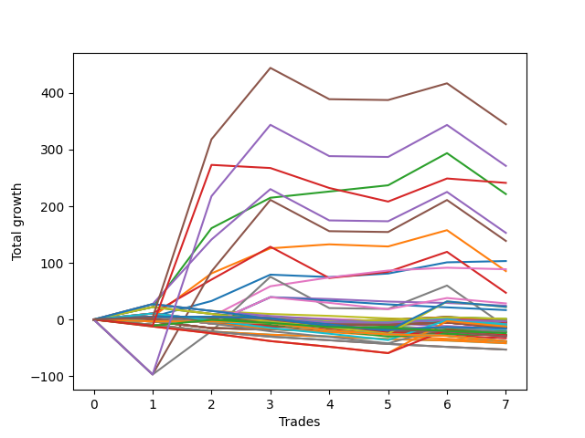

# Long Wallace Doodle 012 
- Symbol: NQ
- Date Range: 03/18/2022 - 06/17/2022
- Trading Period: 7:20-12:30
- Number of Trades: 7



| Name | Win Percent | Profit | Avg Profit / Trade |     | Name | Win Percent | Profit | Avg Profit / Trade |
| ---- | ----------- | ------ | ------------------ | --- | ---- | ----------- | ------ | ------------------ |
| Sorted By <br> Profit | | | | | Sorted By <br> Win Percentage ||||
| Seventy-Five | 57.14 | 172375.00 | 24625.00 |     | Two | 85.71 | 110750.00 | 15821.43 |
| Seventy-Four | 42.86 | 135625.00 | 19375.00 |     | Zero | 85.71 | 51625.00 | 7375.00 |
| Seventy-Three | 28.57 | 120625.00 | 17232.14 |     | Six | 85.71 | 44375.00 | 6339.29 |
| Two | 85.71 | 110750.00 | 15821.43 |     | One | 71.43 | 42750.00 | 6107.14 |
| Four | 57.14 | 76500.00 | 10928.57 |     | Three | 71.43 | 23625.00 | 3375.00 |
| Five | 42.86 | 69375.00 | 9910.71 |     | Seventy-Five | 57.14 | 172375.00 | 24625.00 |
| Zero | 85.71 | 51625.00 | 7375.00 |     | Four | 57.14 | 76500.00 | 10928.57 |
| Six | 85.71 | 44375.00 | 6339.29 |     | Thirty-Eight | 57.14 | 625.00 | 89.29 |
| One | 71.43 | 42750.00 | 6107.14 |     | Twenty-Two | 57.14 | 625.00 | 89.29 |
| Three | 71.43 | 23625.00 | 3375.00 |     | Seventeen | 57.14 | -125.00 | -17.86 |
| Fifty-Six | 42.86 | 14250.00 | 2035.71 |     | Sixten | 57.14 | -125.00 | -17.86 |
| Twenty-Four | 28.57 | 12250.00 | 1750.00 |     | Twenty-Three | 57.14 | -2000.00 | -285.71 |
| Sixty | 28.57 | 11250.00 | 1607.14 |     | Twenty-One | 57.14 | -2000.00 | -285.71 |
| Fifty-Eight | 28.57 | 11125.00 | 1589.29 |     | Twenty | 57.14 | -2000.00 | -285.71 |
| Forty | 28.57 | 8375.00 | 1196.43 |     | Nineteen | 57.14 | -2000.00 | -285.71 |
| Thirty-Eight | 57.14 | 625.00 | 89.29 |     | Eighteen | 57.14 | -2000.00 | -285.71 |
| Twenty-Two | 57.14 | 625.00 | 89.29 |     | Thirty-Three | 57.14 | -2375.00 | -339.29 |
| Seventeen | 57.14 | -125.00 | -17.86 |     | Thirty-Two | 57.14 | -2375.00 | -339.29 |
| Sixten | 57.14 | -125.00 | -17.86 |     | Thirty-Nine | 57.14 | -4250.00 | -607.14 |
| Fourteen | 42.86 | -125.00 | -17.86 |     | Thirty-Seven | 57.14 | -4250.00 | -607.14 |
| Fifty-Four | 42.86 | -1625.00 | -232.14 |     | Thirty-Six | 57.14 | -4250.00 | -607.14 |
| Twenty-Three | 57.14 | -2000.00 | -285.71 |     | Thirty-Five | 57.14 | -4250.00 | -607.14 |
| Twenty-One | 57.14 | -2000.00 | -285.71 |     | Thirty-Four | 57.14 | -4250.00 | -607.14 |
| Twenty | 57.14 | -2000.00 | -285.71 |     | Seventy-Four | 42.86 | 135625.00 | 19375.00 |
| Nineteen | 57.14 | -2000.00 | -285.71 |     | Five | 42.86 | 69375.00 | 9910.71 |
| Eighteen | 57.14 | -2000.00 | -285.71 |     | Fifty-Six | 42.86 | 14250.00 | 2035.71 |
| Thirty-Three | 57.14 | -2375.00 | -339.29 |     | Fourteen | 42.86 | -125.00 | -17.86 |
| Thirty-Two | 57.14 | -2375.00 | -339.29 |     | Fifty-Four | 42.86 | -1625.00 | -232.14 |
| Twenty-Eight | 14.29 | -2625.00 | -375.00 |     | Thirty | 42.86 | -3000.00 | -428.57 |
| Thirty | 42.86 | -3000.00 | -428.57 |     | Forty-Nine | 42.86 | -5375.00 | -767.86 |
| Thirty-Nine | 57.14 | -4250.00 | -607.14 |     | Forty-Eight | 42.86 | -5375.00 | -767.86 |
| Thirty-Seven | 57.14 | -4250.00 | -607.14 |     | Seven | 42.86 | -6125.00 | -875.00 |
| Thirty-Six | 57.14 | -4250.00 | -607.14 |     | Fifty-Five | 42.86 | -7250.00 | -1035.71 |
| Thirty-Five | 57.14 | -4250.00 | -607.14 |     | Fifty-Three | 42.86 | -7250.00 | -1035.71 |
| Thirty-Four | 57.14 | -4250.00 | -607.14 |     | Fifty-Two | 42.86 | -7250.00 | -1035.71 |
| Fifty-Nine | 28.57 | -5250.00 | -750.00 |     | Fifty-One | 42.86 | -7250.00 | -1035.71 |
| Twenty-Six | 14.29 | -5250.00 | -750.00 |     | Fifty | 42.86 | -7250.00 | -1035.71 |
| Forty-Nine | 42.86 | -5375.00 | -767.86 |     | Forty-Six | 42.86 | -7250.00 | -1035.71 |
| Forty-Eight | 42.86 | -5375.00 | -767.86 |     | Seventy | 42.86 | -7875.00 | -1125.00 |
| Seven | 42.86 | -6125.00 | -875.00 |     | Sixty-Two | 42.86 | -13875.00 | -1982.14 |
| Sixty-One | 14.29 | -6125.00 | -875.00 |     | Seventy-Three | 28.57 | 120625.00 | 17232.14 |
| Fifty-Five | 42.86 | -7250.00 | -1035.71 |     | Twenty-Four | 28.57 | 12250.00 | 1750.00 |
| Fifty-Three | 42.86 | -7250.00 | -1035.71 |     | Sixty | 28.57 | 11250.00 | 1607.14 |
| Fifty-Two | 42.86 | -7250.00 | -1035.71 |     | Fifty-Eight | 28.57 | 11125.00 | 1589.29 |
| Fifty-One | 42.86 | -7250.00 | -1035.71 |     | Forty | 28.57 | 8375.00 | 1196.43 |
| Fifty | 42.86 | -7250.00 | -1035.71 |     | Fifty-Nine | 28.57 | -5250.00 | -750.00 |
| Forty-Six | 42.86 | -7250.00 | -1035.71 |     | Fifty-Seven | 28.57 | -11375.00 | -1625.00 |
| Seventy | 42.86 | -7875.00 | -1125.00 |     | Sixty-Five | 28.57 | -15000.00 | -2142.86 |
| Forty-Four | 14.29 | -8250.00 | -1178.57 |     | Sixty-Four | 28.57 | -15000.00 | -2142.86 |
| Nine | 14.29 | -9875.00 | -1410.71 |     | Twenty-Eight | 14.29 | -2625.00 | -375.00 |
| Eight | 14.29 | -9875.00 | -1410.71 |     | Twenty-Six | 14.29 | -5250.00 | -750.00 |
| Forty-Two | 14.29 | -10875.00 | -1553.57 |     | Sixty-One | 14.29 | -6125.00 | -875.00 |
| twenty-Seven | 14.29 | -10875.00 | -1553.57 |     | Forty-Four | 14.29 | -8250.00 | -1178.57 |
| Fifty-Seven | 28.57 | -11375.00 | -1625.00 |     | Nine | 14.29 | -9875.00 | -1410.71 |
| Seventy-Two | 14.29 | -12000.00 | -1714.29 |     | Eight | 14.29 | -9875.00 | -1410.71 |
| Sixty-Three | 14.29 | -13750.00 | -1964.29 |     | Forty-Two | 14.29 | -10875.00 | -1553.57 |
| Twenty-Five | 14.29 | -13750.00 | -1964.29 |     | twenty-Seven | 14.29 | -10875.00 | -1553.57 |
| Sixty-Two | 42.86 | -13875.00 | -1982.14 |     | Seventy-Two | 14.29 | -12000.00 | -1714.29 |
| Fifteen | 0.00 | -14000.00 | -2000.00 |     | Sixty-Three | 14.29 | -13750.00 | -1964.29 |
| Thirteen | 0.00 | -14000.00 | -2000.00 |     | Twenty-Five | 14.29 | -13750.00 | -1964.29 |
| Twelve | 0.00 | -14000.00 | -2000.00 |     | Forty-Three | 14.29 | -16500.00 | -2357.14 |
| Eleven | 0.00 | -14000.00 | -2000.00 |     | Seventy-One | 14.29 | -19125.00 | -2732.14 |
| Ten | 0.00 | -14000.00 | -2000.00 |     | Sixty-Nine | 14.29 | -19125.00 | -2732.14 |
| Sixty-Five | 28.57 | -15000.00 | -2142.86 |     | Sixty-Eight | 14.29 | -19125.00 | -2732.14 |
| Sixty-Four | 28.57 | -15000.00 | -2142.86 |     | Sixty-Seven | 14.29 | -19125.00 | -2732.14 |
| Forty-Three | 14.29 | -16500.00 | -2357.14 |     | Sixty-Six | 14.29 | -19125.00 | -2732.14 |
| Seventy-One | 14.29 | -19125.00 | -2732.14 |     | Forty-One | 14.29 | -19375.00 | -2767.86 |
| Sixty-Nine | 14.29 | -19125.00 | -2732.14 |     | Fifteen | 0.00 | -14000.00 | -2000.00 |
| Sixty-Eight | 14.29 | -19125.00 | -2732.14 |     | Thirteen | 0.00 | -14000.00 | -2000.00 |
| Sixty-Seven | 14.29 | -19125.00 | -2732.14 |     | Twelve | 0.00 | -14000.00 | -2000.00 |
| Sixty-Six | 14.29 | -19125.00 | -2732.14 |     | Eleven | 0.00 | -14000.00 | -2000.00 |
| Forty-One | 14.29 | -19375.00 | -2767.86 |     | Ten | 0.00 | -14000.00 | -2000.00 |
| Thirty-One | 0.00 | -20875.00 | -2982.14 |     | Thirty-One | 0.00 | -20875.00 | -2982.14 |
| Twenty-Nine | 0.00 | -20875.00 | -2982.14 |     | Twenty-Nine | 0.00 | -20875.00 | -2982.14 |
| Forty-Seven | 0.00 | -26500.00 | -3785.71 |     | Forty-Seven | 0.00 | -26500.00 | -3785.71 |
| Forty-Five | 0.00 | -26500.00 | -3785.71 |     | Forty-Five | 0.00 | -26500.00 | -3785.71 |

## NO STOPLOSS

### Test Zero
* Sell when price hits the middle line of the 20p bollinger
* No Stoploss
* Results:
```
Total Trades: 7
Percent Up: 85.71
Percent Down: 14.29
Total Points Moved Up: 103.25
Potential Profit: 51625.00
Total Points Ups: 107.50 Count Ups: 6
Total Points Downs: -4.25 Count Downs: 1
```

<details><summary>Trades</summary>

<code>In: 2022-04-27 11:40:00		Out: 2022-04-27 11:40:10		Total Position Time: 00:10		Total Move Up: 5.00		Total to Date: 5.00</code> <br />
<code>In: 2022-05-04 11:36:00		Out: 2022-05-04 11:36:40		Total Position Time: 00:40		Total Move Up: 27.75		Total to Date: 32.75</code> <br />
<code>In: 2022-05-17 11:24:00		Out: 2022-05-17 11:27:30		Total Position Time: 03:30		Total Move Up: 46.50		Total to Date: 79.25</code> <br />
<code>In: 2022-05-19 09:43:00		Out: 2022-05-19 09:57:20		Total Position Time: 14:20		Total Move Up: -4.25		Total to Date: 75.00</code> <br />
<code>In: 2022-05-25 09:24:00		Out: 2022-05-25 09:32:15		Total Position Time: 08:15		Total Move Up: 6.25		Total to Date: 81.25</code> <br />
<code>In: 2022-05-27 08:04:00		Out: 2022-05-27 08:07:10		Total Position Time: 03:10		Total Move Up: 19.75		Total to Date: 101.00</code> <br />
<code>In: 2022-06-08 09:07:00		Out: 2022-06-08 09:14:10		Total Position Time: 07:10		Total Move Up: 2.25		Total to Date: 103.25</code> <br />


</details>

### Test One
* Sell when the price hits the upper line of the 20p 1std bollinger
* No Stoploss
* Results:
```
Total Trades: 7
Percent Up: 71.43
Percent Down: 28.57
Total Points Moved Up: 85.50
Potential Profit: 42750.00
Total Points Ups: 161.50 Count Ups: 5
Total Points Downs: -76.00 Count Downs: 2
```

<details><summary>Trades</summary>

<code>In: 2022-04-27 11:40:00		Out: 2022-04-27 11:40:10		Total Position Time: 00:10		Total Move Up: 5.00		Total to Date: 5.00</code> <br />
<code>In: 2022-05-04 11:36:00		Out: 2022-05-04 11:42:00		Total Position Time: 06:00		Total Move Up: 76.50		Total to Date: 81.50</code> <br />
<code>In: 2022-05-17 11:24:00		Out: 2022-05-17 11:39:45		Total Position Time: 15:45		Total Move Up: 44.25		Total to Date: 125.75</code> <br />
<code>In: 2022-05-19 09:43:00		Out: 2022-05-19 09:58:00		Total Position Time: 15:00		Total Move Up: 7.00		Total to Date: 132.75</code> <br />
<code>In: 2022-05-25 09:24:00		Out: 2022-05-25 09:45:20		Total Position Time: 21:20		Total Move Up: -3.75		Total to Date: 129.00</code> <br />
<code>In: 2022-05-27 08:04:00		Out: 2022-05-27 08:11:10		Total Position Time: 07:10		Total Move Up: 28.75		Total to Date: 157.75</code> <br />
<code>In: 2022-06-08 09:07:00		Out: 2022-06-08 09:36:55		Total Position Time: 29:55		Total Move Up: -72.25		Total to Date: 85.50</code> <br />


</details>

### Test Two
* Sell when the price hits the upper line of the 20p 2std bollinger
* No Stoploss
* Results:
```
Total Trades: 7
Percent Up: 85.71
Percent Down: 14.29
Total Points Moved Up: 221.50
Potential Profit: 110750.00
Total Points Ups: 293.75 Count Ups: 6
Total Points Downs: -72.25 Count Downs: 1
```

<details><summary>Trades</summary>

<code>In: 2022-04-27 11:40:00		Out: 2022-04-27 11:42:40		Total Position Time: 02:40		Total Move Up: 22.00		Total to Date: 22.00</code> <br />
<code>In: 2022-05-04 11:36:00		Out: 2022-05-04 11:44:15		Total Position Time: 08:15		Total Move Up: 139.25		Total to Date: 161.25</code> <br />
<code>In: 2022-05-17 11:24:00		Out: 2022-05-17 11:40:00		Total Position Time: 16:00		Total Move Up: 53.75		Total to Date: 215.00</code> <br />
<code>In: 2022-05-19 09:43:00		Out: 2022-05-19 10:00:20		Total Position Time: 17:20		Total Move Up: 11.00		Total to Date: 226.00</code> <br />
<code>In: 2022-05-25 09:24:00		Out: 2022-05-25 09:49:10		Total Position Time: 25:10		Total Move Up: 11.00		Total to Date: 237.00</code> <br />
<code>In: 2022-05-27 08:04:00		Out: 2022-05-27 08:32:45		Total Position Time: 28:45		Total Move Up: 56.75		Total to Date: 293.75</code> <br />
<code>In: 2022-06-08 09:07:00		Out: 2022-06-08 09:36:55		Total Position Time: 29:55		Total Move Up: -72.25		Total to Date: 221.50</code> <br />


</details>

### Test Three
* Sell when price hits the middle line of the 50p bollinger
* No Stoploss
* Results:
```
Total Trades: 7
Percent Up: 71.43
Percent Down: 28.57
Total Points Moved Up: 47.25
Potential Profit: 23625.00
Total Points Ups: 174.75 Count Ups: 5
Total Points Downs: -127.50 Count Downs: 2
```

<details><summary>Trades</summary>

<code>In: 2022-04-27 11:40:00		Out: 2022-04-27 11:42:30		Total Position Time: 02:30		Total Move Up: 10.75		Total to Date: 10.75</code> <br />
<code>In: 2022-05-04 11:36:00		Out: 2022-05-04 11:41:40		Total Position Time: 05:40		Total Move Up: 59.75		Total to Date: 70.50</code> <br />
<code>In: 2022-05-17 11:24:00		Out: 2022-05-17 11:40:05		Total Position Time: 16:05		Total Move Up: 58.00		Total to Date: 128.50</code> <br />
<code>In: 2022-05-19 09:43:00		Out: 2022-05-19 10:12:55		Total Position Time: 29:55		Total Move Up: -55.25		Total to Date: 73.25</code> <br />
<code>In: 2022-05-25 09:24:00		Out: 2022-05-25 09:49:10		Total Position Time: 25:10		Total Move Up: 11.00		Total to Date: 84.25</code> <br />
<code>In: 2022-05-27 08:04:00		Out: 2022-05-27 08:12:10		Total Position Time: 08:10		Total Move Up: 35.25		Total to Date: 119.50</code> <br />
<code>In: 2022-06-08 09:07:00		Out: 2022-06-08 09:36:55		Total Position Time: 29:55		Total Move Up: -72.25		Total to Date: 47.25</code> <br />


</details>

### Test Four
* Sell when the price hits the upper line of the 50p 1std bollinger
* No Stoploss
* Results:
```
Total Trades: 7
Percent Up: 57.14
Percent Down: 42.86
Total Points Moved Up: 153.00
Potential Profit: 76500.00
Total Points Ups: 282.00 Count Ups: 4
Total Points Downs: -129.00 Count Downs: 3
```

<details><summary>Trades</summary>

<code>In: 2022-04-27 11:40:00		Out: 2022-04-27 11:44:20		Total Position Time: 04:20		Total Move Up: 27.25		Total to Date: 27.25</code> <br />
<code>In: 2022-05-04 11:36:00		Out: 2022-05-04 11:43:55		Total Position Time: 07:55		Total Move Up: 114.00		Total to Date: 141.25</code> <br />
<code>In: 2022-05-17 11:24:00		Out: 2022-05-17 11:45:45		Total Position Time: 21:45		Total Move Up: 89.00		Total to Date: 230.25</code> <br />
<code>In: 2022-05-19 09:43:00		Out: 2022-05-19 10:12:55		Total Position Time: 29:55		Total Move Up: -55.25		Total to Date: 175.00</code> <br />
<code>In: 2022-05-25 09:24:00		Out: 2022-05-25 09:53:55		Total Position Time: 29:55		Total Move Up: -1.50		Total to Date: 173.50</code> <br />
<code>In: 2022-05-27 08:04:00		Out: 2022-05-27 08:21:50		Total Position Time: 17:50		Total Move Up: 51.75		Total to Date: 225.25</code> <br />
<code>In: 2022-06-08 09:07:00		Out: 2022-06-08 09:36:55		Total Position Time: 29:55		Total Move Up: -72.25		Total to Date: 153.00</code> <br />


</details>

### Test Five
* Sell when the price hits the upper line of the 50p 2std bollinger
* No Stoploss
* Results:
```
Total Trades: 7
Percent Up: 42.86
Percent Down: 57.14
Total Points Moved Up: 138.75
Potential Profit: 69375.00
Total Points Ups: 364.75 Count Ups: 3
Total Points Downs: -226.00 Count Downs: 4
```

<details><summary>Trades</summary>

<code>In: 2022-04-27 11:40:00		Out: 2022-04-27 12:09:55		Total Position Time: 29:55		Total Move Up: -97.00		Total to Date: -97.00</code> <br />
<code>In: 2022-05-04 11:36:00		Out: 2022-05-04 11:46:50		Total Position Time: 10:50		Total Move Up: 182.00		Total to Date: 85.00</code> <br />
<code>In: 2022-05-17 11:24:00		Out: 2022-05-17 11:48:45		Total Position Time: 24:45		Total Move Up: 126.25		Total to Date: 211.25</code> <br />
<code>In: 2022-05-19 09:43:00		Out: 2022-05-19 10:12:55		Total Position Time: 29:55		Total Move Up: -55.25		Total to Date: 156.00</code> <br />
<code>In: 2022-05-25 09:24:00		Out: 2022-05-25 09:53:55		Total Position Time: 29:55		Total Move Up: -1.50		Total to Date: 154.50</code> <br />
<code>In: 2022-05-27 08:04:00		Out: 2022-05-27 08:33:55		Total Position Time: 29:55		Total Move Up: 56.50		Total to Date: 211.00</code> <br />
<code>In: 2022-06-08 09:07:00		Out: 2022-06-08 09:36:55		Total Position Time: 29:55		Total Move Up: -72.25		Total to Date: 138.75</code> <br />


</details>

### Test Six
* Sell when the price hits the middle line of the 1std VWAP
* No Stoploss
* Results:
```
Total Trades: 7
Percent Up: 85.71
Percent Down: 14.29
Total Points Moved Up: 88.75
Potential Profit: 44375.00
Total Points Ups: 91.50 Count Ups: 6
Total Points Downs: -2.75 Count Downs: 1
```

<details><summary>Trades</summary>

<code>In: 2022-04-27 11:40:00		Out: 2022-04-27 11:40:10		Total Position Time: 00:10		Total Move Up: 5.00		Total to Date: 5.00</code> <br />
<code>In: 2022-05-04 11:36:00		Out: 2022-05-04 11:36:10		Total Position Time: 00:10		Total Move Up: 0.00		Total to Date: 5.00</code> <br />
<code>In: 2022-05-17 11:24:00		Out: 2022-05-17 11:40:00		Total Position Time: 16:00		Total Move Up: 53.75		Total to Date: 58.75</code> <br />
<code>In: 2022-05-19 09:43:00		Out: 2022-05-19 10:06:05		Total Position Time: 23:05		Total Move Up: 15.50		Total to Date: 74.25</code> <br />
<code>In: 2022-05-25 09:24:00		Out: 2022-05-25 09:49:20		Total Position Time: 25:20		Total Move Up: 12.25		Total to Date: 86.50</code> <br />
<code>In: 2022-05-27 08:04:00		Out: 2022-05-27 08:04:10		Total Position Time: 00:10		Total Move Up: 5.00		Total to Date: 91.50</code> <br />
<code>In: 2022-06-08 09:07:00		Out: 2022-06-08 09:07:10		Total Position Time: 00:10		Total Move Up: -2.75		Total to Date: 88.75</code> <br />


</details>

### Test Seven
* Sell when the price hits the upper line of the 1std VWAP
* No Stoploss
* Results:
```
Total Trades: 7
Percent Up: 42.86
Percent Down: 57.14
Total Points Moved Up: -12.25
Potential Profit: -6125.00
Total Points Ups: 213.75 Count Ups: 3
Total Points Downs: -226.00 Count Downs: 4
```

<details><summary>Trades</summary>

<code>In: 2022-04-27 11:40:00		Out: 2022-04-27 12:09:55		Total Position Time: 29:55		Total Move Up: -97.00		Total to Date: -97.00</code> <br />
<code>In: 2022-05-04 11:36:00		Out: 2022-05-04 11:42:00		Total Position Time: 06:00		Total Move Up: 76.50		Total to Date: -20.50</code> <br />
<code>In: 2022-05-17 11:24:00		Out: 2022-05-17 11:47:10		Total Position Time: 23:10		Total Move Up: 96.00		Total to Date: 75.50</code> <br />
<code>In: 2022-05-19 09:43:00		Out: 2022-05-19 10:12:55		Total Position Time: 29:55		Total Move Up: -55.25		Total to Date: 20.25</code> <br />
<code>In: 2022-05-25 09:24:00		Out: 2022-05-25 09:53:55		Total Position Time: 29:55		Total Move Up: -1.50		Total to Date: 18.75</code> <br />
<code>In: 2022-05-27 08:04:00		Out: 2022-05-27 08:16:55		Total Position Time: 12:55		Total Move Up: 41.25		Total to Date: 60.00</code> <br />
<code>In: 2022-06-08 09:07:00		Out: 2022-06-08 09:36:55		Total Position Time: 29:55		Total Move Up: -72.25		Total to Date: -12.25</code> <br />


</details>

## STOPLOSS OF 2

### Test Eight
* Sell when price hits the middle line of the 20p bollinger
* Stoploss is 2 points
* Results:
```
Total Trades: 7
Percent Up: 14.29
Percent Down: 85.71
Total Points Moved Up: -19.75
Potential Profit: -9875.00
Total Points Ups: 5.00 Count Ups: 1
Total Points Downs: -24.75 Count Downs: 6
```

<details><summary>Trades</summary>

<code>In: 2022-04-27 11:40:00		Out: 2022-04-27 11:40:10		Total Position Time: 00:10		Total Move Up: 5.00		Total to Date: 5.00</code> <br />
<code>In: 2022-05-04 11:36:00		Out: 2022-05-04 11:36:15		Total Position Time: 00:15		Total Move Up: -12.00		Total to Date: -7.00</code> <br />
<code>In: 2022-05-17 11:24:00		Out: 2022-05-17 11:24:15		Total Position Time: 00:15		Total Move Up: -1.75		Total to Date: -8.75</code> <br />
<code>In: 2022-05-19 09:43:00		Out: 2022-05-19 09:43:10		Total Position Time: 00:10		Total Move Up: -3.25		Total to Date: -12.00</code> <br />
<code>In: 2022-05-25 09:24:00		Out: 2022-05-25 09:24:55		Total Position Time: 00:55		Total Move Up: -2.50		Total to Date: -14.50</code> <br />
<code>In: 2022-05-27 08:04:00		Out: 2022-05-27 08:04:55		Total Position Time: 00:55		Total Move Up: -2.50		Total to Date: -17.00</code> <br />
<code>In: 2022-06-08 09:07:00		Out: 2022-06-08 09:07:10		Total Position Time: 00:10		Total Move Up: -2.75		Total to Date: -19.75</code> <br />


</details>

### Test Nine
* Sell when the price hits the upper line of the 20p 1std bollinger
* Stoploss is 2 points
* Results:
```
Total Trades: 7
Percent Up: 14.29
Percent Down: 85.71
Total Points Moved Up: -19.75
Potential Profit: -9875.00
Total Points Ups: 5.00 Count Ups: 1
Total Points Downs: -24.75 Count Downs: 6
```

<details><summary>Trades</summary>

<code>In: 2022-04-27 11:40:00		Out: 2022-04-27 11:40:10		Total Position Time: 00:10		Total Move Up: 5.00		Total to Date: 5.00</code> <br />
<code>In: 2022-05-04 11:36:00		Out: 2022-05-04 11:36:15		Total Position Time: 00:15		Total Move Up: -12.00		Total to Date: -7.00</code> <br />
<code>In: 2022-05-17 11:24:00		Out: 2022-05-17 11:24:15		Total Position Time: 00:15		Total Move Up: -1.75		Total to Date: -8.75</code> <br />
<code>In: 2022-05-19 09:43:00		Out: 2022-05-19 09:43:10		Total Position Time: 00:10		Total Move Up: -3.25		Total to Date: -12.00</code> <br />
<code>In: 2022-05-25 09:24:00		Out: 2022-05-25 09:24:55		Total Position Time: 00:55		Total Move Up: -2.50		Total to Date: -14.50</code> <br />
<code>In: 2022-05-27 08:04:00		Out: 2022-05-27 08:04:55		Total Position Time: 00:55		Total Move Up: -2.50		Total to Date: -17.00</code> <br />
<code>In: 2022-06-08 09:07:00		Out: 2022-06-08 09:07:10		Total Position Time: 00:10		Total Move Up: -2.75		Total to Date: -19.75</code> <br />


</details>

### Test Ten
* Sell when the price hits the upper line of the 20p 2std bollinger
* Stoploss is 2 points
* Results:
```
Total Trades: 7
Percent Up: 0.00
Percent Down: 100.00
Total Points Moved Up: -28.00
Potential Profit: -14000.00
Total Points Ups: 0.00 Count Ups: 0
Total Points Downs: -28.00 Count Downs: 7
```

<details><summary>Trades</summary>

<code>In: 2022-04-27 11:40:00		Out: 2022-04-27 11:40:25		Total Position Time: 00:25		Total Move Up: -3.25		Total to Date: -3.25</code> <br />
<code>In: 2022-05-04 11:36:00		Out: 2022-05-04 11:36:15		Total Position Time: 00:15		Total Move Up: -12.00		Total to Date: -15.25</code> <br />
<code>In: 2022-05-17 11:24:00		Out: 2022-05-17 11:24:15		Total Position Time: 00:15		Total Move Up: -1.75		Total to Date: -17.00</code> <br />
<code>In: 2022-05-19 09:43:00		Out: 2022-05-19 09:43:10		Total Position Time: 00:10		Total Move Up: -3.25		Total to Date: -20.25</code> <br />
<code>In: 2022-05-25 09:24:00		Out: 2022-05-25 09:24:55		Total Position Time: 00:55		Total Move Up: -2.50		Total to Date: -22.75</code> <br />
<code>In: 2022-05-27 08:04:00		Out: 2022-05-27 08:04:55		Total Position Time: 00:55		Total Move Up: -2.50		Total to Date: -25.25</code> <br />
<code>In: 2022-06-08 09:07:00		Out: 2022-06-08 09:07:10		Total Position Time: 00:10		Total Move Up: -2.75		Total to Date: -28.00</code> <br />


</details>

### Test Eleven
* Sell when price hits the middle line of the 50p bollinger
* Stoploss is 2 points
* Results:
```
Total Trades: 7
Percent Up: 0.00
Percent Down: 100.00
Total Points Moved Up: -28.00
Potential Profit: -14000.00
Total Points Ups: 0.00 Count Ups: 0
Total Points Downs: -28.00 Count Downs: 7
```

<details><summary>Trades</summary>

<code>In: 2022-04-27 11:40:00		Out: 2022-04-27 11:40:25		Total Position Time: 00:25		Total Move Up: -3.25		Total to Date: -3.25</code> <br />
<code>In: 2022-05-04 11:36:00		Out: 2022-05-04 11:36:15		Total Position Time: 00:15		Total Move Up: -12.00		Total to Date: -15.25</code> <br />
<code>In: 2022-05-17 11:24:00		Out: 2022-05-17 11:24:15		Total Position Time: 00:15		Total Move Up: -1.75		Total to Date: -17.00</code> <br />
<code>In: 2022-05-19 09:43:00		Out: 2022-05-19 09:43:10		Total Position Time: 00:10		Total Move Up: -3.25		Total to Date: -20.25</code> <br />
<code>In: 2022-05-25 09:24:00		Out: 2022-05-25 09:24:55		Total Position Time: 00:55		Total Move Up: -2.50		Total to Date: -22.75</code> <br />
<code>In: 2022-05-27 08:04:00		Out: 2022-05-27 08:04:55		Total Position Time: 00:55		Total Move Up: -2.50		Total to Date: -25.25</code> <br />
<code>In: 2022-06-08 09:07:00		Out: 2022-06-08 09:07:10		Total Position Time: 00:10		Total Move Up: -2.75		Total to Date: -28.00</code> <br />


</details>

### Test Twelve
* Sell when the price hits the upper line of the 50p 1std bollinger
* Stoploss is 2 points
* Results:
```
Total Trades: 7
Percent Up: 0.00
Percent Down: 100.00
Total Points Moved Up: -28.00
Potential Profit: -14000.00
Total Points Ups: 0.00 Count Ups: 0
Total Points Downs: -28.00 Count Downs: 7
```

<details><summary>Trades</summary>

<code>In: 2022-04-27 11:40:00		Out: 2022-04-27 11:40:25		Total Position Time: 00:25		Total Move Up: -3.25		Total to Date: -3.25</code> <br />
<code>In: 2022-05-04 11:36:00		Out: 2022-05-04 11:36:15		Total Position Time: 00:15		Total Move Up: -12.00		Total to Date: -15.25</code> <br />
<code>In: 2022-05-17 11:24:00		Out: 2022-05-17 11:24:15		Total Position Time: 00:15		Total Move Up: -1.75		Total to Date: -17.00</code> <br />
<code>In: 2022-05-19 09:43:00		Out: 2022-05-19 09:43:10		Total Position Time: 00:10		Total Move Up: -3.25		Total to Date: -20.25</code> <br />
<code>In: 2022-05-25 09:24:00		Out: 2022-05-25 09:24:55		Total Position Time: 00:55		Total Move Up: -2.50		Total to Date: -22.75</code> <br />
<code>In: 2022-05-27 08:04:00		Out: 2022-05-27 08:04:55		Total Position Time: 00:55		Total Move Up: -2.50		Total to Date: -25.25</code> <br />
<code>In: 2022-06-08 09:07:00		Out: 2022-06-08 09:07:10		Total Position Time: 00:10		Total Move Up: -2.75		Total to Date: -28.00</code> <br />


</details>

### Test Thirteen
* Sell when the price hits the upper line of the 50p 2std bollinger
* Stoploss is 2 points
* Results:
```
Total Trades: 7
Percent Up: 0.00
Percent Down: 100.00
Total Points Moved Up: -28.00
Potential Profit: -14000.00
Total Points Ups: 0.00 Count Ups: 0
Total Points Downs: -28.00 Count Downs: 7
```

<details><summary>Trades</summary>

<code>In: 2022-04-27 11:40:00		Out: 2022-04-27 11:40:25		Total Position Time: 00:25		Total Move Up: -3.25		Total to Date: -3.25</code> <br />
<code>In: 2022-05-04 11:36:00		Out: 2022-05-04 11:36:15		Total Position Time: 00:15		Total Move Up: -12.00		Total to Date: -15.25</code> <br />
<code>In: 2022-05-17 11:24:00		Out: 2022-05-17 11:24:15		Total Position Time: 00:15		Total Move Up: -1.75		Total to Date: -17.00</code> <br />
<code>In: 2022-05-19 09:43:00		Out: 2022-05-19 09:43:10		Total Position Time: 00:10		Total Move Up: -3.25		Total to Date: -20.25</code> <br />
<code>In: 2022-05-25 09:24:00		Out: 2022-05-25 09:24:55		Total Position Time: 00:55		Total Move Up: -2.50		Total to Date: -22.75</code> <br />
<code>In: 2022-05-27 08:04:00		Out: 2022-05-27 08:04:55		Total Position Time: 00:55		Total Move Up: -2.50		Total to Date: -25.25</code> <br />
<code>In: 2022-06-08 09:07:00		Out: 2022-06-08 09:07:10		Total Position Time: 00:10		Total Move Up: -2.75		Total to Date: -28.00</code> <br />


</details>

### Test Fourteen
* Sell when the price hits the middle line of the 1std VWAP
* Stoploss is 2 points
* Results:
```
Total Trades: 7
Percent Up: 42.86
Percent Down: 57.14
Total Points Moved Up: -0.25
Potential Profit: -125.00
Total Points Ups: 10.00 Count Ups: 3
Total Points Downs: -10.25 Count Downs: 4
```

<details><summary>Trades</summary>

<code>In: 2022-04-27 11:40:00		Out: 2022-04-27 11:40:10		Total Position Time: 00:10		Total Move Up: 5.00		Total to Date: 5.00</code> <br />
<code>In: 2022-05-04 11:36:00		Out: 2022-05-04 11:36:10		Total Position Time: 00:10		Total Move Up: 0.00		Total to Date: 5.00</code> <br />
<code>In: 2022-05-17 11:24:00		Out: 2022-05-17 11:24:15		Total Position Time: 00:15		Total Move Up: -1.75		Total to Date: 3.25</code> <br />
<code>In: 2022-05-19 09:43:00		Out: 2022-05-19 09:43:10		Total Position Time: 00:10		Total Move Up: -3.25		Total to Date: 0.00</code> <br />
<code>In: 2022-05-25 09:24:00		Out: 2022-05-25 09:24:55		Total Position Time: 00:55		Total Move Up: -2.50		Total to Date: -2.50</code> <br />
<code>In: 2022-05-27 08:04:00		Out: 2022-05-27 08:04:10		Total Position Time: 00:10		Total Move Up: 5.00		Total to Date: 2.50</code> <br />
<code>In: 2022-06-08 09:07:00		Out: 2022-06-08 09:07:10		Total Position Time: 00:10		Total Move Up: -2.75		Total to Date: -0.25</code> <br />


</details>

### Test Fifteen
* Sell when the price hits the upper line of the 1std VWAP
* Stoploss is 2 points
* Results:
```
Total Trades: 7
Percent Up: 0.00
Percent Down: 100.00
Total Points Moved Up: -28.00
Potential Profit: -14000.00
Total Points Ups: 0.00 Count Ups: 0
Total Points Downs: -28.00 Count Downs: 7
```

<details><summary>Trades</summary>

<code>In: 2022-04-27 11:40:00		Out: 2022-04-27 11:40:25		Total Position Time: 00:25		Total Move Up: -3.25		Total to Date: -3.25</code> <br />
<code>In: 2022-05-04 11:36:00		Out: 2022-05-04 11:36:15		Total Position Time: 00:15		Total Move Up: -12.00		Total to Date: -15.25</code> <br />
<code>In: 2022-05-17 11:24:00		Out: 2022-05-17 11:24:15		Total Position Time: 00:15		Total Move Up: -1.75		Total to Date: -17.00</code> <br />
<code>In: 2022-05-19 09:43:00		Out: 2022-05-19 09:43:10		Total Position Time: 00:10		Total Move Up: -3.25		Total to Date: -20.25</code> <br />
<code>In: 2022-05-25 09:24:00		Out: 2022-05-25 09:24:55		Total Position Time: 00:55		Total Move Up: -2.50		Total to Date: -22.75</code> <br />
<code>In: 2022-05-27 08:04:00		Out: 2022-05-27 08:04:55		Total Position Time: 00:55		Total Move Up: -2.50		Total to Date: -25.25</code> <br />
<code>In: 2022-06-08 09:07:00		Out: 2022-06-08 09:07:10		Total Position Time: 00:10		Total Move Up: -2.75		Total to Date: -28.00</code> <br />


</details>

## TRAIL STOP OF 2

### Test Sixten
* Sell when price hits the middle line of the 20p bollinger
* Trailing Stop is 2 points
* Results:
```
Total Trades: 7
Percent Up: 57.14
Percent Down: 42.86
Total Points Moved Up: -0.25
Potential Profit: -125.00
Total Points Ups: 11.50 Count Ups: 4
Total Points Downs: -11.75 Count Downs: 3
```

<details><summary>Trades</summary>

<code>In: 2022-04-27 11:40:00		Out: 2022-04-27 11:40:10		Total Position Time: 00:10		Total Move Up: 5.00		Total to Date: 5.00</code> <br />
<code>In: 2022-05-04 11:36:00		Out: 2022-05-04 11:36:10		Total Position Time: 00:10		Total Move Up: 0.00		Total to Date: 5.00</code> <br />
<code>In: 2022-05-17 11:24:00		Out: 2022-05-17 11:24:10		Total Position Time: 00:10		Total Move Up: -2.75		Total to Date: 2.25</code> <br />
<code>In: 2022-05-19 09:43:00		Out: 2022-05-19 09:43:25		Total Position Time: 00:25		Total Move Up: -4.25		Total to Date: -2.00</code> <br />
<code>In: 2022-05-25 09:24:00		Out: 2022-05-25 09:24:15		Total Position Time: 00:15		Total Move Up: 1.00		Total to Date: -1.00</code> <br />
<code>In: 2022-05-27 08:04:00		Out: 2022-05-27 08:04:30		Total Position Time: 00:30		Total Move Up: 5.50		Total to Date: 4.50</code> <br />
<code>In: 2022-06-08 09:07:00		Out: 2022-06-08 09:07:15		Total Position Time: 00:15		Total Move Up: -4.75		Total to Date: -0.25</code> <br />


</details>

### Test Seventeen
* Sell when the price hits the upper line of the 20p 1std bollinger
* Trailing Stop is 2 points
* Results:
```
Total Trades: 7
Percent Up: 57.14
Percent Down: 42.86
Total Points Moved Up: -0.25
Potential Profit: -125.00
Total Points Ups: 11.50 Count Ups: 4
Total Points Downs: -11.75 Count Downs: 3
```

<details><summary>Trades</summary>

<code>In: 2022-04-27 11:40:00		Out: 2022-04-27 11:40:10		Total Position Time: 00:10		Total Move Up: 5.00		Total to Date: 5.00</code> <br />
<code>In: 2022-05-04 11:36:00		Out: 2022-05-04 11:36:10		Total Position Time: 00:10		Total Move Up: 0.00		Total to Date: 5.00</code> <br />
<code>In: 2022-05-17 11:24:00		Out: 2022-05-17 11:24:10		Total Position Time: 00:10		Total Move Up: -2.75		Total to Date: 2.25</code> <br />
<code>In: 2022-05-19 09:43:00		Out: 2022-05-19 09:43:25		Total Position Time: 00:25		Total Move Up: -4.25		Total to Date: -2.00</code> <br />
<code>In: 2022-05-25 09:24:00		Out: 2022-05-25 09:24:15		Total Position Time: 00:15		Total Move Up: 1.00		Total to Date: -1.00</code> <br />
<code>In: 2022-05-27 08:04:00		Out: 2022-05-27 08:04:30		Total Position Time: 00:30		Total Move Up: 5.50		Total to Date: 4.50</code> <br />
<code>In: 2022-06-08 09:07:00		Out: 2022-06-08 09:07:15		Total Position Time: 00:15		Total Move Up: -4.75		Total to Date: -0.25</code> <br />


</details>

### Test Eighteen
* Sell when the price hits the upper line of the 20p 2std bollinger
* Trailing Stop is 2 points
* Results:
```
Total Trades: 7
Percent Up: 57.14
Percent Down: 42.86
Total Points Moved Up: -4.00
Potential Profit: -2000.00
Total Points Ups: 7.75 Count Ups: 4
Total Points Downs: -11.75 Count Downs: 3
```

<details><summary>Trades</summary>

<code>In: 2022-04-27 11:40:00		Out: 2022-04-27 11:40:20		Total Position Time: 00:20		Total Move Up: 1.25		Total to Date: 1.25</code> <br />
<code>In: 2022-05-04 11:36:00		Out: 2022-05-04 11:36:10		Total Position Time: 00:10		Total Move Up: 0.00		Total to Date: 1.25</code> <br />
<code>In: 2022-05-17 11:24:00		Out: 2022-05-17 11:24:10		Total Position Time: 00:10		Total Move Up: -2.75		Total to Date: -1.50</code> <br />
<code>In: 2022-05-19 09:43:00		Out: 2022-05-19 09:43:25		Total Position Time: 00:25		Total Move Up: -4.25		Total to Date: -5.75</code> <br />
<code>In: 2022-05-25 09:24:00		Out: 2022-05-25 09:24:15		Total Position Time: 00:15		Total Move Up: 1.00		Total to Date: -4.75</code> <br />
<code>In: 2022-05-27 08:04:00		Out: 2022-05-27 08:04:30		Total Position Time: 00:30		Total Move Up: 5.50		Total to Date: 0.75</code> <br />
<code>In: 2022-06-08 09:07:00		Out: 2022-06-08 09:07:15		Total Position Time: 00:15		Total Move Up: -4.75		Total to Date: -4.00</code> <br />


</details>

### Test Nineteen
* Sell when price hits the middle line of the 50p bollinger
* Trailing Stop is 2 points
* Results:
```
Total Trades: 7
Percent Up: 57.14
Percent Down: 42.86
Total Points Moved Up: -4.00
Potential Profit: -2000.00
Total Points Ups: 7.75 Count Ups: 4
Total Points Downs: -11.75 Count Downs: 3
```

<details><summary>Trades</summary>

<code>In: 2022-04-27 11:40:00		Out: 2022-04-27 11:40:20		Total Position Time: 00:20		Total Move Up: 1.25		Total to Date: 1.25</code> <br />
<code>In: 2022-05-04 11:36:00		Out: 2022-05-04 11:36:10		Total Position Time: 00:10		Total Move Up: 0.00		Total to Date: 1.25</code> <br />
<code>In: 2022-05-17 11:24:00		Out: 2022-05-17 11:24:10		Total Position Time: 00:10		Total Move Up: -2.75		Total to Date: -1.50</code> <br />
<code>In: 2022-05-19 09:43:00		Out: 2022-05-19 09:43:25		Total Position Time: 00:25		Total Move Up: -4.25		Total to Date: -5.75</code> <br />
<code>In: 2022-05-25 09:24:00		Out: 2022-05-25 09:24:15		Total Position Time: 00:15		Total Move Up: 1.00		Total to Date: -4.75</code> <br />
<code>In: 2022-05-27 08:04:00		Out: 2022-05-27 08:04:30		Total Position Time: 00:30		Total Move Up: 5.50		Total to Date: 0.75</code> <br />
<code>In: 2022-06-08 09:07:00		Out: 2022-06-08 09:07:15		Total Position Time: 00:15		Total Move Up: -4.75		Total to Date: -4.00</code> <br />


</details>

### Test Twenty
* Sell when the price hits the upper line of the 50p 1std bollinger
* Trailing Stop is 2 points
* Results:
```
Total Trades: 7
Percent Up: 57.14
Percent Down: 42.86
Total Points Moved Up: -4.00
Potential Profit: -2000.00
Total Points Ups: 7.75 Count Ups: 4
Total Points Downs: -11.75 Count Downs: 3
```

<details><summary>Trades</summary>

<code>In: 2022-04-27 11:40:00		Out: 2022-04-27 11:40:20		Total Position Time: 00:20		Total Move Up: 1.25		Total to Date: 1.25</code> <br />
<code>In: 2022-05-04 11:36:00		Out: 2022-05-04 11:36:10		Total Position Time: 00:10		Total Move Up: 0.00		Total to Date: 1.25</code> <br />
<code>In: 2022-05-17 11:24:00		Out: 2022-05-17 11:24:10		Total Position Time: 00:10		Total Move Up: -2.75		Total to Date: -1.50</code> <br />
<code>In: 2022-05-19 09:43:00		Out: 2022-05-19 09:43:25		Total Position Time: 00:25		Total Move Up: -4.25		Total to Date: -5.75</code> <br />
<code>In: 2022-05-25 09:24:00		Out: 2022-05-25 09:24:15		Total Position Time: 00:15		Total Move Up: 1.00		Total to Date: -4.75</code> <br />
<code>In: 2022-05-27 08:04:00		Out: 2022-05-27 08:04:30		Total Position Time: 00:30		Total Move Up: 5.50		Total to Date: 0.75</code> <br />
<code>In: 2022-06-08 09:07:00		Out: 2022-06-08 09:07:15		Total Position Time: 00:15		Total Move Up: -4.75		Total to Date: -4.00</code> <br />


</details>

### Test Twenty-One
* Sell when the price hits the upper line of the 50p 2std bollinger
* Trailing Stop is 2 points
* Results:
```
Total Trades: 7
Percent Up: 57.14
Percent Down: 42.86
Total Points Moved Up: -4.00
Potential Profit: -2000.00
Total Points Ups: 7.75 Count Ups: 4
Total Points Downs: -11.75 Count Downs: 3
```

<details><summary>Trades</summary>

<code>In: 2022-04-27 11:40:00		Out: 2022-04-27 11:40:20		Total Position Time: 00:20		Total Move Up: 1.25		Total to Date: 1.25</code> <br />
<code>In: 2022-05-04 11:36:00		Out: 2022-05-04 11:36:10		Total Position Time: 00:10		Total Move Up: 0.00		Total to Date: 1.25</code> <br />
<code>In: 2022-05-17 11:24:00		Out: 2022-05-17 11:24:10		Total Position Time: 00:10		Total Move Up: -2.75		Total to Date: -1.50</code> <br />
<code>In: 2022-05-19 09:43:00		Out: 2022-05-19 09:43:25		Total Position Time: 00:25		Total Move Up: -4.25		Total to Date: -5.75</code> <br />
<code>In: 2022-05-25 09:24:00		Out: 2022-05-25 09:24:15		Total Position Time: 00:15		Total Move Up: 1.00		Total to Date: -4.75</code> <br />
<code>In: 2022-05-27 08:04:00		Out: 2022-05-27 08:04:30		Total Position Time: 00:30		Total Move Up: 5.50		Total to Date: 0.75</code> <br />
<code>In: 2022-06-08 09:07:00		Out: 2022-06-08 09:07:15		Total Position Time: 00:15		Total Move Up: -4.75		Total to Date: -4.00</code> <br />


</details>

### Test Twenty-Two
* Sell when the price hits the middle line of the 1std VWAP
* Trailing Stop is 2 points
* Results:
```
Total Trades: 7
Percent Up: 57.14
Percent Down: 42.86
Total Points Moved Up: 1.25
Potential Profit: 625.00
Total Points Ups: 11.00 Count Ups: 4
Total Points Downs: -9.75 Count Downs: 3
```

<details><summary>Trades</summary>

<code>In: 2022-04-27 11:40:00		Out: 2022-04-27 11:40:10		Total Position Time: 00:10		Total Move Up: 5.00		Total to Date: 5.00</code> <br />
<code>In: 2022-05-04 11:36:00		Out: 2022-05-04 11:36:10		Total Position Time: 00:10		Total Move Up: 0.00		Total to Date: 5.00</code> <br />
<code>In: 2022-05-17 11:24:00		Out: 2022-05-17 11:24:10		Total Position Time: 00:10		Total Move Up: -2.75		Total to Date: 2.25</code> <br />
<code>In: 2022-05-19 09:43:00		Out: 2022-05-19 09:43:25		Total Position Time: 00:25		Total Move Up: -4.25		Total to Date: -2.00</code> <br />
<code>In: 2022-05-25 09:24:00		Out: 2022-05-25 09:24:15		Total Position Time: 00:15		Total Move Up: 1.00		Total to Date: -1.00</code> <br />
<code>In: 2022-05-27 08:04:00		Out: 2022-05-27 08:04:10		Total Position Time: 00:10		Total Move Up: 5.00		Total to Date: 4.00</code> <br />
<code>In: 2022-06-08 09:07:00		Out: 2022-06-08 09:07:10		Total Position Time: 00:10		Total Move Up: -2.75		Total to Date: 1.25</code> <br />


</details>

### Test Twenty-Three
* Sell when the price hits the upper line of the 1std VWAP
* Trailing Stop is 2 points
* Results:
```
Total Trades: 7
Percent Up: 57.14
Percent Down: 42.86
Total Points Moved Up: -4.00
Potential Profit: -2000.00
Total Points Ups: 7.75 Count Ups: 4
Total Points Downs: -11.75 Count Downs: 3
```

<details><summary>Trades</summary>

<code>In: 2022-04-27 11:40:00		Out: 2022-04-27 11:40:20		Total Position Time: 00:20		Total Move Up: 1.25		Total to Date: 1.25</code> <br />
<code>In: 2022-05-04 11:36:00		Out: 2022-05-04 11:36:10		Total Position Time: 00:10		Total Move Up: 0.00		Total to Date: 1.25</code> <br />
<code>In: 2022-05-17 11:24:00		Out: 2022-05-17 11:24:10		Total Position Time: 00:10		Total Move Up: -2.75		Total to Date: -1.50</code> <br />
<code>In: 2022-05-19 09:43:00		Out: 2022-05-19 09:43:25		Total Position Time: 00:25		Total Move Up: -4.25		Total to Date: -5.75</code> <br />
<code>In: 2022-05-25 09:24:00		Out: 2022-05-25 09:24:15		Total Position Time: 00:15		Total Move Up: 1.00		Total to Date: -4.75</code> <br />
<code>In: 2022-05-27 08:04:00		Out: 2022-05-27 08:04:30		Total Position Time: 00:30		Total Move Up: 5.50		Total to Date: 0.75</code> <br />
<code>In: 2022-06-08 09:07:00		Out: 2022-06-08 09:07:15		Total Position Time: 00:15		Total Move Up: -4.75		Total to Date: -4.00</code> <br />


</details>

## STOPLOSS OF 3

### Test Twenty-Four
* Sell when price hits the middle line of the 20p bollinger
* Stoploss is 3 points
* Results:
```
Total Trades: 7
Percent Up: 28.57
Percent Down: 71.43
Total Points Moved Up: 24.50
Potential Profit: 12250.00
Total Points Ups: 51.50 Count Ups: 2
Total Points Downs: -27.00 Count Downs: 5
```

<details><summary>Trades</summary>

<code>In: 2022-04-27 11:40:00		Out: 2022-04-27 11:40:10		Total Position Time: 00:10		Total Move Up: 5.00		Total to Date: 5.00</code> <br />
<code>In: 2022-05-04 11:36:00		Out: 2022-05-04 11:36:15		Total Position Time: 00:15		Total Move Up: -12.00		Total to Date: -7.00</code> <br />
<code>In: 2022-05-17 11:24:00		Out: 2022-05-17 11:27:30		Total Position Time: 03:30		Total Move Up: 46.50		Total to Date: 39.50</code> <br />
<code>In: 2022-05-19 09:43:00		Out: 2022-05-19 09:43:10		Total Position Time: 00:10		Total Move Up: -3.25		Total to Date: 36.25</code> <br />
<code>In: 2022-05-25 09:24:00		Out: 2022-05-25 09:25:25		Total Position Time: 01:25		Total Move Up: -4.50		Total to Date: 31.75</code> <br />
<code>In: 2022-05-27 08:04:00		Out: 2022-05-27 08:05:00		Total Position Time: 01:00		Total Move Up: -2.50		Total to Date: 29.25</code> <br />
<code>In: 2022-06-08 09:07:00		Out: 2022-06-08 09:07:15		Total Position Time: 00:15		Total Move Up: -4.75		Total to Date: 24.50</code> <br />


</details>

### Test Twenty-Five
* Sell when the price hits the upper line of the 20p 1std bollinger
* Stoploss is 3 points
* Results:
```
Total Trades: 7
Percent Up: 14.29
Percent Down: 85.71
Total Points Moved Up: -27.50
Potential Profit: -13750.00
Total Points Ups: 5.00 Count Ups: 1
Total Points Downs: -32.50 Count Downs: 6
```

<details><summary>Trades</summary>

<code>In: 2022-04-27 11:40:00		Out: 2022-04-27 11:40:10		Total Position Time: 00:10		Total Move Up: 5.00		Total to Date: 5.00</code> <br />
<code>In: 2022-05-04 11:36:00		Out: 2022-05-04 11:36:15		Total Position Time: 00:15		Total Move Up: -12.00		Total to Date: -7.00</code> <br />
<code>In: 2022-05-17 11:24:00		Out: 2022-05-17 11:35:05		Total Position Time: 11:05		Total Move Up: -5.50		Total to Date: -12.50</code> <br />
<code>In: 2022-05-19 09:43:00		Out: 2022-05-19 09:43:10		Total Position Time: 00:10		Total Move Up: -3.25		Total to Date: -15.75</code> <br />
<code>In: 2022-05-25 09:24:00		Out: 2022-05-25 09:25:25		Total Position Time: 01:25		Total Move Up: -4.50		Total to Date: -20.25</code> <br />
<code>In: 2022-05-27 08:04:00		Out: 2022-05-27 08:05:00		Total Position Time: 01:00		Total Move Up: -2.50		Total to Date: -22.75</code> <br />
<code>In: 2022-06-08 09:07:00		Out: 2022-06-08 09:07:15		Total Position Time: 00:15		Total Move Up: -4.75		Total to Date: -27.50</code> <br />


</details>

### Test Twenty-Six
* Sell when the price hits the upper line of the 20p 2std bollinger
* Stoploss is 3 points
* Results:
```
Total Trades: 7
Percent Up: 14.29
Percent Down: 85.71
Total Points Moved Up: -10.50
Potential Profit: -5250.00
Total Points Ups: 22.00 Count Ups: 1
Total Points Downs: -32.50 Count Downs: 6
```

<details><summary>Trades</summary>

<code>In: 2022-04-27 11:40:00		Out: 2022-04-27 11:42:40		Total Position Time: 02:40		Total Move Up: 22.00		Total to Date: 22.00</code> <br />
<code>In: 2022-05-04 11:36:00		Out: 2022-05-04 11:36:15		Total Position Time: 00:15		Total Move Up: -12.00		Total to Date: 10.00</code> <br />
<code>In: 2022-05-17 11:24:00		Out: 2022-05-17 11:35:05		Total Position Time: 11:05		Total Move Up: -5.50		Total to Date: 4.50</code> <br />
<code>In: 2022-05-19 09:43:00		Out: 2022-05-19 09:43:10		Total Position Time: 00:10		Total Move Up: -3.25		Total to Date: 1.25</code> <br />
<code>In: 2022-05-25 09:24:00		Out: 2022-05-25 09:25:25		Total Position Time: 01:25		Total Move Up: -4.50		Total to Date: -3.25</code> <br />
<code>In: 2022-05-27 08:04:00		Out: 2022-05-27 08:05:00		Total Position Time: 01:00		Total Move Up: -2.50		Total to Date: -5.75</code> <br />
<code>In: 2022-06-08 09:07:00		Out: 2022-06-08 09:07:15		Total Position Time: 00:15		Total Move Up: -4.75		Total to Date: -10.50</code> <br />


</details>

### Test twenty-Seven
* Sell when price hits the middle line of the 50p bollinger
* Stoploss is 3 points
* Results:
```
Total Trades: 7
Percent Up: 14.29
Percent Down: 85.71
Total Points Moved Up: -21.75
Potential Profit: -10875.00
Total Points Ups: 10.75 Count Ups: 1
Total Points Downs: -32.50 Count Downs: 6
```

<details><summary>Trades</summary>

<code>In: 2022-04-27 11:40:00		Out: 2022-04-27 11:42:30		Total Position Time: 02:30		Total Move Up: 10.75		Total to Date: 10.75</code> <br />
<code>In: 2022-05-04 11:36:00		Out: 2022-05-04 11:36:15		Total Position Time: 00:15		Total Move Up: -12.00		Total to Date: -1.25</code> <br />
<code>In: 2022-05-17 11:24:00		Out: 2022-05-17 11:35:05		Total Position Time: 11:05		Total Move Up: -5.50		Total to Date: -6.75</code> <br />
<code>In: 2022-05-19 09:43:00		Out: 2022-05-19 09:43:10		Total Position Time: 00:10		Total Move Up: -3.25		Total to Date: -10.00</code> <br />
<code>In: 2022-05-25 09:24:00		Out: 2022-05-25 09:25:25		Total Position Time: 01:25		Total Move Up: -4.50		Total to Date: -14.50</code> <br />
<code>In: 2022-05-27 08:04:00		Out: 2022-05-27 08:05:00		Total Position Time: 01:00		Total Move Up: -2.50		Total to Date: -17.00</code> <br />
<code>In: 2022-06-08 09:07:00		Out: 2022-06-08 09:07:15		Total Position Time: 00:15		Total Move Up: -4.75		Total to Date: -21.75</code> <br />


</details>

### Test Twenty-Eight
* Sell when the price hits the upper line of the 50p 1std bollinger
* Stoploss is 3 points
* Results:
```
Total Trades: 7
Percent Up: 14.29
Percent Down: 85.71
Total Points Moved Up: -5.25
Potential Profit: -2625.00
Total Points Ups: 27.25 Count Ups: 1
Total Points Downs: -32.50 Count Downs: 6
```

<details><summary>Trades</summary>

<code>In: 2022-04-27 11:40:00		Out: 2022-04-27 11:44:20		Total Position Time: 04:20		Total Move Up: 27.25		Total to Date: 27.25</code> <br />
<code>In: 2022-05-04 11:36:00		Out: 2022-05-04 11:36:15		Total Position Time: 00:15		Total Move Up: -12.00		Total to Date: 15.25</code> <br />
<code>In: 2022-05-17 11:24:00		Out: 2022-05-17 11:35:05		Total Position Time: 11:05		Total Move Up: -5.50		Total to Date: 9.75</code> <br />
<code>In: 2022-05-19 09:43:00		Out: 2022-05-19 09:43:10		Total Position Time: 00:10		Total Move Up: -3.25		Total to Date: 6.50</code> <br />
<code>In: 2022-05-25 09:24:00		Out: 2022-05-25 09:25:25		Total Position Time: 01:25		Total Move Up: -4.50		Total to Date: 2.00</code> <br />
<code>In: 2022-05-27 08:04:00		Out: 2022-05-27 08:05:00		Total Position Time: 01:00		Total Move Up: -2.50		Total to Date: -0.50</code> <br />
<code>In: 2022-06-08 09:07:00		Out: 2022-06-08 09:07:15		Total Position Time: 00:15		Total Move Up: -4.75		Total to Date: -5.25</code> <br />


</details>

### Test Twenty-Nine
* Sell when the price hits the upper line of the 50p 2std bollinger
* Stoploss is 3 points
* Results:
```
Total Trades: 7
Percent Up: 0.00
Percent Down: 100.00
Total Points Moved Up: -41.75
Potential Profit: -20875.00
Total Points Ups: 0.00 Count Ups: 0
Total Points Downs: -41.75 Count Downs: 7
```

<details><summary>Trades</summary>

<code>In: 2022-04-27 11:40:00		Out: 2022-04-27 11:48:15		Total Position Time: 08:15		Total Move Up: -9.25		Total to Date: -9.25</code> <br />
<code>In: 2022-05-04 11:36:00		Out: 2022-05-04 11:36:15		Total Position Time: 00:15		Total Move Up: -12.00		Total to Date: -21.25</code> <br />
<code>In: 2022-05-17 11:24:00		Out: 2022-05-17 11:35:05		Total Position Time: 11:05		Total Move Up: -5.50		Total to Date: -26.75</code> <br />
<code>In: 2022-05-19 09:43:00		Out: 2022-05-19 09:43:10		Total Position Time: 00:10		Total Move Up: -3.25		Total to Date: -30.00</code> <br />
<code>In: 2022-05-25 09:24:00		Out: 2022-05-25 09:25:25		Total Position Time: 01:25		Total Move Up: -4.50		Total to Date: -34.50</code> <br />
<code>In: 2022-05-27 08:04:00		Out: 2022-05-27 08:05:00		Total Position Time: 01:00		Total Move Up: -2.50		Total to Date: -37.00</code> <br />
<code>In: 2022-06-08 09:07:00		Out: 2022-06-08 09:07:15		Total Position Time: 00:15		Total Move Up: -4.75		Total to Date: -41.75</code> <br />


</details>

### Test Thirty
* Sell when the price hits the middle line of the 1std VWAP
* Stoploss is 3 points
* Results:
```
Total Trades: 7
Percent Up: 42.86
Percent Down: 57.14
Total Points Moved Up: -6.00
Potential Profit: -3000.00
Total Points Ups: 10.00 Count Ups: 3
Total Points Downs: -16.00 Count Downs: 4
```

<details><summary>Trades</summary>

<code>In: 2022-04-27 11:40:00		Out: 2022-04-27 11:40:10		Total Position Time: 00:10		Total Move Up: 5.00		Total to Date: 5.00</code> <br />
<code>In: 2022-05-04 11:36:00		Out: 2022-05-04 11:36:10		Total Position Time: 00:10		Total Move Up: 0.00		Total to Date: 5.00</code> <br />
<code>In: 2022-05-17 11:24:00		Out: 2022-05-17 11:35:05		Total Position Time: 11:05		Total Move Up: -5.50		Total to Date: -0.50</code> <br />
<code>In: 2022-05-19 09:43:00		Out: 2022-05-19 09:43:10		Total Position Time: 00:10		Total Move Up: -3.25		Total to Date: -3.75</code> <br />
<code>In: 2022-05-25 09:24:00		Out: 2022-05-25 09:25:25		Total Position Time: 01:25		Total Move Up: -4.50		Total to Date: -8.25</code> <br />
<code>In: 2022-05-27 08:04:00		Out: 2022-05-27 08:04:10		Total Position Time: 00:10		Total Move Up: 5.00		Total to Date: -3.25</code> <br />
<code>In: 2022-06-08 09:07:00		Out: 2022-06-08 09:07:10		Total Position Time: 00:10		Total Move Up: -2.75		Total to Date: -6.00</code> <br />


</details>

### Test Thirty-One
* Sell when the price hits the upper line of the 1std VWAP
* Stoploss is 3 points
* Results:
```
Total Trades: 7
Percent Up: 0.00
Percent Down: 100.00
Total Points Moved Up: -41.75
Potential Profit: -20875.00
Total Points Ups: 0.00 Count Ups: 0
Total Points Downs: -41.75 Count Downs: 7
```

<details><summary>Trades</summary>

<code>In: 2022-04-27 11:40:00		Out: 2022-04-27 11:48:15		Total Position Time: 08:15		Total Move Up: -9.25		Total to Date: -9.25</code> <br />
<code>In: 2022-05-04 11:36:00		Out: 2022-05-04 11:36:15		Total Position Time: 00:15		Total Move Up: -12.00		Total to Date: -21.25</code> <br />
<code>In: 2022-05-17 11:24:00		Out: 2022-05-17 11:35:05		Total Position Time: 11:05		Total Move Up: -5.50		Total to Date: -26.75</code> <br />
<code>In: 2022-05-19 09:43:00		Out: 2022-05-19 09:43:10		Total Position Time: 00:10		Total Move Up: -3.25		Total to Date: -30.00</code> <br />
<code>In: 2022-05-25 09:24:00		Out: 2022-05-25 09:25:25		Total Position Time: 01:25		Total Move Up: -4.50		Total to Date: -34.50</code> <br />
<code>In: 2022-05-27 08:04:00		Out: 2022-05-27 08:05:00		Total Position Time: 01:00		Total Move Up: -2.50		Total to Date: -37.00</code> <br />
<code>In: 2022-06-08 09:07:00		Out: 2022-06-08 09:07:15		Total Position Time: 00:15		Total Move Up: -4.75		Total to Date: -41.75</code> <br />


</details>

## TRAIL STOP OF 3

### Test Thirty-Two
* Sell when price hits the middle line of the 20p bollinger
* Trailing Stop is 3 points
* Results:
```
Total Trades: 7
Percent Up: 57.14
Percent Down: 42.86
Total Points Moved Up: -4.75
Potential Profit: -2375.00
Total Points Ups: 11.50 Count Ups: 4
Total Points Downs: -16.25 Count Downs: 3
```

<details><summary>Trades</summary>

<code>In: 2022-04-27 11:40:00		Out: 2022-04-27 11:40:10		Total Position Time: 00:10		Total Move Up: 5.00		Total to Date: 5.00</code> <br />
<code>In: 2022-05-04 11:36:00		Out: 2022-05-04 11:36:10		Total Position Time: 00:10		Total Move Up: 0.00		Total to Date: 5.00</code> <br />
<code>In: 2022-05-17 11:24:00		Out: 2022-05-17 11:24:10		Total Position Time: 00:10		Total Move Up: -2.75		Total to Date: 2.25</code> <br />
<code>In: 2022-05-19 09:43:00		Out: 2022-05-19 09:43:25		Total Position Time: 00:25		Total Move Up: -4.25		Total to Date: -2.00</code> <br />
<code>In: 2022-05-25 09:24:00		Out: 2022-05-25 09:24:15		Total Position Time: 00:15		Total Move Up: 1.00		Total to Date: -1.00</code> <br />
<code>In: 2022-05-27 08:04:00		Out: 2022-05-27 08:04:30		Total Position Time: 00:30		Total Move Up: 5.50		Total to Date: 4.50</code> <br />
<code>In: 2022-06-08 09:07:00		Out: 2022-06-08 09:07:20		Total Position Time: 00:20		Total Move Up: -9.25		Total to Date: -4.75</code> <br />


</details>

### Test Thirty-Three
* Sell when the price hits the upper line of the 20p 1std bollinger
* Trailing Stop is 3 points
* Results:
```
Total Trades: 7
Percent Up: 57.14
Percent Down: 42.86
Total Points Moved Up: -4.75
Potential Profit: -2375.00
Total Points Ups: 11.50 Count Ups: 4
Total Points Downs: -16.25 Count Downs: 3
```

<details><summary>Trades</summary>

<code>In: 2022-04-27 11:40:00		Out: 2022-04-27 11:40:10		Total Position Time: 00:10		Total Move Up: 5.00		Total to Date: 5.00</code> <br />
<code>In: 2022-05-04 11:36:00		Out: 2022-05-04 11:36:10		Total Position Time: 00:10		Total Move Up: 0.00		Total to Date: 5.00</code> <br />
<code>In: 2022-05-17 11:24:00		Out: 2022-05-17 11:24:10		Total Position Time: 00:10		Total Move Up: -2.75		Total to Date: 2.25</code> <br />
<code>In: 2022-05-19 09:43:00		Out: 2022-05-19 09:43:25		Total Position Time: 00:25		Total Move Up: -4.25		Total to Date: -2.00</code> <br />
<code>In: 2022-05-25 09:24:00		Out: 2022-05-25 09:24:15		Total Position Time: 00:15		Total Move Up: 1.00		Total to Date: -1.00</code> <br />
<code>In: 2022-05-27 08:04:00		Out: 2022-05-27 08:04:30		Total Position Time: 00:30		Total Move Up: 5.50		Total to Date: 4.50</code> <br />
<code>In: 2022-06-08 09:07:00		Out: 2022-06-08 09:07:20		Total Position Time: 00:20		Total Move Up: -9.25		Total to Date: -4.75</code> <br />


</details>

### Test Thirty-Four
* Sell when the price hits the upper line of the 20p 2std bollinger
* Trailing Stop is 3 points
* Results:
```
Total Trades: 7
Percent Up: 57.14
Percent Down: 42.86
Total Points Moved Up: -8.50
Potential Profit: -4250.00
Total Points Ups: 7.75 Count Ups: 4
Total Points Downs: -16.25 Count Downs: 3
```

<details><summary>Trades</summary>

<code>In: 2022-04-27 11:40:00		Out: 2022-04-27 11:40:20		Total Position Time: 00:20		Total Move Up: 1.25		Total to Date: 1.25</code> <br />
<code>In: 2022-05-04 11:36:00		Out: 2022-05-04 11:36:10		Total Position Time: 00:10		Total Move Up: 0.00		Total to Date: 1.25</code> <br />
<code>In: 2022-05-17 11:24:00		Out: 2022-05-17 11:24:10		Total Position Time: 00:10		Total Move Up: -2.75		Total to Date: -1.50</code> <br />
<code>In: 2022-05-19 09:43:00		Out: 2022-05-19 09:43:25		Total Position Time: 00:25		Total Move Up: -4.25		Total to Date: -5.75</code> <br />
<code>In: 2022-05-25 09:24:00		Out: 2022-05-25 09:24:15		Total Position Time: 00:15		Total Move Up: 1.00		Total to Date: -4.75</code> <br />
<code>In: 2022-05-27 08:04:00		Out: 2022-05-27 08:04:30		Total Position Time: 00:30		Total Move Up: 5.50		Total to Date: 0.75</code> <br />
<code>In: 2022-06-08 09:07:00		Out: 2022-06-08 09:07:20		Total Position Time: 00:20		Total Move Up: -9.25		Total to Date: -8.50</code> <br />


</details>

### Test Thirty-Five
* Sell when price hits the middle line of the 50p bollinger
* Trailing Stop is 3 points
* Results:
```
Total Trades: 7
Percent Up: 57.14
Percent Down: 42.86
Total Points Moved Up: -8.50
Potential Profit: -4250.00
Total Points Ups: 7.75 Count Ups: 4
Total Points Downs: -16.25 Count Downs: 3
```

<details><summary>Trades</summary>

<code>In: 2022-04-27 11:40:00		Out: 2022-04-27 11:40:20		Total Position Time: 00:20		Total Move Up: 1.25		Total to Date: 1.25</code> <br />
<code>In: 2022-05-04 11:36:00		Out: 2022-05-04 11:36:10		Total Position Time: 00:10		Total Move Up: 0.00		Total to Date: 1.25</code> <br />
<code>In: 2022-05-17 11:24:00		Out: 2022-05-17 11:24:10		Total Position Time: 00:10		Total Move Up: -2.75		Total to Date: -1.50</code> <br />
<code>In: 2022-05-19 09:43:00		Out: 2022-05-19 09:43:25		Total Position Time: 00:25		Total Move Up: -4.25		Total to Date: -5.75</code> <br />
<code>In: 2022-05-25 09:24:00		Out: 2022-05-25 09:24:15		Total Position Time: 00:15		Total Move Up: 1.00		Total to Date: -4.75</code> <br />
<code>In: 2022-05-27 08:04:00		Out: 2022-05-27 08:04:30		Total Position Time: 00:30		Total Move Up: 5.50		Total to Date: 0.75</code> <br />
<code>In: 2022-06-08 09:07:00		Out: 2022-06-08 09:07:20		Total Position Time: 00:20		Total Move Up: -9.25		Total to Date: -8.50</code> <br />


</details>

### Test Thirty-Six
* Sell when the price hits the upper line of the 50p 1std bollinger
* Trailing Stop is 3 points
* Results:
```
Total Trades: 7
Percent Up: 57.14
Percent Down: 42.86
Total Points Moved Up: -8.50
Potential Profit: -4250.00
Total Points Ups: 7.75 Count Ups: 4
Total Points Downs: -16.25 Count Downs: 3
```

<details><summary>Trades</summary>

<code>In: 2022-04-27 11:40:00		Out: 2022-04-27 11:40:20		Total Position Time: 00:20		Total Move Up: 1.25		Total to Date: 1.25</code> <br />
<code>In: 2022-05-04 11:36:00		Out: 2022-05-04 11:36:10		Total Position Time: 00:10		Total Move Up: 0.00		Total to Date: 1.25</code> <br />
<code>In: 2022-05-17 11:24:00		Out: 2022-05-17 11:24:10		Total Position Time: 00:10		Total Move Up: -2.75		Total to Date: -1.50</code> <br />
<code>In: 2022-05-19 09:43:00		Out: 2022-05-19 09:43:25		Total Position Time: 00:25		Total Move Up: -4.25		Total to Date: -5.75</code> <br />
<code>In: 2022-05-25 09:24:00		Out: 2022-05-25 09:24:15		Total Position Time: 00:15		Total Move Up: 1.00		Total to Date: -4.75</code> <br />
<code>In: 2022-05-27 08:04:00		Out: 2022-05-27 08:04:30		Total Position Time: 00:30		Total Move Up: 5.50		Total to Date: 0.75</code> <br />
<code>In: 2022-06-08 09:07:00		Out: 2022-06-08 09:07:20		Total Position Time: 00:20		Total Move Up: -9.25		Total to Date: -8.50</code> <br />


</details>

### Test Thirty-Seven
* Sell when the price hits the upper line of the 50p 2std bollinger
* Trailing Stop is 3 points
* Results:
```
Total Trades: 7
Percent Up: 57.14
Percent Down: 42.86
Total Points Moved Up: -8.50
Potential Profit: -4250.00
Total Points Ups: 7.75 Count Ups: 4
Total Points Downs: -16.25 Count Downs: 3
```

<details><summary>Trades</summary>

<code>In: 2022-04-27 11:40:00		Out: 2022-04-27 11:40:20		Total Position Time: 00:20		Total Move Up: 1.25		Total to Date: 1.25</code> <br />
<code>In: 2022-05-04 11:36:00		Out: 2022-05-04 11:36:10		Total Position Time: 00:10		Total Move Up: 0.00		Total to Date: 1.25</code> <br />
<code>In: 2022-05-17 11:24:00		Out: 2022-05-17 11:24:10		Total Position Time: 00:10		Total Move Up: -2.75		Total to Date: -1.50</code> <br />
<code>In: 2022-05-19 09:43:00		Out: 2022-05-19 09:43:25		Total Position Time: 00:25		Total Move Up: -4.25		Total to Date: -5.75</code> <br />
<code>In: 2022-05-25 09:24:00		Out: 2022-05-25 09:24:15		Total Position Time: 00:15		Total Move Up: 1.00		Total to Date: -4.75</code> <br />
<code>In: 2022-05-27 08:04:00		Out: 2022-05-27 08:04:30		Total Position Time: 00:30		Total Move Up: 5.50		Total to Date: 0.75</code> <br />
<code>In: 2022-06-08 09:07:00		Out: 2022-06-08 09:07:20		Total Position Time: 00:20		Total Move Up: -9.25		Total to Date: -8.50</code> <br />


</details>

### Test Thirty-Eight
* Sell when the price hits the middle line of the 1std VWAP
* Trailing Stop is 3 points
* Results:
```
Total Trades: 7
Percent Up: 57.14
Percent Down: 42.86
Total Points Moved Up: 1.25
Potential Profit: 625.00
Total Points Ups: 11.00 Count Ups: 4
Total Points Downs: -9.75 Count Downs: 3
```

<details><summary>Trades</summary>

<code>In: 2022-04-27 11:40:00		Out: 2022-04-27 11:40:10		Total Position Time: 00:10		Total Move Up: 5.00		Total to Date: 5.00</code> <br />
<code>In: 2022-05-04 11:36:00		Out: 2022-05-04 11:36:10		Total Position Time: 00:10		Total Move Up: 0.00		Total to Date: 5.00</code> <br />
<code>In: 2022-05-17 11:24:00		Out: 2022-05-17 11:24:10		Total Position Time: 00:10		Total Move Up: -2.75		Total to Date: 2.25</code> <br />
<code>In: 2022-05-19 09:43:00		Out: 2022-05-19 09:43:25		Total Position Time: 00:25		Total Move Up: -4.25		Total to Date: -2.00</code> <br />
<code>In: 2022-05-25 09:24:00		Out: 2022-05-25 09:24:15		Total Position Time: 00:15		Total Move Up: 1.00		Total to Date: -1.00</code> <br />
<code>In: 2022-05-27 08:04:00		Out: 2022-05-27 08:04:10		Total Position Time: 00:10		Total Move Up: 5.00		Total to Date: 4.00</code> <br />
<code>In: 2022-06-08 09:07:00		Out: 2022-06-08 09:07:10		Total Position Time: 00:10		Total Move Up: -2.75		Total to Date: 1.25</code> <br />


</details>

### Test Thirty-Nine
* Sell when the price hits the upper line of the 1std VWAP
* Trailing Stop is 3 points
* Results:
```
Total Trades: 7
Percent Up: 57.14
Percent Down: 42.86
Total Points Moved Up: -8.50
Potential Profit: -4250.00
Total Points Ups: 7.75 Count Ups: 4
Total Points Downs: -16.25 Count Downs: 3
```

<details><summary>Trades</summary>

<code>In: 2022-04-27 11:40:00		Out: 2022-04-27 11:40:20		Total Position Time: 00:20		Total Move Up: 1.25		Total to Date: 1.25</code> <br />
<code>In: 2022-05-04 11:36:00		Out: 2022-05-04 11:36:10		Total Position Time: 00:10		Total Move Up: 0.00		Total to Date: 1.25</code> <br />
<code>In: 2022-05-17 11:24:00		Out: 2022-05-17 11:24:10		Total Position Time: 00:10		Total Move Up: -2.75		Total to Date: -1.50</code> <br />
<code>In: 2022-05-19 09:43:00		Out: 2022-05-19 09:43:25		Total Position Time: 00:25		Total Move Up: -4.25		Total to Date: -5.75</code> <br />
<code>In: 2022-05-25 09:24:00		Out: 2022-05-25 09:24:15		Total Position Time: 00:15		Total Move Up: 1.00		Total to Date: -4.75</code> <br />
<code>In: 2022-05-27 08:04:00		Out: 2022-05-27 08:04:30		Total Position Time: 00:30		Total Move Up: 5.50		Total to Date: 0.75</code> <br />
<code>In: 2022-06-08 09:07:00		Out: 2022-06-08 09:07:20		Total Position Time: 00:20		Total Move Up: -9.25		Total to Date: -8.50</code> <br />


</details>

## STOPLOSS OF 5

### Test Forty
* Sell when price hits the middle line of the 20p bollinger
* Stoploss is 5 points
* Results:
```
Total Trades: 7
Percent Up: 28.57
Percent Down: 71.43
Total Points Moved Up: 16.75
Potential Profit: 8375.00
Total Points Ups: 51.50 Count Ups: 2
Total Points Downs: -34.75 Count Downs: 5
```

<details><summary>Trades</summary>

<code>In: 2022-04-27 11:40:00		Out: 2022-04-27 11:40:10		Total Position Time: 00:10		Total Move Up: 5.00		Total to Date: 5.00</code> <br />
<code>In: 2022-05-04 11:36:00		Out: 2022-05-04 11:36:15		Total Position Time: 00:15		Total Move Up: -12.00		Total to Date: -7.00</code> <br />
<code>In: 2022-05-17 11:24:00		Out: 2022-05-17 11:27:30		Total Position Time: 03:30		Total Move Up: 46.50		Total to Date: 39.50</code> <br />
<code>In: 2022-05-19 09:43:00		Out: 2022-05-19 09:43:30		Total Position Time: 00:30		Total Move Up: -6.25		Total to Date: 33.25</code> <br />
<code>In: 2022-05-25 09:24:00		Out: 2022-05-25 09:25:30		Total Position Time: 01:30		Total Move Up: -6.50		Total to Date: 26.75</code> <br />
<code>In: 2022-05-27 08:04:00		Out: 2022-05-27 08:05:05		Total Position Time: 01:05		Total Move Up: -5.25		Total to Date: 21.50</code> <br />
<code>In: 2022-06-08 09:07:00		Out: 2022-06-08 09:07:15		Total Position Time: 00:15		Total Move Up: -4.75		Total to Date: 16.75</code> <br />


</details>

### Test Forty-One
* Sell when the price hits the upper line of the 20p 1std bollinger
* Stoploss is 5 points
* Results:
```
Total Trades: 7
Percent Up: 14.29
Percent Down: 85.71
Total Points Moved Up: -38.75
Potential Profit: -19375.00
Total Points Ups: 5.00 Count Ups: 1
Total Points Downs: -43.75 Count Downs: 6
```

<details><summary>Trades</summary>

<code>In: 2022-04-27 11:40:00		Out: 2022-04-27 11:40:10		Total Position Time: 00:10		Total Move Up: 5.00		Total to Date: 5.00</code> <br />
<code>In: 2022-05-04 11:36:00		Out: 2022-05-04 11:36:15		Total Position Time: 00:15		Total Move Up: -12.00		Total to Date: -7.00</code> <br />
<code>In: 2022-05-17 11:24:00		Out: 2022-05-17 11:35:10		Total Position Time: 11:10		Total Move Up: -9.00		Total to Date: -16.00</code> <br />
<code>In: 2022-05-19 09:43:00		Out: 2022-05-19 09:43:30		Total Position Time: 00:30		Total Move Up: -6.25		Total to Date: -22.25</code> <br />
<code>In: 2022-05-25 09:24:00		Out: 2022-05-25 09:25:30		Total Position Time: 01:30		Total Move Up: -6.50		Total to Date: -28.75</code> <br />
<code>In: 2022-05-27 08:04:00		Out: 2022-05-27 08:05:05		Total Position Time: 01:05		Total Move Up: -5.25		Total to Date: -34.00</code> <br />
<code>In: 2022-06-08 09:07:00		Out: 2022-06-08 09:07:15		Total Position Time: 00:15		Total Move Up: -4.75		Total to Date: -38.75</code> <br />


</details>

### Test Forty-Two
* Sell when the price hits the upper line of the 20p 2std bollinger
* Stoploss is 5 points
* Results:
```
Total Trades: 7
Percent Up: 14.29
Percent Down: 85.71
Total Points Moved Up: -21.75
Potential Profit: -10875.00
Total Points Ups: 22.00 Count Ups: 1
Total Points Downs: -43.75 Count Downs: 6
```

<details><summary>Trades</summary>

<code>In: 2022-04-27 11:40:00		Out: 2022-04-27 11:42:40		Total Position Time: 02:40		Total Move Up: 22.00		Total to Date: 22.00</code> <br />
<code>In: 2022-05-04 11:36:00		Out: 2022-05-04 11:36:15		Total Position Time: 00:15		Total Move Up: -12.00		Total to Date: 10.00</code> <br />
<code>In: 2022-05-17 11:24:00		Out: 2022-05-17 11:35:10		Total Position Time: 11:10		Total Move Up: -9.00		Total to Date: 1.00</code> <br />
<code>In: 2022-05-19 09:43:00		Out: 2022-05-19 09:43:30		Total Position Time: 00:30		Total Move Up: -6.25		Total to Date: -5.25</code> <br />
<code>In: 2022-05-25 09:24:00		Out: 2022-05-25 09:25:30		Total Position Time: 01:30		Total Move Up: -6.50		Total to Date: -11.75</code> <br />
<code>In: 2022-05-27 08:04:00		Out: 2022-05-27 08:05:05		Total Position Time: 01:05		Total Move Up: -5.25		Total to Date: -17.00</code> <br />
<code>In: 2022-06-08 09:07:00		Out: 2022-06-08 09:07:15		Total Position Time: 00:15		Total Move Up: -4.75		Total to Date: -21.75</code> <br />


</details>

### Test Forty-Three
* Sell when price hits the middle line of the 50p bollinger
* Stoploss is 5 points
* Results:
```
Total Trades: 7
Percent Up: 14.29
Percent Down: 85.71
Total Points Moved Up: -33.00
Potential Profit: -16500.00
Total Points Ups: 10.75 Count Ups: 1
Total Points Downs: -43.75 Count Downs: 6
```

<details><summary>Trades</summary>

<code>In: 2022-04-27 11:40:00		Out: 2022-04-27 11:42:30		Total Position Time: 02:30		Total Move Up: 10.75		Total to Date: 10.75</code> <br />
<code>In: 2022-05-04 11:36:00		Out: 2022-05-04 11:36:15		Total Position Time: 00:15		Total Move Up: -12.00		Total to Date: -1.25</code> <br />
<code>In: 2022-05-17 11:24:00		Out: 2022-05-17 11:35:10		Total Position Time: 11:10		Total Move Up: -9.00		Total to Date: -10.25</code> <br />
<code>In: 2022-05-19 09:43:00		Out: 2022-05-19 09:43:30		Total Position Time: 00:30		Total Move Up: -6.25		Total to Date: -16.50</code> <br />
<code>In: 2022-05-25 09:24:00		Out: 2022-05-25 09:25:30		Total Position Time: 01:30		Total Move Up: -6.50		Total to Date: -23.00</code> <br />
<code>In: 2022-05-27 08:04:00		Out: 2022-05-27 08:05:05		Total Position Time: 01:05		Total Move Up: -5.25		Total to Date: -28.25</code> <br />
<code>In: 2022-06-08 09:07:00		Out: 2022-06-08 09:07:15		Total Position Time: 00:15		Total Move Up: -4.75		Total to Date: -33.00</code> <br />


</details>

### Test Forty-Four
* Sell when the price hits the upper line of the 50p 1std bollinger
* Stoploss is 5 points
* Results:
```
Total Trades: 7
Percent Up: 14.29
Percent Down: 85.71
Total Points Moved Up: -16.50
Potential Profit: -8250.00
Total Points Ups: 27.25 Count Ups: 1
Total Points Downs: -43.75 Count Downs: 6
```

<details><summary>Trades</summary>

<code>In: 2022-04-27 11:40:00		Out: 2022-04-27 11:44:20		Total Position Time: 04:20		Total Move Up: 27.25		Total to Date: 27.25</code> <br />
<code>In: 2022-05-04 11:36:00		Out: 2022-05-04 11:36:15		Total Position Time: 00:15		Total Move Up: -12.00		Total to Date: 15.25</code> <br />
<code>In: 2022-05-17 11:24:00		Out: 2022-05-17 11:35:10		Total Position Time: 11:10		Total Move Up: -9.00		Total to Date: 6.25</code> <br />
<code>In: 2022-05-19 09:43:00		Out: 2022-05-19 09:43:30		Total Position Time: 00:30		Total Move Up: -6.25		Total to Date: 0.00</code> <br />
<code>In: 2022-05-25 09:24:00		Out: 2022-05-25 09:25:30		Total Position Time: 01:30		Total Move Up: -6.50		Total to Date: -6.50</code> <br />
<code>In: 2022-05-27 08:04:00		Out: 2022-05-27 08:05:05		Total Position Time: 01:05		Total Move Up: -5.25		Total to Date: -11.75</code> <br />
<code>In: 2022-06-08 09:07:00		Out: 2022-06-08 09:07:15		Total Position Time: 00:15		Total Move Up: -4.75		Total to Date: -16.50</code> <br />


</details>

### Test Forty-Five
* Sell when the price hits the upper line of the 50p 2std bollinger
* Stoploss is 5 points
* Results:
```
Total Trades: 7
Percent Up: 0.00
Percent Down: 100.00
Total Points Moved Up: -53.00
Potential Profit: -26500.00
Total Points Ups: 0.00 Count Ups: 0
Total Points Downs: -53.00 Count Downs: 7
```

<details><summary>Trades</summary>

<code>In: 2022-04-27 11:40:00		Out: 2022-04-27 11:48:15		Total Position Time: 08:15		Total Move Up: -9.25		Total to Date: -9.25</code> <br />
<code>In: 2022-05-04 11:36:00		Out: 2022-05-04 11:36:15		Total Position Time: 00:15		Total Move Up: -12.00		Total to Date: -21.25</code> <br />
<code>In: 2022-05-17 11:24:00		Out: 2022-05-17 11:35:10		Total Position Time: 11:10		Total Move Up: -9.00		Total to Date: -30.25</code> <br />
<code>In: 2022-05-19 09:43:00		Out: 2022-05-19 09:43:30		Total Position Time: 00:30		Total Move Up: -6.25		Total to Date: -36.50</code> <br />
<code>In: 2022-05-25 09:24:00		Out: 2022-05-25 09:25:30		Total Position Time: 01:30		Total Move Up: -6.50		Total to Date: -43.00</code> <br />
<code>In: 2022-05-27 08:04:00		Out: 2022-05-27 08:05:05		Total Position Time: 01:05		Total Move Up: -5.25		Total to Date: -48.25</code> <br />
<code>In: 2022-06-08 09:07:00		Out: 2022-06-08 09:07:15		Total Position Time: 00:15		Total Move Up: -4.75		Total to Date: -53.00</code> <br />


</details>

### Test Forty-Six
* Sell when the price hits the middle line of the 1std VWAP
* Stoploss is 5 points
* Results:
```
Total Trades: 7
Percent Up: 42.86
Percent Down: 57.14
Total Points Moved Up: -14.50
Potential Profit: -7250.00
Total Points Ups: 10.00 Count Ups: 3
Total Points Downs: -24.50 Count Downs: 4
```

<details><summary>Trades</summary>

<code>In: 2022-04-27 11:40:00		Out: 2022-04-27 11:40:10		Total Position Time: 00:10		Total Move Up: 5.00		Total to Date: 5.00</code> <br />
<code>In: 2022-05-04 11:36:00		Out: 2022-05-04 11:36:10		Total Position Time: 00:10		Total Move Up: 0.00		Total to Date: 5.00</code> <br />
<code>In: 2022-05-17 11:24:00		Out: 2022-05-17 11:35:10		Total Position Time: 11:10		Total Move Up: -9.00		Total to Date: -4.00</code> <br />
<code>In: 2022-05-19 09:43:00		Out: 2022-05-19 09:43:30		Total Position Time: 00:30		Total Move Up: -6.25		Total to Date: -10.25</code> <br />
<code>In: 2022-05-25 09:24:00		Out: 2022-05-25 09:25:30		Total Position Time: 01:30		Total Move Up: -6.50		Total to Date: -16.75</code> <br />
<code>In: 2022-05-27 08:04:00		Out: 2022-05-27 08:04:10		Total Position Time: 00:10		Total Move Up: 5.00		Total to Date: -11.75</code> <br />
<code>In: 2022-06-08 09:07:00		Out: 2022-06-08 09:07:10		Total Position Time: 00:10		Total Move Up: -2.75		Total to Date: -14.50</code> <br />


</details>

### Test Forty-Seven
* Sell when the price hits the upper line of the 1std VWAP
* Stoploss is 5 points
* Results:
```
Total Trades: 7
Percent Up: 0.00
Percent Down: 100.00
Total Points Moved Up: -53.00
Potential Profit: -26500.00
Total Points Ups: 0.00 Count Ups: 0
Total Points Downs: -53.00 Count Downs: 7
```

<details><summary>Trades</summary>

<code>In: 2022-04-27 11:40:00		Out: 2022-04-27 11:48:15		Total Position Time: 08:15		Total Move Up: -9.25		Total to Date: -9.25</code> <br />
<code>In: 2022-05-04 11:36:00		Out: 2022-05-04 11:36:15		Total Position Time: 00:15		Total Move Up: -12.00		Total to Date: -21.25</code> <br />
<code>In: 2022-05-17 11:24:00		Out: 2022-05-17 11:35:10		Total Position Time: 11:10		Total Move Up: -9.00		Total to Date: -30.25</code> <br />
<code>In: 2022-05-19 09:43:00		Out: 2022-05-19 09:43:30		Total Position Time: 00:30		Total Move Up: -6.25		Total to Date: -36.50</code> <br />
<code>In: 2022-05-25 09:24:00		Out: 2022-05-25 09:25:30		Total Position Time: 01:30		Total Move Up: -6.50		Total to Date: -43.00</code> <br />
<code>In: 2022-05-27 08:04:00		Out: 2022-05-27 08:05:05		Total Position Time: 01:05		Total Move Up: -5.25		Total to Date: -48.25</code> <br />
<code>In: 2022-06-08 09:07:00		Out: 2022-06-08 09:07:15		Total Position Time: 00:15		Total Move Up: -4.75		Total to Date: -53.00</code> <br />


</details>

## TRAIL STOP OF 5

### Test Forty-Eight
* Sell when price hits the middle line of the 20p bollinger
* Trailing Stop is 5 points
* Results:
```
Total Trades: 7
Percent Up: 42.86
Percent Down: 57.14
Total Points Moved Up: -10.75
Potential Profit: -5375.00
Total Points Ups: 9.00 Count Ups: 3
Total Points Downs: -19.75 Count Downs: 4
```

<details><summary>Trades</summary>

<code>In: 2022-04-27 11:40:00		Out: 2022-04-27 11:40:10		Total Position Time: 00:10		Total Move Up: 5.00		Total to Date: 5.00</code> <br />
<code>In: 2022-05-04 11:36:00		Out: 2022-05-04 11:36:10		Total Position Time: 00:10		Total Move Up: 0.00		Total to Date: 5.00</code> <br />
<code>In: 2022-05-17 11:24:00		Out: 2022-05-17 11:24:10		Total Position Time: 00:10		Total Move Up: -2.75		Total to Date: 2.25</code> <br />
<code>In: 2022-05-19 09:43:00		Out: 2022-05-19 09:43:35		Total Position Time: 00:35		Total Move Up: -7.25		Total to Date: -5.00</code> <br />
<code>In: 2022-05-25 09:24:00		Out: 2022-05-25 09:24:20		Total Position Time: 00:20		Total Move Up: -0.50		Total to Date: -5.50</code> <br />
<code>In: 2022-05-27 08:04:00		Out: 2022-05-27 08:04:40		Total Position Time: 00:40		Total Move Up: 4.00		Total to Date: -1.50</code> <br />
<code>In: 2022-06-08 09:07:00		Out: 2022-06-08 09:07:20		Total Position Time: 00:20		Total Move Up: -9.25		Total to Date: -10.75</code> <br />


</details>

### Test Forty-Nine
* Sell when the price hits the upper line of the 20p 1std bollinger
* Trailing Stop is 5 points
* Results:
```
Total Trades: 7
Percent Up: 42.86
Percent Down: 57.14
Total Points Moved Up: -10.75
Potential Profit: -5375.00
Total Points Ups: 9.00 Count Ups: 3
Total Points Downs: -19.75 Count Downs: 4
```

<details><summary>Trades</summary>

<code>In: 2022-04-27 11:40:00		Out: 2022-04-27 11:40:10		Total Position Time: 00:10		Total Move Up: 5.00		Total to Date: 5.00</code> <br />
<code>In: 2022-05-04 11:36:00		Out: 2022-05-04 11:36:10		Total Position Time: 00:10		Total Move Up: 0.00		Total to Date: 5.00</code> <br />
<code>In: 2022-05-17 11:24:00		Out: 2022-05-17 11:24:10		Total Position Time: 00:10		Total Move Up: -2.75		Total to Date: 2.25</code> <br />
<code>In: 2022-05-19 09:43:00		Out: 2022-05-19 09:43:35		Total Position Time: 00:35		Total Move Up: -7.25		Total to Date: -5.00</code> <br />
<code>In: 2022-05-25 09:24:00		Out: 2022-05-25 09:24:20		Total Position Time: 00:20		Total Move Up: -0.50		Total to Date: -5.50</code> <br />
<code>In: 2022-05-27 08:04:00		Out: 2022-05-27 08:04:40		Total Position Time: 00:40		Total Move Up: 4.00		Total to Date: -1.50</code> <br />
<code>In: 2022-06-08 09:07:00		Out: 2022-06-08 09:07:20		Total Position Time: 00:20		Total Move Up: -9.25		Total to Date: -10.75</code> <br />


</details>

### Test Fifty
* Sell when the price hits the upper line of the 20p 2std bollinger
* Trailing Stop is 5 points
* Results:
```
Total Trades: 7
Percent Up: 42.86
Percent Down: 57.14
Total Points Moved Up: -14.50
Potential Profit: -7250.00
Total Points Ups: 5.25 Count Ups: 3
Total Points Downs: -19.75 Count Downs: 4
```

<details><summary>Trades</summary>

<code>In: 2022-04-27 11:40:00		Out: 2022-04-27 11:40:20		Total Position Time: 00:20		Total Move Up: 1.25		Total to Date: 1.25</code> <br />
<code>In: 2022-05-04 11:36:00		Out: 2022-05-04 11:36:10		Total Position Time: 00:10		Total Move Up: 0.00		Total to Date: 1.25</code> <br />
<code>In: 2022-05-17 11:24:00		Out: 2022-05-17 11:24:10		Total Position Time: 00:10		Total Move Up: -2.75		Total to Date: -1.50</code> <br />
<code>In: 2022-05-19 09:43:00		Out: 2022-05-19 09:43:35		Total Position Time: 00:35		Total Move Up: -7.25		Total to Date: -8.75</code> <br />
<code>In: 2022-05-25 09:24:00		Out: 2022-05-25 09:24:20		Total Position Time: 00:20		Total Move Up: -0.50		Total to Date: -9.25</code> <br />
<code>In: 2022-05-27 08:04:00		Out: 2022-05-27 08:04:40		Total Position Time: 00:40		Total Move Up: 4.00		Total to Date: -5.25</code> <br />
<code>In: 2022-06-08 09:07:00		Out: 2022-06-08 09:07:20		Total Position Time: 00:20		Total Move Up: -9.25		Total to Date: -14.50</code> <br />


</details>

### Test Fifty-One
* Sell when price hits the middle line of the 50p bollinger
* Trailing Stop is 5 points
* Results:
```
Total Trades: 7
Percent Up: 42.86
Percent Down: 57.14
Total Points Moved Up: -14.50
Potential Profit: -7250.00
Total Points Ups: 5.25 Count Ups: 3
Total Points Downs: -19.75 Count Downs: 4
```

<details><summary>Trades</summary>

<code>In: 2022-04-27 11:40:00		Out: 2022-04-27 11:40:20		Total Position Time: 00:20		Total Move Up: 1.25		Total to Date: 1.25</code> <br />
<code>In: 2022-05-04 11:36:00		Out: 2022-05-04 11:36:10		Total Position Time: 00:10		Total Move Up: 0.00		Total to Date: 1.25</code> <br />
<code>In: 2022-05-17 11:24:00		Out: 2022-05-17 11:24:10		Total Position Time: 00:10		Total Move Up: -2.75		Total to Date: -1.50</code> <br />
<code>In: 2022-05-19 09:43:00		Out: 2022-05-19 09:43:35		Total Position Time: 00:35		Total Move Up: -7.25		Total to Date: -8.75</code> <br />
<code>In: 2022-05-25 09:24:00		Out: 2022-05-25 09:24:20		Total Position Time: 00:20		Total Move Up: -0.50		Total to Date: -9.25</code> <br />
<code>In: 2022-05-27 08:04:00		Out: 2022-05-27 08:04:40		Total Position Time: 00:40		Total Move Up: 4.00		Total to Date: -5.25</code> <br />
<code>In: 2022-06-08 09:07:00		Out: 2022-06-08 09:07:20		Total Position Time: 00:20		Total Move Up: -9.25		Total to Date: -14.50</code> <br />


</details>

### Test Fifty-Two
* Sell when the price hits the upper line of the 50p 1std bollinger
* Trailing Stop is 5 points
* Results:
```
Total Trades: 7
Percent Up: 42.86
Percent Down: 57.14
Total Points Moved Up: -14.50
Potential Profit: -7250.00
Total Points Ups: 5.25 Count Ups: 3
Total Points Downs: -19.75 Count Downs: 4
```

<details><summary>Trades</summary>

<code>In: 2022-04-27 11:40:00		Out: 2022-04-27 11:40:20		Total Position Time: 00:20		Total Move Up: 1.25		Total to Date: 1.25</code> <br />
<code>In: 2022-05-04 11:36:00		Out: 2022-05-04 11:36:10		Total Position Time: 00:10		Total Move Up: 0.00		Total to Date: 1.25</code> <br />
<code>In: 2022-05-17 11:24:00		Out: 2022-05-17 11:24:10		Total Position Time: 00:10		Total Move Up: -2.75		Total to Date: -1.50</code> <br />
<code>In: 2022-05-19 09:43:00		Out: 2022-05-19 09:43:35		Total Position Time: 00:35		Total Move Up: -7.25		Total to Date: -8.75</code> <br />
<code>In: 2022-05-25 09:24:00		Out: 2022-05-25 09:24:20		Total Position Time: 00:20		Total Move Up: -0.50		Total to Date: -9.25</code> <br />
<code>In: 2022-05-27 08:04:00		Out: 2022-05-27 08:04:40		Total Position Time: 00:40		Total Move Up: 4.00		Total to Date: -5.25</code> <br />
<code>In: 2022-06-08 09:07:00		Out: 2022-06-08 09:07:20		Total Position Time: 00:20		Total Move Up: -9.25		Total to Date: -14.50</code> <br />


</details>

### Test Fifty-Three
* Sell when the price hits the upper line of the 50p 2std bollinger
* Trailing Stop is 5 points
* Results:
```
Total Trades: 7
Percent Up: 42.86
Percent Down: 57.14
Total Points Moved Up: -14.50
Potential Profit: -7250.00
Total Points Ups: 5.25 Count Ups: 3
Total Points Downs: -19.75 Count Downs: 4
```

<details><summary>Trades</summary>

<code>In: 2022-04-27 11:40:00		Out: 2022-04-27 11:40:20		Total Position Time: 00:20		Total Move Up: 1.25		Total to Date: 1.25</code> <br />
<code>In: 2022-05-04 11:36:00		Out: 2022-05-04 11:36:10		Total Position Time: 00:10		Total Move Up: 0.00		Total to Date: 1.25</code> <br />
<code>In: 2022-05-17 11:24:00		Out: 2022-05-17 11:24:10		Total Position Time: 00:10		Total Move Up: -2.75		Total to Date: -1.50</code> <br />
<code>In: 2022-05-19 09:43:00		Out: 2022-05-19 09:43:35		Total Position Time: 00:35		Total Move Up: -7.25		Total to Date: -8.75</code> <br />
<code>In: 2022-05-25 09:24:00		Out: 2022-05-25 09:24:20		Total Position Time: 00:20		Total Move Up: -0.50		Total to Date: -9.25</code> <br />
<code>In: 2022-05-27 08:04:00		Out: 2022-05-27 08:04:40		Total Position Time: 00:40		Total Move Up: 4.00		Total to Date: -5.25</code> <br />
<code>In: 2022-06-08 09:07:00		Out: 2022-06-08 09:07:20		Total Position Time: 00:20		Total Move Up: -9.25		Total to Date: -14.50</code> <br />


</details>

### Test Fifty-Four
* Sell when the price hits the middle line of the 1std VWAP
* Trailing Stop is 5 points
* Results:
```
Total Trades: 7
Percent Up: 42.86
Percent Down: 57.14
Total Points Moved Up: -3.25
Potential Profit: -1625.00
Total Points Ups: 10.00 Count Ups: 3
Total Points Downs: -13.25 Count Downs: 4
```

<details><summary>Trades</summary>

<code>In: 2022-04-27 11:40:00		Out: 2022-04-27 11:40:10		Total Position Time: 00:10		Total Move Up: 5.00		Total to Date: 5.00</code> <br />
<code>In: 2022-05-04 11:36:00		Out: 2022-05-04 11:36:10		Total Position Time: 00:10		Total Move Up: 0.00		Total to Date: 5.00</code> <br />
<code>In: 2022-05-17 11:24:00		Out: 2022-05-17 11:24:10		Total Position Time: 00:10		Total Move Up: -2.75		Total to Date: 2.25</code> <br />
<code>In: 2022-05-19 09:43:00		Out: 2022-05-19 09:43:35		Total Position Time: 00:35		Total Move Up: -7.25		Total to Date: -5.00</code> <br />
<code>In: 2022-05-25 09:24:00		Out: 2022-05-25 09:24:20		Total Position Time: 00:20		Total Move Up: -0.50		Total to Date: -5.50</code> <br />
<code>In: 2022-05-27 08:04:00		Out: 2022-05-27 08:04:10		Total Position Time: 00:10		Total Move Up: 5.00		Total to Date: -0.50</code> <br />
<code>In: 2022-06-08 09:07:00		Out: 2022-06-08 09:07:10		Total Position Time: 00:10		Total Move Up: -2.75		Total to Date: -3.25</code> <br />


</details>

### Test Fifty-Five
* Sell when the price hits the upper line of the 1std VWAP
* Trailing Stop is 5 points
* Results:
```
Total Trades: 7
Percent Up: 42.86
Percent Down: 57.14
Total Points Moved Up: -14.50
Potential Profit: -7250.00
Total Points Ups: 5.25 Count Ups: 3
Total Points Downs: -19.75 Count Downs: 4
```

<details><summary>Trades</summary>

<code>In: 2022-04-27 11:40:00		Out: 2022-04-27 11:40:20		Total Position Time: 00:20		Total Move Up: 1.25		Total to Date: 1.25</code> <br />
<code>In: 2022-05-04 11:36:00		Out: 2022-05-04 11:36:10		Total Position Time: 00:10		Total Move Up: 0.00		Total to Date: 1.25</code> <br />
<code>In: 2022-05-17 11:24:00		Out: 2022-05-17 11:24:10		Total Position Time: 00:10		Total Move Up: -2.75		Total to Date: -1.50</code> <br />
<code>In: 2022-05-19 09:43:00		Out: 2022-05-19 09:43:35		Total Position Time: 00:35		Total Move Up: -7.25		Total to Date: -8.75</code> <br />
<code>In: 2022-05-25 09:24:00		Out: 2022-05-25 09:24:20		Total Position Time: 00:20		Total Move Up: -0.50		Total to Date: -9.25</code> <br />
<code>In: 2022-05-27 08:04:00		Out: 2022-05-27 08:04:40		Total Position Time: 00:40		Total Move Up: 4.00		Total to Date: -5.25</code> <br />
<code>In: 2022-06-08 09:07:00		Out: 2022-06-08 09:07:20		Total Position Time: 00:20		Total Move Up: -9.25		Total to Date: -14.50</code> <br />


</details>

## STOPLOSS OF 10

### Test Fifty-Six
* Sell when price hits the middle line of the 20p bollinger
* Stoploss is 10 points
* Results:
```
Total Trades: 7
Percent Up: 42.86
Percent Down: 57.14
Total Points Moved Up: 28.50
Potential Profit: 14250.00
Total Points Ups: 71.25 Count Ups: 3
Total Points Downs: -42.75 Count Downs: 4
```

<details><summary>Trades</summary>

<code>In: 2022-04-27 11:40:00		Out: 2022-04-27 11:40:10		Total Position Time: 00:10		Total Move Up: 5.00		Total to Date: 5.00</code> <br />
<code>In: 2022-05-04 11:36:00		Out: 2022-05-04 11:36:15		Total Position Time: 00:15		Total Move Up: -12.00		Total to Date: -7.00</code> <br />
<code>In: 2022-05-17 11:24:00		Out: 2022-05-17 11:27:30		Total Position Time: 03:30		Total Move Up: 46.50		Total to Date: 39.50</code> <br />
<code>In: 2022-05-19 09:43:00		Out: 2022-05-19 09:44:10		Total Position Time: 01:10		Total Move Up: -10.00		Total to Date: 29.50</code> <br />
<code>In: 2022-05-25 09:24:00		Out: 2022-05-25 09:26:00		Total Position Time: 02:00		Total Move Up: -11.25		Total to Date: 18.25</code> <br />
<code>In: 2022-05-27 08:04:00		Out: 2022-05-27 08:07:10		Total Position Time: 03:10		Total Move Up: 19.75		Total to Date: 38.00</code> <br />
<code>In: 2022-06-08 09:07:00		Out: 2022-06-08 09:10:45		Total Position Time: 03:45		Total Move Up: -9.50		Total to Date: 28.50</code> <br />


</details>

### Test Fifty-Seven
* Sell when the price hits the upper line of the 20p 1std bollinger
* Stoploss is 10 points
* Results:
```
Total Trades: 7
Percent Up: 28.57
Percent Down: 71.43
Total Points Moved Up: -22.75
Potential Profit: -11375.00
Total Points Ups: 33.75 Count Ups: 2
Total Points Downs: -56.50 Count Downs: 5
```

<details><summary>Trades</summary>

<code>In: 2022-04-27 11:40:00		Out: 2022-04-27 11:40:10		Total Position Time: 00:10		Total Move Up: 5.00		Total to Date: 5.00</code> <br />
<code>In: 2022-05-04 11:36:00		Out: 2022-05-04 11:36:15		Total Position Time: 00:15		Total Move Up: -12.00		Total to Date: -7.00</code> <br />
<code>In: 2022-05-17 11:24:00		Out: 2022-05-17 11:35:15		Total Position Time: 11:15		Total Move Up: -13.75		Total to Date: -20.75</code> <br />
<code>In: 2022-05-19 09:43:00		Out: 2022-05-19 09:44:10		Total Position Time: 01:10		Total Move Up: -10.00		Total to Date: -30.75</code> <br />
<code>In: 2022-05-25 09:24:00		Out: 2022-05-25 09:26:00		Total Position Time: 02:00		Total Move Up: -11.25		Total to Date: -42.00</code> <br />
<code>In: 2022-05-27 08:04:00		Out: 2022-05-27 08:11:10		Total Position Time: 07:10		Total Move Up: 28.75		Total to Date: -13.25</code> <br />
<code>In: 2022-06-08 09:07:00		Out: 2022-06-08 09:10:45		Total Position Time: 03:45		Total Move Up: -9.50		Total to Date: -22.75</code> <br />


</details>

### Test Fifty-Eight
* Sell when the price hits the upper line of the 20p 2std bollinger
* Stoploss is 10 points
* Results:
```
Total Trades: 7
Percent Up: 28.57
Percent Down: 71.43
Total Points Moved Up: 22.25
Potential Profit: 11125.00
Total Points Ups: 78.75 Count Ups: 2
Total Points Downs: -56.50 Count Downs: 5
```

<details><summary>Trades</summary>

<code>In: 2022-04-27 11:40:00		Out: 2022-04-27 11:42:40		Total Position Time: 02:40		Total Move Up: 22.00		Total to Date: 22.00</code> <br />
<code>In: 2022-05-04 11:36:00		Out: 2022-05-04 11:36:15		Total Position Time: 00:15		Total Move Up: -12.00		Total to Date: 10.00</code> <br />
<code>In: 2022-05-17 11:24:00		Out: 2022-05-17 11:35:15		Total Position Time: 11:15		Total Move Up: -13.75		Total to Date: -3.75</code> <br />
<code>In: 2022-05-19 09:43:00		Out: 2022-05-19 09:44:10		Total Position Time: 01:10		Total Move Up: -10.00		Total to Date: -13.75</code> <br />
<code>In: 2022-05-25 09:24:00		Out: 2022-05-25 09:26:00		Total Position Time: 02:00		Total Move Up: -11.25		Total to Date: -25.00</code> <br />
<code>In: 2022-05-27 08:04:00		Out: 2022-05-27 08:32:45		Total Position Time: 28:45		Total Move Up: 56.75		Total to Date: 31.75</code> <br />
<code>In: 2022-06-08 09:07:00		Out: 2022-06-08 09:10:45		Total Position Time: 03:45		Total Move Up: -9.50		Total to Date: 22.25</code> <br />


</details>

### Test Fifty-Nine
* Sell when price hits the middle line of the 50p bollinger
* Stoploss is 10 points
* Results:
```
Total Trades: 7
Percent Up: 28.57
Percent Down: 71.43
Total Points Moved Up: -10.50
Potential Profit: -5250.00
Total Points Ups: 46.00 Count Ups: 2
Total Points Downs: -56.50 Count Downs: 5
```

<details><summary>Trades</summary>

<code>In: 2022-04-27 11:40:00		Out: 2022-04-27 11:42:30		Total Position Time: 02:30		Total Move Up: 10.75		Total to Date: 10.75</code> <br />
<code>In: 2022-05-04 11:36:00		Out: 2022-05-04 11:36:15		Total Position Time: 00:15		Total Move Up: -12.00		Total to Date: -1.25</code> <br />
<code>In: 2022-05-17 11:24:00		Out: 2022-05-17 11:35:15		Total Position Time: 11:15		Total Move Up: -13.75		Total to Date: -15.00</code> <br />
<code>In: 2022-05-19 09:43:00		Out: 2022-05-19 09:44:10		Total Position Time: 01:10		Total Move Up: -10.00		Total to Date: -25.00</code> <br />
<code>In: 2022-05-25 09:24:00		Out: 2022-05-25 09:26:00		Total Position Time: 02:00		Total Move Up: -11.25		Total to Date: -36.25</code> <br />
<code>In: 2022-05-27 08:04:00		Out: 2022-05-27 08:12:10		Total Position Time: 08:10		Total Move Up: 35.25		Total to Date: -1.00</code> <br />
<code>In: 2022-06-08 09:07:00		Out: 2022-06-08 09:10:45		Total Position Time: 03:45		Total Move Up: -9.50		Total to Date: -10.50</code> <br />


</details>

### Test Sixty
* Sell when the price hits the upper line of the 50p 1std bollinger
* Stoploss is 10 points
* Results:
```
Total Trades: 7
Percent Up: 28.57
Percent Down: 71.43
Total Points Moved Up: 22.50
Potential Profit: 11250.00
Total Points Ups: 79.00 Count Ups: 2
Total Points Downs: -56.50 Count Downs: 5
```

<details><summary>Trades</summary>

<code>In: 2022-04-27 11:40:00		Out: 2022-04-27 11:44:20		Total Position Time: 04:20		Total Move Up: 27.25		Total to Date: 27.25</code> <br />
<code>In: 2022-05-04 11:36:00		Out: 2022-05-04 11:36:15		Total Position Time: 00:15		Total Move Up: -12.00		Total to Date: 15.25</code> <br />
<code>In: 2022-05-17 11:24:00		Out: 2022-05-17 11:35:15		Total Position Time: 11:15		Total Move Up: -13.75		Total to Date: 1.50</code> <br />
<code>In: 2022-05-19 09:43:00		Out: 2022-05-19 09:44:10		Total Position Time: 01:10		Total Move Up: -10.00		Total to Date: -8.50</code> <br />
<code>In: 2022-05-25 09:24:00		Out: 2022-05-25 09:26:00		Total Position Time: 02:00		Total Move Up: -11.25		Total to Date: -19.75</code> <br />
<code>In: 2022-05-27 08:04:00		Out: 2022-05-27 08:21:50		Total Position Time: 17:50		Total Move Up: 51.75		Total to Date: 32.00</code> <br />
<code>In: 2022-06-08 09:07:00		Out: 2022-06-08 09:10:45		Total Position Time: 03:45		Total Move Up: -9.50		Total to Date: 22.50</code> <br />


</details>

### Test Sixty-One
* Sell when the price hits the upper line of the 50p 2std bollinger
* Stoploss is 10 points
* Results:
```
Total Trades: 7
Percent Up: 14.29
Percent Down: 85.71
Total Points Moved Up: -12.25
Potential Profit: -6125.00
Total Points Ups: 56.50 Count Ups: 1
Total Points Downs: -68.75 Count Downs: 6
```

<details><summary>Trades</summary>

<code>In: 2022-04-27 11:40:00		Out: 2022-04-27 11:48:20		Total Position Time: 08:20		Total Move Up: -12.25		Total to Date: -12.25</code> <br />
<code>In: 2022-05-04 11:36:00		Out: 2022-05-04 11:36:15		Total Position Time: 00:15		Total Move Up: -12.00		Total to Date: -24.25</code> <br />
<code>In: 2022-05-17 11:24:00		Out: 2022-05-17 11:35:15		Total Position Time: 11:15		Total Move Up: -13.75		Total to Date: -38.00</code> <br />
<code>In: 2022-05-19 09:43:00		Out: 2022-05-19 09:44:10		Total Position Time: 01:10		Total Move Up: -10.00		Total to Date: -48.00</code> <br />
<code>In: 2022-05-25 09:24:00		Out: 2022-05-25 09:26:00		Total Position Time: 02:00		Total Move Up: -11.25		Total to Date: -59.25</code> <br />
<code>In: 2022-05-27 08:04:00		Out: 2022-05-27 08:33:55		Total Position Time: 29:55		Total Move Up: 56.50		Total to Date: -2.75</code> <br />
<code>In: 2022-06-08 09:07:00		Out: 2022-06-08 09:10:45		Total Position Time: 03:45		Total Move Up: -9.50		Total to Date: -12.25</code> <br />


</details>

### Test Sixty-Two
* Sell when the price hits the middle line of the 1std VWAP
* Stoploss is 10 points
* Results:
```
Total Trades: 7
Percent Up: 42.86
Percent Down: 57.14
Total Points Moved Up: -27.75
Potential Profit: -13875.00
Total Points Ups: 10.00 Count Ups: 3
Total Points Downs: -37.75 Count Downs: 4
```

<details><summary>Trades</summary>

<code>In: 2022-04-27 11:40:00		Out: 2022-04-27 11:40:10		Total Position Time: 00:10		Total Move Up: 5.00		Total to Date: 5.00</code> <br />
<code>In: 2022-05-04 11:36:00		Out: 2022-05-04 11:36:10		Total Position Time: 00:10		Total Move Up: 0.00		Total to Date: 5.00</code> <br />
<code>In: 2022-05-17 11:24:00		Out: 2022-05-17 11:35:15		Total Position Time: 11:15		Total Move Up: -13.75		Total to Date: -8.75</code> <br />
<code>In: 2022-05-19 09:43:00		Out: 2022-05-19 09:44:10		Total Position Time: 01:10		Total Move Up: -10.00		Total to Date: -18.75</code> <br />
<code>In: 2022-05-25 09:24:00		Out: 2022-05-25 09:26:00		Total Position Time: 02:00		Total Move Up: -11.25		Total to Date: -30.00</code> <br />
<code>In: 2022-05-27 08:04:00		Out: 2022-05-27 08:04:10		Total Position Time: 00:10		Total Move Up: 5.00		Total to Date: -25.00</code> <br />
<code>In: 2022-06-08 09:07:00		Out: 2022-06-08 09:07:10		Total Position Time: 00:10		Total Move Up: -2.75		Total to Date: -27.75</code> <br />


</details>

### Test Sixty-Three
* Sell when the price hits the upper line of the 1std VWAP
* Stoploss is 10 points
* Results:
```
Total Trades: 7
Percent Up: 14.29
Percent Down: 85.71
Total Points Moved Up: -27.50
Potential Profit: -13750.00
Total Points Ups: 41.25 Count Ups: 1
Total Points Downs: -68.75 Count Downs: 6
```

<details><summary>Trades</summary>

<code>In: 2022-04-27 11:40:00		Out: 2022-04-27 11:48:20		Total Position Time: 08:20		Total Move Up: -12.25		Total to Date: -12.25</code> <br />
<code>In: 2022-05-04 11:36:00		Out: 2022-05-04 11:36:15		Total Position Time: 00:15		Total Move Up: -12.00		Total to Date: -24.25</code> <br />
<code>In: 2022-05-17 11:24:00		Out: 2022-05-17 11:35:15		Total Position Time: 11:15		Total Move Up: -13.75		Total to Date: -38.00</code> <br />
<code>In: 2022-05-19 09:43:00		Out: 2022-05-19 09:44:10		Total Position Time: 01:10		Total Move Up: -10.00		Total to Date: -48.00</code> <br />
<code>In: 2022-05-25 09:24:00		Out: 2022-05-25 09:26:00		Total Position Time: 02:00		Total Move Up: -11.25		Total to Date: -59.25</code> <br />
<code>In: 2022-05-27 08:04:00		Out: 2022-05-27 08:16:55		Total Position Time: 12:55		Total Move Up: 41.25		Total to Date: -18.00</code> <br />
<code>In: 2022-06-08 09:07:00		Out: 2022-06-08 09:10:45		Total Position Time: 03:45		Total Move Up: -9.50		Total to Date: -27.50</code> <br />


</details>

## TRAIL STOP OF 10

### Test Sixty-Four
* Sell when price hits the middle line of the 20p bollinger
* Trailing Stop is 10 points
* Results:
```
Total Trades: 7
Percent Up: 28.57
Percent Down: 71.43
Total Points Moved Up: -30.00
Potential Profit: -15000.00
Total Points Ups: 5.00 Count Ups: 2
Total Points Downs: -35.00 Count Downs: 5
```

<details><summary>Trades</summary>

<code>In: 2022-04-27 11:40:00		Out: 2022-04-27 11:40:10		Total Position Time: 00:10		Total Move Up: 5.00		Total to Date: 5.00</code> <br />
<code>In: 2022-05-04 11:36:00		Out: 2022-05-04 11:36:10		Total Position Time: 00:10		Total Move Up: 0.00		Total to Date: 5.00</code> <br />
<code>In: 2022-05-17 11:24:00		Out: 2022-05-17 11:24:10		Total Position Time: 00:10		Total Move Up: -2.75		Total to Date: 2.25</code> <br />
<code>In: 2022-05-19 09:43:00		Out: 2022-05-19 09:44:15		Total Position Time: 01:15		Total Move Up: -13.75		Total to Date: -11.50</code> <br />
<code>In: 2022-05-25 09:24:00		Out: 2022-05-25 09:25:30		Total Position Time: 01:30		Total Move Up: -6.50		Total to Date: -18.00</code> <br />
<code>In: 2022-05-27 08:04:00		Out: 2022-05-27 08:04:55		Total Position Time: 00:55		Total Move Up: -2.50		Total to Date: -20.50</code> <br />
<code>In: 2022-06-08 09:07:00		Out: 2022-06-08 09:10:45		Total Position Time: 03:45		Total Move Up: -9.50		Total to Date: -30.00</code> <br />


</details>

### Test Sixty-Five
* Sell when the price hits the upper line of the 20p 1std bollinger
* Trailing Stop is 10 points
* Results:
```
Total Trades: 7
Percent Up: 28.57
Percent Down: 71.43
Total Points Moved Up: -30.00
Potential Profit: -15000.00
Total Points Ups: 5.00 Count Ups: 2
Total Points Downs: -35.00 Count Downs: 5
```

<details><summary>Trades</summary>

<code>In: 2022-04-27 11:40:00		Out: 2022-04-27 11:40:10		Total Position Time: 00:10		Total Move Up: 5.00		Total to Date: 5.00</code> <br />
<code>In: 2022-05-04 11:36:00		Out: 2022-05-04 11:36:10		Total Position Time: 00:10		Total Move Up: 0.00		Total to Date: 5.00</code> <br />
<code>In: 2022-05-17 11:24:00		Out: 2022-05-17 11:24:10		Total Position Time: 00:10		Total Move Up: -2.75		Total to Date: 2.25</code> <br />
<code>In: 2022-05-19 09:43:00		Out: 2022-05-19 09:44:15		Total Position Time: 01:15		Total Move Up: -13.75		Total to Date: -11.50</code> <br />
<code>In: 2022-05-25 09:24:00		Out: 2022-05-25 09:25:30		Total Position Time: 01:30		Total Move Up: -6.50		Total to Date: -18.00</code> <br />
<code>In: 2022-05-27 08:04:00		Out: 2022-05-27 08:04:55		Total Position Time: 00:55		Total Move Up: -2.50		Total to Date: -20.50</code> <br />
<code>In: 2022-06-08 09:07:00		Out: 2022-06-08 09:10:45		Total Position Time: 03:45		Total Move Up: -9.50		Total to Date: -30.00</code> <br />


</details>

### Test Sixty-Six
* Sell when the price hits the upper line of the 20p 2std bollinger
* Trailing Stop is 10 points
* Results:
```
Total Trades: 7
Percent Up: 14.29
Percent Down: 85.71
Total Points Moved Up: -38.25
Potential Profit: -19125.00
Total Points Ups: 0.00 Count Ups: 1
Total Points Downs: -38.25 Count Downs: 6
```

<details><summary>Trades</summary>

<code>In: 2022-04-27 11:40:00		Out: 2022-04-27 11:40:25		Total Position Time: 00:25		Total Move Up: -3.25		Total to Date: -3.25</code> <br />
<code>In: 2022-05-04 11:36:00		Out: 2022-05-04 11:36:10		Total Position Time: 00:10		Total Move Up: 0.00		Total to Date: -3.25</code> <br />
<code>In: 2022-05-17 11:24:00		Out: 2022-05-17 11:24:10		Total Position Time: 00:10		Total Move Up: -2.75		Total to Date: -6.00</code> <br />
<code>In: 2022-05-19 09:43:00		Out: 2022-05-19 09:44:15		Total Position Time: 01:15		Total Move Up: -13.75		Total to Date: -19.75</code> <br />
<code>In: 2022-05-25 09:24:00		Out: 2022-05-25 09:25:30		Total Position Time: 01:30		Total Move Up: -6.50		Total to Date: -26.25</code> <br />
<code>In: 2022-05-27 08:04:00		Out: 2022-05-27 08:04:55		Total Position Time: 00:55		Total Move Up: -2.50		Total to Date: -28.75</code> <br />
<code>In: 2022-06-08 09:07:00		Out: 2022-06-08 09:10:45		Total Position Time: 03:45		Total Move Up: -9.50		Total to Date: -38.25</code> <br />


</details>

### Test Sixty-Seven
* Sell when price hits the middle line of the 50p bollinger
* Trailing Stop is 10 points
* Results:
```
Total Trades: 7
Percent Up: 14.29
Percent Down: 85.71
Total Points Moved Up: -38.25
Potential Profit: -19125.00
Total Points Ups: 0.00 Count Ups: 1
Total Points Downs: -38.25 Count Downs: 6
```

<details><summary>Trades</summary>

<code>In: 2022-04-27 11:40:00		Out: 2022-04-27 11:40:25		Total Position Time: 00:25		Total Move Up: -3.25		Total to Date: -3.25</code> <br />
<code>In: 2022-05-04 11:36:00		Out: 2022-05-04 11:36:10		Total Position Time: 00:10		Total Move Up: 0.00		Total to Date: -3.25</code> <br />
<code>In: 2022-05-17 11:24:00		Out: 2022-05-17 11:24:10		Total Position Time: 00:10		Total Move Up: -2.75		Total to Date: -6.00</code> <br />
<code>In: 2022-05-19 09:43:00		Out: 2022-05-19 09:44:15		Total Position Time: 01:15		Total Move Up: -13.75		Total to Date: -19.75</code> <br />
<code>In: 2022-05-25 09:24:00		Out: 2022-05-25 09:25:30		Total Position Time: 01:30		Total Move Up: -6.50		Total to Date: -26.25</code> <br />
<code>In: 2022-05-27 08:04:00		Out: 2022-05-27 08:04:55		Total Position Time: 00:55		Total Move Up: -2.50		Total to Date: -28.75</code> <br />
<code>In: 2022-06-08 09:07:00		Out: 2022-06-08 09:10:45		Total Position Time: 03:45		Total Move Up: -9.50		Total to Date: -38.25</code> <br />


</details>

### Test Sixty-Eight
* Sell when the price hits the upper line of the 50p 1std bollinger
* Trailing Stop is 10 points
* Results:
```
Total Trades: 7
Percent Up: 14.29
Percent Down: 85.71
Total Points Moved Up: -38.25
Potential Profit: -19125.00
Total Points Ups: 0.00 Count Ups: 1
Total Points Downs: -38.25 Count Downs: 6
```

<details><summary>Trades</summary>

<code>In: 2022-04-27 11:40:00		Out: 2022-04-27 11:40:25		Total Position Time: 00:25		Total Move Up: -3.25		Total to Date: -3.25</code> <br />
<code>In: 2022-05-04 11:36:00		Out: 2022-05-04 11:36:10		Total Position Time: 00:10		Total Move Up: 0.00		Total to Date: -3.25</code> <br />
<code>In: 2022-05-17 11:24:00		Out: 2022-05-17 11:24:10		Total Position Time: 00:10		Total Move Up: -2.75		Total to Date: -6.00</code> <br />
<code>In: 2022-05-19 09:43:00		Out: 2022-05-19 09:44:15		Total Position Time: 01:15		Total Move Up: -13.75		Total to Date: -19.75</code> <br />
<code>In: 2022-05-25 09:24:00		Out: 2022-05-25 09:25:30		Total Position Time: 01:30		Total Move Up: -6.50		Total to Date: -26.25</code> <br />
<code>In: 2022-05-27 08:04:00		Out: 2022-05-27 08:04:55		Total Position Time: 00:55		Total Move Up: -2.50		Total to Date: -28.75</code> <br />
<code>In: 2022-06-08 09:07:00		Out: 2022-06-08 09:10:45		Total Position Time: 03:45		Total Move Up: -9.50		Total to Date: -38.25</code> <br />


</details>

### Test Sixty-Nine
* Sell when the price hits the upper line of the 50p 2std bollinger
* Trailing Stop is 10 points
* Results:
```
Total Trades: 7
Percent Up: 14.29
Percent Down: 85.71
Total Points Moved Up: -38.25
Potential Profit: -19125.00
Total Points Ups: 0.00 Count Ups: 1
Total Points Downs: -38.25 Count Downs: 6
```

<details><summary>Trades</summary>

<code>In: 2022-04-27 11:40:00		Out: 2022-04-27 11:40:25		Total Position Time: 00:25		Total Move Up: -3.25		Total to Date: -3.25</code> <br />
<code>In: 2022-05-04 11:36:00		Out: 2022-05-04 11:36:10		Total Position Time: 00:10		Total Move Up: 0.00		Total to Date: -3.25</code> <br />
<code>In: 2022-05-17 11:24:00		Out: 2022-05-17 11:24:10		Total Position Time: 00:10		Total Move Up: -2.75		Total to Date: -6.00</code> <br />
<code>In: 2022-05-19 09:43:00		Out: 2022-05-19 09:44:15		Total Position Time: 01:15		Total Move Up: -13.75		Total to Date: -19.75</code> <br />
<code>In: 2022-05-25 09:24:00		Out: 2022-05-25 09:25:30		Total Position Time: 01:30		Total Move Up: -6.50		Total to Date: -26.25</code> <br />
<code>In: 2022-05-27 08:04:00		Out: 2022-05-27 08:04:55		Total Position Time: 00:55		Total Move Up: -2.50		Total to Date: -28.75</code> <br />
<code>In: 2022-06-08 09:07:00		Out: 2022-06-08 09:10:45		Total Position Time: 03:45		Total Move Up: -9.50		Total to Date: -38.25</code> <br />


</details>

### Test Seventy
* Sell when the price hits the middle line of the 1std VWAP
* Trailing Stop is 10 points
* Results:
```
Total Trades: 7
Percent Up: 42.86
Percent Down: 57.14
Total Points Moved Up: -15.75
Potential Profit: -7875.00
Total Points Ups: 10.00 Count Ups: 3
Total Points Downs: -25.75 Count Downs: 4
```

<details><summary>Trades</summary>

<code>In: 2022-04-27 11:40:00		Out: 2022-04-27 11:40:10		Total Position Time: 00:10		Total Move Up: 5.00		Total to Date: 5.00</code> <br />
<code>In: 2022-05-04 11:36:00		Out: 2022-05-04 11:36:10		Total Position Time: 00:10		Total Move Up: 0.00		Total to Date: 5.00</code> <br />
<code>In: 2022-05-17 11:24:00		Out: 2022-05-17 11:24:10		Total Position Time: 00:10		Total Move Up: -2.75		Total to Date: 2.25</code> <br />
<code>In: 2022-05-19 09:43:00		Out: 2022-05-19 09:44:15		Total Position Time: 01:15		Total Move Up: -13.75		Total to Date: -11.50</code> <br />
<code>In: 2022-05-25 09:24:00		Out: 2022-05-25 09:25:30		Total Position Time: 01:30		Total Move Up: -6.50		Total to Date: -18.00</code> <br />
<code>In: 2022-05-27 08:04:00		Out: 2022-05-27 08:04:10		Total Position Time: 00:10		Total Move Up: 5.00		Total to Date: -13.00</code> <br />
<code>In: 2022-06-08 09:07:00		Out: 2022-06-08 09:07:10		Total Position Time: 00:10		Total Move Up: -2.75		Total to Date: -15.75</code> <br />


</details>

### Test Seventy-One
* Sell when the price hits the upper line of the 1std VWAP
* Trailing Stop is 10 points
* Results:
```
Total Trades: 7
Percent Up: 14.29
Percent Down: 85.71
Total Points Moved Up: -38.25
Potential Profit: -19125.00
Total Points Ups: 0.00 Count Ups: 1
Total Points Downs: -38.25 Count Downs: 6
```

<details><summary>Trades</summary>

<code>In: 2022-04-27 11:40:00		Out: 2022-04-27 11:40:25		Total Position Time: 00:25		Total Move Up: -3.25		Total to Date: -3.25</code> <br />
<code>In: 2022-05-04 11:36:00		Out: 2022-05-04 11:36:10		Total Position Time: 00:10		Total Move Up: 0.00		Total to Date: -3.25</code> <br />
<code>In: 2022-05-17 11:24:00		Out: 2022-05-17 11:24:10		Total Position Time: 00:10		Total Move Up: -2.75		Total to Date: -6.00</code> <br />
<code>In: 2022-05-19 09:43:00		Out: 2022-05-19 09:44:15		Total Position Time: 01:15		Total Move Up: -13.75		Total to Date: -19.75</code> <br />
<code>In: 2022-05-25 09:24:00		Out: 2022-05-25 09:25:30		Total Position Time: 01:30		Total Move Up: -6.50		Total to Date: -26.25</code> <br />
<code>In: 2022-05-27 08:04:00		Out: 2022-05-27 08:04:55		Total Position Time: 00:55		Total Move Up: -2.50		Total to Date: -28.75</code> <br />
<code>In: 2022-06-08 09:07:00		Out: 2022-06-08 09:10:45		Total Position Time: 03:45		Total Move Up: -9.50		Total to Date: -38.25</code> <br />


</details>

## SPECIAL EXIT CONDITIONS 

### Test Seventy-Two
* Sell when the linear regression slope is negative
* No Stoploss
* Results:
```
Total Trades: 7
Percent Up: 14.29
Percent Down: 85.71
Total Points Moved Up: -24.00
Potential Profit: -12000.00
Total Points Ups: 10.50 Count Ups: 1
Total Points Downs: -34.50 Count Downs: 6
```

<details><summary>Trades</summary>

<code>In: 2022-04-27 11:40:00		Out: 2022-04-27 11:49:05		Total Position Time: 09:05		Total Move Up: -11.00		Total to Date: -11.00</code> <br />
<code>In: 2022-05-04 11:36:00		Out: 2022-05-04 11:37:05		Total Position Time: 01:05		Total Move Up: 10.50		Total to Date: -0.50</code> <br />
<code>In: 2022-05-17 11:24:00		Out: 2022-05-17 11:35:05		Total Position Time: 11:05		Total Move Up: -5.50		Total to Date: -6.00</code> <br />
<code>In: 2022-05-19 09:43:00		Out: 2022-05-19 09:44:05		Total Position Time: 01:05		Total Move Up: -7.25		Total to Date: -13.25</code> <br />
<code>In: 2022-05-25 09:24:00		Out: 2022-05-25 09:25:05		Total Position Time: 01:05		Total Move Up: -1.50		Total to Date: -14.75</code> <br />
<code>In: 2022-05-27 08:04:00		Out: 2022-05-27 08:05:05		Total Position Time: 01:05		Total Move Up: -5.25		Total to Date: -20.00</code> <br />
<code>In: 2022-06-08 09:07:00		Out: 2022-06-08 09:08:05		Total Position Time: 01:05		Total Move Up: -4.00		Total to Date: -24.00</code> <br />


</details>

### Test Seventy-Three
* Sell when the linear regression slope changes to negative
* No Stoploss
* Results:
```
Total Trades: 7
Percent Up: 28.57
Percent Down: 71.43
Total Points Moved Up: 241.25
Potential Profit: 120625.00
Total Points Ups: 324.75 Count Ups: 2
Total Points Downs: -83.50 Count Downs: 5
```

<details><summary>Trades</summary>

<code>In: 2022-04-27 11:40:00		Out: 2022-04-27 11:49:05		Total Position Time: 09:05		Total Move Up: -11.00		Total to Date: -11.00</code> <br />
<code>In: 2022-05-04 11:36:00		Out: 2022-05-04 11:58:05		Total Position Time: 22:05		Total Move Up: 284.00		Total to Date: 273.00</code> <br />
<code>In: 2022-05-17 11:24:00		Out: 2022-05-17 11:35:05		Total Position Time: 11:05		Total Move Up: -5.50		Total to Date: 267.50</code> <br />
<code>In: 2022-05-19 09:43:00		Out: 2022-05-19 09:55:05		Total Position Time: 12:05		Total Move Up: -35.25		Total to Date: 232.25</code> <br />
<code>In: 2022-05-25 09:24:00		Out: 2022-05-25 09:36:05		Total Position Time: 12:05		Total Move Up: -24.00		Total to Date: 208.25</code> <br />
<code>In: 2022-05-27 08:04:00		Out: 2022-05-27 08:19:05		Total Position Time: 15:05		Total Move Up: 40.75		Total to Date: 249.00</code> <br />
<code>In: 2022-06-08 09:07:00		Out: 2022-06-08 09:16:05		Total Position Time: 09:05		Total Move Up: -7.75		Total to Date: 241.25</code> <br />


</details>

### Test Seventy-Four
* Sell when the bias changes to negative
* No Stoploss
* Results:
```
Total Trades: 7
Percent Up: 42.86
Percent Down: 57.14
Total Points Moved Up: 271.25
Potential Profit: 135625.00
Total Points Ups: 497.25 Count Ups: 3
Total Points Downs: -226.00 Count Downs: 4
```

<details><summary>Trades</summary>

<code>In: 2022-04-27 11:40:00		Out: 2022-04-27 12:09:55		Total Position Time: 29:55		Total Move Up: -97.00		Total to Date: -97.00</code> <br />
<code>In: 2022-05-04 11:36:00		Out: 2022-05-04 12:05:55		Total Position Time: 29:55		Total Move Up: 314.75		Total to Date: 217.75</code> <br />
<code>In: 2022-05-17 11:24:00		Out: 2022-05-17 11:53:55		Total Position Time: 29:55		Total Move Up: 126.00		Total to Date: 343.75</code> <br />
<code>In: 2022-05-19 09:43:00		Out: 2022-05-19 10:12:55		Total Position Time: 29:55		Total Move Up: -55.25		Total to Date: 288.50</code> <br />
<code>In: 2022-05-25 09:24:00		Out: 2022-05-25 09:53:55		Total Position Time: 29:55		Total Move Up: -1.50		Total to Date: 287.00</code> <br />
<code>In: 2022-05-27 08:04:00		Out: 2022-05-27 08:33:55		Total Position Time: 29:55		Total Move Up: 56.50		Total to Date: 343.50</code> <br />
<code>In: 2022-06-08 09:07:00		Out: 2022-06-08 09:36:55		Total Position Time: 29:55		Total Move Up: -72.25		Total to Date: 271.25</code> <br />


</details>

### Test Seventy-Five
* Sell when the STDEV slope changes to negative
* No Stoploss
* Results:
```
Total Trades: 7
Percent Up: 57.14
Percent Down: 42.86
Total Points Moved Up: 344.75
Potential Profit: 172375.00
Total Points Ups: 473.75 Count Ups: 4
Total Points Downs: -129.00 Count Downs: 3
```

<details><summary>Trades</summary>

<code>In: 2022-04-27 11:40:00		Out: 2022-04-27 11:48:05		Total Position Time: 08:05		Total Move Up: 3.50		Total to Date: 3.50</code> <br />
<code>In: 2022-05-04 11:36:00		Out: 2022-05-04 12:05:55		Total Position Time: 29:55		Total Move Up: 314.75		Total to Date: 318.25</code> <br />
<code>In: 2022-05-17 11:24:00		Out: 2022-05-17 11:53:55		Total Position Time: 29:55		Total Move Up: 126.00		Total to Date: 444.25</code> <br />
<code>In: 2022-05-19 09:43:00		Out: 2022-05-19 10:12:55		Total Position Time: 29:55		Total Move Up: -55.25		Total to Date: 389.00</code> <br />
<code>In: 2022-05-25 09:24:00		Out: 2022-05-25 09:53:55		Total Position Time: 29:55		Total Move Up: -1.50		Total to Date: 387.50</code> <br />
<code>In: 2022-05-27 08:04:00		Out: 2022-05-27 08:27:05		Total Position Time: 23:05		Total Move Up: 29.50		Total to Date: 417.00</code> <br />
<code>In: 2022-06-08 09:07:00		Out: 2022-06-08 09:36:55		Total Position Time: 29:55		Total Move Up: -72.25		Total to Date: 344.75</code> <br />


</details>