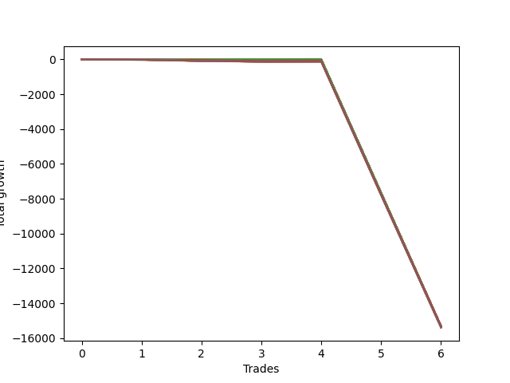

# Long Wallace Doodle 013 
- Symbol: NQ
- Date Range: 3/18/22 - 6/24/22
- Trading Period: 7:20-12:30
- Number of Trades: 6


| Name | Win Percent | Profit | Avg Profit / Trade |     | Name | Win Percent | Profit | Avg Profit / Trade |
| ---- | ----------- | ------ | ------------------ | --- | ---- | ----------- | ------ | ------------------ |
| Sorted By <br> Profit | | | | | Sorted By <br> Win Percentage ||||
| Eleven | 33.33 | -7658750.00 | -1276458.33 |     | Eleven | 33.33 | -7658750.00 | -1276458.33 |
| Nine | 33.33 | -7658750.00 | -1276458.33 |     | Nine | 33.33 | -7658750.00 | -1276458.33 |
| Seven | 33.33 | -7658750.00 | -1276458.33 |     | Seven | 33.33 | -7658750.00 | -1276458.33 |
| Thirty-Five | 16.67 | -7658750.00 | -1276458.33 |     | Seventeen | 33.33 | -7659500.00 | -1276583.33 |
| Seventeen | 33.33 | -7659500.00 | -1276583.33 |     | Fifteen | 33.33 | -7659500.00 | -1276583.33 |
| Fifteen | 33.33 | -7659500.00 | -1276583.33 |     | Thirteen | 33.33 | -7659500.00 | -1276583.33 |
| Thirteen | 33.33 | -7659500.00 | -1276583.33 |     | Thirty-Five | 16.67 | -7658750.00 | -1276458.33 |
| Thirty-Four | 16.67 | -7663000.00 | -1277166.67 |     | Thirty-Four | 16.67 | -7663000.00 | -1277166.67 |
| Ten | 0.00 | -7663250.00 | -1277208.33 |     | Twenty-Three | 16.67 | -7663625.00 | -1277270.83 |
| Eight | 0.00 | -7663250.00 | -1277208.33 |     | Twenty-One | 16.67 | -7663625.00 | -1277270.83 |
| Six | 0.00 | -7663250.00 | -1277208.33 |     | Nineteen | 16.67 | -7663625.00 | -1277270.83 |
| Twenty-Three | 16.67 | -7663625.00 | -1277270.83 |     | One | 16.67 | -7666625.00 | -1277770.83 |
| Twenty-One | 16.67 | -7663625.00 | -1277270.83 |     | Three | 16.67 | -7690000.00 | -1281666.67 |
| Nineteen | 16.67 | -7663625.00 | -1277270.83 |     | Five | 16.67 | -7694625.00 | -1282437.50 |
| Sixteen | 0.00 | -7665500.00 | -1277583.33 |     | Four | 16.67 | -7694625.00 | -1282437.50 |
| Fourteen | 0.00 | -7665500.00 | -1277583.33 |     | Two | 16.67 | -7695250.00 | -1282541.67 |
| Twelve | 0.00 | -7665500.00 | -1277583.33 |     | Ten | 0.00 | -7663250.00 | -1277208.33 |
| One | 16.67 | -7666625.00 | -1277770.83 |     | Eight | 0.00 | -7663250.00 | -1277208.33 |
| Twenty-Two | 0.00 | -7669000.00 | -1278166.67 |     | Six | 0.00 | -7663250.00 | -1277208.33 |
| Twenty | 0.00 | -7669000.00 | -1278166.67 |     | Sixteen | 0.00 | -7665500.00 | -1277583.33 |
| Eighteen | 0.00 | -7669000.00 | -1278166.67 |     | Fourteen | 0.00 | -7665500.00 | -1277583.33 |
| Thirty-Three | 0.00 | -7671625.00 | -1278604.17 |     | Twelve | 0.00 | -7665500.00 | -1277583.33 |
| Thirty-One | 0.00 | -7671625.00 | -1278604.17 |     | Twenty-Two | 0.00 | -7669000.00 | -1278166.67 |
| Twenty-Nine | 0.00 | -7671625.00 | -1278604.17 |     | Twenty | 0.00 | -7669000.00 | -1278166.67 |
| Twenty-Seven | 0.00 | -7671625.00 | -1278604.17 |     | Eighteen | 0.00 | -7669000.00 | -1278166.67 |
| Twenty-Five | 0.00 | -7671625.00 | -1278604.17 |     | Thirty-Three | 0.00 | -7671625.00 | -1278604.17 |
| Thirty-Two | 0.00 | -7679500.00 | -1279916.67 |     | Thirty-One | 0.00 | -7671625.00 | -1278604.17 |
| Thirty | 0.00 | -7679500.00 | -1279916.67 |     | Twenty-Nine | 0.00 | -7671625.00 | -1278604.17 |
| Twenty-Eight | 0.00 | -7679500.00 | -1279916.67 |     | Twenty-Seven | 0.00 | -7671625.00 | -1278604.17 |
| Twenty-Six | 0.00 | -7679500.00 | -1279916.67 |     | Twenty-Five | 0.00 | -7671625.00 | -1278604.17 |
| Twenty-Four | 0.00 | -7679500.00 | -1279916.67 |     | Thirty-Two | 0.00 | -7679500.00 | -1279916.67 |
| Three | 16.67 | -7690000.00 | -1281666.67 |     | Thirty | 0.00 | -7679500.00 | -1279916.67 |
| Thirty-Six | 0.00 | -7690500.00 | -1281750.00 |     | Twenty-Eight | 0.00 | -7679500.00 | -1279916.67 |
| Five | 16.67 | -7694625.00 | -1282437.50 |     | Twenty-Six | 0.00 | -7679500.00 | -1279916.67 |
| Four | 16.67 | -7694625.00 | -1282437.50 |     | Twenty-Four | 0.00 | -7679500.00 | -1279916.67 |
| Two | 16.67 | -7695250.00 | -1282541.67 |     | Thirty-Six | 0.00 | -7690500.00 | -1281750.00 |

### Test One
* Sell when price hits the middle line of the 20p bollinger
* No Stoploss
* Results:
```
Total Trades: 6
Percent Up: 16.67
Percent Down: 83.33
Total Points Moved Up: -15333.25
Potential Profit: -7666625.00
Total Points Ups: 1.50 Count Ups: 1
Total Points Downs: -15334.75 Count Downs: 5
```

<details><summary>Trades</summary>

<code>In: 2022-03-25 08:12:00		Out: 2022-03-25 08:36:55		Total Position Time: 24:55		Total Move Up: -35.50		Total to Date: -35.50</code> <br />
<code>In: 2022-04-11 07:21:00		Out: 2022-04-11 07:34:10		Total Position Time: 13:10		Total Move Up: -5.00		Total to Date: -40.50</code> <br />
<code>In: 2022-06-06 08:14:00		Out: 2022-06-06 08:30:10		Total Position Time: 16:10		Total Move Up: -32.50		Total to Date: -73.00</code> <br />
<code>In: 2022-06-08 09:41:00		Out: 2022-06-08 09:54:10		Total Position Time: 13:10		Total Move Up: 1.50		Total to Date: -71.50</code> <br />
<code>In: 2022-06-15 11:08:00		Out: 2022-06-15 11:37:55		Total Position Time: 29:55		Total Move Up: -7665.25		Total to Date: -7736.75</code> <br />
<code>In: 2022-06-15 11:34:00		Out: 2022-06-15 12:03:55		Total Position Time: 29:55		Total Move Up: -7596.50		Total to Date: -15333.25</code> <br />


</details>

### Test Two
* Sell when the price hits the upper line of the 20p 1std bollinger
* No Stoploss
* Results:
```
Total Trades: 6
Percent Up: 16.67
Percent Down: 83.33
Total Points Moved Up: -15390.50
Potential Profit: -7695250.00
Total Points Ups: 8.00 Count Ups: 1
Total Points Downs: -15398.50 Count Downs: 5
```

<details><summary>Trades</summary>

<code>In: 2022-03-25 08:12:00		Out: 2022-03-25 08:41:20		Total Position Time: 29:20		Total Move Up: -30.00		Total to Date: -30.00</code> <br />
<code>In: 2022-04-11 07:21:00		Out: 2022-04-11 07:50:55		Total Position Time: 29:55		Total Move Up: -70.50		Total to Date: -100.50</code> <br />
<code>In: 2022-06-06 08:14:00		Out: 2022-06-06 08:39:15		Total Position Time: 25:15		Total Move Up: -36.25		Total to Date: -136.75</code> <br />
<code>In: 2022-06-08 09:41:00		Out: 2022-06-08 09:57:05		Total Position Time: 16:05		Total Move Up: 8.00		Total to Date: -128.75</code> <br />
<code>In: 2022-06-15 11:08:00		Out: 2022-06-15 11:37:55		Total Position Time: 29:55		Total Move Up: -7665.25		Total to Date: -7794.00</code> <br />
<code>In: 2022-06-15 11:34:00		Out: 2022-06-15 12:03:55		Total Position Time: 29:55		Total Move Up: -7596.50		Total to Date: -15390.50</code> <br />


</details>

### Test Three
* Sell when the price hits the upper line of the 20p 2std bollinger
* No Stoploss
* Results:
```
Total Trades: 6
Percent Up: 16.67
Percent Down: 83.33
Total Points Moved Up: -15380.00
Potential Profit: -7690000.00
Total Points Ups: 14.00 Count Ups: 1
Total Points Downs: -15394.00 Count Downs: 5
```

<details><summary>Trades</summary>

<code>In: 2022-03-25 08:12:00		Out: 2022-03-25 08:41:55		Total Position Time: 29:55		Total Move Up: -21.25		Total to Date: -21.25</code> <br />
<code>In: 2022-04-11 07:21:00		Out: 2022-04-11 07:50:55		Total Position Time: 29:55		Total Move Up: -70.50		Total to Date: -91.75</code> <br />
<code>In: 2022-06-06 08:14:00		Out: 2022-06-06 08:43:55		Total Position Time: 29:55		Total Move Up: -40.50		Total to Date: -132.25</code> <br />
<code>In: 2022-06-08 09:41:00		Out: 2022-06-08 09:59:15		Total Position Time: 18:15		Total Move Up: 14.00		Total to Date: -118.25</code> <br />
<code>In: 2022-06-15 11:08:00		Out: 2022-06-15 11:37:55		Total Position Time: 29:55		Total Move Up: -7665.25		Total to Date: -7783.50</code> <br />
<code>In: 2022-06-15 11:34:00		Out: 2022-06-15 12:03:55		Total Position Time: 29:55		Total Move Up: -7596.50		Total to Date: -15380.00</code> <br />


</details>

### Test Four
* Sell when the price hits the middle line of the 1std VWAP
* No Stoploss
* Results:
```
Total Trades: 6
Percent Up: 16.67
Percent Down: 83.33
Total Points Moved Up: -15389.25
Potential Profit: -7694625.00
Total Points Ups: 4.75 Count Ups: 1
Total Points Downs: -15394.00 Count Downs: 5
```

<details><summary>Trades</summary>

<code>In: 2022-03-25 08:12:00		Out: 2022-03-25 08:41:55		Total Position Time: 29:55		Total Move Up: -21.25		Total to Date: -21.25</code> <br />
<code>In: 2022-04-11 07:21:00		Out: 2022-04-11 07:50:55		Total Position Time: 29:55		Total Move Up: -70.50		Total to Date: -91.75</code> <br />
<code>In: 2022-06-06 08:14:00		Out: 2022-06-06 08:43:55		Total Position Time: 29:55		Total Move Up: -40.50		Total to Date: -132.25</code> <br />
<code>In: 2022-06-08 09:41:00		Out: 2022-06-08 10:10:55		Total Position Time: 29:55		Total Move Up: 4.75		Total to Date: -127.50</code> <br />
<code>In: 2022-06-15 11:08:00		Out: 2022-06-15 11:37:55		Total Position Time: 29:55		Total Move Up: -7665.25		Total to Date: -7792.75</code> <br />
<code>In: 2022-06-15 11:34:00		Out: 2022-06-15 12:03:55		Total Position Time: 29:55		Total Move Up: -7596.50		Total to Date: -15389.25</code> <br />


</details>

### Test Five
* Sell when the price hits the upper line of the 1std VWAP
* No Stoploss
* Results:
```
Total Trades: 6
Percent Up: 16.67
Percent Down: 83.33
Total Points Moved Up: -15389.25
Potential Profit: -7694625.00
Total Points Ups: 4.75 Count Ups: 1
Total Points Downs: -15394.00 Count Downs: 5
```

<details><summary>Trades</summary>

<code>In: 2022-03-25 08:12:00		Out: 2022-03-25 08:41:55		Total Position Time: 29:55		Total Move Up: -21.25		Total to Date: -21.25</code> <br />
<code>In: 2022-04-11 07:21:00		Out: 2022-04-11 07:50:55		Total Position Time: 29:55		Total Move Up: -70.50		Total to Date: -91.75</code> <br />
<code>In: 2022-06-06 08:14:00		Out: 2022-06-06 08:43:55		Total Position Time: 29:55		Total Move Up: -40.50		Total to Date: -132.25</code> <br />
<code>In: 2022-06-08 09:41:00		Out: 2022-06-08 10:10:55		Total Position Time: 29:55		Total Move Up: 4.75		Total to Date: -127.50</code> <br />
<code>In: 2022-06-15 11:08:00		Out: 2022-06-15 11:37:55		Total Position Time: 29:55		Total Move Up: -7665.25		Total to Date: -7792.75</code> <br />
<code>In: 2022-06-15 11:34:00		Out: 2022-06-15 12:03:55		Total Position Time: 29:55		Total Move Up: -7596.50		Total to Date: -15389.25</code> <br />


</details>

### Test Six
* Sell when the price hits the middle line of the 20p bollinger
* Stoploss is 2 points
* Results:
```
Total Trades: 6
Percent Up: 0.00
Percent Down: 100.00
Total Points Moved Up: -15326.50
Potential Profit: -7663250.00
Total Points Ups: 0.00 Count Ups: 0
Total Points Downs: -15326.50 Count Downs: 6
```

<details><summary>Trades</summary>

<code>In: 2022-03-25 08:12:00		Out: 2022-03-25 08:12:30		Total Position Time: 00:30		Total Move Up: -2.25		Total to Date: -2.25</code> <br />
<code>In: 2022-04-11 07:21:00		Out: 2022-04-11 07:22:35		Total Position Time: 01:35		Total Move Up: -5.25		Total to Date: -7.50</code> <br />
<code>In: 2022-06-06 08:14:00		Out: 2022-06-06 08:14:10		Total Position Time: 00:10		Total Move Up: -3.25		Total to Date: -10.75</code> <br />
<code>In: 2022-06-08 09:41:00		Out: 2022-06-08 09:42:10		Total Position Time: 01:10		Total Move Up: -2.00		Total to Date: -12.75</code> <br />
<code>In: 2022-06-15 11:08:00		Out: 2022-06-15 11:08:10		Total Position Time: 00:10		Total Move Up: -7664.75		Total to Date: -7677.50</code> <br />
<code>In: 2022-06-15 11:34:00		Out: 2022-06-15 11:34:10		Total Position Time: 00:10		Total Move Up: -7649.00		Total to Date: -15326.50</code> <br />


</details>

### Test Seven
* Sell when the price hits the middle line of the 20p bollinger
* Trailing Stop is 2 points
* Results:
```
Total Trades: 6
Percent Up: 33.33
Percent Down: 66.67
Total Points Moved Up: -15317.50
Potential Profit: -7658750.00
Total Points Ups: 2.00 Count Ups: 2
Total Points Downs: -15319.50 Count Downs: 4
```

<details><summary>Trades</summary>

<code>In: 2022-03-25 08:12:00		Out: 2022-03-25 08:12:25		Total Position Time: 00:25		Total Move Up: -1.75		Total to Date: -1.75</code> <br />
<code>In: 2022-04-11 07:21:00		Out: 2022-04-11 07:21:15		Total Position Time: 00:15		Total Move Up: 1.50		Total to Date: -0.25</code> <br />
<code>In: 2022-06-06 08:14:00		Out: 2022-06-06 08:14:20		Total Position Time: 00:20		Total Move Up: -4.00		Total to Date: -4.25</code> <br />
<code>In: 2022-06-08 09:41:00		Out: 2022-06-08 09:41:15		Total Position Time: 00:15		Total Move Up: 0.50		Total to Date: -3.75</code> <br />
<code>In: 2022-06-15 11:08:00		Out: 2022-06-15 11:08:10		Total Position Time: 00:10		Total Move Up: -7664.75		Total to Date: -7668.50</code> <br />
<code>In: 2022-06-15 11:34:00		Out: 2022-06-15 11:34:10		Total Position Time: 00:10		Total Move Up: -7649.00		Total to Date: -15317.50</code> <br />


</details>

### Test Eight
* Sell when the price hits the upper line of the 20p 1std bollinger
* Stoploss is 2 points
* Results:
```
Total Trades: 6
Percent Up: 0.00
Percent Down: 100.00
Total Points Moved Up: -15326.50
Potential Profit: -7663250.00
Total Points Ups: 0.00 Count Ups: 0
Total Points Downs: -15326.50 Count Downs: 6
```

<details><summary>Trades</summary>

<code>In: 2022-03-25 08:12:00		Out: 2022-03-25 08:12:30		Total Position Time: 00:30		Total Move Up: -2.25		Total to Date: -2.25</code> <br />
<code>In: 2022-04-11 07:21:00		Out: 2022-04-11 07:22:35		Total Position Time: 01:35		Total Move Up: -5.25		Total to Date: -7.50</code> <br />
<code>In: 2022-06-06 08:14:00		Out: 2022-06-06 08:14:10		Total Position Time: 00:10		Total Move Up: -3.25		Total to Date: -10.75</code> <br />
<code>In: 2022-06-08 09:41:00		Out: 2022-06-08 09:42:10		Total Position Time: 01:10		Total Move Up: -2.00		Total to Date: -12.75</code> <br />
<code>In: 2022-06-15 11:08:00		Out: 2022-06-15 11:08:10		Total Position Time: 00:10		Total Move Up: -7664.75		Total to Date: -7677.50</code> <br />
<code>In: 2022-06-15 11:34:00		Out: 2022-06-15 11:34:10		Total Position Time: 00:10		Total Move Up: -7649.00		Total to Date: -15326.50</code> <br />


</details>

### Test Nine
* Sell when the price hits the upper line of the 20p 1std bollinger
* Trailing Stop is 2 points
* Results:
```
Total Trades: 6
Percent Up: 33.33
Percent Down: 66.67
Total Points Moved Up: -15317.50
Potential Profit: -7658750.00
Total Points Ups: 2.00 Count Ups: 2
Total Points Downs: -15319.50 Count Downs: 4
```

<details><summary>Trades</summary>

<code>In: 2022-03-25 08:12:00		Out: 2022-03-25 08:12:25		Total Position Time: 00:25		Total Move Up: -1.75		Total to Date: -1.75</code> <br />
<code>In: 2022-04-11 07:21:00		Out: 2022-04-11 07:21:15		Total Position Time: 00:15		Total Move Up: 1.50		Total to Date: -0.25</code> <br />
<code>In: 2022-06-06 08:14:00		Out: 2022-06-06 08:14:20		Total Position Time: 00:20		Total Move Up: -4.00		Total to Date: -4.25</code> <br />
<code>In: 2022-06-08 09:41:00		Out: 2022-06-08 09:41:15		Total Position Time: 00:15		Total Move Up: 0.50		Total to Date: -3.75</code> <br />
<code>In: 2022-06-15 11:08:00		Out: 2022-06-15 11:08:10		Total Position Time: 00:10		Total Move Up: -7664.75		Total to Date: -7668.50</code> <br />
<code>In: 2022-06-15 11:34:00		Out: 2022-06-15 11:34:10		Total Position Time: 00:10		Total Move Up: -7649.00		Total to Date: -15317.50</code> <br />


</details>

### Test Ten
* Sell when the price hits the upper line of the 20p 2std bollinger
* Stoploss is 2 points
* Results:
```
Total Trades: 6
Percent Up: 0.00
Percent Down: 100.00
Total Points Moved Up: -15326.50
Potential Profit: -7663250.00
Total Points Ups: 0.00 Count Ups: 0
Total Points Downs: -15326.50 Count Downs: 6
```

<details><summary>Trades</summary>

<code>In: 2022-03-25 08:12:00		Out: 2022-03-25 08:12:30		Total Position Time: 00:30		Total Move Up: -2.25		Total to Date: -2.25</code> <br />
<code>In: 2022-04-11 07:21:00		Out: 2022-04-11 07:22:35		Total Position Time: 01:35		Total Move Up: -5.25		Total to Date: -7.50</code> <br />
<code>In: 2022-06-06 08:14:00		Out: 2022-06-06 08:14:10		Total Position Time: 00:10		Total Move Up: -3.25		Total to Date: -10.75</code> <br />
<code>In: 2022-06-08 09:41:00		Out: 2022-06-08 09:42:10		Total Position Time: 01:10		Total Move Up: -2.00		Total to Date: -12.75</code> <br />
<code>In: 2022-06-15 11:08:00		Out: 2022-06-15 11:08:10		Total Position Time: 00:10		Total Move Up: -7664.75		Total to Date: -7677.50</code> <br />
<code>In: 2022-06-15 11:34:00		Out: 2022-06-15 11:34:10		Total Position Time: 00:10		Total Move Up: -7649.00		Total to Date: -15326.50</code> <br />


</details>

### Test Eleven
* Sell when the price hits the upper line of the 20p 2std bollinger
* Trailing Stop is 2 points
* Results:
```
Total Trades: 6
Percent Up: 33.33
Percent Down: 66.67
Total Points Moved Up: -15317.50
Potential Profit: -7658750.00
Total Points Ups: 2.00 Count Ups: 2
Total Points Downs: -15319.50 Count Downs: 4
```

<details><summary>Trades</summary>

<code>In: 2022-03-25 08:12:00		Out: 2022-03-25 08:12:25		Total Position Time: 00:25		Total Move Up: -1.75		Total to Date: -1.75</code> <br />
<code>In: 2022-04-11 07:21:00		Out: 2022-04-11 07:21:15		Total Position Time: 00:15		Total Move Up: 1.50		Total to Date: -0.25</code> <br />
<code>In: 2022-06-06 08:14:00		Out: 2022-06-06 08:14:20		Total Position Time: 00:20		Total Move Up: -4.00		Total to Date: -4.25</code> <br />
<code>In: 2022-06-08 09:41:00		Out: 2022-06-08 09:41:15		Total Position Time: 00:15		Total Move Up: 0.50		Total to Date: -3.75</code> <br />
<code>In: 2022-06-15 11:08:00		Out: 2022-06-15 11:08:10		Total Position Time: 00:10		Total Move Up: -7664.75		Total to Date: -7668.50</code> <br />
<code>In: 2022-06-15 11:34:00		Out: 2022-06-15 11:34:10		Total Position Time: 00:10		Total Move Up: -7649.00		Total to Date: -15317.50</code> <br />


</details>

### Test Twelve
* Sell when the price hits the middle line of the 20p bollinger
* Stoploss is 3 points
* Results:
```
Total Trades: 6
Percent Up: 0.00
Percent Down: 100.00
Total Points Moved Up: -15331.00
Potential Profit: -7665500.00
Total Points Ups: 0.00 Count Ups: 0
Total Points Downs: -15331.00 Count Downs: 6
```

<details><summary>Trades</summary>

<code>In: 2022-03-25 08:12:00		Out: 2022-03-25 08:12:35		Total Position Time: 00:35		Total Move Up: -5.50		Total to Date: -5.50</code> <br />
<code>In: 2022-04-11 07:21:00		Out: 2022-04-11 07:22:35		Total Position Time: 01:35		Total Move Up: -5.25		Total to Date: -10.75</code> <br />
<code>In: 2022-06-06 08:14:00		Out: 2022-06-06 08:14:10		Total Position Time: 00:10		Total Move Up: -3.25		Total to Date: -14.00</code> <br />
<code>In: 2022-06-08 09:41:00		Out: 2022-06-08 09:42:25		Total Position Time: 01:25		Total Move Up: -3.25		Total to Date: -17.25</code> <br />
<code>In: 2022-06-15 11:08:00		Out: 2022-06-15 11:08:10		Total Position Time: 00:10		Total Move Up: -7664.75		Total to Date: -7682.00</code> <br />
<code>In: 2022-06-15 11:34:00		Out: 2022-06-15 11:34:10		Total Position Time: 00:10		Total Move Up: -7649.00		Total to Date: -15331.00</code> <br />


</details>

### Test Thirteen
* Sell when the price hits the middle line of the 20p bollinger
* Trailing Stop is 3 points
* Results:
```
Total Trades: 6
Percent Up: 33.33
Percent Down: 66.67
Total Points Moved Up: -15319.00
Potential Profit: -7659500.00
Total Points Ups: 4.50 Count Ups: 2
Total Points Downs: -15323.50 Count Downs: 4
```

<details><summary>Trades</summary>

<code>In: 2022-03-25 08:12:00		Out: 2022-03-25 08:12:25		Total Position Time: 00:25		Total Move Up: -1.75		Total to Date: -1.75</code> <br />
<code>In: 2022-04-11 07:21:00		Out: 2022-04-11 07:21:15		Total Position Time: 00:15		Total Move Up: 1.50		Total to Date: -0.25</code> <br />
<code>In: 2022-06-06 08:14:00		Out: 2022-06-06 08:14:25		Total Position Time: 00:25		Total Move Up: -8.00		Total to Date: -8.25</code> <br />
<code>In: 2022-06-08 09:41:00		Out: 2022-06-08 09:41:45		Total Position Time: 00:45		Total Move Up: 3.00		Total to Date: -5.25</code> <br />
<code>In: 2022-06-15 11:08:00		Out: 2022-06-15 11:08:10		Total Position Time: 00:10		Total Move Up: -7664.75		Total to Date: -7670.00</code> <br />
<code>In: 2022-06-15 11:34:00		Out: 2022-06-15 11:34:10		Total Position Time: 00:10		Total Move Up: -7649.00		Total to Date: -15319.00</code> <br />


</details>

### Test Fourteen
* Sell when the price hits the upper line of the 20p 1std bollinger
* Stoploss is 3 points
* Results:
```
Total Trades: 6
Percent Up: 0.00
Percent Down: 100.00
Total Points Moved Up: -15331.00
Potential Profit: -7665500.00
Total Points Ups: 0.00 Count Ups: 0
Total Points Downs: -15331.00 Count Downs: 6
```

<details><summary>Trades</summary>

<code>In: 2022-03-25 08:12:00		Out: 2022-03-25 08:12:35		Total Position Time: 00:35		Total Move Up: -5.50		Total to Date: -5.50</code> <br />
<code>In: 2022-04-11 07:21:00		Out: 2022-04-11 07:22:35		Total Position Time: 01:35		Total Move Up: -5.25		Total to Date: -10.75</code> <br />
<code>In: 2022-06-06 08:14:00		Out: 2022-06-06 08:14:10		Total Position Time: 00:10		Total Move Up: -3.25		Total to Date: -14.00</code> <br />
<code>In: 2022-06-08 09:41:00		Out: 2022-06-08 09:42:25		Total Position Time: 01:25		Total Move Up: -3.25		Total to Date: -17.25</code> <br />
<code>In: 2022-06-15 11:08:00		Out: 2022-06-15 11:08:10		Total Position Time: 00:10		Total Move Up: -7664.75		Total to Date: -7682.00</code> <br />
<code>In: 2022-06-15 11:34:00		Out: 2022-06-15 11:34:10		Total Position Time: 00:10		Total Move Up: -7649.00		Total to Date: -15331.00</code> <br />


</details>

### Test Fifteen
* Sell when the price hits the upper line of the 20p 1std bollinger
* Trailing Stop is 3 points
* Results:
```
Total Trades: 6
Percent Up: 33.33
Percent Down: 66.67
Total Points Moved Up: -15319.00
Potential Profit: -7659500.00
Total Points Ups: 4.50 Count Ups: 2
Total Points Downs: -15323.50 Count Downs: 4
```

<details><summary>Trades</summary>

<code>In: 2022-03-25 08:12:00		Out: 2022-03-25 08:12:25		Total Position Time: 00:25		Total Move Up: -1.75		Total to Date: -1.75</code> <br />
<code>In: 2022-04-11 07:21:00		Out: 2022-04-11 07:21:15		Total Position Time: 00:15		Total Move Up: 1.50		Total to Date: -0.25</code> <br />
<code>In: 2022-06-06 08:14:00		Out: 2022-06-06 08:14:25		Total Position Time: 00:25		Total Move Up: -8.00		Total to Date: -8.25</code> <br />
<code>In: 2022-06-08 09:41:00		Out: 2022-06-08 09:41:45		Total Position Time: 00:45		Total Move Up: 3.00		Total to Date: -5.25</code> <br />
<code>In: 2022-06-15 11:08:00		Out: 2022-06-15 11:08:10		Total Position Time: 00:10		Total Move Up: -7664.75		Total to Date: -7670.00</code> <br />
<code>In: 2022-06-15 11:34:00		Out: 2022-06-15 11:34:10		Total Position Time: 00:10		Total Move Up: -7649.00		Total to Date: -15319.00</code> <br />


</details>

### Test Sixteen
* Sell when the price hits the upper line of the 20p 2std bollinger
* Stoploss is 3 points
* Results:
```
Total Trades: 6
Percent Up: 0.00
Percent Down: 100.00
Total Points Moved Up: -15331.00
Potential Profit: -7665500.00
Total Points Ups: 0.00 Count Ups: 0
Total Points Downs: -15331.00 Count Downs: 6
```

<details><summary>Trades</summary>

<code>In: 2022-03-25 08:12:00		Out: 2022-03-25 08:12:35		Total Position Time: 00:35		Total Move Up: -5.50		Total to Date: -5.50</code> <br />
<code>In: 2022-04-11 07:21:00		Out: 2022-04-11 07:22:35		Total Position Time: 01:35		Total Move Up: -5.25		Total to Date: -10.75</code> <br />
<code>In: 2022-06-06 08:14:00		Out: 2022-06-06 08:14:10		Total Position Time: 00:10		Total Move Up: -3.25		Total to Date: -14.00</code> <br />
<code>In: 2022-06-08 09:41:00		Out: 2022-06-08 09:42:25		Total Position Time: 01:25		Total Move Up: -3.25		Total to Date: -17.25</code> <br />
<code>In: 2022-06-15 11:08:00		Out: 2022-06-15 11:08:10		Total Position Time: 00:10		Total Move Up: -7664.75		Total to Date: -7682.00</code> <br />
<code>In: 2022-06-15 11:34:00		Out: 2022-06-15 11:34:10		Total Position Time: 00:10		Total Move Up: -7649.00		Total to Date: -15331.00</code> <br />


</details>

### Test Seventeen
* Sell when the price hits the upper line of the 20p 2std bollinger
* Trailing Stop is 3 points
* Results:
```
Total Trades: 6
Percent Up: 33.33
Percent Down: 66.67
Total Points Moved Up: -15319.00
Potential Profit: -7659500.00
Total Points Ups: 4.50 Count Ups: 2
Total Points Downs: -15323.50 Count Downs: 4
```

<details><summary>Trades</summary>

<code>In: 2022-03-25 08:12:00		Out: 2022-03-25 08:12:25		Total Position Time: 00:25		Total Move Up: -1.75		Total to Date: -1.75</code> <br />
<code>In: 2022-04-11 07:21:00		Out: 2022-04-11 07:21:15		Total Position Time: 00:15		Total Move Up: 1.50		Total to Date: -0.25</code> <br />
<code>In: 2022-06-06 08:14:00		Out: 2022-06-06 08:14:25		Total Position Time: 00:25		Total Move Up: -8.00		Total to Date: -8.25</code> <br />
<code>In: 2022-06-08 09:41:00		Out: 2022-06-08 09:41:45		Total Position Time: 00:45		Total Move Up: 3.00		Total to Date: -5.25</code> <br />
<code>In: 2022-06-15 11:08:00		Out: 2022-06-15 11:08:10		Total Position Time: 00:10		Total Move Up: -7664.75		Total to Date: -7670.00</code> <br />
<code>In: 2022-06-15 11:34:00		Out: 2022-06-15 11:34:10		Total Position Time: 00:10		Total Move Up: -7649.00		Total to Date: -15319.00</code> <br />


</details>

### Test Eighteen
* Sell when the price hits the middle line of the 20p bollinger
* Stoploss is 5 points
* Results:
```
Total Trades: 6
Percent Up: 0.00
Percent Down: 100.00
Total Points Moved Up: -15338.00
Potential Profit: -7669000.00
Total Points Ups: 0.00 Count Ups: 0
Total Points Downs: -15338.00 Count Downs: 6
```

<details><summary>Trades</summary>

<code>In: 2022-03-25 08:12:00		Out: 2022-03-25 08:12:35		Total Position Time: 00:35		Total Move Up: -5.50		Total to Date: -5.50</code> <br />
<code>In: 2022-04-11 07:21:00		Out: 2022-04-11 07:22:35		Total Position Time: 01:35		Total Move Up: -5.25		Total to Date: -10.75</code> <br />
<code>In: 2022-06-06 08:14:00		Out: 2022-06-06 08:14:25		Total Position Time: 00:25		Total Move Up: -8.00		Total to Date: -18.75</code> <br />
<code>In: 2022-06-08 09:41:00		Out: 2022-06-08 09:42:35		Total Position Time: 01:35		Total Move Up: -5.50		Total to Date: -24.25</code> <br />
<code>In: 2022-06-15 11:08:00		Out: 2022-06-15 11:08:10		Total Position Time: 00:10		Total Move Up: -7664.75		Total to Date: -7689.00</code> <br />
<code>In: 2022-06-15 11:34:00		Out: 2022-06-15 11:34:10		Total Position Time: 00:10		Total Move Up: -7649.00		Total to Date: -15338.00</code> <br />


</details>

### Test Nineteen
* Sell when the price hits the middle line of the 20p bollinger
* Trailing Stop is 5 points
* Results:
```
Total Trades: 6
Percent Up: 16.67
Percent Down: 83.33
Total Points Moved Up: -15327.25
Potential Profit: -7663625.00
Total Points Ups: 0.50 Count Ups: 1
Total Points Downs: -15327.75 Count Downs: 5
```

<details><summary>Trades</summary>

<code>In: 2022-03-25 08:12:00		Out: 2022-03-25 08:12:35		Total Position Time: 00:35		Total Move Up: -5.50		Total to Date: -5.50</code> <br />
<code>In: 2022-04-11 07:21:00		Out: 2022-04-11 07:21:20		Total Position Time: 00:20		Total Move Up: 0.50		Total to Date: -5.00</code> <br />
<code>In: 2022-06-06 08:14:00		Out: 2022-06-06 08:14:25		Total Position Time: 00:25		Total Move Up: -8.00		Total to Date: -13.00</code> <br />
<code>In: 2022-06-08 09:41:00		Out: 2022-06-08 09:42:05		Total Position Time: 01:05		Total Move Up: -0.50		Total to Date: -13.50</code> <br />
<code>In: 2022-06-15 11:08:00		Out: 2022-06-15 11:08:10		Total Position Time: 00:10		Total Move Up: -7664.75		Total to Date: -7678.25</code> <br />
<code>In: 2022-06-15 11:34:00		Out: 2022-06-15 11:34:10		Total Position Time: 00:10		Total Move Up: -7649.00		Total to Date: -15327.25</code> <br />


</details>

### Test Twenty
* Sell when the price hits the upper line of the 20p 1std bollinger
* Stoploss is 5 points
* Results:
```
Total Trades: 6
Percent Up: 0.00
Percent Down: 100.00
Total Points Moved Up: -15338.00
Potential Profit: -7669000.00
Total Points Ups: 0.00 Count Ups: 0
Total Points Downs: -15338.00 Count Downs: 6
```

<details><summary>Trades</summary>

<code>In: 2022-03-25 08:12:00		Out: 2022-03-25 08:12:35		Total Position Time: 00:35		Total Move Up: -5.50		Total to Date: -5.50</code> <br />
<code>In: 2022-04-11 07:21:00		Out: 2022-04-11 07:22:35		Total Position Time: 01:35		Total Move Up: -5.25		Total to Date: -10.75</code> <br />
<code>In: 2022-06-06 08:14:00		Out: 2022-06-06 08:14:25		Total Position Time: 00:25		Total Move Up: -8.00		Total to Date: -18.75</code> <br />
<code>In: 2022-06-08 09:41:00		Out: 2022-06-08 09:42:35		Total Position Time: 01:35		Total Move Up: -5.50		Total to Date: -24.25</code> <br />
<code>In: 2022-06-15 11:08:00		Out: 2022-06-15 11:08:10		Total Position Time: 00:10		Total Move Up: -7664.75		Total to Date: -7689.00</code> <br />
<code>In: 2022-06-15 11:34:00		Out: 2022-06-15 11:34:10		Total Position Time: 00:10		Total Move Up: -7649.00		Total to Date: -15338.00</code> <br />


</details>

### Test Twenty-One
* Sell when the price hits the upper line of the 20p 1std bollinger
* Trailing Stop is 5 points
* Results:
```
Total Trades: 6
Percent Up: 16.67
Percent Down: 83.33
Total Points Moved Up: -15327.25
Potential Profit: -7663625.00
Total Points Ups: 0.50 Count Ups: 1
Total Points Downs: -15327.75 Count Downs: 5
```

<details><summary>Trades</summary>

<code>In: 2022-03-25 08:12:00		Out: 2022-03-25 08:12:35		Total Position Time: 00:35		Total Move Up: -5.50		Total to Date: -5.50</code> <br />
<code>In: 2022-04-11 07:21:00		Out: 2022-04-11 07:21:20		Total Position Time: 00:20		Total Move Up: 0.50		Total to Date: -5.00</code> <br />
<code>In: 2022-06-06 08:14:00		Out: 2022-06-06 08:14:25		Total Position Time: 00:25		Total Move Up: -8.00		Total to Date: -13.00</code> <br />
<code>In: 2022-06-08 09:41:00		Out: 2022-06-08 09:42:05		Total Position Time: 01:05		Total Move Up: -0.50		Total to Date: -13.50</code> <br />
<code>In: 2022-06-15 11:08:00		Out: 2022-06-15 11:08:10		Total Position Time: 00:10		Total Move Up: -7664.75		Total to Date: -7678.25</code> <br />
<code>In: 2022-06-15 11:34:00		Out: 2022-06-15 11:34:10		Total Position Time: 00:10		Total Move Up: -7649.00		Total to Date: -15327.25</code> <br />


</details>

### Test Twenty-Two
* Sell when the price hits the upper line of the 20p 2std bollinger
* Stoploss is 5 points
* Results:
```
Total Trades: 6
Percent Up: 0.00
Percent Down: 100.00
Total Points Moved Up: -15338.00
Potential Profit: -7669000.00
Total Points Ups: 0.00 Count Ups: 0
Total Points Downs: -15338.00 Count Downs: 6
```

<details><summary>Trades</summary>

<code>In: 2022-03-25 08:12:00		Out: 2022-03-25 08:12:35		Total Position Time: 00:35		Total Move Up: -5.50		Total to Date: -5.50</code> <br />
<code>In: 2022-04-11 07:21:00		Out: 2022-04-11 07:22:35		Total Position Time: 01:35		Total Move Up: -5.25		Total to Date: -10.75</code> <br />
<code>In: 2022-06-06 08:14:00		Out: 2022-06-06 08:14:25		Total Position Time: 00:25		Total Move Up: -8.00		Total to Date: -18.75</code> <br />
<code>In: 2022-06-08 09:41:00		Out: 2022-06-08 09:42:35		Total Position Time: 01:35		Total Move Up: -5.50		Total to Date: -24.25</code> <br />
<code>In: 2022-06-15 11:08:00		Out: 2022-06-15 11:08:10		Total Position Time: 00:10		Total Move Up: -7664.75		Total to Date: -7689.00</code> <br />
<code>In: 2022-06-15 11:34:00		Out: 2022-06-15 11:34:10		Total Position Time: 00:10		Total Move Up: -7649.00		Total to Date: -15338.00</code> <br />


</details>

### Test Twenty-Three
* Sell when the price hits the upper line of the 20p 2std bollinger
* Trailing Stop is 5 points
* Results:
```
Total Trades: 6
Percent Up: 16.67
Percent Down: 83.33
Total Points Moved Up: -15327.25
Potential Profit: -7663625.00
Total Points Ups: 0.50 Count Ups: 1
Total Points Downs: -15327.75 Count Downs: 5
```

<details><summary>Trades</summary>

<code>In: 2022-03-25 08:12:00		Out: 2022-03-25 08:12:35		Total Position Time: 00:35		Total Move Up: -5.50		Total to Date: -5.50</code> <br />
<code>In: 2022-04-11 07:21:00		Out: 2022-04-11 07:21:20		Total Position Time: 00:20		Total Move Up: 0.50		Total to Date: -5.00</code> <br />
<code>In: 2022-06-06 08:14:00		Out: 2022-06-06 08:14:25		Total Position Time: 00:25		Total Move Up: -8.00		Total to Date: -13.00</code> <br />
<code>In: 2022-06-08 09:41:00		Out: 2022-06-08 09:42:05		Total Position Time: 01:05		Total Move Up: -0.50		Total to Date: -13.50</code> <br />
<code>In: 2022-06-15 11:08:00		Out: 2022-06-15 11:08:10		Total Position Time: 00:10		Total Move Up: -7664.75		Total to Date: -7678.25</code> <br />
<code>In: 2022-06-15 11:34:00		Out: 2022-06-15 11:34:10		Total Position Time: 00:10		Total Move Up: -7649.00		Total to Date: -15327.25</code> <br />


</details>

### Test Twenty-Four
* Sell when the price hits the middle line of the 20p bollinger
* Stoploss is 10 points
* Results:
```
Total Trades: 6
Percent Up: 0.00
Percent Down: 100.00
Total Points Moved Up: -15359.00
Potential Profit: -7679500.00
Total Points Ups: 0.00 Count Ups: 0
Total Points Downs: -15359.00 Count Downs: 6
```

<details><summary>Trades</summary>

<code>In: 2022-03-25 08:12:00		Out: 2022-03-25 08:19:55		Total Position Time: 07:55		Total Move Up: -12.25		Total to Date: -12.25</code> <br />
<code>In: 2022-04-11 07:21:00		Out: 2022-04-11 07:26:05		Total Position Time: 05:05		Total Move Up: -10.25		Total to Date: -22.50</code> <br />
<code>In: 2022-06-06 08:14:00		Out: 2022-06-06 08:15:40		Total Position Time: 01:40		Total Move Up: -10.50		Total to Date: -33.00</code> <br />
<code>In: 2022-06-08 09:41:00		Out: 2022-06-08 09:43:25		Total Position Time: 02:25		Total Move Up: -12.25		Total to Date: -45.25</code> <br />
<code>In: 2022-06-15 11:08:00		Out: 2022-06-15 11:08:10		Total Position Time: 00:10		Total Move Up: -7664.75		Total to Date: -7710.00</code> <br />
<code>In: 2022-06-15 11:34:00		Out: 2022-06-15 11:34:10		Total Position Time: 00:10		Total Move Up: -7649.00		Total to Date: -15359.00</code> <br />


</details>

### Test Twenty-Five
* Sell when the price hits the middle line of the 20p bollinger
* Trailing Stop is 10 points
* Results:
```
Total Trades: 6
Percent Up: 0.00
Percent Down: 100.00
Total Points Moved Up: -15343.25
Potential Profit: -7671625.00
Total Points Ups: 0.00 Count Ups: 0
Total Points Downs: -15343.25 Count Downs: 6
```

<details><summary>Trades</summary>

<code>In: 2022-03-25 08:12:00		Out: 2022-03-25 08:14:50		Total Position Time: 02:50		Total Move Up: -6.75		Total to Date: -6.75</code> <br />
<code>In: 2022-04-11 07:21:00		Out: 2022-04-11 07:22:35		Total Position Time: 01:35		Total Move Up: -5.25		Total to Date: -12.00</code> <br />
<code>In: 2022-06-06 08:14:00		Out: 2022-06-06 08:15:45		Total Position Time: 01:45		Total Move Up: -12.00		Total to Date: -24.00</code> <br />
<code>In: 2022-06-08 09:41:00		Out: 2022-06-08 09:42:35		Total Position Time: 01:35		Total Move Up: -5.50		Total to Date: -29.50</code> <br />
<code>In: 2022-06-15 11:08:00		Out: 2022-06-15 11:08:10		Total Position Time: 00:10		Total Move Up: -7664.75		Total to Date: -7694.25</code> <br />
<code>In: 2022-06-15 11:34:00		Out: 2022-06-15 11:34:10		Total Position Time: 00:10		Total Move Up: -7649.00		Total to Date: -15343.25</code> <br />


</details>

### Test Twenty-Six
* Sell when the price hits the upper line of the 20p 1std bollinger
* Stoploss is 10 points
* Results:
```
Total Trades: 6
Percent Up: 0.00
Percent Down: 100.00
Total Points Moved Up: -15359.00
Potential Profit: -7679500.00
Total Points Ups: 0.00 Count Ups: 0
Total Points Downs: -15359.00 Count Downs: 6
```

<details><summary>Trades</summary>

<code>In: 2022-03-25 08:12:00		Out: 2022-03-25 08:19:55		Total Position Time: 07:55		Total Move Up: -12.25		Total to Date: -12.25</code> <br />
<code>In: 2022-04-11 07:21:00		Out: 2022-04-11 07:26:05		Total Position Time: 05:05		Total Move Up: -10.25		Total to Date: -22.50</code> <br />
<code>In: 2022-06-06 08:14:00		Out: 2022-06-06 08:15:40		Total Position Time: 01:40		Total Move Up: -10.50		Total to Date: -33.00</code> <br />
<code>In: 2022-06-08 09:41:00		Out: 2022-06-08 09:43:25		Total Position Time: 02:25		Total Move Up: -12.25		Total to Date: -45.25</code> <br />
<code>In: 2022-06-15 11:08:00		Out: 2022-06-15 11:08:10		Total Position Time: 00:10		Total Move Up: -7664.75		Total to Date: -7710.00</code> <br />
<code>In: 2022-06-15 11:34:00		Out: 2022-06-15 11:34:10		Total Position Time: 00:10		Total Move Up: -7649.00		Total to Date: -15359.00</code> <br />


</details>

### Test Twenty-Seven
* Sell when the price hits the upper line of the 20p 1std bollinger
* Trailing Stop is 10 points
* Results:
```
Total Trades: 6
Percent Up: 0.00
Percent Down: 100.00
Total Points Moved Up: -15343.25
Potential Profit: -7671625.00
Total Points Ups: 0.00 Count Ups: 0
Total Points Downs: -15343.25 Count Downs: 6
```

<details><summary>Trades</summary>

<code>In: 2022-03-25 08:12:00		Out: 2022-03-25 08:14:50		Total Position Time: 02:50		Total Move Up: -6.75		Total to Date: -6.75</code> <br />
<code>In: 2022-04-11 07:21:00		Out: 2022-04-11 07:22:35		Total Position Time: 01:35		Total Move Up: -5.25		Total to Date: -12.00</code> <br />
<code>In: 2022-06-06 08:14:00		Out: 2022-06-06 08:15:45		Total Position Time: 01:45		Total Move Up: -12.00		Total to Date: -24.00</code> <br />
<code>In: 2022-06-08 09:41:00		Out: 2022-06-08 09:42:35		Total Position Time: 01:35		Total Move Up: -5.50		Total to Date: -29.50</code> <br />
<code>In: 2022-06-15 11:08:00		Out: 2022-06-15 11:08:10		Total Position Time: 00:10		Total Move Up: -7664.75		Total to Date: -7694.25</code> <br />
<code>In: 2022-06-15 11:34:00		Out: 2022-06-15 11:34:10		Total Position Time: 00:10		Total Move Up: -7649.00		Total to Date: -15343.25</code> <br />


</details>

### Test Twenty-Eight
* Sell when the price hits the upper line of the 20p 2std bollinger
* Stoploss is 10 points
* Results:
```
Total Trades: 6
Percent Up: 0.00
Percent Down: 100.00
Total Points Moved Up: -15359.00
Potential Profit: -7679500.00
Total Points Ups: 0.00 Count Ups: 0
Total Points Downs: -15359.00 Count Downs: 6
```

<details><summary>Trades</summary>

<code>In: 2022-03-25 08:12:00		Out: 2022-03-25 08:19:55		Total Position Time: 07:55		Total Move Up: -12.25		Total to Date: -12.25</code> <br />
<code>In: 2022-04-11 07:21:00		Out: 2022-04-11 07:26:05		Total Position Time: 05:05		Total Move Up: -10.25		Total to Date: -22.50</code> <br />
<code>In: 2022-06-06 08:14:00		Out: 2022-06-06 08:15:40		Total Position Time: 01:40		Total Move Up: -10.50		Total to Date: -33.00</code> <br />
<code>In: 2022-06-08 09:41:00		Out: 2022-06-08 09:43:25		Total Position Time: 02:25		Total Move Up: -12.25		Total to Date: -45.25</code> <br />
<code>In: 2022-06-15 11:08:00		Out: 2022-06-15 11:08:10		Total Position Time: 00:10		Total Move Up: -7664.75		Total to Date: -7710.00</code> <br />
<code>In: 2022-06-15 11:34:00		Out: 2022-06-15 11:34:10		Total Position Time: 00:10		Total Move Up: -7649.00		Total to Date: -15359.00</code> <br />


</details>

### Test Twenty-Nine
* Sell when the price hits the upper line of the 20p 2std bollinger
* Trailing Stop is 10 points
* Results:
```
Total Trades: 6
Percent Up: 0.00
Percent Down: 100.00
Total Points Moved Up: -15343.25
Potential Profit: -7671625.00
Total Points Ups: 0.00 Count Ups: 0
Total Points Downs: -15343.25 Count Downs: 6
```

<details><summary>Trades</summary>

<code>In: 2022-03-25 08:12:00		Out: 2022-03-25 08:14:50		Total Position Time: 02:50		Total Move Up: -6.75		Total to Date: -6.75</code> <br />
<code>In: 2022-04-11 07:21:00		Out: 2022-04-11 07:22:35		Total Position Time: 01:35		Total Move Up: -5.25		Total to Date: -12.00</code> <br />
<code>In: 2022-06-06 08:14:00		Out: 2022-06-06 08:15:45		Total Position Time: 01:45		Total Move Up: -12.00		Total to Date: -24.00</code> <br />
<code>In: 2022-06-08 09:41:00		Out: 2022-06-08 09:42:35		Total Position Time: 01:35		Total Move Up: -5.50		Total to Date: -29.50</code> <br />
<code>In: 2022-06-15 11:08:00		Out: 2022-06-15 11:08:10		Total Position Time: 00:10		Total Move Up: -7664.75		Total to Date: -7694.25</code> <br />
<code>In: 2022-06-15 11:34:00		Out: 2022-06-15 11:34:10		Total Position Time: 00:10		Total Move Up: -7649.00		Total to Date: -15343.25</code> <br />


</details>

### Test Thirty
* Sell when the price hits the middle line of the 1std VWAP
* Stoploss is 10 points
* Results:
```
Total Trades: 6
Percent Up: 0.00
Percent Down: 100.00
Total Points Moved Up: -15359.00
Potential Profit: -7679500.00
Total Points Ups: 0.00 Count Ups: 0
Total Points Downs: -15359.00 Count Downs: 6
```

<details><summary>Trades</summary>

<code>In: 2022-03-25 08:12:00		Out: 2022-03-25 08:19:55		Total Position Time: 07:55		Total Move Up: -12.25		Total to Date: -12.25</code> <br />
<code>In: 2022-04-11 07:21:00		Out: 2022-04-11 07:26:05		Total Position Time: 05:05		Total Move Up: -10.25		Total to Date: -22.50</code> <br />
<code>In: 2022-06-06 08:14:00		Out: 2022-06-06 08:15:40		Total Position Time: 01:40		Total Move Up: -10.50		Total to Date: -33.00</code> <br />
<code>In: 2022-06-08 09:41:00		Out: 2022-06-08 09:43:25		Total Position Time: 02:25		Total Move Up: -12.25		Total to Date: -45.25</code> <br />
<code>In: 2022-06-15 11:08:00		Out: 2022-06-15 11:08:10		Total Position Time: 00:10		Total Move Up: -7664.75		Total to Date: -7710.00</code> <br />
<code>In: 2022-06-15 11:34:00		Out: 2022-06-15 11:34:10		Total Position Time: 00:10		Total Move Up: -7649.00		Total to Date: -15359.00</code> <br />


</details>

### Test Thirty-One
* Sell when the price hits the middle line of the 1std VWAP
* Trailing Stop is 10 points
* Results:
```
Total Trades: 6
Percent Up: 0.00
Percent Down: 100.00
Total Points Moved Up: -15343.25
Potential Profit: -7671625.00
Total Points Ups: 0.00 Count Ups: 0
Total Points Downs: -15343.25 Count Downs: 6
```

<details><summary>Trades</summary>

<code>In: 2022-03-25 08:12:00		Out: 2022-03-25 08:14:50		Total Position Time: 02:50		Total Move Up: -6.75		Total to Date: -6.75</code> <br />
<code>In: 2022-04-11 07:21:00		Out: 2022-04-11 07:22:35		Total Position Time: 01:35		Total Move Up: -5.25		Total to Date: -12.00</code> <br />
<code>In: 2022-06-06 08:14:00		Out: 2022-06-06 08:15:45		Total Position Time: 01:45		Total Move Up: -12.00		Total to Date: -24.00</code> <br />
<code>In: 2022-06-08 09:41:00		Out: 2022-06-08 09:42:35		Total Position Time: 01:35		Total Move Up: -5.50		Total to Date: -29.50</code> <br />
<code>In: 2022-06-15 11:08:00		Out: 2022-06-15 11:08:10		Total Position Time: 00:10		Total Move Up: -7664.75		Total to Date: -7694.25</code> <br />
<code>In: 2022-06-15 11:34:00		Out: 2022-06-15 11:34:10		Total Position Time: 00:10		Total Move Up: -7649.00		Total to Date: -15343.25</code> <br />


</details>

### Test Thirty-Two
* Sell when the price hits the upper line of the 1std VWAP
* Stoploss is 10 points
* Results:
```
Total Trades: 6
Percent Up: 0.00
Percent Down: 100.00
Total Points Moved Up: -15359.00
Potential Profit: -7679500.00
Total Points Ups: 0.00 Count Ups: 0
Total Points Downs: -15359.00 Count Downs: 6
```

<details><summary>Trades</summary>

<code>In: 2022-03-25 08:12:00		Out: 2022-03-25 08:19:55		Total Position Time: 07:55		Total Move Up: -12.25		Total to Date: -12.25</code> <br />
<code>In: 2022-04-11 07:21:00		Out: 2022-04-11 07:26:05		Total Position Time: 05:05		Total Move Up: -10.25		Total to Date: -22.50</code> <br />
<code>In: 2022-06-06 08:14:00		Out: 2022-06-06 08:15:40		Total Position Time: 01:40		Total Move Up: -10.50		Total to Date: -33.00</code> <br />
<code>In: 2022-06-08 09:41:00		Out: 2022-06-08 09:43:25		Total Position Time: 02:25		Total Move Up: -12.25		Total to Date: -45.25</code> <br />
<code>In: 2022-06-15 11:08:00		Out: 2022-06-15 11:08:10		Total Position Time: 00:10		Total Move Up: -7664.75		Total to Date: -7710.00</code> <br />
<code>In: 2022-06-15 11:34:00		Out: 2022-06-15 11:34:10		Total Position Time: 00:10		Total Move Up: -7649.00		Total to Date: -15359.00</code> <br />


</details>

### Test Thirty-Three
* Sell when the price hits the upper line of the 1std VWAP
* Trailing Stop is 10 points
* Results:
```
Total Trades: 6
Percent Up: 0.00
Percent Down: 100.00
Total Points Moved Up: -15343.25
Potential Profit: -7671625.00
Total Points Ups: 0.00 Count Ups: 0
Total Points Downs: -15343.25 Count Downs: 6
```

<details><summary>Trades</summary>

<code>In: 2022-03-25 08:12:00		Out: 2022-03-25 08:14:50		Total Position Time: 02:50		Total Move Up: -6.75		Total to Date: -6.75</code> <br />
<code>In: 2022-04-11 07:21:00		Out: 2022-04-11 07:22:35		Total Position Time: 01:35		Total Move Up: -5.25		Total to Date: -12.00</code> <br />
<code>In: 2022-06-06 08:14:00		Out: 2022-06-06 08:15:45		Total Position Time: 01:45		Total Move Up: -12.00		Total to Date: -24.00</code> <br />
<code>In: 2022-06-08 09:41:00		Out: 2022-06-08 09:42:35		Total Position Time: 01:35		Total Move Up: -5.50		Total to Date: -29.50</code> <br />
<code>In: 2022-06-15 11:08:00		Out: 2022-06-15 11:08:10		Total Position Time: 00:10		Total Move Up: -7664.75		Total to Date: -7694.25</code> <br />
<code>In: 2022-06-15 11:34:00		Out: 2022-06-15 11:34:10		Total Position Time: 00:10		Total Move Up: -7649.00		Total to Date: -15343.25</code> <br />


</details>

### Test Thirty-Four
* Sell when the linear regression slope is negative
* No Stoploss
* Results:
```
Total Trades: 6
Percent Up: 16.67
Percent Down: 83.33
Total Points Moved Up: -15326.00
Potential Profit: -7663000.00
Total Points Ups: 1.75 Count Ups: 1
Total Points Downs: -15327.75 Count Downs: 5
```

<details><summary>Trades</summary>

<code>In: 2022-03-25 08:12:00		Out: 2022-03-25 08:13:05		Total Position Time: 01:05		Total Move Up: -7.75		Total to Date: -7.75</code> <br />
<code>In: 2022-04-11 07:21:00		Out: 2022-04-11 07:22:05		Total Position Time: 01:05		Total Move Up: 1.75		Total to Date: -6.00</code> <br />
<code>In: 2022-06-06 08:14:00		Out: 2022-06-06 08:15:05		Total Position Time: 01:05		Total Move Up: -6.25		Total to Date: -12.25</code> <br />
<code>In: 2022-06-08 09:41:00		Out: 2022-06-08 09:42:05		Total Position Time: 01:05		Total Move Up: -0.50		Total to Date: -12.75</code> <br />
<code>In: 2022-06-15 11:08:00		Out: 2022-06-15 11:09:05		Total Position Time: 01:05		Total Move Up: -7668.00		Total to Date: -7680.75</code> <br />
<code>In: 2022-06-15 11:34:00		Out: 2022-06-15 11:35:05		Total Position Time: 01:05		Total Move Up: -7645.25		Total to Date: -15326.00</code> <br />


</details>

### Test Thirty-Five
* Sell when the linear regression slope changes to negative
* No Stoploss
* Results:
```
Total Trades: 6
Percent Up: 16.67
Percent Down: 83.33
Total Points Moved Up: -15317.50
Potential Profit: -7658750.00
Total Points Ups: 5.50 Count Ups: 1
Total Points Downs: -15323.00 Count Downs: 5
```

<details><summary>Trades</summary>

<code>In: 2022-03-25 08:12:00		Out: 2022-03-25 08:23:05		Total Position Time: 11:05		Total Move Up: -14.50		Total to Date: -14.50</code> <br />
<code>In: 2022-04-11 07:21:00		Out: 2022-04-11 07:38:05		Total Position Time: 17:05		Total Move Up: -30.00		Total to Date: -44.50</code> <br />
<code>In: 2022-06-06 08:14:00		Out: 2022-06-06 08:34:05		Total Position Time: 20:05		Total Move Up: -45.75		Total to Date: -90.25</code> <br />
<code>In: 2022-06-08 09:41:00		Out: 2022-06-08 10:01:05		Total Position Time: 20:05		Total Move Up: 5.50		Total to Date: -84.75</code> <br />
<code>In: 2022-06-15 11:08:00		Out: 2022-06-15 11:23:05		Total Position Time: 15:05		Total Move Up: -7654.00		Total to Date: -7738.75</code> <br />
<code>In: 2022-06-15 11:34:00		Out: 2022-06-15 11:48:05		Total Position Time: 14:05		Total Move Up: -7578.75		Total to Date: -15317.50</code> <br />


</details>

### Test Thirty-Six
* Sell when the linear regression slope changes to negative
* No Stoploss
* Results:
```
Total Trades: 6
Percent Up: 0.00
Percent Down: 100.00
Total Points Moved Up: -15381.00
Potential Profit: -7690500.00
Total Points Ups: 0.00 Count Ups: 0
Total Points Downs: -15381.00 Count Downs: 6
```

<details><summary>Trades</summary>

<code>In: 2022-03-25 08:12:00		Out: 2022-03-25 08:13:05		Total Position Time: 01:05		Total Move Up: -7.75		Total to Date: -7.75</code> <br />
<code>In: 2022-04-11 07:21:00		Out: 2022-04-11 07:50:55		Total Position Time: 29:55		Total Move Up: -70.50		Total to Date: -78.25</code> <br />
<code>In: 2022-06-06 08:14:00		Out: 2022-06-06 08:27:05		Total Position Time: 13:05		Total Move Up: -40.50		Total to Date: -118.75</code> <br />
<code>In: 2022-06-08 09:41:00		Out: 2022-06-08 09:42:05		Total Position Time: 01:05		Total Move Up: -0.50		Total to Date: -119.25</code> <br />
<code>In: 2022-06-15 11:08:00		Out: 2022-06-15 11:37:55		Total Position Time: 29:55		Total Move Up: -7665.25		Total to Date: -7784.50</code> <br />
<code>In: 2022-06-15 11:34:00		Out: 2022-06-15 12:03:55		Total Position Time: 29:55		Total Move Up: -7596.50		Total to Date: -15381.00</code> <br />


</details>