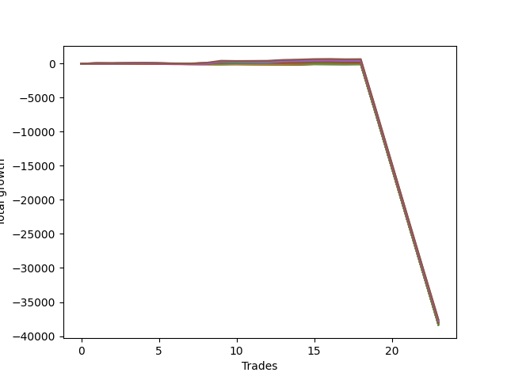

# Long Wallace Doodle 014 
- Symbol: NQ
- Date Range: 03/18/2022 - 06/17/2022
- Trading Period: 7:20-12:30
- Number of Trades: 23



| Name | Win Percent | Profit | Avg Profit / Trade |     | Name | Win Percent | Profit | Avg Profit / Trade |
| ---- | ----------- | ------ | ------------------ | --- | ---- | ----------- | ------ | ------------------ |
| Sorted By <br> Profit | | | | | Sorted By <br> Win Percentage ||||
| Seventy-Five | 52.17 | -18777750.00 | -816423.91 |     | One | 60.87 | -18962625.00 | -824461.96 |
| Five | 56.52 | -18821375.00 | -818320.65 |     | Five | 56.52 | -18821375.00 | -818320.65 |
| Four | 56.52 | -18882375.00 | -820972.83 |     | Four | 56.52 | -18882375.00 | -820972.83 |
| Seventy-Four | 43.48 | -18911875.00 | -822255.43 |     | Two | 56.52 | -18934750.00 | -823250.00 |
| Two | 56.52 | -18934750.00 | -823250.00 |     | Three | 56.52 | -18977500.00 | -825108.70 |
| Seven | 52.17 | -18945250.00 | -823706.52 |     | Seventy-Five | 52.17 | -18777750.00 | -816423.91 |
| One | 60.87 | -18962625.00 | -824461.96 |     | Seven | 52.17 | -18945250.00 | -823706.52 |
| Three | 56.52 | -18977500.00 | -825108.70 |     | Six | 52.17 | -19034125.00 | -827570.65 |
| Seventy-Three | 21.74 | -18993500.00 | -825804.35 |     | Zero | 52.17 | -19039250.00 | -827793.48 |
| Six | 52.17 | -19034125.00 | -827570.65 |     | Seventy-Four | 43.48 | -18911875.00 | -822255.43 |
| Zero | 52.17 | -19039250.00 | -827793.48 |     | Twenty-Three | 34.78 | -19135375.00 | -831972.83 |
| Thirteen | 8.70 | -19089625.00 | -829983.70 |     | Twenty-Two | 34.78 | -19135375.00 | -831972.83 |
| Twenty-Nine | 8.70 | -19097875.00 | -830342.39 |     | Twenty-One | 34.78 | -19135375.00 | -831972.83 |
| Twelve | 8.70 | -19105875.00 | -830690.22 |     | Twenty | 34.78 | -19135375.00 | -831972.83 |
| Twenty-Four | 17.39 | -19106375.00 | -830711.96 |     | Nineteen | 34.78 | -19135375.00 | -831972.83 |
| Forty | 21.74 | -19106500.00 | -830717.39 |     | Eighteen | 34.78 | -19135375.00 | -831972.83 |
| Ten | 8.70 | -19106625.00 | -830722.83 |     | Seventeen | 34.78 | -19135375.00 | -831972.83 |
| Twenty-Eight | 8.70 | -19114125.00 | -831048.91 |     | Sixten | 34.78 | -19135375.00 | -831972.83 |
| Twenty-Six | 8.70 | -19114875.00 | -831081.52 |     | Seventy-Two | 26.09 | -19139000.00 | -832130.43 |
| Forty-Five | 8.70 | -19115875.00 | -831125.00 |     | Thirty-Nine | 26.09 | -19139250.00 | -832141.30 |
| Nine | 8.70 | -19121500.00 | -831369.57 |     | Thirty-Eight | 26.09 | -19139250.00 | -832141.30 |
| Fourteen | 8.70 | -19124250.00 | -831489.13 |     | Thirty-Seven | 26.09 | -19139250.00 | -832141.30 |
| Twenty-Five | 8.70 | -19129750.00 | -831728.26 |     | Thirty-Six | 26.09 | -19139250.00 | -832141.30 |
| Fifteen | 4.35 | -19130375.00 | -831755.43 |     | Thirty-Five | 26.09 | -19139250.00 | -832141.30 |
| Fifty-Six | 21.74 | -19131625.00 | -831809.78 |     | Thirty-Four | 26.09 | -19139250.00 | -832141.30 |
| Forty-Four | 8.70 | -19132125.00 | -831831.52 |     | Thirty-Three | 26.09 | -19139250.00 | -832141.30 |
| Thirty | 8.70 | -19132500.00 | -831847.83 |     | Thirty-Two | 26.09 | -19139250.00 | -832141.30 |
| Eleven | 8.70 | -19132500.00 | -831847.83 |     | Seventy-Three | 21.74 | -18993500.00 | -825804.35 |
| Eight | 8.70 | -19132500.00 | -831847.83 |     | Forty | 21.74 | -19106500.00 | -830717.39 |
| Forty-Two | 8.70 | -19132875.00 | -831864.13 |     | Fifty-Six | 21.74 | -19131625.00 | -831809.78 |
| Sixty-One | 13.04 | -19133625.00 | -831896.74 |     | Sixty-Four | 21.74 | -19136750.00 | -832032.61 |
| Twenty-Three | 34.78 | -19135375.00 | -831972.83 |     | Seventy-One | 21.74 | -19147625.00 | -832505.43 |
| Twenty-Two | 34.78 | -19135375.00 | -831972.83 |     | Seventy | 21.74 | -19147625.00 | -832505.43 |
| Twenty-One | 34.78 | -19135375.00 | -831972.83 |     | Sixty-Nine | 21.74 | -19147625.00 | -832505.43 |
| Twenty | 34.78 | -19135375.00 | -831972.83 |     | Sixty-Eight | 21.74 | -19147625.00 | -832505.43 |
| Nineteen | 34.78 | -19135375.00 | -831972.83 |     | Sixty-Seven | 21.74 | -19147625.00 | -832505.43 |
| Eighteen | 34.78 | -19135375.00 | -831972.83 |     | Sixty-Six | 21.74 | -19147625.00 | -832505.43 |
| Seventeen | 34.78 | -19135375.00 | -831972.83 |     | Sixty-Five | 21.74 | -19147625.00 | -832505.43 |
| Sixten | 34.78 | -19135375.00 | -831972.83 |     | Twenty-Four | 17.39 | -19106375.00 | -830711.96 |
| Sixty-Four | 21.74 | -19136750.00 | -832032.61 |     | Fifty-Five | 17.39 | -19143875.00 | -832342.39 |
| Thirty-One | 4.35 | -19138625.00 | -832114.13 |     | Fifty-Four | 17.39 | -19143875.00 | -832342.39 |
| Seventy-Two | 26.09 | -19139000.00 | -832130.43 |     | Fifty-Three | 17.39 | -19143875.00 | -832342.39 |
| Thirty-Nine | 26.09 | -19139250.00 | -832141.30 |     | Fifty-Two | 17.39 | -19143875.00 | -832342.39 |
| Thirty-Eight | 26.09 | -19139250.00 | -832141.30 |     | Fifty-One | 17.39 | -19143875.00 | -832342.39 |
| Thirty-Seven | 26.09 | -19139250.00 | -832141.30 |     | Fifty | 17.39 | -19143875.00 | -832342.39 |
| Thirty-Six | 26.09 | -19139250.00 | -832141.30 |     | Forty-Nine | 17.39 | -19143875.00 | -832342.39 |
| Thirty-Five | 26.09 | -19139250.00 | -832141.30 |     | Forty-Eight | 17.39 | -19143875.00 | -832342.39 |
| Thirty-Four | 26.09 | -19139250.00 | -832141.30 |     | Sixty-One | 13.04 | -19133625.00 | -831896.74 |
| Thirty-Three | 26.09 | -19139250.00 | -832141.30 |     | Sixty | 13.04 | -19146500.00 | -832456.52 |
| Thirty-Two | 26.09 | -19139250.00 | -832141.30 |     | Fifty-Eight | 13.04 | -19151500.00 | -832673.91 |
| twenty-Seven | 8.70 | -19140750.00 | -832206.52 |     | Fifty-Seven | 13.04 | -19166000.00 | -833304.35 |
| Fifty-Five | 17.39 | -19143875.00 | -832342.39 |     | Sixty-Two | 13.04 | -19168250.00 | -833402.17 |
| Fifty-Four | 17.39 | -19143875.00 | -832342.39 |     | Fifty-Nine | 13.04 | -19177000.00 | -833782.61 |
| Fifty-Three | 17.39 | -19143875.00 | -832342.39 |     | Thirteen | 8.70 | -19089625.00 | -829983.70 |
| Fifty-Two | 17.39 | -19143875.00 | -832342.39 |     | Twenty-Nine | 8.70 | -19097875.00 | -830342.39 |
| Fifty-One | 17.39 | -19143875.00 | -832342.39 |     | Twelve | 8.70 | -19105875.00 | -830690.22 |
| Fifty | 17.39 | -19143875.00 | -832342.39 |     | Ten | 8.70 | -19106625.00 | -830722.83 |
| Forty-Nine | 17.39 | -19143875.00 | -832342.39 |     | Twenty-Eight | 8.70 | -19114125.00 | -831048.91 |
| Forty-Eight | 17.39 | -19143875.00 | -832342.39 |     | Twenty-Six | 8.70 | -19114875.00 | -831081.52 |
| Sixty | 13.04 | -19146500.00 | -832456.52 |     | Forty-Five | 8.70 | -19115875.00 | -831125.00 |
| Seventy-One | 21.74 | -19147625.00 | -832505.43 |     | Nine | 8.70 | -19121500.00 | -831369.57 |
| Seventy | 21.74 | -19147625.00 | -832505.43 |     | Fourteen | 8.70 | -19124250.00 | -831489.13 |
| Sixty-Nine | 21.74 | -19147625.00 | -832505.43 |     | Twenty-Five | 8.70 | -19129750.00 | -831728.26 |
| Sixty-Eight | 21.74 | -19147625.00 | -832505.43 |     | Forty-Four | 8.70 | -19132125.00 | -831831.52 |
| Sixty-Seven | 21.74 | -19147625.00 | -832505.43 |     | Thirty | 8.70 | -19132500.00 | -831847.83 |
| Sixty-Six | 21.74 | -19147625.00 | -832505.43 |     | Eleven | 8.70 | -19132500.00 | -831847.83 |
| Sixty-Five | 21.74 | -19147625.00 | -832505.43 |     | Eight | 8.70 | -19132500.00 | -831847.83 |
| Forty-One | 8.70 | -19147750.00 | -832510.87 |     | Forty-Two | 8.70 | -19132875.00 | -831864.13 |
| Forty-Six | 8.70 | -19150500.00 | -832630.43 |     | twenty-Seven | 8.70 | -19140750.00 | -832206.52 |
| Fifty-Eight | 13.04 | -19151500.00 | -832673.91 |     | Forty-One | 8.70 | -19147750.00 | -832510.87 |
| Forty-Seven | 4.35 | -19156625.00 | -832896.74 |     | Forty-Six | 8.70 | -19150500.00 | -832630.43 |
| Forty-Three | 8.70 | -19158750.00 | -832989.13 |     | Forty-Three | 8.70 | -19158750.00 | -832989.13 |
| Fifty-Seven | 13.04 | -19166000.00 | -833304.35 |     | Sixty-Three | 8.70 | -19174375.00 | -833668.48 |
| Sixty-Two | 13.04 | -19168250.00 | -833402.17 |     | Fifteen | 4.35 | -19130375.00 | -831755.43 |
| Sixty-Three | 8.70 | -19174375.00 | -833668.48 |     | Thirty-One | 4.35 | -19138625.00 | -832114.13 |
| Fifty-Nine | 13.04 | -19177000.00 | -833782.61 |     | Forty-Seven | 4.35 | -19156625.00 | -832896.74 |

## NO STOPLOSS

### Test Zero
* Sell when price hits the middle line of the 20p bollinger
* No Stoploss
* Results:
```
Total Trades: 23
Percent Up: 52.17
Percent Down: 47.83
Total Points Moved Up: -38078.50
Potential Profit: -19039250.00
Total Points Ups: 265.25 Count Ups: 12
Total Points Downs: -38343.75 Count Downs: 11
```

<details><summary>Trades</summary>

<code>In: 2022-03-28 07:22:00		Out: 2022-03-28 07:29:45		Total Position Time: 07:45		Total Move Up: 20.00		Total to Date: 20.00</code> <br />
<code>In: 2022-03-31 09:16:00		Out: 2022-03-31 09:30:05		Total Position Time: 14:05		Total Move Up: -9.00		Total to Date: 11.00</code> <br />
<code>In: 2022-04-08 11:30:00		Out: 2022-04-08 11:39:40		Total Position Time: 09:40		Total Move Up: 7.75		Total to Date: 18.75</code> <br />
<code>In: 2022-04-08 11:30:00		Out: 2022-04-08 11:39:40		Total Position Time: 09:40		Total Move Up: 7.75		Total to Date: 26.50</code> <br />
<code>In: 2022-04-12 07:41:00		Out: 2022-04-12 07:59:30		Total Position Time: 18:30		Total Move Up: -17.25		Total to Date: 9.25</code> <br />
<code>In: 2022-04-12 07:42:00		Out: 2022-04-12 07:59:30		Total Position Time: 17:30		Total Move Up: -21.75		Total to Date: -12.50</code> <br />
<code>In: 2022-04-27 12:00:00		Out: 2022-04-27 12:13:55		Total Position Time: 13:55		Total Move Up: 0.00		Total to Date: -12.50</code> <br />
<code>In: 2022-05-03 07:46:00		Out: 2022-05-03 07:54:05		Total Position Time: 08:05		Total Move Up: 35.25		Total to Date: 22.75</code> <br />
<code>In: 2022-05-04 11:36:00		Out: 2022-05-04 11:36:40		Total Position Time: 00:40		Total Move Up: 27.75		Total to Date: 50.50</code> <br />
<code>In: 2022-05-06 11:49:00		Out: 2022-05-06 11:49:10		Total Position Time: 00:10		Total Move Up: 22.50		Total to Date: 73.00</code> <br />
<code>In: 2022-05-16 07:55:00		Out: 2022-05-16 08:09:35		Total Position Time: 14:35		Total Move Up: -17.75		Total to Date: 55.25</code> <br />
<code>In: 2022-05-16 07:58:00		Out: 2022-05-16 08:09:35		Total Position Time: 11:35		Total Move Up: -11.25		Total to Date: 44.00</code> <br />
<code>In: 2022-05-17 11:24:00		Out: 2022-05-17 11:27:30		Total Position Time: 03:30		Total Move Up: 46.50		Total to Date: 90.50</code> <br />
<code>In: 2022-05-19 10:15:00		Out: 2022-05-19 10:20:00		Total Position Time: 05:00		Total Move Up: 32.25		Total to Date: 122.75</code> <br />
<code>In: 2022-05-19 10:51:00		Out: 2022-05-19 10:52:55		Total Position Time: 01:55		Total Move Up: 30.75		Total to Date: 153.50</code> <br />
<code>In: 2022-05-25 09:29:00		Out: 2022-05-25 09:32:15		Total Position Time: 03:15		Total Move Up: 22.00		Total to Date: 175.50</code> <br />
<code>In: 2022-06-08 09:29:00		Out: 2022-06-08 09:54:10		Total Position Time: 25:10		Total Move Up: -46.75		Total to Date: 128.75</code> <br />
<code>In: 2022-06-09 08:10:00		Out: 2022-06-09 08:11:10		Total Position Time: 01:10		Total Move Up: 12.75		Total to Date: 141.50</code> <br />
<code>In: 2022-06-14 11:52:00		Out: 2022-06-14 12:21:55		Total Position Time: 29:55		Total Move Up: -7573.00		Total to Date: -7431.50</code> <br />
<code>In: 2022-06-15 07:35:00		Out: 2022-06-15 08:04:55		Total Position Time: 29:55		Total Move Up: -7692.75		Total to Date: -15124.25</code> <br />
<code>In: 2022-06-15 07:37:00		Out: 2022-06-15 08:06:55		Total Position Time: 29:55		Total Move Up: -7692.50		Total to Date: -22816.75</code> <br />
<code>In: 2022-06-15 11:08:00		Out: 2022-06-15 11:37:55		Total Position Time: 29:55		Total Move Up: -7665.25		Total to Date: -30482.00</code> <br />
<code>In: 2022-06-15 11:34:00		Out: 2022-06-15 12:03:55		Total Position Time: 29:55		Total Move Up: -7596.50		Total to Date: -38078.50</code> <br />


</details>

### Test One
* Sell when the price hits the upper line of the 20p 1std bollinger
* No Stoploss
* Results:
```
Total Trades: 23
Percent Up: 60.87
Percent Down: 39.13
Total Points Moved Up: -37925.25
Potential Profit: -18962625.00
Total Points Ups: 346.25 Count Ups: 14
Total Points Downs: -38271.50 Count Downs: 9
```

<details><summary>Trades</summary>

<code>In: 2022-03-28 07:22:00		Out: 2022-03-28 07:30:25		Total Position Time: 08:25		Total Move Up: 35.00		Total to Date: 35.00</code> <br />
<code>In: 2022-03-31 09:16:00		Out: 2022-03-31 09:32:20		Total Position Time: 16:20		Total Move Up: -3.00		Total to Date: 32.00</code> <br />
<code>In: 2022-04-08 11:30:00		Out: 2022-04-08 11:46:10		Total Position Time: 16:10		Total Move Up: 1.00		Total to Date: 33.00</code> <br />
<code>In: 2022-04-08 11:30:00		Out: 2022-04-08 11:46:10		Total Position Time: 16:10		Total Move Up: 1.00		Total to Date: 34.00</code> <br />
<code>In: 2022-04-12 07:41:00		Out: 2022-04-12 08:02:35		Total Position Time: 21:35		Total Move Up: 0.00		Total to Date: 34.00</code> <br />
<code>In: 2022-04-12 07:42:00		Out: 2022-04-12 08:02:35		Total Position Time: 20:35		Total Move Up: -4.50		Total to Date: 29.50</code> <br />
<code>In: 2022-04-27 12:00:00		Out: 2022-04-27 12:15:20		Total Position Time: 15:20		Total Move Up: 6.50		Total to Date: 36.00</code> <br />
<code>In: 2022-05-03 07:46:00		Out: 2022-05-03 07:57:15		Total Position Time: 11:15		Total Move Up: 30.75		Total to Date: 66.75</code> <br />
<code>In: 2022-05-04 11:36:00		Out: 2022-05-04 11:42:00		Total Position Time: 06:00		Total Move Up: 76.50		Total to Date: 143.25</code> <br />
<code>In: 2022-05-06 11:49:00		Out: 2022-05-06 11:49:10		Total Position Time: 00:10		Total Move Up: 22.50		Total to Date: 165.75</code> <br />
<code>In: 2022-05-16 07:55:00		Out: 2022-05-16 08:10:30		Total Position Time: 15:30		Total Move Up: -3.75		Total to Date: 162.00</code> <br />
<code>In: 2022-05-16 07:58:00		Out: 2022-05-16 08:10:30		Total Position Time: 12:30		Total Move Up: 2.75		Total to Date: 164.75</code> <br />
<code>In: 2022-05-17 11:24:00		Out: 2022-05-17 11:39:45		Total Position Time: 15:45		Total Move Up: 44.25		Total to Date: 209.00</code> <br />
<code>In: 2022-05-19 10:15:00		Out: 2022-05-19 10:26:05		Total Position Time: 11:05		Total Move Up: 45.75		Total to Date: 254.75</code> <br />
<code>In: 2022-05-19 10:51:00		Out: 2022-05-19 10:55:05		Total Position Time: 04:05		Total Move Up: 52.75		Total to Date: 307.50</code> <br />
<code>In: 2022-05-25 09:29:00		Out: 2022-05-25 09:45:20		Total Position Time: 16:20		Total Move Up: 12.00		Total to Date: 319.50</code> <br />
<code>In: 2022-06-08 09:29:00		Out: 2022-06-08 09:57:05		Total Position Time: 28:05		Total Move Up: -40.25		Total to Date: 279.25</code> <br />
<code>In: 2022-06-09 08:10:00		Out: 2022-06-09 08:22:35		Total Position Time: 12:35		Total Move Up: 15.50		Total to Date: 294.75</code> <br />
<code>In: 2022-06-14 11:52:00		Out: 2022-06-14 12:21:55		Total Position Time: 29:55		Total Move Up: -7573.00		Total to Date: -7278.25</code> <br />
<code>In: 2022-06-15 07:35:00		Out: 2022-06-15 08:04:55		Total Position Time: 29:55		Total Move Up: -7692.75		Total to Date: -14971.00</code> <br />
<code>In: 2022-06-15 07:37:00		Out: 2022-06-15 08:06:55		Total Position Time: 29:55		Total Move Up: -7692.50		Total to Date: -22663.50</code> <br />
<code>In: 2022-06-15 11:08:00		Out: 2022-06-15 11:37:55		Total Position Time: 29:55		Total Move Up: -7665.25		Total to Date: -30328.75</code> <br />
<code>In: 2022-06-15 11:34:00		Out: 2022-06-15 12:03:55		Total Position Time: 29:55		Total Move Up: -7596.50		Total to Date: -37925.25</code> <br />


</details>

### Test Two
* Sell when the price hits the upper line of the 20p 2std bollinger
* No Stoploss
* Results:
```
Total Trades: 23
Percent Up: 56.52
Percent Down: 43.48
Total Points Moved Up: -37869.50
Potential Profit: -18934750.00
Total Points Ups: 508.50 Count Ups: 13
Total Points Downs: -38378.00 Count Downs: 10
```

<details><summary>Trades</summary>

<code>In: 2022-03-28 07:22:00		Out: 2022-03-28 07:47:55		Total Position Time: 25:55		Total Move Up: 48.00		Total to Date: 48.00</code> <br />
<code>In: 2022-03-31 09:16:00		Out: 2022-03-31 09:45:55		Total Position Time: 29:55		Total Move Up: -10.00		Total to Date: 38.00</code> <br />
<code>In: 2022-04-08 11:30:00		Out: 2022-04-08 11:47:25		Total Position Time: 17:25		Total Move Up: 7.25		Total to Date: 45.25</code> <br />
<code>In: 2022-04-08 11:30:00		Out: 2022-04-08 11:47:25		Total Position Time: 17:25		Total Move Up: 7.25		Total to Date: 52.50</code> <br />
<code>In: 2022-04-12 07:41:00		Out: 2022-04-12 08:10:55		Total Position Time: 29:55		Total Move Up: -40.00		Total to Date: 12.50</code> <br />
<code>In: 2022-04-12 07:42:00		Out: 2022-04-12 08:11:55		Total Position Time: 29:55		Total Move Up: -44.50		Total to Date: -32.00</code> <br />
<code>In: 2022-04-27 12:00:00		Out: 2022-04-27 12:29:55		Total Position Time: 29:55		Total Move Up: -20.75		Total to Date: -52.75</code> <br />
<code>In: 2022-05-03 07:46:00		Out: 2022-05-03 07:59:15		Total Position Time: 13:15		Total Move Up: 37.25		Total to Date: -15.50</code> <br />
<code>In: 2022-05-04 11:36:00		Out: 2022-05-04 11:44:15		Total Position Time: 08:15		Total Move Up: 139.25		Total to Date: 123.75</code> <br />
<code>In: 2022-05-06 11:49:00		Out: 2022-05-06 11:49:25		Total Position Time: 00:25		Total Move Up: 33.25		Total to Date: 157.00</code> <br />
<code>In: 2022-05-16 07:55:00		Out: 2022-05-16 08:13:05		Total Position Time: 18:05		Total Move Up: 7.50		Total to Date: 164.50</code> <br />
<code>In: 2022-05-16 07:58:00		Out: 2022-05-16 08:13:05		Total Position Time: 15:05		Total Move Up: 14.00		Total to Date: 178.50</code> <br />
<code>In: 2022-05-17 11:24:00		Out: 2022-05-17 11:40:00		Total Position Time: 16:00		Total Move Up: 53.75		Total to Date: 232.25</code> <br />
<code>In: 2022-05-19 10:15:00		Out: 2022-05-19 10:44:55		Total Position Time: 29:55		Total Move Up: 47.75		Total to Date: 280.00</code> <br />
<code>In: 2022-05-19 10:51:00		Out: 2022-05-19 10:55:25		Total Position Time: 04:25		Total Move Up: 71.75		Total to Date: 351.75</code> <br />
<code>In: 2022-05-25 09:29:00		Out: 2022-05-25 09:49:10		Total Position Time: 20:10		Total Move Up: 26.75		Total to Date: 378.50</code> <br />
<code>In: 2022-06-08 09:29:00		Out: 2022-06-08 09:58:55		Total Position Time: 29:55		Total Move Up: -42.75		Total to Date: 335.75</code> <br />
<code>In: 2022-06-09 08:10:00		Out: 2022-06-09 08:33:20		Total Position Time: 23:20		Total Move Up: 14.75		Total to Date: 350.50</code> <br />
<code>In: 2022-06-14 11:52:00		Out: 2022-06-14 12:21:55		Total Position Time: 29:55		Total Move Up: -7573.00		Total to Date: -7222.50</code> <br />
<code>In: 2022-06-15 07:35:00		Out: 2022-06-15 08:04:55		Total Position Time: 29:55		Total Move Up: -7692.75		Total to Date: -14915.25</code> <br />
<code>In: 2022-06-15 07:37:00		Out: 2022-06-15 08:06:55		Total Position Time: 29:55		Total Move Up: -7692.50		Total to Date: -22607.75</code> <br />
<code>In: 2022-06-15 11:08:00		Out: 2022-06-15 11:37:55		Total Position Time: 29:55		Total Move Up: -7665.25		Total to Date: -30273.00</code> <br />
<code>In: 2022-06-15 11:34:00		Out: 2022-06-15 12:03:55		Total Position Time: 29:55		Total Move Up: -7596.50		Total to Date: -37869.50</code> <br />


</details>

### Test Three
* Sell when price hits the middle line of the 50p bollinger
* No Stoploss
* Results:
```
Total Trades: 23
Percent Up: 56.52
Percent Down: 43.48
Total Points Moved Up: -37955.00
Potential Profit: -18977500.00
Total Points Ups: 415.50 Count Ups: 13
Total Points Downs: -38370.50 Count Downs: 10
```

<details><summary>Trades</summary>

<code>In: 2022-03-28 07:22:00		Out: 2022-03-28 07:45:05		Total Position Time: 23:05		Total Move Up: 35.00		Total to Date: 35.00</code> <br />
<code>In: 2022-03-31 09:16:00		Out: 2022-03-31 09:45:40		Total Position Time: 29:40		Total Move Up: -2.50		Total to Date: 32.50</code> <br />
<code>In: 2022-04-08 11:30:00		Out: 2022-04-08 11:49:45		Total Position Time: 19:45		Total Move Up: 21.25		Total to Date: 53.75</code> <br />
<code>In: 2022-04-08 11:30:00		Out: 2022-04-08 11:49:45		Total Position Time: 19:45		Total Move Up: 21.25		Total to Date: 75.00</code> <br />
<code>In: 2022-04-12 07:41:00		Out: 2022-04-12 08:10:55		Total Position Time: 29:55		Total Move Up: -40.00		Total to Date: 35.00</code> <br />
<code>In: 2022-04-12 07:42:00		Out: 2022-04-12 08:11:55		Total Position Time: 29:55		Total Move Up: -44.50		Total to Date: -9.50</code> <br />
<code>In: 2022-04-27 12:00:00		Out: 2022-04-27 12:29:55		Total Position Time: 29:55		Total Move Up: -20.75		Total to Date: -30.25</code> <br />
<code>In: 2022-05-03 07:46:00		Out: 2022-05-03 08:02:10		Total Position Time: 16:10		Total Move Up: 38.50		Total to Date: 8.25</code> <br />
<code>In: 2022-05-04 11:36:00		Out: 2022-05-04 11:41:40		Total Position Time: 05:40		Total Move Up: 59.75		Total to Date: 68.00</code> <br />
<code>In: 2022-05-06 11:49:00		Out: 2022-05-06 11:49:10		Total Position Time: 00:10		Total Move Up: 22.50		Total to Date: 90.50</code> <br />
<code>In: 2022-05-16 07:55:00		Out: 2022-05-16 08:17:25		Total Position Time: 22:25		Total Move Up: 16.00		Total to Date: 106.50</code> <br />
<code>In: 2022-05-16 07:58:00		Out: 2022-05-16 08:17:25		Total Position Time: 19:25		Total Move Up: 22.50		Total to Date: 129.00</code> <br />
<code>In: 2022-05-17 11:24:00		Out: 2022-05-17 11:40:05		Total Position Time: 16:05		Total Move Up: 58.00		Total to Date: 187.00</code> <br />
<code>In: 2022-05-19 10:15:00		Out: 2022-05-19 10:23:35		Total Position Time: 08:35		Total Move Up: 47.75		Total to Date: 234.75</code> <br />
<code>In: 2022-05-19 10:51:00		Out: 2022-05-19 10:52:55		Total Position Time: 01:55		Total Move Up: 30.75		Total to Date: 265.50</code> <br />
<code>In: 2022-05-25 09:29:00		Out: 2022-05-25 09:49:10		Total Position Time: 20:10		Total Move Up: 26.75		Total to Date: 292.25</code> <br />
<code>In: 2022-06-08 09:29:00		Out: 2022-06-08 09:58:55		Total Position Time: 29:55		Total Move Up: -42.75		Total to Date: 249.50</code> <br />
<code>In: 2022-06-09 08:10:00		Out: 2022-06-09 08:33:10		Total Position Time: 23:10		Total Move Up: 15.50		Total to Date: 265.00</code> <br />
<code>In: 2022-06-14 11:52:00		Out: 2022-06-14 12:21:55		Total Position Time: 29:55		Total Move Up: -7573.00		Total to Date: -7308.00</code> <br />
<code>In: 2022-06-15 07:35:00		Out: 2022-06-15 08:04:55		Total Position Time: 29:55		Total Move Up: -7692.75		Total to Date: -15000.75</code> <br />
<code>In: 2022-06-15 07:37:00		Out: 2022-06-15 08:06:55		Total Position Time: 29:55		Total Move Up: -7692.50		Total to Date: -22693.25</code> <br />
<code>In: 2022-06-15 11:08:00		Out: 2022-06-15 11:37:55		Total Position Time: 29:55		Total Move Up: -7665.25		Total to Date: -30358.50</code> <br />
<code>In: 2022-06-15 11:34:00		Out: 2022-06-15 12:03:55		Total Position Time: 29:55		Total Move Up: -7596.50		Total to Date: -37955.00</code> <br />


</details>

### Test Four
* Sell when the price hits the upper line of the 50p 1std bollinger
* No Stoploss
* Results:
```
Total Trades: 23
Percent Up: 56.52
Percent Down: 43.48
Total Points Moved Up: -37764.75
Potential Profit: -18882375.00
Total Points Ups: 613.25 Count Ups: 13
Total Points Downs: -38378.00 Count Downs: 10
```

<details><summary>Trades</summary>

<code>In: 2022-03-28 07:22:00		Out: 2022-03-28 07:47:55		Total Position Time: 25:55		Total Move Up: 48.00		Total to Date: 48.00</code> <br />
<code>In: 2022-03-31 09:16:00		Out: 2022-03-31 09:45:55		Total Position Time: 29:55		Total Move Up: -10.00		Total to Date: 38.00</code> <br />
<code>In: 2022-04-08 11:30:00		Out: 2022-04-08 11:53:15		Total Position Time: 23:15		Total Move Up: 42.25		Total to Date: 80.25</code> <br />
<code>In: 2022-04-08 11:30:00		Out: 2022-04-08 11:53:15		Total Position Time: 23:15		Total Move Up: 42.25		Total to Date: 122.50</code> <br />
<code>In: 2022-04-12 07:41:00		Out: 2022-04-12 08:10:55		Total Position Time: 29:55		Total Move Up: -40.00		Total to Date: 82.50</code> <br />
<code>In: 2022-04-12 07:42:00		Out: 2022-04-12 08:11:55		Total Position Time: 29:55		Total Move Up: -44.50		Total to Date: 38.00</code> <br />
<code>In: 2022-04-27 12:00:00		Out: 2022-04-27 12:29:55		Total Position Time: 29:55		Total Move Up: -20.75		Total to Date: 17.25</code> <br />
<code>In: 2022-05-03 07:46:00		Out: 2022-05-03 08:05:00		Total Position Time: 19:00		Total Move Up: 66.25		Total to Date: 83.50</code> <br />
<code>In: 2022-05-04 11:36:00		Out: 2022-05-04 11:43:55		Total Position Time: 07:55		Total Move Up: 114.00		Total to Date: 197.50</code> <br />
<code>In: 2022-05-06 11:49:00		Out: 2022-05-06 11:50:10		Total Position Time: 01:10		Total Move Up: 53.75		Total to Date: 251.25</code> <br />
<code>In: 2022-05-16 07:55:00		Out: 2022-05-16 08:24:55		Total Position Time: 29:55		Total Move Up: 2.50		Total to Date: 253.75</code> <br />
<code>In: 2022-05-16 07:58:00		Out: 2022-05-16 08:27:55		Total Position Time: 29:55		Total Move Up: 1.00		Total to Date: 254.75</code> <br />
<code>In: 2022-05-17 11:24:00		Out: 2022-05-17 11:45:45		Total Position Time: 21:45		Total Move Up: 89.00		Total to Date: 343.75</code> <br />
<code>In: 2022-05-19 10:15:00		Out: 2022-05-19 10:32:05		Total Position Time: 17:05		Total Move Up: 59.50		Total to Date: 403.25</code> <br />
<code>In: 2022-05-19 10:51:00		Out: 2022-05-19 10:55:05		Total Position Time: 04:05		Total Move Up: 52.75		Total to Date: 456.00</code> <br />
<code>In: 2022-05-25 09:29:00		Out: 2022-05-25 09:58:55		Total Position Time: 29:55		Total Move Up: 18.75		Total to Date: 474.75</code> <br />
<code>In: 2022-06-08 09:29:00		Out: 2022-06-08 09:58:55		Total Position Time: 29:55		Total Move Up: -42.75		Total to Date: 432.00</code> <br />
<code>In: 2022-06-09 08:10:00		Out: 2022-06-09 08:39:45		Total Position Time: 29:45		Total Move Up: 23.25		Total to Date: 455.25</code> <br />
<code>In: 2022-06-14 11:52:00		Out: 2022-06-14 12:21:55		Total Position Time: 29:55		Total Move Up: -7573.00		Total to Date: -7117.75</code> <br />
<code>In: 2022-06-15 07:35:00		Out: 2022-06-15 08:04:55		Total Position Time: 29:55		Total Move Up: -7692.75		Total to Date: -14810.50</code> <br />
<code>In: 2022-06-15 07:37:00		Out: 2022-06-15 08:06:55		Total Position Time: 29:55		Total Move Up: -7692.50		Total to Date: -22503.00</code> <br />
<code>In: 2022-06-15 11:08:00		Out: 2022-06-15 11:37:55		Total Position Time: 29:55		Total Move Up: -7665.25		Total to Date: -30168.25</code> <br />
<code>In: 2022-06-15 11:34:00		Out: 2022-06-15 12:03:55		Total Position Time: 29:55		Total Move Up: -7596.50		Total to Date: -37764.75</code> <br />


</details>

### Test Five
* Sell when the price hits the upper line of the 50p 2std bollinger
* No Stoploss
* Results:
```
Total Trades: 23
Percent Up: 56.52
Percent Down: 43.48
Total Points Moved Up: -37642.75
Potential Profit: -18821375.00
Total Points Ups: 735.25 Count Ups: 13
Total Points Downs: -38378.00 Count Downs: 10
```

<details><summary>Trades</summary>

<code>In: 2022-03-28 07:22:00		Out: 2022-03-28 07:51:55		Total Position Time: 29:55		Total Move Up: 59.00		Total to Date: 59.00</code> <br />
<code>In: 2022-03-31 09:16:00		Out: 2022-03-31 09:45:55		Total Position Time: 29:55		Total Move Up: -10.00		Total to Date: 49.00</code> <br />
<code>In: 2022-04-08 11:30:00		Out: 2022-04-08 11:59:55		Total Position Time: 29:55		Total Move Up: 22.00		Total to Date: 71.00</code> <br />
<code>In: 2022-04-08 11:30:00		Out: 2022-04-08 11:59:55		Total Position Time: 29:55		Total Move Up: 22.00		Total to Date: 93.00</code> <br />
<code>In: 2022-04-12 07:41:00		Out: 2022-04-12 08:10:55		Total Position Time: 29:55		Total Move Up: -40.00		Total to Date: 53.00</code> <br />
<code>In: 2022-04-12 07:42:00		Out: 2022-04-12 08:11:55		Total Position Time: 29:55		Total Move Up: -44.50		Total to Date: 8.50</code> <br />
<code>In: 2022-04-27 12:00:00		Out: 2022-04-27 12:29:55		Total Position Time: 29:55		Total Move Up: -20.75		Total to Date: -12.25</code> <br />
<code>In: 2022-05-03 07:46:00		Out: 2022-05-03 08:07:20		Total Position Time: 21:20		Total Move Up: 98.50		Total to Date: 86.25</code> <br />
<code>In: 2022-05-04 11:36:00		Out: 2022-05-04 11:46:50		Total Position Time: 10:50		Total Move Up: 182.00		Total to Date: 268.25</code> <br />
<code>In: 2022-05-06 11:49:00		Out: 2022-05-06 11:50:20		Total Position Time: 01:20		Total Move Up: 67.25		Total to Date: 335.50</code> <br />
<code>In: 2022-05-16 07:55:00		Out: 2022-05-16 08:24:55		Total Position Time: 29:55		Total Move Up: 2.50		Total to Date: 338.00</code> <br />
<code>In: 2022-05-16 07:58:00		Out: 2022-05-16 08:27:55		Total Position Time: 29:55		Total Move Up: 1.00		Total to Date: 339.00</code> <br />
<code>In: 2022-05-17 11:24:00		Out: 2022-05-17 11:48:45		Total Position Time: 24:45		Total Move Up: 126.25		Total to Date: 465.25</code> <br />
<code>In: 2022-05-19 10:15:00		Out: 2022-05-19 10:44:55		Total Position Time: 29:55		Total Move Up: 47.75		Total to Date: 513.00</code> <br />
<code>In: 2022-05-19 10:51:00		Out: 2022-05-19 10:55:25		Total Position Time: 04:25		Total Move Up: 71.75		Total to Date: 584.75</code> <br />
<code>In: 2022-05-25 09:29:00		Out: 2022-05-25 09:58:55		Total Position Time: 29:55		Total Move Up: 18.75		Total to Date: 603.50</code> <br />
<code>In: 2022-06-08 09:29:00		Out: 2022-06-08 09:58:55		Total Position Time: 29:55		Total Move Up: -42.75		Total to Date: 560.75</code> <br />
<code>In: 2022-06-09 08:10:00		Out: 2022-06-09 08:39:55		Total Position Time: 29:55		Total Move Up: 16.50		Total to Date: 577.25</code> <br />
<code>In: 2022-06-14 11:52:00		Out: 2022-06-14 12:21:55		Total Position Time: 29:55		Total Move Up: -7573.00		Total to Date: -6995.75</code> <br />
<code>In: 2022-06-15 07:35:00		Out: 2022-06-15 08:04:55		Total Position Time: 29:55		Total Move Up: -7692.75		Total to Date: -14688.50</code> <br />
<code>In: 2022-06-15 07:37:00		Out: 2022-06-15 08:06:55		Total Position Time: 29:55		Total Move Up: -7692.50		Total to Date: -22381.00</code> <br />
<code>In: 2022-06-15 11:08:00		Out: 2022-06-15 11:37:55		Total Position Time: 29:55		Total Move Up: -7665.25		Total to Date: -30046.25</code> <br />
<code>In: 2022-06-15 11:34:00		Out: 2022-06-15 12:03:55		Total Position Time: 29:55		Total Move Up: -7596.50		Total to Date: -37642.75</code> <br />


</details>

### Test Six
* Sell when the price hits the middle line of the 1std VWAP
* No Stoploss
* Results:
```
Total Trades: 23
Percent Up: 52.17
Percent Down: 47.83
Total Points Moved Up: -38068.25
Potential Profit: -19034125.00
Total Points Ups: 342.75 Count Ups: 12
Total Points Downs: -38411.00 Count Downs: 11
```

<details><summary>Trades</summary>

<code>In: 2022-03-28 07:22:00		Out: 2022-03-28 07:45:05		Total Position Time: 23:05		Total Move Up: 35.00		Total to Date: 35.00</code> <br />
<code>In: 2022-03-31 09:16:00		Out: 2022-03-31 09:45:55		Total Position Time: 29:55		Total Move Up: -10.00		Total to Date: 25.00</code> <br />
<code>In: 2022-04-08 11:30:00		Out: 2022-04-08 11:59:55		Total Position Time: 29:55		Total Move Up: 22.00		Total to Date: 47.00</code> <br />
<code>In: 2022-04-08 11:30:00		Out: 2022-04-08 11:59:55		Total Position Time: 29:55		Total Move Up: 22.00		Total to Date: 69.00</code> <br />
<code>In: 2022-04-12 07:41:00		Out: 2022-04-12 08:10:55		Total Position Time: 29:55		Total Move Up: -40.00		Total to Date: 29.00</code> <br />
<code>In: 2022-04-12 07:42:00		Out: 2022-04-12 08:11:55		Total Position Time: 29:55		Total Move Up: -44.50		Total to Date: -15.50</code> <br />
<code>In: 2022-04-27 12:00:00		Out: 2022-04-27 12:29:55		Total Position Time: 29:55		Total Move Up: -20.75		Total to Date: -36.25</code> <br />
<code>In: 2022-05-03 07:46:00		Out: 2022-05-03 08:02:25		Total Position Time: 16:25		Total Move Up: 46.25		Total to Date: 10.00</code> <br />
<code>In: 2022-05-04 11:36:00		Out: 2022-05-04 11:36:10		Total Position Time: 00:10		Total Move Up: 0.00		Total to Date: 10.00</code> <br />
<code>In: 2022-05-06 11:49:00		Out: 2022-05-06 12:18:55		Total Position Time: 29:55		Total Move Up: -33.00		Total to Date: -23.00</code> <br />
<code>In: 2022-05-16 07:55:00		Out: 2022-05-16 08:24:55		Total Position Time: 29:55		Total Move Up: 2.50		Total to Date: -20.50</code> <br />
<code>In: 2022-05-16 07:58:00		Out: 2022-05-16 08:27:55		Total Position Time: 29:55		Total Move Up: 1.00		Total to Date: -19.50</code> <br />
<code>In: 2022-05-17 11:24:00		Out: 2022-05-17 11:40:00		Total Position Time: 16:00		Total Move Up: 53.75		Total to Date: 34.25</code> <br />
<code>In: 2022-05-19 10:15:00		Out: 2022-05-19 10:44:55		Total Position Time: 29:55		Total Move Up: 47.75		Total to Date: 82.00</code> <br />
<code>In: 2022-05-19 10:51:00		Out: 2022-05-19 10:55:20		Total Position Time: 04:20		Total Move Up: 68.00		Total to Date: 150.00</code> <br />
<code>In: 2022-05-25 09:29:00		Out: 2022-05-25 09:49:20		Total Position Time: 20:20		Total Move Up: 28.00		Total to Date: 178.00</code> <br />
<code>In: 2022-06-08 09:29:00		Out: 2022-06-08 09:58:55		Total Position Time: 29:55		Total Move Up: -42.75		Total to Date: 135.25</code> <br />
<code>In: 2022-06-09 08:10:00		Out: 2022-06-09 08:39:55		Total Position Time: 29:55		Total Move Up: 16.50		Total to Date: 151.75</code> <br />
<code>In: 2022-06-14 11:52:00		Out: 2022-06-14 12:21:55		Total Position Time: 29:55		Total Move Up: -7573.00		Total to Date: -7421.25</code> <br />
<code>In: 2022-06-15 07:35:00		Out: 2022-06-15 08:04:55		Total Position Time: 29:55		Total Move Up: -7692.75		Total to Date: -15114.00</code> <br />
<code>In: 2022-06-15 07:37:00		Out: 2022-06-15 08:06:55		Total Position Time: 29:55		Total Move Up: -7692.50		Total to Date: -22806.50</code> <br />
<code>In: 2022-06-15 11:08:00		Out: 2022-06-15 11:37:55		Total Position Time: 29:55		Total Move Up: -7665.25		Total to Date: -30471.75</code> <br />
<code>In: 2022-06-15 11:34:00		Out: 2022-06-15 12:03:55		Total Position Time: 29:55		Total Move Up: -7596.50		Total to Date: -38068.25</code> <br />


</details>

### Test Seven
* Sell when the price hits the upper line of the 1std VWAP
* No Stoploss
* Results:
```
Total Trades: 23
Percent Up: 52.17
Percent Down: 47.83
Total Points Moved Up: -37890.50
Potential Profit: -18945250.00
Total Points Ups: 520.50 Count Ups: 12
Total Points Downs: -38411.00 Count Downs: 11
```

<details><summary>Trades</summary>

<code>In: 2022-03-28 07:22:00		Out: 2022-03-28 07:48:45		Total Position Time: 26:45		Total Move Up: 65.00		Total to Date: 65.00</code> <br />
<code>In: 2022-03-31 09:16:00		Out: 2022-03-31 09:45:55		Total Position Time: 29:55		Total Move Up: -10.00		Total to Date: 55.00</code> <br />
<code>In: 2022-04-08 11:30:00		Out: 2022-04-08 11:59:55		Total Position Time: 29:55		Total Move Up: 22.00		Total to Date: 77.00</code> <br />
<code>In: 2022-04-08 11:30:00		Out: 2022-04-08 11:59:55		Total Position Time: 29:55		Total Move Up: 22.00		Total to Date: 99.00</code> <br />
<code>In: 2022-04-12 07:41:00		Out: 2022-04-12 08:10:55		Total Position Time: 29:55		Total Move Up: -40.00		Total to Date: 59.00</code> <br />
<code>In: 2022-04-12 07:42:00		Out: 2022-04-12 08:11:55		Total Position Time: 29:55		Total Move Up: -44.50		Total to Date: 14.50</code> <br />
<code>In: 2022-04-27 12:00:00		Out: 2022-04-27 12:29:55		Total Position Time: 29:55		Total Move Up: -20.75		Total to Date: -6.25</code> <br />
<code>In: 2022-05-03 07:46:00		Out: 2022-05-03 08:06:40		Total Position Time: 20:40		Total Move Up: 84.75		Total to Date: 78.50</code> <br />
<code>In: 2022-05-04 11:36:00		Out: 2022-05-04 11:42:00		Total Position Time: 06:00		Total Move Up: 76.50		Total to Date: 155.00</code> <br />
<code>In: 2022-05-06 11:49:00		Out: 2022-05-06 12:18:55		Total Position Time: 29:55		Total Move Up: -33.00		Total to Date: 122.00</code> <br />
<code>In: 2022-05-16 07:55:00		Out: 2022-05-16 08:24:55		Total Position Time: 29:55		Total Move Up: 2.50		Total to Date: 124.50</code> <br />
<code>In: 2022-05-16 07:58:00		Out: 2022-05-16 08:27:55		Total Position Time: 29:55		Total Move Up: 1.00		Total to Date: 125.50</code> <br />
<code>In: 2022-05-17 11:24:00		Out: 2022-05-17 11:47:10		Total Position Time: 23:10		Total Move Up: 96.00		Total to Date: 221.50</code> <br />
<code>In: 2022-05-19 10:15:00		Out: 2022-05-19 10:44:55		Total Position Time: 29:55		Total Move Up: 47.75		Total to Date: 269.25</code> <br />
<code>In: 2022-05-19 10:51:00		Out: 2022-05-19 11:20:55		Total Position Time: 29:55		Total Move Up: 67.75		Total to Date: 337.00</code> <br />
<code>In: 2022-05-25 09:29:00		Out: 2022-05-25 09:58:55		Total Position Time: 29:55		Total Move Up: 18.75		Total to Date: 355.75</code> <br />
<code>In: 2022-06-08 09:29:00		Out: 2022-06-08 09:58:55		Total Position Time: 29:55		Total Move Up: -42.75		Total to Date: 313.00</code> <br />
<code>In: 2022-06-09 08:10:00		Out: 2022-06-09 08:39:55		Total Position Time: 29:55		Total Move Up: 16.50		Total to Date: 329.50</code> <br />
<code>In: 2022-06-14 11:52:00		Out: 2022-06-14 12:21:55		Total Position Time: 29:55		Total Move Up: -7573.00		Total to Date: -7243.50</code> <br />
<code>In: 2022-06-15 07:35:00		Out: 2022-06-15 08:04:55		Total Position Time: 29:55		Total Move Up: -7692.75		Total to Date: -14936.25</code> <br />
<code>In: 2022-06-15 07:37:00		Out: 2022-06-15 08:06:55		Total Position Time: 29:55		Total Move Up: -7692.50		Total to Date: -22628.75</code> <br />
<code>In: 2022-06-15 11:08:00		Out: 2022-06-15 11:37:55		Total Position Time: 29:55		Total Move Up: -7665.25		Total to Date: -30294.00</code> <br />
<code>In: 2022-06-15 11:34:00		Out: 2022-06-15 12:03:55		Total Position Time: 29:55		Total Move Up: -7596.50		Total to Date: -37890.50</code> <br />


</details>

## STOPLOSS OF 2

### Test Eight
* Sell when price hits the middle line of the 20p bollinger
* Stoploss is 2 points
* Results:
```
Total Trades: 23
Percent Up: 8.70
Percent Down: 91.30
Total Points Moved Up: -38265.00
Potential Profit: -19132500.00
Total Points Ups: 53.25 Count Ups: 2
Total Points Downs: -38318.25 Count Downs: 21
```

<details><summary>Trades</summary>

<code>In: 2022-03-28 07:22:00		Out: 2022-03-28 07:22:30		Total Position Time: 00:30		Total Move Up: -3.25		Total to Date: -3.25</code> <br />
<code>In: 2022-03-31 09:16:00		Out: 2022-03-31 09:17:00		Total Position Time: 01:00		Total Move Up: -3.00		Total to Date: -6.25</code> <br />
<code>In: 2022-04-08 11:30:00		Out: 2022-04-08 11:30:35		Total Position Time: 00:35		Total Move Up: -3.50		Total to Date: -9.75</code> <br />
<code>In: 2022-04-08 11:30:00		Out: 2022-04-08 11:30:35		Total Position Time: 00:35		Total Move Up: -3.50		Total to Date: -13.25</code> <br />
<code>In: 2022-04-12 07:41:00		Out: 2022-04-12 07:41:10		Total Position Time: 00:10		Total Move Up: -4.00		Total to Date: -17.25</code> <br />
<code>In: 2022-04-12 07:42:00		Out: 2022-04-12 07:42:30		Total Position Time: 00:30		Total Move Up: -3.00		Total to Date: -20.25</code> <br />
<code>In: 2022-04-27 12:00:00		Out: 2022-04-27 12:00:15		Total Position Time: 00:15		Total Move Up: -5.25		Total to Date: -25.50</code> <br />
<code>In: 2022-05-03 07:46:00		Out: 2022-05-03 07:46:35		Total Position Time: 00:35		Total Move Up: -3.00		Total to Date: -28.50</code> <br />
<code>In: 2022-05-04 11:36:00		Out: 2022-05-04 11:36:15		Total Position Time: 00:15		Total Move Up: -12.00		Total to Date: -40.50</code> <br />
<code>In: 2022-05-06 11:49:00		Out: 2022-05-06 11:49:10		Total Position Time: 00:10		Total Move Up: 22.50		Total to Date: -18.00</code> <br />
<code>In: 2022-05-16 07:55:00		Out: 2022-05-16 07:55:10		Total Position Time: 00:10		Total Move Up: -11.25		Total to Date: -29.25</code> <br />
<code>In: 2022-05-16 07:58:00		Out: 2022-05-16 07:58:10		Total Position Time: 00:10		Total Move Up: -7.00		Total to Date: -36.25</code> <br />
<code>In: 2022-05-17 11:24:00		Out: 2022-05-17 11:24:15		Total Position Time: 00:15		Total Move Up: -1.75		Total to Date: -38.00</code> <br />
<code>In: 2022-05-19 10:15:00		Out: 2022-05-19 10:15:10		Total Position Time: 00:10		Total Move Up: -7.50		Total to Date: -45.50</code> <br />
<code>In: 2022-05-19 10:51:00		Out: 2022-05-19 10:52:55		Total Position Time: 01:55		Total Move Up: 30.75		Total to Date: -14.75</code> <br />
<code>In: 2022-05-25 09:29:00		Out: 2022-05-25 09:29:10		Total Position Time: 00:10		Total Move Up: -4.00		Total to Date: -18.75</code> <br />
<code>In: 2022-06-08 09:29:00		Out: 2022-06-08 09:31:50		Total Position Time: 02:50		Total Move Up: -2.25		Total to Date: -21.00</code> <br />
<code>In: 2022-06-09 08:10:00		Out: 2022-06-09 08:10:15		Total Position Time: 00:15		Total Move Up: -2.50		Total to Date: -23.50</code> <br />
<code>In: 2022-06-14 11:52:00		Out: 2022-06-14 11:52:10		Total Position Time: 00:10		Total Move Up: -7560.50		Total to Date: -7584.00</code> <br />
<code>In: 2022-06-15 07:35:00		Out: 2022-06-15 07:35:10		Total Position Time: 00:10		Total Move Up: -7684.00		Total to Date: -15268.00</code> <br />
<code>In: 2022-06-15 07:37:00		Out: 2022-06-15 07:37:10		Total Position Time: 00:10		Total Move Up: -7683.25		Total to Date: -22951.25</code> <br />
<code>In: 2022-06-15 11:08:00		Out: 2022-06-15 11:08:10		Total Position Time: 00:10		Total Move Up: -7664.75		Total to Date: -30616.00</code> <br />
<code>In: 2022-06-15 11:34:00		Out: 2022-06-15 11:34:10		Total Position Time: 00:10		Total Move Up: -7649.00		Total to Date: -38265.00</code> <br />


</details>

### Test Nine
* Sell when the price hits the upper line of the 20p 1std bollinger
* Stoploss is 2 points
* Results:
```
Total Trades: 23
Percent Up: 8.70
Percent Down: 91.30
Total Points Moved Up: -38243.00
Potential Profit: -19121500.00
Total Points Ups: 75.25 Count Ups: 2
Total Points Downs: -38318.25 Count Downs: 21
```

<details><summary>Trades</summary>

<code>In: 2022-03-28 07:22:00		Out: 2022-03-28 07:22:30		Total Position Time: 00:30		Total Move Up: -3.25		Total to Date: -3.25</code> <br />
<code>In: 2022-03-31 09:16:00		Out: 2022-03-31 09:17:00		Total Position Time: 01:00		Total Move Up: -3.00		Total to Date: -6.25</code> <br />
<code>In: 2022-04-08 11:30:00		Out: 2022-04-08 11:30:35		Total Position Time: 00:35		Total Move Up: -3.50		Total to Date: -9.75</code> <br />
<code>In: 2022-04-08 11:30:00		Out: 2022-04-08 11:30:35		Total Position Time: 00:35		Total Move Up: -3.50		Total to Date: -13.25</code> <br />
<code>In: 2022-04-12 07:41:00		Out: 2022-04-12 07:41:10		Total Position Time: 00:10		Total Move Up: -4.00		Total to Date: -17.25</code> <br />
<code>In: 2022-04-12 07:42:00		Out: 2022-04-12 07:42:30		Total Position Time: 00:30		Total Move Up: -3.00		Total to Date: -20.25</code> <br />
<code>In: 2022-04-27 12:00:00		Out: 2022-04-27 12:00:15		Total Position Time: 00:15		Total Move Up: -5.25		Total to Date: -25.50</code> <br />
<code>In: 2022-05-03 07:46:00		Out: 2022-05-03 07:46:35		Total Position Time: 00:35		Total Move Up: -3.00		Total to Date: -28.50</code> <br />
<code>In: 2022-05-04 11:36:00		Out: 2022-05-04 11:36:15		Total Position Time: 00:15		Total Move Up: -12.00		Total to Date: -40.50</code> <br />
<code>In: 2022-05-06 11:49:00		Out: 2022-05-06 11:49:10		Total Position Time: 00:10		Total Move Up: 22.50		Total to Date: -18.00</code> <br />
<code>In: 2022-05-16 07:55:00		Out: 2022-05-16 07:55:10		Total Position Time: 00:10		Total Move Up: -11.25		Total to Date: -29.25</code> <br />
<code>In: 2022-05-16 07:58:00		Out: 2022-05-16 07:58:10		Total Position Time: 00:10		Total Move Up: -7.00		Total to Date: -36.25</code> <br />
<code>In: 2022-05-17 11:24:00		Out: 2022-05-17 11:24:15		Total Position Time: 00:15		Total Move Up: -1.75		Total to Date: -38.00</code> <br />
<code>In: 2022-05-19 10:15:00		Out: 2022-05-19 10:15:10		Total Position Time: 00:10		Total Move Up: -7.50		Total to Date: -45.50</code> <br />
<code>In: 2022-05-19 10:51:00		Out: 2022-05-19 10:55:05		Total Position Time: 04:05		Total Move Up: 52.75		Total to Date: 7.25</code> <br />
<code>In: 2022-05-25 09:29:00		Out: 2022-05-25 09:29:10		Total Position Time: 00:10		Total Move Up: -4.00		Total to Date: 3.25</code> <br />
<code>In: 2022-06-08 09:29:00		Out: 2022-06-08 09:31:50		Total Position Time: 02:50		Total Move Up: -2.25		Total to Date: 1.00</code> <br />
<code>In: 2022-06-09 08:10:00		Out: 2022-06-09 08:10:15		Total Position Time: 00:15		Total Move Up: -2.50		Total to Date: -1.50</code> <br />
<code>In: 2022-06-14 11:52:00		Out: 2022-06-14 11:52:10		Total Position Time: 00:10		Total Move Up: -7560.50		Total to Date: -7562.00</code> <br />
<code>In: 2022-06-15 07:35:00		Out: 2022-06-15 07:35:10		Total Position Time: 00:10		Total Move Up: -7684.00		Total to Date: -15246.00</code> <br />
<code>In: 2022-06-15 07:37:00		Out: 2022-06-15 07:37:10		Total Position Time: 00:10		Total Move Up: -7683.25		Total to Date: -22929.25</code> <br />
<code>In: 2022-06-15 11:08:00		Out: 2022-06-15 11:08:10		Total Position Time: 00:10		Total Move Up: -7664.75		Total to Date: -30594.00</code> <br />
<code>In: 2022-06-15 11:34:00		Out: 2022-06-15 11:34:10		Total Position Time: 00:10		Total Move Up: -7649.00		Total to Date: -38243.00</code> <br />


</details>

### Test Ten
* Sell when the price hits the upper line of the 20p 2std bollinger
* Stoploss is 2 points
* Results:
```
Total Trades: 23
Percent Up: 8.70
Percent Down: 91.30
Total Points Moved Up: -38213.25
Potential Profit: -19106625.00
Total Points Ups: 105.00 Count Ups: 2
Total Points Downs: -38318.25 Count Downs: 21
```

<details><summary>Trades</summary>

<code>In: 2022-03-28 07:22:00		Out: 2022-03-28 07:22:30		Total Position Time: 00:30		Total Move Up: -3.25		Total to Date: -3.25</code> <br />
<code>In: 2022-03-31 09:16:00		Out: 2022-03-31 09:17:00		Total Position Time: 01:00		Total Move Up: -3.00		Total to Date: -6.25</code> <br />
<code>In: 2022-04-08 11:30:00		Out: 2022-04-08 11:30:35		Total Position Time: 00:35		Total Move Up: -3.50		Total to Date: -9.75</code> <br />
<code>In: 2022-04-08 11:30:00		Out: 2022-04-08 11:30:35		Total Position Time: 00:35		Total Move Up: -3.50		Total to Date: -13.25</code> <br />
<code>In: 2022-04-12 07:41:00		Out: 2022-04-12 07:41:10		Total Position Time: 00:10		Total Move Up: -4.00		Total to Date: -17.25</code> <br />
<code>In: 2022-04-12 07:42:00		Out: 2022-04-12 07:42:30		Total Position Time: 00:30		Total Move Up: -3.00		Total to Date: -20.25</code> <br />
<code>In: 2022-04-27 12:00:00		Out: 2022-04-27 12:00:15		Total Position Time: 00:15		Total Move Up: -5.25		Total to Date: -25.50</code> <br />
<code>In: 2022-05-03 07:46:00		Out: 2022-05-03 07:46:35		Total Position Time: 00:35		Total Move Up: -3.00		Total to Date: -28.50</code> <br />
<code>In: 2022-05-04 11:36:00		Out: 2022-05-04 11:36:15		Total Position Time: 00:15		Total Move Up: -12.00		Total to Date: -40.50</code> <br />
<code>In: 2022-05-06 11:49:00		Out: 2022-05-06 11:49:25		Total Position Time: 00:25		Total Move Up: 33.25		Total to Date: -7.25</code> <br />
<code>In: 2022-05-16 07:55:00		Out: 2022-05-16 07:55:10		Total Position Time: 00:10		Total Move Up: -11.25		Total to Date: -18.50</code> <br />
<code>In: 2022-05-16 07:58:00		Out: 2022-05-16 07:58:10		Total Position Time: 00:10		Total Move Up: -7.00		Total to Date: -25.50</code> <br />
<code>In: 2022-05-17 11:24:00		Out: 2022-05-17 11:24:15		Total Position Time: 00:15		Total Move Up: -1.75		Total to Date: -27.25</code> <br />
<code>In: 2022-05-19 10:15:00		Out: 2022-05-19 10:15:10		Total Position Time: 00:10		Total Move Up: -7.50		Total to Date: -34.75</code> <br />
<code>In: 2022-05-19 10:51:00		Out: 2022-05-19 10:55:25		Total Position Time: 04:25		Total Move Up: 71.75		Total to Date: 37.00</code> <br />
<code>In: 2022-05-25 09:29:00		Out: 2022-05-25 09:29:10		Total Position Time: 00:10		Total Move Up: -4.00		Total to Date: 33.00</code> <br />
<code>In: 2022-06-08 09:29:00		Out: 2022-06-08 09:31:50		Total Position Time: 02:50		Total Move Up: -2.25		Total to Date: 30.75</code> <br />
<code>In: 2022-06-09 08:10:00		Out: 2022-06-09 08:10:15		Total Position Time: 00:15		Total Move Up: -2.50		Total to Date: 28.25</code> <br />
<code>In: 2022-06-14 11:52:00		Out: 2022-06-14 11:52:10		Total Position Time: 00:10		Total Move Up: -7560.50		Total to Date: -7532.25</code> <br />
<code>In: 2022-06-15 07:35:00		Out: 2022-06-15 07:35:10		Total Position Time: 00:10		Total Move Up: -7684.00		Total to Date: -15216.25</code> <br />
<code>In: 2022-06-15 07:37:00		Out: 2022-06-15 07:37:10		Total Position Time: 00:10		Total Move Up: -7683.25		Total to Date: -22899.50</code> <br />
<code>In: 2022-06-15 11:08:00		Out: 2022-06-15 11:08:10		Total Position Time: 00:10		Total Move Up: -7664.75		Total to Date: -30564.25</code> <br />
<code>In: 2022-06-15 11:34:00		Out: 2022-06-15 11:34:10		Total Position Time: 00:10		Total Move Up: -7649.00		Total to Date: -38213.25</code> <br />


</details>

### Test Eleven
* Sell when price hits the middle line of the 50p bollinger
* Stoploss is 2 points
* Results:
```
Total Trades: 23
Percent Up: 8.70
Percent Down: 91.30
Total Points Moved Up: -38265.00
Potential Profit: -19132500.00
Total Points Ups: 53.25 Count Ups: 2
Total Points Downs: -38318.25 Count Downs: 21
```

<details><summary>Trades</summary>

<code>In: 2022-03-28 07:22:00		Out: 2022-03-28 07:22:30		Total Position Time: 00:30		Total Move Up: -3.25		Total to Date: -3.25</code> <br />
<code>In: 2022-03-31 09:16:00		Out: 2022-03-31 09:17:00		Total Position Time: 01:00		Total Move Up: -3.00		Total to Date: -6.25</code> <br />
<code>In: 2022-04-08 11:30:00		Out: 2022-04-08 11:30:35		Total Position Time: 00:35		Total Move Up: -3.50		Total to Date: -9.75</code> <br />
<code>In: 2022-04-08 11:30:00		Out: 2022-04-08 11:30:35		Total Position Time: 00:35		Total Move Up: -3.50		Total to Date: -13.25</code> <br />
<code>In: 2022-04-12 07:41:00		Out: 2022-04-12 07:41:10		Total Position Time: 00:10		Total Move Up: -4.00		Total to Date: -17.25</code> <br />
<code>In: 2022-04-12 07:42:00		Out: 2022-04-12 07:42:30		Total Position Time: 00:30		Total Move Up: -3.00		Total to Date: -20.25</code> <br />
<code>In: 2022-04-27 12:00:00		Out: 2022-04-27 12:00:15		Total Position Time: 00:15		Total Move Up: -5.25		Total to Date: -25.50</code> <br />
<code>In: 2022-05-03 07:46:00		Out: 2022-05-03 07:46:35		Total Position Time: 00:35		Total Move Up: -3.00		Total to Date: -28.50</code> <br />
<code>In: 2022-05-04 11:36:00		Out: 2022-05-04 11:36:15		Total Position Time: 00:15		Total Move Up: -12.00		Total to Date: -40.50</code> <br />
<code>In: 2022-05-06 11:49:00		Out: 2022-05-06 11:49:10		Total Position Time: 00:10		Total Move Up: 22.50		Total to Date: -18.00</code> <br />
<code>In: 2022-05-16 07:55:00		Out: 2022-05-16 07:55:10		Total Position Time: 00:10		Total Move Up: -11.25		Total to Date: -29.25</code> <br />
<code>In: 2022-05-16 07:58:00		Out: 2022-05-16 07:58:10		Total Position Time: 00:10		Total Move Up: -7.00		Total to Date: -36.25</code> <br />
<code>In: 2022-05-17 11:24:00		Out: 2022-05-17 11:24:15		Total Position Time: 00:15		Total Move Up: -1.75		Total to Date: -38.00</code> <br />
<code>In: 2022-05-19 10:15:00		Out: 2022-05-19 10:15:10		Total Position Time: 00:10		Total Move Up: -7.50		Total to Date: -45.50</code> <br />
<code>In: 2022-05-19 10:51:00		Out: 2022-05-19 10:52:55		Total Position Time: 01:55		Total Move Up: 30.75		Total to Date: -14.75</code> <br />
<code>In: 2022-05-25 09:29:00		Out: 2022-05-25 09:29:10		Total Position Time: 00:10		Total Move Up: -4.00		Total to Date: -18.75</code> <br />
<code>In: 2022-06-08 09:29:00		Out: 2022-06-08 09:31:50		Total Position Time: 02:50		Total Move Up: -2.25		Total to Date: -21.00</code> <br />
<code>In: 2022-06-09 08:10:00		Out: 2022-06-09 08:10:15		Total Position Time: 00:15		Total Move Up: -2.50		Total to Date: -23.50</code> <br />
<code>In: 2022-06-14 11:52:00		Out: 2022-06-14 11:52:10		Total Position Time: 00:10		Total Move Up: -7560.50		Total to Date: -7584.00</code> <br />
<code>In: 2022-06-15 07:35:00		Out: 2022-06-15 07:35:10		Total Position Time: 00:10		Total Move Up: -7684.00		Total to Date: -15268.00</code> <br />
<code>In: 2022-06-15 07:37:00		Out: 2022-06-15 07:37:10		Total Position Time: 00:10		Total Move Up: -7683.25		Total to Date: -22951.25</code> <br />
<code>In: 2022-06-15 11:08:00		Out: 2022-06-15 11:08:10		Total Position Time: 00:10		Total Move Up: -7664.75		Total to Date: -30616.00</code> <br />
<code>In: 2022-06-15 11:34:00		Out: 2022-06-15 11:34:10		Total Position Time: 00:10		Total Move Up: -7649.00		Total to Date: -38265.00</code> <br />


</details>

### Test Twelve
* Sell when the price hits the upper line of the 50p 1std bollinger
* Stoploss is 2 points
* Results:
```
Total Trades: 23
Percent Up: 8.70
Percent Down: 91.30
Total Points Moved Up: -38211.75
Potential Profit: -19105875.00
Total Points Ups: 106.50 Count Ups: 2
Total Points Downs: -38318.25 Count Downs: 21
```

<details><summary>Trades</summary>

<code>In: 2022-03-28 07:22:00		Out: 2022-03-28 07:22:30		Total Position Time: 00:30		Total Move Up: -3.25		Total to Date: -3.25</code> <br />
<code>In: 2022-03-31 09:16:00		Out: 2022-03-31 09:17:00		Total Position Time: 01:00		Total Move Up: -3.00		Total to Date: -6.25</code> <br />
<code>In: 2022-04-08 11:30:00		Out: 2022-04-08 11:30:35		Total Position Time: 00:35		Total Move Up: -3.50		Total to Date: -9.75</code> <br />
<code>In: 2022-04-08 11:30:00		Out: 2022-04-08 11:30:35		Total Position Time: 00:35		Total Move Up: -3.50		Total to Date: -13.25</code> <br />
<code>In: 2022-04-12 07:41:00		Out: 2022-04-12 07:41:10		Total Position Time: 00:10		Total Move Up: -4.00		Total to Date: -17.25</code> <br />
<code>In: 2022-04-12 07:42:00		Out: 2022-04-12 07:42:30		Total Position Time: 00:30		Total Move Up: -3.00		Total to Date: -20.25</code> <br />
<code>In: 2022-04-27 12:00:00		Out: 2022-04-27 12:00:15		Total Position Time: 00:15		Total Move Up: -5.25		Total to Date: -25.50</code> <br />
<code>In: 2022-05-03 07:46:00		Out: 2022-05-03 07:46:35		Total Position Time: 00:35		Total Move Up: -3.00		Total to Date: -28.50</code> <br />
<code>In: 2022-05-04 11:36:00		Out: 2022-05-04 11:36:15		Total Position Time: 00:15		Total Move Up: -12.00		Total to Date: -40.50</code> <br />
<code>In: 2022-05-06 11:49:00		Out: 2022-05-06 11:50:10		Total Position Time: 01:10		Total Move Up: 53.75		Total to Date: 13.25</code> <br />
<code>In: 2022-05-16 07:55:00		Out: 2022-05-16 07:55:10		Total Position Time: 00:10		Total Move Up: -11.25		Total to Date: 2.00</code> <br />
<code>In: 2022-05-16 07:58:00		Out: 2022-05-16 07:58:10		Total Position Time: 00:10		Total Move Up: -7.00		Total to Date: -5.00</code> <br />
<code>In: 2022-05-17 11:24:00		Out: 2022-05-17 11:24:15		Total Position Time: 00:15		Total Move Up: -1.75		Total to Date: -6.75</code> <br />
<code>In: 2022-05-19 10:15:00		Out: 2022-05-19 10:15:10		Total Position Time: 00:10		Total Move Up: -7.50		Total to Date: -14.25</code> <br />
<code>In: 2022-05-19 10:51:00		Out: 2022-05-19 10:55:05		Total Position Time: 04:05		Total Move Up: 52.75		Total to Date: 38.50</code> <br />
<code>In: 2022-05-25 09:29:00		Out: 2022-05-25 09:29:10		Total Position Time: 00:10		Total Move Up: -4.00		Total to Date: 34.50</code> <br />
<code>In: 2022-06-08 09:29:00		Out: 2022-06-08 09:31:50		Total Position Time: 02:50		Total Move Up: -2.25		Total to Date: 32.25</code> <br />
<code>In: 2022-06-09 08:10:00		Out: 2022-06-09 08:10:15		Total Position Time: 00:15		Total Move Up: -2.50		Total to Date: 29.75</code> <br />
<code>In: 2022-06-14 11:52:00		Out: 2022-06-14 11:52:10		Total Position Time: 00:10		Total Move Up: -7560.50		Total to Date: -7530.75</code> <br />
<code>In: 2022-06-15 07:35:00		Out: 2022-06-15 07:35:10		Total Position Time: 00:10		Total Move Up: -7684.00		Total to Date: -15214.75</code> <br />
<code>In: 2022-06-15 07:37:00		Out: 2022-06-15 07:37:10		Total Position Time: 00:10		Total Move Up: -7683.25		Total to Date: -22898.00</code> <br />
<code>In: 2022-06-15 11:08:00		Out: 2022-06-15 11:08:10		Total Position Time: 00:10		Total Move Up: -7664.75		Total to Date: -30562.75</code> <br />
<code>In: 2022-06-15 11:34:00		Out: 2022-06-15 11:34:10		Total Position Time: 00:10		Total Move Up: -7649.00		Total to Date: -38211.75</code> <br />


</details>

### Test Thirteen
* Sell when the price hits the upper line of the 50p 2std bollinger
* Stoploss is 2 points
* Results:
```
Total Trades: 23
Percent Up: 8.70
Percent Down: 91.30
Total Points Moved Up: -38179.25
Potential Profit: -19089625.00
Total Points Ups: 139.00 Count Ups: 2
Total Points Downs: -38318.25 Count Downs: 21
```

<details><summary>Trades</summary>

<code>In: 2022-03-28 07:22:00		Out: 2022-03-28 07:22:30		Total Position Time: 00:30		Total Move Up: -3.25		Total to Date: -3.25</code> <br />
<code>In: 2022-03-31 09:16:00		Out: 2022-03-31 09:17:00		Total Position Time: 01:00		Total Move Up: -3.00		Total to Date: -6.25</code> <br />
<code>In: 2022-04-08 11:30:00		Out: 2022-04-08 11:30:35		Total Position Time: 00:35		Total Move Up: -3.50		Total to Date: -9.75</code> <br />
<code>In: 2022-04-08 11:30:00		Out: 2022-04-08 11:30:35		Total Position Time: 00:35		Total Move Up: -3.50		Total to Date: -13.25</code> <br />
<code>In: 2022-04-12 07:41:00		Out: 2022-04-12 07:41:10		Total Position Time: 00:10		Total Move Up: -4.00		Total to Date: -17.25</code> <br />
<code>In: 2022-04-12 07:42:00		Out: 2022-04-12 07:42:30		Total Position Time: 00:30		Total Move Up: -3.00		Total to Date: -20.25</code> <br />
<code>In: 2022-04-27 12:00:00		Out: 2022-04-27 12:00:15		Total Position Time: 00:15		Total Move Up: -5.25		Total to Date: -25.50</code> <br />
<code>In: 2022-05-03 07:46:00		Out: 2022-05-03 07:46:35		Total Position Time: 00:35		Total Move Up: -3.00		Total to Date: -28.50</code> <br />
<code>In: 2022-05-04 11:36:00		Out: 2022-05-04 11:36:15		Total Position Time: 00:15		Total Move Up: -12.00		Total to Date: -40.50</code> <br />
<code>In: 2022-05-06 11:49:00		Out: 2022-05-06 11:50:20		Total Position Time: 01:20		Total Move Up: 67.25		Total to Date: 26.75</code> <br />
<code>In: 2022-05-16 07:55:00		Out: 2022-05-16 07:55:10		Total Position Time: 00:10		Total Move Up: -11.25		Total to Date: 15.50</code> <br />
<code>In: 2022-05-16 07:58:00		Out: 2022-05-16 07:58:10		Total Position Time: 00:10		Total Move Up: -7.00		Total to Date: 8.50</code> <br />
<code>In: 2022-05-17 11:24:00		Out: 2022-05-17 11:24:15		Total Position Time: 00:15		Total Move Up: -1.75		Total to Date: 6.75</code> <br />
<code>In: 2022-05-19 10:15:00		Out: 2022-05-19 10:15:10		Total Position Time: 00:10		Total Move Up: -7.50		Total to Date: -0.75</code> <br />
<code>In: 2022-05-19 10:51:00		Out: 2022-05-19 10:55:25		Total Position Time: 04:25		Total Move Up: 71.75		Total to Date: 71.00</code> <br />
<code>In: 2022-05-25 09:29:00		Out: 2022-05-25 09:29:10		Total Position Time: 00:10		Total Move Up: -4.00		Total to Date: 67.00</code> <br />
<code>In: 2022-06-08 09:29:00		Out: 2022-06-08 09:31:50		Total Position Time: 02:50		Total Move Up: -2.25		Total to Date: 64.75</code> <br />
<code>In: 2022-06-09 08:10:00		Out: 2022-06-09 08:10:15		Total Position Time: 00:15		Total Move Up: -2.50		Total to Date: 62.25</code> <br />
<code>In: 2022-06-14 11:52:00		Out: 2022-06-14 11:52:10		Total Position Time: 00:10		Total Move Up: -7560.50		Total to Date: -7498.25</code> <br />
<code>In: 2022-06-15 07:35:00		Out: 2022-06-15 07:35:10		Total Position Time: 00:10		Total Move Up: -7684.00		Total to Date: -15182.25</code> <br />
<code>In: 2022-06-15 07:37:00		Out: 2022-06-15 07:37:10		Total Position Time: 00:10		Total Move Up: -7683.25		Total to Date: -22865.50</code> <br />
<code>In: 2022-06-15 11:08:00		Out: 2022-06-15 11:08:10		Total Position Time: 00:10		Total Move Up: -7664.75		Total to Date: -30530.25</code> <br />
<code>In: 2022-06-15 11:34:00		Out: 2022-06-15 11:34:10		Total Position Time: 00:10		Total Move Up: -7649.00		Total to Date: -38179.25</code> <br />


</details>

### Test Fourteen
* Sell when the price hits the middle line of the 1std VWAP
* Stoploss is 2 points
* Results:
```
Total Trades: 23
Percent Up: 8.70
Percent Down: 91.30
Total Points Moved Up: -38248.50
Potential Profit: -19124250.00
Total Points Ups: 68.00 Count Ups: 2
Total Points Downs: -38316.50 Count Downs: 21
```

<details><summary>Trades</summary>

<code>In: 2022-03-28 07:22:00		Out: 2022-03-28 07:22:30		Total Position Time: 00:30		Total Move Up: -3.25		Total to Date: -3.25</code> <br />
<code>In: 2022-03-31 09:16:00		Out: 2022-03-31 09:17:00		Total Position Time: 01:00		Total Move Up: -3.00		Total to Date: -6.25</code> <br />
<code>In: 2022-04-08 11:30:00		Out: 2022-04-08 11:30:35		Total Position Time: 00:35		Total Move Up: -3.50		Total to Date: -9.75</code> <br />
<code>In: 2022-04-08 11:30:00		Out: 2022-04-08 11:30:35		Total Position Time: 00:35		Total Move Up: -3.50		Total to Date: -13.25</code> <br />
<code>In: 2022-04-12 07:41:00		Out: 2022-04-12 07:41:10		Total Position Time: 00:10		Total Move Up: -4.00		Total to Date: -17.25</code> <br />
<code>In: 2022-04-12 07:42:00		Out: 2022-04-12 07:42:30		Total Position Time: 00:30		Total Move Up: -3.00		Total to Date: -20.25</code> <br />
<code>In: 2022-04-27 12:00:00		Out: 2022-04-27 12:00:15		Total Position Time: 00:15		Total Move Up: -5.25		Total to Date: -25.50</code> <br />
<code>In: 2022-05-03 07:46:00		Out: 2022-05-03 07:46:35		Total Position Time: 00:35		Total Move Up: -3.00		Total to Date: -28.50</code> <br />
<code>In: 2022-05-04 11:36:00		Out: 2022-05-04 11:36:10		Total Position Time: 00:10		Total Move Up: 0.00		Total to Date: -28.50</code> <br />
<code>In: 2022-05-06 11:49:00		Out: 2022-05-06 12:00:15		Total Position Time: 11:15		Total Move Up: -10.25		Total to Date: -38.75</code> <br />
<code>In: 2022-05-16 07:55:00		Out: 2022-05-16 07:55:10		Total Position Time: 00:10		Total Move Up: -11.25		Total to Date: -50.00</code> <br />
<code>In: 2022-05-16 07:58:00		Out: 2022-05-16 07:58:10		Total Position Time: 00:10		Total Move Up: -7.00		Total to Date: -57.00</code> <br />
<code>In: 2022-05-17 11:24:00		Out: 2022-05-17 11:24:15		Total Position Time: 00:15		Total Move Up: -1.75		Total to Date: -58.75</code> <br />
<code>In: 2022-05-19 10:15:00		Out: 2022-05-19 10:15:10		Total Position Time: 00:10		Total Move Up: -7.50		Total to Date: -66.25</code> <br />
<code>In: 2022-05-19 10:51:00		Out: 2022-05-19 10:55:20		Total Position Time: 04:20		Total Move Up: 68.00		Total to Date: 1.75</code> <br />
<code>In: 2022-05-25 09:29:00		Out: 2022-05-25 09:29:10		Total Position Time: 00:10		Total Move Up: -4.00		Total to Date: -2.25</code> <br />
<code>In: 2022-06-08 09:29:00		Out: 2022-06-08 09:31:50		Total Position Time: 02:50		Total Move Up: -2.25		Total to Date: -4.50</code> <br />
<code>In: 2022-06-09 08:10:00		Out: 2022-06-09 08:10:15		Total Position Time: 00:15		Total Move Up: -2.50		Total to Date: -7.00</code> <br />
<code>In: 2022-06-14 11:52:00		Out: 2022-06-14 11:52:10		Total Position Time: 00:10		Total Move Up: -7560.50		Total to Date: -7567.50</code> <br />
<code>In: 2022-06-15 07:35:00		Out: 2022-06-15 07:35:10		Total Position Time: 00:10		Total Move Up: -7684.00		Total to Date: -15251.50</code> <br />
<code>In: 2022-06-15 07:37:00		Out: 2022-06-15 07:37:10		Total Position Time: 00:10		Total Move Up: -7683.25		Total to Date: -22934.75</code> <br />
<code>In: 2022-06-15 11:08:00		Out: 2022-06-15 11:08:10		Total Position Time: 00:10		Total Move Up: -7664.75		Total to Date: -30599.50</code> <br />
<code>In: 2022-06-15 11:34:00		Out: 2022-06-15 11:34:10		Total Position Time: 00:10		Total Move Up: -7649.00		Total to Date: -38248.50</code> <br />


</details>

### Test Fifteen
* Sell when the price hits the upper line of the 1std VWAP
* Stoploss is 2 points
* Results:
```
Total Trades: 23
Percent Up: 4.35
Percent Down: 95.65
Total Points Moved Up: -38260.75
Potential Profit: -19130375.00
Total Points Ups: 67.75 Count Ups: 1
Total Points Downs: -38328.50 Count Downs: 22
```

<details><summary>Trades</summary>

<code>In: 2022-03-28 07:22:00		Out: 2022-03-28 07:22:30		Total Position Time: 00:30		Total Move Up: -3.25		Total to Date: -3.25</code> <br />
<code>In: 2022-03-31 09:16:00		Out: 2022-03-31 09:17:00		Total Position Time: 01:00		Total Move Up: -3.00		Total to Date: -6.25</code> <br />
<code>In: 2022-04-08 11:30:00		Out: 2022-04-08 11:30:35		Total Position Time: 00:35		Total Move Up: -3.50		Total to Date: -9.75</code> <br />
<code>In: 2022-04-08 11:30:00		Out: 2022-04-08 11:30:35		Total Position Time: 00:35		Total Move Up: -3.50		Total to Date: -13.25</code> <br />
<code>In: 2022-04-12 07:41:00		Out: 2022-04-12 07:41:10		Total Position Time: 00:10		Total Move Up: -4.00		Total to Date: -17.25</code> <br />
<code>In: 2022-04-12 07:42:00		Out: 2022-04-12 07:42:30		Total Position Time: 00:30		Total Move Up: -3.00		Total to Date: -20.25</code> <br />
<code>In: 2022-04-27 12:00:00		Out: 2022-04-27 12:00:15		Total Position Time: 00:15		Total Move Up: -5.25		Total to Date: -25.50</code> <br />
<code>In: 2022-05-03 07:46:00		Out: 2022-05-03 07:46:35		Total Position Time: 00:35		Total Move Up: -3.00		Total to Date: -28.50</code> <br />
<code>In: 2022-05-04 11:36:00		Out: 2022-05-04 11:36:15		Total Position Time: 00:15		Total Move Up: -12.00		Total to Date: -40.50</code> <br />
<code>In: 2022-05-06 11:49:00		Out: 2022-05-06 12:00:15		Total Position Time: 11:15		Total Move Up: -10.25		Total to Date: -50.75</code> <br />
<code>In: 2022-05-16 07:55:00		Out: 2022-05-16 07:55:10		Total Position Time: 00:10		Total Move Up: -11.25		Total to Date: -62.00</code> <br />
<code>In: 2022-05-16 07:58:00		Out: 2022-05-16 07:58:10		Total Position Time: 00:10		Total Move Up: -7.00		Total to Date: -69.00</code> <br />
<code>In: 2022-05-17 11:24:00		Out: 2022-05-17 11:24:15		Total Position Time: 00:15		Total Move Up: -1.75		Total to Date: -70.75</code> <br />
<code>In: 2022-05-19 10:15:00		Out: 2022-05-19 10:15:10		Total Position Time: 00:10		Total Move Up: -7.50		Total to Date: -78.25</code> <br />
<code>In: 2022-05-19 10:51:00		Out: 2022-05-19 11:20:55		Total Position Time: 29:55		Total Move Up: 67.75		Total to Date: -10.50</code> <br />
<code>In: 2022-05-25 09:29:00		Out: 2022-05-25 09:29:10		Total Position Time: 00:10		Total Move Up: -4.00		Total to Date: -14.50</code> <br />
<code>In: 2022-06-08 09:29:00		Out: 2022-06-08 09:31:50		Total Position Time: 02:50		Total Move Up: -2.25		Total to Date: -16.75</code> <br />
<code>In: 2022-06-09 08:10:00		Out: 2022-06-09 08:10:15		Total Position Time: 00:15		Total Move Up: -2.50		Total to Date: -19.25</code> <br />
<code>In: 2022-06-14 11:52:00		Out: 2022-06-14 11:52:10		Total Position Time: 00:10		Total Move Up: -7560.50		Total to Date: -7579.75</code> <br />
<code>In: 2022-06-15 07:35:00		Out: 2022-06-15 07:35:10		Total Position Time: 00:10		Total Move Up: -7684.00		Total to Date: -15263.75</code> <br />
<code>In: 2022-06-15 07:37:00		Out: 2022-06-15 07:37:10		Total Position Time: 00:10		Total Move Up: -7683.25		Total to Date: -22947.00</code> <br />
<code>In: 2022-06-15 11:08:00		Out: 2022-06-15 11:08:10		Total Position Time: 00:10		Total Move Up: -7664.75		Total to Date: -30611.75</code> <br />
<code>In: 2022-06-15 11:34:00		Out: 2022-06-15 11:34:10		Total Position Time: 00:10		Total Move Up: -7649.00		Total to Date: -38260.75</code> <br />


</details>

## TRAIL STOP OF 2

### Test Sixten
* Sell when price hits the middle line of the 20p bollinger
* Trailing Stop is 2 points
* Results:
```
Total Trades: 23
Percent Up: 34.78
Percent Down: 65.22
Total Points Moved Up: -38270.75
Potential Profit: -19135375.00
Total Points Ups: 30.50 Count Ups: 8
Total Points Downs: -38301.25 Count Downs: 15
```

<details><summary>Trades</summary>

<code>In: 2022-03-28 07:22:00		Out: 2022-03-28 07:22:25		Total Position Time: 00:25		Total Move Up: -2.50		Total to Date: -2.50</code> <br />
<code>In: 2022-03-31 09:16:00		Out: 2022-03-31 09:16:20		Total Position Time: 00:20		Total Move Up: 1.75		Total to Date: -0.75</code> <br />
<code>In: 2022-04-08 11:30:00		Out: 2022-04-08 11:30:25		Total Position Time: 00:25		Total Move Up: 0.25		Total to Date: -0.50</code> <br />
<code>In: 2022-04-08 11:30:00		Out: 2022-04-08 11:30:25		Total Position Time: 00:25		Total Move Up: 0.25		Total to Date: -0.25</code> <br />
<code>In: 2022-04-12 07:41:00		Out: 2022-04-12 07:41:10		Total Position Time: 00:10		Total Move Up: -4.00		Total to Date: -4.25</code> <br />
<code>In: 2022-04-12 07:42:00		Out: 2022-04-12 07:42:30		Total Position Time: 00:30		Total Move Up: -3.00		Total to Date: -7.25</code> <br />
<code>In: 2022-04-27 12:00:00		Out: 2022-04-27 12:00:15		Total Position Time: 00:15		Total Move Up: -5.25		Total to Date: -12.50</code> <br />
<code>In: 2022-05-03 07:46:00		Out: 2022-05-03 07:46:15		Total Position Time: 00:15		Total Move Up: 1.75		Total to Date: -10.75</code> <br />
<code>In: 2022-05-04 11:36:00		Out: 2022-05-04 11:36:10		Total Position Time: 00:10		Total Move Up: 0.00		Total to Date: -10.75</code> <br />
<code>In: 2022-05-06 11:49:00		Out: 2022-05-06 11:49:10		Total Position Time: 00:10		Total Move Up: 22.50		Total to Date: 11.75</code> <br />
<code>In: 2022-05-16 07:55:00		Out: 2022-05-16 07:55:20		Total Position Time: 00:20		Total Move Up: -12.75		Total to Date: -1.00</code> <br />
<code>In: 2022-05-16 07:58:00		Out: 2022-05-16 07:58:15		Total Position Time: 00:15		Total Move Up: -10.25		Total to Date: -11.25</code> <br />
<code>In: 2022-05-17 11:24:00		Out: 2022-05-17 11:24:10		Total Position Time: 00:10		Total Move Up: -2.75		Total to Date: -14.00</code> <br />
<code>In: 2022-05-19 10:15:00		Out: 2022-05-19 10:15:20		Total Position Time: 00:20		Total Move Up: -14.00		Total to Date: -28.00</code> <br />
<code>In: 2022-05-19 10:51:00		Out: 2022-05-19 10:51:10		Total Position Time: 00:10		Total Move Up: 0.50		Total to Date: -27.50</code> <br />
<code>In: 2022-05-25 09:29:00		Out: 2022-05-25 09:29:10		Total Position Time: 00:10		Total Move Up: -4.00		Total to Date: -31.50</code> <br />
<code>In: 2022-06-08 09:29:00		Out: 2022-06-08 09:29:10		Total Position Time: 00:10		Total Move Up: 3.50		Total to Date: -28.00</code> <br />
<code>In: 2022-06-09 08:10:00		Out: 2022-06-09 08:10:10		Total Position Time: 00:10		Total Move Up: -1.25		Total to Date: -29.25</code> <br />
<code>In: 2022-06-14 11:52:00		Out: 2022-06-14 11:52:10		Total Position Time: 00:10		Total Move Up: -7560.50		Total to Date: -7589.75</code> <br />
<code>In: 2022-06-15 07:35:00		Out: 2022-06-15 07:35:10		Total Position Time: 00:10		Total Move Up: -7684.00		Total to Date: -15273.75</code> <br />
<code>In: 2022-06-15 07:37:00		Out: 2022-06-15 07:37:10		Total Position Time: 00:10		Total Move Up: -7683.25		Total to Date: -22957.00</code> <br />
<code>In: 2022-06-15 11:08:00		Out: 2022-06-15 11:08:10		Total Position Time: 00:10		Total Move Up: -7664.75		Total to Date: -30621.75</code> <br />
<code>In: 2022-06-15 11:34:00		Out: 2022-06-15 11:34:10		Total Position Time: 00:10		Total Move Up: -7649.00		Total to Date: -38270.75</code> <br />


</details>

### Test Seventeen
* Sell when the price hits the upper line of the 20p 1std bollinger
* Trailing Stop is 2 points
* Results:
```
Total Trades: 23
Percent Up: 34.78
Percent Down: 65.22
Total Points Moved Up: -38270.75
Potential Profit: -19135375.00
Total Points Ups: 30.50 Count Ups: 8
Total Points Downs: -38301.25 Count Downs: 15
```

<details><summary>Trades</summary>

<code>In: 2022-03-28 07:22:00		Out: 2022-03-28 07:22:25		Total Position Time: 00:25		Total Move Up: -2.50		Total to Date: -2.50</code> <br />
<code>In: 2022-03-31 09:16:00		Out: 2022-03-31 09:16:20		Total Position Time: 00:20		Total Move Up: 1.75		Total to Date: -0.75</code> <br />
<code>In: 2022-04-08 11:30:00		Out: 2022-04-08 11:30:25		Total Position Time: 00:25		Total Move Up: 0.25		Total to Date: -0.50</code> <br />
<code>In: 2022-04-08 11:30:00		Out: 2022-04-08 11:30:25		Total Position Time: 00:25		Total Move Up: 0.25		Total to Date: -0.25</code> <br />
<code>In: 2022-04-12 07:41:00		Out: 2022-04-12 07:41:10		Total Position Time: 00:10		Total Move Up: -4.00		Total to Date: -4.25</code> <br />
<code>In: 2022-04-12 07:42:00		Out: 2022-04-12 07:42:30		Total Position Time: 00:30		Total Move Up: -3.00		Total to Date: -7.25</code> <br />
<code>In: 2022-04-27 12:00:00		Out: 2022-04-27 12:00:15		Total Position Time: 00:15		Total Move Up: -5.25		Total to Date: -12.50</code> <br />
<code>In: 2022-05-03 07:46:00		Out: 2022-05-03 07:46:15		Total Position Time: 00:15		Total Move Up: 1.75		Total to Date: -10.75</code> <br />
<code>In: 2022-05-04 11:36:00		Out: 2022-05-04 11:36:10		Total Position Time: 00:10		Total Move Up: 0.00		Total to Date: -10.75</code> <br />
<code>In: 2022-05-06 11:49:00		Out: 2022-05-06 11:49:10		Total Position Time: 00:10		Total Move Up: 22.50		Total to Date: 11.75</code> <br />
<code>In: 2022-05-16 07:55:00		Out: 2022-05-16 07:55:20		Total Position Time: 00:20		Total Move Up: -12.75		Total to Date: -1.00</code> <br />
<code>In: 2022-05-16 07:58:00		Out: 2022-05-16 07:58:15		Total Position Time: 00:15		Total Move Up: -10.25		Total to Date: -11.25</code> <br />
<code>In: 2022-05-17 11:24:00		Out: 2022-05-17 11:24:10		Total Position Time: 00:10		Total Move Up: -2.75		Total to Date: -14.00</code> <br />
<code>In: 2022-05-19 10:15:00		Out: 2022-05-19 10:15:20		Total Position Time: 00:20		Total Move Up: -14.00		Total to Date: -28.00</code> <br />
<code>In: 2022-05-19 10:51:00		Out: 2022-05-19 10:51:10		Total Position Time: 00:10		Total Move Up: 0.50		Total to Date: -27.50</code> <br />
<code>In: 2022-05-25 09:29:00		Out: 2022-05-25 09:29:10		Total Position Time: 00:10		Total Move Up: -4.00		Total to Date: -31.50</code> <br />
<code>In: 2022-06-08 09:29:00		Out: 2022-06-08 09:29:10		Total Position Time: 00:10		Total Move Up: 3.50		Total to Date: -28.00</code> <br />
<code>In: 2022-06-09 08:10:00		Out: 2022-06-09 08:10:10		Total Position Time: 00:10		Total Move Up: -1.25		Total to Date: -29.25</code> <br />
<code>In: 2022-06-14 11:52:00		Out: 2022-06-14 11:52:10		Total Position Time: 00:10		Total Move Up: -7560.50		Total to Date: -7589.75</code> <br />
<code>In: 2022-06-15 07:35:00		Out: 2022-06-15 07:35:10		Total Position Time: 00:10		Total Move Up: -7684.00		Total to Date: -15273.75</code> <br />
<code>In: 2022-06-15 07:37:00		Out: 2022-06-15 07:37:10		Total Position Time: 00:10		Total Move Up: -7683.25		Total to Date: -22957.00</code> <br />
<code>In: 2022-06-15 11:08:00		Out: 2022-06-15 11:08:10		Total Position Time: 00:10		Total Move Up: -7664.75		Total to Date: -30621.75</code> <br />
<code>In: 2022-06-15 11:34:00		Out: 2022-06-15 11:34:10		Total Position Time: 00:10		Total Move Up: -7649.00		Total to Date: -38270.75</code> <br />


</details>

### Test Eighteen
* Sell when the price hits the upper line of the 20p 2std bollinger
* Trailing Stop is 2 points
* Results:
```
Total Trades: 23
Percent Up: 34.78
Percent Down: 65.22
Total Points Moved Up: -38270.75
Potential Profit: -19135375.00
Total Points Ups: 30.50 Count Ups: 8
Total Points Downs: -38301.25 Count Downs: 15
```

<details><summary>Trades</summary>

<code>In: 2022-03-28 07:22:00		Out: 2022-03-28 07:22:25		Total Position Time: 00:25		Total Move Up: -2.50		Total to Date: -2.50</code> <br />
<code>In: 2022-03-31 09:16:00		Out: 2022-03-31 09:16:20		Total Position Time: 00:20		Total Move Up: 1.75		Total to Date: -0.75</code> <br />
<code>In: 2022-04-08 11:30:00		Out: 2022-04-08 11:30:25		Total Position Time: 00:25		Total Move Up: 0.25		Total to Date: -0.50</code> <br />
<code>In: 2022-04-08 11:30:00		Out: 2022-04-08 11:30:25		Total Position Time: 00:25		Total Move Up: 0.25		Total to Date: -0.25</code> <br />
<code>In: 2022-04-12 07:41:00		Out: 2022-04-12 07:41:10		Total Position Time: 00:10		Total Move Up: -4.00		Total to Date: -4.25</code> <br />
<code>In: 2022-04-12 07:42:00		Out: 2022-04-12 07:42:30		Total Position Time: 00:30		Total Move Up: -3.00		Total to Date: -7.25</code> <br />
<code>In: 2022-04-27 12:00:00		Out: 2022-04-27 12:00:15		Total Position Time: 00:15		Total Move Up: -5.25		Total to Date: -12.50</code> <br />
<code>In: 2022-05-03 07:46:00		Out: 2022-05-03 07:46:15		Total Position Time: 00:15		Total Move Up: 1.75		Total to Date: -10.75</code> <br />
<code>In: 2022-05-04 11:36:00		Out: 2022-05-04 11:36:10		Total Position Time: 00:10		Total Move Up: 0.00		Total to Date: -10.75</code> <br />
<code>In: 2022-05-06 11:49:00		Out: 2022-05-06 11:49:10		Total Position Time: 00:10		Total Move Up: 22.50		Total to Date: 11.75</code> <br />
<code>In: 2022-05-16 07:55:00		Out: 2022-05-16 07:55:20		Total Position Time: 00:20		Total Move Up: -12.75		Total to Date: -1.00</code> <br />
<code>In: 2022-05-16 07:58:00		Out: 2022-05-16 07:58:15		Total Position Time: 00:15		Total Move Up: -10.25		Total to Date: -11.25</code> <br />
<code>In: 2022-05-17 11:24:00		Out: 2022-05-17 11:24:10		Total Position Time: 00:10		Total Move Up: -2.75		Total to Date: -14.00</code> <br />
<code>In: 2022-05-19 10:15:00		Out: 2022-05-19 10:15:20		Total Position Time: 00:20		Total Move Up: -14.00		Total to Date: -28.00</code> <br />
<code>In: 2022-05-19 10:51:00		Out: 2022-05-19 10:51:10		Total Position Time: 00:10		Total Move Up: 0.50		Total to Date: -27.50</code> <br />
<code>In: 2022-05-25 09:29:00		Out: 2022-05-25 09:29:10		Total Position Time: 00:10		Total Move Up: -4.00		Total to Date: -31.50</code> <br />
<code>In: 2022-06-08 09:29:00		Out: 2022-06-08 09:29:10		Total Position Time: 00:10		Total Move Up: 3.50		Total to Date: -28.00</code> <br />
<code>In: 2022-06-09 08:10:00		Out: 2022-06-09 08:10:10		Total Position Time: 00:10		Total Move Up: -1.25		Total to Date: -29.25</code> <br />
<code>In: 2022-06-14 11:52:00		Out: 2022-06-14 11:52:10		Total Position Time: 00:10		Total Move Up: -7560.50		Total to Date: -7589.75</code> <br />
<code>In: 2022-06-15 07:35:00		Out: 2022-06-15 07:35:10		Total Position Time: 00:10		Total Move Up: -7684.00		Total to Date: -15273.75</code> <br />
<code>In: 2022-06-15 07:37:00		Out: 2022-06-15 07:37:10		Total Position Time: 00:10		Total Move Up: -7683.25		Total to Date: -22957.00</code> <br />
<code>In: 2022-06-15 11:08:00		Out: 2022-06-15 11:08:10		Total Position Time: 00:10		Total Move Up: -7664.75		Total to Date: -30621.75</code> <br />
<code>In: 2022-06-15 11:34:00		Out: 2022-06-15 11:34:10		Total Position Time: 00:10		Total Move Up: -7649.00		Total to Date: -38270.75</code> <br />


</details>

### Test Nineteen
* Sell when price hits the middle line of the 50p bollinger
* Trailing Stop is 2 points
* Results:
```
Total Trades: 23
Percent Up: 34.78
Percent Down: 65.22
Total Points Moved Up: -38270.75
Potential Profit: -19135375.00
Total Points Ups: 30.50 Count Ups: 8
Total Points Downs: -38301.25 Count Downs: 15
```

<details><summary>Trades</summary>

<code>In: 2022-03-28 07:22:00		Out: 2022-03-28 07:22:25		Total Position Time: 00:25		Total Move Up: -2.50		Total to Date: -2.50</code> <br />
<code>In: 2022-03-31 09:16:00		Out: 2022-03-31 09:16:20		Total Position Time: 00:20		Total Move Up: 1.75		Total to Date: -0.75</code> <br />
<code>In: 2022-04-08 11:30:00		Out: 2022-04-08 11:30:25		Total Position Time: 00:25		Total Move Up: 0.25		Total to Date: -0.50</code> <br />
<code>In: 2022-04-08 11:30:00		Out: 2022-04-08 11:30:25		Total Position Time: 00:25		Total Move Up: 0.25		Total to Date: -0.25</code> <br />
<code>In: 2022-04-12 07:41:00		Out: 2022-04-12 07:41:10		Total Position Time: 00:10		Total Move Up: -4.00		Total to Date: -4.25</code> <br />
<code>In: 2022-04-12 07:42:00		Out: 2022-04-12 07:42:30		Total Position Time: 00:30		Total Move Up: -3.00		Total to Date: -7.25</code> <br />
<code>In: 2022-04-27 12:00:00		Out: 2022-04-27 12:00:15		Total Position Time: 00:15		Total Move Up: -5.25		Total to Date: -12.50</code> <br />
<code>In: 2022-05-03 07:46:00		Out: 2022-05-03 07:46:15		Total Position Time: 00:15		Total Move Up: 1.75		Total to Date: -10.75</code> <br />
<code>In: 2022-05-04 11:36:00		Out: 2022-05-04 11:36:10		Total Position Time: 00:10		Total Move Up: 0.00		Total to Date: -10.75</code> <br />
<code>In: 2022-05-06 11:49:00		Out: 2022-05-06 11:49:10		Total Position Time: 00:10		Total Move Up: 22.50		Total to Date: 11.75</code> <br />
<code>In: 2022-05-16 07:55:00		Out: 2022-05-16 07:55:20		Total Position Time: 00:20		Total Move Up: -12.75		Total to Date: -1.00</code> <br />
<code>In: 2022-05-16 07:58:00		Out: 2022-05-16 07:58:15		Total Position Time: 00:15		Total Move Up: -10.25		Total to Date: -11.25</code> <br />
<code>In: 2022-05-17 11:24:00		Out: 2022-05-17 11:24:10		Total Position Time: 00:10		Total Move Up: -2.75		Total to Date: -14.00</code> <br />
<code>In: 2022-05-19 10:15:00		Out: 2022-05-19 10:15:20		Total Position Time: 00:20		Total Move Up: -14.00		Total to Date: -28.00</code> <br />
<code>In: 2022-05-19 10:51:00		Out: 2022-05-19 10:51:10		Total Position Time: 00:10		Total Move Up: 0.50		Total to Date: -27.50</code> <br />
<code>In: 2022-05-25 09:29:00		Out: 2022-05-25 09:29:10		Total Position Time: 00:10		Total Move Up: -4.00		Total to Date: -31.50</code> <br />
<code>In: 2022-06-08 09:29:00		Out: 2022-06-08 09:29:10		Total Position Time: 00:10		Total Move Up: 3.50		Total to Date: -28.00</code> <br />
<code>In: 2022-06-09 08:10:00		Out: 2022-06-09 08:10:10		Total Position Time: 00:10		Total Move Up: -1.25		Total to Date: -29.25</code> <br />
<code>In: 2022-06-14 11:52:00		Out: 2022-06-14 11:52:10		Total Position Time: 00:10		Total Move Up: -7560.50		Total to Date: -7589.75</code> <br />
<code>In: 2022-06-15 07:35:00		Out: 2022-06-15 07:35:10		Total Position Time: 00:10		Total Move Up: -7684.00		Total to Date: -15273.75</code> <br />
<code>In: 2022-06-15 07:37:00		Out: 2022-06-15 07:37:10		Total Position Time: 00:10		Total Move Up: -7683.25		Total to Date: -22957.00</code> <br />
<code>In: 2022-06-15 11:08:00		Out: 2022-06-15 11:08:10		Total Position Time: 00:10		Total Move Up: -7664.75		Total to Date: -30621.75</code> <br />
<code>In: 2022-06-15 11:34:00		Out: 2022-06-15 11:34:10		Total Position Time: 00:10		Total Move Up: -7649.00		Total to Date: -38270.75</code> <br />


</details>

### Test Twenty
* Sell when the price hits the upper line of the 50p 1std bollinger
* Trailing Stop is 2 points
* Results:
```
Total Trades: 23
Percent Up: 34.78
Percent Down: 65.22
Total Points Moved Up: -38270.75
Potential Profit: -19135375.00
Total Points Ups: 30.50 Count Ups: 8
Total Points Downs: -38301.25 Count Downs: 15
```

<details><summary>Trades</summary>

<code>In: 2022-03-28 07:22:00		Out: 2022-03-28 07:22:25		Total Position Time: 00:25		Total Move Up: -2.50		Total to Date: -2.50</code> <br />
<code>In: 2022-03-31 09:16:00		Out: 2022-03-31 09:16:20		Total Position Time: 00:20		Total Move Up: 1.75		Total to Date: -0.75</code> <br />
<code>In: 2022-04-08 11:30:00		Out: 2022-04-08 11:30:25		Total Position Time: 00:25		Total Move Up: 0.25		Total to Date: -0.50</code> <br />
<code>In: 2022-04-08 11:30:00		Out: 2022-04-08 11:30:25		Total Position Time: 00:25		Total Move Up: 0.25		Total to Date: -0.25</code> <br />
<code>In: 2022-04-12 07:41:00		Out: 2022-04-12 07:41:10		Total Position Time: 00:10		Total Move Up: -4.00		Total to Date: -4.25</code> <br />
<code>In: 2022-04-12 07:42:00		Out: 2022-04-12 07:42:30		Total Position Time: 00:30		Total Move Up: -3.00		Total to Date: -7.25</code> <br />
<code>In: 2022-04-27 12:00:00		Out: 2022-04-27 12:00:15		Total Position Time: 00:15		Total Move Up: -5.25		Total to Date: -12.50</code> <br />
<code>In: 2022-05-03 07:46:00		Out: 2022-05-03 07:46:15		Total Position Time: 00:15		Total Move Up: 1.75		Total to Date: -10.75</code> <br />
<code>In: 2022-05-04 11:36:00		Out: 2022-05-04 11:36:10		Total Position Time: 00:10		Total Move Up: 0.00		Total to Date: -10.75</code> <br />
<code>In: 2022-05-06 11:49:00		Out: 2022-05-06 11:49:10		Total Position Time: 00:10		Total Move Up: 22.50		Total to Date: 11.75</code> <br />
<code>In: 2022-05-16 07:55:00		Out: 2022-05-16 07:55:20		Total Position Time: 00:20		Total Move Up: -12.75		Total to Date: -1.00</code> <br />
<code>In: 2022-05-16 07:58:00		Out: 2022-05-16 07:58:15		Total Position Time: 00:15		Total Move Up: -10.25		Total to Date: -11.25</code> <br />
<code>In: 2022-05-17 11:24:00		Out: 2022-05-17 11:24:10		Total Position Time: 00:10		Total Move Up: -2.75		Total to Date: -14.00</code> <br />
<code>In: 2022-05-19 10:15:00		Out: 2022-05-19 10:15:20		Total Position Time: 00:20		Total Move Up: -14.00		Total to Date: -28.00</code> <br />
<code>In: 2022-05-19 10:51:00		Out: 2022-05-19 10:51:10		Total Position Time: 00:10		Total Move Up: 0.50		Total to Date: -27.50</code> <br />
<code>In: 2022-05-25 09:29:00		Out: 2022-05-25 09:29:10		Total Position Time: 00:10		Total Move Up: -4.00		Total to Date: -31.50</code> <br />
<code>In: 2022-06-08 09:29:00		Out: 2022-06-08 09:29:10		Total Position Time: 00:10		Total Move Up: 3.50		Total to Date: -28.00</code> <br />
<code>In: 2022-06-09 08:10:00		Out: 2022-06-09 08:10:10		Total Position Time: 00:10		Total Move Up: -1.25		Total to Date: -29.25</code> <br />
<code>In: 2022-06-14 11:52:00		Out: 2022-06-14 11:52:10		Total Position Time: 00:10		Total Move Up: -7560.50		Total to Date: -7589.75</code> <br />
<code>In: 2022-06-15 07:35:00		Out: 2022-06-15 07:35:10		Total Position Time: 00:10		Total Move Up: -7684.00		Total to Date: -15273.75</code> <br />
<code>In: 2022-06-15 07:37:00		Out: 2022-06-15 07:37:10		Total Position Time: 00:10		Total Move Up: -7683.25		Total to Date: -22957.00</code> <br />
<code>In: 2022-06-15 11:08:00		Out: 2022-06-15 11:08:10		Total Position Time: 00:10		Total Move Up: -7664.75		Total to Date: -30621.75</code> <br />
<code>In: 2022-06-15 11:34:00		Out: 2022-06-15 11:34:10		Total Position Time: 00:10		Total Move Up: -7649.00		Total to Date: -38270.75</code> <br />


</details>

### Test Twenty-One
* Sell when the price hits the upper line of the 50p 2std bollinger
* Trailing Stop is 2 points
* Results:
```
Total Trades: 23
Percent Up: 34.78
Percent Down: 65.22
Total Points Moved Up: -38270.75
Potential Profit: -19135375.00
Total Points Ups: 30.50 Count Ups: 8
Total Points Downs: -38301.25 Count Downs: 15
```

<details><summary>Trades</summary>

<code>In: 2022-03-28 07:22:00		Out: 2022-03-28 07:22:25		Total Position Time: 00:25		Total Move Up: -2.50		Total to Date: -2.50</code> <br />
<code>In: 2022-03-31 09:16:00		Out: 2022-03-31 09:16:20		Total Position Time: 00:20		Total Move Up: 1.75		Total to Date: -0.75</code> <br />
<code>In: 2022-04-08 11:30:00		Out: 2022-04-08 11:30:25		Total Position Time: 00:25		Total Move Up: 0.25		Total to Date: -0.50</code> <br />
<code>In: 2022-04-08 11:30:00		Out: 2022-04-08 11:30:25		Total Position Time: 00:25		Total Move Up: 0.25		Total to Date: -0.25</code> <br />
<code>In: 2022-04-12 07:41:00		Out: 2022-04-12 07:41:10		Total Position Time: 00:10		Total Move Up: -4.00		Total to Date: -4.25</code> <br />
<code>In: 2022-04-12 07:42:00		Out: 2022-04-12 07:42:30		Total Position Time: 00:30		Total Move Up: -3.00		Total to Date: -7.25</code> <br />
<code>In: 2022-04-27 12:00:00		Out: 2022-04-27 12:00:15		Total Position Time: 00:15		Total Move Up: -5.25		Total to Date: -12.50</code> <br />
<code>In: 2022-05-03 07:46:00		Out: 2022-05-03 07:46:15		Total Position Time: 00:15		Total Move Up: 1.75		Total to Date: -10.75</code> <br />
<code>In: 2022-05-04 11:36:00		Out: 2022-05-04 11:36:10		Total Position Time: 00:10		Total Move Up: 0.00		Total to Date: -10.75</code> <br />
<code>In: 2022-05-06 11:49:00		Out: 2022-05-06 11:49:10		Total Position Time: 00:10		Total Move Up: 22.50		Total to Date: 11.75</code> <br />
<code>In: 2022-05-16 07:55:00		Out: 2022-05-16 07:55:20		Total Position Time: 00:20		Total Move Up: -12.75		Total to Date: -1.00</code> <br />
<code>In: 2022-05-16 07:58:00		Out: 2022-05-16 07:58:15		Total Position Time: 00:15		Total Move Up: -10.25		Total to Date: -11.25</code> <br />
<code>In: 2022-05-17 11:24:00		Out: 2022-05-17 11:24:10		Total Position Time: 00:10		Total Move Up: -2.75		Total to Date: -14.00</code> <br />
<code>In: 2022-05-19 10:15:00		Out: 2022-05-19 10:15:20		Total Position Time: 00:20		Total Move Up: -14.00		Total to Date: -28.00</code> <br />
<code>In: 2022-05-19 10:51:00		Out: 2022-05-19 10:51:10		Total Position Time: 00:10		Total Move Up: 0.50		Total to Date: -27.50</code> <br />
<code>In: 2022-05-25 09:29:00		Out: 2022-05-25 09:29:10		Total Position Time: 00:10		Total Move Up: -4.00		Total to Date: -31.50</code> <br />
<code>In: 2022-06-08 09:29:00		Out: 2022-06-08 09:29:10		Total Position Time: 00:10		Total Move Up: 3.50		Total to Date: -28.00</code> <br />
<code>In: 2022-06-09 08:10:00		Out: 2022-06-09 08:10:10		Total Position Time: 00:10		Total Move Up: -1.25		Total to Date: -29.25</code> <br />
<code>In: 2022-06-14 11:52:00		Out: 2022-06-14 11:52:10		Total Position Time: 00:10		Total Move Up: -7560.50		Total to Date: -7589.75</code> <br />
<code>In: 2022-06-15 07:35:00		Out: 2022-06-15 07:35:10		Total Position Time: 00:10		Total Move Up: -7684.00		Total to Date: -15273.75</code> <br />
<code>In: 2022-06-15 07:37:00		Out: 2022-06-15 07:37:10		Total Position Time: 00:10		Total Move Up: -7683.25		Total to Date: -22957.00</code> <br />
<code>In: 2022-06-15 11:08:00		Out: 2022-06-15 11:08:10		Total Position Time: 00:10		Total Move Up: -7664.75		Total to Date: -30621.75</code> <br />
<code>In: 2022-06-15 11:34:00		Out: 2022-06-15 11:34:10		Total Position Time: 00:10		Total Move Up: -7649.00		Total to Date: -38270.75</code> <br />


</details>

### Test Twenty-Two
* Sell when the price hits the middle line of the 1std VWAP
* Trailing Stop is 2 points
* Results:
```
Total Trades: 23
Percent Up: 34.78
Percent Down: 65.22
Total Points Moved Up: -38270.75
Potential Profit: -19135375.00
Total Points Ups: 30.50 Count Ups: 8
Total Points Downs: -38301.25 Count Downs: 15
```

<details><summary>Trades</summary>

<code>In: 2022-03-28 07:22:00		Out: 2022-03-28 07:22:25		Total Position Time: 00:25		Total Move Up: -2.50		Total to Date: -2.50</code> <br />
<code>In: 2022-03-31 09:16:00		Out: 2022-03-31 09:16:20		Total Position Time: 00:20		Total Move Up: 1.75		Total to Date: -0.75</code> <br />
<code>In: 2022-04-08 11:30:00		Out: 2022-04-08 11:30:25		Total Position Time: 00:25		Total Move Up: 0.25		Total to Date: -0.50</code> <br />
<code>In: 2022-04-08 11:30:00		Out: 2022-04-08 11:30:25		Total Position Time: 00:25		Total Move Up: 0.25		Total to Date: -0.25</code> <br />
<code>In: 2022-04-12 07:41:00		Out: 2022-04-12 07:41:10		Total Position Time: 00:10		Total Move Up: -4.00		Total to Date: -4.25</code> <br />
<code>In: 2022-04-12 07:42:00		Out: 2022-04-12 07:42:30		Total Position Time: 00:30		Total Move Up: -3.00		Total to Date: -7.25</code> <br />
<code>In: 2022-04-27 12:00:00		Out: 2022-04-27 12:00:15		Total Position Time: 00:15		Total Move Up: -5.25		Total to Date: -12.50</code> <br />
<code>In: 2022-05-03 07:46:00		Out: 2022-05-03 07:46:15		Total Position Time: 00:15		Total Move Up: 1.75		Total to Date: -10.75</code> <br />
<code>In: 2022-05-04 11:36:00		Out: 2022-05-04 11:36:10		Total Position Time: 00:10		Total Move Up: 0.00		Total to Date: -10.75</code> <br />
<code>In: 2022-05-06 11:49:00		Out: 2022-05-06 11:49:10		Total Position Time: 00:10		Total Move Up: 22.50		Total to Date: 11.75</code> <br />
<code>In: 2022-05-16 07:55:00		Out: 2022-05-16 07:55:20		Total Position Time: 00:20		Total Move Up: -12.75		Total to Date: -1.00</code> <br />
<code>In: 2022-05-16 07:58:00		Out: 2022-05-16 07:58:15		Total Position Time: 00:15		Total Move Up: -10.25		Total to Date: -11.25</code> <br />
<code>In: 2022-05-17 11:24:00		Out: 2022-05-17 11:24:10		Total Position Time: 00:10		Total Move Up: -2.75		Total to Date: -14.00</code> <br />
<code>In: 2022-05-19 10:15:00		Out: 2022-05-19 10:15:20		Total Position Time: 00:20		Total Move Up: -14.00		Total to Date: -28.00</code> <br />
<code>In: 2022-05-19 10:51:00		Out: 2022-05-19 10:51:10		Total Position Time: 00:10		Total Move Up: 0.50		Total to Date: -27.50</code> <br />
<code>In: 2022-05-25 09:29:00		Out: 2022-05-25 09:29:10		Total Position Time: 00:10		Total Move Up: -4.00		Total to Date: -31.50</code> <br />
<code>In: 2022-06-08 09:29:00		Out: 2022-06-08 09:29:10		Total Position Time: 00:10		Total Move Up: 3.50		Total to Date: -28.00</code> <br />
<code>In: 2022-06-09 08:10:00		Out: 2022-06-09 08:10:10		Total Position Time: 00:10		Total Move Up: -1.25		Total to Date: -29.25</code> <br />
<code>In: 2022-06-14 11:52:00		Out: 2022-06-14 11:52:10		Total Position Time: 00:10		Total Move Up: -7560.50		Total to Date: -7589.75</code> <br />
<code>In: 2022-06-15 07:35:00		Out: 2022-06-15 07:35:10		Total Position Time: 00:10		Total Move Up: -7684.00		Total to Date: -15273.75</code> <br />
<code>In: 2022-06-15 07:37:00		Out: 2022-06-15 07:37:10		Total Position Time: 00:10		Total Move Up: -7683.25		Total to Date: -22957.00</code> <br />
<code>In: 2022-06-15 11:08:00		Out: 2022-06-15 11:08:10		Total Position Time: 00:10		Total Move Up: -7664.75		Total to Date: -30621.75</code> <br />
<code>In: 2022-06-15 11:34:00		Out: 2022-06-15 11:34:10		Total Position Time: 00:10		Total Move Up: -7649.00		Total to Date: -38270.75</code> <br />


</details>

### Test Twenty-Three
* Sell when the price hits the upper line of the 1std VWAP
* Trailing Stop is 2 points
* Results:
```
Total Trades: 23
Percent Up: 34.78
Percent Down: 65.22
Total Points Moved Up: -38270.75
Potential Profit: -19135375.00
Total Points Ups: 30.50 Count Ups: 8
Total Points Downs: -38301.25 Count Downs: 15
```

<details><summary>Trades</summary>

<code>In: 2022-03-28 07:22:00		Out: 2022-03-28 07:22:25		Total Position Time: 00:25		Total Move Up: -2.50		Total to Date: -2.50</code> <br />
<code>In: 2022-03-31 09:16:00		Out: 2022-03-31 09:16:20		Total Position Time: 00:20		Total Move Up: 1.75		Total to Date: -0.75</code> <br />
<code>In: 2022-04-08 11:30:00		Out: 2022-04-08 11:30:25		Total Position Time: 00:25		Total Move Up: 0.25		Total to Date: -0.50</code> <br />
<code>In: 2022-04-08 11:30:00		Out: 2022-04-08 11:30:25		Total Position Time: 00:25		Total Move Up: 0.25		Total to Date: -0.25</code> <br />
<code>In: 2022-04-12 07:41:00		Out: 2022-04-12 07:41:10		Total Position Time: 00:10		Total Move Up: -4.00		Total to Date: -4.25</code> <br />
<code>In: 2022-04-12 07:42:00		Out: 2022-04-12 07:42:30		Total Position Time: 00:30		Total Move Up: -3.00		Total to Date: -7.25</code> <br />
<code>In: 2022-04-27 12:00:00		Out: 2022-04-27 12:00:15		Total Position Time: 00:15		Total Move Up: -5.25		Total to Date: -12.50</code> <br />
<code>In: 2022-05-03 07:46:00		Out: 2022-05-03 07:46:15		Total Position Time: 00:15		Total Move Up: 1.75		Total to Date: -10.75</code> <br />
<code>In: 2022-05-04 11:36:00		Out: 2022-05-04 11:36:10		Total Position Time: 00:10		Total Move Up: 0.00		Total to Date: -10.75</code> <br />
<code>In: 2022-05-06 11:49:00		Out: 2022-05-06 11:49:10		Total Position Time: 00:10		Total Move Up: 22.50		Total to Date: 11.75</code> <br />
<code>In: 2022-05-16 07:55:00		Out: 2022-05-16 07:55:20		Total Position Time: 00:20		Total Move Up: -12.75		Total to Date: -1.00</code> <br />
<code>In: 2022-05-16 07:58:00		Out: 2022-05-16 07:58:15		Total Position Time: 00:15		Total Move Up: -10.25		Total to Date: -11.25</code> <br />
<code>In: 2022-05-17 11:24:00		Out: 2022-05-17 11:24:10		Total Position Time: 00:10		Total Move Up: -2.75		Total to Date: -14.00</code> <br />
<code>In: 2022-05-19 10:15:00		Out: 2022-05-19 10:15:20		Total Position Time: 00:20		Total Move Up: -14.00		Total to Date: -28.00</code> <br />
<code>In: 2022-05-19 10:51:00		Out: 2022-05-19 10:51:10		Total Position Time: 00:10		Total Move Up: 0.50		Total to Date: -27.50</code> <br />
<code>In: 2022-05-25 09:29:00		Out: 2022-05-25 09:29:10		Total Position Time: 00:10		Total Move Up: -4.00		Total to Date: -31.50</code> <br />
<code>In: 2022-06-08 09:29:00		Out: 2022-06-08 09:29:10		Total Position Time: 00:10		Total Move Up: 3.50		Total to Date: -28.00</code> <br />
<code>In: 2022-06-09 08:10:00		Out: 2022-06-09 08:10:10		Total Position Time: 00:10		Total Move Up: -1.25		Total to Date: -29.25</code> <br />
<code>In: 2022-06-14 11:52:00		Out: 2022-06-14 11:52:10		Total Position Time: 00:10		Total Move Up: -7560.50		Total to Date: -7589.75</code> <br />
<code>In: 2022-06-15 07:35:00		Out: 2022-06-15 07:35:10		Total Position Time: 00:10		Total Move Up: -7684.00		Total to Date: -15273.75</code> <br />
<code>In: 2022-06-15 07:37:00		Out: 2022-06-15 07:37:10		Total Position Time: 00:10		Total Move Up: -7683.25		Total to Date: -22957.00</code> <br />
<code>In: 2022-06-15 11:08:00		Out: 2022-06-15 11:08:10		Total Position Time: 00:10		Total Move Up: -7664.75		Total to Date: -30621.75</code> <br />
<code>In: 2022-06-15 11:34:00		Out: 2022-06-15 11:34:10		Total Position Time: 00:10		Total Move Up: -7649.00		Total to Date: -38270.75</code> <br />


</details>

## STOPLOSS OF 3

### Test Twenty-Four
* Sell when price hits the middle line of the 20p bollinger
* Stoploss is 3 points
* Results:
```
Total Trades: 23
Percent Up: 17.39
Percent Down: 82.61
Total Points Moved Up: -38212.75
Potential Profit: -19106375.00
Total Points Ups: 112.50 Count Ups: 4
Total Points Downs: -38325.25 Count Downs: 19
```

<details><summary>Trades</summary>

<code>In: 2022-03-28 07:22:00		Out: 2022-03-28 07:22:30		Total Position Time: 00:30		Total Move Up: -3.25		Total to Date: -3.25</code> <br />
<code>In: 2022-03-31 09:16:00		Out: 2022-03-31 09:17:10		Total Position Time: 01:10		Total Move Up: -3.75		Total to Date: -7.00</code> <br />
<code>In: 2022-04-08 11:30:00		Out: 2022-04-08 11:30:35		Total Position Time: 00:35		Total Move Up: -3.50		Total to Date: -10.50</code> <br />
<code>In: 2022-04-08 11:30:00		Out: 2022-04-08 11:30:35		Total Position Time: 00:35		Total Move Up: -3.50		Total to Date: -14.00</code> <br />
<code>In: 2022-04-12 07:41:00		Out: 2022-04-12 07:41:10		Total Position Time: 00:10		Total Move Up: -4.00		Total to Date: -18.00</code> <br />
<code>In: 2022-04-12 07:42:00		Out: 2022-04-12 07:42:30		Total Position Time: 00:30		Total Move Up: -3.00		Total to Date: -21.00</code> <br />
<code>In: 2022-04-27 12:00:00		Out: 2022-04-27 12:00:15		Total Position Time: 00:15		Total Move Up: -5.25		Total to Date: -26.25</code> <br />
<code>In: 2022-05-03 07:46:00		Out: 2022-05-03 07:46:40		Total Position Time: 00:40		Total Move Up: -12.00		Total to Date: -38.25</code> <br />
<code>In: 2022-05-04 11:36:00		Out: 2022-05-04 11:36:15		Total Position Time: 00:15		Total Move Up: -12.00		Total to Date: -50.25</code> <br />
<code>In: 2022-05-06 11:49:00		Out: 2022-05-06 11:49:10		Total Position Time: 00:10		Total Move Up: 22.50		Total to Date: -27.75</code> <br />
<code>In: 2022-05-16 07:55:00		Out: 2022-05-16 07:55:10		Total Position Time: 00:10		Total Move Up: -11.25		Total to Date: -39.00</code> <br />
<code>In: 2022-05-16 07:58:00		Out: 2022-05-16 07:58:10		Total Position Time: 00:10		Total Move Up: -7.00		Total to Date: -46.00</code> <br />
<code>In: 2022-05-17 11:24:00		Out: 2022-05-17 11:27:30		Total Position Time: 03:30		Total Move Up: 46.50		Total to Date: 0.50</code> <br />
<code>In: 2022-05-19 10:15:00		Out: 2022-05-19 10:15:10		Total Position Time: 00:10		Total Move Up: -7.50		Total to Date: -7.00</code> <br />
<code>In: 2022-05-19 10:51:00		Out: 2022-05-19 10:52:55		Total Position Time: 01:55		Total Move Up: 30.75		Total to Date: 23.75</code> <br />
<code>In: 2022-05-25 09:29:00		Out: 2022-05-25 09:29:10		Total Position Time: 00:10		Total Move Up: -4.00		Total to Date: 19.75</code> <br />
<code>In: 2022-06-08 09:29:00		Out: 2022-06-08 09:31:55		Total Position Time: 02:55		Total Move Up: -3.75		Total to Date: 16.00</code> <br />
<code>In: 2022-06-09 08:10:00		Out: 2022-06-09 08:11:10		Total Position Time: 01:10		Total Move Up: 12.75		Total to Date: 28.75</code> <br />
<code>In: 2022-06-14 11:52:00		Out: 2022-06-14 11:52:10		Total Position Time: 00:10		Total Move Up: -7560.50		Total to Date: -7531.75</code> <br />
<code>In: 2022-06-15 07:35:00		Out: 2022-06-15 07:35:10		Total Position Time: 00:10		Total Move Up: -7684.00		Total to Date: -15215.75</code> <br />
<code>In: 2022-06-15 07:37:00		Out: 2022-06-15 07:37:10		Total Position Time: 00:10		Total Move Up: -7683.25		Total to Date: -22899.00</code> <br />
<code>In: 2022-06-15 11:08:00		Out: 2022-06-15 11:08:10		Total Position Time: 00:10		Total Move Up: -7664.75		Total to Date: -30563.75</code> <br />
<code>In: 2022-06-15 11:34:00		Out: 2022-06-15 11:34:10		Total Position Time: 00:10		Total Move Up: -7649.00		Total to Date: -38212.75</code> <br />


</details>

### Test Twenty-Five
* Sell when the price hits the upper line of the 20p 1std bollinger
* Stoploss is 3 points
* Results:
```
Total Trades: 23
Percent Up: 8.70
Percent Down: 91.30
Total Points Moved Up: -38259.50
Potential Profit: -19129750.00
Total Points Ups: 75.25 Count Ups: 2
Total Points Downs: -38334.75 Count Downs: 21
```

<details><summary>Trades</summary>

<code>In: 2022-03-28 07:22:00		Out: 2022-03-28 07:22:30		Total Position Time: 00:30		Total Move Up: -3.25		Total to Date: -3.25</code> <br />
<code>In: 2022-03-31 09:16:00		Out: 2022-03-31 09:17:10		Total Position Time: 01:10		Total Move Up: -3.75		Total to Date: -7.00</code> <br />
<code>In: 2022-04-08 11:30:00		Out: 2022-04-08 11:30:35		Total Position Time: 00:35		Total Move Up: -3.50		Total to Date: -10.50</code> <br />
<code>In: 2022-04-08 11:30:00		Out: 2022-04-08 11:30:35		Total Position Time: 00:35		Total Move Up: -3.50		Total to Date: -14.00</code> <br />
<code>In: 2022-04-12 07:41:00		Out: 2022-04-12 07:41:10		Total Position Time: 00:10		Total Move Up: -4.00		Total to Date: -18.00</code> <br />
<code>In: 2022-04-12 07:42:00		Out: 2022-04-12 07:42:30		Total Position Time: 00:30		Total Move Up: -3.00		Total to Date: -21.00</code> <br />
<code>In: 2022-04-27 12:00:00		Out: 2022-04-27 12:00:15		Total Position Time: 00:15		Total Move Up: -5.25		Total to Date: -26.25</code> <br />
<code>In: 2022-05-03 07:46:00		Out: 2022-05-03 07:46:40		Total Position Time: 00:40		Total Move Up: -12.00		Total to Date: -38.25</code> <br />
<code>In: 2022-05-04 11:36:00		Out: 2022-05-04 11:36:15		Total Position Time: 00:15		Total Move Up: -12.00		Total to Date: -50.25</code> <br />
<code>In: 2022-05-06 11:49:00		Out: 2022-05-06 11:49:10		Total Position Time: 00:10		Total Move Up: 22.50		Total to Date: -27.75</code> <br />
<code>In: 2022-05-16 07:55:00		Out: 2022-05-16 07:55:10		Total Position Time: 00:10		Total Move Up: -11.25		Total to Date: -39.00</code> <br />
<code>In: 2022-05-16 07:58:00		Out: 2022-05-16 07:58:10		Total Position Time: 00:10		Total Move Up: -7.00		Total to Date: -46.00</code> <br />
<code>In: 2022-05-17 11:24:00		Out: 2022-05-17 11:35:05		Total Position Time: 11:05		Total Move Up: -5.50		Total to Date: -51.50</code> <br />
<code>In: 2022-05-19 10:15:00		Out: 2022-05-19 10:15:10		Total Position Time: 00:10		Total Move Up: -7.50		Total to Date: -59.00</code> <br />
<code>In: 2022-05-19 10:51:00		Out: 2022-05-19 10:55:05		Total Position Time: 04:05		Total Move Up: 52.75		Total to Date: -6.25</code> <br />
<code>In: 2022-05-25 09:29:00		Out: 2022-05-25 09:29:10		Total Position Time: 00:10		Total Move Up: -4.00		Total to Date: -10.25</code> <br />
<code>In: 2022-06-08 09:29:00		Out: 2022-06-08 09:31:55		Total Position Time: 02:55		Total Move Up: -3.75		Total to Date: -14.00</code> <br />
<code>In: 2022-06-09 08:10:00		Out: 2022-06-09 08:18:40		Total Position Time: 08:40		Total Move Up: -4.00		Total to Date: -18.00</code> <br />
<code>In: 2022-06-14 11:52:00		Out: 2022-06-14 11:52:10		Total Position Time: 00:10		Total Move Up: -7560.50		Total to Date: -7578.50</code> <br />
<code>In: 2022-06-15 07:35:00		Out: 2022-06-15 07:35:10		Total Position Time: 00:10		Total Move Up: -7684.00		Total to Date: -15262.50</code> <br />
<code>In: 2022-06-15 07:37:00		Out: 2022-06-15 07:37:10		Total Position Time: 00:10		Total Move Up: -7683.25		Total to Date: -22945.75</code> <br />
<code>In: 2022-06-15 11:08:00		Out: 2022-06-15 11:08:10		Total Position Time: 00:10		Total Move Up: -7664.75		Total to Date: -30610.50</code> <br />
<code>In: 2022-06-15 11:34:00		Out: 2022-06-15 11:34:10		Total Position Time: 00:10		Total Move Up: -7649.00		Total to Date: -38259.50</code> <br />


</details>

### Test Twenty-Six
* Sell when the price hits the upper line of the 20p 2std bollinger
* Stoploss is 3 points
* Results:
```
Total Trades: 23
Percent Up: 8.70
Percent Down: 91.30
Total Points Moved Up: -38229.75
Potential Profit: -19114875.00
Total Points Ups: 105.00 Count Ups: 2
Total Points Downs: -38334.75 Count Downs: 21
```

<details><summary>Trades</summary>

<code>In: 2022-03-28 07:22:00		Out: 2022-03-28 07:22:30		Total Position Time: 00:30		Total Move Up: -3.25		Total to Date: -3.25</code> <br />
<code>In: 2022-03-31 09:16:00		Out: 2022-03-31 09:17:10		Total Position Time: 01:10		Total Move Up: -3.75		Total to Date: -7.00</code> <br />
<code>In: 2022-04-08 11:30:00		Out: 2022-04-08 11:30:35		Total Position Time: 00:35		Total Move Up: -3.50		Total to Date: -10.50</code> <br />
<code>In: 2022-04-08 11:30:00		Out: 2022-04-08 11:30:35		Total Position Time: 00:35		Total Move Up: -3.50		Total to Date: -14.00</code> <br />
<code>In: 2022-04-12 07:41:00		Out: 2022-04-12 07:41:10		Total Position Time: 00:10		Total Move Up: -4.00		Total to Date: -18.00</code> <br />
<code>In: 2022-04-12 07:42:00		Out: 2022-04-12 07:42:30		Total Position Time: 00:30		Total Move Up: -3.00		Total to Date: -21.00</code> <br />
<code>In: 2022-04-27 12:00:00		Out: 2022-04-27 12:00:15		Total Position Time: 00:15		Total Move Up: -5.25		Total to Date: -26.25</code> <br />
<code>In: 2022-05-03 07:46:00		Out: 2022-05-03 07:46:40		Total Position Time: 00:40		Total Move Up: -12.00		Total to Date: -38.25</code> <br />
<code>In: 2022-05-04 11:36:00		Out: 2022-05-04 11:36:15		Total Position Time: 00:15		Total Move Up: -12.00		Total to Date: -50.25</code> <br />
<code>In: 2022-05-06 11:49:00		Out: 2022-05-06 11:49:25		Total Position Time: 00:25		Total Move Up: 33.25		Total to Date: -17.00</code> <br />
<code>In: 2022-05-16 07:55:00		Out: 2022-05-16 07:55:10		Total Position Time: 00:10		Total Move Up: -11.25		Total to Date: -28.25</code> <br />
<code>In: 2022-05-16 07:58:00		Out: 2022-05-16 07:58:10		Total Position Time: 00:10		Total Move Up: -7.00		Total to Date: -35.25</code> <br />
<code>In: 2022-05-17 11:24:00		Out: 2022-05-17 11:35:05		Total Position Time: 11:05		Total Move Up: -5.50		Total to Date: -40.75</code> <br />
<code>In: 2022-05-19 10:15:00		Out: 2022-05-19 10:15:10		Total Position Time: 00:10		Total Move Up: -7.50		Total to Date: -48.25</code> <br />
<code>In: 2022-05-19 10:51:00		Out: 2022-05-19 10:55:25		Total Position Time: 04:25		Total Move Up: 71.75		Total to Date: 23.50</code> <br />
<code>In: 2022-05-25 09:29:00		Out: 2022-05-25 09:29:10		Total Position Time: 00:10		Total Move Up: -4.00		Total to Date: 19.50</code> <br />
<code>In: 2022-06-08 09:29:00		Out: 2022-06-08 09:31:55		Total Position Time: 02:55		Total Move Up: -3.75		Total to Date: 15.75</code> <br />
<code>In: 2022-06-09 08:10:00		Out: 2022-06-09 08:18:40		Total Position Time: 08:40		Total Move Up: -4.00		Total to Date: 11.75</code> <br />
<code>In: 2022-06-14 11:52:00		Out: 2022-06-14 11:52:10		Total Position Time: 00:10		Total Move Up: -7560.50		Total to Date: -7548.75</code> <br />
<code>In: 2022-06-15 07:35:00		Out: 2022-06-15 07:35:10		Total Position Time: 00:10		Total Move Up: -7684.00		Total to Date: -15232.75</code> <br />
<code>In: 2022-06-15 07:37:00		Out: 2022-06-15 07:37:10		Total Position Time: 00:10		Total Move Up: -7683.25		Total to Date: -22916.00</code> <br />
<code>In: 2022-06-15 11:08:00		Out: 2022-06-15 11:08:10		Total Position Time: 00:10		Total Move Up: -7664.75		Total to Date: -30580.75</code> <br />
<code>In: 2022-06-15 11:34:00		Out: 2022-06-15 11:34:10		Total Position Time: 00:10		Total Move Up: -7649.00		Total to Date: -38229.75</code> <br />


</details>

### Test twenty-Seven
* Sell when price hits the middle line of the 50p bollinger
* Stoploss is 3 points
* Results:
```
Total Trades: 23
Percent Up: 8.70
Percent Down: 91.30
Total Points Moved Up: -38281.50
Potential Profit: -19140750.00
Total Points Ups: 53.25 Count Ups: 2
Total Points Downs: -38334.75 Count Downs: 21
```

<details><summary>Trades</summary>

<code>In: 2022-03-28 07:22:00		Out: 2022-03-28 07:22:30		Total Position Time: 00:30		Total Move Up: -3.25		Total to Date: -3.25</code> <br />
<code>In: 2022-03-31 09:16:00		Out: 2022-03-31 09:17:10		Total Position Time: 01:10		Total Move Up: -3.75		Total to Date: -7.00</code> <br />
<code>In: 2022-04-08 11:30:00		Out: 2022-04-08 11:30:35		Total Position Time: 00:35		Total Move Up: -3.50		Total to Date: -10.50</code> <br />
<code>In: 2022-04-08 11:30:00		Out: 2022-04-08 11:30:35		Total Position Time: 00:35		Total Move Up: -3.50		Total to Date: -14.00</code> <br />
<code>In: 2022-04-12 07:41:00		Out: 2022-04-12 07:41:10		Total Position Time: 00:10		Total Move Up: -4.00		Total to Date: -18.00</code> <br />
<code>In: 2022-04-12 07:42:00		Out: 2022-04-12 07:42:30		Total Position Time: 00:30		Total Move Up: -3.00		Total to Date: -21.00</code> <br />
<code>In: 2022-04-27 12:00:00		Out: 2022-04-27 12:00:15		Total Position Time: 00:15		Total Move Up: -5.25		Total to Date: -26.25</code> <br />
<code>In: 2022-05-03 07:46:00		Out: 2022-05-03 07:46:40		Total Position Time: 00:40		Total Move Up: -12.00		Total to Date: -38.25</code> <br />
<code>In: 2022-05-04 11:36:00		Out: 2022-05-04 11:36:15		Total Position Time: 00:15		Total Move Up: -12.00		Total to Date: -50.25</code> <br />
<code>In: 2022-05-06 11:49:00		Out: 2022-05-06 11:49:10		Total Position Time: 00:10		Total Move Up: 22.50		Total to Date: -27.75</code> <br />
<code>In: 2022-05-16 07:55:00		Out: 2022-05-16 07:55:10		Total Position Time: 00:10		Total Move Up: -11.25		Total to Date: -39.00</code> <br />
<code>In: 2022-05-16 07:58:00		Out: 2022-05-16 07:58:10		Total Position Time: 00:10		Total Move Up: -7.00		Total to Date: -46.00</code> <br />
<code>In: 2022-05-17 11:24:00		Out: 2022-05-17 11:35:05		Total Position Time: 11:05		Total Move Up: -5.50		Total to Date: -51.50</code> <br />
<code>In: 2022-05-19 10:15:00		Out: 2022-05-19 10:15:10		Total Position Time: 00:10		Total Move Up: -7.50		Total to Date: -59.00</code> <br />
<code>In: 2022-05-19 10:51:00		Out: 2022-05-19 10:52:55		Total Position Time: 01:55		Total Move Up: 30.75		Total to Date: -28.25</code> <br />
<code>In: 2022-05-25 09:29:00		Out: 2022-05-25 09:29:10		Total Position Time: 00:10		Total Move Up: -4.00		Total to Date: -32.25</code> <br />
<code>In: 2022-06-08 09:29:00		Out: 2022-06-08 09:31:55		Total Position Time: 02:55		Total Move Up: -3.75		Total to Date: -36.00</code> <br />
<code>In: 2022-06-09 08:10:00		Out: 2022-06-09 08:18:40		Total Position Time: 08:40		Total Move Up: -4.00		Total to Date: -40.00</code> <br />
<code>In: 2022-06-14 11:52:00		Out: 2022-06-14 11:52:10		Total Position Time: 00:10		Total Move Up: -7560.50		Total to Date: -7600.50</code> <br />
<code>In: 2022-06-15 07:35:00		Out: 2022-06-15 07:35:10		Total Position Time: 00:10		Total Move Up: -7684.00		Total to Date: -15284.50</code> <br />
<code>In: 2022-06-15 07:37:00		Out: 2022-06-15 07:37:10		Total Position Time: 00:10		Total Move Up: -7683.25		Total to Date: -22967.75</code> <br />
<code>In: 2022-06-15 11:08:00		Out: 2022-06-15 11:08:10		Total Position Time: 00:10		Total Move Up: -7664.75		Total to Date: -30632.50</code> <br />
<code>In: 2022-06-15 11:34:00		Out: 2022-06-15 11:34:10		Total Position Time: 00:10		Total Move Up: -7649.00		Total to Date: -38281.50</code> <br />


</details>

### Test Twenty-Eight
* Sell when the price hits the upper line of the 50p 1std bollinger
* Stoploss is 3 points
* Results:
```
Total Trades: 23
Percent Up: 8.70
Percent Down: 91.30
Total Points Moved Up: -38228.25
Potential Profit: -19114125.00
Total Points Ups: 106.50 Count Ups: 2
Total Points Downs: -38334.75 Count Downs: 21
```

<details><summary>Trades</summary>

<code>In: 2022-03-28 07:22:00		Out: 2022-03-28 07:22:30		Total Position Time: 00:30		Total Move Up: -3.25		Total to Date: -3.25</code> <br />
<code>In: 2022-03-31 09:16:00		Out: 2022-03-31 09:17:10		Total Position Time: 01:10		Total Move Up: -3.75		Total to Date: -7.00</code> <br />
<code>In: 2022-04-08 11:30:00		Out: 2022-04-08 11:30:35		Total Position Time: 00:35		Total Move Up: -3.50		Total to Date: -10.50</code> <br />
<code>In: 2022-04-08 11:30:00		Out: 2022-04-08 11:30:35		Total Position Time: 00:35		Total Move Up: -3.50		Total to Date: -14.00</code> <br />
<code>In: 2022-04-12 07:41:00		Out: 2022-04-12 07:41:10		Total Position Time: 00:10		Total Move Up: -4.00		Total to Date: -18.00</code> <br />
<code>In: 2022-04-12 07:42:00		Out: 2022-04-12 07:42:30		Total Position Time: 00:30		Total Move Up: -3.00		Total to Date: -21.00</code> <br />
<code>In: 2022-04-27 12:00:00		Out: 2022-04-27 12:00:15		Total Position Time: 00:15		Total Move Up: -5.25		Total to Date: -26.25</code> <br />
<code>In: 2022-05-03 07:46:00		Out: 2022-05-03 07:46:40		Total Position Time: 00:40		Total Move Up: -12.00		Total to Date: -38.25</code> <br />
<code>In: 2022-05-04 11:36:00		Out: 2022-05-04 11:36:15		Total Position Time: 00:15		Total Move Up: -12.00		Total to Date: -50.25</code> <br />
<code>In: 2022-05-06 11:49:00		Out: 2022-05-06 11:50:10		Total Position Time: 01:10		Total Move Up: 53.75		Total to Date: 3.50</code> <br />
<code>In: 2022-05-16 07:55:00		Out: 2022-05-16 07:55:10		Total Position Time: 00:10		Total Move Up: -11.25		Total to Date: -7.75</code> <br />
<code>In: 2022-05-16 07:58:00		Out: 2022-05-16 07:58:10		Total Position Time: 00:10		Total Move Up: -7.00		Total to Date: -14.75</code> <br />
<code>In: 2022-05-17 11:24:00		Out: 2022-05-17 11:35:05		Total Position Time: 11:05		Total Move Up: -5.50		Total to Date: -20.25</code> <br />
<code>In: 2022-05-19 10:15:00		Out: 2022-05-19 10:15:10		Total Position Time: 00:10		Total Move Up: -7.50		Total to Date: -27.75</code> <br />
<code>In: 2022-05-19 10:51:00		Out: 2022-05-19 10:55:05		Total Position Time: 04:05		Total Move Up: 52.75		Total to Date: 25.00</code> <br />
<code>In: 2022-05-25 09:29:00		Out: 2022-05-25 09:29:10		Total Position Time: 00:10		Total Move Up: -4.00		Total to Date: 21.00</code> <br />
<code>In: 2022-06-08 09:29:00		Out: 2022-06-08 09:31:55		Total Position Time: 02:55		Total Move Up: -3.75		Total to Date: 17.25</code> <br />
<code>In: 2022-06-09 08:10:00		Out: 2022-06-09 08:18:40		Total Position Time: 08:40		Total Move Up: -4.00		Total to Date: 13.25</code> <br />
<code>In: 2022-06-14 11:52:00		Out: 2022-06-14 11:52:10		Total Position Time: 00:10		Total Move Up: -7560.50		Total to Date: -7547.25</code> <br />
<code>In: 2022-06-15 07:35:00		Out: 2022-06-15 07:35:10		Total Position Time: 00:10		Total Move Up: -7684.00		Total to Date: -15231.25</code> <br />
<code>In: 2022-06-15 07:37:00		Out: 2022-06-15 07:37:10		Total Position Time: 00:10		Total Move Up: -7683.25		Total to Date: -22914.50</code> <br />
<code>In: 2022-06-15 11:08:00		Out: 2022-06-15 11:08:10		Total Position Time: 00:10		Total Move Up: -7664.75		Total to Date: -30579.25</code> <br />
<code>In: 2022-06-15 11:34:00		Out: 2022-06-15 11:34:10		Total Position Time: 00:10		Total Move Up: -7649.00		Total to Date: -38228.25</code> <br />


</details>

### Test Twenty-Nine
* Sell when the price hits the upper line of the 50p 2std bollinger
* Stoploss is 3 points
* Results:
```
Total Trades: 23
Percent Up: 8.70
Percent Down: 91.30
Total Points Moved Up: -38195.75
Potential Profit: -19097875.00
Total Points Ups: 139.00 Count Ups: 2
Total Points Downs: -38334.75 Count Downs: 21
```

<details><summary>Trades</summary>

<code>In: 2022-03-28 07:22:00		Out: 2022-03-28 07:22:30		Total Position Time: 00:30		Total Move Up: -3.25		Total to Date: -3.25</code> <br />
<code>In: 2022-03-31 09:16:00		Out: 2022-03-31 09:17:10		Total Position Time: 01:10		Total Move Up: -3.75		Total to Date: -7.00</code> <br />
<code>In: 2022-04-08 11:30:00		Out: 2022-04-08 11:30:35		Total Position Time: 00:35		Total Move Up: -3.50		Total to Date: -10.50</code> <br />
<code>In: 2022-04-08 11:30:00		Out: 2022-04-08 11:30:35		Total Position Time: 00:35		Total Move Up: -3.50		Total to Date: -14.00</code> <br />
<code>In: 2022-04-12 07:41:00		Out: 2022-04-12 07:41:10		Total Position Time: 00:10		Total Move Up: -4.00		Total to Date: -18.00</code> <br />
<code>In: 2022-04-12 07:42:00		Out: 2022-04-12 07:42:30		Total Position Time: 00:30		Total Move Up: -3.00		Total to Date: -21.00</code> <br />
<code>In: 2022-04-27 12:00:00		Out: 2022-04-27 12:00:15		Total Position Time: 00:15		Total Move Up: -5.25		Total to Date: -26.25</code> <br />
<code>In: 2022-05-03 07:46:00		Out: 2022-05-03 07:46:40		Total Position Time: 00:40		Total Move Up: -12.00		Total to Date: -38.25</code> <br />
<code>In: 2022-05-04 11:36:00		Out: 2022-05-04 11:36:15		Total Position Time: 00:15		Total Move Up: -12.00		Total to Date: -50.25</code> <br />
<code>In: 2022-05-06 11:49:00		Out: 2022-05-06 11:50:20		Total Position Time: 01:20		Total Move Up: 67.25		Total to Date: 17.00</code> <br />
<code>In: 2022-05-16 07:55:00		Out: 2022-05-16 07:55:10		Total Position Time: 00:10		Total Move Up: -11.25		Total to Date: 5.75</code> <br />
<code>In: 2022-05-16 07:58:00		Out: 2022-05-16 07:58:10		Total Position Time: 00:10		Total Move Up: -7.00		Total to Date: -1.25</code> <br />
<code>In: 2022-05-17 11:24:00		Out: 2022-05-17 11:35:05		Total Position Time: 11:05		Total Move Up: -5.50		Total to Date: -6.75</code> <br />
<code>In: 2022-05-19 10:15:00		Out: 2022-05-19 10:15:10		Total Position Time: 00:10		Total Move Up: -7.50		Total to Date: -14.25</code> <br />
<code>In: 2022-05-19 10:51:00		Out: 2022-05-19 10:55:25		Total Position Time: 04:25		Total Move Up: 71.75		Total to Date: 57.50</code> <br />
<code>In: 2022-05-25 09:29:00		Out: 2022-05-25 09:29:10		Total Position Time: 00:10		Total Move Up: -4.00		Total to Date: 53.50</code> <br />
<code>In: 2022-06-08 09:29:00		Out: 2022-06-08 09:31:55		Total Position Time: 02:55		Total Move Up: -3.75		Total to Date: 49.75</code> <br />
<code>In: 2022-06-09 08:10:00		Out: 2022-06-09 08:18:40		Total Position Time: 08:40		Total Move Up: -4.00		Total to Date: 45.75</code> <br />
<code>In: 2022-06-14 11:52:00		Out: 2022-06-14 11:52:10		Total Position Time: 00:10		Total Move Up: -7560.50		Total to Date: -7514.75</code> <br />
<code>In: 2022-06-15 07:35:00		Out: 2022-06-15 07:35:10		Total Position Time: 00:10		Total Move Up: -7684.00		Total to Date: -15198.75</code> <br />
<code>In: 2022-06-15 07:37:00		Out: 2022-06-15 07:37:10		Total Position Time: 00:10		Total Move Up: -7683.25		Total to Date: -22882.00</code> <br />
<code>In: 2022-06-15 11:08:00		Out: 2022-06-15 11:08:10		Total Position Time: 00:10		Total Move Up: -7664.75		Total to Date: -30546.75</code> <br />
<code>In: 2022-06-15 11:34:00		Out: 2022-06-15 11:34:10		Total Position Time: 00:10		Total Move Up: -7649.00		Total to Date: -38195.75</code> <br />


</details>

### Test Thirty
* Sell when the price hits the middle line of the 1std VWAP
* Stoploss is 3 points
* Results:
```
Total Trades: 23
Percent Up: 8.70
Percent Down: 91.30
Total Points Moved Up: -38265.00
Potential Profit: -19132500.00
Total Points Ups: 68.00 Count Ups: 2
Total Points Downs: -38333.00 Count Downs: 21
```

<details><summary>Trades</summary>

<code>In: 2022-03-28 07:22:00		Out: 2022-03-28 07:22:30		Total Position Time: 00:30		Total Move Up: -3.25		Total to Date: -3.25</code> <br />
<code>In: 2022-03-31 09:16:00		Out: 2022-03-31 09:17:10		Total Position Time: 01:10		Total Move Up: -3.75		Total to Date: -7.00</code> <br />
<code>In: 2022-04-08 11:30:00		Out: 2022-04-08 11:30:35		Total Position Time: 00:35		Total Move Up: -3.50		Total to Date: -10.50</code> <br />
<code>In: 2022-04-08 11:30:00		Out: 2022-04-08 11:30:35		Total Position Time: 00:35		Total Move Up: -3.50		Total to Date: -14.00</code> <br />
<code>In: 2022-04-12 07:41:00		Out: 2022-04-12 07:41:10		Total Position Time: 00:10		Total Move Up: -4.00		Total to Date: -18.00</code> <br />
<code>In: 2022-04-12 07:42:00		Out: 2022-04-12 07:42:30		Total Position Time: 00:30		Total Move Up: -3.00		Total to Date: -21.00</code> <br />
<code>In: 2022-04-27 12:00:00		Out: 2022-04-27 12:00:15		Total Position Time: 00:15		Total Move Up: -5.25		Total to Date: -26.25</code> <br />
<code>In: 2022-05-03 07:46:00		Out: 2022-05-03 07:46:40		Total Position Time: 00:40		Total Move Up: -12.00		Total to Date: -38.25</code> <br />
<code>In: 2022-05-04 11:36:00		Out: 2022-05-04 11:36:10		Total Position Time: 00:10		Total Move Up: 0.00		Total to Date: -38.25</code> <br />
<code>In: 2022-05-06 11:49:00		Out: 2022-05-06 12:00:15		Total Position Time: 11:15		Total Move Up: -10.25		Total to Date: -48.50</code> <br />
<code>In: 2022-05-16 07:55:00		Out: 2022-05-16 07:55:10		Total Position Time: 00:10		Total Move Up: -11.25		Total to Date: -59.75</code> <br />
<code>In: 2022-05-16 07:58:00		Out: 2022-05-16 07:58:10		Total Position Time: 00:10		Total Move Up: -7.00		Total to Date: -66.75</code> <br />
<code>In: 2022-05-17 11:24:00		Out: 2022-05-17 11:35:05		Total Position Time: 11:05		Total Move Up: -5.50		Total to Date: -72.25</code> <br />
<code>In: 2022-05-19 10:15:00		Out: 2022-05-19 10:15:10		Total Position Time: 00:10		Total Move Up: -7.50		Total to Date: -79.75</code> <br />
<code>In: 2022-05-19 10:51:00		Out: 2022-05-19 10:55:20		Total Position Time: 04:20		Total Move Up: 68.00		Total to Date: -11.75</code> <br />
<code>In: 2022-05-25 09:29:00		Out: 2022-05-25 09:29:10		Total Position Time: 00:10		Total Move Up: -4.00		Total to Date: -15.75</code> <br />
<code>In: 2022-06-08 09:29:00		Out: 2022-06-08 09:31:55		Total Position Time: 02:55		Total Move Up: -3.75		Total to Date: -19.50</code> <br />
<code>In: 2022-06-09 08:10:00		Out: 2022-06-09 08:18:40		Total Position Time: 08:40		Total Move Up: -4.00		Total to Date: -23.50</code> <br />
<code>In: 2022-06-14 11:52:00		Out: 2022-06-14 11:52:10		Total Position Time: 00:10		Total Move Up: -7560.50		Total to Date: -7584.00</code> <br />
<code>In: 2022-06-15 07:35:00		Out: 2022-06-15 07:35:10		Total Position Time: 00:10		Total Move Up: -7684.00		Total to Date: -15268.00</code> <br />
<code>In: 2022-06-15 07:37:00		Out: 2022-06-15 07:37:10		Total Position Time: 00:10		Total Move Up: -7683.25		Total to Date: -22951.25</code> <br />
<code>In: 2022-06-15 11:08:00		Out: 2022-06-15 11:08:10		Total Position Time: 00:10		Total Move Up: -7664.75		Total to Date: -30616.00</code> <br />
<code>In: 2022-06-15 11:34:00		Out: 2022-06-15 11:34:10		Total Position Time: 00:10		Total Move Up: -7649.00		Total to Date: -38265.00</code> <br />


</details>

### Test Thirty-One
* Sell when the price hits the upper line of the 1std VWAP
* Stoploss is 3 points
* Results:
```
Total Trades: 23
Percent Up: 4.35
Percent Down: 95.65
Total Points Moved Up: -38277.25
Potential Profit: -19138625.00
Total Points Ups: 67.75 Count Ups: 1
Total Points Downs: -38345.00 Count Downs: 22
```

<details><summary>Trades</summary>

<code>In: 2022-03-28 07:22:00		Out: 2022-03-28 07:22:30		Total Position Time: 00:30		Total Move Up: -3.25		Total to Date: -3.25</code> <br />
<code>In: 2022-03-31 09:16:00		Out: 2022-03-31 09:17:10		Total Position Time: 01:10		Total Move Up: -3.75		Total to Date: -7.00</code> <br />
<code>In: 2022-04-08 11:30:00		Out: 2022-04-08 11:30:35		Total Position Time: 00:35		Total Move Up: -3.50		Total to Date: -10.50</code> <br />
<code>In: 2022-04-08 11:30:00		Out: 2022-04-08 11:30:35		Total Position Time: 00:35		Total Move Up: -3.50		Total to Date: -14.00</code> <br />
<code>In: 2022-04-12 07:41:00		Out: 2022-04-12 07:41:10		Total Position Time: 00:10		Total Move Up: -4.00		Total to Date: -18.00</code> <br />
<code>In: 2022-04-12 07:42:00		Out: 2022-04-12 07:42:30		Total Position Time: 00:30		Total Move Up: -3.00		Total to Date: -21.00</code> <br />
<code>In: 2022-04-27 12:00:00		Out: 2022-04-27 12:00:15		Total Position Time: 00:15		Total Move Up: -5.25		Total to Date: -26.25</code> <br />
<code>In: 2022-05-03 07:46:00		Out: 2022-05-03 07:46:40		Total Position Time: 00:40		Total Move Up: -12.00		Total to Date: -38.25</code> <br />
<code>In: 2022-05-04 11:36:00		Out: 2022-05-04 11:36:15		Total Position Time: 00:15		Total Move Up: -12.00		Total to Date: -50.25</code> <br />
<code>In: 2022-05-06 11:49:00		Out: 2022-05-06 12:00:15		Total Position Time: 11:15		Total Move Up: -10.25		Total to Date: -60.50</code> <br />
<code>In: 2022-05-16 07:55:00		Out: 2022-05-16 07:55:10		Total Position Time: 00:10		Total Move Up: -11.25		Total to Date: -71.75</code> <br />
<code>In: 2022-05-16 07:58:00		Out: 2022-05-16 07:58:10		Total Position Time: 00:10		Total Move Up: -7.00		Total to Date: -78.75</code> <br />
<code>In: 2022-05-17 11:24:00		Out: 2022-05-17 11:35:05		Total Position Time: 11:05		Total Move Up: -5.50		Total to Date: -84.25</code> <br />
<code>In: 2022-05-19 10:15:00		Out: 2022-05-19 10:15:10		Total Position Time: 00:10		Total Move Up: -7.50		Total to Date: -91.75</code> <br />
<code>In: 2022-05-19 10:51:00		Out: 2022-05-19 11:20:55		Total Position Time: 29:55		Total Move Up: 67.75		Total to Date: -24.00</code> <br />
<code>In: 2022-05-25 09:29:00		Out: 2022-05-25 09:29:10		Total Position Time: 00:10		Total Move Up: -4.00		Total to Date: -28.00</code> <br />
<code>In: 2022-06-08 09:29:00		Out: 2022-06-08 09:31:55		Total Position Time: 02:55		Total Move Up: -3.75		Total to Date: -31.75</code> <br />
<code>In: 2022-06-09 08:10:00		Out: 2022-06-09 08:18:40		Total Position Time: 08:40		Total Move Up: -4.00		Total to Date: -35.75</code> <br />
<code>In: 2022-06-14 11:52:00		Out: 2022-06-14 11:52:10		Total Position Time: 00:10		Total Move Up: -7560.50		Total to Date: -7596.25</code> <br />
<code>In: 2022-06-15 07:35:00		Out: 2022-06-15 07:35:10		Total Position Time: 00:10		Total Move Up: -7684.00		Total to Date: -15280.25</code> <br />
<code>In: 2022-06-15 07:37:00		Out: 2022-06-15 07:37:10		Total Position Time: 00:10		Total Move Up: -7683.25		Total to Date: -22963.50</code> <br />
<code>In: 2022-06-15 11:08:00		Out: 2022-06-15 11:08:10		Total Position Time: 00:10		Total Move Up: -7664.75		Total to Date: -30628.25</code> <br />
<code>In: 2022-06-15 11:34:00		Out: 2022-06-15 11:34:10		Total Position Time: 00:10		Total Move Up: -7649.00		Total to Date: -38277.25</code> <br />


</details>

## TRAIL STOP OF 3

### Test Thirty-Two
* Sell when price hits the middle line of the 20p bollinger
* Trailing Stop is 3 points
* Results:
```
Total Trades: 23
Percent Up: 26.09
Percent Down: 73.91
Total Points Moved Up: -38278.50
Potential Profit: -19139250.00
Total Points Ups: 28.50 Count Ups: 6
Total Points Downs: -38307.00 Count Downs: 17
```

<details><summary>Trades</summary>

<code>In: 2022-03-28 07:22:00		Out: 2022-03-28 07:22:25		Total Position Time: 00:25		Total Move Up: -2.50		Total to Date: -2.50</code> <br />
<code>In: 2022-03-31 09:16:00		Out: 2022-03-31 09:16:20		Total Position Time: 00:20		Total Move Up: 1.75		Total to Date: -0.75</code> <br />
<code>In: 2022-04-08 11:30:00		Out: 2022-04-08 11:30:35		Total Position Time: 00:35		Total Move Up: -3.50		Total to Date: -4.25</code> <br />
<code>In: 2022-04-08 11:30:00		Out: 2022-04-08 11:30:35		Total Position Time: 00:35		Total Move Up: -3.50		Total to Date: -7.75</code> <br />
<code>In: 2022-04-12 07:41:00		Out: 2022-04-12 07:41:10		Total Position Time: 00:10		Total Move Up: -4.00		Total to Date: -11.75</code> <br />
<code>In: 2022-04-12 07:42:00		Out: 2022-04-12 07:42:30		Total Position Time: 00:30		Total Move Up: -3.00		Total to Date: -14.75</code> <br />
<code>In: 2022-04-27 12:00:00		Out: 2022-04-27 12:00:15		Total Position Time: 00:15		Total Move Up: -5.25		Total to Date: -20.00</code> <br />
<code>In: 2022-05-03 07:46:00		Out: 2022-05-03 07:46:20		Total Position Time: 00:20		Total Move Up: 0.25		Total to Date: -19.75</code> <br />
<code>In: 2022-05-04 11:36:00		Out: 2022-05-04 11:36:10		Total Position Time: 00:10		Total Move Up: 0.00		Total to Date: -19.75</code> <br />
<code>In: 2022-05-06 11:49:00		Out: 2022-05-06 11:49:10		Total Position Time: 00:10		Total Move Up: 22.50		Total to Date: 2.75</code> <br />
<code>In: 2022-05-16 07:55:00		Out: 2022-05-16 07:55:40		Total Position Time: 00:40		Total Move Up: -11.50		Total to Date: -8.75</code> <br />
<code>In: 2022-05-16 07:58:00		Out: 2022-05-16 07:58:15		Total Position Time: 00:15		Total Move Up: -10.25		Total to Date: -19.00</code> <br />
<code>In: 2022-05-17 11:24:00		Out: 2022-05-17 11:24:10		Total Position Time: 00:10		Total Move Up: -2.75		Total to Date: -21.75</code> <br />
<code>In: 2022-05-19 10:15:00		Out: 2022-05-19 10:15:20		Total Position Time: 00:20		Total Move Up: -14.00		Total to Date: -35.75</code> <br />
<code>In: 2022-05-19 10:51:00		Out: 2022-05-19 10:51:10		Total Position Time: 00:10		Total Move Up: 0.50		Total to Date: -35.25</code> <br />
<code>In: 2022-05-25 09:29:00		Out: 2022-05-25 09:29:10		Total Position Time: 00:10		Total Move Up: -4.00		Total to Date: -39.25</code> <br />
<code>In: 2022-06-08 09:29:00		Out: 2022-06-08 09:29:10		Total Position Time: 00:10		Total Move Up: 3.50		Total to Date: -35.75</code> <br />
<code>In: 2022-06-09 08:10:00		Out: 2022-06-09 08:10:10		Total Position Time: 00:10		Total Move Up: -1.25		Total to Date: -37.00</code> <br />
<code>In: 2022-06-14 11:52:00		Out: 2022-06-14 11:52:10		Total Position Time: 00:10		Total Move Up: -7560.50		Total to Date: -7597.50</code> <br />
<code>In: 2022-06-15 07:35:00		Out: 2022-06-15 07:35:10		Total Position Time: 00:10		Total Move Up: -7684.00		Total to Date: -15281.50</code> <br />
<code>In: 2022-06-15 07:37:00		Out: 2022-06-15 07:37:10		Total Position Time: 00:10		Total Move Up: -7683.25		Total to Date: -22964.75</code> <br />
<code>In: 2022-06-15 11:08:00		Out: 2022-06-15 11:08:10		Total Position Time: 00:10		Total Move Up: -7664.75		Total to Date: -30629.50</code> <br />
<code>In: 2022-06-15 11:34:00		Out: 2022-06-15 11:34:10		Total Position Time: 00:10		Total Move Up: -7649.00		Total to Date: -38278.50</code> <br />


</details>

### Test Thirty-Three
* Sell when the price hits the upper line of the 20p 1std bollinger
* Trailing Stop is 3 points
* Results:
```
Total Trades: 23
Percent Up: 26.09
Percent Down: 73.91
Total Points Moved Up: -38278.50
Potential Profit: -19139250.00
Total Points Ups: 28.50 Count Ups: 6
Total Points Downs: -38307.00 Count Downs: 17
```

<details><summary>Trades</summary>

<code>In: 2022-03-28 07:22:00		Out: 2022-03-28 07:22:25		Total Position Time: 00:25		Total Move Up: -2.50		Total to Date: -2.50</code> <br />
<code>In: 2022-03-31 09:16:00		Out: 2022-03-31 09:16:20		Total Position Time: 00:20		Total Move Up: 1.75		Total to Date: -0.75</code> <br />
<code>In: 2022-04-08 11:30:00		Out: 2022-04-08 11:30:35		Total Position Time: 00:35		Total Move Up: -3.50		Total to Date: -4.25</code> <br />
<code>In: 2022-04-08 11:30:00		Out: 2022-04-08 11:30:35		Total Position Time: 00:35		Total Move Up: -3.50		Total to Date: -7.75</code> <br />
<code>In: 2022-04-12 07:41:00		Out: 2022-04-12 07:41:10		Total Position Time: 00:10		Total Move Up: -4.00		Total to Date: -11.75</code> <br />
<code>In: 2022-04-12 07:42:00		Out: 2022-04-12 07:42:30		Total Position Time: 00:30		Total Move Up: -3.00		Total to Date: -14.75</code> <br />
<code>In: 2022-04-27 12:00:00		Out: 2022-04-27 12:00:15		Total Position Time: 00:15		Total Move Up: -5.25		Total to Date: -20.00</code> <br />
<code>In: 2022-05-03 07:46:00		Out: 2022-05-03 07:46:20		Total Position Time: 00:20		Total Move Up: 0.25		Total to Date: -19.75</code> <br />
<code>In: 2022-05-04 11:36:00		Out: 2022-05-04 11:36:10		Total Position Time: 00:10		Total Move Up: 0.00		Total to Date: -19.75</code> <br />
<code>In: 2022-05-06 11:49:00		Out: 2022-05-06 11:49:10		Total Position Time: 00:10		Total Move Up: 22.50		Total to Date: 2.75</code> <br />
<code>In: 2022-05-16 07:55:00		Out: 2022-05-16 07:55:40		Total Position Time: 00:40		Total Move Up: -11.50		Total to Date: -8.75</code> <br />
<code>In: 2022-05-16 07:58:00		Out: 2022-05-16 07:58:15		Total Position Time: 00:15		Total Move Up: -10.25		Total to Date: -19.00</code> <br />
<code>In: 2022-05-17 11:24:00		Out: 2022-05-17 11:24:10		Total Position Time: 00:10		Total Move Up: -2.75		Total to Date: -21.75</code> <br />
<code>In: 2022-05-19 10:15:00		Out: 2022-05-19 10:15:20		Total Position Time: 00:20		Total Move Up: -14.00		Total to Date: -35.75</code> <br />
<code>In: 2022-05-19 10:51:00		Out: 2022-05-19 10:51:10		Total Position Time: 00:10		Total Move Up: 0.50		Total to Date: -35.25</code> <br />
<code>In: 2022-05-25 09:29:00		Out: 2022-05-25 09:29:10		Total Position Time: 00:10		Total Move Up: -4.00		Total to Date: -39.25</code> <br />
<code>In: 2022-06-08 09:29:00		Out: 2022-06-08 09:29:10		Total Position Time: 00:10		Total Move Up: 3.50		Total to Date: -35.75</code> <br />
<code>In: 2022-06-09 08:10:00		Out: 2022-06-09 08:10:10		Total Position Time: 00:10		Total Move Up: -1.25		Total to Date: -37.00</code> <br />
<code>In: 2022-06-14 11:52:00		Out: 2022-06-14 11:52:10		Total Position Time: 00:10		Total Move Up: -7560.50		Total to Date: -7597.50</code> <br />
<code>In: 2022-06-15 07:35:00		Out: 2022-06-15 07:35:10		Total Position Time: 00:10		Total Move Up: -7684.00		Total to Date: -15281.50</code> <br />
<code>In: 2022-06-15 07:37:00		Out: 2022-06-15 07:37:10		Total Position Time: 00:10		Total Move Up: -7683.25		Total to Date: -22964.75</code> <br />
<code>In: 2022-06-15 11:08:00		Out: 2022-06-15 11:08:10		Total Position Time: 00:10		Total Move Up: -7664.75		Total to Date: -30629.50</code> <br />
<code>In: 2022-06-15 11:34:00		Out: 2022-06-15 11:34:10		Total Position Time: 00:10		Total Move Up: -7649.00		Total to Date: -38278.50</code> <br />


</details>

### Test Thirty-Four
* Sell when the price hits the upper line of the 20p 2std bollinger
* Trailing Stop is 3 points
* Results:
```
Total Trades: 23
Percent Up: 26.09
Percent Down: 73.91
Total Points Moved Up: -38278.50
Potential Profit: -19139250.00
Total Points Ups: 28.50 Count Ups: 6
Total Points Downs: -38307.00 Count Downs: 17
```

<details><summary>Trades</summary>

<code>In: 2022-03-28 07:22:00		Out: 2022-03-28 07:22:25		Total Position Time: 00:25		Total Move Up: -2.50		Total to Date: -2.50</code> <br />
<code>In: 2022-03-31 09:16:00		Out: 2022-03-31 09:16:20		Total Position Time: 00:20		Total Move Up: 1.75		Total to Date: -0.75</code> <br />
<code>In: 2022-04-08 11:30:00		Out: 2022-04-08 11:30:35		Total Position Time: 00:35		Total Move Up: -3.50		Total to Date: -4.25</code> <br />
<code>In: 2022-04-08 11:30:00		Out: 2022-04-08 11:30:35		Total Position Time: 00:35		Total Move Up: -3.50		Total to Date: -7.75</code> <br />
<code>In: 2022-04-12 07:41:00		Out: 2022-04-12 07:41:10		Total Position Time: 00:10		Total Move Up: -4.00		Total to Date: -11.75</code> <br />
<code>In: 2022-04-12 07:42:00		Out: 2022-04-12 07:42:30		Total Position Time: 00:30		Total Move Up: -3.00		Total to Date: -14.75</code> <br />
<code>In: 2022-04-27 12:00:00		Out: 2022-04-27 12:00:15		Total Position Time: 00:15		Total Move Up: -5.25		Total to Date: -20.00</code> <br />
<code>In: 2022-05-03 07:46:00		Out: 2022-05-03 07:46:20		Total Position Time: 00:20		Total Move Up: 0.25		Total to Date: -19.75</code> <br />
<code>In: 2022-05-04 11:36:00		Out: 2022-05-04 11:36:10		Total Position Time: 00:10		Total Move Up: 0.00		Total to Date: -19.75</code> <br />
<code>In: 2022-05-06 11:49:00		Out: 2022-05-06 11:49:10		Total Position Time: 00:10		Total Move Up: 22.50		Total to Date: 2.75</code> <br />
<code>In: 2022-05-16 07:55:00		Out: 2022-05-16 07:55:40		Total Position Time: 00:40		Total Move Up: -11.50		Total to Date: -8.75</code> <br />
<code>In: 2022-05-16 07:58:00		Out: 2022-05-16 07:58:15		Total Position Time: 00:15		Total Move Up: -10.25		Total to Date: -19.00</code> <br />
<code>In: 2022-05-17 11:24:00		Out: 2022-05-17 11:24:10		Total Position Time: 00:10		Total Move Up: -2.75		Total to Date: -21.75</code> <br />
<code>In: 2022-05-19 10:15:00		Out: 2022-05-19 10:15:20		Total Position Time: 00:20		Total Move Up: -14.00		Total to Date: -35.75</code> <br />
<code>In: 2022-05-19 10:51:00		Out: 2022-05-19 10:51:10		Total Position Time: 00:10		Total Move Up: 0.50		Total to Date: -35.25</code> <br />
<code>In: 2022-05-25 09:29:00		Out: 2022-05-25 09:29:10		Total Position Time: 00:10		Total Move Up: -4.00		Total to Date: -39.25</code> <br />
<code>In: 2022-06-08 09:29:00		Out: 2022-06-08 09:29:10		Total Position Time: 00:10		Total Move Up: 3.50		Total to Date: -35.75</code> <br />
<code>In: 2022-06-09 08:10:00		Out: 2022-06-09 08:10:10		Total Position Time: 00:10		Total Move Up: -1.25		Total to Date: -37.00</code> <br />
<code>In: 2022-06-14 11:52:00		Out: 2022-06-14 11:52:10		Total Position Time: 00:10		Total Move Up: -7560.50		Total to Date: -7597.50</code> <br />
<code>In: 2022-06-15 07:35:00		Out: 2022-06-15 07:35:10		Total Position Time: 00:10		Total Move Up: -7684.00		Total to Date: -15281.50</code> <br />
<code>In: 2022-06-15 07:37:00		Out: 2022-06-15 07:37:10		Total Position Time: 00:10		Total Move Up: -7683.25		Total to Date: -22964.75</code> <br />
<code>In: 2022-06-15 11:08:00		Out: 2022-06-15 11:08:10		Total Position Time: 00:10		Total Move Up: -7664.75		Total to Date: -30629.50</code> <br />
<code>In: 2022-06-15 11:34:00		Out: 2022-06-15 11:34:10		Total Position Time: 00:10		Total Move Up: -7649.00		Total to Date: -38278.50</code> <br />


</details>

### Test Thirty-Five
* Sell when price hits the middle line of the 50p bollinger
* Trailing Stop is 3 points
* Results:
```
Total Trades: 23
Percent Up: 26.09
Percent Down: 73.91
Total Points Moved Up: -38278.50
Potential Profit: -19139250.00
Total Points Ups: 28.50 Count Ups: 6
Total Points Downs: -38307.00 Count Downs: 17
```

<details><summary>Trades</summary>

<code>In: 2022-03-28 07:22:00		Out: 2022-03-28 07:22:25		Total Position Time: 00:25		Total Move Up: -2.50		Total to Date: -2.50</code> <br />
<code>In: 2022-03-31 09:16:00		Out: 2022-03-31 09:16:20		Total Position Time: 00:20		Total Move Up: 1.75		Total to Date: -0.75</code> <br />
<code>In: 2022-04-08 11:30:00		Out: 2022-04-08 11:30:35		Total Position Time: 00:35		Total Move Up: -3.50		Total to Date: -4.25</code> <br />
<code>In: 2022-04-08 11:30:00		Out: 2022-04-08 11:30:35		Total Position Time: 00:35		Total Move Up: -3.50		Total to Date: -7.75</code> <br />
<code>In: 2022-04-12 07:41:00		Out: 2022-04-12 07:41:10		Total Position Time: 00:10		Total Move Up: -4.00		Total to Date: -11.75</code> <br />
<code>In: 2022-04-12 07:42:00		Out: 2022-04-12 07:42:30		Total Position Time: 00:30		Total Move Up: -3.00		Total to Date: -14.75</code> <br />
<code>In: 2022-04-27 12:00:00		Out: 2022-04-27 12:00:15		Total Position Time: 00:15		Total Move Up: -5.25		Total to Date: -20.00</code> <br />
<code>In: 2022-05-03 07:46:00		Out: 2022-05-03 07:46:20		Total Position Time: 00:20		Total Move Up: 0.25		Total to Date: -19.75</code> <br />
<code>In: 2022-05-04 11:36:00		Out: 2022-05-04 11:36:10		Total Position Time: 00:10		Total Move Up: 0.00		Total to Date: -19.75</code> <br />
<code>In: 2022-05-06 11:49:00		Out: 2022-05-06 11:49:10		Total Position Time: 00:10		Total Move Up: 22.50		Total to Date: 2.75</code> <br />
<code>In: 2022-05-16 07:55:00		Out: 2022-05-16 07:55:40		Total Position Time: 00:40		Total Move Up: -11.50		Total to Date: -8.75</code> <br />
<code>In: 2022-05-16 07:58:00		Out: 2022-05-16 07:58:15		Total Position Time: 00:15		Total Move Up: -10.25		Total to Date: -19.00</code> <br />
<code>In: 2022-05-17 11:24:00		Out: 2022-05-17 11:24:10		Total Position Time: 00:10		Total Move Up: -2.75		Total to Date: -21.75</code> <br />
<code>In: 2022-05-19 10:15:00		Out: 2022-05-19 10:15:20		Total Position Time: 00:20		Total Move Up: -14.00		Total to Date: -35.75</code> <br />
<code>In: 2022-05-19 10:51:00		Out: 2022-05-19 10:51:10		Total Position Time: 00:10		Total Move Up: 0.50		Total to Date: -35.25</code> <br />
<code>In: 2022-05-25 09:29:00		Out: 2022-05-25 09:29:10		Total Position Time: 00:10		Total Move Up: -4.00		Total to Date: -39.25</code> <br />
<code>In: 2022-06-08 09:29:00		Out: 2022-06-08 09:29:10		Total Position Time: 00:10		Total Move Up: 3.50		Total to Date: -35.75</code> <br />
<code>In: 2022-06-09 08:10:00		Out: 2022-06-09 08:10:10		Total Position Time: 00:10		Total Move Up: -1.25		Total to Date: -37.00</code> <br />
<code>In: 2022-06-14 11:52:00		Out: 2022-06-14 11:52:10		Total Position Time: 00:10		Total Move Up: -7560.50		Total to Date: -7597.50</code> <br />
<code>In: 2022-06-15 07:35:00		Out: 2022-06-15 07:35:10		Total Position Time: 00:10		Total Move Up: -7684.00		Total to Date: -15281.50</code> <br />
<code>In: 2022-06-15 07:37:00		Out: 2022-06-15 07:37:10		Total Position Time: 00:10		Total Move Up: -7683.25		Total to Date: -22964.75</code> <br />
<code>In: 2022-06-15 11:08:00		Out: 2022-06-15 11:08:10		Total Position Time: 00:10		Total Move Up: -7664.75		Total to Date: -30629.50</code> <br />
<code>In: 2022-06-15 11:34:00		Out: 2022-06-15 11:34:10		Total Position Time: 00:10		Total Move Up: -7649.00		Total to Date: -38278.50</code> <br />


</details>

### Test Thirty-Six
* Sell when the price hits the upper line of the 50p 1std bollinger
* Trailing Stop is 3 points
* Results:
```
Total Trades: 23
Percent Up: 26.09
Percent Down: 73.91
Total Points Moved Up: -38278.50
Potential Profit: -19139250.00
Total Points Ups: 28.50 Count Ups: 6
Total Points Downs: -38307.00 Count Downs: 17
```

<details><summary>Trades</summary>

<code>In: 2022-03-28 07:22:00		Out: 2022-03-28 07:22:25		Total Position Time: 00:25		Total Move Up: -2.50		Total to Date: -2.50</code> <br />
<code>In: 2022-03-31 09:16:00		Out: 2022-03-31 09:16:20		Total Position Time: 00:20		Total Move Up: 1.75		Total to Date: -0.75</code> <br />
<code>In: 2022-04-08 11:30:00		Out: 2022-04-08 11:30:35		Total Position Time: 00:35		Total Move Up: -3.50		Total to Date: -4.25</code> <br />
<code>In: 2022-04-08 11:30:00		Out: 2022-04-08 11:30:35		Total Position Time: 00:35		Total Move Up: -3.50		Total to Date: -7.75</code> <br />
<code>In: 2022-04-12 07:41:00		Out: 2022-04-12 07:41:10		Total Position Time: 00:10		Total Move Up: -4.00		Total to Date: -11.75</code> <br />
<code>In: 2022-04-12 07:42:00		Out: 2022-04-12 07:42:30		Total Position Time: 00:30		Total Move Up: -3.00		Total to Date: -14.75</code> <br />
<code>In: 2022-04-27 12:00:00		Out: 2022-04-27 12:00:15		Total Position Time: 00:15		Total Move Up: -5.25		Total to Date: -20.00</code> <br />
<code>In: 2022-05-03 07:46:00		Out: 2022-05-03 07:46:20		Total Position Time: 00:20		Total Move Up: 0.25		Total to Date: -19.75</code> <br />
<code>In: 2022-05-04 11:36:00		Out: 2022-05-04 11:36:10		Total Position Time: 00:10		Total Move Up: 0.00		Total to Date: -19.75</code> <br />
<code>In: 2022-05-06 11:49:00		Out: 2022-05-06 11:49:10		Total Position Time: 00:10		Total Move Up: 22.50		Total to Date: 2.75</code> <br />
<code>In: 2022-05-16 07:55:00		Out: 2022-05-16 07:55:40		Total Position Time: 00:40		Total Move Up: -11.50		Total to Date: -8.75</code> <br />
<code>In: 2022-05-16 07:58:00		Out: 2022-05-16 07:58:15		Total Position Time: 00:15		Total Move Up: -10.25		Total to Date: -19.00</code> <br />
<code>In: 2022-05-17 11:24:00		Out: 2022-05-17 11:24:10		Total Position Time: 00:10		Total Move Up: -2.75		Total to Date: -21.75</code> <br />
<code>In: 2022-05-19 10:15:00		Out: 2022-05-19 10:15:20		Total Position Time: 00:20		Total Move Up: -14.00		Total to Date: -35.75</code> <br />
<code>In: 2022-05-19 10:51:00		Out: 2022-05-19 10:51:10		Total Position Time: 00:10		Total Move Up: 0.50		Total to Date: -35.25</code> <br />
<code>In: 2022-05-25 09:29:00		Out: 2022-05-25 09:29:10		Total Position Time: 00:10		Total Move Up: -4.00		Total to Date: -39.25</code> <br />
<code>In: 2022-06-08 09:29:00		Out: 2022-06-08 09:29:10		Total Position Time: 00:10		Total Move Up: 3.50		Total to Date: -35.75</code> <br />
<code>In: 2022-06-09 08:10:00		Out: 2022-06-09 08:10:10		Total Position Time: 00:10		Total Move Up: -1.25		Total to Date: -37.00</code> <br />
<code>In: 2022-06-14 11:52:00		Out: 2022-06-14 11:52:10		Total Position Time: 00:10		Total Move Up: -7560.50		Total to Date: -7597.50</code> <br />
<code>In: 2022-06-15 07:35:00		Out: 2022-06-15 07:35:10		Total Position Time: 00:10		Total Move Up: -7684.00		Total to Date: -15281.50</code> <br />
<code>In: 2022-06-15 07:37:00		Out: 2022-06-15 07:37:10		Total Position Time: 00:10		Total Move Up: -7683.25		Total to Date: -22964.75</code> <br />
<code>In: 2022-06-15 11:08:00		Out: 2022-06-15 11:08:10		Total Position Time: 00:10		Total Move Up: -7664.75		Total to Date: -30629.50</code> <br />
<code>In: 2022-06-15 11:34:00		Out: 2022-06-15 11:34:10		Total Position Time: 00:10		Total Move Up: -7649.00		Total to Date: -38278.50</code> <br />


</details>

### Test Thirty-Seven
* Sell when the price hits the upper line of the 50p 2std bollinger
* Trailing Stop is 3 points
* Results:
```
Total Trades: 23
Percent Up: 26.09
Percent Down: 73.91
Total Points Moved Up: -38278.50
Potential Profit: -19139250.00
Total Points Ups: 28.50 Count Ups: 6
Total Points Downs: -38307.00 Count Downs: 17
```

<details><summary>Trades</summary>

<code>In: 2022-03-28 07:22:00		Out: 2022-03-28 07:22:25		Total Position Time: 00:25		Total Move Up: -2.50		Total to Date: -2.50</code> <br />
<code>In: 2022-03-31 09:16:00		Out: 2022-03-31 09:16:20		Total Position Time: 00:20		Total Move Up: 1.75		Total to Date: -0.75</code> <br />
<code>In: 2022-04-08 11:30:00		Out: 2022-04-08 11:30:35		Total Position Time: 00:35		Total Move Up: -3.50		Total to Date: -4.25</code> <br />
<code>In: 2022-04-08 11:30:00		Out: 2022-04-08 11:30:35		Total Position Time: 00:35		Total Move Up: -3.50		Total to Date: -7.75</code> <br />
<code>In: 2022-04-12 07:41:00		Out: 2022-04-12 07:41:10		Total Position Time: 00:10		Total Move Up: -4.00		Total to Date: -11.75</code> <br />
<code>In: 2022-04-12 07:42:00		Out: 2022-04-12 07:42:30		Total Position Time: 00:30		Total Move Up: -3.00		Total to Date: -14.75</code> <br />
<code>In: 2022-04-27 12:00:00		Out: 2022-04-27 12:00:15		Total Position Time: 00:15		Total Move Up: -5.25		Total to Date: -20.00</code> <br />
<code>In: 2022-05-03 07:46:00		Out: 2022-05-03 07:46:20		Total Position Time: 00:20		Total Move Up: 0.25		Total to Date: -19.75</code> <br />
<code>In: 2022-05-04 11:36:00		Out: 2022-05-04 11:36:10		Total Position Time: 00:10		Total Move Up: 0.00		Total to Date: -19.75</code> <br />
<code>In: 2022-05-06 11:49:00		Out: 2022-05-06 11:49:10		Total Position Time: 00:10		Total Move Up: 22.50		Total to Date: 2.75</code> <br />
<code>In: 2022-05-16 07:55:00		Out: 2022-05-16 07:55:40		Total Position Time: 00:40		Total Move Up: -11.50		Total to Date: -8.75</code> <br />
<code>In: 2022-05-16 07:58:00		Out: 2022-05-16 07:58:15		Total Position Time: 00:15		Total Move Up: -10.25		Total to Date: -19.00</code> <br />
<code>In: 2022-05-17 11:24:00		Out: 2022-05-17 11:24:10		Total Position Time: 00:10		Total Move Up: -2.75		Total to Date: -21.75</code> <br />
<code>In: 2022-05-19 10:15:00		Out: 2022-05-19 10:15:20		Total Position Time: 00:20		Total Move Up: -14.00		Total to Date: -35.75</code> <br />
<code>In: 2022-05-19 10:51:00		Out: 2022-05-19 10:51:10		Total Position Time: 00:10		Total Move Up: 0.50		Total to Date: -35.25</code> <br />
<code>In: 2022-05-25 09:29:00		Out: 2022-05-25 09:29:10		Total Position Time: 00:10		Total Move Up: -4.00		Total to Date: -39.25</code> <br />
<code>In: 2022-06-08 09:29:00		Out: 2022-06-08 09:29:10		Total Position Time: 00:10		Total Move Up: 3.50		Total to Date: -35.75</code> <br />
<code>In: 2022-06-09 08:10:00		Out: 2022-06-09 08:10:10		Total Position Time: 00:10		Total Move Up: -1.25		Total to Date: -37.00</code> <br />
<code>In: 2022-06-14 11:52:00		Out: 2022-06-14 11:52:10		Total Position Time: 00:10		Total Move Up: -7560.50		Total to Date: -7597.50</code> <br />
<code>In: 2022-06-15 07:35:00		Out: 2022-06-15 07:35:10		Total Position Time: 00:10		Total Move Up: -7684.00		Total to Date: -15281.50</code> <br />
<code>In: 2022-06-15 07:37:00		Out: 2022-06-15 07:37:10		Total Position Time: 00:10		Total Move Up: -7683.25		Total to Date: -22964.75</code> <br />
<code>In: 2022-06-15 11:08:00		Out: 2022-06-15 11:08:10		Total Position Time: 00:10		Total Move Up: -7664.75		Total to Date: -30629.50</code> <br />
<code>In: 2022-06-15 11:34:00		Out: 2022-06-15 11:34:10		Total Position Time: 00:10		Total Move Up: -7649.00		Total to Date: -38278.50</code> <br />


</details>

### Test Thirty-Eight
* Sell when the price hits the middle line of the 1std VWAP
* Trailing Stop is 3 points
* Results:
```
Total Trades: 23
Percent Up: 26.09
Percent Down: 73.91
Total Points Moved Up: -38278.50
Potential Profit: -19139250.00
Total Points Ups: 28.50 Count Ups: 6
Total Points Downs: -38307.00 Count Downs: 17
```

<details><summary>Trades</summary>

<code>In: 2022-03-28 07:22:00		Out: 2022-03-28 07:22:25		Total Position Time: 00:25		Total Move Up: -2.50		Total to Date: -2.50</code> <br />
<code>In: 2022-03-31 09:16:00		Out: 2022-03-31 09:16:20		Total Position Time: 00:20		Total Move Up: 1.75		Total to Date: -0.75</code> <br />
<code>In: 2022-04-08 11:30:00		Out: 2022-04-08 11:30:35		Total Position Time: 00:35		Total Move Up: -3.50		Total to Date: -4.25</code> <br />
<code>In: 2022-04-08 11:30:00		Out: 2022-04-08 11:30:35		Total Position Time: 00:35		Total Move Up: -3.50		Total to Date: -7.75</code> <br />
<code>In: 2022-04-12 07:41:00		Out: 2022-04-12 07:41:10		Total Position Time: 00:10		Total Move Up: -4.00		Total to Date: -11.75</code> <br />
<code>In: 2022-04-12 07:42:00		Out: 2022-04-12 07:42:30		Total Position Time: 00:30		Total Move Up: -3.00		Total to Date: -14.75</code> <br />
<code>In: 2022-04-27 12:00:00		Out: 2022-04-27 12:00:15		Total Position Time: 00:15		Total Move Up: -5.25		Total to Date: -20.00</code> <br />
<code>In: 2022-05-03 07:46:00		Out: 2022-05-03 07:46:20		Total Position Time: 00:20		Total Move Up: 0.25		Total to Date: -19.75</code> <br />
<code>In: 2022-05-04 11:36:00		Out: 2022-05-04 11:36:10		Total Position Time: 00:10		Total Move Up: 0.00		Total to Date: -19.75</code> <br />
<code>In: 2022-05-06 11:49:00		Out: 2022-05-06 11:49:10		Total Position Time: 00:10		Total Move Up: 22.50		Total to Date: 2.75</code> <br />
<code>In: 2022-05-16 07:55:00		Out: 2022-05-16 07:55:40		Total Position Time: 00:40		Total Move Up: -11.50		Total to Date: -8.75</code> <br />
<code>In: 2022-05-16 07:58:00		Out: 2022-05-16 07:58:15		Total Position Time: 00:15		Total Move Up: -10.25		Total to Date: -19.00</code> <br />
<code>In: 2022-05-17 11:24:00		Out: 2022-05-17 11:24:10		Total Position Time: 00:10		Total Move Up: -2.75		Total to Date: -21.75</code> <br />
<code>In: 2022-05-19 10:15:00		Out: 2022-05-19 10:15:20		Total Position Time: 00:20		Total Move Up: -14.00		Total to Date: -35.75</code> <br />
<code>In: 2022-05-19 10:51:00		Out: 2022-05-19 10:51:10		Total Position Time: 00:10		Total Move Up: 0.50		Total to Date: -35.25</code> <br />
<code>In: 2022-05-25 09:29:00		Out: 2022-05-25 09:29:10		Total Position Time: 00:10		Total Move Up: -4.00		Total to Date: -39.25</code> <br />
<code>In: 2022-06-08 09:29:00		Out: 2022-06-08 09:29:10		Total Position Time: 00:10		Total Move Up: 3.50		Total to Date: -35.75</code> <br />
<code>In: 2022-06-09 08:10:00		Out: 2022-06-09 08:10:10		Total Position Time: 00:10		Total Move Up: -1.25		Total to Date: -37.00</code> <br />
<code>In: 2022-06-14 11:52:00		Out: 2022-06-14 11:52:10		Total Position Time: 00:10		Total Move Up: -7560.50		Total to Date: -7597.50</code> <br />
<code>In: 2022-06-15 07:35:00		Out: 2022-06-15 07:35:10		Total Position Time: 00:10		Total Move Up: -7684.00		Total to Date: -15281.50</code> <br />
<code>In: 2022-06-15 07:37:00		Out: 2022-06-15 07:37:10		Total Position Time: 00:10		Total Move Up: -7683.25		Total to Date: -22964.75</code> <br />
<code>In: 2022-06-15 11:08:00		Out: 2022-06-15 11:08:10		Total Position Time: 00:10		Total Move Up: -7664.75		Total to Date: -30629.50</code> <br />
<code>In: 2022-06-15 11:34:00		Out: 2022-06-15 11:34:10		Total Position Time: 00:10		Total Move Up: -7649.00		Total to Date: -38278.50</code> <br />


</details>

### Test Thirty-Nine
* Sell when the price hits the upper line of the 1std VWAP
* Trailing Stop is 3 points
* Results:
```
Total Trades: 23
Percent Up: 26.09
Percent Down: 73.91
Total Points Moved Up: -38278.50
Potential Profit: -19139250.00
Total Points Ups: 28.50 Count Ups: 6
Total Points Downs: -38307.00 Count Downs: 17
```

<details><summary>Trades</summary>

<code>In: 2022-03-28 07:22:00		Out: 2022-03-28 07:22:25		Total Position Time: 00:25		Total Move Up: -2.50		Total to Date: -2.50</code> <br />
<code>In: 2022-03-31 09:16:00		Out: 2022-03-31 09:16:20		Total Position Time: 00:20		Total Move Up: 1.75		Total to Date: -0.75</code> <br />
<code>In: 2022-04-08 11:30:00		Out: 2022-04-08 11:30:35		Total Position Time: 00:35		Total Move Up: -3.50		Total to Date: -4.25</code> <br />
<code>In: 2022-04-08 11:30:00		Out: 2022-04-08 11:30:35		Total Position Time: 00:35		Total Move Up: -3.50		Total to Date: -7.75</code> <br />
<code>In: 2022-04-12 07:41:00		Out: 2022-04-12 07:41:10		Total Position Time: 00:10		Total Move Up: -4.00		Total to Date: -11.75</code> <br />
<code>In: 2022-04-12 07:42:00		Out: 2022-04-12 07:42:30		Total Position Time: 00:30		Total Move Up: -3.00		Total to Date: -14.75</code> <br />
<code>In: 2022-04-27 12:00:00		Out: 2022-04-27 12:00:15		Total Position Time: 00:15		Total Move Up: -5.25		Total to Date: -20.00</code> <br />
<code>In: 2022-05-03 07:46:00		Out: 2022-05-03 07:46:20		Total Position Time: 00:20		Total Move Up: 0.25		Total to Date: -19.75</code> <br />
<code>In: 2022-05-04 11:36:00		Out: 2022-05-04 11:36:10		Total Position Time: 00:10		Total Move Up: 0.00		Total to Date: -19.75</code> <br />
<code>In: 2022-05-06 11:49:00		Out: 2022-05-06 11:49:10		Total Position Time: 00:10		Total Move Up: 22.50		Total to Date: 2.75</code> <br />
<code>In: 2022-05-16 07:55:00		Out: 2022-05-16 07:55:40		Total Position Time: 00:40		Total Move Up: -11.50		Total to Date: -8.75</code> <br />
<code>In: 2022-05-16 07:58:00		Out: 2022-05-16 07:58:15		Total Position Time: 00:15		Total Move Up: -10.25		Total to Date: -19.00</code> <br />
<code>In: 2022-05-17 11:24:00		Out: 2022-05-17 11:24:10		Total Position Time: 00:10		Total Move Up: -2.75		Total to Date: -21.75</code> <br />
<code>In: 2022-05-19 10:15:00		Out: 2022-05-19 10:15:20		Total Position Time: 00:20		Total Move Up: -14.00		Total to Date: -35.75</code> <br />
<code>In: 2022-05-19 10:51:00		Out: 2022-05-19 10:51:10		Total Position Time: 00:10		Total Move Up: 0.50		Total to Date: -35.25</code> <br />
<code>In: 2022-05-25 09:29:00		Out: 2022-05-25 09:29:10		Total Position Time: 00:10		Total Move Up: -4.00		Total to Date: -39.25</code> <br />
<code>In: 2022-06-08 09:29:00		Out: 2022-06-08 09:29:10		Total Position Time: 00:10		Total Move Up: 3.50		Total to Date: -35.75</code> <br />
<code>In: 2022-06-09 08:10:00		Out: 2022-06-09 08:10:10		Total Position Time: 00:10		Total Move Up: -1.25		Total to Date: -37.00</code> <br />
<code>In: 2022-06-14 11:52:00		Out: 2022-06-14 11:52:10		Total Position Time: 00:10		Total Move Up: -7560.50		Total to Date: -7597.50</code> <br />
<code>In: 2022-06-15 07:35:00		Out: 2022-06-15 07:35:10		Total Position Time: 00:10		Total Move Up: -7684.00		Total to Date: -15281.50</code> <br />
<code>In: 2022-06-15 07:37:00		Out: 2022-06-15 07:37:10		Total Position Time: 00:10		Total Move Up: -7683.25		Total to Date: -22964.75</code> <br />
<code>In: 2022-06-15 11:08:00		Out: 2022-06-15 11:08:10		Total Position Time: 00:10		Total Move Up: -7664.75		Total to Date: -30629.50</code> <br />
<code>In: 2022-06-15 11:34:00		Out: 2022-06-15 11:34:10		Total Position Time: 00:10		Total Move Up: -7649.00		Total to Date: -38278.50</code> <br />


</details>

## STOPLOSS OF 5

### Test Forty
* Sell when price hits the middle line of the 20p bollinger
* Stoploss is 5 points
* Results:
```
Total Trades: 23
Percent Up: 21.74
Percent Down: 78.26
Total Points Moved Up: -38213.00
Potential Profit: -19106500.00
Total Points Ups: 134.50 Count Ups: 5
Total Points Downs: -38347.50 Count Downs: 18
```

<details><summary>Trades</summary>

<code>In: 2022-03-28 07:22:00		Out: 2022-03-28 07:22:40		Total Position Time: 00:40		Total Move Up: -10.00		Total to Date: -10.00</code> <br />
<code>In: 2022-03-31 09:16:00		Out: 2022-03-31 09:17:40		Total Position Time: 01:40		Total Move Up: -6.00		Total to Date: -16.00</code> <br />
<code>In: 2022-04-08 11:30:00		Out: 2022-04-08 11:30:40		Total Position Time: 00:40		Total Move Up: -5.25		Total to Date: -21.25</code> <br />
<code>In: 2022-04-08 11:30:00		Out: 2022-04-08 11:30:40		Total Position Time: 00:40		Total Move Up: -5.25		Total to Date: -26.50</code> <br />
<code>In: 2022-04-12 07:41:00		Out: 2022-04-12 07:41:15		Total Position Time: 00:15		Total Move Up: -7.25		Total to Date: -33.75</code> <br />
<code>In: 2022-04-12 07:42:00		Out: 2022-04-12 07:43:05		Total Position Time: 01:05		Total Move Up: -9.75		Total to Date: -43.50</code> <br />
<code>In: 2022-04-27 12:00:00		Out: 2022-04-27 12:00:20		Total Position Time: 00:20		Total Move Up: -7.50		Total to Date: -51.00</code> <br />
<code>In: 2022-05-03 07:46:00		Out: 2022-05-03 07:46:40		Total Position Time: 00:40		Total Move Up: -12.00		Total to Date: -63.00</code> <br />
<code>In: 2022-05-04 11:36:00		Out: 2022-05-04 11:36:15		Total Position Time: 00:15		Total Move Up: -12.00		Total to Date: -75.00</code> <br />
<code>In: 2022-05-06 11:49:00		Out: 2022-05-06 11:49:10		Total Position Time: 00:10		Total Move Up: 22.50		Total to Date: -52.50</code> <br />
<code>In: 2022-05-16 07:55:00		Out: 2022-05-16 07:55:10		Total Position Time: 00:10		Total Move Up: -11.25		Total to Date: -63.75</code> <br />
<code>In: 2022-05-16 07:58:00		Out: 2022-05-16 07:58:10		Total Position Time: 00:10		Total Move Up: -7.00		Total to Date: -70.75</code> <br />
<code>In: 2022-05-17 11:24:00		Out: 2022-05-17 11:27:30		Total Position Time: 03:30		Total Move Up: 46.50		Total to Date: -24.25</code> <br />
<code>In: 2022-05-19 10:15:00		Out: 2022-05-19 10:15:10		Total Position Time: 00:10		Total Move Up: -7.50		Total to Date: -31.75</code> <br />
<code>In: 2022-05-19 10:51:00		Out: 2022-05-19 10:52:55		Total Position Time: 01:55		Total Move Up: 30.75		Total to Date: -1.00</code> <br />
<code>In: 2022-05-25 09:29:00		Out: 2022-05-25 09:32:15		Total Position Time: 03:15		Total Move Up: 22.00		Total to Date: 21.00</code> <br />
<code>In: 2022-06-08 09:29:00		Out: 2022-06-08 09:32:00		Total Position Time: 03:00		Total Move Up: -5.25		Total to Date: 15.75</code> <br />
<code>In: 2022-06-09 08:10:00		Out: 2022-06-09 08:11:10		Total Position Time: 01:10		Total Move Up: 12.75		Total to Date: 28.50</code> <br />
<code>In: 2022-06-14 11:52:00		Out: 2022-06-14 11:52:10		Total Position Time: 00:10		Total Move Up: -7560.50		Total to Date: -7532.00</code> <br />
<code>In: 2022-06-15 07:35:00		Out: 2022-06-15 07:35:10		Total Position Time: 00:10		Total Move Up: -7684.00		Total to Date: -15216.00</code> <br />
<code>In: 2022-06-15 07:37:00		Out: 2022-06-15 07:37:10		Total Position Time: 00:10		Total Move Up: -7683.25		Total to Date: -22899.25</code> <br />
<code>In: 2022-06-15 11:08:00		Out: 2022-06-15 11:08:10		Total Position Time: 00:10		Total Move Up: -7664.75		Total to Date: -30564.00</code> <br />
<code>In: 2022-06-15 11:34:00		Out: 2022-06-15 11:34:10		Total Position Time: 00:10		Total Move Up: -7649.00		Total to Date: -38213.00</code> <br />


</details>

### Test Forty-One
* Sell when the price hits the upper line of the 20p 1std bollinger
* Stoploss is 5 points
* Results:
```
Total Trades: 23
Percent Up: 8.70
Percent Down: 91.30
Total Points Moved Up: -38295.50
Potential Profit: -19147750.00
Total Points Ups: 75.25 Count Ups: 2
Total Points Downs: -38370.75 Count Downs: 21
```

<details><summary>Trades</summary>

<code>In: 2022-03-28 07:22:00		Out: 2022-03-28 07:22:40		Total Position Time: 00:40		Total Move Up: -10.00		Total to Date: -10.00</code> <br />
<code>In: 2022-03-31 09:16:00		Out: 2022-03-31 09:17:40		Total Position Time: 01:40		Total Move Up: -6.00		Total to Date: -16.00</code> <br />
<code>In: 2022-04-08 11:30:00		Out: 2022-04-08 11:30:40		Total Position Time: 00:40		Total Move Up: -5.25		Total to Date: -21.25</code> <br />
<code>In: 2022-04-08 11:30:00		Out: 2022-04-08 11:30:40		Total Position Time: 00:40		Total Move Up: -5.25		Total to Date: -26.50</code> <br />
<code>In: 2022-04-12 07:41:00		Out: 2022-04-12 07:41:15		Total Position Time: 00:15		Total Move Up: -7.25		Total to Date: -33.75</code> <br />
<code>In: 2022-04-12 07:42:00		Out: 2022-04-12 07:43:05		Total Position Time: 01:05		Total Move Up: -9.75		Total to Date: -43.50</code> <br />
<code>In: 2022-04-27 12:00:00		Out: 2022-04-27 12:00:20		Total Position Time: 00:20		Total Move Up: -7.50		Total to Date: -51.00</code> <br />
<code>In: 2022-05-03 07:46:00		Out: 2022-05-03 07:46:40		Total Position Time: 00:40		Total Move Up: -12.00		Total to Date: -63.00</code> <br />
<code>In: 2022-05-04 11:36:00		Out: 2022-05-04 11:36:15		Total Position Time: 00:15		Total Move Up: -12.00		Total to Date: -75.00</code> <br />
<code>In: 2022-05-06 11:49:00		Out: 2022-05-06 11:49:10		Total Position Time: 00:10		Total Move Up: 22.50		Total to Date: -52.50</code> <br />
<code>In: 2022-05-16 07:55:00		Out: 2022-05-16 07:55:10		Total Position Time: 00:10		Total Move Up: -11.25		Total to Date: -63.75</code> <br />
<code>In: 2022-05-16 07:58:00		Out: 2022-05-16 07:58:10		Total Position Time: 00:10		Total Move Up: -7.00		Total to Date: -70.75</code> <br />
<code>In: 2022-05-17 11:24:00		Out: 2022-05-17 11:35:10		Total Position Time: 11:10		Total Move Up: -9.00		Total to Date: -79.75</code> <br />
<code>In: 2022-05-19 10:15:00		Out: 2022-05-19 10:15:10		Total Position Time: 00:10		Total Move Up: -7.50		Total to Date: -87.25</code> <br />
<code>In: 2022-05-19 10:51:00		Out: 2022-05-19 10:55:05		Total Position Time: 04:05		Total Move Up: 52.75		Total to Date: -34.50</code> <br />
<code>In: 2022-05-25 09:29:00		Out: 2022-05-25 09:36:05		Total Position Time: 07:05		Total Move Up: -8.25		Total to Date: -42.75</code> <br />
<code>In: 2022-06-08 09:29:00		Out: 2022-06-08 09:32:00		Total Position Time: 03:00		Total Move Up: -5.25		Total to Date: -48.00</code> <br />
<code>In: 2022-06-09 08:10:00		Out: 2022-06-09 08:18:45		Total Position Time: 08:45		Total Move Up: -6.00		Total to Date: -54.00</code> <br />
<code>In: 2022-06-14 11:52:00		Out: 2022-06-14 11:52:10		Total Position Time: 00:10		Total Move Up: -7560.50		Total to Date: -7614.50</code> <br />
<code>In: 2022-06-15 07:35:00		Out: 2022-06-15 07:35:10		Total Position Time: 00:10		Total Move Up: -7684.00		Total to Date: -15298.50</code> <br />
<code>In: 2022-06-15 07:37:00		Out: 2022-06-15 07:37:10		Total Position Time: 00:10		Total Move Up: -7683.25		Total to Date: -22981.75</code> <br />
<code>In: 2022-06-15 11:08:00		Out: 2022-06-15 11:08:10		Total Position Time: 00:10		Total Move Up: -7664.75		Total to Date: -30646.50</code> <br />
<code>In: 2022-06-15 11:34:00		Out: 2022-06-15 11:34:10		Total Position Time: 00:10		Total Move Up: -7649.00		Total to Date: -38295.50</code> <br />


</details>

### Test Forty-Two
* Sell when the price hits the upper line of the 20p 2std bollinger
* Stoploss is 5 points
* Results:
```
Total Trades: 23
Percent Up: 8.70
Percent Down: 91.30
Total Points Moved Up: -38265.75
Potential Profit: -19132875.00
Total Points Ups: 105.00 Count Ups: 2
Total Points Downs: -38370.75 Count Downs: 21
```

<details><summary>Trades</summary>

<code>In: 2022-03-28 07:22:00		Out: 2022-03-28 07:22:40		Total Position Time: 00:40		Total Move Up: -10.00		Total to Date: -10.00</code> <br />
<code>In: 2022-03-31 09:16:00		Out: 2022-03-31 09:17:40		Total Position Time: 01:40		Total Move Up: -6.00		Total to Date: -16.00</code> <br />
<code>In: 2022-04-08 11:30:00		Out: 2022-04-08 11:30:40		Total Position Time: 00:40		Total Move Up: -5.25		Total to Date: -21.25</code> <br />
<code>In: 2022-04-08 11:30:00		Out: 2022-04-08 11:30:40		Total Position Time: 00:40		Total Move Up: -5.25		Total to Date: -26.50</code> <br />
<code>In: 2022-04-12 07:41:00		Out: 2022-04-12 07:41:15		Total Position Time: 00:15		Total Move Up: -7.25		Total to Date: -33.75</code> <br />
<code>In: 2022-04-12 07:42:00		Out: 2022-04-12 07:43:05		Total Position Time: 01:05		Total Move Up: -9.75		Total to Date: -43.50</code> <br />
<code>In: 2022-04-27 12:00:00		Out: 2022-04-27 12:00:20		Total Position Time: 00:20		Total Move Up: -7.50		Total to Date: -51.00</code> <br />
<code>In: 2022-05-03 07:46:00		Out: 2022-05-03 07:46:40		Total Position Time: 00:40		Total Move Up: -12.00		Total to Date: -63.00</code> <br />
<code>In: 2022-05-04 11:36:00		Out: 2022-05-04 11:36:15		Total Position Time: 00:15		Total Move Up: -12.00		Total to Date: -75.00</code> <br />
<code>In: 2022-05-06 11:49:00		Out: 2022-05-06 11:49:25		Total Position Time: 00:25		Total Move Up: 33.25		Total to Date: -41.75</code> <br />
<code>In: 2022-05-16 07:55:00		Out: 2022-05-16 07:55:10		Total Position Time: 00:10		Total Move Up: -11.25		Total to Date: -53.00</code> <br />
<code>In: 2022-05-16 07:58:00		Out: 2022-05-16 07:58:10		Total Position Time: 00:10		Total Move Up: -7.00		Total to Date: -60.00</code> <br />
<code>In: 2022-05-17 11:24:00		Out: 2022-05-17 11:35:10		Total Position Time: 11:10		Total Move Up: -9.00		Total to Date: -69.00</code> <br />
<code>In: 2022-05-19 10:15:00		Out: 2022-05-19 10:15:10		Total Position Time: 00:10		Total Move Up: -7.50		Total to Date: -76.50</code> <br />
<code>In: 2022-05-19 10:51:00		Out: 2022-05-19 10:55:25		Total Position Time: 04:25		Total Move Up: 71.75		Total to Date: -4.75</code> <br />
<code>In: 2022-05-25 09:29:00		Out: 2022-05-25 09:36:05		Total Position Time: 07:05		Total Move Up: -8.25		Total to Date: -13.00</code> <br />
<code>In: 2022-06-08 09:29:00		Out: 2022-06-08 09:32:00		Total Position Time: 03:00		Total Move Up: -5.25		Total to Date: -18.25</code> <br />
<code>In: 2022-06-09 08:10:00		Out: 2022-06-09 08:18:45		Total Position Time: 08:45		Total Move Up: -6.00		Total to Date: -24.25</code> <br />
<code>In: 2022-06-14 11:52:00		Out: 2022-06-14 11:52:10		Total Position Time: 00:10		Total Move Up: -7560.50		Total to Date: -7584.75</code> <br />
<code>In: 2022-06-15 07:35:00		Out: 2022-06-15 07:35:10		Total Position Time: 00:10		Total Move Up: -7684.00		Total to Date: -15268.75</code> <br />
<code>In: 2022-06-15 07:37:00		Out: 2022-06-15 07:37:10		Total Position Time: 00:10		Total Move Up: -7683.25		Total to Date: -22952.00</code> <br />
<code>In: 2022-06-15 11:08:00		Out: 2022-06-15 11:08:10		Total Position Time: 00:10		Total Move Up: -7664.75		Total to Date: -30616.75</code> <br />
<code>In: 2022-06-15 11:34:00		Out: 2022-06-15 11:34:10		Total Position Time: 00:10		Total Move Up: -7649.00		Total to Date: -38265.75</code> <br />


</details>

### Test Forty-Three
* Sell when price hits the middle line of the 50p bollinger
* Stoploss is 5 points
* Results:
```
Total Trades: 23
Percent Up: 8.70
Percent Down: 91.30
Total Points Moved Up: -38317.50
Potential Profit: -19158750.00
Total Points Ups: 53.25 Count Ups: 2
Total Points Downs: -38370.75 Count Downs: 21
```

<details><summary>Trades</summary>

<code>In: 2022-03-28 07:22:00		Out: 2022-03-28 07:22:40		Total Position Time: 00:40		Total Move Up: -10.00		Total to Date: -10.00</code> <br />
<code>In: 2022-03-31 09:16:00		Out: 2022-03-31 09:17:40		Total Position Time: 01:40		Total Move Up: -6.00		Total to Date: -16.00</code> <br />
<code>In: 2022-04-08 11:30:00		Out: 2022-04-08 11:30:40		Total Position Time: 00:40		Total Move Up: -5.25		Total to Date: -21.25</code> <br />
<code>In: 2022-04-08 11:30:00		Out: 2022-04-08 11:30:40		Total Position Time: 00:40		Total Move Up: -5.25		Total to Date: -26.50</code> <br />
<code>In: 2022-04-12 07:41:00		Out: 2022-04-12 07:41:15		Total Position Time: 00:15		Total Move Up: -7.25		Total to Date: -33.75</code> <br />
<code>In: 2022-04-12 07:42:00		Out: 2022-04-12 07:43:05		Total Position Time: 01:05		Total Move Up: -9.75		Total to Date: -43.50</code> <br />
<code>In: 2022-04-27 12:00:00		Out: 2022-04-27 12:00:20		Total Position Time: 00:20		Total Move Up: -7.50		Total to Date: -51.00</code> <br />
<code>In: 2022-05-03 07:46:00		Out: 2022-05-03 07:46:40		Total Position Time: 00:40		Total Move Up: -12.00		Total to Date: -63.00</code> <br />
<code>In: 2022-05-04 11:36:00		Out: 2022-05-04 11:36:15		Total Position Time: 00:15		Total Move Up: -12.00		Total to Date: -75.00</code> <br />
<code>In: 2022-05-06 11:49:00		Out: 2022-05-06 11:49:10		Total Position Time: 00:10		Total Move Up: 22.50		Total to Date: -52.50</code> <br />
<code>In: 2022-05-16 07:55:00		Out: 2022-05-16 07:55:10		Total Position Time: 00:10		Total Move Up: -11.25		Total to Date: -63.75</code> <br />
<code>In: 2022-05-16 07:58:00		Out: 2022-05-16 07:58:10		Total Position Time: 00:10		Total Move Up: -7.00		Total to Date: -70.75</code> <br />
<code>In: 2022-05-17 11:24:00		Out: 2022-05-17 11:35:10		Total Position Time: 11:10		Total Move Up: -9.00		Total to Date: -79.75</code> <br />
<code>In: 2022-05-19 10:15:00		Out: 2022-05-19 10:15:10		Total Position Time: 00:10		Total Move Up: -7.50		Total to Date: -87.25</code> <br />
<code>In: 2022-05-19 10:51:00		Out: 2022-05-19 10:52:55		Total Position Time: 01:55		Total Move Up: 30.75		Total to Date: -56.50</code> <br />
<code>In: 2022-05-25 09:29:00		Out: 2022-05-25 09:36:05		Total Position Time: 07:05		Total Move Up: -8.25		Total to Date: -64.75</code> <br />
<code>In: 2022-06-08 09:29:00		Out: 2022-06-08 09:32:00		Total Position Time: 03:00		Total Move Up: -5.25		Total to Date: -70.00</code> <br />
<code>In: 2022-06-09 08:10:00		Out: 2022-06-09 08:18:45		Total Position Time: 08:45		Total Move Up: -6.00		Total to Date: -76.00</code> <br />
<code>In: 2022-06-14 11:52:00		Out: 2022-06-14 11:52:10		Total Position Time: 00:10		Total Move Up: -7560.50		Total to Date: -7636.50</code> <br />
<code>In: 2022-06-15 07:35:00		Out: 2022-06-15 07:35:10		Total Position Time: 00:10		Total Move Up: -7684.00		Total to Date: -15320.50</code> <br />
<code>In: 2022-06-15 07:37:00		Out: 2022-06-15 07:37:10		Total Position Time: 00:10		Total Move Up: -7683.25		Total to Date: -23003.75</code> <br />
<code>In: 2022-06-15 11:08:00		Out: 2022-06-15 11:08:10		Total Position Time: 00:10		Total Move Up: -7664.75		Total to Date: -30668.50</code> <br />
<code>In: 2022-06-15 11:34:00		Out: 2022-06-15 11:34:10		Total Position Time: 00:10		Total Move Up: -7649.00		Total to Date: -38317.50</code> <br />


</details>

### Test Forty-Four
* Sell when the price hits the upper line of the 50p 1std bollinger
* Stoploss is 5 points
* Results:
```
Total Trades: 23
Percent Up: 8.70
Percent Down: 91.30
Total Points Moved Up: -38264.25
Potential Profit: -19132125.00
Total Points Ups: 106.50 Count Ups: 2
Total Points Downs: -38370.75 Count Downs: 21
```

<details><summary>Trades</summary>

<code>In: 2022-03-28 07:22:00		Out: 2022-03-28 07:22:40		Total Position Time: 00:40		Total Move Up: -10.00		Total to Date: -10.00</code> <br />
<code>In: 2022-03-31 09:16:00		Out: 2022-03-31 09:17:40		Total Position Time: 01:40		Total Move Up: -6.00		Total to Date: -16.00</code> <br />
<code>In: 2022-04-08 11:30:00		Out: 2022-04-08 11:30:40		Total Position Time: 00:40		Total Move Up: -5.25		Total to Date: -21.25</code> <br />
<code>In: 2022-04-08 11:30:00		Out: 2022-04-08 11:30:40		Total Position Time: 00:40		Total Move Up: -5.25		Total to Date: -26.50</code> <br />
<code>In: 2022-04-12 07:41:00		Out: 2022-04-12 07:41:15		Total Position Time: 00:15		Total Move Up: -7.25		Total to Date: -33.75</code> <br />
<code>In: 2022-04-12 07:42:00		Out: 2022-04-12 07:43:05		Total Position Time: 01:05		Total Move Up: -9.75		Total to Date: -43.50</code> <br />
<code>In: 2022-04-27 12:00:00		Out: 2022-04-27 12:00:20		Total Position Time: 00:20		Total Move Up: -7.50		Total to Date: -51.00</code> <br />
<code>In: 2022-05-03 07:46:00		Out: 2022-05-03 07:46:40		Total Position Time: 00:40		Total Move Up: -12.00		Total to Date: -63.00</code> <br />
<code>In: 2022-05-04 11:36:00		Out: 2022-05-04 11:36:15		Total Position Time: 00:15		Total Move Up: -12.00		Total to Date: -75.00</code> <br />
<code>In: 2022-05-06 11:49:00		Out: 2022-05-06 11:50:10		Total Position Time: 01:10		Total Move Up: 53.75		Total to Date: -21.25</code> <br />
<code>In: 2022-05-16 07:55:00		Out: 2022-05-16 07:55:10		Total Position Time: 00:10		Total Move Up: -11.25		Total to Date: -32.50</code> <br />
<code>In: 2022-05-16 07:58:00		Out: 2022-05-16 07:58:10		Total Position Time: 00:10		Total Move Up: -7.00		Total to Date: -39.50</code> <br />
<code>In: 2022-05-17 11:24:00		Out: 2022-05-17 11:35:10		Total Position Time: 11:10		Total Move Up: -9.00		Total to Date: -48.50</code> <br />
<code>In: 2022-05-19 10:15:00		Out: 2022-05-19 10:15:10		Total Position Time: 00:10		Total Move Up: -7.50		Total to Date: -56.00</code> <br />
<code>In: 2022-05-19 10:51:00		Out: 2022-05-19 10:55:05		Total Position Time: 04:05		Total Move Up: 52.75		Total to Date: -3.25</code> <br />
<code>In: 2022-05-25 09:29:00		Out: 2022-05-25 09:36:05		Total Position Time: 07:05		Total Move Up: -8.25		Total to Date: -11.50</code> <br />
<code>In: 2022-06-08 09:29:00		Out: 2022-06-08 09:32:00		Total Position Time: 03:00		Total Move Up: -5.25		Total to Date: -16.75</code> <br />
<code>In: 2022-06-09 08:10:00		Out: 2022-06-09 08:18:45		Total Position Time: 08:45		Total Move Up: -6.00		Total to Date: -22.75</code> <br />
<code>In: 2022-06-14 11:52:00		Out: 2022-06-14 11:52:10		Total Position Time: 00:10		Total Move Up: -7560.50		Total to Date: -7583.25</code> <br />
<code>In: 2022-06-15 07:35:00		Out: 2022-06-15 07:35:10		Total Position Time: 00:10		Total Move Up: -7684.00		Total to Date: -15267.25</code> <br />
<code>In: 2022-06-15 07:37:00		Out: 2022-06-15 07:37:10		Total Position Time: 00:10		Total Move Up: -7683.25		Total to Date: -22950.50</code> <br />
<code>In: 2022-06-15 11:08:00		Out: 2022-06-15 11:08:10		Total Position Time: 00:10		Total Move Up: -7664.75		Total to Date: -30615.25</code> <br />
<code>In: 2022-06-15 11:34:00		Out: 2022-06-15 11:34:10		Total Position Time: 00:10		Total Move Up: -7649.00		Total to Date: -38264.25</code> <br />


</details>

### Test Forty-Five
* Sell when the price hits the upper line of the 50p 2std bollinger
* Stoploss is 5 points
* Results:
```
Total Trades: 23
Percent Up: 8.70
Percent Down: 91.30
Total Points Moved Up: -38231.75
Potential Profit: -19115875.00
Total Points Ups: 139.00 Count Ups: 2
Total Points Downs: -38370.75 Count Downs: 21
```

<details><summary>Trades</summary>

<code>In: 2022-03-28 07:22:00		Out: 2022-03-28 07:22:40		Total Position Time: 00:40		Total Move Up: -10.00		Total to Date: -10.00</code> <br />
<code>In: 2022-03-31 09:16:00		Out: 2022-03-31 09:17:40		Total Position Time: 01:40		Total Move Up: -6.00		Total to Date: -16.00</code> <br />
<code>In: 2022-04-08 11:30:00		Out: 2022-04-08 11:30:40		Total Position Time: 00:40		Total Move Up: -5.25		Total to Date: -21.25</code> <br />
<code>In: 2022-04-08 11:30:00		Out: 2022-04-08 11:30:40		Total Position Time: 00:40		Total Move Up: -5.25		Total to Date: -26.50</code> <br />
<code>In: 2022-04-12 07:41:00		Out: 2022-04-12 07:41:15		Total Position Time: 00:15		Total Move Up: -7.25		Total to Date: -33.75</code> <br />
<code>In: 2022-04-12 07:42:00		Out: 2022-04-12 07:43:05		Total Position Time: 01:05		Total Move Up: -9.75		Total to Date: -43.50</code> <br />
<code>In: 2022-04-27 12:00:00		Out: 2022-04-27 12:00:20		Total Position Time: 00:20		Total Move Up: -7.50		Total to Date: -51.00</code> <br />
<code>In: 2022-05-03 07:46:00		Out: 2022-05-03 07:46:40		Total Position Time: 00:40		Total Move Up: -12.00		Total to Date: -63.00</code> <br />
<code>In: 2022-05-04 11:36:00		Out: 2022-05-04 11:36:15		Total Position Time: 00:15		Total Move Up: -12.00		Total to Date: -75.00</code> <br />
<code>In: 2022-05-06 11:49:00		Out: 2022-05-06 11:50:20		Total Position Time: 01:20		Total Move Up: 67.25		Total to Date: -7.75</code> <br />
<code>In: 2022-05-16 07:55:00		Out: 2022-05-16 07:55:10		Total Position Time: 00:10		Total Move Up: -11.25		Total to Date: -19.00</code> <br />
<code>In: 2022-05-16 07:58:00		Out: 2022-05-16 07:58:10		Total Position Time: 00:10		Total Move Up: -7.00		Total to Date: -26.00</code> <br />
<code>In: 2022-05-17 11:24:00		Out: 2022-05-17 11:35:10		Total Position Time: 11:10		Total Move Up: -9.00		Total to Date: -35.00</code> <br />
<code>In: 2022-05-19 10:15:00		Out: 2022-05-19 10:15:10		Total Position Time: 00:10		Total Move Up: -7.50		Total to Date: -42.50</code> <br />
<code>In: 2022-05-19 10:51:00		Out: 2022-05-19 10:55:25		Total Position Time: 04:25		Total Move Up: 71.75		Total to Date: 29.25</code> <br />
<code>In: 2022-05-25 09:29:00		Out: 2022-05-25 09:36:05		Total Position Time: 07:05		Total Move Up: -8.25		Total to Date: 21.00</code> <br />
<code>In: 2022-06-08 09:29:00		Out: 2022-06-08 09:32:00		Total Position Time: 03:00		Total Move Up: -5.25		Total to Date: 15.75</code> <br />
<code>In: 2022-06-09 08:10:00		Out: 2022-06-09 08:18:45		Total Position Time: 08:45		Total Move Up: -6.00		Total to Date: 9.75</code> <br />
<code>In: 2022-06-14 11:52:00		Out: 2022-06-14 11:52:10		Total Position Time: 00:10		Total Move Up: -7560.50		Total to Date: -7550.75</code> <br />
<code>In: 2022-06-15 07:35:00		Out: 2022-06-15 07:35:10		Total Position Time: 00:10		Total Move Up: -7684.00		Total to Date: -15234.75</code> <br />
<code>In: 2022-06-15 07:37:00		Out: 2022-06-15 07:37:10		Total Position Time: 00:10		Total Move Up: -7683.25		Total to Date: -22918.00</code> <br />
<code>In: 2022-06-15 11:08:00		Out: 2022-06-15 11:08:10		Total Position Time: 00:10		Total Move Up: -7664.75		Total to Date: -30582.75</code> <br />
<code>In: 2022-06-15 11:34:00		Out: 2022-06-15 11:34:10		Total Position Time: 00:10		Total Move Up: -7649.00		Total to Date: -38231.75</code> <br />


</details>

### Test Forty-Six
* Sell when the price hits the middle line of the 1std VWAP
* Stoploss is 5 points
* Results:
```
Total Trades: 23
Percent Up: 8.70
Percent Down: 91.30
Total Points Moved Up: -38301.00
Potential Profit: -19150500.00
Total Points Ups: 68.00 Count Ups: 2
Total Points Downs: -38369.00 Count Downs: 21
```

<details><summary>Trades</summary>

<code>In: 2022-03-28 07:22:00		Out: 2022-03-28 07:22:40		Total Position Time: 00:40		Total Move Up: -10.00		Total to Date: -10.00</code> <br />
<code>In: 2022-03-31 09:16:00		Out: 2022-03-31 09:17:40		Total Position Time: 01:40		Total Move Up: -6.00		Total to Date: -16.00</code> <br />
<code>In: 2022-04-08 11:30:00		Out: 2022-04-08 11:30:40		Total Position Time: 00:40		Total Move Up: -5.25		Total to Date: -21.25</code> <br />
<code>In: 2022-04-08 11:30:00		Out: 2022-04-08 11:30:40		Total Position Time: 00:40		Total Move Up: -5.25		Total to Date: -26.50</code> <br />
<code>In: 2022-04-12 07:41:00		Out: 2022-04-12 07:41:15		Total Position Time: 00:15		Total Move Up: -7.25		Total to Date: -33.75</code> <br />
<code>In: 2022-04-12 07:42:00		Out: 2022-04-12 07:43:05		Total Position Time: 01:05		Total Move Up: -9.75		Total to Date: -43.50</code> <br />
<code>In: 2022-04-27 12:00:00		Out: 2022-04-27 12:00:20		Total Position Time: 00:20		Total Move Up: -7.50		Total to Date: -51.00</code> <br />
<code>In: 2022-05-03 07:46:00		Out: 2022-05-03 07:46:40		Total Position Time: 00:40		Total Move Up: -12.00		Total to Date: -63.00</code> <br />
<code>In: 2022-05-04 11:36:00		Out: 2022-05-04 11:36:10		Total Position Time: 00:10		Total Move Up: 0.00		Total to Date: -63.00</code> <br />
<code>In: 2022-05-06 11:49:00		Out: 2022-05-06 12:00:15		Total Position Time: 11:15		Total Move Up: -10.25		Total to Date: -73.25</code> <br />
<code>In: 2022-05-16 07:55:00		Out: 2022-05-16 07:55:10		Total Position Time: 00:10		Total Move Up: -11.25		Total to Date: -84.50</code> <br />
<code>In: 2022-05-16 07:58:00		Out: 2022-05-16 07:58:10		Total Position Time: 00:10		Total Move Up: -7.00		Total to Date: -91.50</code> <br />
<code>In: 2022-05-17 11:24:00		Out: 2022-05-17 11:35:10		Total Position Time: 11:10		Total Move Up: -9.00		Total to Date: -100.50</code> <br />
<code>In: 2022-05-19 10:15:00		Out: 2022-05-19 10:15:10		Total Position Time: 00:10		Total Move Up: -7.50		Total to Date: -108.00</code> <br />
<code>In: 2022-05-19 10:51:00		Out: 2022-05-19 10:55:20		Total Position Time: 04:20		Total Move Up: 68.00		Total to Date: -40.00</code> <br />
<code>In: 2022-05-25 09:29:00		Out: 2022-05-25 09:36:05		Total Position Time: 07:05		Total Move Up: -8.25		Total to Date: -48.25</code> <br />
<code>In: 2022-06-08 09:29:00		Out: 2022-06-08 09:32:00		Total Position Time: 03:00		Total Move Up: -5.25		Total to Date: -53.50</code> <br />
<code>In: 2022-06-09 08:10:00		Out: 2022-06-09 08:18:45		Total Position Time: 08:45		Total Move Up: -6.00		Total to Date: -59.50</code> <br />
<code>In: 2022-06-14 11:52:00		Out: 2022-06-14 11:52:10		Total Position Time: 00:10		Total Move Up: -7560.50		Total to Date: -7620.00</code> <br />
<code>In: 2022-06-15 07:35:00		Out: 2022-06-15 07:35:10		Total Position Time: 00:10		Total Move Up: -7684.00		Total to Date: -15304.00</code> <br />
<code>In: 2022-06-15 07:37:00		Out: 2022-06-15 07:37:10		Total Position Time: 00:10		Total Move Up: -7683.25		Total to Date: -22987.25</code> <br />
<code>In: 2022-06-15 11:08:00		Out: 2022-06-15 11:08:10		Total Position Time: 00:10		Total Move Up: -7664.75		Total to Date: -30652.00</code> <br />
<code>In: 2022-06-15 11:34:00		Out: 2022-06-15 11:34:10		Total Position Time: 00:10		Total Move Up: -7649.00		Total to Date: -38301.00</code> <br />


</details>

### Test Forty-Seven
* Sell when the price hits the upper line of the 1std VWAP
* Stoploss is 5 points
* Results:
```
Total Trades: 23
Percent Up: 4.35
Percent Down: 95.65
Total Points Moved Up: -38313.25
Potential Profit: -19156625.00
Total Points Ups: 67.75 Count Ups: 1
Total Points Downs: -38381.00 Count Downs: 22
```

<details><summary>Trades</summary>

<code>In: 2022-03-28 07:22:00		Out: 2022-03-28 07:22:40		Total Position Time: 00:40		Total Move Up: -10.00		Total to Date: -10.00</code> <br />
<code>In: 2022-03-31 09:16:00		Out: 2022-03-31 09:17:40		Total Position Time: 01:40		Total Move Up: -6.00		Total to Date: -16.00</code> <br />
<code>In: 2022-04-08 11:30:00		Out: 2022-04-08 11:30:40		Total Position Time: 00:40		Total Move Up: -5.25		Total to Date: -21.25</code> <br />
<code>In: 2022-04-08 11:30:00		Out: 2022-04-08 11:30:40		Total Position Time: 00:40		Total Move Up: -5.25		Total to Date: -26.50</code> <br />
<code>In: 2022-04-12 07:41:00		Out: 2022-04-12 07:41:15		Total Position Time: 00:15		Total Move Up: -7.25		Total to Date: -33.75</code> <br />
<code>In: 2022-04-12 07:42:00		Out: 2022-04-12 07:43:05		Total Position Time: 01:05		Total Move Up: -9.75		Total to Date: -43.50</code> <br />
<code>In: 2022-04-27 12:00:00		Out: 2022-04-27 12:00:20		Total Position Time: 00:20		Total Move Up: -7.50		Total to Date: -51.00</code> <br />
<code>In: 2022-05-03 07:46:00		Out: 2022-05-03 07:46:40		Total Position Time: 00:40		Total Move Up: -12.00		Total to Date: -63.00</code> <br />
<code>In: 2022-05-04 11:36:00		Out: 2022-05-04 11:36:15		Total Position Time: 00:15		Total Move Up: -12.00		Total to Date: -75.00</code> <br />
<code>In: 2022-05-06 11:49:00		Out: 2022-05-06 12:00:15		Total Position Time: 11:15		Total Move Up: -10.25		Total to Date: -85.25</code> <br />
<code>In: 2022-05-16 07:55:00		Out: 2022-05-16 07:55:10		Total Position Time: 00:10		Total Move Up: -11.25		Total to Date: -96.50</code> <br />
<code>In: 2022-05-16 07:58:00		Out: 2022-05-16 07:58:10		Total Position Time: 00:10		Total Move Up: -7.00		Total to Date: -103.50</code> <br />
<code>In: 2022-05-17 11:24:00		Out: 2022-05-17 11:35:10		Total Position Time: 11:10		Total Move Up: -9.00		Total to Date: -112.50</code> <br />
<code>In: 2022-05-19 10:15:00		Out: 2022-05-19 10:15:10		Total Position Time: 00:10		Total Move Up: -7.50		Total to Date: -120.00</code> <br />
<code>In: 2022-05-19 10:51:00		Out: 2022-05-19 11:20:55		Total Position Time: 29:55		Total Move Up: 67.75		Total to Date: -52.25</code> <br />
<code>In: 2022-05-25 09:29:00		Out: 2022-05-25 09:36:05		Total Position Time: 07:05		Total Move Up: -8.25		Total to Date: -60.50</code> <br />
<code>In: 2022-06-08 09:29:00		Out: 2022-06-08 09:32:00		Total Position Time: 03:00		Total Move Up: -5.25		Total to Date: -65.75</code> <br />
<code>In: 2022-06-09 08:10:00		Out: 2022-06-09 08:18:45		Total Position Time: 08:45		Total Move Up: -6.00		Total to Date: -71.75</code> <br />
<code>In: 2022-06-14 11:52:00		Out: 2022-06-14 11:52:10		Total Position Time: 00:10		Total Move Up: -7560.50		Total to Date: -7632.25</code> <br />
<code>In: 2022-06-15 07:35:00		Out: 2022-06-15 07:35:10		Total Position Time: 00:10		Total Move Up: -7684.00		Total to Date: -15316.25</code> <br />
<code>In: 2022-06-15 07:37:00		Out: 2022-06-15 07:37:10		Total Position Time: 00:10		Total Move Up: -7683.25		Total to Date: -22999.50</code> <br />
<code>In: 2022-06-15 11:08:00		Out: 2022-06-15 11:08:10		Total Position Time: 00:10		Total Move Up: -7664.75		Total to Date: -30664.25</code> <br />
<code>In: 2022-06-15 11:34:00		Out: 2022-06-15 11:34:10		Total Position Time: 00:10		Total Move Up: -7649.00		Total to Date: -38313.25</code> <br />


</details>

## TRAIL STOP OF 5

### Test Forty-Eight
* Sell when price hits the middle line of the 20p bollinger
* Trailing Stop is 5 points
* Results:
```
Total Trades: 23
Percent Up: 17.39
Percent Down: 82.61
Total Points Moved Up: -38287.75
Potential Profit: -19143875.00
Total Points Ups: 25.25 Count Ups: 4
Total Points Downs: -38313.00 Count Downs: 19
```

<details><summary>Trades</summary>

<code>In: 2022-03-28 07:22:00		Out: 2022-03-28 07:22:30		Total Position Time: 00:30		Total Move Up: -3.25		Total to Date: -3.25</code> <br />
<code>In: 2022-03-31 09:16:00		Out: 2022-03-31 09:16:25		Total Position Time: 00:25		Total Move Up: -0.50		Total to Date: -3.75</code> <br />
<code>In: 2022-04-08 11:30:00		Out: 2022-04-08 11:30:35		Total Position Time: 00:35		Total Move Up: -3.50		Total to Date: -7.25</code> <br />
<code>In: 2022-04-08 11:30:00		Out: 2022-04-08 11:30:35		Total Position Time: 00:35		Total Move Up: -3.50		Total to Date: -10.75</code> <br />
<code>In: 2022-04-12 07:41:00		Out: 2022-04-12 07:41:10		Total Position Time: 00:10		Total Move Up: -4.00		Total to Date: -14.75</code> <br />
<code>In: 2022-04-12 07:42:00		Out: 2022-04-12 07:42:30		Total Position Time: 00:30		Total Move Up: -3.00		Total to Date: -17.75</code> <br />
<code>In: 2022-04-27 12:00:00		Out: 2022-04-27 12:00:15		Total Position Time: 00:15		Total Move Up: -5.25		Total to Date: -23.00</code> <br />
<code>In: 2022-05-03 07:46:00		Out: 2022-05-03 07:46:30		Total Position Time: 00:30		Total Move Up: -1.75		Total to Date: -24.75</code> <br />
<code>In: 2022-05-04 11:36:00		Out: 2022-05-04 11:36:10		Total Position Time: 00:10		Total Move Up: 0.00		Total to Date: -24.75</code> <br />
<code>In: 2022-05-06 11:49:00		Out: 2022-05-06 11:49:10		Total Position Time: 00:10		Total Move Up: 22.50		Total to Date: -2.25</code> <br />
<code>In: 2022-05-16 07:55:00		Out: 2022-05-16 07:55:40		Total Position Time: 00:40		Total Move Up: -11.50		Total to Date: -13.75</code> <br />
<code>In: 2022-05-16 07:58:00		Out: 2022-05-16 07:58:20		Total Position Time: 00:20		Total Move Up: -13.25		Total to Date: -27.00</code> <br />
<code>In: 2022-05-17 11:24:00		Out: 2022-05-17 11:24:10		Total Position Time: 00:10		Total Move Up: -2.75		Total to Date: -29.75</code> <br />
<code>In: 2022-05-19 10:15:00		Out: 2022-05-19 10:15:20		Total Position Time: 00:20		Total Move Up: -14.00		Total to Date: -43.75</code> <br />
<code>In: 2022-05-19 10:51:00		Out: 2022-05-19 10:51:10		Total Position Time: 00:10		Total Move Up: 0.50		Total to Date: -43.25</code> <br />
<code>In: 2022-05-25 09:29:00		Out: 2022-05-25 09:29:10		Total Position Time: 00:10		Total Move Up: -4.00		Total to Date: -47.25</code> <br />
<code>In: 2022-06-08 09:29:00		Out: 2022-06-08 09:29:25		Total Position Time: 00:25		Total Move Up: 2.25		Total to Date: -45.00</code> <br />
<code>In: 2022-06-09 08:10:00		Out: 2022-06-09 08:10:10		Total Position Time: 00:10		Total Move Up: -1.25		Total to Date: -46.25</code> <br />
<code>In: 2022-06-14 11:52:00		Out: 2022-06-14 11:52:10		Total Position Time: 00:10		Total Move Up: -7560.50		Total to Date: -7606.75</code> <br />
<code>In: 2022-06-15 07:35:00		Out: 2022-06-15 07:35:10		Total Position Time: 00:10		Total Move Up: -7684.00		Total to Date: -15290.75</code> <br />
<code>In: 2022-06-15 07:37:00		Out: 2022-06-15 07:37:10		Total Position Time: 00:10		Total Move Up: -7683.25		Total to Date: -22974.00</code> <br />
<code>In: 2022-06-15 11:08:00		Out: 2022-06-15 11:08:10		Total Position Time: 00:10		Total Move Up: -7664.75		Total to Date: -30638.75</code> <br />
<code>In: 2022-06-15 11:34:00		Out: 2022-06-15 11:34:10		Total Position Time: 00:10		Total Move Up: -7649.00		Total to Date: -38287.75</code> <br />


</details>

### Test Forty-Nine
* Sell when the price hits the upper line of the 20p 1std bollinger
* Trailing Stop is 5 points
* Results:
```
Total Trades: 23
Percent Up: 17.39
Percent Down: 82.61
Total Points Moved Up: -38287.75
Potential Profit: -19143875.00
Total Points Ups: 25.25 Count Ups: 4
Total Points Downs: -38313.00 Count Downs: 19
```

<details><summary>Trades</summary>

<code>In: 2022-03-28 07:22:00		Out: 2022-03-28 07:22:30		Total Position Time: 00:30		Total Move Up: -3.25		Total to Date: -3.25</code> <br />
<code>In: 2022-03-31 09:16:00		Out: 2022-03-31 09:16:25		Total Position Time: 00:25		Total Move Up: -0.50		Total to Date: -3.75</code> <br />
<code>In: 2022-04-08 11:30:00		Out: 2022-04-08 11:30:35		Total Position Time: 00:35		Total Move Up: -3.50		Total to Date: -7.25</code> <br />
<code>In: 2022-04-08 11:30:00		Out: 2022-04-08 11:30:35		Total Position Time: 00:35		Total Move Up: -3.50		Total to Date: -10.75</code> <br />
<code>In: 2022-04-12 07:41:00		Out: 2022-04-12 07:41:10		Total Position Time: 00:10		Total Move Up: -4.00		Total to Date: -14.75</code> <br />
<code>In: 2022-04-12 07:42:00		Out: 2022-04-12 07:42:30		Total Position Time: 00:30		Total Move Up: -3.00		Total to Date: -17.75</code> <br />
<code>In: 2022-04-27 12:00:00		Out: 2022-04-27 12:00:15		Total Position Time: 00:15		Total Move Up: -5.25		Total to Date: -23.00</code> <br />
<code>In: 2022-05-03 07:46:00		Out: 2022-05-03 07:46:30		Total Position Time: 00:30		Total Move Up: -1.75		Total to Date: -24.75</code> <br />
<code>In: 2022-05-04 11:36:00		Out: 2022-05-04 11:36:10		Total Position Time: 00:10		Total Move Up: 0.00		Total to Date: -24.75</code> <br />
<code>In: 2022-05-06 11:49:00		Out: 2022-05-06 11:49:10		Total Position Time: 00:10		Total Move Up: 22.50		Total to Date: -2.25</code> <br />
<code>In: 2022-05-16 07:55:00		Out: 2022-05-16 07:55:40		Total Position Time: 00:40		Total Move Up: -11.50		Total to Date: -13.75</code> <br />
<code>In: 2022-05-16 07:58:00		Out: 2022-05-16 07:58:20		Total Position Time: 00:20		Total Move Up: -13.25		Total to Date: -27.00</code> <br />
<code>In: 2022-05-17 11:24:00		Out: 2022-05-17 11:24:10		Total Position Time: 00:10		Total Move Up: -2.75		Total to Date: -29.75</code> <br />
<code>In: 2022-05-19 10:15:00		Out: 2022-05-19 10:15:20		Total Position Time: 00:20		Total Move Up: -14.00		Total to Date: -43.75</code> <br />
<code>In: 2022-05-19 10:51:00		Out: 2022-05-19 10:51:10		Total Position Time: 00:10		Total Move Up: 0.50		Total to Date: -43.25</code> <br />
<code>In: 2022-05-25 09:29:00		Out: 2022-05-25 09:29:10		Total Position Time: 00:10		Total Move Up: -4.00		Total to Date: -47.25</code> <br />
<code>In: 2022-06-08 09:29:00		Out: 2022-06-08 09:29:25		Total Position Time: 00:25		Total Move Up: 2.25		Total to Date: -45.00</code> <br />
<code>In: 2022-06-09 08:10:00		Out: 2022-06-09 08:10:10		Total Position Time: 00:10		Total Move Up: -1.25		Total to Date: -46.25</code> <br />
<code>In: 2022-06-14 11:52:00		Out: 2022-06-14 11:52:10		Total Position Time: 00:10		Total Move Up: -7560.50		Total to Date: -7606.75</code> <br />
<code>In: 2022-06-15 07:35:00		Out: 2022-06-15 07:35:10		Total Position Time: 00:10		Total Move Up: -7684.00		Total to Date: -15290.75</code> <br />
<code>In: 2022-06-15 07:37:00		Out: 2022-06-15 07:37:10		Total Position Time: 00:10		Total Move Up: -7683.25		Total to Date: -22974.00</code> <br />
<code>In: 2022-06-15 11:08:00		Out: 2022-06-15 11:08:10		Total Position Time: 00:10		Total Move Up: -7664.75		Total to Date: -30638.75</code> <br />
<code>In: 2022-06-15 11:34:00		Out: 2022-06-15 11:34:10		Total Position Time: 00:10		Total Move Up: -7649.00		Total to Date: -38287.75</code> <br />


</details>

### Test Fifty
* Sell when the price hits the upper line of the 20p 2std bollinger
* Trailing Stop is 5 points
* Results:
```
Total Trades: 23
Percent Up: 17.39
Percent Down: 82.61
Total Points Moved Up: -38287.75
Potential Profit: -19143875.00
Total Points Ups: 25.25 Count Ups: 4
Total Points Downs: -38313.00 Count Downs: 19
```

<details><summary>Trades</summary>

<code>In: 2022-03-28 07:22:00		Out: 2022-03-28 07:22:30		Total Position Time: 00:30		Total Move Up: -3.25		Total to Date: -3.25</code> <br />
<code>In: 2022-03-31 09:16:00		Out: 2022-03-31 09:16:25		Total Position Time: 00:25		Total Move Up: -0.50		Total to Date: -3.75</code> <br />
<code>In: 2022-04-08 11:30:00		Out: 2022-04-08 11:30:35		Total Position Time: 00:35		Total Move Up: -3.50		Total to Date: -7.25</code> <br />
<code>In: 2022-04-08 11:30:00		Out: 2022-04-08 11:30:35		Total Position Time: 00:35		Total Move Up: -3.50		Total to Date: -10.75</code> <br />
<code>In: 2022-04-12 07:41:00		Out: 2022-04-12 07:41:10		Total Position Time: 00:10		Total Move Up: -4.00		Total to Date: -14.75</code> <br />
<code>In: 2022-04-12 07:42:00		Out: 2022-04-12 07:42:30		Total Position Time: 00:30		Total Move Up: -3.00		Total to Date: -17.75</code> <br />
<code>In: 2022-04-27 12:00:00		Out: 2022-04-27 12:00:15		Total Position Time: 00:15		Total Move Up: -5.25		Total to Date: -23.00</code> <br />
<code>In: 2022-05-03 07:46:00		Out: 2022-05-03 07:46:30		Total Position Time: 00:30		Total Move Up: -1.75		Total to Date: -24.75</code> <br />
<code>In: 2022-05-04 11:36:00		Out: 2022-05-04 11:36:10		Total Position Time: 00:10		Total Move Up: 0.00		Total to Date: -24.75</code> <br />
<code>In: 2022-05-06 11:49:00		Out: 2022-05-06 11:49:10		Total Position Time: 00:10		Total Move Up: 22.50		Total to Date: -2.25</code> <br />
<code>In: 2022-05-16 07:55:00		Out: 2022-05-16 07:55:40		Total Position Time: 00:40		Total Move Up: -11.50		Total to Date: -13.75</code> <br />
<code>In: 2022-05-16 07:58:00		Out: 2022-05-16 07:58:20		Total Position Time: 00:20		Total Move Up: -13.25		Total to Date: -27.00</code> <br />
<code>In: 2022-05-17 11:24:00		Out: 2022-05-17 11:24:10		Total Position Time: 00:10		Total Move Up: -2.75		Total to Date: -29.75</code> <br />
<code>In: 2022-05-19 10:15:00		Out: 2022-05-19 10:15:20		Total Position Time: 00:20		Total Move Up: -14.00		Total to Date: -43.75</code> <br />
<code>In: 2022-05-19 10:51:00		Out: 2022-05-19 10:51:10		Total Position Time: 00:10		Total Move Up: 0.50		Total to Date: -43.25</code> <br />
<code>In: 2022-05-25 09:29:00		Out: 2022-05-25 09:29:10		Total Position Time: 00:10		Total Move Up: -4.00		Total to Date: -47.25</code> <br />
<code>In: 2022-06-08 09:29:00		Out: 2022-06-08 09:29:25		Total Position Time: 00:25		Total Move Up: 2.25		Total to Date: -45.00</code> <br />
<code>In: 2022-06-09 08:10:00		Out: 2022-06-09 08:10:10		Total Position Time: 00:10		Total Move Up: -1.25		Total to Date: -46.25</code> <br />
<code>In: 2022-06-14 11:52:00		Out: 2022-06-14 11:52:10		Total Position Time: 00:10		Total Move Up: -7560.50		Total to Date: -7606.75</code> <br />
<code>In: 2022-06-15 07:35:00		Out: 2022-06-15 07:35:10		Total Position Time: 00:10		Total Move Up: -7684.00		Total to Date: -15290.75</code> <br />
<code>In: 2022-06-15 07:37:00		Out: 2022-06-15 07:37:10		Total Position Time: 00:10		Total Move Up: -7683.25		Total to Date: -22974.00</code> <br />
<code>In: 2022-06-15 11:08:00		Out: 2022-06-15 11:08:10		Total Position Time: 00:10		Total Move Up: -7664.75		Total to Date: -30638.75</code> <br />
<code>In: 2022-06-15 11:34:00		Out: 2022-06-15 11:34:10		Total Position Time: 00:10		Total Move Up: -7649.00		Total to Date: -38287.75</code> <br />


</details>

### Test Fifty-One
* Sell when price hits the middle line of the 50p bollinger
* Trailing Stop is 5 points
* Results:
```
Total Trades: 23
Percent Up: 17.39
Percent Down: 82.61
Total Points Moved Up: -38287.75
Potential Profit: -19143875.00
Total Points Ups: 25.25 Count Ups: 4
Total Points Downs: -38313.00 Count Downs: 19
```

<details><summary>Trades</summary>

<code>In: 2022-03-28 07:22:00		Out: 2022-03-28 07:22:30		Total Position Time: 00:30		Total Move Up: -3.25		Total to Date: -3.25</code> <br />
<code>In: 2022-03-31 09:16:00		Out: 2022-03-31 09:16:25		Total Position Time: 00:25		Total Move Up: -0.50		Total to Date: -3.75</code> <br />
<code>In: 2022-04-08 11:30:00		Out: 2022-04-08 11:30:35		Total Position Time: 00:35		Total Move Up: -3.50		Total to Date: -7.25</code> <br />
<code>In: 2022-04-08 11:30:00		Out: 2022-04-08 11:30:35		Total Position Time: 00:35		Total Move Up: -3.50		Total to Date: -10.75</code> <br />
<code>In: 2022-04-12 07:41:00		Out: 2022-04-12 07:41:10		Total Position Time: 00:10		Total Move Up: -4.00		Total to Date: -14.75</code> <br />
<code>In: 2022-04-12 07:42:00		Out: 2022-04-12 07:42:30		Total Position Time: 00:30		Total Move Up: -3.00		Total to Date: -17.75</code> <br />
<code>In: 2022-04-27 12:00:00		Out: 2022-04-27 12:00:15		Total Position Time: 00:15		Total Move Up: -5.25		Total to Date: -23.00</code> <br />
<code>In: 2022-05-03 07:46:00		Out: 2022-05-03 07:46:30		Total Position Time: 00:30		Total Move Up: -1.75		Total to Date: -24.75</code> <br />
<code>In: 2022-05-04 11:36:00		Out: 2022-05-04 11:36:10		Total Position Time: 00:10		Total Move Up: 0.00		Total to Date: -24.75</code> <br />
<code>In: 2022-05-06 11:49:00		Out: 2022-05-06 11:49:10		Total Position Time: 00:10		Total Move Up: 22.50		Total to Date: -2.25</code> <br />
<code>In: 2022-05-16 07:55:00		Out: 2022-05-16 07:55:40		Total Position Time: 00:40		Total Move Up: -11.50		Total to Date: -13.75</code> <br />
<code>In: 2022-05-16 07:58:00		Out: 2022-05-16 07:58:20		Total Position Time: 00:20		Total Move Up: -13.25		Total to Date: -27.00</code> <br />
<code>In: 2022-05-17 11:24:00		Out: 2022-05-17 11:24:10		Total Position Time: 00:10		Total Move Up: -2.75		Total to Date: -29.75</code> <br />
<code>In: 2022-05-19 10:15:00		Out: 2022-05-19 10:15:20		Total Position Time: 00:20		Total Move Up: -14.00		Total to Date: -43.75</code> <br />
<code>In: 2022-05-19 10:51:00		Out: 2022-05-19 10:51:10		Total Position Time: 00:10		Total Move Up: 0.50		Total to Date: -43.25</code> <br />
<code>In: 2022-05-25 09:29:00		Out: 2022-05-25 09:29:10		Total Position Time: 00:10		Total Move Up: -4.00		Total to Date: -47.25</code> <br />
<code>In: 2022-06-08 09:29:00		Out: 2022-06-08 09:29:25		Total Position Time: 00:25		Total Move Up: 2.25		Total to Date: -45.00</code> <br />
<code>In: 2022-06-09 08:10:00		Out: 2022-06-09 08:10:10		Total Position Time: 00:10		Total Move Up: -1.25		Total to Date: -46.25</code> <br />
<code>In: 2022-06-14 11:52:00		Out: 2022-06-14 11:52:10		Total Position Time: 00:10		Total Move Up: -7560.50		Total to Date: -7606.75</code> <br />
<code>In: 2022-06-15 07:35:00		Out: 2022-06-15 07:35:10		Total Position Time: 00:10		Total Move Up: -7684.00		Total to Date: -15290.75</code> <br />
<code>In: 2022-06-15 07:37:00		Out: 2022-06-15 07:37:10		Total Position Time: 00:10		Total Move Up: -7683.25		Total to Date: -22974.00</code> <br />
<code>In: 2022-06-15 11:08:00		Out: 2022-06-15 11:08:10		Total Position Time: 00:10		Total Move Up: -7664.75		Total to Date: -30638.75</code> <br />
<code>In: 2022-06-15 11:34:00		Out: 2022-06-15 11:34:10		Total Position Time: 00:10		Total Move Up: -7649.00		Total to Date: -38287.75</code> <br />


</details>

### Test Fifty-Two
* Sell when the price hits the upper line of the 50p 1std bollinger
* Trailing Stop is 5 points
* Results:
```
Total Trades: 23
Percent Up: 17.39
Percent Down: 82.61
Total Points Moved Up: -38287.75
Potential Profit: -19143875.00
Total Points Ups: 25.25 Count Ups: 4
Total Points Downs: -38313.00 Count Downs: 19
```

<details><summary>Trades</summary>

<code>In: 2022-03-28 07:22:00		Out: 2022-03-28 07:22:30		Total Position Time: 00:30		Total Move Up: -3.25		Total to Date: -3.25</code> <br />
<code>In: 2022-03-31 09:16:00		Out: 2022-03-31 09:16:25		Total Position Time: 00:25		Total Move Up: -0.50		Total to Date: -3.75</code> <br />
<code>In: 2022-04-08 11:30:00		Out: 2022-04-08 11:30:35		Total Position Time: 00:35		Total Move Up: -3.50		Total to Date: -7.25</code> <br />
<code>In: 2022-04-08 11:30:00		Out: 2022-04-08 11:30:35		Total Position Time: 00:35		Total Move Up: -3.50		Total to Date: -10.75</code> <br />
<code>In: 2022-04-12 07:41:00		Out: 2022-04-12 07:41:10		Total Position Time: 00:10		Total Move Up: -4.00		Total to Date: -14.75</code> <br />
<code>In: 2022-04-12 07:42:00		Out: 2022-04-12 07:42:30		Total Position Time: 00:30		Total Move Up: -3.00		Total to Date: -17.75</code> <br />
<code>In: 2022-04-27 12:00:00		Out: 2022-04-27 12:00:15		Total Position Time: 00:15		Total Move Up: -5.25		Total to Date: -23.00</code> <br />
<code>In: 2022-05-03 07:46:00		Out: 2022-05-03 07:46:30		Total Position Time: 00:30		Total Move Up: -1.75		Total to Date: -24.75</code> <br />
<code>In: 2022-05-04 11:36:00		Out: 2022-05-04 11:36:10		Total Position Time: 00:10		Total Move Up: 0.00		Total to Date: -24.75</code> <br />
<code>In: 2022-05-06 11:49:00		Out: 2022-05-06 11:49:10		Total Position Time: 00:10		Total Move Up: 22.50		Total to Date: -2.25</code> <br />
<code>In: 2022-05-16 07:55:00		Out: 2022-05-16 07:55:40		Total Position Time: 00:40		Total Move Up: -11.50		Total to Date: -13.75</code> <br />
<code>In: 2022-05-16 07:58:00		Out: 2022-05-16 07:58:20		Total Position Time: 00:20		Total Move Up: -13.25		Total to Date: -27.00</code> <br />
<code>In: 2022-05-17 11:24:00		Out: 2022-05-17 11:24:10		Total Position Time: 00:10		Total Move Up: -2.75		Total to Date: -29.75</code> <br />
<code>In: 2022-05-19 10:15:00		Out: 2022-05-19 10:15:20		Total Position Time: 00:20		Total Move Up: -14.00		Total to Date: -43.75</code> <br />
<code>In: 2022-05-19 10:51:00		Out: 2022-05-19 10:51:10		Total Position Time: 00:10		Total Move Up: 0.50		Total to Date: -43.25</code> <br />
<code>In: 2022-05-25 09:29:00		Out: 2022-05-25 09:29:10		Total Position Time: 00:10		Total Move Up: -4.00		Total to Date: -47.25</code> <br />
<code>In: 2022-06-08 09:29:00		Out: 2022-06-08 09:29:25		Total Position Time: 00:25		Total Move Up: 2.25		Total to Date: -45.00</code> <br />
<code>In: 2022-06-09 08:10:00		Out: 2022-06-09 08:10:10		Total Position Time: 00:10		Total Move Up: -1.25		Total to Date: -46.25</code> <br />
<code>In: 2022-06-14 11:52:00		Out: 2022-06-14 11:52:10		Total Position Time: 00:10		Total Move Up: -7560.50		Total to Date: -7606.75</code> <br />
<code>In: 2022-06-15 07:35:00		Out: 2022-06-15 07:35:10		Total Position Time: 00:10		Total Move Up: -7684.00		Total to Date: -15290.75</code> <br />
<code>In: 2022-06-15 07:37:00		Out: 2022-06-15 07:37:10		Total Position Time: 00:10		Total Move Up: -7683.25		Total to Date: -22974.00</code> <br />
<code>In: 2022-06-15 11:08:00		Out: 2022-06-15 11:08:10		Total Position Time: 00:10		Total Move Up: -7664.75		Total to Date: -30638.75</code> <br />
<code>In: 2022-06-15 11:34:00		Out: 2022-06-15 11:34:10		Total Position Time: 00:10		Total Move Up: -7649.00		Total to Date: -38287.75</code> <br />


</details>

### Test Fifty-Three
* Sell when the price hits the upper line of the 50p 2std bollinger
* Trailing Stop is 5 points
* Results:
```
Total Trades: 23
Percent Up: 17.39
Percent Down: 82.61
Total Points Moved Up: -38287.75
Potential Profit: -19143875.00
Total Points Ups: 25.25 Count Ups: 4
Total Points Downs: -38313.00 Count Downs: 19
```

<details><summary>Trades</summary>

<code>In: 2022-03-28 07:22:00		Out: 2022-03-28 07:22:30		Total Position Time: 00:30		Total Move Up: -3.25		Total to Date: -3.25</code> <br />
<code>In: 2022-03-31 09:16:00		Out: 2022-03-31 09:16:25		Total Position Time: 00:25		Total Move Up: -0.50		Total to Date: -3.75</code> <br />
<code>In: 2022-04-08 11:30:00		Out: 2022-04-08 11:30:35		Total Position Time: 00:35		Total Move Up: -3.50		Total to Date: -7.25</code> <br />
<code>In: 2022-04-08 11:30:00		Out: 2022-04-08 11:30:35		Total Position Time: 00:35		Total Move Up: -3.50		Total to Date: -10.75</code> <br />
<code>In: 2022-04-12 07:41:00		Out: 2022-04-12 07:41:10		Total Position Time: 00:10		Total Move Up: -4.00		Total to Date: -14.75</code> <br />
<code>In: 2022-04-12 07:42:00		Out: 2022-04-12 07:42:30		Total Position Time: 00:30		Total Move Up: -3.00		Total to Date: -17.75</code> <br />
<code>In: 2022-04-27 12:00:00		Out: 2022-04-27 12:00:15		Total Position Time: 00:15		Total Move Up: -5.25		Total to Date: -23.00</code> <br />
<code>In: 2022-05-03 07:46:00		Out: 2022-05-03 07:46:30		Total Position Time: 00:30		Total Move Up: -1.75		Total to Date: -24.75</code> <br />
<code>In: 2022-05-04 11:36:00		Out: 2022-05-04 11:36:10		Total Position Time: 00:10		Total Move Up: 0.00		Total to Date: -24.75</code> <br />
<code>In: 2022-05-06 11:49:00		Out: 2022-05-06 11:49:10		Total Position Time: 00:10		Total Move Up: 22.50		Total to Date: -2.25</code> <br />
<code>In: 2022-05-16 07:55:00		Out: 2022-05-16 07:55:40		Total Position Time: 00:40		Total Move Up: -11.50		Total to Date: -13.75</code> <br />
<code>In: 2022-05-16 07:58:00		Out: 2022-05-16 07:58:20		Total Position Time: 00:20		Total Move Up: -13.25		Total to Date: -27.00</code> <br />
<code>In: 2022-05-17 11:24:00		Out: 2022-05-17 11:24:10		Total Position Time: 00:10		Total Move Up: -2.75		Total to Date: -29.75</code> <br />
<code>In: 2022-05-19 10:15:00		Out: 2022-05-19 10:15:20		Total Position Time: 00:20		Total Move Up: -14.00		Total to Date: -43.75</code> <br />
<code>In: 2022-05-19 10:51:00		Out: 2022-05-19 10:51:10		Total Position Time: 00:10		Total Move Up: 0.50		Total to Date: -43.25</code> <br />
<code>In: 2022-05-25 09:29:00		Out: 2022-05-25 09:29:10		Total Position Time: 00:10		Total Move Up: -4.00		Total to Date: -47.25</code> <br />
<code>In: 2022-06-08 09:29:00		Out: 2022-06-08 09:29:25		Total Position Time: 00:25		Total Move Up: 2.25		Total to Date: -45.00</code> <br />
<code>In: 2022-06-09 08:10:00		Out: 2022-06-09 08:10:10		Total Position Time: 00:10		Total Move Up: -1.25		Total to Date: -46.25</code> <br />
<code>In: 2022-06-14 11:52:00		Out: 2022-06-14 11:52:10		Total Position Time: 00:10		Total Move Up: -7560.50		Total to Date: -7606.75</code> <br />
<code>In: 2022-06-15 07:35:00		Out: 2022-06-15 07:35:10		Total Position Time: 00:10		Total Move Up: -7684.00		Total to Date: -15290.75</code> <br />
<code>In: 2022-06-15 07:37:00		Out: 2022-06-15 07:37:10		Total Position Time: 00:10		Total Move Up: -7683.25		Total to Date: -22974.00</code> <br />
<code>In: 2022-06-15 11:08:00		Out: 2022-06-15 11:08:10		Total Position Time: 00:10		Total Move Up: -7664.75		Total to Date: -30638.75</code> <br />
<code>In: 2022-06-15 11:34:00		Out: 2022-06-15 11:34:10		Total Position Time: 00:10		Total Move Up: -7649.00		Total to Date: -38287.75</code> <br />


</details>

### Test Fifty-Four
* Sell when the price hits the middle line of the 1std VWAP
* Trailing Stop is 5 points
* Results:
```
Total Trades: 23
Percent Up: 17.39
Percent Down: 82.61
Total Points Moved Up: -38287.75
Potential Profit: -19143875.00
Total Points Ups: 25.25 Count Ups: 4
Total Points Downs: -38313.00 Count Downs: 19
```

<details><summary>Trades</summary>

<code>In: 2022-03-28 07:22:00		Out: 2022-03-28 07:22:30		Total Position Time: 00:30		Total Move Up: -3.25		Total to Date: -3.25</code> <br />
<code>In: 2022-03-31 09:16:00		Out: 2022-03-31 09:16:25		Total Position Time: 00:25		Total Move Up: -0.50		Total to Date: -3.75</code> <br />
<code>In: 2022-04-08 11:30:00		Out: 2022-04-08 11:30:35		Total Position Time: 00:35		Total Move Up: -3.50		Total to Date: -7.25</code> <br />
<code>In: 2022-04-08 11:30:00		Out: 2022-04-08 11:30:35		Total Position Time: 00:35		Total Move Up: -3.50		Total to Date: -10.75</code> <br />
<code>In: 2022-04-12 07:41:00		Out: 2022-04-12 07:41:10		Total Position Time: 00:10		Total Move Up: -4.00		Total to Date: -14.75</code> <br />
<code>In: 2022-04-12 07:42:00		Out: 2022-04-12 07:42:30		Total Position Time: 00:30		Total Move Up: -3.00		Total to Date: -17.75</code> <br />
<code>In: 2022-04-27 12:00:00		Out: 2022-04-27 12:00:15		Total Position Time: 00:15		Total Move Up: -5.25		Total to Date: -23.00</code> <br />
<code>In: 2022-05-03 07:46:00		Out: 2022-05-03 07:46:30		Total Position Time: 00:30		Total Move Up: -1.75		Total to Date: -24.75</code> <br />
<code>In: 2022-05-04 11:36:00		Out: 2022-05-04 11:36:10		Total Position Time: 00:10		Total Move Up: 0.00		Total to Date: -24.75</code> <br />
<code>In: 2022-05-06 11:49:00		Out: 2022-05-06 11:49:10		Total Position Time: 00:10		Total Move Up: 22.50		Total to Date: -2.25</code> <br />
<code>In: 2022-05-16 07:55:00		Out: 2022-05-16 07:55:40		Total Position Time: 00:40		Total Move Up: -11.50		Total to Date: -13.75</code> <br />
<code>In: 2022-05-16 07:58:00		Out: 2022-05-16 07:58:20		Total Position Time: 00:20		Total Move Up: -13.25		Total to Date: -27.00</code> <br />
<code>In: 2022-05-17 11:24:00		Out: 2022-05-17 11:24:10		Total Position Time: 00:10		Total Move Up: -2.75		Total to Date: -29.75</code> <br />
<code>In: 2022-05-19 10:15:00		Out: 2022-05-19 10:15:20		Total Position Time: 00:20		Total Move Up: -14.00		Total to Date: -43.75</code> <br />
<code>In: 2022-05-19 10:51:00		Out: 2022-05-19 10:51:10		Total Position Time: 00:10		Total Move Up: 0.50		Total to Date: -43.25</code> <br />
<code>In: 2022-05-25 09:29:00		Out: 2022-05-25 09:29:10		Total Position Time: 00:10		Total Move Up: -4.00		Total to Date: -47.25</code> <br />
<code>In: 2022-06-08 09:29:00		Out: 2022-06-08 09:29:25		Total Position Time: 00:25		Total Move Up: 2.25		Total to Date: -45.00</code> <br />
<code>In: 2022-06-09 08:10:00		Out: 2022-06-09 08:10:10		Total Position Time: 00:10		Total Move Up: -1.25		Total to Date: -46.25</code> <br />
<code>In: 2022-06-14 11:52:00		Out: 2022-06-14 11:52:10		Total Position Time: 00:10		Total Move Up: -7560.50		Total to Date: -7606.75</code> <br />
<code>In: 2022-06-15 07:35:00		Out: 2022-06-15 07:35:10		Total Position Time: 00:10		Total Move Up: -7684.00		Total to Date: -15290.75</code> <br />
<code>In: 2022-06-15 07:37:00		Out: 2022-06-15 07:37:10		Total Position Time: 00:10		Total Move Up: -7683.25		Total to Date: -22974.00</code> <br />
<code>In: 2022-06-15 11:08:00		Out: 2022-06-15 11:08:10		Total Position Time: 00:10		Total Move Up: -7664.75		Total to Date: -30638.75</code> <br />
<code>In: 2022-06-15 11:34:00		Out: 2022-06-15 11:34:10		Total Position Time: 00:10		Total Move Up: -7649.00		Total to Date: -38287.75</code> <br />


</details>

### Test Fifty-Five
* Sell when the price hits the upper line of the 1std VWAP
* Trailing Stop is 5 points
* Results:
```
Total Trades: 23
Percent Up: 17.39
Percent Down: 82.61
Total Points Moved Up: -38287.75
Potential Profit: -19143875.00
Total Points Ups: 25.25 Count Ups: 4
Total Points Downs: -38313.00 Count Downs: 19
```

<details><summary>Trades</summary>

<code>In: 2022-03-28 07:22:00		Out: 2022-03-28 07:22:30		Total Position Time: 00:30		Total Move Up: -3.25		Total to Date: -3.25</code> <br />
<code>In: 2022-03-31 09:16:00		Out: 2022-03-31 09:16:25		Total Position Time: 00:25		Total Move Up: -0.50		Total to Date: -3.75</code> <br />
<code>In: 2022-04-08 11:30:00		Out: 2022-04-08 11:30:35		Total Position Time: 00:35		Total Move Up: -3.50		Total to Date: -7.25</code> <br />
<code>In: 2022-04-08 11:30:00		Out: 2022-04-08 11:30:35		Total Position Time: 00:35		Total Move Up: -3.50		Total to Date: -10.75</code> <br />
<code>In: 2022-04-12 07:41:00		Out: 2022-04-12 07:41:10		Total Position Time: 00:10		Total Move Up: -4.00		Total to Date: -14.75</code> <br />
<code>In: 2022-04-12 07:42:00		Out: 2022-04-12 07:42:30		Total Position Time: 00:30		Total Move Up: -3.00		Total to Date: -17.75</code> <br />
<code>In: 2022-04-27 12:00:00		Out: 2022-04-27 12:00:15		Total Position Time: 00:15		Total Move Up: -5.25		Total to Date: -23.00</code> <br />
<code>In: 2022-05-03 07:46:00		Out: 2022-05-03 07:46:30		Total Position Time: 00:30		Total Move Up: -1.75		Total to Date: -24.75</code> <br />
<code>In: 2022-05-04 11:36:00		Out: 2022-05-04 11:36:10		Total Position Time: 00:10		Total Move Up: 0.00		Total to Date: -24.75</code> <br />
<code>In: 2022-05-06 11:49:00		Out: 2022-05-06 11:49:10		Total Position Time: 00:10		Total Move Up: 22.50		Total to Date: -2.25</code> <br />
<code>In: 2022-05-16 07:55:00		Out: 2022-05-16 07:55:40		Total Position Time: 00:40		Total Move Up: -11.50		Total to Date: -13.75</code> <br />
<code>In: 2022-05-16 07:58:00		Out: 2022-05-16 07:58:20		Total Position Time: 00:20		Total Move Up: -13.25		Total to Date: -27.00</code> <br />
<code>In: 2022-05-17 11:24:00		Out: 2022-05-17 11:24:10		Total Position Time: 00:10		Total Move Up: -2.75		Total to Date: -29.75</code> <br />
<code>In: 2022-05-19 10:15:00		Out: 2022-05-19 10:15:20		Total Position Time: 00:20		Total Move Up: -14.00		Total to Date: -43.75</code> <br />
<code>In: 2022-05-19 10:51:00		Out: 2022-05-19 10:51:10		Total Position Time: 00:10		Total Move Up: 0.50		Total to Date: -43.25</code> <br />
<code>In: 2022-05-25 09:29:00		Out: 2022-05-25 09:29:10		Total Position Time: 00:10		Total Move Up: -4.00		Total to Date: -47.25</code> <br />
<code>In: 2022-06-08 09:29:00		Out: 2022-06-08 09:29:25		Total Position Time: 00:25		Total Move Up: 2.25		Total to Date: -45.00</code> <br />
<code>In: 2022-06-09 08:10:00		Out: 2022-06-09 08:10:10		Total Position Time: 00:10		Total Move Up: -1.25		Total to Date: -46.25</code> <br />
<code>In: 2022-06-14 11:52:00		Out: 2022-06-14 11:52:10		Total Position Time: 00:10		Total Move Up: -7560.50		Total to Date: -7606.75</code> <br />
<code>In: 2022-06-15 07:35:00		Out: 2022-06-15 07:35:10		Total Position Time: 00:10		Total Move Up: -7684.00		Total to Date: -15290.75</code> <br />
<code>In: 2022-06-15 07:37:00		Out: 2022-06-15 07:37:10		Total Position Time: 00:10		Total Move Up: -7683.25		Total to Date: -22974.00</code> <br />
<code>In: 2022-06-15 11:08:00		Out: 2022-06-15 11:08:10		Total Position Time: 00:10		Total Move Up: -7664.75		Total to Date: -30638.75</code> <br />
<code>In: 2022-06-15 11:34:00		Out: 2022-06-15 11:34:10		Total Position Time: 00:10		Total Move Up: -7649.00		Total to Date: -38287.75</code> <br />


</details>

## STOPLOSS OF 10

### Test Fifty-Six
* Sell when price hits the middle line of the 20p bollinger
* Stoploss is 10 points
* Results:
```
Total Trades: 23
Percent Up: 21.74
Percent Down: 78.26
Total Points Moved Up: -38263.25
Potential Profit: -19131625.00
Total Points Ups: 134.50 Count Ups: 5
Total Points Downs: -38397.75 Count Downs: 18
```

<details><summary>Trades</summary>

<code>In: 2022-03-28 07:22:00		Out: 2022-03-28 07:22:45		Total Position Time: 00:45		Total Move Up: -13.75		Total to Date: -13.75</code> <br />
<code>In: 2022-03-31 09:16:00		Out: 2022-03-31 09:21:00		Total Position Time: 05:00		Total Move Up: -12.50		Total to Date: -26.25</code> <br />
<code>In: 2022-04-08 11:30:00		Out: 2022-04-08 11:32:40		Total Position Time: 02:40		Total Move Up: -11.50		Total to Date: -37.75</code> <br />
<code>In: 2022-04-08 11:30:00		Out: 2022-04-08 11:32:40		Total Position Time: 02:40		Total Move Up: -11.50		Total to Date: -49.25</code> <br />
<code>In: 2022-04-12 07:41:00		Out: 2022-04-12 07:48:10		Total Position Time: 07:10		Total Move Up: -15.50		Total to Date: -64.75</code> <br />
<code>In: 2022-04-12 07:42:00		Out: 2022-04-12 07:43:10		Total Position Time: 01:10		Total Move Up: -11.50		Total to Date: -76.25</code> <br />
<code>In: 2022-04-27 12:00:00		Out: 2022-04-27 12:00:35		Total Position Time: 00:35		Total Move Up: -10.75		Total to Date: -87.00</code> <br />
<code>In: 2022-05-03 07:46:00		Out: 2022-05-03 07:46:40		Total Position Time: 00:40		Total Move Up: -12.00		Total to Date: -99.00</code> <br />
<code>In: 2022-05-04 11:36:00		Out: 2022-05-04 11:36:15		Total Position Time: 00:15		Total Move Up: -12.00		Total to Date: -111.00</code> <br />
<code>In: 2022-05-06 11:49:00		Out: 2022-05-06 11:49:10		Total Position Time: 00:10		Total Move Up: 22.50		Total to Date: -88.50</code> <br />
<code>In: 2022-05-16 07:55:00		Out: 2022-05-16 07:55:10		Total Position Time: 00:10		Total Move Up: -11.25		Total to Date: -99.75</code> <br />
<code>In: 2022-05-16 07:58:00		Out: 2022-05-16 07:58:15		Total Position Time: 00:15		Total Move Up: -10.25		Total to Date: -110.00</code> <br />
<code>In: 2022-05-17 11:24:00		Out: 2022-05-17 11:27:30		Total Position Time: 03:30		Total Move Up: 46.50		Total to Date: -63.50</code> <br />
<code>In: 2022-05-19 10:15:00		Out: 2022-05-19 10:15:20		Total Position Time: 00:20		Total Move Up: -14.00		Total to Date: -77.50</code> <br />
<code>In: 2022-05-19 10:51:00		Out: 2022-05-19 10:52:55		Total Position Time: 01:55		Total Move Up: 30.75		Total to Date: -46.75</code> <br />
<code>In: 2022-05-25 09:29:00		Out: 2022-05-25 09:32:15		Total Position Time: 03:15		Total Move Up: 22.00		Total to Date: -24.75</code> <br />
<code>In: 2022-06-08 09:29:00		Out: 2022-06-08 09:32:20		Total Position Time: 03:20		Total Move Up: -9.75		Total to Date: -34.50</code> <br />
<code>In: 2022-06-09 08:10:00		Out: 2022-06-09 08:11:10		Total Position Time: 01:10		Total Move Up: 12.75		Total to Date: -21.75</code> <br />
<code>In: 2022-06-14 11:52:00		Out: 2022-06-14 11:52:10		Total Position Time: 00:10		Total Move Up: -7560.50		Total to Date: -7582.25</code> <br />
<code>In: 2022-06-15 07:35:00		Out: 2022-06-15 07:35:10		Total Position Time: 00:10		Total Move Up: -7684.00		Total to Date: -15266.25</code> <br />
<code>In: 2022-06-15 07:37:00		Out: 2022-06-15 07:37:10		Total Position Time: 00:10		Total Move Up: -7683.25		Total to Date: -22949.50</code> <br />
<code>In: 2022-06-15 11:08:00		Out: 2022-06-15 11:08:10		Total Position Time: 00:10		Total Move Up: -7664.75		Total to Date: -30614.25</code> <br />
<code>In: 2022-06-15 11:34:00		Out: 2022-06-15 11:34:10		Total Position Time: 00:10		Total Move Up: -7649.00		Total to Date: -38263.25</code> <br />


</details>

### Test Fifty-Seven
* Sell when the price hits the upper line of the 20p 1std bollinger
* Stoploss is 10 points
* Results:
```
Total Trades: 23
Percent Up: 13.04
Percent Down: 86.96
Total Points Moved Up: -38332.00
Potential Profit: -19166000.00
Total Points Ups: 90.75 Count Ups: 3
Total Points Downs: -38422.75 Count Downs: 20
```

<details><summary>Trades</summary>

<code>In: 2022-03-28 07:22:00		Out: 2022-03-28 07:22:45		Total Position Time: 00:45		Total Move Up: -13.75		Total to Date: -13.75</code> <br />
<code>In: 2022-03-31 09:16:00		Out: 2022-03-31 09:21:00		Total Position Time: 05:00		Total Move Up: -12.50		Total to Date: -26.25</code> <br />
<code>In: 2022-04-08 11:30:00		Out: 2022-04-08 11:32:40		Total Position Time: 02:40		Total Move Up: -11.50		Total to Date: -37.75</code> <br />
<code>In: 2022-04-08 11:30:00		Out: 2022-04-08 11:32:40		Total Position Time: 02:40		Total Move Up: -11.50		Total to Date: -49.25</code> <br />
<code>In: 2022-04-12 07:41:00		Out: 2022-04-12 07:48:10		Total Position Time: 07:10		Total Move Up: -15.50		Total to Date: -64.75</code> <br />
<code>In: 2022-04-12 07:42:00		Out: 2022-04-12 07:43:10		Total Position Time: 01:10		Total Move Up: -11.50		Total to Date: -76.25</code> <br />
<code>In: 2022-04-27 12:00:00		Out: 2022-04-27 12:00:35		Total Position Time: 00:35		Total Move Up: -10.75		Total to Date: -87.00</code> <br />
<code>In: 2022-05-03 07:46:00		Out: 2022-05-03 07:46:40		Total Position Time: 00:40		Total Move Up: -12.00		Total to Date: -99.00</code> <br />
<code>In: 2022-05-04 11:36:00		Out: 2022-05-04 11:36:15		Total Position Time: 00:15		Total Move Up: -12.00		Total to Date: -111.00</code> <br />
<code>In: 2022-05-06 11:49:00		Out: 2022-05-06 11:49:10		Total Position Time: 00:10		Total Move Up: 22.50		Total to Date: -88.50</code> <br />
<code>In: 2022-05-16 07:55:00		Out: 2022-05-16 07:55:10		Total Position Time: 00:10		Total Move Up: -11.25		Total to Date: -99.75</code> <br />
<code>In: 2022-05-16 07:58:00		Out: 2022-05-16 07:58:15		Total Position Time: 00:15		Total Move Up: -10.25		Total to Date: -110.00</code> <br />
<code>In: 2022-05-17 11:24:00		Out: 2022-05-17 11:35:15		Total Position Time: 11:15		Total Move Up: -13.75		Total to Date: -123.75</code> <br />
<code>In: 2022-05-19 10:15:00		Out: 2022-05-19 10:15:20		Total Position Time: 00:20		Total Move Up: -14.00		Total to Date: -137.75</code> <br />
<code>In: 2022-05-19 10:51:00		Out: 2022-05-19 10:55:05		Total Position Time: 04:05		Total Move Up: 52.75		Total to Date: -85.00</code> <br />
<code>In: 2022-05-25 09:29:00		Out: 2022-05-25 09:36:10		Total Position Time: 07:10		Total Move Up: -11.25		Total to Date: -96.25</code> <br />
<code>In: 2022-06-08 09:29:00		Out: 2022-06-08 09:32:20		Total Position Time: 03:20		Total Move Up: -9.75		Total to Date: -106.00</code> <br />
<code>In: 2022-06-09 08:10:00		Out: 2022-06-09 08:22:35		Total Position Time: 12:35		Total Move Up: 15.50		Total to Date: -90.50</code> <br />
<code>In: 2022-06-14 11:52:00		Out: 2022-06-14 11:52:10		Total Position Time: 00:10		Total Move Up: -7560.50		Total to Date: -7651.00</code> <br />
<code>In: 2022-06-15 07:35:00		Out: 2022-06-15 07:35:10		Total Position Time: 00:10		Total Move Up: -7684.00		Total to Date: -15335.00</code> <br />
<code>In: 2022-06-15 07:37:00		Out: 2022-06-15 07:37:10		Total Position Time: 00:10		Total Move Up: -7683.25		Total to Date: -23018.25</code> <br />
<code>In: 2022-06-15 11:08:00		Out: 2022-06-15 11:08:10		Total Position Time: 00:10		Total Move Up: -7664.75		Total to Date: -30683.00</code> <br />
<code>In: 2022-06-15 11:34:00		Out: 2022-06-15 11:34:10		Total Position Time: 00:10		Total Move Up: -7649.00		Total to Date: -38332.00</code> <br />


</details>

### Test Fifty-Eight
* Sell when the price hits the upper line of the 20p 2std bollinger
* Stoploss is 10 points
* Results:
```
Total Trades: 23
Percent Up: 13.04
Percent Down: 86.96
Total Points Moved Up: -38303.00
Potential Profit: -19151500.00
Total Points Ups: 119.75 Count Ups: 3
Total Points Downs: -38422.75 Count Downs: 20
```

<details><summary>Trades</summary>

<code>In: 2022-03-28 07:22:00		Out: 2022-03-28 07:22:45		Total Position Time: 00:45		Total Move Up: -13.75		Total to Date: -13.75</code> <br />
<code>In: 2022-03-31 09:16:00		Out: 2022-03-31 09:21:00		Total Position Time: 05:00		Total Move Up: -12.50		Total to Date: -26.25</code> <br />
<code>In: 2022-04-08 11:30:00		Out: 2022-04-08 11:32:40		Total Position Time: 02:40		Total Move Up: -11.50		Total to Date: -37.75</code> <br />
<code>In: 2022-04-08 11:30:00		Out: 2022-04-08 11:32:40		Total Position Time: 02:40		Total Move Up: -11.50		Total to Date: -49.25</code> <br />
<code>In: 2022-04-12 07:41:00		Out: 2022-04-12 07:48:10		Total Position Time: 07:10		Total Move Up: -15.50		Total to Date: -64.75</code> <br />
<code>In: 2022-04-12 07:42:00		Out: 2022-04-12 07:43:10		Total Position Time: 01:10		Total Move Up: -11.50		Total to Date: -76.25</code> <br />
<code>In: 2022-04-27 12:00:00		Out: 2022-04-27 12:00:35		Total Position Time: 00:35		Total Move Up: -10.75		Total to Date: -87.00</code> <br />
<code>In: 2022-05-03 07:46:00		Out: 2022-05-03 07:46:40		Total Position Time: 00:40		Total Move Up: -12.00		Total to Date: -99.00</code> <br />
<code>In: 2022-05-04 11:36:00		Out: 2022-05-04 11:36:15		Total Position Time: 00:15		Total Move Up: -12.00		Total to Date: -111.00</code> <br />
<code>In: 2022-05-06 11:49:00		Out: 2022-05-06 11:49:25		Total Position Time: 00:25		Total Move Up: 33.25		Total to Date: -77.75</code> <br />
<code>In: 2022-05-16 07:55:00		Out: 2022-05-16 07:55:10		Total Position Time: 00:10		Total Move Up: -11.25		Total to Date: -89.00</code> <br />
<code>In: 2022-05-16 07:58:00		Out: 2022-05-16 07:58:15		Total Position Time: 00:15		Total Move Up: -10.25		Total to Date: -99.25</code> <br />
<code>In: 2022-05-17 11:24:00		Out: 2022-05-17 11:35:15		Total Position Time: 11:15		Total Move Up: -13.75		Total to Date: -113.00</code> <br />
<code>In: 2022-05-19 10:15:00		Out: 2022-05-19 10:15:20		Total Position Time: 00:20		Total Move Up: -14.00		Total to Date: -127.00</code> <br />
<code>In: 2022-05-19 10:51:00		Out: 2022-05-19 10:55:25		Total Position Time: 04:25		Total Move Up: 71.75		Total to Date: -55.25</code> <br />
<code>In: 2022-05-25 09:29:00		Out: 2022-05-25 09:36:10		Total Position Time: 07:10		Total Move Up: -11.25		Total to Date: -66.50</code> <br />
<code>In: 2022-06-08 09:29:00		Out: 2022-06-08 09:32:20		Total Position Time: 03:20		Total Move Up: -9.75		Total to Date: -76.25</code> <br />
<code>In: 2022-06-09 08:10:00		Out: 2022-06-09 08:33:20		Total Position Time: 23:20		Total Move Up: 14.75		Total to Date: -61.50</code> <br />
<code>In: 2022-06-14 11:52:00		Out: 2022-06-14 11:52:10		Total Position Time: 00:10		Total Move Up: -7560.50		Total to Date: -7622.00</code> <br />
<code>In: 2022-06-15 07:35:00		Out: 2022-06-15 07:35:10		Total Position Time: 00:10		Total Move Up: -7684.00		Total to Date: -15306.00</code> <br />
<code>In: 2022-06-15 07:37:00		Out: 2022-06-15 07:37:10		Total Position Time: 00:10		Total Move Up: -7683.25		Total to Date: -22989.25</code> <br />
<code>In: 2022-06-15 11:08:00		Out: 2022-06-15 11:08:10		Total Position Time: 00:10		Total Move Up: -7664.75		Total to Date: -30654.00</code> <br />
<code>In: 2022-06-15 11:34:00		Out: 2022-06-15 11:34:10		Total Position Time: 00:10		Total Move Up: -7649.00		Total to Date: -38303.00</code> <br />


</details>

### Test Fifty-Nine
* Sell when price hits the middle line of the 50p bollinger
* Stoploss is 10 points
* Results:
```
Total Trades: 23
Percent Up: 13.04
Percent Down: 86.96
Total Points Moved Up: -38354.00
Potential Profit: -19177000.00
Total Points Ups: 68.75 Count Ups: 3
Total Points Downs: -38422.75 Count Downs: 20
```

<details><summary>Trades</summary>

<code>In: 2022-03-28 07:22:00		Out: 2022-03-28 07:22:45		Total Position Time: 00:45		Total Move Up: -13.75		Total to Date: -13.75</code> <br />
<code>In: 2022-03-31 09:16:00		Out: 2022-03-31 09:21:00		Total Position Time: 05:00		Total Move Up: -12.50		Total to Date: -26.25</code> <br />
<code>In: 2022-04-08 11:30:00		Out: 2022-04-08 11:32:40		Total Position Time: 02:40		Total Move Up: -11.50		Total to Date: -37.75</code> <br />
<code>In: 2022-04-08 11:30:00		Out: 2022-04-08 11:32:40		Total Position Time: 02:40		Total Move Up: -11.50		Total to Date: -49.25</code> <br />
<code>In: 2022-04-12 07:41:00		Out: 2022-04-12 07:48:10		Total Position Time: 07:10		Total Move Up: -15.50		Total to Date: -64.75</code> <br />
<code>In: 2022-04-12 07:42:00		Out: 2022-04-12 07:43:10		Total Position Time: 01:10		Total Move Up: -11.50		Total to Date: -76.25</code> <br />
<code>In: 2022-04-27 12:00:00		Out: 2022-04-27 12:00:35		Total Position Time: 00:35		Total Move Up: -10.75		Total to Date: -87.00</code> <br />
<code>In: 2022-05-03 07:46:00		Out: 2022-05-03 07:46:40		Total Position Time: 00:40		Total Move Up: -12.00		Total to Date: -99.00</code> <br />
<code>In: 2022-05-04 11:36:00		Out: 2022-05-04 11:36:15		Total Position Time: 00:15		Total Move Up: -12.00		Total to Date: -111.00</code> <br />
<code>In: 2022-05-06 11:49:00		Out: 2022-05-06 11:49:10		Total Position Time: 00:10		Total Move Up: 22.50		Total to Date: -88.50</code> <br />
<code>In: 2022-05-16 07:55:00		Out: 2022-05-16 07:55:10		Total Position Time: 00:10		Total Move Up: -11.25		Total to Date: -99.75</code> <br />
<code>In: 2022-05-16 07:58:00		Out: 2022-05-16 07:58:15		Total Position Time: 00:15		Total Move Up: -10.25		Total to Date: -110.00</code> <br />
<code>In: 2022-05-17 11:24:00		Out: 2022-05-17 11:35:15		Total Position Time: 11:15		Total Move Up: -13.75		Total to Date: -123.75</code> <br />
<code>In: 2022-05-19 10:15:00		Out: 2022-05-19 10:15:20		Total Position Time: 00:20		Total Move Up: -14.00		Total to Date: -137.75</code> <br />
<code>In: 2022-05-19 10:51:00		Out: 2022-05-19 10:52:55		Total Position Time: 01:55		Total Move Up: 30.75		Total to Date: -107.00</code> <br />
<code>In: 2022-05-25 09:29:00		Out: 2022-05-25 09:36:10		Total Position Time: 07:10		Total Move Up: -11.25		Total to Date: -118.25</code> <br />
<code>In: 2022-06-08 09:29:00		Out: 2022-06-08 09:32:20		Total Position Time: 03:20		Total Move Up: -9.75		Total to Date: -128.00</code> <br />
<code>In: 2022-06-09 08:10:00		Out: 2022-06-09 08:33:10		Total Position Time: 23:10		Total Move Up: 15.50		Total to Date: -112.50</code> <br />
<code>In: 2022-06-14 11:52:00		Out: 2022-06-14 11:52:10		Total Position Time: 00:10		Total Move Up: -7560.50		Total to Date: -7673.00</code> <br />
<code>In: 2022-06-15 07:35:00		Out: 2022-06-15 07:35:10		Total Position Time: 00:10		Total Move Up: -7684.00		Total to Date: -15357.00</code> <br />
<code>In: 2022-06-15 07:37:00		Out: 2022-06-15 07:37:10		Total Position Time: 00:10		Total Move Up: -7683.25		Total to Date: -23040.25</code> <br />
<code>In: 2022-06-15 11:08:00		Out: 2022-06-15 11:08:10		Total Position Time: 00:10		Total Move Up: -7664.75		Total to Date: -30705.00</code> <br />
<code>In: 2022-06-15 11:34:00		Out: 2022-06-15 11:34:10		Total Position Time: 00:10		Total Move Up: -7649.00		Total to Date: -38354.00</code> <br />


</details>

### Test Sixty
* Sell when the price hits the upper line of the 50p 1std bollinger
* Stoploss is 10 points
* Results:
```
Total Trades: 23
Percent Up: 13.04
Percent Down: 86.96
Total Points Moved Up: -38293.00
Potential Profit: -19146500.00
Total Points Ups: 129.75 Count Ups: 3
Total Points Downs: -38422.75 Count Downs: 20
```

<details><summary>Trades</summary>

<code>In: 2022-03-28 07:22:00		Out: 2022-03-28 07:22:45		Total Position Time: 00:45		Total Move Up: -13.75		Total to Date: -13.75</code> <br />
<code>In: 2022-03-31 09:16:00		Out: 2022-03-31 09:21:00		Total Position Time: 05:00		Total Move Up: -12.50		Total to Date: -26.25</code> <br />
<code>In: 2022-04-08 11:30:00		Out: 2022-04-08 11:32:40		Total Position Time: 02:40		Total Move Up: -11.50		Total to Date: -37.75</code> <br />
<code>In: 2022-04-08 11:30:00		Out: 2022-04-08 11:32:40		Total Position Time: 02:40		Total Move Up: -11.50		Total to Date: -49.25</code> <br />
<code>In: 2022-04-12 07:41:00		Out: 2022-04-12 07:48:10		Total Position Time: 07:10		Total Move Up: -15.50		Total to Date: -64.75</code> <br />
<code>In: 2022-04-12 07:42:00		Out: 2022-04-12 07:43:10		Total Position Time: 01:10		Total Move Up: -11.50		Total to Date: -76.25</code> <br />
<code>In: 2022-04-27 12:00:00		Out: 2022-04-27 12:00:35		Total Position Time: 00:35		Total Move Up: -10.75		Total to Date: -87.00</code> <br />
<code>In: 2022-05-03 07:46:00		Out: 2022-05-03 07:46:40		Total Position Time: 00:40		Total Move Up: -12.00		Total to Date: -99.00</code> <br />
<code>In: 2022-05-04 11:36:00		Out: 2022-05-04 11:36:15		Total Position Time: 00:15		Total Move Up: -12.00		Total to Date: -111.00</code> <br />
<code>In: 2022-05-06 11:49:00		Out: 2022-05-06 11:50:10		Total Position Time: 01:10		Total Move Up: 53.75		Total to Date: -57.25</code> <br />
<code>In: 2022-05-16 07:55:00		Out: 2022-05-16 07:55:10		Total Position Time: 00:10		Total Move Up: -11.25		Total to Date: -68.50</code> <br />
<code>In: 2022-05-16 07:58:00		Out: 2022-05-16 07:58:15		Total Position Time: 00:15		Total Move Up: -10.25		Total to Date: -78.75</code> <br />
<code>In: 2022-05-17 11:24:00		Out: 2022-05-17 11:35:15		Total Position Time: 11:15		Total Move Up: -13.75		Total to Date: -92.50</code> <br />
<code>In: 2022-05-19 10:15:00		Out: 2022-05-19 10:15:20		Total Position Time: 00:20		Total Move Up: -14.00		Total to Date: -106.50</code> <br />
<code>In: 2022-05-19 10:51:00		Out: 2022-05-19 10:55:05		Total Position Time: 04:05		Total Move Up: 52.75		Total to Date: -53.75</code> <br />
<code>In: 2022-05-25 09:29:00		Out: 2022-05-25 09:36:10		Total Position Time: 07:10		Total Move Up: -11.25		Total to Date: -65.00</code> <br />
<code>In: 2022-06-08 09:29:00		Out: 2022-06-08 09:32:20		Total Position Time: 03:20		Total Move Up: -9.75		Total to Date: -74.75</code> <br />
<code>In: 2022-06-09 08:10:00		Out: 2022-06-09 08:39:45		Total Position Time: 29:45		Total Move Up: 23.25		Total to Date: -51.50</code> <br />
<code>In: 2022-06-14 11:52:00		Out: 2022-06-14 11:52:10		Total Position Time: 00:10		Total Move Up: -7560.50		Total to Date: -7612.00</code> <br />
<code>In: 2022-06-15 07:35:00		Out: 2022-06-15 07:35:10		Total Position Time: 00:10		Total Move Up: -7684.00		Total to Date: -15296.00</code> <br />
<code>In: 2022-06-15 07:37:00		Out: 2022-06-15 07:37:10		Total Position Time: 00:10		Total Move Up: -7683.25		Total to Date: -22979.25</code> <br />
<code>In: 2022-06-15 11:08:00		Out: 2022-06-15 11:08:10		Total Position Time: 00:10		Total Move Up: -7664.75		Total to Date: -30644.00</code> <br />
<code>In: 2022-06-15 11:34:00		Out: 2022-06-15 11:34:10		Total Position Time: 00:10		Total Move Up: -7649.00		Total to Date: -38293.00</code> <br />


</details>

### Test Sixty-One
* Sell when the price hits the upper line of the 50p 2std bollinger
* Stoploss is 10 points
* Results:
```
Total Trades: 23
Percent Up: 13.04
Percent Down: 86.96
Total Points Moved Up: -38267.25
Potential Profit: -19133625.00
Total Points Ups: 155.50 Count Ups: 3
Total Points Downs: -38422.75 Count Downs: 20
```

<details><summary>Trades</summary>

<code>In: 2022-03-28 07:22:00		Out: 2022-03-28 07:22:45		Total Position Time: 00:45		Total Move Up: -13.75		Total to Date: -13.75</code> <br />
<code>In: 2022-03-31 09:16:00		Out: 2022-03-31 09:21:00		Total Position Time: 05:00		Total Move Up: -12.50		Total to Date: -26.25</code> <br />
<code>In: 2022-04-08 11:30:00		Out: 2022-04-08 11:32:40		Total Position Time: 02:40		Total Move Up: -11.50		Total to Date: -37.75</code> <br />
<code>In: 2022-04-08 11:30:00		Out: 2022-04-08 11:32:40		Total Position Time: 02:40		Total Move Up: -11.50		Total to Date: -49.25</code> <br />
<code>In: 2022-04-12 07:41:00		Out: 2022-04-12 07:48:10		Total Position Time: 07:10		Total Move Up: -15.50		Total to Date: -64.75</code> <br />
<code>In: 2022-04-12 07:42:00		Out: 2022-04-12 07:43:10		Total Position Time: 01:10		Total Move Up: -11.50		Total to Date: -76.25</code> <br />
<code>In: 2022-04-27 12:00:00		Out: 2022-04-27 12:00:35		Total Position Time: 00:35		Total Move Up: -10.75		Total to Date: -87.00</code> <br />
<code>In: 2022-05-03 07:46:00		Out: 2022-05-03 07:46:40		Total Position Time: 00:40		Total Move Up: -12.00		Total to Date: -99.00</code> <br />
<code>In: 2022-05-04 11:36:00		Out: 2022-05-04 11:36:15		Total Position Time: 00:15		Total Move Up: -12.00		Total to Date: -111.00</code> <br />
<code>In: 2022-05-06 11:49:00		Out: 2022-05-06 11:50:20		Total Position Time: 01:20		Total Move Up: 67.25		Total to Date: -43.75</code> <br />
<code>In: 2022-05-16 07:55:00		Out: 2022-05-16 07:55:10		Total Position Time: 00:10		Total Move Up: -11.25		Total to Date: -55.00</code> <br />
<code>In: 2022-05-16 07:58:00		Out: 2022-05-16 07:58:15		Total Position Time: 00:15		Total Move Up: -10.25		Total to Date: -65.25</code> <br />
<code>In: 2022-05-17 11:24:00		Out: 2022-05-17 11:35:15		Total Position Time: 11:15		Total Move Up: -13.75		Total to Date: -79.00</code> <br />
<code>In: 2022-05-19 10:15:00		Out: 2022-05-19 10:15:20		Total Position Time: 00:20		Total Move Up: -14.00		Total to Date: -93.00</code> <br />
<code>In: 2022-05-19 10:51:00		Out: 2022-05-19 10:55:25		Total Position Time: 04:25		Total Move Up: 71.75		Total to Date: -21.25</code> <br />
<code>In: 2022-05-25 09:29:00		Out: 2022-05-25 09:36:10		Total Position Time: 07:10		Total Move Up: -11.25		Total to Date: -32.50</code> <br />
<code>In: 2022-06-08 09:29:00		Out: 2022-06-08 09:32:20		Total Position Time: 03:20		Total Move Up: -9.75		Total to Date: -42.25</code> <br />
<code>In: 2022-06-09 08:10:00		Out: 2022-06-09 08:39:55		Total Position Time: 29:55		Total Move Up: 16.50		Total to Date: -25.75</code> <br />
<code>In: 2022-06-14 11:52:00		Out: 2022-06-14 11:52:10		Total Position Time: 00:10		Total Move Up: -7560.50		Total to Date: -7586.25</code> <br />
<code>In: 2022-06-15 07:35:00		Out: 2022-06-15 07:35:10		Total Position Time: 00:10		Total Move Up: -7684.00		Total to Date: -15270.25</code> <br />
<code>In: 2022-06-15 07:37:00		Out: 2022-06-15 07:37:10		Total Position Time: 00:10		Total Move Up: -7683.25		Total to Date: -22953.50</code> <br />
<code>In: 2022-06-15 11:08:00		Out: 2022-06-15 11:08:10		Total Position Time: 00:10		Total Move Up: -7664.75		Total to Date: -30618.25</code> <br />
<code>In: 2022-06-15 11:34:00		Out: 2022-06-15 11:34:10		Total Position Time: 00:10		Total Move Up: -7649.00		Total to Date: -38267.25</code> <br />


</details>

### Test Sixty-Two
* Sell when the price hits the middle line of the 1std VWAP
* Stoploss is 10 points
* Results:
```
Total Trades: 23
Percent Up: 13.04
Percent Down: 86.96
Total Points Moved Up: -38336.50
Potential Profit: -19168250.00
Total Points Ups: 84.50 Count Ups: 3
Total Points Downs: -38421.00 Count Downs: 20
```

<details><summary>Trades</summary>

<code>In: 2022-03-28 07:22:00		Out: 2022-03-28 07:22:45		Total Position Time: 00:45		Total Move Up: -13.75		Total to Date: -13.75</code> <br />
<code>In: 2022-03-31 09:16:00		Out: 2022-03-31 09:21:00		Total Position Time: 05:00		Total Move Up: -12.50		Total to Date: -26.25</code> <br />
<code>In: 2022-04-08 11:30:00		Out: 2022-04-08 11:32:40		Total Position Time: 02:40		Total Move Up: -11.50		Total to Date: -37.75</code> <br />
<code>In: 2022-04-08 11:30:00		Out: 2022-04-08 11:32:40		Total Position Time: 02:40		Total Move Up: -11.50		Total to Date: -49.25</code> <br />
<code>In: 2022-04-12 07:41:00		Out: 2022-04-12 07:48:10		Total Position Time: 07:10		Total Move Up: -15.50		Total to Date: -64.75</code> <br />
<code>In: 2022-04-12 07:42:00		Out: 2022-04-12 07:43:10		Total Position Time: 01:10		Total Move Up: -11.50		Total to Date: -76.25</code> <br />
<code>In: 2022-04-27 12:00:00		Out: 2022-04-27 12:00:35		Total Position Time: 00:35		Total Move Up: -10.75		Total to Date: -87.00</code> <br />
<code>In: 2022-05-03 07:46:00		Out: 2022-05-03 07:46:40		Total Position Time: 00:40		Total Move Up: -12.00		Total to Date: -99.00</code> <br />
<code>In: 2022-05-04 11:36:00		Out: 2022-05-04 11:36:10		Total Position Time: 00:10		Total Move Up: 0.00		Total to Date: -99.00</code> <br />
<code>In: 2022-05-06 11:49:00		Out: 2022-05-06 12:00:15		Total Position Time: 11:15		Total Move Up: -10.25		Total to Date: -109.25</code> <br />
<code>In: 2022-05-16 07:55:00		Out: 2022-05-16 07:55:10		Total Position Time: 00:10		Total Move Up: -11.25		Total to Date: -120.50</code> <br />
<code>In: 2022-05-16 07:58:00		Out: 2022-05-16 07:58:15		Total Position Time: 00:15		Total Move Up: -10.25		Total to Date: -130.75</code> <br />
<code>In: 2022-05-17 11:24:00		Out: 2022-05-17 11:35:15		Total Position Time: 11:15		Total Move Up: -13.75		Total to Date: -144.50</code> <br />
<code>In: 2022-05-19 10:15:00		Out: 2022-05-19 10:15:20		Total Position Time: 00:20		Total Move Up: -14.00		Total to Date: -158.50</code> <br />
<code>In: 2022-05-19 10:51:00		Out: 2022-05-19 10:55:20		Total Position Time: 04:20		Total Move Up: 68.00		Total to Date: -90.50</code> <br />
<code>In: 2022-05-25 09:29:00		Out: 2022-05-25 09:36:10		Total Position Time: 07:10		Total Move Up: -11.25		Total to Date: -101.75</code> <br />
<code>In: 2022-06-08 09:29:00		Out: 2022-06-08 09:32:20		Total Position Time: 03:20		Total Move Up: -9.75		Total to Date: -111.50</code> <br />
<code>In: 2022-06-09 08:10:00		Out: 2022-06-09 08:39:55		Total Position Time: 29:55		Total Move Up: 16.50		Total to Date: -95.00</code> <br />
<code>In: 2022-06-14 11:52:00		Out: 2022-06-14 11:52:10		Total Position Time: 00:10		Total Move Up: -7560.50		Total to Date: -7655.50</code> <br />
<code>In: 2022-06-15 07:35:00		Out: 2022-06-15 07:35:10		Total Position Time: 00:10		Total Move Up: -7684.00		Total to Date: -15339.50</code> <br />
<code>In: 2022-06-15 07:37:00		Out: 2022-06-15 07:37:10		Total Position Time: 00:10		Total Move Up: -7683.25		Total to Date: -23022.75</code> <br />
<code>In: 2022-06-15 11:08:00		Out: 2022-06-15 11:08:10		Total Position Time: 00:10		Total Move Up: -7664.75		Total to Date: -30687.50</code> <br />
<code>In: 2022-06-15 11:34:00		Out: 2022-06-15 11:34:10		Total Position Time: 00:10		Total Move Up: -7649.00		Total to Date: -38336.50</code> <br />


</details>

### Test Sixty-Three
* Sell when the price hits the upper line of the 1std VWAP
* Stoploss is 10 points
* Results:
```
Total Trades: 23
Percent Up: 8.70
Percent Down: 91.30
Total Points Moved Up: -38348.75
Potential Profit: -19174375.00
Total Points Ups: 84.25 Count Ups: 2
Total Points Downs: -38433.00 Count Downs: 21
```

<details><summary>Trades</summary>

<code>In: 2022-03-28 07:22:00		Out: 2022-03-28 07:22:45		Total Position Time: 00:45		Total Move Up: -13.75		Total to Date: -13.75</code> <br />
<code>In: 2022-03-31 09:16:00		Out: 2022-03-31 09:21:00		Total Position Time: 05:00		Total Move Up: -12.50		Total to Date: -26.25</code> <br />
<code>In: 2022-04-08 11:30:00		Out: 2022-04-08 11:32:40		Total Position Time: 02:40		Total Move Up: -11.50		Total to Date: -37.75</code> <br />
<code>In: 2022-04-08 11:30:00		Out: 2022-04-08 11:32:40		Total Position Time: 02:40		Total Move Up: -11.50		Total to Date: -49.25</code> <br />
<code>In: 2022-04-12 07:41:00		Out: 2022-04-12 07:48:10		Total Position Time: 07:10		Total Move Up: -15.50		Total to Date: -64.75</code> <br />
<code>In: 2022-04-12 07:42:00		Out: 2022-04-12 07:43:10		Total Position Time: 01:10		Total Move Up: -11.50		Total to Date: -76.25</code> <br />
<code>In: 2022-04-27 12:00:00		Out: 2022-04-27 12:00:35		Total Position Time: 00:35		Total Move Up: -10.75		Total to Date: -87.00</code> <br />
<code>In: 2022-05-03 07:46:00		Out: 2022-05-03 07:46:40		Total Position Time: 00:40		Total Move Up: -12.00		Total to Date: -99.00</code> <br />
<code>In: 2022-05-04 11:36:00		Out: 2022-05-04 11:36:15		Total Position Time: 00:15		Total Move Up: -12.00		Total to Date: -111.00</code> <br />
<code>In: 2022-05-06 11:49:00		Out: 2022-05-06 12:00:15		Total Position Time: 11:15		Total Move Up: -10.25		Total to Date: -121.25</code> <br />
<code>In: 2022-05-16 07:55:00		Out: 2022-05-16 07:55:10		Total Position Time: 00:10		Total Move Up: -11.25		Total to Date: -132.50</code> <br />
<code>In: 2022-05-16 07:58:00		Out: 2022-05-16 07:58:15		Total Position Time: 00:15		Total Move Up: -10.25		Total to Date: -142.75</code> <br />
<code>In: 2022-05-17 11:24:00		Out: 2022-05-17 11:35:15		Total Position Time: 11:15		Total Move Up: -13.75		Total to Date: -156.50</code> <br />
<code>In: 2022-05-19 10:15:00		Out: 2022-05-19 10:15:20		Total Position Time: 00:20		Total Move Up: -14.00		Total to Date: -170.50</code> <br />
<code>In: 2022-05-19 10:51:00		Out: 2022-05-19 11:20:55		Total Position Time: 29:55		Total Move Up: 67.75		Total to Date: -102.75</code> <br />
<code>In: 2022-05-25 09:29:00		Out: 2022-05-25 09:36:10		Total Position Time: 07:10		Total Move Up: -11.25		Total to Date: -114.00</code> <br />
<code>In: 2022-06-08 09:29:00		Out: 2022-06-08 09:32:20		Total Position Time: 03:20		Total Move Up: -9.75		Total to Date: -123.75</code> <br />
<code>In: 2022-06-09 08:10:00		Out: 2022-06-09 08:39:55		Total Position Time: 29:55		Total Move Up: 16.50		Total to Date: -107.25</code> <br />
<code>In: 2022-06-14 11:52:00		Out: 2022-06-14 11:52:10		Total Position Time: 00:10		Total Move Up: -7560.50		Total to Date: -7667.75</code> <br />
<code>In: 2022-06-15 07:35:00		Out: 2022-06-15 07:35:10		Total Position Time: 00:10		Total Move Up: -7684.00		Total to Date: -15351.75</code> <br />
<code>In: 2022-06-15 07:37:00		Out: 2022-06-15 07:37:10		Total Position Time: 00:10		Total Move Up: -7683.25		Total to Date: -23035.00</code> <br />
<code>In: 2022-06-15 11:08:00		Out: 2022-06-15 11:08:10		Total Position Time: 00:10		Total Move Up: -7664.75		Total to Date: -30699.75</code> <br />
<code>In: 2022-06-15 11:34:00		Out: 2022-06-15 11:34:10		Total Position Time: 00:10		Total Move Up: -7649.00		Total to Date: -38348.75</code> <br />


</details>

## TRAIL STOP OF 10

### Test Sixty-Four
* Sell when price hits the middle line of the 20p bollinger
* Trailing Stop is 10 points
* Results:
```
Total Trades: 23
Percent Up: 21.74
Percent Down: 78.26
Total Points Moved Up: -38273.50
Potential Profit: -19136750.00
Total Points Ups: 77.25 Count Ups: 5
Total Points Downs: -38350.75 Count Downs: 18
```

<details><summary>Trades</summary>

<code>In: 2022-03-28 07:22:00		Out: 2022-03-28 07:22:40		Total Position Time: 00:40		Total Move Up: -10.00		Total to Date: -10.00</code> <br />
<code>In: 2022-03-31 09:16:00		Out: 2022-03-31 09:17:40		Total Position Time: 01:40		Total Move Up: -6.00		Total to Date: -16.00</code> <br />
<code>In: 2022-04-08 11:30:00		Out: 2022-04-08 11:31:30		Total Position Time: 01:30		Total Move Up: -7.00		Total to Date: -23.00</code> <br />
<code>In: 2022-04-08 11:30:00		Out: 2022-04-08 11:31:30		Total Position Time: 01:30		Total Move Up: -7.00		Total to Date: -30.00</code> <br />
<code>In: 2022-04-12 07:41:00		Out: 2022-04-12 07:41:15		Total Position Time: 00:15		Total Move Up: -7.25		Total to Date: -37.25</code> <br />
<code>In: 2022-04-12 07:42:00		Out: 2022-04-12 07:43:05		Total Position Time: 01:05		Total Move Up: -9.75		Total to Date: -47.00</code> <br />
<code>In: 2022-04-27 12:00:00		Out: 2022-04-27 12:00:35		Total Position Time: 00:35		Total Move Up: -10.75		Total to Date: -57.75</code> <br />
<code>In: 2022-05-03 07:46:00		Out: 2022-05-03 07:46:40		Total Position Time: 00:40		Total Move Up: -12.00		Total to Date: -69.75</code> <br />
<code>In: 2022-05-04 11:36:00		Out: 2022-05-04 11:36:10		Total Position Time: 00:10		Total Move Up: 0.00		Total to Date: -69.75</code> <br />
<code>In: 2022-05-06 11:49:00		Out: 2022-05-06 11:49:10		Total Position Time: 00:10		Total Move Up: 22.50		Total to Date: -47.25</code> <br />
<code>In: 2022-05-16 07:55:00		Out: 2022-05-16 07:55:50		Total Position Time: 00:50		Total Move Up: -14.50		Total to Date: -61.75</code> <br />
<code>In: 2022-05-16 07:58:00		Out: 2022-05-16 07:58:25		Total Position Time: 00:25		Total Move Up: -19.25		Total to Date: -81.00</code> <br />
<code>In: 2022-05-17 11:24:00		Out: 2022-05-17 11:24:10		Total Position Time: 00:10		Total Move Up: -2.75		Total to Date: -83.75</code> <br />
<code>In: 2022-05-19 10:15:00		Out: 2022-05-19 10:20:00		Total Position Time: 05:00		Total Move Up: 32.25		Total to Date: -51.50</code> <br />
<code>In: 2022-05-19 10:51:00		Out: 2022-05-19 10:51:10		Total Position Time: 00:10		Total Move Up: 0.50		Total to Date: -51.00</code> <br />
<code>In: 2022-05-25 09:29:00		Out: 2022-05-25 09:32:15		Total Position Time: 03:15		Total Move Up: 22.00		Total to Date: -29.00</code> <br />
<code>In: 2022-06-08 09:29:00		Out: 2022-06-08 09:31:15		Total Position Time: 02:15		Total Move Up: -1.75		Total to Date: -30.75</code> <br />
<code>In: 2022-06-09 08:10:00		Out: 2022-06-09 08:10:10		Total Position Time: 00:10		Total Move Up: -1.25		Total to Date: -32.00</code> <br />
<code>In: 2022-06-14 11:52:00		Out: 2022-06-14 11:52:10		Total Position Time: 00:10		Total Move Up: -7560.50		Total to Date: -7592.50</code> <br />
<code>In: 2022-06-15 07:35:00		Out: 2022-06-15 07:35:10		Total Position Time: 00:10		Total Move Up: -7684.00		Total to Date: -15276.50</code> <br />
<code>In: 2022-06-15 07:37:00		Out: 2022-06-15 07:37:10		Total Position Time: 00:10		Total Move Up: -7683.25		Total to Date: -22959.75</code> <br />
<code>In: 2022-06-15 11:08:00		Out: 2022-06-15 11:08:10		Total Position Time: 00:10		Total Move Up: -7664.75		Total to Date: -30624.50</code> <br />
<code>In: 2022-06-15 11:34:00		Out: 2022-06-15 11:34:10		Total Position Time: 00:10		Total Move Up: -7649.00		Total to Date: -38273.50</code> <br />


</details>

### Test Sixty-Five
* Sell when the price hits the upper line of the 20p 1std bollinger
* Trailing Stop is 10 points
* Results:
```
Total Trades: 23
Percent Up: 21.74
Percent Down: 78.26
Total Points Moved Up: -38295.25
Potential Profit: -19147625.00
Total Points Ups: 55.50 Count Ups: 5
Total Points Downs: -38350.75 Count Downs: 18
```

<details><summary>Trades</summary>

<code>In: 2022-03-28 07:22:00		Out: 2022-03-28 07:22:40		Total Position Time: 00:40		Total Move Up: -10.00		Total to Date: -10.00</code> <br />
<code>In: 2022-03-31 09:16:00		Out: 2022-03-31 09:17:40		Total Position Time: 01:40		Total Move Up: -6.00		Total to Date: -16.00</code> <br />
<code>In: 2022-04-08 11:30:00		Out: 2022-04-08 11:31:30		Total Position Time: 01:30		Total Move Up: -7.00		Total to Date: -23.00</code> <br />
<code>In: 2022-04-08 11:30:00		Out: 2022-04-08 11:31:30		Total Position Time: 01:30		Total Move Up: -7.00		Total to Date: -30.00</code> <br />
<code>In: 2022-04-12 07:41:00		Out: 2022-04-12 07:41:15		Total Position Time: 00:15		Total Move Up: -7.25		Total to Date: -37.25</code> <br />
<code>In: 2022-04-12 07:42:00		Out: 2022-04-12 07:43:05		Total Position Time: 01:05		Total Move Up: -9.75		Total to Date: -47.00</code> <br />
<code>In: 2022-04-27 12:00:00		Out: 2022-04-27 12:00:35		Total Position Time: 00:35		Total Move Up: -10.75		Total to Date: -57.75</code> <br />
<code>In: 2022-05-03 07:46:00		Out: 2022-05-03 07:46:40		Total Position Time: 00:40		Total Move Up: -12.00		Total to Date: -69.75</code> <br />
<code>In: 2022-05-04 11:36:00		Out: 2022-05-04 11:36:10		Total Position Time: 00:10		Total Move Up: 0.00		Total to Date: -69.75</code> <br />
<code>In: 2022-05-06 11:49:00		Out: 2022-05-06 11:49:10		Total Position Time: 00:10		Total Move Up: 22.50		Total to Date: -47.25</code> <br />
<code>In: 2022-05-16 07:55:00		Out: 2022-05-16 07:55:50		Total Position Time: 00:50		Total Move Up: -14.50		Total to Date: -61.75</code> <br />
<code>In: 2022-05-16 07:58:00		Out: 2022-05-16 07:58:25		Total Position Time: 00:25		Total Move Up: -19.25		Total to Date: -81.00</code> <br />
<code>In: 2022-05-17 11:24:00		Out: 2022-05-17 11:24:10		Total Position Time: 00:10		Total Move Up: -2.75		Total to Date: -83.75</code> <br />
<code>In: 2022-05-19 10:15:00		Out: 2022-05-19 10:20:30		Total Position Time: 05:30		Total Move Up: 18.50		Total to Date: -65.25</code> <br />
<code>In: 2022-05-19 10:51:00		Out: 2022-05-19 10:51:10		Total Position Time: 00:10		Total Move Up: 0.50		Total to Date: -64.75</code> <br />
<code>In: 2022-05-25 09:29:00		Out: 2022-05-25 09:33:00		Total Position Time: 04:00		Total Move Up: 14.00		Total to Date: -50.75</code> <br />
<code>In: 2022-06-08 09:29:00		Out: 2022-06-08 09:31:15		Total Position Time: 02:15		Total Move Up: -1.75		Total to Date: -52.50</code> <br />
<code>In: 2022-06-09 08:10:00		Out: 2022-06-09 08:10:10		Total Position Time: 00:10		Total Move Up: -1.25		Total to Date: -53.75</code> <br />
<code>In: 2022-06-14 11:52:00		Out: 2022-06-14 11:52:10		Total Position Time: 00:10		Total Move Up: -7560.50		Total to Date: -7614.25</code> <br />
<code>In: 2022-06-15 07:35:00		Out: 2022-06-15 07:35:10		Total Position Time: 00:10		Total Move Up: -7684.00		Total to Date: -15298.25</code> <br />
<code>In: 2022-06-15 07:37:00		Out: 2022-06-15 07:37:10		Total Position Time: 00:10		Total Move Up: -7683.25		Total to Date: -22981.50</code> <br />
<code>In: 2022-06-15 11:08:00		Out: 2022-06-15 11:08:10		Total Position Time: 00:10		Total Move Up: -7664.75		Total to Date: -30646.25</code> <br />
<code>In: 2022-06-15 11:34:00		Out: 2022-06-15 11:34:10		Total Position Time: 00:10		Total Move Up: -7649.00		Total to Date: -38295.25</code> <br />


</details>

### Test Sixty-Six
* Sell when the price hits the upper line of the 20p 2std bollinger
* Trailing Stop is 10 points
* Results:
```
Total Trades: 23
Percent Up: 21.74
Percent Down: 78.26
Total Points Moved Up: -38295.25
Potential Profit: -19147625.00
Total Points Ups: 55.50 Count Ups: 5
Total Points Downs: -38350.75 Count Downs: 18
```

<details><summary>Trades</summary>

<code>In: 2022-03-28 07:22:00		Out: 2022-03-28 07:22:40		Total Position Time: 00:40		Total Move Up: -10.00		Total to Date: -10.00</code> <br />
<code>In: 2022-03-31 09:16:00		Out: 2022-03-31 09:17:40		Total Position Time: 01:40		Total Move Up: -6.00		Total to Date: -16.00</code> <br />
<code>In: 2022-04-08 11:30:00		Out: 2022-04-08 11:31:30		Total Position Time: 01:30		Total Move Up: -7.00		Total to Date: -23.00</code> <br />
<code>In: 2022-04-08 11:30:00		Out: 2022-04-08 11:31:30		Total Position Time: 01:30		Total Move Up: -7.00		Total to Date: -30.00</code> <br />
<code>In: 2022-04-12 07:41:00		Out: 2022-04-12 07:41:15		Total Position Time: 00:15		Total Move Up: -7.25		Total to Date: -37.25</code> <br />
<code>In: 2022-04-12 07:42:00		Out: 2022-04-12 07:43:05		Total Position Time: 01:05		Total Move Up: -9.75		Total to Date: -47.00</code> <br />
<code>In: 2022-04-27 12:00:00		Out: 2022-04-27 12:00:35		Total Position Time: 00:35		Total Move Up: -10.75		Total to Date: -57.75</code> <br />
<code>In: 2022-05-03 07:46:00		Out: 2022-05-03 07:46:40		Total Position Time: 00:40		Total Move Up: -12.00		Total to Date: -69.75</code> <br />
<code>In: 2022-05-04 11:36:00		Out: 2022-05-04 11:36:10		Total Position Time: 00:10		Total Move Up: 0.00		Total to Date: -69.75</code> <br />
<code>In: 2022-05-06 11:49:00		Out: 2022-05-06 11:49:10		Total Position Time: 00:10		Total Move Up: 22.50		Total to Date: -47.25</code> <br />
<code>In: 2022-05-16 07:55:00		Out: 2022-05-16 07:55:50		Total Position Time: 00:50		Total Move Up: -14.50		Total to Date: -61.75</code> <br />
<code>In: 2022-05-16 07:58:00		Out: 2022-05-16 07:58:25		Total Position Time: 00:25		Total Move Up: -19.25		Total to Date: -81.00</code> <br />
<code>In: 2022-05-17 11:24:00		Out: 2022-05-17 11:24:10		Total Position Time: 00:10		Total Move Up: -2.75		Total to Date: -83.75</code> <br />
<code>In: 2022-05-19 10:15:00		Out: 2022-05-19 10:20:30		Total Position Time: 05:30		Total Move Up: 18.50		Total to Date: -65.25</code> <br />
<code>In: 2022-05-19 10:51:00		Out: 2022-05-19 10:51:10		Total Position Time: 00:10		Total Move Up: 0.50		Total to Date: -64.75</code> <br />
<code>In: 2022-05-25 09:29:00		Out: 2022-05-25 09:33:00		Total Position Time: 04:00		Total Move Up: 14.00		Total to Date: -50.75</code> <br />
<code>In: 2022-06-08 09:29:00		Out: 2022-06-08 09:31:15		Total Position Time: 02:15		Total Move Up: -1.75		Total to Date: -52.50</code> <br />
<code>In: 2022-06-09 08:10:00		Out: 2022-06-09 08:10:10		Total Position Time: 00:10		Total Move Up: -1.25		Total to Date: -53.75</code> <br />
<code>In: 2022-06-14 11:52:00		Out: 2022-06-14 11:52:10		Total Position Time: 00:10		Total Move Up: -7560.50		Total to Date: -7614.25</code> <br />
<code>In: 2022-06-15 07:35:00		Out: 2022-06-15 07:35:10		Total Position Time: 00:10		Total Move Up: -7684.00		Total to Date: -15298.25</code> <br />
<code>In: 2022-06-15 07:37:00		Out: 2022-06-15 07:37:10		Total Position Time: 00:10		Total Move Up: -7683.25		Total to Date: -22981.50</code> <br />
<code>In: 2022-06-15 11:08:00		Out: 2022-06-15 11:08:10		Total Position Time: 00:10		Total Move Up: -7664.75		Total to Date: -30646.25</code> <br />
<code>In: 2022-06-15 11:34:00		Out: 2022-06-15 11:34:10		Total Position Time: 00:10		Total Move Up: -7649.00		Total to Date: -38295.25</code> <br />


</details>

### Test Sixty-Seven
* Sell when price hits the middle line of the 50p bollinger
* Trailing Stop is 10 points
* Results:
```
Total Trades: 23
Percent Up: 21.74
Percent Down: 78.26
Total Points Moved Up: -38295.25
Potential Profit: -19147625.00
Total Points Ups: 55.50 Count Ups: 5
Total Points Downs: -38350.75 Count Downs: 18
```

<details><summary>Trades</summary>

<code>In: 2022-03-28 07:22:00		Out: 2022-03-28 07:22:40		Total Position Time: 00:40		Total Move Up: -10.00		Total to Date: -10.00</code> <br />
<code>In: 2022-03-31 09:16:00		Out: 2022-03-31 09:17:40		Total Position Time: 01:40		Total Move Up: -6.00		Total to Date: -16.00</code> <br />
<code>In: 2022-04-08 11:30:00		Out: 2022-04-08 11:31:30		Total Position Time: 01:30		Total Move Up: -7.00		Total to Date: -23.00</code> <br />
<code>In: 2022-04-08 11:30:00		Out: 2022-04-08 11:31:30		Total Position Time: 01:30		Total Move Up: -7.00		Total to Date: -30.00</code> <br />
<code>In: 2022-04-12 07:41:00		Out: 2022-04-12 07:41:15		Total Position Time: 00:15		Total Move Up: -7.25		Total to Date: -37.25</code> <br />
<code>In: 2022-04-12 07:42:00		Out: 2022-04-12 07:43:05		Total Position Time: 01:05		Total Move Up: -9.75		Total to Date: -47.00</code> <br />
<code>In: 2022-04-27 12:00:00		Out: 2022-04-27 12:00:35		Total Position Time: 00:35		Total Move Up: -10.75		Total to Date: -57.75</code> <br />
<code>In: 2022-05-03 07:46:00		Out: 2022-05-03 07:46:40		Total Position Time: 00:40		Total Move Up: -12.00		Total to Date: -69.75</code> <br />
<code>In: 2022-05-04 11:36:00		Out: 2022-05-04 11:36:10		Total Position Time: 00:10		Total Move Up: 0.00		Total to Date: -69.75</code> <br />
<code>In: 2022-05-06 11:49:00		Out: 2022-05-06 11:49:10		Total Position Time: 00:10		Total Move Up: 22.50		Total to Date: -47.25</code> <br />
<code>In: 2022-05-16 07:55:00		Out: 2022-05-16 07:55:50		Total Position Time: 00:50		Total Move Up: -14.50		Total to Date: -61.75</code> <br />
<code>In: 2022-05-16 07:58:00		Out: 2022-05-16 07:58:25		Total Position Time: 00:25		Total Move Up: -19.25		Total to Date: -81.00</code> <br />
<code>In: 2022-05-17 11:24:00		Out: 2022-05-17 11:24:10		Total Position Time: 00:10		Total Move Up: -2.75		Total to Date: -83.75</code> <br />
<code>In: 2022-05-19 10:15:00		Out: 2022-05-19 10:20:30		Total Position Time: 05:30		Total Move Up: 18.50		Total to Date: -65.25</code> <br />
<code>In: 2022-05-19 10:51:00		Out: 2022-05-19 10:51:10		Total Position Time: 00:10		Total Move Up: 0.50		Total to Date: -64.75</code> <br />
<code>In: 2022-05-25 09:29:00		Out: 2022-05-25 09:33:00		Total Position Time: 04:00		Total Move Up: 14.00		Total to Date: -50.75</code> <br />
<code>In: 2022-06-08 09:29:00		Out: 2022-06-08 09:31:15		Total Position Time: 02:15		Total Move Up: -1.75		Total to Date: -52.50</code> <br />
<code>In: 2022-06-09 08:10:00		Out: 2022-06-09 08:10:10		Total Position Time: 00:10		Total Move Up: -1.25		Total to Date: -53.75</code> <br />
<code>In: 2022-06-14 11:52:00		Out: 2022-06-14 11:52:10		Total Position Time: 00:10		Total Move Up: -7560.50		Total to Date: -7614.25</code> <br />
<code>In: 2022-06-15 07:35:00		Out: 2022-06-15 07:35:10		Total Position Time: 00:10		Total Move Up: -7684.00		Total to Date: -15298.25</code> <br />
<code>In: 2022-06-15 07:37:00		Out: 2022-06-15 07:37:10		Total Position Time: 00:10		Total Move Up: -7683.25		Total to Date: -22981.50</code> <br />
<code>In: 2022-06-15 11:08:00		Out: 2022-06-15 11:08:10		Total Position Time: 00:10		Total Move Up: -7664.75		Total to Date: -30646.25</code> <br />
<code>In: 2022-06-15 11:34:00		Out: 2022-06-15 11:34:10		Total Position Time: 00:10		Total Move Up: -7649.00		Total to Date: -38295.25</code> <br />


</details>

### Test Sixty-Eight
* Sell when the price hits the upper line of the 50p 1std bollinger
* Trailing Stop is 10 points
* Results:
```
Total Trades: 23
Percent Up: 21.74
Percent Down: 78.26
Total Points Moved Up: -38295.25
Potential Profit: -19147625.00
Total Points Ups: 55.50 Count Ups: 5
Total Points Downs: -38350.75 Count Downs: 18
```

<details><summary>Trades</summary>

<code>In: 2022-03-28 07:22:00		Out: 2022-03-28 07:22:40		Total Position Time: 00:40		Total Move Up: -10.00		Total to Date: -10.00</code> <br />
<code>In: 2022-03-31 09:16:00		Out: 2022-03-31 09:17:40		Total Position Time: 01:40		Total Move Up: -6.00		Total to Date: -16.00</code> <br />
<code>In: 2022-04-08 11:30:00		Out: 2022-04-08 11:31:30		Total Position Time: 01:30		Total Move Up: -7.00		Total to Date: -23.00</code> <br />
<code>In: 2022-04-08 11:30:00		Out: 2022-04-08 11:31:30		Total Position Time: 01:30		Total Move Up: -7.00		Total to Date: -30.00</code> <br />
<code>In: 2022-04-12 07:41:00		Out: 2022-04-12 07:41:15		Total Position Time: 00:15		Total Move Up: -7.25		Total to Date: -37.25</code> <br />
<code>In: 2022-04-12 07:42:00		Out: 2022-04-12 07:43:05		Total Position Time: 01:05		Total Move Up: -9.75		Total to Date: -47.00</code> <br />
<code>In: 2022-04-27 12:00:00		Out: 2022-04-27 12:00:35		Total Position Time: 00:35		Total Move Up: -10.75		Total to Date: -57.75</code> <br />
<code>In: 2022-05-03 07:46:00		Out: 2022-05-03 07:46:40		Total Position Time: 00:40		Total Move Up: -12.00		Total to Date: -69.75</code> <br />
<code>In: 2022-05-04 11:36:00		Out: 2022-05-04 11:36:10		Total Position Time: 00:10		Total Move Up: 0.00		Total to Date: -69.75</code> <br />
<code>In: 2022-05-06 11:49:00		Out: 2022-05-06 11:49:10		Total Position Time: 00:10		Total Move Up: 22.50		Total to Date: -47.25</code> <br />
<code>In: 2022-05-16 07:55:00		Out: 2022-05-16 07:55:50		Total Position Time: 00:50		Total Move Up: -14.50		Total to Date: -61.75</code> <br />
<code>In: 2022-05-16 07:58:00		Out: 2022-05-16 07:58:25		Total Position Time: 00:25		Total Move Up: -19.25		Total to Date: -81.00</code> <br />
<code>In: 2022-05-17 11:24:00		Out: 2022-05-17 11:24:10		Total Position Time: 00:10		Total Move Up: -2.75		Total to Date: -83.75</code> <br />
<code>In: 2022-05-19 10:15:00		Out: 2022-05-19 10:20:30		Total Position Time: 05:30		Total Move Up: 18.50		Total to Date: -65.25</code> <br />
<code>In: 2022-05-19 10:51:00		Out: 2022-05-19 10:51:10		Total Position Time: 00:10		Total Move Up: 0.50		Total to Date: -64.75</code> <br />
<code>In: 2022-05-25 09:29:00		Out: 2022-05-25 09:33:00		Total Position Time: 04:00		Total Move Up: 14.00		Total to Date: -50.75</code> <br />
<code>In: 2022-06-08 09:29:00		Out: 2022-06-08 09:31:15		Total Position Time: 02:15		Total Move Up: -1.75		Total to Date: -52.50</code> <br />
<code>In: 2022-06-09 08:10:00		Out: 2022-06-09 08:10:10		Total Position Time: 00:10		Total Move Up: -1.25		Total to Date: -53.75</code> <br />
<code>In: 2022-06-14 11:52:00		Out: 2022-06-14 11:52:10		Total Position Time: 00:10		Total Move Up: -7560.50		Total to Date: -7614.25</code> <br />
<code>In: 2022-06-15 07:35:00		Out: 2022-06-15 07:35:10		Total Position Time: 00:10		Total Move Up: -7684.00		Total to Date: -15298.25</code> <br />
<code>In: 2022-06-15 07:37:00		Out: 2022-06-15 07:37:10		Total Position Time: 00:10		Total Move Up: -7683.25		Total to Date: -22981.50</code> <br />
<code>In: 2022-06-15 11:08:00		Out: 2022-06-15 11:08:10		Total Position Time: 00:10		Total Move Up: -7664.75		Total to Date: -30646.25</code> <br />
<code>In: 2022-06-15 11:34:00		Out: 2022-06-15 11:34:10		Total Position Time: 00:10		Total Move Up: -7649.00		Total to Date: -38295.25</code> <br />


</details>

### Test Sixty-Nine
* Sell when the price hits the upper line of the 50p 2std bollinger
* Trailing Stop is 10 points
* Results:
```
Total Trades: 23
Percent Up: 21.74
Percent Down: 78.26
Total Points Moved Up: -38295.25
Potential Profit: -19147625.00
Total Points Ups: 55.50 Count Ups: 5
Total Points Downs: -38350.75 Count Downs: 18
```

<details><summary>Trades</summary>

<code>In: 2022-03-28 07:22:00		Out: 2022-03-28 07:22:40		Total Position Time: 00:40		Total Move Up: -10.00		Total to Date: -10.00</code> <br />
<code>In: 2022-03-31 09:16:00		Out: 2022-03-31 09:17:40		Total Position Time: 01:40		Total Move Up: -6.00		Total to Date: -16.00</code> <br />
<code>In: 2022-04-08 11:30:00		Out: 2022-04-08 11:31:30		Total Position Time: 01:30		Total Move Up: -7.00		Total to Date: -23.00</code> <br />
<code>In: 2022-04-08 11:30:00		Out: 2022-04-08 11:31:30		Total Position Time: 01:30		Total Move Up: -7.00		Total to Date: -30.00</code> <br />
<code>In: 2022-04-12 07:41:00		Out: 2022-04-12 07:41:15		Total Position Time: 00:15		Total Move Up: -7.25		Total to Date: -37.25</code> <br />
<code>In: 2022-04-12 07:42:00		Out: 2022-04-12 07:43:05		Total Position Time: 01:05		Total Move Up: -9.75		Total to Date: -47.00</code> <br />
<code>In: 2022-04-27 12:00:00		Out: 2022-04-27 12:00:35		Total Position Time: 00:35		Total Move Up: -10.75		Total to Date: -57.75</code> <br />
<code>In: 2022-05-03 07:46:00		Out: 2022-05-03 07:46:40		Total Position Time: 00:40		Total Move Up: -12.00		Total to Date: -69.75</code> <br />
<code>In: 2022-05-04 11:36:00		Out: 2022-05-04 11:36:10		Total Position Time: 00:10		Total Move Up: 0.00		Total to Date: -69.75</code> <br />
<code>In: 2022-05-06 11:49:00		Out: 2022-05-06 11:49:10		Total Position Time: 00:10		Total Move Up: 22.50		Total to Date: -47.25</code> <br />
<code>In: 2022-05-16 07:55:00		Out: 2022-05-16 07:55:50		Total Position Time: 00:50		Total Move Up: -14.50		Total to Date: -61.75</code> <br />
<code>In: 2022-05-16 07:58:00		Out: 2022-05-16 07:58:25		Total Position Time: 00:25		Total Move Up: -19.25		Total to Date: -81.00</code> <br />
<code>In: 2022-05-17 11:24:00		Out: 2022-05-17 11:24:10		Total Position Time: 00:10		Total Move Up: -2.75		Total to Date: -83.75</code> <br />
<code>In: 2022-05-19 10:15:00		Out: 2022-05-19 10:20:30		Total Position Time: 05:30		Total Move Up: 18.50		Total to Date: -65.25</code> <br />
<code>In: 2022-05-19 10:51:00		Out: 2022-05-19 10:51:10		Total Position Time: 00:10		Total Move Up: 0.50		Total to Date: -64.75</code> <br />
<code>In: 2022-05-25 09:29:00		Out: 2022-05-25 09:33:00		Total Position Time: 04:00		Total Move Up: 14.00		Total to Date: -50.75</code> <br />
<code>In: 2022-06-08 09:29:00		Out: 2022-06-08 09:31:15		Total Position Time: 02:15		Total Move Up: -1.75		Total to Date: -52.50</code> <br />
<code>In: 2022-06-09 08:10:00		Out: 2022-06-09 08:10:10		Total Position Time: 00:10		Total Move Up: -1.25		Total to Date: -53.75</code> <br />
<code>In: 2022-06-14 11:52:00		Out: 2022-06-14 11:52:10		Total Position Time: 00:10		Total Move Up: -7560.50		Total to Date: -7614.25</code> <br />
<code>In: 2022-06-15 07:35:00		Out: 2022-06-15 07:35:10		Total Position Time: 00:10		Total Move Up: -7684.00		Total to Date: -15298.25</code> <br />
<code>In: 2022-06-15 07:37:00		Out: 2022-06-15 07:37:10		Total Position Time: 00:10		Total Move Up: -7683.25		Total to Date: -22981.50</code> <br />
<code>In: 2022-06-15 11:08:00		Out: 2022-06-15 11:08:10		Total Position Time: 00:10		Total Move Up: -7664.75		Total to Date: -30646.25</code> <br />
<code>In: 2022-06-15 11:34:00		Out: 2022-06-15 11:34:10		Total Position Time: 00:10		Total Move Up: -7649.00		Total to Date: -38295.25</code> <br />


</details>

### Test Seventy
* Sell when the price hits the middle line of the 1std VWAP
* Trailing Stop is 10 points
* Results:
```
Total Trades: 23
Percent Up: 21.74
Percent Down: 78.26
Total Points Moved Up: -38295.25
Potential Profit: -19147625.00
Total Points Ups: 55.50 Count Ups: 5
Total Points Downs: -38350.75 Count Downs: 18
```

<details><summary>Trades</summary>

<code>In: 2022-03-28 07:22:00		Out: 2022-03-28 07:22:40		Total Position Time: 00:40		Total Move Up: -10.00		Total to Date: -10.00</code> <br />
<code>In: 2022-03-31 09:16:00		Out: 2022-03-31 09:17:40		Total Position Time: 01:40		Total Move Up: -6.00		Total to Date: -16.00</code> <br />
<code>In: 2022-04-08 11:30:00		Out: 2022-04-08 11:31:30		Total Position Time: 01:30		Total Move Up: -7.00		Total to Date: -23.00</code> <br />
<code>In: 2022-04-08 11:30:00		Out: 2022-04-08 11:31:30		Total Position Time: 01:30		Total Move Up: -7.00		Total to Date: -30.00</code> <br />
<code>In: 2022-04-12 07:41:00		Out: 2022-04-12 07:41:15		Total Position Time: 00:15		Total Move Up: -7.25		Total to Date: -37.25</code> <br />
<code>In: 2022-04-12 07:42:00		Out: 2022-04-12 07:43:05		Total Position Time: 01:05		Total Move Up: -9.75		Total to Date: -47.00</code> <br />
<code>In: 2022-04-27 12:00:00		Out: 2022-04-27 12:00:35		Total Position Time: 00:35		Total Move Up: -10.75		Total to Date: -57.75</code> <br />
<code>In: 2022-05-03 07:46:00		Out: 2022-05-03 07:46:40		Total Position Time: 00:40		Total Move Up: -12.00		Total to Date: -69.75</code> <br />
<code>In: 2022-05-04 11:36:00		Out: 2022-05-04 11:36:10		Total Position Time: 00:10		Total Move Up: 0.00		Total to Date: -69.75</code> <br />
<code>In: 2022-05-06 11:49:00		Out: 2022-05-06 11:49:10		Total Position Time: 00:10		Total Move Up: 22.50		Total to Date: -47.25</code> <br />
<code>In: 2022-05-16 07:55:00		Out: 2022-05-16 07:55:50		Total Position Time: 00:50		Total Move Up: -14.50		Total to Date: -61.75</code> <br />
<code>In: 2022-05-16 07:58:00		Out: 2022-05-16 07:58:25		Total Position Time: 00:25		Total Move Up: -19.25		Total to Date: -81.00</code> <br />
<code>In: 2022-05-17 11:24:00		Out: 2022-05-17 11:24:10		Total Position Time: 00:10		Total Move Up: -2.75		Total to Date: -83.75</code> <br />
<code>In: 2022-05-19 10:15:00		Out: 2022-05-19 10:20:30		Total Position Time: 05:30		Total Move Up: 18.50		Total to Date: -65.25</code> <br />
<code>In: 2022-05-19 10:51:00		Out: 2022-05-19 10:51:10		Total Position Time: 00:10		Total Move Up: 0.50		Total to Date: -64.75</code> <br />
<code>In: 2022-05-25 09:29:00		Out: 2022-05-25 09:33:00		Total Position Time: 04:00		Total Move Up: 14.00		Total to Date: -50.75</code> <br />
<code>In: 2022-06-08 09:29:00		Out: 2022-06-08 09:31:15		Total Position Time: 02:15		Total Move Up: -1.75		Total to Date: -52.50</code> <br />
<code>In: 2022-06-09 08:10:00		Out: 2022-06-09 08:10:10		Total Position Time: 00:10		Total Move Up: -1.25		Total to Date: -53.75</code> <br />
<code>In: 2022-06-14 11:52:00		Out: 2022-06-14 11:52:10		Total Position Time: 00:10		Total Move Up: -7560.50		Total to Date: -7614.25</code> <br />
<code>In: 2022-06-15 07:35:00		Out: 2022-06-15 07:35:10		Total Position Time: 00:10		Total Move Up: -7684.00		Total to Date: -15298.25</code> <br />
<code>In: 2022-06-15 07:37:00		Out: 2022-06-15 07:37:10		Total Position Time: 00:10		Total Move Up: -7683.25		Total to Date: -22981.50</code> <br />
<code>In: 2022-06-15 11:08:00		Out: 2022-06-15 11:08:10		Total Position Time: 00:10		Total Move Up: -7664.75		Total to Date: -30646.25</code> <br />
<code>In: 2022-06-15 11:34:00		Out: 2022-06-15 11:34:10		Total Position Time: 00:10		Total Move Up: -7649.00		Total to Date: -38295.25</code> <br />


</details>

### Test Seventy-One
* Sell when the price hits the upper line of the 1std VWAP
* Trailing Stop is 10 points
* Results:
```
Total Trades: 23
Percent Up: 21.74
Percent Down: 78.26
Total Points Moved Up: -38295.25
Potential Profit: -19147625.00
Total Points Ups: 55.50 Count Ups: 5
Total Points Downs: -38350.75 Count Downs: 18
```

<details><summary>Trades</summary>

<code>In: 2022-03-28 07:22:00		Out: 2022-03-28 07:22:40		Total Position Time: 00:40		Total Move Up: -10.00		Total to Date: -10.00</code> <br />
<code>In: 2022-03-31 09:16:00		Out: 2022-03-31 09:17:40		Total Position Time: 01:40		Total Move Up: -6.00		Total to Date: -16.00</code> <br />
<code>In: 2022-04-08 11:30:00		Out: 2022-04-08 11:31:30		Total Position Time: 01:30		Total Move Up: -7.00		Total to Date: -23.00</code> <br />
<code>In: 2022-04-08 11:30:00		Out: 2022-04-08 11:31:30		Total Position Time: 01:30		Total Move Up: -7.00		Total to Date: -30.00</code> <br />
<code>In: 2022-04-12 07:41:00		Out: 2022-04-12 07:41:15		Total Position Time: 00:15		Total Move Up: -7.25		Total to Date: -37.25</code> <br />
<code>In: 2022-04-12 07:42:00		Out: 2022-04-12 07:43:05		Total Position Time: 01:05		Total Move Up: -9.75		Total to Date: -47.00</code> <br />
<code>In: 2022-04-27 12:00:00		Out: 2022-04-27 12:00:35		Total Position Time: 00:35		Total Move Up: -10.75		Total to Date: -57.75</code> <br />
<code>In: 2022-05-03 07:46:00		Out: 2022-05-03 07:46:40		Total Position Time: 00:40		Total Move Up: -12.00		Total to Date: -69.75</code> <br />
<code>In: 2022-05-04 11:36:00		Out: 2022-05-04 11:36:10		Total Position Time: 00:10		Total Move Up: 0.00		Total to Date: -69.75</code> <br />
<code>In: 2022-05-06 11:49:00		Out: 2022-05-06 11:49:10		Total Position Time: 00:10		Total Move Up: 22.50		Total to Date: -47.25</code> <br />
<code>In: 2022-05-16 07:55:00		Out: 2022-05-16 07:55:50		Total Position Time: 00:50		Total Move Up: -14.50		Total to Date: -61.75</code> <br />
<code>In: 2022-05-16 07:58:00		Out: 2022-05-16 07:58:25		Total Position Time: 00:25		Total Move Up: -19.25		Total to Date: -81.00</code> <br />
<code>In: 2022-05-17 11:24:00		Out: 2022-05-17 11:24:10		Total Position Time: 00:10		Total Move Up: -2.75		Total to Date: -83.75</code> <br />
<code>In: 2022-05-19 10:15:00		Out: 2022-05-19 10:20:30		Total Position Time: 05:30		Total Move Up: 18.50		Total to Date: -65.25</code> <br />
<code>In: 2022-05-19 10:51:00		Out: 2022-05-19 10:51:10		Total Position Time: 00:10		Total Move Up: 0.50		Total to Date: -64.75</code> <br />
<code>In: 2022-05-25 09:29:00		Out: 2022-05-25 09:33:00		Total Position Time: 04:00		Total Move Up: 14.00		Total to Date: -50.75</code> <br />
<code>In: 2022-06-08 09:29:00		Out: 2022-06-08 09:31:15		Total Position Time: 02:15		Total Move Up: -1.75		Total to Date: -52.50</code> <br />
<code>In: 2022-06-09 08:10:00		Out: 2022-06-09 08:10:10		Total Position Time: 00:10		Total Move Up: -1.25		Total to Date: -53.75</code> <br />
<code>In: 2022-06-14 11:52:00		Out: 2022-06-14 11:52:10		Total Position Time: 00:10		Total Move Up: -7560.50		Total to Date: -7614.25</code> <br />
<code>In: 2022-06-15 07:35:00		Out: 2022-06-15 07:35:10		Total Position Time: 00:10		Total Move Up: -7684.00		Total to Date: -15298.25</code> <br />
<code>In: 2022-06-15 07:37:00		Out: 2022-06-15 07:37:10		Total Position Time: 00:10		Total Move Up: -7683.25		Total to Date: -22981.50</code> <br />
<code>In: 2022-06-15 11:08:00		Out: 2022-06-15 11:08:10		Total Position Time: 00:10		Total Move Up: -7664.75		Total to Date: -30646.25</code> <br />
<code>In: 2022-06-15 11:34:00		Out: 2022-06-15 11:34:10		Total Position Time: 00:10		Total Move Up: -7649.00		Total to Date: -38295.25</code> <br />


</details>

## SPECIAL EXIT CONDITIONS 

### Test Seventy-Two
* Sell when the linear regression slope is negative
* No Stoploss
* Results:
```
Total Trades: 23
Percent Up: 26.09
Percent Down: 73.91
Total Points Moved Up: -38278.00
Potential Profit: -19139000.00
Total Points Ups: 71.00 Count Ups: 6
Total Points Downs: -38349.00 Count Downs: 17
```

<details><summary>Trades</summary>

<code>In: 2022-03-28 07:22:00		Out: 2022-03-28 07:23:05		Total Position Time: 01:05		Total Move Up: 1.00		Total to Date: 1.00</code> <br />
<code>In: 2022-03-31 09:16:00		Out: 2022-03-31 09:17:05		Total Position Time: 01:05		Total Move Up: -1.25		Total to Date: -0.25</code> <br />
<code>In: 2022-04-08 11:30:00		Out: 2022-04-08 11:31:05		Total Position Time: 01:05		Total Move Up: -0.25		Total to Date: -0.50</code> <br />
<code>In: 2022-04-08 11:30:00		Out: 2022-04-08 11:31:05		Total Position Time: 01:05		Total Move Up: -0.25		Total to Date: -0.75</code> <br />
<code>In: 2022-04-12 07:41:00		Out: 2022-04-12 07:42:05		Total Position Time: 01:05		Total Move Up: 0.75		Total to Date: 0.00</code> <br />
<code>In: 2022-04-12 07:42:00		Out: 2022-04-12 07:43:05		Total Position Time: 01:05		Total Move Up: -9.75		Total to Date: -9.75</code> <br />
<code>In: 2022-04-27 12:00:00		Out: 2022-04-27 12:01:05		Total Position Time: 01:05		Total Move Up: -4.50		Total to Date: -14.25</code> <br />
<code>In: 2022-05-03 07:46:00		Out: 2022-05-03 07:47:05		Total Position Time: 01:05		Total Move Up: -22.75		Total to Date: -37.00</code> <br />
<code>In: 2022-05-04 11:36:00		Out: 2022-05-04 11:37:05		Total Position Time: 01:05		Total Move Up: 10.50		Total to Date: -26.50</code> <br />
<code>In: 2022-05-06 11:49:00		Out: 2022-05-06 11:59:05		Total Position Time: 10:05		Total Move Up: 46.75		Total to Date: 20.25</code> <br />
<code>In: 2022-05-16 07:55:00		Out: 2022-05-16 07:56:05		Total Position Time: 01:05		Total Move Up: -13.75		Total to Date: 6.50</code> <br />
<code>In: 2022-05-16 07:58:00		Out: 2022-05-16 07:59:05		Total Position Time: 01:05		Total Move Up: -17.50		Total to Date: -11.00</code> <br />
<code>In: 2022-05-17 11:24:00		Out: 2022-05-17 11:35:05		Total Position Time: 11:05		Total Move Up: -5.50		Total to Date: -16.50</code> <br />
<code>In: 2022-05-19 10:15:00		Out: 2022-05-19 10:16:05		Total Position Time: 01:05		Total Move Up: -12.75		Total to Date: -29.25</code> <br />
<code>In: 2022-05-19 10:51:00		Out: 2022-05-19 10:52:05		Total Position Time: 01:05		Total Move Up: 6.75		Total to Date: -22.50</code> <br />
<code>In: 2022-05-25 09:29:00		Out: 2022-05-25 09:36:05		Total Position Time: 07:05		Total Move Up: -8.25		Total to Date: -30.75</code> <br />
<code>In: 2022-06-08 09:29:00		Out: 2022-06-08 09:30:05		Total Position Time: 01:05		Total Move Up: 5.25		Total to Date: -25.50</code> <br />
<code>In: 2022-06-09 08:10:00		Out: 2022-06-09 08:19:05		Total Position Time: 09:05		Total Move Up: -4.50		Total to Date: -30.00</code> <br />
<code>In: 2022-06-14 11:52:00		Out: 2022-06-14 11:55:05		Total Position Time: 03:05		Total Move Up: -7563.25		Total to Date: -7593.25</code> <br />
<code>In: 2022-06-15 07:35:00		Out: 2022-06-15 07:36:05		Total Position Time: 01:05		Total Move Up: -7685.75		Total to Date: -15279.00</code> <br />
<code>In: 2022-06-15 07:37:00		Out: 2022-06-15 07:38:05		Total Position Time: 01:05		Total Move Up: -7685.75		Total to Date: -22964.75</code> <br />
<code>In: 2022-06-15 11:08:00		Out: 2022-06-15 11:09:05		Total Position Time: 01:05		Total Move Up: -7668.00		Total to Date: -30632.75</code> <br />
<code>In: 2022-06-15 11:34:00		Out: 2022-06-15 11:35:05		Total Position Time: 01:05		Total Move Up: -7645.25		Total to Date: -38278.00</code> <br />


</details>

### Test Seventy-Three
* Sell when the linear regression slope changes to negative
* No Stoploss
* Results:
```
Total Trades: 23
Percent Up: 21.74
Percent Down: 78.26
Total Points Moved Up: -37987.00
Potential Profit: -18993500.00
Total Points Ups: 457.50 Count Ups: 5
Total Points Downs: -38444.50 Count Downs: 18
```

<details><summary>Trades</summary>

<code>In: 2022-03-28 07:22:00		Out: 2022-03-28 07:28:05		Total Position Time: 06:05		Total Move Up: -17.00		Total to Date: -17.00</code> <br />
<code>In: 2022-03-31 09:16:00		Out: 2022-03-31 09:17:05		Total Position Time: 01:05		Total Move Up: -1.25		Total to Date: -18.25</code> <br />
<code>In: 2022-04-08 11:30:00		Out: 2022-04-08 11:43:05		Total Position Time: 13:05		Total Move Up: -8.75		Total to Date: -27.00</code> <br />
<code>In: 2022-04-08 11:30:00		Out: 2022-04-08 11:43:05		Total Position Time: 13:05		Total Move Up: -8.75		Total to Date: -35.75</code> <br />
<code>In: 2022-04-12 07:41:00		Out: 2022-04-12 07:49:05		Total Position Time: 08:05		Total Move Up: -31.75		Total to Date: -67.50</code> <br />
<code>In: 2022-04-12 07:42:00		Out: 2022-04-12 07:49:05		Total Position Time: 07:05		Total Move Up: -36.25		Total to Date: -103.75</code> <br />
<code>In: 2022-04-27 12:00:00		Out: 2022-04-27 12:03:05		Total Position Time: 03:05		Total Move Up: -11.25		Total to Date: -115.00</code> <br />
<code>In: 2022-05-03 07:46:00		Out: 2022-05-03 08:01:05		Total Position Time: 15:05		Total Move Up: 14.50		Total to Date: -100.50</code> <br />
<code>In: 2022-05-04 11:36:00		Out: 2022-05-04 11:58:05		Total Position Time: 22:05		Total Move Up: 284.00		Total to Date: 183.50</code> <br />
<code>In: 2022-05-06 11:49:00		Out: 2022-05-06 11:59:05		Total Position Time: 10:05		Total Move Up: 46.75		Total to Date: 230.25</code> <br />
<code>In: 2022-05-16 07:55:00		Out: 2022-05-16 08:07:05		Total Position Time: 12:05		Total Move Up: -48.00		Total to Date: 182.25</code> <br />
<code>In: 2022-05-16 07:58:00		Out: 2022-05-16 08:07:05		Total Position Time: 09:05		Total Move Up: -41.50		Total to Date: 140.75</code> <br />
<code>In: 2022-05-17 11:24:00		Out: 2022-05-17 11:35:05		Total Position Time: 11:05		Total Move Up: -5.50		Total to Date: 135.25</code> <br />
<code>In: 2022-05-19 10:15:00		Out: 2022-05-19 10:28:05		Total Position Time: 13:05		Total Move Up: 36.75		Total to Date: 172.00</code> <br />
<code>In: 2022-05-19 10:51:00		Out: 2022-05-19 11:02:05		Total Position Time: 11:05		Total Move Up: 75.50		Total to Date: 247.50</code> <br />
<code>In: 2022-05-25 09:29:00		Out: 2022-05-25 09:36:05		Total Position Time: 07:05		Total Move Up: -8.25		Total to Date: 239.25</code> <br />
<code>In: 2022-06-08 09:29:00		Out: 2022-06-08 09:58:55		Total Position Time: 29:55		Total Move Up: -42.75		Total to Date: 196.50</code> <br />
<code>In: 2022-06-09 08:10:00		Out: 2022-06-09 08:19:05		Total Position Time: 09:05		Total Move Up: -4.50		Total to Date: 192.00</code> <br />
<code>In: 2022-06-14 11:52:00		Out: 2022-06-14 11:55:05		Total Position Time: 03:05		Total Move Up: -7563.25		Total to Date: -7371.25</code> <br />
<code>In: 2022-06-15 07:35:00		Out: 2022-06-15 07:46:05		Total Position Time: 11:05		Total Move Up: -7692.00		Total to Date: -15063.25</code> <br />
<code>In: 2022-06-15 07:37:00		Out: 2022-06-15 07:46:05		Total Position Time: 09:05		Total Move Up: -7691.00		Total to Date: -22754.25</code> <br />
<code>In: 2022-06-15 11:08:00		Out: 2022-06-15 11:23:05		Total Position Time: 15:05		Total Move Up: -7654.00		Total to Date: -30408.25</code> <br />
<code>In: 2022-06-15 11:34:00		Out: 2022-06-15 11:48:05		Total Position Time: 14:05		Total Move Up: -7578.75		Total to Date: -37987.00</code> <br />


</details>

### Test Seventy-Four
* Sell when the bias changes to negative
* No Stoploss
* Results:
```
Total Trades: 23
Percent Up: 43.48
Percent Down: 56.52
Total Points Moved Up: -37823.75
Potential Profit: -18911875.00
Total Points Ups: 642.00 Count Ups: 10
Total Points Downs: -38465.75 Count Downs: 13
```

<details><summary>Trades</summary>

<code>In: 2022-03-28 07:22:00		Out: 2022-03-28 07:25:05		Total Position Time: 03:05		Total Move Up: 2.00		Total to Date: 2.00</code> <br />
<code>In: 2022-03-31 09:16:00		Out: 2022-03-31 09:40:05		Total Position Time: 24:05		Total Move Up: -16.00		Total to Date: -14.00</code> <br />
<code>In: 2022-04-08 11:30:00		Out: 2022-04-08 11:59:55		Total Position Time: 29:55		Total Move Up: 22.00		Total to Date: 8.00</code> <br />
<code>In: 2022-04-08 11:30:00		Out: 2022-04-08 11:59:55		Total Position Time: 29:55		Total Move Up: 22.00		Total to Date: 30.00</code> <br />
<code>In: 2022-04-12 07:41:00		Out: 2022-04-12 07:50:05		Total Position Time: 09:05		Total Move Up: -34.00		Total to Date: -4.00</code> <br />
<code>In: 2022-04-12 07:42:00		Out: 2022-04-12 07:50:05		Total Position Time: 08:05		Total Move Up: -38.50		Total to Date: -42.50</code> <br />
<code>In: 2022-04-27 12:00:00		Out: 2022-04-27 12:29:55		Total Position Time: 29:55		Total Move Up: -20.75		Total to Date: -63.25</code> <br />
<code>In: 2022-05-03 07:46:00		Out: 2022-05-03 07:53:05		Total Position Time: 07:05		Total Move Up: 8.00		Total to Date: -55.25</code> <br />
<code>In: 2022-05-04 11:36:00		Out: 2022-05-04 12:05:55		Total Position Time: 29:55		Total Move Up: 314.75		Total to Date: 259.50</code> <br />
<code>In: 2022-05-06 11:49:00		Out: 2022-05-06 12:09:05		Total Position Time: 20:05		Total Move Up: -28.25		Total to Date: 231.25</code> <br />
<code>In: 2022-05-16 07:55:00		Out: 2022-05-16 08:00:05		Total Position Time: 05:05		Total Move Up: -38.00		Total to Date: 193.25</code> <br />
<code>In: 2022-05-16 07:58:00		Out: 2022-05-16 08:00:05		Total Position Time: 02:05		Total Move Up: -31.50		Total to Date: 161.75</code> <br />
<code>In: 2022-05-17 11:24:00		Out: 2022-05-17 11:53:55		Total Position Time: 29:55		Total Move Up: 126.00		Total to Date: 287.75</code> <br />
<code>In: 2022-05-19 10:15:00		Out: 2022-05-19 10:44:55		Total Position Time: 29:55		Total Move Up: 47.75		Total to Date: 335.50</code> <br />
<code>In: 2022-05-19 10:51:00		Out: 2022-05-19 11:20:55		Total Position Time: 29:55		Total Move Up: 67.75		Total to Date: 403.25</code> <br />
<code>In: 2022-05-25 09:29:00		Out: 2022-05-25 09:58:55		Total Position Time: 29:55		Total Move Up: 18.75		Total to Date: 422.00</code> <br />
<code>In: 2022-06-08 09:29:00		Out: 2022-06-08 09:42:05		Total Position Time: 13:05		Total Move Up: -48.75		Total to Date: 373.25</code> <br />
<code>In: 2022-06-09 08:10:00		Out: 2022-06-09 08:26:05		Total Position Time: 16:05		Total Move Up: 13.00		Total to Date: 386.25</code> <br />
<code>In: 2022-06-14 11:52:00		Out: 2022-06-14 11:57:05		Total Position Time: 05:05		Total Move Up: -7562.25		Total to Date: -7176.00</code> <br />
<code>In: 2022-06-15 07:35:00		Out: 2022-06-15 07:47:05		Total Position Time: 12:05		Total Move Up: -7693.50		Total to Date: -14869.50</code> <br />
<code>In: 2022-06-15 07:37:00		Out: 2022-06-15 07:47:05		Total Position Time: 10:05		Total Move Up: -7692.50		Total to Date: -22562.00</code> <br />
<code>In: 2022-06-15 11:08:00		Out: 2022-06-15 11:37:55		Total Position Time: 29:55		Total Move Up: -7665.25		Total to Date: -30227.25</code> <br />
<code>In: 2022-06-15 11:34:00		Out: 2022-06-15 12:03:55		Total Position Time: 29:55		Total Move Up: -7596.50		Total to Date: -37823.75</code> <br />


</details>

### Test Seventy-Five
* Sell when the STDEV slope changes to negative
* No Stoploss
* Results:
```
Total Trades: 23
Percent Up: 52.17
Percent Down: 47.83
Total Points Moved Up: -37555.50
Potential Profit: -18777750.00
Total Points Ups: 845.50 Count Ups: 12
Total Points Downs: -38401.00 Count Downs: 11
```

<details><summary>Trades</summary>

<code>In: 2022-03-28 07:22:00		Out: 2022-03-28 07:51:55		Total Position Time: 29:55		Total Move Up: 59.00		Total to Date: 59.00</code> <br />
<code>In: 2022-03-31 09:16:00		Out: 2022-03-31 09:45:55		Total Position Time: 29:55		Total Move Up: -10.00		Total to Date: 49.00</code> <br />
<code>In: 2022-04-08 11:30:00		Out: 2022-04-08 11:59:55		Total Position Time: 29:55		Total Move Up: 22.00		Total to Date: 71.00</code> <br />
<code>In: 2022-04-08 11:30:00		Out: 2022-04-08 11:59:55		Total Position Time: 29:55		Total Move Up: 22.00		Total to Date: 93.00</code> <br />
<code>In: 2022-04-12 07:41:00		Out: 2022-04-12 08:10:55		Total Position Time: 29:55		Total Move Up: -40.00		Total to Date: 53.00</code> <br />
<code>In: 2022-04-12 07:42:00		Out: 2022-04-12 08:11:55		Total Position Time: 29:55		Total Move Up: -44.50		Total to Date: 8.50</code> <br />
<code>In: 2022-04-27 12:00:00		Out: 2022-04-27 12:29:55		Total Position Time: 29:55		Total Move Up: -20.75		Total to Date: -12.25</code> <br />
<code>In: 2022-05-03 07:46:00		Out: 2022-05-03 08:15:55		Total Position Time: 29:55		Total Move Up: 113.25		Total to Date: 101.00</code> <br />
<code>In: 2022-05-04 11:36:00		Out: 2022-05-04 12:05:55		Total Position Time: 29:55		Total Move Up: 314.75		Total to Date: 415.75</code> <br />
<code>In: 2022-05-06 11:49:00		Out: 2022-05-06 12:18:55		Total Position Time: 29:55		Total Move Up: -33.00		Total to Date: 382.75</code> <br />
<code>In: 2022-05-16 07:55:00		Out: 2022-05-16 08:20:05		Total Position Time: 25:05		Total Move Up: 11.75		Total to Date: 394.50</code> <br />
<code>In: 2022-05-16 07:58:00		Out: 2022-05-16 08:20:05		Total Position Time: 22:05		Total Move Up: 18.25		Total to Date: 412.75</code> <br />
<code>In: 2022-05-17 11:24:00		Out: 2022-05-17 11:53:55		Total Position Time: 29:55		Total Move Up: 126.00		Total to Date: 538.75</code> <br />
<code>In: 2022-05-19 10:15:00		Out: 2022-05-19 10:44:55		Total Position Time: 29:55		Total Move Up: 47.75		Total to Date: 586.50</code> <br />
<code>In: 2022-05-19 10:51:00		Out: 2022-05-19 11:02:05		Total Position Time: 11:05		Total Move Up: 75.50		Total to Date: 662.00</code> <br />
<code>In: 2022-05-25 09:29:00		Out: 2022-05-25 09:58:55		Total Position Time: 29:55		Total Move Up: 18.75		Total to Date: 680.75</code> <br />
<code>In: 2022-06-08 09:29:00		Out: 2022-06-08 09:58:55		Total Position Time: 29:55		Total Move Up: -42.75		Total to Date: 638.00</code> <br />
<code>In: 2022-06-09 08:10:00		Out: 2022-06-09 08:39:55		Total Position Time: 29:55		Total Move Up: 16.50		Total to Date: 654.50</code> <br />
<code>In: 2022-06-14 11:52:00		Out: 2022-06-14 12:21:55		Total Position Time: 29:55		Total Move Up: -7573.00		Total to Date: -6918.50</code> <br />
<code>In: 2022-06-15 07:35:00		Out: 2022-06-15 08:04:55		Total Position Time: 29:55		Total Move Up: -7692.75		Total to Date: -14611.25</code> <br />
<code>In: 2022-06-15 07:37:00		Out: 2022-06-15 08:06:05		Total Position Time: 29:05		Total Move Up: -7693.75		Total to Date: -22305.00</code> <br />
<code>In: 2022-06-15 11:08:00		Out: 2022-06-15 11:23:05		Total Position Time: 15:05		Total Move Up: -7654.00		Total to Date: -29959.00</code> <br />
<code>In: 2022-06-15 11:34:00		Out: 2022-06-15 12:03:55		Total Position Time: 29:55		Total Move Up: -7596.50		Total to Date: -37555.50</code> <br />


</details>