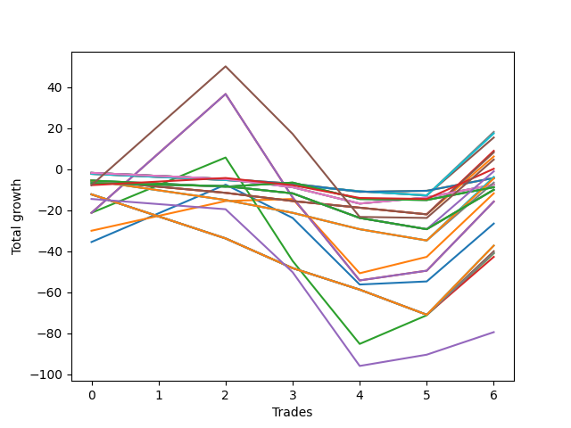

# Long Wallace Doodle 015 
- Symbol: NQ
- Date Range: 03/18/2022 - 06/17/2022
- Trading Period: 7:20-12:30
- Number of Trades: 2



| Name | Win Percent | Profit | Avg Profit / Trade |     | Name | Win Percent | Profit | Avg Profit / Trade |
| ---- | ----------- | ------ | ------------------ | --- | ---- | ----------- | ------ | ------------------ |
| Sorted By <br> Profit | | | | | Sorted By <br> Win Percentage ||||
| Thirty-Nine | 50.00 | 625.00 | 312.50 |     | Thirty-Nine | 50.00 | 625.00 | 312.50 |
| Thirty-Eight | 50.00 | 625.00 | 312.50 |     | Thirty-Eight | 50.00 | 625.00 | 312.50 |
| Thirty-Seven | 50.00 | 625.00 | 312.50 |     | Thirty-Seven | 50.00 | 625.00 | 312.50 |
| Thirty-Six | 50.00 | 625.00 | 312.50 |     | Thirty-Six | 50.00 | 625.00 | 312.50 |
| Thirty-Five | 50.00 | 625.00 | 312.50 |     | Thirty-Five | 50.00 | 625.00 | 312.50 |
| Thirty-Four | 50.00 | 625.00 | 312.50 |     | Thirty-Four | 50.00 | 625.00 | 312.50 |
| Thirty-Three | 50.00 | 625.00 | 312.50 |     | Thirty-Three | 50.00 | 625.00 | 312.50 |
| Thirty-Two | 50.00 | 625.00 | 312.50 |     | Thirty-Two | 50.00 | 625.00 | 312.50 |
| Twenty-Three | 50.00 | -625.00 | -312.50 |     | Twenty-Three | 50.00 | -625.00 | -312.50 |
| Twenty-Two | 50.00 | -625.00 | -312.50 |     | Twenty-Two | 50.00 | -625.00 | -312.50 |
| Twenty-One | 50.00 | -625.00 | -312.50 |     | Twenty-One | 50.00 | -625.00 | -312.50 |
| Twenty | 50.00 | -625.00 | -312.50 |     | Twenty | 50.00 | -625.00 | -312.50 |
| Nineteen | 50.00 | -625.00 | -312.50 |     | Nineteen | 50.00 | -625.00 | -312.50 |
| Eighteen | 50.00 | -625.00 | -312.50 |     | Eighteen | 50.00 | -625.00 | -312.50 |
| Seventeen | 50.00 | -625.00 | -312.50 |     | Seventeen | 50.00 | -625.00 | -312.50 |
| Sixten | 50.00 | -625.00 | -312.50 |     | Sixten | 50.00 | -625.00 | -312.50 |
| Fifteen | 0.00 | -2125.00 | -1062.50 |     | Two | 50.00 | -3625.00 | -1812.50 |
| Fourteen | 0.00 | -2125.00 | -1062.50 |     | Seventy-Three | 50.00 | -4500.00 | -2250.00 |
| Thirteen | 0.00 | -2125.00 | -1062.50 |     | Seventy-Five | 50.00 | -8250.00 | -4125.00 |
| Twelve | 0.00 | -2125.00 | -1062.50 |     | Seven | 50.00 | -8250.00 | -4125.00 |
| Eleven | 0.00 | -2125.00 | -1062.50 |     | Six | 50.00 | -8250.00 | -4125.00 |
| Ten | 0.00 | -2125.00 | -1062.50 |     | Five | 50.00 | -8250.00 | -4125.00 |
| Nine | 0.00 | -2125.00 | -1062.50 |     | Four | 50.00 | -8250.00 | -4125.00 |
| Eight | 0.00 | -2125.00 | -1062.50 |     | Three | 50.00 | -8250.00 | -4125.00 |
| Fifty-Five | 0.00 | -3000.00 | -1500.00 |     | One | 50.00 | -11000.00 | -5500.00 |
| Fifty-Four | 0.00 | -3000.00 | -1500.00 |     | Zero | 50.00 | -17000.00 | -8500.00 |
| Fifty-Three | 0.00 | -3000.00 | -1500.00 |     | Fifteen | 0.00 | -2125.00 | -1062.50 |
| Fifty-Two | 0.00 | -3000.00 | -1500.00 |     | Fourteen | 0.00 | -2125.00 | -1062.50 |
| Fifty-One | 0.00 | -3000.00 | -1500.00 |     | Thirteen | 0.00 | -2125.00 | -1062.50 |
| Fifty | 0.00 | -3000.00 | -1500.00 |     | Twelve | 0.00 | -2125.00 | -1062.50 |
| Forty-Nine | 0.00 | -3000.00 | -1500.00 |     | Eleven | 0.00 | -2125.00 | -1062.50 |
| Forty-Eight | 0.00 | -3000.00 | -1500.00 |     | Ten | 0.00 | -2125.00 | -1062.50 |
| Two | 50.00 | -3625.00 | -1812.50 |     | Nine | 0.00 | -2125.00 | -1062.50 |
| Seventy-Four | 0.00 | -4125.00 | -2062.50 |     | Eight | 0.00 | -2125.00 | -1062.50 |
| Seventy-Two | 0.00 | -4125.00 | -2062.50 |     | Fifty-Five | 0.00 | -3000.00 | -1500.00 |
| Thirty-One | 0.00 | -4375.00 | -2187.50 |     | Fifty-Four | 0.00 | -3000.00 | -1500.00 |
| Thirty | 0.00 | -4375.00 | -2187.50 |     | Fifty-Three | 0.00 | -3000.00 | -1500.00 |
| Twenty-Nine | 0.00 | -4375.00 | -2187.50 |     | Fifty-Two | 0.00 | -3000.00 | -1500.00 |
| Twenty-Eight | 0.00 | -4375.00 | -2187.50 |     | Fifty-One | 0.00 | -3000.00 | -1500.00 |
| twenty-Seven | 0.00 | -4375.00 | -2187.50 |     | Fifty | 0.00 | -3000.00 | -1500.00 |
| Twenty-Six | 0.00 | -4375.00 | -2187.50 |     | Forty-Nine | 0.00 | -3000.00 | -1500.00 |
| Twenty-Five | 0.00 | -4375.00 | -2187.50 |     | Forty-Eight | 0.00 | -3000.00 | -1500.00 |
| Twenty-Four | 0.00 | -4375.00 | -2187.50 |     | Seventy-Four | 0.00 | -4125.00 | -2062.50 |
| Seventy-Three | 50.00 | -4500.00 | -2250.00 |     | Seventy-Two | 0.00 | -4125.00 | -2062.50 |
| Forty-Seven | 0.00 | -5500.00 | -2750.00 |     | Thirty-One | 0.00 | -4375.00 | -2187.50 |
| Forty-Six | 0.00 | -5500.00 | -2750.00 |     | Thirty | 0.00 | -4375.00 | -2187.50 |
| Forty-Five | 0.00 | -5500.00 | -2750.00 |     | Twenty-Nine | 0.00 | -4375.00 | -2187.50 |
| Forty-Four | 0.00 | -5500.00 | -2750.00 |     | Twenty-Eight | 0.00 | -4375.00 | -2187.50 |
| Forty-Three | 0.00 | -5500.00 | -2750.00 |     | twenty-Seven | 0.00 | -4375.00 | -2187.50 |
| Forty-Two | 0.00 | -5500.00 | -2750.00 |     | Twenty-Six | 0.00 | -4375.00 | -2187.50 |
| Forty-One | 0.00 | -5500.00 | -2750.00 |     | Twenty-Five | 0.00 | -4375.00 | -2187.50 |
| Forty | 0.00 | -5500.00 | -2750.00 |     | Twenty-Four | 0.00 | -4375.00 | -2187.50 |
| Seventy-One | 0.00 | -6125.00 | -3062.50 |     | Forty-Seven | 0.00 | -5500.00 | -2750.00 |
| Seventy | 0.00 | -6125.00 | -3062.50 |     | Forty-Six | 0.00 | -5500.00 | -2750.00 |
| Sixty-Nine | 0.00 | -6125.00 | -3062.50 |     | Forty-Five | 0.00 | -5500.00 | -2750.00 |
| Sixty-Eight | 0.00 | -6125.00 | -3062.50 |     | Forty-Four | 0.00 | -5500.00 | -2750.00 |
| Sixty-Seven | 0.00 | -6125.00 | -3062.50 |     | Forty-Three | 0.00 | -5500.00 | -2750.00 |
| Sixty-Six | 0.00 | -6125.00 | -3062.50 |     | Forty-Two | 0.00 | -5500.00 | -2750.00 |
| Sixty-Five | 0.00 | -6125.00 | -3062.50 |     | Forty-One | 0.00 | -5500.00 | -2750.00 |
| Sixty-Four | 0.00 | -6125.00 | -3062.50 |     | Forty | 0.00 | -5500.00 | -2750.00 |
| Seventy-Five | 50.00 | -8250.00 | -4125.00 |     | Seventy-One | 0.00 | -6125.00 | -3062.50 |
| Seven | 50.00 | -8250.00 | -4125.00 |     | Seventy | 0.00 | -6125.00 | -3062.50 |
| Six | 50.00 | -8250.00 | -4125.00 |     | Sixty-Nine | 0.00 | -6125.00 | -3062.50 |
| Five | 50.00 | -8250.00 | -4125.00 |     | Sixty-Eight | 0.00 | -6125.00 | -3062.50 |
| Four | 50.00 | -8250.00 | -4125.00 |     | Sixty-Seven | 0.00 | -6125.00 | -3062.50 |
| Three | 50.00 | -8250.00 | -4125.00 |     | Sixty-Six | 0.00 | -6125.00 | -3062.50 |
| One | 50.00 | -11000.00 | -5500.00 |     | Sixty-Five | 0.00 | -6125.00 | -3062.50 |
| Sixty-Three | 0.00 | -12250.00 | -6125.00 |     | Sixty-Four | 0.00 | -6125.00 | -3062.50 |
| Sixty-Two | 0.00 | -12250.00 | -6125.00 |     | Sixty-Three | 0.00 | -12250.00 | -6125.00 |
| Sixty-One | 0.00 | -12250.00 | -6125.00 |     | Sixty-Two | 0.00 | -12250.00 | -6125.00 |
| Sixty | 0.00 | -12250.00 | -6125.00 |     | Sixty-One | 0.00 | -12250.00 | -6125.00 |
| Fifty-Nine | 0.00 | -12250.00 | -6125.00 |     | Sixty | 0.00 | -12250.00 | -6125.00 |
| Fifty-Eight | 0.00 | -12250.00 | -6125.00 |     | Fifty-Nine | 0.00 | -12250.00 | -6125.00 |
| Fifty-Seven | 0.00 | -12250.00 | -6125.00 |     | Fifty-Eight | 0.00 | -12250.00 | -6125.00 |
| Fifty-Six | 0.00 | -12250.00 | -6125.00 |     | Fifty-Seven | 0.00 | -12250.00 | -6125.00 |
| Zero | 50.00 | -17000.00 | -8500.00 |     | Fifty-Six | 0.00 | -12250.00 | -6125.00 |

## NO STOPLOSS

### Test Zero
* Sell when price hits the middle line of the 20p bollinger
* No Stoploss
* Results:
```
Total Trades: 2
Percent Up: 50.00
Percent Down: 50.00
Total Points Moved Up: -34.00
Potential Profit: -17000.00
Total Points Ups: 1.50 Count Ups: 1
Total Points Downs: -35.50 Count Downs: 1
```

<details><summary>Trades</summary>

<code>In: 2022-03-25 08:12:00		Out: 2022-03-25 08:36:55		Total Position Time: 24:55		Total Move Up: -35.50		Total to Date: -35.50</code> <br />
<code>In: 2022-06-08 09:41:00		Out: 2022-06-08 09:54:10		Total Position Time: 13:10		Total Move Up: 1.50		Total to Date: -34.00</code> <br />


</details>

### Test One
* Sell when the price hits the upper line of the 20p 1std bollinger
* No Stoploss
* Results:
```
Total Trades: 2
Percent Up: 50.00
Percent Down: 50.00
Total Points Moved Up: -22.00
Potential Profit: -11000.00
Total Points Ups: 8.00 Count Ups: 1
Total Points Downs: -30.00 Count Downs: 1
```

<details><summary>Trades</summary>

<code>In: 2022-03-25 08:12:00		Out: 2022-03-25 08:41:20		Total Position Time: 29:20		Total Move Up: -30.00		Total to Date: -30.00</code> <br />
<code>In: 2022-06-08 09:41:00		Out: 2022-06-08 09:57:05		Total Position Time: 16:05		Total Move Up: 8.00		Total to Date: -22.00</code> <br />


</details>

### Test Two
* Sell when the price hits the upper line of the 20p 2std bollinger
* No Stoploss
* Results:
```
Total Trades: 2
Percent Up: 50.00
Percent Down: 50.00
Total Points Moved Up: -7.25
Potential Profit: -3625.00
Total Points Ups: 14.00 Count Ups: 1
Total Points Downs: -21.25 Count Downs: 1
```

<details><summary>Trades</summary>

<code>In: 2022-03-25 08:12:00		Out: 2022-03-25 08:41:55		Total Position Time: 29:55		Total Move Up: -21.25		Total to Date: -21.25</code> <br />
<code>In: 2022-06-08 09:41:00		Out: 2022-06-08 09:59:15		Total Position Time: 18:15		Total Move Up: 14.00		Total to Date: -7.25</code> <br />


</details>

### Test Three
* Sell when price hits the middle line of the 50p bollinger
* No Stoploss
* Results:
```
Total Trades: 2
Percent Up: 50.00
Percent Down: 50.00
Total Points Moved Up: -16.50
Potential Profit: -8250.00
Total Points Ups: 4.75 Count Ups: 1
Total Points Downs: -21.25 Count Downs: 1
```

<details><summary>Trades</summary>

<code>In: 2022-03-25 08:12:00		Out: 2022-03-25 08:41:55		Total Position Time: 29:55		Total Move Up: -21.25		Total to Date: -21.25</code> <br />
<code>In: 2022-06-08 09:41:00		Out: 2022-06-08 10:10:55		Total Position Time: 29:55		Total Move Up: 4.75		Total to Date: -16.50</code> <br />


</details>

### Test Four
* Sell when the price hits the upper line of the 50p 1std bollinger
* No Stoploss
* Results:
```
Total Trades: 2
Percent Up: 50.00
Percent Down: 50.00
Total Points Moved Up: -16.50
Potential Profit: -8250.00
Total Points Ups: 4.75 Count Ups: 1
Total Points Downs: -21.25 Count Downs: 1
```

<details><summary>Trades</summary>

<code>In: 2022-03-25 08:12:00		Out: 2022-03-25 08:41:55		Total Position Time: 29:55		Total Move Up: -21.25		Total to Date: -21.25</code> <br />
<code>In: 2022-06-08 09:41:00		Out: 2022-06-08 10:10:55		Total Position Time: 29:55		Total Move Up: 4.75		Total to Date: -16.50</code> <br />


</details>

### Test Five
* Sell when the price hits the upper line of the 50p 2std bollinger
* No Stoploss
* Results:
```
Total Trades: 2
Percent Up: 50.00
Percent Down: 50.00
Total Points Moved Up: -16.50
Potential Profit: -8250.00
Total Points Ups: 4.75 Count Ups: 1
Total Points Downs: -21.25 Count Downs: 1
```

<details><summary>Trades</summary>

<code>In: 2022-03-25 08:12:00		Out: 2022-03-25 08:41:55		Total Position Time: 29:55		Total Move Up: -21.25		Total to Date: -21.25</code> <br />
<code>In: 2022-06-08 09:41:00		Out: 2022-06-08 10:10:55		Total Position Time: 29:55		Total Move Up: 4.75		Total to Date: -16.50</code> <br />


</details>

### Test Six
* Sell when the price hits the middle line of the 1std VWAP
* No Stoploss
* Results:
```
Total Trades: 2
Percent Up: 50.00
Percent Down: 50.00
Total Points Moved Up: -16.50
Potential Profit: -8250.00
Total Points Ups: 4.75 Count Ups: 1
Total Points Downs: -21.25 Count Downs: 1
```

<details><summary>Trades</summary>

<code>In: 2022-03-25 08:12:00		Out: 2022-03-25 08:41:55		Total Position Time: 29:55		Total Move Up: -21.25		Total to Date: -21.25</code> <br />
<code>In: 2022-06-08 09:41:00		Out: 2022-06-08 10:10:55		Total Position Time: 29:55		Total Move Up: 4.75		Total to Date: -16.50</code> <br />


</details>

### Test Seven
* Sell when the price hits the upper line of the 1std VWAP
* No Stoploss
* Results:
```
Total Trades: 2
Percent Up: 50.00
Percent Down: 50.00
Total Points Moved Up: -16.50
Potential Profit: -8250.00
Total Points Ups: 4.75 Count Ups: 1
Total Points Downs: -21.25 Count Downs: 1
```

<details><summary>Trades</summary>

<code>In: 2022-03-25 08:12:00		Out: 2022-03-25 08:41:55		Total Position Time: 29:55		Total Move Up: -21.25		Total to Date: -21.25</code> <br />
<code>In: 2022-06-08 09:41:00		Out: 2022-06-08 10:10:55		Total Position Time: 29:55		Total Move Up: 4.75		Total to Date: -16.50</code> <br />


</details>

## STOPLOSS OF 2

### Test Eight
* Sell when price hits the middle line of the 20p bollinger
* Stoploss is 2 points
* Results:
```
Total Trades: 2
Percent Up: 0.00
Percent Down: 100.00
Total Points Moved Up: -4.25
Potential Profit: -2125.00
Total Points Ups: 0.00 Count Ups: 0
Total Points Downs: -4.25 Count Downs: 2
```

<details><summary>Trades</summary>

<code>In: 2022-03-25 08:12:00		Out: 2022-03-25 08:12:30		Total Position Time: 00:30		Total Move Up: -2.25		Total to Date: -2.25</code> <br />
<code>In: 2022-06-08 09:41:00		Out: 2022-06-08 09:42:10		Total Position Time: 01:10		Total Move Up: -2.00		Total to Date: -4.25</code> <br />


</details>

### Test Nine
* Sell when the price hits the upper line of the 20p 1std bollinger
* Stoploss is 2 points
* Results:
```
Total Trades: 2
Percent Up: 0.00
Percent Down: 100.00
Total Points Moved Up: -4.25
Potential Profit: -2125.00
Total Points Ups: 0.00 Count Ups: 0
Total Points Downs: -4.25 Count Downs: 2
```

<details><summary>Trades</summary>

<code>In: 2022-03-25 08:12:00		Out: 2022-03-25 08:12:30		Total Position Time: 00:30		Total Move Up: -2.25		Total to Date: -2.25</code> <br />
<code>In: 2022-06-08 09:41:00		Out: 2022-06-08 09:42:10		Total Position Time: 01:10		Total Move Up: -2.00		Total to Date: -4.25</code> <br />


</details>

### Test Ten
* Sell when the price hits the upper line of the 20p 2std bollinger
* Stoploss is 2 points
* Results:
```
Total Trades: 2
Percent Up: 0.00
Percent Down: 100.00
Total Points Moved Up: -4.25
Potential Profit: -2125.00
Total Points Ups: 0.00 Count Ups: 0
Total Points Downs: -4.25 Count Downs: 2
```

<details><summary>Trades</summary>

<code>In: 2022-03-25 08:12:00		Out: 2022-03-25 08:12:30		Total Position Time: 00:30		Total Move Up: -2.25		Total to Date: -2.25</code> <br />
<code>In: 2022-06-08 09:41:00		Out: 2022-06-08 09:42:10		Total Position Time: 01:10		Total Move Up: -2.00		Total to Date: -4.25</code> <br />


</details>

### Test Eleven
* Sell when price hits the middle line of the 50p bollinger
* Stoploss is 2 points
* Results:
```
Total Trades: 2
Percent Up: 0.00
Percent Down: 100.00
Total Points Moved Up: -4.25
Potential Profit: -2125.00
Total Points Ups: 0.00 Count Ups: 0
Total Points Downs: -4.25 Count Downs: 2
```

<details><summary>Trades</summary>

<code>In: 2022-03-25 08:12:00		Out: 2022-03-25 08:12:30		Total Position Time: 00:30		Total Move Up: -2.25		Total to Date: -2.25</code> <br />
<code>In: 2022-06-08 09:41:00		Out: 2022-06-08 09:42:10		Total Position Time: 01:10		Total Move Up: -2.00		Total to Date: -4.25</code> <br />


</details>

### Test Twelve
* Sell when the price hits the upper line of the 50p 1std bollinger
* Stoploss is 2 points
* Results:
```
Total Trades: 2
Percent Up: 0.00
Percent Down: 100.00
Total Points Moved Up: -4.25
Potential Profit: -2125.00
Total Points Ups: 0.00 Count Ups: 0
Total Points Downs: -4.25 Count Downs: 2
```

<details><summary>Trades</summary>

<code>In: 2022-03-25 08:12:00		Out: 2022-03-25 08:12:30		Total Position Time: 00:30		Total Move Up: -2.25		Total to Date: -2.25</code> <br />
<code>In: 2022-06-08 09:41:00		Out: 2022-06-08 09:42:10		Total Position Time: 01:10		Total Move Up: -2.00		Total to Date: -4.25</code> <br />


</details>

### Test Thirteen
* Sell when the price hits the upper line of the 50p 2std bollinger
* Stoploss is 2 points
* Results:
```
Total Trades: 2
Percent Up: 0.00
Percent Down: 100.00
Total Points Moved Up: -4.25
Potential Profit: -2125.00
Total Points Ups: 0.00 Count Ups: 0
Total Points Downs: -4.25 Count Downs: 2
```

<details><summary>Trades</summary>

<code>In: 2022-03-25 08:12:00		Out: 2022-03-25 08:12:30		Total Position Time: 00:30		Total Move Up: -2.25		Total to Date: -2.25</code> <br />
<code>In: 2022-06-08 09:41:00		Out: 2022-06-08 09:42:10		Total Position Time: 01:10		Total Move Up: -2.00		Total to Date: -4.25</code> <br />


</details>

### Test Fourteen
* Sell when the price hits the middle line of the 1std VWAP
* Stoploss is 2 points
* Results:
```
Total Trades: 2
Percent Up: 0.00
Percent Down: 100.00
Total Points Moved Up: -4.25
Potential Profit: -2125.00
Total Points Ups: 0.00 Count Ups: 0
Total Points Downs: -4.25 Count Downs: 2
```

<details><summary>Trades</summary>

<code>In: 2022-03-25 08:12:00		Out: 2022-03-25 08:12:30		Total Position Time: 00:30		Total Move Up: -2.25		Total to Date: -2.25</code> <br />
<code>In: 2022-06-08 09:41:00		Out: 2022-06-08 09:42:10		Total Position Time: 01:10		Total Move Up: -2.00		Total to Date: -4.25</code> <br />


</details>

### Test Fifteen
* Sell when the price hits the upper line of the 1std VWAP
* Stoploss is 2 points
* Results:
```
Total Trades: 2
Percent Up: 0.00
Percent Down: 100.00
Total Points Moved Up: -4.25
Potential Profit: -2125.00
Total Points Ups: 0.00 Count Ups: 0
Total Points Downs: -4.25 Count Downs: 2
```

<details><summary>Trades</summary>

<code>In: 2022-03-25 08:12:00		Out: 2022-03-25 08:12:30		Total Position Time: 00:30		Total Move Up: -2.25		Total to Date: -2.25</code> <br />
<code>In: 2022-06-08 09:41:00		Out: 2022-06-08 09:42:10		Total Position Time: 01:10		Total Move Up: -2.00		Total to Date: -4.25</code> <br />


</details>

## TRAIL STOP OF 2

### Test Sixten
* Sell when price hits the middle line of the 20p bollinger
* Trailing Stop is 2 points
* Results:
```
Total Trades: 2
Percent Up: 50.00
Percent Down: 50.00
Total Points Moved Up: -1.25
Potential Profit: -625.00
Total Points Ups: 0.50 Count Ups: 1
Total Points Downs: -1.75 Count Downs: 1
```

<details><summary>Trades</summary>

<code>In: 2022-03-25 08:12:00		Out: 2022-03-25 08:12:25		Total Position Time: 00:25		Total Move Up: -1.75		Total to Date: -1.75</code> <br />
<code>In: 2022-06-08 09:41:00		Out: 2022-06-08 09:41:15		Total Position Time: 00:15		Total Move Up: 0.50		Total to Date: -1.25</code> <br />


</details>

### Test Seventeen
* Sell when the price hits the upper line of the 20p 1std bollinger
* Trailing Stop is 2 points
* Results:
```
Total Trades: 2
Percent Up: 50.00
Percent Down: 50.00
Total Points Moved Up: -1.25
Potential Profit: -625.00
Total Points Ups: 0.50 Count Ups: 1
Total Points Downs: -1.75 Count Downs: 1
```

<details><summary>Trades</summary>

<code>In: 2022-03-25 08:12:00		Out: 2022-03-25 08:12:25		Total Position Time: 00:25		Total Move Up: -1.75		Total to Date: -1.75</code> <br />
<code>In: 2022-06-08 09:41:00		Out: 2022-06-08 09:41:15		Total Position Time: 00:15		Total Move Up: 0.50		Total to Date: -1.25</code> <br />


</details>

### Test Eighteen
* Sell when the price hits the upper line of the 20p 2std bollinger
* Trailing Stop is 2 points
* Results:
```
Total Trades: 2
Percent Up: 50.00
Percent Down: 50.00
Total Points Moved Up: -1.25
Potential Profit: -625.00
Total Points Ups: 0.50 Count Ups: 1
Total Points Downs: -1.75 Count Downs: 1
```

<details><summary>Trades</summary>

<code>In: 2022-03-25 08:12:00		Out: 2022-03-25 08:12:25		Total Position Time: 00:25		Total Move Up: -1.75		Total to Date: -1.75</code> <br />
<code>In: 2022-06-08 09:41:00		Out: 2022-06-08 09:41:15		Total Position Time: 00:15		Total Move Up: 0.50		Total to Date: -1.25</code> <br />


</details>

### Test Nineteen
* Sell when price hits the middle line of the 50p bollinger
* Trailing Stop is 2 points
* Results:
```
Total Trades: 2
Percent Up: 50.00
Percent Down: 50.00
Total Points Moved Up: -1.25
Potential Profit: -625.00
Total Points Ups: 0.50 Count Ups: 1
Total Points Downs: -1.75 Count Downs: 1
```

<details><summary>Trades</summary>

<code>In: 2022-03-25 08:12:00		Out: 2022-03-25 08:12:25		Total Position Time: 00:25		Total Move Up: -1.75		Total to Date: -1.75</code> <br />
<code>In: 2022-06-08 09:41:00		Out: 2022-06-08 09:41:15		Total Position Time: 00:15		Total Move Up: 0.50		Total to Date: -1.25</code> <br />


</details>

### Test Twenty
* Sell when the price hits the upper line of the 50p 1std bollinger
* Trailing Stop is 2 points
* Results:
```
Total Trades: 2
Percent Up: 50.00
Percent Down: 50.00
Total Points Moved Up: -1.25
Potential Profit: -625.00
Total Points Ups: 0.50 Count Ups: 1
Total Points Downs: -1.75 Count Downs: 1
```

<details><summary>Trades</summary>

<code>In: 2022-03-25 08:12:00		Out: 2022-03-25 08:12:25		Total Position Time: 00:25		Total Move Up: -1.75		Total to Date: -1.75</code> <br />
<code>In: 2022-06-08 09:41:00		Out: 2022-06-08 09:41:15		Total Position Time: 00:15		Total Move Up: 0.50		Total to Date: -1.25</code> <br />


</details>

### Test Twenty-One
* Sell when the price hits the upper line of the 50p 2std bollinger
* Trailing Stop is 2 points
* Results:
```
Total Trades: 2
Percent Up: 50.00
Percent Down: 50.00
Total Points Moved Up: -1.25
Potential Profit: -625.00
Total Points Ups: 0.50 Count Ups: 1
Total Points Downs: -1.75 Count Downs: 1
```

<details><summary>Trades</summary>

<code>In: 2022-03-25 08:12:00		Out: 2022-03-25 08:12:25		Total Position Time: 00:25		Total Move Up: -1.75		Total to Date: -1.75</code> <br />
<code>In: 2022-06-08 09:41:00		Out: 2022-06-08 09:41:15		Total Position Time: 00:15		Total Move Up: 0.50		Total to Date: -1.25</code> <br />


</details>

### Test Twenty-Two
* Sell when the price hits the middle line of the 1std VWAP
* Trailing Stop is 2 points
* Results:
```
Total Trades: 2
Percent Up: 50.00
Percent Down: 50.00
Total Points Moved Up: -1.25
Potential Profit: -625.00
Total Points Ups: 0.50 Count Ups: 1
Total Points Downs: -1.75 Count Downs: 1
```

<details><summary>Trades</summary>

<code>In: 2022-03-25 08:12:00		Out: 2022-03-25 08:12:25		Total Position Time: 00:25		Total Move Up: -1.75		Total to Date: -1.75</code> <br />
<code>In: 2022-06-08 09:41:00		Out: 2022-06-08 09:41:15		Total Position Time: 00:15		Total Move Up: 0.50		Total to Date: -1.25</code> <br />


</details>

### Test Twenty-Three
* Sell when the price hits the upper line of the 1std VWAP
* Trailing Stop is 2 points
* Results:
```
Total Trades: 2
Percent Up: 50.00
Percent Down: 50.00
Total Points Moved Up: -1.25
Potential Profit: -625.00
Total Points Ups: 0.50 Count Ups: 1
Total Points Downs: -1.75 Count Downs: 1
```

<details><summary>Trades</summary>

<code>In: 2022-03-25 08:12:00		Out: 2022-03-25 08:12:25		Total Position Time: 00:25		Total Move Up: -1.75		Total to Date: -1.75</code> <br />
<code>In: 2022-06-08 09:41:00		Out: 2022-06-08 09:41:15		Total Position Time: 00:15		Total Move Up: 0.50		Total to Date: -1.25</code> <br />


</details>

## STOPLOSS OF 3

### Test Twenty-Four
* Sell when price hits the middle line of the 20p bollinger
* Stoploss is 3 points
* Results:
```
Total Trades: 2
Percent Up: 0.00
Percent Down: 100.00
Total Points Moved Up: -8.75
Potential Profit: -4375.00
Total Points Ups: 0.00 Count Ups: 0
Total Points Downs: -8.75 Count Downs: 2
```

<details><summary>Trades</summary>

<code>In: 2022-03-25 08:12:00		Out: 2022-03-25 08:12:35		Total Position Time: 00:35		Total Move Up: -5.50		Total to Date: -5.50</code> <br />
<code>In: 2022-06-08 09:41:00		Out: 2022-06-08 09:42:25		Total Position Time: 01:25		Total Move Up: -3.25		Total to Date: -8.75</code> <br />


</details>

### Test Twenty-Five
* Sell when the price hits the upper line of the 20p 1std bollinger
* Stoploss is 3 points
* Results:
```
Total Trades: 2
Percent Up: 0.00
Percent Down: 100.00
Total Points Moved Up: -8.75
Potential Profit: -4375.00
Total Points Ups: 0.00 Count Ups: 0
Total Points Downs: -8.75 Count Downs: 2
```

<details><summary>Trades</summary>

<code>In: 2022-03-25 08:12:00		Out: 2022-03-25 08:12:35		Total Position Time: 00:35		Total Move Up: -5.50		Total to Date: -5.50</code> <br />
<code>In: 2022-06-08 09:41:00		Out: 2022-06-08 09:42:25		Total Position Time: 01:25		Total Move Up: -3.25		Total to Date: -8.75</code> <br />


</details>

### Test Twenty-Six
* Sell when the price hits the upper line of the 20p 2std bollinger
* Stoploss is 3 points
* Results:
```
Total Trades: 2
Percent Up: 0.00
Percent Down: 100.00
Total Points Moved Up: -8.75
Potential Profit: -4375.00
Total Points Ups: 0.00 Count Ups: 0
Total Points Downs: -8.75 Count Downs: 2
```

<details><summary>Trades</summary>

<code>In: 2022-03-25 08:12:00		Out: 2022-03-25 08:12:35		Total Position Time: 00:35		Total Move Up: -5.50		Total to Date: -5.50</code> <br />
<code>In: 2022-06-08 09:41:00		Out: 2022-06-08 09:42:25		Total Position Time: 01:25		Total Move Up: -3.25		Total to Date: -8.75</code> <br />


</details>

### Test twenty-Seven
* Sell when price hits the middle line of the 50p bollinger
* Stoploss is 3 points
* Results:
```
Total Trades: 2
Percent Up: 0.00
Percent Down: 100.00
Total Points Moved Up: -8.75
Potential Profit: -4375.00
Total Points Ups: 0.00 Count Ups: 0
Total Points Downs: -8.75 Count Downs: 2
```

<details><summary>Trades</summary>

<code>In: 2022-03-25 08:12:00		Out: 2022-03-25 08:12:35		Total Position Time: 00:35		Total Move Up: -5.50		Total to Date: -5.50</code> <br />
<code>In: 2022-06-08 09:41:00		Out: 2022-06-08 09:42:25		Total Position Time: 01:25		Total Move Up: -3.25		Total to Date: -8.75</code> <br />


</details>

### Test Twenty-Eight
* Sell when the price hits the upper line of the 50p 1std bollinger
* Stoploss is 3 points
* Results:
```
Total Trades: 2
Percent Up: 0.00
Percent Down: 100.00
Total Points Moved Up: -8.75
Potential Profit: -4375.00
Total Points Ups: 0.00 Count Ups: 0
Total Points Downs: -8.75 Count Downs: 2
```

<details><summary>Trades</summary>

<code>In: 2022-03-25 08:12:00		Out: 2022-03-25 08:12:35		Total Position Time: 00:35		Total Move Up: -5.50		Total to Date: -5.50</code> <br />
<code>In: 2022-06-08 09:41:00		Out: 2022-06-08 09:42:25		Total Position Time: 01:25		Total Move Up: -3.25		Total to Date: -8.75</code> <br />


</details>

### Test Twenty-Nine
* Sell when the price hits the upper line of the 50p 2std bollinger
* Stoploss is 3 points
* Results:
```
Total Trades: 2
Percent Up: 0.00
Percent Down: 100.00
Total Points Moved Up: -8.75
Potential Profit: -4375.00
Total Points Ups: 0.00 Count Ups: 0
Total Points Downs: -8.75 Count Downs: 2
```

<details><summary>Trades</summary>

<code>In: 2022-03-25 08:12:00		Out: 2022-03-25 08:12:35		Total Position Time: 00:35		Total Move Up: -5.50		Total to Date: -5.50</code> <br />
<code>In: 2022-06-08 09:41:00		Out: 2022-06-08 09:42:25		Total Position Time: 01:25		Total Move Up: -3.25		Total to Date: -8.75</code> <br />


</details>

### Test Thirty
* Sell when the price hits the middle line of the 1std VWAP
* Stoploss is 3 points
* Results:
```
Total Trades: 2
Percent Up: 0.00
Percent Down: 100.00
Total Points Moved Up: -8.75
Potential Profit: -4375.00
Total Points Ups: 0.00 Count Ups: 0
Total Points Downs: -8.75 Count Downs: 2
```

<details><summary>Trades</summary>

<code>In: 2022-03-25 08:12:00		Out: 2022-03-25 08:12:35		Total Position Time: 00:35		Total Move Up: -5.50		Total to Date: -5.50</code> <br />
<code>In: 2022-06-08 09:41:00		Out: 2022-06-08 09:42:25		Total Position Time: 01:25		Total Move Up: -3.25		Total to Date: -8.75</code> <br />


</details>

### Test Thirty-One
* Sell when the price hits the upper line of the 1std VWAP
* Stoploss is 3 points
* Results:
```
Total Trades: 2
Percent Up: 0.00
Percent Down: 100.00
Total Points Moved Up: -8.75
Potential Profit: -4375.00
Total Points Ups: 0.00 Count Ups: 0
Total Points Downs: -8.75 Count Downs: 2
```

<details><summary>Trades</summary>

<code>In: 2022-03-25 08:12:00		Out: 2022-03-25 08:12:35		Total Position Time: 00:35		Total Move Up: -5.50		Total to Date: -5.50</code> <br />
<code>In: 2022-06-08 09:41:00		Out: 2022-06-08 09:42:25		Total Position Time: 01:25		Total Move Up: -3.25		Total to Date: -8.75</code> <br />


</details>

## TRAIL STOP OF 3

### Test Thirty-Two
* Sell when price hits the middle line of the 20p bollinger
* Trailing Stop is 3 points
* Results:
```
Total Trades: 2
Percent Up: 50.00
Percent Down: 50.00
Total Points Moved Up: 1.25
Potential Profit: 625.00
Total Points Ups: 3.00 Count Ups: 1
Total Points Downs: -1.75 Count Downs: 1
```

<details><summary>Trades</summary>

<code>In: 2022-03-25 08:12:00		Out: 2022-03-25 08:12:25		Total Position Time: 00:25		Total Move Up: -1.75		Total to Date: -1.75</code> <br />
<code>In: 2022-06-08 09:41:00		Out: 2022-06-08 09:41:45		Total Position Time: 00:45		Total Move Up: 3.00		Total to Date: 1.25</code> <br />


</details>

### Test Thirty-Three
* Sell when the price hits the upper line of the 20p 1std bollinger
* Trailing Stop is 3 points
* Results:
```
Total Trades: 2
Percent Up: 50.00
Percent Down: 50.00
Total Points Moved Up: 1.25
Potential Profit: 625.00
Total Points Ups: 3.00 Count Ups: 1
Total Points Downs: -1.75 Count Downs: 1
```

<details><summary>Trades</summary>

<code>In: 2022-03-25 08:12:00		Out: 2022-03-25 08:12:25		Total Position Time: 00:25		Total Move Up: -1.75		Total to Date: -1.75</code> <br />
<code>In: 2022-06-08 09:41:00		Out: 2022-06-08 09:41:45		Total Position Time: 00:45		Total Move Up: 3.00		Total to Date: 1.25</code> <br />


</details>

### Test Thirty-Four
* Sell when the price hits the upper line of the 20p 2std bollinger
* Trailing Stop is 3 points
* Results:
```
Total Trades: 2
Percent Up: 50.00
Percent Down: 50.00
Total Points Moved Up: 1.25
Potential Profit: 625.00
Total Points Ups: 3.00 Count Ups: 1
Total Points Downs: -1.75 Count Downs: 1
```

<details><summary>Trades</summary>

<code>In: 2022-03-25 08:12:00		Out: 2022-03-25 08:12:25		Total Position Time: 00:25		Total Move Up: -1.75		Total to Date: -1.75</code> <br />
<code>In: 2022-06-08 09:41:00		Out: 2022-06-08 09:41:45		Total Position Time: 00:45		Total Move Up: 3.00		Total to Date: 1.25</code> <br />


</details>

### Test Thirty-Five
* Sell when price hits the middle line of the 50p bollinger
* Trailing Stop is 3 points
* Results:
```
Total Trades: 2
Percent Up: 50.00
Percent Down: 50.00
Total Points Moved Up: 1.25
Potential Profit: 625.00
Total Points Ups: 3.00 Count Ups: 1
Total Points Downs: -1.75 Count Downs: 1
```

<details><summary>Trades</summary>

<code>In: 2022-03-25 08:12:00		Out: 2022-03-25 08:12:25		Total Position Time: 00:25		Total Move Up: -1.75		Total to Date: -1.75</code> <br />
<code>In: 2022-06-08 09:41:00		Out: 2022-06-08 09:41:45		Total Position Time: 00:45		Total Move Up: 3.00		Total to Date: 1.25</code> <br />


</details>

### Test Thirty-Six
* Sell when the price hits the upper line of the 50p 1std bollinger
* Trailing Stop is 3 points
* Results:
```
Total Trades: 2
Percent Up: 50.00
Percent Down: 50.00
Total Points Moved Up: 1.25
Potential Profit: 625.00
Total Points Ups: 3.00 Count Ups: 1
Total Points Downs: -1.75 Count Downs: 1
```

<details><summary>Trades</summary>

<code>In: 2022-03-25 08:12:00		Out: 2022-03-25 08:12:25		Total Position Time: 00:25		Total Move Up: -1.75		Total to Date: -1.75</code> <br />
<code>In: 2022-06-08 09:41:00		Out: 2022-06-08 09:41:45		Total Position Time: 00:45		Total Move Up: 3.00		Total to Date: 1.25</code> <br />


</details>

### Test Thirty-Seven
* Sell when the price hits the upper line of the 50p 2std bollinger
* Trailing Stop is 3 points
* Results:
```
Total Trades: 2
Percent Up: 50.00
Percent Down: 50.00
Total Points Moved Up: 1.25
Potential Profit: 625.00
Total Points Ups: 3.00 Count Ups: 1
Total Points Downs: -1.75 Count Downs: 1
```

<details><summary>Trades</summary>

<code>In: 2022-03-25 08:12:00		Out: 2022-03-25 08:12:25		Total Position Time: 00:25		Total Move Up: -1.75		Total to Date: -1.75</code> <br />
<code>In: 2022-06-08 09:41:00		Out: 2022-06-08 09:41:45		Total Position Time: 00:45		Total Move Up: 3.00		Total to Date: 1.25</code> <br />


</details>

### Test Thirty-Eight
* Sell when the price hits the middle line of the 1std VWAP
* Trailing Stop is 3 points
* Results:
```
Total Trades: 2
Percent Up: 50.00
Percent Down: 50.00
Total Points Moved Up: 1.25
Potential Profit: 625.00
Total Points Ups: 3.00 Count Ups: 1
Total Points Downs: -1.75 Count Downs: 1
```

<details><summary>Trades</summary>

<code>In: 2022-03-25 08:12:00		Out: 2022-03-25 08:12:25		Total Position Time: 00:25		Total Move Up: -1.75		Total to Date: -1.75</code> <br />
<code>In: 2022-06-08 09:41:00		Out: 2022-06-08 09:41:45		Total Position Time: 00:45		Total Move Up: 3.00		Total to Date: 1.25</code> <br />


</details>

### Test Thirty-Nine
* Sell when the price hits the upper line of the 1std VWAP
* Trailing Stop is 3 points
* Results:
```
Total Trades: 2
Percent Up: 50.00
Percent Down: 50.00
Total Points Moved Up: 1.25
Potential Profit: 625.00
Total Points Ups: 3.00 Count Ups: 1
Total Points Downs: -1.75 Count Downs: 1
```

<details><summary>Trades</summary>

<code>In: 2022-03-25 08:12:00		Out: 2022-03-25 08:12:25		Total Position Time: 00:25		Total Move Up: -1.75		Total to Date: -1.75</code> <br />
<code>In: 2022-06-08 09:41:00		Out: 2022-06-08 09:41:45		Total Position Time: 00:45		Total Move Up: 3.00		Total to Date: 1.25</code> <br />


</details>

## STOPLOSS OF 5

### Test Forty
* Sell when price hits the middle line of the 20p bollinger
* Stoploss is 5 points
* Results:
```
Total Trades: 2
Percent Up: 0.00
Percent Down: 100.00
Total Points Moved Up: -11.00
Potential Profit: -5500.00
Total Points Ups: 0.00 Count Ups: 0
Total Points Downs: -11.00 Count Downs: 2
```

<details><summary>Trades</summary>

<code>In: 2022-03-25 08:12:00		Out: 2022-03-25 08:12:35		Total Position Time: 00:35		Total Move Up: -5.50		Total to Date: -5.50</code> <br />
<code>In: 2022-06-08 09:41:00		Out: 2022-06-08 09:42:35		Total Position Time: 01:35		Total Move Up: -5.50		Total to Date: -11.00</code> <br />


</details>

### Test Forty-One
* Sell when the price hits the upper line of the 20p 1std bollinger
* Stoploss is 5 points
* Results:
```
Total Trades: 2
Percent Up: 0.00
Percent Down: 100.00
Total Points Moved Up: -11.00
Potential Profit: -5500.00
Total Points Ups: 0.00 Count Ups: 0
Total Points Downs: -11.00 Count Downs: 2
```

<details><summary>Trades</summary>

<code>In: 2022-03-25 08:12:00		Out: 2022-03-25 08:12:35		Total Position Time: 00:35		Total Move Up: -5.50		Total to Date: -5.50</code> <br />
<code>In: 2022-06-08 09:41:00		Out: 2022-06-08 09:42:35		Total Position Time: 01:35		Total Move Up: -5.50		Total to Date: -11.00</code> <br />


</details>

### Test Forty-Two
* Sell when the price hits the upper line of the 20p 2std bollinger
* Stoploss is 5 points
* Results:
```
Total Trades: 2
Percent Up: 0.00
Percent Down: 100.00
Total Points Moved Up: -11.00
Potential Profit: -5500.00
Total Points Ups: 0.00 Count Ups: 0
Total Points Downs: -11.00 Count Downs: 2
```

<details><summary>Trades</summary>

<code>In: 2022-03-25 08:12:00		Out: 2022-03-25 08:12:35		Total Position Time: 00:35		Total Move Up: -5.50		Total to Date: -5.50</code> <br />
<code>In: 2022-06-08 09:41:00		Out: 2022-06-08 09:42:35		Total Position Time: 01:35		Total Move Up: -5.50		Total to Date: -11.00</code> <br />


</details>

### Test Forty-Three
* Sell when price hits the middle line of the 50p bollinger
* Stoploss is 5 points
* Results:
```
Total Trades: 2
Percent Up: 0.00
Percent Down: 100.00
Total Points Moved Up: -11.00
Potential Profit: -5500.00
Total Points Ups: 0.00 Count Ups: 0
Total Points Downs: -11.00 Count Downs: 2
```

<details><summary>Trades</summary>

<code>In: 2022-03-25 08:12:00		Out: 2022-03-25 08:12:35		Total Position Time: 00:35		Total Move Up: -5.50		Total to Date: -5.50</code> <br />
<code>In: 2022-06-08 09:41:00		Out: 2022-06-08 09:42:35		Total Position Time: 01:35		Total Move Up: -5.50		Total to Date: -11.00</code> <br />


</details>

### Test Forty-Four
* Sell when the price hits the upper line of the 50p 1std bollinger
* Stoploss is 5 points
* Results:
```
Total Trades: 2
Percent Up: 0.00
Percent Down: 100.00
Total Points Moved Up: -11.00
Potential Profit: -5500.00
Total Points Ups: 0.00 Count Ups: 0
Total Points Downs: -11.00 Count Downs: 2
```

<details><summary>Trades</summary>

<code>In: 2022-03-25 08:12:00		Out: 2022-03-25 08:12:35		Total Position Time: 00:35		Total Move Up: -5.50		Total to Date: -5.50</code> <br />
<code>In: 2022-06-08 09:41:00		Out: 2022-06-08 09:42:35		Total Position Time: 01:35		Total Move Up: -5.50		Total to Date: -11.00</code> <br />


</details>

### Test Forty-Five
* Sell when the price hits the upper line of the 50p 2std bollinger
* Stoploss is 5 points
* Results:
```
Total Trades: 2
Percent Up: 0.00
Percent Down: 100.00
Total Points Moved Up: -11.00
Potential Profit: -5500.00
Total Points Ups: 0.00 Count Ups: 0
Total Points Downs: -11.00 Count Downs: 2
```

<details><summary>Trades</summary>

<code>In: 2022-03-25 08:12:00		Out: 2022-03-25 08:12:35		Total Position Time: 00:35		Total Move Up: -5.50		Total to Date: -5.50</code> <br />
<code>In: 2022-06-08 09:41:00		Out: 2022-06-08 09:42:35		Total Position Time: 01:35		Total Move Up: -5.50		Total to Date: -11.00</code> <br />


</details>

### Test Forty-Six
* Sell when the price hits the middle line of the 1std VWAP
* Stoploss is 5 points
* Results:
```
Total Trades: 2
Percent Up: 0.00
Percent Down: 100.00
Total Points Moved Up: -11.00
Potential Profit: -5500.00
Total Points Ups: 0.00 Count Ups: 0
Total Points Downs: -11.00 Count Downs: 2
```

<details><summary>Trades</summary>

<code>In: 2022-03-25 08:12:00		Out: 2022-03-25 08:12:35		Total Position Time: 00:35		Total Move Up: -5.50		Total to Date: -5.50</code> <br />
<code>In: 2022-06-08 09:41:00		Out: 2022-06-08 09:42:35		Total Position Time: 01:35		Total Move Up: -5.50		Total to Date: -11.00</code> <br />


</details>

### Test Forty-Seven
* Sell when the price hits the upper line of the 1std VWAP
* Stoploss is 5 points
* Results:
```
Total Trades: 2
Percent Up: 0.00
Percent Down: 100.00
Total Points Moved Up: -11.00
Potential Profit: -5500.00
Total Points Ups: 0.00 Count Ups: 0
Total Points Downs: -11.00 Count Downs: 2
```

<details><summary>Trades</summary>

<code>In: 2022-03-25 08:12:00		Out: 2022-03-25 08:12:35		Total Position Time: 00:35		Total Move Up: -5.50		Total to Date: -5.50</code> <br />
<code>In: 2022-06-08 09:41:00		Out: 2022-06-08 09:42:35		Total Position Time: 01:35		Total Move Up: -5.50		Total to Date: -11.00</code> <br />


</details>

## TRAIL STOP OF 5

### Test Forty-Eight
* Sell when price hits the middle line of the 20p bollinger
* Trailing Stop is 5 points
* Results:
```
Total Trades: 2
Percent Up: 0.00
Percent Down: 100.00
Total Points Moved Up: -6.00
Potential Profit: -3000.00
Total Points Ups: 0.00 Count Ups: 0
Total Points Downs: -6.00 Count Downs: 2
```

<details><summary>Trades</summary>

<code>In: 2022-03-25 08:12:00		Out: 2022-03-25 08:12:35		Total Position Time: 00:35		Total Move Up: -5.50		Total to Date: -5.50</code> <br />
<code>In: 2022-06-08 09:41:00		Out: 2022-06-08 09:42:05		Total Position Time: 01:05		Total Move Up: -0.50		Total to Date: -6.00</code> <br />


</details>

### Test Forty-Nine
* Sell when the price hits the upper line of the 20p 1std bollinger
* Trailing Stop is 5 points
* Results:
```
Total Trades: 2
Percent Up: 0.00
Percent Down: 100.00
Total Points Moved Up: -6.00
Potential Profit: -3000.00
Total Points Ups: 0.00 Count Ups: 0
Total Points Downs: -6.00 Count Downs: 2
```

<details><summary>Trades</summary>

<code>In: 2022-03-25 08:12:00		Out: 2022-03-25 08:12:35		Total Position Time: 00:35		Total Move Up: -5.50		Total to Date: -5.50</code> <br />
<code>In: 2022-06-08 09:41:00		Out: 2022-06-08 09:42:05		Total Position Time: 01:05		Total Move Up: -0.50		Total to Date: -6.00</code> <br />


</details>

### Test Fifty
* Sell when the price hits the upper line of the 20p 2std bollinger
* Trailing Stop is 5 points
* Results:
```
Total Trades: 2
Percent Up: 0.00
Percent Down: 100.00
Total Points Moved Up: -6.00
Potential Profit: -3000.00
Total Points Ups: 0.00 Count Ups: 0
Total Points Downs: -6.00 Count Downs: 2
```

<details><summary>Trades</summary>

<code>In: 2022-03-25 08:12:00		Out: 2022-03-25 08:12:35		Total Position Time: 00:35		Total Move Up: -5.50		Total to Date: -5.50</code> <br />
<code>In: 2022-06-08 09:41:00		Out: 2022-06-08 09:42:05		Total Position Time: 01:05		Total Move Up: -0.50		Total to Date: -6.00</code> <br />


</details>

### Test Fifty-One
* Sell when price hits the middle line of the 50p bollinger
* Trailing Stop is 5 points
* Results:
```
Total Trades: 2
Percent Up: 0.00
Percent Down: 100.00
Total Points Moved Up: -6.00
Potential Profit: -3000.00
Total Points Ups: 0.00 Count Ups: 0
Total Points Downs: -6.00 Count Downs: 2
```

<details><summary>Trades</summary>

<code>In: 2022-03-25 08:12:00		Out: 2022-03-25 08:12:35		Total Position Time: 00:35		Total Move Up: -5.50		Total to Date: -5.50</code> <br />
<code>In: 2022-06-08 09:41:00		Out: 2022-06-08 09:42:05		Total Position Time: 01:05		Total Move Up: -0.50		Total to Date: -6.00</code> <br />


</details>

### Test Fifty-Two
* Sell when the price hits the upper line of the 50p 1std bollinger
* Trailing Stop is 5 points
* Results:
```
Total Trades: 2
Percent Up: 0.00
Percent Down: 100.00
Total Points Moved Up: -6.00
Potential Profit: -3000.00
Total Points Ups: 0.00 Count Ups: 0
Total Points Downs: -6.00 Count Downs: 2
```

<details><summary>Trades</summary>

<code>In: 2022-03-25 08:12:00		Out: 2022-03-25 08:12:35		Total Position Time: 00:35		Total Move Up: -5.50		Total to Date: -5.50</code> <br />
<code>In: 2022-06-08 09:41:00		Out: 2022-06-08 09:42:05		Total Position Time: 01:05		Total Move Up: -0.50		Total to Date: -6.00</code> <br />


</details>

### Test Fifty-Three
* Sell when the price hits the upper line of the 50p 2std bollinger
* Trailing Stop is 5 points
* Results:
```
Total Trades: 2
Percent Up: 0.00
Percent Down: 100.00
Total Points Moved Up: -6.00
Potential Profit: -3000.00
Total Points Ups: 0.00 Count Ups: 0
Total Points Downs: -6.00 Count Downs: 2
```

<details><summary>Trades</summary>

<code>In: 2022-03-25 08:12:00		Out: 2022-03-25 08:12:35		Total Position Time: 00:35		Total Move Up: -5.50		Total to Date: -5.50</code> <br />
<code>In: 2022-06-08 09:41:00		Out: 2022-06-08 09:42:05		Total Position Time: 01:05		Total Move Up: -0.50		Total to Date: -6.00</code> <br />


</details>

### Test Fifty-Four
* Sell when the price hits the middle line of the 1std VWAP
* Trailing Stop is 5 points
* Results:
```
Total Trades: 2
Percent Up: 0.00
Percent Down: 100.00
Total Points Moved Up: -6.00
Potential Profit: -3000.00
Total Points Ups: 0.00 Count Ups: 0
Total Points Downs: -6.00 Count Downs: 2
```

<details><summary>Trades</summary>

<code>In: 2022-03-25 08:12:00		Out: 2022-03-25 08:12:35		Total Position Time: 00:35		Total Move Up: -5.50		Total to Date: -5.50</code> <br />
<code>In: 2022-06-08 09:41:00		Out: 2022-06-08 09:42:05		Total Position Time: 01:05		Total Move Up: -0.50		Total to Date: -6.00</code> <br />


</details>

### Test Fifty-Five
* Sell when the price hits the upper line of the 1std VWAP
* Trailing Stop is 5 points
* Results:
```
Total Trades: 2
Percent Up: 0.00
Percent Down: 100.00
Total Points Moved Up: -6.00
Potential Profit: -3000.00
Total Points Ups: 0.00 Count Ups: 0
Total Points Downs: -6.00 Count Downs: 2
```

<details><summary>Trades</summary>

<code>In: 2022-03-25 08:12:00		Out: 2022-03-25 08:12:35		Total Position Time: 00:35		Total Move Up: -5.50		Total to Date: -5.50</code> <br />
<code>In: 2022-06-08 09:41:00		Out: 2022-06-08 09:42:05		Total Position Time: 01:05		Total Move Up: -0.50		Total to Date: -6.00</code> <br />


</details>

## STOPLOSS OF 10

### Test Fifty-Six
* Sell when price hits the middle line of the 20p bollinger
* Stoploss is 10 points
* Results:
```
Total Trades: 2
Percent Up: 0.00
Percent Down: 100.00
Total Points Moved Up: -24.50
Potential Profit: -12250.00
Total Points Ups: 0.00 Count Ups: 0
Total Points Downs: -24.50 Count Downs: 2
```

<details><summary>Trades</summary>

<code>In: 2022-03-25 08:12:00		Out: 2022-03-25 08:19:55		Total Position Time: 07:55		Total Move Up: -12.25		Total to Date: -12.25</code> <br />
<code>In: 2022-06-08 09:41:00		Out: 2022-06-08 09:43:25		Total Position Time: 02:25		Total Move Up: -12.25		Total to Date: -24.50</code> <br />


</details>

### Test Fifty-Seven
* Sell when the price hits the upper line of the 20p 1std bollinger
* Stoploss is 10 points
* Results:
```
Total Trades: 2
Percent Up: 0.00
Percent Down: 100.00
Total Points Moved Up: -24.50
Potential Profit: -12250.00
Total Points Ups: 0.00 Count Ups: 0
Total Points Downs: -24.50 Count Downs: 2
```

<details><summary>Trades</summary>

<code>In: 2022-03-25 08:12:00		Out: 2022-03-25 08:19:55		Total Position Time: 07:55		Total Move Up: -12.25		Total to Date: -12.25</code> <br />
<code>In: 2022-06-08 09:41:00		Out: 2022-06-08 09:43:25		Total Position Time: 02:25		Total Move Up: -12.25		Total to Date: -24.50</code> <br />


</details>

### Test Fifty-Eight
* Sell when the price hits the upper line of the 20p 2std bollinger
* Stoploss is 10 points
* Results:
```
Total Trades: 2
Percent Up: 0.00
Percent Down: 100.00
Total Points Moved Up: -24.50
Potential Profit: -12250.00
Total Points Ups: 0.00 Count Ups: 0
Total Points Downs: -24.50 Count Downs: 2
```

<details><summary>Trades</summary>

<code>In: 2022-03-25 08:12:00		Out: 2022-03-25 08:19:55		Total Position Time: 07:55		Total Move Up: -12.25		Total to Date: -12.25</code> <br />
<code>In: 2022-06-08 09:41:00		Out: 2022-06-08 09:43:25		Total Position Time: 02:25		Total Move Up: -12.25		Total to Date: -24.50</code> <br />


</details>

### Test Fifty-Nine
* Sell when price hits the middle line of the 50p bollinger
* Stoploss is 10 points
* Results:
```
Total Trades: 2
Percent Up: 0.00
Percent Down: 100.00
Total Points Moved Up: -24.50
Potential Profit: -12250.00
Total Points Ups: 0.00 Count Ups: 0
Total Points Downs: -24.50 Count Downs: 2
```

<details><summary>Trades</summary>

<code>In: 2022-03-25 08:12:00		Out: 2022-03-25 08:19:55		Total Position Time: 07:55		Total Move Up: -12.25		Total to Date: -12.25</code> <br />
<code>In: 2022-06-08 09:41:00		Out: 2022-06-08 09:43:25		Total Position Time: 02:25		Total Move Up: -12.25		Total to Date: -24.50</code> <br />


</details>

### Test Sixty
* Sell when the price hits the upper line of the 50p 1std bollinger
* Stoploss is 10 points
* Results:
```
Total Trades: 2
Percent Up: 0.00
Percent Down: 100.00
Total Points Moved Up: -24.50
Potential Profit: -12250.00
Total Points Ups: 0.00 Count Ups: 0
Total Points Downs: -24.50 Count Downs: 2
```

<details><summary>Trades</summary>

<code>In: 2022-03-25 08:12:00		Out: 2022-03-25 08:19:55		Total Position Time: 07:55		Total Move Up: -12.25		Total to Date: -12.25</code> <br />
<code>In: 2022-06-08 09:41:00		Out: 2022-06-08 09:43:25		Total Position Time: 02:25		Total Move Up: -12.25		Total to Date: -24.50</code> <br />


</details>

### Test Sixty-One
* Sell when the price hits the upper line of the 50p 2std bollinger
* Stoploss is 10 points
* Results:
```
Total Trades: 2
Percent Up: 0.00
Percent Down: 100.00
Total Points Moved Up: -24.50
Potential Profit: -12250.00
Total Points Ups: 0.00 Count Ups: 0
Total Points Downs: -24.50 Count Downs: 2
```

<details><summary>Trades</summary>

<code>In: 2022-03-25 08:12:00		Out: 2022-03-25 08:19:55		Total Position Time: 07:55		Total Move Up: -12.25		Total to Date: -12.25</code> <br />
<code>In: 2022-06-08 09:41:00		Out: 2022-06-08 09:43:25		Total Position Time: 02:25		Total Move Up: -12.25		Total to Date: -24.50</code> <br />


</details>

### Test Sixty-Two
* Sell when the price hits the middle line of the 1std VWAP
* Stoploss is 10 points
* Results:
```
Total Trades: 2
Percent Up: 0.00
Percent Down: 100.00
Total Points Moved Up: -24.50
Potential Profit: -12250.00
Total Points Ups: 0.00 Count Ups: 0
Total Points Downs: -24.50 Count Downs: 2
```

<details><summary>Trades</summary>

<code>In: 2022-03-25 08:12:00		Out: 2022-03-25 08:19:55		Total Position Time: 07:55		Total Move Up: -12.25		Total to Date: -12.25</code> <br />
<code>In: 2022-06-08 09:41:00		Out: 2022-06-08 09:43:25		Total Position Time: 02:25		Total Move Up: -12.25		Total to Date: -24.50</code> <br />


</details>

### Test Sixty-Three
* Sell when the price hits the upper line of the 1std VWAP
* Stoploss is 10 points
* Results:
```
Total Trades: 2
Percent Up: 0.00
Percent Down: 100.00
Total Points Moved Up: -24.50
Potential Profit: -12250.00
Total Points Ups: 0.00 Count Ups: 0
Total Points Downs: -24.50 Count Downs: 2
```

<details><summary>Trades</summary>

<code>In: 2022-03-25 08:12:00		Out: 2022-03-25 08:19:55		Total Position Time: 07:55		Total Move Up: -12.25		Total to Date: -12.25</code> <br />
<code>In: 2022-06-08 09:41:00		Out: 2022-06-08 09:43:25		Total Position Time: 02:25		Total Move Up: -12.25		Total to Date: -24.50</code> <br />


</details>

## TRAIL STOP OF 10

### Test Sixty-Four
* Sell when price hits the middle line of the 20p bollinger
* Trailing Stop is 10 points
* Results:
```
Total Trades: 2
Percent Up: 0.00
Percent Down: 100.00
Total Points Moved Up: -12.25
Potential Profit: -6125.00
Total Points Ups: 0.00 Count Ups: 0
Total Points Downs: -12.25 Count Downs: 2
```

<details><summary>Trades</summary>

<code>In: 2022-03-25 08:12:00		Out: 2022-03-25 08:14:50		Total Position Time: 02:50		Total Move Up: -6.75		Total to Date: -6.75</code> <br />
<code>In: 2022-06-08 09:41:00		Out: 2022-06-08 09:42:35		Total Position Time: 01:35		Total Move Up: -5.50		Total to Date: -12.25</code> <br />


</details>

### Test Sixty-Five
* Sell when the price hits the upper line of the 20p 1std bollinger
* Trailing Stop is 10 points
* Results:
```
Total Trades: 2
Percent Up: 0.00
Percent Down: 100.00
Total Points Moved Up: -12.25
Potential Profit: -6125.00
Total Points Ups: 0.00 Count Ups: 0
Total Points Downs: -12.25 Count Downs: 2
```

<details><summary>Trades</summary>

<code>In: 2022-03-25 08:12:00		Out: 2022-03-25 08:14:50		Total Position Time: 02:50		Total Move Up: -6.75		Total to Date: -6.75</code> <br />
<code>In: 2022-06-08 09:41:00		Out: 2022-06-08 09:42:35		Total Position Time: 01:35		Total Move Up: -5.50		Total to Date: -12.25</code> <br />


</details>

### Test Sixty-Six
* Sell when the price hits the upper line of the 20p 2std bollinger
* Trailing Stop is 10 points
* Results:
```
Total Trades: 2
Percent Up: 0.00
Percent Down: 100.00
Total Points Moved Up: -12.25
Potential Profit: -6125.00
Total Points Ups: 0.00 Count Ups: 0
Total Points Downs: -12.25 Count Downs: 2
```

<details><summary>Trades</summary>

<code>In: 2022-03-25 08:12:00		Out: 2022-03-25 08:14:50		Total Position Time: 02:50		Total Move Up: -6.75		Total to Date: -6.75</code> <br />
<code>In: 2022-06-08 09:41:00		Out: 2022-06-08 09:42:35		Total Position Time: 01:35		Total Move Up: -5.50		Total to Date: -12.25</code> <br />


</details>

### Test Sixty-Seven
* Sell when price hits the middle line of the 50p bollinger
* Trailing Stop is 10 points
* Results:
```
Total Trades: 2
Percent Up: 0.00
Percent Down: 100.00
Total Points Moved Up: -12.25
Potential Profit: -6125.00
Total Points Ups: 0.00 Count Ups: 0
Total Points Downs: -12.25 Count Downs: 2
```

<details><summary>Trades</summary>

<code>In: 2022-03-25 08:12:00		Out: 2022-03-25 08:14:50		Total Position Time: 02:50		Total Move Up: -6.75		Total to Date: -6.75</code> <br />
<code>In: 2022-06-08 09:41:00		Out: 2022-06-08 09:42:35		Total Position Time: 01:35		Total Move Up: -5.50		Total to Date: -12.25</code> <br />


</details>

### Test Sixty-Eight
* Sell when the price hits the upper line of the 50p 1std bollinger
* Trailing Stop is 10 points
* Results:
```
Total Trades: 2
Percent Up: 0.00
Percent Down: 100.00
Total Points Moved Up: -12.25
Potential Profit: -6125.00
Total Points Ups: 0.00 Count Ups: 0
Total Points Downs: -12.25 Count Downs: 2
```

<details><summary>Trades</summary>

<code>In: 2022-03-25 08:12:00		Out: 2022-03-25 08:14:50		Total Position Time: 02:50		Total Move Up: -6.75		Total to Date: -6.75</code> <br />
<code>In: 2022-06-08 09:41:00		Out: 2022-06-08 09:42:35		Total Position Time: 01:35		Total Move Up: -5.50		Total to Date: -12.25</code> <br />


</details>

### Test Sixty-Nine
* Sell when the price hits the upper line of the 50p 2std bollinger
* Trailing Stop is 10 points
* Results:
```
Total Trades: 2
Percent Up: 0.00
Percent Down: 100.00
Total Points Moved Up: -12.25
Potential Profit: -6125.00
Total Points Ups: 0.00 Count Ups: 0
Total Points Downs: -12.25 Count Downs: 2
```

<details><summary>Trades</summary>

<code>In: 2022-03-25 08:12:00		Out: 2022-03-25 08:14:50		Total Position Time: 02:50		Total Move Up: -6.75		Total to Date: -6.75</code> <br />
<code>In: 2022-06-08 09:41:00		Out: 2022-06-08 09:42:35		Total Position Time: 01:35		Total Move Up: -5.50		Total to Date: -12.25</code> <br />


</details>

### Test Seventy
* Sell when the price hits the middle line of the 1std VWAP
* Trailing Stop is 10 points
* Results:
```
Total Trades: 2
Percent Up: 0.00
Percent Down: 100.00
Total Points Moved Up: -12.25
Potential Profit: -6125.00
Total Points Ups: 0.00 Count Ups: 0
Total Points Downs: -12.25 Count Downs: 2
```

<details><summary>Trades</summary>

<code>In: 2022-03-25 08:12:00		Out: 2022-03-25 08:14:50		Total Position Time: 02:50		Total Move Up: -6.75		Total to Date: -6.75</code> <br />
<code>In: 2022-06-08 09:41:00		Out: 2022-06-08 09:42:35		Total Position Time: 01:35		Total Move Up: -5.50		Total to Date: -12.25</code> <br />


</details>

### Test Seventy-One
* Sell when the price hits the upper line of the 1std VWAP
* Trailing Stop is 10 points
* Results:
```
Total Trades: 2
Percent Up: 0.00
Percent Down: 100.00
Total Points Moved Up: -12.25
Potential Profit: -6125.00
Total Points Ups: 0.00 Count Ups: 0
Total Points Downs: -12.25 Count Downs: 2
```

<details><summary>Trades</summary>

<code>In: 2022-03-25 08:12:00		Out: 2022-03-25 08:14:50		Total Position Time: 02:50		Total Move Up: -6.75		Total to Date: -6.75</code> <br />
<code>In: 2022-06-08 09:41:00		Out: 2022-06-08 09:42:35		Total Position Time: 01:35		Total Move Up: -5.50		Total to Date: -12.25</code> <br />


</details>

## SPECIAL EXIT CONDITIONS 

### Test Seventy-Two
* Sell when the linear regression slope is negative
* No Stoploss
* Results:
```
Total Trades: 2
Percent Up: 0.00
Percent Down: 100.00
Total Points Moved Up: -8.25
Potential Profit: -4125.00
Total Points Ups: 0.00 Count Ups: 0
Total Points Downs: -8.25 Count Downs: 2
```

<details><summary>Trades</summary>

<code>In: 2022-03-25 08:12:00		Out: 2022-03-25 08:13:05		Total Position Time: 01:05		Total Move Up: -7.75		Total to Date: -7.75</code> <br />
<code>In: 2022-06-08 09:41:00		Out: 2022-06-08 09:42:05		Total Position Time: 01:05		Total Move Up: -0.50		Total to Date: -8.25</code> <br />


</details>

### Test Seventy-Three
* Sell when the linear regression slope changes to negative
* No Stoploss
* Results:
```
Total Trades: 2
Percent Up: 50.00
Percent Down: 50.00
Total Points Moved Up: -9.00
Potential Profit: -4500.00
Total Points Ups: 5.50 Count Ups: 1
Total Points Downs: -14.50 Count Downs: 1
```

<details><summary>Trades</summary>

<code>In: 2022-03-25 08:12:00		Out: 2022-03-25 08:23:05		Total Position Time: 11:05		Total Move Up: -14.50		Total to Date: -14.50</code> <br />
<code>In: 2022-06-08 09:41:00		Out: 2022-06-08 10:01:05		Total Position Time: 20:05		Total Move Up: 5.50		Total to Date: -9.00</code> <br />


</details>

### Test Seventy-Four
* Sell when the bias changes to negative
* No Stoploss
* Results:
```
Total Trades: 2
Percent Up: 0.00
Percent Down: 100.00
Total Points Moved Up: -8.25
Potential Profit: -4125.00
Total Points Ups: 0.00 Count Ups: 0
Total Points Downs: -8.25 Count Downs: 2
```

<details><summary>Trades</summary>

<code>In: 2022-03-25 08:12:00		Out: 2022-03-25 08:13:05		Total Position Time: 01:05		Total Move Up: -7.75		Total to Date: -7.75</code> <br />
<code>In: 2022-06-08 09:41:00		Out: 2022-06-08 09:42:05		Total Position Time: 01:05		Total Move Up: -0.50		Total to Date: -8.25</code> <br />


</details>

### Test Seventy-Five
* Sell when the STDEV slope changes to negative
* No Stoploss
* Results:
```
Total Trades: 2
Percent Up: 50.00
Percent Down: 50.00
Total Points Moved Up: -16.50
Potential Profit: -8250.00
Total Points Ups: 4.75 Count Ups: 1
Total Points Downs: -21.25 Count Downs: 1
```

<details><summary>Trades</summary>

<code>In: 2022-03-25 08:12:00		Out: 2022-03-25 08:41:55		Total Position Time: 29:55		Total Move Up: -21.25		Total to Date: -21.25</code> <br />
<code>In: 2022-06-08 09:41:00		Out: 2022-06-08 10:10:55		Total Position Time: 29:55		Total Move Up: 4.75		Total to Date: -16.50</code> <br />


</details>