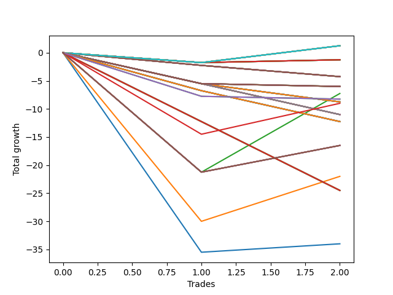

# Long Wallace Doodle 015 
- Symbol: NQ
- Date Range: 3/18/22 - 6/24/22
- Trading Period: 7:20-12:30
- Number of Trades: 7


| Name | Win Percent | Profit | Avg Profit / Trade |     | Name | Win Percent | Profit | Avg Profit / Trade |
| ---- | ----------- | ------ | ------------------ | --- | ---- | ----------- | ------ | ------------------ |
| Sorted By <br> Profit | | | | | Sorted By <br> Win Percentage ||||
| Eight | 14.29 | 9125.00 | 1303.57 |     | Two | 71.43 | -5875.00 | -839.29 |
| Ten | 14.29 | 8750.00 | 1250.00 |     | Five | 57.14 | -7875.00 | -1125.00 |
| Six | 14.29 | 7750.00 | 1107.14 |     | Four | 57.14 | -7875.00 | -1125.00 |
| Fourteen | 14.29 | 4500.00 | 642.86 |     | One | 57.14 | -13250.00 | -1892.86 |
| Sixteen | 14.29 | 4125.00 | 589.29 |     | Three | 57.14 | -20500.00 | -2928.57 |
| Twelve | 14.29 | 3125.00 | 446.43 |     | Thirty-Six | 42.86 | 2375.00 | 339.29 |
| Thirty-Six | 42.86 | 2375.00 | 339.29 |     | Thirty-Four | 42.86 | 125.00 | 17.86 |
| Thirty-Four | 42.86 | 125.00 | 17.86 |     | Eleven | 28.57 | -2125.00 | -303.57 |
| Twenty-Five | 14.29 | -500.00 | -71.43 |     | Nine | 28.57 | -2125.00 | -303.57 |
| Twenty | 14.29 | -1875.00 | -267.86 |     | Seven | 28.57 | -2125.00 | -303.57 |
| Eleven | 28.57 | -2125.00 | -303.57 |     | Seventeen | 28.57 | -3750.00 | -535.71 |
| Nine | 28.57 | -2125.00 | -303.57 |     | Fifteen | 28.57 | -3750.00 | -535.71 |
| Seven | 28.57 | -2125.00 | -303.57 |     | Thirteen | 28.57 | -3750.00 | -535.71 |
| Twenty-Two | 14.29 | -2250.00 | -321.43 |     | Twenty-Three | 28.57 | -4375.00 | -625.00 |
| Eighteen | 14.29 | -3250.00 | -464.29 |     | Twenty-One | 28.57 | -4375.00 | -625.00 |
| Seventeen | 28.57 | -3750.00 | -535.71 |     | Nineteen | 28.57 | -4375.00 | -625.00 |
| Fifteen | 28.57 | -3750.00 | -535.71 |     | Thirty-Five | 28.57 | -39750.00 | -5678.57 |
| Thirteen | 28.57 | -3750.00 | -535.71 |     | Eight | 14.29 | 9125.00 | 1303.57 |
| Twenty-Three | 28.57 | -4375.00 | -625.00 |     | Ten | 14.29 | 8750.00 | 1250.00 |
| Twenty-One | 28.57 | -4375.00 | -625.00 |     | Six | 14.29 | 7750.00 | 1107.14 |
| Nineteen | 28.57 | -4375.00 | -625.00 |     | Fourteen | 14.29 | 4500.00 | 642.86 |
| Thirty-Three | 14.29 | -5000.00 | -714.29 |     | Sixteen | 14.29 | 4125.00 | 589.29 |
| Thirty-One | 14.29 | -5000.00 | -714.29 |     | Twelve | 14.29 | 3125.00 | 446.43 |
| Twenty-Nine | 14.29 | -5000.00 | -714.29 |     | Twenty-Five | 14.29 | -500.00 | -71.43 |
| Twenty-Seven | 14.29 | -5000.00 | -714.29 |     | Twenty | 14.29 | -1875.00 | -267.86 |
| Two | 71.43 | -5875.00 | -839.29 |     | Twenty-Two | 14.29 | -2250.00 | -321.43 |
| Five | 57.14 | -7875.00 | -1125.00 |     | Eighteen | 14.29 | -3250.00 | -464.29 |
| Four | 57.14 | -7875.00 | -1125.00 |     | Thirty-Three | 14.29 | -5000.00 | -714.29 |
| One | 57.14 | -13250.00 | -1892.86 |     | Thirty-One | 14.29 | -5000.00 | -714.29 |
| Thirty-Two | 14.29 | -18625.00 | -2660.71 |     | Twenty-Nine | 14.29 | -5000.00 | -714.29 |
| Thirty | 14.29 | -18625.00 | -2660.71 |     | Twenty-Seven | 14.29 | -5000.00 | -714.29 |
| Twenty-Six | 14.29 | -20000.00 | -2857.14 |     | Thirty-Two | 14.29 | -18625.00 | -2660.71 |
| Twenty-Eight | 14.29 | -20375.00 | -2910.71 |     | Thirty | 14.29 | -18625.00 | -2660.71 |
| Three | 57.14 | -20500.00 | -2928.57 |     | Twenty-Six | 14.29 | -20000.00 | -2857.14 |
| Twenty-Four | 14.29 | -21375.00 | -3053.57 |     | Twenty-Eight | 14.29 | -20375.00 | -2910.71 |
| Thirty-Five | 28.57 | -39750.00 | -5678.57 |     | Twenty-Four | 14.29 | -21375.00 | -3053.57 |

### Test One
* Sell when price hits the middle line of the 20p bollinger
* No Stoploss
* Results:
```
Total Trades: 7
Percent Up: 57.14
Percent Down: 42.86
Total Points Moved Up: -26.50
Potential Profit: -13250.00
Total Points Ups: 57.75 Count Ups: 4
Total Points Downs: -84.25 Count Downs: 3
```

<details><summary>Trades</summary>

<code>In: 2022-03-25 08:12:00		Out: 2022-03-25 08:36:55		Total Position Time: 24:55		Total Move Up: -35.50		Total to Date: -35.50</code> <br />
<code>In: 2022-04-08 11:29:00		Out: 2022-04-08 11:39:40		Total Position Time: 10:40		Total Move Up: 14.00		Total to Date: -21.50</code> <br />
<code>In: 2022-04-08 11:29:00		Out: 2022-04-08 11:39:40		Total Position Time: 10:40		Total Move Up: 14.00		Total to Date: -7.50</code> <br />
<code>In: 2022-04-12 07:40:00		Out: 2022-04-12 07:59:30		Total Position Time: 19:30		Total Move Up: -16.25		Total to Date: -23.75</code> <br />
<code>In: 2022-06-06 08:14:00		Out: 2022-06-06 08:30:10		Total Position Time: 16:10		Total Move Up: -32.50		Total to Date: -56.25</code> <br />
<code>In: 2022-06-08 09:41:00		Out: 2022-06-08 09:54:10		Total Position Time: 13:10		Total Move Up: 1.50		Total to Date: -54.75</code> <br />
<code>In: 2022-06-09 08:09:00		Out: 2022-06-09 08:11:10		Total Position Time: 02:10		Total Move Up: 28.25		Total to Date: -26.50</code> <br />


</details>

### Test Two
* Sell when the price hits the upper line of the 20p 1std bollinger
* No Stoploss
* Results:
```
Total Trades: 7
Percent Up: 71.43
Percent Down: 28.57
Total Points Moved Up: -11.75
Potential Profit: -5875.00
Total Points Ups: 54.50 Count Ups: 5
Total Points Downs: -66.25 Count Downs: 2
```

<details><summary>Trades</summary>

<code>In: 2022-03-25 08:12:00		Out: 2022-03-25 08:41:20		Total Position Time: 29:20		Total Move Up: -30.00		Total to Date: -30.00</code> <br />
<code>In: 2022-04-08 11:29:00		Out: 2022-04-08 11:46:10		Total Position Time: 17:10		Total Move Up: 7.25		Total to Date: -22.75</code> <br />
<code>In: 2022-04-08 11:29:00		Out: 2022-04-08 11:46:10		Total Position Time: 17:10		Total Move Up: 7.25		Total to Date: -15.50</code> <br />
<code>In: 2022-04-12 07:40:00		Out: 2022-04-12 08:02:35		Total Position Time: 22:35		Total Move Up: 1.00		Total to Date: -14.50</code> <br />
<code>In: 2022-06-06 08:14:00		Out: 2022-06-06 08:39:15		Total Position Time: 25:15		Total Move Up: -36.25		Total to Date: -50.75</code> <br />
<code>In: 2022-06-08 09:41:00		Out: 2022-06-08 09:57:05		Total Position Time: 16:05		Total Move Up: 8.00		Total to Date: -42.75</code> <br />
<code>In: 2022-06-09 08:09:00		Out: 2022-06-09 08:22:35		Total Position Time: 13:35		Total Move Up: 31.00		Total to Date: -11.75</code> <br />


</details>

### Test Three
* Sell when the price hits the upper line of the 20p 2std bollinger
* No Stoploss
* Results:
```
Total Trades: 7
Percent Up: 57.14
Percent Down: 42.86
Total Points Moved Up: -41.00
Potential Profit: -20500.00
Total Points Ups: 71.25 Count Ups: 4
Total Points Downs: -112.25 Count Downs: 3
```

<details><summary>Trades</summary>

<code>In: 2022-03-25 08:12:00		Out: 2022-03-25 08:41:55		Total Position Time: 29:55		Total Move Up: -21.25		Total to Date: -21.25</code> <br />
<code>In: 2022-04-08 11:29:00		Out: 2022-04-08 11:47:25		Total Position Time: 18:25		Total Move Up: 13.50		Total to Date: -7.75</code> <br />
<code>In: 2022-04-08 11:29:00		Out: 2022-04-08 11:47:25		Total Position Time: 18:25		Total Move Up: 13.50		Total to Date: 5.75</code> <br />
<code>In: 2022-04-12 07:40:00		Out: 2022-04-12 08:09:55		Total Position Time: 29:55		Total Move Up: -50.50		Total to Date: -44.75</code> <br />
<code>In: 2022-06-06 08:14:00		Out: 2022-06-06 08:43:55		Total Position Time: 29:55		Total Move Up: -40.50		Total to Date: -85.25</code> <br />
<code>In: 2022-06-08 09:41:00		Out: 2022-06-08 09:59:15		Total Position Time: 18:15		Total Move Up: 14.00		Total to Date: -71.25</code> <br />
<code>In: 2022-06-09 08:09:00		Out: 2022-06-09 08:33:20		Total Position Time: 24:20		Total Move Up: 30.25		Total to Date: -41.00</code> <br />


</details>

### Test Four
* Sell when the price hits the middle line of the 1std VWAP
* No Stoploss
* Results:
```
Total Trades: 7
Percent Up: 57.14
Percent Down: 42.86
Total Points Moved Up: -15.75
Potential Profit: -7875.00
Total Points Ups: 96.50 Count Ups: 4
Total Points Downs: -112.25 Count Downs: 3
```

<details><summary>Trades</summary>

<code>In: 2022-03-25 08:12:00		Out: 2022-03-25 08:41:55		Total Position Time: 29:55		Total Move Up: -21.25		Total to Date: -21.25</code> <br />
<code>In: 2022-04-08 11:29:00		Out: 2022-04-08 11:58:55		Total Position Time: 29:55		Total Move Up: 29.00		Total to Date: 7.75</code> <br />
<code>In: 2022-04-08 11:29:00		Out: 2022-04-08 11:58:55		Total Position Time: 29:55		Total Move Up: 29.00		Total to Date: 36.75</code> <br />
<code>In: 2022-04-12 07:40:00		Out: 2022-04-12 08:09:55		Total Position Time: 29:55		Total Move Up: -50.50		Total to Date: -13.75</code> <br />
<code>In: 2022-06-06 08:14:00		Out: 2022-06-06 08:43:55		Total Position Time: 29:55		Total Move Up: -40.50		Total to Date: -54.25</code> <br />
<code>In: 2022-06-08 09:41:00		Out: 2022-06-08 10:10:55		Total Position Time: 29:55		Total Move Up: 4.75		Total to Date: -49.50</code> <br />
<code>In: 2022-06-09 08:09:00		Out: 2022-06-09 08:38:55		Total Position Time: 29:55		Total Move Up: 33.75		Total to Date: -15.75</code> <br />


</details>

### Test Five
* Sell when the price hits the upper line of the 1std VWAP
* No Stoploss
* Results:
```
Total Trades: 7
Percent Up: 57.14
Percent Down: 42.86
Total Points Moved Up: -15.75
Potential Profit: -7875.00
Total Points Ups: 96.50 Count Ups: 4
Total Points Downs: -112.25 Count Downs: 3
```

<details><summary>Trades</summary>

<code>In: 2022-03-25 08:12:00		Out: 2022-03-25 08:41:55		Total Position Time: 29:55		Total Move Up: -21.25		Total to Date: -21.25</code> <br />
<code>In: 2022-04-08 11:29:00		Out: 2022-04-08 11:58:55		Total Position Time: 29:55		Total Move Up: 29.00		Total to Date: 7.75</code> <br />
<code>In: 2022-04-08 11:29:00		Out: 2022-04-08 11:58:55		Total Position Time: 29:55		Total Move Up: 29.00		Total to Date: 36.75</code> <br />
<code>In: 2022-04-12 07:40:00		Out: 2022-04-12 08:09:55		Total Position Time: 29:55		Total Move Up: -50.50		Total to Date: -13.75</code> <br />
<code>In: 2022-06-06 08:14:00		Out: 2022-06-06 08:43:55		Total Position Time: 29:55		Total Move Up: -40.50		Total to Date: -54.25</code> <br />
<code>In: 2022-06-08 09:41:00		Out: 2022-06-08 10:10:55		Total Position Time: 29:55		Total Move Up: 4.75		Total to Date: -49.50</code> <br />
<code>In: 2022-06-09 08:09:00		Out: 2022-06-09 08:38:55		Total Position Time: 29:55		Total Move Up: 33.75		Total to Date: -15.75</code> <br />


</details>

### Test Six
* Sell when the price hits the middle line of the 20p bollinger
* Stoploss is 2 points
* Results:
```
Total Trades: 7
Percent Up: 14.29
Percent Down: 85.71
Total Points Moved Up: 15.50
Potential Profit: 7750.00
Total Points Ups: 28.25 Count Ups: 1
Total Points Downs: -12.75 Count Downs: 6
```

<details><summary>Trades</summary>

<code>In: 2022-03-25 08:12:00		Out: 2022-03-25 08:12:30		Total Position Time: 00:30		Total Move Up: -2.25		Total to Date: -2.25</code> <br />
<code>In: 2022-04-08 11:29:00		Out: 2022-04-08 11:31:40		Total Position Time: 02:40		Total Move Up: -1.50		Total to Date: -3.75</code> <br />
<code>In: 2022-04-08 11:29:00		Out: 2022-04-08 11:31:40		Total Position Time: 02:40		Total Move Up: -1.50		Total to Date: -5.25</code> <br />
<code>In: 2022-04-12 07:40:00		Out: 2022-04-12 07:40:10		Total Position Time: 00:10		Total Move Up: -2.25		Total to Date: -7.50</code> <br />
<code>In: 2022-06-06 08:14:00		Out: 2022-06-06 08:14:10		Total Position Time: 00:10		Total Move Up: -3.25		Total to Date: -10.75</code> <br />
<code>In: 2022-06-08 09:41:00		Out: 2022-06-08 09:42:10		Total Position Time: 01:10		Total Move Up: -2.00		Total to Date: -12.75</code> <br />
<code>In: 2022-06-09 08:09:00		Out: 2022-06-09 08:11:10		Total Position Time: 02:10		Total Move Up: 28.25		Total to Date: 15.50</code> <br />


</details>

### Test Seven
* Sell when the price hits the middle line of the 20p bollinger
* Trailing Stop is 2 points
* Results:
```
Total Trades: 7
Percent Up: 28.57
Percent Down: 71.43
Total Points Moved Up: -4.25
Potential Profit: -2125.00
Total Points Ups: 6.75 Count Ups: 2
Total Points Downs: -11.00 Count Downs: 5
```

<details><summary>Trades</summary>

<code>In: 2022-03-25 08:12:00		Out: 2022-03-25 08:12:25		Total Position Time: 00:25		Total Move Up: -1.75		Total to Date: -1.75</code> <br />
<code>In: 2022-04-08 11:29:00		Out: 2022-04-08 11:29:10		Total Position Time: 00:10		Total Move Up: -1.50		Total to Date: -3.25</code> <br />
<code>In: 2022-04-08 11:29:00		Out: 2022-04-08 11:29:10		Total Position Time: 00:10		Total Move Up: -1.50		Total to Date: -4.75</code> <br />
<code>In: 2022-04-12 07:40:00		Out: 2022-04-12 07:40:10		Total Position Time: 00:10		Total Move Up: -2.25		Total to Date: -7.00</code> <br />
<code>In: 2022-06-06 08:14:00		Out: 2022-06-06 08:14:20		Total Position Time: 00:20		Total Move Up: -4.00		Total to Date: -11.00</code> <br />
<code>In: 2022-06-08 09:41:00		Out: 2022-06-08 09:41:15		Total Position Time: 00:15		Total Move Up: 0.50		Total to Date: -10.50</code> <br />
<code>In: 2022-06-09 08:09:00		Out: 2022-06-09 08:09:10		Total Position Time: 00:10		Total Move Up: 6.25		Total to Date: -4.25</code> <br />


</details>

### Test Eight
* Sell when the price hits the upper line of the 20p 1std bollinger
* Stoploss is 2 points
* Results:
```
Total Trades: 7
Percent Up: 14.29
Percent Down: 85.71
Total Points Moved Up: 18.25
Potential Profit: 9125.00
Total Points Ups: 31.00 Count Ups: 1
Total Points Downs: -12.75 Count Downs: 6
```

<details><summary>Trades</summary>

<code>In: 2022-03-25 08:12:00		Out: 2022-03-25 08:12:30		Total Position Time: 00:30		Total Move Up: -2.25		Total to Date: -2.25</code> <br />
<code>In: 2022-04-08 11:29:00		Out: 2022-04-08 11:31:40		Total Position Time: 02:40		Total Move Up: -1.50		Total to Date: -3.75</code> <br />
<code>In: 2022-04-08 11:29:00		Out: 2022-04-08 11:31:40		Total Position Time: 02:40		Total Move Up: -1.50		Total to Date: -5.25</code> <br />
<code>In: 2022-04-12 07:40:00		Out: 2022-04-12 07:40:10		Total Position Time: 00:10		Total Move Up: -2.25		Total to Date: -7.50</code> <br />
<code>In: 2022-06-06 08:14:00		Out: 2022-06-06 08:14:10		Total Position Time: 00:10		Total Move Up: -3.25		Total to Date: -10.75</code> <br />
<code>In: 2022-06-08 09:41:00		Out: 2022-06-08 09:42:10		Total Position Time: 01:10		Total Move Up: -2.00		Total to Date: -12.75</code> <br />
<code>In: 2022-06-09 08:09:00		Out: 2022-06-09 08:22:35		Total Position Time: 13:35		Total Move Up: 31.00		Total to Date: 18.25</code> <br />


</details>

### Test Nine
* Sell when the price hits the upper line of the 20p 1std bollinger
* Trailing Stop is 2 points
* Results:
```
Total Trades: 7
Percent Up: 28.57
Percent Down: 71.43
Total Points Moved Up: -4.25
Potential Profit: -2125.00
Total Points Ups: 6.75 Count Ups: 2
Total Points Downs: -11.00 Count Downs: 5
```

<details><summary>Trades</summary>

<code>In: 2022-03-25 08:12:00		Out: 2022-03-25 08:12:25		Total Position Time: 00:25		Total Move Up: -1.75		Total to Date: -1.75</code> <br />
<code>In: 2022-04-08 11:29:00		Out: 2022-04-08 11:29:10		Total Position Time: 00:10		Total Move Up: -1.50		Total to Date: -3.25</code> <br />
<code>In: 2022-04-08 11:29:00		Out: 2022-04-08 11:29:10		Total Position Time: 00:10		Total Move Up: -1.50		Total to Date: -4.75</code> <br />
<code>In: 2022-04-12 07:40:00		Out: 2022-04-12 07:40:10		Total Position Time: 00:10		Total Move Up: -2.25		Total to Date: -7.00</code> <br />
<code>In: 2022-06-06 08:14:00		Out: 2022-06-06 08:14:20		Total Position Time: 00:20		Total Move Up: -4.00		Total to Date: -11.00</code> <br />
<code>In: 2022-06-08 09:41:00		Out: 2022-06-08 09:41:15		Total Position Time: 00:15		Total Move Up: 0.50		Total to Date: -10.50</code> <br />
<code>In: 2022-06-09 08:09:00		Out: 2022-06-09 08:09:10		Total Position Time: 00:10		Total Move Up: 6.25		Total to Date: -4.25</code> <br />


</details>

### Test Ten
* Sell when the price hits the upper line of the 20p 2std bollinger
* Stoploss is 2 points
* Results:
```
Total Trades: 7
Percent Up: 14.29
Percent Down: 85.71
Total Points Moved Up: 17.50
Potential Profit: 8750.00
Total Points Ups: 30.25 Count Ups: 1
Total Points Downs: -12.75 Count Downs: 6
```

<details><summary>Trades</summary>

<code>In: 2022-03-25 08:12:00		Out: 2022-03-25 08:12:30		Total Position Time: 00:30		Total Move Up: -2.25		Total to Date: -2.25</code> <br />
<code>In: 2022-04-08 11:29:00		Out: 2022-04-08 11:31:40		Total Position Time: 02:40		Total Move Up: -1.50		Total to Date: -3.75</code> <br />
<code>In: 2022-04-08 11:29:00		Out: 2022-04-08 11:31:40		Total Position Time: 02:40		Total Move Up: -1.50		Total to Date: -5.25</code> <br />
<code>In: 2022-04-12 07:40:00		Out: 2022-04-12 07:40:10		Total Position Time: 00:10		Total Move Up: -2.25		Total to Date: -7.50</code> <br />
<code>In: 2022-06-06 08:14:00		Out: 2022-06-06 08:14:10		Total Position Time: 00:10		Total Move Up: -3.25		Total to Date: -10.75</code> <br />
<code>In: 2022-06-08 09:41:00		Out: 2022-06-08 09:42:10		Total Position Time: 01:10		Total Move Up: -2.00		Total to Date: -12.75</code> <br />
<code>In: 2022-06-09 08:09:00		Out: 2022-06-09 08:33:20		Total Position Time: 24:20		Total Move Up: 30.25		Total to Date: 17.50</code> <br />


</details>

### Test Eleven
* Sell when the price hits the upper line of the 20p 2std bollinger
* Trailing Stop is 2 points
* Results:
```
Total Trades: 7
Percent Up: 28.57
Percent Down: 71.43
Total Points Moved Up: -4.25
Potential Profit: -2125.00
Total Points Ups: 6.75 Count Ups: 2
Total Points Downs: -11.00 Count Downs: 5
```

<details><summary>Trades</summary>

<code>In: 2022-03-25 08:12:00		Out: 2022-03-25 08:12:25		Total Position Time: 00:25		Total Move Up: -1.75		Total to Date: -1.75</code> <br />
<code>In: 2022-04-08 11:29:00		Out: 2022-04-08 11:29:10		Total Position Time: 00:10		Total Move Up: -1.50		Total to Date: -3.25</code> <br />
<code>In: 2022-04-08 11:29:00		Out: 2022-04-08 11:29:10		Total Position Time: 00:10		Total Move Up: -1.50		Total to Date: -4.75</code> <br />
<code>In: 2022-04-12 07:40:00		Out: 2022-04-12 07:40:10		Total Position Time: 00:10		Total Move Up: -2.25		Total to Date: -7.00</code> <br />
<code>In: 2022-06-06 08:14:00		Out: 2022-06-06 08:14:20		Total Position Time: 00:20		Total Move Up: -4.00		Total to Date: -11.00</code> <br />
<code>In: 2022-06-08 09:41:00		Out: 2022-06-08 09:41:15		Total Position Time: 00:15		Total Move Up: 0.50		Total to Date: -10.50</code> <br />
<code>In: 2022-06-09 08:09:00		Out: 2022-06-09 08:09:10		Total Position Time: 00:10		Total Move Up: 6.25		Total to Date: -4.25</code> <br />


</details>

### Test Twelve
* Sell when the price hits the middle line of the 20p bollinger
* Stoploss is 3 points
* Results:
```
Total Trades: 7
Percent Up: 14.29
Percent Down: 85.71
Total Points Moved Up: 6.25
Potential Profit: 3125.00
Total Points Ups: 28.25 Count Ups: 1
Total Points Downs: -22.00 Count Downs: 6
```

<details><summary>Trades</summary>

<code>In: 2022-03-25 08:12:00		Out: 2022-03-25 08:12:35		Total Position Time: 00:35		Total Move Up: -5.50		Total to Date: -5.50</code> <br />
<code>In: 2022-04-08 11:29:00		Out: 2022-04-08 11:31:55		Total Position Time: 02:55		Total Move Up: -3.00		Total to Date: -8.50</code> <br />
<code>In: 2022-04-08 11:29:00		Out: 2022-04-08 11:31:55		Total Position Time: 02:55		Total Move Up: -3.00		Total to Date: -11.50</code> <br />
<code>In: 2022-04-12 07:40:00		Out: 2022-04-12 07:40:15		Total Position Time: 00:15		Total Move Up: -4.00		Total to Date: -15.50</code> <br />
<code>In: 2022-06-06 08:14:00		Out: 2022-06-06 08:14:10		Total Position Time: 00:10		Total Move Up: -3.25		Total to Date: -18.75</code> <br />
<code>In: 2022-06-08 09:41:00		Out: 2022-06-08 09:42:25		Total Position Time: 01:25		Total Move Up: -3.25		Total to Date: -22.00</code> <br />
<code>In: 2022-06-09 08:09:00		Out: 2022-06-09 08:11:10		Total Position Time: 02:10		Total Move Up: 28.25		Total to Date: 6.25</code> <br />


</details>

### Test Thirteen
* Sell when the price hits the middle line of the 20p bollinger
* Trailing Stop is 3 points
* Results:
```
Total Trades: 7
Percent Up: 28.57
Percent Down: 71.43
Total Points Moved Up: -7.50
Potential Profit: -3750.00
Total Points Ups: 9.25 Count Ups: 2
Total Points Downs: -16.75 Count Downs: 5
```

<details><summary>Trades</summary>

<code>In: 2022-03-25 08:12:00		Out: 2022-03-25 08:12:25		Total Position Time: 00:25		Total Move Up: -1.75		Total to Date: -1.75</code> <br />
<code>In: 2022-04-08 11:29:00		Out: 2022-04-08 11:29:10		Total Position Time: 00:10		Total Move Up: -1.50		Total to Date: -3.25</code> <br />
<code>In: 2022-04-08 11:29:00		Out: 2022-04-08 11:29:10		Total Position Time: 00:10		Total Move Up: -1.50		Total to Date: -4.75</code> <br />
<code>In: 2022-04-12 07:40:00		Out: 2022-04-12 07:40:15		Total Position Time: 00:15		Total Move Up: -4.00		Total to Date: -8.75</code> <br />
<code>In: 2022-06-06 08:14:00		Out: 2022-06-06 08:14:25		Total Position Time: 00:25		Total Move Up: -8.00		Total to Date: -16.75</code> <br />
<code>In: 2022-06-08 09:41:00		Out: 2022-06-08 09:41:45		Total Position Time: 00:45		Total Move Up: 3.00		Total to Date: -13.75</code> <br />
<code>In: 2022-06-09 08:09:00		Out: 2022-06-09 08:09:10		Total Position Time: 00:10		Total Move Up: 6.25		Total to Date: -7.50</code> <br />


</details>

### Test Fourteen
* Sell when the price hits the upper line of the 20p 1std bollinger
* Stoploss is 3 points
* Results:
```
Total Trades: 7
Percent Up: 14.29
Percent Down: 85.71
Total Points Moved Up: 9.00
Potential Profit: 4500.00
Total Points Ups: 31.00 Count Ups: 1
Total Points Downs: -22.00 Count Downs: 6
```

<details><summary>Trades</summary>

<code>In: 2022-03-25 08:12:00		Out: 2022-03-25 08:12:35		Total Position Time: 00:35		Total Move Up: -5.50		Total to Date: -5.50</code> <br />
<code>In: 2022-04-08 11:29:00		Out: 2022-04-08 11:31:55		Total Position Time: 02:55		Total Move Up: -3.00		Total to Date: -8.50</code> <br />
<code>In: 2022-04-08 11:29:00		Out: 2022-04-08 11:31:55		Total Position Time: 02:55		Total Move Up: -3.00		Total to Date: -11.50</code> <br />
<code>In: 2022-04-12 07:40:00		Out: 2022-04-12 07:40:15		Total Position Time: 00:15		Total Move Up: -4.00		Total to Date: -15.50</code> <br />
<code>In: 2022-06-06 08:14:00		Out: 2022-06-06 08:14:10		Total Position Time: 00:10		Total Move Up: -3.25		Total to Date: -18.75</code> <br />
<code>In: 2022-06-08 09:41:00		Out: 2022-06-08 09:42:25		Total Position Time: 01:25		Total Move Up: -3.25		Total to Date: -22.00</code> <br />
<code>In: 2022-06-09 08:09:00		Out: 2022-06-09 08:22:35		Total Position Time: 13:35		Total Move Up: 31.00		Total to Date: 9.00</code> <br />


</details>

### Test Fifteen
* Sell when the price hits the upper line of the 20p 1std bollinger
* Trailing Stop is 3 points
* Results:
```
Total Trades: 7
Percent Up: 28.57
Percent Down: 71.43
Total Points Moved Up: -7.50
Potential Profit: -3750.00
Total Points Ups: 9.25 Count Ups: 2
Total Points Downs: -16.75 Count Downs: 5
```

<details><summary>Trades</summary>

<code>In: 2022-03-25 08:12:00		Out: 2022-03-25 08:12:25		Total Position Time: 00:25		Total Move Up: -1.75		Total to Date: -1.75</code> <br />
<code>In: 2022-04-08 11:29:00		Out: 2022-04-08 11:29:10		Total Position Time: 00:10		Total Move Up: -1.50		Total to Date: -3.25</code> <br />
<code>In: 2022-04-08 11:29:00		Out: 2022-04-08 11:29:10		Total Position Time: 00:10		Total Move Up: -1.50		Total to Date: -4.75</code> <br />
<code>In: 2022-04-12 07:40:00		Out: 2022-04-12 07:40:15		Total Position Time: 00:15		Total Move Up: -4.00		Total to Date: -8.75</code> <br />
<code>In: 2022-06-06 08:14:00		Out: 2022-06-06 08:14:25		Total Position Time: 00:25		Total Move Up: -8.00		Total to Date: -16.75</code> <br />
<code>In: 2022-06-08 09:41:00		Out: 2022-06-08 09:41:45		Total Position Time: 00:45		Total Move Up: 3.00		Total to Date: -13.75</code> <br />
<code>In: 2022-06-09 08:09:00		Out: 2022-06-09 08:09:10		Total Position Time: 00:10		Total Move Up: 6.25		Total to Date: -7.50</code> <br />


</details>

### Test Sixteen
* Sell when the price hits the upper line of the 20p 2std bollinger
* Stoploss is 3 points
* Results:
```
Total Trades: 7
Percent Up: 14.29
Percent Down: 85.71
Total Points Moved Up: 8.25
Potential Profit: 4125.00
Total Points Ups: 30.25 Count Ups: 1
Total Points Downs: -22.00 Count Downs: 6
```

<details><summary>Trades</summary>

<code>In: 2022-03-25 08:12:00		Out: 2022-03-25 08:12:35		Total Position Time: 00:35		Total Move Up: -5.50		Total to Date: -5.50</code> <br />
<code>In: 2022-04-08 11:29:00		Out: 2022-04-08 11:31:55		Total Position Time: 02:55		Total Move Up: -3.00		Total to Date: -8.50</code> <br />
<code>In: 2022-04-08 11:29:00		Out: 2022-04-08 11:31:55		Total Position Time: 02:55		Total Move Up: -3.00		Total to Date: -11.50</code> <br />
<code>In: 2022-04-12 07:40:00		Out: 2022-04-12 07:40:15		Total Position Time: 00:15		Total Move Up: -4.00		Total to Date: -15.50</code> <br />
<code>In: 2022-06-06 08:14:00		Out: 2022-06-06 08:14:10		Total Position Time: 00:10		Total Move Up: -3.25		Total to Date: -18.75</code> <br />
<code>In: 2022-06-08 09:41:00		Out: 2022-06-08 09:42:25		Total Position Time: 01:25		Total Move Up: -3.25		Total to Date: -22.00</code> <br />
<code>In: 2022-06-09 08:09:00		Out: 2022-06-09 08:33:20		Total Position Time: 24:20		Total Move Up: 30.25		Total to Date: 8.25</code> <br />


</details>

### Test Seventeen
* Sell when the price hits the upper line of the 20p 2std bollinger
* Trailing Stop is 3 points
* Results:
```
Total Trades: 7
Percent Up: 28.57
Percent Down: 71.43
Total Points Moved Up: -7.50
Potential Profit: -3750.00
Total Points Ups: 9.25 Count Ups: 2
Total Points Downs: -16.75 Count Downs: 5
```

<details><summary>Trades</summary>

<code>In: 2022-03-25 08:12:00		Out: 2022-03-25 08:12:25		Total Position Time: 00:25		Total Move Up: -1.75		Total to Date: -1.75</code> <br />
<code>In: 2022-04-08 11:29:00		Out: 2022-04-08 11:29:10		Total Position Time: 00:10		Total Move Up: -1.50		Total to Date: -3.25</code> <br />
<code>In: 2022-04-08 11:29:00		Out: 2022-04-08 11:29:10		Total Position Time: 00:10		Total Move Up: -1.50		Total to Date: -4.75</code> <br />
<code>In: 2022-04-12 07:40:00		Out: 2022-04-12 07:40:15		Total Position Time: 00:15		Total Move Up: -4.00		Total to Date: -8.75</code> <br />
<code>In: 2022-06-06 08:14:00		Out: 2022-06-06 08:14:25		Total Position Time: 00:25		Total Move Up: -8.00		Total to Date: -16.75</code> <br />
<code>In: 2022-06-08 09:41:00		Out: 2022-06-08 09:41:45		Total Position Time: 00:45		Total Move Up: 3.00		Total to Date: -13.75</code> <br />
<code>In: 2022-06-09 08:09:00		Out: 2022-06-09 08:09:10		Total Position Time: 00:10		Total Move Up: 6.25		Total to Date: -7.50</code> <br />


</details>

### Test Eighteen
* Sell when the price hits the middle line of the 20p bollinger
* Stoploss is 5 points
* Results:
```
Total Trades: 7
Percent Up: 14.29
Percent Down: 85.71
Total Points Moved Up: -6.50
Potential Profit: -3250.00
Total Points Ups: 28.25 Count Ups: 1
Total Points Downs: -34.75 Count Downs: 6
```

<details><summary>Trades</summary>

<code>In: 2022-03-25 08:12:00		Out: 2022-03-25 08:12:35		Total Position Time: 00:35		Total Move Up: -5.50		Total to Date: -5.50</code> <br />
<code>In: 2022-04-08 11:29:00		Out: 2022-04-08 11:32:55		Total Position Time: 03:55		Total Move Up: -4.75		Total to Date: -10.25</code> <br />
<code>In: 2022-04-08 11:29:00		Out: 2022-04-08 11:32:55		Total Position Time: 03:55		Total Move Up: -4.75		Total to Date: -15.00</code> <br />
<code>In: 2022-04-12 07:40:00		Out: 2022-04-12 07:41:15		Total Position Time: 01:15		Total Move Up: -6.25		Total to Date: -21.25</code> <br />
<code>In: 2022-06-06 08:14:00		Out: 2022-06-06 08:14:25		Total Position Time: 00:25		Total Move Up: -8.00		Total to Date: -29.25</code> <br />
<code>In: 2022-06-08 09:41:00		Out: 2022-06-08 09:42:35		Total Position Time: 01:35		Total Move Up: -5.50		Total to Date: -34.75</code> <br />
<code>In: 2022-06-09 08:09:00		Out: 2022-06-09 08:11:10		Total Position Time: 02:10		Total Move Up: 28.25		Total to Date: -6.50</code> <br />


</details>

### Test Nineteen
* Sell when the price hits the middle line of the 20p bollinger
* Trailing Stop is 5 points
* Results:
```
Total Trades: 7
Percent Up: 28.57
Percent Down: 71.43
Total Points Moved Up: -8.75
Potential Profit: -4375.00
Total Points Ups: 8.25 Count Ups: 2
Total Points Downs: -17.00 Count Downs: 5
```

<details><summary>Trades</summary>

<code>In: 2022-03-25 08:12:00		Out: 2022-03-25 08:12:35		Total Position Time: 00:35		Total Move Up: -5.50		Total to Date: -5.50</code> <br />
<code>In: 2022-04-08 11:29:00		Out: 2022-04-08 11:29:10		Total Position Time: 00:10		Total Move Up: -1.50		Total to Date: -7.00</code> <br />
<code>In: 2022-04-08 11:29:00		Out: 2022-04-08 11:29:10		Total Position Time: 00:10		Total Move Up: -1.50		Total to Date: -8.50</code> <br />
<code>In: 2022-04-12 07:40:00		Out: 2022-04-12 07:40:50		Total Position Time: 00:50		Total Move Up: 2.00		Total to Date: -6.50</code> <br />
<code>In: 2022-06-06 08:14:00		Out: 2022-06-06 08:14:25		Total Position Time: 00:25		Total Move Up: -8.00		Total to Date: -14.50</code> <br />
<code>In: 2022-06-08 09:41:00		Out: 2022-06-08 09:42:05		Total Position Time: 01:05		Total Move Up: -0.50		Total to Date: -15.00</code> <br />
<code>In: 2022-06-09 08:09:00		Out: 2022-06-09 08:09:10		Total Position Time: 00:10		Total Move Up: 6.25		Total to Date: -8.75</code> <br />


</details>

### Test Twenty
* Sell when the price hits the upper line of the 20p 1std bollinger
* Stoploss is 5 points
* Results:
```
Total Trades: 7
Percent Up: 14.29
Percent Down: 85.71
Total Points Moved Up: -3.75
Potential Profit: -1875.00
Total Points Ups: 31.00 Count Ups: 1
Total Points Downs: -34.75 Count Downs: 6
```

<details><summary>Trades</summary>

<code>In: 2022-03-25 08:12:00		Out: 2022-03-25 08:12:35		Total Position Time: 00:35		Total Move Up: -5.50		Total to Date: -5.50</code> <br />
<code>In: 2022-04-08 11:29:00		Out: 2022-04-08 11:32:55		Total Position Time: 03:55		Total Move Up: -4.75		Total to Date: -10.25</code> <br />
<code>In: 2022-04-08 11:29:00		Out: 2022-04-08 11:32:55		Total Position Time: 03:55		Total Move Up: -4.75		Total to Date: -15.00</code> <br />
<code>In: 2022-04-12 07:40:00		Out: 2022-04-12 07:41:15		Total Position Time: 01:15		Total Move Up: -6.25		Total to Date: -21.25</code> <br />
<code>In: 2022-06-06 08:14:00		Out: 2022-06-06 08:14:25		Total Position Time: 00:25		Total Move Up: -8.00		Total to Date: -29.25</code> <br />
<code>In: 2022-06-08 09:41:00		Out: 2022-06-08 09:42:35		Total Position Time: 01:35		Total Move Up: -5.50		Total to Date: -34.75</code> <br />
<code>In: 2022-06-09 08:09:00		Out: 2022-06-09 08:22:35		Total Position Time: 13:35		Total Move Up: 31.00		Total to Date: -3.75</code> <br />


</details>

### Test Twenty-One
* Sell when the price hits the upper line of the 20p 1std bollinger
* Trailing Stop is 5 points
* Results:
```
Total Trades: 7
Percent Up: 28.57
Percent Down: 71.43
Total Points Moved Up: -8.75
Potential Profit: -4375.00
Total Points Ups: 8.25 Count Ups: 2
Total Points Downs: -17.00 Count Downs: 5
```

<details><summary>Trades</summary>

<code>In: 2022-03-25 08:12:00		Out: 2022-03-25 08:12:35		Total Position Time: 00:35		Total Move Up: -5.50		Total to Date: -5.50</code> <br />
<code>In: 2022-04-08 11:29:00		Out: 2022-04-08 11:29:10		Total Position Time: 00:10		Total Move Up: -1.50		Total to Date: -7.00</code> <br />
<code>In: 2022-04-08 11:29:00		Out: 2022-04-08 11:29:10		Total Position Time: 00:10		Total Move Up: -1.50		Total to Date: -8.50</code> <br />
<code>In: 2022-04-12 07:40:00		Out: 2022-04-12 07:40:50		Total Position Time: 00:50		Total Move Up: 2.00		Total to Date: -6.50</code> <br />
<code>In: 2022-06-06 08:14:00		Out: 2022-06-06 08:14:25		Total Position Time: 00:25		Total Move Up: -8.00		Total to Date: -14.50</code> <br />
<code>In: 2022-06-08 09:41:00		Out: 2022-06-08 09:42:05		Total Position Time: 01:05		Total Move Up: -0.50		Total to Date: -15.00</code> <br />
<code>In: 2022-06-09 08:09:00		Out: 2022-06-09 08:09:10		Total Position Time: 00:10		Total Move Up: 6.25		Total to Date: -8.75</code> <br />


</details>

### Test Twenty-Two
* Sell when the price hits the upper line of the 20p 2std bollinger
* Stoploss is 5 points
* Results:
```
Total Trades: 7
Percent Up: 14.29
Percent Down: 85.71
Total Points Moved Up: -4.50
Potential Profit: -2250.00
Total Points Ups: 30.25 Count Ups: 1
Total Points Downs: -34.75 Count Downs: 6
```

<details><summary>Trades</summary>

<code>In: 2022-03-25 08:12:00		Out: 2022-03-25 08:12:35		Total Position Time: 00:35		Total Move Up: -5.50		Total to Date: -5.50</code> <br />
<code>In: 2022-04-08 11:29:00		Out: 2022-04-08 11:32:55		Total Position Time: 03:55		Total Move Up: -4.75		Total to Date: -10.25</code> <br />
<code>In: 2022-04-08 11:29:00		Out: 2022-04-08 11:32:55		Total Position Time: 03:55		Total Move Up: -4.75		Total to Date: -15.00</code> <br />
<code>In: 2022-04-12 07:40:00		Out: 2022-04-12 07:41:15		Total Position Time: 01:15		Total Move Up: -6.25		Total to Date: -21.25</code> <br />
<code>In: 2022-06-06 08:14:00		Out: 2022-06-06 08:14:25		Total Position Time: 00:25		Total Move Up: -8.00		Total to Date: -29.25</code> <br />
<code>In: 2022-06-08 09:41:00		Out: 2022-06-08 09:42:35		Total Position Time: 01:35		Total Move Up: -5.50		Total to Date: -34.75</code> <br />
<code>In: 2022-06-09 08:09:00		Out: 2022-06-09 08:33:20		Total Position Time: 24:20		Total Move Up: 30.25		Total to Date: -4.50</code> <br />


</details>

### Test Twenty-Three
* Sell when the price hits the upper line of the 20p 2std bollinger
* Trailing Stop is 5 points
* Results:
```
Total Trades: 7
Percent Up: 28.57
Percent Down: 71.43
Total Points Moved Up: -8.75
Potential Profit: -4375.00
Total Points Ups: 8.25 Count Ups: 2
Total Points Downs: -17.00 Count Downs: 5
```

<details><summary>Trades</summary>

<code>In: 2022-03-25 08:12:00		Out: 2022-03-25 08:12:35		Total Position Time: 00:35		Total Move Up: -5.50		Total to Date: -5.50</code> <br />
<code>In: 2022-04-08 11:29:00		Out: 2022-04-08 11:29:10		Total Position Time: 00:10		Total Move Up: -1.50		Total to Date: -7.00</code> <br />
<code>In: 2022-04-08 11:29:00		Out: 2022-04-08 11:29:10		Total Position Time: 00:10		Total Move Up: -1.50		Total to Date: -8.50</code> <br />
<code>In: 2022-04-12 07:40:00		Out: 2022-04-12 07:40:50		Total Position Time: 00:50		Total Move Up: 2.00		Total to Date: -6.50</code> <br />
<code>In: 2022-06-06 08:14:00		Out: 2022-06-06 08:14:25		Total Position Time: 00:25		Total Move Up: -8.00		Total to Date: -14.50</code> <br />
<code>In: 2022-06-08 09:41:00		Out: 2022-06-08 09:42:05		Total Position Time: 01:05		Total Move Up: -0.50		Total to Date: -15.00</code> <br />
<code>In: 2022-06-09 08:09:00		Out: 2022-06-09 08:09:10		Total Position Time: 00:10		Total Move Up: 6.25		Total to Date: -8.75</code> <br />


</details>

### Test Twenty-Four
* Sell when the price hits the middle line of the 20p bollinger
* Stoploss is 10 points
* Results:
```
Total Trades: 7
Percent Up: 14.29
Percent Down: 85.71
Total Points Moved Up: -42.75
Potential Profit: -21375.00
Total Points Ups: 28.25 Count Ups: 1
Total Points Downs: -71.00 Count Downs: 6
```

<details><summary>Trades</summary>

<code>In: 2022-03-25 08:12:00		Out: 2022-03-25 08:19:55		Total Position Time: 07:55		Total Move Up: -12.25		Total to Date: -12.25</code> <br />
<code>In: 2022-04-08 11:29:00		Out: 2022-04-08 11:35:25		Total Position Time: 06:25		Total Move Up: -10.75		Total to Date: -23.00</code> <br />
<code>In: 2022-04-08 11:29:00		Out: 2022-04-08 11:35:25		Total Position Time: 06:25		Total Move Up: -10.75		Total to Date: -33.75</code> <br />
<code>In: 2022-04-12 07:40:00		Out: 2022-04-12 07:48:10		Total Position Time: 08:10		Total Move Up: -14.50		Total to Date: -48.25</code> <br />
<code>In: 2022-06-06 08:14:00		Out: 2022-06-06 08:15:40		Total Position Time: 01:40		Total Move Up: -10.50		Total to Date: -58.75</code> <br />
<code>In: 2022-06-08 09:41:00		Out: 2022-06-08 09:43:25		Total Position Time: 02:25		Total Move Up: -12.25		Total to Date: -71.00</code> <br />
<code>In: 2022-06-09 08:09:00		Out: 2022-06-09 08:11:10		Total Position Time: 02:10		Total Move Up: 28.25		Total to Date: -42.75</code> <br />


</details>

### Test Twenty-Five
* Sell when the price hits the middle line of the 20p bollinger
* Trailing Stop is 10 points
* Results:
```
Total Trades: 7
Percent Up: 14.29
Percent Down: 85.71
Total Points Moved Up: -1.00
Potential Profit: -500.00
Total Points Ups: 28.25 Count Ups: 1
Total Points Downs: -29.25 Count Downs: 6
```

<details><summary>Trades</summary>

<code>In: 2022-03-25 08:12:00		Out: 2022-03-25 08:14:50		Total Position Time: 02:50		Total Move Up: -6.75		Total to Date: -6.75</code> <br />
<code>In: 2022-04-08 11:29:00		Out: 2022-04-08 11:31:30		Total Position Time: 02:30		Total Move Up: -0.75		Total to Date: -7.50</code> <br />
<code>In: 2022-04-08 11:29:00		Out: 2022-04-08 11:31:30		Total Position Time: 02:30		Total Move Up: -0.75		Total to Date: -8.25</code> <br />
<code>In: 2022-04-12 07:40:00		Out: 2022-04-12 07:41:05		Total Position Time: 01:05		Total Move Up: -3.50		Total to Date: -11.75</code> <br />
<code>In: 2022-06-06 08:14:00		Out: 2022-06-06 08:15:45		Total Position Time: 01:45		Total Move Up: -12.00		Total to Date: -23.75</code> <br />
<code>In: 2022-06-08 09:41:00		Out: 2022-06-08 09:42:35		Total Position Time: 01:35		Total Move Up: -5.50		Total to Date: -29.25</code> <br />
<code>In: 2022-06-09 08:09:00		Out: 2022-06-09 08:11:10		Total Position Time: 02:10		Total Move Up: 28.25		Total to Date: -1.00</code> <br />


</details>

### Test Twenty-Six
* Sell when the price hits the upper line of the 20p 1std bollinger
* Stoploss is 10 points
* Results:
```
Total Trades: 7
Percent Up: 14.29
Percent Down: 85.71
Total Points Moved Up: -40.00
Potential Profit: -20000.00
Total Points Ups: 31.00 Count Ups: 1
Total Points Downs: -71.00 Count Downs: 6
```

<details><summary>Trades</summary>

<code>In: 2022-03-25 08:12:00		Out: 2022-03-25 08:19:55		Total Position Time: 07:55		Total Move Up: -12.25		Total to Date: -12.25</code> <br />
<code>In: 2022-04-08 11:29:00		Out: 2022-04-08 11:35:25		Total Position Time: 06:25		Total Move Up: -10.75		Total to Date: -23.00</code> <br />
<code>In: 2022-04-08 11:29:00		Out: 2022-04-08 11:35:25		Total Position Time: 06:25		Total Move Up: -10.75		Total to Date: -33.75</code> <br />
<code>In: 2022-04-12 07:40:00		Out: 2022-04-12 07:48:10		Total Position Time: 08:10		Total Move Up: -14.50		Total to Date: -48.25</code> <br />
<code>In: 2022-06-06 08:14:00		Out: 2022-06-06 08:15:40		Total Position Time: 01:40		Total Move Up: -10.50		Total to Date: -58.75</code> <br />
<code>In: 2022-06-08 09:41:00		Out: 2022-06-08 09:43:25		Total Position Time: 02:25		Total Move Up: -12.25		Total to Date: -71.00</code> <br />
<code>In: 2022-06-09 08:09:00		Out: 2022-06-09 08:22:35		Total Position Time: 13:35		Total Move Up: 31.00		Total to Date: -40.00</code> <br />


</details>

### Test Twenty-Seven
* Sell when the price hits the upper line of the 20p 1std bollinger
* Trailing Stop is 10 points
* Results:
```
Total Trades: 7
Percent Up: 14.29
Percent Down: 85.71
Total Points Moved Up: -10.00
Potential Profit: -5000.00
Total Points Ups: 19.25 Count Ups: 1
Total Points Downs: -29.25 Count Downs: 6
```

<details><summary>Trades</summary>

<code>In: 2022-03-25 08:12:00		Out: 2022-03-25 08:14:50		Total Position Time: 02:50		Total Move Up: -6.75		Total to Date: -6.75</code> <br />
<code>In: 2022-04-08 11:29:00		Out: 2022-04-08 11:31:30		Total Position Time: 02:30		Total Move Up: -0.75		Total to Date: -7.50</code> <br />
<code>In: 2022-04-08 11:29:00		Out: 2022-04-08 11:31:30		Total Position Time: 02:30		Total Move Up: -0.75		Total to Date: -8.25</code> <br />
<code>In: 2022-04-12 07:40:00		Out: 2022-04-12 07:41:05		Total Position Time: 01:05		Total Move Up: -3.50		Total to Date: -11.75</code> <br />
<code>In: 2022-06-06 08:14:00		Out: 2022-06-06 08:15:45		Total Position Time: 01:45		Total Move Up: -12.00		Total to Date: -23.75</code> <br />
<code>In: 2022-06-08 09:41:00		Out: 2022-06-08 09:42:35		Total Position Time: 01:35		Total Move Up: -5.50		Total to Date: -29.25</code> <br />
<code>In: 2022-06-09 08:09:00		Out: 2022-06-09 08:13:00		Total Position Time: 04:00		Total Move Up: 19.25		Total to Date: -10.00</code> <br />


</details>

### Test Twenty-Eight
* Sell when the price hits the upper line of the 20p 2std bollinger
* Stoploss is 10 points
* Results:
```
Total Trades: 7
Percent Up: 14.29
Percent Down: 85.71
Total Points Moved Up: -40.75
Potential Profit: -20375.00
Total Points Ups: 30.25 Count Ups: 1
Total Points Downs: -71.00 Count Downs: 6
```

<details><summary>Trades</summary>

<code>In: 2022-03-25 08:12:00		Out: 2022-03-25 08:19:55		Total Position Time: 07:55		Total Move Up: -12.25		Total to Date: -12.25</code> <br />
<code>In: 2022-04-08 11:29:00		Out: 2022-04-08 11:35:25		Total Position Time: 06:25		Total Move Up: -10.75		Total to Date: -23.00</code> <br />
<code>In: 2022-04-08 11:29:00		Out: 2022-04-08 11:35:25		Total Position Time: 06:25		Total Move Up: -10.75		Total to Date: -33.75</code> <br />
<code>In: 2022-04-12 07:40:00		Out: 2022-04-12 07:48:10		Total Position Time: 08:10		Total Move Up: -14.50		Total to Date: -48.25</code> <br />
<code>In: 2022-06-06 08:14:00		Out: 2022-06-06 08:15:40		Total Position Time: 01:40		Total Move Up: -10.50		Total to Date: -58.75</code> <br />
<code>In: 2022-06-08 09:41:00		Out: 2022-06-08 09:43:25		Total Position Time: 02:25		Total Move Up: -12.25		Total to Date: -71.00</code> <br />
<code>In: 2022-06-09 08:09:00		Out: 2022-06-09 08:33:20		Total Position Time: 24:20		Total Move Up: 30.25		Total to Date: -40.75</code> <br />


</details>

### Test Twenty-Nine
* Sell when the price hits the upper line of the 20p 2std bollinger
* Trailing Stop is 10 points
* Results:
```
Total Trades: 7
Percent Up: 14.29
Percent Down: 85.71
Total Points Moved Up: -10.00
Potential Profit: -5000.00
Total Points Ups: 19.25 Count Ups: 1
Total Points Downs: -29.25 Count Downs: 6
```

<details><summary>Trades</summary>

<code>In: 2022-03-25 08:12:00		Out: 2022-03-25 08:14:50		Total Position Time: 02:50		Total Move Up: -6.75		Total to Date: -6.75</code> <br />
<code>In: 2022-04-08 11:29:00		Out: 2022-04-08 11:31:30		Total Position Time: 02:30		Total Move Up: -0.75		Total to Date: -7.50</code> <br />
<code>In: 2022-04-08 11:29:00		Out: 2022-04-08 11:31:30		Total Position Time: 02:30		Total Move Up: -0.75		Total to Date: -8.25</code> <br />
<code>In: 2022-04-12 07:40:00		Out: 2022-04-12 07:41:05		Total Position Time: 01:05		Total Move Up: -3.50		Total to Date: -11.75</code> <br />
<code>In: 2022-06-06 08:14:00		Out: 2022-06-06 08:15:45		Total Position Time: 01:45		Total Move Up: -12.00		Total to Date: -23.75</code> <br />
<code>In: 2022-06-08 09:41:00		Out: 2022-06-08 09:42:35		Total Position Time: 01:35		Total Move Up: -5.50		Total to Date: -29.25</code> <br />
<code>In: 2022-06-09 08:09:00		Out: 2022-06-09 08:13:00		Total Position Time: 04:00		Total Move Up: 19.25		Total to Date: -10.00</code> <br />


</details>

### Test Thirty
* Sell when the price hits the middle line of the 1std VWAP
* Stoploss is 10 points
* Results:
```
Total Trades: 7
Percent Up: 14.29
Percent Down: 85.71
Total Points Moved Up: -37.25
Potential Profit: -18625.00
Total Points Ups: 33.75 Count Ups: 1
Total Points Downs: -71.00 Count Downs: 6
```

<details><summary>Trades</summary>

<code>In: 2022-03-25 08:12:00		Out: 2022-03-25 08:19:55		Total Position Time: 07:55		Total Move Up: -12.25		Total to Date: -12.25</code> <br />
<code>In: 2022-04-08 11:29:00		Out: 2022-04-08 11:35:25		Total Position Time: 06:25		Total Move Up: -10.75		Total to Date: -23.00</code> <br />
<code>In: 2022-04-08 11:29:00		Out: 2022-04-08 11:35:25		Total Position Time: 06:25		Total Move Up: -10.75		Total to Date: -33.75</code> <br />
<code>In: 2022-04-12 07:40:00		Out: 2022-04-12 07:48:10		Total Position Time: 08:10		Total Move Up: -14.50		Total to Date: -48.25</code> <br />
<code>In: 2022-06-06 08:14:00		Out: 2022-06-06 08:15:40		Total Position Time: 01:40		Total Move Up: -10.50		Total to Date: -58.75</code> <br />
<code>In: 2022-06-08 09:41:00		Out: 2022-06-08 09:43:25		Total Position Time: 02:25		Total Move Up: -12.25		Total to Date: -71.00</code> <br />
<code>In: 2022-06-09 08:09:00		Out: 2022-06-09 08:38:55		Total Position Time: 29:55		Total Move Up: 33.75		Total to Date: -37.25</code> <br />


</details>

### Test Thirty-One
* Sell when the price hits the middle line of the 1std VWAP
* Trailing Stop is 10 points
* Results:
```
Total Trades: 7
Percent Up: 14.29
Percent Down: 85.71
Total Points Moved Up: -10.00
Potential Profit: -5000.00
Total Points Ups: 19.25 Count Ups: 1
Total Points Downs: -29.25 Count Downs: 6
```

<details><summary>Trades</summary>

<code>In: 2022-03-25 08:12:00		Out: 2022-03-25 08:14:50		Total Position Time: 02:50		Total Move Up: -6.75		Total to Date: -6.75</code> <br />
<code>In: 2022-04-08 11:29:00		Out: 2022-04-08 11:31:30		Total Position Time: 02:30		Total Move Up: -0.75		Total to Date: -7.50</code> <br />
<code>In: 2022-04-08 11:29:00		Out: 2022-04-08 11:31:30		Total Position Time: 02:30		Total Move Up: -0.75		Total to Date: -8.25</code> <br />
<code>In: 2022-04-12 07:40:00		Out: 2022-04-12 07:41:05		Total Position Time: 01:05		Total Move Up: -3.50		Total to Date: -11.75</code> <br />
<code>In: 2022-06-06 08:14:00		Out: 2022-06-06 08:15:45		Total Position Time: 01:45		Total Move Up: -12.00		Total to Date: -23.75</code> <br />
<code>In: 2022-06-08 09:41:00		Out: 2022-06-08 09:42:35		Total Position Time: 01:35		Total Move Up: -5.50		Total to Date: -29.25</code> <br />
<code>In: 2022-06-09 08:09:00		Out: 2022-06-09 08:13:00		Total Position Time: 04:00		Total Move Up: 19.25		Total to Date: -10.00</code> <br />


</details>

### Test Thirty-Two
* Sell when the price hits the upper line of the 1std VWAP
* Stoploss is 10 points
* Results:
```
Total Trades: 7
Percent Up: 14.29
Percent Down: 85.71
Total Points Moved Up: -37.25
Potential Profit: -18625.00
Total Points Ups: 33.75 Count Ups: 1
Total Points Downs: -71.00 Count Downs: 6
```

<details><summary>Trades</summary>

<code>In: 2022-03-25 08:12:00		Out: 2022-03-25 08:19:55		Total Position Time: 07:55		Total Move Up: -12.25		Total to Date: -12.25</code> <br />
<code>In: 2022-04-08 11:29:00		Out: 2022-04-08 11:35:25		Total Position Time: 06:25		Total Move Up: -10.75		Total to Date: -23.00</code> <br />
<code>In: 2022-04-08 11:29:00		Out: 2022-04-08 11:35:25		Total Position Time: 06:25		Total Move Up: -10.75		Total to Date: -33.75</code> <br />
<code>In: 2022-04-12 07:40:00		Out: 2022-04-12 07:48:10		Total Position Time: 08:10		Total Move Up: -14.50		Total to Date: -48.25</code> <br />
<code>In: 2022-06-06 08:14:00		Out: 2022-06-06 08:15:40		Total Position Time: 01:40		Total Move Up: -10.50		Total to Date: -58.75</code> <br />
<code>In: 2022-06-08 09:41:00		Out: 2022-06-08 09:43:25		Total Position Time: 02:25		Total Move Up: -12.25		Total to Date: -71.00</code> <br />
<code>In: 2022-06-09 08:09:00		Out: 2022-06-09 08:38:55		Total Position Time: 29:55		Total Move Up: 33.75		Total to Date: -37.25</code> <br />


</details>

### Test Thirty-Three
* Sell when the price hits the upper line of the 1std VWAP
* Trailing Stop is 10 points
* Results:
```
Total Trades: 7
Percent Up: 14.29
Percent Down: 85.71
Total Points Moved Up: -10.00
Potential Profit: -5000.00
Total Points Ups: 19.25 Count Ups: 1
Total Points Downs: -29.25 Count Downs: 6
```

<details><summary>Trades</summary>

<code>In: 2022-03-25 08:12:00		Out: 2022-03-25 08:14:50		Total Position Time: 02:50		Total Move Up: -6.75		Total to Date: -6.75</code> <br />
<code>In: 2022-04-08 11:29:00		Out: 2022-04-08 11:31:30		Total Position Time: 02:30		Total Move Up: -0.75		Total to Date: -7.50</code> <br />
<code>In: 2022-04-08 11:29:00		Out: 2022-04-08 11:31:30		Total Position Time: 02:30		Total Move Up: -0.75		Total to Date: -8.25</code> <br />
<code>In: 2022-04-12 07:40:00		Out: 2022-04-12 07:41:05		Total Position Time: 01:05		Total Move Up: -3.50		Total to Date: -11.75</code> <br />
<code>In: 2022-06-06 08:14:00		Out: 2022-06-06 08:15:45		Total Position Time: 01:45		Total Move Up: -12.00		Total to Date: -23.75</code> <br />
<code>In: 2022-06-08 09:41:00		Out: 2022-06-08 09:42:35		Total Position Time: 01:35		Total Move Up: -5.50		Total to Date: -29.25</code> <br />
<code>In: 2022-06-09 08:09:00		Out: 2022-06-09 08:13:00		Total Position Time: 04:00		Total Move Up: 19.25		Total to Date: -10.00</code> <br />


</details>

### Test Thirty-Four
* Sell when the linear regression slope is negative
* No Stoploss
* Results:
```
Total Trades: 7
Percent Up: 42.86
Percent Down: 57.14
Total Points Moved Up: 0.25
Potential Profit: 125.00
Total Points Ups: 18.25 Count Ups: 3
Total Points Downs: -18.00 Count Downs: 4
```

<details><summary>Trades</summary>

<code>In: 2022-03-25 08:12:00		Out: 2022-03-25 08:13:05		Total Position Time: 01:05		Total Move Up: -7.75		Total to Date: -7.75</code> <br />
<code>In: 2022-04-08 11:29:00		Out: 2022-04-08 11:30:05		Total Position Time: 01:05		Total Move Up: 1.75		Total to Date: -6.00</code> <br />
<code>In: 2022-04-08 11:29:00		Out: 2022-04-08 11:30:05		Total Position Time: 01:05		Total Move Up: 1.75		Total to Date: -4.25</code> <br />
<code>In: 2022-04-12 07:40:00		Out: 2022-04-12 07:41:05		Total Position Time: 01:05		Total Move Up: -3.50		Total to Date: -7.75</code> <br />
<code>In: 2022-06-06 08:14:00		Out: 2022-06-06 08:15:05		Total Position Time: 01:05		Total Move Up: -6.25		Total to Date: -14.00</code> <br />
<code>In: 2022-06-08 09:41:00		Out: 2022-06-08 09:42:05		Total Position Time: 01:05		Total Move Up: -0.50		Total to Date: -14.50</code> <br />
<code>In: 2022-06-09 08:09:00		Out: 2022-06-09 08:10:05		Total Position Time: 01:05		Total Move Up: 14.75		Total to Date: 0.25</code> <br />


</details>

### Test Thirty-Five
* Sell when the linear regression slope changes to negative
* No Stoploss
* Results:
```
Total Trades: 7
Percent Up: 28.57
Percent Down: 71.43
Total Points Moved Up: -79.50
Potential Profit: -39750.00
Total Points Ups: 16.50 Count Ups: 2
Total Points Downs: -96.00 Count Downs: 5
```

<details><summary>Trades</summary>

<code>In: 2022-03-25 08:12:00		Out: 2022-03-25 08:23:05		Total Position Time: 11:05		Total Move Up: -14.50		Total to Date: -14.50</code> <br />
<code>In: 2022-04-08 11:29:00		Out: 2022-04-08 11:43:05		Total Position Time: 14:05		Total Move Up: -2.50		Total to Date: -17.00</code> <br />
<code>In: 2022-04-08 11:29:00		Out: 2022-04-08 11:43:05		Total Position Time: 14:05		Total Move Up: -2.50		Total to Date: -19.50</code> <br />
<code>In: 2022-04-12 07:40:00		Out: 2022-04-12 07:49:05		Total Position Time: 09:05		Total Move Up: -30.75		Total to Date: -50.25</code> <br />
<code>In: 2022-06-06 08:14:00		Out: 2022-06-06 08:34:05		Total Position Time: 20:05		Total Move Up: -45.75		Total to Date: -96.00</code> <br />
<code>In: 2022-06-08 09:41:00		Out: 2022-06-08 10:01:05		Total Position Time: 20:05		Total Move Up: 5.50		Total to Date: -90.50</code> <br />
<code>In: 2022-06-09 08:09:00		Out: 2022-06-09 08:19:05		Total Position Time: 10:05		Total Move Up: 11.00		Total to Date: -79.50</code> <br />


</details>

### Test Thirty-Six
* Sell when the linear regression slope changes to negative
* No Stoploss
* Results:
```
Total Trades: 7
Percent Up: 42.86
Percent Down: 57.14
Total Points Moved Up: 4.75
Potential Profit: 2375.00
Total Points Ups: 86.50 Count Ups: 3
Total Points Downs: -81.75 Count Downs: 4
```

<details><summary>Trades</summary>

<code>In: 2022-03-25 08:12:00		Out: 2022-03-25 08:13:05		Total Position Time: 01:05		Total Move Up: -7.75		Total to Date: -7.75</code> <br />
<code>In: 2022-04-08 11:29:00		Out: 2022-04-08 11:58:55		Total Position Time: 29:55		Total Move Up: 29.00		Total to Date: 21.25</code> <br />
<code>In: 2022-04-08 11:29:00		Out: 2022-04-08 11:58:55		Total Position Time: 29:55		Total Move Up: 29.00		Total to Date: 50.25</code> <br />
<code>In: 2022-04-12 07:40:00		Out: 2022-04-12 07:50:05		Total Position Time: 10:05		Total Move Up: -33.00		Total to Date: 17.25</code> <br />
<code>In: 2022-06-06 08:14:00		Out: 2022-06-06 08:27:05		Total Position Time: 13:05		Total Move Up: -40.50		Total to Date: -23.25</code> <br />
<code>In: 2022-06-08 09:41:00		Out: 2022-06-08 09:42:05		Total Position Time: 01:05		Total Move Up: -0.50		Total to Date: -23.75</code> <br />
<code>In: 2022-06-09 08:09:00		Out: 2022-06-09 08:26:05		Total Position Time: 17:05		Total Move Up: 28.50		Total to Date: 4.75</code> <br />


</details>