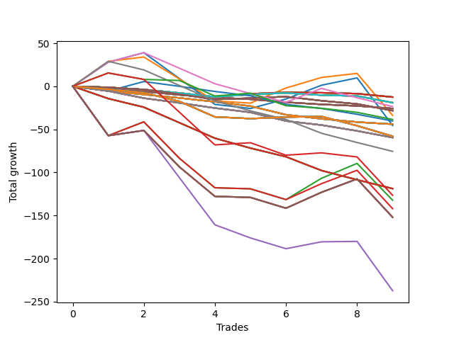

# Long Wallace Doodle 016 
- Symbol: NQ
- Date Range: 03/18/2022 - 06/17/2022
- Trading Period: 7:20-12:30
- Number of Trades: 9



| Name | Win Percent | Profit | Avg Profit / Trade |     | Name | Win Percent | Profit | Avg Profit / Trade |
| ---- | ----------- | ------ | ------------------ | --- | ---- | ----------- | ------ | ------------------ |
| Sorted By <br> Profit | | | | | Sorted By <br> Win Percentage ||||
| Twenty-Three | 22.22 | -6250.00 | -694.44 |     | One | 55.56 | -16875.00 | -1875.00 |
| Twenty-Two | 22.22 | -6250.00 | -694.44 |     | Zero | 55.56 | -22750.00 | -2527.78 |
| Twenty-One | 22.22 | -6250.00 | -694.44 |     | Fifty-Six | 33.33 | -11750.00 | -1305.56 |
| Twenty | 22.22 | -6250.00 | -694.44 |     | Seventy-Three | 33.33 | -63250.00 | -7027.78 |
| Nineteen | 22.22 | -6250.00 | -694.44 |     | Two | 33.33 | -66125.00 | -7347.22 |
| Eighteen | 22.22 | -6250.00 | -694.44 |     | Three | 33.33 | -71000.00 | -7888.89 |
| Seventeen | 22.22 | -6250.00 | -694.44 |     | Seventy-Five | 33.33 | -76000.00 | -8444.44 |
| Sixten | 22.22 | -6250.00 | -694.44 |     | Seven | 33.33 | -76000.00 | -8444.44 |
| Thirty-Nine | 22.22 | -9500.00 | -1055.56 |     | Six | 33.33 | -76000.00 | -8444.44 |
| Thirty-Eight | 22.22 | -9500.00 | -1055.56 |     | Five | 33.33 | -76000.00 | -8444.44 |
| Thirty-Seven | 22.22 | -9500.00 | -1055.56 |     | Four | 33.33 | -76000.00 | -8444.44 |
| Thirty-Six | 22.22 | -9500.00 | -1055.56 |     | Seventy-Four | 33.33 | -118625.00 | -13180.56 |
| Thirty-Five | 22.22 | -9500.00 | -1055.56 |     | Twenty-Three | 22.22 | -6250.00 | -694.44 |
| Thirty-Four | 22.22 | -9500.00 | -1055.56 |     | Twenty-Two | 22.22 | -6250.00 | -694.44 |
| Thirty-Three | 22.22 | -9500.00 | -1055.56 |     | Twenty-One | 22.22 | -6250.00 | -694.44 |
| Thirty-Two | 22.22 | -9500.00 | -1055.56 |     | Twenty | 22.22 | -6250.00 | -694.44 |
| Fifty-Six | 33.33 | -11750.00 | -1305.56 |     | Nineteen | 22.22 | -6250.00 | -694.44 |
| Fifteen | 0.00 | -12875.00 | -1430.56 |     | Eighteen | 22.22 | -6250.00 | -694.44 |
| Fourteen | 0.00 | -12875.00 | -1430.56 |     | Seventeen | 22.22 | -6250.00 | -694.44 |
| Thirteen | 0.00 | -12875.00 | -1430.56 |     | Sixten | 22.22 | -6250.00 | -694.44 |
| Twelve | 0.00 | -12875.00 | -1430.56 |     | Thirty-Nine | 22.22 | -9500.00 | -1055.56 |
| Eleven | 0.00 | -12875.00 | -1430.56 |     | Thirty-Eight | 22.22 | -9500.00 | -1055.56 |
| Ten | 0.00 | -12875.00 | -1430.56 |     | Thirty-Seven | 22.22 | -9500.00 | -1055.56 |
| Nine | 0.00 | -12875.00 | -1430.56 |     | Thirty-Six | 22.22 | -9500.00 | -1055.56 |
| Eight | 0.00 | -12875.00 | -1430.56 |     | Thirty-Five | 22.22 | -9500.00 | -1055.56 |
| Fifty-Five | 22.22 | -14125.00 | -1569.44 |     | Thirty-Four | 22.22 | -9500.00 | -1055.56 |
| Fifty-Four | 22.22 | -14125.00 | -1569.44 |     | Thirty-Three | 22.22 | -9500.00 | -1055.56 |
| Fifty-Three | 22.22 | -14125.00 | -1569.44 |     | Thirty-Two | 22.22 | -9500.00 | -1055.56 |
| Fifty-Two | 22.22 | -14125.00 | -1569.44 |     | Fifty-Five | 22.22 | -14125.00 | -1569.44 |
| Fifty-One | 22.22 | -14125.00 | -1569.44 |     | Fifty-Four | 22.22 | -14125.00 | -1569.44 |
| Fifty | 22.22 | -14125.00 | -1569.44 |     | Fifty-Three | 22.22 | -14125.00 | -1569.44 |
| Forty-Nine | 22.22 | -14125.00 | -1569.44 |     | Fifty-Two | 22.22 | -14125.00 | -1569.44 |
| Forty-Eight | 22.22 | -14125.00 | -1569.44 |     | Fifty-One | 22.22 | -14125.00 | -1569.44 |
| One | 55.56 | -16875.00 | -1875.00 |     | Fifty | 22.22 | -14125.00 | -1569.44 |
| Seventy-Two | 22.22 | -19250.00 | -2138.89 |     | Forty-Nine | 22.22 | -14125.00 | -1569.44 |
| Forty | 11.11 | -20125.00 | -2236.11 |     | Forty-Eight | 22.22 | -14125.00 | -1569.44 |
| Thirty-One | 0.00 | -22000.00 | -2444.44 |     | Seventy-Two | 22.22 | -19250.00 | -2138.89 |
| Thirty | 0.00 | -22000.00 | -2444.44 |     | Seventy-One | 22.22 | -29000.00 | -3222.22 |
| Twenty-Nine | 0.00 | -22000.00 | -2444.44 |     | Seventy | 22.22 | -29000.00 | -3222.22 |
| Twenty-Eight | 0.00 | -22000.00 | -2444.44 |     | Sixty-Nine | 22.22 | -29000.00 | -3222.22 |
| twenty-Seven | 0.00 | -22000.00 | -2444.44 |     | Sixty-Eight | 22.22 | -29000.00 | -3222.22 |
| Twenty-Six | 0.00 | -22000.00 | -2444.44 |     | Sixty-Seven | 22.22 | -29000.00 | -3222.22 |
| Twenty-Five | 0.00 | -22000.00 | -2444.44 |     | Sixty-Six | 22.22 | -29000.00 | -3222.22 |
| Twenty-Four | 0.00 | -22000.00 | -2444.44 |     | Sixty-Five | 22.22 | -29000.00 | -3222.22 |
| Zero | 55.56 | -22750.00 | -2527.78 |     | Sixty-Four | 22.22 | -29000.00 | -3222.22 |
| Seventy-One | 22.22 | -29000.00 | -3222.22 |     | Forty | 11.11 | -20125.00 | -2236.11 |
| Seventy | 22.22 | -29000.00 | -3222.22 |     | Fifty-Seven | 11.11 | -37750.00 | -4194.44 |
| Sixty-Nine | 22.22 | -29000.00 | -3222.22 |     | Fifteen | 0.00 | -12875.00 | -1430.56 |
| Sixty-Eight | 22.22 | -29000.00 | -3222.22 |     | Fourteen | 0.00 | -12875.00 | -1430.56 |
| Sixty-Seven | 22.22 | -29000.00 | -3222.22 |     | Thirteen | 0.00 | -12875.00 | -1430.56 |
| Sixty-Six | 22.22 | -29000.00 | -3222.22 |     | Twelve | 0.00 | -12875.00 | -1430.56 |
| Sixty-Five | 22.22 | -29000.00 | -3222.22 |     | Eleven | 0.00 | -12875.00 | -1430.56 |
| Sixty-Four | 22.22 | -29000.00 | -3222.22 |     | Ten | 0.00 | -12875.00 | -1430.56 |
| Forty-Seven | 0.00 | -29750.00 | -3305.56 |     | Nine | 0.00 | -12875.00 | -1430.56 |
| Forty-Six | 0.00 | -29750.00 | -3305.56 |     | Eight | 0.00 | -12875.00 | -1430.56 |
| Forty-Five | 0.00 | -29750.00 | -3305.56 |     | Thirty-One | 0.00 | -22000.00 | -2444.44 |
| Forty-Four | 0.00 | -29750.00 | -3305.56 |     | Thirty | 0.00 | -22000.00 | -2444.44 |
| Forty-Three | 0.00 | -29750.00 | -3305.56 |     | Twenty-Nine | 0.00 | -22000.00 | -2444.44 |
| Forty-Two | 0.00 | -29750.00 | -3305.56 |     | Twenty-Eight | 0.00 | -22000.00 | -2444.44 |
| Forty-One | 0.00 | -29750.00 | -3305.56 |     | twenty-Seven | 0.00 | -22000.00 | -2444.44 |
| Fifty-Seven | 11.11 | -37750.00 | -4194.44 |     | Twenty-Six | 0.00 | -22000.00 | -2444.44 |
| Sixty-Three | 0.00 | -59375.00 | -6597.22 |     | Twenty-Five | 0.00 | -22000.00 | -2444.44 |
| Sixty-Two | 0.00 | -59375.00 | -6597.22 |     | Twenty-Four | 0.00 | -22000.00 | -2444.44 |
| Sixty-One | 0.00 | -59375.00 | -6597.22 |     | Forty-Seven | 0.00 | -29750.00 | -3305.56 |
| Sixty | 0.00 | -59375.00 | -6597.22 |     | Forty-Six | 0.00 | -29750.00 | -3305.56 |
| Fifty-Nine | 0.00 | -59375.00 | -6597.22 |     | Forty-Five | 0.00 | -29750.00 | -3305.56 |
| Fifty-Eight | 0.00 | -59375.00 | -6597.22 |     | Forty-Four | 0.00 | -29750.00 | -3305.56 |
| Seventy-Three | 33.33 | -63250.00 | -7027.78 |     | Forty-Three | 0.00 | -29750.00 | -3305.56 |
| Two | 33.33 | -66125.00 | -7347.22 |     | Forty-Two | 0.00 | -29750.00 | -3305.56 |
| Three | 33.33 | -71000.00 | -7888.89 |     | Forty-One | 0.00 | -29750.00 | -3305.56 |
| Seventy-Five | 33.33 | -76000.00 | -8444.44 |     | Sixty-Three | 0.00 | -59375.00 | -6597.22 |
| Seven | 33.33 | -76000.00 | -8444.44 |     | Sixty-Two | 0.00 | -59375.00 | -6597.22 |
| Six | 33.33 | -76000.00 | -8444.44 |     | Sixty-One | 0.00 | -59375.00 | -6597.22 |
| Five | 33.33 | -76000.00 | -8444.44 |     | Sixty | 0.00 | -59375.00 | -6597.22 |
| Four | 33.33 | -76000.00 | -8444.44 |     | Fifty-Nine | 0.00 | -59375.00 | -6597.22 |
| Seventy-Four | 33.33 | -118625.00 | -13180.56 |     | Fifty-Eight | 0.00 | -59375.00 | -6597.22 |

## NO STOPLOSS

### Test Zero
* Sell when price hits the middle line of the 20p bollinger
* No Stoploss
* Results:
```
Total Trades: 9
Percent Up: 55.56
Percent Down: 44.44
Total Points Moved Up: -45.50
Potential Profit: -22750.00
Total Points Ups: 74.50 Count Ups: 5
Total Points Downs: -120.00 Count Downs: 4
```

<details><summary>Trades</summary>

<code>In: 2022-03-21 09:40:00		Out: 2022-03-21 09:45:40		Total Position Time: 05:40		Total Move Up: 28.00		Total to Date: 28.00</code> <br />
<code>In: 2022-03-23 10:32:00		Out: 2022-03-23 10:36:05		Total Position Time: 04:05		Total Move Up: 11.00		Total to Date: 39.00</code> <br />
<code>In: 2022-03-30 08:02:00		Out: 2022-03-30 08:19:10		Total Position Time: 17:10		Total Move Up: -30.00		Total to Date: 9.00</code> <br />
<code>In: 2022-03-30 08:03:00		Out: 2022-03-30 08:19:10		Total Position Time: 16:10		Total Move Up: -30.00		Total to Date: -21.00</code> <br />
<code>In: 2022-04-18 08:29:00		Out: 2022-04-18 08:43:05		Total Position Time: 14:05		Total Move Up: -4.75		Total to Date: -25.75</code> <br />
<code>In: 2022-04-27 12:06:00		Out: 2022-04-27 12:13:55		Total Position Time: 07:55		Total Move Up: 11.00		Total to Date: -14.75</code> <br />
<code>In: 2022-06-06 08:22:00		Out: 2022-06-06 08:30:10		Total Position Time: 08:10		Total Move Up: 16.00		Total to Date: 1.25</code> <br />
<code>In: 2022-06-06 08:24:00		Out: 2022-06-06 08:30:10		Total Position Time: 06:10		Total Move Up: 8.50		Total to Date: 9.75</code> <br />
<code>In: 2022-06-08 09:30:00		Out: 2022-06-08 09:54:10		Total Position Time: 24:10		Total Move Up: -55.25		Total to Date: -45.50</code> <br />


</details>

### Test One
* Sell when the price hits the upper line of the 20p 1std bollinger
* No Stoploss
* Results:
```
Total Trades: 9
Percent Up: 55.56
Percent Down: 44.44
Total Points Moved Up: -33.75
Potential Profit: -16875.00
Total Points Ups: 68.50 Count Ups: 5
Total Points Downs: -102.25 Count Downs: 4
```

<details><summary>Trades</summary>

<code>In: 2022-03-21 09:40:00		Out: 2022-03-21 09:49:40		Total Position Time: 09:40		Total Move Up: 29.00		Total to Date: 29.00</code> <br />
<code>In: 2022-03-23 10:32:00		Out: 2022-03-23 10:52:10		Total Position Time: 20:10		Total Move Up: 5.00		Total to Date: 34.00</code> <br />
<code>In: 2022-03-30 08:02:00		Out: 2022-03-30 08:23:45		Total Position Time: 21:45		Total Move Up: -25.50		Total to Date: 8.50</code> <br />
<code>In: 2022-03-30 08:03:00		Out: 2022-03-30 08:23:45		Total Position Time: 20:45		Total Move Up: -25.50		Total to Date: -17.00</code> <br />
<code>In: 2022-04-18 08:29:00		Out: 2022-04-18 08:55:10		Total Position Time: 26:10		Total Move Up: -2.50		Total to Date: -19.50</code> <br />
<code>In: 2022-04-27 12:06:00		Out: 2022-04-27 12:15:20		Total Position Time: 09:20		Total Move Up: 17.50		Total to Date: -2.00</code> <br />
<code>In: 2022-06-06 08:22:00		Out: 2022-06-06 08:39:15		Total Position Time: 17:15		Total Move Up: 12.25		Total to Date: 10.25</code> <br />
<code>In: 2022-06-06 08:24:00		Out: 2022-06-06 08:39:15		Total Position Time: 15:15		Total Move Up: 4.75		Total to Date: 15.00</code> <br />
<code>In: 2022-06-08 09:30:00		Out: 2022-06-08 09:57:05		Total Position Time: 27:05		Total Move Up: -48.75		Total to Date: -33.75</code> <br />


</details>

### Test Two
* Sell when the price hits the upper line of the 20p 2std bollinger
* No Stoploss
* Results:
```
Total Trades: 9
Percent Up: 33.33
Percent Down: 66.67
Total Points Moved Up: -132.25
Potential Profit: -66125.00
Total Points Ups: 58.00 Count Ups: 3
Total Points Downs: -190.25 Count Downs: 6
```

<details><summary>Trades</summary>

<code>In: 2022-03-21 09:40:00		Out: 2022-03-21 10:09:55		Total Position Time: 29:55		Total Move Up: -57.25		Total to Date: -57.25</code> <br />
<code>In: 2022-03-23 10:32:00		Out: 2022-03-23 10:55:05		Total Position Time: 23:05		Total Move Up: 16.00		Total to Date: -41.25</code> <br />
<code>In: 2022-03-30 08:02:00		Out: 2022-03-30 08:31:55		Total Position Time: 29:55		Total Move Up: -42.25		Total to Date: -83.50</code> <br />
<code>In: 2022-03-30 08:03:00		Out: 2022-03-30 08:32:55		Total Position Time: 29:55		Total Move Up: -34.25		Total to Date: -117.75</code> <br />
<code>In: 2022-04-18 08:29:00		Out: 2022-04-18 08:58:55		Total Position Time: 29:55		Total Move Up: -1.25		Total to Date: -119.00</code> <br />
<code>In: 2022-04-27 12:06:00		Out: 2022-04-27 12:35:55		Total Position Time: 29:55		Total Move Up: -12.50		Total to Date: -131.50</code> <br />
<code>In: 2022-06-06 08:22:00		Out: 2022-06-06 08:44:30		Total Position Time: 22:30		Total Move Up: 24.75		Total to Date: -106.75</code> <br />
<code>In: 2022-06-06 08:24:00		Out: 2022-06-06 08:44:30		Total Position Time: 20:30		Total Move Up: 17.25		Total to Date: -89.50</code> <br />
<code>In: 2022-06-08 09:30:00		Out: 2022-06-08 09:59:15		Total Position Time: 29:15		Total Move Up: -42.75		Total to Date: -132.25</code> <br />


</details>

### Test Three
* Sell when price hits the middle line of the 50p bollinger
* No Stoploss
* Results:
```
Total Trades: 9
Percent Up: 33.33
Percent Down: 66.67
Total Points Moved Up: -142.00
Potential Profit: -71000.00
Total Points Ups: 50.00 Count Ups: 3
Total Points Downs: -192.00 Count Downs: 6
```

<details><summary>Trades</summary>

<code>In: 2022-03-21 09:40:00		Out: 2022-03-21 10:09:55		Total Position Time: 29:55		Total Move Up: -57.25		Total to Date: -57.25</code> <br />
<code>In: 2022-03-23 10:32:00		Out: 2022-03-23 10:55:05		Total Position Time: 23:05		Total Move Up: 16.00		Total to Date: -41.25</code> <br />
<code>In: 2022-03-30 08:02:00		Out: 2022-03-30 08:31:55		Total Position Time: 29:55		Total Move Up: -42.25		Total to Date: -83.50</code> <br />
<code>In: 2022-03-30 08:03:00		Out: 2022-03-30 08:32:55		Total Position Time: 29:55		Total Move Up: -34.25		Total to Date: -117.75</code> <br />
<code>In: 2022-04-18 08:29:00		Out: 2022-04-18 08:58:55		Total Position Time: 29:55		Total Move Up: -1.25		Total to Date: -119.00</code> <br />
<code>In: 2022-04-27 12:06:00		Out: 2022-04-27 12:35:55		Total Position Time: 29:55		Total Move Up: -12.50		Total to Date: -131.50</code> <br />
<code>In: 2022-06-06 08:22:00		Out: 2022-06-06 08:51:55		Total Position Time: 29:55		Total Move Up: 18.50		Total to Date: -113.00</code> <br />
<code>In: 2022-06-06 08:24:00		Out: 2022-06-06 08:53:55		Total Position Time: 29:55		Total Move Up: 15.50		Total to Date: -97.50</code> <br />
<code>In: 2022-06-08 09:30:00		Out: 2022-06-08 09:59:55		Total Position Time: 29:55		Total Move Up: -44.50		Total to Date: -142.00</code> <br />


</details>

### Test Four
* Sell when the price hits the upper line of the 50p 1std bollinger
* No Stoploss
* Results:
```
Total Trades: 9
Percent Up: 33.33
Percent Down: 66.67
Total Points Moved Up: -152.00
Potential Profit: -76000.00
Total Points Ups: 40.00 Count Ups: 3
Total Points Downs: -192.00 Count Downs: 6
```

<details><summary>Trades</summary>

<code>In: 2022-03-21 09:40:00		Out: 2022-03-21 10:09:55		Total Position Time: 29:55		Total Move Up: -57.25		Total to Date: -57.25</code> <br />
<code>In: 2022-03-23 10:32:00		Out: 2022-03-23 11:01:55		Total Position Time: 29:55		Total Move Up: 6.00		Total to Date: -51.25</code> <br />
<code>In: 2022-03-30 08:02:00		Out: 2022-03-30 08:31:55		Total Position Time: 29:55		Total Move Up: -42.25		Total to Date: -93.50</code> <br />
<code>In: 2022-03-30 08:03:00		Out: 2022-03-30 08:32:55		Total Position Time: 29:55		Total Move Up: -34.25		Total to Date: -127.75</code> <br />
<code>In: 2022-04-18 08:29:00		Out: 2022-04-18 08:58:55		Total Position Time: 29:55		Total Move Up: -1.25		Total to Date: -129.00</code> <br />
<code>In: 2022-04-27 12:06:00		Out: 2022-04-27 12:35:55		Total Position Time: 29:55		Total Move Up: -12.50		Total to Date: -141.50</code> <br />
<code>In: 2022-06-06 08:22:00		Out: 2022-06-06 08:51:55		Total Position Time: 29:55		Total Move Up: 18.50		Total to Date: -123.00</code> <br />
<code>In: 2022-06-06 08:24:00		Out: 2022-06-06 08:53:55		Total Position Time: 29:55		Total Move Up: 15.50		Total to Date: -107.50</code> <br />
<code>In: 2022-06-08 09:30:00		Out: 2022-06-08 09:59:55		Total Position Time: 29:55		Total Move Up: -44.50		Total to Date: -152.00</code> <br />


</details>

### Test Five
* Sell when the price hits the upper line of the 50p 2std bollinger
* No Stoploss
* Results:
```
Total Trades: 9
Percent Up: 33.33
Percent Down: 66.67
Total Points Moved Up: -152.00
Potential Profit: -76000.00
Total Points Ups: 40.00 Count Ups: 3
Total Points Downs: -192.00 Count Downs: 6
```

<details><summary>Trades</summary>

<code>In: 2022-03-21 09:40:00		Out: 2022-03-21 10:09:55		Total Position Time: 29:55		Total Move Up: -57.25		Total to Date: -57.25</code> <br />
<code>In: 2022-03-23 10:32:00		Out: 2022-03-23 11:01:55		Total Position Time: 29:55		Total Move Up: 6.00		Total to Date: -51.25</code> <br />
<code>In: 2022-03-30 08:02:00		Out: 2022-03-30 08:31:55		Total Position Time: 29:55		Total Move Up: -42.25		Total to Date: -93.50</code> <br />
<code>In: 2022-03-30 08:03:00		Out: 2022-03-30 08:32:55		Total Position Time: 29:55		Total Move Up: -34.25		Total to Date: -127.75</code> <br />
<code>In: 2022-04-18 08:29:00		Out: 2022-04-18 08:58:55		Total Position Time: 29:55		Total Move Up: -1.25		Total to Date: -129.00</code> <br />
<code>In: 2022-04-27 12:06:00		Out: 2022-04-27 12:35:55		Total Position Time: 29:55		Total Move Up: -12.50		Total to Date: -141.50</code> <br />
<code>In: 2022-06-06 08:22:00		Out: 2022-06-06 08:51:55		Total Position Time: 29:55		Total Move Up: 18.50		Total to Date: -123.00</code> <br />
<code>In: 2022-06-06 08:24:00		Out: 2022-06-06 08:53:55		Total Position Time: 29:55		Total Move Up: 15.50		Total to Date: -107.50</code> <br />
<code>In: 2022-06-08 09:30:00		Out: 2022-06-08 09:59:55		Total Position Time: 29:55		Total Move Up: -44.50		Total to Date: -152.00</code> <br />


</details>

### Test Six
* Sell when the price hits the middle line of the 1std VWAP
* No Stoploss
* Results:
```
Total Trades: 9
Percent Up: 33.33
Percent Down: 66.67
Total Points Moved Up: -152.00
Potential Profit: -76000.00
Total Points Ups: 40.00 Count Ups: 3
Total Points Downs: -192.00 Count Downs: 6
```

<details><summary>Trades</summary>

<code>In: 2022-03-21 09:40:00		Out: 2022-03-21 10:09:55		Total Position Time: 29:55		Total Move Up: -57.25		Total to Date: -57.25</code> <br />
<code>In: 2022-03-23 10:32:00		Out: 2022-03-23 11:01:55		Total Position Time: 29:55		Total Move Up: 6.00		Total to Date: -51.25</code> <br />
<code>In: 2022-03-30 08:02:00		Out: 2022-03-30 08:31:55		Total Position Time: 29:55		Total Move Up: -42.25		Total to Date: -93.50</code> <br />
<code>In: 2022-03-30 08:03:00		Out: 2022-03-30 08:32:55		Total Position Time: 29:55		Total Move Up: -34.25		Total to Date: -127.75</code> <br />
<code>In: 2022-04-18 08:29:00		Out: 2022-04-18 08:58:55		Total Position Time: 29:55		Total Move Up: -1.25		Total to Date: -129.00</code> <br />
<code>In: 2022-04-27 12:06:00		Out: 2022-04-27 12:35:55		Total Position Time: 29:55		Total Move Up: -12.50		Total to Date: -141.50</code> <br />
<code>In: 2022-06-06 08:22:00		Out: 2022-06-06 08:51:55		Total Position Time: 29:55		Total Move Up: 18.50		Total to Date: -123.00</code> <br />
<code>In: 2022-06-06 08:24:00		Out: 2022-06-06 08:53:55		Total Position Time: 29:55		Total Move Up: 15.50		Total to Date: -107.50</code> <br />
<code>In: 2022-06-08 09:30:00		Out: 2022-06-08 09:59:55		Total Position Time: 29:55		Total Move Up: -44.50		Total to Date: -152.00</code> <br />


</details>

### Test Seven
* Sell when the price hits the upper line of the 1std VWAP
* No Stoploss
* Results:
```
Total Trades: 9
Percent Up: 33.33
Percent Down: 66.67
Total Points Moved Up: -152.00
Potential Profit: -76000.00
Total Points Ups: 40.00 Count Ups: 3
Total Points Downs: -192.00 Count Downs: 6
```

<details><summary>Trades</summary>

<code>In: 2022-03-21 09:40:00		Out: 2022-03-21 10:09:55		Total Position Time: 29:55		Total Move Up: -57.25		Total to Date: -57.25</code> <br />
<code>In: 2022-03-23 10:32:00		Out: 2022-03-23 11:01:55		Total Position Time: 29:55		Total Move Up: 6.00		Total to Date: -51.25</code> <br />
<code>In: 2022-03-30 08:02:00		Out: 2022-03-30 08:31:55		Total Position Time: 29:55		Total Move Up: -42.25		Total to Date: -93.50</code> <br />
<code>In: 2022-03-30 08:03:00		Out: 2022-03-30 08:32:55		Total Position Time: 29:55		Total Move Up: -34.25		Total to Date: -127.75</code> <br />
<code>In: 2022-04-18 08:29:00		Out: 2022-04-18 08:58:55		Total Position Time: 29:55		Total Move Up: -1.25		Total to Date: -129.00</code> <br />
<code>In: 2022-04-27 12:06:00		Out: 2022-04-27 12:35:55		Total Position Time: 29:55		Total Move Up: -12.50		Total to Date: -141.50</code> <br />
<code>In: 2022-06-06 08:22:00		Out: 2022-06-06 08:51:55		Total Position Time: 29:55		Total Move Up: 18.50		Total to Date: -123.00</code> <br />
<code>In: 2022-06-06 08:24:00		Out: 2022-06-06 08:53:55		Total Position Time: 29:55		Total Move Up: 15.50		Total to Date: -107.50</code> <br />
<code>In: 2022-06-08 09:30:00		Out: 2022-06-08 09:59:55		Total Position Time: 29:55		Total Move Up: -44.50		Total to Date: -152.00</code> <br />


</details>

## STOPLOSS OF 2

### Test Eight
* Sell when price hits the middle line of the 20p bollinger
* Stoploss is 2 points
* Results:
```
Total Trades: 9
Percent Up: 0.00
Percent Down: 100.00
Total Points Moved Up: -25.75
Potential Profit: -12875.00
Total Points Ups: 0.00 Count Ups: 0
Total Points Downs: -25.75 Count Downs: 9
```

<details><summary>Trades</summary>

<code>In: 2022-03-21 09:40:00		Out: 2022-03-21 09:41:10		Total Position Time: 01:10		Total Move Up: -3.50		Total to Date: -3.50</code> <br />
<code>In: 2022-03-23 10:32:00		Out: 2022-03-23 10:32:10		Total Position Time: 00:10		Total Move Up: -2.50		Total to Date: -6.00</code> <br />
<code>In: 2022-03-30 08:02:00		Out: 2022-03-30 08:02:10		Total Position Time: 00:10		Total Move Up: -4.00		Total to Date: -10.00</code> <br />
<code>In: 2022-03-30 08:03:00		Out: 2022-03-30 08:03:20		Total Position Time: 00:20		Total Move Up: -3.00		Total to Date: -13.00</code> <br />
<code>In: 2022-04-18 08:29:00		Out: 2022-04-18 08:32:10		Total Position Time: 03:10		Total Move Up: -2.00		Total to Date: -15.00</code> <br />
<code>In: 2022-04-27 12:06:00		Out: 2022-04-27 12:08:30		Total Position Time: 02:30		Total Move Up: -3.50		Total to Date: -18.50</code> <br />
<code>In: 2022-06-06 08:22:00		Out: 2022-06-06 08:22:35		Total Position Time: 00:35		Total Move Up: -2.50		Total to Date: -21.00</code> <br />
<code>In: 2022-06-06 08:24:00		Out: 2022-06-06 08:24:25		Total Position Time: 00:25		Total Move Up: -1.75		Total to Date: -22.75</code> <br />
<code>In: 2022-06-08 09:30:00		Out: 2022-06-08 09:30:10		Total Position Time: 00:10		Total Move Up: -3.00		Total to Date: -25.75</code> <br />


</details>

### Test Nine
* Sell when the price hits the upper line of the 20p 1std bollinger
* Stoploss is 2 points
* Results:
```
Total Trades: 9
Percent Up: 0.00
Percent Down: 100.00
Total Points Moved Up: -25.75
Potential Profit: -12875.00
Total Points Ups: 0.00 Count Ups: 0
Total Points Downs: -25.75 Count Downs: 9
```

<details><summary>Trades</summary>

<code>In: 2022-03-21 09:40:00		Out: 2022-03-21 09:41:10		Total Position Time: 01:10		Total Move Up: -3.50		Total to Date: -3.50</code> <br />
<code>In: 2022-03-23 10:32:00		Out: 2022-03-23 10:32:10		Total Position Time: 00:10		Total Move Up: -2.50		Total to Date: -6.00</code> <br />
<code>In: 2022-03-30 08:02:00		Out: 2022-03-30 08:02:10		Total Position Time: 00:10		Total Move Up: -4.00		Total to Date: -10.00</code> <br />
<code>In: 2022-03-30 08:03:00		Out: 2022-03-30 08:03:20		Total Position Time: 00:20		Total Move Up: -3.00		Total to Date: -13.00</code> <br />
<code>In: 2022-04-18 08:29:00		Out: 2022-04-18 08:32:10		Total Position Time: 03:10		Total Move Up: -2.00		Total to Date: -15.00</code> <br />
<code>In: 2022-04-27 12:06:00		Out: 2022-04-27 12:08:30		Total Position Time: 02:30		Total Move Up: -3.50		Total to Date: -18.50</code> <br />
<code>In: 2022-06-06 08:22:00		Out: 2022-06-06 08:22:35		Total Position Time: 00:35		Total Move Up: -2.50		Total to Date: -21.00</code> <br />
<code>In: 2022-06-06 08:24:00		Out: 2022-06-06 08:24:25		Total Position Time: 00:25		Total Move Up: -1.75		Total to Date: -22.75</code> <br />
<code>In: 2022-06-08 09:30:00		Out: 2022-06-08 09:30:10		Total Position Time: 00:10		Total Move Up: -3.00		Total to Date: -25.75</code> <br />


</details>

### Test Ten
* Sell when the price hits the upper line of the 20p 2std bollinger
* Stoploss is 2 points
* Results:
```
Total Trades: 9
Percent Up: 0.00
Percent Down: 100.00
Total Points Moved Up: -25.75
Potential Profit: -12875.00
Total Points Ups: 0.00 Count Ups: 0
Total Points Downs: -25.75 Count Downs: 9
```

<details><summary>Trades</summary>

<code>In: 2022-03-21 09:40:00		Out: 2022-03-21 09:41:10		Total Position Time: 01:10		Total Move Up: -3.50		Total to Date: -3.50</code> <br />
<code>In: 2022-03-23 10:32:00		Out: 2022-03-23 10:32:10		Total Position Time: 00:10		Total Move Up: -2.50		Total to Date: -6.00</code> <br />
<code>In: 2022-03-30 08:02:00		Out: 2022-03-30 08:02:10		Total Position Time: 00:10		Total Move Up: -4.00		Total to Date: -10.00</code> <br />
<code>In: 2022-03-30 08:03:00		Out: 2022-03-30 08:03:20		Total Position Time: 00:20		Total Move Up: -3.00		Total to Date: -13.00</code> <br />
<code>In: 2022-04-18 08:29:00		Out: 2022-04-18 08:32:10		Total Position Time: 03:10		Total Move Up: -2.00		Total to Date: -15.00</code> <br />
<code>In: 2022-04-27 12:06:00		Out: 2022-04-27 12:08:30		Total Position Time: 02:30		Total Move Up: -3.50		Total to Date: -18.50</code> <br />
<code>In: 2022-06-06 08:22:00		Out: 2022-06-06 08:22:35		Total Position Time: 00:35		Total Move Up: -2.50		Total to Date: -21.00</code> <br />
<code>In: 2022-06-06 08:24:00		Out: 2022-06-06 08:24:25		Total Position Time: 00:25		Total Move Up: -1.75		Total to Date: -22.75</code> <br />
<code>In: 2022-06-08 09:30:00		Out: 2022-06-08 09:30:10		Total Position Time: 00:10		Total Move Up: -3.00		Total to Date: -25.75</code> <br />


</details>

### Test Eleven
* Sell when price hits the middle line of the 50p bollinger
* Stoploss is 2 points
* Results:
```
Total Trades: 9
Percent Up: 0.00
Percent Down: 100.00
Total Points Moved Up: -25.75
Potential Profit: -12875.00
Total Points Ups: 0.00 Count Ups: 0
Total Points Downs: -25.75 Count Downs: 9
```

<details><summary>Trades</summary>

<code>In: 2022-03-21 09:40:00		Out: 2022-03-21 09:41:10		Total Position Time: 01:10		Total Move Up: -3.50		Total to Date: -3.50</code> <br />
<code>In: 2022-03-23 10:32:00		Out: 2022-03-23 10:32:10		Total Position Time: 00:10		Total Move Up: -2.50		Total to Date: -6.00</code> <br />
<code>In: 2022-03-30 08:02:00		Out: 2022-03-30 08:02:10		Total Position Time: 00:10		Total Move Up: -4.00		Total to Date: -10.00</code> <br />
<code>In: 2022-03-30 08:03:00		Out: 2022-03-30 08:03:20		Total Position Time: 00:20		Total Move Up: -3.00		Total to Date: -13.00</code> <br />
<code>In: 2022-04-18 08:29:00		Out: 2022-04-18 08:32:10		Total Position Time: 03:10		Total Move Up: -2.00		Total to Date: -15.00</code> <br />
<code>In: 2022-04-27 12:06:00		Out: 2022-04-27 12:08:30		Total Position Time: 02:30		Total Move Up: -3.50		Total to Date: -18.50</code> <br />
<code>In: 2022-06-06 08:22:00		Out: 2022-06-06 08:22:35		Total Position Time: 00:35		Total Move Up: -2.50		Total to Date: -21.00</code> <br />
<code>In: 2022-06-06 08:24:00		Out: 2022-06-06 08:24:25		Total Position Time: 00:25		Total Move Up: -1.75		Total to Date: -22.75</code> <br />
<code>In: 2022-06-08 09:30:00		Out: 2022-06-08 09:30:10		Total Position Time: 00:10		Total Move Up: -3.00		Total to Date: -25.75</code> <br />


</details>

### Test Twelve
* Sell when the price hits the upper line of the 50p 1std bollinger
* Stoploss is 2 points
* Results:
```
Total Trades: 9
Percent Up: 0.00
Percent Down: 100.00
Total Points Moved Up: -25.75
Potential Profit: -12875.00
Total Points Ups: 0.00 Count Ups: 0
Total Points Downs: -25.75 Count Downs: 9
```

<details><summary>Trades</summary>

<code>In: 2022-03-21 09:40:00		Out: 2022-03-21 09:41:10		Total Position Time: 01:10		Total Move Up: -3.50		Total to Date: -3.50</code> <br />
<code>In: 2022-03-23 10:32:00		Out: 2022-03-23 10:32:10		Total Position Time: 00:10		Total Move Up: -2.50		Total to Date: -6.00</code> <br />
<code>In: 2022-03-30 08:02:00		Out: 2022-03-30 08:02:10		Total Position Time: 00:10		Total Move Up: -4.00		Total to Date: -10.00</code> <br />
<code>In: 2022-03-30 08:03:00		Out: 2022-03-30 08:03:20		Total Position Time: 00:20		Total Move Up: -3.00		Total to Date: -13.00</code> <br />
<code>In: 2022-04-18 08:29:00		Out: 2022-04-18 08:32:10		Total Position Time: 03:10		Total Move Up: -2.00		Total to Date: -15.00</code> <br />
<code>In: 2022-04-27 12:06:00		Out: 2022-04-27 12:08:30		Total Position Time: 02:30		Total Move Up: -3.50		Total to Date: -18.50</code> <br />
<code>In: 2022-06-06 08:22:00		Out: 2022-06-06 08:22:35		Total Position Time: 00:35		Total Move Up: -2.50		Total to Date: -21.00</code> <br />
<code>In: 2022-06-06 08:24:00		Out: 2022-06-06 08:24:25		Total Position Time: 00:25		Total Move Up: -1.75		Total to Date: -22.75</code> <br />
<code>In: 2022-06-08 09:30:00		Out: 2022-06-08 09:30:10		Total Position Time: 00:10		Total Move Up: -3.00		Total to Date: -25.75</code> <br />


</details>

### Test Thirteen
* Sell when the price hits the upper line of the 50p 2std bollinger
* Stoploss is 2 points
* Results:
```
Total Trades: 9
Percent Up: 0.00
Percent Down: 100.00
Total Points Moved Up: -25.75
Potential Profit: -12875.00
Total Points Ups: 0.00 Count Ups: 0
Total Points Downs: -25.75 Count Downs: 9
```

<details><summary>Trades</summary>

<code>In: 2022-03-21 09:40:00		Out: 2022-03-21 09:41:10		Total Position Time: 01:10		Total Move Up: -3.50		Total to Date: -3.50</code> <br />
<code>In: 2022-03-23 10:32:00		Out: 2022-03-23 10:32:10		Total Position Time: 00:10		Total Move Up: -2.50		Total to Date: -6.00</code> <br />
<code>In: 2022-03-30 08:02:00		Out: 2022-03-30 08:02:10		Total Position Time: 00:10		Total Move Up: -4.00		Total to Date: -10.00</code> <br />
<code>In: 2022-03-30 08:03:00		Out: 2022-03-30 08:03:20		Total Position Time: 00:20		Total Move Up: -3.00		Total to Date: -13.00</code> <br />
<code>In: 2022-04-18 08:29:00		Out: 2022-04-18 08:32:10		Total Position Time: 03:10		Total Move Up: -2.00		Total to Date: -15.00</code> <br />
<code>In: 2022-04-27 12:06:00		Out: 2022-04-27 12:08:30		Total Position Time: 02:30		Total Move Up: -3.50		Total to Date: -18.50</code> <br />
<code>In: 2022-06-06 08:22:00		Out: 2022-06-06 08:22:35		Total Position Time: 00:35		Total Move Up: -2.50		Total to Date: -21.00</code> <br />
<code>In: 2022-06-06 08:24:00		Out: 2022-06-06 08:24:25		Total Position Time: 00:25		Total Move Up: -1.75		Total to Date: -22.75</code> <br />
<code>In: 2022-06-08 09:30:00		Out: 2022-06-08 09:30:10		Total Position Time: 00:10		Total Move Up: -3.00		Total to Date: -25.75</code> <br />


</details>

### Test Fourteen
* Sell when the price hits the middle line of the 1std VWAP
* Stoploss is 2 points
* Results:
```
Total Trades: 9
Percent Up: 0.00
Percent Down: 100.00
Total Points Moved Up: -25.75
Potential Profit: -12875.00
Total Points Ups: 0.00 Count Ups: 0
Total Points Downs: -25.75 Count Downs: 9
```

<details><summary>Trades</summary>

<code>In: 2022-03-21 09:40:00		Out: 2022-03-21 09:41:10		Total Position Time: 01:10		Total Move Up: -3.50		Total to Date: -3.50</code> <br />
<code>In: 2022-03-23 10:32:00		Out: 2022-03-23 10:32:10		Total Position Time: 00:10		Total Move Up: -2.50		Total to Date: -6.00</code> <br />
<code>In: 2022-03-30 08:02:00		Out: 2022-03-30 08:02:10		Total Position Time: 00:10		Total Move Up: -4.00		Total to Date: -10.00</code> <br />
<code>In: 2022-03-30 08:03:00		Out: 2022-03-30 08:03:20		Total Position Time: 00:20		Total Move Up: -3.00		Total to Date: -13.00</code> <br />
<code>In: 2022-04-18 08:29:00		Out: 2022-04-18 08:32:10		Total Position Time: 03:10		Total Move Up: -2.00		Total to Date: -15.00</code> <br />
<code>In: 2022-04-27 12:06:00		Out: 2022-04-27 12:08:30		Total Position Time: 02:30		Total Move Up: -3.50		Total to Date: -18.50</code> <br />
<code>In: 2022-06-06 08:22:00		Out: 2022-06-06 08:22:35		Total Position Time: 00:35		Total Move Up: -2.50		Total to Date: -21.00</code> <br />
<code>In: 2022-06-06 08:24:00		Out: 2022-06-06 08:24:25		Total Position Time: 00:25		Total Move Up: -1.75		Total to Date: -22.75</code> <br />
<code>In: 2022-06-08 09:30:00		Out: 2022-06-08 09:30:10		Total Position Time: 00:10		Total Move Up: -3.00		Total to Date: -25.75</code> <br />


</details>

### Test Fifteen
* Sell when the price hits the upper line of the 1std VWAP
* Stoploss is 2 points
* Results:
```
Total Trades: 9
Percent Up: 0.00
Percent Down: 100.00
Total Points Moved Up: -25.75
Potential Profit: -12875.00
Total Points Ups: 0.00 Count Ups: 0
Total Points Downs: -25.75 Count Downs: 9
```

<details><summary>Trades</summary>

<code>In: 2022-03-21 09:40:00		Out: 2022-03-21 09:41:10		Total Position Time: 01:10		Total Move Up: -3.50		Total to Date: -3.50</code> <br />
<code>In: 2022-03-23 10:32:00		Out: 2022-03-23 10:32:10		Total Position Time: 00:10		Total Move Up: -2.50		Total to Date: -6.00</code> <br />
<code>In: 2022-03-30 08:02:00		Out: 2022-03-30 08:02:10		Total Position Time: 00:10		Total Move Up: -4.00		Total to Date: -10.00</code> <br />
<code>In: 2022-03-30 08:03:00		Out: 2022-03-30 08:03:20		Total Position Time: 00:20		Total Move Up: -3.00		Total to Date: -13.00</code> <br />
<code>In: 2022-04-18 08:29:00		Out: 2022-04-18 08:32:10		Total Position Time: 03:10		Total Move Up: -2.00		Total to Date: -15.00</code> <br />
<code>In: 2022-04-27 12:06:00		Out: 2022-04-27 12:08:30		Total Position Time: 02:30		Total Move Up: -3.50		Total to Date: -18.50</code> <br />
<code>In: 2022-06-06 08:22:00		Out: 2022-06-06 08:22:35		Total Position Time: 00:35		Total Move Up: -2.50		Total to Date: -21.00</code> <br />
<code>In: 2022-06-06 08:24:00		Out: 2022-06-06 08:24:25		Total Position Time: 00:25		Total Move Up: -1.75		Total to Date: -22.75</code> <br />
<code>In: 2022-06-08 09:30:00		Out: 2022-06-08 09:30:10		Total Position Time: 00:10		Total Move Up: -3.00		Total to Date: -25.75</code> <br />


</details>

## TRAIL STOP OF 2

### Test Sixten
* Sell when price hits the middle line of the 20p bollinger
* Trailing Stop is 2 points
* Results:
```
Total Trades: 9
Percent Up: 22.22
Percent Down: 77.78
Total Points Moved Up: -12.50
Potential Profit: -6250.00
Total Points Ups: 5.25 Count Ups: 2
Total Points Downs: -17.75 Count Downs: 7
```

<details><summary>Trades</summary>

<code>In: 2022-03-21 09:40:00		Out: 2022-03-21 09:40:10		Total Position Time: 00:10		Total Move Up: -1.25		Total to Date: -1.25</code> <br />
<code>In: 2022-03-23 10:32:00		Out: 2022-03-23 10:32:10		Total Position Time: 00:10		Total Move Up: -2.50		Total to Date: -3.75</code> <br />
<code>In: 2022-03-30 08:02:00		Out: 2022-03-30 08:02:10		Total Position Time: 00:10		Total Move Up: -4.00		Total to Date: -7.75</code> <br />
<code>In: 2022-03-30 08:03:00		Out: 2022-03-30 08:03:25		Total Position Time: 00:25		Total Move Up: -4.50		Total to Date: -12.25</code> <br />
<code>In: 2022-04-18 08:29:00		Out: 2022-04-18 08:29:55		Total Position Time: 00:55		Total Move Up: 3.50		Total to Date: -8.75</code> <br />
<code>In: 2022-04-27 12:06:00		Out: 2022-04-27 12:06:10		Total Position Time: 00:10		Total Move Up: 1.75		Total to Date: -7.00</code> <br />
<code>In: 2022-06-06 08:22:00		Out: 2022-06-06 08:22:30		Total Position Time: 00:30		Total Move Up: -0.50		Total to Date: -7.50</code> <br />
<code>In: 2022-06-06 08:24:00		Out: 2022-06-06 08:24:20		Total Position Time: 00:20		Total Move Up: -1.00		Total to Date: -8.50</code> <br />
<code>In: 2022-06-08 09:30:00		Out: 2022-06-08 09:30:25		Total Position Time: 00:25		Total Move Up: -4.00		Total to Date: -12.50</code> <br />


</details>

### Test Seventeen
* Sell when the price hits the upper line of the 20p 1std bollinger
* Trailing Stop is 2 points
* Results:
```
Total Trades: 9
Percent Up: 22.22
Percent Down: 77.78
Total Points Moved Up: -12.50
Potential Profit: -6250.00
Total Points Ups: 5.25 Count Ups: 2
Total Points Downs: -17.75 Count Downs: 7
```

<details><summary>Trades</summary>

<code>In: 2022-03-21 09:40:00		Out: 2022-03-21 09:40:10		Total Position Time: 00:10		Total Move Up: -1.25		Total to Date: -1.25</code> <br />
<code>In: 2022-03-23 10:32:00		Out: 2022-03-23 10:32:10		Total Position Time: 00:10		Total Move Up: -2.50		Total to Date: -3.75</code> <br />
<code>In: 2022-03-30 08:02:00		Out: 2022-03-30 08:02:10		Total Position Time: 00:10		Total Move Up: -4.00		Total to Date: -7.75</code> <br />
<code>In: 2022-03-30 08:03:00		Out: 2022-03-30 08:03:25		Total Position Time: 00:25		Total Move Up: -4.50		Total to Date: -12.25</code> <br />
<code>In: 2022-04-18 08:29:00		Out: 2022-04-18 08:29:55		Total Position Time: 00:55		Total Move Up: 3.50		Total to Date: -8.75</code> <br />
<code>In: 2022-04-27 12:06:00		Out: 2022-04-27 12:06:10		Total Position Time: 00:10		Total Move Up: 1.75		Total to Date: -7.00</code> <br />
<code>In: 2022-06-06 08:22:00		Out: 2022-06-06 08:22:30		Total Position Time: 00:30		Total Move Up: -0.50		Total to Date: -7.50</code> <br />
<code>In: 2022-06-06 08:24:00		Out: 2022-06-06 08:24:20		Total Position Time: 00:20		Total Move Up: -1.00		Total to Date: -8.50</code> <br />
<code>In: 2022-06-08 09:30:00		Out: 2022-06-08 09:30:25		Total Position Time: 00:25		Total Move Up: -4.00		Total to Date: -12.50</code> <br />


</details>

### Test Eighteen
* Sell when the price hits the upper line of the 20p 2std bollinger
* Trailing Stop is 2 points
* Results:
```
Total Trades: 9
Percent Up: 22.22
Percent Down: 77.78
Total Points Moved Up: -12.50
Potential Profit: -6250.00
Total Points Ups: 5.25 Count Ups: 2
Total Points Downs: -17.75 Count Downs: 7
```

<details><summary>Trades</summary>

<code>In: 2022-03-21 09:40:00		Out: 2022-03-21 09:40:10		Total Position Time: 00:10		Total Move Up: -1.25		Total to Date: -1.25</code> <br />
<code>In: 2022-03-23 10:32:00		Out: 2022-03-23 10:32:10		Total Position Time: 00:10		Total Move Up: -2.50		Total to Date: -3.75</code> <br />
<code>In: 2022-03-30 08:02:00		Out: 2022-03-30 08:02:10		Total Position Time: 00:10		Total Move Up: -4.00		Total to Date: -7.75</code> <br />
<code>In: 2022-03-30 08:03:00		Out: 2022-03-30 08:03:25		Total Position Time: 00:25		Total Move Up: -4.50		Total to Date: -12.25</code> <br />
<code>In: 2022-04-18 08:29:00		Out: 2022-04-18 08:29:55		Total Position Time: 00:55		Total Move Up: 3.50		Total to Date: -8.75</code> <br />
<code>In: 2022-04-27 12:06:00		Out: 2022-04-27 12:06:10		Total Position Time: 00:10		Total Move Up: 1.75		Total to Date: -7.00</code> <br />
<code>In: 2022-06-06 08:22:00		Out: 2022-06-06 08:22:30		Total Position Time: 00:30		Total Move Up: -0.50		Total to Date: -7.50</code> <br />
<code>In: 2022-06-06 08:24:00		Out: 2022-06-06 08:24:20		Total Position Time: 00:20		Total Move Up: -1.00		Total to Date: -8.50</code> <br />
<code>In: 2022-06-08 09:30:00		Out: 2022-06-08 09:30:25		Total Position Time: 00:25		Total Move Up: -4.00		Total to Date: -12.50</code> <br />


</details>

### Test Nineteen
* Sell when price hits the middle line of the 50p bollinger
* Trailing Stop is 2 points
* Results:
```
Total Trades: 9
Percent Up: 22.22
Percent Down: 77.78
Total Points Moved Up: -12.50
Potential Profit: -6250.00
Total Points Ups: 5.25 Count Ups: 2
Total Points Downs: -17.75 Count Downs: 7
```

<details><summary>Trades</summary>

<code>In: 2022-03-21 09:40:00		Out: 2022-03-21 09:40:10		Total Position Time: 00:10		Total Move Up: -1.25		Total to Date: -1.25</code> <br />
<code>In: 2022-03-23 10:32:00		Out: 2022-03-23 10:32:10		Total Position Time: 00:10		Total Move Up: -2.50		Total to Date: -3.75</code> <br />
<code>In: 2022-03-30 08:02:00		Out: 2022-03-30 08:02:10		Total Position Time: 00:10		Total Move Up: -4.00		Total to Date: -7.75</code> <br />
<code>In: 2022-03-30 08:03:00		Out: 2022-03-30 08:03:25		Total Position Time: 00:25		Total Move Up: -4.50		Total to Date: -12.25</code> <br />
<code>In: 2022-04-18 08:29:00		Out: 2022-04-18 08:29:55		Total Position Time: 00:55		Total Move Up: 3.50		Total to Date: -8.75</code> <br />
<code>In: 2022-04-27 12:06:00		Out: 2022-04-27 12:06:10		Total Position Time: 00:10		Total Move Up: 1.75		Total to Date: -7.00</code> <br />
<code>In: 2022-06-06 08:22:00		Out: 2022-06-06 08:22:30		Total Position Time: 00:30		Total Move Up: -0.50		Total to Date: -7.50</code> <br />
<code>In: 2022-06-06 08:24:00		Out: 2022-06-06 08:24:20		Total Position Time: 00:20		Total Move Up: -1.00		Total to Date: -8.50</code> <br />
<code>In: 2022-06-08 09:30:00		Out: 2022-06-08 09:30:25		Total Position Time: 00:25		Total Move Up: -4.00		Total to Date: -12.50</code> <br />


</details>

### Test Twenty
* Sell when the price hits the upper line of the 50p 1std bollinger
* Trailing Stop is 2 points
* Results:
```
Total Trades: 9
Percent Up: 22.22
Percent Down: 77.78
Total Points Moved Up: -12.50
Potential Profit: -6250.00
Total Points Ups: 5.25 Count Ups: 2
Total Points Downs: -17.75 Count Downs: 7
```

<details><summary>Trades</summary>

<code>In: 2022-03-21 09:40:00		Out: 2022-03-21 09:40:10		Total Position Time: 00:10		Total Move Up: -1.25		Total to Date: -1.25</code> <br />
<code>In: 2022-03-23 10:32:00		Out: 2022-03-23 10:32:10		Total Position Time: 00:10		Total Move Up: -2.50		Total to Date: -3.75</code> <br />
<code>In: 2022-03-30 08:02:00		Out: 2022-03-30 08:02:10		Total Position Time: 00:10		Total Move Up: -4.00		Total to Date: -7.75</code> <br />
<code>In: 2022-03-30 08:03:00		Out: 2022-03-30 08:03:25		Total Position Time: 00:25		Total Move Up: -4.50		Total to Date: -12.25</code> <br />
<code>In: 2022-04-18 08:29:00		Out: 2022-04-18 08:29:55		Total Position Time: 00:55		Total Move Up: 3.50		Total to Date: -8.75</code> <br />
<code>In: 2022-04-27 12:06:00		Out: 2022-04-27 12:06:10		Total Position Time: 00:10		Total Move Up: 1.75		Total to Date: -7.00</code> <br />
<code>In: 2022-06-06 08:22:00		Out: 2022-06-06 08:22:30		Total Position Time: 00:30		Total Move Up: -0.50		Total to Date: -7.50</code> <br />
<code>In: 2022-06-06 08:24:00		Out: 2022-06-06 08:24:20		Total Position Time: 00:20		Total Move Up: -1.00		Total to Date: -8.50</code> <br />
<code>In: 2022-06-08 09:30:00		Out: 2022-06-08 09:30:25		Total Position Time: 00:25		Total Move Up: -4.00		Total to Date: -12.50</code> <br />


</details>

### Test Twenty-One
* Sell when the price hits the upper line of the 50p 2std bollinger
* Trailing Stop is 2 points
* Results:
```
Total Trades: 9
Percent Up: 22.22
Percent Down: 77.78
Total Points Moved Up: -12.50
Potential Profit: -6250.00
Total Points Ups: 5.25 Count Ups: 2
Total Points Downs: -17.75 Count Downs: 7
```

<details><summary>Trades</summary>

<code>In: 2022-03-21 09:40:00		Out: 2022-03-21 09:40:10		Total Position Time: 00:10		Total Move Up: -1.25		Total to Date: -1.25</code> <br />
<code>In: 2022-03-23 10:32:00		Out: 2022-03-23 10:32:10		Total Position Time: 00:10		Total Move Up: -2.50		Total to Date: -3.75</code> <br />
<code>In: 2022-03-30 08:02:00		Out: 2022-03-30 08:02:10		Total Position Time: 00:10		Total Move Up: -4.00		Total to Date: -7.75</code> <br />
<code>In: 2022-03-30 08:03:00		Out: 2022-03-30 08:03:25		Total Position Time: 00:25		Total Move Up: -4.50		Total to Date: -12.25</code> <br />
<code>In: 2022-04-18 08:29:00		Out: 2022-04-18 08:29:55		Total Position Time: 00:55		Total Move Up: 3.50		Total to Date: -8.75</code> <br />
<code>In: 2022-04-27 12:06:00		Out: 2022-04-27 12:06:10		Total Position Time: 00:10		Total Move Up: 1.75		Total to Date: -7.00</code> <br />
<code>In: 2022-06-06 08:22:00		Out: 2022-06-06 08:22:30		Total Position Time: 00:30		Total Move Up: -0.50		Total to Date: -7.50</code> <br />
<code>In: 2022-06-06 08:24:00		Out: 2022-06-06 08:24:20		Total Position Time: 00:20		Total Move Up: -1.00		Total to Date: -8.50</code> <br />
<code>In: 2022-06-08 09:30:00		Out: 2022-06-08 09:30:25		Total Position Time: 00:25		Total Move Up: -4.00		Total to Date: -12.50</code> <br />


</details>

### Test Twenty-Two
* Sell when the price hits the middle line of the 1std VWAP
* Trailing Stop is 2 points
* Results:
```
Total Trades: 9
Percent Up: 22.22
Percent Down: 77.78
Total Points Moved Up: -12.50
Potential Profit: -6250.00
Total Points Ups: 5.25 Count Ups: 2
Total Points Downs: -17.75 Count Downs: 7
```

<details><summary>Trades</summary>

<code>In: 2022-03-21 09:40:00		Out: 2022-03-21 09:40:10		Total Position Time: 00:10		Total Move Up: -1.25		Total to Date: -1.25</code> <br />
<code>In: 2022-03-23 10:32:00		Out: 2022-03-23 10:32:10		Total Position Time: 00:10		Total Move Up: -2.50		Total to Date: -3.75</code> <br />
<code>In: 2022-03-30 08:02:00		Out: 2022-03-30 08:02:10		Total Position Time: 00:10		Total Move Up: -4.00		Total to Date: -7.75</code> <br />
<code>In: 2022-03-30 08:03:00		Out: 2022-03-30 08:03:25		Total Position Time: 00:25		Total Move Up: -4.50		Total to Date: -12.25</code> <br />
<code>In: 2022-04-18 08:29:00		Out: 2022-04-18 08:29:55		Total Position Time: 00:55		Total Move Up: 3.50		Total to Date: -8.75</code> <br />
<code>In: 2022-04-27 12:06:00		Out: 2022-04-27 12:06:10		Total Position Time: 00:10		Total Move Up: 1.75		Total to Date: -7.00</code> <br />
<code>In: 2022-06-06 08:22:00		Out: 2022-06-06 08:22:30		Total Position Time: 00:30		Total Move Up: -0.50		Total to Date: -7.50</code> <br />
<code>In: 2022-06-06 08:24:00		Out: 2022-06-06 08:24:20		Total Position Time: 00:20		Total Move Up: -1.00		Total to Date: -8.50</code> <br />
<code>In: 2022-06-08 09:30:00		Out: 2022-06-08 09:30:25		Total Position Time: 00:25		Total Move Up: -4.00		Total to Date: -12.50</code> <br />


</details>

### Test Twenty-Three
* Sell when the price hits the upper line of the 1std VWAP
* Trailing Stop is 2 points
* Results:
```
Total Trades: 9
Percent Up: 22.22
Percent Down: 77.78
Total Points Moved Up: -12.50
Potential Profit: -6250.00
Total Points Ups: 5.25 Count Ups: 2
Total Points Downs: -17.75 Count Downs: 7
```

<details><summary>Trades</summary>

<code>In: 2022-03-21 09:40:00		Out: 2022-03-21 09:40:10		Total Position Time: 00:10		Total Move Up: -1.25		Total to Date: -1.25</code> <br />
<code>In: 2022-03-23 10:32:00		Out: 2022-03-23 10:32:10		Total Position Time: 00:10		Total Move Up: -2.50		Total to Date: -3.75</code> <br />
<code>In: 2022-03-30 08:02:00		Out: 2022-03-30 08:02:10		Total Position Time: 00:10		Total Move Up: -4.00		Total to Date: -7.75</code> <br />
<code>In: 2022-03-30 08:03:00		Out: 2022-03-30 08:03:25		Total Position Time: 00:25		Total Move Up: -4.50		Total to Date: -12.25</code> <br />
<code>In: 2022-04-18 08:29:00		Out: 2022-04-18 08:29:55		Total Position Time: 00:55		Total Move Up: 3.50		Total to Date: -8.75</code> <br />
<code>In: 2022-04-27 12:06:00		Out: 2022-04-27 12:06:10		Total Position Time: 00:10		Total Move Up: 1.75		Total to Date: -7.00</code> <br />
<code>In: 2022-06-06 08:22:00		Out: 2022-06-06 08:22:30		Total Position Time: 00:30		Total Move Up: -0.50		Total to Date: -7.50</code> <br />
<code>In: 2022-06-06 08:24:00		Out: 2022-06-06 08:24:20		Total Position Time: 00:20		Total Move Up: -1.00		Total to Date: -8.50</code> <br />
<code>In: 2022-06-08 09:30:00		Out: 2022-06-08 09:30:25		Total Position Time: 00:25		Total Move Up: -4.00		Total to Date: -12.50</code> <br />


</details>

## STOPLOSS OF 3

### Test Twenty-Four
* Sell when price hits the middle line of the 20p bollinger
* Stoploss is 3 points
* Results:
```
Total Trades: 9
Percent Up: 0.00
Percent Down: 100.00
Total Points Moved Up: -44.00
Potential Profit: -22000.00
Total Points Ups: 0.00 Count Ups: 0
Total Points Downs: -44.00 Count Downs: 9
```

<details><summary>Trades</summary>

<code>In: 2022-03-21 09:40:00		Out: 2022-03-21 09:41:15		Total Position Time: 01:15		Total Move Up: -5.50		Total to Date: -5.50</code> <br />
<code>In: 2022-03-23 10:32:00		Out: 2022-03-23 10:35:30		Total Position Time: 03:30		Total Move Up: -4.00		Total to Date: -9.50</code> <br />
<code>In: 2022-03-30 08:02:00		Out: 2022-03-30 08:02:10		Total Position Time: 00:10		Total Move Up: -4.00		Total to Date: -13.50</code> <br />
<code>In: 2022-03-30 08:03:00		Out: 2022-03-30 08:03:25		Total Position Time: 00:25		Total Move Up: -4.50		Total to Date: -18.00</code> <br />
<code>In: 2022-04-18 08:29:00		Out: 2022-04-18 08:32:15		Total Position Time: 03:15		Total Move Up: -5.00		Total to Date: -23.00</code> <br />
<code>In: 2022-04-27 12:06:00		Out: 2022-04-27 12:08:35		Total Position Time: 02:35		Total Move Up: -10.00		Total to Date: -33.00</code> <br />
<code>In: 2022-06-06 08:22:00		Out: 2022-06-06 08:22:55		Total Position Time: 00:55		Total Move Up: -4.75		Total to Date: -37.75</code> <br />
<code>In: 2022-06-06 08:24:00		Out: 2022-06-06 08:24:40		Total Position Time: 00:40		Total Move Up: -3.75		Total to Date: -41.50</code> <br />
<code>In: 2022-06-08 09:30:00		Out: 2022-06-08 09:30:20		Total Position Time: 00:20		Total Move Up: -2.50		Total to Date: -44.00</code> <br />


</details>

### Test Twenty-Five
* Sell when the price hits the upper line of the 20p 1std bollinger
* Stoploss is 3 points
* Results:
```
Total Trades: 9
Percent Up: 0.00
Percent Down: 100.00
Total Points Moved Up: -44.00
Potential Profit: -22000.00
Total Points Ups: 0.00 Count Ups: 0
Total Points Downs: -44.00 Count Downs: 9
```

<details><summary>Trades</summary>

<code>In: 2022-03-21 09:40:00		Out: 2022-03-21 09:41:15		Total Position Time: 01:15		Total Move Up: -5.50		Total to Date: -5.50</code> <br />
<code>In: 2022-03-23 10:32:00		Out: 2022-03-23 10:35:30		Total Position Time: 03:30		Total Move Up: -4.00		Total to Date: -9.50</code> <br />
<code>In: 2022-03-30 08:02:00		Out: 2022-03-30 08:02:10		Total Position Time: 00:10		Total Move Up: -4.00		Total to Date: -13.50</code> <br />
<code>In: 2022-03-30 08:03:00		Out: 2022-03-30 08:03:25		Total Position Time: 00:25		Total Move Up: -4.50		Total to Date: -18.00</code> <br />
<code>In: 2022-04-18 08:29:00		Out: 2022-04-18 08:32:15		Total Position Time: 03:15		Total Move Up: -5.00		Total to Date: -23.00</code> <br />
<code>In: 2022-04-27 12:06:00		Out: 2022-04-27 12:08:35		Total Position Time: 02:35		Total Move Up: -10.00		Total to Date: -33.00</code> <br />
<code>In: 2022-06-06 08:22:00		Out: 2022-06-06 08:22:55		Total Position Time: 00:55		Total Move Up: -4.75		Total to Date: -37.75</code> <br />
<code>In: 2022-06-06 08:24:00		Out: 2022-06-06 08:24:40		Total Position Time: 00:40		Total Move Up: -3.75		Total to Date: -41.50</code> <br />
<code>In: 2022-06-08 09:30:00		Out: 2022-06-08 09:30:20		Total Position Time: 00:20		Total Move Up: -2.50		Total to Date: -44.00</code> <br />


</details>

### Test Twenty-Six
* Sell when the price hits the upper line of the 20p 2std bollinger
* Stoploss is 3 points
* Results:
```
Total Trades: 9
Percent Up: 0.00
Percent Down: 100.00
Total Points Moved Up: -44.00
Potential Profit: -22000.00
Total Points Ups: 0.00 Count Ups: 0
Total Points Downs: -44.00 Count Downs: 9
```

<details><summary>Trades</summary>

<code>In: 2022-03-21 09:40:00		Out: 2022-03-21 09:41:15		Total Position Time: 01:15		Total Move Up: -5.50		Total to Date: -5.50</code> <br />
<code>In: 2022-03-23 10:32:00		Out: 2022-03-23 10:35:30		Total Position Time: 03:30		Total Move Up: -4.00		Total to Date: -9.50</code> <br />
<code>In: 2022-03-30 08:02:00		Out: 2022-03-30 08:02:10		Total Position Time: 00:10		Total Move Up: -4.00		Total to Date: -13.50</code> <br />
<code>In: 2022-03-30 08:03:00		Out: 2022-03-30 08:03:25		Total Position Time: 00:25		Total Move Up: -4.50		Total to Date: -18.00</code> <br />
<code>In: 2022-04-18 08:29:00		Out: 2022-04-18 08:32:15		Total Position Time: 03:15		Total Move Up: -5.00		Total to Date: -23.00</code> <br />
<code>In: 2022-04-27 12:06:00		Out: 2022-04-27 12:08:35		Total Position Time: 02:35		Total Move Up: -10.00		Total to Date: -33.00</code> <br />
<code>In: 2022-06-06 08:22:00		Out: 2022-06-06 08:22:55		Total Position Time: 00:55		Total Move Up: -4.75		Total to Date: -37.75</code> <br />
<code>In: 2022-06-06 08:24:00		Out: 2022-06-06 08:24:40		Total Position Time: 00:40		Total Move Up: -3.75		Total to Date: -41.50</code> <br />
<code>In: 2022-06-08 09:30:00		Out: 2022-06-08 09:30:20		Total Position Time: 00:20		Total Move Up: -2.50		Total to Date: -44.00</code> <br />


</details>

### Test twenty-Seven
* Sell when price hits the middle line of the 50p bollinger
* Stoploss is 3 points
* Results:
```
Total Trades: 9
Percent Up: 0.00
Percent Down: 100.00
Total Points Moved Up: -44.00
Potential Profit: -22000.00
Total Points Ups: 0.00 Count Ups: 0
Total Points Downs: -44.00 Count Downs: 9
```

<details><summary>Trades</summary>

<code>In: 2022-03-21 09:40:00		Out: 2022-03-21 09:41:15		Total Position Time: 01:15		Total Move Up: -5.50		Total to Date: -5.50</code> <br />
<code>In: 2022-03-23 10:32:00		Out: 2022-03-23 10:35:30		Total Position Time: 03:30		Total Move Up: -4.00		Total to Date: -9.50</code> <br />
<code>In: 2022-03-30 08:02:00		Out: 2022-03-30 08:02:10		Total Position Time: 00:10		Total Move Up: -4.00		Total to Date: -13.50</code> <br />
<code>In: 2022-03-30 08:03:00		Out: 2022-03-30 08:03:25		Total Position Time: 00:25		Total Move Up: -4.50		Total to Date: -18.00</code> <br />
<code>In: 2022-04-18 08:29:00		Out: 2022-04-18 08:32:15		Total Position Time: 03:15		Total Move Up: -5.00		Total to Date: -23.00</code> <br />
<code>In: 2022-04-27 12:06:00		Out: 2022-04-27 12:08:35		Total Position Time: 02:35		Total Move Up: -10.00		Total to Date: -33.00</code> <br />
<code>In: 2022-06-06 08:22:00		Out: 2022-06-06 08:22:55		Total Position Time: 00:55		Total Move Up: -4.75		Total to Date: -37.75</code> <br />
<code>In: 2022-06-06 08:24:00		Out: 2022-06-06 08:24:40		Total Position Time: 00:40		Total Move Up: -3.75		Total to Date: -41.50</code> <br />
<code>In: 2022-06-08 09:30:00		Out: 2022-06-08 09:30:20		Total Position Time: 00:20		Total Move Up: -2.50		Total to Date: -44.00</code> <br />


</details>

### Test Twenty-Eight
* Sell when the price hits the upper line of the 50p 1std bollinger
* Stoploss is 3 points
* Results:
```
Total Trades: 9
Percent Up: 0.00
Percent Down: 100.00
Total Points Moved Up: -44.00
Potential Profit: -22000.00
Total Points Ups: 0.00 Count Ups: 0
Total Points Downs: -44.00 Count Downs: 9
```

<details><summary>Trades</summary>

<code>In: 2022-03-21 09:40:00		Out: 2022-03-21 09:41:15		Total Position Time: 01:15		Total Move Up: -5.50		Total to Date: -5.50</code> <br />
<code>In: 2022-03-23 10:32:00		Out: 2022-03-23 10:35:30		Total Position Time: 03:30		Total Move Up: -4.00		Total to Date: -9.50</code> <br />
<code>In: 2022-03-30 08:02:00		Out: 2022-03-30 08:02:10		Total Position Time: 00:10		Total Move Up: -4.00		Total to Date: -13.50</code> <br />
<code>In: 2022-03-30 08:03:00		Out: 2022-03-30 08:03:25		Total Position Time: 00:25		Total Move Up: -4.50		Total to Date: -18.00</code> <br />
<code>In: 2022-04-18 08:29:00		Out: 2022-04-18 08:32:15		Total Position Time: 03:15		Total Move Up: -5.00		Total to Date: -23.00</code> <br />
<code>In: 2022-04-27 12:06:00		Out: 2022-04-27 12:08:35		Total Position Time: 02:35		Total Move Up: -10.00		Total to Date: -33.00</code> <br />
<code>In: 2022-06-06 08:22:00		Out: 2022-06-06 08:22:55		Total Position Time: 00:55		Total Move Up: -4.75		Total to Date: -37.75</code> <br />
<code>In: 2022-06-06 08:24:00		Out: 2022-06-06 08:24:40		Total Position Time: 00:40		Total Move Up: -3.75		Total to Date: -41.50</code> <br />
<code>In: 2022-06-08 09:30:00		Out: 2022-06-08 09:30:20		Total Position Time: 00:20		Total Move Up: -2.50		Total to Date: -44.00</code> <br />


</details>

### Test Twenty-Nine
* Sell when the price hits the upper line of the 50p 2std bollinger
* Stoploss is 3 points
* Results:
```
Total Trades: 9
Percent Up: 0.00
Percent Down: 100.00
Total Points Moved Up: -44.00
Potential Profit: -22000.00
Total Points Ups: 0.00 Count Ups: 0
Total Points Downs: -44.00 Count Downs: 9
```

<details><summary>Trades</summary>

<code>In: 2022-03-21 09:40:00		Out: 2022-03-21 09:41:15		Total Position Time: 01:15		Total Move Up: -5.50		Total to Date: -5.50</code> <br />
<code>In: 2022-03-23 10:32:00		Out: 2022-03-23 10:35:30		Total Position Time: 03:30		Total Move Up: -4.00		Total to Date: -9.50</code> <br />
<code>In: 2022-03-30 08:02:00		Out: 2022-03-30 08:02:10		Total Position Time: 00:10		Total Move Up: -4.00		Total to Date: -13.50</code> <br />
<code>In: 2022-03-30 08:03:00		Out: 2022-03-30 08:03:25		Total Position Time: 00:25		Total Move Up: -4.50		Total to Date: -18.00</code> <br />
<code>In: 2022-04-18 08:29:00		Out: 2022-04-18 08:32:15		Total Position Time: 03:15		Total Move Up: -5.00		Total to Date: -23.00</code> <br />
<code>In: 2022-04-27 12:06:00		Out: 2022-04-27 12:08:35		Total Position Time: 02:35		Total Move Up: -10.00		Total to Date: -33.00</code> <br />
<code>In: 2022-06-06 08:22:00		Out: 2022-06-06 08:22:55		Total Position Time: 00:55		Total Move Up: -4.75		Total to Date: -37.75</code> <br />
<code>In: 2022-06-06 08:24:00		Out: 2022-06-06 08:24:40		Total Position Time: 00:40		Total Move Up: -3.75		Total to Date: -41.50</code> <br />
<code>In: 2022-06-08 09:30:00		Out: 2022-06-08 09:30:20		Total Position Time: 00:20		Total Move Up: -2.50		Total to Date: -44.00</code> <br />


</details>

### Test Thirty
* Sell when the price hits the middle line of the 1std VWAP
* Stoploss is 3 points
* Results:
```
Total Trades: 9
Percent Up: 0.00
Percent Down: 100.00
Total Points Moved Up: -44.00
Potential Profit: -22000.00
Total Points Ups: 0.00 Count Ups: 0
Total Points Downs: -44.00 Count Downs: 9
```

<details><summary>Trades</summary>

<code>In: 2022-03-21 09:40:00		Out: 2022-03-21 09:41:15		Total Position Time: 01:15		Total Move Up: -5.50		Total to Date: -5.50</code> <br />
<code>In: 2022-03-23 10:32:00		Out: 2022-03-23 10:35:30		Total Position Time: 03:30		Total Move Up: -4.00		Total to Date: -9.50</code> <br />
<code>In: 2022-03-30 08:02:00		Out: 2022-03-30 08:02:10		Total Position Time: 00:10		Total Move Up: -4.00		Total to Date: -13.50</code> <br />
<code>In: 2022-03-30 08:03:00		Out: 2022-03-30 08:03:25		Total Position Time: 00:25		Total Move Up: -4.50		Total to Date: -18.00</code> <br />
<code>In: 2022-04-18 08:29:00		Out: 2022-04-18 08:32:15		Total Position Time: 03:15		Total Move Up: -5.00		Total to Date: -23.00</code> <br />
<code>In: 2022-04-27 12:06:00		Out: 2022-04-27 12:08:35		Total Position Time: 02:35		Total Move Up: -10.00		Total to Date: -33.00</code> <br />
<code>In: 2022-06-06 08:22:00		Out: 2022-06-06 08:22:55		Total Position Time: 00:55		Total Move Up: -4.75		Total to Date: -37.75</code> <br />
<code>In: 2022-06-06 08:24:00		Out: 2022-06-06 08:24:40		Total Position Time: 00:40		Total Move Up: -3.75		Total to Date: -41.50</code> <br />
<code>In: 2022-06-08 09:30:00		Out: 2022-06-08 09:30:20		Total Position Time: 00:20		Total Move Up: -2.50		Total to Date: -44.00</code> <br />


</details>

### Test Thirty-One
* Sell when the price hits the upper line of the 1std VWAP
* Stoploss is 3 points
* Results:
```
Total Trades: 9
Percent Up: 0.00
Percent Down: 100.00
Total Points Moved Up: -44.00
Potential Profit: -22000.00
Total Points Ups: 0.00 Count Ups: 0
Total Points Downs: -44.00 Count Downs: 9
```

<details><summary>Trades</summary>

<code>In: 2022-03-21 09:40:00		Out: 2022-03-21 09:41:15		Total Position Time: 01:15		Total Move Up: -5.50		Total to Date: -5.50</code> <br />
<code>In: 2022-03-23 10:32:00		Out: 2022-03-23 10:35:30		Total Position Time: 03:30		Total Move Up: -4.00		Total to Date: -9.50</code> <br />
<code>In: 2022-03-30 08:02:00		Out: 2022-03-30 08:02:10		Total Position Time: 00:10		Total Move Up: -4.00		Total to Date: -13.50</code> <br />
<code>In: 2022-03-30 08:03:00		Out: 2022-03-30 08:03:25		Total Position Time: 00:25		Total Move Up: -4.50		Total to Date: -18.00</code> <br />
<code>In: 2022-04-18 08:29:00		Out: 2022-04-18 08:32:15		Total Position Time: 03:15		Total Move Up: -5.00		Total to Date: -23.00</code> <br />
<code>In: 2022-04-27 12:06:00		Out: 2022-04-27 12:08:35		Total Position Time: 02:35		Total Move Up: -10.00		Total to Date: -33.00</code> <br />
<code>In: 2022-06-06 08:22:00		Out: 2022-06-06 08:22:55		Total Position Time: 00:55		Total Move Up: -4.75		Total to Date: -37.75</code> <br />
<code>In: 2022-06-06 08:24:00		Out: 2022-06-06 08:24:40		Total Position Time: 00:40		Total Move Up: -3.75		Total to Date: -41.50</code> <br />
<code>In: 2022-06-08 09:30:00		Out: 2022-06-08 09:30:20		Total Position Time: 00:20		Total Move Up: -2.50		Total to Date: -44.00</code> <br />


</details>

## TRAIL STOP OF 3

### Test Thirty-Two
* Sell when price hits the middle line of the 20p bollinger
* Trailing Stop is 3 points
* Results:
```
Total Trades: 9
Percent Up: 22.22
Percent Down: 77.78
Total Points Moved Up: -19.00
Potential Profit: -9500.00
Total Points Ups: 4.50 Count Ups: 2
Total Points Downs: -23.50 Count Downs: 7
```

<details><summary>Trades</summary>

<code>In: 2022-03-21 09:40:00		Out: 2022-03-21 09:40:10		Total Position Time: 00:10		Total Move Up: -1.25		Total to Date: -1.25</code> <br />
<code>In: 2022-03-23 10:32:00		Out: 2022-03-23 10:32:10		Total Position Time: 00:10		Total Move Up: -2.50		Total to Date: -3.75</code> <br />
<code>In: 2022-03-30 08:02:00		Out: 2022-03-30 08:02:10		Total Position Time: 00:10		Total Move Up: -4.00		Total to Date: -7.75</code> <br />
<code>In: 2022-03-30 08:03:00		Out: 2022-03-30 08:03:25		Total Position Time: 00:25		Total Move Up: -4.50		Total to Date: -12.25</code> <br />
<code>In: 2022-04-18 08:29:00		Out: 2022-04-18 08:30:00		Total Position Time: 01:00		Total Move Up: 2.75		Total to Date: -9.50</code> <br />
<code>In: 2022-04-27 12:06:00		Out: 2022-04-27 12:06:10		Total Position Time: 00:10		Total Move Up: 1.75		Total to Date: -7.75</code> <br />
<code>In: 2022-06-06 08:22:00		Out: 2022-06-06 08:22:35		Total Position Time: 00:35		Total Move Up: -2.50		Total to Date: -10.25</code> <br />
<code>In: 2022-06-06 08:24:00		Out: 2022-06-06 08:24:20		Total Position Time: 00:20		Total Move Up: -1.00		Total to Date: -11.25</code> <br />
<code>In: 2022-06-08 09:30:00		Out: 2022-06-08 09:30:30		Total Position Time: 00:30		Total Move Up: -7.75		Total to Date: -19.00</code> <br />


</details>

### Test Thirty-Three
* Sell when the price hits the upper line of the 20p 1std bollinger
* Trailing Stop is 3 points
* Results:
```
Total Trades: 9
Percent Up: 22.22
Percent Down: 77.78
Total Points Moved Up: -19.00
Potential Profit: -9500.00
Total Points Ups: 4.50 Count Ups: 2
Total Points Downs: -23.50 Count Downs: 7
```

<details><summary>Trades</summary>

<code>In: 2022-03-21 09:40:00		Out: 2022-03-21 09:40:10		Total Position Time: 00:10		Total Move Up: -1.25		Total to Date: -1.25</code> <br />
<code>In: 2022-03-23 10:32:00		Out: 2022-03-23 10:32:10		Total Position Time: 00:10		Total Move Up: -2.50		Total to Date: -3.75</code> <br />
<code>In: 2022-03-30 08:02:00		Out: 2022-03-30 08:02:10		Total Position Time: 00:10		Total Move Up: -4.00		Total to Date: -7.75</code> <br />
<code>In: 2022-03-30 08:03:00		Out: 2022-03-30 08:03:25		Total Position Time: 00:25		Total Move Up: -4.50		Total to Date: -12.25</code> <br />
<code>In: 2022-04-18 08:29:00		Out: 2022-04-18 08:30:00		Total Position Time: 01:00		Total Move Up: 2.75		Total to Date: -9.50</code> <br />
<code>In: 2022-04-27 12:06:00		Out: 2022-04-27 12:06:10		Total Position Time: 00:10		Total Move Up: 1.75		Total to Date: -7.75</code> <br />
<code>In: 2022-06-06 08:22:00		Out: 2022-06-06 08:22:35		Total Position Time: 00:35		Total Move Up: -2.50		Total to Date: -10.25</code> <br />
<code>In: 2022-06-06 08:24:00		Out: 2022-06-06 08:24:20		Total Position Time: 00:20		Total Move Up: -1.00		Total to Date: -11.25</code> <br />
<code>In: 2022-06-08 09:30:00		Out: 2022-06-08 09:30:30		Total Position Time: 00:30		Total Move Up: -7.75		Total to Date: -19.00</code> <br />


</details>

### Test Thirty-Four
* Sell when the price hits the upper line of the 20p 2std bollinger
* Trailing Stop is 3 points
* Results:
```
Total Trades: 9
Percent Up: 22.22
Percent Down: 77.78
Total Points Moved Up: -19.00
Potential Profit: -9500.00
Total Points Ups: 4.50 Count Ups: 2
Total Points Downs: -23.50 Count Downs: 7
```

<details><summary>Trades</summary>

<code>In: 2022-03-21 09:40:00		Out: 2022-03-21 09:40:10		Total Position Time: 00:10		Total Move Up: -1.25		Total to Date: -1.25</code> <br />
<code>In: 2022-03-23 10:32:00		Out: 2022-03-23 10:32:10		Total Position Time: 00:10		Total Move Up: -2.50		Total to Date: -3.75</code> <br />
<code>In: 2022-03-30 08:02:00		Out: 2022-03-30 08:02:10		Total Position Time: 00:10		Total Move Up: -4.00		Total to Date: -7.75</code> <br />
<code>In: 2022-03-30 08:03:00		Out: 2022-03-30 08:03:25		Total Position Time: 00:25		Total Move Up: -4.50		Total to Date: -12.25</code> <br />
<code>In: 2022-04-18 08:29:00		Out: 2022-04-18 08:30:00		Total Position Time: 01:00		Total Move Up: 2.75		Total to Date: -9.50</code> <br />
<code>In: 2022-04-27 12:06:00		Out: 2022-04-27 12:06:10		Total Position Time: 00:10		Total Move Up: 1.75		Total to Date: -7.75</code> <br />
<code>In: 2022-06-06 08:22:00		Out: 2022-06-06 08:22:35		Total Position Time: 00:35		Total Move Up: -2.50		Total to Date: -10.25</code> <br />
<code>In: 2022-06-06 08:24:00		Out: 2022-06-06 08:24:20		Total Position Time: 00:20		Total Move Up: -1.00		Total to Date: -11.25</code> <br />
<code>In: 2022-06-08 09:30:00		Out: 2022-06-08 09:30:30		Total Position Time: 00:30		Total Move Up: -7.75		Total to Date: -19.00</code> <br />


</details>

### Test Thirty-Five
* Sell when price hits the middle line of the 50p bollinger
* Trailing Stop is 3 points
* Results:
```
Total Trades: 9
Percent Up: 22.22
Percent Down: 77.78
Total Points Moved Up: -19.00
Potential Profit: -9500.00
Total Points Ups: 4.50 Count Ups: 2
Total Points Downs: -23.50 Count Downs: 7
```

<details><summary>Trades</summary>

<code>In: 2022-03-21 09:40:00		Out: 2022-03-21 09:40:10		Total Position Time: 00:10		Total Move Up: -1.25		Total to Date: -1.25</code> <br />
<code>In: 2022-03-23 10:32:00		Out: 2022-03-23 10:32:10		Total Position Time: 00:10		Total Move Up: -2.50		Total to Date: -3.75</code> <br />
<code>In: 2022-03-30 08:02:00		Out: 2022-03-30 08:02:10		Total Position Time: 00:10		Total Move Up: -4.00		Total to Date: -7.75</code> <br />
<code>In: 2022-03-30 08:03:00		Out: 2022-03-30 08:03:25		Total Position Time: 00:25		Total Move Up: -4.50		Total to Date: -12.25</code> <br />
<code>In: 2022-04-18 08:29:00		Out: 2022-04-18 08:30:00		Total Position Time: 01:00		Total Move Up: 2.75		Total to Date: -9.50</code> <br />
<code>In: 2022-04-27 12:06:00		Out: 2022-04-27 12:06:10		Total Position Time: 00:10		Total Move Up: 1.75		Total to Date: -7.75</code> <br />
<code>In: 2022-06-06 08:22:00		Out: 2022-06-06 08:22:35		Total Position Time: 00:35		Total Move Up: -2.50		Total to Date: -10.25</code> <br />
<code>In: 2022-06-06 08:24:00		Out: 2022-06-06 08:24:20		Total Position Time: 00:20		Total Move Up: -1.00		Total to Date: -11.25</code> <br />
<code>In: 2022-06-08 09:30:00		Out: 2022-06-08 09:30:30		Total Position Time: 00:30		Total Move Up: -7.75		Total to Date: -19.00</code> <br />


</details>

### Test Thirty-Six
* Sell when the price hits the upper line of the 50p 1std bollinger
* Trailing Stop is 3 points
* Results:
```
Total Trades: 9
Percent Up: 22.22
Percent Down: 77.78
Total Points Moved Up: -19.00
Potential Profit: -9500.00
Total Points Ups: 4.50 Count Ups: 2
Total Points Downs: -23.50 Count Downs: 7
```

<details><summary>Trades</summary>

<code>In: 2022-03-21 09:40:00		Out: 2022-03-21 09:40:10		Total Position Time: 00:10		Total Move Up: -1.25		Total to Date: -1.25</code> <br />
<code>In: 2022-03-23 10:32:00		Out: 2022-03-23 10:32:10		Total Position Time: 00:10		Total Move Up: -2.50		Total to Date: -3.75</code> <br />
<code>In: 2022-03-30 08:02:00		Out: 2022-03-30 08:02:10		Total Position Time: 00:10		Total Move Up: -4.00		Total to Date: -7.75</code> <br />
<code>In: 2022-03-30 08:03:00		Out: 2022-03-30 08:03:25		Total Position Time: 00:25		Total Move Up: -4.50		Total to Date: -12.25</code> <br />
<code>In: 2022-04-18 08:29:00		Out: 2022-04-18 08:30:00		Total Position Time: 01:00		Total Move Up: 2.75		Total to Date: -9.50</code> <br />
<code>In: 2022-04-27 12:06:00		Out: 2022-04-27 12:06:10		Total Position Time: 00:10		Total Move Up: 1.75		Total to Date: -7.75</code> <br />
<code>In: 2022-06-06 08:22:00		Out: 2022-06-06 08:22:35		Total Position Time: 00:35		Total Move Up: -2.50		Total to Date: -10.25</code> <br />
<code>In: 2022-06-06 08:24:00		Out: 2022-06-06 08:24:20		Total Position Time: 00:20		Total Move Up: -1.00		Total to Date: -11.25</code> <br />
<code>In: 2022-06-08 09:30:00		Out: 2022-06-08 09:30:30		Total Position Time: 00:30		Total Move Up: -7.75		Total to Date: -19.00</code> <br />


</details>

### Test Thirty-Seven
* Sell when the price hits the upper line of the 50p 2std bollinger
* Trailing Stop is 3 points
* Results:
```
Total Trades: 9
Percent Up: 22.22
Percent Down: 77.78
Total Points Moved Up: -19.00
Potential Profit: -9500.00
Total Points Ups: 4.50 Count Ups: 2
Total Points Downs: -23.50 Count Downs: 7
```

<details><summary>Trades</summary>

<code>In: 2022-03-21 09:40:00		Out: 2022-03-21 09:40:10		Total Position Time: 00:10		Total Move Up: -1.25		Total to Date: -1.25</code> <br />
<code>In: 2022-03-23 10:32:00		Out: 2022-03-23 10:32:10		Total Position Time: 00:10		Total Move Up: -2.50		Total to Date: -3.75</code> <br />
<code>In: 2022-03-30 08:02:00		Out: 2022-03-30 08:02:10		Total Position Time: 00:10		Total Move Up: -4.00		Total to Date: -7.75</code> <br />
<code>In: 2022-03-30 08:03:00		Out: 2022-03-30 08:03:25		Total Position Time: 00:25		Total Move Up: -4.50		Total to Date: -12.25</code> <br />
<code>In: 2022-04-18 08:29:00		Out: 2022-04-18 08:30:00		Total Position Time: 01:00		Total Move Up: 2.75		Total to Date: -9.50</code> <br />
<code>In: 2022-04-27 12:06:00		Out: 2022-04-27 12:06:10		Total Position Time: 00:10		Total Move Up: 1.75		Total to Date: -7.75</code> <br />
<code>In: 2022-06-06 08:22:00		Out: 2022-06-06 08:22:35		Total Position Time: 00:35		Total Move Up: -2.50		Total to Date: -10.25</code> <br />
<code>In: 2022-06-06 08:24:00		Out: 2022-06-06 08:24:20		Total Position Time: 00:20		Total Move Up: -1.00		Total to Date: -11.25</code> <br />
<code>In: 2022-06-08 09:30:00		Out: 2022-06-08 09:30:30		Total Position Time: 00:30		Total Move Up: -7.75		Total to Date: -19.00</code> <br />


</details>

### Test Thirty-Eight
* Sell when the price hits the middle line of the 1std VWAP
* Trailing Stop is 3 points
* Results:
```
Total Trades: 9
Percent Up: 22.22
Percent Down: 77.78
Total Points Moved Up: -19.00
Potential Profit: -9500.00
Total Points Ups: 4.50 Count Ups: 2
Total Points Downs: -23.50 Count Downs: 7
```

<details><summary>Trades</summary>

<code>In: 2022-03-21 09:40:00		Out: 2022-03-21 09:40:10		Total Position Time: 00:10		Total Move Up: -1.25		Total to Date: -1.25</code> <br />
<code>In: 2022-03-23 10:32:00		Out: 2022-03-23 10:32:10		Total Position Time: 00:10		Total Move Up: -2.50		Total to Date: -3.75</code> <br />
<code>In: 2022-03-30 08:02:00		Out: 2022-03-30 08:02:10		Total Position Time: 00:10		Total Move Up: -4.00		Total to Date: -7.75</code> <br />
<code>In: 2022-03-30 08:03:00		Out: 2022-03-30 08:03:25		Total Position Time: 00:25		Total Move Up: -4.50		Total to Date: -12.25</code> <br />
<code>In: 2022-04-18 08:29:00		Out: 2022-04-18 08:30:00		Total Position Time: 01:00		Total Move Up: 2.75		Total to Date: -9.50</code> <br />
<code>In: 2022-04-27 12:06:00		Out: 2022-04-27 12:06:10		Total Position Time: 00:10		Total Move Up: 1.75		Total to Date: -7.75</code> <br />
<code>In: 2022-06-06 08:22:00		Out: 2022-06-06 08:22:35		Total Position Time: 00:35		Total Move Up: -2.50		Total to Date: -10.25</code> <br />
<code>In: 2022-06-06 08:24:00		Out: 2022-06-06 08:24:20		Total Position Time: 00:20		Total Move Up: -1.00		Total to Date: -11.25</code> <br />
<code>In: 2022-06-08 09:30:00		Out: 2022-06-08 09:30:30		Total Position Time: 00:30		Total Move Up: -7.75		Total to Date: -19.00</code> <br />


</details>

### Test Thirty-Nine
* Sell when the price hits the upper line of the 1std VWAP
* Trailing Stop is 3 points
* Results:
```
Total Trades: 9
Percent Up: 22.22
Percent Down: 77.78
Total Points Moved Up: -19.00
Potential Profit: -9500.00
Total Points Ups: 4.50 Count Ups: 2
Total Points Downs: -23.50 Count Downs: 7
```

<details><summary>Trades</summary>

<code>In: 2022-03-21 09:40:00		Out: 2022-03-21 09:40:10		Total Position Time: 00:10		Total Move Up: -1.25		Total to Date: -1.25</code> <br />
<code>In: 2022-03-23 10:32:00		Out: 2022-03-23 10:32:10		Total Position Time: 00:10		Total Move Up: -2.50		Total to Date: -3.75</code> <br />
<code>In: 2022-03-30 08:02:00		Out: 2022-03-30 08:02:10		Total Position Time: 00:10		Total Move Up: -4.00		Total to Date: -7.75</code> <br />
<code>In: 2022-03-30 08:03:00		Out: 2022-03-30 08:03:25		Total Position Time: 00:25		Total Move Up: -4.50		Total to Date: -12.25</code> <br />
<code>In: 2022-04-18 08:29:00		Out: 2022-04-18 08:30:00		Total Position Time: 01:00		Total Move Up: 2.75		Total to Date: -9.50</code> <br />
<code>In: 2022-04-27 12:06:00		Out: 2022-04-27 12:06:10		Total Position Time: 00:10		Total Move Up: 1.75		Total to Date: -7.75</code> <br />
<code>In: 2022-06-06 08:22:00		Out: 2022-06-06 08:22:35		Total Position Time: 00:35		Total Move Up: -2.50		Total to Date: -10.25</code> <br />
<code>In: 2022-06-06 08:24:00		Out: 2022-06-06 08:24:20		Total Position Time: 00:20		Total Move Up: -1.00		Total to Date: -11.25</code> <br />
<code>In: 2022-06-08 09:30:00		Out: 2022-06-08 09:30:30		Total Position Time: 00:30		Total Move Up: -7.75		Total to Date: -19.00</code> <br />


</details>

## STOPLOSS OF 5

### Test Forty
* Sell when price hits the middle line of the 20p bollinger
* Stoploss is 5 points
* Results:
```
Total Trades: 9
Percent Up: 11.11
Percent Down: 88.89
Total Points Moved Up: -40.25
Potential Profit: -20125.00
Total Points Ups: 11.00 Count Ups: 1
Total Points Downs: -51.25 Count Downs: 8
```

<details><summary>Trades</summary>

<code>In: 2022-03-21 09:40:00		Out: 2022-03-21 09:41:15		Total Position Time: 01:15		Total Move Up: -5.50		Total to Date: -5.50</code> <br />
<code>In: 2022-03-23 10:32:00		Out: 2022-03-23 10:36:05		Total Position Time: 04:05		Total Move Up: 11.00		Total to Date: 5.50</code> <br />
<code>In: 2022-03-30 08:02:00		Out: 2022-03-30 08:02:35		Total Position Time: 00:35		Total Move Up: -5.50		Total to Date: 0.00</code> <br />
<code>In: 2022-03-30 08:03:00		Out: 2022-03-30 08:03:30		Total Position Time: 00:30		Total Move Up: -6.00		Total to Date: -6.00</code> <br />
<code>In: 2022-04-18 08:29:00		Out: 2022-04-18 08:32:15		Total Position Time: 03:15		Total Move Up: -5.00		Total to Date: -11.00</code> <br />
<code>In: 2022-04-27 12:06:00		Out: 2022-04-27 12:08:35		Total Position Time: 02:35		Total Move Up: -10.00		Total to Date: -21.00</code> <br />
<code>In: 2022-06-06 08:22:00		Out: 2022-06-06 08:22:55		Total Position Time: 00:55		Total Move Up: -4.75		Total to Date: -25.75</code> <br />
<code>In: 2022-06-06 08:24:00		Out: 2022-06-06 08:24:45		Total Position Time: 00:45		Total Move Up: -6.75		Total to Date: -32.50</code> <br />
<code>In: 2022-06-08 09:30:00		Out: 2022-06-08 09:30:30		Total Position Time: 00:30		Total Move Up: -7.75		Total to Date: -40.25</code> <br />


</details>

### Test Forty-One
* Sell when the price hits the upper line of the 20p 1std bollinger
* Stoploss is 5 points
* Results:
```
Total Trades: 9
Percent Up: 0.00
Percent Down: 100.00
Total Points Moved Up: -59.50
Potential Profit: -29750.00
Total Points Ups: 0.00 Count Ups: 0
Total Points Downs: -59.50 Count Downs: 9
```

<details><summary>Trades</summary>

<code>In: 2022-03-21 09:40:00		Out: 2022-03-21 09:41:15		Total Position Time: 01:15		Total Move Up: -5.50		Total to Date: -5.50</code> <br />
<code>In: 2022-03-23 10:32:00		Out: 2022-03-23 10:40:30		Total Position Time: 08:30		Total Move Up: -8.25		Total to Date: -13.75</code> <br />
<code>In: 2022-03-30 08:02:00		Out: 2022-03-30 08:02:35		Total Position Time: 00:35		Total Move Up: -5.50		Total to Date: -19.25</code> <br />
<code>In: 2022-03-30 08:03:00		Out: 2022-03-30 08:03:30		Total Position Time: 00:30		Total Move Up: -6.00		Total to Date: -25.25</code> <br />
<code>In: 2022-04-18 08:29:00		Out: 2022-04-18 08:32:15		Total Position Time: 03:15		Total Move Up: -5.00		Total to Date: -30.25</code> <br />
<code>In: 2022-04-27 12:06:00		Out: 2022-04-27 12:08:35		Total Position Time: 02:35		Total Move Up: -10.00		Total to Date: -40.25</code> <br />
<code>In: 2022-06-06 08:22:00		Out: 2022-06-06 08:22:55		Total Position Time: 00:55		Total Move Up: -4.75		Total to Date: -45.00</code> <br />
<code>In: 2022-06-06 08:24:00		Out: 2022-06-06 08:24:45		Total Position Time: 00:45		Total Move Up: -6.75		Total to Date: -51.75</code> <br />
<code>In: 2022-06-08 09:30:00		Out: 2022-06-08 09:30:30		Total Position Time: 00:30		Total Move Up: -7.75		Total to Date: -59.50</code> <br />


</details>

### Test Forty-Two
* Sell when the price hits the upper line of the 20p 2std bollinger
* Stoploss is 5 points
* Results:
```
Total Trades: 9
Percent Up: 0.00
Percent Down: 100.00
Total Points Moved Up: -59.50
Potential Profit: -29750.00
Total Points Ups: 0.00 Count Ups: 0
Total Points Downs: -59.50 Count Downs: 9
```

<details><summary>Trades</summary>

<code>In: 2022-03-21 09:40:00		Out: 2022-03-21 09:41:15		Total Position Time: 01:15		Total Move Up: -5.50		Total to Date: -5.50</code> <br />
<code>In: 2022-03-23 10:32:00		Out: 2022-03-23 10:40:30		Total Position Time: 08:30		Total Move Up: -8.25		Total to Date: -13.75</code> <br />
<code>In: 2022-03-30 08:02:00		Out: 2022-03-30 08:02:35		Total Position Time: 00:35		Total Move Up: -5.50		Total to Date: -19.25</code> <br />
<code>In: 2022-03-30 08:03:00		Out: 2022-03-30 08:03:30		Total Position Time: 00:30		Total Move Up: -6.00		Total to Date: -25.25</code> <br />
<code>In: 2022-04-18 08:29:00		Out: 2022-04-18 08:32:15		Total Position Time: 03:15		Total Move Up: -5.00		Total to Date: -30.25</code> <br />
<code>In: 2022-04-27 12:06:00		Out: 2022-04-27 12:08:35		Total Position Time: 02:35		Total Move Up: -10.00		Total to Date: -40.25</code> <br />
<code>In: 2022-06-06 08:22:00		Out: 2022-06-06 08:22:55		Total Position Time: 00:55		Total Move Up: -4.75		Total to Date: -45.00</code> <br />
<code>In: 2022-06-06 08:24:00		Out: 2022-06-06 08:24:45		Total Position Time: 00:45		Total Move Up: -6.75		Total to Date: -51.75</code> <br />
<code>In: 2022-06-08 09:30:00		Out: 2022-06-08 09:30:30		Total Position Time: 00:30		Total Move Up: -7.75		Total to Date: -59.50</code> <br />


</details>

### Test Forty-Three
* Sell when price hits the middle line of the 50p bollinger
* Stoploss is 5 points
* Results:
```
Total Trades: 9
Percent Up: 0.00
Percent Down: 100.00
Total Points Moved Up: -59.50
Potential Profit: -29750.00
Total Points Ups: 0.00 Count Ups: 0
Total Points Downs: -59.50 Count Downs: 9
```

<details><summary>Trades</summary>

<code>In: 2022-03-21 09:40:00		Out: 2022-03-21 09:41:15		Total Position Time: 01:15		Total Move Up: -5.50		Total to Date: -5.50</code> <br />
<code>In: 2022-03-23 10:32:00		Out: 2022-03-23 10:40:30		Total Position Time: 08:30		Total Move Up: -8.25		Total to Date: -13.75</code> <br />
<code>In: 2022-03-30 08:02:00		Out: 2022-03-30 08:02:35		Total Position Time: 00:35		Total Move Up: -5.50		Total to Date: -19.25</code> <br />
<code>In: 2022-03-30 08:03:00		Out: 2022-03-30 08:03:30		Total Position Time: 00:30		Total Move Up: -6.00		Total to Date: -25.25</code> <br />
<code>In: 2022-04-18 08:29:00		Out: 2022-04-18 08:32:15		Total Position Time: 03:15		Total Move Up: -5.00		Total to Date: -30.25</code> <br />
<code>In: 2022-04-27 12:06:00		Out: 2022-04-27 12:08:35		Total Position Time: 02:35		Total Move Up: -10.00		Total to Date: -40.25</code> <br />
<code>In: 2022-06-06 08:22:00		Out: 2022-06-06 08:22:55		Total Position Time: 00:55		Total Move Up: -4.75		Total to Date: -45.00</code> <br />
<code>In: 2022-06-06 08:24:00		Out: 2022-06-06 08:24:45		Total Position Time: 00:45		Total Move Up: -6.75		Total to Date: -51.75</code> <br />
<code>In: 2022-06-08 09:30:00		Out: 2022-06-08 09:30:30		Total Position Time: 00:30		Total Move Up: -7.75		Total to Date: -59.50</code> <br />


</details>

### Test Forty-Four
* Sell when the price hits the upper line of the 50p 1std bollinger
* Stoploss is 5 points
* Results:
```
Total Trades: 9
Percent Up: 0.00
Percent Down: 100.00
Total Points Moved Up: -59.50
Potential Profit: -29750.00
Total Points Ups: 0.00 Count Ups: 0
Total Points Downs: -59.50 Count Downs: 9
```

<details><summary>Trades</summary>

<code>In: 2022-03-21 09:40:00		Out: 2022-03-21 09:41:15		Total Position Time: 01:15		Total Move Up: -5.50		Total to Date: -5.50</code> <br />
<code>In: 2022-03-23 10:32:00		Out: 2022-03-23 10:40:30		Total Position Time: 08:30		Total Move Up: -8.25		Total to Date: -13.75</code> <br />
<code>In: 2022-03-30 08:02:00		Out: 2022-03-30 08:02:35		Total Position Time: 00:35		Total Move Up: -5.50		Total to Date: -19.25</code> <br />
<code>In: 2022-03-30 08:03:00		Out: 2022-03-30 08:03:30		Total Position Time: 00:30		Total Move Up: -6.00		Total to Date: -25.25</code> <br />
<code>In: 2022-04-18 08:29:00		Out: 2022-04-18 08:32:15		Total Position Time: 03:15		Total Move Up: -5.00		Total to Date: -30.25</code> <br />
<code>In: 2022-04-27 12:06:00		Out: 2022-04-27 12:08:35		Total Position Time: 02:35		Total Move Up: -10.00		Total to Date: -40.25</code> <br />
<code>In: 2022-06-06 08:22:00		Out: 2022-06-06 08:22:55		Total Position Time: 00:55		Total Move Up: -4.75		Total to Date: -45.00</code> <br />
<code>In: 2022-06-06 08:24:00		Out: 2022-06-06 08:24:45		Total Position Time: 00:45		Total Move Up: -6.75		Total to Date: -51.75</code> <br />
<code>In: 2022-06-08 09:30:00		Out: 2022-06-08 09:30:30		Total Position Time: 00:30		Total Move Up: -7.75		Total to Date: -59.50</code> <br />


</details>

### Test Forty-Five
* Sell when the price hits the upper line of the 50p 2std bollinger
* Stoploss is 5 points
* Results:
```
Total Trades: 9
Percent Up: 0.00
Percent Down: 100.00
Total Points Moved Up: -59.50
Potential Profit: -29750.00
Total Points Ups: 0.00 Count Ups: 0
Total Points Downs: -59.50 Count Downs: 9
```

<details><summary>Trades</summary>

<code>In: 2022-03-21 09:40:00		Out: 2022-03-21 09:41:15		Total Position Time: 01:15		Total Move Up: -5.50		Total to Date: -5.50</code> <br />
<code>In: 2022-03-23 10:32:00		Out: 2022-03-23 10:40:30		Total Position Time: 08:30		Total Move Up: -8.25		Total to Date: -13.75</code> <br />
<code>In: 2022-03-30 08:02:00		Out: 2022-03-30 08:02:35		Total Position Time: 00:35		Total Move Up: -5.50		Total to Date: -19.25</code> <br />
<code>In: 2022-03-30 08:03:00		Out: 2022-03-30 08:03:30		Total Position Time: 00:30		Total Move Up: -6.00		Total to Date: -25.25</code> <br />
<code>In: 2022-04-18 08:29:00		Out: 2022-04-18 08:32:15		Total Position Time: 03:15		Total Move Up: -5.00		Total to Date: -30.25</code> <br />
<code>In: 2022-04-27 12:06:00		Out: 2022-04-27 12:08:35		Total Position Time: 02:35		Total Move Up: -10.00		Total to Date: -40.25</code> <br />
<code>In: 2022-06-06 08:22:00		Out: 2022-06-06 08:22:55		Total Position Time: 00:55		Total Move Up: -4.75		Total to Date: -45.00</code> <br />
<code>In: 2022-06-06 08:24:00		Out: 2022-06-06 08:24:45		Total Position Time: 00:45		Total Move Up: -6.75		Total to Date: -51.75</code> <br />
<code>In: 2022-06-08 09:30:00		Out: 2022-06-08 09:30:30		Total Position Time: 00:30		Total Move Up: -7.75		Total to Date: -59.50</code> <br />


</details>

### Test Forty-Six
* Sell when the price hits the middle line of the 1std VWAP
* Stoploss is 5 points
* Results:
```
Total Trades: 9
Percent Up: 0.00
Percent Down: 100.00
Total Points Moved Up: -59.50
Potential Profit: -29750.00
Total Points Ups: 0.00 Count Ups: 0
Total Points Downs: -59.50 Count Downs: 9
```

<details><summary>Trades</summary>

<code>In: 2022-03-21 09:40:00		Out: 2022-03-21 09:41:15		Total Position Time: 01:15		Total Move Up: -5.50		Total to Date: -5.50</code> <br />
<code>In: 2022-03-23 10:32:00		Out: 2022-03-23 10:40:30		Total Position Time: 08:30		Total Move Up: -8.25		Total to Date: -13.75</code> <br />
<code>In: 2022-03-30 08:02:00		Out: 2022-03-30 08:02:35		Total Position Time: 00:35		Total Move Up: -5.50		Total to Date: -19.25</code> <br />
<code>In: 2022-03-30 08:03:00		Out: 2022-03-30 08:03:30		Total Position Time: 00:30		Total Move Up: -6.00		Total to Date: -25.25</code> <br />
<code>In: 2022-04-18 08:29:00		Out: 2022-04-18 08:32:15		Total Position Time: 03:15		Total Move Up: -5.00		Total to Date: -30.25</code> <br />
<code>In: 2022-04-27 12:06:00		Out: 2022-04-27 12:08:35		Total Position Time: 02:35		Total Move Up: -10.00		Total to Date: -40.25</code> <br />
<code>In: 2022-06-06 08:22:00		Out: 2022-06-06 08:22:55		Total Position Time: 00:55		Total Move Up: -4.75		Total to Date: -45.00</code> <br />
<code>In: 2022-06-06 08:24:00		Out: 2022-06-06 08:24:45		Total Position Time: 00:45		Total Move Up: -6.75		Total to Date: -51.75</code> <br />
<code>In: 2022-06-08 09:30:00		Out: 2022-06-08 09:30:30		Total Position Time: 00:30		Total Move Up: -7.75		Total to Date: -59.50</code> <br />


</details>

### Test Forty-Seven
* Sell when the price hits the upper line of the 1std VWAP
* Stoploss is 5 points
* Results:
```
Total Trades: 9
Percent Up: 0.00
Percent Down: 100.00
Total Points Moved Up: -59.50
Potential Profit: -29750.00
Total Points Ups: 0.00 Count Ups: 0
Total Points Downs: -59.50 Count Downs: 9
```

<details><summary>Trades</summary>

<code>In: 2022-03-21 09:40:00		Out: 2022-03-21 09:41:15		Total Position Time: 01:15		Total Move Up: -5.50		Total to Date: -5.50</code> <br />
<code>In: 2022-03-23 10:32:00		Out: 2022-03-23 10:40:30		Total Position Time: 08:30		Total Move Up: -8.25		Total to Date: -13.75</code> <br />
<code>In: 2022-03-30 08:02:00		Out: 2022-03-30 08:02:35		Total Position Time: 00:35		Total Move Up: -5.50		Total to Date: -19.25</code> <br />
<code>In: 2022-03-30 08:03:00		Out: 2022-03-30 08:03:30		Total Position Time: 00:30		Total Move Up: -6.00		Total to Date: -25.25</code> <br />
<code>In: 2022-04-18 08:29:00		Out: 2022-04-18 08:32:15		Total Position Time: 03:15		Total Move Up: -5.00		Total to Date: -30.25</code> <br />
<code>In: 2022-04-27 12:06:00		Out: 2022-04-27 12:08:35		Total Position Time: 02:35		Total Move Up: -10.00		Total to Date: -40.25</code> <br />
<code>In: 2022-06-06 08:22:00		Out: 2022-06-06 08:22:55		Total Position Time: 00:55		Total Move Up: -4.75		Total to Date: -45.00</code> <br />
<code>In: 2022-06-06 08:24:00		Out: 2022-06-06 08:24:45		Total Position Time: 00:45		Total Move Up: -6.75		Total to Date: -51.75</code> <br />
<code>In: 2022-06-08 09:30:00		Out: 2022-06-08 09:30:30		Total Position Time: 00:30		Total Move Up: -7.75		Total to Date: -59.50</code> <br />


</details>

## TRAIL STOP OF 5

### Test Forty-Eight
* Sell when price hits the middle line of the 20p bollinger
* Trailing Stop is 5 points
* Results:
```
Total Trades: 9
Percent Up: 22.22
Percent Down: 77.78
Total Points Moved Up: -28.25
Potential Profit: -14125.00
Total Points Ups: 3.25 Count Ups: 2
Total Points Downs: -31.50 Count Downs: 7
```

<details><summary>Trades</summary>

<code>In: 2022-03-21 09:40:00		Out: 2022-03-21 09:40:10		Total Position Time: 00:10		Total Move Up: -1.25		Total to Date: -1.25</code> <br />
<code>In: 2022-03-23 10:32:00		Out: 2022-03-23 10:32:10		Total Position Time: 00:10		Total Move Up: -2.50		Total to Date: -3.75</code> <br />
<code>In: 2022-03-30 08:02:00		Out: 2022-03-30 08:02:35		Total Position Time: 00:35		Total Move Up: -5.50		Total to Date: -9.25</code> <br />
<code>In: 2022-03-30 08:03:00		Out: 2022-03-30 08:03:35		Total Position Time: 00:35		Total Move Up: -6.00		Total to Date: -15.25</code> <br />
<code>In: 2022-04-18 08:29:00		Out: 2022-04-18 08:30:45		Total Position Time: 01:45		Total Move Up: 1.50		Total to Date: -13.75</code> <br />
<code>In: 2022-04-27 12:06:00		Out: 2022-04-27 12:06:10		Total Position Time: 00:10		Total Move Up: 1.75		Total to Date: -12.00</code> <br />
<code>In: 2022-06-06 08:22:00		Out: 2022-06-06 08:22:55		Total Position Time: 00:55		Total Move Up: -4.75		Total to Date: -16.75</code> <br />
<code>In: 2022-06-06 08:24:00		Out: 2022-06-06 08:24:40		Total Position Time: 00:40		Total Move Up: -3.75		Total to Date: -20.50</code> <br />
<code>In: 2022-06-08 09:30:00		Out: 2022-06-08 09:30:30		Total Position Time: 00:30		Total Move Up: -7.75		Total to Date: -28.25</code> <br />


</details>

### Test Forty-Nine
* Sell when the price hits the upper line of the 20p 1std bollinger
* Trailing Stop is 5 points
* Results:
```
Total Trades: 9
Percent Up: 22.22
Percent Down: 77.78
Total Points Moved Up: -28.25
Potential Profit: -14125.00
Total Points Ups: 3.25 Count Ups: 2
Total Points Downs: -31.50 Count Downs: 7
```

<details><summary>Trades</summary>

<code>In: 2022-03-21 09:40:00		Out: 2022-03-21 09:40:10		Total Position Time: 00:10		Total Move Up: -1.25		Total to Date: -1.25</code> <br />
<code>In: 2022-03-23 10:32:00		Out: 2022-03-23 10:32:10		Total Position Time: 00:10		Total Move Up: -2.50		Total to Date: -3.75</code> <br />
<code>In: 2022-03-30 08:02:00		Out: 2022-03-30 08:02:35		Total Position Time: 00:35		Total Move Up: -5.50		Total to Date: -9.25</code> <br />
<code>In: 2022-03-30 08:03:00		Out: 2022-03-30 08:03:35		Total Position Time: 00:35		Total Move Up: -6.00		Total to Date: -15.25</code> <br />
<code>In: 2022-04-18 08:29:00		Out: 2022-04-18 08:30:45		Total Position Time: 01:45		Total Move Up: 1.50		Total to Date: -13.75</code> <br />
<code>In: 2022-04-27 12:06:00		Out: 2022-04-27 12:06:10		Total Position Time: 00:10		Total Move Up: 1.75		Total to Date: -12.00</code> <br />
<code>In: 2022-06-06 08:22:00		Out: 2022-06-06 08:22:55		Total Position Time: 00:55		Total Move Up: -4.75		Total to Date: -16.75</code> <br />
<code>In: 2022-06-06 08:24:00		Out: 2022-06-06 08:24:40		Total Position Time: 00:40		Total Move Up: -3.75		Total to Date: -20.50</code> <br />
<code>In: 2022-06-08 09:30:00		Out: 2022-06-08 09:30:30		Total Position Time: 00:30		Total Move Up: -7.75		Total to Date: -28.25</code> <br />


</details>

### Test Fifty
* Sell when the price hits the upper line of the 20p 2std bollinger
* Trailing Stop is 5 points
* Results:
```
Total Trades: 9
Percent Up: 22.22
Percent Down: 77.78
Total Points Moved Up: -28.25
Potential Profit: -14125.00
Total Points Ups: 3.25 Count Ups: 2
Total Points Downs: -31.50 Count Downs: 7
```

<details><summary>Trades</summary>

<code>In: 2022-03-21 09:40:00		Out: 2022-03-21 09:40:10		Total Position Time: 00:10		Total Move Up: -1.25		Total to Date: -1.25</code> <br />
<code>In: 2022-03-23 10:32:00		Out: 2022-03-23 10:32:10		Total Position Time: 00:10		Total Move Up: -2.50		Total to Date: -3.75</code> <br />
<code>In: 2022-03-30 08:02:00		Out: 2022-03-30 08:02:35		Total Position Time: 00:35		Total Move Up: -5.50		Total to Date: -9.25</code> <br />
<code>In: 2022-03-30 08:03:00		Out: 2022-03-30 08:03:35		Total Position Time: 00:35		Total Move Up: -6.00		Total to Date: -15.25</code> <br />
<code>In: 2022-04-18 08:29:00		Out: 2022-04-18 08:30:45		Total Position Time: 01:45		Total Move Up: 1.50		Total to Date: -13.75</code> <br />
<code>In: 2022-04-27 12:06:00		Out: 2022-04-27 12:06:10		Total Position Time: 00:10		Total Move Up: 1.75		Total to Date: -12.00</code> <br />
<code>In: 2022-06-06 08:22:00		Out: 2022-06-06 08:22:55		Total Position Time: 00:55		Total Move Up: -4.75		Total to Date: -16.75</code> <br />
<code>In: 2022-06-06 08:24:00		Out: 2022-06-06 08:24:40		Total Position Time: 00:40		Total Move Up: -3.75		Total to Date: -20.50</code> <br />
<code>In: 2022-06-08 09:30:00		Out: 2022-06-08 09:30:30		Total Position Time: 00:30		Total Move Up: -7.75		Total to Date: -28.25</code> <br />


</details>

### Test Fifty-One
* Sell when price hits the middle line of the 50p bollinger
* Trailing Stop is 5 points
* Results:
```
Total Trades: 9
Percent Up: 22.22
Percent Down: 77.78
Total Points Moved Up: -28.25
Potential Profit: -14125.00
Total Points Ups: 3.25 Count Ups: 2
Total Points Downs: -31.50 Count Downs: 7
```

<details><summary>Trades</summary>

<code>In: 2022-03-21 09:40:00		Out: 2022-03-21 09:40:10		Total Position Time: 00:10		Total Move Up: -1.25		Total to Date: -1.25</code> <br />
<code>In: 2022-03-23 10:32:00		Out: 2022-03-23 10:32:10		Total Position Time: 00:10		Total Move Up: -2.50		Total to Date: -3.75</code> <br />
<code>In: 2022-03-30 08:02:00		Out: 2022-03-30 08:02:35		Total Position Time: 00:35		Total Move Up: -5.50		Total to Date: -9.25</code> <br />
<code>In: 2022-03-30 08:03:00		Out: 2022-03-30 08:03:35		Total Position Time: 00:35		Total Move Up: -6.00		Total to Date: -15.25</code> <br />
<code>In: 2022-04-18 08:29:00		Out: 2022-04-18 08:30:45		Total Position Time: 01:45		Total Move Up: 1.50		Total to Date: -13.75</code> <br />
<code>In: 2022-04-27 12:06:00		Out: 2022-04-27 12:06:10		Total Position Time: 00:10		Total Move Up: 1.75		Total to Date: -12.00</code> <br />
<code>In: 2022-06-06 08:22:00		Out: 2022-06-06 08:22:55		Total Position Time: 00:55		Total Move Up: -4.75		Total to Date: -16.75</code> <br />
<code>In: 2022-06-06 08:24:00		Out: 2022-06-06 08:24:40		Total Position Time: 00:40		Total Move Up: -3.75		Total to Date: -20.50</code> <br />
<code>In: 2022-06-08 09:30:00		Out: 2022-06-08 09:30:30		Total Position Time: 00:30		Total Move Up: -7.75		Total to Date: -28.25</code> <br />


</details>

### Test Fifty-Two
* Sell when the price hits the upper line of the 50p 1std bollinger
* Trailing Stop is 5 points
* Results:
```
Total Trades: 9
Percent Up: 22.22
Percent Down: 77.78
Total Points Moved Up: -28.25
Potential Profit: -14125.00
Total Points Ups: 3.25 Count Ups: 2
Total Points Downs: -31.50 Count Downs: 7
```

<details><summary>Trades</summary>

<code>In: 2022-03-21 09:40:00		Out: 2022-03-21 09:40:10		Total Position Time: 00:10		Total Move Up: -1.25		Total to Date: -1.25</code> <br />
<code>In: 2022-03-23 10:32:00		Out: 2022-03-23 10:32:10		Total Position Time: 00:10		Total Move Up: -2.50		Total to Date: -3.75</code> <br />
<code>In: 2022-03-30 08:02:00		Out: 2022-03-30 08:02:35		Total Position Time: 00:35		Total Move Up: -5.50		Total to Date: -9.25</code> <br />
<code>In: 2022-03-30 08:03:00		Out: 2022-03-30 08:03:35		Total Position Time: 00:35		Total Move Up: -6.00		Total to Date: -15.25</code> <br />
<code>In: 2022-04-18 08:29:00		Out: 2022-04-18 08:30:45		Total Position Time: 01:45		Total Move Up: 1.50		Total to Date: -13.75</code> <br />
<code>In: 2022-04-27 12:06:00		Out: 2022-04-27 12:06:10		Total Position Time: 00:10		Total Move Up: 1.75		Total to Date: -12.00</code> <br />
<code>In: 2022-06-06 08:22:00		Out: 2022-06-06 08:22:55		Total Position Time: 00:55		Total Move Up: -4.75		Total to Date: -16.75</code> <br />
<code>In: 2022-06-06 08:24:00		Out: 2022-06-06 08:24:40		Total Position Time: 00:40		Total Move Up: -3.75		Total to Date: -20.50</code> <br />
<code>In: 2022-06-08 09:30:00		Out: 2022-06-08 09:30:30		Total Position Time: 00:30		Total Move Up: -7.75		Total to Date: -28.25</code> <br />


</details>

### Test Fifty-Three
* Sell when the price hits the upper line of the 50p 2std bollinger
* Trailing Stop is 5 points
* Results:
```
Total Trades: 9
Percent Up: 22.22
Percent Down: 77.78
Total Points Moved Up: -28.25
Potential Profit: -14125.00
Total Points Ups: 3.25 Count Ups: 2
Total Points Downs: -31.50 Count Downs: 7
```

<details><summary>Trades</summary>

<code>In: 2022-03-21 09:40:00		Out: 2022-03-21 09:40:10		Total Position Time: 00:10		Total Move Up: -1.25		Total to Date: -1.25</code> <br />
<code>In: 2022-03-23 10:32:00		Out: 2022-03-23 10:32:10		Total Position Time: 00:10		Total Move Up: -2.50		Total to Date: -3.75</code> <br />
<code>In: 2022-03-30 08:02:00		Out: 2022-03-30 08:02:35		Total Position Time: 00:35		Total Move Up: -5.50		Total to Date: -9.25</code> <br />
<code>In: 2022-03-30 08:03:00		Out: 2022-03-30 08:03:35		Total Position Time: 00:35		Total Move Up: -6.00		Total to Date: -15.25</code> <br />
<code>In: 2022-04-18 08:29:00		Out: 2022-04-18 08:30:45		Total Position Time: 01:45		Total Move Up: 1.50		Total to Date: -13.75</code> <br />
<code>In: 2022-04-27 12:06:00		Out: 2022-04-27 12:06:10		Total Position Time: 00:10		Total Move Up: 1.75		Total to Date: -12.00</code> <br />
<code>In: 2022-06-06 08:22:00		Out: 2022-06-06 08:22:55		Total Position Time: 00:55		Total Move Up: -4.75		Total to Date: -16.75</code> <br />
<code>In: 2022-06-06 08:24:00		Out: 2022-06-06 08:24:40		Total Position Time: 00:40		Total Move Up: -3.75		Total to Date: -20.50</code> <br />
<code>In: 2022-06-08 09:30:00		Out: 2022-06-08 09:30:30		Total Position Time: 00:30		Total Move Up: -7.75		Total to Date: -28.25</code> <br />


</details>

### Test Fifty-Four
* Sell when the price hits the middle line of the 1std VWAP
* Trailing Stop is 5 points
* Results:
```
Total Trades: 9
Percent Up: 22.22
Percent Down: 77.78
Total Points Moved Up: -28.25
Potential Profit: -14125.00
Total Points Ups: 3.25 Count Ups: 2
Total Points Downs: -31.50 Count Downs: 7
```

<details><summary>Trades</summary>

<code>In: 2022-03-21 09:40:00		Out: 2022-03-21 09:40:10		Total Position Time: 00:10		Total Move Up: -1.25		Total to Date: -1.25</code> <br />
<code>In: 2022-03-23 10:32:00		Out: 2022-03-23 10:32:10		Total Position Time: 00:10		Total Move Up: -2.50		Total to Date: -3.75</code> <br />
<code>In: 2022-03-30 08:02:00		Out: 2022-03-30 08:02:35		Total Position Time: 00:35		Total Move Up: -5.50		Total to Date: -9.25</code> <br />
<code>In: 2022-03-30 08:03:00		Out: 2022-03-30 08:03:35		Total Position Time: 00:35		Total Move Up: -6.00		Total to Date: -15.25</code> <br />
<code>In: 2022-04-18 08:29:00		Out: 2022-04-18 08:30:45		Total Position Time: 01:45		Total Move Up: 1.50		Total to Date: -13.75</code> <br />
<code>In: 2022-04-27 12:06:00		Out: 2022-04-27 12:06:10		Total Position Time: 00:10		Total Move Up: 1.75		Total to Date: -12.00</code> <br />
<code>In: 2022-06-06 08:22:00		Out: 2022-06-06 08:22:55		Total Position Time: 00:55		Total Move Up: -4.75		Total to Date: -16.75</code> <br />
<code>In: 2022-06-06 08:24:00		Out: 2022-06-06 08:24:40		Total Position Time: 00:40		Total Move Up: -3.75		Total to Date: -20.50</code> <br />
<code>In: 2022-06-08 09:30:00		Out: 2022-06-08 09:30:30		Total Position Time: 00:30		Total Move Up: -7.75		Total to Date: -28.25</code> <br />


</details>

### Test Fifty-Five
* Sell when the price hits the upper line of the 1std VWAP
* Trailing Stop is 5 points
* Results:
```
Total Trades: 9
Percent Up: 22.22
Percent Down: 77.78
Total Points Moved Up: -28.25
Potential Profit: -14125.00
Total Points Ups: 3.25 Count Ups: 2
Total Points Downs: -31.50 Count Downs: 7
```

<details><summary>Trades</summary>

<code>In: 2022-03-21 09:40:00		Out: 2022-03-21 09:40:10		Total Position Time: 00:10		Total Move Up: -1.25		Total to Date: -1.25</code> <br />
<code>In: 2022-03-23 10:32:00		Out: 2022-03-23 10:32:10		Total Position Time: 00:10		Total Move Up: -2.50		Total to Date: -3.75</code> <br />
<code>In: 2022-03-30 08:02:00		Out: 2022-03-30 08:02:35		Total Position Time: 00:35		Total Move Up: -5.50		Total to Date: -9.25</code> <br />
<code>In: 2022-03-30 08:03:00		Out: 2022-03-30 08:03:35		Total Position Time: 00:35		Total Move Up: -6.00		Total to Date: -15.25</code> <br />
<code>In: 2022-04-18 08:29:00		Out: 2022-04-18 08:30:45		Total Position Time: 01:45		Total Move Up: 1.50		Total to Date: -13.75</code> <br />
<code>In: 2022-04-27 12:06:00		Out: 2022-04-27 12:06:10		Total Position Time: 00:10		Total Move Up: 1.75		Total to Date: -12.00</code> <br />
<code>In: 2022-06-06 08:22:00		Out: 2022-06-06 08:22:55		Total Position Time: 00:55		Total Move Up: -4.75		Total to Date: -16.75</code> <br />
<code>In: 2022-06-06 08:24:00		Out: 2022-06-06 08:24:40		Total Position Time: 00:40		Total Move Up: -3.75		Total to Date: -20.50</code> <br />
<code>In: 2022-06-08 09:30:00		Out: 2022-06-08 09:30:30		Total Position Time: 00:30		Total Move Up: -7.75		Total to Date: -28.25</code> <br />


</details>

## STOPLOSS OF 10

### Test Fifty-Six
* Sell when price hits the middle line of the 20p bollinger
* Stoploss is 10 points
* Results:
```
Total Trades: 9
Percent Up: 33.33
Percent Down: 66.67
Total Points Moved Up: -23.50
Potential Profit: -11750.00
Total Points Ups: 55.00 Count Ups: 3
Total Points Downs: -78.50 Count Downs: 6
```

<details><summary>Trades</summary>

<code>In: 2022-03-21 09:40:00		Out: 2022-03-21 09:45:40		Total Position Time: 05:40		Total Move Up: 28.00		Total to Date: 28.00</code> <br />
<code>In: 2022-03-23 10:32:00		Out: 2022-03-23 10:36:05		Total Position Time: 04:05		Total Move Up: 11.00		Total to Date: 39.00</code> <br />
<code>In: 2022-03-30 08:02:00		Out: 2022-03-30 08:04:05		Total Position Time: 02:05		Total Move Up: -18.00		Total to Date: 21.00</code> <br />
<code>In: 2022-03-30 08:03:00		Out: 2022-03-30 08:04:05		Total Position Time: 01:05		Total Move Up: -18.00		Total to Date: 3.00</code> <br />
<code>In: 2022-04-18 08:29:00		Out: 2022-04-18 08:33:05		Total Position Time: 04:05		Total Move Up: -11.50		Total to Date: -8.50</code> <br />
<code>In: 2022-04-27 12:06:00		Out: 2022-04-27 12:08:35		Total Position Time: 02:35		Total Move Up: -10.00		Total to Date: -18.50</code> <br />
<code>In: 2022-06-06 08:22:00		Out: 2022-06-06 08:30:10		Total Position Time: 08:10		Total Move Up: 16.00		Total to Date: -2.50</code> <br />
<code>In: 2022-06-06 08:24:00		Out: 2022-06-06 08:24:55		Total Position Time: 00:55		Total Move Up: -10.75		Total to Date: -13.25</code> <br />
<code>In: 2022-06-08 09:30:00		Out: 2022-06-08 09:31:15		Total Position Time: 01:15		Total Move Up: -10.25		Total to Date: -23.50</code> <br />


</details>

### Test Fifty-Seven
* Sell when the price hits the upper line of the 20p 1std bollinger
* Stoploss is 10 points
* Results:
```
Total Trades: 9
Percent Up: 11.11
Percent Down: 88.89
Total Points Moved Up: -75.50
Potential Profit: -37750.00
Total Points Ups: 29.00 Count Ups: 1
Total Points Downs: -104.50 Count Downs: 8
```

<details><summary>Trades</summary>

<code>In: 2022-03-21 09:40:00		Out: 2022-03-21 09:49:40		Total Position Time: 09:40		Total Move Up: 29.00		Total to Date: 29.00</code> <br />
<code>In: 2022-03-23 10:32:00		Out: 2022-03-23 10:41:10		Total Position Time: 09:10		Total Move Up: -10.00		Total to Date: 19.00</code> <br />
<code>In: 2022-03-30 08:02:00		Out: 2022-03-30 08:04:05		Total Position Time: 02:05		Total Move Up: -18.00		Total to Date: 1.00</code> <br />
<code>In: 2022-03-30 08:03:00		Out: 2022-03-30 08:04:05		Total Position Time: 01:05		Total Move Up: -18.00		Total to Date: -17.00</code> <br />
<code>In: 2022-04-18 08:29:00		Out: 2022-04-18 08:33:05		Total Position Time: 04:05		Total Move Up: -11.50		Total to Date: -28.50</code> <br />
<code>In: 2022-04-27 12:06:00		Out: 2022-04-27 12:08:35		Total Position Time: 02:35		Total Move Up: -10.00		Total to Date: -38.50</code> <br />
<code>In: 2022-06-06 08:22:00		Out: 2022-06-06 08:35:20		Total Position Time: 13:20		Total Move Up: -16.00		Total to Date: -54.50</code> <br />
<code>In: 2022-06-06 08:24:00		Out: 2022-06-06 08:24:55		Total Position Time: 00:55		Total Move Up: -10.75		Total to Date: -65.25</code> <br />
<code>In: 2022-06-08 09:30:00		Out: 2022-06-08 09:31:15		Total Position Time: 01:15		Total Move Up: -10.25		Total to Date: -75.50</code> <br />


</details>

### Test Fifty-Eight
* Sell when the price hits the upper line of the 20p 2std bollinger
* Stoploss is 10 points
* Results:
```
Total Trades: 9
Percent Up: 0.00
Percent Down: 100.00
Total Points Moved Up: -118.75
Potential Profit: -59375.00
Total Points Ups: 0.00 Count Ups: 0
Total Points Downs: -118.75 Count Downs: 9
```

<details><summary>Trades</summary>

<code>In: 2022-03-21 09:40:00		Out: 2022-03-21 09:51:30		Total Position Time: 11:30		Total Move Up: -14.25		Total to Date: -14.25</code> <br />
<code>In: 2022-03-23 10:32:00		Out: 2022-03-23 10:41:10		Total Position Time: 09:10		Total Move Up: -10.00		Total to Date: -24.25</code> <br />
<code>In: 2022-03-30 08:02:00		Out: 2022-03-30 08:04:05		Total Position Time: 02:05		Total Move Up: -18.00		Total to Date: -42.25</code> <br />
<code>In: 2022-03-30 08:03:00		Out: 2022-03-30 08:04:05		Total Position Time: 01:05		Total Move Up: -18.00		Total to Date: -60.25</code> <br />
<code>In: 2022-04-18 08:29:00		Out: 2022-04-18 08:33:05		Total Position Time: 04:05		Total Move Up: -11.50		Total to Date: -71.75</code> <br />
<code>In: 2022-04-27 12:06:00		Out: 2022-04-27 12:08:35		Total Position Time: 02:35		Total Move Up: -10.00		Total to Date: -81.75</code> <br />
<code>In: 2022-06-06 08:22:00		Out: 2022-06-06 08:35:20		Total Position Time: 13:20		Total Move Up: -16.00		Total to Date: -97.75</code> <br />
<code>In: 2022-06-06 08:24:00		Out: 2022-06-06 08:24:55		Total Position Time: 00:55		Total Move Up: -10.75		Total to Date: -108.50</code> <br />
<code>In: 2022-06-08 09:30:00		Out: 2022-06-08 09:31:15		Total Position Time: 01:15		Total Move Up: -10.25		Total to Date: -118.75</code> <br />


</details>

### Test Fifty-Nine
* Sell when price hits the middle line of the 50p bollinger
* Stoploss is 10 points
* Results:
```
Total Trades: 9
Percent Up: 0.00
Percent Down: 100.00
Total Points Moved Up: -118.75
Potential Profit: -59375.00
Total Points Ups: 0.00 Count Ups: 0
Total Points Downs: -118.75 Count Downs: 9
```

<details><summary>Trades</summary>

<code>In: 2022-03-21 09:40:00		Out: 2022-03-21 09:51:30		Total Position Time: 11:30		Total Move Up: -14.25		Total to Date: -14.25</code> <br />
<code>In: 2022-03-23 10:32:00		Out: 2022-03-23 10:41:10		Total Position Time: 09:10		Total Move Up: -10.00		Total to Date: -24.25</code> <br />
<code>In: 2022-03-30 08:02:00		Out: 2022-03-30 08:04:05		Total Position Time: 02:05		Total Move Up: -18.00		Total to Date: -42.25</code> <br />
<code>In: 2022-03-30 08:03:00		Out: 2022-03-30 08:04:05		Total Position Time: 01:05		Total Move Up: -18.00		Total to Date: -60.25</code> <br />
<code>In: 2022-04-18 08:29:00		Out: 2022-04-18 08:33:05		Total Position Time: 04:05		Total Move Up: -11.50		Total to Date: -71.75</code> <br />
<code>In: 2022-04-27 12:06:00		Out: 2022-04-27 12:08:35		Total Position Time: 02:35		Total Move Up: -10.00		Total to Date: -81.75</code> <br />
<code>In: 2022-06-06 08:22:00		Out: 2022-06-06 08:35:20		Total Position Time: 13:20		Total Move Up: -16.00		Total to Date: -97.75</code> <br />
<code>In: 2022-06-06 08:24:00		Out: 2022-06-06 08:24:55		Total Position Time: 00:55		Total Move Up: -10.75		Total to Date: -108.50</code> <br />
<code>In: 2022-06-08 09:30:00		Out: 2022-06-08 09:31:15		Total Position Time: 01:15		Total Move Up: -10.25		Total to Date: -118.75</code> <br />


</details>

### Test Sixty
* Sell when the price hits the upper line of the 50p 1std bollinger
* Stoploss is 10 points
* Results:
```
Total Trades: 9
Percent Up: 0.00
Percent Down: 100.00
Total Points Moved Up: -118.75
Potential Profit: -59375.00
Total Points Ups: 0.00 Count Ups: 0
Total Points Downs: -118.75 Count Downs: 9
```

<details><summary>Trades</summary>

<code>In: 2022-03-21 09:40:00		Out: 2022-03-21 09:51:30		Total Position Time: 11:30		Total Move Up: -14.25		Total to Date: -14.25</code> <br />
<code>In: 2022-03-23 10:32:00		Out: 2022-03-23 10:41:10		Total Position Time: 09:10		Total Move Up: -10.00		Total to Date: -24.25</code> <br />
<code>In: 2022-03-30 08:02:00		Out: 2022-03-30 08:04:05		Total Position Time: 02:05		Total Move Up: -18.00		Total to Date: -42.25</code> <br />
<code>In: 2022-03-30 08:03:00		Out: 2022-03-30 08:04:05		Total Position Time: 01:05		Total Move Up: -18.00		Total to Date: -60.25</code> <br />
<code>In: 2022-04-18 08:29:00		Out: 2022-04-18 08:33:05		Total Position Time: 04:05		Total Move Up: -11.50		Total to Date: -71.75</code> <br />
<code>In: 2022-04-27 12:06:00		Out: 2022-04-27 12:08:35		Total Position Time: 02:35		Total Move Up: -10.00		Total to Date: -81.75</code> <br />
<code>In: 2022-06-06 08:22:00		Out: 2022-06-06 08:35:20		Total Position Time: 13:20		Total Move Up: -16.00		Total to Date: -97.75</code> <br />
<code>In: 2022-06-06 08:24:00		Out: 2022-06-06 08:24:55		Total Position Time: 00:55		Total Move Up: -10.75		Total to Date: -108.50</code> <br />
<code>In: 2022-06-08 09:30:00		Out: 2022-06-08 09:31:15		Total Position Time: 01:15		Total Move Up: -10.25		Total to Date: -118.75</code> <br />


</details>

### Test Sixty-One
* Sell when the price hits the upper line of the 50p 2std bollinger
* Stoploss is 10 points
* Results:
```
Total Trades: 9
Percent Up: 0.00
Percent Down: 100.00
Total Points Moved Up: -118.75
Potential Profit: -59375.00
Total Points Ups: 0.00 Count Ups: 0
Total Points Downs: -118.75 Count Downs: 9
```

<details><summary>Trades</summary>

<code>In: 2022-03-21 09:40:00		Out: 2022-03-21 09:51:30		Total Position Time: 11:30		Total Move Up: -14.25		Total to Date: -14.25</code> <br />
<code>In: 2022-03-23 10:32:00		Out: 2022-03-23 10:41:10		Total Position Time: 09:10		Total Move Up: -10.00		Total to Date: -24.25</code> <br />
<code>In: 2022-03-30 08:02:00		Out: 2022-03-30 08:04:05		Total Position Time: 02:05		Total Move Up: -18.00		Total to Date: -42.25</code> <br />
<code>In: 2022-03-30 08:03:00		Out: 2022-03-30 08:04:05		Total Position Time: 01:05		Total Move Up: -18.00		Total to Date: -60.25</code> <br />
<code>In: 2022-04-18 08:29:00		Out: 2022-04-18 08:33:05		Total Position Time: 04:05		Total Move Up: -11.50		Total to Date: -71.75</code> <br />
<code>In: 2022-04-27 12:06:00		Out: 2022-04-27 12:08:35		Total Position Time: 02:35		Total Move Up: -10.00		Total to Date: -81.75</code> <br />
<code>In: 2022-06-06 08:22:00		Out: 2022-06-06 08:35:20		Total Position Time: 13:20		Total Move Up: -16.00		Total to Date: -97.75</code> <br />
<code>In: 2022-06-06 08:24:00		Out: 2022-06-06 08:24:55		Total Position Time: 00:55		Total Move Up: -10.75		Total to Date: -108.50</code> <br />
<code>In: 2022-06-08 09:30:00		Out: 2022-06-08 09:31:15		Total Position Time: 01:15		Total Move Up: -10.25		Total to Date: -118.75</code> <br />


</details>

### Test Sixty-Two
* Sell when the price hits the middle line of the 1std VWAP
* Stoploss is 10 points
* Results:
```
Total Trades: 9
Percent Up: 0.00
Percent Down: 100.00
Total Points Moved Up: -118.75
Potential Profit: -59375.00
Total Points Ups: 0.00 Count Ups: 0
Total Points Downs: -118.75 Count Downs: 9
```

<details><summary>Trades</summary>

<code>In: 2022-03-21 09:40:00		Out: 2022-03-21 09:51:30		Total Position Time: 11:30		Total Move Up: -14.25		Total to Date: -14.25</code> <br />
<code>In: 2022-03-23 10:32:00		Out: 2022-03-23 10:41:10		Total Position Time: 09:10		Total Move Up: -10.00		Total to Date: -24.25</code> <br />
<code>In: 2022-03-30 08:02:00		Out: 2022-03-30 08:04:05		Total Position Time: 02:05		Total Move Up: -18.00		Total to Date: -42.25</code> <br />
<code>In: 2022-03-30 08:03:00		Out: 2022-03-30 08:04:05		Total Position Time: 01:05		Total Move Up: -18.00		Total to Date: -60.25</code> <br />
<code>In: 2022-04-18 08:29:00		Out: 2022-04-18 08:33:05		Total Position Time: 04:05		Total Move Up: -11.50		Total to Date: -71.75</code> <br />
<code>In: 2022-04-27 12:06:00		Out: 2022-04-27 12:08:35		Total Position Time: 02:35		Total Move Up: -10.00		Total to Date: -81.75</code> <br />
<code>In: 2022-06-06 08:22:00		Out: 2022-06-06 08:35:20		Total Position Time: 13:20		Total Move Up: -16.00		Total to Date: -97.75</code> <br />
<code>In: 2022-06-06 08:24:00		Out: 2022-06-06 08:24:55		Total Position Time: 00:55		Total Move Up: -10.75		Total to Date: -108.50</code> <br />
<code>In: 2022-06-08 09:30:00		Out: 2022-06-08 09:31:15		Total Position Time: 01:15		Total Move Up: -10.25		Total to Date: -118.75</code> <br />


</details>

### Test Sixty-Three
* Sell when the price hits the upper line of the 1std VWAP
* Stoploss is 10 points
* Results:
```
Total Trades: 9
Percent Up: 0.00
Percent Down: 100.00
Total Points Moved Up: -118.75
Potential Profit: -59375.00
Total Points Ups: 0.00 Count Ups: 0
Total Points Downs: -118.75 Count Downs: 9
```

<details><summary>Trades</summary>

<code>In: 2022-03-21 09:40:00		Out: 2022-03-21 09:51:30		Total Position Time: 11:30		Total Move Up: -14.25		Total to Date: -14.25</code> <br />
<code>In: 2022-03-23 10:32:00		Out: 2022-03-23 10:41:10		Total Position Time: 09:10		Total Move Up: -10.00		Total to Date: -24.25</code> <br />
<code>In: 2022-03-30 08:02:00		Out: 2022-03-30 08:04:05		Total Position Time: 02:05		Total Move Up: -18.00		Total to Date: -42.25</code> <br />
<code>In: 2022-03-30 08:03:00		Out: 2022-03-30 08:04:05		Total Position Time: 01:05		Total Move Up: -18.00		Total to Date: -60.25</code> <br />
<code>In: 2022-04-18 08:29:00		Out: 2022-04-18 08:33:05		Total Position Time: 04:05		Total Move Up: -11.50		Total to Date: -71.75</code> <br />
<code>In: 2022-04-27 12:06:00		Out: 2022-04-27 12:08:35		Total Position Time: 02:35		Total Move Up: -10.00		Total to Date: -81.75</code> <br />
<code>In: 2022-06-06 08:22:00		Out: 2022-06-06 08:35:20		Total Position Time: 13:20		Total Move Up: -16.00		Total to Date: -97.75</code> <br />
<code>In: 2022-06-06 08:24:00		Out: 2022-06-06 08:24:55		Total Position Time: 00:55		Total Move Up: -10.75		Total to Date: -108.50</code> <br />
<code>In: 2022-06-08 09:30:00		Out: 2022-06-08 09:31:15		Total Position Time: 01:15		Total Move Up: -10.25		Total to Date: -118.75</code> <br />


</details>

## TRAIL STOP OF 10

### Test Sixty-Four
* Sell when price hits the middle line of the 20p bollinger
* Trailing Stop is 10 points
* Results:
```
Total Trades: 9
Percent Up: 22.22
Percent Down: 77.78
Total Points Moved Up: -58.00
Potential Profit: -29000.00
Total Points Ups: 2.50 Count Ups: 2
Total Points Downs: -60.50 Count Downs: 7
```

<details><summary>Trades</summary>

<code>In: 2022-03-21 09:40:00		Out: 2022-03-21 09:41:10		Total Position Time: 01:10		Total Move Up: -3.50		Total to Date: -3.50</code> <br />
<code>In: 2022-03-23 10:32:00		Out: 2022-03-23 10:35:30		Total Position Time: 03:30		Total Move Up: -4.00		Total to Date: -7.50</code> <br />
<code>In: 2022-03-30 08:02:00		Out: 2022-03-30 08:03:50		Total Position Time: 01:50		Total Move Up: -10.00		Total to Date: -17.50</code> <br />
<code>In: 2022-03-30 08:03:00		Out: 2022-03-30 08:04:05		Total Position Time: 01:05		Total Move Up: -18.00		Total to Date: -35.50</code> <br />
<code>In: 2022-04-18 08:29:00		Out: 2022-04-18 08:32:10		Total Position Time: 03:10		Total Move Up: -2.00		Total to Date: -37.50</code> <br />
<code>In: 2022-04-27 12:06:00		Out: 2022-04-27 12:06:10		Total Position Time: 00:10		Total Move Up: 1.75		Total to Date: -35.75</code> <br />
<code>In: 2022-06-06 08:22:00		Out: 2022-06-06 08:24:45		Total Position Time: 02:45		Total Move Up: 0.75		Total to Date: -35.00</code> <br />
<code>In: 2022-06-06 08:24:00		Out: 2022-06-06 08:24:55		Total Position Time: 00:55		Total Move Up: -10.75		Total to Date: -45.75</code> <br />
<code>In: 2022-06-08 09:30:00		Out: 2022-06-08 09:31:55		Total Position Time: 01:55		Total Move Up: -12.25		Total to Date: -58.00</code> <br />


</details>

### Test Sixty-Five
* Sell when the price hits the upper line of the 20p 1std bollinger
* Trailing Stop is 10 points
* Results:
```
Total Trades: 9
Percent Up: 22.22
Percent Down: 77.78
Total Points Moved Up: -58.00
Potential Profit: -29000.00
Total Points Ups: 2.50 Count Ups: 2
Total Points Downs: -60.50 Count Downs: 7
```

<details><summary>Trades</summary>

<code>In: 2022-03-21 09:40:00		Out: 2022-03-21 09:41:10		Total Position Time: 01:10		Total Move Up: -3.50		Total to Date: -3.50</code> <br />
<code>In: 2022-03-23 10:32:00		Out: 2022-03-23 10:35:30		Total Position Time: 03:30		Total Move Up: -4.00		Total to Date: -7.50</code> <br />
<code>In: 2022-03-30 08:02:00		Out: 2022-03-30 08:03:50		Total Position Time: 01:50		Total Move Up: -10.00		Total to Date: -17.50</code> <br />
<code>In: 2022-03-30 08:03:00		Out: 2022-03-30 08:04:05		Total Position Time: 01:05		Total Move Up: -18.00		Total to Date: -35.50</code> <br />
<code>In: 2022-04-18 08:29:00		Out: 2022-04-18 08:32:10		Total Position Time: 03:10		Total Move Up: -2.00		Total to Date: -37.50</code> <br />
<code>In: 2022-04-27 12:06:00		Out: 2022-04-27 12:06:10		Total Position Time: 00:10		Total Move Up: 1.75		Total to Date: -35.75</code> <br />
<code>In: 2022-06-06 08:22:00		Out: 2022-06-06 08:24:45		Total Position Time: 02:45		Total Move Up: 0.75		Total to Date: -35.00</code> <br />
<code>In: 2022-06-06 08:24:00		Out: 2022-06-06 08:24:55		Total Position Time: 00:55		Total Move Up: -10.75		Total to Date: -45.75</code> <br />
<code>In: 2022-06-08 09:30:00		Out: 2022-06-08 09:31:55		Total Position Time: 01:55		Total Move Up: -12.25		Total to Date: -58.00</code> <br />


</details>

### Test Sixty-Six
* Sell when the price hits the upper line of the 20p 2std bollinger
* Trailing Stop is 10 points
* Results:
```
Total Trades: 9
Percent Up: 22.22
Percent Down: 77.78
Total Points Moved Up: -58.00
Potential Profit: -29000.00
Total Points Ups: 2.50 Count Ups: 2
Total Points Downs: -60.50 Count Downs: 7
```

<details><summary>Trades</summary>

<code>In: 2022-03-21 09:40:00		Out: 2022-03-21 09:41:10		Total Position Time: 01:10		Total Move Up: -3.50		Total to Date: -3.50</code> <br />
<code>In: 2022-03-23 10:32:00		Out: 2022-03-23 10:35:30		Total Position Time: 03:30		Total Move Up: -4.00		Total to Date: -7.50</code> <br />
<code>In: 2022-03-30 08:02:00		Out: 2022-03-30 08:03:50		Total Position Time: 01:50		Total Move Up: -10.00		Total to Date: -17.50</code> <br />
<code>In: 2022-03-30 08:03:00		Out: 2022-03-30 08:04:05		Total Position Time: 01:05		Total Move Up: -18.00		Total to Date: -35.50</code> <br />
<code>In: 2022-04-18 08:29:00		Out: 2022-04-18 08:32:10		Total Position Time: 03:10		Total Move Up: -2.00		Total to Date: -37.50</code> <br />
<code>In: 2022-04-27 12:06:00		Out: 2022-04-27 12:06:10		Total Position Time: 00:10		Total Move Up: 1.75		Total to Date: -35.75</code> <br />
<code>In: 2022-06-06 08:22:00		Out: 2022-06-06 08:24:45		Total Position Time: 02:45		Total Move Up: 0.75		Total to Date: -35.00</code> <br />
<code>In: 2022-06-06 08:24:00		Out: 2022-06-06 08:24:55		Total Position Time: 00:55		Total Move Up: -10.75		Total to Date: -45.75</code> <br />
<code>In: 2022-06-08 09:30:00		Out: 2022-06-08 09:31:55		Total Position Time: 01:55		Total Move Up: -12.25		Total to Date: -58.00</code> <br />


</details>

### Test Sixty-Seven
* Sell when price hits the middle line of the 50p bollinger
* Trailing Stop is 10 points
* Results:
```
Total Trades: 9
Percent Up: 22.22
Percent Down: 77.78
Total Points Moved Up: -58.00
Potential Profit: -29000.00
Total Points Ups: 2.50 Count Ups: 2
Total Points Downs: -60.50 Count Downs: 7
```

<details><summary>Trades</summary>

<code>In: 2022-03-21 09:40:00		Out: 2022-03-21 09:41:10		Total Position Time: 01:10		Total Move Up: -3.50		Total to Date: -3.50</code> <br />
<code>In: 2022-03-23 10:32:00		Out: 2022-03-23 10:35:30		Total Position Time: 03:30		Total Move Up: -4.00		Total to Date: -7.50</code> <br />
<code>In: 2022-03-30 08:02:00		Out: 2022-03-30 08:03:50		Total Position Time: 01:50		Total Move Up: -10.00		Total to Date: -17.50</code> <br />
<code>In: 2022-03-30 08:03:00		Out: 2022-03-30 08:04:05		Total Position Time: 01:05		Total Move Up: -18.00		Total to Date: -35.50</code> <br />
<code>In: 2022-04-18 08:29:00		Out: 2022-04-18 08:32:10		Total Position Time: 03:10		Total Move Up: -2.00		Total to Date: -37.50</code> <br />
<code>In: 2022-04-27 12:06:00		Out: 2022-04-27 12:06:10		Total Position Time: 00:10		Total Move Up: 1.75		Total to Date: -35.75</code> <br />
<code>In: 2022-06-06 08:22:00		Out: 2022-06-06 08:24:45		Total Position Time: 02:45		Total Move Up: 0.75		Total to Date: -35.00</code> <br />
<code>In: 2022-06-06 08:24:00		Out: 2022-06-06 08:24:55		Total Position Time: 00:55		Total Move Up: -10.75		Total to Date: -45.75</code> <br />
<code>In: 2022-06-08 09:30:00		Out: 2022-06-08 09:31:55		Total Position Time: 01:55		Total Move Up: -12.25		Total to Date: -58.00</code> <br />


</details>

### Test Sixty-Eight
* Sell when the price hits the upper line of the 50p 1std bollinger
* Trailing Stop is 10 points
* Results:
```
Total Trades: 9
Percent Up: 22.22
Percent Down: 77.78
Total Points Moved Up: -58.00
Potential Profit: -29000.00
Total Points Ups: 2.50 Count Ups: 2
Total Points Downs: -60.50 Count Downs: 7
```

<details><summary>Trades</summary>

<code>In: 2022-03-21 09:40:00		Out: 2022-03-21 09:41:10		Total Position Time: 01:10		Total Move Up: -3.50		Total to Date: -3.50</code> <br />
<code>In: 2022-03-23 10:32:00		Out: 2022-03-23 10:35:30		Total Position Time: 03:30		Total Move Up: -4.00		Total to Date: -7.50</code> <br />
<code>In: 2022-03-30 08:02:00		Out: 2022-03-30 08:03:50		Total Position Time: 01:50		Total Move Up: -10.00		Total to Date: -17.50</code> <br />
<code>In: 2022-03-30 08:03:00		Out: 2022-03-30 08:04:05		Total Position Time: 01:05		Total Move Up: -18.00		Total to Date: -35.50</code> <br />
<code>In: 2022-04-18 08:29:00		Out: 2022-04-18 08:32:10		Total Position Time: 03:10		Total Move Up: -2.00		Total to Date: -37.50</code> <br />
<code>In: 2022-04-27 12:06:00		Out: 2022-04-27 12:06:10		Total Position Time: 00:10		Total Move Up: 1.75		Total to Date: -35.75</code> <br />
<code>In: 2022-06-06 08:22:00		Out: 2022-06-06 08:24:45		Total Position Time: 02:45		Total Move Up: 0.75		Total to Date: -35.00</code> <br />
<code>In: 2022-06-06 08:24:00		Out: 2022-06-06 08:24:55		Total Position Time: 00:55		Total Move Up: -10.75		Total to Date: -45.75</code> <br />
<code>In: 2022-06-08 09:30:00		Out: 2022-06-08 09:31:55		Total Position Time: 01:55		Total Move Up: -12.25		Total to Date: -58.00</code> <br />


</details>

### Test Sixty-Nine
* Sell when the price hits the upper line of the 50p 2std bollinger
* Trailing Stop is 10 points
* Results:
```
Total Trades: 9
Percent Up: 22.22
Percent Down: 77.78
Total Points Moved Up: -58.00
Potential Profit: -29000.00
Total Points Ups: 2.50 Count Ups: 2
Total Points Downs: -60.50 Count Downs: 7
```

<details><summary>Trades</summary>

<code>In: 2022-03-21 09:40:00		Out: 2022-03-21 09:41:10		Total Position Time: 01:10		Total Move Up: -3.50		Total to Date: -3.50</code> <br />
<code>In: 2022-03-23 10:32:00		Out: 2022-03-23 10:35:30		Total Position Time: 03:30		Total Move Up: -4.00		Total to Date: -7.50</code> <br />
<code>In: 2022-03-30 08:02:00		Out: 2022-03-30 08:03:50		Total Position Time: 01:50		Total Move Up: -10.00		Total to Date: -17.50</code> <br />
<code>In: 2022-03-30 08:03:00		Out: 2022-03-30 08:04:05		Total Position Time: 01:05		Total Move Up: -18.00		Total to Date: -35.50</code> <br />
<code>In: 2022-04-18 08:29:00		Out: 2022-04-18 08:32:10		Total Position Time: 03:10		Total Move Up: -2.00		Total to Date: -37.50</code> <br />
<code>In: 2022-04-27 12:06:00		Out: 2022-04-27 12:06:10		Total Position Time: 00:10		Total Move Up: 1.75		Total to Date: -35.75</code> <br />
<code>In: 2022-06-06 08:22:00		Out: 2022-06-06 08:24:45		Total Position Time: 02:45		Total Move Up: 0.75		Total to Date: -35.00</code> <br />
<code>In: 2022-06-06 08:24:00		Out: 2022-06-06 08:24:55		Total Position Time: 00:55		Total Move Up: -10.75		Total to Date: -45.75</code> <br />
<code>In: 2022-06-08 09:30:00		Out: 2022-06-08 09:31:55		Total Position Time: 01:55		Total Move Up: -12.25		Total to Date: -58.00</code> <br />


</details>

### Test Seventy
* Sell when the price hits the middle line of the 1std VWAP
* Trailing Stop is 10 points
* Results:
```
Total Trades: 9
Percent Up: 22.22
Percent Down: 77.78
Total Points Moved Up: -58.00
Potential Profit: -29000.00
Total Points Ups: 2.50 Count Ups: 2
Total Points Downs: -60.50 Count Downs: 7
```

<details><summary>Trades</summary>

<code>In: 2022-03-21 09:40:00		Out: 2022-03-21 09:41:10		Total Position Time: 01:10		Total Move Up: -3.50		Total to Date: -3.50</code> <br />
<code>In: 2022-03-23 10:32:00		Out: 2022-03-23 10:35:30		Total Position Time: 03:30		Total Move Up: -4.00		Total to Date: -7.50</code> <br />
<code>In: 2022-03-30 08:02:00		Out: 2022-03-30 08:03:50		Total Position Time: 01:50		Total Move Up: -10.00		Total to Date: -17.50</code> <br />
<code>In: 2022-03-30 08:03:00		Out: 2022-03-30 08:04:05		Total Position Time: 01:05		Total Move Up: -18.00		Total to Date: -35.50</code> <br />
<code>In: 2022-04-18 08:29:00		Out: 2022-04-18 08:32:10		Total Position Time: 03:10		Total Move Up: -2.00		Total to Date: -37.50</code> <br />
<code>In: 2022-04-27 12:06:00		Out: 2022-04-27 12:06:10		Total Position Time: 00:10		Total Move Up: 1.75		Total to Date: -35.75</code> <br />
<code>In: 2022-06-06 08:22:00		Out: 2022-06-06 08:24:45		Total Position Time: 02:45		Total Move Up: 0.75		Total to Date: -35.00</code> <br />
<code>In: 2022-06-06 08:24:00		Out: 2022-06-06 08:24:55		Total Position Time: 00:55		Total Move Up: -10.75		Total to Date: -45.75</code> <br />
<code>In: 2022-06-08 09:30:00		Out: 2022-06-08 09:31:55		Total Position Time: 01:55		Total Move Up: -12.25		Total to Date: -58.00</code> <br />


</details>

### Test Seventy-One
* Sell when the price hits the upper line of the 1std VWAP
* Trailing Stop is 10 points
* Results:
```
Total Trades: 9
Percent Up: 22.22
Percent Down: 77.78
Total Points Moved Up: -58.00
Potential Profit: -29000.00
Total Points Ups: 2.50 Count Ups: 2
Total Points Downs: -60.50 Count Downs: 7
```

<details><summary>Trades</summary>

<code>In: 2022-03-21 09:40:00		Out: 2022-03-21 09:41:10		Total Position Time: 01:10		Total Move Up: -3.50		Total to Date: -3.50</code> <br />
<code>In: 2022-03-23 10:32:00		Out: 2022-03-23 10:35:30		Total Position Time: 03:30		Total Move Up: -4.00		Total to Date: -7.50</code> <br />
<code>In: 2022-03-30 08:02:00		Out: 2022-03-30 08:03:50		Total Position Time: 01:50		Total Move Up: -10.00		Total to Date: -17.50</code> <br />
<code>In: 2022-03-30 08:03:00		Out: 2022-03-30 08:04:05		Total Position Time: 01:05		Total Move Up: -18.00		Total to Date: -35.50</code> <br />
<code>In: 2022-04-18 08:29:00		Out: 2022-04-18 08:32:10		Total Position Time: 03:10		Total Move Up: -2.00		Total to Date: -37.50</code> <br />
<code>In: 2022-04-27 12:06:00		Out: 2022-04-27 12:06:10		Total Position Time: 00:10		Total Move Up: 1.75		Total to Date: -35.75</code> <br />
<code>In: 2022-06-06 08:22:00		Out: 2022-06-06 08:24:45		Total Position Time: 02:45		Total Move Up: 0.75		Total to Date: -35.00</code> <br />
<code>In: 2022-06-06 08:24:00		Out: 2022-06-06 08:24:55		Total Position Time: 00:55		Total Move Up: -10.75		Total to Date: -45.75</code> <br />
<code>In: 2022-06-08 09:30:00		Out: 2022-06-08 09:31:55		Total Position Time: 01:55		Total Move Up: -12.25		Total to Date: -58.00</code> <br />


</details>

## SPECIAL EXIT CONDITIONS 

### Test Seventy-Two
* Sell when the linear regression slope is negative
* No Stoploss
* Results:
```
Total Trades: 9
Percent Up: 22.22
Percent Down: 77.78
Total Points Moved Up: -38.50
Potential Profit: -19250.00
Total Points Ups: 18.75 Count Ups: 2
Total Points Downs: -57.25 Count Downs: 7
```

<details><summary>Trades</summary>

<code>In: 2022-03-21 09:40:00		Out: 2022-03-21 09:51:05		Total Position Time: 11:05		Total Move Up: 15.50		Total to Date: 15.50</code> <br />
<code>In: 2022-03-23 10:32:00		Out: 2022-03-23 10:41:05		Total Position Time: 09:05		Total Move Up: -7.50		Total to Date: 8.00</code> <br />
<code>In: 2022-03-30 08:02:00		Out: 2022-03-30 08:03:05		Total Position Time: 01:05		Total Move Up: -1.25		Total to Date: 6.75</code> <br />
<code>In: 2022-03-30 08:03:00		Out: 2022-03-30 08:04:05		Total Position Time: 01:05		Total Move Up: -18.00		Total to Date: -11.25</code> <br />
<code>In: 2022-04-18 08:29:00		Out: 2022-04-18 08:30:05		Total Position Time: 01:05		Total Move Up: 3.25		Total to Date: -8.00</code> <br />
<code>In: 2022-04-27 12:06:00		Out: 2022-04-27 12:09:05		Total Position Time: 03:05		Total Move Up: -14.50		Total to Date: -22.50</code> <br />
<code>In: 2022-06-06 08:22:00		Out: 2022-06-06 08:23:05		Total Position Time: 01:05		Total Move Up: -3.00		Total to Date: -25.50</code> <br />
<code>In: 2022-06-06 08:24:00		Out: 2022-06-06 08:34:05		Total Position Time: 10:05		Total Move Up: -4.75		Total to Date: -30.25</code> <br />
<code>In: 2022-06-08 09:30:00		Out: 2022-06-08 09:31:05		Total Position Time: 01:05		Total Move Up: -8.25		Total to Date: -38.50</code> <br />


</details>

### Test Seventy-Three
* Sell when the linear regression slope changes to negative
* No Stoploss
* Results:
```
Total Trades: 9
Percent Up: 33.33
Percent Down: 66.67
Total Points Moved Up: -126.50
Potential Profit: -63250.00
Total Points Ups: 20.75 Count Ups: 3
Total Points Downs: -147.25 Count Downs: 6
```

<details><summary>Trades</summary>

<code>In: 2022-03-21 09:40:00		Out: 2022-03-21 09:51:05		Total Position Time: 11:05		Total Move Up: 15.50		Total to Date: 15.50</code> <br />
<code>In: 2022-03-23 10:32:00		Out: 2022-03-23 10:41:05		Total Position Time: 09:05		Total Move Up: -7.50		Total to Date: 8.00</code> <br />
<code>In: 2022-03-30 08:02:00		Out: 2022-03-30 08:25:05		Total Position Time: 23:05		Total Move Up: -38.00		Total to Date: -30.00</code> <br />
<code>In: 2022-03-30 08:03:00		Out: 2022-03-30 08:25:05		Total Position Time: 22:05		Total Move Up: -38.00		Total to Date: -68.00</code> <br />
<code>In: 2022-04-18 08:29:00		Out: 2022-04-18 08:32:05		Total Position Time: 03:05		Total Move Up: 2.50		Total to Date: -65.50</code> <br />
<code>In: 2022-04-27 12:06:00		Out: 2022-04-27 12:09:05		Total Position Time: 03:05		Total Move Up: -14.50		Total to Date: -80.00</code> <br />
<code>In: 2022-06-06 08:22:00		Out: 2022-06-06 08:34:05		Total Position Time: 12:05		Total Move Up: 2.75		Total to Date: -77.25</code> <br />
<code>In: 2022-06-06 08:24:00		Out: 2022-06-06 08:34:05		Total Position Time: 10:05		Total Move Up: -4.75		Total to Date: -82.00</code> <br />
<code>In: 2022-06-08 09:30:00		Out: 2022-06-08 09:59:55		Total Position Time: 29:55		Total Move Up: -44.50		Total to Date: -126.50</code> <br />


</details>

### Test Seventy-Four
* Sell when the bias changes to negative
* No Stoploss
* Results:
```
Total Trades: 9
Percent Up: 33.33
Percent Down: 66.67
Total Points Moved Up: -237.25
Potential Profit: -118625.00
Total Points Ups: 14.50 Count Ups: 3
Total Points Downs: -251.75 Count Downs: 6
```

<details><summary>Trades</summary>

<code>In: 2022-03-21 09:40:00		Out: 2022-03-21 10:09:55		Total Position Time: 29:55		Total Move Up: -57.25		Total to Date: -57.25</code> <br />
<code>In: 2022-03-23 10:32:00		Out: 2022-03-23 11:01:55		Total Position Time: 29:55		Total Move Up: 6.00		Total to Date: -51.25</code> <br />
<code>In: 2022-03-30 08:02:00		Out: 2022-03-30 08:12:05		Total Position Time: 10:05		Total Move Up: -54.75		Total to Date: -106.00</code> <br />
<code>In: 2022-03-30 08:03:00		Out: 2022-03-30 08:12:05		Total Position Time: 09:05		Total Move Up: -54.75		Total to Date: -160.75</code> <br />
<code>In: 2022-04-18 08:29:00		Out: 2022-04-18 08:48:05		Total Position Time: 19:05		Total Move Up: -15.25		Total to Date: -176.00</code> <br />
<code>In: 2022-04-27 12:06:00		Out: 2022-04-27 12:35:55		Total Position Time: 29:55		Total Move Up: -12.50		Total to Date: -188.50</code> <br />
<code>In: 2022-06-06 08:22:00		Out: 2022-06-06 08:27:05		Total Position Time: 05:05		Total Move Up: 8.00		Total to Date: -180.50</code> <br />
<code>In: 2022-06-06 08:24:00		Out: 2022-06-06 08:27:05		Total Position Time: 03:05		Total Move Up: 0.50		Total to Date: -180.00</code> <br />
<code>In: 2022-06-08 09:30:00		Out: 2022-06-08 09:42:05		Total Position Time: 12:05		Total Move Up: -57.25		Total to Date: -237.25</code> <br />


</details>

### Test Seventy-Five
* Sell when the STDEV slope changes to negative
* No Stoploss
* Results:
```
Total Trades: 9
Percent Up: 33.33
Percent Down: 66.67
Total Points Moved Up: -152.00
Potential Profit: -76000.00
Total Points Ups: 40.00 Count Ups: 3
Total Points Downs: -192.00 Count Downs: 6
```

<details><summary>Trades</summary>

<code>In: 2022-03-21 09:40:00		Out: 2022-03-21 10:09:55		Total Position Time: 29:55		Total Move Up: -57.25		Total to Date: -57.25</code> <br />
<code>In: 2022-03-23 10:32:00		Out: 2022-03-23 11:01:55		Total Position Time: 29:55		Total Move Up: 6.00		Total to Date: -51.25</code> <br />
<code>In: 2022-03-30 08:02:00		Out: 2022-03-30 08:31:55		Total Position Time: 29:55		Total Move Up: -42.25		Total to Date: -93.50</code> <br />
<code>In: 2022-03-30 08:03:00		Out: 2022-03-30 08:32:55		Total Position Time: 29:55		Total Move Up: -34.25		Total to Date: -127.75</code> <br />
<code>In: 2022-04-18 08:29:00		Out: 2022-04-18 08:58:55		Total Position Time: 29:55		Total Move Up: -1.25		Total to Date: -129.00</code> <br />
<code>In: 2022-04-27 12:06:00		Out: 2022-04-27 12:35:55		Total Position Time: 29:55		Total Move Up: -12.50		Total to Date: -141.50</code> <br />
<code>In: 2022-06-06 08:22:00		Out: 2022-06-06 08:51:55		Total Position Time: 29:55		Total Move Up: 18.50		Total to Date: -123.00</code> <br />
<code>In: 2022-06-06 08:24:00		Out: 2022-06-06 08:53:55		Total Position Time: 29:55		Total Move Up: 15.50		Total to Date: -107.50</code> <br />
<code>In: 2022-06-08 09:30:00		Out: 2022-06-08 09:59:55		Total Position Time: 29:55		Total Move Up: -44.50		Total to Date: -152.00</code> <br />


</details>