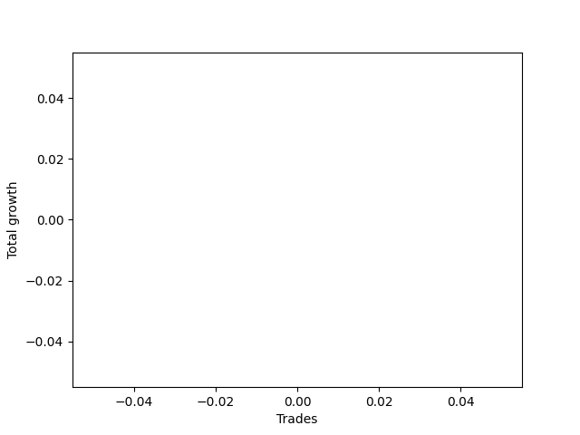

# Long Wallace Doodle 0225_009 
- Symbol: NQ
- Date Range: 03/18/2022 - 06/17/2022
- Trading Period: 7:20-12:30
- Number of Trades: 12



| Name | Win Percent | Profit | Avg Profit / Trade |     | Name | Win Percent | Profit | Avg Profit / Trade |
| ---- | ----------- | ------ | ------------------ | --- | ---- | ----------- | ------ | ------------------ |
| Sorted By <br> Profit | | | | | Sorted By <br> Win Percentage ||||
| Seventy-Five | 66.67 | -3612375.00 | -301031.25 |     | Zero | 91.67 | -3745750.00 | -312145.83 |
| Seventy-Three | 58.33 | -3626000.00 | -302166.67 |     | Two | 75.00 | -3701250.00 | -308437.50 |
| Seventy-Four | 50.00 | -3679625.00 | -306635.42 |     | Three | 75.00 | -3756500.00 | -313041.67 |
| Four | 66.67 | -3697125.00 | -308093.75 |     | Sixty-Four | 75.00 | -3798125.00 | -316510.42 |
| Two | 75.00 | -3701250.00 | -308437.50 |     | Seventy-Five | 66.67 | -3612375.00 | -301031.25 |
| Five | 50.00 | -3742625.00 | -311885.42 |     | Four | 66.67 | -3697125.00 | -308093.75 |
| Zero | 91.67 | -3745750.00 | -312145.83 |     | One | 66.67 | -3772250.00 | -314354.17 |
| Three | 75.00 | -3756500.00 | -313041.67 |     | Fifty-Six | 66.67 | -3806500.00 | -317208.33 |
| One | 66.67 | -3772250.00 | -314354.17 |     | Seventy-Three | 58.33 | -3626000.00 | -302166.67 |
| Forty-Four | 33.33 | -3778875.00 | -314906.25 |     | Six | 58.33 | -3790125.00 | -315843.75 |
| Forty-Two | 41.67 | -3783875.00 | -315322.92 |     | Forty | 58.33 | -3808750.00 | -317395.83 |
| Sixty | 41.67 | -3784250.00 | -315354.17 |     | Thirty-Eight | 58.33 | -3822000.00 | -318500.00 |
| Fifty-Eight | 50.00 | -3788125.00 | -315677.08 |     | Twenty-Two | 58.33 | -3822000.00 | -318500.00 |
| Six | 58.33 | -3790125.00 | -315843.75 |     | Seventy-Four | 50.00 | -3679625.00 | -306635.42 |
| Sixty-Four | 75.00 | -3798125.00 | -316510.42 |     | Five | 50.00 | -3742625.00 | -311885.42 |
| Forty-Five | 16.67 | -3801625.00 | -316802.08 |     | Fifty-Eight | 50.00 | -3788125.00 | -315677.08 |
| Fifty-Six | 66.67 | -3806500.00 | -317208.33 |     | Seven | 50.00 | -3812750.00 | -317729.17 |
| Forty-Three | 33.33 | -3807250.00 | -317270.83 |     | Fifty-Seven | 50.00 | -3817125.00 | -318093.75 |
| Forty | 58.33 | -3808750.00 | -317395.83 |     | Fifty-Four | 50.00 | -3822750.00 | -318562.50 |
| Forty-Seven | 25.00 | -3809750.00 | -317479.17 |     | Fourteen | 50.00 | -3823750.00 | -318645.83 |
| Forty-One | 41.67 | -3811125.00 | -317593.75 |     | Thirty | 50.00 | -3824750.00 | -318729.17 |
| Seven | 50.00 | -3812750.00 | -317729.17 |     | Seventy-Two | 50.00 | -3825625.00 | -318802.08 |
| Sixty-One | 25.00 | -3813125.00 | -317760.42 |     | Seventy | 50.00 | -3825750.00 | -318812.50 |
| Fifty-Nine | 41.67 | -3814000.00 | -317833.33 |     | Forty-Six | 50.00 | -3825750.00 | -318812.50 |
| Seventy-One | 33.33 | -3815375.00 | -317947.92 |     | Sixty-Two | 50.00 | -3828125.00 | -319010.42 |
| Sixty-Nine | 33.33 | -3815375.00 | -317947.92 |     | Forty-Two | 41.67 | -3783875.00 | -315322.92 |
| Sixty-Eight | 33.33 | -3815375.00 | -317947.92 |     | Sixty | 41.67 | -3784250.00 | -315354.17 |
| Sixty-Five | 41.67 | -3816500.00 | -318041.67 |     | Forty-One | 41.67 | -3811125.00 | -317593.75 |
| Fifty-Seven | 50.00 | -3817125.00 | -318093.75 |     | Fifty-Nine | 41.67 | -3814000.00 | -317833.33 |
| Sixty-Three | 33.33 | -3817375.00 | -318114.58 |     | Sixty-Five | 41.67 | -3816500.00 | -318041.67 |
| Fifty-Five | 41.67 | -3818250.00 | -318187.50 |     | Fifty-Five | 41.67 | -3818250.00 | -318187.50 |
| Fifty-Three | 41.67 | -3818250.00 | -318187.50 |     | Fifty-Three | 41.67 | -3818250.00 | -318187.50 |
| Fifty-Two | 41.67 | -3818500.00 | -318208.33 |     | Fifty-Two | 41.67 | -3818500.00 | -318208.33 |
| Sixty-Six | 33.33 | -3819125.00 | -318260.42 |     | Fifty | 41.67 | -3822250.00 | -318520.83 |
| Sixty-Seven | 33.33 | -3821000.00 | -318416.67 |     | Forty-Eight | 41.67 | -3823875.00 | -318656.25 |
| Thirty-Eight | 58.33 | -3822000.00 | -318500.00 |     | Fifty-One | 41.67 | -3824125.00 | -318677.08 |
| Twenty-Two | 58.33 | -3822000.00 | -318500.00 |     | Forty-Nine | 41.67 | -3824375.00 | -318697.92 |
| Fifty | 41.67 | -3822250.00 | -318520.83 |     | Sixten | 41.67 | -3827625.00 | -318968.75 |
| Fifty-Four | 50.00 | -3822750.00 | -318562.50 |     | Seventeen | 41.67 | -3827750.00 | -318979.17 |
| Fourteen | 50.00 | -3823750.00 | -318645.83 |     | Twenty-Three | 41.67 | -3829625.00 | -319135.42 |
| Forty-Eight | 41.67 | -3823875.00 | -318656.25 |     | Twenty-One | 41.67 | -3829625.00 | -319135.42 |
| Fifty-One | 41.67 | -3824125.00 | -318677.08 |     | Twenty | 41.67 | -3829625.00 | -319135.42 |
| Forty-Nine | 41.67 | -3824375.00 | -318697.92 |     | Nineteen | 41.67 | -3829625.00 | -319135.42 |
| Thirty | 50.00 | -3824750.00 | -318729.17 |     | Eighteen | 41.67 | -3829625.00 | -319135.42 |
| Seventy-Two | 50.00 | -3825625.00 | -318802.08 |     | Thirty-Two | 41.67 | -3829750.00 | -319145.83 |
| Seventy | 50.00 | -3825750.00 | -318812.50 |     | Thirty-Three | 41.67 | -3830750.00 | -319229.17 |
| Forty-Six | 50.00 | -3825750.00 | -318812.50 |     | Thirty-Nine | 41.67 | -3832625.00 | -319385.42 |
| Sixten | 41.67 | -3827625.00 | -318968.75 |     | Thirty-Seven | 41.67 | -3832625.00 | -319385.42 |
| Seventeen | 41.67 | -3827750.00 | -318979.17 |     | Thirty-Six | 41.67 | -3832625.00 | -319385.42 |
| Sixty-Two | 50.00 | -3828125.00 | -319010.42 |     | Thirty-Five | 41.67 | -3832625.00 | -319385.42 |
| Twenty-Three | 41.67 | -3829625.00 | -319135.42 |     | Thirty-Four | 41.67 | -3832625.00 | -319385.42 |
| Twenty-One | 41.67 | -3829625.00 | -319135.42 |     | Forty-Four | 33.33 | -3778875.00 | -314906.25 |
| Twenty | 41.67 | -3829625.00 | -319135.42 |     | Forty-Three | 33.33 | -3807250.00 | -317270.83 |
| Nineteen | 41.67 | -3829625.00 | -319135.42 |     | Seventy-One | 33.33 | -3815375.00 | -317947.92 |
| Eighteen | 41.67 | -3829625.00 | -319135.42 |     | Sixty-Nine | 33.33 | -3815375.00 | -317947.92 |
| Thirty-Two | 41.67 | -3829750.00 | -319145.83 |     | Sixty-Eight | 33.33 | -3815375.00 | -317947.92 |
| Eight | 25.00 | -3830250.00 | -319187.50 |     | Sixty-Three | 33.33 | -3817375.00 | -318114.58 |
| Thirty-Three | 41.67 | -3830750.00 | -319229.17 |     | Sixty-Six | 33.33 | -3819125.00 | -318260.42 |
| Thirty-Nine | 41.67 | -3832625.00 | -319385.42 |     | Sixty-Seven | 33.33 | -3821000.00 | -318416.67 |
| Thirty-Seven | 41.67 | -3832625.00 | -319385.42 |     | Forty-Seven | 25.00 | -3809750.00 | -317479.17 |
| Thirty-Six | 41.67 | -3832625.00 | -319385.42 |     | Sixty-One | 25.00 | -3813125.00 | -317760.42 |
| Thirty-Five | 41.67 | -3832625.00 | -319385.42 |     | Eight | 25.00 | -3830250.00 | -319187.50 |
| Thirty-Four | 41.67 | -3832625.00 | -319385.42 |     | Twenty-Four | 25.00 | -3833750.00 | -319479.17 |
| Twenty-Eight | 8.33 | -3833000.00 | -319416.67 |     | Forty-Five | 16.67 | -3801625.00 | -316802.08 |
| Twenty-Four | 25.00 | -3833750.00 | -319479.17 |     | Twenty-Eight | 8.33 | -3833000.00 | -319416.67 |
| Twenty-Six | 8.33 | -3835625.00 | -319635.42 |     | Twenty-Six | 8.33 | -3835625.00 | -319635.42 |
| Nine | 8.33 | -3840500.00 | -320041.67 |     | Nine | 8.33 | -3840500.00 | -320041.67 |
| twenty-Seven | 8.33 | -3841250.00 | -320104.17 |     | twenty-Seven | 8.33 | -3841250.00 | -320104.17 |
| Twenty-Five | 8.33 | -3844125.00 | -320343.75 |     | Twenty-Five | 8.33 | -3844125.00 | -320343.75 |
| Fifteen | 0.00 | -3844625.00 | -320385.42 |     | Fifteen | 0.00 | -3844625.00 | -320385.42 |
| Thirteen | 0.00 | -3844625.00 | -320385.42 |     | Thirteen | 0.00 | -3844625.00 | -320385.42 |
| Twelve | 0.00 | -3844625.00 | -320385.42 |     | Twelve | 0.00 | -3844625.00 | -320385.42 |
| Eleven | 0.00 | -3844625.00 | -320385.42 |     | Eleven | 0.00 | -3844625.00 | -320385.42 |
| Ten | 0.00 | -3844625.00 | -320385.42 |     | Ten | 0.00 | -3844625.00 | -320385.42 |
| Thirty-One | 0.00 | -3851250.00 | -320937.50 |     | Thirty-One | 0.00 | -3851250.00 | -320937.50 |
| Twenty-Nine | 0.00 | -3851250.00 | -320937.50 |     | Twenty-Nine | 0.00 | -3851250.00 | -320937.50 |

## NO STOPLOSS

### Test Zero
* Sell when price hits the middle line of the 20p bollinger
* No Stoploss
* Results:
```
Total Trades: 12
Percent Up: 91.67
Percent Down: 8.33
Total Points Moved Up: -7491.50
Potential Profit: -3745750.00
Total Points Ups: 105.00 Count Ups: 11
Total Points Downs: -7596.50 Count Downs: 1
```

<details><summary>Trades</summary>

<code>In: 2022-04-04 10:03:00		Out: 2022-04-04 10:09:35		Total Position Time: 06:35		Total Move Up: 7.25		Total to Date: 7.25</code> <br />
<code>In: 2022-04-13 10:55:00		Out: 2022-04-13 10:58:20		Total Position Time: 03:20		Total Move Up: 11.25		Total to Date: 18.50</code> <br />
<code>In: 2022-04-19 10:31:00		Out: 2022-04-19 10:37:10		Total Position Time: 06:10		Total Move Up: 9.00		Total to Date: 27.50</code> <br />
<code>In: 2022-04-19 10:47:00		Out: 2022-04-19 10:48:20		Total Position Time: 01:20		Total Move Up: 8.50		Total to Date: 36.00</code> <br />
<code>In: 2022-04-27 11:40:00		Out: 2022-04-27 11:40:10		Total Position Time: 00:10		Total Move Up: 5.00		Total to Date: 41.00</code> <br />
<code>In: 2022-05-04 11:36:00		Out: 2022-05-04 11:36:40		Total Position Time: 00:40		Total Move Up: 27.75		Total to Date: 68.75</code> <br />
<code>In: 2022-05-23 10:23:00		Out: 2022-05-23 10:26:55		Total Position Time: 03:55		Total Move Up: 13.25		Total to Date: 82.00</code> <br />
<code>In: 2022-05-25 09:24:00		Out: 2022-05-25 09:32:15		Total Position Time: 08:15		Total Move Up: 6.25		Total to Date: 88.25</code> <br />
<code>In: 2022-05-26 12:06:00		Out: 2022-05-26 12:07:55		Total Position Time: 01:55		Total Move Up: 9.00		Total to Date: 97.25</code> <br />
<code>In: 2022-05-27 09:37:00		Out: 2022-05-27 09:37:15		Total Position Time: 00:15		Total Move Up: 5.50		Total to Date: 102.75</code> <br />
<code>In: 2022-06-08 09:07:00		Out: 2022-06-08 09:14:10		Total Position Time: 07:10		Total Move Up: 2.25		Total to Date: 105.00</code> <br />
<code>In: 2022-06-15 11:34:00		Out: 2022-06-15 12:03:55		Total Position Time: 29:55		Total Move Up: -7596.50		Total to Date: -7491.50</code> <br />


</details>

### Test One
* Sell when the price hits the upper line of the 20p 1std bollinger
* No Stoploss
* Results:
```
Total Trades: 12
Percent Up: 66.67
Percent Down: 33.33
Total Points Moved Up: -7544.50
Potential Profit: -3772250.00
Total Points Ups: 153.25 Count Ups: 8
Total Points Downs: -7697.75 Count Downs: 4
```

<details><summary>Trades</summary>

<code>In: 2022-04-04 10:03:00		Out: 2022-04-04 10:18:15		Total Position Time: 15:15		Total Move Up: 3.25		Total to Date: 3.25</code> <br />
<code>In: 2022-04-13 10:55:00		Out: 2022-04-13 10:59:50		Total Position Time: 04:50		Total Move Up: 18.50		Total to Date: 21.75</code> <br />
<code>In: 2022-04-19 10:31:00		Out: 2022-04-19 10:48:55		Total Position Time: 17:55		Total Move Up: 7.25		Total to Date: 29.00</code> <br />
<code>In: 2022-04-19 10:47:00		Out: 2022-04-19 10:48:55		Total Position Time: 01:55		Total Move Up: 10.75		Total to Date: 39.75</code> <br />
<code>In: 2022-04-27 11:40:00		Out: 2022-04-27 11:40:10		Total Position Time: 00:10		Total Move Up: 5.00		Total to Date: 44.75</code> <br />
<code>In: 2022-05-04 11:36:00		Out: 2022-05-04 11:42:00		Total Position Time: 06:00		Total Move Up: 76.50		Total to Date: 121.25</code> <br />
<code>In: 2022-05-23 10:23:00		Out: 2022-05-23 10:33:00		Total Position Time: 10:00		Total Move Up: 23.75		Total to Date: 145.00</code> <br />
<code>In: 2022-05-25 09:24:00		Out: 2022-05-25 09:45:20		Total Position Time: 21:20		Total Move Up: -3.75		Total to Date: 141.25</code> <br />
<code>In: 2022-05-26 12:06:00		Out: 2022-05-26 12:33:40		Total Position Time: 27:40		Total Move Up: -25.25		Total to Date: 116.00</code> <br />
<code>In: 2022-05-27 09:37:00		Out: 2022-05-27 09:41:25		Total Position Time: 04:25		Total Move Up: 8.25		Total to Date: 124.25</code> <br />
<code>In: 2022-06-08 09:07:00		Out: 2022-06-08 09:36:55		Total Position Time: 29:55		Total Move Up: -72.25		Total to Date: 52.00</code> <br />
<code>In: 2022-06-15 11:34:00		Out: 2022-06-15 12:03:55		Total Position Time: 29:55		Total Move Up: -7596.50		Total to Date: -7544.50</code> <br />


</details>

### Test Two
* Sell when the price hits the upper line of the 20p 2std bollinger
* No Stoploss
* Results:
```
Total Trades: 12
Percent Up: 75.00
Percent Down: 25.00
Total Points Moved Up: -7402.50
Potential Profit: -3701250.00
Total Points Ups: 293.00 Count Ups: 9
Total Points Downs: -7695.50 Count Downs: 3
```

<details><summary>Trades</summary>

<code>In: 2022-04-04 10:03:00		Out: 2022-04-04 10:18:40		Total Position Time: 15:40		Total Move Up: 6.75		Total to Date: 6.75</code> <br />
<code>In: 2022-04-13 10:55:00		Out: 2022-04-13 11:06:35		Total Position Time: 11:35		Total Move Up: 30.75		Total to Date: 37.50</code> <br />
<code>In: 2022-04-19 10:31:00		Out: 2022-04-19 10:49:55		Total Position Time: 18:55		Total Move Up: 15.25		Total to Date: 52.75</code> <br />
<code>In: 2022-04-19 10:47:00		Out: 2022-04-19 10:49:55		Total Position Time: 02:55		Total Move Up: 18.75		Total to Date: 71.50</code> <br />
<code>In: 2022-04-27 11:40:00		Out: 2022-04-27 11:42:40		Total Position Time: 02:40		Total Move Up: 22.00		Total to Date: 93.50</code> <br />
<code>In: 2022-05-04 11:36:00		Out: 2022-05-04 11:44:15		Total Position Time: 08:15		Total Move Up: 139.25		Total to Date: 232.75</code> <br />
<code>In: 2022-05-23 10:23:00		Out: 2022-05-23 10:33:15		Total Position Time: 10:15		Total Move Up: 35.75		Total to Date: 268.50</code> <br />
<code>In: 2022-05-25 09:24:00		Out: 2022-05-25 09:49:10		Total Position Time: 25:10		Total Move Up: 11.00		Total to Date: 279.50</code> <br />
<code>In: 2022-05-26 12:06:00		Out: 2022-05-26 12:35:55		Total Position Time: 29:55		Total Move Up: -26.75		Total to Date: 252.75</code> <br />
<code>In: 2022-05-27 09:37:00		Out: 2022-05-27 09:42:10		Total Position Time: 05:10		Total Move Up: 13.50		Total to Date: 266.25</code> <br />
<code>In: 2022-06-08 09:07:00		Out: 2022-06-08 09:36:55		Total Position Time: 29:55		Total Move Up: -72.25		Total to Date: 194.00</code> <br />
<code>In: 2022-06-15 11:34:00		Out: 2022-06-15 12:03:55		Total Position Time: 29:55		Total Move Up: -7596.50		Total to Date: -7402.50</code> <br />


</details>

### Test Three
* Sell when price hits the middle line of the 50p bollinger
* No Stoploss
* Results:
```
Total Trades: 12
Percent Up: 75.00
Percent Down: 25.00
Total Points Moved Up: -7513.00
Potential Profit: -3756500.00
Total Points Ups: 182.50 Count Ups: 9
Total Points Downs: -7695.50 Count Downs: 3
```

<details><summary>Trades</summary>

<code>In: 2022-04-04 10:03:00		Out: 2022-04-04 10:20:30		Total Position Time: 17:30		Total Move Up: 10.00		Total to Date: 10.00</code> <br />
<code>In: 2022-04-13 10:55:00		Out: 2022-04-13 11:06:05		Total Position Time: 11:05		Total Move Up: 26.25		Total to Date: 36.25</code> <br />
<code>In: 2022-04-19 10:31:00		Out: 2022-04-19 10:49:50		Total Position Time: 18:50		Total Move Up: 11.50		Total to Date: 47.75</code> <br />
<code>In: 2022-04-19 10:47:00		Out: 2022-04-19 10:49:50		Total Position Time: 02:50		Total Move Up: 15.00		Total to Date: 62.75</code> <br />
<code>In: 2022-04-27 11:40:00		Out: 2022-04-27 11:42:30		Total Position Time: 02:30		Total Move Up: 10.75		Total to Date: 73.50</code> <br />
<code>In: 2022-05-04 11:36:00		Out: 2022-05-04 11:41:40		Total Position Time: 05:40		Total Move Up: 59.75		Total to Date: 133.25</code> <br />
<code>In: 2022-05-23 10:23:00		Out: 2022-05-23 10:33:10		Total Position Time: 10:10		Total Move Up: 27.00		Total to Date: 160.25</code> <br />
<code>In: 2022-05-25 09:24:00		Out: 2022-05-25 09:49:10		Total Position Time: 25:10		Total Move Up: 11.00		Total to Date: 171.25</code> <br />
<code>In: 2022-05-26 12:06:00		Out: 2022-05-26 12:35:55		Total Position Time: 29:55		Total Move Up: -26.75		Total to Date: 144.50</code> <br />
<code>In: 2022-05-27 09:37:00		Out: 2022-05-27 09:54:35		Total Position Time: 17:35		Total Move Up: 11.25		Total to Date: 155.75</code> <br />
<code>In: 2022-06-08 09:07:00		Out: 2022-06-08 09:36:55		Total Position Time: 29:55		Total Move Up: -72.25		Total to Date: 83.50</code> <br />
<code>In: 2022-06-15 11:34:00		Out: 2022-06-15 12:03:55		Total Position Time: 29:55		Total Move Up: -7596.50		Total to Date: -7513.00</code> <br />


</details>

### Test Four
* Sell when the price hits the upper line of the 50p 1std bollinger
* No Stoploss
* Results:
```
Total Trades: 12
Percent Up: 66.67
Percent Down: 33.33
Total Points Moved Up: -7394.25
Potential Profit: -3697125.00
Total Points Ups: 302.75 Count Ups: 8
Total Points Downs: -7697.00 Count Downs: 4
```

<details><summary>Trades</summary>

<code>In: 2022-04-04 10:03:00		Out: 2022-04-04 10:27:25		Total Position Time: 24:25		Total Move Up: 12.75		Total to Date: 12.75</code> <br />
<code>In: 2022-04-13 10:55:00		Out: 2022-04-13 11:09:05		Total Position Time: 14:05		Total Move Up: 40.75		Total to Date: 53.50</code> <br />
<code>In: 2022-04-19 10:31:00		Out: 2022-04-19 10:50:20		Total Position Time: 19:20		Total Move Up: 22.75		Total to Date: 76.25</code> <br />
<code>In: 2022-04-19 10:47:00		Out: 2022-04-19 10:50:20		Total Position Time: 03:20		Total Move Up: 26.25		Total to Date: 102.50</code> <br />
<code>In: 2022-04-27 11:40:00		Out: 2022-04-27 11:44:20		Total Position Time: 04:20		Total Move Up: 27.25		Total to Date: 129.75</code> <br />
<code>In: 2022-05-04 11:36:00		Out: 2022-05-04 11:43:55		Total Position Time: 07:55		Total Move Up: 114.00		Total to Date: 243.75</code> <br />
<code>In: 2022-05-23 10:23:00		Out: 2022-05-23 10:36:45		Total Position Time: 13:45		Total Move Up: 41.50		Total to Date: 285.25</code> <br />
<code>In: 2022-05-25 09:24:00		Out: 2022-05-25 09:53:55		Total Position Time: 29:55		Total Move Up: -1.50		Total to Date: 283.75</code> <br />
<code>In: 2022-05-26 12:06:00		Out: 2022-05-26 12:35:55		Total Position Time: 29:55		Total Move Up: -26.75		Total to Date: 257.00</code> <br />
<code>In: 2022-05-27 09:37:00		Out: 2022-05-27 10:01:40		Total Position Time: 24:40		Total Move Up: 17.50		Total to Date: 274.50</code> <br />
<code>In: 2022-06-08 09:07:00		Out: 2022-06-08 09:36:55		Total Position Time: 29:55		Total Move Up: -72.25		Total to Date: 202.25</code> <br />
<code>In: 2022-06-15 11:34:00		Out: 2022-06-15 12:03:55		Total Position Time: 29:55		Total Move Up: -7596.50		Total to Date: -7394.25</code> <br />


</details>

### Test Five
* Sell when the price hits the upper line of the 50p 2std bollinger
* No Stoploss
* Results:
```
Total Trades: 12
Percent Up: 50.00
Percent Down: 50.00
Total Points Moved Up: -7485.25
Potential Profit: -3742625.00
Total Points Ups: 325.25 Count Ups: 6
Total Points Downs: -7810.50 Count Downs: 6
```

<details><summary>Trades</summary>

<code>In: 2022-04-04 10:03:00		Out: 2022-04-04 10:32:55		Total Position Time: 29:55		Total Move Up: 10.25		Total to Date: 10.25</code> <br />
<code>In: 2022-04-13 10:55:00		Out: 2022-04-13 11:21:35		Total Position Time: 26:35		Total Move Up: 45.25		Total to Date: 55.50</code> <br />
<code>In: 2022-04-19 10:31:00		Out: 2022-04-19 11:00:55		Total Position Time: 29:55		Total Move Up: 14.75		Total to Date: 70.25</code> <br />
<code>In: 2022-04-19 10:47:00		Out: 2022-04-19 11:16:55		Total Position Time: 29:55		Total Move Up: -16.50		Total to Date: 53.75</code> <br />
<code>In: 2022-04-27 11:40:00		Out: 2022-04-27 12:09:55		Total Position Time: 29:55		Total Move Up: -97.00		Total to Date: -43.25</code> <br />
<code>In: 2022-05-04 11:36:00		Out: 2022-05-04 11:46:50		Total Position Time: 10:50		Total Move Up: 182.00		Total to Date: 138.75</code> <br />
<code>In: 2022-05-23 10:23:00		Out: 2022-05-23 10:47:55		Total Position Time: 24:55		Total Move Up: 60.00		Total to Date: 198.75</code> <br />
<code>In: 2022-05-25 09:24:00		Out: 2022-05-25 09:53:55		Total Position Time: 29:55		Total Move Up: -1.50		Total to Date: 197.25</code> <br />
<code>In: 2022-05-26 12:06:00		Out: 2022-05-26 12:35:55		Total Position Time: 29:55		Total Move Up: -26.75		Total to Date: 170.50</code> <br />
<code>In: 2022-05-27 09:37:00		Out: 2022-05-27 10:06:55		Total Position Time: 29:55		Total Move Up: 13.00		Total to Date: 183.50</code> <br />
<code>In: 2022-06-08 09:07:00		Out: 2022-06-08 09:36:55		Total Position Time: 29:55		Total Move Up: -72.25		Total to Date: 111.25</code> <br />
<code>In: 2022-06-15 11:34:00		Out: 2022-06-15 12:03:55		Total Position Time: 29:55		Total Move Up: -7596.50		Total to Date: -7485.25</code> <br />


</details>

### Test Six
* Sell when the price hits the middle line of the 1std VWAP
* No Stoploss
* Results:
```
Total Trades: 12
Percent Up: 58.33
Percent Down: 41.67
Total Points Moved Up: -7580.25
Potential Profit: -3790125.00
Total Points Ups: 26.00 Count Ups: 7
Total Points Downs: -7606.25 Count Downs: 5
```

<details><summary>Trades</summary>

<code>In: 2022-04-04 10:03:00		Out: 2022-04-04 10:03:10		Total Position Time: 00:10		Total Move Up: -2.50		Total to Date: -2.50</code> <br />
<code>In: 2022-04-13 10:55:00		Out: 2022-04-13 10:55:10		Total Position Time: 00:10		Total Move Up: -0.25		Total to Date: -2.75</code> <br />
<code>In: 2022-04-19 10:31:00		Out: 2022-04-19 10:31:10		Total Position Time: 00:10		Total Move Up: 0.50		Total to Date: -2.25</code> <br />
<code>In: 2022-04-19 10:47:00		Out: 2022-04-19 10:47:10		Total Position Time: 00:10		Total Move Up: -4.25		Total to Date: -6.50</code> <br />
<code>In: 2022-04-27 11:40:00		Out: 2022-04-27 11:40:10		Total Position Time: 00:10		Total Move Up: 5.00		Total to Date: -1.50</code> <br />
<code>In: 2022-05-04 11:36:00		Out: 2022-05-04 11:36:10		Total Position Time: 00:10		Total Move Up: 0.00		Total to Date: -1.50</code> <br />
<code>In: 2022-05-23 10:23:00		Out: 2022-05-23 10:23:10		Total Position Time: 00:10		Total Move Up: 2.50		Total to Date: 1.00</code> <br />
<code>In: 2022-05-25 09:24:00		Out: 2022-05-25 09:49:20		Total Position Time: 25:20		Total Move Up: 12.25		Total to Date: 13.25</code> <br />
<code>In: 2022-05-26 12:06:00		Out: 2022-05-26 12:06:10		Total Position Time: 00:10		Total Move Up: 2.25		Total to Date: 15.50</code> <br />
<code>In: 2022-05-27 09:37:00		Out: 2022-05-27 09:37:10		Total Position Time: 00:10		Total Move Up: 3.50		Total to Date: 19.00</code> <br />
<code>In: 2022-06-08 09:07:00		Out: 2022-06-08 09:07:10		Total Position Time: 00:10		Total Move Up: -2.75		Total to Date: 16.25</code> <br />
<code>In: 2022-06-15 11:34:00		Out: 2022-06-15 12:03:55		Total Position Time: 29:55		Total Move Up: -7596.50		Total to Date: -7580.25</code> <br />


</details>

### Test Seven
* Sell when the price hits the upper line of the 1std VWAP
* No Stoploss
* Results:
```
Total Trades: 12
Percent Up: 50.00
Percent Down: 50.00
Total Points Moved Up: -7625.50
Potential Profit: -3812750.00
Total Points Ups: 185.00 Count Ups: 6
Total Points Downs: -7810.50 Count Downs: 6
```

<details><summary>Trades</summary>

<code>In: 2022-04-04 10:03:00		Out: 2022-04-04 10:19:30		Total Position Time: 16:30		Total Move Up: 9.75		Total to Date: 9.75</code> <br />
<code>In: 2022-04-13 10:55:00		Out: 2022-04-13 11:06:10		Total Position Time: 11:10		Total Move Up: 26.50		Total to Date: 36.25</code> <br />
<code>In: 2022-04-19 10:31:00		Out: 2022-04-19 11:00:55		Total Position Time: 29:55		Total Move Up: 14.75		Total to Date: 51.00</code> <br />
<code>In: 2022-04-19 10:47:00		Out: 2022-04-19 11:16:55		Total Position Time: 29:55		Total Move Up: -16.50		Total to Date: 34.50</code> <br />
<code>In: 2022-04-27 11:40:00		Out: 2022-04-27 12:09:55		Total Position Time: 29:55		Total Move Up: -97.00		Total to Date: -62.50</code> <br />
<code>In: 2022-05-04 11:36:00		Out: 2022-05-04 11:42:00		Total Position Time: 06:00		Total Move Up: 76.50		Total to Date: 14.00</code> <br />
<code>In: 2022-05-23 10:23:00		Out: 2022-05-23 10:33:30		Total Position Time: 10:30		Total Move Up: 44.00		Total to Date: 58.00</code> <br />
<code>In: 2022-05-25 09:24:00		Out: 2022-05-25 09:53:55		Total Position Time: 29:55		Total Move Up: -1.50		Total to Date: 56.50</code> <br />
<code>In: 2022-05-26 12:06:00		Out: 2022-05-26 12:35:55		Total Position Time: 29:55		Total Move Up: -26.75		Total to Date: 29.75</code> <br />
<code>In: 2022-05-27 09:37:00		Out: 2022-05-27 09:42:10		Total Position Time: 05:10		Total Move Up: 13.50		Total to Date: 43.25</code> <br />
<code>In: 2022-06-08 09:07:00		Out: 2022-06-08 09:36:55		Total Position Time: 29:55		Total Move Up: -72.25		Total to Date: -29.00</code> <br />
<code>In: 2022-06-15 11:34:00		Out: 2022-06-15 12:03:55		Total Position Time: 29:55		Total Move Up: -7596.50		Total to Date: -7625.50</code> <br />


</details>

## STOPLOSS OF 2

### Test Eight
* Sell when price hits the middle line of the 20p bollinger
* Stoploss is 2 points
* Results:
```
Total Trades: 12
Percent Up: 25.00
Percent Down: 75.00
Total Points Moved Up: -7660.50
Potential Profit: -3830250.00
Total Points Ups: 19.50 Count Ups: 3
Total Points Downs: -7680.00 Count Downs: 9
```

<details><summary>Trades</summary>

<code>In: 2022-04-04 10:03:00		Out: 2022-04-04 10:03:10		Total Position Time: 00:10		Total Move Up: -2.50		Total to Date: -2.50</code> <br />
<code>In: 2022-04-13 10:55:00		Out: 2022-04-13 10:55:45		Total Position Time: 00:45		Total Move Up: -2.25		Total to Date: -4.75</code> <br />
<code>In: 2022-04-19 10:31:00		Out: 2022-04-19 10:37:10		Total Position Time: 06:10		Total Move Up: 9.00		Total to Date: 4.25</code> <br />
<code>In: 2022-04-19 10:47:00		Out: 2022-04-19 10:47:10		Total Position Time: 00:10		Total Move Up: -4.25		Total to Date: 0.00</code> <br />
<code>In: 2022-04-27 11:40:00		Out: 2022-04-27 11:40:10		Total Position Time: 00:10		Total Move Up: 5.00		Total to Date: 5.00</code> <br />
<code>In: 2022-05-04 11:36:00		Out: 2022-05-04 11:36:15		Total Position Time: 00:15		Total Move Up: -12.00		Total to Date: -7.00</code> <br />
<code>In: 2022-05-23 10:23:00		Out: 2022-05-23 10:23:25		Total Position Time: 00:25		Total Move Up: -1.75		Total to Date: -8.75</code> <br />
<code>In: 2022-05-25 09:24:00		Out: 2022-05-25 09:24:55		Total Position Time: 00:55		Total Move Up: -2.50		Total to Date: -11.25</code> <br />
<code>In: 2022-05-26 12:06:00		Out: 2022-05-26 12:06:15		Total Position Time: 00:15		Total Move Up: -3.00		Total to Date: -14.25</code> <br />
<code>In: 2022-05-27 09:37:00		Out: 2022-05-27 09:37:15		Total Position Time: 00:15		Total Move Up: 5.50		Total to Date: -8.75</code> <br />
<code>In: 2022-06-08 09:07:00		Out: 2022-06-08 09:07:10		Total Position Time: 00:10		Total Move Up: -2.75		Total to Date: -11.50</code> <br />
<code>In: 2022-06-15 11:34:00		Out: 2022-06-15 11:34:10		Total Position Time: 00:10		Total Move Up: -7649.00		Total to Date: -7660.50</code> <br />


</details>

### Test Nine
* Sell when the price hits the upper line of the 20p 1std bollinger
* Stoploss is 2 points
* Results:
```
Total Trades: 12
Percent Up: 8.33
Percent Down: 91.67
Total Points Moved Up: -7681.00
Potential Profit: -3840500.00
Total Points Ups: 5.00 Count Ups: 1
Total Points Downs: -7686.00 Count Downs: 11
```

<details><summary>Trades</summary>

<code>In: 2022-04-04 10:03:00		Out: 2022-04-04 10:03:10		Total Position Time: 00:10		Total Move Up: -2.50		Total to Date: -2.50</code> <br />
<code>In: 2022-04-13 10:55:00		Out: 2022-04-13 10:55:45		Total Position Time: 00:45		Total Move Up: -2.25		Total to Date: -4.75</code> <br />
<code>In: 2022-04-19 10:31:00		Out: 2022-04-19 10:41:10		Total Position Time: 10:10		Total Move Up: -2.75		Total to Date: -7.50</code> <br />
<code>In: 2022-04-19 10:47:00		Out: 2022-04-19 10:47:10		Total Position Time: 00:10		Total Move Up: -4.25		Total to Date: -11.75</code> <br />
<code>In: 2022-04-27 11:40:00		Out: 2022-04-27 11:40:10		Total Position Time: 00:10		Total Move Up: 5.00		Total to Date: -6.75</code> <br />
<code>In: 2022-05-04 11:36:00		Out: 2022-05-04 11:36:15		Total Position Time: 00:15		Total Move Up: -12.00		Total to Date: -18.75</code> <br />
<code>In: 2022-05-23 10:23:00		Out: 2022-05-23 10:23:25		Total Position Time: 00:25		Total Move Up: -1.75		Total to Date: -20.50</code> <br />
<code>In: 2022-05-25 09:24:00		Out: 2022-05-25 09:24:55		Total Position Time: 00:55		Total Move Up: -2.50		Total to Date: -23.00</code> <br />
<code>In: 2022-05-26 12:06:00		Out: 2022-05-26 12:06:15		Total Position Time: 00:15		Total Move Up: -3.00		Total to Date: -26.00</code> <br />
<code>In: 2022-05-27 09:37:00		Out: 2022-05-27 09:38:30		Total Position Time: 01:30		Total Move Up: -3.25		Total to Date: -29.25</code> <br />
<code>In: 2022-06-08 09:07:00		Out: 2022-06-08 09:07:10		Total Position Time: 00:10		Total Move Up: -2.75		Total to Date: -32.00</code> <br />
<code>In: 2022-06-15 11:34:00		Out: 2022-06-15 11:34:10		Total Position Time: 00:10		Total Move Up: -7649.00		Total to Date: -7681.00</code> <br />


</details>

### Test Ten
* Sell when the price hits the upper line of the 20p 2std bollinger
* Stoploss is 2 points
* Results:
```
Total Trades: 12
Percent Up: 0.00
Percent Down: 100.00
Total Points Moved Up: -7689.25
Potential Profit: -3844625.00
Total Points Ups: 0.00 Count Ups: 0
Total Points Downs: -7689.25 Count Downs: 12
```

<details><summary>Trades</summary>

<code>In: 2022-04-04 10:03:00		Out: 2022-04-04 10:03:10		Total Position Time: 00:10		Total Move Up: -2.50		Total to Date: -2.50</code> <br />
<code>In: 2022-04-13 10:55:00		Out: 2022-04-13 10:55:45		Total Position Time: 00:45		Total Move Up: -2.25		Total to Date: -4.75</code> <br />
<code>In: 2022-04-19 10:31:00		Out: 2022-04-19 10:41:10		Total Position Time: 10:10		Total Move Up: -2.75		Total to Date: -7.50</code> <br />
<code>In: 2022-04-19 10:47:00		Out: 2022-04-19 10:47:10		Total Position Time: 00:10		Total Move Up: -4.25		Total to Date: -11.75</code> <br />
<code>In: 2022-04-27 11:40:00		Out: 2022-04-27 11:40:25		Total Position Time: 00:25		Total Move Up: -3.25		Total to Date: -15.00</code> <br />
<code>In: 2022-05-04 11:36:00		Out: 2022-05-04 11:36:15		Total Position Time: 00:15		Total Move Up: -12.00		Total to Date: -27.00</code> <br />
<code>In: 2022-05-23 10:23:00		Out: 2022-05-23 10:23:25		Total Position Time: 00:25		Total Move Up: -1.75		Total to Date: -28.75</code> <br />
<code>In: 2022-05-25 09:24:00		Out: 2022-05-25 09:24:55		Total Position Time: 00:55		Total Move Up: -2.50		Total to Date: -31.25</code> <br />
<code>In: 2022-05-26 12:06:00		Out: 2022-05-26 12:06:15		Total Position Time: 00:15		Total Move Up: -3.00		Total to Date: -34.25</code> <br />
<code>In: 2022-05-27 09:37:00		Out: 2022-05-27 09:38:30		Total Position Time: 01:30		Total Move Up: -3.25		Total to Date: -37.50</code> <br />
<code>In: 2022-06-08 09:07:00		Out: 2022-06-08 09:07:10		Total Position Time: 00:10		Total Move Up: -2.75		Total to Date: -40.25</code> <br />
<code>In: 2022-06-15 11:34:00		Out: 2022-06-15 11:34:10		Total Position Time: 00:10		Total Move Up: -7649.00		Total to Date: -7689.25</code> <br />


</details>

### Test Eleven
* Sell when price hits the middle line of the 50p bollinger
* Stoploss is 2 points
* Results:
```
Total Trades: 12
Percent Up: 0.00
Percent Down: 100.00
Total Points Moved Up: -7689.25
Potential Profit: -3844625.00
Total Points Ups: 0.00 Count Ups: 0
Total Points Downs: -7689.25 Count Downs: 12
```

<details><summary>Trades</summary>

<code>In: 2022-04-04 10:03:00		Out: 2022-04-04 10:03:10		Total Position Time: 00:10		Total Move Up: -2.50		Total to Date: -2.50</code> <br />
<code>In: 2022-04-13 10:55:00		Out: 2022-04-13 10:55:45		Total Position Time: 00:45		Total Move Up: -2.25		Total to Date: -4.75</code> <br />
<code>In: 2022-04-19 10:31:00		Out: 2022-04-19 10:41:10		Total Position Time: 10:10		Total Move Up: -2.75		Total to Date: -7.50</code> <br />
<code>In: 2022-04-19 10:47:00		Out: 2022-04-19 10:47:10		Total Position Time: 00:10		Total Move Up: -4.25		Total to Date: -11.75</code> <br />
<code>In: 2022-04-27 11:40:00		Out: 2022-04-27 11:40:25		Total Position Time: 00:25		Total Move Up: -3.25		Total to Date: -15.00</code> <br />
<code>In: 2022-05-04 11:36:00		Out: 2022-05-04 11:36:15		Total Position Time: 00:15		Total Move Up: -12.00		Total to Date: -27.00</code> <br />
<code>In: 2022-05-23 10:23:00		Out: 2022-05-23 10:23:25		Total Position Time: 00:25		Total Move Up: -1.75		Total to Date: -28.75</code> <br />
<code>In: 2022-05-25 09:24:00		Out: 2022-05-25 09:24:55		Total Position Time: 00:55		Total Move Up: -2.50		Total to Date: -31.25</code> <br />
<code>In: 2022-05-26 12:06:00		Out: 2022-05-26 12:06:15		Total Position Time: 00:15		Total Move Up: -3.00		Total to Date: -34.25</code> <br />
<code>In: 2022-05-27 09:37:00		Out: 2022-05-27 09:38:30		Total Position Time: 01:30		Total Move Up: -3.25		Total to Date: -37.50</code> <br />
<code>In: 2022-06-08 09:07:00		Out: 2022-06-08 09:07:10		Total Position Time: 00:10		Total Move Up: -2.75		Total to Date: -40.25</code> <br />
<code>In: 2022-06-15 11:34:00		Out: 2022-06-15 11:34:10		Total Position Time: 00:10		Total Move Up: -7649.00		Total to Date: -7689.25</code> <br />


</details>

### Test Twelve
* Sell when the price hits the upper line of the 50p 1std bollinger
* Stoploss is 2 points
* Results:
```
Total Trades: 12
Percent Up: 0.00
Percent Down: 100.00
Total Points Moved Up: -7689.25
Potential Profit: -3844625.00
Total Points Ups: 0.00 Count Ups: 0
Total Points Downs: -7689.25 Count Downs: 12
```

<details><summary>Trades</summary>

<code>In: 2022-04-04 10:03:00		Out: 2022-04-04 10:03:10		Total Position Time: 00:10		Total Move Up: -2.50		Total to Date: -2.50</code> <br />
<code>In: 2022-04-13 10:55:00		Out: 2022-04-13 10:55:45		Total Position Time: 00:45		Total Move Up: -2.25		Total to Date: -4.75</code> <br />
<code>In: 2022-04-19 10:31:00		Out: 2022-04-19 10:41:10		Total Position Time: 10:10		Total Move Up: -2.75		Total to Date: -7.50</code> <br />
<code>In: 2022-04-19 10:47:00		Out: 2022-04-19 10:47:10		Total Position Time: 00:10		Total Move Up: -4.25		Total to Date: -11.75</code> <br />
<code>In: 2022-04-27 11:40:00		Out: 2022-04-27 11:40:25		Total Position Time: 00:25		Total Move Up: -3.25		Total to Date: -15.00</code> <br />
<code>In: 2022-05-04 11:36:00		Out: 2022-05-04 11:36:15		Total Position Time: 00:15		Total Move Up: -12.00		Total to Date: -27.00</code> <br />
<code>In: 2022-05-23 10:23:00		Out: 2022-05-23 10:23:25		Total Position Time: 00:25		Total Move Up: -1.75		Total to Date: -28.75</code> <br />
<code>In: 2022-05-25 09:24:00		Out: 2022-05-25 09:24:55		Total Position Time: 00:55		Total Move Up: -2.50		Total to Date: -31.25</code> <br />
<code>In: 2022-05-26 12:06:00		Out: 2022-05-26 12:06:15		Total Position Time: 00:15		Total Move Up: -3.00		Total to Date: -34.25</code> <br />
<code>In: 2022-05-27 09:37:00		Out: 2022-05-27 09:38:30		Total Position Time: 01:30		Total Move Up: -3.25		Total to Date: -37.50</code> <br />
<code>In: 2022-06-08 09:07:00		Out: 2022-06-08 09:07:10		Total Position Time: 00:10		Total Move Up: -2.75		Total to Date: -40.25</code> <br />
<code>In: 2022-06-15 11:34:00		Out: 2022-06-15 11:34:10		Total Position Time: 00:10		Total Move Up: -7649.00		Total to Date: -7689.25</code> <br />


</details>

### Test Thirteen
* Sell when the price hits the upper line of the 50p 2std bollinger
* Stoploss is 2 points
* Results:
```
Total Trades: 12
Percent Up: 0.00
Percent Down: 100.00
Total Points Moved Up: -7689.25
Potential Profit: -3844625.00
Total Points Ups: 0.00 Count Ups: 0
Total Points Downs: -7689.25 Count Downs: 12
```

<details><summary>Trades</summary>

<code>In: 2022-04-04 10:03:00		Out: 2022-04-04 10:03:10		Total Position Time: 00:10		Total Move Up: -2.50		Total to Date: -2.50</code> <br />
<code>In: 2022-04-13 10:55:00		Out: 2022-04-13 10:55:45		Total Position Time: 00:45		Total Move Up: -2.25		Total to Date: -4.75</code> <br />
<code>In: 2022-04-19 10:31:00		Out: 2022-04-19 10:41:10		Total Position Time: 10:10		Total Move Up: -2.75		Total to Date: -7.50</code> <br />
<code>In: 2022-04-19 10:47:00		Out: 2022-04-19 10:47:10		Total Position Time: 00:10		Total Move Up: -4.25		Total to Date: -11.75</code> <br />
<code>In: 2022-04-27 11:40:00		Out: 2022-04-27 11:40:25		Total Position Time: 00:25		Total Move Up: -3.25		Total to Date: -15.00</code> <br />
<code>In: 2022-05-04 11:36:00		Out: 2022-05-04 11:36:15		Total Position Time: 00:15		Total Move Up: -12.00		Total to Date: -27.00</code> <br />
<code>In: 2022-05-23 10:23:00		Out: 2022-05-23 10:23:25		Total Position Time: 00:25		Total Move Up: -1.75		Total to Date: -28.75</code> <br />
<code>In: 2022-05-25 09:24:00		Out: 2022-05-25 09:24:55		Total Position Time: 00:55		Total Move Up: -2.50		Total to Date: -31.25</code> <br />
<code>In: 2022-05-26 12:06:00		Out: 2022-05-26 12:06:15		Total Position Time: 00:15		Total Move Up: -3.00		Total to Date: -34.25</code> <br />
<code>In: 2022-05-27 09:37:00		Out: 2022-05-27 09:38:30		Total Position Time: 01:30		Total Move Up: -3.25		Total to Date: -37.50</code> <br />
<code>In: 2022-06-08 09:07:00		Out: 2022-06-08 09:07:10		Total Position Time: 00:10		Total Move Up: -2.75		Total to Date: -40.25</code> <br />
<code>In: 2022-06-15 11:34:00		Out: 2022-06-15 11:34:10		Total Position Time: 00:10		Total Move Up: -7649.00		Total to Date: -7689.25</code> <br />


</details>

### Test Fourteen
* Sell when the price hits the middle line of the 1std VWAP
* Stoploss is 2 points
* Results:
```
Total Trades: 12
Percent Up: 50.00
Percent Down: 50.00
Total Points Moved Up: -7647.50
Potential Profit: -3823750.00
Total Points Ups: 13.75 Count Ups: 6
Total Points Downs: -7661.25 Count Downs: 6
```

<details><summary>Trades</summary>

<code>In: 2022-04-04 10:03:00		Out: 2022-04-04 10:03:10		Total Position Time: 00:10		Total Move Up: -2.50		Total to Date: -2.50</code> <br />
<code>In: 2022-04-13 10:55:00		Out: 2022-04-13 10:55:10		Total Position Time: 00:10		Total Move Up: -0.25		Total to Date: -2.75</code> <br />
<code>In: 2022-04-19 10:31:00		Out: 2022-04-19 10:31:10		Total Position Time: 00:10		Total Move Up: 0.50		Total to Date: -2.25</code> <br />
<code>In: 2022-04-19 10:47:00		Out: 2022-04-19 10:47:10		Total Position Time: 00:10		Total Move Up: -4.25		Total to Date: -6.50</code> <br />
<code>In: 2022-04-27 11:40:00		Out: 2022-04-27 11:40:10		Total Position Time: 00:10		Total Move Up: 5.00		Total to Date: -1.50</code> <br />
<code>In: 2022-05-04 11:36:00		Out: 2022-05-04 11:36:10		Total Position Time: 00:10		Total Move Up: 0.00		Total to Date: -1.50</code> <br />
<code>In: 2022-05-23 10:23:00		Out: 2022-05-23 10:23:10		Total Position Time: 00:10		Total Move Up: 2.50		Total to Date: 1.00</code> <br />
<code>In: 2022-05-25 09:24:00		Out: 2022-05-25 09:24:55		Total Position Time: 00:55		Total Move Up: -2.50		Total to Date: -1.50</code> <br />
<code>In: 2022-05-26 12:06:00		Out: 2022-05-26 12:06:10		Total Position Time: 00:10		Total Move Up: 2.25		Total to Date: 0.75</code> <br />
<code>In: 2022-05-27 09:37:00		Out: 2022-05-27 09:37:10		Total Position Time: 00:10		Total Move Up: 3.50		Total to Date: 4.25</code> <br />
<code>In: 2022-06-08 09:07:00		Out: 2022-06-08 09:07:10		Total Position Time: 00:10		Total Move Up: -2.75		Total to Date: 1.50</code> <br />
<code>In: 2022-06-15 11:34:00		Out: 2022-06-15 11:34:10		Total Position Time: 00:10		Total Move Up: -7649.00		Total to Date: -7647.50</code> <br />


</details>

### Test Fifteen
* Sell when the price hits the upper line of the 1std VWAP
* Stoploss is 2 points
* Results:
```
Total Trades: 12
Percent Up: 0.00
Percent Down: 100.00
Total Points Moved Up: -7689.25
Potential Profit: -3844625.00
Total Points Ups: 0.00 Count Ups: 0
Total Points Downs: -7689.25 Count Downs: 12
```

<details><summary>Trades</summary>

<code>In: 2022-04-04 10:03:00		Out: 2022-04-04 10:03:10		Total Position Time: 00:10		Total Move Up: -2.50		Total to Date: -2.50</code> <br />
<code>In: 2022-04-13 10:55:00		Out: 2022-04-13 10:55:45		Total Position Time: 00:45		Total Move Up: -2.25		Total to Date: -4.75</code> <br />
<code>In: 2022-04-19 10:31:00		Out: 2022-04-19 10:41:10		Total Position Time: 10:10		Total Move Up: -2.75		Total to Date: -7.50</code> <br />
<code>In: 2022-04-19 10:47:00		Out: 2022-04-19 10:47:10		Total Position Time: 00:10		Total Move Up: -4.25		Total to Date: -11.75</code> <br />
<code>In: 2022-04-27 11:40:00		Out: 2022-04-27 11:40:25		Total Position Time: 00:25		Total Move Up: -3.25		Total to Date: -15.00</code> <br />
<code>In: 2022-05-04 11:36:00		Out: 2022-05-04 11:36:15		Total Position Time: 00:15		Total Move Up: -12.00		Total to Date: -27.00</code> <br />
<code>In: 2022-05-23 10:23:00		Out: 2022-05-23 10:23:25		Total Position Time: 00:25		Total Move Up: -1.75		Total to Date: -28.75</code> <br />
<code>In: 2022-05-25 09:24:00		Out: 2022-05-25 09:24:55		Total Position Time: 00:55		Total Move Up: -2.50		Total to Date: -31.25</code> <br />
<code>In: 2022-05-26 12:06:00		Out: 2022-05-26 12:06:15		Total Position Time: 00:15		Total Move Up: -3.00		Total to Date: -34.25</code> <br />
<code>In: 2022-05-27 09:37:00		Out: 2022-05-27 09:38:30		Total Position Time: 01:30		Total Move Up: -3.25		Total to Date: -37.50</code> <br />
<code>In: 2022-06-08 09:07:00		Out: 2022-06-08 09:07:10		Total Position Time: 00:10		Total Move Up: -2.75		Total to Date: -40.25</code> <br />
<code>In: 2022-06-15 11:34:00		Out: 2022-06-15 11:34:10		Total Position Time: 00:10		Total Move Up: -7649.00		Total to Date: -7689.25</code> <br />


</details>

## TRAIL STOP OF 2

### Test Sixten
* Sell when price hits the middle line of the 20p bollinger
* Trailing Stop is 2 points
* Results:
```
Total Trades: 12
Percent Up: 41.67
Percent Down: 58.33
Total Points Moved Up: -7655.25
Potential Profit: -3827625.00
Total Points Ups: 11.50 Count Ups: 5
Total Points Downs: -7666.75 Count Downs: 7
```

<details><summary>Trades</summary>

<code>In: 2022-04-04 10:03:00		Out: 2022-04-04 10:05:25		Total Position Time: 02:25		Total Move Up: 0.00		Total to Date: 0.00</code> <br />
<code>In: 2022-04-13 10:55:00		Out: 2022-04-13 10:55:40		Total Position Time: 00:40		Total Move Up: -2.50		Total to Date: -2.50</code> <br />
<code>In: 2022-04-19 10:31:00		Out: 2022-04-19 10:31:25		Total Position Time: 00:25		Total Move Up: -1.50		Total to Date: -4.00</code> <br />
<code>In: 2022-04-19 10:47:00		Out: 2022-04-19 10:47:10		Total Position Time: 00:10		Total Move Up: -4.25		Total to Date: -8.25</code> <br />
<code>In: 2022-04-27 11:40:00		Out: 2022-04-27 11:40:10		Total Position Time: 00:10		Total Move Up: 5.00		Total to Date: -3.25</code> <br />
<code>In: 2022-05-04 11:36:00		Out: 2022-05-04 11:36:10		Total Position Time: 00:10		Total Move Up: 0.00		Total to Date: -3.25</code> <br />
<code>In: 2022-05-23 10:23:00		Out: 2022-05-23 10:23:20		Total Position Time: 00:20		Total Move Up: -1.75		Total to Date: -5.00</code> <br />
<code>In: 2022-05-25 09:24:00		Out: 2022-05-25 09:24:15		Total Position Time: 00:15		Total Move Up: 1.00		Total to Date: -4.00</code> <br />
<code>In: 2022-05-26 12:06:00		Out: 2022-05-26 12:06:15		Total Position Time: 00:15		Total Move Up: -3.00		Total to Date: -7.00</code> <br />
<code>In: 2022-05-27 09:37:00		Out: 2022-05-27 09:37:15		Total Position Time: 00:15		Total Move Up: 5.50		Total to Date: -1.50</code> <br />
<code>In: 2022-06-08 09:07:00		Out: 2022-06-08 09:07:15		Total Position Time: 00:15		Total Move Up: -4.75		Total to Date: -6.25</code> <br />
<code>In: 2022-06-15 11:34:00		Out: 2022-06-15 11:34:10		Total Position Time: 00:10		Total Move Up: -7649.00		Total to Date: -7655.25</code> <br />


</details>

### Test Seventeen
* Sell when the price hits the upper line of the 20p 1std bollinger
* Trailing Stop is 2 points
* Results:
```
Total Trades: 12
Percent Up: 41.67
Percent Down: 58.33
Total Points Moved Up: -7655.50
Potential Profit: -3827750.00
Total Points Ups: 11.25 Count Ups: 5
Total Points Downs: -7666.75 Count Downs: 7
```

<details><summary>Trades</summary>

<code>In: 2022-04-04 10:03:00		Out: 2022-04-04 10:05:25		Total Position Time: 02:25		Total Move Up: 0.00		Total to Date: 0.00</code> <br />
<code>In: 2022-04-13 10:55:00		Out: 2022-04-13 10:55:40		Total Position Time: 00:40		Total Move Up: -2.50		Total to Date: -2.50</code> <br />
<code>In: 2022-04-19 10:31:00		Out: 2022-04-19 10:31:25		Total Position Time: 00:25		Total Move Up: -1.50		Total to Date: -4.00</code> <br />
<code>In: 2022-04-19 10:47:00		Out: 2022-04-19 10:47:10		Total Position Time: 00:10		Total Move Up: -4.25		Total to Date: -8.25</code> <br />
<code>In: 2022-04-27 11:40:00		Out: 2022-04-27 11:40:10		Total Position Time: 00:10		Total Move Up: 5.00		Total to Date: -3.25</code> <br />
<code>In: 2022-05-04 11:36:00		Out: 2022-05-04 11:36:10		Total Position Time: 00:10		Total Move Up: 0.00		Total to Date: -3.25</code> <br />
<code>In: 2022-05-23 10:23:00		Out: 2022-05-23 10:23:20		Total Position Time: 00:20		Total Move Up: -1.75		Total to Date: -5.00</code> <br />
<code>In: 2022-05-25 09:24:00		Out: 2022-05-25 09:24:15		Total Position Time: 00:15		Total Move Up: 1.00		Total to Date: -4.00</code> <br />
<code>In: 2022-05-26 12:06:00		Out: 2022-05-26 12:06:15		Total Position Time: 00:15		Total Move Up: -3.00		Total to Date: -7.00</code> <br />
<code>In: 2022-05-27 09:37:00		Out: 2022-05-27 09:37:30		Total Position Time: 00:30		Total Move Up: 5.25		Total to Date: -1.75</code> <br />
<code>In: 2022-06-08 09:07:00		Out: 2022-06-08 09:07:15		Total Position Time: 00:15		Total Move Up: -4.75		Total to Date: -6.50</code> <br />
<code>In: 2022-06-15 11:34:00		Out: 2022-06-15 11:34:10		Total Position Time: 00:10		Total Move Up: -7649.00		Total to Date: -7655.50</code> <br />


</details>

### Test Eighteen
* Sell when the price hits the upper line of the 20p 2std bollinger
* Trailing Stop is 2 points
* Results:
```
Total Trades: 12
Percent Up: 41.67
Percent Down: 58.33
Total Points Moved Up: -7659.25
Potential Profit: -3829625.00
Total Points Ups: 7.50 Count Ups: 5
Total Points Downs: -7666.75 Count Downs: 7
```

<details><summary>Trades</summary>

<code>In: 2022-04-04 10:03:00		Out: 2022-04-04 10:05:25		Total Position Time: 02:25		Total Move Up: 0.00		Total to Date: 0.00</code> <br />
<code>In: 2022-04-13 10:55:00		Out: 2022-04-13 10:55:40		Total Position Time: 00:40		Total Move Up: -2.50		Total to Date: -2.50</code> <br />
<code>In: 2022-04-19 10:31:00		Out: 2022-04-19 10:31:25		Total Position Time: 00:25		Total Move Up: -1.50		Total to Date: -4.00</code> <br />
<code>In: 2022-04-19 10:47:00		Out: 2022-04-19 10:47:10		Total Position Time: 00:10		Total Move Up: -4.25		Total to Date: -8.25</code> <br />
<code>In: 2022-04-27 11:40:00		Out: 2022-04-27 11:40:20		Total Position Time: 00:20		Total Move Up: 1.25		Total to Date: -7.00</code> <br />
<code>In: 2022-05-04 11:36:00		Out: 2022-05-04 11:36:10		Total Position Time: 00:10		Total Move Up: 0.00		Total to Date: -7.00</code> <br />
<code>In: 2022-05-23 10:23:00		Out: 2022-05-23 10:23:20		Total Position Time: 00:20		Total Move Up: -1.75		Total to Date: -8.75</code> <br />
<code>In: 2022-05-25 09:24:00		Out: 2022-05-25 09:24:15		Total Position Time: 00:15		Total Move Up: 1.00		Total to Date: -7.75</code> <br />
<code>In: 2022-05-26 12:06:00		Out: 2022-05-26 12:06:15		Total Position Time: 00:15		Total Move Up: -3.00		Total to Date: -10.75</code> <br />
<code>In: 2022-05-27 09:37:00		Out: 2022-05-27 09:37:30		Total Position Time: 00:30		Total Move Up: 5.25		Total to Date: -5.50</code> <br />
<code>In: 2022-06-08 09:07:00		Out: 2022-06-08 09:07:15		Total Position Time: 00:15		Total Move Up: -4.75		Total to Date: -10.25</code> <br />
<code>In: 2022-06-15 11:34:00		Out: 2022-06-15 11:34:10		Total Position Time: 00:10		Total Move Up: -7649.00		Total to Date: -7659.25</code> <br />


</details>

### Test Nineteen
* Sell when price hits the middle line of the 50p bollinger
* Trailing Stop is 2 points
* Results:
```
Total Trades: 12
Percent Up: 41.67
Percent Down: 58.33
Total Points Moved Up: -7659.25
Potential Profit: -3829625.00
Total Points Ups: 7.50 Count Ups: 5
Total Points Downs: -7666.75 Count Downs: 7
```

<details><summary>Trades</summary>

<code>In: 2022-04-04 10:03:00		Out: 2022-04-04 10:05:25		Total Position Time: 02:25		Total Move Up: 0.00		Total to Date: 0.00</code> <br />
<code>In: 2022-04-13 10:55:00		Out: 2022-04-13 10:55:40		Total Position Time: 00:40		Total Move Up: -2.50		Total to Date: -2.50</code> <br />
<code>In: 2022-04-19 10:31:00		Out: 2022-04-19 10:31:25		Total Position Time: 00:25		Total Move Up: -1.50		Total to Date: -4.00</code> <br />
<code>In: 2022-04-19 10:47:00		Out: 2022-04-19 10:47:10		Total Position Time: 00:10		Total Move Up: -4.25		Total to Date: -8.25</code> <br />
<code>In: 2022-04-27 11:40:00		Out: 2022-04-27 11:40:20		Total Position Time: 00:20		Total Move Up: 1.25		Total to Date: -7.00</code> <br />
<code>In: 2022-05-04 11:36:00		Out: 2022-05-04 11:36:10		Total Position Time: 00:10		Total Move Up: 0.00		Total to Date: -7.00</code> <br />
<code>In: 2022-05-23 10:23:00		Out: 2022-05-23 10:23:20		Total Position Time: 00:20		Total Move Up: -1.75		Total to Date: -8.75</code> <br />
<code>In: 2022-05-25 09:24:00		Out: 2022-05-25 09:24:15		Total Position Time: 00:15		Total Move Up: 1.00		Total to Date: -7.75</code> <br />
<code>In: 2022-05-26 12:06:00		Out: 2022-05-26 12:06:15		Total Position Time: 00:15		Total Move Up: -3.00		Total to Date: -10.75</code> <br />
<code>In: 2022-05-27 09:37:00		Out: 2022-05-27 09:37:30		Total Position Time: 00:30		Total Move Up: 5.25		Total to Date: -5.50</code> <br />
<code>In: 2022-06-08 09:07:00		Out: 2022-06-08 09:07:15		Total Position Time: 00:15		Total Move Up: -4.75		Total to Date: -10.25</code> <br />
<code>In: 2022-06-15 11:34:00		Out: 2022-06-15 11:34:10		Total Position Time: 00:10		Total Move Up: -7649.00		Total to Date: -7659.25</code> <br />


</details>

### Test Twenty
* Sell when the price hits the upper line of the 50p 1std bollinger
* Trailing Stop is 2 points
* Results:
```
Total Trades: 12
Percent Up: 41.67
Percent Down: 58.33
Total Points Moved Up: -7659.25
Potential Profit: -3829625.00
Total Points Ups: 7.50 Count Ups: 5
Total Points Downs: -7666.75 Count Downs: 7
```

<details><summary>Trades</summary>

<code>In: 2022-04-04 10:03:00		Out: 2022-04-04 10:05:25		Total Position Time: 02:25		Total Move Up: 0.00		Total to Date: 0.00</code> <br />
<code>In: 2022-04-13 10:55:00		Out: 2022-04-13 10:55:40		Total Position Time: 00:40		Total Move Up: -2.50		Total to Date: -2.50</code> <br />
<code>In: 2022-04-19 10:31:00		Out: 2022-04-19 10:31:25		Total Position Time: 00:25		Total Move Up: -1.50		Total to Date: -4.00</code> <br />
<code>In: 2022-04-19 10:47:00		Out: 2022-04-19 10:47:10		Total Position Time: 00:10		Total Move Up: -4.25		Total to Date: -8.25</code> <br />
<code>In: 2022-04-27 11:40:00		Out: 2022-04-27 11:40:20		Total Position Time: 00:20		Total Move Up: 1.25		Total to Date: -7.00</code> <br />
<code>In: 2022-05-04 11:36:00		Out: 2022-05-04 11:36:10		Total Position Time: 00:10		Total Move Up: 0.00		Total to Date: -7.00</code> <br />
<code>In: 2022-05-23 10:23:00		Out: 2022-05-23 10:23:20		Total Position Time: 00:20		Total Move Up: -1.75		Total to Date: -8.75</code> <br />
<code>In: 2022-05-25 09:24:00		Out: 2022-05-25 09:24:15		Total Position Time: 00:15		Total Move Up: 1.00		Total to Date: -7.75</code> <br />
<code>In: 2022-05-26 12:06:00		Out: 2022-05-26 12:06:15		Total Position Time: 00:15		Total Move Up: -3.00		Total to Date: -10.75</code> <br />
<code>In: 2022-05-27 09:37:00		Out: 2022-05-27 09:37:30		Total Position Time: 00:30		Total Move Up: 5.25		Total to Date: -5.50</code> <br />
<code>In: 2022-06-08 09:07:00		Out: 2022-06-08 09:07:15		Total Position Time: 00:15		Total Move Up: -4.75		Total to Date: -10.25</code> <br />
<code>In: 2022-06-15 11:34:00		Out: 2022-06-15 11:34:10		Total Position Time: 00:10		Total Move Up: -7649.00		Total to Date: -7659.25</code> <br />


</details>

### Test Twenty-One
* Sell when the price hits the upper line of the 50p 2std bollinger
* Trailing Stop is 2 points
* Results:
```
Total Trades: 12
Percent Up: 41.67
Percent Down: 58.33
Total Points Moved Up: -7659.25
Potential Profit: -3829625.00
Total Points Ups: 7.50 Count Ups: 5
Total Points Downs: -7666.75 Count Downs: 7
```

<details><summary>Trades</summary>

<code>In: 2022-04-04 10:03:00		Out: 2022-04-04 10:05:25		Total Position Time: 02:25		Total Move Up: 0.00		Total to Date: 0.00</code> <br />
<code>In: 2022-04-13 10:55:00		Out: 2022-04-13 10:55:40		Total Position Time: 00:40		Total Move Up: -2.50		Total to Date: -2.50</code> <br />
<code>In: 2022-04-19 10:31:00		Out: 2022-04-19 10:31:25		Total Position Time: 00:25		Total Move Up: -1.50		Total to Date: -4.00</code> <br />
<code>In: 2022-04-19 10:47:00		Out: 2022-04-19 10:47:10		Total Position Time: 00:10		Total Move Up: -4.25		Total to Date: -8.25</code> <br />
<code>In: 2022-04-27 11:40:00		Out: 2022-04-27 11:40:20		Total Position Time: 00:20		Total Move Up: 1.25		Total to Date: -7.00</code> <br />
<code>In: 2022-05-04 11:36:00		Out: 2022-05-04 11:36:10		Total Position Time: 00:10		Total Move Up: 0.00		Total to Date: -7.00</code> <br />
<code>In: 2022-05-23 10:23:00		Out: 2022-05-23 10:23:20		Total Position Time: 00:20		Total Move Up: -1.75		Total to Date: -8.75</code> <br />
<code>In: 2022-05-25 09:24:00		Out: 2022-05-25 09:24:15		Total Position Time: 00:15		Total Move Up: 1.00		Total to Date: -7.75</code> <br />
<code>In: 2022-05-26 12:06:00		Out: 2022-05-26 12:06:15		Total Position Time: 00:15		Total Move Up: -3.00		Total to Date: -10.75</code> <br />
<code>In: 2022-05-27 09:37:00		Out: 2022-05-27 09:37:30		Total Position Time: 00:30		Total Move Up: 5.25		Total to Date: -5.50</code> <br />
<code>In: 2022-06-08 09:07:00		Out: 2022-06-08 09:07:15		Total Position Time: 00:15		Total Move Up: -4.75		Total to Date: -10.25</code> <br />
<code>In: 2022-06-15 11:34:00		Out: 2022-06-15 11:34:10		Total Position Time: 00:10		Total Move Up: -7649.00		Total to Date: -7659.25</code> <br />


</details>

### Test Twenty-Two
* Sell when the price hits the middle line of the 1std VWAP
* Trailing Stop is 2 points
* Results:
```
Total Trades: 12
Percent Up: 58.33
Percent Down: 41.67
Total Points Moved Up: -7644.00
Potential Profit: -3822000.00
Total Points Ups: 14.75 Count Ups: 7
Total Points Downs: -7658.75 Count Downs: 5
```

<details><summary>Trades</summary>

<code>In: 2022-04-04 10:03:00		Out: 2022-04-04 10:03:10		Total Position Time: 00:10		Total Move Up: -2.50		Total to Date: -2.50</code> <br />
<code>In: 2022-04-13 10:55:00		Out: 2022-04-13 10:55:10		Total Position Time: 00:10		Total Move Up: -0.25		Total to Date: -2.75</code> <br />
<code>In: 2022-04-19 10:31:00		Out: 2022-04-19 10:31:10		Total Position Time: 00:10		Total Move Up: 0.50		Total to Date: -2.25</code> <br />
<code>In: 2022-04-19 10:47:00		Out: 2022-04-19 10:47:10		Total Position Time: 00:10		Total Move Up: -4.25		Total to Date: -6.50</code> <br />
<code>In: 2022-04-27 11:40:00		Out: 2022-04-27 11:40:10		Total Position Time: 00:10		Total Move Up: 5.00		Total to Date: -1.50</code> <br />
<code>In: 2022-05-04 11:36:00		Out: 2022-05-04 11:36:10		Total Position Time: 00:10		Total Move Up: 0.00		Total to Date: -1.50</code> <br />
<code>In: 2022-05-23 10:23:00		Out: 2022-05-23 10:23:10		Total Position Time: 00:10		Total Move Up: 2.50		Total to Date: 1.00</code> <br />
<code>In: 2022-05-25 09:24:00		Out: 2022-05-25 09:24:15		Total Position Time: 00:15		Total Move Up: 1.00		Total to Date: 2.00</code> <br />
<code>In: 2022-05-26 12:06:00		Out: 2022-05-26 12:06:10		Total Position Time: 00:10		Total Move Up: 2.25		Total to Date: 4.25</code> <br />
<code>In: 2022-05-27 09:37:00		Out: 2022-05-27 09:37:10		Total Position Time: 00:10		Total Move Up: 3.50		Total to Date: 7.75</code> <br />
<code>In: 2022-06-08 09:07:00		Out: 2022-06-08 09:07:10		Total Position Time: 00:10		Total Move Up: -2.75		Total to Date: 5.00</code> <br />
<code>In: 2022-06-15 11:34:00		Out: 2022-06-15 11:34:10		Total Position Time: 00:10		Total Move Up: -7649.00		Total to Date: -7644.00</code> <br />


</details>

### Test Twenty-Three
* Sell when the price hits the upper line of the 1std VWAP
* Trailing Stop is 2 points
* Results:
```
Total Trades: 12
Percent Up: 41.67
Percent Down: 58.33
Total Points Moved Up: -7659.25
Potential Profit: -3829625.00
Total Points Ups: 7.50 Count Ups: 5
Total Points Downs: -7666.75 Count Downs: 7
```

<details><summary>Trades</summary>

<code>In: 2022-04-04 10:03:00		Out: 2022-04-04 10:05:25		Total Position Time: 02:25		Total Move Up: 0.00		Total to Date: 0.00</code> <br />
<code>In: 2022-04-13 10:55:00		Out: 2022-04-13 10:55:40		Total Position Time: 00:40		Total Move Up: -2.50		Total to Date: -2.50</code> <br />
<code>In: 2022-04-19 10:31:00		Out: 2022-04-19 10:31:25		Total Position Time: 00:25		Total Move Up: -1.50		Total to Date: -4.00</code> <br />
<code>In: 2022-04-19 10:47:00		Out: 2022-04-19 10:47:10		Total Position Time: 00:10		Total Move Up: -4.25		Total to Date: -8.25</code> <br />
<code>In: 2022-04-27 11:40:00		Out: 2022-04-27 11:40:20		Total Position Time: 00:20		Total Move Up: 1.25		Total to Date: -7.00</code> <br />
<code>In: 2022-05-04 11:36:00		Out: 2022-05-04 11:36:10		Total Position Time: 00:10		Total Move Up: 0.00		Total to Date: -7.00</code> <br />
<code>In: 2022-05-23 10:23:00		Out: 2022-05-23 10:23:20		Total Position Time: 00:20		Total Move Up: -1.75		Total to Date: -8.75</code> <br />
<code>In: 2022-05-25 09:24:00		Out: 2022-05-25 09:24:15		Total Position Time: 00:15		Total Move Up: 1.00		Total to Date: -7.75</code> <br />
<code>In: 2022-05-26 12:06:00		Out: 2022-05-26 12:06:15		Total Position Time: 00:15		Total Move Up: -3.00		Total to Date: -10.75</code> <br />
<code>In: 2022-05-27 09:37:00		Out: 2022-05-27 09:37:30		Total Position Time: 00:30		Total Move Up: 5.25		Total to Date: -5.50</code> <br />
<code>In: 2022-06-08 09:07:00		Out: 2022-06-08 09:07:15		Total Position Time: 00:15		Total Move Up: -4.75		Total to Date: -10.25</code> <br />
<code>In: 2022-06-15 11:34:00		Out: 2022-06-15 11:34:10		Total Position Time: 00:10		Total Move Up: -7649.00		Total to Date: -7659.25</code> <br />


</details>

## STOPLOSS OF 3

### Test Twenty-Four
* Sell when price hits the middle line of the 20p bollinger
* Stoploss is 3 points
* Results:
```
Total Trades: 12
Percent Up: 25.00
Percent Down: 75.00
Total Points Moved Up: -7667.50
Potential Profit: -3833750.00
Total Points Ups: 19.50 Count Ups: 3
Total Points Downs: -7687.00 Count Downs: 9
```

<details><summary>Trades</summary>

<code>In: 2022-04-04 10:03:00		Out: 2022-04-04 10:06:30		Total Position Time: 03:30		Total Move Up: -3.25		Total to Date: -3.25</code> <br />
<code>In: 2022-04-13 10:55:00		Out: 2022-04-13 10:55:55		Total Position Time: 00:55		Total Move Up: -3.00		Total to Date: -6.25</code> <br />
<code>In: 2022-04-19 10:31:00		Out: 2022-04-19 10:37:10		Total Position Time: 06:10		Total Move Up: 9.00		Total to Date: 2.75</code> <br />
<code>In: 2022-04-19 10:47:00		Out: 2022-04-19 10:47:10		Total Position Time: 00:10		Total Move Up: -4.25		Total to Date: -1.50</code> <br />
<code>In: 2022-04-27 11:40:00		Out: 2022-04-27 11:40:10		Total Position Time: 00:10		Total Move Up: 5.00		Total to Date: 3.50</code> <br />
<code>In: 2022-05-04 11:36:00		Out: 2022-05-04 11:36:15		Total Position Time: 00:15		Total Move Up: -12.00		Total to Date: -8.50</code> <br />
<code>In: 2022-05-23 10:23:00		Out: 2022-05-23 10:23:40		Total Position Time: 00:40		Total Move Up: -3.25		Total to Date: -11.75</code> <br />
<code>In: 2022-05-25 09:24:00		Out: 2022-05-25 09:25:25		Total Position Time: 01:25		Total Move Up: -4.50		Total to Date: -16.25</code> <br />
<code>In: 2022-05-26 12:06:00		Out: 2022-05-26 12:06:15		Total Position Time: 00:15		Total Move Up: -3.00		Total to Date: -19.25</code> <br />
<code>In: 2022-05-27 09:37:00		Out: 2022-05-27 09:37:15		Total Position Time: 00:15		Total Move Up: 5.50		Total to Date: -13.75</code> <br />
<code>In: 2022-06-08 09:07:00		Out: 2022-06-08 09:07:15		Total Position Time: 00:15		Total Move Up: -4.75		Total to Date: -18.50</code> <br />
<code>In: 2022-06-15 11:34:00		Out: 2022-06-15 11:34:10		Total Position Time: 00:10		Total Move Up: -7649.00		Total to Date: -7667.50</code> <br />


</details>

### Test Twenty-Five
* Sell when the price hits the upper line of the 20p 1std bollinger
* Stoploss is 3 points
* Results:
```
Total Trades: 12
Percent Up: 8.33
Percent Down: 91.67
Total Points Moved Up: -7688.25
Potential Profit: -3844125.00
Total Points Ups: 5.00 Count Ups: 1
Total Points Downs: -7693.25 Count Downs: 11
```

<details><summary>Trades</summary>

<code>In: 2022-04-04 10:03:00		Out: 2022-04-04 10:06:30		Total Position Time: 03:30		Total Move Up: -3.25		Total to Date: -3.25</code> <br />
<code>In: 2022-04-13 10:55:00		Out: 2022-04-13 10:55:55		Total Position Time: 00:55		Total Move Up: -3.00		Total to Date: -6.25</code> <br />
<code>In: 2022-04-19 10:31:00		Out: 2022-04-19 10:43:20		Total Position Time: 12:20		Total Move Up: -3.00		Total to Date: -9.25</code> <br />
<code>In: 2022-04-19 10:47:00		Out: 2022-04-19 10:47:10		Total Position Time: 00:10		Total Move Up: -4.25		Total to Date: -13.50</code> <br />
<code>In: 2022-04-27 11:40:00		Out: 2022-04-27 11:40:10		Total Position Time: 00:10		Total Move Up: 5.00		Total to Date: -8.50</code> <br />
<code>In: 2022-05-04 11:36:00		Out: 2022-05-04 11:36:15		Total Position Time: 00:15		Total Move Up: -12.00		Total to Date: -20.50</code> <br />
<code>In: 2022-05-23 10:23:00		Out: 2022-05-23 10:23:40		Total Position Time: 00:40		Total Move Up: -3.25		Total to Date: -23.75</code> <br />
<code>In: 2022-05-25 09:24:00		Out: 2022-05-25 09:25:25		Total Position Time: 01:25		Total Move Up: -4.50		Total to Date: -28.25</code> <br />
<code>In: 2022-05-26 12:06:00		Out: 2022-05-26 12:06:15		Total Position Time: 00:15		Total Move Up: -3.00		Total to Date: -31.25</code> <br />
<code>In: 2022-05-27 09:37:00		Out: 2022-05-27 09:38:30		Total Position Time: 01:30		Total Move Up: -3.25		Total to Date: -34.50</code> <br />
<code>In: 2022-06-08 09:07:00		Out: 2022-06-08 09:07:15		Total Position Time: 00:15		Total Move Up: -4.75		Total to Date: -39.25</code> <br />
<code>In: 2022-06-15 11:34:00		Out: 2022-06-15 11:34:10		Total Position Time: 00:10		Total Move Up: -7649.00		Total to Date: -7688.25</code> <br />


</details>

### Test Twenty-Six
* Sell when the price hits the upper line of the 20p 2std bollinger
* Stoploss is 3 points
* Results:
```
Total Trades: 12
Percent Up: 8.33
Percent Down: 91.67
Total Points Moved Up: -7671.25
Potential Profit: -3835625.00
Total Points Ups: 22.00 Count Ups: 1
Total Points Downs: -7693.25 Count Downs: 11
```

<details><summary>Trades</summary>

<code>In: 2022-04-04 10:03:00		Out: 2022-04-04 10:06:30		Total Position Time: 03:30		Total Move Up: -3.25		Total to Date: -3.25</code> <br />
<code>In: 2022-04-13 10:55:00		Out: 2022-04-13 10:55:55		Total Position Time: 00:55		Total Move Up: -3.00		Total to Date: -6.25</code> <br />
<code>In: 2022-04-19 10:31:00		Out: 2022-04-19 10:43:20		Total Position Time: 12:20		Total Move Up: -3.00		Total to Date: -9.25</code> <br />
<code>In: 2022-04-19 10:47:00		Out: 2022-04-19 10:47:10		Total Position Time: 00:10		Total Move Up: -4.25		Total to Date: -13.50</code> <br />
<code>In: 2022-04-27 11:40:00		Out: 2022-04-27 11:42:40		Total Position Time: 02:40		Total Move Up: 22.00		Total to Date: 8.50</code> <br />
<code>In: 2022-05-04 11:36:00		Out: 2022-05-04 11:36:15		Total Position Time: 00:15		Total Move Up: -12.00		Total to Date: -3.50</code> <br />
<code>In: 2022-05-23 10:23:00		Out: 2022-05-23 10:23:40		Total Position Time: 00:40		Total Move Up: -3.25		Total to Date: -6.75</code> <br />
<code>In: 2022-05-25 09:24:00		Out: 2022-05-25 09:25:25		Total Position Time: 01:25		Total Move Up: -4.50		Total to Date: -11.25</code> <br />
<code>In: 2022-05-26 12:06:00		Out: 2022-05-26 12:06:15		Total Position Time: 00:15		Total Move Up: -3.00		Total to Date: -14.25</code> <br />
<code>In: 2022-05-27 09:37:00		Out: 2022-05-27 09:38:30		Total Position Time: 01:30		Total Move Up: -3.25		Total to Date: -17.50</code> <br />
<code>In: 2022-06-08 09:07:00		Out: 2022-06-08 09:07:15		Total Position Time: 00:15		Total Move Up: -4.75		Total to Date: -22.25</code> <br />
<code>In: 2022-06-15 11:34:00		Out: 2022-06-15 11:34:10		Total Position Time: 00:10		Total Move Up: -7649.00		Total to Date: -7671.25</code> <br />


</details>

### Test twenty-Seven
* Sell when price hits the middle line of the 50p bollinger
* Stoploss is 3 points
* Results:
```
Total Trades: 12
Percent Up: 8.33
Percent Down: 91.67
Total Points Moved Up: -7682.50
Potential Profit: -3841250.00
Total Points Ups: 10.75 Count Ups: 1
Total Points Downs: -7693.25 Count Downs: 11
```

<details><summary>Trades</summary>

<code>In: 2022-04-04 10:03:00		Out: 2022-04-04 10:06:30		Total Position Time: 03:30		Total Move Up: -3.25		Total to Date: -3.25</code> <br />
<code>In: 2022-04-13 10:55:00		Out: 2022-04-13 10:55:55		Total Position Time: 00:55		Total Move Up: -3.00		Total to Date: -6.25</code> <br />
<code>In: 2022-04-19 10:31:00		Out: 2022-04-19 10:43:20		Total Position Time: 12:20		Total Move Up: -3.00		Total to Date: -9.25</code> <br />
<code>In: 2022-04-19 10:47:00		Out: 2022-04-19 10:47:10		Total Position Time: 00:10		Total Move Up: -4.25		Total to Date: -13.50</code> <br />
<code>In: 2022-04-27 11:40:00		Out: 2022-04-27 11:42:30		Total Position Time: 02:30		Total Move Up: 10.75		Total to Date: -2.75</code> <br />
<code>In: 2022-05-04 11:36:00		Out: 2022-05-04 11:36:15		Total Position Time: 00:15		Total Move Up: -12.00		Total to Date: -14.75</code> <br />
<code>In: 2022-05-23 10:23:00		Out: 2022-05-23 10:23:40		Total Position Time: 00:40		Total Move Up: -3.25		Total to Date: -18.00</code> <br />
<code>In: 2022-05-25 09:24:00		Out: 2022-05-25 09:25:25		Total Position Time: 01:25		Total Move Up: -4.50		Total to Date: -22.50</code> <br />
<code>In: 2022-05-26 12:06:00		Out: 2022-05-26 12:06:15		Total Position Time: 00:15		Total Move Up: -3.00		Total to Date: -25.50</code> <br />
<code>In: 2022-05-27 09:37:00		Out: 2022-05-27 09:38:30		Total Position Time: 01:30		Total Move Up: -3.25		Total to Date: -28.75</code> <br />
<code>In: 2022-06-08 09:07:00		Out: 2022-06-08 09:07:15		Total Position Time: 00:15		Total Move Up: -4.75		Total to Date: -33.50</code> <br />
<code>In: 2022-06-15 11:34:00		Out: 2022-06-15 11:34:10		Total Position Time: 00:10		Total Move Up: -7649.00		Total to Date: -7682.50</code> <br />


</details>

### Test Twenty-Eight
* Sell when the price hits the upper line of the 50p 1std bollinger
* Stoploss is 3 points
* Results:
```
Total Trades: 12
Percent Up: 8.33
Percent Down: 91.67
Total Points Moved Up: -7666.00
Potential Profit: -3833000.00
Total Points Ups: 27.25 Count Ups: 1
Total Points Downs: -7693.25 Count Downs: 11
```

<details><summary>Trades</summary>

<code>In: 2022-04-04 10:03:00		Out: 2022-04-04 10:06:30		Total Position Time: 03:30		Total Move Up: -3.25		Total to Date: -3.25</code> <br />
<code>In: 2022-04-13 10:55:00		Out: 2022-04-13 10:55:55		Total Position Time: 00:55		Total Move Up: -3.00		Total to Date: -6.25</code> <br />
<code>In: 2022-04-19 10:31:00		Out: 2022-04-19 10:43:20		Total Position Time: 12:20		Total Move Up: -3.00		Total to Date: -9.25</code> <br />
<code>In: 2022-04-19 10:47:00		Out: 2022-04-19 10:47:10		Total Position Time: 00:10		Total Move Up: -4.25		Total to Date: -13.50</code> <br />
<code>In: 2022-04-27 11:40:00		Out: 2022-04-27 11:44:20		Total Position Time: 04:20		Total Move Up: 27.25		Total to Date: 13.75</code> <br />
<code>In: 2022-05-04 11:36:00		Out: 2022-05-04 11:36:15		Total Position Time: 00:15		Total Move Up: -12.00		Total to Date: 1.75</code> <br />
<code>In: 2022-05-23 10:23:00		Out: 2022-05-23 10:23:40		Total Position Time: 00:40		Total Move Up: -3.25		Total to Date: -1.50</code> <br />
<code>In: 2022-05-25 09:24:00		Out: 2022-05-25 09:25:25		Total Position Time: 01:25		Total Move Up: -4.50		Total to Date: -6.00</code> <br />
<code>In: 2022-05-26 12:06:00		Out: 2022-05-26 12:06:15		Total Position Time: 00:15		Total Move Up: -3.00		Total to Date: -9.00</code> <br />
<code>In: 2022-05-27 09:37:00		Out: 2022-05-27 09:38:30		Total Position Time: 01:30		Total Move Up: -3.25		Total to Date: -12.25</code> <br />
<code>In: 2022-06-08 09:07:00		Out: 2022-06-08 09:07:15		Total Position Time: 00:15		Total Move Up: -4.75		Total to Date: -17.00</code> <br />
<code>In: 2022-06-15 11:34:00		Out: 2022-06-15 11:34:10		Total Position Time: 00:10		Total Move Up: -7649.00		Total to Date: -7666.00</code> <br />


</details>

### Test Twenty-Nine
* Sell when the price hits the upper line of the 50p 2std bollinger
* Stoploss is 3 points
* Results:
```
Total Trades: 12
Percent Up: 0.00
Percent Down: 100.00
Total Points Moved Up: -7702.50
Potential Profit: -3851250.00
Total Points Ups: 0.00 Count Ups: 0
Total Points Downs: -7702.50 Count Downs: 12
```

<details><summary>Trades</summary>

<code>In: 2022-04-04 10:03:00		Out: 2022-04-04 10:06:30		Total Position Time: 03:30		Total Move Up: -3.25		Total to Date: -3.25</code> <br />
<code>In: 2022-04-13 10:55:00		Out: 2022-04-13 10:55:55		Total Position Time: 00:55		Total Move Up: -3.00		Total to Date: -6.25</code> <br />
<code>In: 2022-04-19 10:31:00		Out: 2022-04-19 10:43:20		Total Position Time: 12:20		Total Move Up: -3.00		Total to Date: -9.25</code> <br />
<code>In: 2022-04-19 10:47:00		Out: 2022-04-19 10:47:10		Total Position Time: 00:10		Total Move Up: -4.25		Total to Date: -13.50</code> <br />
<code>In: 2022-04-27 11:40:00		Out: 2022-04-27 11:48:15		Total Position Time: 08:15		Total Move Up: -9.25		Total to Date: -22.75</code> <br />
<code>In: 2022-05-04 11:36:00		Out: 2022-05-04 11:36:15		Total Position Time: 00:15		Total Move Up: -12.00		Total to Date: -34.75</code> <br />
<code>In: 2022-05-23 10:23:00		Out: 2022-05-23 10:23:40		Total Position Time: 00:40		Total Move Up: -3.25		Total to Date: -38.00</code> <br />
<code>In: 2022-05-25 09:24:00		Out: 2022-05-25 09:25:25		Total Position Time: 01:25		Total Move Up: -4.50		Total to Date: -42.50</code> <br />
<code>In: 2022-05-26 12:06:00		Out: 2022-05-26 12:06:15		Total Position Time: 00:15		Total Move Up: -3.00		Total to Date: -45.50</code> <br />
<code>In: 2022-05-27 09:37:00		Out: 2022-05-27 09:38:30		Total Position Time: 01:30		Total Move Up: -3.25		Total to Date: -48.75</code> <br />
<code>In: 2022-06-08 09:07:00		Out: 2022-06-08 09:07:15		Total Position Time: 00:15		Total Move Up: -4.75		Total to Date: -53.50</code> <br />
<code>In: 2022-06-15 11:34:00		Out: 2022-06-15 11:34:10		Total Position Time: 00:10		Total Move Up: -7649.00		Total to Date: -7702.50</code> <br />


</details>

### Test Thirty
* Sell when the price hits the middle line of the 1std VWAP
* Stoploss is 3 points
* Results:
```
Total Trades: 12
Percent Up: 50.00
Percent Down: 50.00
Total Points Moved Up: -7649.50
Potential Profit: -3824750.00
Total Points Ups: 13.75 Count Ups: 6
Total Points Downs: -7663.25 Count Downs: 6
```

<details><summary>Trades</summary>

<code>In: 2022-04-04 10:03:00		Out: 2022-04-04 10:03:10		Total Position Time: 00:10		Total Move Up: -2.50		Total to Date: -2.50</code> <br />
<code>In: 2022-04-13 10:55:00		Out: 2022-04-13 10:55:10		Total Position Time: 00:10		Total Move Up: -0.25		Total to Date: -2.75</code> <br />
<code>In: 2022-04-19 10:31:00		Out: 2022-04-19 10:31:10		Total Position Time: 00:10		Total Move Up: 0.50		Total to Date: -2.25</code> <br />
<code>In: 2022-04-19 10:47:00		Out: 2022-04-19 10:47:10		Total Position Time: 00:10		Total Move Up: -4.25		Total to Date: -6.50</code> <br />
<code>In: 2022-04-27 11:40:00		Out: 2022-04-27 11:40:10		Total Position Time: 00:10		Total Move Up: 5.00		Total to Date: -1.50</code> <br />
<code>In: 2022-05-04 11:36:00		Out: 2022-05-04 11:36:10		Total Position Time: 00:10		Total Move Up: 0.00		Total to Date: -1.50</code> <br />
<code>In: 2022-05-23 10:23:00		Out: 2022-05-23 10:23:10		Total Position Time: 00:10		Total Move Up: 2.50		Total to Date: 1.00</code> <br />
<code>In: 2022-05-25 09:24:00		Out: 2022-05-25 09:25:25		Total Position Time: 01:25		Total Move Up: -4.50		Total to Date: -3.50</code> <br />
<code>In: 2022-05-26 12:06:00		Out: 2022-05-26 12:06:10		Total Position Time: 00:10		Total Move Up: 2.25		Total to Date: -1.25</code> <br />
<code>In: 2022-05-27 09:37:00		Out: 2022-05-27 09:37:10		Total Position Time: 00:10		Total Move Up: 3.50		Total to Date: 2.25</code> <br />
<code>In: 2022-06-08 09:07:00		Out: 2022-06-08 09:07:10		Total Position Time: 00:10		Total Move Up: -2.75		Total to Date: -0.50</code> <br />
<code>In: 2022-06-15 11:34:00		Out: 2022-06-15 11:34:10		Total Position Time: 00:10		Total Move Up: -7649.00		Total to Date: -7649.50</code> <br />


</details>

### Test Thirty-One
* Sell when the price hits the upper line of the 1std VWAP
* Stoploss is 3 points
* Results:
```
Total Trades: 12
Percent Up: 0.00
Percent Down: 100.00
Total Points Moved Up: -7702.50
Potential Profit: -3851250.00
Total Points Ups: 0.00 Count Ups: 0
Total Points Downs: -7702.50 Count Downs: 12
```

<details><summary>Trades</summary>

<code>In: 2022-04-04 10:03:00		Out: 2022-04-04 10:06:30		Total Position Time: 03:30		Total Move Up: -3.25		Total to Date: -3.25</code> <br />
<code>In: 2022-04-13 10:55:00		Out: 2022-04-13 10:55:55		Total Position Time: 00:55		Total Move Up: -3.00		Total to Date: -6.25</code> <br />
<code>In: 2022-04-19 10:31:00		Out: 2022-04-19 10:43:20		Total Position Time: 12:20		Total Move Up: -3.00		Total to Date: -9.25</code> <br />
<code>In: 2022-04-19 10:47:00		Out: 2022-04-19 10:47:10		Total Position Time: 00:10		Total Move Up: -4.25		Total to Date: -13.50</code> <br />
<code>In: 2022-04-27 11:40:00		Out: 2022-04-27 11:48:15		Total Position Time: 08:15		Total Move Up: -9.25		Total to Date: -22.75</code> <br />
<code>In: 2022-05-04 11:36:00		Out: 2022-05-04 11:36:15		Total Position Time: 00:15		Total Move Up: -12.00		Total to Date: -34.75</code> <br />
<code>In: 2022-05-23 10:23:00		Out: 2022-05-23 10:23:40		Total Position Time: 00:40		Total Move Up: -3.25		Total to Date: -38.00</code> <br />
<code>In: 2022-05-25 09:24:00		Out: 2022-05-25 09:25:25		Total Position Time: 01:25		Total Move Up: -4.50		Total to Date: -42.50</code> <br />
<code>In: 2022-05-26 12:06:00		Out: 2022-05-26 12:06:15		Total Position Time: 00:15		Total Move Up: -3.00		Total to Date: -45.50</code> <br />
<code>In: 2022-05-27 09:37:00		Out: 2022-05-27 09:38:30		Total Position Time: 01:30		Total Move Up: -3.25		Total to Date: -48.75</code> <br />
<code>In: 2022-06-08 09:07:00		Out: 2022-06-08 09:07:15		Total Position Time: 00:15		Total Move Up: -4.75		Total to Date: -53.50</code> <br />
<code>In: 2022-06-15 11:34:00		Out: 2022-06-15 11:34:10		Total Position Time: 00:10		Total Move Up: -7649.00		Total to Date: -7702.50</code> <br />


</details>

## TRAIL STOP OF 3

### Test Thirty-Two
* Sell when price hits the middle line of the 20p bollinger
* Trailing Stop is 3 points
* Results:
```
Total Trades: 12
Percent Up: 41.67
Percent Down: 58.33
Total Points Moved Up: -7659.50
Potential Profit: -3829750.00
Total Points Ups: 11.50 Count Ups: 5
Total Points Downs: -7671.00 Count Downs: 7
```

<details><summary>Trades</summary>

<code>In: 2022-04-04 10:03:00		Out: 2022-04-04 10:05:40		Total Position Time: 02:40		Total Move Up: -1.25		Total to Date: -1.25</code> <br />
<code>In: 2022-04-13 10:55:00		Out: 2022-04-13 10:55:40		Total Position Time: 00:40		Total Move Up: -2.50		Total to Date: -3.75</code> <br />
<code>In: 2022-04-19 10:31:00		Out: 2022-04-19 10:32:45		Total Position Time: 01:45		Total Move Up: 0.00		Total to Date: -3.75</code> <br />
<code>In: 2022-04-19 10:47:00		Out: 2022-04-19 10:47:10		Total Position Time: 00:10		Total Move Up: -4.25		Total to Date: -8.00</code> <br />
<code>In: 2022-04-27 11:40:00		Out: 2022-04-27 11:40:10		Total Position Time: 00:10		Total Move Up: 5.00		Total to Date: -3.00</code> <br />
<code>In: 2022-05-04 11:36:00		Out: 2022-05-04 11:36:10		Total Position Time: 00:10		Total Move Up: 0.00		Total to Date: -3.00</code> <br />
<code>In: 2022-05-23 10:23:00		Out: 2022-05-23 10:23:20		Total Position Time: 00:20		Total Move Up: -1.75		Total to Date: -4.75</code> <br />
<code>In: 2022-05-25 09:24:00		Out: 2022-05-25 09:24:15		Total Position Time: 00:15		Total Move Up: 1.00		Total to Date: -3.75</code> <br />
<code>In: 2022-05-26 12:06:00		Out: 2022-05-26 12:06:15		Total Position Time: 00:15		Total Move Up: -3.00		Total to Date: -6.75</code> <br />
<code>In: 2022-05-27 09:37:00		Out: 2022-05-27 09:37:15		Total Position Time: 00:15		Total Move Up: 5.50		Total to Date: -1.25</code> <br />
<code>In: 2022-06-08 09:07:00		Out: 2022-06-08 09:07:20		Total Position Time: 00:20		Total Move Up: -9.25		Total to Date: -10.50</code> <br />
<code>In: 2022-06-15 11:34:00		Out: 2022-06-15 11:34:10		Total Position Time: 00:10		Total Move Up: -7649.00		Total to Date: -7659.50</code> <br />


</details>

### Test Thirty-Three
* Sell when the price hits the upper line of the 20p 1std bollinger
* Trailing Stop is 3 points
* Results:
```
Total Trades: 12
Percent Up: 41.67
Percent Down: 58.33
Total Points Moved Up: -7661.50
Potential Profit: -3830750.00
Total Points Ups: 9.50 Count Ups: 5
Total Points Downs: -7671.00 Count Downs: 7
```

<details><summary>Trades</summary>

<code>In: 2022-04-04 10:03:00		Out: 2022-04-04 10:05:40		Total Position Time: 02:40		Total Move Up: -1.25		Total to Date: -1.25</code> <br />
<code>In: 2022-04-13 10:55:00		Out: 2022-04-13 10:55:40		Total Position Time: 00:40		Total Move Up: -2.50		Total to Date: -3.75</code> <br />
<code>In: 2022-04-19 10:31:00		Out: 2022-04-19 10:32:45		Total Position Time: 01:45		Total Move Up: 0.00		Total to Date: -3.75</code> <br />
<code>In: 2022-04-19 10:47:00		Out: 2022-04-19 10:47:10		Total Position Time: 00:10		Total Move Up: -4.25		Total to Date: -8.00</code> <br />
<code>In: 2022-04-27 11:40:00		Out: 2022-04-27 11:40:10		Total Position Time: 00:10		Total Move Up: 5.00		Total to Date: -3.00</code> <br />
<code>In: 2022-05-04 11:36:00		Out: 2022-05-04 11:36:10		Total Position Time: 00:10		Total Move Up: 0.00		Total to Date: -3.00</code> <br />
<code>In: 2022-05-23 10:23:00		Out: 2022-05-23 10:23:20		Total Position Time: 00:20		Total Move Up: -1.75		Total to Date: -4.75</code> <br />
<code>In: 2022-05-25 09:24:00		Out: 2022-05-25 09:24:15		Total Position Time: 00:15		Total Move Up: 1.00		Total to Date: -3.75</code> <br />
<code>In: 2022-05-26 12:06:00		Out: 2022-05-26 12:06:15		Total Position Time: 00:15		Total Move Up: -3.00		Total to Date: -6.75</code> <br />
<code>In: 2022-05-27 09:37:00		Out: 2022-05-27 09:37:35		Total Position Time: 00:35		Total Move Up: 3.50		Total to Date: -3.25</code> <br />
<code>In: 2022-06-08 09:07:00		Out: 2022-06-08 09:07:20		Total Position Time: 00:20		Total Move Up: -9.25		Total to Date: -12.50</code> <br />
<code>In: 2022-06-15 11:34:00		Out: 2022-06-15 11:34:10		Total Position Time: 00:10		Total Move Up: -7649.00		Total to Date: -7661.50</code> <br />


</details>

### Test Thirty-Four
* Sell when the price hits the upper line of the 20p 2std bollinger
* Trailing Stop is 3 points
* Results:
```
Total Trades: 12
Percent Up: 41.67
Percent Down: 58.33
Total Points Moved Up: -7665.25
Potential Profit: -3832625.00
Total Points Ups: 5.75 Count Ups: 5
Total Points Downs: -7671.00 Count Downs: 7
```

<details><summary>Trades</summary>

<code>In: 2022-04-04 10:03:00		Out: 2022-04-04 10:05:40		Total Position Time: 02:40		Total Move Up: -1.25		Total to Date: -1.25</code> <br />
<code>In: 2022-04-13 10:55:00		Out: 2022-04-13 10:55:40		Total Position Time: 00:40		Total Move Up: -2.50		Total to Date: -3.75</code> <br />
<code>In: 2022-04-19 10:31:00		Out: 2022-04-19 10:32:45		Total Position Time: 01:45		Total Move Up: 0.00		Total to Date: -3.75</code> <br />
<code>In: 2022-04-19 10:47:00		Out: 2022-04-19 10:47:10		Total Position Time: 00:10		Total Move Up: -4.25		Total to Date: -8.00</code> <br />
<code>In: 2022-04-27 11:40:00		Out: 2022-04-27 11:40:20		Total Position Time: 00:20		Total Move Up: 1.25		Total to Date: -6.75</code> <br />
<code>In: 2022-05-04 11:36:00		Out: 2022-05-04 11:36:10		Total Position Time: 00:10		Total Move Up: 0.00		Total to Date: -6.75</code> <br />
<code>In: 2022-05-23 10:23:00		Out: 2022-05-23 10:23:20		Total Position Time: 00:20		Total Move Up: -1.75		Total to Date: -8.50</code> <br />
<code>In: 2022-05-25 09:24:00		Out: 2022-05-25 09:24:15		Total Position Time: 00:15		Total Move Up: 1.00		Total to Date: -7.50</code> <br />
<code>In: 2022-05-26 12:06:00		Out: 2022-05-26 12:06:15		Total Position Time: 00:15		Total Move Up: -3.00		Total to Date: -10.50</code> <br />
<code>In: 2022-05-27 09:37:00		Out: 2022-05-27 09:37:35		Total Position Time: 00:35		Total Move Up: 3.50		Total to Date: -7.00</code> <br />
<code>In: 2022-06-08 09:07:00		Out: 2022-06-08 09:07:20		Total Position Time: 00:20		Total Move Up: -9.25		Total to Date: -16.25</code> <br />
<code>In: 2022-06-15 11:34:00		Out: 2022-06-15 11:34:10		Total Position Time: 00:10		Total Move Up: -7649.00		Total to Date: -7665.25</code> <br />


</details>

### Test Thirty-Five
* Sell when price hits the middle line of the 50p bollinger
* Trailing Stop is 3 points
* Results:
```
Total Trades: 12
Percent Up: 41.67
Percent Down: 58.33
Total Points Moved Up: -7665.25
Potential Profit: -3832625.00
Total Points Ups: 5.75 Count Ups: 5
Total Points Downs: -7671.00 Count Downs: 7
```

<details><summary>Trades</summary>

<code>In: 2022-04-04 10:03:00		Out: 2022-04-04 10:05:40		Total Position Time: 02:40		Total Move Up: -1.25		Total to Date: -1.25</code> <br />
<code>In: 2022-04-13 10:55:00		Out: 2022-04-13 10:55:40		Total Position Time: 00:40		Total Move Up: -2.50		Total to Date: -3.75</code> <br />
<code>In: 2022-04-19 10:31:00		Out: 2022-04-19 10:32:45		Total Position Time: 01:45		Total Move Up: 0.00		Total to Date: -3.75</code> <br />
<code>In: 2022-04-19 10:47:00		Out: 2022-04-19 10:47:10		Total Position Time: 00:10		Total Move Up: -4.25		Total to Date: -8.00</code> <br />
<code>In: 2022-04-27 11:40:00		Out: 2022-04-27 11:40:20		Total Position Time: 00:20		Total Move Up: 1.25		Total to Date: -6.75</code> <br />
<code>In: 2022-05-04 11:36:00		Out: 2022-05-04 11:36:10		Total Position Time: 00:10		Total Move Up: 0.00		Total to Date: -6.75</code> <br />
<code>In: 2022-05-23 10:23:00		Out: 2022-05-23 10:23:20		Total Position Time: 00:20		Total Move Up: -1.75		Total to Date: -8.50</code> <br />
<code>In: 2022-05-25 09:24:00		Out: 2022-05-25 09:24:15		Total Position Time: 00:15		Total Move Up: 1.00		Total to Date: -7.50</code> <br />
<code>In: 2022-05-26 12:06:00		Out: 2022-05-26 12:06:15		Total Position Time: 00:15		Total Move Up: -3.00		Total to Date: -10.50</code> <br />
<code>In: 2022-05-27 09:37:00		Out: 2022-05-27 09:37:35		Total Position Time: 00:35		Total Move Up: 3.50		Total to Date: -7.00</code> <br />
<code>In: 2022-06-08 09:07:00		Out: 2022-06-08 09:07:20		Total Position Time: 00:20		Total Move Up: -9.25		Total to Date: -16.25</code> <br />
<code>In: 2022-06-15 11:34:00		Out: 2022-06-15 11:34:10		Total Position Time: 00:10		Total Move Up: -7649.00		Total to Date: -7665.25</code> <br />


</details>

### Test Thirty-Six
* Sell when the price hits the upper line of the 50p 1std bollinger
* Trailing Stop is 3 points
* Results:
```
Total Trades: 12
Percent Up: 41.67
Percent Down: 58.33
Total Points Moved Up: -7665.25
Potential Profit: -3832625.00
Total Points Ups: 5.75 Count Ups: 5
Total Points Downs: -7671.00 Count Downs: 7
```

<details><summary>Trades</summary>

<code>In: 2022-04-04 10:03:00		Out: 2022-04-04 10:05:40		Total Position Time: 02:40		Total Move Up: -1.25		Total to Date: -1.25</code> <br />
<code>In: 2022-04-13 10:55:00		Out: 2022-04-13 10:55:40		Total Position Time: 00:40		Total Move Up: -2.50		Total to Date: -3.75</code> <br />
<code>In: 2022-04-19 10:31:00		Out: 2022-04-19 10:32:45		Total Position Time: 01:45		Total Move Up: 0.00		Total to Date: -3.75</code> <br />
<code>In: 2022-04-19 10:47:00		Out: 2022-04-19 10:47:10		Total Position Time: 00:10		Total Move Up: -4.25		Total to Date: -8.00</code> <br />
<code>In: 2022-04-27 11:40:00		Out: 2022-04-27 11:40:20		Total Position Time: 00:20		Total Move Up: 1.25		Total to Date: -6.75</code> <br />
<code>In: 2022-05-04 11:36:00		Out: 2022-05-04 11:36:10		Total Position Time: 00:10		Total Move Up: 0.00		Total to Date: -6.75</code> <br />
<code>In: 2022-05-23 10:23:00		Out: 2022-05-23 10:23:20		Total Position Time: 00:20		Total Move Up: -1.75		Total to Date: -8.50</code> <br />
<code>In: 2022-05-25 09:24:00		Out: 2022-05-25 09:24:15		Total Position Time: 00:15		Total Move Up: 1.00		Total to Date: -7.50</code> <br />
<code>In: 2022-05-26 12:06:00		Out: 2022-05-26 12:06:15		Total Position Time: 00:15		Total Move Up: -3.00		Total to Date: -10.50</code> <br />
<code>In: 2022-05-27 09:37:00		Out: 2022-05-27 09:37:35		Total Position Time: 00:35		Total Move Up: 3.50		Total to Date: -7.00</code> <br />
<code>In: 2022-06-08 09:07:00		Out: 2022-06-08 09:07:20		Total Position Time: 00:20		Total Move Up: -9.25		Total to Date: -16.25</code> <br />
<code>In: 2022-06-15 11:34:00		Out: 2022-06-15 11:34:10		Total Position Time: 00:10		Total Move Up: -7649.00		Total to Date: -7665.25</code> <br />


</details>

### Test Thirty-Seven
* Sell when the price hits the upper line of the 50p 2std bollinger
* Trailing Stop is 3 points
* Results:
```
Total Trades: 12
Percent Up: 41.67
Percent Down: 58.33
Total Points Moved Up: -7665.25
Potential Profit: -3832625.00
Total Points Ups: 5.75 Count Ups: 5
Total Points Downs: -7671.00 Count Downs: 7
```

<details><summary>Trades</summary>

<code>In: 2022-04-04 10:03:00		Out: 2022-04-04 10:05:40		Total Position Time: 02:40		Total Move Up: -1.25		Total to Date: -1.25</code> <br />
<code>In: 2022-04-13 10:55:00		Out: 2022-04-13 10:55:40		Total Position Time: 00:40		Total Move Up: -2.50		Total to Date: -3.75</code> <br />
<code>In: 2022-04-19 10:31:00		Out: 2022-04-19 10:32:45		Total Position Time: 01:45		Total Move Up: 0.00		Total to Date: -3.75</code> <br />
<code>In: 2022-04-19 10:47:00		Out: 2022-04-19 10:47:10		Total Position Time: 00:10		Total Move Up: -4.25		Total to Date: -8.00</code> <br />
<code>In: 2022-04-27 11:40:00		Out: 2022-04-27 11:40:20		Total Position Time: 00:20		Total Move Up: 1.25		Total to Date: -6.75</code> <br />
<code>In: 2022-05-04 11:36:00		Out: 2022-05-04 11:36:10		Total Position Time: 00:10		Total Move Up: 0.00		Total to Date: -6.75</code> <br />
<code>In: 2022-05-23 10:23:00		Out: 2022-05-23 10:23:20		Total Position Time: 00:20		Total Move Up: -1.75		Total to Date: -8.50</code> <br />
<code>In: 2022-05-25 09:24:00		Out: 2022-05-25 09:24:15		Total Position Time: 00:15		Total Move Up: 1.00		Total to Date: -7.50</code> <br />
<code>In: 2022-05-26 12:06:00		Out: 2022-05-26 12:06:15		Total Position Time: 00:15		Total Move Up: -3.00		Total to Date: -10.50</code> <br />
<code>In: 2022-05-27 09:37:00		Out: 2022-05-27 09:37:35		Total Position Time: 00:35		Total Move Up: 3.50		Total to Date: -7.00</code> <br />
<code>In: 2022-06-08 09:07:00		Out: 2022-06-08 09:07:20		Total Position Time: 00:20		Total Move Up: -9.25		Total to Date: -16.25</code> <br />
<code>In: 2022-06-15 11:34:00		Out: 2022-06-15 11:34:10		Total Position Time: 00:10		Total Move Up: -7649.00		Total to Date: -7665.25</code> <br />


</details>

### Test Thirty-Eight
* Sell when the price hits the middle line of the 1std VWAP
* Trailing Stop is 3 points
* Results:
```
Total Trades: 12
Percent Up: 58.33
Percent Down: 41.67
Total Points Moved Up: -7644.00
Potential Profit: -3822000.00
Total Points Ups: 14.75 Count Ups: 7
Total Points Downs: -7658.75 Count Downs: 5
```

<details><summary>Trades</summary>

<code>In: 2022-04-04 10:03:00		Out: 2022-04-04 10:03:10		Total Position Time: 00:10		Total Move Up: -2.50		Total to Date: -2.50</code> <br />
<code>In: 2022-04-13 10:55:00		Out: 2022-04-13 10:55:10		Total Position Time: 00:10		Total Move Up: -0.25		Total to Date: -2.75</code> <br />
<code>In: 2022-04-19 10:31:00		Out: 2022-04-19 10:31:10		Total Position Time: 00:10		Total Move Up: 0.50		Total to Date: -2.25</code> <br />
<code>In: 2022-04-19 10:47:00		Out: 2022-04-19 10:47:10		Total Position Time: 00:10		Total Move Up: -4.25		Total to Date: -6.50</code> <br />
<code>In: 2022-04-27 11:40:00		Out: 2022-04-27 11:40:10		Total Position Time: 00:10		Total Move Up: 5.00		Total to Date: -1.50</code> <br />
<code>In: 2022-05-04 11:36:00		Out: 2022-05-04 11:36:10		Total Position Time: 00:10		Total Move Up: 0.00		Total to Date: -1.50</code> <br />
<code>In: 2022-05-23 10:23:00		Out: 2022-05-23 10:23:10		Total Position Time: 00:10		Total Move Up: 2.50		Total to Date: 1.00</code> <br />
<code>In: 2022-05-25 09:24:00		Out: 2022-05-25 09:24:15		Total Position Time: 00:15		Total Move Up: 1.00		Total to Date: 2.00</code> <br />
<code>In: 2022-05-26 12:06:00		Out: 2022-05-26 12:06:10		Total Position Time: 00:10		Total Move Up: 2.25		Total to Date: 4.25</code> <br />
<code>In: 2022-05-27 09:37:00		Out: 2022-05-27 09:37:10		Total Position Time: 00:10		Total Move Up: 3.50		Total to Date: 7.75</code> <br />
<code>In: 2022-06-08 09:07:00		Out: 2022-06-08 09:07:10		Total Position Time: 00:10		Total Move Up: -2.75		Total to Date: 5.00</code> <br />
<code>In: 2022-06-15 11:34:00		Out: 2022-06-15 11:34:10		Total Position Time: 00:10		Total Move Up: -7649.00		Total to Date: -7644.00</code> <br />


</details>

### Test Thirty-Nine
* Sell when the price hits the upper line of the 1std VWAP
* Trailing Stop is 3 points
* Results:
```
Total Trades: 12
Percent Up: 41.67
Percent Down: 58.33
Total Points Moved Up: -7665.25
Potential Profit: -3832625.00
Total Points Ups: 5.75 Count Ups: 5
Total Points Downs: -7671.00 Count Downs: 7
```

<details><summary>Trades</summary>

<code>In: 2022-04-04 10:03:00		Out: 2022-04-04 10:05:40		Total Position Time: 02:40		Total Move Up: -1.25		Total to Date: -1.25</code> <br />
<code>In: 2022-04-13 10:55:00		Out: 2022-04-13 10:55:40		Total Position Time: 00:40		Total Move Up: -2.50		Total to Date: -3.75</code> <br />
<code>In: 2022-04-19 10:31:00		Out: 2022-04-19 10:32:45		Total Position Time: 01:45		Total Move Up: 0.00		Total to Date: -3.75</code> <br />
<code>In: 2022-04-19 10:47:00		Out: 2022-04-19 10:47:10		Total Position Time: 00:10		Total Move Up: -4.25		Total to Date: -8.00</code> <br />
<code>In: 2022-04-27 11:40:00		Out: 2022-04-27 11:40:20		Total Position Time: 00:20		Total Move Up: 1.25		Total to Date: -6.75</code> <br />
<code>In: 2022-05-04 11:36:00		Out: 2022-05-04 11:36:10		Total Position Time: 00:10		Total Move Up: 0.00		Total to Date: -6.75</code> <br />
<code>In: 2022-05-23 10:23:00		Out: 2022-05-23 10:23:20		Total Position Time: 00:20		Total Move Up: -1.75		Total to Date: -8.50</code> <br />
<code>In: 2022-05-25 09:24:00		Out: 2022-05-25 09:24:15		Total Position Time: 00:15		Total Move Up: 1.00		Total to Date: -7.50</code> <br />
<code>In: 2022-05-26 12:06:00		Out: 2022-05-26 12:06:15		Total Position Time: 00:15		Total Move Up: -3.00		Total to Date: -10.50</code> <br />
<code>In: 2022-05-27 09:37:00		Out: 2022-05-27 09:37:35		Total Position Time: 00:35		Total Move Up: 3.50		Total to Date: -7.00</code> <br />
<code>In: 2022-06-08 09:07:00		Out: 2022-06-08 09:07:20		Total Position Time: 00:20		Total Move Up: -9.25		Total to Date: -16.25</code> <br />
<code>In: 2022-06-15 11:34:00		Out: 2022-06-15 11:34:10		Total Position Time: 00:10		Total Move Up: -7649.00		Total to Date: -7665.25</code> <br />


</details>

## STOPLOSS OF 5

### Test Forty
* Sell when price hits the middle line of the 20p bollinger
* Stoploss is 5 points
* Results:
```
Total Trades: 12
Percent Up: 58.33
Percent Down: 41.67
Total Points Moved Up: -7617.50
Potential Profit: -3808750.00
Total Points Ups: 59.75 Count Ups: 7
Total Points Downs: -7677.25 Count Downs: 5
```

<details><summary>Trades</summary>

<code>In: 2022-04-04 10:03:00		Out: 2022-04-04 10:09:35		Total Position Time: 06:35		Total Move Up: 7.25		Total to Date: 7.25</code> <br />
<code>In: 2022-04-13 10:55:00		Out: 2022-04-13 10:58:20		Total Position Time: 03:20		Total Move Up: 11.25		Total to Date: 18.50</code> <br />
<code>In: 2022-04-19 10:31:00		Out: 2022-04-19 10:37:10		Total Position Time: 06:10		Total Move Up: 9.00		Total to Date: 27.50</code> <br />
<code>In: 2022-04-19 10:47:00		Out: 2022-04-19 10:48:20		Total Position Time: 01:20		Total Move Up: 8.50		Total to Date: 36.00</code> <br />
<code>In: 2022-04-27 11:40:00		Out: 2022-04-27 11:40:10		Total Position Time: 00:10		Total Move Up: 5.00		Total to Date: 41.00</code> <br />
<code>In: 2022-05-04 11:36:00		Out: 2022-05-04 11:36:15		Total Position Time: 00:15		Total Move Up: -12.00		Total to Date: 29.00</code> <br />
<code>In: 2022-05-23 10:23:00		Out: 2022-05-23 10:26:55		Total Position Time: 03:55		Total Move Up: 13.25		Total to Date: 42.25</code> <br />
<code>In: 2022-05-25 09:24:00		Out: 2022-05-25 09:25:30		Total Position Time: 01:30		Total Move Up: -6.50		Total to Date: 35.75</code> <br />
<code>In: 2022-05-26 12:06:00		Out: 2022-05-26 12:06:20		Total Position Time: 00:20		Total Move Up: -5.00		Total to Date: 30.75</code> <br />
<code>In: 2022-05-27 09:37:00		Out: 2022-05-27 09:37:15		Total Position Time: 00:15		Total Move Up: 5.50		Total to Date: 36.25</code> <br />
<code>In: 2022-06-08 09:07:00		Out: 2022-06-08 09:07:15		Total Position Time: 00:15		Total Move Up: -4.75		Total to Date: 31.50</code> <br />
<code>In: 2022-06-15 11:34:00		Out: 2022-06-15 11:34:10		Total Position Time: 00:10		Total Move Up: -7649.00		Total to Date: -7617.50</code> <br />


</details>

### Test Forty-One
* Sell when the price hits the upper line of the 20p 1std bollinger
* Stoploss is 5 points
* Results:
```
Total Trades: 12
Percent Up: 41.67
Percent Down: 58.33
Total Points Moved Up: -7622.25
Potential Profit: -3811125.00
Total Points Ups: 66.25 Count Ups: 5
Total Points Downs: -7688.50 Count Downs: 7
```

<details><summary>Trades</summary>

<code>In: 2022-04-04 10:03:00		Out: 2022-04-04 10:15:45		Total Position Time: 12:45		Total Move Up: -5.25		Total to Date: -5.25</code> <br />
<code>In: 2022-04-13 10:55:00		Out: 2022-04-13 10:59:50		Total Position Time: 04:50		Total Move Up: 18.50		Total to Date: 13.25</code> <br />
<code>In: 2022-04-19 10:31:00		Out: 2022-04-19 10:45:25		Total Position Time: 14:25		Total Move Up: -6.00		Total to Date: 7.25</code> <br />
<code>In: 2022-04-19 10:47:00		Out: 2022-04-19 10:48:55		Total Position Time: 01:55		Total Move Up: 10.75		Total to Date: 18.00</code> <br />
<code>In: 2022-04-27 11:40:00		Out: 2022-04-27 11:40:10		Total Position Time: 00:10		Total Move Up: 5.00		Total to Date: 23.00</code> <br />
<code>In: 2022-05-04 11:36:00		Out: 2022-05-04 11:36:15		Total Position Time: 00:15		Total Move Up: -12.00		Total to Date: 11.00</code> <br />
<code>In: 2022-05-23 10:23:00		Out: 2022-05-23 10:33:00		Total Position Time: 10:00		Total Move Up: 23.75		Total to Date: 34.75</code> <br />
<code>In: 2022-05-25 09:24:00		Out: 2022-05-25 09:25:30		Total Position Time: 01:30		Total Move Up: -6.50		Total to Date: 28.25</code> <br />
<code>In: 2022-05-26 12:06:00		Out: 2022-05-26 12:06:20		Total Position Time: 00:20		Total Move Up: -5.00		Total to Date: 23.25</code> <br />
<code>In: 2022-05-27 09:37:00		Out: 2022-05-27 09:41:25		Total Position Time: 04:25		Total Move Up: 8.25		Total to Date: 31.50</code> <br />
<code>In: 2022-06-08 09:07:00		Out: 2022-06-08 09:07:15		Total Position Time: 00:15		Total Move Up: -4.75		Total to Date: 26.75</code> <br />
<code>In: 2022-06-15 11:34:00		Out: 2022-06-15 11:34:10		Total Position Time: 00:10		Total Move Up: -7649.00		Total to Date: -7622.25</code> <br />


</details>

### Test Forty-Two
* Sell when the price hits the upper line of the 20p 2std bollinger
* Stoploss is 5 points
* Results:
```
Total Trades: 12
Percent Up: 41.67
Percent Down: 58.33
Total Points Moved Up: -7567.75
Potential Profit: -3783875.00
Total Points Ups: 120.75 Count Ups: 5
Total Points Downs: -7688.50 Count Downs: 7
```

<details><summary>Trades</summary>

<code>In: 2022-04-04 10:03:00		Out: 2022-04-04 10:15:45		Total Position Time: 12:45		Total Move Up: -5.25		Total to Date: -5.25</code> <br />
<code>In: 2022-04-13 10:55:00		Out: 2022-04-13 11:06:35		Total Position Time: 11:35		Total Move Up: 30.75		Total to Date: 25.50</code> <br />
<code>In: 2022-04-19 10:31:00		Out: 2022-04-19 10:45:25		Total Position Time: 14:25		Total Move Up: -6.00		Total to Date: 19.50</code> <br />
<code>In: 2022-04-19 10:47:00		Out: 2022-04-19 10:49:55		Total Position Time: 02:55		Total Move Up: 18.75		Total to Date: 38.25</code> <br />
<code>In: 2022-04-27 11:40:00		Out: 2022-04-27 11:42:40		Total Position Time: 02:40		Total Move Up: 22.00		Total to Date: 60.25</code> <br />
<code>In: 2022-05-04 11:36:00		Out: 2022-05-04 11:36:15		Total Position Time: 00:15		Total Move Up: -12.00		Total to Date: 48.25</code> <br />
<code>In: 2022-05-23 10:23:00		Out: 2022-05-23 10:33:15		Total Position Time: 10:15		Total Move Up: 35.75		Total to Date: 84.00</code> <br />
<code>In: 2022-05-25 09:24:00		Out: 2022-05-25 09:25:30		Total Position Time: 01:30		Total Move Up: -6.50		Total to Date: 77.50</code> <br />
<code>In: 2022-05-26 12:06:00		Out: 2022-05-26 12:06:20		Total Position Time: 00:20		Total Move Up: -5.00		Total to Date: 72.50</code> <br />
<code>In: 2022-05-27 09:37:00		Out: 2022-05-27 09:42:10		Total Position Time: 05:10		Total Move Up: 13.50		Total to Date: 86.00</code> <br />
<code>In: 2022-06-08 09:07:00		Out: 2022-06-08 09:07:15		Total Position Time: 00:15		Total Move Up: -4.75		Total to Date: 81.25</code> <br />
<code>In: 2022-06-15 11:34:00		Out: 2022-06-15 11:34:10		Total Position Time: 00:10		Total Move Up: -7649.00		Total to Date: -7567.75</code> <br />


</details>

### Test Forty-Three
* Sell when price hits the middle line of the 50p bollinger
* Stoploss is 5 points
* Results:
```
Total Trades: 12
Percent Up: 33.33
Percent Down: 66.67
Total Points Moved Up: -7614.50
Potential Profit: -3807250.00
Total Points Ups: 79.00 Count Ups: 4
Total Points Downs: -7693.50 Count Downs: 8
```

<details><summary>Trades</summary>

<code>In: 2022-04-04 10:03:00		Out: 2022-04-04 10:15:45		Total Position Time: 12:45		Total Move Up: -5.25		Total to Date: -5.25</code> <br />
<code>In: 2022-04-13 10:55:00		Out: 2022-04-13 11:06:05		Total Position Time: 11:05		Total Move Up: 26.25		Total to Date: 21.00</code> <br />
<code>In: 2022-04-19 10:31:00		Out: 2022-04-19 10:45:25		Total Position Time: 14:25		Total Move Up: -6.00		Total to Date: 15.00</code> <br />
<code>In: 2022-04-19 10:47:00		Out: 2022-04-19 10:49:50		Total Position Time: 02:50		Total Move Up: 15.00		Total to Date: 30.00</code> <br />
<code>In: 2022-04-27 11:40:00		Out: 2022-04-27 11:42:30		Total Position Time: 02:30		Total Move Up: 10.75		Total to Date: 40.75</code> <br />
<code>In: 2022-05-04 11:36:00		Out: 2022-05-04 11:36:15		Total Position Time: 00:15		Total Move Up: -12.00		Total to Date: 28.75</code> <br />
<code>In: 2022-05-23 10:23:00		Out: 2022-05-23 10:33:10		Total Position Time: 10:10		Total Move Up: 27.00		Total to Date: 55.75</code> <br />
<code>In: 2022-05-25 09:24:00		Out: 2022-05-25 09:25:30		Total Position Time: 01:30		Total Move Up: -6.50		Total to Date: 49.25</code> <br />
<code>In: 2022-05-26 12:06:00		Out: 2022-05-26 12:06:20		Total Position Time: 00:20		Total Move Up: -5.00		Total to Date: 44.25</code> <br />
<code>In: 2022-05-27 09:37:00		Out: 2022-05-27 09:49:40		Total Position Time: 12:40		Total Move Up: -5.00		Total to Date: 39.25</code> <br />
<code>In: 2022-06-08 09:07:00		Out: 2022-06-08 09:07:15		Total Position Time: 00:15		Total Move Up: -4.75		Total to Date: 34.50</code> <br />
<code>In: 2022-06-15 11:34:00		Out: 2022-06-15 11:34:10		Total Position Time: 00:10		Total Move Up: -7649.00		Total to Date: -7614.50</code> <br />


</details>

### Test Forty-Four
* Sell when the price hits the upper line of the 50p 1std bollinger
* Stoploss is 5 points
* Results:
```
Total Trades: 12
Percent Up: 33.33
Percent Down: 66.67
Total Points Moved Up: -7557.75
Potential Profit: -3778875.00
Total Points Ups: 135.75 Count Ups: 4
Total Points Downs: -7693.50 Count Downs: 8
```

<details><summary>Trades</summary>

<code>In: 2022-04-04 10:03:00		Out: 2022-04-04 10:15:45		Total Position Time: 12:45		Total Move Up: -5.25		Total to Date: -5.25</code> <br />
<code>In: 2022-04-13 10:55:00		Out: 2022-04-13 11:09:05		Total Position Time: 14:05		Total Move Up: 40.75		Total to Date: 35.50</code> <br />
<code>In: 2022-04-19 10:31:00		Out: 2022-04-19 10:45:25		Total Position Time: 14:25		Total Move Up: -6.00		Total to Date: 29.50</code> <br />
<code>In: 2022-04-19 10:47:00		Out: 2022-04-19 10:50:20		Total Position Time: 03:20		Total Move Up: 26.25		Total to Date: 55.75</code> <br />
<code>In: 2022-04-27 11:40:00		Out: 2022-04-27 11:44:20		Total Position Time: 04:20		Total Move Up: 27.25		Total to Date: 83.00</code> <br />
<code>In: 2022-05-04 11:36:00		Out: 2022-05-04 11:36:15		Total Position Time: 00:15		Total Move Up: -12.00		Total to Date: 71.00</code> <br />
<code>In: 2022-05-23 10:23:00		Out: 2022-05-23 10:36:45		Total Position Time: 13:45		Total Move Up: 41.50		Total to Date: 112.50</code> <br />
<code>In: 2022-05-25 09:24:00		Out: 2022-05-25 09:25:30		Total Position Time: 01:30		Total Move Up: -6.50		Total to Date: 106.00</code> <br />
<code>In: 2022-05-26 12:06:00		Out: 2022-05-26 12:06:20		Total Position Time: 00:20		Total Move Up: -5.00		Total to Date: 101.00</code> <br />
<code>In: 2022-05-27 09:37:00		Out: 2022-05-27 09:49:40		Total Position Time: 12:40		Total Move Up: -5.00		Total to Date: 96.00</code> <br />
<code>In: 2022-06-08 09:07:00		Out: 2022-06-08 09:07:15		Total Position Time: 00:15		Total Move Up: -4.75		Total to Date: 91.25</code> <br />
<code>In: 2022-06-15 11:34:00		Out: 2022-06-15 11:34:10		Total Position Time: 00:10		Total Move Up: -7649.00		Total to Date: -7557.75</code> <br />


</details>

### Test Forty-Five
* Sell when the price hits the upper line of the 50p 2std bollinger
* Stoploss is 5 points
* Results:
```
Total Trades: 12
Percent Up: 16.67
Percent Down: 83.33
Total Points Moved Up: -7603.25
Potential Profit: -3801625.00
Total Points Ups: 105.25 Count Ups: 2
Total Points Downs: -7708.50 Count Downs: 10
```

<details><summary>Trades</summary>

<code>In: 2022-04-04 10:03:00		Out: 2022-04-04 10:15:45		Total Position Time: 12:45		Total Move Up: -5.25		Total to Date: -5.25</code> <br />
<code>In: 2022-04-13 10:55:00		Out: 2022-04-13 11:21:35		Total Position Time: 26:35		Total Move Up: 45.25		Total to Date: 40.00</code> <br />
<code>In: 2022-04-19 10:31:00		Out: 2022-04-19 10:45:25		Total Position Time: 14:25		Total Move Up: -6.00		Total to Date: 34.00</code> <br />
<code>In: 2022-04-19 10:47:00		Out: 2022-04-19 11:11:15		Total Position Time: 24:15		Total Move Up: -5.75		Total to Date: 28.25</code> <br />
<code>In: 2022-04-27 11:40:00		Out: 2022-04-27 11:48:15		Total Position Time: 08:15		Total Move Up: -9.25		Total to Date: 19.00</code> <br />
<code>In: 2022-05-04 11:36:00		Out: 2022-05-04 11:36:15		Total Position Time: 00:15		Total Move Up: -12.00		Total to Date: 7.00</code> <br />
<code>In: 2022-05-23 10:23:00		Out: 2022-05-23 10:47:55		Total Position Time: 24:55		Total Move Up: 60.00		Total to Date: 67.00</code> <br />
<code>In: 2022-05-25 09:24:00		Out: 2022-05-25 09:25:30		Total Position Time: 01:30		Total Move Up: -6.50		Total to Date: 60.50</code> <br />
<code>In: 2022-05-26 12:06:00		Out: 2022-05-26 12:06:20		Total Position Time: 00:20		Total Move Up: -5.00		Total to Date: 55.50</code> <br />
<code>In: 2022-05-27 09:37:00		Out: 2022-05-27 09:49:40		Total Position Time: 12:40		Total Move Up: -5.00		Total to Date: 50.50</code> <br />
<code>In: 2022-06-08 09:07:00		Out: 2022-06-08 09:07:15		Total Position Time: 00:15		Total Move Up: -4.75		Total to Date: 45.75</code> <br />
<code>In: 2022-06-15 11:34:00		Out: 2022-06-15 11:34:10		Total Position Time: 00:10		Total Move Up: -7649.00		Total to Date: -7603.25</code> <br />


</details>

### Test Forty-Six
* Sell when the price hits the middle line of the 1std VWAP
* Stoploss is 5 points
* Results:
```
Total Trades: 12
Percent Up: 50.00
Percent Down: 50.00
Total Points Moved Up: -7651.50
Potential Profit: -3825750.00
Total Points Ups: 13.75 Count Ups: 6
Total Points Downs: -7665.25 Count Downs: 6
```

<details><summary>Trades</summary>

<code>In: 2022-04-04 10:03:00		Out: 2022-04-04 10:03:10		Total Position Time: 00:10		Total Move Up: -2.50		Total to Date: -2.50</code> <br />
<code>In: 2022-04-13 10:55:00		Out: 2022-04-13 10:55:10		Total Position Time: 00:10		Total Move Up: -0.25		Total to Date: -2.75</code> <br />
<code>In: 2022-04-19 10:31:00		Out: 2022-04-19 10:31:10		Total Position Time: 00:10		Total Move Up: 0.50		Total to Date: -2.25</code> <br />
<code>In: 2022-04-19 10:47:00		Out: 2022-04-19 10:47:10		Total Position Time: 00:10		Total Move Up: -4.25		Total to Date: -6.50</code> <br />
<code>In: 2022-04-27 11:40:00		Out: 2022-04-27 11:40:10		Total Position Time: 00:10		Total Move Up: 5.00		Total to Date: -1.50</code> <br />
<code>In: 2022-05-04 11:36:00		Out: 2022-05-04 11:36:10		Total Position Time: 00:10		Total Move Up: 0.00		Total to Date: -1.50</code> <br />
<code>In: 2022-05-23 10:23:00		Out: 2022-05-23 10:23:10		Total Position Time: 00:10		Total Move Up: 2.50		Total to Date: 1.00</code> <br />
<code>In: 2022-05-25 09:24:00		Out: 2022-05-25 09:25:30		Total Position Time: 01:30		Total Move Up: -6.50		Total to Date: -5.50</code> <br />
<code>In: 2022-05-26 12:06:00		Out: 2022-05-26 12:06:10		Total Position Time: 00:10		Total Move Up: 2.25		Total to Date: -3.25</code> <br />
<code>In: 2022-05-27 09:37:00		Out: 2022-05-27 09:37:10		Total Position Time: 00:10		Total Move Up: 3.50		Total to Date: 0.25</code> <br />
<code>In: 2022-06-08 09:07:00		Out: 2022-06-08 09:07:10		Total Position Time: 00:10		Total Move Up: -2.75		Total to Date: -2.50</code> <br />
<code>In: 2022-06-15 11:34:00		Out: 2022-06-15 11:34:10		Total Position Time: 00:10		Total Move Up: -7649.00		Total to Date: -7651.50</code> <br />


</details>

### Test Forty-Seven
* Sell when the price hits the upper line of the 1std VWAP
* Stoploss is 5 points
* Results:
```
Total Trades: 12
Percent Up: 25.00
Percent Down: 75.00
Total Points Moved Up: -7619.50
Potential Profit: -3809750.00
Total Points Ups: 84.00 Count Ups: 3
Total Points Downs: -7703.50 Count Downs: 9
```

<details><summary>Trades</summary>

<code>In: 2022-04-04 10:03:00		Out: 2022-04-04 10:15:45		Total Position Time: 12:45		Total Move Up: -5.25		Total to Date: -5.25</code> <br />
<code>In: 2022-04-13 10:55:00		Out: 2022-04-13 11:06:10		Total Position Time: 11:10		Total Move Up: 26.50		Total to Date: 21.25</code> <br />
<code>In: 2022-04-19 10:31:00		Out: 2022-04-19 10:45:25		Total Position Time: 14:25		Total Move Up: -6.00		Total to Date: 15.25</code> <br />
<code>In: 2022-04-19 10:47:00		Out: 2022-04-19 11:11:15		Total Position Time: 24:15		Total Move Up: -5.75		Total to Date: 9.50</code> <br />
<code>In: 2022-04-27 11:40:00		Out: 2022-04-27 11:48:15		Total Position Time: 08:15		Total Move Up: -9.25		Total to Date: 0.25</code> <br />
<code>In: 2022-05-04 11:36:00		Out: 2022-05-04 11:36:15		Total Position Time: 00:15		Total Move Up: -12.00		Total to Date: -11.75</code> <br />
<code>In: 2022-05-23 10:23:00		Out: 2022-05-23 10:33:30		Total Position Time: 10:30		Total Move Up: 44.00		Total to Date: 32.25</code> <br />
<code>In: 2022-05-25 09:24:00		Out: 2022-05-25 09:25:30		Total Position Time: 01:30		Total Move Up: -6.50		Total to Date: 25.75</code> <br />
<code>In: 2022-05-26 12:06:00		Out: 2022-05-26 12:06:20		Total Position Time: 00:20		Total Move Up: -5.00		Total to Date: 20.75</code> <br />
<code>In: 2022-05-27 09:37:00		Out: 2022-05-27 09:42:10		Total Position Time: 05:10		Total Move Up: 13.50		Total to Date: 34.25</code> <br />
<code>In: 2022-06-08 09:07:00		Out: 2022-06-08 09:07:15		Total Position Time: 00:15		Total Move Up: -4.75		Total to Date: 29.50</code> <br />
<code>In: 2022-06-15 11:34:00		Out: 2022-06-15 11:34:10		Total Position Time: 00:10		Total Move Up: -7649.00		Total to Date: -7619.50</code> <br />


</details>

## TRAIL STOP OF 5

### Test Forty-Eight
* Sell when price hits the middle line of the 20p bollinger
* Trailing Stop is 5 points
* Results:
```
Total Trades: 12
Percent Up: 41.67
Percent Down: 58.33
Total Points Moved Up: -7647.75
Potential Profit: -3823875.00
Total Points Ups: 23.50 Count Ups: 5
Total Points Downs: -7671.25 Count Downs: 7
```

<details><summary>Trades</summary>

<code>In: 2022-04-04 10:03:00		Out: 2022-04-04 10:06:30		Total Position Time: 03:30		Total Move Up: -3.25		Total to Date: -3.25</code> <br />
<code>In: 2022-04-13 10:55:00		Out: 2022-04-13 10:56:00		Total Position Time: 01:00		Total Move Up: -4.50		Total to Date: -7.75</code> <br />
<code>In: 2022-04-19 10:31:00		Out: 2022-04-19 10:34:50		Total Position Time: 03:50		Total Move Up: 4.50		Total to Date: -3.25</code> <br />
<code>In: 2022-04-19 10:47:00		Out: 2022-04-19 10:48:20		Total Position Time: 01:20		Total Move Up: 8.50		Total to Date: 5.25</code> <br />
<code>In: 2022-04-27 11:40:00		Out: 2022-04-27 11:40:10		Total Position Time: 00:10		Total Move Up: 5.00		Total to Date: 10.25</code> <br />
<code>In: 2022-05-04 11:36:00		Out: 2022-05-04 11:36:10		Total Position Time: 00:10		Total Move Up: 0.00		Total to Date: 10.25</code> <br />
<code>In: 2022-05-23 10:23:00		Out: 2022-05-23 10:23:25		Total Position Time: 00:25		Total Move Up: -1.75		Total to Date: 8.50</code> <br />
<code>In: 2022-05-25 09:24:00		Out: 2022-05-25 09:24:20		Total Position Time: 00:20		Total Move Up: -0.50		Total to Date: 8.00</code> <br />
<code>In: 2022-05-26 12:06:00		Out: 2022-05-26 12:06:15		Total Position Time: 00:15		Total Move Up: -3.00		Total to Date: 5.00</code> <br />
<code>In: 2022-05-27 09:37:00		Out: 2022-05-27 09:37:15		Total Position Time: 00:15		Total Move Up: 5.50		Total to Date: 10.50</code> <br />
<code>In: 2022-06-08 09:07:00		Out: 2022-06-08 09:07:20		Total Position Time: 00:20		Total Move Up: -9.25		Total to Date: 1.25</code> <br />
<code>In: 2022-06-15 11:34:00		Out: 2022-06-15 11:34:10		Total Position Time: 00:10		Total Move Up: -7649.00		Total to Date: -7647.75</code> <br />


</details>

### Test Forty-Nine
* Sell when the price hits the upper line of the 20p 1std bollinger
* Trailing Stop is 5 points
* Results:
```
Total Trades: 12
Percent Up: 41.67
Percent Down: 58.33
Total Points Moved Up: -7648.75
Potential Profit: -3824375.00
Total Points Ups: 22.50 Count Ups: 5
Total Points Downs: -7671.25 Count Downs: 7
```

<details><summary>Trades</summary>

<code>In: 2022-04-04 10:03:00		Out: 2022-04-04 10:06:30		Total Position Time: 03:30		Total Move Up: -3.25		Total to Date: -3.25</code> <br />
<code>In: 2022-04-13 10:55:00		Out: 2022-04-13 10:56:00		Total Position Time: 01:00		Total Move Up: -4.50		Total to Date: -7.75</code> <br />
<code>In: 2022-04-19 10:31:00		Out: 2022-04-19 10:34:50		Total Position Time: 03:50		Total Move Up: 4.50		Total to Date: -3.25</code> <br />
<code>In: 2022-04-19 10:47:00		Out: 2022-04-19 10:48:55		Total Position Time: 01:55		Total Move Up: 10.75		Total to Date: 7.50</code> <br />
<code>In: 2022-04-27 11:40:00		Out: 2022-04-27 11:40:10		Total Position Time: 00:10		Total Move Up: 5.00		Total to Date: 12.50</code> <br />
<code>In: 2022-05-04 11:36:00		Out: 2022-05-04 11:36:10		Total Position Time: 00:10		Total Move Up: 0.00		Total to Date: 12.50</code> <br />
<code>In: 2022-05-23 10:23:00		Out: 2022-05-23 10:23:25		Total Position Time: 00:25		Total Move Up: -1.75		Total to Date: 10.75</code> <br />
<code>In: 2022-05-25 09:24:00		Out: 2022-05-25 09:24:20		Total Position Time: 00:20		Total Move Up: -0.50		Total to Date: 10.25</code> <br />
<code>In: 2022-05-26 12:06:00		Out: 2022-05-26 12:06:15		Total Position Time: 00:15		Total Move Up: -3.00		Total to Date: 7.25</code> <br />
<code>In: 2022-05-27 09:37:00		Out: 2022-05-27 09:38:05		Total Position Time: 01:05		Total Move Up: 2.25		Total to Date: 9.50</code> <br />
<code>In: 2022-06-08 09:07:00		Out: 2022-06-08 09:07:20		Total Position Time: 00:20		Total Move Up: -9.25		Total to Date: 0.25</code> <br />
<code>In: 2022-06-15 11:34:00		Out: 2022-06-15 11:34:10		Total Position Time: 00:10		Total Move Up: -7649.00		Total to Date: -7648.75</code> <br />


</details>

### Test Fifty
* Sell when the price hits the upper line of the 20p 2std bollinger
* Trailing Stop is 5 points
* Results:
```
Total Trades: 12
Percent Up: 41.67
Percent Down: 58.33
Total Points Moved Up: -7644.50
Potential Profit: -3822250.00
Total Points Ups: 26.75 Count Ups: 5
Total Points Downs: -7671.25 Count Downs: 7
```

<details><summary>Trades</summary>

<code>In: 2022-04-04 10:03:00		Out: 2022-04-04 10:06:30		Total Position Time: 03:30		Total Move Up: -3.25		Total to Date: -3.25</code> <br />
<code>In: 2022-04-13 10:55:00		Out: 2022-04-13 10:56:00		Total Position Time: 01:00		Total Move Up: -4.50		Total to Date: -7.75</code> <br />
<code>In: 2022-04-19 10:31:00		Out: 2022-04-19 10:34:50		Total Position Time: 03:50		Total Move Up: 4.50		Total to Date: -3.25</code> <br />
<code>In: 2022-04-19 10:47:00		Out: 2022-04-19 10:49:55		Total Position Time: 02:55		Total Move Up: 18.75		Total to Date: 15.50</code> <br />
<code>In: 2022-04-27 11:40:00		Out: 2022-04-27 11:40:20		Total Position Time: 00:20		Total Move Up: 1.25		Total to Date: 16.75</code> <br />
<code>In: 2022-05-04 11:36:00		Out: 2022-05-04 11:36:10		Total Position Time: 00:10		Total Move Up: 0.00		Total to Date: 16.75</code> <br />
<code>In: 2022-05-23 10:23:00		Out: 2022-05-23 10:23:25		Total Position Time: 00:25		Total Move Up: -1.75		Total to Date: 15.00</code> <br />
<code>In: 2022-05-25 09:24:00		Out: 2022-05-25 09:24:20		Total Position Time: 00:20		Total Move Up: -0.50		Total to Date: 14.50</code> <br />
<code>In: 2022-05-26 12:06:00		Out: 2022-05-26 12:06:15		Total Position Time: 00:15		Total Move Up: -3.00		Total to Date: 11.50</code> <br />
<code>In: 2022-05-27 09:37:00		Out: 2022-05-27 09:38:05		Total Position Time: 01:05		Total Move Up: 2.25		Total to Date: 13.75</code> <br />
<code>In: 2022-06-08 09:07:00		Out: 2022-06-08 09:07:20		Total Position Time: 00:20		Total Move Up: -9.25		Total to Date: 4.50</code> <br />
<code>In: 2022-06-15 11:34:00		Out: 2022-06-15 11:34:10		Total Position Time: 00:10		Total Move Up: -7649.00		Total to Date: -7644.50</code> <br />


</details>

### Test Fifty-One
* Sell when price hits the middle line of the 50p bollinger
* Trailing Stop is 5 points
* Results:
```
Total Trades: 12
Percent Up: 41.67
Percent Down: 58.33
Total Points Moved Up: -7648.25
Potential Profit: -3824125.00
Total Points Ups: 23.00 Count Ups: 5
Total Points Downs: -7671.25 Count Downs: 7
```

<details><summary>Trades</summary>

<code>In: 2022-04-04 10:03:00		Out: 2022-04-04 10:06:30		Total Position Time: 03:30		Total Move Up: -3.25		Total to Date: -3.25</code> <br />
<code>In: 2022-04-13 10:55:00		Out: 2022-04-13 10:56:00		Total Position Time: 01:00		Total Move Up: -4.50		Total to Date: -7.75</code> <br />
<code>In: 2022-04-19 10:31:00		Out: 2022-04-19 10:34:50		Total Position Time: 03:50		Total Move Up: 4.50		Total to Date: -3.25</code> <br />
<code>In: 2022-04-19 10:47:00		Out: 2022-04-19 10:49:50		Total Position Time: 02:50		Total Move Up: 15.00		Total to Date: 11.75</code> <br />
<code>In: 2022-04-27 11:40:00		Out: 2022-04-27 11:40:20		Total Position Time: 00:20		Total Move Up: 1.25		Total to Date: 13.00</code> <br />
<code>In: 2022-05-04 11:36:00		Out: 2022-05-04 11:36:10		Total Position Time: 00:10		Total Move Up: 0.00		Total to Date: 13.00</code> <br />
<code>In: 2022-05-23 10:23:00		Out: 2022-05-23 10:23:25		Total Position Time: 00:25		Total Move Up: -1.75		Total to Date: 11.25</code> <br />
<code>In: 2022-05-25 09:24:00		Out: 2022-05-25 09:24:20		Total Position Time: 00:20		Total Move Up: -0.50		Total to Date: 10.75</code> <br />
<code>In: 2022-05-26 12:06:00		Out: 2022-05-26 12:06:15		Total Position Time: 00:15		Total Move Up: -3.00		Total to Date: 7.75</code> <br />
<code>In: 2022-05-27 09:37:00		Out: 2022-05-27 09:38:05		Total Position Time: 01:05		Total Move Up: 2.25		Total to Date: 10.00</code> <br />
<code>In: 2022-06-08 09:07:00		Out: 2022-06-08 09:07:20		Total Position Time: 00:20		Total Move Up: -9.25		Total to Date: 0.75</code> <br />
<code>In: 2022-06-15 11:34:00		Out: 2022-06-15 11:34:10		Total Position Time: 00:10		Total Move Up: -7649.00		Total to Date: -7648.25</code> <br />


</details>

### Test Fifty-Two
* Sell when the price hits the upper line of the 50p 1std bollinger
* Trailing Stop is 5 points
* Results:
```
Total Trades: 12
Percent Up: 41.67
Percent Down: 58.33
Total Points Moved Up: -7637.00
Potential Profit: -3818500.00
Total Points Ups: 34.25 Count Ups: 5
Total Points Downs: -7671.25 Count Downs: 7
```

<details><summary>Trades</summary>

<code>In: 2022-04-04 10:03:00		Out: 2022-04-04 10:06:30		Total Position Time: 03:30		Total Move Up: -3.25		Total to Date: -3.25</code> <br />
<code>In: 2022-04-13 10:55:00		Out: 2022-04-13 10:56:00		Total Position Time: 01:00		Total Move Up: -4.50		Total to Date: -7.75</code> <br />
<code>In: 2022-04-19 10:31:00		Out: 2022-04-19 10:34:50		Total Position Time: 03:50		Total Move Up: 4.50		Total to Date: -3.25</code> <br />
<code>In: 2022-04-19 10:47:00		Out: 2022-04-19 10:50:20		Total Position Time: 03:20		Total Move Up: 26.25		Total to Date: 23.00</code> <br />
<code>In: 2022-04-27 11:40:00		Out: 2022-04-27 11:40:20		Total Position Time: 00:20		Total Move Up: 1.25		Total to Date: 24.25</code> <br />
<code>In: 2022-05-04 11:36:00		Out: 2022-05-04 11:36:10		Total Position Time: 00:10		Total Move Up: 0.00		Total to Date: 24.25</code> <br />
<code>In: 2022-05-23 10:23:00		Out: 2022-05-23 10:23:25		Total Position Time: 00:25		Total Move Up: -1.75		Total to Date: 22.50</code> <br />
<code>In: 2022-05-25 09:24:00		Out: 2022-05-25 09:24:20		Total Position Time: 00:20		Total Move Up: -0.50		Total to Date: 22.00</code> <br />
<code>In: 2022-05-26 12:06:00		Out: 2022-05-26 12:06:15		Total Position Time: 00:15		Total Move Up: -3.00		Total to Date: 19.00</code> <br />
<code>In: 2022-05-27 09:37:00		Out: 2022-05-27 09:38:05		Total Position Time: 01:05		Total Move Up: 2.25		Total to Date: 21.25</code> <br />
<code>In: 2022-06-08 09:07:00		Out: 2022-06-08 09:07:20		Total Position Time: 00:20		Total Move Up: -9.25		Total to Date: 12.00</code> <br />
<code>In: 2022-06-15 11:34:00		Out: 2022-06-15 11:34:10		Total Position Time: 00:10		Total Move Up: -7649.00		Total to Date: -7637.00</code> <br />


</details>

### Test Fifty-Three
* Sell when the price hits the upper line of the 50p 2std bollinger
* Trailing Stop is 5 points
* Results:
```
Total Trades: 12
Percent Up: 41.67
Percent Down: 58.33
Total Points Moved Up: -7636.50
Potential Profit: -3818250.00
Total Points Ups: 34.75 Count Ups: 5
Total Points Downs: -7671.25 Count Downs: 7
```

<details><summary>Trades</summary>

<code>In: 2022-04-04 10:03:00		Out: 2022-04-04 10:06:30		Total Position Time: 03:30		Total Move Up: -3.25		Total to Date: -3.25</code> <br />
<code>In: 2022-04-13 10:55:00		Out: 2022-04-13 10:56:00		Total Position Time: 01:00		Total Move Up: -4.50		Total to Date: -7.75</code> <br />
<code>In: 2022-04-19 10:31:00		Out: 2022-04-19 10:34:50		Total Position Time: 03:50		Total Move Up: 4.50		Total to Date: -3.25</code> <br />
<code>In: 2022-04-19 10:47:00		Out: 2022-04-19 10:52:05		Total Position Time: 05:05		Total Move Up: 26.75		Total to Date: 23.50</code> <br />
<code>In: 2022-04-27 11:40:00		Out: 2022-04-27 11:40:20		Total Position Time: 00:20		Total Move Up: 1.25		Total to Date: 24.75</code> <br />
<code>In: 2022-05-04 11:36:00		Out: 2022-05-04 11:36:10		Total Position Time: 00:10		Total Move Up: 0.00		Total to Date: 24.75</code> <br />
<code>In: 2022-05-23 10:23:00		Out: 2022-05-23 10:23:25		Total Position Time: 00:25		Total Move Up: -1.75		Total to Date: 23.00</code> <br />
<code>In: 2022-05-25 09:24:00		Out: 2022-05-25 09:24:20		Total Position Time: 00:20		Total Move Up: -0.50		Total to Date: 22.50</code> <br />
<code>In: 2022-05-26 12:06:00		Out: 2022-05-26 12:06:15		Total Position Time: 00:15		Total Move Up: -3.00		Total to Date: 19.50</code> <br />
<code>In: 2022-05-27 09:37:00		Out: 2022-05-27 09:38:05		Total Position Time: 01:05		Total Move Up: 2.25		Total to Date: 21.75</code> <br />
<code>In: 2022-06-08 09:07:00		Out: 2022-06-08 09:07:20		Total Position Time: 00:20		Total Move Up: -9.25		Total to Date: 12.50</code> <br />
<code>In: 2022-06-15 11:34:00		Out: 2022-06-15 11:34:10		Total Position Time: 00:10		Total Move Up: -7649.00		Total to Date: -7636.50</code> <br />


</details>

### Test Fifty-Four
* Sell when the price hits the middle line of the 1std VWAP
* Trailing Stop is 5 points
* Results:
```
Total Trades: 12
Percent Up: 50.00
Percent Down: 50.00
Total Points Moved Up: -7645.50
Potential Profit: -3822750.00
Total Points Ups: 13.75 Count Ups: 6
Total Points Downs: -7659.25 Count Downs: 6
```

<details><summary>Trades</summary>

<code>In: 2022-04-04 10:03:00		Out: 2022-04-04 10:03:10		Total Position Time: 00:10		Total Move Up: -2.50		Total to Date: -2.50</code> <br />
<code>In: 2022-04-13 10:55:00		Out: 2022-04-13 10:55:10		Total Position Time: 00:10		Total Move Up: -0.25		Total to Date: -2.75</code> <br />
<code>In: 2022-04-19 10:31:00		Out: 2022-04-19 10:31:10		Total Position Time: 00:10		Total Move Up: 0.50		Total to Date: -2.25</code> <br />
<code>In: 2022-04-19 10:47:00		Out: 2022-04-19 10:47:10		Total Position Time: 00:10		Total Move Up: -4.25		Total to Date: -6.50</code> <br />
<code>In: 2022-04-27 11:40:00		Out: 2022-04-27 11:40:10		Total Position Time: 00:10		Total Move Up: 5.00		Total to Date: -1.50</code> <br />
<code>In: 2022-05-04 11:36:00		Out: 2022-05-04 11:36:10		Total Position Time: 00:10		Total Move Up: 0.00		Total to Date: -1.50</code> <br />
<code>In: 2022-05-23 10:23:00		Out: 2022-05-23 10:23:10		Total Position Time: 00:10		Total Move Up: 2.50		Total to Date: 1.00</code> <br />
<code>In: 2022-05-25 09:24:00		Out: 2022-05-25 09:24:20		Total Position Time: 00:20		Total Move Up: -0.50		Total to Date: 0.50</code> <br />
<code>In: 2022-05-26 12:06:00		Out: 2022-05-26 12:06:10		Total Position Time: 00:10		Total Move Up: 2.25		Total to Date: 2.75</code> <br />
<code>In: 2022-05-27 09:37:00		Out: 2022-05-27 09:37:10		Total Position Time: 00:10		Total Move Up: 3.50		Total to Date: 6.25</code> <br />
<code>In: 2022-06-08 09:07:00		Out: 2022-06-08 09:07:10		Total Position Time: 00:10		Total Move Up: -2.75		Total to Date: 3.50</code> <br />
<code>In: 2022-06-15 11:34:00		Out: 2022-06-15 11:34:10		Total Position Time: 00:10		Total Move Up: -7649.00		Total to Date: -7645.50</code> <br />


</details>

### Test Fifty-Five
* Sell when the price hits the upper line of the 1std VWAP
* Trailing Stop is 5 points
* Results:
```
Total Trades: 12
Percent Up: 41.67
Percent Down: 58.33
Total Points Moved Up: -7636.50
Potential Profit: -3818250.00
Total Points Ups: 34.75 Count Ups: 5
Total Points Downs: -7671.25 Count Downs: 7
```

<details><summary>Trades</summary>

<code>In: 2022-04-04 10:03:00		Out: 2022-04-04 10:06:30		Total Position Time: 03:30		Total Move Up: -3.25		Total to Date: -3.25</code> <br />
<code>In: 2022-04-13 10:55:00		Out: 2022-04-13 10:56:00		Total Position Time: 01:00		Total Move Up: -4.50		Total to Date: -7.75</code> <br />
<code>In: 2022-04-19 10:31:00		Out: 2022-04-19 10:34:50		Total Position Time: 03:50		Total Move Up: 4.50		Total to Date: -3.25</code> <br />
<code>In: 2022-04-19 10:47:00		Out: 2022-04-19 10:52:05		Total Position Time: 05:05		Total Move Up: 26.75		Total to Date: 23.50</code> <br />
<code>In: 2022-04-27 11:40:00		Out: 2022-04-27 11:40:20		Total Position Time: 00:20		Total Move Up: 1.25		Total to Date: 24.75</code> <br />
<code>In: 2022-05-04 11:36:00		Out: 2022-05-04 11:36:10		Total Position Time: 00:10		Total Move Up: 0.00		Total to Date: 24.75</code> <br />
<code>In: 2022-05-23 10:23:00		Out: 2022-05-23 10:23:25		Total Position Time: 00:25		Total Move Up: -1.75		Total to Date: 23.00</code> <br />
<code>In: 2022-05-25 09:24:00		Out: 2022-05-25 09:24:20		Total Position Time: 00:20		Total Move Up: -0.50		Total to Date: 22.50</code> <br />
<code>In: 2022-05-26 12:06:00		Out: 2022-05-26 12:06:15		Total Position Time: 00:15		Total Move Up: -3.00		Total to Date: 19.50</code> <br />
<code>In: 2022-05-27 09:37:00		Out: 2022-05-27 09:38:05		Total Position Time: 01:05		Total Move Up: 2.25		Total to Date: 21.75</code> <br />
<code>In: 2022-06-08 09:07:00		Out: 2022-06-08 09:07:20		Total Position Time: 00:20		Total Move Up: -9.25		Total to Date: 12.50</code> <br />
<code>In: 2022-06-15 11:34:00		Out: 2022-06-15 11:34:10		Total Position Time: 00:10		Total Move Up: -7649.00		Total to Date: -7636.50</code> <br />


</details>

## STOPLOSS OF 10

### Test Fifty-Six
* Sell when price hits the middle line of the 20p bollinger
* Stoploss is 10 points
* Results:
```
Total Trades: 12
Percent Up: 66.67
Percent Down: 33.33
Total Points Moved Up: -7613.00
Potential Profit: -3806500.00
Total Points Ups: 68.75 Count Ups: 8
Total Points Downs: -7681.75 Count Downs: 4
```

<details><summary>Trades</summary>

<code>In: 2022-04-04 10:03:00		Out: 2022-04-04 10:09:35		Total Position Time: 06:35		Total Move Up: 7.25		Total to Date: 7.25</code> <br />
<code>In: 2022-04-13 10:55:00		Out: 2022-04-13 10:58:20		Total Position Time: 03:20		Total Move Up: 11.25		Total to Date: 18.50</code> <br />
<code>In: 2022-04-19 10:31:00		Out: 2022-04-19 10:37:10		Total Position Time: 06:10		Total Move Up: 9.00		Total to Date: 27.50</code> <br />
<code>In: 2022-04-19 10:47:00		Out: 2022-04-19 10:48:20		Total Position Time: 01:20		Total Move Up: 8.50		Total to Date: 36.00</code> <br />
<code>In: 2022-04-27 11:40:00		Out: 2022-04-27 11:40:10		Total Position Time: 00:10		Total Move Up: 5.00		Total to Date: 41.00</code> <br />
<code>In: 2022-05-04 11:36:00		Out: 2022-05-04 11:36:15		Total Position Time: 00:15		Total Move Up: -12.00		Total to Date: 29.00</code> <br />
<code>In: 2022-05-23 10:23:00		Out: 2022-05-23 10:26:55		Total Position Time: 03:55		Total Move Up: 13.25		Total to Date: 42.25</code> <br />
<code>In: 2022-05-25 09:24:00		Out: 2022-05-25 09:26:00		Total Position Time: 02:00		Total Move Up: -11.25		Total to Date: 31.00</code> <br />
<code>In: 2022-05-26 12:06:00		Out: 2022-05-26 12:07:55		Total Position Time: 01:55		Total Move Up: 9.00		Total to Date: 40.00</code> <br />
<code>In: 2022-05-27 09:37:00		Out: 2022-05-27 09:37:15		Total Position Time: 00:15		Total Move Up: 5.50		Total to Date: 45.50</code> <br />
<code>In: 2022-06-08 09:07:00		Out: 2022-06-08 09:10:45		Total Position Time: 03:45		Total Move Up: -9.50		Total to Date: 36.00</code> <br />
<code>In: 2022-06-15 11:34:00		Out: 2022-06-15 11:34:10		Total Position Time: 00:10		Total Move Up: -7649.00		Total to Date: -7613.00</code> <br />


</details>

### Test Fifty-Seven
* Sell when the price hits the upper line of the 20p 1std bollinger
* Stoploss is 10 points
* Results:
```
Total Trades: 12
Percent Up: 50.00
Percent Down: 50.00
Total Points Moved Up: -7634.25
Potential Profit: -3817125.00
Total Points Ups: 69.50 Count Ups: 6
Total Points Downs: -7703.75 Count Downs: 6
```

<details><summary>Trades</summary>

<code>In: 2022-04-04 10:03:00		Out: 2022-04-04 10:18:15		Total Position Time: 15:15		Total Move Up: 3.25		Total to Date: 3.25</code> <br />
<code>In: 2022-04-13 10:55:00		Out: 2022-04-13 10:59:50		Total Position Time: 04:50		Total Move Up: 18.50		Total to Date: 21.75</code> <br />
<code>In: 2022-04-19 10:31:00		Out: 2022-04-19 10:46:00		Total Position Time: 15:00		Total Move Up: -11.50		Total to Date: 10.25</code> <br />
<code>In: 2022-04-19 10:47:00		Out: 2022-04-19 10:48:55		Total Position Time: 01:55		Total Move Up: 10.75		Total to Date: 21.00</code> <br />
<code>In: 2022-04-27 11:40:00		Out: 2022-04-27 11:40:10		Total Position Time: 00:10		Total Move Up: 5.00		Total to Date: 26.00</code> <br />
<code>In: 2022-05-04 11:36:00		Out: 2022-05-04 11:36:15		Total Position Time: 00:15		Total Move Up: -12.00		Total to Date: 14.00</code> <br />
<code>In: 2022-05-23 10:23:00		Out: 2022-05-23 10:33:00		Total Position Time: 10:00		Total Move Up: 23.75		Total to Date: 37.75</code> <br />
<code>In: 2022-05-25 09:24:00		Out: 2022-05-25 09:26:00		Total Position Time: 02:00		Total Move Up: -11.25		Total to Date: 26.50</code> <br />
<code>In: 2022-05-26 12:06:00		Out: 2022-05-26 12:13:45		Total Position Time: 07:45		Total Move Up: -10.50		Total to Date: 16.00</code> <br />
<code>In: 2022-05-27 09:37:00		Out: 2022-05-27 09:41:25		Total Position Time: 04:25		Total Move Up: 8.25		Total to Date: 24.25</code> <br />
<code>In: 2022-06-08 09:07:00		Out: 2022-06-08 09:10:45		Total Position Time: 03:45		Total Move Up: -9.50		Total to Date: 14.75</code> <br />
<code>In: 2022-06-15 11:34:00		Out: 2022-06-15 11:34:10		Total Position Time: 00:10		Total Move Up: -7649.00		Total to Date: -7634.25</code> <br />


</details>

### Test Fifty-Eight
* Sell when the price hits the upper line of the 20p 2std bollinger
* Stoploss is 10 points
* Results:
```
Total Trades: 12
Percent Up: 50.00
Percent Down: 50.00
Total Points Moved Up: -7576.25
Potential Profit: -3788125.00
Total Points Ups: 127.50 Count Ups: 6
Total Points Downs: -7703.75 Count Downs: 6
```

<details><summary>Trades</summary>

<code>In: 2022-04-04 10:03:00		Out: 2022-04-04 10:18:40		Total Position Time: 15:40		Total Move Up: 6.75		Total to Date: 6.75</code> <br />
<code>In: 2022-04-13 10:55:00		Out: 2022-04-13 11:06:35		Total Position Time: 11:35		Total Move Up: 30.75		Total to Date: 37.50</code> <br />
<code>In: 2022-04-19 10:31:00		Out: 2022-04-19 10:46:00		Total Position Time: 15:00		Total Move Up: -11.50		Total to Date: 26.00</code> <br />
<code>In: 2022-04-19 10:47:00		Out: 2022-04-19 10:49:55		Total Position Time: 02:55		Total Move Up: 18.75		Total to Date: 44.75</code> <br />
<code>In: 2022-04-27 11:40:00		Out: 2022-04-27 11:42:40		Total Position Time: 02:40		Total Move Up: 22.00		Total to Date: 66.75</code> <br />
<code>In: 2022-05-04 11:36:00		Out: 2022-05-04 11:36:15		Total Position Time: 00:15		Total Move Up: -12.00		Total to Date: 54.75</code> <br />
<code>In: 2022-05-23 10:23:00		Out: 2022-05-23 10:33:15		Total Position Time: 10:15		Total Move Up: 35.75		Total to Date: 90.50</code> <br />
<code>In: 2022-05-25 09:24:00		Out: 2022-05-25 09:26:00		Total Position Time: 02:00		Total Move Up: -11.25		Total to Date: 79.25</code> <br />
<code>In: 2022-05-26 12:06:00		Out: 2022-05-26 12:13:45		Total Position Time: 07:45		Total Move Up: -10.50		Total to Date: 68.75</code> <br />
<code>In: 2022-05-27 09:37:00		Out: 2022-05-27 09:42:10		Total Position Time: 05:10		Total Move Up: 13.50		Total to Date: 82.25</code> <br />
<code>In: 2022-06-08 09:07:00		Out: 2022-06-08 09:10:45		Total Position Time: 03:45		Total Move Up: -9.50		Total to Date: 72.75</code> <br />
<code>In: 2022-06-15 11:34:00		Out: 2022-06-15 11:34:10		Total Position Time: 00:10		Total Move Up: -7649.00		Total to Date: -7576.25</code> <br />


</details>

### Test Fifty-Nine
* Sell when price hits the middle line of the 50p bollinger
* Stoploss is 10 points
* Results:
```
Total Trades: 12
Percent Up: 41.67
Percent Down: 58.33
Total Points Moved Up: -7628.00
Potential Profit: -3814000.00
Total Points Ups: 89.00 Count Ups: 5
Total Points Downs: -7717.00 Count Downs: 7
```

<details><summary>Trades</summary>

<code>In: 2022-04-04 10:03:00		Out: 2022-04-04 10:20:30		Total Position Time: 17:30		Total Move Up: 10.00		Total to Date: 10.00</code> <br />
<code>In: 2022-04-13 10:55:00		Out: 2022-04-13 11:06:05		Total Position Time: 11:05		Total Move Up: 26.25		Total to Date: 36.25</code> <br />
<code>In: 2022-04-19 10:31:00		Out: 2022-04-19 10:46:00		Total Position Time: 15:00		Total Move Up: -11.50		Total to Date: 24.75</code> <br />
<code>In: 2022-04-19 10:47:00		Out: 2022-04-19 10:49:50		Total Position Time: 02:50		Total Move Up: 15.00		Total to Date: 39.75</code> <br />
<code>In: 2022-04-27 11:40:00		Out: 2022-04-27 11:42:30		Total Position Time: 02:30		Total Move Up: 10.75		Total to Date: 50.50</code> <br />
<code>In: 2022-05-04 11:36:00		Out: 2022-05-04 11:36:15		Total Position Time: 00:15		Total Move Up: -12.00		Total to Date: 38.50</code> <br />
<code>In: 2022-05-23 10:23:00		Out: 2022-05-23 10:33:10		Total Position Time: 10:10		Total Move Up: 27.00		Total to Date: 65.50</code> <br />
<code>In: 2022-05-25 09:24:00		Out: 2022-05-25 09:26:00		Total Position Time: 02:00		Total Move Up: -11.25		Total to Date: 54.25</code> <br />
<code>In: 2022-05-26 12:06:00		Out: 2022-05-26 12:13:45		Total Position Time: 07:45		Total Move Up: -10.50		Total to Date: 43.75</code> <br />
<code>In: 2022-05-27 09:37:00		Out: 2022-05-27 09:50:20		Total Position Time: 13:20		Total Move Up: -13.25		Total to Date: 30.50</code> <br />
<code>In: 2022-06-08 09:07:00		Out: 2022-06-08 09:10:45		Total Position Time: 03:45		Total Move Up: -9.50		Total to Date: 21.00</code> <br />
<code>In: 2022-06-15 11:34:00		Out: 2022-06-15 11:34:10		Total Position Time: 00:10		Total Move Up: -7649.00		Total to Date: -7628.00</code> <br />


</details>

### Test Sixty
* Sell when the price hits the upper line of the 50p 1std bollinger
* Stoploss is 10 points
* Results:
```
Total Trades: 12
Percent Up: 41.67
Percent Down: 58.33
Total Points Moved Up: -7568.50
Potential Profit: -3784250.00
Total Points Ups: 148.50 Count Ups: 5
Total Points Downs: -7717.00 Count Downs: 7
```

<details><summary>Trades</summary>

<code>In: 2022-04-04 10:03:00		Out: 2022-04-04 10:27:25		Total Position Time: 24:25		Total Move Up: 12.75		Total to Date: 12.75</code> <br />
<code>In: 2022-04-13 10:55:00		Out: 2022-04-13 11:09:05		Total Position Time: 14:05		Total Move Up: 40.75		Total to Date: 53.50</code> <br />
<code>In: 2022-04-19 10:31:00		Out: 2022-04-19 10:46:00		Total Position Time: 15:00		Total Move Up: -11.50		Total to Date: 42.00</code> <br />
<code>In: 2022-04-19 10:47:00		Out: 2022-04-19 10:50:20		Total Position Time: 03:20		Total Move Up: 26.25		Total to Date: 68.25</code> <br />
<code>In: 2022-04-27 11:40:00		Out: 2022-04-27 11:44:20		Total Position Time: 04:20		Total Move Up: 27.25		Total to Date: 95.50</code> <br />
<code>In: 2022-05-04 11:36:00		Out: 2022-05-04 11:36:15		Total Position Time: 00:15		Total Move Up: -12.00		Total to Date: 83.50</code> <br />
<code>In: 2022-05-23 10:23:00		Out: 2022-05-23 10:36:45		Total Position Time: 13:45		Total Move Up: 41.50		Total to Date: 125.00</code> <br />
<code>In: 2022-05-25 09:24:00		Out: 2022-05-25 09:26:00		Total Position Time: 02:00		Total Move Up: -11.25		Total to Date: 113.75</code> <br />
<code>In: 2022-05-26 12:06:00		Out: 2022-05-26 12:13:45		Total Position Time: 07:45		Total Move Up: -10.50		Total to Date: 103.25</code> <br />
<code>In: 2022-05-27 09:37:00		Out: 2022-05-27 09:50:20		Total Position Time: 13:20		Total Move Up: -13.25		Total to Date: 90.00</code> <br />
<code>In: 2022-06-08 09:07:00		Out: 2022-06-08 09:10:45		Total Position Time: 03:45		Total Move Up: -9.50		Total to Date: 80.50</code> <br />
<code>In: 2022-06-15 11:34:00		Out: 2022-06-15 11:34:10		Total Position Time: 00:10		Total Move Up: -7649.00		Total to Date: -7568.50</code> <br />


</details>

### Test Sixty-One
* Sell when the price hits the upper line of the 50p 2std bollinger
* Stoploss is 10 points
* Results:
```
Total Trades: 12
Percent Up: 25.00
Percent Down: 75.00
Total Points Moved Up: -7626.25
Potential Profit: -3813125.00
Total Points Ups: 115.50 Count Ups: 3
Total Points Downs: -7741.75 Count Downs: 9
```

<details><summary>Trades</summary>

<code>In: 2022-04-04 10:03:00		Out: 2022-04-04 10:32:55		Total Position Time: 29:55		Total Move Up: 10.25		Total to Date: 10.25</code> <br />
<code>In: 2022-04-13 10:55:00		Out: 2022-04-13 11:21:35		Total Position Time: 26:35		Total Move Up: 45.25		Total to Date: 55.50</code> <br />
<code>In: 2022-04-19 10:31:00		Out: 2022-04-19 10:46:00		Total Position Time: 15:00		Total Move Up: -11.50		Total to Date: 44.00</code> <br />
<code>In: 2022-04-19 10:47:00		Out: 2022-04-19 11:11:40		Total Position Time: 24:40		Total Move Up: -12.50		Total to Date: 31.50</code> <br />
<code>In: 2022-04-27 11:40:00		Out: 2022-04-27 11:48:20		Total Position Time: 08:20		Total Move Up: -12.25		Total to Date: 19.25</code> <br />
<code>In: 2022-05-04 11:36:00		Out: 2022-05-04 11:36:15		Total Position Time: 00:15		Total Move Up: -12.00		Total to Date: 7.25</code> <br />
<code>In: 2022-05-23 10:23:00		Out: 2022-05-23 10:47:55		Total Position Time: 24:55		Total Move Up: 60.00		Total to Date: 67.25</code> <br />
<code>In: 2022-05-25 09:24:00		Out: 2022-05-25 09:26:00		Total Position Time: 02:00		Total Move Up: -11.25		Total to Date: 56.00</code> <br />
<code>In: 2022-05-26 12:06:00		Out: 2022-05-26 12:13:45		Total Position Time: 07:45		Total Move Up: -10.50		Total to Date: 45.50</code> <br />
<code>In: 2022-05-27 09:37:00		Out: 2022-05-27 09:50:20		Total Position Time: 13:20		Total Move Up: -13.25		Total to Date: 32.25</code> <br />
<code>In: 2022-06-08 09:07:00		Out: 2022-06-08 09:10:45		Total Position Time: 03:45		Total Move Up: -9.50		Total to Date: 22.75</code> <br />
<code>In: 2022-06-15 11:34:00		Out: 2022-06-15 11:34:10		Total Position Time: 00:10		Total Move Up: -7649.00		Total to Date: -7626.25</code> <br />


</details>

### Test Sixty-Two
* Sell when the price hits the middle line of the 1std VWAP
* Stoploss is 10 points
* Results:
```
Total Trades: 12
Percent Up: 50.00
Percent Down: 50.00
Total Points Moved Up: -7656.25
Potential Profit: -3828125.00
Total Points Ups: 13.75 Count Ups: 6
Total Points Downs: -7670.00 Count Downs: 6
```

<details><summary>Trades</summary>

<code>In: 2022-04-04 10:03:00		Out: 2022-04-04 10:03:10		Total Position Time: 00:10		Total Move Up: -2.50		Total to Date: -2.50</code> <br />
<code>In: 2022-04-13 10:55:00		Out: 2022-04-13 10:55:10		Total Position Time: 00:10		Total Move Up: -0.25		Total to Date: -2.75</code> <br />
<code>In: 2022-04-19 10:31:00		Out: 2022-04-19 10:31:10		Total Position Time: 00:10		Total Move Up: 0.50		Total to Date: -2.25</code> <br />
<code>In: 2022-04-19 10:47:00		Out: 2022-04-19 10:47:10		Total Position Time: 00:10		Total Move Up: -4.25		Total to Date: -6.50</code> <br />
<code>In: 2022-04-27 11:40:00		Out: 2022-04-27 11:40:10		Total Position Time: 00:10		Total Move Up: 5.00		Total to Date: -1.50</code> <br />
<code>In: 2022-05-04 11:36:00		Out: 2022-05-04 11:36:10		Total Position Time: 00:10		Total Move Up: 0.00		Total to Date: -1.50</code> <br />
<code>In: 2022-05-23 10:23:00		Out: 2022-05-23 10:23:10		Total Position Time: 00:10		Total Move Up: 2.50		Total to Date: 1.00</code> <br />
<code>In: 2022-05-25 09:24:00		Out: 2022-05-25 09:26:00		Total Position Time: 02:00		Total Move Up: -11.25		Total to Date: -10.25</code> <br />
<code>In: 2022-05-26 12:06:00		Out: 2022-05-26 12:06:10		Total Position Time: 00:10		Total Move Up: 2.25		Total to Date: -8.00</code> <br />
<code>In: 2022-05-27 09:37:00		Out: 2022-05-27 09:37:10		Total Position Time: 00:10		Total Move Up: 3.50		Total to Date: -4.50</code> <br />
<code>In: 2022-06-08 09:07:00		Out: 2022-06-08 09:07:10		Total Position Time: 00:10		Total Move Up: -2.75		Total to Date: -7.25</code> <br />
<code>In: 2022-06-15 11:34:00		Out: 2022-06-15 11:34:10		Total Position Time: 00:10		Total Move Up: -7649.00		Total to Date: -7656.25</code> <br />


</details>

### Test Sixty-Three
* Sell when the price hits the upper line of the 1std VWAP
* Stoploss is 10 points
* Results:
```
Total Trades: 12
Percent Up: 33.33
Percent Down: 66.67
Total Points Moved Up: -7634.75
Potential Profit: -3817375.00
Total Points Ups: 93.75 Count Ups: 4
Total Points Downs: -7728.50 Count Downs: 8
```

<details><summary>Trades</summary>

<code>In: 2022-04-04 10:03:00		Out: 2022-04-04 10:19:30		Total Position Time: 16:30		Total Move Up: 9.75		Total to Date: 9.75</code> <br />
<code>In: 2022-04-13 10:55:00		Out: 2022-04-13 11:06:10		Total Position Time: 11:10		Total Move Up: 26.50		Total to Date: 36.25</code> <br />
<code>In: 2022-04-19 10:31:00		Out: 2022-04-19 10:46:00		Total Position Time: 15:00		Total Move Up: -11.50		Total to Date: 24.75</code> <br />
<code>In: 2022-04-19 10:47:00		Out: 2022-04-19 11:11:40		Total Position Time: 24:40		Total Move Up: -12.50		Total to Date: 12.25</code> <br />
<code>In: 2022-04-27 11:40:00		Out: 2022-04-27 11:48:20		Total Position Time: 08:20		Total Move Up: -12.25		Total to Date: 0.00</code> <br />
<code>In: 2022-05-04 11:36:00		Out: 2022-05-04 11:36:15		Total Position Time: 00:15		Total Move Up: -12.00		Total to Date: -12.00</code> <br />
<code>In: 2022-05-23 10:23:00		Out: 2022-05-23 10:33:30		Total Position Time: 10:30		Total Move Up: 44.00		Total to Date: 32.00</code> <br />
<code>In: 2022-05-25 09:24:00		Out: 2022-05-25 09:26:00		Total Position Time: 02:00		Total Move Up: -11.25		Total to Date: 20.75</code> <br />
<code>In: 2022-05-26 12:06:00		Out: 2022-05-26 12:13:45		Total Position Time: 07:45		Total Move Up: -10.50		Total to Date: 10.25</code> <br />
<code>In: 2022-05-27 09:37:00		Out: 2022-05-27 09:42:10		Total Position Time: 05:10		Total Move Up: 13.50		Total to Date: 23.75</code> <br />
<code>In: 2022-06-08 09:07:00		Out: 2022-06-08 09:10:45		Total Position Time: 03:45		Total Move Up: -9.50		Total to Date: 14.25</code> <br />
<code>In: 2022-06-15 11:34:00		Out: 2022-06-15 11:34:10		Total Position Time: 00:10		Total Move Up: -7649.00		Total to Date: -7634.75</code> <br />


</details>

## TRAIL STOP OF 10

### Test Sixty-Four
* Sell when price hits the middle line of the 20p bollinger
* Trailing Stop is 10 points
* Results:
```
Total Trades: 12
Percent Up: 75.00
Percent Down: 25.00
Total Points Moved Up: -7596.25
Potential Profit: -3798125.00
Total Points Ups: 68.75 Count Ups: 9
Total Points Downs: -7665.00 Count Downs: 3
```

<details><summary>Trades</summary>

<code>In: 2022-04-04 10:03:00		Out: 2022-04-04 10:09:35		Total Position Time: 06:35		Total Move Up: 7.25		Total to Date: 7.25</code> <br />
<code>In: 2022-04-13 10:55:00		Out: 2022-04-13 10:58:20		Total Position Time: 03:20		Total Move Up: 11.25		Total to Date: 18.50</code> <br />
<code>In: 2022-04-19 10:31:00		Out: 2022-04-19 10:37:10		Total Position Time: 06:10		Total Move Up: 9.00		Total to Date: 27.50</code> <br />
<code>In: 2022-04-19 10:47:00		Out: 2022-04-19 10:48:20		Total Position Time: 01:20		Total Move Up: 8.50		Total to Date: 36.00</code> <br />
<code>In: 2022-04-27 11:40:00		Out: 2022-04-27 11:40:10		Total Position Time: 00:10		Total Move Up: 5.00		Total to Date: 41.00</code> <br />
<code>In: 2022-05-04 11:36:00		Out: 2022-05-04 11:36:10		Total Position Time: 00:10		Total Move Up: 0.00		Total to Date: 41.00</code> <br />
<code>In: 2022-05-23 10:23:00		Out: 2022-05-23 10:26:55		Total Position Time: 03:55		Total Move Up: 13.25		Total to Date: 54.25</code> <br />
<code>In: 2022-05-25 09:24:00		Out: 2022-05-25 09:25:30		Total Position Time: 01:30		Total Move Up: -6.50		Total to Date: 47.75</code> <br />
<code>In: 2022-05-26 12:06:00		Out: 2022-05-26 12:07:55		Total Position Time: 01:55		Total Move Up: 9.00		Total to Date: 56.75</code> <br />
<code>In: 2022-05-27 09:37:00		Out: 2022-05-27 09:37:15		Total Position Time: 00:15		Total Move Up: 5.50		Total to Date: 62.25</code> <br />
<code>In: 2022-06-08 09:07:00		Out: 2022-06-08 09:10:45		Total Position Time: 03:45		Total Move Up: -9.50		Total to Date: 52.75</code> <br />
<code>In: 2022-06-15 11:34:00		Out: 2022-06-15 11:34:10		Total Position Time: 00:10		Total Move Up: -7649.00		Total to Date: -7596.25</code> <br />


</details>

### Test Sixty-Five
* Sell when the price hits the upper line of the 20p 1std bollinger
* Trailing Stop is 10 points
* Results:
```
Total Trades: 12
Percent Up: 41.67
Percent Down: 58.33
Total Points Moved Up: -7633.00
Potential Profit: -3816500.00
Total Points Ups: 42.25 Count Ups: 5
Total Points Downs: -7675.25 Count Downs: 7
```

<details><summary>Trades</summary>

<code>In: 2022-04-04 10:03:00		Out: 2022-04-04 10:11:05		Total Position Time: 08:05		Total Move Up: -2.50		Total to Date: -2.50</code> <br />
<code>In: 2022-04-13 10:55:00		Out: 2022-04-13 10:59:50		Total Position Time: 04:50		Total Move Up: 18.50		Total to Date: 16.00</code> <br />
<code>In: 2022-04-19 10:31:00		Out: 2022-04-19 10:41:05		Total Position Time: 10:05		Total Move Up: -0.75		Total to Date: 15.25</code> <br />
<code>In: 2022-04-19 10:47:00		Out: 2022-04-19 10:48:55		Total Position Time: 01:55		Total Move Up: 10.75		Total to Date: 26.00</code> <br />
<code>In: 2022-04-27 11:40:00		Out: 2022-04-27 11:40:10		Total Position Time: 00:10		Total Move Up: 5.00		Total to Date: 31.00</code> <br />
<code>In: 2022-05-04 11:36:00		Out: 2022-05-04 11:36:10		Total Position Time: 00:10		Total Move Up: 0.00		Total to Date: 31.00</code> <br />
<code>In: 2022-05-23 10:23:00		Out: 2022-05-23 10:30:10		Total Position Time: 07:10		Total Move Up: 8.00		Total to Date: 39.00</code> <br />
<code>In: 2022-05-25 09:24:00		Out: 2022-05-25 09:25:30		Total Position Time: 01:30		Total Move Up: -6.50		Total to Date: 32.50</code> <br />
<code>In: 2022-05-26 12:06:00		Out: 2022-05-26 12:10:40		Total Position Time: 04:40		Total Move Up: -3.75		Total to Date: 28.75</code> <br />
<code>In: 2022-05-27 09:37:00		Out: 2022-05-27 09:38:30		Total Position Time: 01:30		Total Move Up: -3.25		Total to Date: 25.50</code> <br />
<code>In: 2022-06-08 09:07:00		Out: 2022-06-08 09:10:45		Total Position Time: 03:45		Total Move Up: -9.50		Total to Date: 16.00</code> <br />
<code>In: 2022-06-15 11:34:00		Out: 2022-06-15 11:34:10		Total Position Time: 00:10		Total Move Up: -7649.00		Total to Date: -7633.00</code> <br />


</details>

### Test Sixty-Six
* Sell when the price hits the upper line of the 20p 2std bollinger
* Trailing Stop is 10 points
* Results:
```
Total Trades: 12
Percent Up: 33.33
Percent Down: 66.67
Total Points Moved Up: -7638.25
Potential Profit: -3819125.00
Total Points Ups: 40.25 Count Ups: 4
Total Points Downs: -7678.50 Count Downs: 8
```

<details><summary>Trades</summary>

<code>In: 2022-04-04 10:03:00		Out: 2022-04-04 10:11:05		Total Position Time: 08:05		Total Move Up: -2.50		Total to Date: -2.50</code> <br />
<code>In: 2022-04-13 10:55:00		Out: 2022-04-13 11:04:05		Total Position Time: 09:05		Total Move Up: 13.50		Total to Date: 11.00</code> <br />
<code>In: 2022-04-19 10:31:00		Out: 2022-04-19 10:41:05		Total Position Time: 10:05		Total Move Up: -0.75		Total to Date: 10.25</code> <br />
<code>In: 2022-04-19 10:47:00		Out: 2022-04-19 10:49:55		Total Position Time: 02:55		Total Move Up: 18.75		Total to Date: 29.00</code> <br />
<code>In: 2022-04-27 11:40:00		Out: 2022-04-27 11:40:25		Total Position Time: 00:25		Total Move Up: -3.25		Total to Date: 25.75</code> <br />
<code>In: 2022-05-04 11:36:00		Out: 2022-05-04 11:36:10		Total Position Time: 00:10		Total Move Up: 0.00		Total to Date: 25.75</code> <br />
<code>In: 2022-05-23 10:23:00		Out: 2022-05-23 10:30:10		Total Position Time: 07:10		Total Move Up: 8.00		Total to Date: 33.75</code> <br />
<code>In: 2022-05-25 09:24:00		Out: 2022-05-25 09:25:30		Total Position Time: 01:30		Total Move Up: -6.50		Total to Date: 27.25</code> <br />
<code>In: 2022-05-26 12:06:00		Out: 2022-05-26 12:10:40		Total Position Time: 04:40		Total Move Up: -3.75		Total to Date: 23.50</code> <br />
<code>In: 2022-05-27 09:37:00		Out: 2022-05-27 09:38:30		Total Position Time: 01:30		Total Move Up: -3.25		Total to Date: 20.25</code> <br />
<code>In: 2022-06-08 09:07:00		Out: 2022-06-08 09:10:45		Total Position Time: 03:45		Total Move Up: -9.50		Total to Date: 10.75</code> <br />
<code>In: 2022-06-15 11:34:00		Out: 2022-06-15 11:34:10		Total Position Time: 00:10		Total Move Up: -7649.00		Total to Date: -7638.25</code> <br />


</details>

### Test Sixty-Seven
* Sell when price hits the middle line of the 50p bollinger
* Trailing Stop is 10 points
* Results:
```
Total Trades: 12
Percent Up: 33.33
Percent Down: 66.67
Total Points Moved Up: -7642.00
Potential Profit: -3821000.00
Total Points Ups: 36.50 Count Ups: 4
Total Points Downs: -7678.50 Count Downs: 8
```

<details><summary>Trades</summary>

<code>In: 2022-04-04 10:03:00		Out: 2022-04-04 10:11:05		Total Position Time: 08:05		Total Move Up: -2.50		Total to Date: -2.50</code> <br />
<code>In: 2022-04-13 10:55:00		Out: 2022-04-13 11:04:05		Total Position Time: 09:05		Total Move Up: 13.50		Total to Date: 11.00</code> <br />
<code>In: 2022-04-19 10:31:00		Out: 2022-04-19 10:41:05		Total Position Time: 10:05		Total Move Up: -0.75		Total to Date: 10.25</code> <br />
<code>In: 2022-04-19 10:47:00		Out: 2022-04-19 10:49:50		Total Position Time: 02:50		Total Move Up: 15.00		Total to Date: 25.25</code> <br />
<code>In: 2022-04-27 11:40:00		Out: 2022-04-27 11:40:25		Total Position Time: 00:25		Total Move Up: -3.25		Total to Date: 22.00</code> <br />
<code>In: 2022-05-04 11:36:00		Out: 2022-05-04 11:36:10		Total Position Time: 00:10		Total Move Up: 0.00		Total to Date: 22.00</code> <br />
<code>In: 2022-05-23 10:23:00		Out: 2022-05-23 10:30:10		Total Position Time: 07:10		Total Move Up: 8.00		Total to Date: 30.00</code> <br />
<code>In: 2022-05-25 09:24:00		Out: 2022-05-25 09:25:30		Total Position Time: 01:30		Total Move Up: -6.50		Total to Date: 23.50</code> <br />
<code>In: 2022-05-26 12:06:00		Out: 2022-05-26 12:10:40		Total Position Time: 04:40		Total Move Up: -3.75		Total to Date: 19.75</code> <br />
<code>In: 2022-05-27 09:37:00		Out: 2022-05-27 09:38:30		Total Position Time: 01:30		Total Move Up: -3.25		Total to Date: 16.50</code> <br />
<code>In: 2022-06-08 09:07:00		Out: 2022-06-08 09:10:45		Total Position Time: 03:45		Total Move Up: -9.50		Total to Date: 7.00</code> <br />
<code>In: 2022-06-15 11:34:00		Out: 2022-06-15 11:34:10		Total Position Time: 00:10		Total Move Up: -7649.00		Total to Date: -7642.00</code> <br />


</details>

### Test Sixty-Eight
* Sell when the price hits the upper line of the 50p 1std bollinger
* Trailing Stop is 10 points
* Results:
```
Total Trades: 12
Percent Up: 33.33
Percent Down: 66.67
Total Points Moved Up: -7630.75
Potential Profit: -3815375.00
Total Points Ups: 47.75 Count Ups: 4
Total Points Downs: -7678.50 Count Downs: 8
```

<details><summary>Trades</summary>

<code>In: 2022-04-04 10:03:00		Out: 2022-04-04 10:11:05		Total Position Time: 08:05		Total Move Up: -2.50		Total to Date: -2.50</code> <br />
<code>In: 2022-04-13 10:55:00		Out: 2022-04-13 11:04:05		Total Position Time: 09:05		Total Move Up: 13.50		Total to Date: 11.00</code> <br />
<code>In: 2022-04-19 10:31:00		Out: 2022-04-19 10:41:05		Total Position Time: 10:05		Total Move Up: -0.75		Total to Date: 10.25</code> <br />
<code>In: 2022-04-19 10:47:00		Out: 2022-04-19 10:50:20		Total Position Time: 03:20		Total Move Up: 26.25		Total to Date: 36.50</code> <br />
<code>In: 2022-04-27 11:40:00		Out: 2022-04-27 11:40:25		Total Position Time: 00:25		Total Move Up: -3.25		Total to Date: 33.25</code> <br />
<code>In: 2022-05-04 11:36:00		Out: 2022-05-04 11:36:10		Total Position Time: 00:10		Total Move Up: 0.00		Total to Date: 33.25</code> <br />
<code>In: 2022-05-23 10:23:00		Out: 2022-05-23 10:30:10		Total Position Time: 07:10		Total Move Up: 8.00		Total to Date: 41.25</code> <br />
<code>In: 2022-05-25 09:24:00		Out: 2022-05-25 09:25:30		Total Position Time: 01:30		Total Move Up: -6.50		Total to Date: 34.75</code> <br />
<code>In: 2022-05-26 12:06:00		Out: 2022-05-26 12:10:40		Total Position Time: 04:40		Total Move Up: -3.75		Total to Date: 31.00</code> <br />
<code>In: 2022-05-27 09:37:00		Out: 2022-05-27 09:38:30		Total Position Time: 01:30		Total Move Up: -3.25		Total to Date: 27.75</code> <br />
<code>In: 2022-06-08 09:07:00		Out: 2022-06-08 09:10:45		Total Position Time: 03:45		Total Move Up: -9.50		Total to Date: 18.25</code> <br />
<code>In: 2022-06-15 11:34:00		Out: 2022-06-15 11:34:10		Total Position Time: 00:10		Total Move Up: -7649.00		Total to Date: -7630.75</code> <br />


</details>

### Test Sixty-Nine
* Sell when the price hits the upper line of the 50p 2std bollinger
* Trailing Stop is 10 points
* Results:
```
Total Trades: 12
Percent Up: 33.33
Percent Down: 66.67
Total Points Moved Up: -7630.75
Potential Profit: -3815375.00
Total Points Ups: 47.75 Count Ups: 4
Total Points Downs: -7678.50 Count Downs: 8
```

<details><summary>Trades</summary>

<code>In: 2022-04-04 10:03:00		Out: 2022-04-04 10:11:05		Total Position Time: 08:05		Total Move Up: -2.50		Total to Date: -2.50</code> <br />
<code>In: 2022-04-13 10:55:00		Out: 2022-04-13 11:04:05		Total Position Time: 09:05		Total Move Up: 13.50		Total to Date: 11.00</code> <br />
<code>In: 2022-04-19 10:31:00		Out: 2022-04-19 10:41:05		Total Position Time: 10:05		Total Move Up: -0.75		Total to Date: 10.25</code> <br />
<code>In: 2022-04-19 10:47:00		Out: 2022-04-19 10:59:30		Total Position Time: 12:30		Total Move Up: 26.25		Total to Date: 36.50</code> <br />
<code>In: 2022-04-27 11:40:00		Out: 2022-04-27 11:40:25		Total Position Time: 00:25		Total Move Up: -3.25		Total to Date: 33.25</code> <br />
<code>In: 2022-05-04 11:36:00		Out: 2022-05-04 11:36:10		Total Position Time: 00:10		Total Move Up: 0.00		Total to Date: 33.25</code> <br />
<code>In: 2022-05-23 10:23:00		Out: 2022-05-23 10:30:10		Total Position Time: 07:10		Total Move Up: 8.00		Total to Date: 41.25</code> <br />
<code>In: 2022-05-25 09:24:00		Out: 2022-05-25 09:25:30		Total Position Time: 01:30		Total Move Up: -6.50		Total to Date: 34.75</code> <br />
<code>In: 2022-05-26 12:06:00		Out: 2022-05-26 12:10:40		Total Position Time: 04:40		Total Move Up: -3.75		Total to Date: 31.00</code> <br />
<code>In: 2022-05-27 09:37:00		Out: 2022-05-27 09:38:30		Total Position Time: 01:30		Total Move Up: -3.25		Total to Date: 27.75</code> <br />
<code>In: 2022-06-08 09:07:00		Out: 2022-06-08 09:10:45		Total Position Time: 03:45		Total Move Up: -9.50		Total to Date: 18.25</code> <br />
<code>In: 2022-06-15 11:34:00		Out: 2022-06-15 11:34:10		Total Position Time: 00:10		Total Move Up: -7649.00		Total to Date: -7630.75</code> <br />


</details>

### Test Seventy
* Sell when the price hits the middle line of the 1std VWAP
* Trailing Stop is 10 points
* Results:
```
Total Trades: 12
Percent Up: 50.00
Percent Down: 50.00
Total Points Moved Up: -7651.50
Potential Profit: -3825750.00
Total Points Ups: 13.75 Count Ups: 6
Total Points Downs: -7665.25 Count Downs: 6
```

<details><summary>Trades</summary>

<code>In: 2022-04-04 10:03:00		Out: 2022-04-04 10:03:10		Total Position Time: 00:10		Total Move Up: -2.50		Total to Date: -2.50</code> <br />
<code>In: 2022-04-13 10:55:00		Out: 2022-04-13 10:55:10		Total Position Time: 00:10		Total Move Up: -0.25		Total to Date: -2.75</code> <br />
<code>In: 2022-04-19 10:31:00		Out: 2022-04-19 10:31:10		Total Position Time: 00:10		Total Move Up: 0.50		Total to Date: -2.25</code> <br />
<code>In: 2022-04-19 10:47:00		Out: 2022-04-19 10:47:10		Total Position Time: 00:10		Total Move Up: -4.25		Total to Date: -6.50</code> <br />
<code>In: 2022-04-27 11:40:00		Out: 2022-04-27 11:40:10		Total Position Time: 00:10		Total Move Up: 5.00		Total to Date: -1.50</code> <br />
<code>In: 2022-05-04 11:36:00		Out: 2022-05-04 11:36:10		Total Position Time: 00:10		Total Move Up: 0.00		Total to Date: -1.50</code> <br />
<code>In: 2022-05-23 10:23:00		Out: 2022-05-23 10:23:10		Total Position Time: 00:10		Total Move Up: 2.50		Total to Date: 1.00</code> <br />
<code>In: 2022-05-25 09:24:00		Out: 2022-05-25 09:25:30		Total Position Time: 01:30		Total Move Up: -6.50		Total to Date: -5.50</code> <br />
<code>In: 2022-05-26 12:06:00		Out: 2022-05-26 12:06:10		Total Position Time: 00:10		Total Move Up: 2.25		Total to Date: -3.25</code> <br />
<code>In: 2022-05-27 09:37:00		Out: 2022-05-27 09:37:10		Total Position Time: 00:10		Total Move Up: 3.50		Total to Date: 0.25</code> <br />
<code>In: 2022-06-08 09:07:00		Out: 2022-06-08 09:07:10		Total Position Time: 00:10		Total Move Up: -2.75		Total to Date: -2.50</code> <br />
<code>In: 2022-06-15 11:34:00		Out: 2022-06-15 11:34:10		Total Position Time: 00:10		Total Move Up: -7649.00		Total to Date: -7651.50</code> <br />


</details>

### Test Seventy-One
* Sell when the price hits the upper line of the 1std VWAP
* Trailing Stop is 10 points
* Results:
```
Total Trades: 12
Percent Up: 33.33
Percent Down: 66.67
Total Points Moved Up: -7630.75
Potential Profit: -3815375.00
Total Points Ups: 47.75 Count Ups: 4
Total Points Downs: -7678.50 Count Downs: 8
```

<details><summary>Trades</summary>

<code>In: 2022-04-04 10:03:00		Out: 2022-04-04 10:11:05		Total Position Time: 08:05		Total Move Up: -2.50		Total to Date: -2.50</code> <br />
<code>In: 2022-04-13 10:55:00		Out: 2022-04-13 11:04:05		Total Position Time: 09:05		Total Move Up: 13.50		Total to Date: 11.00</code> <br />
<code>In: 2022-04-19 10:31:00		Out: 2022-04-19 10:41:05		Total Position Time: 10:05		Total Move Up: -0.75		Total to Date: 10.25</code> <br />
<code>In: 2022-04-19 10:47:00		Out: 2022-04-19 10:59:30		Total Position Time: 12:30		Total Move Up: 26.25		Total to Date: 36.50</code> <br />
<code>In: 2022-04-27 11:40:00		Out: 2022-04-27 11:40:25		Total Position Time: 00:25		Total Move Up: -3.25		Total to Date: 33.25</code> <br />
<code>In: 2022-05-04 11:36:00		Out: 2022-05-04 11:36:10		Total Position Time: 00:10		Total Move Up: 0.00		Total to Date: 33.25</code> <br />
<code>In: 2022-05-23 10:23:00		Out: 2022-05-23 10:30:10		Total Position Time: 07:10		Total Move Up: 8.00		Total to Date: 41.25</code> <br />
<code>In: 2022-05-25 09:24:00		Out: 2022-05-25 09:25:30		Total Position Time: 01:30		Total Move Up: -6.50		Total to Date: 34.75</code> <br />
<code>In: 2022-05-26 12:06:00		Out: 2022-05-26 12:10:40		Total Position Time: 04:40		Total Move Up: -3.75		Total to Date: 31.00</code> <br />
<code>In: 2022-05-27 09:37:00		Out: 2022-05-27 09:38:30		Total Position Time: 01:30		Total Move Up: -3.25		Total to Date: 27.75</code> <br />
<code>In: 2022-06-08 09:07:00		Out: 2022-06-08 09:10:45		Total Position Time: 03:45		Total Move Up: -9.50		Total to Date: 18.25</code> <br />
<code>In: 2022-06-15 11:34:00		Out: 2022-06-15 11:34:10		Total Position Time: 00:10		Total Move Up: -7649.00		Total to Date: -7630.75</code> <br />


</details>

## SPECIAL EXIT CONDITIONS 

### Test Seventy-Two
* Sell when the linear regression slope is negative
* No Stoploss
* Results:
```
Total Trades: 12
Percent Up: 50.00
Percent Down: 50.00
Total Points Moved Up: -7651.25
Potential Profit: -3825625.00
Total Points Ups: 15.50 Count Ups: 6
Total Points Downs: -7666.75 Count Downs: 6
```

<details><summary>Trades</summary>

<code>In: 2022-04-04 10:03:00		Out: 2022-04-04 10:04:05		Total Position Time: 01:05		Total Move Up: 0.00		Total to Date: 0.00</code> <br />
<code>In: 2022-04-13 10:55:00		Out: 2022-04-13 10:56:05		Total Position Time: 01:05		Total Move Up: -4.00		Total to Date: -4.00</code> <br />
<code>In: 2022-04-19 10:31:00		Out: 2022-04-19 10:32:05		Total Position Time: 01:05		Total Move Up: 2.00		Total to Date: -2.00</code> <br />
<code>In: 2022-04-19 10:47:00		Out: 2022-04-19 10:48:05		Total Position Time: 01:05		Total Move Up: -1.00		Total to Date: -3.00</code> <br />
<code>In: 2022-04-27 11:40:00		Out: 2022-04-27 11:49:05		Total Position Time: 09:05		Total Move Up: -11.00		Total to Date: -14.00</code> <br />
<code>In: 2022-05-04 11:36:00		Out: 2022-05-04 11:37:05		Total Position Time: 01:05		Total Move Up: 10.50		Total to Date: -3.50</code> <br />
<code>In: 2022-05-23 10:23:00		Out: 2022-05-23 10:24:05		Total Position Time: 01:05		Total Move Up: 0.00		Total to Date: -3.50</code> <br />
<code>In: 2022-05-25 09:24:00		Out: 2022-05-25 09:25:05		Total Position Time: 01:05		Total Move Up: -1.50		Total to Date: -5.00</code> <br />
<code>In: 2022-05-26 12:06:00		Out: 2022-05-26 12:07:05		Total Position Time: 01:05		Total Move Up: 0.75		Total to Date: -4.25</code> <br />
<code>In: 2022-05-27 09:37:00		Out: 2022-05-27 09:38:05		Total Position Time: 01:05		Total Move Up: 2.25		Total to Date: -2.00</code> <br />
<code>In: 2022-06-08 09:07:00		Out: 2022-06-08 09:08:05		Total Position Time: 01:05		Total Move Up: -4.00		Total to Date: -6.00</code> <br />
<code>In: 2022-06-15 11:34:00		Out: 2022-06-15 11:35:05		Total Position Time: 01:05		Total Move Up: -7645.25		Total to Date: -7651.25</code> <br />


</details>

### Test Seventy-Three
* Sell when the linear regression slope changes to negative
* No Stoploss
* Results:
```
Total Trades: 12
Percent Up: 58.33
Percent Down: 41.67
Total Points Moved Up: -7252.00
Potential Profit: -3626000.00
Total Points Ups: 370.25 Count Ups: 7
Total Points Downs: -7622.25 Count Downs: 5
```

<details><summary>Trades</summary>

<code>In: 2022-04-04 10:03:00		Out: 2022-04-04 10:15:05		Total Position Time: 12:05		Total Move Up: 0.25		Total to Date: 0.25</code> <br />
<code>In: 2022-04-13 10:55:00		Out: 2022-04-13 11:12:05		Total Position Time: 17:05		Total Move Up: 25.00		Total to Date: 25.25</code> <br />
<code>In: 2022-04-19 10:31:00		Out: 2022-04-19 10:41:05		Total Position Time: 10:05		Total Move Up: -0.75		Total to Date: 24.50</code> <br />
<code>In: 2022-04-19 10:47:00		Out: 2022-04-19 11:00:05		Total Position Time: 13:05		Total Move Up: 21.50		Total to Date: 46.00</code> <br />
<code>In: 2022-04-27 11:40:00		Out: 2022-04-27 11:49:05		Total Position Time: 09:05		Total Move Up: -11.00		Total to Date: 35.00</code> <br />
<code>In: 2022-05-04 11:36:00		Out: 2022-05-04 11:58:05		Total Position Time: 22:05		Total Move Up: 284.00		Total to Date: 319.00</code> <br />
<code>In: 2022-05-23 10:23:00		Out: 2022-05-23 10:45:05		Total Position Time: 22:05		Total Move Up: 38.25		Total to Date: 357.25</code> <br />
<code>In: 2022-05-25 09:24:00		Out: 2022-05-25 09:36:05		Total Position Time: 12:05		Total Move Up: -24.00		Total to Date: 333.25</code> <br />
<code>In: 2022-05-26 12:06:00		Out: 2022-05-26 12:10:05		Total Position Time: 04:05		Total Move Up: 1.00		Total to Date: 334.25</code> <br />
<code>In: 2022-05-27 09:37:00		Out: 2022-05-27 09:49:05		Total Position Time: 12:05		Total Move Up: 0.25		Total to Date: 334.50</code> <br />
<code>In: 2022-06-08 09:07:00		Out: 2022-06-08 09:16:05		Total Position Time: 09:05		Total Move Up: -7.75		Total to Date: 326.75</code> <br />
<code>In: 2022-06-15 11:34:00		Out: 2022-06-15 11:48:05		Total Position Time: 14:05		Total Move Up: -7578.75		Total to Date: -7252.00</code> <br />


</details>

### Test Seventy-Four
* Sell when the bias changes to negative
* No Stoploss
* Results:
```
Total Trades: 12
Percent Up: 50.00
Percent Down: 50.00
Total Points Moved Up: -7359.25
Potential Profit: -3679625.00
Total Points Ups: 451.25 Count Ups: 6
Total Points Downs: -7810.50 Count Downs: 6
```

<details><summary>Trades</summary>

<code>In: 2022-04-04 10:03:00		Out: 2022-04-04 10:32:55		Total Position Time: 29:55		Total Move Up: 10.25		Total to Date: 10.25</code> <br />
<code>In: 2022-04-13 10:55:00		Out: 2022-04-13 11:24:55		Total Position Time: 29:55		Total Move Up: 36.75		Total to Date: 47.00</code> <br />
<code>In: 2022-04-19 10:31:00		Out: 2022-04-19 11:00:55		Total Position Time: 29:55		Total Move Up: 14.75		Total to Date: 61.75</code> <br />
<code>In: 2022-04-19 10:47:00		Out: 2022-04-19 11:16:55		Total Position Time: 29:55		Total Move Up: -16.50		Total to Date: 45.25</code> <br />
<code>In: 2022-04-27 11:40:00		Out: 2022-04-27 12:09:55		Total Position Time: 29:55		Total Move Up: -97.00		Total to Date: -51.75</code> <br />
<code>In: 2022-05-04 11:36:00		Out: 2022-05-04 12:05:55		Total Position Time: 29:55		Total Move Up: 314.75		Total to Date: 263.00</code> <br />
<code>In: 2022-05-23 10:23:00		Out: 2022-05-23 10:52:55		Total Position Time: 29:55		Total Move Up: 61.75		Total to Date: 324.75</code> <br />
<code>In: 2022-05-25 09:24:00		Out: 2022-05-25 09:53:55		Total Position Time: 29:55		Total Move Up: -1.50		Total to Date: 323.25</code> <br />
<code>In: 2022-05-26 12:06:00		Out: 2022-05-26 12:35:55		Total Position Time: 29:55		Total Move Up: -26.75		Total to Date: 296.50</code> <br />
<code>In: 2022-05-27 09:37:00		Out: 2022-05-27 10:06:55		Total Position Time: 29:55		Total Move Up: 13.00		Total to Date: 309.50</code> <br />
<code>In: 2022-06-08 09:07:00		Out: 2022-06-08 09:36:55		Total Position Time: 29:55		Total Move Up: -72.25		Total to Date: 237.25</code> <br />
<code>In: 2022-06-15 11:34:00		Out: 2022-06-15 12:03:55		Total Position Time: 29:55		Total Move Up: -7596.50		Total to Date: -7359.25</code> <br />


</details>

### Test Seventy-Five
* Sell when the STDEV slope changes to negative
* No Stoploss
* Results:
```
Total Trades: 12
Percent Up: 66.67
Percent Down: 33.33
Total Points Moved Up: -7224.75
Potential Profit: -3612375.00
Total Points Ups: 472.25 Count Ups: 8
Total Points Downs: -7697.00 Count Downs: 4
```

<details><summary>Trades</summary>

<code>In: 2022-04-04 10:03:00		Out: 2022-04-04 10:31:05		Total Position Time: 28:05		Total Move Up: 10.50		Total to Date: 10.50</code> <br />
<code>In: 2022-04-13 10:55:00		Out: 2022-04-13 11:12:05		Total Position Time: 17:05		Total Move Up: 25.00		Total to Date: 35.50</code> <br />
<code>In: 2022-04-19 10:31:00		Out: 2022-04-19 10:52:05		Total Position Time: 21:05		Total Move Up: 23.25		Total to Date: 58.75</code> <br />
<code>In: 2022-04-19 10:47:00		Out: 2022-04-19 10:52:05		Total Position Time: 05:05		Total Move Up: 26.75		Total to Date: 85.50</code> <br />
<code>In: 2022-04-27 11:40:00		Out: 2022-04-27 11:48:05		Total Position Time: 08:05		Total Move Up: 3.50		Total to Date: 89.00</code> <br />
<code>In: 2022-05-04 11:36:00		Out: 2022-05-04 12:05:55		Total Position Time: 29:55		Total Move Up: 314.75		Total to Date: 403.75</code> <br />
<code>In: 2022-05-23 10:23:00		Out: 2022-05-23 10:52:55		Total Position Time: 29:55		Total Move Up: 61.75		Total to Date: 465.50</code> <br />
<code>In: 2022-05-25 09:24:00		Out: 2022-05-25 09:53:55		Total Position Time: 29:55		Total Move Up: -1.50		Total to Date: 464.00</code> <br />
<code>In: 2022-05-26 12:06:00		Out: 2022-05-26 12:35:55		Total Position Time: 29:55		Total Move Up: -26.75		Total to Date: 437.25</code> <br />
<code>In: 2022-05-27 09:37:00		Out: 2022-05-27 09:45:05		Total Position Time: 08:05		Total Move Up: 6.75		Total to Date: 444.00</code> <br />
<code>In: 2022-06-08 09:07:00		Out: 2022-06-08 09:36:55		Total Position Time: 29:55		Total Move Up: -72.25		Total to Date: 371.75</code> <br />
<code>In: 2022-06-15 11:34:00		Out: 2022-06-15 12:03:55		Total Position Time: 29:55		Total Move Up: -7596.50		Total to Date: -7224.75</code> <br />


</details>