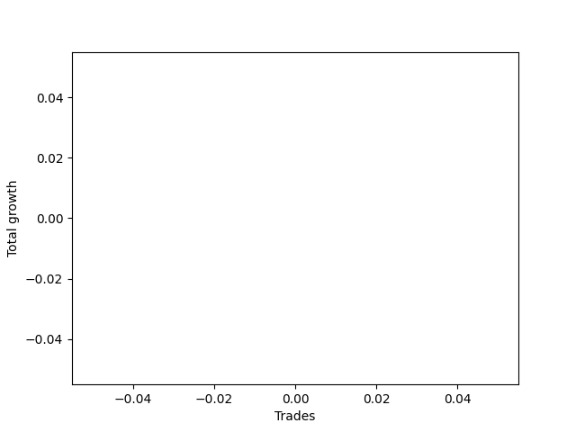

# Long Wallace Doodle 022 
- Symbol: NQ
- Date Range: 3/18/22 - 6/24/22
- Trading Period: 7:20-12:30
- Number of Trades: 9


| Name | Win Percent | Profit | Avg Profit / Trade |     | Name | Win Percent | Profit | Avg Profit / Trade |
| ---- | ----------- | ------ | ------------------ | --- | ---- | ----------- | ------ | ------------------ |
| Sorted By <br> Profit | | | | | Sorted By <br> Win Percentage ||||
| Three | 55.56 | -3856875.00 | -428541.67 |     | Three | 55.56 | -3856875.00 | -428541.67 |
| Thirty-Four | 44.44 | -3860625.00 | -428958.33 |     | Two | 55.56 | -3881375.00 | -431263.89 |
| Ten | 0.00 | -3873625.00 | -430402.78 |     | Thirty-Four | 44.44 | -3860625.00 | -428958.33 |
| Eight | 0.00 | -3873625.00 | -430402.78 |     | Thirty-Six | 44.44 | -3878250.00 | -430916.67 |
| Six | 0.00 | -3873625.00 | -430402.78 |     | Five | 44.44 | -3880500.00 | -431166.67 |
| Eleven | 11.11 | -3873750.00 | -430416.67 |     | One | 44.44 | -3895500.00 | -432833.33 |
| Nine | 11.11 | -3873750.00 | -430416.67 |     | Four | 33.33 | -3889375.00 | -432152.78 |
| Seven | 11.11 | -3873750.00 | -430416.67 |     | Seventeen | 22.22 | -3875000.00 | -430555.56 |
| Seventeen | 22.22 | -3875000.00 | -430555.56 |     | Fifteen | 22.22 | -3875000.00 | -430555.56 |
| Fifteen | 22.22 | -3875000.00 | -430555.56 |     | Thirteen | 22.22 | -3875000.00 | -430555.56 |
| Thirteen | 22.22 | -3875000.00 | -430555.56 |     | Eleven | 11.11 | -3873750.00 | -430416.67 |
| Sixteen | 0.00 | -3875750.00 | -430638.89 |     | Nine | 11.11 | -3873750.00 | -430416.67 |
| Fourteen | 0.00 | -3875750.00 | -430638.89 |     | Seven | 11.11 | -3873750.00 | -430416.67 |
| Twelve | 0.00 | -3875750.00 | -430638.89 |     | Twenty-Three | 11.11 | -3877875.00 | -430875.00 |
| Twenty-Three | 11.11 | -3877875.00 | -430875.00 |     | Twenty-One | 11.11 | -3877875.00 | -430875.00 |
| Twenty-One | 11.11 | -3877875.00 | -430875.00 |     | Nineteen | 11.11 | -3877875.00 | -430875.00 |
| Nineteen | 11.11 | -3877875.00 | -430875.00 |     | Thirty-One | 11.11 | -3886750.00 | -431861.11 |
| Thirty-Six | 44.44 | -3878250.00 | -430916.67 |     | Thirty | 11.11 | -3887250.00 | -431916.67 |
| Five | 44.44 | -3880500.00 | -431166.67 |     | Ten | 0.00 | -3873625.00 | -430402.78 |
| Two | 55.56 | -3881375.00 | -431263.89 |     | Eight | 0.00 | -3873625.00 | -430402.78 |
| Twenty-Two | 0.00 | -3884500.00 | -431611.11 |     | Six | 0.00 | -3873625.00 | -430402.78 |
| Twenty | 0.00 | -3884500.00 | -431611.11 |     | Sixteen | 0.00 | -3875750.00 | -430638.89 |
| Eighteen | 0.00 | -3884500.00 | -431611.11 |     | Fourteen | 0.00 | -3875750.00 | -430638.89 |
| Thirty-One | 11.11 | -3886750.00 | -431861.11 |     | Twelve | 0.00 | -3875750.00 | -430638.89 |
| Thirty | 11.11 | -3887250.00 | -431916.67 |     | Twenty-Two | 0.00 | -3884500.00 | -431611.11 |
| Four | 33.33 | -3889375.00 | -432152.78 |     | Twenty | 0.00 | -3884500.00 | -431611.11 |
| Thirty-Three | 0.00 | -3893500.00 | -432611.11 |     | Eighteen | 0.00 | -3884500.00 | -431611.11 |
| Twenty-Nine | 0.00 | -3893500.00 | -432611.11 |     | Thirty-Three | 0.00 | -3893500.00 | -432611.11 |
| Twenty-Seven | 0.00 | -3893500.00 | -432611.11 |     | Twenty-Nine | 0.00 | -3893500.00 | -432611.11 |
| Twenty-Five | 0.00 | -3893500.00 | -432611.11 |     | Twenty-Seven | 0.00 | -3893500.00 | -432611.11 |
| One | 44.44 | -3895500.00 | -432833.33 |     | Twenty-Five | 0.00 | -3893500.00 | -432611.11 |
| Thirty-Two | 0.00 | -3899500.00 | -433277.78 |     | Thirty-Two | 0.00 | -3899500.00 | -433277.78 |
| Twenty-Eight | 0.00 | -3899500.00 | -433277.78 |     | Twenty-Eight | 0.00 | -3899500.00 | -433277.78 |
| Twenty-Six | 0.00 | -3899500.00 | -433277.78 |     | Twenty-Six | 0.00 | -3899500.00 | -433277.78 |
| Twenty-Four | 0.00 | -3899500.00 | -433277.78 |     | Twenty-Four | 0.00 | -3899500.00 | -433277.78 |
| Thirty-Five | 0.00 | -3936750.00 | -437416.67 |     | Thirty-Five | 0.00 | -3936750.00 | -437416.67 |

### Test One
* Sell when price hits the middle line of the 20p bollinger
* No Stoploss
* Results:
```
Total Trades: 9
Percent Up: 44.44
Percent Down: 55.56
Total Points Moved Up: -7791.00
Potential Profit: -3895500.00
Total Points Ups: 17.75 Count Ups: 4
Total Points Downs: -7808.75 Count Downs: 5
```

<details><summary>Trades</summary>

<code>In: 2022-03-22 09:24:00		Out: 2022-03-22 09:35:05		Total Position Time: 11:05		Total Move Up: 11.00		Total to Date: 11.00</code> <br />
<code>In: 2022-03-22 09:25:00		Out: 2022-03-22 09:35:05		Total Position Time: 10:05		Total Move Up: 5.50		Total to Date: 16.50</code> <br />
<code>In: 2022-04-18 08:19:00		Out: 2022-04-18 08:43:05		Total Position Time: 24:05		Total Move Up: -31.00		Total to Date: -14.50</code> <br />
<code>In: 2022-04-19 11:13:00		Out: 2022-04-19 11:28:25		Total Position Time: 15:25		Total Move Up: 1.00		Total to Date: -13.50</code> <br />
<code>In: 2022-05-13 11:04:00		Out: 2022-05-13 11:19:25		Total Position Time: 15:25		Total Move Up: 0.25		Total to Date: -13.25</code> <br />
<code>In: 2022-05-19 09:43:00		Out: 2022-05-19 09:57:20		Total Position Time: 14:20		Total Move Up: -4.25		Total to Date: -17.50</code> <br />
<code>In: 2022-06-06 08:14:00		Out: 2022-06-06 08:30:10		Total Position Time: 16:10		Total Move Up: -32.50		Total to Date: -50.00</code> <br />
<code>In: 2022-06-08 09:28:00		Out: 2022-06-08 09:54:10		Total Position Time: 26:10		Total Move Up: -35.75		Total to Date: -85.75</code> <br />
<code>In: 2022-06-15 09:55:00		Out: 2022-06-15 10:24:55		Total Position Time: 29:55		Total Move Up: -7705.25		Total to Date: -7791.00</code> <br />


</details>

### Test Two
* Sell when the price hits the upper line of the 20p 1std bollinger
* No Stoploss
* Results:
```
Total Trades: 9
Percent Up: 55.56
Percent Down: 44.44
Total Points Moved Up: -7762.75
Potential Profit: -3881375.00
Total Points Ups: 59.00 Count Ups: 5
Total Points Downs: -7821.75 Count Downs: 4
```

<details><summary>Trades</summary>

<code>In: 2022-03-22 09:24:00		Out: 2022-03-22 09:36:40		Total Position Time: 12:40		Total Move Up: 21.75		Total to Date: 21.75</code> <br />
<code>In: 2022-03-22 09:25:00		Out: 2022-03-22 09:36:40		Total Position Time: 11:40		Total Move Up: 16.25		Total to Date: 38.00</code> <br />
<code>In: 2022-04-18 08:19:00		Out: 2022-04-18 08:48:55		Total Position Time: 29:55		Total Move Up: -51.00		Total to Date: -13.00</code> <br />
<code>In: 2022-04-19 11:13:00		Out: 2022-04-19 11:29:20		Total Position Time: 16:20		Total Move Up: 7.50		Total to Date: -5.50</code> <br />
<code>In: 2022-05-13 11:04:00		Out: 2022-05-13 11:30:25		Total Position Time: 26:25		Total Move Up: 6.50		Total to Date: 1.00</code> <br />
<code>In: 2022-05-19 09:43:00		Out: 2022-05-19 09:58:00		Total Position Time: 15:00		Total Move Up: 7.00		Total to Date: 8.00</code> <br />
<code>In: 2022-06-06 08:14:00		Out: 2022-06-06 08:39:15		Total Position Time: 25:15		Total Move Up: -36.25		Total to Date: -28.25</code> <br />
<code>In: 2022-06-08 09:28:00		Out: 2022-06-08 09:57:05		Total Position Time: 29:05		Total Move Up: -29.25		Total to Date: -57.50</code> <br />
<code>In: 2022-06-15 09:55:00		Out: 2022-06-15 10:24:55		Total Position Time: 29:55		Total Move Up: -7705.25		Total to Date: -7762.75</code> <br />


</details>

### Test Three
* Sell when the price hits the upper line of the 20p 2std bollinger
* No Stoploss
* Results:
```
Total Trades: 9
Percent Up: 55.56
Percent Down: 44.44
Total Points Moved Up: -7713.75
Potential Profit: -3856875.00
Total Points Ups: 115.75 Count Ups: 5
Total Points Downs: -7829.50 Count Downs: 4
```

<details><summary>Trades</summary>

<code>In: 2022-03-22 09:24:00		Out: 2022-03-22 09:51:00		Total Position Time: 27:00		Total Move Up: 31.25		Total to Date: 31.25</code> <br />
<code>In: 2022-03-22 09:25:00		Out: 2022-03-22 09:51:00		Total Position Time: 26:00		Total Move Up: 25.75		Total to Date: 57.00</code> <br />
<code>In: 2022-04-18 08:19:00		Out: 2022-04-18 08:48:55		Total Position Time: 29:55		Total Move Up: -51.00		Total to Date: 6.00</code> <br />
<code>In: 2022-04-19 11:13:00		Out: 2022-04-19 11:30:10		Total Position Time: 17:10		Total Move Up: 13.25		Total to Date: 19.25</code> <br />
<code>In: 2022-05-13 11:04:00		Out: 2022-05-13 11:31:30		Total Position Time: 27:30		Total Move Up: 34.50		Total to Date: 53.75</code> <br />
<code>In: 2022-05-19 09:43:00		Out: 2022-05-19 10:00:20		Total Position Time: 17:20		Total Move Up: 11.00		Total to Date: 64.75</code> <br />
<code>In: 2022-06-06 08:14:00		Out: 2022-06-06 08:43:55		Total Position Time: 29:55		Total Move Up: -40.50		Total to Date: 24.25</code> <br />
<code>In: 2022-06-08 09:28:00		Out: 2022-06-08 09:57:55		Total Position Time: 29:55		Total Move Up: -32.75		Total to Date: -8.50</code> <br />
<code>In: 2022-06-15 09:55:00		Out: 2022-06-15 10:24:55		Total Position Time: 29:55		Total Move Up: -7705.25		Total to Date: -7713.75</code> <br />


</details>

### Test Four
* Sell when the price hits the middle line of the 1std VWAP
* No Stoploss
* Results:
```
Total Trades: 9
Percent Up: 33.33
Percent Down: 66.67
Total Points Moved Up: -7778.75
Potential Profit: -3889375.00
Total Points Ups: 58.25 Count Ups: 3
Total Points Downs: -7837.00 Count Downs: 6
```

<details><summary>Trades</summary>

<code>In: 2022-03-22 09:24:00		Out: 2022-03-22 09:24:10		Total Position Time: 00:10		Total Move Up: 0.50		Total to Date: 0.50</code> <br />
<code>In: 2022-03-22 09:25:00		Out: 2022-03-22 09:25:10		Total Position Time: 00:10		Total Move Up: -0.50		Total to Date: 0.00</code> <br />
<code>In: 2022-04-18 08:19:00		Out: 2022-04-18 08:48:55		Total Position Time: 29:55		Total Move Up: -51.00		Total to Date: -51.00</code> <br />
<code>In: 2022-04-19 11:13:00		Out: 2022-04-19 11:13:10		Total Position Time: 00:10		Total Move Up: -7.00		Total to Date: -58.00</code> <br />
<code>In: 2022-05-13 11:04:00		Out: 2022-05-13 11:31:45		Total Position Time: 27:45		Total Move Up: 42.25		Total to Date: -15.75</code> <br />
<code>In: 2022-05-19 09:43:00		Out: 2022-05-19 10:06:05		Total Position Time: 23:05		Total Move Up: 15.50		Total to Date: -0.25</code> <br />
<code>In: 2022-06-06 08:14:00		Out: 2022-06-06 08:43:55		Total Position Time: 29:55		Total Move Up: -40.50		Total to Date: -40.75</code> <br />
<code>In: 2022-06-08 09:28:00		Out: 2022-06-08 09:57:55		Total Position Time: 29:55		Total Move Up: -32.75		Total to Date: -73.50</code> <br />
<code>In: 2022-06-15 09:55:00		Out: 2022-06-15 10:24:55		Total Position Time: 29:55		Total Move Up: -7705.25		Total to Date: -7778.75</code> <br />


</details>

### Test Five
* Sell when the price hits the upper line of the 1std VWAP
* No Stoploss
* Results:
```
Total Trades: 9
Percent Up: 44.44
Percent Down: 55.56
Total Points Moved Up: -7761.00
Potential Profit: -3880500.00
Total Points Ups: 123.75 Count Ups: 4
Total Points Downs: -7884.75 Count Downs: 5
```

<details><summary>Trades</summary>

<code>In: 2022-03-22 09:24:00		Out: 2022-03-22 09:53:55		Total Position Time: 29:55		Total Move Up: 26.50		Total to Date: 26.50</code> <br />
<code>In: 2022-03-22 09:25:00		Out: 2022-03-22 09:54:55		Total Position Time: 29:55		Total Move Up: 26.00		Total to Date: 52.50</code> <br />
<code>In: 2022-04-18 08:19:00		Out: 2022-04-18 08:48:55		Total Position Time: 29:55		Total Move Up: -51.00		Total to Date: 1.50</code> <br />
<code>In: 2022-04-19 11:13:00		Out: 2022-04-19 11:42:55		Total Position Time: 29:55		Total Move Up: 25.50		Total to Date: 27.00</code> <br />
<code>In: 2022-05-13 11:04:00		Out: 2022-05-13 11:33:55		Total Position Time: 29:55		Total Move Up: 45.75		Total to Date: 72.75</code> <br />
<code>In: 2022-05-19 09:43:00		Out: 2022-05-19 10:12:55		Total Position Time: 29:55		Total Move Up: -55.25		Total to Date: 17.50</code> <br />
<code>In: 2022-06-06 08:14:00		Out: 2022-06-06 08:43:55		Total Position Time: 29:55		Total Move Up: -40.50		Total to Date: -23.00</code> <br />
<code>In: 2022-06-08 09:28:00		Out: 2022-06-08 09:57:55		Total Position Time: 29:55		Total Move Up: -32.75		Total to Date: -55.75</code> <br />
<code>In: 2022-06-15 09:55:00		Out: 2022-06-15 10:24:55		Total Position Time: 29:55		Total Move Up: -7705.25		Total to Date: -7761.00</code> <br />


</details>

### Test Six
* Sell when the price hits the middle line of the 20p bollinger
* Stoploss is 2 points
* Results:
```
Total Trades: 9
Percent Up: 0.00
Percent Down: 100.00
Total Points Moved Up: -7747.25
Potential Profit: -3873625.00
Total Points Ups: 0.00 Count Ups: 0
Total Points Downs: -7747.25 Count Downs: 9
```

<details><summary>Trades</summary>

<code>In: 2022-03-22 09:24:00		Out: 2022-03-22 09:26:30		Total Position Time: 02:30		Total Move Up: -2.50		Total to Date: -2.50</code> <br />
<code>In: 2022-03-22 09:25:00		Out: 2022-03-22 09:25:45		Total Position Time: 00:45		Total Move Up: -1.50		Total to Date: -4.00</code> <br />
<code>In: 2022-04-18 08:19:00		Out: 2022-04-18 08:19:10		Total Position Time: 00:10		Total Move Up: -2.00		Total to Date: -6.00</code> <br />
<code>In: 2022-04-19 11:13:00		Out: 2022-04-19 11:13:10		Total Position Time: 00:10		Total Move Up: -7.00		Total to Date: -13.00</code> <br />
<code>In: 2022-05-13 11:04:00		Out: 2022-05-13 11:04:10		Total Position Time: 00:10		Total Move Up: -14.00		Total to Date: -27.00</code> <br />
<code>In: 2022-05-19 09:43:00		Out: 2022-05-19 09:43:10		Total Position Time: 00:10		Total Move Up: -3.25		Total to Date: -30.25</code> <br />
<code>In: 2022-06-06 08:14:00		Out: 2022-06-06 08:14:10		Total Position Time: 00:10		Total Move Up: -3.25		Total to Date: -33.50</code> <br />
<code>In: 2022-06-08 09:28:00		Out: 2022-06-08 09:32:50		Total Position Time: 04:50		Total Move Up: -3.25		Total to Date: -36.75</code> <br />
<code>In: 2022-06-15 09:55:00		Out: 2022-06-15 09:55:10		Total Position Time: 00:10		Total Move Up: -7710.50		Total to Date: -7747.25</code> <br />


</details>

### Test Seven
* Sell when the price hits the middle line of the 20p bollinger
* Trailing Stop is 2 points
* Results:
```
Total Trades: 9
Percent Up: 11.11
Percent Down: 88.89
Total Points Moved Up: -7747.50
Potential Profit: -3873750.00
Total Points Ups: 0.50 Count Ups: 1
Total Points Downs: -7748.00 Count Downs: 8
```

<details><summary>Trades</summary>

<code>In: 2022-03-22 09:24:00		Out: 2022-03-22 09:24:10		Total Position Time: 00:10		Total Move Up: 0.50		Total to Date: 0.50</code> <br />
<code>In: 2022-03-22 09:25:00		Out: 2022-03-22 09:25:30		Total Position Time: 00:30		Total Move Up: -0.25		Total to Date: 0.25</code> <br />
<code>In: 2022-04-18 08:19:00		Out: 2022-04-18 08:19:30		Total Position Time: 00:30		Total Move Up: -2.50		Total to Date: -2.25</code> <br />
<code>In: 2022-04-19 11:13:00		Out: 2022-04-19 11:13:10		Total Position Time: 00:10		Total Move Up: -7.00		Total to Date: -9.25</code> <br />
<code>In: 2022-05-13 11:04:00		Out: 2022-05-13 11:04:20		Total Position Time: 00:20		Total Move Up: -18.50		Total to Date: -27.75</code> <br />
<code>In: 2022-05-19 09:43:00		Out: 2022-05-19 09:43:25		Total Position Time: 00:25		Total Move Up: -4.25		Total to Date: -32.00</code> <br />
<code>In: 2022-06-06 08:14:00		Out: 2022-06-06 08:14:20		Total Position Time: 00:20		Total Move Up: -4.00		Total to Date: -36.00</code> <br />
<code>In: 2022-06-08 09:28:00		Out: 2022-06-08 09:28:10		Total Position Time: 00:10		Total Move Up: -1.00		Total to Date: -37.00</code> <br />
<code>In: 2022-06-15 09:55:00		Out: 2022-06-15 09:55:10		Total Position Time: 00:10		Total Move Up: -7710.50		Total to Date: -7747.50</code> <br />


</details>

### Test Eight
* Sell when the price hits the upper line of the 20p 1std bollinger
* Stoploss is 2 points
* Results:
```
Total Trades: 9
Percent Up: 0.00
Percent Down: 100.00
Total Points Moved Up: -7747.25
Potential Profit: -3873625.00
Total Points Ups: 0.00 Count Ups: 0
Total Points Downs: -7747.25 Count Downs: 9
```

<details><summary>Trades</summary>

<code>In: 2022-03-22 09:24:00		Out: 2022-03-22 09:26:30		Total Position Time: 02:30		Total Move Up: -2.50		Total to Date: -2.50</code> <br />
<code>In: 2022-03-22 09:25:00		Out: 2022-03-22 09:25:45		Total Position Time: 00:45		Total Move Up: -1.50		Total to Date: -4.00</code> <br />
<code>In: 2022-04-18 08:19:00		Out: 2022-04-18 08:19:10		Total Position Time: 00:10		Total Move Up: -2.00		Total to Date: -6.00</code> <br />
<code>In: 2022-04-19 11:13:00		Out: 2022-04-19 11:13:10		Total Position Time: 00:10		Total Move Up: -7.00		Total to Date: -13.00</code> <br />
<code>In: 2022-05-13 11:04:00		Out: 2022-05-13 11:04:10		Total Position Time: 00:10		Total Move Up: -14.00		Total to Date: -27.00</code> <br />
<code>In: 2022-05-19 09:43:00		Out: 2022-05-19 09:43:10		Total Position Time: 00:10		Total Move Up: -3.25		Total to Date: -30.25</code> <br />
<code>In: 2022-06-06 08:14:00		Out: 2022-06-06 08:14:10		Total Position Time: 00:10		Total Move Up: -3.25		Total to Date: -33.50</code> <br />
<code>In: 2022-06-08 09:28:00		Out: 2022-06-08 09:32:50		Total Position Time: 04:50		Total Move Up: -3.25		Total to Date: -36.75</code> <br />
<code>In: 2022-06-15 09:55:00		Out: 2022-06-15 09:55:10		Total Position Time: 00:10		Total Move Up: -7710.50		Total to Date: -7747.25</code> <br />


</details>

### Test Nine
* Sell when the price hits the upper line of the 20p 1std bollinger
* Trailing Stop is 2 points
* Results:
```
Total Trades: 9
Percent Up: 11.11
Percent Down: 88.89
Total Points Moved Up: -7747.50
Potential Profit: -3873750.00
Total Points Ups: 0.50 Count Ups: 1
Total Points Downs: -7748.00 Count Downs: 8
```

<details><summary>Trades</summary>

<code>In: 2022-03-22 09:24:00		Out: 2022-03-22 09:24:10		Total Position Time: 00:10		Total Move Up: 0.50		Total to Date: 0.50</code> <br />
<code>In: 2022-03-22 09:25:00		Out: 2022-03-22 09:25:30		Total Position Time: 00:30		Total Move Up: -0.25		Total to Date: 0.25</code> <br />
<code>In: 2022-04-18 08:19:00		Out: 2022-04-18 08:19:30		Total Position Time: 00:30		Total Move Up: -2.50		Total to Date: -2.25</code> <br />
<code>In: 2022-04-19 11:13:00		Out: 2022-04-19 11:13:10		Total Position Time: 00:10		Total Move Up: -7.00		Total to Date: -9.25</code> <br />
<code>In: 2022-05-13 11:04:00		Out: 2022-05-13 11:04:20		Total Position Time: 00:20		Total Move Up: -18.50		Total to Date: -27.75</code> <br />
<code>In: 2022-05-19 09:43:00		Out: 2022-05-19 09:43:25		Total Position Time: 00:25		Total Move Up: -4.25		Total to Date: -32.00</code> <br />
<code>In: 2022-06-06 08:14:00		Out: 2022-06-06 08:14:20		Total Position Time: 00:20		Total Move Up: -4.00		Total to Date: -36.00</code> <br />
<code>In: 2022-06-08 09:28:00		Out: 2022-06-08 09:28:10		Total Position Time: 00:10		Total Move Up: -1.00		Total to Date: -37.00</code> <br />
<code>In: 2022-06-15 09:55:00		Out: 2022-06-15 09:55:10		Total Position Time: 00:10		Total Move Up: -7710.50		Total to Date: -7747.50</code> <br />


</details>

### Test Ten
* Sell when the price hits the upper line of the 20p 2std bollinger
* Stoploss is 2 points
* Results:
```
Total Trades: 9
Percent Up: 0.00
Percent Down: 100.00
Total Points Moved Up: -7747.25
Potential Profit: -3873625.00
Total Points Ups: 0.00 Count Ups: 0
Total Points Downs: -7747.25 Count Downs: 9
```

<details><summary>Trades</summary>

<code>In: 2022-03-22 09:24:00		Out: 2022-03-22 09:26:30		Total Position Time: 02:30		Total Move Up: -2.50		Total to Date: -2.50</code> <br />
<code>In: 2022-03-22 09:25:00		Out: 2022-03-22 09:25:45		Total Position Time: 00:45		Total Move Up: -1.50		Total to Date: -4.00</code> <br />
<code>In: 2022-04-18 08:19:00		Out: 2022-04-18 08:19:10		Total Position Time: 00:10		Total Move Up: -2.00		Total to Date: -6.00</code> <br />
<code>In: 2022-04-19 11:13:00		Out: 2022-04-19 11:13:10		Total Position Time: 00:10		Total Move Up: -7.00		Total to Date: -13.00</code> <br />
<code>In: 2022-05-13 11:04:00		Out: 2022-05-13 11:04:10		Total Position Time: 00:10		Total Move Up: -14.00		Total to Date: -27.00</code> <br />
<code>In: 2022-05-19 09:43:00		Out: 2022-05-19 09:43:10		Total Position Time: 00:10		Total Move Up: -3.25		Total to Date: -30.25</code> <br />
<code>In: 2022-06-06 08:14:00		Out: 2022-06-06 08:14:10		Total Position Time: 00:10		Total Move Up: -3.25		Total to Date: -33.50</code> <br />
<code>In: 2022-06-08 09:28:00		Out: 2022-06-08 09:32:50		Total Position Time: 04:50		Total Move Up: -3.25		Total to Date: -36.75</code> <br />
<code>In: 2022-06-15 09:55:00		Out: 2022-06-15 09:55:10		Total Position Time: 00:10		Total Move Up: -7710.50		Total to Date: -7747.25</code> <br />


</details>

### Test Eleven
* Sell when the price hits the upper line of the 20p 2std bollinger
* Trailing Stop is 2 points
* Results:
```
Total Trades: 9
Percent Up: 11.11
Percent Down: 88.89
Total Points Moved Up: -7747.50
Potential Profit: -3873750.00
Total Points Ups: 0.50 Count Ups: 1
Total Points Downs: -7748.00 Count Downs: 8
```

<details><summary>Trades</summary>

<code>In: 2022-03-22 09:24:00		Out: 2022-03-22 09:24:10		Total Position Time: 00:10		Total Move Up: 0.50		Total to Date: 0.50</code> <br />
<code>In: 2022-03-22 09:25:00		Out: 2022-03-22 09:25:30		Total Position Time: 00:30		Total Move Up: -0.25		Total to Date: 0.25</code> <br />
<code>In: 2022-04-18 08:19:00		Out: 2022-04-18 08:19:30		Total Position Time: 00:30		Total Move Up: -2.50		Total to Date: -2.25</code> <br />
<code>In: 2022-04-19 11:13:00		Out: 2022-04-19 11:13:10		Total Position Time: 00:10		Total Move Up: -7.00		Total to Date: -9.25</code> <br />
<code>In: 2022-05-13 11:04:00		Out: 2022-05-13 11:04:20		Total Position Time: 00:20		Total Move Up: -18.50		Total to Date: -27.75</code> <br />
<code>In: 2022-05-19 09:43:00		Out: 2022-05-19 09:43:25		Total Position Time: 00:25		Total Move Up: -4.25		Total to Date: -32.00</code> <br />
<code>In: 2022-06-06 08:14:00		Out: 2022-06-06 08:14:20		Total Position Time: 00:20		Total Move Up: -4.00		Total to Date: -36.00</code> <br />
<code>In: 2022-06-08 09:28:00		Out: 2022-06-08 09:28:10		Total Position Time: 00:10		Total Move Up: -1.00		Total to Date: -37.00</code> <br />
<code>In: 2022-06-15 09:55:00		Out: 2022-06-15 09:55:10		Total Position Time: 00:10		Total Move Up: -7710.50		Total to Date: -7747.50</code> <br />


</details>

### Test Twelve
* Sell when the price hits the middle line of the 20p bollinger
* Stoploss is 3 points
* Results:
```
Total Trades: 9
Percent Up: 0.00
Percent Down: 100.00
Total Points Moved Up: -7751.50
Potential Profit: -3875750.00
Total Points Ups: 0.00 Count Ups: 0
Total Points Downs: -7751.50 Count Downs: 9
```

<details><summary>Trades</summary>

<code>In: 2022-03-22 09:24:00		Out: 2022-03-22 09:26:30		Total Position Time: 02:30		Total Move Up: -2.50		Total to Date: -2.50</code> <br />
<code>In: 2022-03-22 09:25:00		Out: 2022-03-22 09:25:50		Total Position Time: 00:50		Total Move Up: -3.25		Total to Date: -5.75</code> <br />
<code>In: 2022-04-18 08:19:00		Out: 2022-04-18 08:19:30		Total Position Time: 00:30		Total Move Up: -2.50		Total to Date: -8.25</code> <br />
<code>In: 2022-04-19 11:13:00		Out: 2022-04-19 11:13:10		Total Position Time: 00:10		Total Move Up: -7.00		Total to Date: -15.25</code> <br />
<code>In: 2022-05-13 11:04:00		Out: 2022-05-13 11:04:10		Total Position Time: 00:10		Total Move Up: -14.00		Total to Date: -29.25</code> <br />
<code>In: 2022-05-19 09:43:00		Out: 2022-05-19 09:43:10		Total Position Time: 00:10		Total Move Up: -3.25		Total to Date: -32.50</code> <br />
<code>In: 2022-06-06 08:14:00		Out: 2022-06-06 08:14:10		Total Position Time: 00:10		Total Move Up: -3.25		Total to Date: -35.75</code> <br />
<code>In: 2022-06-08 09:28:00		Out: 2022-06-08 09:32:55		Total Position Time: 04:55		Total Move Up: -5.25		Total to Date: -41.00</code> <br />
<code>In: 2022-06-15 09:55:00		Out: 2022-06-15 09:55:10		Total Position Time: 00:10		Total Move Up: -7710.50		Total to Date: -7751.50</code> <br />


</details>

### Test Thirteen
* Sell when the price hits the middle line of the 20p bollinger
* Trailing Stop is 3 points
* Results:
```
Total Trades: 9
Percent Up: 22.22
Percent Down: 77.78
Total Points Moved Up: -7750.00
Potential Profit: -3875000.00
Total Points Ups: 1.25 Count Ups: 2
Total Points Downs: -7751.25 Count Downs: 7
```

<details><summary>Trades</summary>

<code>In: 2022-03-22 09:24:00		Out: 2022-03-22 09:24:10		Total Position Time: 00:10		Total Move Up: 0.50		Total to Date: 0.50</code> <br />
<code>In: 2022-03-22 09:25:00		Out: 2022-03-22 09:25:35		Total Position Time: 00:35		Total Move Up: -2.00		Total to Date: -1.50</code> <br />
<code>In: 2022-04-18 08:19:00		Out: 2022-04-18 08:20:50		Total Position Time: 01:50		Total Move Up: 0.75		Total to Date: -0.75</code> <br />
<code>In: 2022-04-19 11:13:00		Out: 2022-04-19 11:13:10		Total Position Time: 00:10		Total Move Up: -7.00		Total to Date: -7.75</code> <br />
<code>In: 2022-05-13 11:04:00		Out: 2022-05-13 11:04:20		Total Position Time: 00:20		Total Move Up: -18.50		Total to Date: -26.25</code> <br />
<code>In: 2022-05-19 09:43:00		Out: 2022-05-19 09:43:25		Total Position Time: 00:25		Total Move Up: -4.25		Total to Date: -30.50</code> <br />
<code>In: 2022-06-06 08:14:00		Out: 2022-06-06 08:14:25		Total Position Time: 00:25		Total Move Up: -8.00		Total to Date: -38.50</code> <br />
<code>In: 2022-06-08 09:28:00		Out: 2022-06-08 09:28:10		Total Position Time: 00:10		Total Move Up: -1.00		Total to Date: -39.50</code> <br />
<code>In: 2022-06-15 09:55:00		Out: 2022-06-15 09:55:10		Total Position Time: 00:10		Total Move Up: -7710.50		Total to Date: -7750.00</code> <br />


</details>

### Test Fourteen
* Sell when the price hits the upper line of the 20p 1std bollinger
* Stoploss is 3 points
* Results:
```
Total Trades: 9
Percent Up: 0.00
Percent Down: 100.00
Total Points Moved Up: -7751.50
Potential Profit: -3875750.00
Total Points Ups: 0.00 Count Ups: 0
Total Points Downs: -7751.50 Count Downs: 9
```

<details><summary>Trades</summary>

<code>In: 2022-03-22 09:24:00		Out: 2022-03-22 09:26:30		Total Position Time: 02:30		Total Move Up: -2.50		Total to Date: -2.50</code> <br />
<code>In: 2022-03-22 09:25:00		Out: 2022-03-22 09:25:50		Total Position Time: 00:50		Total Move Up: -3.25		Total to Date: -5.75</code> <br />
<code>In: 2022-04-18 08:19:00		Out: 2022-04-18 08:19:30		Total Position Time: 00:30		Total Move Up: -2.50		Total to Date: -8.25</code> <br />
<code>In: 2022-04-19 11:13:00		Out: 2022-04-19 11:13:10		Total Position Time: 00:10		Total Move Up: -7.00		Total to Date: -15.25</code> <br />
<code>In: 2022-05-13 11:04:00		Out: 2022-05-13 11:04:10		Total Position Time: 00:10		Total Move Up: -14.00		Total to Date: -29.25</code> <br />
<code>In: 2022-05-19 09:43:00		Out: 2022-05-19 09:43:10		Total Position Time: 00:10		Total Move Up: -3.25		Total to Date: -32.50</code> <br />
<code>In: 2022-06-06 08:14:00		Out: 2022-06-06 08:14:10		Total Position Time: 00:10		Total Move Up: -3.25		Total to Date: -35.75</code> <br />
<code>In: 2022-06-08 09:28:00		Out: 2022-06-08 09:32:55		Total Position Time: 04:55		Total Move Up: -5.25		Total to Date: -41.00</code> <br />
<code>In: 2022-06-15 09:55:00		Out: 2022-06-15 09:55:10		Total Position Time: 00:10		Total Move Up: -7710.50		Total to Date: -7751.50</code> <br />


</details>

### Test Fifteen
* Sell when the price hits the upper line of the 20p 1std bollinger
* Trailing Stop is 3 points
* Results:
```
Total Trades: 9
Percent Up: 22.22
Percent Down: 77.78
Total Points Moved Up: -7750.00
Potential Profit: -3875000.00
Total Points Ups: 1.25 Count Ups: 2
Total Points Downs: -7751.25 Count Downs: 7
```

<details><summary>Trades</summary>

<code>In: 2022-03-22 09:24:00		Out: 2022-03-22 09:24:10		Total Position Time: 00:10		Total Move Up: 0.50		Total to Date: 0.50</code> <br />
<code>In: 2022-03-22 09:25:00		Out: 2022-03-22 09:25:35		Total Position Time: 00:35		Total Move Up: -2.00		Total to Date: -1.50</code> <br />
<code>In: 2022-04-18 08:19:00		Out: 2022-04-18 08:20:50		Total Position Time: 01:50		Total Move Up: 0.75		Total to Date: -0.75</code> <br />
<code>In: 2022-04-19 11:13:00		Out: 2022-04-19 11:13:10		Total Position Time: 00:10		Total Move Up: -7.00		Total to Date: -7.75</code> <br />
<code>In: 2022-05-13 11:04:00		Out: 2022-05-13 11:04:20		Total Position Time: 00:20		Total Move Up: -18.50		Total to Date: -26.25</code> <br />
<code>In: 2022-05-19 09:43:00		Out: 2022-05-19 09:43:25		Total Position Time: 00:25		Total Move Up: -4.25		Total to Date: -30.50</code> <br />
<code>In: 2022-06-06 08:14:00		Out: 2022-06-06 08:14:25		Total Position Time: 00:25		Total Move Up: -8.00		Total to Date: -38.50</code> <br />
<code>In: 2022-06-08 09:28:00		Out: 2022-06-08 09:28:10		Total Position Time: 00:10		Total Move Up: -1.00		Total to Date: -39.50</code> <br />
<code>In: 2022-06-15 09:55:00		Out: 2022-06-15 09:55:10		Total Position Time: 00:10		Total Move Up: -7710.50		Total to Date: -7750.00</code> <br />


</details>

### Test Sixteen
* Sell when the price hits the upper line of the 20p 2std bollinger
* Stoploss is 3 points
* Results:
```
Total Trades: 9
Percent Up: 0.00
Percent Down: 100.00
Total Points Moved Up: -7751.50
Potential Profit: -3875750.00
Total Points Ups: 0.00 Count Ups: 0
Total Points Downs: -7751.50 Count Downs: 9
```

<details><summary>Trades</summary>

<code>In: 2022-03-22 09:24:00		Out: 2022-03-22 09:26:30		Total Position Time: 02:30		Total Move Up: -2.50		Total to Date: -2.50</code> <br />
<code>In: 2022-03-22 09:25:00		Out: 2022-03-22 09:25:50		Total Position Time: 00:50		Total Move Up: -3.25		Total to Date: -5.75</code> <br />
<code>In: 2022-04-18 08:19:00		Out: 2022-04-18 08:19:30		Total Position Time: 00:30		Total Move Up: -2.50		Total to Date: -8.25</code> <br />
<code>In: 2022-04-19 11:13:00		Out: 2022-04-19 11:13:10		Total Position Time: 00:10		Total Move Up: -7.00		Total to Date: -15.25</code> <br />
<code>In: 2022-05-13 11:04:00		Out: 2022-05-13 11:04:10		Total Position Time: 00:10		Total Move Up: -14.00		Total to Date: -29.25</code> <br />
<code>In: 2022-05-19 09:43:00		Out: 2022-05-19 09:43:10		Total Position Time: 00:10		Total Move Up: -3.25		Total to Date: -32.50</code> <br />
<code>In: 2022-06-06 08:14:00		Out: 2022-06-06 08:14:10		Total Position Time: 00:10		Total Move Up: -3.25		Total to Date: -35.75</code> <br />
<code>In: 2022-06-08 09:28:00		Out: 2022-06-08 09:32:55		Total Position Time: 04:55		Total Move Up: -5.25		Total to Date: -41.00</code> <br />
<code>In: 2022-06-15 09:55:00		Out: 2022-06-15 09:55:10		Total Position Time: 00:10		Total Move Up: -7710.50		Total to Date: -7751.50</code> <br />


</details>

### Test Seventeen
* Sell when the price hits the upper line of the 20p 2std bollinger
* Trailing Stop is 3 points
* Results:
```
Total Trades: 9
Percent Up: 22.22
Percent Down: 77.78
Total Points Moved Up: -7750.00
Potential Profit: -3875000.00
Total Points Ups: 1.25 Count Ups: 2
Total Points Downs: -7751.25 Count Downs: 7
```

<details><summary>Trades</summary>

<code>In: 2022-03-22 09:24:00		Out: 2022-03-22 09:24:10		Total Position Time: 00:10		Total Move Up: 0.50		Total to Date: 0.50</code> <br />
<code>In: 2022-03-22 09:25:00		Out: 2022-03-22 09:25:35		Total Position Time: 00:35		Total Move Up: -2.00		Total to Date: -1.50</code> <br />
<code>In: 2022-04-18 08:19:00		Out: 2022-04-18 08:20:50		Total Position Time: 01:50		Total Move Up: 0.75		Total to Date: -0.75</code> <br />
<code>In: 2022-04-19 11:13:00		Out: 2022-04-19 11:13:10		Total Position Time: 00:10		Total Move Up: -7.00		Total to Date: -7.75</code> <br />
<code>In: 2022-05-13 11:04:00		Out: 2022-05-13 11:04:20		Total Position Time: 00:20		Total Move Up: -18.50		Total to Date: -26.25</code> <br />
<code>In: 2022-05-19 09:43:00		Out: 2022-05-19 09:43:25		Total Position Time: 00:25		Total Move Up: -4.25		Total to Date: -30.50</code> <br />
<code>In: 2022-06-06 08:14:00		Out: 2022-06-06 08:14:25		Total Position Time: 00:25		Total Move Up: -8.00		Total to Date: -38.50</code> <br />
<code>In: 2022-06-08 09:28:00		Out: 2022-06-08 09:28:10		Total Position Time: 00:10		Total Move Up: -1.00		Total to Date: -39.50</code> <br />
<code>In: 2022-06-15 09:55:00		Out: 2022-06-15 09:55:10		Total Position Time: 00:10		Total Move Up: -7710.50		Total to Date: -7750.00</code> <br />


</details>

### Test Eighteen
* Sell when the price hits the middle line of the 20p bollinger
* Stoploss is 5 points
* Results:
```
Total Trades: 9
Percent Up: 0.00
Percent Down: 100.00
Total Points Moved Up: -7769.00
Potential Profit: -3884500.00
Total Points Ups: 0.00 Count Ups: 0
Total Points Downs: -7769.00 Count Downs: 9
```

<details><summary>Trades</summary>

<code>In: 2022-03-22 09:24:00		Out: 2022-03-22 09:26:40		Total Position Time: 02:40		Total Move Up: -5.00		Total to Date: -5.00</code> <br />
<code>In: 2022-03-22 09:25:00		Out: 2022-03-22 09:26:25		Total Position Time: 01:25		Total Move Up: -6.25		Total to Date: -11.25</code> <br />
<code>In: 2022-04-18 08:19:00		Out: 2022-04-18 08:21:05		Total Position Time: 02:05		Total Move Up: -6.75		Total to Date: -18.00</code> <br />
<code>In: 2022-04-19 11:13:00		Out: 2022-04-19 11:13:10		Total Position Time: 00:10		Total Move Up: -7.00		Total to Date: -25.00</code> <br />
<code>In: 2022-05-13 11:04:00		Out: 2022-05-13 11:04:10		Total Position Time: 00:10		Total Move Up: -14.00		Total to Date: -39.00</code> <br />
<code>In: 2022-05-19 09:43:00		Out: 2022-05-19 09:43:30		Total Position Time: 00:30		Total Move Up: -6.25		Total to Date: -45.25</code> <br />
<code>In: 2022-06-06 08:14:00		Out: 2022-06-06 08:14:25		Total Position Time: 00:25		Total Move Up: -8.00		Total to Date: -53.25</code> <br />
<code>In: 2022-06-08 09:28:00		Out: 2022-06-08 09:32:55		Total Position Time: 04:55		Total Move Up: -5.25		Total to Date: -58.50</code> <br />
<code>In: 2022-06-15 09:55:00		Out: 2022-06-15 09:55:10		Total Position Time: 00:10		Total Move Up: -7710.50		Total to Date: -7769.00</code> <br />


</details>

### Test Nineteen
* Sell when the price hits the middle line of the 20p bollinger
* Trailing Stop is 5 points
* Results:
```
Total Trades: 9
Percent Up: 11.11
Percent Down: 88.89
Total Points Moved Up: -7755.75
Potential Profit: -3877875.00
Total Points Ups: 0.00 Count Ups: 1
Total Points Downs: -7755.75 Count Downs: 8
```

<details><summary>Trades</summary>

<code>In: 2022-03-22 09:24:00		Out: 2022-03-22 09:24:25		Total Position Time: 00:25		Total Move Up: 0.00		Total to Date: 0.00</code> <br />
<code>In: 2022-03-22 09:25:00		Out: 2022-03-22 09:25:50		Total Position Time: 00:50		Total Move Up: -3.25		Total to Date: -3.25</code> <br />
<code>In: 2022-04-18 08:19:00		Out: 2022-04-18 08:20:55		Total Position Time: 01:55		Total Move Up: -0.25		Total to Date: -3.50</code> <br />
<code>In: 2022-04-19 11:13:00		Out: 2022-04-19 11:13:10		Total Position Time: 00:10		Total Move Up: -7.00		Total to Date: -10.50</code> <br />
<code>In: 2022-05-13 11:04:00		Out: 2022-05-13 11:04:20		Total Position Time: 00:20		Total Move Up: -18.50		Total to Date: -29.00</code> <br />
<code>In: 2022-05-19 09:43:00		Out: 2022-05-19 09:43:35		Total Position Time: 00:35		Total Move Up: -7.25		Total to Date: -36.25</code> <br />
<code>In: 2022-06-06 08:14:00		Out: 2022-06-06 08:14:25		Total Position Time: 00:25		Total Move Up: -8.00		Total to Date: -44.25</code> <br />
<code>In: 2022-06-08 09:28:00		Out: 2022-06-08 09:28:10		Total Position Time: 00:10		Total Move Up: -1.00		Total to Date: -45.25</code> <br />
<code>In: 2022-06-15 09:55:00		Out: 2022-06-15 09:55:10		Total Position Time: 00:10		Total Move Up: -7710.50		Total to Date: -7755.75</code> <br />


</details>

### Test Twenty
* Sell when the price hits the upper line of the 20p 1std bollinger
* Stoploss is 5 points
* Results:
```
Total Trades: 9
Percent Up: 0.00
Percent Down: 100.00
Total Points Moved Up: -7769.00
Potential Profit: -3884500.00
Total Points Ups: 0.00 Count Ups: 0
Total Points Downs: -7769.00 Count Downs: 9
```

<details><summary>Trades</summary>

<code>In: 2022-03-22 09:24:00		Out: 2022-03-22 09:26:40		Total Position Time: 02:40		Total Move Up: -5.00		Total to Date: -5.00</code> <br />
<code>In: 2022-03-22 09:25:00		Out: 2022-03-22 09:26:25		Total Position Time: 01:25		Total Move Up: -6.25		Total to Date: -11.25</code> <br />
<code>In: 2022-04-18 08:19:00		Out: 2022-04-18 08:21:05		Total Position Time: 02:05		Total Move Up: -6.75		Total to Date: -18.00</code> <br />
<code>In: 2022-04-19 11:13:00		Out: 2022-04-19 11:13:10		Total Position Time: 00:10		Total Move Up: -7.00		Total to Date: -25.00</code> <br />
<code>In: 2022-05-13 11:04:00		Out: 2022-05-13 11:04:10		Total Position Time: 00:10		Total Move Up: -14.00		Total to Date: -39.00</code> <br />
<code>In: 2022-05-19 09:43:00		Out: 2022-05-19 09:43:30		Total Position Time: 00:30		Total Move Up: -6.25		Total to Date: -45.25</code> <br />
<code>In: 2022-06-06 08:14:00		Out: 2022-06-06 08:14:25		Total Position Time: 00:25		Total Move Up: -8.00		Total to Date: -53.25</code> <br />
<code>In: 2022-06-08 09:28:00		Out: 2022-06-08 09:32:55		Total Position Time: 04:55		Total Move Up: -5.25		Total to Date: -58.50</code> <br />
<code>In: 2022-06-15 09:55:00		Out: 2022-06-15 09:55:10		Total Position Time: 00:10		Total Move Up: -7710.50		Total to Date: -7769.00</code> <br />


</details>

### Test Twenty-One
* Sell when the price hits the upper line of the 20p 1std bollinger
* Trailing Stop is 5 points
* Results:
```
Total Trades: 9
Percent Up: 11.11
Percent Down: 88.89
Total Points Moved Up: -7755.75
Potential Profit: -3877875.00
Total Points Ups: 0.00 Count Ups: 1
Total Points Downs: -7755.75 Count Downs: 8
```

<details><summary>Trades</summary>

<code>In: 2022-03-22 09:24:00		Out: 2022-03-22 09:24:25		Total Position Time: 00:25		Total Move Up: 0.00		Total to Date: 0.00</code> <br />
<code>In: 2022-03-22 09:25:00		Out: 2022-03-22 09:25:50		Total Position Time: 00:50		Total Move Up: -3.25		Total to Date: -3.25</code> <br />
<code>In: 2022-04-18 08:19:00		Out: 2022-04-18 08:20:55		Total Position Time: 01:55		Total Move Up: -0.25		Total to Date: -3.50</code> <br />
<code>In: 2022-04-19 11:13:00		Out: 2022-04-19 11:13:10		Total Position Time: 00:10		Total Move Up: -7.00		Total to Date: -10.50</code> <br />
<code>In: 2022-05-13 11:04:00		Out: 2022-05-13 11:04:20		Total Position Time: 00:20		Total Move Up: -18.50		Total to Date: -29.00</code> <br />
<code>In: 2022-05-19 09:43:00		Out: 2022-05-19 09:43:35		Total Position Time: 00:35		Total Move Up: -7.25		Total to Date: -36.25</code> <br />
<code>In: 2022-06-06 08:14:00		Out: 2022-06-06 08:14:25		Total Position Time: 00:25		Total Move Up: -8.00		Total to Date: -44.25</code> <br />
<code>In: 2022-06-08 09:28:00		Out: 2022-06-08 09:28:10		Total Position Time: 00:10		Total Move Up: -1.00		Total to Date: -45.25</code> <br />
<code>In: 2022-06-15 09:55:00		Out: 2022-06-15 09:55:10		Total Position Time: 00:10		Total Move Up: -7710.50		Total to Date: -7755.75</code> <br />


</details>

### Test Twenty-Two
* Sell when the price hits the upper line of the 20p 2std bollinger
* Stoploss is 5 points
* Results:
```
Total Trades: 9
Percent Up: 0.00
Percent Down: 100.00
Total Points Moved Up: -7769.00
Potential Profit: -3884500.00
Total Points Ups: 0.00 Count Ups: 0
Total Points Downs: -7769.00 Count Downs: 9
```

<details><summary>Trades</summary>

<code>In: 2022-03-22 09:24:00		Out: 2022-03-22 09:26:40		Total Position Time: 02:40		Total Move Up: -5.00		Total to Date: -5.00</code> <br />
<code>In: 2022-03-22 09:25:00		Out: 2022-03-22 09:26:25		Total Position Time: 01:25		Total Move Up: -6.25		Total to Date: -11.25</code> <br />
<code>In: 2022-04-18 08:19:00		Out: 2022-04-18 08:21:05		Total Position Time: 02:05		Total Move Up: -6.75		Total to Date: -18.00</code> <br />
<code>In: 2022-04-19 11:13:00		Out: 2022-04-19 11:13:10		Total Position Time: 00:10		Total Move Up: -7.00		Total to Date: -25.00</code> <br />
<code>In: 2022-05-13 11:04:00		Out: 2022-05-13 11:04:10		Total Position Time: 00:10		Total Move Up: -14.00		Total to Date: -39.00</code> <br />
<code>In: 2022-05-19 09:43:00		Out: 2022-05-19 09:43:30		Total Position Time: 00:30		Total Move Up: -6.25		Total to Date: -45.25</code> <br />
<code>In: 2022-06-06 08:14:00		Out: 2022-06-06 08:14:25		Total Position Time: 00:25		Total Move Up: -8.00		Total to Date: -53.25</code> <br />
<code>In: 2022-06-08 09:28:00		Out: 2022-06-08 09:32:55		Total Position Time: 04:55		Total Move Up: -5.25		Total to Date: -58.50</code> <br />
<code>In: 2022-06-15 09:55:00		Out: 2022-06-15 09:55:10		Total Position Time: 00:10		Total Move Up: -7710.50		Total to Date: -7769.00</code> <br />


</details>

### Test Twenty-Three
* Sell when the price hits the upper line of the 20p 2std bollinger
* Trailing Stop is 5 points
* Results:
```
Total Trades: 9
Percent Up: 11.11
Percent Down: 88.89
Total Points Moved Up: -7755.75
Potential Profit: -3877875.00
Total Points Ups: 0.00 Count Ups: 1
Total Points Downs: -7755.75 Count Downs: 8
```

<details><summary>Trades</summary>

<code>In: 2022-03-22 09:24:00		Out: 2022-03-22 09:24:25		Total Position Time: 00:25		Total Move Up: 0.00		Total to Date: 0.00</code> <br />
<code>In: 2022-03-22 09:25:00		Out: 2022-03-22 09:25:50		Total Position Time: 00:50		Total Move Up: -3.25		Total to Date: -3.25</code> <br />
<code>In: 2022-04-18 08:19:00		Out: 2022-04-18 08:20:55		Total Position Time: 01:55		Total Move Up: -0.25		Total to Date: -3.50</code> <br />
<code>In: 2022-04-19 11:13:00		Out: 2022-04-19 11:13:10		Total Position Time: 00:10		Total Move Up: -7.00		Total to Date: -10.50</code> <br />
<code>In: 2022-05-13 11:04:00		Out: 2022-05-13 11:04:20		Total Position Time: 00:20		Total Move Up: -18.50		Total to Date: -29.00</code> <br />
<code>In: 2022-05-19 09:43:00		Out: 2022-05-19 09:43:35		Total Position Time: 00:35		Total Move Up: -7.25		Total to Date: -36.25</code> <br />
<code>In: 2022-06-06 08:14:00		Out: 2022-06-06 08:14:25		Total Position Time: 00:25		Total Move Up: -8.00		Total to Date: -44.25</code> <br />
<code>In: 2022-06-08 09:28:00		Out: 2022-06-08 09:28:10		Total Position Time: 00:10		Total Move Up: -1.00		Total to Date: -45.25</code> <br />
<code>In: 2022-06-15 09:55:00		Out: 2022-06-15 09:55:10		Total Position Time: 00:10		Total Move Up: -7710.50		Total to Date: -7755.75</code> <br />


</details>

### Test Twenty-Four
* Sell when the price hits the middle line of the 20p bollinger
* Stoploss is 10 points
* Results:
```
Total Trades: 9
Percent Up: 0.00
Percent Down: 100.00
Total Points Moved Up: -7799.00
Potential Profit: -3899500.00
Total Points Ups: 0.00 Count Ups: 0
Total Points Downs: -7799.00 Count Downs: 9
```

<details><summary>Trades</summary>

<code>In: 2022-03-22 09:24:00		Out: 2022-03-22 09:27:40		Total Position Time: 03:40		Total Move Up: -11.00		Total to Date: -11.00</code> <br />
<code>In: 2022-03-22 09:25:00		Out: 2022-03-22 09:26:40		Total Position Time: 01:40		Total Move Up: -10.50		Total to Date: -21.50</code> <br />
<code>In: 2022-04-18 08:19:00		Out: 2022-04-18 08:22:20		Total Position Time: 03:20		Total Move Up: -10.50		Total to Date: -32.00</code> <br />
<code>In: 2022-04-19 11:13:00		Out: 2022-04-19 11:13:20		Total Position Time: 00:20		Total Move Up: -10.00		Total to Date: -42.00</code> <br />
<code>In: 2022-05-13 11:04:00		Out: 2022-05-13 11:04:10		Total Position Time: 00:10		Total Move Up: -14.00		Total to Date: -56.00</code> <br />
<code>In: 2022-05-19 09:43:00		Out: 2022-05-19 09:44:10		Total Position Time: 01:10		Total Move Up: -10.00		Total to Date: -66.00</code> <br />
<code>In: 2022-06-06 08:14:00		Out: 2022-06-06 08:15:40		Total Position Time: 01:40		Total Move Up: -10.50		Total to Date: -76.50</code> <br />
<code>In: 2022-06-08 09:28:00		Out: 2022-06-08 09:33:00		Total Position Time: 05:00		Total Move Up: -12.00		Total to Date: -88.50</code> <br />
<code>In: 2022-06-15 09:55:00		Out: 2022-06-15 09:55:10		Total Position Time: 00:10		Total Move Up: -7710.50		Total to Date: -7799.00</code> <br />


</details>

### Test Twenty-Five
* Sell when the price hits the middle line of the 20p bollinger
* Trailing Stop is 10 points
* Results:
```
Total Trades: 9
Percent Up: 0.00
Percent Down: 100.00
Total Points Moved Up: -7787.00
Potential Profit: -3893500.00
Total Points Ups: 0.00 Count Ups: 0
Total Points Downs: -7787.00 Count Downs: 9
```

<details><summary>Trades</summary>

<code>In: 2022-03-22 09:24:00		Out: 2022-03-22 09:26:30		Total Position Time: 02:30		Total Move Up: -2.50		Total to Date: -2.50</code> <br />
<code>In: 2022-03-22 09:25:00		Out: 2022-03-22 09:26:30		Total Position Time: 01:30		Total Move Up: -8.00		Total to Date: -10.50</code> <br />
<code>In: 2022-04-18 08:19:00		Out: 2022-04-18 08:21:05		Total Position Time: 02:05		Total Move Up: -6.75		Total to Date: -17.25</code> <br />
<code>In: 2022-04-19 11:13:00		Out: 2022-04-19 11:13:20		Total Position Time: 00:20		Total Move Up: -10.00		Total to Date: -27.25</code> <br />
<code>In: 2022-05-13 11:04:00		Out: 2022-05-13 11:05:10		Total Position Time: 01:10		Total Move Up: -22.50		Total to Date: -49.75</code> <br />
<code>In: 2022-05-19 09:43:00		Out: 2022-05-19 09:44:15		Total Position Time: 01:15		Total Move Up: -13.75		Total to Date: -63.50</code> <br />
<code>In: 2022-06-06 08:14:00		Out: 2022-06-06 08:15:45		Total Position Time: 01:45		Total Move Up: -12.00		Total to Date: -75.50</code> <br />
<code>In: 2022-06-08 09:28:00		Out: 2022-06-08 09:28:10		Total Position Time: 00:10		Total Move Up: -1.00		Total to Date: -76.50</code> <br />
<code>In: 2022-06-15 09:55:00		Out: 2022-06-15 09:55:10		Total Position Time: 00:10		Total Move Up: -7710.50		Total to Date: -7787.00</code> <br />


</details>

### Test Twenty-Six
* Sell when the price hits the upper line of the 20p 1std bollinger
* Stoploss is 10 points
* Results:
```
Total Trades: 9
Percent Up: 0.00
Percent Down: 100.00
Total Points Moved Up: -7799.00
Potential Profit: -3899500.00
Total Points Ups: 0.00 Count Ups: 0
Total Points Downs: -7799.00 Count Downs: 9
```

<details><summary>Trades</summary>

<code>In: 2022-03-22 09:24:00		Out: 2022-03-22 09:27:40		Total Position Time: 03:40		Total Move Up: -11.00		Total to Date: -11.00</code> <br />
<code>In: 2022-03-22 09:25:00		Out: 2022-03-22 09:26:40		Total Position Time: 01:40		Total Move Up: -10.50		Total to Date: -21.50</code> <br />
<code>In: 2022-04-18 08:19:00		Out: 2022-04-18 08:22:20		Total Position Time: 03:20		Total Move Up: -10.50		Total to Date: -32.00</code> <br />
<code>In: 2022-04-19 11:13:00		Out: 2022-04-19 11:13:20		Total Position Time: 00:20		Total Move Up: -10.00		Total to Date: -42.00</code> <br />
<code>In: 2022-05-13 11:04:00		Out: 2022-05-13 11:04:10		Total Position Time: 00:10		Total Move Up: -14.00		Total to Date: -56.00</code> <br />
<code>In: 2022-05-19 09:43:00		Out: 2022-05-19 09:44:10		Total Position Time: 01:10		Total Move Up: -10.00		Total to Date: -66.00</code> <br />
<code>In: 2022-06-06 08:14:00		Out: 2022-06-06 08:15:40		Total Position Time: 01:40		Total Move Up: -10.50		Total to Date: -76.50</code> <br />
<code>In: 2022-06-08 09:28:00		Out: 2022-06-08 09:33:00		Total Position Time: 05:00		Total Move Up: -12.00		Total to Date: -88.50</code> <br />
<code>In: 2022-06-15 09:55:00		Out: 2022-06-15 09:55:10		Total Position Time: 00:10		Total Move Up: -7710.50		Total to Date: -7799.00</code> <br />


</details>

### Test Twenty-Seven
* Sell when the price hits the upper line of the 20p 1std bollinger
* Trailing Stop is 10 points
* Results:
```
Total Trades: 9
Percent Up: 0.00
Percent Down: 100.00
Total Points Moved Up: -7787.00
Potential Profit: -3893500.00
Total Points Ups: 0.00 Count Ups: 0
Total Points Downs: -7787.00 Count Downs: 9
```

<details><summary>Trades</summary>

<code>In: 2022-03-22 09:24:00		Out: 2022-03-22 09:26:30		Total Position Time: 02:30		Total Move Up: -2.50		Total to Date: -2.50</code> <br />
<code>In: 2022-03-22 09:25:00		Out: 2022-03-22 09:26:30		Total Position Time: 01:30		Total Move Up: -8.00		Total to Date: -10.50</code> <br />
<code>In: 2022-04-18 08:19:00		Out: 2022-04-18 08:21:05		Total Position Time: 02:05		Total Move Up: -6.75		Total to Date: -17.25</code> <br />
<code>In: 2022-04-19 11:13:00		Out: 2022-04-19 11:13:20		Total Position Time: 00:20		Total Move Up: -10.00		Total to Date: -27.25</code> <br />
<code>In: 2022-05-13 11:04:00		Out: 2022-05-13 11:05:10		Total Position Time: 01:10		Total Move Up: -22.50		Total to Date: -49.75</code> <br />
<code>In: 2022-05-19 09:43:00		Out: 2022-05-19 09:44:15		Total Position Time: 01:15		Total Move Up: -13.75		Total to Date: -63.50</code> <br />
<code>In: 2022-06-06 08:14:00		Out: 2022-06-06 08:15:45		Total Position Time: 01:45		Total Move Up: -12.00		Total to Date: -75.50</code> <br />
<code>In: 2022-06-08 09:28:00		Out: 2022-06-08 09:28:10		Total Position Time: 00:10		Total Move Up: -1.00		Total to Date: -76.50</code> <br />
<code>In: 2022-06-15 09:55:00		Out: 2022-06-15 09:55:10		Total Position Time: 00:10		Total Move Up: -7710.50		Total to Date: -7787.00</code> <br />


</details>

### Test Twenty-Eight
* Sell when the price hits the upper line of the 20p 2std bollinger
* Stoploss is 10 points
* Results:
```
Total Trades: 9
Percent Up: 0.00
Percent Down: 100.00
Total Points Moved Up: -7799.00
Potential Profit: -3899500.00
Total Points Ups: 0.00 Count Ups: 0
Total Points Downs: -7799.00 Count Downs: 9
```

<details><summary>Trades</summary>

<code>In: 2022-03-22 09:24:00		Out: 2022-03-22 09:27:40		Total Position Time: 03:40		Total Move Up: -11.00		Total to Date: -11.00</code> <br />
<code>In: 2022-03-22 09:25:00		Out: 2022-03-22 09:26:40		Total Position Time: 01:40		Total Move Up: -10.50		Total to Date: -21.50</code> <br />
<code>In: 2022-04-18 08:19:00		Out: 2022-04-18 08:22:20		Total Position Time: 03:20		Total Move Up: -10.50		Total to Date: -32.00</code> <br />
<code>In: 2022-04-19 11:13:00		Out: 2022-04-19 11:13:20		Total Position Time: 00:20		Total Move Up: -10.00		Total to Date: -42.00</code> <br />
<code>In: 2022-05-13 11:04:00		Out: 2022-05-13 11:04:10		Total Position Time: 00:10		Total Move Up: -14.00		Total to Date: -56.00</code> <br />
<code>In: 2022-05-19 09:43:00		Out: 2022-05-19 09:44:10		Total Position Time: 01:10		Total Move Up: -10.00		Total to Date: -66.00</code> <br />
<code>In: 2022-06-06 08:14:00		Out: 2022-06-06 08:15:40		Total Position Time: 01:40		Total Move Up: -10.50		Total to Date: -76.50</code> <br />
<code>In: 2022-06-08 09:28:00		Out: 2022-06-08 09:33:00		Total Position Time: 05:00		Total Move Up: -12.00		Total to Date: -88.50</code> <br />
<code>In: 2022-06-15 09:55:00		Out: 2022-06-15 09:55:10		Total Position Time: 00:10		Total Move Up: -7710.50		Total to Date: -7799.00</code> <br />


</details>

### Test Twenty-Nine
* Sell when the price hits the upper line of the 20p 2std bollinger
* Trailing Stop is 10 points
* Results:
```
Total Trades: 9
Percent Up: 0.00
Percent Down: 100.00
Total Points Moved Up: -7787.00
Potential Profit: -3893500.00
Total Points Ups: 0.00 Count Ups: 0
Total Points Downs: -7787.00 Count Downs: 9
```

<details><summary>Trades</summary>

<code>In: 2022-03-22 09:24:00		Out: 2022-03-22 09:26:30		Total Position Time: 02:30		Total Move Up: -2.50		Total to Date: -2.50</code> <br />
<code>In: 2022-03-22 09:25:00		Out: 2022-03-22 09:26:30		Total Position Time: 01:30		Total Move Up: -8.00		Total to Date: -10.50</code> <br />
<code>In: 2022-04-18 08:19:00		Out: 2022-04-18 08:21:05		Total Position Time: 02:05		Total Move Up: -6.75		Total to Date: -17.25</code> <br />
<code>In: 2022-04-19 11:13:00		Out: 2022-04-19 11:13:20		Total Position Time: 00:20		Total Move Up: -10.00		Total to Date: -27.25</code> <br />
<code>In: 2022-05-13 11:04:00		Out: 2022-05-13 11:05:10		Total Position Time: 01:10		Total Move Up: -22.50		Total to Date: -49.75</code> <br />
<code>In: 2022-05-19 09:43:00		Out: 2022-05-19 09:44:15		Total Position Time: 01:15		Total Move Up: -13.75		Total to Date: -63.50</code> <br />
<code>In: 2022-06-06 08:14:00		Out: 2022-06-06 08:15:45		Total Position Time: 01:45		Total Move Up: -12.00		Total to Date: -75.50</code> <br />
<code>In: 2022-06-08 09:28:00		Out: 2022-06-08 09:28:10		Total Position Time: 00:10		Total Move Up: -1.00		Total to Date: -76.50</code> <br />
<code>In: 2022-06-15 09:55:00		Out: 2022-06-15 09:55:10		Total Position Time: 00:10		Total Move Up: -7710.50		Total to Date: -7787.00</code> <br />


</details>

### Test Thirty
* Sell when the price hits the middle line of the 1std VWAP
* Stoploss is 10 points
* Results:
```
Total Trades: 9
Percent Up: 11.11
Percent Down: 88.89
Total Points Moved Up: -7774.50
Potential Profit: -3887250.00
Total Points Ups: 0.50 Count Ups: 1
Total Points Downs: -7775.00 Count Downs: 8
```

<details><summary>Trades</summary>

<code>In: 2022-03-22 09:24:00		Out: 2022-03-22 09:24:10		Total Position Time: 00:10		Total Move Up: 0.50		Total to Date: 0.50</code> <br />
<code>In: 2022-03-22 09:25:00		Out: 2022-03-22 09:25:10		Total Position Time: 00:10		Total Move Up: -0.50		Total to Date: 0.00</code> <br />
<code>In: 2022-04-18 08:19:00		Out: 2022-04-18 08:22:20		Total Position Time: 03:20		Total Move Up: -10.50		Total to Date: -10.50</code> <br />
<code>In: 2022-04-19 11:13:00		Out: 2022-04-19 11:13:10		Total Position Time: 00:10		Total Move Up: -7.00		Total to Date: -17.50</code> <br />
<code>In: 2022-05-13 11:04:00		Out: 2022-05-13 11:04:10		Total Position Time: 00:10		Total Move Up: -14.00		Total to Date: -31.50</code> <br />
<code>In: 2022-05-19 09:43:00		Out: 2022-05-19 09:44:10		Total Position Time: 01:10		Total Move Up: -10.00		Total to Date: -41.50</code> <br />
<code>In: 2022-06-06 08:14:00		Out: 2022-06-06 08:15:40		Total Position Time: 01:40		Total Move Up: -10.50		Total to Date: -52.00</code> <br />
<code>In: 2022-06-08 09:28:00		Out: 2022-06-08 09:33:00		Total Position Time: 05:00		Total Move Up: -12.00		Total to Date: -64.00</code> <br />
<code>In: 2022-06-15 09:55:00		Out: 2022-06-15 09:55:10		Total Position Time: 00:10		Total Move Up: -7710.50		Total to Date: -7774.50</code> <br />


</details>

### Test Thirty-One
* Sell when the price hits the middle line of the 1std VWAP
* Trailing Stop is 10 points
* Results:
```
Total Trades: 9
Percent Up: 11.11
Percent Down: 88.89
Total Points Moved Up: -7773.50
Potential Profit: -3886750.00
Total Points Ups: 0.50 Count Ups: 1
Total Points Downs: -7774.00 Count Downs: 8
```

<details><summary>Trades</summary>

<code>In: 2022-03-22 09:24:00		Out: 2022-03-22 09:24:10		Total Position Time: 00:10		Total Move Up: 0.50		Total to Date: 0.50</code> <br />
<code>In: 2022-03-22 09:25:00		Out: 2022-03-22 09:25:10		Total Position Time: 00:10		Total Move Up: -0.50		Total to Date: 0.00</code> <br />
<code>In: 2022-04-18 08:19:00		Out: 2022-04-18 08:21:05		Total Position Time: 02:05		Total Move Up: -6.75		Total to Date: -6.75</code> <br />
<code>In: 2022-04-19 11:13:00		Out: 2022-04-19 11:13:10		Total Position Time: 00:10		Total Move Up: -7.00		Total to Date: -13.75</code> <br />
<code>In: 2022-05-13 11:04:00		Out: 2022-05-13 11:05:10		Total Position Time: 01:10		Total Move Up: -22.50		Total to Date: -36.25</code> <br />
<code>In: 2022-05-19 09:43:00		Out: 2022-05-19 09:44:15		Total Position Time: 01:15		Total Move Up: -13.75		Total to Date: -50.00</code> <br />
<code>In: 2022-06-06 08:14:00		Out: 2022-06-06 08:15:45		Total Position Time: 01:45		Total Move Up: -12.00		Total to Date: -62.00</code> <br />
<code>In: 2022-06-08 09:28:00		Out: 2022-06-08 09:28:10		Total Position Time: 00:10		Total Move Up: -1.00		Total to Date: -63.00</code> <br />
<code>In: 2022-06-15 09:55:00		Out: 2022-06-15 09:55:10		Total Position Time: 00:10		Total Move Up: -7710.50		Total to Date: -7773.50</code> <br />


</details>

### Test Thirty-Two
* Sell when the price hits the upper line of the 1std VWAP
* Stoploss is 10 points
* Results:
```
Total Trades: 9
Percent Up: 0.00
Percent Down: 100.00
Total Points Moved Up: -7799.00
Potential Profit: -3899500.00
Total Points Ups: 0.00 Count Ups: 0
Total Points Downs: -7799.00 Count Downs: 9
```

<details><summary>Trades</summary>

<code>In: 2022-03-22 09:24:00		Out: 2022-03-22 09:27:40		Total Position Time: 03:40		Total Move Up: -11.00		Total to Date: -11.00</code> <br />
<code>In: 2022-03-22 09:25:00		Out: 2022-03-22 09:26:40		Total Position Time: 01:40		Total Move Up: -10.50		Total to Date: -21.50</code> <br />
<code>In: 2022-04-18 08:19:00		Out: 2022-04-18 08:22:20		Total Position Time: 03:20		Total Move Up: -10.50		Total to Date: -32.00</code> <br />
<code>In: 2022-04-19 11:13:00		Out: 2022-04-19 11:13:20		Total Position Time: 00:20		Total Move Up: -10.00		Total to Date: -42.00</code> <br />
<code>In: 2022-05-13 11:04:00		Out: 2022-05-13 11:04:10		Total Position Time: 00:10		Total Move Up: -14.00		Total to Date: -56.00</code> <br />
<code>In: 2022-05-19 09:43:00		Out: 2022-05-19 09:44:10		Total Position Time: 01:10		Total Move Up: -10.00		Total to Date: -66.00</code> <br />
<code>In: 2022-06-06 08:14:00		Out: 2022-06-06 08:15:40		Total Position Time: 01:40		Total Move Up: -10.50		Total to Date: -76.50</code> <br />
<code>In: 2022-06-08 09:28:00		Out: 2022-06-08 09:33:00		Total Position Time: 05:00		Total Move Up: -12.00		Total to Date: -88.50</code> <br />
<code>In: 2022-06-15 09:55:00		Out: 2022-06-15 09:55:10		Total Position Time: 00:10		Total Move Up: -7710.50		Total to Date: -7799.00</code> <br />


</details>

### Test Thirty-Three
* Sell when the price hits the upper line of the 1std VWAP
* Trailing Stop is 10 points
* Results:
```
Total Trades: 9
Percent Up: 0.00
Percent Down: 100.00
Total Points Moved Up: -7787.00
Potential Profit: -3893500.00
Total Points Ups: 0.00 Count Ups: 0
Total Points Downs: -7787.00 Count Downs: 9
```

<details><summary>Trades</summary>

<code>In: 2022-03-22 09:24:00		Out: 2022-03-22 09:26:30		Total Position Time: 02:30		Total Move Up: -2.50		Total to Date: -2.50</code> <br />
<code>In: 2022-03-22 09:25:00		Out: 2022-03-22 09:26:30		Total Position Time: 01:30		Total Move Up: -8.00		Total to Date: -10.50</code> <br />
<code>In: 2022-04-18 08:19:00		Out: 2022-04-18 08:21:05		Total Position Time: 02:05		Total Move Up: -6.75		Total to Date: -17.25</code> <br />
<code>In: 2022-04-19 11:13:00		Out: 2022-04-19 11:13:20		Total Position Time: 00:20		Total Move Up: -10.00		Total to Date: -27.25</code> <br />
<code>In: 2022-05-13 11:04:00		Out: 2022-05-13 11:05:10		Total Position Time: 01:10		Total Move Up: -22.50		Total to Date: -49.75</code> <br />
<code>In: 2022-05-19 09:43:00		Out: 2022-05-19 09:44:15		Total Position Time: 01:15		Total Move Up: -13.75		Total to Date: -63.50</code> <br />
<code>In: 2022-06-06 08:14:00		Out: 2022-06-06 08:15:45		Total Position Time: 01:45		Total Move Up: -12.00		Total to Date: -75.50</code> <br />
<code>In: 2022-06-08 09:28:00		Out: 2022-06-08 09:28:10		Total Position Time: 00:10		Total Move Up: -1.00		Total to Date: -76.50</code> <br />
<code>In: 2022-06-15 09:55:00		Out: 2022-06-15 09:55:10		Total Position Time: 00:10		Total Move Up: -7710.50		Total to Date: -7787.00</code> <br />


</details>

### Test Thirty-Four
* Sell when the linear regression slope is negative
* No Stoploss
* Results:
```
Total Trades: 9
Percent Up: 44.44
Percent Down: 55.56
Total Points Moved Up: -7721.25
Potential Profit: -3860625.00
Total Points Ups: 24.50 Count Ups: 4
Total Points Downs: -7745.75 Count Downs: 5
```

<details><summary>Trades</summary>

<code>In: 2022-03-22 09:24:00		Out: 2022-03-22 09:25:05		Total Position Time: 01:05		Total Move Up: 8.00		Total to Date: 8.00</code> <br />
<code>In: 2022-03-22 09:25:00		Out: 2022-03-22 09:26:05		Total Position Time: 01:05		Total Move Up: -4.00		Total to Date: 4.00</code> <br />
<code>In: 2022-04-18 08:19:00		Out: 2022-04-18 08:20:05		Total Position Time: 01:05		Total Move Up: 0.00		Total to Date: 4.00</code> <br />
<code>In: 2022-04-19 11:13:00		Out: 2022-04-19 11:14:05		Total Position Time: 01:05		Total Move Up: 3.25		Total to Date: 7.25</code> <br />
<code>In: 2022-05-13 11:04:00		Out: 2022-05-13 11:05:05		Total Position Time: 01:05		Total Move Up: -17.75		Total to Date: -10.50</code> <br />
<code>In: 2022-05-19 09:43:00		Out: 2022-05-19 09:44:05		Total Position Time: 01:05		Total Move Up: -7.25		Total to Date: -17.75</code> <br />
<code>In: 2022-06-06 08:14:00		Out: 2022-06-06 08:15:05		Total Position Time: 01:05		Total Move Up: -6.25		Total to Date: -24.00</code> <br />
<code>In: 2022-06-08 09:28:00		Out: 2022-06-08 09:29:05		Total Position Time: 01:05		Total Move Up: 13.25		Total to Date: -10.75</code> <br />
<code>In: 2022-06-15 09:55:00		Out: 2022-06-15 09:56:05		Total Position Time: 01:05		Total Move Up: -7710.50		Total to Date: -7721.25</code> <br />


</details>

### Test Thirty-Five
* Sell when the linear regression slope changes to negative
* No Stoploss
* Results:
```
Total Trades: 9
Percent Up: 0.00
Percent Down: 100.00
Total Points Moved Up: -7873.50
Potential Profit: -3936750.00
Total Points Ups: 0.00 Count Ups: 0
Total Points Downs: -7873.50 Count Downs: 9
```

<details><summary>Trades</summary>

<code>In: 2022-03-22 09:24:00		Out: 2022-03-22 09:43:05		Total Position Time: 19:05		Total Move Up: -3.00		Total to Date: -3.00</code> <br />
<code>In: 2022-03-22 09:25:00		Out: 2022-03-22 09:43:05		Total Position Time: 18:05		Total Move Up: -8.50		Total to Date: -11.50</code> <br />
<code>In: 2022-04-18 08:19:00		Out: 2022-04-18 08:32:05		Total Position Time: 13:05		Total Move Up: -23.75		Total to Date: -35.25</code> <br />
<code>In: 2022-04-19 11:13:00		Out: 2022-04-19 11:26:05		Total Position Time: 13:05		Total Move Up: -9.50		Total to Date: -44.75</code> <br />
<code>In: 2022-05-13 11:04:00		Out: 2022-05-13 11:18:05		Total Position Time: 14:05		Total Move Up: -5.00		Total to Date: -49.75</code> <br />
<code>In: 2022-05-19 09:43:00		Out: 2022-05-19 09:55:05		Total Position Time: 12:05		Total Move Up: -35.25		Total to Date: -85.00</code> <br />
<code>In: 2022-06-06 08:14:00		Out: 2022-06-06 08:34:05		Total Position Time: 20:05		Total Move Up: -45.75		Total to Date: -130.75</code> <br />
<code>In: 2022-06-08 09:28:00		Out: 2022-06-08 09:57:55		Total Position Time: 29:55		Total Move Up: -32.75		Total to Date: -163.50</code> <br />
<code>In: 2022-06-15 09:55:00		Out: 2022-06-15 10:18:05		Total Position Time: 23:05		Total Move Up: -7710.00		Total to Date: -7873.50</code> <br />


</details>

### Test Thirty-Six
* Sell when the linear regression slope changes to negative
* No Stoploss
* Results:
```
Total Trades: 9
Percent Up: 44.44
Percent Down: 55.56
Total Points Moved Up: -7756.50
Potential Profit: -3878250.00
Total Points Ups: 123.75 Count Ups: 4
Total Points Downs: -7880.25 Count Downs: 5
```

<details><summary>Trades</summary>

<code>In: 2022-03-22 09:24:00		Out: 2022-03-22 09:53:55		Total Position Time: 29:55		Total Move Up: 26.50		Total to Date: 26.50</code> <br />
<code>In: 2022-03-22 09:25:00		Out: 2022-03-22 09:54:55		Total Position Time: 29:55		Total Move Up: 26.00		Total to Date: 52.50</code> <br />
<code>In: 2022-04-18 08:19:00		Out: 2022-04-18 08:48:05		Total Position Time: 29:05		Total Move Up: -41.50		Total to Date: 11.00</code> <br />
<code>In: 2022-04-19 11:13:00		Out: 2022-04-19 11:42:55		Total Position Time: 29:55		Total Move Up: 25.50		Total to Date: 36.50</code> <br />
<code>In: 2022-05-13 11:04:00		Out: 2022-05-13 11:33:55		Total Position Time: 29:55		Total Move Up: 45.75		Total to Date: 82.25</code> <br />
<code>In: 2022-05-19 09:43:00		Out: 2022-05-19 10:12:55		Total Position Time: 29:55		Total Move Up: -55.25		Total to Date: 27.00</code> <br />
<code>In: 2022-06-06 08:14:00		Out: 2022-06-06 08:27:05		Total Position Time: 13:05		Total Move Up: -40.50		Total to Date: -13.50</code> <br />
<code>In: 2022-06-08 09:28:00		Out: 2022-06-08 09:42:05		Total Position Time: 14:05		Total Move Up: -37.75		Total to Date: -51.25</code> <br />
<code>In: 2022-06-15 09:55:00		Out: 2022-06-15 10:24:55		Total Position Time: 29:55		Total Move Up: -7705.25		Total to Date: -7756.50</code> <br />


</details>