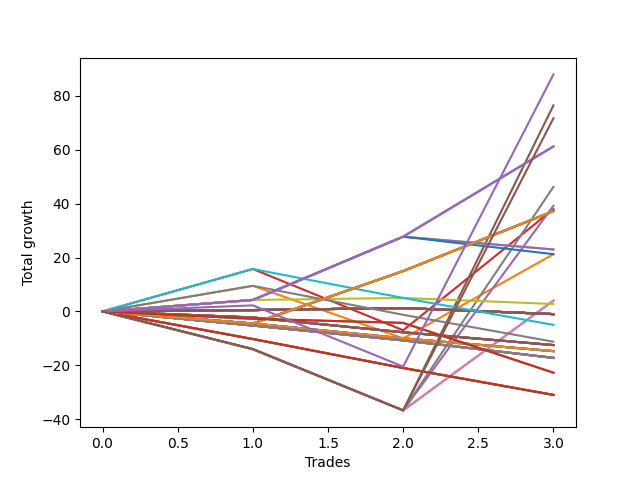

# Long Wallace 001 
- Symbol: NQ
- Date Range: 03/18/2022 - 06/17/2022
- Trading Period: 7:20-12:30
- Number of Trades: 3



| Name | Win Percent | Profit | Avg Profit / Trade |     | Name | Win Percent | Profit | Avg Profit / Trade |
| ---- | ----------- | ------ | ------------------ | --- | ---- | ----------- | ------ | ------------------ |
| Sorted By <br> Profit | | | | | Sorted By <br> Win Percentage ||||
| Seventy-Four | 66.67 | 44000.00 | 14666.67 |     | Sixty-Four | 100.00 | 30625.00 | 10208.33 |
| Five | 33.33 | 38250.00 | 12750.00 |     | Fifty-Six | 100.00 | 30625.00 | 10208.33 |
| Seventy-Five | 33.33 | 35875.00 | 11958.33 |     | Zero | 100.00 | 30625.00 | 10208.33 |
| Sixty-Four | 100.00 | 30625.00 | 10208.33 |     | Seventy-Four | 66.67 | 44000.00 | 14666.67 |
| Fifty-Six | 100.00 | 30625.00 | 10208.33 |     | Three | 66.67 | 19000.00 | 6333.33 |
| Zero | 100.00 | 30625.00 | 10208.33 |     | Seventy-One | 66.67 | 18625.00 | 6208.33 |
| Seven | 33.33 | 23125.00 | 7708.33 |     | Seventy | 66.67 | 18625.00 | 6208.33 |
| Four | 33.33 | 19625.00 | 6541.67 |     | Sixty-Nine | 66.67 | 18625.00 | 6208.33 |
| Three | 66.67 | 19000.00 | 6333.33 |     | Sixty-Eight | 66.67 | 18625.00 | 6208.33 |
| Seventy-One | 66.67 | 18625.00 | 6208.33 |     | Sixty-Seven | 66.67 | 18625.00 | 6208.33 |
| Seventy | 66.67 | 18625.00 | 6208.33 |     | Sixty-Six | 66.67 | 18625.00 | 6208.33 |
| Sixty-Nine | 66.67 | 18625.00 | 6208.33 |     | Sixty-Five | 66.67 | 18625.00 | 6208.33 |
| Sixty-Eight | 66.67 | 18625.00 | 6208.33 |     | Twenty-Four | 66.67 | 11500.00 | 3833.33 |
| Sixty-Seven | 66.67 | 18625.00 | 6208.33 |     | Eight | 66.67 | 11500.00 | 3833.33 |
| Sixty-Six | 66.67 | 18625.00 | 6208.33 |     | Forty | 66.67 | 10625.00 | 3541.67 |
| Sixty-Five | 66.67 | 18625.00 | 6208.33 |     | One | 66.67 | 10625.00 | 3541.67 |
| Twenty-Four | 66.67 | 11500.00 | 3833.33 |     | Forty-Eight | 66.67 | 1375.00 | 458.33 |
| Eight | 66.67 | 11500.00 | 3833.33 |     | Fifty-Five | 66.67 | -500.00 | -166.67 |
| Forty | 66.67 | 10625.00 | 3541.67 |     | Fifty-Four | 66.67 | -500.00 | -166.67 |
| One | 66.67 | 10625.00 | 3541.67 |     | Fifty-Three | 66.67 | -500.00 | -166.67 |
| Six | 33.33 | 2000.00 | 666.67 |     | Fifty-Two | 66.67 | -500.00 | -166.67 |
| Two | 33.33 | 2000.00 | 666.67 |     | Fifty-One | 66.67 | -500.00 | -166.67 |
| Forty-Eight | 66.67 | 1375.00 | 458.33 |     | Fifty | 66.67 | -500.00 | -166.67 |
| Fifty-Five | 66.67 | -500.00 | -166.67 |     | Forty-Nine | 66.67 | -500.00 | -166.67 |
| Fifty-Four | 66.67 | -500.00 | -166.67 |     | Thirty-Nine | 66.67 | -500.00 | -166.67 |
| Fifty-Three | 66.67 | -500.00 | -166.67 |     | Thirty-Eight | 66.67 | -500.00 | -166.67 |
| Fifty-Two | 66.67 | -500.00 | -166.67 |     | Thirty-Seven | 66.67 | -500.00 | -166.67 |
| Fifty-One | 66.67 | -500.00 | -166.67 |     | Thirty-Six | 66.67 | -500.00 | -166.67 |
| Fifty | 66.67 | -500.00 | -166.67 |     | Thirty-Five | 66.67 | -500.00 | -166.67 |
| Forty-Nine | 66.67 | -500.00 | -166.67 |     | Thirty-Four | 66.67 | -500.00 | -166.67 |
| Thirty-Nine | 66.67 | -500.00 | -166.67 |     | Thirty-Three | 66.67 | -500.00 | -166.67 |
| Thirty-Eight | 66.67 | -500.00 | -166.67 |     | Thirty-Two | 66.67 | -500.00 | -166.67 |
| Thirty-Seven | 66.67 | -500.00 | -166.67 |     | Twenty-Three | 66.67 | -500.00 | -166.67 |
| Thirty-Six | 66.67 | -500.00 | -166.67 |     | Twenty-Two | 66.67 | -500.00 | -166.67 |
| Thirty-Five | 66.67 | -500.00 | -166.67 |     | Twenty-One | 66.67 | -500.00 | -166.67 |
| Thirty-Four | 66.67 | -500.00 | -166.67 |     | Twenty | 66.67 | -500.00 | -166.67 |
| Thirty-Three | 66.67 | -500.00 | -166.67 |     | Nineteen | 66.67 | -500.00 | -166.67 |
| Thirty-Two | 66.67 | -500.00 | -166.67 |     | Eighteen | 66.67 | -500.00 | -166.67 |
| Twenty-Three | 66.67 | -500.00 | -166.67 |     | Seventeen | 66.67 | -500.00 | -166.67 |
| Twenty-Two | 66.67 | -500.00 | -166.67 |     | Sixten | 66.67 | -500.00 | -166.67 |
| Twenty-One | 66.67 | -500.00 | -166.67 |     | Five | 33.33 | 38250.00 | 12750.00 |
| Twenty | 66.67 | -500.00 | -166.67 |     | Seventy-Five | 33.33 | 35875.00 | 11958.33 |
| Nineteen | 66.67 | -500.00 | -166.67 |     | Seven | 33.33 | 23125.00 | 7708.33 |
| Eighteen | 66.67 | -500.00 | -166.67 |     | Four | 33.33 | 19625.00 | 6541.67 |
| Seventeen | 66.67 | -500.00 | -166.67 |     | Six | 33.33 | 2000.00 | 666.67 |
| Sixten | 66.67 | -500.00 | -166.67 |     | Two | 33.33 | 2000.00 | 666.67 |
| Fifty-Nine | 33.33 | -2500.00 | -833.33 |     | Fifty-Nine | 33.33 | -2500.00 | -833.33 |
| Fifty-Seven | 33.33 | -5625.00 | -1875.00 |     | Fifty-Seven | 33.33 | -5625.00 | -1875.00 |
| Fifteen | 0.00 | -6250.00 | -2083.33 |     | Fifteen | 0.00 | -6250.00 | -2083.33 |
| Fourteen | 0.00 | -6250.00 | -2083.33 |     | Fourteen | 0.00 | -6250.00 | -2083.33 |
| Thirteen | 0.00 | -6250.00 | -2083.33 |     | Thirteen | 0.00 | -6250.00 | -2083.33 |
| Twelve | 0.00 | -6250.00 | -2083.33 |     | Twelve | 0.00 | -6250.00 | -2083.33 |
| Eleven | 0.00 | -6250.00 | -2083.33 |     | Eleven | 0.00 | -6250.00 | -2083.33 |
| Ten | 0.00 | -6250.00 | -2083.33 |     | Ten | 0.00 | -6250.00 | -2083.33 |
| Nine | 0.00 | -6250.00 | -2083.33 |     | Nine | 0.00 | -6250.00 | -2083.33 |
| Thirty-One | 0.00 | -7375.00 | -2458.33 |     | Thirty-One | 0.00 | -7375.00 | -2458.33 |
| Thirty | 0.00 | -7375.00 | -2458.33 |     | Thirty | 0.00 | -7375.00 | -2458.33 |
| Twenty-Nine | 0.00 | -7375.00 | -2458.33 |     | Twenty-Nine | 0.00 | -7375.00 | -2458.33 |
| Twenty-Eight | 0.00 | -7375.00 | -2458.33 |     | Twenty-Eight | 0.00 | -7375.00 | -2458.33 |
| twenty-Seven | 0.00 | -7375.00 | -2458.33 |     | twenty-Seven | 0.00 | -7375.00 | -2458.33 |
| Twenty-Six | 0.00 | -7375.00 | -2458.33 |     | Twenty-Six | 0.00 | -7375.00 | -2458.33 |
| Twenty-Five | 0.00 | -7375.00 | -2458.33 |     | Twenty-Five | 0.00 | -7375.00 | -2458.33 |
| Forty-Seven | 0.00 | -8625.00 | -2875.00 |     | Forty-Seven | 0.00 | -8625.00 | -2875.00 |
| Forty-Six | 0.00 | -8625.00 | -2875.00 |     | Forty-Six | 0.00 | -8625.00 | -2875.00 |
| Forty-Five | 0.00 | -8625.00 | -2875.00 |     | Forty-Five | 0.00 | -8625.00 | -2875.00 |
| Forty-Four | 0.00 | -8625.00 | -2875.00 |     | Forty-Four | 0.00 | -8625.00 | -2875.00 |
| Forty-Three | 0.00 | -8625.00 | -2875.00 |     | Forty-Three | 0.00 | -8625.00 | -2875.00 |
| Forty-Two | 0.00 | -8625.00 | -2875.00 |     | Forty-Two | 0.00 | -8625.00 | -2875.00 |
| Forty-One | 0.00 | -8625.00 | -2875.00 |     | Forty-One | 0.00 | -8625.00 | -2875.00 |
| Seventy-Three | 0.00 | -11375.00 | -3791.67 |     | Seventy-Three | 0.00 | -11375.00 | -3791.67 |
| Seventy-Two | 0.00 | -11375.00 | -3791.67 |     | Seventy-Two | 0.00 | -11375.00 | -3791.67 |
| Sixty-Three | 0.00 | -15500.00 | -5166.67 |     | Sixty-Three | 0.00 | -15500.00 | -5166.67 |
| Sixty-Two | 0.00 | -15500.00 | -5166.67 |     | Sixty-Two | 0.00 | -15500.00 | -5166.67 |
| Sixty-One | 0.00 | -15500.00 | -5166.67 |     | Sixty-One | 0.00 | -15500.00 | -5166.67 |
| Sixty | 0.00 | -15500.00 | -5166.67 |     | Sixty | 0.00 | -15500.00 | -5166.67 |
| Fifty-Eight | 0.00 | -15500.00 | -5166.67 |     | Fifty-Eight | 0.00 | -15500.00 | -5166.67 |

## NO STOPLOSS

### Test Zero
* Sell when price hits the middle line of the 20p bollinger
* No Stoploss
* Results:
```
Total Trades: 3
Percent Up: 100.00
Percent Down: 0.00
Total Points Moved Up: 61.25
Potential Profit: 30625.00
Total Points Ups: 61.25 Count Ups: 3
Total Points Downs: 0.00 Count Downs: 0
```

<details><summary>Trades</summary>

<code>In: 2022-03-31 09:37:00		Out: 2022-03-31 09:37:45		Total Position Time: 00:45		Total Move Up: 4.25		Total to Date: 4.25</code> <br />
<code>In: 2022-04-11 07:31:00		Out: 2022-04-11 07:34:10		Total Position Time: 03:10		Total Move Up: 23.50		Total to Date: 27.75</code> <br />
<code>In: 2022-05-17 11:25:00		Out: 2022-05-17 11:27:30		Total Position Time: 02:30		Total Move Up: 33.50		Total to Date: 61.25</code> <br />


</details>

### Test One
* Sell when the price hits the upper line of the 20p 1std bollinger
* No Stoploss
* Results:
```
Total Trades: 3
Percent Up: 66.67
Percent Down: 33.33
Total Points Moved Up: 21.25
Potential Profit: 10625.00
Total Points Ups: 40.75 Count Ups: 2
Total Points Downs: -19.50 Count Downs: 1
```

<details><summary>Trades</summary>

<code>In: 2022-03-31 09:37:00		Out: 2022-03-31 09:40:45		Total Position Time: 03:45		Total Move Up: 9.50		Total to Date: 9.50</code> <br />
<code>In: 2022-04-11 07:31:00		Out: 2022-04-11 07:57:05		Total Position Time: 26:05		Total Move Up: -19.50		Total to Date: -10.00</code> <br />
<code>In: 2022-05-17 11:25:00		Out: 2022-05-17 11:39:45		Total Position Time: 14:45		Total Move Up: 31.25		Total to Date: 21.25</code> <br />


</details>

### Test Two
* Sell when the price hits the upper line of the 20p 2std bollinger
* No Stoploss
* Results:
```
Total Trades: 3
Percent Up: 33.33
Percent Down: 66.67
Total Points Moved Up: 4.00
Potential Profit: 2000.00
Total Points Ups: 40.75 Count Ups: 1
Total Points Downs: -36.75 Count Downs: 2
```

<details><summary>Trades</summary>

<code>In: 2022-03-31 09:37:00		Out: 2022-03-31 10:06:55		Total Position Time: 29:55		Total Move Up: -14.00		Total to Date: -14.00</code> <br />
<code>In: 2022-04-11 07:31:00		Out: 2022-04-11 08:00:55		Total Position Time: 29:55		Total Move Up: -22.75		Total to Date: -36.75</code> <br />
<code>In: 2022-05-17 11:25:00		Out: 2022-05-17 11:40:00		Total Position Time: 15:00		Total Move Up: 40.75		Total to Date: 4.00</code> <br />


</details>

### Test Three
* Sell when price hits the middle line of the 50p bollinger
* No Stoploss
* Results:
```
Total Trades: 3
Percent Up: 66.67
Percent Down: 33.33
Total Points Moved Up: 38.00
Potential Profit: 19000.00
Total Points Ups: 60.75 Count Ups: 2
Total Points Downs: -22.75 Count Downs: 1
```

<details><summary>Trades</summary>

<code>In: 2022-03-31 09:37:00		Out: 2022-03-31 09:45:40		Total Position Time: 08:40		Total Move Up: 15.75		Total to Date: 15.75</code> <br />
<code>In: 2022-04-11 07:31:00		Out: 2022-04-11 08:00:55		Total Position Time: 29:55		Total Move Up: -22.75		Total to Date: -7.00</code> <br />
<code>In: 2022-05-17 11:25:00		Out: 2022-05-17 11:40:05		Total Position Time: 15:05		Total Move Up: 45.00		Total to Date: 38.00</code> <br />


</details>

### Test Four
* Sell when the price hits the upper line of the 50p 1std bollinger
* No Stoploss
* Results:
```
Total Trades: 3
Percent Up: 33.33
Percent Down: 66.67
Total Points Moved Up: 39.25
Potential Profit: 19625.00
Total Points Ups: 76.00 Count Ups: 1
Total Points Downs: -36.75 Count Downs: 2
```

<details><summary>Trades</summary>

<code>In: 2022-03-31 09:37:00		Out: 2022-03-31 10:06:55		Total Position Time: 29:55		Total Move Up: -14.00		Total to Date: -14.00</code> <br />
<code>In: 2022-04-11 07:31:00		Out: 2022-04-11 08:00:55		Total Position Time: 29:55		Total Move Up: -22.75		Total to Date: -36.75</code> <br />
<code>In: 2022-05-17 11:25:00		Out: 2022-05-17 11:45:45		Total Position Time: 20:45		Total Move Up: 76.00		Total to Date: 39.25</code> <br />


</details>

### Test Five
* Sell when the price hits the upper line of the 50p 2std bollinger
* No Stoploss
* Results:
```
Total Trades: 3
Percent Up: 33.33
Percent Down: 66.67
Total Points Moved Up: 76.50
Potential Profit: 38250.00
Total Points Ups: 113.25 Count Ups: 1
Total Points Downs: -36.75 Count Downs: 2
```

<details><summary>Trades</summary>

<code>In: 2022-03-31 09:37:00		Out: 2022-03-31 10:06:55		Total Position Time: 29:55		Total Move Up: -14.00		Total to Date: -14.00</code> <br />
<code>In: 2022-04-11 07:31:00		Out: 2022-04-11 08:00:55		Total Position Time: 29:55		Total Move Up: -22.75		Total to Date: -36.75</code> <br />
<code>In: 2022-05-17 11:25:00		Out: 2022-05-17 11:48:45		Total Position Time: 23:45		Total Move Up: 113.25		Total to Date: 76.50</code> <br />


</details>

### Test Six
* Sell when the price hits the middle line of the 1std VWAP
* No Stoploss
* Results:
```
Total Trades: 3
Percent Up: 33.33
Percent Down: 66.67
Total Points Moved Up: 4.00
Potential Profit: 2000.00
Total Points Ups: 40.75 Count Ups: 1
Total Points Downs: -36.75 Count Downs: 2
```

<details><summary>Trades</summary>

<code>In: 2022-03-31 09:37:00		Out: 2022-03-31 10:06:55		Total Position Time: 29:55		Total Move Up: -14.00		Total to Date: -14.00</code> <br />
<code>In: 2022-04-11 07:31:00		Out: 2022-04-11 08:00:55		Total Position Time: 29:55		Total Move Up: -22.75		Total to Date: -36.75</code> <br />
<code>In: 2022-05-17 11:25:00		Out: 2022-05-17 11:40:00		Total Position Time: 15:00		Total Move Up: 40.75		Total to Date: 4.00</code> <br />


</details>

### Test Seven
* Sell when the price hits the upper line of the 1std VWAP
* No Stoploss
* Results:
```
Total Trades: 3
Percent Up: 33.33
Percent Down: 66.67
Total Points Moved Up: 46.25
Potential Profit: 23125.00
Total Points Ups: 83.00 Count Ups: 1
Total Points Downs: -36.75 Count Downs: 2
```

<details><summary>Trades</summary>

<code>In: 2022-03-31 09:37:00		Out: 2022-03-31 10:06:55		Total Position Time: 29:55		Total Move Up: -14.00		Total to Date: -14.00</code> <br />
<code>In: 2022-04-11 07:31:00		Out: 2022-04-11 08:00:55		Total Position Time: 29:55		Total Move Up: -22.75		Total to Date: -36.75</code> <br />
<code>In: 2022-05-17 11:25:00		Out: 2022-05-17 11:47:10		Total Position Time: 22:10		Total Move Up: 83.00		Total to Date: 46.25</code> <br />


</details>

## STOPLOSS OF 2

### Test Eight
* Sell when price hits the middle line of the 20p bollinger
* Stoploss is 2 points
* Results:
```
Total Trades: 3
Percent Up: 66.67
Percent Down: 33.33
Total Points Moved Up: 23.00
Potential Profit: 11500.00
Total Points Ups: 27.75 Count Ups: 2
Total Points Downs: -4.75 Count Downs: 1
```

<details><summary>Trades</summary>

<code>In: 2022-03-31 09:37:00		Out: 2022-03-31 09:37:45		Total Position Time: 00:45		Total Move Up: 4.25		Total to Date: 4.25</code> <br />
<code>In: 2022-04-11 07:31:00		Out: 2022-04-11 07:34:10		Total Position Time: 03:10		Total Move Up: 23.50		Total to Date: 27.75</code> <br />
<code>In: 2022-05-17 11:25:00		Out: 2022-05-17 11:25:30		Total Position Time: 00:30		Total Move Up: -4.75		Total to Date: 23.00</code> <br />


</details>

### Test Nine
* Sell when the price hits the upper line of the 20p 1std bollinger
* Stoploss is 2 points
* Results:
```
Total Trades: 3
Percent Up: 0.00
Percent Down: 100.00
Total Points Moved Up: -12.50
Potential Profit: -6250.00
Total Points Ups: 0.00 Count Ups: 0
Total Points Downs: -12.50 Count Downs: 3
```

<details><summary>Trades</summary>

<code>In: 2022-03-31 09:37:00		Out: 2022-03-31 09:38:55		Total Position Time: 01:55		Total Move Up: -2.25		Total to Date: -2.25</code> <br />
<code>In: 2022-04-11 07:31:00		Out: 2022-04-11 07:38:00		Total Position Time: 07:00		Total Move Up: -5.50		Total to Date: -7.75</code> <br />
<code>In: 2022-05-17 11:25:00		Out: 2022-05-17 11:25:30		Total Position Time: 00:30		Total Move Up: -4.75		Total to Date: -12.50</code> <br />


</details>

### Test Ten
* Sell when the price hits the upper line of the 20p 2std bollinger
* Stoploss is 2 points
* Results:
```
Total Trades: 3
Percent Up: 0.00
Percent Down: 100.00
Total Points Moved Up: -12.50
Potential Profit: -6250.00
Total Points Ups: 0.00 Count Ups: 0
Total Points Downs: -12.50 Count Downs: 3
```

<details><summary>Trades</summary>

<code>In: 2022-03-31 09:37:00		Out: 2022-03-31 09:38:55		Total Position Time: 01:55		Total Move Up: -2.25		Total to Date: -2.25</code> <br />
<code>In: 2022-04-11 07:31:00		Out: 2022-04-11 07:38:00		Total Position Time: 07:00		Total Move Up: -5.50		Total to Date: -7.75</code> <br />
<code>In: 2022-05-17 11:25:00		Out: 2022-05-17 11:25:30		Total Position Time: 00:30		Total Move Up: -4.75		Total to Date: -12.50</code> <br />


</details>

### Test Eleven
* Sell when price hits the middle line of the 50p bollinger
* Stoploss is 2 points
* Results:
```
Total Trades: 3
Percent Up: 0.00
Percent Down: 100.00
Total Points Moved Up: -12.50
Potential Profit: -6250.00
Total Points Ups: 0.00 Count Ups: 0
Total Points Downs: -12.50 Count Downs: 3
```

<details><summary>Trades</summary>

<code>In: 2022-03-31 09:37:00		Out: 2022-03-31 09:38:55		Total Position Time: 01:55		Total Move Up: -2.25		Total to Date: -2.25</code> <br />
<code>In: 2022-04-11 07:31:00		Out: 2022-04-11 07:38:00		Total Position Time: 07:00		Total Move Up: -5.50		Total to Date: -7.75</code> <br />
<code>In: 2022-05-17 11:25:00		Out: 2022-05-17 11:25:30		Total Position Time: 00:30		Total Move Up: -4.75		Total to Date: -12.50</code> <br />


</details>

### Test Twelve
* Sell when the price hits the upper line of the 50p 1std bollinger
* Stoploss is 2 points
* Results:
```
Total Trades: 3
Percent Up: 0.00
Percent Down: 100.00
Total Points Moved Up: -12.50
Potential Profit: -6250.00
Total Points Ups: 0.00 Count Ups: 0
Total Points Downs: -12.50 Count Downs: 3
```

<details><summary>Trades</summary>

<code>In: 2022-03-31 09:37:00		Out: 2022-03-31 09:38:55		Total Position Time: 01:55		Total Move Up: -2.25		Total to Date: -2.25</code> <br />
<code>In: 2022-04-11 07:31:00		Out: 2022-04-11 07:38:00		Total Position Time: 07:00		Total Move Up: -5.50		Total to Date: -7.75</code> <br />
<code>In: 2022-05-17 11:25:00		Out: 2022-05-17 11:25:30		Total Position Time: 00:30		Total Move Up: -4.75		Total to Date: -12.50</code> <br />


</details>

### Test Thirteen
* Sell when the price hits the upper line of the 50p 2std bollinger
* Stoploss is 2 points
* Results:
```
Total Trades: 3
Percent Up: 0.00
Percent Down: 100.00
Total Points Moved Up: -12.50
Potential Profit: -6250.00
Total Points Ups: 0.00 Count Ups: 0
Total Points Downs: -12.50 Count Downs: 3
```

<details><summary>Trades</summary>

<code>In: 2022-03-31 09:37:00		Out: 2022-03-31 09:38:55		Total Position Time: 01:55		Total Move Up: -2.25		Total to Date: -2.25</code> <br />
<code>In: 2022-04-11 07:31:00		Out: 2022-04-11 07:38:00		Total Position Time: 07:00		Total Move Up: -5.50		Total to Date: -7.75</code> <br />
<code>In: 2022-05-17 11:25:00		Out: 2022-05-17 11:25:30		Total Position Time: 00:30		Total Move Up: -4.75		Total to Date: -12.50</code> <br />


</details>

### Test Fourteen
* Sell when the price hits the middle line of the 1std VWAP
* Stoploss is 2 points
* Results:
```
Total Trades: 3
Percent Up: 0.00
Percent Down: 100.00
Total Points Moved Up: -12.50
Potential Profit: -6250.00
Total Points Ups: 0.00 Count Ups: 0
Total Points Downs: -12.50 Count Downs: 3
```

<details><summary>Trades</summary>

<code>In: 2022-03-31 09:37:00		Out: 2022-03-31 09:38:55		Total Position Time: 01:55		Total Move Up: -2.25		Total to Date: -2.25</code> <br />
<code>In: 2022-04-11 07:31:00		Out: 2022-04-11 07:38:00		Total Position Time: 07:00		Total Move Up: -5.50		Total to Date: -7.75</code> <br />
<code>In: 2022-05-17 11:25:00		Out: 2022-05-17 11:25:30		Total Position Time: 00:30		Total Move Up: -4.75		Total to Date: -12.50</code> <br />


</details>

### Test Fifteen
* Sell when the price hits the upper line of the 1std VWAP
* Stoploss is 2 points
* Results:
```
Total Trades: 3
Percent Up: 0.00
Percent Down: 100.00
Total Points Moved Up: -12.50
Potential Profit: -6250.00
Total Points Ups: 0.00 Count Ups: 0
Total Points Downs: -12.50 Count Downs: 3
```

<details><summary>Trades</summary>

<code>In: 2022-03-31 09:37:00		Out: 2022-03-31 09:38:55		Total Position Time: 01:55		Total Move Up: -2.25		Total to Date: -2.25</code> <br />
<code>In: 2022-04-11 07:31:00		Out: 2022-04-11 07:38:00		Total Position Time: 07:00		Total Move Up: -5.50		Total to Date: -7.75</code> <br />
<code>In: 2022-05-17 11:25:00		Out: 2022-05-17 11:25:30		Total Position Time: 00:30		Total Move Up: -4.75		Total to Date: -12.50</code> <br />


</details>

## TRAIL STOP OF 2

### Test Sixten
* Sell when price hits the middle line of the 20p bollinger
* Trailing Stop is 2 points
* Results:
```
Total Trades: 3
Percent Up: 66.67
Percent Down: 33.33
Total Points Moved Up: -1.00
Potential Profit: -500.00
Total Points Ups: 1.25 Count Ups: 2
Total Points Downs: -2.25 Count Downs: 1
```

<details><summary>Trades</summary>

<code>In: 2022-03-31 09:37:00		Out: 2022-03-31 09:37:15		Total Position Time: 00:15		Total Move Up: 0.50		Total to Date: 0.50</code> <br />
<code>In: 2022-04-11 07:31:00		Out: 2022-04-11 07:31:10		Total Position Time: 00:10		Total Move Up: 0.75		Total to Date: 1.25</code> <br />
<code>In: 2022-05-17 11:25:00		Out: 2022-05-17 11:25:25		Total Position Time: 00:25		Total Move Up: -2.25		Total to Date: -1.00</code> <br />


</details>

### Test Seventeen
* Sell when the price hits the upper line of the 20p 1std bollinger
* Trailing Stop is 2 points
* Results:
```
Total Trades: 3
Percent Up: 66.67
Percent Down: 33.33
Total Points Moved Up: -1.00
Potential Profit: -500.00
Total Points Ups: 1.25 Count Ups: 2
Total Points Downs: -2.25 Count Downs: 1
```

<details><summary>Trades</summary>

<code>In: 2022-03-31 09:37:00		Out: 2022-03-31 09:37:15		Total Position Time: 00:15		Total Move Up: 0.50		Total to Date: 0.50</code> <br />
<code>In: 2022-04-11 07:31:00		Out: 2022-04-11 07:31:10		Total Position Time: 00:10		Total Move Up: 0.75		Total to Date: 1.25</code> <br />
<code>In: 2022-05-17 11:25:00		Out: 2022-05-17 11:25:25		Total Position Time: 00:25		Total Move Up: -2.25		Total to Date: -1.00</code> <br />


</details>

### Test Eighteen
* Sell when the price hits the upper line of the 20p 2std bollinger
* Trailing Stop is 2 points
* Results:
```
Total Trades: 3
Percent Up: 66.67
Percent Down: 33.33
Total Points Moved Up: -1.00
Potential Profit: -500.00
Total Points Ups: 1.25 Count Ups: 2
Total Points Downs: -2.25 Count Downs: 1
```

<details><summary>Trades</summary>

<code>In: 2022-03-31 09:37:00		Out: 2022-03-31 09:37:15		Total Position Time: 00:15		Total Move Up: 0.50		Total to Date: 0.50</code> <br />
<code>In: 2022-04-11 07:31:00		Out: 2022-04-11 07:31:10		Total Position Time: 00:10		Total Move Up: 0.75		Total to Date: 1.25</code> <br />
<code>In: 2022-05-17 11:25:00		Out: 2022-05-17 11:25:25		Total Position Time: 00:25		Total Move Up: -2.25		Total to Date: -1.00</code> <br />


</details>

### Test Nineteen
* Sell when price hits the middle line of the 50p bollinger
* Trailing Stop is 2 points
* Results:
```
Total Trades: 3
Percent Up: 66.67
Percent Down: 33.33
Total Points Moved Up: -1.00
Potential Profit: -500.00
Total Points Ups: 1.25 Count Ups: 2
Total Points Downs: -2.25 Count Downs: 1
```

<details><summary>Trades</summary>

<code>In: 2022-03-31 09:37:00		Out: 2022-03-31 09:37:15		Total Position Time: 00:15		Total Move Up: 0.50		Total to Date: 0.50</code> <br />
<code>In: 2022-04-11 07:31:00		Out: 2022-04-11 07:31:10		Total Position Time: 00:10		Total Move Up: 0.75		Total to Date: 1.25</code> <br />
<code>In: 2022-05-17 11:25:00		Out: 2022-05-17 11:25:25		Total Position Time: 00:25		Total Move Up: -2.25		Total to Date: -1.00</code> <br />


</details>

### Test Twenty
* Sell when the price hits the upper line of the 50p 1std bollinger
* Trailing Stop is 2 points
* Results:
```
Total Trades: 3
Percent Up: 66.67
Percent Down: 33.33
Total Points Moved Up: -1.00
Potential Profit: -500.00
Total Points Ups: 1.25 Count Ups: 2
Total Points Downs: -2.25 Count Downs: 1
```

<details><summary>Trades</summary>

<code>In: 2022-03-31 09:37:00		Out: 2022-03-31 09:37:15		Total Position Time: 00:15		Total Move Up: 0.50		Total to Date: 0.50</code> <br />
<code>In: 2022-04-11 07:31:00		Out: 2022-04-11 07:31:10		Total Position Time: 00:10		Total Move Up: 0.75		Total to Date: 1.25</code> <br />
<code>In: 2022-05-17 11:25:00		Out: 2022-05-17 11:25:25		Total Position Time: 00:25		Total Move Up: -2.25		Total to Date: -1.00</code> <br />


</details>

### Test Twenty-One
* Sell when the price hits the upper line of the 50p 2std bollinger
* Trailing Stop is 2 points
* Results:
```
Total Trades: 3
Percent Up: 66.67
Percent Down: 33.33
Total Points Moved Up: -1.00
Potential Profit: -500.00
Total Points Ups: 1.25 Count Ups: 2
Total Points Downs: -2.25 Count Downs: 1
```

<details><summary>Trades</summary>

<code>In: 2022-03-31 09:37:00		Out: 2022-03-31 09:37:15		Total Position Time: 00:15		Total Move Up: 0.50		Total to Date: 0.50</code> <br />
<code>In: 2022-04-11 07:31:00		Out: 2022-04-11 07:31:10		Total Position Time: 00:10		Total Move Up: 0.75		Total to Date: 1.25</code> <br />
<code>In: 2022-05-17 11:25:00		Out: 2022-05-17 11:25:25		Total Position Time: 00:25		Total Move Up: -2.25		Total to Date: -1.00</code> <br />


</details>

### Test Twenty-Two
* Sell when the price hits the middle line of the 1std VWAP
* Trailing Stop is 2 points
* Results:
```
Total Trades: 3
Percent Up: 66.67
Percent Down: 33.33
Total Points Moved Up: -1.00
Potential Profit: -500.00
Total Points Ups: 1.25 Count Ups: 2
Total Points Downs: -2.25 Count Downs: 1
```

<details><summary>Trades</summary>

<code>In: 2022-03-31 09:37:00		Out: 2022-03-31 09:37:15		Total Position Time: 00:15		Total Move Up: 0.50		Total to Date: 0.50</code> <br />
<code>In: 2022-04-11 07:31:00		Out: 2022-04-11 07:31:10		Total Position Time: 00:10		Total Move Up: 0.75		Total to Date: 1.25</code> <br />
<code>In: 2022-05-17 11:25:00		Out: 2022-05-17 11:25:25		Total Position Time: 00:25		Total Move Up: -2.25		Total to Date: -1.00</code> <br />


</details>

### Test Twenty-Three
* Sell when the price hits the upper line of the 1std VWAP
* Trailing Stop is 2 points
* Results:
```
Total Trades: 3
Percent Up: 66.67
Percent Down: 33.33
Total Points Moved Up: -1.00
Potential Profit: -500.00
Total Points Ups: 1.25 Count Ups: 2
Total Points Downs: -2.25 Count Downs: 1
```

<details><summary>Trades</summary>

<code>In: 2022-03-31 09:37:00		Out: 2022-03-31 09:37:15		Total Position Time: 00:15		Total Move Up: 0.50		Total to Date: 0.50</code> <br />
<code>In: 2022-04-11 07:31:00		Out: 2022-04-11 07:31:10		Total Position Time: 00:10		Total Move Up: 0.75		Total to Date: 1.25</code> <br />
<code>In: 2022-05-17 11:25:00		Out: 2022-05-17 11:25:25		Total Position Time: 00:25		Total Move Up: -2.25		Total to Date: -1.00</code> <br />


</details>

## STOPLOSS OF 3

### Test Twenty-Four
* Sell when price hits the middle line of the 20p bollinger
* Stoploss is 3 points
* Results:
```
Total Trades: 3
Percent Up: 66.67
Percent Down: 33.33
Total Points Moved Up: 23.00
Potential Profit: 11500.00
Total Points Ups: 27.75 Count Ups: 2
Total Points Downs: -4.75 Count Downs: 1
```

<details><summary>Trades</summary>

<code>In: 2022-03-31 09:37:00		Out: 2022-03-31 09:37:45		Total Position Time: 00:45		Total Move Up: 4.25		Total to Date: 4.25</code> <br />
<code>In: 2022-04-11 07:31:00		Out: 2022-04-11 07:34:10		Total Position Time: 03:10		Total Move Up: 23.50		Total to Date: 27.75</code> <br />
<code>In: 2022-05-17 11:25:00		Out: 2022-05-17 11:25:30		Total Position Time: 00:30		Total Move Up: -4.75		Total to Date: 23.00</code> <br />


</details>

### Test Twenty-Five
* Sell when the price hits the upper line of the 20p 1std bollinger
* Stoploss is 3 points
* Results:
```
Total Trades: 3
Percent Up: 0.00
Percent Down: 100.00
Total Points Moved Up: -14.75
Potential Profit: -7375.00
Total Points Ups: 0.00 Count Ups: 0
Total Points Downs: -14.75 Count Downs: 3
```

<details><summary>Trades</summary>

<code>In: 2022-03-31 09:37:00		Out: 2022-03-31 09:39:00		Total Position Time: 02:00		Total Move Up: -4.50		Total to Date: -4.50</code> <br />
<code>In: 2022-04-11 07:31:00		Out: 2022-04-11 07:38:00		Total Position Time: 07:00		Total Move Up: -5.50		Total to Date: -10.00</code> <br />
<code>In: 2022-05-17 11:25:00		Out: 2022-05-17 11:25:30		Total Position Time: 00:30		Total Move Up: -4.75		Total to Date: -14.75</code> <br />


</details>

### Test Twenty-Six
* Sell when the price hits the upper line of the 20p 2std bollinger
* Stoploss is 3 points
* Results:
```
Total Trades: 3
Percent Up: 0.00
Percent Down: 100.00
Total Points Moved Up: -14.75
Potential Profit: -7375.00
Total Points Ups: 0.00 Count Ups: 0
Total Points Downs: -14.75 Count Downs: 3
```

<details><summary>Trades</summary>

<code>In: 2022-03-31 09:37:00		Out: 2022-03-31 09:39:00		Total Position Time: 02:00		Total Move Up: -4.50		Total to Date: -4.50</code> <br />
<code>In: 2022-04-11 07:31:00		Out: 2022-04-11 07:38:00		Total Position Time: 07:00		Total Move Up: -5.50		Total to Date: -10.00</code> <br />
<code>In: 2022-05-17 11:25:00		Out: 2022-05-17 11:25:30		Total Position Time: 00:30		Total Move Up: -4.75		Total to Date: -14.75</code> <br />


</details>

### Test twenty-Seven
* Sell when price hits the middle line of the 50p bollinger
* Stoploss is 3 points
* Results:
```
Total Trades: 3
Percent Up: 0.00
Percent Down: 100.00
Total Points Moved Up: -14.75
Potential Profit: -7375.00
Total Points Ups: 0.00 Count Ups: 0
Total Points Downs: -14.75 Count Downs: 3
```

<details><summary>Trades</summary>

<code>In: 2022-03-31 09:37:00		Out: 2022-03-31 09:39:00		Total Position Time: 02:00		Total Move Up: -4.50		Total to Date: -4.50</code> <br />
<code>In: 2022-04-11 07:31:00		Out: 2022-04-11 07:38:00		Total Position Time: 07:00		Total Move Up: -5.50		Total to Date: -10.00</code> <br />
<code>In: 2022-05-17 11:25:00		Out: 2022-05-17 11:25:30		Total Position Time: 00:30		Total Move Up: -4.75		Total to Date: -14.75</code> <br />


</details>

### Test Twenty-Eight
* Sell when the price hits the upper line of the 50p 1std bollinger
* Stoploss is 3 points
* Results:
```
Total Trades: 3
Percent Up: 0.00
Percent Down: 100.00
Total Points Moved Up: -14.75
Potential Profit: -7375.00
Total Points Ups: 0.00 Count Ups: 0
Total Points Downs: -14.75 Count Downs: 3
```

<details><summary>Trades</summary>

<code>In: 2022-03-31 09:37:00		Out: 2022-03-31 09:39:00		Total Position Time: 02:00		Total Move Up: -4.50		Total to Date: -4.50</code> <br />
<code>In: 2022-04-11 07:31:00		Out: 2022-04-11 07:38:00		Total Position Time: 07:00		Total Move Up: -5.50		Total to Date: -10.00</code> <br />
<code>In: 2022-05-17 11:25:00		Out: 2022-05-17 11:25:30		Total Position Time: 00:30		Total Move Up: -4.75		Total to Date: -14.75</code> <br />


</details>

### Test Twenty-Nine
* Sell when the price hits the upper line of the 50p 2std bollinger
* Stoploss is 3 points
* Results:
```
Total Trades: 3
Percent Up: 0.00
Percent Down: 100.00
Total Points Moved Up: -14.75
Potential Profit: -7375.00
Total Points Ups: 0.00 Count Ups: 0
Total Points Downs: -14.75 Count Downs: 3
```

<details><summary>Trades</summary>

<code>In: 2022-03-31 09:37:00		Out: 2022-03-31 09:39:00		Total Position Time: 02:00		Total Move Up: -4.50		Total to Date: -4.50</code> <br />
<code>In: 2022-04-11 07:31:00		Out: 2022-04-11 07:38:00		Total Position Time: 07:00		Total Move Up: -5.50		Total to Date: -10.00</code> <br />
<code>In: 2022-05-17 11:25:00		Out: 2022-05-17 11:25:30		Total Position Time: 00:30		Total Move Up: -4.75		Total to Date: -14.75</code> <br />


</details>

### Test Thirty
* Sell when the price hits the middle line of the 1std VWAP
* Stoploss is 3 points
* Results:
```
Total Trades: 3
Percent Up: 0.00
Percent Down: 100.00
Total Points Moved Up: -14.75
Potential Profit: -7375.00
Total Points Ups: 0.00 Count Ups: 0
Total Points Downs: -14.75 Count Downs: 3
```

<details><summary>Trades</summary>

<code>In: 2022-03-31 09:37:00		Out: 2022-03-31 09:39:00		Total Position Time: 02:00		Total Move Up: -4.50		Total to Date: -4.50</code> <br />
<code>In: 2022-04-11 07:31:00		Out: 2022-04-11 07:38:00		Total Position Time: 07:00		Total Move Up: -5.50		Total to Date: -10.00</code> <br />
<code>In: 2022-05-17 11:25:00		Out: 2022-05-17 11:25:30		Total Position Time: 00:30		Total Move Up: -4.75		Total to Date: -14.75</code> <br />


</details>

### Test Thirty-One
* Sell when the price hits the upper line of the 1std VWAP
* Stoploss is 3 points
* Results:
```
Total Trades: 3
Percent Up: 0.00
Percent Down: 100.00
Total Points Moved Up: -14.75
Potential Profit: -7375.00
Total Points Ups: 0.00 Count Ups: 0
Total Points Downs: -14.75 Count Downs: 3
```

<details><summary>Trades</summary>

<code>In: 2022-03-31 09:37:00		Out: 2022-03-31 09:39:00		Total Position Time: 02:00		Total Move Up: -4.50		Total to Date: -4.50</code> <br />
<code>In: 2022-04-11 07:31:00		Out: 2022-04-11 07:38:00		Total Position Time: 07:00		Total Move Up: -5.50		Total to Date: -10.00</code> <br />
<code>In: 2022-05-17 11:25:00		Out: 2022-05-17 11:25:30		Total Position Time: 00:30		Total Move Up: -4.75		Total to Date: -14.75</code> <br />


</details>

## TRAIL STOP OF 3

### Test Thirty-Two
* Sell when price hits the middle line of the 20p bollinger
* Trailing Stop is 3 points
* Results:
```
Total Trades: 3
Percent Up: 66.67
Percent Down: 33.33
Total Points Moved Up: -1.00
Potential Profit: -500.00
Total Points Ups: 1.25 Count Ups: 2
Total Points Downs: -2.25 Count Downs: 1
```

<details><summary>Trades</summary>

<code>In: 2022-03-31 09:37:00		Out: 2022-03-31 09:37:15		Total Position Time: 00:15		Total Move Up: 0.50		Total to Date: 0.50</code> <br />
<code>In: 2022-04-11 07:31:00		Out: 2022-04-11 07:31:10		Total Position Time: 00:10		Total Move Up: 0.75		Total to Date: 1.25</code> <br />
<code>In: 2022-05-17 11:25:00		Out: 2022-05-17 11:25:25		Total Position Time: 00:25		Total Move Up: -2.25		Total to Date: -1.00</code> <br />


</details>

### Test Thirty-Three
* Sell when the price hits the upper line of the 20p 1std bollinger
* Trailing Stop is 3 points
* Results:
```
Total Trades: 3
Percent Up: 66.67
Percent Down: 33.33
Total Points Moved Up: -1.00
Potential Profit: -500.00
Total Points Ups: 1.25 Count Ups: 2
Total Points Downs: -2.25 Count Downs: 1
```

<details><summary>Trades</summary>

<code>In: 2022-03-31 09:37:00		Out: 2022-03-31 09:37:15		Total Position Time: 00:15		Total Move Up: 0.50		Total to Date: 0.50</code> <br />
<code>In: 2022-04-11 07:31:00		Out: 2022-04-11 07:31:10		Total Position Time: 00:10		Total Move Up: 0.75		Total to Date: 1.25</code> <br />
<code>In: 2022-05-17 11:25:00		Out: 2022-05-17 11:25:25		Total Position Time: 00:25		Total Move Up: -2.25		Total to Date: -1.00</code> <br />


</details>

### Test Thirty-Four
* Sell when the price hits the upper line of the 20p 2std bollinger
* Trailing Stop is 3 points
* Results:
```
Total Trades: 3
Percent Up: 66.67
Percent Down: 33.33
Total Points Moved Up: -1.00
Potential Profit: -500.00
Total Points Ups: 1.25 Count Ups: 2
Total Points Downs: -2.25 Count Downs: 1
```

<details><summary>Trades</summary>

<code>In: 2022-03-31 09:37:00		Out: 2022-03-31 09:37:15		Total Position Time: 00:15		Total Move Up: 0.50		Total to Date: 0.50</code> <br />
<code>In: 2022-04-11 07:31:00		Out: 2022-04-11 07:31:10		Total Position Time: 00:10		Total Move Up: 0.75		Total to Date: 1.25</code> <br />
<code>In: 2022-05-17 11:25:00		Out: 2022-05-17 11:25:25		Total Position Time: 00:25		Total Move Up: -2.25		Total to Date: -1.00</code> <br />


</details>

### Test Thirty-Five
* Sell when price hits the middle line of the 50p bollinger
* Trailing Stop is 3 points
* Results:
```
Total Trades: 3
Percent Up: 66.67
Percent Down: 33.33
Total Points Moved Up: -1.00
Potential Profit: -500.00
Total Points Ups: 1.25 Count Ups: 2
Total Points Downs: -2.25 Count Downs: 1
```

<details><summary>Trades</summary>

<code>In: 2022-03-31 09:37:00		Out: 2022-03-31 09:37:15		Total Position Time: 00:15		Total Move Up: 0.50		Total to Date: 0.50</code> <br />
<code>In: 2022-04-11 07:31:00		Out: 2022-04-11 07:31:10		Total Position Time: 00:10		Total Move Up: 0.75		Total to Date: 1.25</code> <br />
<code>In: 2022-05-17 11:25:00		Out: 2022-05-17 11:25:25		Total Position Time: 00:25		Total Move Up: -2.25		Total to Date: -1.00</code> <br />


</details>

### Test Thirty-Six
* Sell when the price hits the upper line of the 50p 1std bollinger
* Trailing Stop is 3 points
* Results:
```
Total Trades: 3
Percent Up: 66.67
Percent Down: 33.33
Total Points Moved Up: -1.00
Potential Profit: -500.00
Total Points Ups: 1.25 Count Ups: 2
Total Points Downs: -2.25 Count Downs: 1
```

<details><summary>Trades</summary>

<code>In: 2022-03-31 09:37:00		Out: 2022-03-31 09:37:15		Total Position Time: 00:15		Total Move Up: 0.50		Total to Date: 0.50</code> <br />
<code>In: 2022-04-11 07:31:00		Out: 2022-04-11 07:31:10		Total Position Time: 00:10		Total Move Up: 0.75		Total to Date: 1.25</code> <br />
<code>In: 2022-05-17 11:25:00		Out: 2022-05-17 11:25:25		Total Position Time: 00:25		Total Move Up: -2.25		Total to Date: -1.00</code> <br />


</details>

### Test Thirty-Seven
* Sell when the price hits the upper line of the 50p 2std bollinger
* Trailing Stop is 3 points
* Results:
```
Total Trades: 3
Percent Up: 66.67
Percent Down: 33.33
Total Points Moved Up: -1.00
Potential Profit: -500.00
Total Points Ups: 1.25 Count Ups: 2
Total Points Downs: -2.25 Count Downs: 1
```

<details><summary>Trades</summary>

<code>In: 2022-03-31 09:37:00		Out: 2022-03-31 09:37:15		Total Position Time: 00:15		Total Move Up: 0.50		Total to Date: 0.50</code> <br />
<code>In: 2022-04-11 07:31:00		Out: 2022-04-11 07:31:10		Total Position Time: 00:10		Total Move Up: 0.75		Total to Date: 1.25</code> <br />
<code>In: 2022-05-17 11:25:00		Out: 2022-05-17 11:25:25		Total Position Time: 00:25		Total Move Up: -2.25		Total to Date: -1.00</code> <br />


</details>

### Test Thirty-Eight
* Sell when the price hits the middle line of the 1std VWAP
* Trailing Stop is 3 points
* Results:
```
Total Trades: 3
Percent Up: 66.67
Percent Down: 33.33
Total Points Moved Up: -1.00
Potential Profit: -500.00
Total Points Ups: 1.25 Count Ups: 2
Total Points Downs: -2.25 Count Downs: 1
```

<details><summary>Trades</summary>

<code>In: 2022-03-31 09:37:00		Out: 2022-03-31 09:37:15		Total Position Time: 00:15		Total Move Up: 0.50		Total to Date: 0.50</code> <br />
<code>In: 2022-04-11 07:31:00		Out: 2022-04-11 07:31:10		Total Position Time: 00:10		Total Move Up: 0.75		Total to Date: 1.25</code> <br />
<code>In: 2022-05-17 11:25:00		Out: 2022-05-17 11:25:25		Total Position Time: 00:25		Total Move Up: -2.25		Total to Date: -1.00</code> <br />


</details>

### Test Thirty-Nine
* Sell when the price hits the upper line of the 1std VWAP
* Trailing Stop is 3 points
* Results:
```
Total Trades: 3
Percent Up: 66.67
Percent Down: 33.33
Total Points Moved Up: -1.00
Potential Profit: -500.00
Total Points Ups: 1.25 Count Ups: 2
Total Points Downs: -2.25 Count Downs: 1
```

<details><summary>Trades</summary>

<code>In: 2022-03-31 09:37:00		Out: 2022-03-31 09:37:15		Total Position Time: 00:15		Total Move Up: 0.50		Total to Date: 0.50</code> <br />
<code>In: 2022-04-11 07:31:00		Out: 2022-04-11 07:31:10		Total Position Time: 00:10		Total Move Up: 0.75		Total to Date: 1.25</code> <br />
<code>In: 2022-05-17 11:25:00		Out: 2022-05-17 11:25:25		Total Position Time: 00:25		Total Move Up: -2.25		Total to Date: -1.00</code> <br />


</details>

## STOPLOSS OF 5

### Test Forty
* Sell when price hits the middle line of the 20p bollinger
* Stoploss is 5 points
* Results:
```
Total Trades: 3
Percent Up: 66.67
Percent Down: 33.33
Total Points Moved Up: 21.25
Potential Profit: 10625.00
Total Points Ups: 27.75 Count Ups: 2
Total Points Downs: -6.50 Count Downs: 1
```

<details><summary>Trades</summary>

<code>In: 2022-03-31 09:37:00		Out: 2022-03-31 09:37:45		Total Position Time: 00:45		Total Move Up: 4.25		Total to Date: 4.25</code> <br />
<code>In: 2022-04-11 07:31:00		Out: 2022-04-11 07:34:10		Total Position Time: 03:10		Total Move Up: 23.50		Total to Date: 27.75</code> <br />
<code>In: 2022-05-17 11:25:00		Out: 2022-05-17 11:25:35		Total Position Time: 00:35		Total Move Up: -6.50		Total to Date: 21.25</code> <br />


</details>

### Test Forty-One
* Sell when the price hits the upper line of the 20p 1std bollinger
* Stoploss is 5 points
* Results:
```
Total Trades: 3
Percent Up: 0.00
Percent Down: 100.00
Total Points Moved Up: -17.25
Potential Profit: -8625.00
Total Points Ups: 0.00 Count Ups: 0
Total Points Downs: -17.25 Count Downs: 3
```

<details><summary>Trades</summary>

<code>In: 2022-03-31 09:37:00		Out: 2022-03-31 09:39:15		Total Position Time: 02:15		Total Move Up: -5.25		Total to Date: -5.25</code> <br />
<code>In: 2022-04-11 07:31:00		Out: 2022-04-11 07:38:00		Total Position Time: 07:00		Total Move Up: -5.50		Total to Date: -10.75</code> <br />
<code>In: 2022-05-17 11:25:00		Out: 2022-05-17 11:25:35		Total Position Time: 00:35		Total Move Up: -6.50		Total to Date: -17.25</code> <br />


</details>

### Test Forty-Two
* Sell when the price hits the upper line of the 20p 2std bollinger
* Stoploss is 5 points
* Results:
```
Total Trades: 3
Percent Up: 0.00
Percent Down: 100.00
Total Points Moved Up: -17.25
Potential Profit: -8625.00
Total Points Ups: 0.00 Count Ups: 0
Total Points Downs: -17.25 Count Downs: 3
```

<details><summary>Trades</summary>

<code>In: 2022-03-31 09:37:00		Out: 2022-03-31 09:39:15		Total Position Time: 02:15		Total Move Up: -5.25		Total to Date: -5.25</code> <br />
<code>In: 2022-04-11 07:31:00		Out: 2022-04-11 07:38:00		Total Position Time: 07:00		Total Move Up: -5.50		Total to Date: -10.75</code> <br />
<code>In: 2022-05-17 11:25:00		Out: 2022-05-17 11:25:35		Total Position Time: 00:35		Total Move Up: -6.50		Total to Date: -17.25</code> <br />


</details>

### Test Forty-Three
* Sell when price hits the middle line of the 50p bollinger
* Stoploss is 5 points
* Results:
```
Total Trades: 3
Percent Up: 0.00
Percent Down: 100.00
Total Points Moved Up: -17.25
Potential Profit: -8625.00
Total Points Ups: 0.00 Count Ups: 0
Total Points Downs: -17.25 Count Downs: 3
```

<details><summary>Trades</summary>

<code>In: 2022-03-31 09:37:00		Out: 2022-03-31 09:39:15		Total Position Time: 02:15		Total Move Up: -5.25		Total to Date: -5.25</code> <br />
<code>In: 2022-04-11 07:31:00		Out: 2022-04-11 07:38:00		Total Position Time: 07:00		Total Move Up: -5.50		Total to Date: -10.75</code> <br />
<code>In: 2022-05-17 11:25:00		Out: 2022-05-17 11:25:35		Total Position Time: 00:35		Total Move Up: -6.50		Total to Date: -17.25</code> <br />


</details>

### Test Forty-Four
* Sell when the price hits the upper line of the 50p 1std bollinger
* Stoploss is 5 points
* Results:
```
Total Trades: 3
Percent Up: 0.00
Percent Down: 100.00
Total Points Moved Up: -17.25
Potential Profit: -8625.00
Total Points Ups: 0.00 Count Ups: 0
Total Points Downs: -17.25 Count Downs: 3
```

<details><summary>Trades</summary>

<code>In: 2022-03-31 09:37:00		Out: 2022-03-31 09:39:15		Total Position Time: 02:15		Total Move Up: -5.25		Total to Date: -5.25</code> <br />
<code>In: 2022-04-11 07:31:00		Out: 2022-04-11 07:38:00		Total Position Time: 07:00		Total Move Up: -5.50		Total to Date: -10.75</code> <br />
<code>In: 2022-05-17 11:25:00		Out: 2022-05-17 11:25:35		Total Position Time: 00:35		Total Move Up: -6.50		Total to Date: -17.25</code> <br />


</details>

### Test Forty-Five
* Sell when the price hits the upper line of the 50p 2std bollinger
* Stoploss is 5 points
* Results:
```
Total Trades: 3
Percent Up: 0.00
Percent Down: 100.00
Total Points Moved Up: -17.25
Potential Profit: -8625.00
Total Points Ups: 0.00 Count Ups: 0
Total Points Downs: -17.25 Count Downs: 3
```

<details><summary>Trades</summary>

<code>In: 2022-03-31 09:37:00		Out: 2022-03-31 09:39:15		Total Position Time: 02:15		Total Move Up: -5.25		Total to Date: -5.25</code> <br />
<code>In: 2022-04-11 07:31:00		Out: 2022-04-11 07:38:00		Total Position Time: 07:00		Total Move Up: -5.50		Total to Date: -10.75</code> <br />
<code>In: 2022-05-17 11:25:00		Out: 2022-05-17 11:25:35		Total Position Time: 00:35		Total Move Up: -6.50		Total to Date: -17.25</code> <br />


</details>

### Test Forty-Six
* Sell when the price hits the middle line of the 1std VWAP
* Stoploss is 5 points
* Results:
```
Total Trades: 3
Percent Up: 0.00
Percent Down: 100.00
Total Points Moved Up: -17.25
Potential Profit: -8625.00
Total Points Ups: 0.00 Count Ups: 0
Total Points Downs: -17.25 Count Downs: 3
```

<details><summary>Trades</summary>

<code>In: 2022-03-31 09:37:00		Out: 2022-03-31 09:39:15		Total Position Time: 02:15		Total Move Up: -5.25		Total to Date: -5.25</code> <br />
<code>In: 2022-04-11 07:31:00		Out: 2022-04-11 07:38:00		Total Position Time: 07:00		Total Move Up: -5.50		Total to Date: -10.75</code> <br />
<code>In: 2022-05-17 11:25:00		Out: 2022-05-17 11:25:35		Total Position Time: 00:35		Total Move Up: -6.50		Total to Date: -17.25</code> <br />


</details>

### Test Forty-Seven
* Sell when the price hits the upper line of the 1std VWAP
* Stoploss is 5 points
* Results:
```
Total Trades: 3
Percent Up: 0.00
Percent Down: 100.00
Total Points Moved Up: -17.25
Potential Profit: -8625.00
Total Points Ups: 0.00 Count Ups: 0
Total Points Downs: -17.25 Count Downs: 3
```

<details><summary>Trades</summary>

<code>In: 2022-03-31 09:37:00		Out: 2022-03-31 09:39:15		Total Position Time: 02:15		Total Move Up: -5.25		Total to Date: -5.25</code> <br />
<code>In: 2022-04-11 07:31:00		Out: 2022-04-11 07:38:00		Total Position Time: 07:00		Total Move Up: -5.50		Total to Date: -10.75</code> <br />
<code>In: 2022-05-17 11:25:00		Out: 2022-05-17 11:25:35		Total Position Time: 00:35		Total Move Up: -6.50		Total to Date: -17.25</code> <br />


</details>

## TRAIL STOP OF 5

### Test Forty-Eight
* Sell when price hits the middle line of the 20p bollinger
* Trailing Stop is 5 points
* Results:
```
Total Trades: 3
Percent Up: 66.67
Percent Down: 33.33
Total Points Moved Up: 2.75
Potential Profit: 1375.00
Total Points Ups: 5.00 Count Ups: 2
Total Points Downs: -2.25 Count Downs: 1
```

<details><summary>Trades</summary>

<code>In: 2022-03-31 09:37:00		Out: 2022-03-31 09:37:45		Total Position Time: 00:45		Total Move Up: 4.25		Total to Date: 4.25</code> <br />
<code>In: 2022-04-11 07:31:00		Out: 2022-04-11 07:31:10		Total Position Time: 00:10		Total Move Up: 0.75		Total to Date: 5.00</code> <br />
<code>In: 2022-05-17 11:25:00		Out: 2022-05-17 11:25:25		Total Position Time: 00:25		Total Move Up: -2.25		Total to Date: 2.75</code> <br />


</details>

### Test Forty-Nine
* Sell when the price hits the upper line of the 20p 1std bollinger
* Trailing Stop is 5 points
* Results:
```
Total Trades: 3
Percent Up: 66.67
Percent Down: 33.33
Total Points Moved Up: -1.00
Potential Profit: -500.00
Total Points Ups: 1.25 Count Ups: 2
Total Points Downs: -2.25 Count Downs: 1
```

<details><summary>Trades</summary>

<code>In: 2022-03-31 09:37:00		Out: 2022-03-31 09:38:35		Total Position Time: 01:35		Total Move Up: 0.50		Total to Date: 0.50</code> <br />
<code>In: 2022-04-11 07:31:00		Out: 2022-04-11 07:31:10		Total Position Time: 00:10		Total Move Up: 0.75		Total to Date: 1.25</code> <br />
<code>In: 2022-05-17 11:25:00		Out: 2022-05-17 11:25:25		Total Position Time: 00:25		Total Move Up: -2.25		Total to Date: -1.00</code> <br />


</details>

### Test Fifty
* Sell when the price hits the upper line of the 20p 2std bollinger
* Trailing Stop is 5 points
* Results:
```
Total Trades: 3
Percent Up: 66.67
Percent Down: 33.33
Total Points Moved Up: -1.00
Potential Profit: -500.00
Total Points Ups: 1.25 Count Ups: 2
Total Points Downs: -2.25 Count Downs: 1
```

<details><summary>Trades</summary>

<code>In: 2022-03-31 09:37:00		Out: 2022-03-31 09:38:35		Total Position Time: 01:35		Total Move Up: 0.50		Total to Date: 0.50</code> <br />
<code>In: 2022-04-11 07:31:00		Out: 2022-04-11 07:31:10		Total Position Time: 00:10		Total Move Up: 0.75		Total to Date: 1.25</code> <br />
<code>In: 2022-05-17 11:25:00		Out: 2022-05-17 11:25:25		Total Position Time: 00:25		Total Move Up: -2.25		Total to Date: -1.00</code> <br />


</details>

### Test Fifty-One
* Sell when price hits the middle line of the 50p bollinger
* Trailing Stop is 5 points
* Results:
```
Total Trades: 3
Percent Up: 66.67
Percent Down: 33.33
Total Points Moved Up: -1.00
Potential Profit: -500.00
Total Points Ups: 1.25 Count Ups: 2
Total Points Downs: -2.25 Count Downs: 1
```

<details><summary>Trades</summary>

<code>In: 2022-03-31 09:37:00		Out: 2022-03-31 09:38:35		Total Position Time: 01:35		Total Move Up: 0.50		Total to Date: 0.50</code> <br />
<code>In: 2022-04-11 07:31:00		Out: 2022-04-11 07:31:10		Total Position Time: 00:10		Total Move Up: 0.75		Total to Date: 1.25</code> <br />
<code>In: 2022-05-17 11:25:00		Out: 2022-05-17 11:25:25		Total Position Time: 00:25		Total Move Up: -2.25		Total to Date: -1.00</code> <br />


</details>

### Test Fifty-Two
* Sell when the price hits the upper line of the 50p 1std bollinger
* Trailing Stop is 5 points
* Results:
```
Total Trades: 3
Percent Up: 66.67
Percent Down: 33.33
Total Points Moved Up: -1.00
Potential Profit: -500.00
Total Points Ups: 1.25 Count Ups: 2
Total Points Downs: -2.25 Count Downs: 1
```

<details><summary>Trades</summary>

<code>In: 2022-03-31 09:37:00		Out: 2022-03-31 09:38:35		Total Position Time: 01:35		Total Move Up: 0.50		Total to Date: 0.50</code> <br />
<code>In: 2022-04-11 07:31:00		Out: 2022-04-11 07:31:10		Total Position Time: 00:10		Total Move Up: 0.75		Total to Date: 1.25</code> <br />
<code>In: 2022-05-17 11:25:00		Out: 2022-05-17 11:25:25		Total Position Time: 00:25		Total Move Up: -2.25		Total to Date: -1.00</code> <br />


</details>

### Test Fifty-Three
* Sell when the price hits the upper line of the 50p 2std bollinger
* Trailing Stop is 5 points
* Results:
```
Total Trades: 3
Percent Up: 66.67
Percent Down: 33.33
Total Points Moved Up: -1.00
Potential Profit: -500.00
Total Points Ups: 1.25 Count Ups: 2
Total Points Downs: -2.25 Count Downs: 1
```

<details><summary>Trades</summary>

<code>In: 2022-03-31 09:37:00		Out: 2022-03-31 09:38:35		Total Position Time: 01:35		Total Move Up: 0.50		Total to Date: 0.50</code> <br />
<code>In: 2022-04-11 07:31:00		Out: 2022-04-11 07:31:10		Total Position Time: 00:10		Total Move Up: 0.75		Total to Date: 1.25</code> <br />
<code>In: 2022-05-17 11:25:00		Out: 2022-05-17 11:25:25		Total Position Time: 00:25		Total Move Up: -2.25		Total to Date: -1.00</code> <br />


</details>

### Test Fifty-Four
* Sell when the price hits the middle line of the 1std VWAP
* Trailing Stop is 5 points
* Results:
```
Total Trades: 3
Percent Up: 66.67
Percent Down: 33.33
Total Points Moved Up: -1.00
Potential Profit: -500.00
Total Points Ups: 1.25 Count Ups: 2
Total Points Downs: -2.25 Count Downs: 1
```

<details><summary>Trades</summary>

<code>In: 2022-03-31 09:37:00		Out: 2022-03-31 09:38:35		Total Position Time: 01:35		Total Move Up: 0.50		Total to Date: 0.50</code> <br />
<code>In: 2022-04-11 07:31:00		Out: 2022-04-11 07:31:10		Total Position Time: 00:10		Total Move Up: 0.75		Total to Date: 1.25</code> <br />
<code>In: 2022-05-17 11:25:00		Out: 2022-05-17 11:25:25		Total Position Time: 00:25		Total Move Up: -2.25		Total to Date: -1.00</code> <br />


</details>

### Test Fifty-Five
* Sell when the price hits the upper line of the 1std VWAP
* Trailing Stop is 5 points
* Results:
```
Total Trades: 3
Percent Up: 66.67
Percent Down: 33.33
Total Points Moved Up: -1.00
Potential Profit: -500.00
Total Points Ups: 1.25 Count Ups: 2
Total Points Downs: -2.25 Count Downs: 1
```

<details><summary>Trades</summary>

<code>In: 2022-03-31 09:37:00		Out: 2022-03-31 09:38:35		Total Position Time: 01:35		Total Move Up: 0.50		Total to Date: 0.50</code> <br />
<code>In: 2022-04-11 07:31:00		Out: 2022-04-11 07:31:10		Total Position Time: 00:10		Total Move Up: 0.75		Total to Date: 1.25</code> <br />
<code>In: 2022-05-17 11:25:00		Out: 2022-05-17 11:25:25		Total Position Time: 00:25		Total Move Up: -2.25		Total to Date: -1.00</code> <br />


</details>

## STOPLOSS OF 10

### Test Fifty-Six
* Sell when price hits the middle line of the 20p bollinger
* Stoploss is 10 points
* Results:
```
Total Trades: 3
Percent Up: 100.00
Percent Down: 0.00
Total Points Moved Up: 61.25
Potential Profit: 30625.00
Total Points Ups: 61.25 Count Ups: 3
Total Points Downs: 0.00 Count Downs: 0
```

<details><summary>Trades</summary>

<code>In: 2022-03-31 09:37:00		Out: 2022-03-31 09:37:45		Total Position Time: 00:45		Total Move Up: 4.25		Total to Date: 4.25</code> <br />
<code>In: 2022-04-11 07:31:00		Out: 2022-04-11 07:34:10		Total Position Time: 03:10		Total Move Up: 23.50		Total to Date: 27.75</code> <br />
<code>In: 2022-05-17 11:25:00		Out: 2022-05-17 11:27:30		Total Position Time: 02:30		Total Move Up: 33.50		Total to Date: 61.25</code> <br />


</details>

### Test Fifty-Seven
* Sell when the price hits the upper line of the 20p 1std bollinger
* Stoploss is 10 points
* Results:
```
Total Trades: 3
Percent Up: 33.33
Percent Down: 66.67
Total Points Moved Up: -11.25
Potential Profit: -5625.00
Total Points Ups: 9.50 Count Ups: 1
Total Points Downs: -20.75 Count Downs: 2
```

<details><summary>Trades</summary>

<code>In: 2022-03-31 09:37:00		Out: 2022-03-31 09:40:45		Total Position Time: 03:45		Total Move Up: 9.50		Total to Date: 9.50</code> <br />
<code>In: 2022-04-11 07:31:00		Out: 2022-04-11 07:38:45		Total Position Time: 07:45		Total Move Up: -10.75		Total to Date: -1.25</code> <br />
<code>In: 2022-05-17 11:25:00		Out: 2022-05-17 11:34:35		Total Position Time: 09:35		Total Move Up: -10.00		Total to Date: -11.25</code> <br />


</details>

### Test Fifty-Eight
* Sell when the price hits the upper line of the 20p 2std bollinger
* Stoploss is 10 points
* Results:
```
Total Trades: 3
Percent Up: 0.00
Percent Down: 100.00
Total Points Moved Up: -31.00
Potential Profit: -15500.00
Total Points Ups: 0.00 Count Ups: 0
Total Points Downs: -31.00 Count Downs: 3
```

<details><summary>Trades</summary>

<code>In: 2022-03-31 09:37:00		Out: 2022-03-31 09:58:00		Total Position Time: 21:00		Total Move Up: -10.25		Total to Date: -10.25</code> <br />
<code>In: 2022-04-11 07:31:00		Out: 2022-04-11 07:38:45		Total Position Time: 07:45		Total Move Up: -10.75		Total to Date: -21.00</code> <br />
<code>In: 2022-05-17 11:25:00		Out: 2022-05-17 11:34:35		Total Position Time: 09:35		Total Move Up: -10.00		Total to Date: -31.00</code> <br />


</details>

### Test Fifty-Nine
* Sell when price hits the middle line of the 50p bollinger
* Stoploss is 10 points
* Results:
```
Total Trades: 3
Percent Up: 33.33
Percent Down: 66.67
Total Points Moved Up: -5.00
Potential Profit: -2500.00
Total Points Ups: 15.75 Count Ups: 1
Total Points Downs: -20.75 Count Downs: 2
```

<details><summary>Trades</summary>

<code>In: 2022-03-31 09:37:00		Out: 2022-03-31 09:45:40		Total Position Time: 08:40		Total Move Up: 15.75		Total to Date: 15.75</code> <br />
<code>In: 2022-04-11 07:31:00		Out: 2022-04-11 07:38:45		Total Position Time: 07:45		Total Move Up: -10.75		Total to Date: 5.00</code> <br />
<code>In: 2022-05-17 11:25:00		Out: 2022-05-17 11:34:35		Total Position Time: 09:35		Total Move Up: -10.00		Total to Date: -5.00</code> <br />


</details>

### Test Sixty
* Sell when the price hits the upper line of the 50p 1std bollinger
* Stoploss is 10 points
* Results:
```
Total Trades: 3
Percent Up: 0.00
Percent Down: 100.00
Total Points Moved Up: -31.00
Potential Profit: -15500.00
Total Points Ups: 0.00 Count Ups: 0
Total Points Downs: -31.00 Count Downs: 3
```

<details><summary>Trades</summary>

<code>In: 2022-03-31 09:37:00		Out: 2022-03-31 09:58:00		Total Position Time: 21:00		Total Move Up: -10.25		Total to Date: -10.25</code> <br />
<code>In: 2022-04-11 07:31:00		Out: 2022-04-11 07:38:45		Total Position Time: 07:45		Total Move Up: -10.75		Total to Date: -21.00</code> <br />
<code>In: 2022-05-17 11:25:00		Out: 2022-05-17 11:34:35		Total Position Time: 09:35		Total Move Up: -10.00		Total to Date: -31.00</code> <br />


</details>

### Test Sixty-One
* Sell when the price hits the upper line of the 50p 2std bollinger
* Stoploss is 10 points
* Results:
```
Total Trades: 3
Percent Up: 0.00
Percent Down: 100.00
Total Points Moved Up: -31.00
Potential Profit: -15500.00
Total Points Ups: 0.00 Count Ups: 0
Total Points Downs: -31.00 Count Downs: 3
```

<details><summary>Trades</summary>

<code>In: 2022-03-31 09:37:00		Out: 2022-03-31 09:58:00		Total Position Time: 21:00		Total Move Up: -10.25		Total to Date: -10.25</code> <br />
<code>In: 2022-04-11 07:31:00		Out: 2022-04-11 07:38:45		Total Position Time: 07:45		Total Move Up: -10.75		Total to Date: -21.00</code> <br />
<code>In: 2022-05-17 11:25:00		Out: 2022-05-17 11:34:35		Total Position Time: 09:35		Total Move Up: -10.00		Total to Date: -31.00</code> <br />


</details>

### Test Sixty-Two
* Sell when the price hits the middle line of the 1std VWAP
* Stoploss is 10 points
* Results:
```
Total Trades: 3
Percent Up: 0.00
Percent Down: 100.00
Total Points Moved Up: -31.00
Potential Profit: -15500.00
Total Points Ups: 0.00 Count Ups: 0
Total Points Downs: -31.00 Count Downs: 3
```

<details><summary>Trades</summary>

<code>In: 2022-03-31 09:37:00		Out: 2022-03-31 09:58:00		Total Position Time: 21:00		Total Move Up: -10.25		Total to Date: -10.25</code> <br />
<code>In: 2022-04-11 07:31:00		Out: 2022-04-11 07:38:45		Total Position Time: 07:45		Total Move Up: -10.75		Total to Date: -21.00</code> <br />
<code>In: 2022-05-17 11:25:00		Out: 2022-05-17 11:34:35		Total Position Time: 09:35		Total Move Up: -10.00		Total to Date: -31.00</code> <br />


</details>

### Test Sixty-Three
* Sell when the price hits the upper line of the 1std VWAP
* Stoploss is 10 points
* Results:
```
Total Trades: 3
Percent Up: 0.00
Percent Down: 100.00
Total Points Moved Up: -31.00
Potential Profit: -15500.00
Total Points Ups: 0.00 Count Ups: 0
Total Points Downs: -31.00 Count Downs: 3
```

<details><summary>Trades</summary>

<code>In: 2022-03-31 09:37:00		Out: 2022-03-31 09:58:00		Total Position Time: 21:00		Total Move Up: -10.25		Total to Date: -10.25</code> <br />
<code>In: 2022-04-11 07:31:00		Out: 2022-04-11 07:38:45		Total Position Time: 07:45		Total Move Up: -10.75		Total to Date: -21.00</code> <br />
<code>In: 2022-05-17 11:25:00		Out: 2022-05-17 11:34:35		Total Position Time: 09:35		Total Move Up: -10.00		Total to Date: -31.00</code> <br />


</details>

## TRAIL STOP OF 10

### Test Sixty-Four
* Sell when price hits the middle line of the 20p bollinger
* Trailing Stop is 10 points
* Results:
```
Total Trades: 3
Percent Up: 100.00
Percent Down: 0.00
Total Points Moved Up: 61.25
Potential Profit: 30625.00
Total Points Ups: 61.25 Count Ups: 3
Total Points Downs: 0.00 Count Downs: 0
```

<details><summary>Trades</summary>

<code>In: 2022-03-31 09:37:00		Out: 2022-03-31 09:37:45		Total Position Time: 00:45		Total Move Up: 4.25		Total to Date: 4.25</code> <br />
<code>In: 2022-04-11 07:31:00		Out: 2022-04-11 07:34:10		Total Position Time: 03:10		Total Move Up: 23.50		Total to Date: 27.75</code> <br />
<code>In: 2022-05-17 11:25:00		Out: 2022-05-17 11:27:30		Total Position Time: 02:30		Total Move Up: 33.50		Total to Date: 61.25</code> <br />


</details>

### Test Sixty-Five
* Sell when the price hits the upper line of the 20p 1std bollinger
* Trailing Stop is 10 points
* Results:
```
Total Trades: 3
Percent Up: 66.67
Percent Down: 33.33
Total Points Moved Up: 37.25
Potential Profit: 18625.00
Total Points Ups: 41.75 Count Ups: 2
Total Points Downs: -4.50 Count Downs: 1
```

<details><summary>Trades</summary>

<code>In: 2022-03-31 09:37:00		Out: 2022-03-31 09:39:00		Total Position Time: 02:00		Total Move Up: -4.50		Total to Date: -4.50</code> <br />
<code>In: 2022-04-11 07:31:00		Out: 2022-04-11 07:34:25		Total Position Time: 03:25		Total Move Up: 19.50		Total to Date: 15.00</code> <br />
<code>In: 2022-05-17 11:25:00		Out: 2022-05-17 11:27:55		Total Position Time: 02:55		Total Move Up: 22.25		Total to Date: 37.25</code> <br />


</details>

### Test Sixty-Six
* Sell when the price hits the upper line of the 20p 2std bollinger
* Trailing Stop is 10 points
* Results:
```
Total Trades: 3
Percent Up: 66.67
Percent Down: 33.33
Total Points Moved Up: 37.25
Potential Profit: 18625.00
Total Points Ups: 41.75 Count Ups: 2
Total Points Downs: -4.50 Count Downs: 1
```

<details><summary>Trades</summary>

<code>In: 2022-03-31 09:37:00		Out: 2022-03-31 09:39:00		Total Position Time: 02:00		Total Move Up: -4.50		Total to Date: -4.50</code> <br />
<code>In: 2022-04-11 07:31:00		Out: 2022-04-11 07:34:25		Total Position Time: 03:25		Total Move Up: 19.50		Total to Date: 15.00</code> <br />
<code>In: 2022-05-17 11:25:00		Out: 2022-05-17 11:27:55		Total Position Time: 02:55		Total Move Up: 22.25		Total to Date: 37.25</code> <br />


</details>

### Test Sixty-Seven
* Sell when price hits the middle line of the 50p bollinger
* Trailing Stop is 10 points
* Results:
```
Total Trades: 3
Percent Up: 66.67
Percent Down: 33.33
Total Points Moved Up: 37.25
Potential Profit: 18625.00
Total Points Ups: 41.75 Count Ups: 2
Total Points Downs: -4.50 Count Downs: 1
```

<details><summary>Trades</summary>

<code>In: 2022-03-31 09:37:00		Out: 2022-03-31 09:39:00		Total Position Time: 02:00		Total Move Up: -4.50		Total to Date: -4.50</code> <br />
<code>In: 2022-04-11 07:31:00		Out: 2022-04-11 07:34:25		Total Position Time: 03:25		Total Move Up: 19.50		Total to Date: 15.00</code> <br />
<code>In: 2022-05-17 11:25:00		Out: 2022-05-17 11:27:55		Total Position Time: 02:55		Total Move Up: 22.25		Total to Date: 37.25</code> <br />


</details>

### Test Sixty-Eight
* Sell when the price hits the upper line of the 50p 1std bollinger
* Trailing Stop is 10 points
* Results:
```
Total Trades: 3
Percent Up: 66.67
Percent Down: 33.33
Total Points Moved Up: 37.25
Potential Profit: 18625.00
Total Points Ups: 41.75 Count Ups: 2
Total Points Downs: -4.50 Count Downs: 1
```

<details><summary>Trades</summary>

<code>In: 2022-03-31 09:37:00		Out: 2022-03-31 09:39:00		Total Position Time: 02:00		Total Move Up: -4.50		Total to Date: -4.50</code> <br />
<code>In: 2022-04-11 07:31:00		Out: 2022-04-11 07:34:25		Total Position Time: 03:25		Total Move Up: 19.50		Total to Date: 15.00</code> <br />
<code>In: 2022-05-17 11:25:00		Out: 2022-05-17 11:27:55		Total Position Time: 02:55		Total Move Up: 22.25		Total to Date: 37.25</code> <br />


</details>

### Test Sixty-Nine
* Sell when the price hits the upper line of the 50p 2std bollinger
* Trailing Stop is 10 points
* Results:
```
Total Trades: 3
Percent Up: 66.67
Percent Down: 33.33
Total Points Moved Up: 37.25
Potential Profit: 18625.00
Total Points Ups: 41.75 Count Ups: 2
Total Points Downs: -4.50 Count Downs: 1
```

<details><summary>Trades</summary>

<code>In: 2022-03-31 09:37:00		Out: 2022-03-31 09:39:00		Total Position Time: 02:00		Total Move Up: -4.50		Total to Date: -4.50</code> <br />
<code>In: 2022-04-11 07:31:00		Out: 2022-04-11 07:34:25		Total Position Time: 03:25		Total Move Up: 19.50		Total to Date: 15.00</code> <br />
<code>In: 2022-05-17 11:25:00		Out: 2022-05-17 11:27:55		Total Position Time: 02:55		Total Move Up: 22.25		Total to Date: 37.25</code> <br />


</details>

### Test Seventy
* Sell when the price hits the middle line of the 1std VWAP
* Trailing Stop is 10 points
* Results:
```
Total Trades: 3
Percent Up: 66.67
Percent Down: 33.33
Total Points Moved Up: 37.25
Potential Profit: 18625.00
Total Points Ups: 41.75 Count Ups: 2
Total Points Downs: -4.50 Count Downs: 1
```

<details><summary>Trades</summary>

<code>In: 2022-03-31 09:37:00		Out: 2022-03-31 09:39:00		Total Position Time: 02:00		Total Move Up: -4.50		Total to Date: -4.50</code> <br />
<code>In: 2022-04-11 07:31:00		Out: 2022-04-11 07:34:25		Total Position Time: 03:25		Total Move Up: 19.50		Total to Date: 15.00</code> <br />
<code>In: 2022-05-17 11:25:00		Out: 2022-05-17 11:27:55		Total Position Time: 02:55		Total Move Up: 22.25		Total to Date: 37.25</code> <br />


</details>

### Test Seventy-One
* Sell when the price hits the upper line of the 1std VWAP
* Trailing Stop is 10 points
* Results:
```
Total Trades: 3
Percent Up: 66.67
Percent Down: 33.33
Total Points Moved Up: 37.25
Potential Profit: 18625.00
Total Points Ups: 41.75 Count Ups: 2
Total Points Downs: -4.50 Count Downs: 1
```

<details><summary>Trades</summary>

<code>In: 2022-03-31 09:37:00		Out: 2022-03-31 09:39:00		Total Position Time: 02:00		Total Move Up: -4.50		Total to Date: -4.50</code> <br />
<code>In: 2022-04-11 07:31:00		Out: 2022-04-11 07:34:25		Total Position Time: 03:25		Total Move Up: 19.50		Total to Date: 15.00</code> <br />
<code>In: 2022-05-17 11:25:00		Out: 2022-05-17 11:27:55		Total Position Time: 02:55		Total Move Up: 22.25		Total to Date: 37.25</code> <br />


</details>

## SPECIAL EXIT CONDITIONS 

### Test Seventy-Two
* Sell when the linear regression slope is negative
* No Stoploss
* Results:
```
Total Trades: 3
Percent Up: 0.00
Percent Down: 100.00
Total Points Moved Up: -22.75
Potential Profit: -11375.00
Total Points Ups: 0.00 Count Ups: 0
Total Points Downs: -22.75 Count Downs: 3
```

<details><summary>Trades</summary>

<code>In: 2022-03-31 09:37:00		Out: 2022-03-31 09:39:05		Total Position Time: 02:05		Total Move Up: -2.75		Total to Date: -2.75</code> <br />
<code>In: 2022-04-11 07:31:00		Out: 2022-04-11 07:38:05		Total Position Time: 07:05		Total Move Up: -1.50		Total to Date: -4.25</code> <br />
<code>In: 2022-05-17 11:25:00		Out: 2022-05-17 11:35:05		Total Position Time: 10:05		Total Move Up: -18.50		Total to Date: -22.75</code> <br />


</details>

### Test Seventy-Three
* Sell when the linear regression slope changes to negative
* No Stoploss
* Results:
```
Total Trades: 3
Percent Up: 0.00
Percent Down: 100.00
Total Points Moved Up: -22.75
Potential Profit: -11375.00
Total Points Ups: 0.00 Count Ups: 0
Total Points Downs: -22.75 Count Downs: 3
```

<details><summary>Trades</summary>

<code>In: 2022-03-31 09:37:00		Out: 2022-03-31 09:39:05		Total Position Time: 02:05		Total Move Up: -2.75		Total to Date: -2.75</code> <br />
<code>In: 2022-04-11 07:31:00		Out: 2022-04-11 07:38:05		Total Position Time: 07:05		Total Move Up: -1.50		Total to Date: -4.25</code> <br />
<code>In: 2022-05-17 11:25:00		Out: 2022-05-17 11:35:05		Total Position Time: 10:05		Total Move Up: -18.50		Total to Date: -22.75</code> <br />


</details>

### Test Seventy-Four
* Sell when the bias changes to negative
* No Stoploss
* Results:
```
Total Trades: 3
Percent Up: 66.67
Percent Down: 33.33
Total Points Moved Up: 88.00
Potential Profit: 44000.00
Total Points Ups: 110.75 Count Ups: 2
Total Points Downs: -22.75 Count Downs: 1
```

<details><summary>Trades</summary>

<code>In: 2022-03-31 09:37:00		Out: 2022-03-31 09:40:05		Total Position Time: 03:05		Total Move Up: 2.25		Total to Date: 2.25</code> <br />
<code>In: 2022-04-11 07:31:00		Out: 2022-04-11 08:00:55		Total Position Time: 29:55		Total Move Up: -22.75		Total to Date: -20.50</code> <br />
<code>In: 2022-05-17 11:25:00		Out: 2022-05-17 11:54:55		Total Position Time: 29:55		Total Move Up: 108.50		Total to Date: 88.00</code> <br />


</details>

### Test Seventy-Five
* Sell when the STDEV slope changes to negative
* No Stoploss
* Results:
```
Total Trades: 3
Percent Up: 33.33
Percent Down: 66.67
Total Points Moved Up: 71.75
Potential Profit: 35875.00
Total Points Ups: 108.50 Count Ups: 1
Total Points Downs: -36.75 Count Downs: 2
```

<details><summary>Trades</summary>

<code>In: 2022-03-31 09:37:00		Out: 2022-03-31 10:06:55		Total Position Time: 29:55		Total Move Up: -14.00		Total to Date: -14.00</code> <br />
<code>In: 2022-04-11 07:31:00		Out: 2022-04-11 08:00:55		Total Position Time: 29:55		Total Move Up: -22.75		Total to Date: -36.75</code> <br />
<code>In: 2022-05-17 11:25:00		Out: 2022-05-17 11:54:55		Total Position Time: 29:55		Total Move Up: 108.50		Total to Date: 71.75</code> <br />


</details>