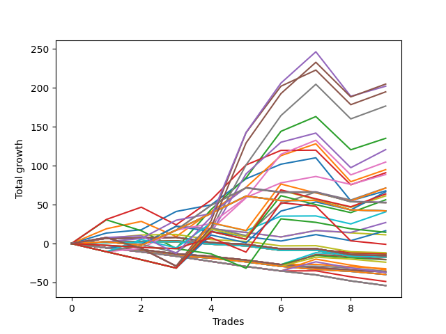

# Long Wallace 1226_003 
- Symbol: NQ
- Date Range: 03/18/2022 - 06/17/2022
- Trading Period: 7:20-12:30
- Number of Trades: 9



| Name | Win Percent | Profit | Avg Profit / Trade |     | Name | Win Percent | Profit | Avg Profit / Trade |
| ---- | ----------- | ------ | ------------------ | --- | ---- | ----------- | ------ | ------------------ |
| Sorted By <br> Profit | | | | | Sorted By <br> Win Percentage ||||
| Seventy-Five | 66.67 | 102500.00 | 11388.89 |     | Zero | 88.89 | 33875.00 | 3763.89 |
| Seventy-Four | 77.78 | 101125.00 | 11236.11 |     | Seventy-Four | 77.78 | 101125.00 | 11236.11 |
| Five | 66.67 | 97500.00 | 10833.33 |     | One | 77.78 | 47500.00 | 5277.78 |
| Seven | 66.67 | 88375.00 | 9819.44 |     | Three | 77.78 | 45500.00 | 5055.56 |
| Two | 66.67 | 67625.00 | 7513.89 |     | Fifty-Six | 77.78 | 44375.00 | 4930.56 |
| Four | 66.67 | 60375.00 | 6708.33 |     | Seventy-Five | 66.67 | 102500.00 | 11388.89 |
| Six | 66.67 | 52375.00 | 5819.44 |     | Five | 66.67 | 97500.00 | 10833.33 |
| One | 77.78 | 47500.00 | 5277.78 |     | Seven | 66.67 | 88375.00 | 9819.44 |
| Three | 77.78 | 45500.00 | 5055.56 |     | Two | 66.67 | 67625.00 | 7513.89 |
| Fifty-Six | 77.78 | 44375.00 | 4930.56 |     | Four | 66.67 | 60375.00 | 6708.33 |
| Fifty-Seven | 55.56 | 35750.00 | 3972.22 |     | Six | 66.67 | 52375.00 | 5819.44 |
| Sixty-One | 33.33 | 35625.00 | 3958.33 |     | Sixty-Four | 66.67 | 26500.00 | 2944.44 |
| Zero | 88.89 | 33875.00 | 3763.89 |     | Fifty-Seven | 55.56 | 35750.00 | 3972.22 |
| Sixty | 44.44 | 33250.00 | 3694.44 |     | Sixty-Seven | 55.56 | 26250.00 | 2916.67 |
| Sixty-Three | 33.33 | 31875.00 | 3541.67 |     | Sixty-Five | 55.56 | 26250.00 | 2916.67 |
| Fifty-Eight | 33.33 | 30625.00 | 3402.78 |     | Seventy-One | 55.56 | 21000.00 | 2333.33 |
| Sixty-Two | 33.33 | 28125.00 | 3125.00 |     | Seventy | 55.56 | 21000.00 | 2333.33 |
| Sixty-Four | 66.67 | 26500.00 | 2944.44 |     | Sixty-Nine | 55.56 | 21000.00 | 2333.33 |
| Sixty-Seven | 55.56 | 26250.00 | 2916.67 |     | Sixty-Eight | 55.56 | 21000.00 | 2333.33 |
| Sixty-Five | 55.56 | 26250.00 | 2916.67 |     | Sixty-Six | 55.56 | 21000.00 | 2333.33 |
| Seventy-One | 55.56 | 21000.00 | 2333.33 |     | Fifty-Nine | 55.56 | 20375.00 | 2263.89 |
| Seventy | 55.56 | 21000.00 | 2333.33 |     | Sixty | 44.44 | 33250.00 | 3694.44 |
| Sixty-Nine | 55.56 | 21000.00 | 2333.33 |     | Twenty-Four | 44.44 | 13500.00 | 1500.00 |
| Sixty-Eight | 55.56 | 21000.00 | 2333.33 |     | Forty | 44.44 | 8250.00 | 916.67 |
| Sixty-Six | 55.56 | 21000.00 | 2333.33 |     | Forty-Eight | 44.44 | -5875.00 | -652.78 |
| Fifty-Nine | 55.56 | 20375.00 | 2263.89 |     | Twenty-Three | 44.44 | -6500.00 | -722.22 |
| Twenty-Four | 44.44 | 13500.00 | 1500.00 |     | Twenty-Two | 44.44 | -6500.00 | -722.22 |
| Forty | 44.44 | 8250.00 | 916.67 |     | Twenty-One | 44.44 | -6500.00 | -722.22 |
| Seventy-Two | 11.11 | 7250.00 | 805.56 |     | Twenty | 44.44 | -6500.00 | -722.22 |
| Eight | 33.33 | 5625.00 | 625.00 |     | Nineteen | 44.44 | -6500.00 | -722.22 |
| Seventy-Three | 22.22 | -500.00 | -55.56 |     | Eighteen | 44.44 | -6500.00 | -722.22 |
| Forty-Eight | 44.44 | -5875.00 | -652.78 |     | Seventeen | 44.44 | -6500.00 | -722.22 |
| Twenty-Three | 44.44 | -6500.00 | -722.22 |     | Sixten | 44.44 | -6500.00 | -722.22 |
| Twenty-Two | 44.44 | -6500.00 | -722.22 |     | Fifty-Five | 44.44 | -7750.00 | -861.11 |
| Twenty-One | 44.44 | -6500.00 | -722.22 |     | Fifty-Four | 44.44 | -7750.00 | -861.11 |
| Twenty | 44.44 | -6500.00 | -722.22 |     | Fifty-Three | 44.44 | -7750.00 | -861.11 |
| Nineteen | 44.44 | -6500.00 | -722.22 |     | Fifty-Two | 44.44 | -7750.00 | -861.11 |
| Eighteen | 44.44 | -6500.00 | -722.22 |     | Fifty-One | 44.44 | -7750.00 | -861.11 |
| Seventeen | 44.44 | -6500.00 | -722.22 |     | Fifty | 44.44 | -7750.00 | -861.11 |
| Sixten | 44.44 | -6500.00 | -722.22 |     | Forty-Nine | 44.44 | -7750.00 | -861.11 |
| Fifty-Five | 44.44 | -7750.00 | -861.11 |     | Thirty-Nine | 44.44 | -8750.00 | -972.22 |
| Fifty-Four | 44.44 | -7750.00 | -861.11 |     | Thirty-Eight | 44.44 | -8750.00 | -972.22 |
| Fifty-Three | 44.44 | -7750.00 | -861.11 |     | Thirty-Seven | 44.44 | -8750.00 | -972.22 |
| Fifty-Two | 44.44 | -7750.00 | -861.11 |     | Thirty-Six | 44.44 | -8750.00 | -972.22 |
| Fifty-One | 44.44 | -7750.00 | -861.11 |     | Thirty-Five | 44.44 | -8750.00 | -972.22 |
| Fifty | 44.44 | -7750.00 | -861.11 |     | Thirty-Four | 44.44 | -8750.00 | -972.22 |
| Forty-Nine | 44.44 | -7750.00 | -861.11 |     | Thirty-Three | 44.44 | -8750.00 | -972.22 |
| Nine | 11.11 | -8625.00 | -958.33 |     | Thirty-Two | 44.44 | -8750.00 | -972.22 |
| Thirty-Nine | 44.44 | -8750.00 | -972.22 |     | Sixty-One | 33.33 | 35625.00 | 3958.33 |
| Thirty-Eight | 44.44 | -8750.00 | -972.22 |     | Sixty-Three | 33.33 | 31875.00 | 3541.67 |
| Thirty-Seven | 44.44 | -8750.00 | -972.22 |     | Fifty-Eight | 33.33 | 30625.00 | 3402.78 |
| Thirty-Six | 44.44 | -8750.00 | -972.22 |     | Sixty-Two | 33.33 | 28125.00 | 3125.00 |
| Thirty-Five | 44.44 | -8750.00 | -972.22 |     | Eight | 33.33 | 5625.00 | 625.00 |
| Thirty-Four | 44.44 | -8750.00 | -972.22 |     | Seventy-Three | 22.22 | -500.00 | -55.56 |
| Thirty-Three | 44.44 | -8750.00 | -972.22 |     | Seventy-Two | 11.11 | 7250.00 | 805.56 |
| Thirty-Two | 44.44 | -8750.00 | -972.22 |     | Nine | 11.11 | -8625.00 | -958.33 |
| Twenty-Five | 11.11 | -10250.00 | -1138.89 |     | Twenty-Five | 11.11 | -10250.00 | -1138.89 |
| Twelve | 11.11 | -10375.00 | -1152.78 |     | Twelve | 11.11 | -10375.00 | -1152.78 |
| Twenty-Eight | 11.11 | -12000.00 | -1333.33 |     | Twenty-Eight | 11.11 | -12000.00 | -1333.33 |
| Eleven | 11.11 | -16125.00 | -1791.67 |     | Eleven | 11.11 | -16125.00 | -1791.67 |
| Forty-One | 11.11 | -16875.00 | -1875.00 |     | Forty-One | 11.11 | -16875.00 | -1875.00 |
| twenty-Seven | 11.11 | -17750.00 | -1972.22 |     | twenty-Seven | 11.11 | -17750.00 | -1972.22 |
| Fifteen | 0.00 | -18250.00 | -2027.78 |     | Forty-Four | 11.11 | -18625.00 | -2069.44 |
| Fourteen | 0.00 | -18250.00 | -2027.78 |     | Forty-Three | 11.11 | -24375.00 | -2708.33 |
| Thirteen | 0.00 | -18250.00 | -2027.78 |     | Fifteen | 0.00 | -18250.00 | -2027.78 |
| Ten | 0.00 | -18250.00 | -2027.78 |     | Fourteen | 0.00 | -18250.00 | -2027.78 |
| Forty-Four | 11.11 | -18625.00 | -2069.44 |     | Thirteen | 0.00 | -18250.00 | -2027.78 |
| Thirty-One | 0.00 | -19875.00 | -2208.33 |     | Ten | 0.00 | -18250.00 | -2027.78 |
| Thirty | 0.00 | -19875.00 | -2208.33 |     | Thirty-One | 0.00 | -19875.00 | -2208.33 |
| Twenty-Nine | 0.00 | -19875.00 | -2208.33 |     | Thirty | 0.00 | -19875.00 | -2208.33 |
| Twenty-Six | 0.00 | -19875.00 | -2208.33 |     | Twenty-Nine | 0.00 | -19875.00 | -2208.33 |
| Forty-Three | 11.11 | -24375.00 | -2708.33 |     | Twenty-Six | 0.00 | -19875.00 | -2208.33 |
| Forty-Seven | 0.00 | -27000.00 | -3000.00 |     | Forty-Seven | 0.00 | -27000.00 | -3000.00 |
| Forty-Six | 0.00 | -27000.00 | -3000.00 |     | Forty-Six | 0.00 | -27000.00 | -3000.00 |
| Forty-Five | 0.00 | -27000.00 | -3000.00 |     | Forty-Five | 0.00 | -27000.00 | -3000.00 |
| Forty-Two | 0.00 | -27000.00 | -3000.00 |     | Forty-Two | 0.00 | -27000.00 | -3000.00 |

## NO STOPLOSS

### Test Zero
* Sell when price hits the middle line of the 20p bollinger
* No Stoploss
* Results:
```
Total Trades: 9
Percent Up: 88.89
Percent Down: 11.11
Total Points Moved Up: 67.75
Potential Profit: 33875.00
Total Points Ups: 123.00 Count Ups: 8
Total Points Downs: -55.25 Count Downs: 1
```

<details><summary>Trades</summary>

<code>In: 2022-03-25 08:30:00		Out: 2022-03-25 08:36:55		Total Position Time: 06:55		Total Move Up: 13.50		Total to Date: 13.50</code> <br />
<code>In: 2022-03-31 09:37:00		Out: 2022-03-31 09:37:45		Total Position Time: 00:45		Total Move Up: 4.25		Total to Date: 17.75</code> <br />
<code>In: 2022-04-11 07:31:00		Out: 2022-04-11 07:34:10		Total Position Time: 03:10		Total Move Up: 23.50		Total to Date: 41.25</code> <br />
<code>In: 2022-04-20 11:58:00		Out: 2022-04-20 12:00:15		Total Position Time: 02:15		Total Move Up: 8.50		Total to Date: 49.75</code> <br />
<code>In: 2022-05-17 11:25:00		Out: 2022-05-17 11:27:30		Total Position Time: 02:30		Total Move Up: 33.50		Total to Date: 83.25</code> <br />
<code>In: 2022-05-19 10:52:00		Out: 2022-05-19 10:52:55		Total Position Time: 00:55		Total Move Up: 18.75		Total to Date: 102.00</code> <br />
<code>In: 2022-05-25 10:15:00		Out: 2022-05-25 10:15:25		Total Position Time: 00:25		Total Move Up: 8.25		Total to Date: 110.25</code> <br />
<code>In: 2022-06-08 09:30:00		Out: 2022-06-08 09:54:10		Total Position Time: 24:10		Total Move Up: -55.25		Total to Date: 55.00</code> <br />
<code>In: 2022-06-09 08:10:00		Out: 2022-06-09 08:11:10		Total Position Time: 01:10		Total Move Up: 12.75		Total to Date: 67.75</code> <br />


</details>

### Test One
* Sell when the price hits the upper line of the 20p 1std bollinger
* No Stoploss
* Results:
```
Total Trades: 9
Percent Up: 77.78
Percent Down: 22.22
Total Points Moved Up: 95.00
Potential Profit: 47500.00
Total Points Ups: 163.25 Count Ups: 7
Total Points Downs: -68.25 Count Downs: 2
```

<details><summary>Trades</summary>

<code>In: 2022-03-25 08:30:00		Out: 2022-03-25 08:41:20		Total Position Time: 11:20		Total Move Up: 19.00		Total to Date: 19.00</code> <br />
<code>In: 2022-03-31 09:37:00		Out: 2022-03-31 09:40:45		Total Position Time: 03:45		Total Move Up: 9.50		Total to Date: 28.50</code> <br />
<code>In: 2022-04-11 07:31:00		Out: 2022-04-11 07:57:05		Total Position Time: 26:05		Total Move Up: -19.50		Total to Date: 9.00</code> <br />
<code>In: 2022-04-20 11:58:00		Out: 2022-04-20 12:01:20		Total Position Time: 03:20		Total Move Up: 32.00		Total to Date: 41.00</code> <br />
<code>In: 2022-05-17 11:25:00		Out: 2022-05-17 11:39:45		Total Position Time: 14:45		Total Move Up: 31.25		Total to Date: 72.25</code> <br />
<code>In: 2022-05-19 10:52:00		Out: 2022-05-19 10:55:05		Total Position Time: 03:05		Total Move Up: 40.75		Total to Date: 113.00</code> <br />
<code>In: 2022-05-25 10:15:00		Out: 2022-05-25 10:16:25		Total Position Time: 01:25		Total Move Up: 15.25		Total to Date: 128.25</code> <br />
<code>In: 2022-06-08 09:30:00		Out: 2022-06-08 09:57:05		Total Position Time: 27:05		Total Move Up: -48.75		Total to Date: 79.50</code> <br />
<code>In: 2022-06-09 08:10:00		Out: 2022-06-09 08:22:35		Total Position Time: 12:35		Total Move Up: 15.50		Total to Date: 95.00</code> <br />


</details>

### Test Two
* Sell when the price hits the upper line of the 20p 2std bollinger
* No Stoploss
* Results:
```
Total Trades: 9
Percent Up: 66.67
Percent Down: 33.33
Total Points Moved Up: 135.25
Potential Profit: 67625.00
Total Points Ups: 214.75 Count Ups: 6
Total Points Downs: -79.50 Count Downs: 3
```

<details><summary>Trades</summary>

<code>In: 2022-03-25 08:30:00		Out: 2022-03-25 08:42:45		Total Position Time: 12:45		Total Move Up: 30.50		Total to Date: 30.50</code> <br />
<code>In: 2022-03-31 09:37:00		Out: 2022-03-31 10:06:55		Total Position Time: 29:55		Total Move Up: -14.00		Total to Date: 16.50</code> <br />
<code>In: 2022-04-11 07:31:00		Out: 2022-04-11 08:00:55		Total Position Time: 29:55		Total Move Up: -22.75		Total to Date: -6.25</code> <br />
<code>In: 2022-04-20 11:58:00		Out: 2022-04-20 12:13:50		Total Position Time: 15:50		Total Move Up: 50.00		Total to Date: 43.75</code> <br />
<code>In: 2022-05-17 11:25:00		Out: 2022-05-17 11:40:00		Total Position Time: 15:00		Total Move Up: 40.75		Total to Date: 84.50</code> <br />
<code>In: 2022-05-19 10:52:00		Out: 2022-05-19 10:55:25		Total Position Time: 03:25		Total Move Up: 59.75		Total to Date: 144.25</code> <br />
<code>In: 2022-05-25 10:15:00		Out: 2022-05-25 10:29:40		Total Position Time: 14:40		Total Move Up: 19.00		Total to Date: 163.25</code> <br />
<code>In: 2022-06-08 09:30:00		Out: 2022-06-08 09:59:15		Total Position Time: 29:15		Total Move Up: -42.75		Total to Date: 120.50</code> <br />
<code>In: 2022-06-09 08:10:00		Out: 2022-06-09 08:33:20		Total Position Time: 23:20		Total Move Up: 14.75		Total to Date: 135.25</code> <br />


</details>

### Test Three
* Sell when price hits the middle line of the 50p bollinger
* No Stoploss
* Results:
```
Total Trades: 9
Percent Up: 77.78
Percent Down: 22.22
Total Points Moved Up: 91.00
Potential Profit: 45500.00
Total Points Ups: 158.25 Count Ups: 7
Total Points Downs: -67.25 Count Downs: 2
```

<details><summary>Trades</summary>

<code>In: 2022-03-25 08:30:00		Out: 2022-03-25 08:53:15		Total Position Time: 23:15		Total Move Up: 31.00		Total to Date: 31.00</code> <br />
<code>In: 2022-03-31 09:37:00		Out: 2022-03-31 09:45:40		Total Position Time: 08:40		Total Move Up: 15.75		Total to Date: 46.75</code> <br />
<code>In: 2022-04-11 07:31:00		Out: 2022-04-11 08:00:55		Total Position Time: 29:55		Total Move Up: -22.75		Total to Date: 24.00</code> <br />
<code>In: 2022-04-20 11:58:00		Out: 2022-04-20 12:01:20		Total Position Time: 03:20		Total Move Up: 32.00		Total to Date: 56.00</code> <br />
<code>In: 2022-05-17 11:25:00		Out: 2022-05-17 11:40:05		Total Position Time: 15:05		Total Move Up: 45.00		Total to Date: 101.00</code> <br />
<code>In: 2022-05-19 10:52:00		Out: 2022-05-19 10:52:55		Total Position Time: 00:55		Total Move Up: 18.75		Total to Date: 119.75</code> <br />
<code>In: 2022-05-25 10:15:00		Out: 2022-05-25 10:15:10		Total Position Time: 00:10		Total Move Up: 0.25		Total to Date: 120.00</code> <br />
<code>In: 2022-06-08 09:30:00		Out: 2022-06-08 09:59:55		Total Position Time: 29:55		Total Move Up: -44.50		Total to Date: 75.50</code> <br />
<code>In: 2022-06-09 08:10:00		Out: 2022-06-09 08:33:10		Total Position Time: 23:10		Total Move Up: 15.50		Total to Date: 91.00</code> <br />


</details>

### Test Four
* Sell when the price hits the upper line of the 50p 1std bollinger
* No Stoploss
* Results:
```
Total Trades: 9
Percent Up: 66.67
Percent Down: 33.33
Total Points Moved Up: 120.75
Potential Profit: 60375.00
Total Points Ups: 202.00 Count Ups: 6
Total Points Downs: -81.25 Count Downs: 3
```

<details><summary>Trades</summary>

<code>In: 2022-03-25 08:30:00		Out: 2022-03-25 08:59:55		Total Position Time: 29:55		Total Move Up: 7.75		Total to Date: 7.75</code> <br />
<code>In: 2022-03-31 09:37:00		Out: 2022-03-31 10:06:55		Total Position Time: 29:55		Total Move Up: -14.00		Total to Date: -6.25</code> <br />
<code>In: 2022-04-11 07:31:00		Out: 2022-04-11 08:00:55		Total Position Time: 29:55		Total Move Up: -22.75		Total to Date: -29.00</code> <br />
<code>In: 2022-04-20 11:58:00		Out: 2022-04-20 12:12:55		Total Position Time: 14:55		Total Move Up: 42.50		Total to Date: 13.50</code> <br />
<code>In: 2022-05-17 11:25:00		Out: 2022-05-17 11:45:45		Total Position Time: 20:45		Total Move Up: 76.00		Total to Date: 89.50</code> <br />
<code>In: 2022-05-19 10:52:00		Out: 2022-05-19 10:55:05		Total Position Time: 03:05		Total Move Up: 40.75		Total to Date: 130.25</code> <br />
<code>In: 2022-05-25 10:15:00		Out: 2022-05-25 10:15:55		Total Position Time: 00:55		Total Move Up: 11.75		Total to Date: 142.00</code> <br />
<code>In: 2022-06-08 09:30:00		Out: 2022-06-08 09:59:55		Total Position Time: 29:55		Total Move Up: -44.50		Total to Date: 97.50</code> <br />
<code>In: 2022-06-09 08:10:00		Out: 2022-06-09 08:39:45		Total Position Time: 29:45		Total Move Up: 23.25		Total to Date: 120.75</code> <br />


</details>

### Test Five
* Sell when the price hits the upper line of the 50p 2std bollinger
* No Stoploss
* Results:
```
Total Trades: 9
Percent Up: 66.67
Percent Down: 33.33
Total Points Moved Up: 195.00
Potential Profit: 97500.00
Total Points Ups: 276.25 Count Ups: 6
Total Points Downs: -81.25 Count Downs: 3
```

<details><summary>Trades</summary>

<code>In: 2022-03-25 08:30:00		Out: 2022-03-25 08:59:55		Total Position Time: 29:55		Total Move Up: 7.75		Total to Date: 7.75</code> <br />
<code>In: 2022-03-31 09:37:00		Out: 2022-03-31 10:06:55		Total Position Time: 29:55		Total Move Up: -14.00		Total to Date: -6.25</code> <br />
<code>In: 2022-04-11 07:31:00		Out: 2022-04-11 08:00:55		Total Position Time: 29:55		Total Move Up: -22.75		Total to Date: -29.00</code> <br />
<code>In: 2022-04-20 11:58:00		Out: 2022-04-20 12:26:15		Total Position Time: 28:15		Total Move Up: 58.25		Total to Date: 29.25</code> <br />
<code>In: 2022-05-17 11:25:00		Out: 2022-05-17 11:48:45		Total Position Time: 23:45		Total Move Up: 113.25		Total to Date: 142.50</code> <br />
<code>In: 2022-05-19 10:52:00		Out: 2022-05-19 10:55:25		Total Position Time: 03:25		Total Move Up: 59.75		Total to Date: 202.25</code> <br />
<code>In: 2022-05-25 10:15:00		Out: 2022-05-25 10:29:45		Total Position Time: 14:45		Total Move Up: 20.75		Total to Date: 223.00</code> <br />
<code>In: 2022-06-08 09:30:00		Out: 2022-06-08 09:59:55		Total Position Time: 29:55		Total Move Up: -44.50		Total to Date: 178.50</code> <br />
<code>In: 2022-06-09 08:10:00		Out: 2022-06-09 08:39:55		Total Position Time: 29:55		Total Move Up: 16.50		Total to Date: 195.00</code> <br />


</details>

### Test Six
* Sell when the price hits the middle line of the 1std VWAP
* No Stoploss
* Results:
```
Total Trades: 9
Percent Up: 66.67
Percent Down: 33.33
Total Points Moved Up: 104.75
Potential Profit: 52375.00
Total Points Ups: 186.00 Count Ups: 6
Total Points Downs: -81.25 Count Downs: 3
```

<details><summary>Trades</summary>

<code>In: 2022-03-25 08:30:00		Out: 2022-03-25 08:59:55		Total Position Time: 29:55		Total Move Up: 7.75		Total to Date: 7.75</code> <br />
<code>In: 2022-03-31 09:37:00		Out: 2022-03-31 10:06:55		Total Position Time: 29:55		Total Move Up: -14.00		Total to Date: -6.25</code> <br />
<code>In: 2022-04-11 07:31:00		Out: 2022-04-11 08:00:55		Total Position Time: 29:55		Total Move Up: -22.75		Total to Date: -29.00</code> <br />
<code>In: 2022-04-20 11:58:00		Out: 2022-04-20 12:27:55		Total Position Time: 29:55		Total Move Up: 47.00		Total to Date: 18.00</code> <br />
<code>In: 2022-05-17 11:25:00		Out: 2022-05-17 11:40:00		Total Position Time: 15:00		Total Move Up: 40.75		Total to Date: 58.75</code> <br />
<code>In: 2022-05-19 10:52:00		Out: 2022-05-19 10:55:20		Total Position Time: 03:20		Total Move Up: 56.00		Total to Date: 114.75</code> <br />
<code>In: 2022-05-25 10:15:00		Out: 2022-05-25 10:29:35		Total Position Time: 14:35		Total Move Up: 18.00		Total to Date: 132.75</code> <br />
<code>In: 2022-06-08 09:30:00		Out: 2022-06-08 09:59:55		Total Position Time: 29:55		Total Move Up: -44.50		Total to Date: 88.25</code> <br />
<code>In: 2022-06-09 08:10:00		Out: 2022-06-09 08:39:55		Total Position Time: 29:55		Total Move Up: 16.50		Total to Date: 104.75</code> <br />


</details>

### Test Seven
* Sell when the price hits the upper line of the 1std VWAP
* No Stoploss
* Results:
```
Total Trades: 9
Percent Up: 66.67
Percent Down: 33.33
Total Points Moved Up: 176.75
Potential Profit: 88375.00
Total Points Ups: 258.00 Count Ups: 6
Total Points Downs: -81.25 Count Downs: 3
```

<details><summary>Trades</summary>

<code>In: 2022-03-25 08:30:00		Out: 2022-03-25 08:59:55		Total Position Time: 29:55		Total Move Up: 7.75		Total to Date: 7.75</code> <br />
<code>In: 2022-03-31 09:37:00		Out: 2022-03-31 10:06:55		Total Position Time: 29:55		Total Move Up: -14.00		Total to Date: -6.25</code> <br />
<code>In: 2022-04-11 07:31:00		Out: 2022-04-11 08:00:55		Total Position Time: 29:55		Total Move Up: -22.75		Total to Date: -29.00</code> <br />
<code>In: 2022-04-20 11:58:00		Out: 2022-04-20 12:27:55		Total Position Time: 29:55		Total Move Up: 47.00		Total to Date: 18.00</code> <br />
<code>In: 2022-05-17 11:25:00		Out: 2022-05-17 11:47:10		Total Position Time: 22:10		Total Move Up: 83.00		Total to Date: 101.00</code> <br />
<code>In: 2022-05-19 10:52:00		Out: 2022-05-19 11:21:55		Total Position Time: 29:55		Total Move Up: 63.50		Total to Date: 164.50</code> <br />
<code>In: 2022-05-25 10:15:00		Out: 2022-05-25 10:44:55		Total Position Time: 29:55		Total Move Up: 40.25		Total to Date: 204.75</code> <br />
<code>In: 2022-06-08 09:30:00		Out: 2022-06-08 09:59:55		Total Position Time: 29:55		Total Move Up: -44.50		Total to Date: 160.25</code> <br />
<code>In: 2022-06-09 08:10:00		Out: 2022-06-09 08:39:55		Total Position Time: 29:55		Total Move Up: 16.50		Total to Date: 176.75</code> <br />


</details>

## STOPLOSS OF 2

### Test Eight
* Sell when price hits the middle line of the 20p bollinger
* Stoploss is 2 points
* Results:
```
Total Trades: 9
Percent Up: 33.33
Percent Down: 66.67
Total Points Moved Up: 11.25
Potential Profit: 5625.00
Total Points Ups: 36.00 Count Ups: 3
Total Points Downs: -24.75 Count Downs: 6
```

<details><summary>Trades</summary>

<code>In: 2022-03-25 08:30:00		Out: 2022-03-25 08:31:35		Total Position Time: 01:35		Total Move Up: -5.50		Total to Date: -5.50</code> <br />
<code>In: 2022-03-31 09:37:00		Out: 2022-03-31 09:37:45		Total Position Time: 00:45		Total Move Up: 4.25		Total to Date: -1.25</code> <br />
<code>In: 2022-04-11 07:31:00		Out: 2022-04-11 07:34:10		Total Position Time: 03:10		Total Move Up: 23.50		Total to Date: 22.25</code> <br />
<code>In: 2022-04-20 11:58:00		Out: 2022-04-20 11:58:25		Total Position Time: 00:25		Total Move Up: -3.25		Total to Date: 19.00</code> <br />
<code>In: 2022-05-17 11:25:00		Out: 2022-05-17 11:25:30		Total Position Time: 00:30		Total Move Up: -4.75		Total to Date: 14.25</code> <br />
<code>In: 2022-05-19 10:52:00		Out: 2022-05-19 10:52:10		Total Position Time: 00:10		Total Move Up: -5.75		Total to Date: 8.50</code> <br />
<code>In: 2022-05-25 10:15:00		Out: 2022-05-25 10:15:25		Total Position Time: 00:25		Total Move Up: 8.25		Total to Date: 16.75</code> <br />
<code>In: 2022-06-08 09:30:00		Out: 2022-06-08 09:30:10		Total Position Time: 00:10		Total Move Up: -3.00		Total to Date: 13.75</code> <br />
<code>In: 2022-06-09 08:10:00		Out: 2022-06-09 08:10:15		Total Position Time: 00:15		Total Move Up: -2.50		Total to Date: 11.25</code> <br />


</details>

### Test Nine
* Sell when the price hits the upper line of the 20p 1std bollinger
* Stoploss is 2 points
* Results:
```
Total Trades: 9
Percent Up: 11.11
Percent Down: 88.89
Total Points Moved Up: -17.25
Potential Profit: -8625.00
Total Points Ups: 15.25 Count Ups: 1
Total Points Downs: -32.50 Count Downs: 8
```

<details><summary>Trades</summary>

<code>In: 2022-03-25 08:30:00		Out: 2022-03-25 08:31:35		Total Position Time: 01:35		Total Move Up: -5.50		Total to Date: -5.50</code> <br />
<code>In: 2022-03-31 09:37:00		Out: 2022-03-31 09:38:55		Total Position Time: 01:55		Total Move Up: -2.25		Total to Date: -7.75</code> <br />
<code>In: 2022-04-11 07:31:00		Out: 2022-04-11 07:38:00		Total Position Time: 07:00		Total Move Up: -5.50		Total to Date: -13.25</code> <br />
<code>In: 2022-04-20 11:58:00		Out: 2022-04-20 11:58:25		Total Position Time: 00:25		Total Move Up: -3.25		Total to Date: -16.50</code> <br />
<code>In: 2022-05-17 11:25:00		Out: 2022-05-17 11:25:30		Total Position Time: 00:30		Total Move Up: -4.75		Total to Date: -21.25</code> <br />
<code>In: 2022-05-19 10:52:00		Out: 2022-05-19 10:52:10		Total Position Time: 00:10		Total Move Up: -5.75		Total to Date: -27.00</code> <br />
<code>In: 2022-05-25 10:15:00		Out: 2022-05-25 10:16:25		Total Position Time: 01:25		Total Move Up: 15.25		Total to Date: -11.75</code> <br />
<code>In: 2022-06-08 09:30:00		Out: 2022-06-08 09:30:10		Total Position Time: 00:10		Total Move Up: -3.00		Total to Date: -14.75</code> <br />
<code>In: 2022-06-09 08:10:00		Out: 2022-06-09 08:10:15		Total Position Time: 00:15		Total Move Up: -2.50		Total to Date: -17.25</code> <br />


</details>

### Test Ten
* Sell when the price hits the upper line of the 20p 2std bollinger
* Stoploss is 2 points
* Results:
```
Total Trades: 9
Percent Up: 0.00
Percent Down: 100.00
Total Points Moved Up: -36.50
Potential Profit: -18250.00
Total Points Ups: 0.00 Count Ups: 0
Total Points Downs: -36.50 Count Downs: 9
```

<details><summary>Trades</summary>

<code>In: 2022-03-25 08:30:00		Out: 2022-03-25 08:31:35		Total Position Time: 01:35		Total Move Up: -5.50		Total to Date: -5.50</code> <br />
<code>In: 2022-03-31 09:37:00		Out: 2022-03-31 09:38:55		Total Position Time: 01:55		Total Move Up: -2.25		Total to Date: -7.75</code> <br />
<code>In: 2022-04-11 07:31:00		Out: 2022-04-11 07:38:00		Total Position Time: 07:00		Total Move Up: -5.50		Total to Date: -13.25</code> <br />
<code>In: 2022-04-20 11:58:00		Out: 2022-04-20 11:58:25		Total Position Time: 00:25		Total Move Up: -3.25		Total to Date: -16.50</code> <br />
<code>In: 2022-05-17 11:25:00		Out: 2022-05-17 11:25:30		Total Position Time: 00:30		Total Move Up: -4.75		Total to Date: -21.25</code> <br />
<code>In: 2022-05-19 10:52:00		Out: 2022-05-19 10:52:10		Total Position Time: 00:10		Total Move Up: -5.75		Total to Date: -27.00</code> <br />
<code>In: 2022-05-25 10:15:00		Out: 2022-05-25 10:19:40		Total Position Time: 04:40		Total Move Up: -4.00		Total to Date: -31.00</code> <br />
<code>In: 2022-06-08 09:30:00		Out: 2022-06-08 09:30:10		Total Position Time: 00:10		Total Move Up: -3.00		Total to Date: -34.00</code> <br />
<code>In: 2022-06-09 08:10:00		Out: 2022-06-09 08:10:15		Total Position Time: 00:15		Total Move Up: -2.50		Total to Date: -36.50</code> <br />


</details>

### Test Eleven
* Sell when price hits the middle line of the 50p bollinger
* Stoploss is 2 points
* Results:
```
Total Trades: 9
Percent Up: 11.11
Percent Down: 88.89
Total Points Moved Up: -32.25
Potential Profit: -16125.00
Total Points Ups: 0.25 Count Ups: 1
Total Points Downs: -32.50 Count Downs: 8
```

<details><summary>Trades</summary>

<code>In: 2022-03-25 08:30:00		Out: 2022-03-25 08:31:35		Total Position Time: 01:35		Total Move Up: -5.50		Total to Date: -5.50</code> <br />
<code>In: 2022-03-31 09:37:00		Out: 2022-03-31 09:38:55		Total Position Time: 01:55		Total Move Up: -2.25		Total to Date: -7.75</code> <br />
<code>In: 2022-04-11 07:31:00		Out: 2022-04-11 07:38:00		Total Position Time: 07:00		Total Move Up: -5.50		Total to Date: -13.25</code> <br />
<code>In: 2022-04-20 11:58:00		Out: 2022-04-20 11:58:25		Total Position Time: 00:25		Total Move Up: -3.25		Total to Date: -16.50</code> <br />
<code>In: 2022-05-17 11:25:00		Out: 2022-05-17 11:25:30		Total Position Time: 00:30		Total Move Up: -4.75		Total to Date: -21.25</code> <br />
<code>In: 2022-05-19 10:52:00		Out: 2022-05-19 10:52:10		Total Position Time: 00:10		Total Move Up: -5.75		Total to Date: -27.00</code> <br />
<code>In: 2022-05-25 10:15:00		Out: 2022-05-25 10:15:10		Total Position Time: 00:10		Total Move Up: 0.25		Total to Date: -26.75</code> <br />
<code>In: 2022-06-08 09:30:00		Out: 2022-06-08 09:30:10		Total Position Time: 00:10		Total Move Up: -3.00		Total to Date: -29.75</code> <br />
<code>In: 2022-06-09 08:10:00		Out: 2022-06-09 08:10:15		Total Position Time: 00:15		Total Move Up: -2.50		Total to Date: -32.25</code> <br />


</details>

### Test Twelve
* Sell when the price hits the upper line of the 50p 1std bollinger
* Stoploss is 2 points
* Results:
```
Total Trades: 9
Percent Up: 11.11
Percent Down: 88.89
Total Points Moved Up: -20.75
Potential Profit: -10375.00
Total Points Ups: 11.75 Count Ups: 1
Total Points Downs: -32.50 Count Downs: 8
```

<details><summary>Trades</summary>

<code>In: 2022-03-25 08:30:00		Out: 2022-03-25 08:31:35		Total Position Time: 01:35		Total Move Up: -5.50		Total to Date: -5.50</code> <br />
<code>In: 2022-03-31 09:37:00		Out: 2022-03-31 09:38:55		Total Position Time: 01:55		Total Move Up: -2.25		Total to Date: -7.75</code> <br />
<code>In: 2022-04-11 07:31:00		Out: 2022-04-11 07:38:00		Total Position Time: 07:00		Total Move Up: -5.50		Total to Date: -13.25</code> <br />
<code>In: 2022-04-20 11:58:00		Out: 2022-04-20 11:58:25		Total Position Time: 00:25		Total Move Up: -3.25		Total to Date: -16.50</code> <br />
<code>In: 2022-05-17 11:25:00		Out: 2022-05-17 11:25:30		Total Position Time: 00:30		Total Move Up: -4.75		Total to Date: -21.25</code> <br />
<code>In: 2022-05-19 10:52:00		Out: 2022-05-19 10:52:10		Total Position Time: 00:10		Total Move Up: -5.75		Total to Date: -27.00</code> <br />
<code>In: 2022-05-25 10:15:00		Out: 2022-05-25 10:15:55		Total Position Time: 00:55		Total Move Up: 11.75		Total to Date: -15.25</code> <br />
<code>In: 2022-06-08 09:30:00		Out: 2022-06-08 09:30:10		Total Position Time: 00:10		Total Move Up: -3.00		Total to Date: -18.25</code> <br />
<code>In: 2022-06-09 08:10:00		Out: 2022-06-09 08:10:15		Total Position Time: 00:15		Total Move Up: -2.50		Total to Date: -20.75</code> <br />


</details>

### Test Thirteen
* Sell when the price hits the upper line of the 50p 2std bollinger
* Stoploss is 2 points
* Results:
```
Total Trades: 9
Percent Up: 0.00
Percent Down: 100.00
Total Points Moved Up: -36.50
Potential Profit: -18250.00
Total Points Ups: 0.00 Count Ups: 0
Total Points Downs: -36.50 Count Downs: 9
```

<details><summary>Trades</summary>

<code>In: 2022-03-25 08:30:00		Out: 2022-03-25 08:31:35		Total Position Time: 01:35		Total Move Up: -5.50		Total to Date: -5.50</code> <br />
<code>In: 2022-03-31 09:37:00		Out: 2022-03-31 09:38:55		Total Position Time: 01:55		Total Move Up: -2.25		Total to Date: -7.75</code> <br />
<code>In: 2022-04-11 07:31:00		Out: 2022-04-11 07:38:00		Total Position Time: 07:00		Total Move Up: -5.50		Total to Date: -13.25</code> <br />
<code>In: 2022-04-20 11:58:00		Out: 2022-04-20 11:58:25		Total Position Time: 00:25		Total Move Up: -3.25		Total to Date: -16.50</code> <br />
<code>In: 2022-05-17 11:25:00		Out: 2022-05-17 11:25:30		Total Position Time: 00:30		Total Move Up: -4.75		Total to Date: -21.25</code> <br />
<code>In: 2022-05-19 10:52:00		Out: 2022-05-19 10:52:10		Total Position Time: 00:10		Total Move Up: -5.75		Total to Date: -27.00</code> <br />
<code>In: 2022-05-25 10:15:00		Out: 2022-05-25 10:19:40		Total Position Time: 04:40		Total Move Up: -4.00		Total to Date: -31.00</code> <br />
<code>In: 2022-06-08 09:30:00		Out: 2022-06-08 09:30:10		Total Position Time: 00:10		Total Move Up: -3.00		Total to Date: -34.00</code> <br />
<code>In: 2022-06-09 08:10:00		Out: 2022-06-09 08:10:15		Total Position Time: 00:15		Total Move Up: -2.50		Total to Date: -36.50</code> <br />


</details>

### Test Fourteen
* Sell when the price hits the middle line of the 1std VWAP
* Stoploss is 2 points
* Results:
```
Total Trades: 9
Percent Up: 0.00
Percent Down: 100.00
Total Points Moved Up: -36.50
Potential Profit: -18250.00
Total Points Ups: 0.00 Count Ups: 0
Total Points Downs: -36.50 Count Downs: 9
```

<details><summary>Trades</summary>

<code>In: 2022-03-25 08:30:00		Out: 2022-03-25 08:31:35		Total Position Time: 01:35		Total Move Up: -5.50		Total to Date: -5.50</code> <br />
<code>In: 2022-03-31 09:37:00		Out: 2022-03-31 09:38:55		Total Position Time: 01:55		Total Move Up: -2.25		Total to Date: -7.75</code> <br />
<code>In: 2022-04-11 07:31:00		Out: 2022-04-11 07:38:00		Total Position Time: 07:00		Total Move Up: -5.50		Total to Date: -13.25</code> <br />
<code>In: 2022-04-20 11:58:00		Out: 2022-04-20 11:58:25		Total Position Time: 00:25		Total Move Up: -3.25		Total to Date: -16.50</code> <br />
<code>In: 2022-05-17 11:25:00		Out: 2022-05-17 11:25:30		Total Position Time: 00:30		Total Move Up: -4.75		Total to Date: -21.25</code> <br />
<code>In: 2022-05-19 10:52:00		Out: 2022-05-19 10:52:10		Total Position Time: 00:10		Total Move Up: -5.75		Total to Date: -27.00</code> <br />
<code>In: 2022-05-25 10:15:00		Out: 2022-05-25 10:19:40		Total Position Time: 04:40		Total Move Up: -4.00		Total to Date: -31.00</code> <br />
<code>In: 2022-06-08 09:30:00		Out: 2022-06-08 09:30:10		Total Position Time: 00:10		Total Move Up: -3.00		Total to Date: -34.00</code> <br />
<code>In: 2022-06-09 08:10:00		Out: 2022-06-09 08:10:15		Total Position Time: 00:15		Total Move Up: -2.50		Total to Date: -36.50</code> <br />


</details>

### Test Fifteen
* Sell when the price hits the upper line of the 1std VWAP
* Stoploss is 2 points
* Results:
```
Total Trades: 9
Percent Up: 0.00
Percent Down: 100.00
Total Points Moved Up: -36.50
Potential Profit: -18250.00
Total Points Ups: 0.00 Count Ups: 0
Total Points Downs: -36.50 Count Downs: 9
```

<details><summary>Trades</summary>

<code>In: 2022-03-25 08:30:00		Out: 2022-03-25 08:31:35		Total Position Time: 01:35		Total Move Up: -5.50		Total to Date: -5.50</code> <br />
<code>In: 2022-03-31 09:37:00		Out: 2022-03-31 09:38:55		Total Position Time: 01:55		Total Move Up: -2.25		Total to Date: -7.75</code> <br />
<code>In: 2022-04-11 07:31:00		Out: 2022-04-11 07:38:00		Total Position Time: 07:00		Total Move Up: -5.50		Total to Date: -13.25</code> <br />
<code>In: 2022-04-20 11:58:00		Out: 2022-04-20 11:58:25		Total Position Time: 00:25		Total Move Up: -3.25		Total to Date: -16.50</code> <br />
<code>In: 2022-05-17 11:25:00		Out: 2022-05-17 11:25:30		Total Position Time: 00:30		Total Move Up: -4.75		Total to Date: -21.25</code> <br />
<code>In: 2022-05-19 10:52:00		Out: 2022-05-19 10:52:10		Total Position Time: 00:10		Total Move Up: -5.75		Total to Date: -27.00</code> <br />
<code>In: 2022-05-25 10:15:00		Out: 2022-05-25 10:19:40		Total Position Time: 04:40		Total Move Up: -4.00		Total to Date: -31.00</code> <br />
<code>In: 2022-06-08 09:30:00		Out: 2022-06-08 09:30:10		Total Position Time: 00:10		Total Move Up: -3.00		Total to Date: -34.00</code> <br />
<code>In: 2022-06-09 08:10:00		Out: 2022-06-09 08:10:15		Total Position Time: 00:15		Total Move Up: -2.50		Total to Date: -36.50</code> <br />


</details>

## TRAIL STOP OF 2

### Test Sixten
* Sell when price hits the middle line of the 20p bollinger
* Trailing Stop is 2 points
* Results:
```
Total Trades: 9
Percent Up: 44.44
Percent Down: 55.56
Total Points Moved Up: -13.00
Potential Profit: -6500.00
Total Points Ups: 3.50 Count Ups: 4
Total Points Downs: -16.50 Count Downs: 5
```

<details><summary>Trades</summary>

<code>In: 2022-03-25 08:30:00		Out: 2022-03-25 08:30:10		Total Position Time: 00:10		Total Move Up: 2.00		Total to Date: 2.00</code> <br />
<code>In: 2022-03-31 09:37:00		Out: 2022-03-31 09:37:15		Total Position Time: 00:15		Total Move Up: 0.50		Total to Date: 2.50</code> <br />
<code>In: 2022-04-11 07:31:00		Out: 2022-04-11 07:31:10		Total Position Time: 00:10		Total Move Up: 0.75		Total to Date: 3.25</code> <br />
<code>In: 2022-04-20 11:58:00		Out: 2022-04-20 11:58:25		Total Position Time: 00:25		Total Move Up: -3.25		Total to Date: 0.00</code> <br />
<code>In: 2022-05-17 11:25:00		Out: 2022-05-17 11:25:25		Total Position Time: 00:25		Total Move Up: -2.25		Total to Date: -2.25</code> <br />
<code>In: 2022-05-19 10:52:00		Out: 2022-05-19 10:52:10		Total Position Time: 00:10		Total Move Up: -5.75		Total to Date: -8.00</code> <br />
<code>In: 2022-05-25 10:15:00		Out: 2022-05-25 10:15:10		Total Position Time: 00:10		Total Move Up: 0.25		Total to Date: -7.75</code> <br />
<code>In: 2022-06-08 09:30:00		Out: 2022-06-08 09:30:25		Total Position Time: 00:25		Total Move Up: -4.00		Total to Date: -11.75</code> <br />
<code>In: 2022-06-09 08:10:00		Out: 2022-06-09 08:10:10		Total Position Time: 00:10		Total Move Up: -1.25		Total to Date: -13.00</code> <br />


</details>

### Test Seventeen
* Sell when the price hits the upper line of the 20p 1std bollinger
* Trailing Stop is 2 points
* Results:
```
Total Trades: 9
Percent Up: 44.44
Percent Down: 55.56
Total Points Moved Up: -13.00
Potential Profit: -6500.00
Total Points Ups: 3.50 Count Ups: 4
Total Points Downs: -16.50 Count Downs: 5
```

<details><summary>Trades</summary>

<code>In: 2022-03-25 08:30:00		Out: 2022-03-25 08:30:10		Total Position Time: 00:10		Total Move Up: 2.00		Total to Date: 2.00</code> <br />
<code>In: 2022-03-31 09:37:00		Out: 2022-03-31 09:37:15		Total Position Time: 00:15		Total Move Up: 0.50		Total to Date: 2.50</code> <br />
<code>In: 2022-04-11 07:31:00		Out: 2022-04-11 07:31:10		Total Position Time: 00:10		Total Move Up: 0.75		Total to Date: 3.25</code> <br />
<code>In: 2022-04-20 11:58:00		Out: 2022-04-20 11:58:25		Total Position Time: 00:25		Total Move Up: -3.25		Total to Date: 0.00</code> <br />
<code>In: 2022-05-17 11:25:00		Out: 2022-05-17 11:25:25		Total Position Time: 00:25		Total Move Up: -2.25		Total to Date: -2.25</code> <br />
<code>In: 2022-05-19 10:52:00		Out: 2022-05-19 10:52:10		Total Position Time: 00:10		Total Move Up: -5.75		Total to Date: -8.00</code> <br />
<code>In: 2022-05-25 10:15:00		Out: 2022-05-25 10:15:10		Total Position Time: 00:10		Total Move Up: 0.25		Total to Date: -7.75</code> <br />
<code>In: 2022-06-08 09:30:00		Out: 2022-06-08 09:30:25		Total Position Time: 00:25		Total Move Up: -4.00		Total to Date: -11.75</code> <br />
<code>In: 2022-06-09 08:10:00		Out: 2022-06-09 08:10:10		Total Position Time: 00:10		Total Move Up: -1.25		Total to Date: -13.00</code> <br />


</details>

### Test Eighteen
* Sell when the price hits the upper line of the 20p 2std bollinger
* Trailing Stop is 2 points
* Results:
```
Total Trades: 9
Percent Up: 44.44
Percent Down: 55.56
Total Points Moved Up: -13.00
Potential Profit: -6500.00
Total Points Ups: 3.50 Count Ups: 4
Total Points Downs: -16.50 Count Downs: 5
```

<details><summary>Trades</summary>

<code>In: 2022-03-25 08:30:00		Out: 2022-03-25 08:30:10		Total Position Time: 00:10		Total Move Up: 2.00		Total to Date: 2.00</code> <br />
<code>In: 2022-03-31 09:37:00		Out: 2022-03-31 09:37:15		Total Position Time: 00:15		Total Move Up: 0.50		Total to Date: 2.50</code> <br />
<code>In: 2022-04-11 07:31:00		Out: 2022-04-11 07:31:10		Total Position Time: 00:10		Total Move Up: 0.75		Total to Date: 3.25</code> <br />
<code>In: 2022-04-20 11:58:00		Out: 2022-04-20 11:58:25		Total Position Time: 00:25		Total Move Up: -3.25		Total to Date: 0.00</code> <br />
<code>In: 2022-05-17 11:25:00		Out: 2022-05-17 11:25:25		Total Position Time: 00:25		Total Move Up: -2.25		Total to Date: -2.25</code> <br />
<code>In: 2022-05-19 10:52:00		Out: 2022-05-19 10:52:10		Total Position Time: 00:10		Total Move Up: -5.75		Total to Date: -8.00</code> <br />
<code>In: 2022-05-25 10:15:00		Out: 2022-05-25 10:15:10		Total Position Time: 00:10		Total Move Up: 0.25		Total to Date: -7.75</code> <br />
<code>In: 2022-06-08 09:30:00		Out: 2022-06-08 09:30:25		Total Position Time: 00:25		Total Move Up: -4.00		Total to Date: -11.75</code> <br />
<code>In: 2022-06-09 08:10:00		Out: 2022-06-09 08:10:10		Total Position Time: 00:10		Total Move Up: -1.25		Total to Date: -13.00</code> <br />


</details>

### Test Nineteen
* Sell when price hits the middle line of the 50p bollinger
* Trailing Stop is 2 points
* Results:
```
Total Trades: 9
Percent Up: 44.44
Percent Down: 55.56
Total Points Moved Up: -13.00
Potential Profit: -6500.00
Total Points Ups: 3.50 Count Ups: 4
Total Points Downs: -16.50 Count Downs: 5
```

<details><summary>Trades</summary>

<code>In: 2022-03-25 08:30:00		Out: 2022-03-25 08:30:10		Total Position Time: 00:10		Total Move Up: 2.00		Total to Date: 2.00</code> <br />
<code>In: 2022-03-31 09:37:00		Out: 2022-03-31 09:37:15		Total Position Time: 00:15		Total Move Up: 0.50		Total to Date: 2.50</code> <br />
<code>In: 2022-04-11 07:31:00		Out: 2022-04-11 07:31:10		Total Position Time: 00:10		Total Move Up: 0.75		Total to Date: 3.25</code> <br />
<code>In: 2022-04-20 11:58:00		Out: 2022-04-20 11:58:25		Total Position Time: 00:25		Total Move Up: -3.25		Total to Date: 0.00</code> <br />
<code>In: 2022-05-17 11:25:00		Out: 2022-05-17 11:25:25		Total Position Time: 00:25		Total Move Up: -2.25		Total to Date: -2.25</code> <br />
<code>In: 2022-05-19 10:52:00		Out: 2022-05-19 10:52:10		Total Position Time: 00:10		Total Move Up: -5.75		Total to Date: -8.00</code> <br />
<code>In: 2022-05-25 10:15:00		Out: 2022-05-25 10:15:10		Total Position Time: 00:10		Total Move Up: 0.25		Total to Date: -7.75</code> <br />
<code>In: 2022-06-08 09:30:00		Out: 2022-06-08 09:30:25		Total Position Time: 00:25		Total Move Up: -4.00		Total to Date: -11.75</code> <br />
<code>In: 2022-06-09 08:10:00		Out: 2022-06-09 08:10:10		Total Position Time: 00:10		Total Move Up: -1.25		Total to Date: -13.00</code> <br />


</details>

### Test Twenty
* Sell when the price hits the upper line of the 50p 1std bollinger
* Trailing Stop is 2 points
* Results:
```
Total Trades: 9
Percent Up: 44.44
Percent Down: 55.56
Total Points Moved Up: -13.00
Potential Profit: -6500.00
Total Points Ups: 3.50 Count Ups: 4
Total Points Downs: -16.50 Count Downs: 5
```

<details><summary>Trades</summary>

<code>In: 2022-03-25 08:30:00		Out: 2022-03-25 08:30:10		Total Position Time: 00:10		Total Move Up: 2.00		Total to Date: 2.00</code> <br />
<code>In: 2022-03-31 09:37:00		Out: 2022-03-31 09:37:15		Total Position Time: 00:15		Total Move Up: 0.50		Total to Date: 2.50</code> <br />
<code>In: 2022-04-11 07:31:00		Out: 2022-04-11 07:31:10		Total Position Time: 00:10		Total Move Up: 0.75		Total to Date: 3.25</code> <br />
<code>In: 2022-04-20 11:58:00		Out: 2022-04-20 11:58:25		Total Position Time: 00:25		Total Move Up: -3.25		Total to Date: 0.00</code> <br />
<code>In: 2022-05-17 11:25:00		Out: 2022-05-17 11:25:25		Total Position Time: 00:25		Total Move Up: -2.25		Total to Date: -2.25</code> <br />
<code>In: 2022-05-19 10:52:00		Out: 2022-05-19 10:52:10		Total Position Time: 00:10		Total Move Up: -5.75		Total to Date: -8.00</code> <br />
<code>In: 2022-05-25 10:15:00		Out: 2022-05-25 10:15:10		Total Position Time: 00:10		Total Move Up: 0.25		Total to Date: -7.75</code> <br />
<code>In: 2022-06-08 09:30:00		Out: 2022-06-08 09:30:25		Total Position Time: 00:25		Total Move Up: -4.00		Total to Date: -11.75</code> <br />
<code>In: 2022-06-09 08:10:00		Out: 2022-06-09 08:10:10		Total Position Time: 00:10		Total Move Up: -1.25		Total to Date: -13.00</code> <br />


</details>

### Test Twenty-One
* Sell when the price hits the upper line of the 50p 2std bollinger
* Trailing Stop is 2 points
* Results:
```
Total Trades: 9
Percent Up: 44.44
Percent Down: 55.56
Total Points Moved Up: -13.00
Potential Profit: -6500.00
Total Points Ups: 3.50 Count Ups: 4
Total Points Downs: -16.50 Count Downs: 5
```

<details><summary>Trades</summary>

<code>In: 2022-03-25 08:30:00		Out: 2022-03-25 08:30:10		Total Position Time: 00:10		Total Move Up: 2.00		Total to Date: 2.00</code> <br />
<code>In: 2022-03-31 09:37:00		Out: 2022-03-31 09:37:15		Total Position Time: 00:15		Total Move Up: 0.50		Total to Date: 2.50</code> <br />
<code>In: 2022-04-11 07:31:00		Out: 2022-04-11 07:31:10		Total Position Time: 00:10		Total Move Up: 0.75		Total to Date: 3.25</code> <br />
<code>In: 2022-04-20 11:58:00		Out: 2022-04-20 11:58:25		Total Position Time: 00:25		Total Move Up: -3.25		Total to Date: 0.00</code> <br />
<code>In: 2022-05-17 11:25:00		Out: 2022-05-17 11:25:25		Total Position Time: 00:25		Total Move Up: -2.25		Total to Date: -2.25</code> <br />
<code>In: 2022-05-19 10:52:00		Out: 2022-05-19 10:52:10		Total Position Time: 00:10		Total Move Up: -5.75		Total to Date: -8.00</code> <br />
<code>In: 2022-05-25 10:15:00		Out: 2022-05-25 10:15:10		Total Position Time: 00:10		Total Move Up: 0.25		Total to Date: -7.75</code> <br />
<code>In: 2022-06-08 09:30:00		Out: 2022-06-08 09:30:25		Total Position Time: 00:25		Total Move Up: -4.00		Total to Date: -11.75</code> <br />
<code>In: 2022-06-09 08:10:00		Out: 2022-06-09 08:10:10		Total Position Time: 00:10		Total Move Up: -1.25		Total to Date: -13.00</code> <br />


</details>

### Test Twenty-Two
* Sell when the price hits the middle line of the 1std VWAP
* Trailing Stop is 2 points
* Results:
```
Total Trades: 9
Percent Up: 44.44
Percent Down: 55.56
Total Points Moved Up: -13.00
Potential Profit: -6500.00
Total Points Ups: 3.50 Count Ups: 4
Total Points Downs: -16.50 Count Downs: 5
```

<details><summary>Trades</summary>

<code>In: 2022-03-25 08:30:00		Out: 2022-03-25 08:30:10		Total Position Time: 00:10		Total Move Up: 2.00		Total to Date: 2.00</code> <br />
<code>In: 2022-03-31 09:37:00		Out: 2022-03-31 09:37:15		Total Position Time: 00:15		Total Move Up: 0.50		Total to Date: 2.50</code> <br />
<code>In: 2022-04-11 07:31:00		Out: 2022-04-11 07:31:10		Total Position Time: 00:10		Total Move Up: 0.75		Total to Date: 3.25</code> <br />
<code>In: 2022-04-20 11:58:00		Out: 2022-04-20 11:58:25		Total Position Time: 00:25		Total Move Up: -3.25		Total to Date: 0.00</code> <br />
<code>In: 2022-05-17 11:25:00		Out: 2022-05-17 11:25:25		Total Position Time: 00:25		Total Move Up: -2.25		Total to Date: -2.25</code> <br />
<code>In: 2022-05-19 10:52:00		Out: 2022-05-19 10:52:10		Total Position Time: 00:10		Total Move Up: -5.75		Total to Date: -8.00</code> <br />
<code>In: 2022-05-25 10:15:00		Out: 2022-05-25 10:15:10		Total Position Time: 00:10		Total Move Up: 0.25		Total to Date: -7.75</code> <br />
<code>In: 2022-06-08 09:30:00		Out: 2022-06-08 09:30:25		Total Position Time: 00:25		Total Move Up: -4.00		Total to Date: -11.75</code> <br />
<code>In: 2022-06-09 08:10:00		Out: 2022-06-09 08:10:10		Total Position Time: 00:10		Total Move Up: -1.25		Total to Date: -13.00</code> <br />


</details>

### Test Twenty-Three
* Sell when the price hits the upper line of the 1std VWAP
* Trailing Stop is 2 points
* Results:
```
Total Trades: 9
Percent Up: 44.44
Percent Down: 55.56
Total Points Moved Up: -13.00
Potential Profit: -6500.00
Total Points Ups: 3.50 Count Ups: 4
Total Points Downs: -16.50 Count Downs: 5
```

<details><summary>Trades</summary>

<code>In: 2022-03-25 08:30:00		Out: 2022-03-25 08:30:10		Total Position Time: 00:10		Total Move Up: 2.00		Total to Date: 2.00</code> <br />
<code>In: 2022-03-31 09:37:00		Out: 2022-03-31 09:37:15		Total Position Time: 00:15		Total Move Up: 0.50		Total to Date: 2.50</code> <br />
<code>In: 2022-04-11 07:31:00		Out: 2022-04-11 07:31:10		Total Position Time: 00:10		Total Move Up: 0.75		Total to Date: 3.25</code> <br />
<code>In: 2022-04-20 11:58:00		Out: 2022-04-20 11:58:25		Total Position Time: 00:25		Total Move Up: -3.25		Total to Date: 0.00</code> <br />
<code>In: 2022-05-17 11:25:00		Out: 2022-05-17 11:25:25		Total Position Time: 00:25		Total Move Up: -2.25		Total to Date: -2.25</code> <br />
<code>In: 2022-05-19 10:52:00		Out: 2022-05-19 10:52:10		Total Position Time: 00:10		Total Move Up: -5.75		Total to Date: -8.00</code> <br />
<code>In: 2022-05-25 10:15:00		Out: 2022-05-25 10:15:10		Total Position Time: 00:10		Total Move Up: 0.25		Total to Date: -7.75</code> <br />
<code>In: 2022-06-08 09:30:00		Out: 2022-06-08 09:30:25		Total Position Time: 00:25		Total Move Up: -4.00		Total to Date: -11.75</code> <br />
<code>In: 2022-06-09 08:10:00		Out: 2022-06-09 08:10:10		Total Position Time: 00:10		Total Move Up: -1.25		Total to Date: -13.00</code> <br />


</details>

## STOPLOSS OF 3

### Test Twenty-Four
* Sell when price hits the middle line of the 20p bollinger
* Stoploss is 3 points
* Results:
```
Total Trades: 9
Percent Up: 44.44
Percent Down: 55.56
Total Points Moved Up: 27.00
Potential Profit: 13500.00
Total Points Ups: 48.75 Count Ups: 4
Total Points Downs: -21.75 Count Downs: 5
```

<details><summary>Trades</summary>

<code>In: 2022-03-25 08:30:00		Out: 2022-03-25 08:31:35		Total Position Time: 01:35		Total Move Up: -5.50		Total to Date: -5.50</code> <br />
<code>In: 2022-03-31 09:37:00		Out: 2022-03-31 09:37:45		Total Position Time: 00:45		Total Move Up: 4.25		Total to Date: -1.25</code> <br />
<code>In: 2022-04-11 07:31:00		Out: 2022-04-11 07:34:10		Total Position Time: 03:10		Total Move Up: 23.50		Total to Date: 22.25</code> <br />
<code>In: 2022-04-20 11:58:00		Out: 2022-04-20 11:58:25		Total Position Time: 00:25		Total Move Up: -3.25		Total to Date: 19.00</code> <br />
<code>In: 2022-05-17 11:25:00		Out: 2022-05-17 11:25:30		Total Position Time: 00:30		Total Move Up: -4.75		Total to Date: 14.25</code> <br />
<code>In: 2022-05-19 10:52:00		Out: 2022-05-19 10:52:10		Total Position Time: 00:10		Total Move Up: -5.75		Total to Date: 8.50</code> <br />
<code>In: 2022-05-25 10:15:00		Out: 2022-05-25 10:15:25		Total Position Time: 00:25		Total Move Up: 8.25		Total to Date: 16.75</code> <br />
<code>In: 2022-06-08 09:30:00		Out: 2022-06-08 09:30:20		Total Position Time: 00:20		Total Move Up: -2.50		Total to Date: 14.25</code> <br />
<code>In: 2022-06-09 08:10:00		Out: 2022-06-09 08:11:10		Total Position Time: 01:10		Total Move Up: 12.75		Total to Date: 27.00</code> <br />


</details>

### Test Twenty-Five
* Sell when the price hits the upper line of the 20p 1std bollinger
* Stoploss is 3 points
* Results:
```
Total Trades: 9
Percent Up: 11.11
Percent Down: 88.89
Total Points Moved Up: -20.50
Potential Profit: -10250.00
Total Points Ups: 15.25 Count Ups: 1
Total Points Downs: -35.75 Count Downs: 8
```

<details><summary>Trades</summary>

<code>In: 2022-03-25 08:30:00		Out: 2022-03-25 08:31:35		Total Position Time: 01:35		Total Move Up: -5.50		Total to Date: -5.50</code> <br />
<code>In: 2022-03-31 09:37:00		Out: 2022-03-31 09:39:00		Total Position Time: 02:00		Total Move Up: -4.50		Total to Date: -10.00</code> <br />
<code>In: 2022-04-11 07:31:00		Out: 2022-04-11 07:38:00		Total Position Time: 07:00		Total Move Up: -5.50		Total to Date: -15.50</code> <br />
<code>In: 2022-04-20 11:58:00		Out: 2022-04-20 11:58:25		Total Position Time: 00:25		Total Move Up: -3.25		Total to Date: -18.75</code> <br />
<code>In: 2022-05-17 11:25:00		Out: 2022-05-17 11:25:30		Total Position Time: 00:30		Total Move Up: -4.75		Total to Date: -23.50</code> <br />
<code>In: 2022-05-19 10:52:00		Out: 2022-05-19 10:52:10		Total Position Time: 00:10		Total Move Up: -5.75		Total to Date: -29.25</code> <br />
<code>In: 2022-05-25 10:15:00		Out: 2022-05-25 10:16:25		Total Position Time: 01:25		Total Move Up: 15.25		Total to Date: -14.00</code> <br />
<code>In: 2022-06-08 09:30:00		Out: 2022-06-08 09:30:20		Total Position Time: 00:20		Total Move Up: -2.50		Total to Date: -16.50</code> <br />
<code>In: 2022-06-09 08:10:00		Out: 2022-06-09 08:18:40		Total Position Time: 08:40		Total Move Up: -4.00		Total to Date: -20.50</code> <br />


</details>

### Test Twenty-Six
* Sell when the price hits the upper line of the 20p 2std bollinger
* Stoploss is 3 points
* Results:
```
Total Trades: 9
Percent Up: 0.00
Percent Down: 100.00
Total Points Moved Up: -39.75
Potential Profit: -19875.00
Total Points Ups: 0.00 Count Ups: 0
Total Points Downs: -39.75 Count Downs: 9
```

<details><summary>Trades</summary>

<code>In: 2022-03-25 08:30:00		Out: 2022-03-25 08:31:35		Total Position Time: 01:35		Total Move Up: -5.50		Total to Date: -5.50</code> <br />
<code>In: 2022-03-31 09:37:00		Out: 2022-03-31 09:39:00		Total Position Time: 02:00		Total Move Up: -4.50		Total to Date: -10.00</code> <br />
<code>In: 2022-04-11 07:31:00		Out: 2022-04-11 07:38:00		Total Position Time: 07:00		Total Move Up: -5.50		Total to Date: -15.50</code> <br />
<code>In: 2022-04-20 11:58:00		Out: 2022-04-20 11:58:25		Total Position Time: 00:25		Total Move Up: -3.25		Total to Date: -18.75</code> <br />
<code>In: 2022-05-17 11:25:00		Out: 2022-05-17 11:25:30		Total Position Time: 00:30		Total Move Up: -4.75		Total to Date: -23.50</code> <br />
<code>In: 2022-05-19 10:52:00		Out: 2022-05-19 10:52:10		Total Position Time: 00:10		Total Move Up: -5.75		Total to Date: -29.25</code> <br />
<code>In: 2022-05-25 10:15:00		Out: 2022-05-25 10:19:40		Total Position Time: 04:40		Total Move Up: -4.00		Total to Date: -33.25</code> <br />
<code>In: 2022-06-08 09:30:00		Out: 2022-06-08 09:30:20		Total Position Time: 00:20		Total Move Up: -2.50		Total to Date: -35.75</code> <br />
<code>In: 2022-06-09 08:10:00		Out: 2022-06-09 08:18:40		Total Position Time: 08:40		Total Move Up: -4.00		Total to Date: -39.75</code> <br />


</details>

### Test twenty-Seven
* Sell when price hits the middle line of the 50p bollinger
* Stoploss is 3 points
* Results:
```
Total Trades: 9
Percent Up: 11.11
Percent Down: 88.89
Total Points Moved Up: -35.50
Potential Profit: -17750.00
Total Points Ups: 0.25 Count Ups: 1
Total Points Downs: -35.75 Count Downs: 8
```

<details><summary>Trades</summary>

<code>In: 2022-03-25 08:30:00		Out: 2022-03-25 08:31:35		Total Position Time: 01:35		Total Move Up: -5.50		Total to Date: -5.50</code> <br />
<code>In: 2022-03-31 09:37:00		Out: 2022-03-31 09:39:00		Total Position Time: 02:00		Total Move Up: -4.50		Total to Date: -10.00</code> <br />
<code>In: 2022-04-11 07:31:00		Out: 2022-04-11 07:38:00		Total Position Time: 07:00		Total Move Up: -5.50		Total to Date: -15.50</code> <br />
<code>In: 2022-04-20 11:58:00		Out: 2022-04-20 11:58:25		Total Position Time: 00:25		Total Move Up: -3.25		Total to Date: -18.75</code> <br />
<code>In: 2022-05-17 11:25:00		Out: 2022-05-17 11:25:30		Total Position Time: 00:30		Total Move Up: -4.75		Total to Date: -23.50</code> <br />
<code>In: 2022-05-19 10:52:00		Out: 2022-05-19 10:52:10		Total Position Time: 00:10		Total Move Up: -5.75		Total to Date: -29.25</code> <br />
<code>In: 2022-05-25 10:15:00		Out: 2022-05-25 10:15:10		Total Position Time: 00:10		Total Move Up: 0.25		Total to Date: -29.00</code> <br />
<code>In: 2022-06-08 09:30:00		Out: 2022-06-08 09:30:20		Total Position Time: 00:20		Total Move Up: -2.50		Total to Date: -31.50</code> <br />
<code>In: 2022-06-09 08:10:00		Out: 2022-06-09 08:18:40		Total Position Time: 08:40		Total Move Up: -4.00		Total to Date: -35.50</code> <br />


</details>

### Test Twenty-Eight
* Sell when the price hits the upper line of the 50p 1std bollinger
* Stoploss is 3 points
* Results:
```
Total Trades: 9
Percent Up: 11.11
Percent Down: 88.89
Total Points Moved Up: -24.00
Potential Profit: -12000.00
Total Points Ups: 11.75 Count Ups: 1
Total Points Downs: -35.75 Count Downs: 8
```

<details><summary>Trades</summary>

<code>In: 2022-03-25 08:30:00		Out: 2022-03-25 08:31:35		Total Position Time: 01:35		Total Move Up: -5.50		Total to Date: -5.50</code> <br />
<code>In: 2022-03-31 09:37:00		Out: 2022-03-31 09:39:00		Total Position Time: 02:00		Total Move Up: -4.50		Total to Date: -10.00</code> <br />
<code>In: 2022-04-11 07:31:00		Out: 2022-04-11 07:38:00		Total Position Time: 07:00		Total Move Up: -5.50		Total to Date: -15.50</code> <br />
<code>In: 2022-04-20 11:58:00		Out: 2022-04-20 11:58:25		Total Position Time: 00:25		Total Move Up: -3.25		Total to Date: -18.75</code> <br />
<code>In: 2022-05-17 11:25:00		Out: 2022-05-17 11:25:30		Total Position Time: 00:30		Total Move Up: -4.75		Total to Date: -23.50</code> <br />
<code>In: 2022-05-19 10:52:00		Out: 2022-05-19 10:52:10		Total Position Time: 00:10		Total Move Up: -5.75		Total to Date: -29.25</code> <br />
<code>In: 2022-05-25 10:15:00		Out: 2022-05-25 10:15:55		Total Position Time: 00:55		Total Move Up: 11.75		Total to Date: -17.50</code> <br />
<code>In: 2022-06-08 09:30:00		Out: 2022-06-08 09:30:20		Total Position Time: 00:20		Total Move Up: -2.50		Total to Date: -20.00</code> <br />
<code>In: 2022-06-09 08:10:00		Out: 2022-06-09 08:18:40		Total Position Time: 08:40		Total Move Up: -4.00		Total to Date: -24.00</code> <br />


</details>

### Test Twenty-Nine
* Sell when the price hits the upper line of the 50p 2std bollinger
* Stoploss is 3 points
* Results:
```
Total Trades: 9
Percent Up: 0.00
Percent Down: 100.00
Total Points Moved Up: -39.75
Potential Profit: -19875.00
Total Points Ups: 0.00 Count Ups: 0
Total Points Downs: -39.75 Count Downs: 9
```

<details><summary>Trades</summary>

<code>In: 2022-03-25 08:30:00		Out: 2022-03-25 08:31:35		Total Position Time: 01:35		Total Move Up: -5.50		Total to Date: -5.50</code> <br />
<code>In: 2022-03-31 09:37:00		Out: 2022-03-31 09:39:00		Total Position Time: 02:00		Total Move Up: -4.50		Total to Date: -10.00</code> <br />
<code>In: 2022-04-11 07:31:00		Out: 2022-04-11 07:38:00		Total Position Time: 07:00		Total Move Up: -5.50		Total to Date: -15.50</code> <br />
<code>In: 2022-04-20 11:58:00		Out: 2022-04-20 11:58:25		Total Position Time: 00:25		Total Move Up: -3.25		Total to Date: -18.75</code> <br />
<code>In: 2022-05-17 11:25:00		Out: 2022-05-17 11:25:30		Total Position Time: 00:30		Total Move Up: -4.75		Total to Date: -23.50</code> <br />
<code>In: 2022-05-19 10:52:00		Out: 2022-05-19 10:52:10		Total Position Time: 00:10		Total Move Up: -5.75		Total to Date: -29.25</code> <br />
<code>In: 2022-05-25 10:15:00		Out: 2022-05-25 10:19:40		Total Position Time: 04:40		Total Move Up: -4.00		Total to Date: -33.25</code> <br />
<code>In: 2022-06-08 09:30:00		Out: 2022-06-08 09:30:20		Total Position Time: 00:20		Total Move Up: -2.50		Total to Date: -35.75</code> <br />
<code>In: 2022-06-09 08:10:00		Out: 2022-06-09 08:18:40		Total Position Time: 08:40		Total Move Up: -4.00		Total to Date: -39.75</code> <br />


</details>

### Test Thirty
* Sell when the price hits the middle line of the 1std VWAP
* Stoploss is 3 points
* Results:
```
Total Trades: 9
Percent Up: 0.00
Percent Down: 100.00
Total Points Moved Up: -39.75
Potential Profit: -19875.00
Total Points Ups: 0.00 Count Ups: 0
Total Points Downs: -39.75 Count Downs: 9
```

<details><summary>Trades</summary>

<code>In: 2022-03-25 08:30:00		Out: 2022-03-25 08:31:35		Total Position Time: 01:35		Total Move Up: -5.50		Total to Date: -5.50</code> <br />
<code>In: 2022-03-31 09:37:00		Out: 2022-03-31 09:39:00		Total Position Time: 02:00		Total Move Up: -4.50		Total to Date: -10.00</code> <br />
<code>In: 2022-04-11 07:31:00		Out: 2022-04-11 07:38:00		Total Position Time: 07:00		Total Move Up: -5.50		Total to Date: -15.50</code> <br />
<code>In: 2022-04-20 11:58:00		Out: 2022-04-20 11:58:25		Total Position Time: 00:25		Total Move Up: -3.25		Total to Date: -18.75</code> <br />
<code>In: 2022-05-17 11:25:00		Out: 2022-05-17 11:25:30		Total Position Time: 00:30		Total Move Up: -4.75		Total to Date: -23.50</code> <br />
<code>In: 2022-05-19 10:52:00		Out: 2022-05-19 10:52:10		Total Position Time: 00:10		Total Move Up: -5.75		Total to Date: -29.25</code> <br />
<code>In: 2022-05-25 10:15:00		Out: 2022-05-25 10:19:40		Total Position Time: 04:40		Total Move Up: -4.00		Total to Date: -33.25</code> <br />
<code>In: 2022-06-08 09:30:00		Out: 2022-06-08 09:30:20		Total Position Time: 00:20		Total Move Up: -2.50		Total to Date: -35.75</code> <br />
<code>In: 2022-06-09 08:10:00		Out: 2022-06-09 08:18:40		Total Position Time: 08:40		Total Move Up: -4.00		Total to Date: -39.75</code> <br />


</details>

### Test Thirty-One
* Sell when the price hits the upper line of the 1std VWAP
* Stoploss is 3 points
* Results:
```
Total Trades: 9
Percent Up: 0.00
Percent Down: 100.00
Total Points Moved Up: -39.75
Potential Profit: -19875.00
Total Points Ups: 0.00 Count Ups: 0
Total Points Downs: -39.75 Count Downs: 9
```

<details><summary>Trades</summary>

<code>In: 2022-03-25 08:30:00		Out: 2022-03-25 08:31:35		Total Position Time: 01:35		Total Move Up: -5.50		Total to Date: -5.50</code> <br />
<code>In: 2022-03-31 09:37:00		Out: 2022-03-31 09:39:00		Total Position Time: 02:00		Total Move Up: -4.50		Total to Date: -10.00</code> <br />
<code>In: 2022-04-11 07:31:00		Out: 2022-04-11 07:38:00		Total Position Time: 07:00		Total Move Up: -5.50		Total to Date: -15.50</code> <br />
<code>In: 2022-04-20 11:58:00		Out: 2022-04-20 11:58:25		Total Position Time: 00:25		Total Move Up: -3.25		Total to Date: -18.75</code> <br />
<code>In: 2022-05-17 11:25:00		Out: 2022-05-17 11:25:30		Total Position Time: 00:30		Total Move Up: -4.75		Total to Date: -23.50</code> <br />
<code>In: 2022-05-19 10:52:00		Out: 2022-05-19 10:52:10		Total Position Time: 00:10		Total Move Up: -5.75		Total to Date: -29.25</code> <br />
<code>In: 2022-05-25 10:15:00		Out: 2022-05-25 10:19:40		Total Position Time: 04:40		Total Move Up: -4.00		Total to Date: -33.25</code> <br />
<code>In: 2022-06-08 09:30:00		Out: 2022-06-08 09:30:20		Total Position Time: 00:20		Total Move Up: -2.50		Total to Date: -35.75</code> <br />
<code>In: 2022-06-09 08:10:00		Out: 2022-06-09 08:18:40		Total Position Time: 08:40		Total Move Up: -4.00		Total to Date: -39.75</code> <br />


</details>

## TRAIL STOP OF 3

### Test Thirty-Two
* Sell when price hits the middle line of the 20p bollinger
* Trailing Stop is 3 points
* Results:
```
Total Trades: 9
Percent Up: 44.44
Percent Down: 55.56
Total Points Moved Up: -17.50
Potential Profit: -8750.00
Total Points Ups: 2.75 Count Ups: 4
Total Points Downs: -20.25 Count Downs: 5
```

<details><summary>Trades</summary>

<code>In: 2022-03-25 08:30:00		Out: 2022-03-25 08:30:15		Total Position Time: 00:15		Total Move Up: 1.25		Total to Date: 1.25</code> <br />
<code>In: 2022-03-31 09:37:00		Out: 2022-03-31 09:37:15		Total Position Time: 00:15		Total Move Up: 0.50		Total to Date: 1.75</code> <br />
<code>In: 2022-04-11 07:31:00		Out: 2022-04-11 07:31:10		Total Position Time: 00:10		Total Move Up: 0.75		Total to Date: 2.50</code> <br />
<code>In: 2022-04-20 11:58:00		Out: 2022-04-20 11:58:25		Total Position Time: 00:25		Total Move Up: -3.25		Total to Date: -0.75</code> <br />
<code>In: 2022-05-17 11:25:00		Out: 2022-05-17 11:25:25		Total Position Time: 00:25		Total Move Up: -2.25		Total to Date: -3.00</code> <br />
<code>In: 2022-05-19 10:52:00		Out: 2022-05-19 10:52:10		Total Position Time: 00:10		Total Move Up: -5.75		Total to Date: -8.75</code> <br />
<code>In: 2022-05-25 10:15:00		Out: 2022-05-25 10:15:10		Total Position Time: 00:10		Total Move Up: 0.25		Total to Date: -8.50</code> <br />
<code>In: 2022-06-08 09:30:00		Out: 2022-06-08 09:30:30		Total Position Time: 00:30		Total Move Up: -7.75		Total to Date: -16.25</code> <br />
<code>In: 2022-06-09 08:10:00		Out: 2022-06-09 08:10:10		Total Position Time: 00:10		Total Move Up: -1.25		Total to Date: -17.50</code> <br />


</details>

### Test Thirty-Three
* Sell when the price hits the upper line of the 20p 1std bollinger
* Trailing Stop is 3 points
* Results:
```
Total Trades: 9
Percent Up: 44.44
Percent Down: 55.56
Total Points Moved Up: -17.50
Potential Profit: -8750.00
Total Points Ups: 2.75 Count Ups: 4
Total Points Downs: -20.25 Count Downs: 5
```

<details><summary>Trades</summary>

<code>In: 2022-03-25 08:30:00		Out: 2022-03-25 08:30:15		Total Position Time: 00:15		Total Move Up: 1.25		Total to Date: 1.25</code> <br />
<code>In: 2022-03-31 09:37:00		Out: 2022-03-31 09:37:15		Total Position Time: 00:15		Total Move Up: 0.50		Total to Date: 1.75</code> <br />
<code>In: 2022-04-11 07:31:00		Out: 2022-04-11 07:31:10		Total Position Time: 00:10		Total Move Up: 0.75		Total to Date: 2.50</code> <br />
<code>In: 2022-04-20 11:58:00		Out: 2022-04-20 11:58:25		Total Position Time: 00:25		Total Move Up: -3.25		Total to Date: -0.75</code> <br />
<code>In: 2022-05-17 11:25:00		Out: 2022-05-17 11:25:25		Total Position Time: 00:25		Total Move Up: -2.25		Total to Date: -3.00</code> <br />
<code>In: 2022-05-19 10:52:00		Out: 2022-05-19 10:52:10		Total Position Time: 00:10		Total Move Up: -5.75		Total to Date: -8.75</code> <br />
<code>In: 2022-05-25 10:15:00		Out: 2022-05-25 10:15:10		Total Position Time: 00:10		Total Move Up: 0.25		Total to Date: -8.50</code> <br />
<code>In: 2022-06-08 09:30:00		Out: 2022-06-08 09:30:30		Total Position Time: 00:30		Total Move Up: -7.75		Total to Date: -16.25</code> <br />
<code>In: 2022-06-09 08:10:00		Out: 2022-06-09 08:10:10		Total Position Time: 00:10		Total Move Up: -1.25		Total to Date: -17.50</code> <br />


</details>

### Test Thirty-Four
* Sell when the price hits the upper line of the 20p 2std bollinger
* Trailing Stop is 3 points
* Results:
```
Total Trades: 9
Percent Up: 44.44
Percent Down: 55.56
Total Points Moved Up: -17.50
Potential Profit: -8750.00
Total Points Ups: 2.75 Count Ups: 4
Total Points Downs: -20.25 Count Downs: 5
```

<details><summary>Trades</summary>

<code>In: 2022-03-25 08:30:00		Out: 2022-03-25 08:30:15		Total Position Time: 00:15		Total Move Up: 1.25		Total to Date: 1.25</code> <br />
<code>In: 2022-03-31 09:37:00		Out: 2022-03-31 09:37:15		Total Position Time: 00:15		Total Move Up: 0.50		Total to Date: 1.75</code> <br />
<code>In: 2022-04-11 07:31:00		Out: 2022-04-11 07:31:10		Total Position Time: 00:10		Total Move Up: 0.75		Total to Date: 2.50</code> <br />
<code>In: 2022-04-20 11:58:00		Out: 2022-04-20 11:58:25		Total Position Time: 00:25		Total Move Up: -3.25		Total to Date: -0.75</code> <br />
<code>In: 2022-05-17 11:25:00		Out: 2022-05-17 11:25:25		Total Position Time: 00:25		Total Move Up: -2.25		Total to Date: -3.00</code> <br />
<code>In: 2022-05-19 10:52:00		Out: 2022-05-19 10:52:10		Total Position Time: 00:10		Total Move Up: -5.75		Total to Date: -8.75</code> <br />
<code>In: 2022-05-25 10:15:00		Out: 2022-05-25 10:15:10		Total Position Time: 00:10		Total Move Up: 0.25		Total to Date: -8.50</code> <br />
<code>In: 2022-06-08 09:30:00		Out: 2022-06-08 09:30:30		Total Position Time: 00:30		Total Move Up: -7.75		Total to Date: -16.25</code> <br />
<code>In: 2022-06-09 08:10:00		Out: 2022-06-09 08:10:10		Total Position Time: 00:10		Total Move Up: -1.25		Total to Date: -17.50</code> <br />


</details>

### Test Thirty-Five
* Sell when price hits the middle line of the 50p bollinger
* Trailing Stop is 3 points
* Results:
```
Total Trades: 9
Percent Up: 44.44
Percent Down: 55.56
Total Points Moved Up: -17.50
Potential Profit: -8750.00
Total Points Ups: 2.75 Count Ups: 4
Total Points Downs: -20.25 Count Downs: 5
```

<details><summary>Trades</summary>

<code>In: 2022-03-25 08:30:00		Out: 2022-03-25 08:30:15		Total Position Time: 00:15		Total Move Up: 1.25		Total to Date: 1.25</code> <br />
<code>In: 2022-03-31 09:37:00		Out: 2022-03-31 09:37:15		Total Position Time: 00:15		Total Move Up: 0.50		Total to Date: 1.75</code> <br />
<code>In: 2022-04-11 07:31:00		Out: 2022-04-11 07:31:10		Total Position Time: 00:10		Total Move Up: 0.75		Total to Date: 2.50</code> <br />
<code>In: 2022-04-20 11:58:00		Out: 2022-04-20 11:58:25		Total Position Time: 00:25		Total Move Up: -3.25		Total to Date: -0.75</code> <br />
<code>In: 2022-05-17 11:25:00		Out: 2022-05-17 11:25:25		Total Position Time: 00:25		Total Move Up: -2.25		Total to Date: -3.00</code> <br />
<code>In: 2022-05-19 10:52:00		Out: 2022-05-19 10:52:10		Total Position Time: 00:10		Total Move Up: -5.75		Total to Date: -8.75</code> <br />
<code>In: 2022-05-25 10:15:00		Out: 2022-05-25 10:15:10		Total Position Time: 00:10		Total Move Up: 0.25		Total to Date: -8.50</code> <br />
<code>In: 2022-06-08 09:30:00		Out: 2022-06-08 09:30:30		Total Position Time: 00:30		Total Move Up: -7.75		Total to Date: -16.25</code> <br />
<code>In: 2022-06-09 08:10:00		Out: 2022-06-09 08:10:10		Total Position Time: 00:10		Total Move Up: -1.25		Total to Date: -17.50</code> <br />


</details>

### Test Thirty-Six
* Sell when the price hits the upper line of the 50p 1std bollinger
* Trailing Stop is 3 points
* Results:
```
Total Trades: 9
Percent Up: 44.44
Percent Down: 55.56
Total Points Moved Up: -17.50
Potential Profit: -8750.00
Total Points Ups: 2.75 Count Ups: 4
Total Points Downs: -20.25 Count Downs: 5
```

<details><summary>Trades</summary>

<code>In: 2022-03-25 08:30:00		Out: 2022-03-25 08:30:15		Total Position Time: 00:15		Total Move Up: 1.25		Total to Date: 1.25</code> <br />
<code>In: 2022-03-31 09:37:00		Out: 2022-03-31 09:37:15		Total Position Time: 00:15		Total Move Up: 0.50		Total to Date: 1.75</code> <br />
<code>In: 2022-04-11 07:31:00		Out: 2022-04-11 07:31:10		Total Position Time: 00:10		Total Move Up: 0.75		Total to Date: 2.50</code> <br />
<code>In: 2022-04-20 11:58:00		Out: 2022-04-20 11:58:25		Total Position Time: 00:25		Total Move Up: -3.25		Total to Date: -0.75</code> <br />
<code>In: 2022-05-17 11:25:00		Out: 2022-05-17 11:25:25		Total Position Time: 00:25		Total Move Up: -2.25		Total to Date: -3.00</code> <br />
<code>In: 2022-05-19 10:52:00		Out: 2022-05-19 10:52:10		Total Position Time: 00:10		Total Move Up: -5.75		Total to Date: -8.75</code> <br />
<code>In: 2022-05-25 10:15:00		Out: 2022-05-25 10:15:10		Total Position Time: 00:10		Total Move Up: 0.25		Total to Date: -8.50</code> <br />
<code>In: 2022-06-08 09:30:00		Out: 2022-06-08 09:30:30		Total Position Time: 00:30		Total Move Up: -7.75		Total to Date: -16.25</code> <br />
<code>In: 2022-06-09 08:10:00		Out: 2022-06-09 08:10:10		Total Position Time: 00:10		Total Move Up: -1.25		Total to Date: -17.50</code> <br />


</details>

### Test Thirty-Seven
* Sell when the price hits the upper line of the 50p 2std bollinger
* Trailing Stop is 3 points
* Results:
```
Total Trades: 9
Percent Up: 44.44
Percent Down: 55.56
Total Points Moved Up: -17.50
Potential Profit: -8750.00
Total Points Ups: 2.75 Count Ups: 4
Total Points Downs: -20.25 Count Downs: 5
```

<details><summary>Trades</summary>

<code>In: 2022-03-25 08:30:00		Out: 2022-03-25 08:30:15		Total Position Time: 00:15		Total Move Up: 1.25		Total to Date: 1.25</code> <br />
<code>In: 2022-03-31 09:37:00		Out: 2022-03-31 09:37:15		Total Position Time: 00:15		Total Move Up: 0.50		Total to Date: 1.75</code> <br />
<code>In: 2022-04-11 07:31:00		Out: 2022-04-11 07:31:10		Total Position Time: 00:10		Total Move Up: 0.75		Total to Date: 2.50</code> <br />
<code>In: 2022-04-20 11:58:00		Out: 2022-04-20 11:58:25		Total Position Time: 00:25		Total Move Up: -3.25		Total to Date: -0.75</code> <br />
<code>In: 2022-05-17 11:25:00		Out: 2022-05-17 11:25:25		Total Position Time: 00:25		Total Move Up: -2.25		Total to Date: -3.00</code> <br />
<code>In: 2022-05-19 10:52:00		Out: 2022-05-19 10:52:10		Total Position Time: 00:10		Total Move Up: -5.75		Total to Date: -8.75</code> <br />
<code>In: 2022-05-25 10:15:00		Out: 2022-05-25 10:15:10		Total Position Time: 00:10		Total Move Up: 0.25		Total to Date: -8.50</code> <br />
<code>In: 2022-06-08 09:30:00		Out: 2022-06-08 09:30:30		Total Position Time: 00:30		Total Move Up: -7.75		Total to Date: -16.25</code> <br />
<code>In: 2022-06-09 08:10:00		Out: 2022-06-09 08:10:10		Total Position Time: 00:10		Total Move Up: -1.25		Total to Date: -17.50</code> <br />


</details>

### Test Thirty-Eight
* Sell when the price hits the middle line of the 1std VWAP
* Trailing Stop is 3 points
* Results:
```
Total Trades: 9
Percent Up: 44.44
Percent Down: 55.56
Total Points Moved Up: -17.50
Potential Profit: -8750.00
Total Points Ups: 2.75 Count Ups: 4
Total Points Downs: -20.25 Count Downs: 5
```

<details><summary>Trades</summary>

<code>In: 2022-03-25 08:30:00		Out: 2022-03-25 08:30:15		Total Position Time: 00:15		Total Move Up: 1.25		Total to Date: 1.25</code> <br />
<code>In: 2022-03-31 09:37:00		Out: 2022-03-31 09:37:15		Total Position Time: 00:15		Total Move Up: 0.50		Total to Date: 1.75</code> <br />
<code>In: 2022-04-11 07:31:00		Out: 2022-04-11 07:31:10		Total Position Time: 00:10		Total Move Up: 0.75		Total to Date: 2.50</code> <br />
<code>In: 2022-04-20 11:58:00		Out: 2022-04-20 11:58:25		Total Position Time: 00:25		Total Move Up: -3.25		Total to Date: -0.75</code> <br />
<code>In: 2022-05-17 11:25:00		Out: 2022-05-17 11:25:25		Total Position Time: 00:25		Total Move Up: -2.25		Total to Date: -3.00</code> <br />
<code>In: 2022-05-19 10:52:00		Out: 2022-05-19 10:52:10		Total Position Time: 00:10		Total Move Up: -5.75		Total to Date: -8.75</code> <br />
<code>In: 2022-05-25 10:15:00		Out: 2022-05-25 10:15:10		Total Position Time: 00:10		Total Move Up: 0.25		Total to Date: -8.50</code> <br />
<code>In: 2022-06-08 09:30:00		Out: 2022-06-08 09:30:30		Total Position Time: 00:30		Total Move Up: -7.75		Total to Date: -16.25</code> <br />
<code>In: 2022-06-09 08:10:00		Out: 2022-06-09 08:10:10		Total Position Time: 00:10		Total Move Up: -1.25		Total to Date: -17.50</code> <br />


</details>

### Test Thirty-Nine
* Sell when the price hits the upper line of the 1std VWAP
* Trailing Stop is 3 points
* Results:
```
Total Trades: 9
Percent Up: 44.44
Percent Down: 55.56
Total Points Moved Up: -17.50
Potential Profit: -8750.00
Total Points Ups: 2.75 Count Ups: 4
Total Points Downs: -20.25 Count Downs: 5
```

<details><summary>Trades</summary>

<code>In: 2022-03-25 08:30:00		Out: 2022-03-25 08:30:15		Total Position Time: 00:15		Total Move Up: 1.25		Total to Date: 1.25</code> <br />
<code>In: 2022-03-31 09:37:00		Out: 2022-03-31 09:37:15		Total Position Time: 00:15		Total Move Up: 0.50		Total to Date: 1.75</code> <br />
<code>In: 2022-04-11 07:31:00		Out: 2022-04-11 07:31:10		Total Position Time: 00:10		Total Move Up: 0.75		Total to Date: 2.50</code> <br />
<code>In: 2022-04-20 11:58:00		Out: 2022-04-20 11:58:25		Total Position Time: 00:25		Total Move Up: -3.25		Total to Date: -0.75</code> <br />
<code>In: 2022-05-17 11:25:00		Out: 2022-05-17 11:25:25		Total Position Time: 00:25		Total Move Up: -2.25		Total to Date: -3.00</code> <br />
<code>In: 2022-05-19 10:52:00		Out: 2022-05-19 10:52:10		Total Position Time: 00:10		Total Move Up: -5.75		Total to Date: -8.75</code> <br />
<code>In: 2022-05-25 10:15:00		Out: 2022-05-25 10:15:10		Total Position Time: 00:10		Total Move Up: 0.25		Total to Date: -8.50</code> <br />
<code>In: 2022-06-08 09:30:00		Out: 2022-06-08 09:30:30		Total Position Time: 00:30		Total Move Up: -7.75		Total to Date: -16.25</code> <br />
<code>In: 2022-06-09 08:10:00		Out: 2022-06-09 08:10:10		Total Position Time: 00:10		Total Move Up: -1.25		Total to Date: -17.50</code> <br />


</details>

## STOPLOSS OF 5

### Test Forty
* Sell when price hits the middle line of the 20p bollinger
* Stoploss is 5 points
* Results:
```
Total Trades: 9
Percent Up: 44.44
Percent Down: 55.56
Total Points Moved Up: 16.50
Potential Profit: 8250.00
Total Points Ups: 48.75 Count Ups: 4
Total Points Downs: -32.25 Count Downs: 5
```

<details><summary>Trades</summary>

<code>In: 2022-03-25 08:30:00		Out: 2022-03-25 08:31:35		Total Position Time: 01:35		Total Move Up: -5.50		Total to Date: -5.50</code> <br />
<code>In: 2022-03-31 09:37:00		Out: 2022-03-31 09:37:45		Total Position Time: 00:45		Total Move Up: 4.25		Total to Date: -1.25</code> <br />
<code>In: 2022-04-11 07:31:00		Out: 2022-04-11 07:34:10		Total Position Time: 03:10		Total Move Up: 23.50		Total to Date: 22.25</code> <br />
<code>In: 2022-04-20 11:58:00		Out: 2022-04-20 11:59:05		Total Position Time: 01:05		Total Move Up: -6.75		Total to Date: 15.50</code> <br />
<code>In: 2022-05-17 11:25:00		Out: 2022-05-17 11:25:35		Total Position Time: 00:35		Total Move Up: -6.50		Total to Date: 9.00</code> <br />
<code>In: 2022-05-19 10:52:00		Out: 2022-05-19 10:52:10		Total Position Time: 00:10		Total Move Up: -5.75		Total to Date: 3.25</code> <br />
<code>In: 2022-05-25 10:15:00		Out: 2022-05-25 10:15:25		Total Position Time: 00:25		Total Move Up: 8.25		Total to Date: 11.50</code> <br />
<code>In: 2022-06-08 09:30:00		Out: 2022-06-08 09:30:30		Total Position Time: 00:30		Total Move Up: -7.75		Total to Date: 3.75</code> <br />
<code>In: 2022-06-09 08:10:00		Out: 2022-06-09 08:11:10		Total Position Time: 01:10		Total Move Up: 12.75		Total to Date: 16.50</code> <br />


</details>

### Test Forty-One
* Sell when the price hits the upper line of the 20p 1std bollinger
* Stoploss is 5 points
* Results:
```
Total Trades: 9
Percent Up: 11.11
Percent Down: 88.89
Total Points Moved Up: -33.75
Potential Profit: -16875.00
Total Points Ups: 15.25 Count Ups: 1
Total Points Downs: -49.00 Count Downs: 8
```

<details><summary>Trades</summary>

<code>In: 2022-03-25 08:30:00		Out: 2022-03-25 08:31:35		Total Position Time: 01:35		Total Move Up: -5.50		Total to Date: -5.50</code> <br />
<code>In: 2022-03-31 09:37:00		Out: 2022-03-31 09:39:15		Total Position Time: 02:15		Total Move Up: -5.25		Total to Date: -10.75</code> <br />
<code>In: 2022-04-11 07:31:00		Out: 2022-04-11 07:38:00		Total Position Time: 07:00		Total Move Up: -5.50		Total to Date: -16.25</code> <br />
<code>In: 2022-04-20 11:58:00		Out: 2022-04-20 11:59:05		Total Position Time: 01:05		Total Move Up: -6.75		Total to Date: -23.00</code> <br />
<code>In: 2022-05-17 11:25:00		Out: 2022-05-17 11:25:35		Total Position Time: 00:35		Total Move Up: -6.50		Total to Date: -29.50</code> <br />
<code>In: 2022-05-19 10:52:00		Out: 2022-05-19 10:52:10		Total Position Time: 00:10		Total Move Up: -5.75		Total to Date: -35.25</code> <br />
<code>In: 2022-05-25 10:15:00		Out: 2022-05-25 10:16:25		Total Position Time: 01:25		Total Move Up: 15.25		Total to Date: -20.00</code> <br />
<code>In: 2022-06-08 09:30:00		Out: 2022-06-08 09:30:30		Total Position Time: 00:30		Total Move Up: -7.75		Total to Date: -27.75</code> <br />
<code>In: 2022-06-09 08:10:00		Out: 2022-06-09 08:18:45		Total Position Time: 08:45		Total Move Up: -6.00		Total to Date: -33.75</code> <br />


</details>

### Test Forty-Two
* Sell when the price hits the upper line of the 20p 2std bollinger
* Stoploss is 5 points
* Results:
```
Total Trades: 9
Percent Up: 0.00
Percent Down: 100.00
Total Points Moved Up: -54.00
Potential Profit: -27000.00
Total Points Ups: 0.00 Count Ups: 0
Total Points Downs: -54.00 Count Downs: 9
```

<details><summary>Trades</summary>

<code>In: 2022-03-25 08:30:00		Out: 2022-03-25 08:31:35		Total Position Time: 01:35		Total Move Up: -5.50		Total to Date: -5.50</code> <br />
<code>In: 2022-03-31 09:37:00		Out: 2022-03-31 09:39:15		Total Position Time: 02:15		Total Move Up: -5.25		Total to Date: -10.75</code> <br />
<code>In: 2022-04-11 07:31:00		Out: 2022-04-11 07:38:00		Total Position Time: 07:00		Total Move Up: -5.50		Total to Date: -16.25</code> <br />
<code>In: 2022-04-20 11:58:00		Out: 2022-04-20 11:59:05		Total Position Time: 01:05		Total Move Up: -6.75		Total to Date: -23.00</code> <br />
<code>In: 2022-05-17 11:25:00		Out: 2022-05-17 11:25:35		Total Position Time: 00:35		Total Move Up: -6.50		Total to Date: -29.50</code> <br />
<code>In: 2022-05-19 10:52:00		Out: 2022-05-19 10:52:10		Total Position Time: 00:10		Total Move Up: -5.75		Total to Date: -35.25</code> <br />
<code>In: 2022-05-25 10:15:00		Out: 2022-05-25 10:20:20		Total Position Time: 05:20		Total Move Up: -5.00		Total to Date: -40.25</code> <br />
<code>In: 2022-06-08 09:30:00		Out: 2022-06-08 09:30:30		Total Position Time: 00:30		Total Move Up: -7.75		Total to Date: -48.00</code> <br />
<code>In: 2022-06-09 08:10:00		Out: 2022-06-09 08:18:45		Total Position Time: 08:45		Total Move Up: -6.00		Total to Date: -54.00</code> <br />


</details>

### Test Forty-Three
* Sell when price hits the middle line of the 50p bollinger
* Stoploss is 5 points
* Results:
```
Total Trades: 9
Percent Up: 11.11
Percent Down: 88.89
Total Points Moved Up: -48.75
Potential Profit: -24375.00
Total Points Ups: 0.25 Count Ups: 1
Total Points Downs: -49.00 Count Downs: 8
```

<details><summary>Trades</summary>

<code>In: 2022-03-25 08:30:00		Out: 2022-03-25 08:31:35		Total Position Time: 01:35		Total Move Up: -5.50		Total to Date: -5.50</code> <br />
<code>In: 2022-03-31 09:37:00		Out: 2022-03-31 09:39:15		Total Position Time: 02:15		Total Move Up: -5.25		Total to Date: -10.75</code> <br />
<code>In: 2022-04-11 07:31:00		Out: 2022-04-11 07:38:00		Total Position Time: 07:00		Total Move Up: -5.50		Total to Date: -16.25</code> <br />
<code>In: 2022-04-20 11:58:00		Out: 2022-04-20 11:59:05		Total Position Time: 01:05		Total Move Up: -6.75		Total to Date: -23.00</code> <br />
<code>In: 2022-05-17 11:25:00		Out: 2022-05-17 11:25:35		Total Position Time: 00:35		Total Move Up: -6.50		Total to Date: -29.50</code> <br />
<code>In: 2022-05-19 10:52:00		Out: 2022-05-19 10:52:10		Total Position Time: 00:10		Total Move Up: -5.75		Total to Date: -35.25</code> <br />
<code>In: 2022-05-25 10:15:00		Out: 2022-05-25 10:15:10		Total Position Time: 00:10		Total Move Up: 0.25		Total to Date: -35.00</code> <br />
<code>In: 2022-06-08 09:30:00		Out: 2022-06-08 09:30:30		Total Position Time: 00:30		Total Move Up: -7.75		Total to Date: -42.75</code> <br />
<code>In: 2022-06-09 08:10:00		Out: 2022-06-09 08:18:45		Total Position Time: 08:45		Total Move Up: -6.00		Total to Date: -48.75</code> <br />


</details>

### Test Forty-Four
* Sell when the price hits the upper line of the 50p 1std bollinger
* Stoploss is 5 points
* Results:
```
Total Trades: 9
Percent Up: 11.11
Percent Down: 88.89
Total Points Moved Up: -37.25
Potential Profit: -18625.00
Total Points Ups: 11.75 Count Ups: 1
Total Points Downs: -49.00 Count Downs: 8
```

<details><summary>Trades</summary>

<code>In: 2022-03-25 08:30:00		Out: 2022-03-25 08:31:35		Total Position Time: 01:35		Total Move Up: -5.50		Total to Date: -5.50</code> <br />
<code>In: 2022-03-31 09:37:00		Out: 2022-03-31 09:39:15		Total Position Time: 02:15		Total Move Up: -5.25		Total to Date: -10.75</code> <br />
<code>In: 2022-04-11 07:31:00		Out: 2022-04-11 07:38:00		Total Position Time: 07:00		Total Move Up: -5.50		Total to Date: -16.25</code> <br />
<code>In: 2022-04-20 11:58:00		Out: 2022-04-20 11:59:05		Total Position Time: 01:05		Total Move Up: -6.75		Total to Date: -23.00</code> <br />
<code>In: 2022-05-17 11:25:00		Out: 2022-05-17 11:25:35		Total Position Time: 00:35		Total Move Up: -6.50		Total to Date: -29.50</code> <br />
<code>In: 2022-05-19 10:52:00		Out: 2022-05-19 10:52:10		Total Position Time: 00:10		Total Move Up: -5.75		Total to Date: -35.25</code> <br />
<code>In: 2022-05-25 10:15:00		Out: 2022-05-25 10:15:55		Total Position Time: 00:55		Total Move Up: 11.75		Total to Date: -23.50</code> <br />
<code>In: 2022-06-08 09:30:00		Out: 2022-06-08 09:30:30		Total Position Time: 00:30		Total Move Up: -7.75		Total to Date: -31.25</code> <br />
<code>In: 2022-06-09 08:10:00		Out: 2022-06-09 08:18:45		Total Position Time: 08:45		Total Move Up: -6.00		Total to Date: -37.25</code> <br />


</details>

### Test Forty-Five
* Sell when the price hits the upper line of the 50p 2std bollinger
* Stoploss is 5 points
* Results:
```
Total Trades: 9
Percent Up: 0.00
Percent Down: 100.00
Total Points Moved Up: -54.00
Potential Profit: -27000.00
Total Points Ups: 0.00 Count Ups: 0
Total Points Downs: -54.00 Count Downs: 9
```

<details><summary>Trades</summary>

<code>In: 2022-03-25 08:30:00		Out: 2022-03-25 08:31:35		Total Position Time: 01:35		Total Move Up: -5.50		Total to Date: -5.50</code> <br />
<code>In: 2022-03-31 09:37:00		Out: 2022-03-31 09:39:15		Total Position Time: 02:15		Total Move Up: -5.25		Total to Date: -10.75</code> <br />
<code>In: 2022-04-11 07:31:00		Out: 2022-04-11 07:38:00		Total Position Time: 07:00		Total Move Up: -5.50		Total to Date: -16.25</code> <br />
<code>In: 2022-04-20 11:58:00		Out: 2022-04-20 11:59:05		Total Position Time: 01:05		Total Move Up: -6.75		Total to Date: -23.00</code> <br />
<code>In: 2022-05-17 11:25:00		Out: 2022-05-17 11:25:35		Total Position Time: 00:35		Total Move Up: -6.50		Total to Date: -29.50</code> <br />
<code>In: 2022-05-19 10:52:00		Out: 2022-05-19 10:52:10		Total Position Time: 00:10		Total Move Up: -5.75		Total to Date: -35.25</code> <br />
<code>In: 2022-05-25 10:15:00		Out: 2022-05-25 10:20:20		Total Position Time: 05:20		Total Move Up: -5.00		Total to Date: -40.25</code> <br />
<code>In: 2022-06-08 09:30:00		Out: 2022-06-08 09:30:30		Total Position Time: 00:30		Total Move Up: -7.75		Total to Date: -48.00</code> <br />
<code>In: 2022-06-09 08:10:00		Out: 2022-06-09 08:18:45		Total Position Time: 08:45		Total Move Up: -6.00		Total to Date: -54.00</code> <br />


</details>

### Test Forty-Six
* Sell when the price hits the middle line of the 1std VWAP
* Stoploss is 5 points
* Results:
```
Total Trades: 9
Percent Up: 0.00
Percent Down: 100.00
Total Points Moved Up: -54.00
Potential Profit: -27000.00
Total Points Ups: 0.00 Count Ups: 0
Total Points Downs: -54.00 Count Downs: 9
```

<details><summary>Trades</summary>

<code>In: 2022-03-25 08:30:00		Out: 2022-03-25 08:31:35		Total Position Time: 01:35		Total Move Up: -5.50		Total to Date: -5.50</code> <br />
<code>In: 2022-03-31 09:37:00		Out: 2022-03-31 09:39:15		Total Position Time: 02:15		Total Move Up: -5.25		Total to Date: -10.75</code> <br />
<code>In: 2022-04-11 07:31:00		Out: 2022-04-11 07:38:00		Total Position Time: 07:00		Total Move Up: -5.50		Total to Date: -16.25</code> <br />
<code>In: 2022-04-20 11:58:00		Out: 2022-04-20 11:59:05		Total Position Time: 01:05		Total Move Up: -6.75		Total to Date: -23.00</code> <br />
<code>In: 2022-05-17 11:25:00		Out: 2022-05-17 11:25:35		Total Position Time: 00:35		Total Move Up: -6.50		Total to Date: -29.50</code> <br />
<code>In: 2022-05-19 10:52:00		Out: 2022-05-19 10:52:10		Total Position Time: 00:10		Total Move Up: -5.75		Total to Date: -35.25</code> <br />
<code>In: 2022-05-25 10:15:00		Out: 2022-05-25 10:20:20		Total Position Time: 05:20		Total Move Up: -5.00		Total to Date: -40.25</code> <br />
<code>In: 2022-06-08 09:30:00		Out: 2022-06-08 09:30:30		Total Position Time: 00:30		Total Move Up: -7.75		Total to Date: -48.00</code> <br />
<code>In: 2022-06-09 08:10:00		Out: 2022-06-09 08:18:45		Total Position Time: 08:45		Total Move Up: -6.00		Total to Date: -54.00</code> <br />


</details>

### Test Forty-Seven
* Sell when the price hits the upper line of the 1std VWAP
* Stoploss is 5 points
* Results:
```
Total Trades: 9
Percent Up: 0.00
Percent Down: 100.00
Total Points Moved Up: -54.00
Potential Profit: -27000.00
Total Points Ups: 0.00 Count Ups: 0
Total Points Downs: -54.00 Count Downs: 9
```

<details><summary>Trades</summary>

<code>In: 2022-03-25 08:30:00		Out: 2022-03-25 08:31:35		Total Position Time: 01:35		Total Move Up: -5.50		Total to Date: -5.50</code> <br />
<code>In: 2022-03-31 09:37:00		Out: 2022-03-31 09:39:15		Total Position Time: 02:15		Total Move Up: -5.25		Total to Date: -10.75</code> <br />
<code>In: 2022-04-11 07:31:00		Out: 2022-04-11 07:38:00		Total Position Time: 07:00		Total Move Up: -5.50		Total to Date: -16.25</code> <br />
<code>In: 2022-04-20 11:58:00		Out: 2022-04-20 11:59:05		Total Position Time: 01:05		Total Move Up: -6.75		Total to Date: -23.00</code> <br />
<code>In: 2022-05-17 11:25:00		Out: 2022-05-17 11:25:35		Total Position Time: 00:35		Total Move Up: -6.50		Total to Date: -29.50</code> <br />
<code>In: 2022-05-19 10:52:00		Out: 2022-05-19 10:52:10		Total Position Time: 00:10		Total Move Up: -5.75		Total to Date: -35.25</code> <br />
<code>In: 2022-05-25 10:15:00		Out: 2022-05-25 10:20:20		Total Position Time: 05:20		Total Move Up: -5.00		Total to Date: -40.25</code> <br />
<code>In: 2022-06-08 09:30:00		Out: 2022-06-08 09:30:30		Total Position Time: 00:30		Total Move Up: -7.75		Total to Date: -48.00</code> <br />
<code>In: 2022-06-09 08:10:00		Out: 2022-06-09 08:18:45		Total Position Time: 08:45		Total Move Up: -6.00		Total to Date: -54.00</code> <br />


</details>

## TRAIL STOP OF 5

### Test Forty-Eight
* Sell when price hits the middle line of the 20p bollinger
* Trailing Stop is 5 points
* Results:
```
Total Trades: 9
Percent Up: 44.44
Percent Down: 55.56
Total Points Moved Up: -11.75
Potential Profit: -5875.00
Total Points Ups: 12.00 Count Ups: 4
Total Points Downs: -23.75 Count Downs: 5
```

<details><summary>Trades</summary>

<code>In: 2022-03-25 08:30:00		Out: 2022-03-25 08:30:50		Total Position Time: 00:50		Total Move Up: 6.75		Total to Date: 6.75</code> <br />
<code>In: 2022-03-31 09:37:00		Out: 2022-03-31 09:37:45		Total Position Time: 00:45		Total Move Up: 4.25		Total to Date: 11.00</code> <br />
<code>In: 2022-04-11 07:31:00		Out: 2022-04-11 07:31:10		Total Position Time: 00:10		Total Move Up: 0.75		Total to Date: 11.75</code> <br />
<code>In: 2022-04-20 11:58:00		Out: 2022-04-20 11:59:05		Total Position Time: 01:05		Total Move Up: -6.75		Total to Date: 5.00</code> <br />
<code>In: 2022-05-17 11:25:00		Out: 2022-05-17 11:25:25		Total Position Time: 00:25		Total Move Up: -2.25		Total to Date: 2.75</code> <br />
<code>In: 2022-05-19 10:52:00		Out: 2022-05-19 10:52:10		Total Position Time: 00:10		Total Move Up: -5.75		Total to Date: -3.00</code> <br />
<code>In: 2022-05-25 10:15:00		Out: 2022-05-25 10:15:10		Total Position Time: 00:10		Total Move Up: 0.25		Total to Date: -2.75</code> <br />
<code>In: 2022-06-08 09:30:00		Out: 2022-06-08 09:30:30		Total Position Time: 00:30		Total Move Up: -7.75		Total to Date: -10.50</code> <br />
<code>In: 2022-06-09 08:10:00		Out: 2022-06-09 08:10:10		Total Position Time: 00:10		Total Move Up: -1.25		Total to Date: -11.75</code> <br />


</details>

### Test Forty-Nine
* Sell when the price hits the upper line of the 20p 1std bollinger
* Trailing Stop is 5 points
* Results:
```
Total Trades: 9
Percent Up: 44.44
Percent Down: 55.56
Total Points Moved Up: -15.50
Potential Profit: -7750.00
Total Points Ups: 8.25 Count Ups: 4
Total Points Downs: -23.75 Count Downs: 5
```

<details><summary>Trades</summary>

<code>In: 2022-03-25 08:30:00		Out: 2022-03-25 08:30:50		Total Position Time: 00:50		Total Move Up: 6.75		Total to Date: 6.75</code> <br />
<code>In: 2022-03-31 09:37:00		Out: 2022-03-31 09:38:35		Total Position Time: 01:35		Total Move Up: 0.50		Total to Date: 7.25</code> <br />
<code>In: 2022-04-11 07:31:00		Out: 2022-04-11 07:31:10		Total Position Time: 00:10		Total Move Up: 0.75		Total to Date: 8.00</code> <br />
<code>In: 2022-04-20 11:58:00		Out: 2022-04-20 11:59:05		Total Position Time: 01:05		Total Move Up: -6.75		Total to Date: 1.25</code> <br />
<code>In: 2022-05-17 11:25:00		Out: 2022-05-17 11:25:25		Total Position Time: 00:25		Total Move Up: -2.25		Total to Date: -1.00</code> <br />
<code>In: 2022-05-19 10:52:00		Out: 2022-05-19 10:52:10		Total Position Time: 00:10		Total Move Up: -5.75		Total to Date: -6.75</code> <br />
<code>In: 2022-05-25 10:15:00		Out: 2022-05-25 10:15:10		Total Position Time: 00:10		Total Move Up: 0.25		Total to Date: -6.50</code> <br />
<code>In: 2022-06-08 09:30:00		Out: 2022-06-08 09:30:30		Total Position Time: 00:30		Total Move Up: -7.75		Total to Date: -14.25</code> <br />
<code>In: 2022-06-09 08:10:00		Out: 2022-06-09 08:10:10		Total Position Time: 00:10		Total Move Up: -1.25		Total to Date: -15.50</code> <br />


</details>

### Test Fifty
* Sell when the price hits the upper line of the 20p 2std bollinger
* Trailing Stop is 5 points
* Results:
```
Total Trades: 9
Percent Up: 44.44
Percent Down: 55.56
Total Points Moved Up: -15.50
Potential Profit: -7750.00
Total Points Ups: 8.25 Count Ups: 4
Total Points Downs: -23.75 Count Downs: 5
```

<details><summary>Trades</summary>

<code>In: 2022-03-25 08:30:00		Out: 2022-03-25 08:30:50		Total Position Time: 00:50		Total Move Up: 6.75		Total to Date: 6.75</code> <br />
<code>In: 2022-03-31 09:37:00		Out: 2022-03-31 09:38:35		Total Position Time: 01:35		Total Move Up: 0.50		Total to Date: 7.25</code> <br />
<code>In: 2022-04-11 07:31:00		Out: 2022-04-11 07:31:10		Total Position Time: 00:10		Total Move Up: 0.75		Total to Date: 8.00</code> <br />
<code>In: 2022-04-20 11:58:00		Out: 2022-04-20 11:59:05		Total Position Time: 01:05		Total Move Up: -6.75		Total to Date: 1.25</code> <br />
<code>In: 2022-05-17 11:25:00		Out: 2022-05-17 11:25:25		Total Position Time: 00:25		Total Move Up: -2.25		Total to Date: -1.00</code> <br />
<code>In: 2022-05-19 10:52:00		Out: 2022-05-19 10:52:10		Total Position Time: 00:10		Total Move Up: -5.75		Total to Date: -6.75</code> <br />
<code>In: 2022-05-25 10:15:00		Out: 2022-05-25 10:15:10		Total Position Time: 00:10		Total Move Up: 0.25		Total to Date: -6.50</code> <br />
<code>In: 2022-06-08 09:30:00		Out: 2022-06-08 09:30:30		Total Position Time: 00:30		Total Move Up: -7.75		Total to Date: -14.25</code> <br />
<code>In: 2022-06-09 08:10:00		Out: 2022-06-09 08:10:10		Total Position Time: 00:10		Total Move Up: -1.25		Total to Date: -15.50</code> <br />


</details>

### Test Fifty-One
* Sell when price hits the middle line of the 50p bollinger
* Trailing Stop is 5 points
* Results:
```
Total Trades: 9
Percent Up: 44.44
Percent Down: 55.56
Total Points Moved Up: -15.50
Potential Profit: -7750.00
Total Points Ups: 8.25 Count Ups: 4
Total Points Downs: -23.75 Count Downs: 5
```

<details><summary>Trades</summary>

<code>In: 2022-03-25 08:30:00		Out: 2022-03-25 08:30:50		Total Position Time: 00:50		Total Move Up: 6.75		Total to Date: 6.75</code> <br />
<code>In: 2022-03-31 09:37:00		Out: 2022-03-31 09:38:35		Total Position Time: 01:35		Total Move Up: 0.50		Total to Date: 7.25</code> <br />
<code>In: 2022-04-11 07:31:00		Out: 2022-04-11 07:31:10		Total Position Time: 00:10		Total Move Up: 0.75		Total to Date: 8.00</code> <br />
<code>In: 2022-04-20 11:58:00		Out: 2022-04-20 11:59:05		Total Position Time: 01:05		Total Move Up: -6.75		Total to Date: 1.25</code> <br />
<code>In: 2022-05-17 11:25:00		Out: 2022-05-17 11:25:25		Total Position Time: 00:25		Total Move Up: -2.25		Total to Date: -1.00</code> <br />
<code>In: 2022-05-19 10:52:00		Out: 2022-05-19 10:52:10		Total Position Time: 00:10		Total Move Up: -5.75		Total to Date: -6.75</code> <br />
<code>In: 2022-05-25 10:15:00		Out: 2022-05-25 10:15:10		Total Position Time: 00:10		Total Move Up: 0.25		Total to Date: -6.50</code> <br />
<code>In: 2022-06-08 09:30:00		Out: 2022-06-08 09:30:30		Total Position Time: 00:30		Total Move Up: -7.75		Total to Date: -14.25</code> <br />
<code>In: 2022-06-09 08:10:00		Out: 2022-06-09 08:10:10		Total Position Time: 00:10		Total Move Up: -1.25		Total to Date: -15.50</code> <br />


</details>

### Test Fifty-Two
* Sell when the price hits the upper line of the 50p 1std bollinger
* Trailing Stop is 5 points
* Results:
```
Total Trades: 9
Percent Up: 44.44
Percent Down: 55.56
Total Points Moved Up: -15.50
Potential Profit: -7750.00
Total Points Ups: 8.25 Count Ups: 4
Total Points Downs: -23.75 Count Downs: 5
```

<details><summary>Trades</summary>

<code>In: 2022-03-25 08:30:00		Out: 2022-03-25 08:30:50		Total Position Time: 00:50		Total Move Up: 6.75		Total to Date: 6.75</code> <br />
<code>In: 2022-03-31 09:37:00		Out: 2022-03-31 09:38:35		Total Position Time: 01:35		Total Move Up: 0.50		Total to Date: 7.25</code> <br />
<code>In: 2022-04-11 07:31:00		Out: 2022-04-11 07:31:10		Total Position Time: 00:10		Total Move Up: 0.75		Total to Date: 8.00</code> <br />
<code>In: 2022-04-20 11:58:00		Out: 2022-04-20 11:59:05		Total Position Time: 01:05		Total Move Up: -6.75		Total to Date: 1.25</code> <br />
<code>In: 2022-05-17 11:25:00		Out: 2022-05-17 11:25:25		Total Position Time: 00:25		Total Move Up: -2.25		Total to Date: -1.00</code> <br />
<code>In: 2022-05-19 10:52:00		Out: 2022-05-19 10:52:10		Total Position Time: 00:10		Total Move Up: -5.75		Total to Date: -6.75</code> <br />
<code>In: 2022-05-25 10:15:00		Out: 2022-05-25 10:15:10		Total Position Time: 00:10		Total Move Up: 0.25		Total to Date: -6.50</code> <br />
<code>In: 2022-06-08 09:30:00		Out: 2022-06-08 09:30:30		Total Position Time: 00:30		Total Move Up: -7.75		Total to Date: -14.25</code> <br />
<code>In: 2022-06-09 08:10:00		Out: 2022-06-09 08:10:10		Total Position Time: 00:10		Total Move Up: -1.25		Total to Date: -15.50</code> <br />


</details>

### Test Fifty-Three
* Sell when the price hits the upper line of the 50p 2std bollinger
* Trailing Stop is 5 points
* Results:
```
Total Trades: 9
Percent Up: 44.44
Percent Down: 55.56
Total Points Moved Up: -15.50
Potential Profit: -7750.00
Total Points Ups: 8.25 Count Ups: 4
Total Points Downs: -23.75 Count Downs: 5
```

<details><summary>Trades</summary>

<code>In: 2022-03-25 08:30:00		Out: 2022-03-25 08:30:50		Total Position Time: 00:50		Total Move Up: 6.75		Total to Date: 6.75</code> <br />
<code>In: 2022-03-31 09:37:00		Out: 2022-03-31 09:38:35		Total Position Time: 01:35		Total Move Up: 0.50		Total to Date: 7.25</code> <br />
<code>In: 2022-04-11 07:31:00		Out: 2022-04-11 07:31:10		Total Position Time: 00:10		Total Move Up: 0.75		Total to Date: 8.00</code> <br />
<code>In: 2022-04-20 11:58:00		Out: 2022-04-20 11:59:05		Total Position Time: 01:05		Total Move Up: -6.75		Total to Date: 1.25</code> <br />
<code>In: 2022-05-17 11:25:00		Out: 2022-05-17 11:25:25		Total Position Time: 00:25		Total Move Up: -2.25		Total to Date: -1.00</code> <br />
<code>In: 2022-05-19 10:52:00		Out: 2022-05-19 10:52:10		Total Position Time: 00:10		Total Move Up: -5.75		Total to Date: -6.75</code> <br />
<code>In: 2022-05-25 10:15:00		Out: 2022-05-25 10:15:10		Total Position Time: 00:10		Total Move Up: 0.25		Total to Date: -6.50</code> <br />
<code>In: 2022-06-08 09:30:00		Out: 2022-06-08 09:30:30		Total Position Time: 00:30		Total Move Up: -7.75		Total to Date: -14.25</code> <br />
<code>In: 2022-06-09 08:10:00		Out: 2022-06-09 08:10:10		Total Position Time: 00:10		Total Move Up: -1.25		Total to Date: -15.50</code> <br />


</details>

### Test Fifty-Four
* Sell when the price hits the middle line of the 1std VWAP
* Trailing Stop is 5 points
* Results:
```
Total Trades: 9
Percent Up: 44.44
Percent Down: 55.56
Total Points Moved Up: -15.50
Potential Profit: -7750.00
Total Points Ups: 8.25 Count Ups: 4
Total Points Downs: -23.75 Count Downs: 5
```

<details><summary>Trades</summary>

<code>In: 2022-03-25 08:30:00		Out: 2022-03-25 08:30:50		Total Position Time: 00:50		Total Move Up: 6.75		Total to Date: 6.75</code> <br />
<code>In: 2022-03-31 09:37:00		Out: 2022-03-31 09:38:35		Total Position Time: 01:35		Total Move Up: 0.50		Total to Date: 7.25</code> <br />
<code>In: 2022-04-11 07:31:00		Out: 2022-04-11 07:31:10		Total Position Time: 00:10		Total Move Up: 0.75		Total to Date: 8.00</code> <br />
<code>In: 2022-04-20 11:58:00		Out: 2022-04-20 11:59:05		Total Position Time: 01:05		Total Move Up: -6.75		Total to Date: 1.25</code> <br />
<code>In: 2022-05-17 11:25:00		Out: 2022-05-17 11:25:25		Total Position Time: 00:25		Total Move Up: -2.25		Total to Date: -1.00</code> <br />
<code>In: 2022-05-19 10:52:00		Out: 2022-05-19 10:52:10		Total Position Time: 00:10		Total Move Up: -5.75		Total to Date: -6.75</code> <br />
<code>In: 2022-05-25 10:15:00		Out: 2022-05-25 10:15:10		Total Position Time: 00:10		Total Move Up: 0.25		Total to Date: -6.50</code> <br />
<code>In: 2022-06-08 09:30:00		Out: 2022-06-08 09:30:30		Total Position Time: 00:30		Total Move Up: -7.75		Total to Date: -14.25</code> <br />
<code>In: 2022-06-09 08:10:00		Out: 2022-06-09 08:10:10		Total Position Time: 00:10		Total Move Up: -1.25		Total to Date: -15.50</code> <br />


</details>

### Test Fifty-Five
* Sell when the price hits the upper line of the 1std VWAP
* Trailing Stop is 5 points
* Results:
```
Total Trades: 9
Percent Up: 44.44
Percent Down: 55.56
Total Points Moved Up: -15.50
Potential Profit: -7750.00
Total Points Ups: 8.25 Count Ups: 4
Total Points Downs: -23.75 Count Downs: 5
```

<details><summary>Trades</summary>

<code>In: 2022-03-25 08:30:00		Out: 2022-03-25 08:30:50		Total Position Time: 00:50		Total Move Up: 6.75		Total to Date: 6.75</code> <br />
<code>In: 2022-03-31 09:37:00		Out: 2022-03-31 09:38:35		Total Position Time: 01:35		Total Move Up: 0.50		Total to Date: 7.25</code> <br />
<code>In: 2022-04-11 07:31:00		Out: 2022-04-11 07:31:10		Total Position Time: 00:10		Total Move Up: 0.75		Total to Date: 8.00</code> <br />
<code>In: 2022-04-20 11:58:00		Out: 2022-04-20 11:59:05		Total Position Time: 01:05		Total Move Up: -6.75		Total to Date: 1.25</code> <br />
<code>In: 2022-05-17 11:25:00		Out: 2022-05-17 11:25:25		Total Position Time: 00:25		Total Move Up: -2.25		Total to Date: -1.00</code> <br />
<code>In: 2022-05-19 10:52:00		Out: 2022-05-19 10:52:10		Total Position Time: 00:10		Total Move Up: -5.75		Total to Date: -6.75</code> <br />
<code>In: 2022-05-25 10:15:00		Out: 2022-05-25 10:15:10		Total Position Time: 00:10		Total Move Up: 0.25		Total to Date: -6.50</code> <br />
<code>In: 2022-06-08 09:30:00		Out: 2022-06-08 09:30:30		Total Position Time: 00:30		Total Move Up: -7.75		Total to Date: -14.25</code> <br />
<code>In: 2022-06-09 08:10:00		Out: 2022-06-09 08:10:10		Total Position Time: 00:10		Total Move Up: -1.25		Total to Date: -15.50</code> <br />


</details>

## STOPLOSS OF 10

### Test Fifty-Six
* Sell when price hits the middle line of the 20p bollinger
* Stoploss is 10 points
* Results:
```
Total Trades: 9
Percent Up: 77.78
Percent Down: 22.22
Total Points Moved Up: 88.75
Potential Profit: 44375.00
Total Points Ups: 109.50 Count Ups: 7
Total Points Downs: -20.75 Count Downs: 2
```

<details><summary>Trades</summary>

<code>In: 2022-03-25 08:30:00		Out: 2022-03-25 08:32:30		Total Position Time: 02:30		Total Move Up: -10.50		Total to Date: -10.50</code> <br />
<code>In: 2022-03-31 09:37:00		Out: 2022-03-31 09:37:45		Total Position Time: 00:45		Total Move Up: 4.25		Total to Date: -6.25</code> <br />
<code>In: 2022-04-11 07:31:00		Out: 2022-04-11 07:34:10		Total Position Time: 03:10		Total Move Up: 23.50		Total to Date: 17.25</code> <br />
<code>In: 2022-04-20 11:58:00		Out: 2022-04-20 12:00:15		Total Position Time: 02:15		Total Move Up: 8.50		Total to Date: 25.75</code> <br />
<code>In: 2022-05-17 11:25:00		Out: 2022-05-17 11:27:30		Total Position Time: 02:30		Total Move Up: 33.50		Total to Date: 59.25</code> <br />
<code>In: 2022-05-19 10:52:00		Out: 2022-05-19 10:52:55		Total Position Time: 00:55		Total Move Up: 18.75		Total to Date: 78.00</code> <br />
<code>In: 2022-05-25 10:15:00		Out: 2022-05-25 10:15:25		Total Position Time: 00:25		Total Move Up: 8.25		Total to Date: 86.25</code> <br />
<code>In: 2022-06-08 09:30:00		Out: 2022-06-08 09:31:15		Total Position Time: 01:15		Total Move Up: -10.25		Total to Date: 76.00</code> <br />
<code>In: 2022-06-09 08:10:00		Out: 2022-06-09 08:11:10		Total Position Time: 01:10		Total Move Up: 12.75		Total to Date: 88.75</code> <br />


</details>

### Test Fifty-Seven
* Sell when the price hits the upper line of the 20p 1std bollinger
* Stoploss is 10 points
* Results:
```
Total Trades: 9
Percent Up: 55.56
Percent Down: 44.44
Total Points Moved Up: 71.50
Potential Profit: 35750.00
Total Points Ups: 113.00 Count Ups: 5
Total Points Downs: -41.50 Count Downs: 4
```

<details><summary>Trades</summary>

<code>In: 2022-03-25 08:30:00		Out: 2022-03-25 08:32:30		Total Position Time: 02:30		Total Move Up: -10.50		Total to Date: -10.50</code> <br />
<code>In: 2022-03-31 09:37:00		Out: 2022-03-31 09:40:45		Total Position Time: 03:45		Total Move Up: 9.50		Total to Date: -1.00</code> <br />
<code>In: 2022-04-11 07:31:00		Out: 2022-04-11 07:38:45		Total Position Time: 07:45		Total Move Up: -10.75		Total to Date: -11.75</code> <br />
<code>In: 2022-04-20 11:58:00		Out: 2022-04-20 12:01:20		Total Position Time: 03:20		Total Move Up: 32.00		Total to Date: 20.25</code> <br />
<code>In: 2022-05-17 11:25:00		Out: 2022-05-17 11:34:35		Total Position Time: 09:35		Total Move Up: -10.00		Total to Date: 10.25</code> <br />
<code>In: 2022-05-19 10:52:00		Out: 2022-05-19 10:55:05		Total Position Time: 03:05		Total Move Up: 40.75		Total to Date: 51.00</code> <br />
<code>In: 2022-05-25 10:15:00		Out: 2022-05-25 10:16:25		Total Position Time: 01:25		Total Move Up: 15.25		Total to Date: 66.25</code> <br />
<code>In: 2022-06-08 09:30:00		Out: 2022-06-08 09:31:15		Total Position Time: 01:15		Total Move Up: -10.25		Total to Date: 56.00</code> <br />
<code>In: 2022-06-09 08:10:00		Out: 2022-06-09 08:22:35		Total Position Time: 12:35		Total Move Up: 15.50		Total to Date: 71.50</code> <br />


</details>

### Test Fifty-Eight
* Sell when the price hits the upper line of the 20p 2std bollinger
* Stoploss is 10 points
* Results:
```
Total Trades: 9
Percent Up: 33.33
Percent Down: 66.67
Total Points Moved Up: 61.25
Potential Profit: 30625.00
Total Points Ups: 124.50 Count Ups: 3
Total Points Downs: -63.25 Count Downs: 6
```

<details><summary>Trades</summary>

<code>In: 2022-03-25 08:30:00		Out: 2022-03-25 08:32:30		Total Position Time: 02:30		Total Move Up: -10.50		Total to Date: -10.50</code> <br />
<code>In: 2022-03-31 09:37:00		Out: 2022-03-31 09:58:00		Total Position Time: 21:00		Total Move Up: -10.25		Total to Date: -20.75</code> <br />
<code>In: 2022-04-11 07:31:00		Out: 2022-04-11 07:38:45		Total Position Time: 07:45		Total Move Up: -10.75		Total to Date: -31.50</code> <br />
<code>In: 2022-04-20 11:58:00		Out: 2022-04-20 12:13:50		Total Position Time: 15:50		Total Move Up: 50.00		Total to Date: 18.50</code> <br />
<code>In: 2022-05-17 11:25:00		Out: 2022-05-17 11:34:35		Total Position Time: 09:35		Total Move Up: -10.00		Total to Date: 8.50</code> <br />
<code>In: 2022-05-19 10:52:00		Out: 2022-05-19 10:55:25		Total Position Time: 03:25		Total Move Up: 59.75		Total to Date: 68.25</code> <br />
<code>In: 2022-05-25 10:15:00		Out: 2022-05-25 10:24:05		Total Position Time: 09:05		Total Move Up: -11.50		Total to Date: 56.75</code> <br />
<code>In: 2022-06-08 09:30:00		Out: 2022-06-08 09:31:15		Total Position Time: 01:15		Total Move Up: -10.25		Total to Date: 46.50</code> <br />
<code>In: 2022-06-09 08:10:00		Out: 2022-06-09 08:33:20		Total Position Time: 23:20		Total Move Up: 14.75		Total to Date: 61.25</code> <br />


</details>

### Test Fifty-Nine
* Sell when price hits the middle line of the 50p bollinger
* Stoploss is 10 points
* Results:
```
Total Trades: 9
Percent Up: 55.56
Percent Down: 44.44
Total Points Moved Up: 40.75
Potential Profit: 20375.00
Total Points Ups: 82.25 Count Ups: 5
Total Points Downs: -41.50 Count Downs: 4
```

<details><summary>Trades</summary>

<code>In: 2022-03-25 08:30:00		Out: 2022-03-25 08:32:30		Total Position Time: 02:30		Total Move Up: -10.50		Total to Date: -10.50</code> <br />
<code>In: 2022-03-31 09:37:00		Out: 2022-03-31 09:45:40		Total Position Time: 08:40		Total Move Up: 15.75		Total to Date: 5.25</code> <br />
<code>In: 2022-04-11 07:31:00		Out: 2022-04-11 07:38:45		Total Position Time: 07:45		Total Move Up: -10.75		Total to Date: -5.50</code> <br />
<code>In: 2022-04-20 11:58:00		Out: 2022-04-20 12:01:20		Total Position Time: 03:20		Total Move Up: 32.00		Total to Date: 26.50</code> <br />
<code>In: 2022-05-17 11:25:00		Out: 2022-05-17 11:34:35		Total Position Time: 09:35		Total Move Up: -10.00		Total to Date: 16.50</code> <br />
<code>In: 2022-05-19 10:52:00		Out: 2022-05-19 10:52:55		Total Position Time: 00:55		Total Move Up: 18.75		Total to Date: 35.25</code> <br />
<code>In: 2022-05-25 10:15:00		Out: 2022-05-25 10:15:10		Total Position Time: 00:10		Total Move Up: 0.25		Total to Date: 35.50</code> <br />
<code>In: 2022-06-08 09:30:00		Out: 2022-06-08 09:31:15		Total Position Time: 01:15		Total Move Up: -10.25		Total to Date: 25.25</code> <br />
<code>In: 2022-06-09 08:10:00		Out: 2022-06-09 08:33:10		Total Position Time: 23:10		Total Move Up: 15.50		Total to Date: 40.75</code> <br />


</details>

### Test Sixty
* Sell when the price hits the upper line of the 50p 1std bollinger
* Stoploss is 10 points
* Results:
```
Total Trades: 9
Percent Up: 44.44
Percent Down: 55.56
Total Points Moved Up: 66.50
Potential Profit: 33250.00
Total Points Ups: 118.25 Count Ups: 4
Total Points Downs: -51.75 Count Downs: 5
```

<details><summary>Trades</summary>

<code>In: 2022-03-25 08:30:00		Out: 2022-03-25 08:32:30		Total Position Time: 02:30		Total Move Up: -10.50		Total to Date: -10.50</code> <br />
<code>In: 2022-03-31 09:37:00		Out: 2022-03-31 09:58:00		Total Position Time: 21:00		Total Move Up: -10.25		Total to Date: -20.75</code> <br />
<code>In: 2022-04-11 07:31:00		Out: 2022-04-11 07:38:45		Total Position Time: 07:45		Total Move Up: -10.75		Total to Date: -31.50</code> <br />
<code>In: 2022-04-20 11:58:00		Out: 2022-04-20 12:12:55		Total Position Time: 14:55		Total Move Up: 42.50		Total to Date: 11.00</code> <br />
<code>In: 2022-05-17 11:25:00		Out: 2022-05-17 11:34:35		Total Position Time: 09:35		Total Move Up: -10.00		Total to Date: 1.00</code> <br />
<code>In: 2022-05-19 10:52:00		Out: 2022-05-19 10:55:05		Total Position Time: 03:05		Total Move Up: 40.75		Total to Date: 41.75</code> <br />
<code>In: 2022-05-25 10:15:00		Out: 2022-05-25 10:15:55		Total Position Time: 00:55		Total Move Up: 11.75		Total to Date: 53.50</code> <br />
<code>In: 2022-06-08 09:30:00		Out: 2022-06-08 09:31:15		Total Position Time: 01:15		Total Move Up: -10.25		Total to Date: 43.25</code> <br />
<code>In: 2022-06-09 08:10:00		Out: 2022-06-09 08:39:45		Total Position Time: 29:45		Total Move Up: 23.25		Total to Date: 66.50</code> <br />


</details>

### Test Sixty-One
* Sell when the price hits the upper line of the 50p 2std bollinger
* Stoploss is 10 points
* Results:
```
Total Trades: 9
Percent Up: 33.33
Percent Down: 66.67
Total Points Moved Up: 71.25
Potential Profit: 35625.00
Total Points Ups: 134.50 Count Ups: 3
Total Points Downs: -63.25 Count Downs: 6
```

<details><summary>Trades</summary>

<code>In: 2022-03-25 08:30:00		Out: 2022-03-25 08:32:30		Total Position Time: 02:30		Total Move Up: -10.50		Total to Date: -10.50</code> <br />
<code>In: 2022-03-31 09:37:00		Out: 2022-03-31 09:58:00		Total Position Time: 21:00		Total Move Up: -10.25		Total to Date: -20.75</code> <br />
<code>In: 2022-04-11 07:31:00		Out: 2022-04-11 07:38:45		Total Position Time: 07:45		Total Move Up: -10.75		Total to Date: -31.50</code> <br />
<code>In: 2022-04-20 11:58:00		Out: 2022-04-20 12:26:15		Total Position Time: 28:15		Total Move Up: 58.25		Total to Date: 26.75</code> <br />
<code>In: 2022-05-17 11:25:00		Out: 2022-05-17 11:34:35		Total Position Time: 09:35		Total Move Up: -10.00		Total to Date: 16.75</code> <br />
<code>In: 2022-05-19 10:52:00		Out: 2022-05-19 10:55:25		Total Position Time: 03:25		Total Move Up: 59.75		Total to Date: 76.50</code> <br />
<code>In: 2022-05-25 10:15:00		Out: 2022-05-25 10:24:05		Total Position Time: 09:05		Total Move Up: -11.50		Total to Date: 65.00</code> <br />
<code>In: 2022-06-08 09:30:00		Out: 2022-06-08 09:31:15		Total Position Time: 01:15		Total Move Up: -10.25		Total to Date: 54.75</code> <br />
<code>In: 2022-06-09 08:10:00		Out: 2022-06-09 08:39:55		Total Position Time: 29:55		Total Move Up: 16.50		Total to Date: 71.25</code> <br />


</details>

### Test Sixty-Two
* Sell when the price hits the middle line of the 1std VWAP
* Stoploss is 10 points
* Results:
```
Total Trades: 9
Percent Up: 33.33
Percent Down: 66.67
Total Points Moved Up: 56.25
Potential Profit: 28125.00
Total Points Ups: 119.50 Count Ups: 3
Total Points Downs: -63.25 Count Downs: 6
```

<details><summary>Trades</summary>

<code>In: 2022-03-25 08:30:00		Out: 2022-03-25 08:32:30		Total Position Time: 02:30		Total Move Up: -10.50		Total to Date: -10.50</code> <br />
<code>In: 2022-03-31 09:37:00		Out: 2022-03-31 09:58:00		Total Position Time: 21:00		Total Move Up: -10.25		Total to Date: -20.75</code> <br />
<code>In: 2022-04-11 07:31:00		Out: 2022-04-11 07:38:45		Total Position Time: 07:45		Total Move Up: -10.75		Total to Date: -31.50</code> <br />
<code>In: 2022-04-20 11:58:00		Out: 2022-04-20 12:27:55		Total Position Time: 29:55		Total Move Up: 47.00		Total to Date: 15.50</code> <br />
<code>In: 2022-05-17 11:25:00		Out: 2022-05-17 11:34:35		Total Position Time: 09:35		Total Move Up: -10.00		Total to Date: 5.50</code> <br />
<code>In: 2022-05-19 10:52:00		Out: 2022-05-19 10:55:20		Total Position Time: 03:20		Total Move Up: 56.00		Total to Date: 61.50</code> <br />
<code>In: 2022-05-25 10:15:00		Out: 2022-05-25 10:24:05		Total Position Time: 09:05		Total Move Up: -11.50		Total to Date: 50.00</code> <br />
<code>In: 2022-06-08 09:30:00		Out: 2022-06-08 09:31:15		Total Position Time: 01:15		Total Move Up: -10.25		Total to Date: 39.75</code> <br />
<code>In: 2022-06-09 08:10:00		Out: 2022-06-09 08:39:55		Total Position Time: 29:55		Total Move Up: 16.50		Total to Date: 56.25</code> <br />


</details>

### Test Sixty-Three
* Sell when the price hits the upper line of the 1std VWAP
* Stoploss is 10 points
* Results:
```
Total Trades: 9
Percent Up: 33.33
Percent Down: 66.67
Total Points Moved Up: 63.75
Potential Profit: 31875.00
Total Points Ups: 127.00 Count Ups: 3
Total Points Downs: -63.25 Count Downs: 6
```

<details><summary>Trades</summary>

<code>In: 2022-03-25 08:30:00		Out: 2022-03-25 08:32:30		Total Position Time: 02:30		Total Move Up: -10.50		Total to Date: -10.50</code> <br />
<code>In: 2022-03-31 09:37:00		Out: 2022-03-31 09:58:00		Total Position Time: 21:00		Total Move Up: -10.25		Total to Date: -20.75</code> <br />
<code>In: 2022-04-11 07:31:00		Out: 2022-04-11 07:38:45		Total Position Time: 07:45		Total Move Up: -10.75		Total to Date: -31.50</code> <br />
<code>In: 2022-04-20 11:58:00		Out: 2022-04-20 12:27:55		Total Position Time: 29:55		Total Move Up: 47.00		Total to Date: 15.50</code> <br />
<code>In: 2022-05-17 11:25:00		Out: 2022-05-17 11:34:35		Total Position Time: 09:35		Total Move Up: -10.00		Total to Date: 5.50</code> <br />
<code>In: 2022-05-19 10:52:00		Out: 2022-05-19 11:21:55		Total Position Time: 29:55		Total Move Up: 63.50		Total to Date: 69.00</code> <br />
<code>In: 2022-05-25 10:15:00		Out: 2022-05-25 10:24:05		Total Position Time: 09:05		Total Move Up: -11.50		Total to Date: 57.50</code> <br />
<code>In: 2022-06-08 09:30:00		Out: 2022-06-08 09:31:15		Total Position Time: 01:15		Total Move Up: -10.25		Total to Date: 47.25</code> <br />
<code>In: 2022-06-09 08:10:00		Out: 2022-06-09 08:39:55		Total Position Time: 29:55		Total Move Up: 16.50		Total to Date: 63.75</code> <br />


</details>

## TRAIL STOP OF 10

### Test Sixty-Four
* Sell when price hits the middle line of the 20p bollinger
* Trailing Stop is 10 points
* Results:
```
Total Trades: 9
Percent Up: 66.67
Percent Down: 33.33
Total Points Moved Up: 53.00
Potential Profit: 26500.00
Total Points Ups: 72.25 Count Ups: 6
Total Points Downs: -19.25 Count Downs: 3
```

<details><summary>Trades</summary>

<code>In: 2022-03-25 08:30:00		Out: 2022-03-25 08:31:15		Total Position Time: 01:15		Total Move Up: 2.25		Total to Date: 2.25</code> <br />
<code>In: 2022-03-31 09:37:00		Out: 2022-03-31 09:37:45		Total Position Time: 00:45		Total Move Up: 4.25		Total to Date: 6.50</code> <br />
<code>In: 2022-04-11 07:31:00		Out: 2022-04-11 07:34:10		Total Position Time: 03:10		Total Move Up: 23.50		Total to Date: 30.00</code> <br />
<code>In: 2022-04-20 11:58:00		Out: 2022-04-20 12:00:15		Total Position Time: 02:15		Total Move Up: 8.50		Total to Date: 38.50</code> <br />
<code>In: 2022-05-17 11:25:00		Out: 2022-05-17 11:27:30		Total Position Time: 02:30		Total Move Up: 33.50		Total to Date: 72.00</code> <br />
<code>In: 2022-05-19 10:52:00		Out: 2022-05-19 10:52:10		Total Position Time: 00:10		Total Move Up: -5.75		Total to Date: 66.25</code> <br />
<code>In: 2022-05-25 10:15:00		Out: 2022-05-25 10:15:10		Total Position Time: 00:10		Total Move Up: 0.25		Total to Date: 66.50</code> <br />
<code>In: 2022-06-08 09:30:00		Out: 2022-06-08 09:31:55		Total Position Time: 01:55		Total Move Up: -12.25		Total to Date: 54.25</code> <br />
<code>In: 2022-06-09 08:10:00		Out: 2022-06-09 08:10:10		Total Position Time: 00:10		Total Move Up: -1.25		Total to Date: 53.00</code> <br />


</details>

### Test Sixty-Five
* Sell when the price hits the upper line of the 20p 1std bollinger
* Trailing Stop is 10 points
* Results:
```
Total Trades: 9
Percent Up: 55.56
Percent Down: 44.44
Total Points Moved Up: 52.50
Potential Profit: 26250.00
Total Points Ups: 76.25 Count Ups: 5
Total Points Downs: -23.75 Count Downs: 4
```

<details><summary>Trades</summary>

<code>In: 2022-03-25 08:30:00		Out: 2022-03-25 08:31:15		Total Position Time: 01:15		Total Move Up: 2.25		Total to Date: 2.25</code> <br />
<code>In: 2022-03-31 09:37:00		Out: 2022-03-31 09:39:00		Total Position Time: 02:00		Total Move Up: -4.50		Total to Date: -2.25</code> <br />
<code>In: 2022-04-11 07:31:00		Out: 2022-04-11 07:34:25		Total Position Time: 03:25		Total Move Up: 19.50		Total to Date: 17.25</code> <br />
<code>In: 2022-04-20 11:58:00		Out: 2022-04-20 12:01:20		Total Position Time: 03:20		Total Move Up: 32.00		Total to Date: 49.25</code> <br />
<code>In: 2022-05-17 11:25:00		Out: 2022-05-17 11:27:55		Total Position Time: 02:55		Total Move Up: 22.25		Total to Date: 71.50</code> <br />
<code>In: 2022-05-19 10:52:00		Out: 2022-05-19 10:52:10		Total Position Time: 00:10		Total Move Up: -5.75		Total to Date: 65.75</code> <br />
<code>In: 2022-05-25 10:15:00		Out: 2022-05-25 10:15:10		Total Position Time: 00:10		Total Move Up: 0.25		Total to Date: 66.00</code> <br />
<code>In: 2022-06-08 09:30:00		Out: 2022-06-08 09:31:55		Total Position Time: 01:55		Total Move Up: -12.25		Total to Date: 53.75</code> <br />
<code>In: 2022-06-09 08:10:00		Out: 2022-06-09 08:10:10		Total Position Time: 00:10		Total Move Up: -1.25		Total to Date: 52.50</code> <br />


</details>

### Test Sixty-Six
* Sell when the price hits the upper line of the 20p 2std bollinger
* Trailing Stop is 10 points
* Results:
```
Total Trades: 9
Percent Up: 55.56
Percent Down: 44.44
Total Points Moved Up: 42.00
Potential Profit: 21000.00
Total Points Ups: 65.75 Count Ups: 5
Total Points Downs: -23.75 Count Downs: 4
```

<details><summary>Trades</summary>

<code>In: 2022-03-25 08:30:00		Out: 2022-03-25 08:31:15		Total Position Time: 01:15		Total Move Up: 2.25		Total to Date: 2.25</code> <br />
<code>In: 2022-03-31 09:37:00		Out: 2022-03-31 09:39:00		Total Position Time: 02:00		Total Move Up: -4.50		Total to Date: -2.25</code> <br />
<code>In: 2022-04-11 07:31:00		Out: 2022-04-11 07:34:25		Total Position Time: 03:25		Total Move Up: 19.50		Total to Date: 17.25</code> <br />
<code>In: 2022-04-20 11:58:00		Out: 2022-04-20 12:02:00		Total Position Time: 04:00		Total Move Up: 21.50		Total to Date: 38.75</code> <br />
<code>In: 2022-05-17 11:25:00		Out: 2022-05-17 11:27:55		Total Position Time: 02:55		Total Move Up: 22.25		Total to Date: 61.00</code> <br />
<code>In: 2022-05-19 10:52:00		Out: 2022-05-19 10:52:10		Total Position Time: 00:10		Total Move Up: -5.75		Total to Date: 55.25</code> <br />
<code>In: 2022-05-25 10:15:00		Out: 2022-05-25 10:15:10		Total Position Time: 00:10		Total Move Up: 0.25		Total to Date: 55.50</code> <br />
<code>In: 2022-06-08 09:30:00		Out: 2022-06-08 09:31:55		Total Position Time: 01:55		Total Move Up: -12.25		Total to Date: 43.25</code> <br />
<code>In: 2022-06-09 08:10:00		Out: 2022-06-09 08:10:10		Total Position Time: 00:10		Total Move Up: -1.25		Total to Date: 42.00</code> <br />


</details>

### Test Sixty-Seven
* Sell when price hits the middle line of the 50p bollinger
* Trailing Stop is 10 points
* Results:
```
Total Trades: 9
Percent Up: 55.56
Percent Down: 44.44
Total Points Moved Up: 52.50
Potential Profit: 26250.00
Total Points Ups: 76.25 Count Ups: 5
Total Points Downs: -23.75 Count Downs: 4
```

<details><summary>Trades</summary>

<code>In: 2022-03-25 08:30:00		Out: 2022-03-25 08:31:15		Total Position Time: 01:15		Total Move Up: 2.25		Total to Date: 2.25</code> <br />
<code>In: 2022-03-31 09:37:00		Out: 2022-03-31 09:39:00		Total Position Time: 02:00		Total Move Up: -4.50		Total to Date: -2.25</code> <br />
<code>In: 2022-04-11 07:31:00		Out: 2022-04-11 07:34:25		Total Position Time: 03:25		Total Move Up: 19.50		Total to Date: 17.25</code> <br />
<code>In: 2022-04-20 11:58:00		Out: 2022-04-20 12:01:20		Total Position Time: 03:20		Total Move Up: 32.00		Total to Date: 49.25</code> <br />
<code>In: 2022-05-17 11:25:00		Out: 2022-05-17 11:27:55		Total Position Time: 02:55		Total Move Up: 22.25		Total to Date: 71.50</code> <br />
<code>In: 2022-05-19 10:52:00		Out: 2022-05-19 10:52:10		Total Position Time: 00:10		Total Move Up: -5.75		Total to Date: 65.75</code> <br />
<code>In: 2022-05-25 10:15:00		Out: 2022-05-25 10:15:10		Total Position Time: 00:10		Total Move Up: 0.25		Total to Date: 66.00</code> <br />
<code>In: 2022-06-08 09:30:00		Out: 2022-06-08 09:31:55		Total Position Time: 01:55		Total Move Up: -12.25		Total to Date: 53.75</code> <br />
<code>In: 2022-06-09 08:10:00		Out: 2022-06-09 08:10:10		Total Position Time: 00:10		Total Move Up: -1.25		Total to Date: 52.50</code> <br />


</details>

### Test Sixty-Eight
* Sell when the price hits the upper line of the 50p 1std bollinger
* Trailing Stop is 10 points
* Results:
```
Total Trades: 9
Percent Up: 55.56
Percent Down: 44.44
Total Points Moved Up: 42.00
Potential Profit: 21000.00
Total Points Ups: 65.75 Count Ups: 5
Total Points Downs: -23.75 Count Downs: 4
```

<details><summary>Trades</summary>

<code>In: 2022-03-25 08:30:00		Out: 2022-03-25 08:31:15		Total Position Time: 01:15		Total Move Up: 2.25		Total to Date: 2.25</code> <br />
<code>In: 2022-03-31 09:37:00		Out: 2022-03-31 09:39:00		Total Position Time: 02:00		Total Move Up: -4.50		Total to Date: -2.25</code> <br />
<code>In: 2022-04-11 07:31:00		Out: 2022-04-11 07:34:25		Total Position Time: 03:25		Total Move Up: 19.50		Total to Date: 17.25</code> <br />
<code>In: 2022-04-20 11:58:00		Out: 2022-04-20 12:02:00		Total Position Time: 04:00		Total Move Up: 21.50		Total to Date: 38.75</code> <br />
<code>In: 2022-05-17 11:25:00		Out: 2022-05-17 11:27:55		Total Position Time: 02:55		Total Move Up: 22.25		Total to Date: 61.00</code> <br />
<code>In: 2022-05-19 10:52:00		Out: 2022-05-19 10:52:10		Total Position Time: 00:10		Total Move Up: -5.75		Total to Date: 55.25</code> <br />
<code>In: 2022-05-25 10:15:00		Out: 2022-05-25 10:15:10		Total Position Time: 00:10		Total Move Up: 0.25		Total to Date: 55.50</code> <br />
<code>In: 2022-06-08 09:30:00		Out: 2022-06-08 09:31:55		Total Position Time: 01:55		Total Move Up: -12.25		Total to Date: 43.25</code> <br />
<code>In: 2022-06-09 08:10:00		Out: 2022-06-09 08:10:10		Total Position Time: 00:10		Total Move Up: -1.25		Total to Date: 42.00</code> <br />


</details>

### Test Sixty-Nine
* Sell when the price hits the upper line of the 50p 2std bollinger
* Trailing Stop is 10 points
* Results:
```
Total Trades: 9
Percent Up: 55.56
Percent Down: 44.44
Total Points Moved Up: 42.00
Potential Profit: 21000.00
Total Points Ups: 65.75 Count Ups: 5
Total Points Downs: -23.75 Count Downs: 4
```

<details><summary>Trades</summary>

<code>In: 2022-03-25 08:30:00		Out: 2022-03-25 08:31:15		Total Position Time: 01:15		Total Move Up: 2.25		Total to Date: 2.25</code> <br />
<code>In: 2022-03-31 09:37:00		Out: 2022-03-31 09:39:00		Total Position Time: 02:00		Total Move Up: -4.50		Total to Date: -2.25</code> <br />
<code>In: 2022-04-11 07:31:00		Out: 2022-04-11 07:34:25		Total Position Time: 03:25		Total Move Up: 19.50		Total to Date: 17.25</code> <br />
<code>In: 2022-04-20 11:58:00		Out: 2022-04-20 12:02:00		Total Position Time: 04:00		Total Move Up: 21.50		Total to Date: 38.75</code> <br />
<code>In: 2022-05-17 11:25:00		Out: 2022-05-17 11:27:55		Total Position Time: 02:55		Total Move Up: 22.25		Total to Date: 61.00</code> <br />
<code>In: 2022-05-19 10:52:00		Out: 2022-05-19 10:52:10		Total Position Time: 00:10		Total Move Up: -5.75		Total to Date: 55.25</code> <br />
<code>In: 2022-05-25 10:15:00		Out: 2022-05-25 10:15:10		Total Position Time: 00:10		Total Move Up: 0.25		Total to Date: 55.50</code> <br />
<code>In: 2022-06-08 09:30:00		Out: 2022-06-08 09:31:55		Total Position Time: 01:55		Total Move Up: -12.25		Total to Date: 43.25</code> <br />
<code>In: 2022-06-09 08:10:00		Out: 2022-06-09 08:10:10		Total Position Time: 00:10		Total Move Up: -1.25		Total to Date: 42.00</code> <br />


</details>

### Test Seventy
* Sell when the price hits the middle line of the 1std VWAP
* Trailing Stop is 10 points
* Results:
```
Total Trades: 9
Percent Up: 55.56
Percent Down: 44.44
Total Points Moved Up: 42.00
Potential Profit: 21000.00
Total Points Ups: 65.75 Count Ups: 5
Total Points Downs: -23.75 Count Downs: 4
```

<details><summary>Trades</summary>

<code>In: 2022-03-25 08:30:00		Out: 2022-03-25 08:31:15		Total Position Time: 01:15		Total Move Up: 2.25		Total to Date: 2.25</code> <br />
<code>In: 2022-03-31 09:37:00		Out: 2022-03-31 09:39:00		Total Position Time: 02:00		Total Move Up: -4.50		Total to Date: -2.25</code> <br />
<code>In: 2022-04-11 07:31:00		Out: 2022-04-11 07:34:25		Total Position Time: 03:25		Total Move Up: 19.50		Total to Date: 17.25</code> <br />
<code>In: 2022-04-20 11:58:00		Out: 2022-04-20 12:02:00		Total Position Time: 04:00		Total Move Up: 21.50		Total to Date: 38.75</code> <br />
<code>In: 2022-05-17 11:25:00		Out: 2022-05-17 11:27:55		Total Position Time: 02:55		Total Move Up: 22.25		Total to Date: 61.00</code> <br />
<code>In: 2022-05-19 10:52:00		Out: 2022-05-19 10:52:10		Total Position Time: 00:10		Total Move Up: -5.75		Total to Date: 55.25</code> <br />
<code>In: 2022-05-25 10:15:00		Out: 2022-05-25 10:15:10		Total Position Time: 00:10		Total Move Up: 0.25		Total to Date: 55.50</code> <br />
<code>In: 2022-06-08 09:30:00		Out: 2022-06-08 09:31:55		Total Position Time: 01:55		Total Move Up: -12.25		Total to Date: 43.25</code> <br />
<code>In: 2022-06-09 08:10:00		Out: 2022-06-09 08:10:10		Total Position Time: 00:10		Total Move Up: -1.25		Total to Date: 42.00</code> <br />


</details>

### Test Seventy-One
* Sell when the price hits the upper line of the 1std VWAP
* Trailing Stop is 10 points
* Results:
```
Total Trades: 9
Percent Up: 55.56
Percent Down: 44.44
Total Points Moved Up: 42.00
Potential Profit: 21000.00
Total Points Ups: 65.75 Count Ups: 5
Total Points Downs: -23.75 Count Downs: 4
```

<details><summary>Trades</summary>

<code>In: 2022-03-25 08:30:00		Out: 2022-03-25 08:31:15		Total Position Time: 01:15		Total Move Up: 2.25		Total to Date: 2.25</code> <br />
<code>In: 2022-03-31 09:37:00		Out: 2022-03-31 09:39:00		Total Position Time: 02:00		Total Move Up: -4.50		Total to Date: -2.25</code> <br />
<code>In: 2022-04-11 07:31:00		Out: 2022-04-11 07:34:25		Total Position Time: 03:25		Total Move Up: 19.50		Total to Date: 17.25</code> <br />
<code>In: 2022-04-20 11:58:00		Out: 2022-04-20 12:02:00		Total Position Time: 04:00		Total Move Up: 21.50		Total to Date: 38.75</code> <br />
<code>In: 2022-05-17 11:25:00		Out: 2022-05-17 11:27:55		Total Position Time: 02:55		Total Move Up: 22.25		Total to Date: 61.00</code> <br />
<code>In: 2022-05-19 10:52:00		Out: 2022-05-19 10:52:10		Total Position Time: 00:10		Total Move Up: -5.75		Total to Date: 55.25</code> <br />
<code>In: 2022-05-25 10:15:00		Out: 2022-05-25 10:15:10		Total Position Time: 00:10		Total Move Up: 0.25		Total to Date: 55.50</code> <br />
<code>In: 2022-06-08 09:30:00		Out: 2022-06-08 09:31:55		Total Position Time: 01:55		Total Move Up: -12.25		Total to Date: 43.25</code> <br />
<code>In: 2022-06-09 08:10:00		Out: 2022-06-09 08:10:10		Total Position Time: 00:10		Total Move Up: -1.25		Total to Date: 42.00</code> <br />


</details>

## SPECIAL EXIT CONDITIONS 

### Test Seventy-Two
* Sell when the linear regression slope is negative
* No Stoploss
* Results:
```
Total Trades: 9
Percent Up: 11.11
Percent Down: 88.89
Total Points Moved Up: 14.50
Potential Profit: 7250.00
Total Points Ups: 63.50 Count Ups: 1
Total Points Downs: -49.00 Count Downs: 8
```

<details><summary>Trades</summary>

<code>In: 2022-03-25 08:30:00		Out: 2022-03-25 08:32:05		Total Position Time: 02:05		Total Move Up: -2.25		Total to Date: -2.25</code> <br />
<code>In: 2022-03-31 09:37:00		Out: 2022-03-31 09:39:05		Total Position Time: 02:05		Total Move Up: -2.75		Total to Date: -5.00</code> <br />
<code>In: 2022-04-11 07:31:00		Out: 2022-04-11 07:38:05		Total Position Time: 07:05		Total Move Up: -1.50		Total to Date: -6.50</code> <br />
<code>In: 2022-04-20 11:58:00		Out: 2022-04-20 11:59:05		Total Position Time: 01:05		Total Move Up: -6.75		Total to Date: -13.25</code> <br />
<code>In: 2022-05-17 11:25:00		Out: 2022-05-17 11:35:05		Total Position Time: 10:05		Total Move Up: -18.50		Total to Date: -31.75</code> <br />
<code>In: 2022-05-19 10:52:00		Out: 2022-05-19 11:02:05		Total Position Time: 10:05		Total Move Up: 63.50		Total to Date: 31.75</code> <br />
<code>In: 2022-05-25 10:15:00		Out: 2022-05-25 10:21:05		Total Position Time: 06:05		Total Move Up: -4.50		Total to Date: 27.25</code> <br />
<code>In: 2022-06-08 09:30:00		Out: 2022-06-08 09:31:05		Total Position Time: 01:05		Total Move Up: -8.25		Total to Date: 19.00</code> <br />
<code>In: 2022-06-09 08:10:00		Out: 2022-06-09 08:19:05		Total Position Time: 09:05		Total Move Up: -4.50		Total to Date: 14.50</code> <br />


</details>

### Test Seventy-Three
* Sell when the linear regression slope changes to negative
* No Stoploss
* Results:
```
Total Trades: 9
Percent Up: 22.22
Percent Down: 77.78
Total Points Moved Up: -1.00
Potential Profit: -500.00
Total Points Ups: 77.50 Count Ups: 2
Total Points Downs: -78.50 Count Downs: 7
```

<details><summary>Trades</summary>

<code>In: 2022-03-25 08:30:00		Out: 2022-03-25 08:32:05		Total Position Time: 02:05		Total Move Up: -2.25		Total to Date: -2.25</code> <br />
<code>In: 2022-03-31 09:37:00		Out: 2022-03-31 09:39:05		Total Position Time: 02:05		Total Move Up: -2.75		Total to Date: -5.00</code> <br />
<code>In: 2022-04-11 07:31:00		Out: 2022-04-11 07:38:05		Total Position Time: 07:05		Total Move Up: -1.50		Total to Date: -6.50</code> <br />
<code>In: 2022-04-20 11:58:00		Out: 2022-04-20 12:09:05		Total Position Time: 11:05		Total Move Up: 14.00		Total to Date: 7.50</code> <br />
<code>In: 2022-05-17 11:25:00		Out: 2022-05-17 11:35:05		Total Position Time: 10:05		Total Move Up: -18.50		Total to Date: -11.00</code> <br />
<code>In: 2022-05-19 10:52:00		Out: 2022-05-19 11:02:05		Total Position Time: 10:05		Total Move Up: 63.50		Total to Date: 52.50</code> <br />
<code>In: 2022-05-25 10:15:00		Out: 2022-05-25 10:21:05		Total Position Time: 06:05		Total Move Up: -4.50		Total to Date: 48.00</code> <br />
<code>In: 2022-06-08 09:30:00		Out: 2022-06-08 09:59:55		Total Position Time: 29:55		Total Move Up: -44.50		Total to Date: 3.50</code> <br />
<code>In: 2022-06-09 08:10:00		Out: 2022-06-09 08:19:05		Total Position Time: 09:05		Total Move Up: -4.50		Total to Date: -1.00</code> <br />


</details>

### Test Seventy-Four
* Sell when the bias changes to negative
* No Stoploss
* Results:
```
Total Trades: 9
Percent Up: 77.78
Percent Down: 22.22
Total Points Moved Up: 202.25
Potential Profit: 101125.00
Total Points Ups: 282.25 Count Ups: 7
Total Points Downs: -80.00 Count Downs: 2
```

<details><summary>Trades</summary>

<code>In: 2022-03-25 08:30:00		Out: 2022-03-25 08:59:55		Total Position Time: 29:55		Total Move Up: 7.75		Total to Date: 7.75</code> <br />
<code>In: 2022-03-31 09:37:00		Out: 2022-03-31 09:40:05		Total Position Time: 03:05		Total Move Up: 2.25		Total to Date: 10.00</code> <br />
<code>In: 2022-04-11 07:31:00		Out: 2022-04-11 08:00:55		Total Position Time: 29:55		Total Move Up: -22.75		Total to Date: -12.75</code> <br />
<code>In: 2022-04-20 11:58:00		Out: 2022-04-20 12:27:55		Total Position Time: 29:55		Total Move Up: 47.00		Total to Date: 34.25</code> <br />
<code>In: 2022-05-17 11:25:00		Out: 2022-05-17 11:54:55		Total Position Time: 29:55		Total Move Up: 108.50		Total to Date: 142.75</code> <br />
<code>In: 2022-05-19 10:52:00		Out: 2022-05-19 11:21:55		Total Position Time: 29:55		Total Move Up: 63.50		Total to Date: 206.25</code> <br />
<code>In: 2022-05-25 10:15:00		Out: 2022-05-25 10:44:55		Total Position Time: 29:55		Total Move Up: 40.25		Total to Date: 246.50</code> <br />
<code>In: 2022-06-08 09:30:00		Out: 2022-06-08 09:42:05		Total Position Time: 12:05		Total Move Up: -57.25		Total to Date: 189.25</code> <br />
<code>In: 2022-06-09 08:10:00		Out: 2022-06-09 08:26:05		Total Position Time: 16:05		Total Move Up: 13.00		Total to Date: 202.25</code> <br />


</details>

### Test Seventy-Five
* Sell when the STDEV slope changes to negative
* No Stoploss
* Results:
```
Total Trades: 9
Percent Up: 66.67
Percent Down: 33.33
Total Points Moved Up: 205.00
Potential Profit: 102500.00
Total Points Ups: 286.25 Count Ups: 6
Total Points Downs: -81.25 Count Downs: 3
```

<details><summary>Trades</summary>

<code>In: 2022-03-25 08:30:00		Out: 2022-03-25 08:59:55		Total Position Time: 29:55		Total Move Up: 7.75		Total to Date: 7.75</code> <br />
<code>In: 2022-03-31 09:37:00		Out: 2022-03-31 10:06:55		Total Position Time: 29:55		Total Move Up: -14.00		Total to Date: -6.25</code> <br />
<code>In: 2022-04-11 07:31:00		Out: 2022-04-11 08:00:55		Total Position Time: 29:55		Total Move Up: -22.75		Total to Date: -29.00</code> <br />
<code>In: 2022-04-20 11:58:00		Out: 2022-04-20 12:27:05		Total Position Time: 29:05		Total Move Up: 49.75		Total to Date: 20.75</code> <br />
<code>In: 2022-05-17 11:25:00		Out: 2022-05-17 11:54:55		Total Position Time: 29:55		Total Move Up: 108.50		Total to Date: 129.25</code> <br />
<code>In: 2022-05-19 10:52:00		Out: 2022-05-19 11:02:05		Total Position Time: 10:05		Total Move Up: 63.50		Total to Date: 192.75</code> <br />
<code>In: 2022-05-25 10:15:00		Out: 2022-05-25 10:44:55		Total Position Time: 29:55		Total Move Up: 40.25		Total to Date: 233.00</code> <br />
<code>In: 2022-06-08 09:30:00		Out: 2022-06-08 09:59:55		Total Position Time: 29:55		Total Move Up: -44.50		Total to Date: 188.50</code> <br />
<code>In: 2022-06-09 08:10:00		Out: 2022-06-09 08:39:55		Total Position Time: 29:55		Total Move Up: 16.50		Total to Date: 205.00</code> <br />


</details>