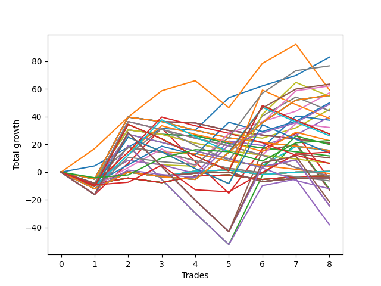

# Long Wallace 004 
- Symbol: NQ
- Date Range: 03/18/2022 - 06/17/2022
- Trading Period: 7:20-12:30
- Number of Trades: 8



| Name | Win Percent | Profit | Avg Profit / Trade |     | Name | Win Percent | Profit | Avg Profit / Trade |
| ---- | ----------- | ------ | ------------------ | --- | ---- | ----------- | ------ | ------------------ |
| Sorted By <br> Profit | | | | | Sorted By <br> Win Percentage ||||
| Zero | 87.50 | 41500.00 | 5187.50 |     | Zero | 87.50 | 41500.00 | 5187.50 |
| Sixty-Seven | 62.50 | 38375.00 | 4796.88 |     | One | 75.00 | 29625.00 | 3703.12 |
| Sixty-Five | 62.50 | 31750.00 | 3968.75 |     | Fifty-Six | 75.00 | 28625.00 | 3578.12 |
| Sixty-Six | 62.50 | 31125.00 | 3890.62 |     | Sixty-Seven | 62.50 | 38375.00 | 4796.88 |
| One | 75.00 | 29625.00 | 3703.12 |     | Sixty-Five | 62.50 | 31750.00 | 3968.75 |
| Fifty-Six | 75.00 | 28625.00 | 3578.12 |     | Sixty-Six | 62.50 | 31125.00 | 3890.62 |
| Seventy-One | 62.50 | 27750.00 | 3468.75 |     | Seventy-One | 62.50 | 27750.00 | 3468.75 |
| Seventy | 62.50 | 27750.00 | 3468.75 |     | Seventy | 62.50 | 27750.00 | 3468.75 |
| Sixty-Nine | 62.50 | 27750.00 | 3468.75 |     | Sixty-Nine | 62.50 | 27750.00 | 3468.75 |
| Sixty-Eight | 62.50 | 27750.00 | 3468.75 |     | Sixty-Eight | 62.50 | 27750.00 | 3468.75 |
| Fifty-Eight | 37.50 | 27375.00 | 3421.88 |     | Forty | 62.50 | 25000.00 | 3125.00 |
| Forty | 62.50 | 25000.00 | 3125.00 |     | Sixty-Four | 62.50 | 24500.00 | 3062.50 |
| Sixty-Four | 62.50 | 24500.00 | 3062.50 |     | Seventy-Two | 62.50 | 11375.00 | 1421.88 |
| Eight | 50.00 | 22625.00 | 2828.12 |     | Seventy-Three | 62.50 | 7250.00 | 906.25 |
| Fifty-Seven | 50.00 | 22125.00 | 2765.62 |     | Thirty-Nine | 62.50 | 250.00 | 31.25 |
| Twenty-Four | 50.00 | 20000.00 | 2500.00 |     | Thirty-Eight | 62.50 | 250.00 | 31.25 |
| Sixty-One | 25.00 | 19375.00 | 2421.88 |     | Thirty-Seven | 62.50 | 250.00 | 31.25 |
| Ten | 25.00 | 18750.00 | 2343.75 |     | Thirty-Six | 62.50 | 250.00 | 31.25 |
| Twenty-Six | 25.00 | 16125.00 | 2015.62 |     | Thirty-Five | 62.50 | 250.00 | 31.25 |
| Sixty-Three | 25.00 | 13750.00 | 1718.75 |     | Thirty-Four | 62.50 | 250.00 | 31.25 |
| Sixty-Two | 25.00 | 13750.00 | 1718.75 |     | Thirty-Three | 62.50 | 250.00 | 31.25 |
| Fifty-Nine | 37.50 | 13125.00 | 1640.62 |     | Thirty-Two | 62.50 | 250.00 | 31.25 |
| Seventy-Two | 62.50 | 11375.00 | 1421.88 |     | Twenty-Three | 62.50 | -1375.00 | -171.88 |
| Forty-One | 37.50 | 11375.00 | 1421.88 |     | Twenty-Two | 62.50 | -1375.00 | -171.88 |
| Fifteen | 12.50 | 10500.00 | 1312.50 |     | Twenty-One | 62.50 | -1375.00 | -171.88 |
| Fourteen | 12.50 | 10500.00 | 1312.50 |     | Twenty | 62.50 | -1375.00 | -171.88 |
| Thirteen | 12.50 | 10500.00 | 1312.50 |     | Nineteen | 62.50 | -1375.00 | -171.88 |
| Forty-Two | 25.00 | 10000.00 | 1250.00 |     | Eighteen | 62.50 | -1375.00 | -171.88 |
| Thirty-One | 12.50 | 7875.00 | 984.38 |     | Seventeen | 62.50 | -1375.00 | -171.88 |
| Thirty | 12.50 | 7875.00 | 984.38 |     | Sixten | 62.50 | -1375.00 | -171.88 |
| Twenty-Nine | 12.50 | 7875.00 | 984.38 |     | Fifty-Five | 62.50 | -2000.00 | -250.00 |
| Nine | 25.00 | 7750.00 | 968.75 |     | Fifty-Four | 62.50 | -2000.00 | -250.00 |
| Seventy-Three | 62.50 | 7250.00 | 906.25 |     | Fifty-Three | 62.50 | -2000.00 | -250.00 |
| Sixty | 25.00 | 6875.00 | 859.38 |     | Fifty-Two | 62.50 | -2000.00 | -250.00 |
| Twelve | 12.50 | 5875.00 | 734.38 |     | Fifty-One | 62.50 | -2000.00 | -250.00 |
| Twenty-Five | 25.00 | 5125.00 | 640.62 |     | Fifty | 62.50 | -2000.00 | -250.00 |
| Twenty-Eight | 12.50 | 3250.00 | 406.25 |     | Forty-Nine | 62.50 | -2000.00 | -250.00 |
| Forty-Three | 25.00 | 3125.00 | 390.62 |     | Forty-Eight | 62.50 | -2000.00 | -250.00 |
| Thirty-Nine | 62.50 | 250.00 | 31.25 |     | Eight | 50.00 | 22625.00 | 2828.12 |
| Thirty-Eight | 62.50 | 250.00 | 31.25 |     | Fifty-Seven | 50.00 | 22125.00 | 2765.62 |
| Thirty-Seven | 62.50 | 250.00 | 31.25 |     | Twenty-Four | 50.00 | 20000.00 | 2500.00 |
| Thirty-Six | 62.50 | 250.00 | 31.25 |     | Three | 50.00 | -2500.00 | -312.50 |
| Thirty-Five | 62.50 | 250.00 | 31.25 |     | Fifty-Eight | 37.50 | 27375.00 | 3421.88 |
| Thirty-Four | 62.50 | 250.00 | 31.25 |     | Fifty-Nine | 37.50 | 13125.00 | 1640.62 |
| Thirty-Three | 62.50 | 250.00 | 31.25 |     | Forty-One | 37.50 | 11375.00 | 1421.88 |
| Thirty-Two | 62.50 | 250.00 | 31.25 |     | Two | 37.50 | -6125.00 | -765.62 |
| Eleven | 12.50 | -500.00 | -62.50 |     | Five | 37.50 | -6500.00 | -812.50 |
| Twenty-Three | 62.50 | -1375.00 | -171.88 |     | Seventy-Five | 37.50 | -10750.00 | -1343.75 |
| Twenty-Two | 62.50 | -1375.00 | -171.88 |     | Seventy-Four | 37.50 | -12125.00 | -1515.62 |
| Twenty-One | 62.50 | -1375.00 | -171.88 |     | Seven | 37.50 | -12125.00 | -1515.62 |
| Twenty | 62.50 | -1375.00 | -171.88 |     | Six | 37.50 | -12125.00 | -1515.62 |
| Nineteen | 62.50 | -1375.00 | -171.88 |     | Four | 37.50 | -19000.00 | -2375.00 |
| Eighteen | 62.50 | -1375.00 | -171.88 |     | Sixty-One | 25.00 | 19375.00 | 2421.88 |
| Seventeen | 62.50 | -1375.00 | -171.88 |     | Ten | 25.00 | 18750.00 | 2343.75 |
| Sixten | 62.50 | -1375.00 | -171.88 |     | Twenty-Six | 25.00 | 16125.00 | 2015.62 |
| Forty-Seven | 12.50 | -1375.00 | -171.88 |     | Sixty-Three | 25.00 | 13750.00 | 1718.75 |
| Forty-Six | 12.50 | -1375.00 | -171.88 |     | Sixty-Two | 25.00 | 13750.00 | 1718.75 |
| Forty-Five | 12.50 | -1375.00 | -171.88 |     | Forty-Two | 25.00 | 10000.00 | 1250.00 |
| Fifty-Five | 62.50 | -2000.00 | -250.00 |     | Nine | 25.00 | 7750.00 | 968.75 |
| Fifty-Four | 62.50 | -2000.00 | -250.00 |     | Sixty | 25.00 | 6875.00 | 859.38 |
| Fifty-Three | 62.50 | -2000.00 | -250.00 |     | Twenty-Five | 25.00 | 5125.00 | 640.62 |
| Fifty-Two | 62.50 | -2000.00 | -250.00 |     | Forty-Three | 25.00 | 3125.00 | 390.62 |
| Fifty-One | 62.50 | -2000.00 | -250.00 |     | Fifteen | 12.50 | 10500.00 | 1312.50 |
| Fifty | 62.50 | -2000.00 | -250.00 |     | Fourteen | 12.50 | 10500.00 | 1312.50 |
| Forty-Nine | 62.50 | -2000.00 | -250.00 |     | Thirteen | 12.50 | 10500.00 | 1312.50 |
| Forty-Eight | 62.50 | -2000.00 | -250.00 |     | Thirty-One | 12.50 | 7875.00 | 984.38 |
| Three | 50.00 | -2500.00 | -312.50 |     | Thirty | 12.50 | 7875.00 | 984.38 |
| twenty-Seven | 12.50 | -3125.00 | -390.62 |     | Twenty-Nine | 12.50 | 7875.00 | 984.38 |
| Forty-Four | 12.50 | -6000.00 | -750.00 |     | Twelve | 12.50 | 5875.00 | 734.38 |
| Two | 37.50 | -6125.00 | -765.62 |     | Twenty-Eight | 12.50 | 3250.00 | 406.25 |
| Five | 37.50 | -6500.00 | -812.50 |     | Eleven | 12.50 | -500.00 | -62.50 |
| Seventy-Five | 37.50 | -10750.00 | -1343.75 |     | Forty-Seven | 12.50 | -1375.00 | -171.88 |
| Seventy-Four | 37.50 | -12125.00 | -1515.62 |     | Forty-Six | 12.50 | -1375.00 | -171.88 |
| Seven | 37.50 | -12125.00 | -1515.62 |     | Forty-Five | 12.50 | -1375.00 | -171.88 |
| Six | 37.50 | -12125.00 | -1515.62 |     | twenty-Seven | 12.50 | -3125.00 | -390.62 |
| Four | 37.50 | -19000.00 | -2375.00 |     | Forty-Four | 12.50 | -6000.00 | -750.00 |

## NO STOPLOSS

### Test Zero
* Sell when price hits the middle line of the 20p bollinger
* No Stoploss
* Results:
```
Total Trades: 8
Percent Up: 87.50
Percent Down: 12.50
Total Points Moved Up: 83.00
Potential Profit: 41500.00
Total Points Ups: 84.25 Count Ups: 7
Total Points Downs: -1.25 Count Downs: 1
```

<details><summary>Trades</summary>

<code>In: 2022-03-28 08:52:00		Out: 2022-03-28 09:01:40		Total Position Time: 09:40		Total Move Up: 4.50		Total to Date: 4.50</code> <br />
<code>In: 2022-03-28 09:21:00		Out: 2022-03-28 09:22:45		Total Position Time: 01:45		Total Move Up: 13.50		Total to Date: 18.00</code> <br />
<code>In: 2022-03-30 11:30:00		Out: 2022-03-30 11:31:20		Total Position Time: 01:20		Total Move Up: 13.50		Total to Date: 31.50</code> <br />
<code>In: 2022-04-07 08:36:00		Out: 2022-04-07 08:46:30		Total Position Time: 10:30		Total Move Up: -1.25		Total to Date: 30.25</code> <br />
<code>In: 2022-04-11 07:31:00		Out: 2022-04-11 07:34:10		Total Position Time: 03:10		Total Move Up: 23.50		Total to Date: 53.75</code> <br />
<code>In: 2022-04-20 11:58:00		Out: 2022-04-20 12:00:15		Total Position Time: 02:15		Total Move Up: 8.50		Total to Date: 62.25</code> <br />
<code>In: 2022-06-09 10:47:00		Out: 2022-06-09 10:50:10		Total Position Time: 03:10		Total Move Up: 7.50		Total to Date: 69.75</code> <br />
<code>In: 2022-06-09 11:27:00		Out: 2022-06-09 11:29:15		Total Position Time: 02:15		Total Move Up: 13.25		Total to Date: 83.00</code> <br />


</details>

### Test One
* Sell when the price hits the upper line of the 20p 1std bollinger
* No Stoploss
* Results:
```
Total Trades: 8
Percent Up: 75.00
Percent Down: 25.00
Total Points Moved Up: 59.25
Potential Profit: 29625.00
Total Points Ups: 111.75 Count Ups: 6
Total Points Downs: -52.50 Count Downs: 2
```

<details><summary>Trades</summary>

<code>In: 2022-03-28 08:52:00		Out: 2022-03-28 09:03:00		Total Position Time: 11:00		Total Move Up: 17.00		Total to Date: 17.00</code> <br />
<code>In: 2022-03-28 09:21:00		Out: 2022-03-28 09:26:05		Total Position Time: 05:05		Total Move Up: 22.75		Total to Date: 39.75</code> <br />
<code>In: 2022-03-30 11:30:00		Out: 2022-03-30 11:35:15		Total Position Time: 05:15		Total Move Up: 19.00		Total to Date: 58.75</code> <br />
<code>In: 2022-04-07 08:36:00		Out: 2022-04-07 08:47:25		Total Position Time: 11:25		Total Move Up: 7.25		Total to Date: 66.00</code> <br />
<code>In: 2022-04-11 07:31:00		Out: 2022-04-11 07:57:05		Total Position Time: 26:05		Total Move Up: -19.50		Total to Date: 46.50</code> <br />
<code>In: 2022-04-20 11:58:00		Out: 2022-04-20 12:01:20		Total Position Time: 03:20		Total Move Up: 32.00		Total to Date: 78.50</code> <br />
<code>In: 2022-06-09 10:47:00		Out: 2022-06-09 10:53:30		Total Position Time: 06:30		Total Move Up: 13.75		Total to Date: 92.25</code> <br />
<code>In: 2022-06-09 11:27:00		Out: 2022-06-09 11:56:55		Total Position Time: 29:55		Total Move Up: -33.00		Total to Date: 59.25</code> <br />


</details>

### Test Two
* Sell when the price hits the upper line of the 20p 2std bollinger
* No Stoploss
* Results:
```
Total Trades: 8
Percent Up: 37.50
Percent Down: 62.50
Total Points Moved Up: -12.25
Potential Profit: -6125.00
Total Points Ups: 108.50 Count Ups: 3
Total Points Downs: -120.75 Count Downs: 5
```

<details><summary>Trades</summary>

<code>In: 2022-03-28 08:52:00		Out: 2022-03-28 09:21:55		Total Position Time: 29:55		Total Move Up: -16.25		Total to Date: -16.25</code> <br />
<code>In: 2022-03-28 09:21:00		Out: 2022-03-28 09:33:30		Total Position Time: 12:30		Total Move Up: 35.50		Total to Date: 19.25</code> <br />
<code>In: 2022-03-30 11:30:00		Out: 2022-03-30 11:59:55		Total Position Time: 29:55		Total Move Up: -24.50		Total to Date: -5.25</code> <br />
<code>In: 2022-04-07 08:36:00		Out: 2022-04-07 09:05:55		Total Position Time: 29:55		Total Move Up: -24.25		Total to Date: -29.50</code> <br />
<code>In: 2022-04-11 07:31:00		Out: 2022-04-11 08:00:55		Total Position Time: 29:55		Total Move Up: -22.75		Total to Date: -52.25</code> <br />
<code>In: 2022-04-20 11:58:00		Out: 2022-04-20 12:13:50		Total Position Time: 15:50		Total Move Up: 50.00		Total to Date: -2.25</code> <br />
<code>In: 2022-06-09 10:47:00		Out: 2022-06-09 10:59:35		Total Position Time: 12:35		Total Move Up: 23.00		Total to Date: 20.75</code> <br />
<code>In: 2022-06-09 11:27:00		Out: 2022-06-09 11:56:55		Total Position Time: 29:55		Total Move Up: -33.00		Total to Date: -12.25</code> <br />


</details>

### Test Three
* Sell when price hits the middle line of the 50p bollinger
* No Stoploss
* Results:
```
Total Trades: 8
Percent Up: 50.00
Percent Down: 50.00
Total Points Moved Up: -5.00
Potential Profit: -2500.00
Total Points Ups: 91.25 Count Ups: 4
Total Points Downs: -96.25 Count Downs: 4
```

<details><summary>Trades</summary>

<code>In: 2022-03-28 08:52:00		Out: 2022-03-28 09:21:55		Total Position Time: 29:55		Total Move Up: -16.25		Total to Date: -16.25</code> <br />
<code>In: 2022-03-28 09:21:00		Out: 2022-03-28 09:24:15		Total Position Time: 03:15		Total Move Up: 22.75		Total to Date: 6.50</code> <br />
<code>In: 2022-03-30 11:30:00		Out: 2022-03-30 11:38:05		Total Position Time: 08:05		Total Move Up: 25.25		Total to Date: 31.75</code> <br />
<code>In: 2022-04-07 08:36:00		Out: 2022-04-07 09:05:55		Total Position Time: 29:55		Total Move Up: -24.25		Total to Date: 7.50</code> <br />
<code>In: 2022-04-11 07:31:00		Out: 2022-04-11 08:00:55		Total Position Time: 29:55		Total Move Up: -22.75		Total to Date: -15.25</code> <br />
<code>In: 2022-04-20 11:58:00		Out: 2022-04-20 12:01:20		Total Position Time: 03:20		Total Move Up: 32.00		Total to Date: 16.75</code> <br />
<code>In: 2022-06-09 10:47:00		Out: 2022-06-09 11:15:50		Total Position Time: 28:50		Total Move Up: 11.25		Total to Date: 28.00</code> <br />
<code>In: 2022-06-09 11:27:00		Out: 2022-06-09 11:56:55		Total Position Time: 29:55		Total Move Up: -33.00		Total to Date: -5.00</code> <br />


</details>

### Test Four
* Sell when the price hits the upper line of the 50p 1std bollinger
* No Stoploss
* Results:
```
Total Trades: 8
Percent Up: 37.50
Percent Down: 62.50
Total Points Moved Up: -38.00
Potential Profit: -19000.00
Total Points Ups: 82.75 Count Ups: 3
Total Points Downs: -120.75 Count Downs: 5
```

<details><summary>Trades</summary>

<code>In: 2022-03-28 08:52:00		Out: 2022-03-28 09:21:55		Total Position Time: 29:55		Total Move Up: -16.25		Total to Date: -16.25</code> <br />
<code>In: 2022-03-28 09:21:00		Out: 2022-03-28 09:33:30		Total Position Time: 12:30		Total Move Up: 35.50		Total to Date: 19.25</code> <br />
<code>In: 2022-03-30 11:30:00		Out: 2022-03-30 11:59:55		Total Position Time: 29:55		Total Move Up: -24.50		Total to Date: -5.25</code> <br />
<code>In: 2022-04-07 08:36:00		Out: 2022-04-07 09:05:55		Total Position Time: 29:55		Total Move Up: -24.25		Total to Date: -29.50</code> <br />
<code>In: 2022-04-11 07:31:00		Out: 2022-04-11 08:00:55		Total Position Time: 29:55		Total Move Up: -22.75		Total to Date: -52.25</code> <br />
<code>In: 2022-04-20 11:58:00		Out: 2022-04-20 12:12:55		Total Position Time: 14:55		Total Move Up: 42.50		Total to Date: -9.75</code> <br />
<code>In: 2022-06-09 10:47:00		Out: 2022-06-09 11:16:55		Total Position Time: 29:55		Total Move Up: 4.75		Total to Date: -5.00</code> <br />
<code>In: 2022-06-09 11:27:00		Out: 2022-06-09 11:56:55		Total Position Time: 29:55		Total Move Up: -33.00		Total to Date: -38.00</code> <br />


</details>

### Test Five
* Sell when the price hits the upper line of the 50p 2std bollinger
* No Stoploss
* Results:
```
Total Trades: 8
Percent Up: 37.50
Percent Down: 62.50
Total Points Moved Up: -13.00
Potential Profit: -6500.00
Total Points Ups: 107.75 Count Ups: 3
Total Points Downs: -120.75 Count Downs: 5
```

<details><summary>Trades</summary>

<code>In: 2022-03-28 08:52:00		Out: 2022-03-28 09:21:55		Total Position Time: 29:55		Total Move Up: -16.25		Total to Date: -16.25</code> <br />
<code>In: 2022-03-28 09:21:00		Out: 2022-03-28 09:50:55		Total Position Time: 29:55		Total Move Up: 44.75		Total to Date: 28.50</code> <br />
<code>In: 2022-03-30 11:30:00		Out: 2022-03-30 11:59:55		Total Position Time: 29:55		Total Move Up: -24.50		Total to Date: 4.00</code> <br />
<code>In: 2022-04-07 08:36:00		Out: 2022-04-07 09:05:55		Total Position Time: 29:55		Total Move Up: -24.25		Total to Date: -20.25</code> <br />
<code>In: 2022-04-11 07:31:00		Out: 2022-04-11 08:00:55		Total Position Time: 29:55		Total Move Up: -22.75		Total to Date: -43.00</code> <br />
<code>In: 2022-04-20 11:58:00		Out: 2022-04-20 12:26:15		Total Position Time: 28:15		Total Move Up: 58.25		Total to Date: 15.25</code> <br />
<code>In: 2022-06-09 10:47:00		Out: 2022-06-09 11:16:55		Total Position Time: 29:55		Total Move Up: 4.75		Total to Date: 20.00</code> <br />
<code>In: 2022-06-09 11:27:00		Out: 2022-06-09 11:56:55		Total Position Time: 29:55		Total Move Up: -33.00		Total to Date: -13.00</code> <br />


</details>

### Test Six
* Sell when the price hits the middle line of the 1std VWAP
* No Stoploss
* Results:
```
Total Trades: 8
Percent Up: 37.50
Percent Down: 62.50
Total Points Moved Up: -24.25
Potential Profit: -12125.00
Total Points Ups: 96.50 Count Ups: 3
Total Points Downs: -120.75 Count Downs: 5
```

<details><summary>Trades</summary>

<code>In: 2022-03-28 08:52:00		Out: 2022-03-28 09:21:55		Total Position Time: 29:55		Total Move Up: -16.25		Total to Date: -16.25</code> <br />
<code>In: 2022-03-28 09:21:00		Out: 2022-03-28 09:50:55		Total Position Time: 29:55		Total Move Up: 44.75		Total to Date: 28.50</code> <br />
<code>In: 2022-03-30 11:30:00		Out: 2022-03-30 11:59:55		Total Position Time: 29:55		Total Move Up: -24.50		Total to Date: 4.00</code> <br />
<code>In: 2022-04-07 08:36:00		Out: 2022-04-07 09:05:55		Total Position Time: 29:55		Total Move Up: -24.25		Total to Date: -20.25</code> <br />
<code>In: 2022-04-11 07:31:00		Out: 2022-04-11 08:00:55		Total Position Time: 29:55		Total Move Up: -22.75		Total to Date: -43.00</code> <br />
<code>In: 2022-04-20 11:58:00		Out: 2022-04-20 12:27:55		Total Position Time: 29:55		Total Move Up: 47.00		Total to Date: 4.00</code> <br />
<code>In: 2022-06-09 10:47:00		Out: 2022-06-09 11:16:55		Total Position Time: 29:55		Total Move Up: 4.75		Total to Date: 8.75</code> <br />
<code>In: 2022-06-09 11:27:00		Out: 2022-06-09 11:56:55		Total Position Time: 29:55		Total Move Up: -33.00		Total to Date: -24.25</code> <br />


</details>

### Test Seven
* Sell when the price hits the upper line of the 1std VWAP
* No Stoploss
* Results:
```
Total Trades: 8
Percent Up: 37.50
Percent Down: 62.50
Total Points Moved Up: -24.25
Potential Profit: -12125.00
Total Points Ups: 96.50 Count Ups: 3
Total Points Downs: -120.75 Count Downs: 5
```

<details><summary>Trades</summary>

<code>In: 2022-03-28 08:52:00		Out: 2022-03-28 09:21:55		Total Position Time: 29:55		Total Move Up: -16.25		Total to Date: -16.25</code> <br />
<code>In: 2022-03-28 09:21:00		Out: 2022-03-28 09:50:55		Total Position Time: 29:55		Total Move Up: 44.75		Total to Date: 28.50</code> <br />
<code>In: 2022-03-30 11:30:00		Out: 2022-03-30 11:59:55		Total Position Time: 29:55		Total Move Up: -24.50		Total to Date: 4.00</code> <br />
<code>In: 2022-04-07 08:36:00		Out: 2022-04-07 09:05:55		Total Position Time: 29:55		Total Move Up: -24.25		Total to Date: -20.25</code> <br />
<code>In: 2022-04-11 07:31:00		Out: 2022-04-11 08:00:55		Total Position Time: 29:55		Total Move Up: -22.75		Total to Date: -43.00</code> <br />
<code>In: 2022-04-20 11:58:00		Out: 2022-04-20 12:27:55		Total Position Time: 29:55		Total Move Up: 47.00		Total to Date: 4.00</code> <br />
<code>In: 2022-06-09 10:47:00		Out: 2022-06-09 11:16:55		Total Position Time: 29:55		Total Move Up: 4.75		Total to Date: 8.75</code> <br />
<code>In: 2022-06-09 11:27:00		Out: 2022-06-09 11:56:55		Total Position Time: 29:55		Total Move Up: -33.00		Total to Date: -24.25</code> <br />


</details>

## STOPLOSS OF 2

### Test Eight
* Sell when price hits the middle line of the 20p bollinger
* Stoploss is 2 points
* Results:
```
Total Trades: 8
Percent Up: 50.00
Percent Down: 50.00
Total Points Moved Up: 45.25
Potential Profit: 22625.00
Total Points Ups: 57.75 Count Ups: 4
Total Points Downs: -12.50 Count Downs: 4
```

<details><summary>Trades</summary>

<code>In: 2022-03-28 08:52:00		Out: 2022-03-28 08:52:10		Total Position Time: 00:10		Total Move Up: -5.00		Total to Date: -5.00</code> <br />
<code>In: 2022-03-28 09:21:00		Out: 2022-03-28 09:22:45		Total Position Time: 01:45		Total Move Up: 13.50		Total to Date: 8.50</code> <br />
<code>In: 2022-03-30 11:30:00		Out: 2022-03-30 11:30:10		Total Position Time: 00:10		Total Move Up: -3.25		Total to Date: 5.25</code> <br />
<code>In: 2022-04-07 08:36:00		Out: 2022-04-07 08:41:30		Total Position Time: 05:30		Total Move Up: -1.00		Total to Date: 4.25</code> <br />
<code>In: 2022-04-11 07:31:00		Out: 2022-04-11 07:34:10		Total Position Time: 03:10		Total Move Up: 23.50		Total to Date: 27.75</code> <br />
<code>In: 2022-04-20 11:58:00		Out: 2022-04-20 11:58:25		Total Position Time: 00:25		Total Move Up: -3.25		Total to Date: 24.50</code> <br />
<code>In: 2022-06-09 10:47:00		Out: 2022-06-09 10:50:10		Total Position Time: 03:10		Total Move Up: 7.50		Total to Date: 32.00</code> <br />
<code>In: 2022-06-09 11:27:00		Out: 2022-06-09 11:29:15		Total Position Time: 02:15		Total Move Up: 13.25		Total to Date: 45.25</code> <br />


</details>

### Test Nine
* Sell when the price hits the upper line of the 20p 1std bollinger
* Stoploss is 2 points
* Results:
```
Total Trades: 8
Percent Up: 25.00
Percent Down: 75.00
Total Points Moved Up: 15.50
Potential Profit: 7750.00
Total Points Ups: 36.50 Count Ups: 2
Total Points Downs: -21.00 Count Downs: 6
```

<details><summary>Trades</summary>

<code>In: 2022-03-28 08:52:00		Out: 2022-03-28 08:52:10		Total Position Time: 00:10		Total Move Up: -5.00		Total to Date: -5.00</code> <br />
<code>In: 2022-03-28 09:21:00		Out: 2022-03-28 09:26:05		Total Position Time: 05:05		Total Move Up: 22.75		Total to Date: 17.75</code> <br />
<code>In: 2022-03-30 11:30:00		Out: 2022-03-30 11:30:10		Total Position Time: 00:10		Total Move Up: -3.25		Total to Date: 14.50</code> <br />
<code>In: 2022-04-07 08:36:00		Out: 2022-04-07 08:41:30		Total Position Time: 05:30		Total Move Up: -1.00		Total to Date: 13.50</code> <br />
<code>In: 2022-04-11 07:31:00		Out: 2022-04-11 07:38:00		Total Position Time: 07:00		Total Move Up: -5.50		Total to Date: 8.00</code> <br />
<code>In: 2022-04-20 11:58:00		Out: 2022-04-20 11:58:25		Total Position Time: 00:25		Total Move Up: -3.25		Total to Date: 4.75</code> <br />
<code>In: 2022-06-09 10:47:00		Out: 2022-06-09 10:53:30		Total Position Time: 06:30		Total Move Up: 13.75		Total to Date: 18.50</code> <br />
<code>In: 2022-06-09 11:27:00		Out: 2022-06-09 11:30:35		Total Position Time: 03:35		Total Move Up: -3.00		Total to Date: 15.50</code> <br />


</details>

### Test Ten
* Sell when the price hits the upper line of the 20p 2std bollinger
* Stoploss is 2 points
* Results:
```
Total Trades: 8
Percent Up: 25.00
Percent Down: 75.00
Total Points Moved Up: 37.50
Potential Profit: 18750.00
Total Points Ups: 58.50 Count Ups: 2
Total Points Downs: -21.00 Count Downs: 6
```

<details><summary>Trades</summary>

<code>In: 2022-03-28 08:52:00		Out: 2022-03-28 08:52:10		Total Position Time: 00:10		Total Move Up: -5.00		Total to Date: -5.00</code> <br />
<code>In: 2022-03-28 09:21:00		Out: 2022-03-28 09:33:30		Total Position Time: 12:30		Total Move Up: 35.50		Total to Date: 30.50</code> <br />
<code>In: 2022-03-30 11:30:00		Out: 2022-03-30 11:30:10		Total Position Time: 00:10		Total Move Up: -3.25		Total to Date: 27.25</code> <br />
<code>In: 2022-04-07 08:36:00		Out: 2022-04-07 08:41:30		Total Position Time: 05:30		Total Move Up: -1.00		Total to Date: 26.25</code> <br />
<code>In: 2022-04-11 07:31:00		Out: 2022-04-11 07:38:00		Total Position Time: 07:00		Total Move Up: -5.50		Total to Date: 20.75</code> <br />
<code>In: 2022-04-20 11:58:00		Out: 2022-04-20 11:58:25		Total Position Time: 00:25		Total Move Up: -3.25		Total to Date: 17.50</code> <br />
<code>In: 2022-06-09 10:47:00		Out: 2022-06-09 10:59:35		Total Position Time: 12:35		Total Move Up: 23.00		Total to Date: 40.50</code> <br />
<code>In: 2022-06-09 11:27:00		Out: 2022-06-09 11:30:35		Total Position Time: 03:35		Total Move Up: -3.00		Total to Date: 37.50</code> <br />


</details>

### Test Eleven
* Sell when price hits the middle line of the 50p bollinger
* Stoploss is 2 points
* Results:
```
Total Trades: 8
Percent Up: 12.50
Percent Down: 87.50
Total Points Moved Up: -1.00
Potential Profit: -500.00
Total Points Ups: 22.75 Count Ups: 1
Total Points Downs: -23.75 Count Downs: 7
```

<details><summary>Trades</summary>

<code>In: 2022-03-28 08:52:00		Out: 2022-03-28 08:52:10		Total Position Time: 00:10		Total Move Up: -5.00		Total to Date: -5.00</code> <br />
<code>In: 2022-03-28 09:21:00		Out: 2022-03-28 09:24:15		Total Position Time: 03:15		Total Move Up: 22.75		Total to Date: 17.75</code> <br />
<code>In: 2022-03-30 11:30:00		Out: 2022-03-30 11:30:10		Total Position Time: 00:10		Total Move Up: -3.25		Total to Date: 14.50</code> <br />
<code>In: 2022-04-07 08:36:00		Out: 2022-04-07 08:41:30		Total Position Time: 05:30		Total Move Up: -1.00		Total to Date: 13.50</code> <br />
<code>In: 2022-04-11 07:31:00		Out: 2022-04-11 07:38:00		Total Position Time: 07:00		Total Move Up: -5.50		Total to Date: 8.00</code> <br />
<code>In: 2022-04-20 11:58:00		Out: 2022-04-20 11:58:25		Total Position Time: 00:25		Total Move Up: -3.25		Total to Date: 4.75</code> <br />
<code>In: 2022-06-09 10:47:00		Out: 2022-06-09 11:06:00		Total Position Time: 19:00		Total Move Up: -2.75		Total to Date: 2.00</code> <br />
<code>In: 2022-06-09 11:27:00		Out: 2022-06-09 11:30:35		Total Position Time: 03:35		Total Move Up: -3.00		Total to Date: -1.00</code> <br />


</details>

### Test Twelve
* Sell when the price hits the upper line of the 50p 1std bollinger
* Stoploss is 2 points
* Results:
```
Total Trades: 8
Percent Up: 12.50
Percent Down: 87.50
Total Points Moved Up: 11.75
Potential Profit: 5875.00
Total Points Ups: 35.50 Count Ups: 1
Total Points Downs: -23.75 Count Downs: 7
```

<details><summary>Trades</summary>

<code>In: 2022-03-28 08:52:00		Out: 2022-03-28 08:52:10		Total Position Time: 00:10		Total Move Up: -5.00		Total to Date: -5.00</code> <br />
<code>In: 2022-03-28 09:21:00		Out: 2022-03-28 09:33:30		Total Position Time: 12:30		Total Move Up: 35.50		Total to Date: 30.50</code> <br />
<code>In: 2022-03-30 11:30:00		Out: 2022-03-30 11:30:10		Total Position Time: 00:10		Total Move Up: -3.25		Total to Date: 27.25</code> <br />
<code>In: 2022-04-07 08:36:00		Out: 2022-04-07 08:41:30		Total Position Time: 05:30		Total Move Up: -1.00		Total to Date: 26.25</code> <br />
<code>In: 2022-04-11 07:31:00		Out: 2022-04-11 07:38:00		Total Position Time: 07:00		Total Move Up: -5.50		Total to Date: 20.75</code> <br />
<code>In: 2022-04-20 11:58:00		Out: 2022-04-20 11:58:25		Total Position Time: 00:25		Total Move Up: -3.25		Total to Date: 17.50</code> <br />
<code>In: 2022-06-09 10:47:00		Out: 2022-06-09 11:06:00		Total Position Time: 19:00		Total Move Up: -2.75		Total to Date: 14.75</code> <br />
<code>In: 2022-06-09 11:27:00		Out: 2022-06-09 11:30:35		Total Position Time: 03:35		Total Move Up: -3.00		Total to Date: 11.75</code> <br />


</details>

### Test Thirteen
* Sell when the price hits the upper line of the 50p 2std bollinger
* Stoploss is 2 points
* Results:
```
Total Trades: 8
Percent Up: 12.50
Percent Down: 87.50
Total Points Moved Up: 21.00
Potential Profit: 10500.00
Total Points Ups: 44.75 Count Ups: 1
Total Points Downs: -23.75 Count Downs: 7
```

<details><summary>Trades</summary>

<code>In: 2022-03-28 08:52:00		Out: 2022-03-28 08:52:10		Total Position Time: 00:10		Total Move Up: -5.00		Total to Date: -5.00</code> <br />
<code>In: 2022-03-28 09:21:00		Out: 2022-03-28 09:50:55		Total Position Time: 29:55		Total Move Up: 44.75		Total to Date: 39.75</code> <br />
<code>In: 2022-03-30 11:30:00		Out: 2022-03-30 11:30:10		Total Position Time: 00:10		Total Move Up: -3.25		Total to Date: 36.50</code> <br />
<code>In: 2022-04-07 08:36:00		Out: 2022-04-07 08:41:30		Total Position Time: 05:30		Total Move Up: -1.00		Total to Date: 35.50</code> <br />
<code>In: 2022-04-11 07:31:00		Out: 2022-04-11 07:38:00		Total Position Time: 07:00		Total Move Up: -5.50		Total to Date: 30.00</code> <br />
<code>In: 2022-04-20 11:58:00		Out: 2022-04-20 11:58:25		Total Position Time: 00:25		Total Move Up: -3.25		Total to Date: 26.75</code> <br />
<code>In: 2022-06-09 10:47:00		Out: 2022-06-09 11:06:00		Total Position Time: 19:00		Total Move Up: -2.75		Total to Date: 24.00</code> <br />
<code>In: 2022-06-09 11:27:00		Out: 2022-06-09 11:30:35		Total Position Time: 03:35		Total Move Up: -3.00		Total to Date: 21.00</code> <br />


</details>

### Test Fourteen
* Sell when the price hits the middle line of the 1std VWAP
* Stoploss is 2 points
* Results:
```
Total Trades: 8
Percent Up: 12.50
Percent Down: 87.50
Total Points Moved Up: 21.00
Potential Profit: 10500.00
Total Points Ups: 44.75 Count Ups: 1
Total Points Downs: -23.75 Count Downs: 7
```

<details><summary>Trades</summary>

<code>In: 2022-03-28 08:52:00		Out: 2022-03-28 08:52:10		Total Position Time: 00:10		Total Move Up: -5.00		Total to Date: -5.00</code> <br />
<code>In: 2022-03-28 09:21:00		Out: 2022-03-28 09:50:55		Total Position Time: 29:55		Total Move Up: 44.75		Total to Date: 39.75</code> <br />
<code>In: 2022-03-30 11:30:00		Out: 2022-03-30 11:30:10		Total Position Time: 00:10		Total Move Up: -3.25		Total to Date: 36.50</code> <br />
<code>In: 2022-04-07 08:36:00		Out: 2022-04-07 08:41:30		Total Position Time: 05:30		Total Move Up: -1.00		Total to Date: 35.50</code> <br />
<code>In: 2022-04-11 07:31:00		Out: 2022-04-11 07:38:00		Total Position Time: 07:00		Total Move Up: -5.50		Total to Date: 30.00</code> <br />
<code>In: 2022-04-20 11:58:00		Out: 2022-04-20 11:58:25		Total Position Time: 00:25		Total Move Up: -3.25		Total to Date: 26.75</code> <br />
<code>In: 2022-06-09 10:47:00		Out: 2022-06-09 11:06:00		Total Position Time: 19:00		Total Move Up: -2.75		Total to Date: 24.00</code> <br />
<code>In: 2022-06-09 11:27:00		Out: 2022-06-09 11:30:35		Total Position Time: 03:35		Total Move Up: -3.00		Total to Date: 21.00</code> <br />


</details>

### Test Fifteen
* Sell when the price hits the upper line of the 1std VWAP
* Stoploss is 2 points
* Results:
```
Total Trades: 8
Percent Up: 12.50
Percent Down: 87.50
Total Points Moved Up: 21.00
Potential Profit: 10500.00
Total Points Ups: 44.75 Count Ups: 1
Total Points Downs: -23.75 Count Downs: 7
```

<details><summary>Trades</summary>

<code>In: 2022-03-28 08:52:00		Out: 2022-03-28 08:52:10		Total Position Time: 00:10		Total Move Up: -5.00		Total to Date: -5.00</code> <br />
<code>In: 2022-03-28 09:21:00		Out: 2022-03-28 09:50:55		Total Position Time: 29:55		Total Move Up: 44.75		Total to Date: 39.75</code> <br />
<code>In: 2022-03-30 11:30:00		Out: 2022-03-30 11:30:10		Total Position Time: 00:10		Total Move Up: -3.25		Total to Date: 36.50</code> <br />
<code>In: 2022-04-07 08:36:00		Out: 2022-04-07 08:41:30		Total Position Time: 05:30		Total Move Up: -1.00		Total to Date: 35.50</code> <br />
<code>In: 2022-04-11 07:31:00		Out: 2022-04-11 07:38:00		Total Position Time: 07:00		Total Move Up: -5.50		Total to Date: 30.00</code> <br />
<code>In: 2022-04-20 11:58:00		Out: 2022-04-20 11:58:25		Total Position Time: 00:25		Total Move Up: -3.25		Total to Date: 26.75</code> <br />
<code>In: 2022-06-09 10:47:00		Out: 2022-06-09 11:06:00		Total Position Time: 19:00		Total Move Up: -2.75		Total to Date: 24.00</code> <br />
<code>In: 2022-06-09 11:27:00		Out: 2022-06-09 11:30:35		Total Position Time: 03:35		Total Move Up: -3.00		Total to Date: 21.00</code> <br />


</details>

## TRAIL STOP OF 2

### Test Sixten
* Sell when price hits the middle line of the 20p bollinger
* Trailing Stop is 2 points
* Results:
```
Total Trades: 8
Percent Up: 62.50
Percent Down: 37.50
Total Points Moved Up: -2.75
Potential Profit: -1375.00
Total Points Ups: 12.00 Count Ups: 5
Total Points Downs: -14.75 Count Downs: 3
```

<details><summary>Trades</summary>

<code>In: 2022-03-28 08:52:00		Out: 2022-03-28 08:52:15		Total Position Time: 00:15		Total Move Up: -8.25		Total to Date: -8.25</code> <br />
<code>In: 2022-03-28 09:21:00		Out: 2022-03-28 09:21:10		Total Position Time: 00:10		Total Move Up: 4.00		Total to Date: -4.25</code> <br />
<code>In: 2022-03-30 11:30:00		Out: 2022-03-30 11:30:10		Total Position Time: 00:10		Total Move Up: -3.25		Total to Date: -7.50</code> <br />
<code>In: 2022-04-07 08:36:00		Out: 2022-04-07 08:36:40		Total Position Time: 00:40		Total Move Up: 4.75		Total to Date: -2.75</code> <br />
<code>In: 2022-04-11 07:31:00		Out: 2022-04-11 07:31:10		Total Position Time: 00:10		Total Move Up: 0.75		Total to Date: -2.00</code> <br />
<code>In: 2022-04-20 11:58:00		Out: 2022-04-20 11:58:25		Total Position Time: 00:25		Total Move Up: -3.25		Total to Date: -5.25</code> <br />
<code>In: 2022-06-09 10:47:00		Out: 2022-06-09 10:47:10		Total Position Time: 00:10		Total Move Up: 2.00		Total to Date: -3.25</code> <br />
<code>In: 2022-06-09 11:27:00		Out: 2022-06-09 11:27:10		Total Position Time: 00:10		Total Move Up: 0.50		Total to Date: -2.75</code> <br />


</details>

### Test Seventeen
* Sell when the price hits the upper line of the 20p 1std bollinger
* Trailing Stop is 2 points
* Results:
```
Total Trades: 8
Percent Up: 62.50
Percent Down: 37.50
Total Points Moved Up: -2.75
Potential Profit: -1375.00
Total Points Ups: 12.00 Count Ups: 5
Total Points Downs: -14.75 Count Downs: 3
```

<details><summary>Trades</summary>

<code>In: 2022-03-28 08:52:00		Out: 2022-03-28 08:52:15		Total Position Time: 00:15		Total Move Up: -8.25		Total to Date: -8.25</code> <br />
<code>In: 2022-03-28 09:21:00		Out: 2022-03-28 09:21:10		Total Position Time: 00:10		Total Move Up: 4.00		Total to Date: -4.25</code> <br />
<code>In: 2022-03-30 11:30:00		Out: 2022-03-30 11:30:10		Total Position Time: 00:10		Total Move Up: -3.25		Total to Date: -7.50</code> <br />
<code>In: 2022-04-07 08:36:00		Out: 2022-04-07 08:36:40		Total Position Time: 00:40		Total Move Up: 4.75		Total to Date: -2.75</code> <br />
<code>In: 2022-04-11 07:31:00		Out: 2022-04-11 07:31:10		Total Position Time: 00:10		Total Move Up: 0.75		Total to Date: -2.00</code> <br />
<code>In: 2022-04-20 11:58:00		Out: 2022-04-20 11:58:25		Total Position Time: 00:25		Total Move Up: -3.25		Total to Date: -5.25</code> <br />
<code>In: 2022-06-09 10:47:00		Out: 2022-06-09 10:47:10		Total Position Time: 00:10		Total Move Up: 2.00		Total to Date: -3.25</code> <br />
<code>In: 2022-06-09 11:27:00		Out: 2022-06-09 11:27:10		Total Position Time: 00:10		Total Move Up: 0.50		Total to Date: -2.75</code> <br />


</details>

### Test Eighteen
* Sell when the price hits the upper line of the 20p 2std bollinger
* Trailing Stop is 2 points
* Results:
```
Total Trades: 8
Percent Up: 62.50
Percent Down: 37.50
Total Points Moved Up: -2.75
Potential Profit: -1375.00
Total Points Ups: 12.00 Count Ups: 5
Total Points Downs: -14.75 Count Downs: 3
```

<details><summary>Trades</summary>

<code>In: 2022-03-28 08:52:00		Out: 2022-03-28 08:52:15		Total Position Time: 00:15		Total Move Up: -8.25		Total to Date: -8.25</code> <br />
<code>In: 2022-03-28 09:21:00		Out: 2022-03-28 09:21:10		Total Position Time: 00:10		Total Move Up: 4.00		Total to Date: -4.25</code> <br />
<code>In: 2022-03-30 11:30:00		Out: 2022-03-30 11:30:10		Total Position Time: 00:10		Total Move Up: -3.25		Total to Date: -7.50</code> <br />
<code>In: 2022-04-07 08:36:00		Out: 2022-04-07 08:36:40		Total Position Time: 00:40		Total Move Up: 4.75		Total to Date: -2.75</code> <br />
<code>In: 2022-04-11 07:31:00		Out: 2022-04-11 07:31:10		Total Position Time: 00:10		Total Move Up: 0.75		Total to Date: -2.00</code> <br />
<code>In: 2022-04-20 11:58:00		Out: 2022-04-20 11:58:25		Total Position Time: 00:25		Total Move Up: -3.25		Total to Date: -5.25</code> <br />
<code>In: 2022-06-09 10:47:00		Out: 2022-06-09 10:47:10		Total Position Time: 00:10		Total Move Up: 2.00		Total to Date: -3.25</code> <br />
<code>In: 2022-06-09 11:27:00		Out: 2022-06-09 11:27:10		Total Position Time: 00:10		Total Move Up: 0.50		Total to Date: -2.75</code> <br />


</details>

### Test Nineteen
* Sell when price hits the middle line of the 50p bollinger
* Trailing Stop is 2 points
* Results:
```
Total Trades: 8
Percent Up: 62.50
Percent Down: 37.50
Total Points Moved Up: -2.75
Potential Profit: -1375.00
Total Points Ups: 12.00 Count Ups: 5
Total Points Downs: -14.75 Count Downs: 3
```

<details><summary>Trades</summary>

<code>In: 2022-03-28 08:52:00		Out: 2022-03-28 08:52:15		Total Position Time: 00:15		Total Move Up: -8.25		Total to Date: -8.25</code> <br />
<code>In: 2022-03-28 09:21:00		Out: 2022-03-28 09:21:10		Total Position Time: 00:10		Total Move Up: 4.00		Total to Date: -4.25</code> <br />
<code>In: 2022-03-30 11:30:00		Out: 2022-03-30 11:30:10		Total Position Time: 00:10		Total Move Up: -3.25		Total to Date: -7.50</code> <br />
<code>In: 2022-04-07 08:36:00		Out: 2022-04-07 08:36:40		Total Position Time: 00:40		Total Move Up: 4.75		Total to Date: -2.75</code> <br />
<code>In: 2022-04-11 07:31:00		Out: 2022-04-11 07:31:10		Total Position Time: 00:10		Total Move Up: 0.75		Total to Date: -2.00</code> <br />
<code>In: 2022-04-20 11:58:00		Out: 2022-04-20 11:58:25		Total Position Time: 00:25		Total Move Up: -3.25		Total to Date: -5.25</code> <br />
<code>In: 2022-06-09 10:47:00		Out: 2022-06-09 10:47:10		Total Position Time: 00:10		Total Move Up: 2.00		Total to Date: -3.25</code> <br />
<code>In: 2022-06-09 11:27:00		Out: 2022-06-09 11:27:10		Total Position Time: 00:10		Total Move Up: 0.50		Total to Date: -2.75</code> <br />


</details>

### Test Twenty
* Sell when the price hits the upper line of the 50p 1std bollinger
* Trailing Stop is 2 points
* Results:
```
Total Trades: 8
Percent Up: 62.50
Percent Down: 37.50
Total Points Moved Up: -2.75
Potential Profit: -1375.00
Total Points Ups: 12.00 Count Ups: 5
Total Points Downs: -14.75 Count Downs: 3
```

<details><summary>Trades</summary>

<code>In: 2022-03-28 08:52:00		Out: 2022-03-28 08:52:15		Total Position Time: 00:15		Total Move Up: -8.25		Total to Date: -8.25</code> <br />
<code>In: 2022-03-28 09:21:00		Out: 2022-03-28 09:21:10		Total Position Time: 00:10		Total Move Up: 4.00		Total to Date: -4.25</code> <br />
<code>In: 2022-03-30 11:30:00		Out: 2022-03-30 11:30:10		Total Position Time: 00:10		Total Move Up: -3.25		Total to Date: -7.50</code> <br />
<code>In: 2022-04-07 08:36:00		Out: 2022-04-07 08:36:40		Total Position Time: 00:40		Total Move Up: 4.75		Total to Date: -2.75</code> <br />
<code>In: 2022-04-11 07:31:00		Out: 2022-04-11 07:31:10		Total Position Time: 00:10		Total Move Up: 0.75		Total to Date: -2.00</code> <br />
<code>In: 2022-04-20 11:58:00		Out: 2022-04-20 11:58:25		Total Position Time: 00:25		Total Move Up: -3.25		Total to Date: -5.25</code> <br />
<code>In: 2022-06-09 10:47:00		Out: 2022-06-09 10:47:10		Total Position Time: 00:10		Total Move Up: 2.00		Total to Date: -3.25</code> <br />
<code>In: 2022-06-09 11:27:00		Out: 2022-06-09 11:27:10		Total Position Time: 00:10		Total Move Up: 0.50		Total to Date: -2.75</code> <br />


</details>

### Test Twenty-One
* Sell when the price hits the upper line of the 50p 2std bollinger
* Trailing Stop is 2 points
* Results:
```
Total Trades: 8
Percent Up: 62.50
Percent Down: 37.50
Total Points Moved Up: -2.75
Potential Profit: -1375.00
Total Points Ups: 12.00 Count Ups: 5
Total Points Downs: -14.75 Count Downs: 3
```

<details><summary>Trades</summary>

<code>In: 2022-03-28 08:52:00		Out: 2022-03-28 08:52:15		Total Position Time: 00:15		Total Move Up: -8.25		Total to Date: -8.25</code> <br />
<code>In: 2022-03-28 09:21:00		Out: 2022-03-28 09:21:10		Total Position Time: 00:10		Total Move Up: 4.00		Total to Date: -4.25</code> <br />
<code>In: 2022-03-30 11:30:00		Out: 2022-03-30 11:30:10		Total Position Time: 00:10		Total Move Up: -3.25		Total to Date: -7.50</code> <br />
<code>In: 2022-04-07 08:36:00		Out: 2022-04-07 08:36:40		Total Position Time: 00:40		Total Move Up: 4.75		Total to Date: -2.75</code> <br />
<code>In: 2022-04-11 07:31:00		Out: 2022-04-11 07:31:10		Total Position Time: 00:10		Total Move Up: 0.75		Total to Date: -2.00</code> <br />
<code>In: 2022-04-20 11:58:00		Out: 2022-04-20 11:58:25		Total Position Time: 00:25		Total Move Up: -3.25		Total to Date: -5.25</code> <br />
<code>In: 2022-06-09 10:47:00		Out: 2022-06-09 10:47:10		Total Position Time: 00:10		Total Move Up: 2.00		Total to Date: -3.25</code> <br />
<code>In: 2022-06-09 11:27:00		Out: 2022-06-09 11:27:10		Total Position Time: 00:10		Total Move Up: 0.50		Total to Date: -2.75</code> <br />


</details>

### Test Twenty-Two
* Sell when the price hits the middle line of the 1std VWAP
* Trailing Stop is 2 points
* Results:
```
Total Trades: 8
Percent Up: 62.50
Percent Down: 37.50
Total Points Moved Up: -2.75
Potential Profit: -1375.00
Total Points Ups: 12.00 Count Ups: 5
Total Points Downs: -14.75 Count Downs: 3
```

<details><summary>Trades</summary>

<code>In: 2022-03-28 08:52:00		Out: 2022-03-28 08:52:15		Total Position Time: 00:15		Total Move Up: -8.25		Total to Date: -8.25</code> <br />
<code>In: 2022-03-28 09:21:00		Out: 2022-03-28 09:21:10		Total Position Time: 00:10		Total Move Up: 4.00		Total to Date: -4.25</code> <br />
<code>In: 2022-03-30 11:30:00		Out: 2022-03-30 11:30:10		Total Position Time: 00:10		Total Move Up: -3.25		Total to Date: -7.50</code> <br />
<code>In: 2022-04-07 08:36:00		Out: 2022-04-07 08:36:40		Total Position Time: 00:40		Total Move Up: 4.75		Total to Date: -2.75</code> <br />
<code>In: 2022-04-11 07:31:00		Out: 2022-04-11 07:31:10		Total Position Time: 00:10		Total Move Up: 0.75		Total to Date: -2.00</code> <br />
<code>In: 2022-04-20 11:58:00		Out: 2022-04-20 11:58:25		Total Position Time: 00:25		Total Move Up: -3.25		Total to Date: -5.25</code> <br />
<code>In: 2022-06-09 10:47:00		Out: 2022-06-09 10:47:10		Total Position Time: 00:10		Total Move Up: 2.00		Total to Date: -3.25</code> <br />
<code>In: 2022-06-09 11:27:00		Out: 2022-06-09 11:27:10		Total Position Time: 00:10		Total Move Up: 0.50		Total to Date: -2.75</code> <br />


</details>

### Test Twenty-Three
* Sell when the price hits the upper line of the 1std VWAP
* Trailing Stop is 2 points
* Results:
```
Total Trades: 8
Percent Up: 62.50
Percent Down: 37.50
Total Points Moved Up: -2.75
Potential Profit: -1375.00
Total Points Ups: 12.00 Count Ups: 5
Total Points Downs: -14.75 Count Downs: 3
```

<details><summary>Trades</summary>

<code>In: 2022-03-28 08:52:00		Out: 2022-03-28 08:52:15		Total Position Time: 00:15		Total Move Up: -8.25		Total to Date: -8.25</code> <br />
<code>In: 2022-03-28 09:21:00		Out: 2022-03-28 09:21:10		Total Position Time: 00:10		Total Move Up: 4.00		Total to Date: -4.25</code> <br />
<code>In: 2022-03-30 11:30:00		Out: 2022-03-30 11:30:10		Total Position Time: 00:10		Total Move Up: -3.25		Total to Date: -7.50</code> <br />
<code>In: 2022-04-07 08:36:00		Out: 2022-04-07 08:36:40		Total Position Time: 00:40		Total Move Up: 4.75		Total to Date: -2.75</code> <br />
<code>In: 2022-04-11 07:31:00		Out: 2022-04-11 07:31:10		Total Position Time: 00:10		Total Move Up: 0.75		Total to Date: -2.00</code> <br />
<code>In: 2022-04-20 11:58:00		Out: 2022-04-20 11:58:25		Total Position Time: 00:25		Total Move Up: -3.25		Total to Date: -5.25</code> <br />
<code>In: 2022-06-09 10:47:00		Out: 2022-06-09 10:47:10		Total Position Time: 00:10		Total Move Up: 2.00		Total to Date: -3.25</code> <br />
<code>In: 2022-06-09 11:27:00		Out: 2022-06-09 11:27:10		Total Position Time: 00:10		Total Move Up: 0.50		Total to Date: -2.75</code> <br />


</details>

## STOPLOSS OF 3

### Test Twenty-Four
* Sell when price hits the middle line of the 20p bollinger
* Stoploss is 3 points
* Results:
```
Total Trades: 8
Percent Up: 50.00
Percent Down: 50.00
Total Points Moved Up: 40.00
Potential Profit: 20000.00
Total Points Ups: 57.75 Count Ups: 4
Total Points Downs: -17.75 Count Downs: 4
```

<details><summary>Trades</summary>

<code>In: 2022-03-28 08:52:00		Out: 2022-03-28 08:52:10		Total Position Time: 00:10		Total Move Up: -5.00		Total to Date: -5.00</code> <br />
<code>In: 2022-03-28 09:21:00		Out: 2022-03-28 09:22:45		Total Position Time: 01:45		Total Move Up: 13.50		Total to Date: 8.50</code> <br />
<code>In: 2022-03-30 11:30:00		Out: 2022-03-30 11:30:10		Total Position Time: 00:10		Total Move Up: -3.25		Total to Date: 5.25</code> <br />
<code>In: 2022-04-07 08:36:00		Out: 2022-04-07 08:42:25		Total Position Time: 06:25		Total Move Up: -6.25		Total to Date: -1.00</code> <br />
<code>In: 2022-04-11 07:31:00		Out: 2022-04-11 07:34:10		Total Position Time: 03:10		Total Move Up: 23.50		Total to Date: 22.50</code> <br />
<code>In: 2022-04-20 11:58:00		Out: 2022-04-20 11:58:25		Total Position Time: 00:25		Total Move Up: -3.25		Total to Date: 19.25</code> <br />
<code>In: 2022-06-09 10:47:00		Out: 2022-06-09 10:50:10		Total Position Time: 03:10		Total Move Up: 7.50		Total to Date: 26.75</code> <br />
<code>In: 2022-06-09 11:27:00		Out: 2022-06-09 11:29:15		Total Position Time: 02:15		Total Move Up: 13.25		Total to Date: 40.00</code> <br />


</details>

### Test Twenty-Five
* Sell when the price hits the upper line of the 20p 1std bollinger
* Stoploss is 3 points
* Results:
```
Total Trades: 8
Percent Up: 25.00
Percent Down: 75.00
Total Points Moved Up: 10.25
Potential Profit: 5125.00
Total Points Ups: 36.50 Count Ups: 2
Total Points Downs: -26.25 Count Downs: 6
```

<details><summary>Trades</summary>

<code>In: 2022-03-28 08:52:00		Out: 2022-03-28 08:52:10		Total Position Time: 00:10		Total Move Up: -5.00		Total to Date: -5.00</code> <br />
<code>In: 2022-03-28 09:21:00		Out: 2022-03-28 09:26:05		Total Position Time: 05:05		Total Move Up: 22.75		Total to Date: 17.75</code> <br />
<code>In: 2022-03-30 11:30:00		Out: 2022-03-30 11:30:10		Total Position Time: 00:10		Total Move Up: -3.25		Total to Date: 14.50</code> <br />
<code>In: 2022-04-07 08:36:00		Out: 2022-04-07 08:42:25		Total Position Time: 06:25		Total Move Up: -6.25		Total to Date: 8.25</code> <br />
<code>In: 2022-04-11 07:31:00		Out: 2022-04-11 07:38:00		Total Position Time: 07:00		Total Move Up: -5.50		Total to Date: 2.75</code> <br />
<code>In: 2022-04-20 11:58:00		Out: 2022-04-20 11:58:25		Total Position Time: 00:25		Total Move Up: -3.25		Total to Date: -0.50</code> <br />
<code>In: 2022-06-09 10:47:00		Out: 2022-06-09 10:53:30		Total Position Time: 06:30		Total Move Up: 13.75		Total to Date: 13.25</code> <br />
<code>In: 2022-06-09 11:27:00		Out: 2022-06-09 11:30:35		Total Position Time: 03:35		Total Move Up: -3.00		Total to Date: 10.25</code> <br />


</details>

### Test Twenty-Six
* Sell when the price hits the upper line of the 20p 2std bollinger
* Stoploss is 3 points
* Results:
```
Total Trades: 8
Percent Up: 25.00
Percent Down: 75.00
Total Points Moved Up: 32.25
Potential Profit: 16125.00
Total Points Ups: 58.50 Count Ups: 2
Total Points Downs: -26.25 Count Downs: 6
```

<details><summary>Trades</summary>

<code>In: 2022-03-28 08:52:00		Out: 2022-03-28 08:52:10		Total Position Time: 00:10		Total Move Up: -5.00		Total to Date: -5.00</code> <br />
<code>In: 2022-03-28 09:21:00		Out: 2022-03-28 09:33:30		Total Position Time: 12:30		Total Move Up: 35.50		Total to Date: 30.50</code> <br />
<code>In: 2022-03-30 11:30:00		Out: 2022-03-30 11:30:10		Total Position Time: 00:10		Total Move Up: -3.25		Total to Date: 27.25</code> <br />
<code>In: 2022-04-07 08:36:00		Out: 2022-04-07 08:42:25		Total Position Time: 06:25		Total Move Up: -6.25		Total to Date: 21.00</code> <br />
<code>In: 2022-04-11 07:31:00		Out: 2022-04-11 07:38:00		Total Position Time: 07:00		Total Move Up: -5.50		Total to Date: 15.50</code> <br />
<code>In: 2022-04-20 11:58:00		Out: 2022-04-20 11:58:25		Total Position Time: 00:25		Total Move Up: -3.25		Total to Date: 12.25</code> <br />
<code>In: 2022-06-09 10:47:00		Out: 2022-06-09 10:59:35		Total Position Time: 12:35		Total Move Up: 23.00		Total to Date: 35.25</code> <br />
<code>In: 2022-06-09 11:27:00		Out: 2022-06-09 11:30:35		Total Position Time: 03:35		Total Move Up: -3.00		Total to Date: 32.25</code> <br />


</details>

### Test twenty-Seven
* Sell when price hits the middle line of the 50p bollinger
* Stoploss is 3 points
* Results:
```
Total Trades: 8
Percent Up: 12.50
Percent Down: 87.50
Total Points Moved Up: -6.25
Potential Profit: -3125.00
Total Points Ups: 22.75 Count Ups: 1
Total Points Downs: -29.00 Count Downs: 7
```

<details><summary>Trades</summary>

<code>In: 2022-03-28 08:52:00		Out: 2022-03-28 08:52:10		Total Position Time: 00:10		Total Move Up: -5.00		Total to Date: -5.00</code> <br />
<code>In: 2022-03-28 09:21:00		Out: 2022-03-28 09:24:15		Total Position Time: 03:15		Total Move Up: 22.75		Total to Date: 17.75</code> <br />
<code>In: 2022-03-30 11:30:00		Out: 2022-03-30 11:30:10		Total Position Time: 00:10		Total Move Up: -3.25		Total to Date: 14.50</code> <br />
<code>In: 2022-04-07 08:36:00		Out: 2022-04-07 08:42:25		Total Position Time: 06:25		Total Move Up: -6.25		Total to Date: 8.25</code> <br />
<code>In: 2022-04-11 07:31:00		Out: 2022-04-11 07:38:00		Total Position Time: 07:00		Total Move Up: -5.50		Total to Date: 2.75</code> <br />
<code>In: 2022-04-20 11:58:00		Out: 2022-04-20 11:58:25		Total Position Time: 00:25		Total Move Up: -3.25		Total to Date: -0.50</code> <br />
<code>In: 2022-06-09 10:47:00		Out: 2022-06-09 11:06:00		Total Position Time: 19:00		Total Move Up: -2.75		Total to Date: -3.25</code> <br />
<code>In: 2022-06-09 11:27:00		Out: 2022-06-09 11:30:35		Total Position Time: 03:35		Total Move Up: -3.00		Total to Date: -6.25</code> <br />


</details>

### Test Twenty-Eight
* Sell when the price hits the upper line of the 50p 1std bollinger
* Stoploss is 3 points
* Results:
```
Total Trades: 8
Percent Up: 12.50
Percent Down: 87.50
Total Points Moved Up: 6.50
Potential Profit: 3250.00
Total Points Ups: 35.50 Count Ups: 1
Total Points Downs: -29.00 Count Downs: 7
```

<details><summary>Trades</summary>

<code>In: 2022-03-28 08:52:00		Out: 2022-03-28 08:52:10		Total Position Time: 00:10		Total Move Up: -5.00		Total to Date: -5.00</code> <br />
<code>In: 2022-03-28 09:21:00		Out: 2022-03-28 09:33:30		Total Position Time: 12:30		Total Move Up: 35.50		Total to Date: 30.50</code> <br />
<code>In: 2022-03-30 11:30:00		Out: 2022-03-30 11:30:10		Total Position Time: 00:10		Total Move Up: -3.25		Total to Date: 27.25</code> <br />
<code>In: 2022-04-07 08:36:00		Out: 2022-04-07 08:42:25		Total Position Time: 06:25		Total Move Up: -6.25		Total to Date: 21.00</code> <br />
<code>In: 2022-04-11 07:31:00		Out: 2022-04-11 07:38:00		Total Position Time: 07:00		Total Move Up: -5.50		Total to Date: 15.50</code> <br />
<code>In: 2022-04-20 11:58:00		Out: 2022-04-20 11:58:25		Total Position Time: 00:25		Total Move Up: -3.25		Total to Date: 12.25</code> <br />
<code>In: 2022-06-09 10:47:00		Out: 2022-06-09 11:06:00		Total Position Time: 19:00		Total Move Up: -2.75		Total to Date: 9.50</code> <br />
<code>In: 2022-06-09 11:27:00		Out: 2022-06-09 11:30:35		Total Position Time: 03:35		Total Move Up: -3.00		Total to Date: 6.50</code> <br />


</details>

### Test Twenty-Nine
* Sell when the price hits the upper line of the 50p 2std bollinger
* Stoploss is 3 points
* Results:
```
Total Trades: 8
Percent Up: 12.50
Percent Down: 87.50
Total Points Moved Up: 15.75
Potential Profit: 7875.00
Total Points Ups: 44.75 Count Ups: 1
Total Points Downs: -29.00 Count Downs: 7
```

<details><summary>Trades</summary>

<code>In: 2022-03-28 08:52:00		Out: 2022-03-28 08:52:10		Total Position Time: 00:10		Total Move Up: -5.00		Total to Date: -5.00</code> <br />
<code>In: 2022-03-28 09:21:00		Out: 2022-03-28 09:50:55		Total Position Time: 29:55		Total Move Up: 44.75		Total to Date: 39.75</code> <br />
<code>In: 2022-03-30 11:30:00		Out: 2022-03-30 11:30:10		Total Position Time: 00:10		Total Move Up: -3.25		Total to Date: 36.50</code> <br />
<code>In: 2022-04-07 08:36:00		Out: 2022-04-07 08:42:25		Total Position Time: 06:25		Total Move Up: -6.25		Total to Date: 30.25</code> <br />
<code>In: 2022-04-11 07:31:00		Out: 2022-04-11 07:38:00		Total Position Time: 07:00		Total Move Up: -5.50		Total to Date: 24.75</code> <br />
<code>In: 2022-04-20 11:58:00		Out: 2022-04-20 11:58:25		Total Position Time: 00:25		Total Move Up: -3.25		Total to Date: 21.50</code> <br />
<code>In: 2022-06-09 10:47:00		Out: 2022-06-09 11:06:00		Total Position Time: 19:00		Total Move Up: -2.75		Total to Date: 18.75</code> <br />
<code>In: 2022-06-09 11:27:00		Out: 2022-06-09 11:30:35		Total Position Time: 03:35		Total Move Up: -3.00		Total to Date: 15.75</code> <br />


</details>

### Test Thirty
* Sell when the price hits the middle line of the 1std VWAP
* Stoploss is 3 points
* Results:
```
Total Trades: 8
Percent Up: 12.50
Percent Down: 87.50
Total Points Moved Up: 15.75
Potential Profit: 7875.00
Total Points Ups: 44.75 Count Ups: 1
Total Points Downs: -29.00 Count Downs: 7
```

<details><summary>Trades</summary>

<code>In: 2022-03-28 08:52:00		Out: 2022-03-28 08:52:10		Total Position Time: 00:10		Total Move Up: -5.00		Total to Date: -5.00</code> <br />
<code>In: 2022-03-28 09:21:00		Out: 2022-03-28 09:50:55		Total Position Time: 29:55		Total Move Up: 44.75		Total to Date: 39.75</code> <br />
<code>In: 2022-03-30 11:30:00		Out: 2022-03-30 11:30:10		Total Position Time: 00:10		Total Move Up: -3.25		Total to Date: 36.50</code> <br />
<code>In: 2022-04-07 08:36:00		Out: 2022-04-07 08:42:25		Total Position Time: 06:25		Total Move Up: -6.25		Total to Date: 30.25</code> <br />
<code>In: 2022-04-11 07:31:00		Out: 2022-04-11 07:38:00		Total Position Time: 07:00		Total Move Up: -5.50		Total to Date: 24.75</code> <br />
<code>In: 2022-04-20 11:58:00		Out: 2022-04-20 11:58:25		Total Position Time: 00:25		Total Move Up: -3.25		Total to Date: 21.50</code> <br />
<code>In: 2022-06-09 10:47:00		Out: 2022-06-09 11:06:00		Total Position Time: 19:00		Total Move Up: -2.75		Total to Date: 18.75</code> <br />
<code>In: 2022-06-09 11:27:00		Out: 2022-06-09 11:30:35		Total Position Time: 03:35		Total Move Up: -3.00		Total to Date: 15.75</code> <br />


</details>

### Test Thirty-One
* Sell when the price hits the upper line of the 1std VWAP
* Stoploss is 3 points
* Results:
```
Total Trades: 8
Percent Up: 12.50
Percent Down: 87.50
Total Points Moved Up: 15.75
Potential Profit: 7875.00
Total Points Ups: 44.75 Count Ups: 1
Total Points Downs: -29.00 Count Downs: 7
```

<details><summary>Trades</summary>

<code>In: 2022-03-28 08:52:00		Out: 2022-03-28 08:52:10		Total Position Time: 00:10		Total Move Up: -5.00		Total to Date: -5.00</code> <br />
<code>In: 2022-03-28 09:21:00		Out: 2022-03-28 09:50:55		Total Position Time: 29:55		Total Move Up: 44.75		Total to Date: 39.75</code> <br />
<code>In: 2022-03-30 11:30:00		Out: 2022-03-30 11:30:10		Total Position Time: 00:10		Total Move Up: -3.25		Total to Date: 36.50</code> <br />
<code>In: 2022-04-07 08:36:00		Out: 2022-04-07 08:42:25		Total Position Time: 06:25		Total Move Up: -6.25		Total to Date: 30.25</code> <br />
<code>In: 2022-04-11 07:31:00		Out: 2022-04-11 07:38:00		Total Position Time: 07:00		Total Move Up: -5.50		Total to Date: 24.75</code> <br />
<code>In: 2022-04-20 11:58:00		Out: 2022-04-20 11:58:25		Total Position Time: 00:25		Total Move Up: -3.25		Total to Date: 21.50</code> <br />
<code>In: 2022-06-09 10:47:00		Out: 2022-06-09 11:06:00		Total Position Time: 19:00		Total Move Up: -2.75		Total to Date: 18.75</code> <br />
<code>In: 2022-06-09 11:27:00		Out: 2022-06-09 11:30:35		Total Position Time: 03:35		Total Move Up: -3.00		Total to Date: 15.75</code> <br />


</details>

## TRAIL STOP OF 3

### Test Thirty-Two
* Sell when price hits the middle line of the 20p bollinger
* Trailing Stop is 3 points
* Results:
```
Total Trades: 8
Percent Up: 62.50
Percent Down: 37.50
Total Points Moved Up: 0.50
Potential Profit: 250.00
Total Points Ups: 15.25 Count Ups: 5
Total Points Downs: -14.75 Count Downs: 3
```

<details><summary>Trades</summary>

<code>In: 2022-03-28 08:52:00		Out: 2022-03-28 08:52:15		Total Position Time: 00:15		Total Move Up: -8.25		Total to Date: -8.25</code> <br />
<code>In: 2022-03-28 09:21:00		Out: 2022-03-28 09:21:35		Total Position Time: 00:35		Total Move Up: 8.25		Total to Date: 0.00</code> <br />
<code>In: 2022-03-30 11:30:00		Out: 2022-03-30 11:30:10		Total Position Time: 00:10		Total Move Up: -3.25		Total to Date: -3.25</code> <br />
<code>In: 2022-04-07 08:36:00		Out: 2022-04-07 08:36:45		Total Position Time: 00:45		Total Move Up: 4.00		Total to Date: 0.75</code> <br />
<code>In: 2022-04-11 07:31:00		Out: 2022-04-11 07:31:10		Total Position Time: 00:10		Total Move Up: 0.75		Total to Date: 1.50</code> <br />
<code>In: 2022-04-20 11:58:00		Out: 2022-04-20 11:58:25		Total Position Time: 00:25		Total Move Up: -3.25		Total to Date: -1.75</code> <br />
<code>In: 2022-06-09 10:47:00		Out: 2022-06-09 10:47:15		Total Position Time: 00:15		Total Move Up: 1.75		Total to Date: 0.00</code> <br />
<code>In: 2022-06-09 11:27:00		Out: 2022-06-09 11:27:10		Total Position Time: 00:10		Total Move Up: 0.50		Total to Date: 0.50</code> <br />


</details>

### Test Thirty-Three
* Sell when the price hits the upper line of the 20p 1std bollinger
* Trailing Stop is 3 points
* Results:
```
Total Trades: 8
Percent Up: 62.50
Percent Down: 37.50
Total Points Moved Up: 0.50
Potential Profit: 250.00
Total Points Ups: 15.25 Count Ups: 5
Total Points Downs: -14.75 Count Downs: 3
```

<details><summary>Trades</summary>

<code>In: 2022-03-28 08:52:00		Out: 2022-03-28 08:52:15		Total Position Time: 00:15		Total Move Up: -8.25		Total to Date: -8.25</code> <br />
<code>In: 2022-03-28 09:21:00		Out: 2022-03-28 09:21:35		Total Position Time: 00:35		Total Move Up: 8.25		Total to Date: 0.00</code> <br />
<code>In: 2022-03-30 11:30:00		Out: 2022-03-30 11:30:10		Total Position Time: 00:10		Total Move Up: -3.25		Total to Date: -3.25</code> <br />
<code>In: 2022-04-07 08:36:00		Out: 2022-04-07 08:36:45		Total Position Time: 00:45		Total Move Up: 4.00		Total to Date: 0.75</code> <br />
<code>In: 2022-04-11 07:31:00		Out: 2022-04-11 07:31:10		Total Position Time: 00:10		Total Move Up: 0.75		Total to Date: 1.50</code> <br />
<code>In: 2022-04-20 11:58:00		Out: 2022-04-20 11:58:25		Total Position Time: 00:25		Total Move Up: -3.25		Total to Date: -1.75</code> <br />
<code>In: 2022-06-09 10:47:00		Out: 2022-06-09 10:47:15		Total Position Time: 00:15		Total Move Up: 1.75		Total to Date: 0.00</code> <br />
<code>In: 2022-06-09 11:27:00		Out: 2022-06-09 11:27:10		Total Position Time: 00:10		Total Move Up: 0.50		Total to Date: 0.50</code> <br />


</details>

### Test Thirty-Four
* Sell when the price hits the upper line of the 20p 2std bollinger
* Trailing Stop is 3 points
* Results:
```
Total Trades: 8
Percent Up: 62.50
Percent Down: 37.50
Total Points Moved Up: 0.50
Potential Profit: 250.00
Total Points Ups: 15.25 Count Ups: 5
Total Points Downs: -14.75 Count Downs: 3
```

<details><summary>Trades</summary>

<code>In: 2022-03-28 08:52:00		Out: 2022-03-28 08:52:15		Total Position Time: 00:15		Total Move Up: -8.25		Total to Date: -8.25</code> <br />
<code>In: 2022-03-28 09:21:00		Out: 2022-03-28 09:21:35		Total Position Time: 00:35		Total Move Up: 8.25		Total to Date: 0.00</code> <br />
<code>In: 2022-03-30 11:30:00		Out: 2022-03-30 11:30:10		Total Position Time: 00:10		Total Move Up: -3.25		Total to Date: -3.25</code> <br />
<code>In: 2022-04-07 08:36:00		Out: 2022-04-07 08:36:45		Total Position Time: 00:45		Total Move Up: 4.00		Total to Date: 0.75</code> <br />
<code>In: 2022-04-11 07:31:00		Out: 2022-04-11 07:31:10		Total Position Time: 00:10		Total Move Up: 0.75		Total to Date: 1.50</code> <br />
<code>In: 2022-04-20 11:58:00		Out: 2022-04-20 11:58:25		Total Position Time: 00:25		Total Move Up: -3.25		Total to Date: -1.75</code> <br />
<code>In: 2022-06-09 10:47:00		Out: 2022-06-09 10:47:15		Total Position Time: 00:15		Total Move Up: 1.75		Total to Date: 0.00</code> <br />
<code>In: 2022-06-09 11:27:00		Out: 2022-06-09 11:27:10		Total Position Time: 00:10		Total Move Up: 0.50		Total to Date: 0.50</code> <br />


</details>

### Test Thirty-Five
* Sell when price hits the middle line of the 50p bollinger
* Trailing Stop is 3 points
* Results:
```
Total Trades: 8
Percent Up: 62.50
Percent Down: 37.50
Total Points Moved Up: 0.50
Potential Profit: 250.00
Total Points Ups: 15.25 Count Ups: 5
Total Points Downs: -14.75 Count Downs: 3
```

<details><summary>Trades</summary>

<code>In: 2022-03-28 08:52:00		Out: 2022-03-28 08:52:15		Total Position Time: 00:15		Total Move Up: -8.25		Total to Date: -8.25</code> <br />
<code>In: 2022-03-28 09:21:00		Out: 2022-03-28 09:21:35		Total Position Time: 00:35		Total Move Up: 8.25		Total to Date: 0.00</code> <br />
<code>In: 2022-03-30 11:30:00		Out: 2022-03-30 11:30:10		Total Position Time: 00:10		Total Move Up: -3.25		Total to Date: -3.25</code> <br />
<code>In: 2022-04-07 08:36:00		Out: 2022-04-07 08:36:45		Total Position Time: 00:45		Total Move Up: 4.00		Total to Date: 0.75</code> <br />
<code>In: 2022-04-11 07:31:00		Out: 2022-04-11 07:31:10		Total Position Time: 00:10		Total Move Up: 0.75		Total to Date: 1.50</code> <br />
<code>In: 2022-04-20 11:58:00		Out: 2022-04-20 11:58:25		Total Position Time: 00:25		Total Move Up: -3.25		Total to Date: -1.75</code> <br />
<code>In: 2022-06-09 10:47:00		Out: 2022-06-09 10:47:15		Total Position Time: 00:15		Total Move Up: 1.75		Total to Date: 0.00</code> <br />
<code>In: 2022-06-09 11:27:00		Out: 2022-06-09 11:27:10		Total Position Time: 00:10		Total Move Up: 0.50		Total to Date: 0.50</code> <br />


</details>

### Test Thirty-Six
* Sell when the price hits the upper line of the 50p 1std bollinger
* Trailing Stop is 3 points
* Results:
```
Total Trades: 8
Percent Up: 62.50
Percent Down: 37.50
Total Points Moved Up: 0.50
Potential Profit: 250.00
Total Points Ups: 15.25 Count Ups: 5
Total Points Downs: -14.75 Count Downs: 3
```

<details><summary>Trades</summary>

<code>In: 2022-03-28 08:52:00		Out: 2022-03-28 08:52:15		Total Position Time: 00:15		Total Move Up: -8.25		Total to Date: -8.25</code> <br />
<code>In: 2022-03-28 09:21:00		Out: 2022-03-28 09:21:35		Total Position Time: 00:35		Total Move Up: 8.25		Total to Date: 0.00</code> <br />
<code>In: 2022-03-30 11:30:00		Out: 2022-03-30 11:30:10		Total Position Time: 00:10		Total Move Up: -3.25		Total to Date: -3.25</code> <br />
<code>In: 2022-04-07 08:36:00		Out: 2022-04-07 08:36:45		Total Position Time: 00:45		Total Move Up: 4.00		Total to Date: 0.75</code> <br />
<code>In: 2022-04-11 07:31:00		Out: 2022-04-11 07:31:10		Total Position Time: 00:10		Total Move Up: 0.75		Total to Date: 1.50</code> <br />
<code>In: 2022-04-20 11:58:00		Out: 2022-04-20 11:58:25		Total Position Time: 00:25		Total Move Up: -3.25		Total to Date: -1.75</code> <br />
<code>In: 2022-06-09 10:47:00		Out: 2022-06-09 10:47:15		Total Position Time: 00:15		Total Move Up: 1.75		Total to Date: 0.00</code> <br />
<code>In: 2022-06-09 11:27:00		Out: 2022-06-09 11:27:10		Total Position Time: 00:10		Total Move Up: 0.50		Total to Date: 0.50</code> <br />


</details>

### Test Thirty-Seven
* Sell when the price hits the upper line of the 50p 2std bollinger
* Trailing Stop is 3 points
* Results:
```
Total Trades: 8
Percent Up: 62.50
Percent Down: 37.50
Total Points Moved Up: 0.50
Potential Profit: 250.00
Total Points Ups: 15.25 Count Ups: 5
Total Points Downs: -14.75 Count Downs: 3
```

<details><summary>Trades</summary>

<code>In: 2022-03-28 08:52:00		Out: 2022-03-28 08:52:15		Total Position Time: 00:15		Total Move Up: -8.25		Total to Date: -8.25</code> <br />
<code>In: 2022-03-28 09:21:00		Out: 2022-03-28 09:21:35		Total Position Time: 00:35		Total Move Up: 8.25		Total to Date: 0.00</code> <br />
<code>In: 2022-03-30 11:30:00		Out: 2022-03-30 11:30:10		Total Position Time: 00:10		Total Move Up: -3.25		Total to Date: -3.25</code> <br />
<code>In: 2022-04-07 08:36:00		Out: 2022-04-07 08:36:45		Total Position Time: 00:45		Total Move Up: 4.00		Total to Date: 0.75</code> <br />
<code>In: 2022-04-11 07:31:00		Out: 2022-04-11 07:31:10		Total Position Time: 00:10		Total Move Up: 0.75		Total to Date: 1.50</code> <br />
<code>In: 2022-04-20 11:58:00		Out: 2022-04-20 11:58:25		Total Position Time: 00:25		Total Move Up: -3.25		Total to Date: -1.75</code> <br />
<code>In: 2022-06-09 10:47:00		Out: 2022-06-09 10:47:15		Total Position Time: 00:15		Total Move Up: 1.75		Total to Date: 0.00</code> <br />
<code>In: 2022-06-09 11:27:00		Out: 2022-06-09 11:27:10		Total Position Time: 00:10		Total Move Up: 0.50		Total to Date: 0.50</code> <br />


</details>

### Test Thirty-Eight
* Sell when the price hits the middle line of the 1std VWAP
* Trailing Stop is 3 points
* Results:
```
Total Trades: 8
Percent Up: 62.50
Percent Down: 37.50
Total Points Moved Up: 0.50
Potential Profit: 250.00
Total Points Ups: 15.25 Count Ups: 5
Total Points Downs: -14.75 Count Downs: 3
```

<details><summary>Trades</summary>

<code>In: 2022-03-28 08:52:00		Out: 2022-03-28 08:52:15		Total Position Time: 00:15		Total Move Up: -8.25		Total to Date: -8.25</code> <br />
<code>In: 2022-03-28 09:21:00		Out: 2022-03-28 09:21:35		Total Position Time: 00:35		Total Move Up: 8.25		Total to Date: 0.00</code> <br />
<code>In: 2022-03-30 11:30:00		Out: 2022-03-30 11:30:10		Total Position Time: 00:10		Total Move Up: -3.25		Total to Date: -3.25</code> <br />
<code>In: 2022-04-07 08:36:00		Out: 2022-04-07 08:36:45		Total Position Time: 00:45		Total Move Up: 4.00		Total to Date: 0.75</code> <br />
<code>In: 2022-04-11 07:31:00		Out: 2022-04-11 07:31:10		Total Position Time: 00:10		Total Move Up: 0.75		Total to Date: 1.50</code> <br />
<code>In: 2022-04-20 11:58:00		Out: 2022-04-20 11:58:25		Total Position Time: 00:25		Total Move Up: -3.25		Total to Date: -1.75</code> <br />
<code>In: 2022-06-09 10:47:00		Out: 2022-06-09 10:47:15		Total Position Time: 00:15		Total Move Up: 1.75		Total to Date: 0.00</code> <br />
<code>In: 2022-06-09 11:27:00		Out: 2022-06-09 11:27:10		Total Position Time: 00:10		Total Move Up: 0.50		Total to Date: 0.50</code> <br />


</details>

### Test Thirty-Nine
* Sell when the price hits the upper line of the 1std VWAP
* Trailing Stop is 3 points
* Results:
```
Total Trades: 8
Percent Up: 62.50
Percent Down: 37.50
Total Points Moved Up: 0.50
Potential Profit: 250.00
Total Points Ups: 15.25 Count Ups: 5
Total Points Downs: -14.75 Count Downs: 3
```

<details><summary>Trades</summary>

<code>In: 2022-03-28 08:52:00		Out: 2022-03-28 08:52:15		Total Position Time: 00:15		Total Move Up: -8.25		Total to Date: -8.25</code> <br />
<code>In: 2022-03-28 09:21:00		Out: 2022-03-28 09:21:35		Total Position Time: 00:35		Total Move Up: 8.25		Total to Date: 0.00</code> <br />
<code>In: 2022-03-30 11:30:00		Out: 2022-03-30 11:30:10		Total Position Time: 00:10		Total Move Up: -3.25		Total to Date: -3.25</code> <br />
<code>In: 2022-04-07 08:36:00		Out: 2022-04-07 08:36:45		Total Position Time: 00:45		Total Move Up: 4.00		Total to Date: 0.75</code> <br />
<code>In: 2022-04-11 07:31:00		Out: 2022-04-11 07:31:10		Total Position Time: 00:10		Total Move Up: 0.75		Total to Date: 1.50</code> <br />
<code>In: 2022-04-20 11:58:00		Out: 2022-04-20 11:58:25		Total Position Time: 00:25		Total Move Up: -3.25		Total to Date: -1.75</code> <br />
<code>In: 2022-06-09 10:47:00		Out: 2022-06-09 10:47:15		Total Position Time: 00:15		Total Move Up: 1.75		Total to Date: 0.00</code> <br />
<code>In: 2022-06-09 11:27:00		Out: 2022-06-09 11:27:10		Total Position Time: 00:10		Total Move Up: 0.50		Total to Date: 0.50</code> <br />


</details>

## STOPLOSS OF 5

### Test Forty
* Sell when price hits the middle line of the 20p bollinger
* Stoploss is 5 points
* Results:
```
Total Trades: 8
Percent Up: 62.50
Percent Down: 37.50
Total Points Moved Up: 50.00
Potential Profit: 25000.00
Total Points Ups: 71.25 Count Ups: 5
Total Points Downs: -21.25 Count Downs: 3
```

<details><summary>Trades</summary>

<code>In: 2022-03-28 08:52:00		Out: 2022-03-28 08:52:15		Total Position Time: 00:15		Total Move Up: -8.25		Total to Date: -8.25</code> <br />
<code>In: 2022-03-28 09:21:00		Out: 2022-03-28 09:22:45		Total Position Time: 01:45		Total Move Up: 13.50		Total to Date: 5.25</code> <br />
<code>In: 2022-03-30 11:30:00		Out: 2022-03-30 11:31:20		Total Position Time: 01:20		Total Move Up: 13.50		Total to Date: 18.75</code> <br />
<code>In: 2022-04-07 08:36:00		Out: 2022-04-07 08:42:25		Total Position Time: 06:25		Total Move Up: -6.25		Total to Date: 12.50</code> <br />
<code>In: 2022-04-11 07:31:00		Out: 2022-04-11 07:34:10		Total Position Time: 03:10		Total Move Up: 23.50		Total to Date: 36.00</code> <br />
<code>In: 2022-04-20 11:58:00		Out: 2022-04-20 11:59:05		Total Position Time: 01:05		Total Move Up: -6.75		Total to Date: 29.25</code> <br />
<code>In: 2022-06-09 10:47:00		Out: 2022-06-09 10:50:10		Total Position Time: 03:10		Total Move Up: 7.50		Total to Date: 36.75</code> <br />
<code>In: 2022-06-09 11:27:00		Out: 2022-06-09 11:29:15		Total Position Time: 02:15		Total Move Up: 13.25		Total to Date: 50.00</code> <br />


</details>

### Test Forty-One
* Sell when the price hits the upper line of the 20p 1std bollinger
* Stoploss is 5 points
* Results:
```
Total Trades: 8
Percent Up: 37.50
Percent Down: 62.50
Total Points Moved Up: 22.75
Potential Profit: 11375.00
Total Points Ups: 55.50 Count Ups: 3
Total Points Downs: -32.75 Count Downs: 5
```

<details><summary>Trades</summary>

<code>In: 2022-03-28 08:52:00		Out: 2022-03-28 08:52:15		Total Position Time: 00:15		Total Move Up: -8.25		Total to Date: -8.25</code> <br />
<code>In: 2022-03-28 09:21:00		Out: 2022-03-28 09:26:05		Total Position Time: 05:05		Total Move Up: 22.75		Total to Date: 14.50</code> <br />
<code>In: 2022-03-30 11:30:00		Out: 2022-03-30 11:35:15		Total Position Time: 05:15		Total Move Up: 19.00		Total to Date: 33.50</code> <br />
<code>In: 2022-04-07 08:36:00		Out: 2022-04-07 08:42:25		Total Position Time: 06:25		Total Move Up: -6.25		Total to Date: 27.25</code> <br />
<code>In: 2022-04-11 07:31:00		Out: 2022-04-11 07:38:00		Total Position Time: 07:00		Total Move Up: -5.50		Total to Date: 21.75</code> <br />
<code>In: 2022-04-20 11:58:00		Out: 2022-04-20 11:59:05		Total Position Time: 01:05		Total Move Up: -6.75		Total to Date: 15.00</code> <br />
<code>In: 2022-06-09 10:47:00		Out: 2022-06-09 10:53:30		Total Position Time: 06:30		Total Move Up: 13.75		Total to Date: 28.75</code> <br />
<code>In: 2022-06-09 11:27:00		Out: 2022-06-09 11:32:05		Total Position Time: 05:05		Total Move Up: -6.00		Total to Date: 22.75</code> <br />


</details>

### Test Forty-Two
* Sell when the price hits the upper line of the 20p 2std bollinger
* Stoploss is 5 points
* Results:
```
Total Trades: 8
Percent Up: 25.00
Percent Down: 75.00
Total Points Moved Up: 20.00
Potential Profit: 10000.00
Total Points Ups: 58.50 Count Ups: 2
Total Points Downs: -38.50 Count Downs: 6
```

<details><summary>Trades</summary>

<code>In: 2022-03-28 08:52:00		Out: 2022-03-28 08:52:15		Total Position Time: 00:15		Total Move Up: -8.25		Total to Date: -8.25</code> <br />
<code>In: 2022-03-28 09:21:00		Out: 2022-03-28 09:33:30		Total Position Time: 12:30		Total Move Up: 35.50		Total to Date: 27.25</code> <br />
<code>In: 2022-03-30 11:30:00		Out: 2022-03-30 11:44:15		Total Position Time: 14:15		Total Move Up: -5.75		Total to Date: 21.50</code> <br />
<code>In: 2022-04-07 08:36:00		Out: 2022-04-07 08:42:25		Total Position Time: 06:25		Total Move Up: -6.25		Total to Date: 15.25</code> <br />
<code>In: 2022-04-11 07:31:00		Out: 2022-04-11 07:38:00		Total Position Time: 07:00		Total Move Up: -5.50		Total to Date: 9.75</code> <br />
<code>In: 2022-04-20 11:58:00		Out: 2022-04-20 11:59:05		Total Position Time: 01:05		Total Move Up: -6.75		Total to Date: 3.00</code> <br />
<code>In: 2022-06-09 10:47:00		Out: 2022-06-09 10:59:35		Total Position Time: 12:35		Total Move Up: 23.00		Total to Date: 26.00</code> <br />
<code>In: 2022-06-09 11:27:00		Out: 2022-06-09 11:32:05		Total Position Time: 05:05		Total Move Up: -6.00		Total to Date: 20.00</code> <br />


</details>

### Test Forty-Three
* Sell when price hits the middle line of the 50p bollinger
* Stoploss is 5 points
* Results:
```
Total Trades: 8
Percent Up: 25.00
Percent Down: 75.00
Total Points Moved Up: 6.25
Potential Profit: 3125.00
Total Points Ups: 48.00 Count Ups: 2
Total Points Downs: -41.75 Count Downs: 6
```

<details><summary>Trades</summary>

<code>In: 2022-03-28 08:52:00		Out: 2022-03-28 08:52:15		Total Position Time: 00:15		Total Move Up: -8.25		Total to Date: -8.25</code> <br />
<code>In: 2022-03-28 09:21:00		Out: 2022-03-28 09:24:15		Total Position Time: 03:15		Total Move Up: 22.75		Total to Date: 14.50</code> <br />
<code>In: 2022-03-30 11:30:00		Out: 2022-03-30 11:38:05		Total Position Time: 08:05		Total Move Up: 25.25		Total to Date: 39.75</code> <br />
<code>In: 2022-04-07 08:36:00		Out: 2022-04-07 08:42:25		Total Position Time: 06:25		Total Move Up: -6.25		Total to Date: 33.50</code> <br />
<code>In: 2022-04-11 07:31:00		Out: 2022-04-11 07:38:00		Total Position Time: 07:00		Total Move Up: -5.50		Total to Date: 28.00</code> <br />
<code>In: 2022-04-20 11:58:00		Out: 2022-04-20 11:59:05		Total Position Time: 01:05		Total Move Up: -6.75		Total to Date: 21.25</code> <br />
<code>In: 2022-06-09 10:47:00		Out: 2022-06-09 11:12:15		Total Position Time: 25:15		Total Move Up: -9.00		Total to Date: 12.25</code> <br />
<code>In: 2022-06-09 11:27:00		Out: 2022-06-09 11:32:05		Total Position Time: 05:05		Total Move Up: -6.00		Total to Date: 6.25</code> <br />


</details>

### Test Forty-Four
* Sell when the price hits the upper line of the 50p 1std bollinger
* Stoploss is 5 points
* Results:
```
Total Trades: 8
Percent Up: 12.50
Percent Down: 87.50
Total Points Moved Up: -12.00
Potential Profit: -6000.00
Total Points Ups: 35.50 Count Ups: 1
Total Points Downs: -47.50 Count Downs: 7
```

<details><summary>Trades</summary>

<code>In: 2022-03-28 08:52:00		Out: 2022-03-28 08:52:15		Total Position Time: 00:15		Total Move Up: -8.25		Total to Date: -8.25</code> <br />
<code>In: 2022-03-28 09:21:00		Out: 2022-03-28 09:33:30		Total Position Time: 12:30		Total Move Up: 35.50		Total to Date: 27.25</code> <br />
<code>In: 2022-03-30 11:30:00		Out: 2022-03-30 11:44:15		Total Position Time: 14:15		Total Move Up: -5.75		Total to Date: 21.50</code> <br />
<code>In: 2022-04-07 08:36:00		Out: 2022-04-07 08:42:25		Total Position Time: 06:25		Total Move Up: -6.25		Total to Date: 15.25</code> <br />
<code>In: 2022-04-11 07:31:00		Out: 2022-04-11 07:38:00		Total Position Time: 07:00		Total Move Up: -5.50		Total to Date: 9.75</code> <br />
<code>In: 2022-04-20 11:58:00		Out: 2022-04-20 11:59:05		Total Position Time: 01:05		Total Move Up: -6.75		Total to Date: 3.00</code> <br />
<code>In: 2022-06-09 10:47:00		Out: 2022-06-09 11:12:15		Total Position Time: 25:15		Total Move Up: -9.00		Total to Date: -6.00</code> <br />
<code>In: 2022-06-09 11:27:00		Out: 2022-06-09 11:32:05		Total Position Time: 05:05		Total Move Up: -6.00		Total to Date: -12.00</code> <br />


</details>

### Test Forty-Five
* Sell when the price hits the upper line of the 50p 2std bollinger
* Stoploss is 5 points
* Results:
```
Total Trades: 8
Percent Up: 12.50
Percent Down: 87.50
Total Points Moved Up: -2.75
Potential Profit: -1375.00
Total Points Ups: 44.75 Count Ups: 1
Total Points Downs: -47.50 Count Downs: 7
```

<details><summary>Trades</summary>

<code>In: 2022-03-28 08:52:00		Out: 2022-03-28 08:52:15		Total Position Time: 00:15		Total Move Up: -8.25		Total to Date: -8.25</code> <br />
<code>In: 2022-03-28 09:21:00		Out: 2022-03-28 09:50:55		Total Position Time: 29:55		Total Move Up: 44.75		Total to Date: 36.50</code> <br />
<code>In: 2022-03-30 11:30:00		Out: 2022-03-30 11:44:15		Total Position Time: 14:15		Total Move Up: -5.75		Total to Date: 30.75</code> <br />
<code>In: 2022-04-07 08:36:00		Out: 2022-04-07 08:42:25		Total Position Time: 06:25		Total Move Up: -6.25		Total to Date: 24.50</code> <br />
<code>In: 2022-04-11 07:31:00		Out: 2022-04-11 07:38:00		Total Position Time: 07:00		Total Move Up: -5.50		Total to Date: 19.00</code> <br />
<code>In: 2022-04-20 11:58:00		Out: 2022-04-20 11:59:05		Total Position Time: 01:05		Total Move Up: -6.75		Total to Date: 12.25</code> <br />
<code>In: 2022-06-09 10:47:00		Out: 2022-06-09 11:12:15		Total Position Time: 25:15		Total Move Up: -9.00		Total to Date: 3.25</code> <br />
<code>In: 2022-06-09 11:27:00		Out: 2022-06-09 11:32:05		Total Position Time: 05:05		Total Move Up: -6.00		Total to Date: -2.75</code> <br />


</details>

### Test Forty-Six
* Sell when the price hits the middle line of the 1std VWAP
* Stoploss is 5 points
* Results:
```
Total Trades: 8
Percent Up: 12.50
Percent Down: 87.50
Total Points Moved Up: -2.75
Potential Profit: -1375.00
Total Points Ups: 44.75 Count Ups: 1
Total Points Downs: -47.50 Count Downs: 7
```

<details><summary>Trades</summary>

<code>In: 2022-03-28 08:52:00		Out: 2022-03-28 08:52:15		Total Position Time: 00:15		Total Move Up: -8.25		Total to Date: -8.25</code> <br />
<code>In: 2022-03-28 09:21:00		Out: 2022-03-28 09:50:55		Total Position Time: 29:55		Total Move Up: 44.75		Total to Date: 36.50</code> <br />
<code>In: 2022-03-30 11:30:00		Out: 2022-03-30 11:44:15		Total Position Time: 14:15		Total Move Up: -5.75		Total to Date: 30.75</code> <br />
<code>In: 2022-04-07 08:36:00		Out: 2022-04-07 08:42:25		Total Position Time: 06:25		Total Move Up: -6.25		Total to Date: 24.50</code> <br />
<code>In: 2022-04-11 07:31:00		Out: 2022-04-11 07:38:00		Total Position Time: 07:00		Total Move Up: -5.50		Total to Date: 19.00</code> <br />
<code>In: 2022-04-20 11:58:00		Out: 2022-04-20 11:59:05		Total Position Time: 01:05		Total Move Up: -6.75		Total to Date: 12.25</code> <br />
<code>In: 2022-06-09 10:47:00		Out: 2022-06-09 11:12:15		Total Position Time: 25:15		Total Move Up: -9.00		Total to Date: 3.25</code> <br />
<code>In: 2022-06-09 11:27:00		Out: 2022-06-09 11:32:05		Total Position Time: 05:05		Total Move Up: -6.00		Total to Date: -2.75</code> <br />


</details>

### Test Forty-Seven
* Sell when the price hits the upper line of the 1std VWAP
* Stoploss is 5 points
* Results:
```
Total Trades: 8
Percent Up: 12.50
Percent Down: 87.50
Total Points Moved Up: -2.75
Potential Profit: -1375.00
Total Points Ups: 44.75 Count Ups: 1
Total Points Downs: -47.50 Count Downs: 7
```

<details><summary>Trades</summary>

<code>In: 2022-03-28 08:52:00		Out: 2022-03-28 08:52:15		Total Position Time: 00:15		Total Move Up: -8.25		Total to Date: -8.25</code> <br />
<code>In: 2022-03-28 09:21:00		Out: 2022-03-28 09:50:55		Total Position Time: 29:55		Total Move Up: 44.75		Total to Date: 36.50</code> <br />
<code>In: 2022-03-30 11:30:00		Out: 2022-03-30 11:44:15		Total Position Time: 14:15		Total Move Up: -5.75		Total to Date: 30.75</code> <br />
<code>In: 2022-04-07 08:36:00		Out: 2022-04-07 08:42:25		Total Position Time: 06:25		Total Move Up: -6.25		Total to Date: 24.50</code> <br />
<code>In: 2022-04-11 07:31:00		Out: 2022-04-11 07:38:00		Total Position Time: 07:00		Total Move Up: -5.50		Total to Date: 19.00</code> <br />
<code>In: 2022-04-20 11:58:00		Out: 2022-04-20 11:59:05		Total Position Time: 01:05		Total Move Up: -6.75		Total to Date: 12.25</code> <br />
<code>In: 2022-06-09 10:47:00		Out: 2022-06-09 11:12:15		Total Position Time: 25:15		Total Move Up: -9.00		Total to Date: 3.25</code> <br />
<code>In: 2022-06-09 11:27:00		Out: 2022-06-09 11:32:05		Total Position Time: 05:05		Total Move Up: -6.00		Total to Date: -2.75</code> <br />


</details>

## TRAIL STOP OF 5

### Test Forty-Eight
* Sell when price hits the middle line of the 20p bollinger
* Trailing Stop is 5 points
* Results:
```
Total Trades: 8
Percent Up: 62.50
Percent Down: 37.50
Total Points Moved Up: -4.00
Potential Profit: -2000.00
Total Points Ups: 14.00 Count Ups: 5
Total Points Downs: -18.00 Count Downs: 3
```

<details><summary>Trades</summary>

<code>In: 2022-03-28 08:52:00		Out: 2022-03-28 08:53:20		Total Position Time: 01:20		Total Move Up: -8.00		Total to Date: -8.00</code> <br />
<code>In: 2022-03-28 09:21:00		Out: 2022-03-28 09:21:35		Total Position Time: 00:35		Total Move Up: 8.25		Total to Date: 0.25</code> <br />
<code>In: 2022-03-30 11:30:00		Out: 2022-03-30 11:30:10		Total Position Time: 00:10		Total Move Up: -3.25		Total to Date: -3.00</code> <br />
<code>In: 2022-04-07 08:36:00		Out: 2022-04-07 08:36:50		Total Position Time: 00:50		Total Move Up: 2.25		Total to Date: -0.75</code> <br />
<code>In: 2022-04-11 07:31:00		Out: 2022-04-11 07:31:10		Total Position Time: 00:10		Total Move Up: 0.75		Total to Date: 0.00</code> <br />
<code>In: 2022-04-20 11:58:00		Out: 2022-04-20 11:59:05		Total Position Time: 01:05		Total Move Up: -6.75		Total to Date: -6.75</code> <br />
<code>In: 2022-06-09 10:47:00		Out: 2022-06-09 10:49:10		Total Position Time: 02:10		Total Move Up: 2.25		Total to Date: -4.50</code> <br />
<code>In: 2022-06-09 11:27:00		Out: 2022-06-09 11:27:10		Total Position Time: 00:10		Total Move Up: 0.50		Total to Date: -4.00</code> <br />


</details>

### Test Forty-Nine
* Sell when the price hits the upper line of the 20p 1std bollinger
* Trailing Stop is 5 points
* Results:
```
Total Trades: 8
Percent Up: 62.50
Percent Down: 37.50
Total Points Moved Up: -4.00
Potential Profit: -2000.00
Total Points Ups: 14.00 Count Ups: 5
Total Points Downs: -18.00 Count Downs: 3
```

<details><summary>Trades</summary>

<code>In: 2022-03-28 08:52:00		Out: 2022-03-28 08:53:20		Total Position Time: 01:20		Total Move Up: -8.00		Total to Date: -8.00</code> <br />
<code>In: 2022-03-28 09:21:00		Out: 2022-03-28 09:21:35		Total Position Time: 00:35		Total Move Up: 8.25		Total to Date: 0.25</code> <br />
<code>In: 2022-03-30 11:30:00		Out: 2022-03-30 11:30:10		Total Position Time: 00:10		Total Move Up: -3.25		Total to Date: -3.00</code> <br />
<code>In: 2022-04-07 08:36:00		Out: 2022-04-07 08:36:50		Total Position Time: 00:50		Total Move Up: 2.25		Total to Date: -0.75</code> <br />
<code>In: 2022-04-11 07:31:00		Out: 2022-04-11 07:31:10		Total Position Time: 00:10		Total Move Up: 0.75		Total to Date: 0.00</code> <br />
<code>In: 2022-04-20 11:58:00		Out: 2022-04-20 11:59:05		Total Position Time: 01:05		Total Move Up: -6.75		Total to Date: -6.75</code> <br />
<code>In: 2022-06-09 10:47:00		Out: 2022-06-09 10:49:10		Total Position Time: 02:10		Total Move Up: 2.25		Total to Date: -4.50</code> <br />
<code>In: 2022-06-09 11:27:00		Out: 2022-06-09 11:27:10		Total Position Time: 00:10		Total Move Up: 0.50		Total to Date: -4.00</code> <br />


</details>

### Test Fifty
* Sell when the price hits the upper line of the 20p 2std bollinger
* Trailing Stop is 5 points
* Results:
```
Total Trades: 8
Percent Up: 62.50
Percent Down: 37.50
Total Points Moved Up: -4.00
Potential Profit: -2000.00
Total Points Ups: 14.00 Count Ups: 5
Total Points Downs: -18.00 Count Downs: 3
```

<details><summary>Trades</summary>

<code>In: 2022-03-28 08:52:00		Out: 2022-03-28 08:53:20		Total Position Time: 01:20		Total Move Up: -8.00		Total to Date: -8.00</code> <br />
<code>In: 2022-03-28 09:21:00		Out: 2022-03-28 09:21:35		Total Position Time: 00:35		Total Move Up: 8.25		Total to Date: 0.25</code> <br />
<code>In: 2022-03-30 11:30:00		Out: 2022-03-30 11:30:10		Total Position Time: 00:10		Total Move Up: -3.25		Total to Date: -3.00</code> <br />
<code>In: 2022-04-07 08:36:00		Out: 2022-04-07 08:36:50		Total Position Time: 00:50		Total Move Up: 2.25		Total to Date: -0.75</code> <br />
<code>In: 2022-04-11 07:31:00		Out: 2022-04-11 07:31:10		Total Position Time: 00:10		Total Move Up: 0.75		Total to Date: 0.00</code> <br />
<code>In: 2022-04-20 11:58:00		Out: 2022-04-20 11:59:05		Total Position Time: 01:05		Total Move Up: -6.75		Total to Date: -6.75</code> <br />
<code>In: 2022-06-09 10:47:00		Out: 2022-06-09 10:49:10		Total Position Time: 02:10		Total Move Up: 2.25		Total to Date: -4.50</code> <br />
<code>In: 2022-06-09 11:27:00		Out: 2022-06-09 11:27:10		Total Position Time: 00:10		Total Move Up: 0.50		Total to Date: -4.00</code> <br />


</details>

### Test Fifty-One
* Sell when price hits the middle line of the 50p bollinger
* Trailing Stop is 5 points
* Results:
```
Total Trades: 8
Percent Up: 62.50
Percent Down: 37.50
Total Points Moved Up: -4.00
Potential Profit: -2000.00
Total Points Ups: 14.00 Count Ups: 5
Total Points Downs: -18.00 Count Downs: 3
```

<details><summary>Trades</summary>

<code>In: 2022-03-28 08:52:00		Out: 2022-03-28 08:53:20		Total Position Time: 01:20		Total Move Up: -8.00		Total to Date: -8.00</code> <br />
<code>In: 2022-03-28 09:21:00		Out: 2022-03-28 09:21:35		Total Position Time: 00:35		Total Move Up: 8.25		Total to Date: 0.25</code> <br />
<code>In: 2022-03-30 11:30:00		Out: 2022-03-30 11:30:10		Total Position Time: 00:10		Total Move Up: -3.25		Total to Date: -3.00</code> <br />
<code>In: 2022-04-07 08:36:00		Out: 2022-04-07 08:36:50		Total Position Time: 00:50		Total Move Up: 2.25		Total to Date: -0.75</code> <br />
<code>In: 2022-04-11 07:31:00		Out: 2022-04-11 07:31:10		Total Position Time: 00:10		Total Move Up: 0.75		Total to Date: 0.00</code> <br />
<code>In: 2022-04-20 11:58:00		Out: 2022-04-20 11:59:05		Total Position Time: 01:05		Total Move Up: -6.75		Total to Date: -6.75</code> <br />
<code>In: 2022-06-09 10:47:00		Out: 2022-06-09 10:49:10		Total Position Time: 02:10		Total Move Up: 2.25		Total to Date: -4.50</code> <br />
<code>In: 2022-06-09 11:27:00		Out: 2022-06-09 11:27:10		Total Position Time: 00:10		Total Move Up: 0.50		Total to Date: -4.00</code> <br />


</details>

### Test Fifty-Two
* Sell when the price hits the upper line of the 50p 1std bollinger
* Trailing Stop is 5 points
* Results:
```
Total Trades: 8
Percent Up: 62.50
Percent Down: 37.50
Total Points Moved Up: -4.00
Potential Profit: -2000.00
Total Points Ups: 14.00 Count Ups: 5
Total Points Downs: -18.00 Count Downs: 3
```

<details><summary>Trades</summary>

<code>In: 2022-03-28 08:52:00		Out: 2022-03-28 08:53:20		Total Position Time: 01:20		Total Move Up: -8.00		Total to Date: -8.00</code> <br />
<code>In: 2022-03-28 09:21:00		Out: 2022-03-28 09:21:35		Total Position Time: 00:35		Total Move Up: 8.25		Total to Date: 0.25</code> <br />
<code>In: 2022-03-30 11:30:00		Out: 2022-03-30 11:30:10		Total Position Time: 00:10		Total Move Up: -3.25		Total to Date: -3.00</code> <br />
<code>In: 2022-04-07 08:36:00		Out: 2022-04-07 08:36:50		Total Position Time: 00:50		Total Move Up: 2.25		Total to Date: -0.75</code> <br />
<code>In: 2022-04-11 07:31:00		Out: 2022-04-11 07:31:10		Total Position Time: 00:10		Total Move Up: 0.75		Total to Date: 0.00</code> <br />
<code>In: 2022-04-20 11:58:00		Out: 2022-04-20 11:59:05		Total Position Time: 01:05		Total Move Up: -6.75		Total to Date: -6.75</code> <br />
<code>In: 2022-06-09 10:47:00		Out: 2022-06-09 10:49:10		Total Position Time: 02:10		Total Move Up: 2.25		Total to Date: -4.50</code> <br />
<code>In: 2022-06-09 11:27:00		Out: 2022-06-09 11:27:10		Total Position Time: 00:10		Total Move Up: 0.50		Total to Date: -4.00</code> <br />


</details>

### Test Fifty-Three
* Sell when the price hits the upper line of the 50p 2std bollinger
* Trailing Stop is 5 points
* Results:
```
Total Trades: 8
Percent Up: 62.50
Percent Down: 37.50
Total Points Moved Up: -4.00
Potential Profit: -2000.00
Total Points Ups: 14.00 Count Ups: 5
Total Points Downs: -18.00 Count Downs: 3
```

<details><summary>Trades</summary>

<code>In: 2022-03-28 08:52:00		Out: 2022-03-28 08:53:20		Total Position Time: 01:20		Total Move Up: -8.00		Total to Date: -8.00</code> <br />
<code>In: 2022-03-28 09:21:00		Out: 2022-03-28 09:21:35		Total Position Time: 00:35		Total Move Up: 8.25		Total to Date: 0.25</code> <br />
<code>In: 2022-03-30 11:30:00		Out: 2022-03-30 11:30:10		Total Position Time: 00:10		Total Move Up: -3.25		Total to Date: -3.00</code> <br />
<code>In: 2022-04-07 08:36:00		Out: 2022-04-07 08:36:50		Total Position Time: 00:50		Total Move Up: 2.25		Total to Date: -0.75</code> <br />
<code>In: 2022-04-11 07:31:00		Out: 2022-04-11 07:31:10		Total Position Time: 00:10		Total Move Up: 0.75		Total to Date: 0.00</code> <br />
<code>In: 2022-04-20 11:58:00		Out: 2022-04-20 11:59:05		Total Position Time: 01:05		Total Move Up: -6.75		Total to Date: -6.75</code> <br />
<code>In: 2022-06-09 10:47:00		Out: 2022-06-09 10:49:10		Total Position Time: 02:10		Total Move Up: 2.25		Total to Date: -4.50</code> <br />
<code>In: 2022-06-09 11:27:00		Out: 2022-06-09 11:27:10		Total Position Time: 00:10		Total Move Up: 0.50		Total to Date: -4.00</code> <br />


</details>

### Test Fifty-Four
* Sell when the price hits the middle line of the 1std VWAP
* Trailing Stop is 5 points
* Results:
```
Total Trades: 8
Percent Up: 62.50
Percent Down: 37.50
Total Points Moved Up: -4.00
Potential Profit: -2000.00
Total Points Ups: 14.00 Count Ups: 5
Total Points Downs: -18.00 Count Downs: 3
```

<details><summary>Trades</summary>

<code>In: 2022-03-28 08:52:00		Out: 2022-03-28 08:53:20		Total Position Time: 01:20		Total Move Up: -8.00		Total to Date: -8.00</code> <br />
<code>In: 2022-03-28 09:21:00		Out: 2022-03-28 09:21:35		Total Position Time: 00:35		Total Move Up: 8.25		Total to Date: 0.25</code> <br />
<code>In: 2022-03-30 11:30:00		Out: 2022-03-30 11:30:10		Total Position Time: 00:10		Total Move Up: -3.25		Total to Date: -3.00</code> <br />
<code>In: 2022-04-07 08:36:00		Out: 2022-04-07 08:36:50		Total Position Time: 00:50		Total Move Up: 2.25		Total to Date: -0.75</code> <br />
<code>In: 2022-04-11 07:31:00		Out: 2022-04-11 07:31:10		Total Position Time: 00:10		Total Move Up: 0.75		Total to Date: 0.00</code> <br />
<code>In: 2022-04-20 11:58:00		Out: 2022-04-20 11:59:05		Total Position Time: 01:05		Total Move Up: -6.75		Total to Date: -6.75</code> <br />
<code>In: 2022-06-09 10:47:00		Out: 2022-06-09 10:49:10		Total Position Time: 02:10		Total Move Up: 2.25		Total to Date: -4.50</code> <br />
<code>In: 2022-06-09 11:27:00		Out: 2022-06-09 11:27:10		Total Position Time: 00:10		Total Move Up: 0.50		Total to Date: -4.00</code> <br />


</details>

### Test Fifty-Five
* Sell when the price hits the upper line of the 1std VWAP
* Trailing Stop is 5 points
* Results:
```
Total Trades: 8
Percent Up: 62.50
Percent Down: 37.50
Total Points Moved Up: -4.00
Potential Profit: -2000.00
Total Points Ups: 14.00 Count Ups: 5
Total Points Downs: -18.00 Count Downs: 3
```

<details><summary>Trades</summary>

<code>In: 2022-03-28 08:52:00		Out: 2022-03-28 08:53:20		Total Position Time: 01:20		Total Move Up: -8.00		Total to Date: -8.00</code> <br />
<code>In: 2022-03-28 09:21:00		Out: 2022-03-28 09:21:35		Total Position Time: 00:35		Total Move Up: 8.25		Total to Date: 0.25</code> <br />
<code>In: 2022-03-30 11:30:00		Out: 2022-03-30 11:30:10		Total Position Time: 00:10		Total Move Up: -3.25		Total to Date: -3.00</code> <br />
<code>In: 2022-04-07 08:36:00		Out: 2022-04-07 08:36:50		Total Position Time: 00:50		Total Move Up: 2.25		Total to Date: -0.75</code> <br />
<code>In: 2022-04-11 07:31:00		Out: 2022-04-11 07:31:10		Total Position Time: 00:10		Total Move Up: 0.75		Total to Date: 0.00</code> <br />
<code>In: 2022-04-20 11:58:00		Out: 2022-04-20 11:59:05		Total Position Time: 01:05		Total Move Up: -6.75		Total to Date: -6.75</code> <br />
<code>In: 2022-06-09 10:47:00		Out: 2022-06-09 10:49:10		Total Position Time: 02:10		Total Move Up: 2.25		Total to Date: -4.50</code> <br />
<code>In: 2022-06-09 11:27:00		Out: 2022-06-09 11:27:10		Total Position Time: 00:10		Total Move Up: 0.50		Total to Date: -4.00</code> <br />


</details>

## STOPLOSS OF 10

### Test Fifty-Six
* Sell when price hits the middle line of the 20p bollinger
* Stoploss is 10 points
* Results:
```
Total Trades: 8
Percent Up: 75.00
Percent Down: 25.00
Total Points Moved Up: 57.25
Potential Profit: 28625.00
Total Points Ups: 79.75 Count Ups: 6
Total Points Downs: -22.50 Count Downs: 2
```

<details><summary>Trades</summary>

<code>In: 2022-03-28 08:52:00		Out: 2022-03-28 08:53:50		Total Position Time: 01:50		Total Move Up: -10.25		Total to Date: -10.25</code> <br />
<code>In: 2022-03-28 09:21:00		Out: 2022-03-28 09:22:45		Total Position Time: 01:45		Total Move Up: 13.50		Total to Date: 3.25</code> <br />
<code>In: 2022-03-30 11:30:00		Out: 2022-03-30 11:31:20		Total Position Time: 01:20		Total Move Up: 13.50		Total to Date: 16.75</code> <br />
<code>In: 2022-04-07 08:36:00		Out: 2022-04-07 08:43:20		Total Position Time: 07:20		Total Move Up: -12.25		Total to Date: 4.50</code> <br />
<code>In: 2022-04-11 07:31:00		Out: 2022-04-11 07:34:10		Total Position Time: 03:10		Total Move Up: 23.50		Total to Date: 28.00</code> <br />
<code>In: 2022-04-20 11:58:00		Out: 2022-04-20 12:00:15		Total Position Time: 02:15		Total Move Up: 8.50		Total to Date: 36.50</code> <br />
<code>In: 2022-06-09 10:47:00		Out: 2022-06-09 10:50:10		Total Position Time: 03:10		Total Move Up: 7.50		Total to Date: 44.00</code> <br />
<code>In: 2022-06-09 11:27:00		Out: 2022-06-09 11:29:15		Total Position Time: 02:15		Total Move Up: 13.25		Total to Date: 57.25</code> <br />


</details>

### Test Fifty-Seven
* Sell when the price hits the upper line of the 20p 1std bollinger
* Stoploss is 10 points
* Results:
```
Total Trades: 8
Percent Up: 50.00
Percent Down: 50.00
Total Points Moved Up: 44.25
Potential Profit: 22125.00
Total Points Ups: 87.50 Count Ups: 4
Total Points Downs: -43.25 Count Downs: 4
```

<details><summary>Trades</summary>

<code>In: 2022-03-28 08:52:00		Out: 2022-03-28 08:53:50		Total Position Time: 01:50		Total Move Up: -10.25		Total to Date: -10.25</code> <br />
<code>In: 2022-03-28 09:21:00		Out: 2022-03-28 09:26:05		Total Position Time: 05:05		Total Move Up: 22.75		Total to Date: 12.50</code> <br />
<code>In: 2022-03-30 11:30:00		Out: 2022-03-30 11:35:15		Total Position Time: 05:15		Total Move Up: 19.00		Total to Date: 31.50</code> <br />
<code>In: 2022-04-07 08:36:00		Out: 2022-04-07 08:43:20		Total Position Time: 07:20		Total Move Up: -12.25		Total to Date: 19.25</code> <br />
<code>In: 2022-04-11 07:31:00		Out: 2022-04-11 07:38:45		Total Position Time: 07:45		Total Move Up: -10.75		Total to Date: 8.50</code> <br />
<code>In: 2022-04-20 11:58:00		Out: 2022-04-20 12:01:20		Total Position Time: 03:20		Total Move Up: 32.00		Total to Date: 40.50</code> <br />
<code>In: 2022-06-09 10:47:00		Out: 2022-06-09 10:53:30		Total Position Time: 06:30		Total Move Up: 13.75		Total to Date: 54.25</code> <br />
<code>In: 2022-06-09 11:27:00		Out: 2022-06-09 11:32:25		Total Position Time: 05:25		Total Move Up: -10.00		Total to Date: 44.25</code> <br />


</details>

### Test Fifty-Eight
* Sell when the price hits the upper line of the 20p 2std bollinger
* Stoploss is 10 points
* Results:
```
Total Trades: 8
Percent Up: 37.50
Percent Down: 62.50
Total Points Moved Up: 54.75
Potential Profit: 27375.00
Total Points Ups: 108.50 Count Ups: 3
Total Points Downs: -53.75 Count Downs: 5
```

<details><summary>Trades</summary>

<code>In: 2022-03-28 08:52:00		Out: 2022-03-28 08:53:50		Total Position Time: 01:50		Total Move Up: -10.25		Total to Date: -10.25</code> <br />
<code>In: 2022-03-28 09:21:00		Out: 2022-03-28 09:33:30		Total Position Time: 12:30		Total Move Up: 35.50		Total to Date: 25.25</code> <br />
<code>In: 2022-03-30 11:30:00		Out: 2022-03-30 11:46:00		Total Position Time: 16:00		Total Move Up: -10.50		Total to Date: 14.75</code> <br />
<code>In: 2022-04-07 08:36:00		Out: 2022-04-07 08:43:20		Total Position Time: 07:20		Total Move Up: -12.25		Total to Date: 2.50</code> <br />
<code>In: 2022-04-11 07:31:00		Out: 2022-04-11 07:38:45		Total Position Time: 07:45		Total Move Up: -10.75		Total to Date: -8.25</code> <br />
<code>In: 2022-04-20 11:58:00		Out: 2022-04-20 12:13:50		Total Position Time: 15:50		Total Move Up: 50.00		Total to Date: 41.75</code> <br />
<code>In: 2022-06-09 10:47:00		Out: 2022-06-09 10:59:35		Total Position Time: 12:35		Total Move Up: 23.00		Total to Date: 64.75</code> <br />
<code>In: 2022-06-09 11:27:00		Out: 2022-06-09 11:32:25		Total Position Time: 05:25		Total Move Up: -10.00		Total to Date: 54.75</code> <br />


</details>

### Test Fifty-Nine
* Sell when price hits the middle line of the 50p bollinger
* Stoploss is 10 points
* Results:
```
Total Trades: 8
Percent Up: 37.50
Percent Down: 62.50
Total Points Moved Up: 26.25
Potential Profit: 13125.00
Total Points Ups: 80.00 Count Ups: 3
Total Points Downs: -53.75 Count Downs: 5
```

<details><summary>Trades</summary>

<code>In: 2022-03-28 08:52:00		Out: 2022-03-28 08:53:50		Total Position Time: 01:50		Total Move Up: -10.25		Total to Date: -10.25</code> <br />
<code>In: 2022-03-28 09:21:00		Out: 2022-03-28 09:24:15		Total Position Time: 03:15		Total Move Up: 22.75		Total to Date: 12.50</code> <br />
<code>In: 2022-03-30 11:30:00		Out: 2022-03-30 11:38:05		Total Position Time: 08:05		Total Move Up: 25.25		Total to Date: 37.75</code> <br />
<code>In: 2022-04-07 08:36:00		Out: 2022-04-07 08:43:20		Total Position Time: 07:20		Total Move Up: -12.25		Total to Date: 25.50</code> <br />
<code>In: 2022-04-11 07:31:00		Out: 2022-04-11 07:38:45		Total Position Time: 07:45		Total Move Up: -10.75		Total to Date: 14.75</code> <br />
<code>In: 2022-04-20 11:58:00		Out: 2022-04-20 12:01:20		Total Position Time: 03:20		Total Move Up: 32.00		Total to Date: 46.75</code> <br />
<code>In: 2022-06-09 10:47:00		Out: 2022-06-09 11:12:30		Total Position Time: 25:30		Total Move Up: -10.50		Total to Date: 36.25</code> <br />
<code>In: 2022-06-09 11:27:00		Out: 2022-06-09 11:32:25		Total Position Time: 05:25		Total Move Up: -10.00		Total to Date: 26.25</code> <br />


</details>

### Test Sixty
* Sell when the price hits the upper line of the 50p 1std bollinger
* Stoploss is 10 points
* Results:
```
Total Trades: 8
Percent Up: 25.00
Percent Down: 75.00
Total Points Moved Up: 13.75
Potential Profit: 6875.00
Total Points Ups: 78.00 Count Ups: 2
Total Points Downs: -64.25 Count Downs: 6
```

<details><summary>Trades</summary>

<code>In: 2022-03-28 08:52:00		Out: 2022-03-28 08:53:50		Total Position Time: 01:50		Total Move Up: -10.25		Total to Date: -10.25</code> <br />
<code>In: 2022-03-28 09:21:00		Out: 2022-03-28 09:33:30		Total Position Time: 12:30		Total Move Up: 35.50		Total to Date: 25.25</code> <br />
<code>In: 2022-03-30 11:30:00		Out: 2022-03-30 11:46:00		Total Position Time: 16:00		Total Move Up: -10.50		Total to Date: 14.75</code> <br />
<code>In: 2022-04-07 08:36:00		Out: 2022-04-07 08:43:20		Total Position Time: 07:20		Total Move Up: -12.25		Total to Date: 2.50</code> <br />
<code>In: 2022-04-11 07:31:00		Out: 2022-04-11 07:38:45		Total Position Time: 07:45		Total Move Up: -10.75		Total to Date: -8.25</code> <br />
<code>In: 2022-04-20 11:58:00		Out: 2022-04-20 12:12:55		Total Position Time: 14:55		Total Move Up: 42.50		Total to Date: 34.25</code> <br />
<code>In: 2022-06-09 10:47:00		Out: 2022-06-09 11:12:30		Total Position Time: 25:30		Total Move Up: -10.50		Total to Date: 23.75</code> <br />
<code>In: 2022-06-09 11:27:00		Out: 2022-06-09 11:32:25		Total Position Time: 05:25		Total Move Up: -10.00		Total to Date: 13.75</code> <br />


</details>

### Test Sixty-One
* Sell when the price hits the upper line of the 50p 2std bollinger
* Stoploss is 10 points
* Results:
```
Total Trades: 8
Percent Up: 25.00
Percent Down: 75.00
Total Points Moved Up: 38.75
Potential Profit: 19375.00
Total Points Ups: 103.00 Count Ups: 2
Total Points Downs: -64.25 Count Downs: 6
```

<details><summary>Trades</summary>

<code>In: 2022-03-28 08:52:00		Out: 2022-03-28 08:53:50		Total Position Time: 01:50		Total Move Up: -10.25		Total to Date: -10.25</code> <br />
<code>In: 2022-03-28 09:21:00		Out: 2022-03-28 09:50:55		Total Position Time: 29:55		Total Move Up: 44.75		Total to Date: 34.50</code> <br />
<code>In: 2022-03-30 11:30:00		Out: 2022-03-30 11:46:00		Total Position Time: 16:00		Total Move Up: -10.50		Total to Date: 24.00</code> <br />
<code>In: 2022-04-07 08:36:00		Out: 2022-04-07 08:43:20		Total Position Time: 07:20		Total Move Up: -12.25		Total to Date: 11.75</code> <br />
<code>In: 2022-04-11 07:31:00		Out: 2022-04-11 07:38:45		Total Position Time: 07:45		Total Move Up: -10.75		Total to Date: 1.00</code> <br />
<code>In: 2022-04-20 11:58:00		Out: 2022-04-20 12:26:15		Total Position Time: 28:15		Total Move Up: 58.25		Total to Date: 59.25</code> <br />
<code>In: 2022-06-09 10:47:00		Out: 2022-06-09 11:12:30		Total Position Time: 25:30		Total Move Up: -10.50		Total to Date: 48.75</code> <br />
<code>In: 2022-06-09 11:27:00		Out: 2022-06-09 11:32:25		Total Position Time: 05:25		Total Move Up: -10.00		Total to Date: 38.75</code> <br />


</details>

### Test Sixty-Two
* Sell when the price hits the middle line of the 1std VWAP
* Stoploss is 10 points
* Results:
```
Total Trades: 8
Percent Up: 25.00
Percent Down: 75.00
Total Points Moved Up: 27.50
Potential Profit: 13750.00
Total Points Ups: 91.75 Count Ups: 2
Total Points Downs: -64.25 Count Downs: 6
```

<details><summary>Trades</summary>

<code>In: 2022-03-28 08:52:00		Out: 2022-03-28 08:53:50		Total Position Time: 01:50		Total Move Up: -10.25		Total to Date: -10.25</code> <br />
<code>In: 2022-03-28 09:21:00		Out: 2022-03-28 09:50:55		Total Position Time: 29:55		Total Move Up: 44.75		Total to Date: 34.50</code> <br />
<code>In: 2022-03-30 11:30:00		Out: 2022-03-30 11:46:00		Total Position Time: 16:00		Total Move Up: -10.50		Total to Date: 24.00</code> <br />
<code>In: 2022-04-07 08:36:00		Out: 2022-04-07 08:43:20		Total Position Time: 07:20		Total Move Up: -12.25		Total to Date: 11.75</code> <br />
<code>In: 2022-04-11 07:31:00		Out: 2022-04-11 07:38:45		Total Position Time: 07:45		Total Move Up: -10.75		Total to Date: 1.00</code> <br />
<code>In: 2022-04-20 11:58:00		Out: 2022-04-20 12:27:55		Total Position Time: 29:55		Total Move Up: 47.00		Total to Date: 48.00</code> <br />
<code>In: 2022-06-09 10:47:00		Out: 2022-06-09 11:12:30		Total Position Time: 25:30		Total Move Up: -10.50		Total to Date: 37.50</code> <br />
<code>In: 2022-06-09 11:27:00		Out: 2022-06-09 11:32:25		Total Position Time: 05:25		Total Move Up: -10.00		Total to Date: 27.50</code> <br />


</details>

### Test Sixty-Three
* Sell when the price hits the upper line of the 1std VWAP
* Stoploss is 10 points
* Results:
```
Total Trades: 8
Percent Up: 25.00
Percent Down: 75.00
Total Points Moved Up: 27.50
Potential Profit: 13750.00
Total Points Ups: 91.75 Count Ups: 2
Total Points Downs: -64.25 Count Downs: 6
```

<details><summary>Trades</summary>

<code>In: 2022-03-28 08:52:00		Out: 2022-03-28 08:53:50		Total Position Time: 01:50		Total Move Up: -10.25		Total to Date: -10.25</code> <br />
<code>In: 2022-03-28 09:21:00		Out: 2022-03-28 09:50:55		Total Position Time: 29:55		Total Move Up: 44.75		Total to Date: 34.50</code> <br />
<code>In: 2022-03-30 11:30:00		Out: 2022-03-30 11:46:00		Total Position Time: 16:00		Total Move Up: -10.50		Total to Date: 24.00</code> <br />
<code>In: 2022-04-07 08:36:00		Out: 2022-04-07 08:43:20		Total Position Time: 07:20		Total Move Up: -12.25		Total to Date: 11.75</code> <br />
<code>In: 2022-04-11 07:31:00		Out: 2022-04-11 07:38:45		Total Position Time: 07:45		Total Move Up: -10.75		Total to Date: 1.00</code> <br />
<code>In: 2022-04-20 11:58:00		Out: 2022-04-20 12:27:55		Total Position Time: 29:55		Total Move Up: 47.00		Total to Date: 48.00</code> <br />
<code>In: 2022-06-09 10:47:00		Out: 2022-06-09 11:12:30		Total Position Time: 25:30		Total Move Up: -10.50		Total to Date: 37.50</code> <br />
<code>In: 2022-06-09 11:27:00		Out: 2022-06-09 11:32:25		Total Position Time: 05:25		Total Move Up: -10.00		Total to Date: 27.50</code> <br />


</details>

## TRAIL STOP OF 10

### Test Sixty-Four
* Sell when price hits the middle line of the 20p bollinger
* Trailing Stop is 10 points
* Results:
```
Total Trades: 8
Percent Up: 62.50
Percent Down: 37.50
Total Points Moved Up: 49.00
Potential Profit: 24500.00
Total Points Ups: 66.25 Count Ups: 5
Total Points Downs: -17.25 Count Downs: 3
```

<details><summary>Trades</summary>

<code>In: 2022-03-28 08:52:00		Out: 2022-03-28 08:54:05		Total Position Time: 02:05		Total Move Up: -12.00		Total to Date: -12.00</code> <br />
<code>In: 2022-03-28 09:21:00		Out: 2022-03-28 09:22:45		Total Position Time: 01:45		Total Move Up: 13.50		Total to Date: 1.50</code> <br />
<code>In: 2022-03-30 11:30:00		Out: 2022-03-30 11:30:10		Total Position Time: 00:10		Total Move Up: -3.25		Total to Date: -1.75</code> <br />
<code>In: 2022-04-07 08:36:00		Out: 2022-04-07 08:39:15		Total Position Time: 03:15		Total Move Up: -2.00		Total to Date: -3.75</code> <br />
<code>In: 2022-04-11 07:31:00		Out: 2022-04-11 07:34:10		Total Position Time: 03:10		Total Move Up: 23.50		Total to Date: 19.75</code> <br />
<code>In: 2022-04-20 11:58:00		Out: 2022-04-20 12:00:15		Total Position Time: 02:15		Total Move Up: 8.50		Total to Date: 28.25</code> <br />
<code>In: 2022-06-09 10:47:00		Out: 2022-06-09 10:50:10		Total Position Time: 03:10		Total Move Up: 7.50		Total to Date: 35.75</code> <br />
<code>In: 2022-06-09 11:27:00		Out: 2022-06-09 11:29:15		Total Position Time: 02:15		Total Move Up: 13.25		Total to Date: 49.00</code> <br />


</details>

### Test Sixty-Five
* Sell when the price hits the upper line of the 20p 1std bollinger
* Trailing Stop is 10 points
* Results:
```
Total Trades: 8
Percent Up: 62.50
Percent Down: 37.50
Total Points Moved Up: 63.50
Potential Profit: 31750.00
Total Points Ups: 80.75 Count Ups: 5
Total Points Downs: -17.25 Count Downs: 3
```

<details><summary>Trades</summary>

<code>In: 2022-03-28 08:52:00		Out: 2022-03-28 08:54:05		Total Position Time: 02:05		Total Move Up: -12.00		Total to Date: -12.00</code> <br />
<code>In: 2022-03-28 09:21:00		Out: 2022-03-28 09:25:10		Total Position Time: 04:10		Total Move Up: 12.00		Total to Date: 0.00</code> <br />
<code>In: 2022-03-30 11:30:00		Out: 2022-03-30 11:30:10		Total Position Time: 00:10		Total Move Up: -3.25		Total to Date: -3.25</code> <br />
<code>In: 2022-04-07 08:36:00		Out: 2022-04-07 08:39:15		Total Position Time: 03:15		Total Move Up: -2.00		Total to Date: -5.25</code> <br />
<code>In: 2022-04-11 07:31:00		Out: 2022-04-11 07:34:25		Total Position Time: 03:25		Total Move Up: 19.50		Total to Date: 14.25</code> <br />
<code>In: 2022-04-20 11:58:00		Out: 2022-04-20 12:01:20		Total Position Time: 03:20		Total Move Up: 32.00		Total to Date: 46.25</code> <br />
<code>In: 2022-06-09 10:47:00		Out: 2022-06-09 10:53:30		Total Position Time: 06:30		Total Move Up: 13.75		Total to Date: 60.00</code> <br />
<code>In: 2022-06-09 11:27:00		Out: 2022-06-09 11:30:10		Total Position Time: 03:10		Total Move Up: 3.50		Total to Date: 63.50</code> <br />


</details>

### Test Sixty-Six
* Sell when the price hits the upper line of the 20p 2std bollinger
* Trailing Stop is 10 points
* Results:
```
Total Trades: 8
Percent Up: 62.50
Percent Down: 37.50
Total Points Moved Up: 62.25
Potential Profit: 31125.00
Total Points Ups: 79.50 Count Ups: 5
Total Points Downs: -17.25 Count Downs: 3
```

<details><summary>Trades</summary>

<code>In: 2022-03-28 08:52:00		Out: 2022-03-28 08:54:05		Total Position Time: 02:05		Total Move Up: -12.00		Total to Date: -12.00</code> <br />
<code>In: 2022-03-28 09:21:00		Out: 2022-03-28 09:25:10		Total Position Time: 04:10		Total Move Up: 12.00		Total to Date: 0.00</code> <br />
<code>In: 2022-03-30 11:30:00		Out: 2022-03-30 11:30:10		Total Position Time: 00:10		Total Move Up: -3.25		Total to Date: -3.25</code> <br />
<code>In: 2022-04-07 08:36:00		Out: 2022-04-07 08:39:15		Total Position Time: 03:15		Total Move Up: -2.00		Total to Date: -5.25</code> <br />
<code>In: 2022-04-11 07:31:00		Out: 2022-04-11 07:34:25		Total Position Time: 03:25		Total Move Up: 19.50		Total to Date: 14.25</code> <br />
<code>In: 2022-04-20 11:58:00		Out: 2022-04-20 12:02:00		Total Position Time: 04:00		Total Move Up: 21.50		Total to Date: 35.75</code> <br />
<code>In: 2022-06-09 10:47:00		Out: 2022-06-09 10:59:35		Total Position Time: 12:35		Total Move Up: 23.00		Total to Date: 58.75</code> <br />
<code>In: 2022-06-09 11:27:00		Out: 2022-06-09 11:30:10		Total Position Time: 03:10		Total Move Up: 3.50		Total to Date: 62.25</code> <br />


</details>

### Test Sixty-Seven
* Sell when price hits the middle line of the 50p bollinger
* Trailing Stop is 10 points
* Results:
```
Total Trades: 8
Percent Up: 62.50
Percent Down: 37.50
Total Points Moved Up: 76.75
Potential Profit: 38375.00
Total Points Ups: 94.00 Count Ups: 5
Total Points Downs: -17.25 Count Downs: 3
```

<details><summary>Trades</summary>

<code>In: 2022-03-28 08:52:00		Out: 2022-03-28 08:54:05		Total Position Time: 02:05		Total Move Up: -12.00		Total to Date: -12.00</code> <br />
<code>In: 2022-03-28 09:21:00		Out: 2022-03-28 09:24:15		Total Position Time: 03:15		Total Move Up: 22.75		Total to Date: 10.75</code> <br />
<code>In: 2022-03-30 11:30:00		Out: 2022-03-30 11:30:10		Total Position Time: 00:10		Total Move Up: -3.25		Total to Date: 7.50</code> <br />
<code>In: 2022-04-07 08:36:00		Out: 2022-04-07 08:39:15		Total Position Time: 03:15		Total Move Up: -2.00		Total to Date: 5.50</code> <br />
<code>In: 2022-04-11 07:31:00		Out: 2022-04-11 07:34:25		Total Position Time: 03:25		Total Move Up: 19.50		Total to Date: 25.00</code> <br />
<code>In: 2022-04-20 11:58:00		Out: 2022-04-20 12:01:20		Total Position Time: 03:20		Total Move Up: 32.00		Total to Date: 57.00</code> <br />
<code>In: 2022-06-09 10:47:00		Out: 2022-06-09 11:00:40		Total Position Time: 13:40		Total Move Up: 16.25		Total to Date: 73.25</code> <br />
<code>In: 2022-06-09 11:27:00		Out: 2022-06-09 11:30:10		Total Position Time: 03:10		Total Move Up: 3.50		Total to Date: 76.75</code> <br />


</details>

### Test Sixty-Eight
* Sell when the price hits the upper line of the 50p 1std bollinger
* Trailing Stop is 10 points
* Results:
```
Total Trades: 8
Percent Up: 62.50
Percent Down: 37.50
Total Points Moved Up: 55.50
Potential Profit: 27750.00
Total Points Ups: 72.75 Count Ups: 5
Total Points Downs: -17.25 Count Downs: 3
```

<details><summary>Trades</summary>

<code>In: 2022-03-28 08:52:00		Out: 2022-03-28 08:54:05		Total Position Time: 02:05		Total Move Up: -12.00		Total to Date: -12.00</code> <br />
<code>In: 2022-03-28 09:21:00		Out: 2022-03-28 09:25:10		Total Position Time: 04:10		Total Move Up: 12.00		Total to Date: 0.00</code> <br />
<code>In: 2022-03-30 11:30:00		Out: 2022-03-30 11:30:10		Total Position Time: 00:10		Total Move Up: -3.25		Total to Date: -3.25</code> <br />
<code>In: 2022-04-07 08:36:00		Out: 2022-04-07 08:39:15		Total Position Time: 03:15		Total Move Up: -2.00		Total to Date: -5.25</code> <br />
<code>In: 2022-04-11 07:31:00		Out: 2022-04-11 07:34:25		Total Position Time: 03:25		Total Move Up: 19.50		Total to Date: 14.25</code> <br />
<code>In: 2022-04-20 11:58:00		Out: 2022-04-20 12:02:00		Total Position Time: 04:00		Total Move Up: 21.50		Total to Date: 35.75</code> <br />
<code>In: 2022-06-09 10:47:00		Out: 2022-06-09 11:00:40		Total Position Time: 13:40		Total Move Up: 16.25		Total to Date: 52.00</code> <br />
<code>In: 2022-06-09 11:27:00		Out: 2022-06-09 11:30:10		Total Position Time: 03:10		Total Move Up: 3.50		Total to Date: 55.50</code> <br />


</details>

### Test Sixty-Nine
* Sell when the price hits the upper line of the 50p 2std bollinger
* Trailing Stop is 10 points
* Results:
```
Total Trades: 8
Percent Up: 62.50
Percent Down: 37.50
Total Points Moved Up: 55.50
Potential Profit: 27750.00
Total Points Ups: 72.75 Count Ups: 5
Total Points Downs: -17.25 Count Downs: 3
```

<details><summary>Trades</summary>

<code>In: 2022-03-28 08:52:00		Out: 2022-03-28 08:54:05		Total Position Time: 02:05		Total Move Up: -12.00		Total to Date: -12.00</code> <br />
<code>In: 2022-03-28 09:21:00		Out: 2022-03-28 09:25:10		Total Position Time: 04:10		Total Move Up: 12.00		Total to Date: 0.00</code> <br />
<code>In: 2022-03-30 11:30:00		Out: 2022-03-30 11:30:10		Total Position Time: 00:10		Total Move Up: -3.25		Total to Date: -3.25</code> <br />
<code>In: 2022-04-07 08:36:00		Out: 2022-04-07 08:39:15		Total Position Time: 03:15		Total Move Up: -2.00		Total to Date: -5.25</code> <br />
<code>In: 2022-04-11 07:31:00		Out: 2022-04-11 07:34:25		Total Position Time: 03:25		Total Move Up: 19.50		Total to Date: 14.25</code> <br />
<code>In: 2022-04-20 11:58:00		Out: 2022-04-20 12:02:00		Total Position Time: 04:00		Total Move Up: 21.50		Total to Date: 35.75</code> <br />
<code>In: 2022-06-09 10:47:00		Out: 2022-06-09 11:00:40		Total Position Time: 13:40		Total Move Up: 16.25		Total to Date: 52.00</code> <br />
<code>In: 2022-06-09 11:27:00		Out: 2022-06-09 11:30:10		Total Position Time: 03:10		Total Move Up: 3.50		Total to Date: 55.50</code> <br />


</details>

### Test Seventy
* Sell when the price hits the middle line of the 1std VWAP
* Trailing Stop is 10 points
* Results:
```
Total Trades: 8
Percent Up: 62.50
Percent Down: 37.50
Total Points Moved Up: 55.50
Potential Profit: 27750.00
Total Points Ups: 72.75 Count Ups: 5
Total Points Downs: -17.25 Count Downs: 3
```

<details><summary>Trades</summary>

<code>In: 2022-03-28 08:52:00		Out: 2022-03-28 08:54:05		Total Position Time: 02:05		Total Move Up: -12.00		Total to Date: -12.00</code> <br />
<code>In: 2022-03-28 09:21:00		Out: 2022-03-28 09:25:10		Total Position Time: 04:10		Total Move Up: 12.00		Total to Date: 0.00</code> <br />
<code>In: 2022-03-30 11:30:00		Out: 2022-03-30 11:30:10		Total Position Time: 00:10		Total Move Up: -3.25		Total to Date: -3.25</code> <br />
<code>In: 2022-04-07 08:36:00		Out: 2022-04-07 08:39:15		Total Position Time: 03:15		Total Move Up: -2.00		Total to Date: -5.25</code> <br />
<code>In: 2022-04-11 07:31:00		Out: 2022-04-11 07:34:25		Total Position Time: 03:25		Total Move Up: 19.50		Total to Date: 14.25</code> <br />
<code>In: 2022-04-20 11:58:00		Out: 2022-04-20 12:02:00		Total Position Time: 04:00		Total Move Up: 21.50		Total to Date: 35.75</code> <br />
<code>In: 2022-06-09 10:47:00		Out: 2022-06-09 11:00:40		Total Position Time: 13:40		Total Move Up: 16.25		Total to Date: 52.00</code> <br />
<code>In: 2022-06-09 11:27:00		Out: 2022-06-09 11:30:10		Total Position Time: 03:10		Total Move Up: 3.50		Total to Date: 55.50</code> <br />


</details>

### Test Seventy-One
* Sell when the price hits the upper line of the 1std VWAP
* Trailing Stop is 10 points
* Results:
```
Total Trades: 8
Percent Up: 62.50
Percent Down: 37.50
Total Points Moved Up: 55.50
Potential Profit: 27750.00
Total Points Ups: 72.75 Count Ups: 5
Total Points Downs: -17.25 Count Downs: 3
```

<details><summary>Trades</summary>

<code>In: 2022-03-28 08:52:00		Out: 2022-03-28 08:54:05		Total Position Time: 02:05		Total Move Up: -12.00		Total to Date: -12.00</code> <br />
<code>In: 2022-03-28 09:21:00		Out: 2022-03-28 09:25:10		Total Position Time: 04:10		Total Move Up: 12.00		Total to Date: 0.00</code> <br />
<code>In: 2022-03-30 11:30:00		Out: 2022-03-30 11:30:10		Total Position Time: 00:10		Total Move Up: -3.25		Total to Date: -3.25</code> <br />
<code>In: 2022-04-07 08:36:00		Out: 2022-04-07 08:39:15		Total Position Time: 03:15		Total Move Up: -2.00		Total to Date: -5.25</code> <br />
<code>In: 2022-04-11 07:31:00		Out: 2022-04-11 07:34:25		Total Position Time: 03:25		Total Move Up: 19.50		Total to Date: 14.25</code> <br />
<code>In: 2022-04-20 11:58:00		Out: 2022-04-20 12:02:00		Total Position Time: 04:00		Total Move Up: 21.50		Total to Date: 35.75</code> <br />
<code>In: 2022-06-09 10:47:00		Out: 2022-06-09 11:00:40		Total Position Time: 13:40		Total Move Up: 16.25		Total to Date: 52.00</code> <br />
<code>In: 2022-06-09 11:27:00		Out: 2022-06-09 11:30:10		Total Position Time: 03:10		Total Move Up: 3.50		Total to Date: 55.50</code> <br />


</details>

## SPECIAL EXIT CONDITIONS 

### Test Seventy-Two
* Sell when the linear regression slope is negative
* No Stoploss
* Results:
```
Total Trades: 8
Percent Up: 62.50
Percent Down: 37.50
Total Points Moved Up: 22.75
Potential Profit: 11375.00
Total Points Ups: 35.00 Count Ups: 5
Total Points Downs: -12.25 Count Downs: 3
```

<details><summary>Trades</summary>

<code>In: 2022-03-28 08:52:00		Out: 2022-03-28 08:53:05		Total Position Time: 01:05		Total Move Up: -4.00		Total to Date: -4.00</code> <br />
<code>In: 2022-03-28 09:21:00		Out: 2022-03-28 09:29:05		Total Position Time: 08:05		Total Move Up: 2.00		Total to Date: -2.00</code> <br />
<code>In: 2022-03-30 11:30:00		Out: 2022-03-30 11:41:05		Total Position Time: 11:05		Total Move Up: 12.25		Total to Date: 10.25</code> <br />
<code>In: 2022-04-07 08:36:00		Out: 2022-04-07 08:37:05		Total Position Time: 01:05		Total Move Up: 6.00		Total to Date: 16.25</code> <br />
<code>In: 2022-04-11 07:31:00		Out: 2022-04-11 07:38:05		Total Position Time: 07:05		Total Move Up: -1.50		Total to Date: 14.75</code> <br />
<code>In: 2022-04-20 11:58:00		Out: 2022-04-20 11:59:05		Total Position Time: 01:05		Total Move Up: -6.75		Total to Date: 8.00</code> <br />
<code>In: 2022-06-09 10:47:00		Out: 2022-06-09 11:01:05		Total Position Time: 14:05		Total Move Up: 13.25		Total to Date: 21.25</code> <br />
<code>In: 2022-06-09 11:27:00		Out: 2022-06-09 11:31:05		Total Position Time: 04:05		Total Move Up: 1.50		Total to Date: 22.75</code> <br />


</details>

### Test Seventy-Three
* Sell when the linear regression slope changes to negative
* No Stoploss
* Results:
```
Total Trades: 8
Percent Up: 62.50
Percent Down: 37.50
Total Points Moved Up: 14.50
Potential Profit: 7250.00
Total Points Ups: 43.00 Count Ups: 5
Total Points Downs: -28.50 Count Downs: 3
```

<details><summary>Trades</summary>

<code>In: 2022-03-28 08:52:00		Out: 2022-03-28 09:00:05		Total Position Time: 08:05		Total Move Up: -9.25		Total to Date: -9.25</code> <br />
<code>In: 2022-03-28 09:21:00		Out: 2022-03-28 09:29:05		Total Position Time: 08:05		Total Move Up: 2.00		Total to Date: -7.25</code> <br />
<code>In: 2022-03-30 11:30:00		Out: 2022-03-30 11:41:05		Total Position Time: 11:05		Total Move Up: 12.25		Total to Date: 5.00</code> <br />
<code>In: 2022-04-07 08:36:00		Out: 2022-04-07 08:44:05		Total Position Time: 08:05		Total Move Up: -17.75		Total to Date: -12.75</code> <br />
<code>In: 2022-04-11 07:31:00		Out: 2022-04-11 07:38:05		Total Position Time: 07:05		Total Move Up: -1.50		Total to Date: -14.25</code> <br />
<code>In: 2022-04-20 11:58:00		Out: 2022-04-20 12:09:05		Total Position Time: 11:05		Total Move Up: 14.00		Total to Date: -0.25</code> <br />
<code>In: 2022-06-09 10:47:00		Out: 2022-06-09 11:01:05		Total Position Time: 14:05		Total Move Up: 13.25		Total to Date: 13.00</code> <br />
<code>In: 2022-06-09 11:27:00		Out: 2022-06-09 11:31:05		Total Position Time: 04:05		Total Move Up: 1.50		Total to Date: 14.50</code> <br />


</details>

### Test Seventy-Four
* Sell when the bias changes to negative
* No Stoploss
* Results:
```
Total Trades: 8
Percent Up: 37.50
Percent Down: 62.50
Total Points Moved Up: -24.25
Potential Profit: -12125.00
Total Points Ups: 96.50 Count Ups: 3
Total Points Downs: -120.75 Count Downs: 5
```

<details><summary>Trades</summary>

<code>In: 2022-03-28 08:52:00		Out: 2022-03-28 09:21:55		Total Position Time: 29:55		Total Move Up: -16.25		Total to Date: -16.25</code> <br />
<code>In: 2022-03-28 09:21:00		Out: 2022-03-28 09:50:55		Total Position Time: 29:55		Total Move Up: 44.75		Total to Date: 28.50</code> <br />
<code>In: 2022-03-30 11:30:00		Out: 2022-03-30 11:59:55		Total Position Time: 29:55		Total Move Up: -24.50		Total to Date: 4.00</code> <br />
<code>In: 2022-04-07 08:36:00		Out: 2022-04-07 09:05:55		Total Position Time: 29:55		Total Move Up: -24.25		Total to Date: -20.25</code> <br />
<code>In: 2022-04-11 07:31:00		Out: 2022-04-11 08:00:55		Total Position Time: 29:55		Total Move Up: -22.75		Total to Date: -43.00</code> <br />
<code>In: 2022-04-20 11:58:00		Out: 2022-04-20 12:27:55		Total Position Time: 29:55		Total Move Up: 47.00		Total to Date: 4.00</code> <br />
<code>In: 2022-06-09 10:47:00		Out: 2022-06-09 11:16:55		Total Position Time: 29:55		Total Move Up: 4.75		Total to Date: 8.75</code> <br />
<code>In: 2022-06-09 11:27:00		Out: 2022-06-09 11:56:55		Total Position Time: 29:55		Total Move Up: -33.00		Total to Date: -24.25</code> <br />


</details>

### Test Seventy-Five
* Sell when the STDEV slope changes to negative
* No Stoploss
* Results:
```
Total Trades: 8
Percent Up: 37.50
Percent Down: 62.50
Total Points Moved Up: -21.50
Potential Profit: -10750.00
Total Points Ups: 99.25 Count Ups: 3
Total Points Downs: -120.75 Count Downs: 5
```

<details><summary>Trades</summary>

<code>In: 2022-03-28 08:52:00		Out: 2022-03-28 09:21:55		Total Position Time: 29:55		Total Move Up: -16.25		Total to Date: -16.25</code> <br />
<code>In: 2022-03-28 09:21:00		Out: 2022-03-28 09:50:55		Total Position Time: 29:55		Total Move Up: 44.75		Total to Date: 28.50</code> <br />
<code>In: 2022-03-30 11:30:00		Out: 2022-03-30 11:59:55		Total Position Time: 29:55		Total Move Up: -24.50		Total to Date: 4.00</code> <br />
<code>In: 2022-04-07 08:36:00		Out: 2022-04-07 09:05:55		Total Position Time: 29:55		Total Move Up: -24.25		Total to Date: -20.25</code> <br />
<code>In: 2022-04-11 07:31:00		Out: 2022-04-11 08:00:55		Total Position Time: 29:55		Total Move Up: -22.75		Total to Date: -43.00</code> <br />
<code>In: 2022-04-20 11:58:00		Out: 2022-04-20 12:27:05		Total Position Time: 29:05		Total Move Up: 49.75		Total to Date: 6.75</code> <br />
<code>In: 2022-06-09 10:47:00		Out: 2022-06-09 11:16:55		Total Position Time: 29:55		Total Move Up: 4.75		Total to Date: 11.50</code> <br />
<code>In: 2022-06-09 11:27:00		Out: 2022-06-09 11:56:55		Total Position Time: 29:55		Total Move Up: -33.00		Total to Date: -21.50</code> <br />


</details>