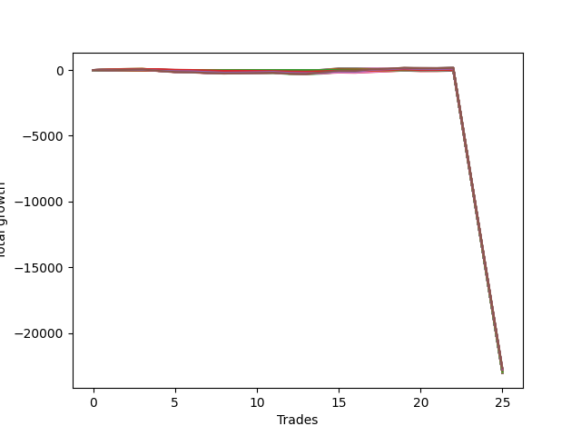

# Long Wallace Doodle 019 
- Symbol: NQ
- Date Range: 03/18/2022 - 06/17/2022
- Trading Period: 7:20-12:30
- Number of Trades: 25



| Name | Win Percent | Profit | Avg Profit / Trade |     | Name | Win Percent | Profit | Avg Profit / Trade |
| ---- | ----------- | ------ | ------------------ | --- | ---- | ----------- | ------ | ------------------ |
| Sorted By <br> Profit | | | | | Sorted By <br> Win Percentage ||||
| Seventy-Five | 48.00 | -11351125.00 | -454045.00 |     | One | 60.00 | -11399000.00 | -455960.00 |
| Five | 48.00 | -11371500.00 | -454860.00 |     | Zero | 60.00 | -11399375.00 | -455975.00 |
| Four | 48.00 | -11385875.00 | -455435.00 |     | Seventy-Two | 52.00 | -11476125.00 | -459045.00 |
| Seventy-Four | 44.00 | -11387125.00 | -455485.00 |     | Twenty-Three | 52.00 | -11505250.00 | -460210.00 |
| Seven | 48.00 | -11389875.00 | -455595.00 |     | Twenty-Two | 52.00 | -11505250.00 | -460210.00 |
| One | 60.00 | -11399000.00 | -455960.00 |     | Twenty-One | 52.00 | -11505250.00 | -460210.00 |
| Zero | 60.00 | -11399375.00 | -455975.00 |     | Twenty | 52.00 | -11505250.00 | -460210.00 |
| Forty-Five | 16.00 | -11399750.00 | -455990.00 |     | Nineteen | 52.00 | -11505250.00 | -460210.00 |
| Forty-Seven | 16.00 | -11403000.00 | -456120.00 |     | Eighteen | 52.00 | -11505250.00 | -460210.00 |
| Seventy-Three | 48.00 | -11410125.00 | -456405.00 |     | Seventeen | 52.00 | -11505250.00 | -460210.00 |
| Fifty-Six | 32.00 | -11417500.00 | -456700.00 |     | Sixten | 52.00 | -11505250.00 | -460210.00 |
| Forty-Two | 16.00 | -11418125.00 | -456725.00 |     | Seventy-Five | 48.00 | -11351125.00 | -454045.00 |
| Forty-Four | 16.00 | -11421625.00 | -456865.00 |     | Five | 48.00 | -11371500.00 | -454860.00 |
| Ten | 12.00 | -11423500.00 | -456940.00 |     | Four | 48.00 | -11385875.00 | -455435.00 |
| Fifty-Seven | 28.00 | -11428625.00 | -457145.00 |     | Seven | 48.00 | -11389875.00 | -455595.00 |
| Fifteen | 12.00 | -11432125.00 | -457285.00 |     | Seventy-Three | 48.00 | -11410125.00 | -456405.00 |
| Twenty-Six | 12.00 | -11434750.00 | -457390.00 |     | Two | 48.00 | -11435500.00 | -457420.00 |
| Two | 48.00 | -11435500.00 | -457420.00 |     | Six | 48.00 | -11453125.00 | -458125.00 |
| Thirteen | 12.00 | -11435750.00 | -457430.00 |     | Three | 48.00 | -11463375.00 | -458535.00 |
| Forty | 24.00 | -11436375.00 | -457455.00 |     | Seventy-Four | 44.00 | -11387125.00 | -455485.00 |
| Sixty-One | 20.00 | -11437125.00 | -457485.00 |     | Thirty-Nine | 44.00 | -11511000.00 | -460440.00 |
| Sixty-Three | 20.00 | -11440375.00 | -457615.00 |     | Thirty-Eight | 44.00 | -11511000.00 | -460440.00 |
| Forty-Three | 20.00 | -11441375.00 | -457655.00 |     | Thirty-Seven | 44.00 | -11511000.00 | -460440.00 |
| Twelve | 12.00 | -11441500.00 | -457660.00 |     | Thirty-Six | 44.00 | -11511000.00 | -460440.00 |
| Thirty-One | 12.00 | -11443375.00 | -457735.00 |     | Thirty-Five | 44.00 | -11511000.00 | -460440.00 |
| Forty-Six | 16.00 | -11445125.00 | -457805.00 |     | Thirty-Four | 44.00 | -11511000.00 | -460440.00 |
| Forty-One | 20.00 | -11445625.00 | -457825.00 |     | Thirty-Three | 44.00 | -11511000.00 | -460440.00 |
| Twenty-Nine | 12.00 | -11447000.00 | -457880.00 |     | Thirty-Two | 44.00 | -11511000.00 | -460440.00 |
| Eleven | 16.00 | -11449000.00 | -457960.00 |     | Fifty-Five | 40.00 | -11512500.00 | -460500.00 |
| Nine | 16.00 | -11449375.00 | -457975.00 |     | Fifty-Four | 40.00 | -11512500.00 | -460500.00 |
| Twenty-Eight | 12.00 | -11452750.00 | -458110.00 |     | Fifty-Three | 40.00 | -11512500.00 | -460500.00 |
| Six | 48.00 | -11453125.00 | -458125.00 |     | Fifty-Two | 40.00 | -11512500.00 | -460500.00 |
| Twenty-Four | 20.00 | -11453750.00 | -458150.00 |     | Fifty-One | 40.00 | -11512500.00 | -460500.00 |
| Fourteen | 12.00 | -11455000.00 | -458200.00 |     | Fifty | 40.00 | -11512500.00 | -460500.00 |
| Fifty-Eight | 20.00 | -11455500.00 | -458220.00 |     | Forty-Nine | 40.00 | -11512500.00 | -460500.00 |
| twenty-Seven | 16.00 | -11458625.00 | -458345.00 |     | Forty-Eight | 40.00 | -11512500.00 | -460500.00 |
| Sixty | 20.00 | -11459000.00 | -458360.00 |     | Fifty-Six | 32.00 | -11417500.00 | -456700.00 |
| Twenty-Five | 16.00 | -11459000.00 | -458360.00 |     | Sixty-Four | 32.00 | -11464000.00 | -458560.00 |
| Three | 48.00 | -11463375.00 | -458535.00 |     | Seventy-One | 32.00 | -11486625.00 | -459465.00 |
| Sixty-Four | 32.00 | -11464000.00 | -458560.00 |     | Seventy | 32.00 | -11486625.00 | -459465.00 |
| Thirty | 12.00 | -11466250.00 | -458650.00 |     | Sixty-Nine | 32.00 | -11486625.00 | -459465.00 |
| Eight | 16.00 | -11470125.00 | -458805.00 |     | Sixty-Eight | 32.00 | -11486625.00 | -459465.00 |
| Seventy-Two | 52.00 | -11476125.00 | -459045.00 |     | Sixty-Seven | 32.00 | -11486625.00 | -459465.00 |
| Sixty-Two | 20.00 | -11482500.00 | -459300.00 |     | Sixty-Six | 32.00 | -11486625.00 | -459465.00 |
| Fifty-Nine | 20.00 | -11485875.00 | -459435.00 |     | Sixty-Five | 32.00 | -11486625.00 | -459465.00 |
| Seventy-One | 32.00 | -11486625.00 | -459465.00 |     | Fifty-Seven | 28.00 | -11428625.00 | -457145.00 |
| Seventy | 32.00 | -11486625.00 | -459465.00 |     | Forty | 24.00 | -11436375.00 | -457455.00 |
| Sixty-Nine | 32.00 | -11486625.00 | -459465.00 |     | Sixty-One | 20.00 | -11437125.00 | -457485.00 |
| Sixty-Eight | 32.00 | -11486625.00 | -459465.00 |     | Sixty-Three | 20.00 | -11440375.00 | -457615.00 |
| Sixty-Seven | 32.00 | -11486625.00 | -459465.00 |     | Forty-Three | 20.00 | -11441375.00 | -457655.00 |
| Sixty-Six | 32.00 | -11486625.00 | -459465.00 |     | Forty-One | 20.00 | -11445625.00 | -457825.00 |
| Sixty-Five | 32.00 | -11486625.00 | -459465.00 |     | Twenty-Four | 20.00 | -11453750.00 | -458150.00 |
| Twenty-Three | 52.00 | -11505250.00 | -460210.00 |     | Fifty-Eight | 20.00 | -11455500.00 | -458220.00 |
| Twenty-Two | 52.00 | -11505250.00 | -460210.00 |     | Sixty | 20.00 | -11459000.00 | -458360.00 |
| Twenty-One | 52.00 | -11505250.00 | -460210.00 |     | Sixty-Two | 20.00 | -11482500.00 | -459300.00 |
| Twenty | 52.00 | -11505250.00 | -460210.00 |     | Fifty-Nine | 20.00 | -11485875.00 | -459435.00 |
| Nineteen | 52.00 | -11505250.00 | -460210.00 |     | Forty-Five | 16.00 | -11399750.00 | -455990.00 |
| Eighteen | 52.00 | -11505250.00 | -460210.00 |     | Forty-Seven | 16.00 | -11403000.00 | -456120.00 |
| Seventeen | 52.00 | -11505250.00 | -460210.00 |     | Forty-Two | 16.00 | -11418125.00 | -456725.00 |
| Sixten | 52.00 | -11505250.00 | -460210.00 |     | Forty-Four | 16.00 | -11421625.00 | -456865.00 |
| Thirty-Nine | 44.00 | -11511000.00 | -460440.00 |     | Forty-Six | 16.00 | -11445125.00 | -457805.00 |
| Thirty-Eight | 44.00 | -11511000.00 | -460440.00 |     | Eleven | 16.00 | -11449000.00 | -457960.00 |
| Thirty-Seven | 44.00 | -11511000.00 | -460440.00 |     | Nine | 16.00 | -11449375.00 | -457975.00 |
| Thirty-Six | 44.00 | -11511000.00 | -460440.00 |     | twenty-Seven | 16.00 | -11458625.00 | -458345.00 |
| Thirty-Five | 44.00 | -11511000.00 | -460440.00 |     | Twenty-Five | 16.00 | -11459000.00 | -458360.00 |
| Thirty-Four | 44.00 | -11511000.00 | -460440.00 |     | Eight | 16.00 | -11470125.00 | -458805.00 |
| Thirty-Three | 44.00 | -11511000.00 | -460440.00 |     | Ten | 12.00 | -11423500.00 | -456940.00 |
| Thirty-Two | 44.00 | -11511000.00 | -460440.00 |     | Fifteen | 12.00 | -11432125.00 | -457285.00 |
| Fifty-Five | 40.00 | -11512500.00 | -460500.00 |     | Twenty-Six | 12.00 | -11434750.00 | -457390.00 |
| Fifty-Four | 40.00 | -11512500.00 | -460500.00 |     | Thirteen | 12.00 | -11435750.00 | -457430.00 |
| Fifty-Three | 40.00 | -11512500.00 | -460500.00 |     | Twelve | 12.00 | -11441500.00 | -457660.00 |
| Fifty-Two | 40.00 | -11512500.00 | -460500.00 |     | Thirty-One | 12.00 | -11443375.00 | -457735.00 |
| Fifty-One | 40.00 | -11512500.00 | -460500.00 |     | Twenty-Nine | 12.00 | -11447000.00 | -457880.00 |
| Fifty | 40.00 | -11512500.00 | -460500.00 |     | Twenty-Eight | 12.00 | -11452750.00 | -458110.00 |
| Forty-Nine | 40.00 | -11512500.00 | -460500.00 |     | Fourteen | 12.00 | -11455000.00 | -458200.00 |
| Forty-Eight | 40.00 | -11512500.00 | -460500.00 |     | Thirty | 12.00 | -11466250.00 | -458650.00 |

## NO STOPLOSS

### Test Zero
* Sell when price hits the middle line of the 20p bollinger
* No Stoploss
* Results:
```
Total Trades: 25
Percent Up: 60.00
Percent Down: 40.00
Total Points Moved Up: -22798.75
Potential Profit: -11399375.00
Total Points Ups: 406.00 Count Ups: 15
Total Points Downs: -23204.75 Count Downs: 10
```

<details><summary>Trades</summary>

<code>In: 2022-03-21 09:38:00		Out: 2022-03-21 09:45:40		Total Position Time: 07:40		Total Move Up: 56.75		Total to Date: 56.75</code> <br />
<code>In: 2022-03-23 11:12:00		Out: 2022-03-23 11:18:05		Total Position Time: 06:05		Total Move Up: 21.75		Total to Date: 78.50</code> <br />
<code>In: 2022-03-23 11:13:00		Out: 2022-03-23 11:18:05		Total Position Time: 05:05		Total Move Up: 22.00		Total to Date: 100.50</code> <br />
<code>In: 2022-03-25 08:03:00		Out: 2022-03-25 08:32:55		Total Position Time: 29:55		Total Move Up: -117.75		Total to Date: -17.25</code> <br />
<code>In: 2022-03-25 08:09:00		Out: 2022-03-25 08:36:55		Total Position Time: 27:55		Total Move Up: -71.25		Total to Date: -88.50</code> <br />
<code>In: 2022-03-25 08:12:00		Out: 2022-03-25 08:36:55		Total Position Time: 24:55		Total Move Up: -35.50		Total to Date: -124.00</code> <br />
<code>In: 2022-03-30 07:59:00		Out: 2022-03-30 08:19:10		Total Position Time: 20:10		Total Move Up: -30.50		Total to Date: -154.50</code> <br />
<code>In: 2022-03-30 08:01:00		Out: 2022-03-30 08:19:10		Total Position Time: 18:10		Total Move Up: -23.00		Total to Date: -177.50</code> <br />
<code>In: 2022-03-31 09:36:00		Out: 2022-03-31 09:37:45		Total Position Time: 01:45		Total Move Up: 13.00		Total to Date: -164.50</code> <br />
<code>In: 2022-04-08 11:30:00		Out: 2022-04-08 11:39:40		Total Position Time: 09:40		Total Move Up: 7.75		Total to Date: -156.75</code> <br />
<code>In: 2022-04-08 11:30:00		Out: 2022-04-08 11:39:40		Total Position Time: 09:40		Total Move Up: 7.75		Total to Date: -149.00</code> <br />
<code>In: 2022-04-11 07:21:00		Out: 2022-04-11 07:34:10		Total Position Time: 13:10		Total Move Up: -5.00		Total to Date: -154.00</code> <br />
<code>In: 2022-04-27 12:00:00		Out: 2022-04-27 12:13:55		Total Position Time: 13:55		Total Move Up: 0.00		Total to Date: -154.00</code> <br />
<code>In: 2022-05-03 07:47:00		Out: 2022-05-03 07:54:05		Total Position Time: 07:05		Total Move Up: 49.25		Total to Date: -104.75</code> <br />
<code>In: 2022-05-03 11:44:00		Out: 2022-05-03 11:44:20		Total Position Time: 00:20		Total Move Up: 37.75		Total to Date: -67.00</code> <br />
<code>In: 2022-05-06 11:08:00		Out: 2022-05-06 11:12:20		Total Position Time: 04:20		Total Move Up: 38.00		Total to Date: -29.00</code> <br />
<code>In: 2022-05-17 11:24:00		Out: 2022-05-17 11:27:30		Total Position Time: 03:30		Total Move Up: 46.50		Total to Date: 17.50</code> <br />
<code>In: 2022-05-19 10:15:00		Out: 2022-05-19 10:20:00		Total Position Time: 05:00		Total Move Up: 32.25		Total to Date: 49.75</code> <br />
<code>In: 2022-05-19 10:16:00		Out: 2022-05-19 10:20:00		Total Position Time: 04:00		Total Move Up: 43.50		Total to Date: 93.25</code> <br />
<code>In: 2022-06-08 09:29:00		Out: 2022-06-08 09:54:10		Total Position Time: 25:10		Total Move Up: -46.75		Total to Date: 46.50</code> <br />
<code>In: 2022-06-08 09:41:00		Out: 2022-06-08 09:54:10		Total Position Time: 13:10		Total Move Up: 1.50		Total to Date: 48.00</code> <br />
<code>In: 2022-06-09 08:09:00		Out: 2022-06-09 08:11:10		Total Position Time: 02:10		Total Move Up: 28.25		Total to Date: 76.25</code> <br />
<code>In: 2022-06-15 11:08:00		Out: 2022-06-15 11:37:55		Total Position Time: 29:55		Total Move Up: -7665.25		Total to Date: -7589.00</code> <br />
<code>In: 2022-06-15 11:32:00		Out: 2022-06-15 12:01:55		Total Position Time: 29:55		Total Move Up: -7613.25		Total to Date: -15202.25</code> <br />
<code>In: 2022-06-15 11:34:00		Out: 2022-06-15 12:03:55		Total Position Time: 29:55		Total Move Up: -7596.50		Total to Date: -22798.75</code> <br />


</details>

### Test One
* Sell when the price hits the upper line of the 20p 1std bollinger
* No Stoploss
* Results:
```
Total Trades: 25
Percent Up: 60.00
Percent Down: 40.00
Total Points Moved Up: -22798.00
Potential Profit: -11399000.00
Total Points Ups: 460.25 Count Ups: 15
Total Points Downs: -23258.25 Count Downs: 10
```

<details><summary>Trades</summary>

<code>In: 2022-03-21 09:38:00		Out: 2022-03-21 09:49:40		Total Position Time: 11:40		Total Move Up: 57.75		Total to Date: 57.75</code> <br />
<code>In: 2022-03-23 11:12:00		Out: 2022-03-23 11:26:55		Total Position Time: 14:55		Total Move Up: 24.50		Total to Date: 82.25</code> <br />
<code>In: 2022-03-23 11:13:00		Out: 2022-03-23 11:26:55		Total Position Time: 13:55		Total Move Up: 24.75		Total to Date: 107.00</code> <br />
<code>In: 2022-03-25 08:03:00		Out: 2022-03-25 08:32:55		Total Position Time: 29:55		Total Move Up: -117.75		Total to Date: -10.75</code> <br />
<code>In: 2022-03-25 08:09:00		Out: 2022-03-25 08:38:55		Total Position Time: 29:55		Total Move Up: -80.25		Total to Date: -91.00</code> <br />
<code>In: 2022-03-25 08:12:00		Out: 2022-03-25 08:41:20		Total Position Time: 29:20		Total Move Up: -30.00		Total to Date: -121.00</code> <br />
<code>In: 2022-03-30 07:59:00		Out: 2022-03-30 08:23:45		Total Position Time: 24:45		Total Move Up: -26.00		Total to Date: -147.00</code> <br />
<code>In: 2022-03-30 08:01:00		Out: 2022-03-30 08:23:45		Total Position Time: 22:45		Total Move Up: -18.50		Total to Date: -165.50</code> <br />
<code>In: 2022-03-31 09:36:00		Out: 2022-03-31 09:40:45		Total Position Time: 04:45		Total Move Up: 18.25		Total to Date: -147.25</code> <br />
<code>In: 2022-04-08 11:30:00		Out: 2022-04-08 11:46:10		Total Position Time: 16:10		Total Move Up: 1.00		Total to Date: -146.25</code> <br />
<code>In: 2022-04-08 11:30:00		Out: 2022-04-08 11:46:10		Total Position Time: 16:10		Total Move Up: 1.00		Total to Date: -145.25</code> <br />
<code>In: 2022-04-11 07:21:00		Out: 2022-04-11 07:50:55		Total Position Time: 29:55		Total Move Up: -70.50		Total to Date: -215.75</code> <br />
<code>In: 2022-04-27 12:00:00		Out: 2022-04-27 12:15:20		Total Position Time: 15:20		Total Move Up: 6.50		Total to Date: -209.25</code> <br />
<code>In: 2022-05-03 07:47:00		Out: 2022-05-03 07:57:15		Total Position Time: 10:15		Total Move Up: 44.75		Total to Date: -164.50</code> <br />
<code>In: 2022-05-03 11:44:00		Out: 2022-05-03 11:50:45		Total Position Time: 06:45		Total Move Up: 57.75		Total to Date: -106.75</code> <br />
<code>In: 2022-05-06 11:08:00		Out: 2022-05-06 11:24:20		Total Position Time: 16:20		Total Move Up: 38.00		Total to Date: -68.75</code> <br />
<code>In: 2022-05-17 11:24:00		Out: 2022-05-17 11:39:45		Total Position Time: 15:45		Total Move Up: 44.25		Total to Date: -24.50</code> <br />
<code>In: 2022-05-19 10:15:00		Out: 2022-05-19 10:26:05		Total Position Time: 11:05		Total Move Up: 45.75		Total to Date: 21.25</code> <br />
<code>In: 2022-05-19 10:16:00		Out: 2022-05-19 10:26:05		Total Position Time: 10:05		Total Move Up: 57.00		Total to Date: 78.25</code> <br />
<code>In: 2022-06-08 09:29:00		Out: 2022-06-08 09:57:05		Total Position Time: 28:05		Total Move Up: -40.25		Total to Date: 38.00</code> <br />
<code>In: 2022-06-08 09:41:00		Out: 2022-06-08 09:57:05		Total Position Time: 16:05		Total Move Up: 8.00		Total to Date: 46.00</code> <br />
<code>In: 2022-06-09 08:09:00		Out: 2022-06-09 08:22:35		Total Position Time: 13:35		Total Move Up: 31.00		Total to Date: 77.00</code> <br />
<code>In: 2022-06-15 11:08:00		Out: 2022-06-15 11:37:55		Total Position Time: 29:55		Total Move Up: -7665.25		Total to Date: -7588.25</code> <br />
<code>In: 2022-06-15 11:32:00		Out: 2022-06-15 12:01:55		Total Position Time: 29:55		Total Move Up: -7613.25		Total to Date: -15201.50</code> <br />
<code>In: 2022-06-15 11:34:00		Out: 2022-06-15 12:03:55		Total Position Time: 29:55		Total Move Up: -7596.50		Total to Date: -22798.00</code> <br />


</details>

### Test Two
* Sell when the price hits the upper line of the 20p 2std bollinger
* No Stoploss
* Results:
```
Total Trades: 25
Percent Up: 48.00
Percent Down: 52.00
Total Points Moved Up: -22871.00
Potential Profit: -11435500.00
Total Points Ups: 481.75 Count Ups: 12
Total Points Downs: -23352.75 Count Downs: 13
```

<details><summary>Trades</summary>

<code>In: 2022-03-21 09:38:00		Out: 2022-03-21 10:07:55		Total Position Time: 29:55		Total Move Up: -21.25		Total to Date: -21.25</code> <br />
<code>In: 2022-03-23 11:12:00		Out: 2022-03-23 11:28:15		Total Position Time: 16:15		Total Move Up: 36.75		Total to Date: 15.50</code> <br />
<code>In: 2022-03-23 11:13:00		Out: 2022-03-23 11:28:15		Total Position Time: 15:15		Total Move Up: 37.00		Total to Date: 52.50</code> <br />
<code>In: 2022-03-25 08:03:00		Out: 2022-03-25 08:32:55		Total Position Time: 29:55		Total Move Up: -117.75		Total to Date: -65.25</code> <br />
<code>In: 2022-03-25 08:09:00		Out: 2022-03-25 08:38:55		Total Position Time: 29:55		Total Move Up: -80.25		Total to Date: -145.50</code> <br />
<code>In: 2022-03-25 08:12:00		Out: 2022-03-25 08:41:55		Total Position Time: 29:55		Total Move Up: -21.25		Total to Date: -166.75</code> <br />
<code>In: 2022-03-30 07:59:00		Out: 2022-03-30 08:28:55		Total Position Time: 29:55		Total Move Up: -54.25		Total to Date: -221.00</code> <br />
<code>In: 2022-03-30 08:01:00		Out: 2022-03-30 08:30:55		Total Position Time: 29:55		Total Move Up: -34.25		Total to Date: -255.25</code> <br />
<code>In: 2022-03-31 09:36:00		Out: 2022-03-31 10:05:55		Total Position Time: 29:55		Total Move Up: 8.25		Total to Date: -247.00</code> <br />
<code>In: 2022-04-08 11:30:00		Out: 2022-04-08 11:47:25		Total Position Time: 17:25		Total Move Up: 7.25		Total to Date: -239.75</code> <br />
<code>In: 2022-04-08 11:30:00		Out: 2022-04-08 11:47:25		Total Position Time: 17:25		Total Move Up: 7.25		Total to Date: -232.50</code> <br />
<code>In: 2022-04-11 07:21:00		Out: 2022-04-11 07:50:55		Total Position Time: 29:55		Total Move Up: -70.50		Total to Date: -303.00</code> <br />
<code>In: 2022-04-27 12:00:00		Out: 2022-04-27 12:29:55		Total Position Time: 29:55		Total Move Up: -20.75		Total to Date: -323.75</code> <br />
<code>In: 2022-05-03 07:47:00		Out: 2022-05-03 07:59:15		Total Position Time: 12:15		Total Move Up: 51.25		Total to Date: -272.50</code> <br />
<code>In: 2022-05-03 11:44:00		Out: 2022-05-03 12:07:55		Total Position Time: 23:55		Total Move Up: 124.25		Total to Date: -148.25</code> <br />
<code>In: 2022-05-06 11:08:00		Out: 2022-05-06 11:37:55		Total Position Time: 29:55		Total Move Up: -14.75		Total to Date: -163.00</code> <br />
<code>In: 2022-05-17 11:24:00		Out: 2022-05-17 11:40:00		Total Position Time: 16:00		Total Move Up: 53.75		Total to Date: -109.25</code> <br />
<code>In: 2022-05-19 10:15:00		Out: 2022-05-19 10:44:55		Total Position Time: 29:55		Total Move Up: 47.75		Total to Date: -61.50</code> <br />
<code>In: 2022-05-19 10:16:00		Out: 2022-05-19 10:45:55		Total Position Time: 29:55		Total Move Up: 64.00		Total to Date: 2.50</code> <br />
<code>In: 2022-06-08 09:29:00		Out: 2022-06-08 09:58:55		Total Position Time: 29:55		Total Move Up: -42.75		Total to Date: -40.25</code> <br />
<code>In: 2022-06-08 09:41:00		Out: 2022-06-08 09:59:15		Total Position Time: 18:15		Total Move Up: 14.00		Total to Date: -26.25</code> <br />
<code>In: 2022-06-09 08:09:00		Out: 2022-06-09 08:33:20		Total Position Time: 24:20		Total Move Up: 30.25		Total to Date: 4.00</code> <br />
<code>In: 2022-06-15 11:08:00		Out: 2022-06-15 11:37:55		Total Position Time: 29:55		Total Move Up: -7665.25		Total to Date: -7661.25</code> <br />
<code>In: 2022-06-15 11:32:00		Out: 2022-06-15 12:01:55		Total Position Time: 29:55		Total Move Up: -7613.25		Total to Date: -15274.50</code> <br />
<code>In: 2022-06-15 11:34:00		Out: 2022-06-15 12:03:55		Total Position Time: 29:55		Total Move Up: -7596.50		Total to Date: -22871.00</code> <br />


</details>

### Test Three
* Sell when price hits the middle line of the 50p bollinger
* No Stoploss
* Results:
```
Total Trades: 25
Percent Up: 48.00
Percent Down: 52.00
Total Points Moved Up: -22926.75
Potential Profit: -11463375.00
Total Points Ups: 426.00 Count Ups: 12
Total Points Downs: -23352.75 Count Downs: 13
```

<details><summary>Trades</summary>

<code>In: 2022-03-21 09:38:00		Out: 2022-03-21 10:07:55		Total Position Time: 29:55		Total Move Up: -21.25		Total to Date: -21.25</code> <br />
<code>In: 2022-03-23 11:12:00		Out: 2022-03-23 11:27:35		Total Position Time: 15:35		Total Move Up: 27.75		Total to Date: 6.50</code> <br />
<code>In: 2022-03-23 11:13:00		Out: 2022-03-23 11:27:35		Total Position Time: 14:35		Total Move Up: 28.00		Total to Date: 34.50</code> <br />
<code>In: 2022-03-25 08:03:00		Out: 2022-03-25 08:32:55		Total Position Time: 29:55		Total Move Up: -117.75		Total to Date: -83.25</code> <br />
<code>In: 2022-03-25 08:09:00		Out: 2022-03-25 08:38:55		Total Position Time: 29:55		Total Move Up: -80.25		Total to Date: -163.50</code> <br />
<code>In: 2022-03-25 08:12:00		Out: 2022-03-25 08:41:55		Total Position Time: 29:55		Total Move Up: -21.25		Total to Date: -184.75</code> <br />
<code>In: 2022-03-30 07:59:00		Out: 2022-03-30 08:28:55		Total Position Time: 29:55		Total Move Up: -54.25		Total to Date: -239.00</code> <br />
<code>In: 2022-03-30 08:01:00		Out: 2022-03-30 08:30:55		Total Position Time: 29:55		Total Move Up: -34.25		Total to Date: -273.25</code> <br />
<code>In: 2022-03-31 09:36:00		Out: 2022-03-31 09:45:40		Total Position Time: 09:40		Total Move Up: 24.50		Total to Date: -248.75</code> <br />
<code>In: 2022-04-08 11:30:00		Out: 2022-04-08 11:49:45		Total Position Time: 19:45		Total Move Up: 21.25		Total to Date: -227.50</code> <br />
<code>In: 2022-04-08 11:30:00		Out: 2022-04-08 11:49:45		Total Position Time: 19:45		Total Move Up: 21.25		Total to Date: -206.25</code> <br />
<code>In: 2022-04-11 07:21:00		Out: 2022-04-11 07:50:55		Total Position Time: 29:55		Total Move Up: -70.50		Total to Date: -276.75</code> <br />
<code>In: 2022-04-27 12:00:00		Out: 2022-04-27 12:29:55		Total Position Time: 29:55		Total Move Up: -20.75		Total to Date: -297.50</code> <br />
<code>In: 2022-05-03 07:47:00		Out: 2022-05-03 08:02:10		Total Position Time: 15:10		Total Move Up: 52.50		Total to Date: -245.00</code> <br />
<code>In: 2022-05-03 11:44:00		Out: 2022-05-03 11:48:15		Total Position Time: 04:15		Total Move Up: 50.25		Total to Date: -194.75</code> <br />
<code>In: 2022-05-06 11:08:00		Out: 2022-05-06 11:37:55		Total Position Time: 29:55		Total Move Up: -14.75		Total to Date: -209.50</code> <br />
<code>In: 2022-05-17 11:24:00		Out: 2022-05-17 11:40:05		Total Position Time: 16:05		Total Move Up: 58.00		Total to Date: -151.50</code> <br />
<code>In: 2022-05-19 10:15:00		Out: 2022-05-19 10:23:35		Total Position Time: 08:35		Total Move Up: 47.75		Total to Date: -103.75</code> <br />
<code>In: 2022-05-19 10:16:00		Out: 2022-05-19 10:23:35		Total Position Time: 07:35		Total Move Up: 59.00		Total to Date: -44.75</code> <br />
<code>In: 2022-06-08 09:29:00		Out: 2022-06-08 09:58:55		Total Position Time: 29:55		Total Move Up: -42.75		Total to Date: -87.50</code> <br />
<code>In: 2022-06-08 09:41:00		Out: 2022-06-08 10:10:55		Total Position Time: 29:55		Total Move Up: 4.75		Total to Date: -82.75</code> <br />
<code>In: 2022-06-09 08:09:00		Out: 2022-06-09 08:33:10		Total Position Time: 24:10		Total Move Up: 31.00		Total to Date: -51.75</code> <br />
<code>In: 2022-06-15 11:08:00		Out: 2022-06-15 11:37:55		Total Position Time: 29:55		Total Move Up: -7665.25		Total to Date: -7717.00</code> <br />
<code>In: 2022-06-15 11:32:00		Out: 2022-06-15 12:01:55		Total Position Time: 29:55		Total Move Up: -7613.25		Total to Date: -15330.25</code> <br />
<code>In: 2022-06-15 11:34:00		Out: 2022-06-15 12:03:55		Total Position Time: 29:55		Total Move Up: -7596.50		Total to Date: -22926.75</code> <br />


</details>

### Test Four
* Sell when the price hits the upper line of the 50p 1std bollinger
* No Stoploss
* Results:
```
Total Trades: 25
Percent Up: 48.00
Percent Down: 52.00
Total Points Moved Up: -22771.75
Potential Profit: -11385875.00
Total Points Ups: 581.00 Count Ups: 12
Total Points Downs: -23352.75 Count Downs: 13
```

<details><summary>Trades</summary>

<code>In: 2022-03-21 09:38:00		Out: 2022-03-21 10:07:55		Total Position Time: 29:55		Total Move Up: -21.25		Total to Date: -21.25</code> <br />
<code>In: 2022-03-23 11:12:00		Out: 2022-03-23 11:41:55		Total Position Time: 29:55		Total Move Up: 38.00		Total to Date: 16.75</code> <br />
<code>In: 2022-03-23 11:13:00		Out: 2022-03-23 11:42:55		Total Position Time: 29:55		Total Move Up: 34.25		Total to Date: 51.00</code> <br />
<code>In: 2022-03-25 08:03:00		Out: 2022-03-25 08:32:55		Total Position Time: 29:55		Total Move Up: -117.75		Total to Date: -66.75</code> <br />
<code>In: 2022-03-25 08:09:00		Out: 2022-03-25 08:38:55		Total Position Time: 29:55		Total Move Up: -80.25		Total to Date: -147.00</code> <br />
<code>In: 2022-03-25 08:12:00		Out: 2022-03-25 08:41:55		Total Position Time: 29:55		Total Move Up: -21.25		Total to Date: -168.25</code> <br />
<code>In: 2022-03-30 07:59:00		Out: 2022-03-30 08:28:55		Total Position Time: 29:55		Total Move Up: -54.25		Total to Date: -222.50</code> <br />
<code>In: 2022-03-30 08:01:00		Out: 2022-03-30 08:30:55		Total Position Time: 29:55		Total Move Up: -34.25		Total to Date: -256.75</code> <br />
<code>In: 2022-03-31 09:36:00		Out: 2022-03-31 10:05:55		Total Position Time: 29:55		Total Move Up: 8.25		Total to Date: -248.50</code> <br />
<code>In: 2022-04-08 11:30:00		Out: 2022-04-08 11:53:15		Total Position Time: 23:15		Total Move Up: 42.25		Total to Date: -206.25</code> <br />
<code>In: 2022-04-08 11:30:00		Out: 2022-04-08 11:53:15		Total Position Time: 23:15		Total Move Up: 42.25		Total to Date: -164.00</code> <br />
<code>In: 2022-04-11 07:21:00		Out: 2022-04-11 07:50:55		Total Position Time: 29:55		Total Move Up: -70.50		Total to Date: -234.50</code> <br />
<code>In: 2022-04-27 12:00:00		Out: 2022-04-27 12:29:55		Total Position Time: 29:55		Total Move Up: -20.75		Total to Date: -255.25</code> <br />
<code>In: 2022-05-03 07:47:00		Out: 2022-05-03 08:05:00		Total Position Time: 18:00		Total Move Up: 80.25		Total to Date: -175.00</code> <br />
<code>In: 2022-05-03 11:44:00		Out: 2022-05-03 11:52:05		Total Position Time: 08:05		Total Move Up: 78.00		Total to Date: -97.00</code> <br />
<code>In: 2022-05-06 11:08:00		Out: 2022-05-06 11:37:55		Total Position Time: 29:55		Total Move Up: -14.75		Total to Date: -111.75</code> <br />
<code>In: 2022-05-17 11:24:00		Out: 2022-05-17 11:45:45		Total Position Time: 21:45		Total Move Up: 89.00		Total to Date: -22.75</code> <br />
<code>In: 2022-05-19 10:15:00		Out: 2022-05-19 10:32:05		Total Position Time: 17:05		Total Move Up: 59.50		Total to Date: 36.75</code> <br />
<code>In: 2022-05-19 10:16:00		Out: 2022-05-19 10:32:05		Total Position Time: 16:05		Total Move Up: 70.75		Total to Date: 107.50</code> <br />
<code>In: 2022-06-08 09:29:00		Out: 2022-06-08 09:58:55		Total Position Time: 29:55		Total Move Up: -42.75		Total to Date: 64.75</code> <br />
<code>In: 2022-06-08 09:41:00		Out: 2022-06-08 10:10:55		Total Position Time: 29:55		Total Move Up: 4.75		Total to Date: 69.50</code> <br />
<code>In: 2022-06-09 08:09:00		Out: 2022-06-09 08:38:55		Total Position Time: 29:55		Total Move Up: 33.75		Total to Date: 103.25</code> <br />
<code>In: 2022-06-15 11:08:00		Out: 2022-06-15 11:37:55		Total Position Time: 29:55		Total Move Up: -7665.25		Total to Date: -7562.00</code> <br />
<code>In: 2022-06-15 11:32:00		Out: 2022-06-15 12:01:55		Total Position Time: 29:55		Total Move Up: -7613.25		Total to Date: -15175.25</code> <br />
<code>In: 2022-06-15 11:34:00		Out: 2022-06-15 12:03:55		Total Position Time: 29:55		Total Move Up: -7596.50		Total to Date: -22771.75</code> <br />


</details>

### Test Five
* Sell when the price hits the upper line of the 50p 2std bollinger
* No Stoploss
* Results:
```
Total Trades: 25
Percent Up: 48.00
Percent Down: 52.00
Total Points Moved Up: -22743.00
Potential Profit: -11371500.00
Total Points Ups: 609.75 Count Ups: 12
Total Points Downs: -23352.75 Count Downs: 13
```

<details><summary>Trades</summary>

<code>In: 2022-03-21 09:38:00		Out: 2022-03-21 10:07:55		Total Position Time: 29:55		Total Move Up: -21.25		Total to Date: -21.25</code> <br />
<code>In: 2022-03-23 11:12:00		Out: 2022-03-23 11:41:55		Total Position Time: 29:55		Total Move Up: 38.00		Total to Date: 16.75</code> <br />
<code>In: 2022-03-23 11:13:00		Out: 2022-03-23 11:42:55		Total Position Time: 29:55		Total Move Up: 34.25		Total to Date: 51.00</code> <br />
<code>In: 2022-03-25 08:03:00		Out: 2022-03-25 08:32:55		Total Position Time: 29:55		Total Move Up: -117.75		Total to Date: -66.75</code> <br />
<code>In: 2022-03-25 08:09:00		Out: 2022-03-25 08:38:55		Total Position Time: 29:55		Total Move Up: -80.25		Total to Date: -147.00</code> <br />
<code>In: 2022-03-25 08:12:00		Out: 2022-03-25 08:41:55		Total Position Time: 29:55		Total Move Up: -21.25		Total to Date: -168.25</code> <br />
<code>In: 2022-03-30 07:59:00		Out: 2022-03-30 08:28:55		Total Position Time: 29:55		Total Move Up: -54.25		Total to Date: -222.50</code> <br />
<code>In: 2022-03-30 08:01:00		Out: 2022-03-30 08:30:55		Total Position Time: 29:55		Total Move Up: -34.25		Total to Date: -256.75</code> <br />
<code>In: 2022-03-31 09:36:00		Out: 2022-03-31 10:05:55		Total Position Time: 29:55		Total Move Up: 8.25		Total to Date: -248.50</code> <br />
<code>In: 2022-04-08 11:30:00		Out: 2022-04-08 11:59:55		Total Position Time: 29:55		Total Move Up: 22.00		Total to Date: -226.50</code> <br />
<code>In: 2022-04-08 11:30:00		Out: 2022-04-08 11:59:55		Total Position Time: 29:55		Total Move Up: 22.00		Total to Date: -204.50</code> <br />
<code>In: 2022-04-11 07:21:00		Out: 2022-04-11 07:50:55		Total Position Time: 29:55		Total Move Up: -70.50		Total to Date: -275.00</code> <br />
<code>In: 2022-04-27 12:00:00		Out: 2022-04-27 12:29:55		Total Position Time: 29:55		Total Move Up: -20.75		Total to Date: -295.75</code> <br />
<code>In: 2022-05-03 07:47:00		Out: 2022-05-03 08:07:20		Total Position Time: 20:20		Total Move Up: 112.50		Total to Date: -183.25</code> <br />
<code>In: 2022-05-03 11:44:00		Out: 2022-05-03 11:59:05		Total Position Time: 15:05		Total Move Up: 96.25		Total to Date: -87.00</code> <br />
<code>In: 2022-05-06 11:08:00		Out: 2022-05-06 11:37:55		Total Position Time: 29:55		Total Move Up: -14.75		Total to Date: -101.75</code> <br />
<code>In: 2022-05-17 11:24:00		Out: 2022-05-17 11:48:45		Total Position Time: 24:45		Total Move Up: 126.25		Total to Date: 24.50</code> <br />
<code>In: 2022-05-19 10:15:00		Out: 2022-05-19 10:44:55		Total Position Time: 29:55		Total Move Up: 47.75		Total to Date: 72.25</code> <br />
<code>In: 2022-05-19 10:16:00		Out: 2022-05-19 10:45:55		Total Position Time: 29:55		Total Move Up: 64.00		Total to Date: 136.25</code> <br />
<code>In: 2022-06-08 09:29:00		Out: 2022-06-08 09:58:55		Total Position Time: 29:55		Total Move Up: -42.75		Total to Date: 93.50</code> <br />
<code>In: 2022-06-08 09:41:00		Out: 2022-06-08 10:10:55		Total Position Time: 29:55		Total Move Up: 4.75		Total to Date: 98.25</code> <br />
<code>In: 2022-06-09 08:09:00		Out: 2022-06-09 08:38:55		Total Position Time: 29:55		Total Move Up: 33.75		Total to Date: 132.00</code> <br />
<code>In: 2022-06-15 11:08:00		Out: 2022-06-15 11:37:55		Total Position Time: 29:55		Total Move Up: -7665.25		Total to Date: -7533.25</code> <br />
<code>In: 2022-06-15 11:32:00		Out: 2022-06-15 12:01:55		Total Position Time: 29:55		Total Move Up: -7613.25		Total to Date: -15146.50</code> <br />
<code>In: 2022-06-15 11:34:00		Out: 2022-06-15 12:03:55		Total Position Time: 29:55		Total Move Up: -7596.50		Total to Date: -22743.00</code> <br />


</details>

### Test Six
* Sell when the price hits the middle line of the 1std VWAP
* No Stoploss
* Results:
```
Total Trades: 25
Percent Up: 48.00
Percent Down: 52.00
Total Points Moved Up: -22906.25
Potential Profit: -11453125.00
Total Points Ups: 446.50 Count Ups: 12
Total Points Downs: -23352.75 Count Downs: 13
```

<details><summary>Trades</summary>

<code>In: 2022-03-21 09:38:00		Out: 2022-03-21 10:07:55		Total Position Time: 29:55		Total Move Up: -21.25		Total to Date: -21.25</code> <br />
<code>In: 2022-03-23 11:12:00		Out: 2022-03-23 11:41:55		Total Position Time: 29:55		Total Move Up: 38.00		Total to Date: 16.75</code> <br />
<code>In: 2022-03-23 11:13:00		Out: 2022-03-23 11:42:55		Total Position Time: 29:55		Total Move Up: 34.25		Total to Date: 51.00</code> <br />
<code>In: 2022-03-25 08:03:00		Out: 2022-03-25 08:32:55		Total Position Time: 29:55		Total Move Up: -117.75		Total to Date: -66.75</code> <br />
<code>In: 2022-03-25 08:09:00		Out: 2022-03-25 08:38:55		Total Position Time: 29:55		Total Move Up: -80.25		Total to Date: -147.00</code> <br />
<code>In: 2022-03-25 08:12:00		Out: 2022-03-25 08:41:55		Total Position Time: 29:55		Total Move Up: -21.25		Total to Date: -168.25</code> <br />
<code>In: 2022-03-30 07:59:00		Out: 2022-03-30 08:28:55		Total Position Time: 29:55		Total Move Up: -54.25		Total to Date: -222.50</code> <br />
<code>In: 2022-03-30 08:01:00		Out: 2022-03-30 08:30:55		Total Position Time: 29:55		Total Move Up: -34.25		Total to Date: -256.75</code> <br />
<code>In: 2022-03-31 09:36:00		Out: 2022-03-31 10:05:55		Total Position Time: 29:55		Total Move Up: 8.25		Total to Date: -248.50</code> <br />
<code>In: 2022-04-08 11:30:00		Out: 2022-04-08 11:59:55		Total Position Time: 29:55		Total Move Up: 22.00		Total to Date: -226.50</code> <br />
<code>In: 2022-04-08 11:30:00		Out: 2022-04-08 11:59:55		Total Position Time: 29:55		Total Move Up: 22.00		Total to Date: -204.50</code> <br />
<code>In: 2022-04-11 07:21:00		Out: 2022-04-11 07:50:55		Total Position Time: 29:55		Total Move Up: -70.50		Total to Date: -275.00</code> <br />
<code>In: 2022-04-27 12:00:00		Out: 2022-04-27 12:29:55		Total Position Time: 29:55		Total Move Up: -20.75		Total to Date: -295.75</code> <br />
<code>In: 2022-05-03 07:47:00		Out: 2022-05-03 08:02:25		Total Position Time: 15:25		Total Move Up: 60.25		Total to Date: -235.50</code> <br />
<code>In: 2022-05-03 11:44:00		Out: 2022-05-03 11:50:45		Total Position Time: 06:45		Total Move Up: 57.75		Total to Date: -177.75</code> <br />
<code>In: 2022-05-06 11:08:00		Out: 2022-05-06 11:37:55		Total Position Time: 29:55		Total Move Up: -14.75		Total to Date: -192.50</code> <br />
<code>In: 2022-05-17 11:24:00		Out: 2022-05-17 11:40:00		Total Position Time: 16:00		Total Move Up: 53.75		Total to Date: -138.75</code> <br />
<code>In: 2022-05-19 10:15:00		Out: 2022-05-19 10:44:55		Total Position Time: 29:55		Total Move Up: 47.75		Total to Date: -91.00</code> <br />
<code>In: 2022-05-19 10:16:00		Out: 2022-05-19 10:45:55		Total Position Time: 29:55		Total Move Up: 64.00		Total to Date: -27.00</code> <br />
<code>In: 2022-06-08 09:29:00		Out: 2022-06-08 09:58:55		Total Position Time: 29:55		Total Move Up: -42.75		Total to Date: -69.75</code> <br />
<code>In: 2022-06-08 09:41:00		Out: 2022-06-08 10:10:55		Total Position Time: 29:55		Total Move Up: 4.75		Total to Date: -65.00</code> <br />
<code>In: 2022-06-09 08:09:00		Out: 2022-06-09 08:38:55		Total Position Time: 29:55		Total Move Up: 33.75		Total to Date: -31.25</code> <br />
<code>In: 2022-06-15 11:08:00		Out: 2022-06-15 11:37:55		Total Position Time: 29:55		Total Move Up: -7665.25		Total to Date: -7696.50</code> <br />
<code>In: 2022-06-15 11:32:00		Out: 2022-06-15 12:01:55		Total Position Time: 29:55		Total Move Up: -7613.25		Total to Date: -15309.75</code> <br />
<code>In: 2022-06-15 11:34:00		Out: 2022-06-15 12:03:55		Total Position Time: 29:55		Total Move Up: -7596.50		Total to Date: -22906.25</code> <br />


</details>

### Test Seven
* Sell when the price hits the upper line of the 1std VWAP
* No Stoploss
* Results:
```
Total Trades: 25
Percent Up: 48.00
Percent Down: 52.00
Total Points Moved Up: -22779.75
Potential Profit: -11389875.00
Total Points Ups: 573.00 Count Ups: 12
Total Points Downs: -23352.75 Count Downs: 13
```

<details><summary>Trades</summary>

<code>In: 2022-03-21 09:38:00		Out: 2022-03-21 10:07:55		Total Position Time: 29:55		Total Move Up: -21.25		Total to Date: -21.25</code> <br />
<code>In: 2022-03-23 11:12:00		Out: 2022-03-23 11:41:55		Total Position Time: 29:55		Total Move Up: 38.00		Total to Date: 16.75</code> <br />
<code>In: 2022-03-23 11:13:00		Out: 2022-03-23 11:42:55		Total Position Time: 29:55		Total Move Up: 34.25		Total to Date: 51.00</code> <br />
<code>In: 2022-03-25 08:03:00		Out: 2022-03-25 08:32:55		Total Position Time: 29:55		Total Move Up: -117.75		Total to Date: -66.75</code> <br />
<code>In: 2022-03-25 08:09:00		Out: 2022-03-25 08:38:55		Total Position Time: 29:55		Total Move Up: -80.25		Total to Date: -147.00</code> <br />
<code>In: 2022-03-25 08:12:00		Out: 2022-03-25 08:41:55		Total Position Time: 29:55		Total Move Up: -21.25		Total to Date: -168.25</code> <br />
<code>In: 2022-03-30 07:59:00		Out: 2022-03-30 08:28:55		Total Position Time: 29:55		Total Move Up: -54.25		Total to Date: -222.50</code> <br />
<code>In: 2022-03-30 08:01:00		Out: 2022-03-30 08:30:55		Total Position Time: 29:55		Total Move Up: -34.25		Total to Date: -256.75</code> <br />
<code>In: 2022-03-31 09:36:00		Out: 2022-03-31 10:05:55		Total Position Time: 29:55		Total Move Up: 8.25		Total to Date: -248.50</code> <br />
<code>In: 2022-04-08 11:30:00		Out: 2022-04-08 11:59:55		Total Position Time: 29:55		Total Move Up: 22.00		Total to Date: -226.50</code> <br />
<code>In: 2022-04-08 11:30:00		Out: 2022-04-08 11:59:55		Total Position Time: 29:55		Total Move Up: 22.00		Total to Date: -204.50</code> <br />
<code>In: 2022-04-11 07:21:00		Out: 2022-04-11 07:50:55		Total Position Time: 29:55		Total Move Up: -70.50		Total to Date: -275.00</code> <br />
<code>In: 2022-04-27 12:00:00		Out: 2022-04-27 12:29:55		Total Position Time: 29:55		Total Move Up: -20.75		Total to Date: -295.75</code> <br />
<code>In: 2022-05-03 07:47:00		Out: 2022-05-03 08:06:40		Total Position Time: 19:40		Total Move Up: 98.75		Total to Date: -197.00</code> <br />
<code>In: 2022-05-03 11:44:00		Out: 2022-05-03 11:59:20		Total Position Time: 15:20		Total Move Up: 103.50		Total to Date: -93.50</code> <br />
<code>In: 2022-05-06 11:08:00		Out: 2022-05-06 11:37:55		Total Position Time: 29:55		Total Move Up: -14.75		Total to Date: -108.25</code> <br />
<code>In: 2022-05-17 11:24:00		Out: 2022-05-17 11:47:10		Total Position Time: 23:10		Total Move Up: 96.00		Total to Date: -12.25</code> <br />
<code>In: 2022-05-19 10:15:00		Out: 2022-05-19 10:44:55		Total Position Time: 29:55		Total Move Up: 47.75		Total to Date: 35.50</code> <br />
<code>In: 2022-05-19 10:16:00		Out: 2022-05-19 10:45:55		Total Position Time: 29:55		Total Move Up: 64.00		Total to Date: 99.50</code> <br />
<code>In: 2022-06-08 09:29:00		Out: 2022-06-08 09:58:55		Total Position Time: 29:55		Total Move Up: -42.75		Total to Date: 56.75</code> <br />
<code>In: 2022-06-08 09:41:00		Out: 2022-06-08 10:10:55		Total Position Time: 29:55		Total Move Up: 4.75		Total to Date: 61.50</code> <br />
<code>In: 2022-06-09 08:09:00		Out: 2022-06-09 08:38:55		Total Position Time: 29:55		Total Move Up: 33.75		Total to Date: 95.25</code> <br />
<code>In: 2022-06-15 11:08:00		Out: 2022-06-15 11:37:55		Total Position Time: 29:55		Total Move Up: -7665.25		Total to Date: -7570.00</code> <br />
<code>In: 2022-06-15 11:32:00		Out: 2022-06-15 12:01:55		Total Position Time: 29:55		Total Move Up: -7613.25		Total to Date: -15183.25</code> <br />
<code>In: 2022-06-15 11:34:00		Out: 2022-06-15 12:03:55		Total Position Time: 29:55		Total Move Up: -7596.50		Total to Date: -22779.75</code> <br />


</details>

## STOPLOSS OF 2

### Test Eight
* Sell when price hits the middle line of the 20p bollinger
* Stoploss is 2 points
* Results:
```
Total Trades: 25
Percent Up: 16.00
Percent Down: 84.00
Total Points Moved Up: -22940.25
Potential Profit: -11470125.00
Total Points Ups: 122.50 Count Ups: 4
Total Points Downs: -23062.75 Count Downs: 21
```

<details><summary>Trades</summary>

<code>In: 2022-03-21 09:38:00		Out: 2022-03-21 09:38:20		Total Position Time: 00:20		Total Move Up: -5.50		Total to Date: -5.50</code> <br />
<code>In: 2022-03-23 11:12:00		Out: 2022-03-23 11:12:25		Total Position Time: 00:25		Total Move Up: -2.50		Total to Date: -8.00</code> <br />
<code>In: 2022-03-23 11:13:00		Out: 2022-03-23 11:13:55		Total Position Time: 00:55		Total Move Up: -2.25		Total to Date: -10.25</code> <br />
<code>In: 2022-03-25 08:03:00		Out: 2022-03-25 08:08:15		Total Position Time: 05:15		Total Move Up: -11.25		Total to Date: -21.50</code> <br />
<code>In: 2022-03-25 08:09:00		Out: 2022-03-25 08:09:10		Total Position Time: 00:10		Total Move Up: -7.50		Total to Date: -29.00</code> <br />
<code>In: 2022-03-25 08:12:00		Out: 2022-03-25 08:12:30		Total Position Time: 00:30		Total Move Up: -2.25		Total to Date: -31.25</code> <br />
<code>In: 2022-03-30 07:59:00		Out: 2022-03-30 07:59:10		Total Position Time: 00:10		Total Move Up: -3.25		Total to Date: -34.50</code> <br />
<code>In: 2022-03-30 08:01:00		Out: 2022-03-30 08:03:50		Total Position Time: 02:50		Total Move Up: -3.00		Total to Date: -37.50</code> <br />
<code>In: 2022-03-31 09:36:00		Out: 2022-03-31 09:37:45		Total Position Time: 01:45		Total Move Up: 13.00		Total to Date: -24.50</code> <br />
<code>In: 2022-04-08 11:30:00		Out: 2022-04-08 11:30:35		Total Position Time: 00:35		Total Move Up: -3.50		Total to Date: -28.00</code> <br />
<code>In: 2022-04-08 11:30:00		Out: 2022-04-08 11:30:35		Total Position Time: 00:35		Total Move Up: -3.50		Total to Date: -31.50</code> <br />
<code>In: 2022-04-11 07:21:00		Out: 2022-04-11 07:22:35		Total Position Time: 01:35		Total Move Up: -5.25		Total to Date: -36.75</code> <br />
<code>In: 2022-04-27 12:00:00		Out: 2022-04-27 12:00:15		Total Position Time: 00:15		Total Move Up: -5.25		Total to Date: -42.00</code> <br />
<code>In: 2022-05-03 07:47:00		Out: 2022-05-03 07:47:10		Total Position Time: 00:10		Total Move Up: -4.00		Total to Date: -46.00</code> <br />
<code>In: 2022-05-03 11:44:00		Out: 2022-05-03 11:44:20		Total Position Time: 00:20		Total Move Up: 37.75		Total to Date: -8.25</code> <br />
<code>In: 2022-05-06 11:08:00		Out: 2022-05-06 11:09:50		Total Position Time: 01:50		Total Move Up: -5.00		Total to Date: -13.25</code> <br />
<code>In: 2022-05-17 11:24:00		Out: 2022-05-17 11:24:15		Total Position Time: 00:15		Total Move Up: -1.75		Total to Date: -15.00</code> <br />
<code>In: 2022-05-19 10:15:00		Out: 2022-05-19 10:15:10		Total Position Time: 00:10		Total Move Up: -7.50		Total to Date: -22.50</code> <br />
<code>In: 2022-05-19 10:16:00		Out: 2022-05-19 10:20:00		Total Position Time: 04:00		Total Move Up: 43.50		Total to Date: 21.00</code> <br />
<code>In: 2022-06-08 09:29:00		Out: 2022-06-08 09:31:50		Total Position Time: 02:50		Total Move Up: -2.25		Total to Date: 18.75</code> <br />
<code>In: 2022-06-08 09:41:00		Out: 2022-06-08 09:42:10		Total Position Time: 01:10		Total Move Up: -2.00		Total to Date: 16.75</code> <br />
<code>In: 2022-06-09 08:09:00		Out: 2022-06-09 08:11:10		Total Position Time: 02:10		Total Move Up: 28.25		Total to Date: 45.00</code> <br />
<code>In: 2022-06-15 11:08:00		Out: 2022-06-15 11:08:10		Total Position Time: 00:10		Total Move Up: -7664.75		Total to Date: -7619.75</code> <br />
<code>In: 2022-06-15 11:32:00		Out: 2022-06-15 11:32:10		Total Position Time: 00:10		Total Move Up: -7671.50		Total to Date: -15291.25</code> <br />
<code>In: 2022-06-15 11:34:00		Out: 2022-06-15 11:34:10		Total Position Time: 00:10		Total Move Up: -7649.00		Total to Date: -22940.25</code> <br />


</details>

### Test Nine
* Sell when the price hits the upper line of the 20p 1std bollinger
* Stoploss is 2 points
* Results:
```
Total Trades: 25
Percent Up: 16.00
Percent Down: 84.00
Total Points Moved Up: -22898.75
Potential Profit: -11449375.00
Total Points Ups: 164.00 Count Ups: 4
Total Points Downs: -23062.75 Count Downs: 21
```

<details><summary>Trades</summary>

<code>In: 2022-03-21 09:38:00		Out: 2022-03-21 09:38:20		Total Position Time: 00:20		Total Move Up: -5.50		Total to Date: -5.50</code> <br />
<code>In: 2022-03-23 11:12:00		Out: 2022-03-23 11:12:25		Total Position Time: 00:25		Total Move Up: -2.50		Total to Date: -8.00</code> <br />
<code>In: 2022-03-23 11:13:00		Out: 2022-03-23 11:13:55		Total Position Time: 00:55		Total Move Up: -2.25		Total to Date: -10.25</code> <br />
<code>In: 2022-03-25 08:03:00		Out: 2022-03-25 08:08:15		Total Position Time: 05:15		Total Move Up: -11.25		Total to Date: -21.50</code> <br />
<code>In: 2022-03-25 08:09:00		Out: 2022-03-25 08:09:10		Total Position Time: 00:10		Total Move Up: -7.50		Total to Date: -29.00</code> <br />
<code>In: 2022-03-25 08:12:00		Out: 2022-03-25 08:12:30		Total Position Time: 00:30		Total Move Up: -2.25		Total to Date: -31.25</code> <br />
<code>In: 2022-03-30 07:59:00		Out: 2022-03-30 07:59:10		Total Position Time: 00:10		Total Move Up: -3.25		Total to Date: -34.50</code> <br />
<code>In: 2022-03-30 08:01:00		Out: 2022-03-30 08:03:50		Total Position Time: 02:50		Total Move Up: -3.00		Total to Date: -37.50</code> <br />
<code>In: 2022-03-31 09:36:00		Out: 2022-03-31 09:40:45		Total Position Time: 04:45		Total Move Up: 18.25		Total to Date: -19.25</code> <br />
<code>In: 2022-04-08 11:30:00		Out: 2022-04-08 11:30:35		Total Position Time: 00:35		Total Move Up: -3.50		Total to Date: -22.75</code> <br />
<code>In: 2022-04-08 11:30:00		Out: 2022-04-08 11:30:35		Total Position Time: 00:35		Total Move Up: -3.50		Total to Date: -26.25</code> <br />
<code>In: 2022-04-11 07:21:00		Out: 2022-04-11 07:22:35		Total Position Time: 01:35		Total Move Up: -5.25		Total to Date: -31.50</code> <br />
<code>In: 2022-04-27 12:00:00		Out: 2022-04-27 12:00:15		Total Position Time: 00:15		Total Move Up: -5.25		Total to Date: -36.75</code> <br />
<code>In: 2022-05-03 07:47:00		Out: 2022-05-03 07:47:10		Total Position Time: 00:10		Total Move Up: -4.00		Total to Date: -40.75</code> <br />
<code>In: 2022-05-03 11:44:00		Out: 2022-05-03 11:50:45		Total Position Time: 06:45		Total Move Up: 57.75		Total to Date: 17.00</code> <br />
<code>In: 2022-05-06 11:08:00		Out: 2022-05-06 11:09:50		Total Position Time: 01:50		Total Move Up: -5.00		Total to Date: 12.00</code> <br />
<code>In: 2022-05-17 11:24:00		Out: 2022-05-17 11:24:15		Total Position Time: 00:15		Total Move Up: -1.75		Total to Date: 10.25</code> <br />
<code>In: 2022-05-19 10:15:00		Out: 2022-05-19 10:15:10		Total Position Time: 00:10		Total Move Up: -7.50		Total to Date: 2.75</code> <br />
<code>In: 2022-05-19 10:16:00		Out: 2022-05-19 10:26:05		Total Position Time: 10:05		Total Move Up: 57.00		Total to Date: 59.75</code> <br />
<code>In: 2022-06-08 09:29:00		Out: 2022-06-08 09:31:50		Total Position Time: 02:50		Total Move Up: -2.25		Total to Date: 57.50</code> <br />
<code>In: 2022-06-08 09:41:00		Out: 2022-06-08 09:42:10		Total Position Time: 01:10		Total Move Up: -2.00		Total to Date: 55.50</code> <br />
<code>In: 2022-06-09 08:09:00		Out: 2022-06-09 08:22:35		Total Position Time: 13:35		Total Move Up: 31.00		Total to Date: 86.50</code> <br />
<code>In: 2022-06-15 11:08:00		Out: 2022-06-15 11:08:10		Total Position Time: 00:10		Total Move Up: -7664.75		Total to Date: -7578.25</code> <br />
<code>In: 2022-06-15 11:32:00		Out: 2022-06-15 11:32:10		Total Position Time: 00:10		Total Move Up: -7671.50		Total to Date: -15249.75</code> <br />
<code>In: 2022-06-15 11:34:00		Out: 2022-06-15 11:34:10		Total Position Time: 00:10		Total Move Up: -7649.00		Total to Date: -22898.75</code> <br />


</details>

### Test Ten
* Sell when the price hits the upper line of the 20p 2std bollinger
* Stoploss is 2 points
* Results:
```
Total Trades: 25
Percent Up: 12.00
Percent Down: 88.00
Total Points Moved Up: -22847.00
Potential Profit: -11423500.00
Total Points Ups: 218.50 Count Ups: 3
Total Points Downs: -23065.50 Count Downs: 22
```

<details><summary>Trades</summary>

<code>In: 2022-03-21 09:38:00		Out: 2022-03-21 09:38:20		Total Position Time: 00:20		Total Move Up: -5.50		Total to Date: -5.50</code> <br />
<code>In: 2022-03-23 11:12:00		Out: 2022-03-23 11:12:25		Total Position Time: 00:25		Total Move Up: -2.50		Total to Date: -8.00</code> <br />
<code>In: 2022-03-23 11:13:00		Out: 2022-03-23 11:13:55		Total Position Time: 00:55		Total Move Up: -2.25		Total to Date: -10.25</code> <br />
<code>In: 2022-03-25 08:03:00		Out: 2022-03-25 08:08:15		Total Position Time: 05:15		Total Move Up: -11.25		Total to Date: -21.50</code> <br />
<code>In: 2022-03-25 08:09:00		Out: 2022-03-25 08:09:10		Total Position Time: 00:10		Total Move Up: -7.50		Total to Date: -29.00</code> <br />
<code>In: 2022-03-25 08:12:00		Out: 2022-03-25 08:12:30		Total Position Time: 00:30		Total Move Up: -2.25		Total to Date: -31.25</code> <br />
<code>In: 2022-03-30 07:59:00		Out: 2022-03-30 07:59:10		Total Position Time: 00:10		Total Move Up: -3.25		Total to Date: -34.50</code> <br />
<code>In: 2022-03-30 08:01:00		Out: 2022-03-30 08:03:50		Total Position Time: 02:50		Total Move Up: -3.00		Total to Date: -37.50</code> <br />
<code>In: 2022-03-31 09:36:00		Out: 2022-03-31 09:58:35		Total Position Time: 22:35		Total Move Up: -2.75		Total to Date: -40.25</code> <br />
<code>In: 2022-04-08 11:30:00		Out: 2022-04-08 11:30:35		Total Position Time: 00:35		Total Move Up: -3.50		Total to Date: -43.75</code> <br />
<code>In: 2022-04-08 11:30:00		Out: 2022-04-08 11:30:35		Total Position Time: 00:35		Total Move Up: -3.50		Total to Date: -47.25</code> <br />
<code>In: 2022-04-11 07:21:00		Out: 2022-04-11 07:22:35		Total Position Time: 01:35		Total Move Up: -5.25		Total to Date: -52.50</code> <br />
<code>In: 2022-04-27 12:00:00		Out: 2022-04-27 12:00:15		Total Position Time: 00:15		Total Move Up: -5.25		Total to Date: -57.75</code> <br />
<code>In: 2022-05-03 07:47:00		Out: 2022-05-03 07:47:10		Total Position Time: 00:10		Total Move Up: -4.00		Total to Date: -61.75</code> <br />
<code>In: 2022-05-03 11:44:00		Out: 2022-05-03 12:07:55		Total Position Time: 23:55		Total Move Up: 124.25		Total to Date: 62.50</code> <br />
<code>In: 2022-05-06 11:08:00		Out: 2022-05-06 11:09:50		Total Position Time: 01:50		Total Move Up: -5.00		Total to Date: 57.50</code> <br />
<code>In: 2022-05-17 11:24:00		Out: 2022-05-17 11:24:15		Total Position Time: 00:15		Total Move Up: -1.75		Total to Date: 55.75</code> <br />
<code>In: 2022-05-19 10:15:00		Out: 2022-05-19 10:15:10		Total Position Time: 00:10		Total Move Up: -7.50		Total to Date: 48.25</code> <br />
<code>In: 2022-05-19 10:16:00		Out: 2022-05-19 10:45:55		Total Position Time: 29:55		Total Move Up: 64.00		Total to Date: 112.25</code> <br />
<code>In: 2022-06-08 09:29:00		Out: 2022-06-08 09:31:50		Total Position Time: 02:50		Total Move Up: -2.25		Total to Date: 110.00</code> <br />
<code>In: 2022-06-08 09:41:00		Out: 2022-06-08 09:42:10		Total Position Time: 01:10		Total Move Up: -2.00		Total to Date: 108.00</code> <br />
<code>In: 2022-06-09 08:09:00		Out: 2022-06-09 08:33:20		Total Position Time: 24:20		Total Move Up: 30.25		Total to Date: 138.25</code> <br />
<code>In: 2022-06-15 11:08:00		Out: 2022-06-15 11:08:10		Total Position Time: 00:10		Total Move Up: -7664.75		Total to Date: -7526.50</code> <br />
<code>In: 2022-06-15 11:32:00		Out: 2022-06-15 11:32:10		Total Position Time: 00:10		Total Move Up: -7671.50		Total to Date: -15198.00</code> <br />
<code>In: 2022-06-15 11:34:00		Out: 2022-06-15 11:34:10		Total Position Time: 00:10		Total Move Up: -7649.00		Total to Date: -22847.00</code> <br />


</details>

### Test Eleven
* Sell when price hits the middle line of the 50p bollinger
* Stoploss is 2 points
* Results:
```
Total Trades: 25
Percent Up: 16.00
Percent Down: 84.00
Total Points Moved Up: -22898.00
Potential Profit: -11449000.00
Total Points Ups: 164.75 Count Ups: 4
Total Points Downs: -23062.75 Count Downs: 21
```

<details><summary>Trades</summary>

<code>In: 2022-03-21 09:38:00		Out: 2022-03-21 09:38:20		Total Position Time: 00:20		Total Move Up: -5.50		Total to Date: -5.50</code> <br />
<code>In: 2022-03-23 11:12:00		Out: 2022-03-23 11:12:25		Total Position Time: 00:25		Total Move Up: -2.50		Total to Date: -8.00</code> <br />
<code>In: 2022-03-23 11:13:00		Out: 2022-03-23 11:13:55		Total Position Time: 00:55		Total Move Up: -2.25		Total to Date: -10.25</code> <br />
<code>In: 2022-03-25 08:03:00		Out: 2022-03-25 08:08:15		Total Position Time: 05:15		Total Move Up: -11.25		Total to Date: -21.50</code> <br />
<code>In: 2022-03-25 08:09:00		Out: 2022-03-25 08:09:10		Total Position Time: 00:10		Total Move Up: -7.50		Total to Date: -29.00</code> <br />
<code>In: 2022-03-25 08:12:00		Out: 2022-03-25 08:12:30		Total Position Time: 00:30		Total Move Up: -2.25		Total to Date: -31.25</code> <br />
<code>In: 2022-03-30 07:59:00		Out: 2022-03-30 07:59:10		Total Position Time: 00:10		Total Move Up: -3.25		Total to Date: -34.50</code> <br />
<code>In: 2022-03-30 08:01:00		Out: 2022-03-30 08:03:50		Total Position Time: 02:50		Total Move Up: -3.00		Total to Date: -37.50</code> <br />
<code>In: 2022-03-31 09:36:00		Out: 2022-03-31 09:45:40		Total Position Time: 09:40		Total Move Up: 24.50		Total to Date: -13.00</code> <br />
<code>In: 2022-04-08 11:30:00		Out: 2022-04-08 11:30:35		Total Position Time: 00:35		Total Move Up: -3.50		Total to Date: -16.50</code> <br />
<code>In: 2022-04-08 11:30:00		Out: 2022-04-08 11:30:35		Total Position Time: 00:35		Total Move Up: -3.50		Total to Date: -20.00</code> <br />
<code>In: 2022-04-11 07:21:00		Out: 2022-04-11 07:22:35		Total Position Time: 01:35		Total Move Up: -5.25		Total to Date: -25.25</code> <br />
<code>In: 2022-04-27 12:00:00		Out: 2022-04-27 12:00:15		Total Position Time: 00:15		Total Move Up: -5.25		Total to Date: -30.50</code> <br />
<code>In: 2022-05-03 07:47:00		Out: 2022-05-03 07:47:10		Total Position Time: 00:10		Total Move Up: -4.00		Total to Date: -34.50</code> <br />
<code>In: 2022-05-03 11:44:00		Out: 2022-05-03 11:48:15		Total Position Time: 04:15		Total Move Up: 50.25		Total to Date: 15.75</code> <br />
<code>In: 2022-05-06 11:08:00		Out: 2022-05-06 11:09:50		Total Position Time: 01:50		Total Move Up: -5.00		Total to Date: 10.75</code> <br />
<code>In: 2022-05-17 11:24:00		Out: 2022-05-17 11:24:15		Total Position Time: 00:15		Total Move Up: -1.75		Total to Date: 9.00</code> <br />
<code>In: 2022-05-19 10:15:00		Out: 2022-05-19 10:15:10		Total Position Time: 00:10		Total Move Up: -7.50		Total to Date: 1.50</code> <br />
<code>In: 2022-05-19 10:16:00		Out: 2022-05-19 10:23:35		Total Position Time: 07:35		Total Move Up: 59.00		Total to Date: 60.50</code> <br />
<code>In: 2022-06-08 09:29:00		Out: 2022-06-08 09:31:50		Total Position Time: 02:50		Total Move Up: -2.25		Total to Date: 58.25</code> <br />
<code>In: 2022-06-08 09:41:00		Out: 2022-06-08 09:42:10		Total Position Time: 01:10		Total Move Up: -2.00		Total to Date: 56.25</code> <br />
<code>In: 2022-06-09 08:09:00		Out: 2022-06-09 08:33:10		Total Position Time: 24:10		Total Move Up: 31.00		Total to Date: 87.25</code> <br />
<code>In: 2022-06-15 11:08:00		Out: 2022-06-15 11:08:10		Total Position Time: 00:10		Total Move Up: -7664.75		Total to Date: -7577.50</code> <br />
<code>In: 2022-06-15 11:32:00		Out: 2022-06-15 11:32:10		Total Position Time: 00:10		Total Move Up: -7671.50		Total to Date: -15249.00</code> <br />
<code>In: 2022-06-15 11:34:00		Out: 2022-06-15 11:34:10		Total Position Time: 00:10		Total Move Up: -7649.00		Total to Date: -22898.00</code> <br />


</details>

### Test Twelve
* Sell when the price hits the upper line of the 50p 1std bollinger
* Stoploss is 2 points
* Results:
```
Total Trades: 25
Percent Up: 12.00
Percent Down: 88.00
Total Points Moved Up: -22883.00
Potential Profit: -11441500.00
Total Points Ups: 182.50 Count Ups: 3
Total Points Downs: -23065.50 Count Downs: 22
```

<details><summary>Trades</summary>

<code>In: 2022-03-21 09:38:00		Out: 2022-03-21 09:38:20		Total Position Time: 00:20		Total Move Up: -5.50		Total to Date: -5.50</code> <br />
<code>In: 2022-03-23 11:12:00		Out: 2022-03-23 11:12:25		Total Position Time: 00:25		Total Move Up: -2.50		Total to Date: -8.00</code> <br />
<code>In: 2022-03-23 11:13:00		Out: 2022-03-23 11:13:55		Total Position Time: 00:55		Total Move Up: -2.25		Total to Date: -10.25</code> <br />
<code>In: 2022-03-25 08:03:00		Out: 2022-03-25 08:08:15		Total Position Time: 05:15		Total Move Up: -11.25		Total to Date: -21.50</code> <br />
<code>In: 2022-03-25 08:09:00		Out: 2022-03-25 08:09:10		Total Position Time: 00:10		Total Move Up: -7.50		Total to Date: -29.00</code> <br />
<code>In: 2022-03-25 08:12:00		Out: 2022-03-25 08:12:30		Total Position Time: 00:30		Total Move Up: -2.25		Total to Date: -31.25</code> <br />
<code>In: 2022-03-30 07:59:00		Out: 2022-03-30 07:59:10		Total Position Time: 00:10		Total Move Up: -3.25		Total to Date: -34.50</code> <br />
<code>In: 2022-03-30 08:01:00		Out: 2022-03-30 08:03:50		Total Position Time: 02:50		Total Move Up: -3.00		Total to Date: -37.50</code> <br />
<code>In: 2022-03-31 09:36:00		Out: 2022-03-31 09:58:35		Total Position Time: 22:35		Total Move Up: -2.75		Total to Date: -40.25</code> <br />
<code>In: 2022-04-08 11:30:00		Out: 2022-04-08 11:30:35		Total Position Time: 00:35		Total Move Up: -3.50		Total to Date: -43.75</code> <br />
<code>In: 2022-04-08 11:30:00		Out: 2022-04-08 11:30:35		Total Position Time: 00:35		Total Move Up: -3.50		Total to Date: -47.25</code> <br />
<code>In: 2022-04-11 07:21:00		Out: 2022-04-11 07:22:35		Total Position Time: 01:35		Total Move Up: -5.25		Total to Date: -52.50</code> <br />
<code>In: 2022-04-27 12:00:00		Out: 2022-04-27 12:00:15		Total Position Time: 00:15		Total Move Up: -5.25		Total to Date: -57.75</code> <br />
<code>In: 2022-05-03 07:47:00		Out: 2022-05-03 07:47:10		Total Position Time: 00:10		Total Move Up: -4.00		Total to Date: -61.75</code> <br />
<code>In: 2022-05-03 11:44:00		Out: 2022-05-03 11:52:05		Total Position Time: 08:05		Total Move Up: 78.00		Total to Date: 16.25</code> <br />
<code>In: 2022-05-06 11:08:00		Out: 2022-05-06 11:09:50		Total Position Time: 01:50		Total Move Up: -5.00		Total to Date: 11.25</code> <br />
<code>In: 2022-05-17 11:24:00		Out: 2022-05-17 11:24:15		Total Position Time: 00:15		Total Move Up: -1.75		Total to Date: 9.50</code> <br />
<code>In: 2022-05-19 10:15:00		Out: 2022-05-19 10:15:10		Total Position Time: 00:10		Total Move Up: -7.50		Total to Date: 2.00</code> <br />
<code>In: 2022-05-19 10:16:00		Out: 2022-05-19 10:32:05		Total Position Time: 16:05		Total Move Up: 70.75		Total to Date: 72.75</code> <br />
<code>In: 2022-06-08 09:29:00		Out: 2022-06-08 09:31:50		Total Position Time: 02:50		Total Move Up: -2.25		Total to Date: 70.50</code> <br />
<code>In: 2022-06-08 09:41:00		Out: 2022-06-08 09:42:10		Total Position Time: 01:10		Total Move Up: -2.00		Total to Date: 68.50</code> <br />
<code>In: 2022-06-09 08:09:00		Out: 2022-06-09 08:38:55		Total Position Time: 29:55		Total Move Up: 33.75		Total to Date: 102.25</code> <br />
<code>In: 2022-06-15 11:08:00		Out: 2022-06-15 11:08:10		Total Position Time: 00:10		Total Move Up: -7664.75		Total to Date: -7562.50</code> <br />
<code>In: 2022-06-15 11:32:00		Out: 2022-06-15 11:32:10		Total Position Time: 00:10		Total Move Up: -7671.50		Total to Date: -15234.00</code> <br />
<code>In: 2022-06-15 11:34:00		Out: 2022-06-15 11:34:10		Total Position Time: 00:10		Total Move Up: -7649.00		Total to Date: -22883.00</code> <br />


</details>

### Test Thirteen
* Sell when the price hits the upper line of the 50p 2std bollinger
* Stoploss is 2 points
* Results:
```
Total Trades: 25
Percent Up: 12.00
Percent Down: 88.00
Total Points Moved Up: -22871.50
Potential Profit: -11435750.00
Total Points Ups: 194.00 Count Ups: 3
Total Points Downs: -23065.50 Count Downs: 22
```

<details><summary>Trades</summary>

<code>In: 2022-03-21 09:38:00		Out: 2022-03-21 09:38:20		Total Position Time: 00:20		Total Move Up: -5.50		Total to Date: -5.50</code> <br />
<code>In: 2022-03-23 11:12:00		Out: 2022-03-23 11:12:25		Total Position Time: 00:25		Total Move Up: -2.50		Total to Date: -8.00</code> <br />
<code>In: 2022-03-23 11:13:00		Out: 2022-03-23 11:13:55		Total Position Time: 00:55		Total Move Up: -2.25		Total to Date: -10.25</code> <br />
<code>In: 2022-03-25 08:03:00		Out: 2022-03-25 08:08:15		Total Position Time: 05:15		Total Move Up: -11.25		Total to Date: -21.50</code> <br />
<code>In: 2022-03-25 08:09:00		Out: 2022-03-25 08:09:10		Total Position Time: 00:10		Total Move Up: -7.50		Total to Date: -29.00</code> <br />
<code>In: 2022-03-25 08:12:00		Out: 2022-03-25 08:12:30		Total Position Time: 00:30		Total Move Up: -2.25		Total to Date: -31.25</code> <br />
<code>In: 2022-03-30 07:59:00		Out: 2022-03-30 07:59:10		Total Position Time: 00:10		Total Move Up: -3.25		Total to Date: -34.50</code> <br />
<code>In: 2022-03-30 08:01:00		Out: 2022-03-30 08:03:50		Total Position Time: 02:50		Total Move Up: -3.00		Total to Date: -37.50</code> <br />
<code>In: 2022-03-31 09:36:00		Out: 2022-03-31 09:58:35		Total Position Time: 22:35		Total Move Up: -2.75		Total to Date: -40.25</code> <br />
<code>In: 2022-04-08 11:30:00		Out: 2022-04-08 11:30:35		Total Position Time: 00:35		Total Move Up: -3.50		Total to Date: -43.75</code> <br />
<code>In: 2022-04-08 11:30:00		Out: 2022-04-08 11:30:35		Total Position Time: 00:35		Total Move Up: -3.50		Total to Date: -47.25</code> <br />
<code>In: 2022-04-11 07:21:00		Out: 2022-04-11 07:22:35		Total Position Time: 01:35		Total Move Up: -5.25		Total to Date: -52.50</code> <br />
<code>In: 2022-04-27 12:00:00		Out: 2022-04-27 12:00:15		Total Position Time: 00:15		Total Move Up: -5.25		Total to Date: -57.75</code> <br />
<code>In: 2022-05-03 07:47:00		Out: 2022-05-03 07:47:10		Total Position Time: 00:10		Total Move Up: -4.00		Total to Date: -61.75</code> <br />
<code>In: 2022-05-03 11:44:00		Out: 2022-05-03 11:59:05		Total Position Time: 15:05		Total Move Up: 96.25		Total to Date: 34.50</code> <br />
<code>In: 2022-05-06 11:08:00		Out: 2022-05-06 11:09:50		Total Position Time: 01:50		Total Move Up: -5.00		Total to Date: 29.50</code> <br />
<code>In: 2022-05-17 11:24:00		Out: 2022-05-17 11:24:15		Total Position Time: 00:15		Total Move Up: -1.75		Total to Date: 27.75</code> <br />
<code>In: 2022-05-19 10:15:00		Out: 2022-05-19 10:15:10		Total Position Time: 00:10		Total Move Up: -7.50		Total to Date: 20.25</code> <br />
<code>In: 2022-05-19 10:16:00		Out: 2022-05-19 10:45:55		Total Position Time: 29:55		Total Move Up: 64.00		Total to Date: 84.25</code> <br />
<code>In: 2022-06-08 09:29:00		Out: 2022-06-08 09:31:50		Total Position Time: 02:50		Total Move Up: -2.25		Total to Date: 82.00</code> <br />
<code>In: 2022-06-08 09:41:00		Out: 2022-06-08 09:42:10		Total Position Time: 01:10		Total Move Up: -2.00		Total to Date: 80.00</code> <br />
<code>In: 2022-06-09 08:09:00		Out: 2022-06-09 08:38:55		Total Position Time: 29:55		Total Move Up: 33.75		Total to Date: 113.75</code> <br />
<code>In: 2022-06-15 11:08:00		Out: 2022-06-15 11:08:10		Total Position Time: 00:10		Total Move Up: -7664.75		Total to Date: -7551.00</code> <br />
<code>In: 2022-06-15 11:32:00		Out: 2022-06-15 11:32:10		Total Position Time: 00:10		Total Move Up: -7671.50		Total to Date: -15222.50</code> <br />
<code>In: 2022-06-15 11:34:00		Out: 2022-06-15 11:34:10		Total Position Time: 00:10		Total Move Up: -7649.00		Total to Date: -22871.50</code> <br />


</details>

### Test Fourteen
* Sell when the price hits the middle line of the 1std VWAP
* Stoploss is 2 points
* Results:
```
Total Trades: 25
Percent Up: 12.00
Percent Down: 88.00
Total Points Moved Up: -22910.00
Potential Profit: -11455000.00
Total Points Ups: 155.50 Count Ups: 3
Total Points Downs: -23065.50 Count Downs: 22
```

<details><summary>Trades</summary>

<code>In: 2022-03-21 09:38:00		Out: 2022-03-21 09:38:20		Total Position Time: 00:20		Total Move Up: -5.50		Total to Date: -5.50</code> <br />
<code>In: 2022-03-23 11:12:00		Out: 2022-03-23 11:12:25		Total Position Time: 00:25		Total Move Up: -2.50		Total to Date: -8.00</code> <br />
<code>In: 2022-03-23 11:13:00		Out: 2022-03-23 11:13:55		Total Position Time: 00:55		Total Move Up: -2.25		Total to Date: -10.25</code> <br />
<code>In: 2022-03-25 08:03:00		Out: 2022-03-25 08:08:15		Total Position Time: 05:15		Total Move Up: -11.25		Total to Date: -21.50</code> <br />
<code>In: 2022-03-25 08:09:00		Out: 2022-03-25 08:09:10		Total Position Time: 00:10		Total Move Up: -7.50		Total to Date: -29.00</code> <br />
<code>In: 2022-03-25 08:12:00		Out: 2022-03-25 08:12:30		Total Position Time: 00:30		Total Move Up: -2.25		Total to Date: -31.25</code> <br />
<code>In: 2022-03-30 07:59:00		Out: 2022-03-30 07:59:10		Total Position Time: 00:10		Total Move Up: -3.25		Total to Date: -34.50</code> <br />
<code>In: 2022-03-30 08:01:00		Out: 2022-03-30 08:03:50		Total Position Time: 02:50		Total Move Up: -3.00		Total to Date: -37.50</code> <br />
<code>In: 2022-03-31 09:36:00		Out: 2022-03-31 09:58:35		Total Position Time: 22:35		Total Move Up: -2.75		Total to Date: -40.25</code> <br />
<code>In: 2022-04-08 11:30:00		Out: 2022-04-08 11:30:35		Total Position Time: 00:35		Total Move Up: -3.50		Total to Date: -43.75</code> <br />
<code>In: 2022-04-08 11:30:00		Out: 2022-04-08 11:30:35		Total Position Time: 00:35		Total Move Up: -3.50		Total to Date: -47.25</code> <br />
<code>In: 2022-04-11 07:21:00		Out: 2022-04-11 07:22:35		Total Position Time: 01:35		Total Move Up: -5.25		Total to Date: -52.50</code> <br />
<code>In: 2022-04-27 12:00:00		Out: 2022-04-27 12:00:15		Total Position Time: 00:15		Total Move Up: -5.25		Total to Date: -57.75</code> <br />
<code>In: 2022-05-03 07:47:00		Out: 2022-05-03 07:47:10		Total Position Time: 00:10		Total Move Up: -4.00		Total to Date: -61.75</code> <br />
<code>In: 2022-05-03 11:44:00		Out: 2022-05-03 11:50:45		Total Position Time: 06:45		Total Move Up: 57.75		Total to Date: -4.00</code> <br />
<code>In: 2022-05-06 11:08:00		Out: 2022-05-06 11:09:50		Total Position Time: 01:50		Total Move Up: -5.00		Total to Date: -9.00</code> <br />
<code>In: 2022-05-17 11:24:00		Out: 2022-05-17 11:24:15		Total Position Time: 00:15		Total Move Up: -1.75		Total to Date: -10.75</code> <br />
<code>In: 2022-05-19 10:15:00		Out: 2022-05-19 10:15:10		Total Position Time: 00:10		Total Move Up: -7.50		Total to Date: -18.25</code> <br />
<code>In: 2022-05-19 10:16:00		Out: 2022-05-19 10:45:55		Total Position Time: 29:55		Total Move Up: 64.00		Total to Date: 45.75</code> <br />
<code>In: 2022-06-08 09:29:00		Out: 2022-06-08 09:31:50		Total Position Time: 02:50		Total Move Up: -2.25		Total to Date: 43.50</code> <br />
<code>In: 2022-06-08 09:41:00		Out: 2022-06-08 09:42:10		Total Position Time: 01:10		Total Move Up: -2.00		Total to Date: 41.50</code> <br />
<code>In: 2022-06-09 08:09:00		Out: 2022-06-09 08:38:55		Total Position Time: 29:55		Total Move Up: 33.75		Total to Date: 75.25</code> <br />
<code>In: 2022-06-15 11:08:00		Out: 2022-06-15 11:08:10		Total Position Time: 00:10		Total Move Up: -7664.75		Total to Date: -7589.50</code> <br />
<code>In: 2022-06-15 11:32:00		Out: 2022-06-15 11:32:10		Total Position Time: 00:10		Total Move Up: -7671.50		Total to Date: -15261.00</code> <br />
<code>In: 2022-06-15 11:34:00		Out: 2022-06-15 11:34:10		Total Position Time: 00:10		Total Move Up: -7649.00		Total to Date: -22910.00</code> <br />


</details>

### Test Fifteen
* Sell when the price hits the upper line of the 1std VWAP
* Stoploss is 2 points
* Results:
```
Total Trades: 25
Percent Up: 12.00
Percent Down: 88.00
Total Points Moved Up: -22864.25
Potential Profit: -11432125.00
Total Points Ups: 201.25 Count Ups: 3
Total Points Downs: -23065.50 Count Downs: 22
```

<details><summary>Trades</summary>

<code>In: 2022-03-21 09:38:00		Out: 2022-03-21 09:38:20		Total Position Time: 00:20		Total Move Up: -5.50		Total to Date: -5.50</code> <br />
<code>In: 2022-03-23 11:12:00		Out: 2022-03-23 11:12:25		Total Position Time: 00:25		Total Move Up: -2.50		Total to Date: -8.00</code> <br />
<code>In: 2022-03-23 11:13:00		Out: 2022-03-23 11:13:55		Total Position Time: 00:55		Total Move Up: -2.25		Total to Date: -10.25</code> <br />
<code>In: 2022-03-25 08:03:00		Out: 2022-03-25 08:08:15		Total Position Time: 05:15		Total Move Up: -11.25		Total to Date: -21.50</code> <br />
<code>In: 2022-03-25 08:09:00		Out: 2022-03-25 08:09:10		Total Position Time: 00:10		Total Move Up: -7.50		Total to Date: -29.00</code> <br />
<code>In: 2022-03-25 08:12:00		Out: 2022-03-25 08:12:30		Total Position Time: 00:30		Total Move Up: -2.25		Total to Date: -31.25</code> <br />
<code>In: 2022-03-30 07:59:00		Out: 2022-03-30 07:59:10		Total Position Time: 00:10		Total Move Up: -3.25		Total to Date: -34.50</code> <br />
<code>In: 2022-03-30 08:01:00		Out: 2022-03-30 08:03:50		Total Position Time: 02:50		Total Move Up: -3.00		Total to Date: -37.50</code> <br />
<code>In: 2022-03-31 09:36:00		Out: 2022-03-31 09:58:35		Total Position Time: 22:35		Total Move Up: -2.75		Total to Date: -40.25</code> <br />
<code>In: 2022-04-08 11:30:00		Out: 2022-04-08 11:30:35		Total Position Time: 00:35		Total Move Up: -3.50		Total to Date: -43.75</code> <br />
<code>In: 2022-04-08 11:30:00		Out: 2022-04-08 11:30:35		Total Position Time: 00:35		Total Move Up: -3.50		Total to Date: -47.25</code> <br />
<code>In: 2022-04-11 07:21:00		Out: 2022-04-11 07:22:35		Total Position Time: 01:35		Total Move Up: -5.25		Total to Date: -52.50</code> <br />
<code>In: 2022-04-27 12:00:00		Out: 2022-04-27 12:00:15		Total Position Time: 00:15		Total Move Up: -5.25		Total to Date: -57.75</code> <br />
<code>In: 2022-05-03 07:47:00		Out: 2022-05-03 07:47:10		Total Position Time: 00:10		Total Move Up: -4.00		Total to Date: -61.75</code> <br />
<code>In: 2022-05-03 11:44:00		Out: 2022-05-03 11:59:20		Total Position Time: 15:20		Total Move Up: 103.50		Total to Date: 41.75</code> <br />
<code>In: 2022-05-06 11:08:00		Out: 2022-05-06 11:09:50		Total Position Time: 01:50		Total Move Up: -5.00		Total to Date: 36.75</code> <br />
<code>In: 2022-05-17 11:24:00		Out: 2022-05-17 11:24:15		Total Position Time: 00:15		Total Move Up: -1.75		Total to Date: 35.00</code> <br />
<code>In: 2022-05-19 10:15:00		Out: 2022-05-19 10:15:10		Total Position Time: 00:10		Total Move Up: -7.50		Total to Date: 27.50</code> <br />
<code>In: 2022-05-19 10:16:00		Out: 2022-05-19 10:45:55		Total Position Time: 29:55		Total Move Up: 64.00		Total to Date: 91.50</code> <br />
<code>In: 2022-06-08 09:29:00		Out: 2022-06-08 09:31:50		Total Position Time: 02:50		Total Move Up: -2.25		Total to Date: 89.25</code> <br />
<code>In: 2022-06-08 09:41:00		Out: 2022-06-08 09:42:10		Total Position Time: 01:10		Total Move Up: -2.00		Total to Date: 87.25</code> <br />
<code>In: 2022-06-09 08:09:00		Out: 2022-06-09 08:38:55		Total Position Time: 29:55		Total Move Up: 33.75		Total to Date: 121.00</code> <br />
<code>In: 2022-06-15 11:08:00		Out: 2022-06-15 11:08:10		Total Position Time: 00:10		Total Move Up: -7664.75		Total to Date: -7543.75</code> <br />
<code>In: 2022-06-15 11:32:00		Out: 2022-06-15 11:32:10		Total Position Time: 00:10		Total Move Up: -7671.50		Total to Date: -15215.25</code> <br />
<code>In: 2022-06-15 11:34:00		Out: 2022-06-15 11:34:10		Total Position Time: 00:10		Total Move Up: -7649.00		Total to Date: -22864.25</code> <br />


</details>

## TRAIL STOP OF 2

### Test Sixten
* Sell when price hits the middle line of the 20p bollinger
* Trailing Stop is 2 points
* Results:
```
Total Trades: 25
Percent Up: 52.00
Percent Down: 48.00
Total Points Moved Up: -23010.50
Potential Profit: -11505250.00
Total Points Ups: 28.00 Count Ups: 13
Total Points Downs: -23038.50 Count Downs: 12
```

<details><summary>Trades</summary>

<code>In: 2022-03-21 09:38:00		Out: 2022-03-21 09:38:15		Total Position Time: 00:15		Total Move Up: -1.75		Total to Date: -1.75</code> <br />
<code>In: 2022-03-23 11:12:00		Out: 2022-03-23 11:12:20		Total Position Time: 00:20		Total Move Up: -0.25		Total to Date: -2.00</code> <br />
<code>In: 2022-03-23 11:13:00		Out: 2022-03-23 11:13:20		Total Position Time: 00:20		Total Move Up: 1.75		Total to Date: -0.25</code> <br />
<code>In: 2022-03-25 08:03:00		Out: 2022-03-25 08:03:10		Total Position Time: 00:10		Total Move Up: 0.75		Total to Date: 0.50</code> <br />
<code>In: 2022-03-25 08:09:00		Out: 2022-03-25 08:09:20		Total Position Time: 00:20		Total Move Up: -18.25		Total to Date: -17.75</code> <br />
<code>In: 2022-03-25 08:12:00		Out: 2022-03-25 08:12:25		Total Position Time: 00:25		Total Move Up: -1.75		Total to Date: -19.50</code> <br />
<code>In: 2022-03-30 07:59:00		Out: 2022-03-30 07:59:20		Total Position Time: 00:20		Total Move Up: -5.25		Total to Date: -24.75</code> <br />
<code>In: 2022-03-30 08:01:00		Out: 2022-03-30 08:01:10		Total Position Time: 00:10		Total Move Up: 0.75		Total to Date: -24.00</code> <br />
<code>In: 2022-03-31 09:36:00		Out: 2022-03-31 09:36:10		Total Position Time: 00:10		Total Move Up: 1.75		Total to Date: -22.25</code> <br />
<code>In: 2022-04-08 11:30:00		Out: 2022-04-08 11:30:25		Total Position Time: 00:25		Total Move Up: 0.25		Total to Date: -22.00</code> <br />
<code>In: 2022-04-08 11:30:00		Out: 2022-04-08 11:30:25		Total Position Time: 00:25		Total Move Up: 0.25		Total to Date: -21.75</code> <br />
<code>In: 2022-04-11 07:21:00		Out: 2022-04-11 07:21:15		Total Position Time: 00:15		Total Move Up: 1.50		Total to Date: -20.25</code> <br />
<code>In: 2022-04-27 12:00:00		Out: 2022-04-27 12:00:15		Total Position Time: 00:15		Total Move Up: -5.25		Total to Date: -25.50</code> <br />
<code>In: 2022-05-03 07:47:00		Out: 2022-05-03 07:47:10		Total Position Time: 00:10		Total Move Up: -4.00		Total to Date: -29.50</code> <br />
<code>In: 2022-05-03 11:44:00		Out: 2022-05-03 11:44:10		Total Position Time: 00:10		Total Move Up: 4.50		Total to Date: -25.00</code> <br />
<code>In: 2022-05-06 11:08:00		Out: 2022-05-06 11:08:25		Total Position Time: 00:25		Total Move Up: 3.25		Total to Date: -21.75</code> <br />
<code>In: 2022-05-17 11:24:00		Out: 2022-05-17 11:24:10		Total Position Time: 00:10		Total Move Up: -2.75		Total to Date: -24.50</code> <br />
<code>In: 2022-05-19 10:15:00		Out: 2022-05-19 10:15:20		Total Position Time: 00:20		Total Move Up: -14.00		Total to Date: -38.50</code> <br />
<code>In: 2022-05-19 10:16:00		Out: 2022-05-19 10:16:10		Total Position Time: 00:10		Total Move Up: 3.00		Total to Date: -35.50</code> <br />
<code>In: 2022-06-08 09:29:00		Out: 2022-06-08 09:29:10		Total Position Time: 00:10		Total Move Up: 3.50		Total to Date: -32.00</code> <br />
<code>In: 2022-06-08 09:41:00		Out: 2022-06-08 09:41:15		Total Position Time: 00:15		Total Move Up: 0.50		Total to Date: -31.50</code> <br />
<code>In: 2022-06-09 08:09:00		Out: 2022-06-09 08:09:10		Total Position Time: 00:10		Total Move Up: 6.25		Total to Date: -25.25</code> <br />
<code>In: 2022-06-15 11:08:00		Out: 2022-06-15 11:08:10		Total Position Time: 00:10		Total Move Up: -7664.75		Total to Date: -7690.00</code> <br />
<code>In: 2022-06-15 11:32:00		Out: 2022-06-15 11:32:10		Total Position Time: 00:10		Total Move Up: -7671.50		Total to Date: -15361.50</code> <br />
<code>In: 2022-06-15 11:34:00		Out: 2022-06-15 11:34:10		Total Position Time: 00:10		Total Move Up: -7649.00		Total to Date: -23010.50</code> <br />


</details>

### Test Seventeen
* Sell when the price hits the upper line of the 20p 1std bollinger
* Trailing Stop is 2 points
* Results:
```
Total Trades: 25
Percent Up: 52.00
Percent Down: 48.00
Total Points Moved Up: -23010.50
Potential Profit: -11505250.00
Total Points Ups: 28.00 Count Ups: 13
Total Points Downs: -23038.50 Count Downs: 12
```

<details><summary>Trades</summary>

<code>In: 2022-03-21 09:38:00		Out: 2022-03-21 09:38:15		Total Position Time: 00:15		Total Move Up: -1.75		Total to Date: -1.75</code> <br />
<code>In: 2022-03-23 11:12:00		Out: 2022-03-23 11:12:20		Total Position Time: 00:20		Total Move Up: -0.25		Total to Date: -2.00</code> <br />
<code>In: 2022-03-23 11:13:00		Out: 2022-03-23 11:13:20		Total Position Time: 00:20		Total Move Up: 1.75		Total to Date: -0.25</code> <br />
<code>In: 2022-03-25 08:03:00		Out: 2022-03-25 08:03:10		Total Position Time: 00:10		Total Move Up: 0.75		Total to Date: 0.50</code> <br />
<code>In: 2022-03-25 08:09:00		Out: 2022-03-25 08:09:20		Total Position Time: 00:20		Total Move Up: -18.25		Total to Date: -17.75</code> <br />
<code>In: 2022-03-25 08:12:00		Out: 2022-03-25 08:12:25		Total Position Time: 00:25		Total Move Up: -1.75		Total to Date: -19.50</code> <br />
<code>In: 2022-03-30 07:59:00		Out: 2022-03-30 07:59:20		Total Position Time: 00:20		Total Move Up: -5.25		Total to Date: -24.75</code> <br />
<code>In: 2022-03-30 08:01:00		Out: 2022-03-30 08:01:10		Total Position Time: 00:10		Total Move Up: 0.75		Total to Date: -24.00</code> <br />
<code>In: 2022-03-31 09:36:00		Out: 2022-03-31 09:36:10		Total Position Time: 00:10		Total Move Up: 1.75		Total to Date: -22.25</code> <br />
<code>In: 2022-04-08 11:30:00		Out: 2022-04-08 11:30:25		Total Position Time: 00:25		Total Move Up: 0.25		Total to Date: -22.00</code> <br />
<code>In: 2022-04-08 11:30:00		Out: 2022-04-08 11:30:25		Total Position Time: 00:25		Total Move Up: 0.25		Total to Date: -21.75</code> <br />
<code>In: 2022-04-11 07:21:00		Out: 2022-04-11 07:21:15		Total Position Time: 00:15		Total Move Up: 1.50		Total to Date: -20.25</code> <br />
<code>In: 2022-04-27 12:00:00		Out: 2022-04-27 12:00:15		Total Position Time: 00:15		Total Move Up: -5.25		Total to Date: -25.50</code> <br />
<code>In: 2022-05-03 07:47:00		Out: 2022-05-03 07:47:10		Total Position Time: 00:10		Total Move Up: -4.00		Total to Date: -29.50</code> <br />
<code>In: 2022-05-03 11:44:00		Out: 2022-05-03 11:44:10		Total Position Time: 00:10		Total Move Up: 4.50		Total to Date: -25.00</code> <br />
<code>In: 2022-05-06 11:08:00		Out: 2022-05-06 11:08:25		Total Position Time: 00:25		Total Move Up: 3.25		Total to Date: -21.75</code> <br />
<code>In: 2022-05-17 11:24:00		Out: 2022-05-17 11:24:10		Total Position Time: 00:10		Total Move Up: -2.75		Total to Date: -24.50</code> <br />
<code>In: 2022-05-19 10:15:00		Out: 2022-05-19 10:15:20		Total Position Time: 00:20		Total Move Up: -14.00		Total to Date: -38.50</code> <br />
<code>In: 2022-05-19 10:16:00		Out: 2022-05-19 10:16:10		Total Position Time: 00:10		Total Move Up: 3.00		Total to Date: -35.50</code> <br />
<code>In: 2022-06-08 09:29:00		Out: 2022-06-08 09:29:10		Total Position Time: 00:10		Total Move Up: 3.50		Total to Date: -32.00</code> <br />
<code>In: 2022-06-08 09:41:00		Out: 2022-06-08 09:41:15		Total Position Time: 00:15		Total Move Up: 0.50		Total to Date: -31.50</code> <br />
<code>In: 2022-06-09 08:09:00		Out: 2022-06-09 08:09:10		Total Position Time: 00:10		Total Move Up: 6.25		Total to Date: -25.25</code> <br />
<code>In: 2022-06-15 11:08:00		Out: 2022-06-15 11:08:10		Total Position Time: 00:10		Total Move Up: -7664.75		Total to Date: -7690.00</code> <br />
<code>In: 2022-06-15 11:32:00		Out: 2022-06-15 11:32:10		Total Position Time: 00:10		Total Move Up: -7671.50		Total to Date: -15361.50</code> <br />
<code>In: 2022-06-15 11:34:00		Out: 2022-06-15 11:34:10		Total Position Time: 00:10		Total Move Up: -7649.00		Total to Date: -23010.50</code> <br />


</details>

### Test Eighteen
* Sell when the price hits the upper line of the 20p 2std bollinger
* Trailing Stop is 2 points
* Results:
```
Total Trades: 25
Percent Up: 52.00
Percent Down: 48.00
Total Points Moved Up: -23010.50
Potential Profit: -11505250.00
Total Points Ups: 28.00 Count Ups: 13
Total Points Downs: -23038.50 Count Downs: 12
```

<details><summary>Trades</summary>

<code>In: 2022-03-21 09:38:00		Out: 2022-03-21 09:38:15		Total Position Time: 00:15		Total Move Up: -1.75		Total to Date: -1.75</code> <br />
<code>In: 2022-03-23 11:12:00		Out: 2022-03-23 11:12:20		Total Position Time: 00:20		Total Move Up: -0.25		Total to Date: -2.00</code> <br />
<code>In: 2022-03-23 11:13:00		Out: 2022-03-23 11:13:20		Total Position Time: 00:20		Total Move Up: 1.75		Total to Date: -0.25</code> <br />
<code>In: 2022-03-25 08:03:00		Out: 2022-03-25 08:03:10		Total Position Time: 00:10		Total Move Up: 0.75		Total to Date: 0.50</code> <br />
<code>In: 2022-03-25 08:09:00		Out: 2022-03-25 08:09:20		Total Position Time: 00:20		Total Move Up: -18.25		Total to Date: -17.75</code> <br />
<code>In: 2022-03-25 08:12:00		Out: 2022-03-25 08:12:25		Total Position Time: 00:25		Total Move Up: -1.75		Total to Date: -19.50</code> <br />
<code>In: 2022-03-30 07:59:00		Out: 2022-03-30 07:59:20		Total Position Time: 00:20		Total Move Up: -5.25		Total to Date: -24.75</code> <br />
<code>In: 2022-03-30 08:01:00		Out: 2022-03-30 08:01:10		Total Position Time: 00:10		Total Move Up: 0.75		Total to Date: -24.00</code> <br />
<code>In: 2022-03-31 09:36:00		Out: 2022-03-31 09:36:10		Total Position Time: 00:10		Total Move Up: 1.75		Total to Date: -22.25</code> <br />
<code>In: 2022-04-08 11:30:00		Out: 2022-04-08 11:30:25		Total Position Time: 00:25		Total Move Up: 0.25		Total to Date: -22.00</code> <br />
<code>In: 2022-04-08 11:30:00		Out: 2022-04-08 11:30:25		Total Position Time: 00:25		Total Move Up: 0.25		Total to Date: -21.75</code> <br />
<code>In: 2022-04-11 07:21:00		Out: 2022-04-11 07:21:15		Total Position Time: 00:15		Total Move Up: 1.50		Total to Date: -20.25</code> <br />
<code>In: 2022-04-27 12:00:00		Out: 2022-04-27 12:00:15		Total Position Time: 00:15		Total Move Up: -5.25		Total to Date: -25.50</code> <br />
<code>In: 2022-05-03 07:47:00		Out: 2022-05-03 07:47:10		Total Position Time: 00:10		Total Move Up: -4.00		Total to Date: -29.50</code> <br />
<code>In: 2022-05-03 11:44:00		Out: 2022-05-03 11:44:10		Total Position Time: 00:10		Total Move Up: 4.50		Total to Date: -25.00</code> <br />
<code>In: 2022-05-06 11:08:00		Out: 2022-05-06 11:08:25		Total Position Time: 00:25		Total Move Up: 3.25		Total to Date: -21.75</code> <br />
<code>In: 2022-05-17 11:24:00		Out: 2022-05-17 11:24:10		Total Position Time: 00:10		Total Move Up: -2.75		Total to Date: -24.50</code> <br />
<code>In: 2022-05-19 10:15:00		Out: 2022-05-19 10:15:20		Total Position Time: 00:20		Total Move Up: -14.00		Total to Date: -38.50</code> <br />
<code>In: 2022-05-19 10:16:00		Out: 2022-05-19 10:16:10		Total Position Time: 00:10		Total Move Up: 3.00		Total to Date: -35.50</code> <br />
<code>In: 2022-06-08 09:29:00		Out: 2022-06-08 09:29:10		Total Position Time: 00:10		Total Move Up: 3.50		Total to Date: -32.00</code> <br />
<code>In: 2022-06-08 09:41:00		Out: 2022-06-08 09:41:15		Total Position Time: 00:15		Total Move Up: 0.50		Total to Date: -31.50</code> <br />
<code>In: 2022-06-09 08:09:00		Out: 2022-06-09 08:09:10		Total Position Time: 00:10		Total Move Up: 6.25		Total to Date: -25.25</code> <br />
<code>In: 2022-06-15 11:08:00		Out: 2022-06-15 11:08:10		Total Position Time: 00:10		Total Move Up: -7664.75		Total to Date: -7690.00</code> <br />
<code>In: 2022-06-15 11:32:00		Out: 2022-06-15 11:32:10		Total Position Time: 00:10		Total Move Up: -7671.50		Total to Date: -15361.50</code> <br />
<code>In: 2022-06-15 11:34:00		Out: 2022-06-15 11:34:10		Total Position Time: 00:10		Total Move Up: -7649.00		Total to Date: -23010.50</code> <br />


</details>

### Test Nineteen
* Sell when price hits the middle line of the 50p bollinger
* Trailing Stop is 2 points
* Results:
```
Total Trades: 25
Percent Up: 52.00
Percent Down: 48.00
Total Points Moved Up: -23010.50
Potential Profit: -11505250.00
Total Points Ups: 28.00 Count Ups: 13
Total Points Downs: -23038.50 Count Downs: 12
```

<details><summary>Trades</summary>

<code>In: 2022-03-21 09:38:00		Out: 2022-03-21 09:38:15		Total Position Time: 00:15		Total Move Up: -1.75		Total to Date: -1.75</code> <br />
<code>In: 2022-03-23 11:12:00		Out: 2022-03-23 11:12:20		Total Position Time: 00:20		Total Move Up: -0.25		Total to Date: -2.00</code> <br />
<code>In: 2022-03-23 11:13:00		Out: 2022-03-23 11:13:20		Total Position Time: 00:20		Total Move Up: 1.75		Total to Date: -0.25</code> <br />
<code>In: 2022-03-25 08:03:00		Out: 2022-03-25 08:03:10		Total Position Time: 00:10		Total Move Up: 0.75		Total to Date: 0.50</code> <br />
<code>In: 2022-03-25 08:09:00		Out: 2022-03-25 08:09:20		Total Position Time: 00:20		Total Move Up: -18.25		Total to Date: -17.75</code> <br />
<code>In: 2022-03-25 08:12:00		Out: 2022-03-25 08:12:25		Total Position Time: 00:25		Total Move Up: -1.75		Total to Date: -19.50</code> <br />
<code>In: 2022-03-30 07:59:00		Out: 2022-03-30 07:59:20		Total Position Time: 00:20		Total Move Up: -5.25		Total to Date: -24.75</code> <br />
<code>In: 2022-03-30 08:01:00		Out: 2022-03-30 08:01:10		Total Position Time: 00:10		Total Move Up: 0.75		Total to Date: -24.00</code> <br />
<code>In: 2022-03-31 09:36:00		Out: 2022-03-31 09:36:10		Total Position Time: 00:10		Total Move Up: 1.75		Total to Date: -22.25</code> <br />
<code>In: 2022-04-08 11:30:00		Out: 2022-04-08 11:30:25		Total Position Time: 00:25		Total Move Up: 0.25		Total to Date: -22.00</code> <br />
<code>In: 2022-04-08 11:30:00		Out: 2022-04-08 11:30:25		Total Position Time: 00:25		Total Move Up: 0.25		Total to Date: -21.75</code> <br />
<code>In: 2022-04-11 07:21:00		Out: 2022-04-11 07:21:15		Total Position Time: 00:15		Total Move Up: 1.50		Total to Date: -20.25</code> <br />
<code>In: 2022-04-27 12:00:00		Out: 2022-04-27 12:00:15		Total Position Time: 00:15		Total Move Up: -5.25		Total to Date: -25.50</code> <br />
<code>In: 2022-05-03 07:47:00		Out: 2022-05-03 07:47:10		Total Position Time: 00:10		Total Move Up: -4.00		Total to Date: -29.50</code> <br />
<code>In: 2022-05-03 11:44:00		Out: 2022-05-03 11:44:10		Total Position Time: 00:10		Total Move Up: 4.50		Total to Date: -25.00</code> <br />
<code>In: 2022-05-06 11:08:00		Out: 2022-05-06 11:08:25		Total Position Time: 00:25		Total Move Up: 3.25		Total to Date: -21.75</code> <br />
<code>In: 2022-05-17 11:24:00		Out: 2022-05-17 11:24:10		Total Position Time: 00:10		Total Move Up: -2.75		Total to Date: -24.50</code> <br />
<code>In: 2022-05-19 10:15:00		Out: 2022-05-19 10:15:20		Total Position Time: 00:20		Total Move Up: -14.00		Total to Date: -38.50</code> <br />
<code>In: 2022-05-19 10:16:00		Out: 2022-05-19 10:16:10		Total Position Time: 00:10		Total Move Up: 3.00		Total to Date: -35.50</code> <br />
<code>In: 2022-06-08 09:29:00		Out: 2022-06-08 09:29:10		Total Position Time: 00:10		Total Move Up: 3.50		Total to Date: -32.00</code> <br />
<code>In: 2022-06-08 09:41:00		Out: 2022-06-08 09:41:15		Total Position Time: 00:15		Total Move Up: 0.50		Total to Date: -31.50</code> <br />
<code>In: 2022-06-09 08:09:00		Out: 2022-06-09 08:09:10		Total Position Time: 00:10		Total Move Up: 6.25		Total to Date: -25.25</code> <br />
<code>In: 2022-06-15 11:08:00		Out: 2022-06-15 11:08:10		Total Position Time: 00:10		Total Move Up: -7664.75		Total to Date: -7690.00</code> <br />
<code>In: 2022-06-15 11:32:00		Out: 2022-06-15 11:32:10		Total Position Time: 00:10		Total Move Up: -7671.50		Total to Date: -15361.50</code> <br />
<code>In: 2022-06-15 11:34:00		Out: 2022-06-15 11:34:10		Total Position Time: 00:10		Total Move Up: -7649.00		Total to Date: -23010.50</code> <br />


</details>

### Test Twenty
* Sell when the price hits the upper line of the 50p 1std bollinger
* Trailing Stop is 2 points
* Results:
```
Total Trades: 25
Percent Up: 52.00
Percent Down: 48.00
Total Points Moved Up: -23010.50
Potential Profit: -11505250.00
Total Points Ups: 28.00 Count Ups: 13
Total Points Downs: -23038.50 Count Downs: 12
```

<details><summary>Trades</summary>

<code>In: 2022-03-21 09:38:00		Out: 2022-03-21 09:38:15		Total Position Time: 00:15		Total Move Up: -1.75		Total to Date: -1.75</code> <br />
<code>In: 2022-03-23 11:12:00		Out: 2022-03-23 11:12:20		Total Position Time: 00:20		Total Move Up: -0.25		Total to Date: -2.00</code> <br />
<code>In: 2022-03-23 11:13:00		Out: 2022-03-23 11:13:20		Total Position Time: 00:20		Total Move Up: 1.75		Total to Date: -0.25</code> <br />
<code>In: 2022-03-25 08:03:00		Out: 2022-03-25 08:03:10		Total Position Time: 00:10		Total Move Up: 0.75		Total to Date: 0.50</code> <br />
<code>In: 2022-03-25 08:09:00		Out: 2022-03-25 08:09:20		Total Position Time: 00:20		Total Move Up: -18.25		Total to Date: -17.75</code> <br />
<code>In: 2022-03-25 08:12:00		Out: 2022-03-25 08:12:25		Total Position Time: 00:25		Total Move Up: -1.75		Total to Date: -19.50</code> <br />
<code>In: 2022-03-30 07:59:00		Out: 2022-03-30 07:59:20		Total Position Time: 00:20		Total Move Up: -5.25		Total to Date: -24.75</code> <br />
<code>In: 2022-03-30 08:01:00		Out: 2022-03-30 08:01:10		Total Position Time: 00:10		Total Move Up: 0.75		Total to Date: -24.00</code> <br />
<code>In: 2022-03-31 09:36:00		Out: 2022-03-31 09:36:10		Total Position Time: 00:10		Total Move Up: 1.75		Total to Date: -22.25</code> <br />
<code>In: 2022-04-08 11:30:00		Out: 2022-04-08 11:30:25		Total Position Time: 00:25		Total Move Up: 0.25		Total to Date: -22.00</code> <br />
<code>In: 2022-04-08 11:30:00		Out: 2022-04-08 11:30:25		Total Position Time: 00:25		Total Move Up: 0.25		Total to Date: -21.75</code> <br />
<code>In: 2022-04-11 07:21:00		Out: 2022-04-11 07:21:15		Total Position Time: 00:15		Total Move Up: 1.50		Total to Date: -20.25</code> <br />
<code>In: 2022-04-27 12:00:00		Out: 2022-04-27 12:00:15		Total Position Time: 00:15		Total Move Up: -5.25		Total to Date: -25.50</code> <br />
<code>In: 2022-05-03 07:47:00		Out: 2022-05-03 07:47:10		Total Position Time: 00:10		Total Move Up: -4.00		Total to Date: -29.50</code> <br />
<code>In: 2022-05-03 11:44:00		Out: 2022-05-03 11:44:10		Total Position Time: 00:10		Total Move Up: 4.50		Total to Date: -25.00</code> <br />
<code>In: 2022-05-06 11:08:00		Out: 2022-05-06 11:08:25		Total Position Time: 00:25		Total Move Up: 3.25		Total to Date: -21.75</code> <br />
<code>In: 2022-05-17 11:24:00		Out: 2022-05-17 11:24:10		Total Position Time: 00:10		Total Move Up: -2.75		Total to Date: -24.50</code> <br />
<code>In: 2022-05-19 10:15:00		Out: 2022-05-19 10:15:20		Total Position Time: 00:20		Total Move Up: -14.00		Total to Date: -38.50</code> <br />
<code>In: 2022-05-19 10:16:00		Out: 2022-05-19 10:16:10		Total Position Time: 00:10		Total Move Up: 3.00		Total to Date: -35.50</code> <br />
<code>In: 2022-06-08 09:29:00		Out: 2022-06-08 09:29:10		Total Position Time: 00:10		Total Move Up: 3.50		Total to Date: -32.00</code> <br />
<code>In: 2022-06-08 09:41:00		Out: 2022-06-08 09:41:15		Total Position Time: 00:15		Total Move Up: 0.50		Total to Date: -31.50</code> <br />
<code>In: 2022-06-09 08:09:00		Out: 2022-06-09 08:09:10		Total Position Time: 00:10		Total Move Up: 6.25		Total to Date: -25.25</code> <br />
<code>In: 2022-06-15 11:08:00		Out: 2022-06-15 11:08:10		Total Position Time: 00:10		Total Move Up: -7664.75		Total to Date: -7690.00</code> <br />
<code>In: 2022-06-15 11:32:00		Out: 2022-06-15 11:32:10		Total Position Time: 00:10		Total Move Up: -7671.50		Total to Date: -15361.50</code> <br />
<code>In: 2022-06-15 11:34:00		Out: 2022-06-15 11:34:10		Total Position Time: 00:10		Total Move Up: -7649.00		Total to Date: -23010.50</code> <br />


</details>

### Test Twenty-One
* Sell when the price hits the upper line of the 50p 2std bollinger
* Trailing Stop is 2 points
* Results:
```
Total Trades: 25
Percent Up: 52.00
Percent Down: 48.00
Total Points Moved Up: -23010.50
Potential Profit: -11505250.00
Total Points Ups: 28.00 Count Ups: 13
Total Points Downs: -23038.50 Count Downs: 12
```

<details><summary>Trades</summary>

<code>In: 2022-03-21 09:38:00		Out: 2022-03-21 09:38:15		Total Position Time: 00:15		Total Move Up: -1.75		Total to Date: -1.75</code> <br />
<code>In: 2022-03-23 11:12:00		Out: 2022-03-23 11:12:20		Total Position Time: 00:20		Total Move Up: -0.25		Total to Date: -2.00</code> <br />
<code>In: 2022-03-23 11:13:00		Out: 2022-03-23 11:13:20		Total Position Time: 00:20		Total Move Up: 1.75		Total to Date: -0.25</code> <br />
<code>In: 2022-03-25 08:03:00		Out: 2022-03-25 08:03:10		Total Position Time: 00:10		Total Move Up: 0.75		Total to Date: 0.50</code> <br />
<code>In: 2022-03-25 08:09:00		Out: 2022-03-25 08:09:20		Total Position Time: 00:20		Total Move Up: -18.25		Total to Date: -17.75</code> <br />
<code>In: 2022-03-25 08:12:00		Out: 2022-03-25 08:12:25		Total Position Time: 00:25		Total Move Up: -1.75		Total to Date: -19.50</code> <br />
<code>In: 2022-03-30 07:59:00		Out: 2022-03-30 07:59:20		Total Position Time: 00:20		Total Move Up: -5.25		Total to Date: -24.75</code> <br />
<code>In: 2022-03-30 08:01:00		Out: 2022-03-30 08:01:10		Total Position Time: 00:10		Total Move Up: 0.75		Total to Date: -24.00</code> <br />
<code>In: 2022-03-31 09:36:00		Out: 2022-03-31 09:36:10		Total Position Time: 00:10		Total Move Up: 1.75		Total to Date: -22.25</code> <br />
<code>In: 2022-04-08 11:30:00		Out: 2022-04-08 11:30:25		Total Position Time: 00:25		Total Move Up: 0.25		Total to Date: -22.00</code> <br />
<code>In: 2022-04-08 11:30:00		Out: 2022-04-08 11:30:25		Total Position Time: 00:25		Total Move Up: 0.25		Total to Date: -21.75</code> <br />
<code>In: 2022-04-11 07:21:00		Out: 2022-04-11 07:21:15		Total Position Time: 00:15		Total Move Up: 1.50		Total to Date: -20.25</code> <br />
<code>In: 2022-04-27 12:00:00		Out: 2022-04-27 12:00:15		Total Position Time: 00:15		Total Move Up: -5.25		Total to Date: -25.50</code> <br />
<code>In: 2022-05-03 07:47:00		Out: 2022-05-03 07:47:10		Total Position Time: 00:10		Total Move Up: -4.00		Total to Date: -29.50</code> <br />
<code>In: 2022-05-03 11:44:00		Out: 2022-05-03 11:44:10		Total Position Time: 00:10		Total Move Up: 4.50		Total to Date: -25.00</code> <br />
<code>In: 2022-05-06 11:08:00		Out: 2022-05-06 11:08:25		Total Position Time: 00:25		Total Move Up: 3.25		Total to Date: -21.75</code> <br />
<code>In: 2022-05-17 11:24:00		Out: 2022-05-17 11:24:10		Total Position Time: 00:10		Total Move Up: -2.75		Total to Date: -24.50</code> <br />
<code>In: 2022-05-19 10:15:00		Out: 2022-05-19 10:15:20		Total Position Time: 00:20		Total Move Up: -14.00		Total to Date: -38.50</code> <br />
<code>In: 2022-05-19 10:16:00		Out: 2022-05-19 10:16:10		Total Position Time: 00:10		Total Move Up: 3.00		Total to Date: -35.50</code> <br />
<code>In: 2022-06-08 09:29:00		Out: 2022-06-08 09:29:10		Total Position Time: 00:10		Total Move Up: 3.50		Total to Date: -32.00</code> <br />
<code>In: 2022-06-08 09:41:00		Out: 2022-06-08 09:41:15		Total Position Time: 00:15		Total Move Up: 0.50		Total to Date: -31.50</code> <br />
<code>In: 2022-06-09 08:09:00		Out: 2022-06-09 08:09:10		Total Position Time: 00:10		Total Move Up: 6.25		Total to Date: -25.25</code> <br />
<code>In: 2022-06-15 11:08:00		Out: 2022-06-15 11:08:10		Total Position Time: 00:10		Total Move Up: -7664.75		Total to Date: -7690.00</code> <br />
<code>In: 2022-06-15 11:32:00		Out: 2022-06-15 11:32:10		Total Position Time: 00:10		Total Move Up: -7671.50		Total to Date: -15361.50</code> <br />
<code>In: 2022-06-15 11:34:00		Out: 2022-06-15 11:34:10		Total Position Time: 00:10		Total Move Up: -7649.00		Total to Date: -23010.50</code> <br />


</details>

### Test Twenty-Two
* Sell when the price hits the middle line of the 1std VWAP
* Trailing Stop is 2 points
* Results:
```
Total Trades: 25
Percent Up: 52.00
Percent Down: 48.00
Total Points Moved Up: -23010.50
Potential Profit: -11505250.00
Total Points Ups: 28.00 Count Ups: 13
Total Points Downs: -23038.50 Count Downs: 12
```

<details><summary>Trades</summary>

<code>In: 2022-03-21 09:38:00		Out: 2022-03-21 09:38:15		Total Position Time: 00:15		Total Move Up: -1.75		Total to Date: -1.75</code> <br />
<code>In: 2022-03-23 11:12:00		Out: 2022-03-23 11:12:20		Total Position Time: 00:20		Total Move Up: -0.25		Total to Date: -2.00</code> <br />
<code>In: 2022-03-23 11:13:00		Out: 2022-03-23 11:13:20		Total Position Time: 00:20		Total Move Up: 1.75		Total to Date: -0.25</code> <br />
<code>In: 2022-03-25 08:03:00		Out: 2022-03-25 08:03:10		Total Position Time: 00:10		Total Move Up: 0.75		Total to Date: 0.50</code> <br />
<code>In: 2022-03-25 08:09:00		Out: 2022-03-25 08:09:20		Total Position Time: 00:20		Total Move Up: -18.25		Total to Date: -17.75</code> <br />
<code>In: 2022-03-25 08:12:00		Out: 2022-03-25 08:12:25		Total Position Time: 00:25		Total Move Up: -1.75		Total to Date: -19.50</code> <br />
<code>In: 2022-03-30 07:59:00		Out: 2022-03-30 07:59:20		Total Position Time: 00:20		Total Move Up: -5.25		Total to Date: -24.75</code> <br />
<code>In: 2022-03-30 08:01:00		Out: 2022-03-30 08:01:10		Total Position Time: 00:10		Total Move Up: 0.75		Total to Date: -24.00</code> <br />
<code>In: 2022-03-31 09:36:00		Out: 2022-03-31 09:36:10		Total Position Time: 00:10		Total Move Up: 1.75		Total to Date: -22.25</code> <br />
<code>In: 2022-04-08 11:30:00		Out: 2022-04-08 11:30:25		Total Position Time: 00:25		Total Move Up: 0.25		Total to Date: -22.00</code> <br />
<code>In: 2022-04-08 11:30:00		Out: 2022-04-08 11:30:25		Total Position Time: 00:25		Total Move Up: 0.25		Total to Date: -21.75</code> <br />
<code>In: 2022-04-11 07:21:00		Out: 2022-04-11 07:21:15		Total Position Time: 00:15		Total Move Up: 1.50		Total to Date: -20.25</code> <br />
<code>In: 2022-04-27 12:00:00		Out: 2022-04-27 12:00:15		Total Position Time: 00:15		Total Move Up: -5.25		Total to Date: -25.50</code> <br />
<code>In: 2022-05-03 07:47:00		Out: 2022-05-03 07:47:10		Total Position Time: 00:10		Total Move Up: -4.00		Total to Date: -29.50</code> <br />
<code>In: 2022-05-03 11:44:00		Out: 2022-05-03 11:44:10		Total Position Time: 00:10		Total Move Up: 4.50		Total to Date: -25.00</code> <br />
<code>In: 2022-05-06 11:08:00		Out: 2022-05-06 11:08:25		Total Position Time: 00:25		Total Move Up: 3.25		Total to Date: -21.75</code> <br />
<code>In: 2022-05-17 11:24:00		Out: 2022-05-17 11:24:10		Total Position Time: 00:10		Total Move Up: -2.75		Total to Date: -24.50</code> <br />
<code>In: 2022-05-19 10:15:00		Out: 2022-05-19 10:15:20		Total Position Time: 00:20		Total Move Up: -14.00		Total to Date: -38.50</code> <br />
<code>In: 2022-05-19 10:16:00		Out: 2022-05-19 10:16:10		Total Position Time: 00:10		Total Move Up: 3.00		Total to Date: -35.50</code> <br />
<code>In: 2022-06-08 09:29:00		Out: 2022-06-08 09:29:10		Total Position Time: 00:10		Total Move Up: 3.50		Total to Date: -32.00</code> <br />
<code>In: 2022-06-08 09:41:00		Out: 2022-06-08 09:41:15		Total Position Time: 00:15		Total Move Up: 0.50		Total to Date: -31.50</code> <br />
<code>In: 2022-06-09 08:09:00		Out: 2022-06-09 08:09:10		Total Position Time: 00:10		Total Move Up: 6.25		Total to Date: -25.25</code> <br />
<code>In: 2022-06-15 11:08:00		Out: 2022-06-15 11:08:10		Total Position Time: 00:10		Total Move Up: -7664.75		Total to Date: -7690.00</code> <br />
<code>In: 2022-06-15 11:32:00		Out: 2022-06-15 11:32:10		Total Position Time: 00:10		Total Move Up: -7671.50		Total to Date: -15361.50</code> <br />
<code>In: 2022-06-15 11:34:00		Out: 2022-06-15 11:34:10		Total Position Time: 00:10		Total Move Up: -7649.00		Total to Date: -23010.50</code> <br />


</details>

### Test Twenty-Three
* Sell when the price hits the upper line of the 1std VWAP
* Trailing Stop is 2 points
* Results:
```
Total Trades: 25
Percent Up: 52.00
Percent Down: 48.00
Total Points Moved Up: -23010.50
Potential Profit: -11505250.00
Total Points Ups: 28.00 Count Ups: 13
Total Points Downs: -23038.50 Count Downs: 12
```

<details><summary>Trades</summary>

<code>In: 2022-03-21 09:38:00		Out: 2022-03-21 09:38:15		Total Position Time: 00:15		Total Move Up: -1.75		Total to Date: -1.75</code> <br />
<code>In: 2022-03-23 11:12:00		Out: 2022-03-23 11:12:20		Total Position Time: 00:20		Total Move Up: -0.25		Total to Date: -2.00</code> <br />
<code>In: 2022-03-23 11:13:00		Out: 2022-03-23 11:13:20		Total Position Time: 00:20		Total Move Up: 1.75		Total to Date: -0.25</code> <br />
<code>In: 2022-03-25 08:03:00		Out: 2022-03-25 08:03:10		Total Position Time: 00:10		Total Move Up: 0.75		Total to Date: 0.50</code> <br />
<code>In: 2022-03-25 08:09:00		Out: 2022-03-25 08:09:20		Total Position Time: 00:20		Total Move Up: -18.25		Total to Date: -17.75</code> <br />
<code>In: 2022-03-25 08:12:00		Out: 2022-03-25 08:12:25		Total Position Time: 00:25		Total Move Up: -1.75		Total to Date: -19.50</code> <br />
<code>In: 2022-03-30 07:59:00		Out: 2022-03-30 07:59:20		Total Position Time: 00:20		Total Move Up: -5.25		Total to Date: -24.75</code> <br />
<code>In: 2022-03-30 08:01:00		Out: 2022-03-30 08:01:10		Total Position Time: 00:10		Total Move Up: 0.75		Total to Date: -24.00</code> <br />
<code>In: 2022-03-31 09:36:00		Out: 2022-03-31 09:36:10		Total Position Time: 00:10		Total Move Up: 1.75		Total to Date: -22.25</code> <br />
<code>In: 2022-04-08 11:30:00		Out: 2022-04-08 11:30:25		Total Position Time: 00:25		Total Move Up: 0.25		Total to Date: -22.00</code> <br />
<code>In: 2022-04-08 11:30:00		Out: 2022-04-08 11:30:25		Total Position Time: 00:25		Total Move Up: 0.25		Total to Date: -21.75</code> <br />
<code>In: 2022-04-11 07:21:00		Out: 2022-04-11 07:21:15		Total Position Time: 00:15		Total Move Up: 1.50		Total to Date: -20.25</code> <br />
<code>In: 2022-04-27 12:00:00		Out: 2022-04-27 12:00:15		Total Position Time: 00:15		Total Move Up: -5.25		Total to Date: -25.50</code> <br />
<code>In: 2022-05-03 07:47:00		Out: 2022-05-03 07:47:10		Total Position Time: 00:10		Total Move Up: -4.00		Total to Date: -29.50</code> <br />
<code>In: 2022-05-03 11:44:00		Out: 2022-05-03 11:44:10		Total Position Time: 00:10		Total Move Up: 4.50		Total to Date: -25.00</code> <br />
<code>In: 2022-05-06 11:08:00		Out: 2022-05-06 11:08:25		Total Position Time: 00:25		Total Move Up: 3.25		Total to Date: -21.75</code> <br />
<code>In: 2022-05-17 11:24:00		Out: 2022-05-17 11:24:10		Total Position Time: 00:10		Total Move Up: -2.75		Total to Date: -24.50</code> <br />
<code>In: 2022-05-19 10:15:00		Out: 2022-05-19 10:15:20		Total Position Time: 00:20		Total Move Up: -14.00		Total to Date: -38.50</code> <br />
<code>In: 2022-05-19 10:16:00		Out: 2022-05-19 10:16:10		Total Position Time: 00:10		Total Move Up: 3.00		Total to Date: -35.50</code> <br />
<code>In: 2022-06-08 09:29:00		Out: 2022-06-08 09:29:10		Total Position Time: 00:10		Total Move Up: 3.50		Total to Date: -32.00</code> <br />
<code>In: 2022-06-08 09:41:00		Out: 2022-06-08 09:41:15		Total Position Time: 00:15		Total Move Up: 0.50		Total to Date: -31.50</code> <br />
<code>In: 2022-06-09 08:09:00		Out: 2022-06-09 08:09:10		Total Position Time: 00:10		Total Move Up: 6.25		Total to Date: -25.25</code> <br />
<code>In: 2022-06-15 11:08:00		Out: 2022-06-15 11:08:10		Total Position Time: 00:10		Total Move Up: -7664.75		Total to Date: -7690.00</code> <br />
<code>In: 2022-06-15 11:32:00		Out: 2022-06-15 11:32:10		Total Position Time: 00:10		Total Move Up: -7671.50		Total to Date: -15361.50</code> <br />
<code>In: 2022-06-15 11:34:00		Out: 2022-06-15 11:34:10		Total Position Time: 00:10		Total Move Up: -7649.00		Total to Date: -23010.50</code> <br />


</details>

## STOPLOSS OF 3

### Test Twenty-Four
* Sell when price hits the middle line of the 20p bollinger
* Stoploss is 3 points
* Results:
```
Total Trades: 25
Percent Up: 20.00
Percent Down: 80.00
Total Points Moved Up: -22907.50
Potential Profit: -11453750.00
Total Points Ups: 169.00 Count Ups: 5
Total Points Downs: -23076.50 Count Downs: 20
```

<details><summary>Trades</summary>

<code>In: 2022-03-21 09:38:00		Out: 2022-03-21 09:38:20		Total Position Time: 00:20		Total Move Up: -5.50		Total to Date: -5.50</code> <br />
<code>In: 2022-03-23 11:12:00		Out: 2022-03-23 11:12:25		Total Position Time: 00:25		Total Move Up: -2.50		Total to Date: -8.00</code> <br />
<code>In: 2022-03-23 11:13:00		Out: 2022-03-23 11:15:00		Total Position Time: 02:00		Total Move Up: -3.75		Total to Date: -11.75</code> <br />
<code>In: 2022-03-25 08:03:00		Out: 2022-03-25 08:08:15		Total Position Time: 05:15		Total Move Up: -11.25		Total to Date: -23.00</code> <br />
<code>In: 2022-03-25 08:09:00		Out: 2022-03-25 08:09:10		Total Position Time: 00:10		Total Move Up: -7.50		Total to Date: -30.50</code> <br />
<code>In: 2022-03-25 08:12:00		Out: 2022-03-25 08:12:35		Total Position Time: 00:35		Total Move Up: -5.50		Total to Date: -36.00</code> <br />
<code>In: 2022-03-30 07:59:00		Out: 2022-03-30 07:59:15		Total Position Time: 00:15		Total Move Up: -3.25		Total to Date: -39.25</code> <br />
<code>In: 2022-03-30 08:01:00		Out: 2022-03-30 08:04:05		Total Position Time: 03:05		Total Move Up: -11.00		Total to Date: -50.25</code> <br />
<code>In: 2022-03-31 09:36:00		Out: 2022-03-31 09:37:45		Total Position Time: 01:45		Total Move Up: 13.00		Total to Date: -37.25</code> <br />
<code>In: 2022-04-08 11:30:00		Out: 2022-04-08 11:30:35		Total Position Time: 00:35		Total Move Up: -3.50		Total to Date: -40.75</code> <br />
<code>In: 2022-04-08 11:30:00		Out: 2022-04-08 11:30:35		Total Position Time: 00:35		Total Move Up: -3.50		Total to Date: -44.25</code> <br />
<code>In: 2022-04-11 07:21:00		Out: 2022-04-11 07:22:35		Total Position Time: 01:35		Total Move Up: -5.25		Total to Date: -49.50</code> <br />
<code>In: 2022-04-27 12:00:00		Out: 2022-04-27 12:00:15		Total Position Time: 00:15		Total Move Up: -5.25		Total to Date: -54.75</code> <br />
<code>In: 2022-05-03 07:47:00		Out: 2022-05-03 07:47:10		Total Position Time: 00:10		Total Move Up: -4.00		Total to Date: -58.75</code> <br />
<code>In: 2022-05-03 11:44:00		Out: 2022-05-03 11:44:20		Total Position Time: 00:20		Total Move Up: 37.75		Total to Date: -21.00</code> <br />
<code>In: 2022-05-06 11:08:00		Out: 2022-05-06 11:09:50		Total Position Time: 01:50		Total Move Up: -5.00		Total to Date: -26.00</code> <br />
<code>In: 2022-05-17 11:24:00		Out: 2022-05-17 11:27:30		Total Position Time: 03:30		Total Move Up: 46.50		Total to Date: 20.50</code> <br />
<code>In: 2022-05-19 10:15:00		Out: 2022-05-19 10:15:10		Total Position Time: 00:10		Total Move Up: -7.50		Total to Date: 13.00</code> <br />
<code>In: 2022-05-19 10:16:00		Out: 2022-05-19 10:20:00		Total Position Time: 04:00		Total Move Up: 43.50		Total to Date: 56.50</code> <br />
<code>In: 2022-06-08 09:29:00		Out: 2022-06-08 09:31:55		Total Position Time: 02:55		Total Move Up: -3.75		Total to Date: 52.75</code> <br />
<code>In: 2022-06-08 09:41:00		Out: 2022-06-08 09:42:25		Total Position Time: 01:25		Total Move Up: -3.25		Total to Date: 49.50</code> <br />
<code>In: 2022-06-09 08:09:00		Out: 2022-06-09 08:11:10		Total Position Time: 02:10		Total Move Up: 28.25		Total to Date: 77.75</code> <br />
<code>In: 2022-06-15 11:08:00		Out: 2022-06-15 11:08:10		Total Position Time: 00:10		Total Move Up: -7664.75		Total to Date: -7587.00</code> <br />
<code>In: 2022-06-15 11:32:00		Out: 2022-06-15 11:32:10		Total Position Time: 00:10		Total Move Up: -7671.50		Total to Date: -15258.50</code> <br />
<code>In: 2022-06-15 11:34:00		Out: 2022-06-15 11:34:10		Total Position Time: 00:10		Total Move Up: -7649.00		Total to Date: -22907.50</code> <br />


</details>

### Test Twenty-Five
* Sell when the price hits the upper line of the 20p 1std bollinger
* Stoploss is 3 points
* Results:
```
Total Trades: 25
Percent Up: 16.00
Percent Down: 84.00
Total Points Moved Up: -22918.00
Potential Profit: -11459000.00
Total Points Ups: 164.00 Count Ups: 4
Total Points Downs: -23082.00 Count Downs: 21
```

<details><summary>Trades</summary>

<code>In: 2022-03-21 09:38:00		Out: 2022-03-21 09:38:20		Total Position Time: 00:20		Total Move Up: -5.50		Total to Date: -5.50</code> <br />
<code>In: 2022-03-23 11:12:00		Out: 2022-03-23 11:12:25		Total Position Time: 00:25		Total Move Up: -2.50		Total to Date: -8.00</code> <br />
<code>In: 2022-03-23 11:13:00		Out: 2022-03-23 11:15:00		Total Position Time: 02:00		Total Move Up: -3.75		Total to Date: -11.75</code> <br />
<code>In: 2022-03-25 08:03:00		Out: 2022-03-25 08:08:15		Total Position Time: 05:15		Total Move Up: -11.25		Total to Date: -23.00</code> <br />
<code>In: 2022-03-25 08:09:00		Out: 2022-03-25 08:09:10		Total Position Time: 00:10		Total Move Up: -7.50		Total to Date: -30.50</code> <br />
<code>In: 2022-03-25 08:12:00		Out: 2022-03-25 08:12:35		Total Position Time: 00:35		Total Move Up: -5.50		Total to Date: -36.00</code> <br />
<code>In: 2022-03-30 07:59:00		Out: 2022-03-30 07:59:15		Total Position Time: 00:15		Total Move Up: -3.25		Total to Date: -39.25</code> <br />
<code>In: 2022-03-30 08:01:00		Out: 2022-03-30 08:04:05		Total Position Time: 03:05		Total Move Up: -11.00		Total to Date: -50.25</code> <br />
<code>In: 2022-03-31 09:36:00		Out: 2022-03-31 09:40:45		Total Position Time: 04:45		Total Move Up: 18.25		Total to Date: -32.00</code> <br />
<code>In: 2022-04-08 11:30:00		Out: 2022-04-08 11:30:35		Total Position Time: 00:35		Total Move Up: -3.50		Total to Date: -35.50</code> <br />
<code>In: 2022-04-08 11:30:00		Out: 2022-04-08 11:30:35		Total Position Time: 00:35		Total Move Up: -3.50		Total to Date: -39.00</code> <br />
<code>In: 2022-04-11 07:21:00		Out: 2022-04-11 07:22:35		Total Position Time: 01:35		Total Move Up: -5.25		Total to Date: -44.25</code> <br />
<code>In: 2022-04-27 12:00:00		Out: 2022-04-27 12:00:15		Total Position Time: 00:15		Total Move Up: -5.25		Total to Date: -49.50</code> <br />
<code>In: 2022-05-03 07:47:00		Out: 2022-05-03 07:47:10		Total Position Time: 00:10		Total Move Up: -4.00		Total to Date: -53.50</code> <br />
<code>In: 2022-05-03 11:44:00		Out: 2022-05-03 11:50:45		Total Position Time: 06:45		Total Move Up: 57.75		Total to Date: 4.25</code> <br />
<code>In: 2022-05-06 11:08:00		Out: 2022-05-06 11:09:50		Total Position Time: 01:50		Total Move Up: -5.00		Total to Date: -0.75</code> <br />
<code>In: 2022-05-17 11:24:00		Out: 2022-05-17 11:35:05		Total Position Time: 11:05		Total Move Up: -5.50		Total to Date: -6.25</code> <br />
<code>In: 2022-05-19 10:15:00		Out: 2022-05-19 10:15:10		Total Position Time: 00:10		Total Move Up: -7.50		Total to Date: -13.75</code> <br />
<code>In: 2022-05-19 10:16:00		Out: 2022-05-19 10:26:05		Total Position Time: 10:05		Total Move Up: 57.00		Total to Date: 43.25</code> <br />
<code>In: 2022-06-08 09:29:00		Out: 2022-06-08 09:31:55		Total Position Time: 02:55		Total Move Up: -3.75		Total to Date: 39.50</code> <br />
<code>In: 2022-06-08 09:41:00		Out: 2022-06-08 09:42:25		Total Position Time: 01:25		Total Move Up: -3.25		Total to Date: 36.25</code> <br />
<code>In: 2022-06-09 08:09:00		Out: 2022-06-09 08:22:35		Total Position Time: 13:35		Total Move Up: 31.00		Total to Date: 67.25</code> <br />
<code>In: 2022-06-15 11:08:00		Out: 2022-06-15 11:08:10		Total Position Time: 00:10		Total Move Up: -7664.75		Total to Date: -7597.50</code> <br />
<code>In: 2022-06-15 11:32:00		Out: 2022-06-15 11:32:10		Total Position Time: 00:10		Total Move Up: -7671.50		Total to Date: -15269.00</code> <br />
<code>In: 2022-06-15 11:34:00		Out: 2022-06-15 11:34:10		Total Position Time: 00:10		Total Move Up: -7649.00		Total to Date: -22918.00</code> <br />


</details>

### Test Twenty-Six
* Sell when the price hits the upper line of the 20p 2std bollinger
* Stoploss is 3 points
* Results:
```
Total Trades: 25
Percent Up: 12.00
Percent Down: 88.00
Total Points Moved Up: -22869.50
Potential Profit: -11434750.00
Total Points Ups: 218.50 Count Ups: 3
Total Points Downs: -23088.00 Count Downs: 22
```

<details><summary>Trades</summary>

<code>In: 2022-03-21 09:38:00		Out: 2022-03-21 09:38:20		Total Position Time: 00:20		Total Move Up: -5.50		Total to Date: -5.50</code> <br />
<code>In: 2022-03-23 11:12:00		Out: 2022-03-23 11:12:25		Total Position Time: 00:25		Total Move Up: -2.50		Total to Date: -8.00</code> <br />
<code>In: 2022-03-23 11:13:00		Out: 2022-03-23 11:15:00		Total Position Time: 02:00		Total Move Up: -3.75		Total to Date: -11.75</code> <br />
<code>In: 2022-03-25 08:03:00		Out: 2022-03-25 08:08:15		Total Position Time: 05:15		Total Move Up: -11.25		Total to Date: -23.00</code> <br />
<code>In: 2022-03-25 08:09:00		Out: 2022-03-25 08:09:10		Total Position Time: 00:10		Total Move Up: -7.50		Total to Date: -30.50</code> <br />
<code>In: 2022-03-25 08:12:00		Out: 2022-03-25 08:12:35		Total Position Time: 00:35		Total Move Up: -5.50		Total to Date: -36.00</code> <br />
<code>In: 2022-03-30 07:59:00		Out: 2022-03-30 07:59:15		Total Position Time: 00:15		Total Move Up: -3.25		Total to Date: -39.25</code> <br />
<code>In: 2022-03-30 08:01:00		Out: 2022-03-30 08:04:05		Total Position Time: 03:05		Total Move Up: -11.00		Total to Date: -50.25</code> <br />
<code>In: 2022-03-31 09:36:00		Out: 2022-03-31 09:58:45		Total Position Time: 22:45		Total Move Up: -6.00		Total to Date: -56.25</code> <br />
<code>In: 2022-04-08 11:30:00		Out: 2022-04-08 11:30:35		Total Position Time: 00:35		Total Move Up: -3.50		Total to Date: -59.75</code> <br />
<code>In: 2022-04-08 11:30:00		Out: 2022-04-08 11:30:35		Total Position Time: 00:35		Total Move Up: -3.50		Total to Date: -63.25</code> <br />
<code>In: 2022-04-11 07:21:00		Out: 2022-04-11 07:22:35		Total Position Time: 01:35		Total Move Up: -5.25		Total to Date: -68.50</code> <br />
<code>In: 2022-04-27 12:00:00		Out: 2022-04-27 12:00:15		Total Position Time: 00:15		Total Move Up: -5.25		Total to Date: -73.75</code> <br />
<code>In: 2022-05-03 07:47:00		Out: 2022-05-03 07:47:10		Total Position Time: 00:10		Total Move Up: -4.00		Total to Date: -77.75</code> <br />
<code>In: 2022-05-03 11:44:00		Out: 2022-05-03 12:07:55		Total Position Time: 23:55		Total Move Up: 124.25		Total to Date: 46.50</code> <br />
<code>In: 2022-05-06 11:08:00		Out: 2022-05-06 11:09:50		Total Position Time: 01:50		Total Move Up: -5.00		Total to Date: 41.50</code> <br />
<code>In: 2022-05-17 11:24:00		Out: 2022-05-17 11:35:05		Total Position Time: 11:05		Total Move Up: -5.50		Total to Date: 36.00</code> <br />
<code>In: 2022-05-19 10:15:00		Out: 2022-05-19 10:15:10		Total Position Time: 00:10		Total Move Up: -7.50		Total to Date: 28.50</code> <br />
<code>In: 2022-05-19 10:16:00		Out: 2022-05-19 10:45:55		Total Position Time: 29:55		Total Move Up: 64.00		Total to Date: 92.50</code> <br />
<code>In: 2022-06-08 09:29:00		Out: 2022-06-08 09:31:55		Total Position Time: 02:55		Total Move Up: -3.75		Total to Date: 88.75</code> <br />
<code>In: 2022-06-08 09:41:00		Out: 2022-06-08 09:42:25		Total Position Time: 01:25		Total Move Up: -3.25		Total to Date: 85.50</code> <br />
<code>In: 2022-06-09 08:09:00		Out: 2022-06-09 08:33:20		Total Position Time: 24:20		Total Move Up: 30.25		Total to Date: 115.75</code> <br />
<code>In: 2022-06-15 11:08:00		Out: 2022-06-15 11:08:10		Total Position Time: 00:10		Total Move Up: -7664.75		Total to Date: -7549.00</code> <br />
<code>In: 2022-06-15 11:32:00		Out: 2022-06-15 11:32:10		Total Position Time: 00:10		Total Move Up: -7671.50		Total to Date: -15220.50</code> <br />
<code>In: 2022-06-15 11:34:00		Out: 2022-06-15 11:34:10		Total Position Time: 00:10		Total Move Up: -7649.00		Total to Date: -22869.50</code> <br />


</details>

### Test twenty-Seven
* Sell when price hits the middle line of the 50p bollinger
* Stoploss is 3 points
* Results:
```
Total Trades: 25
Percent Up: 16.00
Percent Down: 84.00
Total Points Moved Up: -22917.25
Potential Profit: -11458625.00
Total Points Ups: 164.75 Count Ups: 4
Total Points Downs: -23082.00 Count Downs: 21
```

<details><summary>Trades</summary>

<code>In: 2022-03-21 09:38:00		Out: 2022-03-21 09:38:20		Total Position Time: 00:20		Total Move Up: -5.50		Total to Date: -5.50</code> <br />
<code>In: 2022-03-23 11:12:00		Out: 2022-03-23 11:12:25		Total Position Time: 00:25		Total Move Up: -2.50		Total to Date: -8.00</code> <br />
<code>In: 2022-03-23 11:13:00		Out: 2022-03-23 11:15:00		Total Position Time: 02:00		Total Move Up: -3.75		Total to Date: -11.75</code> <br />
<code>In: 2022-03-25 08:03:00		Out: 2022-03-25 08:08:15		Total Position Time: 05:15		Total Move Up: -11.25		Total to Date: -23.00</code> <br />
<code>In: 2022-03-25 08:09:00		Out: 2022-03-25 08:09:10		Total Position Time: 00:10		Total Move Up: -7.50		Total to Date: -30.50</code> <br />
<code>In: 2022-03-25 08:12:00		Out: 2022-03-25 08:12:35		Total Position Time: 00:35		Total Move Up: -5.50		Total to Date: -36.00</code> <br />
<code>In: 2022-03-30 07:59:00		Out: 2022-03-30 07:59:15		Total Position Time: 00:15		Total Move Up: -3.25		Total to Date: -39.25</code> <br />
<code>In: 2022-03-30 08:01:00		Out: 2022-03-30 08:04:05		Total Position Time: 03:05		Total Move Up: -11.00		Total to Date: -50.25</code> <br />
<code>In: 2022-03-31 09:36:00		Out: 2022-03-31 09:45:40		Total Position Time: 09:40		Total Move Up: 24.50		Total to Date: -25.75</code> <br />
<code>In: 2022-04-08 11:30:00		Out: 2022-04-08 11:30:35		Total Position Time: 00:35		Total Move Up: -3.50		Total to Date: -29.25</code> <br />
<code>In: 2022-04-08 11:30:00		Out: 2022-04-08 11:30:35		Total Position Time: 00:35		Total Move Up: -3.50		Total to Date: -32.75</code> <br />
<code>In: 2022-04-11 07:21:00		Out: 2022-04-11 07:22:35		Total Position Time: 01:35		Total Move Up: -5.25		Total to Date: -38.00</code> <br />
<code>In: 2022-04-27 12:00:00		Out: 2022-04-27 12:00:15		Total Position Time: 00:15		Total Move Up: -5.25		Total to Date: -43.25</code> <br />
<code>In: 2022-05-03 07:47:00		Out: 2022-05-03 07:47:10		Total Position Time: 00:10		Total Move Up: -4.00		Total to Date: -47.25</code> <br />
<code>In: 2022-05-03 11:44:00		Out: 2022-05-03 11:48:15		Total Position Time: 04:15		Total Move Up: 50.25		Total to Date: 3.00</code> <br />
<code>In: 2022-05-06 11:08:00		Out: 2022-05-06 11:09:50		Total Position Time: 01:50		Total Move Up: -5.00		Total to Date: -2.00</code> <br />
<code>In: 2022-05-17 11:24:00		Out: 2022-05-17 11:35:05		Total Position Time: 11:05		Total Move Up: -5.50		Total to Date: -7.50</code> <br />
<code>In: 2022-05-19 10:15:00		Out: 2022-05-19 10:15:10		Total Position Time: 00:10		Total Move Up: -7.50		Total to Date: -15.00</code> <br />
<code>In: 2022-05-19 10:16:00		Out: 2022-05-19 10:23:35		Total Position Time: 07:35		Total Move Up: 59.00		Total to Date: 44.00</code> <br />
<code>In: 2022-06-08 09:29:00		Out: 2022-06-08 09:31:55		Total Position Time: 02:55		Total Move Up: -3.75		Total to Date: 40.25</code> <br />
<code>In: 2022-06-08 09:41:00		Out: 2022-06-08 09:42:25		Total Position Time: 01:25		Total Move Up: -3.25		Total to Date: 37.00</code> <br />
<code>In: 2022-06-09 08:09:00		Out: 2022-06-09 08:33:10		Total Position Time: 24:10		Total Move Up: 31.00		Total to Date: 68.00</code> <br />
<code>In: 2022-06-15 11:08:00		Out: 2022-06-15 11:08:10		Total Position Time: 00:10		Total Move Up: -7664.75		Total to Date: -7596.75</code> <br />
<code>In: 2022-06-15 11:32:00		Out: 2022-06-15 11:32:10		Total Position Time: 00:10		Total Move Up: -7671.50		Total to Date: -15268.25</code> <br />
<code>In: 2022-06-15 11:34:00		Out: 2022-06-15 11:34:10		Total Position Time: 00:10		Total Move Up: -7649.00		Total to Date: -22917.25</code> <br />


</details>

### Test Twenty-Eight
* Sell when the price hits the upper line of the 50p 1std bollinger
* Stoploss is 3 points
* Results:
```
Total Trades: 25
Percent Up: 12.00
Percent Down: 88.00
Total Points Moved Up: -22905.50
Potential Profit: -11452750.00
Total Points Ups: 182.50 Count Ups: 3
Total Points Downs: -23088.00 Count Downs: 22
```

<details><summary>Trades</summary>

<code>In: 2022-03-21 09:38:00		Out: 2022-03-21 09:38:20		Total Position Time: 00:20		Total Move Up: -5.50		Total to Date: -5.50</code> <br />
<code>In: 2022-03-23 11:12:00		Out: 2022-03-23 11:12:25		Total Position Time: 00:25		Total Move Up: -2.50		Total to Date: -8.00</code> <br />
<code>In: 2022-03-23 11:13:00		Out: 2022-03-23 11:15:00		Total Position Time: 02:00		Total Move Up: -3.75		Total to Date: -11.75</code> <br />
<code>In: 2022-03-25 08:03:00		Out: 2022-03-25 08:08:15		Total Position Time: 05:15		Total Move Up: -11.25		Total to Date: -23.00</code> <br />
<code>In: 2022-03-25 08:09:00		Out: 2022-03-25 08:09:10		Total Position Time: 00:10		Total Move Up: -7.50		Total to Date: -30.50</code> <br />
<code>In: 2022-03-25 08:12:00		Out: 2022-03-25 08:12:35		Total Position Time: 00:35		Total Move Up: -5.50		Total to Date: -36.00</code> <br />
<code>In: 2022-03-30 07:59:00		Out: 2022-03-30 07:59:15		Total Position Time: 00:15		Total Move Up: -3.25		Total to Date: -39.25</code> <br />
<code>In: 2022-03-30 08:01:00		Out: 2022-03-30 08:04:05		Total Position Time: 03:05		Total Move Up: -11.00		Total to Date: -50.25</code> <br />
<code>In: 2022-03-31 09:36:00		Out: 2022-03-31 09:58:45		Total Position Time: 22:45		Total Move Up: -6.00		Total to Date: -56.25</code> <br />
<code>In: 2022-04-08 11:30:00		Out: 2022-04-08 11:30:35		Total Position Time: 00:35		Total Move Up: -3.50		Total to Date: -59.75</code> <br />
<code>In: 2022-04-08 11:30:00		Out: 2022-04-08 11:30:35		Total Position Time: 00:35		Total Move Up: -3.50		Total to Date: -63.25</code> <br />
<code>In: 2022-04-11 07:21:00		Out: 2022-04-11 07:22:35		Total Position Time: 01:35		Total Move Up: -5.25		Total to Date: -68.50</code> <br />
<code>In: 2022-04-27 12:00:00		Out: 2022-04-27 12:00:15		Total Position Time: 00:15		Total Move Up: -5.25		Total to Date: -73.75</code> <br />
<code>In: 2022-05-03 07:47:00		Out: 2022-05-03 07:47:10		Total Position Time: 00:10		Total Move Up: -4.00		Total to Date: -77.75</code> <br />
<code>In: 2022-05-03 11:44:00		Out: 2022-05-03 11:52:05		Total Position Time: 08:05		Total Move Up: 78.00		Total to Date: 0.25</code> <br />
<code>In: 2022-05-06 11:08:00		Out: 2022-05-06 11:09:50		Total Position Time: 01:50		Total Move Up: -5.00		Total to Date: -4.75</code> <br />
<code>In: 2022-05-17 11:24:00		Out: 2022-05-17 11:35:05		Total Position Time: 11:05		Total Move Up: -5.50		Total to Date: -10.25</code> <br />
<code>In: 2022-05-19 10:15:00		Out: 2022-05-19 10:15:10		Total Position Time: 00:10		Total Move Up: -7.50		Total to Date: -17.75</code> <br />
<code>In: 2022-05-19 10:16:00		Out: 2022-05-19 10:32:05		Total Position Time: 16:05		Total Move Up: 70.75		Total to Date: 53.00</code> <br />
<code>In: 2022-06-08 09:29:00		Out: 2022-06-08 09:31:55		Total Position Time: 02:55		Total Move Up: -3.75		Total to Date: 49.25</code> <br />
<code>In: 2022-06-08 09:41:00		Out: 2022-06-08 09:42:25		Total Position Time: 01:25		Total Move Up: -3.25		Total to Date: 46.00</code> <br />
<code>In: 2022-06-09 08:09:00		Out: 2022-06-09 08:38:55		Total Position Time: 29:55		Total Move Up: 33.75		Total to Date: 79.75</code> <br />
<code>In: 2022-06-15 11:08:00		Out: 2022-06-15 11:08:10		Total Position Time: 00:10		Total Move Up: -7664.75		Total to Date: -7585.00</code> <br />
<code>In: 2022-06-15 11:32:00		Out: 2022-06-15 11:32:10		Total Position Time: 00:10		Total Move Up: -7671.50		Total to Date: -15256.50</code> <br />
<code>In: 2022-06-15 11:34:00		Out: 2022-06-15 11:34:10		Total Position Time: 00:10		Total Move Up: -7649.00		Total to Date: -22905.50</code> <br />


</details>

### Test Twenty-Nine
* Sell when the price hits the upper line of the 50p 2std bollinger
* Stoploss is 3 points
* Results:
```
Total Trades: 25
Percent Up: 12.00
Percent Down: 88.00
Total Points Moved Up: -22894.00
Potential Profit: -11447000.00
Total Points Ups: 194.00 Count Ups: 3
Total Points Downs: -23088.00 Count Downs: 22
```

<details><summary>Trades</summary>

<code>In: 2022-03-21 09:38:00		Out: 2022-03-21 09:38:20		Total Position Time: 00:20		Total Move Up: -5.50		Total to Date: -5.50</code> <br />
<code>In: 2022-03-23 11:12:00		Out: 2022-03-23 11:12:25		Total Position Time: 00:25		Total Move Up: -2.50		Total to Date: -8.00</code> <br />
<code>In: 2022-03-23 11:13:00		Out: 2022-03-23 11:15:00		Total Position Time: 02:00		Total Move Up: -3.75		Total to Date: -11.75</code> <br />
<code>In: 2022-03-25 08:03:00		Out: 2022-03-25 08:08:15		Total Position Time: 05:15		Total Move Up: -11.25		Total to Date: -23.00</code> <br />
<code>In: 2022-03-25 08:09:00		Out: 2022-03-25 08:09:10		Total Position Time: 00:10		Total Move Up: -7.50		Total to Date: -30.50</code> <br />
<code>In: 2022-03-25 08:12:00		Out: 2022-03-25 08:12:35		Total Position Time: 00:35		Total Move Up: -5.50		Total to Date: -36.00</code> <br />
<code>In: 2022-03-30 07:59:00		Out: 2022-03-30 07:59:15		Total Position Time: 00:15		Total Move Up: -3.25		Total to Date: -39.25</code> <br />
<code>In: 2022-03-30 08:01:00		Out: 2022-03-30 08:04:05		Total Position Time: 03:05		Total Move Up: -11.00		Total to Date: -50.25</code> <br />
<code>In: 2022-03-31 09:36:00		Out: 2022-03-31 09:58:45		Total Position Time: 22:45		Total Move Up: -6.00		Total to Date: -56.25</code> <br />
<code>In: 2022-04-08 11:30:00		Out: 2022-04-08 11:30:35		Total Position Time: 00:35		Total Move Up: -3.50		Total to Date: -59.75</code> <br />
<code>In: 2022-04-08 11:30:00		Out: 2022-04-08 11:30:35		Total Position Time: 00:35		Total Move Up: -3.50		Total to Date: -63.25</code> <br />
<code>In: 2022-04-11 07:21:00		Out: 2022-04-11 07:22:35		Total Position Time: 01:35		Total Move Up: -5.25		Total to Date: -68.50</code> <br />
<code>In: 2022-04-27 12:00:00		Out: 2022-04-27 12:00:15		Total Position Time: 00:15		Total Move Up: -5.25		Total to Date: -73.75</code> <br />
<code>In: 2022-05-03 07:47:00		Out: 2022-05-03 07:47:10		Total Position Time: 00:10		Total Move Up: -4.00		Total to Date: -77.75</code> <br />
<code>In: 2022-05-03 11:44:00		Out: 2022-05-03 11:59:05		Total Position Time: 15:05		Total Move Up: 96.25		Total to Date: 18.50</code> <br />
<code>In: 2022-05-06 11:08:00		Out: 2022-05-06 11:09:50		Total Position Time: 01:50		Total Move Up: -5.00		Total to Date: 13.50</code> <br />
<code>In: 2022-05-17 11:24:00		Out: 2022-05-17 11:35:05		Total Position Time: 11:05		Total Move Up: -5.50		Total to Date: 8.00</code> <br />
<code>In: 2022-05-19 10:15:00		Out: 2022-05-19 10:15:10		Total Position Time: 00:10		Total Move Up: -7.50		Total to Date: 0.50</code> <br />
<code>In: 2022-05-19 10:16:00		Out: 2022-05-19 10:45:55		Total Position Time: 29:55		Total Move Up: 64.00		Total to Date: 64.50</code> <br />
<code>In: 2022-06-08 09:29:00		Out: 2022-06-08 09:31:55		Total Position Time: 02:55		Total Move Up: -3.75		Total to Date: 60.75</code> <br />
<code>In: 2022-06-08 09:41:00		Out: 2022-06-08 09:42:25		Total Position Time: 01:25		Total Move Up: -3.25		Total to Date: 57.50</code> <br />
<code>In: 2022-06-09 08:09:00		Out: 2022-06-09 08:38:55		Total Position Time: 29:55		Total Move Up: 33.75		Total to Date: 91.25</code> <br />
<code>In: 2022-06-15 11:08:00		Out: 2022-06-15 11:08:10		Total Position Time: 00:10		Total Move Up: -7664.75		Total to Date: -7573.50</code> <br />
<code>In: 2022-06-15 11:32:00		Out: 2022-06-15 11:32:10		Total Position Time: 00:10		Total Move Up: -7671.50		Total to Date: -15245.00</code> <br />
<code>In: 2022-06-15 11:34:00		Out: 2022-06-15 11:34:10		Total Position Time: 00:10		Total Move Up: -7649.00		Total to Date: -22894.00</code> <br />


</details>

### Test Thirty
* Sell when the price hits the middle line of the 1std VWAP
* Stoploss is 3 points
* Results:
```
Total Trades: 25
Percent Up: 12.00
Percent Down: 88.00
Total Points Moved Up: -22932.50
Potential Profit: -11466250.00
Total Points Ups: 155.50 Count Ups: 3
Total Points Downs: -23088.00 Count Downs: 22
```

<details><summary>Trades</summary>

<code>In: 2022-03-21 09:38:00		Out: 2022-03-21 09:38:20		Total Position Time: 00:20		Total Move Up: -5.50		Total to Date: -5.50</code> <br />
<code>In: 2022-03-23 11:12:00		Out: 2022-03-23 11:12:25		Total Position Time: 00:25		Total Move Up: -2.50		Total to Date: -8.00</code> <br />
<code>In: 2022-03-23 11:13:00		Out: 2022-03-23 11:15:00		Total Position Time: 02:00		Total Move Up: -3.75		Total to Date: -11.75</code> <br />
<code>In: 2022-03-25 08:03:00		Out: 2022-03-25 08:08:15		Total Position Time: 05:15		Total Move Up: -11.25		Total to Date: -23.00</code> <br />
<code>In: 2022-03-25 08:09:00		Out: 2022-03-25 08:09:10		Total Position Time: 00:10		Total Move Up: -7.50		Total to Date: -30.50</code> <br />
<code>In: 2022-03-25 08:12:00		Out: 2022-03-25 08:12:35		Total Position Time: 00:35		Total Move Up: -5.50		Total to Date: -36.00</code> <br />
<code>In: 2022-03-30 07:59:00		Out: 2022-03-30 07:59:15		Total Position Time: 00:15		Total Move Up: -3.25		Total to Date: -39.25</code> <br />
<code>In: 2022-03-30 08:01:00		Out: 2022-03-30 08:04:05		Total Position Time: 03:05		Total Move Up: -11.00		Total to Date: -50.25</code> <br />
<code>In: 2022-03-31 09:36:00		Out: 2022-03-31 09:58:45		Total Position Time: 22:45		Total Move Up: -6.00		Total to Date: -56.25</code> <br />
<code>In: 2022-04-08 11:30:00		Out: 2022-04-08 11:30:35		Total Position Time: 00:35		Total Move Up: -3.50		Total to Date: -59.75</code> <br />
<code>In: 2022-04-08 11:30:00		Out: 2022-04-08 11:30:35		Total Position Time: 00:35		Total Move Up: -3.50		Total to Date: -63.25</code> <br />
<code>In: 2022-04-11 07:21:00		Out: 2022-04-11 07:22:35		Total Position Time: 01:35		Total Move Up: -5.25		Total to Date: -68.50</code> <br />
<code>In: 2022-04-27 12:00:00		Out: 2022-04-27 12:00:15		Total Position Time: 00:15		Total Move Up: -5.25		Total to Date: -73.75</code> <br />
<code>In: 2022-05-03 07:47:00		Out: 2022-05-03 07:47:10		Total Position Time: 00:10		Total Move Up: -4.00		Total to Date: -77.75</code> <br />
<code>In: 2022-05-03 11:44:00		Out: 2022-05-03 11:50:45		Total Position Time: 06:45		Total Move Up: 57.75		Total to Date: -20.00</code> <br />
<code>In: 2022-05-06 11:08:00		Out: 2022-05-06 11:09:50		Total Position Time: 01:50		Total Move Up: -5.00		Total to Date: -25.00</code> <br />
<code>In: 2022-05-17 11:24:00		Out: 2022-05-17 11:35:05		Total Position Time: 11:05		Total Move Up: -5.50		Total to Date: -30.50</code> <br />
<code>In: 2022-05-19 10:15:00		Out: 2022-05-19 10:15:10		Total Position Time: 00:10		Total Move Up: -7.50		Total to Date: -38.00</code> <br />
<code>In: 2022-05-19 10:16:00		Out: 2022-05-19 10:45:55		Total Position Time: 29:55		Total Move Up: 64.00		Total to Date: 26.00</code> <br />
<code>In: 2022-06-08 09:29:00		Out: 2022-06-08 09:31:55		Total Position Time: 02:55		Total Move Up: -3.75		Total to Date: 22.25</code> <br />
<code>In: 2022-06-08 09:41:00		Out: 2022-06-08 09:42:25		Total Position Time: 01:25		Total Move Up: -3.25		Total to Date: 19.00</code> <br />
<code>In: 2022-06-09 08:09:00		Out: 2022-06-09 08:38:55		Total Position Time: 29:55		Total Move Up: 33.75		Total to Date: 52.75</code> <br />
<code>In: 2022-06-15 11:08:00		Out: 2022-06-15 11:08:10		Total Position Time: 00:10		Total Move Up: -7664.75		Total to Date: -7612.00</code> <br />
<code>In: 2022-06-15 11:32:00		Out: 2022-06-15 11:32:10		Total Position Time: 00:10		Total Move Up: -7671.50		Total to Date: -15283.50</code> <br />
<code>In: 2022-06-15 11:34:00		Out: 2022-06-15 11:34:10		Total Position Time: 00:10		Total Move Up: -7649.00		Total to Date: -22932.50</code> <br />


</details>

### Test Thirty-One
* Sell when the price hits the upper line of the 1std VWAP
* Stoploss is 3 points
* Results:
```
Total Trades: 25
Percent Up: 12.00
Percent Down: 88.00
Total Points Moved Up: -22886.75
Potential Profit: -11443375.00
Total Points Ups: 201.25 Count Ups: 3
Total Points Downs: -23088.00 Count Downs: 22
```

<details><summary>Trades</summary>

<code>In: 2022-03-21 09:38:00		Out: 2022-03-21 09:38:20		Total Position Time: 00:20		Total Move Up: -5.50		Total to Date: -5.50</code> <br />
<code>In: 2022-03-23 11:12:00		Out: 2022-03-23 11:12:25		Total Position Time: 00:25		Total Move Up: -2.50		Total to Date: -8.00</code> <br />
<code>In: 2022-03-23 11:13:00		Out: 2022-03-23 11:15:00		Total Position Time: 02:00		Total Move Up: -3.75		Total to Date: -11.75</code> <br />
<code>In: 2022-03-25 08:03:00		Out: 2022-03-25 08:08:15		Total Position Time: 05:15		Total Move Up: -11.25		Total to Date: -23.00</code> <br />
<code>In: 2022-03-25 08:09:00		Out: 2022-03-25 08:09:10		Total Position Time: 00:10		Total Move Up: -7.50		Total to Date: -30.50</code> <br />
<code>In: 2022-03-25 08:12:00		Out: 2022-03-25 08:12:35		Total Position Time: 00:35		Total Move Up: -5.50		Total to Date: -36.00</code> <br />
<code>In: 2022-03-30 07:59:00		Out: 2022-03-30 07:59:15		Total Position Time: 00:15		Total Move Up: -3.25		Total to Date: -39.25</code> <br />
<code>In: 2022-03-30 08:01:00		Out: 2022-03-30 08:04:05		Total Position Time: 03:05		Total Move Up: -11.00		Total to Date: -50.25</code> <br />
<code>In: 2022-03-31 09:36:00		Out: 2022-03-31 09:58:45		Total Position Time: 22:45		Total Move Up: -6.00		Total to Date: -56.25</code> <br />
<code>In: 2022-04-08 11:30:00		Out: 2022-04-08 11:30:35		Total Position Time: 00:35		Total Move Up: -3.50		Total to Date: -59.75</code> <br />
<code>In: 2022-04-08 11:30:00		Out: 2022-04-08 11:30:35		Total Position Time: 00:35		Total Move Up: -3.50		Total to Date: -63.25</code> <br />
<code>In: 2022-04-11 07:21:00		Out: 2022-04-11 07:22:35		Total Position Time: 01:35		Total Move Up: -5.25		Total to Date: -68.50</code> <br />
<code>In: 2022-04-27 12:00:00		Out: 2022-04-27 12:00:15		Total Position Time: 00:15		Total Move Up: -5.25		Total to Date: -73.75</code> <br />
<code>In: 2022-05-03 07:47:00		Out: 2022-05-03 07:47:10		Total Position Time: 00:10		Total Move Up: -4.00		Total to Date: -77.75</code> <br />
<code>In: 2022-05-03 11:44:00		Out: 2022-05-03 11:59:20		Total Position Time: 15:20		Total Move Up: 103.50		Total to Date: 25.75</code> <br />
<code>In: 2022-05-06 11:08:00		Out: 2022-05-06 11:09:50		Total Position Time: 01:50		Total Move Up: -5.00		Total to Date: 20.75</code> <br />
<code>In: 2022-05-17 11:24:00		Out: 2022-05-17 11:35:05		Total Position Time: 11:05		Total Move Up: -5.50		Total to Date: 15.25</code> <br />
<code>In: 2022-05-19 10:15:00		Out: 2022-05-19 10:15:10		Total Position Time: 00:10		Total Move Up: -7.50		Total to Date: 7.75</code> <br />
<code>In: 2022-05-19 10:16:00		Out: 2022-05-19 10:45:55		Total Position Time: 29:55		Total Move Up: 64.00		Total to Date: 71.75</code> <br />
<code>In: 2022-06-08 09:29:00		Out: 2022-06-08 09:31:55		Total Position Time: 02:55		Total Move Up: -3.75		Total to Date: 68.00</code> <br />
<code>In: 2022-06-08 09:41:00		Out: 2022-06-08 09:42:25		Total Position Time: 01:25		Total Move Up: -3.25		Total to Date: 64.75</code> <br />
<code>In: 2022-06-09 08:09:00		Out: 2022-06-09 08:38:55		Total Position Time: 29:55		Total Move Up: 33.75		Total to Date: 98.50</code> <br />
<code>In: 2022-06-15 11:08:00		Out: 2022-06-15 11:08:10		Total Position Time: 00:10		Total Move Up: -7664.75		Total to Date: -7566.25</code> <br />
<code>In: 2022-06-15 11:32:00		Out: 2022-06-15 11:32:10		Total Position Time: 00:10		Total Move Up: -7671.50		Total to Date: -15237.75</code> <br />
<code>In: 2022-06-15 11:34:00		Out: 2022-06-15 11:34:10		Total Position Time: 00:10		Total Move Up: -7649.00		Total to Date: -22886.75</code> <br />


</details>

## TRAIL STOP OF 3

### Test Thirty-Two
* Sell when price hits the middle line of the 20p bollinger
* Trailing Stop is 3 points
* Results:
```
Total Trades: 25
Percent Up: 44.00
Percent Down: 56.00
Total Points Moved Up: -23022.00
Potential Profit: -11511000.00
Total Points Ups: 30.00 Count Ups: 11
Total Points Downs: -23052.00 Count Downs: 14
```

<details><summary>Trades</summary>

<code>In: 2022-03-21 09:38:00		Out: 2022-03-21 09:38:15		Total Position Time: 00:15		Total Move Up: -1.75		Total to Date: -1.75</code> <br />
<code>In: 2022-03-23 11:12:00		Out: 2022-03-23 11:12:25		Total Position Time: 00:25		Total Move Up: -2.50		Total to Date: -4.25</code> <br />
<code>In: 2022-03-23 11:13:00		Out: 2022-03-23 11:13:20		Total Position Time: 00:20		Total Move Up: 1.75		Total to Date: -2.50</code> <br />
<code>In: 2022-03-25 08:03:00		Out: 2022-03-25 08:03:10		Total Position Time: 00:10		Total Move Up: 0.75		Total to Date: -1.75</code> <br />
<code>In: 2022-03-25 08:09:00		Out: 2022-03-25 08:09:20		Total Position Time: 00:20		Total Move Up: -18.25		Total to Date: -20.00</code> <br />
<code>In: 2022-03-25 08:12:00		Out: 2022-03-25 08:12:25		Total Position Time: 00:25		Total Move Up: -1.75		Total to Date: -21.75</code> <br />
<code>In: 2022-03-30 07:59:00		Out: 2022-03-30 08:00:05		Total Position Time: 01:05		Total Move Up: -9.50		Total to Date: -31.25</code> <br />
<code>In: 2022-03-30 08:01:00		Out: 2022-03-30 08:01:10		Total Position Time: 00:10		Total Move Up: 0.75		Total to Date: -30.50</code> <br />
<code>In: 2022-03-31 09:36:00		Out: 2022-03-31 09:36:10		Total Position Time: 00:10		Total Move Up: 1.75		Total to Date: -28.75</code> <br />
<code>In: 2022-04-08 11:30:00		Out: 2022-04-08 11:30:35		Total Position Time: 00:35		Total Move Up: -3.50		Total to Date: -32.25</code> <br />
<code>In: 2022-04-08 11:30:00		Out: 2022-04-08 11:30:35		Total Position Time: 00:35		Total Move Up: -3.50		Total to Date: -35.75</code> <br />
<code>In: 2022-04-11 07:21:00		Out: 2022-04-11 07:21:15		Total Position Time: 00:15		Total Move Up: 1.50		Total to Date: -34.25</code> <br />
<code>In: 2022-04-27 12:00:00		Out: 2022-04-27 12:00:15		Total Position Time: 00:15		Total Move Up: -5.25		Total to Date: -39.50</code> <br />
<code>In: 2022-05-03 07:47:00		Out: 2022-05-03 07:47:10		Total Position Time: 00:10		Total Move Up: -4.00		Total to Date: -43.50</code> <br />
<code>In: 2022-05-03 11:44:00		Out: 2022-05-03 11:44:10		Total Position Time: 00:10		Total Move Up: 4.50		Total to Date: -39.00</code> <br />
<code>In: 2022-05-06 11:08:00		Out: 2022-05-06 11:08:25		Total Position Time: 00:25		Total Move Up: 3.25		Total to Date: -35.75</code> <br />
<code>In: 2022-05-17 11:24:00		Out: 2022-05-17 11:24:10		Total Position Time: 00:10		Total Move Up: -2.75		Total to Date: -38.50</code> <br />
<code>In: 2022-05-19 10:15:00		Out: 2022-05-19 10:15:20		Total Position Time: 00:20		Total Move Up: -14.00		Total to Date: -52.50</code> <br />
<code>In: 2022-05-19 10:16:00		Out: 2022-05-19 10:16:10		Total Position Time: 00:10		Total Move Up: 3.00		Total to Date: -49.50</code> <br />
<code>In: 2022-06-08 09:29:00		Out: 2022-06-08 09:29:10		Total Position Time: 00:10		Total Move Up: 3.50		Total to Date: -46.00</code> <br />
<code>In: 2022-06-08 09:41:00		Out: 2022-06-08 09:41:45		Total Position Time: 00:45		Total Move Up: 3.00		Total to Date: -43.00</code> <br />
<code>In: 2022-06-09 08:09:00		Out: 2022-06-09 08:09:10		Total Position Time: 00:10		Total Move Up: 6.25		Total to Date: -36.75</code> <br />
<code>In: 2022-06-15 11:08:00		Out: 2022-06-15 11:08:10		Total Position Time: 00:10		Total Move Up: -7664.75		Total to Date: -7701.50</code> <br />
<code>In: 2022-06-15 11:32:00		Out: 2022-06-15 11:32:10		Total Position Time: 00:10		Total Move Up: -7671.50		Total to Date: -15373.00</code> <br />
<code>In: 2022-06-15 11:34:00		Out: 2022-06-15 11:34:10		Total Position Time: 00:10		Total Move Up: -7649.00		Total to Date: -23022.00</code> <br />


</details>

### Test Thirty-Three
* Sell when the price hits the upper line of the 20p 1std bollinger
* Trailing Stop is 3 points
* Results:
```
Total Trades: 25
Percent Up: 44.00
Percent Down: 56.00
Total Points Moved Up: -23022.00
Potential Profit: -11511000.00
Total Points Ups: 30.00 Count Ups: 11
Total Points Downs: -23052.00 Count Downs: 14
```

<details><summary>Trades</summary>

<code>In: 2022-03-21 09:38:00		Out: 2022-03-21 09:38:15		Total Position Time: 00:15		Total Move Up: -1.75		Total to Date: -1.75</code> <br />
<code>In: 2022-03-23 11:12:00		Out: 2022-03-23 11:12:25		Total Position Time: 00:25		Total Move Up: -2.50		Total to Date: -4.25</code> <br />
<code>In: 2022-03-23 11:13:00		Out: 2022-03-23 11:13:20		Total Position Time: 00:20		Total Move Up: 1.75		Total to Date: -2.50</code> <br />
<code>In: 2022-03-25 08:03:00		Out: 2022-03-25 08:03:10		Total Position Time: 00:10		Total Move Up: 0.75		Total to Date: -1.75</code> <br />
<code>In: 2022-03-25 08:09:00		Out: 2022-03-25 08:09:20		Total Position Time: 00:20		Total Move Up: -18.25		Total to Date: -20.00</code> <br />
<code>In: 2022-03-25 08:12:00		Out: 2022-03-25 08:12:25		Total Position Time: 00:25		Total Move Up: -1.75		Total to Date: -21.75</code> <br />
<code>In: 2022-03-30 07:59:00		Out: 2022-03-30 08:00:05		Total Position Time: 01:05		Total Move Up: -9.50		Total to Date: -31.25</code> <br />
<code>In: 2022-03-30 08:01:00		Out: 2022-03-30 08:01:10		Total Position Time: 00:10		Total Move Up: 0.75		Total to Date: -30.50</code> <br />
<code>In: 2022-03-31 09:36:00		Out: 2022-03-31 09:36:10		Total Position Time: 00:10		Total Move Up: 1.75		Total to Date: -28.75</code> <br />
<code>In: 2022-04-08 11:30:00		Out: 2022-04-08 11:30:35		Total Position Time: 00:35		Total Move Up: -3.50		Total to Date: -32.25</code> <br />
<code>In: 2022-04-08 11:30:00		Out: 2022-04-08 11:30:35		Total Position Time: 00:35		Total Move Up: -3.50		Total to Date: -35.75</code> <br />
<code>In: 2022-04-11 07:21:00		Out: 2022-04-11 07:21:15		Total Position Time: 00:15		Total Move Up: 1.50		Total to Date: -34.25</code> <br />
<code>In: 2022-04-27 12:00:00		Out: 2022-04-27 12:00:15		Total Position Time: 00:15		Total Move Up: -5.25		Total to Date: -39.50</code> <br />
<code>In: 2022-05-03 07:47:00		Out: 2022-05-03 07:47:10		Total Position Time: 00:10		Total Move Up: -4.00		Total to Date: -43.50</code> <br />
<code>In: 2022-05-03 11:44:00		Out: 2022-05-03 11:44:10		Total Position Time: 00:10		Total Move Up: 4.50		Total to Date: -39.00</code> <br />
<code>In: 2022-05-06 11:08:00		Out: 2022-05-06 11:08:25		Total Position Time: 00:25		Total Move Up: 3.25		Total to Date: -35.75</code> <br />
<code>In: 2022-05-17 11:24:00		Out: 2022-05-17 11:24:10		Total Position Time: 00:10		Total Move Up: -2.75		Total to Date: -38.50</code> <br />
<code>In: 2022-05-19 10:15:00		Out: 2022-05-19 10:15:20		Total Position Time: 00:20		Total Move Up: -14.00		Total to Date: -52.50</code> <br />
<code>In: 2022-05-19 10:16:00		Out: 2022-05-19 10:16:10		Total Position Time: 00:10		Total Move Up: 3.00		Total to Date: -49.50</code> <br />
<code>In: 2022-06-08 09:29:00		Out: 2022-06-08 09:29:10		Total Position Time: 00:10		Total Move Up: 3.50		Total to Date: -46.00</code> <br />
<code>In: 2022-06-08 09:41:00		Out: 2022-06-08 09:41:45		Total Position Time: 00:45		Total Move Up: 3.00		Total to Date: -43.00</code> <br />
<code>In: 2022-06-09 08:09:00		Out: 2022-06-09 08:09:10		Total Position Time: 00:10		Total Move Up: 6.25		Total to Date: -36.75</code> <br />
<code>In: 2022-06-15 11:08:00		Out: 2022-06-15 11:08:10		Total Position Time: 00:10		Total Move Up: -7664.75		Total to Date: -7701.50</code> <br />
<code>In: 2022-06-15 11:32:00		Out: 2022-06-15 11:32:10		Total Position Time: 00:10		Total Move Up: -7671.50		Total to Date: -15373.00</code> <br />
<code>In: 2022-06-15 11:34:00		Out: 2022-06-15 11:34:10		Total Position Time: 00:10		Total Move Up: -7649.00		Total to Date: -23022.00</code> <br />


</details>

### Test Thirty-Four
* Sell when the price hits the upper line of the 20p 2std bollinger
* Trailing Stop is 3 points
* Results:
```
Total Trades: 25
Percent Up: 44.00
Percent Down: 56.00
Total Points Moved Up: -23022.00
Potential Profit: -11511000.00
Total Points Ups: 30.00 Count Ups: 11
Total Points Downs: -23052.00 Count Downs: 14
```

<details><summary>Trades</summary>

<code>In: 2022-03-21 09:38:00		Out: 2022-03-21 09:38:15		Total Position Time: 00:15		Total Move Up: -1.75		Total to Date: -1.75</code> <br />
<code>In: 2022-03-23 11:12:00		Out: 2022-03-23 11:12:25		Total Position Time: 00:25		Total Move Up: -2.50		Total to Date: -4.25</code> <br />
<code>In: 2022-03-23 11:13:00		Out: 2022-03-23 11:13:20		Total Position Time: 00:20		Total Move Up: 1.75		Total to Date: -2.50</code> <br />
<code>In: 2022-03-25 08:03:00		Out: 2022-03-25 08:03:10		Total Position Time: 00:10		Total Move Up: 0.75		Total to Date: -1.75</code> <br />
<code>In: 2022-03-25 08:09:00		Out: 2022-03-25 08:09:20		Total Position Time: 00:20		Total Move Up: -18.25		Total to Date: -20.00</code> <br />
<code>In: 2022-03-25 08:12:00		Out: 2022-03-25 08:12:25		Total Position Time: 00:25		Total Move Up: -1.75		Total to Date: -21.75</code> <br />
<code>In: 2022-03-30 07:59:00		Out: 2022-03-30 08:00:05		Total Position Time: 01:05		Total Move Up: -9.50		Total to Date: -31.25</code> <br />
<code>In: 2022-03-30 08:01:00		Out: 2022-03-30 08:01:10		Total Position Time: 00:10		Total Move Up: 0.75		Total to Date: -30.50</code> <br />
<code>In: 2022-03-31 09:36:00		Out: 2022-03-31 09:36:10		Total Position Time: 00:10		Total Move Up: 1.75		Total to Date: -28.75</code> <br />
<code>In: 2022-04-08 11:30:00		Out: 2022-04-08 11:30:35		Total Position Time: 00:35		Total Move Up: -3.50		Total to Date: -32.25</code> <br />
<code>In: 2022-04-08 11:30:00		Out: 2022-04-08 11:30:35		Total Position Time: 00:35		Total Move Up: -3.50		Total to Date: -35.75</code> <br />
<code>In: 2022-04-11 07:21:00		Out: 2022-04-11 07:21:15		Total Position Time: 00:15		Total Move Up: 1.50		Total to Date: -34.25</code> <br />
<code>In: 2022-04-27 12:00:00		Out: 2022-04-27 12:00:15		Total Position Time: 00:15		Total Move Up: -5.25		Total to Date: -39.50</code> <br />
<code>In: 2022-05-03 07:47:00		Out: 2022-05-03 07:47:10		Total Position Time: 00:10		Total Move Up: -4.00		Total to Date: -43.50</code> <br />
<code>In: 2022-05-03 11:44:00		Out: 2022-05-03 11:44:10		Total Position Time: 00:10		Total Move Up: 4.50		Total to Date: -39.00</code> <br />
<code>In: 2022-05-06 11:08:00		Out: 2022-05-06 11:08:25		Total Position Time: 00:25		Total Move Up: 3.25		Total to Date: -35.75</code> <br />
<code>In: 2022-05-17 11:24:00		Out: 2022-05-17 11:24:10		Total Position Time: 00:10		Total Move Up: -2.75		Total to Date: -38.50</code> <br />
<code>In: 2022-05-19 10:15:00		Out: 2022-05-19 10:15:20		Total Position Time: 00:20		Total Move Up: -14.00		Total to Date: -52.50</code> <br />
<code>In: 2022-05-19 10:16:00		Out: 2022-05-19 10:16:10		Total Position Time: 00:10		Total Move Up: 3.00		Total to Date: -49.50</code> <br />
<code>In: 2022-06-08 09:29:00		Out: 2022-06-08 09:29:10		Total Position Time: 00:10		Total Move Up: 3.50		Total to Date: -46.00</code> <br />
<code>In: 2022-06-08 09:41:00		Out: 2022-06-08 09:41:45		Total Position Time: 00:45		Total Move Up: 3.00		Total to Date: -43.00</code> <br />
<code>In: 2022-06-09 08:09:00		Out: 2022-06-09 08:09:10		Total Position Time: 00:10		Total Move Up: 6.25		Total to Date: -36.75</code> <br />
<code>In: 2022-06-15 11:08:00		Out: 2022-06-15 11:08:10		Total Position Time: 00:10		Total Move Up: -7664.75		Total to Date: -7701.50</code> <br />
<code>In: 2022-06-15 11:32:00		Out: 2022-06-15 11:32:10		Total Position Time: 00:10		Total Move Up: -7671.50		Total to Date: -15373.00</code> <br />
<code>In: 2022-06-15 11:34:00		Out: 2022-06-15 11:34:10		Total Position Time: 00:10		Total Move Up: -7649.00		Total to Date: -23022.00</code> <br />


</details>

### Test Thirty-Five
* Sell when price hits the middle line of the 50p bollinger
* Trailing Stop is 3 points
* Results:
```
Total Trades: 25
Percent Up: 44.00
Percent Down: 56.00
Total Points Moved Up: -23022.00
Potential Profit: -11511000.00
Total Points Ups: 30.00 Count Ups: 11
Total Points Downs: -23052.00 Count Downs: 14
```

<details><summary>Trades</summary>

<code>In: 2022-03-21 09:38:00		Out: 2022-03-21 09:38:15		Total Position Time: 00:15		Total Move Up: -1.75		Total to Date: -1.75</code> <br />
<code>In: 2022-03-23 11:12:00		Out: 2022-03-23 11:12:25		Total Position Time: 00:25		Total Move Up: -2.50		Total to Date: -4.25</code> <br />
<code>In: 2022-03-23 11:13:00		Out: 2022-03-23 11:13:20		Total Position Time: 00:20		Total Move Up: 1.75		Total to Date: -2.50</code> <br />
<code>In: 2022-03-25 08:03:00		Out: 2022-03-25 08:03:10		Total Position Time: 00:10		Total Move Up: 0.75		Total to Date: -1.75</code> <br />
<code>In: 2022-03-25 08:09:00		Out: 2022-03-25 08:09:20		Total Position Time: 00:20		Total Move Up: -18.25		Total to Date: -20.00</code> <br />
<code>In: 2022-03-25 08:12:00		Out: 2022-03-25 08:12:25		Total Position Time: 00:25		Total Move Up: -1.75		Total to Date: -21.75</code> <br />
<code>In: 2022-03-30 07:59:00		Out: 2022-03-30 08:00:05		Total Position Time: 01:05		Total Move Up: -9.50		Total to Date: -31.25</code> <br />
<code>In: 2022-03-30 08:01:00		Out: 2022-03-30 08:01:10		Total Position Time: 00:10		Total Move Up: 0.75		Total to Date: -30.50</code> <br />
<code>In: 2022-03-31 09:36:00		Out: 2022-03-31 09:36:10		Total Position Time: 00:10		Total Move Up: 1.75		Total to Date: -28.75</code> <br />
<code>In: 2022-04-08 11:30:00		Out: 2022-04-08 11:30:35		Total Position Time: 00:35		Total Move Up: -3.50		Total to Date: -32.25</code> <br />
<code>In: 2022-04-08 11:30:00		Out: 2022-04-08 11:30:35		Total Position Time: 00:35		Total Move Up: -3.50		Total to Date: -35.75</code> <br />
<code>In: 2022-04-11 07:21:00		Out: 2022-04-11 07:21:15		Total Position Time: 00:15		Total Move Up: 1.50		Total to Date: -34.25</code> <br />
<code>In: 2022-04-27 12:00:00		Out: 2022-04-27 12:00:15		Total Position Time: 00:15		Total Move Up: -5.25		Total to Date: -39.50</code> <br />
<code>In: 2022-05-03 07:47:00		Out: 2022-05-03 07:47:10		Total Position Time: 00:10		Total Move Up: -4.00		Total to Date: -43.50</code> <br />
<code>In: 2022-05-03 11:44:00		Out: 2022-05-03 11:44:10		Total Position Time: 00:10		Total Move Up: 4.50		Total to Date: -39.00</code> <br />
<code>In: 2022-05-06 11:08:00		Out: 2022-05-06 11:08:25		Total Position Time: 00:25		Total Move Up: 3.25		Total to Date: -35.75</code> <br />
<code>In: 2022-05-17 11:24:00		Out: 2022-05-17 11:24:10		Total Position Time: 00:10		Total Move Up: -2.75		Total to Date: -38.50</code> <br />
<code>In: 2022-05-19 10:15:00		Out: 2022-05-19 10:15:20		Total Position Time: 00:20		Total Move Up: -14.00		Total to Date: -52.50</code> <br />
<code>In: 2022-05-19 10:16:00		Out: 2022-05-19 10:16:10		Total Position Time: 00:10		Total Move Up: 3.00		Total to Date: -49.50</code> <br />
<code>In: 2022-06-08 09:29:00		Out: 2022-06-08 09:29:10		Total Position Time: 00:10		Total Move Up: 3.50		Total to Date: -46.00</code> <br />
<code>In: 2022-06-08 09:41:00		Out: 2022-06-08 09:41:45		Total Position Time: 00:45		Total Move Up: 3.00		Total to Date: -43.00</code> <br />
<code>In: 2022-06-09 08:09:00		Out: 2022-06-09 08:09:10		Total Position Time: 00:10		Total Move Up: 6.25		Total to Date: -36.75</code> <br />
<code>In: 2022-06-15 11:08:00		Out: 2022-06-15 11:08:10		Total Position Time: 00:10		Total Move Up: -7664.75		Total to Date: -7701.50</code> <br />
<code>In: 2022-06-15 11:32:00		Out: 2022-06-15 11:32:10		Total Position Time: 00:10		Total Move Up: -7671.50		Total to Date: -15373.00</code> <br />
<code>In: 2022-06-15 11:34:00		Out: 2022-06-15 11:34:10		Total Position Time: 00:10		Total Move Up: -7649.00		Total to Date: -23022.00</code> <br />


</details>

### Test Thirty-Six
* Sell when the price hits the upper line of the 50p 1std bollinger
* Trailing Stop is 3 points
* Results:
```
Total Trades: 25
Percent Up: 44.00
Percent Down: 56.00
Total Points Moved Up: -23022.00
Potential Profit: -11511000.00
Total Points Ups: 30.00 Count Ups: 11
Total Points Downs: -23052.00 Count Downs: 14
```

<details><summary>Trades</summary>

<code>In: 2022-03-21 09:38:00		Out: 2022-03-21 09:38:15		Total Position Time: 00:15		Total Move Up: -1.75		Total to Date: -1.75</code> <br />
<code>In: 2022-03-23 11:12:00		Out: 2022-03-23 11:12:25		Total Position Time: 00:25		Total Move Up: -2.50		Total to Date: -4.25</code> <br />
<code>In: 2022-03-23 11:13:00		Out: 2022-03-23 11:13:20		Total Position Time: 00:20		Total Move Up: 1.75		Total to Date: -2.50</code> <br />
<code>In: 2022-03-25 08:03:00		Out: 2022-03-25 08:03:10		Total Position Time: 00:10		Total Move Up: 0.75		Total to Date: -1.75</code> <br />
<code>In: 2022-03-25 08:09:00		Out: 2022-03-25 08:09:20		Total Position Time: 00:20		Total Move Up: -18.25		Total to Date: -20.00</code> <br />
<code>In: 2022-03-25 08:12:00		Out: 2022-03-25 08:12:25		Total Position Time: 00:25		Total Move Up: -1.75		Total to Date: -21.75</code> <br />
<code>In: 2022-03-30 07:59:00		Out: 2022-03-30 08:00:05		Total Position Time: 01:05		Total Move Up: -9.50		Total to Date: -31.25</code> <br />
<code>In: 2022-03-30 08:01:00		Out: 2022-03-30 08:01:10		Total Position Time: 00:10		Total Move Up: 0.75		Total to Date: -30.50</code> <br />
<code>In: 2022-03-31 09:36:00		Out: 2022-03-31 09:36:10		Total Position Time: 00:10		Total Move Up: 1.75		Total to Date: -28.75</code> <br />
<code>In: 2022-04-08 11:30:00		Out: 2022-04-08 11:30:35		Total Position Time: 00:35		Total Move Up: -3.50		Total to Date: -32.25</code> <br />
<code>In: 2022-04-08 11:30:00		Out: 2022-04-08 11:30:35		Total Position Time: 00:35		Total Move Up: -3.50		Total to Date: -35.75</code> <br />
<code>In: 2022-04-11 07:21:00		Out: 2022-04-11 07:21:15		Total Position Time: 00:15		Total Move Up: 1.50		Total to Date: -34.25</code> <br />
<code>In: 2022-04-27 12:00:00		Out: 2022-04-27 12:00:15		Total Position Time: 00:15		Total Move Up: -5.25		Total to Date: -39.50</code> <br />
<code>In: 2022-05-03 07:47:00		Out: 2022-05-03 07:47:10		Total Position Time: 00:10		Total Move Up: -4.00		Total to Date: -43.50</code> <br />
<code>In: 2022-05-03 11:44:00		Out: 2022-05-03 11:44:10		Total Position Time: 00:10		Total Move Up: 4.50		Total to Date: -39.00</code> <br />
<code>In: 2022-05-06 11:08:00		Out: 2022-05-06 11:08:25		Total Position Time: 00:25		Total Move Up: 3.25		Total to Date: -35.75</code> <br />
<code>In: 2022-05-17 11:24:00		Out: 2022-05-17 11:24:10		Total Position Time: 00:10		Total Move Up: -2.75		Total to Date: -38.50</code> <br />
<code>In: 2022-05-19 10:15:00		Out: 2022-05-19 10:15:20		Total Position Time: 00:20		Total Move Up: -14.00		Total to Date: -52.50</code> <br />
<code>In: 2022-05-19 10:16:00		Out: 2022-05-19 10:16:10		Total Position Time: 00:10		Total Move Up: 3.00		Total to Date: -49.50</code> <br />
<code>In: 2022-06-08 09:29:00		Out: 2022-06-08 09:29:10		Total Position Time: 00:10		Total Move Up: 3.50		Total to Date: -46.00</code> <br />
<code>In: 2022-06-08 09:41:00		Out: 2022-06-08 09:41:45		Total Position Time: 00:45		Total Move Up: 3.00		Total to Date: -43.00</code> <br />
<code>In: 2022-06-09 08:09:00		Out: 2022-06-09 08:09:10		Total Position Time: 00:10		Total Move Up: 6.25		Total to Date: -36.75</code> <br />
<code>In: 2022-06-15 11:08:00		Out: 2022-06-15 11:08:10		Total Position Time: 00:10		Total Move Up: -7664.75		Total to Date: -7701.50</code> <br />
<code>In: 2022-06-15 11:32:00		Out: 2022-06-15 11:32:10		Total Position Time: 00:10		Total Move Up: -7671.50		Total to Date: -15373.00</code> <br />
<code>In: 2022-06-15 11:34:00		Out: 2022-06-15 11:34:10		Total Position Time: 00:10		Total Move Up: -7649.00		Total to Date: -23022.00</code> <br />


</details>

### Test Thirty-Seven
* Sell when the price hits the upper line of the 50p 2std bollinger
* Trailing Stop is 3 points
* Results:
```
Total Trades: 25
Percent Up: 44.00
Percent Down: 56.00
Total Points Moved Up: -23022.00
Potential Profit: -11511000.00
Total Points Ups: 30.00 Count Ups: 11
Total Points Downs: -23052.00 Count Downs: 14
```

<details><summary>Trades</summary>

<code>In: 2022-03-21 09:38:00		Out: 2022-03-21 09:38:15		Total Position Time: 00:15		Total Move Up: -1.75		Total to Date: -1.75</code> <br />
<code>In: 2022-03-23 11:12:00		Out: 2022-03-23 11:12:25		Total Position Time: 00:25		Total Move Up: -2.50		Total to Date: -4.25</code> <br />
<code>In: 2022-03-23 11:13:00		Out: 2022-03-23 11:13:20		Total Position Time: 00:20		Total Move Up: 1.75		Total to Date: -2.50</code> <br />
<code>In: 2022-03-25 08:03:00		Out: 2022-03-25 08:03:10		Total Position Time: 00:10		Total Move Up: 0.75		Total to Date: -1.75</code> <br />
<code>In: 2022-03-25 08:09:00		Out: 2022-03-25 08:09:20		Total Position Time: 00:20		Total Move Up: -18.25		Total to Date: -20.00</code> <br />
<code>In: 2022-03-25 08:12:00		Out: 2022-03-25 08:12:25		Total Position Time: 00:25		Total Move Up: -1.75		Total to Date: -21.75</code> <br />
<code>In: 2022-03-30 07:59:00		Out: 2022-03-30 08:00:05		Total Position Time: 01:05		Total Move Up: -9.50		Total to Date: -31.25</code> <br />
<code>In: 2022-03-30 08:01:00		Out: 2022-03-30 08:01:10		Total Position Time: 00:10		Total Move Up: 0.75		Total to Date: -30.50</code> <br />
<code>In: 2022-03-31 09:36:00		Out: 2022-03-31 09:36:10		Total Position Time: 00:10		Total Move Up: 1.75		Total to Date: -28.75</code> <br />
<code>In: 2022-04-08 11:30:00		Out: 2022-04-08 11:30:35		Total Position Time: 00:35		Total Move Up: -3.50		Total to Date: -32.25</code> <br />
<code>In: 2022-04-08 11:30:00		Out: 2022-04-08 11:30:35		Total Position Time: 00:35		Total Move Up: -3.50		Total to Date: -35.75</code> <br />
<code>In: 2022-04-11 07:21:00		Out: 2022-04-11 07:21:15		Total Position Time: 00:15		Total Move Up: 1.50		Total to Date: -34.25</code> <br />
<code>In: 2022-04-27 12:00:00		Out: 2022-04-27 12:00:15		Total Position Time: 00:15		Total Move Up: -5.25		Total to Date: -39.50</code> <br />
<code>In: 2022-05-03 07:47:00		Out: 2022-05-03 07:47:10		Total Position Time: 00:10		Total Move Up: -4.00		Total to Date: -43.50</code> <br />
<code>In: 2022-05-03 11:44:00		Out: 2022-05-03 11:44:10		Total Position Time: 00:10		Total Move Up: 4.50		Total to Date: -39.00</code> <br />
<code>In: 2022-05-06 11:08:00		Out: 2022-05-06 11:08:25		Total Position Time: 00:25		Total Move Up: 3.25		Total to Date: -35.75</code> <br />
<code>In: 2022-05-17 11:24:00		Out: 2022-05-17 11:24:10		Total Position Time: 00:10		Total Move Up: -2.75		Total to Date: -38.50</code> <br />
<code>In: 2022-05-19 10:15:00		Out: 2022-05-19 10:15:20		Total Position Time: 00:20		Total Move Up: -14.00		Total to Date: -52.50</code> <br />
<code>In: 2022-05-19 10:16:00		Out: 2022-05-19 10:16:10		Total Position Time: 00:10		Total Move Up: 3.00		Total to Date: -49.50</code> <br />
<code>In: 2022-06-08 09:29:00		Out: 2022-06-08 09:29:10		Total Position Time: 00:10		Total Move Up: 3.50		Total to Date: -46.00</code> <br />
<code>In: 2022-06-08 09:41:00		Out: 2022-06-08 09:41:45		Total Position Time: 00:45		Total Move Up: 3.00		Total to Date: -43.00</code> <br />
<code>In: 2022-06-09 08:09:00		Out: 2022-06-09 08:09:10		Total Position Time: 00:10		Total Move Up: 6.25		Total to Date: -36.75</code> <br />
<code>In: 2022-06-15 11:08:00		Out: 2022-06-15 11:08:10		Total Position Time: 00:10		Total Move Up: -7664.75		Total to Date: -7701.50</code> <br />
<code>In: 2022-06-15 11:32:00		Out: 2022-06-15 11:32:10		Total Position Time: 00:10		Total Move Up: -7671.50		Total to Date: -15373.00</code> <br />
<code>In: 2022-06-15 11:34:00		Out: 2022-06-15 11:34:10		Total Position Time: 00:10		Total Move Up: -7649.00		Total to Date: -23022.00</code> <br />


</details>

### Test Thirty-Eight
* Sell when the price hits the middle line of the 1std VWAP
* Trailing Stop is 3 points
* Results:
```
Total Trades: 25
Percent Up: 44.00
Percent Down: 56.00
Total Points Moved Up: -23022.00
Potential Profit: -11511000.00
Total Points Ups: 30.00 Count Ups: 11
Total Points Downs: -23052.00 Count Downs: 14
```

<details><summary>Trades</summary>

<code>In: 2022-03-21 09:38:00		Out: 2022-03-21 09:38:15		Total Position Time: 00:15		Total Move Up: -1.75		Total to Date: -1.75</code> <br />
<code>In: 2022-03-23 11:12:00		Out: 2022-03-23 11:12:25		Total Position Time: 00:25		Total Move Up: -2.50		Total to Date: -4.25</code> <br />
<code>In: 2022-03-23 11:13:00		Out: 2022-03-23 11:13:20		Total Position Time: 00:20		Total Move Up: 1.75		Total to Date: -2.50</code> <br />
<code>In: 2022-03-25 08:03:00		Out: 2022-03-25 08:03:10		Total Position Time: 00:10		Total Move Up: 0.75		Total to Date: -1.75</code> <br />
<code>In: 2022-03-25 08:09:00		Out: 2022-03-25 08:09:20		Total Position Time: 00:20		Total Move Up: -18.25		Total to Date: -20.00</code> <br />
<code>In: 2022-03-25 08:12:00		Out: 2022-03-25 08:12:25		Total Position Time: 00:25		Total Move Up: -1.75		Total to Date: -21.75</code> <br />
<code>In: 2022-03-30 07:59:00		Out: 2022-03-30 08:00:05		Total Position Time: 01:05		Total Move Up: -9.50		Total to Date: -31.25</code> <br />
<code>In: 2022-03-30 08:01:00		Out: 2022-03-30 08:01:10		Total Position Time: 00:10		Total Move Up: 0.75		Total to Date: -30.50</code> <br />
<code>In: 2022-03-31 09:36:00		Out: 2022-03-31 09:36:10		Total Position Time: 00:10		Total Move Up: 1.75		Total to Date: -28.75</code> <br />
<code>In: 2022-04-08 11:30:00		Out: 2022-04-08 11:30:35		Total Position Time: 00:35		Total Move Up: -3.50		Total to Date: -32.25</code> <br />
<code>In: 2022-04-08 11:30:00		Out: 2022-04-08 11:30:35		Total Position Time: 00:35		Total Move Up: -3.50		Total to Date: -35.75</code> <br />
<code>In: 2022-04-11 07:21:00		Out: 2022-04-11 07:21:15		Total Position Time: 00:15		Total Move Up: 1.50		Total to Date: -34.25</code> <br />
<code>In: 2022-04-27 12:00:00		Out: 2022-04-27 12:00:15		Total Position Time: 00:15		Total Move Up: -5.25		Total to Date: -39.50</code> <br />
<code>In: 2022-05-03 07:47:00		Out: 2022-05-03 07:47:10		Total Position Time: 00:10		Total Move Up: -4.00		Total to Date: -43.50</code> <br />
<code>In: 2022-05-03 11:44:00		Out: 2022-05-03 11:44:10		Total Position Time: 00:10		Total Move Up: 4.50		Total to Date: -39.00</code> <br />
<code>In: 2022-05-06 11:08:00		Out: 2022-05-06 11:08:25		Total Position Time: 00:25		Total Move Up: 3.25		Total to Date: -35.75</code> <br />
<code>In: 2022-05-17 11:24:00		Out: 2022-05-17 11:24:10		Total Position Time: 00:10		Total Move Up: -2.75		Total to Date: -38.50</code> <br />
<code>In: 2022-05-19 10:15:00		Out: 2022-05-19 10:15:20		Total Position Time: 00:20		Total Move Up: -14.00		Total to Date: -52.50</code> <br />
<code>In: 2022-05-19 10:16:00		Out: 2022-05-19 10:16:10		Total Position Time: 00:10		Total Move Up: 3.00		Total to Date: -49.50</code> <br />
<code>In: 2022-06-08 09:29:00		Out: 2022-06-08 09:29:10		Total Position Time: 00:10		Total Move Up: 3.50		Total to Date: -46.00</code> <br />
<code>In: 2022-06-08 09:41:00		Out: 2022-06-08 09:41:45		Total Position Time: 00:45		Total Move Up: 3.00		Total to Date: -43.00</code> <br />
<code>In: 2022-06-09 08:09:00		Out: 2022-06-09 08:09:10		Total Position Time: 00:10		Total Move Up: 6.25		Total to Date: -36.75</code> <br />
<code>In: 2022-06-15 11:08:00		Out: 2022-06-15 11:08:10		Total Position Time: 00:10		Total Move Up: -7664.75		Total to Date: -7701.50</code> <br />
<code>In: 2022-06-15 11:32:00		Out: 2022-06-15 11:32:10		Total Position Time: 00:10		Total Move Up: -7671.50		Total to Date: -15373.00</code> <br />
<code>In: 2022-06-15 11:34:00		Out: 2022-06-15 11:34:10		Total Position Time: 00:10		Total Move Up: -7649.00		Total to Date: -23022.00</code> <br />


</details>

### Test Thirty-Nine
* Sell when the price hits the upper line of the 1std VWAP
* Trailing Stop is 3 points
* Results:
```
Total Trades: 25
Percent Up: 44.00
Percent Down: 56.00
Total Points Moved Up: -23022.00
Potential Profit: -11511000.00
Total Points Ups: 30.00 Count Ups: 11
Total Points Downs: -23052.00 Count Downs: 14
```

<details><summary>Trades</summary>

<code>In: 2022-03-21 09:38:00		Out: 2022-03-21 09:38:15		Total Position Time: 00:15		Total Move Up: -1.75		Total to Date: -1.75</code> <br />
<code>In: 2022-03-23 11:12:00		Out: 2022-03-23 11:12:25		Total Position Time: 00:25		Total Move Up: -2.50		Total to Date: -4.25</code> <br />
<code>In: 2022-03-23 11:13:00		Out: 2022-03-23 11:13:20		Total Position Time: 00:20		Total Move Up: 1.75		Total to Date: -2.50</code> <br />
<code>In: 2022-03-25 08:03:00		Out: 2022-03-25 08:03:10		Total Position Time: 00:10		Total Move Up: 0.75		Total to Date: -1.75</code> <br />
<code>In: 2022-03-25 08:09:00		Out: 2022-03-25 08:09:20		Total Position Time: 00:20		Total Move Up: -18.25		Total to Date: -20.00</code> <br />
<code>In: 2022-03-25 08:12:00		Out: 2022-03-25 08:12:25		Total Position Time: 00:25		Total Move Up: -1.75		Total to Date: -21.75</code> <br />
<code>In: 2022-03-30 07:59:00		Out: 2022-03-30 08:00:05		Total Position Time: 01:05		Total Move Up: -9.50		Total to Date: -31.25</code> <br />
<code>In: 2022-03-30 08:01:00		Out: 2022-03-30 08:01:10		Total Position Time: 00:10		Total Move Up: 0.75		Total to Date: -30.50</code> <br />
<code>In: 2022-03-31 09:36:00		Out: 2022-03-31 09:36:10		Total Position Time: 00:10		Total Move Up: 1.75		Total to Date: -28.75</code> <br />
<code>In: 2022-04-08 11:30:00		Out: 2022-04-08 11:30:35		Total Position Time: 00:35		Total Move Up: -3.50		Total to Date: -32.25</code> <br />
<code>In: 2022-04-08 11:30:00		Out: 2022-04-08 11:30:35		Total Position Time: 00:35		Total Move Up: -3.50		Total to Date: -35.75</code> <br />
<code>In: 2022-04-11 07:21:00		Out: 2022-04-11 07:21:15		Total Position Time: 00:15		Total Move Up: 1.50		Total to Date: -34.25</code> <br />
<code>In: 2022-04-27 12:00:00		Out: 2022-04-27 12:00:15		Total Position Time: 00:15		Total Move Up: -5.25		Total to Date: -39.50</code> <br />
<code>In: 2022-05-03 07:47:00		Out: 2022-05-03 07:47:10		Total Position Time: 00:10		Total Move Up: -4.00		Total to Date: -43.50</code> <br />
<code>In: 2022-05-03 11:44:00		Out: 2022-05-03 11:44:10		Total Position Time: 00:10		Total Move Up: 4.50		Total to Date: -39.00</code> <br />
<code>In: 2022-05-06 11:08:00		Out: 2022-05-06 11:08:25		Total Position Time: 00:25		Total Move Up: 3.25		Total to Date: -35.75</code> <br />
<code>In: 2022-05-17 11:24:00		Out: 2022-05-17 11:24:10		Total Position Time: 00:10		Total Move Up: -2.75		Total to Date: -38.50</code> <br />
<code>In: 2022-05-19 10:15:00		Out: 2022-05-19 10:15:20		Total Position Time: 00:20		Total Move Up: -14.00		Total to Date: -52.50</code> <br />
<code>In: 2022-05-19 10:16:00		Out: 2022-05-19 10:16:10		Total Position Time: 00:10		Total Move Up: 3.00		Total to Date: -49.50</code> <br />
<code>In: 2022-06-08 09:29:00		Out: 2022-06-08 09:29:10		Total Position Time: 00:10		Total Move Up: 3.50		Total to Date: -46.00</code> <br />
<code>In: 2022-06-08 09:41:00		Out: 2022-06-08 09:41:45		Total Position Time: 00:45		Total Move Up: 3.00		Total to Date: -43.00</code> <br />
<code>In: 2022-06-09 08:09:00		Out: 2022-06-09 08:09:10		Total Position Time: 00:10		Total Move Up: 6.25		Total to Date: -36.75</code> <br />
<code>In: 2022-06-15 11:08:00		Out: 2022-06-15 11:08:10		Total Position Time: 00:10		Total Move Up: -7664.75		Total to Date: -7701.50</code> <br />
<code>In: 2022-06-15 11:32:00		Out: 2022-06-15 11:32:10		Total Position Time: 00:10		Total Move Up: -7671.50		Total to Date: -15373.00</code> <br />
<code>In: 2022-06-15 11:34:00		Out: 2022-06-15 11:34:10		Total Position Time: 00:10		Total Move Up: -7649.00		Total to Date: -23022.00</code> <br />


</details>

## STOPLOSS OF 5

### Test Forty
* Sell when price hits the middle line of the 20p bollinger
* Stoploss is 5 points
* Results:
```
Total Trades: 25
Percent Up: 24.00
Percent Down: 76.00
Total Points Moved Up: -22872.75
Potential Profit: -11436375.00
Total Points Ups: 218.25 Count Ups: 6
Total Points Downs: -23091.00 Count Downs: 19
```

<details><summary>Trades</summary>

<code>In: 2022-03-21 09:38:00		Out: 2022-03-21 09:38:20		Total Position Time: 00:20		Total Move Up: -5.50		Total to Date: -5.50</code> <br />
<code>In: 2022-03-23 11:12:00		Out: 2022-03-23 11:12:35		Total Position Time: 00:35		Total Move Up: -6.75		Total to Date: -12.25</code> <br />
<code>In: 2022-03-23 11:13:00		Out: 2022-03-23 11:15:05		Total Position Time: 02:05		Total Move Up: -6.50		Total to Date: -18.75</code> <br />
<code>In: 2022-03-25 08:03:00		Out: 2022-03-25 08:08:15		Total Position Time: 05:15		Total Move Up: -11.25		Total to Date: -30.00</code> <br />
<code>In: 2022-03-25 08:09:00		Out: 2022-03-25 08:09:10		Total Position Time: 00:10		Total Move Up: -7.50		Total to Date: -37.50</code> <br />
<code>In: 2022-03-25 08:12:00		Out: 2022-03-25 08:12:35		Total Position Time: 00:35		Total Move Up: -5.50		Total to Date: -43.00</code> <br />
<code>In: 2022-03-30 07:59:00		Out: 2022-03-30 07:59:20		Total Position Time: 00:20		Total Move Up: -5.25		Total to Date: -48.25</code> <br />
<code>In: 2022-03-30 08:01:00		Out: 2022-03-30 08:04:05		Total Position Time: 03:05		Total Move Up: -11.00		Total to Date: -59.25</code> <br />
<code>In: 2022-03-31 09:36:00		Out: 2022-03-31 09:37:45		Total Position Time: 01:45		Total Move Up: 13.00		Total to Date: -46.25</code> <br />
<code>In: 2022-04-08 11:30:00		Out: 2022-04-08 11:30:40		Total Position Time: 00:40		Total Move Up: -5.25		Total to Date: -51.50</code> <br />
<code>In: 2022-04-08 11:30:00		Out: 2022-04-08 11:30:40		Total Position Time: 00:40		Total Move Up: -5.25		Total to Date: -56.75</code> <br />
<code>In: 2022-04-11 07:21:00		Out: 2022-04-11 07:22:35		Total Position Time: 01:35		Total Move Up: -5.25		Total to Date: -62.00</code> <br />
<code>In: 2022-04-27 12:00:00		Out: 2022-04-27 12:00:20		Total Position Time: 00:20		Total Move Up: -7.50		Total to Date: -69.50</code> <br />
<code>In: 2022-05-03 07:47:00		Out: 2022-05-03 07:54:05		Total Position Time: 07:05		Total Move Up: 49.25		Total to Date: -20.25</code> <br />
<code>In: 2022-05-03 11:44:00		Out: 2022-05-03 11:44:20		Total Position Time: 00:20		Total Move Up: 37.75		Total to Date: 17.50</code> <br />
<code>In: 2022-05-06 11:08:00		Out: 2022-05-06 11:09:50		Total Position Time: 01:50		Total Move Up: -5.00		Total to Date: 12.50</code> <br />
<code>In: 2022-05-17 11:24:00		Out: 2022-05-17 11:27:30		Total Position Time: 03:30		Total Move Up: 46.50		Total to Date: 59.00</code> <br />
<code>In: 2022-05-19 10:15:00		Out: 2022-05-19 10:15:10		Total Position Time: 00:10		Total Move Up: -7.50		Total to Date: 51.50</code> <br />
<code>In: 2022-05-19 10:16:00		Out: 2022-05-19 10:20:00		Total Position Time: 04:00		Total Move Up: 43.50		Total to Date: 95.00</code> <br />
<code>In: 2022-06-08 09:29:00		Out: 2022-06-08 09:32:00		Total Position Time: 03:00		Total Move Up: -5.25		Total to Date: 89.75</code> <br />
<code>In: 2022-06-08 09:41:00		Out: 2022-06-08 09:42:35		Total Position Time: 01:35		Total Move Up: -5.50		Total to Date: 84.25</code> <br />
<code>In: 2022-06-09 08:09:00		Out: 2022-06-09 08:11:10		Total Position Time: 02:10		Total Move Up: 28.25		Total to Date: 112.50</code> <br />
<code>In: 2022-06-15 11:08:00		Out: 2022-06-15 11:08:10		Total Position Time: 00:10		Total Move Up: -7664.75		Total to Date: -7552.25</code> <br />
<code>In: 2022-06-15 11:32:00		Out: 2022-06-15 11:32:10		Total Position Time: 00:10		Total Move Up: -7671.50		Total to Date: -15223.75</code> <br />
<code>In: 2022-06-15 11:34:00		Out: 2022-06-15 11:34:10		Total Position Time: 00:10		Total Move Up: -7649.00		Total to Date: -22872.75</code> <br />


</details>

### Test Forty-One
* Sell when the price hits the upper line of the 20p 1std bollinger
* Stoploss is 5 points
* Results:
```
Total Trades: 25
Percent Up: 20.00
Percent Down: 80.00
Total Points Moved Up: -22891.25
Potential Profit: -11445625.00
Total Points Ups: 208.75 Count Ups: 5
Total Points Downs: -23100.00 Count Downs: 20
```

<details><summary>Trades</summary>

<code>In: 2022-03-21 09:38:00		Out: 2022-03-21 09:38:20		Total Position Time: 00:20		Total Move Up: -5.50		Total to Date: -5.50</code> <br />
<code>In: 2022-03-23 11:12:00		Out: 2022-03-23 11:12:35		Total Position Time: 00:35		Total Move Up: -6.75		Total to Date: -12.25</code> <br />
<code>In: 2022-03-23 11:13:00		Out: 2022-03-23 11:15:05		Total Position Time: 02:05		Total Move Up: -6.50		Total to Date: -18.75</code> <br />
<code>In: 2022-03-25 08:03:00		Out: 2022-03-25 08:08:15		Total Position Time: 05:15		Total Move Up: -11.25		Total to Date: -30.00</code> <br />
<code>In: 2022-03-25 08:09:00		Out: 2022-03-25 08:09:10		Total Position Time: 00:10		Total Move Up: -7.50		Total to Date: -37.50</code> <br />
<code>In: 2022-03-25 08:12:00		Out: 2022-03-25 08:12:35		Total Position Time: 00:35		Total Move Up: -5.50		Total to Date: -43.00</code> <br />
<code>In: 2022-03-30 07:59:00		Out: 2022-03-30 07:59:20		Total Position Time: 00:20		Total Move Up: -5.25		Total to Date: -48.25</code> <br />
<code>In: 2022-03-30 08:01:00		Out: 2022-03-30 08:04:05		Total Position Time: 03:05		Total Move Up: -11.00		Total to Date: -59.25</code> <br />
<code>In: 2022-03-31 09:36:00		Out: 2022-03-31 09:40:45		Total Position Time: 04:45		Total Move Up: 18.25		Total to Date: -41.00</code> <br />
<code>In: 2022-04-08 11:30:00		Out: 2022-04-08 11:30:40		Total Position Time: 00:40		Total Move Up: -5.25		Total to Date: -46.25</code> <br />
<code>In: 2022-04-08 11:30:00		Out: 2022-04-08 11:30:40		Total Position Time: 00:40		Total Move Up: -5.25		Total to Date: -51.50</code> <br />
<code>In: 2022-04-11 07:21:00		Out: 2022-04-11 07:22:35		Total Position Time: 01:35		Total Move Up: -5.25		Total to Date: -56.75</code> <br />
<code>In: 2022-04-27 12:00:00		Out: 2022-04-27 12:00:20		Total Position Time: 00:20		Total Move Up: -7.50		Total to Date: -64.25</code> <br />
<code>In: 2022-05-03 07:47:00		Out: 2022-05-03 07:57:15		Total Position Time: 10:15		Total Move Up: 44.75		Total to Date: -19.50</code> <br />
<code>In: 2022-05-03 11:44:00		Out: 2022-05-03 11:50:45		Total Position Time: 06:45		Total Move Up: 57.75		Total to Date: 38.25</code> <br />
<code>In: 2022-05-06 11:08:00		Out: 2022-05-06 11:09:50		Total Position Time: 01:50		Total Move Up: -5.00		Total to Date: 33.25</code> <br />
<code>In: 2022-05-17 11:24:00		Out: 2022-05-17 11:35:10		Total Position Time: 11:10		Total Move Up: -9.00		Total to Date: 24.25</code> <br />
<code>In: 2022-05-19 10:15:00		Out: 2022-05-19 10:15:10		Total Position Time: 00:10		Total Move Up: -7.50		Total to Date: 16.75</code> <br />
<code>In: 2022-05-19 10:16:00		Out: 2022-05-19 10:26:05		Total Position Time: 10:05		Total Move Up: 57.00		Total to Date: 73.75</code> <br />
<code>In: 2022-06-08 09:29:00		Out: 2022-06-08 09:32:00		Total Position Time: 03:00		Total Move Up: -5.25		Total to Date: 68.50</code> <br />
<code>In: 2022-06-08 09:41:00		Out: 2022-06-08 09:42:35		Total Position Time: 01:35		Total Move Up: -5.50		Total to Date: 63.00</code> <br />
<code>In: 2022-06-09 08:09:00		Out: 2022-06-09 08:22:35		Total Position Time: 13:35		Total Move Up: 31.00		Total to Date: 94.00</code> <br />
<code>In: 2022-06-15 11:08:00		Out: 2022-06-15 11:08:10		Total Position Time: 00:10		Total Move Up: -7664.75		Total to Date: -7570.75</code> <br />
<code>In: 2022-06-15 11:32:00		Out: 2022-06-15 11:32:10		Total Position Time: 00:10		Total Move Up: -7671.50		Total to Date: -15242.25</code> <br />
<code>In: 2022-06-15 11:34:00		Out: 2022-06-15 11:34:10		Total Position Time: 00:10		Total Move Up: -7649.00		Total to Date: -22891.25</code> <br />


</details>

### Test Forty-Two
* Sell when the price hits the upper line of the 20p 2std bollinger
* Stoploss is 5 points
* Results:
```
Total Trades: 25
Percent Up: 16.00
Percent Down: 84.00
Total Points Moved Up: -22836.25
Potential Profit: -11418125.00
Total Points Ups: 269.75 Count Ups: 4
Total Points Downs: -23106.00 Count Downs: 21
```

<details><summary>Trades</summary>

<code>In: 2022-03-21 09:38:00		Out: 2022-03-21 09:38:20		Total Position Time: 00:20		Total Move Up: -5.50		Total to Date: -5.50</code> <br />
<code>In: 2022-03-23 11:12:00		Out: 2022-03-23 11:12:35		Total Position Time: 00:35		Total Move Up: -6.75		Total to Date: -12.25</code> <br />
<code>In: 2022-03-23 11:13:00		Out: 2022-03-23 11:15:05		Total Position Time: 02:05		Total Move Up: -6.50		Total to Date: -18.75</code> <br />
<code>In: 2022-03-25 08:03:00		Out: 2022-03-25 08:08:15		Total Position Time: 05:15		Total Move Up: -11.25		Total to Date: -30.00</code> <br />
<code>In: 2022-03-25 08:09:00		Out: 2022-03-25 08:09:10		Total Position Time: 00:10		Total Move Up: -7.50		Total to Date: -37.50</code> <br />
<code>In: 2022-03-25 08:12:00		Out: 2022-03-25 08:12:35		Total Position Time: 00:35		Total Move Up: -5.50		Total to Date: -43.00</code> <br />
<code>In: 2022-03-30 07:59:00		Out: 2022-03-30 07:59:20		Total Position Time: 00:20		Total Move Up: -5.25		Total to Date: -48.25</code> <br />
<code>In: 2022-03-30 08:01:00		Out: 2022-03-30 08:04:05		Total Position Time: 03:05		Total Move Up: -11.00		Total to Date: -59.25</code> <br />
<code>In: 2022-03-31 09:36:00		Out: 2022-03-31 09:58:45		Total Position Time: 22:45		Total Move Up: -6.00		Total to Date: -65.25</code> <br />
<code>In: 2022-04-08 11:30:00		Out: 2022-04-08 11:30:40		Total Position Time: 00:40		Total Move Up: -5.25		Total to Date: -70.50</code> <br />
<code>In: 2022-04-08 11:30:00		Out: 2022-04-08 11:30:40		Total Position Time: 00:40		Total Move Up: -5.25		Total to Date: -75.75</code> <br />
<code>In: 2022-04-11 07:21:00		Out: 2022-04-11 07:22:35		Total Position Time: 01:35		Total Move Up: -5.25		Total to Date: -81.00</code> <br />
<code>In: 2022-04-27 12:00:00		Out: 2022-04-27 12:00:20		Total Position Time: 00:20		Total Move Up: -7.50		Total to Date: -88.50</code> <br />
<code>In: 2022-05-03 07:47:00		Out: 2022-05-03 07:59:15		Total Position Time: 12:15		Total Move Up: 51.25		Total to Date: -37.25</code> <br />
<code>In: 2022-05-03 11:44:00		Out: 2022-05-03 12:07:55		Total Position Time: 23:55		Total Move Up: 124.25		Total to Date: 87.00</code> <br />
<code>In: 2022-05-06 11:08:00		Out: 2022-05-06 11:09:50		Total Position Time: 01:50		Total Move Up: -5.00		Total to Date: 82.00</code> <br />
<code>In: 2022-05-17 11:24:00		Out: 2022-05-17 11:35:10		Total Position Time: 11:10		Total Move Up: -9.00		Total to Date: 73.00</code> <br />
<code>In: 2022-05-19 10:15:00		Out: 2022-05-19 10:15:10		Total Position Time: 00:10		Total Move Up: -7.50		Total to Date: 65.50</code> <br />
<code>In: 2022-05-19 10:16:00		Out: 2022-05-19 10:45:55		Total Position Time: 29:55		Total Move Up: 64.00		Total to Date: 129.50</code> <br />
<code>In: 2022-06-08 09:29:00		Out: 2022-06-08 09:32:00		Total Position Time: 03:00		Total Move Up: -5.25		Total to Date: 124.25</code> <br />
<code>In: 2022-06-08 09:41:00		Out: 2022-06-08 09:42:35		Total Position Time: 01:35		Total Move Up: -5.50		Total to Date: 118.75</code> <br />
<code>In: 2022-06-09 08:09:00		Out: 2022-06-09 08:33:20		Total Position Time: 24:20		Total Move Up: 30.25		Total to Date: 149.00</code> <br />
<code>In: 2022-06-15 11:08:00		Out: 2022-06-15 11:08:10		Total Position Time: 00:10		Total Move Up: -7664.75		Total to Date: -7515.75</code> <br />
<code>In: 2022-06-15 11:32:00		Out: 2022-06-15 11:32:10		Total Position Time: 00:10		Total Move Up: -7671.50		Total to Date: -15187.25</code> <br />
<code>In: 2022-06-15 11:34:00		Out: 2022-06-15 11:34:10		Total Position Time: 00:10		Total Move Up: -7649.00		Total to Date: -22836.25</code> <br />


</details>

### Test Forty-Three
* Sell when price hits the middle line of the 50p bollinger
* Stoploss is 5 points
* Results:
```
Total Trades: 25
Percent Up: 20.00
Percent Down: 80.00
Total Points Moved Up: -22882.75
Potential Profit: -11441375.00
Total Points Ups: 217.25 Count Ups: 5
Total Points Downs: -23100.00 Count Downs: 20
```

<details><summary>Trades</summary>

<code>In: 2022-03-21 09:38:00		Out: 2022-03-21 09:38:20		Total Position Time: 00:20		Total Move Up: -5.50		Total to Date: -5.50</code> <br />
<code>In: 2022-03-23 11:12:00		Out: 2022-03-23 11:12:35		Total Position Time: 00:35		Total Move Up: -6.75		Total to Date: -12.25</code> <br />
<code>In: 2022-03-23 11:13:00		Out: 2022-03-23 11:15:05		Total Position Time: 02:05		Total Move Up: -6.50		Total to Date: -18.75</code> <br />
<code>In: 2022-03-25 08:03:00		Out: 2022-03-25 08:08:15		Total Position Time: 05:15		Total Move Up: -11.25		Total to Date: -30.00</code> <br />
<code>In: 2022-03-25 08:09:00		Out: 2022-03-25 08:09:10		Total Position Time: 00:10		Total Move Up: -7.50		Total to Date: -37.50</code> <br />
<code>In: 2022-03-25 08:12:00		Out: 2022-03-25 08:12:35		Total Position Time: 00:35		Total Move Up: -5.50		Total to Date: -43.00</code> <br />
<code>In: 2022-03-30 07:59:00		Out: 2022-03-30 07:59:20		Total Position Time: 00:20		Total Move Up: -5.25		Total to Date: -48.25</code> <br />
<code>In: 2022-03-30 08:01:00		Out: 2022-03-30 08:04:05		Total Position Time: 03:05		Total Move Up: -11.00		Total to Date: -59.25</code> <br />
<code>In: 2022-03-31 09:36:00		Out: 2022-03-31 09:45:40		Total Position Time: 09:40		Total Move Up: 24.50		Total to Date: -34.75</code> <br />
<code>In: 2022-04-08 11:30:00		Out: 2022-04-08 11:30:40		Total Position Time: 00:40		Total Move Up: -5.25		Total to Date: -40.00</code> <br />
<code>In: 2022-04-08 11:30:00		Out: 2022-04-08 11:30:40		Total Position Time: 00:40		Total Move Up: -5.25		Total to Date: -45.25</code> <br />
<code>In: 2022-04-11 07:21:00		Out: 2022-04-11 07:22:35		Total Position Time: 01:35		Total Move Up: -5.25		Total to Date: -50.50</code> <br />
<code>In: 2022-04-27 12:00:00		Out: 2022-04-27 12:00:20		Total Position Time: 00:20		Total Move Up: -7.50		Total to Date: -58.00</code> <br />
<code>In: 2022-05-03 07:47:00		Out: 2022-05-03 08:02:10		Total Position Time: 15:10		Total Move Up: 52.50		Total to Date: -5.50</code> <br />
<code>In: 2022-05-03 11:44:00		Out: 2022-05-03 11:48:15		Total Position Time: 04:15		Total Move Up: 50.25		Total to Date: 44.75</code> <br />
<code>In: 2022-05-06 11:08:00		Out: 2022-05-06 11:09:50		Total Position Time: 01:50		Total Move Up: -5.00		Total to Date: 39.75</code> <br />
<code>In: 2022-05-17 11:24:00		Out: 2022-05-17 11:35:10		Total Position Time: 11:10		Total Move Up: -9.00		Total to Date: 30.75</code> <br />
<code>In: 2022-05-19 10:15:00		Out: 2022-05-19 10:15:10		Total Position Time: 00:10		Total Move Up: -7.50		Total to Date: 23.25</code> <br />
<code>In: 2022-05-19 10:16:00		Out: 2022-05-19 10:23:35		Total Position Time: 07:35		Total Move Up: 59.00		Total to Date: 82.25</code> <br />
<code>In: 2022-06-08 09:29:00		Out: 2022-06-08 09:32:00		Total Position Time: 03:00		Total Move Up: -5.25		Total to Date: 77.00</code> <br />
<code>In: 2022-06-08 09:41:00		Out: 2022-06-08 09:42:35		Total Position Time: 01:35		Total Move Up: -5.50		Total to Date: 71.50</code> <br />
<code>In: 2022-06-09 08:09:00		Out: 2022-06-09 08:33:10		Total Position Time: 24:10		Total Move Up: 31.00		Total to Date: 102.50</code> <br />
<code>In: 2022-06-15 11:08:00		Out: 2022-06-15 11:08:10		Total Position Time: 00:10		Total Move Up: -7664.75		Total to Date: -7562.25</code> <br />
<code>In: 2022-06-15 11:32:00		Out: 2022-06-15 11:32:10		Total Position Time: 00:10		Total Move Up: -7671.50		Total to Date: -15233.75</code> <br />
<code>In: 2022-06-15 11:34:00		Out: 2022-06-15 11:34:10		Total Position Time: 00:10		Total Move Up: -7649.00		Total to Date: -22882.75</code> <br />


</details>

### Test Forty-Four
* Sell when the price hits the upper line of the 50p 1std bollinger
* Stoploss is 5 points
* Results:
```
Total Trades: 25
Percent Up: 16.00
Percent Down: 84.00
Total Points Moved Up: -22843.25
Potential Profit: -11421625.00
Total Points Ups: 262.75 Count Ups: 4
Total Points Downs: -23106.00 Count Downs: 21
```

<details><summary>Trades</summary>

<code>In: 2022-03-21 09:38:00		Out: 2022-03-21 09:38:20		Total Position Time: 00:20		Total Move Up: -5.50		Total to Date: -5.50</code> <br />
<code>In: 2022-03-23 11:12:00		Out: 2022-03-23 11:12:35		Total Position Time: 00:35		Total Move Up: -6.75		Total to Date: -12.25</code> <br />
<code>In: 2022-03-23 11:13:00		Out: 2022-03-23 11:15:05		Total Position Time: 02:05		Total Move Up: -6.50		Total to Date: -18.75</code> <br />
<code>In: 2022-03-25 08:03:00		Out: 2022-03-25 08:08:15		Total Position Time: 05:15		Total Move Up: -11.25		Total to Date: -30.00</code> <br />
<code>In: 2022-03-25 08:09:00		Out: 2022-03-25 08:09:10		Total Position Time: 00:10		Total Move Up: -7.50		Total to Date: -37.50</code> <br />
<code>In: 2022-03-25 08:12:00		Out: 2022-03-25 08:12:35		Total Position Time: 00:35		Total Move Up: -5.50		Total to Date: -43.00</code> <br />
<code>In: 2022-03-30 07:59:00		Out: 2022-03-30 07:59:20		Total Position Time: 00:20		Total Move Up: -5.25		Total to Date: -48.25</code> <br />
<code>In: 2022-03-30 08:01:00		Out: 2022-03-30 08:04:05		Total Position Time: 03:05		Total Move Up: -11.00		Total to Date: -59.25</code> <br />
<code>In: 2022-03-31 09:36:00		Out: 2022-03-31 09:58:45		Total Position Time: 22:45		Total Move Up: -6.00		Total to Date: -65.25</code> <br />
<code>In: 2022-04-08 11:30:00		Out: 2022-04-08 11:30:40		Total Position Time: 00:40		Total Move Up: -5.25		Total to Date: -70.50</code> <br />
<code>In: 2022-04-08 11:30:00		Out: 2022-04-08 11:30:40		Total Position Time: 00:40		Total Move Up: -5.25		Total to Date: -75.75</code> <br />
<code>In: 2022-04-11 07:21:00		Out: 2022-04-11 07:22:35		Total Position Time: 01:35		Total Move Up: -5.25		Total to Date: -81.00</code> <br />
<code>In: 2022-04-27 12:00:00		Out: 2022-04-27 12:00:20		Total Position Time: 00:20		Total Move Up: -7.50		Total to Date: -88.50</code> <br />
<code>In: 2022-05-03 07:47:00		Out: 2022-05-03 08:05:00		Total Position Time: 18:00		Total Move Up: 80.25		Total to Date: -8.25</code> <br />
<code>In: 2022-05-03 11:44:00		Out: 2022-05-03 11:52:05		Total Position Time: 08:05		Total Move Up: 78.00		Total to Date: 69.75</code> <br />
<code>In: 2022-05-06 11:08:00		Out: 2022-05-06 11:09:50		Total Position Time: 01:50		Total Move Up: -5.00		Total to Date: 64.75</code> <br />
<code>In: 2022-05-17 11:24:00		Out: 2022-05-17 11:35:10		Total Position Time: 11:10		Total Move Up: -9.00		Total to Date: 55.75</code> <br />
<code>In: 2022-05-19 10:15:00		Out: 2022-05-19 10:15:10		Total Position Time: 00:10		Total Move Up: -7.50		Total to Date: 48.25</code> <br />
<code>In: 2022-05-19 10:16:00		Out: 2022-05-19 10:32:05		Total Position Time: 16:05		Total Move Up: 70.75		Total to Date: 119.00</code> <br />
<code>In: 2022-06-08 09:29:00		Out: 2022-06-08 09:32:00		Total Position Time: 03:00		Total Move Up: -5.25		Total to Date: 113.75</code> <br />
<code>In: 2022-06-08 09:41:00		Out: 2022-06-08 09:42:35		Total Position Time: 01:35		Total Move Up: -5.50		Total to Date: 108.25</code> <br />
<code>In: 2022-06-09 08:09:00		Out: 2022-06-09 08:38:55		Total Position Time: 29:55		Total Move Up: 33.75		Total to Date: 142.00</code> <br />
<code>In: 2022-06-15 11:08:00		Out: 2022-06-15 11:08:10		Total Position Time: 00:10		Total Move Up: -7664.75		Total to Date: -7522.75</code> <br />
<code>In: 2022-06-15 11:32:00		Out: 2022-06-15 11:32:10		Total Position Time: 00:10		Total Move Up: -7671.50		Total to Date: -15194.25</code> <br />
<code>In: 2022-06-15 11:34:00		Out: 2022-06-15 11:34:10		Total Position Time: 00:10		Total Move Up: -7649.00		Total to Date: -22843.25</code> <br />


</details>

### Test Forty-Five
* Sell when the price hits the upper line of the 50p 2std bollinger
* Stoploss is 5 points
* Results:
```
Total Trades: 25
Percent Up: 16.00
Percent Down: 84.00
Total Points Moved Up: -22799.50
Potential Profit: -11399750.00
Total Points Ups: 306.50 Count Ups: 4
Total Points Downs: -23106.00 Count Downs: 21
```

<details><summary>Trades</summary>

<code>In: 2022-03-21 09:38:00		Out: 2022-03-21 09:38:20		Total Position Time: 00:20		Total Move Up: -5.50		Total to Date: -5.50</code> <br />
<code>In: 2022-03-23 11:12:00		Out: 2022-03-23 11:12:35		Total Position Time: 00:35		Total Move Up: -6.75		Total to Date: -12.25</code> <br />
<code>In: 2022-03-23 11:13:00		Out: 2022-03-23 11:15:05		Total Position Time: 02:05		Total Move Up: -6.50		Total to Date: -18.75</code> <br />
<code>In: 2022-03-25 08:03:00		Out: 2022-03-25 08:08:15		Total Position Time: 05:15		Total Move Up: -11.25		Total to Date: -30.00</code> <br />
<code>In: 2022-03-25 08:09:00		Out: 2022-03-25 08:09:10		Total Position Time: 00:10		Total Move Up: -7.50		Total to Date: -37.50</code> <br />
<code>In: 2022-03-25 08:12:00		Out: 2022-03-25 08:12:35		Total Position Time: 00:35		Total Move Up: -5.50		Total to Date: -43.00</code> <br />
<code>In: 2022-03-30 07:59:00		Out: 2022-03-30 07:59:20		Total Position Time: 00:20		Total Move Up: -5.25		Total to Date: -48.25</code> <br />
<code>In: 2022-03-30 08:01:00		Out: 2022-03-30 08:04:05		Total Position Time: 03:05		Total Move Up: -11.00		Total to Date: -59.25</code> <br />
<code>In: 2022-03-31 09:36:00		Out: 2022-03-31 09:58:45		Total Position Time: 22:45		Total Move Up: -6.00		Total to Date: -65.25</code> <br />
<code>In: 2022-04-08 11:30:00		Out: 2022-04-08 11:30:40		Total Position Time: 00:40		Total Move Up: -5.25		Total to Date: -70.50</code> <br />
<code>In: 2022-04-08 11:30:00		Out: 2022-04-08 11:30:40		Total Position Time: 00:40		Total Move Up: -5.25		Total to Date: -75.75</code> <br />
<code>In: 2022-04-11 07:21:00		Out: 2022-04-11 07:22:35		Total Position Time: 01:35		Total Move Up: -5.25		Total to Date: -81.00</code> <br />
<code>In: 2022-04-27 12:00:00		Out: 2022-04-27 12:00:20		Total Position Time: 00:20		Total Move Up: -7.50		Total to Date: -88.50</code> <br />
<code>In: 2022-05-03 07:47:00		Out: 2022-05-03 08:07:20		Total Position Time: 20:20		Total Move Up: 112.50		Total to Date: 24.00</code> <br />
<code>In: 2022-05-03 11:44:00		Out: 2022-05-03 11:59:05		Total Position Time: 15:05		Total Move Up: 96.25		Total to Date: 120.25</code> <br />
<code>In: 2022-05-06 11:08:00		Out: 2022-05-06 11:09:50		Total Position Time: 01:50		Total Move Up: -5.00		Total to Date: 115.25</code> <br />
<code>In: 2022-05-17 11:24:00		Out: 2022-05-17 11:35:10		Total Position Time: 11:10		Total Move Up: -9.00		Total to Date: 106.25</code> <br />
<code>In: 2022-05-19 10:15:00		Out: 2022-05-19 10:15:10		Total Position Time: 00:10		Total Move Up: -7.50		Total to Date: 98.75</code> <br />
<code>In: 2022-05-19 10:16:00		Out: 2022-05-19 10:45:55		Total Position Time: 29:55		Total Move Up: 64.00		Total to Date: 162.75</code> <br />
<code>In: 2022-06-08 09:29:00		Out: 2022-06-08 09:32:00		Total Position Time: 03:00		Total Move Up: -5.25		Total to Date: 157.50</code> <br />
<code>In: 2022-06-08 09:41:00		Out: 2022-06-08 09:42:35		Total Position Time: 01:35		Total Move Up: -5.50		Total to Date: 152.00</code> <br />
<code>In: 2022-06-09 08:09:00		Out: 2022-06-09 08:38:55		Total Position Time: 29:55		Total Move Up: 33.75		Total to Date: 185.75</code> <br />
<code>In: 2022-06-15 11:08:00		Out: 2022-06-15 11:08:10		Total Position Time: 00:10		Total Move Up: -7664.75		Total to Date: -7479.00</code> <br />
<code>In: 2022-06-15 11:32:00		Out: 2022-06-15 11:32:10		Total Position Time: 00:10		Total Move Up: -7671.50		Total to Date: -15150.50</code> <br />
<code>In: 2022-06-15 11:34:00		Out: 2022-06-15 11:34:10		Total Position Time: 00:10		Total Move Up: -7649.00		Total to Date: -22799.50</code> <br />


</details>

### Test Forty-Six
* Sell when the price hits the middle line of the 1std VWAP
* Stoploss is 5 points
* Results:
```
Total Trades: 25
Percent Up: 16.00
Percent Down: 84.00
Total Points Moved Up: -22890.25
Potential Profit: -11445125.00
Total Points Ups: 215.75 Count Ups: 4
Total Points Downs: -23106.00 Count Downs: 21
```

<details><summary>Trades</summary>

<code>In: 2022-03-21 09:38:00		Out: 2022-03-21 09:38:20		Total Position Time: 00:20		Total Move Up: -5.50		Total to Date: -5.50</code> <br />
<code>In: 2022-03-23 11:12:00		Out: 2022-03-23 11:12:35		Total Position Time: 00:35		Total Move Up: -6.75		Total to Date: -12.25</code> <br />
<code>In: 2022-03-23 11:13:00		Out: 2022-03-23 11:15:05		Total Position Time: 02:05		Total Move Up: -6.50		Total to Date: -18.75</code> <br />
<code>In: 2022-03-25 08:03:00		Out: 2022-03-25 08:08:15		Total Position Time: 05:15		Total Move Up: -11.25		Total to Date: -30.00</code> <br />
<code>In: 2022-03-25 08:09:00		Out: 2022-03-25 08:09:10		Total Position Time: 00:10		Total Move Up: -7.50		Total to Date: -37.50</code> <br />
<code>In: 2022-03-25 08:12:00		Out: 2022-03-25 08:12:35		Total Position Time: 00:35		Total Move Up: -5.50		Total to Date: -43.00</code> <br />
<code>In: 2022-03-30 07:59:00		Out: 2022-03-30 07:59:20		Total Position Time: 00:20		Total Move Up: -5.25		Total to Date: -48.25</code> <br />
<code>In: 2022-03-30 08:01:00		Out: 2022-03-30 08:04:05		Total Position Time: 03:05		Total Move Up: -11.00		Total to Date: -59.25</code> <br />
<code>In: 2022-03-31 09:36:00		Out: 2022-03-31 09:58:45		Total Position Time: 22:45		Total Move Up: -6.00		Total to Date: -65.25</code> <br />
<code>In: 2022-04-08 11:30:00		Out: 2022-04-08 11:30:40		Total Position Time: 00:40		Total Move Up: -5.25		Total to Date: -70.50</code> <br />
<code>In: 2022-04-08 11:30:00		Out: 2022-04-08 11:30:40		Total Position Time: 00:40		Total Move Up: -5.25		Total to Date: -75.75</code> <br />
<code>In: 2022-04-11 07:21:00		Out: 2022-04-11 07:22:35		Total Position Time: 01:35		Total Move Up: -5.25		Total to Date: -81.00</code> <br />
<code>In: 2022-04-27 12:00:00		Out: 2022-04-27 12:00:20		Total Position Time: 00:20		Total Move Up: -7.50		Total to Date: -88.50</code> <br />
<code>In: 2022-05-03 07:47:00		Out: 2022-05-03 08:02:25		Total Position Time: 15:25		Total Move Up: 60.25		Total to Date: -28.25</code> <br />
<code>In: 2022-05-03 11:44:00		Out: 2022-05-03 11:50:45		Total Position Time: 06:45		Total Move Up: 57.75		Total to Date: 29.50</code> <br />
<code>In: 2022-05-06 11:08:00		Out: 2022-05-06 11:09:50		Total Position Time: 01:50		Total Move Up: -5.00		Total to Date: 24.50</code> <br />
<code>In: 2022-05-17 11:24:00		Out: 2022-05-17 11:35:10		Total Position Time: 11:10		Total Move Up: -9.00		Total to Date: 15.50</code> <br />
<code>In: 2022-05-19 10:15:00		Out: 2022-05-19 10:15:10		Total Position Time: 00:10		Total Move Up: -7.50		Total to Date: 8.00</code> <br />
<code>In: 2022-05-19 10:16:00		Out: 2022-05-19 10:45:55		Total Position Time: 29:55		Total Move Up: 64.00		Total to Date: 72.00</code> <br />
<code>In: 2022-06-08 09:29:00		Out: 2022-06-08 09:32:00		Total Position Time: 03:00		Total Move Up: -5.25		Total to Date: 66.75</code> <br />
<code>In: 2022-06-08 09:41:00		Out: 2022-06-08 09:42:35		Total Position Time: 01:35		Total Move Up: -5.50		Total to Date: 61.25</code> <br />
<code>In: 2022-06-09 08:09:00		Out: 2022-06-09 08:38:55		Total Position Time: 29:55		Total Move Up: 33.75		Total to Date: 95.00</code> <br />
<code>In: 2022-06-15 11:08:00		Out: 2022-06-15 11:08:10		Total Position Time: 00:10		Total Move Up: -7664.75		Total to Date: -7569.75</code> <br />
<code>In: 2022-06-15 11:32:00		Out: 2022-06-15 11:32:10		Total Position Time: 00:10		Total Move Up: -7671.50		Total to Date: -15241.25</code> <br />
<code>In: 2022-06-15 11:34:00		Out: 2022-06-15 11:34:10		Total Position Time: 00:10		Total Move Up: -7649.00		Total to Date: -22890.25</code> <br />


</details>

### Test Forty-Seven
* Sell when the price hits the upper line of the 1std VWAP
* Stoploss is 5 points
* Results:
```
Total Trades: 25
Percent Up: 16.00
Percent Down: 84.00
Total Points Moved Up: -22806.00
Potential Profit: -11403000.00
Total Points Ups: 300.00 Count Ups: 4
Total Points Downs: -23106.00 Count Downs: 21
```

<details><summary>Trades</summary>

<code>In: 2022-03-21 09:38:00		Out: 2022-03-21 09:38:20		Total Position Time: 00:20		Total Move Up: -5.50		Total to Date: -5.50</code> <br />
<code>In: 2022-03-23 11:12:00		Out: 2022-03-23 11:12:35		Total Position Time: 00:35		Total Move Up: -6.75		Total to Date: -12.25</code> <br />
<code>In: 2022-03-23 11:13:00		Out: 2022-03-23 11:15:05		Total Position Time: 02:05		Total Move Up: -6.50		Total to Date: -18.75</code> <br />
<code>In: 2022-03-25 08:03:00		Out: 2022-03-25 08:08:15		Total Position Time: 05:15		Total Move Up: -11.25		Total to Date: -30.00</code> <br />
<code>In: 2022-03-25 08:09:00		Out: 2022-03-25 08:09:10		Total Position Time: 00:10		Total Move Up: -7.50		Total to Date: -37.50</code> <br />
<code>In: 2022-03-25 08:12:00		Out: 2022-03-25 08:12:35		Total Position Time: 00:35		Total Move Up: -5.50		Total to Date: -43.00</code> <br />
<code>In: 2022-03-30 07:59:00		Out: 2022-03-30 07:59:20		Total Position Time: 00:20		Total Move Up: -5.25		Total to Date: -48.25</code> <br />
<code>In: 2022-03-30 08:01:00		Out: 2022-03-30 08:04:05		Total Position Time: 03:05		Total Move Up: -11.00		Total to Date: -59.25</code> <br />
<code>In: 2022-03-31 09:36:00		Out: 2022-03-31 09:58:45		Total Position Time: 22:45		Total Move Up: -6.00		Total to Date: -65.25</code> <br />
<code>In: 2022-04-08 11:30:00		Out: 2022-04-08 11:30:40		Total Position Time: 00:40		Total Move Up: -5.25		Total to Date: -70.50</code> <br />
<code>In: 2022-04-08 11:30:00		Out: 2022-04-08 11:30:40		Total Position Time: 00:40		Total Move Up: -5.25		Total to Date: -75.75</code> <br />
<code>In: 2022-04-11 07:21:00		Out: 2022-04-11 07:22:35		Total Position Time: 01:35		Total Move Up: -5.25		Total to Date: -81.00</code> <br />
<code>In: 2022-04-27 12:00:00		Out: 2022-04-27 12:00:20		Total Position Time: 00:20		Total Move Up: -7.50		Total to Date: -88.50</code> <br />
<code>In: 2022-05-03 07:47:00		Out: 2022-05-03 08:06:40		Total Position Time: 19:40		Total Move Up: 98.75		Total to Date: 10.25</code> <br />
<code>In: 2022-05-03 11:44:00		Out: 2022-05-03 11:59:20		Total Position Time: 15:20		Total Move Up: 103.50		Total to Date: 113.75</code> <br />
<code>In: 2022-05-06 11:08:00		Out: 2022-05-06 11:09:50		Total Position Time: 01:50		Total Move Up: -5.00		Total to Date: 108.75</code> <br />
<code>In: 2022-05-17 11:24:00		Out: 2022-05-17 11:35:10		Total Position Time: 11:10		Total Move Up: -9.00		Total to Date: 99.75</code> <br />
<code>In: 2022-05-19 10:15:00		Out: 2022-05-19 10:15:10		Total Position Time: 00:10		Total Move Up: -7.50		Total to Date: 92.25</code> <br />
<code>In: 2022-05-19 10:16:00		Out: 2022-05-19 10:45:55		Total Position Time: 29:55		Total Move Up: 64.00		Total to Date: 156.25</code> <br />
<code>In: 2022-06-08 09:29:00		Out: 2022-06-08 09:32:00		Total Position Time: 03:00		Total Move Up: -5.25		Total to Date: 151.00</code> <br />
<code>In: 2022-06-08 09:41:00		Out: 2022-06-08 09:42:35		Total Position Time: 01:35		Total Move Up: -5.50		Total to Date: 145.50</code> <br />
<code>In: 2022-06-09 08:09:00		Out: 2022-06-09 08:38:55		Total Position Time: 29:55		Total Move Up: 33.75		Total to Date: 179.25</code> <br />
<code>In: 2022-06-15 11:08:00		Out: 2022-06-15 11:08:10		Total Position Time: 00:10		Total Move Up: -7664.75		Total to Date: -7485.50</code> <br />
<code>In: 2022-06-15 11:32:00		Out: 2022-06-15 11:32:10		Total Position Time: 00:10		Total Move Up: -7671.50		Total to Date: -15157.00</code> <br />
<code>In: 2022-06-15 11:34:00		Out: 2022-06-15 11:34:10		Total Position Time: 00:10		Total Move Up: -7649.00		Total to Date: -22806.00</code> <br />


</details>

## TRAIL STOP OF 5

### Test Forty-Eight
* Sell when price hits the middle line of the 20p bollinger
* Trailing Stop is 5 points
* Results:
```
Total Trades: 25
Percent Up: 40.00
Percent Down: 60.00
Total Points Moved Up: -23025.00
Potential Profit: -11512500.00
Total Points Ups: 33.00 Count Ups: 10
Total Points Downs: -23058.00 Count Downs: 15
```

<details><summary>Trades</summary>

<code>In: 2022-03-21 09:38:00		Out: 2022-03-21 09:38:20		Total Position Time: 00:20		Total Move Up: -5.50		Total to Date: -5.50</code> <br />
<code>In: 2022-03-23 11:12:00		Out: 2022-03-23 11:12:25		Total Position Time: 00:25		Total Move Up: -2.50		Total to Date: -8.00</code> <br />
<code>In: 2022-03-23 11:13:00		Out: 2022-03-23 11:13:25		Total Position Time: 00:25		Total Move Up: -2.00		Total to Date: -10.00</code> <br />
<code>In: 2022-03-25 08:03:00		Out: 2022-03-25 08:03:10		Total Position Time: 00:10		Total Move Up: 0.75		Total to Date: -9.25</code> <br />
<code>In: 2022-03-25 08:09:00		Out: 2022-03-25 08:09:20		Total Position Time: 00:20		Total Move Up: -18.25		Total to Date: -27.50</code> <br />
<code>In: 2022-03-25 08:12:00		Out: 2022-03-25 08:12:35		Total Position Time: 00:35		Total Move Up: -5.50		Total to Date: -33.00</code> <br />
<code>In: 2022-03-30 07:59:00		Out: 2022-03-30 08:00:05		Total Position Time: 01:05		Total Move Up: -9.50		Total to Date: -42.50</code> <br />
<code>In: 2022-03-30 08:01:00		Out: 2022-03-30 08:01:10		Total Position Time: 00:10		Total Move Up: 0.75		Total to Date: -41.75</code> <br />
<code>In: 2022-03-31 09:36:00		Out: 2022-03-31 09:36:10		Total Position Time: 00:10		Total Move Up: 1.75		Total to Date: -40.00</code> <br />
<code>In: 2022-04-08 11:30:00		Out: 2022-04-08 11:30:35		Total Position Time: 00:35		Total Move Up: -3.50		Total to Date: -43.50</code> <br />
<code>In: 2022-04-08 11:30:00		Out: 2022-04-08 11:30:35		Total Position Time: 00:35		Total Move Up: -3.50		Total to Date: -47.00</code> <br />
<code>In: 2022-04-11 07:21:00		Out: 2022-04-11 07:21:20		Total Position Time: 00:20		Total Move Up: 0.50		Total to Date: -46.50</code> <br />
<code>In: 2022-04-27 12:00:00		Out: 2022-04-27 12:00:15		Total Position Time: 00:15		Total Move Up: -5.25		Total to Date: -51.75</code> <br />
<code>In: 2022-05-03 07:47:00		Out: 2022-05-03 07:48:50		Total Position Time: 01:50		Total Move Up: 12.25		Total to Date: -39.50</code> <br />
<code>In: 2022-05-03 11:44:00		Out: 2022-05-03 11:44:10		Total Position Time: 00:10		Total Move Up: 4.50		Total to Date: -35.00</code> <br />
<code>In: 2022-05-06 11:08:00		Out: 2022-05-06 11:08:45		Total Position Time: 00:45		Total Move Up: 3.75		Total to Date: -31.25</code> <br />
<code>In: 2022-05-17 11:24:00		Out: 2022-05-17 11:24:10		Total Position Time: 00:10		Total Move Up: -2.75		Total to Date: -34.00</code> <br />
<code>In: 2022-05-19 10:15:00		Out: 2022-05-19 10:15:20		Total Position Time: 00:20		Total Move Up: -14.00		Total to Date: -48.00</code> <br />
<code>In: 2022-05-19 10:16:00		Out: 2022-05-19 10:16:15		Total Position Time: 00:15		Total Move Up: 0.25		Total to Date: -47.75</code> <br />
<code>In: 2022-06-08 09:29:00		Out: 2022-06-08 09:29:25		Total Position Time: 00:25		Total Move Up: 2.25		Total to Date: -45.50</code> <br />
<code>In: 2022-06-08 09:41:00		Out: 2022-06-08 09:42:05		Total Position Time: 01:05		Total Move Up: -0.50		Total to Date: -46.00</code> <br />
<code>In: 2022-06-09 08:09:00		Out: 2022-06-09 08:09:10		Total Position Time: 00:10		Total Move Up: 6.25		Total to Date: -39.75</code> <br />
<code>In: 2022-06-15 11:08:00		Out: 2022-06-15 11:08:10		Total Position Time: 00:10		Total Move Up: -7664.75		Total to Date: -7704.50</code> <br />
<code>In: 2022-06-15 11:32:00		Out: 2022-06-15 11:32:10		Total Position Time: 00:10		Total Move Up: -7671.50		Total to Date: -15376.00</code> <br />
<code>In: 2022-06-15 11:34:00		Out: 2022-06-15 11:34:10		Total Position Time: 00:10		Total Move Up: -7649.00		Total to Date: -23025.00</code> <br />


</details>

### Test Forty-Nine
* Sell when the price hits the upper line of the 20p 1std bollinger
* Trailing Stop is 5 points
* Results:
```
Total Trades: 25
Percent Up: 40.00
Percent Down: 60.00
Total Points Moved Up: -23025.00
Potential Profit: -11512500.00
Total Points Ups: 33.00 Count Ups: 10
Total Points Downs: -23058.00 Count Downs: 15
```

<details><summary>Trades</summary>

<code>In: 2022-03-21 09:38:00		Out: 2022-03-21 09:38:20		Total Position Time: 00:20		Total Move Up: -5.50		Total to Date: -5.50</code> <br />
<code>In: 2022-03-23 11:12:00		Out: 2022-03-23 11:12:25		Total Position Time: 00:25		Total Move Up: -2.50		Total to Date: -8.00</code> <br />
<code>In: 2022-03-23 11:13:00		Out: 2022-03-23 11:13:25		Total Position Time: 00:25		Total Move Up: -2.00		Total to Date: -10.00</code> <br />
<code>In: 2022-03-25 08:03:00		Out: 2022-03-25 08:03:10		Total Position Time: 00:10		Total Move Up: 0.75		Total to Date: -9.25</code> <br />
<code>In: 2022-03-25 08:09:00		Out: 2022-03-25 08:09:20		Total Position Time: 00:20		Total Move Up: -18.25		Total to Date: -27.50</code> <br />
<code>In: 2022-03-25 08:12:00		Out: 2022-03-25 08:12:35		Total Position Time: 00:35		Total Move Up: -5.50		Total to Date: -33.00</code> <br />
<code>In: 2022-03-30 07:59:00		Out: 2022-03-30 08:00:05		Total Position Time: 01:05		Total Move Up: -9.50		Total to Date: -42.50</code> <br />
<code>In: 2022-03-30 08:01:00		Out: 2022-03-30 08:01:10		Total Position Time: 00:10		Total Move Up: 0.75		Total to Date: -41.75</code> <br />
<code>In: 2022-03-31 09:36:00		Out: 2022-03-31 09:36:10		Total Position Time: 00:10		Total Move Up: 1.75		Total to Date: -40.00</code> <br />
<code>In: 2022-04-08 11:30:00		Out: 2022-04-08 11:30:35		Total Position Time: 00:35		Total Move Up: -3.50		Total to Date: -43.50</code> <br />
<code>In: 2022-04-08 11:30:00		Out: 2022-04-08 11:30:35		Total Position Time: 00:35		Total Move Up: -3.50		Total to Date: -47.00</code> <br />
<code>In: 2022-04-11 07:21:00		Out: 2022-04-11 07:21:20		Total Position Time: 00:20		Total Move Up: 0.50		Total to Date: -46.50</code> <br />
<code>In: 2022-04-27 12:00:00		Out: 2022-04-27 12:00:15		Total Position Time: 00:15		Total Move Up: -5.25		Total to Date: -51.75</code> <br />
<code>In: 2022-05-03 07:47:00		Out: 2022-05-03 07:48:50		Total Position Time: 01:50		Total Move Up: 12.25		Total to Date: -39.50</code> <br />
<code>In: 2022-05-03 11:44:00		Out: 2022-05-03 11:44:10		Total Position Time: 00:10		Total Move Up: 4.50		Total to Date: -35.00</code> <br />
<code>In: 2022-05-06 11:08:00		Out: 2022-05-06 11:08:45		Total Position Time: 00:45		Total Move Up: 3.75		Total to Date: -31.25</code> <br />
<code>In: 2022-05-17 11:24:00		Out: 2022-05-17 11:24:10		Total Position Time: 00:10		Total Move Up: -2.75		Total to Date: -34.00</code> <br />
<code>In: 2022-05-19 10:15:00		Out: 2022-05-19 10:15:20		Total Position Time: 00:20		Total Move Up: -14.00		Total to Date: -48.00</code> <br />
<code>In: 2022-05-19 10:16:00		Out: 2022-05-19 10:16:15		Total Position Time: 00:15		Total Move Up: 0.25		Total to Date: -47.75</code> <br />
<code>In: 2022-06-08 09:29:00		Out: 2022-06-08 09:29:25		Total Position Time: 00:25		Total Move Up: 2.25		Total to Date: -45.50</code> <br />
<code>In: 2022-06-08 09:41:00		Out: 2022-06-08 09:42:05		Total Position Time: 01:05		Total Move Up: -0.50		Total to Date: -46.00</code> <br />
<code>In: 2022-06-09 08:09:00		Out: 2022-06-09 08:09:10		Total Position Time: 00:10		Total Move Up: 6.25		Total to Date: -39.75</code> <br />
<code>In: 2022-06-15 11:08:00		Out: 2022-06-15 11:08:10		Total Position Time: 00:10		Total Move Up: -7664.75		Total to Date: -7704.50</code> <br />
<code>In: 2022-06-15 11:32:00		Out: 2022-06-15 11:32:10		Total Position Time: 00:10		Total Move Up: -7671.50		Total to Date: -15376.00</code> <br />
<code>In: 2022-06-15 11:34:00		Out: 2022-06-15 11:34:10		Total Position Time: 00:10		Total Move Up: -7649.00		Total to Date: -23025.00</code> <br />


</details>

### Test Fifty
* Sell when the price hits the upper line of the 20p 2std bollinger
* Trailing Stop is 5 points
* Results:
```
Total Trades: 25
Percent Up: 40.00
Percent Down: 60.00
Total Points Moved Up: -23025.00
Potential Profit: -11512500.00
Total Points Ups: 33.00 Count Ups: 10
Total Points Downs: -23058.00 Count Downs: 15
```

<details><summary>Trades</summary>

<code>In: 2022-03-21 09:38:00		Out: 2022-03-21 09:38:20		Total Position Time: 00:20		Total Move Up: -5.50		Total to Date: -5.50</code> <br />
<code>In: 2022-03-23 11:12:00		Out: 2022-03-23 11:12:25		Total Position Time: 00:25		Total Move Up: -2.50		Total to Date: -8.00</code> <br />
<code>In: 2022-03-23 11:13:00		Out: 2022-03-23 11:13:25		Total Position Time: 00:25		Total Move Up: -2.00		Total to Date: -10.00</code> <br />
<code>In: 2022-03-25 08:03:00		Out: 2022-03-25 08:03:10		Total Position Time: 00:10		Total Move Up: 0.75		Total to Date: -9.25</code> <br />
<code>In: 2022-03-25 08:09:00		Out: 2022-03-25 08:09:20		Total Position Time: 00:20		Total Move Up: -18.25		Total to Date: -27.50</code> <br />
<code>In: 2022-03-25 08:12:00		Out: 2022-03-25 08:12:35		Total Position Time: 00:35		Total Move Up: -5.50		Total to Date: -33.00</code> <br />
<code>In: 2022-03-30 07:59:00		Out: 2022-03-30 08:00:05		Total Position Time: 01:05		Total Move Up: -9.50		Total to Date: -42.50</code> <br />
<code>In: 2022-03-30 08:01:00		Out: 2022-03-30 08:01:10		Total Position Time: 00:10		Total Move Up: 0.75		Total to Date: -41.75</code> <br />
<code>In: 2022-03-31 09:36:00		Out: 2022-03-31 09:36:10		Total Position Time: 00:10		Total Move Up: 1.75		Total to Date: -40.00</code> <br />
<code>In: 2022-04-08 11:30:00		Out: 2022-04-08 11:30:35		Total Position Time: 00:35		Total Move Up: -3.50		Total to Date: -43.50</code> <br />
<code>In: 2022-04-08 11:30:00		Out: 2022-04-08 11:30:35		Total Position Time: 00:35		Total Move Up: -3.50		Total to Date: -47.00</code> <br />
<code>In: 2022-04-11 07:21:00		Out: 2022-04-11 07:21:20		Total Position Time: 00:20		Total Move Up: 0.50		Total to Date: -46.50</code> <br />
<code>In: 2022-04-27 12:00:00		Out: 2022-04-27 12:00:15		Total Position Time: 00:15		Total Move Up: -5.25		Total to Date: -51.75</code> <br />
<code>In: 2022-05-03 07:47:00		Out: 2022-05-03 07:48:50		Total Position Time: 01:50		Total Move Up: 12.25		Total to Date: -39.50</code> <br />
<code>In: 2022-05-03 11:44:00		Out: 2022-05-03 11:44:10		Total Position Time: 00:10		Total Move Up: 4.50		Total to Date: -35.00</code> <br />
<code>In: 2022-05-06 11:08:00		Out: 2022-05-06 11:08:45		Total Position Time: 00:45		Total Move Up: 3.75		Total to Date: -31.25</code> <br />
<code>In: 2022-05-17 11:24:00		Out: 2022-05-17 11:24:10		Total Position Time: 00:10		Total Move Up: -2.75		Total to Date: -34.00</code> <br />
<code>In: 2022-05-19 10:15:00		Out: 2022-05-19 10:15:20		Total Position Time: 00:20		Total Move Up: -14.00		Total to Date: -48.00</code> <br />
<code>In: 2022-05-19 10:16:00		Out: 2022-05-19 10:16:15		Total Position Time: 00:15		Total Move Up: 0.25		Total to Date: -47.75</code> <br />
<code>In: 2022-06-08 09:29:00		Out: 2022-06-08 09:29:25		Total Position Time: 00:25		Total Move Up: 2.25		Total to Date: -45.50</code> <br />
<code>In: 2022-06-08 09:41:00		Out: 2022-06-08 09:42:05		Total Position Time: 01:05		Total Move Up: -0.50		Total to Date: -46.00</code> <br />
<code>In: 2022-06-09 08:09:00		Out: 2022-06-09 08:09:10		Total Position Time: 00:10		Total Move Up: 6.25		Total to Date: -39.75</code> <br />
<code>In: 2022-06-15 11:08:00		Out: 2022-06-15 11:08:10		Total Position Time: 00:10		Total Move Up: -7664.75		Total to Date: -7704.50</code> <br />
<code>In: 2022-06-15 11:32:00		Out: 2022-06-15 11:32:10		Total Position Time: 00:10		Total Move Up: -7671.50		Total to Date: -15376.00</code> <br />
<code>In: 2022-06-15 11:34:00		Out: 2022-06-15 11:34:10		Total Position Time: 00:10		Total Move Up: -7649.00		Total to Date: -23025.00</code> <br />


</details>

### Test Fifty-One
* Sell when price hits the middle line of the 50p bollinger
* Trailing Stop is 5 points
* Results:
```
Total Trades: 25
Percent Up: 40.00
Percent Down: 60.00
Total Points Moved Up: -23025.00
Potential Profit: -11512500.00
Total Points Ups: 33.00 Count Ups: 10
Total Points Downs: -23058.00 Count Downs: 15
```

<details><summary>Trades</summary>

<code>In: 2022-03-21 09:38:00		Out: 2022-03-21 09:38:20		Total Position Time: 00:20		Total Move Up: -5.50		Total to Date: -5.50</code> <br />
<code>In: 2022-03-23 11:12:00		Out: 2022-03-23 11:12:25		Total Position Time: 00:25		Total Move Up: -2.50		Total to Date: -8.00</code> <br />
<code>In: 2022-03-23 11:13:00		Out: 2022-03-23 11:13:25		Total Position Time: 00:25		Total Move Up: -2.00		Total to Date: -10.00</code> <br />
<code>In: 2022-03-25 08:03:00		Out: 2022-03-25 08:03:10		Total Position Time: 00:10		Total Move Up: 0.75		Total to Date: -9.25</code> <br />
<code>In: 2022-03-25 08:09:00		Out: 2022-03-25 08:09:20		Total Position Time: 00:20		Total Move Up: -18.25		Total to Date: -27.50</code> <br />
<code>In: 2022-03-25 08:12:00		Out: 2022-03-25 08:12:35		Total Position Time: 00:35		Total Move Up: -5.50		Total to Date: -33.00</code> <br />
<code>In: 2022-03-30 07:59:00		Out: 2022-03-30 08:00:05		Total Position Time: 01:05		Total Move Up: -9.50		Total to Date: -42.50</code> <br />
<code>In: 2022-03-30 08:01:00		Out: 2022-03-30 08:01:10		Total Position Time: 00:10		Total Move Up: 0.75		Total to Date: -41.75</code> <br />
<code>In: 2022-03-31 09:36:00		Out: 2022-03-31 09:36:10		Total Position Time: 00:10		Total Move Up: 1.75		Total to Date: -40.00</code> <br />
<code>In: 2022-04-08 11:30:00		Out: 2022-04-08 11:30:35		Total Position Time: 00:35		Total Move Up: -3.50		Total to Date: -43.50</code> <br />
<code>In: 2022-04-08 11:30:00		Out: 2022-04-08 11:30:35		Total Position Time: 00:35		Total Move Up: -3.50		Total to Date: -47.00</code> <br />
<code>In: 2022-04-11 07:21:00		Out: 2022-04-11 07:21:20		Total Position Time: 00:20		Total Move Up: 0.50		Total to Date: -46.50</code> <br />
<code>In: 2022-04-27 12:00:00		Out: 2022-04-27 12:00:15		Total Position Time: 00:15		Total Move Up: -5.25		Total to Date: -51.75</code> <br />
<code>In: 2022-05-03 07:47:00		Out: 2022-05-03 07:48:50		Total Position Time: 01:50		Total Move Up: 12.25		Total to Date: -39.50</code> <br />
<code>In: 2022-05-03 11:44:00		Out: 2022-05-03 11:44:10		Total Position Time: 00:10		Total Move Up: 4.50		Total to Date: -35.00</code> <br />
<code>In: 2022-05-06 11:08:00		Out: 2022-05-06 11:08:45		Total Position Time: 00:45		Total Move Up: 3.75		Total to Date: -31.25</code> <br />
<code>In: 2022-05-17 11:24:00		Out: 2022-05-17 11:24:10		Total Position Time: 00:10		Total Move Up: -2.75		Total to Date: -34.00</code> <br />
<code>In: 2022-05-19 10:15:00		Out: 2022-05-19 10:15:20		Total Position Time: 00:20		Total Move Up: -14.00		Total to Date: -48.00</code> <br />
<code>In: 2022-05-19 10:16:00		Out: 2022-05-19 10:16:15		Total Position Time: 00:15		Total Move Up: 0.25		Total to Date: -47.75</code> <br />
<code>In: 2022-06-08 09:29:00		Out: 2022-06-08 09:29:25		Total Position Time: 00:25		Total Move Up: 2.25		Total to Date: -45.50</code> <br />
<code>In: 2022-06-08 09:41:00		Out: 2022-06-08 09:42:05		Total Position Time: 01:05		Total Move Up: -0.50		Total to Date: -46.00</code> <br />
<code>In: 2022-06-09 08:09:00		Out: 2022-06-09 08:09:10		Total Position Time: 00:10		Total Move Up: 6.25		Total to Date: -39.75</code> <br />
<code>In: 2022-06-15 11:08:00		Out: 2022-06-15 11:08:10		Total Position Time: 00:10		Total Move Up: -7664.75		Total to Date: -7704.50</code> <br />
<code>In: 2022-06-15 11:32:00		Out: 2022-06-15 11:32:10		Total Position Time: 00:10		Total Move Up: -7671.50		Total to Date: -15376.00</code> <br />
<code>In: 2022-06-15 11:34:00		Out: 2022-06-15 11:34:10		Total Position Time: 00:10		Total Move Up: -7649.00		Total to Date: -23025.00</code> <br />


</details>

### Test Fifty-Two
* Sell when the price hits the upper line of the 50p 1std bollinger
* Trailing Stop is 5 points
* Results:
```
Total Trades: 25
Percent Up: 40.00
Percent Down: 60.00
Total Points Moved Up: -23025.00
Potential Profit: -11512500.00
Total Points Ups: 33.00 Count Ups: 10
Total Points Downs: -23058.00 Count Downs: 15
```

<details><summary>Trades</summary>

<code>In: 2022-03-21 09:38:00		Out: 2022-03-21 09:38:20		Total Position Time: 00:20		Total Move Up: -5.50		Total to Date: -5.50</code> <br />
<code>In: 2022-03-23 11:12:00		Out: 2022-03-23 11:12:25		Total Position Time: 00:25		Total Move Up: -2.50		Total to Date: -8.00</code> <br />
<code>In: 2022-03-23 11:13:00		Out: 2022-03-23 11:13:25		Total Position Time: 00:25		Total Move Up: -2.00		Total to Date: -10.00</code> <br />
<code>In: 2022-03-25 08:03:00		Out: 2022-03-25 08:03:10		Total Position Time: 00:10		Total Move Up: 0.75		Total to Date: -9.25</code> <br />
<code>In: 2022-03-25 08:09:00		Out: 2022-03-25 08:09:20		Total Position Time: 00:20		Total Move Up: -18.25		Total to Date: -27.50</code> <br />
<code>In: 2022-03-25 08:12:00		Out: 2022-03-25 08:12:35		Total Position Time: 00:35		Total Move Up: -5.50		Total to Date: -33.00</code> <br />
<code>In: 2022-03-30 07:59:00		Out: 2022-03-30 08:00:05		Total Position Time: 01:05		Total Move Up: -9.50		Total to Date: -42.50</code> <br />
<code>In: 2022-03-30 08:01:00		Out: 2022-03-30 08:01:10		Total Position Time: 00:10		Total Move Up: 0.75		Total to Date: -41.75</code> <br />
<code>In: 2022-03-31 09:36:00		Out: 2022-03-31 09:36:10		Total Position Time: 00:10		Total Move Up: 1.75		Total to Date: -40.00</code> <br />
<code>In: 2022-04-08 11:30:00		Out: 2022-04-08 11:30:35		Total Position Time: 00:35		Total Move Up: -3.50		Total to Date: -43.50</code> <br />
<code>In: 2022-04-08 11:30:00		Out: 2022-04-08 11:30:35		Total Position Time: 00:35		Total Move Up: -3.50		Total to Date: -47.00</code> <br />
<code>In: 2022-04-11 07:21:00		Out: 2022-04-11 07:21:20		Total Position Time: 00:20		Total Move Up: 0.50		Total to Date: -46.50</code> <br />
<code>In: 2022-04-27 12:00:00		Out: 2022-04-27 12:00:15		Total Position Time: 00:15		Total Move Up: -5.25		Total to Date: -51.75</code> <br />
<code>In: 2022-05-03 07:47:00		Out: 2022-05-03 07:48:50		Total Position Time: 01:50		Total Move Up: 12.25		Total to Date: -39.50</code> <br />
<code>In: 2022-05-03 11:44:00		Out: 2022-05-03 11:44:10		Total Position Time: 00:10		Total Move Up: 4.50		Total to Date: -35.00</code> <br />
<code>In: 2022-05-06 11:08:00		Out: 2022-05-06 11:08:45		Total Position Time: 00:45		Total Move Up: 3.75		Total to Date: -31.25</code> <br />
<code>In: 2022-05-17 11:24:00		Out: 2022-05-17 11:24:10		Total Position Time: 00:10		Total Move Up: -2.75		Total to Date: -34.00</code> <br />
<code>In: 2022-05-19 10:15:00		Out: 2022-05-19 10:15:20		Total Position Time: 00:20		Total Move Up: -14.00		Total to Date: -48.00</code> <br />
<code>In: 2022-05-19 10:16:00		Out: 2022-05-19 10:16:15		Total Position Time: 00:15		Total Move Up: 0.25		Total to Date: -47.75</code> <br />
<code>In: 2022-06-08 09:29:00		Out: 2022-06-08 09:29:25		Total Position Time: 00:25		Total Move Up: 2.25		Total to Date: -45.50</code> <br />
<code>In: 2022-06-08 09:41:00		Out: 2022-06-08 09:42:05		Total Position Time: 01:05		Total Move Up: -0.50		Total to Date: -46.00</code> <br />
<code>In: 2022-06-09 08:09:00		Out: 2022-06-09 08:09:10		Total Position Time: 00:10		Total Move Up: 6.25		Total to Date: -39.75</code> <br />
<code>In: 2022-06-15 11:08:00		Out: 2022-06-15 11:08:10		Total Position Time: 00:10		Total Move Up: -7664.75		Total to Date: -7704.50</code> <br />
<code>In: 2022-06-15 11:32:00		Out: 2022-06-15 11:32:10		Total Position Time: 00:10		Total Move Up: -7671.50		Total to Date: -15376.00</code> <br />
<code>In: 2022-06-15 11:34:00		Out: 2022-06-15 11:34:10		Total Position Time: 00:10		Total Move Up: -7649.00		Total to Date: -23025.00</code> <br />


</details>

### Test Fifty-Three
* Sell when the price hits the upper line of the 50p 2std bollinger
* Trailing Stop is 5 points
* Results:
```
Total Trades: 25
Percent Up: 40.00
Percent Down: 60.00
Total Points Moved Up: -23025.00
Potential Profit: -11512500.00
Total Points Ups: 33.00 Count Ups: 10
Total Points Downs: -23058.00 Count Downs: 15
```

<details><summary>Trades</summary>

<code>In: 2022-03-21 09:38:00		Out: 2022-03-21 09:38:20		Total Position Time: 00:20		Total Move Up: -5.50		Total to Date: -5.50</code> <br />
<code>In: 2022-03-23 11:12:00		Out: 2022-03-23 11:12:25		Total Position Time: 00:25		Total Move Up: -2.50		Total to Date: -8.00</code> <br />
<code>In: 2022-03-23 11:13:00		Out: 2022-03-23 11:13:25		Total Position Time: 00:25		Total Move Up: -2.00		Total to Date: -10.00</code> <br />
<code>In: 2022-03-25 08:03:00		Out: 2022-03-25 08:03:10		Total Position Time: 00:10		Total Move Up: 0.75		Total to Date: -9.25</code> <br />
<code>In: 2022-03-25 08:09:00		Out: 2022-03-25 08:09:20		Total Position Time: 00:20		Total Move Up: -18.25		Total to Date: -27.50</code> <br />
<code>In: 2022-03-25 08:12:00		Out: 2022-03-25 08:12:35		Total Position Time: 00:35		Total Move Up: -5.50		Total to Date: -33.00</code> <br />
<code>In: 2022-03-30 07:59:00		Out: 2022-03-30 08:00:05		Total Position Time: 01:05		Total Move Up: -9.50		Total to Date: -42.50</code> <br />
<code>In: 2022-03-30 08:01:00		Out: 2022-03-30 08:01:10		Total Position Time: 00:10		Total Move Up: 0.75		Total to Date: -41.75</code> <br />
<code>In: 2022-03-31 09:36:00		Out: 2022-03-31 09:36:10		Total Position Time: 00:10		Total Move Up: 1.75		Total to Date: -40.00</code> <br />
<code>In: 2022-04-08 11:30:00		Out: 2022-04-08 11:30:35		Total Position Time: 00:35		Total Move Up: -3.50		Total to Date: -43.50</code> <br />
<code>In: 2022-04-08 11:30:00		Out: 2022-04-08 11:30:35		Total Position Time: 00:35		Total Move Up: -3.50		Total to Date: -47.00</code> <br />
<code>In: 2022-04-11 07:21:00		Out: 2022-04-11 07:21:20		Total Position Time: 00:20		Total Move Up: 0.50		Total to Date: -46.50</code> <br />
<code>In: 2022-04-27 12:00:00		Out: 2022-04-27 12:00:15		Total Position Time: 00:15		Total Move Up: -5.25		Total to Date: -51.75</code> <br />
<code>In: 2022-05-03 07:47:00		Out: 2022-05-03 07:48:50		Total Position Time: 01:50		Total Move Up: 12.25		Total to Date: -39.50</code> <br />
<code>In: 2022-05-03 11:44:00		Out: 2022-05-03 11:44:10		Total Position Time: 00:10		Total Move Up: 4.50		Total to Date: -35.00</code> <br />
<code>In: 2022-05-06 11:08:00		Out: 2022-05-06 11:08:45		Total Position Time: 00:45		Total Move Up: 3.75		Total to Date: -31.25</code> <br />
<code>In: 2022-05-17 11:24:00		Out: 2022-05-17 11:24:10		Total Position Time: 00:10		Total Move Up: -2.75		Total to Date: -34.00</code> <br />
<code>In: 2022-05-19 10:15:00		Out: 2022-05-19 10:15:20		Total Position Time: 00:20		Total Move Up: -14.00		Total to Date: -48.00</code> <br />
<code>In: 2022-05-19 10:16:00		Out: 2022-05-19 10:16:15		Total Position Time: 00:15		Total Move Up: 0.25		Total to Date: -47.75</code> <br />
<code>In: 2022-06-08 09:29:00		Out: 2022-06-08 09:29:25		Total Position Time: 00:25		Total Move Up: 2.25		Total to Date: -45.50</code> <br />
<code>In: 2022-06-08 09:41:00		Out: 2022-06-08 09:42:05		Total Position Time: 01:05		Total Move Up: -0.50		Total to Date: -46.00</code> <br />
<code>In: 2022-06-09 08:09:00		Out: 2022-06-09 08:09:10		Total Position Time: 00:10		Total Move Up: 6.25		Total to Date: -39.75</code> <br />
<code>In: 2022-06-15 11:08:00		Out: 2022-06-15 11:08:10		Total Position Time: 00:10		Total Move Up: -7664.75		Total to Date: -7704.50</code> <br />
<code>In: 2022-06-15 11:32:00		Out: 2022-06-15 11:32:10		Total Position Time: 00:10		Total Move Up: -7671.50		Total to Date: -15376.00</code> <br />
<code>In: 2022-06-15 11:34:00		Out: 2022-06-15 11:34:10		Total Position Time: 00:10		Total Move Up: -7649.00		Total to Date: -23025.00</code> <br />


</details>

### Test Fifty-Four
* Sell when the price hits the middle line of the 1std VWAP
* Trailing Stop is 5 points
* Results:
```
Total Trades: 25
Percent Up: 40.00
Percent Down: 60.00
Total Points Moved Up: -23025.00
Potential Profit: -11512500.00
Total Points Ups: 33.00 Count Ups: 10
Total Points Downs: -23058.00 Count Downs: 15
```

<details><summary>Trades</summary>

<code>In: 2022-03-21 09:38:00		Out: 2022-03-21 09:38:20		Total Position Time: 00:20		Total Move Up: -5.50		Total to Date: -5.50</code> <br />
<code>In: 2022-03-23 11:12:00		Out: 2022-03-23 11:12:25		Total Position Time: 00:25		Total Move Up: -2.50		Total to Date: -8.00</code> <br />
<code>In: 2022-03-23 11:13:00		Out: 2022-03-23 11:13:25		Total Position Time: 00:25		Total Move Up: -2.00		Total to Date: -10.00</code> <br />
<code>In: 2022-03-25 08:03:00		Out: 2022-03-25 08:03:10		Total Position Time: 00:10		Total Move Up: 0.75		Total to Date: -9.25</code> <br />
<code>In: 2022-03-25 08:09:00		Out: 2022-03-25 08:09:20		Total Position Time: 00:20		Total Move Up: -18.25		Total to Date: -27.50</code> <br />
<code>In: 2022-03-25 08:12:00		Out: 2022-03-25 08:12:35		Total Position Time: 00:35		Total Move Up: -5.50		Total to Date: -33.00</code> <br />
<code>In: 2022-03-30 07:59:00		Out: 2022-03-30 08:00:05		Total Position Time: 01:05		Total Move Up: -9.50		Total to Date: -42.50</code> <br />
<code>In: 2022-03-30 08:01:00		Out: 2022-03-30 08:01:10		Total Position Time: 00:10		Total Move Up: 0.75		Total to Date: -41.75</code> <br />
<code>In: 2022-03-31 09:36:00		Out: 2022-03-31 09:36:10		Total Position Time: 00:10		Total Move Up: 1.75		Total to Date: -40.00</code> <br />
<code>In: 2022-04-08 11:30:00		Out: 2022-04-08 11:30:35		Total Position Time: 00:35		Total Move Up: -3.50		Total to Date: -43.50</code> <br />
<code>In: 2022-04-08 11:30:00		Out: 2022-04-08 11:30:35		Total Position Time: 00:35		Total Move Up: -3.50		Total to Date: -47.00</code> <br />
<code>In: 2022-04-11 07:21:00		Out: 2022-04-11 07:21:20		Total Position Time: 00:20		Total Move Up: 0.50		Total to Date: -46.50</code> <br />
<code>In: 2022-04-27 12:00:00		Out: 2022-04-27 12:00:15		Total Position Time: 00:15		Total Move Up: -5.25		Total to Date: -51.75</code> <br />
<code>In: 2022-05-03 07:47:00		Out: 2022-05-03 07:48:50		Total Position Time: 01:50		Total Move Up: 12.25		Total to Date: -39.50</code> <br />
<code>In: 2022-05-03 11:44:00		Out: 2022-05-03 11:44:10		Total Position Time: 00:10		Total Move Up: 4.50		Total to Date: -35.00</code> <br />
<code>In: 2022-05-06 11:08:00		Out: 2022-05-06 11:08:45		Total Position Time: 00:45		Total Move Up: 3.75		Total to Date: -31.25</code> <br />
<code>In: 2022-05-17 11:24:00		Out: 2022-05-17 11:24:10		Total Position Time: 00:10		Total Move Up: -2.75		Total to Date: -34.00</code> <br />
<code>In: 2022-05-19 10:15:00		Out: 2022-05-19 10:15:20		Total Position Time: 00:20		Total Move Up: -14.00		Total to Date: -48.00</code> <br />
<code>In: 2022-05-19 10:16:00		Out: 2022-05-19 10:16:15		Total Position Time: 00:15		Total Move Up: 0.25		Total to Date: -47.75</code> <br />
<code>In: 2022-06-08 09:29:00		Out: 2022-06-08 09:29:25		Total Position Time: 00:25		Total Move Up: 2.25		Total to Date: -45.50</code> <br />
<code>In: 2022-06-08 09:41:00		Out: 2022-06-08 09:42:05		Total Position Time: 01:05		Total Move Up: -0.50		Total to Date: -46.00</code> <br />
<code>In: 2022-06-09 08:09:00		Out: 2022-06-09 08:09:10		Total Position Time: 00:10		Total Move Up: 6.25		Total to Date: -39.75</code> <br />
<code>In: 2022-06-15 11:08:00		Out: 2022-06-15 11:08:10		Total Position Time: 00:10		Total Move Up: -7664.75		Total to Date: -7704.50</code> <br />
<code>In: 2022-06-15 11:32:00		Out: 2022-06-15 11:32:10		Total Position Time: 00:10		Total Move Up: -7671.50		Total to Date: -15376.00</code> <br />
<code>In: 2022-06-15 11:34:00		Out: 2022-06-15 11:34:10		Total Position Time: 00:10		Total Move Up: -7649.00		Total to Date: -23025.00</code> <br />


</details>

### Test Fifty-Five
* Sell when the price hits the upper line of the 1std VWAP
* Trailing Stop is 5 points
* Results:
```
Total Trades: 25
Percent Up: 40.00
Percent Down: 60.00
Total Points Moved Up: -23025.00
Potential Profit: -11512500.00
Total Points Ups: 33.00 Count Ups: 10
Total Points Downs: -23058.00 Count Downs: 15
```

<details><summary>Trades</summary>

<code>In: 2022-03-21 09:38:00		Out: 2022-03-21 09:38:20		Total Position Time: 00:20		Total Move Up: -5.50		Total to Date: -5.50</code> <br />
<code>In: 2022-03-23 11:12:00		Out: 2022-03-23 11:12:25		Total Position Time: 00:25		Total Move Up: -2.50		Total to Date: -8.00</code> <br />
<code>In: 2022-03-23 11:13:00		Out: 2022-03-23 11:13:25		Total Position Time: 00:25		Total Move Up: -2.00		Total to Date: -10.00</code> <br />
<code>In: 2022-03-25 08:03:00		Out: 2022-03-25 08:03:10		Total Position Time: 00:10		Total Move Up: 0.75		Total to Date: -9.25</code> <br />
<code>In: 2022-03-25 08:09:00		Out: 2022-03-25 08:09:20		Total Position Time: 00:20		Total Move Up: -18.25		Total to Date: -27.50</code> <br />
<code>In: 2022-03-25 08:12:00		Out: 2022-03-25 08:12:35		Total Position Time: 00:35		Total Move Up: -5.50		Total to Date: -33.00</code> <br />
<code>In: 2022-03-30 07:59:00		Out: 2022-03-30 08:00:05		Total Position Time: 01:05		Total Move Up: -9.50		Total to Date: -42.50</code> <br />
<code>In: 2022-03-30 08:01:00		Out: 2022-03-30 08:01:10		Total Position Time: 00:10		Total Move Up: 0.75		Total to Date: -41.75</code> <br />
<code>In: 2022-03-31 09:36:00		Out: 2022-03-31 09:36:10		Total Position Time: 00:10		Total Move Up: 1.75		Total to Date: -40.00</code> <br />
<code>In: 2022-04-08 11:30:00		Out: 2022-04-08 11:30:35		Total Position Time: 00:35		Total Move Up: -3.50		Total to Date: -43.50</code> <br />
<code>In: 2022-04-08 11:30:00		Out: 2022-04-08 11:30:35		Total Position Time: 00:35		Total Move Up: -3.50		Total to Date: -47.00</code> <br />
<code>In: 2022-04-11 07:21:00		Out: 2022-04-11 07:21:20		Total Position Time: 00:20		Total Move Up: 0.50		Total to Date: -46.50</code> <br />
<code>In: 2022-04-27 12:00:00		Out: 2022-04-27 12:00:15		Total Position Time: 00:15		Total Move Up: -5.25		Total to Date: -51.75</code> <br />
<code>In: 2022-05-03 07:47:00		Out: 2022-05-03 07:48:50		Total Position Time: 01:50		Total Move Up: 12.25		Total to Date: -39.50</code> <br />
<code>In: 2022-05-03 11:44:00		Out: 2022-05-03 11:44:10		Total Position Time: 00:10		Total Move Up: 4.50		Total to Date: -35.00</code> <br />
<code>In: 2022-05-06 11:08:00		Out: 2022-05-06 11:08:45		Total Position Time: 00:45		Total Move Up: 3.75		Total to Date: -31.25</code> <br />
<code>In: 2022-05-17 11:24:00		Out: 2022-05-17 11:24:10		Total Position Time: 00:10		Total Move Up: -2.75		Total to Date: -34.00</code> <br />
<code>In: 2022-05-19 10:15:00		Out: 2022-05-19 10:15:20		Total Position Time: 00:20		Total Move Up: -14.00		Total to Date: -48.00</code> <br />
<code>In: 2022-05-19 10:16:00		Out: 2022-05-19 10:16:15		Total Position Time: 00:15		Total Move Up: 0.25		Total to Date: -47.75</code> <br />
<code>In: 2022-06-08 09:29:00		Out: 2022-06-08 09:29:25		Total Position Time: 00:25		Total Move Up: 2.25		Total to Date: -45.50</code> <br />
<code>In: 2022-06-08 09:41:00		Out: 2022-06-08 09:42:05		Total Position Time: 01:05		Total Move Up: -0.50		Total to Date: -46.00</code> <br />
<code>In: 2022-06-09 08:09:00		Out: 2022-06-09 08:09:10		Total Position Time: 00:10		Total Move Up: 6.25		Total to Date: -39.75</code> <br />
<code>In: 2022-06-15 11:08:00		Out: 2022-06-15 11:08:10		Total Position Time: 00:10		Total Move Up: -7664.75		Total to Date: -7704.50</code> <br />
<code>In: 2022-06-15 11:32:00		Out: 2022-06-15 11:32:10		Total Position Time: 00:10		Total Move Up: -7671.50		Total to Date: -15376.00</code> <br />
<code>In: 2022-06-15 11:34:00		Out: 2022-06-15 11:34:10		Total Position Time: 00:10		Total Move Up: -7649.00		Total to Date: -23025.00</code> <br />


</details>

## STOPLOSS OF 10

### Test Fifty-Six
* Sell when price hits the middle line of the 20p bollinger
* Stoploss is 10 points
* Results:
```
Total Trades: 25
Percent Up: 32.00
Percent Down: 68.00
Total Points Moved Up: -22835.00
Potential Profit: -11417500.00
Total Points Ups: 313.00 Count Ups: 8
Total Points Downs: -23148.00 Count Downs: 17
```

<details><summary>Trades</summary>

<code>In: 2022-03-21 09:38:00		Out: 2022-03-21 09:45:40		Total Position Time: 07:40		Total Move Up: 56.75		Total to Date: 56.75</code> <br />
<code>In: 2022-03-23 11:12:00		Out: 2022-03-23 11:15:20		Total Position Time: 03:20		Total Move Up: -10.25		Total to Date: 46.50</code> <br />
<code>In: 2022-03-23 11:13:00		Out: 2022-03-23 11:15:25		Total Position Time: 02:25		Total Move Up: -10.25		Total to Date: 36.25</code> <br />
<code>In: 2022-03-25 08:03:00		Out: 2022-03-25 08:08:15		Total Position Time: 05:15		Total Move Up: -11.25		Total to Date: 25.00</code> <br />
<code>In: 2022-03-25 08:09:00		Out: 2022-03-25 08:09:20		Total Position Time: 00:20		Total Move Up: -18.25		Total to Date: 6.75</code> <br />
<code>In: 2022-03-25 08:12:00		Out: 2022-03-25 08:19:55		Total Position Time: 07:55		Total Move Up: -12.25		Total to Date: -5.50</code> <br />
<code>In: 2022-03-30 07:59:00		Out: 2022-03-30 08:00:05		Total Position Time: 01:05		Total Move Up: -9.50		Total to Date: -15.00</code> <br />
<code>In: 2022-03-30 08:01:00		Out: 2022-03-30 08:04:05		Total Position Time: 03:05		Total Move Up: -11.00		Total to Date: -26.00</code> <br />
<code>In: 2022-03-31 09:36:00		Out: 2022-03-31 09:37:45		Total Position Time: 01:45		Total Move Up: 13.00		Total to Date: -13.00</code> <br />
<code>In: 2022-04-08 11:30:00		Out: 2022-04-08 11:32:40		Total Position Time: 02:40		Total Move Up: -11.50		Total to Date: -24.50</code> <br />
<code>In: 2022-04-08 11:30:00		Out: 2022-04-08 11:32:40		Total Position Time: 02:40		Total Move Up: -11.50		Total to Date: -36.00</code> <br />
<code>In: 2022-04-11 07:21:00		Out: 2022-04-11 07:26:05		Total Position Time: 05:05		Total Move Up: -10.25		Total to Date: -46.25</code> <br />
<code>In: 2022-04-27 12:00:00		Out: 2022-04-27 12:00:35		Total Position Time: 00:35		Total Move Up: -10.75		Total to Date: -57.00</code> <br />
<code>In: 2022-05-03 07:47:00		Out: 2022-05-03 07:54:05		Total Position Time: 07:05		Total Move Up: 49.25		Total to Date: -7.75</code> <br />
<code>In: 2022-05-03 11:44:00		Out: 2022-05-03 11:44:20		Total Position Time: 00:20		Total Move Up: 37.75		Total to Date: 30.00</code> <br />
<code>In: 2022-05-06 11:08:00		Out: 2022-05-06 11:12:20		Total Position Time: 04:20		Total Move Up: 38.00		Total to Date: 68.00</code> <br />
<code>In: 2022-05-17 11:24:00		Out: 2022-05-17 11:27:30		Total Position Time: 03:30		Total Move Up: 46.50		Total to Date: 114.50</code> <br />
<code>In: 2022-05-19 10:15:00		Out: 2022-05-19 10:15:20		Total Position Time: 00:20		Total Move Up: -14.00		Total to Date: 100.50</code> <br />
<code>In: 2022-05-19 10:16:00		Out: 2022-05-19 10:20:00		Total Position Time: 04:00		Total Move Up: 43.50		Total to Date: 144.00</code> <br />
<code>In: 2022-06-08 09:29:00		Out: 2022-06-08 09:32:20		Total Position Time: 03:20		Total Move Up: -9.75		Total to Date: 134.25</code> <br />
<code>In: 2022-06-08 09:41:00		Out: 2022-06-08 09:43:25		Total Position Time: 02:25		Total Move Up: -12.25		Total to Date: 122.00</code> <br />
<code>In: 2022-06-09 08:09:00		Out: 2022-06-09 08:11:10		Total Position Time: 02:10		Total Move Up: 28.25		Total to Date: 150.25</code> <br />
<code>In: 2022-06-15 11:08:00		Out: 2022-06-15 11:08:10		Total Position Time: 00:10		Total Move Up: -7664.75		Total to Date: -7514.50</code> <br />
<code>In: 2022-06-15 11:32:00		Out: 2022-06-15 11:32:10		Total Position Time: 00:10		Total Move Up: -7671.50		Total to Date: -15186.00</code> <br />
<code>In: 2022-06-15 11:34:00		Out: 2022-06-15 11:34:10		Total Position Time: 00:10		Total Move Up: -7649.00		Total to Date: -22835.00</code> <br />


</details>

### Test Fifty-Seven
* Sell when the price hits the upper line of the 20p 1std bollinger
* Stoploss is 10 points
* Results:
```
Total Trades: 25
Percent Up: 28.00
Percent Down: 72.00
Total Points Moved Up: -22857.25
Potential Profit: -11428625.00
Total Points Ups: 304.50 Count Ups: 7
Total Points Downs: -23161.75 Count Downs: 18
```

<details><summary>Trades</summary>

<code>In: 2022-03-21 09:38:00		Out: 2022-03-21 09:49:40		Total Position Time: 11:40		Total Move Up: 57.75		Total to Date: 57.75</code> <br />
<code>In: 2022-03-23 11:12:00		Out: 2022-03-23 11:15:20		Total Position Time: 03:20		Total Move Up: -10.25		Total to Date: 47.50</code> <br />
<code>In: 2022-03-23 11:13:00		Out: 2022-03-23 11:15:25		Total Position Time: 02:25		Total Move Up: -10.25		Total to Date: 37.25</code> <br />
<code>In: 2022-03-25 08:03:00		Out: 2022-03-25 08:08:15		Total Position Time: 05:15		Total Move Up: -11.25		Total to Date: 26.00</code> <br />
<code>In: 2022-03-25 08:09:00		Out: 2022-03-25 08:09:20		Total Position Time: 00:20		Total Move Up: -18.25		Total to Date: 7.75</code> <br />
<code>In: 2022-03-25 08:12:00		Out: 2022-03-25 08:19:55		Total Position Time: 07:55		Total Move Up: -12.25		Total to Date: -4.50</code> <br />
<code>In: 2022-03-30 07:59:00		Out: 2022-03-30 08:00:05		Total Position Time: 01:05		Total Move Up: -9.50		Total to Date: -14.00</code> <br />
<code>In: 2022-03-30 08:01:00		Out: 2022-03-30 08:04:05		Total Position Time: 03:05		Total Move Up: -11.00		Total to Date: -25.00</code> <br />
<code>In: 2022-03-31 09:36:00		Out: 2022-03-31 09:40:45		Total Position Time: 04:45		Total Move Up: 18.25		Total to Date: -6.75</code> <br />
<code>In: 2022-04-08 11:30:00		Out: 2022-04-08 11:32:40		Total Position Time: 02:40		Total Move Up: -11.50		Total to Date: -18.25</code> <br />
<code>In: 2022-04-08 11:30:00		Out: 2022-04-08 11:32:40		Total Position Time: 02:40		Total Move Up: -11.50		Total to Date: -29.75</code> <br />
<code>In: 2022-04-11 07:21:00		Out: 2022-04-11 07:26:05		Total Position Time: 05:05		Total Move Up: -10.25		Total to Date: -40.00</code> <br />
<code>In: 2022-04-27 12:00:00		Out: 2022-04-27 12:00:35		Total Position Time: 00:35		Total Move Up: -10.75		Total to Date: -50.75</code> <br />
<code>In: 2022-05-03 07:47:00		Out: 2022-05-03 07:57:15		Total Position Time: 10:15		Total Move Up: 44.75		Total to Date: -6.00</code> <br />
<code>In: 2022-05-03 11:44:00		Out: 2022-05-03 11:50:45		Total Position Time: 06:45		Total Move Up: 57.75		Total to Date: 51.75</code> <br />
<code>In: 2022-05-06 11:08:00		Out: 2022-05-06 11:24:20		Total Position Time: 16:20		Total Move Up: 38.00		Total to Date: 89.75</code> <br />
<code>In: 2022-05-17 11:24:00		Out: 2022-05-17 11:35:15		Total Position Time: 11:15		Total Move Up: -13.75		Total to Date: 76.00</code> <br />
<code>In: 2022-05-19 10:15:00		Out: 2022-05-19 10:15:20		Total Position Time: 00:20		Total Move Up: -14.00		Total to Date: 62.00</code> <br />
<code>In: 2022-05-19 10:16:00		Out: 2022-05-19 10:26:05		Total Position Time: 10:05		Total Move Up: 57.00		Total to Date: 119.00</code> <br />
<code>In: 2022-06-08 09:29:00		Out: 2022-06-08 09:32:20		Total Position Time: 03:20		Total Move Up: -9.75		Total to Date: 109.25</code> <br />
<code>In: 2022-06-08 09:41:00		Out: 2022-06-08 09:43:25		Total Position Time: 02:25		Total Move Up: -12.25		Total to Date: 97.00</code> <br />
<code>In: 2022-06-09 08:09:00		Out: 2022-06-09 08:22:35		Total Position Time: 13:35		Total Move Up: 31.00		Total to Date: 128.00</code> <br />
<code>In: 2022-06-15 11:08:00		Out: 2022-06-15 11:08:10		Total Position Time: 00:10		Total Move Up: -7664.75		Total to Date: -7536.75</code> <br />
<code>In: 2022-06-15 11:32:00		Out: 2022-06-15 11:32:10		Total Position Time: 00:10		Total Move Up: -7671.50		Total to Date: -15208.25</code> <br />
<code>In: 2022-06-15 11:34:00		Out: 2022-06-15 11:34:10		Total Position Time: 00:10		Total Move Up: -7649.00		Total to Date: -22857.25</code> <br />


</details>

### Test Fifty-Eight
* Sell when the price hits the upper line of the 20p 2std bollinger
* Stoploss is 10 points
* Results:
```
Total Trades: 25
Percent Up: 20.00
Percent Down: 80.00
Total Points Moved Up: -22911.00
Potential Profit: -11455500.00
Total Points Ups: 278.00 Count Ups: 5
Total Points Downs: -23189.00 Count Downs: 20
```

<details><summary>Trades</summary>

<code>In: 2022-03-21 09:38:00		Out: 2022-03-21 09:57:15		Total Position Time: 19:15		Total Move Up: -14.00		Total to Date: -14.00</code> <br />
<code>In: 2022-03-23 11:12:00		Out: 2022-03-23 11:15:20		Total Position Time: 03:20		Total Move Up: -10.25		Total to Date: -24.25</code> <br />
<code>In: 2022-03-23 11:13:00		Out: 2022-03-23 11:15:25		Total Position Time: 02:25		Total Move Up: -10.25		Total to Date: -34.50</code> <br />
<code>In: 2022-03-25 08:03:00		Out: 2022-03-25 08:08:15		Total Position Time: 05:15		Total Move Up: -11.25		Total to Date: -45.75</code> <br />
<code>In: 2022-03-25 08:09:00		Out: 2022-03-25 08:09:20		Total Position Time: 00:20		Total Move Up: -18.25		Total to Date: -64.00</code> <br />
<code>In: 2022-03-25 08:12:00		Out: 2022-03-25 08:19:55		Total Position Time: 07:55		Total Move Up: -12.25		Total to Date: -76.25</code> <br />
<code>In: 2022-03-30 07:59:00		Out: 2022-03-30 08:00:05		Total Position Time: 01:05		Total Move Up: -9.50		Total to Date: -85.75</code> <br />
<code>In: 2022-03-30 08:01:00		Out: 2022-03-30 08:04:05		Total Position Time: 03:05		Total Move Up: -11.00		Total to Date: -96.75</code> <br />
<code>In: 2022-03-31 09:36:00		Out: 2022-03-31 10:05:55		Total Position Time: 29:55		Total Move Up: 8.25		Total to Date: -88.50</code> <br />
<code>In: 2022-04-08 11:30:00		Out: 2022-04-08 11:32:40		Total Position Time: 02:40		Total Move Up: -11.50		Total to Date: -100.00</code> <br />
<code>In: 2022-04-08 11:30:00		Out: 2022-04-08 11:32:40		Total Position Time: 02:40		Total Move Up: -11.50		Total to Date: -111.50</code> <br />
<code>In: 2022-04-11 07:21:00		Out: 2022-04-11 07:26:05		Total Position Time: 05:05		Total Move Up: -10.25		Total to Date: -121.75</code> <br />
<code>In: 2022-04-27 12:00:00		Out: 2022-04-27 12:00:35		Total Position Time: 00:35		Total Move Up: -10.75		Total to Date: -132.50</code> <br />
<code>In: 2022-05-03 07:47:00		Out: 2022-05-03 07:59:15		Total Position Time: 12:15		Total Move Up: 51.25		Total to Date: -81.25</code> <br />
<code>In: 2022-05-03 11:44:00		Out: 2022-05-03 12:07:55		Total Position Time: 23:55		Total Move Up: 124.25		Total to Date: 43.00</code> <br />
<code>In: 2022-05-06 11:08:00		Out: 2022-05-06 11:32:10		Total Position Time: 24:10		Total Move Up: -13.25		Total to Date: 29.75</code> <br />
<code>In: 2022-05-17 11:24:00		Out: 2022-05-17 11:35:15		Total Position Time: 11:15		Total Move Up: -13.75		Total to Date: 16.00</code> <br />
<code>In: 2022-05-19 10:15:00		Out: 2022-05-19 10:15:20		Total Position Time: 00:20		Total Move Up: -14.00		Total to Date: 2.00</code> <br />
<code>In: 2022-05-19 10:16:00		Out: 2022-05-19 10:45:55		Total Position Time: 29:55		Total Move Up: 64.00		Total to Date: 66.00</code> <br />
<code>In: 2022-06-08 09:29:00		Out: 2022-06-08 09:32:20		Total Position Time: 03:20		Total Move Up: -9.75		Total to Date: 56.25</code> <br />
<code>In: 2022-06-08 09:41:00		Out: 2022-06-08 09:43:25		Total Position Time: 02:25		Total Move Up: -12.25		Total to Date: 44.00</code> <br />
<code>In: 2022-06-09 08:09:00		Out: 2022-06-09 08:33:20		Total Position Time: 24:20		Total Move Up: 30.25		Total to Date: 74.25</code> <br />
<code>In: 2022-06-15 11:08:00		Out: 2022-06-15 11:08:10		Total Position Time: 00:10		Total Move Up: -7664.75		Total to Date: -7590.50</code> <br />
<code>In: 2022-06-15 11:32:00		Out: 2022-06-15 11:32:10		Total Position Time: 00:10		Total Move Up: -7671.50		Total to Date: -15262.00</code> <br />
<code>In: 2022-06-15 11:34:00		Out: 2022-06-15 11:34:10		Total Position Time: 00:10		Total Move Up: -7649.00		Total to Date: -22911.00</code> <br />


</details>

### Test Fifty-Nine
* Sell when price hits the middle line of the 50p bollinger
* Stoploss is 10 points
* Results:
```
Total Trades: 25
Percent Up: 20.00
Percent Down: 80.00
Total Points Moved Up: -22971.75
Potential Profit: -11485875.00
Total Points Ups: 217.25 Count Ups: 5
Total Points Downs: -23189.00 Count Downs: 20
```

<details><summary>Trades</summary>

<code>In: 2022-03-21 09:38:00		Out: 2022-03-21 09:57:15		Total Position Time: 19:15		Total Move Up: -14.00		Total to Date: -14.00</code> <br />
<code>In: 2022-03-23 11:12:00		Out: 2022-03-23 11:15:20		Total Position Time: 03:20		Total Move Up: -10.25		Total to Date: -24.25</code> <br />
<code>In: 2022-03-23 11:13:00		Out: 2022-03-23 11:15:25		Total Position Time: 02:25		Total Move Up: -10.25		Total to Date: -34.50</code> <br />
<code>In: 2022-03-25 08:03:00		Out: 2022-03-25 08:08:15		Total Position Time: 05:15		Total Move Up: -11.25		Total to Date: -45.75</code> <br />
<code>In: 2022-03-25 08:09:00		Out: 2022-03-25 08:09:20		Total Position Time: 00:20		Total Move Up: -18.25		Total to Date: -64.00</code> <br />
<code>In: 2022-03-25 08:12:00		Out: 2022-03-25 08:19:55		Total Position Time: 07:55		Total Move Up: -12.25		Total to Date: -76.25</code> <br />
<code>In: 2022-03-30 07:59:00		Out: 2022-03-30 08:00:05		Total Position Time: 01:05		Total Move Up: -9.50		Total to Date: -85.75</code> <br />
<code>In: 2022-03-30 08:01:00		Out: 2022-03-30 08:04:05		Total Position Time: 03:05		Total Move Up: -11.00		Total to Date: -96.75</code> <br />
<code>In: 2022-03-31 09:36:00		Out: 2022-03-31 09:45:40		Total Position Time: 09:40		Total Move Up: 24.50		Total to Date: -72.25</code> <br />
<code>In: 2022-04-08 11:30:00		Out: 2022-04-08 11:32:40		Total Position Time: 02:40		Total Move Up: -11.50		Total to Date: -83.75</code> <br />
<code>In: 2022-04-08 11:30:00		Out: 2022-04-08 11:32:40		Total Position Time: 02:40		Total Move Up: -11.50		Total to Date: -95.25</code> <br />
<code>In: 2022-04-11 07:21:00		Out: 2022-04-11 07:26:05		Total Position Time: 05:05		Total Move Up: -10.25		Total to Date: -105.50</code> <br />
<code>In: 2022-04-27 12:00:00		Out: 2022-04-27 12:00:35		Total Position Time: 00:35		Total Move Up: -10.75		Total to Date: -116.25</code> <br />
<code>In: 2022-05-03 07:47:00		Out: 2022-05-03 08:02:10		Total Position Time: 15:10		Total Move Up: 52.50		Total to Date: -63.75</code> <br />
<code>In: 2022-05-03 11:44:00		Out: 2022-05-03 11:48:15		Total Position Time: 04:15		Total Move Up: 50.25		Total to Date: -13.50</code> <br />
<code>In: 2022-05-06 11:08:00		Out: 2022-05-06 11:32:10		Total Position Time: 24:10		Total Move Up: -13.25		Total to Date: -26.75</code> <br />
<code>In: 2022-05-17 11:24:00		Out: 2022-05-17 11:35:15		Total Position Time: 11:15		Total Move Up: -13.75		Total to Date: -40.50</code> <br />
<code>In: 2022-05-19 10:15:00		Out: 2022-05-19 10:15:20		Total Position Time: 00:20		Total Move Up: -14.00		Total to Date: -54.50</code> <br />
<code>In: 2022-05-19 10:16:00		Out: 2022-05-19 10:23:35		Total Position Time: 07:35		Total Move Up: 59.00		Total to Date: 4.50</code> <br />
<code>In: 2022-06-08 09:29:00		Out: 2022-06-08 09:32:20		Total Position Time: 03:20		Total Move Up: -9.75		Total to Date: -5.25</code> <br />
<code>In: 2022-06-08 09:41:00		Out: 2022-06-08 09:43:25		Total Position Time: 02:25		Total Move Up: -12.25		Total to Date: -17.50</code> <br />
<code>In: 2022-06-09 08:09:00		Out: 2022-06-09 08:33:10		Total Position Time: 24:10		Total Move Up: 31.00		Total to Date: 13.50</code> <br />
<code>In: 2022-06-15 11:08:00		Out: 2022-06-15 11:08:10		Total Position Time: 00:10		Total Move Up: -7664.75		Total to Date: -7651.25</code> <br />
<code>In: 2022-06-15 11:32:00		Out: 2022-06-15 11:32:10		Total Position Time: 00:10		Total Move Up: -7671.50		Total to Date: -15322.75</code> <br />
<code>In: 2022-06-15 11:34:00		Out: 2022-06-15 11:34:10		Total Position Time: 00:10		Total Move Up: -7649.00		Total to Date: -22971.75</code> <br />


</details>

### Test Sixty
* Sell when the price hits the upper line of the 50p 1std bollinger
* Stoploss is 10 points
* Results:
```
Total Trades: 25
Percent Up: 20.00
Percent Down: 80.00
Total Points Moved Up: -22918.00
Potential Profit: -11459000.00
Total Points Ups: 271.00 Count Ups: 5
Total Points Downs: -23189.00 Count Downs: 20
```

<details><summary>Trades</summary>

<code>In: 2022-03-21 09:38:00		Out: 2022-03-21 09:57:15		Total Position Time: 19:15		Total Move Up: -14.00		Total to Date: -14.00</code> <br />
<code>In: 2022-03-23 11:12:00		Out: 2022-03-23 11:15:20		Total Position Time: 03:20		Total Move Up: -10.25		Total to Date: -24.25</code> <br />
<code>In: 2022-03-23 11:13:00		Out: 2022-03-23 11:15:25		Total Position Time: 02:25		Total Move Up: -10.25		Total to Date: -34.50</code> <br />
<code>In: 2022-03-25 08:03:00		Out: 2022-03-25 08:08:15		Total Position Time: 05:15		Total Move Up: -11.25		Total to Date: -45.75</code> <br />
<code>In: 2022-03-25 08:09:00		Out: 2022-03-25 08:09:20		Total Position Time: 00:20		Total Move Up: -18.25		Total to Date: -64.00</code> <br />
<code>In: 2022-03-25 08:12:00		Out: 2022-03-25 08:19:55		Total Position Time: 07:55		Total Move Up: -12.25		Total to Date: -76.25</code> <br />
<code>In: 2022-03-30 07:59:00		Out: 2022-03-30 08:00:05		Total Position Time: 01:05		Total Move Up: -9.50		Total to Date: -85.75</code> <br />
<code>In: 2022-03-30 08:01:00		Out: 2022-03-30 08:04:05		Total Position Time: 03:05		Total Move Up: -11.00		Total to Date: -96.75</code> <br />
<code>In: 2022-03-31 09:36:00		Out: 2022-03-31 10:05:55		Total Position Time: 29:55		Total Move Up: 8.25		Total to Date: -88.50</code> <br />
<code>In: 2022-04-08 11:30:00		Out: 2022-04-08 11:32:40		Total Position Time: 02:40		Total Move Up: -11.50		Total to Date: -100.00</code> <br />
<code>In: 2022-04-08 11:30:00		Out: 2022-04-08 11:32:40		Total Position Time: 02:40		Total Move Up: -11.50		Total to Date: -111.50</code> <br />
<code>In: 2022-04-11 07:21:00		Out: 2022-04-11 07:26:05		Total Position Time: 05:05		Total Move Up: -10.25		Total to Date: -121.75</code> <br />
<code>In: 2022-04-27 12:00:00		Out: 2022-04-27 12:00:35		Total Position Time: 00:35		Total Move Up: -10.75		Total to Date: -132.50</code> <br />
<code>In: 2022-05-03 07:47:00		Out: 2022-05-03 08:05:00		Total Position Time: 18:00		Total Move Up: 80.25		Total to Date: -52.25</code> <br />
<code>In: 2022-05-03 11:44:00		Out: 2022-05-03 11:52:05		Total Position Time: 08:05		Total Move Up: 78.00		Total to Date: 25.75</code> <br />
<code>In: 2022-05-06 11:08:00		Out: 2022-05-06 11:32:10		Total Position Time: 24:10		Total Move Up: -13.25		Total to Date: 12.50</code> <br />
<code>In: 2022-05-17 11:24:00		Out: 2022-05-17 11:35:15		Total Position Time: 11:15		Total Move Up: -13.75		Total to Date: -1.25</code> <br />
<code>In: 2022-05-19 10:15:00		Out: 2022-05-19 10:15:20		Total Position Time: 00:20		Total Move Up: -14.00		Total to Date: -15.25</code> <br />
<code>In: 2022-05-19 10:16:00		Out: 2022-05-19 10:32:05		Total Position Time: 16:05		Total Move Up: 70.75		Total to Date: 55.50</code> <br />
<code>In: 2022-06-08 09:29:00		Out: 2022-06-08 09:32:20		Total Position Time: 03:20		Total Move Up: -9.75		Total to Date: 45.75</code> <br />
<code>In: 2022-06-08 09:41:00		Out: 2022-06-08 09:43:25		Total Position Time: 02:25		Total Move Up: -12.25		Total to Date: 33.50</code> <br />
<code>In: 2022-06-09 08:09:00		Out: 2022-06-09 08:38:55		Total Position Time: 29:55		Total Move Up: 33.75		Total to Date: 67.25</code> <br />
<code>In: 2022-06-15 11:08:00		Out: 2022-06-15 11:08:10		Total Position Time: 00:10		Total Move Up: -7664.75		Total to Date: -7597.50</code> <br />
<code>In: 2022-06-15 11:32:00		Out: 2022-06-15 11:32:10		Total Position Time: 00:10		Total Move Up: -7671.50		Total to Date: -15269.00</code> <br />
<code>In: 2022-06-15 11:34:00		Out: 2022-06-15 11:34:10		Total Position Time: 00:10		Total Move Up: -7649.00		Total to Date: -22918.00</code> <br />


</details>

### Test Sixty-One
* Sell when the price hits the upper line of the 50p 2std bollinger
* Stoploss is 10 points
* Results:
```
Total Trades: 25
Percent Up: 20.00
Percent Down: 80.00
Total Points Moved Up: -22874.25
Potential Profit: -11437125.00
Total Points Ups: 314.75 Count Ups: 5
Total Points Downs: -23189.00 Count Downs: 20
```

<details><summary>Trades</summary>

<code>In: 2022-03-21 09:38:00		Out: 2022-03-21 09:57:15		Total Position Time: 19:15		Total Move Up: -14.00		Total to Date: -14.00</code> <br />
<code>In: 2022-03-23 11:12:00		Out: 2022-03-23 11:15:20		Total Position Time: 03:20		Total Move Up: -10.25		Total to Date: -24.25</code> <br />
<code>In: 2022-03-23 11:13:00		Out: 2022-03-23 11:15:25		Total Position Time: 02:25		Total Move Up: -10.25		Total to Date: -34.50</code> <br />
<code>In: 2022-03-25 08:03:00		Out: 2022-03-25 08:08:15		Total Position Time: 05:15		Total Move Up: -11.25		Total to Date: -45.75</code> <br />
<code>In: 2022-03-25 08:09:00		Out: 2022-03-25 08:09:20		Total Position Time: 00:20		Total Move Up: -18.25		Total to Date: -64.00</code> <br />
<code>In: 2022-03-25 08:12:00		Out: 2022-03-25 08:19:55		Total Position Time: 07:55		Total Move Up: -12.25		Total to Date: -76.25</code> <br />
<code>In: 2022-03-30 07:59:00		Out: 2022-03-30 08:00:05		Total Position Time: 01:05		Total Move Up: -9.50		Total to Date: -85.75</code> <br />
<code>In: 2022-03-30 08:01:00		Out: 2022-03-30 08:04:05		Total Position Time: 03:05		Total Move Up: -11.00		Total to Date: -96.75</code> <br />
<code>In: 2022-03-31 09:36:00		Out: 2022-03-31 10:05:55		Total Position Time: 29:55		Total Move Up: 8.25		Total to Date: -88.50</code> <br />
<code>In: 2022-04-08 11:30:00		Out: 2022-04-08 11:32:40		Total Position Time: 02:40		Total Move Up: -11.50		Total to Date: -100.00</code> <br />
<code>In: 2022-04-08 11:30:00		Out: 2022-04-08 11:32:40		Total Position Time: 02:40		Total Move Up: -11.50		Total to Date: -111.50</code> <br />
<code>In: 2022-04-11 07:21:00		Out: 2022-04-11 07:26:05		Total Position Time: 05:05		Total Move Up: -10.25		Total to Date: -121.75</code> <br />
<code>In: 2022-04-27 12:00:00		Out: 2022-04-27 12:00:35		Total Position Time: 00:35		Total Move Up: -10.75		Total to Date: -132.50</code> <br />
<code>In: 2022-05-03 07:47:00		Out: 2022-05-03 08:07:20		Total Position Time: 20:20		Total Move Up: 112.50		Total to Date: -20.00</code> <br />
<code>In: 2022-05-03 11:44:00		Out: 2022-05-03 11:59:05		Total Position Time: 15:05		Total Move Up: 96.25		Total to Date: 76.25</code> <br />
<code>In: 2022-05-06 11:08:00		Out: 2022-05-06 11:32:10		Total Position Time: 24:10		Total Move Up: -13.25		Total to Date: 63.00</code> <br />
<code>In: 2022-05-17 11:24:00		Out: 2022-05-17 11:35:15		Total Position Time: 11:15		Total Move Up: -13.75		Total to Date: 49.25</code> <br />
<code>In: 2022-05-19 10:15:00		Out: 2022-05-19 10:15:20		Total Position Time: 00:20		Total Move Up: -14.00		Total to Date: 35.25</code> <br />
<code>In: 2022-05-19 10:16:00		Out: 2022-05-19 10:45:55		Total Position Time: 29:55		Total Move Up: 64.00		Total to Date: 99.25</code> <br />
<code>In: 2022-06-08 09:29:00		Out: 2022-06-08 09:32:20		Total Position Time: 03:20		Total Move Up: -9.75		Total to Date: 89.50</code> <br />
<code>In: 2022-06-08 09:41:00		Out: 2022-06-08 09:43:25		Total Position Time: 02:25		Total Move Up: -12.25		Total to Date: 77.25</code> <br />
<code>In: 2022-06-09 08:09:00		Out: 2022-06-09 08:38:55		Total Position Time: 29:55		Total Move Up: 33.75		Total to Date: 111.00</code> <br />
<code>In: 2022-06-15 11:08:00		Out: 2022-06-15 11:08:10		Total Position Time: 00:10		Total Move Up: -7664.75		Total to Date: -7553.75</code> <br />
<code>In: 2022-06-15 11:32:00		Out: 2022-06-15 11:32:10		Total Position Time: 00:10		Total Move Up: -7671.50		Total to Date: -15225.25</code> <br />
<code>In: 2022-06-15 11:34:00		Out: 2022-06-15 11:34:10		Total Position Time: 00:10		Total Move Up: -7649.00		Total to Date: -22874.25</code> <br />


</details>

### Test Sixty-Two
* Sell when the price hits the middle line of the 1std VWAP
* Stoploss is 10 points
* Results:
```
Total Trades: 25
Percent Up: 20.00
Percent Down: 80.00
Total Points Moved Up: -22965.00
Potential Profit: -11482500.00
Total Points Ups: 224.00 Count Ups: 5
Total Points Downs: -23189.00 Count Downs: 20
```

<details><summary>Trades</summary>

<code>In: 2022-03-21 09:38:00		Out: 2022-03-21 09:57:15		Total Position Time: 19:15		Total Move Up: -14.00		Total to Date: -14.00</code> <br />
<code>In: 2022-03-23 11:12:00		Out: 2022-03-23 11:15:20		Total Position Time: 03:20		Total Move Up: -10.25		Total to Date: -24.25</code> <br />
<code>In: 2022-03-23 11:13:00		Out: 2022-03-23 11:15:25		Total Position Time: 02:25		Total Move Up: -10.25		Total to Date: -34.50</code> <br />
<code>In: 2022-03-25 08:03:00		Out: 2022-03-25 08:08:15		Total Position Time: 05:15		Total Move Up: -11.25		Total to Date: -45.75</code> <br />
<code>In: 2022-03-25 08:09:00		Out: 2022-03-25 08:09:20		Total Position Time: 00:20		Total Move Up: -18.25		Total to Date: -64.00</code> <br />
<code>In: 2022-03-25 08:12:00		Out: 2022-03-25 08:19:55		Total Position Time: 07:55		Total Move Up: -12.25		Total to Date: -76.25</code> <br />
<code>In: 2022-03-30 07:59:00		Out: 2022-03-30 08:00:05		Total Position Time: 01:05		Total Move Up: -9.50		Total to Date: -85.75</code> <br />
<code>In: 2022-03-30 08:01:00		Out: 2022-03-30 08:04:05		Total Position Time: 03:05		Total Move Up: -11.00		Total to Date: -96.75</code> <br />
<code>In: 2022-03-31 09:36:00		Out: 2022-03-31 10:05:55		Total Position Time: 29:55		Total Move Up: 8.25		Total to Date: -88.50</code> <br />
<code>In: 2022-04-08 11:30:00		Out: 2022-04-08 11:32:40		Total Position Time: 02:40		Total Move Up: -11.50		Total to Date: -100.00</code> <br />
<code>In: 2022-04-08 11:30:00		Out: 2022-04-08 11:32:40		Total Position Time: 02:40		Total Move Up: -11.50		Total to Date: -111.50</code> <br />
<code>In: 2022-04-11 07:21:00		Out: 2022-04-11 07:26:05		Total Position Time: 05:05		Total Move Up: -10.25		Total to Date: -121.75</code> <br />
<code>In: 2022-04-27 12:00:00		Out: 2022-04-27 12:00:35		Total Position Time: 00:35		Total Move Up: -10.75		Total to Date: -132.50</code> <br />
<code>In: 2022-05-03 07:47:00		Out: 2022-05-03 08:02:25		Total Position Time: 15:25		Total Move Up: 60.25		Total to Date: -72.25</code> <br />
<code>In: 2022-05-03 11:44:00		Out: 2022-05-03 11:50:45		Total Position Time: 06:45		Total Move Up: 57.75		Total to Date: -14.50</code> <br />
<code>In: 2022-05-06 11:08:00		Out: 2022-05-06 11:32:10		Total Position Time: 24:10		Total Move Up: -13.25		Total to Date: -27.75</code> <br />
<code>In: 2022-05-17 11:24:00		Out: 2022-05-17 11:35:15		Total Position Time: 11:15		Total Move Up: -13.75		Total to Date: -41.50</code> <br />
<code>In: 2022-05-19 10:15:00		Out: 2022-05-19 10:15:20		Total Position Time: 00:20		Total Move Up: -14.00		Total to Date: -55.50</code> <br />
<code>In: 2022-05-19 10:16:00		Out: 2022-05-19 10:45:55		Total Position Time: 29:55		Total Move Up: 64.00		Total to Date: 8.50</code> <br />
<code>In: 2022-06-08 09:29:00		Out: 2022-06-08 09:32:20		Total Position Time: 03:20		Total Move Up: -9.75		Total to Date: -1.25</code> <br />
<code>In: 2022-06-08 09:41:00		Out: 2022-06-08 09:43:25		Total Position Time: 02:25		Total Move Up: -12.25		Total to Date: -13.50</code> <br />
<code>In: 2022-06-09 08:09:00		Out: 2022-06-09 08:38:55		Total Position Time: 29:55		Total Move Up: 33.75		Total to Date: 20.25</code> <br />
<code>In: 2022-06-15 11:08:00		Out: 2022-06-15 11:08:10		Total Position Time: 00:10		Total Move Up: -7664.75		Total to Date: -7644.50</code> <br />
<code>In: 2022-06-15 11:32:00		Out: 2022-06-15 11:32:10		Total Position Time: 00:10		Total Move Up: -7671.50		Total to Date: -15316.00</code> <br />
<code>In: 2022-06-15 11:34:00		Out: 2022-06-15 11:34:10		Total Position Time: 00:10		Total Move Up: -7649.00		Total to Date: -22965.00</code> <br />


</details>

### Test Sixty-Three
* Sell when the price hits the upper line of the 1std VWAP
* Stoploss is 10 points
* Results:
```
Total Trades: 25
Percent Up: 20.00
Percent Down: 80.00
Total Points Moved Up: -22880.75
Potential Profit: -11440375.00
Total Points Ups: 308.25 Count Ups: 5
Total Points Downs: -23189.00 Count Downs: 20
```

<details><summary>Trades</summary>

<code>In: 2022-03-21 09:38:00		Out: 2022-03-21 09:57:15		Total Position Time: 19:15		Total Move Up: -14.00		Total to Date: -14.00</code> <br />
<code>In: 2022-03-23 11:12:00		Out: 2022-03-23 11:15:20		Total Position Time: 03:20		Total Move Up: -10.25		Total to Date: -24.25</code> <br />
<code>In: 2022-03-23 11:13:00		Out: 2022-03-23 11:15:25		Total Position Time: 02:25		Total Move Up: -10.25		Total to Date: -34.50</code> <br />
<code>In: 2022-03-25 08:03:00		Out: 2022-03-25 08:08:15		Total Position Time: 05:15		Total Move Up: -11.25		Total to Date: -45.75</code> <br />
<code>In: 2022-03-25 08:09:00		Out: 2022-03-25 08:09:20		Total Position Time: 00:20		Total Move Up: -18.25		Total to Date: -64.00</code> <br />
<code>In: 2022-03-25 08:12:00		Out: 2022-03-25 08:19:55		Total Position Time: 07:55		Total Move Up: -12.25		Total to Date: -76.25</code> <br />
<code>In: 2022-03-30 07:59:00		Out: 2022-03-30 08:00:05		Total Position Time: 01:05		Total Move Up: -9.50		Total to Date: -85.75</code> <br />
<code>In: 2022-03-30 08:01:00		Out: 2022-03-30 08:04:05		Total Position Time: 03:05		Total Move Up: -11.00		Total to Date: -96.75</code> <br />
<code>In: 2022-03-31 09:36:00		Out: 2022-03-31 10:05:55		Total Position Time: 29:55		Total Move Up: 8.25		Total to Date: -88.50</code> <br />
<code>In: 2022-04-08 11:30:00		Out: 2022-04-08 11:32:40		Total Position Time: 02:40		Total Move Up: -11.50		Total to Date: -100.00</code> <br />
<code>In: 2022-04-08 11:30:00		Out: 2022-04-08 11:32:40		Total Position Time: 02:40		Total Move Up: -11.50		Total to Date: -111.50</code> <br />
<code>In: 2022-04-11 07:21:00		Out: 2022-04-11 07:26:05		Total Position Time: 05:05		Total Move Up: -10.25		Total to Date: -121.75</code> <br />
<code>In: 2022-04-27 12:00:00		Out: 2022-04-27 12:00:35		Total Position Time: 00:35		Total Move Up: -10.75		Total to Date: -132.50</code> <br />
<code>In: 2022-05-03 07:47:00		Out: 2022-05-03 08:06:40		Total Position Time: 19:40		Total Move Up: 98.75		Total to Date: -33.75</code> <br />
<code>In: 2022-05-03 11:44:00		Out: 2022-05-03 11:59:20		Total Position Time: 15:20		Total Move Up: 103.50		Total to Date: 69.75</code> <br />
<code>In: 2022-05-06 11:08:00		Out: 2022-05-06 11:32:10		Total Position Time: 24:10		Total Move Up: -13.25		Total to Date: 56.50</code> <br />
<code>In: 2022-05-17 11:24:00		Out: 2022-05-17 11:35:15		Total Position Time: 11:15		Total Move Up: -13.75		Total to Date: 42.75</code> <br />
<code>In: 2022-05-19 10:15:00		Out: 2022-05-19 10:15:20		Total Position Time: 00:20		Total Move Up: -14.00		Total to Date: 28.75</code> <br />
<code>In: 2022-05-19 10:16:00		Out: 2022-05-19 10:45:55		Total Position Time: 29:55		Total Move Up: 64.00		Total to Date: 92.75</code> <br />
<code>In: 2022-06-08 09:29:00		Out: 2022-06-08 09:32:20		Total Position Time: 03:20		Total Move Up: -9.75		Total to Date: 83.00</code> <br />
<code>In: 2022-06-08 09:41:00		Out: 2022-06-08 09:43:25		Total Position Time: 02:25		Total Move Up: -12.25		Total to Date: 70.75</code> <br />
<code>In: 2022-06-09 08:09:00		Out: 2022-06-09 08:38:55		Total Position Time: 29:55		Total Move Up: 33.75		Total to Date: 104.50</code> <br />
<code>In: 2022-06-15 11:08:00		Out: 2022-06-15 11:08:10		Total Position Time: 00:10		Total Move Up: -7664.75		Total to Date: -7560.25</code> <br />
<code>In: 2022-06-15 11:32:00		Out: 2022-06-15 11:32:10		Total Position Time: 00:10		Total Move Up: -7671.50		Total to Date: -15231.75</code> <br />
<code>In: 2022-06-15 11:34:00		Out: 2022-06-15 11:34:10		Total Position Time: 00:10		Total Move Up: -7649.00		Total to Date: -22880.75</code> <br />


</details>

## TRAIL STOP OF 10

### Test Sixty-Four
* Sell when price hits the middle line of the 20p bollinger
* Trailing Stop is 10 points
* Results:
```
Total Trades: 25
Percent Up: 32.00
Percent Down: 68.00
Total Points Moved Up: -22928.00
Potential Profit: -11464000.00
Total Points Ups: 150.00 Count Ups: 8
Total Points Downs: -23078.00 Count Downs: 17
```

<details><summary>Trades</summary>

<code>In: 2022-03-21 09:38:00		Out: 2022-03-21 09:41:10		Total Position Time: 03:10		Total Move Up: 25.25		Total to Date: 25.25</code> <br />
<code>In: 2022-03-23 11:12:00		Out: 2022-03-23 11:12:35		Total Position Time: 00:35		Total Move Up: -6.75		Total to Date: 18.50</code> <br />
<code>In: 2022-03-23 11:13:00		Out: 2022-03-23 11:15:05		Total Position Time: 02:05		Total Move Up: -6.50		Total to Date: 12.00</code> <br />
<code>In: 2022-03-25 08:03:00		Out: 2022-03-25 08:03:10		Total Position Time: 00:10		Total Move Up: 0.75		Total to Date: 12.75</code> <br />
<code>In: 2022-03-25 08:09:00		Out: 2022-03-25 08:09:20		Total Position Time: 00:20		Total Move Up: -18.25		Total to Date: -5.50</code> <br />
<code>In: 2022-03-25 08:12:00		Out: 2022-03-25 08:14:50		Total Position Time: 02:50		Total Move Up: -6.75		Total to Date: -12.25</code> <br />
<code>In: 2022-03-30 07:59:00		Out: 2022-03-30 08:03:50		Total Position Time: 04:50		Total Move Up: -10.50		Total to Date: -22.75</code> <br />
<code>In: 2022-03-30 08:01:00		Out: 2022-03-30 08:03:50		Total Position Time: 02:50		Total Move Up: -3.00		Total to Date: -25.75</code> <br />
<code>In: 2022-03-31 09:36:00		Out: 2022-03-31 09:37:45		Total Position Time: 01:45		Total Move Up: 13.00		Total to Date: -12.75</code> <br />
<code>In: 2022-04-08 11:30:00		Out: 2022-04-08 11:31:30		Total Position Time: 01:30		Total Move Up: -7.00		Total to Date: -19.75</code> <br />
<code>In: 2022-04-08 11:30:00		Out: 2022-04-08 11:31:30		Total Position Time: 01:30		Total Move Up: -7.00		Total to Date: -26.75</code> <br />
<code>In: 2022-04-11 07:21:00		Out: 2022-04-11 07:22:35		Total Position Time: 01:35		Total Move Up: -5.25		Total to Date: -32.00</code> <br />
<code>In: 2022-04-27 12:00:00		Out: 2022-04-27 12:00:35		Total Position Time: 00:35		Total Move Up: -10.75		Total to Date: -42.75</code> <br />
<code>In: 2022-05-03 07:47:00		Out: 2022-05-03 07:50:05		Total Position Time: 03:05		Total Move Up: 2.50		Total to Date: -40.25</code> <br />
<code>In: 2022-05-03 11:44:00		Out: 2022-05-03 11:44:10		Total Position Time: 00:10		Total Move Up: 4.50		Total to Date: -35.75</code> <br />
<code>In: 2022-05-06 11:08:00		Out: 2022-05-06 11:09:35		Total Position Time: 01:35		Total Move Up: -1.00		Total to Date: -36.75</code> <br />
<code>In: 2022-05-17 11:24:00		Out: 2022-05-17 11:24:10		Total Position Time: 00:10		Total Move Up: -2.75		Total to Date: -39.50</code> <br />
<code>In: 2022-05-19 10:15:00		Out: 2022-05-19 10:20:00		Total Position Time: 05:00		Total Move Up: 32.25		Total to Date: -7.25</code> <br />
<code>In: 2022-05-19 10:16:00		Out: 2022-05-19 10:20:00		Total Position Time: 04:00		Total Move Up: 43.50		Total to Date: 36.25</code> <br />
<code>In: 2022-06-08 09:29:00		Out: 2022-06-08 09:31:15		Total Position Time: 02:15		Total Move Up: -1.75		Total to Date: 34.50</code> <br />
<code>In: 2022-06-08 09:41:00		Out: 2022-06-08 09:42:35		Total Position Time: 01:35		Total Move Up: -5.50		Total to Date: 29.00</code> <br />
<code>In: 2022-06-09 08:09:00		Out: 2022-06-09 08:11:10		Total Position Time: 02:10		Total Move Up: 28.25		Total to Date: 57.25</code> <br />
<code>In: 2022-06-15 11:08:00		Out: 2022-06-15 11:08:10		Total Position Time: 00:10		Total Move Up: -7664.75		Total to Date: -7607.50</code> <br />
<code>In: 2022-06-15 11:32:00		Out: 2022-06-15 11:32:10		Total Position Time: 00:10		Total Move Up: -7671.50		Total to Date: -15279.00</code> <br />
<code>In: 2022-06-15 11:34:00		Out: 2022-06-15 11:34:10		Total Position Time: 00:10		Total Move Up: -7649.00		Total to Date: -22928.00</code> <br />


</details>

### Test Sixty-Five
* Sell when the price hits the upper line of the 20p 1std bollinger
* Trailing Stop is 10 points
* Results:
```
Total Trades: 25
Percent Up: 32.00
Percent Down: 68.00
Total Points Moved Up: -22973.25
Potential Profit: -11486625.00
Total Points Ups: 104.75 Count Ups: 8
Total Points Downs: -23078.00 Count Downs: 17
```

<details><summary>Trades</summary>

<code>In: 2022-03-21 09:38:00		Out: 2022-03-21 09:41:10		Total Position Time: 03:10		Total Move Up: 25.25		Total to Date: 25.25</code> <br />
<code>In: 2022-03-23 11:12:00		Out: 2022-03-23 11:12:35		Total Position Time: 00:35		Total Move Up: -6.75		Total to Date: 18.50</code> <br />
<code>In: 2022-03-23 11:13:00		Out: 2022-03-23 11:15:05		Total Position Time: 02:05		Total Move Up: -6.50		Total to Date: 12.00</code> <br />
<code>In: 2022-03-25 08:03:00		Out: 2022-03-25 08:03:10		Total Position Time: 00:10		Total Move Up: 0.75		Total to Date: 12.75</code> <br />
<code>In: 2022-03-25 08:09:00		Out: 2022-03-25 08:09:20		Total Position Time: 00:20		Total Move Up: -18.25		Total to Date: -5.50</code> <br />
<code>In: 2022-03-25 08:12:00		Out: 2022-03-25 08:14:50		Total Position Time: 02:50		Total Move Up: -6.75		Total to Date: -12.25</code> <br />
<code>In: 2022-03-30 07:59:00		Out: 2022-03-30 08:03:50		Total Position Time: 04:50		Total Move Up: -10.50		Total to Date: -22.75</code> <br />
<code>In: 2022-03-30 08:01:00		Out: 2022-03-30 08:03:50		Total Position Time: 02:50		Total Move Up: -3.00		Total to Date: -25.75</code> <br />
<code>In: 2022-03-31 09:36:00		Out: 2022-03-31 09:39:00		Total Position Time: 03:00		Total Move Up: 4.25		Total to Date: -21.50</code> <br />
<code>In: 2022-04-08 11:30:00		Out: 2022-04-08 11:31:30		Total Position Time: 01:30		Total Move Up: -7.00		Total to Date: -28.50</code> <br />
<code>In: 2022-04-08 11:30:00		Out: 2022-04-08 11:31:30		Total Position Time: 01:30		Total Move Up: -7.00		Total to Date: -35.50</code> <br />
<code>In: 2022-04-11 07:21:00		Out: 2022-04-11 07:22:35		Total Position Time: 01:35		Total Move Up: -5.25		Total to Date: -40.75</code> <br />
<code>In: 2022-04-27 12:00:00		Out: 2022-04-27 12:00:35		Total Position Time: 00:35		Total Move Up: -10.75		Total to Date: -51.50</code> <br />
<code>In: 2022-05-03 07:47:00		Out: 2022-05-03 07:50:05		Total Position Time: 03:05		Total Move Up: 2.50		Total to Date: -49.00</code> <br />
<code>In: 2022-05-03 11:44:00		Out: 2022-05-03 11:44:10		Total Position Time: 00:10		Total Move Up: 4.50		Total to Date: -44.50</code> <br />
<code>In: 2022-05-06 11:08:00		Out: 2022-05-06 11:09:35		Total Position Time: 01:35		Total Move Up: -1.00		Total to Date: -45.50</code> <br />
<code>In: 2022-05-17 11:24:00		Out: 2022-05-17 11:24:10		Total Position Time: 00:10		Total Move Up: -2.75		Total to Date: -48.25</code> <br />
<code>In: 2022-05-19 10:15:00		Out: 2022-05-19 10:20:30		Total Position Time: 05:30		Total Move Up: 18.50		Total to Date: -29.75</code> <br />
<code>In: 2022-05-19 10:16:00		Out: 2022-05-19 10:20:30		Total Position Time: 04:30		Total Move Up: 29.75		Total to Date: 0.00</code> <br />
<code>In: 2022-06-08 09:29:00		Out: 2022-06-08 09:31:15		Total Position Time: 02:15		Total Move Up: -1.75		Total to Date: -1.75</code> <br />
<code>In: 2022-06-08 09:41:00		Out: 2022-06-08 09:42:35		Total Position Time: 01:35		Total Move Up: -5.50		Total to Date: -7.25</code> <br />
<code>In: 2022-06-09 08:09:00		Out: 2022-06-09 08:13:00		Total Position Time: 04:00		Total Move Up: 19.25		Total to Date: 12.00</code> <br />
<code>In: 2022-06-15 11:08:00		Out: 2022-06-15 11:08:10		Total Position Time: 00:10		Total Move Up: -7664.75		Total to Date: -7652.75</code> <br />
<code>In: 2022-06-15 11:32:00		Out: 2022-06-15 11:32:10		Total Position Time: 00:10		Total Move Up: -7671.50		Total to Date: -15324.25</code> <br />
<code>In: 2022-06-15 11:34:00		Out: 2022-06-15 11:34:10		Total Position Time: 00:10		Total Move Up: -7649.00		Total to Date: -22973.25</code> <br />


</details>

### Test Sixty-Six
* Sell when the price hits the upper line of the 20p 2std bollinger
* Trailing Stop is 10 points
* Results:
```
Total Trades: 25
Percent Up: 32.00
Percent Down: 68.00
Total Points Moved Up: -22973.25
Potential Profit: -11486625.00
Total Points Ups: 104.75 Count Ups: 8
Total Points Downs: -23078.00 Count Downs: 17
```

<details><summary>Trades</summary>

<code>In: 2022-03-21 09:38:00		Out: 2022-03-21 09:41:10		Total Position Time: 03:10		Total Move Up: 25.25		Total to Date: 25.25</code> <br />
<code>In: 2022-03-23 11:12:00		Out: 2022-03-23 11:12:35		Total Position Time: 00:35		Total Move Up: -6.75		Total to Date: 18.50</code> <br />
<code>In: 2022-03-23 11:13:00		Out: 2022-03-23 11:15:05		Total Position Time: 02:05		Total Move Up: -6.50		Total to Date: 12.00</code> <br />
<code>In: 2022-03-25 08:03:00		Out: 2022-03-25 08:03:10		Total Position Time: 00:10		Total Move Up: 0.75		Total to Date: 12.75</code> <br />
<code>In: 2022-03-25 08:09:00		Out: 2022-03-25 08:09:20		Total Position Time: 00:20		Total Move Up: -18.25		Total to Date: -5.50</code> <br />
<code>In: 2022-03-25 08:12:00		Out: 2022-03-25 08:14:50		Total Position Time: 02:50		Total Move Up: -6.75		Total to Date: -12.25</code> <br />
<code>In: 2022-03-30 07:59:00		Out: 2022-03-30 08:03:50		Total Position Time: 04:50		Total Move Up: -10.50		Total to Date: -22.75</code> <br />
<code>In: 2022-03-30 08:01:00		Out: 2022-03-30 08:03:50		Total Position Time: 02:50		Total Move Up: -3.00		Total to Date: -25.75</code> <br />
<code>In: 2022-03-31 09:36:00		Out: 2022-03-31 09:39:00		Total Position Time: 03:00		Total Move Up: 4.25		Total to Date: -21.50</code> <br />
<code>In: 2022-04-08 11:30:00		Out: 2022-04-08 11:31:30		Total Position Time: 01:30		Total Move Up: -7.00		Total to Date: -28.50</code> <br />
<code>In: 2022-04-08 11:30:00		Out: 2022-04-08 11:31:30		Total Position Time: 01:30		Total Move Up: -7.00		Total to Date: -35.50</code> <br />
<code>In: 2022-04-11 07:21:00		Out: 2022-04-11 07:22:35		Total Position Time: 01:35		Total Move Up: -5.25		Total to Date: -40.75</code> <br />
<code>In: 2022-04-27 12:00:00		Out: 2022-04-27 12:00:35		Total Position Time: 00:35		Total Move Up: -10.75		Total to Date: -51.50</code> <br />
<code>In: 2022-05-03 07:47:00		Out: 2022-05-03 07:50:05		Total Position Time: 03:05		Total Move Up: 2.50		Total to Date: -49.00</code> <br />
<code>In: 2022-05-03 11:44:00		Out: 2022-05-03 11:44:10		Total Position Time: 00:10		Total Move Up: 4.50		Total to Date: -44.50</code> <br />
<code>In: 2022-05-06 11:08:00		Out: 2022-05-06 11:09:35		Total Position Time: 01:35		Total Move Up: -1.00		Total to Date: -45.50</code> <br />
<code>In: 2022-05-17 11:24:00		Out: 2022-05-17 11:24:10		Total Position Time: 00:10		Total Move Up: -2.75		Total to Date: -48.25</code> <br />
<code>In: 2022-05-19 10:15:00		Out: 2022-05-19 10:20:30		Total Position Time: 05:30		Total Move Up: 18.50		Total to Date: -29.75</code> <br />
<code>In: 2022-05-19 10:16:00		Out: 2022-05-19 10:20:30		Total Position Time: 04:30		Total Move Up: 29.75		Total to Date: 0.00</code> <br />
<code>In: 2022-06-08 09:29:00		Out: 2022-06-08 09:31:15		Total Position Time: 02:15		Total Move Up: -1.75		Total to Date: -1.75</code> <br />
<code>In: 2022-06-08 09:41:00		Out: 2022-06-08 09:42:35		Total Position Time: 01:35		Total Move Up: -5.50		Total to Date: -7.25</code> <br />
<code>In: 2022-06-09 08:09:00		Out: 2022-06-09 08:13:00		Total Position Time: 04:00		Total Move Up: 19.25		Total to Date: 12.00</code> <br />
<code>In: 2022-06-15 11:08:00		Out: 2022-06-15 11:08:10		Total Position Time: 00:10		Total Move Up: -7664.75		Total to Date: -7652.75</code> <br />
<code>In: 2022-06-15 11:32:00		Out: 2022-06-15 11:32:10		Total Position Time: 00:10		Total Move Up: -7671.50		Total to Date: -15324.25</code> <br />
<code>In: 2022-06-15 11:34:00		Out: 2022-06-15 11:34:10		Total Position Time: 00:10		Total Move Up: -7649.00		Total to Date: -22973.25</code> <br />


</details>

### Test Sixty-Seven
* Sell when price hits the middle line of the 50p bollinger
* Trailing Stop is 10 points
* Results:
```
Total Trades: 25
Percent Up: 32.00
Percent Down: 68.00
Total Points Moved Up: -22973.25
Potential Profit: -11486625.00
Total Points Ups: 104.75 Count Ups: 8
Total Points Downs: -23078.00 Count Downs: 17
```

<details><summary>Trades</summary>

<code>In: 2022-03-21 09:38:00		Out: 2022-03-21 09:41:10		Total Position Time: 03:10		Total Move Up: 25.25		Total to Date: 25.25</code> <br />
<code>In: 2022-03-23 11:12:00		Out: 2022-03-23 11:12:35		Total Position Time: 00:35		Total Move Up: -6.75		Total to Date: 18.50</code> <br />
<code>In: 2022-03-23 11:13:00		Out: 2022-03-23 11:15:05		Total Position Time: 02:05		Total Move Up: -6.50		Total to Date: 12.00</code> <br />
<code>In: 2022-03-25 08:03:00		Out: 2022-03-25 08:03:10		Total Position Time: 00:10		Total Move Up: 0.75		Total to Date: 12.75</code> <br />
<code>In: 2022-03-25 08:09:00		Out: 2022-03-25 08:09:20		Total Position Time: 00:20		Total Move Up: -18.25		Total to Date: -5.50</code> <br />
<code>In: 2022-03-25 08:12:00		Out: 2022-03-25 08:14:50		Total Position Time: 02:50		Total Move Up: -6.75		Total to Date: -12.25</code> <br />
<code>In: 2022-03-30 07:59:00		Out: 2022-03-30 08:03:50		Total Position Time: 04:50		Total Move Up: -10.50		Total to Date: -22.75</code> <br />
<code>In: 2022-03-30 08:01:00		Out: 2022-03-30 08:03:50		Total Position Time: 02:50		Total Move Up: -3.00		Total to Date: -25.75</code> <br />
<code>In: 2022-03-31 09:36:00		Out: 2022-03-31 09:39:00		Total Position Time: 03:00		Total Move Up: 4.25		Total to Date: -21.50</code> <br />
<code>In: 2022-04-08 11:30:00		Out: 2022-04-08 11:31:30		Total Position Time: 01:30		Total Move Up: -7.00		Total to Date: -28.50</code> <br />
<code>In: 2022-04-08 11:30:00		Out: 2022-04-08 11:31:30		Total Position Time: 01:30		Total Move Up: -7.00		Total to Date: -35.50</code> <br />
<code>In: 2022-04-11 07:21:00		Out: 2022-04-11 07:22:35		Total Position Time: 01:35		Total Move Up: -5.25		Total to Date: -40.75</code> <br />
<code>In: 2022-04-27 12:00:00		Out: 2022-04-27 12:00:35		Total Position Time: 00:35		Total Move Up: -10.75		Total to Date: -51.50</code> <br />
<code>In: 2022-05-03 07:47:00		Out: 2022-05-03 07:50:05		Total Position Time: 03:05		Total Move Up: 2.50		Total to Date: -49.00</code> <br />
<code>In: 2022-05-03 11:44:00		Out: 2022-05-03 11:44:10		Total Position Time: 00:10		Total Move Up: 4.50		Total to Date: -44.50</code> <br />
<code>In: 2022-05-06 11:08:00		Out: 2022-05-06 11:09:35		Total Position Time: 01:35		Total Move Up: -1.00		Total to Date: -45.50</code> <br />
<code>In: 2022-05-17 11:24:00		Out: 2022-05-17 11:24:10		Total Position Time: 00:10		Total Move Up: -2.75		Total to Date: -48.25</code> <br />
<code>In: 2022-05-19 10:15:00		Out: 2022-05-19 10:20:30		Total Position Time: 05:30		Total Move Up: 18.50		Total to Date: -29.75</code> <br />
<code>In: 2022-05-19 10:16:00		Out: 2022-05-19 10:20:30		Total Position Time: 04:30		Total Move Up: 29.75		Total to Date: 0.00</code> <br />
<code>In: 2022-06-08 09:29:00		Out: 2022-06-08 09:31:15		Total Position Time: 02:15		Total Move Up: -1.75		Total to Date: -1.75</code> <br />
<code>In: 2022-06-08 09:41:00		Out: 2022-06-08 09:42:35		Total Position Time: 01:35		Total Move Up: -5.50		Total to Date: -7.25</code> <br />
<code>In: 2022-06-09 08:09:00		Out: 2022-06-09 08:13:00		Total Position Time: 04:00		Total Move Up: 19.25		Total to Date: 12.00</code> <br />
<code>In: 2022-06-15 11:08:00		Out: 2022-06-15 11:08:10		Total Position Time: 00:10		Total Move Up: -7664.75		Total to Date: -7652.75</code> <br />
<code>In: 2022-06-15 11:32:00		Out: 2022-06-15 11:32:10		Total Position Time: 00:10		Total Move Up: -7671.50		Total to Date: -15324.25</code> <br />
<code>In: 2022-06-15 11:34:00		Out: 2022-06-15 11:34:10		Total Position Time: 00:10		Total Move Up: -7649.00		Total to Date: -22973.25</code> <br />


</details>

### Test Sixty-Eight
* Sell when the price hits the upper line of the 50p 1std bollinger
* Trailing Stop is 10 points
* Results:
```
Total Trades: 25
Percent Up: 32.00
Percent Down: 68.00
Total Points Moved Up: -22973.25
Potential Profit: -11486625.00
Total Points Ups: 104.75 Count Ups: 8
Total Points Downs: -23078.00 Count Downs: 17
```

<details><summary>Trades</summary>

<code>In: 2022-03-21 09:38:00		Out: 2022-03-21 09:41:10		Total Position Time: 03:10		Total Move Up: 25.25		Total to Date: 25.25</code> <br />
<code>In: 2022-03-23 11:12:00		Out: 2022-03-23 11:12:35		Total Position Time: 00:35		Total Move Up: -6.75		Total to Date: 18.50</code> <br />
<code>In: 2022-03-23 11:13:00		Out: 2022-03-23 11:15:05		Total Position Time: 02:05		Total Move Up: -6.50		Total to Date: 12.00</code> <br />
<code>In: 2022-03-25 08:03:00		Out: 2022-03-25 08:03:10		Total Position Time: 00:10		Total Move Up: 0.75		Total to Date: 12.75</code> <br />
<code>In: 2022-03-25 08:09:00		Out: 2022-03-25 08:09:20		Total Position Time: 00:20		Total Move Up: -18.25		Total to Date: -5.50</code> <br />
<code>In: 2022-03-25 08:12:00		Out: 2022-03-25 08:14:50		Total Position Time: 02:50		Total Move Up: -6.75		Total to Date: -12.25</code> <br />
<code>In: 2022-03-30 07:59:00		Out: 2022-03-30 08:03:50		Total Position Time: 04:50		Total Move Up: -10.50		Total to Date: -22.75</code> <br />
<code>In: 2022-03-30 08:01:00		Out: 2022-03-30 08:03:50		Total Position Time: 02:50		Total Move Up: -3.00		Total to Date: -25.75</code> <br />
<code>In: 2022-03-31 09:36:00		Out: 2022-03-31 09:39:00		Total Position Time: 03:00		Total Move Up: 4.25		Total to Date: -21.50</code> <br />
<code>In: 2022-04-08 11:30:00		Out: 2022-04-08 11:31:30		Total Position Time: 01:30		Total Move Up: -7.00		Total to Date: -28.50</code> <br />
<code>In: 2022-04-08 11:30:00		Out: 2022-04-08 11:31:30		Total Position Time: 01:30		Total Move Up: -7.00		Total to Date: -35.50</code> <br />
<code>In: 2022-04-11 07:21:00		Out: 2022-04-11 07:22:35		Total Position Time: 01:35		Total Move Up: -5.25		Total to Date: -40.75</code> <br />
<code>In: 2022-04-27 12:00:00		Out: 2022-04-27 12:00:35		Total Position Time: 00:35		Total Move Up: -10.75		Total to Date: -51.50</code> <br />
<code>In: 2022-05-03 07:47:00		Out: 2022-05-03 07:50:05		Total Position Time: 03:05		Total Move Up: 2.50		Total to Date: -49.00</code> <br />
<code>In: 2022-05-03 11:44:00		Out: 2022-05-03 11:44:10		Total Position Time: 00:10		Total Move Up: 4.50		Total to Date: -44.50</code> <br />
<code>In: 2022-05-06 11:08:00		Out: 2022-05-06 11:09:35		Total Position Time: 01:35		Total Move Up: -1.00		Total to Date: -45.50</code> <br />
<code>In: 2022-05-17 11:24:00		Out: 2022-05-17 11:24:10		Total Position Time: 00:10		Total Move Up: -2.75		Total to Date: -48.25</code> <br />
<code>In: 2022-05-19 10:15:00		Out: 2022-05-19 10:20:30		Total Position Time: 05:30		Total Move Up: 18.50		Total to Date: -29.75</code> <br />
<code>In: 2022-05-19 10:16:00		Out: 2022-05-19 10:20:30		Total Position Time: 04:30		Total Move Up: 29.75		Total to Date: 0.00</code> <br />
<code>In: 2022-06-08 09:29:00		Out: 2022-06-08 09:31:15		Total Position Time: 02:15		Total Move Up: -1.75		Total to Date: -1.75</code> <br />
<code>In: 2022-06-08 09:41:00		Out: 2022-06-08 09:42:35		Total Position Time: 01:35		Total Move Up: -5.50		Total to Date: -7.25</code> <br />
<code>In: 2022-06-09 08:09:00		Out: 2022-06-09 08:13:00		Total Position Time: 04:00		Total Move Up: 19.25		Total to Date: 12.00</code> <br />
<code>In: 2022-06-15 11:08:00		Out: 2022-06-15 11:08:10		Total Position Time: 00:10		Total Move Up: -7664.75		Total to Date: -7652.75</code> <br />
<code>In: 2022-06-15 11:32:00		Out: 2022-06-15 11:32:10		Total Position Time: 00:10		Total Move Up: -7671.50		Total to Date: -15324.25</code> <br />
<code>In: 2022-06-15 11:34:00		Out: 2022-06-15 11:34:10		Total Position Time: 00:10		Total Move Up: -7649.00		Total to Date: -22973.25</code> <br />


</details>

### Test Sixty-Nine
* Sell when the price hits the upper line of the 50p 2std bollinger
* Trailing Stop is 10 points
* Results:
```
Total Trades: 25
Percent Up: 32.00
Percent Down: 68.00
Total Points Moved Up: -22973.25
Potential Profit: -11486625.00
Total Points Ups: 104.75 Count Ups: 8
Total Points Downs: -23078.00 Count Downs: 17
```

<details><summary>Trades</summary>

<code>In: 2022-03-21 09:38:00		Out: 2022-03-21 09:41:10		Total Position Time: 03:10		Total Move Up: 25.25		Total to Date: 25.25</code> <br />
<code>In: 2022-03-23 11:12:00		Out: 2022-03-23 11:12:35		Total Position Time: 00:35		Total Move Up: -6.75		Total to Date: 18.50</code> <br />
<code>In: 2022-03-23 11:13:00		Out: 2022-03-23 11:15:05		Total Position Time: 02:05		Total Move Up: -6.50		Total to Date: 12.00</code> <br />
<code>In: 2022-03-25 08:03:00		Out: 2022-03-25 08:03:10		Total Position Time: 00:10		Total Move Up: 0.75		Total to Date: 12.75</code> <br />
<code>In: 2022-03-25 08:09:00		Out: 2022-03-25 08:09:20		Total Position Time: 00:20		Total Move Up: -18.25		Total to Date: -5.50</code> <br />
<code>In: 2022-03-25 08:12:00		Out: 2022-03-25 08:14:50		Total Position Time: 02:50		Total Move Up: -6.75		Total to Date: -12.25</code> <br />
<code>In: 2022-03-30 07:59:00		Out: 2022-03-30 08:03:50		Total Position Time: 04:50		Total Move Up: -10.50		Total to Date: -22.75</code> <br />
<code>In: 2022-03-30 08:01:00		Out: 2022-03-30 08:03:50		Total Position Time: 02:50		Total Move Up: -3.00		Total to Date: -25.75</code> <br />
<code>In: 2022-03-31 09:36:00		Out: 2022-03-31 09:39:00		Total Position Time: 03:00		Total Move Up: 4.25		Total to Date: -21.50</code> <br />
<code>In: 2022-04-08 11:30:00		Out: 2022-04-08 11:31:30		Total Position Time: 01:30		Total Move Up: -7.00		Total to Date: -28.50</code> <br />
<code>In: 2022-04-08 11:30:00		Out: 2022-04-08 11:31:30		Total Position Time: 01:30		Total Move Up: -7.00		Total to Date: -35.50</code> <br />
<code>In: 2022-04-11 07:21:00		Out: 2022-04-11 07:22:35		Total Position Time: 01:35		Total Move Up: -5.25		Total to Date: -40.75</code> <br />
<code>In: 2022-04-27 12:00:00		Out: 2022-04-27 12:00:35		Total Position Time: 00:35		Total Move Up: -10.75		Total to Date: -51.50</code> <br />
<code>In: 2022-05-03 07:47:00		Out: 2022-05-03 07:50:05		Total Position Time: 03:05		Total Move Up: 2.50		Total to Date: -49.00</code> <br />
<code>In: 2022-05-03 11:44:00		Out: 2022-05-03 11:44:10		Total Position Time: 00:10		Total Move Up: 4.50		Total to Date: -44.50</code> <br />
<code>In: 2022-05-06 11:08:00		Out: 2022-05-06 11:09:35		Total Position Time: 01:35		Total Move Up: -1.00		Total to Date: -45.50</code> <br />
<code>In: 2022-05-17 11:24:00		Out: 2022-05-17 11:24:10		Total Position Time: 00:10		Total Move Up: -2.75		Total to Date: -48.25</code> <br />
<code>In: 2022-05-19 10:15:00		Out: 2022-05-19 10:20:30		Total Position Time: 05:30		Total Move Up: 18.50		Total to Date: -29.75</code> <br />
<code>In: 2022-05-19 10:16:00		Out: 2022-05-19 10:20:30		Total Position Time: 04:30		Total Move Up: 29.75		Total to Date: 0.00</code> <br />
<code>In: 2022-06-08 09:29:00		Out: 2022-06-08 09:31:15		Total Position Time: 02:15		Total Move Up: -1.75		Total to Date: -1.75</code> <br />
<code>In: 2022-06-08 09:41:00		Out: 2022-06-08 09:42:35		Total Position Time: 01:35		Total Move Up: -5.50		Total to Date: -7.25</code> <br />
<code>In: 2022-06-09 08:09:00		Out: 2022-06-09 08:13:00		Total Position Time: 04:00		Total Move Up: 19.25		Total to Date: 12.00</code> <br />
<code>In: 2022-06-15 11:08:00		Out: 2022-06-15 11:08:10		Total Position Time: 00:10		Total Move Up: -7664.75		Total to Date: -7652.75</code> <br />
<code>In: 2022-06-15 11:32:00		Out: 2022-06-15 11:32:10		Total Position Time: 00:10		Total Move Up: -7671.50		Total to Date: -15324.25</code> <br />
<code>In: 2022-06-15 11:34:00		Out: 2022-06-15 11:34:10		Total Position Time: 00:10		Total Move Up: -7649.00		Total to Date: -22973.25</code> <br />


</details>

### Test Seventy
* Sell when the price hits the middle line of the 1std VWAP
* Trailing Stop is 10 points
* Results:
```
Total Trades: 25
Percent Up: 32.00
Percent Down: 68.00
Total Points Moved Up: -22973.25
Potential Profit: -11486625.00
Total Points Ups: 104.75 Count Ups: 8
Total Points Downs: -23078.00 Count Downs: 17
```

<details><summary>Trades</summary>

<code>In: 2022-03-21 09:38:00		Out: 2022-03-21 09:41:10		Total Position Time: 03:10		Total Move Up: 25.25		Total to Date: 25.25</code> <br />
<code>In: 2022-03-23 11:12:00		Out: 2022-03-23 11:12:35		Total Position Time: 00:35		Total Move Up: -6.75		Total to Date: 18.50</code> <br />
<code>In: 2022-03-23 11:13:00		Out: 2022-03-23 11:15:05		Total Position Time: 02:05		Total Move Up: -6.50		Total to Date: 12.00</code> <br />
<code>In: 2022-03-25 08:03:00		Out: 2022-03-25 08:03:10		Total Position Time: 00:10		Total Move Up: 0.75		Total to Date: 12.75</code> <br />
<code>In: 2022-03-25 08:09:00		Out: 2022-03-25 08:09:20		Total Position Time: 00:20		Total Move Up: -18.25		Total to Date: -5.50</code> <br />
<code>In: 2022-03-25 08:12:00		Out: 2022-03-25 08:14:50		Total Position Time: 02:50		Total Move Up: -6.75		Total to Date: -12.25</code> <br />
<code>In: 2022-03-30 07:59:00		Out: 2022-03-30 08:03:50		Total Position Time: 04:50		Total Move Up: -10.50		Total to Date: -22.75</code> <br />
<code>In: 2022-03-30 08:01:00		Out: 2022-03-30 08:03:50		Total Position Time: 02:50		Total Move Up: -3.00		Total to Date: -25.75</code> <br />
<code>In: 2022-03-31 09:36:00		Out: 2022-03-31 09:39:00		Total Position Time: 03:00		Total Move Up: 4.25		Total to Date: -21.50</code> <br />
<code>In: 2022-04-08 11:30:00		Out: 2022-04-08 11:31:30		Total Position Time: 01:30		Total Move Up: -7.00		Total to Date: -28.50</code> <br />
<code>In: 2022-04-08 11:30:00		Out: 2022-04-08 11:31:30		Total Position Time: 01:30		Total Move Up: -7.00		Total to Date: -35.50</code> <br />
<code>In: 2022-04-11 07:21:00		Out: 2022-04-11 07:22:35		Total Position Time: 01:35		Total Move Up: -5.25		Total to Date: -40.75</code> <br />
<code>In: 2022-04-27 12:00:00		Out: 2022-04-27 12:00:35		Total Position Time: 00:35		Total Move Up: -10.75		Total to Date: -51.50</code> <br />
<code>In: 2022-05-03 07:47:00		Out: 2022-05-03 07:50:05		Total Position Time: 03:05		Total Move Up: 2.50		Total to Date: -49.00</code> <br />
<code>In: 2022-05-03 11:44:00		Out: 2022-05-03 11:44:10		Total Position Time: 00:10		Total Move Up: 4.50		Total to Date: -44.50</code> <br />
<code>In: 2022-05-06 11:08:00		Out: 2022-05-06 11:09:35		Total Position Time: 01:35		Total Move Up: -1.00		Total to Date: -45.50</code> <br />
<code>In: 2022-05-17 11:24:00		Out: 2022-05-17 11:24:10		Total Position Time: 00:10		Total Move Up: -2.75		Total to Date: -48.25</code> <br />
<code>In: 2022-05-19 10:15:00		Out: 2022-05-19 10:20:30		Total Position Time: 05:30		Total Move Up: 18.50		Total to Date: -29.75</code> <br />
<code>In: 2022-05-19 10:16:00		Out: 2022-05-19 10:20:30		Total Position Time: 04:30		Total Move Up: 29.75		Total to Date: 0.00</code> <br />
<code>In: 2022-06-08 09:29:00		Out: 2022-06-08 09:31:15		Total Position Time: 02:15		Total Move Up: -1.75		Total to Date: -1.75</code> <br />
<code>In: 2022-06-08 09:41:00		Out: 2022-06-08 09:42:35		Total Position Time: 01:35		Total Move Up: -5.50		Total to Date: -7.25</code> <br />
<code>In: 2022-06-09 08:09:00		Out: 2022-06-09 08:13:00		Total Position Time: 04:00		Total Move Up: 19.25		Total to Date: 12.00</code> <br />
<code>In: 2022-06-15 11:08:00		Out: 2022-06-15 11:08:10		Total Position Time: 00:10		Total Move Up: -7664.75		Total to Date: -7652.75</code> <br />
<code>In: 2022-06-15 11:32:00		Out: 2022-06-15 11:32:10		Total Position Time: 00:10		Total Move Up: -7671.50		Total to Date: -15324.25</code> <br />
<code>In: 2022-06-15 11:34:00		Out: 2022-06-15 11:34:10		Total Position Time: 00:10		Total Move Up: -7649.00		Total to Date: -22973.25</code> <br />


</details>

### Test Seventy-One
* Sell when the price hits the upper line of the 1std VWAP
* Trailing Stop is 10 points
* Results:
```
Total Trades: 25
Percent Up: 32.00
Percent Down: 68.00
Total Points Moved Up: -22973.25
Potential Profit: -11486625.00
Total Points Ups: 104.75 Count Ups: 8
Total Points Downs: -23078.00 Count Downs: 17
```

<details><summary>Trades</summary>

<code>In: 2022-03-21 09:38:00		Out: 2022-03-21 09:41:10		Total Position Time: 03:10		Total Move Up: 25.25		Total to Date: 25.25</code> <br />
<code>In: 2022-03-23 11:12:00		Out: 2022-03-23 11:12:35		Total Position Time: 00:35		Total Move Up: -6.75		Total to Date: 18.50</code> <br />
<code>In: 2022-03-23 11:13:00		Out: 2022-03-23 11:15:05		Total Position Time: 02:05		Total Move Up: -6.50		Total to Date: 12.00</code> <br />
<code>In: 2022-03-25 08:03:00		Out: 2022-03-25 08:03:10		Total Position Time: 00:10		Total Move Up: 0.75		Total to Date: 12.75</code> <br />
<code>In: 2022-03-25 08:09:00		Out: 2022-03-25 08:09:20		Total Position Time: 00:20		Total Move Up: -18.25		Total to Date: -5.50</code> <br />
<code>In: 2022-03-25 08:12:00		Out: 2022-03-25 08:14:50		Total Position Time: 02:50		Total Move Up: -6.75		Total to Date: -12.25</code> <br />
<code>In: 2022-03-30 07:59:00		Out: 2022-03-30 08:03:50		Total Position Time: 04:50		Total Move Up: -10.50		Total to Date: -22.75</code> <br />
<code>In: 2022-03-30 08:01:00		Out: 2022-03-30 08:03:50		Total Position Time: 02:50		Total Move Up: -3.00		Total to Date: -25.75</code> <br />
<code>In: 2022-03-31 09:36:00		Out: 2022-03-31 09:39:00		Total Position Time: 03:00		Total Move Up: 4.25		Total to Date: -21.50</code> <br />
<code>In: 2022-04-08 11:30:00		Out: 2022-04-08 11:31:30		Total Position Time: 01:30		Total Move Up: -7.00		Total to Date: -28.50</code> <br />
<code>In: 2022-04-08 11:30:00		Out: 2022-04-08 11:31:30		Total Position Time: 01:30		Total Move Up: -7.00		Total to Date: -35.50</code> <br />
<code>In: 2022-04-11 07:21:00		Out: 2022-04-11 07:22:35		Total Position Time: 01:35		Total Move Up: -5.25		Total to Date: -40.75</code> <br />
<code>In: 2022-04-27 12:00:00		Out: 2022-04-27 12:00:35		Total Position Time: 00:35		Total Move Up: -10.75		Total to Date: -51.50</code> <br />
<code>In: 2022-05-03 07:47:00		Out: 2022-05-03 07:50:05		Total Position Time: 03:05		Total Move Up: 2.50		Total to Date: -49.00</code> <br />
<code>In: 2022-05-03 11:44:00		Out: 2022-05-03 11:44:10		Total Position Time: 00:10		Total Move Up: 4.50		Total to Date: -44.50</code> <br />
<code>In: 2022-05-06 11:08:00		Out: 2022-05-06 11:09:35		Total Position Time: 01:35		Total Move Up: -1.00		Total to Date: -45.50</code> <br />
<code>In: 2022-05-17 11:24:00		Out: 2022-05-17 11:24:10		Total Position Time: 00:10		Total Move Up: -2.75		Total to Date: -48.25</code> <br />
<code>In: 2022-05-19 10:15:00		Out: 2022-05-19 10:20:30		Total Position Time: 05:30		Total Move Up: 18.50		Total to Date: -29.75</code> <br />
<code>In: 2022-05-19 10:16:00		Out: 2022-05-19 10:20:30		Total Position Time: 04:30		Total Move Up: 29.75		Total to Date: 0.00</code> <br />
<code>In: 2022-06-08 09:29:00		Out: 2022-06-08 09:31:15		Total Position Time: 02:15		Total Move Up: -1.75		Total to Date: -1.75</code> <br />
<code>In: 2022-06-08 09:41:00		Out: 2022-06-08 09:42:35		Total Position Time: 01:35		Total Move Up: -5.50		Total to Date: -7.25</code> <br />
<code>In: 2022-06-09 08:09:00		Out: 2022-06-09 08:13:00		Total Position Time: 04:00		Total Move Up: 19.25		Total to Date: 12.00</code> <br />
<code>In: 2022-06-15 11:08:00		Out: 2022-06-15 11:08:10		Total Position Time: 00:10		Total Move Up: -7664.75		Total to Date: -7652.75</code> <br />
<code>In: 2022-06-15 11:32:00		Out: 2022-06-15 11:32:10		Total Position Time: 00:10		Total Move Up: -7671.50		Total to Date: -15324.25</code> <br />
<code>In: 2022-06-15 11:34:00		Out: 2022-06-15 11:34:10		Total Position Time: 00:10		Total Move Up: -7649.00		Total to Date: -22973.25</code> <br />


</details>

## SPECIAL EXIT CONDITIONS 

### Test Seventy-Two
* Sell when the linear regression slope is negative
* No Stoploss
* Results:
```
Total Trades: 25
Percent Up: 52.00
Percent Down: 48.00
Total Points Moved Up: -22952.25
Potential Profit: -11476125.00
Total Points Ups: 110.50 Count Ups: 13
Total Points Downs: -23062.75 Count Downs: 12
```

<details><summary>Trades</summary>

<code>In: 2022-03-21 09:38:00		Out: 2022-03-21 09:39:05		Total Position Time: 01:05		Total Move Up: 9.00		Total to Date: 9.00</code> <br />
<code>In: 2022-03-23 11:12:00		Out: 2022-03-23 11:13:05		Total Position Time: 01:05		Total Move Up: 0.25		Total to Date: 9.25</code> <br />
<code>In: 2022-03-23 11:13:00		Out: 2022-03-23 11:14:05		Total Position Time: 01:05		Total Move Up: 2.25		Total to Date: 11.50</code> <br />
<code>In: 2022-03-25 08:03:00		Out: 2022-03-25 08:04:05		Total Position Time: 01:05		Total Move Up: 9.75		Total to Date: 21.25</code> <br />
<code>In: 2022-03-25 08:09:00		Out: 2022-03-25 08:10:05		Total Position Time: 01:05		Total Move Up: -25.00		Total to Date: -3.75</code> <br />
<code>In: 2022-03-25 08:12:00		Out: 2022-03-25 08:13:05		Total Position Time: 01:05		Total Move Up: -7.75		Total to Date: -11.50</code> <br />
<code>In: 2022-03-30 07:59:00		Out: 2022-03-30 08:00:05		Total Position Time: 01:05		Total Move Up: -9.50		Total to Date: -21.00</code> <br />
<code>In: 2022-03-30 08:01:00		Out: 2022-03-30 08:02:05		Total Position Time: 01:05		Total Move Up: 8.75		Total to Date: -12.25</code> <br />
<code>In: 2022-03-31 09:36:00		Out: 2022-03-31 09:39:05		Total Position Time: 03:05		Total Move Up: 6.00		Total to Date: -6.25</code> <br />
<code>In: 2022-04-08 11:30:00		Out: 2022-04-08 11:31:05		Total Position Time: 01:05		Total Move Up: -0.25		Total to Date: -6.50</code> <br />
<code>In: 2022-04-08 11:30:00		Out: 2022-04-08 11:31:05		Total Position Time: 01:05		Total Move Up: -0.25		Total to Date: -6.75</code> <br />
<code>In: 2022-04-11 07:21:00		Out: 2022-04-11 07:22:05		Total Position Time: 01:05		Total Move Up: 1.75		Total to Date: -5.00</code> <br />
<code>In: 2022-04-27 12:00:00		Out: 2022-04-27 12:01:05		Total Position Time: 01:05		Total Move Up: -4.50		Total to Date: -9.50</code> <br />
<code>In: 2022-05-03 07:47:00		Out: 2022-05-03 07:48:05		Total Position Time: 01:05		Total Move Up: 1.75		Total to Date: -7.75</code> <br />
<code>In: 2022-05-03 11:44:00		Out: 2022-05-03 11:47:05		Total Position Time: 03:05		Total Move Up: 40.00		Total to Date: 32.25</code> <br />
<code>In: 2022-05-06 11:08:00		Out: 2022-05-06 11:09:05		Total Position Time: 01:05		Total Move Up: 2.00		Total to Date: 34.25</code> <br />
<code>In: 2022-05-17 11:24:00		Out: 2022-05-17 11:35:05		Total Position Time: 11:05		Total Move Up: -5.50		Total to Date: 28.75</code> <br />
<code>In: 2022-05-19 10:15:00		Out: 2022-05-19 10:16:05		Total Position Time: 01:05		Total Move Up: -12.75		Total to Date: 16.00</code> <br />
<code>In: 2022-05-19 10:16:00		Out: 2022-05-19 10:17:05		Total Position Time: 01:05		Total Move Up: 9.00		Total to Date: 25.00</code> <br />
<code>In: 2022-06-08 09:29:00		Out: 2022-06-08 09:30:05		Total Position Time: 01:05		Total Move Up: 5.25		Total to Date: 30.25</code> <br />
<code>In: 2022-06-08 09:41:00		Out: 2022-06-08 09:42:05		Total Position Time: 01:05		Total Move Up: -0.50		Total to Date: 29.75</code> <br />
<code>In: 2022-06-09 08:09:00		Out: 2022-06-09 08:10:05		Total Position Time: 01:05		Total Move Up: 14.75		Total to Date: 44.50</code> <br />
<code>In: 2022-06-15 11:08:00		Out: 2022-06-15 11:09:05		Total Position Time: 01:05		Total Move Up: -7668.00		Total to Date: -7623.50</code> <br />
<code>In: 2022-06-15 11:32:00		Out: 2022-06-15 11:33:05		Total Position Time: 01:05		Total Move Up: -7683.50		Total to Date: -15307.00</code> <br />
<code>In: 2022-06-15 11:34:00		Out: 2022-06-15 11:35:05		Total Position Time: 01:05		Total Move Up: -7645.25		Total to Date: -22952.25</code> <br />


</details>

### Test Seventy-Three
* Sell when the linear regression slope changes to negative
* No Stoploss
* Results:
```
Total Trades: 25
Percent Up: 48.00
Percent Down: 52.00
Total Points Moved Up: -22820.25
Potential Profit: -11410125.00
Total Points Ups: 260.00 Count Ups: 12
Total Points Downs: -23080.25 Count Downs: 13
```

<details><summary>Trades</summary>

<code>In: 2022-03-21 09:38:00		Out: 2022-03-21 09:51:05		Total Position Time: 13:05		Total Move Up: 44.25		Total to Date: 44.25</code> <br />
<code>In: 2022-03-23 11:12:00		Out: 2022-03-23 11:25:05		Total Position Time: 13:05		Total Move Up: 11.25		Total to Date: 55.50</code> <br />
<code>In: 2022-03-23 11:13:00		Out: 2022-03-23 11:25:05		Total Position Time: 12:05		Total Move Up: 11.50		Total to Date: 67.00</code> <br />
<code>In: 2022-03-25 08:03:00		Out: 2022-03-25 08:08:05		Total Position Time: 05:05		Total Move Up: 2.75		Total to Date: 69.75</code> <br />
<code>In: 2022-03-25 08:09:00		Out: 2022-03-25 08:23:05		Total Position Time: 14:05		Total Move Up: -50.25		Total to Date: 19.50</code> <br />
<code>In: 2022-03-25 08:12:00		Out: 2022-03-25 08:23:05		Total Position Time: 11:05		Total Move Up: -14.50		Total to Date: 5.00</code> <br />
<code>In: 2022-03-30 07:59:00		Out: 2022-03-30 08:25:05		Total Position Time: 26:05		Total Move Up: -38.50		Total to Date: -33.50</code> <br />
<code>In: 2022-03-30 08:01:00		Out: 2022-03-30 08:25:05		Total Position Time: 24:05		Total Move Up: -31.00		Total to Date: -64.50</code> <br />
<code>In: 2022-03-31 09:36:00		Out: 2022-03-31 09:39:05		Total Position Time: 03:05		Total Move Up: 6.00		Total to Date: -58.50</code> <br />
<code>In: 2022-04-08 11:30:00		Out: 2022-04-08 11:43:05		Total Position Time: 13:05		Total Move Up: -8.75		Total to Date: -67.25</code> <br />
<code>In: 2022-04-08 11:30:00		Out: 2022-04-08 11:43:05		Total Position Time: 13:05		Total Move Up: -8.75		Total to Date: -76.00</code> <br />
<code>In: 2022-04-11 07:21:00		Out: 2022-04-11 07:38:05		Total Position Time: 17:05		Total Move Up: -30.00		Total to Date: -106.00</code> <br />
<code>In: 2022-04-27 12:00:00		Out: 2022-04-27 12:03:05		Total Position Time: 03:05		Total Move Up: -11.25		Total to Date: -117.25</code> <br />
<code>In: 2022-05-03 07:47:00		Out: 2022-05-03 08:01:05		Total Position Time: 14:05		Total Move Up: 28.50		Total to Date: -88.75</code> <br />
<code>In: 2022-05-03 11:44:00		Out: 2022-05-03 11:47:05		Total Position Time: 03:05		Total Move Up: 40.00		Total to Date: -48.75</code> <br />
<code>In: 2022-05-06 11:08:00		Out: 2022-05-06 11:20:05		Total Position Time: 12:05		Total Move Up: 14.50		Total to Date: -34.25</code> <br />
<code>In: 2022-05-17 11:24:00		Out: 2022-05-17 11:35:05		Total Position Time: 11:05		Total Move Up: -5.50		Total to Date: -39.75</code> <br />
<code>In: 2022-05-19 10:15:00		Out: 2022-05-19 10:28:05		Total Position Time: 13:05		Total Move Up: 36.75		Total to Date: -3.00</code> <br />
<code>In: 2022-05-19 10:16:00		Out: 2022-05-19 10:28:05		Total Position Time: 12:05		Total Move Up: 48.00		Total to Date: 45.00</code> <br />
<code>In: 2022-06-08 09:29:00		Out: 2022-06-08 09:58:55		Total Position Time: 29:55		Total Move Up: -42.75		Total to Date: 2.25</code> <br />
<code>In: 2022-06-08 09:41:00		Out: 2022-06-08 10:01:05		Total Position Time: 20:05		Total Move Up: 5.50		Total to Date: 7.75</code> <br />
<code>In: 2022-06-09 08:09:00		Out: 2022-06-09 08:19:05		Total Position Time: 10:05		Total Move Up: 11.00		Total to Date: 18.75</code> <br />
<code>In: 2022-06-15 11:08:00		Out: 2022-06-15 11:23:05		Total Position Time: 15:05		Total Move Up: -7654.00		Total to Date: -7635.25</code> <br />
<code>In: 2022-06-15 11:32:00		Out: 2022-06-15 11:48:05		Total Position Time: 16:05		Total Move Up: -7606.25		Total to Date: -15241.50</code> <br />
<code>In: 2022-06-15 11:34:00		Out: 2022-06-15 11:48:05		Total Position Time: 14:05		Total Move Up: -7578.75		Total to Date: -22820.25</code> <br />


</details>

### Test Seventy-Four
* Sell when the bias changes to negative
* No Stoploss
* Results:
```
Total Trades: 25
Percent Up: 44.00
Percent Down: 56.00
Total Points Moved Up: -22774.25
Potential Profit: -11387125.00
Total Points Ups: 496.25 Count Ups: 11
Total Points Downs: -23270.50 Count Downs: 14
```

<details><summary>Trades</summary>

<code>In: 2022-03-21 09:38:00		Out: 2022-03-21 10:07:55		Total Position Time: 29:55		Total Move Up: -21.25		Total to Date: -21.25</code> <br />
<code>In: 2022-03-23 11:12:00		Out: 2022-03-23 11:35:05		Total Position Time: 23:05		Total Move Up: 20.25		Total to Date: -1.00</code> <br />
<code>In: 2022-03-23 11:13:00		Out: 2022-03-23 11:35:05		Total Position Time: 22:05		Total Move Up: 20.50		Total to Date: 19.50</code> <br />
<code>In: 2022-03-25 08:03:00		Out: 2022-03-25 08:13:05		Total Position Time: 10:05		Total Move Up: -64.75		Total to Date: -45.25</code> <br />
<code>In: 2022-03-25 08:09:00		Out: 2022-03-25 08:13:05		Total Position Time: 04:05		Total Move Up: -43.50		Total to Date: -88.75</code> <br />
<code>In: 2022-03-25 08:12:00		Out: 2022-03-25 08:13:05		Total Position Time: 01:05		Total Move Up: -7.75		Total to Date: -96.50</code> <br />
<code>In: 2022-03-30 07:59:00		Out: 2022-03-30 08:12:05		Total Position Time: 13:05		Total Move Up: -55.25		Total to Date: -151.75</code> <br />
<code>In: 2022-03-30 08:01:00		Out: 2022-03-30 08:12:05		Total Position Time: 11:05		Total Move Up: -47.75		Total to Date: -199.50</code> <br />
<code>In: 2022-03-31 09:36:00		Out: 2022-03-31 09:40:05		Total Position Time: 04:05		Total Move Up: 11.00		Total to Date: -188.50</code> <br />
<code>In: 2022-04-08 11:30:00		Out: 2022-04-08 11:59:55		Total Position Time: 29:55		Total Move Up: 22.00		Total to Date: -166.50</code> <br />
<code>In: 2022-04-08 11:30:00		Out: 2022-04-08 11:59:55		Total Position Time: 29:55		Total Move Up: 22.00		Total to Date: -144.50</code> <br />
<code>In: 2022-04-11 07:21:00		Out: 2022-04-11 07:50:55		Total Position Time: 29:55		Total Move Up: -70.50		Total to Date: -215.00</code> <br />
<code>In: 2022-04-27 12:00:00		Out: 2022-04-27 12:29:55		Total Position Time: 29:55		Total Move Up: -20.75		Total to Date: -235.75</code> <br />
<code>In: 2022-05-03 07:47:00		Out: 2022-05-03 07:53:05		Total Position Time: 06:05		Total Move Up: 22.00		Total to Date: -213.75</code> <br />
<code>In: 2022-05-03 11:44:00		Out: 2022-05-03 12:13:55		Total Position Time: 29:55		Total Move Up: 112.25		Total to Date: -101.50</code> <br />
<code>In: 2022-05-06 11:08:00		Out: 2022-05-06 11:37:55		Total Position Time: 29:55		Total Move Up: -14.75		Total to Date: -116.25</code> <br />
<code>In: 2022-05-17 11:24:00		Out: 2022-05-17 11:53:55		Total Position Time: 29:55		Total Move Up: 126.00		Total to Date: 9.75</code> <br />
<code>In: 2022-05-19 10:15:00		Out: 2022-05-19 10:44:55		Total Position Time: 29:55		Total Move Up: 47.75		Total to Date: 57.50</code> <br />
<code>In: 2022-05-19 10:16:00		Out: 2022-05-19 10:45:55		Total Position Time: 29:55		Total Move Up: 64.00		Total to Date: 121.50</code> <br />
<code>In: 2022-06-08 09:29:00		Out: 2022-06-08 09:42:05		Total Position Time: 13:05		Total Move Up: -48.75		Total to Date: 72.75</code> <br />
<code>In: 2022-06-08 09:41:00		Out: 2022-06-08 09:42:05		Total Position Time: 01:05		Total Move Up: -0.50		Total to Date: 72.25</code> <br />
<code>In: 2022-06-09 08:09:00		Out: 2022-06-09 08:26:05		Total Position Time: 17:05		Total Move Up: 28.50		Total to Date: 100.75</code> <br />
<code>In: 2022-06-15 11:08:00		Out: 2022-06-15 11:37:55		Total Position Time: 29:55		Total Move Up: -7665.25		Total to Date: -7564.50</code> <br />
<code>In: 2022-06-15 11:32:00		Out: 2022-06-15 12:01:55		Total Position Time: 29:55		Total Move Up: -7613.25		Total to Date: -15177.75</code> <br />
<code>In: 2022-06-15 11:34:00		Out: 2022-06-15 12:03:55		Total Position Time: 29:55		Total Move Up: -7596.50		Total to Date: -22774.25</code> <br />


</details>

### Test Seventy-Five
* Sell when the STDEV slope changes to negative
* No Stoploss
* Results:
```
Total Trades: 25
Percent Up: 48.00
Percent Down: 52.00
Total Points Moved Up: -22702.25
Potential Profit: -11351125.00
Total Points Ups: 639.25 Count Ups: 12
Total Points Downs: -23341.50 Count Downs: 13
```

<details><summary>Trades</summary>

<code>In: 2022-03-21 09:38:00		Out: 2022-03-21 10:07:55		Total Position Time: 29:55		Total Move Up: -21.25		Total to Date: -21.25</code> <br />
<code>In: 2022-03-23 11:12:00		Out: 2022-03-23 11:41:55		Total Position Time: 29:55		Total Move Up: 38.00		Total to Date: 16.75</code> <br />
<code>In: 2022-03-23 11:13:00		Out: 2022-03-23 11:42:55		Total Position Time: 29:55		Total Move Up: 34.25		Total to Date: 51.00</code> <br />
<code>In: 2022-03-25 08:03:00		Out: 2022-03-25 08:32:55		Total Position Time: 29:55		Total Move Up: -117.75		Total to Date: -66.75</code> <br />
<code>In: 2022-03-25 08:09:00		Out: 2022-03-25 08:38:55		Total Position Time: 29:55		Total Move Up: -80.25		Total to Date: -147.00</code> <br />
<code>In: 2022-03-25 08:12:00		Out: 2022-03-25 08:41:55		Total Position Time: 29:55		Total Move Up: -21.25		Total to Date: -168.25</code> <br />
<code>In: 2022-03-30 07:59:00		Out: 2022-03-30 08:28:55		Total Position Time: 29:55		Total Move Up: -54.25		Total to Date: -222.50</code> <br />
<code>In: 2022-03-30 08:01:00		Out: 2022-03-30 08:30:55		Total Position Time: 29:55		Total Move Up: -34.25		Total to Date: -256.75</code> <br />
<code>In: 2022-03-31 09:36:00		Out: 2022-03-31 10:05:55		Total Position Time: 29:55		Total Move Up: 8.25		Total to Date: -248.50</code> <br />
<code>In: 2022-04-08 11:30:00		Out: 2022-04-08 11:59:55		Total Position Time: 29:55		Total Move Up: 22.00		Total to Date: -226.50</code> <br />
<code>In: 2022-04-08 11:30:00		Out: 2022-04-08 11:59:55		Total Position Time: 29:55		Total Move Up: 22.00		Total to Date: -204.50</code> <br />
<code>In: 2022-04-11 07:21:00		Out: 2022-04-11 07:50:55		Total Position Time: 29:55		Total Move Up: -70.50		Total to Date: -275.00</code> <br />
<code>In: 2022-04-27 12:00:00		Out: 2022-04-27 12:29:55		Total Position Time: 29:55		Total Move Up: -20.75		Total to Date: -295.75</code> <br />
<code>In: 2022-05-03 07:47:00		Out: 2022-05-03 08:16:55		Total Position Time: 29:55		Total Move Up: 126.25		Total to Date: -169.50</code> <br />
<code>In: 2022-05-03 11:44:00		Out: 2022-05-03 12:13:55		Total Position Time: 29:55		Total Move Up: 112.25		Total to Date: -57.25</code> <br />
<code>In: 2022-05-06 11:08:00		Out: 2022-05-06 11:37:55		Total Position Time: 29:55		Total Move Up: -14.75		Total to Date: -72.00</code> <br />
<code>In: 2022-05-17 11:24:00		Out: 2022-05-17 11:53:55		Total Position Time: 29:55		Total Move Up: 126.00		Total to Date: 54.00</code> <br />
<code>In: 2022-05-19 10:15:00		Out: 2022-05-19 10:44:55		Total Position Time: 29:55		Total Move Up: 47.75		Total to Date: 101.75</code> <br />
<code>In: 2022-05-19 10:16:00		Out: 2022-05-19 10:45:55		Total Position Time: 29:55		Total Move Up: 64.00		Total to Date: 165.75</code> <br />
<code>In: 2022-06-08 09:29:00		Out: 2022-06-08 09:58:55		Total Position Time: 29:55		Total Move Up: -42.75		Total to Date: 123.00</code> <br />
<code>In: 2022-06-08 09:41:00		Out: 2022-06-08 10:10:55		Total Position Time: 29:55		Total Move Up: 4.75		Total to Date: 127.75</code> <br />
<code>In: 2022-06-09 08:09:00		Out: 2022-06-09 08:38:55		Total Position Time: 29:55		Total Move Up: 33.75		Total to Date: 161.50</code> <br />
<code>In: 2022-06-15 11:08:00		Out: 2022-06-15 11:23:05		Total Position Time: 15:05		Total Move Up: -7654.00		Total to Date: -7492.50</code> <br />
<code>In: 2022-06-15 11:32:00		Out: 2022-06-15 12:01:55		Total Position Time: 29:55		Total Move Up: -7613.25		Total to Date: -15105.75</code> <br />
<code>In: 2022-06-15 11:34:00		Out: 2022-06-15 12:03:55		Total Position Time: 29:55		Total Move Up: -7596.50		Total to Date: -22702.25</code> <br />


</details>