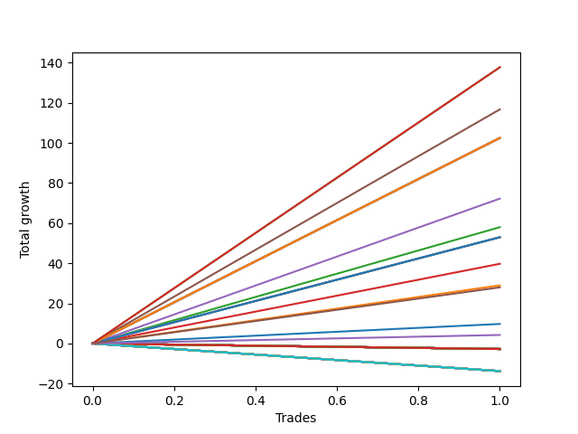

# Short Bulldog 001 
- Symbol: NQ
- Date Range: 03/18/2022 - 06/17/2022
- Trading Period: 7:20-12:30
- Number of Trades: 1



| Name | Win Percent | Profit | Avg Profit / Trade |     | Name | Win Percent | Profit | Avg Profit / Trade |
| ---- | ----------- | ------ | ------------------ | --- | ---- | ----------- | ------ | ------------------ |
| Sorted By <br> Profit | | | | | Sorted By <br> Win Percentage ||||
| Seventy-Three | 100.00 | 68875.00 | 68875.00 |     | Seventy-Three | 100.00 | 68875.00 | 68875.00 |
| Seventy-Two | 100.00 | 68875.00 | 68875.00 |     | Seventy-Two | 100.00 | 68875.00 | 68875.00 |
| Five | 100.00 | 58375.00 | 58375.00 |     | Five | 100.00 | 58375.00 | 58375.00 |
| Seventy-One | 100.00 | 51250.00 | 51250.00 |     | Seventy-One | 100.00 | 51250.00 | 51250.00 |
| Fifty-Five | 100.00 | 51250.00 | 51250.00 |     | Fifty-Five | 100.00 | 51250.00 | 51250.00 |
| Thirty-Nine | 100.00 | 51250.00 | 51250.00 |     | Thirty-Nine | 100.00 | 51250.00 | 51250.00 |
| Twenty-Three | 100.00 | 51250.00 | 51250.00 |     | Twenty-Three | 100.00 | 51250.00 | 51250.00 |
| Seven | 100.00 | 51250.00 | 51250.00 |     | Seven | 100.00 | 51250.00 | 51250.00 |
| Four | 100.00 | 36125.00 | 36125.00 |     | Four | 100.00 | 36125.00 | 36125.00 |
| Two | 100.00 | 29000.00 | 29000.00 |     | Two | 100.00 | 29000.00 | 29000.00 |
| Seventy | 100.00 | 26500.00 | 26500.00 |     | Seventy | 100.00 | 26500.00 | 26500.00 |
| Fifty-Four | 100.00 | 26500.00 | 26500.00 |     | Fifty-Four | 100.00 | 26500.00 | 26500.00 |
| Thirty-Eight | 100.00 | 26500.00 | 26500.00 |     | Thirty-Eight | 100.00 | 26500.00 | 26500.00 |
| Twenty-Two | 100.00 | 26500.00 | 26500.00 |     | Twenty-Two | 100.00 | 26500.00 | 26500.00 |
| Six | 100.00 | 26500.00 | 26500.00 |     | Six | 100.00 | 26500.00 | 26500.00 |
| Three | 100.00 | 19875.00 | 19875.00 |     | Three | 100.00 | 19875.00 | 19875.00 |
| One | 100.00 | 14500.00 | 14500.00 |     | One | 100.00 | 14500.00 | 14500.00 |
| Seventy-Five | 100.00 | 14000.00 | 14000.00 |     | Seventy-Five | 100.00 | 14000.00 | 14000.00 |
| Zero | 100.00 | 4875.00 | 4875.00 |     | Zero | 100.00 | 4875.00 | 4875.00 |
| Seventy-Four | 100.00 | 2125.00 | 2125.00 |     | Seventy-Four | 100.00 | 2125.00 | 2125.00 |
| Fifty-Three | 0.00 | -1375.00 | -1375.00 |     | Fifty-Three | 0.00 | -1375.00 | -1375.00 |
| Fifty-Two | 0.00 | -1375.00 | -1375.00 |     | Fifty-Two | 0.00 | -1375.00 | -1375.00 |
| Fifty-One | 0.00 | -1375.00 | -1375.00 |     | Fifty-One | 0.00 | -1375.00 | -1375.00 |
| Fifty | 0.00 | -1375.00 | -1375.00 |     | Fifty | 0.00 | -1375.00 | -1375.00 |
| Forty-Nine | 0.00 | -1375.00 | -1375.00 |     | Forty-Nine | 0.00 | -1375.00 | -1375.00 |
| Forty-Eight | 0.00 | -1375.00 | -1375.00 |     | Forty-Eight | 0.00 | -1375.00 | -1375.00 |
| Forty-Five | 0.00 | -1375.00 | -1375.00 |     | Forty-Five | 0.00 | -1375.00 | -1375.00 |
| Forty-Four | 0.00 | -1375.00 | -1375.00 |     | Forty-Four | 0.00 | -1375.00 | -1375.00 |
| Forty-Three | 0.00 | -1375.00 | -1375.00 |     | Forty-Three | 0.00 | -1375.00 | -1375.00 |
| Forty-Two | 0.00 | -1375.00 | -1375.00 |     | Forty-Two | 0.00 | -1375.00 | -1375.00 |
| Forty-One | 0.00 | -1375.00 | -1375.00 |     | Forty-One | 0.00 | -1375.00 | -1375.00 |
| Forty | 0.00 | -1375.00 | -1375.00 |     | Forty | 0.00 | -1375.00 | -1375.00 |
| Thirty-Seven | 0.00 | -1375.00 | -1375.00 |     | Thirty-Seven | 0.00 | -1375.00 | -1375.00 |
| Thirty-Six | 0.00 | -1375.00 | -1375.00 |     | Thirty-Six | 0.00 | -1375.00 | -1375.00 |
| Thirty-Five | 0.00 | -1375.00 | -1375.00 |     | Thirty-Five | 0.00 | -1375.00 | -1375.00 |
| Thirty-Four | 0.00 | -1375.00 | -1375.00 |     | Thirty-Four | 0.00 | -1375.00 | -1375.00 |
| Thirty-Three | 0.00 | -1375.00 | -1375.00 |     | Thirty-Three | 0.00 | -1375.00 | -1375.00 |
| Thirty-Two | 0.00 | -1375.00 | -1375.00 |     | Thirty-Two | 0.00 | -1375.00 | -1375.00 |
| Thirty-One | 0.00 | -1375.00 | -1375.00 |     | Thirty-One | 0.00 | -1375.00 | -1375.00 |
| Thirty | 0.00 | -1375.00 | -1375.00 |     | Thirty | 0.00 | -1375.00 | -1375.00 |
| Twenty-Nine | 0.00 | -1375.00 | -1375.00 |     | Twenty-Nine | 0.00 | -1375.00 | -1375.00 |
| Twenty-Eight | 0.00 | -1375.00 | -1375.00 |     | Twenty-Eight | 0.00 | -1375.00 | -1375.00 |
| twenty-Seven | 0.00 | -1375.00 | -1375.00 |     | twenty-Seven | 0.00 | -1375.00 | -1375.00 |
| Twenty-Six | 0.00 | -1375.00 | -1375.00 |     | Twenty-Six | 0.00 | -1375.00 | -1375.00 |
| Twenty-Five | 0.00 | -1375.00 | -1375.00 |     | Twenty-Five | 0.00 | -1375.00 | -1375.00 |
| Twenty-Four | 0.00 | -1375.00 | -1375.00 |     | Twenty-Four | 0.00 | -1375.00 | -1375.00 |
| Twenty-One | 0.00 | -1375.00 | -1375.00 |     | Twenty-One | 0.00 | -1375.00 | -1375.00 |
| Twenty | 0.00 | -1375.00 | -1375.00 |     | Twenty | 0.00 | -1375.00 | -1375.00 |
| Nineteen | 0.00 | -1375.00 | -1375.00 |     | Nineteen | 0.00 | -1375.00 | -1375.00 |
| Eighteen | 0.00 | -1375.00 | -1375.00 |     | Eighteen | 0.00 | -1375.00 | -1375.00 |
| Seventeen | 0.00 | -1375.00 | -1375.00 |     | Seventeen | 0.00 | -1375.00 | -1375.00 |
| Sixten | 0.00 | -1375.00 | -1375.00 |     | Sixten | 0.00 | -1375.00 | -1375.00 |
| Fifteen | 0.00 | -1375.00 | -1375.00 |     | Fifteen | 0.00 | -1375.00 | -1375.00 |
| Fourteen | 0.00 | -1375.00 | -1375.00 |     | Fourteen | 0.00 | -1375.00 | -1375.00 |
| Thirteen | 0.00 | -1375.00 | -1375.00 |     | Thirteen | 0.00 | -1375.00 | -1375.00 |
| Twelve | 0.00 | -1375.00 | -1375.00 |     | Twelve | 0.00 | -1375.00 | -1375.00 |
| Eleven | 0.00 | -1375.00 | -1375.00 |     | Eleven | 0.00 | -1375.00 | -1375.00 |
| Ten | 0.00 | -1375.00 | -1375.00 |     | Ten | 0.00 | -1375.00 | -1375.00 |
| Nine | 0.00 | -1375.00 | -1375.00 |     | Nine | 0.00 | -1375.00 | -1375.00 |
| Eight | 0.00 | -1375.00 | -1375.00 |     | Eight | 0.00 | -1375.00 | -1375.00 |
| Sixty-Nine | 0.00 | -6875.00 | -6875.00 |     | Sixty-Nine | 0.00 | -6875.00 | -6875.00 |
| Sixty-Eight | 0.00 | -6875.00 | -6875.00 |     | Sixty-Eight | 0.00 | -6875.00 | -6875.00 |
| Sixty-Seven | 0.00 | -6875.00 | -6875.00 |     | Sixty-Seven | 0.00 | -6875.00 | -6875.00 |
| Sixty-Six | 0.00 | -6875.00 | -6875.00 |     | Sixty-Six | 0.00 | -6875.00 | -6875.00 |
| Sixty-Five | 0.00 | -6875.00 | -6875.00 |     | Sixty-Five | 0.00 | -6875.00 | -6875.00 |
| Sixty-Four | 0.00 | -6875.00 | -6875.00 |     | Sixty-Four | 0.00 | -6875.00 | -6875.00 |
| Sixty-Three | 0.00 | -6875.00 | -6875.00 |     | Sixty-Three | 0.00 | -6875.00 | -6875.00 |
| Sixty-Two | 0.00 | -6875.00 | -6875.00 |     | Sixty-Two | 0.00 | -6875.00 | -6875.00 |
| Sixty-One | 0.00 | -6875.00 | -6875.00 |     | Sixty-One | 0.00 | -6875.00 | -6875.00 |
| Sixty | 0.00 | -6875.00 | -6875.00 |     | Sixty | 0.00 | -6875.00 | -6875.00 |
| Fifty-Nine | 0.00 | -6875.00 | -6875.00 |     | Fifty-Nine | 0.00 | -6875.00 | -6875.00 |
| Fifty-Eight | 0.00 | -6875.00 | -6875.00 |     | Fifty-Eight | 0.00 | -6875.00 | -6875.00 |
| Fifty-Seven | 0.00 | -6875.00 | -6875.00 |     | Fifty-Seven | 0.00 | -6875.00 | -6875.00 |
| Fifty-Six | 0.00 | -6875.00 | -6875.00 |     | Fifty-Six | 0.00 | -6875.00 | -6875.00 |
| Forty-Seven | 0.00 | -6875.00 | -6875.00 |     | Forty-Seven | 0.00 | -6875.00 | -6875.00 |
| Forty-Six | 0.00 | -6875.00 | -6875.00 |     | Forty-Six | 0.00 | -6875.00 | -6875.00 |

## NO STOPLOSS

### Test Zero
* Sell when price hits the middle line of the 20p bollinger
* No Stoploss
* Results:
```
Total Trades: 1
Percent Up: 0.00
Percent Down: 100.00
Total Points Moved Down: 9.75
Potential Profit: 4875.00
Total Points Ups: 0.00 Count Ups: 0
Total Points Downs: 9.75 Count Downs: 1
```

<details><summary>Trades</summary>

<code>In: 2022-04-06 11:06:00		Out: 2022-04-06 11:07:05		Total Position Time: 01:05		Total Move Down: 9.75		Total to Date: 9.75</code> <br />


</details>

### Test One
* Sell when the price hits the upper line of the 20p 1std bollinger
* No Stoploss
* Results:
```
Total Trades: 1
Percent Up: 0.00
Percent Down: 100.00
Total Points Moved Down: 29.00
Potential Profit: 14500.00
Total Points Ups: 0.00 Count Ups: 0
Total Points Downs: 29.00 Count Downs: 1
```

<details><summary>Trades</summary>

<code>In: 2022-04-06 11:06:00		Out: 2022-04-06 11:07:25		Total Position Time: 01:25		Total Move Down: 29.00		Total to Date: 29.00</code> <br />


</details>

### Test Two
* Sell when the price hits the upper line of the 20p 2std bollinger
* No Stoploss
* Results:
```
Total Trades: 1
Percent Up: 0.00
Percent Down: 100.00
Total Points Moved Down: 58.00
Potential Profit: 29000.00
Total Points Ups: 0.00 Count Ups: 0
Total Points Downs: 58.00 Count Downs: 1
```

<details><summary>Trades</summary>

<code>In: 2022-04-06 11:06:00		Out: 2022-04-06 11:08:25		Total Position Time: 02:25		Total Move Down: 58.00		Total to Date: 58.00</code> <br />


</details>

### Test Three
* Sell when price hits the middle line of the 50p bollinger
* No Stoploss
* Results:
```
Total Trades: 1
Percent Up: 0.00
Percent Down: 100.00
Total Points Moved Down: 39.75
Potential Profit: 19875.00
Total Points Ups: 0.00 Count Ups: 0
Total Points Downs: 39.75 Count Downs: 1
```

<details><summary>Trades</summary>

<code>In: 2022-04-06 11:06:00		Out: 2022-04-06 11:07:35		Total Position Time: 01:35		Total Move Down: 39.75		Total to Date: 39.75</code> <br />


</details>

### Test Four
* Sell when the price hits the upper line of the 50p 1std bollinger
* No Stoploss
* Results:
```
Total Trades: 1
Percent Up: 0.00
Percent Down: 100.00
Total Points Moved Down: 72.25
Potential Profit: 36125.00
Total Points Ups: 0.00 Count Ups: 0
Total Points Downs: 72.25 Count Downs: 1
```

<details><summary>Trades</summary>

<code>In: 2022-04-06 11:06:00		Out: 2022-04-06 11:09:20		Total Position Time: 03:20		Total Move Down: 72.25		Total to Date: 72.25</code> <br />


</details>

### Test Five
* Sell when the price hits the upper line of the 50p 2std bollinger
* No Stoploss
* Results:
```
Total Trades: 1
Percent Up: 0.00
Percent Down: 100.00
Total Points Moved Down: 116.75
Potential Profit: 58375.00
Total Points Ups: 0.00 Count Ups: 0
Total Points Downs: 116.75 Count Downs: 1
```

<details><summary>Trades</summary>

<code>In: 2022-04-06 11:06:00		Out: 2022-04-06 11:14:50		Total Position Time: 08:50		Total Move Down: 116.75		Total to Date: 116.75</code> <br />


</details>

### Test Six
* Sell when the price hits the middle line of the 1std VWAP
* No Stoploss
* Results:
```
Total Trades: 1
Percent Up: 0.00
Percent Down: 100.00
Total Points Moved Down: 53.00
Potential Profit: 26500.00
Total Points Ups: 0.00 Count Ups: 0
Total Points Downs: 53.00 Count Downs: 1
```

<details><summary>Trades</summary>

<code>In: 2022-04-06 11:06:00		Out: 2022-04-06 11:08:10		Total Position Time: 02:10		Total Move Down: 53.00		Total to Date: 53.00</code> <br />


</details>

### Test Seven
* Sell when the price hits the upper line of the 1std VWAP
* No Stoploss
* Results:
```
Total Trades: 1
Percent Up: 0.00
Percent Down: 100.00
Total Points Moved Down: 102.50
Potential Profit: 51250.00
Total Points Ups: 0.00 Count Ups: 0
Total Points Downs: 102.50 Count Downs: 1
```

<details><summary>Trades</summary>

<code>In: 2022-04-06 11:06:00		Out: 2022-04-06 11:13:00		Total Position Time: 07:00		Total Move Down: 102.50		Total to Date: 102.50</code> <br />


</details>

## STOPLOSS OF 2

### Test Eight
* Sell when price hits the middle line of the 20p bollinger
* Stoploss is -2 points
* Results:
```
Total Trades: 1
Percent Up: 100.00
Percent Down: 0.00
Total Points Moved Down: -2.75
Potential Profit: -1375.00
Total Points Ups: 2.75 Count Ups: 1
Total Points Downs: 0.00 Count Downs: 0
```

<details><summary>Trades</summary>

<code>In: 2022-04-06 11:06:00		Out: 2022-04-06 11:06:15		Total Position Time: 00:15		Total Move Down: -2.75		Total to Date: -2.75</code> <br />


</details>

### Test Nine
* Sell when the price hits the upper line of the 20p 1std bollinger
* Stoploss is -2 points
* Results:
```
Total Trades: 1
Percent Up: 100.00
Percent Down: 0.00
Total Points Moved Down: -2.75
Potential Profit: -1375.00
Total Points Ups: 2.75 Count Ups: 1
Total Points Downs: 0.00 Count Downs: 0
```

<details><summary>Trades</summary>

<code>In: 2022-04-06 11:06:00		Out: 2022-04-06 11:06:15		Total Position Time: 00:15		Total Move Down: -2.75		Total to Date: -2.75</code> <br />


</details>

### Test Ten
* Sell when the price hits the upper line of the 20p 2std bollinger
* Stoploss is -2 points
* Results:
```
Total Trades: 1
Percent Up: 100.00
Percent Down: 0.00
Total Points Moved Down: -2.75
Potential Profit: -1375.00
Total Points Ups: 2.75 Count Ups: 1
Total Points Downs: 0.00 Count Downs: 0
```

<details><summary>Trades</summary>

<code>In: 2022-04-06 11:06:00		Out: 2022-04-06 11:06:15		Total Position Time: 00:15		Total Move Down: -2.75		Total to Date: -2.75</code> <br />


</details>

### Test Eleven
* Sell when price hits the middle line of the 50p bollinger
* Stoploss is -2 points
* Results:
```
Total Trades: 1
Percent Up: 100.00
Percent Down: 0.00
Total Points Moved Down: -2.75
Potential Profit: -1375.00
Total Points Ups: 2.75 Count Ups: 1
Total Points Downs: 0.00 Count Downs: 0
```

<details><summary>Trades</summary>

<code>In: 2022-04-06 11:06:00		Out: 2022-04-06 11:06:15		Total Position Time: 00:15		Total Move Down: -2.75		Total to Date: -2.75</code> <br />


</details>

### Test Twelve
* Sell when the price hits the upper line of the 50p 1std bollinger
* Stoploss is -2 points
* Results:
```
Total Trades: 1
Percent Up: 100.00
Percent Down: 0.00
Total Points Moved Down: -2.75
Potential Profit: -1375.00
Total Points Ups: 2.75 Count Ups: 1
Total Points Downs: 0.00 Count Downs: 0
```

<details><summary>Trades</summary>

<code>In: 2022-04-06 11:06:00		Out: 2022-04-06 11:06:15		Total Position Time: 00:15		Total Move Down: -2.75		Total to Date: -2.75</code> <br />


</details>

### Test Thirteen
* Sell when the price hits the upper line of the 50p 2std bollinger
* Stoploss is -2 points
* Results:
```
Total Trades: 1
Percent Up: 100.00
Percent Down: 0.00
Total Points Moved Down: -2.75
Potential Profit: -1375.00
Total Points Ups: 2.75 Count Ups: 1
Total Points Downs: 0.00 Count Downs: 0
```

<details><summary>Trades</summary>

<code>In: 2022-04-06 11:06:00		Out: 2022-04-06 11:06:15		Total Position Time: 00:15		Total Move Down: -2.75		Total to Date: -2.75</code> <br />


</details>

### Test Fourteen
* Sell when the price hits the middle line of the 1std VWAP
* Stoploss is -2 points
* Results:
```
Total Trades: 1
Percent Up: 100.00
Percent Down: 0.00
Total Points Moved Down: -2.75
Potential Profit: -1375.00
Total Points Ups: 2.75 Count Ups: 1
Total Points Downs: 0.00 Count Downs: 0
```

<details><summary>Trades</summary>

<code>In: 2022-04-06 11:06:00		Out: 2022-04-06 11:06:15		Total Position Time: 00:15		Total Move Down: -2.75		Total to Date: -2.75</code> <br />


</details>

### Test Fifteen
* Sell when the price hits the upper line of the 1std VWAP
* Stoploss is -2 points
* Results:
```
Total Trades: 1
Percent Up: 100.00
Percent Down: 0.00
Total Points Moved Down: -2.75
Potential Profit: -1375.00
Total Points Ups: 2.75 Count Ups: 1
Total Points Downs: 0.00 Count Downs: 0
```

<details><summary>Trades</summary>

<code>In: 2022-04-06 11:06:00		Out: 2022-04-06 11:06:15		Total Position Time: 00:15		Total Move Down: -2.75		Total to Date: -2.75</code> <br />


</details>

## TRAIL STOP OF 2

### Test Sixten
* Sell when price hits the middle line of the 20p bollinger
* Trailing Stop is -2 points
* Results:
```
Total Trades: 1
Percent Up: 100.00
Percent Down: 0.00
Total Points Moved Down: -2.75
Potential Profit: -1375.00
Total Points Ups: 2.75 Count Ups: 1
Total Points Downs: 0.00 Count Downs: 0
```

<details><summary>Trades</summary>

<code>In: 2022-04-06 11:06:00		Out: 2022-04-06 11:06:15		Total Position Time: 00:15		Total Move Down: -2.75		Total to Date: -2.75</code> <br />


</details>

### Test Seventeen
* Sell when the price hits the upper line of the 20p 1std bollinger
* Trailing Stop is -2 points
* Results:
```
Total Trades: 1
Percent Up: 100.00
Percent Down: 0.00
Total Points Moved Down: -2.75
Potential Profit: -1375.00
Total Points Ups: 2.75 Count Ups: 1
Total Points Downs: 0.00 Count Downs: 0
```

<details><summary>Trades</summary>

<code>In: 2022-04-06 11:06:00		Out: 2022-04-06 11:06:15		Total Position Time: 00:15		Total Move Down: -2.75		Total to Date: -2.75</code> <br />


</details>

### Test Eighteen
* Sell when the price hits the upper line of the 20p 2std bollinger
* Trailing Stop is -2 points
* Results:
```
Total Trades: 1
Percent Up: 100.00
Percent Down: 0.00
Total Points Moved Down: -2.75
Potential Profit: -1375.00
Total Points Ups: 2.75 Count Ups: 1
Total Points Downs: 0.00 Count Downs: 0
```

<details><summary>Trades</summary>

<code>In: 2022-04-06 11:06:00		Out: 2022-04-06 11:06:15		Total Position Time: 00:15		Total Move Down: -2.75		Total to Date: -2.75</code> <br />


</details>

### Test Nineteen
* Sell when price hits the middle line of the 50p bollinger
* Trailing Stop is -2 points
* Results:
```
Total Trades: 1
Percent Up: 100.00
Percent Down: 0.00
Total Points Moved Down: -2.75
Potential Profit: -1375.00
Total Points Ups: 2.75 Count Ups: 1
Total Points Downs: 0.00 Count Downs: 0
```

<details><summary>Trades</summary>

<code>In: 2022-04-06 11:06:00		Out: 2022-04-06 11:06:15		Total Position Time: 00:15		Total Move Down: -2.75		Total to Date: -2.75</code> <br />


</details>

### Test Twenty
* Sell when the price hits the upper line of the 50p 1std bollinger
* Trailing Stop is -2 points
* Results:
```
Total Trades: 1
Percent Up: 100.00
Percent Down: 0.00
Total Points Moved Down: -2.75
Potential Profit: -1375.00
Total Points Ups: 2.75 Count Ups: 1
Total Points Downs: 0.00 Count Downs: 0
```

<details><summary>Trades</summary>

<code>In: 2022-04-06 11:06:00		Out: 2022-04-06 11:06:15		Total Position Time: 00:15		Total Move Down: -2.75		Total to Date: -2.75</code> <br />


</details>

### Test Twenty-One
* Sell when the price hits the upper line of the 50p 2std bollinger
* Trailing Stop is -2 points
* Results:
```
Total Trades: 1
Percent Up: 100.00
Percent Down: 0.00
Total Points Moved Down: -2.75
Potential Profit: -1375.00
Total Points Ups: 2.75 Count Ups: 1
Total Points Downs: 0.00 Count Downs: 0
```

<details><summary>Trades</summary>

<code>In: 2022-04-06 11:06:00		Out: 2022-04-06 11:06:15		Total Position Time: 00:15		Total Move Down: -2.75		Total to Date: -2.75</code> <br />


</details>

### Test Twenty-Two
* Sell when the price hits the middle line of the 1std VWAP
* Trailing Stop is -2 points
* Results:
```
Total Trades: 1
Percent Up: 0.00
Percent Down: 100.00
Total Points Moved Down: 53.00
Potential Profit: 26500.00
Total Points Ups: 0.00 Count Ups: 0
Total Points Downs: 53.00 Count Downs: 1
```

<details><summary>Trades</summary>

<code>In: 2022-04-06 11:06:00		Out: 2022-04-06 11:08:10		Total Position Time: 02:10		Total Move Down: 53.00		Total to Date: 53.00</code> <br />


</details>

### Test Twenty-Three
* Sell when the price hits the upper line of the 1std VWAP
* Trailing Stop is -2 points
* Results:
```
Total Trades: 1
Percent Up: 0.00
Percent Down: 100.00
Total Points Moved Down: 102.50
Potential Profit: 51250.00
Total Points Ups: 0.00 Count Ups: 0
Total Points Downs: 102.50 Count Downs: 1
```

<details><summary>Trades</summary>

<code>In: 2022-04-06 11:06:00		Out: 2022-04-06 11:13:00		Total Position Time: 07:00		Total Move Down: 102.50		Total to Date: 102.50</code> <br />


</details>

## STOPLOSS OF 3

### Test Twenty-Four
* Sell when price hits the middle line of the 20p bollinger
* Stoploss is -3 points
* Results:
```
Total Trades: 1
Percent Up: 100.00
Percent Down: 0.00
Total Points Moved Down: -2.75
Potential Profit: -1375.00
Total Points Ups: 2.75 Count Ups: 1
Total Points Downs: 0.00 Count Downs: 0
```

<details><summary>Trades</summary>

<code>In: 2022-04-06 11:06:00		Out: 2022-04-06 11:06:15		Total Position Time: 00:15		Total Move Down: -2.75		Total to Date: -2.75</code> <br />


</details>

### Test Twenty-Five
* Sell when the price hits the upper line of the 20p 1std bollinger
* Stoploss is -3 points
* Results:
```
Total Trades: 1
Percent Up: 100.00
Percent Down: 0.00
Total Points Moved Down: -2.75
Potential Profit: -1375.00
Total Points Ups: 2.75 Count Ups: 1
Total Points Downs: 0.00 Count Downs: 0
```

<details><summary>Trades</summary>

<code>In: 2022-04-06 11:06:00		Out: 2022-04-06 11:06:15		Total Position Time: 00:15		Total Move Down: -2.75		Total to Date: -2.75</code> <br />


</details>

### Test Twenty-Six
* Sell when the price hits the upper line of the 20p 2std bollinger
* Stoploss is -3 points
* Results:
```
Total Trades: 1
Percent Up: 100.00
Percent Down: 0.00
Total Points Moved Down: -2.75
Potential Profit: -1375.00
Total Points Ups: 2.75 Count Ups: 1
Total Points Downs: 0.00 Count Downs: 0
```

<details><summary>Trades</summary>

<code>In: 2022-04-06 11:06:00		Out: 2022-04-06 11:06:15		Total Position Time: 00:15		Total Move Down: -2.75		Total to Date: -2.75</code> <br />


</details>

### Test twenty-Seven
* Sell when price hits the middle line of the 50p bollinger
* Stoploss is -3 points
* Results:
```
Total Trades: 1
Percent Up: 100.00
Percent Down: 0.00
Total Points Moved Down: -2.75
Potential Profit: -1375.00
Total Points Ups: 2.75 Count Ups: 1
Total Points Downs: 0.00 Count Downs: 0
```

<details><summary>Trades</summary>

<code>In: 2022-04-06 11:06:00		Out: 2022-04-06 11:06:15		Total Position Time: 00:15		Total Move Down: -2.75		Total to Date: -2.75</code> <br />


</details>

### Test Twenty-Eight
* Sell when the price hits the upper line of the 50p 1std bollinger
* Stoploss is -3 points
* Results:
```
Total Trades: 1
Percent Up: 100.00
Percent Down: 0.00
Total Points Moved Down: -2.75
Potential Profit: -1375.00
Total Points Ups: 2.75 Count Ups: 1
Total Points Downs: 0.00 Count Downs: 0
```

<details><summary>Trades</summary>

<code>In: 2022-04-06 11:06:00		Out: 2022-04-06 11:06:15		Total Position Time: 00:15		Total Move Down: -2.75		Total to Date: -2.75</code> <br />


</details>

### Test Twenty-Nine
* Sell when the price hits the upper line of the 50p 2std bollinger
* Stoploss is -3 points
* Results:
```
Total Trades: 1
Percent Up: 100.00
Percent Down: 0.00
Total Points Moved Down: -2.75
Potential Profit: -1375.00
Total Points Ups: 2.75 Count Ups: 1
Total Points Downs: 0.00 Count Downs: 0
```

<details><summary>Trades</summary>

<code>In: 2022-04-06 11:06:00		Out: 2022-04-06 11:06:15		Total Position Time: 00:15		Total Move Down: -2.75		Total to Date: -2.75</code> <br />


</details>

### Test Thirty
* Sell when the price hits the middle line of the 1std VWAP
* Stoploss is -3 points
* Results:
```
Total Trades: 1
Percent Up: 100.00
Percent Down: 0.00
Total Points Moved Down: -2.75
Potential Profit: -1375.00
Total Points Ups: 2.75 Count Ups: 1
Total Points Downs: 0.00 Count Downs: 0
```

<details><summary>Trades</summary>

<code>In: 2022-04-06 11:06:00		Out: 2022-04-06 11:06:15		Total Position Time: 00:15		Total Move Down: -2.75		Total to Date: -2.75</code> <br />


</details>

### Test Thirty-One
* Sell when the price hits the upper line of the 1std VWAP
* Stoploss is -3 points
* Results:
```
Total Trades: 1
Percent Up: 100.00
Percent Down: 0.00
Total Points Moved Down: -2.75
Potential Profit: -1375.00
Total Points Ups: 2.75 Count Ups: 1
Total Points Downs: 0.00 Count Downs: 0
```

<details><summary>Trades</summary>

<code>In: 2022-04-06 11:06:00		Out: 2022-04-06 11:06:15		Total Position Time: 00:15		Total Move Down: -2.75		Total to Date: -2.75</code> <br />


</details>

## TRAIL STOP OF 3

### Test Thirty-Two
* Sell when price hits the middle line of the 20p bollinger
* Trailing Stop is -3 points
* Results:
```
Total Trades: 1
Percent Up: 100.00
Percent Down: 0.00
Total Points Moved Down: -2.75
Potential Profit: -1375.00
Total Points Ups: 2.75 Count Ups: 1
Total Points Downs: 0.00 Count Downs: 0
```

<details><summary>Trades</summary>

<code>In: 2022-04-06 11:06:00		Out: 2022-04-06 11:06:15		Total Position Time: 00:15		Total Move Down: -2.75		Total to Date: -2.75</code> <br />


</details>

### Test Thirty-Three
* Sell when the price hits the upper line of the 20p 1std bollinger
* Trailing Stop is -3 points
* Results:
```
Total Trades: 1
Percent Up: 100.00
Percent Down: 0.00
Total Points Moved Down: -2.75
Potential Profit: -1375.00
Total Points Ups: 2.75 Count Ups: 1
Total Points Downs: 0.00 Count Downs: 0
```

<details><summary>Trades</summary>

<code>In: 2022-04-06 11:06:00		Out: 2022-04-06 11:06:15		Total Position Time: 00:15		Total Move Down: -2.75		Total to Date: -2.75</code> <br />


</details>

### Test Thirty-Four
* Sell when the price hits the upper line of the 20p 2std bollinger
* Trailing Stop is -3 points
* Results:
```
Total Trades: 1
Percent Up: 100.00
Percent Down: 0.00
Total Points Moved Down: -2.75
Potential Profit: -1375.00
Total Points Ups: 2.75 Count Ups: 1
Total Points Downs: 0.00 Count Downs: 0
```

<details><summary>Trades</summary>

<code>In: 2022-04-06 11:06:00		Out: 2022-04-06 11:06:15		Total Position Time: 00:15		Total Move Down: -2.75		Total to Date: -2.75</code> <br />


</details>

### Test Thirty-Five
* Sell when price hits the middle line of the 50p bollinger
* Trailing Stop is -3 points
* Results:
```
Total Trades: 1
Percent Up: 100.00
Percent Down: 0.00
Total Points Moved Down: -2.75
Potential Profit: -1375.00
Total Points Ups: 2.75 Count Ups: 1
Total Points Downs: 0.00 Count Downs: 0
```

<details><summary>Trades</summary>

<code>In: 2022-04-06 11:06:00		Out: 2022-04-06 11:06:15		Total Position Time: 00:15		Total Move Down: -2.75		Total to Date: -2.75</code> <br />


</details>

### Test Thirty-Six
* Sell when the price hits the upper line of the 50p 1std bollinger
* Trailing Stop is -3 points
* Results:
```
Total Trades: 1
Percent Up: 100.00
Percent Down: 0.00
Total Points Moved Down: -2.75
Potential Profit: -1375.00
Total Points Ups: 2.75 Count Ups: 1
Total Points Downs: 0.00 Count Downs: 0
```

<details><summary>Trades</summary>

<code>In: 2022-04-06 11:06:00		Out: 2022-04-06 11:06:15		Total Position Time: 00:15		Total Move Down: -2.75		Total to Date: -2.75</code> <br />


</details>

### Test Thirty-Seven
* Sell when the price hits the upper line of the 50p 2std bollinger
* Trailing Stop is -3 points
* Results:
```
Total Trades: 1
Percent Up: 100.00
Percent Down: 0.00
Total Points Moved Down: -2.75
Potential Profit: -1375.00
Total Points Ups: 2.75 Count Ups: 1
Total Points Downs: 0.00 Count Downs: 0
```

<details><summary>Trades</summary>

<code>In: 2022-04-06 11:06:00		Out: 2022-04-06 11:06:15		Total Position Time: 00:15		Total Move Down: -2.75		Total to Date: -2.75</code> <br />


</details>

### Test Thirty-Eight
* Sell when the price hits the middle line of the 1std VWAP
* Trailing Stop is -3 points
* Results:
```
Total Trades: 1
Percent Up: 0.00
Percent Down: 100.00
Total Points Moved Down: 53.00
Potential Profit: 26500.00
Total Points Ups: 0.00 Count Ups: 0
Total Points Downs: 53.00 Count Downs: 1
```

<details><summary>Trades</summary>

<code>In: 2022-04-06 11:06:00		Out: 2022-04-06 11:08:10		Total Position Time: 02:10		Total Move Down: 53.00		Total to Date: 53.00</code> <br />


</details>

### Test Thirty-Nine
* Sell when the price hits the upper line of the 1std VWAP
* Trailing Stop is -3 points
* Results:
```
Total Trades: 1
Percent Up: 0.00
Percent Down: 100.00
Total Points Moved Down: 102.50
Potential Profit: 51250.00
Total Points Ups: 0.00 Count Ups: 0
Total Points Downs: 102.50 Count Downs: 1
```

<details><summary>Trades</summary>

<code>In: 2022-04-06 11:06:00		Out: 2022-04-06 11:13:00		Total Position Time: 07:00		Total Move Down: 102.50		Total to Date: 102.50</code> <br />


</details>

## STOPLOSS OF 5

### Test Forty
* Sell when price hits the middle line of the 20p bollinger
* Stoploss is -5 points
* Results:
```
Total Trades: 1
Percent Up: 100.00
Percent Down: 0.00
Total Points Moved Down: -2.75
Potential Profit: -1375.00
Total Points Ups: 2.75 Count Ups: 1
Total Points Downs: 0.00 Count Downs: 0
```

<details><summary>Trades</summary>

<code>In: 2022-04-06 11:06:00		Out: 2022-04-06 11:06:15		Total Position Time: 00:15		Total Move Down: -2.75		Total to Date: -2.75</code> <br />


</details>

### Test Forty-One
* Sell when the price hits the upper line of the 20p 1std bollinger
* Stoploss is -5 points
* Results:
```
Total Trades: 1
Percent Up: 100.00
Percent Down: 0.00
Total Points Moved Down: -2.75
Potential Profit: -1375.00
Total Points Ups: 2.75 Count Ups: 1
Total Points Downs: 0.00 Count Downs: 0
```

<details><summary>Trades</summary>

<code>In: 2022-04-06 11:06:00		Out: 2022-04-06 11:06:15		Total Position Time: 00:15		Total Move Down: -2.75		Total to Date: -2.75</code> <br />


</details>

### Test Forty-Two
* Sell when the price hits the upper line of the 20p 2std bollinger
* Stoploss is -5 points
* Results:
```
Total Trades: 1
Percent Up: 100.00
Percent Down: 0.00
Total Points Moved Down: -2.75
Potential Profit: -1375.00
Total Points Ups: 2.75 Count Ups: 1
Total Points Downs: 0.00 Count Downs: 0
```

<details><summary>Trades</summary>

<code>In: 2022-04-06 11:06:00		Out: 2022-04-06 11:06:15		Total Position Time: 00:15		Total Move Down: -2.75		Total to Date: -2.75</code> <br />


</details>

### Test Forty-Three
* Sell when price hits the middle line of the 50p bollinger
* Stoploss is -5 points
* Results:
```
Total Trades: 1
Percent Up: 100.00
Percent Down: 0.00
Total Points Moved Down: -2.75
Potential Profit: -1375.00
Total Points Ups: 2.75 Count Ups: 1
Total Points Downs: 0.00 Count Downs: 0
```

<details><summary>Trades</summary>

<code>In: 2022-04-06 11:06:00		Out: 2022-04-06 11:06:15		Total Position Time: 00:15		Total Move Down: -2.75		Total to Date: -2.75</code> <br />


</details>

### Test Forty-Four
* Sell when the price hits the upper line of the 50p 1std bollinger
* Stoploss is -5 points
* Results:
```
Total Trades: 1
Percent Up: 100.00
Percent Down: 0.00
Total Points Moved Down: -2.75
Potential Profit: -1375.00
Total Points Ups: 2.75 Count Ups: 1
Total Points Downs: 0.00 Count Downs: 0
```

<details><summary>Trades</summary>

<code>In: 2022-04-06 11:06:00		Out: 2022-04-06 11:06:15		Total Position Time: 00:15		Total Move Down: -2.75		Total to Date: -2.75</code> <br />


</details>

### Test Forty-Five
* Sell when the price hits the upper line of the 50p 2std bollinger
* Stoploss is -5 points
* Results:
```
Total Trades: 1
Percent Up: 100.00
Percent Down: 0.00
Total Points Moved Down: -2.75
Potential Profit: -1375.00
Total Points Ups: 2.75 Count Ups: 1
Total Points Downs: 0.00 Count Downs: 0
```

<details><summary>Trades</summary>

<code>In: 2022-04-06 11:06:00		Out: 2022-04-06 11:06:15		Total Position Time: 00:15		Total Move Down: -2.75		Total to Date: -2.75</code> <br />


</details>

### Test Forty-Six
* Sell when the price hits the middle line of the 1std VWAP
* Stoploss is -5 points
* Results:
```
Total Trades: 1
Percent Up: 100.00
Percent Down: 0.00
Total Points Moved Down: -13.75
Potential Profit: -6875.00
Total Points Ups: 13.75 Count Ups: 1
Total Points Downs: 0.00 Count Downs: 0
```

<details><summary>Trades</summary>

<code>In: 2022-04-06 11:06:00		Out: 2022-04-06 11:06:20		Total Position Time: 00:20		Total Move Down: -13.75		Total to Date: -13.75</code> <br />


</details>

### Test Forty-Seven
* Sell when the price hits the upper line of the 1std VWAP
* Stoploss is -5 points
* Results:
```
Total Trades: 1
Percent Up: 100.00
Percent Down: 0.00
Total Points Moved Down: -13.75
Potential Profit: -6875.00
Total Points Ups: 13.75 Count Ups: 1
Total Points Downs: 0.00 Count Downs: 0
```

<details><summary>Trades</summary>

<code>In: 2022-04-06 11:06:00		Out: 2022-04-06 11:06:20		Total Position Time: 00:20		Total Move Down: -13.75		Total to Date: -13.75</code> <br />


</details>

## TRAIL STOP OF 5

### Test Forty-Eight
* Sell when price hits the middle line of the 20p bollinger
* Trailing Stop is -5 points
* Results:
```
Total Trades: 1
Percent Up: 100.00
Percent Down: 0.00
Total Points Moved Down: -2.75
Potential Profit: -1375.00
Total Points Ups: 2.75 Count Ups: 1
Total Points Downs: 0.00 Count Downs: 0
```

<details><summary>Trades</summary>

<code>In: 2022-04-06 11:06:00		Out: 2022-04-06 11:06:15		Total Position Time: 00:15		Total Move Down: -2.75		Total to Date: -2.75</code> <br />


</details>

### Test Forty-Nine
* Sell when the price hits the upper line of the 20p 1std bollinger
* Trailing Stop is -5 points
* Results:
```
Total Trades: 1
Percent Up: 100.00
Percent Down: 0.00
Total Points Moved Down: -2.75
Potential Profit: -1375.00
Total Points Ups: 2.75 Count Ups: 1
Total Points Downs: 0.00 Count Downs: 0
```

<details><summary>Trades</summary>

<code>In: 2022-04-06 11:06:00		Out: 2022-04-06 11:06:15		Total Position Time: 00:15		Total Move Down: -2.75		Total to Date: -2.75</code> <br />


</details>

### Test Fifty
* Sell when the price hits the upper line of the 20p 2std bollinger
* Trailing Stop is -5 points
* Results:
```
Total Trades: 1
Percent Up: 100.00
Percent Down: 0.00
Total Points Moved Down: -2.75
Potential Profit: -1375.00
Total Points Ups: 2.75 Count Ups: 1
Total Points Downs: 0.00 Count Downs: 0
```

<details><summary>Trades</summary>

<code>In: 2022-04-06 11:06:00		Out: 2022-04-06 11:06:15		Total Position Time: 00:15		Total Move Down: -2.75		Total to Date: -2.75</code> <br />


</details>

### Test Fifty-One
* Sell when price hits the middle line of the 50p bollinger
* Trailing Stop is -5 points
* Results:
```
Total Trades: 1
Percent Up: 100.00
Percent Down: 0.00
Total Points Moved Down: -2.75
Potential Profit: -1375.00
Total Points Ups: 2.75 Count Ups: 1
Total Points Downs: 0.00 Count Downs: 0
```

<details><summary>Trades</summary>

<code>In: 2022-04-06 11:06:00		Out: 2022-04-06 11:06:15		Total Position Time: 00:15		Total Move Down: -2.75		Total to Date: -2.75</code> <br />


</details>

### Test Fifty-Two
* Sell when the price hits the upper line of the 50p 1std bollinger
* Trailing Stop is -5 points
* Results:
```
Total Trades: 1
Percent Up: 100.00
Percent Down: 0.00
Total Points Moved Down: -2.75
Potential Profit: -1375.00
Total Points Ups: 2.75 Count Ups: 1
Total Points Downs: 0.00 Count Downs: 0
```

<details><summary>Trades</summary>

<code>In: 2022-04-06 11:06:00		Out: 2022-04-06 11:06:15		Total Position Time: 00:15		Total Move Down: -2.75		Total to Date: -2.75</code> <br />


</details>

### Test Fifty-Three
* Sell when the price hits the upper line of the 50p 2std bollinger
* Trailing Stop is -5 points
* Results:
```
Total Trades: 1
Percent Up: 100.00
Percent Down: 0.00
Total Points Moved Down: -2.75
Potential Profit: -1375.00
Total Points Ups: 2.75 Count Ups: 1
Total Points Downs: 0.00 Count Downs: 0
```

<details><summary>Trades</summary>

<code>In: 2022-04-06 11:06:00		Out: 2022-04-06 11:06:15		Total Position Time: 00:15		Total Move Down: -2.75		Total to Date: -2.75</code> <br />


</details>

### Test Fifty-Four
* Sell when the price hits the middle line of the 1std VWAP
* Trailing Stop is -5 points
* Results:
```
Total Trades: 1
Percent Up: 0.00
Percent Down: 100.00
Total Points Moved Down: 53.00
Potential Profit: 26500.00
Total Points Ups: 0.00 Count Ups: 0
Total Points Downs: 53.00 Count Downs: 1
```

<details><summary>Trades</summary>

<code>In: 2022-04-06 11:06:00		Out: 2022-04-06 11:08:10		Total Position Time: 02:10		Total Move Down: 53.00		Total to Date: 53.00</code> <br />


</details>

### Test Fifty-Five
* Sell when the price hits the upper line of the 1std VWAP
* Trailing Stop is -5 points
* Results:
```
Total Trades: 1
Percent Up: 0.00
Percent Down: 100.00
Total Points Moved Down: 102.50
Potential Profit: 51250.00
Total Points Ups: 0.00 Count Ups: 0
Total Points Downs: 102.50 Count Downs: 1
```

<details><summary>Trades</summary>

<code>In: 2022-04-06 11:06:00		Out: 2022-04-06 11:13:00		Total Position Time: 07:00		Total Move Down: 102.50		Total to Date: 102.50</code> <br />


</details>

## STOPLOSS OF 10

### Test Fifty-Six
* Sell when price hits the middle line of the 20p bollinger
* Stoploss is -10 points
* Results:
```
Total Trades: 1
Percent Up: 100.00
Percent Down: 0.00
Total Points Moved Down: -13.75
Potential Profit: -6875.00
Total Points Ups: 13.75 Count Ups: 1
Total Points Downs: 0.00 Count Downs: 0
```

<details><summary>Trades</summary>

<code>In: 2022-04-06 11:06:00		Out: 2022-04-06 11:06:20		Total Position Time: 00:20		Total Move Down: -13.75		Total to Date: -13.75</code> <br />


</details>

### Test Fifty-Seven
* Sell when the price hits the upper line of the 20p 1std bollinger
* Stoploss is -10 points
* Results:
```
Total Trades: 1
Percent Up: 100.00
Percent Down: 0.00
Total Points Moved Down: -13.75
Potential Profit: -6875.00
Total Points Ups: 13.75 Count Ups: 1
Total Points Downs: 0.00 Count Downs: 0
```

<details><summary>Trades</summary>

<code>In: 2022-04-06 11:06:00		Out: 2022-04-06 11:06:20		Total Position Time: 00:20		Total Move Down: -13.75		Total to Date: -13.75</code> <br />


</details>

### Test Fifty-Eight
* Sell when the price hits the upper line of the 20p 2std bollinger
* Stoploss is -10 points
* Results:
```
Total Trades: 1
Percent Up: 100.00
Percent Down: 0.00
Total Points Moved Down: -13.75
Potential Profit: -6875.00
Total Points Ups: 13.75 Count Ups: 1
Total Points Downs: 0.00 Count Downs: 0
```

<details><summary>Trades</summary>

<code>In: 2022-04-06 11:06:00		Out: 2022-04-06 11:06:20		Total Position Time: 00:20		Total Move Down: -13.75		Total to Date: -13.75</code> <br />


</details>

### Test Fifty-Nine
* Sell when price hits the middle line of the 50p bollinger
* Stoploss is -10 points
* Results:
```
Total Trades: 1
Percent Up: 100.00
Percent Down: 0.00
Total Points Moved Down: -13.75
Potential Profit: -6875.00
Total Points Ups: 13.75 Count Ups: 1
Total Points Downs: 0.00 Count Downs: 0
```

<details><summary>Trades</summary>

<code>In: 2022-04-06 11:06:00		Out: 2022-04-06 11:06:20		Total Position Time: 00:20		Total Move Down: -13.75		Total to Date: -13.75</code> <br />


</details>

### Test Sixty
* Sell when the price hits the upper line of the 50p 1std bollinger
* Stoploss is -10 points
* Results:
```
Total Trades: 1
Percent Up: 100.00
Percent Down: 0.00
Total Points Moved Down: -13.75
Potential Profit: -6875.00
Total Points Ups: 13.75 Count Ups: 1
Total Points Downs: 0.00 Count Downs: 0
```

<details><summary>Trades</summary>

<code>In: 2022-04-06 11:06:00		Out: 2022-04-06 11:06:20		Total Position Time: 00:20		Total Move Down: -13.75		Total to Date: -13.75</code> <br />


</details>

### Test Sixty-One
* Sell when the price hits the upper line of the 50p 2std bollinger
* Stoploss is -10 points
* Results:
```
Total Trades: 1
Percent Up: 100.00
Percent Down: 0.00
Total Points Moved Down: -13.75
Potential Profit: -6875.00
Total Points Ups: 13.75 Count Ups: 1
Total Points Downs: 0.00 Count Downs: 0
```

<details><summary>Trades</summary>

<code>In: 2022-04-06 11:06:00		Out: 2022-04-06 11:06:20		Total Position Time: 00:20		Total Move Down: -13.75		Total to Date: -13.75</code> <br />


</details>

### Test Sixty-Two
* Sell when the price hits the middle line of the 1std VWAP
* Stoploss is -10 points
* Results:
```
Total Trades: 1
Percent Up: 100.00
Percent Down: 0.00
Total Points Moved Down: -13.75
Potential Profit: -6875.00
Total Points Ups: 13.75 Count Ups: 1
Total Points Downs: 0.00 Count Downs: 0
```

<details><summary>Trades</summary>

<code>In: 2022-04-06 11:06:00		Out: 2022-04-06 11:06:20		Total Position Time: 00:20		Total Move Down: -13.75		Total to Date: -13.75</code> <br />


</details>

### Test Sixty-Three
* Sell when the price hits the upper line of the 1std VWAP
* Stoploss is -10 points
* Results:
```
Total Trades: 1
Percent Up: 100.00
Percent Down: 0.00
Total Points Moved Down: -13.75
Potential Profit: -6875.00
Total Points Ups: 13.75 Count Ups: 1
Total Points Downs: 0.00 Count Downs: 0
```

<details><summary>Trades</summary>

<code>In: 2022-04-06 11:06:00		Out: 2022-04-06 11:06:20		Total Position Time: 00:20		Total Move Down: -13.75		Total to Date: -13.75</code> <br />


</details>

## TRAIL STOP OF 10

### Test Sixty-Four
* Sell when price hits the middle line of the 20p bollinger
* Trailing Stop is -10 points
* Results:
```
Total Trades: 1
Percent Up: 100.00
Percent Down: 0.00
Total Points Moved Down: -13.75
Potential Profit: -6875.00
Total Points Ups: 13.75 Count Ups: 1
Total Points Downs: 0.00 Count Downs: 0
```

<details><summary>Trades</summary>

<code>In: 2022-04-06 11:06:00		Out: 2022-04-06 11:06:20		Total Position Time: 00:20		Total Move Down: -13.75		Total to Date: -13.75</code> <br />


</details>

### Test Sixty-Five
* Sell when the price hits the upper line of the 20p 1std bollinger
* Trailing Stop is -10 points
* Results:
```
Total Trades: 1
Percent Up: 100.00
Percent Down: 0.00
Total Points Moved Down: -13.75
Potential Profit: -6875.00
Total Points Ups: 13.75 Count Ups: 1
Total Points Downs: 0.00 Count Downs: 0
```

<details><summary>Trades</summary>

<code>In: 2022-04-06 11:06:00		Out: 2022-04-06 11:06:20		Total Position Time: 00:20		Total Move Down: -13.75		Total to Date: -13.75</code> <br />


</details>

### Test Sixty-Six
* Sell when the price hits the upper line of the 20p 2std bollinger
* Trailing Stop is -10 points
* Results:
```
Total Trades: 1
Percent Up: 100.00
Percent Down: 0.00
Total Points Moved Down: -13.75
Potential Profit: -6875.00
Total Points Ups: 13.75 Count Ups: 1
Total Points Downs: 0.00 Count Downs: 0
```

<details><summary>Trades</summary>

<code>In: 2022-04-06 11:06:00		Out: 2022-04-06 11:06:20		Total Position Time: 00:20		Total Move Down: -13.75		Total to Date: -13.75</code> <br />


</details>

### Test Sixty-Seven
* Sell when price hits the middle line of the 50p bollinger
* Trailing Stop is -10 points
* Results:
```
Total Trades: 1
Percent Up: 100.00
Percent Down: 0.00
Total Points Moved Down: -13.75
Potential Profit: -6875.00
Total Points Ups: 13.75 Count Ups: 1
Total Points Downs: 0.00 Count Downs: 0
```

<details><summary>Trades</summary>

<code>In: 2022-04-06 11:06:00		Out: 2022-04-06 11:06:20		Total Position Time: 00:20		Total Move Down: -13.75		Total to Date: -13.75</code> <br />


</details>

### Test Sixty-Eight
* Sell when the price hits the upper line of the 50p 1std bollinger
* Trailing Stop is -10 points
* Results:
```
Total Trades: 1
Percent Up: 100.00
Percent Down: 0.00
Total Points Moved Down: -13.75
Potential Profit: -6875.00
Total Points Ups: 13.75 Count Ups: 1
Total Points Downs: 0.00 Count Downs: 0
```

<details><summary>Trades</summary>

<code>In: 2022-04-06 11:06:00		Out: 2022-04-06 11:06:20		Total Position Time: 00:20		Total Move Down: -13.75		Total to Date: -13.75</code> <br />


</details>

### Test Sixty-Nine
* Sell when the price hits the upper line of the 50p 2std bollinger
* Trailing Stop is -10 points
* Results:
```
Total Trades: 1
Percent Up: 100.00
Percent Down: 0.00
Total Points Moved Down: -13.75
Potential Profit: -6875.00
Total Points Ups: 13.75 Count Ups: 1
Total Points Downs: 0.00 Count Downs: 0
```

<details><summary>Trades</summary>

<code>In: 2022-04-06 11:06:00		Out: 2022-04-06 11:06:20		Total Position Time: 00:20		Total Move Down: -13.75		Total to Date: -13.75</code> <br />


</details>

### Test Seventy
* Sell when the price hits the middle line of the 1std VWAP
* Trailing Stop is -10 points
* Results:
```
Total Trades: 1
Percent Up: 0.00
Percent Down: 100.00
Total Points Moved Down: 53.00
Potential Profit: 26500.00
Total Points Ups: 0.00 Count Ups: 0
Total Points Downs: 53.00 Count Downs: 1
```

<details><summary>Trades</summary>

<code>In: 2022-04-06 11:06:00		Out: 2022-04-06 11:08:10		Total Position Time: 02:10		Total Move Down: 53.00		Total to Date: 53.00</code> <br />


</details>

### Test Seventy-One
* Sell when the price hits the upper line of the 1std VWAP
* Trailing Stop is -10 points
* Results:
```
Total Trades: 1
Percent Up: 0.00
Percent Down: 100.00
Total Points Moved Down: 102.50
Potential Profit: 51250.00
Total Points Ups: 0.00 Count Ups: 0
Total Points Downs: 102.50 Count Downs: 1
```

<details><summary>Trades</summary>

<code>In: 2022-04-06 11:06:00		Out: 2022-04-06 11:13:00		Total Position Time: 07:00		Total Move Down: 102.50		Total to Date: 102.50</code> <br />


</details>

## SPECIAL EXIT CONDITIONS 

### Test Seventy-Two
* Sell when the linear regression slope is negative
* No Stoploss
* Results:
```
Total Trades: 1
Percent Up: 0.00
Percent Down: 100.00
Total Points Moved Down: 137.75
Potential Profit: 68875.00
Total Points Ups: 0.00 Count Ups: 0
Total Points Downs: 137.75 Count Downs: 1
```

<details><summary>Trades</summary>

<code>In: 2022-04-06 11:06:00		Out: 2022-04-06 11:21:05		Total Position Time: 15:05		Total Move Down: 137.75		Total to Date: 137.75</code> <br />


</details>

### Test Seventy-Three
* Sell when the linear regression slope changes to negative
* No Stoploss
* Results:
```
Total Trades: 1
Percent Up: 0.00
Percent Down: 100.00
Total Points Moved Down: 137.75
Potential Profit: 68875.00
Total Points Ups: 0.00 Count Ups: 0
Total Points Downs: 137.75 Count Downs: 1
```

<details><summary>Trades</summary>

<code>In: 2022-04-06 11:06:00		Out: 2022-04-06 11:21:05		Total Position Time: 15:05		Total Move Down: 137.75		Total to Date: 137.75</code> <br />


</details>

### Test Seventy-Four
* Sell when the bias changes to negative
* No Stoploss
* Results:
```
Total Trades: 1
Percent Up: 0.00
Percent Down: 100.00
Total Points Moved Down: 4.25
Potential Profit: 2125.00
Total Points Ups: 0.00 Count Ups: 0
Total Points Downs: 4.25 Count Downs: 1
```

<details><summary>Trades</summary>

<code>In: 2022-04-06 11:06:00		Out: 2022-04-06 11:35:55		Total Position Time: 29:55		Total Move Down: 4.25		Total to Date: 4.25</code> <br />


</details>

### Test Seventy-Five
* Sell when the STDEV slope changes to negative
* No Stoploss
* Results:
```
Total Trades: 1
Percent Up: 0.00
Percent Down: 100.00
Total Points Moved Down: 28.00
Potential Profit: 14000.00
Total Points Ups: 0.00 Count Ups: 0
Total Points Downs: 28.00 Count Downs: 1
```

<details><summary>Trades</summary>

<code>In: 2022-04-06 11:06:00		Out: 2022-04-06 11:33:05		Total Position Time: 27:05		Total Move Down: 28.00		Total to Date: 28.00</code> <br />


</details>