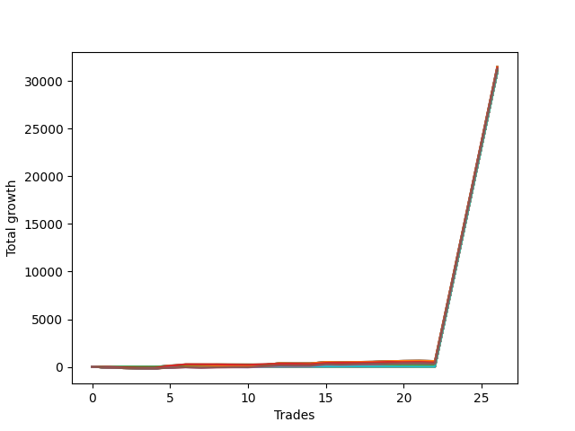

# Short Bulldog 003 
- Symbol: NQ
- Date Range: 03/18/2022 - 06/17/2022
- Trading Period: 7:20-12:30
- Number of Trades: 26



| Name | Win Percent | Profit | Avg Profit / Trade |     | Name | Win Percent | Profit | Avg Profit / Trade |
| ---- | ----------- | ------ | ------------------ | --- | ---- | ----------- | ------ | ------------------ |
| Sorted By <br> Profit | | | | | Sorted By <br> Win Percentage ||||
| Seventy-One | 65.38 | 15751750.00 | 605836.54 |     | Zero | 76.92 | 15543000.00 | 597807.69 |
| Fifty-Five | 65.38 | 15751750.00 | 605836.54 |     | Seventy-Two | 69.23 | 15574875.00 | 599033.65 |
| Thirty-Nine | 65.38 | 15751750.00 | 605836.54 |     | One | 69.23 | 15531750.00 | 597375.00 |
| Twenty-Three | 65.38 | 15751750.00 | 605836.54 |     | Seventy-One | 65.38 | 15751750.00 | 605836.54 |
| Seven | 65.38 | 15751750.00 | 605836.54 |     | Fifty-Five | 65.38 | 15751750.00 | 605836.54 |
| Five | 65.38 | 15704000.00 | 604000.00 |     | Thirty-Nine | 65.38 | 15751750.00 | 605836.54 |
| Seventy-Three | 61.54 | 15700625.00 | 603870.19 |     | Twenty-Three | 65.38 | 15751750.00 | 605836.54 |
| Seventy | 65.38 | 15651500.00 | 601980.77 |     | Seven | 65.38 | 15751750.00 | 605836.54 |
| Fifty-Four | 65.38 | 15651500.00 | 601980.77 |     | Five | 65.38 | 15704000.00 | 604000.00 |
| Thirty-Eight | 65.38 | 15651500.00 | 601980.77 |     | Seventy | 65.38 | 15651500.00 | 601980.77 |
| Twenty-Two | 65.38 | 15651500.00 | 601980.77 |     | Fifty-Four | 65.38 | 15651500.00 | 601980.77 |
| Six | 65.38 | 15651500.00 | 601980.77 |     | Thirty-Eight | 65.38 | 15651500.00 | 601980.77 |
| Seventy-Five | 65.38 | 15636875.00 | 601418.27 |     | Twenty-Two | 65.38 | 15651500.00 | 601980.77 |
| Two | 61.54 | 15619500.00 | 600750.00 |     | Six | 65.38 | 15651500.00 | 601980.77 |
| Seventy-Four | 65.38 | 15617750.00 | 600682.69 |     | Seventy-Five | 65.38 | 15636875.00 | 601418.27 |
| Four | 65.38 | 15617625.00 | 600677.88 |     | Seventy-Four | 65.38 | 15617750.00 | 600682.69 |
| Forty-Seven | 30.77 | 15610875.00 | 600418.27 |     | Four | 65.38 | 15617625.00 | 600677.88 |
| Sixty-Three | 34.62 | 15596125.00 | 599850.96 |     | Three | 65.38 | 15558875.00 | 598418.27 |
| Forty-Six | 34.62 | 15588875.00 | 599572.12 |     | Seventy-Three | 61.54 | 15700625.00 | 603870.19 |
| Seventy-Two | 69.23 | 15574875.00 | 599033.65 |     | Two | 61.54 | 15619500.00 | 600750.00 |
| Sixty-Two | 38.46 | 15574750.00 | 599028.85 |     | Twenty-One | 61.54 | 15469750.00 | 594990.38 |
| Fifteen | 26.92 | 15570125.00 | 598850.96 |     | Twenty | 61.54 | 15469750.00 | 594990.38 |
| Thirty | 30.77 | 15565375.00 | 598668.27 |     | Nineteen | 61.54 | 15469750.00 | 594990.38 |
| Forty-Five | 50.00 | 15561875.00 | 598533.65 |     | Eighteen | 61.54 | 15469750.00 | 594990.38 |
| Thirty-One | 26.92 | 15559750.00 | 598451.92 |     | Seventeen | 61.54 | 15469750.00 | 594990.38 |
| Three | 65.38 | 15558875.00 | 598418.27 |     | Sixten | 61.54 | 15469750.00 | 594990.38 |
| Zero | 76.92 | 15543000.00 | 597807.69 |     | Eleven | 57.69 | 15444750.00 | 594028.85 |
| One | 69.23 | 15531750.00 | 597375.00 |     | Thirteen | 57.69 | 15444625.00 | 594024.04 |
| Forty-Four | 50.00 | 15524625.00 | 597100.96 |     | Twelve | 57.69 | 15444625.00 | 594024.04 |
| Sixty-One | 38.46 | 15523125.00 | 597043.27 |     | Ten | 57.69 | 15443500.00 | 593980.77 |
| Fourteen | 26.92 | 15520625.00 | 596947.12 |     | Eight | 57.69 | 15440125.00 | 593850.96 |
| Twenty-Nine | 50.00 | 15517750.00 | 596836.54 |     | Nine | 57.69 | 15438625.00 | 593793.27 |
| Forty-Two | 50.00 | 15502875.00 | 596264.42 |     | Thirty-Seven | 53.85 | 15466875.00 | 594879.81 |
| Twenty-Eight | 50.00 | 15495500.00 | 595980.77 |     | Thirty-Six | 53.85 | 15466875.00 | 594879.81 |
| Forty-Three | 50.00 | 15495000.00 | 595961.54 |     | Thirty-Five | 53.85 | 15466875.00 | 594879.81 |
| Twenty-Six | 50.00 | 15487250.00 | 595663.46 |     | Thirty-Four | 53.85 | 15466875.00 | 594879.81 |
| Sixty | 38.46 | 15485875.00 | 595610.58 |     | Thirty-Three | 53.85 | 15466875.00 | 594879.81 |
| twenty-Seven | 50.00 | 15479375.00 | 595360.58 |     | Thirty-Two | 53.85 | 15466875.00 | 594879.81 |
| Forty-One | 50.00 | 15474375.00 | 595168.27 |     | Sixty-Four | 53.85 | 15460375.00 | 594629.81 |
| Twenty-One | 61.54 | 15469750.00 | 594990.38 |     | Sixty-Nine | 53.85 | 15452625.00 | 594331.73 |
| Twenty | 61.54 | 15469750.00 | 594990.38 |     | Sixty-Eight | 53.85 | 15452625.00 | 594331.73 |
| Nineteen | 61.54 | 15469750.00 | 594990.38 |     | Sixty-Seven | 53.85 | 15452625.00 | 594331.73 |
| Eighteen | 61.54 | 15469750.00 | 594990.38 |     | Sixty-Six | 53.85 | 15452625.00 | 594331.73 |
| Seventeen | 61.54 | 15469750.00 | 594990.38 |     | Sixty-Five | 53.85 | 15452625.00 | 594331.73 |
| Sixten | 61.54 | 15469750.00 | 594990.38 |     | Forty-Five | 50.00 | 15561875.00 | 598533.65 |
| Twenty-Five | 50.00 | 15467875.00 | 594918.27 |     | Forty-Four | 50.00 | 15524625.00 | 597100.96 |
| Thirty-Seven | 53.85 | 15466875.00 | 594879.81 |     | Twenty-Nine | 50.00 | 15517750.00 | 596836.54 |
| Thirty-Six | 53.85 | 15466875.00 | 594879.81 |     | Forty-Two | 50.00 | 15502875.00 | 596264.42 |
| Thirty-Five | 53.85 | 15466875.00 | 594879.81 |     | Twenty-Eight | 50.00 | 15495500.00 | 595980.77 |
| Thirty-Four | 53.85 | 15466875.00 | 594879.81 |     | Forty-Three | 50.00 | 15495000.00 | 595961.54 |
| Thirty-Three | 53.85 | 15466875.00 | 594879.81 |     | Twenty-Six | 50.00 | 15487250.00 | 595663.46 |
| Thirty-Two | 53.85 | 15466875.00 | 594879.81 |     | twenty-Seven | 50.00 | 15479375.00 | 595360.58 |
| Fifty-Eight | 38.46 | 15464125.00 | 594774.04 |     | Forty-One | 50.00 | 15474375.00 | 595168.27 |
| Fifty-Three | 50.00 | 15461625.00 | 594677.88 |     | Twenty-Five | 50.00 | 15467875.00 | 594918.27 |
| Fifty-Two | 50.00 | 15461625.00 | 594677.88 |     | Fifty-Three | 50.00 | 15461625.00 | 594677.88 |
| Fifty-One | 50.00 | 15461625.00 | 594677.88 |     | Fifty-Two | 50.00 | 15461625.00 | 594677.88 |
| Fifty | 50.00 | 15461625.00 | 594677.88 |     | Fifty-One | 50.00 | 15461625.00 | 594677.88 |
| Forty-Nine | 50.00 | 15461625.00 | 594677.88 |     | Fifty | 50.00 | 15461625.00 | 594677.88 |
| Forty-Eight | 50.00 | 15461625.00 | 594677.88 |     | Forty-Nine | 50.00 | 15461625.00 | 594677.88 |
| Sixty-Four | 53.85 | 15460375.00 | 594629.81 |     | Forty-Eight | 50.00 | 15461625.00 | 594677.88 |
| Twenty-Four | 50.00 | 15458000.00 | 594538.46 |     | Twenty-Four | 50.00 | 15458000.00 | 594538.46 |
| Fifty-Nine | 38.46 | 15456250.00 | 594471.15 |     | Forty | 50.00 | 15456125.00 | 594466.35 |
| Forty | 50.00 | 15456125.00 | 594466.35 |     | Fifty-Six | 46.15 | 15439500.00 | 593826.92 |
| Sixty-Nine | 53.85 | 15452625.00 | 594331.73 |     | Sixty-Two | 38.46 | 15574750.00 | 599028.85 |
| Sixty-Eight | 53.85 | 15452625.00 | 594331.73 |     | Sixty-One | 38.46 | 15523125.00 | 597043.27 |
| Sixty-Seven | 53.85 | 15452625.00 | 594331.73 |     | Sixty | 38.46 | 15485875.00 | 595610.58 |
| Sixty-Six | 53.85 | 15452625.00 | 594331.73 |     | Fifty-Eight | 38.46 | 15464125.00 | 594774.04 |
| Sixty-Five | 53.85 | 15452625.00 | 594331.73 |     | Fifty-Nine | 38.46 | 15456250.00 | 594471.15 |
| Eleven | 57.69 | 15444750.00 | 594028.85 |     | Fifty-Seven | 38.46 | 15435625.00 | 593677.88 |
| Thirteen | 57.69 | 15444625.00 | 594024.04 |     | Sixty-Three | 34.62 | 15596125.00 | 599850.96 |
| Twelve | 57.69 | 15444625.00 | 594024.04 |     | Forty-Six | 34.62 | 15588875.00 | 599572.12 |
| Ten | 57.69 | 15443500.00 | 593980.77 |     | Forty-Seven | 30.77 | 15610875.00 | 600418.27 |
| Eight | 57.69 | 15440125.00 | 593850.96 |     | Thirty | 30.77 | 15565375.00 | 598668.27 |
| Fifty-Six | 46.15 | 15439500.00 | 593826.92 |     | Fifteen | 26.92 | 15570125.00 | 598850.96 |
| Nine | 57.69 | 15438625.00 | 593793.27 |     | Thirty-One | 26.92 | 15559750.00 | 598451.92 |
| Fifty-Seven | 38.46 | 15435625.00 | 593677.88 |     | Fourteen | 26.92 | 15520625.00 | 596947.12 |

## NO STOPLOSS

### Test Zero
* Sell when price hits the middle line of the 20p bollinger
* No Stoploss
* Results:
```
Total Trades: 26
Percent Up: 23.08
Percent Down: 76.92
Total Points Moved Down: 31086.00
Potential Profit: 15543000.00
Total Points Ups: 167.00 Count Ups: 6
Total Points Downs: 31253.00 Count Downs: 20
```

<details><summary>Trades</summary>

<code>In: 2022-03-24 08:03:00		Out: 2022-03-24 08:04:35		Total Position Time: 01:35		Total Move Down: 21.50		Total to Date: 21.50</code> <br />
<code>In: 2022-03-24 08:21:00		Out: 2022-03-24 08:49:40		Total Position Time: 28:40		Total Move Down: -65.50		Total to Date: -44.00</code> <br />
<code>In: 2022-03-24 08:28:00		Out: 2022-03-24 08:49:40		Total Position Time: 21:40		Total Move Down: -23.25		Total to Date: -67.25</code> <br />
<code>In: 2022-03-28 12:01:00		Out: 2022-03-28 12:12:55		Total Position Time: 11:55		Total Move Down: 4.00		Total to Date: -63.25</code> <br />
<code>In: 2022-04-06 11:04:00		Out: 2022-04-06 11:06:05		Total Position Time: 02:05		Total Move Down: 49.75		Total to Date: -13.50</code> <br />
<code>In: 2022-04-06 11:05:00		Out: 2022-04-06 11:06:05		Total Position Time: 01:05		Total Move Down: 39.50		Total to Date: 26.00</code> <br />
<code>In: 2022-04-28 09:49:00		Out: 2022-04-28 10:02:15		Total Position Time: 13:15		Total Move Down: 6.75		Total to Date: 32.75</code> <br />
<code>In: 2022-05-03 08:10:00		Out: 2022-05-03 08:17:35		Total Position Time: 07:35		Total Move Down: 48.25		Total to Date: 81.00</code> <br />
<code>In: 2022-05-03 08:11:00		Out: 2022-05-03 08:17:35		Total Position Time: 06:35		Total Move Down: 30.75		Total to Date: 111.75</code> <br />
<code>In: 2022-05-03 10:19:00		Out: 2022-05-03 10:24:05		Total Position Time: 05:05		Total Move Down: 22.75		Total to Date: 134.50</code> <br />
<code>In: 2022-05-04 11:03:00		Out: 2022-05-04 11:06:40		Total Position Time: 03:40		Total Move Down: 10.75		Total to Date: 145.25</code> <br />
<code>In: 2022-05-04 11:07:00		Out: 2022-05-04 11:07:10		Total Position Time: 00:10		Total Move Down: 20.50		Total to Date: 165.75</code> <br />
<code>In: 2022-05-16 11:07:00		Out: 2022-05-16 11:17:30		Total Position Time: 10:30		Total Move Down: 17.25		Total to Date: 183.00</code> <br />
<code>In: 2022-05-19 08:40:00		Out: 2022-05-19 08:53:10		Total Position Time: 13:10		Total Move Down: -9.75		Total to Date: 173.25</code> <br />
<code>In: 2022-05-19 12:05:00		Out: 2022-05-19 12:09:20		Total Position Time: 04:20		Total Move Down: 18.00		Total to Date: 191.25</code> <br />
<code>In: 2022-05-23 08:36:00		Out: 2022-05-23 08:47:10		Total Position Time: 11:10		Total Move Down: 6.00		Total to Date: 197.25</code> <br />
<code>In: 2022-05-23 09:09:00		Out: 2022-05-23 09:16:40		Total Position Time: 07:40		Total Move Down: 25.75		Total to Date: 223.00</code> <br />
<code>In: 2022-05-25 07:31:00		Out: 2022-05-25 07:41:50		Total Position Time: 10:50		Total Move Down: -0.75		Total to Date: 222.25</code> <br />
<code>In: 2022-05-25 07:36:00		Out: 2022-05-25 07:41:50		Total Position Time: 05:50		Total Move Down: 34.00		Total to Date: 256.25</code> <br />
<code>In: 2022-05-25 12:05:00		Out: 2022-05-25 12:16:05		Total Position Time: 11:05		Total Move Down: 4.00		Total to Date: 260.25</code> <br />
<code>In: 2022-05-31 08:53:00		Out: 2022-05-31 09:14:20		Total Position Time: 21:20		Total Move Down: -36.00		Total to Date: 224.25</code> <br />
<code>In: 2022-06-02 08:05:00		Out: 2022-06-02 08:25:30		Total Position Time: 20:30		Total Move Down: -31.75		Total to Date: 192.50</code> <br />
<code>In: 2022-06-14 10:19:00		Out: 2022-06-14 10:19:10		Total Position Time: 00:10		Total Move Down: 7641.25		Total to Date: 7833.75</code> <br />
<code>In: 2022-06-15 09:19:00		Out: 2022-06-15 09:19:10		Total Position Time: 00:10		Total Move Down: 7745.75		Total to Date: 15579.50</code> <br />
<code>In: 2022-06-15 10:59:00		Out: 2022-06-15 10:59:10		Total Position Time: 00:10		Total Move Down: 7749.25		Total to Date: 23328.75</code> <br />
<code>In: 2022-06-15 11:40:00		Out: 2022-06-15 11:40:10		Total Position Time: 00:10		Total Move Down: 7757.25		Total to Date: 31086.00</code> <br />


</details>

### Test One
* Sell when the price hits the upper line of the 20p 1std bollinger
* No Stoploss
* Results:
```
Total Trades: 26
Percent Up: 30.77
Percent Down: 69.23
Total Points Moved Down: 31063.50
Potential Profit: 15531750.00
Total Points Ups: 281.75 Count Ups: 8
Total Points Downs: 31345.25 Count Downs: 18
```

<details><summary>Trades</summary>

<code>In: 2022-03-24 08:03:00		Out: 2022-03-24 08:32:55		Total Position Time: 29:55		Total Move Down: -82.25		Total to Date: -82.25</code> <br />
<code>In: 2022-03-24 08:21:00		Out: 2022-03-24 08:50:35		Total Position Time: 29:35		Total Move Down: -56.00		Total to Date: -138.25</code> <br />
<code>In: 2022-03-24 08:28:00		Out: 2022-03-24 08:50:35		Total Position Time: 22:35		Total Move Down: -13.75		Total to Date: -152.00</code> <br />
<code>In: 2022-03-28 12:01:00		Out: 2022-03-28 12:30:55		Total Position Time: 29:55		Total Move Down: -20.50		Total to Date: -172.50</code> <br />
<code>In: 2022-04-06 11:04:00		Out: 2022-04-06 11:07:25		Total Position Time: 03:25		Total Move Down: 72.50		Total to Date: -100.00</code> <br />
<code>In: 2022-04-06 11:05:00		Out: 2022-04-06 11:07:25		Total Position Time: 02:25		Total Move Down: 62.25		Total to Date: -37.75</code> <br />
<code>In: 2022-04-28 09:49:00		Out: 2022-04-28 10:18:55		Total Position Time: 29:55		Total Move Down: -44.25		Total to Date: -82.00</code> <br />
<code>In: 2022-05-03 08:10:00		Out: 2022-05-03 08:28:35		Total Position Time: 18:35		Total Move Down: 25.25		Total to Date: -56.75</code> <br />
<code>In: 2022-05-03 08:11:00		Out: 2022-05-03 08:28:35		Total Position Time: 17:35		Total Move Down: 7.75		Total to Date: -49.00</code> <br />
<code>In: 2022-05-03 10:19:00		Out: 2022-05-03 10:30:20		Total Position Time: 11:20		Total Move Down: 20.00		Total to Date: -29.00</code> <br />
<code>In: 2022-05-04 11:03:00		Out: 2022-05-04 11:07:20		Total Position Time: 04:20		Total Move Down: 61.50		Total to Date: 32.50</code> <br />
<code>In: 2022-05-04 11:07:00		Out: 2022-05-04 11:07:20		Total Position Time: 00:20		Total Move Down: 45.75		Total to Date: 78.25</code> <br />
<code>In: 2022-05-16 11:07:00		Out: 2022-05-16 11:36:55		Total Position Time: 29:55		Total Move Down: -16.75		Total to Date: 61.50</code> <br />
<code>In: 2022-05-19 08:40:00		Out: 2022-05-19 08:54:35		Total Position Time: 14:35		Total Move Down: 8.50		Total to Date: 70.00</code> <br />
<code>In: 2022-05-19 12:05:00		Out: 2022-05-19 12:09:50		Total Position Time: 04:50		Total Move Down: 34.75		Total to Date: 104.75</code> <br />
<code>In: 2022-05-23 08:36:00		Out: 2022-05-23 08:48:25		Total Position Time: 12:25		Total Move Down: 30.75		Total to Date: 135.50</code> <br />
<code>In: 2022-05-23 09:09:00		Out: 2022-05-23 09:25:55		Total Position Time: 16:55		Total Move Down: 22.75		Total to Date: 158.25</code> <br />
<code>In: 2022-05-25 07:31:00		Out: 2022-05-25 07:46:50		Total Position Time: 15:50		Total Move Down: 8.25		Total to Date: 166.50</code> <br />
<code>In: 2022-05-25 07:36:00		Out: 2022-05-25 07:46:50		Total Position Time: 10:50		Total Move Down: 43.00		Total to Date: 209.50</code> <br />
<code>In: 2022-05-25 12:05:00		Out: 2022-05-25 12:20:05		Total Position Time: 15:05		Total Move Down: 8.75		Total to Date: 218.25</code> <br />
<code>In: 2022-05-31 08:53:00		Out: 2022-05-31 09:14:40		Total Position Time: 21:40		Total Move Down: -24.50		Total to Date: 193.75</code> <br />
<code>In: 2022-06-02 08:05:00		Out: 2022-06-02 08:27:30		Total Position Time: 22:30		Total Move Down: -23.75		Total to Date: 170.00</code> <br />
<code>In: 2022-06-14 10:19:00		Out: 2022-06-14 10:19:10		Total Position Time: 00:10		Total Move Down: 7641.25		Total to Date: 7811.25</code> <br />
<code>In: 2022-06-15 09:19:00		Out: 2022-06-15 09:19:10		Total Position Time: 00:10		Total Move Down: 7745.75		Total to Date: 15557.00</code> <br />
<code>In: 2022-06-15 10:59:00		Out: 2022-06-15 10:59:10		Total Position Time: 00:10		Total Move Down: 7749.25		Total to Date: 23306.25</code> <br />
<code>In: 2022-06-15 11:40:00		Out: 2022-06-15 11:40:10		Total Position Time: 00:10		Total Move Down: 7757.25		Total to Date: 31063.50</code> <br />


</details>

### Test Two
* Sell when the price hits the upper line of the 20p 2std bollinger
* No Stoploss
* Results:
```
Total Trades: 26
Percent Up: 38.46
Percent Down: 61.54
Total Points Moved Down: 31239.00
Potential Profit: 15619500.00
Total Points Ups: 307.50 Count Ups: 10
Total Points Downs: 31546.50 Count Downs: 16
```

<details><summary>Trades</summary>

<code>In: 2022-03-24 08:03:00		Out: 2022-03-24 08:32:55		Total Position Time: 29:55		Total Move Down: -82.25		Total to Date: -82.25</code> <br />
<code>In: 2022-03-24 08:21:00		Out: 2022-03-24 08:50:55		Total Position Time: 29:55		Total Move Down: -50.25		Total to Date: -132.50</code> <br />
<code>In: 2022-03-24 08:28:00		Out: 2022-03-24 08:57:55		Total Position Time: 29:55		Total Move Down: -17.25		Total to Date: -149.75</code> <br />
<code>In: 2022-03-28 12:01:00		Out: 2022-03-28 12:30:55		Total Position Time: 29:55		Total Move Down: -20.50		Total to Date: -170.25</code> <br />
<code>In: 2022-04-06 11:04:00		Out: 2022-04-06 11:08:25		Total Position Time: 04:25		Total Move Down: 101.50		Total to Date: -68.75</code> <br />
<code>In: 2022-04-06 11:05:00		Out: 2022-04-06 11:08:25		Total Position Time: 03:25		Total Move Down: 91.25		Total to Date: 22.50</code> <br />
<code>In: 2022-04-28 09:49:00		Out: 2022-04-28 10:18:55		Total Position Time: 29:55		Total Move Down: -44.25		Total to Date: -21.75</code> <br />
<code>In: 2022-05-03 08:10:00		Out: 2022-05-03 08:35:55		Total Position Time: 25:55		Total Move Down: 36.50		Total to Date: 14.75</code> <br />
<code>In: 2022-05-03 08:11:00		Out: 2022-05-03 08:35:55		Total Position Time: 24:55		Total Move Down: 19.00		Total to Date: 33.75</code> <br />
<code>In: 2022-05-03 10:19:00		Out: 2022-05-03 10:48:55		Total Position Time: 29:55		Total Move Down: -12.75		Total to Date: 21.00</code> <br />
<code>In: 2022-05-04 11:03:00		Out: 2022-05-04 11:07:40		Total Position Time: 04:40		Total Move Down: 96.00		Total to Date: 117.00</code> <br />
<code>In: 2022-05-04 11:07:00		Out: 2022-05-04 11:07:40		Total Position Time: 00:40		Total Move Down: 80.25		Total to Date: 197.25</code> <br />
<code>In: 2022-05-16 11:07:00		Out: 2022-05-16 11:36:55		Total Position Time: 29:55		Total Move Down: -16.75		Total to Date: 180.50</code> <br />
<code>In: 2022-05-19 08:40:00		Out: 2022-05-19 08:55:25		Total Position Time: 15:25		Total Move Down: 21.25		Total to Date: 201.75</code> <br />
<code>In: 2022-05-19 12:05:00		Out: 2022-05-19 12:10:15		Total Position Time: 05:15		Total Move Down: 53.00		Total to Date: 254.75</code> <br />
<code>In: 2022-05-23 08:36:00		Out: 2022-05-23 09:05:55		Total Position Time: 29:55		Total Move Down: -31.25		Total to Date: 223.50</code> <br />
<code>In: 2022-05-23 09:09:00		Out: 2022-05-23 09:29:45		Total Position Time: 20:45		Total Move Down: 32.50		Total to Date: 256.00</code> <br />
<code>In: 2022-05-25 07:31:00		Out: 2022-05-25 07:48:15		Total Position Time: 17:15		Total Move Down: 32.50		Total to Date: 288.50</code> <br />
<code>In: 2022-05-25 07:36:00		Out: 2022-05-25 07:48:15		Total Position Time: 12:15		Total Move Down: 67.25		Total to Date: 355.75</code> <br />
<code>In: 2022-05-25 12:05:00		Out: 2022-05-25 12:22:50		Total Position Time: 17:50		Total Move Down: 22.00		Total to Date: 377.75</code> <br />
<code>In: 2022-05-31 08:53:00		Out: 2022-05-31 09:15:55		Total Position Time: 22:55		Total Move Down: -8.75		Total to Date: 369.00</code> <br />
<code>In: 2022-06-02 08:05:00		Out: 2022-06-02 08:29:05		Total Position Time: 24:05		Total Move Down: -23.50		Total to Date: 345.50</code> <br />
<code>In: 2022-06-14 10:19:00		Out: 2022-06-14 10:19:10		Total Position Time: 00:10		Total Move Down: 7641.25		Total to Date: 7986.75</code> <br />
<code>In: 2022-06-15 09:19:00		Out: 2022-06-15 09:19:10		Total Position Time: 00:10		Total Move Down: 7745.75		Total to Date: 15732.50</code> <br />
<code>In: 2022-06-15 10:59:00		Out: 2022-06-15 10:59:10		Total Position Time: 00:10		Total Move Down: 7749.25		Total to Date: 23481.75</code> <br />
<code>In: 2022-06-15 11:40:00		Out: 2022-06-15 11:40:10		Total Position Time: 00:10		Total Move Down: 7757.25		Total to Date: 31239.00</code> <br />


</details>

### Test Three
* Sell when price hits the middle line of the 50p bollinger
* No Stoploss
* Results:
```
Total Trades: 26
Percent Up: 34.62
Percent Down: 65.38
Total Points Moved Down: 31117.75
Potential Profit: 15558875.00
Total Points Ups: 307.75 Count Ups: 9
Total Points Downs: 31425.50 Count Downs: 17
```

<details><summary>Trades</summary>

<code>In: 2022-03-24 08:03:00		Out: 2022-03-24 08:32:55		Total Position Time: 29:55		Total Move Down: -82.25		Total to Date: -82.25</code> <br />
<code>In: 2022-03-24 08:21:00		Out: 2022-03-24 08:50:55		Total Position Time: 29:55		Total Move Down: -50.25		Total to Date: -132.50</code> <br />
<code>In: 2022-03-24 08:28:00		Out: 2022-03-24 08:57:55		Total Position Time: 29:55		Total Move Down: -17.25		Total to Date: -149.75</code> <br />
<code>In: 2022-03-28 12:01:00		Out: 2022-03-28 12:30:55		Total Position Time: 29:55		Total Move Down: -20.50		Total to Date: -170.25</code> <br />
<code>In: 2022-04-06 11:04:00		Out: 2022-04-06 11:07:35		Total Position Time: 03:35		Total Move Down: 83.25		Total to Date: -87.00</code> <br />
<code>In: 2022-04-06 11:05:00		Out: 2022-04-06 11:07:35		Total Position Time: 02:35		Total Move Down: 73.00		Total to Date: -14.00</code> <br />
<code>In: 2022-04-28 09:49:00		Out: 2022-04-28 10:18:55		Total Position Time: 29:55		Total Move Down: -44.25		Total to Date: -58.25</code> <br />
<code>In: 2022-05-03 08:10:00		Out: 2022-05-03 08:39:05		Total Position Time: 29:05		Total Move Down: 48.00		Total to Date: -10.25</code> <br />
<code>In: 2022-05-03 08:11:00		Out: 2022-05-03 08:39:05		Total Position Time: 28:05		Total Move Down: 30.50		Total to Date: 20.25</code> <br />
<code>In: 2022-05-03 10:19:00		Out: 2022-05-03 10:48:55		Total Position Time: 29:55		Total Move Down: -12.75		Total to Date: 7.50</code> <br />
<code>In: 2022-05-04 11:03:00		Out: 2022-05-04 11:07:05		Total Position Time: 04:05		Total Move Down: 37.25		Total to Date: 44.75</code> <br />
<code>In: 2022-05-04 11:07:00		Out: 2022-05-04 11:07:10		Total Position Time: 00:10		Total Move Down: 20.50		Total to Date: 65.25</code> <br />
<code>In: 2022-05-16 11:07:00		Out: 2022-05-16 11:36:55		Total Position Time: 29:55		Total Move Down: -16.75		Total to Date: 48.50</code> <br />
<code>In: 2022-05-19 08:40:00		Out: 2022-05-19 09:09:55		Total Position Time: 29:55		Total Move Down: 2.25		Total to Date: 50.75</code> <br />
<code>In: 2022-05-19 12:05:00		Out: 2022-05-19 12:10:15		Total Position Time: 05:15		Total Move Down: 53.00		Total to Date: 103.75</code> <br />
<code>In: 2022-05-23 08:36:00		Out: 2022-05-23 09:05:55		Total Position Time: 29:55		Total Move Down: -31.25		Total to Date: 72.50</code> <br />
<code>In: 2022-05-23 09:09:00		Out: 2022-05-23 09:30:10		Total Position Time: 21:10		Total Move Down: 35.00		Total to Date: 107.50</code> <br />
<code>In: 2022-05-25 07:31:00		Out: 2022-05-25 07:48:20		Total Position Time: 17:20		Total Move Down: 38.00		Total to Date: 145.50</code> <br />
<code>In: 2022-05-25 07:36:00		Out: 2022-05-25 07:48:20		Total Position Time: 12:20		Total Move Down: 72.75		Total to Date: 218.25</code> <br />
<code>In: 2022-05-25 12:05:00		Out: 2022-05-25 12:33:00		Total Position Time: 28:00		Total Move Down: 28.25		Total to Date: 246.50</code> <br />
<code>In: 2022-05-31 08:53:00		Out: 2022-05-31 09:21:10		Total Position Time: 28:10		Total Move Down: 10.25		Total to Date: 256.75</code> <br />
<code>In: 2022-06-02 08:05:00		Out: 2022-06-02 08:34:55		Total Position Time: 29:55		Total Move Down: -32.50		Total to Date: 224.25</code> <br />
<code>In: 2022-06-14 10:19:00		Out: 2022-06-14 10:19:10		Total Position Time: 00:10		Total Move Down: 7641.25		Total to Date: 7865.50</code> <br />
<code>In: 2022-06-15 09:19:00		Out: 2022-06-15 09:19:10		Total Position Time: 00:10		Total Move Down: 7745.75		Total to Date: 15611.25</code> <br />
<code>In: 2022-06-15 10:59:00		Out: 2022-06-15 10:59:10		Total Position Time: 00:10		Total Move Down: 7749.25		Total to Date: 23360.50</code> <br />
<code>In: 2022-06-15 11:40:00		Out: 2022-06-15 11:40:10		Total Position Time: 00:10		Total Move Down: 7757.25		Total to Date: 31117.75</code> <br />


</details>

### Test Four
* Sell when the price hits the upper line of the 50p 1std bollinger
* No Stoploss
* Results:
```
Total Trades: 26
Percent Up: 34.62
Percent Down: 65.38
Total Points Moved Down: 31235.25
Potential Profit: 15617625.00
Total Points Ups: 307.75 Count Ups: 9
Total Points Downs: 31543.00 Count Downs: 17
```

<details><summary>Trades</summary>

<code>In: 2022-03-24 08:03:00		Out: 2022-03-24 08:32:55		Total Position Time: 29:55		Total Move Down: -82.25		Total to Date: -82.25</code> <br />
<code>In: 2022-03-24 08:21:00		Out: 2022-03-24 08:50:55		Total Position Time: 29:55		Total Move Down: -50.25		Total to Date: -132.50</code> <br />
<code>In: 2022-03-24 08:28:00		Out: 2022-03-24 08:57:55		Total Position Time: 29:55		Total Move Down: -17.25		Total to Date: -149.75</code> <br />
<code>In: 2022-03-28 12:01:00		Out: 2022-03-28 12:30:55		Total Position Time: 29:55		Total Move Down: -20.50		Total to Date: -170.25</code> <br />
<code>In: 2022-04-06 11:04:00		Out: 2022-04-06 11:09:20		Total Position Time: 05:20		Total Move Down: 115.75		Total to Date: -54.50</code> <br />
<code>In: 2022-04-06 11:05:00		Out: 2022-04-06 11:09:20		Total Position Time: 04:20		Total Move Down: 105.50		Total to Date: 51.00</code> <br />
<code>In: 2022-04-28 09:49:00		Out: 2022-04-28 10:18:55		Total Position Time: 29:55		Total Move Down: -44.25		Total to Date: 6.75</code> <br />
<code>In: 2022-05-03 08:10:00		Out: 2022-05-03 08:39:55		Total Position Time: 29:55		Total Move Down: 46.25		Total to Date: 53.00</code> <br />
<code>In: 2022-05-03 08:11:00		Out: 2022-05-03 08:40:55		Total Position Time: 29:55		Total Move Down: 16.00		Total to Date: 69.00</code> <br />
<code>In: 2022-05-03 10:19:00		Out: 2022-05-03 10:48:55		Total Position Time: 29:55		Total Move Down: -12.75		Total to Date: 56.25</code> <br />
<code>In: 2022-05-04 11:03:00		Out: 2022-05-04 11:07:20		Total Position Time: 04:20		Total Move Down: 61.50		Total to Date: 117.75</code> <br />
<code>In: 2022-05-04 11:07:00		Out: 2022-05-04 11:07:20		Total Position Time: 00:20		Total Move Down: 45.75		Total to Date: 163.50</code> <br />
<code>In: 2022-05-16 11:07:00		Out: 2022-05-16 11:36:55		Total Position Time: 29:55		Total Move Down: -16.75		Total to Date: 146.75</code> <br />
<code>In: 2022-05-19 08:40:00		Out: 2022-05-19 09:09:55		Total Position Time: 29:55		Total Move Down: 2.25		Total to Date: 149.00</code> <br />
<code>In: 2022-05-19 12:05:00		Out: 2022-05-19 12:18:15		Total Position Time: 13:15		Total Move Down: 80.00		Total to Date: 229.00</code> <br />
<code>In: 2022-05-23 08:36:00		Out: 2022-05-23 09:05:55		Total Position Time: 29:55		Total Move Down: -31.25		Total to Date: 197.75</code> <br />
<code>In: 2022-05-23 09:09:00		Out: 2022-05-23 09:38:55		Total Position Time: 29:55		Total Move Down: 34.75		Total to Date: 232.50</code> <br />
<code>In: 2022-05-25 07:31:00		Out: 2022-05-25 08:00:55		Total Position Time: 29:55		Total Move Down: 16.50		Total to Date: 249.00</code> <br />
<code>In: 2022-05-25 07:36:00		Out: 2022-05-25 08:04:50		Total Position Time: 28:50		Total Move Down: 77.75		Total to Date: 326.75</code> <br />
<code>In: 2022-05-25 12:05:00		Out: 2022-05-25 12:34:55		Total Position Time: 29:55		Total Move Down: 31.25		Total to Date: 358.00</code> <br />
<code>In: 2022-05-31 08:53:00		Out: 2022-05-31 09:22:55		Total Position Time: 29:55		Total Move Down: 16.25		Total to Date: 374.25</code> <br />
<code>In: 2022-06-02 08:05:00		Out: 2022-06-02 08:34:55		Total Position Time: 29:55		Total Move Down: -32.50		Total to Date: 341.75</code> <br />
<code>In: 2022-06-14 10:19:00		Out: 2022-06-14 10:19:10		Total Position Time: 00:10		Total Move Down: 7641.25		Total to Date: 7983.00</code> <br />
<code>In: 2022-06-15 09:19:00		Out: 2022-06-15 09:19:10		Total Position Time: 00:10		Total Move Down: 7745.75		Total to Date: 15728.75</code> <br />
<code>In: 2022-06-15 10:59:00		Out: 2022-06-15 10:59:10		Total Position Time: 00:10		Total Move Down: 7749.25		Total to Date: 23478.00</code> <br />
<code>In: 2022-06-15 11:40:00		Out: 2022-06-15 11:40:10		Total Position Time: 00:10		Total Move Down: 7757.25		Total to Date: 31235.25</code> <br />


</details>

### Test Five
* Sell when the price hits the upper line of the 50p 2std bollinger
* No Stoploss
* Results:
```
Total Trades: 26
Percent Up: 34.62
Percent Down: 65.38
Total Points Moved Down: 31408.00
Potential Profit: 15704000.00
Total Points Ups: 307.75 Count Ups: 9
Total Points Downs: 31715.75 Count Downs: 17
```

<details><summary>Trades</summary>

<code>In: 2022-03-24 08:03:00		Out: 2022-03-24 08:32:55		Total Position Time: 29:55		Total Move Down: -82.25		Total to Date: -82.25</code> <br />
<code>In: 2022-03-24 08:21:00		Out: 2022-03-24 08:50:55		Total Position Time: 29:55		Total Move Down: -50.25		Total to Date: -132.50</code> <br />
<code>In: 2022-03-24 08:28:00		Out: 2022-03-24 08:57:55		Total Position Time: 29:55		Total Move Down: -17.25		Total to Date: -149.75</code> <br />
<code>In: 2022-03-28 12:01:00		Out: 2022-03-28 12:30:55		Total Position Time: 29:55		Total Move Down: -20.50		Total to Date: -170.25</code> <br />
<code>In: 2022-04-06 11:04:00		Out: 2022-04-06 11:14:50		Total Position Time: 10:50		Total Move Down: 160.25		Total to Date: -10.00</code> <br />
<code>In: 2022-04-06 11:05:00		Out: 2022-04-06 11:14:50		Total Position Time: 09:50		Total Move Down: 150.00		Total to Date: 140.00</code> <br />
<code>In: 2022-04-28 09:49:00		Out: 2022-04-28 10:18:55		Total Position Time: 29:55		Total Move Down: -44.25		Total to Date: 95.75</code> <br />
<code>In: 2022-05-03 08:10:00		Out: 2022-05-03 08:39:55		Total Position Time: 29:55		Total Move Down: 46.25		Total to Date: 142.00</code> <br />
<code>In: 2022-05-03 08:11:00		Out: 2022-05-03 08:40:55		Total Position Time: 29:55		Total Move Down: 16.00		Total to Date: 158.00</code> <br />
<code>In: 2022-05-03 10:19:00		Out: 2022-05-03 10:48:55		Total Position Time: 29:55		Total Move Down: -12.75		Total to Date: 145.25</code> <br />
<code>In: 2022-05-04 11:03:00		Out: 2022-05-04 11:07:40		Total Position Time: 04:40		Total Move Down: 96.00		Total to Date: 241.25</code> <br />
<code>In: 2022-05-04 11:07:00		Out: 2022-05-04 11:07:40		Total Position Time: 00:40		Total Move Down: 80.25		Total to Date: 321.50</code> <br />
<code>In: 2022-05-16 11:07:00		Out: 2022-05-16 11:36:55		Total Position Time: 29:55		Total Move Down: -16.75		Total to Date: 304.75</code> <br />
<code>In: 2022-05-19 08:40:00		Out: 2022-05-19 09:09:55		Total Position Time: 29:55		Total Move Down: 2.25		Total to Date: 307.00</code> <br />
<code>In: 2022-05-19 12:05:00		Out: 2022-05-19 12:22:15		Total Position Time: 17:15		Total Move Down: 110.00		Total to Date: 417.00</code> <br />
<code>In: 2022-05-23 08:36:00		Out: 2022-05-23 09:05:55		Total Position Time: 29:55		Total Move Down: -31.25		Total to Date: 385.75</code> <br />
<code>In: 2022-05-23 09:09:00		Out: 2022-05-23 09:38:55		Total Position Time: 29:55		Total Move Down: 34.75		Total to Date: 420.50</code> <br />
<code>In: 2022-05-25 07:31:00		Out: 2022-05-25 08:00:55		Total Position Time: 29:55		Total Move Down: 16.50		Total to Date: 437.00</code> <br />
<code>In: 2022-05-25 07:36:00		Out: 2022-05-25 08:05:55		Total Position Time: 29:55		Total Move Down: 62.50		Total to Date: 499.50</code> <br />
<code>In: 2022-05-25 12:05:00		Out: 2022-05-25 12:34:55		Total Position Time: 29:55		Total Move Down: 31.25		Total to Date: 530.75</code> <br />
<code>In: 2022-05-31 08:53:00		Out: 2022-05-31 09:22:55		Total Position Time: 29:55		Total Move Down: 16.25		Total to Date: 547.00</code> <br />
<code>In: 2022-06-02 08:05:00		Out: 2022-06-02 08:34:55		Total Position Time: 29:55		Total Move Down: -32.50		Total to Date: 514.50</code> <br />
<code>In: 2022-06-14 10:19:00		Out: 2022-06-14 10:19:10		Total Position Time: 00:10		Total Move Down: 7641.25		Total to Date: 8155.75</code> <br />
<code>In: 2022-06-15 09:19:00		Out: 2022-06-15 09:19:10		Total Position Time: 00:10		Total Move Down: 7745.75		Total to Date: 15901.50</code> <br />
<code>In: 2022-06-15 10:59:00		Out: 2022-06-15 10:59:10		Total Position Time: 00:10		Total Move Down: 7749.25		Total to Date: 23650.75</code> <br />
<code>In: 2022-06-15 11:40:00		Out: 2022-06-15 11:40:10		Total Position Time: 00:10		Total Move Down: 7757.25		Total to Date: 31408.00</code> <br />


</details>

### Test Six
* Sell when the price hits the middle line of the 1std VWAP
* No Stoploss
* Results:
```
Total Trades: 26
Percent Up: 34.62
Percent Down: 65.38
Total Points Moved Down: 31303.00
Potential Profit: 15651500.00
Total Points Ups: 307.75 Count Ups: 9
Total Points Downs: 31610.75 Count Downs: 17
```

<details><summary>Trades</summary>

<code>In: 2022-03-24 08:03:00		Out: 2022-03-24 08:32:55		Total Position Time: 29:55		Total Move Down: -82.25		Total to Date: -82.25</code> <br />
<code>In: 2022-03-24 08:21:00		Out: 2022-03-24 08:50:55		Total Position Time: 29:55		Total Move Down: -50.25		Total to Date: -132.50</code> <br />
<code>In: 2022-03-24 08:28:00		Out: 2022-03-24 08:57:55		Total Position Time: 29:55		Total Move Down: -17.25		Total to Date: -149.75</code> <br />
<code>In: 2022-03-28 12:01:00		Out: 2022-03-28 12:30:55		Total Position Time: 29:55		Total Move Down: -20.50		Total to Date: -170.25</code> <br />
<code>In: 2022-04-06 11:04:00		Out: 2022-04-06 11:08:10		Total Position Time: 04:10		Total Move Down: 96.50		Total to Date: -73.75</code> <br />
<code>In: 2022-04-06 11:05:00		Out: 2022-04-06 11:08:10		Total Position Time: 03:10		Total Move Down: 86.25		Total to Date: 12.50</code> <br />
<code>In: 2022-04-28 09:49:00		Out: 2022-04-28 10:18:55		Total Position Time: 29:55		Total Move Down: -44.25		Total to Date: -31.75</code> <br />
<code>In: 2022-05-03 08:10:00		Out: 2022-05-03 08:39:55		Total Position Time: 29:55		Total Move Down: 46.25		Total to Date: 14.50</code> <br />
<code>In: 2022-05-03 08:11:00		Out: 2022-05-03 08:40:55		Total Position Time: 29:55		Total Move Down: 16.00		Total to Date: 30.50</code> <br />
<code>In: 2022-05-03 10:19:00		Out: 2022-05-03 10:48:55		Total Position Time: 29:55		Total Move Down: -12.75		Total to Date: 17.75</code> <br />
<code>In: 2022-05-04 11:03:00		Out: 2022-05-04 11:20:50		Total Position Time: 17:50		Total Move Down: 117.75		Total to Date: 135.50</code> <br />
<code>In: 2022-05-04 11:07:00		Out: 2022-05-04 11:20:50		Total Position Time: 13:50		Total Move Down: 102.00		Total to Date: 237.50</code> <br />
<code>In: 2022-05-16 11:07:00		Out: 2022-05-16 11:36:55		Total Position Time: 29:55		Total Move Down: -16.75		Total to Date: 220.75</code> <br />
<code>In: 2022-05-19 08:40:00		Out: 2022-05-19 09:09:55		Total Position Time: 29:55		Total Move Down: 2.25		Total to Date: 223.00</code> <br />
<code>In: 2022-05-19 12:05:00		Out: 2022-05-19 12:19:20		Total Position Time: 14:20		Total Move Down: 89.00		Total to Date: 312.00</code> <br />
<code>In: 2022-05-23 08:36:00		Out: 2022-05-23 09:05:55		Total Position Time: 29:55		Total Move Down: -31.25		Total to Date: 280.75</code> <br />
<code>In: 2022-05-23 09:09:00		Out: 2022-05-23 09:38:55		Total Position Time: 29:55		Total Move Down: 34.75		Total to Date: 315.50</code> <br />
<code>In: 2022-05-25 07:31:00		Out: 2022-05-25 08:00:55		Total Position Time: 29:55		Total Move Down: 16.50		Total to Date: 332.00</code> <br />
<code>In: 2022-05-25 07:36:00		Out: 2022-05-25 08:05:55		Total Position Time: 29:55		Total Move Down: 62.50		Total to Date: 394.50</code> <br />
<code>In: 2022-05-25 12:05:00		Out: 2022-05-25 12:34:55		Total Position Time: 29:55		Total Move Down: 31.25		Total to Date: 425.75</code> <br />
<code>In: 2022-05-31 08:53:00		Out: 2022-05-31 09:22:55		Total Position Time: 29:55		Total Move Down: 16.25		Total to Date: 442.00</code> <br />
<code>In: 2022-06-02 08:05:00		Out: 2022-06-02 08:34:55		Total Position Time: 29:55		Total Move Down: -32.50		Total to Date: 409.50</code> <br />
<code>In: 2022-06-14 10:19:00		Out: 2022-06-14 10:19:10		Total Position Time: 00:10		Total Move Down: 7641.25		Total to Date: 8050.75</code> <br />
<code>In: 2022-06-15 09:19:00		Out: 2022-06-15 09:19:10		Total Position Time: 00:10		Total Move Down: 7745.75		Total to Date: 15796.50</code> <br />
<code>In: 2022-06-15 10:59:00		Out: 2022-06-15 10:59:10		Total Position Time: 00:10		Total Move Down: 7749.25		Total to Date: 23545.75</code> <br />
<code>In: 2022-06-15 11:40:00		Out: 2022-06-15 11:40:10		Total Position Time: 00:10		Total Move Down: 7757.25		Total to Date: 31303.00</code> <br />


</details>

### Test Seven
* Sell when the price hits the upper line of the 1std VWAP
* No Stoploss
* Results:
```
Total Trades: 26
Percent Up: 34.62
Percent Down: 65.38
Total Points Moved Down: 31503.50
Potential Profit: 15751750.00
Total Points Ups: 307.75 Count Ups: 9
Total Points Downs: 31811.25 Count Downs: 17
```

<details><summary>Trades</summary>

<code>In: 2022-03-24 08:03:00		Out: 2022-03-24 08:32:55		Total Position Time: 29:55		Total Move Down: -82.25		Total to Date: -82.25</code> <br />
<code>In: 2022-03-24 08:21:00		Out: 2022-03-24 08:50:55		Total Position Time: 29:55		Total Move Down: -50.25		Total to Date: -132.50</code> <br />
<code>In: 2022-03-24 08:28:00		Out: 2022-03-24 08:57:55		Total Position Time: 29:55		Total Move Down: -17.25		Total to Date: -149.75</code> <br />
<code>In: 2022-03-28 12:01:00		Out: 2022-03-28 12:30:55		Total Position Time: 29:55		Total Move Down: -20.50		Total to Date: -170.25</code> <br />
<code>In: 2022-04-06 11:04:00		Out: 2022-04-06 11:13:00		Total Position Time: 09:00		Total Move Down: 146.00		Total to Date: -24.25</code> <br />
<code>In: 2022-04-06 11:05:00		Out: 2022-04-06 11:13:00		Total Position Time: 08:00		Total Move Down: 135.75		Total to Date: 111.50</code> <br />
<code>In: 2022-04-28 09:49:00		Out: 2022-04-28 10:18:55		Total Position Time: 29:55		Total Move Down: -44.25		Total to Date: 67.25</code> <br />
<code>In: 2022-05-03 08:10:00		Out: 2022-05-03 08:39:55		Total Position Time: 29:55		Total Move Down: 46.25		Total to Date: 113.50</code> <br />
<code>In: 2022-05-03 08:11:00		Out: 2022-05-03 08:40:55		Total Position Time: 29:55		Total Move Down: 16.00		Total to Date: 129.50</code> <br />
<code>In: 2022-05-03 10:19:00		Out: 2022-05-03 10:48:55		Total Position Time: 29:55		Total Move Down: -12.75		Total to Date: 116.75</code> <br />
<code>In: 2022-05-04 11:03:00		Out: 2022-05-04 11:32:55		Total Position Time: 29:55		Total Move Down: 86.50		Total to Date: 203.25</code> <br />
<code>In: 2022-05-04 11:07:00		Out: 2022-05-04 11:35:05		Total Position Time: 28:05		Total Move Down: 179.50		Total to Date: 382.75</code> <br />
<code>In: 2022-05-16 11:07:00		Out: 2022-05-16 11:36:55		Total Position Time: 29:55		Total Move Down: -16.75		Total to Date: 366.00</code> <br />
<code>In: 2022-05-19 08:40:00		Out: 2022-05-19 09:09:55		Total Position Time: 29:55		Total Move Down: 2.25		Total to Date: 368.25</code> <br />
<code>In: 2022-05-19 12:05:00		Out: 2022-05-19 12:29:15		Total Position Time: 24:15		Total Move Down: 144.25		Total to Date: 512.50</code> <br />
<code>In: 2022-05-23 08:36:00		Out: 2022-05-23 09:05:55		Total Position Time: 29:55		Total Move Down: -31.25		Total to Date: 481.25</code> <br />
<code>In: 2022-05-23 09:09:00		Out: 2022-05-23 09:38:55		Total Position Time: 29:55		Total Move Down: 34.75		Total to Date: 516.00</code> <br />
<code>In: 2022-05-25 07:31:00		Out: 2022-05-25 08:00:55		Total Position Time: 29:55		Total Move Down: 16.50		Total to Date: 532.50</code> <br />
<code>In: 2022-05-25 07:36:00		Out: 2022-05-25 08:05:55		Total Position Time: 29:55		Total Move Down: 62.50		Total to Date: 595.00</code> <br />
<code>In: 2022-05-25 12:05:00		Out: 2022-05-25 12:34:55		Total Position Time: 29:55		Total Move Down: 31.25		Total to Date: 626.25</code> <br />
<code>In: 2022-05-31 08:53:00		Out: 2022-05-31 09:22:55		Total Position Time: 29:55		Total Move Down: 16.25		Total to Date: 642.50</code> <br />
<code>In: 2022-06-02 08:05:00		Out: 2022-06-02 08:34:55		Total Position Time: 29:55		Total Move Down: -32.50		Total to Date: 610.00</code> <br />
<code>In: 2022-06-14 10:19:00		Out: 2022-06-14 10:19:10		Total Position Time: 00:10		Total Move Down: 7641.25		Total to Date: 8251.25</code> <br />
<code>In: 2022-06-15 09:19:00		Out: 2022-06-15 09:19:10		Total Position Time: 00:10		Total Move Down: 7745.75		Total to Date: 15997.00</code> <br />
<code>In: 2022-06-15 10:59:00		Out: 2022-06-15 10:59:10		Total Position Time: 00:10		Total Move Down: 7749.25		Total to Date: 23746.25</code> <br />
<code>In: 2022-06-15 11:40:00		Out: 2022-06-15 11:40:10		Total Position Time: 00:10		Total Move Down: 7757.25		Total to Date: 31503.50</code> <br />


</details>

## STOPLOSS OF 2

### Test Eight
* Sell when price hits the middle line of the 20p bollinger
* Stoploss is -2 points
* Results:
```
Total Trades: 26
Percent Up: 42.31
Percent Down: 57.69
Total Points Moved Down: 30880.25
Potential Profit: 15440125.00
Total Points Ups: 104.00 Count Ups: 11
Total Points Downs: 30984.25 Count Downs: 15
```

<details><summary>Trades</summary>

<code>In: 2022-03-24 08:03:00		Out: 2022-03-24 08:03:10		Total Position Time: 00:10		Total Move Down: 0.75		Total to Date: 0.75</code> <br />
<code>In: 2022-03-24 08:21:00		Out: 2022-03-24 08:21:10		Total Position Time: 00:10		Total Move Down: 1.00		Total to Date: 1.75</code> <br />
<code>In: 2022-03-24 08:28:00		Out: 2022-03-24 08:28:20		Total Position Time: 00:20		Total Move Down: -6.00		Total to Date: -4.25</code> <br />
<code>In: 2022-03-28 12:01:00		Out: 2022-03-28 12:01:20		Total Position Time: 00:20		Total Move Down: -2.00		Total to Date: -6.25</code> <br />
<code>In: 2022-04-06 11:04:00		Out: 2022-04-06 11:04:15		Total Position Time: 00:15		Total Move Down: 9.25		Total to Date: 3.00</code> <br />
<code>In: 2022-04-06 11:05:00		Out: 2022-04-06 11:05:10		Total Position Time: 00:10		Total Move Down: 15.00		Total to Date: 18.00</code> <br />
<code>In: 2022-04-28 09:49:00		Out: 2022-04-28 09:49:10		Total Position Time: 00:10		Total Move Down: 4.00		Total to Date: 22.00</code> <br />
<code>In: 2022-05-03 08:10:00		Out: 2022-05-03 08:10:10		Total Position Time: 00:10		Total Move Down: 9.25		Total to Date: 31.25</code> <br />
<code>In: 2022-05-03 08:11:00		Out: 2022-05-03 08:12:05		Total Position Time: 01:05		Total Move Down: -1.75		Total to Date: 29.50</code> <br />
<code>In: 2022-05-03 10:19:00		Out: 2022-05-03 10:19:10		Total Position Time: 00:10		Total Move Down: -4.50		Total to Date: 25.00</code> <br />
<code>In: 2022-05-04 11:03:00		Out: 2022-05-04 11:03:45		Total Position Time: 00:45		Total Move Down: -33.75		Total to Date: -8.75</code> <br />
<code>In: 2022-05-04 11:07:00		Out: 2022-05-04 11:07:10		Total Position Time: 00:10		Total Move Down: 20.50		Total to Date: 11.75</code> <br />
<code>In: 2022-05-16 11:07:00		Out: 2022-05-16 11:07:20		Total Position Time: 00:20		Total Move Down: -3.25		Total to Date: 8.50</code> <br />
<code>In: 2022-05-19 08:40:00		Out: 2022-05-19 08:41:25		Total Position Time: 01:25		Total Move Down: -23.00		Total to Date: -14.50</code> <br />
<code>In: 2022-05-19 12:05:00		Out: 2022-05-19 12:05:20		Total Position Time: 00:20		Total Move Down: -5.50		Total to Date: -20.00</code> <br />
<code>In: 2022-05-23 08:36:00		Out: 2022-05-23 08:36:10		Total Position Time: 00:10		Total Move Down: 0.50		Total to Date: -19.50</code> <br />
<code>In: 2022-05-23 09:09:00		Out: 2022-05-23 09:16:40		Total Position Time: 07:40		Total Move Down: 25.75		Total to Date: 6.25</code> <br />
<code>In: 2022-05-25 07:31:00		Out: 2022-05-25 07:33:05		Total Position Time: 02:05		Total Move Down: -6.00		Total to Date: 0.25</code> <br />
<code>In: 2022-05-25 07:36:00		Out: 2022-05-25 07:36:10		Total Position Time: 00:10		Total Move Down: 3.50		Total to Date: 3.75</code> <br />
<code>In: 2022-05-25 12:05:00		Out: 2022-05-25 12:05:15		Total Position Time: 00:15		Total Move Down: 1.25		Total to Date: 5.00</code> <br />
<code>In: 2022-05-31 08:53:00		Out: 2022-05-31 08:55:20		Total Position Time: 02:20		Total Move Down: -15.75		Total to Date: -10.75</code> <br />
<code>In: 2022-06-02 08:05:00		Out: 2022-06-02 08:05:10		Total Position Time: 00:10		Total Move Down: -2.50		Total to Date: -13.25</code> <br />
<code>In: 2022-06-14 10:19:00		Out: 2022-06-14 10:19:10		Total Position Time: 00:10		Total Move Down: 7641.25		Total to Date: 7628.00</code> <br />
<code>In: 2022-06-15 09:19:00		Out: 2022-06-15 09:19:10		Total Position Time: 00:10		Total Move Down: 7745.75		Total to Date: 15373.75</code> <br />
<code>In: 2022-06-15 10:59:00		Out: 2022-06-15 10:59:10		Total Position Time: 00:10		Total Move Down: 7749.25		Total to Date: 23123.00</code> <br />
<code>In: 2022-06-15 11:40:00		Out: 2022-06-15 11:40:10		Total Position Time: 00:10		Total Move Down: 7757.25		Total to Date: 30880.25</code> <br />


</details>

### Test Nine
* Sell when the price hits the upper line of the 20p 1std bollinger
* Stoploss is -2 points
* Results:
```
Total Trades: 26
Percent Up: 42.31
Percent Down: 57.69
Total Points Moved Down: 30877.25
Potential Profit: 15438625.00
Total Points Ups: 104.00 Count Ups: 11
Total Points Downs: 30981.25 Count Downs: 15
```

<details><summary>Trades</summary>

<code>In: 2022-03-24 08:03:00		Out: 2022-03-24 08:03:10		Total Position Time: 00:10		Total Move Down: 0.75		Total to Date: 0.75</code> <br />
<code>In: 2022-03-24 08:21:00		Out: 2022-03-24 08:21:10		Total Position Time: 00:10		Total Move Down: 1.00		Total to Date: 1.75</code> <br />
<code>In: 2022-03-24 08:28:00		Out: 2022-03-24 08:28:20		Total Position Time: 00:20		Total Move Down: -6.00		Total to Date: -4.25</code> <br />
<code>In: 2022-03-28 12:01:00		Out: 2022-03-28 12:01:20		Total Position Time: 00:20		Total Move Down: -2.00		Total to Date: -6.25</code> <br />
<code>In: 2022-04-06 11:04:00		Out: 2022-04-06 11:04:15		Total Position Time: 00:15		Total Move Down: 9.25		Total to Date: 3.00</code> <br />
<code>In: 2022-04-06 11:05:00		Out: 2022-04-06 11:05:10		Total Position Time: 00:10		Total Move Down: 15.00		Total to Date: 18.00</code> <br />
<code>In: 2022-04-28 09:49:00		Out: 2022-04-28 09:49:10		Total Position Time: 00:10		Total Move Down: 4.00		Total to Date: 22.00</code> <br />
<code>In: 2022-05-03 08:10:00		Out: 2022-05-03 08:10:10		Total Position Time: 00:10		Total Move Down: 9.25		Total to Date: 31.25</code> <br />
<code>In: 2022-05-03 08:11:00		Out: 2022-05-03 08:12:05		Total Position Time: 01:05		Total Move Down: -1.75		Total to Date: 29.50</code> <br />
<code>In: 2022-05-03 10:19:00		Out: 2022-05-03 10:19:10		Total Position Time: 00:10		Total Move Down: -4.50		Total to Date: 25.00</code> <br />
<code>In: 2022-05-04 11:03:00		Out: 2022-05-04 11:03:45		Total Position Time: 00:45		Total Move Down: -33.75		Total to Date: -8.75</code> <br />
<code>In: 2022-05-04 11:07:00		Out: 2022-05-04 11:07:10		Total Position Time: 00:10		Total Move Down: 20.50		Total to Date: 11.75</code> <br />
<code>In: 2022-05-16 11:07:00		Out: 2022-05-16 11:07:20		Total Position Time: 00:20		Total Move Down: -3.25		Total to Date: 8.50</code> <br />
<code>In: 2022-05-19 08:40:00		Out: 2022-05-19 08:41:25		Total Position Time: 01:25		Total Move Down: -23.00		Total to Date: -14.50</code> <br />
<code>In: 2022-05-19 12:05:00		Out: 2022-05-19 12:05:20		Total Position Time: 00:20		Total Move Down: -5.50		Total to Date: -20.00</code> <br />
<code>In: 2022-05-23 08:36:00		Out: 2022-05-23 08:36:10		Total Position Time: 00:10		Total Move Down: 0.50		Total to Date: -19.50</code> <br />
<code>In: 2022-05-23 09:09:00		Out: 2022-05-23 09:25:55		Total Position Time: 16:55		Total Move Down: 22.75		Total to Date: 3.25</code> <br />
<code>In: 2022-05-25 07:31:00		Out: 2022-05-25 07:33:05		Total Position Time: 02:05		Total Move Down: -6.00		Total to Date: -2.75</code> <br />
<code>In: 2022-05-25 07:36:00		Out: 2022-05-25 07:36:10		Total Position Time: 00:10		Total Move Down: 3.50		Total to Date: 0.75</code> <br />
<code>In: 2022-05-25 12:05:00		Out: 2022-05-25 12:05:15		Total Position Time: 00:15		Total Move Down: 1.25		Total to Date: 2.00</code> <br />
<code>In: 2022-05-31 08:53:00		Out: 2022-05-31 08:55:20		Total Position Time: 02:20		Total Move Down: -15.75		Total to Date: -13.75</code> <br />
<code>In: 2022-06-02 08:05:00		Out: 2022-06-02 08:05:10		Total Position Time: 00:10		Total Move Down: -2.50		Total to Date: -16.25</code> <br />
<code>In: 2022-06-14 10:19:00		Out: 2022-06-14 10:19:10		Total Position Time: 00:10		Total Move Down: 7641.25		Total to Date: 7625.00</code> <br />
<code>In: 2022-06-15 09:19:00		Out: 2022-06-15 09:19:10		Total Position Time: 00:10		Total Move Down: 7745.75		Total to Date: 15370.75</code> <br />
<code>In: 2022-06-15 10:59:00		Out: 2022-06-15 10:59:10		Total Position Time: 00:10		Total Move Down: 7749.25		Total to Date: 23120.00</code> <br />
<code>In: 2022-06-15 11:40:00		Out: 2022-06-15 11:40:10		Total Position Time: 00:10		Total Move Down: 7757.25		Total to Date: 30877.25</code> <br />


</details>

### Test Ten
* Sell when the price hits the upper line of the 20p 2std bollinger
* Stoploss is -2 points
* Results:
```
Total Trades: 26
Percent Up: 42.31
Percent Down: 57.69
Total Points Moved Down: 30887.00
Potential Profit: 15443500.00
Total Points Ups: 104.00 Count Ups: 11
Total Points Downs: 30991.00 Count Downs: 15
```

<details><summary>Trades</summary>

<code>In: 2022-03-24 08:03:00		Out: 2022-03-24 08:03:10		Total Position Time: 00:10		Total Move Down: 0.75		Total to Date: 0.75</code> <br />
<code>In: 2022-03-24 08:21:00		Out: 2022-03-24 08:21:10		Total Position Time: 00:10		Total Move Down: 1.00		Total to Date: 1.75</code> <br />
<code>In: 2022-03-24 08:28:00		Out: 2022-03-24 08:28:20		Total Position Time: 00:20		Total Move Down: -6.00		Total to Date: -4.25</code> <br />
<code>In: 2022-03-28 12:01:00		Out: 2022-03-28 12:01:20		Total Position Time: 00:20		Total Move Down: -2.00		Total to Date: -6.25</code> <br />
<code>In: 2022-04-06 11:04:00		Out: 2022-04-06 11:04:15		Total Position Time: 00:15		Total Move Down: 9.25		Total to Date: 3.00</code> <br />
<code>In: 2022-04-06 11:05:00		Out: 2022-04-06 11:05:10		Total Position Time: 00:10		Total Move Down: 15.00		Total to Date: 18.00</code> <br />
<code>In: 2022-04-28 09:49:00		Out: 2022-04-28 09:49:10		Total Position Time: 00:10		Total Move Down: 4.00		Total to Date: 22.00</code> <br />
<code>In: 2022-05-03 08:10:00		Out: 2022-05-03 08:10:10		Total Position Time: 00:10		Total Move Down: 9.25		Total to Date: 31.25</code> <br />
<code>In: 2022-05-03 08:11:00		Out: 2022-05-03 08:12:05		Total Position Time: 01:05		Total Move Down: -1.75		Total to Date: 29.50</code> <br />
<code>In: 2022-05-03 10:19:00		Out: 2022-05-03 10:19:10		Total Position Time: 00:10		Total Move Down: -4.50		Total to Date: 25.00</code> <br />
<code>In: 2022-05-04 11:03:00		Out: 2022-05-04 11:03:45		Total Position Time: 00:45		Total Move Down: -33.75		Total to Date: -8.75</code> <br />
<code>In: 2022-05-04 11:07:00		Out: 2022-05-04 11:07:10		Total Position Time: 00:10		Total Move Down: 20.50		Total to Date: 11.75</code> <br />
<code>In: 2022-05-16 11:07:00		Out: 2022-05-16 11:07:20		Total Position Time: 00:20		Total Move Down: -3.25		Total to Date: 8.50</code> <br />
<code>In: 2022-05-19 08:40:00		Out: 2022-05-19 08:41:25		Total Position Time: 01:25		Total Move Down: -23.00		Total to Date: -14.50</code> <br />
<code>In: 2022-05-19 12:05:00		Out: 2022-05-19 12:05:20		Total Position Time: 00:20		Total Move Down: -5.50		Total to Date: -20.00</code> <br />
<code>In: 2022-05-23 08:36:00		Out: 2022-05-23 08:36:10		Total Position Time: 00:10		Total Move Down: 0.50		Total to Date: -19.50</code> <br />
<code>In: 2022-05-23 09:09:00		Out: 2022-05-23 09:29:45		Total Position Time: 20:45		Total Move Down: 32.50		Total to Date: 13.00</code> <br />
<code>In: 2022-05-25 07:31:00		Out: 2022-05-25 07:33:05		Total Position Time: 02:05		Total Move Down: -6.00		Total to Date: 7.00</code> <br />
<code>In: 2022-05-25 07:36:00		Out: 2022-05-25 07:36:10		Total Position Time: 00:10		Total Move Down: 3.50		Total to Date: 10.50</code> <br />
<code>In: 2022-05-25 12:05:00		Out: 2022-05-25 12:05:15		Total Position Time: 00:15		Total Move Down: 1.25		Total to Date: 11.75</code> <br />
<code>In: 2022-05-31 08:53:00		Out: 2022-05-31 08:55:20		Total Position Time: 02:20		Total Move Down: -15.75		Total to Date: -4.00</code> <br />
<code>In: 2022-06-02 08:05:00		Out: 2022-06-02 08:05:10		Total Position Time: 00:10		Total Move Down: -2.50		Total to Date: -6.50</code> <br />
<code>In: 2022-06-14 10:19:00		Out: 2022-06-14 10:19:10		Total Position Time: 00:10		Total Move Down: 7641.25		Total to Date: 7634.75</code> <br />
<code>In: 2022-06-15 09:19:00		Out: 2022-06-15 09:19:10		Total Position Time: 00:10		Total Move Down: 7745.75		Total to Date: 15380.50</code> <br />
<code>In: 2022-06-15 10:59:00		Out: 2022-06-15 10:59:10		Total Position Time: 00:10		Total Move Down: 7749.25		Total to Date: 23129.75</code> <br />
<code>In: 2022-06-15 11:40:00		Out: 2022-06-15 11:40:10		Total Position Time: 00:10		Total Move Down: 7757.25		Total to Date: 30887.00</code> <br />


</details>

### Test Eleven
* Sell when price hits the middle line of the 50p bollinger
* Stoploss is -2 points
* Results:
```
Total Trades: 26
Percent Up: 42.31
Percent Down: 57.69
Total Points Moved Down: 30889.50
Potential Profit: 15444750.00
Total Points Ups: 104.00 Count Ups: 11
Total Points Downs: 30993.50 Count Downs: 15
```

<details><summary>Trades</summary>

<code>In: 2022-03-24 08:03:00		Out: 2022-03-24 08:03:10		Total Position Time: 00:10		Total Move Down: 0.75		Total to Date: 0.75</code> <br />
<code>In: 2022-03-24 08:21:00		Out: 2022-03-24 08:21:10		Total Position Time: 00:10		Total Move Down: 1.00		Total to Date: 1.75</code> <br />
<code>In: 2022-03-24 08:28:00		Out: 2022-03-24 08:28:20		Total Position Time: 00:20		Total Move Down: -6.00		Total to Date: -4.25</code> <br />
<code>In: 2022-03-28 12:01:00		Out: 2022-03-28 12:01:20		Total Position Time: 00:20		Total Move Down: -2.00		Total to Date: -6.25</code> <br />
<code>In: 2022-04-06 11:04:00		Out: 2022-04-06 11:04:15		Total Position Time: 00:15		Total Move Down: 9.25		Total to Date: 3.00</code> <br />
<code>In: 2022-04-06 11:05:00		Out: 2022-04-06 11:05:10		Total Position Time: 00:10		Total Move Down: 15.00		Total to Date: 18.00</code> <br />
<code>In: 2022-04-28 09:49:00		Out: 2022-04-28 09:49:10		Total Position Time: 00:10		Total Move Down: 4.00		Total to Date: 22.00</code> <br />
<code>In: 2022-05-03 08:10:00		Out: 2022-05-03 08:10:10		Total Position Time: 00:10		Total Move Down: 9.25		Total to Date: 31.25</code> <br />
<code>In: 2022-05-03 08:11:00		Out: 2022-05-03 08:12:05		Total Position Time: 01:05		Total Move Down: -1.75		Total to Date: 29.50</code> <br />
<code>In: 2022-05-03 10:19:00		Out: 2022-05-03 10:19:10		Total Position Time: 00:10		Total Move Down: -4.50		Total to Date: 25.00</code> <br />
<code>In: 2022-05-04 11:03:00		Out: 2022-05-04 11:03:45		Total Position Time: 00:45		Total Move Down: -33.75		Total to Date: -8.75</code> <br />
<code>In: 2022-05-04 11:07:00		Out: 2022-05-04 11:07:10		Total Position Time: 00:10		Total Move Down: 20.50		Total to Date: 11.75</code> <br />
<code>In: 2022-05-16 11:07:00		Out: 2022-05-16 11:07:20		Total Position Time: 00:20		Total Move Down: -3.25		Total to Date: 8.50</code> <br />
<code>In: 2022-05-19 08:40:00		Out: 2022-05-19 08:41:25		Total Position Time: 01:25		Total Move Down: -23.00		Total to Date: -14.50</code> <br />
<code>In: 2022-05-19 12:05:00		Out: 2022-05-19 12:05:20		Total Position Time: 00:20		Total Move Down: -5.50		Total to Date: -20.00</code> <br />
<code>In: 2022-05-23 08:36:00		Out: 2022-05-23 08:36:10		Total Position Time: 00:10		Total Move Down: 0.50		Total to Date: -19.50</code> <br />
<code>In: 2022-05-23 09:09:00		Out: 2022-05-23 09:30:10		Total Position Time: 21:10		Total Move Down: 35.00		Total to Date: 15.50</code> <br />
<code>In: 2022-05-25 07:31:00		Out: 2022-05-25 07:33:05		Total Position Time: 02:05		Total Move Down: -6.00		Total to Date: 9.50</code> <br />
<code>In: 2022-05-25 07:36:00		Out: 2022-05-25 07:36:10		Total Position Time: 00:10		Total Move Down: 3.50		Total to Date: 13.00</code> <br />
<code>In: 2022-05-25 12:05:00		Out: 2022-05-25 12:05:15		Total Position Time: 00:15		Total Move Down: 1.25		Total to Date: 14.25</code> <br />
<code>In: 2022-05-31 08:53:00		Out: 2022-05-31 08:55:20		Total Position Time: 02:20		Total Move Down: -15.75		Total to Date: -1.50</code> <br />
<code>In: 2022-06-02 08:05:00		Out: 2022-06-02 08:05:10		Total Position Time: 00:10		Total Move Down: -2.50		Total to Date: -4.00</code> <br />
<code>In: 2022-06-14 10:19:00		Out: 2022-06-14 10:19:10		Total Position Time: 00:10		Total Move Down: 7641.25		Total to Date: 7637.25</code> <br />
<code>In: 2022-06-15 09:19:00		Out: 2022-06-15 09:19:10		Total Position Time: 00:10		Total Move Down: 7745.75		Total to Date: 15383.00</code> <br />
<code>In: 2022-06-15 10:59:00		Out: 2022-06-15 10:59:10		Total Position Time: 00:10		Total Move Down: 7749.25		Total to Date: 23132.25</code> <br />
<code>In: 2022-06-15 11:40:00		Out: 2022-06-15 11:40:10		Total Position Time: 00:10		Total Move Down: 7757.25		Total to Date: 30889.50</code> <br />


</details>

### Test Twelve
* Sell when the price hits the upper line of the 50p 1std bollinger
* Stoploss is -2 points
* Results:
```
Total Trades: 26
Percent Up: 42.31
Percent Down: 57.69
Total Points Moved Down: 30889.25
Potential Profit: 15444625.00
Total Points Ups: 104.00 Count Ups: 11
Total Points Downs: 30993.25 Count Downs: 15
```

<details><summary>Trades</summary>

<code>In: 2022-03-24 08:03:00		Out: 2022-03-24 08:03:10		Total Position Time: 00:10		Total Move Down: 0.75		Total to Date: 0.75</code> <br />
<code>In: 2022-03-24 08:21:00		Out: 2022-03-24 08:21:10		Total Position Time: 00:10		Total Move Down: 1.00		Total to Date: 1.75</code> <br />
<code>In: 2022-03-24 08:28:00		Out: 2022-03-24 08:28:20		Total Position Time: 00:20		Total Move Down: -6.00		Total to Date: -4.25</code> <br />
<code>In: 2022-03-28 12:01:00		Out: 2022-03-28 12:01:20		Total Position Time: 00:20		Total Move Down: -2.00		Total to Date: -6.25</code> <br />
<code>In: 2022-04-06 11:04:00		Out: 2022-04-06 11:04:15		Total Position Time: 00:15		Total Move Down: 9.25		Total to Date: 3.00</code> <br />
<code>In: 2022-04-06 11:05:00		Out: 2022-04-06 11:05:10		Total Position Time: 00:10		Total Move Down: 15.00		Total to Date: 18.00</code> <br />
<code>In: 2022-04-28 09:49:00		Out: 2022-04-28 09:49:10		Total Position Time: 00:10		Total Move Down: 4.00		Total to Date: 22.00</code> <br />
<code>In: 2022-05-03 08:10:00		Out: 2022-05-03 08:10:10		Total Position Time: 00:10		Total Move Down: 9.25		Total to Date: 31.25</code> <br />
<code>In: 2022-05-03 08:11:00		Out: 2022-05-03 08:12:05		Total Position Time: 01:05		Total Move Down: -1.75		Total to Date: 29.50</code> <br />
<code>In: 2022-05-03 10:19:00		Out: 2022-05-03 10:19:10		Total Position Time: 00:10		Total Move Down: -4.50		Total to Date: 25.00</code> <br />
<code>In: 2022-05-04 11:03:00		Out: 2022-05-04 11:03:45		Total Position Time: 00:45		Total Move Down: -33.75		Total to Date: -8.75</code> <br />
<code>In: 2022-05-04 11:07:00		Out: 2022-05-04 11:07:10		Total Position Time: 00:10		Total Move Down: 20.50		Total to Date: 11.75</code> <br />
<code>In: 2022-05-16 11:07:00		Out: 2022-05-16 11:07:20		Total Position Time: 00:20		Total Move Down: -3.25		Total to Date: 8.50</code> <br />
<code>In: 2022-05-19 08:40:00		Out: 2022-05-19 08:41:25		Total Position Time: 01:25		Total Move Down: -23.00		Total to Date: -14.50</code> <br />
<code>In: 2022-05-19 12:05:00		Out: 2022-05-19 12:05:20		Total Position Time: 00:20		Total Move Down: -5.50		Total to Date: -20.00</code> <br />
<code>In: 2022-05-23 08:36:00		Out: 2022-05-23 08:36:10		Total Position Time: 00:10		Total Move Down: 0.50		Total to Date: -19.50</code> <br />
<code>In: 2022-05-23 09:09:00		Out: 2022-05-23 09:38:55		Total Position Time: 29:55		Total Move Down: 34.75		Total to Date: 15.25</code> <br />
<code>In: 2022-05-25 07:31:00		Out: 2022-05-25 07:33:05		Total Position Time: 02:05		Total Move Down: -6.00		Total to Date: 9.25</code> <br />
<code>In: 2022-05-25 07:36:00		Out: 2022-05-25 07:36:10		Total Position Time: 00:10		Total Move Down: 3.50		Total to Date: 12.75</code> <br />
<code>In: 2022-05-25 12:05:00		Out: 2022-05-25 12:05:15		Total Position Time: 00:15		Total Move Down: 1.25		Total to Date: 14.00</code> <br />
<code>In: 2022-05-31 08:53:00		Out: 2022-05-31 08:55:20		Total Position Time: 02:20		Total Move Down: -15.75		Total to Date: -1.75</code> <br />
<code>In: 2022-06-02 08:05:00		Out: 2022-06-02 08:05:10		Total Position Time: 00:10		Total Move Down: -2.50		Total to Date: -4.25</code> <br />
<code>In: 2022-06-14 10:19:00		Out: 2022-06-14 10:19:10		Total Position Time: 00:10		Total Move Down: 7641.25		Total to Date: 7637.00</code> <br />
<code>In: 2022-06-15 09:19:00		Out: 2022-06-15 09:19:10		Total Position Time: 00:10		Total Move Down: 7745.75		Total to Date: 15382.75</code> <br />
<code>In: 2022-06-15 10:59:00		Out: 2022-06-15 10:59:10		Total Position Time: 00:10		Total Move Down: 7749.25		Total to Date: 23132.00</code> <br />
<code>In: 2022-06-15 11:40:00		Out: 2022-06-15 11:40:10		Total Position Time: 00:10		Total Move Down: 7757.25		Total to Date: 30889.25</code> <br />


</details>

### Test Thirteen
* Sell when the price hits the upper line of the 50p 2std bollinger
* Stoploss is -2 points
* Results:
```
Total Trades: 26
Percent Up: 42.31
Percent Down: 57.69
Total Points Moved Down: 30889.25
Potential Profit: 15444625.00
Total Points Ups: 104.00 Count Ups: 11
Total Points Downs: 30993.25 Count Downs: 15
```

<details><summary>Trades</summary>

<code>In: 2022-03-24 08:03:00		Out: 2022-03-24 08:03:10		Total Position Time: 00:10		Total Move Down: 0.75		Total to Date: 0.75</code> <br />
<code>In: 2022-03-24 08:21:00		Out: 2022-03-24 08:21:10		Total Position Time: 00:10		Total Move Down: 1.00		Total to Date: 1.75</code> <br />
<code>In: 2022-03-24 08:28:00		Out: 2022-03-24 08:28:20		Total Position Time: 00:20		Total Move Down: -6.00		Total to Date: -4.25</code> <br />
<code>In: 2022-03-28 12:01:00		Out: 2022-03-28 12:01:20		Total Position Time: 00:20		Total Move Down: -2.00		Total to Date: -6.25</code> <br />
<code>In: 2022-04-06 11:04:00		Out: 2022-04-06 11:04:15		Total Position Time: 00:15		Total Move Down: 9.25		Total to Date: 3.00</code> <br />
<code>In: 2022-04-06 11:05:00		Out: 2022-04-06 11:05:10		Total Position Time: 00:10		Total Move Down: 15.00		Total to Date: 18.00</code> <br />
<code>In: 2022-04-28 09:49:00		Out: 2022-04-28 09:49:10		Total Position Time: 00:10		Total Move Down: 4.00		Total to Date: 22.00</code> <br />
<code>In: 2022-05-03 08:10:00		Out: 2022-05-03 08:10:10		Total Position Time: 00:10		Total Move Down: 9.25		Total to Date: 31.25</code> <br />
<code>In: 2022-05-03 08:11:00		Out: 2022-05-03 08:12:05		Total Position Time: 01:05		Total Move Down: -1.75		Total to Date: 29.50</code> <br />
<code>In: 2022-05-03 10:19:00		Out: 2022-05-03 10:19:10		Total Position Time: 00:10		Total Move Down: -4.50		Total to Date: 25.00</code> <br />
<code>In: 2022-05-04 11:03:00		Out: 2022-05-04 11:03:45		Total Position Time: 00:45		Total Move Down: -33.75		Total to Date: -8.75</code> <br />
<code>In: 2022-05-04 11:07:00		Out: 2022-05-04 11:07:10		Total Position Time: 00:10		Total Move Down: 20.50		Total to Date: 11.75</code> <br />
<code>In: 2022-05-16 11:07:00		Out: 2022-05-16 11:07:20		Total Position Time: 00:20		Total Move Down: -3.25		Total to Date: 8.50</code> <br />
<code>In: 2022-05-19 08:40:00		Out: 2022-05-19 08:41:25		Total Position Time: 01:25		Total Move Down: -23.00		Total to Date: -14.50</code> <br />
<code>In: 2022-05-19 12:05:00		Out: 2022-05-19 12:05:20		Total Position Time: 00:20		Total Move Down: -5.50		Total to Date: -20.00</code> <br />
<code>In: 2022-05-23 08:36:00		Out: 2022-05-23 08:36:10		Total Position Time: 00:10		Total Move Down: 0.50		Total to Date: -19.50</code> <br />
<code>In: 2022-05-23 09:09:00		Out: 2022-05-23 09:38:55		Total Position Time: 29:55		Total Move Down: 34.75		Total to Date: 15.25</code> <br />
<code>In: 2022-05-25 07:31:00		Out: 2022-05-25 07:33:05		Total Position Time: 02:05		Total Move Down: -6.00		Total to Date: 9.25</code> <br />
<code>In: 2022-05-25 07:36:00		Out: 2022-05-25 07:36:10		Total Position Time: 00:10		Total Move Down: 3.50		Total to Date: 12.75</code> <br />
<code>In: 2022-05-25 12:05:00		Out: 2022-05-25 12:05:15		Total Position Time: 00:15		Total Move Down: 1.25		Total to Date: 14.00</code> <br />
<code>In: 2022-05-31 08:53:00		Out: 2022-05-31 08:55:20		Total Position Time: 02:20		Total Move Down: -15.75		Total to Date: -1.75</code> <br />
<code>In: 2022-06-02 08:05:00		Out: 2022-06-02 08:05:10		Total Position Time: 00:10		Total Move Down: -2.50		Total to Date: -4.25</code> <br />
<code>In: 2022-06-14 10:19:00		Out: 2022-06-14 10:19:10		Total Position Time: 00:10		Total Move Down: 7641.25		Total to Date: 7637.00</code> <br />
<code>In: 2022-06-15 09:19:00		Out: 2022-06-15 09:19:10		Total Position Time: 00:10		Total Move Down: 7745.75		Total to Date: 15382.75</code> <br />
<code>In: 2022-06-15 10:59:00		Out: 2022-06-15 10:59:10		Total Position Time: 00:10		Total Move Down: 7749.25		Total to Date: 23132.00</code> <br />
<code>In: 2022-06-15 11:40:00		Out: 2022-06-15 11:40:10		Total Position Time: 00:10		Total Move Down: 7757.25		Total to Date: 30889.25</code> <br />


</details>

### Test Fourteen
* Sell when the price hits the middle line of the 1std VWAP
* Stoploss is -2 points
* Results:
```
Total Trades: 26
Percent Up: 73.08
Percent Down: 26.92
Total Points Moved Down: 31041.25
Potential Profit: 15520625.00
Total Points Ups: 69.75 Count Ups: 19
Total Points Downs: 31111.00 Count Downs: 7
```

<details><summary>Trades</summary>

<code>In: 2022-03-24 08:03:00		Out: 2022-03-24 08:03:15		Total Position Time: 00:15		Total Move Down: -1.50		Total to Date: -1.50</code> <br />
<code>In: 2022-03-24 08:21:00		Out: 2022-03-24 08:21:20		Total Position Time: 00:20		Total Move Down: -2.25		Total to Date: -3.75</code> <br />
<code>In: 2022-03-24 08:28:00		Out: 2022-03-24 08:28:15		Total Position Time: 00:15		Total Move Down: -4.00		Total to Date: -7.75</code> <br />
<code>In: 2022-03-28 12:01:00		Out: 2022-03-28 12:02:35		Total Position Time: 01:35		Total Move Down: -2.50		Total to Date: -10.25</code> <br />
<code>In: 2022-04-06 11:04:00		Out: 2022-04-06 11:08:10		Total Position Time: 04:10		Total Move Down: 96.50		Total to Date: 86.25</code> <br />
<code>In: 2022-04-06 11:05:00		Out: 2022-04-06 11:08:10		Total Position Time: 03:10		Total Move Down: 86.25		Total to Date: 172.50</code> <br />
<code>In: 2022-04-28 09:49:00		Out: 2022-04-28 09:59:00		Total Position Time: 10:00		Total Move Down: -3.00		Total to Date: 169.50</code> <br />
<code>In: 2022-05-03 08:10:00		Out: 2022-05-03 08:15:05		Total Position Time: 05:05		Total Move Down: -2.25		Total to Date: 167.25</code> <br />
<code>In: 2022-05-03 08:11:00		Out: 2022-05-03 08:12:05		Total Position Time: 01:05		Total Move Down: -1.75		Total to Date: 165.50</code> <br />
<code>In: 2022-05-03 10:19:00		Out: 2022-05-03 10:19:10		Total Position Time: 00:10		Total Move Down: -4.50		Total to Date: 161.00</code> <br />
<code>In: 2022-05-04 11:03:00		Out: 2022-05-04 11:03:40		Total Position Time: 00:40		Total Move Down: -3.25		Total to Date: 157.75</code> <br />
<code>In: 2022-05-04 11:07:00		Out: 2022-05-04 11:13:45		Total Position Time: 06:45		Total Move Down: -3.00		Total to Date: 154.75</code> <br />
<code>In: 2022-05-16 11:07:00		Out: 2022-05-16 11:07:20		Total Position Time: 00:20		Total Move Down: -3.25		Total to Date: 151.50</code> <br />
<code>In: 2022-05-19 08:40:00		Out: 2022-05-19 08:40:15		Total Position Time: 00:15		Total Move Down: -5.25		Total to Date: 146.25</code> <br />
<code>In: 2022-05-19 12:05:00		Out: 2022-05-19 12:05:20		Total Position Time: 00:20		Total Move Down: -5.50		Total to Date: 140.75</code> <br />
<code>In: 2022-05-23 08:36:00		Out: 2022-05-23 08:37:20		Total Position Time: 01:20		Total Move Down: -6.00		Total to Date: 134.75</code> <br />
<code>In: 2022-05-23 09:09:00		Out: 2022-05-23 09:38:55		Total Position Time: 29:55		Total Move Down: 34.75		Total to Date: 169.50</code> <br />
<code>In: 2022-05-25 07:31:00		Out: 2022-05-25 07:31:10		Total Position Time: 00:10		Total Move Down: -4.50		Total to Date: 165.00</code> <br />
<code>In: 2022-05-25 07:36:00		Out: 2022-05-25 07:38:40		Total Position Time: 02:40		Total Move Down: -5.75		Total to Date: 159.25</code> <br />
<code>In: 2022-05-25 12:05:00		Out: 2022-05-25 12:08:05		Total Position Time: 03:05		Total Move Down: -3.75		Total to Date: 155.50</code> <br />
<code>In: 2022-05-31 08:53:00		Out: 2022-05-31 08:53:10		Total Position Time: 00:10		Total Move Down: -4.50		Total to Date: 151.00</code> <br />
<code>In: 2022-06-02 08:05:00		Out: 2022-06-02 08:05:15		Total Position Time: 00:15		Total Move Down: -3.25		Total to Date: 147.75</code> <br />
<code>In: 2022-06-14 10:19:00		Out: 2022-06-14 10:19:10		Total Position Time: 00:10		Total Move Down: 7641.25		Total to Date: 7789.00</code> <br />
<code>In: 2022-06-15 09:19:00		Out: 2022-06-15 09:19:10		Total Position Time: 00:10		Total Move Down: 7745.75		Total to Date: 15534.75</code> <br />
<code>In: 2022-06-15 10:59:00		Out: 2022-06-15 10:59:10		Total Position Time: 00:10		Total Move Down: 7749.25		Total to Date: 23284.00</code> <br />
<code>In: 2022-06-15 11:40:00		Out: 2022-06-15 11:40:10		Total Position Time: 00:10		Total Move Down: 7757.25		Total to Date: 31041.25</code> <br />


</details>

### Test Fifteen
* Sell when the price hits the upper line of the 1std VWAP
* Stoploss is -2 points
* Results:
```
Total Trades: 26
Percent Up: 73.08
Percent Down: 26.92
Total Points Moved Down: 31140.25
Potential Profit: 15570125.00
Total Points Ups: 69.75 Count Ups: 19
Total Points Downs: 31210.00 Count Downs: 7
```

<details><summary>Trades</summary>

<code>In: 2022-03-24 08:03:00		Out: 2022-03-24 08:03:15		Total Position Time: 00:15		Total Move Down: -1.50		Total to Date: -1.50</code> <br />
<code>In: 2022-03-24 08:21:00		Out: 2022-03-24 08:21:20		Total Position Time: 00:20		Total Move Down: -2.25		Total to Date: -3.75</code> <br />
<code>In: 2022-03-24 08:28:00		Out: 2022-03-24 08:28:15		Total Position Time: 00:15		Total Move Down: -4.00		Total to Date: -7.75</code> <br />
<code>In: 2022-03-28 12:01:00		Out: 2022-03-28 12:02:35		Total Position Time: 01:35		Total Move Down: -2.50		Total to Date: -10.25</code> <br />
<code>In: 2022-04-06 11:04:00		Out: 2022-04-06 11:13:00		Total Position Time: 09:00		Total Move Down: 146.00		Total to Date: 135.75</code> <br />
<code>In: 2022-04-06 11:05:00		Out: 2022-04-06 11:13:00		Total Position Time: 08:00		Total Move Down: 135.75		Total to Date: 271.50</code> <br />
<code>In: 2022-04-28 09:49:00		Out: 2022-04-28 09:59:00		Total Position Time: 10:00		Total Move Down: -3.00		Total to Date: 268.50</code> <br />
<code>In: 2022-05-03 08:10:00		Out: 2022-05-03 08:15:05		Total Position Time: 05:05		Total Move Down: -2.25		Total to Date: 266.25</code> <br />
<code>In: 2022-05-03 08:11:00		Out: 2022-05-03 08:12:05		Total Position Time: 01:05		Total Move Down: -1.75		Total to Date: 264.50</code> <br />
<code>In: 2022-05-03 10:19:00		Out: 2022-05-03 10:19:10		Total Position Time: 00:10		Total Move Down: -4.50		Total to Date: 260.00</code> <br />
<code>In: 2022-05-04 11:03:00		Out: 2022-05-04 11:03:40		Total Position Time: 00:40		Total Move Down: -3.25		Total to Date: 256.75</code> <br />
<code>In: 2022-05-04 11:07:00		Out: 2022-05-04 11:13:45		Total Position Time: 06:45		Total Move Down: -3.00		Total to Date: 253.75</code> <br />
<code>In: 2022-05-16 11:07:00		Out: 2022-05-16 11:07:20		Total Position Time: 00:20		Total Move Down: -3.25		Total to Date: 250.50</code> <br />
<code>In: 2022-05-19 08:40:00		Out: 2022-05-19 08:40:15		Total Position Time: 00:15		Total Move Down: -5.25		Total to Date: 245.25</code> <br />
<code>In: 2022-05-19 12:05:00		Out: 2022-05-19 12:05:20		Total Position Time: 00:20		Total Move Down: -5.50		Total to Date: 239.75</code> <br />
<code>In: 2022-05-23 08:36:00		Out: 2022-05-23 08:37:20		Total Position Time: 01:20		Total Move Down: -6.00		Total to Date: 233.75</code> <br />
<code>In: 2022-05-23 09:09:00		Out: 2022-05-23 09:38:55		Total Position Time: 29:55		Total Move Down: 34.75		Total to Date: 268.50</code> <br />
<code>In: 2022-05-25 07:31:00		Out: 2022-05-25 07:31:10		Total Position Time: 00:10		Total Move Down: -4.50		Total to Date: 264.00</code> <br />
<code>In: 2022-05-25 07:36:00		Out: 2022-05-25 07:38:40		Total Position Time: 02:40		Total Move Down: -5.75		Total to Date: 258.25</code> <br />
<code>In: 2022-05-25 12:05:00		Out: 2022-05-25 12:08:05		Total Position Time: 03:05		Total Move Down: -3.75		Total to Date: 254.50</code> <br />
<code>In: 2022-05-31 08:53:00		Out: 2022-05-31 08:53:10		Total Position Time: 00:10		Total Move Down: -4.50		Total to Date: 250.00</code> <br />
<code>In: 2022-06-02 08:05:00		Out: 2022-06-02 08:05:15		Total Position Time: 00:15		Total Move Down: -3.25		Total to Date: 246.75</code> <br />
<code>In: 2022-06-14 10:19:00		Out: 2022-06-14 10:19:10		Total Position Time: 00:10		Total Move Down: 7641.25		Total to Date: 7888.00</code> <br />
<code>In: 2022-06-15 09:19:00		Out: 2022-06-15 09:19:10		Total Position Time: 00:10		Total Move Down: 7745.75		Total to Date: 15633.75</code> <br />
<code>In: 2022-06-15 10:59:00		Out: 2022-06-15 10:59:10		Total Position Time: 00:10		Total Move Down: 7749.25		Total to Date: 23383.00</code> <br />
<code>In: 2022-06-15 11:40:00		Out: 2022-06-15 11:40:10		Total Position Time: 00:10		Total Move Down: 7757.25		Total to Date: 31140.25</code> <br />


</details>

## TRAIL STOP OF 2

### Test Sixten
* Sell when price hits the middle line of the 20p bollinger
* Trailing Stop is -2 points
* Results:
```
Total Trades: 26
Percent Up: 38.46
Percent Down: 61.54
Total Points Moved Down: 30939.50
Potential Profit: 15469750.00
Total Points Ups: 34.75 Count Ups: 10
Total Points Downs: 30974.25 Count Downs: 16
```

<details><summary>Trades</summary>

<code>In: 2022-03-24 08:03:00		Out: 2022-03-24 08:03:10		Total Position Time: 00:10		Total Move Down: 0.75		Total to Date: 0.75</code> <br />
<code>In: 2022-03-24 08:21:00		Out: 2022-03-24 08:21:10		Total Position Time: 00:10		Total Move Down: 1.00		Total to Date: 1.75</code> <br />
<code>In: 2022-03-24 08:28:00		Out: 2022-03-24 08:28:15		Total Position Time: 00:15		Total Move Down: -4.00		Total to Date: -2.25</code> <br />
<code>In: 2022-03-28 12:01:00		Out: 2022-03-28 12:01:20		Total Position Time: 00:20		Total Move Down: -2.00		Total to Date: -4.25</code> <br />
<code>In: 2022-04-06 11:04:00		Out: 2022-04-06 11:04:15		Total Position Time: 00:15		Total Move Down: 9.25		Total to Date: 5.00</code> <br />
<code>In: 2022-04-06 11:05:00		Out: 2022-04-06 11:05:10		Total Position Time: 00:10		Total Move Down: 15.00		Total to Date: 20.00</code> <br />
<code>In: 2022-04-28 09:49:00		Out: 2022-04-28 09:49:10		Total Position Time: 00:10		Total Move Down: 4.00		Total to Date: 24.00</code> <br />
<code>In: 2022-05-03 08:10:00		Out: 2022-05-03 08:10:10		Total Position Time: 00:10		Total Move Down: 9.25		Total to Date: 33.25</code> <br />
<code>In: 2022-05-03 08:11:00		Out: 2022-05-03 08:11:15		Total Position Time: 00:15		Total Move Down: 9.25		Total to Date: 42.50</code> <br />
<code>In: 2022-05-03 10:19:00		Out: 2022-05-03 10:19:10		Total Position Time: 00:10		Total Move Down: -4.50		Total to Date: 38.00</code> <br />
<code>In: 2022-05-04 11:03:00		Out: 2022-05-04 11:03:15		Total Position Time: 00:15		Total Move Down: -0.75		Total to Date: 37.25</code> <br />
<code>In: 2022-05-04 11:07:00		Out: 2022-05-04 11:07:10		Total Position Time: 00:10		Total Move Down: 20.50		Total to Date: 57.75</code> <br />
<code>In: 2022-05-16 11:07:00		Out: 2022-05-16 11:07:20		Total Position Time: 00:20		Total Move Down: -3.25		Total to Date: 54.50</code> <br />
<code>In: 2022-05-19 08:40:00		Out: 2022-05-19 08:40:15		Total Position Time: 00:15		Total Move Down: -5.25		Total to Date: 49.25</code> <br />
<code>In: 2022-05-19 12:05:00		Out: 2022-05-19 12:05:15		Total Position Time: 00:15		Total Move Down: -2.50		Total to Date: 46.75</code> <br />
<code>In: 2022-05-23 08:36:00		Out: 2022-05-23 08:36:10		Total Position Time: 00:10		Total Move Down: 0.50		Total to Date: 47.25</code> <br />
<code>In: 2022-05-23 09:09:00		Out: 2022-05-23 09:09:50		Total Position Time: 00:50		Total Move Down: 6.50		Total to Date: 53.75</code> <br />
<code>In: 2022-05-25 07:31:00		Out: 2022-05-25 07:31:30		Total Position Time: 00:30		Total Move Down: -3.25		Total to Date: 50.50</code> <br />
<code>In: 2022-05-25 07:36:00		Out: 2022-05-25 07:36:10		Total Position Time: 00:10		Total Move Down: 3.50		Total to Date: 54.00</code> <br />
<code>In: 2022-05-25 12:05:00		Out: 2022-05-25 12:05:15		Total Position Time: 00:15		Total Move Down: 1.25		Total to Date: 55.25</code> <br />
<code>In: 2022-05-31 08:53:00		Out: 2022-05-31 08:53:20		Total Position Time: 00:20		Total Move Down: -6.75		Total to Date: 48.50</code> <br />
<code>In: 2022-06-02 08:05:00		Out: 2022-06-02 08:05:10		Total Position Time: 00:10		Total Move Down: -2.50		Total to Date: 46.00</code> <br />
<code>In: 2022-06-14 10:19:00		Out: 2022-06-14 10:19:10		Total Position Time: 00:10		Total Move Down: 7641.25		Total to Date: 7687.25</code> <br />
<code>In: 2022-06-15 09:19:00		Out: 2022-06-15 09:19:10		Total Position Time: 00:10		Total Move Down: 7745.75		Total to Date: 15433.00</code> <br />
<code>In: 2022-06-15 10:59:00		Out: 2022-06-15 10:59:10		Total Position Time: 00:10		Total Move Down: 7749.25		Total to Date: 23182.25</code> <br />
<code>In: 2022-06-15 11:40:00		Out: 2022-06-15 11:40:10		Total Position Time: 00:10		Total Move Down: 7757.25		Total to Date: 30939.50</code> <br />


</details>

### Test Seventeen
* Sell when the price hits the upper line of the 20p 1std bollinger
* Trailing Stop is -2 points
* Results:
```
Total Trades: 26
Percent Up: 38.46
Percent Down: 61.54
Total Points Moved Down: 30939.50
Potential Profit: 15469750.00
Total Points Ups: 34.75 Count Ups: 10
Total Points Downs: 30974.25 Count Downs: 16
```

<details><summary>Trades</summary>

<code>In: 2022-03-24 08:03:00		Out: 2022-03-24 08:03:10		Total Position Time: 00:10		Total Move Down: 0.75		Total to Date: 0.75</code> <br />
<code>In: 2022-03-24 08:21:00		Out: 2022-03-24 08:21:10		Total Position Time: 00:10		Total Move Down: 1.00		Total to Date: 1.75</code> <br />
<code>In: 2022-03-24 08:28:00		Out: 2022-03-24 08:28:15		Total Position Time: 00:15		Total Move Down: -4.00		Total to Date: -2.25</code> <br />
<code>In: 2022-03-28 12:01:00		Out: 2022-03-28 12:01:20		Total Position Time: 00:20		Total Move Down: -2.00		Total to Date: -4.25</code> <br />
<code>In: 2022-04-06 11:04:00		Out: 2022-04-06 11:04:15		Total Position Time: 00:15		Total Move Down: 9.25		Total to Date: 5.00</code> <br />
<code>In: 2022-04-06 11:05:00		Out: 2022-04-06 11:05:10		Total Position Time: 00:10		Total Move Down: 15.00		Total to Date: 20.00</code> <br />
<code>In: 2022-04-28 09:49:00		Out: 2022-04-28 09:49:10		Total Position Time: 00:10		Total Move Down: 4.00		Total to Date: 24.00</code> <br />
<code>In: 2022-05-03 08:10:00		Out: 2022-05-03 08:10:10		Total Position Time: 00:10		Total Move Down: 9.25		Total to Date: 33.25</code> <br />
<code>In: 2022-05-03 08:11:00		Out: 2022-05-03 08:11:15		Total Position Time: 00:15		Total Move Down: 9.25		Total to Date: 42.50</code> <br />
<code>In: 2022-05-03 10:19:00		Out: 2022-05-03 10:19:10		Total Position Time: 00:10		Total Move Down: -4.50		Total to Date: 38.00</code> <br />
<code>In: 2022-05-04 11:03:00		Out: 2022-05-04 11:03:15		Total Position Time: 00:15		Total Move Down: -0.75		Total to Date: 37.25</code> <br />
<code>In: 2022-05-04 11:07:00		Out: 2022-05-04 11:07:10		Total Position Time: 00:10		Total Move Down: 20.50		Total to Date: 57.75</code> <br />
<code>In: 2022-05-16 11:07:00		Out: 2022-05-16 11:07:20		Total Position Time: 00:20		Total Move Down: -3.25		Total to Date: 54.50</code> <br />
<code>In: 2022-05-19 08:40:00		Out: 2022-05-19 08:40:15		Total Position Time: 00:15		Total Move Down: -5.25		Total to Date: 49.25</code> <br />
<code>In: 2022-05-19 12:05:00		Out: 2022-05-19 12:05:15		Total Position Time: 00:15		Total Move Down: -2.50		Total to Date: 46.75</code> <br />
<code>In: 2022-05-23 08:36:00		Out: 2022-05-23 08:36:10		Total Position Time: 00:10		Total Move Down: 0.50		Total to Date: 47.25</code> <br />
<code>In: 2022-05-23 09:09:00		Out: 2022-05-23 09:09:50		Total Position Time: 00:50		Total Move Down: 6.50		Total to Date: 53.75</code> <br />
<code>In: 2022-05-25 07:31:00		Out: 2022-05-25 07:31:30		Total Position Time: 00:30		Total Move Down: -3.25		Total to Date: 50.50</code> <br />
<code>In: 2022-05-25 07:36:00		Out: 2022-05-25 07:36:10		Total Position Time: 00:10		Total Move Down: 3.50		Total to Date: 54.00</code> <br />
<code>In: 2022-05-25 12:05:00		Out: 2022-05-25 12:05:15		Total Position Time: 00:15		Total Move Down: 1.25		Total to Date: 55.25</code> <br />
<code>In: 2022-05-31 08:53:00		Out: 2022-05-31 08:53:20		Total Position Time: 00:20		Total Move Down: -6.75		Total to Date: 48.50</code> <br />
<code>In: 2022-06-02 08:05:00		Out: 2022-06-02 08:05:10		Total Position Time: 00:10		Total Move Down: -2.50		Total to Date: 46.00</code> <br />
<code>In: 2022-06-14 10:19:00		Out: 2022-06-14 10:19:10		Total Position Time: 00:10		Total Move Down: 7641.25		Total to Date: 7687.25</code> <br />
<code>In: 2022-06-15 09:19:00		Out: 2022-06-15 09:19:10		Total Position Time: 00:10		Total Move Down: 7745.75		Total to Date: 15433.00</code> <br />
<code>In: 2022-06-15 10:59:00		Out: 2022-06-15 10:59:10		Total Position Time: 00:10		Total Move Down: 7749.25		Total to Date: 23182.25</code> <br />
<code>In: 2022-06-15 11:40:00		Out: 2022-06-15 11:40:10		Total Position Time: 00:10		Total Move Down: 7757.25		Total to Date: 30939.50</code> <br />


</details>

### Test Eighteen
* Sell when the price hits the upper line of the 20p 2std bollinger
* Trailing Stop is -2 points
* Results:
```
Total Trades: 26
Percent Up: 38.46
Percent Down: 61.54
Total Points Moved Down: 30939.50
Potential Profit: 15469750.00
Total Points Ups: 34.75 Count Ups: 10
Total Points Downs: 30974.25 Count Downs: 16
```

<details><summary>Trades</summary>

<code>In: 2022-03-24 08:03:00		Out: 2022-03-24 08:03:10		Total Position Time: 00:10		Total Move Down: 0.75		Total to Date: 0.75</code> <br />
<code>In: 2022-03-24 08:21:00		Out: 2022-03-24 08:21:10		Total Position Time: 00:10		Total Move Down: 1.00		Total to Date: 1.75</code> <br />
<code>In: 2022-03-24 08:28:00		Out: 2022-03-24 08:28:15		Total Position Time: 00:15		Total Move Down: -4.00		Total to Date: -2.25</code> <br />
<code>In: 2022-03-28 12:01:00		Out: 2022-03-28 12:01:20		Total Position Time: 00:20		Total Move Down: -2.00		Total to Date: -4.25</code> <br />
<code>In: 2022-04-06 11:04:00		Out: 2022-04-06 11:04:15		Total Position Time: 00:15		Total Move Down: 9.25		Total to Date: 5.00</code> <br />
<code>In: 2022-04-06 11:05:00		Out: 2022-04-06 11:05:10		Total Position Time: 00:10		Total Move Down: 15.00		Total to Date: 20.00</code> <br />
<code>In: 2022-04-28 09:49:00		Out: 2022-04-28 09:49:10		Total Position Time: 00:10		Total Move Down: 4.00		Total to Date: 24.00</code> <br />
<code>In: 2022-05-03 08:10:00		Out: 2022-05-03 08:10:10		Total Position Time: 00:10		Total Move Down: 9.25		Total to Date: 33.25</code> <br />
<code>In: 2022-05-03 08:11:00		Out: 2022-05-03 08:11:15		Total Position Time: 00:15		Total Move Down: 9.25		Total to Date: 42.50</code> <br />
<code>In: 2022-05-03 10:19:00		Out: 2022-05-03 10:19:10		Total Position Time: 00:10		Total Move Down: -4.50		Total to Date: 38.00</code> <br />
<code>In: 2022-05-04 11:03:00		Out: 2022-05-04 11:03:15		Total Position Time: 00:15		Total Move Down: -0.75		Total to Date: 37.25</code> <br />
<code>In: 2022-05-04 11:07:00		Out: 2022-05-04 11:07:10		Total Position Time: 00:10		Total Move Down: 20.50		Total to Date: 57.75</code> <br />
<code>In: 2022-05-16 11:07:00		Out: 2022-05-16 11:07:20		Total Position Time: 00:20		Total Move Down: -3.25		Total to Date: 54.50</code> <br />
<code>In: 2022-05-19 08:40:00		Out: 2022-05-19 08:40:15		Total Position Time: 00:15		Total Move Down: -5.25		Total to Date: 49.25</code> <br />
<code>In: 2022-05-19 12:05:00		Out: 2022-05-19 12:05:15		Total Position Time: 00:15		Total Move Down: -2.50		Total to Date: 46.75</code> <br />
<code>In: 2022-05-23 08:36:00		Out: 2022-05-23 08:36:10		Total Position Time: 00:10		Total Move Down: 0.50		Total to Date: 47.25</code> <br />
<code>In: 2022-05-23 09:09:00		Out: 2022-05-23 09:09:50		Total Position Time: 00:50		Total Move Down: 6.50		Total to Date: 53.75</code> <br />
<code>In: 2022-05-25 07:31:00		Out: 2022-05-25 07:31:30		Total Position Time: 00:30		Total Move Down: -3.25		Total to Date: 50.50</code> <br />
<code>In: 2022-05-25 07:36:00		Out: 2022-05-25 07:36:10		Total Position Time: 00:10		Total Move Down: 3.50		Total to Date: 54.00</code> <br />
<code>In: 2022-05-25 12:05:00		Out: 2022-05-25 12:05:15		Total Position Time: 00:15		Total Move Down: 1.25		Total to Date: 55.25</code> <br />
<code>In: 2022-05-31 08:53:00		Out: 2022-05-31 08:53:20		Total Position Time: 00:20		Total Move Down: -6.75		Total to Date: 48.50</code> <br />
<code>In: 2022-06-02 08:05:00		Out: 2022-06-02 08:05:10		Total Position Time: 00:10		Total Move Down: -2.50		Total to Date: 46.00</code> <br />
<code>In: 2022-06-14 10:19:00		Out: 2022-06-14 10:19:10		Total Position Time: 00:10		Total Move Down: 7641.25		Total to Date: 7687.25</code> <br />
<code>In: 2022-06-15 09:19:00		Out: 2022-06-15 09:19:10		Total Position Time: 00:10		Total Move Down: 7745.75		Total to Date: 15433.00</code> <br />
<code>In: 2022-06-15 10:59:00		Out: 2022-06-15 10:59:10		Total Position Time: 00:10		Total Move Down: 7749.25		Total to Date: 23182.25</code> <br />
<code>In: 2022-06-15 11:40:00		Out: 2022-06-15 11:40:10		Total Position Time: 00:10		Total Move Down: 7757.25		Total to Date: 30939.50</code> <br />


</details>

### Test Nineteen
* Sell when price hits the middle line of the 50p bollinger
* Trailing Stop is -2 points
* Results:
```
Total Trades: 26
Percent Up: 38.46
Percent Down: 61.54
Total Points Moved Down: 30939.50
Potential Profit: 15469750.00
Total Points Ups: 34.75 Count Ups: 10
Total Points Downs: 30974.25 Count Downs: 16
```

<details><summary>Trades</summary>

<code>In: 2022-03-24 08:03:00		Out: 2022-03-24 08:03:10		Total Position Time: 00:10		Total Move Down: 0.75		Total to Date: 0.75</code> <br />
<code>In: 2022-03-24 08:21:00		Out: 2022-03-24 08:21:10		Total Position Time: 00:10		Total Move Down: 1.00		Total to Date: 1.75</code> <br />
<code>In: 2022-03-24 08:28:00		Out: 2022-03-24 08:28:15		Total Position Time: 00:15		Total Move Down: -4.00		Total to Date: -2.25</code> <br />
<code>In: 2022-03-28 12:01:00		Out: 2022-03-28 12:01:20		Total Position Time: 00:20		Total Move Down: -2.00		Total to Date: -4.25</code> <br />
<code>In: 2022-04-06 11:04:00		Out: 2022-04-06 11:04:15		Total Position Time: 00:15		Total Move Down: 9.25		Total to Date: 5.00</code> <br />
<code>In: 2022-04-06 11:05:00		Out: 2022-04-06 11:05:10		Total Position Time: 00:10		Total Move Down: 15.00		Total to Date: 20.00</code> <br />
<code>In: 2022-04-28 09:49:00		Out: 2022-04-28 09:49:10		Total Position Time: 00:10		Total Move Down: 4.00		Total to Date: 24.00</code> <br />
<code>In: 2022-05-03 08:10:00		Out: 2022-05-03 08:10:10		Total Position Time: 00:10		Total Move Down: 9.25		Total to Date: 33.25</code> <br />
<code>In: 2022-05-03 08:11:00		Out: 2022-05-03 08:11:15		Total Position Time: 00:15		Total Move Down: 9.25		Total to Date: 42.50</code> <br />
<code>In: 2022-05-03 10:19:00		Out: 2022-05-03 10:19:10		Total Position Time: 00:10		Total Move Down: -4.50		Total to Date: 38.00</code> <br />
<code>In: 2022-05-04 11:03:00		Out: 2022-05-04 11:03:15		Total Position Time: 00:15		Total Move Down: -0.75		Total to Date: 37.25</code> <br />
<code>In: 2022-05-04 11:07:00		Out: 2022-05-04 11:07:10		Total Position Time: 00:10		Total Move Down: 20.50		Total to Date: 57.75</code> <br />
<code>In: 2022-05-16 11:07:00		Out: 2022-05-16 11:07:20		Total Position Time: 00:20		Total Move Down: -3.25		Total to Date: 54.50</code> <br />
<code>In: 2022-05-19 08:40:00		Out: 2022-05-19 08:40:15		Total Position Time: 00:15		Total Move Down: -5.25		Total to Date: 49.25</code> <br />
<code>In: 2022-05-19 12:05:00		Out: 2022-05-19 12:05:15		Total Position Time: 00:15		Total Move Down: -2.50		Total to Date: 46.75</code> <br />
<code>In: 2022-05-23 08:36:00		Out: 2022-05-23 08:36:10		Total Position Time: 00:10		Total Move Down: 0.50		Total to Date: 47.25</code> <br />
<code>In: 2022-05-23 09:09:00		Out: 2022-05-23 09:09:50		Total Position Time: 00:50		Total Move Down: 6.50		Total to Date: 53.75</code> <br />
<code>In: 2022-05-25 07:31:00		Out: 2022-05-25 07:31:30		Total Position Time: 00:30		Total Move Down: -3.25		Total to Date: 50.50</code> <br />
<code>In: 2022-05-25 07:36:00		Out: 2022-05-25 07:36:10		Total Position Time: 00:10		Total Move Down: 3.50		Total to Date: 54.00</code> <br />
<code>In: 2022-05-25 12:05:00		Out: 2022-05-25 12:05:15		Total Position Time: 00:15		Total Move Down: 1.25		Total to Date: 55.25</code> <br />
<code>In: 2022-05-31 08:53:00		Out: 2022-05-31 08:53:20		Total Position Time: 00:20		Total Move Down: -6.75		Total to Date: 48.50</code> <br />
<code>In: 2022-06-02 08:05:00		Out: 2022-06-02 08:05:10		Total Position Time: 00:10		Total Move Down: -2.50		Total to Date: 46.00</code> <br />
<code>In: 2022-06-14 10:19:00		Out: 2022-06-14 10:19:10		Total Position Time: 00:10		Total Move Down: 7641.25		Total to Date: 7687.25</code> <br />
<code>In: 2022-06-15 09:19:00		Out: 2022-06-15 09:19:10		Total Position Time: 00:10		Total Move Down: 7745.75		Total to Date: 15433.00</code> <br />
<code>In: 2022-06-15 10:59:00		Out: 2022-06-15 10:59:10		Total Position Time: 00:10		Total Move Down: 7749.25		Total to Date: 23182.25</code> <br />
<code>In: 2022-06-15 11:40:00		Out: 2022-06-15 11:40:10		Total Position Time: 00:10		Total Move Down: 7757.25		Total to Date: 30939.50</code> <br />


</details>

### Test Twenty
* Sell when the price hits the upper line of the 50p 1std bollinger
* Trailing Stop is -2 points
* Results:
```
Total Trades: 26
Percent Up: 38.46
Percent Down: 61.54
Total Points Moved Down: 30939.50
Potential Profit: 15469750.00
Total Points Ups: 34.75 Count Ups: 10
Total Points Downs: 30974.25 Count Downs: 16
```

<details><summary>Trades</summary>

<code>In: 2022-03-24 08:03:00		Out: 2022-03-24 08:03:10		Total Position Time: 00:10		Total Move Down: 0.75		Total to Date: 0.75</code> <br />
<code>In: 2022-03-24 08:21:00		Out: 2022-03-24 08:21:10		Total Position Time: 00:10		Total Move Down: 1.00		Total to Date: 1.75</code> <br />
<code>In: 2022-03-24 08:28:00		Out: 2022-03-24 08:28:15		Total Position Time: 00:15		Total Move Down: -4.00		Total to Date: -2.25</code> <br />
<code>In: 2022-03-28 12:01:00		Out: 2022-03-28 12:01:20		Total Position Time: 00:20		Total Move Down: -2.00		Total to Date: -4.25</code> <br />
<code>In: 2022-04-06 11:04:00		Out: 2022-04-06 11:04:15		Total Position Time: 00:15		Total Move Down: 9.25		Total to Date: 5.00</code> <br />
<code>In: 2022-04-06 11:05:00		Out: 2022-04-06 11:05:10		Total Position Time: 00:10		Total Move Down: 15.00		Total to Date: 20.00</code> <br />
<code>In: 2022-04-28 09:49:00		Out: 2022-04-28 09:49:10		Total Position Time: 00:10		Total Move Down: 4.00		Total to Date: 24.00</code> <br />
<code>In: 2022-05-03 08:10:00		Out: 2022-05-03 08:10:10		Total Position Time: 00:10		Total Move Down: 9.25		Total to Date: 33.25</code> <br />
<code>In: 2022-05-03 08:11:00		Out: 2022-05-03 08:11:15		Total Position Time: 00:15		Total Move Down: 9.25		Total to Date: 42.50</code> <br />
<code>In: 2022-05-03 10:19:00		Out: 2022-05-03 10:19:10		Total Position Time: 00:10		Total Move Down: -4.50		Total to Date: 38.00</code> <br />
<code>In: 2022-05-04 11:03:00		Out: 2022-05-04 11:03:15		Total Position Time: 00:15		Total Move Down: -0.75		Total to Date: 37.25</code> <br />
<code>In: 2022-05-04 11:07:00		Out: 2022-05-04 11:07:10		Total Position Time: 00:10		Total Move Down: 20.50		Total to Date: 57.75</code> <br />
<code>In: 2022-05-16 11:07:00		Out: 2022-05-16 11:07:20		Total Position Time: 00:20		Total Move Down: -3.25		Total to Date: 54.50</code> <br />
<code>In: 2022-05-19 08:40:00		Out: 2022-05-19 08:40:15		Total Position Time: 00:15		Total Move Down: -5.25		Total to Date: 49.25</code> <br />
<code>In: 2022-05-19 12:05:00		Out: 2022-05-19 12:05:15		Total Position Time: 00:15		Total Move Down: -2.50		Total to Date: 46.75</code> <br />
<code>In: 2022-05-23 08:36:00		Out: 2022-05-23 08:36:10		Total Position Time: 00:10		Total Move Down: 0.50		Total to Date: 47.25</code> <br />
<code>In: 2022-05-23 09:09:00		Out: 2022-05-23 09:09:50		Total Position Time: 00:50		Total Move Down: 6.50		Total to Date: 53.75</code> <br />
<code>In: 2022-05-25 07:31:00		Out: 2022-05-25 07:31:30		Total Position Time: 00:30		Total Move Down: -3.25		Total to Date: 50.50</code> <br />
<code>In: 2022-05-25 07:36:00		Out: 2022-05-25 07:36:10		Total Position Time: 00:10		Total Move Down: 3.50		Total to Date: 54.00</code> <br />
<code>In: 2022-05-25 12:05:00		Out: 2022-05-25 12:05:15		Total Position Time: 00:15		Total Move Down: 1.25		Total to Date: 55.25</code> <br />
<code>In: 2022-05-31 08:53:00		Out: 2022-05-31 08:53:20		Total Position Time: 00:20		Total Move Down: -6.75		Total to Date: 48.50</code> <br />
<code>In: 2022-06-02 08:05:00		Out: 2022-06-02 08:05:10		Total Position Time: 00:10		Total Move Down: -2.50		Total to Date: 46.00</code> <br />
<code>In: 2022-06-14 10:19:00		Out: 2022-06-14 10:19:10		Total Position Time: 00:10		Total Move Down: 7641.25		Total to Date: 7687.25</code> <br />
<code>In: 2022-06-15 09:19:00		Out: 2022-06-15 09:19:10		Total Position Time: 00:10		Total Move Down: 7745.75		Total to Date: 15433.00</code> <br />
<code>In: 2022-06-15 10:59:00		Out: 2022-06-15 10:59:10		Total Position Time: 00:10		Total Move Down: 7749.25		Total to Date: 23182.25</code> <br />
<code>In: 2022-06-15 11:40:00		Out: 2022-06-15 11:40:10		Total Position Time: 00:10		Total Move Down: 7757.25		Total to Date: 30939.50</code> <br />


</details>

### Test Twenty-One
* Sell when the price hits the upper line of the 50p 2std bollinger
* Trailing Stop is -2 points
* Results:
```
Total Trades: 26
Percent Up: 38.46
Percent Down: 61.54
Total Points Moved Down: 30939.50
Potential Profit: 15469750.00
Total Points Ups: 34.75 Count Ups: 10
Total Points Downs: 30974.25 Count Downs: 16
```

<details><summary>Trades</summary>

<code>In: 2022-03-24 08:03:00		Out: 2022-03-24 08:03:10		Total Position Time: 00:10		Total Move Down: 0.75		Total to Date: 0.75</code> <br />
<code>In: 2022-03-24 08:21:00		Out: 2022-03-24 08:21:10		Total Position Time: 00:10		Total Move Down: 1.00		Total to Date: 1.75</code> <br />
<code>In: 2022-03-24 08:28:00		Out: 2022-03-24 08:28:15		Total Position Time: 00:15		Total Move Down: -4.00		Total to Date: -2.25</code> <br />
<code>In: 2022-03-28 12:01:00		Out: 2022-03-28 12:01:20		Total Position Time: 00:20		Total Move Down: -2.00		Total to Date: -4.25</code> <br />
<code>In: 2022-04-06 11:04:00		Out: 2022-04-06 11:04:15		Total Position Time: 00:15		Total Move Down: 9.25		Total to Date: 5.00</code> <br />
<code>In: 2022-04-06 11:05:00		Out: 2022-04-06 11:05:10		Total Position Time: 00:10		Total Move Down: 15.00		Total to Date: 20.00</code> <br />
<code>In: 2022-04-28 09:49:00		Out: 2022-04-28 09:49:10		Total Position Time: 00:10		Total Move Down: 4.00		Total to Date: 24.00</code> <br />
<code>In: 2022-05-03 08:10:00		Out: 2022-05-03 08:10:10		Total Position Time: 00:10		Total Move Down: 9.25		Total to Date: 33.25</code> <br />
<code>In: 2022-05-03 08:11:00		Out: 2022-05-03 08:11:15		Total Position Time: 00:15		Total Move Down: 9.25		Total to Date: 42.50</code> <br />
<code>In: 2022-05-03 10:19:00		Out: 2022-05-03 10:19:10		Total Position Time: 00:10		Total Move Down: -4.50		Total to Date: 38.00</code> <br />
<code>In: 2022-05-04 11:03:00		Out: 2022-05-04 11:03:15		Total Position Time: 00:15		Total Move Down: -0.75		Total to Date: 37.25</code> <br />
<code>In: 2022-05-04 11:07:00		Out: 2022-05-04 11:07:10		Total Position Time: 00:10		Total Move Down: 20.50		Total to Date: 57.75</code> <br />
<code>In: 2022-05-16 11:07:00		Out: 2022-05-16 11:07:20		Total Position Time: 00:20		Total Move Down: -3.25		Total to Date: 54.50</code> <br />
<code>In: 2022-05-19 08:40:00		Out: 2022-05-19 08:40:15		Total Position Time: 00:15		Total Move Down: -5.25		Total to Date: 49.25</code> <br />
<code>In: 2022-05-19 12:05:00		Out: 2022-05-19 12:05:15		Total Position Time: 00:15		Total Move Down: -2.50		Total to Date: 46.75</code> <br />
<code>In: 2022-05-23 08:36:00		Out: 2022-05-23 08:36:10		Total Position Time: 00:10		Total Move Down: 0.50		Total to Date: 47.25</code> <br />
<code>In: 2022-05-23 09:09:00		Out: 2022-05-23 09:09:50		Total Position Time: 00:50		Total Move Down: 6.50		Total to Date: 53.75</code> <br />
<code>In: 2022-05-25 07:31:00		Out: 2022-05-25 07:31:30		Total Position Time: 00:30		Total Move Down: -3.25		Total to Date: 50.50</code> <br />
<code>In: 2022-05-25 07:36:00		Out: 2022-05-25 07:36:10		Total Position Time: 00:10		Total Move Down: 3.50		Total to Date: 54.00</code> <br />
<code>In: 2022-05-25 12:05:00		Out: 2022-05-25 12:05:15		Total Position Time: 00:15		Total Move Down: 1.25		Total to Date: 55.25</code> <br />
<code>In: 2022-05-31 08:53:00		Out: 2022-05-31 08:53:20		Total Position Time: 00:20		Total Move Down: -6.75		Total to Date: 48.50</code> <br />
<code>In: 2022-06-02 08:05:00		Out: 2022-06-02 08:05:10		Total Position Time: 00:10		Total Move Down: -2.50		Total to Date: 46.00</code> <br />
<code>In: 2022-06-14 10:19:00		Out: 2022-06-14 10:19:10		Total Position Time: 00:10		Total Move Down: 7641.25		Total to Date: 7687.25</code> <br />
<code>In: 2022-06-15 09:19:00		Out: 2022-06-15 09:19:10		Total Position Time: 00:10		Total Move Down: 7745.75		Total to Date: 15433.00</code> <br />
<code>In: 2022-06-15 10:59:00		Out: 2022-06-15 10:59:10		Total Position Time: 00:10		Total Move Down: 7749.25		Total to Date: 23182.25</code> <br />
<code>In: 2022-06-15 11:40:00		Out: 2022-06-15 11:40:10		Total Position Time: 00:10		Total Move Down: 7757.25		Total to Date: 30939.50</code> <br />


</details>

### Test Twenty-Two
* Sell when the price hits the middle line of the 1std VWAP
* Trailing Stop is -2 points
* Results:
```
Total Trades: 26
Percent Up: 34.62
Percent Down: 65.38
Total Points Moved Down: 31303.00
Potential Profit: 15651500.00
Total Points Ups: 307.75 Count Ups: 9
Total Points Downs: 31610.75 Count Downs: 17
```

<details><summary>Trades</summary>

<code>In: 2022-03-24 08:03:00		Out: 2022-03-24 08:32:55		Total Position Time: 29:55		Total Move Down: -82.25		Total to Date: -82.25</code> <br />
<code>In: 2022-03-24 08:21:00		Out: 2022-03-24 08:50:55		Total Position Time: 29:55		Total Move Down: -50.25		Total to Date: -132.50</code> <br />
<code>In: 2022-03-24 08:28:00		Out: 2022-03-24 08:57:55		Total Position Time: 29:55		Total Move Down: -17.25		Total to Date: -149.75</code> <br />
<code>In: 2022-03-28 12:01:00		Out: 2022-03-28 12:30:55		Total Position Time: 29:55		Total Move Down: -20.50		Total to Date: -170.25</code> <br />
<code>In: 2022-04-06 11:04:00		Out: 2022-04-06 11:08:10		Total Position Time: 04:10		Total Move Down: 96.50		Total to Date: -73.75</code> <br />
<code>In: 2022-04-06 11:05:00		Out: 2022-04-06 11:08:10		Total Position Time: 03:10		Total Move Down: 86.25		Total to Date: 12.50</code> <br />
<code>In: 2022-04-28 09:49:00		Out: 2022-04-28 10:18:55		Total Position Time: 29:55		Total Move Down: -44.25		Total to Date: -31.75</code> <br />
<code>In: 2022-05-03 08:10:00		Out: 2022-05-03 08:39:55		Total Position Time: 29:55		Total Move Down: 46.25		Total to Date: 14.50</code> <br />
<code>In: 2022-05-03 08:11:00		Out: 2022-05-03 08:40:55		Total Position Time: 29:55		Total Move Down: 16.00		Total to Date: 30.50</code> <br />
<code>In: 2022-05-03 10:19:00		Out: 2022-05-03 10:48:55		Total Position Time: 29:55		Total Move Down: -12.75		Total to Date: 17.75</code> <br />
<code>In: 2022-05-04 11:03:00		Out: 2022-05-04 11:20:50		Total Position Time: 17:50		Total Move Down: 117.75		Total to Date: 135.50</code> <br />
<code>In: 2022-05-04 11:07:00		Out: 2022-05-04 11:20:50		Total Position Time: 13:50		Total Move Down: 102.00		Total to Date: 237.50</code> <br />
<code>In: 2022-05-16 11:07:00		Out: 2022-05-16 11:36:55		Total Position Time: 29:55		Total Move Down: -16.75		Total to Date: 220.75</code> <br />
<code>In: 2022-05-19 08:40:00		Out: 2022-05-19 09:09:55		Total Position Time: 29:55		Total Move Down: 2.25		Total to Date: 223.00</code> <br />
<code>In: 2022-05-19 12:05:00		Out: 2022-05-19 12:19:20		Total Position Time: 14:20		Total Move Down: 89.00		Total to Date: 312.00</code> <br />
<code>In: 2022-05-23 08:36:00		Out: 2022-05-23 09:05:55		Total Position Time: 29:55		Total Move Down: -31.25		Total to Date: 280.75</code> <br />
<code>In: 2022-05-23 09:09:00		Out: 2022-05-23 09:38:55		Total Position Time: 29:55		Total Move Down: 34.75		Total to Date: 315.50</code> <br />
<code>In: 2022-05-25 07:31:00		Out: 2022-05-25 08:00:55		Total Position Time: 29:55		Total Move Down: 16.50		Total to Date: 332.00</code> <br />
<code>In: 2022-05-25 07:36:00		Out: 2022-05-25 08:05:55		Total Position Time: 29:55		Total Move Down: 62.50		Total to Date: 394.50</code> <br />
<code>In: 2022-05-25 12:05:00		Out: 2022-05-25 12:34:55		Total Position Time: 29:55		Total Move Down: 31.25		Total to Date: 425.75</code> <br />
<code>In: 2022-05-31 08:53:00		Out: 2022-05-31 09:22:55		Total Position Time: 29:55		Total Move Down: 16.25		Total to Date: 442.00</code> <br />
<code>In: 2022-06-02 08:05:00		Out: 2022-06-02 08:34:55		Total Position Time: 29:55		Total Move Down: -32.50		Total to Date: 409.50</code> <br />
<code>In: 2022-06-14 10:19:00		Out: 2022-06-14 10:19:10		Total Position Time: 00:10		Total Move Down: 7641.25		Total to Date: 8050.75</code> <br />
<code>In: 2022-06-15 09:19:00		Out: 2022-06-15 09:19:10		Total Position Time: 00:10		Total Move Down: 7745.75		Total to Date: 15796.50</code> <br />
<code>In: 2022-06-15 10:59:00		Out: 2022-06-15 10:59:10		Total Position Time: 00:10		Total Move Down: 7749.25		Total to Date: 23545.75</code> <br />
<code>In: 2022-06-15 11:40:00		Out: 2022-06-15 11:40:10		Total Position Time: 00:10		Total Move Down: 7757.25		Total to Date: 31303.00</code> <br />


</details>

### Test Twenty-Three
* Sell when the price hits the upper line of the 1std VWAP
* Trailing Stop is -2 points
* Results:
```
Total Trades: 26
Percent Up: 34.62
Percent Down: 65.38
Total Points Moved Down: 31503.50
Potential Profit: 15751750.00
Total Points Ups: 307.75 Count Ups: 9
Total Points Downs: 31811.25 Count Downs: 17
```

<details><summary>Trades</summary>

<code>In: 2022-03-24 08:03:00		Out: 2022-03-24 08:32:55		Total Position Time: 29:55		Total Move Down: -82.25		Total to Date: -82.25</code> <br />
<code>In: 2022-03-24 08:21:00		Out: 2022-03-24 08:50:55		Total Position Time: 29:55		Total Move Down: -50.25		Total to Date: -132.50</code> <br />
<code>In: 2022-03-24 08:28:00		Out: 2022-03-24 08:57:55		Total Position Time: 29:55		Total Move Down: -17.25		Total to Date: -149.75</code> <br />
<code>In: 2022-03-28 12:01:00		Out: 2022-03-28 12:30:55		Total Position Time: 29:55		Total Move Down: -20.50		Total to Date: -170.25</code> <br />
<code>In: 2022-04-06 11:04:00		Out: 2022-04-06 11:13:00		Total Position Time: 09:00		Total Move Down: 146.00		Total to Date: -24.25</code> <br />
<code>In: 2022-04-06 11:05:00		Out: 2022-04-06 11:13:00		Total Position Time: 08:00		Total Move Down: 135.75		Total to Date: 111.50</code> <br />
<code>In: 2022-04-28 09:49:00		Out: 2022-04-28 10:18:55		Total Position Time: 29:55		Total Move Down: -44.25		Total to Date: 67.25</code> <br />
<code>In: 2022-05-03 08:10:00		Out: 2022-05-03 08:39:55		Total Position Time: 29:55		Total Move Down: 46.25		Total to Date: 113.50</code> <br />
<code>In: 2022-05-03 08:11:00		Out: 2022-05-03 08:40:55		Total Position Time: 29:55		Total Move Down: 16.00		Total to Date: 129.50</code> <br />
<code>In: 2022-05-03 10:19:00		Out: 2022-05-03 10:48:55		Total Position Time: 29:55		Total Move Down: -12.75		Total to Date: 116.75</code> <br />
<code>In: 2022-05-04 11:03:00		Out: 2022-05-04 11:32:55		Total Position Time: 29:55		Total Move Down: 86.50		Total to Date: 203.25</code> <br />
<code>In: 2022-05-04 11:07:00		Out: 2022-05-04 11:35:05		Total Position Time: 28:05		Total Move Down: 179.50		Total to Date: 382.75</code> <br />
<code>In: 2022-05-16 11:07:00		Out: 2022-05-16 11:36:55		Total Position Time: 29:55		Total Move Down: -16.75		Total to Date: 366.00</code> <br />
<code>In: 2022-05-19 08:40:00		Out: 2022-05-19 09:09:55		Total Position Time: 29:55		Total Move Down: 2.25		Total to Date: 368.25</code> <br />
<code>In: 2022-05-19 12:05:00		Out: 2022-05-19 12:29:15		Total Position Time: 24:15		Total Move Down: 144.25		Total to Date: 512.50</code> <br />
<code>In: 2022-05-23 08:36:00		Out: 2022-05-23 09:05:55		Total Position Time: 29:55		Total Move Down: -31.25		Total to Date: 481.25</code> <br />
<code>In: 2022-05-23 09:09:00		Out: 2022-05-23 09:38:55		Total Position Time: 29:55		Total Move Down: 34.75		Total to Date: 516.00</code> <br />
<code>In: 2022-05-25 07:31:00		Out: 2022-05-25 08:00:55		Total Position Time: 29:55		Total Move Down: 16.50		Total to Date: 532.50</code> <br />
<code>In: 2022-05-25 07:36:00		Out: 2022-05-25 08:05:55		Total Position Time: 29:55		Total Move Down: 62.50		Total to Date: 595.00</code> <br />
<code>In: 2022-05-25 12:05:00		Out: 2022-05-25 12:34:55		Total Position Time: 29:55		Total Move Down: 31.25		Total to Date: 626.25</code> <br />
<code>In: 2022-05-31 08:53:00		Out: 2022-05-31 09:22:55		Total Position Time: 29:55		Total Move Down: 16.25		Total to Date: 642.50</code> <br />
<code>In: 2022-06-02 08:05:00		Out: 2022-06-02 08:34:55		Total Position Time: 29:55		Total Move Down: -32.50		Total to Date: 610.00</code> <br />
<code>In: 2022-06-14 10:19:00		Out: 2022-06-14 10:19:10		Total Position Time: 00:10		Total Move Down: 7641.25		Total to Date: 8251.25</code> <br />
<code>In: 2022-06-15 09:19:00		Out: 2022-06-15 09:19:10		Total Position Time: 00:10		Total Move Down: 7745.75		Total to Date: 15997.00</code> <br />
<code>In: 2022-06-15 10:59:00		Out: 2022-06-15 10:59:10		Total Position Time: 00:10		Total Move Down: 7749.25		Total to Date: 23746.25</code> <br />
<code>In: 2022-06-15 11:40:00		Out: 2022-06-15 11:40:10		Total Position Time: 00:10		Total Move Down: 7757.25		Total to Date: 31503.50</code> <br />


</details>

## STOPLOSS OF 3

### Test Twenty-Four
* Sell when price hits the middle line of the 20p bollinger
* Stoploss is -3 points
* Results:
```
Total Trades: 26
Percent Up: 50.00
Percent Down: 50.00
Total Points Moved Down: 30916.00
Potential Profit: 15458000.00
Total Points Ups: 107.25 Count Ups: 13
Total Points Downs: 31023.25 Count Downs: 13
```

<details><summary>Trades</summary>

<code>In: 2022-03-24 08:03:00		Out: 2022-03-24 08:03:10		Total Position Time: 00:10		Total Move Down: 0.75		Total to Date: 0.75</code> <br />
<code>In: 2022-03-24 08:21:00		Out: 2022-03-24 08:21:20		Total Position Time: 00:20		Total Move Down: -2.25		Total to Date: -1.50</code> <br />
<code>In: 2022-03-24 08:28:00		Out: 2022-03-24 08:28:25		Total Position Time: 00:25		Total Move Down: -6.50		Total to Date: -8.00</code> <br />
<code>In: 2022-03-28 12:01:00		Out: 2022-03-28 12:02:35		Total Position Time: 01:35		Total Move Down: -2.50		Total to Date: -10.50</code> <br />
<code>In: 2022-04-06 11:04:00		Out: 2022-04-06 11:06:05		Total Position Time: 02:05		Total Move Down: 49.75		Total to Date: 39.25</code> <br />
<code>In: 2022-04-06 11:05:00		Out: 2022-04-06 11:05:10		Total Position Time: 00:10		Total Move Down: 15.00		Total to Date: 54.25</code> <br />
<code>In: 2022-04-28 09:49:00		Out: 2022-04-28 09:49:10		Total Position Time: 00:10		Total Move Down: 4.00		Total to Date: 58.25</code> <br />
<code>In: 2022-05-03 08:10:00		Out: 2022-05-03 08:10:10		Total Position Time: 00:10		Total Move Down: 9.25		Total to Date: 67.50</code> <br />
<code>In: 2022-05-03 08:11:00		Out: 2022-05-03 08:12:05		Total Position Time: 01:05		Total Move Down: -1.75		Total to Date: 65.75</code> <br />
<code>In: 2022-05-03 10:19:00		Out: 2022-05-03 10:19:10		Total Position Time: 00:10		Total Move Down: -4.50		Total to Date: 61.25</code> <br />
<code>In: 2022-05-04 11:03:00		Out: 2022-05-04 11:03:45		Total Position Time: 00:45		Total Move Down: -33.75		Total to Date: 27.50</code> <br />
<code>In: 2022-05-04 11:07:00		Out: 2022-05-04 11:07:10		Total Position Time: 00:10		Total Move Down: 20.50		Total to Date: 48.00</code> <br />
<code>In: 2022-05-16 11:07:00		Out: 2022-05-16 11:07:20		Total Position Time: 00:20		Total Move Down: -3.25		Total to Date: 44.75</code> <br />
<code>In: 2022-05-19 08:40:00		Out: 2022-05-19 08:41:25		Total Position Time: 01:25		Total Move Down: -23.00		Total to Date: 21.75</code> <br />
<code>In: 2022-05-19 12:05:00		Out: 2022-05-19 12:05:20		Total Position Time: 00:20		Total Move Down: -5.50		Total to Date: 16.25</code> <br />
<code>In: 2022-05-23 08:36:00		Out: 2022-05-23 08:36:45		Total Position Time: 00:45		Total Move Down: -0.00		Total to Date: 16.25</code> <br />
<code>In: 2022-05-23 09:09:00		Out: 2022-05-23 09:16:40		Total Position Time: 07:40		Total Move Down: 25.75		Total to Date: 42.00</code> <br />
<code>In: 2022-05-25 07:31:00		Out: 2022-05-25 07:33:05		Total Position Time: 02:05		Total Move Down: -6.00		Total to Date: 36.00</code> <br />
<code>In: 2022-05-25 07:36:00		Out: 2022-05-25 07:36:10		Total Position Time: 00:10		Total Move Down: 3.50		Total to Date: 39.50</code> <br />
<code>In: 2022-05-25 12:05:00		Out: 2022-05-25 12:05:15		Total Position Time: 00:15		Total Move Down: 1.25		Total to Date: 40.75</code> <br />
<code>In: 2022-05-31 08:53:00		Out: 2022-05-31 08:55:20		Total Position Time: 02:20		Total Move Down: -15.75		Total to Date: 25.00</code> <br />
<code>In: 2022-06-02 08:05:00		Out: 2022-06-02 08:05:10		Total Position Time: 00:10		Total Move Down: -2.50		Total to Date: 22.50</code> <br />
<code>In: 2022-06-14 10:19:00		Out: 2022-06-14 10:19:10		Total Position Time: 00:10		Total Move Down: 7641.25		Total to Date: 7663.75</code> <br />
<code>In: 2022-06-15 09:19:00		Out: 2022-06-15 09:19:10		Total Position Time: 00:10		Total Move Down: 7745.75		Total to Date: 15409.50</code> <br />
<code>In: 2022-06-15 10:59:00		Out: 2022-06-15 10:59:10		Total Position Time: 00:10		Total Move Down: 7749.25		Total to Date: 23158.75</code> <br />
<code>In: 2022-06-15 11:40:00		Out: 2022-06-15 11:40:10		Total Position Time: 00:10		Total Move Down: 7757.25		Total to Date: 30916.00</code> <br />


</details>

### Test Twenty-Five
* Sell when the price hits the upper line of the 20p 1std bollinger
* Stoploss is -3 points
* Results:
```
Total Trades: 26
Percent Up: 50.00
Percent Down: 50.00
Total Points Moved Down: 30935.75
Potential Profit: 15467875.00
Total Points Ups: 107.25 Count Ups: 13
Total Points Downs: 31043.00 Count Downs: 13
```

<details><summary>Trades</summary>

<code>In: 2022-03-24 08:03:00		Out: 2022-03-24 08:03:10		Total Position Time: 00:10		Total Move Down: 0.75		Total to Date: 0.75</code> <br />
<code>In: 2022-03-24 08:21:00		Out: 2022-03-24 08:21:20		Total Position Time: 00:20		Total Move Down: -2.25		Total to Date: -1.50</code> <br />
<code>In: 2022-03-24 08:28:00		Out: 2022-03-24 08:28:25		Total Position Time: 00:25		Total Move Down: -6.50		Total to Date: -8.00</code> <br />
<code>In: 2022-03-28 12:01:00		Out: 2022-03-28 12:02:35		Total Position Time: 01:35		Total Move Down: -2.50		Total to Date: -10.50</code> <br />
<code>In: 2022-04-06 11:04:00		Out: 2022-04-06 11:07:25		Total Position Time: 03:25		Total Move Down: 72.50		Total to Date: 62.00</code> <br />
<code>In: 2022-04-06 11:05:00		Out: 2022-04-06 11:05:10		Total Position Time: 00:10		Total Move Down: 15.00		Total to Date: 77.00</code> <br />
<code>In: 2022-04-28 09:49:00		Out: 2022-04-28 09:49:10		Total Position Time: 00:10		Total Move Down: 4.00		Total to Date: 81.00</code> <br />
<code>In: 2022-05-03 08:10:00		Out: 2022-05-03 08:10:10		Total Position Time: 00:10		Total Move Down: 9.25		Total to Date: 90.25</code> <br />
<code>In: 2022-05-03 08:11:00		Out: 2022-05-03 08:12:05		Total Position Time: 01:05		Total Move Down: -1.75		Total to Date: 88.50</code> <br />
<code>In: 2022-05-03 10:19:00		Out: 2022-05-03 10:19:10		Total Position Time: 00:10		Total Move Down: -4.50		Total to Date: 84.00</code> <br />
<code>In: 2022-05-04 11:03:00		Out: 2022-05-04 11:03:45		Total Position Time: 00:45		Total Move Down: -33.75		Total to Date: 50.25</code> <br />
<code>In: 2022-05-04 11:07:00		Out: 2022-05-04 11:07:10		Total Position Time: 00:10		Total Move Down: 20.50		Total to Date: 70.75</code> <br />
<code>In: 2022-05-16 11:07:00		Out: 2022-05-16 11:07:20		Total Position Time: 00:20		Total Move Down: -3.25		Total to Date: 67.50</code> <br />
<code>In: 2022-05-19 08:40:00		Out: 2022-05-19 08:41:25		Total Position Time: 01:25		Total Move Down: -23.00		Total to Date: 44.50</code> <br />
<code>In: 2022-05-19 12:05:00		Out: 2022-05-19 12:05:20		Total Position Time: 00:20		Total Move Down: -5.50		Total to Date: 39.00</code> <br />
<code>In: 2022-05-23 08:36:00		Out: 2022-05-23 08:36:45		Total Position Time: 00:45		Total Move Down: -0.00		Total to Date: 39.00</code> <br />
<code>In: 2022-05-23 09:09:00		Out: 2022-05-23 09:25:55		Total Position Time: 16:55		Total Move Down: 22.75		Total to Date: 61.75</code> <br />
<code>In: 2022-05-25 07:31:00		Out: 2022-05-25 07:33:05		Total Position Time: 02:05		Total Move Down: -6.00		Total to Date: 55.75</code> <br />
<code>In: 2022-05-25 07:36:00		Out: 2022-05-25 07:36:10		Total Position Time: 00:10		Total Move Down: 3.50		Total to Date: 59.25</code> <br />
<code>In: 2022-05-25 12:05:00		Out: 2022-05-25 12:05:15		Total Position Time: 00:15		Total Move Down: 1.25		Total to Date: 60.50</code> <br />
<code>In: 2022-05-31 08:53:00		Out: 2022-05-31 08:55:20		Total Position Time: 02:20		Total Move Down: -15.75		Total to Date: 44.75</code> <br />
<code>In: 2022-06-02 08:05:00		Out: 2022-06-02 08:05:10		Total Position Time: 00:10		Total Move Down: -2.50		Total to Date: 42.25</code> <br />
<code>In: 2022-06-14 10:19:00		Out: 2022-06-14 10:19:10		Total Position Time: 00:10		Total Move Down: 7641.25		Total to Date: 7683.50</code> <br />
<code>In: 2022-06-15 09:19:00		Out: 2022-06-15 09:19:10		Total Position Time: 00:10		Total Move Down: 7745.75		Total to Date: 15429.25</code> <br />
<code>In: 2022-06-15 10:59:00		Out: 2022-06-15 10:59:10		Total Position Time: 00:10		Total Move Down: 7749.25		Total to Date: 23178.50</code> <br />
<code>In: 2022-06-15 11:40:00		Out: 2022-06-15 11:40:10		Total Position Time: 00:10		Total Move Down: 7757.25		Total to Date: 30935.75</code> <br />


</details>

### Test Twenty-Six
* Sell when the price hits the upper line of the 20p 2std bollinger
* Stoploss is -3 points
* Results:
```
Total Trades: 26
Percent Up: 50.00
Percent Down: 50.00
Total Points Moved Down: 30974.50
Potential Profit: 15487250.00
Total Points Ups: 107.25 Count Ups: 13
Total Points Downs: 31081.75 Count Downs: 13
```

<details><summary>Trades</summary>

<code>In: 2022-03-24 08:03:00		Out: 2022-03-24 08:03:10		Total Position Time: 00:10		Total Move Down: 0.75		Total to Date: 0.75</code> <br />
<code>In: 2022-03-24 08:21:00		Out: 2022-03-24 08:21:20		Total Position Time: 00:20		Total Move Down: -2.25		Total to Date: -1.50</code> <br />
<code>In: 2022-03-24 08:28:00		Out: 2022-03-24 08:28:25		Total Position Time: 00:25		Total Move Down: -6.50		Total to Date: -8.00</code> <br />
<code>In: 2022-03-28 12:01:00		Out: 2022-03-28 12:02:35		Total Position Time: 01:35		Total Move Down: -2.50		Total to Date: -10.50</code> <br />
<code>In: 2022-04-06 11:04:00		Out: 2022-04-06 11:08:25		Total Position Time: 04:25		Total Move Down: 101.50		Total to Date: 91.00</code> <br />
<code>In: 2022-04-06 11:05:00		Out: 2022-04-06 11:05:10		Total Position Time: 00:10		Total Move Down: 15.00		Total to Date: 106.00</code> <br />
<code>In: 2022-04-28 09:49:00		Out: 2022-04-28 09:49:10		Total Position Time: 00:10		Total Move Down: 4.00		Total to Date: 110.00</code> <br />
<code>In: 2022-05-03 08:10:00		Out: 2022-05-03 08:10:10		Total Position Time: 00:10		Total Move Down: 9.25		Total to Date: 119.25</code> <br />
<code>In: 2022-05-03 08:11:00		Out: 2022-05-03 08:12:05		Total Position Time: 01:05		Total Move Down: -1.75		Total to Date: 117.50</code> <br />
<code>In: 2022-05-03 10:19:00		Out: 2022-05-03 10:19:10		Total Position Time: 00:10		Total Move Down: -4.50		Total to Date: 113.00</code> <br />
<code>In: 2022-05-04 11:03:00		Out: 2022-05-04 11:03:45		Total Position Time: 00:45		Total Move Down: -33.75		Total to Date: 79.25</code> <br />
<code>In: 2022-05-04 11:07:00		Out: 2022-05-04 11:07:10		Total Position Time: 00:10		Total Move Down: 20.50		Total to Date: 99.75</code> <br />
<code>In: 2022-05-16 11:07:00		Out: 2022-05-16 11:07:20		Total Position Time: 00:20		Total Move Down: -3.25		Total to Date: 96.50</code> <br />
<code>In: 2022-05-19 08:40:00		Out: 2022-05-19 08:41:25		Total Position Time: 01:25		Total Move Down: -23.00		Total to Date: 73.50</code> <br />
<code>In: 2022-05-19 12:05:00		Out: 2022-05-19 12:05:20		Total Position Time: 00:20		Total Move Down: -5.50		Total to Date: 68.00</code> <br />
<code>In: 2022-05-23 08:36:00		Out: 2022-05-23 08:36:45		Total Position Time: 00:45		Total Move Down: -0.00		Total to Date: 68.00</code> <br />
<code>In: 2022-05-23 09:09:00		Out: 2022-05-23 09:29:45		Total Position Time: 20:45		Total Move Down: 32.50		Total to Date: 100.50</code> <br />
<code>In: 2022-05-25 07:31:00		Out: 2022-05-25 07:33:05		Total Position Time: 02:05		Total Move Down: -6.00		Total to Date: 94.50</code> <br />
<code>In: 2022-05-25 07:36:00		Out: 2022-05-25 07:36:10		Total Position Time: 00:10		Total Move Down: 3.50		Total to Date: 98.00</code> <br />
<code>In: 2022-05-25 12:05:00		Out: 2022-05-25 12:05:15		Total Position Time: 00:15		Total Move Down: 1.25		Total to Date: 99.25</code> <br />
<code>In: 2022-05-31 08:53:00		Out: 2022-05-31 08:55:20		Total Position Time: 02:20		Total Move Down: -15.75		Total to Date: 83.50</code> <br />
<code>In: 2022-06-02 08:05:00		Out: 2022-06-02 08:05:10		Total Position Time: 00:10		Total Move Down: -2.50		Total to Date: 81.00</code> <br />
<code>In: 2022-06-14 10:19:00		Out: 2022-06-14 10:19:10		Total Position Time: 00:10		Total Move Down: 7641.25		Total to Date: 7722.25</code> <br />
<code>In: 2022-06-15 09:19:00		Out: 2022-06-15 09:19:10		Total Position Time: 00:10		Total Move Down: 7745.75		Total to Date: 15468.00</code> <br />
<code>In: 2022-06-15 10:59:00		Out: 2022-06-15 10:59:10		Total Position Time: 00:10		Total Move Down: 7749.25		Total to Date: 23217.25</code> <br />
<code>In: 2022-06-15 11:40:00		Out: 2022-06-15 11:40:10		Total Position Time: 00:10		Total Move Down: 7757.25		Total to Date: 30974.50</code> <br />


</details>

### Test twenty-Seven
* Sell when price hits the middle line of the 50p bollinger
* Stoploss is -3 points
* Results:
```
Total Trades: 26
Percent Up: 50.00
Percent Down: 50.00
Total Points Moved Down: 30958.75
Potential Profit: 15479375.00
Total Points Ups: 107.25 Count Ups: 13
Total Points Downs: 31066.00 Count Downs: 13
```

<details><summary>Trades</summary>

<code>In: 2022-03-24 08:03:00		Out: 2022-03-24 08:03:10		Total Position Time: 00:10		Total Move Down: 0.75		Total to Date: 0.75</code> <br />
<code>In: 2022-03-24 08:21:00		Out: 2022-03-24 08:21:20		Total Position Time: 00:20		Total Move Down: -2.25		Total to Date: -1.50</code> <br />
<code>In: 2022-03-24 08:28:00		Out: 2022-03-24 08:28:25		Total Position Time: 00:25		Total Move Down: -6.50		Total to Date: -8.00</code> <br />
<code>In: 2022-03-28 12:01:00		Out: 2022-03-28 12:02:35		Total Position Time: 01:35		Total Move Down: -2.50		Total to Date: -10.50</code> <br />
<code>In: 2022-04-06 11:04:00		Out: 2022-04-06 11:07:35		Total Position Time: 03:35		Total Move Down: 83.25		Total to Date: 72.75</code> <br />
<code>In: 2022-04-06 11:05:00		Out: 2022-04-06 11:05:10		Total Position Time: 00:10		Total Move Down: 15.00		Total to Date: 87.75</code> <br />
<code>In: 2022-04-28 09:49:00		Out: 2022-04-28 09:49:10		Total Position Time: 00:10		Total Move Down: 4.00		Total to Date: 91.75</code> <br />
<code>In: 2022-05-03 08:10:00		Out: 2022-05-03 08:10:10		Total Position Time: 00:10		Total Move Down: 9.25		Total to Date: 101.00</code> <br />
<code>In: 2022-05-03 08:11:00		Out: 2022-05-03 08:12:05		Total Position Time: 01:05		Total Move Down: -1.75		Total to Date: 99.25</code> <br />
<code>In: 2022-05-03 10:19:00		Out: 2022-05-03 10:19:10		Total Position Time: 00:10		Total Move Down: -4.50		Total to Date: 94.75</code> <br />
<code>In: 2022-05-04 11:03:00		Out: 2022-05-04 11:03:45		Total Position Time: 00:45		Total Move Down: -33.75		Total to Date: 61.00</code> <br />
<code>In: 2022-05-04 11:07:00		Out: 2022-05-04 11:07:10		Total Position Time: 00:10		Total Move Down: 20.50		Total to Date: 81.50</code> <br />
<code>In: 2022-05-16 11:07:00		Out: 2022-05-16 11:07:20		Total Position Time: 00:20		Total Move Down: -3.25		Total to Date: 78.25</code> <br />
<code>In: 2022-05-19 08:40:00		Out: 2022-05-19 08:41:25		Total Position Time: 01:25		Total Move Down: -23.00		Total to Date: 55.25</code> <br />
<code>In: 2022-05-19 12:05:00		Out: 2022-05-19 12:05:20		Total Position Time: 00:20		Total Move Down: -5.50		Total to Date: 49.75</code> <br />
<code>In: 2022-05-23 08:36:00		Out: 2022-05-23 08:36:45		Total Position Time: 00:45		Total Move Down: -0.00		Total to Date: 49.75</code> <br />
<code>In: 2022-05-23 09:09:00		Out: 2022-05-23 09:30:10		Total Position Time: 21:10		Total Move Down: 35.00		Total to Date: 84.75</code> <br />
<code>In: 2022-05-25 07:31:00		Out: 2022-05-25 07:33:05		Total Position Time: 02:05		Total Move Down: -6.00		Total to Date: 78.75</code> <br />
<code>In: 2022-05-25 07:36:00		Out: 2022-05-25 07:36:10		Total Position Time: 00:10		Total Move Down: 3.50		Total to Date: 82.25</code> <br />
<code>In: 2022-05-25 12:05:00		Out: 2022-05-25 12:05:15		Total Position Time: 00:15		Total Move Down: 1.25		Total to Date: 83.50</code> <br />
<code>In: 2022-05-31 08:53:00		Out: 2022-05-31 08:55:20		Total Position Time: 02:20		Total Move Down: -15.75		Total to Date: 67.75</code> <br />
<code>In: 2022-06-02 08:05:00		Out: 2022-06-02 08:05:10		Total Position Time: 00:10		Total Move Down: -2.50		Total to Date: 65.25</code> <br />
<code>In: 2022-06-14 10:19:00		Out: 2022-06-14 10:19:10		Total Position Time: 00:10		Total Move Down: 7641.25		Total to Date: 7706.50</code> <br />
<code>In: 2022-06-15 09:19:00		Out: 2022-06-15 09:19:10		Total Position Time: 00:10		Total Move Down: 7745.75		Total to Date: 15452.25</code> <br />
<code>In: 2022-06-15 10:59:00		Out: 2022-06-15 10:59:10		Total Position Time: 00:10		Total Move Down: 7749.25		Total to Date: 23201.50</code> <br />
<code>In: 2022-06-15 11:40:00		Out: 2022-06-15 11:40:10		Total Position Time: 00:10		Total Move Down: 7757.25		Total to Date: 30958.75</code> <br />


</details>

### Test Twenty-Eight
* Sell when the price hits the upper line of the 50p 1std bollinger
* Stoploss is -3 points
* Results:
```
Total Trades: 26
Percent Up: 50.00
Percent Down: 50.00
Total Points Moved Down: 30991.00
Potential Profit: 15495500.00
Total Points Ups: 107.25 Count Ups: 13
Total Points Downs: 31098.25 Count Downs: 13
```

<details><summary>Trades</summary>

<code>In: 2022-03-24 08:03:00		Out: 2022-03-24 08:03:10		Total Position Time: 00:10		Total Move Down: 0.75		Total to Date: 0.75</code> <br />
<code>In: 2022-03-24 08:21:00		Out: 2022-03-24 08:21:20		Total Position Time: 00:20		Total Move Down: -2.25		Total to Date: -1.50</code> <br />
<code>In: 2022-03-24 08:28:00		Out: 2022-03-24 08:28:25		Total Position Time: 00:25		Total Move Down: -6.50		Total to Date: -8.00</code> <br />
<code>In: 2022-03-28 12:01:00		Out: 2022-03-28 12:02:35		Total Position Time: 01:35		Total Move Down: -2.50		Total to Date: -10.50</code> <br />
<code>In: 2022-04-06 11:04:00		Out: 2022-04-06 11:09:20		Total Position Time: 05:20		Total Move Down: 115.75		Total to Date: 105.25</code> <br />
<code>In: 2022-04-06 11:05:00		Out: 2022-04-06 11:05:10		Total Position Time: 00:10		Total Move Down: 15.00		Total to Date: 120.25</code> <br />
<code>In: 2022-04-28 09:49:00		Out: 2022-04-28 09:49:10		Total Position Time: 00:10		Total Move Down: 4.00		Total to Date: 124.25</code> <br />
<code>In: 2022-05-03 08:10:00		Out: 2022-05-03 08:10:10		Total Position Time: 00:10		Total Move Down: 9.25		Total to Date: 133.50</code> <br />
<code>In: 2022-05-03 08:11:00		Out: 2022-05-03 08:12:05		Total Position Time: 01:05		Total Move Down: -1.75		Total to Date: 131.75</code> <br />
<code>In: 2022-05-03 10:19:00		Out: 2022-05-03 10:19:10		Total Position Time: 00:10		Total Move Down: -4.50		Total to Date: 127.25</code> <br />
<code>In: 2022-05-04 11:03:00		Out: 2022-05-04 11:03:45		Total Position Time: 00:45		Total Move Down: -33.75		Total to Date: 93.50</code> <br />
<code>In: 2022-05-04 11:07:00		Out: 2022-05-04 11:07:10		Total Position Time: 00:10		Total Move Down: 20.50		Total to Date: 114.00</code> <br />
<code>In: 2022-05-16 11:07:00		Out: 2022-05-16 11:07:20		Total Position Time: 00:20		Total Move Down: -3.25		Total to Date: 110.75</code> <br />
<code>In: 2022-05-19 08:40:00		Out: 2022-05-19 08:41:25		Total Position Time: 01:25		Total Move Down: -23.00		Total to Date: 87.75</code> <br />
<code>In: 2022-05-19 12:05:00		Out: 2022-05-19 12:05:20		Total Position Time: 00:20		Total Move Down: -5.50		Total to Date: 82.25</code> <br />
<code>In: 2022-05-23 08:36:00		Out: 2022-05-23 08:36:45		Total Position Time: 00:45		Total Move Down: -0.00		Total to Date: 82.25</code> <br />
<code>In: 2022-05-23 09:09:00		Out: 2022-05-23 09:38:55		Total Position Time: 29:55		Total Move Down: 34.75		Total to Date: 117.00</code> <br />
<code>In: 2022-05-25 07:31:00		Out: 2022-05-25 07:33:05		Total Position Time: 02:05		Total Move Down: -6.00		Total to Date: 111.00</code> <br />
<code>In: 2022-05-25 07:36:00		Out: 2022-05-25 07:36:10		Total Position Time: 00:10		Total Move Down: 3.50		Total to Date: 114.50</code> <br />
<code>In: 2022-05-25 12:05:00		Out: 2022-05-25 12:05:15		Total Position Time: 00:15		Total Move Down: 1.25		Total to Date: 115.75</code> <br />
<code>In: 2022-05-31 08:53:00		Out: 2022-05-31 08:55:20		Total Position Time: 02:20		Total Move Down: -15.75		Total to Date: 100.00</code> <br />
<code>In: 2022-06-02 08:05:00		Out: 2022-06-02 08:05:10		Total Position Time: 00:10		Total Move Down: -2.50		Total to Date: 97.50</code> <br />
<code>In: 2022-06-14 10:19:00		Out: 2022-06-14 10:19:10		Total Position Time: 00:10		Total Move Down: 7641.25		Total to Date: 7738.75</code> <br />
<code>In: 2022-06-15 09:19:00		Out: 2022-06-15 09:19:10		Total Position Time: 00:10		Total Move Down: 7745.75		Total to Date: 15484.50</code> <br />
<code>In: 2022-06-15 10:59:00		Out: 2022-06-15 10:59:10		Total Position Time: 00:10		Total Move Down: 7749.25		Total to Date: 23233.75</code> <br />
<code>In: 2022-06-15 11:40:00		Out: 2022-06-15 11:40:10		Total Position Time: 00:10		Total Move Down: 7757.25		Total to Date: 30991.00</code> <br />


</details>

### Test Twenty-Nine
* Sell when the price hits the upper line of the 50p 2std bollinger
* Stoploss is -3 points
* Results:
```
Total Trades: 26
Percent Up: 50.00
Percent Down: 50.00
Total Points Moved Down: 31035.50
Potential Profit: 15517750.00
Total Points Ups: 107.25 Count Ups: 13
Total Points Downs: 31142.75 Count Downs: 13
```

<details><summary>Trades</summary>

<code>In: 2022-03-24 08:03:00		Out: 2022-03-24 08:03:10		Total Position Time: 00:10		Total Move Down: 0.75		Total to Date: 0.75</code> <br />
<code>In: 2022-03-24 08:21:00		Out: 2022-03-24 08:21:20		Total Position Time: 00:20		Total Move Down: -2.25		Total to Date: -1.50</code> <br />
<code>In: 2022-03-24 08:28:00		Out: 2022-03-24 08:28:25		Total Position Time: 00:25		Total Move Down: -6.50		Total to Date: -8.00</code> <br />
<code>In: 2022-03-28 12:01:00		Out: 2022-03-28 12:02:35		Total Position Time: 01:35		Total Move Down: -2.50		Total to Date: -10.50</code> <br />
<code>In: 2022-04-06 11:04:00		Out: 2022-04-06 11:14:50		Total Position Time: 10:50		Total Move Down: 160.25		Total to Date: 149.75</code> <br />
<code>In: 2022-04-06 11:05:00		Out: 2022-04-06 11:05:10		Total Position Time: 00:10		Total Move Down: 15.00		Total to Date: 164.75</code> <br />
<code>In: 2022-04-28 09:49:00		Out: 2022-04-28 09:49:10		Total Position Time: 00:10		Total Move Down: 4.00		Total to Date: 168.75</code> <br />
<code>In: 2022-05-03 08:10:00		Out: 2022-05-03 08:10:10		Total Position Time: 00:10		Total Move Down: 9.25		Total to Date: 178.00</code> <br />
<code>In: 2022-05-03 08:11:00		Out: 2022-05-03 08:12:05		Total Position Time: 01:05		Total Move Down: -1.75		Total to Date: 176.25</code> <br />
<code>In: 2022-05-03 10:19:00		Out: 2022-05-03 10:19:10		Total Position Time: 00:10		Total Move Down: -4.50		Total to Date: 171.75</code> <br />
<code>In: 2022-05-04 11:03:00		Out: 2022-05-04 11:03:45		Total Position Time: 00:45		Total Move Down: -33.75		Total to Date: 138.00</code> <br />
<code>In: 2022-05-04 11:07:00		Out: 2022-05-04 11:07:10		Total Position Time: 00:10		Total Move Down: 20.50		Total to Date: 158.50</code> <br />
<code>In: 2022-05-16 11:07:00		Out: 2022-05-16 11:07:20		Total Position Time: 00:20		Total Move Down: -3.25		Total to Date: 155.25</code> <br />
<code>In: 2022-05-19 08:40:00		Out: 2022-05-19 08:41:25		Total Position Time: 01:25		Total Move Down: -23.00		Total to Date: 132.25</code> <br />
<code>In: 2022-05-19 12:05:00		Out: 2022-05-19 12:05:20		Total Position Time: 00:20		Total Move Down: -5.50		Total to Date: 126.75</code> <br />
<code>In: 2022-05-23 08:36:00		Out: 2022-05-23 08:36:45		Total Position Time: 00:45		Total Move Down: -0.00		Total to Date: 126.75</code> <br />
<code>In: 2022-05-23 09:09:00		Out: 2022-05-23 09:38:55		Total Position Time: 29:55		Total Move Down: 34.75		Total to Date: 161.50</code> <br />
<code>In: 2022-05-25 07:31:00		Out: 2022-05-25 07:33:05		Total Position Time: 02:05		Total Move Down: -6.00		Total to Date: 155.50</code> <br />
<code>In: 2022-05-25 07:36:00		Out: 2022-05-25 07:36:10		Total Position Time: 00:10		Total Move Down: 3.50		Total to Date: 159.00</code> <br />
<code>In: 2022-05-25 12:05:00		Out: 2022-05-25 12:05:15		Total Position Time: 00:15		Total Move Down: 1.25		Total to Date: 160.25</code> <br />
<code>In: 2022-05-31 08:53:00		Out: 2022-05-31 08:55:20		Total Position Time: 02:20		Total Move Down: -15.75		Total to Date: 144.50</code> <br />
<code>In: 2022-06-02 08:05:00		Out: 2022-06-02 08:05:10		Total Position Time: 00:10		Total Move Down: -2.50		Total to Date: 142.00</code> <br />
<code>In: 2022-06-14 10:19:00		Out: 2022-06-14 10:19:10		Total Position Time: 00:10		Total Move Down: 7641.25		Total to Date: 7783.25</code> <br />
<code>In: 2022-06-15 09:19:00		Out: 2022-06-15 09:19:10		Total Position Time: 00:10		Total Move Down: 7745.75		Total to Date: 15529.00</code> <br />
<code>In: 2022-06-15 10:59:00		Out: 2022-06-15 10:59:10		Total Position Time: 00:10		Total Move Down: 7749.25		Total to Date: 23278.25</code> <br />
<code>In: 2022-06-15 11:40:00		Out: 2022-06-15 11:40:10		Total Position Time: 00:10		Total Move Down: 7757.25		Total to Date: 31035.50</code> <br />


</details>

### Test Thirty
* Sell when the price hits the middle line of the 1std VWAP
* Stoploss is -3 points
* Results:
```
Total Trades: 26
Percent Up: 69.23
Percent Down: 30.77
Total Points Moved Down: 31130.75
Potential Profit: 15565375.00
Total Points Ups: 82.25 Count Ups: 18
Total Points Downs: 31213.00 Count Downs: 8
```

<details><summary>Trades</summary>

<code>In: 2022-03-24 08:03:00		Out: 2022-03-24 08:05:30		Total Position Time: 02:30		Total Move Down: -6.75		Total to Date: -6.75</code> <br />
<code>In: 2022-03-24 08:21:00		Out: 2022-03-24 08:21:35		Total Position Time: 00:35		Total Move Down: -7.00		Total to Date: -13.75</code> <br />
<code>In: 2022-03-24 08:28:00		Out: 2022-03-24 08:28:15		Total Position Time: 00:15		Total Move Down: -4.00		Total to Date: -17.75</code> <br />
<code>In: 2022-03-28 12:01:00		Out: 2022-03-28 12:02:40		Total Position Time: 01:40		Total Move Down: -3.00		Total to Date: -20.75</code> <br />
<code>In: 2022-04-06 11:04:00		Out: 2022-04-06 11:08:10		Total Position Time: 04:10		Total Move Down: 96.50		Total to Date: 75.75</code> <br />
<code>In: 2022-04-06 11:05:00		Out: 2022-04-06 11:08:10		Total Position Time: 03:10		Total Move Down: 86.25		Total to Date: 162.00</code> <br />
<code>In: 2022-04-28 09:49:00		Out: 2022-04-28 09:59:00		Total Position Time: 10:00		Total Move Down: -3.00		Total to Date: 159.00</code> <br />
<code>In: 2022-05-03 08:10:00		Out: 2022-05-03 08:15:10		Total Position Time: 05:10		Total Move Down: -3.75		Total to Date: 155.25</code> <br />
<code>In: 2022-05-03 08:11:00		Out: 2022-05-03 08:12:25		Total Position Time: 01:25		Total Move Down: -5.25		Total to Date: 150.00</code> <br />
<code>In: 2022-05-03 10:19:00		Out: 2022-05-03 10:19:10		Total Position Time: 00:10		Total Move Down: -4.50		Total to Date: 145.50</code> <br />
<code>In: 2022-05-04 11:03:00		Out: 2022-05-04 11:03:40		Total Position Time: 00:40		Total Move Down: -3.25		Total to Date: 142.25</code> <br />
<code>In: 2022-05-04 11:07:00		Out: 2022-05-04 11:20:50		Total Position Time: 13:50		Total Move Down: 102.00		Total to Date: 244.25</code> <br />
<code>In: 2022-05-16 11:07:00		Out: 2022-05-16 11:07:20		Total Position Time: 00:20		Total Move Down: -3.25		Total to Date: 241.00</code> <br />
<code>In: 2022-05-19 08:40:00		Out: 2022-05-19 08:40:15		Total Position Time: 00:15		Total Move Down: -5.25		Total to Date: 235.75</code> <br />
<code>In: 2022-05-19 12:05:00		Out: 2022-05-19 12:05:20		Total Position Time: 00:20		Total Move Down: -5.50		Total to Date: 230.25</code> <br />
<code>In: 2022-05-23 08:36:00		Out: 2022-05-23 08:37:20		Total Position Time: 01:20		Total Move Down: -6.00		Total to Date: 224.25</code> <br />
<code>In: 2022-05-23 09:09:00		Out: 2022-05-23 09:38:55		Total Position Time: 29:55		Total Move Down: 34.75		Total to Date: 259.00</code> <br />
<code>In: 2022-05-25 07:31:00		Out: 2022-05-25 07:31:10		Total Position Time: 00:10		Total Move Down: -4.50		Total to Date: 254.50</code> <br />
<code>In: 2022-05-25 07:36:00		Out: 2022-05-25 07:38:40		Total Position Time: 02:40		Total Move Down: -5.75		Total to Date: 248.75</code> <br />
<code>In: 2022-05-25 12:05:00		Out: 2022-05-25 12:08:05		Total Position Time: 03:05		Total Move Down: -3.75		Total to Date: 245.00</code> <br />
<code>In: 2022-05-31 08:53:00		Out: 2022-05-31 08:53:10		Total Position Time: 00:10		Total Move Down: -4.50		Total to Date: 240.50</code> <br />
<code>In: 2022-06-02 08:05:00		Out: 2022-06-02 08:05:15		Total Position Time: 00:15		Total Move Down: -3.25		Total to Date: 237.25</code> <br />
<code>In: 2022-06-14 10:19:00		Out: 2022-06-14 10:19:10		Total Position Time: 00:10		Total Move Down: 7641.25		Total to Date: 7878.50</code> <br />
<code>In: 2022-06-15 09:19:00		Out: 2022-06-15 09:19:10		Total Position Time: 00:10		Total Move Down: 7745.75		Total to Date: 15624.25</code> <br />
<code>In: 2022-06-15 10:59:00		Out: 2022-06-15 10:59:10		Total Position Time: 00:10		Total Move Down: 7749.25		Total to Date: 23373.50</code> <br />
<code>In: 2022-06-15 11:40:00		Out: 2022-06-15 11:40:10		Total Position Time: 00:10		Total Move Down: 7757.25		Total to Date: 31130.75</code> <br />


</details>

### Test Thirty-One
* Sell when the price hits the upper line of the 1std VWAP
* Stoploss is -3 points
* Results:
```
Total Trades: 26
Percent Up: 73.08
Percent Down: 26.92
Total Points Moved Down: 31119.50
Potential Profit: 15559750.00
Total Points Ups: 90.50 Count Ups: 19
Total Points Downs: 31210.00 Count Downs: 7
```

<details><summary>Trades</summary>

<code>In: 2022-03-24 08:03:00		Out: 2022-03-24 08:05:30		Total Position Time: 02:30		Total Move Down: -6.75		Total to Date: -6.75</code> <br />
<code>In: 2022-03-24 08:21:00		Out: 2022-03-24 08:21:35		Total Position Time: 00:35		Total Move Down: -7.00		Total to Date: -13.75</code> <br />
<code>In: 2022-03-24 08:28:00		Out: 2022-03-24 08:28:15		Total Position Time: 00:15		Total Move Down: -4.00		Total to Date: -17.75</code> <br />
<code>In: 2022-03-28 12:01:00		Out: 2022-03-28 12:02:40		Total Position Time: 01:40		Total Move Down: -3.00		Total to Date: -20.75</code> <br />
<code>In: 2022-04-06 11:04:00		Out: 2022-04-06 11:13:00		Total Position Time: 09:00		Total Move Down: 146.00		Total to Date: 125.25</code> <br />
<code>In: 2022-04-06 11:05:00		Out: 2022-04-06 11:13:00		Total Position Time: 08:00		Total Move Down: 135.75		Total to Date: 261.00</code> <br />
<code>In: 2022-04-28 09:49:00		Out: 2022-04-28 09:59:00		Total Position Time: 10:00		Total Move Down: -3.00		Total to Date: 258.00</code> <br />
<code>In: 2022-05-03 08:10:00		Out: 2022-05-03 08:15:10		Total Position Time: 05:10		Total Move Down: -3.75		Total to Date: 254.25</code> <br />
<code>In: 2022-05-03 08:11:00		Out: 2022-05-03 08:12:25		Total Position Time: 01:25		Total Move Down: -5.25		Total to Date: 249.00</code> <br />
<code>In: 2022-05-03 10:19:00		Out: 2022-05-03 10:19:10		Total Position Time: 00:10		Total Move Down: -4.50		Total to Date: 244.50</code> <br />
<code>In: 2022-05-04 11:03:00		Out: 2022-05-04 11:03:40		Total Position Time: 00:40		Total Move Down: -3.25		Total to Date: 241.25</code> <br />
<code>In: 2022-05-04 11:07:00		Out: 2022-05-04 11:27:45		Total Position Time: 20:45		Total Move Down: -8.25		Total to Date: 233.00</code> <br />
<code>In: 2022-05-16 11:07:00		Out: 2022-05-16 11:07:20		Total Position Time: 00:20		Total Move Down: -3.25		Total to Date: 229.75</code> <br />
<code>In: 2022-05-19 08:40:00		Out: 2022-05-19 08:40:15		Total Position Time: 00:15		Total Move Down: -5.25		Total to Date: 224.50</code> <br />
<code>In: 2022-05-19 12:05:00		Out: 2022-05-19 12:05:20		Total Position Time: 00:20		Total Move Down: -5.50		Total to Date: 219.00</code> <br />
<code>In: 2022-05-23 08:36:00		Out: 2022-05-23 08:37:20		Total Position Time: 01:20		Total Move Down: -6.00		Total to Date: 213.00</code> <br />
<code>In: 2022-05-23 09:09:00		Out: 2022-05-23 09:38:55		Total Position Time: 29:55		Total Move Down: 34.75		Total to Date: 247.75</code> <br />
<code>In: 2022-05-25 07:31:00		Out: 2022-05-25 07:31:10		Total Position Time: 00:10		Total Move Down: -4.50		Total to Date: 243.25</code> <br />
<code>In: 2022-05-25 07:36:00		Out: 2022-05-25 07:38:40		Total Position Time: 02:40		Total Move Down: -5.75		Total to Date: 237.50</code> <br />
<code>In: 2022-05-25 12:05:00		Out: 2022-05-25 12:08:05		Total Position Time: 03:05		Total Move Down: -3.75		Total to Date: 233.75</code> <br />
<code>In: 2022-05-31 08:53:00		Out: 2022-05-31 08:53:10		Total Position Time: 00:10		Total Move Down: -4.50		Total to Date: 229.25</code> <br />
<code>In: 2022-06-02 08:05:00		Out: 2022-06-02 08:05:15		Total Position Time: 00:15		Total Move Down: -3.25		Total to Date: 226.00</code> <br />
<code>In: 2022-06-14 10:19:00		Out: 2022-06-14 10:19:10		Total Position Time: 00:10		Total Move Down: 7641.25		Total to Date: 7867.25</code> <br />
<code>In: 2022-06-15 09:19:00		Out: 2022-06-15 09:19:10		Total Position Time: 00:10		Total Move Down: 7745.75		Total to Date: 15613.00</code> <br />
<code>In: 2022-06-15 10:59:00		Out: 2022-06-15 10:59:10		Total Position Time: 00:10		Total Move Down: 7749.25		Total to Date: 23362.25</code> <br />
<code>In: 2022-06-15 11:40:00		Out: 2022-06-15 11:40:10		Total Position Time: 00:10		Total Move Down: 7757.25		Total to Date: 31119.50</code> <br />


</details>

## TRAIL STOP OF 3

### Test Thirty-Two
* Sell when price hits the middle line of the 20p bollinger
* Trailing Stop is -3 points
* Results:
```
Total Trades: 26
Percent Up: 46.15
Percent Down: 53.85
Total Points Moved Down: 30933.75
Potential Profit: 15466875.00
Total Points Ups: 37.50 Count Ups: 12
Total Points Downs: 30971.25 Count Downs: 14
```

<details><summary>Trades</summary>

<code>In: 2022-03-24 08:03:00		Out: 2022-03-24 08:03:10		Total Position Time: 00:10		Total Move Down: 0.75		Total to Date: 0.75</code> <br />
<code>In: 2022-03-24 08:21:00		Out: 2022-03-24 08:21:20		Total Position Time: 00:20		Total Move Down: -2.25		Total to Date: -1.50</code> <br />
<code>In: 2022-03-24 08:28:00		Out: 2022-03-24 08:28:15		Total Position Time: 00:15		Total Move Down: -4.00		Total to Date: -5.50</code> <br />
<code>In: 2022-03-28 12:01:00		Out: 2022-03-28 12:02:35		Total Position Time: 01:35		Total Move Down: -2.50		Total to Date: -8.00</code> <br />
<code>In: 2022-04-06 11:04:00		Out: 2022-04-06 11:04:15		Total Position Time: 00:15		Total Move Down: 9.25		Total to Date: 1.25</code> <br />
<code>In: 2022-04-06 11:05:00		Out: 2022-04-06 11:05:10		Total Position Time: 00:10		Total Move Down: 15.00		Total to Date: 16.25</code> <br />
<code>In: 2022-04-28 09:49:00		Out: 2022-04-28 09:49:10		Total Position Time: 00:10		Total Move Down: 4.00		Total to Date: 20.25</code> <br />
<code>In: 2022-05-03 08:10:00		Out: 2022-05-03 08:10:10		Total Position Time: 00:10		Total Move Down: 9.25		Total to Date: 29.50</code> <br />
<code>In: 2022-05-03 08:11:00		Out: 2022-05-03 08:11:15		Total Position Time: 00:15		Total Move Down: 9.25		Total to Date: 38.75</code> <br />
<code>In: 2022-05-03 10:19:00		Out: 2022-05-03 10:19:10		Total Position Time: 00:10		Total Move Down: -4.50		Total to Date: 34.25</code> <br />
<code>In: 2022-05-04 11:03:00		Out: 2022-05-04 11:03:15		Total Position Time: 00:15		Total Move Down: -0.75		Total to Date: 33.50</code> <br />
<code>In: 2022-05-04 11:07:00		Out: 2022-05-04 11:07:10		Total Position Time: 00:10		Total Move Down: 20.50		Total to Date: 54.00</code> <br />
<code>In: 2022-05-16 11:07:00		Out: 2022-05-16 11:07:20		Total Position Time: 00:20		Total Move Down: -3.25		Total to Date: 50.75</code> <br />
<code>In: 2022-05-19 08:40:00		Out: 2022-05-19 08:40:15		Total Position Time: 00:15		Total Move Down: -5.25		Total to Date: 45.50</code> <br />
<code>In: 2022-05-19 12:05:00		Out: 2022-05-19 12:05:15		Total Position Time: 00:15		Total Move Down: -2.50		Total to Date: 43.00</code> <br />
<code>In: 2022-05-23 08:36:00		Out: 2022-05-23 08:36:45		Total Position Time: 00:45		Total Move Down: -0.00		Total to Date: 43.00</code> <br />
<code>In: 2022-05-23 09:09:00		Out: 2022-05-23 09:09:55		Total Position Time: 00:55		Total Move Down: 5.00		Total to Date: 48.00</code> <br />
<code>In: 2022-05-25 07:31:00		Out: 2022-05-25 07:31:30		Total Position Time: 00:30		Total Move Down: -3.25		Total to Date: 44.75</code> <br />
<code>In: 2022-05-25 07:36:00		Out: 2022-05-25 07:36:10		Total Position Time: 00:10		Total Move Down: 3.50		Total to Date: 48.25</code> <br />
<code>In: 2022-05-25 12:05:00		Out: 2022-05-25 12:05:15		Total Position Time: 00:15		Total Move Down: 1.25		Total to Date: 49.50</code> <br />
<code>In: 2022-05-31 08:53:00		Out: 2022-05-31 08:53:20		Total Position Time: 00:20		Total Move Down: -6.75		Total to Date: 42.75</code> <br />
<code>In: 2022-06-02 08:05:00		Out: 2022-06-02 08:05:10		Total Position Time: 00:10		Total Move Down: -2.50		Total to Date: 40.25</code> <br />
<code>In: 2022-06-14 10:19:00		Out: 2022-06-14 10:19:10		Total Position Time: 00:10		Total Move Down: 7641.25		Total to Date: 7681.50</code> <br />
<code>In: 2022-06-15 09:19:00		Out: 2022-06-15 09:19:10		Total Position Time: 00:10		Total Move Down: 7745.75		Total to Date: 15427.25</code> <br />
<code>In: 2022-06-15 10:59:00		Out: 2022-06-15 10:59:10		Total Position Time: 00:10		Total Move Down: 7749.25		Total to Date: 23176.50</code> <br />
<code>In: 2022-06-15 11:40:00		Out: 2022-06-15 11:40:10		Total Position Time: 00:10		Total Move Down: 7757.25		Total to Date: 30933.75</code> <br />


</details>

### Test Thirty-Three
* Sell when the price hits the upper line of the 20p 1std bollinger
* Trailing Stop is -3 points
* Results:
```
Total Trades: 26
Percent Up: 46.15
Percent Down: 53.85
Total Points Moved Down: 30933.75
Potential Profit: 15466875.00
Total Points Ups: 37.50 Count Ups: 12
Total Points Downs: 30971.25 Count Downs: 14
```

<details><summary>Trades</summary>

<code>In: 2022-03-24 08:03:00		Out: 2022-03-24 08:03:10		Total Position Time: 00:10		Total Move Down: 0.75		Total to Date: 0.75</code> <br />
<code>In: 2022-03-24 08:21:00		Out: 2022-03-24 08:21:20		Total Position Time: 00:20		Total Move Down: -2.25		Total to Date: -1.50</code> <br />
<code>In: 2022-03-24 08:28:00		Out: 2022-03-24 08:28:15		Total Position Time: 00:15		Total Move Down: -4.00		Total to Date: -5.50</code> <br />
<code>In: 2022-03-28 12:01:00		Out: 2022-03-28 12:02:35		Total Position Time: 01:35		Total Move Down: -2.50		Total to Date: -8.00</code> <br />
<code>In: 2022-04-06 11:04:00		Out: 2022-04-06 11:04:15		Total Position Time: 00:15		Total Move Down: 9.25		Total to Date: 1.25</code> <br />
<code>In: 2022-04-06 11:05:00		Out: 2022-04-06 11:05:10		Total Position Time: 00:10		Total Move Down: 15.00		Total to Date: 16.25</code> <br />
<code>In: 2022-04-28 09:49:00		Out: 2022-04-28 09:49:10		Total Position Time: 00:10		Total Move Down: 4.00		Total to Date: 20.25</code> <br />
<code>In: 2022-05-03 08:10:00		Out: 2022-05-03 08:10:10		Total Position Time: 00:10		Total Move Down: 9.25		Total to Date: 29.50</code> <br />
<code>In: 2022-05-03 08:11:00		Out: 2022-05-03 08:11:15		Total Position Time: 00:15		Total Move Down: 9.25		Total to Date: 38.75</code> <br />
<code>In: 2022-05-03 10:19:00		Out: 2022-05-03 10:19:10		Total Position Time: 00:10		Total Move Down: -4.50		Total to Date: 34.25</code> <br />
<code>In: 2022-05-04 11:03:00		Out: 2022-05-04 11:03:15		Total Position Time: 00:15		Total Move Down: -0.75		Total to Date: 33.50</code> <br />
<code>In: 2022-05-04 11:07:00		Out: 2022-05-04 11:07:10		Total Position Time: 00:10		Total Move Down: 20.50		Total to Date: 54.00</code> <br />
<code>In: 2022-05-16 11:07:00		Out: 2022-05-16 11:07:20		Total Position Time: 00:20		Total Move Down: -3.25		Total to Date: 50.75</code> <br />
<code>In: 2022-05-19 08:40:00		Out: 2022-05-19 08:40:15		Total Position Time: 00:15		Total Move Down: -5.25		Total to Date: 45.50</code> <br />
<code>In: 2022-05-19 12:05:00		Out: 2022-05-19 12:05:15		Total Position Time: 00:15		Total Move Down: -2.50		Total to Date: 43.00</code> <br />
<code>In: 2022-05-23 08:36:00		Out: 2022-05-23 08:36:45		Total Position Time: 00:45		Total Move Down: -0.00		Total to Date: 43.00</code> <br />
<code>In: 2022-05-23 09:09:00		Out: 2022-05-23 09:09:55		Total Position Time: 00:55		Total Move Down: 5.00		Total to Date: 48.00</code> <br />
<code>In: 2022-05-25 07:31:00		Out: 2022-05-25 07:31:30		Total Position Time: 00:30		Total Move Down: -3.25		Total to Date: 44.75</code> <br />
<code>In: 2022-05-25 07:36:00		Out: 2022-05-25 07:36:10		Total Position Time: 00:10		Total Move Down: 3.50		Total to Date: 48.25</code> <br />
<code>In: 2022-05-25 12:05:00		Out: 2022-05-25 12:05:15		Total Position Time: 00:15		Total Move Down: 1.25		Total to Date: 49.50</code> <br />
<code>In: 2022-05-31 08:53:00		Out: 2022-05-31 08:53:20		Total Position Time: 00:20		Total Move Down: -6.75		Total to Date: 42.75</code> <br />
<code>In: 2022-06-02 08:05:00		Out: 2022-06-02 08:05:10		Total Position Time: 00:10		Total Move Down: -2.50		Total to Date: 40.25</code> <br />
<code>In: 2022-06-14 10:19:00		Out: 2022-06-14 10:19:10		Total Position Time: 00:10		Total Move Down: 7641.25		Total to Date: 7681.50</code> <br />
<code>In: 2022-06-15 09:19:00		Out: 2022-06-15 09:19:10		Total Position Time: 00:10		Total Move Down: 7745.75		Total to Date: 15427.25</code> <br />
<code>In: 2022-06-15 10:59:00		Out: 2022-06-15 10:59:10		Total Position Time: 00:10		Total Move Down: 7749.25		Total to Date: 23176.50</code> <br />
<code>In: 2022-06-15 11:40:00		Out: 2022-06-15 11:40:10		Total Position Time: 00:10		Total Move Down: 7757.25		Total to Date: 30933.75</code> <br />


</details>

### Test Thirty-Four
* Sell when the price hits the upper line of the 20p 2std bollinger
* Trailing Stop is -3 points
* Results:
```
Total Trades: 26
Percent Up: 46.15
Percent Down: 53.85
Total Points Moved Down: 30933.75
Potential Profit: 15466875.00
Total Points Ups: 37.50 Count Ups: 12
Total Points Downs: 30971.25 Count Downs: 14
```

<details><summary>Trades</summary>

<code>In: 2022-03-24 08:03:00		Out: 2022-03-24 08:03:10		Total Position Time: 00:10		Total Move Down: 0.75		Total to Date: 0.75</code> <br />
<code>In: 2022-03-24 08:21:00		Out: 2022-03-24 08:21:20		Total Position Time: 00:20		Total Move Down: -2.25		Total to Date: -1.50</code> <br />
<code>In: 2022-03-24 08:28:00		Out: 2022-03-24 08:28:15		Total Position Time: 00:15		Total Move Down: -4.00		Total to Date: -5.50</code> <br />
<code>In: 2022-03-28 12:01:00		Out: 2022-03-28 12:02:35		Total Position Time: 01:35		Total Move Down: -2.50		Total to Date: -8.00</code> <br />
<code>In: 2022-04-06 11:04:00		Out: 2022-04-06 11:04:15		Total Position Time: 00:15		Total Move Down: 9.25		Total to Date: 1.25</code> <br />
<code>In: 2022-04-06 11:05:00		Out: 2022-04-06 11:05:10		Total Position Time: 00:10		Total Move Down: 15.00		Total to Date: 16.25</code> <br />
<code>In: 2022-04-28 09:49:00		Out: 2022-04-28 09:49:10		Total Position Time: 00:10		Total Move Down: 4.00		Total to Date: 20.25</code> <br />
<code>In: 2022-05-03 08:10:00		Out: 2022-05-03 08:10:10		Total Position Time: 00:10		Total Move Down: 9.25		Total to Date: 29.50</code> <br />
<code>In: 2022-05-03 08:11:00		Out: 2022-05-03 08:11:15		Total Position Time: 00:15		Total Move Down: 9.25		Total to Date: 38.75</code> <br />
<code>In: 2022-05-03 10:19:00		Out: 2022-05-03 10:19:10		Total Position Time: 00:10		Total Move Down: -4.50		Total to Date: 34.25</code> <br />
<code>In: 2022-05-04 11:03:00		Out: 2022-05-04 11:03:15		Total Position Time: 00:15		Total Move Down: -0.75		Total to Date: 33.50</code> <br />
<code>In: 2022-05-04 11:07:00		Out: 2022-05-04 11:07:10		Total Position Time: 00:10		Total Move Down: 20.50		Total to Date: 54.00</code> <br />
<code>In: 2022-05-16 11:07:00		Out: 2022-05-16 11:07:20		Total Position Time: 00:20		Total Move Down: -3.25		Total to Date: 50.75</code> <br />
<code>In: 2022-05-19 08:40:00		Out: 2022-05-19 08:40:15		Total Position Time: 00:15		Total Move Down: -5.25		Total to Date: 45.50</code> <br />
<code>In: 2022-05-19 12:05:00		Out: 2022-05-19 12:05:15		Total Position Time: 00:15		Total Move Down: -2.50		Total to Date: 43.00</code> <br />
<code>In: 2022-05-23 08:36:00		Out: 2022-05-23 08:36:45		Total Position Time: 00:45		Total Move Down: -0.00		Total to Date: 43.00</code> <br />
<code>In: 2022-05-23 09:09:00		Out: 2022-05-23 09:09:55		Total Position Time: 00:55		Total Move Down: 5.00		Total to Date: 48.00</code> <br />
<code>In: 2022-05-25 07:31:00		Out: 2022-05-25 07:31:30		Total Position Time: 00:30		Total Move Down: -3.25		Total to Date: 44.75</code> <br />
<code>In: 2022-05-25 07:36:00		Out: 2022-05-25 07:36:10		Total Position Time: 00:10		Total Move Down: 3.50		Total to Date: 48.25</code> <br />
<code>In: 2022-05-25 12:05:00		Out: 2022-05-25 12:05:15		Total Position Time: 00:15		Total Move Down: 1.25		Total to Date: 49.50</code> <br />
<code>In: 2022-05-31 08:53:00		Out: 2022-05-31 08:53:20		Total Position Time: 00:20		Total Move Down: -6.75		Total to Date: 42.75</code> <br />
<code>In: 2022-06-02 08:05:00		Out: 2022-06-02 08:05:10		Total Position Time: 00:10		Total Move Down: -2.50		Total to Date: 40.25</code> <br />
<code>In: 2022-06-14 10:19:00		Out: 2022-06-14 10:19:10		Total Position Time: 00:10		Total Move Down: 7641.25		Total to Date: 7681.50</code> <br />
<code>In: 2022-06-15 09:19:00		Out: 2022-06-15 09:19:10		Total Position Time: 00:10		Total Move Down: 7745.75		Total to Date: 15427.25</code> <br />
<code>In: 2022-06-15 10:59:00		Out: 2022-06-15 10:59:10		Total Position Time: 00:10		Total Move Down: 7749.25		Total to Date: 23176.50</code> <br />
<code>In: 2022-06-15 11:40:00		Out: 2022-06-15 11:40:10		Total Position Time: 00:10		Total Move Down: 7757.25		Total to Date: 30933.75</code> <br />


</details>

### Test Thirty-Five
* Sell when price hits the middle line of the 50p bollinger
* Trailing Stop is -3 points
* Results:
```
Total Trades: 26
Percent Up: 46.15
Percent Down: 53.85
Total Points Moved Down: 30933.75
Potential Profit: 15466875.00
Total Points Ups: 37.50 Count Ups: 12
Total Points Downs: 30971.25 Count Downs: 14
```

<details><summary>Trades</summary>

<code>In: 2022-03-24 08:03:00		Out: 2022-03-24 08:03:10		Total Position Time: 00:10		Total Move Down: 0.75		Total to Date: 0.75</code> <br />
<code>In: 2022-03-24 08:21:00		Out: 2022-03-24 08:21:20		Total Position Time: 00:20		Total Move Down: -2.25		Total to Date: -1.50</code> <br />
<code>In: 2022-03-24 08:28:00		Out: 2022-03-24 08:28:15		Total Position Time: 00:15		Total Move Down: -4.00		Total to Date: -5.50</code> <br />
<code>In: 2022-03-28 12:01:00		Out: 2022-03-28 12:02:35		Total Position Time: 01:35		Total Move Down: -2.50		Total to Date: -8.00</code> <br />
<code>In: 2022-04-06 11:04:00		Out: 2022-04-06 11:04:15		Total Position Time: 00:15		Total Move Down: 9.25		Total to Date: 1.25</code> <br />
<code>In: 2022-04-06 11:05:00		Out: 2022-04-06 11:05:10		Total Position Time: 00:10		Total Move Down: 15.00		Total to Date: 16.25</code> <br />
<code>In: 2022-04-28 09:49:00		Out: 2022-04-28 09:49:10		Total Position Time: 00:10		Total Move Down: 4.00		Total to Date: 20.25</code> <br />
<code>In: 2022-05-03 08:10:00		Out: 2022-05-03 08:10:10		Total Position Time: 00:10		Total Move Down: 9.25		Total to Date: 29.50</code> <br />
<code>In: 2022-05-03 08:11:00		Out: 2022-05-03 08:11:15		Total Position Time: 00:15		Total Move Down: 9.25		Total to Date: 38.75</code> <br />
<code>In: 2022-05-03 10:19:00		Out: 2022-05-03 10:19:10		Total Position Time: 00:10		Total Move Down: -4.50		Total to Date: 34.25</code> <br />
<code>In: 2022-05-04 11:03:00		Out: 2022-05-04 11:03:15		Total Position Time: 00:15		Total Move Down: -0.75		Total to Date: 33.50</code> <br />
<code>In: 2022-05-04 11:07:00		Out: 2022-05-04 11:07:10		Total Position Time: 00:10		Total Move Down: 20.50		Total to Date: 54.00</code> <br />
<code>In: 2022-05-16 11:07:00		Out: 2022-05-16 11:07:20		Total Position Time: 00:20		Total Move Down: -3.25		Total to Date: 50.75</code> <br />
<code>In: 2022-05-19 08:40:00		Out: 2022-05-19 08:40:15		Total Position Time: 00:15		Total Move Down: -5.25		Total to Date: 45.50</code> <br />
<code>In: 2022-05-19 12:05:00		Out: 2022-05-19 12:05:15		Total Position Time: 00:15		Total Move Down: -2.50		Total to Date: 43.00</code> <br />
<code>In: 2022-05-23 08:36:00		Out: 2022-05-23 08:36:45		Total Position Time: 00:45		Total Move Down: -0.00		Total to Date: 43.00</code> <br />
<code>In: 2022-05-23 09:09:00		Out: 2022-05-23 09:09:55		Total Position Time: 00:55		Total Move Down: 5.00		Total to Date: 48.00</code> <br />
<code>In: 2022-05-25 07:31:00		Out: 2022-05-25 07:31:30		Total Position Time: 00:30		Total Move Down: -3.25		Total to Date: 44.75</code> <br />
<code>In: 2022-05-25 07:36:00		Out: 2022-05-25 07:36:10		Total Position Time: 00:10		Total Move Down: 3.50		Total to Date: 48.25</code> <br />
<code>In: 2022-05-25 12:05:00		Out: 2022-05-25 12:05:15		Total Position Time: 00:15		Total Move Down: 1.25		Total to Date: 49.50</code> <br />
<code>In: 2022-05-31 08:53:00		Out: 2022-05-31 08:53:20		Total Position Time: 00:20		Total Move Down: -6.75		Total to Date: 42.75</code> <br />
<code>In: 2022-06-02 08:05:00		Out: 2022-06-02 08:05:10		Total Position Time: 00:10		Total Move Down: -2.50		Total to Date: 40.25</code> <br />
<code>In: 2022-06-14 10:19:00		Out: 2022-06-14 10:19:10		Total Position Time: 00:10		Total Move Down: 7641.25		Total to Date: 7681.50</code> <br />
<code>In: 2022-06-15 09:19:00		Out: 2022-06-15 09:19:10		Total Position Time: 00:10		Total Move Down: 7745.75		Total to Date: 15427.25</code> <br />
<code>In: 2022-06-15 10:59:00		Out: 2022-06-15 10:59:10		Total Position Time: 00:10		Total Move Down: 7749.25		Total to Date: 23176.50</code> <br />
<code>In: 2022-06-15 11:40:00		Out: 2022-06-15 11:40:10		Total Position Time: 00:10		Total Move Down: 7757.25		Total to Date: 30933.75</code> <br />


</details>

### Test Thirty-Six
* Sell when the price hits the upper line of the 50p 1std bollinger
* Trailing Stop is -3 points
* Results:
```
Total Trades: 26
Percent Up: 46.15
Percent Down: 53.85
Total Points Moved Down: 30933.75
Potential Profit: 15466875.00
Total Points Ups: 37.50 Count Ups: 12
Total Points Downs: 30971.25 Count Downs: 14
```

<details><summary>Trades</summary>

<code>In: 2022-03-24 08:03:00		Out: 2022-03-24 08:03:10		Total Position Time: 00:10		Total Move Down: 0.75		Total to Date: 0.75</code> <br />
<code>In: 2022-03-24 08:21:00		Out: 2022-03-24 08:21:20		Total Position Time: 00:20		Total Move Down: -2.25		Total to Date: -1.50</code> <br />
<code>In: 2022-03-24 08:28:00		Out: 2022-03-24 08:28:15		Total Position Time: 00:15		Total Move Down: -4.00		Total to Date: -5.50</code> <br />
<code>In: 2022-03-28 12:01:00		Out: 2022-03-28 12:02:35		Total Position Time: 01:35		Total Move Down: -2.50		Total to Date: -8.00</code> <br />
<code>In: 2022-04-06 11:04:00		Out: 2022-04-06 11:04:15		Total Position Time: 00:15		Total Move Down: 9.25		Total to Date: 1.25</code> <br />
<code>In: 2022-04-06 11:05:00		Out: 2022-04-06 11:05:10		Total Position Time: 00:10		Total Move Down: 15.00		Total to Date: 16.25</code> <br />
<code>In: 2022-04-28 09:49:00		Out: 2022-04-28 09:49:10		Total Position Time: 00:10		Total Move Down: 4.00		Total to Date: 20.25</code> <br />
<code>In: 2022-05-03 08:10:00		Out: 2022-05-03 08:10:10		Total Position Time: 00:10		Total Move Down: 9.25		Total to Date: 29.50</code> <br />
<code>In: 2022-05-03 08:11:00		Out: 2022-05-03 08:11:15		Total Position Time: 00:15		Total Move Down: 9.25		Total to Date: 38.75</code> <br />
<code>In: 2022-05-03 10:19:00		Out: 2022-05-03 10:19:10		Total Position Time: 00:10		Total Move Down: -4.50		Total to Date: 34.25</code> <br />
<code>In: 2022-05-04 11:03:00		Out: 2022-05-04 11:03:15		Total Position Time: 00:15		Total Move Down: -0.75		Total to Date: 33.50</code> <br />
<code>In: 2022-05-04 11:07:00		Out: 2022-05-04 11:07:10		Total Position Time: 00:10		Total Move Down: 20.50		Total to Date: 54.00</code> <br />
<code>In: 2022-05-16 11:07:00		Out: 2022-05-16 11:07:20		Total Position Time: 00:20		Total Move Down: -3.25		Total to Date: 50.75</code> <br />
<code>In: 2022-05-19 08:40:00		Out: 2022-05-19 08:40:15		Total Position Time: 00:15		Total Move Down: -5.25		Total to Date: 45.50</code> <br />
<code>In: 2022-05-19 12:05:00		Out: 2022-05-19 12:05:15		Total Position Time: 00:15		Total Move Down: -2.50		Total to Date: 43.00</code> <br />
<code>In: 2022-05-23 08:36:00		Out: 2022-05-23 08:36:45		Total Position Time: 00:45		Total Move Down: -0.00		Total to Date: 43.00</code> <br />
<code>In: 2022-05-23 09:09:00		Out: 2022-05-23 09:09:55		Total Position Time: 00:55		Total Move Down: 5.00		Total to Date: 48.00</code> <br />
<code>In: 2022-05-25 07:31:00		Out: 2022-05-25 07:31:30		Total Position Time: 00:30		Total Move Down: -3.25		Total to Date: 44.75</code> <br />
<code>In: 2022-05-25 07:36:00		Out: 2022-05-25 07:36:10		Total Position Time: 00:10		Total Move Down: 3.50		Total to Date: 48.25</code> <br />
<code>In: 2022-05-25 12:05:00		Out: 2022-05-25 12:05:15		Total Position Time: 00:15		Total Move Down: 1.25		Total to Date: 49.50</code> <br />
<code>In: 2022-05-31 08:53:00		Out: 2022-05-31 08:53:20		Total Position Time: 00:20		Total Move Down: -6.75		Total to Date: 42.75</code> <br />
<code>In: 2022-06-02 08:05:00		Out: 2022-06-02 08:05:10		Total Position Time: 00:10		Total Move Down: -2.50		Total to Date: 40.25</code> <br />
<code>In: 2022-06-14 10:19:00		Out: 2022-06-14 10:19:10		Total Position Time: 00:10		Total Move Down: 7641.25		Total to Date: 7681.50</code> <br />
<code>In: 2022-06-15 09:19:00		Out: 2022-06-15 09:19:10		Total Position Time: 00:10		Total Move Down: 7745.75		Total to Date: 15427.25</code> <br />
<code>In: 2022-06-15 10:59:00		Out: 2022-06-15 10:59:10		Total Position Time: 00:10		Total Move Down: 7749.25		Total to Date: 23176.50</code> <br />
<code>In: 2022-06-15 11:40:00		Out: 2022-06-15 11:40:10		Total Position Time: 00:10		Total Move Down: 7757.25		Total to Date: 30933.75</code> <br />


</details>

### Test Thirty-Seven
* Sell when the price hits the upper line of the 50p 2std bollinger
* Trailing Stop is -3 points
* Results:
```
Total Trades: 26
Percent Up: 46.15
Percent Down: 53.85
Total Points Moved Down: 30933.75
Potential Profit: 15466875.00
Total Points Ups: 37.50 Count Ups: 12
Total Points Downs: 30971.25 Count Downs: 14
```

<details><summary>Trades</summary>

<code>In: 2022-03-24 08:03:00		Out: 2022-03-24 08:03:10		Total Position Time: 00:10		Total Move Down: 0.75		Total to Date: 0.75</code> <br />
<code>In: 2022-03-24 08:21:00		Out: 2022-03-24 08:21:20		Total Position Time: 00:20		Total Move Down: -2.25		Total to Date: -1.50</code> <br />
<code>In: 2022-03-24 08:28:00		Out: 2022-03-24 08:28:15		Total Position Time: 00:15		Total Move Down: -4.00		Total to Date: -5.50</code> <br />
<code>In: 2022-03-28 12:01:00		Out: 2022-03-28 12:02:35		Total Position Time: 01:35		Total Move Down: -2.50		Total to Date: -8.00</code> <br />
<code>In: 2022-04-06 11:04:00		Out: 2022-04-06 11:04:15		Total Position Time: 00:15		Total Move Down: 9.25		Total to Date: 1.25</code> <br />
<code>In: 2022-04-06 11:05:00		Out: 2022-04-06 11:05:10		Total Position Time: 00:10		Total Move Down: 15.00		Total to Date: 16.25</code> <br />
<code>In: 2022-04-28 09:49:00		Out: 2022-04-28 09:49:10		Total Position Time: 00:10		Total Move Down: 4.00		Total to Date: 20.25</code> <br />
<code>In: 2022-05-03 08:10:00		Out: 2022-05-03 08:10:10		Total Position Time: 00:10		Total Move Down: 9.25		Total to Date: 29.50</code> <br />
<code>In: 2022-05-03 08:11:00		Out: 2022-05-03 08:11:15		Total Position Time: 00:15		Total Move Down: 9.25		Total to Date: 38.75</code> <br />
<code>In: 2022-05-03 10:19:00		Out: 2022-05-03 10:19:10		Total Position Time: 00:10		Total Move Down: -4.50		Total to Date: 34.25</code> <br />
<code>In: 2022-05-04 11:03:00		Out: 2022-05-04 11:03:15		Total Position Time: 00:15		Total Move Down: -0.75		Total to Date: 33.50</code> <br />
<code>In: 2022-05-04 11:07:00		Out: 2022-05-04 11:07:10		Total Position Time: 00:10		Total Move Down: 20.50		Total to Date: 54.00</code> <br />
<code>In: 2022-05-16 11:07:00		Out: 2022-05-16 11:07:20		Total Position Time: 00:20		Total Move Down: -3.25		Total to Date: 50.75</code> <br />
<code>In: 2022-05-19 08:40:00		Out: 2022-05-19 08:40:15		Total Position Time: 00:15		Total Move Down: -5.25		Total to Date: 45.50</code> <br />
<code>In: 2022-05-19 12:05:00		Out: 2022-05-19 12:05:15		Total Position Time: 00:15		Total Move Down: -2.50		Total to Date: 43.00</code> <br />
<code>In: 2022-05-23 08:36:00		Out: 2022-05-23 08:36:45		Total Position Time: 00:45		Total Move Down: -0.00		Total to Date: 43.00</code> <br />
<code>In: 2022-05-23 09:09:00		Out: 2022-05-23 09:09:55		Total Position Time: 00:55		Total Move Down: 5.00		Total to Date: 48.00</code> <br />
<code>In: 2022-05-25 07:31:00		Out: 2022-05-25 07:31:30		Total Position Time: 00:30		Total Move Down: -3.25		Total to Date: 44.75</code> <br />
<code>In: 2022-05-25 07:36:00		Out: 2022-05-25 07:36:10		Total Position Time: 00:10		Total Move Down: 3.50		Total to Date: 48.25</code> <br />
<code>In: 2022-05-25 12:05:00		Out: 2022-05-25 12:05:15		Total Position Time: 00:15		Total Move Down: 1.25		Total to Date: 49.50</code> <br />
<code>In: 2022-05-31 08:53:00		Out: 2022-05-31 08:53:20		Total Position Time: 00:20		Total Move Down: -6.75		Total to Date: 42.75</code> <br />
<code>In: 2022-06-02 08:05:00		Out: 2022-06-02 08:05:10		Total Position Time: 00:10		Total Move Down: -2.50		Total to Date: 40.25</code> <br />
<code>In: 2022-06-14 10:19:00		Out: 2022-06-14 10:19:10		Total Position Time: 00:10		Total Move Down: 7641.25		Total to Date: 7681.50</code> <br />
<code>In: 2022-06-15 09:19:00		Out: 2022-06-15 09:19:10		Total Position Time: 00:10		Total Move Down: 7745.75		Total to Date: 15427.25</code> <br />
<code>In: 2022-06-15 10:59:00		Out: 2022-06-15 10:59:10		Total Position Time: 00:10		Total Move Down: 7749.25		Total to Date: 23176.50</code> <br />
<code>In: 2022-06-15 11:40:00		Out: 2022-06-15 11:40:10		Total Position Time: 00:10		Total Move Down: 7757.25		Total to Date: 30933.75</code> <br />


</details>

### Test Thirty-Eight
* Sell when the price hits the middle line of the 1std VWAP
* Trailing Stop is -3 points
* Results:
```
Total Trades: 26
Percent Up: 34.62
Percent Down: 65.38
Total Points Moved Down: 31303.00
Potential Profit: 15651500.00
Total Points Ups: 307.75 Count Ups: 9
Total Points Downs: 31610.75 Count Downs: 17
```

<details><summary>Trades</summary>

<code>In: 2022-03-24 08:03:00		Out: 2022-03-24 08:32:55		Total Position Time: 29:55		Total Move Down: -82.25		Total to Date: -82.25</code> <br />
<code>In: 2022-03-24 08:21:00		Out: 2022-03-24 08:50:55		Total Position Time: 29:55		Total Move Down: -50.25		Total to Date: -132.50</code> <br />
<code>In: 2022-03-24 08:28:00		Out: 2022-03-24 08:57:55		Total Position Time: 29:55		Total Move Down: -17.25		Total to Date: -149.75</code> <br />
<code>In: 2022-03-28 12:01:00		Out: 2022-03-28 12:30:55		Total Position Time: 29:55		Total Move Down: -20.50		Total to Date: -170.25</code> <br />
<code>In: 2022-04-06 11:04:00		Out: 2022-04-06 11:08:10		Total Position Time: 04:10		Total Move Down: 96.50		Total to Date: -73.75</code> <br />
<code>In: 2022-04-06 11:05:00		Out: 2022-04-06 11:08:10		Total Position Time: 03:10		Total Move Down: 86.25		Total to Date: 12.50</code> <br />
<code>In: 2022-04-28 09:49:00		Out: 2022-04-28 10:18:55		Total Position Time: 29:55		Total Move Down: -44.25		Total to Date: -31.75</code> <br />
<code>In: 2022-05-03 08:10:00		Out: 2022-05-03 08:39:55		Total Position Time: 29:55		Total Move Down: 46.25		Total to Date: 14.50</code> <br />
<code>In: 2022-05-03 08:11:00		Out: 2022-05-03 08:40:55		Total Position Time: 29:55		Total Move Down: 16.00		Total to Date: 30.50</code> <br />
<code>In: 2022-05-03 10:19:00		Out: 2022-05-03 10:48:55		Total Position Time: 29:55		Total Move Down: -12.75		Total to Date: 17.75</code> <br />
<code>In: 2022-05-04 11:03:00		Out: 2022-05-04 11:20:50		Total Position Time: 17:50		Total Move Down: 117.75		Total to Date: 135.50</code> <br />
<code>In: 2022-05-04 11:07:00		Out: 2022-05-04 11:20:50		Total Position Time: 13:50		Total Move Down: 102.00		Total to Date: 237.50</code> <br />
<code>In: 2022-05-16 11:07:00		Out: 2022-05-16 11:36:55		Total Position Time: 29:55		Total Move Down: -16.75		Total to Date: 220.75</code> <br />
<code>In: 2022-05-19 08:40:00		Out: 2022-05-19 09:09:55		Total Position Time: 29:55		Total Move Down: 2.25		Total to Date: 223.00</code> <br />
<code>In: 2022-05-19 12:05:00		Out: 2022-05-19 12:19:20		Total Position Time: 14:20		Total Move Down: 89.00		Total to Date: 312.00</code> <br />
<code>In: 2022-05-23 08:36:00		Out: 2022-05-23 09:05:55		Total Position Time: 29:55		Total Move Down: -31.25		Total to Date: 280.75</code> <br />
<code>In: 2022-05-23 09:09:00		Out: 2022-05-23 09:38:55		Total Position Time: 29:55		Total Move Down: 34.75		Total to Date: 315.50</code> <br />
<code>In: 2022-05-25 07:31:00		Out: 2022-05-25 08:00:55		Total Position Time: 29:55		Total Move Down: 16.50		Total to Date: 332.00</code> <br />
<code>In: 2022-05-25 07:36:00		Out: 2022-05-25 08:05:55		Total Position Time: 29:55		Total Move Down: 62.50		Total to Date: 394.50</code> <br />
<code>In: 2022-05-25 12:05:00		Out: 2022-05-25 12:34:55		Total Position Time: 29:55		Total Move Down: 31.25		Total to Date: 425.75</code> <br />
<code>In: 2022-05-31 08:53:00		Out: 2022-05-31 09:22:55		Total Position Time: 29:55		Total Move Down: 16.25		Total to Date: 442.00</code> <br />
<code>In: 2022-06-02 08:05:00		Out: 2022-06-02 08:34:55		Total Position Time: 29:55		Total Move Down: -32.50		Total to Date: 409.50</code> <br />
<code>In: 2022-06-14 10:19:00		Out: 2022-06-14 10:19:10		Total Position Time: 00:10		Total Move Down: 7641.25		Total to Date: 8050.75</code> <br />
<code>In: 2022-06-15 09:19:00		Out: 2022-06-15 09:19:10		Total Position Time: 00:10		Total Move Down: 7745.75		Total to Date: 15796.50</code> <br />
<code>In: 2022-06-15 10:59:00		Out: 2022-06-15 10:59:10		Total Position Time: 00:10		Total Move Down: 7749.25		Total to Date: 23545.75</code> <br />
<code>In: 2022-06-15 11:40:00		Out: 2022-06-15 11:40:10		Total Position Time: 00:10		Total Move Down: 7757.25		Total to Date: 31303.00</code> <br />


</details>

### Test Thirty-Nine
* Sell when the price hits the upper line of the 1std VWAP
* Trailing Stop is -3 points
* Results:
```
Total Trades: 26
Percent Up: 34.62
Percent Down: 65.38
Total Points Moved Down: 31503.50
Potential Profit: 15751750.00
Total Points Ups: 307.75 Count Ups: 9
Total Points Downs: 31811.25 Count Downs: 17
```

<details><summary>Trades</summary>

<code>In: 2022-03-24 08:03:00		Out: 2022-03-24 08:32:55		Total Position Time: 29:55		Total Move Down: -82.25		Total to Date: -82.25</code> <br />
<code>In: 2022-03-24 08:21:00		Out: 2022-03-24 08:50:55		Total Position Time: 29:55		Total Move Down: -50.25		Total to Date: -132.50</code> <br />
<code>In: 2022-03-24 08:28:00		Out: 2022-03-24 08:57:55		Total Position Time: 29:55		Total Move Down: -17.25		Total to Date: -149.75</code> <br />
<code>In: 2022-03-28 12:01:00		Out: 2022-03-28 12:30:55		Total Position Time: 29:55		Total Move Down: -20.50		Total to Date: -170.25</code> <br />
<code>In: 2022-04-06 11:04:00		Out: 2022-04-06 11:13:00		Total Position Time: 09:00		Total Move Down: 146.00		Total to Date: -24.25</code> <br />
<code>In: 2022-04-06 11:05:00		Out: 2022-04-06 11:13:00		Total Position Time: 08:00		Total Move Down: 135.75		Total to Date: 111.50</code> <br />
<code>In: 2022-04-28 09:49:00		Out: 2022-04-28 10:18:55		Total Position Time: 29:55		Total Move Down: -44.25		Total to Date: 67.25</code> <br />
<code>In: 2022-05-03 08:10:00		Out: 2022-05-03 08:39:55		Total Position Time: 29:55		Total Move Down: 46.25		Total to Date: 113.50</code> <br />
<code>In: 2022-05-03 08:11:00		Out: 2022-05-03 08:40:55		Total Position Time: 29:55		Total Move Down: 16.00		Total to Date: 129.50</code> <br />
<code>In: 2022-05-03 10:19:00		Out: 2022-05-03 10:48:55		Total Position Time: 29:55		Total Move Down: -12.75		Total to Date: 116.75</code> <br />
<code>In: 2022-05-04 11:03:00		Out: 2022-05-04 11:32:55		Total Position Time: 29:55		Total Move Down: 86.50		Total to Date: 203.25</code> <br />
<code>In: 2022-05-04 11:07:00		Out: 2022-05-04 11:35:05		Total Position Time: 28:05		Total Move Down: 179.50		Total to Date: 382.75</code> <br />
<code>In: 2022-05-16 11:07:00		Out: 2022-05-16 11:36:55		Total Position Time: 29:55		Total Move Down: -16.75		Total to Date: 366.00</code> <br />
<code>In: 2022-05-19 08:40:00		Out: 2022-05-19 09:09:55		Total Position Time: 29:55		Total Move Down: 2.25		Total to Date: 368.25</code> <br />
<code>In: 2022-05-19 12:05:00		Out: 2022-05-19 12:29:15		Total Position Time: 24:15		Total Move Down: 144.25		Total to Date: 512.50</code> <br />
<code>In: 2022-05-23 08:36:00		Out: 2022-05-23 09:05:55		Total Position Time: 29:55		Total Move Down: -31.25		Total to Date: 481.25</code> <br />
<code>In: 2022-05-23 09:09:00		Out: 2022-05-23 09:38:55		Total Position Time: 29:55		Total Move Down: 34.75		Total to Date: 516.00</code> <br />
<code>In: 2022-05-25 07:31:00		Out: 2022-05-25 08:00:55		Total Position Time: 29:55		Total Move Down: 16.50		Total to Date: 532.50</code> <br />
<code>In: 2022-05-25 07:36:00		Out: 2022-05-25 08:05:55		Total Position Time: 29:55		Total Move Down: 62.50		Total to Date: 595.00</code> <br />
<code>In: 2022-05-25 12:05:00		Out: 2022-05-25 12:34:55		Total Position Time: 29:55		Total Move Down: 31.25		Total to Date: 626.25</code> <br />
<code>In: 2022-05-31 08:53:00		Out: 2022-05-31 09:22:55		Total Position Time: 29:55		Total Move Down: 16.25		Total to Date: 642.50</code> <br />
<code>In: 2022-06-02 08:05:00		Out: 2022-06-02 08:34:55		Total Position Time: 29:55		Total Move Down: -32.50		Total to Date: 610.00</code> <br />
<code>In: 2022-06-14 10:19:00		Out: 2022-06-14 10:19:10		Total Position Time: 00:10		Total Move Down: 7641.25		Total to Date: 8251.25</code> <br />
<code>In: 2022-06-15 09:19:00		Out: 2022-06-15 09:19:10		Total Position Time: 00:10		Total Move Down: 7745.75		Total to Date: 15997.00</code> <br />
<code>In: 2022-06-15 10:59:00		Out: 2022-06-15 10:59:10		Total Position Time: 00:10		Total Move Down: 7749.25		Total to Date: 23746.25</code> <br />
<code>In: 2022-06-15 11:40:00		Out: 2022-06-15 11:40:10		Total Position Time: 00:10		Total Move Down: 7757.25		Total to Date: 31503.50</code> <br />


</details>

## STOPLOSS OF 5

### Test Forty
* Sell when price hits the middle line of the 20p bollinger
* Stoploss is -5 points
* Results:
```
Total Trades: 26
Percent Up: 50.00
Percent Down: 50.00
Total Points Moved Down: 30912.25
Potential Profit: 15456125.00
Total Points Ups: 126.75 Count Ups: 13
Total Points Downs: 31039.00 Count Downs: 13
```

<details><summary>Trades</summary>

<code>In: 2022-03-24 08:03:00		Out: 2022-03-24 08:03:10		Total Position Time: 00:10		Total Move Down: 0.75		Total to Date: 0.75</code> <br />
<code>In: 2022-03-24 08:21:00		Out: 2022-03-24 08:21:20		Total Position Time: 00:20		Total Move Down: -2.25		Total to Date: -1.50</code> <br />
<code>In: 2022-03-24 08:28:00		Out: 2022-03-24 08:30:00		Total Position Time: 02:00		Total Move Down: -8.50		Total to Date: -10.00</code> <br />
<code>In: 2022-03-28 12:01:00		Out: 2022-03-28 12:02:50		Total Position Time: 01:50		Total Move Down: -5.50		Total to Date: -15.50</code> <br />
<code>In: 2022-04-06 11:04:00		Out: 2022-04-06 11:06:05		Total Position Time: 02:05		Total Move Down: 49.75		Total to Date: 34.25</code> <br />
<code>In: 2022-04-06 11:05:00		Out: 2022-04-06 11:05:10		Total Position Time: 00:10		Total Move Down: 15.00		Total to Date: 49.25</code> <br />
<code>In: 2022-04-28 09:49:00		Out: 2022-04-28 09:53:55		Total Position Time: 04:55		Total Move Down: 3.00		Total to Date: 52.25</code> <br />
<code>In: 2022-05-03 08:10:00		Out: 2022-05-03 08:10:10		Total Position Time: 00:10		Total Move Down: 9.25		Total to Date: 61.50</code> <br />
<code>In: 2022-05-03 08:11:00		Out: 2022-05-03 08:12:05		Total Position Time: 01:05		Total Move Down: -1.75		Total to Date: 59.75</code> <br />
<code>In: 2022-05-03 10:19:00		Out: 2022-05-03 10:19:10		Total Position Time: 00:10		Total Move Down: -4.50		Total to Date: 55.25</code> <br />
<code>In: 2022-05-04 11:03:00		Out: 2022-05-04 11:03:45		Total Position Time: 00:45		Total Move Down: -33.75		Total to Date: 21.50</code> <br />
<code>In: 2022-05-04 11:07:00		Out: 2022-05-04 11:07:10		Total Position Time: 00:10		Total Move Down: 20.50		Total to Date: 42.00</code> <br />
<code>In: 2022-05-16 11:07:00		Out: 2022-05-16 11:07:20		Total Position Time: 00:20		Total Move Down: -3.25		Total to Date: 38.75</code> <br />
<code>In: 2022-05-19 08:40:00		Out: 2022-05-19 08:41:30		Total Position Time: 01:30		Total Move Down: -29.75		Total to Date: 9.00</code> <br />
<code>In: 2022-05-19 12:05:00		Out: 2022-05-19 12:09:20		Total Position Time: 04:20		Total Move Down: 18.00		Total to Date: 27.00</code> <br />
<code>In: 2022-05-23 08:36:00		Out: 2022-05-23 08:37:20		Total Position Time: 01:20		Total Move Down: -6.00		Total to Date: 21.00</code> <br />
<code>In: 2022-05-23 09:09:00		Out: 2022-05-23 09:16:40		Total Position Time: 07:40		Total Move Down: 25.75		Total to Date: 46.75</code> <br />
<code>In: 2022-05-25 07:31:00		Out: 2022-05-25 07:33:35		Total Position Time: 02:35		Total Move Down: -8.00		Total to Date: 38.75</code> <br />
<code>In: 2022-05-25 07:36:00		Out: 2022-05-25 07:36:10		Total Position Time: 00:10		Total Move Down: 3.50		Total to Date: 42.25</code> <br />
<code>In: 2022-05-25 12:05:00		Out: 2022-05-25 12:08:00		Total Position Time: 03:00		Total Move Down: -3.00		Total to Date: 39.25</code> <br />
<code>In: 2022-05-31 08:53:00		Out: 2022-05-31 08:55:30		Total Position Time: 02:30		Total Move Down: -18.00		Total to Date: 21.25</code> <br />
<code>In: 2022-06-02 08:05:00		Out: 2022-06-02 08:05:10		Total Position Time: 00:10		Total Move Down: -2.50		Total to Date: 18.75</code> <br />
<code>In: 2022-06-14 10:19:00		Out: 2022-06-14 10:19:10		Total Position Time: 00:10		Total Move Down: 7641.25		Total to Date: 7660.00</code> <br />
<code>In: 2022-06-15 09:19:00		Out: 2022-06-15 09:19:10		Total Position Time: 00:10		Total Move Down: 7745.75		Total to Date: 15405.75</code> <br />
<code>In: 2022-06-15 10:59:00		Out: 2022-06-15 10:59:10		Total Position Time: 00:10		Total Move Down: 7749.25		Total to Date: 23155.00</code> <br />
<code>In: 2022-06-15 11:40:00		Out: 2022-06-15 11:40:10		Total Position Time: 00:10		Total Move Down: 7757.25		Total to Date: 30912.25</code> <br />


</details>

### Test Forty-One
* Sell when the price hits the upper line of the 20p 1std bollinger
* Stoploss is -5 points
* Results:
```
Total Trades: 26
Percent Up: 50.00
Percent Down: 50.00
Total Points Moved Down: 30948.75
Potential Profit: 15474375.00
Total Points Ups: 126.75 Count Ups: 13
Total Points Downs: 31075.50 Count Downs: 13
```

<details><summary>Trades</summary>

<code>In: 2022-03-24 08:03:00		Out: 2022-03-24 08:03:10		Total Position Time: 00:10		Total Move Down: 0.75		Total to Date: 0.75</code> <br />
<code>In: 2022-03-24 08:21:00		Out: 2022-03-24 08:21:20		Total Position Time: 00:20		Total Move Down: -2.25		Total to Date: -1.50</code> <br />
<code>In: 2022-03-24 08:28:00		Out: 2022-03-24 08:30:00		Total Position Time: 02:00		Total Move Down: -8.50		Total to Date: -10.00</code> <br />
<code>In: 2022-03-28 12:01:00		Out: 2022-03-28 12:02:50		Total Position Time: 01:50		Total Move Down: -5.50		Total to Date: -15.50</code> <br />
<code>In: 2022-04-06 11:04:00		Out: 2022-04-06 11:07:25		Total Position Time: 03:25		Total Move Down: 72.50		Total to Date: 57.00</code> <br />
<code>In: 2022-04-06 11:05:00		Out: 2022-04-06 11:05:10		Total Position Time: 00:10		Total Move Down: 15.00		Total to Date: 72.00</code> <br />
<code>In: 2022-04-28 09:49:00		Out: 2022-04-28 09:53:55		Total Position Time: 04:55		Total Move Down: 3.00		Total to Date: 75.00</code> <br />
<code>In: 2022-05-03 08:10:00		Out: 2022-05-03 08:10:10		Total Position Time: 00:10		Total Move Down: 9.25		Total to Date: 84.25</code> <br />
<code>In: 2022-05-03 08:11:00		Out: 2022-05-03 08:12:05		Total Position Time: 01:05		Total Move Down: -1.75		Total to Date: 82.50</code> <br />
<code>In: 2022-05-03 10:19:00		Out: 2022-05-03 10:19:10		Total Position Time: 00:10		Total Move Down: -4.50		Total to Date: 78.00</code> <br />
<code>In: 2022-05-04 11:03:00		Out: 2022-05-04 11:03:45		Total Position Time: 00:45		Total Move Down: -33.75		Total to Date: 44.25</code> <br />
<code>In: 2022-05-04 11:07:00		Out: 2022-05-04 11:07:10		Total Position Time: 00:10		Total Move Down: 20.50		Total to Date: 64.75</code> <br />
<code>In: 2022-05-16 11:07:00		Out: 2022-05-16 11:07:20		Total Position Time: 00:20		Total Move Down: -3.25		Total to Date: 61.50</code> <br />
<code>In: 2022-05-19 08:40:00		Out: 2022-05-19 08:41:30		Total Position Time: 01:30		Total Move Down: -29.75		Total to Date: 31.75</code> <br />
<code>In: 2022-05-19 12:05:00		Out: 2022-05-19 12:09:50		Total Position Time: 04:50		Total Move Down: 34.75		Total to Date: 66.50</code> <br />
<code>In: 2022-05-23 08:36:00		Out: 2022-05-23 08:37:20		Total Position Time: 01:20		Total Move Down: -6.00		Total to Date: 60.50</code> <br />
<code>In: 2022-05-23 09:09:00		Out: 2022-05-23 09:25:55		Total Position Time: 16:55		Total Move Down: 22.75		Total to Date: 83.25</code> <br />
<code>In: 2022-05-25 07:31:00		Out: 2022-05-25 07:33:35		Total Position Time: 02:35		Total Move Down: -8.00		Total to Date: 75.25</code> <br />
<code>In: 2022-05-25 07:36:00		Out: 2022-05-25 07:36:10		Total Position Time: 00:10		Total Move Down: 3.50		Total to Date: 78.75</code> <br />
<code>In: 2022-05-25 12:05:00		Out: 2022-05-25 12:08:00		Total Position Time: 03:00		Total Move Down: -3.00		Total to Date: 75.75</code> <br />
<code>In: 2022-05-31 08:53:00		Out: 2022-05-31 08:55:30		Total Position Time: 02:30		Total Move Down: -18.00		Total to Date: 57.75</code> <br />
<code>In: 2022-06-02 08:05:00		Out: 2022-06-02 08:05:10		Total Position Time: 00:10		Total Move Down: -2.50		Total to Date: 55.25</code> <br />
<code>In: 2022-06-14 10:19:00		Out: 2022-06-14 10:19:10		Total Position Time: 00:10		Total Move Down: 7641.25		Total to Date: 7696.50</code> <br />
<code>In: 2022-06-15 09:19:00		Out: 2022-06-15 09:19:10		Total Position Time: 00:10		Total Move Down: 7745.75		Total to Date: 15442.25</code> <br />
<code>In: 2022-06-15 10:59:00		Out: 2022-06-15 10:59:10		Total Position Time: 00:10		Total Move Down: 7749.25		Total to Date: 23191.50</code> <br />
<code>In: 2022-06-15 11:40:00		Out: 2022-06-15 11:40:10		Total Position Time: 00:10		Total Move Down: 7757.25		Total to Date: 30948.75</code> <br />


</details>

### Test Forty-Two
* Sell when the price hits the upper line of the 20p 2std bollinger
* Stoploss is -5 points
* Results:
```
Total Trades: 26
Percent Up: 50.00
Percent Down: 50.00
Total Points Moved Down: 31005.75
Potential Profit: 15502875.00
Total Points Ups: 126.75 Count Ups: 13
Total Points Downs: 31132.50 Count Downs: 13
```

<details><summary>Trades</summary>

<code>In: 2022-03-24 08:03:00		Out: 2022-03-24 08:03:10		Total Position Time: 00:10		Total Move Down: 0.75		Total to Date: 0.75</code> <br />
<code>In: 2022-03-24 08:21:00		Out: 2022-03-24 08:21:20		Total Position Time: 00:20		Total Move Down: -2.25		Total to Date: -1.50</code> <br />
<code>In: 2022-03-24 08:28:00		Out: 2022-03-24 08:30:00		Total Position Time: 02:00		Total Move Down: -8.50		Total to Date: -10.00</code> <br />
<code>In: 2022-03-28 12:01:00		Out: 2022-03-28 12:02:50		Total Position Time: 01:50		Total Move Down: -5.50		Total to Date: -15.50</code> <br />
<code>In: 2022-04-06 11:04:00		Out: 2022-04-06 11:08:25		Total Position Time: 04:25		Total Move Down: 101.50		Total to Date: 86.00</code> <br />
<code>In: 2022-04-06 11:05:00		Out: 2022-04-06 11:05:10		Total Position Time: 00:10		Total Move Down: 15.00		Total to Date: 101.00</code> <br />
<code>In: 2022-04-28 09:49:00		Out: 2022-04-28 09:53:55		Total Position Time: 04:55		Total Move Down: 3.00		Total to Date: 104.00</code> <br />
<code>In: 2022-05-03 08:10:00		Out: 2022-05-03 08:10:10		Total Position Time: 00:10		Total Move Down: 9.25		Total to Date: 113.25</code> <br />
<code>In: 2022-05-03 08:11:00		Out: 2022-05-03 08:12:05		Total Position Time: 01:05		Total Move Down: -1.75		Total to Date: 111.50</code> <br />
<code>In: 2022-05-03 10:19:00		Out: 2022-05-03 10:19:10		Total Position Time: 00:10		Total Move Down: -4.50		Total to Date: 107.00</code> <br />
<code>In: 2022-05-04 11:03:00		Out: 2022-05-04 11:03:45		Total Position Time: 00:45		Total Move Down: -33.75		Total to Date: 73.25</code> <br />
<code>In: 2022-05-04 11:07:00		Out: 2022-05-04 11:07:10		Total Position Time: 00:10		Total Move Down: 20.50		Total to Date: 93.75</code> <br />
<code>In: 2022-05-16 11:07:00		Out: 2022-05-16 11:07:20		Total Position Time: 00:20		Total Move Down: -3.25		Total to Date: 90.50</code> <br />
<code>In: 2022-05-19 08:40:00		Out: 2022-05-19 08:41:30		Total Position Time: 01:30		Total Move Down: -29.75		Total to Date: 60.75</code> <br />
<code>In: 2022-05-19 12:05:00		Out: 2022-05-19 12:10:15		Total Position Time: 05:15		Total Move Down: 53.00		Total to Date: 113.75</code> <br />
<code>In: 2022-05-23 08:36:00		Out: 2022-05-23 08:37:20		Total Position Time: 01:20		Total Move Down: -6.00		Total to Date: 107.75</code> <br />
<code>In: 2022-05-23 09:09:00		Out: 2022-05-23 09:29:45		Total Position Time: 20:45		Total Move Down: 32.50		Total to Date: 140.25</code> <br />
<code>In: 2022-05-25 07:31:00		Out: 2022-05-25 07:33:35		Total Position Time: 02:35		Total Move Down: -8.00		Total to Date: 132.25</code> <br />
<code>In: 2022-05-25 07:36:00		Out: 2022-05-25 07:36:10		Total Position Time: 00:10		Total Move Down: 3.50		Total to Date: 135.75</code> <br />
<code>In: 2022-05-25 12:05:00		Out: 2022-05-25 12:08:00		Total Position Time: 03:00		Total Move Down: -3.00		Total to Date: 132.75</code> <br />
<code>In: 2022-05-31 08:53:00		Out: 2022-05-31 08:55:30		Total Position Time: 02:30		Total Move Down: -18.00		Total to Date: 114.75</code> <br />
<code>In: 2022-06-02 08:05:00		Out: 2022-06-02 08:05:10		Total Position Time: 00:10		Total Move Down: -2.50		Total to Date: 112.25</code> <br />
<code>In: 2022-06-14 10:19:00		Out: 2022-06-14 10:19:10		Total Position Time: 00:10		Total Move Down: 7641.25		Total to Date: 7753.50</code> <br />
<code>In: 2022-06-15 09:19:00		Out: 2022-06-15 09:19:10		Total Position Time: 00:10		Total Move Down: 7745.75		Total to Date: 15499.25</code> <br />
<code>In: 2022-06-15 10:59:00		Out: 2022-06-15 10:59:10		Total Position Time: 00:10		Total Move Down: 7749.25		Total to Date: 23248.50</code> <br />
<code>In: 2022-06-15 11:40:00		Out: 2022-06-15 11:40:10		Total Position Time: 00:10		Total Move Down: 7757.25		Total to Date: 31005.75</code> <br />


</details>

### Test Forty-Three
* Sell when price hits the middle line of the 50p bollinger
* Stoploss is -5 points
* Results:
```
Total Trades: 26
Percent Up: 50.00
Percent Down: 50.00
Total Points Moved Down: 30990.00
Potential Profit: 15495000.00
Total Points Ups: 126.75 Count Ups: 13
Total Points Downs: 31116.75 Count Downs: 13
```

<details><summary>Trades</summary>

<code>In: 2022-03-24 08:03:00		Out: 2022-03-24 08:03:10		Total Position Time: 00:10		Total Move Down: 0.75		Total to Date: 0.75</code> <br />
<code>In: 2022-03-24 08:21:00		Out: 2022-03-24 08:21:20		Total Position Time: 00:20		Total Move Down: -2.25		Total to Date: -1.50</code> <br />
<code>In: 2022-03-24 08:28:00		Out: 2022-03-24 08:30:00		Total Position Time: 02:00		Total Move Down: -8.50		Total to Date: -10.00</code> <br />
<code>In: 2022-03-28 12:01:00		Out: 2022-03-28 12:02:50		Total Position Time: 01:50		Total Move Down: -5.50		Total to Date: -15.50</code> <br />
<code>In: 2022-04-06 11:04:00		Out: 2022-04-06 11:07:35		Total Position Time: 03:35		Total Move Down: 83.25		Total to Date: 67.75</code> <br />
<code>In: 2022-04-06 11:05:00		Out: 2022-04-06 11:05:10		Total Position Time: 00:10		Total Move Down: 15.00		Total to Date: 82.75</code> <br />
<code>In: 2022-04-28 09:49:00		Out: 2022-04-28 09:53:55		Total Position Time: 04:55		Total Move Down: 3.00		Total to Date: 85.75</code> <br />
<code>In: 2022-05-03 08:10:00		Out: 2022-05-03 08:10:10		Total Position Time: 00:10		Total Move Down: 9.25		Total to Date: 95.00</code> <br />
<code>In: 2022-05-03 08:11:00		Out: 2022-05-03 08:12:05		Total Position Time: 01:05		Total Move Down: -1.75		Total to Date: 93.25</code> <br />
<code>In: 2022-05-03 10:19:00		Out: 2022-05-03 10:19:10		Total Position Time: 00:10		Total Move Down: -4.50		Total to Date: 88.75</code> <br />
<code>In: 2022-05-04 11:03:00		Out: 2022-05-04 11:03:45		Total Position Time: 00:45		Total Move Down: -33.75		Total to Date: 55.00</code> <br />
<code>In: 2022-05-04 11:07:00		Out: 2022-05-04 11:07:10		Total Position Time: 00:10		Total Move Down: 20.50		Total to Date: 75.50</code> <br />
<code>In: 2022-05-16 11:07:00		Out: 2022-05-16 11:07:20		Total Position Time: 00:20		Total Move Down: -3.25		Total to Date: 72.25</code> <br />
<code>In: 2022-05-19 08:40:00		Out: 2022-05-19 08:41:30		Total Position Time: 01:30		Total Move Down: -29.75		Total to Date: 42.50</code> <br />
<code>In: 2022-05-19 12:05:00		Out: 2022-05-19 12:10:15		Total Position Time: 05:15		Total Move Down: 53.00		Total to Date: 95.50</code> <br />
<code>In: 2022-05-23 08:36:00		Out: 2022-05-23 08:37:20		Total Position Time: 01:20		Total Move Down: -6.00		Total to Date: 89.50</code> <br />
<code>In: 2022-05-23 09:09:00		Out: 2022-05-23 09:30:10		Total Position Time: 21:10		Total Move Down: 35.00		Total to Date: 124.50</code> <br />
<code>In: 2022-05-25 07:31:00		Out: 2022-05-25 07:33:35		Total Position Time: 02:35		Total Move Down: -8.00		Total to Date: 116.50</code> <br />
<code>In: 2022-05-25 07:36:00		Out: 2022-05-25 07:36:10		Total Position Time: 00:10		Total Move Down: 3.50		Total to Date: 120.00</code> <br />
<code>In: 2022-05-25 12:05:00		Out: 2022-05-25 12:08:00		Total Position Time: 03:00		Total Move Down: -3.00		Total to Date: 117.00</code> <br />
<code>In: 2022-05-31 08:53:00		Out: 2022-05-31 08:55:30		Total Position Time: 02:30		Total Move Down: -18.00		Total to Date: 99.00</code> <br />
<code>In: 2022-06-02 08:05:00		Out: 2022-06-02 08:05:10		Total Position Time: 00:10		Total Move Down: -2.50		Total to Date: 96.50</code> <br />
<code>In: 2022-06-14 10:19:00		Out: 2022-06-14 10:19:10		Total Position Time: 00:10		Total Move Down: 7641.25		Total to Date: 7737.75</code> <br />
<code>In: 2022-06-15 09:19:00		Out: 2022-06-15 09:19:10		Total Position Time: 00:10		Total Move Down: 7745.75		Total to Date: 15483.50</code> <br />
<code>In: 2022-06-15 10:59:00		Out: 2022-06-15 10:59:10		Total Position Time: 00:10		Total Move Down: 7749.25		Total to Date: 23232.75</code> <br />
<code>In: 2022-06-15 11:40:00		Out: 2022-06-15 11:40:10		Total Position Time: 00:10		Total Move Down: 7757.25		Total to Date: 30990.00</code> <br />


</details>

### Test Forty-Four
* Sell when the price hits the upper line of the 50p 1std bollinger
* Stoploss is -5 points
* Results:
```
Total Trades: 26
Percent Up: 50.00
Percent Down: 50.00
Total Points Moved Down: 31049.25
Potential Profit: 15524625.00
Total Points Ups: 126.75 Count Ups: 13
Total Points Downs: 31176.00 Count Downs: 13
```

<details><summary>Trades</summary>

<code>In: 2022-03-24 08:03:00		Out: 2022-03-24 08:03:10		Total Position Time: 00:10		Total Move Down: 0.75		Total to Date: 0.75</code> <br />
<code>In: 2022-03-24 08:21:00		Out: 2022-03-24 08:21:20		Total Position Time: 00:20		Total Move Down: -2.25		Total to Date: -1.50</code> <br />
<code>In: 2022-03-24 08:28:00		Out: 2022-03-24 08:30:00		Total Position Time: 02:00		Total Move Down: -8.50		Total to Date: -10.00</code> <br />
<code>In: 2022-03-28 12:01:00		Out: 2022-03-28 12:02:50		Total Position Time: 01:50		Total Move Down: -5.50		Total to Date: -15.50</code> <br />
<code>In: 2022-04-06 11:04:00		Out: 2022-04-06 11:09:20		Total Position Time: 05:20		Total Move Down: 115.75		Total to Date: 100.25</code> <br />
<code>In: 2022-04-06 11:05:00		Out: 2022-04-06 11:05:10		Total Position Time: 00:10		Total Move Down: 15.00		Total to Date: 115.25</code> <br />
<code>In: 2022-04-28 09:49:00		Out: 2022-04-28 09:53:55		Total Position Time: 04:55		Total Move Down: 3.00		Total to Date: 118.25</code> <br />
<code>In: 2022-05-03 08:10:00		Out: 2022-05-03 08:10:10		Total Position Time: 00:10		Total Move Down: 9.25		Total to Date: 127.50</code> <br />
<code>In: 2022-05-03 08:11:00		Out: 2022-05-03 08:12:05		Total Position Time: 01:05		Total Move Down: -1.75		Total to Date: 125.75</code> <br />
<code>In: 2022-05-03 10:19:00		Out: 2022-05-03 10:19:10		Total Position Time: 00:10		Total Move Down: -4.50		Total to Date: 121.25</code> <br />
<code>In: 2022-05-04 11:03:00		Out: 2022-05-04 11:03:45		Total Position Time: 00:45		Total Move Down: -33.75		Total to Date: 87.50</code> <br />
<code>In: 2022-05-04 11:07:00		Out: 2022-05-04 11:07:10		Total Position Time: 00:10		Total Move Down: 20.50		Total to Date: 108.00</code> <br />
<code>In: 2022-05-16 11:07:00		Out: 2022-05-16 11:07:20		Total Position Time: 00:20		Total Move Down: -3.25		Total to Date: 104.75</code> <br />
<code>In: 2022-05-19 08:40:00		Out: 2022-05-19 08:41:30		Total Position Time: 01:30		Total Move Down: -29.75		Total to Date: 75.00</code> <br />
<code>In: 2022-05-19 12:05:00		Out: 2022-05-19 12:18:15		Total Position Time: 13:15		Total Move Down: 80.00		Total to Date: 155.00</code> <br />
<code>In: 2022-05-23 08:36:00		Out: 2022-05-23 08:37:20		Total Position Time: 01:20		Total Move Down: -6.00		Total to Date: 149.00</code> <br />
<code>In: 2022-05-23 09:09:00		Out: 2022-05-23 09:38:55		Total Position Time: 29:55		Total Move Down: 34.75		Total to Date: 183.75</code> <br />
<code>In: 2022-05-25 07:31:00		Out: 2022-05-25 07:33:35		Total Position Time: 02:35		Total Move Down: -8.00		Total to Date: 175.75</code> <br />
<code>In: 2022-05-25 07:36:00		Out: 2022-05-25 07:36:10		Total Position Time: 00:10		Total Move Down: 3.50		Total to Date: 179.25</code> <br />
<code>In: 2022-05-25 12:05:00		Out: 2022-05-25 12:08:00		Total Position Time: 03:00		Total Move Down: -3.00		Total to Date: 176.25</code> <br />
<code>In: 2022-05-31 08:53:00		Out: 2022-05-31 08:55:30		Total Position Time: 02:30		Total Move Down: -18.00		Total to Date: 158.25</code> <br />
<code>In: 2022-06-02 08:05:00		Out: 2022-06-02 08:05:10		Total Position Time: 00:10		Total Move Down: -2.50		Total to Date: 155.75</code> <br />
<code>In: 2022-06-14 10:19:00		Out: 2022-06-14 10:19:10		Total Position Time: 00:10		Total Move Down: 7641.25		Total to Date: 7797.00</code> <br />
<code>In: 2022-06-15 09:19:00		Out: 2022-06-15 09:19:10		Total Position Time: 00:10		Total Move Down: 7745.75		Total to Date: 15542.75</code> <br />
<code>In: 2022-06-15 10:59:00		Out: 2022-06-15 10:59:10		Total Position Time: 00:10		Total Move Down: 7749.25		Total to Date: 23292.00</code> <br />
<code>In: 2022-06-15 11:40:00		Out: 2022-06-15 11:40:10		Total Position Time: 00:10		Total Move Down: 7757.25		Total to Date: 31049.25</code> <br />


</details>

### Test Forty-Five
* Sell when the price hits the upper line of the 50p 2std bollinger
* Stoploss is -5 points
* Results:
```
Total Trades: 26
Percent Up: 50.00
Percent Down: 50.00
Total Points Moved Down: 31123.75
Potential Profit: 15561875.00
Total Points Ups: 126.75 Count Ups: 13
Total Points Downs: 31250.50 Count Downs: 13
```

<details><summary>Trades</summary>

<code>In: 2022-03-24 08:03:00		Out: 2022-03-24 08:03:10		Total Position Time: 00:10		Total Move Down: 0.75		Total to Date: 0.75</code> <br />
<code>In: 2022-03-24 08:21:00		Out: 2022-03-24 08:21:20		Total Position Time: 00:20		Total Move Down: -2.25		Total to Date: -1.50</code> <br />
<code>In: 2022-03-24 08:28:00		Out: 2022-03-24 08:30:00		Total Position Time: 02:00		Total Move Down: -8.50		Total to Date: -10.00</code> <br />
<code>In: 2022-03-28 12:01:00		Out: 2022-03-28 12:02:50		Total Position Time: 01:50		Total Move Down: -5.50		Total to Date: -15.50</code> <br />
<code>In: 2022-04-06 11:04:00		Out: 2022-04-06 11:14:50		Total Position Time: 10:50		Total Move Down: 160.25		Total to Date: 144.75</code> <br />
<code>In: 2022-04-06 11:05:00		Out: 2022-04-06 11:05:10		Total Position Time: 00:10		Total Move Down: 15.00		Total to Date: 159.75</code> <br />
<code>In: 2022-04-28 09:49:00		Out: 2022-04-28 09:53:55		Total Position Time: 04:55		Total Move Down: 3.00		Total to Date: 162.75</code> <br />
<code>In: 2022-05-03 08:10:00		Out: 2022-05-03 08:10:10		Total Position Time: 00:10		Total Move Down: 9.25		Total to Date: 172.00</code> <br />
<code>In: 2022-05-03 08:11:00		Out: 2022-05-03 08:12:05		Total Position Time: 01:05		Total Move Down: -1.75		Total to Date: 170.25</code> <br />
<code>In: 2022-05-03 10:19:00		Out: 2022-05-03 10:19:10		Total Position Time: 00:10		Total Move Down: -4.50		Total to Date: 165.75</code> <br />
<code>In: 2022-05-04 11:03:00		Out: 2022-05-04 11:03:45		Total Position Time: 00:45		Total Move Down: -33.75		Total to Date: 132.00</code> <br />
<code>In: 2022-05-04 11:07:00		Out: 2022-05-04 11:07:10		Total Position Time: 00:10		Total Move Down: 20.50		Total to Date: 152.50</code> <br />
<code>In: 2022-05-16 11:07:00		Out: 2022-05-16 11:07:20		Total Position Time: 00:20		Total Move Down: -3.25		Total to Date: 149.25</code> <br />
<code>In: 2022-05-19 08:40:00		Out: 2022-05-19 08:41:30		Total Position Time: 01:30		Total Move Down: -29.75		Total to Date: 119.50</code> <br />
<code>In: 2022-05-19 12:05:00		Out: 2022-05-19 12:22:15		Total Position Time: 17:15		Total Move Down: 110.00		Total to Date: 229.50</code> <br />
<code>In: 2022-05-23 08:36:00		Out: 2022-05-23 08:37:20		Total Position Time: 01:20		Total Move Down: -6.00		Total to Date: 223.50</code> <br />
<code>In: 2022-05-23 09:09:00		Out: 2022-05-23 09:38:55		Total Position Time: 29:55		Total Move Down: 34.75		Total to Date: 258.25</code> <br />
<code>In: 2022-05-25 07:31:00		Out: 2022-05-25 07:33:35		Total Position Time: 02:35		Total Move Down: -8.00		Total to Date: 250.25</code> <br />
<code>In: 2022-05-25 07:36:00		Out: 2022-05-25 07:36:10		Total Position Time: 00:10		Total Move Down: 3.50		Total to Date: 253.75</code> <br />
<code>In: 2022-05-25 12:05:00		Out: 2022-05-25 12:08:00		Total Position Time: 03:00		Total Move Down: -3.00		Total to Date: 250.75</code> <br />
<code>In: 2022-05-31 08:53:00		Out: 2022-05-31 08:55:30		Total Position Time: 02:30		Total Move Down: -18.00		Total to Date: 232.75</code> <br />
<code>In: 2022-06-02 08:05:00		Out: 2022-06-02 08:05:10		Total Position Time: 00:10		Total Move Down: -2.50		Total to Date: 230.25</code> <br />
<code>In: 2022-06-14 10:19:00		Out: 2022-06-14 10:19:10		Total Position Time: 00:10		Total Move Down: 7641.25		Total to Date: 7871.50</code> <br />
<code>In: 2022-06-15 09:19:00		Out: 2022-06-15 09:19:10		Total Position Time: 00:10		Total Move Down: 7745.75		Total to Date: 15617.25</code> <br />
<code>In: 2022-06-15 10:59:00		Out: 2022-06-15 10:59:10		Total Position Time: 00:10		Total Move Down: 7749.25		Total to Date: 23366.50</code> <br />
<code>In: 2022-06-15 11:40:00		Out: 2022-06-15 11:40:10		Total Position Time: 00:10		Total Move Down: 7757.25		Total to Date: 31123.75</code> <br />


</details>

### Test Forty-Six
* Sell when the price hits the middle line of the 1std VWAP
* Stoploss is -5 points
* Results:
```
Total Trades: 26
Percent Up: 65.38
Percent Down: 34.62
Total Points Moved Down: 31177.75
Potential Profit: 15588875.00
Total Points Ups: 124.25 Count Ups: 17
Total Points Downs: 31302.00 Count Downs: 9
```

<details><summary>Trades</summary>

<code>In: 2022-03-24 08:03:00		Out: 2022-03-24 08:05:30		Total Position Time: 02:30		Total Move Down: -6.75		Total to Date: -6.75</code> <br />
<code>In: 2022-03-24 08:21:00		Out: 2022-03-24 08:21:35		Total Position Time: 00:35		Total Move Down: -7.00		Total to Date: -13.75</code> <br />
<code>In: 2022-03-24 08:28:00		Out: 2022-03-24 08:28:20		Total Position Time: 00:20		Total Move Down: -6.00		Total to Date: -19.75</code> <br />
<code>In: 2022-03-28 12:01:00		Out: 2022-03-28 12:02:50		Total Position Time: 01:50		Total Move Down: -5.50		Total to Date: -25.25</code> <br />
<code>In: 2022-04-06 11:04:00		Out: 2022-04-06 11:08:10		Total Position Time: 04:10		Total Move Down: 96.50		Total to Date: 71.25</code> <br />
<code>In: 2022-04-06 11:05:00		Out: 2022-04-06 11:08:10		Total Position Time: 03:10		Total Move Down: 86.25		Total to Date: 157.50</code> <br />
<code>In: 2022-04-28 09:49:00		Out: 2022-04-28 09:59:10		Total Position Time: 10:10		Total Move Down: -5.50		Total to Date: 152.00</code> <br />
<code>In: 2022-05-03 08:10:00		Out: 2022-05-03 08:24:40		Total Position Time: 14:40		Total Move Down: -5.50		Total to Date: 146.50</code> <br />
<code>In: 2022-05-03 08:11:00		Out: 2022-05-03 08:12:25		Total Position Time: 01:25		Total Move Down: -5.25		Total to Date: 141.25</code> <br />
<code>In: 2022-05-03 10:19:00		Out: 2022-05-03 10:19:10		Total Position Time: 00:10		Total Move Down: -4.50		Total to Date: 136.75</code> <br />
<code>In: 2022-05-04 11:03:00		Out: 2022-05-04 11:03:45		Total Position Time: 00:45		Total Move Down: -33.75		Total to Date: 103.00</code> <br />
<code>In: 2022-05-04 11:07:00		Out: 2022-05-04 11:20:50		Total Position Time: 13:50		Total Move Down: 102.00		Total to Date: 205.00</code> <br />
<code>In: 2022-05-16 11:07:00		Out: 2022-05-16 11:07:25		Total Position Time: 00:25		Total Move Down: -6.00		Total to Date: 199.00</code> <br />
<code>In: 2022-05-19 08:40:00		Out: 2022-05-19 08:40:15		Total Position Time: 00:15		Total Move Down: -5.25		Total to Date: 193.75</code> <br />
<code>In: 2022-05-19 12:05:00		Out: 2022-05-19 12:19:20		Total Position Time: 14:20		Total Move Down: 89.00		Total to Date: 282.75</code> <br />
<code>In: 2022-05-23 08:36:00		Out: 2022-05-23 08:37:20		Total Position Time: 01:20		Total Move Down: -6.00		Total to Date: 276.75</code> <br />
<code>In: 2022-05-23 09:09:00		Out: 2022-05-23 09:38:55		Total Position Time: 29:55		Total Move Down: 34.75		Total to Date: 311.50</code> <br />
<code>In: 2022-05-25 07:31:00		Out: 2022-05-25 07:33:05		Total Position Time: 02:05		Total Move Down: -6.00		Total to Date: 305.50</code> <br />
<code>In: 2022-05-25 07:36:00		Out: 2022-05-25 07:38:40		Total Position Time: 02:40		Total Move Down: -5.75		Total to Date: 299.75</code> <br />
<code>In: 2022-05-25 12:05:00		Out: 2022-05-25 12:08:20		Total Position Time: 03:20		Total Move Down: -5.50		Total to Date: 294.25</code> <br />
<code>In: 2022-05-31 08:53:00		Out: 2022-05-31 08:53:15		Total Position Time: 00:15		Total Move Down: -5.75		Total to Date: 288.50</code> <br />
<code>In: 2022-06-02 08:05:00		Out: 2022-06-02 08:05:20		Total Position Time: 00:20		Total Move Down: -4.25		Total to Date: 284.25</code> <br />
<code>In: 2022-06-14 10:19:00		Out: 2022-06-14 10:19:10		Total Position Time: 00:10		Total Move Down: 7641.25		Total to Date: 7925.50</code> <br />
<code>In: 2022-06-15 09:19:00		Out: 2022-06-15 09:19:10		Total Position Time: 00:10		Total Move Down: 7745.75		Total to Date: 15671.25</code> <br />
<code>In: 2022-06-15 10:59:00		Out: 2022-06-15 10:59:10		Total Position Time: 00:10		Total Move Down: 7749.25		Total to Date: 23420.50</code> <br />
<code>In: 2022-06-15 11:40:00		Out: 2022-06-15 11:40:10		Total Position Time: 00:10		Total Move Down: 7757.25		Total to Date: 31177.75</code> <br />


</details>

### Test Forty-Seven
* Sell when the price hits the upper line of the 1std VWAP
* Stoploss is -5 points
* Results:
```
Total Trades: 26
Percent Up: 69.23
Percent Down: 30.77
Total Points Moved Down: 31221.75
Potential Profit: 15610875.00
Total Points Ups: 132.50 Count Ups: 18
Total Points Downs: 31354.25 Count Downs: 8
```

<details><summary>Trades</summary>

<code>In: 2022-03-24 08:03:00		Out: 2022-03-24 08:05:30		Total Position Time: 02:30		Total Move Down: -6.75		Total to Date: -6.75</code> <br />
<code>In: 2022-03-24 08:21:00		Out: 2022-03-24 08:21:35		Total Position Time: 00:35		Total Move Down: -7.00		Total to Date: -13.75</code> <br />
<code>In: 2022-03-24 08:28:00		Out: 2022-03-24 08:28:20		Total Position Time: 00:20		Total Move Down: -6.00		Total to Date: -19.75</code> <br />
<code>In: 2022-03-28 12:01:00		Out: 2022-03-28 12:02:50		Total Position Time: 01:50		Total Move Down: -5.50		Total to Date: -25.25</code> <br />
<code>In: 2022-04-06 11:04:00		Out: 2022-04-06 11:13:00		Total Position Time: 09:00		Total Move Down: 146.00		Total to Date: 120.75</code> <br />
<code>In: 2022-04-06 11:05:00		Out: 2022-04-06 11:13:00		Total Position Time: 08:00		Total Move Down: 135.75		Total to Date: 256.50</code> <br />
<code>In: 2022-04-28 09:49:00		Out: 2022-04-28 09:59:10		Total Position Time: 10:10		Total Move Down: -5.50		Total to Date: 251.00</code> <br />
<code>In: 2022-05-03 08:10:00		Out: 2022-05-03 08:24:40		Total Position Time: 14:40		Total Move Down: -5.50		Total to Date: 245.50</code> <br />
<code>In: 2022-05-03 08:11:00		Out: 2022-05-03 08:12:25		Total Position Time: 01:25		Total Move Down: -5.25		Total to Date: 240.25</code> <br />
<code>In: 2022-05-03 10:19:00		Out: 2022-05-03 10:19:10		Total Position Time: 00:10		Total Move Down: -4.50		Total to Date: 235.75</code> <br />
<code>In: 2022-05-04 11:03:00		Out: 2022-05-04 11:03:45		Total Position Time: 00:45		Total Move Down: -33.75		Total to Date: 202.00</code> <br />
<code>In: 2022-05-04 11:07:00		Out: 2022-05-04 11:27:45		Total Position Time: 20:45		Total Move Down: -8.25		Total to Date: 193.75</code> <br />
<code>In: 2022-05-16 11:07:00		Out: 2022-05-16 11:07:25		Total Position Time: 00:25		Total Move Down: -6.00		Total to Date: 187.75</code> <br />
<code>In: 2022-05-19 08:40:00		Out: 2022-05-19 08:40:15		Total Position Time: 00:15		Total Move Down: -5.25		Total to Date: 182.50</code> <br />
<code>In: 2022-05-19 12:05:00		Out: 2022-05-19 12:29:15		Total Position Time: 24:15		Total Move Down: 144.25		Total to Date: 326.75</code> <br />
<code>In: 2022-05-23 08:36:00		Out: 2022-05-23 08:37:20		Total Position Time: 01:20		Total Move Down: -6.00		Total to Date: 320.75</code> <br />
<code>In: 2022-05-23 09:09:00		Out: 2022-05-23 09:38:55		Total Position Time: 29:55		Total Move Down: 34.75		Total to Date: 355.50</code> <br />
<code>In: 2022-05-25 07:31:00		Out: 2022-05-25 07:33:05		Total Position Time: 02:05		Total Move Down: -6.00		Total to Date: 349.50</code> <br />
<code>In: 2022-05-25 07:36:00		Out: 2022-05-25 07:38:40		Total Position Time: 02:40		Total Move Down: -5.75		Total to Date: 343.75</code> <br />
<code>In: 2022-05-25 12:05:00		Out: 2022-05-25 12:08:20		Total Position Time: 03:20		Total Move Down: -5.50		Total to Date: 338.25</code> <br />
<code>In: 2022-05-31 08:53:00		Out: 2022-05-31 08:53:15		Total Position Time: 00:15		Total Move Down: -5.75		Total to Date: 332.50</code> <br />
<code>In: 2022-06-02 08:05:00		Out: 2022-06-02 08:05:20		Total Position Time: 00:20		Total Move Down: -4.25		Total to Date: 328.25</code> <br />
<code>In: 2022-06-14 10:19:00		Out: 2022-06-14 10:19:10		Total Position Time: 00:10		Total Move Down: 7641.25		Total to Date: 7969.50</code> <br />
<code>In: 2022-06-15 09:19:00		Out: 2022-06-15 09:19:10		Total Position Time: 00:10		Total Move Down: 7745.75		Total to Date: 15715.25</code> <br />
<code>In: 2022-06-15 10:59:00		Out: 2022-06-15 10:59:10		Total Position Time: 00:10		Total Move Down: 7749.25		Total to Date: 23464.50</code> <br />
<code>In: 2022-06-15 11:40:00		Out: 2022-06-15 11:40:10		Total Position Time: 00:10		Total Move Down: 7757.25		Total to Date: 31221.75</code> <br />


</details>

## TRAIL STOP OF 5

### Test Forty-Eight
* Sell when price hits the middle line of the 20p bollinger
* Trailing Stop is -5 points
* Results:
```
Total Trades: 26
Percent Up: 50.00
Percent Down: 50.00
Total Points Moved Down: 30923.25
Potential Profit: 15461625.00
Total Points Ups: 47.50 Count Ups: 13
Total Points Downs: 30970.75 Count Downs: 13
```

<details><summary>Trades</summary>

<code>In: 2022-03-24 08:03:00		Out: 2022-03-24 08:03:10		Total Position Time: 00:10		Total Move Down: 0.75		Total to Date: 0.75</code> <br />
<code>In: 2022-03-24 08:21:00		Out: 2022-03-24 08:21:20		Total Position Time: 00:20		Total Move Down: -2.25		Total to Date: -1.50</code> <br />
<code>In: 2022-03-24 08:28:00		Out: 2022-03-24 08:28:20		Total Position Time: 00:20		Total Move Down: -6.00		Total to Date: -7.50</code> <br />
<code>In: 2022-03-28 12:01:00		Out: 2022-03-28 12:02:40		Total Position Time: 01:40		Total Move Down: -3.00		Total to Date: -10.50</code> <br />
<code>In: 2022-04-06 11:04:00		Out: 2022-04-06 11:04:15		Total Position Time: 00:15		Total Move Down: 9.25		Total to Date: -1.25</code> <br />
<code>In: 2022-04-06 11:05:00		Out: 2022-04-06 11:05:10		Total Position Time: 00:10		Total Move Down: 15.00		Total to Date: 13.75</code> <br />
<code>In: 2022-04-28 09:49:00		Out: 2022-04-28 09:49:45		Total Position Time: 00:45		Total Move Down: 7.25		Total to Date: 21.00</code> <br />
<code>In: 2022-05-03 08:10:00		Out: 2022-05-03 08:10:10		Total Position Time: 00:10		Total Move Down: 9.25		Total to Date: 30.25</code> <br />
<code>In: 2022-05-03 08:11:00		Out: 2022-05-03 08:11:35		Total Position Time: 00:35		Total Move Down: 6.75		Total to Date: 37.00</code> <br />
<code>In: 2022-05-03 10:19:00		Out: 2022-05-03 10:19:10		Total Position Time: 00:10		Total Move Down: -4.50		Total to Date: 32.50</code> <br />
<code>In: 2022-05-04 11:03:00		Out: 2022-05-04 11:03:15		Total Position Time: 00:15		Total Move Down: -0.75		Total to Date: 31.75</code> <br />
<code>In: 2022-05-04 11:07:00		Out: 2022-05-04 11:07:10		Total Position Time: 00:10		Total Move Down: 20.50		Total to Date: 52.25</code> <br />
<code>In: 2022-05-16 11:07:00		Out: 2022-05-16 11:07:20		Total Position Time: 00:20		Total Move Down: -3.25		Total to Date: 49.00</code> <br />
<code>In: 2022-05-19 08:40:00		Out: 2022-05-19 08:40:15		Total Position Time: 00:15		Total Move Down: -5.25		Total to Date: 43.75</code> <br />
<code>In: 2022-05-19 12:05:00		Out: 2022-05-19 12:05:20		Total Position Time: 00:20		Total Move Down: -5.50		Total to Date: 38.25</code> <br />
<code>In: 2022-05-23 08:36:00		Out: 2022-05-23 08:36:45		Total Position Time: 00:45		Total Move Down: -0.00		Total to Date: 38.25</code> <br />
<code>In: 2022-05-23 09:09:00		Out: 2022-05-23 09:09:55		Total Position Time: 00:55		Total Move Down: 5.00		Total to Date: 43.25</code> <br />
<code>In: 2022-05-25 07:31:00		Out: 2022-05-25 07:32:40		Total Position Time: 01:40		Total Move Down: -5.00		Total to Date: 38.25</code> <br />
<code>In: 2022-05-25 07:36:00		Out: 2022-05-25 07:36:10		Total Position Time: 00:10		Total Move Down: 3.50		Total to Date: 41.75</code> <br />
<code>In: 2022-05-25 12:05:00		Out: 2022-05-25 12:05:55		Total Position Time: 00:55		Total Move Down: -0.00		Total to Date: 41.75</code> <br />
<code>In: 2022-05-31 08:53:00		Out: 2022-05-31 08:53:25		Total Position Time: 00:25		Total Move Down: -9.50		Total to Date: 32.25</code> <br />
<code>In: 2022-06-02 08:05:00		Out: 2022-06-02 08:05:10		Total Position Time: 00:10		Total Move Down: -2.50		Total to Date: 29.75</code> <br />
<code>In: 2022-06-14 10:19:00		Out: 2022-06-14 10:19:10		Total Position Time: 00:10		Total Move Down: 7641.25		Total to Date: 7671.00</code> <br />
<code>In: 2022-06-15 09:19:00		Out: 2022-06-15 09:19:10		Total Position Time: 00:10		Total Move Down: 7745.75		Total to Date: 15416.75</code> <br />
<code>In: 2022-06-15 10:59:00		Out: 2022-06-15 10:59:10		Total Position Time: 00:10		Total Move Down: 7749.25		Total to Date: 23166.00</code> <br />
<code>In: 2022-06-15 11:40:00		Out: 2022-06-15 11:40:10		Total Position Time: 00:10		Total Move Down: 7757.25		Total to Date: 30923.25</code> <br />


</details>

### Test Forty-Nine
* Sell when the price hits the upper line of the 20p 1std bollinger
* Trailing Stop is -5 points
* Results:
```
Total Trades: 26
Percent Up: 50.00
Percent Down: 50.00
Total Points Moved Down: 30923.25
Potential Profit: 15461625.00
Total Points Ups: 47.50 Count Ups: 13
Total Points Downs: 30970.75 Count Downs: 13
```

<details><summary>Trades</summary>

<code>In: 2022-03-24 08:03:00		Out: 2022-03-24 08:03:10		Total Position Time: 00:10		Total Move Down: 0.75		Total to Date: 0.75</code> <br />
<code>In: 2022-03-24 08:21:00		Out: 2022-03-24 08:21:20		Total Position Time: 00:20		Total Move Down: -2.25		Total to Date: -1.50</code> <br />
<code>In: 2022-03-24 08:28:00		Out: 2022-03-24 08:28:20		Total Position Time: 00:20		Total Move Down: -6.00		Total to Date: -7.50</code> <br />
<code>In: 2022-03-28 12:01:00		Out: 2022-03-28 12:02:40		Total Position Time: 01:40		Total Move Down: -3.00		Total to Date: -10.50</code> <br />
<code>In: 2022-04-06 11:04:00		Out: 2022-04-06 11:04:15		Total Position Time: 00:15		Total Move Down: 9.25		Total to Date: -1.25</code> <br />
<code>In: 2022-04-06 11:05:00		Out: 2022-04-06 11:05:10		Total Position Time: 00:10		Total Move Down: 15.00		Total to Date: 13.75</code> <br />
<code>In: 2022-04-28 09:49:00		Out: 2022-04-28 09:49:45		Total Position Time: 00:45		Total Move Down: 7.25		Total to Date: 21.00</code> <br />
<code>In: 2022-05-03 08:10:00		Out: 2022-05-03 08:10:10		Total Position Time: 00:10		Total Move Down: 9.25		Total to Date: 30.25</code> <br />
<code>In: 2022-05-03 08:11:00		Out: 2022-05-03 08:11:35		Total Position Time: 00:35		Total Move Down: 6.75		Total to Date: 37.00</code> <br />
<code>In: 2022-05-03 10:19:00		Out: 2022-05-03 10:19:10		Total Position Time: 00:10		Total Move Down: -4.50		Total to Date: 32.50</code> <br />
<code>In: 2022-05-04 11:03:00		Out: 2022-05-04 11:03:15		Total Position Time: 00:15		Total Move Down: -0.75		Total to Date: 31.75</code> <br />
<code>In: 2022-05-04 11:07:00		Out: 2022-05-04 11:07:10		Total Position Time: 00:10		Total Move Down: 20.50		Total to Date: 52.25</code> <br />
<code>In: 2022-05-16 11:07:00		Out: 2022-05-16 11:07:20		Total Position Time: 00:20		Total Move Down: -3.25		Total to Date: 49.00</code> <br />
<code>In: 2022-05-19 08:40:00		Out: 2022-05-19 08:40:15		Total Position Time: 00:15		Total Move Down: -5.25		Total to Date: 43.75</code> <br />
<code>In: 2022-05-19 12:05:00		Out: 2022-05-19 12:05:20		Total Position Time: 00:20		Total Move Down: -5.50		Total to Date: 38.25</code> <br />
<code>In: 2022-05-23 08:36:00		Out: 2022-05-23 08:36:45		Total Position Time: 00:45		Total Move Down: -0.00		Total to Date: 38.25</code> <br />
<code>In: 2022-05-23 09:09:00		Out: 2022-05-23 09:09:55		Total Position Time: 00:55		Total Move Down: 5.00		Total to Date: 43.25</code> <br />
<code>In: 2022-05-25 07:31:00		Out: 2022-05-25 07:32:40		Total Position Time: 01:40		Total Move Down: -5.00		Total to Date: 38.25</code> <br />
<code>In: 2022-05-25 07:36:00		Out: 2022-05-25 07:36:10		Total Position Time: 00:10		Total Move Down: 3.50		Total to Date: 41.75</code> <br />
<code>In: 2022-05-25 12:05:00		Out: 2022-05-25 12:05:55		Total Position Time: 00:55		Total Move Down: -0.00		Total to Date: 41.75</code> <br />
<code>In: 2022-05-31 08:53:00		Out: 2022-05-31 08:53:25		Total Position Time: 00:25		Total Move Down: -9.50		Total to Date: 32.25</code> <br />
<code>In: 2022-06-02 08:05:00		Out: 2022-06-02 08:05:10		Total Position Time: 00:10		Total Move Down: -2.50		Total to Date: 29.75</code> <br />
<code>In: 2022-06-14 10:19:00		Out: 2022-06-14 10:19:10		Total Position Time: 00:10		Total Move Down: 7641.25		Total to Date: 7671.00</code> <br />
<code>In: 2022-06-15 09:19:00		Out: 2022-06-15 09:19:10		Total Position Time: 00:10		Total Move Down: 7745.75		Total to Date: 15416.75</code> <br />
<code>In: 2022-06-15 10:59:00		Out: 2022-06-15 10:59:10		Total Position Time: 00:10		Total Move Down: 7749.25		Total to Date: 23166.00</code> <br />
<code>In: 2022-06-15 11:40:00		Out: 2022-06-15 11:40:10		Total Position Time: 00:10		Total Move Down: 7757.25		Total to Date: 30923.25</code> <br />


</details>

### Test Fifty
* Sell when the price hits the upper line of the 20p 2std bollinger
* Trailing Stop is -5 points
* Results:
```
Total Trades: 26
Percent Up: 50.00
Percent Down: 50.00
Total Points Moved Down: 30923.25
Potential Profit: 15461625.00
Total Points Ups: 47.50 Count Ups: 13
Total Points Downs: 30970.75 Count Downs: 13
```

<details><summary>Trades</summary>

<code>In: 2022-03-24 08:03:00		Out: 2022-03-24 08:03:10		Total Position Time: 00:10		Total Move Down: 0.75		Total to Date: 0.75</code> <br />
<code>In: 2022-03-24 08:21:00		Out: 2022-03-24 08:21:20		Total Position Time: 00:20		Total Move Down: -2.25		Total to Date: -1.50</code> <br />
<code>In: 2022-03-24 08:28:00		Out: 2022-03-24 08:28:20		Total Position Time: 00:20		Total Move Down: -6.00		Total to Date: -7.50</code> <br />
<code>In: 2022-03-28 12:01:00		Out: 2022-03-28 12:02:40		Total Position Time: 01:40		Total Move Down: -3.00		Total to Date: -10.50</code> <br />
<code>In: 2022-04-06 11:04:00		Out: 2022-04-06 11:04:15		Total Position Time: 00:15		Total Move Down: 9.25		Total to Date: -1.25</code> <br />
<code>In: 2022-04-06 11:05:00		Out: 2022-04-06 11:05:10		Total Position Time: 00:10		Total Move Down: 15.00		Total to Date: 13.75</code> <br />
<code>In: 2022-04-28 09:49:00		Out: 2022-04-28 09:49:45		Total Position Time: 00:45		Total Move Down: 7.25		Total to Date: 21.00</code> <br />
<code>In: 2022-05-03 08:10:00		Out: 2022-05-03 08:10:10		Total Position Time: 00:10		Total Move Down: 9.25		Total to Date: 30.25</code> <br />
<code>In: 2022-05-03 08:11:00		Out: 2022-05-03 08:11:35		Total Position Time: 00:35		Total Move Down: 6.75		Total to Date: 37.00</code> <br />
<code>In: 2022-05-03 10:19:00		Out: 2022-05-03 10:19:10		Total Position Time: 00:10		Total Move Down: -4.50		Total to Date: 32.50</code> <br />
<code>In: 2022-05-04 11:03:00		Out: 2022-05-04 11:03:15		Total Position Time: 00:15		Total Move Down: -0.75		Total to Date: 31.75</code> <br />
<code>In: 2022-05-04 11:07:00		Out: 2022-05-04 11:07:10		Total Position Time: 00:10		Total Move Down: 20.50		Total to Date: 52.25</code> <br />
<code>In: 2022-05-16 11:07:00		Out: 2022-05-16 11:07:20		Total Position Time: 00:20		Total Move Down: -3.25		Total to Date: 49.00</code> <br />
<code>In: 2022-05-19 08:40:00		Out: 2022-05-19 08:40:15		Total Position Time: 00:15		Total Move Down: -5.25		Total to Date: 43.75</code> <br />
<code>In: 2022-05-19 12:05:00		Out: 2022-05-19 12:05:20		Total Position Time: 00:20		Total Move Down: -5.50		Total to Date: 38.25</code> <br />
<code>In: 2022-05-23 08:36:00		Out: 2022-05-23 08:36:45		Total Position Time: 00:45		Total Move Down: -0.00		Total to Date: 38.25</code> <br />
<code>In: 2022-05-23 09:09:00		Out: 2022-05-23 09:09:55		Total Position Time: 00:55		Total Move Down: 5.00		Total to Date: 43.25</code> <br />
<code>In: 2022-05-25 07:31:00		Out: 2022-05-25 07:32:40		Total Position Time: 01:40		Total Move Down: -5.00		Total to Date: 38.25</code> <br />
<code>In: 2022-05-25 07:36:00		Out: 2022-05-25 07:36:10		Total Position Time: 00:10		Total Move Down: 3.50		Total to Date: 41.75</code> <br />
<code>In: 2022-05-25 12:05:00		Out: 2022-05-25 12:05:55		Total Position Time: 00:55		Total Move Down: -0.00		Total to Date: 41.75</code> <br />
<code>In: 2022-05-31 08:53:00		Out: 2022-05-31 08:53:25		Total Position Time: 00:25		Total Move Down: -9.50		Total to Date: 32.25</code> <br />
<code>In: 2022-06-02 08:05:00		Out: 2022-06-02 08:05:10		Total Position Time: 00:10		Total Move Down: -2.50		Total to Date: 29.75</code> <br />
<code>In: 2022-06-14 10:19:00		Out: 2022-06-14 10:19:10		Total Position Time: 00:10		Total Move Down: 7641.25		Total to Date: 7671.00</code> <br />
<code>In: 2022-06-15 09:19:00		Out: 2022-06-15 09:19:10		Total Position Time: 00:10		Total Move Down: 7745.75		Total to Date: 15416.75</code> <br />
<code>In: 2022-06-15 10:59:00		Out: 2022-06-15 10:59:10		Total Position Time: 00:10		Total Move Down: 7749.25		Total to Date: 23166.00</code> <br />
<code>In: 2022-06-15 11:40:00		Out: 2022-06-15 11:40:10		Total Position Time: 00:10		Total Move Down: 7757.25		Total to Date: 30923.25</code> <br />


</details>

### Test Fifty-One
* Sell when price hits the middle line of the 50p bollinger
* Trailing Stop is -5 points
* Results:
```
Total Trades: 26
Percent Up: 50.00
Percent Down: 50.00
Total Points Moved Down: 30923.25
Potential Profit: 15461625.00
Total Points Ups: 47.50 Count Ups: 13
Total Points Downs: 30970.75 Count Downs: 13
```

<details><summary>Trades</summary>

<code>In: 2022-03-24 08:03:00		Out: 2022-03-24 08:03:10		Total Position Time: 00:10		Total Move Down: 0.75		Total to Date: 0.75</code> <br />
<code>In: 2022-03-24 08:21:00		Out: 2022-03-24 08:21:20		Total Position Time: 00:20		Total Move Down: -2.25		Total to Date: -1.50</code> <br />
<code>In: 2022-03-24 08:28:00		Out: 2022-03-24 08:28:20		Total Position Time: 00:20		Total Move Down: -6.00		Total to Date: -7.50</code> <br />
<code>In: 2022-03-28 12:01:00		Out: 2022-03-28 12:02:40		Total Position Time: 01:40		Total Move Down: -3.00		Total to Date: -10.50</code> <br />
<code>In: 2022-04-06 11:04:00		Out: 2022-04-06 11:04:15		Total Position Time: 00:15		Total Move Down: 9.25		Total to Date: -1.25</code> <br />
<code>In: 2022-04-06 11:05:00		Out: 2022-04-06 11:05:10		Total Position Time: 00:10		Total Move Down: 15.00		Total to Date: 13.75</code> <br />
<code>In: 2022-04-28 09:49:00		Out: 2022-04-28 09:49:45		Total Position Time: 00:45		Total Move Down: 7.25		Total to Date: 21.00</code> <br />
<code>In: 2022-05-03 08:10:00		Out: 2022-05-03 08:10:10		Total Position Time: 00:10		Total Move Down: 9.25		Total to Date: 30.25</code> <br />
<code>In: 2022-05-03 08:11:00		Out: 2022-05-03 08:11:35		Total Position Time: 00:35		Total Move Down: 6.75		Total to Date: 37.00</code> <br />
<code>In: 2022-05-03 10:19:00		Out: 2022-05-03 10:19:10		Total Position Time: 00:10		Total Move Down: -4.50		Total to Date: 32.50</code> <br />
<code>In: 2022-05-04 11:03:00		Out: 2022-05-04 11:03:15		Total Position Time: 00:15		Total Move Down: -0.75		Total to Date: 31.75</code> <br />
<code>In: 2022-05-04 11:07:00		Out: 2022-05-04 11:07:10		Total Position Time: 00:10		Total Move Down: 20.50		Total to Date: 52.25</code> <br />
<code>In: 2022-05-16 11:07:00		Out: 2022-05-16 11:07:20		Total Position Time: 00:20		Total Move Down: -3.25		Total to Date: 49.00</code> <br />
<code>In: 2022-05-19 08:40:00		Out: 2022-05-19 08:40:15		Total Position Time: 00:15		Total Move Down: -5.25		Total to Date: 43.75</code> <br />
<code>In: 2022-05-19 12:05:00		Out: 2022-05-19 12:05:20		Total Position Time: 00:20		Total Move Down: -5.50		Total to Date: 38.25</code> <br />
<code>In: 2022-05-23 08:36:00		Out: 2022-05-23 08:36:45		Total Position Time: 00:45		Total Move Down: -0.00		Total to Date: 38.25</code> <br />
<code>In: 2022-05-23 09:09:00		Out: 2022-05-23 09:09:55		Total Position Time: 00:55		Total Move Down: 5.00		Total to Date: 43.25</code> <br />
<code>In: 2022-05-25 07:31:00		Out: 2022-05-25 07:32:40		Total Position Time: 01:40		Total Move Down: -5.00		Total to Date: 38.25</code> <br />
<code>In: 2022-05-25 07:36:00		Out: 2022-05-25 07:36:10		Total Position Time: 00:10		Total Move Down: 3.50		Total to Date: 41.75</code> <br />
<code>In: 2022-05-25 12:05:00		Out: 2022-05-25 12:05:55		Total Position Time: 00:55		Total Move Down: -0.00		Total to Date: 41.75</code> <br />
<code>In: 2022-05-31 08:53:00		Out: 2022-05-31 08:53:25		Total Position Time: 00:25		Total Move Down: -9.50		Total to Date: 32.25</code> <br />
<code>In: 2022-06-02 08:05:00		Out: 2022-06-02 08:05:10		Total Position Time: 00:10		Total Move Down: -2.50		Total to Date: 29.75</code> <br />
<code>In: 2022-06-14 10:19:00		Out: 2022-06-14 10:19:10		Total Position Time: 00:10		Total Move Down: 7641.25		Total to Date: 7671.00</code> <br />
<code>In: 2022-06-15 09:19:00		Out: 2022-06-15 09:19:10		Total Position Time: 00:10		Total Move Down: 7745.75		Total to Date: 15416.75</code> <br />
<code>In: 2022-06-15 10:59:00		Out: 2022-06-15 10:59:10		Total Position Time: 00:10		Total Move Down: 7749.25		Total to Date: 23166.00</code> <br />
<code>In: 2022-06-15 11:40:00		Out: 2022-06-15 11:40:10		Total Position Time: 00:10		Total Move Down: 7757.25		Total to Date: 30923.25</code> <br />


</details>

### Test Fifty-Two
* Sell when the price hits the upper line of the 50p 1std bollinger
* Trailing Stop is -5 points
* Results:
```
Total Trades: 26
Percent Up: 50.00
Percent Down: 50.00
Total Points Moved Down: 30923.25
Potential Profit: 15461625.00
Total Points Ups: 47.50 Count Ups: 13
Total Points Downs: 30970.75 Count Downs: 13
```

<details><summary>Trades</summary>

<code>In: 2022-03-24 08:03:00		Out: 2022-03-24 08:03:10		Total Position Time: 00:10		Total Move Down: 0.75		Total to Date: 0.75</code> <br />
<code>In: 2022-03-24 08:21:00		Out: 2022-03-24 08:21:20		Total Position Time: 00:20		Total Move Down: -2.25		Total to Date: -1.50</code> <br />
<code>In: 2022-03-24 08:28:00		Out: 2022-03-24 08:28:20		Total Position Time: 00:20		Total Move Down: -6.00		Total to Date: -7.50</code> <br />
<code>In: 2022-03-28 12:01:00		Out: 2022-03-28 12:02:40		Total Position Time: 01:40		Total Move Down: -3.00		Total to Date: -10.50</code> <br />
<code>In: 2022-04-06 11:04:00		Out: 2022-04-06 11:04:15		Total Position Time: 00:15		Total Move Down: 9.25		Total to Date: -1.25</code> <br />
<code>In: 2022-04-06 11:05:00		Out: 2022-04-06 11:05:10		Total Position Time: 00:10		Total Move Down: 15.00		Total to Date: 13.75</code> <br />
<code>In: 2022-04-28 09:49:00		Out: 2022-04-28 09:49:45		Total Position Time: 00:45		Total Move Down: 7.25		Total to Date: 21.00</code> <br />
<code>In: 2022-05-03 08:10:00		Out: 2022-05-03 08:10:10		Total Position Time: 00:10		Total Move Down: 9.25		Total to Date: 30.25</code> <br />
<code>In: 2022-05-03 08:11:00		Out: 2022-05-03 08:11:35		Total Position Time: 00:35		Total Move Down: 6.75		Total to Date: 37.00</code> <br />
<code>In: 2022-05-03 10:19:00		Out: 2022-05-03 10:19:10		Total Position Time: 00:10		Total Move Down: -4.50		Total to Date: 32.50</code> <br />
<code>In: 2022-05-04 11:03:00		Out: 2022-05-04 11:03:15		Total Position Time: 00:15		Total Move Down: -0.75		Total to Date: 31.75</code> <br />
<code>In: 2022-05-04 11:07:00		Out: 2022-05-04 11:07:10		Total Position Time: 00:10		Total Move Down: 20.50		Total to Date: 52.25</code> <br />
<code>In: 2022-05-16 11:07:00		Out: 2022-05-16 11:07:20		Total Position Time: 00:20		Total Move Down: -3.25		Total to Date: 49.00</code> <br />
<code>In: 2022-05-19 08:40:00		Out: 2022-05-19 08:40:15		Total Position Time: 00:15		Total Move Down: -5.25		Total to Date: 43.75</code> <br />
<code>In: 2022-05-19 12:05:00		Out: 2022-05-19 12:05:20		Total Position Time: 00:20		Total Move Down: -5.50		Total to Date: 38.25</code> <br />
<code>In: 2022-05-23 08:36:00		Out: 2022-05-23 08:36:45		Total Position Time: 00:45		Total Move Down: -0.00		Total to Date: 38.25</code> <br />
<code>In: 2022-05-23 09:09:00		Out: 2022-05-23 09:09:55		Total Position Time: 00:55		Total Move Down: 5.00		Total to Date: 43.25</code> <br />
<code>In: 2022-05-25 07:31:00		Out: 2022-05-25 07:32:40		Total Position Time: 01:40		Total Move Down: -5.00		Total to Date: 38.25</code> <br />
<code>In: 2022-05-25 07:36:00		Out: 2022-05-25 07:36:10		Total Position Time: 00:10		Total Move Down: 3.50		Total to Date: 41.75</code> <br />
<code>In: 2022-05-25 12:05:00		Out: 2022-05-25 12:05:55		Total Position Time: 00:55		Total Move Down: -0.00		Total to Date: 41.75</code> <br />
<code>In: 2022-05-31 08:53:00		Out: 2022-05-31 08:53:25		Total Position Time: 00:25		Total Move Down: -9.50		Total to Date: 32.25</code> <br />
<code>In: 2022-06-02 08:05:00		Out: 2022-06-02 08:05:10		Total Position Time: 00:10		Total Move Down: -2.50		Total to Date: 29.75</code> <br />
<code>In: 2022-06-14 10:19:00		Out: 2022-06-14 10:19:10		Total Position Time: 00:10		Total Move Down: 7641.25		Total to Date: 7671.00</code> <br />
<code>In: 2022-06-15 09:19:00		Out: 2022-06-15 09:19:10		Total Position Time: 00:10		Total Move Down: 7745.75		Total to Date: 15416.75</code> <br />
<code>In: 2022-06-15 10:59:00		Out: 2022-06-15 10:59:10		Total Position Time: 00:10		Total Move Down: 7749.25		Total to Date: 23166.00</code> <br />
<code>In: 2022-06-15 11:40:00		Out: 2022-06-15 11:40:10		Total Position Time: 00:10		Total Move Down: 7757.25		Total to Date: 30923.25</code> <br />


</details>

### Test Fifty-Three
* Sell when the price hits the upper line of the 50p 2std bollinger
* Trailing Stop is -5 points
* Results:
```
Total Trades: 26
Percent Up: 50.00
Percent Down: 50.00
Total Points Moved Down: 30923.25
Potential Profit: 15461625.00
Total Points Ups: 47.50 Count Ups: 13
Total Points Downs: 30970.75 Count Downs: 13
```

<details><summary>Trades</summary>

<code>In: 2022-03-24 08:03:00		Out: 2022-03-24 08:03:10		Total Position Time: 00:10		Total Move Down: 0.75		Total to Date: 0.75</code> <br />
<code>In: 2022-03-24 08:21:00		Out: 2022-03-24 08:21:20		Total Position Time: 00:20		Total Move Down: -2.25		Total to Date: -1.50</code> <br />
<code>In: 2022-03-24 08:28:00		Out: 2022-03-24 08:28:20		Total Position Time: 00:20		Total Move Down: -6.00		Total to Date: -7.50</code> <br />
<code>In: 2022-03-28 12:01:00		Out: 2022-03-28 12:02:40		Total Position Time: 01:40		Total Move Down: -3.00		Total to Date: -10.50</code> <br />
<code>In: 2022-04-06 11:04:00		Out: 2022-04-06 11:04:15		Total Position Time: 00:15		Total Move Down: 9.25		Total to Date: -1.25</code> <br />
<code>In: 2022-04-06 11:05:00		Out: 2022-04-06 11:05:10		Total Position Time: 00:10		Total Move Down: 15.00		Total to Date: 13.75</code> <br />
<code>In: 2022-04-28 09:49:00		Out: 2022-04-28 09:49:45		Total Position Time: 00:45		Total Move Down: 7.25		Total to Date: 21.00</code> <br />
<code>In: 2022-05-03 08:10:00		Out: 2022-05-03 08:10:10		Total Position Time: 00:10		Total Move Down: 9.25		Total to Date: 30.25</code> <br />
<code>In: 2022-05-03 08:11:00		Out: 2022-05-03 08:11:35		Total Position Time: 00:35		Total Move Down: 6.75		Total to Date: 37.00</code> <br />
<code>In: 2022-05-03 10:19:00		Out: 2022-05-03 10:19:10		Total Position Time: 00:10		Total Move Down: -4.50		Total to Date: 32.50</code> <br />
<code>In: 2022-05-04 11:03:00		Out: 2022-05-04 11:03:15		Total Position Time: 00:15		Total Move Down: -0.75		Total to Date: 31.75</code> <br />
<code>In: 2022-05-04 11:07:00		Out: 2022-05-04 11:07:10		Total Position Time: 00:10		Total Move Down: 20.50		Total to Date: 52.25</code> <br />
<code>In: 2022-05-16 11:07:00		Out: 2022-05-16 11:07:20		Total Position Time: 00:20		Total Move Down: -3.25		Total to Date: 49.00</code> <br />
<code>In: 2022-05-19 08:40:00		Out: 2022-05-19 08:40:15		Total Position Time: 00:15		Total Move Down: -5.25		Total to Date: 43.75</code> <br />
<code>In: 2022-05-19 12:05:00		Out: 2022-05-19 12:05:20		Total Position Time: 00:20		Total Move Down: -5.50		Total to Date: 38.25</code> <br />
<code>In: 2022-05-23 08:36:00		Out: 2022-05-23 08:36:45		Total Position Time: 00:45		Total Move Down: -0.00		Total to Date: 38.25</code> <br />
<code>In: 2022-05-23 09:09:00		Out: 2022-05-23 09:09:55		Total Position Time: 00:55		Total Move Down: 5.00		Total to Date: 43.25</code> <br />
<code>In: 2022-05-25 07:31:00		Out: 2022-05-25 07:32:40		Total Position Time: 01:40		Total Move Down: -5.00		Total to Date: 38.25</code> <br />
<code>In: 2022-05-25 07:36:00		Out: 2022-05-25 07:36:10		Total Position Time: 00:10		Total Move Down: 3.50		Total to Date: 41.75</code> <br />
<code>In: 2022-05-25 12:05:00		Out: 2022-05-25 12:05:55		Total Position Time: 00:55		Total Move Down: -0.00		Total to Date: 41.75</code> <br />
<code>In: 2022-05-31 08:53:00		Out: 2022-05-31 08:53:25		Total Position Time: 00:25		Total Move Down: -9.50		Total to Date: 32.25</code> <br />
<code>In: 2022-06-02 08:05:00		Out: 2022-06-02 08:05:10		Total Position Time: 00:10		Total Move Down: -2.50		Total to Date: 29.75</code> <br />
<code>In: 2022-06-14 10:19:00		Out: 2022-06-14 10:19:10		Total Position Time: 00:10		Total Move Down: 7641.25		Total to Date: 7671.00</code> <br />
<code>In: 2022-06-15 09:19:00		Out: 2022-06-15 09:19:10		Total Position Time: 00:10		Total Move Down: 7745.75		Total to Date: 15416.75</code> <br />
<code>In: 2022-06-15 10:59:00		Out: 2022-06-15 10:59:10		Total Position Time: 00:10		Total Move Down: 7749.25		Total to Date: 23166.00</code> <br />
<code>In: 2022-06-15 11:40:00		Out: 2022-06-15 11:40:10		Total Position Time: 00:10		Total Move Down: 7757.25		Total to Date: 30923.25</code> <br />


</details>

### Test Fifty-Four
* Sell when the price hits the middle line of the 1std VWAP
* Trailing Stop is -5 points
* Results:
```
Total Trades: 26
Percent Up: 34.62
Percent Down: 65.38
Total Points Moved Down: 31303.00
Potential Profit: 15651500.00
Total Points Ups: 307.75 Count Ups: 9
Total Points Downs: 31610.75 Count Downs: 17
```

<details><summary>Trades</summary>

<code>In: 2022-03-24 08:03:00		Out: 2022-03-24 08:32:55		Total Position Time: 29:55		Total Move Down: -82.25		Total to Date: -82.25</code> <br />
<code>In: 2022-03-24 08:21:00		Out: 2022-03-24 08:50:55		Total Position Time: 29:55		Total Move Down: -50.25		Total to Date: -132.50</code> <br />
<code>In: 2022-03-24 08:28:00		Out: 2022-03-24 08:57:55		Total Position Time: 29:55		Total Move Down: -17.25		Total to Date: -149.75</code> <br />
<code>In: 2022-03-28 12:01:00		Out: 2022-03-28 12:30:55		Total Position Time: 29:55		Total Move Down: -20.50		Total to Date: -170.25</code> <br />
<code>In: 2022-04-06 11:04:00		Out: 2022-04-06 11:08:10		Total Position Time: 04:10		Total Move Down: 96.50		Total to Date: -73.75</code> <br />
<code>In: 2022-04-06 11:05:00		Out: 2022-04-06 11:08:10		Total Position Time: 03:10		Total Move Down: 86.25		Total to Date: 12.50</code> <br />
<code>In: 2022-04-28 09:49:00		Out: 2022-04-28 10:18:55		Total Position Time: 29:55		Total Move Down: -44.25		Total to Date: -31.75</code> <br />
<code>In: 2022-05-03 08:10:00		Out: 2022-05-03 08:39:55		Total Position Time: 29:55		Total Move Down: 46.25		Total to Date: 14.50</code> <br />
<code>In: 2022-05-03 08:11:00		Out: 2022-05-03 08:40:55		Total Position Time: 29:55		Total Move Down: 16.00		Total to Date: 30.50</code> <br />
<code>In: 2022-05-03 10:19:00		Out: 2022-05-03 10:48:55		Total Position Time: 29:55		Total Move Down: -12.75		Total to Date: 17.75</code> <br />
<code>In: 2022-05-04 11:03:00		Out: 2022-05-04 11:20:50		Total Position Time: 17:50		Total Move Down: 117.75		Total to Date: 135.50</code> <br />
<code>In: 2022-05-04 11:07:00		Out: 2022-05-04 11:20:50		Total Position Time: 13:50		Total Move Down: 102.00		Total to Date: 237.50</code> <br />
<code>In: 2022-05-16 11:07:00		Out: 2022-05-16 11:36:55		Total Position Time: 29:55		Total Move Down: -16.75		Total to Date: 220.75</code> <br />
<code>In: 2022-05-19 08:40:00		Out: 2022-05-19 09:09:55		Total Position Time: 29:55		Total Move Down: 2.25		Total to Date: 223.00</code> <br />
<code>In: 2022-05-19 12:05:00		Out: 2022-05-19 12:19:20		Total Position Time: 14:20		Total Move Down: 89.00		Total to Date: 312.00</code> <br />
<code>In: 2022-05-23 08:36:00		Out: 2022-05-23 09:05:55		Total Position Time: 29:55		Total Move Down: -31.25		Total to Date: 280.75</code> <br />
<code>In: 2022-05-23 09:09:00		Out: 2022-05-23 09:38:55		Total Position Time: 29:55		Total Move Down: 34.75		Total to Date: 315.50</code> <br />
<code>In: 2022-05-25 07:31:00		Out: 2022-05-25 08:00:55		Total Position Time: 29:55		Total Move Down: 16.50		Total to Date: 332.00</code> <br />
<code>In: 2022-05-25 07:36:00		Out: 2022-05-25 08:05:55		Total Position Time: 29:55		Total Move Down: 62.50		Total to Date: 394.50</code> <br />
<code>In: 2022-05-25 12:05:00		Out: 2022-05-25 12:34:55		Total Position Time: 29:55		Total Move Down: 31.25		Total to Date: 425.75</code> <br />
<code>In: 2022-05-31 08:53:00		Out: 2022-05-31 09:22:55		Total Position Time: 29:55		Total Move Down: 16.25		Total to Date: 442.00</code> <br />
<code>In: 2022-06-02 08:05:00		Out: 2022-06-02 08:34:55		Total Position Time: 29:55		Total Move Down: -32.50		Total to Date: 409.50</code> <br />
<code>In: 2022-06-14 10:19:00		Out: 2022-06-14 10:19:10		Total Position Time: 00:10		Total Move Down: 7641.25		Total to Date: 8050.75</code> <br />
<code>In: 2022-06-15 09:19:00		Out: 2022-06-15 09:19:10		Total Position Time: 00:10		Total Move Down: 7745.75		Total to Date: 15796.50</code> <br />
<code>In: 2022-06-15 10:59:00		Out: 2022-06-15 10:59:10		Total Position Time: 00:10		Total Move Down: 7749.25		Total to Date: 23545.75</code> <br />
<code>In: 2022-06-15 11:40:00		Out: 2022-06-15 11:40:10		Total Position Time: 00:10		Total Move Down: 7757.25		Total to Date: 31303.00</code> <br />


</details>

### Test Fifty-Five
* Sell when the price hits the upper line of the 1std VWAP
* Trailing Stop is -5 points
* Results:
```
Total Trades: 26
Percent Up: 34.62
Percent Down: 65.38
Total Points Moved Down: 31503.50
Potential Profit: 15751750.00
Total Points Ups: 307.75 Count Ups: 9
Total Points Downs: 31811.25 Count Downs: 17
```

<details><summary>Trades</summary>

<code>In: 2022-03-24 08:03:00		Out: 2022-03-24 08:32:55		Total Position Time: 29:55		Total Move Down: -82.25		Total to Date: -82.25</code> <br />
<code>In: 2022-03-24 08:21:00		Out: 2022-03-24 08:50:55		Total Position Time: 29:55		Total Move Down: -50.25		Total to Date: -132.50</code> <br />
<code>In: 2022-03-24 08:28:00		Out: 2022-03-24 08:57:55		Total Position Time: 29:55		Total Move Down: -17.25		Total to Date: -149.75</code> <br />
<code>In: 2022-03-28 12:01:00		Out: 2022-03-28 12:30:55		Total Position Time: 29:55		Total Move Down: -20.50		Total to Date: -170.25</code> <br />
<code>In: 2022-04-06 11:04:00		Out: 2022-04-06 11:13:00		Total Position Time: 09:00		Total Move Down: 146.00		Total to Date: -24.25</code> <br />
<code>In: 2022-04-06 11:05:00		Out: 2022-04-06 11:13:00		Total Position Time: 08:00		Total Move Down: 135.75		Total to Date: 111.50</code> <br />
<code>In: 2022-04-28 09:49:00		Out: 2022-04-28 10:18:55		Total Position Time: 29:55		Total Move Down: -44.25		Total to Date: 67.25</code> <br />
<code>In: 2022-05-03 08:10:00		Out: 2022-05-03 08:39:55		Total Position Time: 29:55		Total Move Down: 46.25		Total to Date: 113.50</code> <br />
<code>In: 2022-05-03 08:11:00		Out: 2022-05-03 08:40:55		Total Position Time: 29:55		Total Move Down: 16.00		Total to Date: 129.50</code> <br />
<code>In: 2022-05-03 10:19:00		Out: 2022-05-03 10:48:55		Total Position Time: 29:55		Total Move Down: -12.75		Total to Date: 116.75</code> <br />
<code>In: 2022-05-04 11:03:00		Out: 2022-05-04 11:32:55		Total Position Time: 29:55		Total Move Down: 86.50		Total to Date: 203.25</code> <br />
<code>In: 2022-05-04 11:07:00		Out: 2022-05-04 11:35:05		Total Position Time: 28:05		Total Move Down: 179.50		Total to Date: 382.75</code> <br />
<code>In: 2022-05-16 11:07:00		Out: 2022-05-16 11:36:55		Total Position Time: 29:55		Total Move Down: -16.75		Total to Date: 366.00</code> <br />
<code>In: 2022-05-19 08:40:00		Out: 2022-05-19 09:09:55		Total Position Time: 29:55		Total Move Down: 2.25		Total to Date: 368.25</code> <br />
<code>In: 2022-05-19 12:05:00		Out: 2022-05-19 12:29:15		Total Position Time: 24:15		Total Move Down: 144.25		Total to Date: 512.50</code> <br />
<code>In: 2022-05-23 08:36:00		Out: 2022-05-23 09:05:55		Total Position Time: 29:55		Total Move Down: -31.25		Total to Date: 481.25</code> <br />
<code>In: 2022-05-23 09:09:00		Out: 2022-05-23 09:38:55		Total Position Time: 29:55		Total Move Down: 34.75		Total to Date: 516.00</code> <br />
<code>In: 2022-05-25 07:31:00		Out: 2022-05-25 08:00:55		Total Position Time: 29:55		Total Move Down: 16.50		Total to Date: 532.50</code> <br />
<code>In: 2022-05-25 07:36:00		Out: 2022-05-25 08:05:55		Total Position Time: 29:55		Total Move Down: 62.50		Total to Date: 595.00</code> <br />
<code>In: 2022-05-25 12:05:00		Out: 2022-05-25 12:34:55		Total Position Time: 29:55		Total Move Down: 31.25		Total to Date: 626.25</code> <br />
<code>In: 2022-05-31 08:53:00		Out: 2022-05-31 09:22:55		Total Position Time: 29:55		Total Move Down: 16.25		Total to Date: 642.50</code> <br />
<code>In: 2022-06-02 08:05:00		Out: 2022-06-02 08:34:55		Total Position Time: 29:55		Total Move Down: -32.50		Total to Date: 610.00</code> <br />
<code>In: 2022-06-14 10:19:00		Out: 2022-06-14 10:19:10		Total Position Time: 00:10		Total Move Down: 7641.25		Total to Date: 8251.25</code> <br />
<code>In: 2022-06-15 09:19:00		Out: 2022-06-15 09:19:10		Total Position Time: 00:10		Total Move Down: 7745.75		Total to Date: 15997.00</code> <br />
<code>In: 2022-06-15 10:59:00		Out: 2022-06-15 10:59:10		Total Position Time: 00:10		Total Move Down: 7749.25		Total to Date: 23746.25</code> <br />
<code>In: 2022-06-15 11:40:00		Out: 2022-06-15 11:40:10		Total Position Time: 00:10		Total Move Down: 7757.25		Total to Date: 31503.50</code> <br />


</details>

## STOPLOSS OF 10

### Test Fifty-Six
* Sell when price hits the middle line of the 20p bollinger
* Stoploss is -10 points
* Results:
```
Total Trades: 26
Percent Up: 53.85
Percent Down: 46.15
Total Points Moved Down: 30879.00
Potential Profit: 15439500.00
Total Points Ups: 176.75 Count Ups: 14
Total Points Downs: 31055.75 Count Downs: 12
```

<details><summary>Trades</summary>

<code>In: 2022-03-24 08:03:00		Out: 2022-03-24 08:04:35		Total Position Time: 01:35		Total Move Down: 21.50		Total to Date: 21.50</code> <br />
<code>In: 2022-03-24 08:21:00		Out: 2022-03-24 08:21:35		Total Position Time: 00:35		Total Move Down: -7.00		Total to Date: 14.50</code> <br />
<code>In: 2022-03-24 08:28:00		Out: 2022-03-24 08:30:05		Total Position Time: 02:05		Total Move Down: -13.50		Total to Date: 1.00</code> <br />
<code>In: 2022-03-28 12:01:00		Out: 2022-03-28 12:12:55		Total Position Time: 11:55		Total Move Down: 4.00		Total to Date: 5.00</code> <br />
<code>In: 2022-04-06 11:04:00		Out: 2022-04-06 11:06:05		Total Position Time: 02:05		Total Move Down: 49.75		Total to Date: 54.75</code> <br />
<code>In: 2022-04-06 11:05:00		Out: 2022-04-06 11:05:10		Total Position Time: 00:10		Total Move Down: 15.00		Total to Date: 69.75</code> <br />
<code>In: 2022-04-28 09:49:00		Out: 2022-04-28 09:59:00		Total Position Time: 10:00		Total Move Down: -3.00		Total to Date: 66.75</code> <br />
<code>In: 2022-05-03 08:10:00		Out: 2022-05-03 08:10:25		Total Position Time: 00:25		Total Move Down: 7.75		Total to Date: 74.50</code> <br />
<code>In: 2022-05-03 08:11:00		Out: 2022-05-03 08:15:00		Total Position Time: 04:00		Total Move Down: -9.75		Total to Date: 64.75</code> <br />
<code>In: 2022-05-03 10:19:00		Out: 2022-05-03 10:21:10		Total Position Time: 02:10		Total Move Down: -8.50		Total to Date: 56.25</code> <br />
<code>In: 2022-05-04 11:03:00		Out: 2022-05-04 11:04:25		Total Position Time: 01:25		Total Move Down: -34.00		Total to Date: 22.25</code> <br />
<code>In: 2022-05-04 11:07:00		Out: 2022-05-04 11:07:10		Total Position Time: 00:10		Total Move Down: 20.50		Total to Date: 42.75</code> <br />
<code>In: 2022-05-16 11:07:00		Out: 2022-05-16 11:07:25		Total Position Time: 00:25		Total Move Down: -6.00		Total to Date: 36.75</code> <br />
<code>In: 2022-05-19 08:40:00		Out: 2022-05-19 08:41:35		Total Position Time: 01:35		Total Move Down: -32.50		Total to Date: 4.25</code> <br />
<code>In: 2022-05-19 12:05:00		Out: 2022-05-19 12:09:20		Total Position Time: 04:20		Total Move Down: 18.00		Total to Date: 22.25</code> <br />
<code>In: 2022-05-23 08:36:00		Out: 2022-05-23 08:37:25		Total Position Time: 01:25		Total Move Down: -9.25		Total to Date: 13.00</code> <br />
<code>In: 2022-05-23 09:09:00		Out: 2022-05-23 09:16:40		Total Position Time: 07:40		Total Move Down: 25.75		Total to Date: 38.75</code> <br />
<code>In: 2022-05-25 07:31:00		Out: 2022-05-25 07:34:00		Total Position Time: 03:00		Total Move Down: -13.75		Total to Date: 25.00</code> <br />
<code>In: 2022-05-25 07:36:00		Out: 2022-05-25 07:38:35		Total Position Time: 02:35		Total Move Down: -0.50		Total to Date: 24.50</code> <br />
<code>In: 2022-05-25 12:05:00		Out: 2022-05-25 12:08:30		Total Position Time: 03:30		Total Move Down: -11.00		Total to Date: 13.50</code> <br />
<code>In: 2022-05-31 08:53:00		Out: 2022-05-31 08:56:15		Total Position Time: 03:15		Total Move Down: -24.75		Total to Date: -11.25</code> <br />
<code>In: 2022-06-02 08:05:00		Out: 2022-06-02 08:05:15		Total Position Time: 00:15		Total Move Down: -3.25		Total to Date: -14.50</code> <br />
<code>In: 2022-06-14 10:19:00		Out: 2022-06-14 10:19:10		Total Position Time: 00:10		Total Move Down: 7641.25		Total to Date: 7626.75</code> <br />
<code>In: 2022-06-15 09:19:00		Out: 2022-06-15 09:19:10		Total Position Time: 00:10		Total Move Down: 7745.75		Total to Date: 15372.50</code> <br />
<code>In: 2022-06-15 10:59:00		Out: 2022-06-15 10:59:10		Total Position Time: 00:10		Total Move Down: 7749.25		Total to Date: 23121.75</code> <br />
<code>In: 2022-06-15 11:40:00		Out: 2022-06-15 11:40:10		Total Position Time: 00:10		Total Move Down: 7757.25		Total to Date: 30879.00</code> <br />


</details>

### Test Fifty-Seven
* Sell when the price hits the upper line of the 20p 1std bollinger
* Stoploss is -10 points
* Results:
```
Total Trades: 26
Percent Up: 61.54
Percent Down: 38.46
Total Points Moved Down: 30871.25
Potential Profit: 15435625.00
Total Points Ups: 195.50 Count Ups: 16
Total Points Downs: 31066.75 Count Downs: 10
```

<details><summary>Trades</summary>

<code>In: 2022-03-24 08:03:00		Out: 2022-03-24 08:05:30		Total Position Time: 02:30		Total Move Down: -6.75		Total to Date: -6.75</code> <br />
<code>In: 2022-03-24 08:21:00		Out: 2022-03-24 08:21:35		Total Position Time: 00:35		Total Move Down: -7.00		Total to Date: -13.75</code> <br />
<code>In: 2022-03-24 08:28:00		Out: 2022-03-24 08:30:05		Total Position Time: 02:05		Total Move Down: -13.50		Total to Date: -27.25</code> <br />
<code>In: 2022-03-28 12:01:00		Out: 2022-03-28 12:15:15		Total Position Time: 14:15		Total Move Down: -12.00		Total to Date: -39.25</code> <br />
<code>In: 2022-04-06 11:04:00		Out: 2022-04-06 11:07:25		Total Position Time: 03:25		Total Move Down: 72.50		Total to Date: 33.25</code> <br />
<code>In: 2022-04-06 11:05:00		Out: 2022-04-06 11:05:10		Total Position Time: 00:10		Total Move Down: 15.00		Total to Date: 48.25</code> <br />
<code>In: 2022-04-28 09:49:00		Out: 2022-04-28 09:59:00		Total Position Time: 10:00		Total Move Down: -3.00		Total to Date: 45.25</code> <br />
<code>In: 2022-05-03 08:10:00		Out: 2022-05-03 08:10:25		Total Position Time: 00:25		Total Move Down: 7.75		Total to Date: 53.00</code> <br />
<code>In: 2022-05-03 08:11:00		Out: 2022-05-03 08:15:00		Total Position Time: 04:00		Total Move Down: -9.75		Total to Date: 43.25</code> <br />
<code>In: 2022-05-03 10:19:00		Out: 2022-05-03 10:21:10		Total Position Time: 02:10		Total Move Down: -8.50		Total to Date: 34.75</code> <br />
<code>In: 2022-05-04 11:03:00		Out: 2022-05-04 11:04:25		Total Position Time: 01:25		Total Move Down: -34.00		Total to Date: 0.75</code> <br />
<code>In: 2022-05-04 11:07:00		Out: 2022-05-04 11:07:10		Total Position Time: 00:10		Total Move Down: 20.50		Total to Date: 21.25</code> <br />
<code>In: 2022-05-16 11:07:00		Out: 2022-05-16 11:07:25		Total Position Time: 00:25		Total Move Down: -6.00		Total to Date: 15.25</code> <br />
<code>In: 2022-05-19 08:40:00		Out: 2022-05-19 08:41:35		Total Position Time: 01:35		Total Move Down: -32.50		Total to Date: -17.25</code> <br />
<code>In: 2022-05-19 12:05:00		Out: 2022-05-19 12:09:50		Total Position Time: 04:50		Total Move Down: 34.75		Total to Date: 17.50</code> <br />
<code>In: 2022-05-23 08:36:00		Out: 2022-05-23 08:37:25		Total Position Time: 01:25		Total Move Down: -9.25		Total to Date: 8.25</code> <br />
<code>In: 2022-05-23 09:09:00		Out: 2022-05-23 09:25:55		Total Position Time: 16:55		Total Move Down: 22.75		Total to Date: 31.00</code> <br />
<code>In: 2022-05-25 07:31:00		Out: 2022-05-25 07:34:00		Total Position Time: 03:00		Total Move Down: -13.75		Total to Date: 17.25</code> <br />
<code>In: 2022-05-25 07:36:00		Out: 2022-05-25 07:38:35		Total Position Time: 02:35		Total Move Down: -0.50		Total to Date: 16.75</code> <br />
<code>In: 2022-05-25 12:05:00		Out: 2022-05-25 12:08:30		Total Position Time: 03:30		Total Move Down: -11.00		Total to Date: 5.75</code> <br />
<code>In: 2022-05-31 08:53:00		Out: 2022-05-31 08:56:15		Total Position Time: 03:15		Total Move Down: -24.75		Total to Date: -19.00</code> <br />
<code>In: 2022-06-02 08:05:00		Out: 2022-06-02 08:05:15		Total Position Time: 00:15		Total Move Down: -3.25		Total to Date: -22.25</code> <br />
<code>In: 2022-06-14 10:19:00		Out: 2022-06-14 10:19:10		Total Position Time: 00:10		Total Move Down: 7641.25		Total to Date: 7619.00</code> <br />
<code>In: 2022-06-15 09:19:00		Out: 2022-06-15 09:19:10		Total Position Time: 00:10		Total Move Down: 7745.75		Total to Date: 15364.75</code> <br />
<code>In: 2022-06-15 10:59:00		Out: 2022-06-15 10:59:10		Total Position Time: 00:10		Total Move Down: 7749.25		Total to Date: 23114.00</code> <br />
<code>In: 2022-06-15 11:40:00		Out: 2022-06-15 11:40:10		Total Position Time: 00:10		Total Move Down: 7757.25		Total to Date: 30871.25</code> <br />


</details>

### Test Fifty-Eight
* Sell when the price hits the upper line of the 20p 2std bollinger
* Stoploss is -10 points
* Results:
```
Total Trades: 26
Percent Up: 61.54
Percent Down: 38.46
Total Points Moved Down: 30928.25
Potential Profit: 15464125.00
Total Points Ups: 195.50 Count Ups: 16
Total Points Downs: 31123.75 Count Downs: 10
```

<details><summary>Trades</summary>

<code>In: 2022-03-24 08:03:00		Out: 2022-03-24 08:05:30		Total Position Time: 02:30		Total Move Down: -6.75		Total to Date: -6.75</code> <br />
<code>In: 2022-03-24 08:21:00		Out: 2022-03-24 08:21:35		Total Position Time: 00:35		Total Move Down: -7.00		Total to Date: -13.75</code> <br />
<code>In: 2022-03-24 08:28:00		Out: 2022-03-24 08:30:05		Total Position Time: 02:05		Total Move Down: -13.50		Total to Date: -27.25</code> <br />
<code>In: 2022-03-28 12:01:00		Out: 2022-03-28 12:15:15		Total Position Time: 14:15		Total Move Down: -12.00		Total to Date: -39.25</code> <br />
<code>In: 2022-04-06 11:04:00		Out: 2022-04-06 11:08:25		Total Position Time: 04:25		Total Move Down: 101.50		Total to Date: 62.25</code> <br />
<code>In: 2022-04-06 11:05:00		Out: 2022-04-06 11:05:10		Total Position Time: 00:10		Total Move Down: 15.00		Total to Date: 77.25</code> <br />
<code>In: 2022-04-28 09:49:00		Out: 2022-04-28 09:59:00		Total Position Time: 10:00		Total Move Down: -3.00		Total to Date: 74.25</code> <br />
<code>In: 2022-05-03 08:10:00		Out: 2022-05-03 08:10:25		Total Position Time: 00:25		Total Move Down: 7.75		Total to Date: 82.00</code> <br />
<code>In: 2022-05-03 08:11:00		Out: 2022-05-03 08:15:00		Total Position Time: 04:00		Total Move Down: -9.75		Total to Date: 72.25</code> <br />
<code>In: 2022-05-03 10:19:00		Out: 2022-05-03 10:21:10		Total Position Time: 02:10		Total Move Down: -8.50		Total to Date: 63.75</code> <br />
<code>In: 2022-05-04 11:03:00		Out: 2022-05-04 11:04:25		Total Position Time: 01:25		Total Move Down: -34.00		Total to Date: 29.75</code> <br />
<code>In: 2022-05-04 11:07:00		Out: 2022-05-04 11:07:10		Total Position Time: 00:10		Total Move Down: 20.50		Total to Date: 50.25</code> <br />
<code>In: 2022-05-16 11:07:00		Out: 2022-05-16 11:07:25		Total Position Time: 00:25		Total Move Down: -6.00		Total to Date: 44.25</code> <br />
<code>In: 2022-05-19 08:40:00		Out: 2022-05-19 08:41:35		Total Position Time: 01:35		Total Move Down: -32.50		Total to Date: 11.75</code> <br />
<code>In: 2022-05-19 12:05:00		Out: 2022-05-19 12:10:15		Total Position Time: 05:15		Total Move Down: 53.00		Total to Date: 64.75</code> <br />
<code>In: 2022-05-23 08:36:00		Out: 2022-05-23 08:37:25		Total Position Time: 01:25		Total Move Down: -9.25		Total to Date: 55.50</code> <br />
<code>In: 2022-05-23 09:09:00		Out: 2022-05-23 09:29:45		Total Position Time: 20:45		Total Move Down: 32.50		Total to Date: 88.00</code> <br />
<code>In: 2022-05-25 07:31:00		Out: 2022-05-25 07:34:00		Total Position Time: 03:00		Total Move Down: -13.75		Total to Date: 74.25</code> <br />
<code>In: 2022-05-25 07:36:00		Out: 2022-05-25 07:38:35		Total Position Time: 02:35		Total Move Down: -0.50		Total to Date: 73.75</code> <br />
<code>In: 2022-05-25 12:05:00		Out: 2022-05-25 12:08:30		Total Position Time: 03:30		Total Move Down: -11.00		Total to Date: 62.75</code> <br />
<code>In: 2022-05-31 08:53:00		Out: 2022-05-31 08:56:15		Total Position Time: 03:15		Total Move Down: -24.75		Total to Date: 38.00</code> <br />
<code>In: 2022-06-02 08:05:00		Out: 2022-06-02 08:05:15		Total Position Time: 00:15		Total Move Down: -3.25		Total to Date: 34.75</code> <br />
<code>In: 2022-06-14 10:19:00		Out: 2022-06-14 10:19:10		Total Position Time: 00:10		Total Move Down: 7641.25		Total to Date: 7676.00</code> <br />
<code>In: 2022-06-15 09:19:00		Out: 2022-06-15 09:19:10		Total Position Time: 00:10		Total Move Down: 7745.75		Total to Date: 15421.75</code> <br />
<code>In: 2022-06-15 10:59:00		Out: 2022-06-15 10:59:10		Total Position Time: 00:10		Total Move Down: 7749.25		Total to Date: 23171.00</code> <br />
<code>In: 2022-06-15 11:40:00		Out: 2022-06-15 11:40:10		Total Position Time: 00:10		Total Move Down: 7757.25		Total to Date: 30928.25</code> <br />


</details>

### Test Fifty-Nine
* Sell when price hits the middle line of the 50p bollinger
* Stoploss is -10 points
* Results:
```
Total Trades: 26
Percent Up: 61.54
Percent Down: 38.46
Total Points Moved Down: 30912.50
Potential Profit: 15456250.00
Total Points Ups: 195.50 Count Ups: 16
Total Points Downs: 31108.00 Count Downs: 10
```

<details><summary>Trades</summary>

<code>In: 2022-03-24 08:03:00		Out: 2022-03-24 08:05:30		Total Position Time: 02:30		Total Move Down: -6.75		Total to Date: -6.75</code> <br />
<code>In: 2022-03-24 08:21:00		Out: 2022-03-24 08:21:35		Total Position Time: 00:35		Total Move Down: -7.00		Total to Date: -13.75</code> <br />
<code>In: 2022-03-24 08:28:00		Out: 2022-03-24 08:30:05		Total Position Time: 02:05		Total Move Down: -13.50		Total to Date: -27.25</code> <br />
<code>In: 2022-03-28 12:01:00		Out: 2022-03-28 12:15:15		Total Position Time: 14:15		Total Move Down: -12.00		Total to Date: -39.25</code> <br />
<code>In: 2022-04-06 11:04:00		Out: 2022-04-06 11:07:35		Total Position Time: 03:35		Total Move Down: 83.25		Total to Date: 44.00</code> <br />
<code>In: 2022-04-06 11:05:00		Out: 2022-04-06 11:05:10		Total Position Time: 00:10		Total Move Down: 15.00		Total to Date: 59.00</code> <br />
<code>In: 2022-04-28 09:49:00		Out: 2022-04-28 09:59:00		Total Position Time: 10:00		Total Move Down: -3.00		Total to Date: 56.00</code> <br />
<code>In: 2022-05-03 08:10:00		Out: 2022-05-03 08:10:25		Total Position Time: 00:25		Total Move Down: 7.75		Total to Date: 63.75</code> <br />
<code>In: 2022-05-03 08:11:00		Out: 2022-05-03 08:15:00		Total Position Time: 04:00		Total Move Down: -9.75		Total to Date: 54.00</code> <br />
<code>In: 2022-05-03 10:19:00		Out: 2022-05-03 10:21:10		Total Position Time: 02:10		Total Move Down: -8.50		Total to Date: 45.50</code> <br />
<code>In: 2022-05-04 11:03:00		Out: 2022-05-04 11:04:25		Total Position Time: 01:25		Total Move Down: -34.00		Total to Date: 11.50</code> <br />
<code>In: 2022-05-04 11:07:00		Out: 2022-05-04 11:07:10		Total Position Time: 00:10		Total Move Down: 20.50		Total to Date: 32.00</code> <br />
<code>In: 2022-05-16 11:07:00		Out: 2022-05-16 11:07:25		Total Position Time: 00:25		Total Move Down: -6.00		Total to Date: 26.00</code> <br />
<code>In: 2022-05-19 08:40:00		Out: 2022-05-19 08:41:35		Total Position Time: 01:35		Total Move Down: -32.50		Total to Date: -6.50</code> <br />
<code>In: 2022-05-19 12:05:00		Out: 2022-05-19 12:10:15		Total Position Time: 05:15		Total Move Down: 53.00		Total to Date: 46.50</code> <br />
<code>In: 2022-05-23 08:36:00		Out: 2022-05-23 08:37:25		Total Position Time: 01:25		Total Move Down: -9.25		Total to Date: 37.25</code> <br />
<code>In: 2022-05-23 09:09:00		Out: 2022-05-23 09:30:10		Total Position Time: 21:10		Total Move Down: 35.00		Total to Date: 72.25</code> <br />
<code>In: 2022-05-25 07:31:00		Out: 2022-05-25 07:34:00		Total Position Time: 03:00		Total Move Down: -13.75		Total to Date: 58.50</code> <br />
<code>In: 2022-05-25 07:36:00		Out: 2022-05-25 07:38:35		Total Position Time: 02:35		Total Move Down: -0.50		Total to Date: 58.00</code> <br />
<code>In: 2022-05-25 12:05:00		Out: 2022-05-25 12:08:30		Total Position Time: 03:30		Total Move Down: -11.00		Total to Date: 47.00</code> <br />
<code>In: 2022-05-31 08:53:00		Out: 2022-05-31 08:56:15		Total Position Time: 03:15		Total Move Down: -24.75		Total to Date: 22.25</code> <br />
<code>In: 2022-06-02 08:05:00		Out: 2022-06-02 08:05:15		Total Position Time: 00:15		Total Move Down: -3.25		Total to Date: 19.00</code> <br />
<code>In: 2022-06-14 10:19:00		Out: 2022-06-14 10:19:10		Total Position Time: 00:10		Total Move Down: 7641.25		Total to Date: 7660.25</code> <br />
<code>In: 2022-06-15 09:19:00		Out: 2022-06-15 09:19:10		Total Position Time: 00:10		Total Move Down: 7745.75		Total to Date: 15406.00</code> <br />
<code>In: 2022-06-15 10:59:00		Out: 2022-06-15 10:59:10		Total Position Time: 00:10		Total Move Down: 7749.25		Total to Date: 23155.25</code> <br />
<code>In: 2022-06-15 11:40:00		Out: 2022-06-15 11:40:10		Total Position Time: 00:10		Total Move Down: 7757.25		Total to Date: 30912.50</code> <br />


</details>

### Test Sixty
* Sell when the price hits the upper line of the 50p 1std bollinger
* Stoploss is -10 points
* Results:
```
Total Trades: 26
Percent Up: 61.54
Percent Down: 38.46
Total Points Moved Down: 30971.75
Potential Profit: 15485875.00
Total Points Ups: 195.50 Count Ups: 16
Total Points Downs: 31167.25 Count Downs: 10
```

<details><summary>Trades</summary>

<code>In: 2022-03-24 08:03:00		Out: 2022-03-24 08:05:30		Total Position Time: 02:30		Total Move Down: -6.75		Total to Date: -6.75</code> <br />
<code>In: 2022-03-24 08:21:00		Out: 2022-03-24 08:21:35		Total Position Time: 00:35		Total Move Down: -7.00		Total to Date: -13.75</code> <br />
<code>In: 2022-03-24 08:28:00		Out: 2022-03-24 08:30:05		Total Position Time: 02:05		Total Move Down: -13.50		Total to Date: -27.25</code> <br />
<code>In: 2022-03-28 12:01:00		Out: 2022-03-28 12:15:15		Total Position Time: 14:15		Total Move Down: -12.00		Total to Date: -39.25</code> <br />
<code>In: 2022-04-06 11:04:00		Out: 2022-04-06 11:09:20		Total Position Time: 05:20		Total Move Down: 115.75		Total to Date: 76.50</code> <br />
<code>In: 2022-04-06 11:05:00		Out: 2022-04-06 11:05:10		Total Position Time: 00:10		Total Move Down: 15.00		Total to Date: 91.50</code> <br />
<code>In: 2022-04-28 09:49:00		Out: 2022-04-28 09:59:00		Total Position Time: 10:00		Total Move Down: -3.00		Total to Date: 88.50</code> <br />
<code>In: 2022-05-03 08:10:00		Out: 2022-05-03 08:10:25		Total Position Time: 00:25		Total Move Down: 7.75		Total to Date: 96.25</code> <br />
<code>In: 2022-05-03 08:11:00		Out: 2022-05-03 08:15:00		Total Position Time: 04:00		Total Move Down: -9.75		Total to Date: 86.50</code> <br />
<code>In: 2022-05-03 10:19:00		Out: 2022-05-03 10:21:10		Total Position Time: 02:10		Total Move Down: -8.50		Total to Date: 78.00</code> <br />
<code>In: 2022-05-04 11:03:00		Out: 2022-05-04 11:04:25		Total Position Time: 01:25		Total Move Down: -34.00		Total to Date: 44.00</code> <br />
<code>In: 2022-05-04 11:07:00		Out: 2022-05-04 11:07:10		Total Position Time: 00:10		Total Move Down: 20.50		Total to Date: 64.50</code> <br />
<code>In: 2022-05-16 11:07:00		Out: 2022-05-16 11:07:25		Total Position Time: 00:25		Total Move Down: -6.00		Total to Date: 58.50</code> <br />
<code>In: 2022-05-19 08:40:00		Out: 2022-05-19 08:41:35		Total Position Time: 01:35		Total Move Down: -32.50		Total to Date: 26.00</code> <br />
<code>In: 2022-05-19 12:05:00		Out: 2022-05-19 12:18:15		Total Position Time: 13:15		Total Move Down: 80.00		Total to Date: 106.00</code> <br />
<code>In: 2022-05-23 08:36:00		Out: 2022-05-23 08:37:25		Total Position Time: 01:25		Total Move Down: -9.25		Total to Date: 96.75</code> <br />
<code>In: 2022-05-23 09:09:00		Out: 2022-05-23 09:38:55		Total Position Time: 29:55		Total Move Down: 34.75		Total to Date: 131.50</code> <br />
<code>In: 2022-05-25 07:31:00		Out: 2022-05-25 07:34:00		Total Position Time: 03:00		Total Move Down: -13.75		Total to Date: 117.75</code> <br />
<code>In: 2022-05-25 07:36:00		Out: 2022-05-25 07:38:35		Total Position Time: 02:35		Total Move Down: -0.50		Total to Date: 117.25</code> <br />
<code>In: 2022-05-25 12:05:00		Out: 2022-05-25 12:08:30		Total Position Time: 03:30		Total Move Down: -11.00		Total to Date: 106.25</code> <br />
<code>In: 2022-05-31 08:53:00		Out: 2022-05-31 08:56:15		Total Position Time: 03:15		Total Move Down: -24.75		Total to Date: 81.50</code> <br />
<code>In: 2022-06-02 08:05:00		Out: 2022-06-02 08:05:15		Total Position Time: 00:15		Total Move Down: -3.25		Total to Date: 78.25</code> <br />
<code>In: 2022-06-14 10:19:00		Out: 2022-06-14 10:19:10		Total Position Time: 00:10		Total Move Down: 7641.25		Total to Date: 7719.50</code> <br />
<code>In: 2022-06-15 09:19:00		Out: 2022-06-15 09:19:10		Total Position Time: 00:10		Total Move Down: 7745.75		Total to Date: 15465.25</code> <br />
<code>In: 2022-06-15 10:59:00		Out: 2022-06-15 10:59:10		Total Position Time: 00:10		Total Move Down: 7749.25		Total to Date: 23214.50</code> <br />
<code>In: 2022-06-15 11:40:00		Out: 2022-06-15 11:40:10		Total Position Time: 00:10		Total Move Down: 7757.25		Total to Date: 30971.75</code> <br />


</details>

### Test Sixty-One
* Sell when the price hits the upper line of the 50p 2std bollinger
* Stoploss is -10 points
* Results:
```
Total Trades: 26
Percent Up: 61.54
Percent Down: 38.46
Total Points Moved Down: 31046.25
Potential Profit: 15523125.00
Total Points Ups: 195.50 Count Ups: 16
Total Points Downs: 31241.75 Count Downs: 10
```

<details><summary>Trades</summary>

<code>In: 2022-03-24 08:03:00		Out: 2022-03-24 08:05:30		Total Position Time: 02:30		Total Move Down: -6.75		Total to Date: -6.75</code> <br />
<code>In: 2022-03-24 08:21:00		Out: 2022-03-24 08:21:35		Total Position Time: 00:35		Total Move Down: -7.00		Total to Date: -13.75</code> <br />
<code>In: 2022-03-24 08:28:00		Out: 2022-03-24 08:30:05		Total Position Time: 02:05		Total Move Down: -13.50		Total to Date: -27.25</code> <br />
<code>In: 2022-03-28 12:01:00		Out: 2022-03-28 12:15:15		Total Position Time: 14:15		Total Move Down: -12.00		Total to Date: -39.25</code> <br />
<code>In: 2022-04-06 11:04:00		Out: 2022-04-06 11:14:50		Total Position Time: 10:50		Total Move Down: 160.25		Total to Date: 121.00</code> <br />
<code>In: 2022-04-06 11:05:00		Out: 2022-04-06 11:05:10		Total Position Time: 00:10		Total Move Down: 15.00		Total to Date: 136.00</code> <br />
<code>In: 2022-04-28 09:49:00		Out: 2022-04-28 09:59:00		Total Position Time: 10:00		Total Move Down: -3.00		Total to Date: 133.00</code> <br />
<code>In: 2022-05-03 08:10:00		Out: 2022-05-03 08:10:25		Total Position Time: 00:25		Total Move Down: 7.75		Total to Date: 140.75</code> <br />
<code>In: 2022-05-03 08:11:00		Out: 2022-05-03 08:15:00		Total Position Time: 04:00		Total Move Down: -9.75		Total to Date: 131.00</code> <br />
<code>In: 2022-05-03 10:19:00		Out: 2022-05-03 10:21:10		Total Position Time: 02:10		Total Move Down: -8.50		Total to Date: 122.50</code> <br />
<code>In: 2022-05-04 11:03:00		Out: 2022-05-04 11:04:25		Total Position Time: 01:25		Total Move Down: -34.00		Total to Date: 88.50</code> <br />
<code>In: 2022-05-04 11:07:00		Out: 2022-05-04 11:07:10		Total Position Time: 00:10		Total Move Down: 20.50		Total to Date: 109.00</code> <br />
<code>In: 2022-05-16 11:07:00		Out: 2022-05-16 11:07:25		Total Position Time: 00:25		Total Move Down: -6.00		Total to Date: 103.00</code> <br />
<code>In: 2022-05-19 08:40:00		Out: 2022-05-19 08:41:35		Total Position Time: 01:35		Total Move Down: -32.50		Total to Date: 70.50</code> <br />
<code>In: 2022-05-19 12:05:00		Out: 2022-05-19 12:22:15		Total Position Time: 17:15		Total Move Down: 110.00		Total to Date: 180.50</code> <br />
<code>In: 2022-05-23 08:36:00		Out: 2022-05-23 08:37:25		Total Position Time: 01:25		Total Move Down: -9.25		Total to Date: 171.25</code> <br />
<code>In: 2022-05-23 09:09:00		Out: 2022-05-23 09:38:55		Total Position Time: 29:55		Total Move Down: 34.75		Total to Date: 206.00</code> <br />
<code>In: 2022-05-25 07:31:00		Out: 2022-05-25 07:34:00		Total Position Time: 03:00		Total Move Down: -13.75		Total to Date: 192.25</code> <br />
<code>In: 2022-05-25 07:36:00		Out: 2022-05-25 07:38:35		Total Position Time: 02:35		Total Move Down: -0.50		Total to Date: 191.75</code> <br />
<code>In: 2022-05-25 12:05:00		Out: 2022-05-25 12:08:30		Total Position Time: 03:30		Total Move Down: -11.00		Total to Date: 180.75</code> <br />
<code>In: 2022-05-31 08:53:00		Out: 2022-05-31 08:56:15		Total Position Time: 03:15		Total Move Down: -24.75		Total to Date: 156.00</code> <br />
<code>In: 2022-06-02 08:05:00		Out: 2022-06-02 08:05:15		Total Position Time: 00:15		Total Move Down: -3.25		Total to Date: 152.75</code> <br />
<code>In: 2022-06-14 10:19:00		Out: 2022-06-14 10:19:10		Total Position Time: 00:10		Total Move Down: 7641.25		Total to Date: 7794.00</code> <br />
<code>In: 2022-06-15 09:19:00		Out: 2022-06-15 09:19:10		Total Position Time: 00:10		Total Move Down: 7745.75		Total to Date: 15539.75</code> <br />
<code>In: 2022-06-15 10:59:00		Out: 2022-06-15 10:59:10		Total Position Time: 00:10		Total Move Down: 7749.25		Total to Date: 23289.00</code> <br />
<code>In: 2022-06-15 11:40:00		Out: 2022-06-15 11:40:10		Total Position Time: 00:10		Total Move Down: 7757.25		Total to Date: 31046.25</code> <br />


</details>

### Test Sixty-Two
* Sell when the price hits the middle line of the 1std VWAP
* Stoploss is -10 points
* Results:
```
Total Trades: 26
Percent Up: 61.54
Percent Down: 38.46
Total Points Moved Down: 31149.50
Potential Profit: 15574750.00
Total Points Ups: 215.00 Count Ups: 16
Total Points Downs: 31364.50 Count Downs: 10
```

<details><summary>Trades</summary>

<code>In: 2022-03-24 08:03:00		Out: 2022-03-24 08:05:55		Total Position Time: 02:55		Total Move Down: -11.00		Total to Date: -11.00</code> <br />
<code>In: 2022-03-24 08:21:00		Out: 2022-03-24 08:23:45		Total Position Time: 02:45		Total Move Down: -9.75		Total to Date: -20.75</code> <br />
<code>In: 2022-03-24 08:28:00		Out: 2022-03-24 08:30:05		Total Position Time: 02:05		Total Move Down: -13.50		Total to Date: -34.25</code> <br />
<code>In: 2022-03-28 12:01:00		Out: 2022-03-28 12:15:15		Total Position Time: 14:15		Total Move Down: -12.00		Total to Date: -46.25</code> <br />
<code>In: 2022-04-06 11:04:00		Out: 2022-04-06 11:08:10		Total Position Time: 04:10		Total Move Down: 96.50		Total to Date: 50.25</code> <br />
<code>In: 2022-04-06 11:05:00		Out: 2022-04-06 11:08:10		Total Position Time: 03:10		Total Move Down: 86.25		Total to Date: 136.50</code> <br />
<code>In: 2022-04-28 09:49:00		Out: 2022-04-28 10:00:05		Total Position Time: 11:05		Total Move Down: -12.00		Total to Date: 124.50</code> <br />
<code>In: 2022-05-03 08:10:00		Out: 2022-05-03 08:24:45		Total Position Time: 14:45		Total Move Down: -14.25		Total to Date: 110.25</code> <br />
<code>In: 2022-05-03 08:11:00		Out: 2022-05-03 08:15:05		Total Position Time: 04:05		Total Move Down: -19.75		Total to Date: 90.50</code> <br />
<code>In: 2022-05-03 10:19:00		Out: 2022-05-03 10:21:40		Total Position Time: 02:40		Total Move Down: -11.00		Total to Date: 79.50</code> <br />
<code>In: 2022-05-04 11:03:00		Out: 2022-05-04 11:03:45		Total Position Time: 00:45		Total Move Down: -33.75		Total to Date: 45.75</code> <br />
<code>In: 2022-05-04 11:07:00		Out: 2022-05-04 11:20:50		Total Position Time: 13:50		Total Move Down: 102.00		Total to Date: 147.75</code> <br />
<code>In: 2022-05-16 11:07:00		Out: 2022-05-16 11:09:50		Total Position Time: 02:50		Total Move Down: -12.25		Total to Date: 135.50</code> <br />
<code>In: 2022-05-19 08:40:00		Out: 2022-05-19 08:40:30		Total Position Time: 00:30		Total Move Down: -11.00		Total to Date: 124.50</code> <br />
<code>In: 2022-05-19 12:05:00		Out: 2022-05-19 12:19:20		Total Position Time: 14:20		Total Move Down: 89.00		Total to Date: 213.50</code> <br />
<code>In: 2022-05-23 08:36:00		Out: 2022-05-23 08:39:05		Total Position Time: 03:05		Total Move Down: -9.75		Total to Date: 203.75</code> <br />
<code>In: 2022-05-23 09:09:00		Out: 2022-05-23 09:38:55		Total Position Time: 29:55		Total Move Down: 34.75		Total to Date: 238.50</code> <br />
<code>In: 2022-05-25 07:31:00		Out: 2022-05-25 07:33:55		Total Position Time: 02:55		Total Move Down: -11.00		Total to Date: 227.50</code> <br />
<code>In: 2022-05-25 07:36:00		Out: 2022-05-25 08:05:55		Total Position Time: 29:55		Total Move Down: 62.50		Total to Date: 290.00</code> <br />
<code>In: 2022-05-25 12:05:00		Out: 2022-05-25 12:08:30		Total Position Time: 03:30		Total Move Down: -11.00		Total to Date: 279.00</code> <br />
<code>In: 2022-05-31 08:53:00		Out: 2022-05-31 08:54:00		Total Position Time: 01:00		Total Move Down: -12.75		Total to Date: 266.25</code> <br />
<code>In: 2022-06-02 08:05:00		Out: 2022-06-02 08:09:30		Total Position Time: 04:30		Total Move Down: -10.25		Total to Date: 256.00</code> <br />
<code>In: 2022-06-14 10:19:00		Out: 2022-06-14 10:19:10		Total Position Time: 00:10		Total Move Down: 7641.25		Total to Date: 7897.25</code> <br />
<code>In: 2022-06-15 09:19:00		Out: 2022-06-15 09:19:10		Total Position Time: 00:10		Total Move Down: 7745.75		Total to Date: 15643.00</code> <br />
<code>In: 2022-06-15 10:59:00		Out: 2022-06-15 10:59:10		Total Position Time: 00:10		Total Move Down: 7749.25		Total to Date: 23392.25</code> <br />
<code>In: 2022-06-15 11:40:00		Out: 2022-06-15 11:40:10		Total Position Time: 00:10		Total Move Down: 7757.25		Total to Date: 31149.50</code> <br />


</details>

### Test Sixty-Three
* Sell when the price hits the upper line of the 1std VWAP
* Stoploss is -10 points
* Results:
```
Total Trades: 26
Percent Up: 65.38
Percent Down: 34.62
Total Points Moved Down: 31192.25
Potential Profit: 15596125.00
Total Points Ups: 224.50 Count Ups: 17
Total Points Downs: 31416.75 Count Downs: 9
```

<details><summary>Trades</summary>

<code>In: 2022-03-24 08:03:00		Out: 2022-03-24 08:05:55		Total Position Time: 02:55		Total Move Down: -11.00		Total to Date: -11.00</code> <br />
<code>In: 2022-03-24 08:21:00		Out: 2022-03-24 08:23:45		Total Position Time: 02:45		Total Move Down: -9.75		Total to Date: -20.75</code> <br />
<code>In: 2022-03-24 08:28:00		Out: 2022-03-24 08:30:05		Total Position Time: 02:05		Total Move Down: -13.50		Total to Date: -34.25</code> <br />
<code>In: 2022-03-28 12:01:00		Out: 2022-03-28 12:15:15		Total Position Time: 14:15		Total Move Down: -12.00		Total to Date: -46.25</code> <br />
<code>In: 2022-04-06 11:04:00		Out: 2022-04-06 11:13:00		Total Position Time: 09:00		Total Move Down: 146.00		Total to Date: 99.75</code> <br />
<code>In: 2022-04-06 11:05:00		Out: 2022-04-06 11:13:00		Total Position Time: 08:00		Total Move Down: 135.75		Total to Date: 235.50</code> <br />
<code>In: 2022-04-28 09:49:00		Out: 2022-04-28 10:00:05		Total Position Time: 11:05		Total Move Down: -12.00		Total to Date: 223.50</code> <br />
<code>In: 2022-05-03 08:10:00		Out: 2022-05-03 08:24:45		Total Position Time: 14:45		Total Move Down: -14.25		Total to Date: 209.25</code> <br />
<code>In: 2022-05-03 08:11:00		Out: 2022-05-03 08:15:05		Total Position Time: 04:05		Total Move Down: -19.75		Total to Date: 189.50</code> <br />
<code>In: 2022-05-03 10:19:00		Out: 2022-05-03 10:21:40		Total Position Time: 02:40		Total Move Down: -11.00		Total to Date: 178.50</code> <br />
<code>In: 2022-05-04 11:03:00		Out: 2022-05-04 11:03:45		Total Position Time: 00:45		Total Move Down: -33.75		Total to Date: 144.75</code> <br />
<code>In: 2022-05-04 11:07:00		Out: 2022-05-04 11:27:50		Total Position Time: 20:50		Total Move Down: -9.50		Total to Date: 135.25</code> <br />
<code>In: 2022-05-16 11:07:00		Out: 2022-05-16 11:09:50		Total Position Time: 02:50		Total Move Down: -12.25		Total to Date: 123.00</code> <br />
<code>In: 2022-05-19 08:40:00		Out: 2022-05-19 08:40:30		Total Position Time: 00:30		Total Move Down: -11.00		Total to Date: 112.00</code> <br />
<code>In: 2022-05-19 12:05:00		Out: 2022-05-19 12:29:15		Total Position Time: 24:15		Total Move Down: 144.25		Total to Date: 256.25</code> <br />
<code>In: 2022-05-23 08:36:00		Out: 2022-05-23 08:39:05		Total Position Time: 03:05		Total Move Down: -9.75		Total to Date: 246.50</code> <br />
<code>In: 2022-05-23 09:09:00		Out: 2022-05-23 09:38:55		Total Position Time: 29:55		Total Move Down: 34.75		Total to Date: 281.25</code> <br />
<code>In: 2022-05-25 07:31:00		Out: 2022-05-25 07:33:55		Total Position Time: 02:55		Total Move Down: -11.00		Total to Date: 270.25</code> <br />
<code>In: 2022-05-25 07:36:00		Out: 2022-05-25 08:05:55		Total Position Time: 29:55		Total Move Down: 62.50		Total to Date: 332.75</code> <br />
<code>In: 2022-05-25 12:05:00		Out: 2022-05-25 12:08:30		Total Position Time: 03:30		Total Move Down: -11.00		Total to Date: 321.75</code> <br />
<code>In: 2022-05-31 08:53:00		Out: 2022-05-31 08:54:00		Total Position Time: 01:00		Total Move Down: -12.75		Total to Date: 309.00</code> <br />
<code>In: 2022-06-02 08:05:00		Out: 2022-06-02 08:09:30		Total Position Time: 04:30		Total Move Down: -10.25		Total to Date: 298.75</code> <br />
<code>In: 2022-06-14 10:19:00		Out: 2022-06-14 10:19:10		Total Position Time: 00:10		Total Move Down: 7641.25		Total to Date: 7940.00</code> <br />
<code>In: 2022-06-15 09:19:00		Out: 2022-06-15 09:19:10		Total Position Time: 00:10		Total Move Down: 7745.75		Total to Date: 15685.75</code> <br />
<code>In: 2022-06-15 10:59:00		Out: 2022-06-15 10:59:10		Total Position Time: 00:10		Total Move Down: 7749.25		Total to Date: 23435.00</code> <br />
<code>In: 2022-06-15 11:40:00		Out: 2022-06-15 11:40:10		Total Position Time: 00:10		Total Move Down: 7757.25		Total to Date: 31192.25</code> <br />


</details>

## TRAIL STOP OF 10

### Test Sixty-Four
* Sell when price hits the middle line of the 20p bollinger
* Trailing Stop is -10 points
* Results:
```
Total Trades: 26
Percent Up: 46.15
Percent Down: 53.85
Total Points Moved Down: 30920.75
Potential Profit: 15460375.00
Total Points Ups: 87.75 Count Ups: 12
Total Points Downs: 31008.50 Count Downs: 14
```

<details><summary>Trades</summary>

<code>In: 2022-03-24 08:03:00		Out: 2022-03-24 08:04:35		Total Position Time: 01:35		Total Move Down: 21.50		Total to Date: 21.50</code> <br />
<code>In: 2022-03-24 08:21:00		Out: 2022-03-24 08:21:35		Total Position Time: 00:35		Total Move Down: -7.00		Total to Date: 14.50</code> <br />
<code>In: 2022-03-24 08:28:00		Out: 2022-03-24 08:30:05		Total Position Time: 02:05		Total Move Down: -13.50		Total to Date: 1.00</code> <br />
<code>In: 2022-03-28 12:01:00		Out: 2022-03-28 12:09:30		Total Position Time: 08:30		Total Move Down: -3.25		Total to Date: -2.25</code> <br />
<code>In: 2022-04-06 11:04:00		Out: 2022-04-06 11:04:55		Total Position Time: 00:55		Total Move Down: 12.50		Total to Date: 10.25</code> <br />
<code>In: 2022-04-06 11:05:00		Out: 2022-04-06 11:05:10		Total Position Time: 00:10		Total Move Down: 15.00		Total to Date: 25.25</code> <br />
<code>In: 2022-04-28 09:49:00		Out: 2022-04-28 09:51:50		Total Position Time: 02:50		Total Move Down: 18.00		Total to Date: 43.25</code> <br />
<code>In: 2022-05-03 08:10:00		Out: 2022-05-03 08:10:25		Total Position Time: 00:25		Total Move Down: 7.75		Total to Date: 51.00</code> <br />
<code>In: 2022-05-03 08:11:00		Out: 2022-05-03 08:12:05		Total Position Time: 01:05		Total Move Down: -1.75		Total to Date: 49.25</code> <br />
<code>In: 2022-05-03 10:19:00		Out: 2022-05-03 10:21:10		Total Position Time: 02:10		Total Move Down: -8.50		Total to Date: 40.75</code> <br />
<code>In: 2022-05-04 11:03:00		Out: 2022-05-04 11:03:15		Total Position Time: 00:15		Total Move Down: -0.75		Total to Date: 40.00</code> <br />
<code>In: 2022-05-04 11:07:00		Out: 2022-05-04 11:07:10		Total Position Time: 00:10		Total Move Down: 20.50		Total to Date: 60.50</code> <br />
<code>In: 2022-05-16 11:07:00		Out: 2022-05-16 11:07:25		Total Position Time: 00:25		Total Move Down: -6.00		Total to Date: 54.50</code> <br />
<code>In: 2022-05-19 08:40:00		Out: 2022-05-19 08:40:30		Total Position Time: 00:30		Total Move Down: -11.00		Total to Date: 43.50</code> <br />
<code>In: 2022-05-19 12:05:00		Out: 2022-05-19 12:07:50		Total Position Time: 02:50		Total Move Down: 0.75		Total to Date: 44.25</code> <br />
<code>In: 2022-05-23 08:36:00		Out: 2022-05-23 08:37:20		Total Position Time: 01:20		Total Move Down: -6.00		Total to Date: 38.25</code> <br />
<code>In: 2022-05-23 09:09:00		Out: 2022-05-23 09:15:25		Total Position Time: 06:25		Total Move Down: 13.75		Total to Date: 52.00</code> <br />
<code>In: 2022-05-25 07:31:00		Out: 2022-05-25 07:33:55		Total Position Time: 02:55		Total Move Down: -11.00		Total to Date: 41.00</code> <br />
<code>In: 2022-05-25 07:36:00		Out: 2022-05-25 07:37:25		Total Position Time: 01:25		Total Move Down: 3.25		Total to Date: 44.25</code> <br />
<code>In: 2022-05-25 12:05:00		Out: 2022-05-25 12:07:00		Total Position Time: 02:00		Total Move Down: 2.00		Total to Date: 46.25</code> <br />
<code>In: 2022-05-31 08:53:00		Out: 2022-05-31 08:55:20		Total Position Time: 02:20		Total Move Down: -15.75		Total to Date: 30.50</code> <br />
<code>In: 2022-06-02 08:05:00		Out: 2022-06-02 08:05:15		Total Position Time: 00:15		Total Move Down: -3.25		Total to Date: 27.25</code> <br />
<code>In: 2022-06-14 10:19:00		Out: 2022-06-14 10:19:10		Total Position Time: 00:10		Total Move Down: 7641.25		Total to Date: 7668.50</code> <br />
<code>In: 2022-06-15 09:19:00		Out: 2022-06-15 09:19:10		Total Position Time: 00:10		Total Move Down: 7745.75		Total to Date: 15414.25</code> <br />
<code>In: 2022-06-15 10:59:00		Out: 2022-06-15 10:59:10		Total Position Time: 00:10		Total Move Down: 7749.25		Total to Date: 23163.50</code> <br />
<code>In: 2022-06-15 11:40:00		Out: 2022-06-15 11:40:10		Total Position Time: 00:10		Total Move Down: 7757.25		Total to Date: 30920.75</code> <br />


</details>

### Test Sixty-Five
* Sell when the price hits the upper line of the 20p 1std bollinger
* Trailing Stop is -10 points
* Results:
```
Total Trades: 26
Percent Up: 46.15
Percent Down: 53.85
Total Points Moved Down: 30905.25
Potential Profit: 15452625.00
Total Points Ups: 87.75 Count Ups: 12
Total Points Downs: 30993.00 Count Downs: 14
```

<details><summary>Trades</summary>

<code>In: 2022-03-24 08:03:00		Out: 2022-03-24 08:05:00		Total Position Time: 02:00		Total Move Down: 6.00		Total to Date: 6.00</code> <br />
<code>In: 2022-03-24 08:21:00		Out: 2022-03-24 08:21:35		Total Position Time: 00:35		Total Move Down: -7.00		Total to Date: -1.00</code> <br />
<code>In: 2022-03-24 08:28:00		Out: 2022-03-24 08:30:05		Total Position Time: 02:05		Total Move Down: -13.50		Total to Date: -14.50</code> <br />
<code>In: 2022-03-28 12:01:00		Out: 2022-03-28 12:09:30		Total Position Time: 08:30		Total Move Down: -3.25		Total to Date: -17.75</code> <br />
<code>In: 2022-04-06 11:04:00		Out: 2022-04-06 11:04:55		Total Position Time: 00:55		Total Move Down: 12.50		Total to Date: -5.25</code> <br />
<code>In: 2022-04-06 11:05:00		Out: 2022-04-06 11:05:10		Total Position Time: 00:10		Total Move Down: 15.00		Total to Date: 9.75</code> <br />
<code>In: 2022-04-28 09:49:00		Out: 2022-04-28 09:51:50		Total Position Time: 02:50		Total Move Down: 18.00		Total to Date: 27.75</code> <br />
<code>In: 2022-05-03 08:10:00		Out: 2022-05-03 08:10:25		Total Position Time: 00:25		Total Move Down: 7.75		Total to Date: 35.50</code> <br />
<code>In: 2022-05-03 08:11:00		Out: 2022-05-03 08:12:05		Total Position Time: 01:05		Total Move Down: -1.75		Total to Date: 33.75</code> <br />
<code>In: 2022-05-03 10:19:00		Out: 2022-05-03 10:21:10		Total Position Time: 02:10		Total Move Down: -8.50		Total to Date: 25.25</code> <br />
<code>In: 2022-05-04 11:03:00		Out: 2022-05-04 11:03:15		Total Position Time: 00:15		Total Move Down: -0.75		Total to Date: 24.50</code> <br />
<code>In: 2022-05-04 11:07:00		Out: 2022-05-04 11:07:10		Total Position Time: 00:10		Total Move Down: 20.50		Total to Date: 45.00</code> <br />
<code>In: 2022-05-16 11:07:00		Out: 2022-05-16 11:07:25		Total Position Time: 00:25		Total Move Down: -6.00		Total to Date: 39.00</code> <br />
<code>In: 2022-05-19 08:40:00		Out: 2022-05-19 08:40:30		Total Position Time: 00:30		Total Move Down: -11.00		Total to Date: 28.00</code> <br />
<code>In: 2022-05-19 12:05:00		Out: 2022-05-19 12:07:50		Total Position Time: 02:50		Total Move Down: 0.75		Total to Date: 28.75</code> <br />
<code>In: 2022-05-23 08:36:00		Out: 2022-05-23 08:37:20		Total Position Time: 01:20		Total Move Down: -6.00		Total to Date: 22.75</code> <br />
<code>In: 2022-05-23 09:09:00		Out: 2022-05-23 09:15:25		Total Position Time: 06:25		Total Move Down: 13.75		Total to Date: 36.50</code> <br />
<code>In: 2022-05-25 07:31:00		Out: 2022-05-25 07:33:55		Total Position Time: 02:55		Total Move Down: -11.00		Total to Date: 25.50</code> <br />
<code>In: 2022-05-25 07:36:00		Out: 2022-05-25 07:37:25		Total Position Time: 01:25		Total Move Down: 3.25		Total to Date: 28.75</code> <br />
<code>In: 2022-05-25 12:05:00		Out: 2022-05-25 12:07:00		Total Position Time: 02:00		Total Move Down: 2.00		Total to Date: 30.75</code> <br />
<code>In: 2022-05-31 08:53:00		Out: 2022-05-31 08:55:20		Total Position Time: 02:20		Total Move Down: -15.75		Total to Date: 15.00</code> <br />
<code>In: 2022-06-02 08:05:00		Out: 2022-06-02 08:05:15		Total Position Time: 00:15		Total Move Down: -3.25		Total to Date: 11.75</code> <br />
<code>In: 2022-06-14 10:19:00		Out: 2022-06-14 10:19:10		Total Position Time: 00:10		Total Move Down: 7641.25		Total to Date: 7653.00</code> <br />
<code>In: 2022-06-15 09:19:00		Out: 2022-06-15 09:19:10		Total Position Time: 00:10		Total Move Down: 7745.75		Total to Date: 15398.75</code> <br />
<code>In: 2022-06-15 10:59:00		Out: 2022-06-15 10:59:10		Total Position Time: 00:10		Total Move Down: 7749.25		Total to Date: 23148.00</code> <br />
<code>In: 2022-06-15 11:40:00		Out: 2022-06-15 11:40:10		Total Position Time: 00:10		Total Move Down: 7757.25		Total to Date: 30905.25</code> <br />


</details>

### Test Sixty-Six
* Sell when the price hits the upper line of the 20p 2std bollinger
* Trailing Stop is -10 points
* Results:
```
Total Trades: 26
Percent Up: 46.15
Percent Down: 53.85
Total Points Moved Down: 30905.25
Potential Profit: 15452625.00
Total Points Ups: 87.75 Count Ups: 12
Total Points Downs: 30993.00 Count Downs: 14
```

<details><summary>Trades</summary>

<code>In: 2022-03-24 08:03:00		Out: 2022-03-24 08:05:00		Total Position Time: 02:00		Total Move Down: 6.00		Total to Date: 6.00</code> <br />
<code>In: 2022-03-24 08:21:00		Out: 2022-03-24 08:21:35		Total Position Time: 00:35		Total Move Down: -7.00		Total to Date: -1.00</code> <br />
<code>In: 2022-03-24 08:28:00		Out: 2022-03-24 08:30:05		Total Position Time: 02:05		Total Move Down: -13.50		Total to Date: -14.50</code> <br />
<code>In: 2022-03-28 12:01:00		Out: 2022-03-28 12:09:30		Total Position Time: 08:30		Total Move Down: -3.25		Total to Date: -17.75</code> <br />
<code>In: 2022-04-06 11:04:00		Out: 2022-04-06 11:04:55		Total Position Time: 00:55		Total Move Down: 12.50		Total to Date: -5.25</code> <br />
<code>In: 2022-04-06 11:05:00		Out: 2022-04-06 11:05:10		Total Position Time: 00:10		Total Move Down: 15.00		Total to Date: 9.75</code> <br />
<code>In: 2022-04-28 09:49:00		Out: 2022-04-28 09:51:50		Total Position Time: 02:50		Total Move Down: 18.00		Total to Date: 27.75</code> <br />
<code>In: 2022-05-03 08:10:00		Out: 2022-05-03 08:10:25		Total Position Time: 00:25		Total Move Down: 7.75		Total to Date: 35.50</code> <br />
<code>In: 2022-05-03 08:11:00		Out: 2022-05-03 08:12:05		Total Position Time: 01:05		Total Move Down: -1.75		Total to Date: 33.75</code> <br />
<code>In: 2022-05-03 10:19:00		Out: 2022-05-03 10:21:10		Total Position Time: 02:10		Total Move Down: -8.50		Total to Date: 25.25</code> <br />
<code>In: 2022-05-04 11:03:00		Out: 2022-05-04 11:03:15		Total Position Time: 00:15		Total Move Down: -0.75		Total to Date: 24.50</code> <br />
<code>In: 2022-05-04 11:07:00		Out: 2022-05-04 11:07:10		Total Position Time: 00:10		Total Move Down: 20.50		Total to Date: 45.00</code> <br />
<code>In: 2022-05-16 11:07:00		Out: 2022-05-16 11:07:25		Total Position Time: 00:25		Total Move Down: -6.00		Total to Date: 39.00</code> <br />
<code>In: 2022-05-19 08:40:00		Out: 2022-05-19 08:40:30		Total Position Time: 00:30		Total Move Down: -11.00		Total to Date: 28.00</code> <br />
<code>In: 2022-05-19 12:05:00		Out: 2022-05-19 12:07:50		Total Position Time: 02:50		Total Move Down: 0.75		Total to Date: 28.75</code> <br />
<code>In: 2022-05-23 08:36:00		Out: 2022-05-23 08:37:20		Total Position Time: 01:20		Total Move Down: -6.00		Total to Date: 22.75</code> <br />
<code>In: 2022-05-23 09:09:00		Out: 2022-05-23 09:15:25		Total Position Time: 06:25		Total Move Down: 13.75		Total to Date: 36.50</code> <br />
<code>In: 2022-05-25 07:31:00		Out: 2022-05-25 07:33:55		Total Position Time: 02:55		Total Move Down: -11.00		Total to Date: 25.50</code> <br />
<code>In: 2022-05-25 07:36:00		Out: 2022-05-25 07:37:25		Total Position Time: 01:25		Total Move Down: 3.25		Total to Date: 28.75</code> <br />
<code>In: 2022-05-25 12:05:00		Out: 2022-05-25 12:07:00		Total Position Time: 02:00		Total Move Down: 2.00		Total to Date: 30.75</code> <br />
<code>In: 2022-05-31 08:53:00		Out: 2022-05-31 08:55:20		Total Position Time: 02:20		Total Move Down: -15.75		Total to Date: 15.00</code> <br />
<code>In: 2022-06-02 08:05:00		Out: 2022-06-02 08:05:15		Total Position Time: 00:15		Total Move Down: -3.25		Total to Date: 11.75</code> <br />
<code>In: 2022-06-14 10:19:00		Out: 2022-06-14 10:19:10		Total Position Time: 00:10		Total Move Down: 7641.25		Total to Date: 7653.00</code> <br />
<code>In: 2022-06-15 09:19:00		Out: 2022-06-15 09:19:10		Total Position Time: 00:10		Total Move Down: 7745.75		Total to Date: 15398.75</code> <br />
<code>In: 2022-06-15 10:59:00		Out: 2022-06-15 10:59:10		Total Position Time: 00:10		Total Move Down: 7749.25		Total to Date: 23148.00</code> <br />
<code>In: 2022-06-15 11:40:00		Out: 2022-06-15 11:40:10		Total Position Time: 00:10		Total Move Down: 7757.25		Total to Date: 30905.25</code> <br />


</details>

### Test Sixty-Seven
* Sell when price hits the middle line of the 50p bollinger
* Trailing Stop is -10 points
* Results:
```
Total Trades: 26
Percent Up: 46.15
Percent Down: 53.85
Total Points Moved Down: 30905.25
Potential Profit: 15452625.00
Total Points Ups: 87.75 Count Ups: 12
Total Points Downs: 30993.00 Count Downs: 14
```

<details><summary>Trades</summary>

<code>In: 2022-03-24 08:03:00		Out: 2022-03-24 08:05:00		Total Position Time: 02:00		Total Move Down: 6.00		Total to Date: 6.00</code> <br />
<code>In: 2022-03-24 08:21:00		Out: 2022-03-24 08:21:35		Total Position Time: 00:35		Total Move Down: -7.00		Total to Date: -1.00</code> <br />
<code>In: 2022-03-24 08:28:00		Out: 2022-03-24 08:30:05		Total Position Time: 02:05		Total Move Down: -13.50		Total to Date: -14.50</code> <br />
<code>In: 2022-03-28 12:01:00		Out: 2022-03-28 12:09:30		Total Position Time: 08:30		Total Move Down: -3.25		Total to Date: -17.75</code> <br />
<code>In: 2022-04-06 11:04:00		Out: 2022-04-06 11:04:55		Total Position Time: 00:55		Total Move Down: 12.50		Total to Date: -5.25</code> <br />
<code>In: 2022-04-06 11:05:00		Out: 2022-04-06 11:05:10		Total Position Time: 00:10		Total Move Down: 15.00		Total to Date: 9.75</code> <br />
<code>In: 2022-04-28 09:49:00		Out: 2022-04-28 09:51:50		Total Position Time: 02:50		Total Move Down: 18.00		Total to Date: 27.75</code> <br />
<code>In: 2022-05-03 08:10:00		Out: 2022-05-03 08:10:25		Total Position Time: 00:25		Total Move Down: 7.75		Total to Date: 35.50</code> <br />
<code>In: 2022-05-03 08:11:00		Out: 2022-05-03 08:12:05		Total Position Time: 01:05		Total Move Down: -1.75		Total to Date: 33.75</code> <br />
<code>In: 2022-05-03 10:19:00		Out: 2022-05-03 10:21:10		Total Position Time: 02:10		Total Move Down: -8.50		Total to Date: 25.25</code> <br />
<code>In: 2022-05-04 11:03:00		Out: 2022-05-04 11:03:15		Total Position Time: 00:15		Total Move Down: -0.75		Total to Date: 24.50</code> <br />
<code>In: 2022-05-04 11:07:00		Out: 2022-05-04 11:07:10		Total Position Time: 00:10		Total Move Down: 20.50		Total to Date: 45.00</code> <br />
<code>In: 2022-05-16 11:07:00		Out: 2022-05-16 11:07:25		Total Position Time: 00:25		Total Move Down: -6.00		Total to Date: 39.00</code> <br />
<code>In: 2022-05-19 08:40:00		Out: 2022-05-19 08:40:30		Total Position Time: 00:30		Total Move Down: -11.00		Total to Date: 28.00</code> <br />
<code>In: 2022-05-19 12:05:00		Out: 2022-05-19 12:07:50		Total Position Time: 02:50		Total Move Down: 0.75		Total to Date: 28.75</code> <br />
<code>In: 2022-05-23 08:36:00		Out: 2022-05-23 08:37:20		Total Position Time: 01:20		Total Move Down: -6.00		Total to Date: 22.75</code> <br />
<code>In: 2022-05-23 09:09:00		Out: 2022-05-23 09:15:25		Total Position Time: 06:25		Total Move Down: 13.75		Total to Date: 36.50</code> <br />
<code>In: 2022-05-25 07:31:00		Out: 2022-05-25 07:33:55		Total Position Time: 02:55		Total Move Down: -11.00		Total to Date: 25.50</code> <br />
<code>In: 2022-05-25 07:36:00		Out: 2022-05-25 07:37:25		Total Position Time: 01:25		Total Move Down: 3.25		Total to Date: 28.75</code> <br />
<code>In: 2022-05-25 12:05:00		Out: 2022-05-25 12:07:00		Total Position Time: 02:00		Total Move Down: 2.00		Total to Date: 30.75</code> <br />
<code>In: 2022-05-31 08:53:00		Out: 2022-05-31 08:55:20		Total Position Time: 02:20		Total Move Down: -15.75		Total to Date: 15.00</code> <br />
<code>In: 2022-06-02 08:05:00		Out: 2022-06-02 08:05:15		Total Position Time: 00:15		Total Move Down: -3.25		Total to Date: 11.75</code> <br />
<code>In: 2022-06-14 10:19:00		Out: 2022-06-14 10:19:10		Total Position Time: 00:10		Total Move Down: 7641.25		Total to Date: 7653.00</code> <br />
<code>In: 2022-06-15 09:19:00		Out: 2022-06-15 09:19:10		Total Position Time: 00:10		Total Move Down: 7745.75		Total to Date: 15398.75</code> <br />
<code>In: 2022-06-15 10:59:00		Out: 2022-06-15 10:59:10		Total Position Time: 00:10		Total Move Down: 7749.25		Total to Date: 23148.00</code> <br />
<code>In: 2022-06-15 11:40:00		Out: 2022-06-15 11:40:10		Total Position Time: 00:10		Total Move Down: 7757.25		Total to Date: 30905.25</code> <br />


</details>

### Test Sixty-Eight
* Sell when the price hits the upper line of the 50p 1std bollinger
* Trailing Stop is -10 points
* Results:
```
Total Trades: 26
Percent Up: 46.15
Percent Down: 53.85
Total Points Moved Down: 30905.25
Potential Profit: 15452625.00
Total Points Ups: 87.75 Count Ups: 12
Total Points Downs: 30993.00 Count Downs: 14
```

<details><summary>Trades</summary>

<code>In: 2022-03-24 08:03:00		Out: 2022-03-24 08:05:00		Total Position Time: 02:00		Total Move Down: 6.00		Total to Date: 6.00</code> <br />
<code>In: 2022-03-24 08:21:00		Out: 2022-03-24 08:21:35		Total Position Time: 00:35		Total Move Down: -7.00		Total to Date: -1.00</code> <br />
<code>In: 2022-03-24 08:28:00		Out: 2022-03-24 08:30:05		Total Position Time: 02:05		Total Move Down: -13.50		Total to Date: -14.50</code> <br />
<code>In: 2022-03-28 12:01:00		Out: 2022-03-28 12:09:30		Total Position Time: 08:30		Total Move Down: -3.25		Total to Date: -17.75</code> <br />
<code>In: 2022-04-06 11:04:00		Out: 2022-04-06 11:04:55		Total Position Time: 00:55		Total Move Down: 12.50		Total to Date: -5.25</code> <br />
<code>In: 2022-04-06 11:05:00		Out: 2022-04-06 11:05:10		Total Position Time: 00:10		Total Move Down: 15.00		Total to Date: 9.75</code> <br />
<code>In: 2022-04-28 09:49:00		Out: 2022-04-28 09:51:50		Total Position Time: 02:50		Total Move Down: 18.00		Total to Date: 27.75</code> <br />
<code>In: 2022-05-03 08:10:00		Out: 2022-05-03 08:10:25		Total Position Time: 00:25		Total Move Down: 7.75		Total to Date: 35.50</code> <br />
<code>In: 2022-05-03 08:11:00		Out: 2022-05-03 08:12:05		Total Position Time: 01:05		Total Move Down: -1.75		Total to Date: 33.75</code> <br />
<code>In: 2022-05-03 10:19:00		Out: 2022-05-03 10:21:10		Total Position Time: 02:10		Total Move Down: -8.50		Total to Date: 25.25</code> <br />
<code>In: 2022-05-04 11:03:00		Out: 2022-05-04 11:03:15		Total Position Time: 00:15		Total Move Down: -0.75		Total to Date: 24.50</code> <br />
<code>In: 2022-05-04 11:07:00		Out: 2022-05-04 11:07:10		Total Position Time: 00:10		Total Move Down: 20.50		Total to Date: 45.00</code> <br />
<code>In: 2022-05-16 11:07:00		Out: 2022-05-16 11:07:25		Total Position Time: 00:25		Total Move Down: -6.00		Total to Date: 39.00</code> <br />
<code>In: 2022-05-19 08:40:00		Out: 2022-05-19 08:40:30		Total Position Time: 00:30		Total Move Down: -11.00		Total to Date: 28.00</code> <br />
<code>In: 2022-05-19 12:05:00		Out: 2022-05-19 12:07:50		Total Position Time: 02:50		Total Move Down: 0.75		Total to Date: 28.75</code> <br />
<code>In: 2022-05-23 08:36:00		Out: 2022-05-23 08:37:20		Total Position Time: 01:20		Total Move Down: -6.00		Total to Date: 22.75</code> <br />
<code>In: 2022-05-23 09:09:00		Out: 2022-05-23 09:15:25		Total Position Time: 06:25		Total Move Down: 13.75		Total to Date: 36.50</code> <br />
<code>In: 2022-05-25 07:31:00		Out: 2022-05-25 07:33:55		Total Position Time: 02:55		Total Move Down: -11.00		Total to Date: 25.50</code> <br />
<code>In: 2022-05-25 07:36:00		Out: 2022-05-25 07:37:25		Total Position Time: 01:25		Total Move Down: 3.25		Total to Date: 28.75</code> <br />
<code>In: 2022-05-25 12:05:00		Out: 2022-05-25 12:07:00		Total Position Time: 02:00		Total Move Down: 2.00		Total to Date: 30.75</code> <br />
<code>In: 2022-05-31 08:53:00		Out: 2022-05-31 08:55:20		Total Position Time: 02:20		Total Move Down: -15.75		Total to Date: 15.00</code> <br />
<code>In: 2022-06-02 08:05:00		Out: 2022-06-02 08:05:15		Total Position Time: 00:15		Total Move Down: -3.25		Total to Date: 11.75</code> <br />
<code>In: 2022-06-14 10:19:00		Out: 2022-06-14 10:19:10		Total Position Time: 00:10		Total Move Down: 7641.25		Total to Date: 7653.00</code> <br />
<code>In: 2022-06-15 09:19:00		Out: 2022-06-15 09:19:10		Total Position Time: 00:10		Total Move Down: 7745.75		Total to Date: 15398.75</code> <br />
<code>In: 2022-06-15 10:59:00		Out: 2022-06-15 10:59:10		Total Position Time: 00:10		Total Move Down: 7749.25		Total to Date: 23148.00</code> <br />
<code>In: 2022-06-15 11:40:00		Out: 2022-06-15 11:40:10		Total Position Time: 00:10		Total Move Down: 7757.25		Total to Date: 30905.25</code> <br />


</details>

### Test Sixty-Nine
* Sell when the price hits the upper line of the 50p 2std bollinger
* Trailing Stop is -10 points
* Results:
```
Total Trades: 26
Percent Up: 46.15
Percent Down: 53.85
Total Points Moved Down: 30905.25
Potential Profit: 15452625.00
Total Points Ups: 87.75 Count Ups: 12
Total Points Downs: 30993.00 Count Downs: 14
```

<details><summary>Trades</summary>

<code>In: 2022-03-24 08:03:00		Out: 2022-03-24 08:05:00		Total Position Time: 02:00		Total Move Down: 6.00		Total to Date: 6.00</code> <br />
<code>In: 2022-03-24 08:21:00		Out: 2022-03-24 08:21:35		Total Position Time: 00:35		Total Move Down: -7.00		Total to Date: -1.00</code> <br />
<code>In: 2022-03-24 08:28:00		Out: 2022-03-24 08:30:05		Total Position Time: 02:05		Total Move Down: -13.50		Total to Date: -14.50</code> <br />
<code>In: 2022-03-28 12:01:00		Out: 2022-03-28 12:09:30		Total Position Time: 08:30		Total Move Down: -3.25		Total to Date: -17.75</code> <br />
<code>In: 2022-04-06 11:04:00		Out: 2022-04-06 11:04:55		Total Position Time: 00:55		Total Move Down: 12.50		Total to Date: -5.25</code> <br />
<code>In: 2022-04-06 11:05:00		Out: 2022-04-06 11:05:10		Total Position Time: 00:10		Total Move Down: 15.00		Total to Date: 9.75</code> <br />
<code>In: 2022-04-28 09:49:00		Out: 2022-04-28 09:51:50		Total Position Time: 02:50		Total Move Down: 18.00		Total to Date: 27.75</code> <br />
<code>In: 2022-05-03 08:10:00		Out: 2022-05-03 08:10:25		Total Position Time: 00:25		Total Move Down: 7.75		Total to Date: 35.50</code> <br />
<code>In: 2022-05-03 08:11:00		Out: 2022-05-03 08:12:05		Total Position Time: 01:05		Total Move Down: -1.75		Total to Date: 33.75</code> <br />
<code>In: 2022-05-03 10:19:00		Out: 2022-05-03 10:21:10		Total Position Time: 02:10		Total Move Down: -8.50		Total to Date: 25.25</code> <br />
<code>In: 2022-05-04 11:03:00		Out: 2022-05-04 11:03:15		Total Position Time: 00:15		Total Move Down: -0.75		Total to Date: 24.50</code> <br />
<code>In: 2022-05-04 11:07:00		Out: 2022-05-04 11:07:10		Total Position Time: 00:10		Total Move Down: 20.50		Total to Date: 45.00</code> <br />
<code>In: 2022-05-16 11:07:00		Out: 2022-05-16 11:07:25		Total Position Time: 00:25		Total Move Down: -6.00		Total to Date: 39.00</code> <br />
<code>In: 2022-05-19 08:40:00		Out: 2022-05-19 08:40:30		Total Position Time: 00:30		Total Move Down: -11.00		Total to Date: 28.00</code> <br />
<code>In: 2022-05-19 12:05:00		Out: 2022-05-19 12:07:50		Total Position Time: 02:50		Total Move Down: 0.75		Total to Date: 28.75</code> <br />
<code>In: 2022-05-23 08:36:00		Out: 2022-05-23 08:37:20		Total Position Time: 01:20		Total Move Down: -6.00		Total to Date: 22.75</code> <br />
<code>In: 2022-05-23 09:09:00		Out: 2022-05-23 09:15:25		Total Position Time: 06:25		Total Move Down: 13.75		Total to Date: 36.50</code> <br />
<code>In: 2022-05-25 07:31:00		Out: 2022-05-25 07:33:55		Total Position Time: 02:55		Total Move Down: -11.00		Total to Date: 25.50</code> <br />
<code>In: 2022-05-25 07:36:00		Out: 2022-05-25 07:37:25		Total Position Time: 01:25		Total Move Down: 3.25		Total to Date: 28.75</code> <br />
<code>In: 2022-05-25 12:05:00		Out: 2022-05-25 12:07:00		Total Position Time: 02:00		Total Move Down: 2.00		Total to Date: 30.75</code> <br />
<code>In: 2022-05-31 08:53:00		Out: 2022-05-31 08:55:20		Total Position Time: 02:20		Total Move Down: -15.75		Total to Date: 15.00</code> <br />
<code>In: 2022-06-02 08:05:00		Out: 2022-06-02 08:05:15		Total Position Time: 00:15		Total Move Down: -3.25		Total to Date: 11.75</code> <br />
<code>In: 2022-06-14 10:19:00		Out: 2022-06-14 10:19:10		Total Position Time: 00:10		Total Move Down: 7641.25		Total to Date: 7653.00</code> <br />
<code>In: 2022-06-15 09:19:00		Out: 2022-06-15 09:19:10		Total Position Time: 00:10		Total Move Down: 7745.75		Total to Date: 15398.75</code> <br />
<code>In: 2022-06-15 10:59:00		Out: 2022-06-15 10:59:10		Total Position Time: 00:10		Total Move Down: 7749.25		Total to Date: 23148.00</code> <br />
<code>In: 2022-06-15 11:40:00		Out: 2022-06-15 11:40:10		Total Position Time: 00:10		Total Move Down: 7757.25		Total to Date: 30905.25</code> <br />


</details>

### Test Seventy
* Sell when the price hits the middle line of the 1std VWAP
* Trailing Stop is -10 points
* Results:
```
Total Trades: 26
Percent Up: 34.62
Percent Down: 65.38
Total Points Moved Down: 31303.00
Potential Profit: 15651500.00
Total Points Ups: 307.75 Count Ups: 9
Total Points Downs: 31610.75 Count Downs: 17
```

<details><summary>Trades</summary>

<code>In: 2022-03-24 08:03:00		Out: 2022-03-24 08:32:55		Total Position Time: 29:55		Total Move Down: -82.25		Total to Date: -82.25</code> <br />
<code>In: 2022-03-24 08:21:00		Out: 2022-03-24 08:50:55		Total Position Time: 29:55		Total Move Down: -50.25		Total to Date: -132.50</code> <br />
<code>In: 2022-03-24 08:28:00		Out: 2022-03-24 08:57:55		Total Position Time: 29:55		Total Move Down: -17.25		Total to Date: -149.75</code> <br />
<code>In: 2022-03-28 12:01:00		Out: 2022-03-28 12:30:55		Total Position Time: 29:55		Total Move Down: -20.50		Total to Date: -170.25</code> <br />
<code>In: 2022-04-06 11:04:00		Out: 2022-04-06 11:08:10		Total Position Time: 04:10		Total Move Down: 96.50		Total to Date: -73.75</code> <br />
<code>In: 2022-04-06 11:05:00		Out: 2022-04-06 11:08:10		Total Position Time: 03:10		Total Move Down: 86.25		Total to Date: 12.50</code> <br />
<code>In: 2022-04-28 09:49:00		Out: 2022-04-28 10:18:55		Total Position Time: 29:55		Total Move Down: -44.25		Total to Date: -31.75</code> <br />
<code>In: 2022-05-03 08:10:00		Out: 2022-05-03 08:39:55		Total Position Time: 29:55		Total Move Down: 46.25		Total to Date: 14.50</code> <br />
<code>In: 2022-05-03 08:11:00		Out: 2022-05-03 08:40:55		Total Position Time: 29:55		Total Move Down: 16.00		Total to Date: 30.50</code> <br />
<code>In: 2022-05-03 10:19:00		Out: 2022-05-03 10:48:55		Total Position Time: 29:55		Total Move Down: -12.75		Total to Date: 17.75</code> <br />
<code>In: 2022-05-04 11:03:00		Out: 2022-05-04 11:20:50		Total Position Time: 17:50		Total Move Down: 117.75		Total to Date: 135.50</code> <br />
<code>In: 2022-05-04 11:07:00		Out: 2022-05-04 11:20:50		Total Position Time: 13:50		Total Move Down: 102.00		Total to Date: 237.50</code> <br />
<code>In: 2022-05-16 11:07:00		Out: 2022-05-16 11:36:55		Total Position Time: 29:55		Total Move Down: -16.75		Total to Date: 220.75</code> <br />
<code>In: 2022-05-19 08:40:00		Out: 2022-05-19 09:09:55		Total Position Time: 29:55		Total Move Down: 2.25		Total to Date: 223.00</code> <br />
<code>In: 2022-05-19 12:05:00		Out: 2022-05-19 12:19:20		Total Position Time: 14:20		Total Move Down: 89.00		Total to Date: 312.00</code> <br />
<code>In: 2022-05-23 08:36:00		Out: 2022-05-23 09:05:55		Total Position Time: 29:55		Total Move Down: -31.25		Total to Date: 280.75</code> <br />
<code>In: 2022-05-23 09:09:00		Out: 2022-05-23 09:38:55		Total Position Time: 29:55		Total Move Down: 34.75		Total to Date: 315.50</code> <br />
<code>In: 2022-05-25 07:31:00		Out: 2022-05-25 08:00:55		Total Position Time: 29:55		Total Move Down: 16.50		Total to Date: 332.00</code> <br />
<code>In: 2022-05-25 07:36:00		Out: 2022-05-25 08:05:55		Total Position Time: 29:55		Total Move Down: 62.50		Total to Date: 394.50</code> <br />
<code>In: 2022-05-25 12:05:00		Out: 2022-05-25 12:34:55		Total Position Time: 29:55		Total Move Down: 31.25		Total to Date: 425.75</code> <br />
<code>In: 2022-05-31 08:53:00		Out: 2022-05-31 09:22:55		Total Position Time: 29:55		Total Move Down: 16.25		Total to Date: 442.00</code> <br />
<code>In: 2022-06-02 08:05:00		Out: 2022-06-02 08:34:55		Total Position Time: 29:55		Total Move Down: -32.50		Total to Date: 409.50</code> <br />
<code>In: 2022-06-14 10:19:00		Out: 2022-06-14 10:19:10		Total Position Time: 00:10		Total Move Down: 7641.25		Total to Date: 8050.75</code> <br />
<code>In: 2022-06-15 09:19:00		Out: 2022-06-15 09:19:10		Total Position Time: 00:10		Total Move Down: 7745.75		Total to Date: 15796.50</code> <br />
<code>In: 2022-06-15 10:59:00		Out: 2022-06-15 10:59:10		Total Position Time: 00:10		Total Move Down: 7749.25		Total to Date: 23545.75</code> <br />
<code>In: 2022-06-15 11:40:00		Out: 2022-06-15 11:40:10		Total Position Time: 00:10		Total Move Down: 7757.25		Total to Date: 31303.00</code> <br />


</details>

### Test Seventy-One
* Sell when the price hits the upper line of the 1std VWAP
* Trailing Stop is -10 points
* Results:
```
Total Trades: 26
Percent Up: 34.62
Percent Down: 65.38
Total Points Moved Down: 31503.50
Potential Profit: 15751750.00
Total Points Ups: 307.75 Count Ups: 9
Total Points Downs: 31811.25 Count Downs: 17
```

<details><summary>Trades</summary>

<code>In: 2022-03-24 08:03:00		Out: 2022-03-24 08:32:55		Total Position Time: 29:55		Total Move Down: -82.25		Total to Date: -82.25</code> <br />
<code>In: 2022-03-24 08:21:00		Out: 2022-03-24 08:50:55		Total Position Time: 29:55		Total Move Down: -50.25		Total to Date: -132.50</code> <br />
<code>In: 2022-03-24 08:28:00		Out: 2022-03-24 08:57:55		Total Position Time: 29:55		Total Move Down: -17.25		Total to Date: -149.75</code> <br />
<code>In: 2022-03-28 12:01:00		Out: 2022-03-28 12:30:55		Total Position Time: 29:55		Total Move Down: -20.50		Total to Date: -170.25</code> <br />
<code>In: 2022-04-06 11:04:00		Out: 2022-04-06 11:13:00		Total Position Time: 09:00		Total Move Down: 146.00		Total to Date: -24.25</code> <br />
<code>In: 2022-04-06 11:05:00		Out: 2022-04-06 11:13:00		Total Position Time: 08:00		Total Move Down: 135.75		Total to Date: 111.50</code> <br />
<code>In: 2022-04-28 09:49:00		Out: 2022-04-28 10:18:55		Total Position Time: 29:55		Total Move Down: -44.25		Total to Date: 67.25</code> <br />
<code>In: 2022-05-03 08:10:00		Out: 2022-05-03 08:39:55		Total Position Time: 29:55		Total Move Down: 46.25		Total to Date: 113.50</code> <br />
<code>In: 2022-05-03 08:11:00		Out: 2022-05-03 08:40:55		Total Position Time: 29:55		Total Move Down: 16.00		Total to Date: 129.50</code> <br />
<code>In: 2022-05-03 10:19:00		Out: 2022-05-03 10:48:55		Total Position Time: 29:55		Total Move Down: -12.75		Total to Date: 116.75</code> <br />
<code>In: 2022-05-04 11:03:00		Out: 2022-05-04 11:32:55		Total Position Time: 29:55		Total Move Down: 86.50		Total to Date: 203.25</code> <br />
<code>In: 2022-05-04 11:07:00		Out: 2022-05-04 11:35:05		Total Position Time: 28:05		Total Move Down: 179.50		Total to Date: 382.75</code> <br />
<code>In: 2022-05-16 11:07:00		Out: 2022-05-16 11:36:55		Total Position Time: 29:55		Total Move Down: -16.75		Total to Date: 366.00</code> <br />
<code>In: 2022-05-19 08:40:00		Out: 2022-05-19 09:09:55		Total Position Time: 29:55		Total Move Down: 2.25		Total to Date: 368.25</code> <br />
<code>In: 2022-05-19 12:05:00		Out: 2022-05-19 12:29:15		Total Position Time: 24:15		Total Move Down: 144.25		Total to Date: 512.50</code> <br />
<code>In: 2022-05-23 08:36:00		Out: 2022-05-23 09:05:55		Total Position Time: 29:55		Total Move Down: -31.25		Total to Date: 481.25</code> <br />
<code>In: 2022-05-23 09:09:00		Out: 2022-05-23 09:38:55		Total Position Time: 29:55		Total Move Down: 34.75		Total to Date: 516.00</code> <br />
<code>In: 2022-05-25 07:31:00		Out: 2022-05-25 08:00:55		Total Position Time: 29:55		Total Move Down: 16.50		Total to Date: 532.50</code> <br />
<code>In: 2022-05-25 07:36:00		Out: 2022-05-25 08:05:55		Total Position Time: 29:55		Total Move Down: 62.50		Total to Date: 595.00</code> <br />
<code>In: 2022-05-25 12:05:00		Out: 2022-05-25 12:34:55		Total Position Time: 29:55		Total Move Down: 31.25		Total to Date: 626.25</code> <br />
<code>In: 2022-05-31 08:53:00		Out: 2022-05-31 09:22:55		Total Position Time: 29:55		Total Move Down: 16.25		Total to Date: 642.50</code> <br />
<code>In: 2022-06-02 08:05:00		Out: 2022-06-02 08:34:55		Total Position Time: 29:55		Total Move Down: -32.50		Total to Date: 610.00</code> <br />
<code>In: 2022-06-14 10:19:00		Out: 2022-06-14 10:19:10		Total Position Time: 00:10		Total Move Down: 7641.25		Total to Date: 8251.25</code> <br />
<code>In: 2022-06-15 09:19:00		Out: 2022-06-15 09:19:10		Total Position Time: 00:10		Total Move Down: 7745.75		Total to Date: 15997.00</code> <br />
<code>In: 2022-06-15 10:59:00		Out: 2022-06-15 10:59:10		Total Position Time: 00:10		Total Move Down: 7749.25		Total to Date: 23746.25</code> <br />
<code>In: 2022-06-15 11:40:00		Out: 2022-06-15 11:40:10		Total Position Time: 00:10		Total Move Down: 7757.25		Total to Date: 31503.50</code> <br />


</details>

## SPECIAL EXIT CONDITIONS 

### Test Seventy-Two
* Sell when the linear regression slope is negative
* No Stoploss
* Results:
```
Total Trades: 26
Percent Up: 30.77
Percent Down: 69.23
Total Points Moved Down: 31149.75
Potential Profit: 15574875.00
Total Points Ups: 41.75 Count Ups: 8
Total Points Downs: 31191.50 Count Downs: 18
```

<details><summary>Trades</summary>

<code>In: 2022-03-24 08:03:00		Out: 2022-03-24 08:04:05		Total Position Time: 01:05		Total Move Down: 4.00		Total to Date: 4.00</code> <br />
<code>In: 2022-03-24 08:21:00		Out: 2022-03-24 08:22:05		Total Position Time: 01:05		Total Move Down: 5.00		Total to Date: 9.00</code> <br />
<code>In: 2022-03-24 08:28:00		Out: 2022-03-24 08:29:05		Total Position Time: 01:05		Total Move Down: -5.75		Total to Date: 3.25</code> <br />
<code>In: 2022-03-28 12:01:00		Out: 2022-03-28 12:02:05		Total Position Time: 01:05		Total Move Down: 1.25		Total to Date: 4.50</code> <br />
<code>In: 2022-04-06 11:04:00		Out: 2022-04-06 11:05:05		Total Position Time: 01:05		Total Move Down: 29.75		Total to Date: 34.25</code> <br />
<code>In: 2022-04-06 11:05:00		Out: 2022-04-06 11:21:05		Total Position Time: 16:05		Total Move Down: 171.00		Total to Date: 205.25</code> <br />
<code>In: 2022-04-28 09:49:00		Out: 2022-04-28 09:50:05		Total Position Time: 01:05		Total Move Down: 8.00		Total to Date: 213.25</code> <br />
<code>In: 2022-05-03 08:10:00		Out: 2022-05-03 08:11:05		Total Position Time: 01:05		Total Move Down: 34.00		Total to Date: 247.25</code> <br />
<code>In: 2022-05-03 08:11:00		Out: 2022-05-03 08:12:05		Total Position Time: 01:05		Total Move Down: -1.75		Total to Date: 245.50</code> <br />
<code>In: 2022-05-03 10:19:00		Out: 2022-05-03 10:20:05		Total Position Time: 01:05		Total Move Down: 0.25		Total to Date: 245.75</code> <br />
<code>In: 2022-05-04 11:03:00		Out: 2022-05-04 11:04:05		Total Position Time: 01:05		Total Move Down: -1.00		Total to Date: 244.75</code> <br />
<code>In: 2022-05-04 11:07:00		Out: 2022-05-04 11:18:05		Total Position Time: 11:05		Total Move Down: 45.50		Total to Date: 290.25</code> <br />
<code>In: 2022-05-16 11:07:00		Out: 2022-05-16 11:08:05		Total Position Time: 01:05		Total Move Down: 1.75		Total to Date: 292.00</code> <br />
<code>In: 2022-05-19 08:40:00		Out: 2022-05-19 08:41:05		Total Position Time: 01:05		Total Move Down: -19.00		Total to Date: 273.00</code> <br />
<code>In: 2022-05-19 12:05:00		Out: 2022-05-19 12:06:05		Total Position Time: 01:05		Total Move Down: -1.75		Total to Date: 271.25</code> <br />
<code>In: 2022-05-23 08:36:00		Out: 2022-05-23 08:37:05		Total Position Time: 01:05		Total Move Down: -0.50		Total to Date: 270.75</code> <br />
<code>In: 2022-05-23 09:09:00		Out: 2022-05-23 09:10:05		Total Position Time: 01:05		Total Move Down: 4.75		Total to Date: 275.50</code> <br />
<code>In: 2022-05-25 07:31:00		Out: 2022-05-25 07:32:05		Total Position Time: 01:05		Total Move Down: -0.50		Total to Date: 275.00</code> <br />
<code>In: 2022-05-25 07:36:00		Out: 2022-05-25 07:37:05		Total Position Time: 01:05		Total Move Down: 7.75		Total to Date: 282.75</code> <br />
<code>In: 2022-05-25 12:05:00		Out: 2022-05-25 12:06:05		Total Position Time: 01:05		Total Move Down: 7.75		Total to Date: 290.50</code> <br />
<code>In: 2022-05-31 08:53:00		Out: 2022-05-31 08:54:05		Total Position Time: 01:05		Total Move Down: -11.50		Total to Date: 279.00</code> <br />
<code>In: 2022-06-02 08:05:00		Out: 2022-06-02 08:06:05		Total Position Time: 01:05		Total Move Down: 2.00		Total to Date: 281.00</code> <br />
<code>In: 2022-06-14 10:19:00		Out: 2022-06-14 10:20:05		Total Position Time: 01:05		Total Move Down: 7639.75		Total to Date: 7920.75</code> <br />
<code>In: 2022-06-15 09:19:00		Out: 2022-06-15 09:20:05		Total Position Time: 01:05		Total Move Down: 7744.25		Total to Date: 15665.00</code> <br />
<code>In: 2022-06-15 10:59:00		Out: 2022-06-15 11:00:05		Total Position Time: 01:05		Total Move Down: 7746.50		Total to Date: 23411.50</code> <br />
<code>In: 2022-06-15 11:40:00		Out: 2022-06-15 11:41:05		Total Position Time: 01:05		Total Move Down: 7738.25		Total to Date: 31149.75</code> <br />


</details>

### Test Seventy-Three
* Sell when the linear regression slope changes to negative
* No Stoploss
* Results:
```
Total Trades: 26
Percent Up: 38.46
Percent Down: 61.54
Total Points Moved Down: 31401.25
Potential Profit: 15700625.00
Total Points Ups: 242.75 Count Ups: 10
Total Points Downs: 31644.00 Count Downs: 16
```

<details><summary>Trades</summary>

<code>In: 2022-03-24 08:03:00		Out: 2022-03-24 08:10:05		Total Position Time: 07:05		Total Move Down: 13.75		Total to Date: 13.75</code> <br />
<code>In: 2022-03-24 08:21:00		Out: 2022-03-24 08:41:05		Total Position Time: 20:05		Total Move Down: -72.75		Total to Date: -59.00</code> <br />
<code>In: 2022-03-24 08:28:00		Out: 2022-03-24 08:41:05		Total Position Time: 13:05		Total Move Down: -30.50		Total to Date: -89.50</code> <br />
<code>In: 2022-03-28 12:01:00		Out: 2022-03-28 12:11:05		Total Position Time: 10:05		Total Move Down: -4.00		Total to Date: -93.50</code> <br />
<code>In: 2022-04-06 11:04:00		Out: 2022-04-06 11:21:05		Total Position Time: 17:05		Total Move Down: 181.25		Total to Date: 87.75</code> <br />
<code>In: 2022-04-06 11:05:00		Out: 2022-04-06 11:21:05		Total Position Time: 16:05		Total Move Down: 171.00		Total to Date: 258.75</code> <br />
<code>In: 2022-04-28 09:49:00		Out: 2022-04-28 09:59:05		Total Position Time: 10:05		Total Move Down: -2.00		Total to Date: 256.75</code> <br />
<code>In: 2022-05-03 08:10:00		Out: 2022-05-03 08:15:05		Total Position Time: 05:05		Total Move Down: -2.25		Total to Date: 254.50</code> <br />
<code>In: 2022-05-03 08:11:00		Out: 2022-05-03 08:15:05		Total Position Time: 04:05		Total Move Down: -19.75		Total to Date: 234.75</code> <br />
<code>In: 2022-05-03 10:19:00		Out: 2022-05-03 10:22:05		Total Position Time: 03:05		Total Move Down: -18.00		Total to Date: 216.75</code> <br />
<code>In: 2022-05-04 11:03:00		Out: 2022-05-04 11:18:05		Total Position Time: 15:05		Total Move Down: 61.25		Total to Date: 278.00</code> <br />
<code>In: 2022-05-04 11:07:00		Out: 2022-05-04 11:18:05		Total Position Time: 11:05		Total Move Down: 45.50		Total to Date: 323.50</code> <br />
<code>In: 2022-05-16 11:07:00		Out: 2022-05-16 11:20:05		Total Position Time: 13:05		Total Move Down: 4.50		Total to Date: 328.00</code> <br />
<code>In: 2022-05-19 08:40:00		Out: 2022-05-19 08:49:05		Total Position Time: 09:05		Total Move Down: -37.25		Total to Date: 290.75</code> <br />
<code>In: 2022-05-19 12:05:00		Out: 2022-05-19 12:31:05		Total Position Time: 26:05		Total Move Down: 132.50		Total to Date: 423.25</code> <br />
<code>In: 2022-05-23 08:36:00		Out: 2022-05-23 08:54:05		Total Position Time: 18:05		Total Move Down: 11.00		Total to Date: 434.25</code> <br />
<code>In: 2022-05-23 09:09:00		Out: 2022-05-23 09:21:05		Total Position Time: 12:05		Total Move Down: 13.00		Total to Date: 447.25</code> <br />
<code>In: 2022-05-25 07:31:00		Out: 2022-05-25 07:53:05		Total Position Time: 22:05		Total Move Down: 19.50		Total to Date: 466.75</code> <br />
<code>In: 2022-05-25 07:36:00		Out: 2022-05-25 07:53:05		Total Position Time: 17:05		Total Move Down: 54.25		Total to Date: 521.00</code> <br />
<code>In: 2022-05-25 12:05:00		Out: 2022-05-25 12:14:05		Total Position Time: 09:05		Total Move Down: -18.00		Total to Date: 503.00</code> <br />
<code>In: 2022-05-31 08:53:00		Out: 2022-05-31 09:22:55		Total Position Time: 29:55		Total Move Down: 16.25		Total to Date: 519.25</code> <br />
<code>In: 2022-06-02 08:05:00		Out: 2022-06-02 08:19:05		Total Position Time: 14:05		Total Move Down: -38.25		Total to Date: 481.00</code> <br />
<code>In: 2022-06-14 10:19:00		Out: 2022-06-14 10:48:55		Total Position Time: 29:55		Total Move Down: 7669.25		Total to Date: 8150.25</code> <br />
<code>In: 2022-06-15 09:19:00		Out: 2022-06-15 09:33:05		Total Position Time: 14:05		Total Move Down: 7740.00		Total to Date: 15890.25</code> <br />
<code>In: 2022-06-15 10:59:00		Out: 2022-06-15 11:12:05		Total Position Time: 13:05		Total Move Down: 7773.25		Total to Date: 23663.50</code> <br />
<code>In: 2022-06-15 11:40:00		Out: 2022-06-15 12:01:05		Total Position Time: 21:05		Total Move Down: 7737.75		Total to Date: 31401.25</code> <br />


</details>

### Test Seventy-Four
* Sell when the bias changes to negative
* No Stoploss
* Results:
```
Total Trades: 26
Percent Up: 34.62
Percent Down: 65.38
Total Points Moved Down: 31235.50
Potential Profit: 15617750.00
Total Points Ups: 307.75 Count Ups: 9
Total Points Downs: 31543.25 Count Downs: 17
```

<details><summary>Trades</summary>

<code>In: 2022-03-24 08:03:00		Out: 2022-03-24 08:32:55		Total Position Time: 29:55		Total Move Down: -82.25		Total to Date: -82.25</code> <br />
<code>In: 2022-03-24 08:21:00		Out: 2022-03-24 08:50:55		Total Position Time: 29:55		Total Move Down: -50.25		Total to Date: -132.50</code> <br />
<code>In: 2022-03-24 08:28:00		Out: 2022-03-24 08:57:55		Total Position Time: 29:55		Total Move Down: -17.25		Total to Date: -149.75</code> <br />
<code>In: 2022-03-28 12:01:00		Out: 2022-03-28 12:30:55		Total Position Time: 29:55		Total Move Down: -20.50		Total to Date: -170.25</code> <br />
<code>In: 2022-04-06 11:04:00		Out: 2022-04-06 11:33:55		Total Position Time: 29:55		Total Move Down: 73.50		Total to Date: -96.75</code> <br />
<code>In: 2022-04-06 11:05:00		Out: 2022-04-06 11:34:55		Total Position Time: 29:55		Total Move Down: 39.75		Total to Date: -57.00</code> <br />
<code>In: 2022-04-28 09:49:00		Out: 2022-04-28 10:18:55		Total Position Time: 29:55		Total Move Down: -44.25		Total to Date: -101.25</code> <br />
<code>In: 2022-05-03 08:10:00		Out: 2022-05-03 08:11:05		Total Position Time: 01:05		Total Move Down: 34.00		Total to Date: -67.25</code> <br />
<code>In: 2022-05-03 08:11:00		Out: 2022-05-03 08:40:55		Total Position Time: 29:55		Total Move Down: 16.00		Total to Date: -51.25</code> <br />
<code>In: 2022-05-03 10:19:00		Out: 2022-05-03 10:48:55		Total Position Time: 29:55		Total Move Down: -12.75		Total to Date: -64.00</code> <br />
<code>In: 2022-05-04 11:03:00		Out: 2022-05-04 11:32:55		Total Position Time: 29:55		Total Move Down: 86.50		Total to Date: 22.50</code> <br />
<code>In: 2022-05-04 11:07:00		Out: 2022-05-04 11:36:55		Total Position Time: 29:55		Total Move Down: 79.75		Total to Date: 102.25</code> <br />
<code>In: 2022-05-16 11:07:00		Out: 2022-05-16 11:36:55		Total Position Time: 29:55		Total Move Down: -16.75		Total to Date: 85.50</code> <br />
<code>In: 2022-05-19 08:40:00		Out: 2022-05-19 09:09:55		Total Position Time: 29:55		Total Move Down: 2.25		Total to Date: 87.75</code> <br />
<code>In: 2022-05-19 12:05:00		Out: 2022-05-19 12:34:55		Total Position Time: 29:55		Total Move Down: 146.25		Total to Date: 234.00</code> <br />
<code>In: 2022-05-23 08:36:00		Out: 2022-05-23 09:05:55		Total Position Time: 29:55		Total Move Down: -31.25		Total to Date: 202.75</code> <br />
<code>In: 2022-05-23 09:09:00		Out: 2022-05-23 09:38:55		Total Position Time: 29:55		Total Move Down: 34.75		Total to Date: 237.50</code> <br />
<code>In: 2022-05-25 07:31:00		Out: 2022-05-25 08:00:55		Total Position Time: 29:55		Total Move Down: 16.50		Total to Date: 254.00</code> <br />
<code>In: 2022-05-25 07:36:00		Out: 2022-05-25 08:05:55		Total Position Time: 29:55		Total Move Down: 62.50		Total to Date: 316.50</code> <br />
<code>In: 2022-05-25 12:05:00		Out: 2022-05-25 12:34:55		Total Position Time: 29:55		Total Move Down: 31.25		Total to Date: 347.75</code> <br />
<code>In: 2022-05-31 08:53:00		Out: 2022-05-31 09:22:55		Total Position Time: 29:55		Total Move Down: 16.25		Total to Date: 364.00</code> <br />
<code>In: 2022-06-02 08:05:00		Out: 2022-06-02 08:34:55		Total Position Time: 29:55		Total Move Down: -32.50		Total to Date: 331.50</code> <br />
<code>In: 2022-06-14 10:19:00		Out: 2022-06-14 10:22:05		Total Position Time: 03:05		Total Move Down: 7640.25		Total to Date: 7971.75</code> <br />
<code>In: 2022-06-15 09:19:00		Out: 2022-06-15 09:48:55		Total Position Time: 29:55		Total Move Down: 7751.50		Total to Date: 15723.25</code> <br />
<code>In: 2022-06-15 10:59:00		Out: 2022-06-15 11:28:55		Total Position Time: 29:55		Total Move Down: 7774.00		Total to Date: 23497.25</code> <br />
<code>In: 2022-06-15 11:40:00		Out: 2022-06-15 12:09:55		Total Position Time: 29:55		Total Move Down: 7738.25		Total to Date: 31235.50</code> <br />


</details>

### Test Seventy-Five
* Sell when the STDEV slope changes to negative
* No Stoploss
* Results:
```
Total Trades: 26
Percent Up: 34.62
Percent Down: 65.38
Total Points Moved Down: 31273.75
Potential Profit: 15636875.00
Total Points Ups: 307.75 Count Ups: 9
Total Points Downs: 31581.50 Count Downs: 17
```

<details><summary>Trades</summary>

<code>In: 2022-03-24 08:03:00		Out: 2022-03-24 08:32:55		Total Position Time: 29:55		Total Move Down: -82.25		Total to Date: -82.25</code> <br />
<code>In: 2022-03-24 08:21:00		Out: 2022-03-24 08:50:55		Total Position Time: 29:55		Total Move Down: -50.25		Total to Date: -132.50</code> <br />
<code>In: 2022-03-24 08:28:00		Out: 2022-03-24 08:57:55		Total Position Time: 29:55		Total Move Down: -17.25		Total to Date: -149.75</code> <br />
<code>In: 2022-03-28 12:01:00		Out: 2022-03-28 12:30:55		Total Position Time: 29:55		Total Move Down: -20.50		Total to Date: -170.25</code> <br />
<code>In: 2022-04-06 11:04:00		Out: 2022-04-06 11:33:05		Total Position Time: 29:05		Total Move Down: 71.50		Total to Date: -98.75</code> <br />
<code>In: 2022-04-06 11:05:00		Out: 2022-04-06 11:33:05		Total Position Time: 28:05		Total Move Down: 61.25		Total to Date: -37.50</code> <br />
<code>In: 2022-04-28 09:49:00		Out: 2022-04-28 10:18:55		Total Position Time: 29:55		Total Move Down: -44.25		Total to Date: -81.75</code> <br />
<code>In: 2022-05-03 08:10:00		Out: 2022-05-03 08:39:55		Total Position Time: 29:55		Total Move Down: 46.25		Total to Date: -35.50</code> <br />
<code>In: 2022-05-03 08:11:00		Out: 2022-05-03 08:40:55		Total Position Time: 29:55		Total Move Down: 16.00		Total to Date: -19.50</code> <br />
<code>In: 2022-05-03 10:19:00		Out: 2022-05-03 10:48:55		Total Position Time: 29:55		Total Move Down: -12.75		Total to Date: -32.25</code> <br />
<code>In: 2022-05-04 11:03:00		Out: 2022-05-04 11:20:05		Total Position Time: 17:05		Total Move Down: 96.25		Total to Date: 64.00</code> <br />
<code>In: 2022-05-04 11:07:00		Out: 2022-05-04 11:20:05		Total Position Time: 13:05		Total Move Down: 80.50		Total to Date: 144.50</code> <br />
<code>In: 2022-05-16 11:07:00		Out: 2022-05-16 11:36:55		Total Position Time: 29:55		Total Move Down: -16.75		Total to Date: 127.75</code> <br />
<code>In: 2022-05-19 08:40:00		Out: 2022-05-19 09:09:55		Total Position Time: 29:55		Total Move Down: 2.25		Total to Date: 130.00</code> <br />
<code>In: 2022-05-19 12:05:00		Out: 2022-05-19 12:34:55		Total Position Time: 29:55		Total Move Down: 146.25		Total to Date: 276.25</code> <br />
<code>In: 2022-05-23 08:36:00		Out: 2022-05-23 09:05:55		Total Position Time: 29:55		Total Move Down: -31.25		Total to Date: 245.00</code> <br />
<code>In: 2022-05-23 09:09:00		Out: 2022-05-23 09:38:55		Total Position Time: 29:55		Total Move Down: 34.75		Total to Date: 279.75</code> <br />
<code>In: 2022-05-25 07:31:00		Out: 2022-05-25 07:51:05		Total Position Time: 20:05		Total Move Down: 18.75		Total to Date: 298.50</code> <br />
<code>In: 2022-05-25 07:36:00		Out: 2022-05-25 07:51:05		Total Position Time: 15:05		Total Move Down: 53.50		Total to Date: 352.00</code> <br />
<code>In: 2022-05-25 12:05:00		Out: 2022-05-25 12:34:55		Total Position Time: 29:55		Total Move Down: 31.25		Total to Date: 383.25</code> <br />
<code>In: 2022-05-31 08:53:00		Out: 2022-05-31 09:22:55		Total Position Time: 29:55		Total Move Down: 16.25		Total to Date: 399.50</code> <br />
<code>In: 2022-06-02 08:05:00		Out: 2022-06-02 08:34:55		Total Position Time: 29:55		Total Move Down: -32.50		Total to Date: 367.00</code> <br />
<code>In: 2022-06-14 10:19:00		Out: 2022-06-14 10:42:05		Total Position Time: 23:05		Total Move Down: 7664.25		Total to Date: 8031.25</code> <br />
<code>In: 2022-06-15 09:19:00		Out: 2022-06-15 09:45:05		Total Position Time: 26:05		Total Move Down: 7751.50		Total to Date: 15782.75</code> <br />
<code>In: 2022-06-15 10:59:00		Out: 2022-06-15 11:17:05		Total Position Time: 18:05		Total Move Down: 7752.75		Total to Date: 23535.50</code> <br />
<code>In: 2022-06-15 11:40:00		Out: 2022-06-15 12:09:55		Total Position Time: 29:55		Total Move Down: 7738.25		Total to Date: 31273.75</code> <br />


</details>