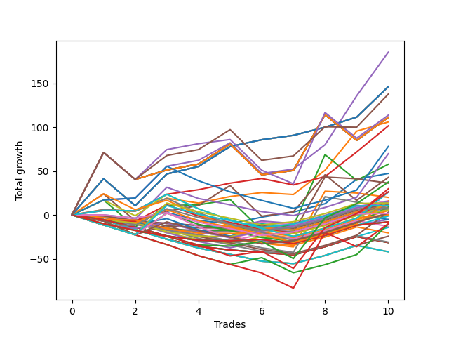

# Short Bulldog 004 
- Symbol: NQ
- Date Range: 03/18/2022 - 06/17/2022
- Trading Period: 7:20-12:30
- Number of Trades: 10



| Name | Win Percent | Profit | Avg Profit / Trade |     | Name | Win Percent | Profit | Avg Profit / Trade |
| ---- | ----------- | ------ | ------------------ | --- | ---- | ----------- | ------ | ------------------ |
| Sorted By <br> Profit | | | | | Sorted By <br> Win Percentage ||||
| Four | 90.00 | 92750.00 | 9275.00 |     | Four | 90.00 | 92750.00 | 9275.00 |
| Seventy | 90.00 | 73125.00 | 7312.50 |     | Seventy | 90.00 | 73125.00 | 7312.50 |
| Fifty-Four | 90.00 | 73125.00 | 7312.50 |     | Fifty-Four | 90.00 | 73125.00 | 7312.50 |
| Thirty-Eight | 90.00 | 73125.00 | 7312.50 |     | Thirty-Eight | 90.00 | 73125.00 | 7312.50 |
| Twenty-Two | 90.00 | 73125.00 | 7312.50 |     | Twenty-Two | 90.00 | 73125.00 | 7312.50 |
| Six | 90.00 | 73125.00 | 7312.50 |     | Six | 90.00 | 73125.00 | 7312.50 |
| Seventy-Five | 70.00 | 68875.00 | 6887.50 |     | Three | 80.00 | 50750.00 | 5075.00 |
| Seventy-Four | 60.00 | 56875.00 | 5687.50 |     | Seventy-Five | 70.00 | 68875.00 | 6887.50 |
| Seventy-One | 70.00 | 55625.00 | 5562.50 |     | Seventy-One | 70.00 | 55625.00 | 5562.50 |
| Fifty-Five | 70.00 | 55625.00 | 5562.50 |     | Fifty-Five | 70.00 | 55625.00 | 5562.50 |
| Thirty-Nine | 70.00 | 55625.00 | 5562.50 |     | Thirty-Nine | 70.00 | 55625.00 | 5562.50 |
| Twenty-Three | 70.00 | 55625.00 | 5562.50 |     | Twenty-Three | 70.00 | 55625.00 | 5562.50 |
| Seven | 70.00 | 55625.00 | 5562.50 |     | Seven | 70.00 | 55625.00 | 5562.50 |
| One | 70.00 | 53000.00 | 5300.00 |     | One | 70.00 | 53000.00 | 5300.00 |
| Three | 80.00 | 50750.00 | 5075.00 |     | Two | 70.00 | 28875.00 | 2887.50 |
| Sixty | 60.00 | 39000.00 | 3900.00 |     | Five | 70.00 | 21375.00 | 2137.50 |
| Forty-Four | 50.00 | 34875.00 | 3487.50 |     | Seventy-Four | 60.00 | 56875.00 | 5687.50 |
| Two | 70.00 | 28875.00 | 2887.50 |     | Sixty | 60.00 | 39000.00 | 3900.00 |
| Zero | 60.00 | 23625.00 | 2362.50 |     | Zero | 60.00 | 23625.00 | 2362.50 |
| Five | 70.00 | 21375.00 | 2137.50 |     | Sixty-Four | 60.00 | 7375.00 | 737.50 |
| Seventy-Two | 40.00 | 18750.00 | 1875.00 |     | Fifty-Six | 60.00 | 7125.00 | 712.50 |
| Fifteen | 10.00 | 18125.00 | 1812.50 |     | Forty-Four | 50.00 | 34875.00 | 3487.50 |
| Forty-Three | 40.00 | 14875.00 | 1487.50 |     | Fifty-Nine | 50.00 | 13000.00 | 1300.00 |
| Seventy-Three | 40.00 | 13125.00 | 1312.50 |     | Sixten | 50.00 | 8000.00 | 800.00 |
| Fifty-Nine | 50.00 | 13000.00 | 1300.00 |     | Sixty-One | 50.00 | 7875.00 | 787.50 |
| Thirty-One | 10.00 | 10000.00 | 1000.00 |     | Nineteen | 50.00 | 7500.00 | 750.00 |
| Sixten | 50.00 | 8000.00 | 800.00 |     | Fifty-Eight | 50.00 | 7250.00 | 725.00 |
| Sixty-One | 50.00 | 7875.00 | 787.50 |     | Seventeen | 50.00 | 7000.00 | 700.00 |
| Nineteen | 50.00 | 7500.00 | 750.00 |     | Sixty-Eight | 50.00 | 6750.00 | 675.00 |
| Sixty-Four | 60.00 | 7375.00 | 737.50 |     | Sixty-Nine | 50.00 | 5375.00 | 537.50 |
| Fifty-Eight | 50.00 | 7250.00 | 725.00 |     | Twenty-One | 50.00 | 5375.00 | 537.50 |
| Fifty-Six | 60.00 | 7125.00 | 712.50 |     | Twenty | 50.00 | 5375.00 | 537.50 |
| Seventeen | 50.00 | 7000.00 | 700.00 |     | Eighteen | 50.00 | 5375.00 | 537.50 |
| Thirty-Two | 40.00 | 6875.00 | 687.50 |     | Sixty-Seven | 50.00 | 3500.00 | 350.00 |
| Sixty-Eight | 50.00 | 6750.00 | 675.00 |     | Forty | 50.00 | 3125.00 | 312.50 |
| Thirty-Five | 40.00 | 6375.00 | 637.50 |     | Fifty-Seven | 50.00 | 1125.00 | 112.50 |
| Thirty-Three | 40.00 | 5875.00 | 587.50 |     | Sixty-Five | 50.00 | 1000.00 | 100.00 |
| Sixty-Nine | 50.00 | 5375.00 | 537.50 |     | Sixty-Six | 50.00 | 875.00 | 87.50 |
| Twenty-One | 50.00 | 5375.00 | 537.50 |     | Seventy-Two | 40.00 | 18750.00 | 1875.00 |
| Twenty | 50.00 | 5375.00 | 537.50 |     | Forty-Three | 40.00 | 14875.00 | 1487.50 |
| Eighteen | 50.00 | 5375.00 | 537.50 |     | Seventy-Three | 40.00 | 13125.00 | 1312.50 |
| Forty-Two | 40.00 | 4375.00 | 437.50 |     | Thirty-Two | 40.00 | 6875.00 | 687.50 |
| Thirty-Seven | 40.00 | 4250.00 | 425.00 |     | Thirty-Five | 40.00 | 6375.00 | 637.50 |
| Thirty-Six | 40.00 | 4250.00 | 425.00 |     | Thirty-Three | 40.00 | 5875.00 | 587.50 |
| Thirty-Four | 40.00 | 4250.00 | 425.00 |     | Forty-Two | 40.00 | 4375.00 | 437.50 |
| Forty-Seven | 10.00 | 3875.00 | 387.50 |     | Thirty-Seven | 40.00 | 4250.00 | 425.00 |
| Sixty-Seven | 50.00 | 3500.00 | 350.00 |     | Thirty-Six | 40.00 | 4250.00 | 425.00 |
| Forty | 50.00 | 3125.00 | 312.50 |     | Thirty-Four | 40.00 | 4250.00 | 425.00 |
| Fourteen | 30.00 | 3000.00 | 300.00 |     | Forty-Eight | 40.00 | 2875.00 | 287.50 |
| Forty-Eight | 40.00 | 2875.00 | 287.50 |     | Forty-One | 40.00 | 2500.00 | 250.00 |
| Forty-One | 40.00 | 2500.00 | 250.00 |     | Forty-Five | 40.00 | 1500.00 | 150.00 |
| Forty-Five | 40.00 | 1500.00 | 150.00 |     | Fifty-One | 40.00 | 125.00 | 12.50 |
| Fifty-Seven | 50.00 | 1125.00 | 112.50 |     | Eight | 40.00 | -125.00 | -12.50 |
| Sixty-Five | 50.00 | 1000.00 | 100.00 |     | Forty-Nine | 40.00 | -625.00 | -62.50 |
| Sixty-Six | 50.00 | 875.00 | 87.50 |     | Twenty-Four | 40.00 | -2625.00 | -262.50 |
| Fifty-One | 40.00 | 125.00 | 12.50 |     | Fifty-Three | 40.00 | -4000.00 | -400.00 |
| Eight | 40.00 | -125.00 | -12.50 |     | Fifty-Two | 40.00 | -4000.00 | -400.00 |
| Forty-Nine | 40.00 | -625.00 | -62.50 |     | Fifty | 40.00 | -4000.00 | -400.00 |
| Twenty-Four | 40.00 | -2625.00 | -262.50 |     | Sixty-Two | 40.00 | -5250.00 | -525.00 |
| Thirty | 30.00 | -2625.00 | -262.50 |     | Fourteen | 30.00 | 3000.00 | 300.00 |
| Fifty-Three | 40.00 | -4000.00 | -400.00 |     | Thirty | 30.00 | -2625.00 | -262.50 |
| Fifty-Two | 40.00 | -4000.00 | -400.00 |     | Forty-Six | 30.00 | -6625.00 | -662.50 |
| Fifty | 40.00 | -4000.00 | -400.00 |     | Nine | 30.00 | -7125.00 | -712.50 |
| Sixty-Three | 20.00 | -5000.00 | -500.00 |     | Twenty-Five | 30.00 | -12125.00 | -1212.50 |
| Sixty-Two | 40.00 | -5250.00 | -525.00 |     | Sixty-Three | 20.00 | -5000.00 | -500.00 |
| Forty-Six | 30.00 | -6625.00 | -662.50 |     | Eleven | 20.00 | -10250.00 | -1025.00 |
| Nine | 30.00 | -7125.00 | -712.50 |     | twenty-Seven | 20.00 | -15500.00 | -1550.00 |
| Eleven | 20.00 | -10250.00 | -1025.00 |     | Thirteen | 20.00 | -15750.00 | -1575.00 |
| Twenty-Five | 30.00 | -12125.00 | -1212.50 |     | Twelve | 20.00 | -15750.00 | -1575.00 |
| twenty-Seven | 20.00 | -15500.00 | -1550.00 |     | Ten | 20.00 | -15750.00 | -1575.00 |
| Thirteen | 20.00 | -15750.00 | -1575.00 |     | Twenty-Nine | 20.00 | -21000.00 | -2100.00 |
| Twelve | 20.00 | -15750.00 | -1575.00 |     | Twenty-Eight | 20.00 | -21000.00 | -2100.00 |
| Ten | 20.00 | -15750.00 | -1575.00 |     | Twenty-Six | 20.00 | -21000.00 | -2100.00 |
| Twenty-Nine | 20.00 | -21000.00 | -2100.00 |     | Fifteen | 10.00 | 18125.00 | 1812.50 |
| Twenty-Eight | 20.00 | -21000.00 | -2100.00 |     | Thirty-One | 10.00 | 10000.00 | 1000.00 |
| Twenty-Six | 20.00 | -21000.00 | -2100.00 |     | Forty-Seven | 10.00 | 3875.00 | 387.50 |

## NO STOPLOSS

### Test Zero
* Sell when price hits the middle line of the 20p bollinger
* No Stoploss
* Results:
```
Total Trades: 10
Percent Up: 40.00
Percent Down: 60.00
Total Points Moved Down: 47.25
Potential Profit: 23625.00
Total Points Ups: 16.75 Count Ups: 4
Total Points Downs: 64.00 Count Downs: 6
```

<details><summary>Trades</summary>

<code>In: 2022-03-25 11:58:00		Out: 2022-03-25 12:00:45		Total Position Time: 02:45		Total Move Down: -0.00		Total to Date: 0.00</code> <br />
<code>In: 2022-03-28 11:13:00		Out: 2022-03-28 11:13:25		Total Position Time: 00:25		Total Move Down: -3.75		Total to Date: -3.75</code> <br />
<code>In: 2022-03-29 08:53:00		Out: 2022-03-29 08:56:30		Total Position Time: 03:30		Total Move Down: 6.50		Total to Date: 2.75</code> <br />
<code>In: 2022-03-30 09:47:00		Out: 2022-03-30 10:01:10		Total Position Time: 14:10		Total Move Down: -9.00		Total to Date: -6.25</code> <br />
<code>In: 2022-04-18 11:29:00		Out: 2022-04-18 11:40:45		Total Position Time: 11:45		Total Move Down: -4.00		Total to Date: -10.25</code> <br />
<code>In: 2022-04-20 10:19:00		Out: 2022-04-20 10:19:10		Total Position Time: 00:10		Total Move Down: 7.75		Total to Date: -2.50</code> <br />
<code>In: 2022-04-25 09:29:00		Out: 2022-04-25 09:31:05		Total Position Time: 02:05		Total Move Down: 5.75		Total to Date: 3.25</code> <br />
<code>In: 2022-04-26 10:02:00		Out: 2022-04-26 10:02:15		Total Position Time: 00:15		Total Move Down: 9.50		Total to Date: 12.75</code> <br />
<code>In: 2022-05-02 09:03:00		Out: 2022-05-02 09:03:50		Total Position Time: 00:50		Total Move Down: 28.00		Total to Date: 40.75</code> <br />
<code>In: 2022-05-16 09:06:00		Out: 2022-05-16 09:06:10		Total Position Time: 00:10		Total Move Down: 6.50		Total to Date: 47.25</code> <br />


</details>

### Test One
* Sell when the price hits the upper line of the 20p 1std bollinger
* No Stoploss
* Results:
```
Total Trades: 10
Percent Up: 30.00
Percent Down: 70.00
Total Points Moved Down: 106.00
Potential Profit: 53000.00
Total Points Ups: 9.50 Count Ups: 3
Total Points Downs: 115.50 Count Downs: 7
```

<details><summary>Trades</summary>

<code>In: 2022-03-25 11:58:00		Out: 2022-03-25 12:00:55		Total Position Time: 02:55		Total Move Down: 6.00		Total to Date: 6.00</code> <br />
<code>In: 2022-03-28 11:13:00		Out: 2022-03-28 11:19:20		Total Position Time: 06:20		Total Move Down: -1.75		Total to Date: 4.25</code> <br />
<code>In: 2022-03-29 08:53:00		Out: 2022-03-29 08:58:40		Total Position Time: 05:40		Total Move Down: 14.75		Total to Date: 19.00</code> <br />
<code>In: 2022-03-30 09:47:00		Out: 2022-03-30 10:01:40		Total Position Time: 14:40		Total Move Down: -5.50		Total to Date: 13.50</code> <br />
<code>In: 2022-04-18 11:29:00		Out: 2022-04-18 11:41:15		Total Position Time: 12:15		Total Move Down: 7.50		Total to Date: 21.00</code> <br />
<code>In: 2022-04-20 10:19:00		Out: 2022-04-20 10:33:05		Total Position Time: 14:05		Total Move Down: 4.50		Total to Date: 25.50</code> <br />
<code>In: 2022-04-25 09:29:00		Out: 2022-04-25 09:45:00		Total Position Time: 16:00		Total Move Down: -2.25		Total to Date: 23.25</code> <br />
<code>In: 2022-04-26 10:02:00		Out: 2022-04-26 10:02:50		Total Position Time: 00:50		Total Move Down: 27.75		Total to Date: 51.00</code> <br />
<code>In: 2022-05-02 09:03:00		Out: 2022-05-02 09:04:00		Total Position Time: 01:00		Total Move Down: 44.50		Total to Date: 95.50</code> <br />
<code>In: 2022-05-16 09:06:00		Out: 2022-05-16 09:06:25		Total Position Time: 00:25		Total Move Down: 10.50		Total to Date: 106.00</code> <br />


</details>

### Test Two
* Sell when the price hits the upper line of the 20p 2std bollinger
* No Stoploss
* Results:
```
Total Trades: 10
Percent Up: 30.00
Percent Down: 70.00
Total Points Moved Down: 57.75
Potential Profit: 28875.00
Total Points Ups: 95.00 Count Ups: 3
Total Points Downs: 152.75 Count Downs: 7
```

<details><summary>Trades</summary>

<code>In: 2022-03-25 11:58:00		Out: 2022-03-25 12:01:50		Total Position Time: 03:50		Total Move Down: 17.00		Total to Date: 17.00</code> <br />
<code>In: 2022-03-28 11:13:00		Out: 2022-03-28 11:42:55		Total Position Time: 29:55		Total Move Down: -30.75		Total to Date: -13.75</code> <br />
<code>In: 2022-03-29 08:53:00		Out: 2022-03-29 09:01:35		Total Position Time: 08:35		Total Move Down: 24.50		Total to Date: 10.75</code> <br />
<code>In: 2022-03-30 09:47:00		Out: 2022-03-30 10:06:45		Total Position Time: 19:45		Total Move Down: 0.75		Total to Date: 11.50</code> <br />
<code>In: 2022-04-18 11:29:00		Out: 2022-04-18 11:43:10		Total Position Time: 14:10		Total Move Down: 6.00		Total to Date: 17.50</code> <br />
<code>In: 2022-04-20 10:19:00		Out: 2022-04-20 10:48:55		Total Position Time: 29:55		Total Move Down: -35.00		Total to Date: -17.50</code> <br />
<code>In: 2022-04-25 09:29:00		Out: 2022-04-25 09:58:55		Total Position Time: 29:55		Total Move Down: 5.00		Total to Date: -12.50</code> <br />
<code>In: 2022-04-26 10:02:00		Out: 2022-04-26 10:31:55		Total Position Time: 29:55		Total Move Down: 81.25		Total to Date: 68.75</code> <br />
<code>In: 2022-05-02 09:03:00		Out: 2022-05-02 09:32:55		Total Position Time: 29:55		Total Move Down: -29.25		Total to Date: 39.50</code> <br />
<code>In: 2022-05-16 09:06:00		Out: 2022-05-16 09:11:35		Total Position Time: 05:35		Total Move Down: 18.25		Total to Date: 57.75</code> <br />


</details>

### Test Three
* Sell when price hits the middle line of the 50p bollinger
* No Stoploss
* Results:
```
Total Trades: 10
Percent Up: 20.00
Percent Down: 80.00
Total Points Moved Down: 101.50
Potential Profit: 50750.00
Total Points Ups: 7.50 Count Ups: 2
Total Points Downs: 109.00 Count Downs: 8
```

<details><summary>Trades</summary>

<code>In: 2022-03-25 11:58:00		Out: 2022-03-25 12:00:50		Total Position Time: 02:50		Total Move Down: 5.00		Total to Date: 5.00</code> <br />
<code>In: 2022-03-28 11:13:00		Out: 2022-03-28 11:13:30		Total Position Time: 00:30		Total Move Down: -0.25		Total to Date: 4.75</code> <br />
<code>In: 2022-03-29 08:53:00		Out: 2022-03-29 09:00:25		Total Position Time: 07:25		Total Move Down: 18.75		Total to Date: 23.50</code> <br />
<code>In: 2022-03-30 09:47:00		Out: 2022-03-30 10:07:15		Total Position Time: 20:15		Total Move Down: 5.25		Total to Date: 28.75</code> <br />
<code>In: 2022-04-18 11:29:00		Out: 2022-04-18 11:41:15		Total Position Time: 12:15		Total Move Down: 7.50		Total to Date: 36.25</code> <br />
<code>In: 2022-04-20 10:19:00		Out: 2022-04-20 10:33:15		Total Position Time: 14:15		Total Move Down: 5.25		Total to Date: 41.50</code> <br />
<code>In: 2022-04-25 09:29:00		Out: 2022-04-25 09:55:05		Total Position Time: 26:05		Total Move Down: -7.25		Total to Date: 34.25</code> <br />
<code>In: 2022-04-26 10:02:00		Out: 2022-04-26 10:02:15		Total Position Time: 00:15		Total Move Down: 9.50		Total to Date: 43.75</code> <br />
<code>In: 2022-05-02 09:03:00		Out: 2022-05-02 09:03:50		Total Position Time: 00:50		Total Move Down: 28.00		Total to Date: 71.75</code> <br />
<code>In: 2022-05-16 09:06:00		Out: 2022-05-16 09:15:55		Total Position Time: 09:55		Total Move Down: 29.75		Total to Date: 101.50</code> <br />


</details>

### Test Four
* Sell when the price hits the upper line of the 50p 1std bollinger
* No Stoploss
* Results:
```
Total Trades: 10
Percent Up: 10.00
Percent Down: 90.00
Total Points Moved Down: 185.50
Potential Profit: 92750.00
Total Points Ups: 35.00 Count Ups: 1
Total Points Downs: 220.50 Count Downs: 9
```

<details><summary>Trades</summary>

<code>In: 2022-03-25 11:58:00		Out: 2022-03-25 12:01:50		Total Position Time: 03:50		Total Move Down: 17.00		Total to Date: 17.00</code> <br />
<code>In: 2022-03-28 11:13:00		Out: 2022-03-28 11:20:40		Total Position Time: 07:40		Total Move Down: 2.25		Total to Date: 19.25</code> <br />
<code>In: 2022-03-29 08:53:00		Out: 2022-03-29 09:02:10		Total Position Time: 09:10		Total Move Down: 36.25		Total to Date: 55.50</code> <br />
<code>In: 2022-03-30 09:47:00		Out: 2022-03-30 10:16:55		Total Position Time: 29:55		Total Move Down: 6.75		Total to Date: 62.25</code> <br />
<code>In: 2022-04-18 11:29:00		Out: 2022-04-18 11:46:40		Total Position Time: 17:40		Total Move Down: 20.00		Total to Date: 82.25</code> <br />
<code>In: 2022-04-20 10:19:00		Out: 2022-04-20 10:48:55		Total Position Time: 29:55		Total Move Down: -35.00		Total to Date: 47.25</code> <br />
<code>In: 2022-04-25 09:29:00		Out: 2022-04-25 09:58:55		Total Position Time: 29:55		Total Move Down: 5.00		Total to Date: 52.25</code> <br />
<code>In: 2022-04-26 10:02:00		Out: 2022-04-26 10:02:50		Total Position Time: 00:50		Total Move Down: 27.75		Total to Date: 80.00</code> <br />
<code>In: 2022-05-02 09:03:00		Out: 2022-05-02 09:04:05		Total Position Time: 01:05		Total Move Down: 55.75		Total to Date: 135.75</code> <br />
<code>In: 2022-05-16 09:06:00		Out: 2022-05-16 09:24:25		Total Position Time: 18:25		Total Move Down: 49.75		Total to Date: 185.50</code> <br />


</details>

### Test Five
* Sell when the price hits the upper line of the 50p 2std bollinger
* No Stoploss
* Results:
```
Total Trades: 10
Percent Up: 30.00
Percent Down: 70.00
Total Points Moved Down: 42.75
Potential Profit: 21375.00
Total Points Ups: 95.00 Count Ups: 3
Total Points Downs: 137.75 Count Downs: 7
```

<details><summary>Trades</summary>

<code>In: 2022-03-25 11:58:00		Out: 2022-03-25 12:02:00		Total Position Time: 04:00		Total Move Down: 24.00		Total to Date: 24.00</code> <br />
<code>In: 2022-03-28 11:13:00		Out: 2022-03-28 11:42:55		Total Position Time: 29:55		Total Move Down: -30.75		Total to Date: -6.75</code> <br />
<code>In: 2022-03-29 08:53:00		Out: 2022-03-29 09:22:55		Total Position Time: 29:55		Total Move Down: 10.75		Total to Date: 4.00</code> <br />
<code>In: 2022-03-30 09:47:00		Out: 2022-03-30 10:16:55		Total Position Time: 29:55		Total Move Down: 6.75		Total to Date: 10.75</code> <br />
<code>In: 2022-04-18 11:29:00		Out: 2022-04-18 11:58:55		Total Position Time: 29:55		Total Move Down: 22.75		Total to Date: 33.50</code> <br />
<code>In: 2022-04-20 10:19:00		Out: 2022-04-20 10:48:55		Total Position Time: 29:55		Total Move Down: -35.00		Total to Date: -1.50</code> <br />
<code>In: 2022-04-25 09:29:00		Out: 2022-04-25 09:58:55		Total Position Time: 29:55		Total Move Down: 5.00		Total to Date: 3.50</code> <br />
<code>In: 2022-04-26 10:02:00		Out: 2022-04-26 10:04:10		Total Position Time: 02:10		Total Move Down: 42.25		Total to Date: 45.75</code> <br />
<code>In: 2022-05-02 09:03:00		Out: 2022-05-02 09:32:55		Total Position Time: 29:55		Total Move Down: -29.25		Total to Date: 16.50</code> <br />
<code>In: 2022-05-16 09:06:00		Out: 2022-05-16 09:35:55		Total Position Time: 29:55		Total Move Down: 26.25		Total to Date: 42.75</code> <br />


</details>

### Test Six
* Sell when the price hits the middle line of the 1std VWAP
* No Stoploss
* Results:
```
Total Trades: 10
Percent Up: 10.00
Percent Down: 90.00
Total Points Moved Down: 146.25
Potential Profit: 73125.00
Total Points Ups: 30.75 Count Ups: 1
Total Points Downs: 177.00 Count Downs: 9
```

<details><summary>Trades</summary>

<code>In: 2022-03-25 11:58:00		Out: 2022-03-25 12:07:20		Total Position Time: 09:20		Total Move Down: 41.25		Total to Date: 41.25</code> <br />
<code>In: 2022-03-28 11:13:00		Out: 2022-03-28 11:42:55		Total Position Time: 29:55		Total Move Down: -30.75		Total to Date: 10.50</code> <br />
<code>In: 2022-03-29 08:53:00		Out: 2022-03-29 09:02:10		Total Position Time: 09:10		Total Move Down: 36.25		Total to Date: 46.75</code> <br />
<code>In: 2022-03-30 09:47:00		Out: 2022-03-30 10:08:40		Total Position Time: 21:40		Total Move Down: 8.50		Total to Date: 55.25</code> <br />
<code>In: 2022-04-18 11:29:00		Out: 2022-04-18 11:58:55		Total Position Time: 29:55		Total Move Down: 22.75		Total to Date: 78.00</code> <br />
<code>In: 2022-04-20 10:19:00		Out: 2022-04-20 10:19:10		Total Position Time: 00:10		Total Move Down: 7.75		Total to Date: 85.75</code> <br />
<code>In: 2022-04-25 09:29:00		Out: 2022-04-25 09:58:55		Total Position Time: 29:55		Total Move Down: 5.00		Total to Date: 90.75</code> <br />
<code>In: 2022-04-26 10:02:00		Out: 2022-04-26 10:02:10		Total Position Time: 00:10		Total Move Down: 9.25		Total to Date: 100.00</code> <br />
<code>In: 2022-05-02 09:03:00		Out: 2022-05-02 09:03:10		Total Position Time: 00:10		Total Move Down: 11.50		Total to Date: 111.50</code> <br />
<code>In: 2022-05-16 09:06:00		Out: 2022-05-16 09:17:45		Total Position Time: 11:45		Total Move Down: 34.75		Total to Date: 146.25</code> <br />


</details>

### Test Seven
* Sell when the price hits the upper line of the 1std VWAP
* No Stoploss
* Results:
```
Total Trades: 10
Percent Up: 30.00
Percent Down: 70.00
Total Points Moved Down: 111.25
Potential Profit: 55625.00
Total Points Ups: 95.00 Count Ups: 3
Total Points Downs: 206.25 Count Downs: 7
```

<details><summary>Trades</summary>

<code>In: 2022-03-25 11:58:00		Out: 2022-03-25 12:27:55		Total Position Time: 29:55		Total Move Down: 71.25		Total to Date: 71.25</code> <br />
<code>In: 2022-03-28 11:13:00		Out: 2022-03-28 11:42:55		Total Position Time: 29:55		Total Move Down: -30.75		Total to Date: 40.50</code> <br />
<code>In: 2022-03-29 08:53:00		Out: 2022-03-29 09:22:55		Total Position Time: 29:55		Total Move Down: 10.75		Total to Date: 51.25</code> <br />
<code>In: 2022-03-30 09:47:00		Out: 2022-03-30 10:16:55		Total Position Time: 29:55		Total Move Down: 6.75		Total to Date: 58.00</code> <br />
<code>In: 2022-04-18 11:29:00		Out: 2022-04-18 11:58:55		Total Position Time: 29:55		Total Move Down: 22.75		Total to Date: 80.75</code> <br />
<code>In: 2022-04-20 10:19:00		Out: 2022-04-20 10:48:55		Total Position Time: 29:55		Total Move Down: -35.00		Total to Date: 45.75</code> <br />
<code>In: 2022-04-25 09:29:00		Out: 2022-04-25 09:58:55		Total Position Time: 29:55		Total Move Down: 5.00		Total to Date: 50.75</code> <br />
<code>In: 2022-04-26 10:02:00		Out: 2022-04-26 10:14:55		Total Position Time: 12:55		Total Move Down: 63.50		Total to Date: 114.25</code> <br />
<code>In: 2022-05-02 09:03:00		Out: 2022-05-02 09:32:55		Total Position Time: 29:55		Total Move Down: -29.25		Total to Date: 85.00</code> <br />
<code>In: 2022-05-16 09:06:00		Out: 2022-05-16 09:35:55		Total Position Time: 29:55		Total Move Down: 26.25		Total to Date: 111.25</code> <br />


</details>

## STOPLOSS OF 2

### Test Eight
* Sell when price hits the middle line of the 20p bollinger
* Stoploss is -2 points
* Results:
```
Total Trades: 10
Percent Up: 60.00
Percent Down: 40.00
Total Points Moved Down: -0.25
Potential Profit: -125.00
Total Points Ups: 35.25 Count Ups: 6
Total Points Downs: 35.00 Count Downs: 4
```

<details><summary>Trades</summary>

<code>In: 2022-03-25 11:58:00		Out: 2022-03-25 11:58:25		Total Position Time: 00:25		Total Move Down: -5.50		Total to Date: -5.50</code> <br />
<code>In: 2022-03-28 11:13:00		Out: 2022-03-28 11:13:25		Total Position Time: 00:25		Total Move Down: -3.75		Total to Date: -9.25</code> <br />
<code>In: 2022-03-29 08:53:00		Out: 2022-03-29 08:53:50		Total Position Time: 00:50		Total Move Down: -11.00		Total to Date: -20.25</code> <br />
<code>In: 2022-03-30 09:47:00		Out: 2022-03-30 09:48:15		Total Position Time: 01:15		Total Move Down: -8.00		Total to Date: -28.25</code> <br />
<code>In: 2022-04-18 11:29:00		Out: 2022-04-18 11:30:15		Total Position Time: 01:15		Total Move Down: -4.25		Total to Date: -32.50</code> <br />
<code>In: 2022-04-20 10:19:00		Out: 2022-04-20 10:19:10		Total Position Time: 00:10		Total Move Down: 7.75		Total to Date: -24.75</code> <br />
<code>In: 2022-04-25 09:29:00		Out: 2022-04-25 09:29:15		Total Position Time: 00:15		Total Move Down: -2.75		Total to Date: -27.50</code> <br />
<code>In: 2022-04-26 10:02:00		Out: 2022-04-26 10:02:10		Total Position Time: 00:10		Total Move Down: 9.25		Total to Date: -18.25</code> <br />
<code>In: 2022-05-02 09:03:00		Out: 2022-05-02 09:03:10		Total Position Time: 00:10		Total Move Down: 11.50		Total to Date: -6.75</code> <br />
<code>In: 2022-05-16 09:06:00		Out: 2022-05-16 09:06:10		Total Position Time: 00:10		Total Move Down: 6.50		Total to Date: -0.25</code> <br />


</details>

### Test Nine
* Sell when the price hits the upper line of the 20p 1std bollinger
* Stoploss is -2 points
* Results:
```
Total Trades: 10
Percent Up: 70.00
Percent Down: 30.00
Total Points Moved Down: -14.25
Potential Profit: -7125.00
Total Points Ups: 45.50 Count Ups: 7
Total Points Downs: 31.25 Count Downs: 3
```

<details><summary>Trades</summary>

<code>In: 2022-03-25 11:58:00		Out: 2022-03-25 11:58:25		Total Position Time: 00:25		Total Move Down: -5.50		Total to Date: -5.50</code> <br />
<code>In: 2022-03-28 11:13:00		Out: 2022-03-28 11:14:35		Total Position Time: 01:35		Total Move Down: -11.25		Total to Date: -16.75</code> <br />
<code>In: 2022-03-29 08:53:00		Out: 2022-03-29 08:53:50		Total Position Time: 00:50		Total Move Down: -11.00		Total to Date: -27.75</code> <br />
<code>In: 2022-03-30 09:47:00		Out: 2022-03-30 09:48:15		Total Position Time: 01:15		Total Move Down: -8.00		Total to Date: -35.75</code> <br />
<code>In: 2022-04-18 11:29:00		Out: 2022-04-18 11:30:15		Total Position Time: 01:15		Total Move Down: -4.25		Total to Date: -40.00</code> <br />
<code>In: 2022-04-20 10:19:00		Out: 2022-04-20 10:22:25		Total Position Time: 03:25		Total Move Down: -2.75		Total to Date: -42.75</code> <br />
<code>In: 2022-04-25 09:29:00		Out: 2022-04-25 09:29:15		Total Position Time: 00:15		Total Move Down: -2.75		Total to Date: -45.50</code> <br />
<code>In: 2022-04-26 10:02:00		Out: 2022-04-26 10:02:10		Total Position Time: 00:10		Total Move Down: 9.25		Total to Date: -36.25</code> <br />
<code>In: 2022-05-02 09:03:00		Out: 2022-05-02 09:03:10		Total Position Time: 00:10		Total Move Down: 11.50		Total to Date: -24.75</code> <br />
<code>In: 2022-05-16 09:06:00		Out: 2022-05-16 09:06:25		Total Position Time: 00:25		Total Move Down: 10.50		Total to Date: -14.25</code> <br />


</details>

### Test Ten
* Sell when the price hits the upper line of the 20p 2std bollinger
* Stoploss is -2 points
* Results:
```
Total Trades: 10
Percent Up: 80.00
Percent Down: 20.00
Total Points Moved Down: -31.50
Potential Profit: -15750.00
Total Points Ups: 52.25 Count Ups: 8
Total Points Downs: 20.75 Count Downs: 2
```

<details><summary>Trades</summary>

<code>In: 2022-03-25 11:58:00		Out: 2022-03-25 11:58:25		Total Position Time: 00:25		Total Move Down: -5.50		Total to Date: -5.50</code> <br />
<code>In: 2022-03-28 11:13:00		Out: 2022-03-28 11:14:35		Total Position Time: 01:35		Total Move Down: -11.25		Total to Date: -16.75</code> <br />
<code>In: 2022-03-29 08:53:00		Out: 2022-03-29 08:53:50		Total Position Time: 00:50		Total Move Down: -11.00		Total to Date: -27.75</code> <br />
<code>In: 2022-03-30 09:47:00		Out: 2022-03-30 09:48:15		Total Position Time: 01:15		Total Move Down: -8.00		Total to Date: -35.75</code> <br />
<code>In: 2022-04-18 11:29:00		Out: 2022-04-18 11:30:15		Total Position Time: 01:15		Total Move Down: -4.25		Total to Date: -40.00</code> <br />
<code>In: 2022-04-20 10:19:00		Out: 2022-04-20 10:22:25		Total Position Time: 03:25		Total Move Down: -2.75		Total to Date: -42.75</code> <br />
<code>In: 2022-04-25 09:29:00		Out: 2022-04-25 09:29:15		Total Position Time: 00:15		Total Move Down: -2.75		Total to Date: -45.50</code> <br />
<code>In: 2022-04-26 10:02:00		Out: 2022-04-26 10:02:10		Total Position Time: 00:10		Total Move Down: 9.25		Total to Date: -36.25</code> <br />
<code>In: 2022-05-02 09:03:00		Out: 2022-05-02 09:03:10		Total Position Time: 00:10		Total Move Down: 11.50		Total to Date: -24.75</code> <br />
<code>In: 2022-05-16 09:06:00		Out: 2022-05-16 09:07:10		Total Position Time: 01:10		Total Move Down: -6.75		Total to Date: -31.50</code> <br />


</details>

### Test Eleven
* Sell when price hits the middle line of the 50p bollinger
* Stoploss is -2 points
* Results:
```
Total Trades: 10
Percent Up: 80.00
Percent Down: 20.00
Total Points Moved Down: -20.50
Potential Profit: -10250.00
Total Points Ups: 41.25 Count Ups: 8
Total Points Downs: 20.75 Count Downs: 2
```

<details><summary>Trades</summary>

<code>In: 2022-03-25 11:58:00		Out: 2022-03-25 11:58:25		Total Position Time: 00:25		Total Move Down: -5.50		Total to Date: -5.50</code> <br />
<code>In: 2022-03-28 11:13:00		Out: 2022-03-28 11:13:30		Total Position Time: 00:30		Total Move Down: -0.25		Total to Date: -5.75</code> <br />
<code>In: 2022-03-29 08:53:00		Out: 2022-03-29 08:53:50		Total Position Time: 00:50		Total Move Down: -11.00		Total to Date: -16.75</code> <br />
<code>In: 2022-03-30 09:47:00		Out: 2022-03-30 09:48:15		Total Position Time: 01:15		Total Move Down: -8.00		Total to Date: -24.75</code> <br />
<code>In: 2022-04-18 11:29:00		Out: 2022-04-18 11:30:15		Total Position Time: 01:15		Total Move Down: -4.25		Total to Date: -29.00</code> <br />
<code>In: 2022-04-20 10:19:00		Out: 2022-04-20 10:22:25		Total Position Time: 03:25		Total Move Down: -2.75		Total to Date: -31.75</code> <br />
<code>In: 2022-04-25 09:29:00		Out: 2022-04-25 09:29:15		Total Position Time: 00:15		Total Move Down: -2.75		Total to Date: -34.50</code> <br />
<code>In: 2022-04-26 10:02:00		Out: 2022-04-26 10:02:10		Total Position Time: 00:10		Total Move Down: 9.25		Total to Date: -25.25</code> <br />
<code>In: 2022-05-02 09:03:00		Out: 2022-05-02 09:03:10		Total Position Time: 00:10		Total Move Down: 11.50		Total to Date: -13.75</code> <br />
<code>In: 2022-05-16 09:06:00		Out: 2022-05-16 09:07:10		Total Position Time: 01:10		Total Move Down: -6.75		Total to Date: -20.50</code> <br />


</details>

### Test Twelve
* Sell when the price hits the upper line of the 50p 1std bollinger
* Stoploss is -2 points
* Results:
```
Total Trades: 10
Percent Up: 80.00
Percent Down: 20.00
Total Points Moved Down: -31.50
Potential Profit: -15750.00
Total Points Ups: 52.25 Count Ups: 8
Total Points Downs: 20.75 Count Downs: 2
```

<details><summary>Trades</summary>

<code>In: 2022-03-25 11:58:00		Out: 2022-03-25 11:58:25		Total Position Time: 00:25		Total Move Down: -5.50		Total to Date: -5.50</code> <br />
<code>In: 2022-03-28 11:13:00		Out: 2022-03-28 11:14:35		Total Position Time: 01:35		Total Move Down: -11.25		Total to Date: -16.75</code> <br />
<code>In: 2022-03-29 08:53:00		Out: 2022-03-29 08:53:50		Total Position Time: 00:50		Total Move Down: -11.00		Total to Date: -27.75</code> <br />
<code>In: 2022-03-30 09:47:00		Out: 2022-03-30 09:48:15		Total Position Time: 01:15		Total Move Down: -8.00		Total to Date: -35.75</code> <br />
<code>In: 2022-04-18 11:29:00		Out: 2022-04-18 11:30:15		Total Position Time: 01:15		Total Move Down: -4.25		Total to Date: -40.00</code> <br />
<code>In: 2022-04-20 10:19:00		Out: 2022-04-20 10:22:25		Total Position Time: 03:25		Total Move Down: -2.75		Total to Date: -42.75</code> <br />
<code>In: 2022-04-25 09:29:00		Out: 2022-04-25 09:29:15		Total Position Time: 00:15		Total Move Down: -2.75		Total to Date: -45.50</code> <br />
<code>In: 2022-04-26 10:02:00		Out: 2022-04-26 10:02:10		Total Position Time: 00:10		Total Move Down: 9.25		Total to Date: -36.25</code> <br />
<code>In: 2022-05-02 09:03:00		Out: 2022-05-02 09:03:10		Total Position Time: 00:10		Total Move Down: 11.50		Total to Date: -24.75</code> <br />
<code>In: 2022-05-16 09:06:00		Out: 2022-05-16 09:07:10		Total Position Time: 01:10		Total Move Down: -6.75		Total to Date: -31.50</code> <br />


</details>

### Test Thirteen
* Sell when the price hits the upper line of the 50p 2std bollinger
* Stoploss is -2 points
* Results:
```
Total Trades: 10
Percent Up: 80.00
Percent Down: 20.00
Total Points Moved Down: -31.50
Potential Profit: -15750.00
Total Points Ups: 52.25 Count Ups: 8
Total Points Downs: 20.75 Count Downs: 2
```

<details><summary>Trades</summary>

<code>In: 2022-03-25 11:58:00		Out: 2022-03-25 11:58:25		Total Position Time: 00:25		Total Move Down: -5.50		Total to Date: -5.50</code> <br />
<code>In: 2022-03-28 11:13:00		Out: 2022-03-28 11:14:35		Total Position Time: 01:35		Total Move Down: -11.25		Total to Date: -16.75</code> <br />
<code>In: 2022-03-29 08:53:00		Out: 2022-03-29 08:53:50		Total Position Time: 00:50		Total Move Down: -11.00		Total to Date: -27.75</code> <br />
<code>In: 2022-03-30 09:47:00		Out: 2022-03-30 09:48:15		Total Position Time: 01:15		Total Move Down: -8.00		Total to Date: -35.75</code> <br />
<code>In: 2022-04-18 11:29:00		Out: 2022-04-18 11:30:15		Total Position Time: 01:15		Total Move Down: -4.25		Total to Date: -40.00</code> <br />
<code>In: 2022-04-20 10:19:00		Out: 2022-04-20 10:22:25		Total Position Time: 03:25		Total Move Down: -2.75		Total to Date: -42.75</code> <br />
<code>In: 2022-04-25 09:29:00		Out: 2022-04-25 09:29:15		Total Position Time: 00:15		Total Move Down: -2.75		Total to Date: -45.50</code> <br />
<code>In: 2022-04-26 10:02:00		Out: 2022-04-26 10:02:10		Total Position Time: 00:10		Total Move Down: 9.25		Total to Date: -36.25</code> <br />
<code>In: 2022-05-02 09:03:00		Out: 2022-05-02 09:03:10		Total Position Time: 00:10		Total Move Down: 11.50		Total to Date: -24.75</code> <br />
<code>In: 2022-05-16 09:06:00		Out: 2022-05-16 09:07:10		Total Position Time: 01:10		Total Move Down: -6.75		Total to Date: -31.50</code> <br />


</details>

### Test Fourteen
* Sell when the price hits the middle line of the 1std VWAP
* Stoploss is -2 points
* Results:
```
Total Trades: 10
Percent Up: 70.00
Percent Down: 30.00
Total Points Moved Down: 6.00
Potential Profit: 3000.00
Total Points Ups: 22.50 Count Ups: 7
Total Points Downs: 28.50 Count Downs: 3
```

<details><summary>Trades</summary>

<code>In: 2022-03-25 11:58:00		Out: 2022-03-25 11:58:10		Total Position Time: 00:10		Total Move Down: -1.25		Total to Date: -1.25</code> <br />
<code>In: 2022-03-28 11:13:00		Out: 2022-03-28 11:13:10		Total Position Time: 00:10		Total Move Down: -5.25		Total to Date: -6.50</code> <br />
<code>In: 2022-03-29 08:53:00		Out: 2022-03-29 08:53:10		Total Position Time: 00:10		Total Move Down: -3.25		Total to Date: -9.75</code> <br />
<code>In: 2022-03-30 09:47:00		Out: 2022-03-30 09:47:45		Total Position Time: 00:45		Total Move Down: -2.25		Total to Date: -12.00</code> <br />
<code>In: 2022-04-18 11:29:00		Out: 2022-04-18 11:29:50		Total Position Time: 00:50		Total Move Down: -2.75		Total to Date: -14.75</code> <br />
<code>In: 2022-04-20 10:19:00		Out: 2022-04-20 10:19:10		Total Position Time: 00:10		Total Move Down: 7.75		Total to Date: -7.00</code> <br />
<code>In: 2022-04-25 09:29:00		Out: 2022-04-25 09:29:15		Total Position Time: 00:15		Total Move Down: -2.75		Total to Date: -9.75</code> <br />
<code>In: 2022-04-26 10:02:00		Out: 2022-04-26 10:02:10		Total Position Time: 00:10		Total Move Down: 9.25		Total to Date: -0.50</code> <br />
<code>In: 2022-05-02 09:03:00		Out: 2022-05-02 09:03:10		Total Position Time: 00:10		Total Move Down: 11.50		Total to Date: 11.00</code> <br />
<code>In: 2022-05-16 09:06:00		Out: 2022-05-16 09:06:55		Total Position Time: 00:55		Total Move Down: -5.00		Total to Date: 6.00</code> <br />


</details>

### Test Fifteen
* Sell when the price hits the upper line of the 1std VWAP
* Stoploss is -2 points
* Results:
```
Total Trades: 10
Percent Up: 90.00
Percent Down: 10.00
Total Points Moved Down: 36.25
Potential Profit: 18125.00
Total Points Ups: 27.25 Count Ups: 9
Total Points Downs: 63.50 Count Downs: 1
```

<details><summary>Trades</summary>

<code>In: 2022-03-25 11:58:00		Out: 2022-03-25 11:58:10		Total Position Time: 00:10		Total Move Down: -1.25		Total to Date: -1.25</code> <br />
<code>In: 2022-03-28 11:13:00		Out: 2022-03-28 11:13:10		Total Position Time: 00:10		Total Move Down: -5.25		Total to Date: -6.50</code> <br />
<code>In: 2022-03-29 08:53:00		Out: 2022-03-29 08:53:10		Total Position Time: 00:10		Total Move Down: -3.25		Total to Date: -9.75</code> <br />
<code>In: 2022-03-30 09:47:00		Out: 2022-03-30 09:47:45		Total Position Time: 00:45		Total Move Down: -2.25		Total to Date: -12.00</code> <br />
<code>In: 2022-04-18 11:29:00		Out: 2022-04-18 11:29:50		Total Position Time: 00:50		Total Move Down: -2.75		Total to Date: -14.75</code> <br />
<code>In: 2022-04-20 10:19:00		Out: 2022-04-20 10:22:25		Total Position Time: 03:25		Total Move Down: -2.75		Total to Date: -17.50</code> <br />
<code>In: 2022-04-25 09:29:00		Out: 2022-04-25 09:29:15		Total Position Time: 00:15		Total Move Down: -2.75		Total to Date: -20.25</code> <br />
<code>In: 2022-04-26 10:02:00		Out: 2022-04-26 10:14:55		Total Position Time: 12:55		Total Move Down: 63.50		Total to Date: 43.25</code> <br />
<code>In: 2022-05-02 09:03:00		Out: 2022-05-02 09:15:15		Total Position Time: 12:15		Total Move Down: -2.00		Total to Date: 41.25</code> <br />
<code>In: 2022-05-16 09:06:00		Out: 2022-05-16 09:06:55		Total Position Time: 00:55		Total Move Down: -5.00		Total to Date: 36.25</code> <br />


</details>

## TRAIL STOP OF 2

### Test Sixten
* Sell when price hits the middle line of the 20p bollinger
* Trailing Stop is -2 points
* Results:
```
Total Trades: 10
Percent Up: 50.00
Percent Down: 50.00
Total Points Moved Down: 16.00
Potential Profit: 8000.00
Total Points Ups: 20.50 Count Ups: 5
Total Points Downs: 36.50 Count Downs: 5
```

<details><summary>Trades</summary>

<code>In: 2022-03-25 11:58:00		Out: 2022-03-25 11:58:25		Total Position Time: 00:25		Total Move Down: -5.50		Total to Date: -5.50</code> <br />
<code>In: 2022-03-28 11:13:00		Out: 2022-03-28 11:13:25		Total Position Time: 00:25		Total Move Down: -3.75		Total to Date: -9.25</code> <br />
<code>In: 2022-03-29 08:53:00		Out: 2022-03-29 08:53:15		Total Position Time: 00:15		Total Move Down: -6.75		Total to Date: -16.00</code> <br />
<code>In: 2022-03-30 09:47:00		Out: 2022-03-30 09:47:40		Total Position Time: 00:40		Total Move Down: -1.75		Total to Date: -17.75</code> <br />
<code>In: 2022-04-18 11:29:00		Out: 2022-04-18 11:29:15		Total Position Time: 00:15		Total Move Down: 1.50		Total to Date: -16.25</code> <br />
<code>In: 2022-04-20 10:19:00		Out: 2022-04-20 10:19:10		Total Position Time: 00:10		Total Move Down: 7.75		Total to Date: -8.50</code> <br />
<code>In: 2022-04-25 09:29:00		Out: 2022-04-25 09:29:15		Total Position Time: 00:15		Total Move Down: -2.75		Total to Date: -11.25</code> <br />
<code>In: 2022-04-26 10:02:00		Out: 2022-04-26 10:02:10		Total Position Time: 00:10		Total Move Down: 9.25		Total to Date: -2.00</code> <br />
<code>In: 2022-05-02 09:03:00		Out: 2022-05-02 09:03:10		Total Position Time: 00:10		Total Move Down: 11.50		Total to Date: 9.50</code> <br />
<code>In: 2022-05-16 09:06:00		Out: 2022-05-16 09:06:10		Total Position Time: 00:10		Total Move Down: 6.50		Total to Date: 16.00</code> <br />


</details>

### Test Seventeen
* Sell when the price hits the upper line of the 20p 1std bollinger
* Trailing Stop is -2 points
* Results:
```
Total Trades: 10
Percent Up: 50.00
Percent Down: 50.00
Total Points Moved Down: 14.00
Potential Profit: 7000.00
Total Points Ups: 21.25 Count Ups: 5
Total Points Downs: 35.25 Count Downs: 5
```

<details><summary>Trades</summary>

<code>In: 2022-03-25 11:58:00		Out: 2022-03-25 11:58:25		Total Position Time: 00:25		Total Move Down: -5.50		Total to Date: -5.50</code> <br />
<code>In: 2022-03-28 11:13:00		Out: 2022-03-28 11:13:45		Total Position Time: 00:45		Total Move Down: -4.50		Total to Date: -10.00</code> <br />
<code>In: 2022-03-29 08:53:00		Out: 2022-03-29 08:53:15		Total Position Time: 00:15		Total Move Down: -6.75		Total to Date: -16.75</code> <br />
<code>In: 2022-03-30 09:47:00		Out: 2022-03-30 09:47:40		Total Position Time: 00:40		Total Move Down: -1.75		Total to Date: -18.50</code> <br />
<code>In: 2022-04-18 11:29:00		Out: 2022-04-18 11:29:15		Total Position Time: 00:15		Total Move Down: 1.50		Total to Date: -17.00</code> <br />
<code>In: 2022-04-20 10:19:00		Out: 2022-04-20 10:19:20		Total Position Time: 00:20		Total Move Down: 2.50		Total to Date: -14.50</code> <br />
<code>In: 2022-04-25 09:29:00		Out: 2022-04-25 09:29:15		Total Position Time: 00:15		Total Move Down: -2.75		Total to Date: -17.25</code> <br />
<code>In: 2022-04-26 10:02:00		Out: 2022-04-26 10:02:10		Total Position Time: 00:10		Total Move Down: 9.25		Total to Date: -8.00</code> <br />
<code>In: 2022-05-02 09:03:00		Out: 2022-05-02 09:03:10		Total Position Time: 00:10		Total Move Down: 11.50		Total to Date: 3.50</code> <br />
<code>In: 2022-05-16 09:06:00		Out: 2022-05-16 09:06:25		Total Position Time: 00:25		Total Move Down: 10.50		Total to Date: 14.00</code> <br />


</details>

### Test Eighteen
* Sell when the price hits the upper line of the 20p 2std bollinger
* Trailing Stop is -2 points
* Results:
```
Total Trades: 10
Percent Up: 50.00
Percent Down: 50.00
Total Points Moved Down: 10.75
Potential Profit: 5375.00
Total Points Ups: 21.25 Count Ups: 5
Total Points Downs: 32.00 Count Downs: 5
```

<details><summary>Trades</summary>

<code>In: 2022-03-25 11:58:00		Out: 2022-03-25 11:58:25		Total Position Time: 00:25		Total Move Down: -5.50		Total to Date: -5.50</code> <br />
<code>In: 2022-03-28 11:13:00		Out: 2022-03-28 11:13:45		Total Position Time: 00:45		Total Move Down: -4.50		Total to Date: -10.00</code> <br />
<code>In: 2022-03-29 08:53:00		Out: 2022-03-29 08:53:15		Total Position Time: 00:15		Total Move Down: -6.75		Total to Date: -16.75</code> <br />
<code>In: 2022-03-30 09:47:00		Out: 2022-03-30 09:47:40		Total Position Time: 00:40		Total Move Down: -1.75		Total to Date: -18.50</code> <br />
<code>In: 2022-04-18 11:29:00		Out: 2022-04-18 11:29:15		Total Position Time: 00:15		Total Move Down: 1.50		Total to Date: -17.00</code> <br />
<code>In: 2022-04-20 10:19:00		Out: 2022-04-20 10:19:20		Total Position Time: 00:20		Total Move Down: 2.50		Total to Date: -14.50</code> <br />
<code>In: 2022-04-25 09:29:00		Out: 2022-04-25 09:29:15		Total Position Time: 00:15		Total Move Down: -2.75		Total to Date: -17.25</code> <br />
<code>In: 2022-04-26 10:02:00		Out: 2022-04-26 10:02:10		Total Position Time: 00:10		Total Move Down: 9.25		Total to Date: -8.00</code> <br />
<code>In: 2022-05-02 09:03:00		Out: 2022-05-02 09:03:10		Total Position Time: 00:10		Total Move Down: 11.50		Total to Date: 3.50</code> <br />
<code>In: 2022-05-16 09:06:00		Out: 2022-05-16 09:06:30		Total Position Time: 00:30		Total Move Down: 7.25		Total to Date: 10.75</code> <br />


</details>

### Test Nineteen
* Sell when price hits the middle line of the 50p bollinger
* Trailing Stop is -2 points
* Results:
```
Total Trades: 10
Percent Up: 50.00
Percent Down: 50.00
Total Points Moved Down: 15.00
Potential Profit: 7500.00
Total Points Ups: 17.00 Count Ups: 5
Total Points Downs: 32.00 Count Downs: 5
```

<details><summary>Trades</summary>

<code>In: 2022-03-25 11:58:00		Out: 2022-03-25 11:58:25		Total Position Time: 00:25		Total Move Down: -5.50		Total to Date: -5.50</code> <br />
<code>In: 2022-03-28 11:13:00		Out: 2022-03-28 11:13:30		Total Position Time: 00:30		Total Move Down: -0.25		Total to Date: -5.75</code> <br />
<code>In: 2022-03-29 08:53:00		Out: 2022-03-29 08:53:15		Total Position Time: 00:15		Total Move Down: -6.75		Total to Date: -12.50</code> <br />
<code>In: 2022-03-30 09:47:00		Out: 2022-03-30 09:47:40		Total Position Time: 00:40		Total Move Down: -1.75		Total to Date: -14.25</code> <br />
<code>In: 2022-04-18 11:29:00		Out: 2022-04-18 11:29:15		Total Position Time: 00:15		Total Move Down: 1.50		Total to Date: -12.75</code> <br />
<code>In: 2022-04-20 10:19:00		Out: 2022-04-20 10:19:20		Total Position Time: 00:20		Total Move Down: 2.50		Total to Date: -10.25</code> <br />
<code>In: 2022-04-25 09:29:00		Out: 2022-04-25 09:29:15		Total Position Time: 00:15		Total Move Down: -2.75		Total to Date: -13.00</code> <br />
<code>In: 2022-04-26 10:02:00		Out: 2022-04-26 10:02:10		Total Position Time: 00:10		Total Move Down: 9.25		Total to Date: -3.75</code> <br />
<code>In: 2022-05-02 09:03:00		Out: 2022-05-02 09:03:10		Total Position Time: 00:10		Total Move Down: 11.50		Total to Date: 7.75</code> <br />
<code>In: 2022-05-16 09:06:00		Out: 2022-05-16 09:06:30		Total Position Time: 00:30		Total Move Down: 7.25		Total to Date: 15.00</code> <br />


</details>

### Test Twenty
* Sell when the price hits the upper line of the 50p 1std bollinger
* Trailing Stop is -2 points
* Results:
```
Total Trades: 10
Percent Up: 50.00
Percent Down: 50.00
Total Points Moved Down: 10.75
Potential Profit: 5375.00
Total Points Ups: 21.25 Count Ups: 5
Total Points Downs: 32.00 Count Downs: 5
```

<details><summary>Trades</summary>

<code>In: 2022-03-25 11:58:00		Out: 2022-03-25 11:58:25		Total Position Time: 00:25		Total Move Down: -5.50		Total to Date: -5.50</code> <br />
<code>In: 2022-03-28 11:13:00		Out: 2022-03-28 11:13:45		Total Position Time: 00:45		Total Move Down: -4.50		Total to Date: -10.00</code> <br />
<code>In: 2022-03-29 08:53:00		Out: 2022-03-29 08:53:15		Total Position Time: 00:15		Total Move Down: -6.75		Total to Date: -16.75</code> <br />
<code>In: 2022-03-30 09:47:00		Out: 2022-03-30 09:47:40		Total Position Time: 00:40		Total Move Down: -1.75		Total to Date: -18.50</code> <br />
<code>In: 2022-04-18 11:29:00		Out: 2022-04-18 11:29:15		Total Position Time: 00:15		Total Move Down: 1.50		Total to Date: -17.00</code> <br />
<code>In: 2022-04-20 10:19:00		Out: 2022-04-20 10:19:20		Total Position Time: 00:20		Total Move Down: 2.50		Total to Date: -14.50</code> <br />
<code>In: 2022-04-25 09:29:00		Out: 2022-04-25 09:29:15		Total Position Time: 00:15		Total Move Down: -2.75		Total to Date: -17.25</code> <br />
<code>In: 2022-04-26 10:02:00		Out: 2022-04-26 10:02:10		Total Position Time: 00:10		Total Move Down: 9.25		Total to Date: -8.00</code> <br />
<code>In: 2022-05-02 09:03:00		Out: 2022-05-02 09:03:10		Total Position Time: 00:10		Total Move Down: 11.50		Total to Date: 3.50</code> <br />
<code>In: 2022-05-16 09:06:00		Out: 2022-05-16 09:06:30		Total Position Time: 00:30		Total Move Down: 7.25		Total to Date: 10.75</code> <br />


</details>

### Test Twenty-One
* Sell when the price hits the upper line of the 50p 2std bollinger
* Trailing Stop is -2 points
* Results:
```
Total Trades: 10
Percent Up: 50.00
Percent Down: 50.00
Total Points Moved Down: 10.75
Potential Profit: 5375.00
Total Points Ups: 21.25 Count Ups: 5
Total Points Downs: 32.00 Count Downs: 5
```

<details><summary>Trades</summary>

<code>In: 2022-03-25 11:58:00		Out: 2022-03-25 11:58:25		Total Position Time: 00:25		Total Move Down: -5.50		Total to Date: -5.50</code> <br />
<code>In: 2022-03-28 11:13:00		Out: 2022-03-28 11:13:45		Total Position Time: 00:45		Total Move Down: -4.50		Total to Date: -10.00</code> <br />
<code>In: 2022-03-29 08:53:00		Out: 2022-03-29 08:53:15		Total Position Time: 00:15		Total Move Down: -6.75		Total to Date: -16.75</code> <br />
<code>In: 2022-03-30 09:47:00		Out: 2022-03-30 09:47:40		Total Position Time: 00:40		Total Move Down: -1.75		Total to Date: -18.50</code> <br />
<code>In: 2022-04-18 11:29:00		Out: 2022-04-18 11:29:15		Total Position Time: 00:15		Total Move Down: 1.50		Total to Date: -17.00</code> <br />
<code>In: 2022-04-20 10:19:00		Out: 2022-04-20 10:19:20		Total Position Time: 00:20		Total Move Down: 2.50		Total to Date: -14.50</code> <br />
<code>In: 2022-04-25 09:29:00		Out: 2022-04-25 09:29:15		Total Position Time: 00:15		Total Move Down: -2.75		Total to Date: -17.25</code> <br />
<code>In: 2022-04-26 10:02:00		Out: 2022-04-26 10:02:10		Total Position Time: 00:10		Total Move Down: 9.25		Total to Date: -8.00</code> <br />
<code>In: 2022-05-02 09:03:00		Out: 2022-05-02 09:03:10		Total Position Time: 00:10		Total Move Down: 11.50		Total to Date: 3.50</code> <br />
<code>In: 2022-05-16 09:06:00		Out: 2022-05-16 09:06:30		Total Position Time: 00:30		Total Move Down: 7.25		Total to Date: 10.75</code> <br />


</details>

### Test Twenty-Two
* Sell when the price hits the middle line of the 1std VWAP
* Trailing Stop is -2 points
* Results:
```
Total Trades: 10
Percent Up: 10.00
Percent Down: 90.00
Total Points Moved Down: 146.25
Potential Profit: 73125.00
Total Points Ups: 30.75 Count Ups: 1
Total Points Downs: 177.00 Count Downs: 9
```

<details><summary>Trades</summary>

<code>In: 2022-03-25 11:58:00		Out: 2022-03-25 12:07:20		Total Position Time: 09:20		Total Move Down: 41.25		Total to Date: 41.25</code> <br />
<code>In: 2022-03-28 11:13:00		Out: 2022-03-28 11:42:55		Total Position Time: 29:55		Total Move Down: -30.75		Total to Date: 10.50</code> <br />
<code>In: 2022-03-29 08:53:00		Out: 2022-03-29 09:02:10		Total Position Time: 09:10		Total Move Down: 36.25		Total to Date: 46.75</code> <br />
<code>In: 2022-03-30 09:47:00		Out: 2022-03-30 10:08:40		Total Position Time: 21:40		Total Move Down: 8.50		Total to Date: 55.25</code> <br />
<code>In: 2022-04-18 11:29:00		Out: 2022-04-18 11:58:55		Total Position Time: 29:55		Total Move Down: 22.75		Total to Date: 78.00</code> <br />
<code>In: 2022-04-20 10:19:00		Out: 2022-04-20 10:19:10		Total Position Time: 00:10		Total Move Down: 7.75		Total to Date: 85.75</code> <br />
<code>In: 2022-04-25 09:29:00		Out: 2022-04-25 09:58:55		Total Position Time: 29:55		Total Move Down: 5.00		Total to Date: 90.75</code> <br />
<code>In: 2022-04-26 10:02:00		Out: 2022-04-26 10:02:10		Total Position Time: 00:10		Total Move Down: 9.25		Total to Date: 100.00</code> <br />
<code>In: 2022-05-02 09:03:00		Out: 2022-05-02 09:03:10		Total Position Time: 00:10		Total Move Down: 11.50		Total to Date: 111.50</code> <br />
<code>In: 2022-05-16 09:06:00		Out: 2022-05-16 09:17:45		Total Position Time: 11:45		Total Move Down: 34.75		Total to Date: 146.25</code> <br />


</details>

### Test Twenty-Three
* Sell when the price hits the upper line of the 1std VWAP
* Trailing Stop is -2 points
* Results:
```
Total Trades: 10
Percent Up: 30.00
Percent Down: 70.00
Total Points Moved Down: 111.25
Potential Profit: 55625.00
Total Points Ups: 95.00 Count Ups: 3
Total Points Downs: 206.25 Count Downs: 7
```

<details><summary>Trades</summary>

<code>In: 2022-03-25 11:58:00		Out: 2022-03-25 12:27:55		Total Position Time: 29:55		Total Move Down: 71.25		Total to Date: 71.25</code> <br />
<code>In: 2022-03-28 11:13:00		Out: 2022-03-28 11:42:55		Total Position Time: 29:55		Total Move Down: -30.75		Total to Date: 40.50</code> <br />
<code>In: 2022-03-29 08:53:00		Out: 2022-03-29 09:22:55		Total Position Time: 29:55		Total Move Down: 10.75		Total to Date: 51.25</code> <br />
<code>In: 2022-03-30 09:47:00		Out: 2022-03-30 10:16:55		Total Position Time: 29:55		Total Move Down: 6.75		Total to Date: 58.00</code> <br />
<code>In: 2022-04-18 11:29:00		Out: 2022-04-18 11:58:55		Total Position Time: 29:55		Total Move Down: 22.75		Total to Date: 80.75</code> <br />
<code>In: 2022-04-20 10:19:00		Out: 2022-04-20 10:48:55		Total Position Time: 29:55		Total Move Down: -35.00		Total to Date: 45.75</code> <br />
<code>In: 2022-04-25 09:29:00		Out: 2022-04-25 09:58:55		Total Position Time: 29:55		Total Move Down: 5.00		Total to Date: 50.75</code> <br />
<code>In: 2022-04-26 10:02:00		Out: 2022-04-26 10:14:55		Total Position Time: 12:55		Total Move Down: 63.50		Total to Date: 114.25</code> <br />
<code>In: 2022-05-02 09:03:00		Out: 2022-05-02 09:32:55		Total Position Time: 29:55		Total Move Down: -29.25		Total to Date: 85.00</code> <br />
<code>In: 2022-05-16 09:06:00		Out: 2022-05-16 09:35:55		Total Position Time: 29:55		Total Move Down: 26.25		Total to Date: 111.25</code> <br />


</details>

## STOPLOSS OF 3

### Test Twenty-Four
* Sell when price hits the middle line of the 20p bollinger
* Stoploss is -3 points
* Results:
```
Total Trades: 10
Percent Up: 60.00
Percent Down: 40.00
Total Points Moved Down: -5.25
Potential Profit: -2625.00
Total Points Ups: 40.25 Count Ups: 6
Total Points Downs: 35.00 Count Downs: 4
```

<details><summary>Trades</summary>

<code>In: 2022-03-25 11:58:00		Out: 2022-03-25 11:59:20		Total Position Time: 01:20		Total Move Down: -5.50		Total to Date: -5.50</code> <br />
<code>In: 2022-03-28 11:13:00		Out: 2022-03-28 11:13:25		Total Position Time: 00:25		Total Move Down: -3.75		Total to Date: -9.25</code> <br />
<code>In: 2022-03-29 08:53:00		Out: 2022-03-29 08:53:50		Total Position Time: 00:50		Total Move Down: -11.00		Total to Date: -20.25</code> <br />
<code>In: 2022-03-30 09:47:00		Out: 2022-03-30 09:48:20		Total Position Time: 01:20		Total Move Down: -10.00		Total to Date: -30.25</code> <br />
<code>In: 2022-04-18 11:29:00		Out: 2022-04-18 11:31:00		Total Position Time: 02:00		Total Move Down: -7.25		Total to Date: -37.50</code> <br />
<code>In: 2022-04-20 10:19:00		Out: 2022-04-20 10:19:10		Total Position Time: 00:10		Total Move Down: 7.75		Total to Date: -29.75</code> <br />
<code>In: 2022-04-25 09:29:00		Out: 2022-04-25 09:29:15		Total Position Time: 00:15		Total Move Down: -2.75		Total to Date: -32.50</code> <br />
<code>In: 2022-04-26 10:02:00		Out: 2022-04-26 10:02:10		Total Position Time: 00:10		Total Move Down: 9.25		Total to Date: -23.25</code> <br />
<code>In: 2022-05-02 09:03:00		Out: 2022-05-02 09:03:10		Total Position Time: 00:10		Total Move Down: 11.50		Total to Date: -11.75</code> <br />
<code>In: 2022-05-16 09:06:00		Out: 2022-05-16 09:06:10		Total Position Time: 00:10		Total Move Down: 6.50		Total to Date: -5.25</code> <br />


</details>

### Test Twenty-Five
* Sell when the price hits the upper line of the 20p 1std bollinger
* Stoploss is -3 points
* Results:
```
Total Trades: 10
Percent Up: 70.00
Percent Down: 30.00
Total Points Moved Down: -24.25
Potential Profit: -12125.00
Total Points Ups: 55.50 Count Ups: 7
Total Points Downs: 31.25 Count Downs: 3
```

<details><summary>Trades</summary>

<code>In: 2022-03-25 11:58:00		Out: 2022-03-25 11:59:20		Total Position Time: 01:20		Total Move Down: -5.50		Total to Date: -5.50</code> <br />
<code>In: 2022-03-28 11:13:00		Out: 2022-03-28 11:14:35		Total Position Time: 01:35		Total Move Down: -11.25		Total to Date: -16.75</code> <br />
<code>In: 2022-03-29 08:53:00		Out: 2022-03-29 08:53:50		Total Position Time: 00:50		Total Move Down: -11.00		Total to Date: -27.75</code> <br />
<code>In: 2022-03-30 09:47:00		Out: 2022-03-30 09:48:20		Total Position Time: 01:20		Total Move Down: -10.00		Total to Date: -37.75</code> <br />
<code>In: 2022-04-18 11:29:00		Out: 2022-04-18 11:31:00		Total Position Time: 02:00		Total Move Down: -7.25		Total to Date: -45.00</code> <br />
<code>In: 2022-04-20 10:19:00		Out: 2022-04-20 10:22:35		Total Position Time: 03:35		Total Move Down: -7.75		Total to Date: -52.75</code> <br />
<code>In: 2022-04-25 09:29:00		Out: 2022-04-25 09:29:15		Total Position Time: 00:15		Total Move Down: -2.75		Total to Date: -55.50</code> <br />
<code>In: 2022-04-26 10:02:00		Out: 2022-04-26 10:02:10		Total Position Time: 00:10		Total Move Down: 9.25		Total to Date: -46.25</code> <br />
<code>In: 2022-05-02 09:03:00		Out: 2022-05-02 09:03:10		Total Position Time: 00:10		Total Move Down: 11.50		Total to Date: -34.75</code> <br />
<code>In: 2022-05-16 09:06:00		Out: 2022-05-16 09:06:25		Total Position Time: 00:25		Total Move Down: 10.50		Total to Date: -24.25</code> <br />


</details>

### Test Twenty-Six
* Sell when the price hits the upper line of the 20p 2std bollinger
* Stoploss is -3 points
* Results:
```
Total Trades: 10
Percent Up: 80.00
Percent Down: 20.00
Total Points Moved Down: -42.00
Potential Profit: -21000.00
Total Points Ups: 62.75 Count Ups: 8
Total Points Downs: 20.75 Count Downs: 2
```

<details><summary>Trades</summary>

<code>In: 2022-03-25 11:58:00		Out: 2022-03-25 11:59:20		Total Position Time: 01:20		Total Move Down: -5.50		Total to Date: -5.50</code> <br />
<code>In: 2022-03-28 11:13:00		Out: 2022-03-28 11:14:35		Total Position Time: 01:35		Total Move Down: -11.25		Total to Date: -16.75</code> <br />
<code>In: 2022-03-29 08:53:00		Out: 2022-03-29 08:53:50		Total Position Time: 00:50		Total Move Down: -11.00		Total to Date: -27.75</code> <br />
<code>In: 2022-03-30 09:47:00		Out: 2022-03-30 09:48:20		Total Position Time: 01:20		Total Move Down: -10.00		Total to Date: -37.75</code> <br />
<code>In: 2022-04-18 11:29:00		Out: 2022-04-18 11:31:00		Total Position Time: 02:00		Total Move Down: -7.25		Total to Date: -45.00</code> <br />
<code>In: 2022-04-20 10:19:00		Out: 2022-04-20 10:22:35		Total Position Time: 03:35		Total Move Down: -7.75		Total to Date: -52.75</code> <br />
<code>In: 2022-04-25 09:29:00		Out: 2022-04-25 09:29:15		Total Position Time: 00:15		Total Move Down: -2.75		Total to Date: -55.50</code> <br />
<code>In: 2022-04-26 10:02:00		Out: 2022-04-26 10:02:10		Total Position Time: 00:10		Total Move Down: 9.25		Total to Date: -46.25</code> <br />
<code>In: 2022-05-02 09:03:00		Out: 2022-05-02 09:03:10		Total Position Time: 00:10		Total Move Down: 11.50		Total to Date: -34.75</code> <br />
<code>In: 2022-05-16 09:06:00		Out: 2022-05-16 09:07:55		Total Position Time: 01:55		Total Move Down: -7.25		Total to Date: -42.00</code> <br />


</details>

### Test twenty-Seven
* Sell when price hits the middle line of the 50p bollinger
* Stoploss is -3 points
* Results:
```
Total Trades: 10
Percent Up: 80.00
Percent Down: 20.00
Total Points Moved Down: -31.00
Potential Profit: -15500.00
Total Points Ups: 51.75 Count Ups: 8
Total Points Downs: 20.75 Count Downs: 2
```

<details><summary>Trades</summary>

<code>In: 2022-03-25 11:58:00		Out: 2022-03-25 11:59:20		Total Position Time: 01:20		Total Move Down: -5.50		Total to Date: -5.50</code> <br />
<code>In: 2022-03-28 11:13:00		Out: 2022-03-28 11:13:30		Total Position Time: 00:30		Total Move Down: -0.25		Total to Date: -5.75</code> <br />
<code>In: 2022-03-29 08:53:00		Out: 2022-03-29 08:53:50		Total Position Time: 00:50		Total Move Down: -11.00		Total to Date: -16.75</code> <br />
<code>In: 2022-03-30 09:47:00		Out: 2022-03-30 09:48:20		Total Position Time: 01:20		Total Move Down: -10.00		Total to Date: -26.75</code> <br />
<code>In: 2022-04-18 11:29:00		Out: 2022-04-18 11:31:00		Total Position Time: 02:00		Total Move Down: -7.25		Total to Date: -34.00</code> <br />
<code>In: 2022-04-20 10:19:00		Out: 2022-04-20 10:22:35		Total Position Time: 03:35		Total Move Down: -7.75		Total to Date: -41.75</code> <br />
<code>In: 2022-04-25 09:29:00		Out: 2022-04-25 09:29:15		Total Position Time: 00:15		Total Move Down: -2.75		Total to Date: -44.50</code> <br />
<code>In: 2022-04-26 10:02:00		Out: 2022-04-26 10:02:10		Total Position Time: 00:10		Total Move Down: 9.25		Total to Date: -35.25</code> <br />
<code>In: 2022-05-02 09:03:00		Out: 2022-05-02 09:03:10		Total Position Time: 00:10		Total Move Down: 11.50		Total to Date: -23.75</code> <br />
<code>In: 2022-05-16 09:06:00		Out: 2022-05-16 09:07:55		Total Position Time: 01:55		Total Move Down: -7.25		Total to Date: -31.00</code> <br />


</details>

### Test Twenty-Eight
* Sell when the price hits the upper line of the 50p 1std bollinger
* Stoploss is -3 points
* Results:
```
Total Trades: 10
Percent Up: 80.00
Percent Down: 20.00
Total Points Moved Down: -42.00
Potential Profit: -21000.00
Total Points Ups: 62.75 Count Ups: 8
Total Points Downs: 20.75 Count Downs: 2
```

<details><summary>Trades</summary>

<code>In: 2022-03-25 11:58:00		Out: 2022-03-25 11:59:20		Total Position Time: 01:20		Total Move Down: -5.50		Total to Date: -5.50</code> <br />
<code>In: 2022-03-28 11:13:00		Out: 2022-03-28 11:14:35		Total Position Time: 01:35		Total Move Down: -11.25		Total to Date: -16.75</code> <br />
<code>In: 2022-03-29 08:53:00		Out: 2022-03-29 08:53:50		Total Position Time: 00:50		Total Move Down: -11.00		Total to Date: -27.75</code> <br />
<code>In: 2022-03-30 09:47:00		Out: 2022-03-30 09:48:20		Total Position Time: 01:20		Total Move Down: -10.00		Total to Date: -37.75</code> <br />
<code>In: 2022-04-18 11:29:00		Out: 2022-04-18 11:31:00		Total Position Time: 02:00		Total Move Down: -7.25		Total to Date: -45.00</code> <br />
<code>In: 2022-04-20 10:19:00		Out: 2022-04-20 10:22:35		Total Position Time: 03:35		Total Move Down: -7.75		Total to Date: -52.75</code> <br />
<code>In: 2022-04-25 09:29:00		Out: 2022-04-25 09:29:15		Total Position Time: 00:15		Total Move Down: -2.75		Total to Date: -55.50</code> <br />
<code>In: 2022-04-26 10:02:00		Out: 2022-04-26 10:02:10		Total Position Time: 00:10		Total Move Down: 9.25		Total to Date: -46.25</code> <br />
<code>In: 2022-05-02 09:03:00		Out: 2022-05-02 09:03:10		Total Position Time: 00:10		Total Move Down: 11.50		Total to Date: -34.75</code> <br />
<code>In: 2022-05-16 09:06:00		Out: 2022-05-16 09:07:55		Total Position Time: 01:55		Total Move Down: -7.25		Total to Date: -42.00</code> <br />


</details>

### Test Twenty-Nine
* Sell when the price hits the upper line of the 50p 2std bollinger
* Stoploss is -3 points
* Results:
```
Total Trades: 10
Percent Up: 80.00
Percent Down: 20.00
Total Points Moved Down: -42.00
Potential Profit: -21000.00
Total Points Ups: 62.75 Count Ups: 8
Total Points Downs: 20.75 Count Downs: 2
```

<details><summary>Trades</summary>

<code>In: 2022-03-25 11:58:00		Out: 2022-03-25 11:59:20		Total Position Time: 01:20		Total Move Down: -5.50		Total to Date: -5.50</code> <br />
<code>In: 2022-03-28 11:13:00		Out: 2022-03-28 11:14:35		Total Position Time: 01:35		Total Move Down: -11.25		Total to Date: -16.75</code> <br />
<code>In: 2022-03-29 08:53:00		Out: 2022-03-29 08:53:50		Total Position Time: 00:50		Total Move Down: -11.00		Total to Date: -27.75</code> <br />
<code>In: 2022-03-30 09:47:00		Out: 2022-03-30 09:48:20		Total Position Time: 01:20		Total Move Down: -10.00		Total to Date: -37.75</code> <br />
<code>In: 2022-04-18 11:29:00		Out: 2022-04-18 11:31:00		Total Position Time: 02:00		Total Move Down: -7.25		Total to Date: -45.00</code> <br />
<code>In: 2022-04-20 10:19:00		Out: 2022-04-20 10:22:35		Total Position Time: 03:35		Total Move Down: -7.75		Total to Date: -52.75</code> <br />
<code>In: 2022-04-25 09:29:00		Out: 2022-04-25 09:29:15		Total Position Time: 00:15		Total Move Down: -2.75		Total to Date: -55.50</code> <br />
<code>In: 2022-04-26 10:02:00		Out: 2022-04-26 10:02:10		Total Position Time: 00:10		Total Move Down: 9.25		Total to Date: -46.25</code> <br />
<code>In: 2022-05-02 09:03:00		Out: 2022-05-02 09:03:10		Total Position Time: 00:10		Total Move Down: 11.50		Total to Date: -34.75</code> <br />
<code>In: 2022-05-16 09:06:00		Out: 2022-05-16 09:07:55		Total Position Time: 01:55		Total Move Down: -7.25		Total to Date: -42.00</code> <br />


</details>

### Test Thirty
* Sell when the price hits the middle line of the 1std VWAP
* Stoploss is -3 points
* Results:
```
Total Trades: 10
Percent Up: 70.00
Percent Down: 30.00
Total Points Moved Down: -5.25
Potential Profit: -2625.00
Total Points Ups: 33.75 Count Ups: 7
Total Points Downs: 28.50 Count Downs: 3
```

<details><summary>Trades</summary>

<code>In: 2022-03-25 11:58:00		Out: 2022-03-25 11:58:15		Total Position Time: 00:15		Total Move Down: -3.00		Total to Date: -3.00</code> <br />
<code>In: 2022-03-28 11:13:00		Out: 2022-03-28 11:13:10		Total Position Time: 00:10		Total Move Down: -5.25		Total to Date: -8.25</code> <br />
<code>In: 2022-03-29 08:53:00		Out: 2022-03-29 08:53:15		Total Position Time: 00:15		Total Move Down: -6.75		Total to Date: -15.00</code> <br />
<code>In: 2022-03-30 09:47:00		Out: 2022-03-30 09:47:50		Total Position Time: 00:50		Total Move Down: -5.00		Total to Date: -20.00</code> <br />
<code>In: 2022-04-18 11:29:00		Out: 2022-04-18 11:30:15		Total Position Time: 01:15		Total Move Down: -4.25		Total to Date: -24.25</code> <br />
<code>In: 2022-04-20 10:19:00		Out: 2022-04-20 10:19:10		Total Position Time: 00:10		Total Move Down: 7.75		Total to Date: -16.50</code> <br />
<code>In: 2022-04-25 09:29:00		Out: 2022-04-25 09:29:20		Total Position Time: 00:20		Total Move Down: -4.50		Total to Date: -21.00</code> <br />
<code>In: 2022-04-26 10:02:00		Out: 2022-04-26 10:02:10		Total Position Time: 00:10		Total Move Down: 9.25		Total to Date: -11.75</code> <br />
<code>In: 2022-05-02 09:03:00		Out: 2022-05-02 09:03:10		Total Position Time: 00:10		Total Move Down: 11.50		Total to Date: -0.25</code> <br />
<code>In: 2022-05-16 09:06:00		Out: 2022-05-16 09:06:55		Total Position Time: 00:55		Total Move Down: -5.00		Total to Date: -5.25</code> <br />


</details>

### Test Thirty-One
* Sell when the price hits the upper line of the 1std VWAP
* Stoploss is -3 points
* Results:
```
Total Trades: 10
Percent Up: 90.00
Percent Down: 10.00
Total Points Moved Down: 20.00
Potential Profit: 10000.00
Total Points Ups: 43.50 Count Ups: 9
Total Points Downs: 63.50 Count Downs: 1
```

<details><summary>Trades</summary>

<code>In: 2022-03-25 11:58:00		Out: 2022-03-25 11:58:15		Total Position Time: 00:15		Total Move Down: -3.00		Total to Date: -3.00</code> <br />
<code>In: 2022-03-28 11:13:00		Out: 2022-03-28 11:13:10		Total Position Time: 00:10		Total Move Down: -5.25		Total to Date: -8.25</code> <br />
<code>In: 2022-03-29 08:53:00		Out: 2022-03-29 08:53:15		Total Position Time: 00:15		Total Move Down: -6.75		Total to Date: -15.00</code> <br />
<code>In: 2022-03-30 09:47:00		Out: 2022-03-30 09:47:50		Total Position Time: 00:50		Total Move Down: -5.00		Total to Date: -20.00</code> <br />
<code>In: 2022-04-18 11:29:00		Out: 2022-04-18 11:30:15		Total Position Time: 01:15		Total Move Down: -4.25		Total to Date: -24.25</code> <br />
<code>In: 2022-04-20 10:19:00		Out: 2022-04-20 10:22:35		Total Position Time: 03:35		Total Move Down: -7.75		Total to Date: -32.00</code> <br />
<code>In: 2022-04-25 09:29:00		Out: 2022-04-25 09:29:20		Total Position Time: 00:20		Total Move Down: -4.50		Total to Date: -36.50</code> <br />
<code>In: 2022-04-26 10:02:00		Out: 2022-04-26 10:14:55		Total Position Time: 12:55		Total Move Down: 63.50		Total to Date: 27.00</code> <br />
<code>In: 2022-05-02 09:03:00		Out: 2022-05-02 09:15:15		Total Position Time: 12:15		Total Move Down: -2.00		Total to Date: 25.00</code> <br />
<code>In: 2022-05-16 09:06:00		Out: 2022-05-16 09:06:55		Total Position Time: 00:55		Total Move Down: -5.00		Total to Date: 20.00</code> <br />


</details>

## TRAIL STOP OF 3

### Test Thirty-Two
* Sell when price hits the middle line of the 20p bollinger
* Trailing Stop is -3 points
* Results:
```
Total Trades: 10
Percent Up: 60.00
Percent Down: 40.00
Total Points Moved Down: 13.75
Potential Profit: 6875.00
Total Points Ups: 21.25 Count Ups: 6
Total Points Downs: 35.00 Count Downs: 4
```

<details><summary>Trades</summary>

<code>In: 2022-03-25 11:58:00		Out: 2022-03-25 11:58:25		Total Position Time: 00:25		Total Move Down: -5.50		Total to Date: -5.50</code> <br />
<code>In: 2022-03-28 11:13:00		Out: 2022-03-28 11:13:25		Total Position Time: 00:25		Total Move Down: -3.75		Total to Date: -9.25</code> <br />
<code>In: 2022-03-29 08:53:00		Out: 2022-03-29 08:53:15		Total Position Time: 00:15		Total Move Down: -6.75		Total to Date: -16.00</code> <br />
<code>In: 2022-03-30 09:47:00		Out: 2022-03-30 09:47:45		Total Position Time: 00:45		Total Move Down: -2.25		Total to Date: -18.25</code> <br />
<code>In: 2022-04-18 11:29:00		Out: 2022-04-18 11:29:20		Total Position Time: 00:20		Total Move Down: -0.25		Total to Date: -18.50</code> <br />
<code>In: 2022-04-20 10:19:00		Out: 2022-04-20 10:19:10		Total Position Time: 00:10		Total Move Down: 7.75		Total to Date: -10.75</code> <br />
<code>In: 2022-04-25 09:29:00		Out: 2022-04-25 09:29:15		Total Position Time: 00:15		Total Move Down: -2.75		Total to Date: -13.50</code> <br />
<code>In: 2022-04-26 10:02:00		Out: 2022-04-26 10:02:10		Total Position Time: 00:10		Total Move Down: 9.25		Total to Date: -4.25</code> <br />
<code>In: 2022-05-02 09:03:00		Out: 2022-05-02 09:03:10		Total Position Time: 00:10		Total Move Down: 11.50		Total to Date: 7.25</code> <br />
<code>In: 2022-05-16 09:06:00		Out: 2022-05-16 09:06:10		Total Position Time: 00:10		Total Move Down: 6.50		Total to Date: 13.75</code> <br />


</details>

### Test Thirty-Three
* Sell when the price hits the upper line of the 20p 1std bollinger
* Trailing Stop is -3 points
* Results:
```
Total Trades: 10
Percent Up: 60.00
Percent Down: 40.00
Total Points Moved Down: 11.75
Potential Profit: 5875.00
Total Points Ups: 22.00 Count Ups: 6
Total Points Downs: 33.75 Count Downs: 4
```

<details><summary>Trades</summary>

<code>In: 2022-03-25 11:58:00		Out: 2022-03-25 11:58:25		Total Position Time: 00:25		Total Move Down: -5.50		Total to Date: -5.50</code> <br />
<code>In: 2022-03-28 11:13:00		Out: 2022-03-28 11:13:45		Total Position Time: 00:45		Total Move Down: -4.50		Total to Date: -10.00</code> <br />
<code>In: 2022-03-29 08:53:00		Out: 2022-03-29 08:53:15		Total Position Time: 00:15		Total Move Down: -6.75		Total to Date: -16.75</code> <br />
<code>In: 2022-03-30 09:47:00		Out: 2022-03-30 09:47:45		Total Position Time: 00:45		Total Move Down: -2.25		Total to Date: -19.00</code> <br />
<code>In: 2022-04-18 11:29:00		Out: 2022-04-18 11:29:20		Total Position Time: 00:20		Total Move Down: -0.25		Total to Date: -19.25</code> <br />
<code>In: 2022-04-20 10:19:00		Out: 2022-04-20 10:19:20		Total Position Time: 00:20		Total Move Down: 2.50		Total to Date: -16.75</code> <br />
<code>In: 2022-04-25 09:29:00		Out: 2022-04-25 09:29:15		Total Position Time: 00:15		Total Move Down: -2.75		Total to Date: -19.50</code> <br />
<code>In: 2022-04-26 10:02:00		Out: 2022-04-26 10:02:10		Total Position Time: 00:10		Total Move Down: 9.25		Total to Date: -10.25</code> <br />
<code>In: 2022-05-02 09:03:00		Out: 2022-05-02 09:03:10		Total Position Time: 00:10		Total Move Down: 11.50		Total to Date: 1.25</code> <br />
<code>In: 2022-05-16 09:06:00		Out: 2022-05-16 09:06:25		Total Position Time: 00:25		Total Move Down: 10.50		Total to Date: 11.75</code> <br />


</details>

### Test Thirty-Four
* Sell when the price hits the upper line of the 20p 2std bollinger
* Trailing Stop is -3 points
* Results:
```
Total Trades: 10
Percent Up: 60.00
Percent Down: 40.00
Total Points Moved Down: 8.50
Potential Profit: 4250.00
Total Points Ups: 22.00 Count Ups: 6
Total Points Downs: 30.50 Count Downs: 4
```

<details><summary>Trades</summary>

<code>In: 2022-03-25 11:58:00		Out: 2022-03-25 11:58:25		Total Position Time: 00:25		Total Move Down: -5.50		Total to Date: -5.50</code> <br />
<code>In: 2022-03-28 11:13:00		Out: 2022-03-28 11:13:45		Total Position Time: 00:45		Total Move Down: -4.50		Total to Date: -10.00</code> <br />
<code>In: 2022-03-29 08:53:00		Out: 2022-03-29 08:53:15		Total Position Time: 00:15		Total Move Down: -6.75		Total to Date: -16.75</code> <br />
<code>In: 2022-03-30 09:47:00		Out: 2022-03-30 09:47:45		Total Position Time: 00:45		Total Move Down: -2.25		Total to Date: -19.00</code> <br />
<code>In: 2022-04-18 11:29:00		Out: 2022-04-18 11:29:20		Total Position Time: 00:20		Total Move Down: -0.25		Total to Date: -19.25</code> <br />
<code>In: 2022-04-20 10:19:00		Out: 2022-04-20 10:19:20		Total Position Time: 00:20		Total Move Down: 2.50		Total to Date: -16.75</code> <br />
<code>In: 2022-04-25 09:29:00		Out: 2022-04-25 09:29:15		Total Position Time: 00:15		Total Move Down: -2.75		Total to Date: -19.50</code> <br />
<code>In: 2022-04-26 10:02:00		Out: 2022-04-26 10:02:10		Total Position Time: 00:10		Total Move Down: 9.25		Total to Date: -10.25</code> <br />
<code>In: 2022-05-02 09:03:00		Out: 2022-05-02 09:03:10		Total Position Time: 00:10		Total Move Down: 11.50		Total to Date: 1.25</code> <br />
<code>In: 2022-05-16 09:06:00		Out: 2022-05-16 09:06:30		Total Position Time: 00:30		Total Move Down: 7.25		Total to Date: 8.50</code> <br />


</details>

### Test Thirty-Five
* Sell when price hits the middle line of the 50p bollinger
* Trailing Stop is -3 points
* Results:
```
Total Trades: 10
Percent Up: 60.00
Percent Down: 40.00
Total Points Moved Down: 12.75
Potential Profit: 6375.00
Total Points Ups: 17.75 Count Ups: 6
Total Points Downs: 30.50 Count Downs: 4
```

<details><summary>Trades</summary>

<code>In: 2022-03-25 11:58:00		Out: 2022-03-25 11:58:25		Total Position Time: 00:25		Total Move Down: -5.50		Total to Date: -5.50</code> <br />
<code>In: 2022-03-28 11:13:00		Out: 2022-03-28 11:13:30		Total Position Time: 00:30		Total Move Down: -0.25		Total to Date: -5.75</code> <br />
<code>In: 2022-03-29 08:53:00		Out: 2022-03-29 08:53:15		Total Position Time: 00:15		Total Move Down: -6.75		Total to Date: -12.50</code> <br />
<code>In: 2022-03-30 09:47:00		Out: 2022-03-30 09:47:45		Total Position Time: 00:45		Total Move Down: -2.25		Total to Date: -14.75</code> <br />
<code>In: 2022-04-18 11:29:00		Out: 2022-04-18 11:29:20		Total Position Time: 00:20		Total Move Down: -0.25		Total to Date: -15.00</code> <br />
<code>In: 2022-04-20 10:19:00		Out: 2022-04-20 10:19:20		Total Position Time: 00:20		Total Move Down: 2.50		Total to Date: -12.50</code> <br />
<code>In: 2022-04-25 09:29:00		Out: 2022-04-25 09:29:15		Total Position Time: 00:15		Total Move Down: -2.75		Total to Date: -15.25</code> <br />
<code>In: 2022-04-26 10:02:00		Out: 2022-04-26 10:02:10		Total Position Time: 00:10		Total Move Down: 9.25		Total to Date: -6.00</code> <br />
<code>In: 2022-05-02 09:03:00		Out: 2022-05-02 09:03:10		Total Position Time: 00:10		Total Move Down: 11.50		Total to Date: 5.50</code> <br />
<code>In: 2022-05-16 09:06:00		Out: 2022-05-16 09:06:30		Total Position Time: 00:30		Total Move Down: 7.25		Total to Date: 12.75</code> <br />


</details>

### Test Thirty-Six
* Sell when the price hits the upper line of the 50p 1std bollinger
* Trailing Stop is -3 points
* Results:
```
Total Trades: 10
Percent Up: 60.00
Percent Down: 40.00
Total Points Moved Down: 8.50
Potential Profit: 4250.00
Total Points Ups: 22.00 Count Ups: 6
Total Points Downs: 30.50 Count Downs: 4
```

<details><summary>Trades</summary>

<code>In: 2022-03-25 11:58:00		Out: 2022-03-25 11:58:25		Total Position Time: 00:25		Total Move Down: -5.50		Total to Date: -5.50</code> <br />
<code>In: 2022-03-28 11:13:00		Out: 2022-03-28 11:13:45		Total Position Time: 00:45		Total Move Down: -4.50		Total to Date: -10.00</code> <br />
<code>In: 2022-03-29 08:53:00		Out: 2022-03-29 08:53:15		Total Position Time: 00:15		Total Move Down: -6.75		Total to Date: -16.75</code> <br />
<code>In: 2022-03-30 09:47:00		Out: 2022-03-30 09:47:45		Total Position Time: 00:45		Total Move Down: -2.25		Total to Date: -19.00</code> <br />
<code>In: 2022-04-18 11:29:00		Out: 2022-04-18 11:29:20		Total Position Time: 00:20		Total Move Down: -0.25		Total to Date: -19.25</code> <br />
<code>In: 2022-04-20 10:19:00		Out: 2022-04-20 10:19:20		Total Position Time: 00:20		Total Move Down: 2.50		Total to Date: -16.75</code> <br />
<code>In: 2022-04-25 09:29:00		Out: 2022-04-25 09:29:15		Total Position Time: 00:15		Total Move Down: -2.75		Total to Date: -19.50</code> <br />
<code>In: 2022-04-26 10:02:00		Out: 2022-04-26 10:02:10		Total Position Time: 00:10		Total Move Down: 9.25		Total to Date: -10.25</code> <br />
<code>In: 2022-05-02 09:03:00		Out: 2022-05-02 09:03:10		Total Position Time: 00:10		Total Move Down: 11.50		Total to Date: 1.25</code> <br />
<code>In: 2022-05-16 09:06:00		Out: 2022-05-16 09:06:30		Total Position Time: 00:30		Total Move Down: 7.25		Total to Date: 8.50</code> <br />


</details>

### Test Thirty-Seven
* Sell when the price hits the upper line of the 50p 2std bollinger
* Trailing Stop is -3 points
* Results:
```
Total Trades: 10
Percent Up: 60.00
Percent Down: 40.00
Total Points Moved Down: 8.50
Potential Profit: 4250.00
Total Points Ups: 22.00 Count Ups: 6
Total Points Downs: 30.50 Count Downs: 4
```

<details><summary>Trades</summary>

<code>In: 2022-03-25 11:58:00		Out: 2022-03-25 11:58:25		Total Position Time: 00:25		Total Move Down: -5.50		Total to Date: -5.50</code> <br />
<code>In: 2022-03-28 11:13:00		Out: 2022-03-28 11:13:45		Total Position Time: 00:45		Total Move Down: -4.50		Total to Date: -10.00</code> <br />
<code>In: 2022-03-29 08:53:00		Out: 2022-03-29 08:53:15		Total Position Time: 00:15		Total Move Down: -6.75		Total to Date: -16.75</code> <br />
<code>In: 2022-03-30 09:47:00		Out: 2022-03-30 09:47:45		Total Position Time: 00:45		Total Move Down: -2.25		Total to Date: -19.00</code> <br />
<code>In: 2022-04-18 11:29:00		Out: 2022-04-18 11:29:20		Total Position Time: 00:20		Total Move Down: -0.25		Total to Date: -19.25</code> <br />
<code>In: 2022-04-20 10:19:00		Out: 2022-04-20 10:19:20		Total Position Time: 00:20		Total Move Down: 2.50		Total to Date: -16.75</code> <br />
<code>In: 2022-04-25 09:29:00		Out: 2022-04-25 09:29:15		Total Position Time: 00:15		Total Move Down: -2.75		Total to Date: -19.50</code> <br />
<code>In: 2022-04-26 10:02:00		Out: 2022-04-26 10:02:10		Total Position Time: 00:10		Total Move Down: 9.25		Total to Date: -10.25</code> <br />
<code>In: 2022-05-02 09:03:00		Out: 2022-05-02 09:03:10		Total Position Time: 00:10		Total Move Down: 11.50		Total to Date: 1.25</code> <br />
<code>In: 2022-05-16 09:06:00		Out: 2022-05-16 09:06:30		Total Position Time: 00:30		Total Move Down: 7.25		Total to Date: 8.50</code> <br />


</details>

### Test Thirty-Eight
* Sell when the price hits the middle line of the 1std VWAP
* Trailing Stop is -3 points
* Results:
```
Total Trades: 10
Percent Up: 10.00
Percent Down: 90.00
Total Points Moved Down: 146.25
Potential Profit: 73125.00
Total Points Ups: 30.75 Count Ups: 1
Total Points Downs: 177.00 Count Downs: 9
```

<details><summary>Trades</summary>

<code>In: 2022-03-25 11:58:00		Out: 2022-03-25 12:07:20		Total Position Time: 09:20		Total Move Down: 41.25		Total to Date: 41.25</code> <br />
<code>In: 2022-03-28 11:13:00		Out: 2022-03-28 11:42:55		Total Position Time: 29:55		Total Move Down: -30.75		Total to Date: 10.50</code> <br />
<code>In: 2022-03-29 08:53:00		Out: 2022-03-29 09:02:10		Total Position Time: 09:10		Total Move Down: 36.25		Total to Date: 46.75</code> <br />
<code>In: 2022-03-30 09:47:00		Out: 2022-03-30 10:08:40		Total Position Time: 21:40		Total Move Down: 8.50		Total to Date: 55.25</code> <br />
<code>In: 2022-04-18 11:29:00		Out: 2022-04-18 11:58:55		Total Position Time: 29:55		Total Move Down: 22.75		Total to Date: 78.00</code> <br />
<code>In: 2022-04-20 10:19:00		Out: 2022-04-20 10:19:10		Total Position Time: 00:10		Total Move Down: 7.75		Total to Date: 85.75</code> <br />
<code>In: 2022-04-25 09:29:00		Out: 2022-04-25 09:58:55		Total Position Time: 29:55		Total Move Down: 5.00		Total to Date: 90.75</code> <br />
<code>In: 2022-04-26 10:02:00		Out: 2022-04-26 10:02:10		Total Position Time: 00:10		Total Move Down: 9.25		Total to Date: 100.00</code> <br />
<code>In: 2022-05-02 09:03:00		Out: 2022-05-02 09:03:10		Total Position Time: 00:10		Total Move Down: 11.50		Total to Date: 111.50</code> <br />
<code>In: 2022-05-16 09:06:00		Out: 2022-05-16 09:17:45		Total Position Time: 11:45		Total Move Down: 34.75		Total to Date: 146.25</code> <br />


</details>

### Test Thirty-Nine
* Sell when the price hits the upper line of the 1std VWAP
* Trailing Stop is -3 points
* Results:
```
Total Trades: 10
Percent Up: 30.00
Percent Down: 70.00
Total Points Moved Down: 111.25
Potential Profit: 55625.00
Total Points Ups: 95.00 Count Ups: 3
Total Points Downs: 206.25 Count Downs: 7
```

<details><summary>Trades</summary>

<code>In: 2022-03-25 11:58:00		Out: 2022-03-25 12:27:55		Total Position Time: 29:55		Total Move Down: 71.25		Total to Date: 71.25</code> <br />
<code>In: 2022-03-28 11:13:00		Out: 2022-03-28 11:42:55		Total Position Time: 29:55		Total Move Down: -30.75		Total to Date: 40.50</code> <br />
<code>In: 2022-03-29 08:53:00		Out: 2022-03-29 09:22:55		Total Position Time: 29:55		Total Move Down: 10.75		Total to Date: 51.25</code> <br />
<code>In: 2022-03-30 09:47:00		Out: 2022-03-30 10:16:55		Total Position Time: 29:55		Total Move Down: 6.75		Total to Date: 58.00</code> <br />
<code>In: 2022-04-18 11:29:00		Out: 2022-04-18 11:58:55		Total Position Time: 29:55		Total Move Down: 22.75		Total to Date: 80.75</code> <br />
<code>In: 2022-04-20 10:19:00		Out: 2022-04-20 10:48:55		Total Position Time: 29:55		Total Move Down: -35.00		Total to Date: 45.75</code> <br />
<code>In: 2022-04-25 09:29:00		Out: 2022-04-25 09:58:55		Total Position Time: 29:55		Total Move Down: 5.00		Total to Date: 50.75</code> <br />
<code>In: 2022-04-26 10:02:00		Out: 2022-04-26 10:14:55		Total Position Time: 12:55		Total Move Down: 63.50		Total to Date: 114.25</code> <br />
<code>In: 2022-05-02 09:03:00		Out: 2022-05-02 09:32:55		Total Position Time: 29:55		Total Move Down: -29.25		Total to Date: 85.00</code> <br />
<code>In: 2022-05-16 09:06:00		Out: 2022-05-16 09:35:55		Total Position Time: 29:55		Total Move Down: 26.25		Total to Date: 111.25</code> <br />


</details>

## STOPLOSS OF 5

### Test Forty
* Sell when price hits the middle line of the 20p bollinger
* Stoploss is -5 points
* Results:
```
Total Trades: 10
Percent Up: 50.00
Percent Down: 50.00
Total Points Moved Down: 6.25
Potential Profit: 3125.00
Total Points Ups: 35.25 Count Ups: 5
Total Points Downs: 41.50 Count Downs: 5
```

<details><summary>Trades</summary>

<code>In: 2022-03-25 11:58:00		Out: 2022-03-25 11:59:25		Total Position Time: 01:25		Total Move Down: -7.00		Total to Date: -7.00</code> <br />
<code>In: 2022-03-28 11:13:00		Out: 2022-03-28 11:13:25		Total Position Time: 00:25		Total Move Down: -3.75		Total to Date: -10.75</code> <br />
<code>In: 2022-03-29 08:53:00		Out: 2022-03-29 08:56:30		Total Position Time: 03:30		Total Move Down: 6.50		Total to Date: -4.25</code> <br />
<code>In: 2022-03-30 09:47:00		Out: 2022-03-30 09:48:25		Total Position Time: 01:25		Total Move Down: -12.75		Total to Date: -17.00</code> <br />
<code>In: 2022-04-18 11:29:00		Out: 2022-04-18 11:31:00		Total Position Time: 02:00		Total Move Down: -7.25		Total to Date: -24.25</code> <br />
<code>In: 2022-04-20 10:19:00		Out: 2022-04-20 10:19:10		Total Position Time: 00:10		Total Move Down: 7.75		Total to Date: -16.50</code> <br />
<code>In: 2022-04-25 09:29:00		Out: 2022-04-25 09:29:20		Total Position Time: 00:20		Total Move Down: -4.50		Total to Date: -21.00</code> <br />
<code>In: 2022-04-26 10:02:00		Out: 2022-04-26 10:02:10		Total Position Time: 00:10		Total Move Down: 9.25		Total to Date: -11.75</code> <br />
<code>In: 2022-05-02 09:03:00		Out: 2022-05-02 09:03:10		Total Position Time: 00:10		Total Move Down: 11.50		Total to Date: -0.25</code> <br />
<code>In: 2022-05-16 09:06:00		Out: 2022-05-16 09:06:10		Total Position Time: 00:10		Total Move Down: 6.50		Total to Date: 6.25</code> <br />


</details>

### Test Forty-One
* Sell when the price hits the upper line of the 20p 1std bollinger
* Stoploss is -5 points
* Results:
```
Total Trades: 10
Percent Up: 60.00
Percent Down: 40.00
Total Points Moved Down: 5.00
Potential Profit: 2500.00
Total Points Ups: 41.00 Count Ups: 6
Total Points Downs: 46.00 Count Downs: 4
```

<details><summary>Trades</summary>

<code>In: 2022-03-25 11:58:00		Out: 2022-03-25 11:59:25		Total Position Time: 01:25		Total Move Down: -7.00		Total to Date: -7.00</code> <br />
<code>In: 2022-03-28 11:13:00		Out: 2022-03-28 11:19:20		Total Position Time: 06:20		Total Move Down: -1.75		Total to Date: -8.75</code> <br />
<code>In: 2022-03-29 08:53:00		Out: 2022-03-29 08:58:40		Total Position Time: 05:40		Total Move Down: 14.75		Total to Date: 6.00</code> <br />
<code>In: 2022-03-30 09:47:00		Out: 2022-03-30 09:48:25		Total Position Time: 01:25		Total Move Down: -12.75		Total to Date: -6.75</code> <br />
<code>In: 2022-04-18 11:29:00		Out: 2022-04-18 11:31:00		Total Position Time: 02:00		Total Move Down: -7.25		Total to Date: -14.00</code> <br />
<code>In: 2022-04-20 10:19:00		Out: 2022-04-20 10:22:35		Total Position Time: 03:35		Total Move Down: -7.75		Total to Date: -21.75</code> <br />
<code>In: 2022-04-25 09:29:00		Out: 2022-04-25 09:29:20		Total Position Time: 00:20		Total Move Down: -4.50		Total to Date: -26.25</code> <br />
<code>In: 2022-04-26 10:02:00		Out: 2022-04-26 10:02:10		Total Position Time: 00:10		Total Move Down: 9.25		Total to Date: -17.00</code> <br />
<code>In: 2022-05-02 09:03:00		Out: 2022-05-02 09:03:10		Total Position Time: 00:10		Total Move Down: 11.50		Total to Date: -5.50</code> <br />
<code>In: 2022-05-16 09:06:00		Out: 2022-05-16 09:06:25		Total Position Time: 00:25		Total Move Down: 10.50		Total to Date: 5.00</code> <br />


</details>

### Test Forty-Two
* Sell when the price hits the upper line of the 20p 2std bollinger
* Stoploss is -5 points
* Results:
```
Total Trades: 10
Percent Up: 60.00
Percent Down: 40.00
Total Points Moved Down: 8.75
Potential Profit: 4375.00
Total Points Ups: 54.75 Count Ups: 6
Total Points Downs: 63.50 Count Downs: 4
```

<details><summary>Trades</summary>

<code>In: 2022-03-25 11:58:00		Out: 2022-03-25 11:59:25		Total Position Time: 01:25		Total Move Down: -7.00		Total to Date: -7.00</code> <br />
<code>In: 2022-03-28 11:13:00		Out: 2022-03-28 11:24:10		Total Position Time: 11:10		Total Move Down: -15.50		Total to Date: -22.50</code> <br />
<code>In: 2022-03-29 08:53:00		Out: 2022-03-29 09:01:35		Total Position Time: 08:35		Total Move Down: 24.50		Total to Date: 2.00</code> <br />
<code>In: 2022-03-30 09:47:00		Out: 2022-03-30 09:48:25		Total Position Time: 01:25		Total Move Down: -12.75		Total to Date: -10.75</code> <br />
<code>In: 2022-04-18 11:29:00		Out: 2022-04-18 11:31:00		Total Position Time: 02:00		Total Move Down: -7.25		Total to Date: -18.00</code> <br />
<code>In: 2022-04-20 10:19:00		Out: 2022-04-20 10:22:35		Total Position Time: 03:35		Total Move Down: -7.75		Total to Date: -25.75</code> <br />
<code>In: 2022-04-25 09:29:00		Out: 2022-04-25 09:29:20		Total Position Time: 00:20		Total Move Down: -4.50		Total to Date: -30.25</code> <br />
<code>In: 2022-04-26 10:02:00		Out: 2022-04-26 10:02:10		Total Position Time: 00:10		Total Move Down: 9.25		Total to Date: -21.00</code> <br />
<code>In: 2022-05-02 09:03:00		Out: 2022-05-02 09:03:10		Total Position Time: 00:10		Total Move Down: 11.50		Total to Date: -9.50</code> <br />
<code>In: 2022-05-16 09:06:00		Out: 2022-05-16 09:11:35		Total Position Time: 05:35		Total Move Down: 18.25		Total to Date: 8.75</code> <br />


</details>

### Test Forty-Three
* Sell when price hits the middle line of the 50p bollinger
* Stoploss is -5 points
* Results:
```
Total Trades: 10
Percent Up: 60.00
Percent Down: 40.00
Total Points Moved Down: 29.75
Potential Profit: 14875.00
Total Points Ups: 39.50 Count Ups: 6
Total Points Downs: 69.25 Count Downs: 4
```

<details><summary>Trades</summary>

<code>In: 2022-03-25 11:58:00		Out: 2022-03-25 11:59:25		Total Position Time: 01:25		Total Move Down: -7.00		Total to Date: -7.00</code> <br />
<code>In: 2022-03-28 11:13:00		Out: 2022-03-28 11:13:30		Total Position Time: 00:30		Total Move Down: -0.25		Total to Date: -7.25</code> <br />
<code>In: 2022-03-29 08:53:00		Out: 2022-03-29 09:00:25		Total Position Time: 07:25		Total Move Down: 18.75		Total to Date: 11.50</code> <br />
<code>In: 2022-03-30 09:47:00		Out: 2022-03-30 09:48:25		Total Position Time: 01:25		Total Move Down: -12.75		Total to Date: -1.25</code> <br />
<code>In: 2022-04-18 11:29:00		Out: 2022-04-18 11:31:00		Total Position Time: 02:00		Total Move Down: -7.25		Total to Date: -8.50</code> <br />
<code>In: 2022-04-20 10:19:00		Out: 2022-04-20 10:22:35		Total Position Time: 03:35		Total Move Down: -7.75		Total to Date: -16.25</code> <br />
<code>In: 2022-04-25 09:29:00		Out: 2022-04-25 09:29:20		Total Position Time: 00:20		Total Move Down: -4.50		Total to Date: -20.75</code> <br />
<code>In: 2022-04-26 10:02:00		Out: 2022-04-26 10:02:10		Total Position Time: 00:10		Total Move Down: 9.25		Total to Date: -11.50</code> <br />
<code>In: 2022-05-02 09:03:00		Out: 2022-05-02 09:03:10		Total Position Time: 00:10		Total Move Down: 11.50		Total to Date: 0.00</code> <br />
<code>In: 2022-05-16 09:06:00		Out: 2022-05-16 09:15:55		Total Position Time: 09:55		Total Move Down: 29.75		Total to Date: 29.75</code> <br />


</details>

### Test Forty-Four
* Sell when the price hits the upper line of the 50p 1std bollinger
* Stoploss is -5 points
* Results:
```
Total Trades: 10
Percent Up: 50.00
Percent Down: 50.00
Total Points Moved Down: 69.75
Potential Profit: 34875.00
Total Points Ups: 39.25 Count Ups: 5
Total Points Downs: 109.00 Count Downs: 5
```

<details><summary>Trades</summary>

<code>In: 2022-03-25 11:58:00		Out: 2022-03-25 11:59:25		Total Position Time: 01:25		Total Move Down: -7.00		Total to Date: -7.00</code> <br />
<code>In: 2022-03-28 11:13:00		Out: 2022-03-28 11:20:40		Total Position Time: 07:40		Total Move Down: 2.25		Total to Date: -4.75</code> <br />
<code>In: 2022-03-29 08:53:00		Out: 2022-03-29 09:02:10		Total Position Time: 09:10		Total Move Down: 36.25		Total to Date: 31.50</code> <br />
<code>In: 2022-03-30 09:47:00		Out: 2022-03-30 09:48:25		Total Position Time: 01:25		Total Move Down: -12.75		Total to Date: 18.75</code> <br />
<code>In: 2022-04-18 11:29:00		Out: 2022-04-18 11:31:00		Total Position Time: 02:00		Total Move Down: -7.25		Total to Date: 11.50</code> <br />
<code>In: 2022-04-20 10:19:00		Out: 2022-04-20 10:22:35		Total Position Time: 03:35		Total Move Down: -7.75		Total to Date: 3.75</code> <br />
<code>In: 2022-04-25 09:29:00		Out: 2022-04-25 09:29:20		Total Position Time: 00:20		Total Move Down: -4.50		Total to Date: -0.75</code> <br />
<code>In: 2022-04-26 10:02:00		Out: 2022-04-26 10:02:10		Total Position Time: 00:10		Total Move Down: 9.25		Total to Date: 8.50</code> <br />
<code>In: 2022-05-02 09:03:00		Out: 2022-05-02 09:03:10		Total Position Time: 00:10		Total Move Down: 11.50		Total to Date: 20.00</code> <br />
<code>In: 2022-05-16 09:06:00		Out: 2022-05-16 09:24:25		Total Position Time: 18:25		Total Move Down: 49.75		Total to Date: 69.75</code> <br />


</details>

### Test Forty-Five
* Sell when the price hits the upper line of the 50p 2std bollinger
* Stoploss is -5 points
* Results:
```
Total Trades: 10
Percent Up: 60.00
Percent Down: 40.00
Total Points Moved Down: 3.00
Potential Profit: 1500.00
Total Points Ups: 54.75 Count Ups: 6
Total Points Downs: 57.75 Count Downs: 4
```

<details><summary>Trades</summary>

<code>In: 2022-03-25 11:58:00		Out: 2022-03-25 11:59:25		Total Position Time: 01:25		Total Move Down: -7.00		Total to Date: -7.00</code> <br />
<code>In: 2022-03-28 11:13:00		Out: 2022-03-28 11:24:10		Total Position Time: 11:10		Total Move Down: -15.50		Total to Date: -22.50</code> <br />
<code>In: 2022-03-29 08:53:00		Out: 2022-03-29 09:22:55		Total Position Time: 29:55		Total Move Down: 10.75		Total to Date: -11.75</code> <br />
<code>In: 2022-03-30 09:47:00		Out: 2022-03-30 09:48:25		Total Position Time: 01:25		Total Move Down: -12.75		Total to Date: -24.50</code> <br />
<code>In: 2022-04-18 11:29:00		Out: 2022-04-18 11:31:00		Total Position Time: 02:00		Total Move Down: -7.25		Total to Date: -31.75</code> <br />
<code>In: 2022-04-20 10:19:00		Out: 2022-04-20 10:22:35		Total Position Time: 03:35		Total Move Down: -7.75		Total to Date: -39.50</code> <br />
<code>In: 2022-04-25 09:29:00		Out: 2022-04-25 09:29:20		Total Position Time: 00:20		Total Move Down: -4.50		Total to Date: -44.00</code> <br />
<code>In: 2022-04-26 10:02:00		Out: 2022-04-26 10:02:10		Total Position Time: 00:10		Total Move Down: 9.25		Total to Date: -34.75</code> <br />
<code>In: 2022-05-02 09:03:00		Out: 2022-05-02 09:03:10		Total Position Time: 00:10		Total Move Down: 11.50		Total to Date: -23.25</code> <br />
<code>In: 2022-05-16 09:06:00		Out: 2022-05-16 09:35:55		Total Position Time: 29:55		Total Move Down: 26.25		Total to Date: 3.00</code> <br />


</details>

### Test Forty-Six
* Sell when the price hits the middle line of the 1std VWAP
* Stoploss is -5 points
* Results:
```
Total Trades: 10
Percent Up: 70.00
Percent Down: 30.00
Total Points Moved Down: -13.25
Potential Profit: -6625.00
Total Points Ups: 41.75 Count Ups: 7
Total Points Downs: 28.50 Count Downs: 3
```

<details><summary>Trades</summary>

<code>In: 2022-03-25 11:58:00		Out: 2022-03-25 11:58:25		Total Position Time: 00:25		Total Move Down: -5.50		Total to Date: -5.50</code> <br />
<code>In: 2022-03-28 11:13:00		Out: 2022-03-28 11:13:10		Total Position Time: 00:10		Total Move Down: -5.25		Total to Date: -10.75</code> <br />
<code>In: 2022-03-29 08:53:00		Out: 2022-03-29 08:53:15		Total Position Time: 00:15		Total Move Down: -6.75		Total to Date: -17.50</code> <br />
<code>In: 2022-03-30 09:47:00		Out: 2022-03-30 09:47:50		Total Position Time: 00:50		Total Move Down: -5.00		Total to Date: -22.50</code> <br />
<code>In: 2022-04-18 11:29:00		Out: 2022-04-18 11:31:00		Total Position Time: 02:00		Total Move Down: -7.25		Total to Date: -29.75</code> <br />
<code>In: 2022-04-20 10:19:00		Out: 2022-04-20 10:19:10		Total Position Time: 00:10		Total Move Down: 7.75		Total to Date: -22.00</code> <br />
<code>In: 2022-04-25 09:29:00		Out: 2022-04-25 09:29:35		Total Position Time: 00:35		Total Move Down: -5.25		Total to Date: -27.25</code> <br />
<code>In: 2022-04-26 10:02:00		Out: 2022-04-26 10:02:10		Total Position Time: 00:10		Total Move Down: 9.25		Total to Date: -18.00</code> <br />
<code>In: 2022-05-02 09:03:00		Out: 2022-05-02 09:03:10		Total Position Time: 00:10		Total Move Down: 11.50		Total to Date: -6.50</code> <br />
<code>In: 2022-05-16 09:06:00		Out: 2022-05-16 09:07:10		Total Position Time: 01:10		Total Move Down: -6.75		Total to Date: -13.25</code> <br />


</details>

### Test Forty-Seven
* Sell when the price hits the upper line of the 1std VWAP
* Stoploss is -5 points
* Results:
```
Total Trades: 10
Percent Up: 90.00
Percent Down: 10.00
Total Points Moved Down: 7.75
Potential Profit: 3875.00
Total Points Ups: 55.75 Count Ups: 9
Total Points Downs: 63.50 Count Downs: 1
```

<details><summary>Trades</summary>

<code>In: 2022-03-25 11:58:00		Out: 2022-03-25 11:58:25		Total Position Time: 00:25		Total Move Down: -5.50		Total to Date: -5.50</code> <br />
<code>In: 2022-03-28 11:13:00		Out: 2022-03-28 11:13:10		Total Position Time: 00:10		Total Move Down: -5.25		Total to Date: -10.75</code> <br />
<code>In: 2022-03-29 08:53:00		Out: 2022-03-29 08:53:15		Total Position Time: 00:15		Total Move Down: -6.75		Total to Date: -17.50</code> <br />
<code>In: 2022-03-30 09:47:00		Out: 2022-03-30 09:47:50		Total Position Time: 00:50		Total Move Down: -5.00		Total to Date: -22.50</code> <br />
<code>In: 2022-04-18 11:29:00		Out: 2022-04-18 11:31:00		Total Position Time: 02:00		Total Move Down: -7.25		Total to Date: -29.75</code> <br />
<code>In: 2022-04-20 10:19:00		Out: 2022-04-20 10:22:35		Total Position Time: 03:35		Total Move Down: -7.75		Total to Date: -37.50</code> <br />
<code>In: 2022-04-25 09:29:00		Out: 2022-04-25 09:29:35		Total Position Time: 00:35		Total Move Down: -5.25		Total to Date: -42.75</code> <br />
<code>In: 2022-04-26 10:02:00		Out: 2022-04-26 10:14:55		Total Position Time: 12:55		Total Move Down: 63.50		Total to Date: 20.75</code> <br />
<code>In: 2022-05-02 09:03:00		Out: 2022-05-02 09:18:50		Total Position Time: 15:50		Total Move Down: -6.25		Total to Date: 14.50</code> <br />
<code>In: 2022-05-16 09:06:00		Out: 2022-05-16 09:07:10		Total Position Time: 01:10		Total Move Down: -6.75		Total to Date: 7.75</code> <br />


</details>

## TRAIL STOP OF 5

### Test Forty-Eight
* Sell when price hits the middle line of the 20p bollinger
* Trailing Stop is -5 points
* Results:
```
Total Trades: 10
Percent Up: 60.00
Percent Down: 40.00
Total Points Moved Down: 5.75
Potential Profit: 2875.00
Total Points Ups: 29.25 Count Ups: 6
Total Points Downs: 35.00 Count Downs: 4
```

<details><summary>Trades</summary>

<code>In: 2022-03-25 11:58:00		Out: 2022-03-25 11:59:20		Total Position Time: 01:20		Total Move Down: -5.50		Total to Date: -5.50</code> <br />
<code>In: 2022-03-28 11:13:00		Out: 2022-03-28 11:13:25		Total Position Time: 00:25		Total Move Down: -3.75		Total to Date: -9.25</code> <br />
<code>In: 2022-03-29 08:53:00		Out: 2022-03-29 08:53:45		Total Position Time: 00:45		Total Move Down: -10.00		Total to Date: -19.25</code> <br />
<code>In: 2022-03-30 09:47:00		Out: 2022-03-30 09:47:50		Total Position Time: 00:50		Total Move Down: -5.00		Total to Date: -24.25</code> <br />
<code>In: 2022-04-18 11:29:00		Out: 2022-04-18 11:29:25		Total Position Time: 00:25		Total Move Down: -0.50		Total to Date: -24.75</code> <br />
<code>In: 2022-04-20 10:19:00		Out: 2022-04-20 10:19:10		Total Position Time: 00:10		Total Move Down: 7.75		Total to Date: -17.00</code> <br />
<code>In: 2022-04-25 09:29:00		Out: 2022-04-25 09:29:20		Total Position Time: 00:20		Total Move Down: -4.50		Total to Date: -21.50</code> <br />
<code>In: 2022-04-26 10:02:00		Out: 2022-04-26 10:02:10		Total Position Time: 00:10		Total Move Down: 9.25		Total to Date: -12.25</code> <br />
<code>In: 2022-05-02 09:03:00		Out: 2022-05-02 09:03:10		Total Position Time: 00:10		Total Move Down: 11.50		Total to Date: -0.75</code> <br />
<code>In: 2022-05-16 09:06:00		Out: 2022-05-16 09:06:10		Total Position Time: 00:10		Total Move Down: 6.50		Total to Date: 5.75</code> <br />


</details>

### Test Forty-Nine
* Sell when the price hits the upper line of the 20p 1std bollinger
* Trailing Stop is -5 points
* Results:
```
Total Trades: 10
Percent Up: 60.00
Percent Down: 40.00
Total Points Moved Down: -1.25
Potential Profit: -625.00
Total Points Ups: 34.00 Count Ups: 6
Total Points Downs: 32.75 Count Downs: 4
```

<details><summary>Trades</summary>

<code>In: 2022-03-25 11:58:00		Out: 2022-03-25 11:59:20		Total Position Time: 01:20		Total Move Down: -5.50		Total to Date: -5.50</code> <br />
<code>In: 2022-03-28 11:13:00		Out: 2022-03-28 11:13:55		Total Position Time: 00:55		Total Move Down: -8.50		Total to Date: -14.00</code> <br />
<code>In: 2022-03-29 08:53:00		Out: 2022-03-29 08:53:45		Total Position Time: 00:45		Total Move Down: -10.00		Total to Date: -24.00</code> <br />
<code>In: 2022-03-30 09:47:00		Out: 2022-03-30 09:47:50		Total Position Time: 00:50		Total Move Down: -5.00		Total to Date: -29.00</code> <br />
<code>In: 2022-04-18 11:29:00		Out: 2022-04-18 11:29:25		Total Position Time: 00:25		Total Move Down: -0.50		Total to Date: -29.50</code> <br />
<code>In: 2022-04-20 10:19:00		Out: 2022-04-20 10:19:55		Total Position Time: 00:55		Total Move Down: 1.50		Total to Date: -28.00</code> <br />
<code>In: 2022-04-25 09:29:00		Out: 2022-04-25 09:29:20		Total Position Time: 00:20		Total Move Down: -4.50		Total to Date: -32.50</code> <br />
<code>In: 2022-04-26 10:02:00		Out: 2022-04-26 10:02:10		Total Position Time: 00:10		Total Move Down: 9.25		Total to Date: -23.25</code> <br />
<code>In: 2022-05-02 09:03:00		Out: 2022-05-02 09:03:10		Total Position Time: 00:10		Total Move Down: 11.50		Total to Date: -11.75</code> <br />
<code>In: 2022-05-16 09:06:00		Out: 2022-05-16 09:06:25		Total Position Time: 00:25		Total Move Down: 10.50		Total to Date: -1.25</code> <br />


</details>

### Test Fifty
* Sell when the price hits the upper line of the 20p 2std bollinger
* Trailing Stop is -5 points
* Results:
```
Total Trades: 10
Percent Up: 60.00
Percent Down: 40.00
Total Points Moved Down: -8.00
Potential Profit: -4000.00
Total Points Ups: 34.00 Count Ups: 6
Total Points Downs: 26.00 Count Downs: 4
```

<details><summary>Trades</summary>

<code>In: 2022-03-25 11:58:00		Out: 2022-03-25 11:59:20		Total Position Time: 01:20		Total Move Down: -5.50		Total to Date: -5.50</code> <br />
<code>In: 2022-03-28 11:13:00		Out: 2022-03-28 11:13:55		Total Position Time: 00:55		Total Move Down: -8.50		Total to Date: -14.00</code> <br />
<code>In: 2022-03-29 08:53:00		Out: 2022-03-29 08:53:45		Total Position Time: 00:45		Total Move Down: -10.00		Total to Date: -24.00</code> <br />
<code>In: 2022-03-30 09:47:00		Out: 2022-03-30 09:47:50		Total Position Time: 00:50		Total Move Down: -5.00		Total to Date: -29.00</code> <br />
<code>In: 2022-04-18 11:29:00		Out: 2022-04-18 11:29:25		Total Position Time: 00:25		Total Move Down: -0.50		Total to Date: -29.50</code> <br />
<code>In: 2022-04-20 10:19:00		Out: 2022-04-20 10:19:55		Total Position Time: 00:55		Total Move Down: 1.50		Total to Date: -28.00</code> <br />
<code>In: 2022-04-25 09:29:00		Out: 2022-04-25 09:29:20		Total Position Time: 00:20		Total Move Down: -4.50		Total to Date: -32.50</code> <br />
<code>In: 2022-04-26 10:02:00		Out: 2022-04-26 10:02:10		Total Position Time: 00:10		Total Move Down: 9.25		Total to Date: -23.25</code> <br />
<code>In: 2022-05-02 09:03:00		Out: 2022-05-02 09:03:10		Total Position Time: 00:10		Total Move Down: 11.50		Total to Date: -11.75</code> <br />
<code>In: 2022-05-16 09:06:00		Out: 2022-05-16 09:06:35		Total Position Time: 00:35		Total Move Down: 3.75		Total to Date: -8.00</code> <br />


</details>

### Test Fifty-One
* Sell when price hits the middle line of the 50p bollinger
* Trailing Stop is -5 points
* Results:
```
Total Trades: 10
Percent Up: 60.00
Percent Down: 40.00
Total Points Moved Down: 0.25
Potential Profit: 125.00
Total Points Ups: 25.75 Count Ups: 6
Total Points Downs: 26.00 Count Downs: 4
```

<details><summary>Trades</summary>

<code>In: 2022-03-25 11:58:00		Out: 2022-03-25 11:59:20		Total Position Time: 01:20		Total Move Down: -5.50		Total to Date: -5.50</code> <br />
<code>In: 2022-03-28 11:13:00		Out: 2022-03-28 11:13:30		Total Position Time: 00:30		Total Move Down: -0.25		Total to Date: -5.75</code> <br />
<code>In: 2022-03-29 08:53:00		Out: 2022-03-29 08:53:45		Total Position Time: 00:45		Total Move Down: -10.00		Total to Date: -15.75</code> <br />
<code>In: 2022-03-30 09:47:00		Out: 2022-03-30 09:47:50		Total Position Time: 00:50		Total Move Down: -5.00		Total to Date: -20.75</code> <br />
<code>In: 2022-04-18 11:29:00		Out: 2022-04-18 11:29:25		Total Position Time: 00:25		Total Move Down: -0.50		Total to Date: -21.25</code> <br />
<code>In: 2022-04-20 10:19:00		Out: 2022-04-20 10:19:55		Total Position Time: 00:55		Total Move Down: 1.50		Total to Date: -19.75</code> <br />
<code>In: 2022-04-25 09:29:00		Out: 2022-04-25 09:29:20		Total Position Time: 00:20		Total Move Down: -4.50		Total to Date: -24.25</code> <br />
<code>In: 2022-04-26 10:02:00		Out: 2022-04-26 10:02:10		Total Position Time: 00:10		Total Move Down: 9.25		Total to Date: -15.00</code> <br />
<code>In: 2022-05-02 09:03:00		Out: 2022-05-02 09:03:10		Total Position Time: 00:10		Total Move Down: 11.50		Total to Date: -3.50</code> <br />
<code>In: 2022-05-16 09:06:00		Out: 2022-05-16 09:06:35		Total Position Time: 00:35		Total Move Down: 3.75		Total to Date: 0.25</code> <br />


</details>

### Test Fifty-Two
* Sell when the price hits the upper line of the 50p 1std bollinger
* Trailing Stop is -5 points
* Results:
```
Total Trades: 10
Percent Up: 60.00
Percent Down: 40.00
Total Points Moved Down: -8.00
Potential Profit: -4000.00
Total Points Ups: 34.00 Count Ups: 6
Total Points Downs: 26.00 Count Downs: 4
```

<details><summary>Trades</summary>

<code>In: 2022-03-25 11:58:00		Out: 2022-03-25 11:59:20		Total Position Time: 01:20		Total Move Down: -5.50		Total to Date: -5.50</code> <br />
<code>In: 2022-03-28 11:13:00		Out: 2022-03-28 11:13:55		Total Position Time: 00:55		Total Move Down: -8.50		Total to Date: -14.00</code> <br />
<code>In: 2022-03-29 08:53:00		Out: 2022-03-29 08:53:45		Total Position Time: 00:45		Total Move Down: -10.00		Total to Date: -24.00</code> <br />
<code>In: 2022-03-30 09:47:00		Out: 2022-03-30 09:47:50		Total Position Time: 00:50		Total Move Down: -5.00		Total to Date: -29.00</code> <br />
<code>In: 2022-04-18 11:29:00		Out: 2022-04-18 11:29:25		Total Position Time: 00:25		Total Move Down: -0.50		Total to Date: -29.50</code> <br />
<code>In: 2022-04-20 10:19:00		Out: 2022-04-20 10:19:55		Total Position Time: 00:55		Total Move Down: 1.50		Total to Date: -28.00</code> <br />
<code>In: 2022-04-25 09:29:00		Out: 2022-04-25 09:29:20		Total Position Time: 00:20		Total Move Down: -4.50		Total to Date: -32.50</code> <br />
<code>In: 2022-04-26 10:02:00		Out: 2022-04-26 10:02:10		Total Position Time: 00:10		Total Move Down: 9.25		Total to Date: -23.25</code> <br />
<code>In: 2022-05-02 09:03:00		Out: 2022-05-02 09:03:10		Total Position Time: 00:10		Total Move Down: 11.50		Total to Date: -11.75</code> <br />
<code>In: 2022-05-16 09:06:00		Out: 2022-05-16 09:06:35		Total Position Time: 00:35		Total Move Down: 3.75		Total to Date: -8.00</code> <br />


</details>

### Test Fifty-Three
* Sell when the price hits the upper line of the 50p 2std bollinger
* Trailing Stop is -5 points
* Results:
```
Total Trades: 10
Percent Up: 60.00
Percent Down: 40.00
Total Points Moved Down: -8.00
Potential Profit: -4000.00
Total Points Ups: 34.00 Count Ups: 6
Total Points Downs: 26.00 Count Downs: 4
```

<details><summary>Trades</summary>

<code>In: 2022-03-25 11:58:00		Out: 2022-03-25 11:59:20		Total Position Time: 01:20		Total Move Down: -5.50		Total to Date: -5.50</code> <br />
<code>In: 2022-03-28 11:13:00		Out: 2022-03-28 11:13:55		Total Position Time: 00:55		Total Move Down: -8.50		Total to Date: -14.00</code> <br />
<code>In: 2022-03-29 08:53:00		Out: 2022-03-29 08:53:45		Total Position Time: 00:45		Total Move Down: -10.00		Total to Date: -24.00</code> <br />
<code>In: 2022-03-30 09:47:00		Out: 2022-03-30 09:47:50		Total Position Time: 00:50		Total Move Down: -5.00		Total to Date: -29.00</code> <br />
<code>In: 2022-04-18 11:29:00		Out: 2022-04-18 11:29:25		Total Position Time: 00:25		Total Move Down: -0.50		Total to Date: -29.50</code> <br />
<code>In: 2022-04-20 10:19:00		Out: 2022-04-20 10:19:55		Total Position Time: 00:55		Total Move Down: 1.50		Total to Date: -28.00</code> <br />
<code>In: 2022-04-25 09:29:00		Out: 2022-04-25 09:29:20		Total Position Time: 00:20		Total Move Down: -4.50		Total to Date: -32.50</code> <br />
<code>In: 2022-04-26 10:02:00		Out: 2022-04-26 10:02:10		Total Position Time: 00:10		Total Move Down: 9.25		Total to Date: -23.25</code> <br />
<code>In: 2022-05-02 09:03:00		Out: 2022-05-02 09:03:10		Total Position Time: 00:10		Total Move Down: 11.50		Total to Date: -11.75</code> <br />
<code>In: 2022-05-16 09:06:00		Out: 2022-05-16 09:06:35		Total Position Time: 00:35		Total Move Down: 3.75		Total to Date: -8.00</code> <br />


</details>

### Test Fifty-Four
* Sell when the price hits the middle line of the 1std VWAP
* Trailing Stop is -5 points
* Results:
```
Total Trades: 10
Percent Up: 10.00
Percent Down: 90.00
Total Points Moved Down: 146.25
Potential Profit: 73125.00
Total Points Ups: 30.75 Count Ups: 1
Total Points Downs: 177.00 Count Downs: 9
```

<details><summary>Trades</summary>

<code>In: 2022-03-25 11:58:00		Out: 2022-03-25 12:07:20		Total Position Time: 09:20		Total Move Down: 41.25		Total to Date: 41.25</code> <br />
<code>In: 2022-03-28 11:13:00		Out: 2022-03-28 11:42:55		Total Position Time: 29:55		Total Move Down: -30.75		Total to Date: 10.50</code> <br />
<code>In: 2022-03-29 08:53:00		Out: 2022-03-29 09:02:10		Total Position Time: 09:10		Total Move Down: 36.25		Total to Date: 46.75</code> <br />
<code>In: 2022-03-30 09:47:00		Out: 2022-03-30 10:08:40		Total Position Time: 21:40		Total Move Down: 8.50		Total to Date: 55.25</code> <br />
<code>In: 2022-04-18 11:29:00		Out: 2022-04-18 11:58:55		Total Position Time: 29:55		Total Move Down: 22.75		Total to Date: 78.00</code> <br />
<code>In: 2022-04-20 10:19:00		Out: 2022-04-20 10:19:10		Total Position Time: 00:10		Total Move Down: 7.75		Total to Date: 85.75</code> <br />
<code>In: 2022-04-25 09:29:00		Out: 2022-04-25 09:58:55		Total Position Time: 29:55		Total Move Down: 5.00		Total to Date: 90.75</code> <br />
<code>In: 2022-04-26 10:02:00		Out: 2022-04-26 10:02:10		Total Position Time: 00:10		Total Move Down: 9.25		Total to Date: 100.00</code> <br />
<code>In: 2022-05-02 09:03:00		Out: 2022-05-02 09:03:10		Total Position Time: 00:10		Total Move Down: 11.50		Total to Date: 111.50</code> <br />
<code>In: 2022-05-16 09:06:00		Out: 2022-05-16 09:17:45		Total Position Time: 11:45		Total Move Down: 34.75		Total to Date: 146.25</code> <br />


</details>

### Test Fifty-Five
* Sell when the price hits the upper line of the 1std VWAP
* Trailing Stop is -5 points
* Results:
```
Total Trades: 10
Percent Up: 30.00
Percent Down: 70.00
Total Points Moved Down: 111.25
Potential Profit: 55625.00
Total Points Ups: 95.00 Count Ups: 3
Total Points Downs: 206.25 Count Downs: 7
```

<details><summary>Trades</summary>

<code>In: 2022-03-25 11:58:00		Out: 2022-03-25 12:27:55		Total Position Time: 29:55		Total Move Down: 71.25		Total to Date: 71.25</code> <br />
<code>In: 2022-03-28 11:13:00		Out: 2022-03-28 11:42:55		Total Position Time: 29:55		Total Move Down: -30.75		Total to Date: 40.50</code> <br />
<code>In: 2022-03-29 08:53:00		Out: 2022-03-29 09:22:55		Total Position Time: 29:55		Total Move Down: 10.75		Total to Date: 51.25</code> <br />
<code>In: 2022-03-30 09:47:00		Out: 2022-03-30 10:16:55		Total Position Time: 29:55		Total Move Down: 6.75		Total to Date: 58.00</code> <br />
<code>In: 2022-04-18 11:29:00		Out: 2022-04-18 11:58:55		Total Position Time: 29:55		Total Move Down: 22.75		Total to Date: 80.75</code> <br />
<code>In: 2022-04-20 10:19:00		Out: 2022-04-20 10:48:55		Total Position Time: 29:55		Total Move Down: -35.00		Total to Date: 45.75</code> <br />
<code>In: 2022-04-25 09:29:00		Out: 2022-04-25 09:58:55		Total Position Time: 29:55		Total Move Down: 5.00		Total to Date: 50.75</code> <br />
<code>In: 2022-04-26 10:02:00		Out: 2022-04-26 10:14:55		Total Position Time: 12:55		Total Move Down: 63.50		Total to Date: 114.25</code> <br />
<code>In: 2022-05-02 09:03:00		Out: 2022-05-02 09:32:55		Total Position Time: 29:55		Total Move Down: -29.25		Total to Date: 85.00</code> <br />
<code>In: 2022-05-16 09:06:00		Out: 2022-05-16 09:35:55		Total Position Time: 29:55		Total Move Down: 26.25		Total to Date: 111.25</code> <br />


</details>

## STOPLOSS OF 10

### Test Fifty-Six
* Sell when price hits the middle line of the 20p bollinger
* Stoploss is -10 points
* Results:
```
Total Trades: 10
Percent Up: 40.00
Percent Down: 60.00
Total Points Moved Down: 14.25
Potential Profit: 7125.00
Total Points Ups: 33.00 Count Ups: 4
Total Points Downs: 47.25 Count Downs: 6
```

<details><summary>Trades</summary>

<code>In: 2022-03-25 11:58:00		Out: 2022-03-25 12:00:45		Total Position Time: 02:45		Total Move Down: -0.00		Total to Date: 0.00</code> <br />
<code>In: 2022-03-28 11:13:00		Out: 2022-03-28 11:13:25		Total Position Time: 00:25		Total Move Down: -3.75		Total to Date: -3.75</code> <br />
<code>In: 2022-03-29 08:53:00		Out: 2022-03-29 08:56:30		Total Position Time: 03:30		Total Move Down: 6.50		Total to Date: 2.75</code> <br />
<code>In: 2022-03-30 09:47:00		Out: 2022-03-30 09:56:05		Total Position Time: 09:05		Total Move Down: -16.50		Total to Date: -13.75</code> <br />
<code>In: 2022-04-18 11:29:00		Out: 2022-04-18 11:33:25		Total Position Time: 04:25		Total Move Down: -12.75		Total to Date: -26.50</code> <br />
<code>In: 2022-04-20 10:19:00		Out: 2022-04-20 10:19:10		Total Position Time: 00:10		Total Move Down: 7.75		Total to Date: -18.75</code> <br />
<code>In: 2022-04-25 09:29:00		Out: 2022-04-25 09:31:05		Total Position Time: 02:05		Total Move Down: 5.75		Total to Date: -13.00</code> <br />
<code>In: 2022-04-26 10:02:00		Out: 2022-04-26 10:02:10		Total Position Time: 00:10		Total Move Down: 9.25		Total to Date: -3.75</code> <br />
<code>In: 2022-05-02 09:03:00		Out: 2022-05-02 09:03:10		Total Position Time: 00:10		Total Move Down: 11.50		Total to Date: 7.75</code> <br />
<code>In: 2022-05-16 09:06:00		Out: 2022-05-16 09:06:10		Total Position Time: 00:10		Total Move Down: 6.50		Total to Date: 14.25</code> <br />


</details>

### Test Fifty-Seven
* Sell when the price hits the upper line of the 20p 1std bollinger
* Stoploss is -10 points
* Results:
```
Total Trades: 10
Percent Up: 50.00
Percent Down: 50.00
Total Points Moved Down: 2.25
Potential Profit: 1125.00
Total Points Ups: 49.75 Count Ups: 5
Total Points Downs: 52.00 Count Downs: 5
```

<details><summary>Trades</summary>

<code>In: 2022-03-25 11:58:00		Out: 2022-03-25 12:00:55		Total Position Time: 02:55		Total Move Down: 6.00		Total to Date: 6.00</code> <br />
<code>In: 2022-03-28 11:13:00		Out: 2022-03-28 11:19:20		Total Position Time: 06:20		Total Move Down: -1.75		Total to Date: 4.25</code> <br />
<code>In: 2022-03-29 08:53:00		Out: 2022-03-29 08:58:40		Total Position Time: 05:40		Total Move Down: 14.75		Total to Date: 19.00</code> <br />
<code>In: 2022-03-30 09:47:00		Out: 2022-03-30 09:56:05		Total Position Time: 09:05		Total Move Down: -16.50		Total to Date: 2.50</code> <br />
<code>In: 2022-04-18 11:29:00		Out: 2022-04-18 11:33:25		Total Position Time: 04:25		Total Move Down: -12.75		Total to Date: -10.25</code> <br />
<code>In: 2022-04-20 10:19:00		Out: 2022-04-20 10:23:20		Total Position Time: 04:20		Total Move Down: -9.75		Total to Date: -20.00</code> <br />
<code>In: 2022-04-25 09:29:00		Out: 2022-04-25 09:32:05		Total Position Time: 03:05		Total Move Down: -9.00		Total to Date: -29.00</code> <br />
<code>In: 2022-04-26 10:02:00		Out: 2022-04-26 10:02:10		Total Position Time: 00:10		Total Move Down: 9.25		Total to Date: -19.75</code> <br />
<code>In: 2022-05-02 09:03:00		Out: 2022-05-02 09:03:10		Total Position Time: 00:10		Total Move Down: 11.50		Total to Date: -8.25</code> <br />
<code>In: 2022-05-16 09:06:00		Out: 2022-05-16 09:06:25		Total Position Time: 00:25		Total Move Down: 10.50		Total to Date: 2.25</code> <br />


</details>

### Test Fifty-Eight
* Sell when the price hits the upper line of the 20p 2std bollinger
* Stoploss is -10 points
* Results:
```
Total Trades: 10
Percent Up: 50.00
Percent Down: 50.00
Total Points Moved Down: 14.50
Potential Profit: 7250.00
Total Points Ups: 66.00 Count Ups: 5
Total Points Downs: 80.50 Count Downs: 5
```

<details><summary>Trades</summary>

<code>In: 2022-03-25 11:58:00		Out: 2022-03-25 12:01:50		Total Position Time: 03:50		Total Move Down: 17.00		Total to Date: 17.00</code> <br />
<code>In: 2022-03-28 11:13:00		Out: 2022-03-28 11:24:15		Total Position Time: 11:15		Total Move Down: -18.00		Total to Date: -1.00</code> <br />
<code>In: 2022-03-29 08:53:00		Out: 2022-03-29 09:01:35		Total Position Time: 08:35		Total Move Down: 24.50		Total to Date: 23.50</code> <br />
<code>In: 2022-03-30 09:47:00		Out: 2022-03-30 09:56:05		Total Position Time: 09:05		Total Move Down: -16.50		Total to Date: 7.00</code> <br />
<code>In: 2022-04-18 11:29:00		Out: 2022-04-18 11:33:25		Total Position Time: 04:25		Total Move Down: -12.75		Total to Date: -5.75</code> <br />
<code>In: 2022-04-20 10:19:00		Out: 2022-04-20 10:23:20		Total Position Time: 04:20		Total Move Down: -9.75		Total to Date: -15.50</code> <br />
<code>In: 2022-04-25 09:29:00		Out: 2022-04-25 09:32:05		Total Position Time: 03:05		Total Move Down: -9.00		Total to Date: -24.50</code> <br />
<code>In: 2022-04-26 10:02:00		Out: 2022-04-26 10:02:10		Total Position Time: 00:10		Total Move Down: 9.25		Total to Date: -15.25</code> <br />
<code>In: 2022-05-02 09:03:00		Out: 2022-05-02 09:03:10		Total Position Time: 00:10		Total Move Down: 11.50		Total to Date: -3.75</code> <br />
<code>In: 2022-05-16 09:06:00		Out: 2022-05-16 09:11:35		Total Position Time: 05:35		Total Move Down: 18.25		Total to Date: 14.50</code> <br />


</details>

### Test Fifty-Nine
* Sell when price hits the middle line of the 50p bollinger
* Stoploss is -10 points
* Results:
```
Total Trades: 10
Percent Up: 50.00
Percent Down: 50.00
Total Points Moved Down: 26.00
Potential Profit: 13000.00
Total Points Ups: 48.25 Count Ups: 5
Total Points Downs: 74.25 Count Downs: 5
```

<details><summary>Trades</summary>

<code>In: 2022-03-25 11:58:00		Out: 2022-03-25 12:00:50		Total Position Time: 02:50		Total Move Down: 5.00		Total to Date: 5.00</code> <br />
<code>In: 2022-03-28 11:13:00		Out: 2022-03-28 11:13:30		Total Position Time: 00:30		Total Move Down: -0.25		Total to Date: 4.75</code> <br />
<code>In: 2022-03-29 08:53:00		Out: 2022-03-29 09:00:25		Total Position Time: 07:25		Total Move Down: 18.75		Total to Date: 23.50</code> <br />
<code>In: 2022-03-30 09:47:00		Out: 2022-03-30 09:56:05		Total Position Time: 09:05		Total Move Down: -16.50		Total to Date: 7.00</code> <br />
<code>In: 2022-04-18 11:29:00		Out: 2022-04-18 11:33:25		Total Position Time: 04:25		Total Move Down: -12.75		Total to Date: -5.75</code> <br />
<code>In: 2022-04-20 10:19:00		Out: 2022-04-20 10:23:20		Total Position Time: 04:20		Total Move Down: -9.75		Total to Date: -15.50</code> <br />
<code>In: 2022-04-25 09:29:00		Out: 2022-04-25 09:32:05		Total Position Time: 03:05		Total Move Down: -9.00		Total to Date: -24.50</code> <br />
<code>In: 2022-04-26 10:02:00		Out: 2022-04-26 10:02:10		Total Position Time: 00:10		Total Move Down: 9.25		Total to Date: -15.25</code> <br />
<code>In: 2022-05-02 09:03:00		Out: 2022-05-02 09:03:10		Total Position Time: 00:10		Total Move Down: 11.50		Total to Date: -3.75</code> <br />
<code>In: 2022-05-16 09:06:00		Out: 2022-05-16 09:15:55		Total Position Time: 09:55		Total Move Down: 29.75		Total to Date: 26.00</code> <br />


</details>

### Test Sixty
* Sell when the price hits the upper line of the 50p 1std bollinger
* Stoploss is -10 points
* Results:
```
Total Trades: 10
Percent Up: 40.00
Percent Down: 60.00
Total Points Moved Down: 78.00
Potential Profit: 39000.00
Total Points Ups: 48.00 Count Ups: 4
Total Points Downs: 126.00 Count Downs: 6
```

<details><summary>Trades</summary>

<code>In: 2022-03-25 11:58:00		Out: 2022-03-25 12:01:50		Total Position Time: 03:50		Total Move Down: 17.00		Total to Date: 17.00</code> <br />
<code>In: 2022-03-28 11:13:00		Out: 2022-03-28 11:20:40		Total Position Time: 07:40		Total Move Down: 2.25		Total to Date: 19.25</code> <br />
<code>In: 2022-03-29 08:53:00		Out: 2022-03-29 09:02:10		Total Position Time: 09:10		Total Move Down: 36.25		Total to Date: 55.50</code> <br />
<code>In: 2022-03-30 09:47:00		Out: 2022-03-30 09:56:05		Total Position Time: 09:05		Total Move Down: -16.50		Total to Date: 39.00</code> <br />
<code>In: 2022-04-18 11:29:00		Out: 2022-04-18 11:33:25		Total Position Time: 04:25		Total Move Down: -12.75		Total to Date: 26.25</code> <br />
<code>In: 2022-04-20 10:19:00		Out: 2022-04-20 10:23:20		Total Position Time: 04:20		Total Move Down: -9.75		Total to Date: 16.50</code> <br />
<code>In: 2022-04-25 09:29:00		Out: 2022-04-25 09:32:05		Total Position Time: 03:05		Total Move Down: -9.00		Total to Date: 7.50</code> <br />
<code>In: 2022-04-26 10:02:00		Out: 2022-04-26 10:02:10		Total Position Time: 00:10		Total Move Down: 9.25		Total to Date: 16.75</code> <br />
<code>In: 2022-05-02 09:03:00		Out: 2022-05-02 09:03:10		Total Position Time: 00:10		Total Move Down: 11.50		Total to Date: 28.25</code> <br />
<code>In: 2022-05-16 09:06:00		Out: 2022-05-16 09:24:25		Total Position Time: 18:25		Total Move Down: 49.75		Total to Date: 78.00</code> <br />


</details>

### Test Sixty-One
* Sell when the price hits the upper line of the 50p 2std bollinger
* Stoploss is -10 points
* Results:
```
Total Trades: 10
Percent Up: 50.00
Percent Down: 50.00
Total Points Moved Down: 15.75
Potential Profit: 7875.00
Total Points Ups: 66.00 Count Ups: 5
Total Points Downs: 81.75 Count Downs: 5
```

<details><summary>Trades</summary>

<code>In: 2022-03-25 11:58:00		Out: 2022-03-25 12:02:00		Total Position Time: 04:00		Total Move Down: 24.00		Total to Date: 24.00</code> <br />
<code>In: 2022-03-28 11:13:00		Out: 2022-03-28 11:24:15		Total Position Time: 11:15		Total Move Down: -18.00		Total to Date: 6.00</code> <br />
<code>In: 2022-03-29 08:53:00		Out: 2022-03-29 09:22:55		Total Position Time: 29:55		Total Move Down: 10.75		Total to Date: 16.75</code> <br />
<code>In: 2022-03-30 09:47:00		Out: 2022-03-30 09:56:05		Total Position Time: 09:05		Total Move Down: -16.50		Total to Date: 0.25</code> <br />
<code>In: 2022-04-18 11:29:00		Out: 2022-04-18 11:33:25		Total Position Time: 04:25		Total Move Down: -12.75		Total to Date: -12.50</code> <br />
<code>In: 2022-04-20 10:19:00		Out: 2022-04-20 10:23:20		Total Position Time: 04:20		Total Move Down: -9.75		Total to Date: -22.25</code> <br />
<code>In: 2022-04-25 09:29:00		Out: 2022-04-25 09:32:05		Total Position Time: 03:05		Total Move Down: -9.00		Total to Date: -31.25</code> <br />
<code>In: 2022-04-26 10:02:00		Out: 2022-04-26 10:02:10		Total Position Time: 00:10		Total Move Down: 9.25		Total to Date: -22.00</code> <br />
<code>In: 2022-05-02 09:03:00		Out: 2022-05-02 09:03:10		Total Position Time: 00:10		Total Move Down: 11.50		Total to Date: -10.50</code> <br />
<code>In: 2022-05-16 09:06:00		Out: 2022-05-16 09:35:55		Total Position Time: 29:55		Total Move Down: 26.25		Total to Date: 15.75</code> <br />


</details>

### Test Sixty-Two
* Sell when the price hits the middle line of the 1std VWAP
* Stoploss is -10 points
* Results:
```
Total Trades: 10
Percent Up: 60.00
Percent Down: 40.00
Total Points Moved Down: -10.50
Potential Profit: -5250.00
Total Points Ups: 73.75 Count Ups: 6
Total Points Downs: 63.25 Count Downs: 4
```

<details><summary>Trades</summary>

<code>In: 2022-03-25 11:58:00		Out: 2022-03-25 11:59:45		Total Position Time: 01:45		Total Move Down: -11.50		Total to Date: -11.50</code> <br />
<code>In: 2022-03-28 11:13:00		Out: 2022-03-28 11:14:35		Total Position Time: 01:35		Total Move Down: -11.25		Total to Date: -22.75</code> <br />
<code>In: 2022-03-29 08:53:00		Out: 2022-03-29 08:53:50		Total Position Time: 00:50		Total Move Down: -11.00		Total to Date: -33.75</code> <br />
<code>In: 2022-03-30 09:47:00		Out: 2022-03-30 09:48:25		Total Position Time: 01:25		Total Move Down: -12.75		Total to Date: -46.50</code> <br />
<code>In: 2022-04-18 11:29:00		Out: 2022-04-18 11:31:10		Total Position Time: 02:10		Total Move Down: -10.00		Total to Date: -56.50</code> <br />
<code>In: 2022-04-20 10:19:00		Out: 2022-04-20 10:19:10		Total Position Time: 00:10		Total Move Down: 7.75		Total to Date: -48.75</code> <br />
<code>In: 2022-04-25 09:29:00		Out: 2022-04-25 09:32:10		Total Position Time: 03:10		Total Move Down: -17.25		Total to Date: -66.00</code> <br />
<code>In: 2022-04-26 10:02:00		Out: 2022-04-26 10:02:10		Total Position Time: 00:10		Total Move Down: 9.25		Total to Date: -56.75</code> <br />
<code>In: 2022-05-02 09:03:00		Out: 2022-05-02 09:03:10		Total Position Time: 00:10		Total Move Down: 11.50		Total to Date: -45.25</code> <br />
<code>In: 2022-05-16 09:06:00		Out: 2022-05-16 09:17:45		Total Position Time: 11:45		Total Move Down: 34.75		Total to Date: -10.50</code> <br />


</details>

### Test Sixty-Three
* Sell when the price hits the upper line of the 1std VWAP
* Stoploss is -10 points
* Results:
```
Total Trades: 10
Percent Up: 80.00
Percent Down: 20.00
Total Points Moved Down: -10.00
Potential Profit: -5000.00
Total Points Ups: 99.75 Count Ups: 8
Total Points Downs: 89.75 Count Downs: 2
```

<details><summary>Trades</summary>

<code>In: 2022-03-25 11:58:00		Out: 2022-03-25 11:59:45		Total Position Time: 01:45		Total Move Down: -11.50		Total to Date: -11.50</code> <br />
<code>In: 2022-03-28 11:13:00		Out: 2022-03-28 11:14:35		Total Position Time: 01:35		Total Move Down: -11.25		Total to Date: -22.75</code> <br />
<code>In: 2022-03-29 08:53:00		Out: 2022-03-29 08:53:50		Total Position Time: 00:50		Total Move Down: -11.00		Total to Date: -33.75</code> <br />
<code>In: 2022-03-30 09:47:00		Out: 2022-03-30 09:48:25		Total Position Time: 01:25		Total Move Down: -12.75		Total to Date: -46.50</code> <br />
<code>In: 2022-04-18 11:29:00		Out: 2022-04-18 11:31:10		Total Position Time: 02:10		Total Move Down: -10.00		Total to Date: -56.50</code> <br />
<code>In: 2022-04-20 10:19:00		Out: 2022-04-20 10:23:20		Total Position Time: 04:20		Total Move Down: -9.75		Total to Date: -66.25</code> <br />
<code>In: 2022-04-25 09:29:00		Out: 2022-04-25 09:32:10		Total Position Time: 03:10		Total Move Down: -17.25		Total to Date: -83.50</code> <br />
<code>In: 2022-04-26 10:02:00		Out: 2022-04-26 10:14:55		Total Position Time: 12:55		Total Move Down: 63.50		Total to Date: -20.00</code> <br />
<code>In: 2022-05-02 09:03:00		Out: 2022-05-02 09:18:55		Total Position Time: 15:55		Total Move Down: -16.25		Total to Date: -36.25</code> <br />
<code>In: 2022-05-16 09:06:00		Out: 2022-05-16 09:35:55		Total Position Time: 29:55		Total Move Down: 26.25		Total to Date: -10.00</code> <br />


</details>

## TRAIL STOP OF 10

### Test Sixty-Four
* Sell when price hits the middle line of the 20p bollinger
* Trailing Stop is -10 points
* Results:
```
Total Trades: 10
Percent Up: 40.00
Percent Down: 60.00
Total Points Moved Down: 14.75
Potential Profit: 7375.00
Total Points Ups: 32.50 Count Ups: 4
Total Points Downs: 47.25 Count Downs: 6
```

<details><summary>Trades</summary>

<code>In: 2022-03-25 11:58:00		Out: 2022-03-25 11:59:45		Total Position Time: 01:45		Total Move Down: -11.50		Total to Date: -11.50</code> <br />
<code>In: 2022-03-28 11:13:00		Out: 2022-03-28 11:13:25		Total Position Time: 00:25		Total Move Down: -3.75		Total to Date: -15.25</code> <br />
<code>In: 2022-03-29 08:53:00		Out: 2022-03-29 08:56:30		Total Position Time: 03:30		Total Move Down: 6.50		Total to Date: -8.75</code> <br />
<code>In: 2022-03-30 09:47:00		Out: 2022-03-30 09:48:20		Total Position Time: 01:20		Total Move Down: -10.00		Total to Date: -18.75</code> <br />
<code>In: 2022-04-18 11:29:00		Out: 2022-04-18 11:31:00		Total Position Time: 02:00		Total Move Down: -7.25		Total to Date: -26.00</code> <br />
<code>In: 2022-04-20 10:19:00		Out: 2022-04-20 10:19:10		Total Position Time: 00:10		Total Move Down: 7.75		Total to Date: -18.25</code> <br />
<code>In: 2022-04-25 09:29:00		Out: 2022-04-25 09:31:05		Total Position Time: 02:05		Total Move Down: 5.75		Total to Date: -12.50</code> <br />
<code>In: 2022-04-26 10:02:00		Out: 2022-04-26 10:02:10		Total Position Time: 00:10		Total Move Down: 9.25		Total to Date: -3.25</code> <br />
<code>In: 2022-05-02 09:03:00		Out: 2022-05-02 09:03:10		Total Position Time: 00:10		Total Move Down: 11.50		Total to Date: 8.25</code> <br />
<code>In: 2022-05-16 09:06:00		Out: 2022-05-16 09:06:10		Total Position Time: 00:10		Total Move Down: 6.50		Total to Date: 14.75</code> <br />


</details>

### Test Sixty-Five
* Sell when the price hits the upper line of the 20p 1std bollinger
* Trailing Stop is -10 points
* Results:
```
Total Trades: 10
Percent Up: 50.00
Percent Down: 50.00
Total Points Moved Down: 2.00
Potential Profit: 1000.00
Total Points Ups: 47.75 Count Ups: 5
Total Points Downs: 49.75 Count Downs: 5
```

<details><summary>Trades</summary>

<code>In: 2022-03-25 11:58:00		Out: 2022-03-25 11:59:45		Total Position Time: 01:45		Total Move Down: -11.50		Total to Date: -11.50</code> <br />
<code>In: 2022-03-28 11:13:00		Out: 2022-03-28 11:14:35		Total Position Time: 01:35		Total Move Down: -11.25		Total to Date: -22.75</code> <br />
<code>In: 2022-03-29 08:53:00		Out: 2022-03-29 08:58:40		Total Position Time: 05:40		Total Move Down: 14.75		Total to Date: -8.00</code> <br />
<code>In: 2022-03-30 09:47:00		Out: 2022-03-30 09:48:20		Total Position Time: 01:20		Total Move Down: -10.00		Total to Date: -18.00</code> <br />
<code>In: 2022-04-18 11:29:00		Out: 2022-04-18 11:31:00		Total Position Time: 02:00		Total Move Down: -7.25		Total to Date: -25.25</code> <br />
<code>In: 2022-04-20 10:19:00		Out: 2022-04-20 10:22:35		Total Position Time: 03:35		Total Move Down: -7.75		Total to Date: -33.00</code> <br />
<code>In: 2022-04-25 09:29:00		Out: 2022-04-25 09:31:30		Total Position Time: 02:30		Total Move Down: 3.75		Total to Date: -29.25</code> <br />
<code>In: 2022-04-26 10:02:00		Out: 2022-04-26 10:02:10		Total Position Time: 00:10		Total Move Down: 9.25		Total to Date: -20.00</code> <br />
<code>In: 2022-05-02 09:03:00		Out: 2022-05-02 09:03:10		Total Position Time: 00:10		Total Move Down: 11.50		Total to Date: -8.50</code> <br />
<code>In: 2022-05-16 09:06:00		Out: 2022-05-16 09:06:25		Total Position Time: 00:25		Total Move Down: 10.50		Total to Date: 2.00</code> <br />


</details>

### Test Sixty-Six
* Sell when the price hits the upper line of the 20p 2std bollinger
* Trailing Stop is -10 points
* Results:
```
Total Trades: 10
Percent Up: 50.00
Percent Down: 50.00
Total Points Moved Down: 1.75
Potential Profit: 875.00
Total Points Ups: 47.75 Count Ups: 5
Total Points Downs: 49.50 Count Downs: 5
```

<details><summary>Trades</summary>

<code>In: 2022-03-25 11:58:00		Out: 2022-03-25 11:59:45		Total Position Time: 01:45		Total Move Down: -11.50		Total to Date: -11.50</code> <br />
<code>In: 2022-03-28 11:13:00		Out: 2022-03-28 11:14:35		Total Position Time: 01:35		Total Move Down: -11.25		Total to Date: -22.75</code> <br />
<code>In: 2022-03-29 08:53:00		Out: 2022-03-29 09:01:35		Total Position Time: 08:35		Total Move Down: 24.50		Total to Date: 1.75</code> <br />
<code>In: 2022-03-30 09:47:00		Out: 2022-03-30 09:48:20		Total Position Time: 01:20		Total Move Down: -10.00		Total to Date: -8.25</code> <br />
<code>In: 2022-04-18 11:29:00		Out: 2022-04-18 11:31:00		Total Position Time: 02:00		Total Move Down: -7.25		Total to Date: -15.50</code> <br />
<code>In: 2022-04-20 10:19:00		Out: 2022-04-20 10:22:35		Total Position Time: 03:35		Total Move Down: -7.75		Total to Date: -23.25</code> <br />
<code>In: 2022-04-25 09:29:00		Out: 2022-04-25 09:31:30		Total Position Time: 02:30		Total Move Down: 3.75		Total to Date: -19.50</code> <br />
<code>In: 2022-04-26 10:02:00		Out: 2022-04-26 10:02:10		Total Position Time: 00:10		Total Move Down: 9.25		Total to Date: -10.25</code> <br />
<code>In: 2022-05-02 09:03:00		Out: 2022-05-02 09:03:10		Total Position Time: 00:10		Total Move Down: 11.50		Total to Date: 1.25</code> <br />
<code>In: 2022-05-16 09:06:00		Out: 2022-05-16 09:06:40		Total Position Time: 00:40		Total Move Down: 0.50		Total to Date: 1.75</code> <br />


</details>

### Test Sixty-Seven
* Sell when price hits the middle line of the 50p bollinger
* Trailing Stop is -10 points
* Results:
```
Total Trades: 10
Percent Up: 50.00
Percent Down: 50.00
Total Points Moved Down: 7.00
Potential Profit: 3500.00
Total Points Ups: 36.75 Count Ups: 5
Total Points Downs: 43.75 Count Downs: 5
```

<details><summary>Trades</summary>

<code>In: 2022-03-25 11:58:00		Out: 2022-03-25 11:59:45		Total Position Time: 01:45		Total Move Down: -11.50		Total to Date: -11.50</code> <br />
<code>In: 2022-03-28 11:13:00		Out: 2022-03-28 11:13:30		Total Position Time: 00:30		Total Move Down: -0.25		Total to Date: -11.75</code> <br />
<code>In: 2022-03-29 08:53:00		Out: 2022-03-29 09:00:25		Total Position Time: 07:25		Total Move Down: 18.75		Total to Date: 7.00</code> <br />
<code>In: 2022-03-30 09:47:00		Out: 2022-03-30 09:48:20		Total Position Time: 01:20		Total Move Down: -10.00		Total to Date: -3.00</code> <br />
<code>In: 2022-04-18 11:29:00		Out: 2022-04-18 11:31:00		Total Position Time: 02:00		Total Move Down: -7.25		Total to Date: -10.25</code> <br />
<code>In: 2022-04-20 10:19:00		Out: 2022-04-20 10:22:35		Total Position Time: 03:35		Total Move Down: -7.75		Total to Date: -18.00</code> <br />
<code>In: 2022-04-25 09:29:00		Out: 2022-04-25 09:31:30		Total Position Time: 02:30		Total Move Down: 3.75		Total to Date: -14.25</code> <br />
<code>In: 2022-04-26 10:02:00		Out: 2022-04-26 10:02:10		Total Position Time: 00:10		Total Move Down: 9.25		Total to Date: -5.00</code> <br />
<code>In: 2022-05-02 09:03:00		Out: 2022-05-02 09:03:10		Total Position Time: 00:10		Total Move Down: 11.50		Total to Date: 6.50</code> <br />
<code>In: 2022-05-16 09:06:00		Out: 2022-05-16 09:06:40		Total Position Time: 00:40		Total Move Down: 0.50		Total to Date: 7.00</code> <br />


</details>

### Test Sixty-Eight
* Sell when the price hits the upper line of the 50p 1std bollinger
* Trailing Stop is -10 points
* Results:
```
Total Trades: 10
Percent Up: 50.00
Percent Down: 50.00
Total Points Moved Down: 13.50
Potential Profit: 6750.00
Total Points Ups: 47.75 Count Ups: 5
Total Points Downs: 61.25 Count Downs: 5
```

<details><summary>Trades</summary>

<code>In: 2022-03-25 11:58:00		Out: 2022-03-25 11:59:45		Total Position Time: 01:45		Total Move Down: -11.50		Total to Date: -11.50</code> <br />
<code>In: 2022-03-28 11:13:00		Out: 2022-03-28 11:14:35		Total Position Time: 01:35		Total Move Down: -11.25		Total to Date: -22.75</code> <br />
<code>In: 2022-03-29 08:53:00		Out: 2022-03-29 09:02:10		Total Position Time: 09:10		Total Move Down: 36.25		Total to Date: 13.50</code> <br />
<code>In: 2022-03-30 09:47:00		Out: 2022-03-30 09:48:20		Total Position Time: 01:20		Total Move Down: -10.00		Total to Date: 3.50</code> <br />
<code>In: 2022-04-18 11:29:00		Out: 2022-04-18 11:31:00		Total Position Time: 02:00		Total Move Down: -7.25		Total to Date: -3.75</code> <br />
<code>In: 2022-04-20 10:19:00		Out: 2022-04-20 10:22:35		Total Position Time: 03:35		Total Move Down: -7.75		Total to Date: -11.50</code> <br />
<code>In: 2022-04-25 09:29:00		Out: 2022-04-25 09:31:30		Total Position Time: 02:30		Total Move Down: 3.75		Total to Date: -7.75</code> <br />
<code>In: 2022-04-26 10:02:00		Out: 2022-04-26 10:02:10		Total Position Time: 00:10		Total Move Down: 9.25		Total to Date: 1.50</code> <br />
<code>In: 2022-05-02 09:03:00		Out: 2022-05-02 09:03:10		Total Position Time: 00:10		Total Move Down: 11.50		Total to Date: 13.00</code> <br />
<code>In: 2022-05-16 09:06:00		Out: 2022-05-16 09:06:40		Total Position Time: 00:40		Total Move Down: 0.50		Total to Date: 13.50</code> <br />


</details>

### Test Sixty-Nine
* Sell when the price hits the upper line of the 50p 2std bollinger
* Trailing Stop is -10 points
* Results:
```
Total Trades: 10
Percent Up: 50.00
Percent Down: 50.00
Total Points Moved Down: 10.75
Potential Profit: 5375.00
Total Points Ups: 47.75 Count Ups: 5
Total Points Downs: 58.50 Count Downs: 5
```

<details><summary>Trades</summary>

<code>In: 2022-03-25 11:58:00		Out: 2022-03-25 11:59:45		Total Position Time: 01:45		Total Move Down: -11.50		Total to Date: -11.50</code> <br />
<code>In: 2022-03-28 11:13:00		Out: 2022-03-28 11:14:35		Total Position Time: 01:35		Total Move Down: -11.25		Total to Date: -22.75</code> <br />
<code>In: 2022-03-29 08:53:00		Out: 2022-03-29 09:03:05		Total Position Time: 10:05		Total Move Down: 33.50		Total to Date: 10.75</code> <br />
<code>In: 2022-03-30 09:47:00		Out: 2022-03-30 09:48:20		Total Position Time: 01:20		Total Move Down: -10.00		Total to Date: 0.75</code> <br />
<code>In: 2022-04-18 11:29:00		Out: 2022-04-18 11:31:00		Total Position Time: 02:00		Total Move Down: -7.25		Total to Date: -6.50</code> <br />
<code>In: 2022-04-20 10:19:00		Out: 2022-04-20 10:22:35		Total Position Time: 03:35		Total Move Down: -7.75		Total to Date: -14.25</code> <br />
<code>In: 2022-04-25 09:29:00		Out: 2022-04-25 09:31:30		Total Position Time: 02:30		Total Move Down: 3.75		Total to Date: -10.50</code> <br />
<code>In: 2022-04-26 10:02:00		Out: 2022-04-26 10:02:10		Total Position Time: 00:10		Total Move Down: 9.25		Total to Date: -1.25</code> <br />
<code>In: 2022-05-02 09:03:00		Out: 2022-05-02 09:03:10		Total Position Time: 00:10		Total Move Down: 11.50		Total to Date: 10.25</code> <br />
<code>In: 2022-05-16 09:06:00		Out: 2022-05-16 09:06:40		Total Position Time: 00:40		Total Move Down: 0.50		Total to Date: 10.75</code> <br />


</details>

### Test Seventy
* Sell when the price hits the middle line of the 1std VWAP
* Trailing Stop is -10 points
* Results:
```
Total Trades: 10
Percent Up: 10.00
Percent Down: 90.00
Total Points Moved Down: 146.25
Potential Profit: 73125.00
Total Points Ups: 30.75 Count Ups: 1
Total Points Downs: 177.00 Count Downs: 9
```

<details><summary>Trades</summary>

<code>In: 2022-03-25 11:58:00		Out: 2022-03-25 12:07:20		Total Position Time: 09:20		Total Move Down: 41.25		Total to Date: 41.25</code> <br />
<code>In: 2022-03-28 11:13:00		Out: 2022-03-28 11:42:55		Total Position Time: 29:55		Total Move Down: -30.75		Total to Date: 10.50</code> <br />
<code>In: 2022-03-29 08:53:00		Out: 2022-03-29 09:02:10		Total Position Time: 09:10		Total Move Down: 36.25		Total to Date: 46.75</code> <br />
<code>In: 2022-03-30 09:47:00		Out: 2022-03-30 10:08:40		Total Position Time: 21:40		Total Move Down: 8.50		Total to Date: 55.25</code> <br />
<code>In: 2022-04-18 11:29:00		Out: 2022-04-18 11:58:55		Total Position Time: 29:55		Total Move Down: 22.75		Total to Date: 78.00</code> <br />
<code>In: 2022-04-20 10:19:00		Out: 2022-04-20 10:19:10		Total Position Time: 00:10		Total Move Down: 7.75		Total to Date: 85.75</code> <br />
<code>In: 2022-04-25 09:29:00		Out: 2022-04-25 09:58:55		Total Position Time: 29:55		Total Move Down: 5.00		Total to Date: 90.75</code> <br />
<code>In: 2022-04-26 10:02:00		Out: 2022-04-26 10:02:10		Total Position Time: 00:10		Total Move Down: 9.25		Total to Date: 100.00</code> <br />
<code>In: 2022-05-02 09:03:00		Out: 2022-05-02 09:03:10		Total Position Time: 00:10		Total Move Down: 11.50		Total to Date: 111.50</code> <br />
<code>In: 2022-05-16 09:06:00		Out: 2022-05-16 09:17:45		Total Position Time: 11:45		Total Move Down: 34.75		Total to Date: 146.25</code> <br />


</details>

### Test Seventy-One
* Sell when the price hits the upper line of the 1std VWAP
* Trailing Stop is -10 points
* Results:
```
Total Trades: 10
Percent Up: 30.00
Percent Down: 70.00
Total Points Moved Down: 111.25
Potential Profit: 55625.00
Total Points Ups: 95.00 Count Ups: 3
Total Points Downs: 206.25 Count Downs: 7
```

<details><summary>Trades</summary>

<code>In: 2022-03-25 11:58:00		Out: 2022-03-25 12:27:55		Total Position Time: 29:55		Total Move Down: 71.25		Total to Date: 71.25</code> <br />
<code>In: 2022-03-28 11:13:00		Out: 2022-03-28 11:42:55		Total Position Time: 29:55		Total Move Down: -30.75		Total to Date: 40.50</code> <br />
<code>In: 2022-03-29 08:53:00		Out: 2022-03-29 09:22:55		Total Position Time: 29:55		Total Move Down: 10.75		Total to Date: 51.25</code> <br />
<code>In: 2022-03-30 09:47:00		Out: 2022-03-30 10:16:55		Total Position Time: 29:55		Total Move Down: 6.75		Total to Date: 58.00</code> <br />
<code>In: 2022-04-18 11:29:00		Out: 2022-04-18 11:58:55		Total Position Time: 29:55		Total Move Down: 22.75		Total to Date: 80.75</code> <br />
<code>In: 2022-04-20 10:19:00		Out: 2022-04-20 10:48:55		Total Position Time: 29:55		Total Move Down: -35.00		Total to Date: 45.75</code> <br />
<code>In: 2022-04-25 09:29:00		Out: 2022-04-25 09:58:55		Total Position Time: 29:55		Total Move Down: 5.00		Total to Date: 50.75</code> <br />
<code>In: 2022-04-26 10:02:00		Out: 2022-04-26 10:14:55		Total Position Time: 12:55		Total Move Down: 63.50		Total to Date: 114.25</code> <br />
<code>In: 2022-05-02 09:03:00		Out: 2022-05-02 09:32:55		Total Position Time: 29:55		Total Move Down: -29.25		Total to Date: 85.00</code> <br />
<code>In: 2022-05-16 09:06:00		Out: 2022-05-16 09:35:55		Total Position Time: 29:55		Total Move Down: 26.25		Total to Date: 111.25</code> <br />


</details>

## SPECIAL EXIT CONDITIONS 

### Test Seventy-Two
* Sell when the linear regression slope is negative
* No Stoploss
* Results:
```
Total Trades: 10
Percent Up: 60.00
Percent Down: 40.00
Total Points Moved Down: 37.50
Potential Profit: 18750.00
Total Points Ups: 55.00 Count Ups: 6
Total Points Downs: 92.50 Count Downs: 4
```

<details><summary>Trades</summary>

<code>In: 2022-03-25 11:58:00		Out: 2022-03-25 12:00:05		Total Position Time: 02:05		Total Move Down: -10.00		Total to Date: -10.00</code> <br />
<code>In: 2022-03-28 11:13:00		Out: 2022-03-28 11:14:05		Total Position Time: 01:05		Total Move Down: -7.75		Total to Date: -17.75</code> <br />
<code>In: 2022-03-29 08:53:00		Out: 2022-03-29 08:54:05		Total Position Time: 01:05		Total Move Down: -6.75		Total to Date: -24.50</code> <br />
<code>In: 2022-03-30 09:47:00		Out: 2022-03-30 09:49:05		Total Position Time: 02:05		Total Move Down: -9.75		Total to Date: -34.25</code> <br />
<code>In: 2022-04-18 11:29:00		Out: 2022-04-18 11:30:05		Total Position Time: 01:05		Total Move Down: -1.25		Total to Date: -35.50</code> <br />
<code>In: 2022-04-20 10:19:00		Out: 2022-04-20 10:20:05		Total Position Time: 01:05		Total Move Down: 5.25		Total to Date: -30.25</code> <br />
<code>In: 2022-04-25 09:29:00		Out: 2022-04-25 09:33:05		Total Position Time: 04:05		Total Move Down: -19.50		Total to Date: -49.75</code> <br />
<code>In: 2022-04-26 10:02:00		Out: 2022-04-26 10:12:05		Total Position Time: 10:05		Total Move Down: 46.50		Total to Date: -3.25</code> <br />
<code>In: 2022-05-02 09:03:00		Out: 2022-05-02 09:10:05		Total Position Time: 07:05		Total Move Down: 16.00		Total to Date: 12.75</code> <br />
<code>In: 2022-05-16 09:06:00		Out: 2022-05-16 09:23:05		Total Position Time: 17:05		Total Move Down: 24.75		Total to Date: 37.50</code> <br />


</details>

### Test Seventy-Three
* Sell when the linear regression slope changes to negative
* No Stoploss
* Results:
```
Total Trades: 10
Percent Up: 60.00
Percent Down: 40.00
Total Points Moved Down: 26.25
Potential Profit: 13125.00
Total Points Ups: 66.25 Count Ups: 6
Total Points Downs: 92.50 Count Downs: 4
```

<details><summary>Trades</summary>

<code>In: 2022-03-25 11:58:00		Out: 2022-03-25 12:00:05		Total Position Time: 02:05		Total Move Down: -10.00		Total to Date: -10.00</code> <br />
<code>In: 2022-03-28 11:13:00		Out: 2022-03-28 11:14:05		Total Position Time: 01:05		Total Move Down: -7.75		Total to Date: -17.75</code> <br />
<code>In: 2022-03-29 08:53:00		Out: 2022-03-29 08:54:05		Total Position Time: 01:05		Total Move Down: -6.75		Total to Date: -24.50</code> <br />
<code>In: 2022-03-30 09:47:00		Out: 2022-03-30 09:49:05		Total Position Time: 02:05		Total Move Down: -9.75		Total to Date: -34.25</code> <br />
<code>In: 2022-04-18 11:29:00		Out: 2022-04-18 11:35:05		Total Position Time: 06:05		Total Move Down: -12.50		Total to Date: -46.75</code> <br />
<code>In: 2022-04-20 10:19:00		Out: 2022-04-20 10:20:05		Total Position Time: 01:05		Total Move Down: 5.25		Total to Date: -41.50</code> <br />
<code>In: 2022-04-25 09:29:00		Out: 2022-04-25 09:33:05		Total Position Time: 04:05		Total Move Down: -19.50		Total to Date: -61.00</code> <br />
<code>In: 2022-04-26 10:02:00		Out: 2022-04-26 10:12:05		Total Position Time: 10:05		Total Move Down: 46.50		Total to Date: -14.50</code> <br />
<code>In: 2022-05-02 09:03:00		Out: 2022-05-02 09:10:05		Total Position Time: 07:05		Total Move Down: 16.00		Total to Date: 1.50</code> <br />
<code>In: 2022-05-16 09:06:00		Out: 2022-05-16 09:23:05		Total Position Time: 17:05		Total Move Down: 24.75		Total to Date: 26.25</code> <br />


</details>

### Test Seventy-Four
* Sell when the bias changes to negative
* No Stoploss
* Results:
```
Total Trades: 10
Percent Up: 40.00
Percent Down: 60.00
Total Points Moved Down: 113.75
Potential Profit: 56875.00
Total Points Ups: 110.50 Count Ups: 4
Total Points Downs: 224.25 Count Downs: 6
```

<details><summary>Trades</summary>

<code>In: 2022-03-25 11:58:00		Out: 2022-03-25 12:27:55		Total Position Time: 29:55		Total Move Down: 71.25		Total to Date: 71.25</code> <br />
<code>In: 2022-03-28 11:13:00		Out: 2022-03-28 11:42:55		Total Position Time: 29:55		Total Move Down: -30.75		Total to Date: 40.50</code> <br />
<code>In: 2022-03-29 08:53:00		Out: 2022-03-29 09:07:05		Total Position Time: 14:05		Total Move Down: 34.00		Total to Date: 74.50</code> <br />
<code>In: 2022-03-30 09:47:00		Out: 2022-03-30 10:16:55		Total Position Time: 29:55		Total Move Down: 6.75		Total to Date: 81.25</code> <br />
<code>In: 2022-04-18 11:29:00		Out: 2022-04-18 11:52:05		Total Position Time: 23:05		Total Move Down: 4.75		Total to Date: 86.00</code> <br />
<code>In: 2022-04-20 10:19:00		Out: 2022-04-20 10:48:55		Total Position Time: 29:55		Total Move Down: -35.00		Total to Date: 51.00</code> <br />
<code>In: 2022-04-25 09:29:00		Out: 2022-04-25 09:41:05		Total Position Time: 12:05		Total Move Down: -15.50		Total to Date: 35.50</code> <br />
<code>In: 2022-04-26 10:02:00		Out: 2022-04-26 10:31:55		Total Position Time: 29:55		Total Move Down: 81.25		Total to Date: 116.75</code> <br />
<code>In: 2022-05-02 09:03:00		Out: 2022-05-02 09:32:55		Total Position Time: 29:55		Total Move Down: -29.25		Total to Date: 87.50</code> <br />
<code>In: 2022-05-16 09:06:00		Out: 2022-05-16 09:35:55		Total Position Time: 29:55		Total Move Down: 26.25		Total to Date: 113.75</code> <br />


</details>

### Test Seventy-Five
* Sell when the STDEV slope changes to negative
* No Stoploss
* Results:
```
Total Trades: 10
Percent Up: 30.00
Percent Down: 70.00
Total Points Moved Down: 137.75
Potential Profit: 68875.00
Total Points Ups: 66.25 Count Ups: 3
Total Points Downs: 204.00 Count Downs: 7
```

<details><summary>Trades</summary>

<code>In: 2022-03-25 11:58:00		Out: 2022-03-25 12:27:55		Total Position Time: 29:55		Total Move Down: 71.25		Total to Date: 71.25</code> <br />
<code>In: 2022-03-28 11:13:00		Out: 2022-03-28 11:42:55		Total Position Time: 29:55		Total Move Down: -30.75		Total to Date: 40.50</code> <br />
<code>In: 2022-03-29 08:53:00		Out: 2022-03-29 09:04:05		Total Position Time: 11:05		Total Move Down: 27.25		Total to Date: 67.75</code> <br />
<code>In: 2022-03-30 09:47:00		Out: 2022-03-30 10:16:55		Total Position Time: 29:55		Total Move Down: 6.75		Total to Date: 74.50</code> <br />
<code>In: 2022-04-18 11:29:00		Out: 2022-04-18 11:58:55		Total Position Time: 29:55		Total Move Down: 22.75		Total to Date: 97.25</code> <br />
<code>In: 2022-04-20 10:19:00		Out: 2022-04-20 10:48:55		Total Position Time: 29:55		Total Move Down: -35.00		Total to Date: 62.25</code> <br />
<code>In: 2022-04-25 09:29:00		Out: 2022-04-25 09:58:55		Total Position Time: 29:55		Total Move Down: 5.00		Total to Date: 67.25</code> <br />
<code>In: 2022-04-26 10:02:00		Out: 2022-04-26 10:08:05		Total Position Time: 06:05		Total Move Down: 33.25		Total to Date: 100.50</code> <br />
<code>In: 2022-05-02 09:03:00		Out: 2022-05-02 09:18:05		Total Position Time: 15:05		Total Move Down: -0.50		Total to Date: 100.00</code> <br />
<code>In: 2022-05-16 09:06:00		Out: 2022-05-16 09:28:05		Total Position Time: 22:05		Total Move Down: 37.75		Total to Date: 137.75</code> <br />


</details>