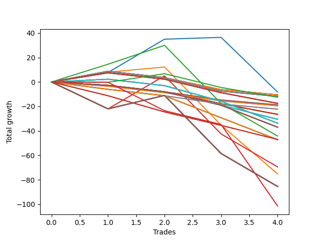

# Short Entry Wallace MJ 007 
- Symbol: NQ
- Date Range: 3/18/22 - 6/24/22
- Trading Period: 7:20-12:30
- Number of Trades: 5


| Name | Win Percent | Profit | Avg Profit / Trade |     | Name | Win Percent | Profit | Avg Profit / Trade |
| ---- | ----------- | ------ | ------------------ | --- | ---- | ----------- | ------ | ------------------ |
| Sorted By <br> Profit | | | | | Sorted By <br> Win Percentage ||||
| One | 80.00 | 4012500.00 | 802500.00 |     | One | 80.00 | 4012500.00 | 802500.00 |
| Thirty-Three | 80.00 | 4010375.00 | 802075.00 |     | Thirty-Three | 80.00 | 4010375.00 | 802075.00 |
| Thirty-Two | 80.00 | 4010375.00 | 802075.00 |     | Thirty-Two | 80.00 | 4010375.00 | 802075.00 |
| Thirty-One | 80.00 | 4010375.00 | 802075.00 |     | Thirty-One | 80.00 | 4010375.00 | 802075.00 |
| Thirty | 80.00 | 4010375.00 | 802075.00 |     | Thirty | 80.00 | 4010375.00 | 802075.00 |
| Twenty-Nine | 80.00 | 4010375.00 | 802075.00 |     | Twenty-Nine | 80.00 | 4010375.00 | 802075.00 |
| Twenty-Eight | 80.00 | 4010375.00 | 802075.00 |     | Twenty-Eight | 80.00 | 4010375.00 | 802075.00 |
| Twenty-Seven | 80.00 | 4010375.00 | 802075.00 |     | Twenty-Seven | 80.00 | 4010375.00 | 802075.00 |
| Twenty-Six | 80.00 | 4010375.00 | 802075.00 |     | Twenty-Six | 80.00 | 4010375.00 | 802075.00 |
| Twenty-Five | 80.00 | 4010375.00 | 802075.00 |     | Twenty-Five | 80.00 | 4010375.00 | 802075.00 |
| Twenty-Four | 80.00 | 4010375.00 | 802075.00 |     | Twenty-Four | 80.00 | 4010375.00 | 802075.00 |
| Eleven | 60.00 | 4005875.00 | 801175.00 |     | Three | 80.00 | 3996000.00 | 799200.00 |
| Nine | 60.00 | 4005875.00 | 801175.00 |     | Eleven | 60.00 | 4005875.00 | 801175.00 |
| Seven | 60.00 | 4005875.00 | 801175.00 |     | Nine | 60.00 | 4005875.00 | 801175.00 |
| Seventeen | 40.00 | 4004375.00 | 800875.00 |     | Seven | 60.00 | 4005875.00 | 801175.00 |
| Fifteen | 40.00 | 4004375.00 | 800875.00 |     | Two | 60.00 | 3989875.00 | 797975.00 |
| Thirteen | 40.00 | 4004375.00 | 800875.00 |     | Five | 60.00 | 3986125.00 | 797225.00 |
| Twenty-Three | 40.00 | 4002750.00 | 800550.00 |     | Four | 60.00 | 3986125.00 | 797225.00 |
| Twenty-One | 40.00 | 4002750.00 | 800550.00 |     | Seventeen | 40.00 | 4004375.00 | 800875.00 |
| Nineteen | 40.00 | 4002750.00 | 800550.00 |     | Fifteen | 40.00 | 4004375.00 | 800875.00 |
| Ten | 20.00 | 3997250.00 | 799450.00 |     | Thirteen | 40.00 | 4004375.00 | 800875.00 |
| Eight | 20.00 | 3997250.00 | 799450.00 |     | Twenty-Three | 40.00 | 4002750.00 | 800550.00 |
| Six | 20.00 | 3997250.00 | 799450.00 |     | Twenty-One | 40.00 | 4002750.00 | 800550.00 |
| Three | 80.00 | 3996000.00 | 799200.00 |     | Nineteen | 40.00 | 4002750.00 | 800550.00 |
| Sixteen | 20.00 | 3995125.00 | 799025.00 |     | Thirty-Six | 40.00 | 3983750.00 | 796750.00 |
| Fourteen | 20.00 | 3995125.00 | 799025.00 |     | Ten | 20.00 | 3997250.00 | 799450.00 |
| Twelve | 20.00 | 3995125.00 | 799025.00 |     | Eight | 20.00 | 3997250.00 | 799450.00 |
| Twenty-Two | 20.00 | 3994250.00 | 798850.00 |     | Six | 20.00 | 3997250.00 | 799450.00 |
| Twenty | 20.00 | 3994250.00 | 798850.00 |     | Sixteen | 20.00 | 3995125.00 | 799025.00 |
| Eighteen | 20.00 | 3994250.00 | 798850.00 |     | Fourteen | 20.00 | 3995125.00 | 799025.00 |
| Thirty-Four | 20.00 | 3990000.00 | 798000.00 |     | Twelve | 20.00 | 3995125.00 | 799025.00 |
| Two | 60.00 | 3989875.00 | 797975.00 |     | Twenty-Two | 20.00 | 3994250.00 | 798850.00 |
| Five | 60.00 | 3986125.00 | 797225.00 |     | Twenty | 20.00 | 3994250.00 | 798850.00 |
| Four | 60.00 | 3986125.00 | 797225.00 |     | Eighteen | 20.00 | 3994250.00 | 798850.00 |
| Thirty-Five | 20.00 | 3984375.00 | 796875.00 |     | Thirty-Four | 20.00 | 3990000.00 | 798000.00 |
| Thirty-Six | 40.00 | 3983750.00 | 796750.00 |     | Thirty-Five | 20.00 | 3984375.00 | 796875.00 |

### Test One
* Sell when price hits the middle line of the 20p bollinger
* No Stoploss
* Results:
```
Total Trades: 5
Percent Up: 20.00
Percent Down: 80.00
Total Points Moved Down: 8025.00
Potential Profit: 4012500.00
Total Points Ups: 4.00 Count Ups: 1
Total Points Downs: 8029.00 Count Downs: 4
```

<details><summary>Trades</summary>

<code>In: 2022-04-18 11:29:00		Out: 2022-04-18 11:40:45		Total Position Time: 11:45		Total Move Down: -4.00		Total to Date: 4.00</code> <br />
<code>In: 2022-04-25 09:29:00		Out: 2022-04-25 09:31:05		Total Position Time: 02:05		Total Move Down: 5.75		Total to Date: -1.75</code> <br />
<code>In: 2022-04-28 10:17:00		Out: 2022-04-28 10:22:10		Total Position Time: 05:10		Total Move Down: 7.75		Total to Date: -9.50</code> <br />
<code>In: 2022-05-16 11:12:00		Out: 2022-05-16 11:17:30		Total Position Time: 05:30		Total Move Down: 1.50		Total to Date: -11.00</code> <br />
<code>In: 2022-06-10 12:30:00		Out: 2022-06-10 12:30:10		Total Position Time: 00:10		Total Move Down: 8014.00		Total to Date: -8025.00</code> <br />


</details>

### Test Two
* Sell when the price hits the lower line of the 20p 1std bollinger
* No Stoploss
* Results:
```
Total Trades: 5
Percent Up: 40.00
Percent Down: 60.00
Total Points Moved Down: 7979.75
Potential Profit: 3989875.00
Total Points Ups: 49.75 Count Ups: 2
Total Points Downs: 8029.50 Count Downs: 3
```

<details><summary>Trades</summary>

<code>In: 2022-04-18 11:29:00		Out: 2022-04-18 11:41:15		Total Position Time: 12:15		Total Move Down: 7.50		Total to Date: -7.50</code> <br />
<code>In: 2022-04-25 09:29:00		Out: 2022-04-25 09:45:00		Total Position Time: 16:00		Total Move Down: -2.25		Total to Date: -5.25</code> <br />
<code>In: 2022-04-28 10:17:00		Out: 2022-04-28 10:30:45		Total Position Time: 13:45		Total Move Down: 8.00		Total to Date: -13.25</code> <br />
<code>In: 2022-05-16 11:12:00		Out: 2022-05-16 11:41:55		Total Position Time: 29:55		Total Move Down: -47.50		Total to Date: 34.25</code> <br />
<code>In: 2022-06-10 12:30:00		Out: 2022-06-10 12:30:10		Total Position Time: 00:10		Total Move Down: 8014.00		Total to Date: -7979.75</code> <br />


</details>

### Test Three
* Sell when the price hits the lower line of the 20p 2std bollinger
* No Stoploss
* Results:
```
Total Trades: 5
Percent Up: 20.00
Percent Down: 80.00
Total Points Moved Down: 7992.00
Potential Profit: 3996000.00
Total Points Ups: 47.50 Count Ups: 1
Total Points Downs: 8039.50 Count Downs: 4
```

<details><summary>Trades</summary>

<code>In: 2022-04-18 11:29:00		Out: 2022-04-18 11:43:10		Total Position Time: 14:10		Total Move Down: 6.00		Total to Date: -6.00</code> <br />
<code>In: 2022-04-25 09:29:00		Out: 2022-04-25 09:58:55		Total Position Time: 29:55		Total Move Down: 5.00		Total to Date: -11.00</code> <br />
<code>In: 2022-04-28 10:17:00		Out: 2022-04-28 10:31:00		Total Position Time: 14:00		Total Move Down: 14.50		Total to Date: -25.50</code> <br />
<code>In: 2022-05-16 11:12:00		Out: 2022-05-16 11:41:55		Total Position Time: 29:55		Total Move Down: -47.50		Total to Date: 22.00</code> <br />
<code>In: 2022-06-10 12:30:00		Out: 2022-06-10 12:30:10		Total Position Time: 00:10		Total Move Down: 8014.00		Total to Date: -7992.00</code> <br />


</details>

### Test Four
* Sell when the price hits the middle line of the 1std VWAP
* No Stoploss
* Results:
```
Total Trades: 5
Percent Up: 40.00
Percent Down: 60.00
Total Points Moved Down: 7972.25
Potential Profit: 3986125.00
Total Points Ups: 69.50 Count Ups: 2
Total Points Downs: 8041.75 Count Downs: 3
```

<details><summary>Trades</summary>

<code>In: 2022-04-18 11:29:00		Out: 2022-04-18 11:58:55		Total Position Time: 29:55		Total Move Down: 22.75		Total to Date: -22.75</code> <br />
<code>In: 2022-04-25 09:29:00		Out: 2022-04-25 09:58:55		Total Position Time: 29:55		Total Move Down: 5.00		Total to Date: -27.75</code> <br />
<code>In: 2022-04-28 10:17:00		Out: 2022-04-28 10:46:55		Total Position Time: 29:55		Total Move Down: -22.00		Total to Date: -5.75</code> <br />
<code>In: 2022-05-16 11:12:00		Out: 2022-05-16 11:41:55		Total Position Time: 29:55		Total Move Down: -47.50		Total to Date: 41.75</code> <br />
<code>In: 2022-06-10 12:30:00		Out: 2022-06-10 12:30:10		Total Position Time: 00:10		Total Move Down: 8014.00		Total to Date: -7972.25</code> <br />


</details>

### Test Five
* Sell when the price hits the lower line of the 1std VWAP
* No Stoploss
* Results:
```
Total Trades: 5
Percent Up: 40.00
Percent Down: 60.00
Total Points Moved Down: 7972.25
Potential Profit: 3986125.00
Total Points Ups: 69.50 Count Ups: 2
Total Points Downs: 8041.75 Count Downs: 3
```

<details><summary>Trades</summary>

<code>In: 2022-04-18 11:29:00		Out: 2022-04-18 11:58:55		Total Position Time: 29:55		Total Move Down: 22.75		Total to Date: -22.75</code> <br />
<code>In: 2022-04-25 09:29:00		Out: 2022-04-25 09:58:55		Total Position Time: 29:55		Total Move Down: 5.00		Total to Date: -27.75</code> <br />
<code>In: 2022-04-28 10:17:00		Out: 2022-04-28 10:46:55		Total Position Time: 29:55		Total Move Down: -22.00		Total to Date: -5.75</code> <br />
<code>In: 2022-05-16 11:12:00		Out: 2022-05-16 11:41:55		Total Position Time: 29:55		Total Move Down: -47.50		Total to Date: 41.75</code> <br />
<code>In: 2022-06-10 12:30:00		Out: 2022-06-10 12:30:10		Total Position Time: 00:10		Total Move Down: 8014.00		Total to Date: -7972.25</code> <br />


</details>

### Test Six
* Sell when the price hits the middle line of the 20p bollinger
* Stoploss is -2 points
* Results:
```
Total Trades: 5
Percent Up: 80.00
Percent Down: 20.00
Total Points Moved Down: 7994.50
Potential Profit: 3997250.00
Total Points Ups: 19.50 Count Ups: 4
Total Points Downs: 8014.00 Count Downs: 1
```

<details><summary>Trades</summary>

<code>In: 2022-04-18 11:29:00		Out: 2022-04-18 11:30:15		Total Position Time: 01:15		Total Move Down: -4.25		Total to Date: 4.25</code> <br />
<code>In: 2022-04-25 09:29:00		Out: 2022-04-25 09:29:15		Total Position Time: 00:15		Total Move Down: -2.75		Total to Date: 7.00</code> <br />
<code>In: 2022-04-28 10:17:00		Out: 2022-04-28 10:19:25		Total Position Time: 02:25		Total Move Down: -2.75		Total to Date: 9.75</code> <br />
<code>In: 2022-05-16 11:12:00		Out: 2022-05-16 11:12:15		Total Position Time: 00:15		Total Move Down: -9.75		Total to Date: 19.50</code> <br />
<code>In: 2022-06-10 12:30:00		Out: 2022-06-10 12:30:10		Total Position Time: 00:10		Total Move Down: 8014.00		Total to Date: -7994.50</code> <br />


</details>

### Test Seven
* Sell when the price hits the middle line of the 20p bollinger
* Trailing Stop is -2 points
* Results:
```
Total Trades: 5
Percent Up: 40.00
Percent Down: 60.00
Total Points Moved Down: 8011.75
Potential Profit: 4005875.00
Total Points Ups: 12.50 Count Ups: 2
Total Points Downs: 8024.25 Count Downs: 3
```

<details><summary>Trades</summary>

<code>In: 2022-04-18 11:29:00		Out: 2022-04-18 11:29:15		Total Position Time: 00:15		Total Move Down: 1.50		Total to Date: -1.50</code> <br />
<code>In: 2022-04-25 09:29:00		Out: 2022-04-25 09:29:15		Total Position Time: 00:15		Total Move Down: -2.75		Total to Date: 1.25</code> <br />
<code>In: 2022-04-28 10:17:00		Out: 2022-04-28 10:17:25		Total Position Time: 00:25		Total Move Down: 8.75		Total to Date: -7.50</code> <br />
<code>In: 2022-05-16 11:12:00		Out: 2022-05-16 11:12:15		Total Position Time: 00:15		Total Move Down: -9.75		Total to Date: 2.25</code> <br />
<code>In: 2022-06-10 12:30:00		Out: 2022-06-10 12:30:10		Total Position Time: 00:10		Total Move Down: 8014.00		Total to Date: -8011.75</code> <br />


</details>

### Test Eight
* Sell when the price hits the lower line of the 20p 1std bollinger
* Stoploss is -2 points
* Results:
```
Total Trades: 5
Percent Up: 80.00
Percent Down: 20.00
Total Points Moved Down: 7994.50
Potential Profit: 3997250.00
Total Points Ups: 19.50 Count Ups: 4
Total Points Downs: 8014.00 Count Downs: 1
```

<details><summary>Trades</summary>

<code>In: 2022-04-18 11:29:00		Out: 2022-04-18 11:30:15		Total Position Time: 01:15		Total Move Down: -4.25		Total to Date: 4.25</code> <br />
<code>In: 2022-04-25 09:29:00		Out: 2022-04-25 09:29:15		Total Position Time: 00:15		Total Move Down: -2.75		Total to Date: 7.00</code> <br />
<code>In: 2022-04-28 10:17:00		Out: 2022-04-28 10:19:25		Total Position Time: 02:25		Total Move Down: -2.75		Total to Date: 9.75</code> <br />
<code>In: 2022-05-16 11:12:00		Out: 2022-05-16 11:12:15		Total Position Time: 00:15		Total Move Down: -9.75		Total to Date: 19.50</code> <br />
<code>In: 2022-06-10 12:30:00		Out: 2022-06-10 12:30:10		Total Position Time: 00:10		Total Move Down: 8014.00		Total to Date: -7994.50</code> <br />


</details>

### Test Nine
* Sell when the price hits the lower line of the 20p 1std bollinger
* Trailing Stop is -2 points
* Results:
```
Total Trades: 5
Percent Up: 40.00
Percent Down: 60.00
Total Points Moved Down: 8011.75
Potential Profit: 4005875.00
Total Points Ups: 12.50 Count Ups: 2
Total Points Downs: 8024.25 Count Downs: 3
```

<details><summary>Trades</summary>

<code>In: 2022-04-18 11:29:00		Out: 2022-04-18 11:29:15		Total Position Time: 00:15		Total Move Down: 1.50		Total to Date: -1.50</code> <br />
<code>In: 2022-04-25 09:29:00		Out: 2022-04-25 09:29:15		Total Position Time: 00:15		Total Move Down: -2.75		Total to Date: 1.25</code> <br />
<code>In: 2022-04-28 10:17:00		Out: 2022-04-28 10:17:25		Total Position Time: 00:25		Total Move Down: 8.75		Total to Date: -7.50</code> <br />
<code>In: 2022-05-16 11:12:00		Out: 2022-05-16 11:12:15		Total Position Time: 00:15		Total Move Down: -9.75		Total to Date: 2.25</code> <br />
<code>In: 2022-06-10 12:30:00		Out: 2022-06-10 12:30:10		Total Position Time: 00:10		Total Move Down: 8014.00		Total to Date: -8011.75</code> <br />


</details>

### Test Ten
* Sell when the price hits the lower line of the 20p 2std bollinger
* Stoploss is -2 points
* Results:
```
Total Trades: 5
Percent Up: 80.00
Percent Down: 20.00
Total Points Moved Down: 7994.50
Potential Profit: 3997250.00
Total Points Ups: 19.50 Count Ups: 4
Total Points Downs: 8014.00 Count Downs: 1
```

<details><summary>Trades</summary>

<code>In: 2022-04-18 11:29:00		Out: 2022-04-18 11:30:15		Total Position Time: 01:15		Total Move Down: -4.25		Total to Date: 4.25</code> <br />
<code>In: 2022-04-25 09:29:00		Out: 2022-04-25 09:29:15		Total Position Time: 00:15		Total Move Down: -2.75		Total to Date: 7.00</code> <br />
<code>In: 2022-04-28 10:17:00		Out: 2022-04-28 10:19:25		Total Position Time: 02:25		Total Move Down: -2.75		Total to Date: 9.75</code> <br />
<code>In: 2022-05-16 11:12:00		Out: 2022-05-16 11:12:15		Total Position Time: 00:15		Total Move Down: -9.75		Total to Date: 19.50</code> <br />
<code>In: 2022-06-10 12:30:00		Out: 2022-06-10 12:30:10		Total Position Time: 00:10		Total Move Down: 8014.00		Total to Date: -7994.50</code> <br />


</details>

### Test Eleven
* Sell when the price hits the lower line of the 20p 2std bollinger
* Trailing Stop is -2 points
* Results:
```
Total Trades: 5
Percent Up: 40.00
Percent Down: 60.00
Total Points Moved Down: 8011.75
Potential Profit: 4005875.00
Total Points Ups: 12.50 Count Ups: 2
Total Points Downs: 8024.25 Count Downs: 3
```

<details><summary>Trades</summary>

<code>In: 2022-04-18 11:29:00		Out: 2022-04-18 11:29:15		Total Position Time: 00:15		Total Move Down: 1.50		Total to Date: -1.50</code> <br />
<code>In: 2022-04-25 09:29:00		Out: 2022-04-25 09:29:15		Total Position Time: 00:15		Total Move Down: -2.75		Total to Date: 1.25</code> <br />
<code>In: 2022-04-28 10:17:00		Out: 2022-04-28 10:17:25		Total Position Time: 00:25		Total Move Down: 8.75		Total to Date: -7.50</code> <br />
<code>In: 2022-05-16 11:12:00		Out: 2022-05-16 11:12:15		Total Position Time: 00:15		Total Move Down: -9.75		Total to Date: 2.25</code> <br />
<code>In: 2022-06-10 12:30:00		Out: 2022-06-10 12:30:10		Total Position Time: 00:10		Total Move Down: 8014.00		Total to Date: -8011.75</code> <br />


</details>

### Test Twelve
* Sell when the price hits the middle line of the 20p bollinger
* Stoploss is -3 points
* Results:
```
Total Trades: 5
Percent Up: 80.00
Percent Down: 20.00
Total Points Moved Down: 7990.25
Potential Profit: 3995125.00
Total Points Ups: 23.75 Count Ups: 4
Total Points Downs: 8014.00 Count Downs: 1
```

<details><summary>Trades</summary>

<code>In: 2022-04-18 11:29:00		Out: 2022-04-18 11:31:00		Total Position Time: 02:00		Total Move Down: -7.25		Total to Date: 7.25</code> <br />
<code>In: 2022-04-25 09:29:00		Out: 2022-04-25 09:29:15		Total Position Time: 00:15		Total Move Down: -2.75		Total to Date: 10.00</code> <br />
<code>In: 2022-04-28 10:17:00		Out: 2022-04-28 10:19:25		Total Position Time: 02:25		Total Move Down: -2.75		Total to Date: 12.75</code> <br />
<code>In: 2022-05-16 11:12:00		Out: 2022-05-16 11:12:25		Total Position Time: 00:25		Total Move Down: -11.00		Total to Date: 23.75</code> <br />
<code>In: 2022-06-10 12:30:00		Out: 2022-06-10 12:30:10		Total Position Time: 00:10		Total Move Down: 8014.00		Total to Date: -7990.25</code> <br />


</details>

### Test Thirteen
* Sell when the price hits the middle line of the 20p bollinger
* Trailing Stop is -3 points
* Results:
```
Total Trades: 5
Percent Up: 60.00
Percent Down: 40.00
Total Points Moved Down: 8008.75
Potential Profit: 4004375.00
Total Points Ups: 14.00 Count Ups: 3
Total Points Downs: 8022.75 Count Downs: 2
```

<details><summary>Trades</summary>

<code>In: 2022-04-18 11:29:00		Out: 2022-04-18 11:29:20		Total Position Time: 00:20		Total Move Down: -0.25		Total to Date: 0.25</code> <br />
<code>In: 2022-04-25 09:29:00		Out: 2022-04-25 09:29:15		Total Position Time: 00:15		Total Move Down: -2.75		Total to Date: 3.00</code> <br />
<code>In: 2022-04-28 10:17:00		Out: 2022-04-28 10:17:25		Total Position Time: 00:25		Total Move Down: 8.75		Total to Date: -5.75</code> <br />
<code>In: 2022-05-16 11:12:00		Out: 2022-05-16 11:12:25		Total Position Time: 00:25		Total Move Down: -11.00		Total to Date: 5.25</code> <br />
<code>In: 2022-06-10 12:30:00		Out: 2022-06-10 12:30:10		Total Position Time: 00:10		Total Move Down: 8014.00		Total to Date: -8008.75</code> <br />


</details>

### Test Fourteen
* Sell when the price hits the lower line of the 20p 1std bollinger
* Stoploss is -3 points
* Results:
```
Total Trades: 5
Percent Up: 80.00
Percent Down: 20.00
Total Points Moved Down: 7990.25
Potential Profit: 3995125.00
Total Points Ups: 23.75 Count Ups: 4
Total Points Downs: 8014.00 Count Downs: 1
```

<details><summary>Trades</summary>

<code>In: 2022-04-18 11:29:00		Out: 2022-04-18 11:31:00		Total Position Time: 02:00		Total Move Down: -7.25		Total to Date: 7.25</code> <br />
<code>In: 2022-04-25 09:29:00		Out: 2022-04-25 09:29:15		Total Position Time: 00:15		Total Move Down: -2.75		Total to Date: 10.00</code> <br />
<code>In: 2022-04-28 10:17:00		Out: 2022-04-28 10:19:25		Total Position Time: 02:25		Total Move Down: -2.75		Total to Date: 12.75</code> <br />
<code>In: 2022-05-16 11:12:00		Out: 2022-05-16 11:12:25		Total Position Time: 00:25		Total Move Down: -11.00		Total to Date: 23.75</code> <br />
<code>In: 2022-06-10 12:30:00		Out: 2022-06-10 12:30:10		Total Position Time: 00:10		Total Move Down: 8014.00		Total to Date: -7990.25</code> <br />


</details>

### Test Fifteen
* Sell when the price hits the lower line of the 20p 1std bollinger
* Trailing Stop is -3 points
* Results:
```
Total Trades: 5
Percent Up: 60.00
Percent Down: 40.00
Total Points Moved Down: 8008.75
Potential Profit: 4004375.00
Total Points Ups: 14.00 Count Ups: 3
Total Points Downs: 8022.75 Count Downs: 2
```

<details><summary>Trades</summary>

<code>In: 2022-04-18 11:29:00		Out: 2022-04-18 11:29:20		Total Position Time: 00:20		Total Move Down: -0.25		Total to Date: 0.25</code> <br />
<code>In: 2022-04-25 09:29:00		Out: 2022-04-25 09:29:15		Total Position Time: 00:15		Total Move Down: -2.75		Total to Date: 3.00</code> <br />
<code>In: 2022-04-28 10:17:00		Out: 2022-04-28 10:17:25		Total Position Time: 00:25		Total Move Down: 8.75		Total to Date: -5.75</code> <br />
<code>In: 2022-05-16 11:12:00		Out: 2022-05-16 11:12:25		Total Position Time: 00:25		Total Move Down: -11.00		Total to Date: 5.25</code> <br />
<code>In: 2022-06-10 12:30:00		Out: 2022-06-10 12:30:10		Total Position Time: 00:10		Total Move Down: 8014.00		Total to Date: -8008.75</code> <br />


</details>

### Test Sixteen
* Sell when the price hits the lower line of the 20p 2std bollinger
* Stoploss is -3 points
* Results:
```
Total Trades: 5
Percent Up: 80.00
Percent Down: 20.00
Total Points Moved Down: 7990.25
Potential Profit: 3995125.00
Total Points Ups: 23.75 Count Ups: 4
Total Points Downs: 8014.00 Count Downs: 1
```

<details><summary>Trades</summary>

<code>In: 2022-04-18 11:29:00		Out: 2022-04-18 11:31:00		Total Position Time: 02:00		Total Move Down: -7.25		Total to Date: 7.25</code> <br />
<code>In: 2022-04-25 09:29:00		Out: 2022-04-25 09:29:15		Total Position Time: 00:15		Total Move Down: -2.75		Total to Date: 10.00</code> <br />
<code>In: 2022-04-28 10:17:00		Out: 2022-04-28 10:19:25		Total Position Time: 02:25		Total Move Down: -2.75		Total to Date: 12.75</code> <br />
<code>In: 2022-05-16 11:12:00		Out: 2022-05-16 11:12:25		Total Position Time: 00:25		Total Move Down: -11.00		Total to Date: 23.75</code> <br />
<code>In: 2022-06-10 12:30:00		Out: 2022-06-10 12:30:10		Total Position Time: 00:10		Total Move Down: 8014.00		Total to Date: -7990.25</code> <br />


</details>

### Test Seventeen
* Sell when the price hits the lower line of the 20p 2std bollinger
* Trailing Stop is -3 points
* Results:
```
Total Trades: 5
Percent Up: 60.00
Percent Down: 40.00
Total Points Moved Down: 8008.75
Potential Profit: 4004375.00
Total Points Ups: 14.00 Count Ups: 3
Total Points Downs: 8022.75 Count Downs: 2
```

<details><summary>Trades</summary>

<code>In: 2022-04-18 11:29:00		Out: 2022-04-18 11:29:20		Total Position Time: 00:20		Total Move Down: -0.25		Total to Date: 0.25</code> <br />
<code>In: 2022-04-25 09:29:00		Out: 2022-04-25 09:29:15		Total Position Time: 00:15		Total Move Down: -2.75		Total to Date: 3.00</code> <br />
<code>In: 2022-04-28 10:17:00		Out: 2022-04-28 10:17:25		Total Position Time: 00:25		Total Move Down: 8.75		Total to Date: -5.75</code> <br />
<code>In: 2022-05-16 11:12:00		Out: 2022-05-16 11:12:25		Total Position Time: 00:25		Total Move Down: -11.00		Total to Date: 5.25</code> <br />
<code>In: 2022-06-10 12:30:00		Out: 2022-06-10 12:30:10		Total Position Time: 00:10		Total Move Down: 8014.00		Total to Date: -8008.75</code> <br />


</details>

### Test Eighteen
* Sell when the price hits the middle line of the 20p bollinger
* Stoploss is -5 points
* Results:
```
Total Trades: 5
Percent Up: 80.00
Percent Down: 20.00
Total Points Moved Down: 7988.50
Potential Profit: 3994250.00
Total Points Ups: 25.50 Count Ups: 4
Total Points Downs: 8014.00 Count Downs: 1
```

<details><summary>Trades</summary>

<code>In: 2022-04-18 11:29:00		Out: 2022-04-18 11:31:00		Total Position Time: 02:00		Total Move Down: -7.25		Total to Date: 7.25</code> <br />
<code>In: 2022-04-25 09:29:00		Out: 2022-04-25 09:29:20		Total Position Time: 00:20		Total Move Down: -4.50		Total to Date: 11.75</code> <br />
<code>In: 2022-04-28 10:17:00		Out: 2022-04-28 10:19:25		Total Position Time: 02:25		Total Move Down: -2.75		Total to Date: 14.50</code> <br />
<code>In: 2022-05-16 11:12:00		Out: 2022-05-16 11:12:25		Total Position Time: 00:25		Total Move Down: -11.00		Total to Date: 25.50</code> <br />
<code>In: 2022-06-10 12:30:00		Out: 2022-06-10 12:30:10		Total Position Time: 00:10		Total Move Down: 8014.00		Total to Date: -7988.50</code> <br />


</details>

### Test Nineteen
* Sell when the price hits the middle line of the 20p bollinger
* Trailing Stop is -5 points
* Results:
```
Total Trades: 5
Percent Up: 60.00
Percent Down: 40.00
Total Points Moved Down: 8005.50
Potential Profit: 4002750.00
Total Points Ups: 16.00 Count Ups: 3
Total Points Downs: 8021.50 Count Downs: 2
```

<details><summary>Trades</summary>

<code>In: 2022-04-18 11:29:00		Out: 2022-04-18 11:29:25		Total Position Time: 00:25		Total Move Down: -0.50		Total to Date: 0.50</code> <br />
<code>In: 2022-04-25 09:29:00		Out: 2022-04-25 09:29:20		Total Position Time: 00:20		Total Move Down: -4.50		Total to Date: 5.00</code> <br />
<code>In: 2022-04-28 10:17:00		Out: 2022-04-28 10:17:50		Total Position Time: 00:50		Total Move Down: 7.50		Total to Date: -2.50</code> <br />
<code>In: 2022-05-16 11:12:00		Out: 2022-05-16 11:12:25		Total Position Time: 00:25		Total Move Down: -11.00		Total to Date: 8.50</code> <br />
<code>In: 2022-06-10 12:30:00		Out: 2022-06-10 12:30:10		Total Position Time: 00:10		Total Move Down: 8014.00		Total to Date: -8005.50</code> <br />


</details>

### Test Twenty
* Sell when the price hits the lower line of the 20p 1std bollinger
* Stoploss is -5 points
* Results:
```
Total Trades: 5
Percent Up: 80.00
Percent Down: 20.00
Total Points Moved Down: 7988.50
Potential Profit: 3994250.00
Total Points Ups: 25.50 Count Ups: 4
Total Points Downs: 8014.00 Count Downs: 1
```

<details><summary>Trades</summary>

<code>In: 2022-04-18 11:29:00		Out: 2022-04-18 11:31:00		Total Position Time: 02:00		Total Move Down: -7.25		Total to Date: 7.25</code> <br />
<code>In: 2022-04-25 09:29:00		Out: 2022-04-25 09:29:20		Total Position Time: 00:20		Total Move Down: -4.50		Total to Date: 11.75</code> <br />
<code>In: 2022-04-28 10:17:00		Out: 2022-04-28 10:19:25		Total Position Time: 02:25		Total Move Down: -2.75		Total to Date: 14.50</code> <br />
<code>In: 2022-05-16 11:12:00		Out: 2022-05-16 11:12:25		Total Position Time: 00:25		Total Move Down: -11.00		Total to Date: 25.50</code> <br />
<code>In: 2022-06-10 12:30:00		Out: 2022-06-10 12:30:10		Total Position Time: 00:10		Total Move Down: 8014.00		Total to Date: -7988.50</code> <br />


</details>

### Test Twenty-One
* Sell when the price hits the lower line of the 20p 1std bollinger
* Trailing Stop is -5 points
* Results:
```
Total Trades: 5
Percent Up: 60.00
Percent Down: 40.00
Total Points Moved Down: 8005.50
Potential Profit: 4002750.00
Total Points Ups: 16.00 Count Ups: 3
Total Points Downs: 8021.50 Count Downs: 2
```

<details><summary>Trades</summary>

<code>In: 2022-04-18 11:29:00		Out: 2022-04-18 11:29:25		Total Position Time: 00:25		Total Move Down: -0.50		Total to Date: 0.50</code> <br />
<code>In: 2022-04-25 09:29:00		Out: 2022-04-25 09:29:20		Total Position Time: 00:20		Total Move Down: -4.50		Total to Date: 5.00</code> <br />
<code>In: 2022-04-28 10:17:00		Out: 2022-04-28 10:17:50		Total Position Time: 00:50		Total Move Down: 7.50		Total to Date: -2.50</code> <br />
<code>In: 2022-05-16 11:12:00		Out: 2022-05-16 11:12:25		Total Position Time: 00:25		Total Move Down: -11.00		Total to Date: 8.50</code> <br />
<code>In: 2022-06-10 12:30:00		Out: 2022-06-10 12:30:10		Total Position Time: 00:10		Total Move Down: 8014.00		Total to Date: -8005.50</code> <br />


</details>

### Test Twenty-Two
* Sell when the price hits the lower line of the 20p 2std bollinger
* Stoploss is -5 points
* Results:
```
Total Trades: 5
Percent Up: 80.00
Percent Down: 20.00
Total Points Moved Down: 7988.50
Potential Profit: 3994250.00
Total Points Ups: 25.50 Count Ups: 4
Total Points Downs: 8014.00 Count Downs: 1
```

<details><summary>Trades</summary>

<code>In: 2022-04-18 11:29:00		Out: 2022-04-18 11:31:00		Total Position Time: 02:00		Total Move Down: -7.25		Total to Date: 7.25</code> <br />
<code>In: 2022-04-25 09:29:00		Out: 2022-04-25 09:29:20		Total Position Time: 00:20		Total Move Down: -4.50		Total to Date: 11.75</code> <br />
<code>In: 2022-04-28 10:17:00		Out: 2022-04-28 10:19:25		Total Position Time: 02:25		Total Move Down: -2.75		Total to Date: 14.50</code> <br />
<code>In: 2022-05-16 11:12:00		Out: 2022-05-16 11:12:25		Total Position Time: 00:25		Total Move Down: -11.00		Total to Date: 25.50</code> <br />
<code>In: 2022-06-10 12:30:00		Out: 2022-06-10 12:30:10		Total Position Time: 00:10		Total Move Down: 8014.00		Total to Date: -7988.50</code> <br />


</details>

### Test Twenty-Three
* Sell when the price hits the lower line of the 20p 2std bollinger
* Trailing Stop is -5 points
* Results:
```
Total Trades: 5
Percent Up: 60.00
Percent Down: 40.00
Total Points Moved Down: 8005.50
Potential Profit: 4002750.00
Total Points Ups: 16.00 Count Ups: 3
Total Points Downs: 8021.50 Count Downs: 2
```

<details><summary>Trades</summary>

<code>In: 2022-04-18 11:29:00		Out: 2022-04-18 11:29:25		Total Position Time: 00:25		Total Move Down: -0.50		Total to Date: 0.50</code> <br />
<code>In: 2022-04-25 09:29:00		Out: 2022-04-25 09:29:20		Total Position Time: 00:20		Total Move Down: -4.50		Total to Date: 5.00</code> <br />
<code>In: 2022-04-28 10:17:00		Out: 2022-04-28 10:17:50		Total Position Time: 00:50		Total Move Down: 7.50		Total to Date: -2.50</code> <br />
<code>In: 2022-05-16 11:12:00		Out: 2022-05-16 11:12:25		Total Position Time: 00:25		Total Move Down: -11.00		Total to Date: 8.50</code> <br />
<code>In: 2022-06-10 12:30:00		Out: 2022-06-10 12:30:10		Total Position Time: 00:10		Total Move Down: 8014.00		Total to Date: -8005.50</code> <br />


</details>

### Test Twenty-Four
* Sell when the price hits the middle line of the 20p bollinger
* Stoploss is 10 points
* Results:
```
Total Trades: 5
Percent Up: 20.00
Percent Down: 80.00
Total Points Moved Down: 8020.75
Potential Profit: 4010375.00
Total Points Ups: 6.75 Count Ups: 1
Total Points Downs: 8027.50 Count Downs: 4
```

<details><summary>Trades</summary>

<code>In: 2022-04-18 11:29:00		Out: 2022-04-18 11:29:10		Total Position Time: 00:10		Total Move Down: 5.50		Total to Date: -5.50</code> <br />
<code>In: 2022-04-25 09:29:00		Out: 2022-04-25 09:29:10		Total Position Time: 00:10		Total Move Down: 1.50		Total to Date: -7.00</code> <br />
<code>In: 2022-04-28 10:17:00		Out: 2022-04-28 10:17:10		Total Position Time: 00:10		Total Move Down: 6.50		Total to Date: -13.50</code> <br />
<code>In: 2022-05-16 11:12:00		Out: 2022-05-16 11:12:10		Total Position Time: 00:10		Total Move Down: -6.75		Total to Date: -6.75</code> <br />
<code>In: 2022-06-10 12:30:00		Out: 2022-06-10 12:30:10		Total Position Time: 00:10		Total Move Down: 8014.00		Total to Date: -8020.75</code> <br />


</details>

### Test Twenty-Five
* Sell when the price hits the middle line of the 20p bollinger
* Trailing Stop is 10 points
* Results:
```
Total Trades: 5
Percent Up: 20.00
Percent Down: 80.00
Total Points Moved Down: 8020.75
Potential Profit: 4010375.00
Total Points Ups: 6.75 Count Ups: 1
Total Points Downs: 8027.50 Count Downs: 4
```

<details><summary>Trades</summary>

<code>In: 2022-04-18 11:29:00		Out: 2022-04-18 11:29:10		Total Position Time: 00:10		Total Move Down: 5.50		Total to Date: -5.50</code> <br />
<code>In: 2022-04-25 09:29:00		Out: 2022-04-25 09:29:10		Total Position Time: 00:10		Total Move Down: 1.50		Total to Date: -7.00</code> <br />
<code>In: 2022-04-28 10:17:00		Out: 2022-04-28 10:17:10		Total Position Time: 00:10		Total Move Down: 6.50		Total to Date: -13.50</code> <br />
<code>In: 2022-05-16 11:12:00		Out: 2022-05-16 11:12:10		Total Position Time: 00:10		Total Move Down: -6.75		Total to Date: -6.75</code> <br />
<code>In: 2022-06-10 12:30:00		Out: 2022-06-10 12:30:10		Total Position Time: 00:10		Total Move Down: 8014.00		Total to Date: -8020.75</code> <br />


</details>

### Test Twenty-Six
* Sell when the price hits the lower line of the 20p 1std bollinger
* Stoploss is 10 points
* Results:
```
Total Trades: 5
Percent Up: 20.00
Percent Down: 80.00
Total Points Moved Down: 8020.75
Potential Profit: 4010375.00
Total Points Ups: 6.75 Count Ups: 1
Total Points Downs: 8027.50 Count Downs: 4
```

<details><summary>Trades</summary>

<code>In: 2022-04-18 11:29:00		Out: 2022-04-18 11:29:10		Total Position Time: 00:10		Total Move Down: 5.50		Total to Date: -5.50</code> <br />
<code>In: 2022-04-25 09:29:00		Out: 2022-04-25 09:29:10		Total Position Time: 00:10		Total Move Down: 1.50		Total to Date: -7.00</code> <br />
<code>In: 2022-04-28 10:17:00		Out: 2022-04-28 10:17:10		Total Position Time: 00:10		Total Move Down: 6.50		Total to Date: -13.50</code> <br />
<code>In: 2022-05-16 11:12:00		Out: 2022-05-16 11:12:10		Total Position Time: 00:10		Total Move Down: -6.75		Total to Date: -6.75</code> <br />
<code>In: 2022-06-10 12:30:00		Out: 2022-06-10 12:30:10		Total Position Time: 00:10		Total Move Down: 8014.00		Total to Date: -8020.75</code> <br />


</details>

### Test Twenty-Seven
* Sell when the price hits the lower line of the 20p 1std bollinger
* Trailing Stop is 10 points
* Results:
```
Total Trades: 5
Percent Up: 20.00
Percent Down: 80.00
Total Points Moved Down: 8020.75
Potential Profit: 4010375.00
Total Points Ups: 6.75 Count Ups: 1
Total Points Downs: 8027.50 Count Downs: 4
```

<details><summary>Trades</summary>

<code>In: 2022-04-18 11:29:00		Out: 2022-04-18 11:29:10		Total Position Time: 00:10		Total Move Down: 5.50		Total to Date: -5.50</code> <br />
<code>In: 2022-04-25 09:29:00		Out: 2022-04-25 09:29:10		Total Position Time: 00:10		Total Move Down: 1.50		Total to Date: -7.00</code> <br />
<code>In: 2022-04-28 10:17:00		Out: 2022-04-28 10:17:10		Total Position Time: 00:10		Total Move Down: 6.50		Total to Date: -13.50</code> <br />
<code>In: 2022-05-16 11:12:00		Out: 2022-05-16 11:12:10		Total Position Time: 00:10		Total Move Down: -6.75		Total to Date: -6.75</code> <br />
<code>In: 2022-06-10 12:30:00		Out: 2022-06-10 12:30:10		Total Position Time: 00:10		Total Move Down: 8014.00		Total to Date: -8020.75</code> <br />


</details>

### Test Twenty-Eight
* Sell when the price hits the lower line of the 20p 2std bollinger
* Stoploss is 10 points
* Results:
```
Total Trades: 5
Percent Up: 20.00
Percent Down: 80.00
Total Points Moved Down: 8020.75
Potential Profit: 4010375.00
Total Points Ups: 6.75 Count Ups: 1
Total Points Downs: 8027.50 Count Downs: 4
```

<details><summary>Trades</summary>

<code>In: 2022-04-18 11:29:00		Out: 2022-04-18 11:29:10		Total Position Time: 00:10		Total Move Down: 5.50		Total to Date: -5.50</code> <br />
<code>In: 2022-04-25 09:29:00		Out: 2022-04-25 09:29:10		Total Position Time: 00:10		Total Move Down: 1.50		Total to Date: -7.00</code> <br />
<code>In: 2022-04-28 10:17:00		Out: 2022-04-28 10:17:10		Total Position Time: 00:10		Total Move Down: 6.50		Total to Date: -13.50</code> <br />
<code>In: 2022-05-16 11:12:00		Out: 2022-05-16 11:12:10		Total Position Time: 00:10		Total Move Down: -6.75		Total to Date: -6.75</code> <br />
<code>In: 2022-06-10 12:30:00		Out: 2022-06-10 12:30:10		Total Position Time: 00:10		Total Move Down: 8014.00		Total to Date: -8020.75</code> <br />


</details>

### Test Twenty-Nine
* Sell when the price hits the lower line of the 20p 2std bollinger
* Trailing Stop is 10 points
* Results:
```
Total Trades: 5
Percent Up: 20.00
Percent Down: 80.00
Total Points Moved Down: 8020.75
Potential Profit: 4010375.00
Total Points Ups: 6.75 Count Ups: 1
Total Points Downs: 8027.50 Count Downs: 4
```

<details><summary>Trades</summary>

<code>In: 2022-04-18 11:29:00		Out: 2022-04-18 11:29:10		Total Position Time: 00:10		Total Move Down: 5.50		Total to Date: -5.50</code> <br />
<code>In: 2022-04-25 09:29:00		Out: 2022-04-25 09:29:10		Total Position Time: 00:10		Total Move Down: 1.50		Total to Date: -7.00</code> <br />
<code>In: 2022-04-28 10:17:00		Out: 2022-04-28 10:17:10		Total Position Time: 00:10		Total Move Down: 6.50		Total to Date: -13.50</code> <br />
<code>In: 2022-05-16 11:12:00		Out: 2022-05-16 11:12:10		Total Position Time: 00:10		Total Move Down: -6.75		Total to Date: -6.75</code> <br />
<code>In: 2022-06-10 12:30:00		Out: 2022-06-10 12:30:10		Total Position Time: 00:10		Total Move Down: 8014.00		Total to Date: -8020.75</code> <br />


</details>

### Test Thirty
* Sell when the price hits the middle line of the 1std VWAP
* Stoploss is 10 points
* Results:
```
Total Trades: 5
Percent Up: 20.00
Percent Down: 80.00
Total Points Moved Down: 8020.75
Potential Profit: 4010375.00
Total Points Ups: 6.75 Count Ups: 1
Total Points Downs: 8027.50 Count Downs: 4
```

<details><summary>Trades</summary>

<code>In: 2022-04-18 11:29:00		Out: 2022-04-18 11:29:10		Total Position Time: 00:10		Total Move Down: 5.50		Total to Date: -5.50</code> <br />
<code>In: 2022-04-25 09:29:00		Out: 2022-04-25 09:29:10		Total Position Time: 00:10		Total Move Down: 1.50		Total to Date: -7.00</code> <br />
<code>In: 2022-04-28 10:17:00		Out: 2022-04-28 10:17:10		Total Position Time: 00:10		Total Move Down: 6.50		Total to Date: -13.50</code> <br />
<code>In: 2022-05-16 11:12:00		Out: 2022-05-16 11:12:10		Total Position Time: 00:10		Total Move Down: -6.75		Total to Date: -6.75</code> <br />
<code>In: 2022-06-10 12:30:00		Out: 2022-06-10 12:30:10		Total Position Time: 00:10		Total Move Down: 8014.00		Total to Date: -8020.75</code> <br />


</details>

### Test Thirty-One
* Sell when the price hits the middle line of the 1std VWAP
* Trailing Stop is 10 points
* Results:
```
Total Trades: 5
Percent Up: 20.00
Percent Down: 80.00
Total Points Moved Down: 8020.75
Potential Profit: 4010375.00
Total Points Ups: 6.75 Count Ups: 1
Total Points Downs: 8027.50 Count Downs: 4
```

<details><summary>Trades</summary>

<code>In: 2022-04-18 11:29:00		Out: 2022-04-18 11:29:10		Total Position Time: 00:10		Total Move Down: 5.50		Total to Date: -5.50</code> <br />
<code>In: 2022-04-25 09:29:00		Out: 2022-04-25 09:29:10		Total Position Time: 00:10		Total Move Down: 1.50		Total to Date: -7.00</code> <br />
<code>In: 2022-04-28 10:17:00		Out: 2022-04-28 10:17:10		Total Position Time: 00:10		Total Move Down: 6.50		Total to Date: -13.50</code> <br />
<code>In: 2022-05-16 11:12:00		Out: 2022-05-16 11:12:10		Total Position Time: 00:10		Total Move Down: -6.75		Total to Date: -6.75</code> <br />
<code>In: 2022-06-10 12:30:00		Out: 2022-06-10 12:30:10		Total Position Time: 00:10		Total Move Down: 8014.00		Total to Date: -8020.75</code> <br />


</details>

### Test Thirty-Two
* Sell when the price hits the lower line of the 1std VWAP
* Stoploss is 10 points
* Results:
```
Total Trades: 5
Percent Up: 20.00
Percent Down: 80.00
Total Points Moved Down: 8020.75
Potential Profit: 4010375.00
Total Points Ups: 6.75 Count Ups: 1
Total Points Downs: 8027.50 Count Downs: 4
```

<details><summary>Trades</summary>

<code>In: 2022-04-18 11:29:00		Out: 2022-04-18 11:29:10		Total Position Time: 00:10		Total Move Down: 5.50		Total to Date: -5.50</code> <br />
<code>In: 2022-04-25 09:29:00		Out: 2022-04-25 09:29:10		Total Position Time: 00:10		Total Move Down: 1.50		Total to Date: -7.00</code> <br />
<code>In: 2022-04-28 10:17:00		Out: 2022-04-28 10:17:10		Total Position Time: 00:10		Total Move Down: 6.50		Total to Date: -13.50</code> <br />
<code>In: 2022-05-16 11:12:00		Out: 2022-05-16 11:12:10		Total Position Time: 00:10		Total Move Down: -6.75		Total to Date: -6.75</code> <br />
<code>In: 2022-06-10 12:30:00		Out: 2022-06-10 12:30:10		Total Position Time: 00:10		Total Move Down: 8014.00		Total to Date: -8020.75</code> <br />


</details>

### Test Thirty-Three
* Sell when the price hits the lower line of the 1std VWAP
* Trailing Stop is 10 points
* Results:
```
Total Trades: 5
Percent Up: 20.00
Percent Down: 80.00
Total Points Moved Down: 8020.75
Potential Profit: 4010375.00
Total Points Ups: 6.75 Count Ups: 1
Total Points Downs: 8027.50 Count Downs: 4
```

<details><summary>Trades</summary>

<code>In: 2022-04-18 11:29:00		Out: 2022-04-18 11:29:10		Total Position Time: 00:10		Total Move Down: 5.50		Total to Date: -5.50</code> <br />
<code>In: 2022-04-25 09:29:00		Out: 2022-04-25 09:29:10		Total Position Time: 00:10		Total Move Down: 1.50		Total to Date: -7.00</code> <br />
<code>In: 2022-04-28 10:17:00		Out: 2022-04-28 10:17:10		Total Position Time: 00:10		Total Move Down: 6.50		Total to Date: -13.50</code> <br />
<code>In: 2022-05-16 11:12:00		Out: 2022-05-16 11:12:10		Total Position Time: 00:10		Total Move Down: -6.75		Total to Date: -6.75</code> <br />
<code>In: 2022-06-10 12:30:00		Out: 2022-06-10 12:30:10		Total Position Time: 00:10		Total Move Down: 8014.00		Total to Date: -8020.75</code> <br />


</details>

### Test Thirty-Four
* Sell when the linear regression slope is positive
* No Stoploss
* Results:
```
Total Trades: 5
Percent Up: 80.00
Percent Down: 20.00
Total Points Moved Down: 7980.00
Potential Profit: 3990000.00
Total Points Ups: 32.25 Count Ups: 4
Total Points Downs: 8012.25 Count Downs: 1
```

<details><summary>Trades</summary>

<code>In: 2022-04-18 11:29:00		Out: 2022-04-18 11:30:05		Total Position Time: 01:05		Total Move Down: -1.25		Total to Date: 1.25</code> <br />
<code>In: 2022-04-25 09:29:00		Out: 2022-04-25 09:33:05		Total Position Time: 04:05		Total Move Down: -19.50		Total to Date: 20.75</code> <br />
<code>In: 2022-04-28 10:17:00		Out: 2022-04-28 10:26:05		Total Position Time: 09:05		Total Move Down: -0.25		Total to Date: 21.00</code> <br />
<code>In: 2022-05-16 11:12:00		Out: 2022-05-16 11:20:05		Total Position Time: 08:05		Total Move Down: -11.25		Total to Date: 32.25</code> <br />
<code>In: 2022-06-10 12:30:00		Out: 2022-06-10 12:39:05		Total Position Time: 09:05		Total Move Down: 8012.25		Total to Date: -7980.00</code> <br />


</details>

### Test Thirty-Five
* Sell when the linear regression slope changes to positive
* No Stoploss
* Results:
```
Total Trades: 5
Percent Up: 80.00
Percent Down: 20.00
Total Points Moved Down: 7968.75
Potential Profit: 3984375.00
Total Points Ups: 43.50 Count Ups: 4
Total Points Downs: 8012.25 Count Downs: 1
```

<details><summary>Trades</summary>

<code>In: 2022-04-18 11:29:00		Out: 2022-04-18 11:35:05		Total Position Time: 06:05		Total Move Down: -12.50		Total to Date: 12.50</code> <br />
<code>In: 2022-04-25 09:29:00		Out: 2022-04-25 09:33:05		Total Position Time: 04:05		Total Move Down: -19.50		Total to Date: 32.00</code> <br />
<code>In: 2022-04-28 10:17:00		Out: 2022-04-28 10:26:05		Total Position Time: 09:05		Total Move Down: -0.25		Total to Date: 32.25</code> <br />
<code>In: 2022-05-16 11:12:00		Out: 2022-05-16 11:20:05		Total Position Time: 08:05		Total Move Down: -11.25		Total to Date: 43.50</code> <br />
<code>In: 2022-06-10 12:30:00		Out: 2022-06-10 12:39:05		Total Position Time: 09:05		Total Move Down: 8012.25		Total to Date: -7968.75</code> <br />


</details>

### Test Thirty-Six
* Sell when the linear regression slope changes to positive
* No Stoploss
* Results:
```
Total Trades: 5
Percent Up: 60.00
Percent Down: 40.00
Total Points Moved Down: 7967.50
Potential Profit: 3983750.00
Total Points Ups: 85.00 Count Ups: 3
Total Points Downs: 8052.50 Count Downs: 2
```

<details><summary>Trades</summary>

<code>In: 2022-04-18 11:29:00		Out: 2022-04-18 11:52:05		Total Position Time: 23:05		Total Move Down: 4.75		Total to Date: -4.75</code> <br />
<code>In: 2022-04-25 09:29:00		Out: 2022-04-25 09:41:05		Total Position Time: 12:05		Total Move Down: -15.50		Total to Date: 10.75</code> <br />
<code>In: 2022-04-28 10:17:00		Out: 2022-04-28 10:46:55		Total Position Time: 29:55		Total Move Down: -22.00		Total to Date: 32.75</code> <br />
<code>In: 2022-05-16 11:12:00		Out: 2022-05-16 11:41:55		Total Position Time: 29:55		Total Move Down: -47.50		Total to Date: 80.25</code> <br />
<code>In: 2022-06-10 12:30:00		Out: 2022-06-10 12:59:55		Total Position Time: 29:55		Total Move Down: 8047.75		Total to Date: -7967.50</code> <br />


</details>