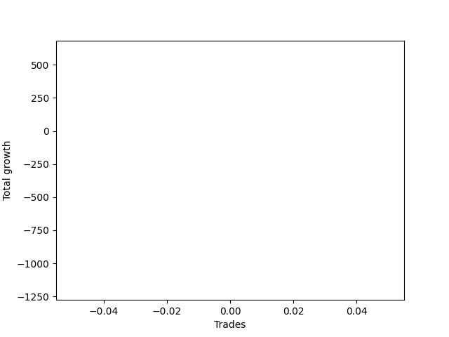

# Short Golden Two 
- Symbol: NQ
- Date Range: 3/19/22 - 5/22/22
- Trading Period: 7:20-12:30
- Number of Trades: 91



| Name | Win Percent | Profit | Avg Profit / Trade |     | Name | Win Percent | Profit | Avg Profit / Trade |
| ---- | ----------- | ------ | ------------------ | --- | ---- | ----------- | ------ | ------------------ |
| Sorted By <br> Profit | | | | | Sorted By <br> Win Percentage ||||
| Thirty-Six | 35.16 | 27251625.00 | 299468.41 |     | Thirty-Five | 56.04 | 26959125.00 | 296254.12 |
| Thirty-Five | 56.04 | 26959125.00 | 296254.12 |     | Thirty-Six | 35.16 | 27251625.00 | 299468.41 |

### Test Thirty-Five
* Sell when the linear regression slope changes to positive
* No Stoploss
* Results:
```
Total Trades: 91
Percent Up: 43.96
Percent Down: 56.04
Total Points Moved Down: 53918.25
Potential Profit: 26959125.00
Total Points Ups: 996.25 Count Ups: 40
Total Points Downs: 54914.50 Count Downs: 51
```

<details><summary>Trades</summary>

<code>In: 2022-03-21 06:54:00		Out: 2022-03-21 07:00:05		Total Position Time: 06:05		Total Move Down: 19.00		Total to Date: -19.00</code> <br />
<code>In: 2022-03-21 10:17:00		Out: 2022-03-21 10:25:05		Total Position Time: 08:05		Total Move Down: 6.50		Total to Date: -25.50</code> <br />
<code>In: 2022-03-23 06:46:00		Out: 2022-03-23 06:55:05		Total Position Time: 09:05		Total Move Down: -13.75		Total to Date: -11.75</code> <br />
<code>In: 2022-03-23 11:35:00		Out: 2022-03-23 11:41:05		Total Position Time: 06:05		Total Move Down: -19.00		Total to Date: 7.25</code> <br />
<code>In: 2022-03-24 07:21:00		Out: 2022-03-24 07:25:05		Total Position Time: 04:05		Total Move Down: -8.25		Total to Date: 15.50</code> <br />
<code>In: 2022-03-25 06:46:00		Out: 2022-03-25 07:06:05		Total Position Time: 20:05		Total Move Down: 18.00		Total to Date: -2.50</code> <br />
<code>In: 2022-03-25 06:57:00		Out: 2022-03-25 07:06:05		Total Position Time: 09:05		Total Move Down: 10.00		Total to Date: -12.50</code> <br />
<code>In: 2022-03-25 08:13:00		Out: 2022-03-25 08:19:05		Total Position Time: 06:05		Total Move Down: -5.50		Total to Date: -7.00</code> <br />
<code>In: 2022-03-28 07:25:00		Out: 2022-03-28 07:27:05		Total Position Time: 02:05		Total Move Down: 3.50		Total to Date: -10.50</code> <br />
<code>In: 2022-03-28 08:10:00		Out: 2022-03-28 08:12:05		Total Position Time: 02:05		Total Move Down: -13.00		Total to Date: 2.50</code> <br />
<code>In: 2022-03-28 08:30:00		Out: 2022-03-28 08:45:05		Total Position Time: 15:05		Total Move Down: 61.00		Total to Date: -58.50</code> <br />
<code>In: 2022-03-29 06:46:00		Out: 2022-03-29 06:48:05		Total Position Time: 02:05		Total Move Down: -1.75		Total to Date: -56.75</code> <br />
<code>In: 2022-03-29 09:41:00		Out: 2022-03-29 10:01:05		Total Position Time: 20:05		Total Move Down: -18.75		Total to Date: -38.00</code> <br />
<code>In: 2022-03-30 06:46:00		Out: 2022-03-30 07:00:05		Total Position Time: 14:05		Total Move Down: -13.75		Total to Date: -24.25</code> <br />
<code>In: 2022-03-30 07:11:00		Out: 2022-03-30 07:26:05		Total Position Time: 15:05		Total Move Down: -35.75		Total to Date: 11.50</code> <br />
<code>In: 2022-03-30 08:13:00		Out: 2022-03-30 08:16:05		Total Position Time: 03:05		Total Move Down: -18.50		Total to Date: 30.00</code> <br />
<code>In: 2022-03-31 06:46:00		Out: 2022-03-31 06:50:05		Total Position Time: 04:05		Total Move Down: 3.00		Total to Date: 27.00</code> <br />
<code>In: 2022-03-31 09:40:00		Out: 2022-03-31 10:03:05		Total Position Time: 23:05		Total Move Down: 1.00		Total to Date: 26.00</code> <br />
<code>In: 2022-04-01 06:46:00		Out: 2022-04-01 07:00:05		Total Position Time: 14:05		Total Move Down: 48.25		Total to Date: -22.25</code> <br />
<code>In: 2022-04-01 08:30:00		Out: 2022-04-01 08:48:05		Total Position Time: 18:05		Total Move Down: 36.50		Total to Date: -58.75</code> <br />
<code>In: 2022-04-05 06:46:00		Out: 2022-04-05 07:01:05		Total Position Time: 15:05		Total Move Down: 36.75		Total to Date: -95.50</code> <br />
<code>In: 2022-04-06 06:46:00		Out: 2022-04-06 06:55:05		Total Position Time: 09:05		Total Move Down: 32.00		Total to Date: -127.50</code> <br />
<code>In: 2022-04-07 06:51:00		Out: 2022-04-07 06:53:05		Total Position Time: 02:05		Total Move Down: -13.50		Total to Date: -114.00</code> <br />
<code>In: 2022-04-07 07:42:00		Out: 2022-04-07 07:52:05		Total Position Time: 10:05		Total Move Down: -17.75		Total to Date: -96.25</code> <br />
<code>In: 2022-04-08 06:46:00		Out: 2022-04-08 07:02:05		Total Position Time: 16:05		Total Move Down: 67.00		Total to Date: -163.25</code> <br />
<code>In: 2022-04-08 07:51:00		Out: 2022-04-08 07:53:05		Total Position Time: 02:05		Total Move Down: -63.25		Total to Date: -100.00</code> <br />
<code>In: 2022-04-08 12:21:00		Out: 2022-04-08 12:30:05		Total Position Time: 09:05		Total Move Down: -8.50		Total to Date: -91.50</code> <br />
<code>In: 2022-04-08 06:46:00		Out: 2022-04-08 07:02:05		Total Position Time: 16:05		Total Move Down: 67.00		Total to Date: -158.50</code> <br />
<code>In: 2022-04-08 07:51:00		Out: 2022-04-08 07:53:05		Total Position Time: 02:05		Total Move Down: -63.25		Total to Date: -95.25</code> <br />
<code>In: 2022-04-08 12:21:00		Out: 2022-04-08 12:30:05		Total Position Time: 09:05		Total Move Down: -8.50		Total to Date: -86.75</code> <br />
<code>In: 2022-04-11 06:46:00		Out: 2022-04-11 07:03:05		Total Position Time: 17:05		Total Move Down: -8.00		Total to Date: -78.75</code> <br />
<code>In: 2022-04-11 07:22:00		Out: 2022-04-11 07:32:05		Total Position Time: 10:05		Total Move Down: 24.00		Total to Date: -102.75</code> <br />
<code>In: 2022-04-12 06:46:00		Out: 2022-04-12 06:59:05		Total Position Time: 13:05		Total Move Down: -82.50		Total to Date: -20.25</code> <br />
<code>In: 2022-04-12 07:50:00		Out: 2022-04-12 07:58:05		Total Position Time: 08:05		Total Move Down: -11.50		Total to Date: -8.75</code> <br />
<code>In: 2022-04-14 06:46:00		Out: 2022-04-14 06:58:05		Total Position Time: 12:05		Total Move Down: 27.50		Total to Date: -36.25</code> <br />
<code>In: 2022-04-18 06:46:00		Out: 2022-04-18 06:59:05		Total Position Time: 13:05		Total Move Down: 20.00		Total to Date: -56.25</code> <br />
<code>In: 2022-04-18 08:48:00		Out: 2022-04-18 08:54:05		Total Position Time: 06:05		Total Move Down: -2.25		Total to Date: -54.00</code> <br />
<code>In: 2022-04-20 06:46:00		Out: 2022-04-20 06:58:05		Total Position Time: 12:05		Total Move Down: 50.75		Total to Date: -104.75</code> <br />
<code>In: 2022-04-21 07:00:00		Out: 2022-04-21 07:06:05		Total Position Time: 06:05		Total Move Down: 22.50		Total to Date: -127.25</code> <br />
<code>In: 2022-04-22 06:46:00		Out: 2022-04-22 06:48:05		Total Position Time: 02:05		Total Move Down: 14.25		Total to Date: -141.50</code> <br />
<code>In: 2022-04-22 07:15:00		Out: 2022-04-22 07:29:05		Total Position Time: 14:05		Total Move Down: 81.50		Total to Date: -223.00</code> <br />
<code>In: 2022-04-25 06:48:00		Out: 2022-04-25 06:51:05		Total Position Time: 03:05		Total Move Down: -80.25		Total to Date: -142.75</code> <br />
<code>In: 2022-04-25 07:01:00		Out: 2022-04-25 07:06:05		Total Position Time: 05:05		Total Move Down: 14.75		Total to Date: -157.50</code> <br />
<code>In: 2022-04-25 08:54:00		Out: 2022-04-25 09:06:05		Total Position Time: 12:05		Total Move Down: -46.50		Total to Date: -111.00</code> <br />
<code>In: 2022-04-26 06:46:00		Out: 2022-04-26 06:49:05		Total Position Time: 03:05		Total Move Down: -16.50		Total to Date: -94.50</code> <br />
<code>In: 2022-04-27 07:14:00		Out: 2022-04-27 07:22:05		Total Position Time: 08:05		Total Move Down: -2.25		Total to Date: -92.25</code> <br />
<code>In: 2022-04-28 06:46:00		Out: 2022-04-28 06:54:05		Total Position Time: 08:05		Total Move Down: 6.50		Total to Date: -98.75</code> <br />
<code>In: 2022-04-28 08:46:00		Out: 2022-04-28 08:50:05		Total Position Time: 04:05		Total Move Down: 3.00		Total to Date: -101.75</code> <br />
<code>In: 2022-04-29 06:48:00		Out: 2022-04-29 06:50:05		Total Position Time: 02:05		Total Move Down: -45.50		Total to Date: -56.25</code> <br />
<code>In: 2022-04-29 07:27:00		Out: 2022-04-29 07:31:05		Total Position Time: 04:05		Total Move Down: 16.25		Total to Date: -72.50</code> <br />
<code>In: 2022-05-02 08:53:00		Out: 2022-05-02 09:11:05		Total Position Time: 18:05		Total Move Down: -6.25		Total to Date: -66.25</code> <br />
<code>In: 2022-05-02 09:48:00		Out: 2022-05-02 09:50:05		Total Position Time: 02:05		Total Move Down: 9.25		Total to Date: -75.50</code> <br />
<code>In: 2022-05-03 06:46:00		Out: 2022-05-03 06:51:05		Total Position Time: 05:05		Total Move Down: -42.25		Total to Date: -33.25</code> <br />
<code>In: 2022-05-03 07:53:00		Out: 2022-05-03 08:03:05		Total Position Time: 10:05		Total Move Down: -27.50		Total to Date: -5.75</code> <br />
<code>In: 2022-05-04 06:46:00		Out: 2022-05-04 06:51:05		Total Position Time: 05:05		Total Move Down: 15.00		Total to Date: -20.75</code> <br />
<code>In: 2022-05-05 06:46:00		Out: 2022-05-05 07:15:05		Total Position Time: 29:05		Total Move Down: 145.75		Total to Date: -166.50</code> <br />
<code>In: 2022-05-06 06:46:00		Out: 2022-05-06 06:59:05		Total Position Time: 13:05		Total Move Down: 60.25		Total to Date: -226.75</code> <br />
<code>In: 2022-05-06 12:09:00		Out: 2022-05-06 12:13:05		Total Position Time: 04:05		Total Move Down: -17.50		Total to Date: -209.25</code> <br />
<code>In: 2022-05-09 06:50:00		Out: 2022-05-09 06:53:05		Total Position Time: 03:05		Total Move Down: -22.75		Total to Date: -186.50</code> <br />
<code>In: 2022-05-10 06:46:00		Out: 2022-05-10 06:54:05		Total Position Time: 08:05		Total Move Down: -19.00		Total to Date: -167.50</code> <br />
<code>In: 2022-05-10 07:40:00		Out: 2022-05-10 07:56:05		Total Position Time: 16:05		Total Move Down: 80.75		Total to Date: -248.25</code> <br />
<code>In: 2022-05-11 08:21:00		Out: 2022-05-11 08:24:05		Total Position Time: 03:05		Total Move Down: -28.75		Total to Date: -219.50</code> <br />
<code>In: 2022-05-12 06:46:00		Out: 2022-05-12 07:04:05		Total Position Time: 18:05		Total Move Down: -1.00		Total to Date: -218.50</code> <br />
<code>In: 2022-05-12 10:45:00		Out: 2022-05-12 10:47:05		Total Position Time: 02:05		Total Move Down: 13.25		Total to Date: -231.75</code> <br />
<code>In: 2022-05-16 06:49:00		Out: 2022-05-16 06:54:05		Total Position Time: 05:05		Total Move Down: -46.00		Total to Date: -185.75</code> <br />
<code>In: 2022-05-16 08:00:00		Out: 2022-05-16 08:06:05		Total Position Time: 06:05		Total Move Down: 0.75		Total to Date: -186.50</code> <br />
<code>In: 2022-05-17 06:52:00		Out: 2022-05-17 06:58:05		Total Position Time: 06:05		Total Move Down: 14.50		Total to Date: -201.00</code> <br />
<code>In: 2022-05-18 06:46:00		Out: 2022-05-18 06:49:05		Total Position Time: 03:05		Total Move Down: 9.25		Total to Date: -210.25</code> <br />
<code>In: 2022-05-19 06:47:00		Out: 2022-05-19 06:55:05		Total Position Time: 08:05		Total Move Down: -22.25		Total to Date: -188.00</code> <br />
<code>In: 2022-05-20 06:49:00		Out: 2022-05-20 06:56:05		Total Position Time: 07:05		Total Move Down: 6.50		Total to Date: -194.50</code> <br />
<code>In: 2022-05-23 07:05:00		Out: 2022-05-23 07:08:05		Total Position Time: 03:05		Total Move Down: 1.50		Total to Date: -196.00</code> <br />
<code>In: 2022-05-24 06:46:00		Out: 2022-05-24 06:53:05		Total Position Time: 07:05		Total Move Down: 2.25		Total to Date: -198.25</code> <br />
<code>In: 2022-05-24 10:21:00		Out: 2022-05-24 10:28:05		Total Position Time: 07:05		Total Move Down: 1.25		Total to Date: -199.50</code> <br />
<code>In: 2022-05-25 06:55:00		Out: 2022-05-25 07:14:05		Total Position Time: 19:05		Total Move Down: -26.75		Total to Date: -172.75</code> <br />
<code>In: 2022-05-25 07:10:00		Out: 2022-05-25 07:14:05		Total Position Time: 04:05		Total Move Down: -29.75		Total to Date: -143.00</code> <br />
<code>In: 2022-05-31 06:46:00		Out: 2022-05-31 06:57:05		Total Position Time: 11:05		Total Move Down: 2.25		Total to Date: -145.25</code> <br />
<code>In: 2022-06-01 07:10:00		Out: 2022-06-01 07:25:05		Total Position Time: 15:05		Total Move Down: 67.50		Total to Date: -212.75</code> <br />
<code>In: 2022-06-03 06:46:00		Out: 2022-06-03 06:50:05		Total Position Time: 04:05		Total Move Down: -39.25		Total to Date: -173.50</code> <br />
<code>In: 2022-06-03 07:28:00		Out: 2022-06-03 07:33:05		Total Position Time: 05:05		Total Move Down: 13.00		Total to Date: -186.50</code> <br />
<code>In: 2022-06-06 06:46:00		Out: 2022-06-06 06:55:05		Total Position Time: 09:05		Total Move Down: 3.50		Total to Date: -190.00</code> <br />
<code>In: 2022-06-06 08:27:00		Out: 2022-06-06 08:40:05		Total Position Time: 13:05		Total Move Down: 7.50		Total to Date: -197.50</code> <br />
<code>In: 2022-06-08 09:42:00		Out: 2022-06-08 09:50:05		Total Position Time: 08:05		Total Move Down: 6.50		Total to Date: -204.00</code> <br />
<code>In: 2022-06-09 06:46:00		Out: 2022-06-09 06:49:05		Total Position Time: 03:05		Total Move Down: -49.25		Total to Date: -154.75</code> <br />
<code>In: 2022-06-09 08:26:00		Out: 2022-06-09 08:34:05		Total Position Time: 08:05		Total Move Down: -0.00		Total to Date: -154.75</code> <br />
<code>In: 2022-06-10 06:46:00		Out: 2022-06-10 07:01:05		Total Position Time: 15:05		Total Move Down: 8124.25		Total to Date: -8279.00</code> <br />
<code>In: 2022-06-13 06:46:00		Out: 2022-06-13 06:52:05		Total Position Time: 06:05		Total Move Down: 7740.25		Total to Date: -16019.25</code> <br />
<code>In: 2022-06-14 06:46:00		Out: 2022-06-14 06:49:05		Total Position Time: 03:05		Total Move Down: 7524.25		Total to Date: -23543.50</code> <br />
<code>In: 2022-06-14 07:16:00		Out: 2022-06-14 07:24:05		Total Position Time: 08:05		Total Move Down: 7539.75		Total to Date: -31083.25</code> <br />
<code>In: 2022-06-14 11:57:00		Out: 2022-06-14 12:22:05		Total Position Time: 25:05		Total Move Down: 7566.75		Total to Date: -38650.00</code> <br />
<code>In: 2022-06-15 07:47:00		Out: 2022-06-15 07:49:05		Total Position Time: 02:05		Total Move Down: 7672.00		Total to Date: -46322.00</code> <br />
<code>In: 2022-06-16 06:46:00		Out: 2022-06-16 07:03:05		Total Position Time: 17:05		Total Move Down: 7596.25		Total to Date: -53918.25</code> <br />


</details>

### Test Thirty-Six
* Sell when the linear regression slope changes to positive
* No Stoploss
* Results:
```
Total Trades: 91
Percent Up: 64.84
Percent Down: 35.16
Total Points Moved Down: 54503.25
Potential Profit: 27251625.00
Total Points Ups: 3858.00 Count Ups: 59
Total Points Downs: 58361.25 Count Downs: 32
```

<details><summary>Trades</summary>

<code>In: 2022-03-21 06:54:00		Out: 2022-03-21 08:34:05		Total Position Time: 100:05		Total Move Down: -93.00		Total to Date: 93.00</code> <br />
<code>In: 2022-03-21 10:17:00		Out: 2022-03-21 12:31:00		Total Position Time: 134:00		Total Move Down: -98.25		Total to Date: 191.25</code> <br />
<code>In: 2022-03-23 06:46:00		Out: 2022-03-23 07:13:05		Total Position Time: 27:05		Total Move Down: -66.25		Total to Date: 257.50</code> <br />
<code>In: 2022-03-23 11:35:00		Out: 2022-03-23 12:31:00		Total Position Time: 56:00		Total Move Down: -8.25		Total to Date: 265.75</code> <br />
<code>In: 2022-03-24 07:21:00		Out: 2022-03-24 07:58:05		Total Position Time: 37:05		Total Move Down: -62.25		Total to Date: 328.00</code> <br />
<code>In: 2022-03-25 06:46:00		Out: 2022-03-25 06:57:05		Total Position Time: 11:05		Total Move Down: 10.00		Total to Date: 318.00</code> <br />
<code>In: 2022-03-25 06:57:00		Out: 2022-03-25 07:40:05		Total Position Time: 43:05		Total Move Down: -52.50		Total to Date: 370.50</code> <br />
<code>In: 2022-03-25 08:13:00		Out: 2022-03-25 12:31:00		Total Position Time: 258:00		Total Move Down: -10.75		Total to Date: 381.25</code> <br />
<code>In: 2022-03-28 07:25:00		Out: 2022-03-28 08:01:05		Total Position Time: 36:05		Total Move Down: -76.75		Total to Date: 458.00</code> <br />
<code>In: 2022-03-28 08:10:00		Out: 2022-03-28 08:16:05		Total Position Time: 06:05		Total Move Down: -14.50		Total to Date: 472.50</code> <br />
<code>In: 2022-03-28 08:30:00		Out: 2022-03-28 11:54:05		Total Position Time: 204:05		Total Move Down: -76.00		Total to Date: 548.50</code> <br />
<code>In: 2022-03-29 06:46:00		Out: 2022-03-29 09:08:05		Total Position Time: 142:05		Total Move Down: 30.00		Total to Date: 518.50</code> <br />
<code>In: 2022-03-29 09:41:00		Out: 2022-03-29 10:55:05		Total Position Time: 74:05		Total Move Down: -88.00		Total to Date: 606.50</code> <br />
<code>In: 2022-03-30 06:46:00		Out: 2022-03-30 06:52:05		Total Position Time: 06:05		Total Move Down: -13.50		Total to Date: 620.00</code> <br />
<code>In: 2022-03-30 07:11:00		Out: 2022-03-30 07:15:05		Total Position Time: 04:05		Total Move Down: -45.25		Total to Date: 665.25</code> <br />
<code>In: 2022-03-30 08:13:00		Out: 2022-03-30 12:31:00		Total Position Time: 258:00		Total Move Down: 73.25		Total to Date: 592.00</code> <br />
<code>In: 2022-03-31 06:46:00		Out: 2022-03-31 07:38:05		Total Position Time: 52:05		Total Move Down: -37.00		Total to Date: 629.00</code> <br />
<code>In: 2022-03-31 09:40:00		Out: 2022-03-31 12:31:00		Total Position Time: 171:00		Total Move Down: 12.00		Total to Date: 617.00</code> <br />
<code>In: 2022-04-01 06:46:00		Out: 2022-04-01 08:07:05		Total Position Time: 81:05		Total Move Down: -1.25		Total to Date: 618.25</code> <br />
<code>In: 2022-04-01 08:30:00		Out: 2022-04-01 12:31:00		Total Position Time: 241:00		Total Move Down: 51.75		Total to Date: 566.50</code> <br />
<code>In: 2022-04-05 06:46:00		Out: 2022-04-05 12:31:00		Total Position Time: 345:00		Total Move Down: 289.00		Total to Date: 277.50</code> <br />
<code>In: 2022-04-06 06:46:00		Out: 2022-04-06 12:23:05		Total Position Time: 337:05		Total Move Down: 21.50		Total to Date: 256.00</code> <br />
<code>In: 2022-04-07 06:51:00		Out: 2022-04-07 06:57:05		Total Position Time: 06:05		Total Move Down: -50.75		Total to Date: 306.75</code> <br />
<code>In: 2022-04-07 07:42:00		Out: 2022-04-07 12:31:00		Total Position Time: 289:00		Total Move Down: -139.25		Total to Date: 446.00</code> <br />
<code>In: 2022-04-08 06:46:00		Out: 2022-04-08 07:54:05		Total Position Time: 68:05		Total Move Down: -32.75		Total to Date: 478.75</code> <br />
<code>In: 2022-04-08 07:51:00		Out: 2022-04-08 07:54:05		Total Position Time: 03:05		Total Move Down: -59.00		Total to Date: 537.75</code> <br />
<code>In: 2022-04-08 12:21:00		Out: 2022-04-08 12:31:00		Total Position Time: 10:00		Total Move Down: -7.25		Total to Date: 545.00</code> <br />
<code>In: 2022-04-08 06:46:00		Out: 2022-04-08 07:54:05		Total Position Time: 68:05		Total Move Down: -32.75		Total to Date: 577.75</code> <br />
<code>In: 2022-04-08 07:51:00		Out: 2022-04-08 07:54:05		Total Position Time: 03:05		Total Move Down: -59.00		Total to Date: 636.75</code> <br />
<code>In: 2022-04-08 12:21:00		Out: 2022-04-08 12:31:00		Total Position Time: 10:00		Total Move Down: -7.25		Total to Date: 644.00</code> <br />
<code>In: 2022-04-11 06:46:00		Out: 2022-04-11 06:50:05		Total Position Time: 04:05		Total Move Down: -6.75		Total to Date: 650.75</code> <br />
<code>In: 2022-04-11 07:22:00		Out: 2022-04-11 12:31:00		Total Position Time: 309:00		Total Move Down: 71.25		Total to Date: 579.50</code> <br />
<code>In: 2022-04-12 06:46:00		Out: 2022-04-12 06:48:05		Total Position Time: 02:05		Total Move Down: -42.75		Total to Date: 622.25</code> <br />
<code>In: 2022-04-12 07:50:00		Out: 2022-04-12 12:31:00		Total Position Time: 281:00		Total Move Down: 210.00		Total to Date: 412.25</code> <br />
<code>In: 2022-04-14 06:46:00		Out: 2022-04-14 12:31:00		Total Position Time: 345:00		Total Move Down: 218.75		Total to Date: 193.50</code> <br />
<code>In: 2022-04-18 06:46:00		Out: 2022-04-18 07:16:05		Total Position Time: 30:05		Total Move Down: -63.50		Total to Date: 257.00</code> <br />
<code>In: 2022-04-18 08:48:00		Out: 2022-04-18 11:53:05		Total Position Time: 185:05		Total Move Down: -101.25		Total to Date: 358.25</code> <br />
<code>In: 2022-04-20 06:46:00		Out: 2022-04-20 12:31:00		Total Position Time: 345:00		Total Move Down: 98.00		Total to Date: 260.25</code> <br />
<code>In: 2022-04-21 07:00:00		Out: 2022-04-21 12:31:00		Total Position Time: 331:00		Total Move Down: 454.75		Total to Date: -194.50</code> <br />
<code>In: 2022-04-22 06:46:00		Out: 2022-04-22 07:12:05		Total Position Time: 26:05		Total Move Down: -34.50		Total to Date: -160.00</code> <br />
<code>In: 2022-04-22 07:15:00		Out: 2022-04-22 12:31:00		Total Position Time: 316:00		Total Move Down: 213.75		Total to Date: -373.75</code> <br />
<code>In: 2022-04-25 06:48:00		Out: 2022-04-25 06:58:05		Total Position Time: 10:05		Total Move Down: -44.25		Total to Date: -329.50</code> <br />
<code>In: 2022-04-25 07:01:00		Out: 2022-04-25 07:28:05		Total Position Time: 27:05		Total Move Down: -126.25		Total to Date: -203.25</code> <br />
<code>In: 2022-04-25 08:54:00		Out: 2022-04-25 09:42:05		Total Position Time: 48:05		Total Move Down: -96.00		Total to Date: -107.25</code> <br />
<code>In: 2022-04-26 06:46:00		Out: 2022-04-26 12:31:00		Total Position Time: 345:00		Total Move Down: 258.50		Total to Date: -365.75</code> <br />
<code>In: 2022-04-27 07:14:00		Out: 2022-04-27 09:25:05		Total Position Time: 131:05		Total Move Down: -167.50		Total to Date: -198.25</code> <br />
<code>In: 2022-04-28 06:46:00		Out: 2022-04-28 09:19:05		Total Position Time: 153:05		Total Move Down: -79.75		Total to Date: -118.50</code> <br />
<code>In: 2022-04-28 08:46:00		Out: 2022-04-28 09:19:05		Total Position Time: 33:05		Total Move Down: -86.25		Total to Date: -32.25</code> <br />
<code>In: 2022-04-29 06:48:00		Out: 2022-04-29 06:53:05		Total Position Time: 05:05		Total Move Down: -50.00		Total to Date: 17.75</code> <br />
<code>In: 2022-04-29 07:27:00		Out: 2022-04-29 12:31:00		Total Position Time: 304:00		Total Move Down: 309.25		Total to Date: -291.50</code> <br />
<code>In: 2022-05-02 08:53:00		Out: 2022-05-02 09:34:05		Total Position Time: 41:05		Total Move Down: -53.75		Total to Date: -237.75</code> <br />
<code>In: 2022-05-02 09:48:00		Out: 2022-05-02 12:31:00		Total Position Time: 163:00		Total Move Down: -146.75		Total to Date: -91.00</code> <br />
<code>In: 2022-05-03 06:46:00		Out: 2022-05-03 07:01:05		Total Position Time: 15:05		Total Move Down: -163.75		Total to Date: 72.75</code> <br />
<code>In: 2022-05-03 07:53:00		Out: 2022-05-03 08:12:05		Total Position Time: 19:05		Total Move Down: -104.00		Total to Date: 176.75</code> <br />
<code>In: 2022-05-04 06:46:00		Out: 2022-05-04 10:08:05		Total Position Time: 202:05		Total Move Down: -16.75		Total to Date: 193.50</code> <br />
<code>In: 2022-05-05 06:46:00		Out: 2022-05-05 12:31:00		Total Position Time: 345:00		Total Move Down: 529.25		Total to Date: -335.75</code> <br />
<code>In: 2022-05-06 06:46:00		Out: 2022-05-06 07:22:05		Total Position Time: 36:05		Total Move Down: -139.50		Total to Date: -196.25</code> <br />
<code>In: 2022-05-06 12:09:00		Out: 2022-05-06 12:31:00		Total Position Time: 22:00		Total Move Down: -29.00		Total to Date: -167.25</code> <br />
<code>In: 2022-05-09 06:50:00		Out: 2022-05-09 12:31:00		Total Position Time: 341:00		Total Move Down: 222.00		Total to Date: -389.25</code> <br />
<code>In: 2022-05-10 06:46:00		Out: 2022-05-10 07:11:05		Total Position Time: 25:05		Total Move Down: -103.75		Total to Date: -285.50</code> <br />
<code>In: 2022-05-10 07:40:00		Out: 2022-05-10 11:40:05		Total Position Time: 240:05		Total Move Down: -54.75		Total to Date: -230.75</code> <br />
<code>In: 2022-05-11 08:21:00		Out: 2022-05-11 12:31:00		Total Position Time: 250:00		Total Move Down: 216.25		Total to Date: -447.00</code> <br />
<code>In: 2022-05-12 06:46:00		Out: 2022-05-12 06:50:05		Total Position Time: 04:05		Total Move Down: -25.25		Total to Date: -421.75</code> <br />
<code>In: 2022-05-12 10:45:00		Out: 2022-05-12 12:31:00		Total Position Time: 106:00		Total Move Down: -70.25		Total to Date: -351.50</code> <br />
<code>In: 2022-05-16 06:49:00		Out: 2022-05-16 07:18:05		Total Position Time: 29:05		Total Move Down: -115.50		Total to Date: -236.00</code> <br />
<code>In: 2022-05-16 08:00:00		Out: 2022-05-16 10:42:05		Total Position Time: 162:05		Total Move Down: -118.25		Total to Date: -117.75</code> <br />
<code>In: 2022-05-17 06:52:00		Out: 2022-05-17 09:46:05		Total Position Time: 174:05		Total Move Down: -10.50		Total to Date: -107.25</code> <br />
<code>In: 2022-05-18 06:46:00		Out: 2022-05-18 12:31:00		Total Position Time: 345:00		Total Move Down: 426.25		Total to Date: -533.50</code> <br />
<code>In: 2022-05-19 06:47:00		Out: 2022-05-19 07:09:05		Total Position Time: 22:05		Total Move Down: -95.00		Total to Date: -438.50</code> <br />
<code>In: 2022-05-20 06:49:00		Out: 2022-05-20 12:31:00		Total Position Time: 342:00		Total Move Down: 323.50		Total to Date: -762.00</code> <br />
<code>In: 2022-05-23 07:05:00		Out: 2022-05-23 07:46:05		Total Position Time: 41:05		Total Move Down: -104.25		Total to Date: -657.75</code> <br />
<code>In: 2022-05-24 06:46:00		Out: 2022-05-24 09:30:05		Total Position Time: 164:05		Total Move Down: 9.75		Total to Date: -667.50</code> <br />
<code>In: 2022-05-24 10:21:00		Out: 2022-05-24 10:46:05		Total Position Time: 25:05		Total Move Down: -85.00		Total to Date: -582.50</code> <br />
<code>In: 2022-05-25 06:55:00		Out: 2022-05-25 06:59:05		Total Position Time: 04:05		Total Move Down: -5.75		Total to Date: -576.75</code> <br />
<code>In: 2022-05-25 07:10:00		Out: 2022-05-25 07:17:05		Total Position Time: 07:05		Total Move Down: -37.00		Total to Date: -539.75</code> <br />
<code>In: 2022-05-31 06:46:00		Out: 2022-05-31 07:45:05		Total Position Time: 59:05		Total Move Down: -53.25		Total to Date: -486.50</code> <br />
<code>In: 2022-06-01 07:10:00		Out: 2022-06-01 12:31:00		Total Position Time: 321:00		Total Move Down: 113.25		Total to Date: -599.75</code> <br />
<code>In: 2022-06-03 06:46:00		Out: 2022-06-03 07:04:05		Total Position Time: 18:05		Total Move Down: -84.50		Total to Date: -515.25</code> <br />
<code>In: 2022-06-03 07:28:00		Out: 2022-06-03 12:31:00		Total Position Time: 303:00		Total Move Down: 110.00		Total to Date: -625.25</code> <br />
<code>In: 2022-06-06 06:46:00		Out: 2022-06-06 07:07:05		Total Position Time: 21:05		Total Move Down: -85.00		Total to Date: -540.25</code> <br />
<code>In: 2022-06-06 08:27:00		Out: 2022-06-06 12:31:00		Total Position Time: 244:00		Total Move Down: 89.00		Total to Date: -629.25</code> <br />
<code>In: 2022-06-08 09:42:00		Out: 2022-06-08 12:31:00		Total Position Time: 169:00		Total Move Down: -4.50		Total to Date: -624.75</code> <br />
<code>In: 2022-06-09 06:46:00		Out: 2022-06-09 06:54:05		Total Position Time: 08:05		Total Move Down: -121.75		Total to Date: -503.00</code> <br />
<code>In: 2022-06-09 08:26:00		Out: 2022-06-09 12:31:00		Total Position Time: 245:00		Total Move Down: 211.75		Total to Date: -714.75</code> <br />
<code>In: 2022-06-10 06:46:00		Out: 2022-06-10 12:31:00		Total Position Time: 345:00		Total Move Down: 8119.00		Total to Date: -8833.75</code> <br />
<code>In: 2022-06-13 06:46:00		Out: 2022-06-13 12:31:00		Total Position Time: 345:00		Total Move Down: 7792.25		Total to Date: -16626.00</code> <br />
<code>In: 2022-06-14 06:46:00		Out: 2022-06-14 07:07:05		Total Position Time: 21:05		Total Move Down: 7517.75		Total to Date: -24143.75</code> <br />
<code>In: 2022-06-14 07:16:00		Out: 2022-06-14 10:23:05		Total Position Time: 187:05		Total Move Down: 7526.50		Total to Date: -31670.25</code> <br />
<code>In: 2022-06-14 11:57:00		Out: 2022-06-14 12:31:00		Total Position Time: 34:00		Total Move Down: 7550.50		Total to Date: -39220.75</code> <br />
<code>In: 2022-06-15 07:47:00		Out: 2022-06-15 09:11:05		Total Position Time: 84:05		Total Move Down: 7670.50		Total to Date: -46891.25</code> <br />
<code>In: 2022-06-16 06:46:00		Out: 2022-06-16 12:31:00		Total Position Time: 345:00		Total Move Down: 7612.00		Total to Date: -54503.25</code> <br />


</details>