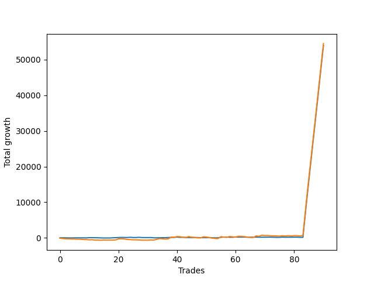

# Short Golden Two 
- Symbol: NQ
- Date Range: 3/19/22 - 5/22/22
- Trading Period: 7:20-12:30
- Number of Trades: 94


| Name | Win Percent | Profit | Avg Profit / Trade |     | Name | Win Percent | Profit | Avg Profit / Trade |
| ---- | ----------- | ------ | ------------------ | --- | ---- | ----------- | ------ | ------------------ |
| Sorted By <br> Profit | | | | | Sorted By <br> Win Percentage ||||
| Thirty-Five | 46.81 | -304250.00 | -3236.70 |     | Thirty-Six | 69.15 | -528250.00 | -5619.68 |
| Thirty-Six | 69.15 | -528250.00 | -5619.68 |     | Thirty-Five | 46.81 | -304250.00 | -3236.70 |

### Test Thirty-Five
* Sell when the linear regression slope changes to positive
* No Stoploss
* Results:
```
Total Trades: 94
Percent Up: 46.81
Percent Down: 53.19
Total Points Moved Down: 608.50
Potential Profit: 304250.00
Total Points Ups: 931.75 Count Ups: 44
Total Points Downs: 1540.25 Count Downs: 50
```

<details><summary>Trades</summary>

<code>In: 2022-03-21 06:54:00		Out: 2022-03-21 07:00:05		Total Position Time: 06:05		Total Move Down: 19.00		Total to Date: 19.00</code> <br />
<code>In: 2022-03-21 10:17:00		Out: 2022-03-21 10:25:05		Total Position Time: 08:05		Total Move Down: 6.50		Total to Date: 25.50</code> <br />
<code>In: 2022-03-23 06:46:00		Out: 2022-03-23 06:55:05		Total Position Time: 09:05		Total Move Down: -13.75		Total to Date: 11.75</code> <br />
<code>In: 2022-03-23 11:34:00		Out: 2022-03-23 11:41:05		Total Position Time: 07:05		Total Move Down: -12.50		Total to Date: -0.75</code> <br />
<code>In: 2022-03-24 07:22:00		Out: 2022-03-24 07:25:05		Total Position Time: 03:05		Total Move Down: 4.50		Total to Date: 3.75</code> <br />
<code>In: 2022-03-25 06:46:00		Out: 2022-03-25 07:06:05		Total Position Time: 20:05		Total Move Down: 18.00		Total to Date: 21.75</code> <br />
<code>In: 2022-03-25 06:54:00		Out: 2022-03-25 07:06:05		Total Position Time: 12:05		Total Move Down: 39.75		Total to Date: 61.50</code> <br />
<code>In: 2022-03-25 06:58:00		Out: 2022-03-25 07:06:05		Total Position Time: 08:05		Total Move Down: -0.25		Total to Date: 61.25</code> <br />
<code>In: 2022-03-25 08:14:00		Out: 2022-03-25 08:19:05		Total Position Time: 05:05		Total Move Down: -0.50		Total to Date: 60.75</code> <br />
<code>In: 2022-03-28 07:24:00		Out: 2022-03-28 07:27:05		Total Position Time: 03:05		Total Move Down: 2.00		Total to Date: 62.75</code> <br />
<code>In: 2022-03-28 08:07:00		Out: 2022-03-28 08:12:05		Total Position Time: 05:05		Total Move Down: -21.25		Total to Date: 41.50</code> <br />
<code>In: 2022-03-28 08:27:00		Out: 2022-03-28 08:31:05		Total Position Time: 04:05		Total Move Down: -0.00		Total to Date: 41.50</code> <br />
<code>In: 2022-03-29 06:46:00		Out: 2022-03-29 06:48:05		Total Position Time: 02:05		Total Move Down: -1.75		Total to Date: 39.75</code> <br />
<code>In: 2022-03-29 09:42:00		Out: 2022-03-29 10:01:05		Total Position Time: 19:05		Total Move Down: -10.75		Total to Date: 29.00</code> <br />
<code>In: 2022-03-30 06:46:00		Out: 2022-03-30 07:00:05		Total Position Time: 14:05		Total Move Down: -13.75		Total to Date: 15.25</code> <br />
<code>In: 2022-03-30 07:11:00		Out: 2022-03-30 07:26:05		Total Position Time: 15:05		Total Move Down: -35.75		Total to Date: -20.50</code> <br />
<code>In: 2022-03-30 08:13:00		Out: 2022-03-30 08:16:05		Total Position Time: 03:05		Total Move Down: -18.50		Total to Date: -39.00</code> <br />
<code>In: 2022-03-31 06:46:00		Out: 2022-03-31 06:50:05		Total Position Time: 04:05		Total Move Down: 3.00		Total to Date: -36.00</code> <br />
<code>In: 2022-03-31 09:41:00		Out: 2022-03-31 10:03:05		Total Position Time: 22:05		Total Move Down: 8.25		Total to Date: -27.75</code> <br />
<code>In: 2022-04-01 06:46:00		Out: 2022-04-01 07:00:05		Total Position Time: 14:05		Total Move Down: 48.25		Total to Date: 20.50</code> <br />
<code>In: 2022-04-01 08:31:00		Out: 2022-04-01 08:48:05		Total Position Time: 17:05		Total Move Down: 29.25		Total to Date: 49.75</code> <br />
<code>In: 2022-04-05 06:46:00		Out: 2022-04-05 07:01:05		Total Position Time: 15:05		Total Move Down: 36.75		Total to Date: 86.50</code> <br />
<code>In: 2022-04-06 06:46:00		Out: 2022-04-06 06:55:05		Total Position Time: 09:05		Total Move Down: 32.00		Total to Date: 118.50</code> <br />
<code>In: 2022-04-07 06:51:00		Out: 2022-04-07 06:53:05		Total Position Time: 02:05		Total Move Down: -13.50		Total to Date: 105.00</code> <br />
<code>In: 2022-04-07 07:42:00		Out: 2022-04-07 07:52:05		Total Position Time: 10:05		Total Move Down: -17.75		Total to Date: 87.25</code> <br />
<code>In: 2022-04-08 06:46:00		Out: 2022-04-08 07:02:05		Total Position Time: 16:05		Total Move Down: 67.00		Total to Date: 154.25</code> <br />
<code>In: 2022-04-08 12:21:00		Out: 2022-04-08 12:30:05		Total Position Time: 09:05		Total Move Down: -8.50		Total to Date: 145.75</code> <br />
<code>In: 2022-04-08 06:46:00		Out: 2022-04-08 07:02:05		Total Position Time: 16:05		Total Move Down: 67.00		Total to Date: 212.75</code> <br />
<code>In: 2022-04-08 12:21:00		Out: 2022-04-08 12:30:05		Total Position Time: 09:05		Total Move Down: -8.50		Total to Date: 204.25</code> <br />
<code>In: 2022-04-11 06:46:00		Out: 2022-04-11 07:03:05		Total Position Time: 17:05		Total Move Down: -8.00		Total to Date: 196.25</code> <br />
<code>In: 2022-04-11 07:22:00		Out: 2022-04-11 07:32:05		Total Position Time: 10:05		Total Move Down: 24.00		Total to Date: 220.25</code> <br />
<code>In: 2022-04-12 06:46:00		Out: 2022-04-12 06:59:05		Total Position Time: 13:05		Total Move Down: -82.50		Total to Date: 137.75</code> <br />
<code>In: 2022-04-12 07:50:00		Out: 2022-04-12 07:58:05		Total Position Time: 08:05		Total Move Down: -11.50		Total to Date: 126.25</code> <br />
<code>In: 2022-04-14 06:46:00		Out: 2022-04-14 06:58:05		Total Position Time: 12:05		Total Move Down: 27.50		Total to Date: 153.75</code> <br />
<code>In: 2022-04-18 06:46:00		Out: 2022-04-18 06:59:05		Total Position Time: 13:05		Total Move Down: 20.00		Total to Date: 173.75</code> <br />
<code>In: 2022-04-18 08:48:00		Out: 2022-04-18 08:54:05		Total Position Time: 06:05		Total Move Down: -2.25		Total to Date: 171.50</code> <br />
<code>In: 2022-04-20 06:46:00		Out: 2022-04-20 06:58:05		Total Position Time: 12:05		Total Move Down: 50.75		Total to Date: 222.25</code> <br />
<code>In: 2022-04-21 06:59:00		Out: 2022-04-21 07:06:05		Total Position Time: 07:05		Total Move Down: 24.50		Total to Date: 246.75</code> <br />
<code>In: 2022-04-22 06:46:00		Out: 2022-04-22 06:48:05		Total Position Time: 02:05		Total Move Down: 14.25		Total to Date: 261.00</code> <br />
<code>In: 2022-04-22 07:16:00		Out: 2022-04-22 07:29:05		Total Position Time: 13:05		Total Move Down: 66.50		Total to Date: 327.50</code> <br />
<code>In: 2022-04-25 06:47:00		Out: 2022-04-25 06:51:05		Total Position Time: 04:05		Total Move Down: -95.00		Total to Date: 232.50</code> <br />
<code>In: 2022-04-25 07:00:00		Out: 2022-04-25 07:06:05		Total Position Time: 06:05		Total Move Down: -1.00		Total to Date: 231.50</code> <br />
<code>In: 2022-04-25 08:54:00		Out: 2022-04-25 09:06:05		Total Position Time: 12:05		Total Move Down: -46.50		Total to Date: 185.00</code> <br />
<code>In: 2022-04-26 06:46:00		Out: 2022-04-26 06:49:05		Total Position Time: 03:05		Total Move Down: -16.50		Total to Date: 168.50</code> <br />
<code>In: 2022-04-27 07:13:00		Out: 2022-04-27 07:22:05		Total Position Time: 09:05		Total Move Down: -10.75		Total to Date: 157.75</code> <br />
<code>In: 2022-04-28 06:46:00		Out: 2022-04-28 06:54:05		Total Position Time: 08:05		Total Move Down: 6.50		Total to Date: 164.25</code> <br />
<code>In: 2022-04-28 08:52:00		Out: 2022-04-28 08:58:05		Total Position Time: 06:05		Total Move Down: 11.50		Total to Date: 175.75</code> <br />
<code>In: 2022-04-28 08:57:00		Out: 2022-04-28 09:01:05		Total Position Time: 04:05		Total Move Down: -7.50		Total to Date: 168.25</code> <br />
<code>In: 2022-04-29 06:48:00		Out: 2022-04-29 06:50:05		Total Position Time: 02:05		Total Move Down: -45.50		Total to Date: 122.75</code> <br />
<code>In: 2022-04-29 07:26:00		Out: 2022-04-29 07:31:05		Total Position Time: 05:05		Total Move Down: 31.50		Total to Date: 154.25</code> <br />
<code>In: 2022-05-02 08:53:00		Out: 2022-05-02 09:11:05		Total Position Time: 18:05		Total Move Down: -6.25		Total to Date: 148.00</code> <br />
<code>In: 2022-05-02 09:48:00		Out: 2022-05-02 09:50:05		Total Position Time: 02:05		Total Move Down: 9.25		Total to Date: 157.25</code> <br />
<code>In: 2022-05-03 06:46:00		Out: 2022-05-03 06:51:05		Total Position Time: 05:05		Total Move Down: -42.25		Total to Date: 115.00</code> <br />
<code>In: 2022-05-03 07:53:00		Out: 2022-05-03 08:03:05		Total Position Time: 10:05		Total Move Down: -27.50		Total to Date: 87.50</code> <br />
<code>In: 2022-05-04 06:46:00		Out: 2022-05-04 06:51:05		Total Position Time: 05:05		Total Move Down: 15.00		Total to Date: 102.50</code> <br />
<code>In: 2022-05-05 06:46:00		Out: 2022-05-05 07:15:05		Total Position Time: 29:05		Total Move Down: 145.75		Total to Date: 248.25</code> <br />
<code>In: 2022-05-06 06:46:00		Out: 2022-05-06 06:59:05		Total Position Time: 13:05		Total Move Down: 60.25		Total to Date: 308.50</code> <br />
<code>In: 2022-05-06 12:09:00		Out: 2022-05-06 12:13:05		Total Position Time: 04:05		Total Move Down: -17.50		Total to Date: 291.00</code> <br />
<code>In: 2022-05-09 06:50:00		Out: 2022-05-09 06:53:05		Total Position Time: 03:05		Total Move Down: -22.75		Total to Date: 268.25</code> <br />
<code>In: 2022-05-10 06:46:00		Out: 2022-05-10 06:54:05		Total Position Time: 08:05		Total Move Down: -19.00		Total to Date: 249.25</code> <br />
<code>In: 2022-05-10 07:40:00		Out: 2022-05-10 07:56:05		Total Position Time: 16:05		Total Move Down: 80.75		Total to Date: 330.00</code> <br />
<code>In: 2022-05-11 08:21:00		Out: 2022-05-11 08:24:05		Total Position Time: 03:05		Total Move Down: -28.75		Total to Date: 301.25</code> <br />
<code>In: 2022-05-12 06:46:00		Out: 2022-05-12 07:04:05		Total Position Time: 18:05		Total Move Down: -1.00		Total to Date: 300.25</code> <br />
<code>In: 2022-05-12 10:45:00		Out: 2022-05-12 10:47:05		Total Position Time: 02:05		Total Move Down: 13.25		Total to Date: 313.50</code> <br />
<code>In: 2022-05-16 06:49:00		Out: 2022-05-16 06:54:05		Total Position Time: 05:05		Total Move Down: -46.00		Total to Date: 267.50</code> <br />
<code>In: 2022-05-16 08:00:00		Out: 2022-05-16 08:06:05		Total Position Time: 06:05		Total Move Down: 0.75		Total to Date: 268.25</code> <br />
<code>In: 2022-05-17 06:52:00		Out: 2022-05-17 06:58:05		Total Position Time: 06:05		Total Move Down: 14.50		Total to Date: 282.75</code> <br />
<code>In: 2022-05-18 06:46:00		Out: 2022-05-18 06:49:05		Total Position Time: 03:05		Total Move Down: 9.25		Total to Date: 292.00</code> <br />
<code>In: 2022-05-19 06:47:00		Out: 2022-05-19 06:55:05		Total Position Time: 08:05		Total Move Down: -22.25		Total to Date: 269.75</code> <br />
<code>In: 2022-05-20 06:49:00		Out: 2022-05-20 06:56:05		Total Position Time: 07:05		Total Move Down: 6.50		Total to Date: 276.25</code> <br />
<code>In: 2022-05-23 07:05:00		Out: 2022-05-23 07:08:05		Total Position Time: 03:05		Total Move Down: 1.50		Total to Date: 277.75</code> <br />
<code>In: 2022-05-24 06:46:00		Out: 2022-05-24 06:53:05		Total Position Time: 07:05		Total Move Down: 2.25		Total to Date: 280.00</code> <br />
<code>In: 2022-05-24 10:25:00		Out: 2022-05-24 10:28:05		Total Position Time: 03:05		Total Move Down: -2.75		Total to Date: 277.25</code> <br />
<code>In: 2022-05-25 06:54:00		Out: 2022-05-25 06:56:05		Total Position Time: 02:05		Total Move Down: -37.50		Total to Date: 239.75</code> <br />
<code>In: 2022-05-25 07:08:00		Out: 2022-05-25 07:14:05		Total Position Time: 06:05		Total Move Down: -38.00		Total to Date: 201.75</code> <br />
<code>In: 2022-05-31 06:46:00		Out: 2022-05-31 06:57:05		Total Position Time: 11:05		Total Move Down: 2.25		Total to Date: 204.00</code> <br />
<code>In: 2022-06-01 06:46:00		Out: 2022-06-01 06:52:05		Total Position Time: 06:05		Total Move Down: 6.50		Total to Date: 210.50</code> <br />
<code>In: 2022-06-01 06:51:00		Out: 2022-06-01 07:01:05		Total Position Time: 10:05		Total Move Down: 22.50		Total to Date: 233.00</code> <br />
<code>In: 2022-06-01 07:10:00		Out: 2022-06-01 07:25:05		Total Position Time: 15:05		Total Move Down: 67.50		Total to Date: 300.50</code> <br />
<code>In: 2022-06-03 06:46:00		Out: 2022-06-03 06:50:05		Total Position Time: 04:05		Total Move Down: -39.25		Total to Date: 261.25</code> <br />
<code>In: 2022-06-03 07:28:00		Out: 2022-06-03 07:33:05		Total Position Time: 05:05		Total Move Down: 13.00		Total to Date: 274.25</code> <br />
<code>In: 2022-06-06 06:46:00		Out: 2022-06-06 06:55:05		Total Position Time: 09:05		Total Move Down: 3.50		Total to Date: 277.75</code> <br />
<code>In: 2022-06-06 08:27:00		Out: 2022-06-06 08:40:05		Total Position Time: 13:05		Total Move Down: 7.50		Total to Date: 285.25</code> <br />
<code>In: 2022-06-08 09:41:00		Out: 2022-06-08 09:50:05		Total Position Time: 09:05		Total Move Down: 4.25		Total to Date: 289.50</code> <br />
<code>In: 2022-06-09 06:46:00		Out: 2022-06-09 06:49:05		Total Position Time: 03:05		Total Move Down: -49.25		Total to Date: 240.25</code> <br />
<code>In: 2022-06-09 08:25:00		Out: 2022-06-09 08:34:05		Total Position Time: 09:05		Total Move Down: 3.75		Total to Date: 244.00</code> <br />
<code>In: 2022-06-10 06:46:00		Out: 2022-06-10 07:01:05		Total Position Time: 15:05		Total Move Down: 132.75		Total to Date: 376.75</code> <br />
<code>In: 2022-06-10 06:50:00		Out: 2022-06-10 07:01:05		Total Position Time: 11:05		Total Move Down: 97.00		Total to Date: 473.75</code> <br />
<code>In: 2022-06-13 06:46:00		Out: 2022-06-13 06:52:05		Total Position Time: 06:05		Total Move Down: 48.75		Total to Date: 522.50</code> <br />
<code>In: 2022-06-14 06:46:00		Out: 2022-06-14 06:49:05		Total Position Time: 03:05		Total Move Down: -9.75		Total to Date: 512.75</code> <br />
<code>In: 2022-06-14 07:17:00		Out: 2022-06-14 07:24:05		Total Position Time: 07:05		Total Move Down: -2.25		Total to Date: 510.50</code> <br />
<code>In: 2022-06-14 11:58:00		Out: 2022-06-14 12:22:05		Total Position Time: 24:05		Total Move Down: 48.00		Total to Date: 558.50</code> <br />
<code>In: 2022-06-15 07:47:00		Out: 2022-06-15 07:49:05		Total Position Time: 02:05		Total Move Down: -15.75		Total to Date: 542.75</code> <br />
<code>In: 2022-06-16 06:46:00		Out: 2022-06-16 07:03:05		Total Position Time: 17:05		Total Move Down: 65.75		Total to Date: 608.50</code> <br />


</details>

### Test Thirty-Six
* Sell when the linear regression slope changes to positive
* No Stoploss
* Results:
```
Total Trades: 94
Percent Up: 69.15
Percent Down: 30.85
Total Points Moved Down: 1056.50
Potential Profit: 528250.00
Total Points Ups: 4003.50 Count Ups: 65
Total Points Downs: 5060.00 Count Downs: 29
```

<details><summary>Trades</summary>

<code>In: 2022-03-21 06:54:00		Out: 2022-03-21 08:33:05		Total Position Time: 99:05		Total Move Down: -88.50		Total to Date: -88.50</code> <br />
<code>In: 2022-03-21 10:17:00		Out: 2022-03-21 12:31:00		Total Position Time: 134:00		Total Move Down: -98.25		Total to Date: -186.75</code> <br />
<code>In: 2022-03-23 06:46:00		Out: 2022-03-23 07:12:05		Total Position Time: 26:05		Total Move Down: -39.75		Total to Date: -226.50</code> <br />
<code>In: 2022-03-23 11:34:00		Out: 2022-03-23 12:31:00		Total Position Time: 57:00		Total Move Down: -1.75		Total to Date: -228.25</code> <br />
<code>In: 2022-03-24 07:22:00		Out: 2022-03-24 07:56:05		Total Position Time: 34:05		Total Move Down: -65.75		Total to Date: -294.00</code> <br />
<code>In: 2022-03-25 06:46:00		Out: 2022-03-25 06:53:05		Total Position Time: 07:05		Total Move Down: -14.50		Total to Date: -308.50</code> <br />
<code>In: 2022-03-25 06:54:00		Out: 2022-03-25 06:55:05		Total Position Time: 01:05		Total Move Down: -11.00		Total to Date: -319.50</code> <br />
<code>In: 2022-03-25 06:58:00		Out: 2022-03-25 07:38:05		Total Position Time: 40:05		Total Move Down: -78.00		Total to Date: -397.50</code> <br />
<code>In: 2022-03-25 08:14:00		Out: 2022-03-25 12:31:00		Total Position Time: 257:00		Total Move Down: -5.75		Total to Date: -403.25</code> <br />
<code>In: 2022-03-28 07:24:00		Out: 2022-03-28 08:02:05		Total Position Time: 38:05		Total Move Down: -29.25		Total to Date: -432.50</code> <br />
<code>In: 2022-03-28 08:07:00		Out: 2022-03-28 08:19:05		Total Position Time: 12:05		Total Move Down: -19.00		Total to Date: -451.50</code> <br />
<code>In: 2022-03-28 08:27:00		Out: 2022-03-28 11:53:05		Total Position Time: 206:05		Total Move Down: -85.75		Total to Date: -537.25</code> <br />
<code>In: 2022-03-29 06:46:00		Out: 2022-03-29 09:03:05		Total Position Time: 137:05		Total Move Down: 47.00		Total to Date: -490.25</code> <br />
<code>In: 2022-03-29 09:42:00		Out: 2022-03-29 10:53:05		Total Position Time: 71:05		Total Move Down: -79.00		Total to Date: -569.25</code> <br />
<code>In: 2022-03-30 06:46:00		Out: 2022-03-30 06:51:05		Total Position Time: 05:05		Total Move Down: -19.50		Total to Date: -588.75</code> <br />
<code>In: 2022-03-30 07:11:00		Out: 2022-03-30 07:13:05		Total Position Time: 02:05		Total Move Down: -6.25		Total to Date: -595.00</code> <br />
<code>In: 2022-03-30 08:13:00		Out: 2022-03-30 12:31:00		Total Position Time: 258:00		Total Move Down: 73.25		Total to Date: -521.75</code> <br />
<code>In: 2022-03-31 06:46:00		Out: 2022-03-31 07:36:05		Total Position Time: 50:05		Total Move Down: -46.50		Total to Date: -568.25</code> <br />
<code>In: 2022-03-31 09:41:00		Out: 2022-03-31 12:31:00		Total Position Time: 170:00		Total Move Down: 19.25		Total to Date: -549.00</code> <br />
<code>In: 2022-04-01 06:46:00		Out: 2022-04-01 08:05:05		Total Position Time: 79:05		Total Move Down: -7.00		Total to Date: -556.00</code> <br />
<code>In: 2022-04-01 08:31:00		Out: 2022-04-01 12:31:00		Total Position Time: 240:00		Total Move Down: 44.50		Total to Date: -511.50</code> <br />
<code>In: 2022-04-05 06:46:00		Out: 2022-04-05 12:31:00		Total Position Time: 345:00		Total Move Down: 289.00		Total to Date: -222.50</code> <br />
<code>In: 2022-04-06 06:46:00		Out: 2022-04-06 12:20:05		Total Position Time: 334:05		Total Move Down: -16.00		Total to Date: -238.50</code> <br />
<code>In: 2022-04-07 06:51:00		Out: 2022-04-07 06:57:05		Total Position Time: 06:05		Total Move Down: -50.75		Total to Date: -289.25</code> <br />
<code>In: 2022-04-07 07:42:00		Out: 2022-04-07 12:30:05		Total Position Time: 288:05		Total Move Down: -124.25		Total to Date: -413.50</code> <br />
<code>In: 2022-04-08 06:46:00		Out: 2022-04-08 07:43:05		Total Position Time: 57:05		Total Move Down: 1.00		Total to Date: -412.50</code> <br />
<code>In: 2022-04-08 12:21:00		Out: 2022-04-08 12:31:00		Total Position Time: 10:00		Total Move Down: -7.25		Total to Date: -419.75</code> <br />
<code>In: 2022-04-08 06:46:00		Out: 2022-04-08 07:43:05		Total Position Time: 57:05		Total Move Down: 1.00		Total to Date: -418.75</code> <br />
<code>In: 2022-04-08 12:21:00		Out: 2022-04-08 12:31:00		Total Position Time: 10:00		Total Move Down: -7.25		Total to Date: -426.00</code> <br />
<code>In: 2022-04-11 06:46:00		Out: 2022-04-11 06:48:05		Total Position Time: 02:05		Total Move Down: -19.50		Total to Date: -445.50</code> <br />
<code>In: 2022-04-11 07:22:00		Out: 2022-04-11 12:31:00		Total Position Time: 309:00		Total Move Down: 71.25		Total to Date: -374.25</code> <br />
<code>In: 2022-04-12 06:46:00		Out: 2022-04-12 06:47:05		Total Position Time: 01:05		Total Move Down: -22.75		Total to Date: -397.00</code> <br />
<code>In: 2022-04-12 07:50:00		Out: 2022-04-12 12:31:00		Total Position Time: 281:00		Total Move Down: 210.00		Total to Date: -187.00</code> <br />
<code>In: 2022-04-14 06:46:00		Out: 2022-04-14 12:31:00		Total Position Time: 345:00		Total Move Down: 218.75		Total to Date: 31.75</code> <br />
<code>In: 2022-04-18 06:46:00		Out: 2022-04-18 07:14:05		Total Position Time: 28:05		Total Move Down: -65.00		Total to Date: -33.25</code> <br />
<code>In: 2022-04-18 08:48:00		Out: 2022-04-18 11:52:05		Total Position Time: 184:05		Total Move Down: -103.50		Total to Date: -136.75</code> <br />
<code>In: 2022-04-20 06:46:00		Out: 2022-04-20 12:31:00		Total Position Time: 345:00		Total Move Down: 98.00		Total to Date: -38.75</code> <br />
<code>In: 2022-04-21 06:59:00		Out: 2022-04-21 12:31:00		Total Position Time: 332:00		Total Move Down: 456.75		Total to Date: 418.00</code> <br />
<code>In: 2022-04-22 06:46:00		Out: 2022-04-22 07:11:05		Total Position Time: 25:05		Total Move Down: -48.00		Total to Date: 370.00</code> <br />
<code>In: 2022-04-22 07:16:00		Out: 2022-04-22 12:31:00		Total Position Time: 315:00		Total Move Down: 198.75		Total to Date: 568.75</code> <br />
<code>In: 2022-04-25 06:47:00		Out: 2022-04-25 06:57:05		Total Position Time: 10:05		Total Move Down: -63.25		Total to Date: 505.50</code> <br />
<code>In: 2022-04-25 07:00:00		Out: 2022-04-25 07:27:05		Total Position Time: 27:05		Total Move Down: -135.50		Total to Date: 370.00</code> <br />
<code>In: 2022-04-25 08:54:00		Out: 2022-04-25 09:41:05		Total Position Time: 47:05		Total Move Down: -97.75		Total to Date: 272.25</code> <br />
<code>In: 2022-04-26 06:46:00		Out: 2022-04-26 12:31:00		Total Position Time: 345:00		Total Move Down: 258.50		Total to Date: 530.75</code> <br />
<code>In: 2022-04-27 07:13:00		Out: 2022-04-27 09:24:05		Total Position Time: 131:05		Total Move Down: -185.00		Total to Date: 345.75</code> <br />
<code>In: 2022-04-28 06:46:00		Out: 2022-04-28 08:39:05		Total Position Time: 113:05		Total Move Down: -21.25		Total to Date: 324.50</code> <br />
<code>In: 2022-04-28 08:52:00		Out: 2022-04-28 08:54:05		Total Position Time: 02:05		Total Move Down: 8.25		Total to Date: 332.75</code> <br />
<code>In: 2022-04-28 08:57:00		Out: 2022-04-28 09:16:05		Total Position Time: 19:05		Total Move Down: -56.50		Total to Date: 276.25</code> <br />
<code>In: 2022-04-29 06:48:00		Out: 2022-04-29 06:53:05		Total Position Time: 05:05		Total Move Down: -50.00		Total to Date: 226.25</code> <br />
<code>In: 2022-04-29 07:26:00		Out: 2022-04-29 12:31:00		Total Position Time: 305:00		Total Move Down: 324.50		Total to Date: 550.75</code> <br />
<code>In: 2022-05-02 08:53:00		Out: 2022-05-02 09:34:05		Total Position Time: 41:05		Total Move Down: -53.75		Total to Date: 497.00</code> <br />
<code>In: 2022-05-02 09:48:00		Out: 2022-05-02 12:31:00		Total Position Time: 163:00		Total Move Down: -146.75		Total to Date: 350.25</code> <br />
<code>In: 2022-05-03 06:46:00		Out: 2022-05-03 07:00:05		Total Position Time: 14:05		Total Move Down: -147.75		Total to Date: 202.50</code> <br />
<code>In: 2022-05-03 07:53:00		Out: 2022-05-03 08:11:05		Total Position Time: 18:05		Total Move Down: -85.75		Total to Date: 116.75</code> <br />
<code>In: 2022-05-04 06:46:00		Out: 2022-05-04 10:06:05		Total Position Time: 200:05		Total Move Down: -25.25		Total to Date: 91.50</code> <br />
<code>In: 2022-05-05 06:46:00		Out: 2022-05-05 12:31:00		Total Position Time: 345:00		Total Move Down: 529.25		Total to Date: 620.75</code> <br />
<code>In: 2022-05-06 06:46:00		Out: 2022-05-06 07:21:05		Total Position Time: 35:05		Total Move Down: -154.75		Total to Date: 466.00</code> <br />
<code>In: 2022-05-06 12:09:00		Out: 2022-05-06 12:31:00		Total Position Time: 22:00		Total Move Down: -29.00		Total to Date: 437.00</code> <br />
<code>In: 2022-05-09 06:50:00		Out: 2022-05-09 12:31:00		Total Position Time: 341:00		Total Move Down: 222.00		Total to Date: 659.00</code> <br />
<code>In: 2022-05-10 06:46:00		Out: 2022-05-10 07:09:05		Total Position Time: 23:05		Total Move Down: -150.25		Total to Date: 508.75</code> <br />
<code>In: 2022-05-10 07:40:00		Out: 2022-05-10 11:38:05		Total Position Time: 238:05		Total Move Down: -58.75		Total to Date: 450.00</code> <br />
<code>In: 2022-05-11 08:21:00		Out: 2022-05-11 12:31:00		Total Position Time: 250:00		Total Move Down: 216.25		Total to Date: 666.25</code> <br />
<code>In: 2022-05-12 06:46:00		Out: 2022-05-12 06:49:05		Total Position Time: 03:05		Total Move Down: -91.25		Total to Date: 575.00</code> <br />
<code>In: 2022-05-12 10:45:00		Out: 2022-05-12 12:31:00		Total Position Time: 106:00		Total Move Down: -70.25		Total to Date: 504.75</code> <br />
<code>In: 2022-05-16 06:49:00		Out: 2022-05-16 07:16:05		Total Position Time: 27:05		Total Move Down: -106.75		Total to Date: 398.00</code> <br />
<code>In: 2022-05-16 08:00:00		Out: 2022-05-16 10:40:05		Total Position Time: 160:05		Total Move Down: -123.00		Total to Date: 275.00</code> <br />
<code>In: 2022-05-17 06:52:00		Out: 2022-05-17 09:45:05		Total Position Time: 173:05		Total Move Down: -11.50		Total to Date: 263.50</code> <br />
<code>In: 2022-05-18 06:46:00		Out: 2022-05-18 12:31:00		Total Position Time: 345:00		Total Move Down: 426.25		Total to Date: 689.75</code> <br />
<code>In: 2022-05-19 06:47:00		Out: 2022-05-19 07:08:05		Total Position Time: 21:05		Total Move Down: -101.75		Total to Date: 588.00</code> <br />
<code>In: 2022-05-20 06:49:00		Out: 2022-05-20 12:31:00		Total Position Time: 342:00		Total Move Down: 323.50		Total to Date: 911.50</code> <br />
<code>In: 2022-05-23 07:05:00		Out: 2022-05-23 07:44:05		Total Position Time: 39:05		Total Move Down: -95.50		Total to Date: 816.00</code> <br />
<code>In: 2022-05-24 06:46:00		Out: 2022-05-24 09:27:05		Total Position Time: 161:05		Total Move Down: -0.25		Total to Date: 815.75</code> <br />
<code>In: 2022-05-24 10:25:00		Out: 2022-05-24 10:43:05		Total Position Time: 18:05		Total Move Down: -72.50		Total to Date: 743.25</code> <br />
<code>In: 2022-05-25 06:54:00		Out: 2022-05-25 07:02:05		Total Position Time: 08:05		Total Move Down: -27.25		Total to Date: 716.00</code> <br />
<code>In: 2022-05-25 07:08:00		Out: 2022-05-25 07:17:05		Total Position Time: 09:05		Total Move Down: -45.25		Total to Date: 670.75</code> <br />
<code>In: 2022-05-31 06:46:00		Out: 2022-05-31 07:43:05		Total Position Time: 57:05		Total Move Down: -47.75		Total to Date: 623.00</code> <br />
<code>In: 2022-06-01 06:46:00		Out: 2022-06-01 06:54:05		Total Position Time: 08:05		Total Move Down: -7.50		Total to Date: 615.50</code> <br />
<code>In: 2022-06-01 06:51:00		Out: 2022-06-01 06:54:05		Total Position Time: 03:05		Total Move Down: -22.50		Total to Date: 593.00</code> <br />
<code>In: 2022-06-01 07:10:00		Out: 2022-06-01 12:31:00		Total Position Time: 321:00		Total Move Down: 113.25		Total to Date: 706.25</code> <br />
<code>In: 2022-06-03 06:46:00		Out: 2022-06-03 07:03:05		Total Position Time: 17:05		Total Move Down: -101.00		Total to Date: 605.25</code> <br />
<code>In: 2022-06-03 07:28:00		Out: 2022-06-03 12:31:00		Total Position Time: 303:00		Total Move Down: 110.00		Total to Date: 715.25</code> <br />
<code>In: 2022-06-06 06:46:00		Out: 2022-06-06 07:06:05		Total Position Time: 20:05		Total Move Down: -79.75		Total to Date: 635.50</code> <br />
<code>In: 2022-06-06 08:27:00		Out: 2022-06-06 12:31:00		Total Position Time: 244:00		Total Move Down: 89.00		Total to Date: 724.50</code> <br />
<code>In: 2022-06-08 09:41:00		Out: 2022-06-08 12:31:00		Total Position Time: 170:00		Total Move Down: -6.75		Total to Date: 717.75</code> <br />
<code>In: 2022-06-09 06:46:00		Out: 2022-06-09 06:53:05		Total Position Time: 07:05		Total Move Down: -97.00		Total to Date: 620.75</code> <br />
<code>In: 2022-06-09 08:25:00		Out: 2022-06-09 12:31:00		Total Position Time: 246:00		Total Move Down: 215.50		Total to Date: 836.25</code> <br />
<code>In: 2022-06-10 06:46:00		Out: 2022-06-10 06:47:05		Total Position Time: 01:05		Total Move Down: 22.00		Total to Date: 858.25</code> <br />
<code>In: 2022-06-10 06:50:00		Out: 2022-06-10 12:31:00		Total Position Time: 341:00		Total Move Down: 83.00		Total to Date: 941.25</code> <br />
<code>In: 2022-06-13 06:46:00		Out: 2022-06-13 12:31:00		Total Position Time: 345:00		Total Move Down: 246.00		Total to Date: 1187.25</code> <br />
<code>In: 2022-06-14 06:46:00		Out: 2022-06-14 07:05:05		Total Position Time: 19:05		Total Move Down: -92.25		Total to Date: 1095.00</code> <br />
<code>In: 2022-06-14 07:17:00		Out: 2022-06-14 10:21:05		Total Position Time: 184:05		Total Move Down: -102.00		Total to Date: 993.00</code> <br />
<code>In: 2022-06-14 11:58:00		Out: 2022-06-14 12:31:00		Total Position Time: 33:00		Total Move Down: -14.75		Total to Date: 978.25</code> <br />
<code>In: 2022-06-15 07:47:00		Out: 2022-06-15 09:11:05		Total Position Time: 84:05		Total Move Down: -66.00		Total to Date: 912.25</code> <br />
<code>In: 2022-06-16 06:46:00		Out: 2022-06-16 12:31:00		Total Position Time: 345:00		Total Move Down: 144.25		Total to Date: 1056.50</code> <br />


</details>