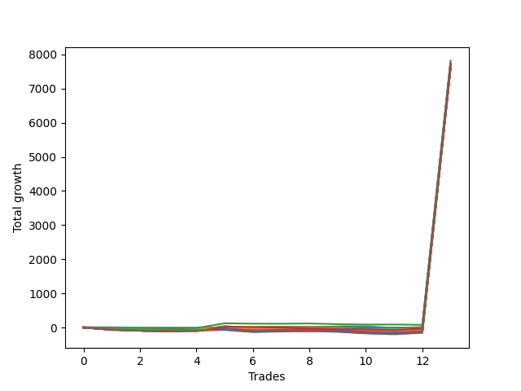

# Short Wallace 004 
- Symbol: NQ
- Date Range: 03/18/2022 - 06/17/2022
- Trading Period: 7:20-12:30
- Number of Trades: 13



| Name | Win Percent | Profit | Avg Profit / Trade |     | Name | Win Percent | Profit | Avg Profit / Trade |
| ---- | ----------- | ------ | ------------------ | --- | ---- | ----------- | ------ | ------------------ |
| Sorted By <br> Profit | | | | | Sorted By <br> Win Percentage ||||
| Seventy-Two | 30.77 | 3911375.00 | 300875.00 |     | Zero | 69.23 | 3879000.00 | 298384.62 |
| Zero | 69.23 | 3879000.00 | 298384.62 |     | One | 69.23 | 3833375.00 | 294875.00 |
| Twenty-One | 23.08 | 3865375.00 | 297336.54 |     | Five | 46.15 | 3850375.00 | 296182.69 |
| Twenty | 23.08 | 3865375.00 | 297336.54 |     | Seventy-One | 46.15 | 3843250.00 | 295634.62 |
| Nineteen | 23.08 | 3865375.00 | 297336.54 |     | Fifty-Five | 46.15 | 3843250.00 | 295634.62 |
| Eighteen | 23.08 | 3865375.00 | 297336.54 |     | Thirty-Nine | 46.15 | 3843250.00 | 295634.62 |
| Seventeen | 23.08 | 3865375.00 | 297336.54 |     | Twenty-Three | 46.15 | 3843250.00 | 295634.62 |
| Sixten | 23.08 | 3865375.00 | 297336.54 |     | Seven | 46.15 | 3843250.00 | 295634.62 |
| Thirty-Seven | 30.77 | 3865250.00 | 297326.92 |     | Four | 46.15 | 3843250.00 | 295634.62 |
| Thirty-Six | 30.77 | 3865250.00 | 297326.92 |     | Three | 46.15 | 3840625.00 | 295432.69 |
| Thirty-Five | 30.77 | 3865250.00 | 297326.92 |     | Two | 46.15 | 3833625.00 | 294894.23 |
| Thirty-Four | 30.77 | 3865250.00 | 297326.92 |     | Seventy | 46.15 | 3818500.00 | 293730.77 |
| Thirty-Three | 30.77 | 3865250.00 | 297326.92 |     | Fifty-Four | 46.15 | 3818500.00 | 293730.77 |
| Thirty-Two | 30.77 | 3865250.00 | 297326.92 |     | Thirty-Eight | 46.15 | 3818500.00 | 293730.77 |
| Fifty-Three | 15.38 | 3855250.00 | 296557.69 |     | Twenty-Two | 46.15 | 3818500.00 | 293730.77 |
| Fifty-Two | 15.38 | 3855250.00 | 296557.69 |     | Six | 46.15 | 3818500.00 | 293730.77 |
| Fifty-One | 15.38 | 3855250.00 | 296557.69 |     | Seventy-Five | 46.15 | 3802125.00 | 292471.15 |
| Fifty | 15.38 | 3855250.00 | 296557.69 |     | Seventy-Four | 46.15 | 3797000.00 | 292076.92 |
| Forty-Nine | 15.38 | 3855250.00 | 296557.69 |     | Seventy-Two | 30.77 | 3911375.00 | 300875.00 |
| Forty-Eight | 15.38 | 3855250.00 | 296557.69 |     | Thirty-Seven | 30.77 | 3865250.00 | 297326.92 |
| Fifteen | 7.69 | 3853500.00 | 296423.08 |     | Thirty-Six | 30.77 | 3865250.00 | 297326.92 |
| Fourteen | 7.69 | 3853500.00 | 296423.08 |     | Thirty-Five | 30.77 | 3865250.00 | 297326.92 |
| Seventy-Three | 23.08 | 3852250.00 | 296326.92 |     | Thirty-Four | 30.77 | 3865250.00 | 297326.92 |
| Five | 46.15 | 3850375.00 | 296182.69 |     | Thirty-Three | 30.77 | 3865250.00 | 297326.92 |
| Thirteen | 15.38 | 3848125.00 | 296009.62 |     | Thirty-Two | 30.77 | 3865250.00 | 297326.92 |
| Twelve | 15.38 | 3848125.00 | 296009.62 |     | Twenty-One | 23.08 | 3865375.00 | 297336.54 |
| Eleven | 15.38 | 3848125.00 | 296009.62 |     | Twenty | 23.08 | 3865375.00 | 297336.54 |
| Ten | 15.38 | 3848125.00 | 296009.62 |     | Nineteen | 23.08 | 3865375.00 | 297336.54 |
| Nine | 15.38 | 3848125.00 | 296009.62 |     | Eighteen | 23.08 | 3865375.00 | 297336.54 |
| Eight | 15.38 | 3848125.00 | 296009.62 |     | Seventeen | 23.08 | 3865375.00 | 297336.54 |
| Twenty-Nine | 15.38 | 3845500.00 | 295807.69 |     | Sixten | 23.08 | 3865375.00 | 297336.54 |
| Twenty-Eight | 15.38 | 3845500.00 | 295807.69 |     | Seventy-Three | 23.08 | 3852250.00 | 296326.92 |
| twenty-Seven | 15.38 | 3845500.00 | 295807.69 |     | Sixty-Nine | 23.08 | 3836625.00 | 295125.00 |
| Twenty-Six | 15.38 | 3845500.00 | 295807.69 |     | Sixty-Eight | 23.08 | 3836625.00 | 295125.00 |
| Twenty-Five | 15.38 | 3845500.00 | 295807.69 |     | Sixty-Seven | 23.08 | 3836625.00 | 295125.00 |
| Twenty-Four | 15.38 | 3845500.00 | 295807.69 |     | Sixty-Six | 23.08 | 3836625.00 | 295125.00 |
| Thirty-One | 7.69 | 3844000.00 | 295692.31 |     | Sixty-Five | 23.08 | 3836625.00 | 295125.00 |
| Thirty | 7.69 | 3844000.00 | 295692.31 |     | Sixty-Four | 23.08 | 3836625.00 | 295125.00 |
| Seventy-One | 46.15 | 3843250.00 | 295634.62 |     | Fifty-Seven | 23.08 | 3823250.00 | 294096.15 |
| Fifty-Five | 46.15 | 3843250.00 | 295634.62 |     | Fifty-Three | 15.38 | 3855250.00 | 296557.69 |
| Thirty-Nine | 46.15 | 3843250.00 | 295634.62 |     | Fifty-Two | 15.38 | 3855250.00 | 296557.69 |
| Twenty-Three | 46.15 | 3843250.00 | 295634.62 |     | Fifty-One | 15.38 | 3855250.00 | 296557.69 |
| Seven | 46.15 | 3843250.00 | 295634.62 |     | Fifty | 15.38 | 3855250.00 | 296557.69 |
| Four | 46.15 | 3843250.00 | 295634.62 |     | Forty-Nine | 15.38 | 3855250.00 | 296557.69 |
| Three | 46.15 | 3840625.00 | 295432.69 |     | Forty-Eight | 15.38 | 3855250.00 | 296557.69 |
| Sixty-Nine | 23.08 | 3836625.00 | 295125.00 |     | Thirteen | 15.38 | 3848125.00 | 296009.62 |
| Sixty-Eight | 23.08 | 3836625.00 | 295125.00 |     | Twelve | 15.38 | 3848125.00 | 296009.62 |
| Sixty-Seven | 23.08 | 3836625.00 | 295125.00 |     | Eleven | 15.38 | 3848125.00 | 296009.62 |
| Sixty-Six | 23.08 | 3836625.00 | 295125.00 |     | Ten | 15.38 | 3848125.00 | 296009.62 |
| Sixty-Five | 23.08 | 3836625.00 | 295125.00 |     | Nine | 15.38 | 3848125.00 | 296009.62 |
| Sixty-Four | 23.08 | 3836625.00 | 295125.00 |     | Eight | 15.38 | 3848125.00 | 296009.62 |
| Two | 46.15 | 3833625.00 | 294894.23 |     | Twenty-Nine | 15.38 | 3845500.00 | 295807.69 |
| One | 69.23 | 3833375.00 | 294875.00 |     | Twenty-Eight | 15.38 | 3845500.00 | 295807.69 |
| Forty-Seven | 7.69 | 3831375.00 | 294721.15 |     | twenty-Seven | 15.38 | 3845500.00 | 295807.69 |
| Forty-Six | 7.69 | 3831375.00 | 294721.15 |     | Twenty-Six | 15.38 | 3845500.00 | 295807.69 |
| Forty-Five | 7.69 | 3829875.00 | 294605.77 |     | Twenty-Five | 15.38 | 3845500.00 | 295807.69 |
| Forty-Four | 7.69 | 3829875.00 | 294605.77 |     | Twenty-Four | 15.38 | 3845500.00 | 295807.69 |
| Forty-Three | 7.69 | 3829875.00 | 294605.77 |     | Fifty-Six | 15.38 | 3818250.00 | 293711.54 |
| Forty-Two | 7.69 | 3829875.00 | 294605.77 |     | Fifteen | 7.69 | 3853500.00 | 296423.08 |
| Forty-One | 7.69 | 3829875.00 | 294605.77 |     | Fourteen | 7.69 | 3853500.00 | 296423.08 |
| Forty | 7.69 | 3829875.00 | 294605.77 |     | Thirty-One | 7.69 | 3844000.00 | 295692.31 |
| Fifty-Seven | 23.08 | 3823250.00 | 294096.15 |     | Thirty | 7.69 | 3844000.00 | 295692.31 |
| Seventy | 46.15 | 3818500.00 | 293730.77 |     | Forty-Seven | 7.69 | 3831375.00 | 294721.15 |
| Fifty-Four | 46.15 | 3818500.00 | 293730.77 |     | Forty-Six | 7.69 | 3831375.00 | 294721.15 |
| Thirty-Eight | 46.15 | 3818500.00 | 293730.77 |     | Forty-Five | 7.69 | 3829875.00 | 294605.77 |
| Twenty-Two | 46.15 | 3818500.00 | 293730.77 |     | Forty-Four | 7.69 | 3829875.00 | 294605.77 |
| Six | 46.15 | 3818500.00 | 293730.77 |     | Forty-Three | 7.69 | 3829875.00 | 294605.77 |
| Fifty-Six | 15.38 | 3818250.00 | 293711.54 |     | Forty-Two | 7.69 | 3829875.00 | 294605.77 |
| Sixty-One | 7.69 | 3803000.00 | 292538.46 |     | Forty-One | 7.69 | 3829875.00 | 294605.77 |
| Sixty | 7.69 | 3803000.00 | 292538.46 |     | Forty | 7.69 | 3829875.00 | 294605.77 |
| Fifty-Nine | 7.69 | 3803000.00 | 292538.46 |     | Sixty-One | 7.69 | 3803000.00 | 292538.46 |
| Fifty-Eight | 7.69 | 3803000.00 | 292538.46 |     | Sixty | 7.69 | 3803000.00 | 292538.46 |
| Seventy-Five | 46.15 | 3802125.00 | 292471.15 |     | Fifty-Nine | 7.69 | 3803000.00 | 292538.46 |
| Sixty-Three | 7.69 | 3797125.00 | 292086.54 |     | Fifty-Eight | 7.69 | 3803000.00 | 292538.46 |
| Sixty-Two | 7.69 | 3797125.00 | 292086.54 |     | Sixty-Three | 7.69 | 3797125.00 | 292086.54 |
| Seventy-Four | 46.15 | 3797000.00 | 292076.92 |     | Sixty-Two | 7.69 | 3797125.00 | 292086.54 |

## NO STOPLOSS

### Test Zero
* Sell when price hits the middle line of the 20p bollinger
* No Stoploss
* Results:
```
Total Trades: 13
Percent Up: 30.77
Percent Down: 69.23
Total Points Moved Down: 7758.00
Potential Profit: 3879000.00
Total Points Ups: 115.50 Count Ups: 4
Total Points Downs: 7873.50 Count Downs: 9
```

<details><summary>Trades</summary>

<code>In: 2022-03-24 08:22:00		Out: 2022-03-24 08:49:40		Total Position Time: 27:40		Total Move Down: -69.50		Total to Date: -69.50</code> <br />
<code>In: 2022-03-29 11:51:00		Out: 2022-03-29 11:58:35		Total Position Time: 07:35		Total Move Down: -0.25		Total to Date: -69.75</code> <br />
<code>In: 2022-03-29 11:55:00		Out: 2022-03-29 11:58:35		Total Position Time: 03:35		Total Move Down: 5.75		Total to Date: -64.00</code> <br />
<code>In: 2022-03-31 07:51:00		Out: 2022-03-31 08:01:20		Total Position Time: 10:20		Total Move Down: 6.75		Total to Date: -57.25</code> <br />
<code>In: 2022-04-06 11:06:00		Out: 2022-04-06 11:07:05		Total Position Time: 01:05		Total Move Down: 9.75		Total to Date: -47.50</code> <br />
<code>In: 2022-04-28 09:50:00		Out: 2022-04-28 10:02:15		Total Position Time: 12:15		Total Move Down: -1.50		Total to Date: -49.00</code> <br />
<code>In: 2022-05-03 08:11:00		Out: 2022-05-03 08:17:35		Total Position Time: 06:35		Total Move Down: 30.75		Total to Date: -18.25</code> <br />
<code>In: 2022-05-03 08:12:00		Out: 2022-05-03 08:17:35		Total Position Time: 05:35		Total Move Down: 27.25		Total to Date: 9.00</code> <br />
<code>In: 2022-05-03 10:20:00		Out: 2022-05-03 10:24:05		Total Position Time: 04:05		Total Move Down: 21.00		Total to Date: 30.00</code> <br />
<code>In: 2022-05-16 11:12:00		Out: 2022-05-16 11:17:30		Total Position Time: 05:30		Total Move Down: 1.50		Total to Date: 31.50</code> <br />
<code>In: 2022-05-25 07:21:00		Out: 2022-05-25 07:41:50		Total Position Time: 20:50		Total Move Down: -44.25		Total to Date: -12.75</code> <br />
<code>In: 2022-05-25 07:37:00		Out: 2022-05-25 07:41:50		Total Position Time: 04:50		Total Move Down: 25.00		Total to Date: 12.25</code> <br />
<code>In: 2022-06-15 09:19:00		Out: 2022-06-15 09:19:10		Total Position Time: 00:10		Total Move Down: 7745.75		Total to Date: 7758.00</code> <br />


</details>

### Test One
* Sell when the price hits the upper line of the 20p 1std bollinger
* No Stoploss
* Results:
```
Total Trades: 13
Percent Up: 30.77
Percent Down: 69.23
Total Points Moved Down: 7666.75
Potential Profit: 3833375.00
Total Points Ups: 205.25 Count Ups: 4
Total Points Downs: 7872.00 Count Downs: 9
```

<details><summary>Trades</summary>

<code>In: 2022-03-24 08:22:00		Out: 2022-03-24 08:50:35		Total Position Time: 28:35		Total Move Down: -60.00		Total to Date: -60.00</code> <br />
<code>In: 2022-03-29 11:51:00		Out: 2022-03-29 12:00:25		Total Position Time: 09:25		Total Move Down: 4.75		Total to Date: -55.25</code> <br />
<code>In: 2022-03-29 11:55:00		Out: 2022-03-29 12:00:25		Total Position Time: 05:25		Total Move Down: 10.75		Total to Date: -44.50</code> <br />
<code>In: 2022-03-31 07:51:00		Out: 2022-03-31 08:02:55		Total Position Time: 11:55		Total Move Down: 17.50		Total to Date: -27.00</code> <br />
<code>In: 2022-04-06 11:06:00		Out: 2022-04-06 11:07:25		Total Position Time: 01:25		Total Move Down: 29.00		Total to Date: 2.00</code> <br />
<code>In: 2022-04-28 09:50:00		Out: 2022-04-28 10:19:55		Total Position Time: 29:55		Total Move Down: -62.50		Total to Date: -60.50</code> <br />
<code>In: 2022-05-03 08:11:00		Out: 2022-05-03 08:28:35		Total Position Time: 17:35		Total Move Down: 7.75		Total to Date: -52.75</code> <br />
<code>In: 2022-05-03 08:12:00		Out: 2022-05-03 08:28:35		Total Position Time: 16:35		Total Move Down: 4.25		Total to Date: -48.50</code> <br />
<code>In: 2022-05-03 10:20:00		Out: 2022-05-03 10:30:20		Total Position Time: 10:20		Total Move Down: 18.25		Total to Date: -30.25</code> <br />
<code>In: 2022-05-16 11:12:00		Out: 2022-05-16 11:41:55		Total Position Time: 29:55		Total Move Down: -47.50		Total to Date: -77.75</code> <br />
<code>In: 2022-05-25 07:21:00		Out: 2022-05-25 07:46:50		Total Position Time: 25:50		Total Move Down: -35.25		Total to Date: -113.00</code> <br />
<code>In: 2022-05-25 07:37:00		Out: 2022-05-25 07:46:50		Total Position Time: 09:50		Total Move Down: 34.00		Total to Date: -79.00</code> <br />
<code>In: 2022-06-15 09:19:00		Out: 2022-06-15 09:19:10		Total Position Time: 00:10		Total Move Down: 7745.75		Total to Date: 7666.75</code> <br />


</details>

### Test Two
* Sell when the price hits the upper line of the 20p 2std bollinger
* No Stoploss
* Results:
```
Total Trades: 13
Percent Up: 53.85
Percent Down: 46.15
Total Points Moved Down: 7667.25
Potential Profit: 3833625.00
Total Points Ups: 256.75 Count Ups: 7
Total Points Downs: 7924.00 Count Downs: 6
```

<details><summary>Trades</summary>

<code>In: 2022-03-24 08:22:00		Out: 2022-03-24 08:51:55		Total Position Time: 29:55		Total Move Down: -62.00		Total to Date: -62.00</code> <br />
<code>In: 2022-03-29 11:51:00		Out: 2022-03-29 12:20:55		Total Position Time: 29:55		Total Move Down: -31.75		Total to Date: -93.75</code> <br />
<code>In: 2022-03-29 11:55:00		Out: 2022-03-29 12:24:55		Total Position Time: 29:55		Total Move Down: -22.00		Total to Date: -115.75</code> <br />
<code>In: 2022-03-31 07:51:00		Out: 2022-03-31 08:03:25		Total Position Time: 12:25		Total Move Down: 27.50		Total to Date: -88.25</code> <br />
<code>In: 2022-04-06 11:06:00		Out: 2022-04-06 11:08:25		Total Position Time: 02:25		Total Move Down: 58.00		Total to Date: -30.25</code> <br />
<code>In: 2022-04-28 09:50:00		Out: 2022-04-28 10:19:55		Total Position Time: 29:55		Total Move Down: -62.50		Total to Date: -92.75</code> <br />
<code>In: 2022-05-03 08:11:00		Out: 2022-05-03 08:35:55		Total Position Time: 24:55		Total Move Down: 19.00		Total to Date: -73.75</code> <br />
<code>In: 2022-05-03 08:12:00		Out: 2022-05-03 08:35:55		Total Position Time: 23:55		Total Move Down: 15.50		Total to Date: -58.25</code> <br />
<code>In: 2022-05-03 10:20:00		Out: 2022-05-03 10:49:55		Total Position Time: 29:55		Total Move Down: -20.00		Total to Date: -78.25</code> <br />
<code>In: 2022-05-16 11:12:00		Out: 2022-05-16 11:41:55		Total Position Time: 29:55		Total Move Down: -47.50		Total to Date: -125.75</code> <br />
<code>In: 2022-05-25 07:21:00		Out: 2022-05-25 07:48:15		Total Position Time: 27:15		Total Move Down: -11.00		Total to Date: -136.75</code> <br />
<code>In: 2022-05-25 07:37:00		Out: 2022-05-25 07:48:15		Total Position Time: 11:15		Total Move Down: 58.25		Total to Date: -78.50</code> <br />
<code>In: 2022-06-15 09:19:00		Out: 2022-06-15 09:19:10		Total Position Time: 00:10		Total Move Down: 7745.75		Total to Date: 7667.25</code> <br />


</details>

### Test Three
* Sell when price hits the middle line of the 50p bollinger
* No Stoploss
* Results:
```
Total Trades: 13
Percent Up: 53.85
Percent Down: 46.15
Total Points Moved Down: 7681.25
Potential Profit: 3840625.00
Total Points Ups: 251.25 Count Ups: 7
Total Points Downs: 7932.50 Count Downs: 6
```

<details><summary>Trades</summary>

<code>In: 2022-03-24 08:22:00		Out: 2022-03-24 08:51:55		Total Position Time: 29:55		Total Move Down: -62.00		Total to Date: -62.00</code> <br />
<code>In: 2022-03-29 11:51:00		Out: 2022-03-29 12:20:55		Total Position Time: 29:55		Total Move Down: -31.75		Total to Date: -93.75</code> <br />
<code>In: 2022-03-29 11:55:00		Out: 2022-03-29 12:24:55		Total Position Time: 29:55		Total Move Down: -22.00		Total to Date: -115.75</code> <br />
<code>In: 2022-03-31 07:51:00		Out: 2022-03-31 08:08:15		Total Position Time: 17:15		Total Move Down: 25.75		Total to Date: -90.00</code> <br />
<code>In: 2022-04-06 11:06:00		Out: 2022-04-06 11:07:35		Total Position Time: 01:35		Total Move Down: 39.75		Total to Date: -50.25</code> <br />
<code>In: 2022-04-28 09:50:00		Out: 2022-04-28 10:19:55		Total Position Time: 29:55		Total Move Down: -62.50		Total to Date: -112.75</code> <br />
<code>In: 2022-05-03 08:11:00		Out: 2022-05-03 08:39:05		Total Position Time: 28:05		Total Move Down: 30.50		Total to Date: -82.25</code> <br />
<code>In: 2022-05-03 08:12:00		Out: 2022-05-03 08:39:05		Total Position Time: 27:05		Total Move Down: 27.00		Total to Date: -55.25</code> <br />
<code>In: 2022-05-03 10:20:00		Out: 2022-05-03 10:49:55		Total Position Time: 29:55		Total Move Down: -20.00		Total to Date: -75.25</code> <br />
<code>In: 2022-05-16 11:12:00		Out: 2022-05-16 11:41:55		Total Position Time: 29:55		Total Move Down: -47.50		Total to Date: -122.75</code> <br />
<code>In: 2022-05-25 07:21:00		Out: 2022-05-25 07:48:20		Total Position Time: 27:20		Total Move Down: -5.50		Total to Date: -128.25</code> <br />
<code>In: 2022-05-25 07:37:00		Out: 2022-05-25 07:48:20		Total Position Time: 11:20		Total Move Down: 63.75		Total to Date: -64.50</code> <br />
<code>In: 2022-06-15 09:19:00		Out: 2022-06-15 09:19:10		Total Position Time: 00:10		Total Move Down: 7745.75		Total to Date: 7681.25</code> <br />


</details>

### Test Four
* Sell when the price hits the upper line of the 50p 1std bollinger
* No Stoploss
* Results:
```
Total Trades: 13
Percent Up: 53.85
Percent Down: 46.15
Total Points Moved Down: 7686.50
Potential Profit: 3843250.00
Total Points Ups: 270.25 Count Ups: 7
Total Points Downs: 7956.75 Count Downs: 6
```

<details><summary>Trades</summary>

<code>In: 2022-03-24 08:22:00		Out: 2022-03-24 08:51:55		Total Position Time: 29:55		Total Move Down: -62.00		Total to Date: -62.00</code> <br />
<code>In: 2022-03-29 11:51:00		Out: 2022-03-29 12:20:55		Total Position Time: 29:55		Total Move Down: -31.75		Total to Date: -93.75</code> <br />
<code>In: 2022-03-29 11:55:00		Out: 2022-03-29 12:24:55		Total Position Time: 29:55		Total Move Down: -22.00		Total to Date: -115.75</code> <br />
<code>In: 2022-03-31 07:51:00		Out: 2022-03-31 08:17:30		Total Position Time: 26:30		Total Move Down: 43.00		Total to Date: -72.75</code> <br />
<code>In: 2022-04-06 11:06:00		Out: 2022-04-06 11:09:20		Total Position Time: 03:20		Total Move Down: 72.25		Total to Date: -0.50</code> <br />
<code>In: 2022-04-28 09:50:00		Out: 2022-04-28 10:19:55		Total Position Time: 29:55		Total Move Down: -62.50		Total to Date: -63.00</code> <br />
<code>In: 2022-05-03 08:11:00		Out: 2022-05-03 08:40:55		Total Position Time: 29:55		Total Move Down: 16.00		Total to Date: -47.00</code> <br />
<code>In: 2022-05-03 08:12:00		Out: 2022-05-03 08:41:55		Total Position Time: 29:55		Total Move Down: 11.00		Total to Date: -36.00</code> <br />
<code>In: 2022-05-03 10:20:00		Out: 2022-05-03 10:49:55		Total Position Time: 29:55		Total Move Down: -20.00		Total to Date: -56.00</code> <br />
<code>In: 2022-05-16 11:12:00		Out: 2022-05-16 11:41:55		Total Position Time: 29:55		Total Move Down: -47.50		Total to Date: -103.50</code> <br />
<code>In: 2022-05-25 07:21:00		Out: 2022-05-25 07:50:55		Total Position Time: 29:55		Total Move Down: -24.50		Total to Date: -128.00</code> <br />
<code>In: 2022-05-25 07:37:00		Out: 2022-05-25 08:04:50		Total Position Time: 27:50		Total Move Down: 68.75		Total to Date: -59.25</code> <br />
<code>In: 2022-06-15 09:19:00		Out: 2022-06-15 09:19:10		Total Position Time: 00:10		Total Move Down: 7745.75		Total to Date: 7686.50</code> <br />


</details>

### Test Five
* Sell when the price hits the upper line of the 50p 2std bollinger
* No Stoploss
* Results:
```
Total Trades: 13
Percent Up: 53.85
Percent Down: 46.15
Total Points Moved Down: 7700.75
Potential Profit: 3850375.00
Total Points Ups: 270.25 Count Ups: 7
Total Points Downs: 7971.00 Count Downs: 6
```

<details><summary>Trades</summary>

<code>In: 2022-03-24 08:22:00		Out: 2022-03-24 08:51:55		Total Position Time: 29:55		Total Move Down: -62.00		Total to Date: -62.00</code> <br />
<code>In: 2022-03-29 11:51:00		Out: 2022-03-29 12:20:55		Total Position Time: 29:55		Total Move Down: -31.75		Total to Date: -93.75</code> <br />
<code>In: 2022-03-29 11:55:00		Out: 2022-03-29 12:24:55		Total Position Time: 29:55		Total Move Down: -22.00		Total to Date: -115.75</code> <br />
<code>In: 2022-03-31 07:51:00		Out: 2022-03-31 08:20:55		Total Position Time: 29:55		Total Move Down: 38.75		Total to Date: -77.00</code> <br />
<code>In: 2022-04-06 11:06:00		Out: 2022-04-06 11:14:50		Total Position Time: 08:50		Total Move Down: 116.75		Total to Date: 39.75</code> <br />
<code>In: 2022-04-28 09:50:00		Out: 2022-04-28 10:19:55		Total Position Time: 29:55		Total Move Down: -62.50		Total to Date: -22.75</code> <br />
<code>In: 2022-05-03 08:11:00		Out: 2022-05-03 08:40:55		Total Position Time: 29:55		Total Move Down: 16.00		Total to Date: -6.75</code> <br />
<code>In: 2022-05-03 08:12:00		Out: 2022-05-03 08:41:55		Total Position Time: 29:55		Total Move Down: 11.00		Total to Date: 4.25</code> <br />
<code>In: 2022-05-03 10:20:00		Out: 2022-05-03 10:49:55		Total Position Time: 29:55		Total Move Down: -20.00		Total to Date: -15.75</code> <br />
<code>In: 2022-05-16 11:12:00		Out: 2022-05-16 11:41:55		Total Position Time: 29:55		Total Move Down: -47.50		Total to Date: -63.25</code> <br />
<code>In: 2022-05-25 07:21:00		Out: 2022-05-25 07:50:55		Total Position Time: 29:55		Total Move Down: -24.50		Total to Date: -87.75</code> <br />
<code>In: 2022-05-25 07:37:00		Out: 2022-05-25 08:06:55		Total Position Time: 29:55		Total Move Down: 42.75		Total to Date: -45.00</code> <br />
<code>In: 2022-06-15 09:19:00		Out: 2022-06-15 09:19:10		Total Position Time: 00:10		Total Move Down: 7745.75		Total to Date: 7700.75</code> <br />


</details>

### Test Six
* Sell when the price hits the middle line of the 1std VWAP
* No Stoploss
* Results:
```
Total Trades: 13
Percent Up: 53.85
Percent Down: 46.15
Total Points Moved Down: 7637.00
Potential Profit: 3818500.00
Total Points Ups: 270.25 Count Ups: 7
Total Points Downs: 7907.25 Count Downs: 6
```

<details><summary>Trades</summary>

<code>In: 2022-03-24 08:22:00		Out: 2022-03-24 08:51:55		Total Position Time: 29:55		Total Move Down: -62.00		Total to Date: -62.00</code> <br />
<code>In: 2022-03-29 11:51:00		Out: 2022-03-29 12:20:55		Total Position Time: 29:55		Total Move Down: -31.75		Total to Date: -93.75</code> <br />
<code>In: 2022-03-29 11:55:00		Out: 2022-03-29 12:24:55		Total Position Time: 29:55		Total Move Down: -22.00		Total to Date: -115.75</code> <br />
<code>In: 2022-03-31 07:51:00		Out: 2022-03-31 08:20:55		Total Position Time: 29:55		Total Move Down: 38.75		Total to Date: -77.00</code> <br />
<code>In: 2022-04-06 11:06:00		Out: 2022-04-06 11:08:10		Total Position Time: 02:10		Total Move Down: 53.00		Total to Date: -24.00</code> <br />
<code>In: 2022-04-28 09:50:00		Out: 2022-04-28 10:19:55		Total Position Time: 29:55		Total Move Down: -62.50		Total to Date: -86.50</code> <br />
<code>In: 2022-05-03 08:11:00		Out: 2022-05-03 08:40:55		Total Position Time: 29:55		Total Move Down: 16.00		Total to Date: -70.50</code> <br />
<code>In: 2022-05-03 08:12:00		Out: 2022-05-03 08:41:55		Total Position Time: 29:55		Total Move Down: 11.00		Total to Date: -59.50</code> <br />
<code>In: 2022-05-03 10:20:00		Out: 2022-05-03 10:49:55		Total Position Time: 29:55		Total Move Down: -20.00		Total to Date: -79.50</code> <br />
<code>In: 2022-05-16 11:12:00		Out: 2022-05-16 11:41:55		Total Position Time: 29:55		Total Move Down: -47.50		Total to Date: -127.00</code> <br />
<code>In: 2022-05-25 07:21:00		Out: 2022-05-25 07:50:55		Total Position Time: 29:55		Total Move Down: -24.50		Total to Date: -151.50</code> <br />
<code>In: 2022-05-25 07:37:00		Out: 2022-05-25 08:06:55		Total Position Time: 29:55		Total Move Down: 42.75		Total to Date: -108.75</code> <br />
<code>In: 2022-06-15 09:19:00		Out: 2022-06-15 09:19:10		Total Position Time: 00:10		Total Move Down: 7745.75		Total to Date: 7637.00</code> <br />


</details>

### Test Seven
* Sell when the price hits the upper line of the 1std VWAP
* No Stoploss
* Results:
```
Total Trades: 13
Percent Up: 53.85
Percent Down: 46.15
Total Points Moved Down: 7686.50
Potential Profit: 3843250.00
Total Points Ups: 270.25 Count Ups: 7
Total Points Downs: 7956.75 Count Downs: 6
```

<details><summary>Trades</summary>

<code>In: 2022-03-24 08:22:00		Out: 2022-03-24 08:51:55		Total Position Time: 29:55		Total Move Down: -62.00		Total to Date: -62.00</code> <br />
<code>In: 2022-03-29 11:51:00		Out: 2022-03-29 12:20:55		Total Position Time: 29:55		Total Move Down: -31.75		Total to Date: -93.75</code> <br />
<code>In: 2022-03-29 11:55:00		Out: 2022-03-29 12:24:55		Total Position Time: 29:55		Total Move Down: -22.00		Total to Date: -115.75</code> <br />
<code>In: 2022-03-31 07:51:00		Out: 2022-03-31 08:20:55		Total Position Time: 29:55		Total Move Down: 38.75		Total to Date: -77.00</code> <br />
<code>In: 2022-04-06 11:06:00		Out: 2022-04-06 11:13:00		Total Position Time: 07:00		Total Move Down: 102.50		Total to Date: 25.50</code> <br />
<code>In: 2022-04-28 09:50:00		Out: 2022-04-28 10:19:55		Total Position Time: 29:55		Total Move Down: -62.50		Total to Date: -37.00</code> <br />
<code>In: 2022-05-03 08:11:00		Out: 2022-05-03 08:40:55		Total Position Time: 29:55		Total Move Down: 16.00		Total to Date: -21.00</code> <br />
<code>In: 2022-05-03 08:12:00		Out: 2022-05-03 08:41:55		Total Position Time: 29:55		Total Move Down: 11.00		Total to Date: -10.00</code> <br />
<code>In: 2022-05-03 10:20:00		Out: 2022-05-03 10:49:55		Total Position Time: 29:55		Total Move Down: -20.00		Total to Date: -30.00</code> <br />
<code>In: 2022-05-16 11:12:00		Out: 2022-05-16 11:41:55		Total Position Time: 29:55		Total Move Down: -47.50		Total to Date: -77.50</code> <br />
<code>In: 2022-05-25 07:21:00		Out: 2022-05-25 07:50:55		Total Position Time: 29:55		Total Move Down: -24.50		Total to Date: -102.00</code> <br />
<code>In: 2022-05-25 07:37:00		Out: 2022-05-25 08:06:55		Total Position Time: 29:55		Total Move Down: 42.75		Total to Date: -59.25</code> <br />
<code>In: 2022-06-15 09:19:00		Out: 2022-06-15 09:19:10		Total Position Time: 00:10		Total Move Down: 7745.75		Total to Date: 7686.50</code> <br />


</details>

## STOPLOSS OF 2

### Test Eight
* Sell when price hits the middle line of the 20p bollinger
* Stoploss is -2 points
* Results:
```
Total Trades: 13
Percent Up: 84.62
Percent Down: 15.38
Total Points Moved Down: 7696.25
Potential Profit: 3848125.00
Total Points Ups: 54.00 Count Ups: 11
Total Points Downs: 7750.25 Count Downs: 2
```

<details><summary>Trades</summary>

<code>In: 2022-03-24 08:22:00		Out: 2022-03-24 08:23:10		Total Position Time: 01:10		Total Move Down: -9.25		Total to Date: -9.25</code> <br />
<code>In: 2022-03-29 11:51:00		Out: 2022-03-29 11:52:05		Total Position Time: 01:05		Total Move Down: -7.25		Total to Date: -16.50</code> <br />
<code>In: 2022-03-29 11:55:00		Out: 2022-03-29 11:55:10		Total Position Time: 00:10		Total Move Down: -0.50		Total to Date: -17.00</code> <br />
<code>In: 2022-03-31 07:51:00		Out: 2022-03-31 07:51:10		Total Position Time: 00:10		Total Move Down: -1.00		Total to Date: -18.00</code> <br />
<code>In: 2022-04-06 11:06:00		Out: 2022-04-06 11:06:15		Total Position Time: 00:15		Total Move Down: -2.75		Total to Date: -20.75</code> <br />
<code>In: 2022-04-28 09:50:00		Out: 2022-04-28 09:50:10		Total Position Time: 00:10		Total Move Down: 4.50		Total to Date: -16.25</code> <br />
<code>In: 2022-05-03 08:11:00		Out: 2022-05-03 08:12:05		Total Position Time: 01:05		Total Move Down: -1.75		Total to Date: -18.00</code> <br />
<code>In: 2022-05-03 08:12:00		Out: 2022-05-03 08:12:10		Total Position Time: 00:10		Total Move Down: -5.25		Total to Date: -23.25</code> <br />
<code>In: 2022-05-03 10:20:00		Out: 2022-05-03 10:20:20		Total Position Time: 00:20		Total Move Down: -1.25		Total to Date: -24.50</code> <br />
<code>In: 2022-05-16 11:12:00		Out: 2022-05-16 11:12:15		Total Position Time: 00:15		Total Move Down: -9.75		Total to Date: -34.25</code> <br />
<code>In: 2022-05-25 07:21:00		Out: 2022-05-25 07:21:25		Total Position Time: 00:25		Total Move Down: -6.75		Total to Date: -41.00</code> <br />
<code>In: 2022-05-25 07:37:00		Out: 2022-05-25 07:38:30		Total Position Time: 01:30		Total Move Down: -8.50		Total to Date: -49.50</code> <br />
<code>In: 2022-06-15 09:19:00		Out: 2022-06-15 09:19:10		Total Position Time: 00:10		Total Move Down: 7745.75		Total to Date: 7696.25</code> <br />


</details>

### Test Nine
* Sell when the price hits the upper line of the 20p 1std bollinger
* Stoploss is -2 points
* Results:
```
Total Trades: 13
Percent Up: 84.62
Percent Down: 15.38
Total Points Moved Down: 7696.25
Potential Profit: 3848125.00
Total Points Ups: 54.00 Count Ups: 11
Total Points Downs: 7750.25 Count Downs: 2
```

<details><summary>Trades</summary>

<code>In: 2022-03-24 08:22:00		Out: 2022-03-24 08:23:10		Total Position Time: 01:10		Total Move Down: -9.25		Total to Date: -9.25</code> <br />
<code>In: 2022-03-29 11:51:00		Out: 2022-03-29 11:52:05		Total Position Time: 01:05		Total Move Down: -7.25		Total to Date: -16.50</code> <br />
<code>In: 2022-03-29 11:55:00		Out: 2022-03-29 11:55:10		Total Position Time: 00:10		Total Move Down: -0.50		Total to Date: -17.00</code> <br />
<code>In: 2022-03-31 07:51:00		Out: 2022-03-31 07:51:10		Total Position Time: 00:10		Total Move Down: -1.00		Total to Date: -18.00</code> <br />
<code>In: 2022-04-06 11:06:00		Out: 2022-04-06 11:06:15		Total Position Time: 00:15		Total Move Down: -2.75		Total to Date: -20.75</code> <br />
<code>In: 2022-04-28 09:50:00		Out: 2022-04-28 09:50:10		Total Position Time: 00:10		Total Move Down: 4.50		Total to Date: -16.25</code> <br />
<code>In: 2022-05-03 08:11:00		Out: 2022-05-03 08:12:05		Total Position Time: 01:05		Total Move Down: -1.75		Total to Date: -18.00</code> <br />
<code>In: 2022-05-03 08:12:00		Out: 2022-05-03 08:12:10		Total Position Time: 00:10		Total Move Down: -5.25		Total to Date: -23.25</code> <br />
<code>In: 2022-05-03 10:20:00		Out: 2022-05-03 10:20:20		Total Position Time: 00:20		Total Move Down: -1.25		Total to Date: -24.50</code> <br />
<code>In: 2022-05-16 11:12:00		Out: 2022-05-16 11:12:15		Total Position Time: 00:15		Total Move Down: -9.75		Total to Date: -34.25</code> <br />
<code>In: 2022-05-25 07:21:00		Out: 2022-05-25 07:21:25		Total Position Time: 00:25		Total Move Down: -6.75		Total to Date: -41.00</code> <br />
<code>In: 2022-05-25 07:37:00		Out: 2022-05-25 07:38:30		Total Position Time: 01:30		Total Move Down: -8.50		Total to Date: -49.50</code> <br />
<code>In: 2022-06-15 09:19:00		Out: 2022-06-15 09:19:10		Total Position Time: 00:10		Total Move Down: 7745.75		Total to Date: 7696.25</code> <br />


</details>

### Test Ten
* Sell when the price hits the upper line of the 20p 2std bollinger
* Stoploss is -2 points
* Results:
```
Total Trades: 13
Percent Up: 84.62
Percent Down: 15.38
Total Points Moved Down: 7696.25
Potential Profit: 3848125.00
Total Points Ups: 54.00 Count Ups: 11
Total Points Downs: 7750.25 Count Downs: 2
```

<details><summary>Trades</summary>

<code>In: 2022-03-24 08:22:00		Out: 2022-03-24 08:23:10		Total Position Time: 01:10		Total Move Down: -9.25		Total to Date: -9.25</code> <br />
<code>In: 2022-03-29 11:51:00		Out: 2022-03-29 11:52:05		Total Position Time: 01:05		Total Move Down: -7.25		Total to Date: -16.50</code> <br />
<code>In: 2022-03-29 11:55:00		Out: 2022-03-29 11:55:10		Total Position Time: 00:10		Total Move Down: -0.50		Total to Date: -17.00</code> <br />
<code>In: 2022-03-31 07:51:00		Out: 2022-03-31 07:51:10		Total Position Time: 00:10		Total Move Down: -1.00		Total to Date: -18.00</code> <br />
<code>In: 2022-04-06 11:06:00		Out: 2022-04-06 11:06:15		Total Position Time: 00:15		Total Move Down: -2.75		Total to Date: -20.75</code> <br />
<code>In: 2022-04-28 09:50:00		Out: 2022-04-28 09:50:10		Total Position Time: 00:10		Total Move Down: 4.50		Total to Date: -16.25</code> <br />
<code>In: 2022-05-03 08:11:00		Out: 2022-05-03 08:12:05		Total Position Time: 01:05		Total Move Down: -1.75		Total to Date: -18.00</code> <br />
<code>In: 2022-05-03 08:12:00		Out: 2022-05-03 08:12:10		Total Position Time: 00:10		Total Move Down: -5.25		Total to Date: -23.25</code> <br />
<code>In: 2022-05-03 10:20:00		Out: 2022-05-03 10:20:20		Total Position Time: 00:20		Total Move Down: -1.25		Total to Date: -24.50</code> <br />
<code>In: 2022-05-16 11:12:00		Out: 2022-05-16 11:12:15		Total Position Time: 00:15		Total Move Down: -9.75		Total to Date: -34.25</code> <br />
<code>In: 2022-05-25 07:21:00		Out: 2022-05-25 07:21:25		Total Position Time: 00:25		Total Move Down: -6.75		Total to Date: -41.00</code> <br />
<code>In: 2022-05-25 07:37:00		Out: 2022-05-25 07:38:30		Total Position Time: 01:30		Total Move Down: -8.50		Total to Date: -49.50</code> <br />
<code>In: 2022-06-15 09:19:00		Out: 2022-06-15 09:19:10		Total Position Time: 00:10		Total Move Down: 7745.75		Total to Date: 7696.25</code> <br />


</details>

### Test Eleven
* Sell when price hits the middle line of the 50p bollinger
* Stoploss is -2 points
* Results:
```
Total Trades: 13
Percent Up: 84.62
Percent Down: 15.38
Total Points Moved Down: 7696.25
Potential Profit: 3848125.00
Total Points Ups: 54.00 Count Ups: 11
Total Points Downs: 7750.25 Count Downs: 2
```

<details><summary>Trades</summary>

<code>In: 2022-03-24 08:22:00		Out: 2022-03-24 08:23:10		Total Position Time: 01:10		Total Move Down: -9.25		Total to Date: -9.25</code> <br />
<code>In: 2022-03-29 11:51:00		Out: 2022-03-29 11:52:05		Total Position Time: 01:05		Total Move Down: -7.25		Total to Date: -16.50</code> <br />
<code>In: 2022-03-29 11:55:00		Out: 2022-03-29 11:55:10		Total Position Time: 00:10		Total Move Down: -0.50		Total to Date: -17.00</code> <br />
<code>In: 2022-03-31 07:51:00		Out: 2022-03-31 07:51:10		Total Position Time: 00:10		Total Move Down: -1.00		Total to Date: -18.00</code> <br />
<code>In: 2022-04-06 11:06:00		Out: 2022-04-06 11:06:15		Total Position Time: 00:15		Total Move Down: -2.75		Total to Date: -20.75</code> <br />
<code>In: 2022-04-28 09:50:00		Out: 2022-04-28 09:50:10		Total Position Time: 00:10		Total Move Down: 4.50		Total to Date: -16.25</code> <br />
<code>In: 2022-05-03 08:11:00		Out: 2022-05-03 08:12:05		Total Position Time: 01:05		Total Move Down: -1.75		Total to Date: -18.00</code> <br />
<code>In: 2022-05-03 08:12:00		Out: 2022-05-03 08:12:10		Total Position Time: 00:10		Total Move Down: -5.25		Total to Date: -23.25</code> <br />
<code>In: 2022-05-03 10:20:00		Out: 2022-05-03 10:20:20		Total Position Time: 00:20		Total Move Down: -1.25		Total to Date: -24.50</code> <br />
<code>In: 2022-05-16 11:12:00		Out: 2022-05-16 11:12:15		Total Position Time: 00:15		Total Move Down: -9.75		Total to Date: -34.25</code> <br />
<code>In: 2022-05-25 07:21:00		Out: 2022-05-25 07:21:25		Total Position Time: 00:25		Total Move Down: -6.75		Total to Date: -41.00</code> <br />
<code>In: 2022-05-25 07:37:00		Out: 2022-05-25 07:38:30		Total Position Time: 01:30		Total Move Down: -8.50		Total to Date: -49.50</code> <br />
<code>In: 2022-06-15 09:19:00		Out: 2022-06-15 09:19:10		Total Position Time: 00:10		Total Move Down: 7745.75		Total to Date: 7696.25</code> <br />


</details>

### Test Twelve
* Sell when the price hits the upper line of the 50p 1std bollinger
* Stoploss is -2 points
* Results:
```
Total Trades: 13
Percent Up: 84.62
Percent Down: 15.38
Total Points Moved Down: 7696.25
Potential Profit: 3848125.00
Total Points Ups: 54.00 Count Ups: 11
Total Points Downs: 7750.25 Count Downs: 2
```

<details><summary>Trades</summary>

<code>In: 2022-03-24 08:22:00		Out: 2022-03-24 08:23:10		Total Position Time: 01:10		Total Move Down: -9.25		Total to Date: -9.25</code> <br />
<code>In: 2022-03-29 11:51:00		Out: 2022-03-29 11:52:05		Total Position Time: 01:05		Total Move Down: -7.25		Total to Date: -16.50</code> <br />
<code>In: 2022-03-29 11:55:00		Out: 2022-03-29 11:55:10		Total Position Time: 00:10		Total Move Down: -0.50		Total to Date: -17.00</code> <br />
<code>In: 2022-03-31 07:51:00		Out: 2022-03-31 07:51:10		Total Position Time: 00:10		Total Move Down: -1.00		Total to Date: -18.00</code> <br />
<code>In: 2022-04-06 11:06:00		Out: 2022-04-06 11:06:15		Total Position Time: 00:15		Total Move Down: -2.75		Total to Date: -20.75</code> <br />
<code>In: 2022-04-28 09:50:00		Out: 2022-04-28 09:50:10		Total Position Time: 00:10		Total Move Down: 4.50		Total to Date: -16.25</code> <br />
<code>In: 2022-05-03 08:11:00		Out: 2022-05-03 08:12:05		Total Position Time: 01:05		Total Move Down: -1.75		Total to Date: -18.00</code> <br />
<code>In: 2022-05-03 08:12:00		Out: 2022-05-03 08:12:10		Total Position Time: 00:10		Total Move Down: -5.25		Total to Date: -23.25</code> <br />
<code>In: 2022-05-03 10:20:00		Out: 2022-05-03 10:20:20		Total Position Time: 00:20		Total Move Down: -1.25		Total to Date: -24.50</code> <br />
<code>In: 2022-05-16 11:12:00		Out: 2022-05-16 11:12:15		Total Position Time: 00:15		Total Move Down: -9.75		Total to Date: -34.25</code> <br />
<code>In: 2022-05-25 07:21:00		Out: 2022-05-25 07:21:25		Total Position Time: 00:25		Total Move Down: -6.75		Total to Date: -41.00</code> <br />
<code>In: 2022-05-25 07:37:00		Out: 2022-05-25 07:38:30		Total Position Time: 01:30		Total Move Down: -8.50		Total to Date: -49.50</code> <br />
<code>In: 2022-06-15 09:19:00		Out: 2022-06-15 09:19:10		Total Position Time: 00:10		Total Move Down: 7745.75		Total to Date: 7696.25</code> <br />


</details>

### Test Thirteen
* Sell when the price hits the upper line of the 50p 2std bollinger
* Stoploss is -2 points
* Results:
```
Total Trades: 13
Percent Up: 84.62
Percent Down: 15.38
Total Points Moved Down: 7696.25
Potential Profit: 3848125.00
Total Points Ups: 54.00 Count Ups: 11
Total Points Downs: 7750.25 Count Downs: 2
```

<details><summary>Trades</summary>

<code>In: 2022-03-24 08:22:00		Out: 2022-03-24 08:23:10		Total Position Time: 01:10		Total Move Down: -9.25		Total to Date: -9.25</code> <br />
<code>In: 2022-03-29 11:51:00		Out: 2022-03-29 11:52:05		Total Position Time: 01:05		Total Move Down: -7.25		Total to Date: -16.50</code> <br />
<code>In: 2022-03-29 11:55:00		Out: 2022-03-29 11:55:10		Total Position Time: 00:10		Total Move Down: -0.50		Total to Date: -17.00</code> <br />
<code>In: 2022-03-31 07:51:00		Out: 2022-03-31 07:51:10		Total Position Time: 00:10		Total Move Down: -1.00		Total to Date: -18.00</code> <br />
<code>In: 2022-04-06 11:06:00		Out: 2022-04-06 11:06:15		Total Position Time: 00:15		Total Move Down: -2.75		Total to Date: -20.75</code> <br />
<code>In: 2022-04-28 09:50:00		Out: 2022-04-28 09:50:10		Total Position Time: 00:10		Total Move Down: 4.50		Total to Date: -16.25</code> <br />
<code>In: 2022-05-03 08:11:00		Out: 2022-05-03 08:12:05		Total Position Time: 01:05		Total Move Down: -1.75		Total to Date: -18.00</code> <br />
<code>In: 2022-05-03 08:12:00		Out: 2022-05-03 08:12:10		Total Position Time: 00:10		Total Move Down: -5.25		Total to Date: -23.25</code> <br />
<code>In: 2022-05-03 10:20:00		Out: 2022-05-03 10:20:20		Total Position Time: 00:20		Total Move Down: -1.25		Total to Date: -24.50</code> <br />
<code>In: 2022-05-16 11:12:00		Out: 2022-05-16 11:12:15		Total Position Time: 00:15		Total Move Down: -9.75		Total to Date: -34.25</code> <br />
<code>In: 2022-05-25 07:21:00		Out: 2022-05-25 07:21:25		Total Position Time: 00:25		Total Move Down: -6.75		Total to Date: -41.00</code> <br />
<code>In: 2022-05-25 07:37:00		Out: 2022-05-25 07:38:30		Total Position Time: 01:30		Total Move Down: -8.50		Total to Date: -49.50</code> <br />
<code>In: 2022-06-15 09:19:00		Out: 2022-06-15 09:19:10		Total Position Time: 00:10		Total Move Down: 7745.75		Total to Date: 7696.25</code> <br />


</details>

### Test Fourteen
* Sell when the price hits the middle line of the 1std VWAP
* Stoploss is -2 points
* Results:
```
Total Trades: 13
Percent Up: 92.31
Percent Down: 7.69
Total Points Moved Down: 7707.00
Potential Profit: 3853500.00
Total Points Ups: 38.75 Count Ups: 12
Total Points Downs: 7745.75 Count Downs: 1
```

<details><summary>Trades</summary>

<code>In: 2022-03-24 08:22:00		Out: 2022-03-24 08:22:30		Total Position Time: 00:30		Total Move Down: -2.75		Total to Date: -2.75</code> <br />
<code>In: 2022-03-29 11:51:00		Out: 2022-03-29 11:51:25		Total Position Time: 00:25		Total Move Down: -1.75		Total to Date: -4.50</code> <br />
<code>In: 2022-03-29 11:55:00		Out: 2022-03-29 11:56:45		Total Position Time: 01:45		Total Move Down: -2.75		Total to Date: -7.25</code> <br />
<code>In: 2022-03-31 07:51:00		Out: 2022-03-31 07:51:15		Total Position Time: 00:15		Total Move Down: -2.75		Total to Date: -10.00</code> <br />
<code>In: 2022-04-06 11:06:00		Out: 2022-04-06 11:06:15		Total Position Time: 00:15		Total Move Down: -2.75		Total to Date: -12.75</code> <br />
<code>In: 2022-04-28 09:50:00		Out: 2022-04-28 09:53:50		Total Position Time: 03:50		Total Move Down: -4.00		Total to Date: -16.75</code> <br />
<code>In: 2022-05-03 08:11:00		Out: 2022-05-03 08:12:05		Total Position Time: 01:05		Total Move Down: -1.75		Total to Date: -18.50</code> <br />
<code>In: 2022-05-03 08:12:00		Out: 2022-05-03 08:12:10		Total Position Time: 00:10		Total Move Down: -5.25		Total to Date: -23.75</code> <br />
<code>In: 2022-05-03 10:20:00		Out: 2022-05-03 10:20:20		Total Position Time: 00:20		Total Move Down: -1.25		Total to Date: -25.00</code> <br />
<code>In: 2022-05-16 11:12:00		Out: 2022-05-16 11:12:10		Total Position Time: 00:10		Total Move Down: -6.75		Total to Date: -31.75</code> <br />
<code>In: 2022-05-25 07:21:00		Out: 2022-05-25 07:21:15		Total Position Time: 00:15		Total Move Down: -3.75		Total to Date: -35.50</code> <br />
<code>In: 2022-05-25 07:37:00		Out: 2022-05-25 07:37:15		Total Position Time: 00:15		Total Move Down: -3.25		Total to Date: -38.75</code> <br />
<code>In: 2022-06-15 09:19:00		Out: 2022-06-15 09:19:10		Total Position Time: 00:10		Total Move Down: 7745.75		Total to Date: 7707.00</code> <br />


</details>

### Test Fifteen
* Sell when the price hits the upper line of the 1std VWAP
* Stoploss is -2 points
* Results:
```
Total Trades: 13
Percent Up: 92.31
Percent Down: 7.69
Total Points Moved Down: 7707.00
Potential Profit: 3853500.00
Total Points Ups: 38.75 Count Ups: 12
Total Points Downs: 7745.75 Count Downs: 1
```

<details><summary>Trades</summary>

<code>In: 2022-03-24 08:22:00		Out: 2022-03-24 08:22:30		Total Position Time: 00:30		Total Move Down: -2.75		Total to Date: -2.75</code> <br />
<code>In: 2022-03-29 11:51:00		Out: 2022-03-29 11:51:25		Total Position Time: 00:25		Total Move Down: -1.75		Total to Date: -4.50</code> <br />
<code>In: 2022-03-29 11:55:00		Out: 2022-03-29 11:56:45		Total Position Time: 01:45		Total Move Down: -2.75		Total to Date: -7.25</code> <br />
<code>In: 2022-03-31 07:51:00		Out: 2022-03-31 07:51:15		Total Position Time: 00:15		Total Move Down: -2.75		Total to Date: -10.00</code> <br />
<code>In: 2022-04-06 11:06:00		Out: 2022-04-06 11:06:15		Total Position Time: 00:15		Total Move Down: -2.75		Total to Date: -12.75</code> <br />
<code>In: 2022-04-28 09:50:00		Out: 2022-04-28 09:53:50		Total Position Time: 03:50		Total Move Down: -4.00		Total to Date: -16.75</code> <br />
<code>In: 2022-05-03 08:11:00		Out: 2022-05-03 08:12:05		Total Position Time: 01:05		Total Move Down: -1.75		Total to Date: -18.50</code> <br />
<code>In: 2022-05-03 08:12:00		Out: 2022-05-03 08:12:10		Total Position Time: 00:10		Total Move Down: -5.25		Total to Date: -23.75</code> <br />
<code>In: 2022-05-03 10:20:00		Out: 2022-05-03 10:20:20		Total Position Time: 00:20		Total Move Down: -1.25		Total to Date: -25.00</code> <br />
<code>In: 2022-05-16 11:12:00		Out: 2022-05-16 11:12:10		Total Position Time: 00:10		Total Move Down: -6.75		Total to Date: -31.75</code> <br />
<code>In: 2022-05-25 07:21:00		Out: 2022-05-25 07:21:15		Total Position Time: 00:15		Total Move Down: -3.75		Total to Date: -35.50</code> <br />
<code>In: 2022-05-25 07:37:00		Out: 2022-05-25 07:37:15		Total Position Time: 00:15		Total Move Down: -3.25		Total to Date: -38.75</code> <br />
<code>In: 2022-06-15 09:19:00		Out: 2022-06-15 09:19:10		Total Position Time: 00:10		Total Move Down: 7745.75		Total to Date: 7707.00</code> <br />


</details>

## TRAIL STOP OF 2

### Test Sixten
* Sell when price hits the middle line of the 20p bollinger
* Trailing Stop is -2 points
* Results:
```
Total Trades: 13
Percent Up: 76.92
Percent Down: 23.08
Total Points Moved Down: 7730.75
Potential Profit: 3865375.00
Total Points Ups: 28.75 Count Ups: 10
Total Points Downs: 7759.50 Count Downs: 3
```

<details><summary>Trades</summary>

<code>In: 2022-03-24 08:22:00		Out: 2022-03-24 08:22:25		Total Position Time: 00:25		Total Move Down: -0.00		Total to Date: 0.00</code> <br />
<code>In: 2022-03-29 11:51:00		Out: 2022-03-29 11:51:20		Total Position Time: 00:20		Total Move Down: -1.25		Total to Date: -1.25</code> <br />
<code>In: 2022-03-29 11:55:00		Out: 2022-03-29 11:55:10		Total Position Time: 00:10		Total Move Down: -0.50		Total to Date: -1.75</code> <br />
<code>In: 2022-03-31 07:51:00		Out: 2022-03-31 07:51:10		Total Position Time: 00:10		Total Move Down: -1.00		Total to Date: -2.75</code> <br />
<code>In: 2022-04-06 11:06:00		Out: 2022-04-06 11:06:15		Total Position Time: 00:15		Total Move Down: -2.75		Total to Date: -5.50</code> <br />
<code>In: 2022-04-28 09:50:00		Out: 2022-04-28 09:50:10		Total Position Time: 00:10		Total Move Down: 4.50		Total to Date: -1.00</code> <br />
<code>In: 2022-05-03 08:11:00		Out: 2022-05-03 08:11:15		Total Position Time: 00:15		Total Move Down: 9.25		Total to Date: 8.25</code> <br />
<code>In: 2022-05-03 08:12:00		Out: 2022-05-03 08:12:10		Total Position Time: 00:10		Total Move Down: -5.25		Total to Date: 3.00</code> <br />
<code>In: 2022-05-03 10:20:00		Out: 2022-05-03 10:20:20		Total Position Time: 00:20		Total Move Down: -1.25		Total to Date: 1.75</code> <br />
<code>In: 2022-05-16 11:12:00		Out: 2022-05-16 11:12:15		Total Position Time: 00:15		Total Move Down: -9.75		Total to Date: -8.00</code> <br />
<code>In: 2022-05-25 07:21:00		Out: 2022-05-25 07:21:15		Total Position Time: 00:15		Total Move Down: -3.75		Total to Date: -11.75</code> <br />
<code>In: 2022-05-25 07:37:00		Out: 2022-05-25 07:37:15		Total Position Time: 00:15		Total Move Down: -3.25		Total to Date: -15.00</code> <br />
<code>In: 2022-06-15 09:19:00		Out: 2022-06-15 09:19:10		Total Position Time: 00:10		Total Move Down: 7745.75		Total to Date: 7730.75</code> <br />


</details>

### Test Seventeen
* Sell when the price hits the upper line of the 20p 1std bollinger
* Trailing Stop is -2 points
* Results:
```
Total Trades: 13
Percent Up: 76.92
Percent Down: 23.08
Total Points Moved Down: 7730.75
Potential Profit: 3865375.00
Total Points Ups: 28.75 Count Ups: 10
Total Points Downs: 7759.50 Count Downs: 3
```

<details><summary>Trades</summary>

<code>In: 2022-03-24 08:22:00		Out: 2022-03-24 08:22:25		Total Position Time: 00:25		Total Move Down: -0.00		Total to Date: 0.00</code> <br />
<code>In: 2022-03-29 11:51:00		Out: 2022-03-29 11:51:20		Total Position Time: 00:20		Total Move Down: -1.25		Total to Date: -1.25</code> <br />
<code>In: 2022-03-29 11:55:00		Out: 2022-03-29 11:55:10		Total Position Time: 00:10		Total Move Down: -0.50		Total to Date: -1.75</code> <br />
<code>In: 2022-03-31 07:51:00		Out: 2022-03-31 07:51:10		Total Position Time: 00:10		Total Move Down: -1.00		Total to Date: -2.75</code> <br />
<code>In: 2022-04-06 11:06:00		Out: 2022-04-06 11:06:15		Total Position Time: 00:15		Total Move Down: -2.75		Total to Date: -5.50</code> <br />
<code>In: 2022-04-28 09:50:00		Out: 2022-04-28 09:50:10		Total Position Time: 00:10		Total Move Down: 4.50		Total to Date: -1.00</code> <br />
<code>In: 2022-05-03 08:11:00		Out: 2022-05-03 08:11:15		Total Position Time: 00:15		Total Move Down: 9.25		Total to Date: 8.25</code> <br />
<code>In: 2022-05-03 08:12:00		Out: 2022-05-03 08:12:10		Total Position Time: 00:10		Total Move Down: -5.25		Total to Date: 3.00</code> <br />
<code>In: 2022-05-03 10:20:00		Out: 2022-05-03 10:20:20		Total Position Time: 00:20		Total Move Down: -1.25		Total to Date: 1.75</code> <br />
<code>In: 2022-05-16 11:12:00		Out: 2022-05-16 11:12:15		Total Position Time: 00:15		Total Move Down: -9.75		Total to Date: -8.00</code> <br />
<code>In: 2022-05-25 07:21:00		Out: 2022-05-25 07:21:15		Total Position Time: 00:15		Total Move Down: -3.75		Total to Date: -11.75</code> <br />
<code>In: 2022-05-25 07:37:00		Out: 2022-05-25 07:37:15		Total Position Time: 00:15		Total Move Down: -3.25		Total to Date: -15.00</code> <br />
<code>In: 2022-06-15 09:19:00		Out: 2022-06-15 09:19:10		Total Position Time: 00:10		Total Move Down: 7745.75		Total to Date: 7730.75</code> <br />


</details>

### Test Eighteen
* Sell when the price hits the upper line of the 20p 2std bollinger
* Trailing Stop is -2 points
* Results:
```
Total Trades: 13
Percent Up: 76.92
Percent Down: 23.08
Total Points Moved Down: 7730.75
Potential Profit: 3865375.00
Total Points Ups: 28.75 Count Ups: 10
Total Points Downs: 7759.50 Count Downs: 3
```

<details><summary>Trades</summary>

<code>In: 2022-03-24 08:22:00		Out: 2022-03-24 08:22:25		Total Position Time: 00:25		Total Move Down: -0.00		Total to Date: 0.00</code> <br />
<code>In: 2022-03-29 11:51:00		Out: 2022-03-29 11:51:20		Total Position Time: 00:20		Total Move Down: -1.25		Total to Date: -1.25</code> <br />
<code>In: 2022-03-29 11:55:00		Out: 2022-03-29 11:55:10		Total Position Time: 00:10		Total Move Down: -0.50		Total to Date: -1.75</code> <br />
<code>In: 2022-03-31 07:51:00		Out: 2022-03-31 07:51:10		Total Position Time: 00:10		Total Move Down: -1.00		Total to Date: -2.75</code> <br />
<code>In: 2022-04-06 11:06:00		Out: 2022-04-06 11:06:15		Total Position Time: 00:15		Total Move Down: -2.75		Total to Date: -5.50</code> <br />
<code>In: 2022-04-28 09:50:00		Out: 2022-04-28 09:50:10		Total Position Time: 00:10		Total Move Down: 4.50		Total to Date: -1.00</code> <br />
<code>In: 2022-05-03 08:11:00		Out: 2022-05-03 08:11:15		Total Position Time: 00:15		Total Move Down: 9.25		Total to Date: 8.25</code> <br />
<code>In: 2022-05-03 08:12:00		Out: 2022-05-03 08:12:10		Total Position Time: 00:10		Total Move Down: -5.25		Total to Date: 3.00</code> <br />
<code>In: 2022-05-03 10:20:00		Out: 2022-05-03 10:20:20		Total Position Time: 00:20		Total Move Down: -1.25		Total to Date: 1.75</code> <br />
<code>In: 2022-05-16 11:12:00		Out: 2022-05-16 11:12:15		Total Position Time: 00:15		Total Move Down: -9.75		Total to Date: -8.00</code> <br />
<code>In: 2022-05-25 07:21:00		Out: 2022-05-25 07:21:15		Total Position Time: 00:15		Total Move Down: -3.75		Total to Date: -11.75</code> <br />
<code>In: 2022-05-25 07:37:00		Out: 2022-05-25 07:37:15		Total Position Time: 00:15		Total Move Down: -3.25		Total to Date: -15.00</code> <br />
<code>In: 2022-06-15 09:19:00		Out: 2022-06-15 09:19:10		Total Position Time: 00:10		Total Move Down: 7745.75		Total to Date: 7730.75</code> <br />


</details>

### Test Nineteen
* Sell when price hits the middle line of the 50p bollinger
* Trailing Stop is -2 points
* Results:
```
Total Trades: 13
Percent Up: 76.92
Percent Down: 23.08
Total Points Moved Down: 7730.75
Potential Profit: 3865375.00
Total Points Ups: 28.75 Count Ups: 10
Total Points Downs: 7759.50 Count Downs: 3
```

<details><summary>Trades</summary>

<code>In: 2022-03-24 08:22:00		Out: 2022-03-24 08:22:25		Total Position Time: 00:25		Total Move Down: -0.00		Total to Date: 0.00</code> <br />
<code>In: 2022-03-29 11:51:00		Out: 2022-03-29 11:51:20		Total Position Time: 00:20		Total Move Down: -1.25		Total to Date: -1.25</code> <br />
<code>In: 2022-03-29 11:55:00		Out: 2022-03-29 11:55:10		Total Position Time: 00:10		Total Move Down: -0.50		Total to Date: -1.75</code> <br />
<code>In: 2022-03-31 07:51:00		Out: 2022-03-31 07:51:10		Total Position Time: 00:10		Total Move Down: -1.00		Total to Date: -2.75</code> <br />
<code>In: 2022-04-06 11:06:00		Out: 2022-04-06 11:06:15		Total Position Time: 00:15		Total Move Down: -2.75		Total to Date: -5.50</code> <br />
<code>In: 2022-04-28 09:50:00		Out: 2022-04-28 09:50:10		Total Position Time: 00:10		Total Move Down: 4.50		Total to Date: -1.00</code> <br />
<code>In: 2022-05-03 08:11:00		Out: 2022-05-03 08:11:15		Total Position Time: 00:15		Total Move Down: 9.25		Total to Date: 8.25</code> <br />
<code>In: 2022-05-03 08:12:00		Out: 2022-05-03 08:12:10		Total Position Time: 00:10		Total Move Down: -5.25		Total to Date: 3.00</code> <br />
<code>In: 2022-05-03 10:20:00		Out: 2022-05-03 10:20:20		Total Position Time: 00:20		Total Move Down: -1.25		Total to Date: 1.75</code> <br />
<code>In: 2022-05-16 11:12:00		Out: 2022-05-16 11:12:15		Total Position Time: 00:15		Total Move Down: -9.75		Total to Date: -8.00</code> <br />
<code>In: 2022-05-25 07:21:00		Out: 2022-05-25 07:21:15		Total Position Time: 00:15		Total Move Down: -3.75		Total to Date: -11.75</code> <br />
<code>In: 2022-05-25 07:37:00		Out: 2022-05-25 07:37:15		Total Position Time: 00:15		Total Move Down: -3.25		Total to Date: -15.00</code> <br />
<code>In: 2022-06-15 09:19:00		Out: 2022-06-15 09:19:10		Total Position Time: 00:10		Total Move Down: 7745.75		Total to Date: 7730.75</code> <br />


</details>

### Test Twenty
* Sell when the price hits the upper line of the 50p 1std bollinger
* Trailing Stop is -2 points
* Results:
```
Total Trades: 13
Percent Up: 76.92
Percent Down: 23.08
Total Points Moved Down: 7730.75
Potential Profit: 3865375.00
Total Points Ups: 28.75 Count Ups: 10
Total Points Downs: 7759.50 Count Downs: 3
```

<details><summary>Trades</summary>

<code>In: 2022-03-24 08:22:00		Out: 2022-03-24 08:22:25		Total Position Time: 00:25		Total Move Down: -0.00		Total to Date: 0.00</code> <br />
<code>In: 2022-03-29 11:51:00		Out: 2022-03-29 11:51:20		Total Position Time: 00:20		Total Move Down: -1.25		Total to Date: -1.25</code> <br />
<code>In: 2022-03-29 11:55:00		Out: 2022-03-29 11:55:10		Total Position Time: 00:10		Total Move Down: -0.50		Total to Date: -1.75</code> <br />
<code>In: 2022-03-31 07:51:00		Out: 2022-03-31 07:51:10		Total Position Time: 00:10		Total Move Down: -1.00		Total to Date: -2.75</code> <br />
<code>In: 2022-04-06 11:06:00		Out: 2022-04-06 11:06:15		Total Position Time: 00:15		Total Move Down: -2.75		Total to Date: -5.50</code> <br />
<code>In: 2022-04-28 09:50:00		Out: 2022-04-28 09:50:10		Total Position Time: 00:10		Total Move Down: 4.50		Total to Date: -1.00</code> <br />
<code>In: 2022-05-03 08:11:00		Out: 2022-05-03 08:11:15		Total Position Time: 00:15		Total Move Down: 9.25		Total to Date: 8.25</code> <br />
<code>In: 2022-05-03 08:12:00		Out: 2022-05-03 08:12:10		Total Position Time: 00:10		Total Move Down: -5.25		Total to Date: 3.00</code> <br />
<code>In: 2022-05-03 10:20:00		Out: 2022-05-03 10:20:20		Total Position Time: 00:20		Total Move Down: -1.25		Total to Date: 1.75</code> <br />
<code>In: 2022-05-16 11:12:00		Out: 2022-05-16 11:12:15		Total Position Time: 00:15		Total Move Down: -9.75		Total to Date: -8.00</code> <br />
<code>In: 2022-05-25 07:21:00		Out: 2022-05-25 07:21:15		Total Position Time: 00:15		Total Move Down: -3.75		Total to Date: -11.75</code> <br />
<code>In: 2022-05-25 07:37:00		Out: 2022-05-25 07:37:15		Total Position Time: 00:15		Total Move Down: -3.25		Total to Date: -15.00</code> <br />
<code>In: 2022-06-15 09:19:00		Out: 2022-06-15 09:19:10		Total Position Time: 00:10		Total Move Down: 7745.75		Total to Date: 7730.75</code> <br />


</details>

### Test Twenty-One
* Sell when the price hits the upper line of the 50p 2std bollinger
* Trailing Stop is -2 points
* Results:
```
Total Trades: 13
Percent Up: 76.92
Percent Down: 23.08
Total Points Moved Down: 7730.75
Potential Profit: 3865375.00
Total Points Ups: 28.75 Count Ups: 10
Total Points Downs: 7759.50 Count Downs: 3
```

<details><summary>Trades</summary>

<code>In: 2022-03-24 08:22:00		Out: 2022-03-24 08:22:25		Total Position Time: 00:25		Total Move Down: -0.00		Total to Date: 0.00</code> <br />
<code>In: 2022-03-29 11:51:00		Out: 2022-03-29 11:51:20		Total Position Time: 00:20		Total Move Down: -1.25		Total to Date: -1.25</code> <br />
<code>In: 2022-03-29 11:55:00		Out: 2022-03-29 11:55:10		Total Position Time: 00:10		Total Move Down: -0.50		Total to Date: -1.75</code> <br />
<code>In: 2022-03-31 07:51:00		Out: 2022-03-31 07:51:10		Total Position Time: 00:10		Total Move Down: -1.00		Total to Date: -2.75</code> <br />
<code>In: 2022-04-06 11:06:00		Out: 2022-04-06 11:06:15		Total Position Time: 00:15		Total Move Down: -2.75		Total to Date: -5.50</code> <br />
<code>In: 2022-04-28 09:50:00		Out: 2022-04-28 09:50:10		Total Position Time: 00:10		Total Move Down: 4.50		Total to Date: -1.00</code> <br />
<code>In: 2022-05-03 08:11:00		Out: 2022-05-03 08:11:15		Total Position Time: 00:15		Total Move Down: 9.25		Total to Date: 8.25</code> <br />
<code>In: 2022-05-03 08:12:00		Out: 2022-05-03 08:12:10		Total Position Time: 00:10		Total Move Down: -5.25		Total to Date: 3.00</code> <br />
<code>In: 2022-05-03 10:20:00		Out: 2022-05-03 10:20:20		Total Position Time: 00:20		Total Move Down: -1.25		Total to Date: 1.75</code> <br />
<code>In: 2022-05-16 11:12:00		Out: 2022-05-16 11:12:15		Total Position Time: 00:15		Total Move Down: -9.75		Total to Date: -8.00</code> <br />
<code>In: 2022-05-25 07:21:00		Out: 2022-05-25 07:21:15		Total Position Time: 00:15		Total Move Down: -3.75		Total to Date: -11.75</code> <br />
<code>In: 2022-05-25 07:37:00		Out: 2022-05-25 07:37:15		Total Position Time: 00:15		Total Move Down: -3.25		Total to Date: -15.00</code> <br />
<code>In: 2022-06-15 09:19:00		Out: 2022-06-15 09:19:10		Total Position Time: 00:10		Total Move Down: 7745.75		Total to Date: 7730.75</code> <br />


</details>

### Test Twenty-Two
* Sell when the price hits the middle line of the 1std VWAP
* Trailing Stop is -2 points
* Results:
```
Total Trades: 13
Percent Up: 53.85
Percent Down: 46.15
Total Points Moved Down: 7637.00
Potential Profit: 3818500.00
Total Points Ups: 270.25 Count Ups: 7
Total Points Downs: 7907.25 Count Downs: 6
```

<details><summary>Trades</summary>

<code>In: 2022-03-24 08:22:00		Out: 2022-03-24 08:51:55		Total Position Time: 29:55		Total Move Down: -62.00		Total to Date: -62.00</code> <br />
<code>In: 2022-03-29 11:51:00		Out: 2022-03-29 12:20:55		Total Position Time: 29:55		Total Move Down: -31.75		Total to Date: -93.75</code> <br />
<code>In: 2022-03-29 11:55:00		Out: 2022-03-29 12:24:55		Total Position Time: 29:55		Total Move Down: -22.00		Total to Date: -115.75</code> <br />
<code>In: 2022-03-31 07:51:00		Out: 2022-03-31 08:20:55		Total Position Time: 29:55		Total Move Down: 38.75		Total to Date: -77.00</code> <br />
<code>In: 2022-04-06 11:06:00		Out: 2022-04-06 11:08:10		Total Position Time: 02:10		Total Move Down: 53.00		Total to Date: -24.00</code> <br />
<code>In: 2022-04-28 09:50:00		Out: 2022-04-28 10:19:55		Total Position Time: 29:55		Total Move Down: -62.50		Total to Date: -86.50</code> <br />
<code>In: 2022-05-03 08:11:00		Out: 2022-05-03 08:40:55		Total Position Time: 29:55		Total Move Down: 16.00		Total to Date: -70.50</code> <br />
<code>In: 2022-05-03 08:12:00		Out: 2022-05-03 08:41:55		Total Position Time: 29:55		Total Move Down: 11.00		Total to Date: -59.50</code> <br />
<code>In: 2022-05-03 10:20:00		Out: 2022-05-03 10:49:55		Total Position Time: 29:55		Total Move Down: -20.00		Total to Date: -79.50</code> <br />
<code>In: 2022-05-16 11:12:00		Out: 2022-05-16 11:41:55		Total Position Time: 29:55		Total Move Down: -47.50		Total to Date: -127.00</code> <br />
<code>In: 2022-05-25 07:21:00		Out: 2022-05-25 07:50:55		Total Position Time: 29:55		Total Move Down: -24.50		Total to Date: -151.50</code> <br />
<code>In: 2022-05-25 07:37:00		Out: 2022-05-25 08:06:55		Total Position Time: 29:55		Total Move Down: 42.75		Total to Date: -108.75</code> <br />
<code>In: 2022-06-15 09:19:00		Out: 2022-06-15 09:19:10		Total Position Time: 00:10		Total Move Down: 7745.75		Total to Date: 7637.00</code> <br />


</details>

### Test Twenty-Three
* Sell when the price hits the upper line of the 1std VWAP
* Trailing Stop is -2 points
* Results:
```
Total Trades: 13
Percent Up: 53.85
Percent Down: 46.15
Total Points Moved Down: 7686.50
Potential Profit: 3843250.00
Total Points Ups: 270.25 Count Ups: 7
Total Points Downs: 7956.75 Count Downs: 6
```

<details><summary>Trades</summary>

<code>In: 2022-03-24 08:22:00		Out: 2022-03-24 08:51:55		Total Position Time: 29:55		Total Move Down: -62.00		Total to Date: -62.00</code> <br />
<code>In: 2022-03-29 11:51:00		Out: 2022-03-29 12:20:55		Total Position Time: 29:55		Total Move Down: -31.75		Total to Date: -93.75</code> <br />
<code>In: 2022-03-29 11:55:00		Out: 2022-03-29 12:24:55		Total Position Time: 29:55		Total Move Down: -22.00		Total to Date: -115.75</code> <br />
<code>In: 2022-03-31 07:51:00		Out: 2022-03-31 08:20:55		Total Position Time: 29:55		Total Move Down: 38.75		Total to Date: -77.00</code> <br />
<code>In: 2022-04-06 11:06:00		Out: 2022-04-06 11:13:00		Total Position Time: 07:00		Total Move Down: 102.50		Total to Date: 25.50</code> <br />
<code>In: 2022-04-28 09:50:00		Out: 2022-04-28 10:19:55		Total Position Time: 29:55		Total Move Down: -62.50		Total to Date: -37.00</code> <br />
<code>In: 2022-05-03 08:11:00		Out: 2022-05-03 08:40:55		Total Position Time: 29:55		Total Move Down: 16.00		Total to Date: -21.00</code> <br />
<code>In: 2022-05-03 08:12:00		Out: 2022-05-03 08:41:55		Total Position Time: 29:55		Total Move Down: 11.00		Total to Date: -10.00</code> <br />
<code>In: 2022-05-03 10:20:00		Out: 2022-05-03 10:49:55		Total Position Time: 29:55		Total Move Down: -20.00		Total to Date: -30.00</code> <br />
<code>In: 2022-05-16 11:12:00		Out: 2022-05-16 11:41:55		Total Position Time: 29:55		Total Move Down: -47.50		Total to Date: -77.50</code> <br />
<code>In: 2022-05-25 07:21:00		Out: 2022-05-25 07:50:55		Total Position Time: 29:55		Total Move Down: -24.50		Total to Date: -102.00</code> <br />
<code>In: 2022-05-25 07:37:00		Out: 2022-05-25 08:06:55		Total Position Time: 29:55		Total Move Down: 42.75		Total to Date: -59.25</code> <br />
<code>In: 2022-06-15 09:19:00		Out: 2022-06-15 09:19:10		Total Position Time: 00:10		Total Move Down: 7745.75		Total to Date: 7686.50</code> <br />


</details>

## STOPLOSS OF 3

### Test Twenty-Four
* Sell when price hits the middle line of the 20p bollinger
* Stoploss is -3 points
* Results:
```
Total Trades: 13
Percent Up: 84.62
Percent Down: 15.38
Total Points Moved Down: 7691.00
Potential Profit: 3845500.00
Total Points Ups: 59.25 Count Ups: 11
Total Points Downs: 7750.25 Count Downs: 2
```

<details><summary>Trades</summary>

<code>In: 2022-03-24 08:22:00		Out: 2022-03-24 08:23:20		Total Position Time: 01:20		Total Move Down: -12.00		Total to Date: -12.00</code> <br />
<code>In: 2022-03-29 11:51:00		Out: 2022-03-29 11:52:05		Total Position Time: 01:05		Total Move Down: -7.25		Total to Date: -19.25</code> <br />
<code>In: 2022-03-29 11:55:00		Out: 2022-03-29 11:56:25		Total Position Time: 01:25		Total Move Down: -0.75		Total to Date: -20.00</code> <br />
<code>In: 2022-03-31 07:51:00		Out: 2022-03-31 07:51:10		Total Position Time: 00:10		Total Move Down: -1.00		Total to Date: -21.00</code> <br />
<code>In: 2022-04-06 11:06:00		Out: 2022-04-06 11:06:15		Total Position Time: 00:15		Total Move Down: -2.75		Total to Date: -23.75</code> <br />
<code>In: 2022-04-28 09:50:00		Out: 2022-04-28 09:50:10		Total Position Time: 00:10		Total Move Down: 4.50		Total to Date: -19.25</code> <br />
<code>In: 2022-05-03 08:11:00		Out: 2022-05-03 08:12:05		Total Position Time: 01:05		Total Move Down: -1.75		Total to Date: -21.00</code> <br />
<code>In: 2022-05-03 08:12:00		Out: 2022-05-03 08:12:10		Total Position Time: 00:10		Total Move Down: -5.25		Total to Date: -26.25</code> <br />
<code>In: 2022-05-03 10:20:00		Out: 2022-05-03 10:20:20		Total Position Time: 00:20		Total Move Down: -1.25		Total to Date: -27.50</code> <br />
<code>In: 2022-05-16 11:12:00		Out: 2022-05-16 11:12:25		Total Position Time: 00:25		Total Move Down: -11.00		Total to Date: -38.50</code> <br />
<code>In: 2022-05-25 07:21:00		Out: 2022-05-25 07:21:25		Total Position Time: 00:25		Total Move Down: -6.75		Total to Date: -45.25</code> <br />
<code>In: 2022-05-25 07:37:00		Out: 2022-05-25 07:38:35		Total Position Time: 01:35		Total Move Down: -9.50		Total to Date: -54.75</code> <br />
<code>In: 2022-06-15 09:19:00		Out: 2022-06-15 09:19:10		Total Position Time: 00:10		Total Move Down: 7745.75		Total to Date: 7691.00</code> <br />


</details>

### Test Twenty-Five
* Sell when the price hits the upper line of the 20p 1std bollinger
* Stoploss is -3 points
* Results:
```
Total Trades: 13
Percent Up: 84.62
Percent Down: 15.38
Total Points Moved Down: 7691.00
Potential Profit: 3845500.00
Total Points Ups: 59.25 Count Ups: 11
Total Points Downs: 7750.25 Count Downs: 2
```

<details><summary>Trades</summary>

<code>In: 2022-03-24 08:22:00		Out: 2022-03-24 08:23:20		Total Position Time: 01:20		Total Move Down: -12.00		Total to Date: -12.00</code> <br />
<code>In: 2022-03-29 11:51:00		Out: 2022-03-29 11:52:05		Total Position Time: 01:05		Total Move Down: -7.25		Total to Date: -19.25</code> <br />
<code>In: 2022-03-29 11:55:00		Out: 2022-03-29 11:56:25		Total Position Time: 01:25		Total Move Down: -0.75		Total to Date: -20.00</code> <br />
<code>In: 2022-03-31 07:51:00		Out: 2022-03-31 07:51:10		Total Position Time: 00:10		Total Move Down: -1.00		Total to Date: -21.00</code> <br />
<code>In: 2022-04-06 11:06:00		Out: 2022-04-06 11:06:15		Total Position Time: 00:15		Total Move Down: -2.75		Total to Date: -23.75</code> <br />
<code>In: 2022-04-28 09:50:00		Out: 2022-04-28 09:50:10		Total Position Time: 00:10		Total Move Down: 4.50		Total to Date: -19.25</code> <br />
<code>In: 2022-05-03 08:11:00		Out: 2022-05-03 08:12:05		Total Position Time: 01:05		Total Move Down: -1.75		Total to Date: -21.00</code> <br />
<code>In: 2022-05-03 08:12:00		Out: 2022-05-03 08:12:10		Total Position Time: 00:10		Total Move Down: -5.25		Total to Date: -26.25</code> <br />
<code>In: 2022-05-03 10:20:00		Out: 2022-05-03 10:20:20		Total Position Time: 00:20		Total Move Down: -1.25		Total to Date: -27.50</code> <br />
<code>In: 2022-05-16 11:12:00		Out: 2022-05-16 11:12:25		Total Position Time: 00:25		Total Move Down: -11.00		Total to Date: -38.50</code> <br />
<code>In: 2022-05-25 07:21:00		Out: 2022-05-25 07:21:25		Total Position Time: 00:25		Total Move Down: -6.75		Total to Date: -45.25</code> <br />
<code>In: 2022-05-25 07:37:00		Out: 2022-05-25 07:38:35		Total Position Time: 01:35		Total Move Down: -9.50		Total to Date: -54.75</code> <br />
<code>In: 2022-06-15 09:19:00		Out: 2022-06-15 09:19:10		Total Position Time: 00:10		Total Move Down: 7745.75		Total to Date: 7691.00</code> <br />


</details>

### Test Twenty-Six
* Sell when the price hits the upper line of the 20p 2std bollinger
* Stoploss is -3 points
* Results:
```
Total Trades: 13
Percent Up: 84.62
Percent Down: 15.38
Total Points Moved Down: 7691.00
Potential Profit: 3845500.00
Total Points Ups: 59.25 Count Ups: 11
Total Points Downs: 7750.25 Count Downs: 2
```

<details><summary>Trades</summary>

<code>In: 2022-03-24 08:22:00		Out: 2022-03-24 08:23:20		Total Position Time: 01:20		Total Move Down: -12.00		Total to Date: -12.00</code> <br />
<code>In: 2022-03-29 11:51:00		Out: 2022-03-29 11:52:05		Total Position Time: 01:05		Total Move Down: -7.25		Total to Date: -19.25</code> <br />
<code>In: 2022-03-29 11:55:00		Out: 2022-03-29 11:56:25		Total Position Time: 01:25		Total Move Down: -0.75		Total to Date: -20.00</code> <br />
<code>In: 2022-03-31 07:51:00		Out: 2022-03-31 07:51:10		Total Position Time: 00:10		Total Move Down: -1.00		Total to Date: -21.00</code> <br />
<code>In: 2022-04-06 11:06:00		Out: 2022-04-06 11:06:15		Total Position Time: 00:15		Total Move Down: -2.75		Total to Date: -23.75</code> <br />
<code>In: 2022-04-28 09:50:00		Out: 2022-04-28 09:50:10		Total Position Time: 00:10		Total Move Down: 4.50		Total to Date: -19.25</code> <br />
<code>In: 2022-05-03 08:11:00		Out: 2022-05-03 08:12:05		Total Position Time: 01:05		Total Move Down: -1.75		Total to Date: -21.00</code> <br />
<code>In: 2022-05-03 08:12:00		Out: 2022-05-03 08:12:10		Total Position Time: 00:10		Total Move Down: -5.25		Total to Date: -26.25</code> <br />
<code>In: 2022-05-03 10:20:00		Out: 2022-05-03 10:20:20		Total Position Time: 00:20		Total Move Down: -1.25		Total to Date: -27.50</code> <br />
<code>In: 2022-05-16 11:12:00		Out: 2022-05-16 11:12:25		Total Position Time: 00:25		Total Move Down: -11.00		Total to Date: -38.50</code> <br />
<code>In: 2022-05-25 07:21:00		Out: 2022-05-25 07:21:25		Total Position Time: 00:25		Total Move Down: -6.75		Total to Date: -45.25</code> <br />
<code>In: 2022-05-25 07:37:00		Out: 2022-05-25 07:38:35		Total Position Time: 01:35		Total Move Down: -9.50		Total to Date: -54.75</code> <br />
<code>In: 2022-06-15 09:19:00		Out: 2022-06-15 09:19:10		Total Position Time: 00:10		Total Move Down: 7745.75		Total to Date: 7691.00</code> <br />


</details>

### Test twenty-Seven
* Sell when price hits the middle line of the 50p bollinger
* Stoploss is -3 points
* Results:
```
Total Trades: 13
Percent Up: 84.62
Percent Down: 15.38
Total Points Moved Down: 7691.00
Potential Profit: 3845500.00
Total Points Ups: 59.25 Count Ups: 11
Total Points Downs: 7750.25 Count Downs: 2
```

<details><summary>Trades</summary>

<code>In: 2022-03-24 08:22:00		Out: 2022-03-24 08:23:20		Total Position Time: 01:20		Total Move Down: -12.00		Total to Date: -12.00</code> <br />
<code>In: 2022-03-29 11:51:00		Out: 2022-03-29 11:52:05		Total Position Time: 01:05		Total Move Down: -7.25		Total to Date: -19.25</code> <br />
<code>In: 2022-03-29 11:55:00		Out: 2022-03-29 11:56:25		Total Position Time: 01:25		Total Move Down: -0.75		Total to Date: -20.00</code> <br />
<code>In: 2022-03-31 07:51:00		Out: 2022-03-31 07:51:10		Total Position Time: 00:10		Total Move Down: -1.00		Total to Date: -21.00</code> <br />
<code>In: 2022-04-06 11:06:00		Out: 2022-04-06 11:06:15		Total Position Time: 00:15		Total Move Down: -2.75		Total to Date: -23.75</code> <br />
<code>In: 2022-04-28 09:50:00		Out: 2022-04-28 09:50:10		Total Position Time: 00:10		Total Move Down: 4.50		Total to Date: -19.25</code> <br />
<code>In: 2022-05-03 08:11:00		Out: 2022-05-03 08:12:05		Total Position Time: 01:05		Total Move Down: -1.75		Total to Date: -21.00</code> <br />
<code>In: 2022-05-03 08:12:00		Out: 2022-05-03 08:12:10		Total Position Time: 00:10		Total Move Down: -5.25		Total to Date: -26.25</code> <br />
<code>In: 2022-05-03 10:20:00		Out: 2022-05-03 10:20:20		Total Position Time: 00:20		Total Move Down: -1.25		Total to Date: -27.50</code> <br />
<code>In: 2022-05-16 11:12:00		Out: 2022-05-16 11:12:25		Total Position Time: 00:25		Total Move Down: -11.00		Total to Date: -38.50</code> <br />
<code>In: 2022-05-25 07:21:00		Out: 2022-05-25 07:21:25		Total Position Time: 00:25		Total Move Down: -6.75		Total to Date: -45.25</code> <br />
<code>In: 2022-05-25 07:37:00		Out: 2022-05-25 07:38:35		Total Position Time: 01:35		Total Move Down: -9.50		Total to Date: -54.75</code> <br />
<code>In: 2022-06-15 09:19:00		Out: 2022-06-15 09:19:10		Total Position Time: 00:10		Total Move Down: 7745.75		Total to Date: 7691.00</code> <br />


</details>

### Test Twenty-Eight
* Sell when the price hits the upper line of the 50p 1std bollinger
* Stoploss is -3 points
* Results:
```
Total Trades: 13
Percent Up: 84.62
Percent Down: 15.38
Total Points Moved Down: 7691.00
Potential Profit: 3845500.00
Total Points Ups: 59.25 Count Ups: 11
Total Points Downs: 7750.25 Count Downs: 2
```

<details><summary>Trades</summary>

<code>In: 2022-03-24 08:22:00		Out: 2022-03-24 08:23:20		Total Position Time: 01:20		Total Move Down: -12.00		Total to Date: -12.00</code> <br />
<code>In: 2022-03-29 11:51:00		Out: 2022-03-29 11:52:05		Total Position Time: 01:05		Total Move Down: -7.25		Total to Date: -19.25</code> <br />
<code>In: 2022-03-29 11:55:00		Out: 2022-03-29 11:56:25		Total Position Time: 01:25		Total Move Down: -0.75		Total to Date: -20.00</code> <br />
<code>In: 2022-03-31 07:51:00		Out: 2022-03-31 07:51:10		Total Position Time: 00:10		Total Move Down: -1.00		Total to Date: -21.00</code> <br />
<code>In: 2022-04-06 11:06:00		Out: 2022-04-06 11:06:15		Total Position Time: 00:15		Total Move Down: -2.75		Total to Date: -23.75</code> <br />
<code>In: 2022-04-28 09:50:00		Out: 2022-04-28 09:50:10		Total Position Time: 00:10		Total Move Down: 4.50		Total to Date: -19.25</code> <br />
<code>In: 2022-05-03 08:11:00		Out: 2022-05-03 08:12:05		Total Position Time: 01:05		Total Move Down: -1.75		Total to Date: -21.00</code> <br />
<code>In: 2022-05-03 08:12:00		Out: 2022-05-03 08:12:10		Total Position Time: 00:10		Total Move Down: -5.25		Total to Date: -26.25</code> <br />
<code>In: 2022-05-03 10:20:00		Out: 2022-05-03 10:20:20		Total Position Time: 00:20		Total Move Down: -1.25		Total to Date: -27.50</code> <br />
<code>In: 2022-05-16 11:12:00		Out: 2022-05-16 11:12:25		Total Position Time: 00:25		Total Move Down: -11.00		Total to Date: -38.50</code> <br />
<code>In: 2022-05-25 07:21:00		Out: 2022-05-25 07:21:25		Total Position Time: 00:25		Total Move Down: -6.75		Total to Date: -45.25</code> <br />
<code>In: 2022-05-25 07:37:00		Out: 2022-05-25 07:38:35		Total Position Time: 01:35		Total Move Down: -9.50		Total to Date: -54.75</code> <br />
<code>In: 2022-06-15 09:19:00		Out: 2022-06-15 09:19:10		Total Position Time: 00:10		Total Move Down: 7745.75		Total to Date: 7691.00</code> <br />


</details>

### Test Twenty-Nine
* Sell when the price hits the upper line of the 50p 2std bollinger
* Stoploss is -3 points
* Results:
```
Total Trades: 13
Percent Up: 84.62
Percent Down: 15.38
Total Points Moved Down: 7691.00
Potential Profit: 3845500.00
Total Points Ups: 59.25 Count Ups: 11
Total Points Downs: 7750.25 Count Downs: 2
```

<details><summary>Trades</summary>

<code>In: 2022-03-24 08:22:00		Out: 2022-03-24 08:23:20		Total Position Time: 01:20		Total Move Down: -12.00		Total to Date: -12.00</code> <br />
<code>In: 2022-03-29 11:51:00		Out: 2022-03-29 11:52:05		Total Position Time: 01:05		Total Move Down: -7.25		Total to Date: -19.25</code> <br />
<code>In: 2022-03-29 11:55:00		Out: 2022-03-29 11:56:25		Total Position Time: 01:25		Total Move Down: -0.75		Total to Date: -20.00</code> <br />
<code>In: 2022-03-31 07:51:00		Out: 2022-03-31 07:51:10		Total Position Time: 00:10		Total Move Down: -1.00		Total to Date: -21.00</code> <br />
<code>In: 2022-04-06 11:06:00		Out: 2022-04-06 11:06:15		Total Position Time: 00:15		Total Move Down: -2.75		Total to Date: -23.75</code> <br />
<code>In: 2022-04-28 09:50:00		Out: 2022-04-28 09:50:10		Total Position Time: 00:10		Total Move Down: 4.50		Total to Date: -19.25</code> <br />
<code>In: 2022-05-03 08:11:00		Out: 2022-05-03 08:12:05		Total Position Time: 01:05		Total Move Down: -1.75		Total to Date: -21.00</code> <br />
<code>In: 2022-05-03 08:12:00		Out: 2022-05-03 08:12:10		Total Position Time: 00:10		Total Move Down: -5.25		Total to Date: -26.25</code> <br />
<code>In: 2022-05-03 10:20:00		Out: 2022-05-03 10:20:20		Total Position Time: 00:20		Total Move Down: -1.25		Total to Date: -27.50</code> <br />
<code>In: 2022-05-16 11:12:00		Out: 2022-05-16 11:12:25		Total Position Time: 00:25		Total Move Down: -11.00		Total to Date: -38.50</code> <br />
<code>In: 2022-05-25 07:21:00		Out: 2022-05-25 07:21:25		Total Position Time: 00:25		Total Move Down: -6.75		Total to Date: -45.25</code> <br />
<code>In: 2022-05-25 07:37:00		Out: 2022-05-25 07:38:35		Total Position Time: 01:35		Total Move Down: -9.50		Total to Date: -54.75</code> <br />
<code>In: 2022-06-15 09:19:00		Out: 2022-06-15 09:19:10		Total Position Time: 00:10		Total Move Down: 7745.75		Total to Date: 7691.00</code> <br />


</details>

### Test Thirty
* Sell when the price hits the middle line of the 1std VWAP
* Stoploss is -3 points
* Results:
```
Total Trades: 13
Percent Up: 92.31
Percent Down: 7.69
Total Points Moved Down: 7688.00
Potential Profit: 3844000.00
Total Points Ups: 57.75 Count Ups: 12
Total Points Downs: 7745.75 Count Downs: 1
```

<details><summary>Trades</summary>

<code>In: 2022-03-24 08:22:00		Out: 2022-03-24 08:22:55		Total Position Time: 00:55		Total Move Down: -5.75		Total to Date: -5.75</code> <br />
<code>In: 2022-03-29 11:51:00		Out: 2022-03-29 11:51:35		Total Position Time: 00:35		Total Move Down: -4.50		Total to Date: -10.25</code> <br />
<code>In: 2022-03-29 11:55:00		Out: 2022-03-29 11:56:45		Total Position Time: 01:45		Total Move Down: -2.75		Total to Date: -13.00</code> <br />
<code>In: 2022-03-31 07:51:00		Out: 2022-03-31 07:56:10		Total Position Time: 05:10		Total Move Down: -3.50		Total to Date: -16.50</code> <br />
<code>In: 2022-04-06 11:06:00		Out: 2022-04-06 11:06:15		Total Position Time: 00:15		Total Move Down: -2.75		Total to Date: -19.25</code> <br />
<code>In: 2022-04-28 09:50:00		Out: 2022-04-28 09:53:50		Total Position Time: 03:50		Total Move Down: -4.00		Total to Date: -23.25</code> <br />
<code>In: 2022-05-03 08:11:00		Out: 2022-05-03 08:12:25		Total Position Time: 01:25		Total Move Down: -5.25		Total to Date: -28.50</code> <br />
<code>In: 2022-05-03 08:12:00		Out: 2022-05-03 08:12:10		Total Position Time: 00:10		Total Move Down: -5.25		Total to Date: -33.75</code> <br />
<code>In: 2022-05-03 10:20:00		Out: 2022-05-03 10:21:10		Total Position Time: 01:10		Total Move Down: -10.25		Total to Date: -44.00</code> <br />
<code>In: 2022-05-16 11:12:00		Out: 2022-05-16 11:12:10		Total Position Time: 00:10		Total Move Down: -6.75		Total to Date: -50.75</code> <br />
<code>In: 2022-05-25 07:21:00		Out: 2022-05-25 07:21:15		Total Position Time: 00:15		Total Move Down: -3.75		Total to Date: -54.50</code> <br />
<code>In: 2022-05-25 07:37:00		Out: 2022-05-25 07:37:15		Total Position Time: 00:15		Total Move Down: -3.25		Total to Date: -57.75</code> <br />
<code>In: 2022-06-15 09:19:00		Out: 2022-06-15 09:19:10		Total Position Time: 00:10		Total Move Down: 7745.75		Total to Date: 7688.00</code> <br />


</details>

### Test Thirty-One
* Sell when the price hits the upper line of the 1std VWAP
* Stoploss is -3 points
* Results:
```
Total Trades: 13
Percent Up: 92.31
Percent Down: 7.69
Total Points Moved Down: 7688.00
Potential Profit: 3844000.00
Total Points Ups: 57.75 Count Ups: 12
Total Points Downs: 7745.75 Count Downs: 1
```

<details><summary>Trades</summary>

<code>In: 2022-03-24 08:22:00		Out: 2022-03-24 08:22:55		Total Position Time: 00:55		Total Move Down: -5.75		Total to Date: -5.75</code> <br />
<code>In: 2022-03-29 11:51:00		Out: 2022-03-29 11:51:35		Total Position Time: 00:35		Total Move Down: -4.50		Total to Date: -10.25</code> <br />
<code>In: 2022-03-29 11:55:00		Out: 2022-03-29 11:56:45		Total Position Time: 01:45		Total Move Down: -2.75		Total to Date: -13.00</code> <br />
<code>In: 2022-03-31 07:51:00		Out: 2022-03-31 07:56:10		Total Position Time: 05:10		Total Move Down: -3.50		Total to Date: -16.50</code> <br />
<code>In: 2022-04-06 11:06:00		Out: 2022-04-06 11:06:15		Total Position Time: 00:15		Total Move Down: -2.75		Total to Date: -19.25</code> <br />
<code>In: 2022-04-28 09:50:00		Out: 2022-04-28 09:53:50		Total Position Time: 03:50		Total Move Down: -4.00		Total to Date: -23.25</code> <br />
<code>In: 2022-05-03 08:11:00		Out: 2022-05-03 08:12:25		Total Position Time: 01:25		Total Move Down: -5.25		Total to Date: -28.50</code> <br />
<code>In: 2022-05-03 08:12:00		Out: 2022-05-03 08:12:10		Total Position Time: 00:10		Total Move Down: -5.25		Total to Date: -33.75</code> <br />
<code>In: 2022-05-03 10:20:00		Out: 2022-05-03 10:21:10		Total Position Time: 01:10		Total Move Down: -10.25		Total to Date: -44.00</code> <br />
<code>In: 2022-05-16 11:12:00		Out: 2022-05-16 11:12:10		Total Position Time: 00:10		Total Move Down: -6.75		Total to Date: -50.75</code> <br />
<code>In: 2022-05-25 07:21:00		Out: 2022-05-25 07:21:15		Total Position Time: 00:15		Total Move Down: -3.75		Total to Date: -54.50</code> <br />
<code>In: 2022-05-25 07:37:00		Out: 2022-05-25 07:37:15		Total Position Time: 00:15		Total Move Down: -3.25		Total to Date: -57.75</code> <br />
<code>In: 2022-06-15 09:19:00		Out: 2022-06-15 09:19:10		Total Position Time: 00:10		Total Move Down: 7745.75		Total to Date: 7688.00</code> <br />


</details>

## TRAIL STOP OF 3

### Test Thirty-Two
* Sell when price hits the middle line of the 20p bollinger
* Trailing Stop is -3 points
* Results:
```
Total Trades: 13
Percent Up: 69.23
Percent Down: 30.77
Total Points Moved Down: 7730.50
Potential Profit: 3865250.00
Total Points Ups: 29.50 Count Ups: 9
Total Points Downs: 7760.00 Count Downs: 4
```

<details><summary>Trades</summary>

<code>In: 2022-03-24 08:22:00		Out: 2022-03-24 08:22:25		Total Position Time: 00:25		Total Move Down: -0.00		Total to Date: 0.00</code> <br />
<code>In: 2022-03-29 11:51:00		Out: 2022-03-29 11:51:20		Total Position Time: 00:20		Total Move Down: -1.25		Total to Date: -1.25</code> <br />
<code>In: 2022-03-29 11:55:00		Out: 2022-03-29 11:55:50		Total Position Time: 00:50		Total Move Down: 0.50		Total to Date: -0.75</code> <br />
<code>In: 2022-03-31 07:51:00		Out: 2022-03-31 07:51:10		Total Position Time: 00:10		Total Move Down: -1.00		Total to Date: -1.75</code> <br />
<code>In: 2022-04-06 11:06:00		Out: 2022-04-06 11:06:15		Total Position Time: 00:15		Total Move Down: -2.75		Total to Date: -4.50</code> <br />
<code>In: 2022-04-28 09:50:00		Out: 2022-04-28 09:50:10		Total Position Time: 00:10		Total Move Down: 4.50		Total to Date: 0.00</code> <br />
<code>In: 2022-05-03 08:11:00		Out: 2022-05-03 08:11:15		Total Position Time: 00:15		Total Move Down: 9.25		Total to Date: 9.25</code> <br />
<code>In: 2022-05-03 08:12:00		Out: 2022-05-03 08:12:10		Total Position Time: 00:10		Total Move Down: -5.25		Total to Date: 4.00</code> <br />
<code>In: 2022-05-03 10:20:00		Out: 2022-05-03 10:20:20		Total Position Time: 00:20		Total Move Down: -1.25		Total to Date: 2.75</code> <br />
<code>In: 2022-05-16 11:12:00		Out: 2022-05-16 11:12:25		Total Position Time: 00:25		Total Move Down: -11.00		Total to Date: -8.25</code> <br />
<code>In: 2022-05-25 07:21:00		Out: 2022-05-25 07:21:15		Total Position Time: 00:15		Total Move Down: -3.75		Total to Date: -12.00</code> <br />
<code>In: 2022-05-25 07:37:00		Out: 2022-05-25 07:37:15		Total Position Time: 00:15		Total Move Down: -3.25		Total to Date: -15.25</code> <br />
<code>In: 2022-06-15 09:19:00		Out: 2022-06-15 09:19:10		Total Position Time: 00:10		Total Move Down: 7745.75		Total to Date: 7730.50</code> <br />


</details>

### Test Thirty-Three
* Sell when the price hits the upper line of the 20p 1std bollinger
* Trailing Stop is -3 points
* Results:
```
Total Trades: 13
Percent Up: 69.23
Percent Down: 30.77
Total Points Moved Down: 7730.50
Potential Profit: 3865250.00
Total Points Ups: 29.50 Count Ups: 9
Total Points Downs: 7760.00 Count Downs: 4
```

<details><summary>Trades</summary>

<code>In: 2022-03-24 08:22:00		Out: 2022-03-24 08:22:25		Total Position Time: 00:25		Total Move Down: -0.00		Total to Date: 0.00</code> <br />
<code>In: 2022-03-29 11:51:00		Out: 2022-03-29 11:51:20		Total Position Time: 00:20		Total Move Down: -1.25		Total to Date: -1.25</code> <br />
<code>In: 2022-03-29 11:55:00		Out: 2022-03-29 11:55:50		Total Position Time: 00:50		Total Move Down: 0.50		Total to Date: -0.75</code> <br />
<code>In: 2022-03-31 07:51:00		Out: 2022-03-31 07:51:10		Total Position Time: 00:10		Total Move Down: -1.00		Total to Date: -1.75</code> <br />
<code>In: 2022-04-06 11:06:00		Out: 2022-04-06 11:06:15		Total Position Time: 00:15		Total Move Down: -2.75		Total to Date: -4.50</code> <br />
<code>In: 2022-04-28 09:50:00		Out: 2022-04-28 09:50:10		Total Position Time: 00:10		Total Move Down: 4.50		Total to Date: 0.00</code> <br />
<code>In: 2022-05-03 08:11:00		Out: 2022-05-03 08:11:15		Total Position Time: 00:15		Total Move Down: 9.25		Total to Date: 9.25</code> <br />
<code>In: 2022-05-03 08:12:00		Out: 2022-05-03 08:12:10		Total Position Time: 00:10		Total Move Down: -5.25		Total to Date: 4.00</code> <br />
<code>In: 2022-05-03 10:20:00		Out: 2022-05-03 10:20:20		Total Position Time: 00:20		Total Move Down: -1.25		Total to Date: 2.75</code> <br />
<code>In: 2022-05-16 11:12:00		Out: 2022-05-16 11:12:25		Total Position Time: 00:25		Total Move Down: -11.00		Total to Date: -8.25</code> <br />
<code>In: 2022-05-25 07:21:00		Out: 2022-05-25 07:21:15		Total Position Time: 00:15		Total Move Down: -3.75		Total to Date: -12.00</code> <br />
<code>In: 2022-05-25 07:37:00		Out: 2022-05-25 07:37:15		Total Position Time: 00:15		Total Move Down: -3.25		Total to Date: -15.25</code> <br />
<code>In: 2022-06-15 09:19:00		Out: 2022-06-15 09:19:10		Total Position Time: 00:10		Total Move Down: 7745.75		Total to Date: 7730.50</code> <br />


</details>

### Test Thirty-Four
* Sell when the price hits the upper line of the 20p 2std bollinger
* Trailing Stop is -3 points
* Results:
```
Total Trades: 13
Percent Up: 69.23
Percent Down: 30.77
Total Points Moved Down: 7730.50
Potential Profit: 3865250.00
Total Points Ups: 29.50 Count Ups: 9
Total Points Downs: 7760.00 Count Downs: 4
```

<details><summary>Trades</summary>

<code>In: 2022-03-24 08:22:00		Out: 2022-03-24 08:22:25		Total Position Time: 00:25		Total Move Down: -0.00		Total to Date: 0.00</code> <br />
<code>In: 2022-03-29 11:51:00		Out: 2022-03-29 11:51:20		Total Position Time: 00:20		Total Move Down: -1.25		Total to Date: -1.25</code> <br />
<code>In: 2022-03-29 11:55:00		Out: 2022-03-29 11:55:50		Total Position Time: 00:50		Total Move Down: 0.50		Total to Date: -0.75</code> <br />
<code>In: 2022-03-31 07:51:00		Out: 2022-03-31 07:51:10		Total Position Time: 00:10		Total Move Down: -1.00		Total to Date: -1.75</code> <br />
<code>In: 2022-04-06 11:06:00		Out: 2022-04-06 11:06:15		Total Position Time: 00:15		Total Move Down: -2.75		Total to Date: -4.50</code> <br />
<code>In: 2022-04-28 09:50:00		Out: 2022-04-28 09:50:10		Total Position Time: 00:10		Total Move Down: 4.50		Total to Date: 0.00</code> <br />
<code>In: 2022-05-03 08:11:00		Out: 2022-05-03 08:11:15		Total Position Time: 00:15		Total Move Down: 9.25		Total to Date: 9.25</code> <br />
<code>In: 2022-05-03 08:12:00		Out: 2022-05-03 08:12:10		Total Position Time: 00:10		Total Move Down: -5.25		Total to Date: 4.00</code> <br />
<code>In: 2022-05-03 10:20:00		Out: 2022-05-03 10:20:20		Total Position Time: 00:20		Total Move Down: -1.25		Total to Date: 2.75</code> <br />
<code>In: 2022-05-16 11:12:00		Out: 2022-05-16 11:12:25		Total Position Time: 00:25		Total Move Down: -11.00		Total to Date: -8.25</code> <br />
<code>In: 2022-05-25 07:21:00		Out: 2022-05-25 07:21:15		Total Position Time: 00:15		Total Move Down: -3.75		Total to Date: -12.00</code> <br />
<code>In: 2022-05-25 07:37:00		Out: 2022-05-25 07:37:15		Total Position Time: 00:15		Total Move Down: -3.25		Total to Date: -15.25</code> <br />
<code>In: 2022-06-15 09:19:00		Out: 2022-06-15 09:19:10		Total Position Time: 00:10		Total Move Down: 7745.75		Total to Date: 7730.50</code> <br />


</details>

### Test Thirty-Five
* Sell when price hits the middle line of the 50p bollinger
* Trailing Stop is -3 points
* Results:
```
Total Trades: 13
Percent Up: 69.23
Percent Down: 30.77
Total Points Moved Down: 7730.50
Potential Profit: 3865250.00
Total Points Ups: 29.50 Count Ups: 9
Total Points Downs: 7760.00 Count Downs: 4
```

<details><summary>Trades</summary>

<code>In: 2022-03-24 08:22:00		Out: 2022-03-24 08:22:25		Total Position Time: 00:25		Total Move Down: -0.00		Total to Date: 0.00</code> <br />
<code>In: 2022-03-29 11:51:00		Out: 2022-03-29 11:51:20		Total Position Time: 00:20		Total Move Down: -1.25		Total to Date: -1.25</code> <br />
<code>In: 2022-03-29 11:55:00		Out: 2022-03-29 11:55:50		Total Position Time: 00:50		Total Move Down: 0.50		Total to Date: -0.75</code> <br />
<code>In: 2022-03-31 07:51:00		Out: 2022-03-31 07:51:10		Total Position Time: 00:10		Total Move Down: -1.00		Total to Date: -1.75</code> <br />
<code>In: 2022-04-06 11:06:00		Out: 2022-04-06 11:06:15		Total Position Time: 00:15		Total Move Down: -2.75		Total to Date: -4.50</code> <br />
<code>In: 2022-04-28 09:50:00		Out: 2022-04-28 09:50:10		Total Position Time: 00:10		Total Move Down: 4.50		Total to Date: 0.00</code> <br />
<code>In: 2022-05-03 08:11:00		Out: 2022-05-03 08:11:15		Total Position Time: 00:15		Total Move Down: 9.25		Total to Date: 9.25</code> <br />
<code>In: 2022-05-03 08:12:00		Out: 2022-05-03 08:12:10		Total Position Time: 00:10		Total Move Down: -5.25		Total to Date: 4.00</code> <br />
<code>In: 2022-05-03 10:20:00		Out: 2022-05-03 10:20:20		Total Position Time: 00:20		Total Move Down: -1.25		Total to Date: 2.75</code> <br />
<code>In: 2022-05-16 11:12:00		Out: 2022-05-16 11:12:25		Total Position Time: 00:25		Total Move Down: -11.00		Total to Date: -8.25</code> <br />
<code>In: 2022-05-25 07:21:00		Out: 2022-05-25 07:21:15		Total Position Time: 00:15		Total Move Down: -3.75		Total to Date: -12.00</code> <br />
<code>In: 2022-05-25 07:37:00		Out: 2022-05-25 07:37:15		Total Position Time: 00:15		Total Move Down: -3.25		Total to Date: -15.25</code> <br />
<code>In: 2022-06-15 09:19:00		Out: 2022-06-15 09:19:10		Total Position Time: 00:10		Total Move Down: 7745.75		Total to Date: 7730.50</code> <br />


</details>

### Test Thirty-Six
* Sell when the price hits the upper line of the 50p 1std bollinger
* Trailing Stop is -3 points
* Results:
```
Total Trades: 13
Percent Up: 69.23
Percent Down: 30.77
Total Points Moved Down: 7730.50
Potential Profit: 3865250.00
Total Points Ups: 29.50 Count Ups: 9
Total Points Downs: 7760.00 Count Downs: 4
```

<details><summary>Trades</summary>

<code>In: 2022-03-24 08:22:00		Out: 2022-03-24 08:22:25		Total Position Time: 00:25		Total Move Down: -0.00		Total to Date: 0.00</code> <br />
<code>In: 2022-03-29 11:51:00		Out: 2022-03-29 11:51:20		Total Position Time: 00:20		Total Move Down: -1.25		Total to Date: -1.25</code> <br />
<code>In: 2022-03-29 11:55:00		Out: 2022-03-29 11:55:50		Total Position Time: 00:50		Total Move Down: 0.50		Total to Date: -0.75</code> <br />
<code>In: 2022-03-31 07:51:00		Out: 2022-03-31 07:51:10		Total Position Time: 00:10		Total Move Down: -1.00		Total to Date: -1.75</code> <br />
<code>In: 2022-04-06 11:06:00		Out: 2022-04-06 11:06:15		Total Position Time: 00:15		Total Move Down: -2.75		Total to Date: -4.50</code> <br />
<code>In: 2022-04-28 09:50:00		Out: 2022-04-28 09:50:10		Total Position Time: 00:10		Total Move Down: 4.50		Total to Date: 0.00</code> <br />
<code>In: 2022-05-03 08:11:00		Out: 2022-05-03 08:11:15		Total Position Time: 00:15		Total Move Down: 9.25		Total to Date: 9.25</code> <br />
<code>In: 2022-05-03 08:12:00		Out: 2022-05-03 08:12:10		Total Position Time: 00:10		Total Move Down: -5.25		Total to Date: 4.00</code> <br />
<code>In: 2022-05-03 10:20:00		Out: 2022-05-03 10:20:20		Total Position Time: 00:20		Total Move Down: -1.25		Total to Date: 2.75</code> <br />
<code>In: 2022-05-16 11:12:00		Out: 2022-05-16 11:12:25		Total Position Time: 00:25		Total Move Down: -11.00		Total to Date: -8.25</code> <br />
<code>In: 2022-05-25 07:21:00		Out: 2022-05-25 07:21:15		Total Position Time: 00:15		Total Move Down: -3.75		Total to Date: -12.00</code> <br />
<code>In: 2022-05-25 07:37:00		Out: 2022-05-25 07:37:15		Total Position Time: 00:15		Total Move Down: -3.25		Total to Date: -15.25</code> <br />
<code>In: 2022-06-15 09:19:00		Out: 2022-06-15 09:19:10		Total Position Time: 00:10		Total Move Down: 7745.75		Total to Date: 7730.50</code> <br />


</details>

### Test Thirty-Seven
* Sell when the price hits the upper line of the 50p 2std bollinger
* Trailing Stop is -3 points
* Results:
```
Total Trades: 13
Percent Up: 69.23
Percent Down: 30.77
Total Points Moved Down: 7730.50
Potential Profit: 3865250.00
Total Points Ups: 29.50 Count Ups: 9
Total Points Downs: 7760.00 Count Downs: 4
```

<details><summary>Trades</summary>

<code>In: 2022-03-24 08:22:00		Out: 2022-03-24 08:22:25		Total Position Time: 00:25		Total Move Down: -0.00		Total to Date: 0.00</code> <br />
<code>In: 2022-03-29 11:51:00		Out: 2022-03-29 11:51:20		Total Position Time: 00:20		Total Move Down: -1.25		Total to Date: -1.25</code> <br />
<code>In: 2022-03-29 11:55:00		Out: 2022-03-29 11:55:50		Total Position Time: 00:50		Total Move Down: 0.50		Total to Date: -0.75</code> <br />
<code>In: 2022-03-31 07:51:00		Out: 2022-03-31 07:51:10		Total Position Time: 00:10		Total Move Down: -1.00		Total to Date: -1.75</code> <br />
<code>In: 2022-04-06 11:06:00		Out: 2022-04-06 11:06:15		Total Position Time: 00:15		Total Move Down: -2.75		Total to Date: -4.50</code> <br />
<code>In: 2022-04-28 09:50:00		Out: 2022-04-28 09:50:10		Total Position Time: 00:10		Total Move Down: 4.50		Total to Date: 0.00</code> <br />
<code>In: 2022-05-03 08:11:00		Out: 2022-05-03 08:11:15		Total Position Time: 00:15		Total Move Down: 9.25		Total to Date: 9.25</code> <br />
<code>In: 2022-05-03 08:12:00		Out: 2022-05-03 08:12:10		Total Position Time: 00:10		Total Move Down: -5.25		Total to Date: 4.00</code> <br />
<code>In: 2022-05-03 10:20:00		Out: 2022-05-03 10:20:20		Total Position Time: 00:20		Total Move Down: -1.25		Total to Date: 2.75</code> <br />
<code>In: 2022-05-16 11:12:00		Out: 2022-05-16 11:12:25		Total Position Time: 00:25		Total Move Down: -11.00		Total to Date: -8.25</code> <br />
<code>In: 2022-05-25 07:21:00		Out: 2022-05-25 07:21:15		Total Position Time: 00:15		Total Move Down: -3.75		Total to Date: -12.00</code> <br />
<code>In: 2022-05-25 07:37:00		Out: 2022-05-25 07:37:15		Total Position Time: 00:15		Total Move Down: -3.25		Total to Date: -15.25</code> <br />
<code>In: 2022-06-15 09:19:00		Out: 2022-06-15 09:19:10		Total Position Time: 00:10		Total Move Down: 7745.75		Total to Date: 7730.50</code> <br />


</details>

### Test Thirty-Eight
* Sell when the price hits the middle line of the 1std VWAP
* Trailing Stop is -3 points
* Results:
```
Total Trades: 13
Percent Up: 53.85
Percent Down: 46.15
Total Points Moved Down: 7637.00
Potential Profit: 3818500.00
Total Points Ups: 270.25 Count Ups: 7
Total Points Downs: 7907.25 Count Downs: 6
```

<details><summary>Trades</summary>

<code>In: 2022-03-24 08:22:00		Out: 2022-03-24 08:51:55		Total Position Time: 29:55		Total Move Down: -62.00		Total to Date: -62.00</code> <br />
<code>In: 2022-03-29 11:51:00		Out: 2022-03-29 12:20:55		Total Position Time: 29:55		Total Move Down: -31.75		Total to Date: -93.75</code> <br />
<code>In: 2022-03-29 11:55:00		Out: 2022-03-29 12:24:55		Total Position Time: 29:55		Total Move Down: -22.00		Total to Date: -115.75</code> <br />
<code>In: 2022-03-31 07:51:00		Out: 2022-03-31 08:20:55		Total Position Time: 29:55		Total Move Down: 38.75		Total to Date: -77.00</code> <br />
<code>In: 2022-04-06 11:06:00		Out: 2022-04-06 11:08:10		Total Position Time: 02:10		Total Move Down: 53.00		Total to Date: -24.00</code> <br />
<code>In: 2022-04-28 09:50:00		Out: 2022-04-28 10:19:55		Total Position Time: 29:55		Total Move Down: -62.50		Total to Date: -86.50</code> <br />
<code>In: 2022-05-03 08:11:00		Out: 2022-05-03 08:40:55		Total Position Time: 29:55		Total Move Down: 16.00		Total to Date: -70.50</code> <br />
<code>In: 2022-05-03 08:12:00		Out: 2022-05-03 08:41:55		Total Position Time: 29:55		Total Move Down: 11.00		Total to Date: -59.50</code> <br />
<code>In: 2022-05-03 10:20:00		Out: 2022-05-03 10:49:55		Total Position Time: 29:55		Total Move Down: -20.00		Total to Date: -79.50</code> <br />
<code>In: 2022-05-16 11:12:00		Out: 2022-05-16 11:41:55		Total Position Time: 29:55		Total Move Down: -47.50		Total to Date: -127.00</code> <br />
<code>In: 2022-05-25 07:21:00		Out: 2022-05-25 07:50:55		Total Position Time: 29:55		Total Move Down: -24.50		Total to Date: -151.50</code> <br />
<code>In: 2022-05-25 07:37:00		Out: 2022-05-25 08:06:55		Total Position Time: 29:55		Total Move Down: 42.75		Total to Date: -108.75</code> <br />
<code>In: 2022-06-15 09:19:00		Out: 2022-06-15 09:19:10		Total Position Time: 00:10		Total Move Down: 7745.75		Total to Date: 7637.00</code> <br />


</details>

### Test Thirty-Nine
* Sell when the price hits the upper line of the 1std VWAP
* Trailing Stop is -3 points
* Results:
```
Total Trades: 13
Percent Up: 53.85
Percent Down: 46.15
Total Points Moved Down: 7686.50
Potential Profit: 3843250.00
Total Points Ups: 270.25 Count Ups: 7
Total Points Downs: 7956.75 Count Downs: 6
```

<details><summary>Trades</summary>

<code>In: 2022-03-24 08:22:00		Out: 2022-03-24 08:51:55		Total Position Time: 29:55		Total Move Down: -62.00		Total to Date: -62.00</code> <br />
<code>In: 2022-03-29 11:51:00		Out: 2022-03-29 12:20:55		Total Position Time: 29:55		Total Move Down: -31.75		Total to Date: -93.75</code> <br />
<code>In: 2022-03-29 11:55:00		Out: 2022-03-29 12:24:55		Total Position Time: 29:55		Total Move Down: -22.00		Total to Date: -115.75</code> <br />
<code>In: 2022-03-31 07:51:00		Out: 2022-03-31 08:20:55		Total Position Time: 29:55		Total Move Down: 38.75		Total to Date: -77.00</code> <br />
<code>In: 2022-04-06 11:06:00		Out: 2022-04-06 11:13:00		Total Position Time: 07:00		Total Move Down: 102.50		Total to Date: 25.50</code> <br />
<code>In: 2022-04-28 09:50:00		Out: 2022-04-28 10:19:55		Total Position Time: 29:55		Total Move Down: -62.50		Total to Date: -37.00</code> <br />
<code>In: 2022-05-03 08:11:00		Out: 2022-05-03 08:40:55		Total Position Time: 29:55		Total Move Down: 16.00		Total to Date: -21.00</code> <br />
<code>In: 2022-05-03 08:12:00		Out: 2022-05-03 08:41:55		Total Position Time: 29:55		Total Move Down: 11.00		Total to Date: -10.00</code> <br />
<code>In: 2022-05-03 10:20:00		Out: 2022-05-03 10:49:55		Total Position Time: 29:55		Total Move Down: -20.00		Total to Date: -30.00</code> <br />
<code>In: 2022-05-16 11:12:00		Out: 2022-05-16 11:41:55		Total Position Time: 29:55		Total Move Down: -47.50		Total to Date: -77.50</code> <br />
<code>In: 2022-05-25 07:21:00		Out: 2022-05-25 07:50:55		Total Position Time: 29:55		Total Move Down: -24.50		Total to Date: -102.00</code> <br />
<code>In: 2022-05-25 07:37:00		Out: 2022-05-25 08:06:55		Total Position Time: 29:55		Total Move Down: 42.75		Total to Date: -59.25</code> <br />
<code>In: 2022-06-15 09:19:00		Out: 2022-06-15 09:19:10		Total Position Time: 00:10		Total Move Down: 7745.75		Total to Date: 7686.50</code> <br />


</details>

## STOPLOSS OF 5

### Test Forty
* Sell when price hits the middle line of the 20p bollinger
* Stoploss is -5 points
* Results:
```
Total Trades: 13
Percent Up: 92.31
Percent Down: 7.69
Total Points Moved Down: 7659.75
Potential Profit: 3829875.00
Total Points Ups: 86.00 Count Ups: 12
Total Points Downs: 7745.75 Count Downs: 1
```

<details><summary>Trades</summary>

<code>In: 2022-03-24 08:22:00		Out: 2022-03-24 08:23:40		Total Position Time: 01:40		Total Move Down: -13.50		Total to Date: -13.50</code> <br />
<code>In: 2022-03-29 11:51:00		Out: 2022-03-29 11:52:15		Total Position Time: 01:15		Total Move Down: -9.50		Total to Date: -23.00</code> <br />
<code>In: 2022-03-29 11:55:00		Out: 2022-03-29 11:56:45		Total Position Time: 01:45		Total Move Down: -2.75		Total to Date: -25.75</code> <br />
<code>In: 2022-03-31 07:51:00		Out: 2022-03-31 07:51:15		Total Position Time: 00:15		Total Move Down: -2.75		Total to Date: -28.50</code> <br />
<code>In: 2022-04-06 11:06:00		Out: 2022-04-06 11:06:15		Total Position Time: 00:15		Total Move Down: -2.75		Total to Date: -31.25</code> <br />
<code>In: 2022-04-28 09:50:00		Out: 2022-04-28 09:50:15		Total Position Time: 00:15		Total Move Down: -0.25		Total to Date: -31.50</code> <br />
<code>In: 2022-05-03 08:11:00		Out: 2022-05-03 08:12:05		Total Position Time: 01:05		Total Move Down: -1.75		Total to Date: -33.25</code> <br />
<code>In: 2022-05-03 08:12:00		Out: 2022-05-03 08:12:10		Total Position Time: 00:10		Total Move Down: -5.25		Total to Date: -38.50</code> <br />
<code>In: 2022-05-03 10:20:00		Out: 2022-05-03 10:21:10		Total Position Time: 01:10		Total Move Down: -10.25		Total to Date: -48.75</code> <br />
<code>In: 2022-05-16 11:12:00		Out: 2022-05-16 11:12:25		Total Position Time: 00:25		Total Move Down: -11.00		Total to Date: -59.75</code> <br />
<code>In: 2022-05-25 07:21:00		Out: 2022-05-25 07:22:20		Total Position Time: 01:20		Total Move Down: -11.50		Total to Date: -71.25</code> <br />
<code>In: 2022-05-25 07:37:00		Out: 2022-05-25 07:38:40		Total Position Time: 01:40		Total Move Down: -14.75		Total to Date: -86.00</code> <br />
<code>In: 2022-06-15 09:19:00		Out: 2022-06-15 09:19:10		Total Position Time: 00:10		Total Move Down: 7745.75		Total to Date: 7659.75</code> <br />


</details>

### Test Forty-One
* Sell when the price hits the upper line of the 20p 1std bollinger
* Stoploss is -5 points
* Results:
```
Total Trades: 13
Percent Up: 92.31
Percent Down: 7.69
Total Points Moved Down: 7659.75
Potential Profit: 3829875.00
Total Points Ups: 86.00 Count Ups: 12
Total Points Downs: 7745.75 Count Downs: 1
```

<details><summary>Trades</summary>

<code>In: 2022-03-24 08:22:00		Out: 2022-03-24 08:23:40		Total Position Time: 01:40		Total Move Down: -13.50		Total to Date: -13.50</code> <br />
<code>In: 2022-03-29 11:51:00		Out: 2022-03-29 11:52:15		Total Position Time: 01:15		Total Move Down: -9.50		Total to Date: -23.00</code> <br />
<code>In: 2022-03-29 11:55:00		Out: 2022-03-29 11:56:45		Total Position Time: 01:45		Total Move Down: -2.75		Total to Date: -25.75</code> <br />
<code>In: 2022-03-31 07:51:00		Out: 2022-03-31 07:51:15		Total Position Time: 00:15		Total Move Down: -2.75		Total to Date: -28.50</code> <br />
<code>In: 2022-04-06 11:06:00		Out: 2022-04-06 11:06:15		Total Position Time: 00:15		Total Move Down: -2.75		Total to Date: -31.25</code> <br />
<code>In: 2022-04-28 09:50:00		Out: 2022-04-28 09:50:15		Total Position Time: 00:15		Total Move Down: -0.25		Total to Date: -31.50</code> <br />
<code>In: 2022-05-03 08:11:00		Out: 2022-05-03 08:12:05		Total Position Time: 01:05		Total Move Down: -1.75		Total to Date: -33.25</code> <br />
<code>In: 2022-05-03 08:12:00		Out: 2022-05-03 08:12:10		Total Position Time: 00:10		Total Move Down: -5.25		Total to Date: -38.50</code> <br />
<code>In: 2022-05-03 10:20:00		Out: 2022-05-03 10:21:10		Total Position Time: 01:10		Total Move Down: -10.25		Total to Date: -48.75</code> <br />
<code>In: 2022-05-16 11:12:00		Out: 2022-05-16 11:12:25		Total Position Time: 00:25		Total Move Down: -11.00		Total to Date: -59.75</code> <br />
<code>In: 2022-05-25 07:21:00		Out: 2022-05-25 07:22:20		Total Position Time: 01:20		Total Move Down: -11.50		Total to Date: -71.25</code> <br />
<code>In: 2022-05-25 07:37:00		Out: 2022-05-25 07:38:40		Total Position Time: 01:40		Total Move Down: -14.75		Total to Date: -86.00</code> <br />
<code>In: 2022-06-15 09:19:00		Out: 2022-06-15 09:19:10		Total Position Time: 00:10		Total Move Down: 7745.75		Total to Date: 7659.75</code> <br />


</details>

### Test Forty-Two
* Sell when the price hits the upper line of the 20p 2std bollinger
* Stoploss is -5 points
* Results:
```
Total Trades: 13
Percent Up: 92.31
Percent Down: 7.69
Total Points Moved Down: 7659.75
Potential Profit: 3829875.00
Total Points Ups: 86.00 Count Ups: 12
Total Points Downs: 7745.75 Count Downs: 1
```

<details><summary>Trades</summary>

<code>In: 2022-03-24 08:22:00		Out: 2022-03-24 08:23:40		Total Position Time: 01:40		Total Move Down: -13.50		Total to Date: -13.50</code> <br />
<code>In: 2022-03-29 11:51:00		Out: 2022-03-29 11:52:15		Total Position Time: 01:15		Total Move Down: -9.50		Total to Date: -23.00</code> <br />
<code>In: 2022-03-29 11:55:00		Out: 2022-03-29 11:56:45		Total Position Time: 01:45		Total Move Down: -2.75		Total to Date: -25.75</code> <br />
<code>In: 2022-03-31 07:51:00		Out: 2022-03-31 07:51:15		Total Position Time: 00:15		Total Move Down: -2.75		Total to Date: -28.50</code> <br />
<code>In: 2022-04-06 11:06:00		Out: 2022-04-06 11:06:15		Total Position Time: 00:15		Total Move Down: -2.75		Total to Date: -31.25</code> <br />
<code>In: 2022-04-28 09:50:00		Out: 2022-04-28 09:50:15		Total Position Time: 00:15		Total Move Down: -0.25		Total to Date: -31.50</code> <br />
<code>In: 2022-05-03 08:11:00		Out: 2022-05-03 08:12:05		Total Position Time: 01:05		Total Move Down: -1.75		Total to Date: -33.25</code> <br />
<code>In: 2022-05-03 08:12:00		Out: 2022-05-03 08:12:10		Total Position Time: 00:10		Total Move Down: -5.25		Total to Date: -38.50</code> <br />
<code>In: 2022-05-03 10:20:00		Out: 2022-05-03 10:21:10		Total Position Time: 01:10		Total Move Down: -10.25		Total to Date: -48.75</code> <br />
<code>In: 2022-05-16 11:12:00		Out: 2022-05-16 11:12:25		Total Position Time: 00:25		Total Move Down: -11.00		Total to Date: -59.75</code> <br />
<code>In: 2022-05-25 07:21:00		Out: 2022-05-25 07:22:20		Total Position Time: 01:20		Total Move Down: -11.50		Total to Date: -71.25</code> <br />
<code>In: 2022-05-25 07:37:00		Out: 2022-05-25 07:38:40		Total Position Time: 01:40		Total Move Down: -14.75		Total to Date: -86.00</code> <br />
<code>In: 2022-06-15 09:19:00		Out: 2022-06-15 09:19:10		Total Position Time: 00:10		Total Move Down: 7745.75		Total to Date: 7659.75</code> <br />


</details>

### Test Forty-Three
* Sell when price hits the middle line of the 50p bollinger
* Stoploss is -5 points
* Results:
```
Total Trades: 13
Percent Up: 92.31
Percent Down: 7.69
Total Points Moved Down: 7659.75
Potential Profit: 3829875.00
Total Points Ups: 86.00 Count Ups: 12
Total Points Downs: 7745.75 Count Downs: 1
```

<details><summary>Trades</summary>

<code>In: 2022-03-24 08:22:00		Out: 2022-03-24 08:23:40		Total Position Time: 01:40		Total Move Down: -13.50		Total to Date: -13.50</code> <br />
<code>In: 2022-03-29 11:51:00		Out: 2022-03-29 11:52:15		Total Position Time: 01:15		Total Move Down: -9.50		Total to Date: -23.00</code> <br />
<code>In: 2022-03-29 11:55:00		Out: 2022-03-29 11:56:45		Total Position Time: 01:45		Total Move Down: -2.75		Total to Date: -25.75</code> <br />
<code>In: 2022-03-31 07:51:00		Out: 2022-03-31 07:51:15		Total Position Time: 00:15		Total Move Down: -2.75		Total to Date: -28.50</code> <br />
<code>In: 2022-04-06 11:06:00		Out: 2022-04-06 11:06:15		Total Position Time: 00:15		Total Move Down: -2.75		Total to Date: -31.25</code> <br />
<code>In: 2022-04-28 09:50:00		Out: 2022-04-28 09:50:15		Total Position Time: 00:15		Total Move Down: -0.25		Total to Date: -31.50</code> <br />
<code>In: 2022-05-03 08:11:00		Out: 2022-05-03 08:12:05		Total Position Time: 01:05		Total Move Down: -1.75		Total to Date: -33.25</code> <br />
<code>In: 2022-05-03 08:12:00		Out: 2022-05-03 08:12:10		Total Position Time: 00:10		Total Move Down: -5.25		Total to Date: -38.50</code> <br />
<code>In: 2022-05-03 10:20:00		Out: 2022-05-03 10:21:10		Total Position Time: 01:10		Total Move Down: -10.25		Total to Date: -48.75</code> <br />
<code>In: 2022-05-16 11:12:00		Out: 2022-05-16 11:12:25		Total Position Time: 00:25		Total Move Down: -11.00		Total to Date: -59.75</code> <br />
<code>In: 2022-05-25 07:21:00		Out: 2022-05-25 07:22:20		Total Position Time: 01:20		Total Move Down: -11.50		Total to Date: -71.25</code> <br />
<code>In: 2022-05-25 07:37:00		Out: 2022-05-25 07:38:40		Total Position Time: 01:40		Total Move Down: -14.75		Total to Date: -86.00</code> <br />
<code>In: 2022-06-15 09:19:00		Out: 2022-06-15 09:19:10		Total Position Time: 00:10		Total Move Down: 7745.75		Total to Date: 7659.75</code> <br />


</details>

### Test Forty-Four
* Sell when the price hits the upper line of the 50p 1std bollinger
* Stoploss is -5 points
* Results:
```
Total Trades: 13
Percent Up: 92.31
Percent Down: 7.69
Total Points Moved Down: 7659.75
Potential Profit: 3829875.00
Total Points Ups: 86.00 Count Ups: 12
Total Points Downs: 7745.75 Count Downs: 1
```

<details><summary>Trades</summary>

<code>In: 2022-03-24 08:22:00		Out: 2022-03-24 08:23:40		Total Position Time: 01:40		Total Move Down: -13.50		Total to Date: -13.50</code> <br />
<code>In: 2022-03-29 11:51:00		Out: 2022-03-29 11:52:15		Total Position Time: 01:15		Total Move Down: -9.50		Total to Date: -23.00</code> <br />
<code>In: 2022-03-29 11:55:00		Out: 2022-03-29 11:56:45		Total Position Time: 01:45		Total Move Down: -2.75		Total to Date: -25.75</code> <br />
<code>In: 2022-03-31 07:51:00		Out: 2022-03-31 07:51:15		Total Position Time: 00:15		Total Move Down: -2.75		Total to Date: -28.50</code> <br />
<code>In: 2022-04-06 11:06:00		Out: 2022-04-06 11:06:15		Total Position Time: 00:15		Total Move Down: -2.75		Total to Date: -31.25</code> <br />
<code>In: 2022-04-28 09:50:00		Out: 2022-04-28 09:50:15		Total Position Time: 00:15		Total Move Down: -0.25		Total to Date: -31.50</code> <br />
<code>In: 2022-05-03 08:11:00		Out: 2022-05-03 08:12:05		Total Position Time: 01:05		Total Move Down: -1.75		Total to Date: -33.25</code> <br />
<code>In: 2022-05-03 08:12:00		Out: 2022-05-03 08:12:10		Total Position Time: 00:10		Total Move Down: -5.25		Total to Date: -38.50</code> <br />
<code>In: 2022-05-03 10:20:00		Out: 2022-05-03 10:21:10		Total Position Time: 01:10		Total Move Down: -10.25		Total to Date: -48.75</code> <br />
<code>In: 2022-05-16 11:12:00		Out: 2022-05-16 11:12:25		Total Position Time: 00:25		Total Move Down: -11.00		Total to Date: -59.75</code> <br />
<code>In: 2022-05-25 07:21:00		Out: 2022-05-25 07:22:20		Total Position Time: 01:20		Total Move Down: -11.50		Total to Date: -71.25</code> <br />
<code>In: 2022-05-25 07:37:00		Out: 2022-05-25 07:38:40		Total Position Time: 01:40		Total Move Down: -14.75		Total to Date: -86.00</code> <br />
<code>In: 2022-06-15 09:19:00		Out: 2022-06-15 09:19:10		Total Position Time: 00:10		Total Move Down: 7745.75		Total to Date: 7659.75</code> <br />


</details>

### Test Forty-Five
* Sell when the price hits the upper line of the 50p 2std bollinger
* Stoploss is -5 points
* Results:
```
Total Trades: 13
Percent Up: 92.31
Percent Down: 7.69
Total Points Moved Down: 7659.75
Potential Profit: 3829875.00
Total Points Ups: 86.00 Count Ups: 12
Total Points Downs: 7745.75 Count Downs: 1
```

<details><summary>Trades</summary>

<code>In: 2022-03-24 08:22:00		Out: 2022-03-24 08:23:40		Total Position Time: 01:40		Total Move Down: -13.50		Total to Date: -13.50</code> <br />
<code>In: 2022-03-29 11:51:00		Out: 2022-03-29 11:52:15		Total Position Time: 01:15		Total Move Down: -9.50		Total to Date: -23.00</code> <br />
<code>In: 2022-03-29 11:55:00		Out: 2022-03-29 11:56:45		Total Position Time: 01:45		Total Move Down: -2.75		Total to Date: -25.75</code> <br />
<code>In: 2022-03-31 07:51:00		Out: 2022-03-31 07:51:15		Total Position Time: 00:15		Total Move Down: -2.75		Total to Date: -28.50</code> <br />
<code>In: 2022-04-06 11:06:00		Out: 2022-04-06 11:06:15		Total Position Time: 00:15		Total Move Down: -2.75		Total to Date: -31.25</code> <br />
<code>In: 2022-04-28 09:50:00		Out: 2022-04-28 09:50:15		Total Position Time: 00:15		Total Move Down: -0.25		Total to Date: -31.50</code> <br />
<code>In: 2022-05-03 08:11:00		Out: 2022-05-03 08:12:05		Total Position Time: 01:05		Total Move Down: -1.75		Total to Date: -33.25</code> <br />
<code>In: 2022-05-03 08:12:00		Out: 2022-05-03 08:12:10		Total Position Time: 00:10		Total Move Down: -5.25		Total to Date: -38.50</code> <br />
<code>In: 2022-05-03 10:20:00		Out: 2022-05-03 10:21:10		Total Position Time: 01:10		Total Move Down: -10.25		Total to Date: -48.75</code> <br />
<code>In: 2022-05-16 11:12:00		Out: 2022-05-16 11:12:25		Total Position Time: 00:25		Total Move Down: -11.00		Total to Date: -59.75</code> <br />
<code>In: 2022-05-25 07:21:00		Out: 2022-05-25 07:22:20		Total Position Time: 01:20		Total Move Down: -11.50		Total to Date: -71.25</code> <br />
<code>In: 2022-05-25 07:37:00		Out: 2022-05-25 07:38:40		Total Position Time: 01:40		Total Move Down: -14.75		Total to Date: -86.00</code> <br />
<code>In: 2022-06-15 09:19:00		Out: 2022-06-15 09:19:10		Total Position Time: 00:10		Total Move Down: 7745.75		Total to Date: 7659.75</code> <br />


</details>

### Test Forty-Six
* Sell when the price hits the middle line of the 1std VWAP
* Stoploss is -5 points
* Results:
```
Total Trades: 13
Percent Up: 92.31
Percent Down: 7.69
Total Points Moved Down: 7662.75
Potential Profit: 3831375.00
Total Points Ups: 83.00 Count Ups: 12
Total Points Downs: 7745.75 Count Downs: 1
```

<details><summary>Trades</summary>

<code>In: 2022-03-24 08:22:00		Out: 2022-03-24 08:22:55		Total Position Time: 00:55		Total Move Down: -5.75		Total to Date: -5.75</code> <br />
<code>In: 2022-03-29 11:51:00		Out: 2022-03-29 11:51:35		Total Position Time: 00:35		Total Move Down: -4.50		Total to Date: -10.25</code> <br />
<code>In: 2022-03-29 11:55:00		Out: 2022-03-29 11:56:55		Total Position Time: 01:55		Total Move Down: -6.50		Total to Date: -16.75</code> <br />
<code>In: 2022-03-31 07:51:00		Out: 2022-03-31 07:56:50		Total Position Time: 05:50		Total Move Down: -7.25		Total to Date: -24.00</code> <br />
<code>In: 2022-04-06 11:06:00		Out: 2022-04-06 11:06:20		Total Position Time: 00:20		Total Move Down: -13.75		Total to Date: -37.75</code> <br />
<code>In: 2022-04-28 09:50:00		Out: 2022-04-28 09:53:55		Total Position Time: 03:55		Total Move Down: -5.25		Total to Date: -43.00</code> <br />
<code>In: 2022-05-03 08:11:00		Out: 2022-05-03 08:12:25		Total Position Time: 01:25		Total Move Down: -5.25		Total to Date: -48.25</code> <br />
<code>In: 2022-05-03 08:12:00		Out: 2022-05-03 08:12:10		Total Position Time: 00:10		Total Move Down: -5.25		Total to Date: -53.50</code> <br />
<code>In: 2022-05-03 10:20:00		Out: 2022-05-03 10:21:10		Total Position Time: 01:10		Total Move Down: -10.25		Total to Date: -63.75</code> <br />
<code>In: 2022-05-16 11:12:00		Out: 2022-05-16 11:12:10		Total Position Time: 00:10		Total Move Down: -6.75		Total to Date: -70.50</code> <br />
<code>In: 2022-05-25 07:21:00		Out: 2022-05-25 07:21:25		Total Position Time: 00:25		Total Move Down: -6.75		Total to Date: -77.25</code> <br />
<code>In: 2022-05-25 07:37:00		Out: 2022-05-25 07:37:25		Total Position Time: 00:25		Total Move Down: -5.75		Total to Date: -83.00</code> <br />
<code>In: 2022-06-15 09:19:00		Out: 2022-06-15 09:19:10		Total Position Time: 00:10		Total Move Down: 7745.75		Total to Date: 7662.75</code> <br />


</details>

### Test Forty-Seven
* Sell when the price hits the upper line of the 1std VWAP
* Stoploss is -5 points
* Results:
```
Total Trades: 13
Percent Up: 92.31
Percent Down: 7.69
Total Points Moved Down: 7662.75
Potential Profit: 3831375.00
Total Points Ups: 83.00 Count Ups: 12
Total Points Downs: 7745.75 Count Downs: 1
```

<details><summary>Trades</summary>

<code>In: 2022-03-24 08:22:00		Out: 2022-03-24 08:22:55		Total Position Time: 00:55		Total Move Down: -5.75		Total to Date: -5.75</code> <br />
<code>In: 2022-03-29 11:51:00		Out: 2022-03-29 11:51:35		Total Position Time: 00:35		Total Move Down: -4.50		Total to Date: -10.25</code> <br />
<code>In: 2022-03-29 11:55:00		Out: 2022-03-29 11:56:55		Total Position Time: 01:55		Total Move Down: -6.50		Total to Date: -16.75</code> <br />
<code>In: 2022-03-31 07:51:00		Out: 2022-03-31 07:56:50		Total Position Time: 05:50		Total Move Down: -7.25		Total to Date: -24.00</code> <br />
<code>In: 2022-04-06 11:06:00		Out: 2022-04-06 11:06:20		Total Position Time: 00:20		Total Move Down: -13.75		Total to Date: -37.75</code> <br />
<code>In: 2022-04-28 09:50:00		Out: 2022-04-28 09:53:55		Total Position Time: 03:55		Total Move Down: -5.25		Total to Date: -43.00</code> <br />
<code>In: 2022-05-03 08:11:00		Out: 2022-05-03 08:12:25		Total Position Time: 01:25		Total Move Down: -5.25		Total to Date: -48.25</code> <br />
<code>In: 2022-05-03 08:12:00		Out: 2022-05-03 08:12:10		Total Position Time: 00:10		Total Move Down: -5.25		Total to Date: -53.50</code> <br />
<code>In: 2022-05-03 10:20:00		Out: 2022-05-03 10:21:10		Total Position Time: 01:10		Total Move Down: -10.25		Total to Date: -63.75</code> <br />
<code>In: 2022-05-16 11:12:00		Out: 2022-05-16 11:12:10		Total Position Time: 00:10		Total Move Down: -6.75		Total to Date: -70.50</code> <br />
<code>In: 2022-05-25 07:21:00		Out: 2022-05-25 07:21:25		Total Position Time: 00:25		Total Move Down: -6.75		Total to Date: -77.25</code> <br />
<code>In: 2022-05-25 07:37:00		Out: 2022-05-25 07:37:25		Total Position Time: 00:25		Total Move Down: -5.75		Total to Date: -83.00</code> <br />
<code>In: 2022-06-15 09:19:00		Out: 2022-06-15 09:19:10		Total Position Time: 00:10		Total Move Down: 7745.75		Total to Date: 7662.75</code> <br />


</details>

## TRAIL STOP OF 5

### Test Forty-Eight
* Sell when price hits the middle line of the 20p bollinger
* Trailing Stop is -5 points
* Results:
```
Total Trades: 13
Percent Up: 84.62
Percent Down: 15.38
Total Points Moved Down: 7710.50
Potential Profit: 3855250.00
Total Points Ups: 42.00 Count Ups: 11
Total Points Downs: 7752.50 Count Downs: 2
```

<details><summary>Trades</summary>

<code>In: 2022-03-24 08:22:00		Out: 2022-03-24 08:22:30		Total Position Time: 00:30		Total Move Down: -2.75		Total to Date: -2.75</code> <br />
<code>In: 2022-03-29 11:51:00		Out: 2022-03-29 11:51:35		Total Position Time: 00:35		Total Move Down: -4.50		Total to Date: -7.25</code> <br />
<code>In: 2022-03-29 11:55:00		Out: 2022-03-29 11:56:05		Total Position Time: 01:05		Total Move Down: -0.75		Total to Date: -8.00</code> <br />
<code>In: 2022-03-31 07:51:00		Out: 2022-03-31 07:51:15		Total Position Time: 00:15		Total Move Down: -2.75		Total to Date: -10.75</code> <br />
<code>In: 2022-04-06 11:06:00		Out: 2022-04-06 11:06:15		Total Position Time: 00:15		Total Move Down: -2.75		Total to Date: -13.50</code> <br />
<code>In: 2022-04-28 09:50:00		Out: 2022-04-28 09:50:15		Total Position Time: 00:15		Total Move Down: -0.25		Total to Date: -13.75</code> <br />
<code>In: 2022-05-03 08:11:00		Out: 2022-05-03 08:11:35		Total Position Time: 00:35		Total Move Down: 6.75		Total to Date: -7.00</code> <br />
<code>In: 2022-05-03 08:12:00		Out: 2022-05-03 08:12:10		Total Position Time: 00:10		Total Move Down: -5.25		Total to Date: -12.25</code> <br />
<code>In: 2022-05-03 10:20:00		Out: 2022-05-03 10:21:05		Total Position Time: 01:05		Total Move Down: -2.50		Total to Date: -14.75</code> <br />
<code>In: 2022-05-16 11:12:00		Out: 2022-05-16 11:12:25		Total Position Time: 00:25		Total Move Down: -11.00		Total to Date: -25.75</code> <br />
<code>In: 2022-05-25 07:21:00		Out: 2022-05-25 07:21:15		Total Position Time: 00:15		Total Move Down: -3.75		Total to Date: -29.50</code> <br />
<code>In: 2022-05-25 07:37:00		Out: 2022-05-25 07:37:25		Total Position Time: 00:25		Total Move Down: -5.75		Total to Date: -35.25</code> <br />
<code>In: 2022-06-15 09:19:00		Out: 2022-06-15 09:19:10		Total Position Time: 00:10		Total Move Down: 7745.75		Total to Date: 7710.50</code> <br />


</details>

### Test Forty-Nine
* Sell when the price hits the upper line of the 20p 1std bollinger
* Trailing Stop is -5 points
* Results:
```
Total Trades: 13
Percent Up: 84.62
Percent Down: 15.38
Total Points Moved Down: 7710.50
Potential Profit: 3855250.00
Total Points Ups: 42.00 Count Ups: 11
Total Points Downs: 7752.50 Count Downs: 2
```

<details><summary>Trades</summary>

<code>In: 2022-03-24 08:22:00		Out: 2022-03-24 08:22:30		Total Position Time: 00:30		Total Move Down: -2.75		Total to Date: -2.75</code> <br />
<code>In: 2022-03-29 11:51:00		Out: 2022-03-29 11:51:35		Total Position Time: 00:35		Total Move Down: -4.50		Total to Date: -7.25</code> <br />
<code>In: 2022-03-29 11:55:00		Out: 2022-03-29 11:56:05		Total Position Time: 01:05		Total Move Down: -0.75		Total to Date: -8.00</code> <br />
<code>In: 2022-03-31 07:51:00		Out: 2022-03-31 07:51:15		Total Position Time: 00:15		Total Move Down: -2.75		Total to Date: -10.75</code> <br />
<code>In: 2022-04-06 11:06:00		Out: 2022-04-06 11:06:15		Total Position Time: 00:15		Total Move Down: -2.75		Total to Date: -13.50</code> <br />
<code>In: 2022-04-28 09:50:00		Out: 2022-04-28 09:50:15		Total Position Time: 00:15		Total Move Down: -0.25		Total to Date: -13.75</code> <br />
<code>In: 2022-05-03 08:11:00		Out: 2022-05-03 08:11:35		Total Position Time: 00:35		Total Move Down: 6.75		Total to Date: -7.00</code> <br />
<code>In: 2022-05-03 08:12:00		Out: 2022-05-03 08:12:10		Total Position Time: 00:10		Total Move Down: -5.25		Total to Date: -12.25</code> <br />
<code>In: 2022-05-03 10:20:00		Out: 2022-05-03 10:21:05		Total Position Time: 01:05		Total Move Down: -2.50		Total to Date: -14.75</code> <br />
<code>In: 2022-05-16 11:12:00		Out: 2022-05-16 11:12:25		Total Position Time: 00:25		Total Move Down: -11.00		Total to Date: -25.75</code> <br />
<code>In: 2022-05-25 07:21:00		Out: 2022-05-25 07:21:15		Total Position Time: 00:15		Total Move Down: -3.75		Total to Date: -29.50</code> <br />
<code>In: 2022-05-25 07:37:00		Out: 2022-05-25 07:37:25		Total Position Time: 00:25		Total Move Down: -5.75		Total to Date: -35.25</code> <br />
<code>In: 2022-06-15 09:19:00		Out: 2022-06-15 09:19:10		Total Position Time: 00:10		Total Move Down: 7745.75		Total to Date: 7710.50</code> <br />


</details>

### Test Fifty
* Sell when the price hits the upper line of the 20p 2std bollinger
* Trailing Stop is -5 points
* Results:
```
Total Trades: 13
Percent Up: 84.62
Percent Down: 15.38
Total Points Moved Down: 7710.50
Potential Profit: 3855250.00
Total Points Ups: 42.00 Count Ups: 11
Total Points Downs: 7752.50 Count Downs: 2
```

<details><summary>Trades</summary>

<code>In: 2022-03-24 08:22:00		Out: 2022-03-24 08:22:30		Total Position Time: 00:30		Total Move Down: -2.75		Total to Date: -2.75</code> <br />
<code>In: 2022-03-29 11:51:00		Out: 2022-03-29 11:51:35		Total Position Time: 00:35		Total Move Down: -4.50		Total to Date: -7.25</code> <br />
<code>In: 2022-03-29 11:55:00		Out: 2022-03-29 11:56:05		Total Position Time: 01:05		Total Move Down: -0.75		Total to Date: -8.00</code> <br />
<code>In: 2022-03-31 07:51:00		Out: 2022-03-31 07:51:15		Total Position Time: 00:15		Total Move Down: -2.75		Total to Date: -10.75</code> <br />
<code>In: 2022-04-06 11:06:00		Out: 2022-04-06 11:06:15		Total Position Time: 00:15		Total Move Down: -2.75		Total to Date: -13.50</code> <br />
<code>In: 2022-04-28 09:50:00		Out: 2022-04-28 09:50:15		Total Position Time: 00:15		Total Move Down: -0.25		Total to Date: -13.75</code> <br />
<code>In: 2022-05-03 08:11:00		Out: 2022-05-03 08:11:35		Total Position Time: 00:35		Total Move Down: 6.75		Total to Date: -7.00</code> <br />
<code>In: 2022-05-03 08:12:00		Out: 2022-05-03 08:12:10		Total Position Time: 00:10		Total Move Down: -5.25		Total to Date: -12.25</code> <br />
<code>In: 2022-05-03 10:20:00		Out: 2022-05-03 10:21:05		Total Position Time: 01:05		Total Move Down: -2.50		Total to Date: -14.75</code> <br />
<code>In: 2022-05-16 11:12:00		Out: 2022-05-16 11:12:25		Total Position Time: 00:25		Total Move Down: -11.00		Total to Date: -25.75</code> <br />
<code>In: 2022-05-25 07:21:00		Out: 2022-05-25 07:21:15		Total Position Time: 00:15		Total Move Down: -3.75		Total to Date: -29.50</code> <br />
<code>In: 2022-05-25 07:37:00		Out: 2022-05-25 07:37:25		Total Position Time: 00:25		Total Move Down: -5.75		Total to Date: -35.25</code> <br />
<code>In: 2022-06-15 09:19:00		Out: 2022-06-15 09:19:10		Total Position Time: 00:10		Total Move Down: 7745.75		Total to Date: 7710.50</code> <br />


</details>

### Test Fifty-One
* Sell when price hits the middle line of the 50p bollinger
* Trailing Stop is -5 points
* Results:
```
Total Trades: 13
Percent Up: 84.62
Percent Down: 15.38
Total Points Moved Down: 7710.50
Potential Profit: 3855250.00
Total Points Ups: 42.00 Count Ups: 11
Total Points Downs: 7752.50 Count Downs: 2
```

<details><summary>Trades</summary>

<code>In: 2022-03-24 08:22:00		Out: 2022-03-24 08:22:30		Total Position Time: 00:30		Total Move Down: -2.75		Total to Date: -2.75</code> <br />
<code>In: 2022-03-29 11:51:00		Out: 2022-03-29 11:51:35		Total Position Time: 00:35		Total Move Down: -4.50		Total to Date: -7.25</code> <br />
<code>In: 2022-03-29 11:55:00		Out: 2022-03-29 11:56:05		Total Position Time: 01:05		Total Move Down: -0.75		Total to Date: -8.00</code> <br />
<code>In: 2022-03-31 07:51:00		Out: 2022-03-31 07:51:15		Total Position Time: 00:15		Total Move Down: -2.75		Total to Date: -10.75</code> <br />
<code>In: 2022-04-06 11:06:00		Out: 2022-04-06 11:06:15		Total Position Time: 00:15		Total Move Down: -2.75		Total to Date: -13.50</code> <br />
<code>In: 2022-04-28 09:50:00		Out: 2022-04-28 09:50:15		Total Position Time: 00:15		Total Move Down: -0.25		Total to Date: -13.75</code> <br />
<code>In: 2022-05-03 08:11:00		Out: 2022-05-03 08:11:35		Total Position Time: 00:35		Total Move Down: 6.75		Total to Date: -7.00</code> <br />
<code>In: 2022-05-03 08:12:00		Out: 2022-05-03 08:12:10		Total Position Time: 00:10		Total Move Down: -5.25		Total to Date: -12.25</code> <br />
<code>In: 2022-05-03 10:20:00		Out: 2022-05-03 10:21:05		Total Position Time: 01:05		Total Move Down: -2.50		Total to Date: -14.75</code> <br />
<code>In: 2022-05-16 11:12:00		Out: 2022-05-16 11:12:25		Total Position Time: 00:25		Total Move Down: -11.00		Total to Date: -25.75</code> <br />
<code>In: 2022-05-25 07:21:00		Out: 2022-05-25 07:21:15		Total Position Time: 00:15		Total Move Down: -3.75		Total to Date: -29.50</code> <br />
<code>In: 2022-05-25 07:37:00		Out: 2022-05-25 07:37:25		Total Position Time: 00:25		Total Move Down: -5.75		Total to Date: -35.25</code> <br />
<code>In: 2022-06-15 09:19:00		Out: 2022-06-15 09:19:10		Total Position Time: 00:10		Total Move Down: 7745.75		Total to Date: 7710.50</code> <br />


</details>

### Test Fifty-Two
* Sell when the price hits the upper line of the 50p 1std bollinger
* Trailing Stop is -5 points
* Results:
```
Total Trades: 13
Percent Up: 84.62
Percent Down: 15.38
Total Points Moved Down: 7710.50
Potential Profit: 3855250.00
Total Points Ups: 42.00 Count Ups: 11
Total Points Downs: 7752.50 Count Downs: 2
```

<details><summary>Trades</summary>

<code>In: 2022-03-24 08:22:00		Out: 2022-03-24 08:22:30		Total Position Time: 00:30		Total Move Down: -2.75		Total to Date: -2.75</code> <br />
<code>In: 2022-03-29 11:51:00		Out: 2022-03-29 11:51:35		Total Position Time: 00:35		Total Move Down: -4.50		Total to Date: -7.25</code> <br />
<code>In: 2022-03-29 11:55:00		Out: 2022-03-29 11:56:05		Total Position Time: 01:05		Total Move Down: -0.75		Total to Date: -8.00</code> <br />
<code>In: 2022-03-31 07:51:00		Out: 2022-03-31 07:51:15		Total Position Time: 00:15		Total Move Down: -2.75		Total to Date: -10.75</code> <br />
<code>In: 2022-04-06 11:06:00		Out: 2022-04-06 11:06:15		Total Position Time: 00:15		Total Move Down: -2.75		Total to Date: -13.50</code> <br />
<code>In: 2022-04-28 09:50:00		Out: 2022-04-28 09:50:15		Total Position Time: 00:15		Total Move Down: -0.25		Total to Date: -13.75</code> <br />
<code>In: 2022-05-03 08:11:00		Out: 2022-05-03 08:11:35		Total Position Time: 00:35		Total Move Down: 6.75		Total to Date: -7.00</code> <br />
<code>In: 2022-05-03 08:12:00		Out: 2022-05-03 08:12:10		Total Position Time: 00:10		Total Move Down: -5.25		Total to Date: -12.25</code> <br />
<code>In: 2022-05-03 10:20:00		Out: 2022-05-03 10:21:05		Total Position Time: 01:05		Total Move Down: -2.50		Total to Date: -14.75</code> <br />
<code>In: 2022-05-16 11:12:00		Out: 2022-05-16 11:12:25		Total Position Time: 00:25		Total Move Down: -11.00		Total to Date: -25.75</code> <br />
<code>In: 2022-05-25 07:21:00		Out: 2022-05-25 07:21:15		Total Position Time: 00:15		Total Move Down: -3.75		Total to Date: -29.50</code> <br />
<code>In: 2022-05-25 07:37:00		Out: 2022-05-25 07:37:25		Total Position Time: 00:25		Total Move Down: -5.75		Total to Date: -35.25</code> <br />
<code>In: 2022-06-15 09:19:00		Out: 2022-06-15 09:19:10		Total Position Time: 00:10		Total Move Down: 7745.75		Total to Date: 7710.50</code> <br />


</details>

### Test Fifty-Three
* Sell when the price hits the upper line of the 50p 2std bollinger
* Trailing Stop is -5 points
* Results:
```
Total Trades: 13
Percent Up: 84.62
Percent Down: 15.38
Total Points Moved Down: 7710.50
Potential Profit: 3855250.00
Total Points Ups: 42.00 Count Ups: 11
Total Points Downs: 7752.50 Count Downs: 2
```

<details><summary>Trades</summary>

<code>In: 2022-03-24 08:22:00		Out: 2022-03-24 08:22:30		Total Position Time: 00:30		Total Move Down: -2.75		Total to Date: -2.75</code> <br />
<code>In: 2022-03-29 11:51:00		Out: 2022-03-29 11:51:35		Total Position Time: 00:35		Total Move Down: -4.50		Total to Date: -7.25</code> <br />
<code>In: 2022-03-29 11:55:00		Out: 2022-03-29 11:56:05		Total Position Time: 01:05		Total Move Down: -0.75		Total to Date: -8.00</code> <br />
<code>In: 2022-03-31 07:51:00		Out: 2022-03-31 07:51:15		Total Position Time: 00:15		Total Move Down: -2.75		Total to Date: -10.75</code> <br />
<code>In: 2022-04-06 11:06:00		Out: 2022-04-06 11:06:15		Total Position Time: 00:15		Total Move Down: -2.75		Total to Date: -13.50</code> <br />
<code>In: 2022-04-28 09:50:00		Out: 2022-04-28 09:50:15		Total Position Time: 00:15		Total Move Down: -0.25		Total to Date: -13.75</code> <br />
<code>In: 2022-05-03 08:11:00		Out: 2022-05-03 08:11:35		Total Position Time: 00:35		Total Move Down: 6.75		Total to Date: -7.00</code> <br />
<code>In: 2022-05-03 08:12:00		Out: 2022-05-03 08:12:10		Total Position Time: 00:10		Total Move Down: -5.25		Total to Date: -12.25</code> <br />
<code>In: 2022-05-03 10:20:00		Out: 2022-05-03 10:21:05		Total Position Time: 01:05		Total Move Down: -2.50		Total to Date: -14.75</code> <br />
<code>In: 2022-05-16 11:12:00		Out: 2022-05-16 11:12:25		Total Position Time: 00:25		Total Move Down: -11.00		Total to Date: -25.75</code> <br />
<code>In: 2022-05-25 07:21:00		Out: 2022-05-25 07:21:15		Total Position Time: 00:15		Total Move Down: -3.75		Total to Date: -29.50</code> <br />
<code>In: 2022-05-25 07:37:00		Out: 2022-05-25 07:37:25		Total Position Time: 00:25		Total Move Down: -5.75		Total to Date: -35.25</code> <br />
<code>In: 2022-06-15 09:19:00		Out: 2022-06-15 09:19:10		Total Position Time: 00:10		Total Move Down: 7745.75		Total to Date: 7710.50</code> <br />


</details>

### Test Fifty-Four
* Sell when the price hits the middle line of the 1std VWAP
* Trailing Stop is -5 points
* Results:
```
Total Trades: 13
Percent Up: 53.85
Percent Down: 46.15
Total Points Moved Down: 7637.00
Potential Profit: 3818500.00
Total Points Ups: 270.25 Count Ups: 7
Total Points Downs: 7907.25 Count Downs: 6
```

<details><summary>Trades</summary>

<code>In: 2022-03-24 08:22:00		Out: 2022-03-24 08:51:55		Total Position Time: 29:55		Total Move Down: -62.00		Total to Date: -62.00</code> <br />
<code>In: 2022-03-29 11:51:00		Out: 2022-03-29 12:20:55		Total Position Time: 29:55		Total Move Down: -31.75		Total to Date: -93.75</code> <br />
<code>In: 2022-03-29 11:55:00		Out: 2022-03-29 12:24:55		Total Position Time: 29:55		Total Move Down: -22.00		Total to Date: -115.75</code> <br />
<code>In: 2022-03-31 07:51:00		Out: 2022-03-31 08:20:55		Total Position Time: 29:55		Total Move Down: 38.75		Total to Date: -77.00</code> <br />
<code>In: 2022-04-06 11:06:00		Out: 2022-04-06 11:08:10		Total Position Time: 02:10		Total Move Down: 53.00		Total to Date: -24.00</code> <br />
<code>In: 2022-04-28 09:50:00		Out: 2022-04-28 10:19:55		Total Position Time: 29:55		Total Move Down: -62.50		Total to Date: -86.50</code> <br />
<code>In: 2022-05-03 08:11:00		Out: 2022-05-03 08:40:55		Total Position Time: 29:55		Total Move Down: 16.00		Total to Date: -70.50</code> <br />
<code>In: 2022-05-03 08:12:00		Out: 2022-05-03 08:41:55		Total Position Time: 29:55		Total Move Down: 11.00		Total to Date: -59.50</code> <br />
<code>In: 2022-05-03 10:20:00		Out: 2022-05-03 10:49:55		Total Position Time: 29:55		Total Move Down: -20.00		Total to Date: -79.50</code> <br />
<code>In: 2022-05-16 11:12:00		Out: 2022-05-16 11:41:55		Total Position Time: 29:55		Total Move Down: -47.50		Total to Date: -127.00</code> <br />
<code>In: 2022-05-25 07:21:00		Out: 2022-05-25 07:50:55		Total Position Time: 29:55		Total Move Down: -24.50		Total to Date: -151.50</code> <br />
<code>In: 2022-05-25 07:37:00		Out: 2022-05-25 08:06:55		Total Position Time: 29:55		Total Move Down: 42.75		Total to Date: -108.75</code> <br />
<code>In: 2022-06-15 09:19:00		Out: 2022-06-15 09:19:10		Total Position Time: 00:10		Total Move Down: 7745.75		Total to Date: 7637.00</code> <br />


</details>

### Test Fifty-Five
* Sell when the price hits the upper line of the 1std VWAP
* Trailing Stop is -5 points
* Results:
```
Total Trades: 13
Percent Up: 53.85
Percent Down: 46.15
Total Points Moved Down: 7686.50
Potential Profit: 3843250.00
Total Points Ups: 270.25 Count Ups: 7
Total Points Downs: 7956.75 Count Downs: 6
```

<details><summary>Trades</summary>

<code>In: 2022-03-24 08:22:00		Out: 2022-03-24 08:51:55		Total Position Time: 29:55		Total Move Down: -62.00		Total to Date: -62.00</code> <br />
<code>In: 2022-03-29 11:51:00		Out: 2022-03-29 12:20:55		Total Position Time: 29:55		Total Move Down: -31.75		Total to Date: -93.75</code> <br />
<code>In: 2022-03-29 11:55:00		Out: 2022-03-29 12:24:55		Total Position Time: 29:55		Total Move Down: -22.00		Total to Date: -115.75</code> <br />
<code>In: 2022-03-31 07:51:00		Out: 2022-03-31 08:20:55		Total Position Time: 29:55		Total Move Down: 38.75		Total to Date: -77.00</code> <br />
<code>In: 2022-04-06 11:06:00		Out: 2022-04-06 11:13:00		Total Position Time: 07:00		Total Move Down: 102.50		Total to Date: 25.50</code> <br />
<code>In: 2022-04-28 09:50:00		Out: 2022-04-28 10:19:55		Total Position Time: 29:55		Total Move Down: -62.50		Total to Date: -37.00</code> <br />
<code>In: 2022-05-03 08:11:00		Out: 2022-05-03 08:40:55		Total Position Time: 29:55		Total Move Down: 16.00		Total to Date: -21.00</code> <br />
<code>In: 2022-05-03 08:12:00		Out: 2022-05-03 08:41:55		Total Position Time: 29:55		Total Move Down: 11.00		Total to Date: -10.00</code> <br />
<code>In: 2022-05-03 10:20:00		Out: 2022-05-03 10:49:55		Total Position Time: 29:55		Total Move Down: -20.00		Total to Date: -30.00</code> <br />
<code>In: 2022-05-16 11:12:00		Out: 2022-05-16 11:41:55		Total Position Time: 29:55		Total Move Down: -47.50		Total to Date: -77.50</code> <br />
<code>In: 2022-05-25 07:21:00		Out: 2022-05-25 07:50:55		Total Position Time: 29:55		Total Move Down: -24.50		Total to Date: -102.00</code> <br />
<code>In: 2022-05-25 07:37:00		Out: 2022-05-25 08:06:55		Total Position Time: 29:55		Total Move Down: 42.75		Total to Date: -59.25</code> <br />
<code>In: 2022-06-15 09:19:00		Out: 2022-06-15 09:19:10		Total Position Time: 00:10		Total Move Down: 7745.75		Total to Date: 7686.50</code> <br />


</details>

## STOPLOSS OF 10

### Test Fifty-Six
* Sell when price hits the middle line of the 20p bollinger
* Stoploss is -10 points
* Results:
```
Total Trades: 13
Percent Up: 84.62
Percent Down: 15.38
Total Points Moved Down: 7636.50
Potential Profit: 3818250.00
Total Points Ups: 115.00 Count Ups: 11
Total Points Downs: 7751.50 Count Downs: 2
```

<details><summary>Trades</summary>

<code>In: 2022-03-24 08:22:00		Out: 2022-03-24 08:24:05		Total Position Time: 02:05		Total Move Down: -17.25		Total to Date: -17.25</code> <br />
<code>In: 2022-03-29 11:51:00		Out: 2022-03-29 11:58:35		Total Position Time: 07:35		Total Move Down: -0.25		Total to Date: -17.50</code> <br />
<code>In: 2022-03-29 11:55:00		Out: 2022-03-29 11:58:35		Total Position Time: 03:35		Total Move Down: 5.75		Total to Date: -11.75</code> <br />
<code>In: 2022-03-31 07:51:00		Out: 2022-03-31 07:56:50		Total Position Time: 05:50		Total Move Down: -7.25		Total to Date: -19.00</code> <br />
<code>In: 2022-04-06 11:06:00		Out: 2022-04-06 11:06:20		Total Position Time: 00:20		Total Move Down: -13.75		Total to Date: -32.75</code> <br />
<code>In: 2022-04-28 09:50:00		Out: 2022-04-28 09:53:15		Total Position Time: 03:15		Total Move Down: -2.25		Total to Date: -35.00</code> <br />
<code>In: 2022-05-03 08:11:00		Out: 2022-05-03 08:15:00		Total Position Time: 04:00		Total Move Down: -9.75		Total to Date: -44.75</code> <br />
<code>In: 2022-05-03 08:12:00		Out: 2022-05-03 08:12:10		Total Position Time: 00:10		Total Move Down: -5.25		Total to Date: -50.00</code> <br />
<code>In: 2022-05-03 10:20:00		Out: 2022-05-03 10:21:10		Total Position Time: 01:10		Total Move Down: -10.25		Total to Date: -60.25</code> <br />
<code>In: 2022-05-16 11:12:00		Out: 2022-05-16 11:16:40		Total Position Time: 04:40		Total Move Down: -18.00		Total to Date: -78.25</code> <br />
<code>In: 2022-05-25 07:21:00		Out: 2022-05-25 07:24:25		Total Position Time: 03:25		Total Move Down: -14.75		Total to Date: -93.00</code> <br />
<code>In: 2022-05-25 07:37:00		Out: 2022-05-25 07:38:45		Total Position Time: 01:45		Total Move Down: -16.25		Total to Date: -109.25</code> <br />
<code>In: 2022-06-15 09:19:00		Out: 2022-06-15 09:19:10		Total Position Time: 00:10		Total Move Down: 7745.75		Total to Date: 7636.50</code> <br />


</details>

### Test Fifty-Seven
* Sell when the price hits the upper line of the 20p 1std bollinger
* Stoploss is -10 points
* Results:
```
Total Trades: 13
Percent Up: 76.92
Percent Down: 23.08
Total Points Moved Down: 7646.50
Potential Profit: 3823250.00
Total Points Ups: 114.75 Count Ups: 10
Total Points Downs: 7761.25 Count Downs: 3
```

<details><summary>Trades</summary>

<code>In: 2022-03-24 08:22:00		Out: 2022-03-24 08:24:05		Total Position Time: 02:05		Total Move Down: -17.25		Total to Date: -17.25</code> <br />
<code>In: 2022-03-29 11:51:00		Out: 2022-03-29 12:00:25		Total Position Time: 09:25		Total Move Down: 4.75		Total to Date: -12.50</code> <br />
<code>In: 2022-03-29 11:55:00		Out: 2022-03-29 12:00:25		Total Position Time: 05:25		Total Move Down: 10.75		Total to Date: -1.75</code> <br />
<code>In: 2022-03-31 07:51:00		Out: 2022-03-31 07:56:50		Total Position Time: 05:50		Total Move Down: -7.25		Total to Date: -9.00</code> <br />
<code>In: 2022-04-06 11:06:00		Out: 2022-04-06 11:06:20		Total Position Time: 00:20		Total Move Down: -13.75		Total to Date: -22.75</code> <br />
<code>In: 2022-04-28 09:50:00		Out: 2022-04-28 09:53:15		Total Position Time: 03:15		Total Move Down: -2.25		Total to Date: -25.00</code> <br />
<code>In: 2022-05-03 08:11:00		Out: 2022-05-03 08:15:00		Total Position Time: 04:00		Total Move Down: -9.75		Total to Date: -34.75</code> <br />
<code>In: 2022-05-03 08:12:00		Out: 2022-05-03 08:12:10		Total Position Time: 00:10		Total Move Down: -5.25		Total to Date: -40.00</code> <br />
<code>In: 2022-05-03 10:20:00		Out: 2022-05-03 10:21:10		Total Position Time: 01:10		Total Move Down: -10.25		Total to Date: -50.25</code> <br />
<code>In: 2022-05-16 11:12:00		Out: 2022-05-16 11:16:40		Total Position Time: 04:40		Total Move Down: -18.00		Total to Date: -68.25</code> <br />
<code>In: 2022-05-25 07:21:00		Out: 2022-05-25 07:24:25		Total Position Time: 03:25		Total Move Down: -14.75		Total to Date: -83.00</code> <br />
<code>In: 2022-05-25 07:37:00		Out: 2022-05-25 07:38:45		Total Position Time: 01:45		Total Move Down: -16.25		Total to Date: -99.25</code> <br />
<code>In: 2022-06-15 09:19:00		Out: 2022-06-15 09:19:10		Total Position Time: 00:10		Total Move Down: 7745.75		Total to Date: 7646.50</code> <br />


</details>

### Test Fifty-Eight
* Sell when the price hits the upper line of the 20p 2std bollinger
* Stoploss is -10 points
* Results:
```
Total Trades: 13
Percent Up: 92.31
Percent Down: 7.69
Total Points Moved Down: 7606.00
Potential Profit: 3803000.00
Total Points Ups: 139.75 Count Ups: 12
Total Points Downs: 7745.75 Count Downs: 1
```

<details><summary>Trades</summary>

<code>In: 2022-03-24 08:22:00		Out: 2022-03-24 08:24:05		Total Position Time: 02:05		Total Move Down: -17.25		Total to Date: -17.25</code> <br />
<code>In: 2022-03-29 11:51:00		Out: 2022-03-29 12:04:35		Total Position Time: 13:35		Total Move Down: -15.50		Total to Date: -32.75</code> <br />
<code>In: 2022-03-29 11:55:00		Out: 2022-03-29 12:04:35		Total Position Time: 09:35		Total Move Down: -9.50		Total to Date: -42.25</code> <br />
<code>In: 2022-03-31 07:51:00		Out: 2022-03-31 07:56:50		Total Position Time: 05:50		Total Move Down: -7.25		Total to Date: -49.50</code> <br />
<code>In: 2022-04-06 11:06:00		Out: 2022-04-06 11:06:20		Total Position Time: 00:20		Total Move Down: -13.75		Total to Date: -63.25</code> <br />
<code>In: 2022-04-28 09:50:00		Out: 2022-04-28 09:53:15		Total Position Time: 03:15		Total Move Down: -2.25		Total to Date: -65.50</code> <br />
<code>In: 2022-05-03 08:11:00		Out: 2022-05-03 08:15:00		Total Position Time: 04:00		Total Move Down: -9.75		Total to Date: -75.25</code> <br />
<code>In: 2022-05-03 08:12:00		Out: 2022-05-03 08:12:10		Total Position Time: 00:10		Total Move Down: -5.25		Total to Date: -80.50</code> <br />
<code>In: 2022-05-03 10:20:00		Out: 2022-05-03 10:21:10		Total Position Time: 01:10		Total Move Down: -10.25		Total to Date: -90.75</code> <br />
<code>In: 2022-05-16 11:12:00		Out: 2022-05-16 11:16:40		Total Position Time: 04:40		Total Move Down: -18.00		Total to Date: -108.75</code> <br />
<code>In: 2022-05-25 07:21:00		Out: 2022-05-25 07:24:25		Total Position Time: 03:25		Total Move Down: -14.75		Total to Date: -123.50</code> <br />
<code>In: 2022-05-25 07:37:00		Out: 2022-05-25 07:38:45		Total Position Time: 01:45		Total Move Down: -16.25		Total to Date: -139.75</code> <br />
<code>In: 2022-06-15 09:19:00		Out: 2022-06-15 09:19:10		Total Position Time: 00:10		Total Move Down: 7745.75		Total to Date: 7606.00</code> <br />


</details>

### Test Fifty-Nine
* Sell when price hits the middle line of the 50p bollinger
* Stoploss is -10 points
* Results:
```
Total Trades: 13
Percent Up: 92.31
Percent Down: 7.69
Total Points Moved Down: 7606.00
Potential Profit: 3803000.00
Total Points Ups: 139.75 Count Ups: 12
Total Points Downs: 7745.75 Count Downs: 1
```

<details><summary>Trades</summary>

<code>In: 2022-03-24 08:22:00		Out: 2022-03-24 08:24:05		Total Position Time: 02:05		Total Move Down: -17.25		Total to Date: -17.25</code> <br />
<code>In: 2022-03-29 11:51:00		Out: 2022-03-29 12:04:35		Total Position Time: 13:35		Total Move Down: -15.50		Total to Date: -32.75</code> <br />
<code>In: 2022-03-29 11:55:00		Out: 2022-03-29 12:04:35		Total Position Time: 09:35		Total Move Down: -9.50		Total to Date: -42.25</code> <br />
<code>In: 2022-03-31 07:51:00		Out: 2022-03-31 07:56:50		Total Position Time: 05:50		Total Move Down: -7.25		Total to Date: -49.50</code> <br />
<code>In: 2022-04-06 11:06:00		Out: 2022-04-06 11:06:20		Total Position Time: 00:20		Total Move Down: -13.75		Total to Date: -63.25</code> <br />
<code>In: 2022-04-28 09:50:00		Out: 2022-04-28 09:53:15		Total Position Time: 03:15		Total Move Down: -2.25		Total to Date: -65.50</code> <br />
<code>In: 2022-05-03 08:11:00		Out: 2022-05-03 08:15:00		Total Position Time: 04:00		Total Move Down: -9.75		Total to Date: -75.25</code> <br />
<code>In: 2022-05-03 08:12:00		Out: 2022-05-03 08:12:10		Total Position Time: 00:10		Total Move Down: -5.25		Total to Date: -80.50</code> <br />
<code>In: 2022-05-03 10:20:00		Out: 2022-05-03 10:21:10		Total Position Time: 01:10		Total Move Down: -10.25		Total to Date: -90.75</code> <br />
<code>In: 2022-05-16 11:12:00		Out: 2022-05-16 11:16:40		Total Position Time: 04:40		Total Move Down: -18.00		Total to Date: -108.75</code> <br />
<code>In: 2022-05-25 07:21:00		Out: 2022-05-25 07:24:25		Total Position Time: 03:25		Total Move Down: -14.75		Total to Date: -123.50</code> <br />
<code>In: 2022-05-25 07:37:00		Out: 2022-05-25 07:38:45		Total Position Time: 01:45		Total Move Down: -16.25		Total to Date: -139.75</code> <br />
<code>In: 2022-06-15 09:19:00		Out: 2022-06-15 09:19:10		Total Position Time: 00:10		Total Move Down: 7745.75		Total to Date: 7606.00</code> <br />


</details>

### Test Sixty
* Sell when the price hits the upper line of the 50p 1std bollinger
* Stoploss is -10 points
* Results:
```
Total Trades: 13
Percent Up: 92.31
Percent Down: 7.69
Total Points Moved Down: 7606.00
Potential Profit: 3803000.00
Total Points Ups: 139.75 Count Ups: 12
Total Points Downs: 7745.75 Count Downs: 1
```

<details><summary>Trades</summary>

<code>In: 2022-03-24 08:22:00		Out: 2022-03-24 08:24:05		Total Position Time: 02:05		Total Move Down: -17.25		Total to Date: -17.25</code> <br />
<code>In: 2022-03-29 11:51:00		Out: 2022-03-29 12:04:35		Total Position Time: 13:35		Total Move Down: -15.50		Total to Date: -32.75</code> <br />
<code>In: 2022-03-29 11:55:00		Out: 2022-03-29 12:04:35		Total Position Time: 09:35		Total Move Down: -9.50		Total to Date: -42.25</code> <br />
<code>In: 2022-03-31 07:51:00		Out: 2022-03-31 07:56:50		Total Position Time: 05:50		Total Move Down: -7.25		Total to Date: -49.50</code> <br />
<code>In: 2022-04-06 11:06:00		Out: 2022-04-06 11:06:20		Total Position Time: 00:20		Total Move Down: -13.75		Total to Date: -63.25</code> <br />
<code>In: 2022-04-28 09:50:00		Out: 2022-04-28 09:53:15		Total Position Time: 03:15		Total Move Down: -2.25		Total to Date: -65.50</code> <br />
<code>In: 2022-05-03 08:11:00		Out: 2022-05-03 08:15:00		Total Position Time: 04:00		Total Move Down: -9.75		Total to Date: -75.25</code> <br />
<code>In: 2022-05-03 08:12:00		Out: 2022-05-03 08:12:10		Total Position Time: 00:10		Total Move Down: -5.25		Total to Date: -80.50</code> <br />
<code>In: 2022-05-03 10:20:00		Out: 2022-05-03 10:21:10		Total Position Time: 01:10		Total Move Down: -10.25		Total to Date: -90.75</code> <br />
<code>In: 2022-05-16 11:12:00		Out: 2022-05-16 11:16:40		Total Position Time: 04:40		Total Move Down: -18.00		Total to Date: -108.75</code> <br />
<code>In: 2022-05-25 07:21:00		Out: 2022-05-25 07:24:25		Total Position Time: 03:25		Total Move Down: -14.75		Total to Date: -123.50</code> <br />
<code>In: 2022-05-25 07:37:00		Out: 2022-05-25 07:38:45		Total Position Time: 01:45		Total Move Down: -16.25		Total to Date: -139.75</code> <br />
<code>In: 2022-06-15 09:19:00		Out: 2022-06-15 09:19:10		Total Position Time: 00:10		Total Move Down: 7745.75		Total to Date: 7606.00</code> <br />


</details>

### Test Sixty-One
* Sell when the price hits the upper line of the 50p 2std bollinger
* Stoploss is -10 points
* Results:
```
Total Trades: 13
Percent Up: 92.31
Percent Down: 7.69
Total Points Moved Down: 7606.00
Potential Profit: 3803000.00
Total Points Ups: 139.75 Count Ups: 12
Total Points Downs: 7745.75 Count Downs: 1
```

<details><summary>Trades</summary>

<code>In: 2022-03-24 08:22:00		Out: 2022-03-24 08:24:05		Total Position Time: 02:05		Total Move Down: -17.25		Total to Date: -17.25</code> <br />
<code>In: 2022-03-29 11:51:00		Out: 2022-03-29 12:04:35		Total Position Time: 13:35		Total Move Down: -15.50		Total to Date: -32.75</code> <br />
<code>In: 2022-03-29 11:55:00		Out: 2022-03-29 12:04:35		Total Position Time: 09:35		Total Move Down: -9.50		Total to Date: -42.25</code> <br />
<code>In: 2022-03-31 07:51:00		Out: 2022-03-31 07:56:50		Total Position Time: 05:50		Total Move Down: -7.25		Total to Date: -49.50</code> <br />
<code>In: 2022-04-06 11:06:00		Out: 2022-04-06 11:06:20		Total Position Time: 00:20		Total Move Down: -13.75		Total to Date: -63.25</code> <br />
<code>In: 2022-04-28 09:50:00		Out: 2022-04-28 09:53:15		Total Position Time: 03:15		Total Move Down: -2.25		Total to Date: -65.50</code> <br />
<code>In: 2022-05-03 08:11:00		Out: 2022-05-03 08:15:00		Total Position Time: 04:00		Total Move Down: -9.75		Total to Date: -75.25</code> <br />
<code>In: 2022-05-03 08:12:00		Out: 2022-05-03 08:12:10		Total Position Time: 00:10		Total Move Down: -5.25		Total to Date: -80.50</code> <br />
<code>In: 2022-05-03 10:20:00		Out: 2022-05-03 10:21:10		Total Position Time: 01:10		Total Move Down: -10.25		Total to Date: -90.75</code> <br />
<code>In: 2022-05-16 11:12:00		Out: 2022-05-16 11:16:40		Total Position Time: 04:40		Total Move Down: -18.00		Total to Date: -108.75</code> <br />
<code>In: 2022-05-25 07:21:00		Out: 2022-05-25 07:24:25		Total Position Time: 03:25		Total Move Down: -14.75		Total to Date: -123.50</code> <br />
<code>In: 2022-05-25 07:37:00		Out: 2022-05-25 07:38:45		Total Position Time: 01:45		Total Move Down: -16.25		Total to Date: -139.75</code> <br />
<code>In: 2022-06-15 09:19:00		Out: 2022-06-15 09:19:10		Total Position Time: 00:10		Total Move Down: 7745.75		Total to Date: 7606.00</code> <br />


</details>

### Test Sixty-Two
* Sell when the price hits the middle line of the 1std VWAP
* Stoploss is -10 points
* Results:
```
Total Trades: 13
Percent Up: 92.31
Percent Down: 7.69
Total Points Moved Down: 7594.25
Potential Profit: 3797125.00
Total Points Ups: 151.50 Count Ups: 12
Total Points Downs: 7745.75 Count Downs: 1
```

<details><summary>Trades</summary>

<code>In: 2022-03-24 08:22:00		Out: 2022-03-24 08:23:20		Total Position Time: 01:20		Total Move Down: -12.00		Total to Date: -12.00</code> <br />
<code>In: 2022-03-29 11:51:00		Out: 2022-03-29 11:52:15		Total Position Time: 01:15		Total Move Down: -9.50		Total to Date: -21.50</code> <br />
<code>In: 2022-03-29 11:55:00		Out: 2022-03-29 12:04:50		Total Position Time: 09:50		Total Move Down: -10.00		Total to Date: -31.50</code> <br />
<code>In: 2022-03-31 07:51:00		Out: 2022-03-31 07:57:05		Total Position Time: 06:05		Total Move Down: -14.50		Total to Date: -46.00</code> <br />
<code>In: 2022-04-06 11:06:00		Out: 2022-04-06 11:06:20		Total Position Time: 00:20		Total Move Down: -13.75		Total to Date: -59.75</code> <br />
<code>In: 2022-04-28 09:50:00		Out: 2022-04-28 09:59:00		Total Position Time: 09:00		Total Move Down: -11.25		Total to Date: -71.00</code> <br />
<code>In: 2022-05-03 08:11:00		Out: 2022-05-03 08:15:05		Total Position Time: 04:05		Total Move Down: -19.75		Total to Date: -90.75</code> <br />
<code>In: 2022-05-03 08:12:00		Out: 2022-05-03 08:15:00		Total Position Time: 03:00		Total Move Down: -13.25		Total to Date: -104.00</code> <br />
<code>In: 2022-05-03 10:20:00		Out: 2022-05-03 10:21:10		Total Position Time: 01:10		Total Move Down: -10.25		Total to Date: -114.25</code> <br />
<code>In: 2022-05-16 11:12:00		Out: 2022-05-16 11:12:25		Total Position Time: 00:25		Total Move Down: -11.00		Total to Date: -125.25</code> <br />
<code>In: 2022-05-25 07:21:00		Out: 2022-05-25 07:22:20		Total Position Time: 01:20		Total Move Down: -11.50		Total to Date: -136.75</code> <br />
<code>In: 2022-05-25 07:37:00		Out: 2022-05-25 07:38:40		Total Position Time: 01:40		Total Move Down: -14.75		Total to Date: -151.50</code> <br />
<code>In: 2022-06-15 09:19:00		Out: 2022-06-15 09:19:10		Total Position Time: 00:10		Total Move Down: 7745.75		Total to Date: 7594.25</code> <br />


</details>

### Test Sixty-Three
* Sell when the price hits the upper line of the 1std VWAP
* Stoploss is -10 points
* Results:
```
Total Trades: 13
Percent Up: 92.31
Percent Down: 7.69
Total Points Moved Down: 7594.25
Potential Profit: 3797125.00
Total Points Ups: 151.50 Count Ups: 12
Total Points Downs: 7745.75 Count Downs: 1
```

<details><summary>Trades</summary>

<code>In: 2022-03-24 08:22:00		Out: 2022-03-24 08:23:20		Total Position Time: 01:20		Total Move Down: -12.00		Total to Date: -12.00</code> <br />
<code>In: 2022-03-29 11:51:00		Out: 2022-03-29 11:52:15		Total Position Time: 01:15		Total Move Down: -9.50		Total to Date: -21.50</code> <br />
<code>In: 2022-03-29 11:55:00		Out: 2022-03-29 12:04:50		Total Position Time: 09:50		Total Move Down: -10.00		Total to Date: -31.50</code> <br />
<code>In: 2022-03-31 07:51:00		Out: 2022-03-31 07:57:05		Total Position Time: 06:05		Total Move Down: -14.50		Total to Date: -46.00</code> <br />
<code>In: 2022-04-06 11:06:00		Out: 2022-04-06 11:06:20		Total Position Time: 00:20		Total Move Down: -13.75		Total to Date: -59.75</code> <br />
<code>In: 2022-04-28 09:50:00		Out: 2022-04-28 09:59:00		Total Position Time: 09:00		Total Move Down: -11.25		Total to Date: -71.00</code> <br />
<code>In: 2022-05-03 08:11:00		Out: 2022-05-03 08:15:05		Total Position Time: 04:05		Total Move Down: -19.75		Total to Date: -90.75</code> <br />
<code>In: 2022-05-03 08:12:00		Out: 2022-05-03 08:15:00		Total Position Time: 03:00		Total Move Down: -13.25		Total to Date: -104.00</code> <br />
<code>In: 2022-05-03 10:20:00		Out: 2022-05-03 10:21:10		Total Position Time: 01:10		Total Move Down: -10.25		Total to Date: -114.25</code> <br />
<code>In: 2022-05-16 11:12:00		Out: 2022-05-16 11:12:25		Total Position Time: 00:25		Total Move Down: -11.00		Total to Date: -125.25</code> <br />
<code>In: 2022-05-25 07:21:00		Out: 2022-05-25 07:22:20		Total Position Time: 01:20		Total Move Down: -11.50		Total to Date: -136.75</code> <br />
<code>In: 2022-05-25 07:37:00		Out: 2022-05-25 07:38:40		Total Position Time: 01:40		Total Move Down: -14.75		Total to Date: -151.50</code> <br />
<code>In: 2022-06-15 09:19:00		Out: 2022-06-15 09:19:10		Total Position Time: 00:10		Total Move Down: 7745.75		Total to Date: 7594.25</code> <br />


</details>

## TRAIL STOP OF 10

### Test Sixty-Four
* Sell when price hits the middle line of the 20p bollinger
* Trailing Stop is -10 points
* Results:
```
Total Trades: 13
Percent Up: 76.92
Percent Down: 23.08
Total Points Moved Down: 7673.25
Potential Profit: 3836625.00
Total Points Ups: 86.00 Count Ups: 10
Total Points Downs: 7759.25 Count Downs: 3
```

<details><summary>Trades</summary>

<code>In: 2022-03-24 08:22:00		Out: 2022-03-24 08:22:55		Total Position Time: 00:55		Total Move Down: -5.75		Total to Date: -5.75</code> <br />
<code>In: 2022-03-29 11:51:00		Out: 2022-03-29 11:52:10		Total Position Time: 01:10		Total Move Down: -8.50		Total to Date: -14.25</code> <br />
<code>In: 2022-03-29 11:55:00		Out: 2022-03-29 11:56:55		Total Position Time: 01:55		Total Move Down: -6.50		Total to Date: -20.75</code> <br />
<code>In: 2022-03-31 07:51:00		Out: 2022-03-31 07:55:10		Total Position Time: 04:10		Total Move Down: 3.75		Total to Date: -17.00</code> <br />
<code>In: 2022-04-06 11:06:00		Out: 2022-04-06 11:06:20		Total Position Time: 00:20		Total Move Down: -13.75		Total to Date: -30.75</code> <br />
<code>In: 2022-04-28 09:50:00		Out: 2022-04-28 09:51:50		Total Position Time: 01:50		Total Move Down: 9.75		Total to Date: -21.00</code> <br />
<code>In: 2022-05-03 08:11:00		Out: 2022-05-03 08:12:05		Total Position Time: 01:05		Total Move Down: -1.75		Total to Date: -22.75</code> <br />
<code>In: 2022-05-03 08:12:00		Out: 2022-05-03 08:12:10		Total Position Time: 00:10		Total Move Down: -5.25		Total to Date: -28.00</code> <br />
<code>In: 2022-05-03 10:20:00		Out: 2022-05-03 10:21:10		Total Position Time: 01:10		Total Move Down: -10.25		Total to Date: -38.25</code> <br />
<code>In: 2022-05-16 11:12:00		Out: 2022-05-16 11:16:20		Total Position Time: 04:20		Total Move Down: -12.75		Total to Date: -51.00</code> <br />
<code>In: 2022-05-25 07:21:00		Out: 2022-05-25 07:21:25		Total Position Time: 00:25		Total Move Down: -6.75		Total to Date: -57.75</code> <br />
<code>In: 2022-05-25 07:37:00		Out: 2022-05-25 07:38:40		Total Position Time: 01:40		Total Move Down: -14.75		Total to Date: -72.50</code> <br />
<code>In: 2022-06-15 09:19:00		Out: 2022-06-15 09:19:10		Total Position Time: 00:10		Total Move Down: 7745.75		Total to Date: 7673.25</code> <br />


</details>

### Test Sixty-Five
* Sell when the price hits the upper line of the 20p 1std bollinger
* Trailing Stop is -10 points
* Results:
```
Total Trades: 13
Percent Up: 76.92
Percent Down: 23.08
Total Points Moved Down: 7673.25
Potential Profit: 3836625.00
Total Points Ups: 86.00 Count Ups: 10
Total Points Downs: 7759.25 Count Downs: 3
```

<details><summary>Trades</summary>

<code>In: 2022-03-24 08:22:00		Out: 2022-03-24 08:22:55		Total Position Time: 00:55		Total Move Down: -5.75		Total to Date: -5.75</code> <br />
<code>In: 2022-03-29 11:51:00		Out: 2022-03-29 11:52:10		Total Position Time: 01:10		Total Move Down: -8.50		Total to Date: -14.25</code> <br />
<code>In: 2022-03-29 11:55:00		Out: 2022-03-29 11:56:55		Total Position Time: 01:55		Total Move Down: -6.50		Total to Date: -20.75</code> <br />
<code>In: 2022-03-31 07:51:00		Out: 2022-03-31 07:55:10		Total Position Time: 04:10		Total Move Down: 3.75		Total to Date: -17.00</code> <br />
<code>In: 2022-04-06 11:06:00		Out: 2022-04-06 11:06:20		Total Position Time: 00:20		Total Move Down: -13.75		Total to Date: -30.75</code> <br />
<code>In: 2022-04-28 09:50:00		Out: 2022-04-28 09:51:50		Total Position Time: 01:50		Total Move Down: 9.75		Total to Date: -21.00</code> <br />
<code>In: 2022-05-03 08:11:00		Out: 2022-05-03 08:12:05		Total Position Time: 01:05		Total Move Down: -1.75		Total to Date: -22.75</code> <br />
<code>In: 2022-05-03 08:12:00		Out: 2022-05-03 08:12:10		Total Position Time: 00:10		Total Move Down: -5.25		Total to Date: -28.00</code> <br />
<code>In: 2022-05-03 10:20:00		Out: 2022-05-03 10:21:10		Total Position Time: 01:10		Total Move Down: -10.25		Total to Date: -38.25</code> <br />
<code>In: 2022-05-16 11:12:00		Out: 2022-05-16 11:16:20		Total Position Time: 04:20		Total Move Down: -12.75		Total to Date: -51.00</code> <br />
<code>In: 2022-05-25 07:21:00		Out: 2022-05-25 07:21:25		Total Position Time: 00:25		Total Move Down: -6.75		Total to Date: -57.75</code> <br />
<code>In: 2022-05-25 07:37:00		Out: 2022-05-25 07:38:40		Total Position Time: 01:40		Total Move Down: -14.75		Total to Date: -72.50</code> <br />
<code>In: 2022-06-15 09:19:00		Out: 2022-06-15 09:19:10		Total Position Time: 00:10		Total Move Down: 7745.75		Total to Date: 7673.25</code> <br />


</details>

### Test Sixty-Six
* Sell when the price hits the upper line of the 20p 2std bollinger
* Trailing Stop is -10 points
* Results:
```
Total Trades: 13
Percent Up: 76.92
Percent Down: 23.08
Total Points Moved Down: 7673.25
Potential Profit: 3836625.00
Total Points Ups: 86.00 Count Ups: 10
Total Points Downs: 7759.25 Count Downs: 3
```

<details><summary>Trades</summary>

<code>In: 2022-03-24 08:22:00		Out: 2022-03-24 08:22:55		Total Position Time: 00:55		Total Move Down: -5.75		Total to Date: -5.75</code> <br />
<code>In: 2022-03-29 11:51:00		Out: 2022-03-29 11:52:10		Total Position Time: 01:10		Total Move Down: -8.50		Total to Date: -14.25</code> <br />
<code>In: 2022-03-29 11:55:00		Out: 2022-03-29 11:56:55		Total Position Time: 01:55		Total Move Down: -6.50		Total to Date: -20.75</code> <br />
<code>In: 2022-03-31 07:51:00		Out: 2022-03-31 07:55:10		Total Position Time: 04:10		Total Move Down: 3.75		Total to Date: -17.00</code> <br />
<code>In: 2022-04-06 11:06:00		Out: 2022-04-06 11:06:20		Total Position Time: 00:20		Total Move Down: -13.75		Total to Date: -30.75</code> <br />
<code>In: 2022-04-28 09:50:00		Out: 2022-04-28 09:51:50		Total Position Time: 01:50		Total Move Down: 9.75		Total to Date: -21.00</code> <br />
<code>In: 2022-05-03 08:11:00		Out: 2022-05-03 08:12:05		Total Position Time: 01:05		Total Move Down: -1.75		Total to Date: -22.75</code> <br />
<code>In: 2022-05-03 08:12:00		Out: 2022-05-03 08:12:10		Total Position Time: 00:10		Total Move Down: -5.25		Total to Date: -28.00</code> <br />
<code>In: 2022-05-03 10:20:00		Out: 2022-05-03 10:21:10		Total Position Time: 01:10		Total Move Down: -10.25		Total to Date: -38.25</code> <br />
<code>In: 2022-05-16 11:12:00		Out: 2022-05-16 11:16:20		Total Position Time: 04:20		Total Move Down: -12.75		Total to Date: -51.00</code> <br />
<code>In: 2022-05-25 07:21:00		Out: 2022-05-25 07:21:25		Total Position Time: 00:25		Total Move Down: -6.75		Total to Date: -57.75</code> <br />
<code>In: 2022-05-25 07:37:00		Out: 2022-05-25 07:38:40		Total Position Time: 01:40		Total Move Down: -14.75		Total to Date: -72.50</code> <br />
<code>In: 2022-06-15 09:19:00		Out: 2022-06-15 09:19:10		Total Position Time: 00:10		Total Move Down: 7745.75		Total to Date: 7673.25</code> <br />


</details>

### Test Sixty-Seven
* Sell when price hits the middle line of the 50p bollinger
* Trailing Stop is -10 points
* Results:
```
Total Trades: 13
Percent Up: 76.92
Percent Down: 23.08
Total Points Moved Down: 7673.25
Potential Profit: 3836625.00
Total Points Ups: 86.00 Count Ups: 10
Total Points Downs: 7759.25 Count Downs: 3
```

<details><summary>Trades</summary>

<code>In: 2022-03-24 08:22:00		Out: 2022-03-24 08:22:55		Total Position Time: 00:55		Total Move Down: -5.75		Total to Date: -5.75</code> <br />
<code>In: 2022-03-29 11:51:00		Out: 2022-03-29 11:52:10		Total Position Time: 01:10		Total Move Down: -8.50		Total to Date: -14.25</code> <br />
<code>In: 2022-03-29 11:55:00		Out: 2022-03-29 11:56:55		Total Position Time: 01:55		Total Move Down: -6.50		Total to Date: -20.75</code> <br />
<code>In: 2022-03-31 07:51:00		Out: 2022-03-31 07:55:10		Total Position Time: 04:10		Total Move Down: 3.75		Total to Date: -17.00</code> <br />
<code>In: 2022-04-06 11:06:00		Out: 2022-04-06 11:06:20		Total Position Time: 00:20		Total Move Down: -13.75		Total to Date: -30.75</code> <br />
<code>In: 2022-04-28 09:50:00		Out: 2022-04-28 09:51:50		Total Position Time: 01:50		Total Move Down: 9.75		Total to Date: -21.00</code> <br />
<code>In: 2022-05-03 08:11:00		Out: 2022-05-03 08:12:05		Total Position Time: 01:05		Total Move Down: -1.75		Total to Date: -22.75</code> <br />
<code>In: 2022-05-03 08:12:00		Out: 2022-05-03 08:12:10		Total Position Time: 00:10		Total Move Down: -5.25		Total to Date: -28.00</code> <br />
<code>In: 2022-05-03 10:20:00		Out: 2022-05-03 10:21:10		Total Position Time: 01:10		Total Move Down: -10.25		Total to Date: -38.25</code> <br />
<code>In: 2022-05-16 11:12:00		Out: 2022-05-16 11:16:20		Total Position Time: 04:20		Total Move Down: -12.75		Total to Date: -51.00</code> <br />
<code>In: 2022-05-25 07:21:00		Out: 2022-05-25 07:21:25		Total Position Time: 00:25		Total Move Down: -6.75		Total to Date: -57.75</code> <br />
<code>In: 2022-05-25 07:37:00		Out: 2022-05-25 07:38:40		Total Position Time: 01:40		Total Move Down: -14.75		Total to Date: -72.50</code> <br />
<code>In: 2022-06-15 09:19:00		Out: 2022-06-15 09:19:10		Total Position Time: 00:10		Total Move Down: 7745.75		Total to Date: 7673.25</code> <br />


</details>

### Test Sixty-Eight
* Sell when the price hits the upper line of the 50p 1std bollinger
* Trailing Stop is -10 points
* Results:
```
Total Trades: 13
Percent Up: 76.92
Percent Down: 23.08
Total Points Moved Down: 7673.25
Potential Profit: 3836625.00
Total Points Ups: 86.00 Count Ups: 10
Total Points Downs: 7759.25 Count Downs: 3
```

<details><summary>Trades</summary>

<code>In: 2022-03-24 08:22:00		Out: 2022-03-24 08:22:55		Total Position Time: 00:55		Total Move Down: -5.75		Total to Date: -5.75</code> <br />
<code>In: 2022-03-29 11:51:00		Out: 2022-03-29 11:52:10		Total Position Time: 01:10		Total Move Down: -8.50		Total to Date: -14.25</code> <br />
<code>In: 2022-03-29 11:55:00		Out: 2022-03-29 11:56:55		Total Position Time: 01:55		Total Move Down: -6.50		Total to Date: -20.75</code> <br />
<code>In: 2022-03-31 07:51:00		Out: 2022-03-31 07:55:10		Total Position Time: 04:10		Total Move Down: 3.75		Total to Date: -17.00</code> <br />
<code>In: 2022-04-06 11:06:00		Out: 2022-04-06 11:06:20		Total Position Time: 00:20		Total Move Down: -13.75		Total to Date: -30.75</code> <br />
<code>In: 2022-04-28 09:50:00		Out: 2022-04-28 09:51:50		Total Position Time: 01:50		Total Move Down: 9.75		Total to Date: -21.00</code> <br />
<code>In: 2022-05-03 08:11:00		Out: 2022-05-03 08:12:05		Total Position Time: 01:05		Total Move Down: -1.75		Total to Date: -22.75</code> <br />
<code>In: 2022-05-03 08:12:00		Out: 2022-05-03 08:12:10		Total Position Time: 00:10		Total Move Down: -5.25		Total to Date: -28.00</code> <br />
<code>In: 2022-05-03 10:20:00		Out: 2022-05-03 10:21:10		Total Position Time: 01:10		Total Move Down: -10.25		Total to Date: -38.25</code> <br />
<code>In: 2022-05-16 11:12:00		Out: 2022-05-16 11:16:20		Total Position Time: 04:20		Total Move Down: -12.75		Total to Date: -51.00</code> <br />
<code>In: 2022-05-25 07:21:00		Out: 2022-05-25 07:21:25		Total Position Time: 00:25		Total Move Down: -6.75		Total to Date: -57.75</code> <br />
<code>In: 2022-05-25 07:37:00		Out: 2022-05-25 07:38:40		Total Position Time: 01:40		Total Move Down: -14.75		Total to Date: -72.50</code> <br />
<code>In: 2022-06-15 09:19:00		Out: 2022-06-15 09:19:10		Total Position Time: 00:10		Total Move Down: 7745.75		Total to Date: 7673.25</code> <br />


</details>

### Test Sixty-Nine
* Sell when the price hits the upper line of the 50p 2std bollinger
* Trailing Stop is -10 points
* Results:
```
Total Trades: 13
Percent Up: 76.92
Percent Down: 23.08
Total Points Moved Down: 7673.25
Potential Profit: 3836625.00
Total Points Ups: 86.00 Count Ups: 10
Total Points Downs: 7759.25 Count Downs: 3
```

<details><summary>Trades</summary>

<code>In: 2022-03-24 08:22:00		Out: 2022-03-24 08:22:55		Total Position Time: 00:55		Total Move Down: -5.75		Total to Date: -5.75</code> <br />
<code>In: 2022-03-29 11:51:00		Out: 2022-03-29 11:52:10		Total Position Time: 01:10		Total Move Down: -8.50		Total to Date: -14.25</code> <br />
<code>In: 2022-03-29 11:55:00		Out: 2022-03-29 11:56:55		Total Position Time: 01:55		Total Move Down: -6.50		Total to Date: -20.75</code> <br />
<code>In: 2022-03-31 07:51:00		Out: 2022-03-31 07:55:10		Total Position Time: 04:10		Total Move Down: 3.75		Total to Date: -17.00</code> <br />
<code>In: 2022-04-06 11:06:00		Out: 2022-04-06 11:06:20		Total Position Time: 00:20		Total Move Down: -13.75		Total to Date: -30.75</code> <br />
<code>In: 2022-04-28 09:50:00		Out: 2022-04-28 09:51:50		Total Position Time: 01:50		Total Move Down: 9.75		Total to Date: -21.00</code> <br />
<code>In: 2022-05-03 08:11:00		Out: 2022-05-03 08:12:05		Total Position Time: 01:05		Total Move Down: -1.75		Total to Date: -22.75</code> <br />
<code>In: 2022-05-03 08:12:00		Out: 2022-05-03 08:12:10		Total Position Time: 00:10		Total Move Down: -5.25		Total to Date: -28.00</code> <br />
<code>In: 2022-05-03 10:20:00		Out: 2022-05-03 10:21:10		Total Position Time: 01:10		Total Move Down: -10.25		Total to Date: -38.25</code> <br />
<code>In: 2022-05-16 11:12:00		Out: 2022-05-16 11:16:20		Total Position Time: 04:20		Total Move Down: -12.75		Total to Date: -51.00</code> <br />
<code>In: 2022-05-25 07:21:00		Out: 2022-05-25 07:21:25		Total Position Time: 00:25		Total Move Down: -6.75		Total to Date: -57.75</code> <br />
<code>In: 2022-05-25 07:37:00		Out: 2022-05-25 07:38:40		Total Position Time: 01:40		Total Move Down: -14.75		Total to Date: -72.50</code> <br />
<code>In: 2022-06-15 09:19:00		Out: 2022-06-15 09:19:10		Total Position Time: 00:10		Total Move Down: 7745.75		Total to Date: 7673.25</code> <br />


</details>

### Test Seventy
* Sell when the price hits the middle line of the 1std VWAP
* Trailing Stop is -10 points
* Results:
```
Total Trades: 13
Percent Up: 53.85
Percent Down: 46.15
Total Points Moved Down: 7637.00
Potential Profit: 3818500.00
Total Points Ups: 270.25 Count Ups: 7
Total Points Downs: 7907.25 Count Downs: 6
```

<details><summary>Trades</summary>

<code>In: 2022-03-24 08:22:00		Out: 2022-03-24 08:51:55		Total Position Time: 29:55		Total Move Down: -62.00		Total to Date: -62.00</code> <br />
<code>In: 2022-03-29 11:51:00		Out: 2022-03-29 12:20:55		Total Position Time: 29:55		Total Move Down: -31.75		Total to Date: -93.75</code> <br />
<code>In: 2022-03-29 11:55:00		Out: 2022-03-29 12:24:55		Total Position Time: 29:55		Total Move Down: -22.00		Total to Date: -115.75</code> <br />
<code>In: 2022-03-31 07:51:00		Out: 2022-03-31 08:20:55		Total Position Time: 29:55		Total Move Down: 38.75		Total to Date: -77.00</code> <br />
<code>In: 2022-04-06 11:06:00		Out: 2022-04-06 11:08:10		Total Position Time: 02:10		Total Move Down: 53.00		Total to Date: -24.00</code> <br />
<code>In: 2022-04-28 09:50:00		Out: 2022-04-28 10:19:55		Total Position Time: 29:55		Total Move Down: -62.50		Total to Date: -86.50</code> <br />
<code>In: 2022-05-03 08:11:00		Out: 2022-05-03 08:40:55		Total Position Time: 29:55		Total Move Down: 16.00		Total to Date: -70.50</code> <br />
<code>In: 2022-05-03 08:12:00		Out: 2022-05-03 08:41:55		Total Position Time: 29:55		Total Move Down: 11.00		Total to Date: -59.50</code> <br />
<code>In: 2022-05-03 10:20:00		Out: 2022-05-03 10:49:55		Total Position Time: 29:55		Total Move Down: -20.00		Total to Date: -79.50</code> <br />
<code>In: 2022-05-16 11:12:00		Out: 2022-05-16 11:41:55		Total Position Time: 29:55		Total Move Down: -47.50		Total to Date: -127.00</code> <br />
<code>In: 2022-05-25 07:21:00		Out: 2022-05-25 07:50:55		Total Position Time: 29:55		Total Move Down: -24.50		Total to Date: -151.50</code> <br />
<code>In: 2022-05-25 07:37:00		Out: 2022-05-25 08:06:55		Total Position Time: 29:55		Total Move Down: 42.75		Total to Date: -108.75</code> <br />
<code>In: 2022-06-15 09:19:00		Out: 2022-06-15 09:19:10		Total Position Time: 00:10		Total Move Down: 7745.75		Total to Date: 7637.00</code> <br />


</details>

### Test Seventy-One
* Sell when the price hits the upper line of the 1std VWAP
* Trailing Stop is -10 points
* Results:
```
Total Trades: 13
Percent Up: 53.85
Percent Down: 46.15
Total Points Moved Down: 7686.50
Potential Profit: 3843250.00
Total Points Ups: 270.25 Count Ups: 7
Total Points Downs: 7956.75 Count Downs: 6
```

<details><summary>Trades</summary>

<code>In: 2022-03-24 08:22:00		Out: 2022-03-24 08:51:55		Total Position Time: 29:55		Total Move Down: -62.00		Total to Date: -62.00</code> <br />
<code>In: 2022-03-29 11:51:00		Out: 2022-03-29 12:20:55		Total Position Time: 29:55		Total Move Down: -31.75		Total to Date: -93.75</code> <br />
<code>In: 2022-03-29 11:55:00		Out: 2022-03-29 12:24:55		Total Position Time: 29:55		Total Move Down: -22.00		Total to Date: -115.75</code> <br />
<code>In: 2022-03-31 07:51:00		Out: 2022-03-31 08:20:55		Total Position Time: 29:55		Total Move Down: 38.75		Total to Date: -77.00</code> <br />
<code>In: 2022-04-06 11:06:00		Out: 2022-04-06 11:13:00		Total Position Time: 07:00		Total Move Down: 102.50		Total to Date: 25.50</code> <br />
<code>In: 2022-04-28 09:50:00		Out: 2022-04-28 10:19:55		Total Position Time: 29:55		Total Move Down: -62.50		Total to Date: -37.00</code> <br />
<code>In: 2022-05-03 08:11:00		Out: 2022-05-03 08:40:55		Total Position Time: 29:55		Total Move Down: 16.00		Total to Date: -21.00</code> <br />
<code>In: 2022-05-03 08:12:00		Out: 2022-05-03 08:41:55		Total Position Time: 29:55		Total Move Down: 11.00		Total to Date: -10.00</code> <br />
<code>In: 2022-05-03 10:20:00		Out: 2022-05-03 10:49:55		Total Position Time: 29:55		Total Move Down: -20.00		Total to Date: -30.00</code> <br />
<code>In: 2022-05-16 11:12:00		Out: 2022-05-16 11:41:55		Total Position Time: 29:55		Total Move Down: -47.50		Total to Date: -77.50</code> <br />
<code>In: 2022-05-25 07:21:00		Out: 2022-05-25 07:50:55		Total Position Time: 29:55		Total Move Down: -24.50		Total to Date: -102.00</code> <br />
<code>In: 2022-05-25 07:37:00		Out: 2022-05-25 08:06:55		Total Position Time: 29:55		Total Move Down: 42.75		Total to Date: -59.25</code> <br />
<code>In: 2022-06-15 09:19:00		Out: 2022-06-15 09:19:10		Total Position Time: 00:10		Total Move Down: 7745.75		Total to Date: 7686.50</code> <br />


</details>

## SPECIAL EXIT CONDITIONS 

### Test Seventy-Two
* Sell when the linear regression slope is negative
* No Stoploss
* Results:
```
Total Trades: 13
Percent Up: 69.23
Percent Down: 30.77
Total Points Moved Down: 7822.75
Potential Profit: 3911375.00
Total Points Ups: 73.00 Count Ups: 9
Total Points Downs: 7895.75 Count Downs: 4
```

<details><summary>Trades</summary>

<code>In: 2022-03-24 08:22:00		Out: 2022-03-24 08:23:05		Total Position Time: 01:05		Total Move Down: -7.75		Total to Date: -7.75</code> <br />
<code>In: 2022-03-29 11:51:00		Out: 2022-03-29 11:52:05		Total Position Time: 01:05		Total Move Down: -7.25		Total to Date: -15.00</code> <br />
<code>In: 2022-03-29 11:55:00		Out: 2022-03-29 11:57:05		Total Position Time: 02:05		Total Move Down: -7.50		Total to Date: -22.50</code> <br />
<code>In: 2022-03-31 07:51:00		Out: 2022-03-31 07:52:05		Total Position Time: 01:05		Total Move Down: 6.75		Total to Date: -15.75</code> <br />
<code>In: 2022-04-06 11:06:00		Out: 2022-04-06 11:21:05		Total Position Time: 15:05		Total Move Down: 137.75		Total to Date: 122.00</code> <br />
<code>In: 2022-04-28 09:50:00		Out: 2022-04-28 09:59:05		Total Position Time: 09:05		Total Move Down: -10.25		Total to Date: 111.75</code> <br />
<code>In: 2022-05-03 08:11:00		Out: 2022-05-03 08:12:05		Total Position Time: 01:05		Total Move Down: -1.75		Total to Date: 110.00</code> <br />
<code>In: 2022-05-03 08:12:00		Out: 2022-05-03 08:13:05		Total Position Time: 01:05		Total Move Down: 7.00		Total to Date: 117.00</code> <br />
<code>In: 2022-05-03 10:20:00		Out: 2022-05-03 10:22:05		Total Position Time: 02:05		Total Move Down: -19.75		Total to Date: 97.25</code> <br />
<code>In: 2022-05-16 11:12:00		Out: 2022-05-16 11:20:05		Total Position Time: 08:05		Total Move Down: -11.25		Total to Date: 86.00</code> <br />
<code>In: 2022-05-25 07:21:00		Out: 2022-05-25 07:22:05		Total Position Time: 01:05		Total Move Down: -0.50		Total to Date: 85.50</code> <br />
<code>In: 2022-05-25 07:37:00		Out: 2022-05-25 07:38:05		Total Position Time: 01:05		Total Move Down: -7.00		Total to Date: 78.50</code> <br />
<code>In: 2022-06-15 09:19:00		Out: 2022-06-15 09:20:05		Total Position Time: 01:05		Total Move Down: 7744.25		Total to Date: 7822.75</code> <br />


</details>

### Test Seventy-Three
* Sell when the linear regression slope changes to negative
* No Stoploss
* Results:
```
Total Trades: 13
Percent Up: 76.92
Percent Down: 23.08
Total Points Moved Down: 7704.50
Potential Profit: 3852250.00
Total Points Ups: 218.50 Count Ups: 10
Total Points Downs: 7923.00 Count Downs: 3
```

<details><summary>Trades</summary>

<code>In: 2022-03-24 08:22:00		Out: 2022-03-24 08:41:05		Total Position Time: 19:05		Total Move Down: -76.75		Total to Date: -76.75</code> <br />
<code>In: 2022-03-29 11:51:00		Out: 2022-03-29 11:57:05		Total Position Time: 06:05		Total Move Down: -13.50		Total to Date: -90.25</code> <br />
<code>In: 2022-03-29 11:55:00		Out: 2022-03-29 11:57:05		Total Position Time: 02:05		Total Move Down: -7.50		Total to Date: -97.75</code> <br />
<code>In: 2022-03-31 07:51:00		Out: 2022-03-31 07:57:05		Total Position Time: 06:05		Total Move Down: -14.50		Total to Date: -112.25</code> <br />
<code>In: 2022-04-06 11:06:00		Out: 2022-04-06 11:21:05		Total Position Time: 15:05		Total Move Down: 137.75		Total to Date: 25.50</code> <br />
<code>In: 2022-04-28 09:50:00		Out: 2022-04-28 09:59:05		Total Position Time: 09:05		Total Move Down: -10.25		Total to Date: 15.25</code> <br />
<code>In: 2022-05-03 08:11:00		Out: 2022-05-03 08:15:05		Total Position Time: 04:05		Total Move Down: -19.75		Total to Date: -4.50</code> <br />
<code>In: 2022-05-03 08:12:00		Out: 2022-05-03 08:15:05		Total Position Time: 03:05		Total Move Down: -23.25		Total to Date: -27.75</code> <br />
<code>In: 2022-05-03 10:20:00		Out: 2022-05-03 10:22:05		Total Position Time: 02:05		Total Move Down: -19.75		Total to Date: -47.50</code> <br />
<code>In: 2022-05-16 11:12:00		Out: 2022-05-16 11:20:05		Total Position Time: 08:05		Total Move Down: -11.25		Total to Date: -58.75</code> <br />
<code>In: 2022-05-25 07:21:00		Out: 2022-05-25 07:27:05		Total Position Time: 06:05		Total Move Down: -22.00		Total to Date: -80.75</code> <br />
<code>In: 2022-05-25 07:37:00		Out: 2022-05-25 07:53:05		Total Position Time: 16:05		Total Move Down: 45.25		Total to Date: -35.50</code> <br />
<code>In: 2022-06-15 09:19:00		Out: 2022-06-15 09:33:05		Total Position Time: 14:05		Total Move Down: 7740.00		Total to Date: 7704.50</code> <br />


</details>

### Test Seventy-Four
* Sell when the bias changes to negative
* No Stoploss
* Results:
```
Total Trades: 13
Percent Up: 53.85
Percent Down: 46.15
Total Points Moved Down: 7594.00
Potential Profit: 3797000.00
Total Points Ups: 270.25 Count Ups: 7
Total Points Downs: 7864.25 Count Downs: 6
```

<details><summary>Trades</summary>

<code>In: 2022-03-24 08:22:00		Out: 2022-03-24 08:51:55		Total Position Time: 29:55		Total Move Down: -62.00		Total to Date: -62.00</code> <br />
<code>In: 2022-03-29 11:51:00		Out: 2022-03-29 12:20:55		Total Position Time: 29:55		Total Move Down: -31.75		Total to Date: -93.75</code> <br />
<code>In: 2022-03-29 11:55:00		Out: 2022-03-29 12:24:55		Total Position Time: 29:55		Total Move Down: -22.00		Total to Date: -115.75</code> <br />
<code>In: 2022-03-31 07:51:00		Out: 2022-03-31 08:20:55		Total Position Time: 29:55		Total Move Down: 38.75		Total to Date: -77.00</code> <br />
<code>In: 2022-04-06 11:06:00		Out: 2022-04-06 11:35:55		Total Position Time: 29:55		Total Move Down: 4.25		Total to Date: -72.75</code> <br />
<code>In: 2022-04-28 09:50:00		Out: 2022-04-28 10:19:55		Total Position Time: 29:55		Total Move Down: -62.50		Total to Date: -135.25</code> <br />
<code>In: 2022-05-03 08:11:00		Out: 2022-05-03 08:40:55		Total Position Time: 29:55		Total Move Down: 16.00		Total to Date: -119.25</code> <br />
<code>In: 2022-05-03 08:12:00		Out: 2022-05-03 08:41:55		Total Position Time: 29:55		Total Move Down: 11.00		Total to Date: -108.25</code> <br />
<code>In: 2022-05-03 10:20:00		Out: 2022-05-03 10:49:55		Total Position Time: 29:55		Total Move Down: -20.00		Total to Date: -128.25</code> <br />
<code>In: 2022-05-16 11:12:00		Out: 2022-05-16 11:41:55		Total Position Time: 29:55		Total Move Down: -47.50		Total to Date: -175.75</code> <br />
<code>In: 2022-05-25 07:21:00		Out: 2022-05-25 07:50:55		Total Position Time: 29:55		Total Move Down: -24.50		Total to Date: -200.25</code> <br />
<code>In: 2022-05-25 07:37:00		Out: 2022-05-25 08:06:55		Total Position Time: 29:55		Total Move Down: 42.75		Total to Date: -157.50</code> <br />
<code>In: 2022-06-15 09:19:00		Out: 2022-06-15 09:48:55		Total Position Time: 29:55		Total Move Down: 7751.50		Total to Date: 7594.00</code> <br />


</details>

### Test Seventy-Five
* Sell when the STDEV slope changes to negative
* No Stoploss
* Results:
```
Total Trades: 13
Percent Up: 53.85
Percent Down: 46.15
Total Points Moved Down: 7604.25
Potential Profit: 3802125.00
Total Points Ups: 270.25 Count Ups: 7
Total Points Downs: 7874.50 Count Downs: 6
```

<details><summary>Trades</summary>

<code>In: 2022-03-24 08:22:00		Out: 2022-03-24 08:51:55		Total Position Time: 29:55		Total Move Down: -62.00		Total to Date: -62.00</code> <br />
<code>In: 2022-03-29 11:51:00		Out: 2022-03-29 12:20:55		Total Position Time: 29:55		Total Move Down: -31.75		Total to Date: -93.75</code> <br />
<code>In: 2022-03-29 11:55:00		Out: 2022-03-29 12:24:55		Total Position Time: 29:55		Total Move Down: -22.00		Total to Date: -115.75</code> <br />
<code>In: 2022-03-31 07:51:00		Out: 2022-03-31 08:15:05		Total Position Time: 24:05		Total Move Down: 23.50		Total to Date: -92.25</code> <br />
<code>In: 2022-04-06 11:06:00		Out: 2022-04-06 11:33:05		Total Position Time: 27:05		Total Move Down: 28.00		Total to Date: -64.25</code> <br />
<code>In: 2022-04-28 09:50:00		Out: 2022-04-28 10:19:55		Total Position Time: 29:55		Total Move Down: -62.50		Total to Date: -126.75</code> <br />
<code>In: 2022-05-03 08:11:00		Out: 2022-05-03 08:40:55		Total Position Time: 29:55		Total Move Down: 16.00		Total to Date: -110.75</code> <br />
<code>In: 2022-05-03 08:12:00		Out: 2022-05-03 08:41:55		Total Position Time: 29:55		Total Move Down: 11.00		Total to Date: -99.75</code> <br />
<code>In: 2022-05-03 10:20:00		Out: 2022-05-03 10:49:55		Total Position Time: 29:55		Total Move Down: -20.00		Total to Date: -119.75</code> <br />
<code>In: 2022-05-16 11:12:00		Out: 2022-05-16 11:41:55		Total Position Time: 29:55		Total Move Down: -47.50		Total to Date: -167.25</code> <br />
<code>In: 2022-05-25 07:21:00		Out: 2022-05-25 07:50:55		Total Position Time: 29:55		Total Move Down: -24.50		Total to Date: -191.75</code> <br />
<code>In: 2022-05-25 07:37:00		Out: 2022-05-25 07:51:05		Total Position Time: 14:05		Total Move Down: 44.50		Total to Date: -147.25</code> <br />
<code>In: 2022-06-15 09:19:00		Out: 2022-06-15 09:45:05		Total Position Time: 26:05		Total Move Down: 7751.50		Total to Date: 7604.25</code> <br />


</details>