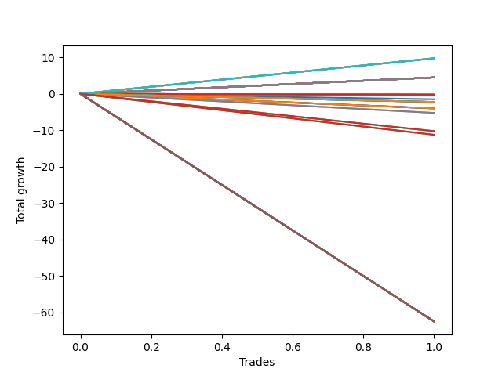

# Short Wallace 008 
- Symbol: NQ
- Date Range: 3/18/22 - 6/24/22
- Trading Period: 7:20-12:30
- Number of Trades: 7


| Name | Win Percent | Profit | Avg Profit / Trade |     | Name | Win Percent | Profit | Avg Profit / Trade |
| ---- | ----------- | ------ | ------------------ | --- | ---- | ----------- | ------ | ------------------ |
| Sorted By <br> Profit | | | | | Sorted By <br> Win Percentage ||||
| Three | 85.71 | 11651125.00 | 1664446.43 |     | One | 100.00 | 11629875.00 | 1661410.71 |
| Thirty-Six | 71.43 | 11638125.00 | 1662589.29 |     | Eighteen | 100.00 | 11628000.00 | 1661142.86 |
| One | 100.00 | 11629875.00 | 1661410.71 |     | Three | 85.71 | 11651125.00 | 1664446.43 |
| Eighteen | 100.00 | 11628000.00 | 1661142.86 |     | Thirty-Three | 85.71 | 11622625.00 | 1660375.00 |
| Thirty-Three | 85.71 | 11622625.00 | 1660375.00 |     | Thirty-Two | 85.71 | 11622625.00 | 1660375.00 |
| Thirty-Two | 85.71 | 11622625.00 | 1660375.00 |     | Thirty-One | 85.71 | 11622625.00 | 1660375.00 |
| Thirty-One | 85.71 | 11622625.00 | 1660375.00 |     | Thirty | 85.71 | 11622625.00 | 1660375.00 |
| Thirty | 85.71 | 11622625.00 | 1660375.00 |     | Twenty-Nine | 85.71 | 11622625.00 | 1660375.00 |
| Twenty-Nine | 85.71 | 11622625.00 | 1660375.00 |     | Twenty-Eight | 85.71 | 11622625.00 | 1660375.00 |
| Twenty-Eight | 85.71 | 11622625.00 | 1660375.00 |     | Twenty-Seven | 85.71 | 11622625.00 | 1660375.00 |
| Twenty-Seven | 85.71 | 11622625.00 | 1660375.00 |     | Twenty-Six | 85.71 | 11622625.00 | 1660375.00 |
| Twenty-Six | 85.71 | 11622625.00 | 1660375.00 |     | Twenty-Five | 85.71 | 11622625.00 | 1660375.00 |
| Twenty-Five | 85.71 | 11622625.00 | 1660375.00 |     | Twenty-Four | 85.71 | 11622625.00 | 1660375.00 |
| Twenty-Four | 85.71 | 11622625.00 | 1660375.00 |     | Four | 85.71 | 11622625.00 | 1660375.00 |
| Four | 85.71 | 11622625.00 | 1660375.00 |     | Seven | 85.71 | 11621625.00 | 1660232.14 |
| Five | 71.43 | 11622625.00 | 1660375.00 |     | Eleven | 85.71 | 11620375.00 | 1660053.57 |
| Seven | 85.71 | 11621625.00 | 1660232.14 |     | Nine | 85.71 | 11620375.00 | 1660053.57 |
| Eleven | 85.71 | 11620375.00 | 1660053.57 |     | Nineteen | 85.71 | 11620250.00 | 1660035.71 |
| Nine | 85.71 | 11620375.00 | 1660053.57 |     | Thirteen | 85.71 | 11620000.00 | 1660000.00 |
| Nineteen | 85.71 | 11620250.00 | 1660035.71 |     | Twelve | 85.71 | 11620000.00 | 1660000.00 |
| Thirteen | 85.71 | 11620000.00 | 1660000.00 |     | Six | 85.71 | 11620000.00 | 1660000.00 |
| Twelve | 85.71 | 11620000.00 | 1660000.00 |     | Seventeen | 85.71 | 11618750.00 | 1659821.43 |
| Six | 85.71 | 11620000.00 | 1660000.00 |     | Fifteen | 85.71 | 11618750.00 | 1659821.43 |
| Thirty-Five | 57.14 | 11619250.00 | 1659892.86 |     | Twenty-Three | 85.71 | 11617875.00 | 1659696.43 |
| Seventeen | 85.71 | 11618750.00 | 1659821.43 |     | Twenty-One | 85.71 | 11617875.00 | 1659696.43 |
| Fifteen | 85.71 | 11618750.00 | 1659821.43 |     | Two | 85.71 | 11608125.00 | 1658303.57 |
| Twenty-Three | 85.71 | 11617875.00 | 1659696.43 |     | Thirty-Six | 71.43 | 11638125.00 | 1662589.29 |
| Twenty-One | 85.71 | 11617875.00 | 1659696.43 |     | Five | 71.43 | 11622625.00 | 1660375.00 |
| Thirty-Four | 57.14 | 11617500.00 | 1659642.86 |     | Sixteen | 71.43 | 11613000.00 | 1659000.00 |
| Sixteen | 71.43 | 11613000.00 | 1659000.00 |     | Fourteen | 71.43 | 11613000.00 | 1659000.00 |
| Fourteen | 71.43 | 11613000.00 | 1659000.00 |     | Ten | 71.43 | 11613000.00 | 1659000.00 |
| Ten | 71.43 | 11613000.00 | 1659000.00 |     | Eight | 71.43 | 11613000.00 | 1659000.00 |
| Eight | 71.43 | 11613000.00 | 1659000.00 |     | Twenty-Two | 71.43 | 11612125.00 | 1658875.00 |
| Twenty-Two | 71.43 | 11612125.00 | 1658875.00 |     | Twenty | 71.43 | 11612125.00 | 1658875.00 |
| Twenty | 71.43 | 11612125.00 | 1658875.00 |     | Thirty-Five | 57.14 | 11619250.00 | 1659892.86 |
| Two | 85.71 | 11608125.00 | 1658303.57 |     | Thirty-Four | 57.14 | 11617500.00 | 1659642.86 |

### Test One
* Sell when price hits the middle line of the 20p bollinger
* No Stoploss
* Results:
```
Total Trades: 7
Percent Up: 0.00
Percent Down: 100.00
Total Points Moved Down: 23259.75
Potential Profit: 11629875.00
Total Points Ups: 0.00 Count Ups: 0
Total Points Downs: 23259.75 Count Downs: 7
```

<details><summary>Trades</summary>

<code>In: 2022-04-20 09:55:00		Out: 2022-04-20 09:58:05		Total Position Time: 03:05		Total Move Down: 11.00		Total to Date: -11.00</code> <br />
<code>In: 2022-04-26 10:02:00		Out: 2022-04-26 10:02:15		Total Position Time: 00:15		Total Move Down: 9.50		Total to Date: -20.50</code> <br />
<code>In: 2022-05-09 12:04:00		Out: 2022-05-09 12:09:20		Total Position Time: 05:20		Total Move Down: 9.00		Total to Date: -29.50</code> <br />
<code>In: 2022-05-24 08:32:00		Out: 2022-05-24 08:32:15		Total Position Time: 00:15		Total Move Down: 8.00		Total to Date: -37.50</code> <br />
<code>In: 2022-06-10 10:53:00		Out: 2022-06-10 10:53:10		Total Position Time: 00:10		Total Move Down: 8002.50		Total to Date: -8040.00</code> <br />
<code>In: 2022-06-13 09:15:00		Out: 2022-06-13 09:15:10		Total Position Time: 00:10		Total Move Down: 7638.00		Total to Date: -15678.00</code> <br />
<code>In: 2022-06-14 10:03:00		Out: 2022-06-14 10:03:10		Total Position Time: 00:10		Total Move Down: 7581.75		Total to Date: -23259.75</code> <br />


</details>

### Test Two
* Sell when the price hits the lower line of the 20p 1std bollinger
* No Stoploss
* Results:
```
Total Trades: 7
Percent Up: 14.29
Percent Down: 85.71
Total Points Moved Down: 23216.25
Potential Profit: 11608125.00
Total Points Ups: 55.50 Count Ups: 1
Total Points Downs: 23271.75 Count Downs: 6
```

<details><summary>Trades</summary>

<code>In: 2022-04-20 09:55:00		Out: 2022-04-20 10:08:15		Total Position Time: 13:15		Total Move Down: 12.75		Total to Date: -12.75</code> <br />
<code>In: 2022-04-26 10:02:00		Out: 2022-04-26 10:02:50		Total Position Time: 00:50		Total Move Down: 27.75		Total to Date: -40.50</code> <br />
<code>In: 2022-05-09 12:04:00		Out: 2022-05-09 12:18:00		Total Position Time: 14:00		Total Move Down: 9.00		Total to Date: -49.50</code> <br />
<code>In: 2022-05-24 08:32:00		Out: 2022-05-24 09:01:55		Total Position Time: 29:55		Total Move Down: -55.50		Total to Date: 6.00</code> <br />
<code>In: 2022-06-10 10:53:00		Out: 2022-06-10 10:53:10		Total Position Time: 00:10		Total Move Down: 8002.50		Total to Date: -7996.50</code> <br />
<code>In: 2022-06-13 09:15:00		Out: 2022-06-13 09:15:10		Total Position Time: 00:10		Total Move Down: 7638.00		Total to Date: -15634.50</code> <br />
<code>In: 2022-06-14 10:03:00		Out: 2022-06-14 10:03:10		Total Position Time: 00:10		Total Move Down: 7581.75		Total to Date: -23216.25</code> <br />


</details>

### Test Three
* Sell when the price hits the lower line of the 20p 2std bollinger
* No Stoploss
* Results:
```
Total Trades: 7
Percent Up: 14.29
Percent Down: 85.71
Total Points Moved Down: 23302.25
Potential Profit: 11651125.00
Total Points Ups: 55.50 Count Ups: 1
Total Points Downs: 23357.75 Count Downs: 6
```

<details><summary>Trades</summary>

<code>In: 2022-04-20 09:55:00		Out: 2022-04-20 10:08:35		Total Position Time: 13:35		Total Move Down: 21.00		Total to Date: -21.00</code> <br />
<code>In: 2022-04-26 10:02:00		Out: 2022-04-26 10:31:55		Total Position Time: 29:55		Total Move Down: 81.25		Total to Date: -102.25</code> <br />
<code>In: 2022-05-09 12:04:00		Out: 2022-05-09 12:20:45		Total Position Time: 16:45		Total Move Down: 33.25		Total to Date: -135.50</code> <br />
<code>In: 2022-05-24 08:32:00		Out: 2022-05-24 09:01:55		Total Position Time: 29:55		Total Move Down: -55.50		Total to Date: -80.00</code> <br />
<code>In: 2022-06-10 10:53:00		Out: 2022-06-10 10:53:10		Total Position Time: 00:10		Total Move Down: 8002.50		Total to Date: -8082.50</code> <br />
<code>In: 2022-06-13 09:15:00		Out: 2022-06-13 09:15:10		Total Position Time: 00:10		Total Move Down: 7638.00		Total to Date: -15720.50</code> <br />
<code>In: 2022-06-14 10:03:00		Out: 2022-06-14 10:03:10		Total Position Time: 00:10		Total Move Down: 7581.75		Total to Date: -23302.25</code> <br />


</details>

### Test Four
* Sell when the price hits the middle line of the 1std VWAP
* No Stoploss
* Results:
```
Total Trades: 7
Percent Up: 14.29
Percent Down: 85.71
Total Points Moved Down: 23245.25
Potential Profit: 11622625.00
Total Points Ups: 2.75 Count Ups: 1
Total Points Downs: 23248.00 Count Downs: 6
```

<details><summary>Trades</summary>

<code>In: 2022-04-20 09:55:00		Out: 2022-04-20 09:55:10		Total Position Time: 00:10		Total Move Down: -2.75		Total to Date: 2.75</code> <br />
<code>In: 2022-04-26 10:02:00		Out: 2022-04-26 10:02:10		Total Position Time: 00:10		Total Move Down: 9.25		Total to Date: -6.50</code> <br />
<code>In: 2022-05-09 12:04:00		Out: 2022-05-09 12:04:10		Total Position Time: 00:10		Total Move Down: 9.75		Total to Date: -16.25</code> <br />
<code>In: 2022-05-24 08:32:00		Out: 2022-05-24 08:32:10		Total Position Time: 00:10		Total Move Down: 6.75		Total to Date: -23.00</code> <br />
<code>In: 2022-06-10 10:53:00		Out: 2022-06-10 10:53:10		Total Position Time: 00:10		Total Move Down: 8002.50		Total to Date: -8025.50</code> <br />
<code>In: 2022-06-13 09:15:00		Out: 2022-06-13 09:15:10		Total Position Time: 00:10		Total Move Down: 7638.00		Total to Date: -15663.50</code> <br />
<code>In: 2022-06-14 10:03:00		Out: 2022-06-14 10:03:10		Total Position Time: 00:10		Total Move Down: 7581.75		Total to Date: -23245.25</code> <br />


</details>

### Test Five
* Sell when the price hits the lower line of the 1std VWAP
* No Stoploss
* Results:
```
Total Trades: 7
Percent Up: 28.57
Percent Down: 71.43
Total Points Moved Down: 23245.25
Potential Profit: 11622625.00
Total Points Ups: 73.75 Count Ups: 2
Total Points Downs: 23319.00 Count Downs: 5
```

<details><summary>Trades</summary>

<code>In: 2022-04-20 09:55:00		Out: 2022-04-20 10:24:55		Total Position Time: 29:55		Total Move Down: -18.25		Total to Date: 18.25</code> <br />
<code>In: 2022-04-26 10:02:00		Out: 2022-04-26 10:14:55		Total Position Time: 12:55		Total Move Down: 63.50		Total to Date: -45.25</code> <br />
<code>In: 2022-05-09 12:04:00		Out: 2022-05-09 12:20:45		Total Position Time: 16:45		Total Move Down: 33.25		Total to Date: -78.50</code> <br />
<code>In: 2022-05-24 08:32:00		Out: 2022-05-24 09:01:55		Total Position Time: 29:55		Total Move Down: -55.50		Total to Date: -23.00</code> <br />
<code>In: 2022-06-10 10:53:00		Out: 2022-06-10 10:53:10		Total Position Time: 00:10		Total Move Down: 8002.50		Total to Date: -8025.50</code> <br />
<code>In: 2022-06-13 09:15:00		Out: 2022-06-13 09:15:10		Total Position Time: 00:10		Total Move Down: 7638.00		Total to Date: -15663.50</code> <br />
<code>In: 2022-06-14 10:03:00		Out: 2022-06-14 10:03:10		Total Position Time: 00:10		Total Move Down: 7581.75		Total to Date: -23245.25</code> <br />


</details>

### Test Six
* Sell when the price hits the middle line of the 20p bollinger
* Stoploss is -2 points
* Results:
```
Total Trades: 7
Percent Up: 14.29
Percent Down: 85.71
Total Points Moved Down: 23240.00
Potential Profit: 11620000.00
Total Points Ups: 6.00 Count Ups: 1
Total Points Downs: 23246.00 Count Downs: 6
```

<details><summary>Trades</summary>

<code>In: 2022-04-20 09:55:00		Out: 2022-04-20 09:56:10		Total Position Time: 01:10		Total Move Down: -6.00		Total to Date: 6.00</code> <br />
<code>In: 2022-04-26 10:02:00		Out: 2022-04-26 10:02:10		Total Position Time: 00:10		Total Move Down: 9.25		Total to Date: -3.25</code> <br />
<code>In: 2022-05-09 12:04:00		Out: 2022-05-09 12:04:25		Total Position Time: 00:25		Total Move Down: 6.50		Total to Date: -9.75</code> <br />
<code>In: 2022-05-24 08:32:00		Out: 2022-05-24 08:32:15		Total Position Time: 00:15		Total Move Down: 8.00		Total to Date: -17.75</code> <br />
<code>In: 2022-06-10 10:53:00		Out: 2022-06-10 10:53:10		Total Position Time: 00:10		Total Move Down: 8002.50		Total to Date: -8020.25</code> <br />
<code>In: 2022-06-13 09:15:00		Out: 2022-06-13 09:15:10		Total Position Time: 00:10		Total Move Down: 7638.00		Total to Date: -15658.25</code> <br />
<code>In: 2022-06-14 10:03:00		Out: 2022-06-14 10:03:10		Total Position Time: 00:10		Total Move Down: 7581.75		Total to Date: -23240.00</code> <br />


</details>

### Test Seven
* Sell when the price hits the middle line of the 20p bollinger
* Trailing Stop is -2 points
* Results:
```
Total Trades: 7
Percent Up: 14.29
Percent Down: 85.71
Total Points Moved Down: 23243.25
Potential Profit: 11621625.00
Total Points Ups: 2.75 Count Ups: 1
Total Points Downs: 23246.00 Count Downs: 6
```

<details><summary>Trades</summary>

<code>In: 2022-04-20 09:55:00		Out: 2022-04-20 09:55:35		Total Position Time: 00:35		Total Move Down: -2.75		Total to Date: 2.75</code> <br />
<code>In: 2022-04-26 10:02:00		Out: 2022-04-26 10:02:10		Total Position Time: 00:10		Total Move Down: 9.25		Total to Date: -6.50</code> <br />
<code>In: 2022-05-09 12:04:00		Out: 2022-05-09 12:04:25		Total Position Time: 00:25		Total Move Down: 6.50		Total to Date: -13.00</code> <br />
<code>In: 2022-05-24 08:32:00		Out: 2022-05-24 08:32:15		Total Position Time: 00:15		Total Move Down: 8.00		Total to Date: -21.00</code> <br />
<code>In: 2022-06-10 10:53:00		Out: 2022-06-10 10:53:10		Total Position Time: 00:10		Total Move Down: 8002.50		Total to Date: -8023.50</code> <br />
<code>In: 2022-06-13 09:15:00		Out: 2022-06-13 09:15:10		Total Position Time: 00:10		Total Move Down: 7638.00		Total to Date: -15661.50</code> <br />
<code>In: 2022-06-14 10:03:00		Out: 2022-06-14 10:03:10		Total Position Time: 00:10		Total Move Down: 7581.75		Total to Date: -23243.25</code> <br />


</details>

### Test Eight
* Sell when the price hits the lower line of the 20p 1std bollinger
* Stoploss is -2 points
* Results:
```
Total Trades: 7
Percent Up: 28.57
Percent Down: 71.43
Total Points Moved Down: 23226.00
Potential Profit: 11613000.00
Total Points Ups: 12.00 Count Ups: 2
Total Points Downs: 23238.00 Count Downs: 5
```

<details><summary>Trades</summary>

<code>In: 2022-04-20 09:55:00		Out: 2022-04-20 09:56:10		Total Position Time: 01:10		Total Move Down: -6.00		Total to Date: 6.00</code> <br />
<code>In: 2022-04-26 10:02:00		Out: 2022-04-26 10:02:10		Total Position Time: 00:10		Total Move Down: 9.25		Total to Date: -3.25</code> <br />
<code>In: 2022-05-09 12:04:00		Out: 2022-05-09 12:04:25		Total Position Time: 00:25		Total Move Down: 6.50		Total to Date: -9.75</code> <br />
<code>In: 2022-05-24 08:32:00		Out: 2022-05-24 08:33:15		Total Position Time: 01:15		Total Move Down: -6.00		Total to Date: -3.75</code> <br />
<code>In: 2022-06-10 10:53:00		Out: 2022-06-10 10:53:10		Total Position Time: 00:10		Total Move Down: 8002.50		Total to Date: -8006.25</code> <br />
<code>In: 2022-06-13 09:15:00		Out: 2022-06-13 09:15:10		Total Position Time: 00:10		Total Move Down: 7638.00		Total to Date: -15644.25</code> <br />
<code>In: 2022-06-14 10:03:00		Out: 2022-06-14 10:03:10		Total Position Time: 00:10		Total Move Down: 7581.75		Total to Date: -23226.00</code> <br />


</details>

### Test Nine
* Sell when the price hits the lower line of the 20p 1std bollinger
* Trailing Stop is -2 points
* Results:
```
Total Trades: 7
Percent Up: 14.29
Percent Down: 85.71
Total Points Moved Down: 23240.75
Potential Profit: 11620375.00
Total Points Ups: 2.75 Count Ups: 1
Total Points Downs: 23243.50 Count Downs: 6
```

<details><summary>Trades</summary>

<code>In: 2022-04-20 09:55:00		Out: 2022-04-20 09:55:35		Total Position Time: 00:35		Total Move Down: -2.75		Total to Date: 2.75</code> <br />
<code>In: 2022-04-26 10:02:00		Out: 2022-04-26 10:02:10		Total Position Time: 00:10		Total Move Down: 9.25		Total to Date: -6.50</code> <br />
<code>In: 2022-05-09 12:04:00		Out: 2022-05-09 12:04:25		Total Position Time: 00:25		Total Move Down: 6.50		Total to Date: -13.00</code> <br />
<code>In: 2022-05-24 08:32:00		Out: 2022-05-24 08:32:35		Total Position Time: 00:35		Total Move Down: 5.50		Total to Date: -18.50</code> <br />
<code>In: 2022-06-10 10:53:00		Out: 2022-06-10 10:53:10		Total Position Time: 00:10		Total Move Down: 8002.50		Total to Date: -8021.00</code> <br />
<code>In: 2022-06-13 09:15:00		Out: 2022-06-13 09:15:10		Total Position Time: 00:10		Total Move Down: 7638.00		Total to Date: -15659.00</code> <br />
<code>In: 2022-06-14 10:03:00		Out: 2022-06-14 10:03:10		Total Position Time: 00:10		Total Move Down: 7581.75		Total to Date: -23240.75</code> <br />


</details>

### Test Ten
* Sell when the price hits the lower line of the 20p 2std bollinger
* Stoploss is -2 points
* Results:
```
Total Trades: 7
Percent Up: 28.57
Percent Down: 71.43
Total Points Moved Down: 23226.00
Potential Profit: 11613000.00
Total Points Ups: 12.00 Count Ups: 2
Total Points Downs: 23238.00 Count Downs: 5
```

<details><summary>Trades</summary>

<code>In: 2022-04-20 09:55:00		Out: 2022-04-20 09:56:10		Total Position Time: 01:10		Total Move Down: -6.00		Total to Date: 6.00</code> <br />
<code>In: 2022-04-26 10:02:00		Out: 2022-04-26 10:02:10		Total Position Time: 00:10		Total Move Down: 9.25		Total to Date: -3.25</code> <br />
<code>In: 2022-05-09 12:04:00		Out: 2022-05-09 12:04:25		Total Position Time: 00:25		Total Move Down: 6.50		Total to Date: -9.75</code> <br />
<code>In: 2022-05-24 08:32:00		Out: 2022-05-24 08:33:15		Total Position Time: 01:15		Total Move Down: -6.00		Total to Date: -3.75</code> <br />
<code>In: 2022-06-10 10:53:00		Out: 2022-06-10 10:53:10		Total Position Time: 00:10		Total Move Down: 8002.50		Total to Date: -8006.25</code> <br />
<code>In: 2022-06-13 09:15:00		Out: 2022-06-13 09:15:10		Total Position Time: 00:10		Total Move Down: 7638.00		Total to Date: -15644.25</code> <br />
<code>In: 2022-06-14 10:03:00		Out: 2022-06-14 10:03:10		Total Position Time: 00:10		Total Move Down: 7581.75		Total to Date: -23226.00</code> <br />


</details>

### Test Eleven
* Sell when the price hits the lower line of the 20p 2std bollinger
* Trailing Stop is -2 points
* Results:
```
Total Trades: 7
Percent Up: 14.29
Percent Down: 85.71
Total Points Moved Down: 23240.75
Potential Profit: 11620375.00
Total Points Ups: 2.75 Count Ups: 1
Total Points Downs: 23243.50 Count Downs: 6
```

<details><summary>Trades</summary>

<code>In: 2022-04-20 09:55:00		Out: 2022-04-20 09:55:35		Total Position Time: 00:35		Total Move Down: -2.75		Total to Date: 2.75</code> <br />
<code>In: 2022-04-26 10:02:00		Out: 2022-04-26 10:02:10		Total Position Time: 00:10		Total Move Down: 9.25		Total to Date: -6.50</code> <br />
<code>In: 2022-05-09 12:04:00		Out: 2022-05-09 12:04:25		Total Position Time: 00:25		Total Move Down: 6.50		Total to Date: -13.00</code> <br />
<code>In: 2022-05-24 08:32:00		Out: 2022-05-24 08:32:35		Total Position Time: 00:35		Total Move Down: 5.50		Total to Date: -18.50</code> <br />
<code>In: 2022-06-10 10:53:00		Out: 2022-06-10 10:53:10		Total Position Time: 00:10		Total Move Down: 8002.50		Total to Date: -8021.00</code> <br />
<code>In: 2022-06-13 09:15:00		Out: 2022-06-13 09:15:10		Total Position Time: 00:10		Total Move Down: 7638.00		Total to Date: -15659.00</code> <br />
<code>In: 2022-06-14 10:03:00		Out: 2022-06-14 10:03:10		Total Position Time: 00:10		Total Move Down: 7581.75		Total to Date: -23240.75</code> <br />


</details>

### Test Twelve
* Sell when the price hits the middle line of the 20p bollinger
* Stoploss is -3 points
* Results:
```
Total Trades: 7
Percent Up: 14.29
Percent Down: 85.71
Total Points Moved Down: 23240.00
Potential Profit: 11620000.00
Total Points Ups: 6.00 Count Ups: 1
Total Points Downs: 23246.00 Count Downs: 6
```

<details><summary>Trades</summary>

<code>In: 2022-04-20 09:55:00		Out: 2022-04-20 09:56:10		Total Position Time: 01:10		Total Move Down: -6.00		Total to Date: 6.00</code> <br />
<code>In: 2022-04-26 10:02:00		Out: 2022-04-26 10:02:10		Total Position Time: 00:10		Total Move Down: 9.25		Total to Date: -3.25</code> <br />
<code>In: 2022-05-09 12:04:00		Out: 2022-05-09 12:04:25		Total Position Time: 00:25		Total Move Down: 6.50		Total to Date: -9.75</code> <br />
<code>In: 2022-05-24 08:32:00		Out: 2022-05-24 08:32:15		Total Position Time: 00:15		Total Move Down: 8.00		Total to Date: -17.75</code> <br />
<code>In: 2022-06-10 10:53:00		Out: 2022-06-10 10:53:10		Total Position Time: 00:10		Total Move Down: 8002.50		Total to Date: -8020.25</code> <br />
<code>In: 2022-06-13 09:15:00		Out: 2022-06-13 09:15:10		Total Position Time: 00:10		Total Move Down: 7638.00		Total to Date: -15658.25</code> <br />
<code>In: 2022-06-14 10:03:00		Out: 2022-06-14 10:03:10		Total Position Time: 00:10		Total Move Down: 7581.75		Total to Date: -23240.00</code> <br />


</details>

### Test Thirteen
* Sell when the price hits the middle line of the 20p bollinger
* Trailing Stop is -3 points
* Results:
```
Total Trades: 7
Percent Up: 14.29
Percent Down: 85.71
Total Points Moved Down: 23240.00
Potential Profit: 11620000.00
Total Points Ups: 6.00 Count Ups: 1
Total Points Downs: 23246.00 Count Downs: 6
```

<details><summary>Trades</summary>

<code>In: 2022-04-20 09:55:00		Out: 2022-04-20 09:56:10		Total Position Time: 01:10		Total Move Down: -6.00		Total to Date: 6.00</code> <br />
<code>In: 2022-04-26 10:02:00		Out: 2022-04-26 10:02:10		Total Position Time: 00:10		Total Move Down: 9.25		Total to Date: -3.25</code> <br />
<code>In: 2022-05-09 12:04:00		Out: 2022-05-09 12:04:25		Total Position Time: 00:25		Total Move Down: 6.50		Total to Date: -9.75</code> <br />
<code>In: 2022-05-24 08:32:00		Out: 2022-05-24 08:32:15		Total Position Time: 00:15		Total Move Down: 8.00		Total to Date: -17.75</code> <br />
<code>In: 2022-06-10 10:53:00		Out: 2022-06-10 10:53:10		Total Position Time: 00:10		Total Move Down: 8002.50		Total to Date: -8020.25</code> <br />
<code>In: 2022-06-13 09:15:00		Out: 2022-06-13 09:15:10		Total Position Time: 00:10		Total Move Down: 7638.00		Total to Date: -15658.25</code> <br />
<code>In: 2022-06-14 10:03:00		Out: 2022-06-14 10:03:10		Total Position Time: 00:10		Total Move Down: 7581.75		Total to Date: -23240.00</code> <br />


</details>

### Test Fourteen
* Sell when the price hits the lower line of the 20p 1std bollinger
* Stoploss is -3 points
* Results:
```
Total Trades: 7
Percent Up: 28.57
Percent Down: 71.43
Total Points Moved Down: 23226.00
Potential Profit: 11613000.00
Total Points Ups: 12.00 Count Ups: 2
Total Points Downs: 23238.00 Count Downs: 5
```

<details><summary>Trades</summary>

<code>In: 2022-04-20 09:55:00		Out: 2022-04-20 09:56:10		Total Position Time: 01:10		Total Move Down: -6.00		Total to Date: 6.00</code> <br />
<code>In: 2022-04-26 10:02:00		Out: 2022-04-26 10:02:10		Total Position Time: 00:10		Total Move Down: 9.25		Total to Date: -3.25</code> <br />
<code>In: 2022-05-09 12:04:00		Out: 2022-05-09 12:04:25		Total Position Time: 00:25		Total Move Down: 6.50		Total to Date: -9.75</code> <br />
<code>In: 2022-05-24 08:32:00		Out: 2022-05-24 08:33:15		Total Position Time: 01:15		Total Move Down: -6.00		Total to Date: -3.75</code> <br />
<code>In: 2022-06-10 10:53:00		Out: 2022-06-10 10:53:10		Total Position Time: 00:10		Total Move Down: 8002.50		Total to Date: -8006.25</code> <br />
<code>In: 2022-06-13 09:15:00		Out: 2022-06-13 09:15:10		Total Position Time: 00:10		Total Move Down: 7638.00		Total to Date: -15644.25</code> <br />
<code>In: 2022-06-14 10:03:00		Out: 2022-06-14 10:03:10		Total Position Time: 00:10		Total Move Down: 7581.75		Total to Date: -23226.00</code> <br />


</details>

### Test Fifteen
* Sell when the price hits the lower line of the 20p 1std bollinger
* Trailing Stop is -3 points
* Results:
```
Total Trades: 7
Percent Up: 14.29
Percent Down: 85.71
Total Points Moved Down: 23237.50
Potential Profit: 11618750.00
Total Points Ups: 6.00 Count Ups: 1
Total Points Downs: 23243.50 Count Downs: 6
```

<details><summary>Trades</summary>

<code>In: 2022-04-20 09:55:00		Out: 2022-04-20 09:56:10		Total Position Time: 01:10		Total Move Down: -6.00		Total to Date: 6.00</code> <br />
<code>In: 2022-04-26 10:02:00		Out: 2022-04-26 10:02:10		Total Position Time: 00:10		Total Move Down: 9.25		Total to Date: -3.25</code> <br />
<code>In: 2022-05-09 12:04:00		Out: 2022-05-09 12:04:25		Total Position Time: 00:25		Total Move Down: 6.50		Total to Date: -9.75</code> <br />
<code>In: 2022-05-24 08:32:00		Out: 2022-05-24 08:32:35		Total Position Time: 00:35		Total Move Down: 5.50		Total to Date: -15.25</code> <br />
<code>In: 2022-06-10 10:53:00		Out: 2022-06-10 10:53:10		Total Position Time: 00:10		Total Move Down: 8002.50		Total to Date: -8017.75</code> <br />
<code>In: 2022-06-13 09:15:00		Out: 2022-06-13 09:15:10		Total Position Time: 00:10		Total Move Down: 7638.00		Total to Date: -15655.75</code> <br />
<code>In: 2022-06-14 10:03:00		Out: 2022-06-14 10:03:10		Total Position Time: 00:10		Total Move Down: 7581.75		Total to Date: -23237.50</code> <br />


</details>

### Test Sixteen
* Sell when the price hits the lower line of the 20p 2std bollinger
* Stoploss is -3 points
* Results:
```
Total Trades: 7
Percent Up: 28.57
Percent Down: 71.43
Total Points Moved Down: 23226.00
Potential Profit: 11613000.00
Total Points Ups: 12.00 Count Ups: 2
Total Points Downs: 23238.00 Count Downs: 5
```

<details><summary>Trades</summary>

<code>In: 2022-04-20 09:55:00		Out: 2022-04-20 09:56:10		Total Position Time: 01:10		Total Move Down: -6.00		Total to Date: 6.00</code> <br />
<code>In: 2022-04-26 10:02:00		Out: 2022-04-26 10:02:10		Total Position Time: 00:10		Total Move Down: 9.25		Total to Date: -3.25</code> <br />
<code>In: 2022-05-09 12:04:00		Out: 2022-05-09 12:04:25		Total Position Time: 00:25		Total Move Down: 6.50		Total to Date: -9.75</code> <br />
<code>In: 2022-05-24 08:32:00		Out: 2022-05-24 08:33:15		Total Position Time: 01:15		Total Move Down: -6.00		Total to Date: -3.75</code> <br />
<code>In: 2022-06-10 10:53:00		Out: 2022-06-10 10:53:10		Total Position Time: 00:10		Total Move Down: 8002.50		Total to Date: -8006.25</code> <br />
<code>In: 2022-06-13 09:15:00		Out: 2022-06-13 09:15:10		Total Position Time: 00:10		Total Move Down: 7638.00		Total to Date: -15644.25</code> <br />
<code>In: 2022-06-14 10:03:00		Out: 2022-06-14 10:03:10		Total Position Time: 00:10		Total Move Down: 7581.75		Total to Date: -23226.00</code> <br />


</details>

### Test Seventeen
* Sell when the price hits the lower line of the 20p 2std bollinger
* Trailing Stop is -3 points
* Results:
```
Total Trades: 7
Percent Up: 14.29
Percent Down: 85.71
Total Points Moved Down: 23237.50
Potential Profit: 11618750.00
Total Points Ups: 6.00 Count Ups: 1
Total Points Downs: 23243.50 Count Downs: 6
```

<details><summary>Trades</summary>

<code>In: 2022-04-20 09:55:00		Out: 2022-04-20 09:56:10		Total Position Time: 01:10		Total Move Down: -6.00		Total to Date: 6.00</code> <br />
<code>In: 2022-04-26 10:02:00		Out: 2022-04-26 10:02:10		Total Position Time: 00:10		Total Move Down: 9.25		Total to Date: -3.25</code> <br />
<code>In: 2022-05-09 12:04:00		Out: 2022-05-09 12:04:25		Total Position Time: 00:25		Total Move Down: 6.50		Total to Date: -9.75</code> <br />
<code>In: 2022-05-24 08:32:00		Out: 2022-05-24 08:32:35		Total Position Time: 00:35		Total Move Down: 5.50		Total to Date: -15.25</code> <br />
<code>In: 2022-06-10 10:53:00		Out: 2022-06-10 10:53:10		Total Position Time: 00:10		Total Move Down: 8002.50		Total to Date: -8017.75</code> <br />
<code>In: 2022-06-13 09:15:00		Out: 2022-06-13 09:15:10		Total Position Time: 00:10		Total Move Down: 7638.00		Total to Date: -15655.75</code> <br />
<code>In: 2022-06-14 10:03:00		Out: 2022-06-14 10:03:10		Total Position Time: 00:10		Total Move Down: 7581.75		Total to Date: -23237.50</code> <br />


</details>

### Test Eighteen
* Sell when the price hits the middle line of the 20p bollinger
* Stoploss is -5 points
* Results:
```
Total Trades: 7
Percent Up: 0.00
Percent Down: 100.00
Total Points Moved Down: 23256.00
Potential Profit: 11628000.00
Total Points Ups: 0.00 Count Ups: 0
Total Points Downs: 23256.00 Count Downs: 7
```

<details><summary>Trades</summary>

<code>In: 2022-04-20 09:55:00		Out: 2022-04-20 09:58:05		Total Position Time: 03:05		Total Move Down: 11.00		Total to Date: -11.00</code> <br />
<code>In: 2022-04-26 10:02:00		Out: 2022-04-26 10:02:10		Total Position Time: 00:10		Total Move Down: 9.25		Total to Date: -20.25</code> <br />
<code>In: 2022-05-09 12:04:00		Out: 2022-05-09 12:05:10		Total Position Time: 01:10		Total Move Down: 5.50		Total to Date: -25.75</code> <br />
<code>In: 2022-05-24 08:32:00		Out: 2022-05-24 08:32:15		Total Position Time: 00:15		Total Move Down: 8.00		Total to Date: -33.75</code> <br />
<code>In: 2022-06-10 10:53:00		Out: 2022-06-10 10:53:10		Total Position Time: 00:10		Total Move Down: 8002.50		Total to Date: -8036.25</code> <br />
<code>In: 2022-06-13 09:15:00		Out: 2022-06-13 09:15:10		Total Position Time: 00:10		Total Move Down: 7638.00		Total to Date: -15674.25</code> <br />
<code>In: 2022-06-14 10:03:00		Out: 2022-06-14 10:03:10		Total Position Time: 00:10		Total Move Down: 7581.75		Total to Date: -23256.00</code> <br />


</details>

### Test Nineteen
* Sell when the price hits the middle line of the 20p bollinger
* Trailing Stop is -5 points
* Results:
```
Total Trades: 7
Percent Up: 14.29
Percent Down: 85.71
Total Points Moved Down: 23240.50
Potential Profit: 11620250.00
Total Points Ups: 5.50 Count Ups: 1
Total Points Downs: 23246.00 Count Downs: 6
```

<details><summary>Trades</summary>

<code>In: 2022-04-20 09:55:00		Out: 2022-04-20 09:56:15		Total Position Time: 01:15		Total Move Down: -5.50		Total to Date: 5.50</code> <br />
<code>In: 2022-04-26 10:02:00		Out: 2022-04-26 10:02:10		Total Position Time: 00:10		Total Move Down: 9.25		Total to Date: -3.75</code> <br />
<code>In: 2022-05-09 12:04:00		Out: 2022-05-09 12:04:25		Total Position Time: 00:25		Total Move Down: 6.50		Total to Date: -10.25</code> <br />
<code>In: 2022-05-24 08:32:00		Out: 2022-05-24 08:32:15		Total Position Time: 00:15		Total Move Down: 8.00		Total to Date: -18.25</code> <br />
<code>In: 2022-06-10 10:53:00		Out: 2022-06-10 10:53:10		Total Position Time: 00:10		Total Move Down: 8002.50		Total to Date: -8020.75</code> <br />
<code>In: 2022-06-13 09:15:00		Out: 2022-06-13 09:15:10		Total Position Time: 00:10		Total Move Down: 7638.00		Total to Date: -15658.75</code> <br />
<code>In: 2022-06-14 10:03:00		Out: 2022-06-14 10:03:10		Total Position Time: 00:10		Total Move Down: 7581.75		Total to Date: -23240.50</code> <br />


</details>

### Test Twenty
* Sell when the price hits the lower line of the 20p 1std bollinger
* Stoploss is -5 points
* Results:
```
Total Trades: 7
Percent Up: 28.57
Percent Down: 71.43
Total Points Moved Down: 23224.25
Potential Profit: 11612125.00
Total Points Ups: 12.75 Count Ups: 2
Total Points Downs: 23237.00 Count Downs: 5
```

<details><summary>Trades</summary>

<code>In: 2022-04-20 09:55:00		Out: 2022-04-20 10:03:00		Total Position Time: 08:00		Total Move Down: -6.75		Total to Date: 6.75</code> <br />
<code>In: 2022-04-26 10:02:00		Out: 2022-04-26 10:02:10		Total Position Time: 00:10		Total Move Down: 9.25		Total to Date: -2.50</code> <br />
<code>In: 2022-05-09 12:04:00		Out: 2022-05-09 12:05:10		Total Position Time: 01:10		Total Move Down: 5.50		Total to Date: -8.00</code> <br />
<code>In: 2022-05-24 08:32:00		Out: 2022-05-24 08:33:15		Total Position Time: 01:15		Total Move Down: -6.00		Total to Date: -2.00</code> <br />
<code>In: 2022-06-10 10:53:00		Out: 2022-06-10 10:53:10		Total Position Time: 00:10		Total Move Down: 8002.50		Total to Date: -8004.50</code> <br />
<code>In: 2022-06-13 09:15:00		Out: 2022-06-13 09:15:10		Total Position Time: 00:10		Total Move Down: 7638.00		Total to Date: -15642.50</code> <br />
<code>In: 2022-06-14 10:03:00		Out: 2022-06-14 10:03:10		Total Position Time: 00:10		Total Move Down: 7581.75		Total to Date: -23224.25</code> <br />


</details>

### Test Twenty-One
* Sell when the price hits the lower line of the 20p 1std bollinger
* Trailing Stop is -5 points
* Results:
```
Total Trades: 7
Percent Up: 14.29
Percent Down: 85.71
Total Points Moved Down: 23235.75
Potential Profit: 11617875.00
Total Points Ups: 5.50 Count Ups: 1
Total Points Downs: 23241.25 Count Downs: 6
```

<details><summary>Trades</summary>

<code>In: 2022-04-20 09:55:00		Out: 2022-04-20 09:56:15		Total Position Time: 01:15		Total Move Down: -5.50		Total to Date: 5.50</code> <br />
<code>In: 2022-04-26 10:02:00		Out: 2022-04-26 10:02:10		Total Position Time: 00:10		Total Move Down: 9.25		Total to Date: -3.75</code> <br />
<code>In: 2022-05-09 12:04:00		Out: 2022-05-09 12:04:25		Total Position Time: 00:25		Total Move Down: 6.50		Total to Date: -10.25</code> <br />
<code>In: 2022-05-24 08:32:00		Out: 2022-05-24 08:32:45		Total Position Time: 00:45		Total Move Down: 3.25		Total to Date: -13.50</code> <br />
<code>In: 2022-06-10 10:53:00		Out: 2022-06-10 10:53:10		Total Position Time: 00:10		Total Move Down: 8002.50		Total to Date: -8016.00</code> <br />
<code>In: 2022-06-13 09:15:00		Out: 2022-06-13 09:15:10		Total Position Time: 00:10		Total Move Down: 7638.00		Total to Date: -15654.00</code> <br />
<code>In: 2022-06-14 10:03:00		Out: 2022-06-14 10:03:10		Total Position Time: 00:10		Total Move Down: 7581.75		Total to Date: -23235.75</code> <br />


</details>

### Test Twenty-Two
* Sell when the price hits the lower line of the 20p 2std bollinger
* Stoploss is -5 points
* Results:
```
Total Trades: 7
Percent Up: 28.57
Percent Down: 71.43
Total Points Moved Down: 23224.25
Potential Profit: 11612125.00
Total Points Ups: 12.75 Count Ups: 2
Total Points Downs: 23237.00 Count Downs: 5
```

<details><summary>Trades</summary>

<code>In: 2022-04-20 09:55:00		Out: 2022-04-20 10:03:00		Total Position Time: 08:00		Total Move Down: -6.75		Total to Date: 6.75</code> <br />
<code>In: 2022-04-26 10:02:00		Out: 2022-04-26 10:02:10		Total Position Time: 00:10		Total Move Down: 9.25		Total to Date: -2.50</code> <br />
<code>In: 2022-05-09 12:04:00		Out: 2022-05-09 12:05:10		Total Position Time: 01:10		Total Move Down: 5.50		Total to Date: -8.00</code> <br />
<code>In: 2022-05-24 08:32:00		Out: 2022-05-24 08:33:15		Total Position Time: 01:15		Total Move Down: -6.00		Total to Date: -2.00</code> <br />
<code>In: 2022-06-10 10:53:00		Out: 2022-06-10 10:53:10		Total Position Time: 00:10		Total Move Down: 8002.50		Total to Date: -8004.50</code> <br />
<code>In: 2022-06-13 09:15:00		Out: 2022-06-13 09:15:10		Total Position Time: 00:10		Total Move Down: 7638.00		Total to Date: -15642.50</code> <br />
<code>In: 2022-06-14 10:03:00		Out: 2022-06-14 10:03:10		Total Position Time: 00:10		Total Move Down: 7581.75		Total to Date: -23224.25</code> <br />


</details>

### Test Twenty-Three
* Sell when the price hits the lower line of the 20p 2std bollinger
* Trailing Stop is -5 points
* Results:
```
Total Trades: 7
Percent Up: 14.29
Percent Down: 85.71
Total Points Moved Down: 23235.75
Potential Profit: 11617875.00
Total Points Ups: 5.50 Count Ups: 1
Total Points Downs: 23241.25 Count Downs: 6
```

<details><summary>Trades</summary>

<code>In: 2022-04-20 09:55:00		Out: 2022-04-20 09:56:15		Total Position Time: 01:15		Total Move Down: -5.50		Total to Date: 5.50</code> <br />
<code>In: 2022-04-26 10:02:00		Out: 2022-04-26 10:02:10		Total Position Time: 00:10		Total Move Down: 9.25		Total to Date: -3.75</code> <br />
<code>In: 2022-05-09 12:04:00		Out: 2022-05-09 12:04:25		Total Position Time: 00:25		Total Move Down: 6.50		Total to Date: -10.25</code> <br />
<code>In: 2022-05-24 08:32:00		Out: 2022-05-24 08:32:45		Total Position Time: 00:45		Total Move Down: 3.25		Total to Date: -13.50</code> <br />
<code>In: 2022-06-10 10:53:00		Out: 2022-06-10 10:53:10		Total Position Time: 00:10		Total Move Down: 8002.50		Total to Date: -8016.00</code> <br />
<code>In: 2022-06-13 09:15:00		Out: 2022-06-13 09:15:10		Total Position Time: 00:10		Total Move Down: 7638.00		Total to Date: -15654.00</code> <br />
<code>In: 2022-06-14 10:03:00		Out: 2022-06-14 10:03:10		Total Position Time: 00:10		Total Move Down: 7581.75		Total to Date: -23235.75</code> <br />


</details>

### Test Twenty-Four
* Sell when the price hits the middle line of the 20p bollinger
* Stoploss is 10 points
* Results:
```
Total Trades: 7
Percent Up: 14.29
Percent Down: 85.71
Total Points Moved Down: 23245.25
Potential Profit: 11622625.00
Total Points Ups: 2.75 Count Ups: 1
Total Points Downs: 23248.00 Count Downs: 6
```

<details><summary>Trades</summary>

<code>In: 2022-04-20 09:55:00		Out: 2022-04-20 09:55:10		Total Position Time: 00:10		Total Move Down: -2.75		Total to Date: 2.75</code> <br />
<code>In: 2022-04-26 10:02:00		Out: 2022-04-26 10:02:10		Total Position Time: 00:10		Total Move Down: 9.25		Total to Date: -6.50</code> <br />
<code>In: 2022-05-09 12:04:00		Out: 2022-05-09 12:04:10		Total Position Time: 00:10		Total Move Down: 9.75		Total to Date: -16.25</code> <br />
<code>In: 2022-05-24 08:32:00		Out: 2022-05-24 08:32:10		Total Position Time: 00:10		Total Move Down: 6.75		Total to Date: -23.00</code> <br />
<code>In: 2022-06-10 10:53:00		Out: 2022-06-10 10:53:10		Total Position Time: 00:10		Total Move Down: 8002.50		Total to Date: -8025.50</code> <br />
<code>In: 2022-06-13 09:15:00		Out: 2022-06-13 09:15:10		Total Position Time: 00:10		Total Move Down: 7638.00		Total to Date: -15663.50</code> <br />
<code>In: 2022-06-14 10:03:00		Out: 2022-06-14 10:03:10		Total Position Time: 00:10		Total Move Down: 7581.75		Total to Date: -23245.25</code> <br />


</details>

### Test Twenty-Five
* Sell when the price hits the middle line of the 20p bollinger
* Trailing Stop is 10 points
* Results:
```
Total Trades: 7
Percent Up: 14.29
Percent Down: 85.71
Total Points Moved Down: 23245.25
Potential Profit: 11622625.00
Total Points Ups: 2.75 Count Ups: 1
Total Points Downs: 23248.00 Count Downs: 6
```

<details><summary>Trades</summary>

<code>In: 2022-04-20 09:55:00		Out: 2022-04-20 09:55:10		Total Position Time: 00:10		Total Move Down: -2.75		Total to Date: 2.75</code> <br />
<code>In: 2022-04-26 10:02:00		Out: 2022-04-26 10:02:10		Total Position Time: 00:10		Total Move Down: 9.25		Total to Date: -6.50</code> <br />
<code>In: 2022-05-09 12:04:00		Out: 2022-05-09 12:04:10		Total Position Time: 00:10		Total Move Down: 9.75		Total to Date: -16.25</code> <br />
<code>In: 2022-05-24 08:32:00		Out: 2022-05-24 08:32:10		Total Position Time: 00:10		Total Move Down: 6.75		Total to Date: -23.00</code> <br />
<code>In: 2022-06-10 10:53:00		Out: 2022-06-10 10:53:10		Total Position Time: 00:10		Total Move Down: 8002.50		Total to Date: -8025.50</code> <br />
<code>In: 2022-06-13 09:15:00		Out: 2022-06-13 09:15:10		Total Position Time: 00:10		Total Move Down: 7638.00		Total to Date: -15663.50</code> <br />
<code>In: 2022-06-14 10:03:00		Out: 2022-06-14 10:03:10		Total Position Time: 00:10		Total Move Down: 7581.75		Total to Date: -23245.25</code> <br />


</details>

### Test Twenty-Six
* Sell when the price hits the lower line of the 20p 1std bollinger
* Stoploss is 10 points
* Results:
```
Total Trades: 7
Percent Up: 14.29
Percent Down: 85.71
Total Points Moved Down: 23245.25
Potential Profit: 11622625.00
Total Points Ups: 2.75 Count Ups: 1
Total Points Downs: 23248.00 Count Downs: 6
```

<details><summary>Trades</summary>

<code>In: 2022-04-20 09:55:00		Out: 2022-04-20 09:55:10		Total Position Time: 00:10		Total Move Down: -2.75		Total to Date: 2.75</code> <br />
<code>In: 2022-04-26 10:02:00		Out: 2022-04-26 10:02:10		Total Position Time: 00:10		Total Move Down: 9.25		Total to Date: -6.50</code> <br />
<code>In: 2022-05-09 12:04:00		Out: 2022-05-09 12:04:10		Total Position Time: 00:10		Total Move Down: 9.75		Total to Date: -16.25</code> <br />
<code>In: 2022-05-24 08:32:00		Out: 2022-05-24 08:32:10		Total Position Time: 00:10		Total Move Down: 6.75		Total to Date: -23.00</code> <br />
<code>In: 2022-06-10 10:53:00		Out: 2022-06-10 10:53:10		Total Position Time: 00:10		Total Move Down: 8002.50		Total to Date: -8025.50</code> <br />
<code>In: 2022-06-13 09:15:00		Out: 2022-06-13 09:15:10		Total Position Time: 00:10		Total Move Down: 7638.00		Total to Date: -15663.50</code> <br />
<code>In: 2022-06-14 10:03:00		Out: 2022-06-14 10:03:10		Total Position Time: 00:10		Total Move Down: 7581.75		Total to Date: -23245.25</code> <br />


</details>

### Test Twenty-Seven
* Sell when the price hits the lower line of the 20p 1std bollinger
* Trailing Stop is 10 points
* Results:
```
Total Trades: 7
Percent Up: 14.29
Percent Down: 85.71
Total Points Moved Down: 23245.25
Potential Profit: 11622625.00
Total Points Ups: 2.75 Count Ups: 1
Total Points Downs: 23248.00 Count Downs: 6
```

<details><summary>Trades</summary>

<code>In: 2022-04-20 09:55:00		Out: 2022-04-20 09:55:10		Total Position Time: 00:10		Total Move Down: -2.75		Total to Date: 2.75</code> <br />
<code>In: 2022-04-26 10:02:00		Out: 2022-04-26 10:02:10		Total Position Time: 00:10		Total Move Down: 9.25		Total to Date: -6.50</code> <br />
<code>In: 2022-05-09 12:04:00		Out: 2022-05-09 12:04:10		Total Position Time: 00:10		Total Move Down: 9.75		Total to Date: -16.25</code> <br />
<code>In: 2022-05-24 08:32:00		Out: 2022-05-24 08:32:10		Total Position Time: 00:10		Total Move Down: 6.75		Total to Date: -23.00</code> <br />
<code>In: 2022-06-10 10:53:00		Out: 2022-06-10 10:53:10		Total Position Time: 00:10		Total Move Down: 8002.50		Total to Date: -8025.50</code> <br />
<code>In: 2022-06-13 09:15:00		Out: 2022-06-13 09:15:10		Total Position Time: 00:10		Total Move Down: 7638.00		Total to Date: -15663.50</code> <br />
<code>In: 2022-06-14 10:03:00		Out: 2022-06-14 10:03:10		Total Position Time: 00:10		Total Move Down: 7581.75		Total to Date: -23245.25</code> <br />


</details>

### Test Twenty-Eight
* Sell when the price hits the lower line of the 20p 2std bollinger
* Stoploss is 10 points
* Results:
```
Total Trades: 7
Percent Up: 14.29
Percent Down: 85.71
Total Points Moved Down: 23245.25
Potential Profit: 11622625.00
Total Points Ups: 2.75 Count Ups: 1
Total Points Downs: 23248.00 Count Downs: 6
```

<details><summary>Trades</summary>

<code>In: 2022-04-20 09:55:00		Out: 2022-04-20 09:55:10		Total Position Time: 00:10		Total Move Down: -2.75		Total to Date: 2.75</code> <br />
<code>In: 2022-04-26 10:02:00		Out: 2022-04-26 10:02:10		Total Position Time: 00:10		Total Move Down: 9.25		Total to Date: -6.50</code> <br />
<code>In: 2022-05-09 12:04:00		Out: 2022-05-09 12:04:10		Total Position Time: 00:10		Total Move Down: 9.75		Total to Date: -16.25</code> <br />
<code>In: 2022-05-24 08:32:00		Out: 2022-05-24 08:32:10		Total Position Time: 00:10		Total Move Down: 6.75		Total to Date: -23.00</code> <br />
<code>In: 2022-06-10 10:53:00		Out: 2022-06-10 10:53:10		Total Position Time: 00:10		Total Move Down: 8002.50		Total to Date: -8025.50</code> <br />
<code>In: 2022-06-13 09:15:00		Out: 2022-06-13 09:15:10		Total Position Time: 00:10		Total Move Down: 7638.00		Total to Date: -15663.50</code> <br />
<code>In: 2022-06-14 10:03:00		Out: 2022-06-14 10:03:10		Total Position Time: 00:10		Total Move Down: 7581.75		Total to Date: -23245.25</code> <br />


</details>

### Test Twenty-Nine
* Sell when the price hits the lower line of the 20p 2std bollinger
* Trailing Stop is 10 points
* Results:
```
Total Trades: 7
Percent Up: 14.29
Percent Down: 85.71
Total Points Moved Down: 23245.25
Potential Profit: 11622625.00
Total Points Ups: 2.75 Count Ups: 1
Total Points Downs: 23248.00 Count Downs: 6
```

<details><summary>Trades</summary>

<code>In: 2022-04-20 09:55:00		Out: 2022-04-20 09:55:10		Total Position Time: 00:10		Total Move Down: -2.75		Total to Date: 2.75</code> <br />
<code>In: 2022-04-26 10:02:00		Out: 2022-04-26 10:02:10		Total Position Time: 00:10		Total Move Down: 9.25		Total to Date: -6.50</code> <br />
<code>In: 2022-05-09 12:04:00		Out: 2022-05-09 12:04:10		Total Position Time: 00:10		Total Move Down: 9.75		Total to Date: -16.25</code> <br />
<code>In: 2022-05-24 08:32:00		Out: 2022-05-24 08:32:10		Total Position Time: 00:10		Total Move Down: 6.75		Total to Date: -23.00</code> <br />
<code>In: 2022-06-10 10:53:00		Out: 2022-06-10 10:53:10		Total Position Time: 00:10		Total Move Down: 8002.50		Total to Date: -8025.50</code> <br />
<code>In: 2022-06-13 09:15:00		Out: 2022-06-13 09:15:10		Total Position Time: 00:10		Total Move Down: 7638.00		Total to Date: -15663.50</code> <br />
<code>In: 2022-06-14 10:03:00		Out: 2022-06-14 10:03:10		Total Position Time: 00:10		Total Move Down: 7581.75		Total to Date: -23245.25</code> <br />


</details>

### Test Thirty
* Sell when the price hits the middle line of the 1std VWAP
* Stoploss is 10 points
* Results:
```
Total Trades: 7
Percent Up: 14.29
Percent Down: 85.71
Total Points Moved Down: 23245.25
Potential Profit: 11622625.00
Total Points Ups: 2.75 Count Ups: 1
Total Points Downs: 23248.00 Count Downs: 6
```

<details><summary>Trades</summary>

<code>In: 2022-04-20 09:55:00		Out: 2022-04-20 09:55:10		Total Position Time: 00:10		Total Move Down: -2.75		Total to Date: 2.75</code> <br />
<code>In: 2022-04-26 10:02:00		Out: 2022-04-26 10:02:10		Total Position Time: 00:10		Total Move Down: 9.25		Total to Date: -6.50</code> <br />
<code>In: 2022-05-09 12:04:00		Out: 2022-05-09 12:04:10		Total Position Time: 00:10		Total Move Down: 9.75		Total to Date: -16.25</code> <br />
<code>In: 2022-05-24 08:32:00		Out: 2022-05-24 08:32:10		Total Position Time: 00:10		Total Move Down: 6.75		Total to Date: -23.00</code> <br />
<code>In: 2022-06-10 10:53:00		Out: 2022-06-10 10:53:10		Total Position Time: 00:10		Total Move Down: 8002.50		Total to Date: -8025.50</code> <br />
<code>In: 2022-06-13 09:15:00		Out: 2022-06-13 09:15:10		Total Position Time: 00:10		Total Move Down: 7638.00		Total to Date: -15663.50</code> <br />
<code>In: 2022-06-14 10:03:00		Out: 2022-06-14 10:03:10		Total Position Time: 00:10		Total Move Down: 7581.75		Total to Date: -23245.25</code> <br />


</details>

### Test Thirty-One
* Sell when the price hits the middle line of the 1std VWAP
* Trailing Stop is 10 points
* Results:
```
Total Trades: 7
Percent Up: 14.29
Percent Down: 85.71
Total Points Moved Down: 23245.25
Potential Profit: 11622625.00
Total Points Ups: 2.75 Count Ups: 1
Total Points Downs: 23248.00 Count Downs: 6
```

<details><summary>Trades</summary>

<code>In: 2022-04-20 09:55:00		Out: 2022-04-20 09:55:10		Total Position Time: 00:10		Total Move Down: -2.75		Total to Date: 2.75</code> <br />
<code>In: 2022-04-26 10:02:00		Out: 2022-04-26 10:02:10		Total Position Time: 00:10		Total Move Down: 9.25		Total to Date: -6.50</code> <br />
<code>In: 2022-05-09 12:04:00		Out: 2022-05-09 12:04:10		Total Position Time: 00:10		Total Move Down: 9.75		Total to Date: -16.25</code> <br />
<code>In: 2022-05-24 08:32:00		Out: 2022-05-24 08:32:10		Total Position Time: 00:10		Total Move Down: 6.75		Total to Date: -23.00</code> <br />
<code>In: 2022-06-10 10:53:00		Out: 2022-06-10 10:53:10		Total Position Time: 00:10		Total Move Down: 8002.50		Total to Date: -8025.50</code> <br />
<code>In: 2022-06-13 09:15:00		Out: 2022-06-13 09:15:10		Total Position Time: 00:10		Total Move Down: 7638.00		Total to Date: -15663.50</code> <br />
<code>In: 2022-06-14 10:03:00		Out: 2022-06-14 10:03:10		Total Position Time: 00:10		Total Move Down: 7581.75		Total to Date: -23245.25</code> <br />


</details>

### Test Thirty-Two
* Sell when the price hits the lower line of the 1std VWAP
* Stoploss is 10 points
* Results:
```
Total Trades: 7
Percent Up: 14.29
Percent Down: 85.71
Total Points Moved Down: 23245.25
Potential Profit: 11622625.00
Total Points Ups: 2.75 Count Ups: 1
Total Points Downs: 23248.00 Count Downs: 6
```

<details><summary>Trades</summary>

<code>In: 2022-04-20 09:55:00		Out: 2022-04-20 09:55:10		Total Position Time: 00:10		Total Move Down: -2.75		Total to Date: 2.75</code> <br />
<code>In: 2022-04-26 10:02:00		Out: 2022-04-26 10:02:10		Total Position Time: 00:10		Total Move Down: 9.25		Total to Date: -6.50</code> <br />
<code>In: 2022-05-09 12:04:00		Out: 2022-05-09 12:04:10		Total Position Time: 00:10		Total Move Down: 9.75		Total to Date: -16.25</code> <br />
<code>In: 2022-05-24 08:32:00		Out: 2022-05-24 08:32:10		Total Position Time: 00:10		Total Move Down: 6.75		Total to Date: -23.00</code> <br />
<code>In: 2022-06-10 10:53:00		Out: 2022-06-10 10:53:10		Total Position Time: 00:10		Total Move Down: 8002.50		Total to Date: -8025.50</code> <br />
<code>In: 2022-06-13 09:15:00		Out: 2022-06-13 09:15:10		Total Position Time: 00:10		Total Move Down: 7638.00		Total to Date: -15663.50</code> <br />
<code>In: 2022-06-14 10:03:00		Out: 2022-06-14 10:03:10		Total Position Time: 00:10		Total Move Down: 7581.75		Total to Date: -23245.25</code> <br />


</details>

### Test Thirty-Three
* Sell when the price hits the lower line of the 1std VWAP
* Trailing Stop is 10 points
* Results:
```
Total Trades: 7
Percent Up: 14.29
Percent Down: 85.71
Total Points Moved Down: 23245.25
Potential Profit: 11622625.00
Total Points Ups: 2.75 Count Ups: 1
Total Points Downs: 23248.00 Count Downs: 6
```

<details><summary>Trades</summary>

<code>In: 2022-04-20 09:55:00		Out: 2022-04-20 09:55:10		Total Position Time: 00:10		Total Move Down: -2.75		Total to Date: 2.75</code> <br />
<code>In: 2022-04-26 10:02:00		Out: 2022-04-26 10:02:10		Total Position Time: 00:10		Total Move Down: 9.25		Total to Date: -6.50</code> <br />
<code>In: 2022-05-09 12:04:00		Out: 2022-05-09 12:04:10		Total Position Time: 00:10		Total Move Down: 9.75		Total to Date: -16.25</code> <br />
<code>In: 2022-05-24 08:32:00		Out: 2022-05-24 08:32:10		Total Position Time: 00:10		Total Move Down: 6.75		Total to Date: -23.00</code> <br />
<code>In: 2022-06-10 10:53:00		Out: 2022-06-10 10:53:10		Total Position Time: 00:10		Total Move Down: 8002.50		Total to Date: -8025.50</code> <br />
<code>In: 2022-06-13 09:15:00		Out: 2022-06-13 09:15:10		Total Position Time: 00:10		Total Move Down: 7638.00		Total to Date: -15663.50</code> <br />
<code>In: 2022-06-14 10:03:00		Out: 2022-06-14 10:03:10		Total Position Time: 00:10		Total Move Down: 7581.75		Total to Date: -23245.25</code> <br />


</details>

### Test Thirty-Four
* Sell when the linear regression slope is positive
* No Stoploss
* Results:
```
Total Trades: 7
Percent Up: 42.86
Percent Down: 57.14
Total Points Moved Down: 23235.00
Potential Profit: 11617500.00
Total Points Ups: 37.50 Count Ups: 3
Total Points Downs: 23272.50 Count Downs: 4
```

<details><summary>Trades</summary>

<code>In: 2022-04-20 09:55:00		Out: 2022-04-20 09:56:05		Total Position Time: 01:05		Total Move Down: -4.00		Total to Date: 4.00</code> <br />
<code>In: 2022-04-26 10:02:00		Out: 2022-04-26 10:12:05		Total Position Time: 10:05		Total Move Down: 46.50		Total to Date: -42.50</code> <br />
<code>In: 2022-05-09 12:04:00		Out: 2022-05-09 12:07:05		Total Position Time: 03:05		Total Move Down: -28.50		Total to Date: -14.00</code> <br />
<code>In: 2022-05-24 08:32:00		Out: 2022-05-24 08:42:05		Total Position Time: 10:05		Total Move Down: -5.00		Total to Date: -9.00</code> <br />
<code>In: 2022-06-10 10:53:00		Out: 2022-06-10 11:06:05		Total Position Time: 13:05		Total Move Down: 8012.25		Total to Date: -8021.25</code> <br />
<code>In: 2022-06-13 09:15:00		Out: 2022-06-13 09:16:05		Total Position Time: 01:05		Total Move Down: 7634.25		Total to Date: -15655.50</code> <br />
<code>In: 2022-06-14 10:03:00		Out: 2022-06-14 10:05:05		Total Position Time: 02:05		Total Move Down: 7579.50		Total to Date: -23235.00</code> <br />


</details>

### Test Thirty-Five
* Sell when the linear regression slope changes to positive
* No Stoploss
* Results:
```
Total Trades: 7
Percent Up: 42.86
Percent Down: 57.14
Total Points Moved Down: 23238.50
Potential Profit: 11619250.00
Total Points Ups: 37.00 Count Ups: 3
Total Points Downs: 23275.50 Count Downs: 4
```

<details><summary>Trades</summary>

<code>In: 2022-04-20 09:55:00		Out: 2022-04-20 10:01:05		Total Position Time: 06:05		Total Move Down: -3.50		Total to Date: 3.50</code> <br />
<code>In: 2022-04-26 10:02:00		Out: 2022-04-26 10:12:05		Total Position Time: 10:05		Total Move Down: 46.50		Total to Date: -43.00</code> <br />
<code>In: 2022-05-09 12:04:00		Out: 2022-05-09 12:07:05		Total Position Time: 03:05		Total Move Down: -28.50		Total to Date: -14.50</code> <br />
<code>In: 2022-05-24 08:32:00		Out: 2022-05-24 08:42:05		Total Position Time: 10:05		Total Move Down: -5.00		Total to Date: -9.50</code> <br />
<code>In: 2022-06-10 10:53:00		Out: 2022-06-10 11:06:05		Total Position Time: 13:05		Total Move Down: 8012.25		Total to Date: -8021.75</code> <br />
<code>In: 2022-06-13 09:15:00		Out: 2022-06-13 09:21:05		Total Position Time: 06:05		Total Move Down: 7637.25		Total to Date: -15659.00</code> <br />
<code>In: 2022-06-14 10:03:00		Out: 2022-06-14 10:05:05		Total Position Time: 02:05		Total Move Down: 7579.50		Total to Date: -23238.50</code> <br />


</details>

### Test Thirty-Six
* Sell when the linear regression slope changes to positive
* No Stoploss
* Results:
```
Total Trades: 7
Percent Up: 28.57
Percent Down: 71.43
Total Points Moved Down: 23276.25
Potential Profit: 11638125.00
Total Points Ups: 73.75 Count Ups: 2
Total Points Downs: 23350.00 Count Downs: 5
```

<details><summary>Trades</summary>

<code>In: 2022-04-20 09:55:00		Out: 2022-04-20 10:24:55		Total Position Time: 29:55		Total Move Down: -18.25		Total to Date: 18.25</code> <br />
<code>In: 2022-04-26 10:02:00		Out: 2022-04-26 10:31:55		Total Position Time: 29:55		Total Move Down: 81.25		Total to Date: -63.00</code> <br />
<code>In: 2022-05-09 12:04:00		Out: 2022-05-09 12:33:55		Total Position Time: 29:55		Total Move Down: 75.25		Total to Date: -138.25</code> <br />
<code>In: 2022-05-24 08:32:00		Out: 2022-05-24 09:01:55		Total Position Time: 29:55		Total Move Down: -55.50		Total to Date: -82.75</code> <br />
<code>In: 2022-06-10 10:53:00		Out: 2022-06-10 11:22:55		Total Position Time: 29:55		Total Move Down: 8001.00		Total to Date: -8083.75</code> <br />
<code>In: 2022-06-13 09:15:00		Out: 2022-06-13 09:44:55		Total Position Time: 29:55		Total Move Down: 7632.50		Total to Date: -15716.25</code> <br />
<code>In: 2022-06-14 10:03:00		Out: 2022-06-14 10:22:05		Total Position Time: 19:05		Total Move Down: 7560.00		Total to Date: -23276.25</code> <br />


</details>