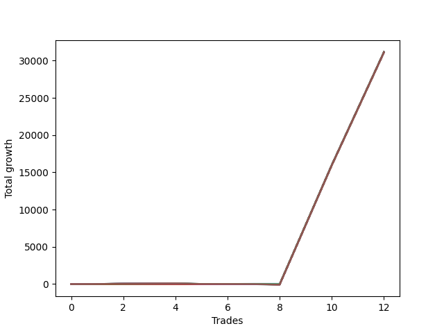

# Short Wallace 1226_003 
- Symbol: NQ
- Date Range: 3/18/22 - 6/24/22
- Trading Period: 7:20-12:30
- Number of Trades: 23


| Name | Win Percent | Profit | Avg Profit / Trade |     | Name | Win Percent | Profit | Avg Profit / Trade |
| ---- | ----------- | ------ | ------------------ | --- | ---- | ----------- | ------ | ------------------ |
| Sorted By <br> Profit | | | | | Sorted By <br> Win Percentage ||||
| Thirty-Three | 73.91 | 19425750.00 | 844597.83 |     | One | 82.61 | 19396250.00 | 843315.22 |
| Thirty-Two | 73.91 | 19425750.00 | 844597.83 |     | Thirty-Three | 73.91 | 19425750.00 | 844597.83 |
| Thirty-One | 73.91 | 19425750.00 | 844597.83 |     | Thirty-Two | 73.91 | 19425750.00 | 844597.83 |
| Thirty | 73.91 | 19425750.00 | 844597.83 |     | Thirty-One | 73.91 | 19425750.00 | 844597.83 |
| Twenty-Nine | 73.91 | 19425750.00 | 844597.83 |     | Thirty | 73.91 | 19425750.00 | 844597.83 |
| Twenty-Eight | 73.91 | 19425750.00 | 844597.83 |     | Twenty-Nine | 73.91 | 19425750.00 | 844597.83 |
| Twenty-Seven | 73.91 | 19425750.00 | 844597.83 |     | Twenty-Eight | 73.91 | 19425750.00 | 844597.83 |
| Twenty-Six | 73.91 | 19425750.00 | 844597.83 |     | Twenty-Seven | 73.91 | 19425750.00 | 844597.83 |
| Twenty-Five | 73.91 | 19425750.00 | 844597.83 |     | Twenty-Six | 73.91 | 19425750.00 | 844597.83 |
| Twenty-Four | 73.91 | 19425750.00 | 844597.83 |     | Twenty-Five | 73.91 | 19425750.00 | 844597.83 |
| Seven | 65.22 | 19412000.00 | 844000.00 |     | Twenty-Four | 73.91 | 19425750.00 | 844597.83 |
| Eleven | 65.22 | 19410750.00 | 843945.65 |     | Two | 73.91 | 19343375.00 | 841016.30 |
| Nine | 65.22 | 19410750.00 | 843945.65 |     | Four | 69.57 | 19405500.00 | 843717.39 |
| Thirteen | 60.87 | 19406750.00 | 843771.74 |     | Seven | 65.22 | 19412000.00 | 844000.00 |
| Four | 69.57 | 19405500.00 | 843717.39 |     | Eleven | 65.22 | 19410750.00 | 843945.65 |
| Seventeen | 60.87 | 19405500.00 | 843717.39 |     | Nine | 65.22 | 19410750.00 | 843945.65 |
| Fifteen | 60.87 | 19405500.00 | 843717.39 |     | Three | 65.22 | 19358875.00 | 841690.22 |
| Eighteen | 56.52 | 19402875.00 | 843603.26 |     | Thirteen | 60.87 | 19406750.00 | 843771.74 |
| Six | 56.52 | 19402625.00 | 843592.39 |     | Seventeen | 60.87 | 19405500.00 | 843717.39 |
| Twelve | 56.52 | 19402125.00 | 843570.65 |     | Fifteen | 60.87 | 19405500.00 | 843717.39 |
| Nineteen | 52.17 | 19399125.00 | 843440.22 |     | Five | 60.87 | 19311125.00 | 839614.13 |
| One | 82.61 | 19396250.00 | 843315.22 |     | Eighteen | 56.52 | 19402875.00 | 843603.26 |
| Twenty-Three | 52.17 | 19394375.00 | 843233.70 |     | Six | 56.52 | 19402625.00 | 843592.39 |
| Twenty-One | 52.17 | 19394375.00 | 843233.70 |     | Twelve | 56.52 | 19402125.00 | 843570.65 |
| Thirty-Four | 39.13 | 19393125.00 | 843179.35 |     | Thirty-Six | 56.52 | 19348625.00 | 841244.57 |
| Ten | 47.83 | 19386500.00 | 842891.30 |     | Nineteen | 52.17 | 19399125.00 | 843440.22 |
| Eight | 47.83 | 19386500.00 | 842891.30 |     | Twenty-Three | 52.17 | 19394375.00 | 843233.70 |
| Sixteen | 47.83 | 19382875.00 | 842733.70 |     | Twenty-One | 52.17 | 19394375.00 | 843233.70 |
| Fourteen | 47.83 | 19382875.00 | 842733.70 |     | Ten | 47.83 | 19386500.00 | 842891.30 |
| Twenty-Two | 39.13 | 19381750.00 | 842684.78 |     | Eight | 47.83 | 19386500.00 | 842891.30 |
| Twenty | 39.13 | 19377250.00 | 842489.13 |     | Sixteen | 47.83 | 19382875.00 | 842733.70 |
| Three | 65.22 | 19358875.00 | 841690.22 |     | Fourteen | 47.83 | 19382875.00 | 842733.70 |
| Thirty-Six | 56.52 | 19348625.00 | 841244.57 |     | Thirty-Four | 39.13 | 19393125.00 | 843179.35 |
| Two | 73.91 | 19343375.00 | 841016.30 |     | Twenty-Two | 39.13 | 19381750.00 | 842684.78 |
| Thirty-Five | 39.13 | 19338500.00 | 840804.35 |     | Twenty | 39.13 | 19377250.00 | 842489.13 |
| Five | 60.87 | 19311125.00 | 839614.13 |     | Thirty-Five | 39.13 | 19338500.00 | 840804.35 |

### Test One
* Sell when price hits the middle line of the 20p bollinger
* No Stoploss
* Results:
```
Total Trades: 23
Percent Up: 17.39
Percent Down: 82.61
Total Points Moved Down: 38792.50
Potential Profit: 19396250.00
Total Points Ups: 141.50 Count Ups: 4
Total Points Downs: 38934.00 Count Downs: 19
```

<details><summary>Trades</summary>

<code>In: 2022-03-25 10:22:00		Out: 2022-03-25 10:24:15		Total Position Time: 02:15		Total Move Down: 11.50		Total to Date: -11.50</code> <br />
<code>In: 2022-03-25 11:34:00		Out: 2022-03-25 11:40:25		Total Position Time: 06:25		Total Move Down: 7.50		Total to Date: -19.00</code> <br />
<code>In: 2022-03-29 08:52:00		Out: 2022-03-29 08:56:30		Total Position Time: 04:30		Total Move Down: 9.50		Total to Date: -28.50</code> <br />
<code>In: 2022-03-31 10:54:00		Out: 2022-03-31 10:58:25		Total Position Time: 04:25		Total Move Down: 7.25		Total to Date: -35.75</code> <br />
<code>In: 2022-04-05 07:57:00		Out: 2022-04-05 08:04:00		Total Position Time: 07:00		Total Move Down: 11.75		Total to Date: -47.50</code> <br />
<code>In: 2022-04-06 10:36:00		Out: 2022-04-06 10:56:50		Total Position Time: 20:50		Total Move Down: -45.50		Total to Date: -2.00</code> <br />
<code>In: 2022-04-18 11:28:00		Out: 2022-04-18 11:40:45		Total Position Time: 12:45		Total Move Down: -3.00		Total to Date: 1.00</code> <br />
<code>In: 2022-04-20 09:55:00		Out: 2022-04-20 09:58:05		Total Position Time: 03:05		Total Move Down: 11.00		Total to Date: -10.00</code> <br />
<code>In: 2022-04-25 09:28:00		Out: 2022-04-25 09:31:05		Total Position Time: 03:05		Total Move Down: 15.00		Total to Date: -25.00</code> <br />
<code>In: 2022-04-26 10:02:00		Out: 2022-04-26 10:02:15		Total Position Time: 00:15		Total Move Down: 9.50		Total to Date: -34.50</code> <br />
<code>In: 2022-04-28 08:01:00		Out: 2022-04-28 08:26:20		Total Position Time: 25:20		Total Move Down: -91.50		Total to Date: 57.00</code> <br />
<code>In: 2022-04-28 09:50:00		Out: 2022-04-28 10:02:15		Total Position Time: 12:15		Total Move Down: -1.50		Total to Date: 58.50</code> <br />
<code>In: 2022-05-04 10:37:00		Out: 2022-05-04 10:37:25		Total Position Time: 00:25		Total Move Down: 4.00		Total to Date: 54.50</code> <br />
<code>In: 2022-05-09 12:04:00		Out: 2022-05-09 12:09:20		Total Position Time: 05:20		Total Move Down: 9.00		Total to Date: 45.50</code> <br />
<code>In: 2022-05-10 11:47:00		Out: 2022-05-10 11:47:15		Total Position Time: 00:15		Total Move Down: 14.75		Total to Date: 30.75</code> <br />
<code>In: 2022-05-16 11:12:00		Out: 2022-05-16 11:17:30		Total Position Time: 05:30		Total Move Down: 1.50		Total to Date: 29.25</code> <br />
<code>In: 2022-05-24 08:32:00		Out: 2022-05-24 08:32:15		Total Position Time: 00:15		Total Move Down: 8.00		Total to Date: 21.25</code> <br />
<code>In: 2022-06-01 11:46:00		Out: 2022-06-01 11:46:30		Total Position Time: 00:30		Total Move Down: 6.50		Total to Date: 14.75</code> <br />
<code>In: 2022-06-10 10:53:00		Out: 2022-06-10 10:53:10		Total Position Time: 00:10		Total Move Down: 8002.50		Total to Date: -7987.75</code> <br />
<code>In: 2022-06-10 12:30:00		Out: 2022-06-10 12:30:10		Total Position Time: 00:10		Total Move Down: 8014.00		Total to Date: -16001.75</code> <br />
<code>In: 2022-06-13 09:15:00		Out: 2022-06-13 09:15:10		Total Position Time: 00:10		Total Move Down: 7638.00		Total to Date: -23639.75</code> <br />
<code>In: 2022-06-14 08:39:00		Out: 2022-06-14 08:39:10		Total Position Time: 00:10		Total Move Down: 7571.00		Total to Date: -31210.75</code> <br />
<code>In: 2022-06-14 10:03:00		Out: 2022-06-14 10:03:10		Total Position Time: 00:10		Total Move Down: 7581.75		Total to Date: -38792.50</code> <br />


</details>

### Test Two
* Sell when the price hits the lower line of the 20p 1std bollinger
* No Stoploss
* Results:
```
Total Trades: 23
Percent Up: 26.09
Percent Down: 73.91
Total Points Moved Down: 38686.75
Potential Profit: 19343375.00
Total Points Ups: 304.00 Count Ups: 6
Total Points Downs: 38990.75 Count Downs: 17
```

<details><summary>Trades</summary>

<code>In: 2022-03-25 10:22:00		Out: 2022-03-25 10:51:55		Total Position Time: 29:55		Total Move Down: -22.75		Total to Date: 22.75</code> <br />
<code>In: 2022-03-25 11:34:00		Out: 2022-03-25 11:40:50		Total Position Time: 06:50		Total Move Down: 10.75		Total to Date: 12.00</code> <br />
<code>In: 2022-03-29 08:52:00		Out: 2022-03-29 08:58:40		Total Position Time: 06:40		Total Move Down: 17.75		Total to Date: -5.75</code> <br />
<code>In: 2022-03-31 10:54:00		Out: 2022-03-31 11:00:15		Total Position Time: 06:15		Total Move Down: 19.00		Total to Date: -24.75</code> <br />
<code>In: 2022-04-05 07:57:00		Out: 2022-04-05 08:04:10		Total Position Time: 07:10		Total Move Down: 20.00		Total to Date: -44.75</code> <br />
<code>In: 2022-04-06 10:36:00		Out: 2022-04-06 10:58:00		Total Position Time: 22:00		Total Move Down: -35.75		Total to Date: -9.00</code> <br />
<code>In: 2022-04-18 11:28:00		Out: 2022-04-18 11:41:15		Total Position Time: 13:15		Total Move Down: 8.50		Total to Date: -17.50</code> <br />
<code>In: 2022-04-20 09:55:00		Out: 2022-04-20 10:08:15		Total Position Time: 13:15		Total Move Down: 12.75		Total to Date: -30.25</code> <br />
<code>In: 2022-04-25 09:28:00		Out: 2022-04-25 09:45:00		Total Position Time: 17:00		Total Move Down: 7.00		Total to Date: -37.25</code> <br />
<code>In: 2022-04-26 10:02:00		Out: 2022-04-26 10:02:50		Total Position Time: 00:50		Total Move Down: 27.75		Total to Date: -65.00</code> <br />
<code>In: 2022-04-28 08:01:00		Out: 2022-04-28 08:26:40		Total Position Time: 25:40		Total Move Down: -80.00		Total to Date: 15.00</code> <br />
<code>In: 2022-04-28 09:50:00		Out: 2022-04-28 10:19:55		Total Position Time: 29:55		Total Move Down: -62.50		Total to Date: 77.50</code> <br />
<code>In: 2022-05-04 10:37:00		Out: 2022-05-04 10:50:00		Total Position Time: 13:00		Total Move Down: 8.00		Total to Date: 69.50</code> <br />
<code>In: 2022-05-09 12:04:00		Out: 2022-05-09 12:18:00		Total Position Time: 14:00		Total Move Down: 9.00		Total to Date: 60.50</code> <br />
<code>In: 2022-05-10 11:47:00		Out: 2022-05-10 11:56:45		Total Position Time: 09:45		Total Move Down: 31.25		Total to Date: 29.25</code> <br />
<code>In: 2022-05-16 11:12:00		Out: 2022-05-16 11:41:55		Total Position Time: 29:55		Total Move Down: -47.50		Total to Date: 76.75</code> <br />
<code>In: 2022-05-24 08:32:00		Out: 2022-05-24 09:01:55		Total Position Time: 29:55		Total Move Down: -55.50		Total to Date: 132.25</code> <br />
<code>In: 2022-06-01 11:46:00		Out: 2022-06-01 11:48:25		Total Position Time: 02:25		Total Move Down: 11.75		Total to Date: 120.50</code> <br />
<code>In: 2022-06-10 10:53:00		Out: 2022-06-10 10:53:10		Total Position Time: 00:10		Total Move Down: 8002.50		Total to Date: -7882.00</code> <br />
<code>In: 2022-06-10 12:30:00		Out: 2022-06-10 12:30:10		Total Position Time: 00:10		Total Move Down: 8014.00		Total to Date: -15896.00</code> <br />
<code>In: 2022-06-13 09:15:00		Out: 2022-06-13 09:15:10		Total Position Time: 00:10		Total Move Down: 7638.00		Total to Date: -23534.00</code> <br />
<code>In: 2022-06-14 08:39:00		Out: 2022-06-14 08:39:10		Total Position Time: 00:10		Total Move Down: 7571.00		Total to Date: -31105.00</code> <br />
<code>In: 2022-06-14 10:03:00		Out: 2022-06-14 10:03:10		Total Position Time: 00:10		Total Move Down: 7581.75		Total to Date: -38686.75</code> <br />


</details>

### Test Three
* Sell when the price hits the lower line of the 20p 2std bollinger
* No Stoploss
* Results:
```
Total Trades: 23
Percent Up: 34.78
Percent Down: 65.22
Total Points Moved Down: 38717.75
Potential Profit: 19358875.00
Total Points Ups: 362.25 Count Ups: 8
Total Points Downs: 39080.00 Count Downs: 15
```

<details><summary>Trades</summary>

<code>In: 2022-03-25 10:22:00		Out: 2022-03-25 10:51:55		Total Position Time: 29:55		Total Move Down: -22.75		Total to Date: 22.75</code> <br />
<code>In: 2022-03-25 11:34:00		Out: 2022-03-25 12:01:50		Total Position Time: 27:50		Total Move Down: 13.00		Total to Date: 9.75</code> <br />
<code>In: 2022-03-29 08:52:00		Out: 2022-03-29 09:01:35		Total Position Time: 09:35		Total Move Down: 27.50		Total to Date: -17.75</code> <br />
<code>In: 2022-03-31 10:54:00		Out: 2022-03-31 11:00:30		Total Position Time: 06:30		Total Move Down: 28.00		Total to Date: -45.75</code> <br />
<code>In: 2022-04-05 07:57:00		Out: 2022-04-05 08:10:40		Total Position Time: 13:40		Total Move Down: 26.75		Total to Date: -72.50</code> <br />
<code>In: 2022-04-06 10:36:00		Out: 2022-04-06 11:00:00		Total Position Time: 24:00		Total Move Down: -30.25		Total to Date: -42.25</code> <br />
<code>In: 2022-04-18 11:28:00		Out: 2022-04-18 11:43:10		Total Position Time: 15:10		Total Move Down: 7.00		Total to Date: -49.25</code> <br />
<code>In: 2022-04-20 09:55:00		Out: 2022-04-20 10:08:35		Total Position Time: 13:35		Total Move Down: 21.00		Total to Date: -70.25</code> <br />
<code>In: 2022-04-25 09:28:00		Out: 2022-04-25 09:57:55		Total Position Time: 29:55		Total Move Down: 12.25		Total to Date: -82.50</code> <br />
<code>In: 2022-04-26 10:02:00		Out: 2022-04-26 10:31:55		Total Position Time: 29:55		Total Move Down: 81.25		Total to Date: -163.75</code> <br />
<code>In: 2022-04-28 08:01:00		Out: 2022-04-28 08:30:55		Total Position Time: 29:55		Total Move Down: -105.50		Total to Date: -58.25</code> <br />
<code>In: 2022-04-28 09:50:00		Out: 2022-04-28 10:19:55		Total Position Time: 29:55		Total Move Down: -62.50		Total to Date: 4.25</code> <br />
<code>In: 2022-05-04 10:37:00		Out: 2022-05-04 11:06:55		Total Position Time: 29:55		Total Move Down: -21.25		Total to Date: 25.50</code> <br />
<code>In: 2022-05-09 12:04:00		Out: 2022-05-09 12:20:45		Total Position Time: 16:45		Total Move Down: 33.25		Total to Date: -7.75</code> <br />
<code>In: 2022-05-10 11:47:00		Out: 2022-05-10 12:16:55		Total Position Time: 29:55		Total Move Down: -17.00		Total to Date: 9.25</code> <br />
<code>In: 2022-05-16 11:12:00		Out: 2022-05-16 11:41:55		Total Position Time: 29:55		Total Move Down: -47.50		Total to Date: 56.75</code> <br />
<code>In: 2022-05-24 08:32:00		Out: 2022-05-24 09:01:55		Total Position Time: 29:55		Total Move Down: -55.50		Total to Date: 112.25</code> <br />
<code>In: 2022-06-01 11:46:00		Out: 2022-06-01 11:50:55		Total Position Time: 04:55		Total Move Down: 22.75		Total to Date: 89.50</code> <br />
<code>In: 2022-06-10 10:53:00		Out: 2022-06-10 10:53:10		Total Position Time: 00:10		Total Move Down: 8002.50		Total to Date: -7913.00</code> <br />
<code>In: 2022-06-10 12:30:00		Out: 2022-06-10 12:30:10		Total Position Time: 00:10		Total Move Down: 8014.00		Total to Date: -15927.00</code> <br />
<code>In: 2022-06-13 09:15:00		Out: 2022-06-13 09:15:10		Total Position Time: 00:10		Total Move Down: 7638.00		Total to Date: -23565.00</code> <br />
<code>In: 2022-06-14 08:39:00		Out: 2022-06-14 08:39:10		Total Position Time: 00:10		Total Move Down: 7571.00		Total to Date: -31136.00</code> <br />
<code>In: 2022-06-14 10:03:00		Out: 2022-06-14 10:03:10		Total Position Time: 00:10		Total Move Down: 7581.75		Total to Date: -38717.75</code> <br />


</details>

### Test Four
* Sell when the price hits the middle line of the 1std VWAP
* No Stoploss
* Results:
```
Total Trades: 23
Percent Up: 30.43
Percent Down: 69.57
Total Points Moved Down: 38811.00
Potential Profit: 19405500.00
Total Points Ups: 156.50 Count Ups: 7
Total Points Downs: 38967.50 Count Downs: 16
```

<details><summary>Trades</summary>

<code>In: 2022-03-25 10:22:00		Out: 2022-03-25 10:22:10		Total Position Time: 00:10		Total Move Down: 4.75		Total to Date: -4.75</code> <br />
<code>In: 2022-03-25 11:34:00		Out: 2022-03-25 12:03:55		Total Position Time: 29:55		Total Move Down: 26.50		Total to Date: -31.25</code> <br />
<code>In: 2022-03-29 08:52:00		Out: 2022-03-29 09:02:10		Total Position Time: 10:10		Total Move Down: 39.25		Total to Date: -70.50</code> <br />
<code>In: 2022-03-31 10:54:00		Out: 2022-03-31 10:54:10		Total Position Time: 00:10		Total Move Down: -1.75		Total to Date: -68.75</code> <br />
<code>In: 2022-04-05 07:57:00		Out: 2022-04-05 07:57:10		Total Position Time: 00:10		Total Move Down: 1.25		Total to Date: -70.00</code> <br />
<code>In: 2022-04-06 10:36:00		Out: 2022-04-06 10:36:10		Total Position Time: 00:10		Total Move Down: 3.50		Total to Date: -73.50</code> <br />
<code>In: 2022-04-18 11:28:00		Out: 2022-04-18 11:57:55		Total Position Time: 29:55		Total Move Down: 16.00		Total to Date: -89.50</code> <br />
<code>In: 2022-04-20 09:55:00		Out: 2022-04-20 09:55:10		Total Position Time: 00:10		Total Move Down: -2.75		Total to Date: -86.75</code> <br />
<code>In: 2022-04-25 09:28:00		Out: 2022-04-25 09:57:55		Total Position Time: 29:55		Total Move Down: 12.25		Total to Date: -99.00</code> <br />
<code>In: 2022-04-26 10:02:00		Out: 2022-04-26 10:02:10		Total Position Time: 00:10		Total Move Down: 9.25		Total to Date: -108.25</code> <br />
<code>In: 2022-04-28 08:01:00		Out: 2022-04-28 08:01:10		Total Position Time: 00:10		Total Move Down: -3.75		Total to Date: -104.50</code> <br />
<code>In: 2022-04-28 09:50:00		Out: 2022-04-28 10:19:55		Total Position Time: 29:55		Total Move Down: -62.50		Total to Date: -42.00</code> <br />
<code>In: 2022-05-04 10:37:00		Out: 2022-05-04 11:06:55		Total Position Time: 29:55		Total Move Down: -21.25		Total to Date: -20.75</code> <br />
<code>In: 2022-05-09 12:04:00		Out: 2022-05-09 12:04:10		Total Position Time: 00:10		Total Move Down: 9.75		Total to Date: -30.50</code> <br />
<code>In: 2022-05-10 11:47:00		Out: 2022-05-10 12:16:55		Total Position Time: 29:55		Total Move Down: -17.00		Total to Date: -13.50</code> <br />
<code>In: 2022-05-16 11:12:00		Out: 2022-05-16 11:41:55		Total Position Time: 29:55		Total Move Down: -47.50		Total to Date: 34.00</code> <br />
<code>In: 2022-05-24 08:32:00		Out: 2022-05-24 08:32:10		Total Position Time: 00:10		Total Move Down: 6.75		Total to Date: 27.25</code> <br />
<code>In: 2022-06-01 11:46:00		Out: 2022-06-01 11:51:15		Total Position Time: 05:15		Total Move Down: 31.00		Total to Date: -3.75</code> <br />
<code>In: 2022-06-10 10:53:00		Out: 2022-06-10 10:53:10		Total Position Time: 00:10		Total Move Down: 8002.50		Total to Date: -8006.25</code> <br />
<code>In: 2022-06-10 12:30:00		Out: 2022-06-10 12:30:10		Total Position Time: 00:10		Total Move Down: 8014.00		Total to Date: -16020.25</code> <br />
<code>In: 2022-06-13 09:15:00		Out: 2022-06-13 09:15:10		Total Position Time: 00:10		Total Move Down: 7638.00		Total to Date: -23658.25</code> <br />
<code>In: 2022-06-14 08:39:00		Out: 2022-06-14 08:39:10		Total Position Time: 00:10		Total Move Down: 7571.00		Total to Date: -31229.25</code> <br />
<code>In: 2022-06-14 10:03:00		Out: 2022-06-14 10:03:10		Total Position Time: 00:10		Total Move Down: 7581.75		Total to Date: -38811.00</code> <br />


</details>

### Test Five
* Sell when the price hits the lower line of the 1std VWAP
* No Stoploss
* Results:
```
Total Trades: 23
Percent Up: 39.13
Percent Down: 60.87
Total Points Moved Down: 38622.25
Potential Profit: 19311125.00
Total Points Ups: 413.50 Count Ups: 9
Total Points Downs: 39035.75 Count Downs: 14
```

<details><summary>Trades</summary>

<code>In: 2022-03-25 10:22:00		Out: 2022-03-25 10:51:55		Total Position Time: 29:55		Total Move Down: -22.75		Total to Date: 22.75</code> <br />
<code>In: 2022-03-25 11:34:00		Out: 2022-03-25 12:03:55		Total Position Time: 29:55		Total Move Down: 26.50		Total to Date: -3.75</code> <br />
<code>In: 2022-03-29 08:52:00		Out: 2022-03-29 09:21:55		Total Position Time: 29:55		Total Move Down: 24.00		Total to Date: -27.75</code> <br />
<code>In: 2022-03-31 10:54:00		Out: 2022-03-31 11:00:20		Total Position Time: 06:20		Total Move Down: 24.75		Total to Date: -52.50</code> <br />
<code>In: 2022-04-05 07:57:00		Out: 2022-04-05 08:04:10		Total Position Time: 07:10		Total Move Down: 20.00		Total to Date: -72.50</code> <br />
<code>In: 2022-04-06 10:36:00		Out: 2022-04-06 11:05:55		Total Position Time: 29:55		Total Move Down: -63.25		Total to Date: -9.25</code> <br />
<code>In: 2022-04-18 11:28:00		Out: 2022-04-18 11:57:55		Total Position Time: 29:55		Total Move Down: 16.00		Total to Date: -25.25</code> <br />
<code>In: 2022-04-20 09:55:00		Out: 2022-04-20 10:24:55		Total Position Time: 29:55		Total Move Down: -18.25		Total to Date: -7.00</code> <br />
<code>In: 2022-04-25 09:28:00		Out: 2022-04-25 09:57:55		Total Position Time: 29:55		Total Move Down: 12.25		Total to Date: -19.25</code> <br />
<code>In: 2022-04-26 10:02:00		Out: 2022-04-26 10:14:55		Total Position Time: 12:55		Total Move Down: 63.50		Total to Date: -82.75</code> <br />
<code>In: 2022-04-28 08:01:00		Out: 2022-04-28 08:30:55		Total Position Time: 29:55		Total Move Down: -105.50		Total to Date: 22.75</code> <br />
<code>In: 2022-04-28 09:50:00		Out: 2022-04-28 10:19:55		Total Position Time: 29:55		Total Move Down: -62.50		Total to Date: 85.25</code> <br />
<code>In: 2022-05-04 10:37:00		Out: 2022-05-04 11:06:55		Total Position Time: 29:55		Total Move Down: -21.25		Total to Date: 106.50</code> <br />
<code>In: 2022-05-09 12:04:00		Out: 2022-05-09 12:20:45		Total Position Time: 16:45		Total Move Down: 33.25		Total to Date: 73.25</code> <br />
<code>In: 2022-05-10 11:47:00		Out: 2022-05-10 12:16:55		Total Position Time: 29:55		Total Move Down: -17.00		Total to Date: 90.25</code> <br />
<code>In: 2022-05-16 11:12:00		Out: 2022-05-16 11:41:55		Total Position Time: 29:55		Total Move Down: -47.50		Total to Date: 137.75</code> <br />
<code>In: 2022-05-24 08:32:00		Out: 2022-05-24 09:01:55		Total Position Time: 29:55		Total Move Down: -55.50		Total to Date: 193.25</code> <br />
<code>In: 2022-06-01 11:46:00		Out: 2022-06-01 12:15:55		Total Position Time: 29:55		Total Move Down: 8.25		Total to Date: 185.00</code> <br />
<code>In: 2022-06-10 10:53:00		Out: 2022-06-10 10:53:10		Total Position Time: 00:10		Total Move Down: 8002.50		Total to Date: -7817.50</code> <br />
<code>In: 2022-06-10 12:30:00		Out: 2022-06-10 12:30:10		Total Position Time: 00:10		Total Move Down: 8014.00		Total to Date: -15831.50</code> <br />
<code>In: 2022-06-13 09:15:00		Out: 2022-06-13 09:15:10		Total Position Time: 00:10		Total Move Down: 7638.00		Total to Date: -23469.50</code> <br />
<code>In: 2022-06-14 08:39:00		Out: 2022-06-14 08:39:10		Total Position Time: 00:10		Total Move Down: 7571.00		Total to Date: -31040.50</code> <br />
<code>In: 2022-06-14 10:03:00		Out: 2022-06-14 10:03:10		Total Position Time: 00:10		Total Move Down: 7581.75		Total to Date: -38622.25</code> <br />


</details>

### Test Six
* Sell when the price hits the middle line of the 20p bollinger
* Stoploss is -2 points
* Results:
```
Total Trades: 23
Percent Up: 43.48
Percent Down: 56.52
Total Points Moved Down: 38805.25
Potential Profit: 19402625.00
Total Points Ups: 53.25 Count Ups: 10
Total Points Downs: 38858.50 Count Downs: 13
```

<details><summary>Trades</summary>

<code>In: 2022-03-25 10:22:00		Out: 2022-03-25 10:24:15		Total Position Time: 02:15		Total Move Down: 11.50		Total to Date: -11.50</code> <br />
<code>In: 2022-03-25 11:34:00		Out: 2022-03-25 11:34:20		Total Position Time: 00:20		Total Move Down: -5.00		Total to Date: -6.50</code> <br />
<code>In: 2022-03-29 08:52:00		Out: 2022-03-29 08:53:10		Total Position Time: 01:10		Total Move Down: -0.25		Total to Date: -6.25</code> <br />
<code>In: 2022-03-31 10:54:00		Out: 2022-03-31 10:54:40		Total Position Time: 00:40		Total Move Down: -4.50		Total to Date: -1.75</code> <br />
<code>In: 2022-04-05 07:57:00		Out: 2022-04-05 07:57:10		Total Position Time: 00:10		Total Move Down: 1.25		Total to Date: -3.00</code> <br />
<code>In: 2022-04-06 10:36:00		Out: 2022-04-06 10:36:35		Total Position Time: 00:35		Total Move Down: -7.75		Total to Date: 4.75</code> <br />
<code>In: 2022-04-18 11:28:00		Out: 2022-04-18 11:29:50		Total Position Time: 01:50		Total Move Down: -1.75		Total to Date: 6.50</code> <br />
<code>In: 2022-04-20 09:55:00		Out: 2022-04-20 09:56:10		Total Position Time: 01:10		Total Move Down: -6.00		Total to Date: 12.50</code> <br />
<code>In: 2022-04-25 09:28:00		Out: 2022-04-25 09:28:10		Total Position Time: 00:10		Total Move Down: -2.25		Total to Date: 14.75</code> <br />
<code>In: 2022-04-26 10:02:00		Out: 2022-04-26 10:02:10		Total Position Time: 00:10		Total Move Down: 9.25		Total to Date: 5.50</code> <br />
<code>In: 2022-04-28 08:01:00		Out: 2022-04-28 08:02:05		Total Position Time: 01:05		Total Move Down: -15.50		Total to Date: 21.00</code> <br />
<code>In: 2022-04-28 09:50:00		Out: 2022-04-28 09:50:10		Total Position Time: 00:10		Total Move Down: 4.50		Total to Date: 16.50</code> <br />
<code>In: 2022-05-04 10:37:00		Out: 2022-05-04 10:37:10		Total Position Time: 00:10		Total Move Down: 2.00		Total to Date: 14.50</code> <br />
<code>In: 2022-05-09 12:04:00		Out: 2022-05-09 12:04:25		Total Position Time: 00:25		Total Move Down: 6.50		Total to Date: 8.00</code> <br />
<code>In: 2022-05-10 11:47:00		Out: 2022-05-10 11:47:10		Total Position Time: 00:10		Total Move Down: 8.25		Total to Date: -0.25</code> <br />
<code>In: 2022-05-16 11:12:00		Out: 2022-05-16 11:12:15		Total Position Time: 00:15		Total Move Down: -9.75		Total to Date: 9.50</code> <br />
<code>In: 2022-05-24 08:32:00		Out: 2022-05-24 08:32:15		Total Position Time: 00:15		Total Move Down: 8.00		Total to Date: 1.50</code> <br />
<code>In: 2022-06-01 11:46:00		Out: 2022-06-01 11:46:20		Total Position Time: 00:20		Total Move Down: -0.50		Total to Date: 2.00</code> <br />
<code>In: 2022-06-10 10:53:00		Out: 2022-06-10 10:53:10		Total Position Time: 00:10		Total Move Down: 8002.50		Total to Date: -8000.50</code> <br />
<code>In: 2022-06-10 12:30:00		Out: 2022-06-10 12:30:10		Total Position Time: 00:10		Total Move Down: 8014.00		Total to Date: -16014.50</code> <br />
<code>In: 2022-06-13 09:15:00		Out: 2022-06-13 09:15:10		Total Position Time: 00:10		Total Move Down: 7638.00		Total to Date: -23652.50</code> <br />
<code>In: 2022-06-14 08:39:00		Out: 2022-06-14 08:39:10		Total Position Time: 00:10		Total Move Down: 7571.00		Total to Date: -31223.50</code> <br />
<code>In: 2022-06-14 10:03:00		Out: 2022-06-14 10:03:10		Total Position Time: 00:10		Total Move Down: 7581.75		Total to Date: -38805.25</code> <br />


</details>

### Test Seven
* Sell when the price hits the middle line of the 20p bollinger
* Trailing Stop is -2 points
* Results:
```
Total Trades: 23
Percent Up: 34.78
Percent Down: 65.22
Total Points Moved Down: 38824.00
Potential Profit: 19412000.00
Total Points Ups: 33.50 Count Ups: 8
Total Points Downs: 38857.50 Count Downs: 15
```

<details><summary>Trades</summary>

<code>In: 2022-03-25 10:22:00		Out: 2022-03-25 10:22:20		Total Position Time: 00:20		Total Move Down: 2.50		Total to Date: -2.50</code> <br />
<code>In: 2022-03-25 11:34:00		Out: 2022-03-25 11:34:20		Total Position Time: 00:20		Total Move Down: -5.00		Total to Date: 2.50</code> <br />
<code>In: 2022-03-29 08:52:00		Out: 2022-03-29 08:52:20		Total Position Time: 00:20		Total Move Down: 2.25		Total to Date: 0.25</code> <br />
<code>In: 2022-03-31 10:54:00		Out: 2022-03-31 10:54:40		Total Position Time: 00:40		Total Move Down: -4.50		Total to Date: 4.75</code> <br />
<code>In: 2022-04-05 07:57:00		Out: 2022-04-05 07:57:10		Total Position Time: 00:10		Total Move Down: 1.25		Total to Date: 3.50</code> <br />
<code>In: 2022-04-06 10:36:00		Out: 2022-04-06 10:36:20		Total Position Time: 00:20		Total Move Down: -0.00		Total to Date: 3.50</code> <br />
<code>In: 2022-04-18 11:28:00		Out: 2022-04-18 11:28:35		Total Position Time: 00:35		Total Move Down: 5.75		Total to Date: -2.25</code> <br />
<code>In: 2022-04-20 09:55:00		Out: 2022-04-20 09:55:35		Total Position Time: 00:35		Total Move Down: -2.75		Total to Date: 0.50</code> <br />
<code>In: 2022-04-25 09:28:00		Out: 2022-04-25 09:28:10		Total Position Time: 00:10		Total Move Down: -2.25		Total to Date: 2.75</code> <br />
<code>In: 2022-04-26 10:02:00		Out: 2022-04-26 10:02:10		Total Position Time: 00:10		Total Move Down: 9.25		Total to Date: -6.50</code> <br />
<code>In: 2022-04-28 08:01:00		Out: 2022-04-28 08:01:25		Total Position Time: 00:25		Total Move Down: -8.75		Total to Date: 2.25</code> <br />
<code>In: 2022-04-28 09:50:00		Out: 2022-04-28 09:50:10		Total Position Time: 00:10		Total Move Down: 4.50		Total to Date: -2.25</code> <br />
<code>In: 2022-05-04 10:37:00		Out: 2022-05-04 10:37:10		Total Position Time: 00:10		Total Move Down: 2.00		Total to Date: -4.25</code> <br />
<code>In: 2022-05-09 12:04:00		Out: 2022-05-09 12:04:25		Total Position Time: 00:25		Total Move Down: 6.50		Total to Date: -10.75</code> <br />
<code>In: 2022-05-10 11:47:00		Out: 2022-05-10 11:47:10		Total Position Time: 00:10		Total Move Down: 8.25		Total to Date: -19.00</code> <br />
<code>In: 2022-05-16 11:12:00		Out: 2022-05-16 11:12:15		Total Position Time: 00:15		Total Move Down: -9.75		Total to Date: -9.25</code> <br />
<code>In: 2022-05-24 08:32:00		Out: 2022-05-24 08:32:15		Total Position Time: 00:15		Total Move Down: 8.00		Total to Date: -17.25</code> <br />
<code>In: 2022-06-01 11:46:00		Out: 2022-06-01 11:46:20		Total Position Time: 00:20		Total Move Down: -0.50		Total to Date: -16.75</code> <br />
<code>In: 2022-06-10 10:53:00		Out: 2022-06-10 10:53:10		Total Position Time: 00:10		Total Move Down: 8002.50		Total to Date: -8019.25</code> <br />
<code>In: 2022-06-10 12:30:00		Out: 2022-06-10 12:30:10		Total Position Time: 00:10		Total Move Down: 8014.00		Total to Date: -16033.25</code> <br />
<code>In: 2022-06-13 09:15:00		Out: 2022-06-13 09:15:10		Total Position Time: 00:10		Total Move Down: 7638.00		Total to Date: -23671.25</code> <br />
<code>In: 2022-06-14 08:39:00		Out: 2022-06-14 08:39:10		Total Position Time: 00:10		Total Move Down: 7571.00		Total to Date: -31242.25</code> <br />
<code>In: 2022-06-14 10:03:00		Out: 2022-06-14 10:03:10		Total Position Time: 00:10		Total Move Down: 7581.75		Total to Date: -38824.00</code> <br />


</details>

### Test Eight
* Sell when the price hits the lower line of the 20p 1std bollinger
* Stoploss is -2 points
* Results:
```
Total Trades: 23
Percent Up: 52.17
Percent Down: 47.83
Total Points Moved Down: 38773.00
Potential Profit: 19386500.00
Total Points Ups: 66.00 Count Ups: 12
Total Points Downs: 38839.00 Count Downs: 11
```

<details><summary>Trades</summary>

<code>In: 2022-03-25 10:22:00		Out: 2022-03-25 10:37:05		Total Position Time: 15:05		Total Move Down: -6.75		Total to Date: 6.75</code> <br />
<code>In: 2022-03-25 11:34:00		Out: 2022-03-25 11:34:20		Total Position Time: 00:20		Total Move Down: -5.00		Total to Date: 11.75</code> <br />
<code>In: 2022-03-29 08:52:00		Out: 2022-03-29 08:53:10		Total Position Time: 01:10		Total Move Down: -0.25		Total to Date: 12.00</code> <br />
<code>In: 2022-03-31 10:54:00		Out: 2022-03-31 10:54:40		Total Position Time: 00:40		Total Move Down: -4.50		Total to Date: 16.50</code> <br />
<code>In: 2022-04-05 07:57:00		Out: 2022-04-05 07:57:10		Total Position Time: 00:10		Total Move Down: 1.25		Total to Date: 15.25</code> <br />
<code>In: 2022-04-06 10:36:00		Out: 2022-04-06 10:36:35		Total Position Time: 00:35		Total Move Down: -7.75		Total to Date: 23.00</code> <br />
<code>In: 2022-04-18 11:28:00		Out: 2022-04-18 11:29:50		Total Position Time: 01:50		Total Move Down: -1.75		Total to Date: 24.75</code> <br />
<code>In: 2022-04-20 09:55:00		Out: 2022-04-20 09:56:10		Total Position Time: 01:10		Total Move Down: -6.00		Total to Date: 30.75</code> <br />
<code>In: 2022-04-25 09:28:00		Out: 2022-04-25 09:28:10		Total Position Time: 00:10		Total Move Down: -2.25		Total to Date: 33.00</code> <br />
<code>In: 2022-04-26 10:02:00		Out: 2022-04-26 10:02:10		Total Position Time: 00:10		Total Move Down: 9.25		Total to Date: 23.75</code> <br />
<code>In: 2022-04-28 08:01:00		Out: 2022-04-28 08:02:05		Total Position Time: 01:05		Total Move Down: -15.50		Total to Date: 39.25</code> <br />
<code>In: 2022-04-28 09:50:00		Out: 2022-04-28 09:50:10		Total Position Time: 00:10		Total Move Down: 4.50		Total to Date: 34.75</code> <br />
<code>In: 2022-05-04 10:37:00		Out: 2022-05-04 10:37:10		Total Position Time: 00:10		Total Move Down: 2.00		Total to Date: 32.75</code> <br />
<code>In: 2022-05-09 12:04:00		Out: 2022-05-09 12:04:25		Total Position Time: 00:25		Total Move Down: 6.50		Total to Date: 26.25</code> <br />
<code>In: 2022-05-10 11:47:00		Out: 2022-05-10 11:47:10		Total Position Time: 00:10		Total Move Down: 8.25		Total to Date: 18.00</code> <br />
<code>In: 2022-05-16 11:12:00		Out: 2022-05-16 11:12:15		Total Position Time: 00:15		Total Move Down: -9.75		Total to Date: 27.75</code> <br />
<code>In: 2022-05-24 08:32:00		Out: 2022-05-24 08:33:15		Total Position Time: 01:15		Total Move Down: -6.00		Total to Date: 33.75</code> <br />
<code>In: 2022-06-01 11:46:00		Out: 2022-06-01 11:46:20		Total Position Time: 00:20		Total Move Down: -0.50		Total to Date: 34.25</code> <br />
<code>In: 2022-06-10 10:53:00		Out: 2022-06-10 10:53:10		Total Position Time: 00:10		Total Move Down: 8002.50		Total to Date: -7968.25</code> <br />
<code>In: 2022-06-10 12:30:00		Out: 2022-06-10 12:30:10		Total Position Time: 00:10		Total Move Down: 8014.00		Total to Date: -15982.25</code> <br />
<code>In: 2022-06-13 09:15:00		Out: 2022-06-13 09:15:10		Total Position Time: 00:10		Total Move Down: 7638.00		Total to Date: -23620.25</code> <br />
<code>In: 2022-06-14 08:39:00		Out: 2022-06-14 08:39:10		Total Position Time: 00:10		Total Move Down: 7571.00		Total to Date: -31191.25</code> <br />
<code>In: 2022-06-14 10:03:00		Out: 2022-06-14 10:03:10		Total Position Time: 00:10		Total Move Down: 7581.75		Total to Date: -38773.00</code> <br />


</details>

### Test Nine
* Sell when the price hits the lower line of the 20p 1std bollinger
* Trailing Stop is -2 points
* Results:
```
Total Trades: 23
Percent Up: 34.78
Percent Down: 65.22
Total Points Moved Down: 38821.50
Potential Profit: 19410750.00
Total Points Ups: 33.50 Count Ups: 8
Total Points Downs: 38855.00 Count Downs: 15
```

<details><summary>Trades</summary>

<code>In: 2022-03-25 10:22:00		Out: 2022-03-25 10:22:20		Total Position Time: 00:20		Total Move Down: 2.50		Total to Date: -2.50</code> <br />
<code>In: 2022-03-25 11:34:00		Out: 2022-03-25 11:34:20		Total Position Time: 00:20		Total Move Down: -5.00		Total to Date: 2.50</code> <br />
<code>In: 2022-03-29 08:52:00		Out: 2022-03-29 08:52:20		Total Position Time: 00:20		Total Move Down: 2.25		Total to Date: 0.25</code> <br />
<code>In: 2022-03-31 10:54:00		Out: 2022-03-31 10:54:40		Total Position Time: 00:40		Total Move Down: -4.50		Total to Date: 4.75</code> <br />
<code>In: 2022-04-05 07:57:00		Out: 2022-04-05 07:57:10		Total Position Time: 00:10		Total Move Down: 1.25		Total to Date: 3.50</code> <br />
<code>In: 2022-04-06 10:36:00		Out: 2022-04-06 10:36:20		Total Position Time: 00:20		Total Move Down: -0.00		Total to Date: 3.50</code> <br />
<code>In: 2022-04-18 11:28:00		Out: 2022-04-18 11:28:35		Total Position Time: 00:35		Total Move Down: 5.75		Total to Date: -2.25</code> <br />
<code>In: 2022-04-20 09:55:00		Out: 2022-04-20 09:55:35		Total Position Time: 00:35		Total Move Down: -2.75		Total to Date: 0.50</code> <br />
<code>In: 2022-04-25 09:28:00		Out: 2022-04-25 09:28:10		Total Position Time: 00:10		Total Move Down: -2.25		Total to Date: 2.75</code> <br />
<code>In: 2022-04-26 10:02:00		Out: 2022-04-26 10:02:10		Total Position Time: 00:10		Total Move Down: 9.25		Total to Date: -6.50</code> <br />
<code>In: 2022-04-28 08:01:00		Out: 2022-04-28 08:01:25		Total Position Time: 00:25		Total Move Down: -8.75		Total to Date: 2.25</code> <br />
<code>In: 2022-04-28 09:50:00		Out: 2022-04-28 09:50:10		Total Position Time: 00:10		Total Move Down: 4.50		Total to Date: -2.25</code> <br />
<code>In: 2022-05-04 10:37:00		Out: 2022-05-04 10:37:10		Total Position Time: 00:10		Total Move Down: 2.00		Total to Date: -4.25</code> <br />
<code>In: 2022-05-09 12:04:00		Out: 2022-05-09 12:04:25		Total Position Time: 00:25		Total Move Down: 6.50		Total to Date: -10.75</code> <br />
<code>In: 2022-05-10 11:47:00		Out: 2022-05-10 11:47:10		Total Position Time: 00:10		Total Move Down: 8.25		Total to Date: -19.00</code> <br />
<code>In: 2022-05-16 11:12:00		Out: 2022-05-16 11:12:15		Total Position Time: 00:15		Total Move Down: -9.75		Total to Date: -9.25</code> <br />
<code>In: 2022-05-24 08:32:00		Out: 2022-05-24 08:32:35		Total Position Time: 00:35		Total Move Down: 5.50		Total to Date: -14.75</code> <br />
<code>In: 2022-06-01 11:46:00		Out: 2022-06-01 11:46:20		Total Position Time: 00:20		Total Move Down: -0.50		Total to Date: -14.25</code> <br />
<code>In: 2022-06-10 10:53:00		Out: 2022-06-10 10:53:10		Total Position Time: 00:10		Total Move Down: 8002.50		Total to Date: -8016.75</code> <br />
<code>In: 2022-06-10 12:30:00		Out: 2022-06-10 12:30:10		Total Position Time: 00:10		Total Move Down: 8014.00		Total to Date: -16030.75</code> <br />
<code>In: 2022-06-13 09:15:00		Out: 2022-06-13 09:15:10		Total Position Time: 00:10		Total Move Down: 7638.00		Total to Date: -23668.75</code> <br />
<code>In: 2022-06-14 08:39:00		Out: 2022-06-14 08:39:10		Total Position Time: 00:10		Total Move Down: 7571.00		Total to Date: -31239.75</code> <br />
<code>In: 2022-06-14 10:03:00		Out: 2022-06-14 10:03:10		Total Position Time: 00:10		Total Move Down: 7581.75		Total to Date: -38821.50</code> <br />


</details>

### Test Ten
* Sell when the price hits the lower line of the 20p 2std bollinger
* Stoploss is -2 points
* Results:
```
Total Trades: 23
Percent Up: 52.17
Percent Down: 47.83
Total Points Moved Down: 38773.00
Potential Profit: 19386500.00
Total Points Ups: 66.00 Count Ups: 12
Total Points Downs: 38839.00 Count Downs: 11
```

<details><summary>Trades</summary>

<code>In: 2022-03-25 10:22:00		Out: 2022-03-25 10:37:05		Total Position Time: 15:05		Total Move Down: -6.75		Total to Date: 6.75</code> <br />
<code>In: 2022-03-25 11:34:00		Out: 2022-03-25 11:34:20		Total Position Time: 00:20		Total Move Down: -5.00		Total to Date: 11.75</code> <br />
<code>In: 2022-03-29 08:52:00		Out: 2022-03-29 08:53:10		Total Position Time: 01:10		Total Move Down: -0.25		Total to Date: 12.00</code> <br />
<code>In: 2022-03-31 10:54:00		Out: 2022-03-31 10:54:40		Total Position Time: 00:40		Total Move Down: -4.50		Total to Date: 16.50</code> <br />
<code>In: 2022-04-05 07:57:00		Out: 2022-04-05 07:57:10		Total Position Time: 00:10		Total Move Down: 1.25		Total to Date: 15.25</code> <br />
<code>In: 2022-04-06 10:36:00		Out: 2022-04-06 10:36:35		Total Position Time: 00:35		Total Move Down: -7.75		Total to Date: 23.00</code> <br />
<code>In: 2022-04-18 11:28:00		Out: 2022-04-18 11:29:50		Total Position Time: 01:50		Total Move Down: -1.75		Total to Date: 24.75</code> <br />
<code>In: 2022-04-20 09:55:00		Out: 2022-04-20 09:56:10		Total Position Time: 01:10		Total Move Down: -6.00		Total to Date: 30.75</code> <br />
<code>In: 2022-04-25 09:28:00		Out: 2022-04-25 09:28:10		Total Position Time: 00:10		Total Move Down: -2.25		Total to Date: 33.00</code> <br />
<code>In: 2022-04-26 10:02:00		Out: 2022-04-26 10:02:10		Total Position Time: 00:10		Total Move Down: 9.25		Total to Date: 23.75</code> <br />
<code>In: 2022-04-28 08:01:00		Out: 2022-04-28 08:02:05		Total Position Time: 01:05		Total Move Down: -15.50		Total to Date: 39.25</code> <br />
<code>In: 2022-04-28 09:50:00		Out: 2022-04-28 09:50:10		Total Position Time: 00:10		Total Move Down: 4.50		Total to Date: 34.75</code> <br />
<code>In: 2022-05-04 10:37:00		Out: 2022-05-04 10:37:10		Total Position Time: 00:10		Total Move Down: 2.00		Total to Date: 32.75</code> <br />
<code>In: 2022-05-09 12:04:00		Out: 2022-05-09 12:04:25		Total Position Time: 00:25		Total Move Down: 6.50		Total to Date: 26.25</code> <br />
<code>In: 2022-05-10 11:47:00		Out: 2022-05-10 11:47:10		Total Position Time: 00:10		Total Move Down: 8.25		Total to Date: 18.00</code> <br />
<code>In: 2022-05-16 11:12:00		Out: 2022-05-16 11:12:15		Total Position Time: 00:15		Total Move Down: -9.75		Total to Date: 27.75</code> <br />
<code>In: 2022-05-24 08:32:00		Out: 2022-05-24 08:33:15		Total Position Time: 01:15		Total Move Down: -6.00		Total to Date: 33.75</code> <br />
<code>In: 2022-06-01 11:46:00		Out: 2022-06-01 11:46:20		Total Position Time: 00:20		Total Move Down: -0.50		Total to Date: 34.25</code> <br />
<code>In: 2022-06-10 10:53:00		Out: 2022-06-10 10:53:10		Total Position Time: 00:10		Total Move Down: 8002.50		Total to Date: -7968.25</code> <br />
<code>In: 2022-06-10 12:30:00		Out: 2022-06-10 12:30:10		Total Position Time: 00:10		Total Move Down: 8014.00		Total to Date: -15982.25</code> <br />
<code>In: 2022-06-13 09:15:00		Out: 2022-06-13 09:15:10		Total Position Time: 00:10		Total Move Down: 7638.00		Total to Date: -23620.25</code> <br />
<code>In: 2022-06-14 08:39:00		Out: 2022-06-14 08:39:10		Total Position Time: 00:10		Total Move Down: 7571.00		Total to Date: -31191.25</code> <br />
<code>In: 2022-06-14 10:03:00		Out: 2022-06-14 10:03:10		Total Position Time: 00:10		Total Move Down: 7581.75		Total to Date: -38773.00</code> <br />


</details>

### Test Eleven
* Sell when the price hits the lower line of the 20p 2std bollinger
* Trailing Stop is -2 points
* Results:
```
Total Trades: 23
Percent Up: 34.78
Percent Down: 65.22
Total Points Moved Down: 38821.50
Potential Profit: 19410750.00
Total Points Ups: 33.50 Count Ups: 8
Total Points Downs: 38855.00 Count Downs: 15
```

<details><summary>Trades</summary>

<code>In: 2022-03-25 10:22:00		Out: 2022-03-25 10:22:20		Total Position Time: 00:20		Total Move Down: 2.50		Total to Date: -2.50</code> <br />
<code>In: 2022-03-25 11:34:00		Out: 2022-03-25 11:34:20		Total Position Time: 00:20		Total Move Down: -5.00		Total to Date: 2.50</code> <br />
<code>In: 2022-03-29 08:52:00		Out: 2022-03-29 08:52:20		Total Position Time: 00:20		Total Move Down: 2.25		Total to Date: 0.25</code> <br />
<code>In: 2022-03-31 10:54:00		Out: 2022-03-31 10:54:40		Total Position Time: 00:40		Total Move Down: -4.50		Total to Date: 4.75</code> <br />
<code>In: 2022-04-05 07:57:00		Out: 2022-04-05 07:57:10		Total Position Time: 00:10		Total Move Down: 1.25		Total to Date: 3.50</code> <br />
<code>In: 2022-04-06 10:36:00		Out: 2022-04-06 10:36:20		Total Position Time: 00:20		Total Move Down: -0.00		Total to Date: 3.50</code> <br />
<code>In: 2022-04-18 11:28:00		Out: 2022-04-18 11:28:35		Total Position Time: 00:35		Total Move Down: 5.75		Total to Date: -2.25</code> <br />
<code>In: 2022-04-20 09:55:00		Out: 2022-04-20 09:55:35		Total Position Time: 00:35		Total Move Down: -2.75		Total to Date: 0.50</code> <br />
<code>In: 2022-04-25 09:28:00		Out: 2022-04-25 09:28:10		Total Position Time: 00:10		Total Move Down: -2.25		Total to Date: 2.75</code> <br />
<code>In: 2022-04-26 10:02:00		Out: 2022-04-26 10:02:10		Total Position Time: 00:10		Total Move Down: 9.25		Total to Date: -6.50</code> <br />
<code>In: 2022-04-28 08:01:00		Out: 2022-04-28 08:01:25		Total Position Time: 00:25		Total Move Down: -8.75		Total to Date: 2.25</code> <br />
<code>In: 2022-04-28 09:50:00		Out: 2022-04-28 09:50:10		Total Position Time: 00:10		Total Move Down: 4.50		Total to Date: -2.25</code> <br />
<code>In: 2022-05-04 10:37:00		Out: 2022-05-04 10:37:10		Total Position Time: 00:10		Total Move Down: 2.00		Total to Date: -4.25</code> <br />
<code>In: 2022-05-09 12:04:00		Out: 2022-05-09 12:04:25		Total Position Time: 00:25		Total Move Down: 6.50		Total to Date: -10.75</code> <br />
<code>In: 2022-05-10 11:47:00		Out: 2022-05-10 11:47:10		Total Position Time: 00:10		Total Move Down: 8.25		Total to Date: -19.00</code> <br />
<code>In: 2022-05-16 11:12:00		Out: 2022-05-16 11:12:15		Total Position Time: 00:15		Total Move Down: -9.75		Total to Date: -9.25</code> <br />
<code>In: 2022-05-24 08:32:00		Out: 2022-05-24 08:32:35		Total Position Time: 00:35		Total Move Down: 5.50		Total to Date: -14.75</code> <br />
<code>In: 2022-06-01 11:46:00		Out: 2022-06-01 11:46:20		Total Position Time: 00:20		Total Move Down: -0.50		Total to Date: -14.25</code> <br />
<code>In: 2022-06-10 10:53:00		Out: 2022-06-10 10:53:10		Total Position Time: 00:10		Total Move Down: 8002.50		Total to Date: -8016.75</code> <br />
<code>In: 2022-06-10 12:30:00		Out: 2022-06-10 12:30:10		Total Position Time: 00:10		Total Move Down: 8014.00		Total to Date: -16030.75</code> <br />
<code>In: 2022-06-13 09:15:00		Out: 2022-06-13 09:15:10		Total Position Time: 00:10		Total Move Down: 7638.00		Total to Date: -23668.75</code> <br />
<code>In: 2022-06-14 08:39:00		Out: 2022-06-14 08:39:10		Total Position Time: 00:10		Total Move Down: 7571.00		Total to Date: -31239.75</code> <br />
<code>In: 2022-06-14 10:03:00		Out: 2022-06-14 10:03:10		Total Position Time: 00:10		Total Move Down: 7581.75		Total to Date: -38821.50</code> <br />


</details>

### Test Twelve
* Sell when the price hits the middle line of the 20p bollinger
* Stoploss is -3 points
* Results:
```
Total Trades: 23
Percent Up: 43.48
Percent Down: 56.52
Total Points Moved Down: 38804.25
Potential Profit: 19402125.00
Total Points Ups: 59.50 Count Ups: 10
Total Points Downs: 38863.75 Count Downs: 13
```

<details><summary>Trades</summary>

<code>In: 2022-03-25 10:22:00		Out: 2022-03-25 10:24:15		Total Position Time: 02:15		Total Move Down: 11.50		Total to Date: -11.50</code> <br />
<code>In: 2022-03-25 11:34:00		Out: 2022-03-25 11:34:25		Total Position Time: 00:25		Total Move Down: -6.25		Total to Date: -5.25</code> <br />
<code>In: 2022-03-29 08:52:00		Out: 2022-03-29 08:53:10		Total Position Time: 01:10		Total Move Down: -0.25		Total to Date: -5.00</code> <br />
<code>In: 2022-03-31 10:54:00		Out: 2022-03-31 10:54:45		Total Position Time: 00:45		Total Move Down: -5.25		Total to Date: 0.25</code> <br />
<code>In: 2022-04-05 07:57:00		Out: 2022-04-05 07:57:15		Total Position Time: 00:15		Total Move Down: -2.00		Total to Date: 2.25</code> <br />
<code>In: 2022-04-06 10:36:00		Out: 2022-04-06 10:36:35		Total Position Time: 00:35		Total Move Down: -7.75		Total to Date: 10.00</code> <br />
<code>In: 2022-04-18 11:28:00		Out: 2022-04-18 11:30:15		Total Position Time: 02:15		Total Move Down: -3.25		Total to Date: 13.25</code> <br />
<code>In: 2022-04-20 09:55:00		Out: 2022-04-20 09:56:10		Total Position Time: 01:10		Total Move Down: -6.00		Total to Date: 19.25</code> <br />
<code>In: 2022-04-25 09:28:00		Out: 2022-04-25 09:28:10		Total Position Time: 00:10		Total Move Down: -2.25		Total to Date: 21.50</code> <br />
<code>In: 2022-04-26 10:02:00		Out: 2022-04-26 10:02:10		Total Position Time: 00:10		Total Move Down: 9.25		Total to Date: 12.25</code> <br />
<code>In: 2022-04-28 08:01:00		Out: 2022-04-28 08:02:05		Total Position Time: 01:05		Total Move Down: -15.50		Total to Date: 27.75</code> <br />
<code>In: 2022-04-28 09:50:00		Out: 2022-04-28 09:50:10		Total Position Time: 00:10		Total Move Down: 4.50		Total to Date: 23.25</code> <br />
<code>In: 2022-05-04 10:37:00		Out: 2022-05-04 10:37:10		Total Position Time: 00:10		Total Move Down: 2.00		Total to Date: 21.25</code> <br />
<code>In: 2022-05-09 12:04:00		Out: 2022-05-09 12:04:25		Total Position Time: 00:25		Total Move Down: 6.50		Total to Date: 14.75</code> <br />
<code>In: 2022-05-10 11:47:00		Out: 2022-05-10 11:47:10		Total Position Time: 00:10		Total Move Down: 8.25		Total to Date: 6.50</code> <br />
<code>In: 2022-05-16 11:12:00		Out: 2022-05-16 11:12:25		Total Position Time: 00:25		Total Move Down: -11.00		Total to Date: 17.50</code> <br />
<code>In: 2022-05-24 08:32:00		Out: 2022-05-24 08:32:15		Total Position Time: 00:15		Total Move Down: 8.00		Total to Date: 9.50</code> <br />
<code>In: 2022-06-01 11:46:00		Out: 2022-06-01 11:46:30		Total Position Time: 00:30		Total Move Down: 6.50		Total to Date: 3.00</code> <br />
<code>In: 2022-06-10 10:53:00		Out: 2022-06-10 10:53:10		Total Position Time: 00:10		Total Move Down: 8002.50		Total to Date: -7999.50</code> <br />
<code>In: 2022-06-10 12:30:00		Out: 2022-06-10 12:30:10		Total Position Time: 00:10		Total Move Down: 8014.00		Total to Date: -16013.50</code> <br />
<code>In: 2022-06-13 09:15:00		Out: 2022-06-13 09:15:10		Total Position Time: 00:10		Total Move Down: 7638.00		Total to Date: -23651.50</code> <br />
<code>In: 2022-06-14 08:39:00		Out: 2022-06-14 08:39:10		Total Position Time: 00:10		Total Move Down: 7571.00		Total to Date: -31222.50</code> <br />
<code>In: 2022-06-14 10:03:00		Out: 2022-06-14 10:03:10		Total Position Time: 00:10		Total Move Down: 7581.75		Total to Date: -38804.25</code> <br />


</details>

### Test Thirteen
* Sell when the price hits the middle line of the 20p bollinger
* Trailing Stop is -3 points
* Results:
```
Total Trades: 23
Percent Up: 39.13
Percent Down: 60.87
Total Points Moved Down: 38813.50
Potential Profit: 19406750.00
Total Points Ups: 42.00 Count Ups: 9
Total Points Downs: 38855.50 Count Downs: 14
```

<details><summary>Trades</summary>

<code>In: 2022-03-25 10:22:00		Out: 2022-03-25 10:22:20		Total Position Time: 00:20		Total Move Down: 2.50		Total to Date: -2.50</code> <br />
<code>In: 2022-03-25 11:34:00		Out: 2022-03-25 11:34:25		Total Position Time: 00:25		Total Move Down: -6.25		Total to Date: 3.75</code> <br />
<code>In: 2022-03-29 08:52:00		Out: 2022-03-29 08:52:50		Total Position Time: 00:50		Total Move Down: 1.50		Total to Date: 2.25</code> <br />
<code>In: 2022-03-31 10:54:00		Out: 2022-03-31 10:54:45		Total Position Time: 00:45		Total Move Down: -5.25		Total to Date: 7.50</code> <br />
<code>In: 2022-04-05 07:57:00		Out: 2022-04-05 07:57:15		Total Position Time: 00:15		Total Move Down: -2.00		Total to Date: 9.50</code> <br />
<code>In: 2022-04-06 10:36:00		Out: 2022-04-06 10:36:20		Total Position Time: 00:20		Total Move Down: -0.00		Total to Date: 9.50</code> <br />
<code>In: 2022-04-18 11:28:00		Out: 2022-04-18 11:28:35		Total Position Time: 00:35		Total Move Down: 5.75		Total to Date: 3.75</code> <br />
<code>In: 2022-04-20 09:55:00		Out: 2022-04-20 09:56:10		Total Position Time: 01:10		Total Move Down: -6.00		Total to Date: 9.75</code> <br />
<code>In: 2022-04-25 09:28:00		Out: 2022-04-25 09:28:10		Total Position Time: 00:10		Total Move Down: -2.25		Total to Date: 12.00</code> <br />
<code>In: 2022-04-26 10:02:00		Out: 2022-04-26 10:02:10		Total Position Time: 00:10		Total Move Down: 9.25		Total to Date: 2.75</code> <br />
<code>In: 2022-04-28 08:01:00		Out: 2022-04-28 08:01:25		Total Position Time: 00:25		Total Move Down: -8.75		Total to Date: 11.50</code> <br />
<code>In: 2022-04-28 09:50:00		Out: 2022-04-28 09:50:10		Total Position Time: 00:10		Total Move Down: 4.50		Total to Date: 7.00</code> <br />
<code>In: 2022-05-04 10:37:00		Out: 2022-05-04 10:37:10		Total Position Time: 00:10		Total Move Down: 2.00		Total to Date: 5.00</code> <br />
<code>In: 2022-05-09 12:04:00		Out: 2022-05-09 12:04:25		Total Position Time: 00:25		Total Move Down: 6.50		Total to Date: -1.50</code> <br />
<code>In: 2022-05-10 11:47:00		Out: 2022-05-10 11:47:10		Total Position Time: 00:10		Total Move Down: 8.25		Total to Date: -9.75</code> <br />
<code>In: 2022-05-16 11:12:00		Out: 2022-05-16 11:12:25		Total Position Time: 00:25		Total Move Down: -11.00		Total to Date: 1.25</code> <br />
<code>In: 2022-05-24 08:32:00		Out: 2022-05-24 08:32:15		Total Position Time: 00:15		Total Move Down: 8.00		Total to Date: -6.75</code> <br />
<code>In: 2022-06-01 11:46:00		Out: 2022-06-01 11:46:20		Total Position Time: 00:20		Total Move Down: -0.50		Total to Date: -6.25</code> <br />
<code>In: 2022-06-10 10:53:00		Out: 2022-06-10 10:53:10		Total Position Time: 00:10		Total Move Down: 8002.50		Total to Date: -8008.75</code> <br />
<code>In: 2022-06-10 12:30:00		Out: 2022-06-10 12:30:10		Total Position Time: 00:10		Total Move Down: 8014.00		Total to Date: -16022.75</code> <br />
<code>In: 2022-06-13 09:15:00		Out: 2022-06-13 09:15:10		Total Position Time: 00:10		Total Move Down: 7638.00		Total to Date: -23660.75</code> <br />
<code>In: 2022-06-14 08:39:00		Out: 2022-06-14 08:39:10		Total Position Time: 00:10		Total Move Down: 7571.00		Total to Date: -31231.75</code> <br />
<code>In: 2022-06-14 10:03:00		Out: 2022-06-14 10:03:10		Total Position Time: 00:10		Total Move Down: 7581.75		Total to Date: -38813.50</code> <br />


</details>

### Test Fourteen
* Sell when the price hits the lower line of the 20p 1std bollinger
* Stoploss is -3 points
* Results:
```
Total Trades: 23
Percent Up: 52.17
Percent Down: 47.83
Total Points Moved Down: 38765.75
Potential Profit: 19382875.00
Total Points Ups: 72.25 Count Ups: 12
Total Points Downs: 38838.00 Count Downs: 11
```

<details><summary>Trades</summary>

<code>In: 2022-03-25 10:22:00		Out: 2022-03-25 10:37:05		Total Position Time: 15:05		Total Move Down: -6.75		Total to Date: 6.75</code> <br />
<code>In: 2022-03-25 11:34:00		Out: 2022-03-25 11:34:25		Total Position Time: 00:25		Total Move Down: -6.25		Total to Date: 13.00</code> <br />
<code>In: 2022-03-29 08:52:00		Out: 2022-03-29 08:53:10		Total Position Time: 01:10		Total Move Down: -0.25		Total to Date: 13.25</code> <br />
<code>In: 2022-03-31 10:54:00		Out: 2022-03-31 10:54:45		Total Position Time: 00:45		Total Move Down: -5.25		Total to Date: 18.50</code> <br />
<code>In: 2022-04-05 07:57:00		Out: 2022-04-05 07:57:15		Total Position Time: 00:15		Total Move Down: -2.00		Total to Date: 20.50</code> <br />
<code>In: 2022-04-06 10:36:00		Out: 2022-04-06 10:36:35		Total Position Time: 00:35		Total Move Down: -7.75		Total to Date: 28.25</code> <br />
<code>In: 2022-04-18 11:28:00		Out: 2022-04-18 11:30:15		Total Position Time: 02:15		Total Move Down: -3.25		Total to Date: 31.50</code> <br />
<code>In: 2022-04-20 09:55:00		Out: 2022-04-20 09:56:10		Total Position Time: 01:10		Total Move Down: -6.00		Total to Date: 37.50</code> <br />
<code>In: 2022-04-25 09:28:00		Out: 2022-04-25 09:28:10		Total Position Time: 00:10		Total Move Down: -2.25		Total to Date: 39.75</code> <br />
<code>In: 2022-04-26 10:02:00		Out: 2022-04-26 10:02:10		Total Position Time: 00:10		Total Move Down: 9.25		Total to Date: 30.50</code> <br />
<code>In: 2022-04-28 08:01:00		Out: 2022-04-28 08:02:05		Total Position Time: 01:05		Total Move Down: -15.50		Total to Date: 46.00</code> <br />
<code>In: 2022-04-28 09:50:00		Out: 2022-04-28 09:50:10		Total Position Time: 00:10		Total Move Down: 4.50		Total to Date: 41.50</code> <br />
<code>In: 2022-05-04 10:37:00		Out: 2022-05-04 10:37:10		Total Position Time: 00:10		Total Move Down: 2.00		Total to Date: 39.50</code> <br />
<code>In: 2022-05-09 12:04:00		Out: 2022-05-09 12:04:25		Total Position Time: 00:25		Total Move Down: 6.50		Total to Date: 33.00</code> <br />
<code>In: 2022-05-10 11:47:00		Out: 2022-05-10 11:47:10		Total Position Time: 00:10		Total Move Down: 8.25		Total to Date: 24.75</code> <br />
<code>In: 2022-05-16 11:12:00		Out: 2022-05-16 11:12:25		Total Position Time: 00:25		Total Move Down: -11.00		Total to Date: 35.75</code> <br />
<code>In: 2022-05-24 08:32:00		Out: 2022-05-24 08:33:15		Total Position Time: 01:15		Total Move Down: -6.00		Total to Date: 41.75</code> <br />
<code>In: 2022-06-01 11:46:00		Out: 2022-06-01 11:47:15		Total Position Time: 01:15		Total Move Down: 0.25		Total to Date: 41.50</code> <br />
<code>In: 2022-06-10 10:53:00		Out: 2022-06-10 10:53:10		Total Position Time: 00:10		Total Move Down: 8002.50		Total to Date: -7961.00</code> <br />
<code>In: 2022-06-10 12:30:00		Out: 2022-06-10 12:30:10		Total Position Time: 00:10		Total Move Down: 8014.00		Total to Date: -15975.00</code> <br />
<code>In: 2022-06-13 09:15:00		Out: 2022-06-13 09:15:10		Total Position Time: 00:10		Total Move Down: 7638.00		Total to Date: -23613.00</code> <br />
<code>In: 2022-06-14 08:39:00		Out: 2022-06-14 08:39:10		Total Position Time: 00:10		Total Move Down: 7571.00		Total to Date: -31184.00</code> <br />
<code>In: 2022-06-14 10:03:00		Out: 2022-06-14 10:03:10		Total Position Time: 00:10		Total Move Down: 7581.75		Total to Date: -38765.75</code> <br />


</details>

### Test Fifteen
* Sell when the price hits the lower line of the 20p 1std bollinger
* Trailing Stop is -3 points
* Results:
```
Total Trades: 23
Percent Up: 39.13
Percent Down: 60.87
Total Points Moved Down: 38811.00
Potential Profit: 19405500.00
Total Points Ups: 42.00 Count Ups: 9
Total Points Downs: 38853.00 Count Downs: 14
```

<details><summary>Trades</summary>

<code>In: 2022-03-25 10:22:00		Out: 2022-03-25 10:22:20		Total Position Time: 00:20		Total Move Down: 2.50		Total to Date: -2.50</code> <br />
<code>In: 2022-03-25 11:34:00		Out: 2022-03-25 11:34:25		Total Position Time: 00:25		Total Move Down: -6.25		Total to Date: 3.75</code> <br />
<code>In: 2022-03-29 08:52:00		Out: 2022-03-29 08:52:50		Total Position Time: 00:50		Total Move Down: 1.50		Total to Date: 2.25</code> <br />
<code>In: 2022-03-31 10:54:00		Out: 2022-03-31 10:54:45		Total Position Time: 00:45		Total Move Down: -5.25		Total to Date: 7.50</code> <br />
<code>In: 2022-04-05 07:57:00		Out: 2022-04-05 07:57:15		Total Position Time: 00:15		Total Move Down: -2.00		Total to Date: 9.50</code> <br />
<code>In: 2022-04-06 10:36:00		Out: 2022-04-06 10:36:20		Total Position Time: 00:20		Total Move Down: -0.00		Total to Date: 9.50</code> <br />
<code>In: 2022-04-18 11:28:00		Out: 2022-04-18 11:28:35		Total Position Time: 00:35		Total Move Down: 5.75		Total to Date: 3.75</code> <br />
<code>In: 2022-04-20 09:55:00		Out: 2022-04-20 09:56:10		Total Position Time: 01:10		Total Move Down: -6.00		Total to Date: 9.75</code> <br />
<code>In: 2022-04-25 09:28:00		Out: 2022-04-25 09:28:10		Total Position Time: 00:10		Total Move Down: -2.25		Total to Date: 12.00</code> <br />
<code>In: 2022-04-26 10:02:00		Out: 2022-04-26 10:02:10		Total Position Time: 00:10		Total Move Down: 9.25		Total to Date: 2.75</code> <br />
<code>In: 2022-04-28 08:01:00		Out: 2022-04-28 08:01:25		Total Position Time: 00:25		Total Move Down: -8.75		Total to Date: 11.50</code> <br />
<code>In: 2022-04-28 09:50:00		Out: 2022-04-28 09:50:10		Total Position Time: 00:10		Total Move Down: 4.50		Total to Date: 7.00</code> <br />
<code>In: 2022-05-04 10:37:00		Out: 2022-05-04 10:37:10		Total Position Time: 00:10		Total Move Down: 2.00		Total to Date: 5.00</code> <br />
<code>In: 2022-05-09 12:04:00		Out: 2022-05-09 12:04:25		Total Position Time: 00:25		Total Move Down: 6.50		Total to Date: -1.50</code> <br />
<code>In: 2022-05-10 11:47:00		Out: 2022-05-10 11:47:10		Total Position Time: 00:10		Total Move Down: 8.25		Total to Date: -9.75</code> <br />
<code>In: 2022-05-16 11:12:00		Out: 2022-05-16 11:12:25		Total Position Time: 00:25		Total Move Down: -11.00		Total to Date: 1.25</code> <br />
<code>In: 2022-05-24 08:32:00		Out: 2022-05-24 08:32:35		Total Position Time: 00:35		Total Move Down: 5.50		Total to Date: -4.25</code> <br />
<code>In: 2022-06-01 11:46:00		Out: 2022-06-01 11:46:20		Total Position Time: 00:20		Total Move Down: -0.50		Total to Date: -3.75</code> <br />
<code>In: 2022-06-10 10:53:00		Out: 2022-06-10 10:53:10		Total Position Time: 00:10		Total Move Down: 8002.50		Total to Date: -8006.25</code> <br />
<code>In: 2022-06-10 12:30:00		Out: 2022-06-10 12:30:10		Total Position Time: 00:10		Total Move Down: 8014.00		Total to Date: -16020.25</code> <br />
<code>In: 2022-06-13 09:15:00		Out: 2022-06-13 09:15:10		Total Position Time: 00:10		Total Move Down: 7638.00		Total to Date: -23658.25</code> <br />
<code>In: 2022-06-14 08:39:00		Out: 2022-06-14 08:39:10		Total Position Time: 00:10		Total Move Down: 7571.00		Total to Date: -31229.25</code> <br />
<code>In: 2022-06-14 10:03:00		Out: 2022-06-14 10:03:10		Total Position Time: 00:10		Total Move Down: 7581.75		Total to Date: -38811.00</code> <br />


</details>

### Test Sixteen
* Sell when the price hits the lower line of the 20p 2std bollinger
* Stoploss is -3 points
* Results:
```
Total Trades: 23
Percent Up: 52.17
Percent Down: 47.83
Total Points Moved Down: 38765.75
Potential Profit: 19382875.00
Total Points Ups: 72.25 Count Ups: 12
Total Points Downs: 38838.00 Count Downs: 11
```

<details><summary>Trades</summary>

<code>In: 2022-03-25 10:22:00		Out: 2022-03-25 10:37:05		Total Position Time: 15:05		Total Move Down: -6.75		Total to Date: 6.75</code> <br />
<code>In: 2022-03-25 11:34:00		Out: 2022-03-25 11:34:25		Total Position Time: 00:25		Total Move Down: -6.25		Total to Date: 13.00</code> <br />
<code>In: 2022-03-29 08:52:00		Out: 2022-03-29 08:53:10		Total Position Time: 01:10		Total Move Down: -0.25		Total to Date: 13.25</code> <br />
<code>In: 2022-03-31 10:54:00		Out: 2022-03-31 10:54:45		Total Position Time: 00:45		Total Move Down: -5.25		Total to Date: 18.50</code> <br />
<code>In: 2022-04-05 07:57:00		Out: 2022-04-05 07:57:15		Total Position Time: 00:15		Total Move Down: -2.00		Total to Date: 20.50</code> <br />
<code>In: 2022-04-06 10:36:00		Out: 2022-04-06 10:36:35		Total Position Time: 00:35		Total Move Down: -7.75		Total to Date: 28.25</code> <br />
<code>In: 2022-04-18 11:28:00		Out: 2022-04-18 11:30:15		Total Position Time: 02:15		Total Move Down: -3.25		Total to Date: 31.50</code> <br />
<code>In: 2022-04-20 09:55:00		Out: 2022-04-20 09:56:10		Total Position Time: 01:10		Total Move Down: -6.00		Total to Date: 37.50</code> <br />
<code>In: 2022-04-25 09:28:00		Out: 2022-04-25 09:28:10		Total Position Time: 00:10		Total Move Down: -2.25		Total to Date: 39.75</code> <br />
<code>In: 2022-04-26 10:02:00		Out: 2022-04-26 10:02:10		Total Position Time: 00:10		Total Move Down: 9.25		Total to Date: 30.50</code> <br />
<code>In: 2022-04-28 08:01:00		Out: 2022-04-28 08:02:05		Total Position Time: 01:05		Total Move Down: -15.50		Total to Date: 46.00</code> <br />
<code>In: 2022-04-28 09:50:00		Out: 2022-04-28 09:50:10		Total Position Time: 00:10		Total Move Down: 4.50		Total to Date: 41.50</code> <br />
<code>In: 2022-05-04 10:37:00		Out: 2022-05-04 10:37:10		Total Position Time: 00:10		Total Move Down: 2.00		Total to Date: 39.50</code> <br />
<code>In: 2022-05-09 12:04:00		Out: 2022-05-09 12:04:25		Total Position Time: 00:25		Total Move Down: 6.50		Total to Date: 33.00</code> <br />
<code>In: 2022-05-10 11:47:00		Out: 2022-05-10 11:47:10		Total Position Time: 00:10		Total Move Down: 8.25		Total to Date: 24.75</code> <br />
<code>In: 2022-05-16 11:12:00		Out: 2022-05-16 11:12:25		Total Position Time: 00:25		Total Move Down: -11.00		Total to Date: 35.75</code> <br />
<code>In: 2022-05-24 08:32:00		Out: 2022-05-24 08:33:15		Total Position Time: 01:15		Total Move Down: -6.00		Total to Date: 41.75</code> <br />
<code>In: 2022-06-01 11:46:00		Out: 2022-06-01 11:47:15		Total Position Time: 01:15		Total Move Down: 0.25		Total to Date: 41.50</code> <br />
<code>In: 2022-06-10 10:53:00		Out: 2022-06-10 10:53:10		Total Position Time: 00:10		Total Move Down: 8002.50		Total to Date: -7961.00</code> <br />
<code>In: 2022-06-10 12:30:00		Out: 2022-06-10 12:30:10		Total Position Time: 00:10		Total Move Down: 8014.00		Total to Date: -15975.00</code> <br />
<code>In: 2022-06-13 09:15:00		Out: 2022-06-13 09:15:10		Total Position Time: 00:10		Total Move Down: 7638.00		Total to Date: -23613.00</code> <br />
<code>In: 2022-06-14 08:39:00		Out: 2022-06-14 08:39:10		Total Position Time: 00:10		Total Move Down: 7571.00		Total to Date: -31184.00</code> <br />
<code>In: 2022-06-14 10:03:00		Out: 2022-06-14 10:03:10		Total Position Time: 00:10		Total Move Down: 7581.75		Total to Date: -38765.75</code> <br />


</details>

### Test Seventeen
* Sell when the price hits the lower line of the 20p 2std bollinger
* Trailing Stop is -3 points
* Results:
```
Total Trades: 23
Percent Up: 39.13
Percent Down: 60.87
Total Points Moved Down: 38811.00
Potential Profit: 19405500.00
Total Points Ups: 42.00 Count Ups: 9
Total Points Downs: 38853.00 Count Downs: 14
```

<details><summary>Trades</summary>

<code>In: 2022-03-25 10:22:00		Out: 2022-03-25 10:22:20		Total Position Time: 00:20		Total Move Down: 2.50		Total to Date: -2.50</code> <br />
<code>In: 2022-03-25 11:34:00		Out: 2022-03-25 11:34:25		Total Position Time: 00:25		Total Move Down: -6.25		Total to Date: 3.75</code> <br />
<code>In: 2022-03-29 08:52:00		Out: 2022-03-29 08:52:50		Total Position Time: 00:50		Total Move Down: 1.50		Total to Date: 2.25</code> <br />
<code>In: 2022-03-31 10:54:00		Out: 2022-03-31 10:54:45		Total Position Time: 00:45		Total Move Down: -5.25		Total to Date: 7.50</code> <br />
<code>In: 2022-04-05 07:57:00		Out: 2022-04-05 07:57:15		Total Position Time: 00:15		Total Move Down: -2.00		Total to Date: 9.50</code> <br />
<code>In: 2022-04-06 10:36:00		Out: 2022-04-06 10:36:20		Total Position Time: 00:20		Total Move Down: -0.00		Total to Date: 9.50</code> <br />
<code>In: 2022-04-18 11:28:00		Out: 2022-04-18 11:28:35		Total Position Time: 00:35		Total Move Down: 5.75		Total to Date: 3.75</code> <br />
<code>In: 2022-04-20 09:55:00		Out: 2022-04-20 09:56:10		Total Position Time: 01:10		Total Move Down: -6.00		Total to Date: 9.75</code> <br />
<code>In: 2022-04-25 09:28:00		Out: 2022-04-25 09:28:10		Total Position Time: 00:10		Total Move Down: -2.25		Total to Date: 12.00</code> <br />
<code>In: 2022-04-26 10:02:00		Out: 2022-04-26 10:02:10		Total Position Time: 00:10		Total Move Down: 9.25		Total to Date: 2.75</code> <br />
<code>In: 2022-04-28 08:01:00		Out: 2022-04-28 08:01:25		Total Position Time: 00:25		Total Move Down: -8.75		Total to Date: 11.50</code> <br />
<code>In: 2022-04-28 09:50:00		Out: 2022-04-28 09:50:10		Total Position Time: 00:10		Total Move Down: 4.50		Total to Date: 7.00</code> <br />
<code>In: 2022-05-04 10:37:00		Out: 2022-05-04 10:37:10		Total Position Time: 00:10		Total Move Down: 2.00		Total to Date: 5.00</code> <br />
<code>In: 2022-05-09 12:04:00		Out: 2022-05-09 12:04:25		Total Position Time: 00:25		Total Move Down: 6.50		Total to Date: -1.50</code> <br />
<code>In: 2022-05-10 11:47:00		Out: 2022-05-10 11:47:10		Total Position Time: 00:10		Total Move Down: 8.25		Total to Date: -9.75</code> <br />
<code>In: 2022-05-16 11:12:00		Out: 2022-05-16 11:12:25		Total Position Time: 00:25		Total Move Down: -11.00		Total to Date: 1.25</code> <br />
<code>In: 2022-05-24 08:32:00		Out: 2022-05-24 08:32:35		Total Position Time: 00:35		Total Move Down: 5.50		Total to Date: -4.25</code> <br />
<code>In: 2022-06-01 11:46:00		Out: 2022-06-01 11:46:20		Total Position Time: 00:20		Total Move Down: -0.50		Total to Date: -3.75</code> <br />
<code>In: 2022-06-10 10:53:00		Out: 2022-06-10 10:53:10		Total Position Time: 00:10		Total Move Down: 8002.50		Total to Date: -8006.25</code> <br />
<code>In: 2022-06-10 12:30:00		Out: 2022-06-10 12:30:10		Total Position Time: 00:10		Total Move Down: 8014.00		Total to Date: -16020.25</code> <br />
<code>In: 2022-06-13 09:15:00		Out: 2022-06-13 09:15:10		Total Position Time: 00:10		Total Move Down: 7638.00		Total to Date: -23658.25</code> <br />
<code>In: 2022-06-14 08:39:00		Out: 2022-06-14 08:39:10		Total Position Time: 00:10		Total Move Down: 7571.00		Total to Date: -31229.25</code> <br />
<code>In: 2022-06-14 10:03:00		Out: 2022-06-14 10:03:10		Total Position Time: 00:10		Total Move Down: 7581.75		Total to Date: -38811.00</code> <br />


</details>

### Test Eighteen
* Sell when the price hits the middle line of the 20p bollinger
* Stoploss is -5 points
* Results:
```
Total Trades: 23
Percent Up: 43.48
Percent Down: 56.52
Total Points Moved Down: 38805.75
Potential Profit: 19402875.00
Total Points Ups: 68.75 Count Ups: 10
Total Points Downs: 38874.50 Count Downs: 13
```

<details><summary>Trades</summary>

<code>In: 2022-03-25 10:22:00		Out: 2022-03-25 10:24:15		Total Position Time: 02:15		Total Move Down: 11.50		Total to Date: -11.50</code> <br />
<code>In: 2022-03-25 11:34:00		Out: 2022-03-25 11:34:30		Total Position Time: 00:30		Total Move Down: -8.25		Total to Date: -3.25</code> <br />
<code>In: 2022-03-29 08:52:00		Out: 2022-03-29 08:53:15		Total Position Time: 01:15		Total Move Down: -3.75		Total to Date: 0.50</code> <br />
<code>In: 2022-03-31 10:54:00		Out: 2022-03-31 10:58:25		Total Position Time: 04:25		Total Move Down: 7.25		Total to Date: -6.75</code> <br />
<code>In: 2022-04-05 07:57:00		Out: 2022-04-05 07:57:15		Total Position Time: 00:15		Total Move Down: -2.00		Total to Date: -4.75</code> <br />
<code>In: 2022-04-06 10:36:00		Out: 2022-04-06 10:38:00		Total Position Time: 02:00		Total Move Down: -14.00		Total to Date: 9.25</code> <br />
<code>In: 2022-04-18 11:28:00		Out: 2022-04-18 11:31:00		Total Position Time: 03:00		Total Move Down: -6.25		Total to Date: 15.50</code> <br />
<code>In: 2022-04-20 09:55:00		Out: 2022-04-20 09:58:05		Total Position Time: 03:05		Total Move Down: 11.00		Total to Date: 4.50</code> <br />
<code>In: 2022-04-25 09:28:00		Out: 2022-04-25 09:28:10		Total Position Time: 00:10		Total Move Down: -2.25		Total to Date: 6.75</code> <br />
<code>In: 2022-04-26 10:02:00		Out: 2022-04-26 10:02:10		Total Position Time: 00:10		Total Move Down: 9.25		Total to Date: -2.50</code> <br />
<code>In: 2022-04-28 08:01:00		Out: 2022-04-28 08:02:55		Total Position Time: 01:55		Total Move Down: -19.75		Total to Date: 17.25</code> <br />
<code>In: 2022-04-28 09:50:00		Out: 2022-04-28 09:50:15		Total Position Time: 00:15		Total Move Down: -0.25		Total to Date: 17.50</code> <br />
<code>In: 2022-05-04 10:37:00		Out: 2022-05-04 10:37:15		Total Position Time: 00:15		Total Move Down: -1.25		Total to Date: 18.75</code> <br />
<code>In: 2022-05-09 12:04:00		Out: 2022-05-09 12:05:10		Total Position Time: 01:10		Total Move Down: 5.50		Total to Date: 13.25</code> <br />
<code>In: 2022-05-10 11:47:00		Out: 2022-05-10 11:47:10		Total Position Time: 00:10		Total Move Down: 8.25		Total to Date: 5.00</code> <br />
<code>In: 2022-05-16 11:12:00		Out: 2022-05-16 11:12:25		Total Position Time: 00:25		Total Move Down: -11.00		Total to Date: 16.00</code> <br />
<code>In: 2022-05-24 08:32:00		Out: 2022-05-24 08:32:15		Total Position Time: 00:15		Total Move Down: 8.00		Total to Date: 8.00</code> <br />
<code>In: 2022-06-01 11:46:00		Out: 2022-06-01 11:46:30		Total Position Time: 00:30		Total Move Down: 6.50		Total to Date: 1.50</code> <br />
<code>In: 2022-06-10 10:53:00		Out: 2022-06-10 10:53:10		Total Position Time: 00:10		Total Move Down: 8002.50		Total to Date: -8001.00</code> <br />
<code>In: 2022-06-10 12:30:00		Out: 2022-06-10 12:30:10		Total Position Time: 00:10		Total Move Down: 8014.00		Total to Date: -16015.00</code> <br />
<code>In: 2022-06-13 09:15:00		Out: 2022-06-13 09:15:10		Total Position Time: 00:10		Total Move Down: 7638.00		Total to Date: -23653.00</code> <br />
<code>In: 2022-06-14 08:39:00		Out: 2022-06-14 08:39:10		Total Position Time: 00:10		Total Move Down: 7571.00		Total to Date: -31224.00</code> <br />
<code>In: 2022-06-14 10:03:00		Out: 2022-06-14 10:03:10		Total Position Time: 00:10		Total Move Down: 7581.75		Total to Date: -38805.75</code> <br />


</details>

### Test Nineteen
* Sell when the price hits the middle line of the 20p bollinger
* Trailing Stop is -5 points
* Results:
```
Total Trades: 23
Percent Up: 47.83
Percent Down: 52.17
Total Points Moved Down: 38798.25
Potential Profit: 19399125.00
Total Points Ups: 49.50 Count Ups: 11
Total Points Downs: 38847.75 Count Downs: 12
```

<details><summary>Trades</summary>

<code>In: 2022-03-25 10:22:00		Out: 2022-03-25 10:22:25		Total Position Time: 00:25		Total Move Down: 0.50		Total to Date: -0.50</code> <br />
<code>In: 2022-03-25 11:34:00		Out: 2022-03-25 11:34:30		Total Position Time: 00:30		Total Move Down: -8.25		Total to Date: 7.75</code> <br />
<code>In: 2022-03-29 08:52:00		Out: 2022-03-29 08:53:15		Total Position Time: 01:15		Total Move Down: -3.75		Total to Date: 11.50</code> <br />
<code>In: 2022-03-31 10:54:00		Out: 2022-03-31 10:55:20		Total Position Time: 01:20		Total Move Down: -4.25		Total to Date: 15.75</code> <br />
<code>In: 2022-04-05 07:57:00		Out: 2022-04-05 07:57:15		Total Position Time: 00:15		Total Move Down: -2.00		Total to Date: 17.75</code> <br />
<code>In: 2022-04-06 10:36:00		Out: 2022-04-06 10:36:25		Total Position Time: 00:25		Total Move Down: -2.25		Total to Date: 20.00</code> <br />
<code>In: 2022-04-18 11:28:00		Out: 2022-04-18 11:28:40		Total Position Time: 00:40		Total Move Down: 1.50		Total to Date: 18.50</code> <br />
<code>In: 2022-04-20 09:55:00		Out: 2022-04-20 09:56:15		Total Position Time: 01:15		Total Move Down: -5.50		Total to Date: 24.00</code> <br />
<code>In: 2022-04-25 09:28:00		Out: 2022-04-25 09:28:10		Total Position Time: 00:10		Total Move Down: -2.25		Total to Date: 26.25</code> <br />
<code>In: 2022-04-26 10:02:00		Out: 2022-04-26 10:02:10		Total Position Time: 00:10		Total Move Down: 9.25		Total to Date: 17.00</code> <br />
<code>In: 2022-04-28 08:01:00		Out: 2022-04-28 08:01:25		Total Position Time: 00:25		Total Move Down: -8.75		Total to Date: 25.75</code> <br />
<code>In: 2022-04-28 09:50:00		Out: 2022-04-28 09:50:15		Total Position Time: 00:15		Total Move Down: -0.25		Total to Date: 26.00</code> <br />
<code>In: 2022-05-04 10:37:00		Out: 2022-05-04 10:37:15		Total Position Time: 00:15		Total Move Down: -1.25		Total to Date: 27.25</code> <br />
<code>In: 2022-05-09 12:04:00		Out: 2022-05-09 12:04:25		Total Position Time: 00:25		Total Move Down: 6.50		Total to Date: 20.75</code> <br />
<code>In: 2022-05-10 11:47:00		Out: 2022-05-10 11:47:10		Total Position Time: 00:10		Total Move Down: 8.25		Total to Date: 12.50</code> <br />
<code>In: 2022-05-16 11:12:00		Out: 2022-05-16 11:12:25		Total Position Time: 00:25		Total Move Down: -11.00		Total to Date: 23.50</code> <br />
<code>In: 2022-05-24 08:32:00		Out: 2022-05-24 08:32:15		Total Position Time: 00:15		Total Move Down: 8.00		Total to Date: 15.50</code> <br />
<code>In: 2022-06-01 11:46:00		Out: 2022-06-01 11:46:30		Total Position Time: 00:30		Total Move Down: 6.50		Total to Date: 9.00</code> <br />
<code>In: 2022-06-10 10:53:00		Out: 2022-06-10 10:53:10		Total Position Time: 00:10		Total Move Down: 8002.50		Total to Date: -7993.50</code> <br />
<code>In: 2022-06-10 12:30:00		Out: 2022-06-10 12:30:10		Total Position Time: 00:10		Total Move Down: 8014.00		Total to Date: -16007.50</code> <br />
<code>In: 2022-06-13 09:15:00		Out: 2022-06-13 09:15:10		Total Position Time: 00:10		Total Move Down: 7638.00		Total to Date: -23645.50</code> <br />
<code>In: 2022-06-14 08:39:00		Out: 2022-06-14 08:39:10		Total Position Time: 00:10		Total Move Down: 7571.00		Total to Date: -31216.50</code> <br />
<code>In: 2022-06-14 10:03:00		Out: 2022-06-14 10:03:10		Total Position Time: 00:10		Total Move Down: 7581.75		Total to Date: -38798.25</code> <br />


</details>

### Test Twenty
* Sell when the price hits the lower line of the 20p 1std bollinger
* Stoploss is -5 points
* Results:
```
Total Trades: 23
Percent Up: 60.87
Percent Down: 39.13
Total Points Moved Down: 38754.50
Potential Profit: 19377250.00
Total Points Ups: 94.75 Count Ups: 14
Total Points Downs: 38849.25 Count Downs: 9
```

<details><summary>Trades</summary>

<code>In: 2022-03-25 10:22:00		Out: 2022-03-25 10:37:40		Total Position Time: 15:40		Total Move Down: -10.00		Total to Date: 10.00</code> <br />
<code>In: 2022-03-25 11:34:00		Out: 2022-03-25 11:34:30		Total Position Time: 00:30		Total Move Down: -8.25		Total to Date: 18.25</code> <br />
<code>In: 2022-03-29 08:52:00		Out: 2022-03-29 08:53:15		Total Position Time: 01:15		Total Move Down: -3.75		Total to Date: 22.00</code> <br />
<code>In: 2022-03-31 10:54:00		Out: 2022-03-31 11:00:15		Total Position Time: 06:15		Total Move Down: 19.00		Total to Date: 3.00</code> <br />
<code>In: 2022-04-05 07:57:00		Out: 2022-04-05 07:57:15		Total Position Time: 00:15		Total Move Down: -2.00		Total to Date: 5.00</code> <br />
<code>In: 2022-04-06 10:36:00		Out: 2022-04-06 10:38:00		Total Position Time: 02:00		Total Move Down: -14.00		Total to Date: 19.00</code> <br />
<code>In: 2022-04-18 11:28:00		Out: 2022-04-18 11:31:00		Total Position Time: 03:00		Total Move Down: -6.25		Total to Date: 25.25</code> <br />
<code>In: 2022-04-20 09:55:00		Out: 2022-04-20 10:03:00		Total Position Time: 08:00		Total Move Down: -6.75		Total to Date: 32.00</code> <br />
<code>In: 2022-04-25 09:28:00		Out: 2022-04-25 09:28:10		Total Position Time: 00:10		Total Move Down: -2.25		Total to Date: 34.25</code> <br />
<code>In: 2022-04-26 10:02:00		Out: 2022-04-26 10:02:10		Total Position Time: 00:10		Total Move Down: 9.25		Total to Date: 25.00</code> <br />
<code>In: 2022-04-28 08:01:00		Out: 2022-04-28 08:02:55		Total Position Time: 01:55		Total Move Down: -19.75		Total to Date: 44.75</code> <br />
<code>In: 2022-04-28 09:50:00		Out: 2022-04-28 09:50:15		Total Position Time: 00:15		Total Move Down: -0.25		Total to Date: 45.00</code> <br />
<code>In: 2022-05-04 10:37:00		Out: 2022-05-04 10:37:15		Total Position Time: 00:15		Total Move Down: -1.25		Total to Date: 46.25</code> <br />
<code>In: 2022-05-09 12:04:00		Out: 2022-05-09 12:05:10		Total Position Time: 01:10		Total Move Down: 5.50		Total to Date: 40.75</code> <br />
<code>In: 2022-05-10 11:47:00		Out: 2022-05-10 11:47:10		Total Position Time: 00:10		Total Move Down: 8.25		Total to Date: 32.50</code> <br />
<code>In: 2022-05-16 11:12:00		Out: 2022-05-16 11:12:25		Total Position Time: 00:25		Total Move Down: -11.00		Total to Date: 43.50</code> <br />
<code>In: 2022-05-24 08:32:00		Out: 2022-05-24 08:33:15		Total Position Time: 01:15		Total Move Down: -6.00		Total to Date: 49.50</code> <br />
<code>In: 2022-06-01 11:46:00		Out: 2022-06-01 11:47:25		Total Position Time: 01:25		Total Move Down: -3.25		Total to Date: 52.75</code> <br />
<code>In: 2022-06-10 10:53:00		Out: 2022-06-10 10:53:10		Total Position Time: 00:10		Total Move Down: 8002.50		Total to Date: -7949.75</code> <br />
<code>In: 2022-06-10 12:30:00		Out: 2022-06-10 12:30:10		Total Position Time: 00:10		Total Move Down: 8014.00		Total to Date: -15963.75</code> <br />
<code>In: 2022-06-13 09:15:00		Out: 2022-06-13 09:15:10		Total Position Time: 00:10		Total Move Down: 7638.00		Total to Date: -23601.75</code> <br />
<code>In: 2022-06-14 08:39:00		Out: 2022-06-14 08:39:10		Total Position Time: 00:10		Total Move Down: 7571.00		Total to Date: -31172.75</code> <br />
<code>In: 2022-06-14 10:03:00		Out: 2022-06-14 10:03:10		Total Position Time: 00:10		Total Move Down: 7581.75		Total to Date: -38754.50</code> <br />


</details>

### Test Twenty-One
* Sell when the price hits the lower line of the 20p 1std bollinger
* Trailing Stop is -5 points
* Results:
```
Total Trades: 23
Percent Up: 47.83
Percent Down: 52.17
Total Points Moved Down: 38788.75
Potential Profit: 19394375.00
Total Points Ups: 49.50 Count Ups: 11
Total Points Downs: 38838.25 Count Downs: 12
```

<details><summary>Trades</summary>

<code>In: 2022-03-25 10:22:00		Out: 2022-03-25 10:22:25		Total Position Time: 00:25		Total Move Down: 0.50		Total to Date: -0.50</code> <br />
<code>In: 2022-03-25 11:34:00		Out: 2022-03-25 11:34:30		Total Position Time: 00:30		Total Move Down: -8.25		Total to Date: 7.75</code> <br />
<code>In: 2022-03-29 08:52:00		Out: 2022-03-29 08:53:15		Total Position Time: 01:15		Total Move Down: -3.75		Total to Date: 11.50</code> <br />
<code>In: 2022-03-31 10:54:00		Out: 2022-03-31 10:55:20		Total Position Time: 01:20		Total Move Down: -4.25		Total to Date: 15.75</code> <br />
<code>In: 2022-04-05 07:57:00		Out: 2022-04-05 07:57:15		Total Position Time: 00:15		Total Move Down: -2.00		Total to Date: 17.75</code> <br />
<code>In: 2022-04-06 10:36:00		Out: 2022-04-06 10:36:25		Total Position Time: 00:25		Total Move Down: -2.25		Total to Date: 20.00</code> <br />
<code>In: 2022-04-18 11:28:00		Out: 2022-04-18 11:28:40		Total Position Time: 00:40		Total Move Down: 1.50		Total to Date: 18.50</code> <br />
<code>In: 2022-04-20 09:55:00		Out: 2022-04-20 09:56:15		Total Position Time: 01:15		Total Move Down: -5.50		Total to Date: 24.00</code> <br />
<code>In: 2022-04-25 09:28:00		Out: 2022-04-25 09:28:10		Total Position Time: 00:10		Total Move Down: -2.25		Total to Date: 26.25</code> <br />
<code>In: 2022-04-26 10:02:00		Out: 2022-04-26 10:02:10		Total Position Time: 00:10		Total Move Down: 9.25		Total to Date: 17.00</code> <br />
<code>In: 2022-04-28 08:01:00		Out: 2022-04-28 08:01:25		Total Position Time: 00:25		Total Move Down: -8.75		Total to Date: 25.75</code> <br />
<code>In: 2022-04-28 09:50:00		Out: 2022-04-28 09:50:15		Total Position Time: 00:15		Total Move Down: -0.25		Total to Date: 26.00</code> <br />
<code>In: 2022-05-04 10:37:00		Out: 2022-05-04 10:37:15		Total Position Time: 00:15		Total Move Down: -1.25		Total to Date: 27.25</code> <br />
<code>In: 2022-05-09 12:04:00		Out: 2022-05-09 12:04:25		Total Position Time: 00:25		Total Move Down: 6.50		Total to Date: 20.75</code> <br />
<code>In: 2022-05-10 11:47:00		Out: 2022-05-10 11:47:10		Total Position Time: 00:10		Total Move Down: 8.25		Total to Date: 12.50</code> <br />
<code>In: 2022-05-16 11:12:00		Out: 2022-05-16 11:12:25		Total Position Time: 00:25		Total Move Down: -11.00		Total to Date: 23.50</code> <br />
<code>In: 2022-05-24 08:32:00		Out: 2022-05-24 08:32:45		Total Position Time: 00:45		Total Move Down: 3.25		Total to Date: 20.25</code> <br />
<code>In: 2022-06-01 11:46:00		Out: 2022-06-01 11:47:00		Total Position Time: 01:00		Total Move Down: 1.75		Total to Date: 18.50</code> <br />
<code>In: 2022-06-10 10:53:00		Out: 2022-06-10 10:53:10		Total Position Time: 00:10		Total Move Down: 8002.50		Total to Date: -7984.00</code> <br />
<code>In: 2022-06-10 12:30:00		Out: 2022-06-10 12:30:10		Total Position Time: 00:10		Total Move Down: 8014.00		Total to Date: -15998.00</code> <br />
<code>In: 2022-06-13 09:15:00		Out: 2022-06-13 09:15:10		Total Position Time: 00:10		Total Move Down: 7638.00		Total to Date: -23636.00</code> <br />
<code>In: 2022-06-14 08:39:00		Out: 2022-06-14 08:39:10		Total Position Time: 00:10		Total Move Down: 7571.00		Total to Date: -31207.00</code> <br />
<code>In: 2022-06-14 10:03:00		Out: 2022-06-14 10:03:10		Total Position Time: 00:10		Total Move Down: 7581.75		Total to Date: -38788.75</code> <br />


</details>

### Test Twenty-Two
* Sell when the price hits the lower line of the 20p 2std bollinger
* Stoploss is -5 points
* Results:
```
Total Trades: 23
Percent Up: 60.87
Percent Down: 39.13
Total Points Moved Down: 38763.50
Potential Profit: 19381750.00
Total Points Ups: 94.75 Count Ups: 14
Total Points Downs: 38858.25 Count Downs: 9
```

<details><summary>Trades</summary>

<code>In: 2022-03-25 10:22:00		Out: 2022-03-25 10:37:40		Total Position Time: 15:40		Total Move Down: -10.00		Total to Date: 10.00</code> <br />
<code>In: 2022-03-25 11:34:00		Out: 2022-03-25 11:34:30		Total Position Time: 00:30		Total Move Down: -8.25		Total to Date: 18.25</code> <br />
<code>In: 2022-03-29 08:52:00		Out: 2022-03-29 08:53:15		Total Position Time: 01:15		Total Move Down: -3.75		Total to Date: 22.00</code> <br />
<code>In: 2022-03-31 10:54:00		Out: 2022-03-31 11:00:30		Total Position Time: 06:30		Total Move Down: 28.00		Total to Date: -6.00</code> <br />
<code>In: 2022-04-05 07:57:00		Out: 2022-04-05 07:57:15		Total Position Time: 00:15		Total Move Down: -2.00		Total to Date: -4.00</code> <br />
<code>In: 2022-04-06 10:36:00		Out: 2022-04-06 10:38:00		Total Position Time: 02:00		Total Move Down: -14.00		Total to Date: 10.00</code> <br />
<code>In: 2022-04-18 11:28:00		Out: 2022-04-18 11:31:00		Total Position Time: 03:00		Total Move Down: -6.25		Total to Date: 16.25</code> <br />
<code>In: 2022-04-20 09:55:00		Out: 2022-04-20 10:03:00		Total Position Time: 08:00		Total Move Down: -6.75		Total to Date: 23.00</code> <br />
<code>In: 2022-04-25 09:28:00		Out: 2022-04-25 09:28:10		Total Position Time: 00:10		Total Move Down: -2.25		Total to Date: 25.25</code> <br />
<code>In: 2022-04-26 10:02:00		Out: 2022-04-26 10:02:10		Total Position Time: 00:10		Total Move Down: 9.25		Total to Date: 16.00</code> <br />
<code>In: 2022-04-28 08:01:00		Out: 2022-04-28 08:02:55		Total Position Time: 01:55		Total Move Down: -19.75		Total to Date: 35.75</code> <br />
<code>In: 2022-04-28 09:50:00		Out: 2022-04-28 09:50:15		Total Position Time: 00:15		Total Move Down: -0.25		Total to Date: 36.00</code> <br />
<code>In: 2022-05-04 10:37:00		Out: 2022-05-04 10:37:15		Total Position Time: 00:15		Total Move Down: -1.25		Total to Date: 37.25</code> <br />
<code>In: 2022-05-09 12:04:00		Out: 2022-05-09 12:05:10		Total Position Time: 01:10		Total Move Down: 5.50		Total to Date: 31.75</code> <br />
<code>In: 2022-05-10 11:47:00		Out: 2022-05-10 11:47:10		Total Position Time: 00:10		Total Move Down: 8.25		Total to Date: 23.50</code> <br />
<code>In: 2022-05-16 11:12:00		Out: 2022-05-16 11:12:25		Total Position Time: 00:25		Total Move Down: -11.00		Total to Date: 34.50</code> <br />
<code>In: 2022-05-24 08:32:00		Out: 2022-05-24 08:33:15		Total Position Time: 01:15		Total Move Down: -6.00		Total to Date: 40.50</code> <br />
<code>In: 2022-06-01 11:46:00		Out: 2022-06-01 11:47:25		Total Position Time: 01:25		Total Move Down: -3.25		Total to Date: 43.75</code> <br />
<code>In: 2022-06-10 10:53:00		Out: 2022-06-10 10:53:10		Total Position Time: 00:10		Total Move Down: 8002.50		Total to Date: -7958.75</code> <br />
<code>In: 2022-06-10 12:30:00		Out: 2022-06-10 12:30:10		Total Position Time: 00:10		Total Move Down: 8014.00		Total to Date: -15972.75</code> <br />
<code>In: 2022-06-13 09:15:00		Out: 2022-06-13 09:15:10		Total Position Time: 00:10		Total Move Down: 7638.00		Total to Date: -23610.75</code> <br />
<code>In: 2022-06-14 08:39:00		Out: 2022-06-14 08:39:10		Total Position Time: 00:10		Total Move Down: 7571.00		Total to Date: -31181.75</code> <br />
<code>In: 2022-06-14 10:03:00		Out: 2022-06-14 10:03:10		Total Position Time: 00:10		Total Move Down: 7581.75		Total to Date: -38763.50</code> <br />


</details>

### Test Twenty-Three
* Sell when the price hits the lower line of the 20p 2std bollinger
* Trailing Stop is -5 points
* Results:
```
Total Trades: 23
Percent Up: 47.83
Percent Down: 52.17
Total Points Moved Down: 38788.75
Potential Profit: 19394375.00
Total Points Ups: 49.50 Count Ups: 11
Total Points Downs: 38838.25 Count Downs: 12
```

<details><summary>Trades</summary>

<code>In: 2022-03-25 10:22:00		Out: 2022-03-25 10:22:25		Total Position Time: 00:25		Total Move Down: 0.50		Total to Date: -0.50</code> <br />
<code>In: 2022-03-25 11:34:00		Out: 2022-03-25 11:34:30		Total Position Time: 00:30		Total Move Down: -8.25		Total to Date: 7.75</code> <br />
<code>In: 2022-03-29 08:52:00		Out: 2022-03-29 08:53:15		Total Position Time: 01:15		Total Move Down: -3.75		Total to Date: 11.50</code> <br />
<code>In: 2022-03-31 10:54:00		Out: 2022-03-31 10:55:20		Total Position Time: 01:20		Total Move Down: -4.25		Total to Date: 15.75</code> <br />
<code>In: 2022-04-05 07:57:00		Out: 2022-04-05 07:57:15		Total Position Time: 00:15		Total Move Down: -2.00		Total to Date: 17.75</code> <br />
<code>In: 2022-04-06 10:36:00		Out: 2022-04-06 10:36:25		Total Position Time: 00:25		Total Move Down: -2.25		Total to Date: 20.00</code> <br />
<code>In: 2022-04-18 11:28:00		Out: 2022-04-18 11:28:40		Total Position Time: 00:40		Total Move Down: 1.50		Total to Date: 18.50</code> <br />
<code>In: 2022-04-20 09:55:00		Out: 2022-04-20 09:56:15		Total Position Time: 01:15		Total Move Down: -5.50		Total to Date: 24.00</code> <br />
<code>In: 2022-04-25 09:28:00		Out: 2022-04-25 09:28:10		Total Position Time: 00:10		Total Move Down: -2.25		Total to Date: 26.25</code> <br />
<code>In: 2022-04-26 10:02:00		Out: 2022-04-26 10:02:10		Total Position Time: 00:10		Total Move Down: 9.25		Total to Date: 17.00</code> <br />
<code>In: 2022-04-28 08:01:00		Out: 2022-04-28 08:01:25		Total Position Time: 00:25		Total Move Down: -8.75		Total to Date: 25.75</code> <br />
<code>In: 2022-04-28 09:50:00		Out: 2022-04-28 09:50:15		Total Position Time: 00:15		Total Move Down: -0.25		Total to Date: 26.00</code> <br />
<code>In: 2022-05-04 10:37:00		Out: 2022-05-04 10:37:15		Total Position Time: 00:15		Total Move Down: -1.25		Total to Date: 27.25</code> <br />
<code>In: 2022-05-09 12:04:00		Out: 2022-05-09 12:04:25		Total Position Time: 00:25		Total Move Down: 6.50		Total to Date: 20.75</code> <br />
<code>In: 2022-05-10 11:47:00		Out: 2022-05-10 11:47:10		Total Position Time: 00:10		Total Move Down: 8.25		Total to Date: 12.50</code> <br />
<code>In: 2022-05-16 11:12:00		Out: 2022-05-16 11:12:25		Total Position Time: 00:25		Total Move Down: -11.00		Total to Date: 23.50</code> <br />
<code>In: 2022-05-24 08:32:00		Out: 2022-05-24 08:32:45		Total Position Time: 00:45		Total Move Down: 3.25		Total to Date: 20.25</code> <br />
<code>In: 2022-06-01 11:46:00		Out: 2022-06-01 11:47:00		Total Position Time: 01:00		Total Move Down: 1.75		Total to Date: 18.50</code> <br />
<code>In: 2022-06-10 10:53:00		Out: 2022-06-10 10:53:10		Total Position Time: 00:10		Total Move Down: 8002.50		Total to Date: -7984.00</code> <br />
<code>In: 2022-06-10 12:30:00		Out: 2022-06-10 12:30:10		Total Position Time: 00:10		Total Move Down: 8014.00		Total to Date: -15998.00</code> <br />
<code>In: 2022-06-13 09:15:00		Out: 2022-06-13 09:15:10		Total Position Time: 00:10		Total Move Down: 7638.00		Total to Date: -23636.00</code> <br />
<code>In: 2022-06-14 08:39:00		Out: 2022-06-14 08:39:10		Total Position Time: 00:10		Total Move Down: 7571.00		Total to Date: -31207.00</code> <br />
<code>In: 2022-06-14 10:03:00		Out: 2022-06-14 10:03:10		Total Position Time: 00:10		Total Move Down: 7581.75		Total to Date: -38788.75</code> <br />


</details>

### Test Twenty-Four
* Sell when the price hits the middle line of the 20p bollinger
* Stoploss is 10 points
* Results:
```
Total Trades: 23
Percent Up: 26.09
Percent Down: 73.91
Total Points Moved Down: 38851.50
Potential Profit: 19425750.00
Total Points Ups: 19.75 Count Ups: 6
Total Points Downs: 38871.25 Count Downs: 17
```

<details><summary>Trades</summary>

<code>In: 2022-03-25 10:22:00		Out: 2022-03-25 10:22:10		Total Position Time: 00:10		Total Move Down: 4.75		Total to Date: -4.75</code> <br />
<code>In: 2022-03-25 11:34:00		Out: 2022-03-25 11:34:10		Total Position Time: 00:10		Total Move Down: -2.50		Total to Date: -2.25</code> <br />
<code>In: 2022-03-29 08:52:00		Out: 2022-03-29 08:52:10		Total Position Time: 00:10		Total Move Down: 4.00		Total to Date: -6.25</code> <br />
<code>In: 2022-03-31 10:54:00		Out: 2022-03-31 10:54:10		Total Position Time: 00:10		Total Move Down: -1.75		Total to Date: -4.50</code> <br />
<code>In: 2022-04-05 07:57:00		Out: 2022-04-05 07:57:10		Total Position Time: 00:10		Total Move Down: 1.25		Total to Date: -5.75</code> <br />
<code>In: 2022-04-06 10:36:00		Out: 2022-04-06 10:36:10		Total Position Time: 00:10		Total Move Down: 3.50		Total to Date: -9.25</code> <br />
<code>In: 2022-04-18 11:28:00		Out: 2022-04-18 11:28:10		Total Position Time: 00:10		Total Move Down: 7.00		Total to Date: -16.25</code> <br />
<code>In: 2022-04-20 09:55:00		Out: 2022-04-20 09:55:10		Total Position Time: 00:10		Total Move Down: -2.75		Total to Date: -13.50</code> <br />
<code>In: 2022-04-25 09:28:00		Out: 2022-04-25 09:28:10		Total Position Time: 00:10		Total Move Down: -2.25		Total to Date: -11.25</code> <br />
<code>In: 2022-04-26 10:02:00		Out: 2022-04-26 10:02:10		Total Position Time: 00:10		Total Move Down: 9.25		Total to Date: -20.50</code> <br />
<code>In: 2022-04-28 08:01:00		Out: 2022-04-28 08:01:10		Total Position Time: 00:10		Total Move Down: -3.75		Total to Date: -16.75</code> <br />
<code>In: 2022-04-28 09:50:00		Out: 2022-04-28 09:50:10		Total Position Time: 00:10		Total Move Down: 4.50		Total to Date: -21.25</code> <br />
<code>In: 2022-05-04 10:37:00		Out: 2022-05-04 10:37:10		Total Position Time: 00:10		Total Move Down: 2.00		Total to Date: -23.25</code> <br />
<code>In: 2022-05-09 12:04:00		Out: 2022-05-09 12:04:10		Total Position Time: 00:10		Total Move Down: 9.75		Total to Date: -33.00</code> <br />
<code>In: 2022-05-10 11:47:00		Out: 2022-05-10 11:47:10		Total Position Time: 00:10		Total Move Down: 8.25		Total to Date: -41.25</code> <br />
<code>In: 2022-05-16 11:12:00		Out: 2022-05-16 11:12:10		Total Position Time: 00:10		Total Move Down: -6.75		Total to Date: -34.50</code> <br />
<code>In: 2022-05-24 08:32:00		Out: 2022-05-24 08:32:10		Total Position Time: 00:10		Total Move Down: 6.75		Total to Date: -41.25</code> <br />
<code>In: 2022-06-01 11:46:00		Out: 2022-06-01 11:46:10		Total Position Time: 00:10		Total Move Down: 3.00		Total to Date: -44.25</code> <br />
<code>In: 2022-06-10 10:53:00		Out: 2022-06-10 10:53:10		Total Position Time: 00:10		Total Move Down: 8002.50		Total to Date: -8046.75</code> <br />
<code>In: 2022-06-10 12:30:00		Out: 2022-06-10 12:30:10		Total Position Time: 00:10		Total Move Down: 8014.00		Total to Date: -16060.75</code> <br />
<code>In: 2022-06-13 09:15:00		Out: 2022-06-13 09:15:10		Total Position Time: 00:10		Total Move Down: 7638.00		Total to Date: -23698.75</code> <br />
<code>In: 2022-06-14 08:39:00		Out: 2022-06-14 08:39:10		Total Position Time: 00:10		Total Move Down: 7571.00		Total to Date: -31269.75</code> <br />
<code>In: 2022-06-14 10:03:00		Out: 2022-06-14 10:03:10		Total Position Time: 00:10		Total Move Down: 7581.75		Total to Date: -38851.50</code> <br />


</details>

### Test Twenty-Five
* Sell when the price hits the middle line of the 20p bollinger
* Trailing Stop is 10 points
* Results:
```
Total Trades: 23
Percent Up: 26.09
Percent Down: 73.91
Total Points Moved Down: 38851.50
Potential Profit: 19425750.00
Total Points Ups: 19.75 Count Ups: 6
Total Points Downs: 38871.25 Count Downs: 17
```

<details><summary>Trades</summary>

<code>In: 2022-03-25 10:22:00		Out: 2022-03-25 10:22:10		Total Position Time: 00:10		Total Move Down: 4.75		Total to Date: -4.75</code> <br />
<code>In: 2022-03-25 11:34:00		Out: 2022-03-25 11:34:10		Total Position Time: 00:10		Total Move Down: -2.50		Total to Date: -2.25</code> <br />
<code>In: 2022-03-29 08:52:00		Out: 2022-03-29 08:52:10		Total Position Time: 00:10		Total Move Down: 4.00		Total to Date: -6.25</code> <br />
<code>In: 2022-03-31 10:54:00		Out: 2022-03-31 10:54:10		Total Position Time: 00:10		Total Move Down: -1.75		Total to Date: -4.50</code> <br />
<code>In: 2022-04-05 07:57:00		Out: 2022-04-05 07:57:10		Total Position Time: 00:10		Total Move Down: 1.25		Total to Date: -5.75</code> <br />
<code>In: 2022-04-06 10:36:00		Out: 2022-04-06 10:36:10		Total Position Time: 00:10		Total Move Down: 3.50		Total to Date: -9.25</code> <br />
<code>In: 2022-04-18 11:28:00		Out: 2022-04-18 11:28:10		Total Position Time: 00:10		Total Move Down: 7.00		Total to Date: -16.25</code> <br />
<code>In: 2022-04-20 09:55:00		Out: 2022-04-20 09:55:10		Total Position Time: 00:10		Total Move Down: -2.75		Total to Date: -13.50</code> <br />
<code>In: 2022-04-25 09:28:00		Out: 2022-04-25 09:28:10		Total Position Time: 00:10		Total Move Down: -2.25		Total to Date: -11.25</code> <br />
<code>In: 2022-04-26 10:02:00		Out: 2022-04-26 10:02:10		Total Position Time: 00:10		Total Move Down: 9.25		Total to Date: -20.50</code> <br />
<code>In: 2022-04-28 08:01:00		Out: 2022-04-28 08:01:10		Total Position Time: 00:10		Total Move Down: -3.75		Total to Date: -16.75</code> <br />
<code>In: 2022-04-28 09:50:00		Out: 2022-04-28 09:50:10		Total Position Time: 00:10		Total Move Down: 4.50		Total to Date: -21.25</code> <br />
<code>In: 2022-05-04 10:37:00		Out: 2022-05-04 10:37:10		Total Position Time: 00:10		Total Move Down: 2.00		Total to Date: -23.25</code> <br />
<code>In: 2022-05-09 12:04:00		Out: 2022-05-09 12:04:10		Total Position Time: 00:10		Total Move Down: 9.75		Total to Date: -33.00</code> <br />
<code>In: 2022-05-10 11:47:00		Out: 2022-05-10 11:47:10		Total Position Time: 00:10		Total Move Down: 8.25		Total to Date: -41.25</code> <br />
<code>In: 2022-05-16 11:12:00		Out: 2022-05-16 11:12:10		Total Position Time: 00:10		Total Move Down: -6.75		Total to Date: -34.50</code> <br />
<code>In: 2022-05-24 08:32:00		Out: 2022-05-24 08:32:10		Total Position Time: 00:10		Total Move Down: 6.75		Total to Date: -41.25</code> <br />
<code>In: 2022-06-01 11:46:00		Out: 2022-06-01 11:46:10		Total Position Time: 00:10		Total Move Down: 3.00		Total to Date: -44.25</code> <br />
<code>In: 2022-06-10 10:53:00		Out: 2022-06-10 10:53:10		Total Position Time: 00:10		Total Move Down: 8002.50		Total to Date: -8046.75</code> <br />
<code>In: 2022-06-10 12:30:00		Out: 2022-06-10 12:30:10		Total Position Time: 00:10		Total Move Down: 8014.00		Total to Date: -16060.75</code> <br />
<code>In: 2022-06-13 09:15:00		Out: 2022-06-13 09:15:10		Total Position Time: 00:10		Total Move Down: 7638.00		Total to Date: -23698.75</code> <br />
<code>In: 2022-06-14 08:39:00		Out: 2022-06-14 08:39:10		Total Position Time: 00:10		Total Move Down: 7571.00		Total to Date: -31269.75</code> <br />
<code>In: 2022-06-14 10:03:00		Out: 2022-06-14 10:03:10		Total Position Time: 00:10		Total Move Down: 7581.75		Total to Date: -38851.50</code> <br />


</details>

### Test Twenty-Six
* Sell when the price hits the lower line of the 20p 1std bollinger
* Stoploss is 10 points
* Results:
```
Total Trades: 23
Percent Up: 26.09
Percent Down: 73.91
Total Points Moved Down: 38851.50
Potential Profit: 19425750.00
Total Points Ups: 19.75 Count Ups: 6
Total Points Downs: 38871.25 Count Downs: 17
```

<details><summary>Trades</summary>

<code>In: 2022-03-25 10:22:00		Out: 2022-03-25 10:22:10		Total Position Time: 00:10		Total Move Down: 4.75		Total to Date: -4.75</code> <br />
<code>In: 2022-03-25 11:34:00		Out: 2022-03-25 11:34:10		Total Position Time: 00:10		Total Move Down: -2.50		Total to Date: -2.25</code> <br />
<code>In: 2022-03-29 08:52:00		Out: 2022-03-29 08:52:10		Total Position Time: 00:10		Total Move Down: 4.00		Total to Date: -6.25</code> <br />
<code>In: 2022-03-31 10:54:00		Out: 2022-03-31 10:54:10		Total Position Time: 00:10		Total Move Down: -1.75		Total to Date: -4.50</code> <br />
<code>In: 2022-04-05 07:57:00		Out: 2022-04-05 07:57:10		Total Position Time: 00:10		Total Move Down: 1.25		Total to Date: -5.75</code> <br />
<code>In: 2022-04-06 10:36:00		Out: 2022-04-06 10:36:10		Total Position Time: 00:10		Total Move Down: 3.50		Total to Date: -9.25</code> <br />
<code>In: 2022-04-18 11:28:00		Out: 2022-04-18 11:28:10		Total Position Time: 00:10		Total Move Down: 7.00		Total to Date: -16.25</code> <br />
<code>In: 2022-04-20 09:55:00		Out: 2022-04-20 09:55:10		Total Position Time: 00:10		Total Move Down: -2.75		Total to Date: -13.50</code> <br />
<code>In: 2022-04-25 09:28:00		Out: 2022-04-25 09:28:10		Total Position Time: 00:10		Total Move Down: -2.25		Total to Date: -11.25</code> <br />
<code>In: 2022-04-26 10:02:00		Out: 2022-04-26 10:02:10		Total Position Time: 00:10		Total Move Down: 9.25		Total to Date: -20.50</code> <br />
<code>In: 2022-04-28 08:01:00		Out: 2022-04-28 08:01:10		Total Position Time: 00:10		Total Move Down: -3.75		Total to Date: -16.75</code> <br />
<code>In: 2022-04-28 09:50:00		Out: 2022-04-28 09:50:10		Total Position Time: 00:10		Total Move Down: 4.50		Total to Date: -21.25</code> <br />
<code>In: 2022-05-04 10:37:00		Out: 2022-05-04 10:37:10		Total Position Time: 00:10		Total Move Down: 2.00		Total to Date: -23.25</code> <br />
<code>In: 2022-05-09 12:04:00		Out: 2022-05-09 12:04:10		Total Position Time: 00:10		Total Move Down: 9.75		Total to Date: -33.00</code> <br />
<code>In: 2022-05-10 11:47:00		Out: 2022-05-10 11:47:10		Total Position Time: 00:10		Total Move Down: 8.25		Total to Date: -41.25</code> <br />
<code>In: 2022-05-16 11:12:00		Out: 2022-05-16 11:12:10		Total Position Time: 00:10		Total Move Down: -6.75		Total to Date: -34.50</code> <br />
<code>In: 2022-05-24 08:32:00		Out: 2022-05-24 08:32:10		Total Position Time: 00:10		Total Move Down: 6.75		Total to Date: -41.25</code> <br />
<code>In: 2022-06-01 11:46:00		Out: 2022-06-01 11:46:10		Total Position Time: 00:10		Total Move Down: 3.00		Total to Date: -44.25</code> <br />
<code>In: 2022-06-10 10:53:00		Out: 2022-06-10 10:53:10		Total Position Time: 00:10		Total Move Down: 8002.50		Total to Date: -8046.75</code> <br />
<code>In: 2022-06-10 12:30:00		Out: 2022-06-10 12:30:10		Total Position Time: 00:10		Total Move Down: 8014.00		Total to Date: -16060.75</code> <br />
<code>In: 2022-06-13 09:15:00		Out: 2022-06-13 09:15:10		Total Position Time: 00:10		Total Move Down: 7638.00		Total to Date: -23698.75</code> <br />
<code>In: 2022-06-14 08:39:00		Out: 2022-06-14 08:39:10		Total Position Time: 00:10		Total Move Down: 7571.00		Total to Date: -31269.75</code> <br />
<code>In: 2022-06-14 10:03:00		Out: 2022-06-14 10:03:10		Total Position Time: 00:10		Total Move Down: 7581.75		Total to Date: -38851.50</code> <br />


</details>

### Test Twenty-Seven
* Sell when the price hits the lower line of the 20p 1std bollinger
* Trailing Stop is 10 points
* Results:
```
Total Trades: 23
Percent Up: 26.09
Percent Down: 73.91
Total Points Moved Down: 38851.50
Potential Profit: 19425750.00
Total Points Ups: 19.75 Count Ups: 6
Total Points Downs: 38871.25 Count Downs: 17
```

<details><summary>Trades</summary>

<code>In: 2022-03-25 10:22:00		Out: 2022-03-25 10:22:10		Total Position Time: 00:10		Total Move Down: 4.75		Total to Date: -4.75</code> <br />
<code>In: 2022-03-25 11:34:00		Out: 2022-03-25 11:34:10		Total Position Time: 00:10		Total Move Down: -2.50		Total to Date: -2.25</code> <br />
<code>In: 2022-03-29 08:52:00		Out: 2022-03-29 08:52:10		Total Position Time: 00:10		Total Move Down: 4.00		Total to Date: -6.25</code> <br />
<code>In: 2022-03-31 10:54:00		Out: 2022-03-31 10:54:10		Total Position Time: 00:10		Total Move Down: -1.75		Total to Date: -4.50</code> <br />
<code>In: 2022-04-05 07:57:00		Out: 2022-04-05 07:57:10		Total Position Time: 00:10		Total Move Down: 1.25		Total to Date: -5.75</code> <br />
<code>In: 2022-04-06 10:36:00		Out: 2022-04-06 10:36:10		Total Position Time: 00:10		Total Move Down: 3.50		Total to Date: -9.25</code> <br />
<code>In: 2022-04-18 11:28:00		Out: 2022-04-18 11:28:10		Total Position Time: 00:10		Total Move Down: 7.00		Total to Date: -16.25</code> <br />
<code>In: 2022-04-20 09:55:00		Out: 2022-04-20 09:55:10		Total Position Time: 00:10		Total Move Down: -2.75		Total to Date: -13.50</code> <br />
<code>In: 2022-04-25 09:28:00		Out: 2022-04-25 09:28:10		Total Position Time: 00:10		Total Move Down: -2.25		Total to Date: -11.25</code> <br />
<code>In: 2022-04-26 10:02:00		Out: 2022-04-26 10:02:10		Total Position Time: 00:10		Total Move Down: 9.25		Total to Date: -20.50</code> <br />
<code>In: 2022-04-28 08:01:00		Out: 2022-04-28 08:01:10		Total Position Time: 00:10		Total Move Down: -3.75		Total to Date: -16.75</code> <br />
<code>In: 2022-04-28 09:50:00		Out: 2022-04-28 09:50:10		Total Position Time: 00:10		Total Move Down: 4.50		Total to Date: -21.25</code> <br />
<code>In: 2022-05-04 10:37:00		Out: 2022-05-04 10:37:10		Total Position Time: 00:10		Total Move Down: 2.00		Total to Date: -23.25</code> <br />
<code>In: 2022-05-09 12:04:00		Out: 2022-05-09 12:04:10		Total Position Time: 00:10		Total Move Down: 9.75		Total to Date: -33.00</code> <br />
<code>In: 2022-05-10 11:47:00		Out: 2022-05-10 11:47:10		Total Position Time: 00:10		Total Move Down: 8.25		Total to Date: -41.25</code> <br />
<code>In: 2022-05-16 11:12:00		Out: 2022-05-16 11:12:10		Total Position Time: 00:10		Total Move Down: -6.75		Total to Date: -34.50</code> <br />
<code>In: 2022-05-24 08:32:00		Out: 2022-05-24 08:32:10		Total Position Time: 00:10		Total Move Down: 6.75		Total to Date: -41.25</code> <br />
<code>In: 2022-06-01 11:46:00		Out: 2022-06-01 11:46:10		Total Position Time: 00:10		Total Move Down: 3.00		Total to Date: -44.25</code> <br />
<code>In: 2022-06-10 10:53:00		Out: 2022-06-10 10:53:10		Total Position Time: 00:10		Total Move Down: 8002.50		Total to Date: -8046.75</code> <br />
<code>In: 2022-06-10 12:30:00		Out: 2022-06-10 12:30:10		Total Position Time: 00:10		Total Move Down: 8014.00		Total to Date: -16060.75</code> <br />
<code>In: 2022-06-13 09:15:00		Out: 2022-06-13 09:15:10		Total Position Time: 00:10		Total Move Down: 7638.00		Total to Date: -23698.75</code> <br />
<code>In: 2022-06-14 08:39:00		Out: 2022-06-14 08:39:10		Total Position Time: 00:10		Total Move Down: 7571.00		Total to Date: -31269.75</code> <br />
<code>In: 2022-06-14 10:03:00		Out: 2022-06-14 10:03:10		Total Position Time: 00:10		Total Move Down: 7581.75		Total to Date: -38851.50</code> <br />


</details>

### Test Twenty-Eight
* Sell when the price hits the lower line of the 20p 2std bollinger
* Stoploss is 10 points
* Results:
```
Total Trades: 23
Percent Up: 26.09
Percent Down: 73.91
Total Points Moved Down: 38851.50
Potential Profit: 19425750.00
Total Points Ups: 19.75 Count Ups: 6
Total Points Downs: 38871.25 Count Downs: 17
```

<details><summary>Trades</summary>

<code>In: 2022-03-25 10:22:00		Out: 2022-03-25 10:22:10		Total Position Time: 00:10		Total Move Down: 4.75		Total to Date: -4.75</code> <br />
<code>In: 2022-03-25 11:34:00		Out: 2022-03-25 11:34:10		Total Position Time: 00:10		Total Move Down: -2.50		Total to Date: -2.25</code> <br />
<code>In: 2022-03-29 08:52:00		Out: 2022-03-29 08:52:10		Total Position Time: 00:10		Total Move Down: 4.00		Total to Date: -6.25</code> <br />
<code>In: 2022-03-31 10:54:00		Out: 2022-03-31 10:54:10		Total Position Time: 00:10		Total Move Down: -1.75		Total to Date: -4.50</code> <br />
<code>In: 2022-04-05 07:57:00		Out: 2022-04-05 07:57:10		Total Position Time: 00:10		Total Move Down: 1.25		Total to Date: -5.75</code> <br />
<code>In: 2022-04-06 10:36:00		Out: 2022-04-06 10:36:10		Total Position Time: 00:10		Total Move Down: 3.50		Total to Date: -9.25</code> <br />
<code>In: 2022-04-18 11:28:00		Out: 2022-04-18 11:28:10		Total Position Time: 00:10		Total Move Down: 7.00		Total to Date: -16.25</code> <br />
<code>In: 2022-04-20 09:55:00		Out: 2022-04-20 09:55:10		Total Position Time: 00:10		Total Move Down: -2.75		Total to Date: -13.50</code> <br />
<code>In: 2022-04-25 09:28:00		Out: 2022-04-25 09:28:10		Total Position Time: 00:10		Total Move Down: -2.25		Total to Date: -11.25</code> <br />
<code>In: 2022-04-26 10:02:00		Out: 2022-04-26 10:02:10		Total Position Time: 00:10		Total Move Down: 9.25		Total to Date: -20.50</code> <br />
<code>In: 2022-04-28 08:01:00		Out: 2022-04-28 08:01:10		Total Position Time: 00:10		Total Move Down: -3.75		Total to Date: -16.75</code> <br />
<code>In: 2022-04-28 09:50:00		Out: 2022-04-28 09:50:10		Total Position Time: 00:10		Total Move Down: 4.50		Total to Date: -21.25</code> <br />
<code>In: 2022-05-04 10:37:00		Out: 2022-05-04 10:37:10		Total Position Time: 00:10		Total Move Down: 2.00		Total to Date: -23.25</code> <br />
<code>In: 2022-05-09 12:04:00		Out: 2022-05-09 12:04:10		Total Position Time: 00:10		Total Move Down: 9.75		Total to Date: -33.00</code> <br />
<code>In: 2022-05-10 11:47:00		Out: 2022-05-10 11:47:10		Total Position Time: 00:10		Total Move Down: 8.25		Total to Date: -41.25</code> <br />
<code>In: 2022-05-16 11:12:00		Out: 2022-05-16 11:12:10		Total Position Time: 00:10		Total Move Down: -6.75		Total to Date: -34.50</code> <br />
<code>In: 2022-05-24 08:32:00		Out: 2022-05-24 08:32:10		Total Position Time: 00:10		Total Move Down: 6.75		Total to Date: -41.25</code> <br />
<code>In: 2022-06-01 11:46:00		Out: 2022-06-01 11:46:10		Total Position Time: 00:10		Total Move Down: 3.00		Total to Date: -44.25</code> <br />
<code>In: 2022-06-10 10:53:00		Out: 2022-06-10 10:53:10		Total Position Time: 00:10		Total Move Down: 8002.50		Total to Date: -8046.75</code> <br />
<code>In: 2022-06-10 12:30:00		Out: 2022-06-10 12:30:10		Total Position Time: 00:10		Total Move Down: 8014.00		Total to Date: -16060.75</code> <br />
<code>In: 2022-06-13 09:15:00		Out: 2022-06-13 09:15:10		Total Position Time: 00:10		Total Move Down: 7638.00		Total to Date: -23698.75</code> <br />
<code>In: 2022-06-14 08:39:00		Out: 2022-06-14 08:39:10		Total Position Time: 00:10		Total Move Down: 7571.00		Total to Date: -31269.75</code> <br />
<code>In: 2022-06-14 10:03:00		Out: 2022-06-14 10:03:10		Total Position Time: 00:10		Total Move Down: 7581.75		Total to Date: -38851.50</code> <br />


</details>

### Test Twenty-Nine
* Sell when the price hits the lower line of the 20p 2std bollinger
* Trailing Stop is 10 points
* Results:
```
Total Trades: 23
Percent Up: 26.09
Percent Down: 73.91
Total Points Moved Down: 38851.50
Potential Profit: 19425750.00
Total Points Ups: 19.75 Count Ups: 6
Total Points Downs: 38871.25 Count Downs: 17
```

<details><summary>Trades</summary>

<code>In: 2022-03-25 10:22:00		Out: 2022-03-25 10:22:10		Total Position Time: 00:10		Total Move Down: 4.75		Total to Date: -4.75</code> <br />
<code>In: 2022-03-25 11:34:00		Out: 2022-03-25 11:34:10		Total Position Time: 00:10		Total Move Down: -2.50		Total to Date: -2.25</code> <br />
<code>In: 2022-03-29 08:52:00		Out: 2022-03-29 08:52:10		Total Position Time: 00:10		Total Move Down: 4.00		Total to Date: -6.25</code> <br />
<code>In: 2022-03-31 10:54:00		Out: 2022-03-31 10:54:10		Total Position Time: 00:10		Total Move Down: -1.75		Total to Date: -4.50</code> <br />
<code>In: 2022-04-05 07:57:00		Out: 2022-04-05 07:57:10		Total Position Time: 00:10		Total Move Down: 1.25		Total to Date: -5.75</code> <br />
<code>In: 2022-04-06 10:36:00		Out: 2022-04-06 10:36:10		Total Position Time: 00:10		Total Move Down: 3.50		Total to Date: -9.25</code> <br />
<code>In: 2022-04-18 11:28:00		Out: 2022-04-18 11:28:10		Total Position Time: 00:10		Total Move Down: 7.00		Total to Date: -16.25</code> <br />
<code>In: 2022-04-20 09:55:00		Out: 2022-04-20 09:55:10		Total Position Time: 00:10		Total Move Down: -2.75		Total to Date: -13.50</code> <br />
<code>In: 2022-04-25 09:28:00		Out: 2022-04-25 09:28:10		Total Position Time: 00:10		Total Move Down: -2.25		Total to Date: -11.25</code> <br />
<code>In: 2022-04-26 10:02:00		Out: 2022-04-26 10:02:10		Total Position Time: 00:10		Total Move Down: 9.25		Total to Date: -20.50</code> <br />
<code>In: 2022-04-28 08:01:00		Out: 2022-04-28 08:01:10		Total Position Time: 00:10		Total Move Down: -3.75		Total to Date: -16.75</code> <br />
<code>In: 2022-04-28 09:50:00		Out: 2022-04-28 09:50:10		Total Position Time: 00:10		Total Move Down: 4.50		Total to Date: -21.25</code> <br />
<code>In: 2022-05-04 10:37:00		Out: 2022-05-04 10:37:10		Total Position Time: 00:10		Total Move Down: 2.00		Total to Date: -23.25</code> <br />
<code>In: 2022-05-09 12:04:00		Out: 2022-05-09 12:04:10		Total Position Time: 00:10		Total Move Down: 9.75		Total to Date: -33.00</code> <br />
<code>In: 2022-05-10 11:47:00		Out: 2022-05-10 11:47:10		Total Position Time: 00:10		Total Move Down: 8.25		Total to Date: -41.25</code> <br />
<code>In: 2022-05-16 11:12:00		Out: 2022-05-16 11:12:10		Total Position Time: 00:10		Total Move Down: -6.75		Total to Date: -34.50</code> <br />
<code>In: 2022-05-24 08:32:00		Out: 2022-05-24 08:32:10		Total Position Time: 00:10		Total Move Down: 6.75		Total to Date: -41.25</code> <br />
<code>In: 2022-06-01 11:46:00		Out: 2022-06-01 11:46:10		Total Position Time: 00:10		Total Move Down: 3.00		Total to Date: -44.25</code> <br />
<code>In: 2022-06-10 10:53:00		Out: 2022-06-10 10:53:10		Total Position Time: 00:10		Total Move Down: 8002.50		Total to Date: -8046.75</code> <br />
<code>In: 2022-06-10 12:30:00		Out: 2022-06-10 12:30:10		Total Position Time: 00:10		Total Move Down: 8014.00		Total to Date: -16060.75</code> <br />
<code>In: 2022-06-13 09:15:00		Out: 2022-06-13 09:15:10		Total Position Time: 00:10		Total Move Down: 7638.00		Total to Date: -23698.75</code> <br />
<code>In: 2022-06-14 08:39:00		Out: 2022-06-14 08:39:10		Total Position Time: 00:10		Total Move Down: 7571.00		Total to Date: -31269.75</code> <br />
<code>In: 2022-06-14 10:03:00		Out: 2022-06-14 10:03:10		Total Position Time: 00:10		Total Move Down: 7581.75		Total to Date: -38851.50</code> <br />


</details>

### Test Thirty
* Sell when the price hits the middle line of the 1std VWAP
* Stoploss is 10 points
* Results:
```
Total Trades: 23
Percent Up: 26.09
Percent Down: 73.91
Total Points Moved Down: 38851.50
Potential Profit: 19425750.00
Total Points Ups: 19.75 Count Ups: 6
Total Points Downs: 38871.25 Count Downs: 17
```

<details><summary>Trades</summary>

<code>In: 2022-03-25 10:22:00		Out: 2022-03-25 10:22:10		Total Position Time: 00:10		Total Move Down: 4.75		Total to Date: -4.75</code> <br />
<code>In: 2022-03-25 11:34:00		Out: 2022-03-25 11:34:10		Total Position Time: 00:10		Total Move Down: -2.50		Total to Date: -2.25</code> <br />
<code>In: 2022-03-29 08:52:00		Out: 2022-03-29 08:52:10		Total Position Time: 00:10		Total Move Down: 4.00		Total to Date: -6.25</code> <br />
<code>In: 2022-03-31 10:54:00		Out: 2022-03-31 10:54:10		Total Position Time: 00:10		Total Move Down: -1.75		Total to Date: -4.50</code> <br />
<code>In: 2022-04-05 07:57:00		Out: 2022-04-05 07:57:10		Total Position Time: 00:10		Total Move Down: 1.25		Total to Date: -5.75</code> <br />
<code>In: 2022-04-06 10:36:00		Out: 2022-04-06 10:36:10		Total Position Time: 00:10		Total Move Down: 3.50		Total to Date: -9.25</code> <br />
<code>In: 2022-04-18 11:28:00		Out: 2022-04-18 11:28:10		Total Position Time: 00:10		Total Move Down: 7.00		Total to Date: -16.25</code> <br />
<code>In: 2022-04-20 09:55:00		Out: 2022-04-20 09:55:10		Total Position Time: 00:10		Total Move Down: -2.75		Total to Date: -13.50</code> <br />
<code>In: 2022-04-25 09:28:00		Out: 2022-04-25 09:28:10		Total Position Time: 00:10		Total Move Down: -2.25		Total to Date: -11.25</code> <br />
<code>In: 2022-04-26 10:02:00		Out: 2022-04-26 10:02:10		Total Position Time: 00:10		Total Move Down: 9.25		Total to Date: -20.50</code> <br />
<code>In: 2022-04-28 08:01:00		Out: 2022-04-28 08:01:10		Total Position Time: 00:10		Total Move Down: -3.75		Total to Date: -16.75</code> <br />
<code>In: 2022-04-28 09:50:00		Out: 2022-04-28 09:50:10		Total Position Time: 00:10		Total Move Down: 4.50		Total to Date: -21.25</code> <br />
<code>In: 2022-05-04 10:37:00		Out: 2022-05-04 10:37:10		Total Position Time: 00:10		Total Move Down: 2.00		Total to Date: -23.25</code> <br />
<code>In: 2022-05-09 12:04:00		Out: 2022-05-09 12:04:10		Total Position Time: 00:10		Total Move Down: 9.75		Total to Date: -33.00</code> <br />
<code>In: 2022-05-10 11:47:00		Out: 2022-05-10 11:47:10		Total Position Time: 00:10		Total Move Down: 8.25		Total to Date: -41.25</code> <br />
<code>In: 2022-05-16 11:12:00		Out: 2022-05-16 11:12:10		Total Position Time: 00:10		Total Move Down: -6.75		Total to Date: -34.50</code> <br />
<code>In: 2022-05-24 08:32:00		Out: 2022-05-24 08:32:10		Total Position Time: 00:10		Total Move Down: 6.75		Total to Date: -41.25</code> <br />
<code>In: 2022-06-01 11:46:00		Out: 2022-06-01 11:46:10		Total Position Time: 00:10		Total Move Down: 3.00		Total to Date: -44.25</code> <br />
<code>In: 2022-06-10 10:53:00		Out: 2022-06-10 10:53:10		Total Position Time: 00:10		Total Move Down: 8002.50		Total to Date: -8046.75</code> <br />
<code>In: 2022-06-10 12:30:00		Out: 2022-06-10 12:30:10		Total Position Time: 00:10		Total Move Down: 8014.00		Total to Date: -16060.75</code> <br />
<code>In: 2022-06-13 09:15:00		Out: 2022-06-13 09:15:10		Total Position Time: 00:10		Total Move Down: 7638.00		Total to Date: -23698.75</code> <br />
<code>In: 2022-06-14 08:39:00		Out: 2022-06-14 08:39:10		Total Position Time: 00:10		Total Move Down: 7571.00		Total to Date: -31269.75</code> <br />
<code>In: 2022-06-14 10:03:00		Out: 2022-06-14 10:03:10		Total Position Time: 00:10		Total Move Down: 7581.75		Total to Date: -38851.50</code> <br />


</details>

### Test Thirty-One
* Sell when the price hits the middle line of the 1std VWAP
* Trailing Stop is 10 points
* Results:
```
Total Trades: 23
Percent Up: 26.09
Percent Down: 73.91
Total Points Moved Down: 38851.50
Potential Profit: 19425750.00
Total Points Ups: 19.75 Count Ups: 6
Total Points Downs: 38871.25 Count Downs: 17
```

<details><summary>Trades</summary>

<code>In: 2022-03-25 10:22:00		Out: 2022-03-25 10:22:10		Total Position Time: 00:10		Total Move Down: 4.75		Total to Date: -4.75</code> <br />
<code>In: 2022-03-25 11:34:00		Out: 2022-03-25 11:34:10		Total Position Time: 00:10		Total Move Down: -2.50		Total to Date: -2.25</code> <br />
<code>In: 2022-03-29 08:52:00		Out: 2022-03-29 08:52:10		Total Position Time: 00:10		Total Move Down: 4.00		Total to Date: -6.25</code> <br />
<code>In: 2022-03-31 10:54:00		Out: 2022-03-31 10:54:10		Total Position Time: 00:10		Total Move Down: -1.75		Total to Date: -4.50</code> <br />
<code>In: 2022-04-05 07:57:00		Out: 2022-04-05 07:57:10		Total Position Time: 00:10		Total Move Down: 1.25		Total to Date: -5.75</code> <br />
<code>In: 2022-04-06 10:36:00		Out: 2022-04-06 10:36:10		Total Position Time: 00:10		Total Move Down: 3.50		Total to Date: -9.25</code> <br />
<code>In: 2022-04-18 11:28:00		Out: 2022-04-18 11:28:10		Total Position Time: 00:10		Total Move Down: 7.00		Total to Date: -16.25</code> <br />
<code>In: 2022-04-20 09:55:00		Out: 2022-04-20 09:55:10		Total Position Time: 00:10		Total Move Down: -2.75		Total to Date: -13.50</code> <br />
<code>In: 2022-04-25 09:28:00		Out: 2022-04-25 09:28:10		Total Position Time: 00:10		Total Move Down: -2.25		Total to Date: -11.25</code> <br />
<code>In: 2022-04-26 10:02:00		Out: 2022-04-26 10:02:10		Total Position Time: 00:10		Total Move Down: 9.25		Total to Date: -20.50</code> <br />
<code>In: 2022-04-28 08:01:00		Out: 2022-04-28 08:01:10		Total Position Time: 00:10		Total Move Down: -3.75		Total to Date: -16.75</code> <br />
<code>In: 2022-04-28 09:50:00		Out: 2022-04-28 09:50:10		Total Position Time: 00:10		Total Move Down: 4.50		Total to Date: -21.25</code> <br />
<code>In: 2022-05-04 10:37:00		Out: 2022-05-04 10:37:10		Total Position Time: 00:10		Total Move Down: 2.00		Total to Date: -23.25</code> <br />
<code>In: 2022-05-09 12:04:00		Out: 2022-05-09 12:04:10		Total Position Time: 00:10		Total Move Down: 9.75		Total to Date: -33.00</code> <br />
<code>In: 2022-05-10 11:47:00		Out: 2022-05-10 11:47:10		Total Position Time: 00:10		Total Move Down: 8.25		Total to Date: -41.25</code> <br />
<code>In: 2022-05-16 11:12:00		Out: 2022-05-16 11:12:10		Total Position Time: 00:10		Total Move Down: -6.75		Total to Date: -34.50</code> <br />
<code>In: 2022-05-24 08:32:00		Out: 2022-05-24 08:32:10		Total Position Time: 00:10		Total Move Down: 6.75		Total to Date: -41.25</code> <br />
<code>In: 2022-06-01 11:46:00		Out: 2022-06-01 11:46:10		Total Position Time: 00:10		Total Move Down: 3.00		Total to Date: -44.25</code> <br />
<code>In: 2022-06-10 10:53:00		Out: 2022-06-10 10:53:10		Total Position Time: 00:10		Total Move Down: 8002.50		Total to Date: -8046.75</code> <br />
<code>In: 2022-06-10 12:30:00		Out: 2022-06-10 12:30:10		Total Position Time: 00:10		Total Move Down: 8014.00		Total to Date: -16060.75</code> <br />
<code>In: 2022-06-13 09:15:00		Out: 2022-06-13 09:15:10		Total Position Time: 00:10		Total Move Down: 7638.00		Total to Date: -23698.75</code> <br />
<code>In: 2022-06-14 08:39:00		Out: 2022-06-14 08:39:10		Total Position Time: 00:10		Total Move Down: 7571.00		Total to Date: -31269.75</code> <br />
<code>In: 2022-06-14 10:03:00		Out: 2022-06-14 10:03:10		Total Position Time: 00:10		Total Move Down: 7581.75		Total to Date: -38851.50</code> <br />


</details>

### Test Thirty-Two
* Sell when the price hits the lower line of the 1std VWAP
* Stoploss is 10 points
* Results:
```
Total Trades: 23
Percent Up: 26.09
Percent Down: 73.91
Total Points Moved Down: 38851.50
Potential Profit: 19425750.00
Total Points Ups: 19.75 Count Ups: 6
Total Points Downs: 38871.25 Count Downs: 17
```

<details><summary>Trades</summary>

<code>In: 2022-03-25 10:22:00		Out: 2022-03-25 10:22:10		Total Position Time: 00:10		Total Move Down: 4.75		Total to Date: -4.75</code> <br />
<code>In: 2022-03-25 11:34:00		Out: 2022-03-25 11:34:10		Total Position Time: 00:10		Total Move Down: -2.50		Total to Date: -2.25</code> <br />
<code>In: 2022-03-29 08:52:00		Out: 2022-03-29 08:52:10		Total Position Time: 00:10		Total Move Down: 4.00		Total to Date: -6.25</code> <br />
<code>In: 2022-03-31 10:54:00		Out: 2022-03-31 10:54:10		Total Position Time: 00:10		Total Move Down: -1.75		Total to Date: -4.50</code> <br />
<code>In: 2022-04-05 07:57:00		Out: 2022-04-05 07:57:10		Total Position Time: 00:10		Total Move Down: 1.25		Total to Date: -5.75</code> <br />
<code>In: 2022-04-06 10:36:00		Out: 2022-04-06 10:36:10		Total Position Time: 00:10		Total Move Down: 3.50		Total to Date: -9.25</code> <br />
<code>In: 2022-04-18 11:28:00		Out: 2022-04-18 11:28:10		Total Position Time: 00:10		Total Move Down: 7.00		Total to Date: -16.25</code> <br />
<code>In: 2022-04-20 09:55:00		Out: 2022-04-20 09:55:10		Total Position Time: 00:10		Total Move Down: -2.75		Total to Date: -13.50</code> <br />
<code>In: 2022-04-25 09:28:00		Out: 2022-04-25 09:28:10		Total Position Time: 00:10		Total Move Down: -2.25		Total to Date: -11.25</code> <br />
<code>In: 2022-04-26 10:02:00		Out: 2022-04-26 10:02:10		Total Position Time: 00:10		Total Move Down: 9.25		Total to Date: -20.50</code> <br />
<code>In: 2022-04-28 08:01:00		Out: 2022-04-28 08:01:10		Total Position Time: 00:10		Total Move Down: -3.75		Total to Date: -16.75</code> <br />
<code>In: 2022-04-28 09:50:00		Out: 2022-04-28 09:50:10		Total Position Time: 00:10		Total Move Down: 4.50		Total to Date: -21.25</code> <br />
<code>In: 2022-05-04 10:37:00		Out: 2022-05-04 10:37:10		Total Position Time: 00:10		Total Move Down: 2.00		Total to Date: -23.25</code> <br />
<code>In: 2022-05-09 12:04:00		Out: 2022-05-09 12:04:10		Total Position Time: 00:10		Total Move Down: 9.75		Total to Date: -33.00</code> <br />
<code>In: 2022-05-10 11:47:00		Out: 2022-05-10 11:47:10		Total Position Time: 00:10		Total Move Down: 8.25		Total to Date: -41.25</code> <br />
<code>In: 2022-05-16 11:12:00		Out: 2022-05-16 11:12:10		Total Position Time: 00:10		Total Move Down: -6.75		Total to Date: -34.50</code> <br />
<code>In: 2022-05-24 08:32:00		Out: 2022-05-24 08:32:10		Total Position Time: 00:10		Total Move Down: 6.75		Total to Date: -41.25</code> <br />
<code>In: 2022-06-01 11:46:00		Out: 2022-06-01 11:46:10		Total Position Time: 00:10		Total Move Down: 3.00		Total to Date: -44.25</code> <br />
<code>In: 2022-06-10 10:53:00		Out: 2022-06-10 10:53:10		Total Position Time: 00:10		Total Move Down: 8002.50		Total to Date: -8046.75</code> <br />
<code>In: 2022-06-10 12:30:00		Out: 2022-06-10 12:30:10		Total Position Time: 00:10		Total Move Down: 8014.00		Total to Date: -16060.75</code> <br />
<code>In: 2022-06-13 09:15:00		Out: 2022-06-13 09:15:10		Total Position Time: 00:10		Total Move Down: 7638.00		Total to Date: -23698.75</code> <br />
<code>In: 2022-06-14 08:39:00		Out: 2022-06-14 08:39:10		Total Position Time: 00:10		Total Move Down: 7571.00		Total to Date: -31269.75</code> <br />
<code>In: 2022-06-14 10:03:00		Out: 2022-06-14 10:03:10		Total Position Time: 00:10		Total Move Down: 7581.75		Total to Date: -38851.50</code> <br />


</details>

### Test Thirty-Three
* Sell when the price hits the lower line of the 1std VWAP
* Trailing Stop is 10 points
* Results:
```
Total Trades: 23
Percent Up: 26.09
Percent Down: 73.91
Total Points Moved Down: 38851.50
Potential Profit: 19425750.00
Total Points Ups: 19.75 Count Ups: 6
Total Points Downs: 38871.25 Count Downs: 17
```

<details><summary>Trades</summary>

<code>In: 2022-03-25 10:22:00		Out: 2022-03-25 10:22:10		Total Position Time: 00:10		Total Move Down: 4.75		Total to Date: -4.75</code> <br />
<code>In: 2022-03-25 11:34:00		Out: 2022-03-25 11:34:10		Total Position Time: 00:10		Total Move Down: -2.50		Total to Date: -2.25</code> <br />
<code>In: 2022-03-29 08:52:00		Out: 2022-03-29 08:52:10		Total Position Time: 00:10		Total Move Down: 4.00		Total to Date: -6.25</code> <br />
<code>In: 2022-03-31 10:54:00		Out: 2022-03-31 10:54:10		Total Position Time: 00:10		Total Move Down: -1.75		Total to Date: -4.50</code> <br />
<code>In: 2022-04-05 07:57:00		Out: 2022-04-05 07:57:10		Total Position Time: 00:10		Total Move Down: 1.25		Total to Date: -5.75</code> <br />
<code>In: 2022-04-06 10:36:00		Out: 2022-04-06 10:36:10		Total Position Time: 00:10		Total Move Down: 3.50		Total to Date: -9.25</code> <br />
<code>In: 2022-04-18 11:28:00		Out: 2022-04-18 11:28:10		Total Position Time: 00:10		Total Move Down: 7.00		Total to Date: -16.25</code> <br />
<code>In: 2022-04-20 09:55:00		Out: 2022-04-20 09:55:10		Total Position Time: 00:10		Total Move Down: -2.75		Total to Date: -13.50</code> <br />
<code>In: 2022-04-25 09:28:00		Out: 2022-04-25 09:28:10		Total Position Time: 00:10		Total Move Down: -2.25		Total to Date: -11.25</code> <br />
<code>In: 2022-04-26 10:02:00		Out: 2022-04-26 10:02:10		Total Position Time: 00:10		Total Move Down: 9.25		Total to Date: -20.50</code> <br />
<code>In: 2022-04-28 08:01:00		Out: 2022-04-28 08:01:10		Total Position Time: 00:10		Total Move Down: -3.75		Total to Date: -16.75</code> <br />
<code>In: 2022-04-28 09:50:00		Out: 2022-04-28 09:50:10		Total Position Time: 00:10		Total Move Down: 4.50		Total to Date: -21.25</code> <br />
<code>In: 2022-05-04 10:37:00		Out: 2022-05-04 10:37:10		Total Position Time: 00:10		Total Move Down: 2.00		Total to Date: -23.25</code> <br />
<code>In: 2022-05-09 12:04:00		Out: 2022-05-09 12:04:10		Total Position Time: 00:10		Total Move Down: 9.75		Total to Date: -33.00</code> <br />
<code>In: 2022-05-10 11:47:00		Out: 2022-05-10 11:47:10		Total Position Time: 00:10		Total Move Down: 8.25		Total to Date: -41.25</code> <br />
<code>In: 2022-05-16 11:12:00		Out: 2022-05-16 11:12:10		Total Position Time: 00:10		Total Move Down: -6.75		Total to Date: -34.50</code> <br />
<code>In: 2022-05-24 08:32:00		Out: 2022-05-24 08:32:10		Total Position Time: 00:10		Total Move Down: 6.75		Total to Date: -41.25</code> <br />
<code>In: 2022-06-01 11:46:00		Out: 2022-06-01 11:46:10		Total Position Time: 00:10		Total Move Down: 3.00		Total to Date: -44.25</code> <br />
<code>In: 2022-06-10 10:53:00		Out: 2022-06-10 10:53:10		Total Position Time: 00:10		Total Move Down: 8002.50		Total to Date: -8046.75</code> <br />
<code>In: 2022-06-10 12:30:00		Out: 2022-06-10 12:30:10		Total Position Time: 00:10		Total Move Down: 8014.00		Total to Date: -16060.75</code> <br />
<code>In: 2022-06-13 09:15:00		Out: 2022-06-13 09:15:10		Total Position Time: 00:10		Total Move Down: 7638.00		Total to Date: -23698.75</code> <br />
<code>In: 2022-06-14 08:39:00		Out: 2022-06-14 08:39:10		Total Position Time: 00:10		Total Move Down: 7571.00		Total to Date: -31269.75</code> <br />
<code>In: 2022-06-14 10:03:00		Out: 2022-06-14 10:03:10		Total Position Time: 00:10		Total Move Down: 7581.75		Total to Date: -38851.50</code> <br />


</details>

### Test Thirty-Four
* Sell when the linear regression slope is positive
* No Stoploss
* Results:
```
Total Trades: 23
Percent Up: 60.87
Percent Down: 39.13
Total Points Moved Down: 38786.25
Potential Profit: 19393125.00
Total Points Ups: 102.50 Count Ups: 14
Total Points Downs: 38888.75 Count Downs: 9
```

<details><summary>Trades</summary>

<code>In: 2022-03-25 10:22:00		Out: 2022-03-25 10:23:05		Total Position Time: 01:05		Total Move Down: 2.75		Total to Date: -2.75</code> <br />
<code>In: 2022-03-25 11:34:00		Out: 2022-03-25 11:35:05		Total Position Time: 01:05		Total Move Down: -2.50		Total to Date: -0.25</code> <br />
<code>In: 2022-03-29 08:52:00		Out: 2022-03-29 08:54:05		Total Position Time: 02:05		Total Move Down: -3.75		Total to Date: 3.50</code> <br />
<code>In: 2022-03-31 10:54:00		Out: 2022-03-31 10:55:05		Total Position Time: 01:05		Total Move Down: -0.00		Total to Date: 3.50</code> <br />
<code>In: 2022-04-05 07:57:00		Out: 2022-04-05 08:02:05		Total Position Time: 05:05		Total Move Down: -3.50		Total to Date: 7.00</code> <br />
<code>In: 2022-04-06 10:36:00		Out: 2022-04-06 10:37:05		Total Position Time: 01:05		Total Move Down: -3.00		Total to Date: 10.00</code> <br />
<code>In: 2022-04-18 11:28:00		Out: 2022-04-18 11:29:05		Total Position Time: 01:05		Total Move Down: 5.00		Total to Date: 5.00</code> <br />
<code>In: 2022-04-20 09:55:00		Out: 2022-04-20 09:56:05		Total Position Time: 01:05		Total Move Down: -4.00		Total to Date: 9.00</code> <br />
<code>In: 2022-04-25 09:28:00		Out: 2022-04-25 09:33:05		Total Position Time: 05:05		Total Move Down: -10.25		Total to Date: 19.25</code> <br />
<code>In: 2022-04-26 10:02:00		Out: 2022-04-26 10:12:05		Total Position Time: 10:05		Total Move Down: 46.50		Total to Date: -27.25</code> <br />
<code>In: 2022-04-28 08:01:00		Out: 2022-04-28 08:02:05		Total Position Time: 01:05		Total Move Down: -15.50		Total to Date: -11.75</code> <br />
<code>In: 2022-04-28 09:50:00		Out: 2022-04-28 09:59:05		Total Position Time: 09:05		Total Move Down: -10.25		Total to Date: -1.50</code> <br />
<code>In: 2022-05-04 10:37:00		Out: 2022-05-04 10:39:05		Total Position Time: 02:05		Total Move Down: -1.25		Total to Date: -0.25</code> <br />
<code>In: 2022-05-09 12:04:00		Out: 2022-05-09 12:07:05		Total Position Time: 03:05		Total Move Down: -28.50		Total to Date: 28.25</code> <br />
<code>In: 2022-05-10 11:47:00		Out: 2022-05-10 11:50:05		Total Position Time: 03:05		Total Move Down: -3.75		Total to Date: 32.00</code> <br />
<code>In: 2022-05-16 11:12:00		Out: 2022-05-16 11:20:05		Total Position Time: 08:05		Total Move Down: -11.25		Total to Date: 43.25</code> <br />
<code>In: 2022-05-24 08:32:00		Out: 2022-05-24 08:42:05		Total Position Time: 10:05		Total Move Down: -5.00		Total to Date: 48.25</code> <br />
<code>In: 2022-06-01 11:46:00		Out: 2022-06-01 12:02:05		Total Position Time: 16:05		Total Move Down: 23.25		Total to Date: 25.00</code> <br />
<code>In: 2022-06-10 10:53:00		Out: 2022-06-10 11:06:05		Total Position Time: 13:05		Total Move Down: 8012.25		Total to Date: -7987.25</code> <br />
<code>In: 2022-06-10 12:30:00		Out: 2022-06-10 12:39:05		Total Position Time: 09:05		Total Move Down: 8012.25		Total to Date: -15999.50</code> <br />
<code>In: 2022-06-13 09:15:00		Out: 2022-06-13 09:16:05		Total Position Time: 01:05		Total Move Down: 7634.25		Total to Date: -23633.75</code> <br />
<code>In: 2022-06-14 08:39:00		Out: 2022-06-14 08:40:05		Total Position Time: 01:05		Total Move Down: 7573.00		Total to Date: -31206.75</code> <br />
<code>In: 2022-06-14 10:03:00		Out: 2022-06-14 10:05:05		Total Position Time: 02:05		Total Move Down: 7579.50		Total to Date: -38786.25</code> <br />


</details>

### Test Thirty-Five
* Sell when the linear regression slope changes to positive
* No Stoploss
* Results:
```
Total Trades: 23
Percent Up: 60.87
Percent Down: 39.13
Total Points Moved Down: 38677.00
Potential Profit: 19338500.00
Total Points Ups: 249.75 Count Ups: 14
Total Points Downs: 38926.75 Count Downs: 9
```

<details><summary>Trades</summary>

<code>In: 2022-03-25 10:22:00		Out: 2022-03-25 10:33:05		Total Position Time: 11:05		Total Move Down: 6.25		Total to Date: -6.25</code> <br />
<code>In: 2022-03-25 11:34:00		Out: 2022-03-25 11:35:05		Total Position Time: 01:05		Total Move Down: -2.50		Total to Date: -3.75</code> <br />
<code>In: 2022-03-29 08:52:00		Out: 2022-03-29 08:54:05		Total Position Time: 02:05		Total Move Down: -3.75		Total to Date: -0.00</code> <br />
<code>In: 2022-03-31 10:54:00		Out: 2022-03-31 11:09:05		Total Position Time: 15:05		Total Move Down: 36.25		Total to Date: -36.25</code> <br />
<code>In: 2022-04-05 07:57:00		Out: 2022-04-05 08:02:05		Total Position Time: 05:05		Total Move Down: -3.50		Total to Date: -32.75</code> <br />
<code>In: 2022-04-06 10:36:00		Out: 2022-04-06 10:48:05		Total Position Time: 12:05		Total Move Down: -47.00		Total to Date: 14.25</code> <br />
<code>In: 2022-04-18 11:28:00		Out: 2022-04-18 11:35:05		Total Position Time: 07:05		Total Move Down: -11.50		Total to Date: 25.75</code> <br />
<code>In: 2022-04-20 09:55:00		Out: 2022-04-20 10:01:05		Total Position Time: 06:05		Total Move Down: -3.50		Total to Date: 29.25</code> <br />
<code>In: 2022-04-25 09:28:00		Out: 2022-04-25 09:33:05		Total Position Time: 05:05		Total Move Down: -10.25		Total to Date: 39.50</code> <br />
<code>In: 2022-04-26 10:02:00		Out: 2022-04-26 10:12:05		Total Position Time: 10:05		Total Move Down: 46.50		Total to Date: -7.00</code> <br />
<code>In: 2022-04-28 08:01:00		Out: 2022-04-28 08:19:05		Total Position Time: 18:05		Total Move Down: -107.75		Total to Date: 100.75</code> <br />
<code>In: 2022-04-28 09:50:00		Out: 2022-04-28 09:59:05		Total Position Time: 09:05		Total Move Down: -10.25		Total to Date: 111.00</code> <br />
<code>In: 2022-05-04 10:37:00		Out: 2022-05-04 10:39:05		Total Position Time: 02:05		Total Move Down: -1.25		Total to Date: 112.25</code> <br />
<code>In: 2022-05-09 12:04:00		Out: 2022-05-09 12:07:05		Total Position Time: 03:05		Total Move Down: -28.50		Total to Date: 140.75</code> <br />
<code>In: 2022-05-10 11:47:00		Out: 2022-05-10 11:50:05		Total Position Time: 03:05		Total Move Down: -3.75		Total to Date: 144.50</code> <br />
<code>In: 2022-05-16 11:12:00		Out: 2022-05-16 11:20:05		Total Position Time: 08:05		Total Move Down: -11.25		Total to Date: 155.75</code> <br />
<code>In: 2022-05-24 08:32:00		Out: 2022-05-24 08:42:05		Total Position Time: 10:05		Total Move Down: -5.00		Total to Date: 160.75</code> <br />
<code>In: 2022-06-01 11:46:00		Out: 2022-06-01 12:02:05		Total Position Time: 16:05		Total Move Down: 23.25		Total to Date: 137.50</code> <br />
<code>In: 2022-06-10 10:53:00		Out: 2022-06-10 11:06:05		Total Position Time: 13:05		Total Move Down: 8012.25		Total to Date: -7874.75</code> <br />
<code>In: 2022-06-10 12:30:00		Out: 2022-06-10 12:39:05		Total Position Time: 09:05		Total Move Down: 8012.25		Total to Date: -15887.00</code> <br />
<code>In: 2022-06-13 09:15:00		Out: 2022-06-13 09:21:05		Total Position Time: 06:05		Total Move Down: 7637.25		Total to Date: -23524.25</code> <br />
<code>In: 2022-06-14 08:39:00		Out: 2022-06-14 08:50:05		Total Position Time: 11:05		Total Move Down: 7573.25		Total to Date: -31097.50</code> <br />
<code>In: 2022-06-14 10:03:00		Out: 2022-06-14 10:05:05		Total Position Time: 02:05		Total Move Down: 7579.50		Total to Date: -38677.00</code> <br />


</details>

### Test Thirty-Six
* Sell when the linear regression slope changes to positive
* No Stoploss
* Results:
```
Total Trades: 23
Percent Up: 43.48
Percent Down: 56.52
Total Points Moved Down: 38697.25
Potential Profit: 19348625.00
Total Points Ups: 419.75 Count Ups: 10
Total Points Downs: 39117.00 Count Downs: 13
```

<details><summary>Trades</summary>

<code>In: 2022-03-25 10:22:00		Out: 2022-03-25 10:51:55		Total Position Time: 29:55		Total Move Down: -22.75		Total to Date: 22.75</code> <br />
<code>In: 2022-03-25 11:34:00		Out: 2022-03-25 12:03:55		Total Position Time: 29:55		Total Move Down: 26.50		Total to Date: -3.75</code> <br />
<code>In: 2022-03-29 08:52:00		Out: 2022-03-29 09:07:05		Total Position Time: 15:05		Total Move Down: 37.00		Total to Date: -40.75</code> <br />
<code>In: 2022-03-31 10:54:00		Out: 2022-03-31 11:23:55		Total Position Time: 29:55		Total Move Down: 27.25		Total to Date: -68.00</code> <br />
<code>In: 2022-04-05 07:57:00		Out: 2022-04-05 08:26:55		Total Position Time: 29:55		Total Move Down: 36.25		Total to Date: -104.25</code> <br />
<code>In: 2022-04-06 10:36:00		Out: 2022-04-06 11:05:55		Total Position Time: 29:55		Total Move Down: -63.25		Total to Date: -41.00</code> <br />
<code>In: 2022-04-18 11:28:00		Out: 2022-04-18 11:52:05		Total Position Time: 24:05		Total Move Down: 5.75		Total to Date: -46.75</code> <br />
<code>In: 2022-04-20 09:55:00		Out: 2022-04-20 10:24:55		Total Position Time: 29:55		Total Move Down: -18.25		Total to Date: -28.50</code> <br />
<code>In: 2022-04-25 09:28:00		Out: 2022-04-25 09:41:05		Total Position Time: 13:05		Total Move Down: -6.25		Total to Date: -22.25</code> <br />
<code>In: 2022-04-26 10:02:00		Out: 2022-04-26 10:31:55		Total Position Time: 29:55		Total Move Down: 81.25		Total to Date: -103.50</code> <br />
<code>In: 2022-04-28 08:01:00		Out: 2022-04-28 08:30:55		Total Position Time: 29:55		Total Move Down: -105.50		Total to Date: 2.00</code> <br />
<code>In: 2022-04-28 09:50:00		Out: 2022-04-28 10:19:55		Total Position Time: 29:55		Total Move Down: -62.50		Total to Date: 64.50</code> <br />
<code>In: 2022-05-04 10:37:00		Out: 2022-05-04 11:06:55		Total Position Time: 29:55		Total Move Down: -21.25		Total to Date: 85.75</code> <br />
<code>In: 2022-05-09 12:04:00		Out: 2022-05-09 12:33:55		Total Position Time: 29:55		Total Move Down: 75.25		Total to Date: 10.50</code> <br />
<code>In: 2022-05-10 11:47:00		Out: 2022-05-10 12:16:55		Total Position Time: 29:55		Total Move Down: -17.00		Total to Date: 27.50</code> <br />
<code>In: 2022-05-16 11:12:00		Out: 2022-05-16 11:41:55		Total Position Time: 29:55		Total Move Down: -47.50		Total to Date: 75.00</code> <br />
<code>In: 2022-05-24 08:32:00		Out: 2022-05-24 09:01:55		Total Position Time: 29:55		Total Move Down: -55.50		Total to Date: 130.50</code> <br />
<code>In: 2022-06-01 11:46:00		Out: 2022-06-01 12:15:55		Total Position Time: 29:55		Total Move Down: 8.25		Total to Date: 122.25</code> <br />
<code>In: 2022-06-10 10:53:00		Out: 2022-06-10 11:22:55		Total Position Time: 29:55		Total Move Down: 8001.00		Total to Date: -7878.75</code> <br />
<code>In: 2022-06-10 12:30:00		Out: 2022-06-10 12:59:55		Total Position Time: 29:55		Total Move Down: 8047.75		Total to Date: -15926.50</code> <br />
<code>In: 2022-06-13 09:15:00		Out: 2022-06-13 09:44:55		Total Position Time: 29:55		Total Move Down: 7632.50		Total to Date: -23559.00</code> <br />
<code>In: 2022-06-14 08:39:00		Out: 2022-06-14 09:08:55		Total Position Time: 29:55		Total Move Down: 7578.25		Total to Date: -31137.25</code> <br />
<code>In: 2022-06-14 10:03:00		Out: 2022-06-14 10:22:05		Total Position Time: 19:05		Total Move Down: 7560.00		Total to Date: -38697.25</code> <br />


</details>