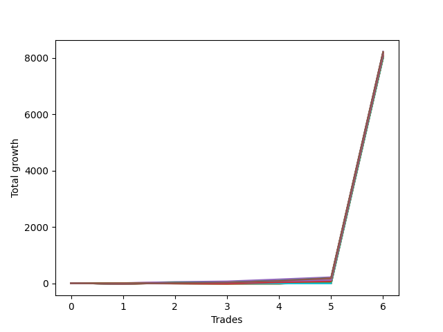

# Short Wallace Betterrerer 020 
- Symbol: NQ
- Date Range: 3/19/22 - 5/22/22
- Trading Period: 7:20-12:30
- Number of Trades: 4


| Name | Win Percent | Profit | Avg Profit / Trade |     | Name | Win Percent | Profit | Avg Profit / Trade |
| ---- | ----------- | ------ | ------------------ | --- | ---- | ----------- | ------ | ------------------ |
| Sorted By <br> Profit | | | | | Sorted By <br> Win Percentage ||||
| Four | 100.00 | 103375.00 | 25843.75 |     | Four | 100.00 | 103375.00 | 25843.75 |
| Five | 100.00 | 99625.00 | 24906.25 |     | Five | 100.00 | 99625.00 | 24906.25 |
| Three | 100.00 | 74375.00 | 18593.75 |     | Three | 100.00 | 74375.00 | 18593.75 |
| Thirty-Six | 100.00 | 66750.00 | 16687.50 |     | Thirty-Six | 100.00 | 66750.00 | 16687.50 |
| Two | 100.00 | 50875.00 | 12718.75 |     | Two | 100.00 | 50875.00 | 12718.75 |
| Thirty-Five | 50.00 | 36125.00 | 9031.25 |     | One | 75.00 | 30000.00 | 7500.00 |
| One | 75.00 | 30000.00 | 7500.00 |     | Thirty-Four | 75.00 | 25625.00 | 6406.25 |
| Thirty-Four | 75.00 | 25625.00 | 6406.25 |     | Thirty-Three | 75.00 | 6125.00 | 1531.25 |
| Thirty-Three | 75.00 | 6125.00 | 1531.25 |     | Thirty-Two | 75.00 | 6125.00 | 1531.25 |
| Thirty-Two | 75.00 | 6125.00 | 1531.25 |     | Thirty-One | 75.00 | 6125.00 | 1531.25 |
| Thirty-One | 75.00 | 6125.00 | 1531.25 |     | Thirty | 75.00 | 6125.00 | 1531.25 |
| Thirty | 75.00 | 6125.00 | 1531.25 |     | Twenty-Nine | 75.00 | 6125.00 | 1531.25 |
| Twenty-Nine | 75.00 | 6125.00 | 1531.25 |     | Twenty-Eight | 75.00 | 6125.00 | 1531.25 |
| Twenty-Eight | 75.00 | 6125.00 | 1531.25 |     | Twenty-Seven | 75.00 | 6125.00 | 1531.25 |
| Twenty-Seven | 75.00 | 6125.00 | 1531.25 |     | Twenty-Six | 75.00 | 6125.00 | 1531.25 |
| Twenty-Six | 75.00 | 6125.00 | 1531.25 |     | Twenty-Five | 75.00 | 6125.00 | 1531.25 |
| Twenty-Five | 75.00 | 6125.00 | 1531.25 |     | Twenty-Four | 75.00 | 6125.00 | 1531.25 |
| Twenty-Four | 75.00 | 6125.00 | 1531.25 |     | Eleven | 75.00 | 4625.00 | 1156.25 |
| Eleven | 75.00 | 4625.00 | 1156.25 |     | Nine | 75.00 | 4625.00 | 1156.25 |
| Nine | 75.00 | 4625.00 | 1156.25 |     | Seven | 75.00 | 4625.00 | 1156.25 |
| Seven | 75.00 | 4625.00 | 1156.25 |     | Seventeen | 75.00 | 4250.00 | 1062.50 |
| Seventeen | 75.00 | 4250.00 | 1062.50 |     | Fifteen | 75.00 | 4250.00 | 1062.50 |
| Fifteen | 75.00 | 4250.00 | 1062.50 |     | Thirteen | 75.00 | 4250.00 | 1062.50 |
| Thirteen | 75.00 | 4250.00 | 1062.50 |     | Thirty-Five | 50.00 | 36125.00 | 9031.25 |
| Ten | 25.00 | -375.00 | -93.75 |     | Twenty-Three | 50.00 | -500.00 | -125.00 |
| Eight | 25.00 | -375.00 | -93.75 |     | Twenty-One | 50.00 | -500.00 | -125.00 |
| Six | 25.00 | -375.00 | -93.75 |     | Nineteen | 50.00 | -500.00 | -125.00 |
| Twenty-Three | 50.00 | -500.00 | -125.00 |     | Ten | 25.00 | -375.00 | -93.75 |
| Twenty-One | 50.00 | -500.00 | -125.00 |     | Eight | 25.00 | -375.00 | -93.75 |
| Nineteen | 50.00 | -500.00 | -125.00 |     | Six | 25.00 | -375.00 | -93.75 |
| Sixteen | 25.00 | -1125.00 | -281.25 |     | Sixteen | 25.00 | -1125.00 | -281.25 |
| Fourteen | 25.00 | -1125.00 | -281.25 |     | Fourteen | 25.00 | -1125.00 | -281.25 |
| Twelve | 25.00 | -1125.00 | -281.25 |     | Twelve | 25.00 | -1125.00 | -281.25 |
| Twenty-Two | 25.00 | -4375.00 | -1093.75 |     | Twenty-Two | 25.00 | -4375.00 | -1093.75 |
| Twenty | 25.00 | -4375.00 | -1093.75 |     | Twenty | 25.00 | -4375.00 | -1093.75 |
| Eighteen | 25.00 | -4375.00 | -1093.75 |     | Eighteen | 25.00 | -4375.00 | -1093.75 |

### Test One
* Sell when price hits the middle line of the 20p bollinger
* No Stoploss
* Results:
```
Total Trades: 4
Percent Up: 25.00
Percent Down: 75.00
Total Points Moved Down: 60.00
Potential Profit: 30000.00
Total Points Ups: 3.00 Count Ups: 1
Total Points Downs: 63.00 Count Downs: 3
```

<details><summary>Trades</summary>

<code>In: 2022-03-29 08:52:00		Out: 2022-03-29 08:56:30		Total Position Time: 04:30		Total Move Down: 9.50		Total to Date: -9.50</code> <br />
<code>In: 2022-04-18 11:28:00		Out: 2022-04-18 11:40:45		Total Position Time: 12:45		Total Move Down: -3.00		Total to Date: -6.50</code> <br />
<code>In: 2022-05-16 09:05:00		Out: 2022-05-16 09:06:00		Total Position Time: 01:00		Total Move Down: 21.75		Total to Date: -28.25</code> <br />
<code>In: 2022-05-24 09:18:00		Out: 2022-05-24 09:21:30		Total Position Time: 03:30		Total Move Down: 31.75		Total to Date: -60.00</code> <br />


</details>

### Test Two
* Sell when the price hits the lower line of the 20p 1std bollinger
* No Stoploss
* Results:
```
Total Trades: 4
Percent Up: 0.00
Percent Down: 100.00
Total Points Moved Down: 101.75
Potential Profit: 50875.00
Total Points Ups: 0.00 Count Ups: 0
Total Points Downs: 101.75 Count Downs: 4
```

<details><summary>Trades</summary>

<code>In: 2022-03-29 08:52:00		Out: 2022-03-29 08:58:40		Total Position Time: 06:40		Total Move Down: 17.75		Total to Date: -17.75</code> <br />
<code>In: 2022-04-18 11:28:00		Out: 2022-04-18 11:41:15		Total Position Time: 13:15		Total Move Down: 8.50		Total to Date: -26.25</code> <br />
<code>In: 2022-05-16 09:05:00		Out: 2022-05-16 09:06:25		Total Position Time: 01:25		Total Move Down: 32.25		Total to Date: -58.50</code> <br />
<code>In: 2022-05-24 09:18:00		Out: 2022-05-24 09:26:40		Total Position Time: 08:40		Total Move Down: 43.25		Total to Date: -101.75</code> <br />


</details>

### Test Three
* Sell when the price hits the lower line of the 20p 2std bollinger
* No Stoploss
* Results:
```
Total Trades: 4
Percent Up: 0.00
Percent Down: 100.00
Total Points Moved Down: 148.75
Potential Profit: 74375.00
Total Points Ups: 0.00 Count Ups: 0
Total Points Downs: 148.75 Count Downs: 4
```

<details><summary>Trades</summary>

<code>In: 2022-03-29 08:52:00		Out: 2022-03-29 09:01:35		Total Position Time: 09:35		Total Move Down: 27.50		Total to Date: -27.50</code> <br />
<code>In: 2022-04-18 11:28:00		Out: 2022-04-18 11:43:10		Total Position Time: 15:10		Total Move Down: 7.00		Total to Date: -34.50</code> <br />
<code>In: 2022-05-16 09:05:00		Out: 2022-05-16 09:11:35		Total Position Time: 06:35		Total Move Down: 40.00		Total to Date: -74.50</code> <br />
<code>In: 2022-05-24 09:18:00		Out: 2022-05-24 09:32:40		Total Position Time: 14:40		Total Move Down: 74.25		Total to Date: -148.75</code> <br />


</details>

### Test Four
* Sell when the price hits the middle line of the 1std VWAP
* No Stoploss
* Results:
```
Total Trades: 4
Percent Up: 0.00
Percent Down: 100.00
Total Points Moved Down: 206.75
Potential Profit: 103375.00
Total Points Ups: 0.00 Count Ups: 0
Total Points Downs: 206.75 Count Downs: 4
```

<details><summary>Trades</summary>

<code>In: 2022-03-29 08:52:00		Out: 2022-03-29 09:02:10		Total Position Time: 10:10		Total Move Down: 39.25		Total to Date: -39.25</code> <br />
<code>In: 2022-04-18 11:28:00		Out: 2022-04-18 11:57:55		Total Position Time: 29:55		Total Move Down: 16.00		Total to Date: -55.25</code> <br />
<code>In: 2022-05-16 09:05:00		Out: 2022-05-16 09:17:45		Total Position Time: 12:45		Total Move Down: 56.50		Total to Date: -111.75</code> <br />
<code>In: 2022-05-24 09:18:00		Out: 2022-05-24 09:36:50		Total Position Time: 18:50		Total Move Down: 95.00		Total to Date: -206.75</code> <br />


</details>

### Test Five
* Sell when the price hits the lower line of the 1std VWAP
* No Stoploss
* Results:
```
Total Trades: 4
Percent Up: 0.00
Percent Down: 100.00
Total Points Moved Down: 199.25
Potential Profit: 99625.00
Total Points Ups: 0.00 Count Ups: 0
Total Points Downs: 199.25 Count Downs: 4
```

<details><summary>Trades</summary>

<code>In: 2022-03-29 08:52:00		Out: 2022-03-29 09:21:55		Total Position Time: 29:55		Total Move Down: 24.00		Total to Date: -24.00</code> <br />
<code>In: 2022-04-18 11:28:00		Out: 2022-04-18 11:57:55		Total Position Time: 29:55		Total Move Down: 16.00		Total to Date: -40.00</code> <br />
<code>In: 2022-05-16 09:05:00		Out: 2022-05-16 09:34:55		Total Position Time: 29:55		Total Move Down: 54.75		Total to Date: -94.75</code> <br />
<code>In: 2022-05-24 09:18:00		Out: 2022-05-24 09:47:55		Total Position Time: 29:55		Total Move Down: 104.50		Total to Date: -199.25</code> <br />


</details>

### Test Six
* Sell when the price hits the middle line of the 20p bollinger
* Stoploss is -2 points
* Results:
```
Total Trades: 4
Percent Up: 75.00
Percent Down: 25.00
Total Points Moved Down: -0.75
Potential Profit: -375.00
Total Points Ups: 2.25 Count Ups: 3
Total Points Downs: 1.50 Count Downs: 1
```

<details><summary>Trades</summary>

<code>In: 2022-03-29 08:52:00		Out: 2022-03-29 08:53:10		Total Position Time: 01:10		Total Move Down: -0.25		Total to Date: 0.25</code> <br />
<code>In: 2022-04-18 11:28:00		Out: 2022-04-18 11:29:50		Total Position Time: 01:50		Total Move Down: -1.75		Total to Date: 2.00</code> <br />
<code>In: 2022-05-16 09:05:00		Out: 2022-05-16 09:05:10		Total Position Time: 00:10		Total Move Down: 1.50		Total to Date: 0.50</code> <br />
<code>In: 2022-05-24 09:18:00		Out: 2022-05-24 09:18:10		Total Position Time: 00:10		Total Move Down: -0.25		Total to Date: 0.75</code> <br />


</details>

### Test Seven
* Sell when the price hits the middle line of the 20p bollinger
* Trailing Stop is -2 points
* Results:
```
Total Trades: 4
Percent Up: 25.00
Percent Down: 75.00
Total Points Moved Down: 9.25
Potential Profit: 4625.00
Total Points Ups: 0.25 Count Ups: 1
Total Points Downs: 9.50 Count Downs: 3
```

<details><summary>Trades</summary>

<code>In: 2022-03-29 08:52:00		Out: 2022-03-29 08:52:20		Total Position Time: 00:20		Total Move Down: 2.25		Total to Date: -2.25</code> <br />
<code>In: 2022-04-18 11:28:00		Out: 2022-04-18 11:28:35		Total Position Time: 00:35		Total Move Down: 5.75		Total to Date: -8.00</code> <br />
<code>In: 2022-05-16 09:05:00		Out: 2022-05-16 09:05:10		Total Position Time: 00:10		Total Move Down: 1.50		Total to Date: -9.50</code> <br />
<code>In: 2022-05-24 09:18:00		Out: 2022-05-24 09:18:10		Total Position Time: 00:10		Total Move Down: -0.25		Total to Date: -9.25</code> <br />


</details>

### Test Eight
* Sell when the price hits the lower line of the 20p 1std bollinger
* Stoploss is -2 points
* Results:
```
Total Trades: 4
Percent Up: 75.00
Percent Down: 25.00
Total Points Moved Down: -0.75
Potential Profit: -375.00
Total Points Ups: 2.25 Count Ups: 3
Total Points Downs: 1.50 Count Downs: 1
```

<details><summary>Trades</summary>

<code>In: 2022-03-29 08:52:00		Out: 2022-03-29 08:53:10		Total Position Time: 01:10		Total Move Down: -0.25		Total to Date: 0.25</code> <br />
<code>In: 2022-04-18 11:28:00		Out: 2022-04-18 11:29:50		Total Position Time: 01:50		Total Move Down: -1.75		Total to Date: 2.00</code> <br />
<code>In: 2022-05-16 09:05:00		Out: 2022-05-16 09:05:10		Total Position Time: 00:10		Total Move Down: 1.50		Total to Date: 0.50</code> <br />
<code>In: 2022-05-24 09:18:00		Out: 2022-05-24 09:18:10		Total Position Time: 00:10		Total Move Down: -0.25		Total to Date: 0.75</code> <br />


</details>

### Test Nine
* Sell when the price hits the lower line of the 20p 1std bollinger
* Trailing Stop is -2 points
* Results:
```
Total Trades: 4
Percent Up: 25.00
Percent Down: 75.00
Total Points Moved Down: 9.25
Potential Profit: 4625.00
Total Points Ups: 0.25 Count Ups: 1
Total Points Downs: 9.50 Count Downs: 3
```

<details><summary>Trades</summary>

<code>In: 2022-03-29 08:52:00		Out: 2022-03-29 08:52:20		Total Position Time: 00:20		Total Move Down: 2.25		Total to Date: -2.25</code> <br />
<code>In: 2022-04-18 11:28:00		Out: 2022-04-18 11:28:35		Total Position Time: 00:35		Total Move Down: 5.75		Total to Date: -8.00</code> <br />
<code>In: 2022-05-16 09:05:00		Out: 2022-05-16 09:05:10		Total Position Time: 00:10		Total Move Down: 1.50		Total to Date: -9.50</code> <br />
<code>In: 2022-05-24 09:18:00		Out: 2022-05-24 09:18:10		Total Position Time: 00:10		Total Move Down: -0.25		Total to Date: -9.25</code> <br />


</details>

### Test Ten
* Sell when the price hits the lower line of the 20p 2std bollinger
* Stoploss is -2 points
* Results:
```
Total Trades: 4
Percent Up: 75.00
Percent Down: 25.00
Total Points Moved Down: -0.75
Potential Profit: -375.00
Total Points Ups: 2.25 Count Ups: 3
Total Points Downs: 1.50 Count Downs: 1
```

<details><summary>Trades</summary>

<code>In: 2022-03-29 08:52:00		Out: 2022-03-29 08:53:10		Total Position Time: 01:10		Total Move Down: -0.25		Total to Date: 0.25</code> <br />
<code>In: 2022-04-18 11:28:00		Out: 2022-04-18 11:29:50		Total Position Time: 01:50		Total Move Down: -1.75		Total to Date: 2.00</code> <br />
<code>In: 2022-05-16 09:05:00		Out: 2022-05-16 09:05:10		Total Position Time: 00:10		Total Move Down: 1.50		Total to Date: 0.50</code> <br />
<code>In: 2022-05-24 09:18:00		Out: 2022-05-24 09:18:10		Total Position Time: 00:10		Total Move Down: -0.25		Total to Date: 0.75</code> <br />


</details>

### Test Eleven
* Sell when the price hits the lower line of the 20p 2std bollinger
* Trailing Stop is -2 points
* Results:
```
Total Trades: 4
Percent Up: 25.00
Percent Down: 75.00
Total Points Moved Down: 9.25
Potential Profit: 4625.00
Total Points Ups: 0.25 Count Ups: 1
Total Points Downs: 9.50 Count Downs: 3
```

<details><summary>Trades</summary>

<code>In: 2022-03-29 08:52:00		Out: 2022-03-29 08:52:20		Total Position Time: 00:20		Total Move Down: 2.25		Total to Date: -2.25</code> <br />
<code>In: 2022-04-18 11:28:00		Out: 2022-04-18 11:28:35		Total Position Time: 00:35		Total Move Down: 5.75		Total to Date: -8.00</code> <br />
<code>In: 2022-05-16 09:05:00		Out: 2022-05-16 09:05:10		Total Position Time: 00:10		Total Move Down: 1.50		Total to Date: -9.50</code> <br />
<code>In: 2022-05-24 09:18:00		Out: 2022-05-24 09:18:10		Total Position Time: 00:10		Total Move Down: -0.25		Total to Date: -9.25</code> <br />


</details>

### Test Twelve
* Sell when the price hits the middle line of the 20p bollinger
* Stoploss is -3 points
* Results:
```
Total Trades: 4
Percent Up: 75.00
Percent Down: 25.00
Total Points Moved Down: -2.25
Potential Profit: -1125.00
Total Points Ups: 3.75 Count Ups: 3
Total Points Downs: 1.50 Count Downs: 1
```

<details><summary>Trades</summary>

<code>In: 2022-03-29 08:52:00		Out: 2022-03-29 08:53:10		Total Position Time: 01:10		Total Move Down: -0.25		Total to Date: 0.25</code> <br />
<code>In: 2022-04-18 11:28:00		Out: 2022-04-18 11:30:15		Total Position Time: 02:15		Total Move Down: -3.25		Total to Date: 3.50</code> <br />
<code>In: 2022-05-16 09:05:00		Out: 2022-05-16 09:05:10		Total Position Time: 00:10		Total Move Down: 1.50		Total to Date: 2.00</code> <br />
<code>In: 2022-05-24 09:18:00		Out: 2022-05-24 09:18:10		Total Position Time: 00:10		Total Move Down: -0.25		Total to Date: 2.25</code> <br />


</details>

### Test Thirteen
* Sell when the price hits the middle line of the 20p bollinger
* Trailing Stop is -3 points
* Results:
```
Total Trades: 4
Percent Up: 25.00
Percent Down: 75.00
Total Points Moved Down: 8.50
Potential Profit: 4250.00
Total Points Ups: 0.25 Count Ups: 1
Total Points Downs: 8.75 Count Downs: 3
```

<details><summary>Trades</summary>

<code>In: 2022-03-29 08:52:00		Out: 2022-03-29 08:52:50		Total Position Time: 00:50		Total Move Down: 1.50		Total to Date: -1.50</code> <br />
<code>In: 2022-04-18 11:28:00		Out: 2022-04-18 11:28:35		Total Position Time: 00:35		Total Move Down: 5.75		Total to Date: -7.25</code> <br />
<code>In: 2022-05-16 09:05:00		Out: 2022-05-16 09:05:10		Total Position Time: 00:10		Total Move Down: 1.50		Total to Date: -8.75</code> <br />
<code>In: 2022-05-24 09:18:00		Out: 2022-05-24 09:18:10		Total Position Time: 00:10		Total Move Down: -0.25		Total to Date: -8.50</code> <br />


</details>

### Test Fourteen
* Sell when the price hits the lower line of the 20p 1std bollinger
* Stoploss is -3 points
* Results:
```
Total Trades: 4
Percent Up: 75.00
Percent Down: 25.00
Total Points Moved Down: -2.25
Potential Profit: -1125.00
Total Points Ups: 3.75 Count Ups: 3
Total Points Downs: 1.50 Count Downs: 1
```

<details><summary>Trades</summary>

<code>In: 2022-03-29 08:52:00		Out: 2022-03-29 08:53:10		Total Position Time: 01:10		Total Move Down: -0.25		Total to Date: 0.25</code> <br />
<code>In: 2022-04-18 11:28:00		Out: 2022-04-18 11:30:15		Total Position Time: 02:15		Total Move Down: -3.25		Total to Date: 3.50</code> <br />
<code>In: 2022-05-16 09:05:00		Out: 2022-05-16 09:05:10		Total Position Time: 00:10		Total Move Down: 1.50		Total to Date: 2.00</code> <br />
<code>In: 2022-05-24 09:18:00		Out: 2022-05-24 09:18:10		Total Position Time: 00:10		Total Move Down: -0.25		Total to Date: 2.25</code> <br />


</details>

### Test Fifteen
* Sell when the price hits the lower line of the 20p 1std bollinger
* Trailing Stop is -3 points
* Results:
```
Total Trades: 4
Percent Up: 25.00
Percent Down: 75.00
Total Points Moved Down: 8.50
Potential Profit: 4250.00
Total Points Ups: 0.25 Count Ups: 1
Total Points Downs: 8.75 Count Downs: 3
```

<details><summary>Trades</summary>

<code>In: 2022-03-29 08:52:00		Out: 2022-03-29 08:52:50		Total Position Time: 00:50		Total Move Down: 1.50		Total to Date: -1.50</code> <br />
<code>In: 2022-04-18 11:28:00		Out: 2022-04-18 11:28:35		Total Position Time: 00:35		Total Move Down: 5.75		Total to Date: -7.25</code> <br />
<code>In: 2022-05-16 09:05:00		Out: 2022-05-16 09:05:10		Total Position Time: 00:10		Total Move Down: 1.50		Total to Date: -8.75</code> <br />
<code>In: 2022-05-24 09:18:00		Out: 2022-05-24 09:18:10		Total Position Time: 00:10		Total Move Down: -0.25		Total to Date: -8.50</code> <br />


</details>

### Test Sixteen
* Sell when the price hits the lower line of the 20p 2std bollinger
* Stoploss is -3 points
* Results:
```
Total Trades: 4
Percent Up: 75.00
Percent Down: 25.00
Total Points Moved Down: -2.25
Potential Profit: -1125.00
Total Points Ups: 3.75 Count Ups: 3
Total Points Downs: 1.50 Count Downs: 1
```

<details><summary>Trades</summary>

<code>In: 2022-03-29 08:52:00		Out: 2022-03-29 08:53:10		Total Position Time: 01:10		Total Move Down: -0.25		Total to Date: 0.25</code> <br />
<code>In: 2022-04-18 11:28:00		Out: 2022-04-18 11:30:15		Total Position Time: 02:15		Total Move Down: -3.25		Total to Date: 3.50</code> <br />
<code>In: 2022-05-16 09:05:00		Out: 2022-05-16 09:05:10		Total Position Time: 00:10		Total Move Down: 1.50		Total to Date: 2.00</code> <br />
<code>In: 2022-05-24 09:18:00		Out: 2022-05-24 09:18:10		Total Position Time: 00:10		Total Move Down: -0.25		Total to Date: 2.25</code> <br />


</details>

### Test Seventeen
* Sell when the price hits the lower line of the 20p 2std bollinger
* Trailing Stop is -3 points
* Results:
```
Total Trades: 4
Percent Up: 25.00
Percent Down: 75.00
Total Points Moved Down: 8.50
Potential Profit: 4250.00
Total Points Ups: 0.25 Count Ups: 1
Total Points Downs: 8.75 Count Downs: 3
```

<details><summary>Trades</summary>

<code>In: 2022-03-29 08:52:00		Out: 2022-03-29 08:52:50		Total Position Time: 00:50		Total Move Down: 1.50		Total to Date: -1.50</code> <br />
<code>In: 2022-04-18 11:28:00		Out: 2022-04-18 11:28:35		Total Position Time: 00:35		Total Move Down: 5.75		Total to Date: -7.25</code> <br />
<code>In: 2022-05-16 09:05:00		Out: 2022-05-16 09:05:10		Total Position Time: 00:10		Total Move Down: 1.50		Total to Date: -8.75</code> <br />
<code>In: 2022-05-24 09:18:00		Out: 2022-05-24 09:18:10		Total Position Time: 00:10		Total Move Down: -0.25		Total to Date: -8.50</code> <br />


</details>

### Test Eighteen
* Sell when the price hits the middle line of the 20p bollinger
* Stoploss is -5 points
* Results:
```
Total Trades: 4
Percent Up: 75.00
Percent Down: 25.00
Total Points Moved Down: -8.75
Potential Profit: -4375.00
Total Points Ups: 10.25 Count Ups: 3
Total Points Downs: 1.50 Count Downs: 1
```

<details><summary>Trades</summary>

<code>In: 2022-03-29 08:52:00		Out: 2022-03-29 08:53:15		Total Position Time: 01:15		Total Move Down: -3.75		Total to Date: 3.75</code> <br />
<code>In: 2022-04-18 11:28:00		Out: 2022-04-18 11:31:00		Total Position Time: 03:00		Total Move Down: -6.25		Total to Date: 10.00</code> <br />
<code>In: 2022-05-16 09:05:00		Out: 2022-05-16 09:05:10		Total Position Time: 00:10		Total Move Down: 1.50		Total to Date: 8.50</code> <br />
<code>In: 2022-05-24 09:18:00		Out: 2022-05-24 09:18:10		Total Position Time: 00:10		Total Move Down: -0.25		Total to Date: 8.75</code> <br />


</details>

### Test Nineteen
* Sell when the price hits the middle line of the 20p bollinger
* Trailing Stop is -5 points
* Results:
```
Total Trades: 4
Percent Up: 50.00
Percent Down: 50.00
Total Points Moved Down: -1.00
Potential Profit: -500.00
Total Points Ups: 4.00 Count Ups: 2
Total Points Downs: 3.00 Count Downs: 2
```

<details><summary>Trades</summary>

<code>In: 2022-03-29 08:52:00		Out: 2022-03-29 08:53:15		Total Position Time: 01:15		Total Move Down: -3.75		Total to Date: 3.75</code> <br />
<code>In: 2022-04-18 11:28:00		Out: 2022-04-18 11:28:40		Total Position Time: 00:40		Total Move Down: 1.50		Total to Date: 2.25</code> <br />
<code>In: 2022-05-16 09:05:00		Out: 2022-05-16 09:05:10		Total Position Time: 00:10		Total Move Down: 1.50		Total to Date: 0.75</code> <br />
<code>In: 2022-05-24 09:18:00		Out: 2022-05-24 09:18:10		Total Position Time: 00:10		Total Move Down: -0.25		Total to Date: 1.00</code> <br />


</details>

### Test Twenty
* Sell when the price hits the lower line of the 20p 1std bollinger
* Stoploss is -5 points
* Results:
```
Total Trades: 4
Percent Up: 75.00
Percent Down: 25.00
Total Points Moved Down: -8.75
Potential Profit: -4375.00
Total Points Ups: 10.25 Count Ups: 3
Total Points Downs: 1.50 Count Downs: 1
```

<details><summary>Trades</summary>

<code>In: 2022-03-29 08:52:00		Out: 2022-03-29 08:53:15		Total Position Time: 01:15		Total Move Down: -3.75		Total to Date: 3.75</code> <br />
<code>In: 2022-04-18 11:28:00		Out: 2022-04-18 11:31:00		Total Position Time: 03:00		Total Move Down: -6.25		Total to Date: 10.00</code> <br />
<code>In: 2022-05-16 09:05:00		Out: 2022-05-16 09:05:10		Total Position Time: 00:10		Total Move Down: 1.50		Total to Date: 8.50</code> <br />
<code>In: 2022-05-24 09:18:00		Out: 2022-05-24 09:18:10		Total Position Time: 00:10		Total Move Down: -0.25		Total to Date: 8.75</code> <br />


</details>

### Test Twenty-One
* Sell when the price hits the lower line of the 20p 1std bollinger
* Trailing Stop is -5 points
* Results:
```
Total Trades: 4
Percent Up: 50.00
Percent Down: 50.00
Total Points Moved Down: -1.00
Potential Profit: -500.00
Total Points Ups: 4.00 Count Ups: 2
Total Points Downs: 3.00 Count Downs: 2
```

<details><summary>Trades</summary>

<code>In: 2022-03-29 08:52:00		Out: 2022-03-29 08:53:15		Total Position Time: 01:15		Total Move Down: -3.75		Total to Date: 3.75</code> <br />
<code>In: 2022-04-18 11:28:00		Out: 2022-04-18 11:28:40		Total Position Time: 00:40		Total Move Down: 1.50		Total to Date: 2.25</code> <br />
<code>In: 2022-05-16 09:05:00		Out: 2022-05-16 09:05:10		Total Position Time: 00:10		Total Move Down: 1.50		Total to Date: 0.75</code> <br />
<code>In: 2022-05-24 09:18:00		Out: 2022-05-24 09:18:10		Total Position Time: 00:10		Total Move Down: -0.25		Total to Date: 1.00</code> <br />


</details>

### Test Twenty-Two
* Sell when the price hits the lower line of the 20p 2std bollinger
* Stoploss is -5 points
* Results:
```
Total Trades: 4
Percent Up: 75.00
Percent Down: 25.00
Total Points Moved Down: -8.75
Potential Profit: -4375.00
Total Points Ups: 10.25 Count Ups: 3
Total Points Downs: 1.50 Count Downs: 1
```

<details><summary>Trades</summary>

<code>In: 2022-03-29 08:52:00		Out: 2022-03-29 08:53:15		Total Position Time: 01:15		Total Move Down: -3.75		Total to Date: 3.75</code> <br />
<code>In: 2022-04-18 11:28:00		Out: 2022-04-18 11:31:00		Total Position Time: 03:00		Total Move Down: -6.25		Total to Date: 10.00</code> <br />
<code>In: 2022-05-16 09:05:00		Out: 2022-05-16 09:05:10		Total Position Time: 00:10		Total Move Down: 1.50		Total to Date: 8.50</code> <br />
<code>In: 2022-05-24 09:18:00		Out: 2022-05-24 09:18:10		Total Position Time: 00:10		Total Move Down: -0.25		Total to Date: 8.75</code> <br />


</details>

### Test Twenty-Three
* Sell when the price hits the lower line of the 20p 2std bollinger
* Trailing Stop is -5 points
* Results:
```
Total Trades: 4
Percent Up: 50.00
Percent Down: 50.00
Total Points Moved Down: -1.00
Potential Profit: -500.00
Total Points Ups: 4.00 Count Ups: 2
Total Points Downs: 3.00 Count Downs: 2
```

<details><summary>Trades</summary>

<code>In: 2022-03-29 08:52:00		Out: 2022-03-29 08:53:15		Total Position Time: 01:15		Total Move Down: -3.75		Total to Date: 3.75</code> <br />
<code>In: 2022-04-18 11:28:00		Out: 2022-04-18 11:28:40		Total Position Time: 00:40		Total Move Down: 1.50		Total to Date: 2.25</code> <br />
<code>In: 2022-05-16 09:05:00		Out: 2022-05-16 09:05:10		Total Position Time: 00:10		Total Move Down: 1.50		Total to Date: 0.75</code> <br />
<code>In: 2022-05-24 09:18:00		Out: 2022-05-24 09:18:10		Total Position Time: 00:10		Total Move Down: -0.25		Total to Date: 1.00</code> <br />


</details>

### Test Twenty-Four
* Sell when the price hits the middle line of the 20p bollinger
* Stoploss is 10 points
* Results:
```
Total Trades: 4
Percent Up: 25.00
Percent Down: 75.00
Total Points Moved Down: 12.25
Potential Profit: 6125.00
Total Points Ups: 0.25 Count Ups: 1
Total Points Downs: 12.50 Count Downs: 3
```

<details><summary>Trades</summary>

<code>In: 2022-03-29 08:52:00		Out: 2022-03-29 08:52:10		Total Position Time: 00:10		Total Move Down: 4.00		Total to Date: -4.00</code> <br />
<code>In: 2022-04-18 11:28:00		Out: 2022-04-18 11:28:10		Total Position Time: 00:10		Total Move Down: 7.00		Total to Date: -11.00</code> <br />
<code>In: 2022-05-16 09:05:00		Out: 2022-05-16 09:05:10		Total Position Time: 00:10		Total Move Down: 1.50		Total to Date: -12.50</code> <br />
<code>In: 2022-05-24 09:18:00		Out: 2022-05-24 09:18:10		Total Position Time: 00:10		Total Move Down: -0.25		Total to Date: -12.25</code> <br />


</details>

### Test Twenty-Five
* Sell when the price hits the middle line of the 20p bollinger
* Trailing Stop is 10 points
* Results:
```
Total Trades: 4
Percent Up: 25.00
Percent Down: 75.00
Total Points Moved Down: 12.25
Potential Profit: 6125.00
Total Points Ups: 0.25 Count Ups: 1
Total Points Downs: 12.50 Count Downs: 3
```

<details><summary>Trades</summary>

<code>In: 2022-03-29 08:52:00		Out: 2022-03-29 08:52:10		Total Position Time: 00:10		Total Move Down: 4.00		Total to Date: -4.00</code> <br />
<code>In: 2022-04-18 11:28:00		Out: 2022-04-18 11:28:10		Total Position Time: 00:10		Total Move Down: 7.00		Total to Date: -11.00</code> <br />
<code>In: 2022-05-16 09:05:00		Out: 2022-05-16 09:05:10		Total Position Time: 00:10		Total Move Down: 1.50		Total to Date: -12.50</code> <br />
<code>In: 2022-05-24 09:18:00		Out: 2022-05-24 09:18:10		Total Position Time: 00:10		Total Move Down: -0.25		Total to Date: -12.25</code> <br />


</details>

### Test Twenty-Six
* Sell when the price hits the lower line of the 20p 1std bollinger
* Stoploss is 10 points
* Results:
```
Total Trades: 4
Percent Up: 25.00
Percent Down: 75.00
Total Points Moved Down: 12.25
Potential Profit: 6125.00
Total Points Ups: 0.25 Count Ups: 1
Total Points Downs: 12.50 Count Downs: 3
```

<details><summary>Trades</summary>

<code>In: 2022-03-29 08:52:00		Out: 2022-03-29 08:52:10		Total Position Time: 00:10		Total Move Down: 4.00		Total to Date: -4.00</code> <br />
<code>In: 2022-04-18 11:28:00		Out: 2022-04-18 11:28:10		Total Position Time: 00:10		Total Move Down: 7.00		Total to Date: -11.00</code> <br />
<code>In: 2022-05-16 09:05:00		Out: 2022-05-16 09:05:10		Total Position Time: 00:10		Total Move Down: 1.50		Total to Date: -12.50</code> <br />
<code>In: 2022-05-24 09:18:00		Out: 2022-05-24 09:18:10		Total Position Time: 00:10		Total Move Down: -0.25		Total to Date: -12.25</code> <br />


</details>

### Test Twenty-Seven
* Sell when the price hits the lower line of the 20p 1std bollinger
* Trailing Stop is 10 points
* Results:
```
Total Trades: 4
Percent Up: 25.00
Percent Down: 75.00
Total Points Moved Down: 12.25
Potential Profit: 6125.00
Total Points Ups: 0.25 Count Ups: 1
Total Points Downs: 12.50 Count Downs: 3
```

<details><summary>Trades</summary>

<code>In: 2022-03-29 08:52:00		Out: 2022-03-29 08:52:10		Total Position Time: 00:10		Total Move Down: 4.00		Total to Date: -4.00</code> <br />
<code>In: 2022-04-18 11:28:00		Out: 2022-04-18 11:28:10		Total Position Time: 00:10		Total Move Down: 7.00		Total to Date: -11.00</code> <br />
<code>In: 2022-05-16 09:05:00		Out: 2022-05-16 09:05:10		Total Position Time: 00:10		Total Move Down: 1.50		Total to Date: -12.50</code> <br />
<code>In: 2022-05-24 09:18:00		Out: 2022-05-24 09:18:10		Total Position Time: 00:10		Total Move Down: -0.25		Total to Date: -12.25</code> <br />


</details>

### Test Twenty-Eight
* Sell when the price hits the lower line of the 20p 2std bollinger
* Stoploss is 10 points
* Results:
```
Total Trades: 4
Percent Up: 25.00
Percent Down: 75.00
Total Points Moved Down: 12.25
Potential Profit: 6125.00
Total Points Ups: 0.25 Count Ups: 1
Total Points Downs: 12.50 Count Downs: 3
```

<details><summary>Trades</summary>

<code>In: 2022-03-29 08:52:00		Out: 2022-03-29 08:52:10		Total Position Time: 00:10		Total Move Down: 4.00		Total to Date: -4.00</code> <br />
<code>In: 2022-04-18 11:28:00		Out: 2022-04-18 11:28:10		Total Position Time: 00:10		Total Move Down: 7.00		Total to Date: -11.00</code> <br />
<code>In: 2022-05-16 09:05:00		Out: 2022-05-16 09:05:10		Total Position Time: 00:10		Total Move Down: 1.50		Total to Date: -12.50</code> <br />
<code>In: 2022-05-24 09:18:00		Out: 2022-05-24 09:18:10		Total Position Time: 00:10		Total Move Down: -0.25		Total to Date: -12.25</code> <br />


</details>

### Test Twenty-Nine
* Sell when the price hits the lower line of the 20p 2std bollinger
* Trailing Stop is 10 points
* Results:
```
Total Trades: 4
Percent Up: 25.00
Percent Down: 75.00
Total Points Moved Down: 12.25
Potential Profit: 6125.00
Total Points Ups: 0.25 Count Ups: 1
Total Points Downs: 12.50 Count Downs: 3
```

<details><summary>Trades</summary>

<code>In: 2022-03-29 08:52:00		Out: 2022-03-29 08:52:10		Total Position Time: 00:10		Total Move Down: 4.00		Total to Date: -4.00</code> <br />
<code>In: 2022-04-18 11:28:00		Out: 2022-04-18 11:28:10		Total Position Time: 00:10		Total Move Down: 7.00		Total to Date: -11.00</code> <br />
<code>In: 2022-05-16 09:05:00		Out: 2022-05-16 09:05:10		Total Position Time: 00:10		Total Move Down: 1.50		Total to Date: -12.50</code> <br />
<code>In: 2022-05-24 09:18:00		Out: 2022-05-24 09:18:10		Total Position Time: 00:10		Total Move Down: -0.25		Total to Date: -12.25</code> <br />


</details>

### Test Thirty
* Sell when the price hits the middle line of the 1std VWAP
* Stoploss is 10 points
* Results:
```
Total Trades: 4
Percent Up: 25.00
Percent Down: 75.00
Total Points Moved Down: 12.25
Potential Profit: 6125.00
Total Points Ups: 0.25 Count Ups: 1
Total Points Downs: 12.50 Count Downs: 3
```

<details><summary>Trades</summary>

<code>In: 2022-03-29 08:52:00		Out: 2022-03-29 08:52:10		Total Position Time: 00:10		Total Move Down: 4.00		Total to Date: -4.00</code> <br />
<code>In: 2022-04-18 11:28:00		Out: 2022-04-18 11:28:10		Total Position Time: 00:10		Total Move Down: 7.00		Total to Date: -11.00</code> <br />
<code>In: 2022-05-16 09:05:00		Out: 2022-05-16 09:05:10		Total Position Time: 00:10		Total Move Down: 1.50		Total to Date: -12.50</code> <br />
<code>In: 2022-05-24 09:18:00		Out: 2022-05-24 09:18:10		Total Position Time: 00:10		Total Move Down: -0.25		Total to Date: -12.25</code> <br />


</details>

### Test Thirty-One
* Sell when the price hits the middle line of the 1std VWAP
* Trailing Stop is 10 points
* Results:
```
Total Trades: 4
Percent Up: 25.00
Percent Down: 75.00
Total Points Moved Down: 12.25
Potential Profit: 6125.00
Total Points Ups: 0.25 Count Ups: 1
Total Points Downs: 12.50 Count Downs: 3
```

<details><summary>Trades</summary>

<code>In: 2022-03-29 08:52:00		Out: 2022-03-29 08:52:10		Total Position Time: 00:10		Total Move Down: 4.00		Total to Date: -4.00</code> <br />
<code>In: 2022-04-18 11:28:00		Out: 2022-04-18 11:28:10		Total Position Time: 00:10		Total Move Down: 7.00		Total to Date: -11.00</code> <br />
<code>In: 2022-05-16 09:05:00		Out: 2022-05-16 09:05:10		Total Position Time: 00:10		Total Move Down: 1.50		Total to Date: -12.50</code> <br />
<code>In: 2022-05-24 09:18:00		Out: 2022-05-24 09:18:10		Total Position Time: 00:10		Total Move Down: -0.25		Total to Date: -12.25</code> <br />


</details>

### Test Thirty-Two
* Sell when the price hits the lower line of the 1std VWAP
* Stoploss is 10 points
* Results:
```
Total Trades: 4
Percent Up: 25.00
Percent Down: 75.00
Total Points Moved Down: 12.25
Potential Profit: 6125.00
Total Points Ups: 0.25 Count Ups: 1
Total Points Downs: 12.50 Count Downs: 3
```

<details><summary>Trades</summary>

<code>In: 2022-03-29 08:52:00		Out: 2022-03-29 08:52:10		Total Position Time: 00:10		Total Move Down: 4.00		Total to Date: -4.00</code> <br />
<code>In: 2022-04-18 11:28:00		Out: 2022-04-18 11:28:10		Total Position Time: 00:10		Total Move Down: 7.00		Total to Date: -11.00</code> <br />
<code>In: 2022-05-16 09:05:00		Out: 2022-05-16 09:05:10		Total Position Time: 00:10		Total Move Down: 1.50		Total to Date: -12.50</code> <br />
<code>In: 2022-05-24 09:18:00		Out: 2022-05-24 09:18:10		Total Position Time: 00:10		Total Move Down: -0.25		Total to Date: -12.25</code> <br />


</details>

### Test Thirty-Three
* Sell when the price hits the lower line of the 1std VWAP
* Trailing Stop is 10 points
* Results:
```
Total Trades: 4
Percent Up: 25.00
Percent Down: 75.00
Total Points Moved Down: 12.25
Potential Profit: 6125.00
Total Points Ups: 0.25 Count Ups: 1
Total Points Downs: 12.50 Count Downs: 3
```

<details><summary>Trades</summary>

<code>In: 2022-03-29 08:52:00		Out: 2022-03-29 08:52:10		Total Position Time: 00:10		Total Move Down: 4.00		Total to Date: -4.00</code> <br />
<code>In: 2022-04-18 11:28:00		Out: 2022-04-18 11:28:10		Total Position Time: 00:10		Total Move Down: 7.00		Total to Date: -11.00</code> <br />
<code>In: 2022-05-16 09:05:00		Out: 2022-05-16 09:05:10		Total Position Time: 00:10		Total Move Down: 1.50		Total to Date: -12.50</code> <br />
<code>In: 2022-05-24 09:18:00		Out: 2022-05-24 09:18:10		Total Position Time: 00:10		Total Move Down: -0.25		Total to Date: -12.25</code> <br />


</details>

### Test Thirty-Four
* Sell when the linear regression slope is positive
* No Stoploss
* Results:
```
Total Trades: 4
Percent Up: 25.00
Percent Down: 75.00
Total Points Moved Down: 51.25
Potential Profit: 25625.00
Total Points Ups: 3.75 Count Ups: 1
Total Points Downs: 55.00 Count Downs: 3
```

<details><summary>Trades</summary>

<code>In: 2022-03-29 08:52:00		Out: 2022-03-29 08:54:05		Total Position Time: 02:05		Total Move Down: -3.75		Total to Date: 3.75</code> <br />
<code>In: 2022-04-18 11:28:00		Out: 2022-04-18 11:29:05		Total Position Time: 01:05		Total Move Down: 5.00		Total to Date: -1.25</code> <br />
<code>In: 2022-05-16 09:05:00		Out: 2022-05-16 09:23:05		Total Position Time: 18:05		Total Move Down: 46.50		Total to Date: -47.75</code> <br />
<code>In: 2022-05-24 09:18:00		Out: 2022-05-24 09:19:05		Total Position Time: 01:05		Total Move Down: 3.50		Total to Date: -51.25</code> <br />


</details>

### Test Thirty-Five
* Sell when the linear regression slope changes to positive
* No Stoploss
* Results:
```
Total Trades: 4
Percent Up: 50.00
Percent Down: 50.00
Total Points Moved Down: 72.25
Potential Profit: 36125.00
Total Points Ups: 15.25 Count Ups: 2
Total Points Downs: 87.50 Count Downs: 2
```

<details><summary>Trades</summary>

<code>In: 2022-03-29 08:52:00		Out: 2022-03-29 08:54:05		Total Position Time: 02:05		Total Move Down: -3.75		Total to Date: 3.75</code> <br />
<code>In: 2022-04-18 11:28:00		Out: 2022-04-18 11:35:05		Total Position Time: 07:05		Total Move Down: -11.50		Total to Date: 15.25</code> <br />
<code>In: 2022-05-16 09:05:00		Out: 2022-05-16 09:23:05		Total Position Time: 18:05		Total Move Down: 46.50		Total to Date: -31.25</code> <br />
<code>In: 2022-05-24 09:18:00		Out: 2022-05-24 09:31:05		Total Position Time: 13:05		Total Move Down: 41.00		Total to Date: -72.25</code> <br />


</details>

### Test Thirty-Six
* Sell when the linear regression slope changes to positive
* No Stoploss
* Results:
```
Total Trades: 4
Percent Up: 0.00
Percent Down: 100.00
Total Points Moved Down: 133.50
Potential Profit: 66750.00
Total Points Ups: 0.00 Count Ups: 0
Total Points Downs: 133.50 Count Downs: 4
```

<details><summary>Trades</summary>

<code>In: 2022-03-29 08:52:00		Out: 2022-03-29 09:07:05		Total Position Time: 15:05		Total Move Down: 37.00		Total to Date: -37.00</code> <br />
<code>In: 2022-04-18 11:28:00		Out: 2022-04-18 11:52:05		Total Position Time: 24:05		Total Move Down: 5.75		Total to Date: -42.75</code> <br />
<code>In: 2022-05-16 09:05:00		Out: 2022-05-16 09:34:55		Total Position Time: 29:55		Total Move Down: 54.75		Total to Date: -97.50</code> <br />
<code>In: 2022-05-24 09:18:00		Out: 2022-05-24 09:29:05		Total Position Time: 11:05		Total Move Down: 36.00		Total to Date: -133.50</code> <br />


</details>