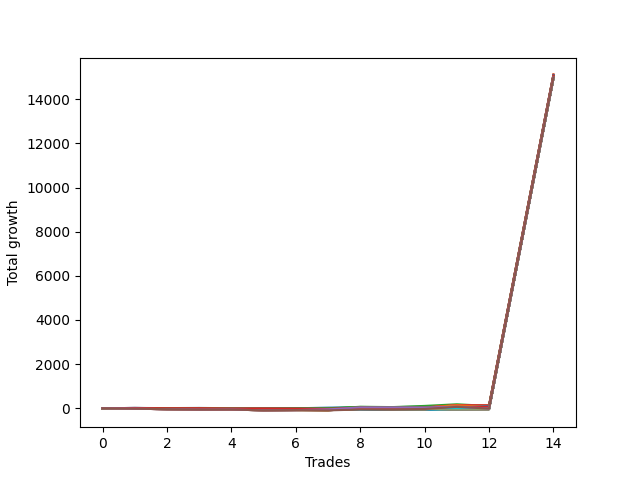

# Short Wallace Doodle 010 
- Symbol: NQ
- Date Range: 3/18/22 - 6/24/22
- Trading Period: 7:20-12:30
- Number of Trades: 14


| Name | Win Percent | Profit | Avg Profit / Trade |     | Name | Win Percent | Profit | Avg Profit / Trade |
| ---- | ----------- | ------ | ------------------ | --- | ---- | ----------- | ------ | ------------------ |
| Sorted By <br> Profit | | | | | Sorted By <br> Win Percentage ||||
| Three | 57.14 | 7545625.00 | 538973.21 |     | One | 71.43 | 7542625.00 | 538758.93 |
| One | 71.43 | 7542625.00 | 538758.93 |     | Four | 71.43 | 7540875.00 | 538633.93 |
| Four | 71.43 | 7540875.00 | 538633.93 |     | Two | 64.29 | 7519000.00 | 537071.43 |
| Thirty-Five | 57.14 | 7526750.00 | 537625.00 |     | Thirty-Four | 64.29 | 7516000.00 | 536857.14 |
| Five | 50.00 | 7519875.00 | 537133.93 |     | Thirty-Two | 64.29 | 7504750.00 | 536053.57 |
| Two | 64.29 | 7519000.00 | 537071.43 |     | Thirty-One | 64.29 | 7504750.00 | 536053.57 |
| Thirty-Four | 64.29 | 7516000.00 | 536857.14 |     | Thirty | 64.29 | 7504750.00 | 536053.57 |
| Twenty-Two | 42.86 | 7508125.00 | 536294.64 |     | Twenty-Nine | 64.29 | 7504750.00 | 536053.57 |
| Thirty-Two | 64.29 | 7504750.00 | 536053.57 |     | Twenty-Seven | 64.29 | 7504750.00 | 536053.57 |
| Thirty-One | 64.29 | 7504750.00 | 536053.57 |     | Twenty-Five | 64.29 | 7504750.00 | 536053.57 |
| Thirty | 64.29 | 7504750.00 | 536053.57 |     | Twenty-Four | 64.29 | 7504750.00 | 536053.57 |
| Twenty-Nine | 64.29 | 7504750.00 | 536053.57 |     | Seven | 64.29 | 7500250.00 | 535732.14 |
| Twenty-Seven | 64.29 | 7504750.00 | 536053.57 |     | Eleven | 64.29 | 7499875.00 | 535705.36 |
| Twenty-Five | 64.29 | 7504750.00 | 536053.57 |     | Nine | 64.29 | 7499875.00 | 535705.36 |
| Twenty-Four | 64.29 | 7504750.00 | 536053.57 |     | Three | 57.14 | 7545625.00 | 538973.21 |
| Twenty-One | 50.00 | 7503625.00 | 535973.21 |     | Thirty-Five | 57.14 | 7526750.00 | 537625.00 |
| Twenty-Three | 50.00 | 7502625.00 | 535901.79 |     | Thirty-Three | 57.14 | 7501250.00 | 535803.57 |
| Thirty-Three | 57.14 | 7501250.00 | 535803.57 |     | Twenty-Eight | 57.14 | 7501250.00 | 535803.57 |
| Twenty-Eight | 57.14 | 7501250.00 | 535803.57 |     | Twenty-Six | 57.14 | 7501250.00 | 535803.57 |
| Twenty-Six | 57.14 | 7501250.00 | 535803.57 |     | Thirteen | 57.14 | 7499625.00 | 535687.50 |
| Seven | 64.29 | 7500250.00 | 535732.14 |     | Nineteen | 57.14 | 7499250.00 | 535660.71 |
| Eleven | 64.29 | 7499875.00 | 535705.36 |     | Eighteen | 57.14 | 7493250.00 | 535232.14 |
| Nine | 64.29 | 7499875.00 | 535705.36 |     | Six | 57.14 | 7491875.00 | 535133.93 |
| Thirteen | 57.14 | 7499625.00 | 535687.50 |     | Twelve | 57.14 | 7491250.00 | 535089.29 |
| Thirty-Six | 50.00 | 7499375.00 | 535669.64 |     | Five | 50.00 | 7519875.00 | 537133.93 |
| Nineteen | 57.14 | 7499250.00 | 535660.71 |     | Twenty-One | 50.00 | 7503625.00 | 535973.21 |
| Seventeen | 50.00 | 7495625.00 | 535401.79 |     | Twenty-Three | 50.00 | 7502625.00 | 535901.79 |
| Fifteen | 50.00 | 7495625.00 | 535401.79 |     | Thirty-Six | 50.00 | 7499375.00 | 535669.64 |
| Eighteen | 57.14 | 7493250.00 | 535232.14 |     | Seventeen | 50.00 | 7495625.00 | 535401.79 |
| Six | 57.14 | 7491875.00 | 535133.93 |     | Fifteen | 50.00 | 7495625.00 | 535401.79 |
| Twelve | 57.14 | 7491250.00 | 535089.29 |     | Twenty-Two | 42.86 | 7508125.00 | 536294.64 |
| Twenty | 42.86 | 7481500.00 | 534392.86 |     | Twenty | 42.86 | 7481500.00 | 534392.86 |
| Ten | 42.86 | 7474125.00 | 533866.07 |     | Ten | 42.86 | 7474125.00 | 533866.07 |
| Eight | 42.86 | 7474125.00 | 533866.07 |     | Eight | 42.86 | 7474125.00 | 533866.07 |
| Sixteen | 42.86 | 7473000.00 | 533785.71 |     | Sixteen | 42.86 | 7473000.00 | 533785.71 |
| Fourteen | 42.86 | 7473000.00 | 533785.71 |     | Fourteen | 42.86 | 7473000.00 | 533785.71 |

### Test One
* Sell when price hits the middle line of the 20p bollinger
* No Stoploss
* Results:
```
Total Trades: 14
Percent Up: 28.57
Percent Down: 71.43
Total Points Moved Down: 15085.25
Potential Profit: 7542625.00
Total Points Ups: 31.50 Count Ups: 4
Total Points Downs: 15116.75 Count Downs: 10
```

<details><summary>Trades</summary>

<code>In: 2022-03-25 10:22:00		Out: 2022-03-25 10:24:15		Total Position Time: 02:15		Total Move Down: 11.50		Total to Date: -11.50</code> <br />
<code>In: 2022-03-25 11:01:00		Out: 2022-03-25 11:12:10		Total Position Time: 11:10		Total Move Down: -6.00		Total to Date: -5.50</code> <br />
<code>In: 2022-03-28 11:12:00		Out: 2022-03-28 11:12:10		Total Position Time: 00:10		Total Move Down: 7.25		Total to Date: -12.75</code> <br />
<code>In: 2022-03-30 09:42:00		Out: 2022-03-30 10:01:10		Total Position Time: 19:10		Total Move Down: -11.75		Total to Date: -1.00</code> <br />
<code>In: 2022-04-01 11:08:00		Out: 2022-04-01 11:24:40		Total Position Time: 16:40		Total Move Down: -10.25		Total to Date: 9.25</code> <br />
<code>In: 2022-04-01 11:36:00		Out: 2022-04-01 11:48:05		Total Position Time: 12:05		Total Move Down: 5.25		Total to Date: 4.00</code> <br />
<code>In: 2022-04-22 12:18:00		Out: 2022-04-22 12:24:15		Total Position Time: 06:15		Total Move Down: 29.75		Total to Date: -25.75</code> <br />
<code>In: 2022-04-26 10:01:00		Out: 2022-04-26 10:02:15		Total Position Time: 01:15		Total Move Down: 17.25		Total to Date: -43.00</code> <br />
<code>In: 2022-04-26 11:18:00		Out: 2022-04-26 11:18:10		Total Position Time: 00:10		Total Move Down: 5.75		Total to Date: -48.75</code> <br />
<code>In: 2022-05-20 11:56:00		Out: 2022-05-20 12:02:25		Total Position Time: 06:25		Total Move Down: 18.75		Total to Date: -67.50</code> <br />
<code>In: 2022-05-24 09:18:00		Out: 2022-05-24 09:21:30		Total Position Time: 03:30		Total Move Down: 31.75		Total to Date: -99.25</code> <br />
<code>In: 2022-06-01 11:07:00		Out: 2022-06-01 11:18:40		Total Position Time: 11:40		Total Move Down: -3.50		Total to Date: -95.75</code> <br />
<code>In: 2022-06-16 09:52:00		Out: 2022-06-16 09:52:10		Total Position Time: 00:10		Total Move Down: 7492.75		Total to Date: -7588.50</code> <br />
<code>In: 2022-06-16 10:32:00		Out: 2022-06-16 10:32:10		Total Position Time: 00:10		Total Move Down: 7496.75		Total to Date: -15085.25</code> <br />


</details>

### Test Two
* Sell when the price hits the lower line of the 20p 1std bollinger
* No Stoploss
* Results:
```
Total Trades: 14
Percent Up: 35.71
Percent Down: 64.29
Total Points Moved Down: 15038.00
Potential Profit: 7519000.00
Total Points Ups: 96.00 Count Ups: 5
Total Points Downs: 15134.00 Count Downs: 9
```

<details><summary>Trades</summary>

<code>In: 2022-03-25 10:22:00		Out: 2022-03-25 10:51:55		Total Position Time: 29:55		Total Move Down: -22.75		Total to Date: 22.75</code> <br />
<code>In: 2022-03-25 11:01:00		Out: 2022-03-25 11:18:15		Total Position Time: 17:15		Total Move Down: -6.25		Total to Date: 29.00</code> <br />
<code>In: 2022-03-28 11:12:00		Out: 2022-03-28 11:19:20		Total Position Time: 07:20		Total Move Down: 8.50		Total to Date: 20.50</code> <br />
<code>In: 2022-03-30 09:42:00		Out: 2022-03-30 10:01:40		Total Position Time: 19:40		Total Move Down: -8.25		Total to Date: 28.75</code> <br />
<code>In: 2022-04-01 11:08:00		Out: 2022-04-01 11:37:55		Total Position Time: 29:55		Total Move Down: -33.25		Total to Date: 62.00</code> <br />
<code>In: 2022-04-01 11:36:00		Out: 2022-04-01 11:50:15		Total Position Time: 14:15		Total Move Down: 10.50		Total to Date: 51.50</code> <br />
<code>In: 2022-04-22 12:18:00		Out: 2022-04-22 12:44:15		Total Position Time: 26:15		Total Move Down: 8.50		Total to Date: 43.00</code> <br />
<code>In: 2022-04-26 10:01:00		Out: 2022-04-26 10:02:50		Total Position Time: 01:50		Total Move Down: 35.50		Total to Date: 7.50</code> <br />
<code>In: 2022-04-26 11:18:00		Out: 2022-04-26 11:41:20		Total Position Time: 23:20		Total Move Down: -25.50		Total to Date: 33.00</code> <br />
<code>In: 2022-05-20 11:56:00		Out: 2022-05-20 12:03:35		Total Position Time: 07:35		Total Move Down: 35.25		Total to Date: -2.25</code> <br />
<code>In: 2022-05-24 09:18:00		Out: 2022-05-24 09:26:40		Total Position Time: 08:40		Total Move Down: 43.25		Total to Date: -45.50</code> <br />
<code>In: 2022-06-01 11:07:00		Out: 2022-06-01 11:19:20		Total Position Time: 12:20		Total Move Down: 3.00		Total to Date: -48.50</code> <br />
<code>In: 2022-06-16 09:52:00		Out: 2022-06-16 09:52:10		Total Position Time: 00:10		Total Move Down: 7492.75		Total to Date: -7541.25</code> <br />
<code>In: 2022-06-16 10:32:00		Out: 2022-06-16 10:32:10		Total Position Time: 00:10		Total Move Down: 7496.75		Total to Date: -15038.00</code> <br />


</details>

### Test Three
* Sell when the price hits the lower line of the 20p 2std bollinger
* No Stoploss
* Results:
```
Total Trades: 14
Percent Up: 42.86
Percent Down: 57.14
Total Points Moved Down: 15091.25
Potential Profit: 7545625.00
Total Points Ups: 169.25 Count Ups: 6
Total Points Downs: 15260.50 Count Downs: 8
```

<details><summary>Trades</summary>

<code>In: 2022-03-25 10:22:00		Out: 2022-03-25 10:51:55		Total Position Time: 29:55		Total Move Down: -22.75		Total to Date: 22.75</code> <br />
<code>In: 2022-03-25 11:01:00		Out: 2022-03-25 11:19:55		Total Position Time: 18:55		Total Move Down: 2.75		Total to Date: 20.00</code> <br />
<code>In: 2022-03-28 11:12:00		Out: 2022-03-28 11:41:55		Total Position Time: 29:55		Total Move Down: -19.25		Total to Date: 39.25</code> <br />
<code>In: 2022-03-30 09:42:00		Out: 2022-03-30 10:06:45		Total Position Time: 24:45		Total Move Down: -2.00		Total to Date: 41.25</code> <br />
<code>In: 2022-04-01 11:08:00		Out: 2022-04-01 11:37:55		Total Position Time: 29:55		Total Move Down: -33.25		Total to Date: 74.50</code> <br />
<code>In: 2022-04-01 11:36:00		Out: 2022-04-01 11:50:55		Total Position Time: 14:55		Total Move Down: 16.25		Total to Date: 58.25</code> <br />
<code>In: 2022-04-22 12:18:00		Out: 2022-04-22 12:47:00		Total Position Time: 29:00		Total Move Down: 35.50		Total to Date: 22.75</code> <br />
<code>In: 2022-04-26 10:01:00		Out: 2022-04-26 10:30:55		Total Position Time: 29:55		Total Move Down: 88.75		Total to Date: -66.00</code> <br />
<code>In: 2022-04-26 11:18:00		Out: 2022-04-26 11:41:30		Total Position Time: 23:30		Total Move Down: -15.00		Total to Date: -51.00</code> <br />
<code>In: 2022-05-20 11:56:00		Out: 2022-05-20 12:07:55		Total Position Time: 11:55		Total Move Down: 53.50		Total to Date: -104.50</code> <br />
<code>In: 2022-05-24 09:18:00		Out: 2022-05-24 09:32:40		Total Position Time: 14:40		Total Move Down: 74.25		Total to Date: -178.75</code> <br />
<code>In: 2022-06-01 11:07:00		Out: 2022-06-01 11:36:55		Total Position Time: 29:55		Total Move Down: -77.00		Total to Date: -101.75</code> <br />
<code>In: 2022-06-16 09:52:00		Out: 2022-06-16 09:52:10		Total Position Time: 00:10		Total Move Down: 7492.75		Total to Date: -7594.50</code> <br />
<code>In: 2022-06-16 10:32:00		Out: 2022-06-16 10:32:10		Total Position Time: 00:10		Total Move Down: 7496.75		Total to Date: -15091.25</code> <br />


</details>

### Test Four
* Sell when the price hits the middle line of the 1std VWAP
* No Stoploss
* Results:
```
Total Trades: 14
Percent Up: 28.57
Percent Down: 71.43
Total Points Moved Down: 15081.75
Potential Profit: 7540875.00
Total Points Ups: 47.50 Count Ups: 4
Total Points Downs: 15129.25 Count Downs: 10
```

<details><summary>Trades</summary>

<code>In: 2022-03-25 10:22:00		Out: 2022-03-25 10:22:10		Total Position Time: 00:10		Total Move Down: 4.75		Total to Date: -4.75</code> <br />
<code>In: 2022-03-25 11:01:00		Out: 2022-03-25 11:30:55		Total Position Time: 29:55		Total Move Down: -20.75		Total to Date: 16.00</code> <br />
<code>In: 2022-03-28 11:12:00		Out: 2022-03-28 11:41:55		Total Position Time: 29:55		Total Move Down: -19.25		Total to Date: 35.25</code> <br />
<code>In: 2022-03-30 09:42:00		Out: 2022-03-30 10:08:40		Total Position Time: 26:40		Total Move Down: 5.75		Total to Date: 29.50</code> <br />
<code>In: 2022-04-01 11:08:00		Out: 2022-04-01 11:08:10		Total Position Time: 00:10		Total Move Down: 1.25		Total to Date: 28.25</code> <br />
<code>In: 2022-04-01 11:36:00		Out: 2022-04-01 11:53:30		Total Position Time: 17:30		Total Move Down: 18.00		Total to Date: 10.25</code> <br />
<code>In: 2022-04-22 12:18:00		Out: 2022-04-22 12:18:10		Total Position Time: 00:10		Total Move Down: -5.50		Total to Date: 15.75</code> <br />
<code>In: 2022-04-26 10:01:00		Out: 2022-04-26 10:01:10		Total Position Time: 00:10		Total Move Down: 4.25		Total to Date: 11.50</code> <br />
<code>In: 2022-04-26 11:18:00		Out: 2022-04-26 11:18:10		Total Position Time: 00:10		Total Move Down: 5.75		Total to Date: 5.75</code> <br />
<code>In: 2022-05-20 11:56:00		Out: 2022-05-20 11:56:10		Total Position Time: 00:10		Total Move Down: -2.00		Total to Date: 7.75</code> <br />
<code>In: 2022-05-24 09:18:00		Out: 2022-05-24 09:36:50		Total Position Time: 18:50		Total Move Down: 95.00		Total to Date: -87.25</code> <br />
<code>In: 2022-06-01 11:07:00		Out: 2022-06-01 11:07:10		Total Position Time: 00:10		Total Move Down: 5.00		Total to Date: -92.25</code> <br />
<code>In: 2022-06-16 09:52:00		Out: 2022-06-16 09:52:10		Total Position Time: 00:10		Total Move Down: 7492.75		Total to Date: -7585.00</code> <br />
<code>In: 2022-06-16 10:32:00		Out: 2022-06-16 10:32:10		Total Position Time: 00:10		Total Move Down: 7496.75		Total to Date: -15081.75</code> <br />


</details>

### Test Five
* Sell when the price hits the lower line of the 1std VWAP
* No Stoploss
* Results:
```
Total Trades: 14
Percent Up: 50.00
Percent Down: 50.00
Total Points Moved Down: 15039.75
Potential Profit: 7519875.00
Total Points Ups: 178.75 Count Ups: 7
Total Points Downs: 15218.50 Count Downs: 7
```

<details><summary>Trades</summary>

<code>In: 2022-03-25 10:22:00		Out: 2022-03-25 10:51:55		Total Position Time: 29:55		Total Move Down: -22.75		Total to Date: 22.75</code> <br />
<code>In: 2022-03-25 11:01:00		Out: 2022-03-25 11:30:55		Total Position Time: 29:55		Total Move Down: -20.75		Total to Date: 43.50</code> <br />
<code>In: 2022-03-28 11:12:00		Out: 2022-03-28 11:41:55		Total Position Time: 29:55		Total Move Down: -19.25		Total to Date: 62.75</code> <br />
<code>In: 2022-03-30 09:42:00		Out: 2022-03-30 10:11:55		Total Position Time: 29:55		Total Move Down: 1.75		Total to Date: 61.00</code> <br />
<code>In: 2022-04-01 11:08:00		Out: 2022-04-01 11:37:55		Total Position Time: 29:55		Total Move Down: -33.25		Total to Date: 94.25</code> <br />
<code>In: 2022-04-01 11:36:00		Out: 2022-04-01 12:05:55		Total Position Time: 29:55		Total Move Down: 9.00		Total to Date: 85.25</code> <br />
<code>In: 2022-04-22 12:18:00		Out: 2022-04-22 12:18:10		Total Position Time: 00:10		Total Move Down: -5.50		Total to Date: 90.75</code> <br />
<code>In: 2022-04-26 10:01:00		Out: 2022-04-26 10:14:55		Total Position Time: 13:55		Total Move Down: 71.25		Total to Date: 19.50</code> <br />
<code>In: 2022-04-26 11:18:00		Out: 2022-04-26 11:47:55		Total Position Time: 29:55		Total Move Down: -0.25		Total to Date: 19.75</code> <br />
<code>In: 2022-05-20 11:56:00		Out: 2022-05-20 12:04:15		Total Position Time: 08:15		Total Move Down: 42.50		Total to Date: -22.75</code> <br />
<code>In: 2022-05-24 09:18:00		Out: 2022-05-24 09:47:55		Total Position Time: 29:55		Total Move Down: 104.50		Total to Date: -127.25</code> <br />
<code>In: 2022-06-01 11:07:00		Out: 2022-06-01 11:36:55		Total Position Time: 29:55		Total Move Down: -77.00		Total to Date: -50.25</code> <br />
<code>In: 2022-06-16 09:52:00		Out: 2022-06-16 09:52:10		Total Position Time: 00:10		Total Move Down: 7492.75		Total to Date: -7543.00</code> <br />
<code>In: 2022-06-16 10:32:00		Out: 2022-06-16 10:32:10		Total Position Time: 00:10		Total Move Down: 7496.75		Total to Date: -15039.75</code> <br />


</details>

### Test Six
* Sell when the price hits the middle line of the 20p bollinger
* Stoploss is -2 points
* Results:
```
Total Trades: 14
Percent Up: 42.86
Percent Down: 57.14
Total Points Moved Down: 14983.75
Potential Profit: 7491875.00
Total Points Ups: 39.25 Count Ups: 6
Total Points Downs: 15023.00 Count Downs: 8
```

<details><summary>Trades</summary>

<code>In: 2022-03-25 10:22:00		Out: 2022-03-25 10:24:15		Total Position Time: 02:15		Total Move Down: 11.50		Total to Date: -11.50</code> <br />
<code>In: 2022-03-25 11:01:00		Out: 2022-03-25 11:01:30		Total Position Time: 00:30		Total Move Down: -10.50		Total to Date: -1.00</code> <br />
<code>In: 2022-03-28 11:12:00		Out: 2022-03-28 11:12:10		Total Position Time: 00:10		Total Move Down: 7.25		Total to Date: -8.25</code> <br />
<code>In: 2022-03-30 09:42:00		Out: 2022-03-30 09:44:10		Total Position Time: 02:10		Total Move Down: -12.50		Total to Date: 4.25</code> <br />
<code>In: 2022-04-01 11:08:00		Out: 2022-04-01 11:14:35		Total Position Time: 06:35		Total Move Down: -8.50		Total to Date: 12.75</code> <br />
<code>In: 2022-04-01 11:36:00		Out: 2022-04-01 11:36:10		Total Position Time: 00:10		Total Move Down: 1.50		Total to Date: 11.25</code> <br />
<code>In: 2022-04-22 12:18:00		Out: 2022-04-22 12:18:10		Total Position Time: 00:10		Total Move Down: -5.50		Total to Date: 16.75</code> <br />
<code>In: 2022-04-26 10:01:00		Out: 2022-04-26 10:01:10		Total Position Time: 00:10		Total Move Down: 4.25		Total to Date: 12.50</code> <br />
<code>In: 2022-04-26 11:18:00		Out: 2022-04-26 11:18:10		Total Position Time: 00:10		Total Move Down: 5.75		Total to Date: 6.75</code> <br />
<code>In: 2022-05-20 11:56:00		Out: 2022-05-20 11:56:10		Total Position Time: 00:10		Total Move Down: -2.00		Total to Date: 8.75</code> <br />
<code>In: 2022-05-24 09:18:00		Out: 2022-05-24 09:18:10		Total Position Time: 00:10		Total Move Down: -0.25		Total to Date: 9.00</code> <br />
<code>In: 2022-06-01 11:07:00		Out: 2022-06-01 11:07:15		Total Position Time: 00:15		Total Move Down: 3.25		Total to Date: 5.75</code> <br />
<code>In: 2022-06-16 09:52:00		Out: 2022-06-16 09:52:10		Total Position Time: 00:10		Total Move Down: 7492.75		Total to Date: -7487.00</code> <br />
<code>In: 2022-06-16 10:32:00		Out: 2022-06-16 10:32:10		Total Position Time: 00:10		Total Move Down: 7496.75		Total to Date: -14983.75</code> <br />


</details>

### Test Seven
* Sell when the price hits the middle line of the 20p bollinger
* Trailing Stop is -2 points
* Results:
```
Total Trades: 14
Percent Up: 35.71
Percent Down: 64.29
Total Points Moved Down: 15000.50
Potential Profit: 7500250.00
Total Points Ups: 15.00 Count Ups: 5
Total Points Downs: 15015.50 Count Downs: 9
```

<details><summary>Trades</summary>

<code>In: 2022-03-25 10:22:00		Out: 2022-03-25 10:22:20		Total Position Time: 00:20		Total Move Down: 2.50		Total to Date: -2.50</code> <br />
<code>In: 2022-03-25 11:01:00		Out: 2022-03-25 11:01:20		Total Position Time: 00:20		Total Move Down: -4.00		Total to Date: 1.50</code> <br />
<code>In: 2022-03-28 11:12:00		Out: 2022-03-28 11:12:10		Total Position Time: 00:10		Total Move Down: 7.25		Total to Date: -5.75</code> <br />
<code>In: 2022-03-30 09:42:00		Out: 2022-03-30 09:42:20		Total Position Time: 00:20		Total Move Down: -3.25		Total to Date: -2.50</code> <br />
<code>In: 2022-04-01 11:08:00		Out: 2022-04-01 11:08:30		Total Position Time: 00:30		Total Move Down: 1.50		Total to Date: -4.00</code> <br />
<code>In: 2022-04-01 11:36:00		Out: 2022-04-01 11:36:10		Total Position Time: 00:10		Total Move Down: 1.50		Total to Date: -5.50</code> <br />
<code>In: 2022-04-22 12:18:00		Out: 2022-04-22 12:18:10		Total Position Time: 00:10		Total Move Down: -5.50		Total to Date: -0.00</code> <br />
<code>In: 2022-04-26 10:01:00		Out: 2022-04-26 10:01:10		Total Position Time: 00:10		Total Move Down: 4.25		Total to Date: -4.25</code> <br />
<code>In: 2022-04-26 11:18:00		Out: 2022-04-26 11:18:10		Total Position Time: 00:10		Total Move Down: 5.75		Total to Date: -10.00</code> <br />
<code>In: 2022-05-20 11:56:00		Out: 2022-05-20 11:56:10		Total Position Time: 00:10		Total Move Down: -2.00		Total to Date: -8.00</code> <br />
<code>In: 2022-05-24 09:18:00		Out: 2022-05-24 09:18:10		Total Position Time: 00:10		Total Move Down: -0.25		Total to Date: -7.75</code> <br />
<code>In: 2022-06-01 11:07:00		Out: 2022-06-01 11:07:15		Total Position Time: 00:15		Total Move Down: 3.25		Total to Date: -11.00</code> <br />
<code>In: 2022-06-16 09:52:00		Out: 2022-06-16 09:52:10		Total Position Time: 00:10		Total Move Down: 7492.75		Total to Date: -7503.75</code> <br />
<code>In: 2022-06-16 10:32:00		Out: 2022-06-16 10:32:10		Total Position Time: 00:10		Total Move Down: 7496.75		Total to Date: -15000.50</code> <br />


</details>

### Test Eight
* Sell when the price hits the lower line of the 20p 1std bollinger
* Stoploss is -2 points
* Results:
```
Total Trades: 14
Percent Up: 57.14
Percent Down: 42.86
Total Points Moved Down: 14948.25
Potential Profit: 7474125.00
Total Points Ups: 57.50 Count Ups: 8
Total Points Downs: 15005.75 Count Downs: 6
```

<details><summary>Trades</summary>

<code>In: 2022-03-25 10:22:00		Out: 2022-03-25 10:37:05		Total Position Time: 15:05		Total Move Down: -6.75		Total to Date: 6.75</code> <br />
<code>In: 2022-03-25 11:01:00		Out: 2022-03-25 11:01:30		Total Position Time: 00:30		Total Move Down: -10.50		Total to Date: 17.25</code> <br />
<code>In: 2022-03-28 11:12:00		Out: 2022-03-28 11:12:10		Total Position Time: 00:10		Total Move Down: 7.25		Total to Date: 10.00</code> <br />
<code>In: 2022-03-30 09:42:00		Out: 2022-03-30 09:44:10		Total Position Time: 02:10		Total Move Down: -12.50		Total to Date: 22.50</code> <br />
<code>In: 2022-04-01 11:08:00		Out: 2022-04-01 11:14:35		Total Position Time: 06:35		Total Move Down: -8.50		Total to Date: 31.00</code> <br />
<code>In: 2022-04-01 11:36:00		Out: 2022-04-01 11:36:10		Total Position Time: 00:10		Total Move Down: 1.50		Total to Date: 29.50</code> <br />
<code>In: 2022-04-22 12:18:00		Out: 2022-04-22 12:18:10		Total Position Time: 00:10		Total Move Down: -5.50		Total to Date: 35.00</code> <br />
<code>In: 2022-04-26 10:01:00		Out: 2022-04-26 10:01:10		Total Position Time: 00:10		Total Move Down: 4.25		Total to Date: 30.75</code> <br />
<code>In: 2022-04-26 11:18:00		Out: 2022-04-26 11:19:10		Total Position Time: 01:10		Total Move Down: -11.50		Total to Date: 42.25</code> <br />
<code>In: 2022-05-20 11:56:00		Out: 2022-05-20 11:56:10		Total Position Time: 00:10		Total Move Down: -2.00		Total to Date: 44.25</code> <br />
<code>In: 2022-05-24 09:18:00		Out: 2022-05-24 09:18:10		Total Position Time: 00:10		Total Move Down: -0.25		Total to Date: 44.50</code> <br />
<code>In: 2022-06-01 11:07:00		Out: 2022-06-01 11:07:15		Total Position Time: 00:15		Total Move Down: 3.25		Total to Date: 41.25</code> <br />
<code>In: 2022-06-16 09:52:00		Out: 2022-06-16 09:52:10		Total Position Time: 00:10		Total Move Down: 7492.75		Total to Date: -7451.50</code> <br />
<code>In: 2022-06-16 10:32:00		Out: 2022-06-16 10:32:10		Total Position Time: 00:10		Total Move Down: 7496.75		Total to Date: -14948.25</code> <br />


</details>

### Test Nine
* Sell when the price hits the lower line of the 20p 1std bollinger
* Trailing Stop is -2 points
* Results:
```
Total Trades: 14
Percent Up: 35.71
Percent Down: 64.29
Total Points Moved Down: 14999.75
Potential Profit: 7499875.00
Total Points Ups: 15.00 Count Ups: 5
Total Points Downs: 15014.75 Count Downs: 9
```

<details><summary>Trades</summary>

<code>In: 2022-03-25 10:22:00		Out: 2022-03-25 10:22:20		Total Position Time: 00:20		Total Move Down: 2.50		Total to Date: -2.50</code> <br />
<code>In: 2022-03-25 11:01:00		Out: 2022-03-25 11:01:20		Total Position Time: 00:20		Total Move Down: -4.00		Total to Date: 1.50</code> <br />
<code>In: 2022-03-28 11:12:00		Out: 2022-03-28 11:12:10		Total Position Time: 00:10		Total Move Down: 7.25		Total to Date: -5.75</code> <br />
<code>In: 2022-03-30 09:42:00		Out: 2022-03-30 09:42:20		Total Position Time: 00:20		Total Move Down: -3.25		Total to Date: -2.50</code> <br />
<code>In: 2022-04-01 11:08:00		Out: 2022-04-01 11:08:30		Total Position Time: 00:30		Total Move Down: 1.50		Total to Date: -4.00</code> <br />
<code>In: 2022-04-01 11:36:00		Out: 2022-04-01 11:36:10		Total Position Time: 00:10		Total Move Down: 1.50		Total to Date: -5.50</code> <br />
<code>In: 2022-04-22 12:18:00		Out: 2022-04-22 12:18:10		Total Position Time: 00:10		Total Move Down: -5.50		Total to Date: -0.00</code> <br />
<code>In: 2022-04-26 10:01:00		Out: 2022-04-26 10:01:10		Total Position Time: 00:10		Total Move Down: 4.25		Total to Date: -4.25</code> <br />
<code>In: 2022-04-26 11:18:00		Out: 2022-04-26 11:18:20		Total Position Time: 00:20		Total Move Down: 5.00		Total to Date: -9.25</code> <br />
<code>In: 2022-05-20 11:56:00		Out: 2022-05-20 11:56:10		Total Position Time: 00:10		Total Move Down: -2.00		Total to Date: -7.25</code> <br />
<code>In: 2022-05-24 09:18:00		Out: 2022-05-24 09:18:10		Total Position Time: 00:10		Total Move Down: -0.25		Total to Date: -7.00</code> <br />
<code>In: 2022-06-01 11:07:00		Out: 2022-06-01 11:07:15		Total Position Time: 00:15		Total Move Down: 3.25		Total to Date: -10.25</code> <br />
<code>In: 2022-06-16 09:52:00		Out: 2022-06-16 09:52:10		Total Position Time: 00:10		Total Move Down: 7492.75		Total to Date: -7503.00</code> <br />
<code>In: 2022-06-16 10:32:00		Out: 2022-06-16 10:32:10		Total Position Time: 00:10		Total Move Down: 7496.75		Total to Date: -14999.75</code> <br />


</details>

### Test Ten
* Sell when the price hits the lower line of the 20p 2std bollinger
* Stoploss is -2 points
* Results:
```
Total Trades: 14
Percent Up: 57.14
Percent Down: 42.86
Total Points Moved Down: 14948.25
Potential Profit: 7474125.00
Total Points Ups: 57.50 Count Ups: 8
Total Points Downs: 15005.75 Count Downs: 6
```

<details><summary>Trades</summary>

<code>In: 2022-03-25 10:22:00		Out: 2022-03-25 10:37:05		Total Position Time: 15:05		Total Move Down: -6.75		Total to Date: 6.75</code> <br />
<code>In: 2022-03-25 11:01:00		Out: 2022-03-25 11:01:30		Total Position Time: 00:30		Total Move Down: -10.50		Total to Date: 17.25</code> <br />
<code>In: 2022-03-28 11:12:00		Out: 2022-03-28 11:12:10		Total Position Time: 00:10		Total Move Down: 7.25		Total to Date: 10.00</code> <br />
<code>In: 2022-03-30 09:42:00		Out: 2022-03-30 09:44:10		Total Position Time: 02:10		Total Move Down: -12.50		Total to Date: 22.50</code> <br />
<code>In: 2022-04-01 11:08:00		Out: 2022-04-01 11:14:35		Total Position Time: 06:35		Total Move Down: -8.50		Total to Date: 31.00</code> <br />
<code>In: 2022-04-01 11:36:00		Out: 2022-04-01 11:36:10		Total Position Time: 00:10		Total Move Down: 1.50		Total to Date: 29.50</code> <br />
<code>In: 2022-04-22 12:18:00		Out: 2022-04-22 12:18:10		Total Position Time: 00:10		Total Move Down: -5.50		Total to Date: 35.00</code> <br />
<code>In: 2022-04-26 10:01:00		Out: 2022-04-26 10:01:10		Total Position Time: 00:10		Total Move Down: 4.25		Total to Date: 30.75</code> <br />
<code>In: 2022-04-26 11:18:00		Out: 2022-04-26 11:19:10		Total Position Time: 01:10		Total Move Down: -11.50		Total to Date: 42.25</code> <br />
<code>In: 2022-05-20 11:56:00		Out: 2022-05-20 11:56:10		Total Position Time: 00:10		Total Move Down: -2.00		Total to Date: 44.25</code> <br />
<code>In: 2022-05-24 09:18:00		Out: 2022-05-24 09:18:10		Total Position Time: 00:10		Total Move Down: -0.25		Total to Date: 44.50</code> <br />
<code>In: 2022-06-01 11:07:00		Out: 2022-06-01 11:07:15		Total Position Time: 00:15		Total Move Down: 3.25		Total to Date: 41.25</code> <br />
<code>In: 2022-06-16 09:52:00		Out: 2022-06-16 09:52:10		Total Position Time: 00:10		Total Move Down: 7492.75		Total to Date: -7451.50</code> <br />
<code>In: 2022-06-16 10:32:00		Out: 2022-06-16 10:32:10		Total Position Time: 00:10		Total Move Down: 7496.75		Total to Date: -14948.25</code> <br />


</details>

### Test Eleven
* Sell when the price hits the lower line of the 20p 2std bollinger
* Trailing Stop is -2 points
* Results:
```
Total Trades: 14
Percent Up: 35.71
Percent Down: 64.29
Total Points Moved Down: 14999.75
Potential Profit: 7499875.00
Total Points Ups: 15.00 Count Ups: 5
Total Points Downs: 15014.75 Count Downs: 9
```

<details><summary>Trades</summary>

<code>In: 2022-03-25 10:22:00		Out: 2022-03-25 10:22:20		Total Position Time: 00:20		Total Move Down: 2.50		Total to Date: -2.50</code> <br />
<code>In: 2022-03-25 11:01:00		Out: 2022-03-25 11:01:20		Total Position Time: 00:20		Total Move Down: -4.00		Total to Date: 1.50</code> <br />
<code>In: 2022-03-28 11:12:00		Out: 2022-03-28 11:12:10		Total Position Time: 00:10		Total Move Down: 7.25		Total to Date: -5.75</code> <br />
<code>In: 2022-03-30 09:42:00		Out: 2022-03-30 09:42:20		Total Position Time: 00:20		Total Move Down: -3.25		Total to Date: -2.50</code> <br />
<code>In: 2022-04-01 11:08:00		Out: 2022-04-01 11:08:30		Total Position Time: 00:30		Total Move Down: 1.50		Total to Date: -4.00</code> <br />
<code>In: 2022-04-01 11:36:00		Out: 2022-04-01 11:36:10		Total Position Time: 00:10		Total Move Down: 1.50		Total to Date: -5.50</code> <br />
<code>In: 2022-04-22 12:18:00		Out: 2022-04-22 12:18:10		Total Position Time: 00:10		Total Move Down: -5.50		Total to Date: -0.00</code> <br />
<code>In: 2022-04-26 10:01:00		Out: 2022-04-26 10:01:10		Total Position Time: 00:10		Total Move Down: 4.25		Total to Date: -4.25</code> <br />
<code>In: 2022-04-26 11:18:00		Out: 2022-04-26 11:18:20		Total Position Time: 00:20		Total Move Down: 5.00		Total to Date: -9.25</code> <br />
<code>In: 2022-05-20 11:56:00		Out: 2022-05-20 11:56:10		Total Position Time: 00:10		Total Move Down: -2.00		Total to Date: -7.25</code> <br />
<code>In: 2022-05-24 09:18:00		Out: 2022-05-24 09:18:10		Total Position Time: 00:10		Total Move Down: -0.25		Total to Date: -7.00</code> <br />
<code>In: 2022-06-01 11:07:00		Out: 2022-06-01 11:07:15		Total Position Time: 00:15		Total Move Down: 3.25		Total to Date: -10.25</code> <br />
<code>In: 2022-06-16 09:52:00		Out: 2022-06-16 09:52:10		Total Position Time: 00:10		Total Move Down: 7492.75		Total to Date: -7503.00</code> <br />
<code>In: 2022-06-16 10:32:00		Out: 2022-06-16 10:32:10		Total Position Time: 00:10		Total Move Down: 7496.75		Total to Date: -14999.75</code> <br />


</details>

### Test Twelve
* Sell when the price hits the middle line of the 20p bollinger
* Stoploss is -3 points
* Results:
```
Total Trades: 14
Percent Up: 42.86
Percent Down: 57.14
Total Points Moved Down: 14982.50
Potential Profit: 7491250.00
Total Points Ups: 40.50 Count Ups: 6
Total Points Downs: 15023.00 Count Downs: 8
```

<details><summary>Trades</summary>

<code>In: 2022-03-25 10:22:00		Out: 2022-03-25 10:24:15		Total Position Time: 02:15		Total Move Down: 11.50		Total to Date: -11.50</code> <br />
<code>In: 2022-03-25 11:01:00		Out: 2022-03-25 11:01:30		Total Position Time: 00:30		Total Move Down: -10.50		Total to Date: -1.00</code> <br />
<code>In: 2022-03-28 11:12:00		Out: 2022-03-28 11:12:10		Total Position Time: 00:10		Total Move Down: 7.25		Total to Date: -8.25</code> <br />
<code>In: 2022-03-30 09:42:00		Out: 2022-03-30 09:44:40		Total Position Time: 02:40		Total Move Down: -13.00		Total to Date: 4.75</code> <br />
<code>In: 2022-04-01 11:08:00		Out: 2022-04-01 11:14:40		Total Position Time: 06:40		Total Move Down: -9.25		Total to Date: 14.00</code> <br />
<code>In: 2022-04-01 11:36:00		Out: 2022-04-01 11:36:10		Total Position Time: 00:10		Total Move Down: 1.50		Total to Date: 12.50</code> <br />
<code>In: 2022-04-22 12:18:00		Out: 2022-04-22 12:18:10		Total Position Time: 00:10		Total Move Down: -5.50		Total to Date: 18.00</code> <br />
<code>In: 2022-04-26 10:01:00		Out: 2022-04-26 10:01:10		Total Position Time: 00:10		Total Move Down: 4.25		Total to Date: 13.75</code> <br />
<code>In: 2022-04-26 11:18:00		Out: 2022-04-26 11:18:10		Total Position Time: 00:10		Total Move Down: 5.75		Total to Date: 8.00</code> <br />
<code>In: 2022-05-20 11:56:00		Out: 2022-05-20 11:56:10		Total Position Time: 00:10		Total Move Down: -2.00		Total to Date: 10.00</code> <br />
<code>In: 2022-05-24 09:18:00		Out: 2022-05-24 09:18:10		Total Position Time: 00:10		Total Move Down: -0.25		Total to Date: 10.25</code> <br />
<code>In: 2022-06-01 11:07:00		Out: 2022-06-01 11:08:05		Total Position Time: 01:05		Total Move Down: 3.25		Total to Date: 7.00</code> <br />
<code>In: 2022-06-16 09:52:00		Out: 2022-06-16 09:52:10		Total Position Time: 00:10		Total Move Down: 7492.75		Total to Date: -7485.75</code> <br />
<code>In: 2022-06-16 10:32:00		Out: 2022-06-16 10:32:10		Total Position Time: 00:10		Total Move Down: 7496.75		Total to Date: -14982.50</code> <br />


</details>

### Test Thirteen
* Sell when the price hits the middle line of the 20p bollinger
* Trailing Stop is -3 points
* Results:
```
Total Trades: 14
Percent Up: 42.86
Percent Down: 57.14
Total Points Moved Down: 14999.25
Potential Profit: 7499625.00
Total Points Ups: 18.25 Count Ups: 6
Total Points Downs: 15017.50 Count Downs: 8
```

<details><summary>Trades</summary>

<code>In: 2022-03-25 10:22:00		Out: 2022-03-25 10:22:20		Total Position Time: 00:20		Total Move Down: 2.50		Total to Date: -2.50</code> <br />
<code>In: 2022-03-25 11:01:00		Out: 2022-03-25 11:01:20		Total Position Time: 00:20		Total Move Down: -4.00		Total to Date: 1.50</code> <br />
<code>In: 2022-03-28 11:12:00		Out: 2022-03-28 11:12:10		Total Position Time: 00:10		Total Move Down: 7.25		Total to Date: -5.75</code> <br />
<code>In: 2022-03-30 09:42:00		Out: 2022-03-30 09:42:30		Total Position Time: 00:30		Total Move Down: -6.25		Total to Date: 0.50</code> <br />
<code>In: 2022-04-01 11:08:00		Out: 2022-04-01 11:08:35		Total Position Time: 00:35		Total Move Down: -0.25		Total to Date: 0.75</code> <br />
<code>In: 2022-04-01 11:36:00		Out: 2022-04-01 11:36:10		Total Position Time: 00:10		Total Move Down: 1.50		Total to Date: -0.75</code> <br />
<code>In: 2022-04-22 12:18:00		Out: 2022-04-22 12:18:10		Total Position Time: 00:10		Total Move Down: -5.50		Total to Date: 4.75</code> <br />
<code>In: 2022-04-26 10:01:00		Out: 2022-04-26 10:01:10		Total Position Time: 00:10		Total Move Down: 4.25		Total to Date: 0.50</code> <br />
<code>In: 2022-04-26 11:18:00		Out: 2022-04-26 11:18:10		Total Position Time: 00:10		Total Move Down: 5.75		Total to Date: -5.25</code> <br />
<code>In: 2022-05-20 11:56:00		Out: 2022-05-20 11:56:10		Total Position Time: 00:10		Total Move Down: -2.00		Total to Date: -3.25</code> <br />
<code>In: 2022-05-24 09:18:00		Out: 2022-05-24 09:18:10		Total Position Time: 00:10		Total Move Down: -0.25		Total to Date: -3.00</code> <br />
<code>In: 2022-06-01 11:07:00		Out: 2022-06-01 11:08:00		Total Position Time: 01:00		Total Move Down: 6.75		Total to Date: -9.75</code> <br />
<code>In: 2022-06-16 09:52:00		Out: 2022-06-16 09:52:10		Total Position Time: 00:10		Total Move Down: 7492.75		Total to Date: -7502.50</code> <br />
<code>In: 2022-06-16 10:32:00		Out: 2022-06-16 10:32:10		Total Position Time: 00:10		Total Move Down: 7496.75		Total to Date: -14999.25</code> <br />


</details>

### Test Fourteen
* Sell when the price hits the lower line of the 20p 1std bollinger
* Stoploss is -3 points
* Results:
```
Total Trades: 14
Percent Up: 57.14
Percent Down: 42.86
Total Points Moved Down: 14946.00
Potential Profit: 7473000.00
Total Points Ups: 58.75 Count Ups: 8
Total Points Downs: 15004.75 Count Downs: 6
```

<details><summary>Trades</summary>

<code>In: 2022-03-25 10:22:00		Out: 2022-03-25 10:37:05		Total Position Time: 15:05		Total Move Down: -6.75		Total to Date: 6.75</code> <br />
<code>In: 2022-03-25 11:01:00		Out: 2022-03-25 11:01:30		Total Position Time: 00:30		Total Move Down: -10.50		Total to Date: 17.25</code> <br />
<code>In: 2022-03-28 11:12:00		Out: 2022-03-28 11:12:15		Total Position Time: 00:15		Total Move Down: 6.25		Total to Date: 11.00</code> <br />
<code>In: 2022-03-30 09:42:00		Out: 2022-03-30 09:44:40		Total Position Time: 02:40		Total Move Down: -13.00		Total to Date: 24.00</code> <br />
<code>In: 2022-04-01 11:08:00		Out: 2022-04-01 11:14:40		Total Position Time: 06:40		Total Move Down: -9.25		Total to Date: 33.25</code> <br />
<code>In: 2022-04-01 11:36:00		Out: 2022-04-01 11:36:10		Total Position Time: 00:10		Total Move Down: 1.50		Total to Date: 31.75</code> <br />
<code>In: 2022-04-22 12:18:00		Out: 2022-04-22 12:18:10		Total Position Time: 00:10		Total Move Down: -5.50		Total to Date: 37.25</code> <br />
<code>In: 2022-04-26 10:01:00		Out: 2022-04-26 10:01:10		Total Position Time: 00:10		Total Move Down: 4.25		Total to Date: 33.00</code> <br />
<code>In: 2022-04-26 11:18:00		Out: 2022-04-26 11:19:10		Total Position Time: 01:10		Total Move Down: -11.50		Total to Date: 44.50</code> <br />
<code>In: 2022-05-20 11:56:00		Out: 2022-05-20 11:56:10		Total Position Time: 00:10		Total Move Down: -2.00		Total to Date: 46.50</code> <br />
<code>In: 2022-05-24 09:18:00		Out: 2022-05-24 09:18:10		Total Position Time: 00:10		Total Move Down: -0.25		Total to Date: 46.75</code> <br />
<code>In: 2022-06-01 11:07:00		Out: 2022-06-01 11:08:05		Total Position Time: 01:05		Total Move Down: 3.25		Total to Date: 43.50</code> <br />
<code>In: 2022-06-16 09:52:00		Out: 2022-06-16 09:52:10		Total Position Time: 00:10		Total Move Down: 7492.75		Total to Date: -7449.25</code> <br />
<code>In: 2022-06-16 10:32:00		Out: 2022-06-16 10:32:10		Total Position Time: 00:10		Total Move Down: 7496.75		Total to Date: -14946.00</code> <br />


</details>

### Test Fifteen
* Sell when the price hits the lower line of the 20p 1std bollinger
* Trailing Stop is -3 points
* Results:
```
Total Trades: 14
Percent Up: 50.00
Percent Down: 50.00
Total Points Moved Down: 14991.25
Potential Profit: 7495625.00
Total Points Ups: 19.50 Count Ups: 7
Total Points Downs: 15010.75 Count Downs: 7
```

<details><summary>Trades</summary>

<code>In: 2022-03-25 10:22:00		Out: 2022-03-25 10:22:20		Total Position Time: 00:20		Total Move Down: 2.50		Total to Date: -2.50</code> <br />
<code>In: 2022-03-25 11:01:00		Out: 2022-03-25 11:01:20		Total Position Time: 00:20		Total Move Down: -4.00		Total to Date: 1.50</code> <br />
<code>In: 2022-03-28 11:12:00		Out: 2022-03-28 11:12:15		Total Position Time: 00:15		Total Move Down: 6.25		Total to Date: -4.75</code> <br />
<code>In: 2022-03-30 09:42:00		Out: 2022-03-30 09:42:30		Total Position Time: 00:30		Total Move Down: -6.25		Total to Date: 1.50</code> <br />
<code>In: 2022-04-01 11:08:00		Out: 2022-04-01 11:08:35		Total Position Time: 00:35		Total Move Down: -0.25		Total to Date: 1.75</code> <br />
<code>In: 2022-04-01 11:36:00		Out: 2022-04-01 11:36:10		Total Position Time: 00:10		Total Move Down: 1.50		Total to Date: 0.25</code> <br />
<code>In: 2022-04-22 12:18:00		Out: 2022-04-22 12:18:10		Total Position Time: 00:10		Total Move Down: -5.50		Total to Date: 5.75</code> <br />
<code>In: 2022-04-26 10:01:00		Out: 2022-04-26 10:01:10		Total Position Time: 00:10		Total Move Down: 4.25		Total to Date: 1.50</code> <br />
<code>In: 2022-04-26 11:18:00		Out: 2022-04-26 11:18:40		Total Position Time: 00:40		Total Move Down: -1.25		Total to Date: 2.75</code> <br />
<code>In: 2022-05-20 11:56:00		Out: 2022-05-20 11:56:10		Total Position Time: 00:10		Total Move Down: -2.00		Total to Date: 4.75</code> <br />
<code>In: 2022-05-24 09:18:00		Out: 2022-05-24 09:18:10		Total Position Time: 00:10		Total Move Down: -0.25		Total to Date: 5.00</code> <br />
<code>In: 2022-06-01 11:07:00		Out: 2022-06-01 11:08:00		Total Position Time: 01:00		Total Move Down: 6.75		Total to Date: -1.75</code> <br />
<code>In: 2022-06-16 09:52:00		Out: 2022-06-16 09:52:10		Total Position Time: 00:10		Total Move Down: 7492.75		Total to Date: -7494.50</code> <br />
<code>In: 2022-06-16 10:32:00		Out: 2022-06-16 10:32:10		Total Position Time: 00:10		Total Move Down: 7496.75		Total to Date: -14991.25</code> <br />


</details>

### Test Sixteen
* Sell when the price hits the lower line of the 20p 2std bollinger
* Stoploss is -3 points
* Results:
```
Total Trades: 14
Percent Up: 57.14
Percent Down: 42.86
Total Points Moved Down: 14946.00
Potential Profit: 7473000.00
Total Points Ups: 58.75 Count Ups: 8
Total Points Downs: 15004.75 Count Downs: 6
```

<details><summary>Trades</summary>

<code>In: 2022-03-25 10:22:00		Out: 2022-03-25 10:37:05		Total Position Time: 15:05		Total Move Down: -6.75		Total to Date: 6.75</code> <br />
<code>In: 2022-03-25 11:01:00		Out: 2022-03-25 11:01:30		Total Position Time: 00:30		Total Move Down: -10.50		Total to Date: 17.25</code> <br />
<code>In: 2022-03-28 11:12:00		Out: 2022-03-28 11:12:15		Total Position Time: 00:15		Total Move Down: 6.25		Total to Date: 11.00</code> <br />
<code>In: 2022-03-30 09:42:00		Out: 2022-03-30 09:44:40		Total Position Time: 02:40		Total Move Down: -13.00		Total to Date: 24.00</code> <br />
<code>In: 2022-04-01 11:08:00		Out: 2022-04-01 11:14:40		Total Position Time: 06:40		Total Move Down: -9.25		Total to Date: 33.25</code> <br />
<code>In: 2022-04-01 11:36:00		Out: 2022-04-01 11:36:10		Total Position Time: 00:10		Total Move Down: 1.50		Total to Date: 31.75</code> <br />
<code>In: 2022-04-22 12:18:00		Out: 2022-04-22 12:18:10		Total Position Time: 00:10		Total Move Down: -5.50		Total to Date: 37.25</code> <br />
<code>In: 2022-04-26 10:01:00		Out: 2022-04-26 10:01:10		Total Position Time: 00:10		Total Move Down: 4.25		Total to Date: 33.00</code> <br />
<code>In: 2022-04-26 11:18:00		Out: 2022-04-26 11:19:10		Total Position Time: 01:10		Total Move Down: -11.50		Total to Date: 44.50</code> <br />
<code>In: 2022-05-20 11:56:00		Out: 2022-05-20 11:56:10		Total Position Time: 00:10		Total Move Down: -2.00		Total to Date: 46.50</code> <br />
<code>In: 2022-05-24 09:18:00		Out: 2022-05-24 09:18:10		Total Position Time: 00:10		Total Move Down: -0.25		Total to Date: 46.75</code> <br />
<code>In: 2022-06-01 11:07:00		Out: 2022-06-01 11:08:05		Total Position Time: 01:05		Total Move Down: 3.25		Total to Date: 43.50</code> <br />
<code>In: 2022-06-16 09:52:00		Out: 2022-06-16 09:52:10		Total Position Time: 00:10		Total Move Down: 7492.75		Total to Date: -7449.25</code> <br />
<code>In: 2022-06-16 10:32:00		Out: 2022-06-16 10:32:10		Total Position Time: 00:10		Total Move Down: 7496.75		Total to Date: -14946.00</code> <br />


</details>

### Test Seventeen
* Sell when the price hits the lower line of the 20p 2std bollinger
* Trailing Stop is -3 points
* Results:
```
Total Trades: 14
Percent Up: 50.00
Percent Down: 50.00
Total Points Moved Down: 14991.25
Potential Profit: 7495625.00
Total Points Ups: 19.50 Count Ups: 7
Total Points Downs: 15010.75 Count Downs: 7
```

<details><summary>Trades</summary>

<code>In: 2022-03-25 10:22:00		Out: 2022-03-25 10:22:20		Total Position Time: 00:20		Total Move Down: 2.50		Total to Date: -2.50</code> <br />
<code>In: 2022-03-25 11:01:00		Out: 2022-03-25 11:01:20		Total Position Time: 00:20		Total Move Down: -4.00		Total to Date: 1.50</code> <br />
<code>In: 2022-03-28 11:12:00		Out: 2022-03-28 11:12:15		Total Position Time: 00:15		Total Move Down: 6.25		Total to Date: -4.75</code> <br />
<code>In: 2022-03-30 09:42:00		Out: 2022-03-30 09:42:30		Total Position Time: 00:30		Total Move Down: -6.25		Total to Date: 1.50</code> <br />
<code>In: 2022-04-01 11:08:00		Out: 2022-04-01 11:08:35		Total Position Time: 00:35		Total Move Down: -0.25		Total to Date: 1.75</code> <br />
<code>In: 2022-04-01 11:36:00		Out: 2022-04-01 11:36:10		Total Position Time: 00:10		Total Move Down: 1.50		Total to Date: 0.25</code> <br />
<code>In: 2022-04-22 12:18:00		Out: 2022-04-22 12:18:10		Total Position Time: 00:10		Total Move Down: -5.50		Total to Date: 5.75</code> <br />
<code>In: 2022-04-26 10:01:00		Out: 2022-04-26 10:01:10		Total Position Time: 00:10		Total Move Down: 4.25		Total to Date: 1.50</code> <br />
<code>In: 2022-04-26 11:18:00		Out: 2022-04-26 11:18:40		Total Position Time: 00:40		Total Move Down: -1.25		Total to Date: 2.75</code> <br />
<code>In: 2022-05-20 11:56:00		Out: 2022-05-20 11:56:10		Total Position Time: 00:10		Total Move Down: -2.00		Total to Date: 4.75</code> <br />
<code>In: 2022-05-24 09:18:00		Out: 2022-05-24 09:18:10		Total Position Time: 00:10		Total Move Down: -0.25		Total to Date: 5.00</code> <br />
<code>In: 2022-06-01 11:07:00		Out: 2022-06-01 11:08:00		Total Position Time: 01:00		Total Move Down: 6.75		Total to Date: -1.75</code> <br />
<code>In: 2022-06-16 09:52:00		Out: 2022-06-16 09:52:10		Total Position Time: 00:10		Total Move Down: 7492.75		Total to Date: -7494.50</code> <br />
<code>In: 2022-06-16 10:32:00		Out: 2022-06-16 10:32:10		Total Position Time: 00:10		Total Move Down: 7496.75		Total to Date: -14991.25</code> <br />


</details>

### Test Eighteen
* Sell when the price hits the middle line of the 20p bollinger
* Stoploss is -5 points
* Results:
```
Total Trades: 14
Percent Up: 42.86
Percent Down: 57.14
Total Points Moved Down: 14986.50
Potential Profit: 7493250.00
Total Points Ups: 47.00 Count Ups: 6
Total Points Downs: 15033.50 Count Downs: 8
```

<details><summary>Trades</summary>

<code>In: 2022-03-25 10:22:00		Out: 2022-03-25 10:24:15		Total Position Time: 02:15		Total Move Down: 11.50		Total to Date: -11.50</code> <br />
<code>In: 2022-03-25 11:01:00		Out: 2022-03-25 11:02:55		Total Position Time: 01:55		Total Move Down: -11.50		Total to Date: -0.00</code> <br />
<code>In: 2022-03-28 11:12:00		Out: 2022-03-28 11:12:10		Total Position Time: 00:10		Total Move Down: 7.25		Total to Date: -7.25</code> <br />
<code>In: 2022-03-30 09:42:00		Out: 2022-03-30 09:48:30		Total Position Time: 06:30		Total Move Down: -16.25		Total to Date: 9.00</code> <br />
<code>In: 2022-04-01 11:08:00		Out: 2022-04-01 11:15:10		Total Position Time: 07:10		Total Move Down: -11.50		Total to Date: 20.50</code> <br />
<code>In: 2022-04-01 11:36:00		Out: 2022-04-01 11:36:10		Total Position Time: 00:10		Total Move Down: 1.50		Total to Date: 19.00</code> <br />
<code>In: 2022-04-22 12:18:00		Out: 2022-04-22 12:18:10		Total Position Time: 00:10		Total Move Down: -5.50		Total to Date: 24.50</code> <br />
<code>In: 2022-04-26 10:01:00		Out: 2022-04-26 10:02:15		Total Position Time: 01:15		Total Move Down: 17.25		Total to Date: 7.25</code> <br />
<code>In: 2022-04-26 11:18:00		Out: 2022-04-26 11:18:10		Total Position Time: 00:10		Total Move Down: 5.75		Total to Date: 1.50</code> <br />
<code>In: 2022-05-20 11:56:00		Out: 2022-05-20 11:56:10		Total Position Time: 00:10		Total Move Down: -2.00		Total to Date: 3.50</code> <br />
<code>In: 2022-05-24 09:18:00		Out: 2022-05-24 09:18:10		Total Position Time: 00:10		Total Move Down: -0.25		Total to Date: 3.75</code> <br />
<code>In: 2022-06-01 11:07:00		Out: 2022-06-01 11:09:15		Total Position Time: 02:15		Total Move Down: 0.75		Total to Date: 3.00</code> <br />
<code>In: 2022-06-16 09:52:00		Out: 2022-06-16 09:52:10		Total Position Time: 00:10		Total Move Down: 7492.75		Total to Date: -7489.75</code> <br />
<code>In: 2022-06-16 10:32:00		Out: 2022-06-16 10:32:10		Total Position Time: 00:10		Total Move Down: 7496.75		Total to Date: -14986.50</code> <br />


</details>

### Test Nineteen
* Sell when the price hits the middle line of the 20p bollinger
* Trailing Stop is -5 points
* Results:
```
Total Trades: 14
Percent Up: 42.86
Percent Down: 57.14
Total Points Moved Down: 14998.50
Potential Profit: 7499250.00
Total Points Ups: 26.50 Count Ups: 6
Total Points Downs: 15025.00 Count Downs: 8
```

<details><summary>Trades</summary>

<code>In: 2022-03-25 10:22:00		Out: 2022-03-25 10:22:25		Total Position Time: 00:25		Total Move Down: 0.50		Total to Date: -0.50</code> <br />
<code>In: 2022-03-25 11:01:00		Out: 2022-03-25 11:01:30		Total Position Time: 00:30		Total Move Down: -10.50		Total to Date: 10.00</code> <br />
<code>In: 2022-03-28 11:12:00		Out: 2022-03-28 11:12:10		Total Position Time: 00:10		Total Move Down: 7.25		Total to Date: 2.75</code> <br />
<code>In: 2022-03-30 09:42:00		Out: 2022-03-30 09:42:35		Total Position Time: 00:35		Total Move Down: -8.00		Total to Date: 10.75</code> <br />
<code>In: 2022-04-01 11:08:00		Out: 2022-04-01 11:08:35		Total Position Time: 00:35		Total Move Down: -0.25		Total to Date: 11.00</code> <br />
<code>In: 2022-04-01 11:36:00		Out: 2022-04-01 11:36:10		Total Position Time: 00:10		Total Move Down: 1.50		Total to Date: 9.50</code> <br />
<code>In: 2022-04-22 12:18:00		Out: 2022-04-22 12:18:10		Total Position Time: 00:10		Total Move Down: -5.50		Total to Date: 15.00</code> <br />
<code>In: 2022-04-26 10:01:00		Out: 2022-04-26 10:02:15		Total Position Time: 01:15		Total Move Down: 17.25		Total to Date: -2.25</code> <br />
<code>In: 2022-04-26 11:18:00		Out: 2022-04-26 11:18:10		Total Position Time: 00:10		Total Move Down: 5.75		Total to Date: -8.00</code> <br />
<code>In: 2022-05-20 11:56:00		Out: 2022-05-20 11:56:10		Total Position Time: 00:10		Total Move Down: -2.00		Total to Date: -6.00</code> <br />
<code>In: 2022-05-24 09:18:00		Out: 2022-05-24 09:18:10		Total Position Time: 00:10		Total Move Down: -0.25		Total to Date: -5.75</code> <br />
<code>In: 2022-06-01 11:07:00		Out: 2022-06-01 11:08:05		Total Position Time: 01:05		Total Move Down: 3.25		Total to Date: -9.00</code> <br />
<code>In: 2022-06-16 09:52:00		Out: 2022-06-16 09:52:10		Total Position Time: 00:10		Total Move Down: 7492.75		Total to Date: -7501.75</code> <br />
<code>In: 2022-06-16 10:32:00		Out: 2022-06-16 10:32:10		Total Position Time: 00:10		Total Move Down: 7496.75		Total to Date: -14998.50</code> <br />


</details>

### Test Twenty
* Sell when the price hits the lower line of the 20p 1std bollinger
* Stoploss is -5 points
* Results:
```
Total Trades: 14
Percent Up: 57.14
Percent Down: 42.86
Total Points Moved Down: 14963.00
Potential Profit: 7481500.00
Total Points Ups: 69.00 Count Ups: 8
Total Points Downs: 15032.00 Count Downs: 6
```

<details><summary>Trades</summary>

<code>In: 2022-03-25 10:22:00		Out: 2022-03-25 10:37:40		Total Position Time: 15:40		Total Move Down: -10.00		Total to Date: 10.00</code> <br />
<code>In: 2022-03-25 11:01:00		Out: 2022-03-25 11:02:55		Total Position Time: 01:55		Total Move Down: -11.50		Total to Date: 21.50</code> <br />
<code>In: 2022-03-28 11:12:00		Out: 2022-03-28 11:13:20		Total Position Time: 01:20		Total Move Down: 4.75		Total to Date: 16.75</code> <br />
<code>In: 2022-03-30 09:42:00		Out: 2022-03-30 09:48:30		Total Position Time: 06:30		Total Move Down: -16.25		Total to Date: 33.00</code> <br />
<code>In: 2022-04-01 11:08:00		Out: 2022-04-01 11:15:10		Total Position Time: 07:10		Total Move Down: -11.50		Total to Date: 44.50</code> <br />
<code>In: 2022-04-01 11:36:00		Out: 2022-04-01 11:36:10		Total Position Time: 00:10		Total Move Down: 1.50		Total to Date: 43.00</code> <br />
<code>In: 2022-04-22 12:18:00		Out: 2022-04-22 12:18:10		Total Position Time: 00:10		Total Move Down: -5.50		Total to Date: 48.50</code> <br />
<code>In: 2022-04-26 10:01:00		Out: 2022-04-26 10:02:50		Total Position Time: 01:50		Total Move Down: 35.50		Total to Date: 13.00</code> <br />
<code>In: 2022-04-26 11:18:00		Out: 2022-04-26 11:19:15		Total Position Time: 01:15		Total Move Down: -12.00		Total to Date: 25.00</code> <br />
<code>In: 2022-05-20 11:56:00		Out: 2022-05-20 11:56:10		Total Position Time: 00:10		Total Move Down: -2.00		Total to Date: 27.00</code> <br />
<code>In: 2022-05-24 09:18:00		Out: 2022-05-24 09:18:10		Total Position Time: 00:10		Total Move Down: -0.25		Total to Date: 27.25</code> <br />
<code>In: 2022-06-01 11:07:00		Out: 2022-06-01 11:09:15		Total Position Time: 02:15		Total Move Down: 0.75		Total to Date: 26.50</code> <br />
<code>In: 2022-06-16 09:52:00		Out: 2022-06-16 09:52:10		Total Position Time: 00:10		Total Move Down: 7492.75		Total to Date: -7466.25</code> <br />
<code>In: 2022-06-16 10:32:00		Out: 2022-06-16 10:32:10		Total Position Time: 00:10		Total Move Down: 7496.75		Total to Date: -14963.00</code> <br />


</details>

### Test Twenty-One
* Sell when the price hits the lower line of the 20p 1std bollinger
* Trailing Stop is -5 points
* Results:
```
Total Trades: 14
Percent Up: 50.00
Percent Down: 50.00
Total Points Moved Down: 15007.25
Potential Profit: 7503625.00
Total Points Ups: 27.75 Count Ups: 7
Total Points Downs: 15035.00 Count Downs: 7
```

<details><summary>Trades</summary>

<code>In: 2022-03-25 10:22:00		Out: 2022-03-25 10:22:25		Total Position Time: 00:25		Total Move Down: 0.50		Total to Date: -0.50</code> <br />
<code>In: 2022-03-25 11:01:00		Out: 2022-03-25 11:01:30		Total Position Time: 00:30		Total Move Down: -10.50		Total to Date: 10.00</code> <br />
<code>In: 2022-03-28 11:12:00		Out: 2022-03-28 11:13:20		Total Position Time: 01:20		Total Move Down: 4.75		Total to Date: 5.25</code> <br />
<code>In: 2022-03-30 09:42:00		Out: 2022-03-30 09:42:35		Total Position Time: 00:35		Total Move Down: -8.00		Total to Date: 13.25</code> <br />
<code>In: 2022-04-01 11:08:00		Out: 2022-04-01 11:08:35		Total Position Time: 00:35		Total Move Down: -0.25		Total to Date: 13.50</code> <br />
<code>In: 2022-04-01 11:36:00		Out: 2022-04-01 11:36:10		Total Position Time: 00:10		Total Move Down: 1.50		Total to Date: 12.00</code> <br />
<code>In: 2022-04-22 12:18:00		Out: 2022-04-22 12:18:10		Total Position Time: 00:10		Total Move Down: -5.50		Total to Date: 17.50</code> <br />
<code>In: 2022-04-26 10:01:00		Out: 2022-04-26 10:02:50		Total Position Time: 01:50		Total Move Down: 35.50		Total to Date: -18.00</code> <br />
<code>In: 2022-04-26 11:18:00		Out: 2022-04-26 11:18:40		Total Position Time: 00:40		Total Move Down: -1.25		Total to Date: -16.75</code> <br />
<code>In: 2022-05-20 11:56:00		Out: 2022-05-20 11:56:10		Total Position Time: 00:10		Total Move Down: -2.00		Total to Date: -14.75</code> <br />
<code>In: 2022-05-24 09:18:00		Out: 2022-05-24 09:18:10		Total Position Time: 00:10		Total Move Down: -0.25		Total to Date: -14.50</code> <br />
<code>In: 2022-06-01 11:07:00		Out: 2022-06-01 11:08:05		Total Position Time: 01:05		Total Move Down: 3.25		Total to Date: -17.75</code> <br />
<code>In: 2022-06-16 09:52:00		Out: 2022-06-16 09:52:10		Total Position Time: 00:10		Total Move Down: 7492.75		Total to Date: -7510.50</code> <br />
<code>In: 2022-06-16 10:32:00		Out: 2022-06-16 10:32:10		Total Position Time: 00:10		Total Move Down: 7496.75		Total to Date: -15007.25</code> <br />


</details>

### Test Twenty-Two
* Sell when the price hits the lower line of the 20p 2std bollinger
* Stoploss is -5 points
* Results:
```
Total Trades: 14
Percent Up: 57.14
Percent Down: 42.86
Total Points Moved Down: 15016.25
Potential Profit: 7508125.00
Total Points Ups: 69.00 Count Ups: 8
Total Points Downs: 15085.25 Count Downs: 6
```

<details><summary>Trades</summary>

<code>In: 2022-03-25 10:22:00		Out: 2022-03-25 10:37:40		Total Position Time: 15:40		Total Move Down: -10.00		Total to Date: 10.00</code> <br />
<code>In: 2022-03-25 11:01:00		Out: 2022-03-25 11:02:55		Total Position Time: 01:55		Total Move Down: -11.50		Total to Date: 21.50</code> <br />
<code>In: 2022-03-28 11:12:00		Out: 2022-03-28 11:13:20		Total Position Time: 01:20		Total Move Down: 4.75		Total to Date: 16.75</code> <br />
<code>In: 2022-03-30 09:42:00		Out: 2022-03-30 09:48:30		Total Position Time: 06:30		Total Move Down: -16.25		Total to Date: 33.00</code> <br />
<code>In: 2022-04-01 11:08:00		Out: 2022-04-01 11:15:10		Total Position Time: 07:10		Total Move Down: -11.50		Total to Date: 44.50</code> <br />
<code>In: 2022-04-01 11:36:00		Out: 2022-04-01 11:36:10		Total Position Time: 00:10		Total Move Down: 1.50		Total to Date: 43.00</code> <br />
<code>In: 2022-04-22 12:18:00		Out: 2022-04-22 12:18:10		Total Position Time: 00:10		Total Move Down: -5.50		Total to Date: 48.50</code> <br />
<code>In: 2022-04-26 10:01:00		Out: 2022-04-26 10:30:55		Total Position Time: 29:55		Total Move Down: 88.75		Total to Date: -40.25</code> <br />
<code>In: 2022-04-26 11:18:00		Out: 2022-04-26 11:19:15		Total Position Time: 01:15		Total Move Down: -12.00		Total to Date: -28.25</code> <br />
<code>In: 2022-05-20 11:56:00		Out: 2022-05-20 11:56:10		Total Position Time: 00:10		Total Move Down: -2.00		Total to Date: -26.25</code> <br />
<code>In: 2022-05-24 09:18:00		Out: 2022-05-24 09:18:10		Total Position Time: 00:10		Total Move Down: -0.25		Total to Date: -26.00</code> <br />
<code>In: 2022-06-01 11:07:00		Out: 2022-06-01 11:09:15		Total Position Time: 02:15		Total Move Down: 0.75		Total to Date: -26.75</code> <br />
<code>In: 2022-06-16 09:52:00		Out: 2022-06-16 09:52:10		Total Position Time: 00:10		Total Move Down: 7492.75		Total to Date: -7519.50</code> <br />
<code>In: 2022-06-16 10:32:00		Out: 2022-06-16 10:32:10		Total Position Time: 00:10		Total Move Down: 7496.75		Total to Date: -15016.25</code> <br />


</details>

### Test Twenty-Three
* Sell when the price hits the lower line of the 20p 2std bollinger
* Trailing Stop is -5 points
* Results:
```
Total Trades: 14
Percent Up: 50.00
Percent Down: 50.00
Total Points Moved Down: 15005.25
Potential Profit: 7502625.00
Total Points Ups: 27.75 Count Ups: 7
Total Points Downs: 15033.00 Count Downs: 7
```

<details><summary>Trades</summary>

<code>In: 2022-03-25 10:22:00		Out: 2022-03-25 10:22:25		Total Position Time: 00:25		Total Move Down: 0.50		Total to Date: -0.50</code> <br />
<code>In: 2022-03-25 11:01:00		Out: 2022-03-25 11:01:30		Total Position Time: 00:30		Total Move Down: -10.50		Total to Date: 10.00</code> <br />
<code>In: 2022-03-28 11:12:00		Out: 2022-03-28 11:13:20		Total Position Time: 01:20		Total Move Down: 4.75		Total to Date: 5.25</code> <br />
<code>In: 2022-03-30 09:42:00		Out: 2022-03-30 09:42:35		Total Position Time: 00:35		Total Move Down: -8.00		Total to Date: 13.25</code> <br />
<code>In: 2022-04-01 11:08:00		Out: 2022-04-01 11:08:35		Total Position Time: 00:35		Total Move Down: -0.25		Total to Date: 13.50</code> <br />
<code>In: 2022-04-01 11:36:00		Out: 2022-04-01 11:36:10		Total Position Time: 00:10		Total Move Down: 1.50		Total to Date: 12.00</code> <br />
<code>In: 2022-04-22 12:18:00		Out: 2022-04-22 12:18:10		Total Position Time: 00:10		Total Move Down: -5.50		Total to Date: 17.50</code> <br />
<code>In: 2022-04-26 10:01:00		Out: 2022-04-26 10:03:35		Total Position Time: 02:35		Total Move Down: 33.50		Total to Date: -16.00</code> <br />
<code>In: 2022-04-26 11:18:00		Out: 2022-04-26 11:18:40		Total Position Time: 00:40		Total Move Down: -1.25		Total to Date: -14.75</code> <br />
<code>In: 2022-05-20 11:56:00		Out: 2022-05-20 11:56:10		Total Position Time: 00:10		Total Move Down: -2.00		Total to Date: -12.75</code> <br />
<code>In: 2022-05-24 09:18:00		Out: 2022-05-24 09:18:10		Total Position Time: 00:10		Total Move Down: -0.25		Total to Date: -12.50</code> <br />
<code>In: 2022-06-01 11:07:00		Out: 2022-06-01 11:08:05		Total Position Time: 01:05		Total Move Down: 3.25		Total to Date: -15.75</code> <br />
<code>In: 2022-06-16 09:52:00		Out: 2022-06-16 09:52:10		Total Position Time: 00:10		Total Move Down: 7492.75		Total to Date: -7508.50</code> <br />
<code>In: 2022-06-16 10:32:00		Out: 2022-06-16 10:32:10		Total Position Time: 00:10		Total Move Down: 7496.75		Total to Date: -15005.25</code> <br />


</details>

### Test Twenty-Four
* Sell when the price hits the middle line of the 20p bollinger
* Stoploss is 10 points
* Results:
```
Total Trades: 14
Percent Up: 35.71
Percent Down: 64.29
Total Points Moved Down: 15009.50
Potential Profit: 7504750.00
Total Points Ups: 9.75 Count Ups: 5
Total Points Downs: 15019.25 Count Downs: 9
```

<details><summary>Trades</summary>

<code>In: 2022-03-25 10:22:00		Out: 2022-03-25 10:22:10		Total Position Time: 00:10		Total Move Down: 4.75		Total to Date: -4.75</code> <br />
<code>In: 2022-03-25 11:01:00		Out: 2022-03-25 11:01:10		Total Position Time: 00:10		Total Move Down: -0.75		Total to Date: -4.00</code> <br />
<code>In: 2022-03-28 11:12:00		Out: 2022-03-28 11:12:10		Total Position Time: 00:10		Total Move Down: 7.25		Total to Date: -11.25</code> <br />
<code>In: 2022-03-30 09:42:00		Out: 2022-03-30 09:42:10		Total Position Time: 00:10		Total Move Down: -1.25		Total to Date: -10.00</code> <br />
<code>In: 2022-04-01 11:08:00		Out: 2022-04-01 11:08:10		Total Position Time: 00:10		Total Move Down: 1.25		Total to Date: -11.25</code> <br />
<code>In: 2022-04-01 11:36:00		Out: 2022-04-01 11:36:10		Total Position Time: 00:10		Total Move Down: 1.50		Total to Date: -12.75</code> <br />
<code>In: 2022-04-22 12:18:00		Out: 2022-04-22 12:18:10		Total Position Time: 00:10		Total Move Down: -5.50		Total to Date: -7.25</code> <br />
<code>In: 2022-04-26 10:01:00		Out: 2022-04-26 10:01:10		Total Position Time: 00:10		Total Move Down: 4.25		Total to Date: -11.50</code> <br />
<code>In: 2022-04-26 11:18:00		Out: 2022-04-26 11:18:10		Total Position Time: 00:10		Total Move Down: 5.75		Total to Date: -17.25</code> <br />
<code>In: 2022-05-20 11:56:00		Out: 2022-05-20 11:56:10		Total Position Time: 00:10		Total Move Down: -2.00		Total to Date: -15.25</code> <br />
<code>In: 2022-05-24 09:18:00		Out: 2022-05-24 09:18:10		Total Position Time: 00:10		Total Move Down: -0.25		Total to Date: -15.00</code> <br />
<code>In: 2022-06-01 11:07:00		Out: 2022-06-01 11:07:10		Total Position Time: 00:10		Total Move Down: 5.00		Total to Date: -20.00</code> <br />
<code>In: 2022-06-16 09:52:00		Out: 2022-06-16 09:52:10		Total Position Time: 00:10		Total Move Down: 7492.75		Total to Date: -7512.75</code> <br />
<code>In: 2022-06-16 10:32:00		Out: 2022-06-16 10:32:10		Total Position Time: 00:10		Total Move Down: 7496.75		Total to Date: -15009.50</code> <br />


</details>

### Test Twenty-Five
* Sell when the price hits the middle line of the 20p bollinger
* Trailing Stop is 10 points
* Results:
```
Total Trades: 14
Percent Up: 35.71
Percent Down: 64.29
Total Points Moved Down: 15009.50
Potential Profit: 7504750.00
Total Points Ups: 9.75 Count Ups: 5
Total Points Downs: 15019.25 Count Downs: 9
```

<details><summary>Trades</summary>

<code>In: 2022-03-25 10:22:00		Out: 2022-03-25 10:22:10		Total Position Time: 00:10		Total Move Down: 4.75		Total to Date: -4.75</code> <br />
<code>In: 2022-03-25 11:01:00		Out: 2022-03-25 11:01:10		Total Position Time: 00:10		Total Move Down: -0.75		Total to Date: -4.00</code> <br />
<code>In: 2022-03-28 11:12:00		Out: 2022-03-28 11:12:10		Total Position Time: 00:10		Total Move Down: 7.25		Total to Date: -11.25</code> <br />
<code>In: 2022-03-30 09:42:00		Out: 2022-03-30 09:42:10		Total Position Time: 00:10		Total Move Down: -1.25		Total to Date: -10.00</code> <br />
<code>In: 2022-04-01 11:08:00		Out: 2022-04-01 11:08:10		Total Position Time: 00:10		Total Move Down: 1.25		Total to Date: -11.25</code> <br />
<code>In: 2022-04-01 11:36:00		Out: 2022-04-01 11:36:10		Total Position Time: 00:10		Total Move Down: 1.50		Total to Date: -12.75</code> <br />
<code>In: 2022-04-22 12:18:00		Out: 2022-04-22 12:18:10		Total Position Time: 00:10		Total Move Down: -5.50		Total to Date: -7.25</code> <br />
<code>In: 2022-04-26 10:01:00		Out: 2022-04-26 10:01:10		Total Position Time: 00:10		Total Move Down: 4.25		Total to Date: -11.50</code> <br />
<code>In: 2022-04-26 11:18:00		Out: 2022-04-26 11:18:10		Total Position Time: 00:10		Total Move Down: 5.75		Total to Date: -17.25</code> <br />
<code>In: 2022-05-20 11:56:00		Out: 2022-05-20 11:56:10		Total Position Time: 00:10		Total Move Down: -2.00		Total to Date: -15.25</code> <br />
<code>In: 2022-05-24 09:18:00		Out: 2022-05-24 09:18:10		Total Position Time: 00:10		Total Move Down: -0.25		Total to Date: -15.00</code> <br />
<code>In: 2022-06-01 11:07:00		Out: 2022-06-01 11:07:10		Total Position Time: 00:10		Total Move Down: 5.00		Total to Date: -20.00</code> <br />
<code>In: 2022-06-16 09:52:00		Out: 2022-06-16 09:52:10		Total Position Time: 00:10		Total Move Down: 7492.75		Total to Date: -7512.75</code> <br />
<code>In: 2022-06-16 10:32:00		Out: 2022-06-16 10:32:10		Total Position Time: 00:10		Total Move Down: 7496.75		Total to Date: -15009.50</code> <br />


</details>

### Test Twenty-Six
* Sell when the price hits the lower line of the 20p 1std bollinger
* Stoploss is 10 points
* Results:
```
Total Trades: 14
Percent Up: 42.86
Percent Down: 57.14
Total Points Moved Down: 15002.50
Potential Profit: 7501250.00
Total Points Ups: 11.00 Count Ups: 6
Total Points Downs: 15013.50 Count Downs: 8
```

<details><summary>Trades</summary>

<code>In: 2022-03-25 10:22:00		Out: 2022-03-25 10:22:10		Total Position Time: 00:10		Total Move Down: 4.75		Total to Date: -4.75</code> <br />
<code>In: 2022-03-25 11:01:00		Out: 2022-03-25 11:01:10		Total Position Time: 00:10		Total Move Down: -0.75		Total to Date: -4.00</code> <br />
<code>In: 2022-03-28 11:12:00		Out: 2022-03-28 11:12:10		Total Position Time: 00:10		Total Move Down: 7.25		Total to Date: -11.25</code> <br />
<code>In: 2022-03-30 09:42:00		Out: 2022-03-30 09:42:10		Total Position Time: 00:10		Total Move Down: -1.25		Total to Date: -10.00</code> <br />
<code>In: 2022-04-01 11:08:00		Out: 2022-04-01 11:08:10		Total Position Time: 00:10		Total Move Down: 1.25		Total to Date: -11.25</code> <br />
<code>In: 2022-04-01 11:36:00		Out: 2022-04-01 11:36:10		Total Position Time: 00:10		Total Move Down: 1.50		Total to Date: -12.75</code> <br />
<code>In: 2022-04-22 12:18:00		Out: 2022-04-22 12:18:10		Total Position Time: 00:10		Total Move Down: -5.50		Total to Date: -7.25</code> <br />
<code>In: 2022-04-26 10:01:00		Out: 2022-04-26 10:01:10		Total Position Time: 00:10		Total Move Down: 4.25		Total to Date: -11.50</code> <br />
<code>In: 2022-04-26 11:18:00		Out: 2022-04-26 11:18:40		Total Position Time: 00:40		Total Move Down: -1.25		Total to Date: -10.25</code> <br />
<code>In: 2022-05-20 11:56:00		Out: 2022-05-20 11:56:10		Total Position Time: 00:10		Total Move Down: -2.00		Total to Date: -8.25</code> <br />
<code>In: 2022-05-24 09:18:00		Out: 2022-05-24 09:18:10		Total Position Time: 00:10		Total Move Down: -0.25		Total to Date: -8.00</code> <br />
<code>In: 2022-06-01 11:07:00		Out: 2022-06-01 11:07:10		Total Position Time: 00:10		Total Move Down: 5.00		Total to Date: -13.00</code> <br />
<code>In: 2022-06-16 09:52:00		Out: 2022-06-16 09:52:10		Total Position Time: 00:10		Total Move Down: 7492.75		Total to Date: -7505.75</code> <br />
<code>In: 2022-06-16 10:32:00		Out: 2022-06-16 10:32:10		Total Position Time: 00:10		Total Move Down: 7496.75		Total to Date: -15002.50</code> <br />


</details>

### Test Twenty-Seven
* Sell when the price hits the lower line of the 20p 1std bollinger
* Trailing Stop is 10 points
* Results:
```
Total Trades: 14
Percent Up: 35.71
Percent Down: 64.29
Total Points Moved Down: 15009.50
Potential Profit: 7504750.00
Total Points Ups: 9.75 Count Ups: 5
Total Points Downs: 15019.25 Count Downs: 9
```

<details><summary>Trades</summary>

<code>In: 2022-03-25 10:22:00		Out: 2022-03-25 10:22:10		Total Position Time: 00:10		Total Move Down: 4.75		Total to Date: -4.75</code> <br />
<code>In: 2022-03-25 11:01:00		Out: 2022-03-25 11:01:10		Total Position Time: 00:10		Total Move Down: -0.75		Total to Date: -4.00</code> <br />
<code>In: 2022-03-28 11:12:00		Out: 2022-03-28 11:12:10		Total Position Time: 00:10		Total Move Down: 7.25		Total to Date: -11.25</code> <br />
<code>In: 2022-03-30 09:42:00		Out: 2022-03-30 09:42:10		Total Position Time: 00:10		Total Move Down: -1.25		Total to Date: -10.00</code> <br />
<code>In: 2022-04-01 11:08:00		Out: 2022-04-01 11:08:10		Total Position Time: 00:10		Total Move Down: 1.25		Total to Date: -11.25</code> <br />
<code>In: 2022-04-01 11:36:00		Out: 2022-04-01 11:36:10		Total Position Time: 00:10		Total Move Down: 1.50		Total to Date: -12.75</code> <br />
<code>In: 2022-04-22 12:18:00		Out: 2022-04-22 12:18:10		Total Position Time: 00:10		Total Move Down: -5.50		Total to Date: -7.25</code> <br />
<code>In: 2022-04-26 10:01:00		Out: 2022-04-26 10:01:10		Total Position Time: 00:10		Total Move Down: 4.25		Total to Date: -11.50</code> <br />
<code>In: 2022-04-26 11:18:00		Out: 2022-04-26 11:18:10		Total Position Time: 00:10		Total Move Down: 5.75		Total to Date: -17.25</code> <br />
<code>In: 2022-05-20 11:56:00		Out: 2022-05-20 11:56:10		Total Position Time: 00:10		Total Move Down: -2.00		Total to Date: -15.25</code> <br />
<code>In: 2022-05-24 09:18:00		Out: 2022-05-24 09:18:10		Total Position Time: 00:10		Total Move Down: -0.25		Total to Date: -15.00</code> <br />
<code>In: 2022-06-01 11:07:00		Out: 2022-06-01 11:07:10		Total Position Time: 00:10		Total Move Down: 5.00		Total to Date: -20.00</code> <br />
<code>In: 2022-06-16 09:52:00		Out: 2022-06-16 09:52:10		Total Position Time: 00:10		Total Move Down: 7492.75		Total to Date: -7512.75</code> <br />
<code>In: 2022-06-16 10:32:00		Out: 2022-06-16 10:32:10		Total Position Time: 00:10		Total Move Down: 7496.75		Total to Date: -15009.50</code> <br />


</details>

### Test Twenty-Eight
* Sell when the price hits the lower line of the 20p 2std bollinger
* Stoploss is 10 points
* Results:
```
Total Trades: 14
Percent Up: 42.86
Percent Down: 57.14
Total Points Moved Down: 15002.50
Potential Profit: 7501250.00
Total Points Ups: 11.00 Count Ups: 6
Total Points Downs: 15013.50 Count Downs: 8
```

<details><summary>Trades</summary>

<code>In: 2022-03-25 10:22:00		Out: 2022-03-25 10:22:10		Total Position Time: 00:10		Total Move Down: 4.75		Total to Date: -4.75</code> <br />
<code>In: 2022-03-25 11:01:00		Out: 2022-03-25 11:01:10		Total Position Time: 00:10		Total Move Down: -0.75		Total to Date: -4.00</code> <br />
<code>In: 2022-03-28 11:12:00		Out: 2022-03-28 11:12:10		Total Position Time: 00:10		Total Move Down: 7.25		Total to Date: -11.25</code> <br />
<code>In: 2022-03-30 09:42:00		Out: 2022-03-30 09:42:10		Total Position Time: 00:10		Total Move Down: -1.25		Total to Date: -10.00</code> <br />
<code>In: 2022-04-01 11:08:00		Out: 2022-04-01 11:08:10		Total Position Time: 00:10		Total Move Down: 1.25		Total to Date: -11.25</code> <br />
<code>In: 2022-04-01 11:36:00		Out: 2022-04-01 11:36:10		Total Position Time: 00:10		Total Move Down: 1.50		Total to Date: -12.75</code> <br />
<code>In: 2022-04-22 12:18:00		Out: 2022-04-22 12:18:10		Total Position Time: 00:10		Total Move Down: -5.50		Total to Date: -7.25</code> <br />
<code>In: 2022-04-26 10:01:00		Out: 2022-04-26 10:01:10		Total Position Time: 00:10		Total Move Down: 4.25		Total to Date: -11.50</code> <br />
<code>In: 2022-04-26 11:18:00		Out: 2022-04-26 11:18:40		Total Position Time: 00:40		Total Move Down: -1.25		Total to Date: -10.25</code> <br />
<code>In: 2022-05-20 11:56:00		Out: 2022-05-20 11:56:10		Total Position Time: 00:10		Total Move Down: -2.00		Total to Date: -8.25</code> <br />
<code>In: 2022-05-24 09:18:00		Out: 2022-05-24 09:18:10		Total Position Time: 00:10		Total Move Down: -0.25		Total to Date: -8.00</code> <br />
<code>In: 2022-06-01 11:07:00		Out: 2022-06-01 11:07:10		Total Position Time: 00:10		Total Move Down: 5.00		Total to Date: -13.00</code> <br />
<code>In: 2022-06-16 09:52:00		Out: 2022-06-16 09:52:10		Total Position Time: 00:10		Total Move Down: 7492.75		Total to Date: -7505.75</code> <br />
<code>In: 2022-06-16 10:32:00		Out: 2022-06-16 10:32:10		Total Position Time: 00:10		Total Move Down: 7496.75		Total to Date: -15002.50</code> <br />


</details>

### Test Twenty-Nine
* Sell when the price hits the lower line of the 20p 2std bollinger
* Trailing Stop is 10 points
* Results:
```
Total Trades: 14
Percent Up: 35.71
Percent Down: 64.29
Total Points Moved Down: 15009.50
Potential Profit: 7504750.00
Total Points Ups: 9.75 Count Ups: 5
Total Points Downs: 15019.25 Count Downs: 9
```

<details><summary>Trades</summary>

<code>In: 2022-03-25 10:22:00		Out: 2022-03-25 10:22:10		Total Position Time: 00:10		Total Move Down: 4.75		Total to Date: -4.75</code> <br />
<code>In: 2022-03-25 11:01:00		Out: 2022-03-25 11:01:10		Total Position Time: 00:10		Total Move Down: -0.75		Total to Date: -4.00</code> <br />
<code>In: 2022-03-28 11:12:00		Out: 2022-03-28 11:12:10		Total Position Time: 00:10		Total Move Down: 7.25		Total to Date: -11.25</code> <br />
<code>In: 2022-03-30 09:42:00		Out: 2022-03-30 09:42:10		Total Position Time: 00:10		Total Move Down: -1.25		Total to Date: -10.00</code> <br />
<code>In: 2022-04-01 11:08:00		Out: 2022-04-01 11:08:10		Total Position Time: 00:10		Total Move Down: 1.25		Total to Date: -11.25</code> <br />
<code>In: 2022-04-01 11:36:00		Out: 2022-04-01 11:36:10		Total Position Time: 00:10		Total Move Down: 1.50		Total to Date: -12.75</code> <br />
<code>In: 2022-04-22 12:18:00		Out: 2022-04-22 12:18:10		Total Position Time: 00:10		Total Move Down: -5.50		Total to Date: -7.25</code> <br />
<code>In: 2022-04-26 10:01:00		Out: 2022-04-26 10:01:10		Total Position Time: 00:10		Total Move Down: 4.25		Total to Date: -11.50</code> <br />
<code>In: 2022-04-26 11:18:00		Out: 2022-04-26 11:18:10		Total Position Time: 00:10		Total Move Down: 5.75		Total to Date: -17.25</code> <br />
<code>In: 2022-05-20 11:56:00		Out: 2022-05-20 11:56:10		Total Position Time: 00:10		Total Move Down: -2.00		Total to Date: -15.25</code> <br />
<code>In: 2022-05-24 09:18:00		Out: 2022-05-24 09:18:10		Total Position Time: 00:10		Total Move Down: -0.25		Total to Date: -15.00</code> <br />
<code>In: 2022-06-01 11:07:00		Out: 2022-06-01 11:07:10		Total Position Time: 00:10		Total Move Down: 5.00		Total to Date: -20.00</code> <br />
<code>In: 2022-06-16 09:52:00		Out: 2022-06-16 09:52:10		Total Position Time: 00:10		Total Move Down: 7492.75		Total to Date: -7512.75</code> <br />
<code>In: 2022-06-16 10:32:00		Out: 2022-06-16 10:32:10		Total Position Time: 00:10		Total Move Down: 7496.75		Total to Date: -15009.50</code> <br />


</details>

### Test Thirty
* Sell when the price hits the middle line of the 1std VWAP
* Stoploss is 10 points
* Results:
```
Total Trades: 14
Percent Up: 35.71
Percent Down: 64.29
Total Points Moved Down: 15009.50
Potential Profit: 7504750.00
Total Points Ups: 9.75 Count Ups: 5
Total Points Downs: 15019.25 Count Downs: 9
```

<details><summary>Trades</summary>

<code>In: 2022-03-25 10:22:00		Out: 2022-03-25 10:22:10		Total Position Time: 00:10		Total Move Down: 4.75		Total to Date: -4.75</code> <br />
<code>In: 2022-03-25 11:01:00		Out: 2022-03-25 11:01:10		Total Position Time: 00:10		Total Move Down: -0.75		Total to Date: -4.00</code> <br />
<code>In: 2022-03-28 11:12:00		Out: 2022-03-28 11:12:10		Total Position Time: 00:10		Total Move Down: 7.25		Total to Date: -11.25</code> <br />
<code>In: 2022-03-30 09:42:00		Out: 2022-03-30 09:42:10		Total Position Time: 00:10		Total Move Down: -1.25		Total to Date: -10.00</code> <br />
<code>In: 2022-04-01 11:08:00		Out: 2022-04-01 11:08:10		Total Position Time: 00:10		Total Move Down: 1.25		Total to Date: -11.25</code> <br />
<code>In: 2022-04-01 11:36:00		Out: 2022-04-01 11:36:10		Total Position Time: 00:10		Total Move Down: 1.50		Total to Date: -12.75</code> <br />
<code>In: 2022-04-22 12:18:00		Out: 2022-04-22 12:18:10		Total Position Time: 00:10		Total Move Down: -5.50		Total to Date: -7.25</code> <br />
<code>In: 2022-04-26 10:01:00		Out: 2022-04-26 10:01:10		Total Position Time: 00:10		Total Move Down: 4.25		Total to Date: -11.50</code> <br />
<code>In: 2022-04-26 11:18:00		Out: 2022-04-26 11:18:10		Total Position Time: 00:10		Total Move Down: 5.75		Total to Date: -17.25</code> <br />
<code>In: 2022-05-20 11:56:00		Out: 2022-05-20 11:56:10		Total Position Time: 00:10		Total Move Down: -2.00		Total to Date: -15.25</code> <br />
<code>In: 2022-05-24 09:18:00		Out: 2022-05-24 09:18:10		Total Position Time: 00:10		Total Move Down: -0.25		Total to Date: -15.00</code> <br />
<code>In: 2022-06-01 11:07:00		Out: 2022-06-01 11:07:10		Total Position Time: 00:10		Total Move Down: 5.00		Total to Date: -20.00</code> <br />
<code>In: 2022-06-16 09:52:00		Out: 2022-06-16 09:52:10		Total Position Time: 00:10		Total Move Down: 7492.75		Total to Date: -7512.75</code> <br />
<code>In: 2022-06-16 10:32:00		Out: 2022-06-16 10:32:10		Total Position Time: 00:10		Total Move Down: 7496.75		Total to Date: -15009.50</code> <br />


</details>

### Test Thirty-One
* Sell when the price hits the middle line of the 1std VWAP
* Trailing Stop is 10 points
* Results:
```
Total Trades: 14
Percent Up: 35.71
Percent Down: 64.29
Total Points Moved Down: 15009.50
Potential Profit: 7504750.00
Total Points Ups: 9.75 Count Ups: 5
Total Points Downs: 15019.25 Count Downs: 9
```

<details><summary>Trades</summary>

<code>In: 2022-03-25 10:22:00		Out: 2022-03-25 10:22:10		Total Position Time: 00:10		Total Move Down: 4.75		Total to Date: -4.75</code> <br />
<code>In: 2022-03-25 11:01:00		Out: 2022-03-25 11:01:10		Total Position Time: 00:10		Total Move Down: -0.75		Total to Date: -4.00</code> <br />
<code>In: 2022-03-28 11:12:00		Out: 2022-03-28 11:12:10		Total Position Time: 00:10		Total Move Down: 7.25		Total to Date: -11.25</code> <br />
<code>In: 2022-03-30 09:42:00		Out: 2022-03-30 09:42:10		Total Position Time: 00:10		Total Move Down: -1.25		Total to Date: -10.00</code> <br />
<code>In: 2022-04-01 11:08:00		Out: 2022-04-01 11:08:10		Total Position Time: 00:10		Total Move Down: 1.25		Total to Date: -11.25</code> <br />
<code>In: 2022-04-01 11:36:00		Out: 2022-04-01 11:36:10		Total Position Time: 00:10		Total Move Down: 1.50		Total to Date: -12.75</code> <br />
<code>In: 2022-04-22 12:18:00		Out: 2022-04-22 12:18:10		Total Position Time: 00:10		Total Move Down: -5.50		Total to Date: -7.25</code> <br />
<code>In: 2022-04-26 10:01:00		Out: 2022-04-26 10:01:10		Total Position Time: 00:10		Total Move Down: 4.25		Total to Date: -11.50</code> <br />
<code>In: 2022-04-26 11:18:00		Out: 2022-04-26 11:18:10		Total Position Time: 00:10		Total Move Down: 5.75		Total to Date: -17.25</code> <br />
<code>In: 2022-05-20 11:56:00		Out: 2022-05-20 11:56:10		Total Position Time: 00:10		Total Move Down: -2.00		Total to Date: -15.25</code> <br />
<code>In: 2022-05-24 09:18:00		Out: 2022-05-24 09:18:10		Total Position Time: 00:10		Total Move Down: -0.25		Total to Date: -15.00</code> <br />
<code>In: 2022-06-01 11:07:00		Out: 2022-06-01 11:07:10		Total Position Time: 00:10		Total Move Down: 5.00		Total to Date: -20.00</code> <br />
<code>In: 2022-06-16 09:52:00		Out: 2022-06-16 09:52:10		Total Position Time: 00:10		Total Move Down: 7492.75		Total to Date: -7512.75</code> <br />
<code>In: 2022-06-16 10:32:00		Out: 2022-06-16 10:32:10		Total Position Time: 00:10		Total Move Down: 7496.75		Total to Date: -15009.50</code> <br />


</details>

### Test Thirty-Two
* Sell when the price hits the lower line of the 1std VWAP
* Stoploss is 10 points
* Results:
```
Total Trades: 14
Percent Up: 35.71
Percent Down: 64.29
Total Points Moved Down: 15009.50
Potential Profit: 7504750.00
Total Points Ups: 9.75 Count Ups: 5
Total Points Downs: 15019.25 Count Downs: 9
```

<details><summary>Trades</summary>

<code>In: 2022-03-25 10:22:00		Out: 2022-03-25 10:22:10		Total Position Time: 00:10		Total Move Down: 4.75		Total to Date: -4.75</code> <br />
<code>In: 2022-03-25 11:01:00		Out: 2022-03-25 11:01:10		Total Position Time: 00:10		Total Move Down: -0.75		Total to Date: -4.00</code> <br />
<code>In: 2022-03-28 11:12:00		Out: 2022-03-28 11:12:10		Total Position Time: 00:10		Total Move Down: 7.25		Total to Date: -11.25</code> <br />
<code>In: 2022-03-30 09:42:00		Out: 2022-03-30 09:42:10		Total Position Time: 00:10		Total Move Down: -1.25		Total to Date: -10.00</code> <br />
<code>In: 2022-04-01 11:08:00		Out: 2022-04-01 11:08:10		Total Position Time: 00:10		Total Move Down: 1.25		Total to Date: -11.25</code> <br />
<code>In: 2022-04-01 11:36:00		Out: 2022-04-01 11:36:10		Total Position Time: 00:10		Total Move Down: 1.50		Total to Date: -12.75</code> <br />
<code>In: 2022-04-22 12:18:00		Out: 2022-04-22 12:18:10		Total Position Time: 00:10		Total Move Down: -5.50		Total to Date: -7.25</code> <br />
<code>In: 2022-04-26 10:01:00		Out: 2022-04-26 10:01:10		Total Position Time: 00:10		Total Move Down: 4.25		Total to Date: -11.50</code> <br />
<code>In: 2022-04-26 11:18:00		Out: 2022-04-26 11:18:10		Total Position Time: 00:10		Total Move Down: 5.75		Total to Date: -17.25</code> <br />
<code>In: 2022-05-20 11:56:00		Out: 2022-05-20 11:56:10		Total Position Time: 00:10		Total Move Down: -2.00		Total to Date: -15.25</code> <br />
<code>In: 2022-05-24 09:18:00		Out: 2022-05-24 09:18:10		Total Position Time: 00:10		Total Move Down: -0.25		Total to Date: -15.00</code> <br />
<code>In: 2022-06-01 11:07:00		Out: 2022-06-01 11:07:10		Total Position Time: 00:10		Total Move Down: 5.00		Total to Date: -20.00</code> <br />
<code>In: 2022-06-16 09:52:00		Out: 2022-06-16 09:52:10		Total Position Time: 00:10		Total Move Down: 7492.75		Total to Date: -7512.75</code> <br />
<code>In: 2022-06-16 10:32:00		Out: 2022-06-16 10:32:10		Total Position Time: 00:10		Total Move Down: 7496.75		Total to Date: -15009.50</code> <br />


</details>

### Test Thirty-Three
* Sell when the price hits the lower line of the 1std VWAP
* Trailing Stop is 10 points
* Results:
```
Total Trades: 14
Percent Up: 42.86
Percent Down: 57.14
Total Points Moved Down: 15002.50
Potential Profit: 7501250.00
Total Points Ups: 11.00 Count Ups: 6
Total Points Downs: 15013.50 Count Downs: 8
```

<details><summary>Trades</summary>

<code>In: 2022-03-25 10:22:00		Out: 2022-03-25 10:22:10		Total Position Time: 00:10		Total Move Down: 4.75		Total to Date: -4.75</code> <br />
<code>In: 2022-03-25 11:01:00		Out: 2022-03-25 11:01:10		Total Position Time: 00:10		Total Move Down: -0.75		Total to Date: -4.00</code> <br />
<code>In: 2022-03-28 11:12:00		Out: 2022-03-28 11:12:10		Total Position Time: 00:10		Total Move Down: 7.25		Total to Date: -11.25</code> <br />
<code>In: 2022-03-30 09:42:00		Out: 2022-03-30 09:42:10		Total Position Time: 00:10		Total Move Down: -1.25		Total to Date: -10.00</code> <br />
<code>In: 2022-04-01 11:08:00		Out: 2022-04-01 11:08:10		Total Position Time: 00:10		Total Move Down: 1.25		Total to Date: -11.25</code> <br />
<code>In: 2022-04-01 11:36:00		Out: 2022-04-01 11:36:10		Total Position Time: 00:10		Total Move Down: 1.50		Total to Date: -12.75</code> <br />
<code>In: 2022-04-22 12:18:00		Out: 2022-04-22 12:18:10		Total Position Time: 00:10		Total Move Down: -5.50		Total to Date: -7.25</code> <br />
<code>In: 2022-04-26 10:01:00		Out: 2022-04-26 10:01:10		Total Position Time: 00:10		Total Move Down: 4.25		Total to Date: -11.50</code> <br />
<code>In: 2022-04-26 11:18:00		Out: 2022-04-26 11:18:40		Total Position Time: 00:40		Total Move Down: -1.25		Total to Date: -10.25</code> <br />
<code>In: 2022-05-20 11:56:00		Out: 2022-05-20 11:56:10		Total Position Time: 00:10		Total Move Down: -2.00		Total to Date: -8.25</code> <br />
<code>In: 2022-05-24 09:18:00		Out: 2022-05-24 09:18:10		Total Position Time: 00:10		Total Move Down: -0.25		Total to Date: -8.00</code> <br />
<code>In: 2022-06-01 11:07:00		Out: 2022-06-01 11:07:10		Total Position Time: 00:10		Total Move Down: 5.00		Total to Date: -13.00</code> <br />
<code>In: 2022-06-16 09:52:00		Out: 2022-06-16 09:52:10		Total Position Time: 00:10		Total Move Down: 7492.75		Total to Date: -7505.75</code> <br />
<code>In: 2022-06-16 10:32:00		Out: 2022-06-16 10:32:10		Total Position Time: 00:10		Total Move Down: 7496.75		Total to Date: -15002.50</code> <br />


</details>

### Test Thirty-Four
* Sell when the linear regression slope is positive
* No Stoploss
* Results:
```
Total Trades: 14
Percent Up: 35.71
Percent Down: 64.29
Total Points Moved Down: 15032.00
Potential Profit: 7516000.00
Total Points Ups: 35.25 Count Ups: 5
Total Points Downs: 15067.25 Count Downs: 9
```

<details><summary>Trades</summary>

<code>In: 2022-03-25 10:22:00		Out: 2022-03-25 10:23:05		Total Position Time: 01:05		Total Move Down: 2.75		Total to Date: -2.75</code> <br />
<code>In: 2022-03-25 11:01:00		Out: 2022-03-25 11:02:05		Total Position Time: 01:05		Total Move Down: -5.50		Total to Date: 2.75</code> <br />
<code>In: 2022-03-28 11:12:00		Out: 2022-03-28 11:14:05		Total Position Time: 02:05		Total Move Down: 2.50		Total to Date: 0.25</code> <br />
<code>In: 2022-03-30 09:42:00		Out: 2022-03-30 09:43:05		Total Position Time: 01:05		Total Move Down: -11.75		Total to Date: 12.00</code> <br />
<code>In: 2022-04-01 11:08:00		Out: 2022-04-01 11:09:05		Total Position Time: 01:05		Total Move Down: -3.75		Total to Date: 15.75</code> <br />
<code>In: 2022-04-01 11:36:00		Out: 2022-04-01 11:37:05		Total Position Time: 01:05		Total Move Down: 12.25		Total to Date: 3.50</code> <br />
<code>In: 2022-04-22 12:18:00		Out: 2022-04-22 12:19:05		Total Position Time: 01:05		Total Move Down: 4.50		Total to Date: -1.00</code> <br />
<code>In: 2022-04-26 10:01:00		Out: 2022-04-26 10:12:05		Total Position Time: 11:05		Total Move Down: 54.25		Total to Date: -55.25</code> <br />
<code>In: 2022-04-26 11:18:00		Out: 2022-04-26 11:19:05		Total Position Time: 01:05		Total Move Down: -6.75		Total to Date: -48.50</code> <br />
<code>In: 2022-05-20 11:56:00		Out: 2022-05-20 11:58:05		Total Position Time: 02:05		Total Move Down: 6.75		Total to Date: -55.25</code> <br />
<code>In: 2022-05-24 09:18:00		Out: 2022-05-24 09:19:05		Total Position Time: 01:05		Total Move Down: 3.50		Total to Date: -58.75</code> <br />
<code>In: 2022-06-01 11:07:00		Out: 2022-06-01 11:10:05		Total Position Time: 03:05		Total Move Down: -7.50		Total to Date: -51.25</code> <br />
<code>In: 2022-06-16 09:52:00		Out: 2022-06-16 09:53:05		Total Position Time: 01:05		Total Move Down: 7488.25		Total to Date: -7539.50</code> <br />
<code>In: 2022-06-16 10:32:00		Out: 2022-06-16 10:33:05		Total Position Time: 01:05		Total Move Down: 7492.50		Total to Date: -15032.00</code> <br />


</details>

### Test Thirty-Five
* Sell when the linear regression slope changes to positive
* No Stoploss
* Results:
```
Total Trades: 14
Percent Up: 42.86
Percent Down: 57.14
Total Points Moved Down: 15053.50
Potential Profit: 7526750.00
Total Points Ups: 54.00 Count Ups: 6
Total Points Downs: 15107.50 Count Downs: 8
```

<details><summary>Trades</summary>

<code>In: 2022-03-25 10:22:00		Out: 2022-03-25 10:33:05		Total Position Time: 11:05		Total Move Down: 6.25		Total to Date: -6.25</code> <br />
<code>In: 2022-03-25 11:01:00		Out: 2022-03-25 11:23:05		Total Position Time: 22:05		Total Move Down: -7.75		Total to Date: 1.50</code> <br />
<code>In: 2022-03-28 11:12:00		Out: 2022-03-28 11:14:05		Total Position Time: 02:05		Total Move Down: 2.50		Total to Date: -1.00</code> <br />
<code>In: 2022-03-30 09:42:00		Out: 2022-03-30 09:49:05		Total Position Time: 07:05		Total Move Down: -12.50		Total to Date: 11.50</code> <br />
<code>In: 2022-04-01 11:08:00		Out: 2022-04-01 11:13:05		Total Position Time: 05:05		Total Move Down: 1.75		Total to Date: 9.75</code> <br />
<code>In: 2022-04-01 11:36:00		Out: 2022-04-01 11:41:05		Total Position Time: 05:05		Total Move Down: -6.00		Total to Date: 15.75</code> <br />
<code>In: 2022-04-22 12:18:00		Out: 2022-04-22 12:31:05		Total Position Time: 13:05		Total Move Down: -13.50		Total to Date: 29.25</code> <br />
<code>In: 2022-04-26 10:01:00		Out: 2022-04-26 10:12:05		Total Position Time: 11:05		Total Move Down: 54.25		Total to Date: -25.00</code> <br />
<code>In: 2022-04-26 11:18:00		Out: 2022-04-26 11:19:05		Total Position Time: 01:05		Total Move Down: -6.75		Total to Date: -18.25</code> <br />
<code>In: 2022-05-20 11:56:00		Out: 2022-05-20 11:58:05		Total Position Time: 02:05		Total Move Down: 6.75		Total to Date: -25.00</code> <br />
<code>In: 2022-05-24 09:18:00		Out: 2022-05-24 09:31:05		Total Position Time: 13:05		Total Move Down: 41.00		Total to Date: -66.00</code> <br />
<code>In: 2022-06-01 11:07:00		Out: 2022-06-01 11:10:05		Total Position Time: 03:05		Total Move Down: -7.50		Total to Date: -58.50</code> <br />
<code>In: 2022-06-16 09:52:00		Out: 2022-06-16 09:53:05		Total Position Time: 01:05		Total Move Down: 7488.25		Total to Date: -7546.75</code> <br />
<code>In: 2022-06-16 10:32:00		Out: 2022-06-16 10:54:05		Total Position Time: 22:05		Total Move Down: 7506.75		Total to Date: -15053.50</code> <br />


</details>

### Test Thirty-Six
* Sell when the linear regression slope changes to positive
* No Stoploss
* Results:
```
Total Trades: 14
Percent Up: 50.00
Percent Down: 50.00
Total Points Moved Down: 14998.75
Potential Profit: 7499375.00
Total Points Ups: 178.25 Count Ups: 7
Total Points Downs: 15177.00 Count Downs: 7
```

<details><summary>Trades</summary>

<code>In: 2022-03-25 10:22:00		Out: 2022-03-25 10:51:55		Total Position Time: 29:55		Total Move Down: -22.75		Total to Date: 22.75</code> <br />
<code>In: 2022-03-25 11:01:00		Out: 2022-03-25 11:30:55		Total Position Time: 29:55		Total Move Down: -20.75		Total to Date: 43.50</code> <br />
<code>In: 2022-03-28 11:12:00		Out: 2022-03-28 11:41:55		Total Position Time: 29:55		Total Move Down: -19.25		Total to Date: 62.75</code> <br />
<code>In: 2022-03-30 09:42:00		Out: 2022-03-30 10:11:55		Total Position Time: 29:55		Total Move Down: 1.75		Total to Date: 61.00</code> <br />
<code>In: 2022-04-01 11:08:00		Out: 2022-04-01 11:37:55		Total Position Time: 29:55		Total Move Down: -33.25		Total to Date: 94.25</code> <br />
<code>In: 2022-04-01 11:36:00		Out: 2022-04-01 12:05:55		Total Position Time: 29:55		Total Move Down: 9.00		Total to Date: 85.25</code> <br />
<code>In: 2022-04-22 12:18:00		Out: 2022-04-22 12:47:55		Total Position Time: 29:55		Total Move Down: 33.50		Total to Date: 51.75</code> <br />
<code>In: 2022-04-26 10:01:00		Out: 2022-04-26 10:30:55		Total Position Time: 29:55		Total Move Down: 88.75		Total to Date: -37.00</code> <br />
<code>In: 2022-04-26 11:18:00		Out: 2022-04-26 11:47:55		Total Position Time: 29:55		Total Move Down: -0.25		Total to Date: -36.75</code> <br />
<code>In: 2022-05-20 11:56:00		Out: 2022-05-20 12:25:55		Total Position Time: 29:55		Total Move Down: -5.00		Total to Date: -31.75</code> <br />
<code>In: 2022-05-24 09:18:00		Out: 2022-05-24 09:29:05		Total Position Time: 11:05		Total Move Down: 36.00		Total to Date: -67.75</code> <br />
<code>In: 2022-06-01 11:07:00		Out: 2022-06-01 11:36:55		Total Position Time: 29:55		Total Move Down: -77.00		Total to Date: 9.25</code> <br />
<code>In: 2022-06-16 09:52:00		Out: 2022-06-16 10:21:55		Total Position Time: 29:55		Total Move Down: 7494.25		Total to Date: -7485.00</code> <br />
<code>In: 2022-06-16 10:32:00		Out: 2022-06-16 11:01:55		Total Position Time: 29:55		Total Move Down: 7513.75		Total to Date: -14998.75</code> <br />


</details>