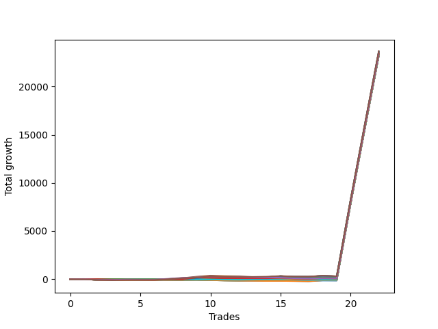

# Short Wallace Doodle 011 
- Symbol: NQ
- Date Range: 3/19/22 - 5/22/22
- Trading Period: 7:20-12:30
- Number of Trades: 25


| Name | Win Percent | Profit | Avg Profit / Trade |     | Name | Win Percent | Profit | Avg Profit / Trade |
| ---- | ----------- | ------ | ------------------ | --- | ---- | ----------- | ------ | ------------------ |
| Sorted By <br> Profit | | | | | Sorted By <br> Win Percentage ||||
| Three | 80.00 | 11914000.00 | 476560.00 |     | Three | 80.00 | 11914000.00 | 476560.00 |
| Four | 68.00 | 11886125.00 | 475445.00 |     | Two | 80.00 | 11808125.00 | 472325.00 |
| Thirty-Six | 52.00 | 11846625.00 | 473865.00 |     | Four | 68.00 | 11886125.00 | 475445.00 |
| Five | 56.00 | 11816500.00 | 472660.00 |     | One | 64.00 | 11717000.00 | 468680.00 |
| Two | 80.00 | 11808125.00 | 472325.00 |     | Five | 56.00 | 11816500.00 | 472660.00 |
| Thirty-Five | 48.00 | 11767500.00 | 470700.00 |     | Thirty-Six | 52.00 | 11846625.00 | 473865.00 |
| Thirty-Four | 52.00 | 11733500.00 | 469340.00 |     | Thirty-Four | 52.00 | 11733500.00 | 469340.00 |
| One | 64.00 | 11717000.00 | 468680.00 |     | Eleven | 52.00 | 11669000.00 | 466760.00 |
| Twenty-Nine | 44.00 | 11670000.00 | 466800.00 |     | Nine | 52.00 | 11669000.00 | 466760.00 |
| Twenty-Seven | 44.00 | 11670000.00 | 466800.00 |     | Seven | 52.00 | 11669000.00 | 466760.00 |
| Twenty-Five | 44.00 | 11670000.00 | 466800.00 |     | Thirteen | 52.00 | 11668625.00 | 466745.00 |
| Eleven | 52.00 | 11669000.00 | 466760.00 |     | Seventeen | 52.00 | 11668125.00 | 466725.00 |
| Nine | 52.00 | 11669000.00 | 466760.00 |     | Fifteen | 52.00 | 11668125.00 | 466725.00 |
| Seven | 52.00 | 11669000.00 | 466760.00 |     | Nineteen | 52.00 | 11662625.00 | 466505.00 |
| Thirteen | 52.00 | 11668625.00 | 466745.00 |     | Twenty-Three | 52.00 | 11661375.00 | 466455.00 |
| Seventeen | 52.00 | 11668125.00 | 466725.00 |     | Twenty-One | 52.00 | 11661375.00 | 466455.00 |
| Fifteen | 52.00 | 11668125.00 | 466725.00 |     | Thirty-Five | 48.00 | 11767500.00 | 470700.00 |
| Thirty-Three | 44.00 | 11667625.00 | 466705.00 |     | Twenty-Nine | 44.00 | 11670000.00 | 466800.00 |
| Thirty-One | 44.00 | 11667625.00 | 466705.00 |     | Twenty-Seven | 44.00 | 11670000.00 | 466800.00 |
| Twenty-Eight | 44.00 | 11667625.00 | 466705.00 |     | Twenty-Five | 44.00 | 11670000.00 | 466800.00 |
| Twenty-Six | 44.00 | 11667625.00 | 466705.00 |     | Thirty-Three | 44.00 | 11667625.00 | 466705.00 |
| Twenty-Four | 44.00 | 11667625.00 | 466705.00 |     | Thirty-One | 44.00 | 11667625.00 | 466705.00 |
| Thirty-Two | 44.00 | 11667500.00 | 466700.00 |     | Twenty-Eight | 44.00 | 11667625.00 | 466705.00 |
| Thirty | 44.00 | 11667500.00 | 466700.00 |     | Twenty-Six | 44.00 | 11667625.00 | 466705.00 |
| Nineteen | 52.00 | 11662625.00 | 466505.00 |     | Twenty-Four | 44.00 | 11667625.00 | 466705.00 |
| Twenty-Three | 52.00 | 11661375.00 | 466455.00 |     | Thirty-Two | 44.00 | 11667500.00 | 466700.00 |
| Twenty-One | 52.00 | 11661375.00 | 466455.00 |     | Thirty | 44.00 | 11667500.00 | 466700.00 |
| Ten | 28.00 | 11618500.00 | 464740.00 |     | Ten | 28.00 | 11618500.00 | 464740.00 |
| Eight | 28.00 | 11618500.00 | 464740.00 |     | Eight | 28.00 | 11618500.00 | 464740.00 |
| Six | 28.00 | 11618500.00 | 464740.00 |     | Six | 28.00 | 11618500.00 | 464740.00 |
| Eighteen | 28.00 | 11616125.00 | 464645.00 |     | Eighteen | 28.00 | 11616125.00 | 464645.00 |
| Twelve | 28.00 | 11610875.00 | 464435.00 |     | Twelve | 28.00 | 11610875.00 | 464435.00 |
| Sixteen | 28.00 | 11610375.00 | 464415.00 |     | Sixteen | 28.00 | 11610375.00 | 464415.00 |
| Fourteen | 28.00 | 11610375.00 | 464415.00 |     | Fourteen | 28.00 | 11610375.00 | 464415.00 |
| Twenty-Two | 24.00 | 11592750.00 | 463710.00 |     | Twenty-Two | 24.00 | 11592750.00 | 463710.00 |
| Twenty | 24.00 | 11592750.00 | 463710.00 |     | Twenty | 24.00 | 11592750.00 | 463710.00 |

### Test One
* Sell when price hits the middle line of the 20p bollinger
* No Stoploss
* Results:
```
Total Trades: 25
Percent Up: 36.00
Percent Down: 64.00
Total Points Moved Down: 23434.00
Potential Profit: 11717000.00
Total Points Ups: 195.25 Count Ups: 9
Total Points Downs: 23629.25 Count Downs: 16
```

<details><summary>Trades</summary>

<code>In: 2022-03-28 11:12:00		Out: 2022-03-28 11:12:10		Total Position Time: 00:10		Total Move Down: 7.25		Total to Date: -7.25</code> <br />
<code>In: 2022-03-28 11:32:00		Out: 2022-03-28 12:01:55		Total Position Time: 29:55		Total Move Down: -65.25		Total to Date: 58.00</code> <br />
<code>In: 2022-03-28 11:50:00		Out: 2022-03-28 12:12:55		Total Position Time: 22:55		Total Move Down: -33.75		Total to Date: 91.75</code> <br />
<code>In: 2022-03-29 08:52:00		Out: 2022-03-29 08:56:30		Total Position Time: 04:30		Total Move Down: 9.50		Total to Date: 82.25</code> <br />
<code>In: 2022-03-29 10:50:00		Out: 2022-03-29 11:04:05		Total Position Time: 14:05		Total Move Down: 0.75		Total to Date: 81.50</code> <br />
<code>In: 2022-03-29 10:51:00		Out: 2022-03-29 11:04:05		Total Position Time: 13:05		Total Move Down: -4.75		Total to Date: 86.25</code> <br />
<code>In: 2022-03-31 12:05:00		Out: 2022-03-31 12:11:10		Total Position Time: 06:10		Total Move Down: 14.75		Total to Date: 71.50</code> <br />
<code>In: 2022-04-06 10:45:00		Out: 2022-04-06 10:56:50		Total Position Time: 11:50		Total Move Down: 2.25		Total to Date: 69.25</code> <br />
<code>In: 2022-04-06 11:05:00		Out: 2022-04-06 11:06:05		Total Position Time: 01:05		Total Move Down: 39.50		Total to Date: 29.75</code> <br />
<code>In: 2022-04-06 12:02:00		Out: 2022-04-06 12:08:05		Total Position Time: 06:05		Total Move Down: 34.50		Total to Date: -4.75</code> <br />
<code>In: 2022-04-07 11:57:00		Out: 2022-04-07 12:20:05		Total Position Time: 23:05		Total Move Down: -55.75		Total to Date: 51.00</code> <br />
<code>In: 2022-04-07 12:04:00		Out: 2022-04-07 12:20:05		Total Position Time: 16:05		Total Move Down: -14.50		Total to Date: 65.50</code> <br />
<code>In: 2022-04-08 07:33:00		Out: 2022-04-08 07:38:35		Total Position Time: 05:35		Total Move Down: 22.50		Total to Date: 43.00</code> <br />
<code>In: 2022-04-08 07:33:00		Out: 2022-04-08 07:38:35		Total Position Time: 05:35		Total Move Down: 22.50		Total to Date: 20.50</code> <br />
<code>In: 2022-04-28 08:10:00		Out: 2022-04-28 08:26:20		Total Position Time: 16:20		Total Move Down: -13.25		Total to Date: 33.75</code> <br />
<code>In: 2022-05-02 09:23:00		Out: 2022-05-02 09:27:15		Total Position Time: 04:15		Total Move Down: 37.00		Total to Date: -3.25</code> <br />
<code>In: 2022-05-06 07:21:00		Out: 2022-05-06 07:29:55		Total Position Time: 08:55		Total Move Down: 43.75		Total to Date: -47.00</code> <br />
<code>In: 2022-05-11 08:40:00		Out: 2022-05-11 08:46:50		Total Position Time: 06:50		Total Move Down: 34.25		Total to Date: -81.25</code> <br />
<code>In: 2022-05-16 10:30:00		Out: 2022-05-16 10:42:15		Total Position Time: 12:15		Total Move Down: -2.25		Total to Date: -79.00</code> <br />
<code>In: 2022-05-24 09:18:00		Out: 2022-05-24 09:21:30		Total Position Time: 03:30		Total Move Down: 31.75		Total to Date: -110.75</code> <br />
<code>In: 2022-05-24 10:43:00		Out: 2022-05-24 10:57:50		Total Position Time: 14:50		Total Move Down: -1.75		Total to Date: -109.00</code> <br />
<code>In: 2022-05-24 10:44:00		Out: 2022-05-24 10:57:50		Total Position Time: 13:50		Total Move Down: -4.00		Total to Date: -105.00</code> <br />
<code>In: 2022-06-10 12:29:00		Out: 2022-06-10 12:29:10		Total Position Time: 00:10		Total Move Down: 8014.00		Total to Date: -8119.00</code> <br />
<code>In: 2022-06-13 09:41:00		Out: 2022-06-13 09:41:10		Total Position Time: 00:10		Total Move Down: 7700.75		Total to Date: -15819.75</code> <br />
<code>In: 2022-06-14 10:12:00		Out: 2022-06-14 10:12:10		Total Position Time: 00:10		Total Move Down: 7614.25		Total to Date: -23434.00</code> <br />


</details>

### Test Two
* Sell when the price hits the lower line of the 20p 1std bollinger
* No Stoploss
* Results:
```
Total Trades: 25
Percent Up: 20.00
Percent Down: 80.00
Total Points Moved Down: 23616.25
Potential Profit: 11808125.00
Total Points Ups: 148.75 Count Ups: 5
Total Points Downs: 23765.00 Count Downs: 20
```

<details><summary>Trades</summary>

<code>In: 2022-03-28 11:12:00		Out: 2022-03-28 11:19:20		Total Position Time: 07:20		Total Move Down: 8.50		Total to Date: -8.50</code> <br />
<code>In: 2022-03-28 11:32:00		Out: 2022-03-28 12:01:55		Total Position Time: 29:55		Total Move Down: -65.25		Total to Date: 56.75</code> <br />
<code>In: 2022-03-28 11:50:00		Out: 2022-03-28 12:19:55		Total Position Time: 29:55		Total Move Down: -39.75		Total to Date: 96.50</code> <br />
<code>In: 2022-03-29 08:52:00		Out: 2022-03-29 08:58:40		Total Position Time: 06:40		Total Move Down: 17.75		Total to Date: 78.75</code> <br />
<code>In: 2022-03-29 10:50:00		Out: 2022-03-29 11:06:05		Total Position Time: 16:05		Total Move Down: 2.25		Total to Date: 76.50</code> <br />
<code>In: 2022-03-29 10:51:00		Out: 2022-03-29 11:06:05		Total Position Time: 15:05		Total Move Down: -3.25		Total to Date: 79.75</code> <br />
<code>In: 2022-03-31 12:05:00		Out: 2022-03-31 12:14:10		Total Position Time: 09:10		Total Move Down: 27.00		Total to Date: 52.75</code> <br />
<code>In: 2022-04-06 10:45:00		Out: 2022-04-06 10:58:00		Total Position Time: 13:00		Total Move Down: 12.00		Total to Date: 40.75</code> <br />
<code>In: 2022-04-06 11:05:00		Out: 2022-04-06 11:07:25		Total Position Time: 02:25		Total Move Down: 62.25		Total to Date: -21.50</code> <br />
<code>In: 2022-04-06 12:02:00		Out: 2022-04-06 12:13:30		Total Position Time: 11:30		Total Move Down: 41.00		Total to Date: -62.50</code> <br />
<code>In: 2022-04-07 11:57:00		Out: 2022-04-07 12:21:20		Total Position Time: 24:20		Total Move Down: -38.75		Total to Date: -23.75</code> <br />
<code>In: 2022-04-07 12:04:00		Out: 2022-04-07 12:21:20		Total Position Time: 17:20		Total Move Down: 2.50		Total to Date: -26.25</code> <br />
<code>In: 2022-04-08 07:33:00		Out: 2022-04-08 07:44:30		Total Position Time: 11:30		Total Move Down: 26.50		Total to Date: -52.75</code> <br />
<code>In: 2022-04-08 07:33:00		Out: 2022-04-08 07:44:30		Total Position Time: 11:30		Total Move Down: 26.50		Total to Date: -79.25</code> <br />
<code>In: 2022-04-28 08:10:00		Out: 2022-04-28 08:26:40		Total Position Time: 16:40		Total Move Down: -1.75		Total to Date: -77.50</code> <br />
<code>In: 2022-05-02 09:23:00		Out: 2022-05-02 09:35:45		Total Position Time: 12:45		Total Move Down: 37.50		Total to Date: -115.00</code> <br />
<code>In: 2022-05-06 07:21:00		Out: 2022-05-06 07:33:50		Total Position Time: 12:50		Total Move Down: 62.00		Total to Date: -177.00</code> <br />
<code>In: 2022-05-11 08:40:00		Out: 2022-05-11 08:50:45		Total Position Time: 10:45		Total Move Down: 49.00		Total to Date: -226.00</code> <br />
<code>In: 2022-05-16 10:30:00		Out: 2022-05-16 10:42:35		Total Position Time: 12:35		Total Move Down: 8.25		Total to Date: -234.25</code> <br />
<code>In: 2022-05-24 09:18:00		Out: 2022-05-24 09:26:40		Total Position Time: 08:40		Total Move Down: 43.25		Total to Date: -277.50</code> <br />
<code>In: 2022-05-24 10:43:00		Out: 2022-05-24 11:01:15		Total Position Time: 18:15		Total Move Down: 6.00		Total to Date: -283.50</code> <br />
<code>In: 2022-05-24 10:44:00		Out: 2022-05-24 11:01:15		Total Position Time: 17:15		Total Move Down: 3.75		Total to Date: -287.25</code> <br />
<code>In: 2022-06-10 12:29:00		Out: 2022-06-10 12:29:10		Total Position Time: 00:10		Total Move Down: 8014.00		Total to Date: -8301.25</code> <br />
<code>In: 2022-06-13 09:41:00		Out: 2022-06-13 09:41:10		Total Position Time: 00:10		Total Move Down: 7700.75		Total to Date: -16002.00</code> <br />
<code>In: 2022-06-14 10:12:00		Out: 2022-06-14 10:12:10		Total Position Time: 00:10		Total Move Down: 7614.25		Total to Date: -23616.25</code> <br />


</details>

### Test Three
* Sell when the price hits the lower line of the 20p 2std bollinger
* No Stoploss
* Results:
```
Total Trades: 25
Percent Up: 20.00
Percent Down: 80.00
Total Points Moved Down: 23828.00
Potential Profit: 11914000.00
Total Points Ups: 192.50 Count Ups: 5
Total Points Downs: 24020.50 Count Downs: 20
```

<details><summary>Trades</summary>

<code>In: 2022-03-28 11:12:00		Out: 2022-03-28 11:41:55		Total Position Time: 29:55		Total Move Down: -19.25		Total to Date: 19.25</code> <br />
<code>In: 2022-03-28 11:32:00		Out: 2022-03-28 12:01:55		Total Position Time: 29:55		Total Move Down: -65.25		Total to Date: 84.50</code> <br />
<code>In: 2022-03-28 11:50:00		Out: 2022-03-28 12:19:55		Total Position Time: 29:55		Total Move Down: -39.75		Total to Date: 124.25</code> <br />
<code>In: 2022-03-29 08:52:00		Out: 2022-03-29 09:01:35		Total Position Time: 09:35		Total Move Down: 27.50		Total to Date: 96.75</code> <br />
<code>In: 2022-03-29 10:50:00		Out: 2022-03-29 11:06:20		Total Position Time: 16:20		Total Move Down: 6.25		Total to Date: 90.50</code> <br />
<code>In: 2022-03-29 10:51:00		Out: 2022-03-29 11:06:20		Total Position Time: 15:20		Total Move Down: 0.75		Total to Date: 89.75</code> <br />
<code>In: 2022-03-31 12:05:00		Out: 2022-03-31 12:19:40		Total Position Time: 14:40		Total Move Down: 42.25		Total to Date: 47.50</code> <br />
<code>In: 2022-04-06 10:45:00		Out: 2022-04-06 11:00:00		Total Position Time: 15:00		Total Move Down: 17.50		Total to Date: 30.00</code> <br />
<code>In: 2022-04-06 11:05:00		Out: 2022-04-06 11:08:25		Total Position Time: 03:25		Total Move Down: 91.25		Total to Date: -61.25</code> <br />
<code>In: 2022-04-06 12:02:00		Out: 2022-04-06 12:20:25		Total Position Time: 18:25		Total Move Down: 74.25		Total to Date: -135.50</code> <br />
<code>In: 2022-04-07 11:57:00		Out: 2022-04-07 12:26:55		Total Position Time: 29:55		Total Move Down: -48.25		Total to Date: -87.25</code> <br />
<code>In: 2022-04-07 12:04:00		Out: 2022-04-07 12:33:55		Total Position Time: 29:55		Total Move Down: -20.00		Total to Date: -67.25</code> <br />
<code>In: 2022-04-08 07:33:00		Out: 2022-04-08 07:45:45		Total Position Time: 12:45		Total Move Down: 36.75		Total to Date: -104.00</code> <br />
<code>In: 2022-04-08 07:33:00		Out: 2022-04-08 07:45:45		Total Position Time: 12:45		Total Move Down: 36.75		Total to Date: -140.75</code> <br />
<code>In: 2022-04-28 08:10:00		Out: 2022-04-28 08:32:20		Total Position Time: 22:20		Total Move Down: 7.00		Total to Date: -147.75</code> <br />
<code>In: 2022-05-02 09:23:00		Out: 2022-05-02 09:39:35		Total Position Time: 16:35		Total Move Down: 53.25		Total to Date: -201.00</code> <br />
<code>In: 2022-05-06 07:21:00		Out: 2022-05-06 07:36:35		Total Position Time: 15:35		Total Move Down: 105.50		Total to Date: -306.50</code> <br />
<code>In: 2022-05-11 08:40:00		Out: 2022-05-11 08:53:45		Total Position Time: 13:45		Total Move Down: 80.75		Total to Date: -387.25</code> <br />
<code>In: 2022-05-16 10:30:00		Out: 2022-05-16 10:49:15		Total Position Time: 19:15		Total Move Down: 2.25		Total to Date: -389.50</code> <br />
<code>In: 2022-05-24 09:18:00		Out: 2022-05-24 09:32:40		Total Position Time: 14:40		Total Move Down: 74.25		Total to Date: -463.75</code> <br />
<code>In: 2022-05-24 10:43:00		Out: 2022-05-24 11:01:40		Total Position Time: 18:40		Total Move Down: 18.75		Total to Date: -482.50</code> <br />
<code>In: 2022-05-24 10:44:00		Out: 2022-05-24 11:01:40		Total Position Time: 17:40		Total Move Down: 16.50		Total to Date: -499.00</code> <br />
<code>In: 2022-06-10 12:29:00		Out: 2022-06-10 12:29:10		Total Position Time: 00:10		Total Move Down: 8014.00		Total to Date: -8513.00</code> <br />
<code>In: 2022-06-13 09:41:00		Out: 2022-06-13 09:41:10		Total Position Time: 00:10		Total Move Down: 7700.75		Total to Date: -16213.75</code> <br />
<code>In: 2022-06-14 10:12:00		Out: 2022-06-14 10:12:10		Total Position Time: 00:10		Total Move Down: 7614.25		Total to Date: -23828.00</code> <br />


</details>

### Test Four
* Sell when the price hits the middle line of the 1std VWAP
* No Stoploss
* Results:
```
Total Trades: 25
Percent Up: 32.00
Percent Down: 68.00
Total Points Moved Down: 23772.25
Potential Profit: 11886125.00
Total Points Ups: 286.25 Count Ups: 8
Total Points Downs: 24058.50 Count Downs: 17
```

<details><summary>Trades</summary>

<code>In: 2022-03-28 11:12:00		Out: 2022-03-28 11:41:55		Total Position Time: 29:55		Total Move Down: -19.25		Total to Date: 19.25</code> <br />
<code>In: 2022-03-28 11:32:00		Out: 2022-03-28 12:01:55		Total Position Time: 29:55		Total Move Down: -65.25		Total to Date: 84.50</code> <br />
<code>In: 2022-03-28 11:50:00		Out: 2022-03-28 12:19:55		Total Position Time: 29:55		Total Move Down: -39.75		Total to Date: 124.25</code> <br />
<code>In: 2022-03-29 08:52:00		Out: 2022-03-29 09:02:10		Total Position Time: 10:10		Total Move Down: 39.25		Total to Date: 85.00</code> <br />
<code>In: 2022-03-29 10:50:00		Out: 2022-03-29 11:19:55		Total Position Time: 29:55		Total Move Down: 9.25		Total to Date: 75.75</code> <br />
<code>In: 2022-03-29 10:51:00		Out: 2022-03-29 11:20:55		Total Position Time: 29:55		Total Move Down: 2.00		Total to Date: 73.75</code> <br />
<code>In: 2022-03-31 12:05:00		Out: 2022-03-31 12:16:50		Total Position Time: 11:50		Total Move Down: 31.00		Total to Date: 42.75</code> <br />
<code>In: 2022-04-06 10:45:00		Out: 2022-04-06 11:00:10		Total Position Time: 15:10		Total Move Down: 43.50		Total to Date: -0.75</code> <br />
<code>In: 2022-04-06 11:05:00		Out: 2022-04-06 11:08:10		Total Position Time: 03:10		Total Move Down: 86.25		Total to Date: -87.00</code> <br />
<code>In: 2022-04-06 12:02:00		Out: 2022-04-06 12:25:35		Total Position Time: 23:35		Total Move Down: 113.25		Total to Date: -200.25</code> <br />
<code>In: 2022-04-07 11:57:00		Out: 2022-04-07 12:26:55		Total Position Time: 29:55		Total Move Down: -48.25		Total to Date: -152.00</code> <br />
<code>In: 2022-04-07 12:04:00		Out: 2022-04-07 12:33:55		Total Position Time: 29:55		Total Move Down: -20.00		Total to Date: -132.00</code> <br />
<code>In: 2022-04-08 07:33:00		Out: 2022-04-08 07:45:10		Total Position Time: 12:10		Total Move Down: 35.00		Total to Date: -167.00</code> <br />
<code>In: 2022-04-08 07:33:00		Out: 2022-04-08 07:45:10		Total Position Time: 12:10		Total Move Down: 35.00		Total to Date: -202.00</code> <br />
<code>In: 2022-04-28 08:10:00		Out: 2022-04-28 08:39:35		Total Position Time: 29:35		Total Move Down: 35.50		Total to Date: -237.50</code> <br />
<code>In: 2022-05-02 09:23:00		Out: 2022-05-02 09:39:35		Total Position Time: 16:35		Total Move Down: 53.25		Total to Date: -290.75</code> <br />
<code>In: 2022-05-06 07:21:00		Out: 2022-05-06 07:36:35		Total Position Time: 15:35		Total Move Down: 105.50		Total to Date: -396.25</code> <br />
<code>In: 2022-05-11 08:40:00		Out: 2022-05-11 08:50:40		Total Position Time: 10:40		Total Move Down: 45.75		Total to Date: -442.00</code> <br />
<code>In: 2022-05-16 10:30:00		Out: 2022-05-16 10:59:55		Total Position Time: 29:55		Total Move Down: -3.00		Total to Date: -439.00</code> <br />
<code>In: 2022-05-24 09:18:00		Out: 2022-05-24 09:36:50		Total Position Time: 18:50		Total Move Down: 95.00		Total to Date: -534.00</code> <br />
<code>In: 2022-05-24 10:43:00		Out: 2022-05-24 11:12:55		Total Position Time: 29:55		Total Move Down: -54.00		Total to Date: -480.00</code> <br />
<code>In: 2022-05-24 10:44:00		Out: 2022-05-24 11:13:55		Total Position Time: 29:55		Total Move Down: -36.75		Total to Date: -443.25</code> <br />
<code>In: 2022-06-10 12:29:00		Out: 2022-06-10 12:29:10		Total Position Time: 00:10		Total Move Down: 8014.00		Total to Date: -8457.25</code> <br />
<code>In: 2022-06-13 09:41:00		Out: 2022-06-13 09:41:10		Total Position Time: 00:10		Total Move Down: 7700.75		Total to Date: -16158.00</code> <br />
<code>In: 2022-06-14 10:12:00		Out: 2022-06-14 10:12:10		Total Position Time: 00:10		Total Move Down: 7614.25		Total to Date: -23772.25</code> <br />


</details>

### Test Five
* Sell when the price hits the lower line of the 1std VWAP
* No Stoploss
* Results:
```
Total Trades: 25
Percent Up: 44.00
Percent Down: 56.00
Total Points Moved Down: 23633.00
Potential Profit: 11816500.00
Total Points Ups: 457.00 Count Ups: 11
Total Points Downs: 24090.00 Count Downs: 14
```

<details><summary>Trades</summary>

<code>In: 2022-03-28 11:12:00		Out: 2022-03-28 11:41:55		Total Position Time: 29:55		Total Move Down: -19.25		Total to Date: 19.25</code> <br />
<code>In: 2022-03-28 11:32:00		Out: 2022-03-28 12:01:55		Total Position Time: 29:55		Total Move Down: -65.25		Total to Date: 84.50</code> <br />
<code>In: 2022-03-28 11:50:00		Out: 2022-03-28 12:19:55		Total Position Time: 29:55		Total Move Down: -39.75		Total to Date: 124.25</code> <br />
<code>In: 2022-03-29 08:52:00		Out: 2022-03-29 09:21:55		Total Position Time: 29:55		Total Move Down: 24.00		Total to Date: 100.25</code> <br />
<code>In: 2022-03-29 10:50:00		Out: 2022-03-29 11:19:55		Total Position Time: 29:55		Total Move Down: 9.25		Total to Date: 91.00</code> <br />
<code>In: 2022-03-29 10:51:00		Out: 2022-03-29 11:20:55		Total Position Time: 29:55		Total Move Down: 2.00		Total to Date: 89.00</code> <br />
<code>In: 2022-03-31 12:05:00		Out: 2022-03-31 12:21:30		Total Position Time: 16:30		Total Move Down: 59.50		Total to Date: 29.50</code> <br />
<code>In: 2022-04-06 10:45:00		Out: 2022-04-06 11:13:00		Total Position Time: 28:00		Total Move Down: 85.00		Total to Date: -55.50</code> <br />
<code>In: 2022-04-06 11:05:00		Out: 2022-04-06 11:13:00		Total Position Time: 08:00		Total Move Down: 135.75		Total to Date: -191.25</code> <br />
<code>In: 2022-04-06 12:02:00		Out: 2022-04-06 12:31:55		Total Position Time: 29:55		Total Move Down: 114.25		Total to Date: -305.50</code> <br />
<code>In: 2022-04-07 11:57:00		Out: 2022-04-07 12:26:55		Total Position Time: 29:55		Total Move Down: -48.25		Total to Date: -257.25</code> <br />
<code>In: 2022-04-07 12:04:00		Out: 2022-04-07 12:33:55		Total Position Time: 29:55		Total Move Down: -20.00		Total to Date: -237.25</code> <br />
<code>In: 2022-04-08 07:33:00		Out: 2022-04-08 08:02:55		Total Position Time: 29:55		Total Move Down: -75.75		Total to Date: -161.50</code> <br />
<code>In: 2022-04-08 07:33:00		Out: 2022-04-08 08:02:55		Total Position Time: 29:55		Total Move Down: -75.75		Total to Date: -85.75</code> <br />
<code>In: 2022-04-28 08:10:00		Out: 2022-04-28 08:39:55		Total Position Time: 29:55		Total Move Down: 39.75		Total to Date: -125.50</code> <br />
<code>In: 2022-05-02 09:23:00		Out: 2022-05-02 09:52:55		Total Position Time: 29:55		Total Move Down: 76.50		Total to Date: -202.00</code> <br />
<code>In: 2022-05-06 07:21:00		Out: 2022-05-06 07:50:55		Total Position Time: 29:55		Total Move Down: -19.25		Total to Date: -182.75</code> <br />
<code>In: 2022-05-11 08:40:00		Out: 2022-05-11 09:09:55		Total Position Time: 29:55		Total Move Down: 110.50		Total to Date: -293.25</code> <br />
<code>In: 2022-05-16 10:30:00		Out: 2022-05-16 10:59:55		Total Position Time: 29:55		Total Move Down: -3.00		Total to Date: -290.25</code> <br />
<code>In: 2022-05-24 09:18:00		Out: 2022-05-24 09:47:55		Total Position Time: 29:55		Total Move Down: 104.50		Total to Date: -394.75</code> <br />
<code>In: 2022-05-24 10:43:00		Out: 2022-05-24 11:12:55		Total Position Time: 29:55		Total Move Down: -54.00		Total to Date: -340.75</code> <br />
<code>In: 2022-05-24 10:44:00		Out: 2022-05-24 11:13:55		Total Position Time: 29:55		Total Move Down: -36.75		Total to Date: -304.00</code> <br />
<code>In: 2022-06-10 12:29:00		Out: 2022-06-10 12:29:10		Total Position Time: 00:10		Total Move Down: 8014.00		Total to Date: -8318.00</code> <br />
<code>In: 2022-06-13 09:41:00		Out: 2022-06-13 09:41:10		Total Position Time: 00:10		Total Move Down: 7700.75		Total to Date: -16018.75</code> <br />
<code>In: 2022-06-14 10:12:00		Out: 2022-06-14 10:12:10		Total Position Time: 00:10		Total Move Down: 7614.25		Total to Date: -23633.00</code> <br />


</details>

### Test Six
* Sell when the price hits the middle line of the 20p bollinger
* Stoploss is -2 points
* Results:
```
Total Trades: 25
Percent Up: 72.00
Percent Down: 28.00
Total Points Moved Down: 23237.00
Potential Profit: 11618500.00
Total Points Ups: 117.75 Count Ups: 18
Total Points Downs: 23354.75 Count Downs: 7
```

<details><summary>Trades</summary>

<code>In: 2022-03-28 11:12:00		Out: 2022-03-28 11:12:10		Total Position Time: 00:10		Total Move Down: 7.25		Total to Date: -7.25</code> <br />
<code>In: 2022-03-28 11:32:00		Out: 2022-03-28 11:40:40		Total Position Time: 08:40		Total Move Down: -5.50		Total to Date: -1.75</code> <br />
<code>In: 2022-03-28 11:50:00		Out: 2022-03-28 11:51:25		Total Position Time: 01:25		Total Move Down: -10.75		Total to Date: 9.00</code> <br />
<code>In: 2022-03-29 08:52:00		Out: 2022-03-29 08:53:10		Total Position Time: 01:10		Total Move Down: -0.25		Total to Date: 9.25</code> <br />
<code>In: 2022-03-29 10:50:00		Out: 2022-03-29 10:50:10		Total Position Time: 00:10		Total Move Down: -1.75		Total to Date: 11.00</code> <br />
<code>In: 2022-03-29 10:51:00		Out: 2022-03-29 10:51:50		Total Position Time: 00:50		Total Move Down: -7.50		Total to Date: 18.50</code> <br />
<code>In: 2022-03-31 12:05:00		Out: 2022-03-31 12:05:10		Total Position Time: 00:10		Total Move Down: 1.00		Total to Date: 17.50</code> <br />
<code>In: 2022-04-06 10:45:00		Out: 2022-04-06 10:45:10		Total Position Time: 00:10		Total Move Down: -1.00		Total to Date: 18.50</code> <br />
<code>In: 2022-04-06 11:05:00		Out: 2022-04-06 11:05:10		Total Position Time: 00:10		Total Move Down: 15.00		Total to Date: 3.50</code> <br />
<code>In: 2022-04-06 12:02:00		Out: 2022-04-06 12:02:45		Total Position Time: 00:45		Total Move Down: -32.25		Total to Date: 35.75</code> <br />
<code>In: 2022-04-07 11:57:00		Out: 2022-04-07 11:57:45		Total Position Time: 00:45		Total Move Down: -7.50		Total to Date: 43.25</code> <br />
<code>In: 2022-04-07 12:04:00		Out: 2022-04-07 12:05:25		Total Position Time: 01:25		Total Move Down: -6.25		Total to Date: 49.50</code> <br />
<code>In: 2022-04-08 07:33:00		Out: 2022-04-08 07:34:05		Total Position Time: 01:05		Total Move Down: -6.25		Total to Date: 55.75</code> <br />
<code>In: 2022-04-08 07:33:00		Out: 2022-04-08 07:34:05		Total Position Time: 01:05		Total Move Down: -6.25		Total to Date: 62.00</code> <br />
<code>In: 2022-04-28 08:10:00		Out: 2022-04-28 08:10:10		Total Position Time: 00:10		Total Move Down: -0.00		Total to Date: 62.00</code> <br />
<code>In: 2022-05-02 09:23:00		Out: 2022-05-02 09:23:15		Total Position Time: 00:15		Total Move Down: -5.25		Total to Date: 67.25</code> <br />
<code>In: 2022-05-06 07:21:00		Out: 2022-05-06 07:21:10		Total Position Time: 00:10		Total Move Down: 2.50		Total to Date: 64.75</code> <br />
<code>In: 2022-05-11 08:40:00		Out: 2022-05-11 08:40:10		Total Position Time: 00:10		Total Move Down: -2.50		Total to Date: 67.25</code> <br />
<code>In: 2022-05-16 10:30:00		Out: 2022-05-16 10:31:05		Total Position Time: 01:05		Total Move Down: -14.75		Total to Date: 82.00</code> <br />
<code>In: 2022-05-24 09:18:00		Out: 2022-05-24 09:18:10		Total Position Time: 00:10		Total Move Down: -0.25		Total to Date: 82.25</code> <br />
<code>In: 2022-05-24 10:43:00		Out: 2022-05-24 10:44:20		Total Position Time: 01:20		Total Move Down: -3.75		Total to Date: 86.00</code> <br />
<code>In: 2022-05-24 10:44:00		Out: 2022-05-24 10:44:20		Total Position Time: 00:20		Total Move Down: -6.00		Total to Date: 92.00</code> <br />
<code>In: 2022-06-10 12:29:00		Out: 2022-06-10 12:29:10		Total Position Time: 00:10		Total Move Down: 8014.00		Total to Date: -7922.00</code> <br />
<code>In: 2022-06-13 09:41:00		Out: 2022-06-13 09:41:10		Total Position Time: 00:10		Total Move Down: 7700.75		Total to Date: -15622.75</code> <br />
<code>In: 2022-06-14 10:12:00		Out: 2022-06-14 10:12:10		Total Position Time: 00:10		Total Move Down: 7614.25		Total to Date: -23237.00</code> <br />


</details>

### Test Seven
* Sell when the price hits the middle line of the 20p bollinger
* Trailing Stop is -2 points
* Results:
```
Total Trades: 25
Percent Up: 48.00
Percent Down: 52.00
Total Points Moved Down: 23338.00
Potential Profit: 11669000.00
Total Points Ups: 52.25 Count Ups: 12
Total Points Downs: 23390.25 Count Downs: 13
```

<details><summary>Trades</summary>

<code>In: 2022-03-28 11:12:00		Out: 2022-03-28 11:12:10		Total Position Time: 00:10		Total Move Down: 7.25		Total to Date: -7.25</code> <br />
<code>In: 2022-03-28 11:32:00		Out: 2022-03-28 11:32:40		Total Position Time: 00:40		Total Move Down: -2.75		Total to Date: -4.50</code> <br />
<code>In: 2022-03-28 11:50:00		Out: 2022-03-28 11:50:15		Total Position Time: 00:15		Total Move Down: -7.75		Total to Date: 3.25</code> <br />
<code>In: 2022-03-29 08:52:00		Out: 2022-03-29 08:52:20		Total Position Time: 00:20		Total Move Down: 2.25		Total to Date: 1.00</code> <br />
<code>In: 2022-03-29 10:50:00		Out: 2022-03-29 10:50:10		Total Position Time: 00:10		Total Move Down: -1.75		Total to Date: 2.75</code> <br />
<code>In: 2022-03-29 10:51:00		Out: 2022-03-29 10:51:25		Total Position Time: 00:25		Total Move Down: -7.50		Total to Date: 10.25</code> <br />
<code>In: 2022-03-31 12:05:00		Out: 2022-03-31 12:05:10		Total Position Time: 00:10		Total Move Down: 1.00		Total to Date: 9.25</code> <br />
<code>In: 2022-04-06 10:45:00		Out: 2022-04-06 10:45:10		Total Position Time: 00:10		Total Move Down: -1.00		Total to Date: 10.25</code> <br />
<code>In: 2022-04-06 11:05:00		Out: 2022-04-06 11:05:10		Total Position Time: 00:10		Total Move Down: 15.00		Total to Date: -4.75</code> <br />
<code>In: 2022-04-06 12:02:00		Out: 2022-04-06 12:02:15		Total Position Time: 00:15		Total Move Down: -14.75		Total to Date: 10.00</code> <br />
<code>In: 2022-04-07 11:57:00		Out: 2022-04-07 11:57:25		Total Position Time: 00:25		Total Move Down: -3.25		Total to Date: 13.25</code> <br />
<code>In: 2022-04-07 12:04:00		Out: 2022-04-07 12:04:20		Total Position Time: 00:20		Total Move Down: 1.50		Total to Date: 11.75</code> <br />
<code>In: 2022-04-08 07:33:00		Out: 2022-04-08 07:33:45		Total Position Time: 00:45		Total Move Down: 13.50		Total to Date: -1.75</code> <br />
<code>In: 2022-04-08 07:33:00		Out: 2022-04-08 07:33:45		Total Position Time: 00:45		Total Move Down: 13.50		Total to Date: -15.25</code> <br />
<code>In: 2022-04-28 08:10:00		Out: 2022-04-28 08:10:10		Total Position Time: 00:10		Total Move Down: -0.00		Total to Date: -15.25</code> <br />
<code>In: 2022-05-02 09:23:00		Out: 2022-05-02 09:23:15		Total Position Time: 00:15		Total Move Down: -5.25		Total to Date: -10.00</code> <br />
<code>In: 2022-05-06 07:21:00		Out: 2022-05-06 07:21:10		Total Position Time: 00:10		Total Move Down: 2.50		Total to Date: -12.50</code> <br />
<code>In: 2022-05-11 08:40:00		Out: 2022-05-11 08:40:10		Total Position Time: 00:10		Total Move Down: -2.50		Total to Date: -10.00</code> <br />
<code>In: 2022-05-16 10:30:00		Out: 2022-05-16 10:30:20		Total Position Time: 00:20		Total Move Down: -5.50		Total to Date: -4.50</code> <br />
<code>In: 2022-05-24 09:18:00		Out: 2022-05-24 09:18:10		Total Position Time: 00:10		Total Move Down: -0.25		Total to Date: -4.25</code> <br />
<code>In: 2022-05-24 10:43:00		Out: 2022-05-24 10:43:15		Total Position Time: 00:15		Total Move Down: 3.25		Total to Date: -7.50</code> <br />
<code>In: 2022-05-24 10:44:00		Out: 2022-05-24 10:44:15		Total Position Time: 00:15		Total Move Down: 1.50		Total to Date: -9.00</code> <br />
<code>In: 2022-06-10 12:29:00		Out: 2022-06-10 12:29:10		Total Position Time: 00:10		Total Move Down: 8014.00		Total to Date: -8023.00</code> <br />
<code>In: 2022-06-13 09:41:00		Out: 2022-06-13 09:41:10		Total Position Time: 00:10		Total Move Down: 7700.75		Total to Date: -15723.75</code> <br />
<code>In: 2022-06-14 10:12:00		Out: 2022-06-14 10:12:10		Total Position Time: 00:10		Total Move Down: 7614.25		Total to Date: -23338.00</code> <br />


</details>

### Test Eight
* Sell when the price hits the lower line of the 20p 1std bollinger
* Stoploss is -2 points
* Results:
```
Total Trades: 25
Percent Up: 72.00
Percent Down: 28.00
Total Points Moved Down: 23237.00
Potential Profit: 11618500.00
Total Points Ups: 117.75 Count Ups: 18
Total Points Downs: 23354.75 Count Downs: 7
```

<details><summary>Trades</summary>

<code>In: 2022-03-28 11:12:00		Out: 2022-03-28 11:12:10		Total Position Time: 00:10		Total Move Down: 7.25		Total to Date: -7.25</code> <br />
<code>In: 2022-03-28 11:32:00		Out: 2022-03-28 11:40:40		Total Position Time: 08:40		Total Move Down: -5.50		Total to Date: -1.75</code> <br />
<code>In: 2022-03-28 11:50:00		Out: 2022-03-28 11:51:25		Total Position Time: 01:25		Total Move Down: -10.75		Total to Date: 9.00</code> <br />
<code>In: 2022-03-29 08:52:00		Out: 2022-03-29 08:53:10		Total Position Time: 01:10		Total Move Down: -0.25		Total to Date: 9.25</code> <br />
<code>In: 2022-03-29 10:50:00		Out: 2022-03-29 10:50:10		Total Position Time: 00:10		Total Move Down: -1.75		Total to Date: 11.00</code> <br />
<code>In: 2022-03-29 10:51:00		Out: 2022-03-29 10:51:50		Total Position Time: 00:50		Total Move Down: -7.50		Total to Date: 18.50</code> <br />
<code>In: 2022-03-31 12:05:00		Out: 2022-03-31 12:05:10		Total Position Time: 00:10		Total Move Down: 1.00		Total to Date: 17.50</code> <br />
<code>In: 2022-04-06 10:45:00		Out: 2022-04-06 10:45:10		Total Position Time: 00:10		Total Move Down: -1.00		Total to Date: 18.50</code> <br />
<code>In: 2022-04-06 11:05:00		Out: 2022-04-06 11:05:10		Total Position Time: 00:10		Total Move Down: 15.00		Total to Date: 3.50</code> <br />
<code>In: 2022-04-06 12:02:00		Out: 2022-04-06 12:02:45		Total Position Time: 00:45		Total Move Down: -32.25		Total to Date: 35.75</code> <br />
<code>In: 2022-04-07 11:57:00		Out: 2022-04-07 11:57:45		Total Position Time: 00:45		Total Move Down: -7.50		Total to Date: 43.25</code> <br />
<code>In: 2022-04-07 12:04:00		Out: 2022-04-07 12:05:25		Total Position Time: 01:25		Total Move Down: -6.25		Total to Date: 49.50</code> <br />
<code>In: 2022-04-08 07:33:00		Out: 2022-04-08 07:34:05		Total Position Time: 01:05		Total Move Down: -6.25		Total to Date: 55.75</code> <br />
<code>In: 2022-04-08 07:33:00		Out: 2022-04-08 07:34:05		Total Position Time: 01:05		Total Move Down: -6.25		Total to Date: 62.00</code> <br />
<code>In: 2022-04-28 08:10:00		Out: 2022-04-28 08:10:10		Total Position Time: 00:10		Total Move Down: -0.00		Total to Date: 62.00</code> <br />
<code>In: 2022-05-02 09:23:00		Out: 2022-05-02 09:23:15		Total Position Time: 00:15		Total Move Down: -5.25		Total to Date: 67.25</code> <br />
<code>In: 2022-05-06 07:21:00		Out: 2022-05-06 07:21:10		Total Position Time: 00:10		Total Move Down: 2.50		Total to Date: 64.75</code> <br />
<code>In: 2022-05-11 08:40:00		Out: 2022-05-11 08:40:10		Total Position Time: 00:10		Total Move Down: -2.50		Total to Date: 67.25</code> <br />
<code>In: 2022-05-16 10:30:00		Out: 2022-05-16 10:31:05		Total Position Time: 01:05		Total Move Down: -14.75		Total to Date: 82.00</code> <br />
<code>In: 2022-05-24 09:18:00		Out: 2022-05-24 09:18:10		Total Position Time: 00:10		Total Move Down: -0.25		Total to Date: 82.25</code> <br />
<code>In: 2022-05-24 10:43:00		Out: 2022-05-24 10:44:20		Total Position Time: 01:20		Total Move Down: -3.75		Total to Date: 86.00</code> <br />
<code>In: 2022-05-24 10:44:00		Out: 2022-05-24 10:44:20		Total Position Time: 00:20		Total Move Down: -6.00		Total to Date: 92.00</code> <br />
<code>In: 2022-06-10 12:29:00		Out: 2022-06-10 12:29:10		Total Position Time: 00:10		Total Move Down: 8014.00		Total to Date: -7922.00</code> <br />
<code>In: 2022-06-13 09:41:00		Out: 2022-06-13 09:41:10		Total Position Time: 00:10		Total Move Down: 7700.75		Total to Date: -15622.75</code> <br />
<code>In: 2022-06-14 10:12:00		Out: 2022-06-14 10:12:10		Total Position Time: 00:10		Total Move Down: 7614.25		Total to Date: -23237.00</code> <br />


</details>

### Test Nine
* Sell when the price hits the lower line of the 20p 1std bollinger
* Trailing Stop is -2 points
* Results:
```
Total Trades: 25
Percent Up: 48.00
Percent Down: 52.00
Total Points Moved Down: 23338.00
Potential Profit: 11669000.00
Total Points Ups: 52.25 Count Ups: 12
Total Points Downs: 23390.25 Count Downs: 13
```

<details><summary>Trades</summary>

<code>In: 2022-03-28 11:12:00		Out: 2022-03-28 11:12:10		Total Position Time: 00:10		Total Move Down: 7.25		Total to Date: -7.25</code> <br />
<code>In: 2022-03-28 11:32:00		Out: 2022-03-28 11:32:40		Total Position Time: 00:40		Total Move Down: -2.75		Total to Date: -4.50</code> <br />
<code>In: 2022-03-28 11:50:00		Out: 2022-03-28 11:50:15		Total Position Time: 00:15		Total Move Down: -7.75		Total to Date: 3.25</code> <br />
<code>In: 2022-03-29 08:52:00		Out: 2022-03-29 08:52:20		Total Position Time: 00:20		Total Move Down: 2.25		Total to Date: 1.00</code> <br />
<code>In: 2022-03-29 10:50:00		Out: 2022-03-29 10:50:10		Total Position Time: 00:10		Total Move Down: -1.75		Total to Date: 2.75</code> <br />
<code>In: 2022-03-29 10:51:00		Out: 2022-03-29 10:51:25		Total Position Time: 00:25		Total Move Down: -7.50		Total to Date: 10.25</code> <br />
<code>In: 2022-03-31 12:05:00		Out: 2022-03-31 12:05:10		Total Position Time: 00:10		Total Move Down: 1.00		Total to Date: 9.25</code> <br />
<code>In: 2022-04-06 10:45:00		Out: 2022-04-06 10:45:10		Total Position Time: 00:10		Total Move Down: -1.00		Total to Date: 10.25</code> <br />
<code>In: 2022-04-06 11:05:00		Out: 2022-04-06 11:05:10		Total Position Time: 00:10		Total Move Down: 15.00		Total to Date: -4.75</code> <br />
<code>In: 2022-04-06 12:02:00		Out: 2022-04-06 12:02:15		Total Position Time: 00:15		Total Move Down: -14.75		Total to Date: 10.00</code> <br />
<code>In: 2022-04-07 11:57:00		Out: 2022-04-07 11:57:25		Total Position Time: 00:25		Total Move Down: -3.25		Total to Date: 13.25</code> <br />
<code>In: 2022-04-07 12:04:00		Out: 2022-04-07 12:04:20		Total Position Time: 00:20		Total Move Down: 1.50		Total to Date: 11.75</code> <br />
<code>In: 2022-04-08 07:33:00		Out: 2022-04-08 07:33:45		Total Position Time: 00:45		Total Move Down: 13.50		Total to Date: -1.75</code> <br />
<code>In: 2022-04-08 07:33:00		Out: 2022-04-08 07:33:45		Total Position Time: 00:45		Total Move Down: 13.50		Total to Date: -15.25</code> <br />
<code>In: 2022-04-28 08:10:00		Out: 2022-04-28 08:10:10		Total Position Time: 00:10		Total Move Down: -0.00		Total to Date: -15.25</code> <br />
<code>In: 2022-05-02 09:23:00		Out: 2022-05-02 09:23:15		Total Position Time: 00:15		Total Move Down: -5.25		Total to Date: -10.00</code> <br />
<code>In: 2022-05-06 07:21:00		Out: 2022-05-06 07:21:10		Total Position Time: 00:10		Total Move Down: 2.50		Total to Date: -12.50</code> <br />
<code>In: 2022-05-11 08:40:00		Out: 2022-05-11 08:40:10		Total Position Time: 00:10		Total Move Down: -2.50		Total to Date: -10.00</code> <br />
<code>In: 2022-05-16 10:30:00		Out: 2022-05-16 10:30:20		Total Position Time: 00:20		Total Move Down: -5.50		Total to Date: -4.50</code> <br />
<code>In: 2022-05-24 09:18:00		Out: 2022-05-24 09:18:10		Total Position Time: 00:10		Total Move Down: -0.25		Total to Date: -4.25</code> <br />
<code>In: 2022-05-24 10:43:00		Out: 2022-05-24 10:43:15		Total Position Time: 00:15		Total Move Down: 3.25		Total to Date: -7.50</code> <br />
<code>In: 2022-05-24 10:44:00		Out: 2022-05-24 10:44:15		Total Position Time: 00:15		Total Move Down: 1.50		Total to Date: -9.00</code> <br />
<code>In: 2022-06-10 12:29:00		Out: 2022-06-10 12:29:10		Total Position Time: 00:10		Total Move Down: 8014.00		Total to Date: -8023.00</code> <br />
<code>In: 2022-06-13 09:41:00		Out: 2022-06-13 09:41:10		Total Position Time: 00:10		Total Move Down: 7700.75		Total to Date: -15723.75</code> <br />
<code>In: 2022-06-14 10:12:00		Out: 2022-06-14 10:12:10		Total Position Time: 00:10		Total Move Down: 7614.25		Total to Date: -23338.00</code> <br />


</details>

### Test Ten
* Sell when the price hits the lower line of the 20p 2std bollinger
* Stoploss is -2 points
* Results:
```
Total Trades: 25
Percent Up: 72.00
Percent Down: 28.00
Total Points Moved Down: 23237.00
Potential Profit: 11618500.00
Total Points Ups: 117.75 Count Ups: 18
Total Points Downs: 23354.75 Count Downs: 7
```

<details><summary>Trades</summary>

<code>In: 2022-03-28 11:12:00		Out: 2022-03-28 11:12:10		Total Position Time: 00:10		Total Move Down: 7.25		Total to Date: -7.25</code> <br />
<code>In: 2022-03-28 11:32:00		Out: 2022-03-28 11:40:40		Total Position Time: 08:40		Total Move Down: -5.50		Total to Date: -1.75</code> <br />
<code>In: 2022-03-28 11:50:00		Out: 2022-03-28 11:51:25		Total Position Time: 01:25		Total Move Down: -10.75		Total to Date: 9.00</code> <br />
<code>In: 2022-03-29 08:52:00		Out: 2022-03-29 08:53:10		Total Position Time: 01:10		Total Move Down: -0.25		Total to Date: 9.25</code> <br />
<code>In: 2022-03-29 10:50:00		Out: 2022-03-29 10:50:10		Total Position Time: 00:10		Total Move Down: -1.75		Total to Date: 11.00</code> <br />
<code>In: 2022-03-29 10:51:00		Out: 2022-03-29 10:51:50		Total Position Time: 00:50		Total Move Down: -7.50		Total to Date: 18.50</code> <br />
<code>In: 2022-03-31 12:05:00		Out: 2022-03-31 12:05:10		Total Position Time: 00:10		Total Move Down: 1.00		Total to Date: 17.50</code> <br />
<code>In: 2022-04-06 10:45:00		Out: 2022-04-06 10:45:10		Total Position Time: 00:10		Total Move Down: -1.00		Total to Date: 18.50</code> <br />
<code>In: 2022-04-06 11:05:00		Out: 2022-04-06 11:05:10		Total Position Time: 00:10		Total Move Down: 15.00		Total to Date: 3.50</code> <br />
<code>In: 2022-04-06 12:02:00		Out: 2022-04-06 12:02:45		Total Position Time: 00:45		Total Move Down: -32.25		Total to Date: 35.75</code> <br />
<code>In: 2022-04-07 11:57:00		Out: 2022-04-07 11:57:45		Total Position Time: 00:45		Total Move Down: -7.50		Total to Date: 43.25</code> <br />
<code>In: 2022-04-07 12:04:00		Out: 2022-04-07 12:05:25		Total Position Time: 01:25		Total Move Down: -6.25		Total to Date: 49.50</code> <br />
<code>In: 2022-04-08 07:33:00		Out: 2022-04-08 07:34:05		Total Position Time: 01:05		Total Move Down: -6.25		Total to Date: 55.75</code> <br />
<code>In: 2022-04-08 07:33:00		Out: 2022-04-08 07:34:05		Total Position Time: 01:05		Total Move Down: -6.25		Total to Date: 62.00</code> <br />
<code>In: 2022-04-28 08:10:00		Out: 2022-04-28 08:10:10		Total Position Time: 00:10		Total Move Down: -0.00		Total to Date: 62.00</code> <br />
<code>In: 2022-05-02 09:23:00		Out: 2022-05-02 09:23:15		Total Position Time: 00:15		Total Move Down: -5.25		Total to Date: 67.25</code> <br />
<code>In: 2022-05-06 07:21:00		Out: 2022-05-06 07:21:10		Total Position Time: 00:10		Total Move Down: 2.50		Total to Date: 64.75</code> <br />
<code>In: 2022-05-11 08:40:00		Out: 2022-05-11 08:40:10		Total Position Time: 00:10		Total Move Down: -2.50		Total to Date: 67.25</code> <br />
<code>In: 2022-05-16 10:30:00		Out: 2022-05-16 10:31:05		Total Position Time: 01:05		Total Move Down: -14.75		Total to Date: 82.00</code> <br />
<code>In: 2022-05-24 09:18:00		Out: 2022-05-24 09:18:10		Total Position Time: 00:10		Total Move Down: -0.25		Total to Date: 82.25</code> <br />
<code>In: 2022-05-24 10:43:00		Out: 2022-05-24 10:44:20		Total Position Time: 01:20		Total Move Down: -3.75		Total to Date: 86.00</code> <br />
<code>In: 2022-05-24 10:44:00		Out: 2022-05-24 10:44:20		Total Position Time: 00:20		Total Move Down: -6.00		Total to Date: 92.00</code> <br />
<code>In: 2022-06-10 12:29:00		Out: 2022-06-10 12:29:10		Total Position Time: 00:10		Total Move Down: 8014.00		Total to Date: -7922.00</code> <br />
<code>In: 2022-06-13 09:41:00		Out: 2022-06-13 09:41:10		Total Position Time: 00:10		Total Move Down: 7700.75		Total to Date: -15622.75</code> <br />
<code>In: 2022-06-14 10:12:00		Out: 2022-06-14 10:12:10		Total Position Time: 00:10		Total Move Down: 7614.25		Total to Date: -23237.00</code> <br />


</details>

### Test Eleven
* Sell when the price hits the lower line of the 20p 2std bollinger
* Trailing Stop is -2 points
* Results:
```
Total Trades: 25
Percent Up: 48.00
Percent Down: 52.00
Total Points Moved Down: 23338.00
Potential Profit: 11669000.00
Total Points Ups: 52.25 Count Ups: 12
Total Points Downs: 23390.25 Count Downs: 13
```

<details><summary>Trades</summary>

<code>In: 2022-03-28 11:12:00		Out: 2022-03-28 11:12:10		Total Position Time: 00:10		Total Move Down: 7.25		Total to Date: -7.25</code> <br />
<code>In: 2022-03-28 11:32:00		Out: 2022-03-28 11:32:40		Total Position Time: 00:40		Total Move Down: -2.75		Total to Date: -4.50</code> <br />
<code>In: 2022-03-28 11:50:00		Out: 2022-03-28 11:50:15		Total Position Time: 00:15		Total Move Down: -7.75		Total to Date: 3.25</code> <br />
<code>In: 2022-03-29 08:52:00		Out: 2022-03-29 08:52:20		Total Position Time: 00:20		Total Move Down: 2.25		Total to Date: 1.00</code> <br />
<code>In: 2022-03-29 10:50:00		Out: 2022-03-29 10:50:10		Total Position Time: 00:10		Total Move Down: -1.75		Total to Date: 2.75</code> <br />
<code>In: 2022-03-29 10:51:00		Out: 2022-03-29 10:51:25		Total Position Time: 00:25		Total Move Down: -7.50		Total to Date: 10.25</code> <br />
<code>In: 2022-03-31 12:05:00		Out: 2022-03-31 12:05:10		Total Position Time: 00:10		Total Move Down: 1.00		Total to Date: 9.25</code> <br />
<code>In: 2022-04-06 10:45:00		Out: 2022-04-06 10:45:10		Total Position Time: 00:10		Total Move Down: -1.00		Total to Date: 10.25</code> <br />
<code>In: 2022-04-06 11:05:00		Out: 2022-04-06 11:05:10		Total Position Time: 00:10		Total Move Down: 15.00		Total to Date: -4.75</code> <br />
<code>In: 2022-04-06 12:02:00		Out: 2022-04-06 12:02:15		Total Position Time: 00:15		Total Move Down: -14.75		Total to Date: 10.00</code> <br />
<code>In: 2022-04-07 11:57:00		Out: 2022-04-07 11:57:25		Total Position Time: 00:25		Total Move Down: -3.25		Total to Date: 13.25</code> <br />
<code>In: 2022-04-07 12:04:00		Out: 2022-04-07 12:04:20		Total Position Time: 00:20		Total Move Down: 1.50		Total to Date: 11.75</code> <br />
<code>In: 2022-04-08 07:33:00		Out: 2022-04-08 07:33:45		Total Position Time: 00:45		Total Move Down: 13.50		Total to Date: -1.75</code> <br />
<code>In: 2022-04-08 07:33:00		Out: 2022-04-08 07:33:45		Total Position Time: 00:45		Total Move Down: 13.50		Total to Date: -15.25</code> <br />
<code>In: 2022-04-28 08:10:00		Out: 2022-04-28 08:10:10		Total Position Time: 00:10		Total Move Down: -0.00		Total to Date: -15.25</code> <br />
<code>In: 2022-05-02 09:23:00		Out: 2022-05-02 09:23:15		Total Position Time: 00:15		Total Move Down: -5.25		Total to Date: -10.00</code> <br />
<code>In: 2022-05-06 07:21:00		Out: 2022-05-06 07:21:10		Total Position Time: 00:10		Total Move Down: 2.50		Total to Date: -12.50</code> <br />
<code>In: 2022-05-11 08:40:00		Out: 2022-05-11 08:40:10		Total Position Time: 00:10		Total Move Down: -2.50		Total to Date: -10.00</code> <br />
<code>In: 2022-05-16 10:30:00		Out: 2022-05-16 10:30:20		Total Position Time: 00:20		Total Move Down: -5.50		Total to Date: -4.50</code> <br />
<code>In: 2022-05-24 09:18:00		Out: 2022-05-24 09:18:10		Total Position Time: 00:10		Total Move Down: -0.25		Total to Date: -4.25</code> <br />
<code>In: 2022-05-24 10:43:00		Out: 2022-05-24 10:43:15		Total Position Time: 00:15		Total Move Down: 3.25		Total to Date: -7.50</code> <br />
<code>In: 2022-05-24 10:44:00		Out: 2022-05-24 10:44:15		Total Position Time: 00:15		Total Move Down: 1.50		Total to Date: -9.00</code> <br />
<code>In: 2022-06-10 12:29:00		Out: 2022-06-10 12:29:10		Total Position Time: 00:10		Total Move Down: 8014.00		Total to Date: -8023.00</code> <br />
<code>In: 2022-06-13 09:41:00		Out: 2022-06-13 09:41:10		Total Position Time: 00:10		Total Move Down: 7700.75		Total to Date: -15723.75</code> <br />
<code>In: 2022-06-14 10:12:00		Out: 2022-06-14 10:12:10		Total Position Time: 00:10		Total Move Down: 7614.25		Total to Date: -23338.00</code> <br />


</details>

### Test Twelve
* Sell when the price hits the middle line of the 20p bollinger
* Stoploss is -3 points
* Results:
```
Total Trades: 25
Percent Up: 72.00
Percent Down: 28.00
Total Points Moved Down: 23221.75
Potential Profit: 11610875.00
Total Points Ups: 133.00 Count Ups: 18
Total Points Downs: 23354.75 Count Downs: 7
```

<details><summary>Trades</summary>

<code>In: 2022-03-28 11:12:00		Out: 2022-03-28 11:12:10		Total Position Time: 00:10		Total Move Down: 7.25		Total to Date: -7.25</code> <br />
<code>In: 2022-03-28 11:32:00		Out: 2022-03-28 11:40:50		Total Position Time: 08:50		Total Move Down: -8.50		Total to Date: 1.25</code> <br />
<code>In: 2022-03-28 11:50:00		Out: 2022-03-28 11:51:50		Total Position Time: 01:50		Total Move Down: -13.50		Total to Date: 14.75</code> <br />
<code>In: 2022-03-29 08:52:00		Out: 2022-03-29 08:53:10		Total Position Time: 01:10		Total Move Down: -0.25		Total to Date: 15.00</code> <br />
<code>In: 2022-03-29 10:50:00		Out: 2022-03-29 10:50:10		Total Position Time: 00:10		Total Move Down: -1.75		Total to Date: 16.75</code> <br />
<code>In: 2022-03-29 10:51:00		Out: 2022-03-29 10:52:15		Total Position Time: 01:15		Total Move Down: -9.75		Total to Date: 26.50</code> <br />
<code>In: 2022-03-31 12:05:00		Out: 2022-03-31 12:05:10		Total Position Time: 00:10		Total Move Down: 1.00		Total to Date: 25.50</code> <br />
<code>In: 2022-04-06 10:45:00		Out: 2022-04-06 10:49:00		Total Position Time: 04:00		Total Move Down: -2.75		Total to Date: 28.25</code> <br />
<code>In: 2022-04-06 11:05:00		Out: 2022-04-06 11:05:10		Total Position Time: 00:10		Total Move Down: 15.00		Total to Date: 13.25</code> <br />
<code>In: 2022-04-06 12:02:00		Out: 2022-04-06 12:02:45		Total Position Time: 00:45		Total Move Down: -32.25		Total to Date: 45.50</code> <br />
<code>In: 2022-04-07 11:57:00		Out: 2022-04-07 11:58:20		Total Position Time: 01:20		Total Move Down: -10.00		Total to Date: 55.50</code> <br />
<code>In: 2022-04-07 12:04:00		Out: 2022-04-07 12:05:30		Total Position Time: 01:30		Total Move Down: -7.50		Total to Date: 63.00</code> <br />
<code>In: 2022-04-08 07:33:00		Out: 2022-04-08 07:34:05		Total Position Time: 01:05		Total Move Down: -6.25		Total to Date: 69.25</code> <br />
<code>In: 2022-04-08 07:33:00		Out: 2022-04-08 07:34:05		Total Position Time: 01:05		Total Move Down: -6.25		Total to Date: 75.50</code> <br />
<code>In: 2022-04-28 08:10:00		Out: 2022-04-28 08:10:15		Total Position Time: 00:15		Total Move Down: -0.50		Total to Date: 76.00</code> <br />
<code>In: 2022-05-02 09:23:00		Out: 2022-05-02 09:23:15		Total Position Time: 00:15		Total Move Down: -5.25		Total to Date: 81.25</code> <br />
<code>In: 2022-05-06 07:21:00		Out: 2022-05-06 07:21:10		Total Position Time: 00:10		Total Move Down: 2.50		Total to Date: 78.75</code> <br />
<code>In: 2022-05-11 08:40:00		Out: 2022-05-11 08:40:10		Total Position Time: 00:10		Total Move Down: -2.50		Total to Date: 81.25</code> <br />
<code>In: 2022-05-16 10:30:00		Out: 2022-05-16 10:32:45		Total Position Time: 02:45		Total Move Down: -16.00		Total to Date: 97.25</code> <br />
<code>In: 2022-05-24 09:18:00		Out: 2022-05-24 09:18:10		Total Position Time: 00:10		Total Move Down: -0.25		Total to Date: 97.50</code> <br />
<code>In: 2022-05-24 10:43:00		Out: 2022-05-24 10:44:20		Total Position Time: 01:20		Total Move Down: -3.75		Total to Date: 101.25</code> <br />
<code>In: 2022-05-24 10:44:00		Out: 2022-05-24 10:44:20		Total Position Time: 00:20		Total Move Down: -6.00		Total to Date: 107.25</code> <br />
<code>In: 2022-06-10 12:29:00		Out: 2022-06-10 12:29:10		Total Position Time: 00:10		Total Move Down: 8014.00		Total to Date: -7906.75</code> <br />
<code>In: 2022-06-13 09:41:00		Out: 2022-06-13 09:41:10		Total Position Time: 00:10		Total Move Down: 7700.75		Total to Date: -15607.50</code> <br />
<code>In: 2022-06-14 10:12:00		Out: 2022-06-14 10:12:10		Total Position Time: 00:10		Total Move Down: 7614.25		Total to Date: -23221.75</code> <br />


</details>

### Test Thirteen
* Sell when the price hits the middle line of the 20p bollinger
* Trailing Stop is -3 points
* Results:
```
Total Trades: 25
Percent Up: 48.00
Percent Down: 52.00
Total Points Moved Down: 23337.25
Potential Profit: 11668625.00
Total Points Ups: 65.75 Count Ups: 12
Total Points Downs: 23403.00 Count Downs: 13
```

<details><summary>Trades</summary>

<code>In: 2022-03-28 11:12:00		Out: 2022-03-28 11:12:10		Total Position Time: 00:10		Total Move Down: 7.25		Total to Date: -7.25</code> <br />
<code>In: 2022-03-28 11:32:00		Out: 2022-03-28 11:32:50		Total Position Time: 00:50		Total Move Down: -4.25		Total to Date: -3.00</code> <br />
<code>In: 2022-03-28 11:50:00		Out: 2022-03-28 11:50:40		Total Position Time: 00:40		Total Move Down: -9.25		Total to Date: 6.25</code> <br />
<code>In: 2022-03-29 08:52:00		Out: 2022-03-29 08:52:50		Total Position Time: 00:50		Total Move Down: 1.50		Total to Date: 4.75</code> <br />
<code>In: 2022-03-29 10:50:00		Out: 2022-03-29 10:50:10		Total Position Time: 00:10		Total Move Down: -1.75		Total to Date: 6.50</code> <br />
<code>In: 2022-03-29 10:51:00		Out: 2022-03-29 10:51:50		Total Position Time: 00:50		Total Move Down: -7.50		Total to Date: 14.00</code> <br />
<code>In: 2022-03-31 12:05:00		Out: 2022-03-31 12:05:10		Total Position Time: 00:10		Total Move Down: 1.00		Total to Date: 13.00</code> <br />
<code>In: 2022-04-06 10:45:00		Out: 2022-04-06 10:47:30		Total Position Time: 02:30		Total Move Down: 14.00		Total to Date: -1.00</code> <br />
<code>In: 2022-04-06 11:05:00		Out: 2022-04-06 11:05:10		Total Position Time: 00:10		Total Move Down: 15.00		Total to Date: -16.00</code> <br />
<code>In: 2022-04-06 12:02:00		Out: 2022-04-06 12:02:15		Total Position Time: 00:15		Total Move Down: -14.75		Total to Date: -1.25</code> <br />
<code>In: 2022-04-07 11:57:00		Out: 2022-04-07 11:57:30		Total Position Time: 00:30		Total Move Down: -7.00		Total to Date: 5.75</code> <br />
<code>In: 2022-04-07 12:04:00		Out: 2022-04-07 12:04:20		Total Position Time: 00:20		Total Move Down: 1.50		Total to Date: 4.25</code> <br />
<code>In: 2022-04-08 07:33:00		Out: 2022-04-08 07:33:45		Total Position Time: 00:45		Total Move Down: 13.50		Total to Date: -9.25</code> <br />
<code>In: 2022-04-08 07:33:00		Out: 2022-04-08 07:33:45		Total Position Time: 00:45		Total Move Down: 13.50		Total to Date: -22.75</code> <br />
<code>In: 2022-04-28 08:10:00		Out: 2022-04-28 08:10:15		Total Position Time: 00:15		Total Move Down: -0.50		Total to Date: -22.25</code> <br />
<code>In: 2022-05-02 09:23:00		Out: 2022-05-02 09:23:15		Total Position Time: 00:15		Total Move Down: -5.25		Total to Date: -17.00</code> <br />
<code>In: 2022-05-06 07:21:00		Out: 2022-05-06 07:21:10		Total Position Time: 00:10		Total Move Down: 2.50		Total to Date: -19.50</code> <br />
<code>In: 2022-05-11 08:40:00		Out: 2022-05-11 08:40:10		Total Position Time: 00:10		Total Move Down: -2.50		Total to Date: -17.00</code> <br />
<code>In: 2022-05-16 10:30:00		Out: 2022-05-16 10:30:25		Total Position Time: 00:25		Total Move Down: -6.75		Total to Date: -10.25</code> <br />
<code>In: 2022-05-24 09:18:00		Out: 2022-05-24 09:18:10		Total Position Time: 00:10		Total Move Down: -0.25		Total to Date: -10.00</code> <br />
<code>In: 2022-05-24 10:43:00		Out: 2022-05-24 10:43:30		Total Position Time: 00:30		Total Move Down: 4.25		Total to Date: -14.25</code> <br />
<code>In: 2022-05-24 10:44:00		Out: 2022-05-24 10:44:20		Total Position Time: 00:20		Total Move Down: -6.00		Total to Date: -8.25</code> <br />
<code>In: 2022-06-10 12:29:00		Out: 2022-06-10 12:29:10		Total Position Time: 00:10		Total Move Down: 8014.00		Total to Date: -8022.25</code> <br />
<code>In: 2022-06-13 09:41:00		Out: 2022-06-13 09:41:10		Total Position Time: 00:10		Total Move Down: 7700.75		Total to Date: -15723.00</code> <br />
<code>In: 2022-06-14 10:12:00		Out: 2022-06-14 10:12:10		Total Position Time: 00:10		Total Move Down: 7614.25		Total to Date: -23337.25</code> <br />


</details>

### Test Fourteen
* Sell when the price hits the lower line of the 20p 1std bollinger
* Stoploss is -3 points
* Results:
```
Total Trades: 25
Percent Up: 72.00
Percent Down: 28.00
Total Points Moved Down: 23220.75
Potential Profit: 11610375.00
Total Points Ups: 133.00 Count Ups: 18
Total Points Downs: 23353.75 Count Downs: 7
```

<details><summary>Trades</summary>

<code>In: 2022-03-28 11:12:00		Out: 2022-03-28 11:12:15		Total Position Time: 00:15		Total Move Down: 6.25		Total to Date: -6.25</code> <br />
<code>In: 2022-03-28 11:32:00		Out: 2022-03-28 11:40:50		Total Position Time: 08:50		Total Move Down: -8.50		Total to Date: 2.25</code> <br />
<code>In: 2022-03-28 11:50:00		Out: 2022-03-28 11:51:50		Total Position Time: 01:50		Total Move Down: -13.50		Total to Date: 15.75</code> <br />
<code>In: 2022-03-29 08:52:00		Out: 2022-03-29 08:53:10		Total Position Time: 01:10		Total Move Down: -0.25		Total to Date: 16.00</code> <br />
<code>In: 2022-03-29 10:50:00		Out: 2022-03-29 10:50:10		Total Position Time: 00:10		Total Move Down: -1.75		Total to Date: 17.75</code> <br />
<code>In: 2022-03-29 10:51:00		Out: 2022-03-29 10:52:15		Total Position Time: 01:15		Total Move Down: -9.75		Total to Date: 27.50</code> <br />
<code>In: 2022-03-31 12:05:00		Out: 2022-03-31 12:05:10		Total Position Time: 00:10		Total Move Down: 1.00		Total to Date: 26.50</code> <br />
<code>In: 2022-04-06 10:45:00		Out: 2022-04-06 10:49:00		Total Position Time: 04:00		Total Move Down: -2.75		Total to Date: 29.25</code> <br />
<code>In: 2022-04-06 11:05:00		Out: 2022-04-06 11:05:10		Total Position Time: 00:10		Total Move Down: 15.00		Total to Date: 14.25</code> <br />
<code>In: 2022-04-06 12:02:00		Out: 2022-04-06 12:02:45		Total Position Time: 00:45		Total Move Down: -32.25		Total to Date: 46.50</code> <br />
<code>In: 2022-04-07 11:57:00		Out: 2022-04-07 11:58:20		Total Position Time: 01:20		Total Move Down: -10.00		Total to Date: 56.50</code> <br />
<code>In: 2022-04-07 12:04:00		Out: 2022-04-07 12:05:30		Total Position Time: 01:30		Total Move Down: -7.50		Total to Date: 64.00</code> <br />
<code>In: 2022-04-08 07:33:00		Out: 2022-04-08 07:34:05		Total Position Time: 01:05		Total Move Down: -6.25		Total to Date: 70.25</code> <br />
<code>In: 2022-04-08 07:33:00		Out: 2022-04-08 07:34:05		Total Position Time: 01:05		Total Move Down: -6.25		Total to Date: 76.50</code> <br />
<code>In: 2022-04-28 08:10:00		Out: 2022-04-28 08:10:15		Total Position Time: 00:15		Total Move Down: -0.50		Total to Date: 77.00</code> <br />
<code>In: 2022-05-02 09:23:00		Out: 2022-05-02 09:23:15		Total Position Time: 00:15		Total Move Down: -5.25		Total to Date: 82.25</code> <br />
<code>In: 2022-05-06 07:21:00		Out: 2022-05-06 07:21:10		Total Position Time: 00:10		Total Move Down: 2.50		Total to Date: 79.75</code> <br />
<code>In: 2022-05-11 08:40:00		Out: 2022-05-11 08:40:10		Total Position Time: 00:10		Total Move Down: -2.50		Total to Date: 82.25</code> <br />
<code>In: 2022-05-16 10:30:00		Out: 2022-05-16 10:32:45		Total Position Time: 02:45		Total Move Down: -16.00		Total to Date: 98.25</code> <br />
<code>In: 2022-05-24 09:18:00		Out: 2022-05-24 09:18:10		Total Position Time: 00:10		Total Move Down: -0.25		Total to Date: 98.50</code> <br />
<code>In: 2022-05-24 10:43:00		Out: 2022-05-24 10:44:20		Total Position Time: 01:20		Total Move Down: -3.75		Total to Date: 102.25</code> <br />
<code>In: 2022-05-24 10:44:00		Out: 2022-05-24 10:44:20		Total Position Time: 00:20		Total Move Down: -6.00		Total to Date: 108.25</code> <br />
<code>In: 2022-06-10 12:29:00		Out: 2022-06-10 12:29:10		Total Position Time: 00:10		Total Move Down: 8014.00		Total to Date: -7905.75</code> <br />
<code>In: 2022-06-13 09:41:00		Out: 2022-06-13 09:41:10		Total Position Time: 00:10		Total Move Down: 7700.75		Total to Date: -15606.50</code> <br />
<code>In: 2022-06-14 10:12:00		Out: 2022-06-14 10:12:10		Total Position Time: 00:10		Total Move Down: 7614.25		Total to Date: -23220.75</code> <br />


</details>

### Test Fifteen
* Sell when the price hits the lower line of the 20p 1std bollinger
* Trailing Stop is -3 points
* Results:
```
Total Trades: 25
Percent Up: 48.00
Percent Down: 52.00
Total Points Moved Down: 23336.25
Potential Profit: 11668125.00
Total Points Ups: 65.75 Count Ups: 12
Total Points Downs: 23402.00 Count Downs: 13
```

<details><summary>Trades</summary>

<code>In: 2022-03-28 11:12:00		Out: 2022-03-28 11:12:15		Total Position Time: 00:15		Total Move Down: 6.25		Total to Date: -6.25</code> <br />
<code>In: 2022-03-28 11:32:00		Out: 2022-03-28 11:32:50		Total Position Time: 00:50		Total Move Down: -4.25		Total to Date: -2.00</code> <br />
<code>In: 2022-03-28 11:50:00		Out: 2022-03-28 11:50:40		Total Position Time: 00:40		Total Move Down: -9.25		Total to Date: 7.25</code> <br />
<code>In: 2022-03-29 08:52:00		Out: 2022-03-29 08:52:50		Total Position Time: 00:50		Total Move Down: 1.50		Total to Date: 5.75</code> <br />
<code>In: 2022-03-29 10:50:00		Out: 2022-03-29 10:50:10		Total Position Time: 00:10		Total Move Down: -1.75		Total to Date: 7.50</code> <br />
<code>In: 2022-03-29 10:51:00		Out: 2022-03-29 10:51:50		Total Position Time: 00:50		Total Move Down: -7.50		Total to Date: 15.00</code> <br />
<code>In: 2022-03-31 12:05:00		Out: 2022-03-31 12:05:10		Total Position Time: 00:10		Total Move Down: 1.00		Total to Date: 14.00</code> <br />
<code>In: 2022-04-06 10:45:00		Out: 2022-04-06 10:47:30		Total Position Time: 02:30		Total Move Down: 14.00		Total to Date: -0.00</code> <br />
<code>In: 2022-04-06 11:05:00		Out: 2022-04-06 11:05:10		Total Position Time: 00:10		Total Move Down: 15.00		Total to Date: -15.00</code> <br />
<code>In: 2022-04-06 12:02:00		Out: 2022-04-06 12:02:15		Total Position Time: 00:15		Total Move Down: -14.75		Total to Date: -0.25</code> <br />
<code>In: 2022-04-07 11:57:00		Out: 2022-04-07 11:57:30		Total Position Time: 00:30		Total Move Down: -7.00		Total to Date: 6.75</code> <br />
<code>In: 2022-04-07 12:04:00		Out: 2022-04-07 12:04:20		Total Position Time: 00:20		Total Move Down: 1.50		Total to Date: 5.25</code> <br />
<code>In: 2022-04-08 07:33:00		Out: 2022-04-08 07:33:45		Total Position Time: 00:45		Total Move Down: 13.50		Total to Date: -8.25</code> <br />
<code>In: 2022-04-08 07:33:00		Out: 2022-04-08 07:33:45		Total Position Time: 00:45		Total Move Down: 13.50		Total to Date: -21.75</code> <br />
<code>In: 2022-04-28 08:10:00		Out: 2022-04-28 08:10:15		Total Position Time: 00:15		Total Move Down: -0.50		Total to Date: -21.25</code> <br />
<code>In: 2022-05-02 09:23:00		Out: 2022-05-02 09:23:15		Total Position Time: 00:15		Total Move Down: -5.25		Total to Date: -16.00</code> <br />
<code>In: 2022-05-06 07:21:00		Out: 2022-05-06 07:21:10		Total Position Time: 00:10		Total Move Down: 2.50		Total to Date: -18.50</code> <br />
<code>In: 2022-05-11 08:40:00		Out: 2022-05-11 08:40:10		Total Position Time: 00:10		Total Move Down: -2.50		Total to Date: -16.00</code> <br />
<code>In: 2022-05-16 10:30:00		Out: 2022-05-16 10:30:25		Total Position Time: 00:25		Total Move Down: -6.75		Total to Date: -9.25</code> <br />
<code>In: 2022-05-24 09:18:00		Out: 2022-05-24 09:18:10		Total Position Time: 00:10		Total Move Down: -0.25		Total to Date: -9.00</code> <br />
<code>In: 2022-05-24 10:43:00		Out: 2022-05-24 10:43:30		Total Position Time: 00:30		Total Move Down: 4.25		Total to Date: -13.25</code> <br />
<code>In: 2022-05-24 10:44:00		Out: 2022-05-24 10:44:20		Total Position Time: 00:20		Total Move Down: -6.00		Total to Date: -7.25</code> <br />
<code>In: 2022-06-10 12:29:00		Out: 2022-06-10 12:29:10		Total Position Time: 00:10		Total Move Down: 8014.00		Total to Date: -8021.25</code> <br />
<code>In: 2022-06-13 09:41:00		Out: 2022-06-13 09:41:10		Total Position Time: 00:10		Total Move Down: 7700.75		Total to Date: -15722.00</code> <br />
<code>In: 2022-06-14 10:12:00		Out: 2022-06-14 10:12:10		Total Position Time: 00:10		Total Move Down: 7614.25		Total to Date: -23336.25</code> <br />


</details>

### Test Sixteen
* Sell when the price hits the lower line of the 20p 2std bollinger
* Stoploss is -3 points
* Results:
```
Total Trades: 25
Percent Up: 72.00
Percent Down: 28.00
Total Points Moved Down: 23220.75
Potential Profit: 11610375.00
Total Points Ups: 133.00 Count Ups: 18
Total Points Downs: 23353.75 Count Downs: 7
```

<details><summary>Trades</summary>

<code>In: 2022-03-28 11:12:00		Out: 2022-03-28 11:12:15		Total Position Time: 00:15		Total Move Down: 6.25		Total to Date: -6.25</code> <br />
<code>In: 2022-03-28 11:32:00		Out: 2022-03-28 11:40:50		Total Position Time: 08:50		Total Move Down: -8.50		Total to Date: 2.25</code> <br />
<code>In: 2022-03-28 11:50:00		Out: 2022-03-28 11:51:50		Total Position Time: 01:50		Total Move Down: -13.50		Total to Date: 15.75</code> <br />
<code>In: 2022-03-29 08:52:00		Out: 2022-03-29 08:53:10		Total Position Time: 01:10		Total Move Down: -0.25		Total to Date: 16.00</code> <br />
<code>In: 2022-03-29 10:50:00		Out: 2022-03-29 10:50:10		Total Position Time: 00:10		Total Move Down: -1.75		Total to Date: 17.75</code> <br />
<code>In: 2022-03-29 10:51:00		Out: 2022-03-29 10:52:15		Total Position Time: 01:15		Total Move Down: -9.75		Total to Date: 27.50</code> <br />
<code>In: 2022-03-31 12:05:00		Out: 2022-03-31 12:05:10		Total Position Time: 00:10		Total Move Down: 1.00		Total to Date: 26.50</code> <br />
<code>In: 2022-04-06 10:45:00		Out: 2022-04-06 10:49:00		Total Position Time: 04:00		Total Move Down: -2.75		Total to Date: 29.25</code> <br />
<code>In: 2022-04-06 11:05:00		Out: 2022-04-06 11:05:10		Total Position Time: 00:10		Total Move Down: 15.00		Total to Date: 14.25</code> <br />
<code>In: 2022-04-06 12:02:00		Out: 2022-04-06 12:02:45		Total Position Time: 00:45		Total Move Down: -32.25		Total to Date: 46.50</code> <br />
<code>In: 2022-04-07 11:57:00		Out: 2022-04-07 11:58:20		Total Position Time: 01:20		Total Move Down: -10.00		Total to Date: 56.50</code> <br />
<code>In: 2022-04-07 12:04:00		Out: 2022-04-07 12:05:30		Total Position Time: 01:30		Total Move Down: -7.50		Total to Date: 64.00</code> <br />
<code>In: 2022-04-08 07:33:00		Out: 2022-04-08 07:34:05		Total Position Time: 01:05		Total Move Down: -6.25		Total to Date: 70.25</code> <br />
<code>In: 2022-04-08 07:33:00		Out: 2022-04-08 07:34:05		Total Position Time: 01:05		Total Move Down: -6.25		Total to Date: 76.50</code> <br />
<code>In: 2022-04-28 08:10:00		Out: 2022-04-28 08:10:15		Total Position Time: 00:15		Total Move Down: -0.50		Total to Date: 77.00</code> <br />
<code>In: 2022-05-02 09:23:00		Out: 2022-05-02 09:23:15		Total Position Time: 00:15		Total Move Down: -5.25		Total to Date: 82.25</code> <br />
<code>In: 2022-05-06 07:21:00		Out: 2022-05-06 07:21:10		Total Position Time: 00:10		Total Move Down: 2.50		Total to Date: 79.75</code> <br />
<code>In: 2022-05-11 08:40:00		Out: 2022-05-11 08:40:10		Total Position Time: 00:10		Total Move Down: -2.50		Total to Date: 82.25</code> <br />
<code>In: 2022-05-16 10:30:00		Out: 2022-05-16 10:32:45		Total Position Time: 02:45		Total Move Down: -16.00		Total to Date: 98.25</code> <br />
<code>In: 2022-05-24 09:18:00		Out: 2022-05-24 09:18:10		Total Position Time: 00:10		Total Move Down: -0.25		Total to Date: 98.50</code> <br />
<code>In: 2022-05-24 10:43:00		Out: 2022-05-24 10:44:20		Total Position Time: 01:20		Total Move Down: -3.75		Total to Date: 102.25</code> <br />
<code>In: 2022-05-24 10:44:00		Out: 2022-05-24 10:44:20		Total Position Time: 00:20		Total Move Down: -6.00		Total to Date: 108.25</code> <br />
<code>In: 2022-06-10 12:29:00		Out: 2022-06-10 12:29:10		Total Position Time: 00:10		Total Move Down: 8014.00		Total to Date: -7905.75</code> <br />
<code>In: 2022-06-13 09:41:00		Out: 2022-06-13 09:41:10		Total Position Time: 00:10		Total Move Down: 7700.75		Total to Date: -15606.50</code> <br />
<code>In: 2022-06-14 10:12:00		Out: 2022-06-14 10:12:10		Total Position Time: 00:10		Total Move Down: 7614.25		Total to Date: -23220.75</code> <br />


</details>

### Test Seventeen
* Sell when the price hits the lower line of the 20p 2std bollinger
* Trailing Stop is -3 points
* Results:
```
Total Trades: 25
Percent Up: 48.00
Percent Down: 52.00
Total Points Moved Down: 23336.25
Potential Profit: 11668125.00
Total Points Ups: 65.75 Count Ups: 12
Total Points Downs: 23402.00 Count Downs: 13
```

<details><summary>Trades</summary>

<code>In: 2022-03-28 11:12:00		Out: 2022-03-28 11:12:15		Total Position Time: 00:15		Total Move Down: 6.25		Total to Date: -6.25</code> <br />
<code>In: 2022-03-28 11:32:00		Out: 2022-03-28 11:32:50		Total Position Time: 00:50		Total Move Down: -4.25		Total to Date: -2.00</code> <br />
<code>In: 2022-03-28 11:50:00		Out: 2022-03-28 11:50:40		Total Position Time: 00:40		Total Move Down: -9.25		Total to Date: 7.25</code> <br />
<code>In: 2022-03-29 08:52:00		Out: 2022-03-29 08:52:50		Total Position Time: 00:50		Total Move Down: 1.50		Total to Date: 5.75</code> <br />
<code>In: 2022-03-29 10:50:00		Out: 2022-03-29 10:50:10		Total Position Time: 00:10		Total Move Down: -1.75		Total to Date: 7.50</code> <br />
<code>In: 2022-03-29 10:51:00		Out: 2022-03-29 10:51:50		Total Position Time: 00:50		Total Move Down: -7.50		Total to Date: 15.00</code> <br />
<code>In: 2022-03-31 12:05:00		Out: 2022-03-31 12:05:10		Total Position Time: 00:10		Total Move Down: 1.00		Total to Date: 14.00</code> <br />
<code>In: 2022-04-06 10:45:00		Out: 2022-04-06 10:47:30		Total Position Time: 02:30		Total Move Down: 14.00		Total to Date: -0.00</code> <br />
<code>In: 2022-04-06 11:05:00		Out: 2022-04-06 11:05:10		Total Position Time: 00:10		Total Move Down: 15.00		Total to Date: -15.00</code> <br />
<code>In: 2022-04-06 12:02:00		Out: 2022-04-06 12:02:15		Total Position Time: 00:15		Total Move Down: -14.75		Total to Date: -0.25</code> <br />
<code>In: 2022-04-07 11:57:00		Out: 2022-04-07 11:57:30		Total Position Time: 00:30		Total Move Down: -7.00		Total to Date: 6.75</code> <br />
<code>In: 2022-04-07 12:04:00		Out: 2022-04-07 12:04:20		Total Position Time: 00:20		Total Move Down: 1.50		Total to Date: 5.25</code> <br />
<code>In: 2022-04-08 07:33:00		Out: 2022-04-08 07:33:45		Total Position Time: 00:45		Total Move Down: 13.50		Total to Date: -8.25</code> <br />
<code>In: 2022-04-08 07:33:00		Out: 2022-04-08 07:33:45		Total Position Time: 00:45		Total Move Down: 13.50		Total to Date: -21.75</code> <br />
<code>In: 2022-04-28 08:10:00		Out: 2022-04-28 08:10:15		Total Position Time: 00:15		Total Move Down: -0.50		Total to Date: -21.25</code> <br />
<code>In: 2022-05-02 09:23:00		Out: 2022-05-02 09:23:15		Total Position Time: 00:15		Total Move Down: -5.25		Total to Date: -16.00</code> <br />
<code>In: 2022-05-06 07:21:00		Out: 2022-05-06 07:21:10		Total Position Time: 00:10		Total Move Down: 2.50		Total to Date: -18.50</code> <br />
<code>In: 2022-05-11 08:40:00		Out: 2022-05-11 08:40:10		Total Position Time: 00:10		Total Move Down: -2.50		Total to Date: -16.00</code> <br />
<code>In: 2022-05-16 10:30:00		Out: 2022-05-16 10:30:25		Total Position Time: 00:25		Total Move Down: -6.75		Total to Date: -9.25</code> <br />
<code>In: 2022-05-24 09:18:00		Out: 2022-05-24 09:18:10		Total Position Time: 00:10		Total Move Down: -0.25		Total to Date: -9.00</code> <br />
<code>In: 2022-05-24 10:43:00		Out: 2022-05-24 10:43:30		Total Position Time: 00:30		Total Move Down: 4.25		Total to Date: -13.25</code> <br />
<code>In: 2022-05-24 10:44:00		Out: 2022-05-24 10:44:20		Total Position Time: 00:20		Total Move Down: -6.00		Total to Date: -7.25</code> <br />
<code>In: 2022-06-10 12:29:00		Out: 2022-06-10 12:29:10		Total Position Time: 00:10		Total Move Down: 8014.00		Total to Date: -8021.25</code> <br />
<code>In: 2022-06-13 09:41:00		Out: 2022-06-13 09:41:10		Total Position Time: 00:10		Total Move Down: 7700.75		Total to Date: -15722.00</code> <br />
<code>In: 2022-06-14 10:12:00		Out: 2022-06-14 10:12:10		Total Position Time: 00:10		Total Move Down: 7614.25		Total to Date: -23336.25</code> <br />


</details>

### Test Eighteen
* Sell when the price hits the middle line of the 20p bollinger
* Stoploss is -5 points
* Results:
```
Total Trades: 25
Percent Up: 72.00
Percent Down: 28.00
Total Points Moved Down: 23232.25
Potential Profit: 11616125.00
Total Points Ups: 158.50 Count Ups: 18
Total Points Downs: 23390.75 Count Downs: 7
```

<details><summary>Trades</summary>

<code>In: 2022-03-28 11:12:00		Out: 2022-03-28 11:12:10		Total Position Time: 00:10		Total Move Down: 7.25		Total to Date: -7.25</code> <br />
<code>In: 2022-03-28 11:32:00		Out: 2022-03-28 11:40:50		Total Position Time: 08:50		Total Move Down: -8.50		Total to Date: 1.25</code> <br />
<code>In: 2022-03-28 11:50:00		Out: 2022-03-28 11:51:55		Total Position Time: 01:55		Total Move Down: -15.00		Total to Date: 16.25</code> <br />
<code>In: 2022-03-29 08:52:00		Out: 2022-03-29 08:53:15		Total Position Time: 01:15		Total Move Down: -3.75		Total to Date: 20.00</code> <br />
<code>In: 2022-03-29 10:50:00		Out: 2022-03-29 10:50:10		Total Position Time: 00:10		Total Move Down: -1.75		Total to Date: 21.75</code> <br />
<code>In: 2022-03-29 10:51:00		Out: 2022-03-29 10:52:20		Total Position Time: 01:20		Total Move Down: -9.75		Total to Date: 31.50</code> <br />
<code>In: 2022-03-31 12:05:00		Out: 2022-03-31 12:06:30		Total Position Time: 01:30		Total Move Down: -3.00		Total to Date: 34.50</code> <br />
<code>In: 2022-04-06 10:45:00		Out: 2022-04-06 10:49:10		Total Position Time: 04:10		Total Move Down: -8.25		Total to Date: 42.75</code> <br />
<code>In: 2022-04-06 11:05:00		Out: 2022-04-06 11:05:10		Total Position Time: 00:10		Total Move Down: 15.00		Total to Date: 27.75</code> <br />
<code>In: 2022-04-06 12:02:00		Out: 2022-04-06 12:02:45		Total Position Time: 00:45		Total Move Down: -32.25		Total to Date: 60.00</code> <br />
<code>In: 2022-04-07 11:57:00		Out: 2022-04-07 11:59:00		Total Position Time: 02:00		Total Move Down: -10.75		Total to Date: 70.75</code> <br />
<code>In: 2022-04-07 12:04:00		Out: 2022-04-07 12:06:30		Total Position Time: 02:30		Total Move Down: -10.50		Total to Date: 81.25</code> <br />
<code>In: 2022-04-08 07:33:00		Out: 2022-04-08 07:34:05		Total Position Time: 01:05		Total Move Down: -6.25		Total to Date: 87.50</code> <br />
<code>In: 2022-04-08 07:33:00		Out: 2022-04-08 07:34:05		Total Position Time: 01:05		Total Move Down: -6.25		Total to Date: 93.75</code> <br />
<code>In: 2022-04-28 08:10:00		Out: 2022-04-28 08:11:15		Total Position Time: 01:15		Total Move Down: -2.75		Total to Date: 96.50</code> <br />
<code>In: 2022-05-02 09:23:00		Out: 2022-05-02 09:27:15		Total Position Time: 04:15		Total Move Down: 37.00		Total to Date: 59.50</code> <br />
<code>In: 2022-05-06 07:21:00		Out: 2022-05-06 07:21:10		Total Position Time: 00:10		Total Move Down: 2.50		Total to Date: 57.00</code> <br />
<code>In: 2022-05-11 08:40:00		Out: 2022-05-11 08:40:15		Total Position Time: 00:15		Total Move Down: -8.00		Total to Date: 65.00</code> <br />
<code>In: 2022-05-16 10:30:00		Out: 2022-05-16 10:39:05		Total Position Time: 09:05		Total Move Down: -18.25		Total to Date: 83.25</code> <br />
<code>In: 2022-05-24 09:18:00		Out: 2022-05-24 09:18:10		Total Position Time: 00:10		Total Move Down: -0.25		Total to Date: 83.50</code> <br />
<code>In: 2022-05-24 10:43:00		Out: 2022-05-24 10:44:20		Total Position Time: 01:20		Total Move Down: -3.75		Total to Date: 87.25</code> <br />
<code>In: 2022-05-24 10:44:00		Out: 2022-05-24 10:45:40		Total Position Time: 01:40		Total Move Down: -9.50		Total to Date: 96.75</code> <br />
<code>In: 2022-06-10 12:29:00		Out: 2022-06-10 12:29:10		Total Position Time: 00:10		Total Move Down: 8014.00		Total to Date: -7917.25</code> <br />
<code>In: 2022-06-13 09:41:00		Out: 2022-06-13 09:41:10		Total Position Time: 00:10		Total Move Down: 7700.75		Total to Date: -15618.00</code> <br />
<code>In: 2022-06-14 10:12:00		Out: 2022-06-14 10:12:10		Total Position Time: 00:10		Total Move Down: 7614.25		Total to Date: -23232.25</code> <br />


</details>

### Test Nineteen
* Sell when the price hits the middle line of the 20p bollinger
* Trailing Stop is -5 points
* Results:
```
Total Trades: 25
Percent Up: 48.00
Percent Down: 52.00
Total Points Moved Down: 23325.25
Potential Profit: 11662625.00
Total Points Ups: 81.50 Count Ups: 12
Total Points Downs: 23406.75 Count Downs: 13
```

<details><summary>Trades</summary>

<code>In: 2022-03-28 11:12:00		Out: 2022-03-28 11:12:10		Total Position Time: 00:10		Total Move Down: 7.25		Total to Date: -7.25</code> <br />
<code>In: 2022-03-28 11:32:00		Out: 2022-03-28 11:36:40		Total Position Time: 04:40		Total Move Down: 1.75		Total to Date: -9.00</code> <br />
<code>In: 2022-03-28 11:50:00		Out: 2022-03-28 11:51:10		Total Position Time: 01:10		Total Move Down: -10.25		Total to Date: 1.25</code> <br />
<code>In: 2022-03-29 08:52:00		Out: 2022-03-29 08:53:15		Total Position Time: 01:15		Total Move Down: -3.75		Total to Date: 5.00</code> <br />
<code>In: 2022-03-29 10:50:00		Out: 2022-03-29 10:50:10		Total Position Time: 00:10		Total Move Down: -1.75		Total to Date: 6.75</code> <br />
<code>In: 2022-03-29 10:51:00		Out: 2022-03-29 10:52:20		Total Position Time: 01:20		Total Move Down: -9.75		Total to Date: 16.50</code> <br />
<code>In: 2022-03-31 12:05:00		Out: 2022-03-31 12:06:25		Total Position Time: 01:25		Total Move Down: 0.75		Total to Date: 15.75</code> <br />
<code>In: 2022-04-06 10:45:00		Out: 2022-04-06 10:47:35		Total Position Time: 02:35		Total Move Down: 9.00		Total to Date: 6.75</code> <br />
<code>In: 2022-04-06 11:05:00		Out: 2022-04-06 11:05:10		Total Position Time: 00:10		Total Move Down: 15.00		Total to Date: -8.25</code> <br />
<code>In: 2022-04-06 12:02:00		Out: 2022-04-06 12:02:20		Total Position Time: 00:20		Total Move Down: -19.50		Total to Date: 11.25</code> <br />
<code>In: 2022-04-07 11:57:00		Out: 2022-04-07 11:57:30		Total Position Time: 00:30		Total Move Down: -7.00		Total to Date: 18.25</code> <br />
<code>In: 2022-04-07 12:04:00		Out: 2022-04-07 12:04:25		Total Position Time: 00:25		Total Move Down: -0.00		Total to Date: 18.25</code> <br />
<code>In: 2022-04-08 07:33:00		Out: 2022-04-08 07:33:45		Total Position Time: 00:45		Total Move Down: 13.50		Total to Date: 4.75</code> <br />
<code>In: 2022-04-08 07:33:00		Out: 2022-04-08 07:33:45		Total Position Time: 00:45		Total Move Down: 13.50		Total to Date: -8.75</code> <br />
<code>In: 2022-04-28 08:10:00		Out: 2022-04-28 08:10:30		Total Position Time: 00:30		Total Move Down: 0.50		Total to Date: -9.25</code> <br />
<code>In: 2022-05-02 09:23:00		Out: 2022-05-02 09:25:05		Total Position Time: 02:05		Total Move Down: 14.00		Total to Date: -23.25</code> <br />
<code>In: 2022-05-06 07:21:00		Out: 2022-05-06 07:21:10		Total Position Time: 00:10		Total Move Down: 2.50		Total to Date: -25.75</code> <br />
<code>In: 2022-05-11 08:40:00		Out: 2022-05-11 08:40:15		Total Position Time: 00:15		Total Move Down: -8.00		Total to Date: -17.75</code> <br />
<code>In: 2022-05-16 10:30:00		Out: 2022-05-16 10:30:30		Total Position Time: 00:30		Total Move Down: -11.50		Total to Date: -6.25</code> <br />
<code>In: 2022-05-24 09:18:00		Out: 2022-05-24 09:18:10		Total Position Time: 00:10		Total Move Down: -0.25		Total to Date: -6.00</code> <br />
<code>In: 2022-05-24 10:43:00		Out: 2022-05-24 10:44:20		Total Position Time: 01:20		Total Move Down: -3.75		Total to Date: -2.25</code> <br />
<code>In: 2022-05-24 10:44:00		Out: 2022-05-24 10:44:20		Total Position Time: 00:20		Total Move Down: -6.00		Total to Date: 3.75</code> <br />
<code>In: 2022-06-10 12:29:00		Out: 2022-06-10 12:29:10		Total Position Time: 00:10		Total Move Down: 8014.00		Total to Date: -8010.25</code> <br />
<code>In: 2022-06-13 09:41:00		Out: 2022-06-13 09:41:10		Total Position Time: 00:10		Total Move Down: 7700.75		Total to Date: -15711.00</code> <br />
<code>In: 2022-06-14 10:12:00		Out: 2022-06-14 10:12:10		Total Position Time: 00:10		Total Move Down: 7614.25		Total to Date: -23325.25</code> <br />


</details>

### Test Twenty
* Sell when the price hits the lower line of the 20p 1std bollinger
* Stoploss is -5 points
* Results:
```
Total Trades: 25
Percent Up: 76.00
Percent Down: 24.00
Total Points Moved Down: 23185.50
Potential Profit: 11592750.00
Total Points Ups: 165.75 Count Ups: 19
Total Points Downs: 23351.25 Count Downs: 6
```

<details><summary>Trades</summary>

<code>In: 2022-03-28 11:12:00		Out: 2022-03-28 11:13:20		Total Position Time: 01:20		Total Move Down: 4.75		Total to Date: -4.75</code> <br />
<code>In: 2022-03-28 11:32:00		Out: 2022-03-28 11:40:50		Total Position Time: 08:50		Total Move Down: -8.50		Total to Date: 3.75</code> <br />
<code>In: 2022-03-28 11:50:00		Out: 2022-03-28 11:51:55		Total Position Time: 01:55		Total Move Down: -15.00		Total to Date: 18.75</code> <br />
<code>In: 2022-03-29 08:52:00		Out: 2022-03-29 08:53:15		Total Position Time: 01:15		Total Move Down: -3.75		Total to Date: 22.50</code> <br />
<code>In: 2022-03-29 10:50:00		Out: 2022-03-29 10:50:10		Total Position Time: 00:10		Total Move Down: -1.75		Total to Date: 24.25</code> <br />
<code>In: 2022-03-29 10:51:00		Out: 2022-03-29 10:52:20		Total Position Time: 01:20		Total Move Down: -9.75		Total to Date: 34.00</code> <br />
<code>In: 2022-03-31 12:05:00		Out: 2022-03-31 12:06:30		Total Position Time: 01:30		Total Move Down: -3.00		Total to Date: 37.00</code> <br />
<code>In: 2022-04-06 10:45:00		Out: 2022-04-06 10:49:10		Total Position Time: 04:10		Total Move Down: -8.25		Total to Date: 45.25</code> <br />
<code>In: 2022-04-06 11:05:00		Out: 2022-04-06 11:05:10		Total Position Time: 00:10		Total Move Down: 15.00		Total to Date: 30.25</code> <br />
<code>In: 2022-04-06 12:02:00		Out: 2022-04-06 12:02:45		Total Position Time: 00:45		Total Move Down: -32.25		Total to Date: 62.50</code> <br />
<code>In: 2022-04-07 11:57:00		Out: 2022-04-07 11:59:00		Total Position Time: 02:00		Total Move Down: -10.75		Total to Date: 73.25</code> <br />
<code>In: 2022-04-07 12:04:00		Out: 2022-04-07 12:06:30		Total Position Time: 02:30		Total Move Down: -10.50		Total to Date: 83.75</code> <br />
<code>In: 2022-04-08 07:33:00		Out: 2022-04-08 07:34:05		Total Position Time: 01:05		Total Move Down: -6.25		Total to Date: 90.00</code> <br />
<code>In: 2022-04-08 07:33:00		Out: 2022-04-08 07:34:05		Total Position Time: 01:05		Total Move Down: -6.25		Total to Date: 96.25</code> <br />
<code>In: 2022-04-28 08:10:00		Out: 2022-04-28 08:11:15		Total Position Time: 01:15		Total Move Down: -2.75		Total to Date: 99.00</code> <br />
<code>In: 2022-05-02 09:23:00		Out: 2022-05-02 09:35:10		Total Position Time: 12:10		Total Move Down: -7.25		Total to Date: 106.25</code> <br />
<code>In: 2022-05-06 07:21:00		Out: 2022-05-06 07:21:10		Total Position Time: 00:10		Total Move Down: 2.50		Total to Date: 103.75</code> <br />
<code>In: 2022-05-11 08:40:00		Out: 2022-05-11 08:40:15		Total Position Time: 00:15		Total Move Down: -8.00		Total to Date: 111.75</code> <br />
<code>In: 2022-05-16 10:30:00		Out: 2022-05-16 10:39:05		Total Position Time: 09:05		Total Move Down: -18.25		Total to Date: 130.00</code> <br />
<code>In: 2022-05-24 09:18:00		Out: 2022-05-24 09:18:10		Total Position Time: 00:10		Total Move Down: -0.25		Total to Date: 130.25</code> <br />
<code>In: 2022-05-24 10:43:00		Out: 2022-05-24 10:44:20		Total Position Time: 01:20		Total Move Down: -3.75		Total to Date: 134.00</code> <br />
<code>In: 2022-05-24 10:44:00		Out: 2022-05-24 10:45:40		Total Position Time: 01:40		Total Move Down: -9.50		Total to Date: 143.50</code> <br />
<code>In: 2022-06-10 12:29:00		Out: 2022-06-10 12:29:10		Total Position Time: 00:10		Total Move Down: 8014.00		Total to Date: -7870.50</code> <br />
<code>In: 2022-06-13 09:41:00		Out: 2022-06-13 09:41:10		Total Position Time: 00:10		Total Move Down: 7700.75		Total to Date: -15571.25</code> <br />
<code>In: 2022-06-14 10:12:00		Out: 2022-06-14 10:12:10		Total Position Time: 00:10		Total Move Down: 7614.25		Total to Date: -23185.50</code> <br />


</details>

### Test Twenty-One
* Sell when the price hits the lower line of the 20p 1std bollinger
* Trailing Stop is -5 points
* Results:
```
Total Trades: 25
Percent Up: 48.00
Percent Down: 52.00
Total Points Moved Down: 23322.75
Potential Profit: 11661375.00
Total Points Ups: 81.50 Count Ups: 12
Total Points Downs: 23404.25 Count Downs: 13
```

<details><summary>Trades</summary>

<code>In: 2022-03-28 11:12:00		Out: 2022-03-28 11:13:20		Total Position Time: 01:20		Total Move Down: 4.75		Total to Date: -4.75</code> <br />
<code>In: 2022-03-28 11:32:00		Out: 2022-03-28 11:36:40		Total Position Time: 04:40		Total Move Down: 1.75		Total to Date: -6.50</code> <br />
<code>In: 2022-03-28 11:50:00		Out: 2022-03-28 11:51:10		Total Position Time: 01:10		Total Move Down: -10.25		Total to Date: 3.75</code> <br />
<code>In: 2022-03-29 08:52:00		Out: 2022-03-29 08:53:15		Total Position Time: 01:15		Total Move Down: -3.75		Total to Date: 7.50</code> <br />
<code>In: 2022-03-29 10:50:00		Out: 2022-03-29 10:50:10		Total Position Time: 00:10		Total Move Down: -1.75		Total to Date: 9.25</code> <br />
<code>In: 2022-03-29 10:51:00		Out: 2022-03-29 10:52:20		Total Position Time: 01:20		Total Move Down: -9.75		Total to Date: 19.00</code> <br />
<code>In: 2022-03-31 12:05:00		Out: 2022-03-31 12:06:25		Total Position Time: 01:25		Total Move Down: 0.75		Total to Date: 18.25</code> <br />
<code>In: 2022-04-06 10:45:00		Out: 2022-04-06 10:47:35		Total Position Time: 02:35		Total Move Down: 9.00		Total to Date: 9.25</code> <br />
<code>In: 2022-04-06 11:05:00		Out: 2022-04-06 11:05:10		Total Position Time: 00:10		Total Move Down: 15.00		Total to Date: -5.75</code> <br />
<code>In: 2022-04-06 12:02:00		Out: 2022-04-06 12:02:20		Total Position Time: 00:20		Total Move Down: -19.50		Total to Date: 13.75</code> <br />
<code>In: 2022-04-07 11:57:00		Out: 2022-04-07 11:57:30		Total Position Time: 00:30		Total Move Down: -7.00		Total to Date: 20.75</code> <br />
<code>In: 2022-04-07 12:04:00		Out: 2022-04-07 12:04:25		Total Position Time: 00:25		Total Move Down: -0.00		Total to Date: 20.75</code> <br />
<code>In: 2022-04-08 07:33:00		Out: 2022-04-08 07:33:45		Total Position Time: 00:45		Total Move Down: 13.50		Total to Date: 7.25</code> <br />
<code>In: 2022-04-08 07:33:00		Out: 2022-04-08 07:33:45		Total Position Time: 00:45		Total Move Down: 13.50		Total to Date: -6.25</code> <br />
<code>In: 2022-04-28 08:10:00		Out: 2022-04-28 08:10:30		Total Position Time: 00:30		Total Move Down: 0.50		Total to Date: -6.75</code> <br />
<code>In: 2022-05-02 09:23:00		Out: 2022-05-02 09:25:05		Total Position Time: 02:05		Total Move Down: 14.00		Total to Date: -20.75</code> <br />
<code>In: 2022-05-06 07:21:00		Out: 2022-05-06 07:21:10		Total Position Time: 00:10		Total Move Down: 2.50		Total to Date: -23.25</code> <br />
<code>In: 2022-05-11 08:40:00		Out: 2022-05-11 08:40:15		Total Position Time: 00:15		Total Move Down: -8.00		Total to Date: -15.25</code> <br />
<code>In: 2022-05-16 10:30:00		Out: 2022-05-16 10:30:30		Total Position Time: 00:30		Total Move Down: -11.50		Total to Date: -3.75</code> <br />
<code>In: 2022-05-24 09:18:00		Out: 2022-05-24 09:18:10		Total Position Time: 00:10		Total Move Down: -0.25		Total to Date: -3.50</code> <br />
<code>In: 2022-05-24 10:43:00		Out: 2022-05-24 10:44:20		Total Position Time: 01:20		Total Move Down: -3.75		Total to Date: 0.25</code> <br />
<code>In: 2022-05-24 10:44:00		Out: 2022-05-24 10:44:20		Total Position Time: 00:20		Total Move Down: -6.00		Total to Date: 6.25</code> <br />
<code>In: 2022-06-10 12:29:00		Out: 2022-06-10 12:29:10		Total Position Time: 00:10		Total Move Down: 8014.00		Total to Date: -8007.75</code> <br />
<code>In: 2022-06-13 09:41:00		Out: 2022-06-13 09:41:10		Total Position Time: 00:10		Total Move Down: 7700.75		Total to Date: -15708.50</code> <br />
<code>In: 2022-06-14 10:12:00		Out: 2022-06-14 10:12:10		Total Position Time: 00:10		Total Move Down: 7614.25		Total to Date: -23322.75</code> <br />


</details>

### Test Twenty-Two
* Sell when the price hits the lower line of the 20p 2std bollinger
* Stoploss is -5 points
* Results:
```
Total Trades: 25
Percent Up: 76.00
Percent Down: 24.00
Total Points Moved Down: 23185.50
Potential Profit: 11592750.00
Total Points Ups: 165.75 Count Ups: 19
Total Points Downs: 23351.25 Count Downs: 6
```

<details><summary>Trades</summary>

<code>In: 2022-03-28 11:12:00		Out: 2022-03-28 11:13:20		Total Position Time: 01:20		Total Move Down: 4.75		Total to Date: -4.75</code> <br />
<code>In: 2022-03-28 11:32:00		Out: 2022-03-28 11:40:50		Total Position Time: 08:50		Total Move Down: -8.50		Total to Date: 3.75</code> <br />
<code>In: 2022-03-28 11:50:00		Out: 2022-03-28 11:51:55		Total Position Time: 01:55		Total Move Down: -15.00		Total to Date: 18.75</code> <br />
<code>In: 2022-03-29 08:52:00		Out: 2022-03-29 08:53:15		Total Position Time: 01:15		Total Move Down: -3.75		Total to Date: 22.50</code> <br />
<code>In: 2022-03-29 10:50:00		Out: 2022-03-29 10:50:10		Total Position Time: 00:10		Total Move Down: -1.75		Total to Date: 24.25</code> <br />
<code>In: 2022-03-29 10:51:00		Out: 2022-03-29 10:52:20		Total Position Time: 01:20		Total Move Down: -9.75		Total to Date: 34.00</code> <br />
<code>In: 2022-03-31 12:05:00		Out: 2022-03-31 12:06:30		Total Position Time: 01:30		Total Move Down: -3.00		Total to Date: 37.00</code> <br />
<code>In: 2022-04-06 10:45:00		Out: 2022-04-06 10:49:10		Total Position Time: 04:10		Total Move Down: -8.25		Total to Date: 45.25</code> <br />
<code>In: 2022-04-06 11:05:00		Out: 2022-04-06 11:05:10		Total Position Time: 00:10		Total Move Down: 15.00		Total to Date: 30.25</code> <br />
<code>In: 2022-04-06 12:02:00		Out: 2022-04-06 12:02:45		Total Position Time: 00:45		Total Move Down: -32.25		Total to Date: 62.50</code> <br />
<code>In: 2022-04-07 11:57:00		Out: 2022-04-07 11:59:00		Total Position Time: 02:00		Total Move Down: -10.75		Total to Date: 73.25</code> <br />
<code>In: 2022-04-07 12:04:00		Out: 2022-04-07 12:06:30		Total Position Time: 02:30		Total Move Down: -10.50		Total to Date: 83.75</code> <br />
<code>In: 2022-04-08 07:33:00		Out: 2022-04-08 07:34:05		Total Position Time: 01:05		Total Move Down: -6.25		Total to Date: 90.00</code> <br />
<code>In: 2022-04-08 07:33:00		Out: 2022-04-08 07:34:05		Total Position Time: 01:05		Total Move Down: -6.25		Total to Date: 96.25</code> <br />
<code>In: 2022-04-28 08:10:00		Out: 2022-04-28 08:11:15		Total Position Time: 01:15		Total Move Down: -2.75		Total to Date: 99.00</code> <br />
<code>In: 2022-05-02 09:23:00		Out: 2022-05-02 09:35:10		Total Position Time: 12:10		Total Move Down: -7.25		Total to Date: 106.25</code> <br />
<code>In: 2022-05-06 07:21:00		Out: 2022-05-06 07:21:10		Total Position Time: 00:10		Total Move Down: 2.50		Total to Date: 103.75</code> <br />
<code>In: 2022-05-11 08:40:00		Out: 2022-05-11 08:40:15		Total Position Time: 00:15		Total Move Down: -8.00		Total to Date: 111.75</code> <br />
<code>In: 2022-05-16 10:30:00		Out: 2022-05-16 10:39:05		Total Position Time: 09:05		Total Move Down: -18.25		Total to Date: 130.00</code> <br />
<code>In: 2022-05-24 09:18:00		Out: 2022-05-24 09:18:10		Total Position Time: 00:10		Total Move Down: -0.25		Total to Date: 130.25</code> <br />
<code>In: 2022-05-24 10:43:00		Out: 2022-05-24 10:44:20		Total Position Time: 01:20		Total Move Down: -3.75		Total to Date: 134.00</code> <br />
<code>In: 2022-05-24 10:44:00		Out: 2022-05-24 10:45:40		Total Position Time: 01:40		Total Move Down: -9.50		Total to Date: 143.50</code> <br />
<code>In: 2022-06-10 12:29:00		Out: 2022-06-10 12:29:10		Total Position Time: 00:10		Total Move Down: 8014.00		Total to Date: -7870.50</code> <br />
<code>In: 2022-06-13 09:41:00		Out: 2022-06-13 09:41:10		Total Position Time: 00:10		Total Move Down: 7700.75		Total to Date: -15571.25</code> <br />
<code>In: 2022-06-14 10:12:00		Out: 2022-06-14 10:12:10		Total Position Time: 00:10		Total Move Down: 7614.25		Total to Date: -23185.50</code> <br />


</details>

### Test Twenty-Three
* Sell when the price hits the lower line of the 20p 2std bollinger
* Trailing Stop is -5 points
* Results:
```
Total Trades: 25
Percent Up: 48.00
Percent Down: 52.00
Total Points Moved Down: 23322.75
Potential Profit: 11661375.00
Total Points Ups: 81.50 Count Ups: 12
Total Points Downs: 23404.25 Count Downs: 13
```

<details><summary>Trades</summary>

<code>In: 2022-03-28 11:12:00		Out: 2022-03-28 11:13:20		Total Position Time: 01:20		Total Move Down: 4.75		Total to Date: -4.75</code> <br />
<code>In: 2022-03-28 11:32:00		Out: 2022-03-28 11:36:40		Total Position Time: 04:40		Total Move Down: 1.75		Total to Date: -6.50</code> <br />
<code>In: 2022-03-28 11:50:00		Out: 2022-03-28 11:51:10		Total Position Time: 01:10		Total Move Down: -10.25		Total to Date: 3.75</code> <br />
<code>In: 2022-03-29 08:52:00		Out: 2022-03-29 08:53:15		Total Position Time: 01:15		Total Move Down: -3.75		Total to Date: 7.50</code> <br />
<code>In: 2022-03-29 10:50:00		Out: 2022-03-29 10:50:10		Total Position Time: 00:10		Total Move Down: -1.75		Total to Date: 9.25</code> <br />
<code>In: 2022-03-29 10:51:00		Out: 2022-03-29 10:52:20		Total Position Time: 01:20		Total Move Down: -9.75		Total to Date: 19.00</code> <br />
<code>In: 2022-03-31 12:05:00		Out: 2022-03-31 12:06:25		Total Position Time: 01:25		Total Move Down: 0.75		Total to Date: 18.25</code> <br />
<code>In: 2022-04-06 10:45:00		Out: 2022-04-06 10:47:35		Total Position Time: 02:35		Total Move Down: 9.00		Total to Date: 9.25</code> <br />
<code>In: 2022-04-06 11:05:00		Out: 2022-04-06 11:05:10		Total Position Time: 00:10		Total Move Down: 15.00		Total to Date: -5.75</code> <br />
<code>In: 2022-04-06 12:02:00		Out: 2022-04-06 12:02:20		Total Position Time: 00:20		Total Move Down: -19.50		Total to Date: 13.75</code> <br />
<code>In: 2022-04-07 11:57:00		Out: 2022-04-07 11:57:30		Total Position Time: 00:30		Total Move Down: -7.00		Total to Date: 20.75</code> <br />
<code>In: 2022-04-07 12:04:00		Out: 2022-04-07 12:04:25		Total Position Time: 00:25		Total Move Down: -0.00		Total to Date: 20.75</code> <br />
<code>In: 2022-04-08 07:33:00		Out: 2022-04-08 07:33:45		Total Position Time: 00:45		Total Move Down: 13.50		Total to Date: 7.25</code> <br />
<code>In: 2022-04-08 07:33:00		Out: 2022-04-08 07:33:45		Total Position Time: 00:45		Total Move Down: 13.50		Total to Date: -6.25</code> <br />
<code>In: 2022-04-28 08:10:00		Out: 2022-04-28 08:10:30		Total Position Time: 00:30		Total Move Down: 0.50		Total to Date: -6.75</code> <br />
<code>In: 2022-05-02 09:23:00		Out: 2022-05-02 09:25:05		Total Position Time: 02:05		Total Move Down: 14.00		Total to Date: -20.75</code> <br />
<code>In: 2022-05-06 07:21:00		Out: 2022-05-06 07:21:10		Total Position Time: 00:10		Total Move Down: 2.50		Total to Date: -23.25</code> <br />
<code>In: 2022-05-11 08:40:00		Out: 2022-05-11 08:40:15		Total Position Time: 00:15		Total Move Down: -8.00		Total to Date: -15.25</code> <br />
<code>In: 2022-05-16 10:30:00		Out: 2022-05-16 10:30:30		Total Position Time: 00:30		Total Move Down: -11.50		Total to Date: -3.75</code> <br />
<code>In: 2022-05-24 09:18:00		Out: 2022-05-24 09:18:10		Total Position Time: 00:10		Total Move Down: -0.25		Total to Date: -3.50</code> <br />
<code>In: 2022-05-24 10:43:00		Out: 2022-05-24 10:44:20		Total Position Time: 01:20		Total Move Down: -3.75		Total to Date: 0.25</code> <br />
<code>In: 2022-05-24 10:44:00		Out: 2022-05-24 10:44:20		Total Position Time: 00:20		Total Move Down: -6.00		Total to Date: 6.25</code> <br />
<code>In: 2022-06-10 12:29:00		Out: 2022-06-10 12:29:10		Total Position Time: 00:10		Total Move Down: 8014.00		Total to Date: -8007.75</code> <br />
<code>In: 2022-06-13 09:41:00		Out: 2022-06-13 09:41:10		Total Position Time: 00:10		Total Move Down: 7700.75		Total to Date: -15708.50</code> <br />
<code>In: 2022-06-14 10:12:00		Out: 2022-06-14 10:12:10		Total Position Time: 00:10		Total Move Down: 7614.25		Total to Date: -23322.75</code> <br />


</details>

### Test Twenty-Four
* Sell when the price hits the middle line of the 20p bollinger
* Stoploss is 10 points
* Results:
```
Total Trades: 25
Percent Up: 56.00
Percent Down: 44.00
Total Points Moved Down: 23335.25
Potential Profit: 11667625.00
Total Points Ups: 39.50 Count Ups: 14
Total Points Downs: 23374.75 Count Downs: 11
```

<details><summary>Trades</summary>

<code>In: 2022-03-28 11:12:00		Out: 2022-03-28 11:12:10		Total Position Time: 00:10		Total Move Down: 7.25		Total to Date: -7.25</code> <br />
<code>In: 2022-03-28 11:32:00		Out: 2022-03-28 11:32:10		Total Position Time: 00:10		Total Move Down: -1.25		Total to Date: -6.00</code> <br />
<code>In: 2022-03-28 11:50:00		Out: 2022-03-28 11:50:10		Total Position Time: 00:10		Total Move Down: -5.50		Total to Date: -0.50</code> <br />
<code>In: 2022-03-29 08:52:00		Out: 2022-03-29 08:52:10		Total Position Time: 00:10		Total Move Down: 4.00		Total to Date: -4.50</code> <br />
<code>In: 2022-03-29 10:50:00		Out: 2022-03-29 10:50:10		Total Position Time: 00:10		Total Move Down: -1.75		Total to Date: -2.75</code> <br />
<code>In: 2022-03-29 10:51:00		Out: 2022-03-29 10:51:10		Total Position Time: 00:10		Total Move Down: -4.50		Total to Date: 1.75</code> <br />
<code>In: 2022-03-31 12:05:00		Out: 2022-03-31 12:05:10		Total Position Time: 00:10		Total Move Down: 1.00		Total to Date: 0.75</code> <br />
<code>In: 2022-04-06 10:45:00		Out: 2022-04-06 10:45:10		Total Position Time: 00:10		Total Move Down: -1.00		Total to Date: 1.75</code> <br />
<code>In: 2022-04-06 11:05:00		Out: 2022-04-06 11:05:10		Total Position Time: 00:10		Total Move Down: 15.00		Total to Date: -13.25</code> <br />
<code>In: 2022-04-06 12:02:00		Out: 2022-04-06 12:02:15		Total Position Time: 00:15		Total Move Down: -14.75		Total to Date: 1.50</code> <br />
<code>In: 2022-04-07 11:57:00		Out: 2022-04-07 11:57:10		Total Position Time: 00:10		Total Move Down: -2.25		Total to Date: 3.75</code> <br />
<code>In: 2022-04-07 12:04:00		Out: 2022-04-07 12:04:10		Total Position Time: 00:10		Total Move Down: 5.50		Total to Date: -1.75</code> <br />
<code>In: 2022-04-08 07:33:00		Out: 2022-04-08 07:33:10		Total Position Time: 00:10		Total Move Down: -0.25		Total to Date: -1.50</code> <br />
<code>In: 2022-04-08 07:33:00		Out: 2022-04-08 07:33:10		Total Position Time: 00:10		Total Move Down: -0.25		Total to Date: -1.25</code> <br />
<code>In: 2022-04-28 08:10:00		Out: 2022-04-28 08:10:10		Total Position Time: 00:10		Total Move Down: -0.00		Total to Date: -1.25</code> <br />
<code>In: 2022-05-02 09:23:00		Out: 2022-05-02 09:23:10		Total Position Time: 00:10		Total Move Down: -1.75		Total to Date: 0.50</code> <br />
<code>In: 2022-05-06 07:21:00		Out: 2022-05-06 07:21:10		Total Position Time: 00:10		Total Move Down: 2.50		Total to Date: -2.00</code> <br />
<code>In: 2022-05-11 08:40:00		Out: 2022-05-11 08:40:10		Total Position Time: 00:10		Total Move Down: -2.50		Total to Date: 0.50</code> <br />
<code>In: 2022-05-16 10:30:00		Out: 2022-05-16 10:30:10		Total Position Time: 00:10		Total Move Down: -3.50		Total to Date: 4.00</code> <br />
<code>In: 2022-05-24 09:18:00		Out: 2022-05-24 09:18:10		Total Position Time: 00:10		Total Move Down: -0.25		Total to Date: 4.25</code> <br />
<code>In: 2022-05-24 10:43:00		Out: 2022-05-24 10:43:10		Total Position Time: 00:10		Total Move Down: 6.25		Total to Date: -2.00</code> <br />
<code>In: 2022-05-24 10:44:00		Out: 2022-05-24 10:44:10		Total Position Time: 00:10		Total Move Down: 4.25		Total to Date: -6.25</code> <br />
<code>In: 2022-06-10 12:29:00		Out: 2022-06-10 12:29:10		Total Position Time: 00:10		Total Move Down: 8014.00		Total to Date: -8020.25</code> <br />
<code>In: 2022-06-13 09:41:00		Out: 2022-06-13 09:41:10		Total Position Time: 00:10		Total Move Down: 7700.75		Total to Date: -15721.00</code> <br />
<code>In: 2022-06-14 10:12:00		Out: 2022-06-14 10:12:10		Total Position Time: 00:10		Total Move Down: 7614.25		Total to Date: -23335.25</code> <br />


</details>

### Test Twenty-Five
* Sell when the price hits the middle line of the 20p bollinger
* Trailing Stop is 10 points
* Results:
```
Total Trades: 25
Percent Up: 56.00
Percent Down: 44.00
Total Points Moved Down: 23340.00
Potential Profit: 11670000.00
Total Points Ups: 34.75 Count Ups: 14
Total Points Downs: 23374.75 Count Downs: 11
```

<details><summary>Trades</summary>

<code>In: 2022-03-28 11:12:00		Out: 2022-03-28 11:12:10		Total Position Time: 00:10		Total Move Down: 7.25		Total to Date: -7.25</code> <br />
<code>In: 2022-03-28 11:32:00		Out: 2022-03-28 11:32:10		Total Position Time: 00:10		Total Move Down: -1.25		Total to Date: -6.00</code> <br />
<code>In: 2022-03-28 11:50:00		Out: 2022-03-28 11:50:10		Total Position Time: 00:10		Total Move Down: -5.50		Total to Date: -0.50</code> <br />
<code>In: 2022-03-29 08:52:00		Out: 2022-03-29 08:52:10		Total Position Time: 00:10		Total Move Down: 4.00		Total to Date: -4.50</code> <br />
<code>In: 2022-03-29 10:50:00		Out: 2022-03-29 10:50:10		Total Position Time: 00:10		Total Move Down: -1.75		Total to Date: -2.75</code> <br />
<code>In: 2022-03-29 10:51:00		Out: 2022-03-29 10:51:10		Total Position Time: 00:10		Total Move Down: -4.50		Total to Date: 1.75</code> <br />
<code>In: 2022-03-31 12:05:00		Out: 2022-03-31 12:05:10		Total Position Time: 00:10		Total Move Down: 1.00		Total to Date: 0.75</code> <br />
<code>In: 2022-04-06 10:45:00		Out: 2022-04-06 10:45:10		Total Position Time: 00:10		Total Move Down: -1.00		Total to Date: 1.75</code> <br />
<code>In: 2022-04-06 11:05:00		Out: 2022-04-06 11:05:10		Total Position Time: 00:10		Total Move Down: 15.00		Total to Date: -13.25</code> <br />
<code>In: 2022-04-06 12:02:00		Out: 2022-04-06 12:02:10		Total Position Time: 00:10		Total Move Down: -10.00		Total to Date: -3.25</code> <br />
<code>In: 2022-04-07 11:57:00		Out: 2022-04-07 11:57:10		Total Position Time: 00:10		Total Move Down: -2.25		Total to Date: -1.00</code> <br />
<code>In: 2022-04-07 12:04:00		Out: 2022-04-07 12:04:10		Total Position Time: 00:10		Total Move Down: 5.50		Total to Date: -6.50</code> <br />
<code>In: 2022-04-08 07:33:00		Out: 2022-04-08 07:33:10		Total Position Time: 00:10		Total Move Down: -0.25		Total to Date: -6.25</code> <br />
<code>In: 2022-04-08 07:33:00		Out: 2022-04-08 07:33:10		Total Position Time: 00:10		Total Move Down: -0.25		Total to Date: -6.00</code> <br />
<code>In: 2022-04-28 08:10:00		Out: 2022-04-28 08:10:10		Total Position Time: 00:10		Total Move Down: -0.00		Total to Date: -6.00</code> <br />
<code>In: 2022-05-02 09:23:00		Out: 2022-05-02 09:23:10		Total Position Time: 00:10		Total Move Down: -1.75		Total to Date: -4.25</code> <br />
<code>In: 2022-05-06 07:21:00		Out: 2022-05-06 07:21:10		Total Position Time: 00:10		Total Move Down: 2.50		Total to Date: -6.75</code> <br />
<code>In: 2022-05-11 08:40:00		Out: 2022-05-11 08:40:10		Total Position Time: 00:10		Total Move Down: -2.50		Total to Date: -4.25</code> <br />
<code>In: 2022-05-16 10:30:00		Out: 2022-05-16 10:30:10		Total Position Time: 00:10		Total Move Down: -3.50		Total to Date: -0.75</code> <br />
<code>In: 2022-05-24 09:18:00		Out: 2022-05-24 09:18:10		Total Position Time: 00:10		Total Move Down: -0.25		Total to Date: -0.50</code> <br />
<code>In: 2022-05-24 10:43:00		Out: 2022-05-24 10:43:10		Total Position Time: 00:10		Total Move Down: 6.25		Total to Date: -6.75</code> <br />
<code>In: 2022-05-24 10:44:00		Out: 2022-05-24 10:44:10		Total Position Time: 00:10		Total Move Down: 4.25		Total to Date: -11.00</code> <br />
<code>In: 2022-06-10 12:29:00		Out: 2022-06-10 12:29:10		Total Position Time: 00:10		Total Move Down: 8014.00		Total to Date: -8025.00</code> <br />
<code>In: 2022-06-13 09:41:00		Out: 2022-06-13 09:41:10		Total Position Time: 00:10		Total Move Down: 7700.75		Total to Date: -15725.75</code> <br />
<code>In: 2022-06-14 10:12:00		Out: 2022-06-14 10:12:10		Total Position Time: 00:10		Total Move Down: 7614.25		Total to Date: -23340.00</code> <br />


</details>

### Test Twenty-Six
* Sell when the price hits the lower line of the 20p 1std bollinger
* Stoploss is 10 points
* Results:
```
Total Trades: 25
Percent Up: 56.00
Percent Down: 44.00
Total Points Moved Down: 23335.25
Potential Profit: 11667625.00
Total Points Ups: 39.50 Count Ups: 14
Total Points Downs: 23374.75 Count Downs: 11
```

<details><summary>Trades</summary>

<code>In: 2022-03-28 11:12:00		Out: 2022-03-28 11:12:10		Total Position Time: 00:10		Total Move Down: 7.25		Total to Date: -7.25</code> <br />
<code>In: 2022-03-28 11:32:00		Out: 2022-03-28 11:32:10		Total Position Time: 00:10		Total Move Down: -1.25		Total to Date: -6.00</code> <br />
<code>In: 2022-03-28 11:50:00		Out: 2022-03-28 11:50:10		Total Position Time: 00:10		Total Move Down: -5.50		Total to Date: -0.50</code> <br />
<code>In: 2022-03-29 08:52:00		Out: 2022-03-29 08:52:10		Total Position Time: 00:10		Total Move Down: 4.00		Total to Date: -4.50</code> <br />
<code>In: 2022-03-29 10:50:00		Out: 2022-03-29 10:50:10		Total Position Time: 00:10		Total Move Down: -1.75		Total to Date: -2.75</code> <br />
<code>In: 2022-03-29 10:51:00		Out: 2022-03-29 10:51:10		Total Position Time: 00:10		Total Move Down: -4.50		Total to Date: 1.75</code> <br />
<code>In: 2022-03-31 12:05:00		Out: 2022-03-31 12:05:10		Total Position Time: 00:10		Total Move Down: 1.00		Total to Date: 0.75</code> <br />
<code>In: 2022-04-06 10:45:00		Out: 2022-04-06 10:45:10		Total Position Time: 00:10		Total Move Down: -1.00		Total to Date: 1.75</code> <br />
<code>In: 2022-04-06 11:05:00		Out: 2022-04-06 11:05:10		Total Position Time: 00:10		Total Move Down: 15.00		Total to Date: -13.25</code> <br />
<code>In: 2022-04-06 12:02:00		Out: 2022-04-06 12:02:15		Total Position Time: 00:15		Total Move Down: -14.75		Total to Date: 1.50</code> <br />
<code>In: 2022-04-07 11:57:00		Out: 2022-04-07 11:57:10		Total Position Time: 00:10		Total Move Down: -2.25		Total to Date: 3.75</code> <br />
<code>In: 2022-04-07 12:04:00		Out: 2022-04-07 12:04:10		Total Position Time: 00:10		Total Move Down: 5.50		Total to Date: -1.75</code> <br />
<code>In: 2022-04-08 07:33:00		Out: 2022-04-08 07:33:10		Total Position Time: 00:10		Total Move Down: -0.25		Total to Date: -1.50</code> <br />
<code>In: 2022-04-08 07:33:00		Out: 2022-04-08 07:33:10		Total Position Time: 00:10		Total Move Down: -0.25		Total to Date: -1.25</code> <br />
<code>In: 2022-04-28 08:10:00		Out: 2022-04-28 08:10:10		Total Position Time: 00:10		Total Move Down: -0.00		Total to Date: -1.25</code> <br />
<code>In: 2022-05-02 09:23:00		Out: 2022-05-02 09:23:10		Total Position Time: 00:10		Total Move Down: -1.75		Total to Date: 0.50</code> <br />
<code>In: 2022-05-06 07:21:00		Out: 2022-05-06 07:21:10		Total Position Time: 00:10		Total Move Down: 2.50		Total to Date: -2.00</code> <br />
<code>In: 2022-05-11 08:40:00		Out: 2022-05-11 08:40:10		Total Position Time: 00:10		Total Move Down: -2.50		Total to Date: 0.50</code> <br />
<code>In: 2022-05-16 10:30:00		Out: 2022-05-16 10:30:10		Total Position Time: 00:10		Total Move Down: -3.50		Total to Date: 4.00</code> <br />
<code>In: 2022-05-24 09:18:00		Out: 2022-05-24 09:18:10		Total Position Time: 00:10		Total Move Down: -0.25		Total to Date: 4.25</code> <br />
<code>In: 2022-05-24 10:43:00		Out: 2022-05-24 10:43:10		Total Position Time: 00:10		Total Move Down: 6.25		Total to Date: -2.00</code> <br />
<code>In: 2022-05-24 10:44:00		Out: 2022-05-24 10:44:10		Total Position Time: 00:10		Total Move Down: 4.25		Total to Date: -6.25</code> <br />
<code>In: 2022-06-10 12:29:00		Out: 2022-06-10 12:29:10		Total Position Time: 00:10		Total Move Down: 8014.00		Total to Date: -8020.25</code> <br />
<code>In: 2022-06-13 09:41:00		Out: 2022-06-13 09:41:10		Total Position Time: 00:10		Total Move Down: 7700.75		Total to Date: -15721.00</code> <br />
<code>In: 2022-06-14 10:12:00		Out: 2022-06-14 10:12:10		Total Position Time: 00:10		Total Move Down: 7614.25		Total to Date: -23335.25</code> <br />


</details>

### Test Twenty-Seven
* Sell when the price hits the lower line of the 20p 1std bollinger
* Trailing Stop is 10 points
* Results:
```
Total Trades: 25
Percent Up: 56.00
Percent Down: 44.00
Total Points Moved Down: 23340.00
Potential Profit: 11670000.00
Total Points Ups: 34.75 Count Ups: 14
Total Points Downs: 23374.75 Count Downs: 11
```

<details><summary>Trades</summary>

<code>In: 2022-03-28 11:12:00		Out: 2022-03-28 11:12:10		Total Position Time: 00:10		Total Move Down: 7.25		Total to Date: -7.25</code> <br />
<code>In: 2022-03-28 11:32:00		Out: 2022-03-28 11:32:10		Total Position Time: 00:10		Total Move Down: -1.25		Total to Date: -6.00</code> <br />
<code>In: 2022-03-28 11:50:00		Out: 2022-03-28 11:50:10		Total Position Time: 00:10		Total Move Down: -5.50		Total to Date: -0.50</code> <br />
<code>In: 2022-03-29 08:52:00		Out: 2022-03-29 08:52:10		Total Position Time: 00:10		Total Move Down: 4.00		Total to Date: -4.50</code> <br />
<code>In: 2022-03-29 10:50:00		Out: 2022-03-29 10:50:10		Total Position Time: 00:10		Total Move Down: -1.75		Total to Date: -2.75</code> <br />
<code>In: 2022-03-29 10:51:00		Out: 2022-03-29 10:51:10		Total Position Time: 00:10		Total Move Down: -4.50		Total to Date: 1.75</code> <br />
<code>In: 2022-03-31 12:05:00		Out: 2022-03-31 12:05:10		Total Position Time: 00:10		Total Move Down: 1.00		Total to Date: 0.75</code> <br />
<code>In: 2022-04-06 10:45:00		Out: 2022-04-06 10:45:10		Total Position Time: 00:10		Total Move Down: -1.00		Total to Date: 1.75</code> <br />
<code>In: 2022-04-06 11:05:00		Out: 2022-04-06 11:05:10		Total Position Time: 00:10		Total Move Down: 15.00		Total to Date: -13.25</code> <br />
<code>In: 2022-04-06 12:02:00		Out: 2022-04-06 12:02:10		Total Position Time: 00:10		Total Move Down: -10.00		Total to Date: -3.25</code> <br />
<code>In: 2022-04-07 11:57:00		Out: 2022-04-07 11:57:10		Total Position Time: 00:10		Total Move Down: -2.25		Total to Date: -1.00</code> <br />
<code>In: 2022-04-07 12:04:00		Out: 2022-04-07 12:04:10		Total Position Time: 00:10		Total Move Down: 5.50		Total to Date: -6.50</code> <br />
<code>In: 2022-04-08 07:33:00		Out: 2022-04-08 07:33:10		Total Position Time: 00:10		Total Move Down: -0.25		Total to Date: -6.25</code> <br />
<code>In: 2022-04-08 07:33:00		Out: 2022-04-08 07:33:10		Total Position Time: 00:10		Total Move Down: -0.25		Total to Date: -6.00</code> <br />
<code>In: 2022-04-28 08:10:00		Out: 2022-04-28 08:10:10		Total Position Time: 00:10		Total Move Down: -0.00		Total to Date: -6.00</code> <br />
<code>In: 2022-05-02 09:23:00		Out: 2022-05-02 09:23:10		Total Position Time: 00:10		Total Move Down: -1.75		Total to Date: -4.25</code> <br />
<code>In: 2022-05-06 07:21:00		Out: 2022-05-06 07:21:10		Total Position Time: 00:10		Total Move Down: 2.50		Total to Date: -6.75</code> <br />
<code>In: 2022-05-11 08:40:00		Out: 2022-05-11 08:40:10		Total Position Time: 00:10		Total Move Down: -2.50		Total to Date: -4.25</code> <br />
<code>In: 2022-05-16 10:30:00		Out: 2022-05-16 10:30:10		Total Position Time: 00:10		Total Move Down: -3.50		Total to Date: -0.75</code> <br />
<code>In: 2022-05-24 09:18:00		Out: 2022-05-24 09:18:10		Total Position Time: 00:10		Total Move Down: -0.25		Total to Date: -0.50</code> <br />
<code>In: 2022-05-24 10:43:00		Out: 2022-05-24 10:43:10		Total Position Time: 00:10		Total Move Down: 6.25		Total to Date: -6.75</code> <br />
<code>In: 2022-05-24 10:44:00		Out: 2022-05-24 10:44:10		Total Position Time: 00:10		Total Move Down: 4.25		Total to Date: -11.00</code> <br />
<code>In: 2022-06-10 12:29:00		Out: 2022-06-10 12:29:10		Total Position Time: 00:10		Total Move Down: 8014.00		Total to Date: -8025.00</code> <br />
<code>In: 2022-06-13 09:41:00		Out: 2022-06-13 09:41:10		Total Position Time: 00:10		Total Move Down: 7700.75		Total to Date: -15725.75</code> <br />
<code>In: 2022-06-14 10:12:00		Out: 2022-06-14 10:12:10		Total Position Time: 00:10		Total Move Down: 7614.25		Total to Date: -23340.00</code> <br />


</details>

### Test Twenty-Eight
* Sell when the price hits the lower line of the 20p 2std bollinger
* Stoploss is 10 points
* Results:
```
Total Trades: 25
Percent Up: 56.00
Percent Down: 44.00
Total Points Moved Down: 23335.25
Potential Profit: 11667625.00
Total Points Ups: 39.50 Count Ups: 14
Total Points Downs: 23374.75 Count Downs: 11
```

<details><summary>Trades</summary>

<code>In: 2022-03-28 11:12:00		Out: 2022-03-28 11:12:10		Total Position Time: 00:10		Total Move Down: 7.25		Total to Date: -7.25</code> <br />
<code>In: 2022-03-28 11:32:00		Out: 2022-03-28 11:32:10		Total Position Time: 00:10		Total Move Down: -1.25		Total to Date: -6.00</code> <br />
<code>In: 2022-03-28 11:50:00		Out: 2022-03-28 11:50:10		Total Position Time: 00:10		Total Move Down: -5.50		Total to Date: -0.50</code> <br />
<code>In: 2022-03-29 08:52:00		Out: 2022-03-29 08:52:10		Total Position Time: 00:10		Total Move Down: 4.00		Total to Date: -4.50</code> <br />
<code>In: 2022-03-29 10:50:00		Out: 2022-03-29 10:50:10		Total Position Time: 00:10		Total Move Down: -1.75		Total to Date: -2.75</code> <br />
<code>In: 2022-03-29 10:51:00		Out: 2022-03-29 10:51:10		Total Position Time: 00:10		Total Move Down: -4.50		Total to Date: 1.75</code> <br />
<code>In: 2022-03-31 12:05:00		Out: 2022-03-31 12:05:10		Total Position Time: 00:10		Total Move Down: 1.00		Total to Date: 0.75</code> <br />
<code>In: 2022-04-06 10:45:00		Out: 2022-04-06 10:45:10		Total Position Time: 00:10		Total Move Down: -1.00		Total to Date: 1.75</code> <br />
<code>In: 2022-04-06 11:05:00		Out: 2022-04-06 11:05:10		Total Position Time: 00:10		Total Move Down: 15.00		Total to Date: -13.25</code> <br />
<code>In: 2022-04-06 12:02:00		Out: 2022-04-06 12:02:15		Total Position Time: 00:15		Total Move Down: -14.75		Total to Date: 1.50</code> <br />
<code>In: 2022-04-07 11:57:00		Out: 2022-04-07 11:57:10		Total Position Time: 00:10		Total Move Down: -2.25		Total to Date: 3.75</code> <br />
<code>In: 2022-04-07 12:04:00		Out: 2022-04-07 12:04:10		Total Position Time: 00:10		Total Move Down: 5.50		Total to Date: -1.75</code> <br />
<code>In: 2022-04-08 07:33:00		Out: 2022-04-08 07:33:10		Total Position Time: 00:10		Total Move Down: -0.25		Total to Date: -1.50</code> <br />
<code>In: 2022-04-08 07:33:00		Out: 2022-04-08 07:33:10		Total Position Time: 00:10		Total Move Down: -0.25		Total to Date: -1.25</code> <br />
<code>In: 2022-04-28 08:10:00		Out: 2022-04-28 08:10:10		Total Position Time: 00:10		Total Move Down: -0.00		Total to Date: -1.25</code> <br />
<code>In: 2022-05-02 09:23:00		Out: 2022-05-02 09:23:10		Total Position Time: 00:10		Total Move Down: -1.75		Total to Date: 0.50</code> <br />
<code>In: 2022-05-06 07:21:00		Out: 2022-05-06 07:21:10		Total Position Time: 00:10		Total Move Down: 2.50		Total to Date: -2.00</code> <br />
<code>In: 2022-05-11 08:40:00		Out: 2022-05-11 08:40:10		Total Position Time: 00:10		Total Move Down: -2.50		Total to Date: 0.50</code> <br />
<code>In: 2022-05-16 10:30:00		Out: 2022-05-16 10:30:10		Total Position Time: 00:10		Total Move Down: -3.50		Total to Date: 4.00</code> <br />
<code>In: 2022-05-24 09:18:00		Out: 2022-05-24 09:18:10		Total Position Time: 00:10		Total Move Down: -0.25		Total to Date: 4.25</code> <br />
<code>In: 2022-05-24 10:43:00		Out: 2022-05-24 10:43:10		Total Position Time: 00:10		Total Move Down: 6.25		Total to Date: -2.00</code> <br />
<code>In: 2022-05-24 10:44:00		Out: 2022-05-24 10:44:10		Total Position Time: 00:10		Total Move Down: 4.25		Total to Date: -6.25</code> <br />
<code>In: 2022-06-10 12:29:00		Out: 2022-06-10 12:29:10		Total Position Time: 00:10		Total Move Down: 8014.00		Total to Date: -8020.25</code> <br />
<code>In: 2022-06-13 09:41:00		Out: 2022-06-13 09:41:10		Total Position Time: 00:10		Total Move Down: 7700.75		Total to Date: -15721.00</code> <br />
<code>In: 2022-06-14 10:12:00		Out: 2022-06-14 10:12:10		Total Position Time: 00:10		Total Move Down: 7614.25		Total to Date: -23335.25</code> <br />


</details>

### Test Twenty-Nine
* Sell when the price hits the lower line of the 20p 2std bollinger
* Trailing Stop is 10 points
* Results:
```
Total Trades: 25
Percent Up: 56.00
Percent Down: 44.00
Total Points Moved Down: 23340.00
Potential Profit: 11670000.00
Total Points Ups: 34.75 Count Ups: 14
Total Points Downs: 23374.75 Count Downs: 11
```

<details><summary>Trades</summary>

<code>In: 2022-03-28 11:12:00		Out: 2022-03-28 11:12:10		Total Position Time: 00:10		Total Move Down: 7.25		Total to Date: -7.25</code> <br />
<code>In: 2022-03-28 11:32:00		Out: 2022-03-28 11:32:10		Total Position Time: 00:10		Total Move Down: -1.25		Total to Date: -6.00</code> <br />
<code>In: 2022-03-28 11:50:00		Out: 2022-03-28 11:50:10		Total Position Time: 00:10		Total Move Down: -5.50		Total to Date: -0.50</code> <br />
<code>In: 2022-03-29 08:52:00		Out: 2022-03-29 08:52:10		Total Position Time: 00:10		Total Move Down: 4.00		Total to Date: -4.50</code> <br />
<code>In: 2022-03-29 10:50:00		Out: 2022-03-29 10:50:10		Total Position Time: 00:10		Total Move Down: -1.75		Total to Date: -2.75</code> <br />
<code>In: 2022-03-29 10:51:00		Out: 2022-03-29 10:51:10		Total Position Time: 00:10		Total Move Down: -4.50		Total to Date: 1.75</code> <br />
<code>In: 2022-03-31 12:05:00		Out: 2022-03-31 12:05:10		Total Position Time: 00:10		Total Move Down: 1.00		Total to Date: 0.75</code> <br />
<code>In: 2022-04-06 10:45:00		Out: 2022-04-06 10:45:10		Total Position Time: 00:10		Total Move Down: -1.00		Total to Date: 1.75</code> <br />
<code>In: 2022-04-06 11:05:00		Out: 2022-04-06 11:05:10		Total Position Time: 00:10		Total Move Down: 15.00		Total to Date: -13.25</code> <br />
<code>In: 2022-04-06 12:02:00		Out: 2022-04-06 12:02:10		Total Position Time: 00:10		Total Move Down: -10.00		Total to Date: -3.25</code> <br />
<code>In: 2022-04-07 11:57:00		Out: 2022-04-07 11:57:10		Total Position Time: 00:10		Total Move Down: -2.25		Total to Date: -1.00</code> <br />
<code>In: 2022-04-07 12:04:00		Out: 2022-04-07 12:04:10		Total Position Time: 00:10		Total Move Down: 5.50		Total to Date: -6.50</code> <br />
<code>In: 2022-04-08 07:33:00		Out: 2022-04-08 07:33:10		Total Position Time: 00:10		Total Move Down: -0.25		Total to Date: -6.25</code> <br />
<code>In: 2022-04-08 07:33:00		Out: 2022-04-08 07:33:10		Total Position Time: 00:10		Total Move Down: -0.25		Total to Date: -6.00</code> <br />
<code>In: 2022-04-28 08:10:00		Out: 2022-04-28 08:10:10		Total Position Time: 00:10		Total Move Down: -0.00		Total to Date: -6.00</code> <br />
<code>In: 2022-05-02 09:23:00		Out: 2022-05-02 09:23:10		Total Position Time: 00:10		Total Move Down: -1.75		Total to Date: -4.25</code> <br />
<code>In: 2022-05-06 07:21:00		Out: 2022-05-06 07:21:10		Total Position Time: 00:10		Total Move Down: 2.50		Total to Date: -6.75</code> <br />
<code>In: 2022-05-11 08:40:00		Out: 2022-05-11 08:40:10		Total Position Time: 00:10		Total Move Down: -2.50		Total to Date: -4.25</code> <br />
<code>In: 2022-05-16 10:30:00		Out: 2022-05-16 10:30:10		Total Position Time: 00:10		Total Move Down: -3.50		Total to Date: -0.75</code> <br />
<code>In: 2022-05-24 09:18:00		Out: 2022-05-24 09:18:10		Total Position Time: 00:10		Total Move Down: -0.25		Total to Date: -0.50</code> <br />
<code>In: 2022-05-24 10:43:00		Out: 2022-05-24 10:43:10		Total Position Time: 00:10		Total Move Down: 6.25		Total to Date: -6.75</code> <br />
<code>In: 2022-05-24 10:44:00		Out: 2022-05-24 10:44:10		Total Position Time: 00:10		Total Move Down: 4.25		Total to Date: -11.00</code> <br />
<code>In: 2022-06-10 12:29:00		Out: 2022-06-10 12:29:10		Total Position Time: 00:10		Total Move Down: 8014.00		Total to Date: -8025.00</code> <br />
<code>In: 2022-06-13 09:41:00		Out: 2022-06-13 09:41:10		Total Position Time: 00:10		Total Move Down: 7700.75		Total to Date: -15725.75</code> <br />
<code>In: 2022-06-14 10:12:00		Out: 2022-06-14 10:12:10		Total Position Time: 00:10		Total Move Down: 7614.25		Total to Date: -23340.00</code> <br />


</details>

### Test Thirty
* Sell when the price hits the middle line of the 1std VWAP
* Stoploss is 10 points
* Results:
```
Total Trades: 25
Percent Up: 56.00
Percent Down: 44.00
Total Points Moved Down: 23335.00
Potential Profit: 11667500.00
Total Points Ups: 34.75 Count Ups: 14
Total Points Downs: 23369.75 Count Downs: 11
```

<details><summary>Trades</summary>

<code>In: 2022-03-28 11:12:00		Out: 2022-03-28 11:12:10		Total Position Time: 00:10		Total Move Down: 7.25		Total to Date: -7.25</code> <br />
<code>In: 2022-03-28 11:32:00		Out: 2022-03-28 11:32:10		Total Position Time: 00:10		Total Move Down: -1.25		Total to Date: -6.00</code> <br />
<code>In: 2022-03-28 11:50:00		Out: 2022-03-28 11:50:10		Total Position Time: 00:10		Total Move Down: -5.50		Total to Date: -0.50</code> <br />
<code>In: 2022-03-29 08:52:00		Out: 2022-03-29 08:52:10		Total Position Time: 00:10		Total Move Down: 4.00		Total to Date: -4.50</code> <br />
<code>In: 2022-03-29 10:50:00		Out: 2022-03-29 10:50:10		Total Position Time: 00:10		Total Move Down: -1.75		Total to Date: -2.75</code> <br />
<code>In: 2022-03-29 10:51:00		Out: 2022-03-29 10:51:10		Total Position Time: 00:10		Total Move Down: -4.50		Total to Date: 1.75</code> <br />
<code>In: 2022-03-31 12:05:00		Out: 2022-03-31 12:05:10		Total Position Time: 00:10		Total Move Down: 1.00		Total to Date: 0.75</code> <br />
<code>In: 2022-04-06 10:45:00		Out: 2022-04-06 10:45:10		Total Position Time: 00:10		Total Move Down: -1.00		Total to Date: 1.75</code> <br />
<code>In: 2022-04-06 11:05:00		Out: 2022-04-06 11:05:15		Total Position Time: 00:15		Total Move Down: 10.00		Total to Date: -8.25</code> <br />
<code>In: 2022-04-06 12:02:00		Out: 2022-04-06 12:02:10		Total Position Time: 00:10		Total Move Down: -10.00		Total to Date: 1.75</code> <br />
<code>In: 2022-04-07 11:57:00		Out: 2022-04-07 11:57:10		Total Position Time: 00:10		Total Move Down: -2.25		Total to Date: 4.00</code> <br />
<code>In: 2022-04-07 12:04:00		Out: 2022-04-07 12:04:10		Total Position Time: 00:10		Total Move Down: 5.50		Total to Date: -1.50</code> <br />
<code>In: 2022-04-08 07:33:00		Out: 2022-04-08 07:33:10		Total Position Time: 00:10		Total Move Down: -0.25		Total to Date: -1.25</code> <br />
<code>In: 2022-04-08 07:33:00		Out: 2022-04-08 07:33:10		Total Position Time: 00:10		Total Move Down: -0.25		Total to Date: -1.00</code> <br />
<code>In: 2022-04-28 08:10:00		Out: 2022-04-28 08:10:10		Total Position Time: 00:10		Total Move Down: -0.00		Total to Date: -1.00</code> <br />
<code>In: 2022-05-02 09:23:00		Out: 2022-05-02 09:23:10		Total Position Time: 00:10		Total Move Down: -1.75		Total to Date: 0.75</code> <br />
<code>In: 2022-05-06 07:21:00		Out: 2022-05-06 07:21:10		Total Position Time: 00:10		Total Move Down: 2.50		Total to Date: -1.75</code> <br />
<code>In: 2022-05-11 08:40:00		Out: 2022-05-11 08:40:10		Total Position Time: 00:10		Total Move Down: -2.50		Total to Date: 0.75</code> <br />
<code>In: 2022-05-16 10:30:00		Out: 2022-05-16 10:30:10		Total Position Time: 00:10		Total Move Down: -3.50		Total to Date: 4.25</code> <br />
<code>In: 2022-05-24 09:18:00		Out: 2022-05-24 09:18:10		Total Position Time: 00:10		Total Move Down: -0.25		Total to Date: 4.50</code> <br />
<code>In: 2022-05-24 10:43:00		Out: 2022-05-24 10:43:10		Total Position Time: 00:10		Total Move Down: 6.25		Total to Date: -1.75</code> <br />
<code>In: 2022-05-24 10:44:00		Out: 2022-05-24 10:44:10		Total Position Time: 00:10		Total Move Down: 4.25		Total to Date: -6.00</code> <br />
<code>In: 2022-06-10 12:29:00		Out: 2022-06-10 12:29:10		Total Position Time: 00:10		Total Move Down: 8014.00		Total to Date: -8020.00</code> <br />
<code>In: 2022-06-13 09:41:00		Out: 2022-06-13 09:41:10		Total Position Time: 00:10		Total Move Down: 7700.75		Total to Date: -15720.75</code> <br />
<code>In: 2022-06-14 10:12:00		Out: 2022-06-14 10:12:10		Total Position Time: 00:10		Total Move Down: 7614.25		Total to Date: -23335.00</code> <br />


</details>

### Test Thirty-One
* Sell when the price hits the middle line of the 1std VWAP
* Trailing Stop is 10 points
* Results:
```
Total Trades: 25
Percent Up: 56.00
Percent Down: 44.00
Total Points Moved Down: 23335.25
Potential Profit: 11667625.00
Total Points Ups: 39.50 Count Ups: 14
Total Points Downs: 23374.75 Count Downs: 11
```

<details><summary>Trades</summary>

<code>In: 2022-03-28 11:12:00		Out: 2022-03-28 11:12:10		Total Position Time: 00:10		Total Move Down: 7.25		Total to Date: -7.25</code> <br />
<code>In: 2022-03-28 11:32:00		Out: 2022-03-28 11:32:10		Total Position Time: 00:10		Total Move Down: -1.25		Total to Date: -6.00</code> <br />
<code>In: 2022-03-28 11:50:00		Out: 2022-03-28 11:50:10		Total Position Time: 00:10		Total Move Down: -5.50		Total to Date: -0.50</code> <br />
<code>In: 2022-03-29 08:52:00		Out: 2022-03-29 08:52:10		Total Position Time: 00:10		Total Move Down: 4.00		Total to Date: -4.50</code> <br />
<code>In: 2022-03-29 10:50:00		Out: 2022-03-29 10:50:10		Total Position Time: 00:10		Total Move Down: -1.75		Total to Date: -2.75</code> <br />
<code>In: 2022-03-29 10:51:00		Out: 2022-03-29 10:51:10		Total Position Time: 00:10		Total Move Down: -4.50		Total to Date: 1.75</code> <br />
<code>In: 2022-03-31 12:05:00		Out: 2022-03-31 12:05:10		Total Position Time: 00:10		Total Move Down: 1.00		Total to Date: 0.75</code> <br />
<code>In: 2022-04-06 10:45:00		Out: 2022-04-06 10:45:10		Total Position Time: 00:10		Total Move Down: -1.00		Total to Date: 1.75</code> <br />
<code>In: 2022-04-06 11:05:00		Out: 2022-04-06 11:05:10		Total Position Time: 00:10		Total Move Down: 15.00		Total to Date: -13.25</code> <br />
<code>In: 2022-04-06 12:02:00		Out: 2022-04-06 12:02:15		Total Position Time: 00:15		Total Move Down: -14.75		Total to Date: 1.50</code> <br />
<code>In: 2022-04-07 11:57:00		Out: 2022-04-07 11:57:10		Total Position Time: 00:10		Total Move Down: -2.25		Total to Date: 3.75</code> <br />
<code>In: 2022-04-07 12:04:00		Out: 2022-04-07 12:04:10		Total Position Time: 00:10		Total Move Down: 5.50		Total to Date: -1.75</code> <br />
<code>In: 2022-04-08 07:33:00		Out: 2022-04-08 07:33:10		Total Position Time: 00:10		Total Move Down: -0.25		Total to Date: -1.50</code> <br />
<code>In: 2022-04-08 07:33:00		Out: 2022-04-08 07:33:10		Total Position Time: 00:10		Total Move Down: -0.25		Total to Date: -1.25</code> <br />
<code>In: 2022-04-28 08:10:00		Out: 2022-04-28 08:10:10		Total Position Time: 00:10		Total Move Down: -0.00		Total to Date: -1.25</code> <br />
<code>In: 2022-05-02 09:23:00		Out: 2022-05-02 09:23:10		Total Position Time: 00:10		Total Move Down: -1.75		Total to Date: 0.50</code> <br />
<code>In: 2022-05-06 07:21:00		Out: 2022-05-06 07:21:10		Total Position Time: 00:10		Total Move Down: 2.50		Total to Date: -2.00</code> <br />
<code>In: 2022-05-11 08:40:00		Out: 2022-05-11 08:40:10		Total Position Time: 00:10		Total Move Down: -2.50		Total to Date: 0.50</code> <br />
<code>In: 2022-05-16 10:30:00		Out: 2022-05-16 10:30:10		Total Position Time: 00:10		Total Move Down: -3.50		Total to Date: 4.00</code> <br />
<code>In: 2022-05-24 09:18:00		Out: 2022-05-24 09:18:10		Total Position Time: 00:10		Total Move Down: -0.25		Total to Date: 4.25</code> <br />
<code>In: 2022-05-24 10:43:00		Out: 2022-05-24 10:43:10		Total Position Time: 00:10		Total Move Down: 6.25		Total to Date: -2.00</code> <br />
<code>In: 2022-05-24 10:44:00		Out: 2022-05-24 10:44:10		Total Position Time: 00:10		Total Move Down: 4.25		Total to Date: -6.25</code> <br />
<code>In: 2022-06-10 12:29:00		Out: 2022-06-10 12:29:10		Total Position Time: 00:10		Total Move Down: 8014.00		Total to Date: -8020.25</code> <br />
<code>In: 2022-06-13 09:41:00		Out: 2022-06-13 09:41:10		Total Position Time: 00:10		Total Move Down: 7700.75		Total to Date: -15721.00</code> <br />
<code>In: 2022-06-14 10:12:00		Out: 2022-06-14 10:12:10		Total Position Time: 00:10		Total Move Down: 7614.25		Total to Date: -23335.25</code> <br />


</details>

### Test Thirty-Two
* Sell when the price hits the lower line of the 1std VWAP
* Stoploss is 10 points
* Results:
```
Total Trades: 25
Percent Up: 56.00
Percent Down: 44.00
Total Points Moved Down: 23335.00
Potential Profit: 11667500.00
Total Points Ups: 34.75 Count Ups: 14
Total Points Downs: 23369.75 Count Downs: 11
```

<details><summary>Trades</summary>

<code>In: 2022-03-28 11:12:00		Out: 2022-03-28 11:12:10		Total Position Time: 00:10		Total Move Down: 7.25		Total to Date: -7.25</code> <br />
<code>In: 2022-03-28 11:32:00		Out: 2022-03-28 11:32:10		Total Position Time: 00:10		Total Move Down: -1.25		Total to Date: -6.00</code> <br />
<code>In: 2022-03-28 11:50:00		Out: 2022-03-28 11:50:10		Total Position Time: 00:10		Total Move Down: -5.50		Total to Date: -0.50</code> <br />
<code>In: 2022-03-29 08:52:00		Out: 2022-03-29 08:52:10		Total Position Time: 00:10		Total Move Down: 4.00		Total to Date: -4.50</code> <br />
<code>In: 2022-03-29 10:50:00		Out: 2022-03-29 10:50:10		Total Position Time: 00:10		Total Move Down: -1.75		Total to Date: -2.75</code> <br />
<code>In: 2022-03-29 10:51:00		Out: 2022-03-29 10:51:10		Total Position Time: 00:10		Total Move Down: -4.50		Total to Date: 1.75</code> <br />
<code>In: 2022-03-31 12:05:00		Out: 2022-03-31 12:05:10		Total Position Time: 00:10		Total Move Down: 1.00		Total to Date: 0.75</code> <br />
<code>In: 2022-04-06 10:45:00		Out: 2022-04-06 10:45:10		Total Position Time: 00:10		Total Move Down: -1.00		Total to Date: 1.75</code> <br />
<code>In: 2022-04-06 11:05:00		Out: 2022-04-06 11:05:15		Total Position Time: 00:15		Total Move Down: 10.00		Total to Date: -8.25</code> <br />
<code>In: 2022-04-06 12:02:00		Out: 2022-04-06 12:02:10		Total Position Time: 00:10		Total Move Down: -10.00		Total to Date: 1.75</code> <br />
<code>In: 2022-04-07 11:57:00		Out: 2022-04-07 11:57:10		Total Position Time: 00:10		Total Move Down: -2.25		Total to Date: 4.00</code> <br />
<code>In: 2022-04-07 12:04:00		Out: 2022-04-07 12:04:10		Total Position Time: 00:10		Total Move Down: 5.50		Total to Date: -1.50</code> <br />
<code>In: 2022-04-08 07:33:00		Out: 2022-04-08 07:33:10		Total Position Time: 00:10		Total Move Down: -0.25		Total to Date: -1.25</code> <br />
<code>In: 2022-04-08 07:33:00		Out: 2022-04-08 07:33:10		Total Position Time: 00:10		Total Move Down: -0.25		Total to Date: -1.00</code> <br />
<code>In: 2022-04-28 08:10:00		Out: 2022-04-28 08:10:10		Total Position Time: 00:10		Total Move Down: -0.00		Total to Date: -1.00</code> <br />
<code>In: 2022-05-02 09:23:00		Out: 2022-05-02 09:23:10		Total Position Time: 00:10		Total Move Down: -1.75		Total to Date: 0.75</code> <br />
<code>In: 2022-05-06 07:21:00		Out: 2022-05-06 07:21:10		Total Position Time: 00:10		Total Move Down: 2.50		Total to Date: -1.75</code> <br />
<code>In: 2022-05-11 08:40:00		Out: 2022-05-11 08:40:10		Total Position Time: 00:10		Total Move Down: -2.50		Total to Date: 0.75</code> <br />
<code>In: 2022-05-16 10:30:00		Out: 2022-05-16 10:30:10		Total Position Time: 00:10		Total Move Down: -3.50		Total to Date: 4.25</code> <br />
<code>In: 2022-05-24 09:18:00		Out: 2022-05-24 09:18:10		Total Position Time: 00:10		Total Move Down: -0.25		Total to Date: 4.50</code> <br />
<code>In: 2022-05-24 10:43:00		Out: 2022-05-24 10:43:10		Total Position Time: 00:10		Total Move Down: 6.25		Total to Date: -1.75</code> <br />
<code>In: 2022-05-24 10:44:00		Out: 2022-05-24 10:44:10		Total Position Time: 00:10		Total Move Down: 4.25		Total to Date: -6.00</code> <br />
<code>In: 2022-06-10 12:29:00		Out: 2022-06-10 12:29:10		Total Position Time: 00:10		Total Move Down: 8014.00		Total to Date: -8020.00</code> <br />
<code>In: 2022-06-13 09:41:00		Out: 2022-06-13 09:41:10		Total Position Time: 00:10		Total Move Down: 7700.75		Total to Date: -15720.75</code> <br />
<code>In: 2022-06-14 10:12:00		Out: 2022-06-14 10:12:10		Total Position Time: 00:10		Total Move Down: 7614.25		Total to Date: -23335.00</code> <br />


</details>

### Test Thirty-Three
* Sell when the price hits the lower line of the 1std VWAP
* Trailing Stop is 10 points
* Results:
```
Total Trades: 25
Percent Up: 56.00
Percent Down: 44.00
Total Points Moved Down: 23335.25
Potential Profit: 11667625.00
Total Points Ups: 39.50 Count Ups: 14
Total Points Downs: 23374.75 Count Downs: 11
```

<details><summary>Trades</summary>

<code>In: 2022-03-28 11:12:00		Out: 2022-03-28 11:12:10		Total Position Time: 00:10		Total Move Down: 7.25		Total to Date: -7.25</code> <br />
<code>In: 2022-03-28 11:32:00		Out: 2022-03-28 11:32:10		Total Position Time: 00:10		Total Move Down: -1.25		Total to Date: -6.00</code> <br />
<code>In: 2022-03-28 11:50:00		Out: 2022-03-28 11:50:10		Total Position Time: 00:10		Total Move Down: -5.50		Total to Date: -0.50</code> <br />
<code>In: 2022-03-29 08:52:00		Out: 2022-03-29 08:52:10		Total Position Time: 00:10		Total Move Down: 4.00		Total to Date: -4.50</code> <br />
<code>In: 2022-03-29 10:50:00		Out: 2022-03-29 10:50:10		Total Position Time: 00:10		Total Move Down: -1.75		Total to Date: -2.75</code> <br />
<code>In: 2022-03-29 10:51:00		Out: 2022-03-29 10:51:10		Total Position Time: 00:10		Total Move Down: -4.50		Total to Date: 1.75</code> <br />
<code>In: 2022-03-31 12:05:00		Out: 2022-03-31 12:05:10		Total Position Time: 00:10		Total Move Down: 1.00		Total to Date: 0.75</code> <br />
<code>In: 2022-04-06 10:45:00		Out: 2022-04-06 10:45:10		Total Position Time: 00:10		Total Move Down: -1.00		Total to Date: 1.75</code> <br />
<code>In: 2022-04-06 11:05:00		Out: 2022-04-06 11:05:10		Total Position Time: 00:10		Total Move Down: 15.00		Total to Date: -13.25</code> <br />
<code>In: 2022-04-06 12:02:00		Out: 2022-04-06 12:02:15		Total Position Time: 00:15		Total Move Down: -14.75		Total to Date: 1.50</code> <br />
<code>In: 2022-04-07 11:57:00		Out: 2022-04-07 11:57:10		Total Position Time: 00:10		Total Move Down: -2.25		Total to Date: 3.75</code> <br />
<code>In: 2022-04-07 12:04:00		Out: 2022-04-07 12:04:10		Total Position Time: 00:10		Total Move Down: 5.50		Total to Date: -1.75</code> <br />
<code>In: 2022-04-08 07:33:00		Out: 2022-04-08 07:33:10		Total Position Time: 00:10		Total Move Down: -0.25		Total to Date: -1.50</code> <br />
<code>In: 2022-04-08 07:33:00		Out: 2022-04-08 07:33:10		Total Position Time: 00:10		Total Move Down: -0.25		Total to Date: -1.25</code> <br />
<code>In: 2022-04-28 08:10:00		Out: 2022-04-28 08:10:10		Total Position Time: 00:10		Total Move Down: -0.00		Total to Date: -1.25</code> <br />
<code>In: 2022-05-02 09:23:00		Out: 2022-05-02 09:23:10		Total Position Time: 00:10		Total Move Down: -1.75		Total to Date: 0.50</code> <br />
<code>In: 2022-05-06 07:21:00		Out: 2022-05-06 07:21:10		Total Position Time: 00:10		Total Move Down: 2.50		Total to Date: -2.00</code> <br />
<code>In: 2022-05-11 08:40:00		Out: 2022-05-11 08:40:10		Total Position Time: 00:10		Total Move Down: -2.50		Total to Date: 0.50</code> <br />
<code>In: 2022-05-16 10:30:00		Out: 2022-05-16 10:30:10		Total Position Time: 00:10		Total Move Down: -3.50		Total to Date: 4.00</code> <br />
<code>In: 2022-05-24 09:18:00		Out: 2022-05-24 09:18:10		Total Position Time: 00:10		Total Move Down: -0.25		Total to Date: 4.25</code> <br />
<code>In: 2022-05-24 10:43:00		Out: 2022-05-24 10:43:10		Total Position Time: 00:10		Total Move Down: 6.25		Total to Date: -2.00</code> <br />
<code>In: 2022-05-24 10:44:00		Out: 2022-05-24 10:44:10		Total Position Time: 00:10		Total Move Down: 4.25		Total to Date: -6.25</code> <br />
<code>In: 2022-06-10 12:29:00		Out: 2022-06-10 12:29:10		Total Position Time: 00:10		Total Move Down: 8014.00		Total to Date: -8020.25</code> <br />
<code>In: 2022-06-13 09:41:00		Out: 2022-06-13 09:41:10		Total Position Time: 00:10		Total Move Down: 7700.75		Total to Date: -15721.00</code> <br />
<code>In: 2022-06-14 10:12:00		Out: 2022-06-14 10:12:10		Total Position Time: 00:10		Total Move Down: 7614.25		Total to Date: -23335.25</code> <br />


</details>

### Test Thirty-Four
* Sell when the linear regression slope is positive
* No Stoploss
* Results:
```
Total Trades: 25
Percent Up: 48.00
Percent Down: 52.00
Total Points Moved Down: 23467.00
Potential Profit: 11733500.00
Total Points Ups: 89.00 Count Ups: 12
Total Points Downs: 23556.00 Count Downs: 13
```

<details><summary>Trades</summary>

<code>In: 2022-03-28 11:12:00		Out: 2022-03-28 11:14:05		Total Position Time: 02:05		Total Move Down: 2.50		Total to Date: -2.50</code> <br />
<code>In: 2022-03-28 11:32:00		Out: 2022-03-28 11:33:05		Total Position Time: 01:05		Total Move Down: -4.25		Total to Date: 1.75</code> <br />
<code>In: 2022-03-28 11:50:00		Out: 2022-03-28 11:51:05		Total Position Time: 01:05		Total Move Down: -8.50		Total to Date: 10.25</code> <br />
<code>In: 2022-03-29 08:52:00		Out: 2022-03-29 08:54:05		Total Position Time: 02:05		Total Move Down: -3.75		Total to Date: 14.00</code> <br />
<code>In: 2022-03-29 10:50:00		Out: 2022-03-29 10:51:05		Total Position Time: 01:05		Total Move Down: 2.00		Total to Date: 12.00</code> <br />
<code>In: 2022-03-29 10:51:00		Out: 2022-03-29 10:52:05		Total Position Time: 01:05		Total Move Down: -8.50		Total to Date: 20.50</code> <br />
<code>In: 2022-03-31 12:05:00		Out: 2022-03-31 12:06:05		Total Position Time: 01:05		Total Move Down: 5.75		Total to Date: 14.75</code> <br />
<code>In: 2022-04-06 10:45:00		Out: 2022-04-06 10:46:05		Total Position Time: 01:05		Total Move Down: 6.25		Total to Date: 8.50</code> <br />
<code>In: 2022-04-06 11:05:00		Out: 2022-04-06 11:21:05		Total Position Time: 16:05		Total Move Down: 171.00		Total to Date: -162.50</code> <br />
<code>In: 2022-04-06 12:02:00		Out: 2022-04-06 12:03:05		Total Position Time: 01:05		Total Move Down: -25.25		Total to Date: -137.25</code> <br />
<code>In: 2022-04-07 11:57:00		Out: 2022-04-07 11:58:05		Total Position Time: 01:05		Total Move Down: -6.00		Total to Date: -131.25</code> <br />
<code>In: 2022-04-07 12:04:00		Out: 2022-04-07 12:05:05		Total Position Time: 01:05		Total Move Down: -3.50		Total to Date: -127.75</code> <br />
<code>In: 2022-04-08 07:33:00		Out: 2022-04-08 07:34:05		Total Position Time: 01:05		Total Move Down: -6.25		Total to Date: -121.50</code> <br />
<code>In: 2022-04-08 07:33:00		Out: 2022-04-08 07:34:05		Total Position Time: 01:05		Total Move Down: -6.25		Total to Date: -115.25</code> <br />
<code>In: 2022-04-28 08:10:00		Out: 2022-04-28 08:11:05		Total Position Time: 01:05		Total Move Down: 2.50		Total to Date: -117.75</code> <br />
<code>In: 2022-05-02 09:23:00		Out: 2022-05-02 09:24:05		Total Position Time: 01:05		Total Move Down: 2.00		Total to Date: -119.75</code> <br />
<code>In: 2022-05-06 07:21:00		Out: 2022-05-06 07:22:05		Total Position Time: 01:05		Total Move Down: 19.00		Total to Date: -138.75</code> <br />
<code>In: 2022-05-11 08:40:00		Out: 2022-05-11 08:41:05		Total Position Time: 01:05		Total Move Down: -0.75		Total to Date: -138.00</code> <br />
<code>In: 2022-05-16 10:30:00		Out: 2022-05-16 10:31:05		Total Position Time: 01:05		Total Move Down: -14.75		Total to Date: -123.25</code> <br />
<code>In: 2022-05-24 09:18:00		Out: 2022-05-24 09:19:05		Total Position Time: 01:05		Total Move Down: 3.50		Total to Date: -126.75</code> <br />
<code>In: 2022-05-24 10:43:00		Out: 2022-05-24 10:44:05		Total Position Time: 01:05		Total Move Down: 5.75		Total to Date: -132.50</code> <br />
<code>In: 2022-05-24 10:44:00		Out: 2022-05-24 10:45:05		Total Position Time: 01:05		Total Move Down: -1.25		Total to Date: -131.25</code> <br />
<code>In: 2022-06-10 12:29:00		Out: 2022-06-10 12:30:05		Total Position Time: 01:05		Total Move Down: 8015.00		Total to Date: -8146.25</code> <br />
<code>In: 2022-06-13 09:41:00		Out: 2022-06-13 09:53:05		Total Position Time: 12:05		Total Move Down: 7710.25		Total to Date: -15856.50</code> <br />
<code>In: 2022-06-14 10:12:00		Out: 2022-06-14 10:13:05		Total Position Time: 01:05		Total Move Down: 7610.50		Total to Date: -23467.00</code> <br />


</details>

### Test Thirty-Five
* Sell when the linear regression slope changes to positive
* No Stoploss
* Results:
```
Total Trades: 25
Percent Up: 52.00
Percent Down: 48.00
Total Points Moved Down: 23535.00
Potential Profit: 11767500.00
Total Points Ups: 230.75 Count Ups: 13
Total Points Downs: 23765.75 Count Downs: 12
```

<details><summary>Trades</summary>

<code>In: 2022-03-28 11:12:00		Out: 2022-03-28 11:14:05		Total Position Time: 02:05		Total Move Down: 2.50		Total to Date: -2.50</code> <br />
<code>In: 2022-03-28 11:32:00		Out: 2022-03-28 11:41:05		Total Position Time: 09:05		Total Move Down: -7.00		Total to Date: 4.50</code> <br />
<code>In: 2022-03-28 11:50:00		Out: 2022-03-28 12:11:05		Total Position Time: 21:05		Total Move Down: -41.75		Total to Date: 46.25</code> <br />
<code>In: 2022-03-29 08:52:00		Out: 2022-03-29 08:54:05		Total Position Time: 02:05		Total Move Down: -3.75		Total to Date: 50.00</code> <br />
<code>In: 2022-03-29 10:50:00		Out: 2022-03-29 11:02:05		Total Position Time: 12:05		Total Move Down: -9.75		Total to Date: 59.75</code> <br />
<code>In: 2022-03-29 10:51:00		Out: 2022-03-29 11:02:05		Total Position Time: 11:05		Total Move Down: -15.25		Total to Date: 75.00</code> <br />
<code>In: 2022-03-31 12:05:00		Out: 2022-03-31 12:30:05		Total Position Time: 25:05		Total Move Down: 62.50		Total to Date: 12.50</code> <br />
<code>In: 2022-04-06 10:45:00		Out: 2022-04-06 10:48:05		Total Position Time: 03:05		Total Move Down: 0.75		Total to Date: 11.75</code> <br />
<code>In: 2022-04-06 11:05:00		Out: 2022-04-06 11:21:05		Total Position Time: 16:05		Total Move Down: 171.00		Total to Date: -159.25</code> <br />
<code>In: 2022-04-06 12:02:00		Out: 2022-04-06 12:16:05		Total Position Time: 14:05		Total Move Down: 2.25		Total to Date: -161.50</code> <br />
<code>In: 2022-04-07 11:57:00		Out: 2022-04-07 12:10:05		Total Position Time: 13:05		Total Move Down: -58.50		Total to Date: -103.00</code> <br />
<code>In: 2022-04-07 12:04:00		Out: 2022-04-07 12:10:05		Total Position Time: 06:05		Total Move Down: -17.25		Total to Date: -85.75</code> <br />
<code>In: 2022-04-08 07:33:00		Out: 2022-04-08 07:52:05		Total Position Time: 19:05		Total Move Down: -4.50		Total to Date: -81.25</code> <br />
<code>In: 2022-04-08 07:33:00		Out: 2022-04-08 07:52:05		Total Position Time: 19:05		Total Move Down: -4.50		Total to Date: -76.75</code> <br />
<code>In: 2022-04-28 08:10:00		Out: 2022-04-28 08:19:05		Total Position Time: 09:05		Total Move Down: -29.50		Total to Date: -47.25</code> <br />
<code>In: 2022-05-02 09:23:00		Out: 2022-05-02 09:34:05		Total Position Time: 11:05		Total Move Down: 7.75		Total to Date: -55.00</code> <br />
<code>In: 2022-05-06 07:21:00		Out: 2022-05-06 07:41:05		Total Position Time: 20:05		Total Move Down: 49.75		Total to Date: -104.75</code> <br />
<code>In: 2022-05-11 08:40:00		Out: 2022-05-11 09:00:05		Total Position Time: 20:05		Total Move Down: 81.25		Total to Date: -186.00</code> <br />
<code>In: 2022-05-16 10:30:00		Out: 2022-05-16 10:36:05		Total Position Time: 06:05		Total Move Down: -14.75		Total to Date: -171.25</code> <br />
<code>In: 2022-05-24 09:18:00		Out: 2022-05-24 09:31:05		Total Position Time: 13:05		Total Move Down: 41.00		Total to Date: -212.25</code> <br />
<code>In: 2022-05-24 10:43:00		Out: 2022-05-24 10:55:05		Total Position Time: 12:05		Total Move Down: -11.00		Total to Date: -201.25</code> <br />
<code>In: 2022-05-24 10:44:00		Out: 2022-05-24 10:55:05		Total Position Time: 11:05		Total Move Down: -13.25		Total to Date: -188.00</code> <br />
<code>In: 2022-06-10 12:29:00		Out: 2022-06-10 12:39:05		Total Position Time: 10:05		Total Move Down: 8014.25		Total to Date: -8202.25</code> <br />
<code>In: 2022-06-13 09:41:00		Out: 2022-06-13 09:53:05		Total Position Time: 12:05		Total Move Down: 7710.25		Total to Date: -15912.50</code> <br />
<code>In: 2022-06-14 10:12:00		Out: 2022-06-14 10:41:55		Total Position Time: 29:55		Total Move Down: 7622.50		Total to Date: -23535.00</code> <br />


</details>

### Test Thirty-Six
* Sell when the linear regression slope changes to positive
* No Stoploss
* Results:
```
Total Trades: 25
Percent Up: 48.00
Percent Down: 52.00
Total Points Moved Down: 23693.25
Potential Profit: 11846625.00
Total Points Ups: 229.75 Count Ups: 12
Total Points Downs: 23923.00 Count Downs: 13
```

<details><summary>Trades</summary>

<code>In: 2022-03-28 11:12:00		Out: 2022-03-28 11:41:55		Total Position Time: 29:55		Total Move Down: -19.25		Total to Date: 19.25</code> <br />
<code>In: 2022-03-28 11:32:00		Out: 2022-03-28 11:53:05		Total Position Time: 21:05		Total Move Down: -44.25		Total to Date: 63.50</code> <br />
<code>In: 2022-03-28 11:50:00		Out: 2022-03-28 11:53:05		Total Position Time: 03:05		Total Move Down: -17.00		Total to Date: 80.50</code> <br />
<code>In: 2022-03-29 08:52:00		Out: 2022-03-29 09:07:05		Total Position Time: 15:05		Total Move Down: 37.00		Total to Date: 43.50</code> <br />
<code>In: 2022-03-29 10:50:00		Out: 2022-03-29 10:54:05		Total Position Time: 04:05		Total Move Down: -1.25		Total to Date: 44.75</code> <br />
<code>In: 2022-03-29 10:51:00		Out: 2022-03-29 10:54:05		Total Position Time: 03:05		Total Move Down: -6.75		Total to Date: 51.50</code> <br />
<code>In: 2022-03-31 12:05:00		Out: 2022-03-31 12:34:55		Total Position Time: 29:55		Total Move Down: 88.25		Total to Date: -36.75</code> <br />
<code>In: 2022-04-06 10:45:00		Out: 2022-04-06 11:14:55		Total Position Time: 29:55		Total Move Down: 97.25		Total to Date: -134.00</code> <br />
<code>In: 2022-04-06 11:05:00		Out: 2022-04-06 11:34:55		Total Position Time: 29:55		Total Move Down: 39.75		Total to Date: -173.75</code> <br />
<code>In: 2022-04-06 12:02:00		Out: 2022-04-06 12:22:05		Total Position Time: 20:05		Total Move Down: 88.25		Total to Date: -262.00</code> <br />
<code>In: 2022-04-07 11:57:00		Out: 2022-04-07 12:26:55		Total Position Time: 29:55		Total Move Down: -48.25		Total to Date: -213.75</code> <br />
<code>In: 2022-04-07 12:04:00		Out: 2022-04-07 12:31:05		Total Position Time: 27:05		Total Move Down: -6.75		Total to Date: -207.00</code> <br />
<code>In: 2022-04-08 07:33:00		Out: 2022-04-08 07:53:05		Total Position Time: 20:05		Total Move Down: -22.75		Total to Date: -184.25</code> <br />
<code>In: 2022-04-08 07:33:00		Out: 2022-04-08 07:53:05		Total Position Time: 20:05		Total Move Down: -22.75		Total to Date: -161.50</code> <br />
<code>In: 2022-04-28 08:10:00		Out: 2022-04-28 08:39:55		Total Position Time: 29:55		Total Move Down: 39.75		Total to Date: -201.25</code> <br />
<code>In: 2022-05-02 09:23:00		Out: 2022-05-02 09:33:05		Total Position Time: 10:05		Total Move Down: 14.75		Total to Date: -216.00</code> <br />
<code>In: 2022-05-06 07:21:00		Out: 2022-05-06 07:50:55		Total Position Time: 29:55		Total Move Down: -19.25		Total to Date: -196.75</code> <br />
<code>In: 2022-05-11 08:40:00		Out: 2022-05-11 09:09:55		Total Position Time: 29:55		Total Move Down: 110.50		Total to Date: -307.25</code> <br />
<code>In: 2022-05-16 10:30:00		Out: 2022-05-16 10:41:05		Total Position Time: 11:05		Total Move Down: -20.25		Total to Date: -287.00</code> <br />
<code>In: 2022-05-24 09:18:00		Out: 2022-05-24 09:29:05		Total Position Time: 11:05		Total Move Down: 36.00		Total to Date: -323.00</code> <br />
<code>In: 2022-05-24 10:43:00		Out: 2022-05-24 10:45:05		Total Position Time: 02:05		Total Move Down: 1.00		Total to Date: -324.00</code> <br />
<code>In: 2022-05-24 10:44:00		Out: 2022-05-24 10:45:05		Total Position Time: 01:05		Total Move Down: -1.25		Total to Date: -322.75</code> <br />
<code>In: 2022-06-10 12:29:00		Out: 2022-06-10 12:58:55		Total Position Time: 29:55		Total Move Down: 8042.00		Total to Date: -8364.75</code> <br />
<code>In: 2022-06-13 09:41:00		Out: 2022-06-13 10:10:55		Total Position Time: 29:55		Total Move Down: 7727.75		Total to Date: -16092.50</code> <br />
<code>In: 2022-06-14 10:12:00		Out: 2022-06-14 10:22:05		Total Position Time: 10:05		Total Move Down: 7600.75		Total to Date: -23693.25</code> <br />


</details>