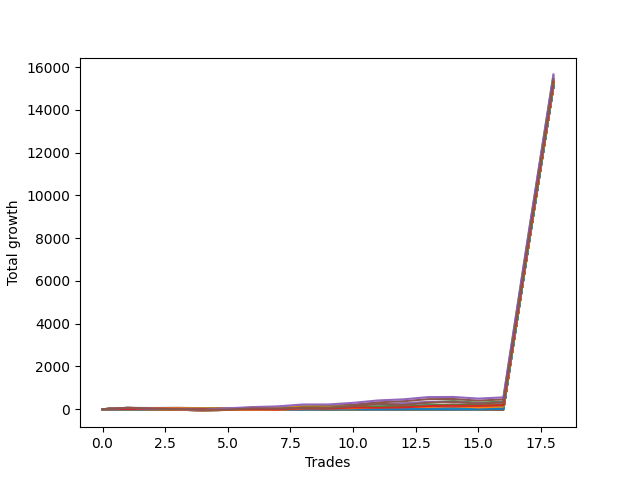

# Short Wallace Doodle 012 
- Symbol: NQ
- Date Range: 3/18/22 - 6/24/22
- Trading Period: 7:20-12:30
- Number of Trades: 18


| Name | Win Percent | Profit | Avg Profit / Trade |     | Name | Win Percent | Profit | Avg Profit / Trade |
| ---- | ----------- | ------ | ------------------ | --- | ---- | ----------- | ------ | ------------------ |
| Sorted By <br> Profit | | | | | Sorted By <br> Win Percentage ||||
| Thirty-Six | 72.22 | 7829000.00 | 434944.44 |     | One | 88.89 | 7677250.00 | 426513.89 |
| Three | 72.22 | 7740125.00 | 430006.94 |     | Two | 83.33 | 7663250.00 | 425736.11 |
| One | 88.89 | 7677250.00 | 426513.89 |     | Thirty-Six | 72.22 | 7829000.00 | 434944.44 |
| Two | 83.33 | 7663250.00 | 425736.11 |     | Three | 72.22 | 7740125.00 | 430006.94 |
| Thirty-Five | 66.67 | 7653250.00 | 425180.56 |     | Thirty-Two | 72.22 | 7575875.00 | 420881.94 |
| Thirty-Four | 61.11 | 7649750.00 | 424986.11 |     | Thirty-One | 72.22 | 7575875.00 | 420881.94 |
| Twenty-Two | 61.11 | 7641375.00 | 424520.83 |     | Thirty | 72.22 | 7575875.00 | 420881.94 |
| Five | 66.67 | 7624500.00 | 423583.33 |     | Twenty-Nine | 72.22 | 7575875.00 | 420881.94 |
| Twenty | 61.11 | 7597750.00 | 422097.22 |     | Twenty-Seven | 72.22 | 7575875.00 | 420881.94 |
| Eighteen | 66.67 | 7584500.00 | 421361.11 |     | Twenty-Five | 72.22 | 7575875.00 | 420881.94 |
| Twenty-One | 55.56 | 7584000.00 | 421333.33 |     | Twenty-Four | 72.22 | 7575875.00 | 420881.94 |
| Twenty-Three | 55.56 | 7583000.00 | 421277.78 |     | Thirty-Five | 66.67 | 7653250.00 | 425180.56 |
| Nineteen | 61.11 | 7579625.00 | 421090.28 |     | Five | 66.67 | 7624500.00 | 423583.33 |
| Thirty-Two | 72.22 | 7575875.00 | 420881.94 |     | Eighteen | 66.67 | 7584500.00 | 421361.11 |
| Thirty-One | 72.22 | 7575875.00 | 420881.94 |     | Thirty-Three | 66.67 | 7572375.00 | 420687.50 |
| Thirty | 72.22 | 7575875.00 | 420881.94 |     | Twenty-Eight | 66.67 | 7572375.00 | 420687.50 |
| Twenty-Nine | 72.22 | 7575875.00 | 420881.94 |     | Twenty-Six | 66.67 | 7572375.00 | 420687.50 |
| Twenty-Seven | 72.22 | 7575875.00 | 420881.94 |     | Seven | 66.67 | 7571250.00 | 420625.00 |
| Twenty-Five | 72.22 | 7575875.00 | 420881.94 |     | Eleven | 66.67 | 7570875.00 | 420604.17 |
| Twenty-Four | 72.22 | 7575875.00 | 420881.94 |     | Nine | 66.67 | 7570875.00 | 420604.17 |
| Sixteen | 55.56 | 7572625.00 | 420701.39 |     | Four | 66.67 | 7565375.00 | 420298.61 |
| Thirty-Three | 66.67 | 7572375.00 | 420687.50 |     | Thirty-Four | 61.11 | 7649750.00 | 424986.11 |
| Twenty-Eight | 66.67 | 7572375.00 | 420687.50 |     | Twenty-Two | 61.11 | 7641375.00 | 424520.83 |
| Twenty-Six | 66.67 | 7572375.00 | 420687.50 |     | Twenty | 61.11 | 7597750.00 | 422097.22 |
| Thirteen | 61.11 | 7572375.00 | 420687.50 |     | Nineteen | 61.11 | 7579625.00 | 421090.28 |
| Seven | 66.67 | 7571250.00 | 420625.00 |     | Thirteen | 61.11 | 7572375.00 | 420687.50 |
| Eleven | 66.67 | 7570875.00 | 420604.17 |     | Twelve | 61.11 | 7567250.00 | 420402.78 |
| Nine | 66.67 | 7570875.00 | 420604.17 |     | Twenty-One | 55.56 | 7584000.00 | 421333.33 |
| Seventeen | 55.56 | 7568375.00 | 420465.28 |     | Twenty-Three | 55.56 | 7583000.00 | 421277.78 |
| Fifteen | 55.56 | 7568375.00 | 420465.28 |     | Sixteen | 55.56 | 7572625.00 | 420701.39 |
| Twelve | 61.11 | 7567250.00 | 420402.78 |     | Seventeen | 55.56 | 7568375.00 | 420465.28 |
| Four | 66.67 | 7565375.00 | 420298.61 |     | Fifteen | 55.56 | 7568375.00 | 420465.28 |
| Fourteen | 55.56 | 7564500.00 | 420250.00 |     | Fourteen | 55.56 | 7564500.00 | 420250.00 |
| Six | 55.56 | 7560125.00 | 420006.94 |     | Six | 55.56 | 7560125.00 | 420006.94 |
| Ten | 50.00 | 7551500.00 | 419527.78 |     | Ten | 50.00 | 7551500.00 | 419527.78 |
| Eight | 50.00 | 7551500.00 | 419527.78 |     | Eight | 50.00 | 7551500.00 | 419527.78 |

### Test One
* Sell when price hits the middle line of the 20p bollinger
* No Stoploss
* Results:
```
Total Trades: 18
Percent Up: 11.11
Percent Down: 88.89
Total Points Moved Down: 15354.50
Potential Profit: 7677250.00
Total Points Ups: 13.75 Count Ups: 2
Total Points Downs: 15368.25 Count Downs: 16
```

<details><summary>Trades</summary>

<code>In: 2022-03-23 11:51:00		Out: 2022-03-23 11:55:55		Total Position Time: 04:55		Total Move Down: 17.00		Total to Date: -17.00</code> <br />
<code>In: 2022-03-28 09:57:00		Out: 2022-03-28 10:09:05		Total Position Time: 12:05		Total Move Down: 2.50		Total to Date: -19.50</code> <br />
<code>In: 2022-03-28 11:12:00		Out: 2022-03-28 11:12:10		Total Position Time: 00:10		Total Move Down: 7.25		Total to Date: -26.75</code> <br />
<code>In: 2022-04-01 11:08:00		Out: 2022-04-01 11:24:40		Total Position Time: 16:40		Total Move Down: -10.25		Total to Date: -16.50</code> <br />
<code>In: 2022-04-22 08:11:00		Out: 2022-04-22 08:15:55		Total Position Time: 04:55		Total Move Down: 17.75		Total to Date: -34.25</code> <br />
<code>In: 2022-04-22 09:38:00		Out: 2022-04-22 09:38:35		Total Position Time: 00:35		Total Move Down: 15.75		Total to Date: -50.00</code> <br />
<code>In: 2022-04-22 12:18:00		Out: 2022-04-22 12:24:15		Total Position Time: 06:15		Total Move Down: 29.75		Total to Date: -79.75</code> <br />
<code>In: 2022-04-26 10:01:00		Out: 2022-04-26 10:02:15		Total Position Time: 01:15		Total Move Down: 17.25		Total to Date: -97.00</code> <br />
<code>In: 2022-04-26 11:18:00		Out: 2022-04-26 11:18:10		Total Position Time: 00:10		Total Move Down: 5.75		Total to Date: -102.75</code> <br />
<code>In: 2022-04-29 10:39:00		Out: 2022-04-29 10:39:20		Total Position Time: 00:20		Total Move Down: 3.00		Total to Date: -105.75</code> <br />
<code>In: 2022-05-09 12:03:00		Out: 2022-05-09 12:09:20		Total Position Time: 06:20		Total Move Down: 28.75		Total to Date: -134.50</code> <br />
<code>In: 2022-05-11 11:27:00		Out: 2022-05-11 11:30:25		Total Position Time: 03:25		Total Move Down: 28.75		Total to Date: -163.25</code> <br />
<code>In: 2022-05-11 11:47:00		Out: 2022-05-11 11:47:55		Total Position Time: 00:55		Total Move Down: 18.75		Total to Date: -182.00</code> <br />
<code>In: 2022-05-20 11:55:00		Out: 2022-05-20 12:02:25		Total Position Time: 07:25		Total Move Down: 29.50		Total to Date: -211.50</code> <br />
<code>In: 2022-06-01 11:07:00		Out: 2022-06-01 11:18:40		Total Position Time: 11:40		Total Move Down: -3.50		Total to Date: -208.00</code> <br />
<code>In: 2022-06-09 08:45:00		Out: 2022-06-09 08:48:05		Total Position Time: 03:05		Total Move Down: 23.25		Total to Date: -231.25</code> <br />
<code>In: 2022-06-13 09:14:00		Out: 2022-06-13 09:14:10		Total Position Time: 00:10		Total Move Down: 7640.50		Total to Date: -7871.75</code> <br />
<code>In: 2022-06-16 09:48:00		Out: 2022-06-16 09:48:10		Total Position Time: 00:10		Total Move Down: 7482.75		Total to Date: -15354.50</code> <br />


</details>

### Test Two
* Sell when the price hits the lower line of the 20p 1std bollinger
* No Stoploss
* Results:
```
Total Trades: 18
Percent Up: 16.67
Percent Down: 83.33
Total Points Moved Down: 15326.50
Potential Profit: 7663250.00
Total Points Ups: 101.75 Count Ups: 3
Total Points Downs: 15428.25 Count Downs: 15
```

<details><summary>Trades</summary>

<code>In: 2022-03-23 11:51:00		Out: 2022-03-23 11:56:45		Total Position Time: 05:45		Total Move Down: 29.75		Total to Date: -29.75</code> <br />
<code>In: 2022-03-28 09:57:00		Out: 2022-03-28 10:26:55		Total Position Time: 29:55		Total Move Down: -43.00		Total to Date: 13.25</code> <br />
<code>In: 2022-03-28 11:12:00		Out: 2022-03-28 11:19:20		Total Position Time: 07:20		Total Move Down: 8.50		Total to Date: 4.75</code> <br />
<code>In: 2022-04-01 11:08:00		Out: 2022-04-01 11:37:55		Total Position Time: 29:55		Total Move Down: -33.25		Total to Date: 38.00</code> <br />
<code>In: 2022-04-22 08:11:00		Out: 2022-04-22 08:25:10		Total Position Time: 14:10		Total Move Down: 17.50		Total to Date: 20.50</code> <br />
<code>In: 2022-04-22 09:38:00		Out: 2022-04-22 09:41:50		Total Position Time: 03:50		Total Move Down: 25.25		Total to Date: -4.75</code> <br />
<code>In: 2022-04-22 12:18:00		Out: 2022-04-22 12:44:15		Total Position Time: 26:15		Total Move Down: 8.50		Total to Date: -13.25</code> <br />
<code>In: 2022-04-26 10:01:00		Out: 2022-04-26 10:02:50		Total Position Time: 01:50		Total Move Down: 35.50		Total to Date: -48.75</code> <br />
<code>In: 2022-04-26 11:18:00		Out: 2022-04-26 11:41:20		Total Position Time: 23:20		Total Move Down: -25.50		Total to Date: -23.25</code> <br />
<code>In: 2022-04-29 10:39:00		Out: 2022-04-29 10:40:25		Total Position Time: 01:25		Total Move Down: 15.50		Total to Date: -38.75</code> <br />
<code>In: 2022-05-09 12:03:00		Out: 2022-05-09 12:18:00		Total Position Time: 15:00		Total Move Down: 28.75		Total to Date: -67.50</code> <br />
<code>In: 2022-05-11 11:27:00		Out: 2022-05-11 11:50:20		Total Position Time: 23:20		Total Move Down: 13.75		Total to Date: -81.25</code> <br />
<code>In: 2022-05-11 11:47:00		Out: 2022-05-11 11:50:20		Total Position Time: 03:20		Total Move Down: 34.00		Total to Date: -115.25</code> <br />
<code>In: 2022-05-20 11:55:00		Out: 2022-05-20 12:03:35		Total Position Time: 08:35		Total Move Down: 46.00		Total to Date: -161.25</code> <br />
<code>In: 2022-06-01 11:07:00		Out: 2022-06-01 11:19:20		Total Position Time: 12:20		Total Move Down: 3.00		Total to Date: -164.25</code> <br />
<code>In: 2022-06-09 08:45:00		Out: 2022-06-09 08:48:50		Total Position Time: 03:50		Total Move Down: 39.00		Total to Date: -203.25</code> <br />
<code>In: 2022-06-13 09:14:00		Out: 2022-06-13 09:14:10		Total Position Time: 00:10		Total Move Down: 7640.50		Total to Date: -7843.75</code> <br />
<code>In: 2022-06-16 09:48:00		Out: 2022-06-16 09:48:10		Total Position Time: 00:10		Total Move Down: 7482.75		Total to Date: -15326.50</code> <br />


</details>

### Test Three
* Sell when the price hits the lower line of the 20p 2std bollinger
* No Stoploss
* Results:
```
Total Trades: 18
Percent Up: 27.78
Percent Down: 72.22
Total Points Moved Down: 15480.25
Potential Profit: 7740125.00
Total Points Ups: 187.50 Count Ups: 5
Total Points Downs: 15667.75 Count Downs: 13
```

<details><summary>Trades</summary>

<code>In: 2022-03-23 11:51:00		Out: 2022-03-23 12:00:10		Total Position Time: 09:10		Total Move Down: 46.00		Total to Date: -46.00</code> <br />
<code>In: 2022-03-28 09:57:00		Out: 2022-03-28 10:26:55		Total Position Time: 29:55		Total Move Down: -43.00		Total to Date: -3.00</code> <br />
<code>In: 2022-03-28 11:12:00		Out: 2022-03-28 11:41:55		Total Position Time: 29:55		Total Move Down: -19.25		Total to Date: 16.25</code> <br />
<code>In: 2022-04-01 11:08:00		Out: 2022-04-01 11:37:55		Total Position Time: 29:55		Total Move Down: -33.25		Total to Date: 49.50</code> <br />
<code>In: 2022-04-22 08:11:00		Out: 2022-04-22 08:31:10		Total Position Time: 20:10		Total Move Down: 32.75		Total to Date: 16.75</code> <br />
<code>In: 2022-04-22 09:38:00		Out: 2022-04-22 09:54:40		Total Position Time: 16:40		Total Move Down: 49.50		Total to Date: -32.75</code> <br />
<code>In: 2022-04-22 12:18:00		Out: 2022-04-22 12:47:00		Total Position Time: 29:00		Total Move Down: 35.50		Total to Date: -68.25</code> <br />
<code>In: 2022-04-26 10:01:00		Out: 2022-04-26 10:30:55		Total Position Time: 29:55		Total Move Down: 88.75		Total to Date: -157.00</code> <br />
<code>In: 2022-04-26 11:18:00		Out: 2022-04-26 11:41:30		Total Position Time: 23:30		Total Move Down: -15.00		Total to Date: -142.00</code> <br />
<code>In: 2022-04-29 10:39:00		Out: 2022-04-29 10:40:40		Total Position Time: 01:40		Total Move Down: 25.25		Total to Date: -167.25</code> <br />
<code>In: 2022-05-09 12:03:00		Out: 2022-05-09 12:20:45		Total Position Time: 17:45		Total Move Down: 53.00		Total to Date: -220.25</code> <br />
<code>In: 2022-05-11 11:27:00		Out: 2022-05-11 11:51:20		Total Position Time: 24:20		Total Move Down: 36.25		Total to Date: -256.50</code> <br />
<code>In: 2022-05-11 11:47:00		Out: 2022-05-11 11:51:20		Total Position Time: 04:20		Total Move Down: 56.50		Total to Date: -313.00</code> <br />
<code>In: 2022-05-20 11:55:00		Out: 2022-05-20 12:07:55		Total Position Time: 12:55		Total Move Down: 64.25		Total to Date: -377.25</code> <br />
<code>In: 2022-06-01 11:07:00		Out: 2022-06-01 11:36:55		Total Position Time: 29:55		Total Move Down: -77.00		Total to Date: -300.25</code> <br />
<code>In: 2022-06-09 08:45:00		Out: 2022-06-09 08:50:35		Total Position Time: 05:35		Total Move Down: 56.75		Total to Date: -357.00</code> <br />
<code>In: 2022-06-13 09:14:00		Out: 2022-06-13 09:14:10		Total Position Time: 00:10		Total Move Down: 7640.50		Total to Date: -7997.50</code> <br />
<code>In: 2022-06-16 09:48:00		Out: 2022-06-16 09:48:10		Total Position Time: 00:10		Total Move Down: 7482.75		Total to Date: -15480.25</code> <br />


</details>

### Test Four
* Sell when the price hits the middle line of the 1std VWAP
* No Stoploss
* Results:
```
Total Trades: 18
Percent Up: 33.33
Percent Down: 66.67
Total Points Moved Down: 15130.75
Potential Profit: 7565375.00
Total Points Ups: 38.25 Count Ups: 6
Total Points Downs: 15169.00 Count Downs: 12
```

<details><summary>Trades</summary>

<code>In: 2022-03-23 11:51:00		Out: 2022-03-23 11:51:10		Total Position Time: 00:10		Total Move Down: -0.00		Total to Date: -0.00</code> <br />
<code>In: 2022-03-28 09:57:00		Out: 2022-03-28 09:57:10		Total Position Time: 00:10		Total Move Down: -0.50		Total to Date: 0.50</code> <br />
<code>In: 2022-03-28 11:12:00		Out: 2022-03-28 11:41:55		Total Position Time: 29:55		Total Move Down: -19.25		Total to Date: 19.75</code> <br />
<code>In: 2022-04-01 11:08:00		Out: 2022-04-01 11:08:10		Total Position Time: 00:10		Total Move Down: 1.25		Total to Date: 18.50</code> <br />
<code>In: 2022-04-22 08:11:00		Out: 2022-04-22 08:11:10		Total Position Time: 00:10		Total Move Down: 1.75		Total to Date: 16.75</code> <br />
<code>In: 2022-04-22 09:38:00		Out: 2022-04-22 09:38:10		Total Position Time: 00:10		Total Move Down: 8.25		Total to Date: 8.50</code> <br />
<code>In: 2022-04-22 12:18:00		Out: 2022-04-22 12:18:10		Total Position Time: 00:10		Total Move Down: -5.50		Total to Date: 14.00</code> <br />
<code>In: 2022-04-26 10:01:00		Out: 2022-04-26 10:01:10		Total Position Time: 00:10		Total Move Down: 4.25		Total to Date: 9.75</code> <br />
<code>In: 2022-04-26 11:18:00		Out: 2022-04-26 11:18:10		Total Position Time: 00:10		Total Move Down: 5.75		Total to Date: 4.00</code> <br />
<code>In: 2022-04-29 10:39:00		Out: 2022-04-29 10:39:10		Total Position Time: 00:10		Total Move Down: 1.00		Total to Date: 3.00</code> <br />
<code>In: 2022-05-09 12:03:00		Out: 2022-05-09 12:03:10		Total Position Time: 00:10		Total Move Down: -5.50		Total to Date: 8.50</code> <br />
<code>In: 2022-05-11 11:27:00		Out: 2022-05-11 11:27:10		Total Position Time: 00:10		Total Move Down: 5.00		Total to Date: 3.50</code> <br />
<code>In: 2022-05-11 11:47:00		Out: 2022-05-11 11:47:10		Total Position Time: 00:10		Total Move Down: 3.50		Total to Date: -0.00</code> <br />
<code>In: 2022-05-20 11:55:00		Out: 2022-05-20 11:55:10		Total Position Time: 00:10		Total Move Down: -7.50		Total to Date: 7.50</code> <br />
<code>In: 2022-06-01 11:07:00		Out: 2022-06-01 11:07:10		Total Position Time: 00:10		Total Move Down: 5.00		Total to Date: 2.50</code> <br />
<code>In: 2022-06-09 08:45:00		Out: 2022-06-09 08:46:35		Total Position Time: 01:35		Total Move Down: 10.00		Total to Date: -7.50</code> <br />
<code>In: 2022-06-13 09:14:00		Out: 2022-06-13 09:14:10		Total Position Time: 00:10		Total Move Down: 7640.50		Total to Date: -7648.00</code> <br />
<code>In: 2022-06-16 09:48:00		Out: 2022-06-16 09:48:10		Total Position Time: 00:10		Total Move Down: 7482.75		Total to Date: -15130.75</code> <br />


</details>

### Test Five
* Sell when the price hits the lower line of the 1std VWAP
* No Stoploss
* Results:
```
Total Trades: 18
Percent Up: 33.33
Percent Down: 66.67
Total Points Moved Down: 15249.00
Potential Profit: 7624500.00
Total Points Ups: 178.25 Count Ups: 6
Total Points Downs: 15427.25 Count Downs: 12
```

<details><summary>Trades</summary>

<code>In: 2022-03-23 11:51:00		Out: 2022-03-23 11:57:25		Total Position Time: 06:25		Total Move Down: 38.75		Total to Date: -38.75</code> <br />
<code>In: 2022-03-28 09:57:00		Out: 2022-03-28 10:26:55		Total Position Time: 29:55		Total Move Down: -43.00		Total to Date: 4.25</code> <br />
<code>In: 2022-03-28 11:12:00		Out: 2022-03-28 11:41:55		Total Position Time: 29:55		Total Move Down: -19.25		Total to Date: 23.50</code> <br />
<code>In: 2022-04-01 11:08:00		Out: 2022-04-01 11:37:55		Total Position Time: 29:55		Total Move Down: -33.25		Total to Date: 56.75</code> <br />
<code>In: 2022-04-22 08:11:00		Out: 2022-04-22 08:16:05		Total Position Time: 05:05		Total Move Down: 25.25		Total to Date: 31.50</code> <br />
<code>In: 2022-04-22 09:38:00		Out: 2022-04-22 09:38:10		Total Position Time: 00:10		Total Move Down: 8.25		Total to Date: 23.25</code> <br />
<code>In: 2022-04-22 12:18:00		Out: 2022-04-22 12:18:10		Total Position Time: 00:10		Total Move Down: -5.50		Total to Date: 28.75</code> <br />
<code>In: 2022-04-26 10:01:00		Out: 2022-04-26 10:14:55		Total Position Time: 13:55		Total Move Down: 71.25		Total to Date: -42.50</code> <br />
<code>In: 2022-04-26 11:18:00		Out: 2022-04-26 11:47:55		Total Position Time: 29:55		Total Move Down: -0.25		Total to Date: -42.25</code> <br />
<code>In: 2022-04-29 10:39:00		Out: 2022-04-29 10:39:10		Total Position Time: 00:10		Total Move Down: 1.00		Total to Date: -43.25</code> <br />
<code>In: 2022-05-09 12:03:00		Out: 2022-05-09 12:20:45		Total Position Time: 17:45		Total Move Down: 53.00		Total to Date: -96.25</code> <br />
<code>In: 2022-05-11 11:27:00		Out: 2022-05-11 11:27:10		Total Position Time: 00:10		Total Move Down: 5.00		Total to Date: -101.25</code> <br />
<code>In: 2022-05-11 11:47:00		Out: 2022-05-11 11:47:10		Total Position Time: 00:10		Total Move Down: 3.50		Total to Date: -104.75</code> <br />
<code>In: 2022-05-20 11:55:00		Out: 2022-05-20 12:04:15		Total Position Time: 09:15		Total Move Down: 53.25		Total to Date: -158.00</code> <br />
<code>In: 2022-06-01 11:07:00		Out: 2022-06-01 11:36:55		Total Position Time: 29:55		Total Move Down: -77.00		Total to Date: -81.00</code> <br />
<code>In: 2022-06-09 08:45:00		Out: 2022-06-09 08:49:10		Total Position Time: 04:10		Total Move Down: 44.75		Total to Date: -125.75</code> <br />
<code>In: 2022-06-13 09:14:00		Out: 2022-06-13 09:14:10		Total Position Time: 00:10		Total Move Down: 7640.50		Total to Date: -7766.25</code> <br />
<code>In: 2022-06-16 09:48:00		Out: 2022-06-16 09:48:10		Total Position Time: 00:10		Total Move Down: 7482.75		Total to Date: -15249.00</code> <br />


</details>

### Test Six
* Sell when the price hits the middle line of the 20p bollinger
* Stoploss is -2 points
* Results:
```
Total Trades: 18
Percent Up: 44.44
Percent Down: 55.56
Total Points Moved Down: 15120.25
Potential Profit: 7560125.00
Total Points Ups: 41.25 Count Ups: 8
Total Points Downs: 15161.50 Count Downs: 10
```

<details><summary>Trades</summary>

<code>In: 2022-03-23 11:51:00		Out: 2022-03-23 11:51:10		Total Position Time: 00:10		Total Move Down: -0.00		Total to Date: -0.00</code> <br />
<code>In: 2022-03-28 09:57:00		Out: 2022-03-28 09:58:05		Total Position Time: 01:05		Total Move Down: -2.50		Total to Date: 2.50</code> <br />
<code>In: 2022-03-28 11:12:00		Out: 2022-03-28 11:12:10		Total Position Time: 00:10		Total Move Down: 7.25		Total to Date: -4.75</code> <br />
<code>In: 2022-04-01 11:08:00		Out: 2022-04-01 11:14:35		Total Position Time: 06:35		Total Move Down: -8.50		Total to Date: 3.75</code> <br />
<code>In: 2022-04-22 08:11:00		Out: 2022-04-22 08:11:55		Total Position Time: 00:55		Total Move Down: -8.75		Total to Date: 12.50</code> <br />
<code>In: 2022-04-22 09:38:00		Out: 2022-04-22 09:38:10		Total Position Time: 00:10		Total Move Down: 8.25		Total to Date: 4.25</code> <br />
<code>In: 2022-04-22 12:18:00		Out: 2022-04-22 12:18:10		Total Position Time: 00:10		Total Move Down: -5.50		Total to Date: 9.75</code> <br />
<code>In: 2022-04-26 10:01:00		Out: 2022-04-26 10:01:10		Total Position Time: 00:10		Total Move Down: 4.25		Total to Date: 5.50</code> <br />
<code>In: 2022-04-26 11:18:00		Out: 2022-04-26 11:18:10		Total Position Time: 00:10		Total Move Down: 5.75		Total to Date: -0.25</code> <br />
<code>In: 2022-04-29 10:39:00		Out: 2022-04-29 10:39:10		Total Position Time: 00:10		Total Move Down: 1.00		Total to Date: -1.25</code> <br />
<code>In: 2022-05-09 12:03:00		Out: 2022-05-09 12:03:10		Total Position Time: 00:10		Total Move Down: -5.50		Total to Date: 4.25</code> <br />
<code>In: 2022-05-11 11:27:00		Out: 2022-05-11 11:27:10		Total Position Time: 00:10		Total Move Down: 5.00		Total to Date: -0.75</code> <br />
<code>In: 2022-05-11 11:47:00		Out: 2022-05-11 11:47:10		Total Position Time: 00:10		Total Move Down: 3.50		Total to Date: -4.25</code> <br />
<code>In: 2022-05-20 11:55:00		Out: 2022-05-20 11:55:10		Total Position Time: 00:10		Total Move Down: -7.50		Total to Date: 3.25</code> <br />
<code>In: 2022-06-01 11:07:00		Out: 2022-06-01 11:07:15		Total Position Time: 00:15		Total Move Down: 3.25		Total to Date: -0.00</code> <br />
<code>In: 2022-06-09 08:45:00		Out: 2022-06-09 08:45:40		Total Position Time: 00:40		Total Move Down: -3.00		Total to Date: 3.00</code> <br />
<code>In: 2022-06-13 09:14:00		Out: 2022-06-13 09:14:10		Total Position Time: 00:10		Total Move Down: 7640.50		Total to Date: -7637.50</code> <br />
<code>In: 2022-06-16 09:48:00		Out: 2022-06-16 09:48:10		Total Position Time: 00:10		Total Move Down: 7482.75		Total to Date: -15120.25</code> <br />


</details>

### Test Seven
* Sell when the price hits the middle line of the 20p bollinger
* Trailing Stop is -2 points
* Results:
```
Total Trades: 18
Percent Up: 33.33
Percent Down: 66.67
Total Points Moved Down: 15142.50
Potential Profit: 7571250.00
Total Points Ups: 22.00 Count Ups: 6
Total Points Downs: 15164.50 Count Downs: 12
```

<details><summary>Trades</summary>

<code>In: 2022-03-23 11:51:00		Out: 2022-03-23 11:51:10		Total Position Time: 00:10		Total Move Down: -0.00		Total to Date: -0.00</code> <br />
<code>In: 2022-03-28 09:57:00		Out: 2022-03-28 09:57:45		Total Position Time: 00:45		Total Move Down: -1.50		Total to Date: 1.50</code> <br />
<code>In: 2022-03-28 11:12:00		Out: 2022-03-28 11:12:10		Total Position Time: 00:10		Total Move Down: 7.25		Total to Date: -5.75</code> <br />
<code>In: 2022-04-01 11:08:00		Out: 2022-04-01 11:08:30		Total Position Time: 00:30		Total Move Down: 1.50		Total to Date: -7.25</code> <br />
<code>In: 2022-04-22 08:11:00		Out: 2022-04-22 08:11:20		Total Position Time: 00:20		Total Move Down: -2.00		Total to Date: -5.25</code> <br />
<code>In: 2022-04-22 09:38:00		Out: 2022-04-22 09:38:10		Total Position Time: 00:10		Total Move Down: 8.25		Total to Date: -13.50</code> <br />
<code>In: 2022-04-22 12:18:00		Out: 2022-04-22 12:18:10		Total Position Time: 00:10		Total Move Down: -5.50		Total to Date: -8.00</code> <br />
<code>In: 2022-04-26 10:01:00		Out: 2022-04-26 10:01:10		Total Position Time: 00:10		Total Move Down: 4.25		Total to Date: -12.25</code> <br />
<code>In: 2022-04-26 11:18:00		Out: 2022-04-26 11:18:10		Total Position Time: 00:10		Total Move Down: 5.75		Total to Date: -18.00</code> <br />
<code>In: 2022-04-29 10:39:00		Out: 2022-04-29 10:39:10		Total Position Time: 00:10		Total Move Down: 1.00		Total to Date: -19.00</code> <br />
<code>In: 2022-05-09 12:03:00		Out: 2022-05-09 12:03:10		Total Position Time: 00:10		Total Move Down: -5.50		Total to Date: -13.50</code> <br />
<code>In: 2022-05-11 11:27:00		Out: 2022-05-11 11:27:10		Total Position Time: 00:10		Total Move Down: 5.00		Total to Date: -18.50</code> <br />
<code>In: 2022-05-11 11:47:00		Out: 2022-05-11 11:47:10		Total Position Time: 00:10		Total Move Down: 3.50		Total to Date: -22.00</code> <br />
<code>In: 2022-05-20 11:55:00		Out: 2022-05-20 11:55:10		Total Position Time: 00:10		Total Move Down: -7.50		Total to Date: -14.50</code> <br />
<code>In: 2022-06-01 11:07:00		Out: 2022-06-01 11:07:15		Total Position Time: 00:15		Total Move Down: 3.25		Total to Date: -17.75</code> <br />
<code>In: 2022-06-09 08:45:00		Out: 2022-06-09 08:45:25		Total Position Time: 00:25		Total Move Down: 1.50		Total to Date: -19.25</code> <br />
<code>In: 2022-06-13 09:14:00		Out: 2022-06-13 09:14:10		Total Position Time: 00:10		Total Move Down: 7640.50		Total to Date: -7659.75</code> <br />
<code>In: 2022-06-16 09:48:00		Out: 2022-06-16 09:48:10		Total Position Time: 00:10		Total Move Down: 7482.75		Total to Date: -15142.50</code> <br />


</details>

### Test Eight
* Sell when the price hits the lower line of the 20p 1std bollinger
* Stoploss is -2 points
* Results:
```
Total Trades: 18
Percent Up: 50.00
Percent Down: 50.00
Total Points Moved Down: 15103.00
Potential Profit: 7551500.00
Total Points Ups: 52.75 Count Ups: 9
Total Points Downs: 15155.75 Count Downs: 9
```

<details><summary>Trades</summary>

<code>In: 2022-03-23 11:51:00		Out: 2022-03-23 11:51:10		Total Position Time: 00:10		Total Move Down: -0.00		Total to Date: -0.00</code> <br />
<code>In: 2022-03-28 09:57:00		Out: 2022-03-28 09:58:05		Total Position Time: 01:05		Total Move Down: -2.50		Total to Date: 2.50</code> <br />
<code>In: 2022-03-28 11:12:00		Out: 2022-03-28 11:12:10		Total Position Time: 00:10		Total Move Down: 7.25		Total to Date: -4.75</code> <br />
<code>In: 2022-04-01 11:08:00		Out: 2022-04-01 11:14:35		Total Position Time: 06:35		Total Move Down: -8.50		Total to Date: 3.75</code> <br />
<code>In: 2022-04-22 08:11:00		Out: 2022-04-22 08:11:55		Total Position Time: 00:55		Total Move Down: -8.75		Total to Date: 12.50</code> <br />
<code>In: 2022-04-22 09:38:00		Out: 2022-04-22 09:38:10		Total Position Time: 00:10		Total Move Down: 8.25		Total to Date: 4.25</code> <br />
<code>In: 2022-04-22 12:18:00		Out: 2022-04-22 12:18:10		Total Position Time: 00:10		Total Move Down: -5.50		Total to Date: 9.75</code> <br />
<code>In: 2022-04-26 10:01:00		Out: 2022-04-26 10:01:10		Total Position Time: 00:10		Total Move Down: 4.25		Total to Date: 5.50</code> <br />
<code>In: 2022-04-26 11:18:00		Out: 2022-04-26 11:19:10		Total Position Time: 01:10		Total Move Down: -11.50		Total to Date: 17.00</code> <br />
<code>In: 2022-04-29 10:39:00		Out: 2022-04-29 10:39:10		Total Position Time: 00:10		Total Move Down: 1.00		Total to Date: 16.00</code> <br />
<code>In: 2022-05-09 12:03:00		Out: 2022-05-09 12:03:10		Total Position Time: 00:10		Total Move Down: -5.50		Total to Date: 21.50</code> <br />
<code>In: 2022-05-11 11:27:00		Out: 2022-05-11 11:27:10		Total Position Time: 00:10		Total Move Down: 5.00		Total to Date: 16.50</code> <br />
<code>In: 2022-05-11 11:47:00		Out: 2022-05-11 11:47:10		Total Position Time: 00:10		Total Move Down: 3.50		Total to Date: 13.00</code> <br />
<code>In: 2022-05-20 11:55:00		Out: 2022-05-20 11:55:10		Total Position Time: 00:10		Total Move Down: -7.50		Total to Date: 20.50</code> <br />
<code>In: 2022-06-01 11:07:00		Out: 2022-06-01 11:07:15		Total Position Time: 00:15		Total Move Down: 3.25		Total to Date: 17.25</code> <br />
<code>In: 2022-06-09 08:45:00		Out: 2022-06-09 08:45:40		Total Position Time: 00:40		Total Move Down: -3.00		Total to Date: 20.25</code> <br />
<code>In: 2022-06-13 09:14:00		Out: 2022-06-13 09:14:10		Total Position Time: 00:10		Total Move Down: 7640.50		Total to Date: -7620.25</code> <br />
<code>In: 2022-06-16 09:48:00		Out: 2022-06-16 09:48:10		Total Position Time: 00:10		Total Move Down: 7482.75		Total to Date: -15103.00</code> <br />


</details>

### Test Nine
* Sell when the price hits the lower line of the 20p 1std bollinger
* Trailing Stop is -2 points
* Results:
```
Total Trades: 18
Percent Up: 33.33
Percent Down: 66.67
Total Points Moved Down: 15141.75
Potential Profit: 7570875.00
Total Points Ups: 22.00 Count Ups: 6
Total Points Downs: 15163.75 Count Downs: 12
```

<details><summary>Trades</summary>

<code>In: 2022-03-23 11:51:00		Out: 2022-03-23 11:51:10		Total Position Time: 00:10		Total Move Down: -0.00		Total to Date: -0.00</code> <br />
<code>In: 2022-03-28 09:57:00		Out: 2022-03-28 09:57:45		Total Position Time: 00:45		Total Move Down: -1.50		Total to Date: 1.50</code> <br />
<code>In: 2022-03-28 11:12:00		Out: 2022-03-28 11:12:10		Total Position Time: 00:10		Total Move Down: 7.25		Total to Date: -5.75</code> <br />
<code>In: 2022-04-01 11:08:00		Out: 2022-04-01 11:08:30		Total Position Time: 00:30		Total Move Down: 1.50		Total to Date: -7.25</code> <br />
<code>In: 2022-04-22 08:11:00		Out: 2022-04-22 08:11:20		Total Position Time: 00:20		Total Move Down: -2.00		Total to Date: -5.25</code> <br />
<code>In: 2022-04-22 09:38:00		Out: 2022-04-22 09:38:10		Total Position Time: 00:10		Total Move Down: 8.25		Total to Date: -13.50</code> <br />
<code>In: 2022-04-22 12:18:00		Out: 2022-04-22 12:18:10		Total Position Time: 00:10		Total Move Down: -5.50		Total to Date: -8.00</code> <br />
<code>In: 2022-04-26 10:01:00		Out: 2022-04-26 10:01:10		Total Position Time: 00:10		Total Move Down: 4.25		Total to Date: -12.25</code> <br />
<code>In: 2022-04-26 11:18:00		Out: 2022-04-26 11:18:20		Total Position Time: 00:20		Total Move Down: 5.00		Total to Date: -17.25</code> <br />
<code>In: 2022-04-29 10:39:00		Out: 2022-04-29 10:39:10		Total Position Time: 00:10		Total Move Down: 1.00		Total to Date: -18.25</code> <br />
<code>In: 2022-05-09 12:03:00		Out: 2022-05-09 12:03:10		Total Position Time: 00:10		Total Move Down: -5.50		Total to Date: -12.75</code> <br />
<code>In: 2022-05-11 11:27:00		Out: 2022-05-11 11:27:10		Total Position Time: 00:10		Total Move Down: 5.00		Total to Date: -17.75</code> <br />
<code>In: 2022-05-11 11:47:00		Out: 2022-05-11 11:47:10		Total Position Time: 00:10		Total Move Down: 3.50		Total to Date: -21.25</code> <br />
<code>In: 2022-05-20 11:55:00		Out: 2022-05-20 11:55:10		Total Position Time: 00:10		Total Move Down: -7.50		Total to Date: -13.75</code> <br />
<code>In: 2022-06-01 11:07:00		Out: 2022-06-01 11:07:15		Total Position Time: 00:15		Total Move Down: 3.25		Total to Date: -17.00</code> <br />
<code>In: 2022-06-09 08:45:00		Out: 2022-06-09 08:45:25		Total Position Time: 00:25		Total Move Down: 1.50		Total to Date: -18.50</code> <br />
<code>In: 2022-06-13 09:14:00		Out: 2022-06-13 09:14:10		Total Position Time: 00:10		Total Move Down: 7640.50		Total to Date: -7659.00</code> <br />
<code>In: 2022-06-16 09:48:00		Out: 2022-06-16 09:48:10		Total Position Time: 00:10		Total Move Down: 7482.75		Total to Date: -15141.75</code> <br />


</details>

### Test Ten
* Sell when the price hits the lower line of the 20p 2std bollinger
* Stoploss is -2 points
* Results:
```
Total Trades: 18
Percent Up: 50.00
Percent Down: 50.00
Total Points Moved Down: 15103.00
Potential Profit: 7551500.00
Total Points Ups: 52.75 Count Ups: 9
Total Points Downs: 15155.75 Count Downs: 9
```

<details><summary>Trades</summary>

<code>In: 2022-03-23 11:51:00		Out: 2022-03-23 11:51:10		Total Position Time: 00:10		Total Move Down: -0.00		Total to Date: -0.00</code> <br />
<code>In: 2022-03-28 09:57:00		Out: 2022-03-28 09:58:05		Total Position Time: 01:05		Total Move Down: -2.50		Total to Date: 2.50</code> <br />
<code>In: 2022-03-28 11:12:00		Out: 2022-03-28 11:12:10		Total Position Time: 00:10		Total Move Down: 7.25		Total to Date: -4.75</code> <br />
<code>In: 2022-04-01 11:08:00		Out: 2022-04-01 11:14:35		Total Position Time: 06:35		Total Move Down: -8.50		Total to Date: 3.75</code> <br />
<code>In: 2022-04-22 08:11:00		Out: 2022-04-22 08:11:55		Total Position Time: 00:55		Total Move Down: -8.75		Total to Date: 12.50</code> <br />
<code>In: 2022-04-22 09:38:00		Out: 2022-04-22 09:38:10		Total Position Time: 00:10		Total Move Down: 8.25		Total to Date: 4.25</code> <br />
<code>In: 2022-04-22 12:18:00		Out: 2022-04-22 12:18:10		Total Position Time: 00:10		Total Move Down: -5.50		Total to Date: 9.75</code> <br />
<code>In: 2022-04-26 10:01:00		Out: 2022-04-26 10:01:10		Total Position Time: 00:10		Total Move Down: 4.25		Total to Date: 5.50</code> <br />
<code>In: 2022-04-26 11:18:00		Out: 2022-04-26 11:19:10		Total Position Time: 01:10		Total Move Down: -11.50		Total to Date: 17.00</code> <br />
<code>In: 2022-04-29 10:39:00		Out: 2022-04-29 10:39:10		Total Position Time: 00:10		Total Move Down: 1.00		Total to Date: 16.00</code> <br />
<code>In: 2022-05-09 12:03:00		Out: 2022-05-09 12:03:10		Total Position Time: 00:10		Total Move Down: -5.50		Total to Date: 21.50</code> <br />
<code>In: 2022-05-11 11:27:00		Out: 2022-05-11 11:27:10		Total Position Time: 00:10		Total Move Down: 5.00		Total to Date: 16.50</code> <br />
<code>In: 2022-05-11 11:47:00		Out: 2022-05-11 11:47:10		Total Position Time: 00:10		Total Move Down: 3.50		Total to Date: 13.00</code> <br />
<code>In: 2022-05-20 11:55:00		Out: 2022-05-20 11:55:10		Total Position Time: 00:10		Total Move Down: -7.50		Total to Date: 20.50</code> <br />
<code>In: 2022-06-01 11:07:00		Out: 2022-06-01 11:07:15		Total Position Time: 00:15		Total Move Down: 3.25		Total to Date: 17.25</code> <br />
<code>In: 2022-06-09 08:45:00		Out: 2022-06-09 08:45:40		Total Position Time: 00:40		Total Move Down: -3.00		Total to Date: 20.25</code> <br />
<code>In: 2022-06-13 09:14:00		Out: 2022-06-13 09:14:10		Total Position Time: 00:10		Total Move Down: 7640.50		Total to Date: -7620.25</code> <br />
<code>In: 2022-06-16 09:48:00		Out: 2022-06-16 09:48:10		Total Position Time: 00:10		Total Move Down: 7482.75		Total to Date: -15103.00</code> <br />


</details>

### Test Eleven
* Sell when the price hits the lower line of the 20p 2std bollinger
* Trailing Stop is -2 points
* Results:
```
Total Trades: 18
Percent Up: 33.33
Percent Down: 66.67
Total Points Moved Down: 15141.75
Potential Profit: 7570875.00
Total Points Ups: 22.00 Count Ups: 6
Total Points Downs: 15163.75 Count Downs: 12
```

<details><summary>Trades</summary>

<code>In: 2022-03-23 11:51:00		Out: 2022-03-23 11:51:10		Total Position Time: 00:10		Total Move Down: -0.00		Total to Date: -0.00</code> <br />
<code>In: 2022-03-28 09:57:00		Out: 2022-03-28 09:57:45		Total Position Time: 00:45		Total Move Down: -1.50		Total to Date: 1.50</code> <br />
<code>In: 2022-03-28 11:12:00		Out: 2022-03-28 11:12:10		Total Position Time: 00:10		Total Move Down: 7.25		Total to Date: -5.75</code> <br />
<code>In: 2022-04-01 11:08:00		Out: 2022-04-01 11:08:30		Total Position Time: 00:30		Total Move Down: 1.50		Total to Date: -7.25</code> <br />
<code>In: 2022-04-22 08:11:00		Out: 2022-04-22 08:11:20		Total Position Time: 00:20		Total Move Down: -2.00		Total to Date: -5.25</code> <br />
<code>In: 2022-04-22 09:38:00		Out: 2022-04-22 09:38:10		Total Position Time: 00:10		Total Move Down: 8.25		Total to Date: -13.50</code> <br />
<code>In: 2022-04-22 12:18:00		Out: 2022-04-22 12:18:10		Total Position Time: 00:10		Total Move Down: -5.50		Total to Date: -8.00</code> <br />
<code>In: 2022-04-26 10:01:00		Out: 2022-04-26 10:01:10		Total Position Time: 00:10		Total Move Down: 4.25		Total to Date: -12.25</code> <br />
<code>In: 2022-04-26 11:18:00		Out: 2022-04-26 11:18:20		Total Position Time: 00:20		Total Move Down: 5.00		Total to Date: -17.25</code> <br />
<code>In: 2022-04-29 10:39:00		Out: 2022-04-29 10:39:10		Total Position Time: 00:10		Total Move Down: 1.00		Total to Date: -18.25</code> <br />
<code>In: 2022-05-09 12:03:00		Out: 2022-05-09 12:03:10		Total Position Time: 00:10		Total Move Down: -5.50		Total to Date: -12.75</code> <br />
<code>In: 2022-05-11 11:27:00		Out: 2022-05-11 11:27:10		Total Position Time: 00:10		Total Move Down: 5.00		Total to Date: -17.75</code> <br />
<code>In: 2022-05-11 11:47:00		Out: 2022-05-11 11:47:10		Total Position Time: 00:10		Total Move Down: 3.50		Total to Date: -21.25</code> <br />
<code>In: 2022-05-20 11:55:00		Out: 2022-05-20 11:55:10		Total Position Time: 00:10		Total Move Down: -7.50		Total to Date: -13.75</code> <br />
<code>In: 2022-06-01 11:07:00		Out: 2022-06-01 11:07:15		Total Position Time: 00:15		Total Move Down: 3.25		Total to Date: -17.00</code> <br />
<code>In: 2022-06-09 08:45:00		Out: 2022-06-09 08:45:25		Total Position Time: 00:25		Total Move Down: 1.50		Total to Date: -18.50</code> <br />
<code>In: 2022-06-13 09:14:00		Out: 2022-06-13 09:14:10		Total Position Time: 00:10		Total Move Down: 7640.50		Total to Date: -7659.00</code> <br />
<code>In: 2022-06-16 09:48:00		Out: 2022-06-16 09:48:10		Total Position Time: 00:10		Total Move Down: 7482.75		Total to Date: -15141.75</code> <br />


</details>

### Test Twelve
* Sell when the price hits the middle line of the 20p bollinger
* Stoploss is -3 points
* Results:
```
Total Trades: 18
Percent Up: 38.89
Percent Down: 61.11
Total Points Moved Down: 15134.50
Potential Profit: 7567250.00
Total Points Ups: 44.00 Count Ups: 7
Total Points Downs: 15178.50 Count Downs: 11
```

<details><summary>Trades</summary>

<code>In: 2022-03-23 11:51:00		Out: 2022-03-23 11:55:55		Total Position Time: 04:55		Total Move Down: 17.00		Total to Date: -17.00</code> <br />
<code>In: 2022-03-28 09:57:00		Out: 2022-03-28 10:00:40		Total Position Time: 03:40		Total Move Down: -4.50		Total to Date: -12.50</code> <br />
<code>In: 2022-03-28 11:12:00		Out: 2022-03-28 11:12:10		Total Position Time: 00:10		Total Move Down: 7.25		Total to Date: -19.75</code> <br />
<code>In: 2022-04-01 11:08:00		Out: 2022-04-01 11:14:40		Total Position Time: 06:40		Total Move Down: -9.25		Total to Date: -10.50</code> <br />
<code>In: 2022-04-22 08:11:00		Out: 2022-04-22 08:11:55		Total Position Time: 00:55		Total Move Down: -8.75		Total to Date: -1.75</code> <br />
<code>In: 2022-04-22 09:38:00		Out: 2022-04-22 09:38:10		Total Position Time: 00:10		Total Move Down: 8.25		Total to Date: -10.00</code> <br />
<code>In: 2022-04-22 12:18:00		Out: 2022-04-22 12:18:10		Total Position Time: 00:10		Total Move Down: -5.50		Total to Date: -4.50</code> <br />
<code>In: 2022-04-26 10:01:00		Out: 2022-04-26 10:01:10		Total Position Time: 00:10		Total Move Down: 4.25		Total to Date: -8.75</code> <br />
<code>In: 2022-04-26 11:18:00		Out: 2022-04-26 11:18:10		Total Position Time: 00:10		Total Move Down: 5.75		Total to Date: -14.50</code> <br />
<code>In: 2022-04-29 10:39:00		Out: 2022-04-29 10:39:10		Total Position Time: 00:10		Total Move Down: 1.00		Total to Date: -15.50</code> <br />
<code>In: 2022-05-09 12:03:00		Out: 2022-05-09 12:03:10		Total Position Time: 00:10		Total Move Down: -5.50		Total to Date: -10.00</code> <br />
<code>In: 2022-05-11 11:27:00		Out: 2022-05-11 11:27:10		Total Position Time: 00:10		Total Move Down: 5.00		Total to Date: -15.00</code> <br />
<code>In: 2022-05-11 11:47:00		Out: 2022-05-11 11:47:10		Total Position Time: 00:10		Total Move Down: 3.50		Total to Date: -18.50</code> <br />
<code>In: 2022-05-20 11:55:00		Out: 2022-05-20 11:55:10		Total Position Time: 00:10		Total Move Down: -7.50		Total to Date: -11.00</code> <br />
<code>In: 2022-06-01 11:07:00		Out: 2022-06-01 11:08:05		Total Position Time: 01:05		Total Move Down: 3.25		Total to Date: -14.25</code> <br />
<code>In: 2022-06-09 08:45:00		Out: 2022-06-09 08:45:40		Total Position Time: 00:40		Total Move Down: -3.00		Total to Date: -11.25</code> <br />
<code>In: 2022-06-13 09:14:00		Out: 2022-06-13 09:14:10		Total Position Time: 00:10		Total Move Down: 7640.50		Total to Date: -7651.75</code> <br />
<code>In: 2022-06-16 09:48:00		Out: 2022-06-16 09:48:10		Total Position Time: 00:10		Total Move Down: 7482.75		Total to Date: -15134.50</code> <br />


</details>

### Test Thirteen
* Sell when the price hits the middle line of the 20p bollinger
* Trailing Stop is -3 points
* Results:
```
Total Trades: 18
Percent Up: 38.89
Percent Down: 61.11
Total Points Moved Down: 15144.75
Potential Profit: 7572375.00
Total Points Ups: 23.00 Count Ups: 7
Total Points Downs: 15167.75 Count Downs: 11
```

<details><summary>Trades</summary>

<code>In: 2022-03-23 11:51:00		Out: 2022-03-23 11:52:00		Total Position Time: 01:00		Total Move Down: 2.75		Total to Date: -2.75</code> <br />
<code>In: 2022-03-28 09:57:00		Out: 2022-03-28 09:57:45		Total Position Time: 00:45		Total Move Down: -1.50		Total to Date: -1.25</code> <br />
<code>In: 2022-03-28 11:12:00		Out: 2022-03-28 11:12:10		Total Position Time: 00:10		Total Move Down: 7.25		Total to Date: -8.50</code> <br />
<code>In: 2022-04-01 11:08:00		Out: 2022-04-01 11:08:35		Total Position Time: 00:35		Total Move Down: -0.25		Total to Date: -8.25</code> <br />
<code>In: 2022-04-22 08:11:00		Out: 2022-04-22 08:11:20		Total Position Time: 00:20		Total Move Down: -2.00		Total to Date: -6.25</code> <br />
<code>In: 2022-04-22 09:38:00		Out: 2022-04-22 09:38:10		Total Position Time: 00:10		Total Move Down: 8.25		Total to Date: -14.50</code> <br />
<code>In: 2022-04-22 12:18:00		Out: 2022-04-22 12:18:10		Total Position Time: 00:10		Total Move Down: -5.50		Total to Date: -9.00</code> <br />
<code>In: 2022-04-26 10:01:00		Out: 2022-04-26 10:01:10		Total Position Time: 00:10		Total Move Down: 4.25		Total to Date: -13.25</code> <br />
<code>In: 2022-04-26 11:18:00		Out: 2022-04-26 11:18:10		Total Position Time: 00:10		Total Move Down: 5.75		Total to Date: -19.00</code> <br />
<code>In: 2022-04-29 10:39:00		Out: 2022-04-29 10:39:10		Total Position Time: 00:10		Total Move Down: 1.00		Total to Date: -20.00</code> <br />
<code>In: 2022-05-09 12:03:00		Out: 2022-05-09 12:03:10		Total Position Time: 00:10		Total Move Down: -5.50		Total to Date: -14.50</code> <br />
<code>In: 2022-05-11 11:27:00		Out: 2022-05-11 11:27:10		Total Position Time: 00:10		Total Move Down: 5.00		Total to Date: -19.50</code> <br />
<code>In: 2022-05-11 11:47:00		Out: 2022-05-11 11:47:10		Total Position Time: 00:10		Total Move Down: 3.50		Total to Date: -23.00</code> <br />
<code>In: 2022-05-20 11:55:00		Out: 2022-05-20 11:55:10		Total Position Time: 00:10		Total Move Down: -7.50		Total to Date: -15.50</code> <br />
<code>In: 2022-06-01 11:07:00		Out: 2022-06-01 11:08:00		Total Position Time: 01:00		Total Move Down: 6.75		Total to Date: -22.25</code> <br />
<code>In: 2022-06-09 08:45:00		Out: 2022-06-09 08:45:30		Total Position Time: 00:30		Total Move Down: -0.75		Total to Date: -21.50</code> <br />
<code>In: 2022-06-13 09:14:00		Out: 2022-06-13 09:14:10		Total Position Time: 00:10		Total Move Down: 7640.50		Total to Date: -7662.00</code> <br />
<code>In: 2022-06-16 09:48:00		Out: 2022-06-16 09:48:10		Total Position Time: 00:10		Total Move Down: 7482.75		Total to Date: -15144.75</code> <br />


</details>

### Test Fourteen
* Sell when the price hits the lower line of the 20p 1std bollinger
* Stoploss is -3 points
* Results:
```
Total Trades: 18
Percent Up: 44.44
Percent Down: 55.56
Total Points Moved Down: 15129.00
Potential Profit: 7564500.00
Total Points Ups: 55.50 Count Ups: 8
Total Points Downs: 15184.50 Count Downs: 10
```

<details><summary>Trades</summary>

<code>In: 2022-03-23 11:51:00		Out: 2022-03-23 11:56:45		Total Position Time: 05:45		Total Move Down: 29.75		Total to Date: -29.75</code> <br />
<code>In: 2022-03-28 09:57:00		Out: 2022-03-28 10:00:40		Total Position Time: 03:40		Total Move Down: -4.50		Total to Date: -25.25</code> <br />
<code>In: 2022-03-28 11:12:00		Out: 2022-03-28 11:12:15		Total Position Time: 00:15		Total Move Down: 6.25		Total to Date: -31.50</code> <br />
<code>In: 2022-04-01 11:08:00		Out: 2022-04-01 11:14:40		Total Position Time: 06:40		Total Move Down: -9.25		Total to Date: -22.25</code> <br />
<code>In: 2022-04-22 08:11:00		Out: 2022-04-22 08:11:55		Total Position Time: 00:55		Total Move Down: -8.75		Total to Date: -13.50</code> <br />
<code>In: 2022-04-22 09:38:00		Out: 2022-04-22 09:38:10		Total Position Time: 00:10		Total Move Down: 8.25		Total to Date: -21.75</code> <br />
<code>In: 2022-04-22 12:18:00		Out: 2022-04-22 12:18:10		Total Position Time: 00:10		Total Move Down: -5.50		Total to Date: -16.25</code> <br />
<code>In: 2022-04-26 10:01:00		Out: 2022-04-26 10:01:10		Total Position Time: 00:10		Total Move Down: 4.25		Total to Date: -20.50</code> <br />
<code>In: 2022-04-26 11:18:00		Out: 2022-04-26 11:19:10		Total Position Time: 01:10		Total Move Down: -11.50		Total to Date: -9.00</code> <br />
<code>In: 2022-04-29 10:39:00		Out: 2022-04-29 10:39:10		Total Position Time: 00:10		Total Move Down: 1.00		Total to Date: -10.00</code> <br />
<code>In: 2022-05-09 12:03:00		Out: 2022-05-09 12:03:10		Total Position Time: 00:10		Total Move Down: -5.50		Total to Date: -4.50</code> <br />
<code>In: 2022-05-11 11:27:00		Out: 2022-05-11 11:27:10		Total Position Time: 00:10		Total Move Down: 5.00		Total to Date: -9.50</code> <br />
<code>In: 2022-05-11 11:47:00		Out: 2022-05-11 11:47:10		Total Position Time: 00:10		Total Move Down: 3.50		Total to Date: -13.00</code> <br />
<code>In: 2022-05-20 11:55:00		Out: 2022-05-20 11:55:10		Total Position Time: 00:10		Total Move Down: -7.50		Total to Date: -5.50</code> <br />
<code>In: 2022-06-01 11:07:00		Out: 2022-06-01 11:08:05		Total Position Time: 01:05		Total Move Down: 3.25		Total to Date: -8.75</code> <br />
<code>In: 2022-06-09 08:45:00		Out: 2022-06-09 08:45:40		Total Position Time: 00:40		Total Move Down: -3.00		Total to Date: -5.75</code> <br />
<code>In: 2022-06-13 09:14:00		Out: 2022-06-13 09:14:10		Total Position Time: 00:10		Total Move Down: 7640.50		Total to Date: -7646.25</code> <br />
<code>In: 2022-06-16 09:48:00		Out: 2022-06-16 09:48:10		Total Position Time: 00:10		Total Move Down: 7482.75		Total to Date: -15129.00</code> <br />


</details>

### Test Fifteen
* Sell when the price hits the lower line of the 20p 1std bollinger
* Trailing Stop is -3 points
* Results:
```
Total Trades: 18
Percent Up: 44.44
Percent Down: 55.56
Total Points Moved Down: 15136.75
Potential Profit: 7568375.00
Total Points Ups: 24.25 Count Ups: 8
Total Points Downs: 15161.00 Count Downs: 10
```

<details><summary>Trades</summary>

<code>In: 2022-03-23 11:51:00		Out: 2022-03-23 11:52:00		Total Position Time: 01:00		Total Move Down: 2.75		Total to Date: -2.75</code> <br />
<code>In: 2022-03-28 09:57:00		Out: 2022-03-28 09:57:45		Total Position Time: 00:45		Total Move Down: -1.50		Total to Date: -1.25</code> <br />
<code>In: 2022-03-28 11:12:00		Out: 2022-03-28 11:12:15		Total Position Time: 00:15		Total Move Down: 6.25		Total to Date: -7.50</code> <br />
<code>In: 2022-04-01 11:08:00		Out: 2022-04-01 11:08:35		Total Position Time: 00:35		Total Move Down: -0.25		Total to Date: -7.25</code> <br />
<code>In: 2022-04-22 08:11:00		Out: 2022-04-22 08:11:20		Total Position Time: 00:20		Total Move Down: -2.00		Total to Date: -5.25</code> <br />
<code>In: 2022-04-22 09:38:00		Out: 2022-04-22 09:38:10		Total Position Time: 00:10		Total Move Down: 8.25		Total to Date: -13.50</code> <br />
<code>In: 2022-04-22 12:18:00		Out: 2022-04-22 12:18:10		Total Position Time: 00:10		Total Move Down: -5.50		Total to Date: -8.00</code> <br />
<code>In: 2022-04-26 10:01:00		Out: 2022-04-26 10:01:10		Total Position Time: 00:10		Total Move Down: 4.25		Total to Date: -12.25</code> <br />
<code>In: 2022-04-26 11:18:00		Out: 2022-04-26 11:18:40		Total Position Time: 00:40		Total Move Down: -1.25		Total to Date: -11.00</code> <br />
<code>In: 2022-04-29 10:39:00		Out: 2022-04-29 10:39:10		Total Position Time: 00:10		Total Move Down: 1.00		Total to Date: -12.00</code> <br />
<code>In: 2022-05-09 12:03:00		Out: 2022-05-09 12:03:10		Total Position Time: 00:10		Total Move Down: -5.50		Total to Date: -6.50</code> <br />
<code>In: 2022-05-11 11:27:00		Out: 2022-05-11 11:27:10		Total Position Time: 00:10		Total Move Down: 5.00		Total to Date: -11.50</code> <br />
<code>In: 2022-05-11 11:47:00		Out: 2022-05-11 11:47:10		Total Position Time: 00:10		Total Move Down: 3.50		Total to Date: -15.00</code> <br />
<code>In: 2022-05-20 11:55:00		Out: 2022-05-20 11:55:10		Total Position Time: 00:10		Total Move Down: -7.50		Total to Date: -7.50</code> <br />
<code>In: 2022-06-01 11:07:00		Out: 2022-06-01 11:08:00		Total Position Time: 01:00		Total Move Down: 6.75		Total to Date: -14.25</code> <br />
<code>In: 2022-06-09 08:45:00		Out: 2022-06-09 08:45:30		Total Position Time: 00:30		Total Move Down: -0.75		Total to Date: -13.50</code> <br />
<code>In: 2022-06-13 09:14:00		Out: 2022-06-13 09:14:10		Total Position Time: 00:10		Total Move Down: 7640.50		Total to Date: -7654.00</code> <br />
<code>In: 2022-06-16 09:48:00		Out: 2022-06-16 09:48:10		Total Position Time: 00:10		Total Move Down: 7482.75		Total to Date: -15136.75</code> <br />


</details>

### Test Sixteen
* Sell when the price hits the lower line of the 20p 2std bollinger
* Stoploss is -3 points
* Results:
```
Total Trades: 18
Percent Up: 44.44
Percent Down: 55.56
Total Points Moved Down: 15145.25
Potential Profit: 7572625.00
Total Points Ups: 55.50 Count Ups: 8
Total Points Downs: 15200.75 Count Downs: 10
```

<details><summary>Trades</summary>

<code>In: 2022-03-23 11:51:00		Out: 2022-03-23 12:00:10		Total Position Time: 09:10		Total Move Down: 46.00		Total to Date: -46.00</code> <br />
<code>In: 2022-03-28 09:57:00		Out: 2022-03-28 10:00:40		Total Position Time: 03:40		Total Move Down: -4.50		Total to Date: -41.50</code> <br />
<code>In: 2022-03-28 11:12:00		Out: 2022-03-28 11:12:15		Total Position Time: 00:15		Total Move Down: 6.25		Total to Date: -47.75</code> <br />
<code>In: 2022-04-01 11:08:00		Out: 2022-04-01 11:14:40		Total Position Time: 06:40		Total Move Down: -9.25		Total to Date: -38.50</code> <br />
<code>In: 2022-04-22 08:11:00		Out: 2022-04-22 08:11:55		Total Position Time: 00:55		Total Move Down: -8.75		Total to Date: -29.75</code> <br />
<code>In: 2022-04-22 09:38:00		Out: 2022-04-22 09:38:10		Total Position Time: 00:10		Total Move Down: 8.25		Total to Date: -38.00</code> <br />
<code>In: 2022-04-22 12:18:00		Out: 2022-04-22 12:18:10		Total Position Time: 00:10		Total Move Down: -5.50		Total to Date: -32.50</code> <br />
<code>In: 2022-04-26 10:01:00		Out: 2022-04-26 10:01:10		Total Position Time: 00:10		Total Move Down: 4.25		Total to Date: -36.75</code> <br />
<code>In: 2022-04-26 11:18:00		Out: 2022-04-26 11:19:10		Total Position Time: 01:10		Total Move Down: -11.50		Total to Date: -25.25</code> <br />
<code>In: 2022-04-29 10:39:00		Out: 2022-04-29 10:39:10		Total Position Time: 00:10		Total Move Down: 1.00		Total to Date: -26.25</code> <br />
<code>In: 2022-05-09 12:03:00		Out: 2022-05-09 12:03:10		Total Position Time: 00:10		Total Move Down: -5.50		Total to Date: -20.75</code> <br />
<code>In: 2022-05-11 11:27:00		Out: 2022-05-11 11:27:10		Total Position Time: 00:10		Total Move Down: 5.00		Total to Date: -25.75</code> <br />
<code>In: 2022-05-11 11:47:00		Out: 2022-05-11 11:47:10		Total Position Time: 00:10		Total Move Down: 3.50		Total to Date: -29.25</code> <br />
<code>In: 2022-05-20 11:55:00		Out: 2022-05-20 11:55:10		Total Position Time: 00:10		Total Move Down: -7.50		Total to Date: -21.75</code> <br />
<code>In: 2022-06-01 11:07:00		Out: 2022-06-01 11:08:05		Total Position Time: 01:05		Total Move Down: 3.25		Total to Date: -25.00</code> <br />
<code>In: 2022-06-09 08:45:00		Out: 2022-06-09 08:45:40		Total Position Time: 00:40		Total Move Down: -3.00		Total to Date: -22.00</code> <br />
<code>In: 2022-06-13 09:14:00		Out: 2022-06-13 09:14:10		Total Position Time: 00:10		Total Move Down: 7640.50		Total to Date: -7662.50</code> <br />
<code>In: 2022-06-16 09:48:00		Out: 2022-06-16 09:48:10		Total Position Time: 00:10		Total Move Down: 7482.75		Total to Date: -15145.25</code> <br />


</details>

### Test Seventeen
* Sell when the price hits the lower line of the 20p 2std bollinger
* Trailing Stop is -3 points
* Results:
```
Total Trades: 18
Percent Up: 44.44
Percent Down: 55.56
Total Points Moved Down: 15136.75
Potential Profit: 7568375.00
Total Points Ups: 24.25 Count Ups: 8
Total Points Downs: 15161.00 Count Downs: 10
```

<details><summary>Trades</summary>

<code>In: 2022-03-23 11:51:00		Out: 2022-03-23 11:52:00		Total Position Time: 01:00		Total Move Down: 2.75		Total to Date: -2.75</code> <br />
<code>In: 2022-03-28 09:57:00		Out: 2022-03-28 09:57:45		Total Position Time: 00:45		Total Move Down: -1.50		Total to Date: -1.25</code> <br />
<code>In: 2022-03-28 11:12:00		Out: 2022-03-28 11:12:15		Total Position Time: 00:15		Total Move Down: 6.25		Total to Date: -7.50</code> <br />
<code>In: 2022-04-01 11:08:00		Out: 2022-04-01 11:08:35		Total Position Time: 00:35		Total Move Down: -0.25		Total to Date: -7.25</code> <br />
<code>In: 2022-04-22 08:11:00		Out: 2022-04-22 08:11:20		Total Position Time: 00:20		Total Move Down: -2.00		Total to Date: -5.25</code> <br />
<code>In: 2022-04-22 09:38:00		Out: 2022-04-22 09:38:10		Total Position Time: 00:10		Total Move Down: 8.25		Total to Date: -13.50</code> <br />
<code>In: 2022-04-22 12:18:00		Out: 2022-04-22 12:18:10		Total Position Time: 00:10		Total Move Down: -5.50		Total to Date: -8.00</code> <br />
<code>In: 2022-04-26 10:01:00		Out: 2022-04-26 10:01:10		Total Position Time: 00:10		Total Move Down: 4.25		Total to Date: -12.25</code> <br />
<code>In: 2022-04-26 11:18:00		Out: 2022-04-26 11:18:40		Total Position Time: 00:40		Total Move Down: -1.25		Total to Date: -11.00</code> <br />
<code>In: 2022-04-29 10:39:00		Out: 2022-04-29 10:39:10		Total Position Time: 00:10		Total Move Down: 1.00		Total to Date: -12.00</code> <br />
<code>In: 2022-05-09 12:03:00		Out: 2022-05-09 12:03:10		Total Position Time: 00:10		Total Move Down: -5.50		Total to Date: -6.50</code> <br />
<code>In: 2022-05-11 11:27:00		Out: 2022-05-11 11:27:10		Total Position Time: 00:10		Total Move Down: 5.00		Total to Date: -11.50</code> <br />
<code>In: 2022-05-11 11:47:00		Out: 2022-05-11 11:47:10		Total Position Time: 00:10		Total Move Down: 3.50		Total to Date: -15.00</code> <br />
<code>In: 2022-05-20 11:55:00		Out: 2022-05-20 11:55:10		Total Position Time: 00:10		Total Move Down: -7.50		Total to Date: -7.50</code> <br />
<code>In: 2022-06-01 11:07:00		Out: 2022-06-01 11:08:00		Total Position Time: 01:00		Total Move Down: 6.75		Total to Date: -14.25</code> <br />
<code>In: 2022-06-09 08:45:00		Out: 2022-06-09 08:45:30		Total Position Time: 00:30		Total Move Down: -0.75		Total to Date: -13.50</code> <br />
<code>In: 2022-06-13 09:14:00		Out: 2022-06-13 09:14:10		Total Position Time: 00:10		Total Move Down: 7640.50		Total to Date: -7654.00</code> <br />
<code>In: 2022-06-16 09:48:00		Out: 2022-06-16 09:48:10		Total Position Time: 00:10		Total Move Down: 7482.75		Total to Date: -15136.75</code> <br />


</details>

### Test Eighteen
* Sell when the price hits the middle line of the 20p bollinger
* Stoploss is -5 points
* Results:
```
Total Trades: 18
Percent Up: 33.33
Percent Down: 66.67
Total Points Moved Down: 15169.00
Potential Profit: 7584500.00
Total Points Ups: 43.25 Count Ups: 6
Total Points Downs: 15212.25 Count Downs: 12
```

<details><summary>Trades</summary>

<code>In: 2022-03-23 11:51:00		Out: 2022-03-23 11:55:55		Total Position Time: 04:55		Total Move Down: 17.00		Total to Date: -17.00</code> <br />
<code>In: 2022-03-28 09:57:00		Out: 2022-03-28 10:00:40		Total Position Time: 03:40		Total Move Down: -4.50		Total to Date: -12.50</code> <br />
<code>In: 2022-03-28 11:12:00		Out: 2022-03-28 11:12:10		Total Position Time: 00:10		Total Move Down: 7.25		Total to Date: -19.75</code> <br />
<code>In: 2022-04-01 11:08:00		Out: 2022-04-01 11:15:10		Total Position Time: 07:10		Total Move Down: -11.50		Total to Date: -8.25</code> <br />
<code>In: 2022-04-22 08:11:00		Out: 2022-04-22 08:11:55		Total Position Time: 00:55		Total Move Down: -8.75		Total to Date: 0.50</code> <br />
<code>In: 2022-04-22 09:38:00		Out: 2022-04-22 09:38:10		Total Position Time: 00:10		Total Move Down: 8.25		Total to Date: -7.75</code> <br />
<code>In: 2022-04-22 12:18:00		Out: 2022-04-22 12:18:10		Total Position Time: 00:10		Total Move Down: -5.50		Total to Date: -2.25</code> <br />
<code>In: 2022-04-26 10:01:00		Out: 2022-04-26 10:02:15		Total Position Time: 01:15		Total Move Down: 17.25		Total to Date: -19.50</code> <br />
<code>In: 2022-04-26 11:18:00		Out: 2022-04-26 11:18:10		Total Position Time: 00:10		Total Move Down: 5.75		Total to Date: -25.25</code> <br />
<code>In: 2022-04-29 10:39:00		Out: 2022-04-29 10:39:10		Total Position Time: 00:10		Total Move Down: 1.00		Total to Date: -26.25</code> <br />
<code>In: 2022-05-09 12:03:00		Out: 2022-05-09 12:03:10		Total Position Time: 00:10		Total Move Down: -5.50		Total to Date: -20.75</code> <br />
<code>In: 2022-05-11 11:27:00		Out: 2022-05-11 11:27:10		Total Position Time: 00:10		Total Move Down: 5.00		Total to Date: -25.75</code> <br />
<code>In: 2022-05-11 11:47:00		Out: 2022-05-11 11:47:10		Total Position Time: 00:10		Total Move Down: 3.50		Total to Date: -29.25</code> <br />
<code>In: 2022-05-20 11:55:00		Out: 2022-05-20 11:55:10		Total Position Time: 00:10		Total Move Down: -7.50		Total to Date: -21.75</code> <br />
<code>In: 2022-06-01 11:07:00		Out: 2022-06-01 11:09:15		Total Position Time: 02:15		Total Move Down: 0.75		Total to Date: -22.50</code> <br />
<code>In: 2022-06-09 08:45:00		Out: 2022-06-09 08:48:05		Total Position Time: 03:05		Total Move Down: 23.25		Total to Date: -45.75</code> <br />
<code>In: 2022-06-13 09:14:00		Out: 2022-06-13 09:14:10		Total Position Time: 00:10		Total Move Down: 7640.50		Total to Date: -7686.25</code> <br />
<code>In: 2022-06-16 09:48:00		Out: 2022-06-16 09:48:10		Total Position Time: 00:10		Total Move Down: 7482.75		Total to Date: -15169.00</code> <br />


</details>

### Test Nineteen
* Sell when the price hits the middle line of the 20p bollinger
* Trailing Stop is -5 points
* Results:
```
Total Trades: 18
Percent Up: 38.89
Percent Down: 61.11
Total Points Moved Down: 15159.25
Potential Profit: 7579625.00
Total Points Ups: 23.00 Count Ups: 7
Total Points Downs: 15182.25 Count Downs: 11
```

<details><summary>Trades</summary>

<code>In: 2022-03-23 11:51:00		Out: 2022-03-23 11:53:30		Total Position Time: 02:30		Total Move Down: 7.75		Total to Date: -7.75</code> <br />
<code>In: 2022-03-28 09:57:00		Out: 2022-03-28 09:57:45		Total Position Time: 00:45		Total Move Down: -1.50		Total to Date: -6.25</code> <br />
<code>In: 2022-03-28 11:12:00		Out: 2022-03-28 11:12:10		Total Position Time: 00:10		Total Move Down: 7.25		Total to Date: -13.50</code> <br />
<code>In: 2022-04-01 11:08:00		Out: 2022-04-01 11:08:35		Total Position Time: 00:35		Total Move Down: -0.25		Total to Date: -13.25</code> <br />
<code>In: 2022-04-22 08:11:00		Out: 2022-04-22 08:11:20		Total Position Time: 00:20		Total Move Down: -2.00		Total to Date: -11.25</code> <br />
<code>In: 2022-04-22 09:38:00		Out: 2022-04-22 09:38:10		Total Position Time: 00:10		Total Move Down: 8.25		Total to Date: -19.50</code> <br />
<code>In: 2022-04-22 12:18:00		Out: 2022-04-22 12:18:10		Total Position Time: 00:10		Total Move Down: -5.50		Total to Date: -14.00</code> <br />
<code>In: 2022-04-26 10:01:00		Out: 2022-04-26 10:02:15		Total Position Time: 01:15		Total Move Down: 17.25		Total to Date: -31.25</code> <br />
<code>In: 2022-04-26 11:18:00		Out: 2022-04-26 11:18:10		Total Position Time: 00:10		Total Move Down: 5.75		Total to Date: -37.00</code> <br />
<code>In: 2022-04-29 10:39:00		Out: 2022-04-29 10:39:10		Total Position Time: 00:10		Total Move Down: 1.00		Total to Date: -38.00</code> <br />
<code>In: 2022-05-09 12:03:00		Out: 2022-05-09 12:03:10		Total Position Time: 00:10		Total Move Down: -5.50		Total to Date: -32.50</code> <br />
<code>In: 2022-05-11 11:27:00		Out: 2022-05-11 11:27:10		Total Position Time: 00:10		Total Move Down: 5.00		Total to Date: -37.50</code> <br />
<code>In: 2022-05-11 11:47:00		Out: 2022-05-11 11:47:10		Total Position Time: 00:10		Total Move Down: 3.50		Total to Date: -41.00</code> <br />
<code>In: 2022-05-20 11:55:00		Out: 2022-05-20 11:55:10		Total Position Time: 00:10		Total Move Down: -7.50		Total to Date: -33.50</code> <br />
<code>In: 2022-06-01 11:07:00		Out: 2022-06-01 11:08:05		Total Position Time: 01:05		Total Move Down: 3.25		Total to Date: -36.75</code> <br />
<code>In: 2022-06-09 08:45:00		Out: 2022-06-09 08:45:30		Total Position Time: 00:30		Total Move Down: -0.75		Total to Date: -36.00</code> <br />
<code>In: 2022-06-13 09:14:00		Out: 2022-06-13 09:14:10		Total Position Time: 00:10		Total Move Down: 7640.50		Total to Date: -7676.50</code> <br />
<code>In: 2022-06-16 09:48:00		Out: 2022-06-16 09:48:10		Total Position Time: 00:10		Total Move Down: 7482.75		Total to Date: -15159.25</code> <br />


</details>

### Test Twenty
* Sell when the price hits the lower line of the 20p 1std bollinger
* Stoploss is -5 points
* Results:
```
Total Trades: 18
Percent Up: 38.89
Percent Down: 61.11
Total Points Moved Down: 15195.50
Potential Profit: 7597750.00
Total Points Ups: 55.25 Count Ups: 7
Total Points Downs: 15250.75 Count Downs: 11
```

<details><summary>Trades</summary>

<code>In: 2022-03-23 11:51:00		Out: 2022-03-23 11:56:45		Total Position Time: 05:45		Total Move Down: 29.75		Total to Date: -29.75</code> <br />
<code>In: 2022-03-28 09:57:00		Out: 2022-03-28 10:00:40		Total Position Time: 03:40		Total Move Down: -4.50		Total to Date: -25.25</code> <br />
<code>In: 2022-03-28 11:12:00		Out: 2022-03-28 11:13:20		Total Position Time: 01:20		Total Move Down: 4.75		Total to Date: -30.00</code> <br />
<code>In: 2022-04-01 11:08:00		Out: 2022-04-01 11:15:10		Total Position Time: 07:10		Total Move Down: -11.50		Total to Date: -18.50</code> <br />
<code>In: 2022-04-22 08:11:00		Out: 2022-04-22 08:11:55		Total Position Time: 00:55		Total Move Down: -8.75		Total to Date: -9.75</code> <br />
<code>In: 2022-04-22 09:38:00		Out: 2022-04-22 09:38:10		Total Position Time: 00:10		Total Move Down: 8.25		Total to Date: -18.00</code> <br />
<code>In: 2022-04-22 12:18:00		Out: 2022-04-22 12:18:10		Total Position Time: 00:10		Total Move Down: -5.50		Total to Date: -12.50</code> <br />
<code>In: 2022-04-26 10:01:00		Out: 2022-04-26 10:02:50		Total Position Time: 01:50		Total Move Down: 35.50		Total to Date: -48.00</code> <br />
<code>In: 2022-04-26 11:18:00		Out: 2022-04-26 11:19:15		Total Position Time: 01:15		Total Move Down: -12.00		Total to Date: -36.00</code> <br />
<code>In: 2022-04-29 10:39:00		Out: 2022-04-29 10:39:10		Total Position Time: 00:10		Total Move Down: 1.00		Total to Date: -37.00</code> <br />
<code>In: 2022-05-09 12:03:00		Out: 2022-05-09 12:03:10		Total Position Time: 00:10		Total Move Down: -5.50		Total to Date: -31.50</code> <br />
<code>In: 2022-05-11 11:27:00		Out: 2022-05-11 11:27:10		Total Position Time: 00:10		Total Move Down: 5.00		Total to Date: -36.50</code> <br />
<code>In: 2022-05-11 11:47:00		Out: 2022-05-11 11:47:10		Total Position Time: 00:10		Total Move Down: 3.50		Total to Date: -40.00</code> <br />
<code>In: 2022-05-20 11:55:00		Out: 2022-05-20 11:55:10		Total Position Time: 00:10		Total Move Down: -7.50		Total to Date: -32.50</code> <br />
<code>In: 2022-06-01 11:07:00		Out: 2022-06-01 11:09:15		Total Position Time: 02:15		Total Move Down: 0.75		Total to Date: -33.25</code> <br />
<code>In: 2022-06-09 08:45:00		Out: 2022-06-09 08:48:50		Total Position Time: 03:50		Total Move Down: 39.00		Total to Date: -72.25</code> <br />
<code>In: 2022-06-13 09:14:00		Out: 2022-06-13 09:14:10		Total Position Time: 00:10		Total Move Down: 7640.50		Total to Date: -7712.75</code> <br />
<code>In: 2022-06-16 09:48:00		Out: 2022-06-16 09:48:10		Total Position Time: 00:10		Total Move Down: 7482.75		Total to Date: -15195.50</code> <br />


</details>

### Test Twenty-One
* Sell when the price hits the lower line of the 20p 1std bollinger
* Trailing Stop is -5 points
* Results:
```
Total Trades: 18
Percent Up: 44.44
Percent Down: 55.56
Total Points Moved Down: 15168.00
Potential Profit: 7584000.00
Total Points Ups: 24.25 Count Ups: 8
Total Points Downs: 15192.25 Count Downs: 10
```

<details><summary>Trades</summary>

<code>In: 2022-03-23 11:51:00		Out: 2022-03-23 11:53:30		Total Position Time: 02:30		Total Move Down: 7.75		Total to Date: -7.75</code> <br />
<code>In: 2022-03-28 09:57:00		Out: 2022-03-28 09:57:45		Total Position Time: 00:45		Total Move Down: -1.50		Total to Date: -6.25</code> <br />
<code>In: 2022-03-28 11:12:00		Out: 2022-03-28 11:13:20		Total Position Time: 01:20		Total Move Down: 4.75		Total to Date: -11.00</code> <br />
<code>In: 2022-04-01 11:08:00		Out: 2022-04-01 11:08:35		Total Position Time: 00:35		Total Move Down: -0.25		Total to Date: -10.75</code> <br />
<code>In: 2022-04-22 08:11:00		Out: 2022-04-22 08:11:20		Total Position Time: 00:20		Total Move Down: -2.00		Total to Date: -8.75</code> <br />
<code>In: 2022-04-22 09:38:00		Out: 2022-04-22 09:38:10		Total Position Time: 00:10		Total Move Down: 8.25		Total to Date: -17.00</code> <br />
<code>In: 2022-04-22 12:18:00		Out: 2022-04-22 12:18:10		Total Position Time: 00:10		Total Move Down: -5.50		Total to Date: -11.50</code> <br />
<code>In: 2022-04-26 10:01:00		Out: 2022-04-26 10:02:50		Total Position Time: 01:50		Total Move Down: 35.50		Total to Date: -47.00</code> <br />
<code>In: 2022-04-26 11:18:00		Out: 2022-04-26 11:18:40		Total Position Time: 00:40		Total Move Down: -1.25		Total to Date: -45.75</code> <br />
<code>In: 2022-04-29 10:39:00		Out: 2022-04-29 10:39:10		Total Position Time: 00:10		Total Move Down: 1.00		Total to Date: -46.75</code> <br />
<code>In: 2022-05-09 12:03:00		Out: 2022-05-09 12:03:10		Total Position Time: 00:10		Total Move Down: -5.50		Total to Date: -41.25</code> <br />
<code>In: 2022-05-11 11:27:00		Out: 2022-05-11 11:27:10		Total Position Time: 00:10		Total Move Down: 5.00		Total to Date: -46.25</code> <br />
<code>In: 2022-05-11 11:47:00		Out: 2022-05-11 11:47:10		Total Position Time: 00:10		Total Move Down: 3.50		Total to Date: -49.75</code> <br />
<code>In: 2022-05-20 11:55:00		Out: 2022-05-20 11:55:10		Total Position Time: 00:10		Total Move Down: -7.50		Total to Date: -42.25</code> <br />
<code>In: 2022-06-01 11:07:00		Out: 2022-06-01 11:08:05		Total Position Time: 01:05		Total Move Down: 3.25		Total to Date: -45.50</code> <br />
<code>In: 2022-06-09 08:45:00		Out: 2022-06-09 08:45:30		Total Position Time: 00:30		Total Move Down: -0.75		Total to Date: -44.75</code> <br />
<code>In: 2022-06-13 09:14:00		Out: 2022-06-13 09:14:10		Total Position Time: 00:10		Total Move Down: 7640.50		Total to Date: -7685.25</code> <br />
<code>In: 2022-06-16 09:48:00		Out: 2022-06-16 09:48:10		Total Position Time: 00:10		Total Move Down: 7482.75		Total to Date: -15168.00</code> <br />


</details>

### Test Twenty-Two
* Sell when the price hits the lower line of the 20p 2std bollinger
* Stoploss is -5 points
* Results:
```
Total Trades: 18
Percent Up: 38.89
Percent Down: 61.11
Total Points Moved Down: 15282.75
Potential Profit: 7641375.00
Total Points Ups: 55.25 Count Ups: 7
Total Points Downs: 15338.00 Count Downs: 11
```

<details><summary>Trades</summary>

<code>In: 2022-03-23 11:51:00		Out: 2022-03-23 12:00:10		Total Position Time: 09:10		Total Move Down: 46.00		Total to Date: -46.00</code> <br />
<code>In: 2022-03-28 09:57:00		Out: 2022-03-28 10:00:40		Total Position Time: 03:40		Total Move Down: -4.50		Total to Date: -41.50</code> <br />
<code>In: 2022-03-28 11:12:00		Out: 2022-03-28 11:13:20		Total Position Time: 01:20		Total Move Down: 4.75		Total to Date: -46.25</code> <br />
<code>In: 2022-04-01 11:08:00		Out: 2022-04-01 11:15:10		Total Position Time: 07:10		Total Move Down: -11.50		Total to Date: -34.75</code> <br />
<code>In: 2022-04-22 08:11:00		Out: 2022-04-22 08:11:55		Total Position Time: 00:55		Total Move Down: -8.75		Total to Date: -26.00</code> <br />
<code>In: 2022-04-22 09:38:00		Out: 2022-04-22 09:38:10		Total Position Time: 00:10		Total Move Down: 8.25		Total to Date: -34.25</code> <br />
<code>In: 2022-04-22 12:18:00		Out: 2022-04-22 12:18:10		Total Position Time: 00:10		Total Move Down: -5.50		Total to Date: -28.75</code> <br />
<code>In: 2022-04-26 10:01:00		Out: 2022-04-26 10:30:55		Total Position Time: 29:55		Total Move Down: 88.75		Total to Date: -117.50</code> <br />
<code>In: 2022-04-26 11:18:00		Out: 2022-04-26 11:19:15		Total Position Time: 01:15		Total Move Down: -12.00		Total to Date: -105.50</code> <br />
<code>In: 2022-04-29 10:39:00		Out: 2022-04-29 10:39:10		Total Position Time: 00:10		Total Move Down: 1.00		Total to Date: -106.50</code> <br />
<code>In: 2022-05-09 12:03:00		Out: 2022-05-09 12:03:10		Total Position Time: 00:10		Total Move Down: -5.50		Total to Date: -101.00</code> <br />
<code>In: 2022-05-11 11:27:00		Out: 2022-05-11 11:27:10		Total Position Time: 00:10		Total Move Down: 5.00		Total to Date: -106.00</code> <br />
<code>In: 2022-05-11 11:47:00		Out: 2022-05-11 11:47:10		Total Position Time: 00:10		Total Move Down: 3.50		Total to Date: -109.50</code> <br />
<code>In: 2022-05-20 11:55:00		Out: 2022-05-20 11:55:10		Total Position Time: 00:10		Total Move Down: -7.50		Total to Date: -102.00</code> <br />
<code>In: 2022-06-01 11:07:00		Out: 2022-06-01 11:09:15		Total Position Time: 02:15		Total Move Down: 0.75		Total to Date: -102.75</code> <br />
<code>In: 2022-06-09 08:45:00		Out: 2022-06-09 08:50:35		Total Position Time: 05:35		Total Move Down: 56.75		Total to Date: -159.50</code> <br />
<code>In: 2022-06-13 09:14:00		Out: 2022-06-13 09:14:10		Total Position Time: 00:10		Total Move Down: 7640.50		Total to Date: -7800.00</code> <br />
<code>In: 2022-06-16 09:48:00		Out: 2022-06-16 09:48:10		Total Position Time: 00:10		Total Move Down: 7482.75		Total to Date: -15282.75</code> <br />


</details>

### Test Twenty-Three
* Sell when the price hits the lower line of the 20p 2std bollinger
* Trailing Stop is -5 points
* Results:
```
Total Trades: 18
Percent Up: 44.44
Percent Down: 55.56
Total Points Moved Down: 15166.00
Potential Profit: 7583000.00
Total Points Ups: 24.25 Count Ups: 8
Total Points Downs: 15190.25 Count Downs: 10
```

<details><summary>Trades</summary>

<code>In: 2022-03-23 11:51:00		Out: 2022-03-23 11:53:30		Total Position Time: 02:30		Total Move Down: 7.75		Total to Date: -7.75</code> <br />
<code>In: 2022-03-28 09:57:00		Out: 2022-03-28 09:57:45		Total Position Time: 00:45		Total Move Down: -1.50		Total to Date: -6.25</code> <br />
<code>In: 2022-03-28 11:12:00		Out: 2022-03-28 11:13:20		Total Position Time: 01:20		Total Move Down: 4.75		Total to Date: -11.00</code> <br />
<code>In: 2022-04-01 11:08:00		Out: 2022-04-01 11:08:35		Total Position Time: 00:35		Total Move Down: -0.25		Total to Date: -10.75</code> <br />
<code>In: 2022-04-22 08:11:00		Out: 2022-04-22 08:11:20		Total Position Time: 00:20		Total Move Down: -2.00		Total to Date: -8.75</code> <br />
<code>In: 2022-04-22 09:38:00		Out: 2022-04-22 09:38:10		Total Position Time: 00:10		Total Move Down: 8.25		Total to Date: -17.00</code> <br />
<code>In: 2022-04-22 12:18:00		Out: 2022-04-22 12:18:10		Total Position Time: 00:10		Total Move Down: -5.50		Total to Date: -11.50</code> <br />
<code>In: 2022-04-26 10:01:00		Out: 2022-04-26 10:03:35		Total Position Time: 02:35		Total Move Down: 33.50		Total to Date: -45.00</code> <br />
<code>In: 2022-04-26 11:18:00		Out: 2022-04-26 11:18:40		Total Position Time: 00:40		Total Move Down: -1.25		Total to Date: -43.75</code> <br />
<code>In: 2022-04-29 10:39:00		Out: 2022-04-29 10:39:10		Total Position Time: 00:10		Total Move Down: 1.00		Total to Date: -44.75</code> <br />
<code>In: 2022-05-09 12:03:00		Out: 2022-05-09 12:03:10		Total Position Time: 00:10		Total Move Down: -5.50		Total to Date: -39.25</code> <br />
<code>In: 2022-05-11 11:27:00		Out: 2022-05-11 11:27:10		Total Position Time: 00:10		Total Move Down: 5.00		Total to Date: -44.25</code> <br />
<code>In: 2022-05-11 11:47:00		Out: 2022-05-11 11:47:10		Total Position Time: 00:10		Total Move Down: 3.50		Total to Date: -47.75</code> <br />
<code>In: 2022-05-20 11:55:00		Out: 2022-05-20 11:55:10		Total Position Time: 00:10		Total Move Down: -7.50		Total to Date: -40.25</code> <br />
<code>In: 2022-06-01 11:07:00		Out: 2022-06-01 11:08:05		Total Position Time: 01:05		Total Move Down: 3.25		Total to Date: -43.50</code> <br />
<code>In: 2022-06-09 08:45:00		Out: 2022-06-09 08:45:30		Total Position Time: 00:30		Total Move Down: -0.75		Total to Date: -42.75</code> <br />
<code>In: 2022-06-13 09:14:00		Out: 2022-06-13 09:14:10		Total Position Time: 00:10		Total Move Down: 7640.50		Total to Date: -7683.25</code> <br />
<code>In: 2022-06-16 09:48:00		Out: 2022-06-16 09:48:10		Total Position Time: 00:10		Total Move Down: 7482.75		Total to Date: -15166.00</code> <br />


</details>

### Test Twenty-Four
* Sell when the price hits the middle line of the 20p bollinger
* Stoploss is 10 points
* Results:
```
Total Trades: 18
Percent Up: 27.78
Percent Down: 72.22
Total Points Moved Down: 15151.75
Potential Profit: 7575875.00
Total Points Ups: 19.00 Count Ups: 5
Total Points Downs: 15170.75 Count Downs: 13
```

<details><summary>Trades</summary>

<code>In: 2022-03-23 11:51:00		Out: 2022-03-23 11:51:10		Total Position Time: 00:10		Total Move Down: -0.00		Total to Date: -0.00</code> <br />
<code>In: 2022-03-28 09:57:00		Out: 2022-03-28 09:57:10		Total Position Time: 00:10		Total Move Down: -0.50		Total to Date: 0.50</code> <br />
<code>In: 2022-03-28 11:12:00		Out: 2022-03-28 11:12:10		Total Position Time: 00:10		Total Move Down: 7.25		Total to Date: -6.75</code> <br />
<code>In: 2022-04-01 11:08:00		Out: 2022-04-01 11:08:10		Total Position Time: 00:10		Total Move Down: 1.25		Total to Date: -8.00</code> <br />
<code>In: 2022-04-22 08:11:00		Out: 2022-04-22 08:11:10		Total Position Time: 00:10		Total Move Down: 1.75		Total to Date: -9.75</code> <br />
<code>In: 2022-04-22 09:38:00		Out: 2022-04-22 09:38:10		Total Position Time: 00:10		Total Move Down: 8.25		Total to Date: -18.00</code> <br />
<code>In: 2022-04-22 12:18:00		Out: 2022-04-22 12:18:10		Total Position Time: 00:10		Total Move Down: -5.50		Total to Date: -12.50</code> <br />
<code>In: 2022-04-26 10:01:00		Out: 2022-04-26 10:01:10		Total Position Time: 00:10		Total Move Down: 4.25		Total to Date: -16.75</code> <br />
<code>In: 2022-04-26 11:18:00		Out: 2022-04-26 11:18:10		Total Position Time: 00:10		Total Move Down: 5.75		Total to Date: -22.50</code> <br />
<code>In: 2022-04-29 10:39:00		Out: 2022-04-29 10:39:10		Total Position Time: 00:10		Total Move Down: 1.00		Total to Date: -23.50</code> <br />
<code>In: 2022-05-09 12:03:00		Out: 2022-05-09 12:03:10		Total Position Time: 00:10		Total Move Down: -5.50		Total to Date: -18.00</code> <br />
<code>In: 2022-05-11 11:27:00		Out: 2022-05-11 11:27:10		Total Position Time: 00:10		Total Move Down: 5.00		Total to Date: -23.00</code> <br />
<code>In: 2022-05-11 11:47:00		Out: 2022-05-11 11:47:10		Total Position Time: 00:10		Total Move Down: 3.50		Total to Date: -26.50</code> <br />
<code>In: 2022-05-20 11:55:00		Out: 2022-05-20 11:55:10		Total Position Time: 00:10		Total Move Down: -7.50		Total to Date: -19.00</code> <br />
<code>In: 2022-06-01 11:07:00		Out: 2022-06-01 11:07:10		Total Position Time: 00:10		Total Move Down: 5.00		Total to Date: -24.00</code> <br />
<code>In: 2022-06-09 08:45:00		Out: 2022-06-09 08:45:10		Total Position Time: 00:10		Total Move Down: 4.50		Total to Date: -28.50</code> <br />
<code>In: 2022-06-13 09:14:00		Out: 2022-06-13 09:14:10		Total Position Time: 00:10		Total Move Down: 7640.50		Total to Date: -7669.00</code> <br />
<code>In: 2022-06-16 09:48:00		Out: 2022-06-16 09:48:10		Total Position Time: 00:10		Total Move Down: 7482.75		Total to Date: -15151.75</code> <br />


</details>

### Test Twenty-Five
* Sell when the price hits the middle line of the 20p bollinger
* Trailing Stop is 10 points
* Results:
```
Total Trades: 18
Percent Up: 27.78
Percent Down: 72.22
Total Points Moved Down: 15151.75
Potential Profit: 7575875.00
Total Points Ups: 19.00 Count Ups: 5
Total Points Downs: 15170.75 Count Downs: 13
```

<details><summary>Trades</summary>

<code>In: 2022-03-23 11:51:00		Out: 2022-03-23 11:51:10		Total Position Time: 00:10		Total Move Down: -0.00		Total to Date: -0.00</code> <br />
<code>In: 2022-03-28 09:57:00		Out: 2022-03-28 09:57:10		Total Position Time: 00:10		Total Move Down: -0.50		Total to Date: 0.50</code> <br />
<code>In: 2022-03-28 11:12:00		Out: 2022-03-28 11:12:10		Total Position Time: 00:10		Total Move Down: 7.25		Total to Date: -6.75</code> <br />
<code>In: 2022-04-01 11:08:00		Out: 2022-04-01 11:08:10		Total Position Time: 00:10		Total Move Down: 1.25		Total to Date: -8.00</code> <br />
<code>In: 2022-04-22 08:11:00		Out: 2022-04-22 08:11:10		Total Position Time: 00:10		Total Move Down: 1.75		Total to Date: -9.75</code> <br />
<code>In: 2022-04-22 09:38:00		Out: 2022-04-22 09:38:10		Total Position Time: 00:10		Total Move Down: 8.25		Total to Date: -18.00</code> <br />
<code>In: 2022-04-22 12:18:00		Out: 2022-04-22 12:18:10		Total Position Time: 00:10		Total Move Down: -5.50		Total to Date: -12.50</code> <br />
<code>In: 2022-04-26 10:01:00		Out: 2022-04-26 10:01:10		Total Position Time: 00:10		Total Move Down: 4.25		Total to Date: -16.75</code> <br />
<code>In: 2022-04-26 11:18:00		Out: 2022-04-26 11:18:10		Total Position Time: 00:10		Total Move Down: 5.75		Total to Date: -22.50</code> <br />
<code>In: 2022-04-29 10:39:00		Out: 2022-04-29 10:39:10		Total Position Time: 00:10		Total Move Down: 1.00		Total to Date: -23.50</code> <br />
<code>In: 2022-05-09 12:03:00		Out: 2022-05-09 12:03:10		Total Position Time: 00:10		Total Move Down: -5.50		Total to Date: -18.00</code> <br />
<code>In: 2022-05-11 11:27:00		Out: 2022-05-11 11:27:10		Total Position Time: 00:10		Total Move Down: 5.00		Total to Date: -23.00</code> <br />
<code>In: 2022-05-11 11:47:00		Out: 2022-05-11 11:47:10		Total Position Time: 00:10		Total Move Down: 3.50		Total to Date: -26.50</code> <br />
<code>In: 2022-05-20 11:55:00		Out: 2022-05-20 11:55:10		Total Position Time: 00:10		Total Move Down: -7.50		Total to Date: -19.00</code> <br />
<code>In: 2022-06-01 11:07:00		Out: 2022-06-01 11:07:10		Total Position Time: 00:10		Total Move Down: 5.00		Total to Date: -24.00</code> <br />
<code>In: 2022-06-09 08:45:00		Out: 2022-06-09 08:45:10		Total Position Time: 00:10		Total Move Down: 4.50		Total to Date: -28.50</code> <br />
<code>In: 2022-06-13 09:14:00		Out: 2022-06-13 09:14:10		Total Position Time: 00:10		Total Move Down: 7640.50		Total to Date: -7669.00</code> <br />
<code>In: 2022-06-16 09:48:00		Out: 2022-06-16 09:48:10		Total Position Time: 00:10		Total Move Down: 7482.75		Total to Date: -15151.75</code> <br />


</details>

### Test Twenty-Six
* Sell when the price hits the lower line of the 20p 1std bollinger
* Stoploss is 10 points
* Results:
```
Total Trades: 18
Percent Up: 33.33
Percent Down: 66.67
Total Points Moved Down: 15144.75
Potential Profit: 7572375.00
Total Points Ups: 20.25 Count Ups: 6
Total Points Downs: 15165.00 Count Downs: 12
```

<details><summary>Trades</summary>

<code>In: 2022-03-23 11:51:00		Out: 2022-03-23 11:51:10		Total Position Time: 00:10		Total Move Down: -0.00		Total to Date: -0.00</code> <br />
<code>In: 2022-03-28 09:57:00		Out: 2022-03-28 09:57:10		Total Position Time: 00:10		Total Move Down: -0.50		Total to Date: 0.50</code> <br />
<code>In: 2022-03-28 11:12:00		Out: 2022-03-28 11:12:10		Total Position Time: 00:10		Total Move Down: 7.25		Total to Date: -6.75</code> <br />
<code>In: 2022-04-01 11:08:00		Out: 2022-04-01 11:08:10		Total Position Time: 00:10		Total Move Down: 1.25		Total to Date: -8.00</code> <br />
<code>In: 2022-04-22 08:11:00		Out: 2022-04-22 08:11:10		Total Position Time: 00:10		Total Move Down: 1.75		Total to Date: -9.75</code> <br />
<code>In: 2022-04-22 09:38:00		Out: 2022-04-22 09:38:10		Total Position Time: 00:10		Total Move Down: 8.25		Total to Date: -18.00</code> <br />
<code>In: 2022-04-22 12:18:00		Out: 2022-04-22 12:18:10		Total Position Time: 00:10		Total Move Down: -5.50		Total to Date: -12.50</code> <br />
<code>In: 2022-04-26 10:01:00		Out: 2022-04-26 10:01:10		Total Position Time: 00:10		Total Move Down: 4.25		Total to Date: -16.75</code> <br />
<code>In: 2022-04-26 11:18:00		Out: 2022-04-26 11:18:40		Total Position Time: 00:40		Total Move Down: -1.25		Total to Date: -15.50</code> <br />
<code>In: 2022-04-29 10:39:00		Out: 2022-04-29 10:39:10		Total Position Time: 00:10		Total Move Down: 1.00		Total to Date: -16.50</code> <br />
<code>In: 2022-05-09 12:03:00		Out: 2022-05-09 12:03:10		Total Position Time: 00:10		Total Move Down: -5.50		Total to Date: -11.00</code> <br />
<code>In: 2022-05-11 11:27:00		Out: 2022-05-11 11:27:10		Total Position Time: 00:10		Total Move Down: 5.00		Total to Date: -16.00</code> <br />
<code>In: 2022-05-11 11:47:00		Out: 2022-05-11 11:47:10		Total Position Time: 00:10		Total Move Down: 3.50		Total to Date: -19.50</code> <br />
<code>In: 2022-05-20 11:55:00		Out: 2022-05-20 11:55:10		Total Position Time: 00:10		Total Move Down: -7.50		Total to Date: -12.00</code> <br />
<code>In: 2022-06-01 11:07:00		Out: 2022-06-01 11:07:10		Total Position Time: 00:10		Total Move Down: 5.00		Total to Date: -17.00</code> <br />
<code>In: 2022-06-09 08:45:00		Out: 2022-06-09 08:45:10		Total Position Time: 00:10		Total Move Down: 4.50		Total to Date: -21.50</code> <br />
<code>In: 2022-06-13 09:14:00		Out: 2022-06-13 09:14:10		Total Position Time: 00:10		Total Move Down: 7640.50		Total to Date: -7662.00</code> <br />
<code>In: 2022-06-16 09:48:00		Out: 2022-06-16 09:48:10		Total Position Time: 00:10		Total Move Down: 7482.75		Total to Date: -15144.75</code> <br />


</details>

### Test Twenty-Seven
* Sell when the price hits the lower line of the 20p 1std bollinger
* Trailing Stop is 10 points
* Results:
```
Total Trades: 18
Percent Up: 27.78
Percent Down: 72.22
Total Points Moved Down: 15151.75
Potential Profit: 7575875.00
Total Points Ups: 19.00 Count Ups: 5
Total Points Downs: 15170.75 Count Downs: 13
```

<details><summary>Trades</summary>

<code>In: 2022-03-23 11:51:00		Out: 2022-03-23 11:51:10		Total Position Time: 00:10		Total Move Down: -0.00		Total to Date: -0.00</code> <br />
<code>In: 2022-03-28 09:57:00		Out: 2022-03-28 09:57:10		Total Position Time: 00:10		Total Move Down: -0.50		Total to Date: 0.50</code> <br />
<code>In: 2022-03-28 11:12:00		Out: 2022-03-28 11:12:10		Total Position Time: 00:10		Total Move Down: 7.25		Total to Date: -6.75</code> <br />
<code>In: 2022-04-01 11:08:00		Out: 2022-04-01 11:08:10		Total Position Time: 00:10		Total Move Down: 1.25		Total to Date: -8.00</code> <br />
<code>In: 2022-04-22 08:11:00		Out: 2022-04-22 08:11:10		Total Position Time: 00:10		Total Move Down: 1.75		Total to Date: -9.75</code> <br />
<code>In: 2022-04-22 09:38:00		Out: 2022-04-22 09:38:10		Total Position Time: 00:10		Total Move Down: 8.25		Total to Date: -18.00</code> <br />
<code>In: 2022-04-22 12:18:00		Out: 2022-04-22 12:18:10		Total Position Time: 00:10		Total Move Down: -5.50		Total to Date: -12.50</code> <br />
<code>In: 2022-04-26 10:01:00		Out: 2022-04-26 10:01:10		Total Position Time: 00:10		Total Move Down: 4.25		Total to Date: -16.75</code> <br />
<code>In: 2022-04-26 11:18:00		Out: 2022-04-26 11:18:10		Total Position Time: 00:10		Total Move Down: 5.75		Total to Date: -22.50</code> <br />
<code>In: 2022-04-29 10:39:00		Out: 2022-04-29 10:39:10		Total Position Time: 00:10		Total Move Down: 1.00		Total to Date: -23.50</code> <br />
<code>In: 2022-05-09 12:03:00		Out: 2022-05-09 12:03:10		Total Position Time: 00:10		Total Move Down: -5.50		Total to Date: -18.00</code> <br />
<code>In: 2022-05-11 11:27:00		Out: 2022-05-11 11:27:10		Total Position Time: 00:10		Total Move Down: 5.00		Total to Date: -23.00</code> <br />
<code>In: 2022-05-11 11:47:00		Out: 2022-05-11 11:47:10		Total Position Time: 00:10		Total Move Down: 3.50		Total to Date: -26.50</code> <br />
<code>In: 2022-05-20 11:55:00		Out: 2022-05-20 11:55:10		Total Position Time: 00:10		Total Move Down: -7.50		Total to Date: -19.00</code> <br />
<code>In: 2022-06-01 11:07:00		Out: 2022-06-01 11:07:10		Total Position Time: 00:10		Total Move Down: 5.00		Total to Date: -24.00</code> <br />
<code>In: 2022-06-09 08:45:00		Out: 2022-06-09 08:45:10		Total Position Time: 00:10		Total Move Down: 4.50		Total to Date: -28.50</code> <br />
<code>In: 2022-06-13 09:14:00		Out: 2022-06-13 09:14:10		Total Position Time: 00:10		Total Move Down: 7640.50		Total to Date: -7669.00</code> <br />
<code>In: 2022-06-16 09:48:00		Out: 2022-06-16 09:48:10		Total Position Time: 00:10		Total Move Down: 7482.75		Total to Date: -15151.75</code> <br />


</details>

### Test Twenty-Eight
* Sell when the price hits the lower line of the 20p 2std bollinger
* Stoploss is 10 points
* Results:
```
Total Trades: 18
Percent Up: 33.33
Percent Down: 66.67
Total Points Moved Down: 15144.75
Potential Profit: 7572375.00
Total Points Ups: 20.25 Count Ups: 6
Total Points Downs: 15165.00 Count Downs: 12
```

<details><summary>Trades</summary>

<code>In: 2022-03-23 11:51:00		Out: 2022-03-23 11:51:10		Total Position Time: 00:10		Total Move Down: -0.00		Total to Date: -0.00</code> <br />
<code>In: 2022-03-28 09:57:00		Out: 2022-03-28 09:57:10		Total Position Time: 00:10		Total Move Down: -0.50		Total to Date: 0.50</code> <br />
<code>In: 2022-03-28 11:12:00		Out: 2022-03-28 11:12:10		Total Position Time: 00:10		Total Move Down: 7.25		Total to Date: -6.75</code> <br />
<code>In: 2022-04-01 11:08:00		Out: 2022-04-01 11:08:10		Total Position Time: 00:10		Total Move Down: 1.25		Total to Date: -8.00</code> <br />
<code>In: 2022-04-22 08:11:00		Out: 2022-04-22 08:11:10		Total Position Time: 00:10		Total Move Down: 1.75		Total to Date: -9.75</code> <br />
<code>In: 2022-04-22 09:38:00		Out: 2022-04-22 09:38:10		Total Position Time: 00:10		Total Move Down: 8.25		Total to Date: -18.00</code> <br />
<code>In: 2022-04-22 12:18:00		Out: 2022-04-22 12:18:10		Total Position Time: 00:10		Total Move Down: -5.50		Total to Date: -12.50</code> <br />
<code>In: 2022-04-26 10:01:00		Out: 2022-04-26 10:01:10		Total Position Time: 00:10		Total Move Down: 4.25		Total to Date: -16.75</code> <br />
<code>In: 2022-04-26 11:18:00		Out: 2022-04-26 11:18:40		Total Position Time: 00:40		Total Move Down: -1.25		Total to Date: -15.50</code> <br />
<code>In: 2022-04-29 10:39:00		Out: 2022-04-29 10:39:10		Total Position Time: 00:10		Total Move Down: 1.00		Total to Date: -16.50</code> <br />
<code>In: 2022-05-09 12:03:00		Out: 2022-05-09 12:03:10		Total Position Time: 00:10		Total Move Down: -5.50		Total to Date: -11.00</code> <br />
<code>In: 2022-05-11 11:27:00		Out: 2022-05-11 11:27:10		Total Position Time: 00:10		Total Move Down: 5.00		Total to Date: -16.00</code> <br />
<code>In: 2022-05-11 11:47:00		Out: 2022-05-11 11:47:10		Total Position Time: 00:10		Total Move Down: 3.50		Total to Date: -19.50</code> <br />
<code>In: 2022-05-20 11:55:00		Out: 2022-05-20 11:55:10		Total Position Time: 00:10		Total Move Down: -7.50		Total to Date: -12.00</code> <br />
<code>In: 2022-06-01 11:07:00		Out: 2022-06-01 11:07:10		Total Position Time: 00:10		Total Move Down: 5.00		Total to Date: -17.00</code> <br />
<code>In: 2022-06-09 08:45:00		Out: 2022-06-09 08:45:10		Total Position Time: 00:10		Total Move Down: 4.50		Total to Date: -21.50</code> <br />
<code>In: 2022-06-13 09:14:00		Out: 2022-06-13 09:14:10		Total Position Time: 00:10		Total Move Down: 7640.50		Total to Date: -7662.00</code> <br />
<code>In: 2022-06-16 09:48:00		Out: 2022-06-16 09:48:10		Total Position Time: 00:10		Total Move Down: 7482.75		Total to Date: -15144.75</code> <br />


</details>

### Test Twenty-Nine
* Sell when the price hits the lower line of the 20p 2std bollinger
* Trailing Stop is 10 points
* Results:
```
Total Trades: 18
Percent Up: 27.78
Percent Down: 72.22
Total Points Moved Down: 15151.75
Potential Profit: 7575875.00
Total Points Ups: 19.00 Count Ups: 5
Total Points Downs: 15170.75 Count Downs: 13
```

<details><summary>Trades</summary>

<code>In: 2022-03-23 11:51:00		Out: 2022-03-23 11:51:10		Total Position Time: 00:10		Total Move Down: -0.00		Total to Date: -0.00</code> <br />
<code>In: 2022-03-28 09:57:00		Out: 2022-03-28 09:57:10		Total Position Time: 00:10		Total Move Down: -0.50		Total to Date: 0.50</code> <br />
<code>In: 2022-03-28 11:12:00		Out: 2022-03-28 11:12:10		Total Position Time: 00:10		Total Move Down: 7.25		Total to Date: -6.75</code> <br />
<code>In: 2022-04-01 11:08:00		Out: 2022-04-01 11:08:10		Total Position Time: 00:10		Total Move Down: 1.25		Total to Date: -8.00</code> <br />
<code>In: 2022-04-22 08:11:00		Out: 2022-04-22 08:11:10		Total Position Time: 00:10		Total Move Down: 1.75		Total to Date: -9.75</code> <br />
<code>In: 2022-04-22 09:38:00		Out: 2022-04-22 09:38:10		Total Position Time: 00:10		Total Move Down: 8.25		Total to Date: -18.00</code> <br />
<code>In: 2022-04-22 12:18:00		Out: 2022-04-22 12:18:10		Total Position Time: 00:10		Total Move Down: -5.50		Total to Date: -12.50</code> <br />
<code>In: 2022-04-26 10:01:00		Out: 2022-04-26 10:01:10		Total Position Time: 00:10		Total Move Down: 4.25		Total to Date: -16.75</code> <br />
<code>In: 2022-04-26 11:18:00		Out: 2022-04-26 11:18:10		Total Position Time: 00:10		Total Move Down: 5.75		Total to Date: -22.50</code> <br />
<code>In: 2022-04-29 10:39:00		Out: 2022-04-29 10:39:10		Total Position Time: 00:10		Total Move Down: 1.00		Total to Date: -23.50</code> <br />
<code>In: 2022-05-09 12:03:00		Out: 2022-05-09 12:03:10		Total Position Time: 00:10		Total Move Down: -5.50		Total to Date: -18.00</code> <br />
<code>In: 2022-05-11 11:27:00		Out: 2022-05-11 11:27:10		Total Position Time: 00:10		Total Move Down: 5.00		Total to Date: -23.00</code> <br />
<code>In: 2022-05-11 11:47:00		Out: 2022-05-11 11:47:10		Total Position Time: 00:10		Total Move Down: 3.50		Total to Date: -26.50</code> <br />
<code>In: 2022-05-20 11:55:00		Out: 2022-05-20 11:55:10		Total Position Time: 00:10		Total Move Down: -7.50		Total to Date: -19.00</code> <br />
<code>In: 2022-06-01 11:07:00		Out: 2022-06-01 11:07:10		Total Position Time: 00:10		Total Move Down: 5.00		Total to Date: -24.00</code> <br />
<code>In: 2022-06-09 08:45:00		Out: 2022-06-09 08:45:10		Total Position Time: 00:10		Total Move Down: 4.50		Total to Date: -28.50</code> <br />
<code>In: 2022-06-13 09:14:00		Out: 2022-06-13 09:14:10		Total Position Time: 00:10		Total Move Down: 7640.50		Total to Date: -7669.00</code> <br />
<code>In: 2022-06-16 09:48:00		Out: 2022-06-16 09:48:10		Total Position Time: 00:10		Total Move Down: 7482.75		Total to Date: -15151.75</code> <br />


</details>

### Test Thirty
* Sell when the price hits the middle line of the 1std VWAP
* Stoploss is 10 points
* Results:
```
Total Trades: 18
Percent Up: 27.78
Percent Down: 72.22
Total Points Moved Down: 15151.75
Potential Profit: 7575875.00
Total Points Ups: 19.00 Count Ups: 5
Total Points Downs: 15170.75 Count Downs: 13
```

<details><summary>Trades</summary>

<code>In: 2022-03-23 11:51:00		Out: 2022-03-23 11:51:10		Total Position Time: 00:10		Total Move Down: -0.00		Total to Date: -0.00</code> <br />
<code>In: 2022-03-28 09:57:00		Out: 2022-03-28 09:57:10		Total Position Time: 00:10		Total Move Down: -0.50		Total to Date: 0.50</code> <br />
<code>In: 2022-03-28 11:12:00		Out: 2022-03-28 11:12:10		Total Position Time: 00:10		Total Move Down: 7.25		Total to Date: -6.75</code> <br />
<code>In: 2022-04-01 11:08:00		Out: 2022-04-01 11:08:10		Total Position Time: 00:10		Total Move Down: 1.25		Total to Date: -8.00</code> <br />
<code>In: 2022-04-22 08:11:00		Out: 2022-04-22 08:11:10		Total Position Time: 00:10		Total Move Down: 1.75		Total to Date: -9.75</code> <br />
<code>In: 2022-04-22 09:38:00		Out: 2022-04-22 09:38:10		Total Position Time: 00:10		Total Move Down: 8.25		Total to Date: -18.00</code> <br />
<code>In: 2022-04-22 12:18:00		Out: 2022-04-22 12:18:10		Total Position Time: 00:10		Total Move Down: -5.50		Total to Date: -12.50</code> <br />
<code>In: 2022-04-26 10:01:00		Out: 2022-04-26 10:01:10		Total Position Time: 00:10		Total Move Down: 4.25		Total to Date: -16.75</code> <br />
<code>In: 2022-04-26 11:18:00		Out: 2022-04-26 11:18:10		Total Position Time: 00:10		Total Move Down: 5.75		Total to Date: -22.50</code> <br />
<code>In: 2022-04-29 10:39:00		Out: 2022-04-29 10:39:10		Total Position Time: 00:10		Total Move Down: 1.00		Total to Date: -23.50</code> <br />
<code>In: 2022-05-09 12:03:00		Out: 2022-05-09 12:03:10		Total Position Time: 00:10		Total Move Down: -5.50		Total to Date: -18.00</code> <br />
<code>In: 2022-05-11 11:27:00		Out: 2022-05-11 11:27:10		Total Position Time: 00:10		Total Move Down: 5.00		Total to Date: -23.00</code> <br />
<code>In: 2022-05-11 11:47:00		Out: 2022-05-11 11:47:10		Total Position Time: 00:10		Total Move Down: 3.50		Total to Date: -26.50</code> <br />
<code>In: 2022-05-20 11:55:00		Out: 2022-05-20 11:55:10		Total Position Time: 00:10		Total Move Down: -7.50		Total to Date: -19.00</code> <br />
<code>In: 2022-06-01 11:07:00		Out: 2022-06-01 11:07:10		Total Position Time: 00:10		Total Move Down: 5.00		Total to Date: -24.00</code> <br />
<code>In: 2022-06-09 08:45:00		Out: 2022-06-09 08:45:10		Total Position Time: 00:10		Total Move Down: 4.50		Total to Date: -28.50</code> <br />
<code>In: 2022-06-13 09:14:00		Out: 2022-06-13 09:14:10		Total Position Time: 00:10		Total Move Down: 7640.50		Total to Date: -7669.00</code> <br />
<code>In: 2022-06-16 09:48:00		Out: 2022-06-16 09:48:10		Total Position Time: 00:10		Total Move Down: 7482.75		Total to Date: -15151.75</code> <br />


</details>

### Test Thirty-One
* Sell when the price hits the middle line of the 1std VWAP
* Trailing Stop is 10 points
* Results:
```
Total Trades: 18
Percent Up: 27.78
Percent Down: 72.22
Total Points Moved Down: 15151.75
Potential Profit: 7575875.00
Total Points Ups: 19.00 Count Ups: 5
Total Points Downs: 15170.75 Count Downs: 13
```

<details><summary>Trades</summary>

<code>In: 2022-03-23 11:51:00		Out: 2022-03-23 11:51:10		Total Position Time: 00:10		Total Move Down: -0.00		Total to Date: -0.00</code> <br />
<code>In: 2022-03-28 09:57:00		Out: 2022-03-28 09:57:10		Total Position Time: 00:10		Total Move Down: -0.50		Total to Date: 0.50</code> <br />
<code>In: 2022-03-28 11:12:00		Out: 2022-03-28 11:12:10		Total Position Time: 00:10		Total Move Down: 7.25		Total to Date: -6.75</code> <br />
<code>In: 2022-04-01 11:08:00		Out: 2022-04-01 11:08:10		Total Position Time: 00:10		Total Move Down: 1.25		Total to Date: -8.00</code> <br />
<code>In: 2022-04-22 08:11:00		Out: 2022-04-22 08:11:10		Total Position Time: 00:10		Total Move Down: 1.75		Total to Date: -9.75</code> <br />
<code>In: 2022-04-22 09:38:00		Out: 2022-04-22 09:38:10		Total Position Time: 00:10		Total Move Down: 8.25		Total to Date: -18.00</code> <br />
<code>In: 2022-04-22 12:18:00		Out: 2022-04-22 12:18:10		Total Position Time: 00:10		Total Move Down: -5.50		Total to Date: -12.50</code> <br />
<code>In: 2022-04-26 10:01:00		Out: 2022-04-26 10:01:10		Total Position Time: 00:10		Total Move Down: 4.25		Total to Date: -16.75</code> <br />
<code>In: 2022-04-26 11:18:00		Out: 2022-04-26 11:18:10		Total Position Time: 00:10		Total Move Down: 5.75		Total to Date: -22.50</code> <br />
<code>In: 2022-04-29 10:39:00		Out: 2022-04-29 10:39:10		Total Position Time: 00:10		Total Move Down: 1.00		Total to Date: -23.50</code> <br />
<code>In: 2022-05-09 12:03:00		Out: 2022-05-09 12:03:10		Total Position Time: 00:10		Total Move Down: -5.50		Total to Date: -18.00</code> <br />
<code>In: 2022-05-11 11:27:00		Out: 2022-05-11 11:27:10		Total Position Time: 00:10		Total Move Down: 5.00		Total to Date: -23.00</code> <br />
<code>In: 2022-05-11 11:47:00		Out: 2022-05-11 11:47:10		Total Position Time: 00:10		Total Move Down: 3.50		Total to Date: -26.50</code> <br />
<code>In: 2022-05-20 11:55:00		Out: 2022-05-20 11:55:10		Total Position Time: 00:10		Total Move Down: -7.50		Total to Date: -19.00</code> <br />
<code>In: 2022-06-01 11:07:00		Out: 2022-06-01 11:07:10		Total Position Time: 00:10		Total Move Down: 5.00		Total to Date: -24.00</code> <br />
<code>In: 2022-06-09 08:45:00		Out: 2022-06-09 08:45:10		Total Position Time: 00:10		Total Move Down: 4.50		Total to Date: -28.50</code> <br />
<code>In: 2022-06-13 09:14:00		Out: 2022-06-13 09:14:10		Total Position Time: 00:10		Total Move Down: 7640.50		Total to Date: -7669.00</code> <br />
<code>In: 2022-06-16 09:48:00		Out: 2022-06-16 09:48:10		Total Position Time: 00:10		Total Move Down: 7482.75		Total to Date: -15151.75</code> <br />


</details>

### Test Thirty-Two
* Sell when the price hits the lower line of the 1std VWAP
* Stoploss is 10 points
* Results:
```
Total Trades: 18
Percent Up: 27.78
Percent Down: 72.22
Total Points Moved Down: 15151.75
Potential Profit: 7575875.00
Total Points Ups: 19.00 Count Ups: 5
Total Points Downs: 15170.75 Count Downs: 13
```

<details><summary>Trades</summary>

<code>In: 2022-03-23 11:51:00		Out: 2022-03-23 11:51:10		Total Position Time: 00:10		Total Move Down: -0.00		Total to Date: -0.00</code> <br />
<code>In: 2022-03-28 09:57:00		Out: 2022-03-28 09:57:10		Total Position Time: 00:10		Total Move Down: -0.50		Total to Date: 0.50</code> <br />
<code>In: 2022-03-28 11:12:00		Out: 2022-03-28 11:12:10		Total Position Time: 00:10		Total Move Down: 7.25		Total to Date: -6.75</code> <br />
<code>In: 2022-04-01 11:08:00		Out: 2022-04-01 11:08:10		Total Position Time: 00:10		Total Move Down: 1.25		Total to Date: -8.00</code> <br />
<code>In: 2022-04-22 08:11:00		Out: 2022-04-22 08:11:10		Total Position Time: 00:10		Total Move Down: 1.75		Total to Date: -9.75</code> <br />
<code>In: 2022-04-22 09:38:00		Out: 2022-04-22 09:38:10		Total Position Time: 00:10		Total Move Down: 8.25		Total to Date: -18.00</code> <br />
<code>In: 2022-04-22 12:18:00		Out: 2022-04-22 12:18:10		Total Position Time: 00:10		Total Move Down: -5.50		Total to Date: -12.50</code> <br />
<code>In: 2022-04-26 10:01:00		Out: 2022-04-26 10:01:10		Total Position Time: 00:10		Total Move Down: 4.25		Total to Date: -16.75</code> <br />
<code>In: 2022-04-26 11:18:00		Out: 2022-04-26 11:18:10		Total Position Time: 00:10		Total Move Down: 5.75		Total to Date: -22.50</code> <br />
<code>In: 2022-04-29 10:39:00		Out: 2022-04-29 10:39:10		Total Position Time: 00:10		Total Move Down: 1.00		Total to Date: -23.50</code> <br />
<code>In: 2022-05-09 12:03:00		Out: 2022-05-09 12:03:10		Total Position Time: 00:10		Total Move Down: -5.50		Total to Date: -18.00</code> <br />
<code>In: 2022-05-11 11:27:00		Out: 2022-05-11 11:27:10		Total Position Time: 00:10		Total Move Down: 5.00		Total to Date: -23.00</code> <br />
<code>In: 2022-05-11 11:47:00		Out: 2022-05-11 11:47:10		Total Position Time: 00:10		Total Move Down: 3.50		Total to Date: -26.50</code> <br />
<code>In: 2022-05-20 11:55:00		Out: 2022-05-20 11:55:10		Total Position Time: 00:10		Total Move Down: -7.50		Total to Date: -19.00</code> <br />
<code>In: 2022-06-01 11:07:00		Out: 2022-06-01 11:07:10		Total Position Time: 00:10		Total Move Down: 5.00		Total to Date: -24.00</code> <br />
<code>In: 2022-06-09 08:45:00		Out: 2022-06-09 08:45:10		Total Position Time: 00:10		Total Move Down: 4.50		Total to Date: -28.50</code> <br />
<code>In: 2022-06-13 09:14:00		Out: 2022-06-13 09:14:10		Total Position Time: 00:10		Total Move Down: 7640.50		Total to Date: -7669.00</code> <br />
<code>In: 2022-06-16 09:48:00		Out: 2022-06-16 09:48:10		Total Position Time: 00:10		Total Move Down: 7482.75		Total to Date: -15151.75</code> <br />


</details>

### Test Thirty-Three
* Sell when the price hits the lower line of the 1std VWAP
* Trailing Stop is 10 points
* Results:
```
Total Trades: 18
Percent Up: 33.33
Percent Down: 66.67
Total Points Moved Down: 15144.75
Potential Profit: 7572375.00
Total Points Ups: 20.25 Count Ups: 6
Total Points Downs: 15165.00 Count Downs: 12
```

<details><summary>Trades</summary>

<code>In: 2022-03-23 11:51:00		Out: 2022-03-23 11:51:10		Total Position Time: 00:10		Total Move Down: -0.00		Total to Date: -0.00</code> <br />
<code>In: 2022-03-28 09:57:00		Out: 2022-03-28 09:57:10		Total Position Time: 00:10		Total Move Down: -0.50		Total to Date: 0.50</code> <br />
<code>In: 2022-03-28 11:12:00		Out: 2022-03-28 11:12:10		Total Position Time: 00:10		Total Move Down: 7.25		Total to Date: -6.75</code> <br />
<code>In: 2022-04-01 11:08:00		Out: 2022-04-01 11:08:10		Total Position Time: 00:10		Total Move Down: 1.25		Total to Date: -8.00</code> <br />
<code>In: 2022-04-22 08:11:00		Out: 2022-04-22 08:11:10		Total Position Time: 00:10		Total Move Down: 1.75		Total to Date: -9.75</code> <br />
<code>In: 2022-04-22 09:38:00		Out: 2022-04-22 09:38:10		Total Position Time: 00:10		Total Move Down: 8.25		Total to Date: -18.00</code> <br />
<code>In: 2022-04-22 12:18:00		Out: 2022-04-22 12:18:10		Total Position Time: 00:10		Total Move Down: -5.50		Total to Date: -12.50</code> <br />
<code>In: 2022-04-26 10:01:00		Out: 2022-04-26 10:01:10		Total Position Time: 00:10		Total Move Down: 4.25		Total to Date: -16.75</code> <br />
<code>In: 2022-04-26 11:18:00		Out: 2022-04-26 11:18:40		Total Position Time: 00:40		Total Move Down: -1.25		Total to Date: -15.50</code> <br />
<code>In: 2022-04-29 10:39:00		Out: 2022-04-29 10:39:10		Total Position Time: 00:10		Total Move Down: 1.00		Total to Date: -16.50</code> <br />
<code>In: 2022-05-09 12:03:00		Out: 2022-05-09 12:03:10		Total Position Time: 00:10		Total Move Down: -5.50		Total to Date: -11.00</code> <br />
<code>In: 2022-05-11 11:27:00		Out: 2022-05-11 11:27:10		Total Position Time: 00:10		Total Move Down: 5.00		Total to Date: -16.00</code> <br />
<code>In: 2022-05-11 11:47:00		Out: 2022-05-11 11:47:10		Total Position Time: 00:10		Total Move Down: 3.50		Total to Date: -19.50</code> <br />
<code>In: 2022-05-20 11:55:00		Out: 2022-05-20 11:55:10		Total Position Time: 00:10		Total Move Down: -7.50		Total to Date: -12.00</code> <br />
<code>In: 2022-06-01 11:07:00		Out: 2022-06-01 11:07:10		Total Position Time: 00:10		Total Move Down: 5.00		Total to Date: -17.00</code> <br />
<code>In: 2022-06-09 08:45:00		Out: 2022-06-09 08:45:10		Total Position Time: 00:10		Total Move Down: 4.50		Total to Date: -21.50</code> <br />
<code>In: 2022-06-13 09:14:00		Out: 2022-06-13 09:14:10		Total Position Time: 00:10		Total Move Down: 7640.50		Total to Date: -7662.00</code> <br />
<code>In: 2022-06-16 09:48:00		Out: 2022-06-16 09:48:10		Total Position Time: 00:10		Total Move Down: 7482.75		Total to Date: -15144.75</code> <br />


</details>

### Test Thirty-Four
* Sell when the linear regression slope is positive
* No Stoploss
* Results:
```
Total Trades: 18
Percent Up: 38.89
Percent Down: 61.11
Total Points Moved Down: 15299.50
Potential Profit: 7649750.00
Total Points Ups: 30.25 Count Ups: 7
Total Points Downs: 15329.75 Count Downs: 11
```

<details><summary>Trades</summary>

<code>In: 2022-03-23 11:51:00		Out: 2022-03-23 11:54:05		Total Position Time: 03:05		Total Move Down: 5.75		Total to Date: -5.75</code> <br />
<code>In: 2022-03-28 09:57:00		Out: 2022-03-28 09:58:05		Total Position Time: 01:05		Total Move Down: -2.50		Total to Date: -3.25</code> <br />
<code>In: 2022-03-28 11:12:00		Out: 2022-03-28 11:14:05		Total Position Time: 02:05		Total Move Down: 2.50		Total to Date: -5.75</code> <br />
<code>In: 2022-04-01 11:08:00		Out: 2022-04-01 11:09:05		Total Position Time: 01:05		Total Move Down: -3.75		Total to Date: -2.00</code> <br />
<code>In: 2022-04-22 08:11:00		Out: 2022-04-22 08:12:05		Total Position Time: 01:05		Total Move Down: -0.50		Total to Date: -1.50</code> <br />
<code>In: 2022-04-22 09:38:00		Out: 2022-04-22 09:46:05		Total Position Time: 08:05		Total Move Down: 13.00		Total to Date: -14.50</code> <br />
<code>In: 2022-04-22 12:18:00		Out: 2022-04-22 12:19:05		Total Position Time: 01:05		Total Move Down: 4.50		Total to Date: -19.00</code> <br />
<code>In: 2022-04-26 10:01:00		Out: 2022-04-26 10:12:05		Total Position Time: 11:05		Total Move Down: 54.25		Total to Date: -73.25</code> <br />
<code>In: 2022-04-26 11:18:00		Out: 2022-04-26 11:19:05		Total Position Time: 01:05		Total Move Down: -6.75		Total to Date: -66.50</code> <br />
<code>In: 2022-04-29 10:39:00		Out: 2022-04-29 10:52:05		Total Position Time: 13:05		Total Move Down: 43.25		Total to Date: -109.75</code> <br />
<code>In: 2022-05-09 12:03:00		Out: 2022-05-09 12:07:05		Total Position Time: 04:05		Total Move Down: -8.75		Total to Date: -101.00</code> <br />
<code>In: 2022-05-11 11:27:00		Out: 2022-05-11 11:29:05		Total Position Time: 02:05		Total Move Down: 15.25		Total to Date: -116.25</code> <br />
<code>In: 2022-05-11 11:47:00		Out: 2022-05-11 11:59:05		Total Position Time: 12:05		Total Move Down: 60.50		Total to Date: -176.75</code> <br />
<code>In: 2022-05-20 11:55:00		Out: 2022-05-20 11:56:05		Total Position Time: 01:05		Total Move Down: 11.50		Total to Date: -188.25</code> <br />
<code>In: 2022-06-01 11:07:00		Out: 2022-06-01 11:10:05		Total Position Time: 03:05		Total Move Down: -7.50		Total to Date: -180.75</code> <br />
<code>In: 2022-06-09 08:45:00		Out: 2022-06-09 08:46:05		Total Position Time: 01:05		Total Move Down: -0.50		Total to Date: -180.25</code> <br />
<code>In: 2022-06-13 09:14:00		Out: 2022-06-13 09:15:05		Total Position Time: 01:05		Total Move Down: 7640.50		Total to Date: -7820.75</code> <br />
<code>In: 2022-06-16 09:48:00		Out: 2022-06-16 09:49:05		Total Position Time: 01:05		Total Move Down: 7478.75		Total to Date: -15299.50</code> <br />


</details>

### Test Thirty-Five
* Sell when the linear regression slope changes to positive
* No Stoploss
* Results:
```
Total Trades: 18
Percent Up: 33.33
Percent Down: 66.67
Total Points Moved Down: 15306.50
Potential Profit: 7653250.00
Total Points Ups: 58.50 Count Ups: 6
Total Points Downs: 15365.00 Count Downs: 12
```

<details><summary>Trades</summary>

<code>In: 2022-03-23 11:51:00		Out: 2022-03-23 11:54:05		Total Position Time: 03:05		Total Move Down: 5.75		Total to Date: -5.75</code> <br />
<code>In: 2022-03-28 09:57:00		Out: 2022-03-28 10:03:05		Total Position Time: 06:05		Total Move Down: -8.00		Total to Date: 2.25</code> <br />
<code>In: 2022-03-28 11:12:00		Out: 2022-03-28 11:14:05		Total Position Time: 02:05		Total Move Down: 2.50		Total to Date: -0.25</code> <br />
<code>In: 2022-04-01 11:08:00		Out: 2022-04-01 11:13:05		Total Position Time: 05:05		Total Move Down: 1.75		Total to Date: -2.00</code> <br />
<code>In: 2022-04-22 08:11:00		Out: 2022-04-22 08:21:05		Total Position Time: 10:05		Total Move Down: -14.00		Total to Date: 12.00</code> <br />
<code>In: 2022-04-22 09:38:00		Out: 2022-04-22 09:46:05		Total Position Time: 08:05		Total Move Down: 13.00		Total to Date: -1.00</code> <br />
<code>In: 2022-04-22 12:18:00		Out: 2022-04-22 12:31:05		Total Position Time: 13:05		Total Move Down: -13.50		Total to Date: 12.50</code> <br />
<code>In: 2022-04-26 10:01:00		Out: 2022-04-26 10:12:05		Total Position Time: 11:05		Total Move Down: 54.25		Total to Date: -41.75</code> <br />
<code>In: 2022-04-26 11:18:00		Out: 2022-04-26 11:19:05		Total Position Time: 01:05		Total Move Down: -6.75		Total to Date: -35.00</code> <br />
<code>In: 2022-04-29 10:39:00		Out: 2022-04-29 10:52:05		Total Position Time: 13:05		Total Move Down: 43.25		Total to Date: -78.25</code> <br />
<code>In: 2022-05-09 12:03:00		Out: 2022-05-09 12:07:05		Total Position Time: 04:05		Total Move Down: -8.75		Total to Date: -69.50</code> <br />
<code>In: 2022-05-11 11:27:00		Out: 2022-05-11 11:29:05		Total Position Time: 02:05		Total Move Down: 15.25		Total to Date: -84.75</code> <br />
<code>In: 2022-05-11 11:47:00		Out: 2022-05-11 11:59:05		Total Position Time: 12:05		Total Move Down: 60.50		Total to Date: -145.25</code> <br />
<code>In: 2022-05-20 11:55:00		Out: 2022-05-20 11:58:05		Total Position Time: 03:05		Total Move Down: 17.50		Total to Date: -162.75</code> <br />
<code>In: 2022-06-01 11:07:00		Out: 2022-06-01 11:10:05		Total Position Time: 03:05		Total Move Down: -7.50		Total to Date: -155.25</code> <br />
<code>In: 2022-06-09 08:45:00		Out: 2022-06-09 08:57:05		Total Position Time: 12:05		Total Move Down: 34.25		Total to Date: -189.50</code> <br />
<code>In: 2022-06-13 09:14:00		Out: 2022-06-13 09:21:05		Total Position Time: 07:05		Total Move Down: 7638.50		Total to Date: -7828.00</code> <br />
<code>In: 2022-06-16 09:48:00		Out: 2022-06-16 09:53:05		Total Position Time: 05:05		Total Move Down: 7478.50		Total to Date: -15306.50</code> <br />


</details>

### Test Thirty-Six
* Sell when the linear regression slope changes to positive
* No Stoploss
* Results:
```
Total Trades: 18
Percent Up: 27.78
Percent Down: 72.22
Total Points Moved Down: 15658.00
Potential Profit: 7829000.00
Total Points Ups: 172.75 Count Ups: 5
Total Points Downs: 15830.75 Count Downs: 13
```

<details><summary>Trades</summary>

<code>In: 2022-03-23 11:51:00		Out: 2022-03-23 12:20:55		Total Position Time: 29:55		Total Move Down: 65.75		Total to Date: -65.75</code> <br />
<code>In: 2022-03-28 09:57:00		Out: 2022-03-28 10:26:55		Total Position Time: 29:55		Total Move Down: -43.00		Total to Date: -22.75</code> <br />
<code>In: 2022-03-28 11:12:00		Out: 2022-03-28 11:41:55		Total Position Time: 29:55		Total Move Down: -19.25		Total to Date: -3.50</code> <br />
<code>In: 2022-04-01 11:08:00		Out: 2022-04-01 11:37:55		Total Position Time: 29:55		Total Move Down: -33.25		Total to Date: 29.75</code> <br />
<code>In: 2022-04-22 08:11:00		Out: 2022-04-22 08:40:55		Total Position Time: 29:55		Total Move Down: 72.50		Total to Date: -42.75</code> <br />
<code>In: 2022-04-22 09:38:00		Out: 2022-04-22 10:07:55		Total Position Time: 29:55		Total Move Down: 55.50		Total to Date: -98.25</code> <br />
<code>In: 2022-04-22 12:18:00		Out: 2022-04-22 12:47:55		Total Position Time: 29:55		Total Move Down: 33.50		Total to Date: -131.75</code> <br />
<code>In: 2022-04-26 10:01:00		Out: 2022-04-26 10:30:55		Total Position Time: 29:55		Total Move Down: 88.75		Total to Date: -220.50</code> <br />
<code>In: 2022-04-26 11:18:00		Out: 2022-04-26 11:47:55		Total Position Time: 29:55		Total Move Down: -0.25		Total to Date: -220.25</code> <br />
<code>In: 2022-04-29 10:39:00		Out: 2022-04-29 11:08:55		Total Position Time: 29:55		Total Move Down: 75.75		Total to Date: -296.00</code> <br />
<code>In: 2022-05-09 12:03:00		Out: 2022-05-09 12:32:55		Total Position Time: 29:55		Total Move Down: 112.75		Total to Date: -408.75</code> <br />
<code>In: 2022-05-11 11:27:00		Out: 2022-05-11 11:56:55		Total Position Time: 29:55		Total Move Down: 51.00		Total to Date: -459.75</code> <br />
<code>In: 2022-05-11 11:47:00		Out: 2022-05-11 12:16:55		Total Position Time: 29:55		Total Move Down: 104.50		Total to Date: -564.25</code> <br />
<code>In: 2022-05-20 11:55:00		Out: 2022-05-20 12:24:55		Total Position Time: 29:55		Total Move Down: 7.25		Total to Date: -571.50</code> <br />
<code>In: 2022-06-01 11:07:00		Out: 2022-06-01 11:36:55		Total Position Time: 29:55		Total Move Down: -77.00		Total to Date: -494.50</code> <br />
<code>In: 2022-06-09 08:45:00		Out: 2022-06-09 09:14:55		Total Position Time: 29:55		Total Move Down: 58.00		Total to Date: -552.50</code> <br />
<code>In: 2022-06-13 09:14:00		Out: 2022-06-13 09:43:55		Total Position Time: 29:55		Total Move Down: 7630.25		Total to Date: -8182.75</code> <br />
<code>In: 2022-06-16 09:48:00		Out: 2022-06-16 10:17:55		Total Position Time: 29:55		Total Move Down: 7475.25		Total to Date: -15658.00</code> <br />


</details>