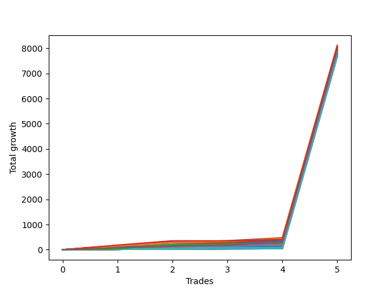

# Short Wallace Doodle 013 
- Symbol: NQ
- Date Range: 3/19/22 - 5/22/22
- Trading Period: 7:20-12:30
- Number of Trades: 5


| Name | Win Percent | Profit | Avg Profit / Trade |     | Name | Win Percent | Profit | Avg Profit / Trade |
| ---- | ----------- | ------ | ------------------ | --- | ---- | ----------- | ------ | ------------------ |
| Sorted By <br> Profit | | | | | Sorted By <br> Win Percentage ||||
| Five | 100.00 | 4043875.00 | 808775.00 |     | Five | 100.00 | 4043875.00 | 808775.00 |
| Thirty-Five | 80.00 | 4038000.00 | 807600.00 |     | Four | 100.00 | 3990500.00 | 798100.00 |
| Four | 100.00 | 3990500.00 | 798100.00 |     | Three | 100.00 | 3980250.00 | 796050.00 |
| Three | 100.00 | 3980250.00 | 796050.00 |     | Thirty-Four | 100.00 | 3945250.00 | 789050.00 |
| Thirty-Four | 100.00 | 3945250.00 | 789050.00 |     | Two | 100.00 | 3930125.00 | 786025.00 |
| Two | 100.00 | 3930125.00 | 786025.00 |     | Thirty-Six | 100.00 | 3919625.00 | 783925.00 |
| Thirty-Six | 100.00 | 3919625.00 | 783925.00 |     | One | 100.00 | 3913125.00 | 782625.00 |
| One | 100.00 | 3913125.00 | 782625.00 |     | Twenty-Two | 100.00 | 3884500.00 | 776900.00 |
| Twenty-Two | 100.00 | 3884500.00 | 776900.00 |     | Sixteen | 100.00 | 3884500.00 | 776900.00 |
| Sixteen | 100.00 | 3884500.00 | 776900.00 |     | Twenty | 100.00 | 3870000.00 | 774000.00 |
| Twenty | 100.00 | 3870000.00 | 774000.00 |     | Fourteen | 100.00 | 3870000.00 | 774000.00 |
| Fourteen | 100.00 | 3870000.00 | 774000.00 |     | Eighteen | 100.00 | 3858625.00 | 771725.00 |
| Eighteen | 100.00 | 3858625.00 | 771725.00 |     | Twelve | 100.00 | 3858625.00 | 771725.00 |
| Twelve | 100.00 | 3858625.00 | 771725.00 |     | Thirty-Three | 100.00 | 3842000.00 | 768400.00 |
| Thirty-Three | 100.00 | 3842000.00 | 768400.00 |     | Thirty-One | 100.00 | 3842000.00 | 768400.00 |
| Thirty-One | 100.00 | 3842000.00 | 768400.00 |     | Twenty-Nine | 100.00 | 3842000.00 | 768400.00 |
| Twenty-Nine | 100.00 | 3842000.00 | 768400.00 |     | Twenty-Eight | 100.00 | 3842000.00 | 768400.00 |
| Twenty-Eight | 100.00 | 3842000.00 | 768400.00 |     | Twenty-Seven | 100.00 | 3842000.00 | 768400.00 |
| Twenty-Seven | 100.00 | 3842000.00 | 768400.00 |     | Twenty-Six | 100.00 | 3842000.00 | 768400.00 |
| Twenty-Six | 100.00 | 3842000.00 | 768400.00 |     | Twenty-Five | 100.00 | 3842000.00 | 768400.00 |
| Twenty-Five | 100.00 | 3842000.00 | 768400.00 |     | Twenty-Four | 100.00 | 3842000.00 | 768400.00 |
| Twenty-Four | 100.00 | 3842000.00 | 768400.00 |     | Twenty-Three | 100.00 | 3838375.00 | 767675.00 |
| Twenty-Three | 100.00 | 3838375.00 | 767675.00 |     | Twenty-One | 100.00 | 3838375.00 | 767675.00 |
| Twenty-One | 100.00 | 3838375.00 | 767675.00 |     | Nineteen | 100.00 | 3838375.00 | 767675.00 |
| Nineteen | 100.00 | 3838375.00 | 767675.00 |     | Seventeen | 100.00 | 3838375.00 | 767675.00 |
| Seventeen | 100.00 | 3838375.00 | 767675.00 |     | Fifteen | 100.00 | 3838375.00 | 767675.00 |
| Fifteen | 100.00 | 3838375.00 | 767675.00 |     | Thirteen | 100.00 | 3838375.00 | 767675.00 |
| Thirteen | 100.00 | 3838375.00 | 767675.00 |     | Eleven | 100.00 | 3838375.00 | 767675.00 |
| Eleven | 100.00 | 3838375.00 | 767675.00 |     | Ten | 100.00 | 3838375.00 | 767675.00 |
| Ten | 100.00 | 3838375.00 | 767675.00 |     | Nine | 100.00 | 3838375.00 | 767675.00 |
| Nine | 100.00 | 3838375.00 | 767675.00 |     | Eight | 100.00 | 3838375.00 | 767675.00 |
| Eight | 100.00 | 3838375.00 | 767675.00 |     | Seven | 100.00 | 3838375.00 | 767675.00 |
| Seven | 100.00 | 3838375.00 | 767675.00 |     | Six | 100.00 | 3838375.00 | 767675.00 |
| Six | 100.00 | 3838375.00 | 767675.00 |     | Thirty-Two | 100.00 | 3835875.00 | 767175.00 |
| Thirty-Two | 100.00 | 3835875.00 | 767175.00 |     | Thirty | 100.00 | 3835875.00 | 767175.00 |
| Thirty | 100.00 | 3835875.00 | 767175.00 |     | Thirty-Five | 80.00 | 4038000.00 | 807600.00 |

### Test One
* Sell when price hits the middle line of the 20p bollinger
* No Stoploss
* Results:
```
Total Trades: 5
Percent Up: 0.00
Percent Down: 100.00
Total Points Moved Down: 7826.25
Potential Profit: 3913125.00
Total Points Ups: 0.00 Count Ups: 0
Total Points Downs: 7826.25 Count Downs: 5
```

<details><summary>Trades</summary>

<code>In: 2022-04-06 11:04:00		Out: 2022-04-06 11:06:05		Total Position Time: 02:05		Total Move Down: 49.75		Total to Date: -49.75</code> <br />
<code>In: 2022-04-06 11:05:00		Out: 2022-04-06 11:06:05		Total Position Time: 01:05		Total Move Down: 39.50		Total to Date: -89.25</code> <br />
<code>In: 2022-05-03 08:10:00		Out: 2022-05-03 08:17:35		Total Position Time: 07:35		Total Move Down: 48.25		Total to Date: -137.50</code> <br />
<code>In: 2022-05-24 09:17:00		Out: 2022-05-24 09:21:30		Total Position Time: 04:30		Total Move Down: 47.50		Total to Date: -185.00</code> <br />
<code>In: 2022-06-14 10:19:00		Out: 2022-06-14 10:19:10		Total Position Time: 00:10		Total Move Down: 7641.25		Total to Date: -7826.25</code> <br />


</details>

### Test Two
* Sell when the price hits the lower line of the 20p 1std bollinger
* No Stoploss
* Results:
```
Total Trades: 5
Percent Up: 0.00
Percent Down: 100.00
Total Points Moved Down: 7860.25
Potential Profit: 3930125.00
Total Points Ups: 0.00 Count Ups: 0
Total Points Downs: 7860.25 Count Downs: 5
```

<details><summary>Trades</summary>

<code>In: 2022-04-06 11:04:00		Out: 2022-04-06 11:07:25		Total Position Time: 03:25		Total Move Down: 72.50		Total to Date: -72.50</code> <br />
<code>In: 2022-04-06 11:05:00		Out: 2022-04-06 11:07:25		Total Position Time: 02:25		Total Move Down: 62.25		Total to Date: -134.75</code> <br />
<code>In: 2022-05-03 08:10:00		Out: 2022-05-03 08:28:35		Total Position Time: 18:35		Total Move Down: 25.25		Total to Date: -160.00</code> <br />
<code>In: 2022-05-24 09:17:00		Out: 2022-05-24 09:26:40		Total Position Time: 09:40		Total Move Down: 59.00		Total to Date: -219.00</code> <br />
<code>In: 2022-06-14 10:19:00		Out: 2022-06-14 10:19:10		Total Position Time: 00:10		Total Move Down: 7641.25		Total to Date: -7860.25</code> <br />


</details>

### Test Three
* Sell when the price hits the lower line of the 20p 2std bollinger
* No Stoploss
* Results:
```
Total Trades: 5
Percent Up: 0.00
Percent Down: 100.00
Total Points Moved Down: 7960.50
Potential Profit: 3980250.00
Total Points Ups: 0.00 Count Ups: 0
Total Points Downs: 7960.50 Count Downs: 5
```

<details><summary>Trades</summary>

<code>In: 2022-04-06 11:04:00		Out: 2022-04-06 11:08:25		Total Position Time: 04:25		Total Move Down: 101.50		Total to Date: -101.50</code> <br />
<code>In: 2022-04-06 11:05:00		Out: 2022-04-06 11:08:25		Total Position Time: 03:25		Total Move Down: 91.25		Total to Date: -192.75</code> <br />
<code>In: 2022-05-03 08:10:00		Out: 2022-05-03 08:35:55		Total Position Time: 25:55		Total Move Down: 36.50		Total to Date: -229.25</code> <br />
<code>In: 2022-05-24 09:17:00		Out: 2022-05-24 09:32:40		Total Position Time: 15:40		Total Move Down: 90.00		Total to Date: -319.25</code> <br />
<code>In: 2022-06-14 10:19:00		Out: 2022-06-14 10:19:10		Total Position Time: 00:10		Total Move Down: 7641.25		Total to Date: -7960.50</code> <br />


</details>

### Test Four
* Sell when the price hits the middle line of the 1std VWAP
* No Stoploss
* Results:
```
Total Trades: 5
Percent Up: 0.00
Percent Down: 100.00
Total Points Moved Down: 7981.00
Potential Profit: 3990500.00
Total Points Ups: 0.00 Count Ups: 0
Total Points Downs: 7981.00 Count Downs: 5
```

<details><summary>Trades</summary>

<code>In: 2022-04-06 11:04:00		Out: 2022-04-06 11:08:10		Total Position Time: 04:10		Total Move Down: 96.50		Total to Date: -96.50</code> <br />
<code>In: 2022-04-06 11:05:00		Out: 2022-04-06 11:08:10		Total Position Time: 03:10		Total Move Down: 86.25		Total to Date: -182.75</code> <br />
<code>In: 2022-05-03 08:10:00		Out: 2022-05-03 08:39:55		Total Position Time: 29:55		Total Move Down: 46.25		Total to Date: -229.00</code> <br />
<code>In: 2022-05-24 09:17:00		Out: 2022-05-24 09:36:50		Total Position Time: 19:50		Total Move Down: 110.75		Total to Date: -339.75</code> <br />
<code>In: 2022-06-14 10:19:00		Out: 2022-06-14 10:19:10		Total Position Time: 00:10		Total Move Down: 7641.25		Total to Date: -7981.00</code> <br />


</details>

### Test Five
* Sell when the price hits the lower line of the 1std VWAP
* No Stoploss
* Results:
```
Total Trades: 5
Percent Up: 0.00
Percent Down: 100.00
Total Points Moved Down: 8087.75
Potential Profit: 4043875.00
Total Points Ups: 0.00 Count Ups: 0
Total Points Downs: 8087.75 Count Downs: 5
```

<details><summary>Trades</summary>

<code>In: 2022-04-06 11:04:00		Out: 2022-04-06 11:13:00		Total Position Time: 09:00		Total Move Down: 146.00		Total to Date: -146.00</code> <br />
<code>In: 2022-04-06 11:05:00		Out: 2022-04-06 11:13:00		Total Position Time: 08:00		Total Move Down: 135.75		Total to Date: -281.75</code> <br />
<code>In: 2022-05-03 08:10:00		Out: 2022-05-03 08:39:55		Total Position Time: 29:55		Total Move Down: 46.25		Total to Date: -328.00</code> <br />
<code>In: 2022-05-24 09:17:00		Out: 2022-05-24 09:46:55		Total Position Time: 29:55		Total Move Down: 118.50		Total to Date: -446.50</code> <br />
<code>In: 2022-06-14 10:19:00		Out: 2022-06-14 10:19:10		Total Position Time: 00:10		Total Move Down: 7641.25		Total to Date: -8087.75</code> <br />


</details>

### Test Six
* Sell when the price hits the middle line of the 20p bollinger
* Stoploss is -2 points
* Results:
```
Total Trades: 5
Percent Up: 0.00
Percent Down: 100.00
Total Points Moved Down: 7676.75
Potential Profit: 3838375.00
Total Points Ups: 0.00 Count Ups: 0
Total Points Downs: 7676.75 Count Downs: 5
```

<details><summary>Trades</summary>

<code>In: 2022-04-06 11:04:00		Out: 2022-04-06 11:04:15		Total Position Time: 00:15		Total Move Down: 9.25		Total to Date: -9.25</code> <br />
<code>In: 2022-04-06 11:05:00		Out: 2022-04-06 11:05:10		Total Position Time: 00:10		Total Move Down: 15.00		Total to Date: -24.25</code> <br />
<code>In: 2022-05-03 08:10:00		Out: 2022-05-03 08:10:10		Total Position Time: 00:10		Total Move Down: 9.25		Total to Date: -33.50</code> <br />
<code>In: 2022-05-24 09:17:00		Out: 2022-05-24 09:17:10		Total Position Time: 00:10		Total Move Down: 2.00		Total to Date: -35.50</code> <br />
<code>In: 2022-06-14 10:19:00		Out: 2022-06-14 10:19:10		Total Position Time: 00:10		Total Move Down: 7641.25		Total to Date: -7676.75</code> <br />


</details>

### Test Seven
* Sell when the price hits the middle line of the 20p bollinger
* Trailing Stop is -2 points
* Results:
```
Total Trades: 5
Percent Up: 0.00
Percent Down: 100.00
Total Points Moved Down: 7676.75
Potential Profit: 3838375.00
Total Points Ups: 0.00 Count Ups: 0
Total Points Downs: 7676.75 Count Downs: 5
```

<details><summary>Trades</summary>

<code>In: 2022-04-06 11:04:00		Out: 2022-04-06 11:04:15		Total Position Time: 00:15		Total Move Down: 9.25		Total to Date: -9.25</code> <br />
<code>In: 2022-04-06 11:05:00		Out: 2022-04-06 11:05:10		Total Position Time: 00:10		Total Move Down: 15.00		Total to Date: -24.25</code> <br />
<code>In: 2022-05-03 08:10:00		Out: 2022-05-03 08:10:10		Total Position Time: 00:10		Total Move Down: 9.25		Total to Date: -33.50</code> <br />
<code>In: 2022-05-24 09:17:00		Out: 2022-05-24 09:17:10		Total Position Time: 00:10		Total Move Down: 2.00		Total to Date: -35.50</code> <br />
<code>In: 2022-06-14 10:19:00		Out: 2022-06-14 10:19:10		Total Position Time: 00:10		Total Move Down: 7641.25		Total to Date: -7676.75</code> <br />


</details>

### Test Eight
* Sell when the price hits the lower line of the 20p 1std bollinger
* Stoploss is -2 points
* Results:
```
Total Trades: 5
Percent Up: 0.00
Percent Down: 100.00
Total Points Moved Down: 7676.75
Potential Profit: 3838375.00
Total Points Ups: 0.00 Count Ups: 0
Total Points Downs: 7676.75 Count Downs: 5
```

<details><summary>Trades</summary>

<code>In: 2022-04-06 11:04:00		Out: 2022-04-06 11:04:15		Total Position Time: 00:15		Total Move Down: 9.25		Total to Date: -9.25</code> <br />
<code>In: 2022-04-06 11:05:00		Out: 2022-04-06 11:05:10		Total Position Time: 00:10		Total Move Down: 15.00		Total to Date: -24.25</code> <br />
<code>In: 2022-05-03 08:10:00		Out: 2022-05-03 08:10:10		Total Position Time: 00:10		Total Move Down: 9.25		Total to Date: -33.50</code> <br />
<code>In: 2022-05-24 09:17:00		Out: 2022-05-24 09:17:10		Total Position Time: 00:10		Total Move Down: 2.00		Total to Date: -35.50</code> <br />
<code>In: 2022-06-14 10:19:00		Out: 2022-06-14 10:19:10		Total Position Time: 00:10		Total Move Down: 7641.25		Total to Date: -7676.75</code> <br />


</details>

### Test Nine
* Sell when the price hits the lower line of the 20p 1std bollinger
* Trailing Stop is -2 points
* Results:
```
Total Trades: 5
Percent Up: 0.00
Percent Down: 100.00
Total Points Moved Down: 7676.75
Potential Profit: 3838375.00
Total Points Ups: 0.00 Count Ups: 0
Total Points Downs: 7676.75 Count Downs: 5
```

<details><summary>Trades</summary>

<code>In: 2022-04-06 11:04:00		Out: 2022-04-06 11:04:15		Total Position Time: 00:15		Total Move Down: 9.25		Total to Date: -9.25</code> <br />
<code>In: 2022-04-06 11:05:00		Out: 2022-04-06 11:05:10		Total Position Time: 00:10		Total Move Down: 15.00		Total to Date: -24.25</code> <br />
<code>In: 2022-05-03 08:10:00		Out: 2022-05-03 08:10:10		Total Position Time: 00:10		Total Move Down: 9.25		Total to Date: -33.50</code> <br />
<code>In: 2022-05-24 09:17:00		Out: 2022-05-24 09:17:10		Total Position Time: 00:10		Total Move Down: 2.00		Total to Date: -35.50</code> <br />
<code>In: 2022-06-14 10:19:00		Out: 2022-06-14 10:19:10		Total Position Time: 00:10		Total Move Down: 7641.25		Total to Date: -7676.75</code> <br />


</details>

### Test Ten
* Sell when the price hits the lower line of the 20p 2std bollinger
* Stoploss is -2 points
* Results:
```
Total Trades: 5
Percent Up: 0.00
Percent Down: 100.00
Total Points Moved Down: 7676.75
Potential Profit: 3838375.00
Total Points Ups: 0.00 Count Ups: 0
Total Points Downs: 7676.75 Count Downs: 5
```

<details><summary>Trades</summary>

<code>In: 2022-04-06 11:04:00		Out: 2022-04-06 11:04:15		Total Position Time: 00:15		Total Move Down: 9.25		Total to Date: -9.25</code> <br />
<code>In: 2022-04-06 11:05:00		Out: 2022-04-06 11:05:10		Total Position Time: 00:10		Total Move Down: 15.00		Total to Date: -24.25</code> <br />
<code>In: 2022-05-03 08:10:00		Out: 2022-05-03 08:10:10		Total Position Time: 00:10		Total Move Down: 9.25		Total to Date: -33.50</code> <br />
<code>In: 2022-05-24 09:17:00		Out: 2022-05-24 09:17:10		Total Position Time: 00:10		Total Move Down: 2.00		Total to Date: -35.50</code> <br />
<code>In: 2022-06-14 10:19:00		Out: 2022-06-14 10:19:10		Total Position Time: 00:10		Total Move Down: 7641.25		Total to Date: -7676.75</code> <br />


</details>

### Test Eleven
* Sell when the price hits the lower line of the 20p 2std bollinger
* Trailing Stop is -2 points
* Results:
```
Total Trades: 5
Percent Up: 0.00
Percent Down: 100.00
Total Points Moved Down: 7676.75
Potential Profit: 3838375.00
Total Points Ups: 0.00 Count Ups: 0
Total Points Downs: 7676.75 Count Downs: 5
```

<details><summary>Trades</summary>

<code>In: 2022-04-06 11:04:00		Out: 2022-04-06 11:04:15		Total Position Time: 00:15		Total Move Down: 9.25		Total to Date: -9.25</code> <br />
<code>In: 2022-04-06 11:05:00		Out: 2022-04-06 11:05:10		Total Position Time: 00:10		Total Move Down: 15.00		Total to Date: -24.25</code> <br />
<code>In: 2022-05-03 08:10:00		Out: 2022-05-03 08:10:10		Total Position Time: 00:10		Total Move Down: 9.25		Total to Date: -33.50</code> <br />
<code>In: 2022-05-24 09:17:00		Out: 2022-05-24 09:17:10		Total Position Time: 00:10		Total Move Down: 2.00		Total to Date: -35.50</code> <br />
<code>In: 2022-06-14 10:19:00		Out: 2022-06-14 10:19:10		Total Position Time: 00:10		Total Move Down: 7641.25		Total to Date: -7676.75</code> <br />


</details>

### Test Twelve
* Sell when the price hits the middle line of the 20p bollinger
* Stoploss is -3 points
* Results:
```
Total Trades: 5
Percent Up: 0.00
Percent Down: 100.00
Total Points Moved Down: 7717.25
Potential Profit: 3858625.00
Total Points Ups: 0.00 Count Ups: 0
Total Points Downs: 7717.25 Count Downs: 5
```

<details><summary>Trades</summary>

<code>In: 2022-04-06 11:04:00		Out: 2022-04-06 11:06:05		Total Position Time: 02:05		Total Move Down: 49.75		Total to Date: -49.75</code> <br />
<code>In: 2022-04-06 11:05:00		Out: 2022-04-06 11:05:10		Total Position Time: 00:10		Total Move Down: 15.00		Total to Date: -64.75</code> <br />
<code>In: 2022-05-03 08:10:00		Out: 2022-05-03 08:10:10		Total Position Time: 00:10		Total Move Down: 9.25		Total to Date: -74.00</code> <br />
<code>In: 2022-05-24 09:17:00		Out: 2022-05-24 09:17:10		Total Position Time: 00:10		Total Move Down: 2.00		Total to Date: -76.00</code> <br />
<code>In: 2022-06-14 10:19:00		Out: 2022-06-14 10:19:10		Total Position Time: 00:10		Total Move Down: 7641.25		Total to Date: -7717.25</code> <br />


</details>

### Test Thirteen
* Sell when the price hits the middle line of the 20p bollinger
* Trailing Stop is -3 points
* Results:
```
Total Trades: 5
Percent Up: 0.00
Percent Down: 100.00
Total Points Moved Down: 7676.75
Potential Profit: 3838375.00
Total Points Ups: 0.00 Count Ups: 0
Total Points Downs: 7676.75 Count Downs: 5
```

<details><summary>Trades</summary>

<code>In: 2022-04-06 11:04:00		Out: 2022-04-06 11:04:15		Total Position Time: 00:15		Total Move Down: 9.25		Total to Date: -9.25</code> <br />
<code>In: 2022-04-06 11:05:00		Out: 2022-04-06 11:05:10		Total Position Time: 00:10		Total Move Down: 15.00		Total to Date: -24.25</code> <br />
<code>In: 2022-05-03 08:10:00		Out: 2022-05-03 08:10:10		Total Position Time: 00:10		Total Move Down: 9.25		Total to Date: -33.50</code> <br />
<code>In: 2022-05-24 09:17:00		Out: 2022-05-24 09:17:10		Total Position Time: 00:10		Total Move Down: 2.00		Total to Date: -35.50</code> <br />
<code>In: 2022-06-14 10:19:00		Out: 2022-06-14 10:19:10		Total Position Time: 00:10		Total Move Down: 7641.25		Total to Date: -7676.75</code> <br />


</details>

### Test Fourteen
* Sell when the price hits the lower line of the 20p 1std bollinger
* Stoploss is -3 points
* Results:
```
Total Trades: 5
Percent Up: 0.00
Percent Down: 100.00
Total Points Moved Down: 7740.00
Potential Profit: 3870000.00
Total Points Ups: 0.00 Count Ups: 0
Total Points Downs: 7740.00 Count Downs: 5
```

<details><summary>Trades</summary>

<code>In: 2022-04-06 11:04:00		Out: 2022-04-06 11:07:25		Total Position Time: 03:25		Total Move Down: 72.50		Total to Date: -72.50</code> <br />
<code>In: 2022-04-06 11:05:00		Out: 2022-04-06 11:05:10		Total Position Time: 00:10		Total Move Down: 15.00		Total to Date: -87.50</code> <br />
<code>In: 2022-05-03 08:10:00		Out: 2022-05-03 08:10:10		Total Position Time: 00:10		Total Move Down: 9.25		Total to Date: -96.75</code> <br />
<code>In: 2022-05-24 09:17:00		Out: 2022-05-24 09:17:10		Total Position Time: 00:10		Total Move Down: 2.00		Total to Date: -98.75</code> <br />
<code>In: 2022-06-14 10:19:00		Out: 2022-06-14 10:19:10		Total Position Time: 00:10		Total Move Down: 7641.25		Total to Date: -7740.00</code> <br />


</details>

### Test Fifteen
* Sell when the price hits the lower line of the 20p 1std bollinger
* Trailing Stop is -3 points
* Results:
```
Total Trades: 5
Percent Up: 0.00
Percent Down: 100.00
Total Points Moved Down: 7676.75
Potential Profit: 3838375.00
Total Points Ups: 0.00 Count Ups: 0
Total Points Downs: 7676.75 Count Downs: 5
```

<details><summary>Trades</summary>

<code>In: 2022-04-06 11:04:00		Out: 2022-04-06 11:04:15		Total Position Time: 00:15		Total Move Down: 9.25		Total to Date: -9.25</code> <br />
<code>In: 2022-04-06 11:05:00		Out: 2022-04-06 11:05:10		Total Position Time: 00:10		Total Move Down: 15.00		Total to Date: -24.25</code> <br />
<code>In: 2022-05-03 08:10:00		Out: 2022-05-03 08:10:10		Total Position Time: 00:10		Total Move Down: 9.25		Total to Date: -33.50</code> <br />
<code>In: 2022-05-24 09:17:00		Out: 2022-05-24 09:17:10		Total Position Time: 00:10		Total Move Down: 2.00		Total to Date: -35.50</code> <br />
<code>In: 2022-06-14 10:19:00		Out: 2022-06-14 10:19:10		Total Position Time: 00:10		Total Move Down: 7641.25		Total to Date: -7676.75</code> <br />


</details>

### Test Sixteen
* Sell when the price hits the lower line of the 20p 2std bollinger
* Stoploss is -3 points
* Results:
```
Total Trades: 5
Percent Up: 0.00
Percent Down: 100.00
Total Points Moved Down: 7769.00
Potential Profit: 3884500.00
Total Points Ups: 0.00 Count Ups: 0
Total Points Downs: 7769.00 Count Downs: 5
```

<details><summary>Trades</summary>

<code>In: 2022-04-06 11:04:00		Out: 2022-04-06 11:08:25		Total Position Time: 04:25		Total Move Down: 101.50		Total to Date: -101.50</code> <br />
<code>In: 2022-04-06 11:05:00		Out: 2022-04-06 11:05:10		Total Position Time: 00:10		Total Move Down: 15.00		Total to Date: -116.50</code> <br />
<code>In: 2022-05-03 08:10:00		Out: 2022-05-03 08:10:10		Total Position Time: 00:10		Total Move Down: 9.25		Total to Date: -125.75</code> <br />
<code>In: 2022-05-24 09:17:00		Out: 2022-05-24 09:17:10		Total Position Time: 00:10		Total Move Down: 2.00		Total to Date: -127.75</code> <br />
<code>In: 2022-06-14 10:19:00		Out: 2022-06-14 10:19:10		Total Position Time: 00:10		Total Move Down: 7641.25		Total to Date: -7769.00</code> <br />


</details>

### Test Seventeen
* Sell when the price hits the lower line of the 20p 2std bollinger
* Trailing Stop is -3 points
* Results:
```
Total Trades: 5
Percent Up: 0.00
Percent Down: 100.00
Total Points Moved Down: 7676.75
Potential Profit: 3838375.00
Total Points Ups: 0.00 Count Ups: 0
Total Points Downs: 7676.75 Count Downs: 5
```

<details><summary>Trades</summary>

<code>In: 2022-04-06 11:04:00		Out: 2022-04-06 11:04:15		Total Position Time: 00:15		Total Move Down: 9.25		Total to Date: -9.25</code> <br />
<code>In: 2022-04-06 11:05:00		Out: 2022-04-06 11:05:10		Total Position Time: 00:10		Total Move Down: 15.00		Total to Date: -24.25</code> <br />
<code>In: 2022-05-03 08:10:00		Out: 2022-05-03 08:10:10		Total Position Time: 00:10		Total Move Down: 9.25		Total to Date: -33.50</code> <br />
<code>In: 2022-05-24 09:17:00		Out: 2022-05-24 09:17:10		Total Position Time: 00:10		Total Move Down: 2.00		Total to Date: -35.50</code> <br />
<code>In: 2022-06-14 10:19:00		Out: 2022-06-14 10:19:10		Total Position Time: 00:10		Total Move Down: 7641.25		Total to Date: -7676.75</code> <br />


</details>

### Test Eighteen
* Sell when the price hits the middle line of the 20p bollinger
* Stoploss is -5 points
* Results:
```
Total Trades: 5
Percent Up: 0.00
Percent Down: 100.00
Total Points Moved Down: 7717.25
Potential Profit: 3858625.00
Total Points Ups: 0.00 Count Ups: 0
Total Points Downs: 7717.25 Count Downs: 5
```

<details><summary>Trades</summary>

<code>In: 2022-04-06 11:04:00		Out: 2022-04-06 11:06:05		Total Position Time: 02:05		Total Move Down: 49.75		Total to Date: -49.75</code> <br />
<code>In: 2022-04-06 11:05:00		Out: 2022-04-06 11:05:10		Total Position Time: 00:10		Total Move Down: 15.00		Total to Date: -64.75</code> <br />
<code>In: 2022-05-03 08:10:00		Out: 2022-05-03 08:10:10		Total Position Time: 00:10		Total Move Down: 9.25		Total to Date: -74.00</code> <br />
<code>In: 2022-05-24 09:17:00		Out: 2022-05-24 09:17:10		Total Position Time: 00:10		Total Move Down: 2.00		Total to Date: -76.00</code> <br />
<code>In: 2022-06-14 10:19:00		Out: 2022-06-14 10:19:10		Total Position Time: 00:10		Total Move Down: 7641.25		Total to Date: -7717.25</code> <br />


</details>

### Test Nineteen
* Sell when the price hits the middle line of the 20p bollinger
* Trailing Stop is -5 points
* Results:
```
Total Trades: 5
Percent Up: 0.00
Percent Down: 100.00
Total Points Moved Down: 7676.75
Potential Profit: 3838375.00
Total Points Ups: 0.00 Count Ups: 0
Total Points Downs: 7676.75 Count Downs: 5
```

<details><summary>Trades</summary>

<code>In: 2022-04-06 11:04:00		Out: 2022-04-06 11:04:15		Total Position Time: 00:15		Total Move Down: 9.25		Total to Date: -9.25</code> <br />
<code>In: 2022-04-06 11:05:00		Out: 2022-04-06 11:05:10		Total Position Time: 00:10		Total Move Down: 15.00		Total to Date: -24.25</code> <br />
<code>In: 2022-05-03 08:10:00		Out: 2022-05-03 08:10:10		Total Position Time: 00:10		Total Move Down: 9.25		Total to Date: -33.50</code> <br />
<code>In: 2022-05-24 09:17:00		Out: 2022-05-24 09:17:10		Total Position Time: 00:10		Total Move Down: 2.00		Total to Date: -35.50</code> <br />
<code>In: 2022-06-14 10:19:00		Out: 2022-06-14 10:19:10		Total Position Time: 00:10		Total Move Down: 7641.25		Total to Date: -7676.75</code> <br />


</details>

### Test Twenty
* Sell when the price hits the lower line of the 20p 1std bollinger
* Stoploss is -5 points
* Results:
```
Total Trades: 5
Percent Up: 0.00
Percent Down: 100.00
Total Points Moved Down: 7740.00
Potential Profit: 3870000.00
Total Points Ups: 0.00 Count Ups: 0
Total Points Downs: 7740.00 Count Downs: 5
```

<details><summary>Trades</summary>

<code>In: 2022-04-06 11:04:00		Out: 2022-04-06 11:07:25		Total Position Time: 03:25		Total Move Down: 72.50		Total to Date: -72.50</code> <br />
<code>In: 2022-04-06 11:05:00		Out: 2022-04-06 11:05:10		Total Position Time: 00:10		Total Move Down: 15.00		Total to Date: -87.50</code> <br />
<code>In: 2022-05-03 08:10:00		Out: 2022-05-03 08:10:10		Total Position Time: 00:10		Total Move Down: 9.25		Total to Date: -96.75</code> <br />
<code>In: 2022-05-24 09:17:00		Out: 2022-05-24 09:17:10		Total Position Time: 00:10		Total Move Down: 2.00		Total to Date: -98.75</code> <br />
<code>In: 2022-06-14 10:19:00		Out: 2022-06-14 10:19:10		Total Position Time: 00:10		Total Move Down: 7641.25		Total to Date: -7740.00</code> <br />


</details>

### Test Twenty-One
* Sell when the price hits the lower line of the 20p 1std bollinger
* Trailing Stop is -5 points
* Results:
```
Total Trades: 5
Percent Up: 0.00
Percent Down: 100.00
Total Points Moved Down: 7676.75
Potential Profit: 3838375.00
Total Points Ups: 0.00 Count Ups: 0
Total Points Downs: 7676.75 Count Downs: 5
```

<details><summary>Trades</summary>

<code>In: 2022-04-06 11:04:00		Out: 2022-04-06 11:04:15		Total Position Time: 00:15		Total Move Down: 9.25		Total to Date: -9.25</code> <br />
<code>In: 2022-04-06 11:05:00		Out: 2022-04-06 11:05:10		Total Position Time: 00:10		Total Move Down: 15.00		Total to Date: -24.25</code> <br />
<code>In: 2022-05-03 08:10:00		Out: 2022-05-03 08:10:10		Total Position Time: 00:10		Total Move Down: 9.25		Total to Date: -33.50</code> <br />
<code>In: 2022-05-24 09:17:00		Out: 2022-05-24 09:17:10		Total Position Time: 00:10		Total Move Down: 2.00		Total to Date: -35.50</code> <br />
<code>In: 2022-06-14 10:19:00		Out: 2022-06-14 10:19:10		Total Position Time: 00:10		Total Move Down: 7641.25		Total to Date: -7676.75</code> <br />


</details>

### Test Twenty-Two
* Sell when the price hits the lower line of the 20p 2std bollinger
* Stoploss is -5 points
* Results:
```
Total Trades: 5
Percent Up: 0.00
Percent Down: 100.00
Total Points Moved Down: 7769.00
Potential Profit: 3884500.00
Total Points Ups: 0.00 Count Ups: 0
Total Points Downs: 7769.00 Count Downs: 5
```

<details><summary>Trades</summary>

<code>In: 2022-04-06 11:04:00		Out: 2022-04-06 11:08:25		Total Position Time: 04:25		Total Move Down: 101.50		Total to Date: -101.50</code> <br />
<code>In: 2022-04-06 11:05:00		Out: 2022-04-06 11:05:10		Total Position Time: 00:10		Total Move Down: 15.00		Total to Date: -116.50</code> <br />
<code>In: 2022-05-03 08:10:00		Out: 2022-05-03 08:10:10		Total Position Time: 00:10		Total Move Down: 9.25		Total to Date: -125.75</code> <br />
<code>In: 2022-05-24 09:17:00		Out: 2022-05-24 09:17:10		Total Position Time: 00:10		Total Move Down: 2.00		Total to Date: -127.75</code> <br />
<code>In: 2022-06-14 10:19:00		Out: 2022-06-14 10:19:10		Total Position Time: 00:10		Total Move Down: 7641.25		Total to Date: -7769.00</code> <br />


</details>

### Test Twenty-Three
* Sell when the price hits the lower line of the 20p 2std bollinger
* Trailing Stop is -5 points
* Results:
```
Total Trades: 5
Percent Up: 0.00
Percent Down: 100.00
Total Points Moved Down: 7676.75
Potential Profit: 3838375.00
Total Points Ups: 0.00 Count Ups: 0
Total Points Downs: 7676.75 Count Downs: 5
```

<details><summary>Trades</summary>

<code>In: 2022-04-06 11:04:00		Out: 2022-04-06 11:04:15		Total Position Time: 00:15		Total Move Down: 9.25		Total to Date: -9.25</code> <br />
<code>In: 2022-04-06 11:05:00		Out: 2022-04-06 11:05:10		Total Position Time: 00:10		Total Move Down: 15.00		Total to Date: -24.25</code> <br />
<code>In: 2022-05-03 08:10:00		Out: 2022-05-03 08:10:10		Total Position Time: 00:10		Total Move Down: 9.25		Total to Date: -33.50</code> <br />
<code>In: 2022-05-24 09:17:00		Out: 2022-05-24 09:17:10		Total Position Time: 00:10		Total Move Down: 2.00		Total to Date: -35.50</code> <br />
<code>In: 2022-06-14 10:19:00		Out: 2022-06-14 10:19:10		Total Position Time: 00:10		Total Move Down: 7641.25		Total to Date: -7676.75</code> <br />


</details>

### Test Twenty-Four
* Sell when the price hits the middle line of the 20p bollinger
* Stoploss is 10 points
* Results:
```
Total Trades: 5
Percent Up: 0.00
Percent Down: 100.00
Total Points Moved Down: 7684.00
Potential Profit: 3842000.00
Total Points Ups: 0.00 Count Ups: 0
Total Points Downs: 7684.00 Count Downs: 5
```

<details><summary>Trades</summary>

<code>In: 2022-04-06 11:04:00		Out: 2022-04-06 11:04:10		Total Position Time: 00:10		Total Move Down: 16.50		Total to Date: -16.50</code> <br />
<code>In: 2022-04-06 11:05:00		Out: 2022-04-06 11:05:10		Total Position Time: 00:10		Total Move Down: 15.00		Total to Date: -31.50</code> <br />
<code>In: 2022-05-03 08:10:00		Out: 2022-05-03 08:10:10		Total Position Time: 00:10		Total Move Down: 9.25		Total to Date: -40.75</code> <br />
<code>In: 2022-05-24 09:17:00		Out: 2022-05-24 09:17:10		Total Position Time: 00:10		Total Move Down: 2.00		Total to Date: -42.75</code> <br />
<code>In: 2022-06-14 10:19:00		Out: 2022-06-14 10:19:10		Total Position Time: 00:10		Total Move Down: 7641.25		Total to Date: -7684.00</code> <br />


</details>

### Test Twenty-Five
* Sell when the price hits the middle line of the 20p bollinger
* Trailing Stop is 10 points
* Results:
```
Total Trades: 5
Percent Up: 0.00
Percent Down: 100.00
Total Points Moved Down: 7684.00
Potential Profit: 3842000.00
Total Points Ups: 0.00 Count Ups: 0
Total Points Downs: 7684.00 Count Downs: 5
```

<details><summary>Trades</summary>

<code>In: 2022-04-06 11:04:00		Out: 2022-04-06 11:04:10		Total Position Time: 00:10		Total Move Down: 16.50		Total to Date: -16.50</code> <br />
<code>In: 2022-04-06 11:05:00		Out: 2022-04-06 11:05:10		Total Position Time: 00:10		Total Move Down: 15.00		Total to Date: -31.50</code> <br />
<code>In: 2022-05-03 08:10:00		Out: 2022-05-03 08:10:10		Total Position Time: 00:10		Total Move Down: 9.25		Total to Date: -40.75</code> <br />
<code>In: 2022-05-24 09:17:00		Out: 2022-05-24 09:17:10		Total Position Time: 00:10		Total Move Down: 2.00		Total to Date: -42.75</code> <br />
<code>In: 2022-06-14 10:19:00		Out: 2022-06-14 10:19:10		Total Position Time: 00:10		Total Move Down: 7641.25		Total to Date: -7684.00</code> <br />


</details>

### Test Twenty-Six
* Sell when the price hits the lower line of the 20p 1std bollinger
* Stoploss is 10 points
* Results:
```
Total Trades: 5
Percent Up: 0.00
Percent Down: 100.00
Total Points Moved Down: 7684.00
Potential Profit: 3842000.00
Total Points Ups: 0.00 Count Ups: 0
Total Points Downs: 7684.00 Count Downs: 5
```

<details><summary>Trades</summary>

<code>In: 2022-04-06 11:04:00		Out: 2022-04-06 11:04:10		Total Position Time: 00:10		Total Move Down: 16.50		Total to Date: -16.50</code> <br />
<code>In: 2022-04-06 11:05:00		Out: 2022-04-06 11:05:10		Total Position Time: 00:10		Total Move Down: 15.00		Total to Date: -31.50</code> <br />
<code>In: 2022-05-03 08:10:00		Out: 2022-05-03 08:10:10		Total Position Time: 00:10		Total Move Down: 9.25		Total to Date: -40.75</code> <br />
<code>In: 2022-05-24 09:17:00		Out: 2022-05-24 09:17:10		Total Position Time: 00:10		Total Move Down: 2.00		Total to Date: -42.75</code> <br />
<code>In: 2022-06-14 10:19:00		Out: 2022-06-14 10:19:10		Total Position Time: 00:10		Total Move Down: 7641.25		Total to Date: -7684.00</code> <br />


</details>

### Test Twenty-Seven
* Sell when the price hits the lower line of the 20p 1std bollinger
* Trailing Stop is 10 points
* Results:
```
Total Trades: 5
Percent Up: 0.00
Percent Down: 100.00
Total Points Moved Down: 7684.00
Potential Profit: 3842000.00
Total Points Ups: 0.00 Count Ups: 0
Total Points Downs: 7684.00 Count Downs: 5
```

<details><summary>Trades</summary>

<code>In: 2022-04-06 11:04:00		Out: 2022-04-06 11:04:10		Total Position Time: 00:10		Total Move Down: 16.50		Total to Date: -16.50</code> <br />
<code>In: 2022-04-06 11:05:00		Out: 2022-04-06 11:05:10		Total Position Time: 00:10		Total Move Down: 15.00		Total to Date: -31.50</code> <br />
<code>In: 2022-05-03 08:10:00		Out: 2022-05-03 08:10:10		Total Position Time: 00:10		Total Move Down: 9.25		Total to Date: -40.75</code> <br />
<code>In: 2022-05-24 09:17:00		Out: 2022-05-24 09:17:10		Total Position Time: 00:10		Total Move Down: 2.00		Total to Date: -42.75</code> <br />
<code>In: 2022-06-14 10:19:00		Out: 2022-06-14 10:19:10		Total Position Time: 00:10		Total Move Down: 7641.25		Total to Date: -7684.00</code> <br />


</details>

### Test Twenty-Eight
* Sell when the price hits the lower line of the 20p 2std bollinger
* Stoploss is 10 points
* Results:
```
Total Trades: 5
Percent Up: 0.00
Percent Down: 100.00
Total Points Moved Down: 7684.00
Potential Profit: 3842000.00
Total Points Ups: 0.00 Count Ups: 0
Total Points Downs: 7684.00 Count Downs: 5
```

<details><summary>Trades</summary>

<code>In: 2022-04-06 11:04:00		Out: 2022-04-06 11:04:10		Total Position Time: 00:10		Total Move Down: 16.50		Total to Date: -16.50</code> <br />
<code>In: 2022-04-06 11:05:00		Out: 2022-04-06 11:05:10		Total Position Time: 00:10		Total Move Down: 15.00		Total to Date: -31.50</code> <br />
<code>In: 2022-05-03 08:10:00		Out: 2022-05-03 08:10:10		Total Position Time: 00:10		Total Move Down: 9.25		Total to Date: -40.75</code> <br />
<code>In: 2022-05-24 09:17:00		Out: 2022-05-24 09:17:10		Total Position Time: 00:10		Total Move Down: 2.00		Total to Date: -42.75</code> <br />
<code>In: 2022-06-14 10:19:00		Out: 2022-06-14 10:19:10		Total Position Time: 00:10		Total Move Down: 7641.25		Total to Date: -7684.00</code> <br />


</details>

### Test Twenty-Nine
* Sell when the price hits the lower line of the 20p 2std bollinger
* Trailing Stop is 10 points
* Results:
```
Total Trades: 5
Percent Up: 0.00
Percent Down: 100.00
Total Points Moved Down: 7684.00
Potential Profit: 3842000.00
Total Points Ups: 0.00 Count Ups: 0
Total Points Downs: 7684.00 Count Downs: 5
```

<details><summary>Trades</summary>

<code>In: 2022-04-06 11:04:00		Out: 2022-04-06 11:04:10		Total Position Time: 00:10		Total Move Down: 16.50		Total to Date: -16.50</code> <br />
<code>In: 2022-04-06 11:05:00		Out: 2022-04-06 11:05:10		Total Position Time: 00:10		Total Move Down: 15.00		Total to Date: -31.50</code> <br />
<code>In: 2022-05-03 08:10:00		Out: 2022-05-03 08:10:10		Total Position Time: 00:10		Total Move Down: 9.25		Total to Date: -40.75</code> <br />
<code>In: 2022-05-24 09:17:00		Out: 2022-05-24 09:17:10		Total Position Time: 00:10		Total Move Down: 2.00		Total to Date: -42.75</code> <br />
<code>In: 2022-06-14 10:19:00		Out: 2022-06-14 10:19:10		Total Position Time: 00:10		Total Move Down: 7641.25		Total to Date: -7684.00</code> <br />


</details>

### Test Thirty
* Sell when the price hits the middle line of the 1std VWAP
* Stoploss is 10 points
* Results:
```
Total Trades: 5
Percent Up: 0.00
Percent Down: 100.00
Total Points Moved Down: 7671.75
Potential Profit: 3835875.00
Total Points Ups: 0.00 Count Ups: 0
Total Points Downs: 7671.75 Count Downs: 5
```

<details><summary>Trades</summary>

<code>In: 2022-04-06 11:04:00		Out: 2022-04-06 11:04:15		Total Position Time: 00:15		Total Move Down: 9.25		Total to Date: -9.25</code> <br />
<code>In: 2022-04-06 11:05:00		Out: 2022-04-06 11:05:15		Total Position Time: 00:15		Total Move Down: 10.00		Total to Date: -19.25</code> <br />
<code>In: 2022-05-03 08:10:00		Out: 2022-05-03 08:10:10		Total Position Time: 00:10		Total Move Down: 9.25		Total to Date: -28.50</code> <br />
<code>In: 2022-05-24 09:17:00		Out: 2022-05-24 09:17:10		Total Position Time: 00:10		Total Move Down: 2.00		Total to Date: -30.50</code> <br />
<code>In: 2022-06-14 10:19:00		Out: 2022-06-14 10:19:10		Total Position Time: 00:10		Total Move Down: 7641.25		Total to Date: -7671.75</code> <br />


</details>

### Test Thirty-One
* Sell when the price hits the middle line of the 1std VWAP
* Trailing Stop is 10 points
* Results:
```
Total Trades: 5
Percent Up: 0.00
Percent Down: 100.00
Total Points Moved Down: 7684.00
Potential Profit: 3842000.00
Total Points Ups: 0.00 Count Ups: 0
Total Points Downs: 7684.00 Count Downs: 5
```

<details><summary>Trades</summary>

<code>In: 2022-04-06 11:04:00		Out: 2022-04-06 11:04:10		Total Position Time: 00:10		Total Move Down: 16.50		Total to Date: -16.50</code> <br />
<code>In: 2022-04-06 11:05:00		Out: 2022-04-06 11:05:10		Total Position Time: 00:10		Total Move Down: 15.00		Total to Date: -31.50</code> <br />
<code>In: 2022-05-03 08:10:00		Out: 2022-05-03 08:10:10		Total Position Time: 00:10		Total Move Down: 9.25		Total to Date: -40.75</code> <br />
<code>In: 2022-05-24 09:17:00		Out: 2022-05-24 09:17:10		Total Position Time: 00:10		Total Move Down: 2.00		Total to Date: -42.75</code> <br />
<code>In: 2022-06-14 10:19:00		Out: 2022-06-14 10:19:10		Total Position Time: 00:10		Total Move Down: 7641.25		Total to Date: -7684.00</code> <br />


</details>

### Test Thirty-Two
* Sell when the price hits the lower line of the 1std VWAP
* Stoploss is 10 points
* Results:
```
Total Trades: 5
Percent Up: 0.00
Percent Down: 100.00
Total Points Moved Down: 7671.75
Potential Profit: 3835875.00
Total Points Ups: 0.00 Count Ups: 0
Total Points Downs: 7671.75 Count Downs: 5
```

<details><summary>Trades</summary>

<code>In: 2022-04-06 11:04:00		Out: 2022-04-06 11:04:15		Total Position Time: 00:15		Total Move Down: 9.25		Total to Date: -9.25</code> <br />
<code>In: 2022-04-06 11:05:00		Out: 2022-04-06 11:05:15		Total Position Time: 00:15		Total Move Down: 10.00		Total to Date: -19.25</code> <br />
<code>In: 2022-05-03 08:10:00		Out: 2022-05-03 08:10:10		Total Position Time: 00:10		Total Move Down: 9.25		Total to Date: -28.50</code> <br />
<code>In: 2022-05-24 09:17:00		Out: 2022-05-24 09:17:10		Total Position Time: 00:10		Total Move Down: 2.00		Total to Date: -30.50</code> <br />
<code>In: 2022-06-14 10:19:00		Out: 2022-06-14 10:19:10		Total Position Time: 00:10		Total Move Down: 7641.25		Total to Date: -7671.75</code> <br />


</details>

### Test Thirty-Three
* Sell when the price hits the lower line of the 1std VWAP
* Trailing Stop is 10 points
* Results:
```
Total Trades: 5
Percent Up: 0.00
Percent Down: 100.00
Total Points Moved Down: 7684.00
Potential Profit: 3842000.00
Total Points Ups: 0.00 Count Ups: 0
Total Points Downs: 7684.00 Count Downs: 5
```

<details><summary>Trades</summary>

<code>In: 2022-04-06 11:04:00		Out: 2022-04-06 11:04:10		Total Position Time: 00:10		Total Move Down: 16.50		Total to Date: -16.50</code> <br />
<code>In: 2022-04-06 11:05:00		Out: 2022-04-06 11:05:10		Total Position Time: 00:10		Total Move Down: 15.00		Total to Date: -31.50</code> <br />
<code>In: 2022-05-03 08:10:00		Out: 2022-05-03 08:10:10		Total Position Time: 00:10		Total Move Down: 9.25		Total to Date: -40.75</code> <br />
<code>In: 2022-05-24 09:17:00		Out: 2022-05-24 09:17:10		Total Position Time: 00:10		Total Move Down: 2.00		Total to Date: -42.75</code> <br />
<code>In: 2022-06-14 10:19:00		Out: 2022-06-14 10:19:10		Total Position Time: 00:10		Total Move Down: 7641.25		Total to Date: -7684.00</code> <br />


</details>

### Test Thirty-Four
* Sell when the linear regression slope is positive
* No Stoploss
* Results:
```
Total Trades: 5
Percent Up: 0.00
Percent Down: 100.00
Total Points Moved Down: 7890.50
Potential Profit: 3945250.00
Total Points Ups: 0.00 Count Ups: 0
Total Points Downs: 7890.50 Count Downs: 5
```

<details><summary>Trades</summary>

<code>In: 2022-04-06 11:04:00		Out: 2022-04-06 11:05:05		Total Position Time: 01:05		Total Move Down: 29.75		Total to Date: -29.75</code> <br />
<code>In: 2022-04-06 11:05:00		Out: 2022-04-06 11:21:05		Total Position Time: 16:05		Total Move Down: 171.00		Total to Date: -200.75</code> <br />
<code>In: 2022-05-03 08:10:00		Out: 2022-05-03 08:11:05		Total Position Time: 01:05		Total Move Down: 34.00		Total to Date: -234.75</code> <br />
<code>In: 2022-05-24 09:17:00		Out: 2022-05-24 09:18:05		Total Position Time: 01:05		Total Move Down: 16.00		Total to Date: -250.75</code> <br />
<code>In: 2022-06-14 10:19:00		Out: 2022-06-14 10:20:05		Total Position Time: 01:05		Total Move Down: 7639.75		Total to Date: -7890.50</code> <br />


</details>

### Test Thirty-Five
* Sell when the linear regression slope changes to positive
* No Stoploss
* Results:
```
Total Trades: 5
Percent Up: 20.00
Percent Down: 80.00
Total Points Moved Down: 8076.00
Potential Profit: 4038000.00
Total Points Ups: 2.25 Count Ups: 1
Total Points Downs: 8078.25 Count Downs: 4
```

<details><summary>Trades</summary>

<code>In: 2022-04-06 11:04:00		Out: 2022-04-06 11:21:05		Total Position Time: 17:05		Total Move Down: 181.25		Total to Date: -181.25</code> <br />
<code>In: 2022-04-06 11:05:00		Out: 2022-04-06 11:21:05		Total Position Time: 16:05		Total Move Down: 171.00		Total to Date: -352.25</code> <br />
<code>In: 2022-05-03 08:10:00		Out: 2022-05-03 08:15:05		Total Position Time: 05:05		Total Move Down: -2.25		Total to Date: -350.00</code> <br />
<code>In: 2022-05-24 09:17:00		Out: 2022-05-24 09:31:05		Total Position Time: 14:05		Total Move Down: 56.75		Total to Date: -406.75</code> <br />
<code>In: 2022-06-14 10:19:00		Out: 2022-06-14 10:48:55		Total Position Time: 29:55		Total Move Down: 7669.25		Total to Date: -8076.00</code> <br />


</details>

### Test Thirty-Six
* Sell when the linear regression slope changes to positive
* No Stoploss
* Results:
```
Total Trades: 5
Percent Up: 0.00
Percent Down: 100.00
Total Points Moved Down: 7839.25
Potential Profit: 3919625.00
Total Points Ups: 0.00 Count Ups: 0
Total Points Downs: 7839.25 Count Downs: 5
```

<details><summary>Trades</summary>

<code>In: 2022-04-06 11:04:00		Out: 2022-04-06 11:33:55		Total Position Time: 29:55		Total Move Down: 73.50		Total to Date: -73.50</code> <br />
<code>In: 2022-04-06 11:05:00		Out: 2022-04-06 11:34:55		Total Position Time: 29:55		Total Move Down: 39.75		Total to Date: -113.25</code> <br />
<code>In: 2022-05-03 08:10:00		Out: 2022-05-03 08:11:05		Total Position Time: 01:05		Total Move Down: 34.00		Total to Date: -147.25</code> <br />
<code>In: 2022-05-24 09:17:00		Out: 2022-05-24 09:29:05		Total Position Time: 12:05		Total Move Down: 51.75		Total to Date: -199.00</code> <br />
<code>In: 2022-06-14 10:19:00		Out: 2022-06-14 10:22:05		Total Position Time: 03:05		Total Move Down: 7640.25		Total to Date: -7839.25</code> <br />


</details>