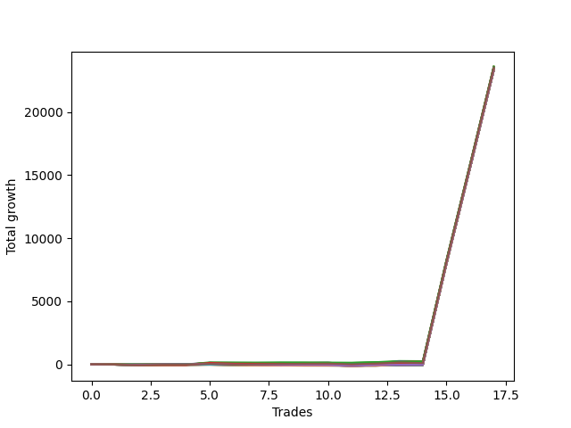

# Short Wallace Doodle 014 
- Symbol: NQ
- Date Range: 3/19/22 - 5/22/22
- Trading Period: 7:20-12:30
- Number of Trades: 17


| Name | Win Percent | Profit | Avg Profit / Trade |     | Name | Win Percent | Profit | Avg Profit / Trade |
| ---- | ----------- | ------ | ------------------ | --- | ---- | ----------- | ------ | ------------------ |
| Sorted By <br> Profit | | | | | Sorted By <br> Win Percentage ||||
| Thirty-Four | 58.82 | 11772000.00 | 692470.59 |     | Two | 82.35 | 11724250.00 | 689661.76 |
| Three | 76.47 | 11768750.00 | 692279.41 |     | Three | 76.47 | 11768750.00 | 692279.41 |
| Four | 70.59 | 11758625.00 | 691683.82 |     | Four | 70.59 | 11758625.00 | 691683.82 |
| Two | 82.35 | 11724250.00 | 689661.76 |     | Eleven | 70.59 | 11700500.00 | 688264.71 |
| Eleven | 70.59 | 11700500.00 | 688264.71 |     | Nine | 70.59 | 11700500.00 | 688264.71 |
| Nine | 70.59 | 11700500.00 | 688264.71 |     | Seven | 70.59 | 11700500.00 | 688264.71 |
| Seven | 70.59 | 11700500.00 | 688264.71 |     | One | 70.59 | 11674875.00 | 686757.35 |
| Thirty-Five | 41.18 | 11697250.00 | 688073.53 |     | Thirteen | 64.71 | 11696750.00 | 688044.12 |
| Thirteen | 64.71 | 11696750.00 | 688044.12 |     | Seventeen | 64.71 | 11696250.00 | 688014.71 |
| Seventeen | 64.71 | 11696250.00 | 688014.71 |     | Fifteen | 64.71 | 11696250.00 | 688014.71 |
| Fifteen | 64.71 | 11696250.00 | 688014.71 |     | Thirty-Four | 58.82 | 11772000.00 | 692470.59 |
| Thirty-Three | 58.82 | 11692125.00 | 687772.06 |     | Thirty-Three | 58.82 | 11692125.00 | 687772.06 |
| Thirty-One | 58.82 | 11692125.00 | 687772.06 |     | Thirty-One | 58.82 | 11692125.00 | 687772.06 |
| Twenty-Nine | 58.82 | 11692125.00 | 687772.06 |     | Twenty-Nine | 58.82 | 11692125.00 | 687772.06 |
| Twenty-Eight | 58.82 | 11692125.00 | 687772.06 |     | Twenty-Eight | 58.82 | 11692125.00 | 687772.06 |
| Twenty-Seven | 58.82 | 11692125.00 | 687772.06 |     | Twenty-Seven | 58.82 | 11692125.00 | 687772.06 |
| Twenty-Six | 58.82 | 11692125.00 | 687772.06 |     | Twenty-Six | 58.82 | 11692125.00 | 687772.06 |
| Twenty-Five | 58.82 | 11692125.00 | 687772.06 |     | Twenty-Five | 58.82 | 11692125.00 | 687772.06 |
| Twenty-Four | 58.82 | 11692125.00 | 687772.06 |     | Twenty-Four | 58.82 | 11692125.00 | 687772.06 |
| Thirty-Two | 58.82 | 11689625.00 | 687625.00 |     | Thirty-Two | 58.82 | 11689625.00 | 687625.00 |
| Thirty | 58.82 | 11689625.00 | 687625.00 |     | Thirty | 58.82 | 11689625.00 | 687625.00 |
| Nineteen | 52.94 | 11687500.00 | 687500.00 |     | Five | 58.82 | 11668875.00 | 686404.41 |
| Twenty-Three | 52.94 | 11686250.00 | 687426.47 |     | Nineteen | 52.94 | 11687500.00 | 687500.00 |
| Twenty-One | 52.94 | 11686250.00 | 687426.47 |     | Twenty-Three | 52.94 | 11686250.00 | 687426.47 |
| One | 70.59 | 11674875.00 | 686757.35 |     | Twenty-One | 52.94 | 11686250.00 | 687426.47 |
| Thirty-Six | 52.94 | 11673375.00 | 686669.12 |     | Thirty-Six | 52.94 | 11673375.00 | 686669.12 |
| Five | 58.82 | 11668875.00 | 686404.41 |     | Thirty-Five | 41.18 | 11697250.00 | 688073.53 |
| Ten | 35.29 | 11662500.00 | 686029.41 |     | Ten | 35.29 | 11662500.00 | 686029.41 |
| Eight | 35.29 | 11662500.00 | 686029.41 |     | Eight | 35.29 | 11662500.00 | 686029.41 |
| Six | 35.29 | 11662500.00 | 686029.41 |     | Six | 35.29 | 11662500.00 | 686029.41 |
| Twelve | 35.29 | 11659125.00 | 685830.88 |     | Twelve | 35.29 | 11659125.00 | 685830.88 |
| Sixteen | 35.29 | 11658625.00 | 685801.47 |     | Sixteen | 35.29 | 11658625.00 | 685801.47 |
| Fourteen | 35.29 | 11658625.00 | 685801.47 |     | Fourteen | 35.29 | 11658625.00 | 685801.47 |
| Eighteen | 35.29 | 11654750.00 | 685573.53 |     | Eighteen | 35.29 | 11654750.00 | 685573.53 |
| Twenty-Two | 35.29 | 11653500.00 | 685500.00 |     | Twenty-Two | 35.29 | 11653500.00 | 685500.00 |
| Twenty | 35.29 | 11653500.00 | 685500.00 |     | Twenty | 35.29 | 11653500.00 | 685500.00 |

### Test One
* Sell when price hits the middle line of the 20p bollinger
* No Stoploss
* Results:
```
Total Trades: 17
Percent Up: 29.41
Percent Down: 70.59
Total Points Moved Down: 23349.75
Potential Profit: 11674875.00
Total Points Ups: 173.75 Count Ups: 5
Total Points Downs: 23523.50 Count Downs: 12
```

<details><summary>Trades</summary>

<code>In: 2022-03-28 11:12:00		Out: 2022-03-28 11:12:10		Total Position Time: 00:10		Total Move Down: 7.25		Total to Date: -7.25</code> <br />
<code>In: 2022-03-28 11:50:00		Out: 2022-03-28 12:12:55		Total Position Time: 22:55		Total Move Down: -33.75		Total to Date: 26.50</code> <br />
<code>In: 2022-03-29 08:52:00		Out: 2022-03-29 08:56:30		Total Position Time: 04:30		Total Move Down: 9.50		Total to Date: 17.00</code> <br />
<code>In: 2022-03-29 10:50:00		Out: 2022-03-29 11:04:05		Total Position Time: 14:05		Total Move Down: 0.75		Total to Date: 16.25</code> <br />
<code>In: 2022-04-06 11:05:00		Out: 2022-04-06 11:06:05		Total Position Time: 01:05		Total Move Down: 39.50		Total to Date: -23.25</code> <br />
<code>In: 2022-04-07 11:57:00		Out: 2022-04-07 12:20:05		Total Position Time: 23:05		Total Move Down: -55.75		Total to Date: 32.50</code> <br />
<code>In: 2022-04-08 07:33:00		Out: 2022-04-08 07:38:35		Total Position Time: 05:35		Total Move Down: 22.50		Total to Date: 10.00</code> <br />
<code>In: 2022-04-08 07:33:00		Out: 2022-04-08 07:38:35		Total Position Time: 05:35		Total Move Down: 22.50		Total to Date: -12.50</code> <br />
<code>In: 2022-04-18 11:28:00		Out: 2022-04-18 11:40:45		Total Position Time: 12:45		Total Move Down: -3.00		Total to Date: -9.50</code> <br />
<code>In: 2022-04-25 09:28:00		Out: 2022-04-25 09:31:05		Total Position Time: 03:05		Total Move Down: 15.00		Total to Date: -24.50</code> <br />
<code>In: 2022-05-10 10:37:00		Out: 2022-05-10 11:05:55		Total Position Time: 28:55		Total Move Down: -79.50		Total to Date: 55.00</code> <br />
<code>In: 2022-05-16 09:05:00		Out: 2022-05-16 09:06:00		Total Position Time: 01:00		Total Move Down: 21.75		Total to Date: 33.25</code> <br />
<code>In: 2022-05-24 09:18:00		Out: 2022-05-24 09:21:30		Total Position Time: 03:30		Total Move Down: 31.75		Total to Date: 1.50</code> <br />
<code>In: 2022-05-24 10:43:00		Out: 2022-05-24 10:57:50		Total Position Time: 14:50		Total Move Down: -1.75		Total to Date: 3.25</code> <br />
<code>In: 2022-06-10 12:29:00		Out: 2022-06-10 12:29:10		Total Position Time: 00:10		Total Move Down: 8014.00		Total to Date: -8010.75</code> <br />
<code>In: 2022-06-14 10:12:00		Out: 2022-06-14 10:12:10		Total Position Time: 00:10		Total Move Down: 7614.25		Total to Date: -15625.00</code> <br />
<code>In: 2022-06-15 08:59:00		Out: 2022-06-15 08:59:10		Total Position Time: 00:10		Total Move Down: 7724.75		Total to Date: -23349.75</code> <br />


</details>

### Test Two
* Sell when the price hits the lower line of the 20p 1std bollinger
* No Stoploss
* Results:
```
Total Trades: 17
Percent Up: 17.65
Percent Down: 82.35
Total Points Moved Down: 23448.50
Potential Profit: 11724250.00
Total Points Ups: 145.25 Count Ups: 3
Total Points Downs: 23593.75 Count Downs: 14
```

<details><summary>Trades</summary>

<code>In: 2022-03-28 11:12:00		Out: 2022-03-28 11:19:20		Total Position Time: 07:20		Total Move Down: 8.50		Total to Date: -8.50</code> <br />
<code>In: 2022-03-28 11:50:00		Out: 2022-03-28 12:19:55		Total Position Time: 29:55		Total Move Down: -39.75		Total to Date: 31.25</code> <br />
<code>In: 2022-03-29 08:52:00		Out: 2022-03-29 08:58:40		Total Position Time: 06:40		Total Move Down: 17.75		Total to Date: 13.50</code> <br />
<code>In: 2022-03-29 10:50:00		Out: 2022-03-29 11:06:05		Total Position Time: 16:05		Total Move Down: 2.25		Total to Date: 11.25</code> <br />
<code>In: 2022-04-06 11:05:00		Out: 2022-04-06 11:07:25		Total Position Time: 02:25		Total Move Down: 62.25		Total to Date: -51.00</code> <br />
<code>In: 2022-04-07 11:57:00		Out: 2022-04-07 12:21:20		Total Position Time: 24:20		Total Move Down: -38.75		Total to Date: -12.25</code> <br />
<code>In: 2022-04-08 07:33:00		Out: 2022-04-08 07:44:30		Total Position Time: 11:30		Total Move Down: 26.50		Total to Date: -38.75</code> <br />
<code>In: 2022-04-08 07:33:00		Out: 2022-04-08 07:44:30		Total Position Time: 11:30		Total Move Down: 26.50		Total to Date: -65.25</code> <br />
<code>In: 2022-04-18 11:28:00		Out: 2022-04-18 11:41:15		Total Position Time: 13:15		Total Move Down: 8.50		Total to Date: -73.75</code> <br />
<code>In: 2022-04-25 09:28:00		Out: 2022-04-25 09:45:00		Total Position Time: 17:00		Total Move Down: 7.00		Total to Date: -80.75</code> <br />
<code>In: 2022-05-10 10:37:00		Out: 2022-05-10 11:06:35		Total Position Time: 29:35		Total Move Down: -66.75		Total to Date: -14.00</code> <br />
<code>In: 2022-05-16 09:05:00		Out: 2022-05-16 09:06:25		Total Position Time: 01:25		Total Move Down: 32.25		Total to Date: -46.25</code> <br />
<code>In: 2022-05-24 09:18:00		Out: 2022-05-24 09:26:40		Total Position Time: 08:40		Total Move Down: 43.25		Total to Date: -89.50</code> <br />
<code>In: 2022-05-24 10:43:00		Out: 2022-05-24 11:01:15		Total Position Time: 18:15		Total Move Down: 6.00		Total to Date: -95.50</code> <br />
<code>In: 2022-06-10 12:29:00		Out: 2022-06-10 12:29:10		Total Position Time: 00:10		Total Move Down: 8014.00		Total to Date: -8109.50</code> <br />
<code>In: 2022-06-14 10:12:00		Out: 2022-06-14 10:12:10		Total Position Time: 00:10		Total Move Down: 7614.25		Total to Date: -15723.75</code> <br />
<code>In: 2022-06-15 08:59:00		Out: 2022-06-15 08:59:10		Total Position Time: 00:10		Total Move Down: 7724.75		Total to Date: -23448.50</code> <br />


</details>

### Test Three
* Sell when the price hits the lower line of the 20p 2std bollinger
* No Stoploss
* Results:
```
Total Trades: 17
Percent Up: 23.53
Percent Down: 76.47
Total Points Moved Down: 23537.50
Potential Profit: 11768750.00
Total Points Ups: 166.25 Count Ups: 4
Total Points Downs: 23703.75 Count Downs: 13
```

<details><summary>Trades</summary>

<code>In: 2022-03-28 11:12:00		Out: 2022-03-28 11:41:55		Total Position Time: 29:55		Total Move Down: -19.25		Total to Date: 19.25</code> <br />
<code>In: 2022-03-28 11:50:00		Out: 2022-03-28 12:19:55		Total Position Time: 29:55		Total Move Down: -39.75		Total to Date: 59.00</code> <br />
<code>In: 2022-03-29 08:52:00		Out: 2022-03-29 09:01:35		Total Position Time: 09:35		Total Move Down: 27.50		Total to Date: 31.50</code> <br />
<code>In: 2022-03-29 10:50:00		Out: 2022-03-29 11:06:20		Total Position Time: 16:20		Total Move Down: 6.25		Total to Date: 25.25</code> <br />
<code>In: 2022-04-06 11:05:00		Out: 2022-04-06 11:08:25		Total Position Time: 03:25		Total Move Down: 91.25		Total to Date: -66.00</code> <br />
<code>In: 2022-04-07 11:57:00		Out: 2022-04-07 12:26:55		Total Position Time: 29:55		Total Move Down: -48.25		Total to Date: -17.75</code> <br />
<code>In: 2022-04-08 07:33:00		Out: 2022-04-08 07:45:45		Total Position Time: 12:45		Total Move Down: 36.75		Total to Date: -54.50</code> <br />
<code>In: 2022-04-08 07:33:00		Out: 2022-04-08 07:45:45		Total Position Time: 12:45		Total Move Down: 36.75		Total to Date: -91.25</code> <br />
<code>In: 2022-04-18 11:28:00		Out: 2022-04-18 11:43:10		Total Position Time: 15:10		Total Move Down: 7.00		Total to Date: -98.25</code> <br />
<code>In: 2022-04-25 09:28:00		Out: 2022-04-25 09:57:55		Total Position Time: 29:55		Total Move Down: 12.25		Total to Date: -110.50</code> <br />
<code>In: 2022-05-10 10:37:00		Out: 2022-05-10 11:06:55		Total Position Time: 29:55		Total Move Down: -59.00		Total to Date: -51.50</code> <br />
<code>In: 2022-05-16 09:05:00		Out: 2022-05-16 09:11:35		Total Position Time: 06:35		Total Move Down: 40.00		Total to Date: -91.50</code> <br />
<code>In: 2022-05-24 09:18:00		Out: 2022-05-24 09:32:40		Total Position Time: 14:40		Total Move Down: 74.25		Total to Date: -165.75</code> <br />
<code>In: 2022-05-24 10:43:00		Out: 2022-05-24 11:01:40		Total Position Time: 18:40		Total Move Down: 18.75		Total to Date: -184.50</code> <br />
<code>In: 2022-06-10 12:29:00		Out: 2022-06-10 12:29:10		Total Position Time: 00:10		Total Move Down: 8014.00		Total to Date: -8198.50</code> <br />
<code>In: 2022-06-14 10:12:00		Out: 2022-06-14 10:12:10		Total Position Time: 00:10		Total Move Down: 7614.25		Total to Date: -15812.75</code> <br />
<code>In: 2022-06-15 08:59:00		Out: 2022-06-15 08:59:10		Total Position Time: 00:10		Total Move Down: 7724.75		Total to Date: -23537.50</code> <br />


</details>

### Test Four
* Sell when the price hits the middle line of the 1std VWAP
* No Stoploss
* Results:
```
Total Trades: 17
Percent Up: 29.41
Percent Down: 70.59
Total Points Moved Down: 23517.25
Potential Profit: 11758625.00
Total Points Ups: 220.25 Count Ups: 5
Total Points Downs: 23737.50 Count Downs: 12
```

<details><summary>Trades</summary>

<code>In: 2022-03-28 11:12:00		Out: 2022-03-28 11:41:55		Total Position Time: 29:55		Total Move Down: -19.25		Total to Date: 19.25</code> <br />
<code>In: 2022-03-28 11:50:00		Out: 2022-03-28 12:19:55		Total Position Time: 29:55		Total Move Down: -39.75		Total to Date: 59.00</code> <br />
<code>In: 2022-03-29 08:52:00		Out: 2022-03-29 09:02:10		Total Position Time: 10:10		Total Move Down: 39.25		Total to Date: 19.75</code> <br />
<code>In: 2022-03-29 10:50:00		Out: 2022-03-29 11:19:55		Total Position Time: 29:55		Total Move Down: 9.25		Total to Date: 10.50</code> <br />
<code>In: 2022-04-06 11:05:00		Out: 2022-04-06 11:08:10		Total Position Time: 03:10		Total Move Down: 86.25		Total to Date: -75.75</code> <br />
<code>In: 2022-04-07 11:57:00		Out: 2022-04-07 12:26:55		Total Position Time: 29:55		Total Move Down: -48.25		Total to Date: -27.50</code> <br />
<code>In: 2022-04-08 07:33:00		Out: 2022-04-08 07:45:10		Total Position Time: 12:10		Total Move Down: 35.00		Total to Date: -62.50</code> <br />
<code>In: 2022-04-08 07:33:00		Out: 2022-04-08 07:45:10		Total Position Time: 12:10		Total Move Down: 35.00		Total to Date: -97.50</code> <br />
<code>In: 2022-04-18 11:28:00		Out: 2022-04-18 11:57:55		Total Position Time: 29:55		Total Move Down: 16.00		Total to Date: -113.50</code> <br />
<code>In: 2022-04-25 09:28:00		Out: 2022-04-25 09:57:55		Total Position Time: 29:55		Total Move Down: 12.25		Total to Date: -125.75</code> <br />
<code>In: 2022-05-10 10:37:00		Out: 2022-05-10 11:06:55		Total Position Time: 29:55		Total Move Down: -59.00		Total to Date: -66.75</code> <br />
<code>In: 2022-05-16 09:05:00		Out: 2022-05-16 09:17:45		Total Position Time: 12:45		Total Move Down: 56.50		Total to Date: -123.25</code> <br />
<code>In: 2022-05-24 09:18:00		Out: 2022-05-24 09:36:50		Total Position Time: 18:50		Total Move Down: 95.00		Total to Date: -218.25</code> <br />
<code>In: 2022-05-24 10:43:00		Out: 2022-05-24 11:12:55		Total Position Time: 29:55		Total Move Down: -54.00		Total to Date: -164.25</code> <br />
<code>In: 2022-06-10 12:29:00		Out: 2022-06-10 12:29:10		Total Position Time: 00:10		Total Move Down: 8014.00		Total to Date: -8178.25</code> <br />
<code>In: 2022-06-14 10:12:00		Out: 2022-06-14 10:12:10		Total Position Time: 00:10		Total Move Down: 7614.25		Total to Date: -15792.50</code> <br />
<code>In: 2022-06-15 08:59:00		Out: 2022-06-15 08:59:10		Total Position Time: 00:10		Total Move Down: 7724.75		Total to Date: -23517.25</code> <br />


</details>

### Test Five
* Sell when the price hits the lower line of the 1std VWAP
* No Stoploss
* Results:
```
Total Trades: 17
Percent Up: 41.18
Percent Down: 58.82
Total Points Moved Down: 23337.75
Potential Profit: 11668875.00
Total Points Ups: 371.75 Count Ups: 7
Total Points Downs: 23709.50 Count Downs: 10
```

<details><summary>Trades</summary>

<code>In: 2022-03-28 11:12:00		Out: 2022-03-28 11:41:55		Total Position Time: 29:55		Total Move Down: -19.25		Total to Date: 19.25</code> <br />
<code>In: 2022-03-28 11:50:00		Out: 2022-03-28 12:19:55		Total Position Time: 29:55		Total Move Down: -39.75		Total to Date: 59.00</code> <br />
<code>In: 2022-03-29 08:52:00		Out: 2022-03-29 09:21:55		Total Position Time: 29:55		Total Move Down: 24.00		Total to Date: 35.00</code> <br />
<code>In: 2022-03-29 10:50:00		Out: 2022-03-29 11:19:55		Total Position Time: 29:55		Total Move Down: 9.25		Total to Date: 25.75</code> <br />
<code>In: 2022-04-06 11:05:00		Out: 2022-04-06 11:13:00		Total Position Time: 08:00		Total Move Down: 135.75		Total to Date: -110.00</code> <br />
<code>In: 2022-04-07 11:57:00		Out: 2022-04-07 12:26:55		Total Position Time: 29:55		Total Move Down: -48.25		Total to Date: -61.75</code> <br />
<code>In: 2022-04-08 07:33:00		Out: 2022-04-08 08:02:55		Total Position Time: 29:55		Total Move Down: -75.75		Total to Date: 14.00</code> <br />
<code>In: 2022-04-08 07:33:00		Out: 2022-04-08 08:02:55		Total Position Time: 29:55		Total Move Down: -75.75		Total to Date: 89.75</code> <br />
<code>In: 2022-04-18 11:28:00		Out: 2022-04-18 11:57:55		Total Position Time: 29:55		Total Move Down: 16.00		Total to Date: 73.75</code> <br />
<code>In: 2022-04-25 09:28:00		Out: 2022-04-25 09:57:55		Total Position Time: 29:55		Total Move Down: 12.25		Total to Date: 61.50</code> <br />
<code>In: 2022-05-10 10:37:00		Out: 2022-05-10 11:06:55		Total Position Time: 29:55		Total Move Down: -59.00		Total to Date: 120.50</code> <br />
<code>In: 2022-05-16 09:05:00		Out: 2022-05-16 09:34:55		Total Position Time: 29:55		Total Move Down: 54.75		Total to Date: 65.75</code> <br />
<code>In: 2022-05-24 09:18:00		Out: 2022-05-24 09:47:55		Total Position Time: 29:55		Total Move Down: 104.50		Total to Date: -38.75</code> <br />
<code>In: 2022-05-24 10:43:00		Out: 2022-05-24 11:12:55		Total Position Time: 29:55		Total Move Down: -54.00		Total to Date: 15.25</code> <br />
<code>In: 2022-06-10 12:29:00		Out: 2022-06-10 12:29:10		Total Position Time: 00:10		Total Move Down: 8014.00		Total to Date: -7998.75</code> <br />
<code>In: 2022-06-14 10:12:00		Out: 2022-06-14 10:12:10		Total Position Time: 00:10		Total Move Down: 7614.25		Total to Date: -15613.00</code> <br />
<code>In: 2022-06-15 08:59:00		Out: 2022-06-15 08:59:10		Total Position Time: 00:10		Total Move Down: 7724.75		Total to Date: -23337.75</code> <br />


</details>

### Test Six
* Sell when the price hits the middle line of the 20p bollinger
* Stoploss is -2 points
* Results:
```
Total Trades: 17
Percent Up: 64.71
Percent Down: 35.29
Total Points Moved Down: 23325.00
Potential Profit: 11662500.00
Total Points Ups: 51.75 Count Ups: 11
Total Points Downs: 23376.75 Count Downs: 6
```

<details><summary>Trades</summary>

<code>In: 2022-03-28 11:12:00		Out: 2022-03-28 11:12:10		Total Position Time: 00:10		Total Move Down: 7.25		Total to Date: -7.25</code> <br />
<code>In: 2022-03-28 11:50:00		Out: 2022-03-28 11:51:25		Total Position Time: 01:25		Total Move Down: -10.75		Total to Date: 3.50</code> <br />
<code>In: 2022-03-29 08:52:00		Out: 2022-03-29 08:53:10		Total Position Time: 01:10		Total Move Down: -0.25		Total to Date: 3.75</code> <br />
<code>In: 2022-03-29 10:50:00		Out: 2022-03-29 10:50:10		Total Position Time: 00:10		Total Move Down: -1.75		Total to Date: 5.50</code> <br />
<code>In: 2022-04-06 11:05:00		Out: 2022-04-06 11:05:10		Total Position Time: 00:10		Total Move Down: 15.00		Total to Date: -9.50</code> <br />
<code>In: 2022-04-07 11:57:00		Out: 2022-04-07 11:57:45		Total Position Time: 00:45		Total Move Down: -7.50		Total to Date: -2.00</code> <br />
<code>In: 2022-04-08 07:33:00		Out: 2022-04-08 07:34:05		Total Position Time: 01:05		Total Move Down: -6.25		Total to Date: 4.25</code> <br />
<code>In: 2022-04-08 07:33:00		Out: 2022-04-08 07:34:05		Total Position Time: 01:05		Total Move Down: -6.25		Total to Date: 10.50</code> <br />
<code>In: 2022-04-18 11:28:00		Out: 2022-04-18 11:29:50		Total Position Time: 01:50		Total Move Down: -1.75		Total to Date: 12.25</code> <br />
<code>In: 2022-04-25 09:28:00		Out: 2022-04-25 09:28:10		Total Position Time: 00:10		Total Move Down: -2.25		Total to Date: 14.50</code> <br />
<code>In: 2022-05-10 10:37:00		Out: 2022-05-10 10:37:35		Total Position Time: 00:35		Total Move Down: -11.00		Total to Date: 25.50</code> <br />
<code>In: 2022-05-16 09:05:00		Out: 2022-05-16 09:05:10		Total Position Time: 00:10		Total Move Down: 1.50		Total to Date: 24.00</code> <br />
<code>In: 2022-05-24 09:18:00		Out: 2022-05-24 09:18:10		Total Position Time: 00:10		Total Move Down: -0.25		Total to Date: 24.25</code> <br />
<code>In: 2022-05-24 10:43:00		Out: 2022-05-24 10:44:20		Total Position Time: 01:20		Total Move Down: -3.75		Total to Date: 28.00</code> <br />
<code>In: 2022-06-10 12:29:00		Out: 2022-06-10 12:29:10		Total Position Time: 00:10		Total Move Down: 8014.00		Total to Date: -7986.00</code> <br />
<code>In: 2022-06-14 10:12:00		Out: 2022-06-14 10:12:10		Total Position Time: 00:10		Total Move Down: 7614.25		Total to Date: -15600.25</code> <br />
<code>In: 2022-06-15 08:59:00		Out: 2022-06-15 08:59:10		Total Position Time: 00:10		Total Move Down: 7724.75		Total to Date: -23325.00</code> <br />


</details>

### Test Seven
* Sell when the price hits the middle line of the 20p bollinger
* Trailing Stop is -2 points
* Results:
```
Total Trades: 17
Percent Up: 29.41
Percent Down: 70.59
Total Points Moved Down: 23401.00
Potential Profit: 11700500.00
Total Points Ups: 15.25 Count Ups: 5
Total Points Downs: 23416.25 Count Downs: 12
```

<details><summary>Trades</summary>

<code>In: 2022-03-28 11:12:00		Out: 2022-03-28 11:12:10		Total Position Time: 00:10		Total Move Down: 7.25		Total to Date: -7.25</code> <br />
<code>In: 2022-03-28 11:50:00		Out: 2022-03-28 11:50:15		Total Position Time: 00:15		Total Move Down: -7.75		Total to Date: 0.50</code> <br />
<code>In: 2022-03-29 08:52:00		Out: 2022-03-29 08:52:20		Total Position Time: 00:20		Total Move Down: 2.25		Total to Date: -1.75</code> <br />
<code>In: 2022-03-29 10:50:00		Out: 2022-03-29 10:50:10		Total Position Time: 00:10		Total Move Down: -1.75		Total to Date: -0.00</code> <br />
<code>In: 2022-04-06 11:05:00		Out: 2022-04-06 11:05:10		Total Position Time: 00:10		Total Move Down: 15.00		Total to Date: -15.00</code> <br />
<code>In: 2022-04-07 11:57:00		Out: 2022-04-07 11:57:25		Total Position Time: 00:25		Total Move Down: -3.25		Total to Date: -11.75</code> <br />
<code>In: 2022-04-08 07:33:00		Out: 2022-04-08 07:33:45		Total Position Time: 00:45		Total Move Down: 13.50		Total to Date: -25.25</code> <br />
<code>In: 2022-04-08 07:33:00		Out: 2022-04-08 07:33:45		Total Position Time: 00:45		Total Move Down: 13.50		Total to Date: -38.75</code> <br />
<code>In: 2022-04-18 11:28:00		Out: 2022-04-18 11:28:35		Total Position Time: 00:35		Total Move Down: 5.75		Total to Date: -44.50</code> <br />
<code>In: 2022-04-25 09:28:00		Out: 2022-04-25 09:28:10		Total Position Time: 00:10		Total Move Down: -2.25		Total to Date: -42.25</code> <br />
<code>In: 2022-05-10 10:37:00		Out: 2022-05-10 10:37:25		Total Position Time: 00:25		Total Move Down: 1.25		Total to Date: -43.50</code> <br />
<code>In: 2022-05-16 09:05:00		Out: 2022-05-16 09:05:10		Total Position Time: 00:10		Total Move Down: 1.50		Total to Date: -45.00</code> <br />
<code>In: 2022-05-24 09:18:00		Out: 2022-05-24 09:18:10		Total Position Time: 00:10		Total Move Down: -0.25		Total to Date: -44.75</code> <br />
<code>In: 2022-05-24 10:43:00		Out: 2022-05-24 10:43:15		Total Position Time: 00:15		Total Move Down: 3.25		Total to Date: -48.00</code> <br />
<code>In: 2022-06-10 12:29:00		Out: 2022-06-10 12:29:10		Total Position Time: 00:10		Total Move Down: 8014.00		Total to Date: -8062.00</code> <br />
<code>In: 2022-06-14 10:12:00		Out: 2022-06-14 10:12:10		Total Position Time: 00:10		Total Move Down: 7614.25		Total to Date: -15676.25</code> <br />
<code>In: 2022-06-15 08:59:00		Out: 2022-06-15 08:59:10		Total Position Time: 00:10		Total Move Down: 7724.75		Total to Date: -23401.00</code> <br />


</details>

### Test Eight
* Sell when the price hits the lower line of the 20p 1std bollinger
* Stoploss is -2 points
* Results:
```
Total Trades: 17
Percent Up: 64.71
Percent Down: 35.29
Total Points Moved Down: 23325.00
Potential Profit: 11662500.00
Total Points Ups: 51.75 Count Ups: 11
Total Points Downs: 23376.75 Count Downs: 6
```

<details><summary>Trades</summary>

<code>In: 2022-03-28 11:12:00		Out: 2022-03-28 11:12:10		Total Position Time: 00:10		Total Move Down: 7.25		Total to Date: -7.25</code> <br />
<code>In: 2022-03-28 11:50:00		Out: 2022-03-28 11:51:25		Total Position Time: 01:25		Total Move Down: -10.75		Total to Date: 3.50</code> <br />
<code>In: 2022-03-29 08:52:00		Out: 2022-03-29 08:53:10		Total Position Time: 01:10		Total Move Down: -0.25		Total to Date: 3.75</code> <br />
<code>In: 2022-03-29 10:50:00		Out: 2022-03-29 10:50:10		Total Position Time: 00:10		Total Move Down: -1.75		Total to Date: 5.50</code> <br />
<code>In: 2022-04-06 11:05:00		Out: 2022-04-06 11:05:10		Total Position Time: 00:10		Total Move Down: 15.00		Total to Date: -9.50</code> <br />
<code>In: 2022-04-07 11:57:00		Out: 2022-04-07 11:57:45		Total Position Time: 00:45		Total Move Down: -7.50		Total to Date: -2.00</code> <br />
<code>In: 2022-04-08 07:33:00		Out: 2022-04-08 07:34:05		Total Position Time: 01:05		Total Move Down: -6.25		Total to Date: 4.25</code> <br />
<code>In: 2022-04-08 07:33:00		Out: 2022-04-08 07:34:05		Total Position Time: 01:05		Total Move Down: -6.25		Total to Date: 10.50</code> <br />
<code>In: 2022-04-18 11:28:00		Out: 2022-04-18 11:29:50		Total Position Time: 01:50		Total Move Down: -1.75		Total to Date: 12.25</code> <br />
<code>In: 2022-04-25 09:28:00		Out: 2022-04-25 09:28:10		Total Position Time: 00:10		Total Move Down: -2.25		Total to Date: 14.50</code> <br />
<code>In: 2022-05-10 10:37:00		Out: 2022-05-10 10:37:35		Total Position Time: 00:35		Total Move Down: -11.00		Total to Date: 25.50</code> <br />
<code>In: 2022-05-16 09:05:00		Out: 2022-05-16 09:05:10		Total Position Time: 00:10		Total Move Down: 1.50		Total to Date: 24.00</code> <br />
<code>In: 2022-05-24 09:18:00		Out: 2022-05-24 09:18:10		Total Position Time: 00:10		Total Move Down: -0.25		Total to Date: 24.25</code> <br />
<code>In: 2022-05-24 10:43:00		Out: 2022-05-24 10:44:20		Total Position Time: 01:20		Total Move Down: -3.75		Total to Date: 28.00</code> <br />
<code>In: 2022-06-10 12:29:00		Out: 2022-06-10 12:29:10		Total Position Time: 00:10		Total Move Down: 8014.00		Total to Date: -7986.00</code> <br />
<code>In: 2022-06-14 10:12:00		Out: 2022-06-14 10:12:10		Total Position Time: 00:10		Total Move Down: 7614.25		Total to Date: -15600.25</code> <br />
<code>In: 2022-06-15 08:59:00		Out: 2022-06-15 08:59:10		Total Position Time: 00:10		Total Move Down: 7724.75		Total to Date: -23325.00</code> <br />


</details>

### Test Nine
* Sell when the price hits the lower line of the 20p 1std bollinger
* Trailing Stop is -2 points
* Results:
```
Total Trades: 17
Percent Up: 29.41
Percent Down: 70.59
Total Points Moved Down: 23401.00
Potential Profit: 11700500.00
Total Points Ups: 15.25 Count Ups: 5
Total Points Downs: 23416.25 Count Downs: 12
```

<details><summary>Trades</summary>

<code>In: 2022-03-28 11:12:00		Out: 2022-03-28 11:12:10		Total Position Time: 00:10		Total Move Down: 7.25		Total to Date: -7.25</code> <br />
<code>In: 2022-03-28 11:50:00		Out: 2022-03-28 11:50:15		Total Position Time: 00:15		Total Move Down: -7.75		Total to Date: 0.50</code> <br />
<code>In: 2022-03-29 08:52:00		Out: 2022-03-29 08:52:20		Total Position Time: 00:20		Total Move Down: 2.25		Total to Date: -1.75</code> <br />
<code>In: 2022-03-29 10:50:00		Out: 2022-03-29 10:50:10		Total Position Time: 00:10		Total Move Down: -1.75		Total to Date: -0.00</code> <br />
<code>In: 2022-04-06 11:05:00		Out: 2022-04-06 11:05:10		Total Position Time: 00:10		Total Move Down: 15.00		Total to Date: -15.00</code> <br />
<code>In: 2022-04-07 11:57:00		Out: 2022-04-07 11:57:25		Total Position Time: 00:25		Total Move Down: -3.25		Total to Date: -11.75</code> <br />
<code>In: 2022-04-08 07:33:00		Out: 2022-04-08 07:33:45		Total Position Time: 00:45		Total Move Down: 13.50		Total to Date: -25.25</code> <br />
<code>In: 2022-04-08 07:33:00		Out: 2022-04-08 07:33:45		Total Position Time: 00:45		Total Move Down: 13.50		Total to Date: -38.75</code> <br />
<code>In: 2022-04-18 11:28:00		Out: 2022-04-18 11:28:35		Total Position Time: 00:35		Total Move Down: 5.75		Total to Date: -44.50</code> <br />
<code>In: 2022-04-25 09:28:00		Out: 2022-04-25 09:28:10		Total Position Time: 00:10		Total Move Down: -2.25		Total to Date: -42.25</code> <br />
<code>In: 2022-05-10 10:37:00		Out: 2022-05-10 10:37:25		Total Position Time: 00:25		Total Move Down: 1.25		Total to Date: -43.50</code> <br />
<code>In: 2022-05-16 09:05:00		Out: 2022-05-16 09:05:10		Total Position Time: 00:10		Total Move Down: 1.50		Total to Date: -45.00</code> <br />
<code>In: 2022-05-24 09:18:00		Out: 2022-05-24 09:18:10		Total Position Time: 00:10		Total Move Down: -0.25		Total to Date: -44.75</code> <br />
<code>In: 2022-05-24 10:43:00		Out: 2022-05-24 10:43:15		Total Position Time: 00:15		Total Move Down: 3.25		Total to Date: -48.00</code> <br />
<code>In: 2022-06-10 12:29:00		Out: 2022-06-10 12:29:10		Total Position Time: 00:10		Total Move Down: 8014.00		Total to Date: -8062.00</code> <br />
<code>In: 2022-06-14 10:12:00		Out: 2022-06-14 10:12:10		Total Position Time: 00:10		Total Move Down: 7614.25		Total to Date: -15676.25</code> <br />
<code>In: 2022-06-15 08:59:00		Out: 2022-06-15 08:59:10		Total Position Time: 00:10		Total Move Down: 7724.75		Total to Date: -23401.00</code> <br />


</details>

### Test Ten
* Sell when the price hits the lower line of the 20p 2std bollinger
* Stoploss is -2 points
* Results:
```
Total Trades: 17
Percent Up: 64.71
Percent Down: 35.29
Total Points Moved Down: 23325.00
Potential Profit: 11662500.00
Total Points Ups: 51.75 Count Ups: 11
Total Points Downs: 23376.75 Count Downs: 6
```

<details><summary>Trades</summary>

<code>In: 2022-03-28 11:12:00		Out: 2022-03-28 11:12:10		Total Position Time: 00:10		Total Move Down: 7.25		Total to Date: -7.25</code> <br />
<code>In: 2022-03-28 11:50:00		Out: 2022-03-28 11:51:25		Total Position Time: 01:25		Total Move Down: -10.75		Total to Date: 3.50</code> <br />
<code>In: 2022-03-29 08:52:00		Out: 2022-03-29 08:53:10		Total Position Time: 01:10		Total Move Down: -0.25		Total to Date: 3.75</code> <br />
<code>In: 2022-03-29 10:50:00		Out: 2022-03-29 10:50:10		Total Position Time: 00:10		Total Move Down: -1.75		Total to Date: 5.50</code> <br />
<code>In: 2022-04-06 11:05:00		Out: 2022-04-06 11:05:10		Total Position Time: 00:10		Total Move Down: 15.00		Total to Date: -9.50</code> <br />
<code>In: 2022-04-07 11:57:00		Out: 2022-04-07 11:57:45		Total Position Time: 00:45		Total Move Down: -7.50		Total to Date: -2.00</code> <br />
<code>In: 2022-04-08 07:33:00		Out: 2022-04-08 07:34:05		Total Position Time: 01:05		Total Move Down: -6.25		Total to Date: 4.25</code> <br />
<code>In: 2022-04-08 07:33:00		Out: 2022-04-08 07:34:05		Total Position Time: 01:05		Total Move Down: -6.25		Total to Date: 10.50</code> <br />
<code>In: 2022-04-18 11:28:00		Out: 2022-04-18 11:29:50		Total Position Time: 01:50		Total Move Down: -1.75		Total to Date: 12.25</code> <br />
<code>In: 2022-04-25 09:28:00		Out: 2022-04-25 09:28:10		Total Position Time: 00:10		Total Move Down: -2.25		Total to Date: 14.50</code> <br />
<code>In: 2022-05-10 10:37:00		Out: 2022-05-10 10:37:35		Total Position Time: 00:35		Total Move Down: -11.00		Total to Date: 25.50</code> <br />
<code>In: 2022-05-16 09:05:00		Out: 2022-05-16 09:05:10		Total Position Time: 00:10		Total Move Down: 1.50		Total to Date: 24.00</code> <br />
<code>In: 2022-05-24 09:18:00		Out: 2022-05-24 09:18:10		Total Position Time: 00:10		Total Move Down: -0.25		Total to Date: 24.25</code> <br />
<code>In: 2022-05-24 10:43:00		Out: 2022-05-24 10:44:20		Total Position Time: 01:20		Total Move Down: -3.75		Total to Date: 28.00</code> <br />
<code>In: 2022-06-10 12:29:00		Out: 2022-06-10 12:29:10		Total Position Time: 00:10		Total Move Down: 8014.00		Total to Date: -7986.00</code> <br />
<code>In: 2022-06-14 10:12:00		Out: 2022-06-14 10:12:10		Total Position Time: 00:10		Total Move Down: 7614.25		Total to Date: -15600.25</code> <br />
<code>In: 2022-06-15 08:59:00		Out: 2022-06-15 08:59:10		Total Position Time: 00:10		Total Move Down: 7724.75		Total to Date: -23325.00</code> <br />


</details>

### Test Eleven
* Sell when the price hits the lower line of the 20p 2std bollinger
* Trailing Stop is -2 points
* Results:
```
Total Trades: 17
Percent Up: 29.41
Percent Down: 70.59
Total Points Moved Down: 23401.00
Potential Profit: 11700500.00
Total Points Ups: 15.25 Count Ups: 5
Total Points Downs: 23416.25 Count Downs: 12
```

<details><summary>Trades</summary>

<code>In: 2022-03-28 11:12:00		Out: 2022-03-28 11:12:10		Total Position Time: 00:10		Total Move Down: 7.25		Total to Date: -7.25</code> <br />
<code>In: 2022-03-28 11:50:00		Out: 2022-03-28 11:50:15		Total Position Time: 00:15		Total Move Down: -7.75		Total to Date: 0.50</code> <br />
<code>In: 2022-03-29 08:52:00		Out: 2022-03-29 08:52:20		Total Position Time: 00:20		Total Move Down: 2.25		Total to Date: -1.75</code> <br />
<code>In: 2022-03-29 10:50:00		Out: 2022-03-29 10:50:10		Total Position Time: 00:10		Total Move Down: -1.75		Total to Date: -0.00</code> <br />
<code>In: 2022-04-06 11:05:00		Out: 2022-04-06 11:05:10		Total Position Time: 00:10		Total Move Down: 15.00		Total to Date: -15.00</code> <br />
<code>In: 2022-04-07 11:57:00		Out: 2022-04-07 11:57:25		Total Position Time: 00:25		Total Move Down: -3.25		Total to Date: -11.75</code> <br />
<code>In: 2022-04-08 07:33:00		Out: 2022-04-08 07:33:45		Total Position Time: 00:45		Total Move Down: 13.50		Total to Date: -25.25</code> <br />
<code>In: 2022-04-08 07:33:00		Out: 2022-04-08 07:33:45		Total Position Time: 00:45		Total Move Down: 13.50		Total to Date: -38.75</code> <br />
<code>In: 2022-04-18 11:28:00		Out: 2022-04-18 11:28:35		Total Position Time: 00:35		Total Move Down: 5.75		Total to Date: -44.50</code> <br />
<code>In: 2022-04-25 09:28:00		Out: 2022-04-25 09:28:10		Total Position Time: 00:10		Total Move Down: -2.25		Total to Date: -42.25</code> <br />
<code>In: 2022-05-10 10:37:00		Out: 2022-05-10 10:37:25		Total Position Time: 00:25		Total Move Down: 1.25		Total to Date: -43.50</code> <br />
<code>In: 2022-05-16 09:05:00		Out: 2022-05-16 09:05:10		Total Position Time: 00:10		Total Move Down: 1.50		Total to Date: -45.00</code> <br />
<code>In: 2022-05-24 09:18:00		Out: 2022-05-24 09:18:10		Total Position Time: 00:10		Total Move Down: -0.25		Total to Date: -44.75</code> <br />
<code>In: 2022-05-24 10:43:00		Out: 2022-05-24 10:43:15		Total Position Time: 00:15		Total Move Down: 3.25		Total to Date: -48.00</code> <br />
<code>In: 2022-06-10 12:29:00		Out: 2022-06-10 12:29:10		Total Position Time: 00:10		Total Move Down: 8014.00		Total to Date: -8062.00</code> <br />
<code>In: 2022-06-14 10:12:00		Out: 2022-06-14 10:12:10		Total Position Time: 00:10		Total Move Down: 7614.25		Total to Date: -15676.25</code> <br />
<code>In: 2022-06-15 08:59:00		Out: 2022-06-15 08:59:10		Total Position Time: 00:10		Total Move Down: 7724.75		Total to Date: -23401.00</code> <br />


</details>

### Test Twelve
* Sell when the price hits the middle line of the 20p bollinger
* Stoploss is -3 points
* Results:
```
Total Trades: 17
Percent Up: 64.71
Percent Down: 35.29
Total Points Moved Down: 23318.25
Potential Profit: 11659125.00
Total Points Ups: 58.50 Count Ups: 11
Total Points Downs: 23376.75 Count Downs: 6
```

<details><summary>Trades</summary>

<code>In: 2022-03-28 11:12:00		Out: 2022-03-28 11:12:10		Total Position Time: 00:10		Total Move Down: 7.25		Total to Date: -7.25</code> <br />
<code>In: 2022-03-28 11:50:00		Out: 2022-03-28 11:51:50		Total Position Time: 01:50		Total Move Down: -13.50		Total to Date: 6.25</code> <br />
<code>In: 2022-03-29 08:52:00		Out: 2022-03-29 08:53:10		Total Position Time: 01:10		Total Move Down: -0.25		Total to Date: 6.50</code> <br />
<code>In: 2022-03-29 10:50:00		Out: 2022-03-29 10:50:10		Total Position Time: 00:10		Total Move Down: -1.75		Total to Date: 8.25</code> <br />
<code>In: 2022-04-06 11:05:00		Out: 2022-04-06 11:05:10		Total Position Time: 00:10		Total Move Down: 15.00		Total to Date: -6.75</code> <br />
<code>In: 2022-04-07 11:57:00		Out: 2022-04-07 11:58:20		Total Position Time: 01:20		Total Move Down: -10.00		Total to Date: 3.25</code> <br />
<code>In: 2022-04-08 07:33:00		Out: 2022-04-08 07:34:05		Total Position Time: 01:05		Total Move Down: -6.25		Total to Date: 9.50</code> <br />
<code>In: 2022-04-08 07:33:00		Out: 2022-04-08 07:34:05		Total Position Time: 01:05		Total Move Down: -6.25		Total to Date: 15.75</code> <br />
<code>In: 2022-04-18 11:28:00		Out: 2022-04-18 11:30:15		Total Position Time: 02:15		Total Move Down: -3.25		Total to Date: 19.00</code> <br />
<code>In: 2022-04-25 09:28:00		Out: 2022-04-25 09:28:10		Total Position Time: 00:10		Total Move Down: -2.25		Total to Date: 21.25</code> <br />
<code>In: 2022-05-10 10:37:00		Out: 2022-05-10 10:37:35		Total Position Time: 00:35		Total Move Down: -11.00		Total to Date: 32.25</code> <br />
<code>In: 2022-05-16 09:05:00		Out: 2022-05-16 09:05:10		Total Position Time: 00:10		Total Move Down: 1.50		Total to Date: 30.75</code> <br />
<code>In: 2022-05-24 09:18:00		Out: 2022-05-24 09:18:10		Total Position Time: 00:10		Total Move Down: -0.25		Total to Date: 31.00</code> <br />
<code>In: 2022-05-24 10:43:00		Out: 2022-05-24 10:44:20		Total Position Time: 01:20		Total Move Down: -3.75		Total to Date: 34.75</code> <br />
<code>In: 2022-06-10 12:29:00		Out: 2022-06-10 12:29:10		Total Position Time: 00:10		Total Move Down: 8014.00		Total to Date: -7979.25</code> <br />
<code>In: 2022-06-14 10:12:00		Out: 2022-06-14 10:12:10		Total Position Time: 00:10		Total Move Down: 7614.25		Total to Date: -15593.50</code> <br />
<code>In: 2022-06-15 08:59:00		Out: 2022-06-15 08:59:10		Total Position Time: 00:10		Total Move Down: 7724.75		Total to Date: -23318.25</code> <br />


</details>

### Test Thirteen
* Sell when the price hits the middle line of the 20p bollinger
* Trailing Stop is -3 points
* Results:
```
Total Trades: 17
Percent Up: 35.29
Percent Down: 64.71
Total Points Moved Down: 23393.50
Potential Profit: 11696750.00
Total Points Ups: 21.75 Count Ups: 6
Total Points Downs: 23415.25 Count Downs: 11
```

<details><summary>Trades</summary>

<code>In: 2022-03-28 11:12:00		Out: 2022-03-28 11:12:10		Total Position Time: 00:10		Total Move Down: 7.25		Total to Date: -7.25</code> <br />
<code>In: 2022-03-28 11:50:00		Out: 2022-03-28 11:50:40		Total Position Time: 00:40		Total Move Down: -9.25		Total to Date: 2.00</code> <br />
<code>In: 2022-03-29 08:52:00		Out: 2022-03-29 08:52:50		Total Position Time: 00:50		Total Move Down: 1.50		Total to Date: 0.50</code> <br />
<code>In: 2022-03-29 10:50:00		Out: 2022-03-29 10:50:10		Total Position Time: 00:10		Total Move Down: -1.75		Total to Date: 2.25</code> <br />
<code>In: 2022-04-06 11:05:00		Out: 2022-04-06 11:05:10		Total Position Time: 00:10		Total Move Down: 15.00		Total to Date: -12.75</code> <br />
<code>In: 2022-04-07 11:57:00		Out: 2022-04-07 11:57:30		Total Position Time: 00:30		Total Move Down: -7.00		Total to Date: -5.75</code> <br />
<code>In: 2022-04-08 07:33:00		Out: 2022-04-08 07:33:45		Total Position Time: 00:45		Total Move Down: 13.50		Total to Date: -19.25</code> <br />
<code>In: 2022-04-08 07:33:00		Out: 2022-04-08 07:33:45		Total Position Time: 00:45		Total Move Down: 13.50		Total to Date: -32.75</code> <br />
<code>In: 2022-04-18 11:28:00		Out: 2022-04-18 11:28:35		Total Position Time: 00:35		Total Move Down: 5.75		Total to Date: -38.50</code> <br />
<code>In: 2022-04-25 09:28:00		Out: 2022-04-25 09:28:10		Total Position Time: 00:10		Total Move Down: -2.25		Total to Date: -36.25</code> <br />
<code>In: 2022-05-10 10:37:00		Out: 2022-05-10 10:37:30		Total Position Time: 00:30		Total Move Down: -1.25		Total to Date: -35.00</code> <br />
<code>In: 2022-05-16 09:05:00		Out: 2022-05-16 09:05:10		Total Position Time: 00:10		Total Move Down: 1.50		Total to Date: -36.50</code> <br />
<code>In: 2022-05-24 09:18:00		Out: 2022-05-24 09:18:10		Total Position Time: 00:10		Total Move Down: -0.25		Total to Date: -36.25</code> <br />
<code>In: 2022-05-24 10:43:00		Out: 2022-05-24 10:43:30		Total Position Time: 00:30		Total Move Down: 4.25		Total to Date: -40.50</code> <br />
<code>In: 2022-06-10 12:29:00		Out: 2022-06-10 12:29:10		Total Position Time: 00:10		Total Move Down: 8014.00		Total to Date: -8054.50</code> <br />
<code>In: 2022-06-14 10:12:00		Out: 2022-06-14 10:12:10		Total Position Time: 00:10		Total Move Down: 7614.25		Total to Date: -15668.75</code> <br />
<code>In: 2022-06-15 08:59:00		Out: 2022-06-15 08:59:10		Total Position Time: 00:10		Total Move Down: 7724.75		Total to Date: -23393.50</code> <br />


</details>

### Test Fourteen
* Sell when the price hits the lower line of the 20p 1std bollinger
* Stoploss is -3 points
* Results:
```
Total Trades: 17
Percent Up: 64.71
Percent Down: 35.29
Total Points Moved Down: 23317.25
Potential Profit: 11658625.00
Total Points Ups: 58.50 Count Ups: 11
Total Points Downs: 23375.75 Count Downs: 6
```

<details><summary>Trades</summary>

<code>In: 2022-03-28 11:12:00		Out: 2022-03-28 11:12:15		Total Position Time: 00:15		Total Move Down: 6.25		Total to Date: -6.25</code> <br />
<code>In: 2022-03-28 11:50:00		Out: 2022-03-28 11:51:50		Total Position Time: 01:50		Total Move Down: -13.50		Total to Date: 7.25</code> <br />
<code>In: 2022-03-29 08:52:00		Out: 2022-03-29 08:53:10		Total Position Time: 01:10		Total Move Down: -0.25		Total to Date: 7.50</code> <br />
<code>In: 2022-03-29 10:50:00		Out: 2022-03-29 10:50:10		Total Position Time: 00:10		Total Move Down: -1.75		Total to Date: 9.25</code> <br />
<code>In: 2022-04-06 11:05:00		Out: 2022-04-06 11:05:10		Total Position Time: 00:10		Total Move Down: 15.00		Total to Date: -5.75</code> <br />
<code>In: 2022-04-07 11:57:00		Out: 2022-04-07 11:58:20		Total Position Time: 01:20		Total Move Down: -10.00		Total to Date: 4.25</code> <br />
<code>In: 2022-04-08 07:33:00		Out: 2022-04-08 07:34:05		Total Position Time: 01:05		Total Move Down: -6.25		Total to Date: 10.50</code> <br />
<code>In: 2022-04-08 07:33:00		Out: 2022-04-08 07:34:05		Total Position Time: 01:05		Total Move Down: -6.25		Total to Date: 16.75</code> <br />
<code>In: 2022-04-18 11:28:00		Out: 2022-04-18 11:30:15		Total Position Time: 02:15		Total Move Down: -3.25		Total to Date: 20.00</code> <br />
<code>In: 2022-04-25 09:28:00		Out: 2022-04-25 09:28:10		Total Position Time: 00:10		Total Move Down: -2.25		Total to Date: 22.25</code> <br />
<code>In: 2022-05-10 10:37:00		Out: 2022-05-10 10:37:35		Total Position Time: 00:35		Total Move Down: -11.00		Total to Date: 33.25</code> <br />
<code>In: 2022-05-16 09:05:00		Out: 2022-05-16 09:05:10		Total Position Time: 00:10		Total Move Down: 1.50		Total to Date: 31.75</code> <br />
<code>In: 2022-05-24 09:18:00		Out: 2022-05-24 09:18:10		Total Position Time: 00:10		Total Move Down: -0.25		Total to Date: 32.00</code> <br />
<code>In: 2022-05-24 10:43:00		Out: 2022-05-24 10:44:20		Total Position Time: 01:20		Total Move Down: -3.75		Total to Date: 35.75</code> <br />
<code>In: 2022-06-10 12:29:00		Out: 2022-06-10 12:29:10		Total Position Time: 00:10		Total Move Down: 8014.00		Total to Date: -7978.25</code> <br />
<code>In: 2022-06-14 10:12:00		Out: 2022-06-14 10:12:10		Total Position Time: 00:10		Total Move Down: 7614.25		Total to Date: -15592.50</code> <br />
<code>In: 2022-06-15 08:59:00		Out: 2022-06-15 08:59:10		Total Position Time: 00:10		Total Move Down: 7724.75		Total to Date: -23317.25</code> <br />


</details>

### Test Fifteen
* Sell when the price hits the lower line of the 20p 1std bollinger
* Trailing Stop is -3 points
* Results:
```
Total Trades: 17
Percent Up: 35.29
Percent Down: 64.71
Total Points Moved Down: 23392.50
Potential Profit: 11696250.00
Total Points Ups: 21.75 Count Ups: 6
Total Points Downs: 23414.25 Count Downs: 11
```

<details><summary>Trades</summary>

<code>In: 2022-03-28 11:12:00		Out: 2022-03-28 11:12:15		Total Position Time: 00:15		Total Move Down: 6.25		Total to Date: -6.25</code> <br />
<code>In: 2022-03-28 11:50:00		Out: 2022-03-28 11:50:40		Total Position Time: 00:40		Total Move Down: -9.25		Total to Date: 3.00</code> <br />
<code>In: 2022-03-29 08:52:00		Out: 2022-03-29 08:52:50		Total Position Time: 00:50		Total Move Down: 1.50		Total to Date: 1.50</code> <br />
<code>In: 2022-03-29 10:50:00		Out: 2022-03-29 10:50:10		Total Position Time: 00:10		Total Move Down: -1.75		Total to Date: 3.25</code> <br />
<code>In: 2022-04-06 11:05:00		Out: 2022-04-06 11:05:10		Total Position Time: 00:10		Total Move Down: 15.00		Total to Date: -11.75</code> <br />
<code>In: 2022-04-07 11:57:00		Out: 2022-04-07 11:57:30		Total Position Time: 00:30		Total Move Down: -7.00		Total to Date: -4.75</code> <br />
<code>In: 2022-04-08 07:33:00		Out: 2022-04-08 07:33:45		Total Position Time: 00:45		Total Move Down: 13.50		Total to Date: -18.25</code> <br />
<code>In: 2022-04-08 07:33:00		Out: 2022-04-08 07:33:45		Total Position Time: 00:45		Total Move Down: 13.50		Total to Date: -31.75</code> <br />
<code>In: 2022-04-18 11:28:00		Out: 2022-04-18 11:28:35		Total Position Time: 00:35		Total Move Down: 5.75		Total to Date: -37.50</code> <br />
<code>In: 2022-04-25 09:28:00		Out: 2022-04-25 09:28:10		Total Position Time: 00:10		Total Move Down: -2.25		Total to Date: -35.25</code> <br />
<code>In: 2022-05-10 10:37:00		Out: 2022-05-10 10:37:30		Total Position Time: 00:30		Total Move Down: -1.25		Total to Date: -34.00</code> <br />
<code>In: 2022-05-16 09:05:00		Out: 2022-05-16 09:05:10		Total Position Time: 00:10		Total Move Down: 1.50		Total to Date: -35.50</code> <br />
<code>In: 2022-05-24 09:18:00		Out: 2022-05-24 09:18:10		Total Position Time: 00:10		Total Move Down: -0.25		Total to Date: -35.25</code> <br />
<code>In: 2022-05-24 10:43:00		Out: 2022-05-24 10:43:30		Total Position Time: 00:30		Total Move Down: 4.25		Total to Date: -39.50</code> <br />
<code>In: 2022-06-10 12:29:00		Out: 2022-06-10 12:29:10		Total Position Time: 00:10		Total Move Down: 8014.00		Total to Date: -8053.50</code> <br />
<code>In: 2022-06-14 10:12:00		Out: 2022-06-14 10:12:10		Total Position Time: 00:10		Total Move Down: 7614.25		Total to Date: -15667.75</code> <br />
<code>In: 2022-06-15 08:59:00		Out: 2022-06-15 08:59:10		Total Position Time: 00:10		Total Move Down: 7724.75		Total to Date: -23392.50</code> <br />


</details>

### Test Sixteen
* Sell when the price hits the lower line of the 20p 2std bollinger
* Stoploss is -3 points
* Results:
```
Total Trades: 17
Percent Up: 64.71
Percent Down: 35.29
Total Points Moved Down: 23317.25
Potential Profit: 11658625.00
Total Points Ups: 58.50 Count Ups: 11
Total Points Downs: 23375.75 Count Downs: 6
```

<details><summary>Trades</summary>

<code>In: 2022-03-28 11:12:00		Out: 2022-03-28 11:12:15		Total Position Time: 00:15		Total Move Down: 6.25		Total to Date: -6.25</code> <br />
<code>In: 2022-03-28 11:50:00		Out: 2022-03-28 11:51:50		Total Position Time: 01:50		Total Move Down: -13.50		Total to Date: 7.25</code> <br />
<code>In: 2022-03-29 08:52:00		Out: 2022-03-29 08:53:10		Total Position Time: 01:10		Total Move Down: -0.25		Total to Date: 7.50</code> <br />
<code>In: 2022-03-29 10:50:00		Out: 2022-03-29 10:50:10		Total Position Time: 00:10		Total Move Down: -1.75		Total to Date: 9.25</code> <br />
<code>In: 2022-04-06 11:05:00		Out: 2022-04-06 11:05:10		Total Position Time: 00:10		Total Move Down: 15.00		Total to Date: -5.75</code> <br />
<code>In: 2022-04-07 11:57:00		Out: 2022-04-07 11:58:20		Total Position Time: 01:20		Total Move Down: -10.00		Total to Date: 4.25</code> <br />
<code>In: 2022-04-08 07:33:00		Out: 2022-04-08 07:34:05		Total Position Time: 01:05		Total Move Down: -6.25		Total to Date: 10.50</code> <br />
<code>In: 2022-04-08 07:33:00		Out: 2022-04-08 07:34:05		Total Position Time: 01:05		Total Move Down: -6.25		Total to Date: 16.75</code> <br />
<code>In: 2022-04-18 11:28:00		Out: 2022-04-18 11:30:15		Total Position Time: 02:15		Total Move Down: -3.25		Total to Date: 20.00</code> <br />
<code>In: 2022-04-25 09:28:00		Out: 2022-04-25 09:28:10		Total Position Time: 00:10		Total Move Down: -2.25		Total to Date: 22.25</code> <br />
<code>In: 2022-05-10 10:37:00		Out: 2022-05-10 10:37:35		Total Position Time: 00:35		Total Move Down: -11.00		Total to Date: 33.25</code> <br />
<code>In: 2022-05-16 09:05:00		Out: 2022-05-16 09:05:10		Total Position Time: 00:10		Total Move Down: 1.50		Total to Date: 31.75</code> <br />
<code>In: 2022-05-24 09:18:00		Out: 2022-05-24 09:18:10		Total Position Time: 00:10		Total Move Down: -0.25		Total to Date: 32.00</code> <br />
<code>In: 2022-05-24 10:43:00		Out: 2022-05-24 10:44:20		Total Position Time: 01:20		Total Move Down: -3.75		Total to Date: 35.75</code> <br />
<code>In: 2022-06-10 12:29:00		Out: 2022-06-10 12:29:10		Total Position Time: 00:10		Total Move Down: 8014.00		Total to Date: -7978.25</code> <br />
<code>In: 2022-06-14 10:12:00		Out: 2022-06-14 10:12:10		Total Position Time: 00:10		Total Move Down: 7614.25		Total to Date: -15592.50</code> <br />
<code>In: 2022-06-15 08:59:00		Out: 2022-06-15 08:59:10		Total Position Time: 00:10		Total Move Down: 7724.75		Total to Date: -23317.25</code> <br />


</details>

### Test Seventeen
* Sell when the price hits the lower line of the 20p 2std bollinger
* Trailing Stop is -3 points
* Results:
```
Total Trades: 17
Percent Up: 35.29
Percent Down: 64.71
Total Points Moved Down: 23392.50
Potential Profit: 11696250.00
Total Points Ups: 21.75 Count Ups: 6
Total Points Downs: 23414.25 Count Downs: 11
```

<details><summary>Trades</summary>

<code>In: 2022-03-28 11:12:00		Out: 2022-03-28 11:12:15		Total Position Time: 00:15		Total Move Down: 6.25		Total to Date: -6.25</code> <br />
<code>In: 2022-03-28 11:50:00		Out: 2022-03-28 11:50:40		Total Position Time: 00:40		Total Move Down: -9.25		Total to Date: 3.00</code> <br />
<code>In: 2022-03-29 08:52:00		Out: 2022-03-29 08:52:50		Total Position Time: 00:50		Total Move Down: 1.50		Total to Date: 1.50</code> <br />
<code>In: 2022-03-29 10:50:00		Out: 2022-03-29 10:50:10		Total Position Time: 00:10		Total Move Down: -1.75		Total to Date: 3.25</code> <br />
<code>In: 2022-04-06 11:05:00		Out: 2022-04-06 11:05:10		Total Position Time: 00:10		Total Move Down: 15.00		Total to Date: -11.75</code> <br />
<code>In: 2022-04-07 11:57:00		Out: 2022-04-07 11:57:30		Total Position Time: 00:30		Total Move Down: -7.00		Total to Date: -4.75</code> <br />
<code>In: 2022-04-08 07:33:00		Out: 2022-04-08 07:33:45		Total Position Time: 00:45		Total Move Down: 13.50		Total to Date: -18.25</code> <br />
<code>In: 2022-04-08 07:33:00		Out: 2022-04-08 07:33:45		Total Position Time: 00:45		Total Move Down: 13.50		Total to Date: -31.75</code> <br />
<code>In: 2022-04-18 11:28:00		Out: 2022-04-18 11:28:35		Total Position Time: 00:35		Total Move Down: 5.75		Total to Date: -37.50</code> <br />
<code>In: 2022-04-25 09:28:00		Out: 2022-04-25 09:28:10		Total Position Time: 00:10		Total Move Down: -2.25		Total to Date: -35.25</code> <br />
<code>In: 2022-05-10 10:37:00		Out: 2022-05-10 10:37:30		Total Position Time: 00:30		Total Move Down: -1.25		Total to Date: -34.00</code> <br />
<code>In: 2022-05-16 09:05:00		Out: 2022-05-16 09:05:10		Total Position Time: 00:10		Total Move Down: 1.50		Total to Date: -35.50</code> <br />
<code>In: 2022-05-24 09:18:00		Out: 2022-05-24 09:18:10		Total Position Time: 00:10		Total Move Down: -0.25		Total to Date: -35.25</code> <br />
<code>In: 2022-05-24 10:43:00		Out: 2022-05-24 10:43:30		Total Position Time: 00:30		Total Move Down: 4.25		Total to Date: -39.50</code> <br />
<code>In: 2022-06-10 12:29:00		Out: 2022-06-10 12:29:10		Total Position Time: 00:10		Total Move Down: 8014.00		Total to Date: -8053.50</code> <br />
<code>In: 2022-06-14 10:12:00		Out: 2022-06-14 10:12:10		Total Position Time: 00:10		Total Move Down: 7614.25		Total to Date: -15667.75</code> <br />
<code>In: 2022-06-15 08:59:00		Out: 2022-06-15 08:59:10		Total Position Time: 00:10		Total Move Down: 7724.75		Total to Date: -23392.50</code> <br />


</details>

### Test Eighteen
* Sell when the price hits the middle line of the 20p bollinger
* Stoploss is -5 points
* Results:
```
Total Trades: 17
Percent Up: 64.71
Percent Down: 35.29
Total Points Moved Down: 23309.50
Potential Profit: 11654750.00
Total Points Ups: 67.25 Count Ups: 11
Total Points Downs: 23376.75 Count Downs: 6
```

<details><summary>Trades</summary>

<code>In: 2022-03-28 11:12:00		Out: 2022-03-28 11:12:10		Total Position Time: 00:10		Total Move Down: 7.25		Total to Date: -7.25</code> <br />
<code>In: 2022-03-28 11:50:00		Out: 2022-03-28 11:51:55		Total Position Time: 01:55		Total Move Down: -15.00		Total to Date: 7.75</code> <br />
<code>In: 2022-03-29 08:52:00		Out: 2022-03-29 08:53:15		Total Position Time: 01:15		Total Move Down: -3.75		Total to Date: 11.50</code> <br />
<code>In: 2022-03-29 10:50:00		Out: 2022-03-29 10:50:10		Total Position Time: 00:10		Total Move Down: -1.75		Total to Date: 13.25</code> <br />
<code>In: 2022-04-06 11:05:00		Out: 2022-04-06 11:05:10		Total Position Time: 00:10		Total Move Down: 15.00		Total to Date: -1.75</code> <br />
<code>In: 2022-04-07 11:57:00		Out: 2022-04-07 11:59:00		Total Position Time: 02:00		Total Move Down: -10.75		Total to Date: 9.00</code> <br />
<code>In: 2022-04-08 07:33:00		Out: 2022-04-08 07:34:05		Total Position Time: 01:05		Total Move Down: -6.25		Total to Date: 15.25</code> <br />
<code>In: 2022-04-08 07:33:00		Out: 2022-04-08 07:34:05		Total Position Time: 01:05		Total Move Down: -6.25		Total to Date: 21.50</code> <br />
<code>In: 2022-04-18 11:28:00		Out: 2022-04-18 11:31:00		Total Position Time: 03:00		Total Move Down: -6.25		Total to Date: 27.75</code> <br />
<code>In: 2022-04-25 09:28:00		Out: 2022-04-25 09:28:10		Total Position Time: 00:10		Total Move Down: -2.25		Total to Date: 30.00</code> <br />
<code>In: 2022-05-10 10:37:00		Out: 2022-05-10 10:37:35		Total Position Time: 00:35		Total Move Down: -11.00		Total to Date: 41.00</code> <br />
<code>In: 2022-05-16 09:05:00		Out: 2022-05-16 09:05:10		Total Position Time: 00:10		Total Move Down: 1.50		Total to Date: 39.50</code> <br />
<code>In: 2022-05-24 09:18:00		Out: 2022-05-24 09:18:10		Total Position Time: 00:10		Total Move Down: -0.25		Total to Date: 39.75</code> <br />
<code>In: 2022-05-24 10:43:00		Out: 2022-05-24 10:44:20		Total Position Time: 01:20		Total Move Down: -3.75		Total to Date: 43.50</code> <br />
<code>In: 2022-06-10 12:29:00		Out: 2022-06-10 12:29:10		Total Position Time: 00:10		Total Move Down: 8014.00		Total to Date: -7970.50</code> <br />
<code>In: 2022-06-14 10:12:00		Out: 2022-06-14 10:12:10		Total Position Time: 00:10		Total Move Down: 7614.25		Total to Date: -15584.75</code> <br />
<code>In: 2022-06-15 08:59:00		Out: 2022-06-15 08:59:10		Total Position Time: 00:10		Total Move Down: 7724.75		Total to Date: -23309.50</code> <br />


</details>

### Test Nineteen
* Sell when the price hits the middle line of the 20p bollinger
* Trailing Stop is -5 points
* Results:
```
Total Trades: 17
Percent Up: 47.06
Percent Down: 52.94
Total Points Moved Down: 23375.00
Potential Profit: 11687500.00
Total Points Ups: 30.25 Count Ups: 8
Total Points Downs: 23405.25 Count Downs: 9
```

<details><summary>Trades</summary>

<code>In: 2022-03-28 11:12:00		Out: 2022-03-28 11:12:10		Total Position Time: 00:10		Total Move Down: 7.25		Total to Date: -7.25</code> <br />
<code>In: 2022-03-28 11:50:00		Out: 2022-03-28 11:51:10		Total Position Time: 01:10		Total Move Down: -10.25		Total to Date: 3.00</code> <br />
<code>In: 2022-03-29 08:52:00		Out: 2022-03-29 08:53:15		Total Position Time: 01:15		Total Move Down: -3.75		Total to Date: 6.75</code> <br />
<code>In: 2022-03-29 10:50:00		Out: 2022-03-29 10:50:10		Total Position Time: 00:10		Total Move Down: -1.75		Total to Date: 8.50</code> <br />
<code>In: 2022-04-06 11:05:00		Out: 2022-04-06 11:05:10		Total Position Time: 00:10		Total Move Down: 15.00		Total to Date: -6.50</code> <br />
<code>In: 2022-04-07 11:57:00		Out: 2022-04-07 11:57:30		Total Position Time: 00:30		Total Move Down: -7.00		Total to Date: 0.50</code> <br />
<code>In: 2022-04-08 07:33:00		Out: 2022-04-08 07:33:45		Total Position Time: 00:45		Total Move Down: 13.50		Total to Date: -13.00</code> <br />
<code>In: 2022-04-08 07:33:00		Out: 2022-04-08 07:33:45		Total Position Time: 00:45		Total Move Down: 13.50		Total to Date: -26.50</code> <br />
<code>In: 2022-04-18 11:28:00		Out: 2022-04-18 11:28:40		Total Position Time: 00:40		Total Move Down: 1.50		Total to Date: -28.00</code> <br />
<code>In: 2022-04-25 09:28:00		Out: 2022-04-25 09:28:10		Total Position Time: 00:10		Total Move Down: -2.25		Total to Date: -25.75</code> <br />
<code>In: 2022-05-10 10:37:00		Out: 2022-05-10 10:37:30		Total Position Time: 00:30		Total Move Down: -1.25		Total to Date: -24.50</code> <br />
<code>In: 2022-05-16 09:05:00		Out: 2022-05-16 09:05:10		Total Position Time: 00:10		Total Move Down: 1.50		Total to Date: -26.00</code> <br />
<code>In: 2022-05-24 09:18:00		Out: 2022-05-24 09:18:10		Total Position Time: 00:10		Total Move Down: -0.25		Total to Date: -25.75</code> <br />
<code>In: 2022-05-24 10:43:00		Out: 2022-05-24 10:44:20		Total Position Time: 01:20		Total Move Down: -3.75		Total to Date: -22.00</code> <br />
<code>In: 2022-06-10 12:29:00		Out: 2022-06-10 12:29:10		Total Position Time: 00:10		Total Move Down: 8014.00		Total to Date: -8036.00</code> <br />
<code>In: 2022-06-14 10:12:00		Out: 2022-06-14 10:12:10		Total Position Time: 00:10		Total Move Down: 7614.25		Total to Date: -15650.25</code> <br />
<code>In: 2022-06-15 08:59:00		Out: 2022-06-15 08:59:10		Total Position Time: 00:10		Total Move Down: 7724.75		Total to Date: -23375.00</code> <br />


</details>

### Test Twenty
* Sell when the price hits the lower line of the 20p 1std bollinger
* Stoploss is -5 points
* Results:
```
Total Trades: 17
Percent Up: 64.71
Percent Down: 35.29
Total Points Moved Down: 23307.00
Potential Profit: 11653500.00
Total Points Ups: 67.25 Count Ups: 11
Total Points Downs: 23374.25 Count Downs: 6
```

<details><summary>Trades</summary>

<code>In: 2022-03-28 11:12:00		Out: 2022-03-28 11:13:20		Total Position Time: 01:20		Total Move Down: 4.75		Total to Date: -4.75</code> <br />
<code>In: 2022-03-28 11:50:00		Out: 2022-03-28 11:51:55		Total Position Time: 01:55		Total Move Down: -15.00		Total to Date: 10.25</code> <br />
<code>In: 2022-03-29 08:52:00		Out: 2022-03-29 08:53:15		Total Position Time: 01:15		Total Move Down: -3.75		Total to Date: 14.00</code> <br />
<code>In: 2022-03-29 10:50:00		Out: 2022-03-29 10:50:10		Total Position Time: 00:10		Total Move Down: -1.75		Total to Date: 15.75</code> <br />
<code>In: 2022-04-06 11:05:00		Out: 2022-04-06 11:05:10		Total Position Time: 00:10		Total Move Down: 15.00		Total to Date: 0.75</code> <br />
<code>In: 2022-04-07 11:57:00		Out: 2022-04-07 11:59:00		Total Position Time: 02:00		Total Move Down: -10.75		Total to Date: 11.50</code> <br />
<code>In: 2022-04-08 07:33:00		Out: 2022-04-08 07:34:05		Total Position Time: 01:05		Total Move Down: -6.25		Total to Date: 17.75</code> <br />
<code>In: 2022-04-08 07:33:00		Out: 2022-04-08 07:34:05		Total Position Time: 01:05		Total Move Down: -6.25		Total to Date: 24.00</code> <br />
<code>In: 2022-04-18 11:28:00		Out: 2022-04-18 11:31:00		Total Position Time: 03:00		Total Move Down: -6.25		Total to Date: 30.25</code> <br />
<code>In: 2022-04-25 09:28:00		Out: 2022-04-25 09:28:10		Total Position Time: 00:10		Total Move Down: -2.25		Total to Date: 32.50</code> <br />
<code>In: 2022-05-10 10:37:00		Out: 2022-05-10 10:37:35		Total Position Time: 00:35		Total Move Down: -11.00		Total to Date: 43.50</code> <br />
<code>In: 2022-05-16 09:05:00		Out: 2022-05-16 09:05:10		Total Position Time: 00:10		Total Move Down: 1.50		Total to Date: 42.00</code> <br />
<code>In: 2022-05-24 09:18:00		Out: 2022-05-24 09:18:10		Total Position Time: 00:10		Total Move Down: -0.25		Total to Date: 42.25</code> <br />
<code>In: 2022-05-24 10:43:00		Out: 2022-05-24 10:44:20		Total Position Time: 01:20		Total Move Down: -3.75		Total to Date: 46.00</code> <br />
<code>In: 2022-06-10 12:29:00		Out: 2022-06-10 12:29:10		Total Position Time: 00:10		Total Move Down: 8014.00		Total to Date: -7968.00</code> <br />
<code>In: 2022-06-14 10:12:00		Out: 2022-06-14 10:12:10		Total Position Time: 00:10		Total Move Down: 7614.25		Total to Date: -15582.25</code> <br />
<code>In: 2022-06-15 08:59:00		Out: 2022-06-15 08:59:10		Total Position Time: 00:10		Total Move Down: 7724.75		Total to Date: -23307.00</code> <br />


</details>

### Test Twenty-One
* Sell when the price hits the lower line of the 20p 1std bollinger
* Trailing Stop is -5 points
* Results:
```
Total Trades: 17
Percent Up: 47.06
Percent Down: 52.94
Total Points Moved Down: 23372.50
Potential Profit: 11686250.00
Total Points Ups: 30.25 Count Ups: 8
Total Points Downs: 23402.75 Count Downs: 9
```

<details><summary>Trades</summary>

<code>In: 2022-03-28 11:12:00		Out: 2022-03-28 11:13:20		Total Position Time: 01:20		Total Move Down: 4.75		Total to Date: -4.75</code> <br />
<code>In: 2022-03-28 11:50:00		Out: 2022-03-28 11:51:10		Total Position Time: 01:10		Total Move Down: -10.25		Total to Date: 5.50</code> <br />
<code>In: 2022-03-29 08:52:00		Out: 2022-03-29 08:53:15		Total Position Time: 01:15		Total Move Down: -3.75		Total to Date: 9.25</code> <br />
<code>In: 2022-03-29 10:50:00		Out: 2022-03-29 10:50:10		Total Position Time: 00:10		Total Move Down: -1.75		Total to Date: 11.00</code> <br />
<code>In: 2022-04-06 11:05:00		Out: 2022-04-06 11:05:10		Total Position Time: 00:10		Total Move Down: 15.00		Total to Date: -4.00</code> <br />
<code>In: 2022-04-07 11:57:00		Out: 2022-04-07 11:57:30		Total Position Time: 00:30		Total Move Down: -7.00		Total to Date: 3.00</code> <br />
<code>In: 2022-04-08 07:33:00		Out: 2022-04-08 07:33:45		Total Position Time: 00:45		Total Move Down: 13.50		Total to Date: -10.50</code> <br />
<code>In: 2022-04-08 07:33:00		Out: 2022-04-08 07:33:45		Total Position Time: 00:45		Total Move Down: 13.50		Total to Date: -24.00</code> <br />
<code>In: 2022-04-18 11:28:00		Out: 2022-04-18 11:28:40		Total Position Time: 00:40		Total Move Down: 1.50		Total to Date: -25.50</code> <br />
<code>In: 2022-04-25 09:28:00		Out: 2022-04-25 09:28:10		Total Position Time: 00:10		Total Move Down: -2.25		Total to Date: -23.25</code> <br />
<code>In: 2022-05-10 10:37:00		Out: 2022-05-10 10:37:30		Total Position Time: 00:30		Total Move Down: -1.25		Total to Date: -22.00</code> <br />
<code>In: 2022-05-16 09:05:00		Out: 2022-05-16 09:05:10		Total Position Time: 00:10		Total Move Down: 1.50		Total to Date: -23.50</code> <br />
<code>In: 2022-05-24 09:18:00		Out: 2022-05-24 09:18:10		Total Position Time: 00:10		Total Move Down: -0.25		Total to Date: -23.25</code> <br />
<code>In: 2022-05-24 10:43:00		Out: 2022-05-24 10:44:20		Total Position Time: 01:20		Total Move Down: -3.75		Total to Date: -19.50</code> <br />
<code>In: 2022-06-10 12:29:00		Out: 2022-06-10 12:29:10		Total Position Time: 00:10		Total Move Down: 8014.00		Total to Date: -8033.50</code> <br />
<code>In: 2022-06-14 10:12:00		Out: 2022-06-14 10:12:10		Total Position Time: 00:10		Total Move Down: 7614.25		Total to Date: -15647.75</code> <br />
<code>In: 2022-06-15 08:59:00		Out: 2022-06-15 08:59:10		Total Position Time: 00:10		Total Move Down: 7724.75		Total to Date: -23372.50</code> <br />


</details>

### Test Twenty-Two
* Sell when the price hits the lower line of the 20p 2std bollinger
* Stoploss is -5 points
* Results:
```
Total Trades: 17
Percent Up: 64.71
Percent Down: 35.29
Total Points Moved Down: 23307.00
Potential Profit: 11653500.00
Total Points Ups: 67.25 Count Ups: 11
Total Points Downs: 23374.25 Count Downs: 6
```

<details><summary>Trades</summary>

<code>In: 2022-03-28 11:12:00		Out: 2022-03-28 11:13:20		Total Position Time: 01:20		Total Move Down: 4.75		Total to Date: -4.75</code> <br />
<code>In: 2022-03-28 11:50:00		Out: 2022-03-28 11:51:55		Total Position Time: 01:55		Total Move Down: -15.00		Total to Date: 10.25</code> <br />
<code>In: 2022-03-29 08:52:00		Out: 2022-03-29 08:53:15		Total Position Time: 01:15		Total Move Down: -3.75		Total to Date: 14.00</code> <br />
<code>In: 2022-03-29 10:50:00		Out: 2022-03-29 10:50:10		Total Position Time: 00:10		Total Move Down: -1.75		Total to Date: 15.75</code> <br />
<code>In: 2022-04-06 11:05:00		Out: 2022-04-06 11:05:10		Total Position Time: 00:10		Total Move Down: 15.00		Total to Date: 0.75</code> <br />
<code>In: 2022-04-07 11:57:00		Out: 2022-04-07 11:59:00		Total Position Time: 02:00		Total Move Down: -10.75		Total to Date: 11.50</code> <br />
<code>In: 2022-04-08 07:33:00		Out: 2022-04-08 07:34:05		Total Position Time: 01:05		Total Move Down: -6.25		Total to Date: 17.75</code> <br />
<code>In: 2022-04-08 07:33:00		Out: 2022-04-08 07:34:05		Total Position Time: 01:05		Total Move Down: -6.25		Total to Date: 24.00</code> <br />
<code>In: 2022-04-18 11:28:00		Out: 2022-04-18 11:31:00		Total Position Time: 03:00		Total Move Down: -6.25		Total to Date: 30.25</code> <br />
<code>In: 2022-04-25 09:28:00		Out: 2022-04-25 09:28:10		Total Position Time: 00:10		Total Move Down: -2.25		Total to Date: 32.50</code> <br />
<code>In: 2022-05-10 10:37:00		Out: 2022-05-10 10:37:35		Total Position Time: 00:35		Total Move Down: -11.00		Total to Date: 43.50</code> <br />
<code>In: 2022-05-16 09:05:00		Out: 2022-05-16 09:05:10		Total Position Time: 00:10		Total Move Down: 1.50		Total to Date: 42.00</code> <br />
<code>In: 2022-05-24 09:18:00		Out: 2022-05-24 09:18:10		Total Position Time: 00:10		Total Move Down: -0.25		Total to Date: 42.25</code> <br />
<code>In: 2022-05-24 10:43:00		Out: 2022-05-24 10:44:20		Total Position Time: 01:20		Total Move Down: -3.75		Total to Date: 46.00</code> <br />
<code>In: 2022-06-10 12:29:00		Out: 2022-06-10 12:29:10		Total Position Time: 00:10		Total Move Down: 8014.00		Total to Date: -7968.00</code> <br />
<code>In: 2022-06-14 10:12:00		Out: 2022-06-14 10:12:10		Total Position Time: 00:10		Total Move Down: 7614.25		Total to Date: -15582.25</code> <br />
<code>In: 2022-06-15 08:59:00		Out: 2022-06-15 08:59:10		Total Position Time: 00:10		Total Move Down: 7724.75		Total to Date: -23307.00</code> <br />


</details>

### Test Twenty-Three
* Sell when the price hits the lower line of the 20p 2std bollinger
* Trailing Stop is -5 points
* Results:
```
Total Trades: 17
Percent Up: 47.06
Percent Down: 52.94
Total Points Moved Down: 23372.50
Potential Profit: 11686250.00
Total Points Ups: 30.25 Count Ups: 8
Total Points Downs: 23402.75 Count Downs: 9
```

<details><summary>Trades</summary>

<code>In: 2022-03-28 11:12:00		Out: 2022-03-28 11:13:20		Total Position Time: 01:20		Total Move Down: 4.75		Total to Date: -4.75</code> <br />
<code>In: 2022-03-28 11:50:00		Out: 2022-03-28 11:51:10		Total Position Time: 01:10		Total Move Down: -10.25		Total to Date: 5.50</code> <br />
<code>In: 2022-03-29 08:52:00		Out: 2022-03-29 08:53:15		Total Position Time: 01:15		Total Move Down: -3.75		Total to Date: 9.25</code> <br />
<code>In: 2022-03-29 10:50:00		Out: 2022-03-29 10:50:10		Total Position Time: 00:10		Total Move Down: -1.75		Total to Date: 11.00</code> <br />
<code>In: 2022-04-06 11:05:00		Out: 2022-04-06 11:05:10		Total Position Time: 00:10		Total Move Down: 15.00		Total to Date: -4.00</code> <br />
<code>In: 2022-04-07 11:57:00		Out: 2022-04-07 11:57:30		Total Position Time: 00:30		Total Move Down: -7.00		Total to Date: 3.00</code> <br />
<code>In: 2022-04-08 07:33:00		Out: 2022-04-08 07:33:45		Total Position Time: 00:45		Total Move Down: 13.50		Total to Date: -10.50</code> <br />
<code>In: 2022-04-08 07:33:00		Out: 2022-04-08 07:33:45		Total Position Time: 00:45		Total Move Down: 13.50		Total to Date: -24.00</code> <br />
<code>In: 2022-04-18 11:28:00		Out: 2022-04-18 11:28:40		Total Position Time: 00:40		Total Move Down: 1.50		Total to Date: -25.50</code> <br />
<code>In: 2022-04-25 09:28:00		Out: 2022-04-25 09:28:10		Total Position Time: 00:10		Total Move Down: -2.25		Total to Date: -23.25</code> <br />
<code>In: 2022-05-10 10:37:00		Out: 2022-05-10 10:37:30		Total Position Time: 00:30		Total Move Down: -1.25		Total to Date: -22.00</code> <br />
<code>In: 2022-05-16 09:05:00		Out: 2022-05-16 09:05:10		Total Position Time: 00:10		Total Move Down: 1.50		Total to Date: -23.50</code> <br />
<code>In: 2022-05-24 09:18:00		Out: 2022-05-24 09:18:10		Total Position Time: 00:10		Total Move Down: -0.25		Total to Date: -23.25</code> <br />
<code>In: 2022-05-24 10:43:00		Out: 2022-05-24 10:44:20		Total Position Time: 01:20		Total Move Down: -3.75		Total to Date: -19.50</code> <br />
<code>In: 2022-06-10 12:29:00		Out: 2022-06-10 12:29:10		Total Position Time: 00:10		Total Move Down: 8014.00		Total to Date: -8033.50</code> <br />
<code>In: 2022-06-14 10:12:00		Out: 2022-06-14 10:12:10		Total Position Time: 00:10		Total Move Down: 7614.25		Total to Date: -15647.75</code> <br />
<code>In: 2022-06-15 08:59:00		Out: 2022-06-15 08:59:10		Total Position Time: 00:10		Total Move Down: 7724.75		Total to Date: -23372.50</code> <br />


</details>

### Test Twenty-Four
* Sell when the price hits the middle line of the 20p bollinger
* Stoploss is 10 points
* Results:
```
Total Trades: 17
Percent Up: 41.18
Percent Down: 58.82
Total Points Moved Down: 23384.25
Potential Profit: 11692125.00
Total Points Ups: 12.50 Count Ups: 7
Total Points Downs: 23396.75 Count Downs: 10
```

<details><summary>Trades</summary>

<code>In: 2022-03-28 11:12:00		Out: 2022-03-28 11:12:10		Total Position Time: 00:10		Total Move Down: 7.25		Total to Date: -7.25</code> <br />
<code>In: 2022-03-28 11:50:00		Out: 2022-03-28 11:50:10		Total Position Time: 00:10		Total Move Down: -5.50		Total to Date: -1.75</code> <br />
<code>In: 2022-03-29 08:52:00		Out: 2022-03-29 08:52:10		Total Position Time: 00:10		Total Move Down: 4.00		Total to Date: -5.75</code> <br />
<code>In: 2022-03-29 10:50:00		Out: 2022-03-29 10:50:10		Total Position Time: 00:10		Total Move Down: -1.75		Total to Date: -4.00</code> <br />
<code>In: 2022-04-06 11:05:00		Out: 2022-04-06 11:05:10		Total Position Time: 00:10		Total Move Down: 15.00		Total to Date: -19.00</code> <br />
<code>In: 2022-04-07 11:57:00		Out: 2022-04-07 11:57:10		Total Position Time: 00:10		Total Move Down: -2.25		Total to Date: -16.75</code> <br />
<code>In: 2022-04-08 07:33:00		Out: 2022-04-08 07:33:10		Total Position Time: 00:10		Total Move Down: -0.25		Total to Date: -16.50</code> <br />
<code>In: 2022-04-08 07:33:00		Out: 2022-04-08 07:33:10		Total Position Time: 00:10		Total Move Down: -0.25		Total to Date: -16.25</code> <br />
<code>In: 2022-04-18 11:28:00		Out: 2022-04-18 11:28:10		Total Position Time: 00:10		Total Move Down: 7.00		Total to Date: -23.25</code> <br />
<code>In: 2022-04-25 09:28:00		Out: 2022-04-25 09:28:10		Total Position Time: 00:10		Total Move Down: -2.25		Total to Date: -21.00</code> <br />
<code>In: 2022-05-10 10:37:00		Out: 2022-05-10 10:37:10		Total Position Time: 00:10		Total Move Down: 2.75		Total to Date: -23.75</code> <br />
<code>In: 2022-05-16 09:05:00		Out: 2022-05-16 09:05:10		Total Position Time: 00:10		Total Move Down: 1.50		Total to Date: -25.25</code> <br />
<code>In: 2022-05-24 09:18:00		Out: 2022-05-24 09:18:10		Total Position Time: 00:10		Total Move Down: -0.25		Total to Date: -25.00</code> <br />
<code>In: 2022-05-24 10:43:00		Out: 2022-05-24 10:43:10		Total Position Time: 00:10		Total Move Down: 6.25		Total to Date: -31.25</code> <br />
<code>In: 2022-06-10 12:29:00		Out: 2022-06-10 12:29:10		Total Position Time: 00:10		Total Move Down: 8014.00		Total to Date: -8045.25</code> <br />
<code>In: 2022-06-14 10:12:00		Out: 2022-06-14 10:12:10		Total Position Time: 00:10		Total Move Down: 7614.25		Total to Date: -15659.50</code> <br />
<code>In: 2022-06-15 08:59:00		Out: 2022-06-15 08:59:10		Total Position Time: 00:10		Total Move Down: 7724.75		Total to Date: -23384.25</code> <br />


</details>

### Test Twenty-Five
* Sell when the price hits the middle line of the 20p bollinger
* Trailing Stop is 10 points
* Results:
```
Total Trades: 17
Percent Up: 41.18
Percent Down: 58.82
Total Points Moved Down: 23384.25
Potential Profit: 11692125.00
Total Points Ups: 12.50 Count Ups: 7
Total Points Downs: 23396.75 Count Downs: 10
```

<details><summary>Trades</summary>

<code>In: 2022-03-28 11:12:00		Out: 2022-03-28 11:12:10		Total Position Time: 00:10		Total Move Down: 7.25		Total to Date: -7.25</code> <br />
<code>In: 2022-03-28 11:50:00		Out: 2022-03-28 11:50:10		Total Position Time: 00:10		Total Move Down: -5.50		Total to Date: -1.75</code> <br />
<code>In: 2022-03-29 08:52:00		Out: 2022-03-29 08:52:10		Total Position Time: 00:10		Total Move Down: 4.00		Total to Date: -5.75</code> <br />
<code>In: 2022-03-29 10:50:00		Out: 2022-03-29 10:50:10		Total Position Time: 00:10		Total Move Down: -1.75		Total to Date: -4.00</code> <br />
<code>In: 2022-04-06 11:05:00		Out: 2022-04-06 11:05:10		Total Position Time: 00:10		Total Move Down: 15.00		Total to Date: -19.00</code> <br />
<code>In: 2022-04-07 11:57:00		Out: 2022-04-07 11:57:10		Total Position Time: 00:10		Total Move Down: -2.25		Total to Date: -16.75</code> <br />
<code>In: 2022-04-08 07:33:00		Out: 2022-04-08 07:33:10		Total Position Time: 00:10		Total Move Down: -0.25		Total to Date: -16.50</code> <br />
<code>In: 2022-04-08 07:33:00		Out: 2022-04-08 07:33:10		Total Position Time: 00:10		Total Move Down: -0.25		Total to Date: -16.25</code> <br />
<code>In: 2022-04-18 11:28:00		Out: 2022-04-18 11:28:10		Total Position Time: 00:10		Total Move Down: 7.00		Total to Date: -23.25</code> <br />
<code>In: 2022-04-25 09:28:00		Out: 2022-04-25 09:28:10		Total Position Time: 00:10		Total Move Down: -2.25		Total to Date: -21.00</code> <br />
<code>In: 2022-05-10 10:37:00		Out: 2022-05-10 10:37:10		Total Position Time: 00:10		Total Move Down: 2.75		Total to Date: -23.75</code> <br />
<code>In: 2022-05-16 09:05:00		Out: 2022-05-16 09:05:10		Total Position Time: 00:10		Total Move Down: 1.50		Total to Date: -25.25</code> <br />
<code>In: 2022-05-24 09:18:00		Out: 2022-05-24 09:18:10		Total Position Time: 00:10		Total Move Down: -0.25		Total to Date: -25.00</code> <br />
<code>In: 2022-05-24 10:43:00		Out: 2022-05-24 10:43:10		Total Position Time: 00:10		Total Move Down: 6.25		Total to Date: -31.25</code> <br />
<code>In: 2022-06-10 12:29:00		Out: 2022-06-10 12:29:10		Total Position Time: 00:10		Total Move Down: 8014.00		Total to Date: -8045.25</code> <br />
<code>In: 2022-06-14 10:12:00		Out: 2022-06-14 10:12:10		Total Position Time: 00:10		Total Move Down: 7614.25		Total to Date: -15659.50</code> <br />
<code>In: 2022-06-15 08:59:00		Out: 2022-06-15 08:59:10		Total Position Time: 00:10		Total Move Down: 7724.75		Total to Date: -23384.25</code> <br />


</details>

### Test Twenty-Six
* Sell when the price hits the lower line of the 20p 1std bollinger
* Stoploss is 10 points
* Results:
```
Total Trades: 17
Percent Up: 41.18
Percent Down: 58.82
Total Points Moved Down: 23384.25
Potential Profit: 11692125.00
Total Points Ups: 12.50 Count Ups: 7
Total Points Downs: 23396.75 Count Downs: 10
```

<details><summary>Trades</summary>

<code>In: 2022-03-28 11:12:00		Out: 2022-03-28 11:12:10		Total Position Time: 00:10		Total Move Down: 7.25		Total to Date: -7.25</code> <br />
<code>In: 2022-03-28 11:50:00		Out: 2022-03-28 11:50:10		Total Position Time: 00:10		Total Move Down: -5.50		Total to Date: -1.75</code> <br />
<code>In: 2022-03-29 08:52:00		Out: 2022-03-29 08:52:10		Total Position Time: 00:10		Total Move Down: 4.00		Total to Date: -5.75</code> <br />
<code>In: 2022-03-29 10:50:00		Out: 2022-03-29 10:50:10		Total Position Time: 00:10		Total Move Down: -1.75		Total to Date: -4.00</code> <br />
<code>In: 2022-04-06 11:05:00		Out: 2022-04-06 11:05:10		Total Position Time: 00:10		Total Move Down: 15.00		Total to Date: -19.00</code> <br />
<code>In: 2022-04-07 11:57:00		Out: 2022-04-07 11:57:10		Total Position Time: 00:10		Total Move Down: -2.25		Total to Date: -16.75</code> <br />
<code>In: 2022-04-08 07:33:00		Out: 2022-04-08 07:33:10		Total Position Time: 00:10		Total Move Down: -0.25		Total to Date: -16.50</code> <br />
<code>In: 2022-04-08 07:33:00		Out: 2022-04-08 07:33:10		Total Position Time: 00:10		Total Move Down: -0.25		Total to Date: -16.25</code> <br />
<code>In: 2022-04-18 11:28:00		Out: 2022-04-18 11:28:10		Total Position Time: 00:10		Total Move Down: 7.00		Total to Date: -23.25</code> <br />
<code>In: 2022-04-25 09:28:00		Out: 2022-04-25 09:28:10		Total Position Time: 00:10		Total Move Down: -2.25		Total to Date: -21.00</code> <br />
<code>In: 2022-05-10 10:37:00		Out: 2022-05-10 10:37:10		Total Position Time: 00:10		Total Move Down: 2.75		Total to Date: -23.75</code> <br />
<code>In: 2022-05-16 09:05:00		Out: 2022-05-16 09:05:10		Total Position Time: 00:10		Total Move Down: 1.50		Total to Date: -25.25</code> <br />
<code>In: 2022-05-24 09:18:00		Out: 2022-05-24 09:18:10		Total Position Time: 00:10		Total Move Down: -0.25		Total to Date: -25.00</code> <br />
<code>In: 2022-05-24 10:43:00		Out: 2022-05-24 10:43:10		Total Position Time: 00:10		Total Move Down: 6.25		Total to Date: -31.25</code> <br />
<code>In: 2022-06-10 12:29:00		Out: 2022-06-10 12:29:10		Total Position Time: 00:10		Total Move Down: 8014.00		Total to Date: -8045.25</code> <br />
<code>In: 2022-06-14 10:12:00		Out: 2022-06-14 10:12:10		Total Position Time: 00:10		Total Move Down: 7614.25		Total to Date: -15659.50</code> <br />
<code>In: 2022-06-15 08:59:00		Out: 2022-06-15 08:59:10		Total Position Time: 00:10		Total Move Down: 7724.75		Total to Date: -23384.25</code> <br />


</details>

### Test Twenty-Seven
* Sell when the price hits the lower line of the 20p 1std bollinger
* Trailing Stop is 10 points
* Results:
```
Total Trades: 17
Percent Up: 41.18
Percent Down: 58.82
Total Points Moved Down: 23384.25
Potential Profit: 11692125.00
Total Points Ups: 12.50 Count Ups: 7
Total Points Downs: 23396.75 Count Downs: 10
```

<details><summary>Trades</summary>

<code>In: 2022-03-28 11:12:00		Out: 2022-03-28 11:12:10		Total Position Time: 00:10		Total Move Down: 7.25		Total to Date: -7.25</code> <br />
<code>In: 2022-03-28 11:50:00		Out: 2022-03-28 11:50:10		Total Position Time: 00:10		Total Move Down: -5.50		Total to Date: -1.75</code> <br />
<code>In: 2022-03-29 08:52:00		Out: 2022-03-29 08:52:10		Total Position Time: 00:10		Total Move Down: 4.00		Total to Date: -5.75</code> <br />
<code>In: 2022-03-29 10:50:00		Out: 2022-03-29 10:50:10		Total Position Time: 00:10		Total Move Down: -1.75		Total to Date: -4.00</code> <br />
<code>In: 2022-04-06 11:05:00		Out: 2022-04-06 11:05:10		Total Position Time: 00:10		Total Move Down: 15.00		Total to Date: -19.00</code> <br />
<code>In: 2022-04-07 11:57:00		Out: 2022-04-07 11:57:10		Total Position Time: 00:10		Total Move Down: -2.25		Total to Date: -16.75</code> <br />
<code>In: 2022-04-08 07:33:00		Out: 2022-04-08 07:33:10		Total Position Time: 00:10		Total Move Down: -0.25		Total to Date: -16.50</code> <br />
<code>In: 2022-04-08 07:33:00		Out: 2022-04-08 07:33:10		Total Position Time: 00:10		Total Move Down: -0.25		Total to Date: -16.25</code> <br />
<code>In: 2022-04-18 11:28:00		Out: 2022-04-18 11:28:10		Total Position Time: 00:10		Total Move Down: 7.00		Total to Date: -23.25</code> <br />
<code>In: 2022-04-25 09:28:00		Out: 2022-04-25 09:28:10		Total Position Time: 00:10		Total Move Down: -2.25		Total to Date: -21.00</code> <br />
<code>In: 2022-05-10 10:37:00		Out: 2022-05-10 10:37:10		Total Position Time: 00:10		Total Move Down: 2.75		Total to Date: -23.75</code> <br />
<code>In: 2022-05-16 09:05:00		Out: 2022-05-16 09:05:10		Total Position Time: 00:10		Total Move Down: 1.50		Total to Date: -25.25</code> <br />
<code>In: 2022-05-24 09:18:00		Out: 2022-05-24 09:18:10		Total Position Time: 00:10		Total Move Down: -0.25		Total to Date: -25.00</code> <br />
<code>In: 2022-05-24 10:43:00		Out: 2022-05-24 10:43:10		Total Position Time: 00:10		Total Move Down: 6.25		Total to Date: -31.25</code> <br />
<code>In: 2022-06-10 12:29:00		Out: 2022-06-10 12:29:10		Total Position Time: 00:10		Total Move Down: 8014.00		Total to Date: -8045.25</code> <br />
<code>In: 2022-06-14 10:12:00		Out: 2022-06-14 10:12:10		Total Position Time: 00:10		Total Move Down: 7614.25		Total to Date: -15659.50</code> <br />
<code>In: 2022-06-15 08:59:00		Out: 2022-06-15 08:59:10		Total Position Time: 00:10		Total Move Down: 7724.75		Total to Date: -23384.25</code> <br />


</details>

### Test Twenty-Eight
* Sell when the price hits the lower line of the 20p 2std bollinger
* Stoploss is 10 points
* Results:
```
Total Trades: 17
Percent Up: 41.18
Percent Down: 58.82
Total Points Moved Down: 23384.25
Potential Profit: 11692125.00
Total Points Ups: 12.50 Count Ups: 7
Total Points Downs: 23396.75 Count Downs: 10
```

<details><summary>Trades</summary>

<code>In: 2022-03-28 11:12:00		Out: 2022-03-28 11:12:10		Total Position Time: 00:10		Total Move Down: 7.25		Total to Date: -7.25</code> <br />
<code>In: 2022-03-28 11:50:00		Out: 2022-03-28 11:50:10		Total Position Time: 00:10		Total Move Down: -5.50		Total to Date: -1.75</code> <br />
<code>In: 2022-03-29 08:52:00		Out: 2022-03-29 08:52:10		Total Position Time: 00:10		Total Move Down: 4.00		Total to Date: -5.75</code> <br />
<code>In: 2022-03-29 10:50:00		Out: 2022-03-29 10:50:10		Total Position Time: 00:10		Total Move Down: -1.75		Total to Date: -4.00</code> <br />
<code>In: 2022-04-06 11:05:00		Out: 2022-04-06 11:05:10		Total Position Time: 00:10		Total Move Down: 15.00		Total to Date: -19.00</code> <br />
<code>In: 2022-04-07 11:57:00		Out: 2022-04-07 11:57:10		Total Position Time: 00:10		Total Move Down: -2.25		Total to Date: -16.75</code> <br />
<code>In: 2022-04-08 07:33:00		Out: 2022-04-08 07:33:10		Total Position Time: 00:10		Total Move Down: -0.25		Total to Date: -16.50</code> <br />
<code>In: 2022-04-08 07:33:00		Out: 2022-04-08 07:33:10		Total Position Time: 00:10		Total Move Down: -0.25		Total to Date: -16.25</code> <br />
<code>In: 2022-04-18 11:28:00		Out: 2022-04-18 11:28:10		Total Position Time: 00:10		Total Move Down: 7.00		Total to Date: -23.25</code> <br />
<code>In: 2022-04-25 09:28:00		Out: 2022-04-25 09:28:10		Total Position Time: 00:10		Total Move Down: -2.25		Total to Date: -21.00</code> <br />
<code>In: 2022-05-10 10:37:00		Out: 2022-05-10 10:37:10		Total Position Time: 00:10		Total Move Down: 2.75		Total to Date: -23.75</code> <br />
<code>In: 2022-05-16 09:05:00		Out: 2022-05-16 09:05:10		Total Position Time: 00:10		Total Move Down: 1.50		Total to Date: -25.25</code> <br />
<code>In: 2022-05-24 09:18:00		Out: 2022-05-24 09:18:10		Total Position Time: 00:10		Total Move Down: -0.25		Total to Date: -25.00</code> <br />
<code>In: 2022-05-24 10:43:00		Out: 2022-05-24 10:43:10		Total Position Time: 00:10		Total Move Down: 6.25		Total to Date: -31.25</code> <br />
<code>In: 2022-06-10 12:29:00		Out: 2022-06-10 12:29:10		Total Position Time: 00:10		Total Move Down: 8014.00		Total to Date: -8045.25</code> <br />
<code>In: 2022-06-14 10:12:00		Out: 2022-06-14 10:12:10		Total Position Time: 00:10		Total Move Down: 7614.25		Total to Date: -15659.50</code> <br />
<code>In: 2022-06-15 08:59:00		Out: 2022-06-15 08:59:10		Total Position Time: 00:10		Total Move Down: 7724.75		Total to Date: -23384.25</code> <br />


</details>

### Test Twenty-Nine
* Sell when the price hits the lower line of the 20p 2std bollinger
* Trailing Stop is 10 points
* Results:
```
Total Trades: 17
Percent Up: 41.18
Percent Down: 58.82
Total Points Moved Down: 23384.25
Potential Profit: 11692125.00
Total Points Ups: 12.50 Count Ups: 7
Total Points Downs: 23396.75 Count Downs: 10
```

<details><summary>Trades</summary>

<code>In: 2022-03-28 11:12:00		Out: 2022-03-28 11:12:10		Total Position Time: 00:10		Total Move Down: 7.25		Total to Date: -7.25</code> <br />
<code>In: 2022-03-28 11:50:00		Out: 2022-03-28 11:50:10		Total Position Time: 00:10		Total Move Down: -5.50		Total to Date: -1.75</code> <br />
<code>In: 2022-03-29 08:52:00		Out: 2022-03-29 08:52:10		Total Position Time: 00:10		Total Move Down: 4.00		Total to Date: -5.75</code> <br />
<code>In: 2022-03-29 10:50:00		Out: 2022-03-29 10:50:10		Total Position Time: 00:10		Total Move Down: -1.75		Total to Date: -4.00</code> <br />
<code>In: 2022-04-06 11:05:00		Out: 2022-04-06 11:05:10		Total Position Time: 00:10		Total Move Down: 15.00		Total to Date: -19.00</code> <br />
<code>In: 2022-04-07 11:57:00		Out: 2022-04-07 11:57:10		Total Position Time: 00:10		Total Move Down: -2.25		Total to Date: -16.75</code> <br />
<code>In: 2022-04-08 07:33:00		Out: 2022-04-08 07:33:10		Total Position Time: 00:10		Total Move Down: -0.25		Total to Date: -16.50</code> <br />
<code>In: 2022-04-08 07:33:00		Out: 2022-04-08 07:33:10		Total Position Time: 00:10		Total Move Down: -0.25		Total to Date: -16.25</code> <br />
<code>In: 2022-04-18 11:28:00		Out: 2022-04-18 11:28:10		Total Position Time: 00:10		Total Move Down: 7.00		Total to Date: -23.25</code> <br />
<code>In: 2022-04-25 09:28:00		Out: 2022-04-25 09:28:10		Total Position Time: 00:10		Total Move Down: -2.25		Total to Date: -21.00</code> <br />
<code>In: 2022-05-10 10:37:00		Out: 2022-05-10 10:37:10		Total Position Time: 00:10		Total Move Down: 2.75		Total to Date: -23.75</code> <br />
<code>In: 2022-05-16 09:05:00		Out: 2022-05-16 09:05:10		Total Position Time: 00:10		Total Move Down: 1.50		Total to Date: -25.25</code> <br />
<code>In: 2022-05-24 09:18:00		Out: 2022-05-24 09:18:10		Total Position Time: 00:10		Total Move Down: -0.25		Total to Date: -25.00</code> <br />
<code>In: 2022-05-24 10:43:00		Out: 2022-05-24 10:43:10		Total Position Time: 00:10		Total Move Down: 6.25		Total to Date: -31.25</code> <br />
<code>In: 2022-06-10 12:29:00		Out: 2022-06-10 12:29:10		Total Position Time: 00:10		Total Move Down: 8014.00		Total to Date: -8045.25</code> <br />
<code>In: 2022-06-14 10:12:00		Out: 2022-06-14 10:12:10		Total Position Time: 00:10		Total Move Down: 7614.25		Total to Date: -15659.50</code> <br />
<code>In: 2022-06-15 08:59:00		Out: 2022-06-15 08:59:10		Total Position Time: 00:10		Total Move Down: 7724.75		Total to Date: -23384.25</code> <br />


</details>

### Test Thirty
* Sell when the price hits the middle line of the 1std VWAP
* Stoploss is 10 points
* Results:
```
Total Trades: 17
Percent Up: 41.18
Percent Down: 58.82
Total Points Moved Down: 23379.25
Potential Profit: 11689625.00
Total Points Ups: 12.50 Count Ups: 7
Total Points Downs: 23391.75 Count Downs: 10
```

<details><summary>Trades</summary>

<code>In: 2022-03-28 11:12:00		Out: 2022-03-28 11:12:10		Total Position Time: 00:10		Total Move Down: 7.25		Total to Date: -7.25</code> <br />
<code>In: 2022-03-28 11:50:00		Out: 2022-03-28 11:50:10		Total Position Time: 00:10		Total Move Down: -5.50		Total to Date: -1.75</code> <br />
<code>In: 2022-03-29 08:52:00		Out: 2022-03-29 08:52:10		Total Position Time: 00:10		Total Move Down: 4.00		Total to Date: -5.75</code> <br />
<code>In: 2022-03-29 10:50:00		Out: 2022-03-29 10:50:10		Total Position Time: 00:10		Total Move Down: -1.75		Total to Date: -4.00</code> <br />
<code>In: 2022-04-06 11:05:00		Out: 2022-04-06 11:05:15		Total Position Time: 00:15		Total Move Down: 10.00		Total to Date: -14.00</code> <br />
<code>In: 2022-04-07 11:57:00		Out: 2022-04-07 11:57:10		Total Position Time: 00:10		Total Move Down: -2.25		Total to Date: -11.75</code> <br />
<code>In: 2022-04-08 07:33:00		Out: 2022-04-08 07:33:10		Total Position Time: 00:10		Total Move Down: -0.25		Total to Date: -11.50</code> <br />
<code>In: 2022-04-08 07:33:00		Out: 2022-04-08 07:33:10		Total Position Time: 00:10		Total Move Down: -0.25		Total to Date: -11.25</code> <br />
<code>In: 2022-04-18 11:28:00		Out: 2022-04-18 11:28:10		Total Position Time: 00:10		Total Move Down: 7.00		Total to Date: -18.25</code> <br />
<code>In: 2022-04-25 09:28:00		Out: 2022-04-25 09:28:10		Total Position Time: 00:10		Total Move Down: -2.25		Total to Date: -16.00</code> <br />
<code>In: 2022-05-10 10:37:00		Out: 2022-05-10 10:37:10		Total Position Time: 00:10		Total Move Down: 2.75		Total to Date: -18.75</code> <br />
<code>In: 2022-05-16 09:05:00		Out: 2022-05-16 09:05:10		Total Position Time: 00:10		Total Move Down: 1.50		Total to Date: -20.25</code> <br />
<code>In: 2022-05-24 09:18:00		Out: 2022-05-24 09:18:10		Total Position Time: 00:10		Total Move Down: -0.25		Total to Date: -20.00</code> <br />
<code>In: 2022-05-24 10:43:00		Out: 2022-05-24 10:43:10		Total Position Time: 00:10		Total Move Down: 6.25		Total to Date: -26.25</code> <br />
<code>In: 2022-06-10 12:29:00		Out: 2022-06-10 12:29:10		Total Position Time: 00:10		Total Move Down: 8014.00		Total to Date: -8040.25</code> <br />
<code>In: 2022-06-14 10:12:00		Out: 2022-06-14 10:12:10		Total Position Time: 00:10		Total Move Down: 7614.25		Total to Date: -15654.50</code> <br />
<code>In: 2022-06-15 08:59:00		Out: 2022-06-15 08:59:10		Total Position Time: 00:10		Total Move Down: 7724.75		Total to Date: -23379.25</code> <br />


</details>

### Test Thirty-One
* Sell when the price hits the middle line of the 1std VWAP
* Trailing Stop is 10 points
* Results:
```
Total Trades: 17
Percent Up: 41.18
Percent Down: 58.82
Total Points Moved Down: 23384.25
Potential Profit: 11692125.00
Total Points Ups: 12.50 Count Ups: 7
Total Points Downs: 23396.75 Count Downs: 10
```

<details><summary>Trades</summary>

<code>In: 2022-03-28 11:12:00		Out: 2022-03-28 11:12:10		Total Position Time: 00:10		Total Move Down: 7.25		Total to Date: -7.25</code> <br />
<code>In: 2022-03-28 11:50:00		Out: 2022-03-28 11:50:10		Total Position Time: 00:10		Total Move Down: -5.50		Total to Date: -1.75</code> <br />
<code>In: 2022-03-29 08:52:00		Out: 2022-03-29 08:52:10		Total Position Time: 00:10		Total Move Down: 4.00		Total to Date: -5.75</code> <br />
<code>In: 2022-03-29 10:50:00		Out: 2022-03-29 10:50:10		Total Position Time: 00:10		Total Move Down: -1.75		Total to Date: -4.00</code> <br />
<code>In: 2022-04-06 11:05:00		Out: 2022-04-06 11:05:10		Total Position Time: 00:10		Total Move Down: 15.00		Total to Date: -19.00</code> <br />
<code>In: 2022-04-07 11:57:00		Out: 2022-04-07 11:57:10		Total Position Time: 00:10		Total Move Down: -2.25		Total to Date: -16.75</code> <br />
<code>In: 2022-04-08 07:33:00		Out: 2022-04-08 07:33:10		Total Position Time: 00:10		Total Move Down: -0.25		Total to Date: -16.50</code> <br />
<code>In: 2022-04-08 07:33:00		Out: 2022-04-08 07:33:10		Total Position Time: 00:10		Total Move Down: -0.25		Total to Date: -16.25</code> <br />
<code>In: 2022-04-18 11:28:00		Out: 2022-04-18 11:28:10		Total Position Time: 00:10		Total Move Down: 7.00		Total to Date: -23.25</code> <br />
<code>In: 2022-04-25 09:28:00		Out: 2022-04-25 09:28:10		Total Position Time: 00:10		Total Move Down: -2.25		Total to Date: -21.00</code> <br />
<code>In: 2022-05-10 10:37:00		Out: 2022-05-10 10:37:10		Total Position Time: 00:10		Total Move Down: 2.75		Total to Date: -23.75</code> <br />
<code>In: 2022-05-16 09:05:00		Out: 2022-05-16 09:05:10		Total Position Time: 00:10		Total Move Down: 1.50		Total to Date: -25.25</code> <br />
<code>In: 2022-05-24 09:18:00		Out: 2022-05-24 09:18:10		Total Position Time: 00:10		Total Move Down: -0.25		Total to Date: -25.00</code> <br />
<code>In: 2022-05-24 10:43:00		Out: 2022-05-24 10:43:10		Total Position Time: 00:10		Total Move Down: 6.25		Total to Date: -31.25</code> <br />
<code>In: 2022-06-10 12:29:00		Out: 2022-06-10 12:29:10		Total Position Time: 00:10		Total Move Down: 8014.00		Total to Date: -8045.25</code> <br />
<code>In: 2022-06-14 10:12:00		Out: 2022-06-14 10:12:10		Total Position Time: 00:10		Total Move Down: 7614.25		Total to Date: -15659.50</code> <br />
<code>In: 2022-06-15 08:59:00		Out: 2022-06-15 08:59:10		Total Position Time: 00:10		Total Move Down: 7724.75		Total to Date: -23384.25</code> <br />


</details>

### Test Thirty-Two
* Sell when the price hits the lower line of the 1std VWAP
* Stoploss is 10 points
* Results:
```
Total Trades: 17
Percent Up: 41.18
Percent Down: 58.82
Total Points Moved Down: 23379.25
Potential Profit: 11689625.00
Total Points Ups: 12.50 Count Ups: 7
Total Points Downs: 23391.75 Count Downs: 10
```

<details><summary>Trades</summary>

<code>In: 2022-03-28 11:12:00		Out: 2022-03-28 11:12:10		Total Position Time: 00:10		Total Move Down: 7.25		Total to Date: -7.25</code> <br />
<code>In: 2022-03-28 11:50:00		Out: 2022-03-28 11:50:10		Total Position Time: 00:10		Total Move Down: -5.50		Total to Date: -1.75</code> <br />
<code>In: 2022-03-29 08:52:00		Out: 2022-03-29 08:52:10		Total Position Time: 00:10		Total Move Down: 4.00		Total to Date: -5.75</code> <br />
<code>In: 2022-03-29 10:50:00		Out: 2022-03-29 10:50:10		Total Position Time: 00:10		Total Move Down: -1.75		Total to Date: -4.00</code> <br />
<code>In: 2022-04-06 11:05:00		Out: 2022-04-06 11:05:15		Total Position Time: 00:15		Total Move Down: 10.00		Total to Date: -14.00</code> <br />
<code>In: 2022-04-07 11:57:00		Out: 2022-04-07 11:57:10		Total Position Time: 00:10		Total Move Down: -2.25		Total to Date: -11.75</code> <br />
<code>In: 2022-04-08 07:33:00		Out: 2022-04-08 07:33:10		Total Position Time: 00:10		Total Move Down: -0.25		Total to Date: -11.50</code> <br />
<code>In: 2022-04-08 07:33:00		Out: 2022-04-08 07:33:10		Total Position Time: 00:10		Total Move Down: -0.25		Total to Date: -11.25</code> <br />
<code>In: 2022-04-18 11:28:00		Out: 2022-04-18 11:28:10		Total Position Time: 00:10		Total Move Down: 7.00		Total to Date: -18.25</code> <br />
<code>In: 2022-04-25 09:28:00		Out: 2022-04-25 09:28:10		Total Position Time: 00:10		Total Move Down: -2.25		Total to Date: -16.00</code> <br />
<code>In: 2022-05-10 10:37:00		Out: 2022-05-10 10:37:10		Total Position Time: 00:10		Total Move Down: 2.75		Total to Date: -18.75</code> <br />
<code>In: 2022-05-16 09:05:00		Out: 2022-05-16 09:05:10		Total Position Time: 00:10		Total Move Down: 1.50		Total to Date: -20.25</code> <br />
<code>In: 2022-05-24 09:18:00		Out: 2022-05-24 09:18:10		Total Position Time: 00:10		Total Move Down: -0.25		Total to Date: -20.00</code> <br />
<code>In: 2022-05-24 10:43:00		Out: 2022-05-24 10:43:10		Total Position Time: 00:10		Total Move Down: 6.25		Total to Date: -26.25</code> <br />
<code>In: 2022-06-10 12:29:00		Out: 2022-06-10 12:29:10		Total Position Time: 00:10		Total Move Down: 8014.00		Total to Date: -8040.25</code> <br />
<code>In: 2022-06-14 10:12:00		Out: 2022-06-14 10:12:10		Total Position Time: 00:10		Total Move Down: 7614.25		Total to Date: -15654.50</code> <br />
<code>In: 2022-06-15 08:59:00		Out: 2022-06-15 08:59:10		Total Position Time: 00:10		Total Move Down: 7724.75		Total to Date: -23379.25</code> <br />


</details>

### Test Thirty-Three
* Sell when the price hits the lower line of the 1std VWAP
* Trailing Stop is 10 points
* Results:
```
Total Trades: 17
Percent Up: 41.18
Percent Down: 58.82
Total Points Moved Down: 23384.25
Potential Profit: 11692125.00
Total Points Ups: 12.50 Count Ups: 7
Total Points Downs: 23396.75 Count Downs: 10
```

<details><summary>Trades</summary>

<code>In: 2022-03-28 11:12:00		Out: 2022-03-28 11:12:10		Total Position Time: 00:10		Total Move Down: 7.25		Total to Date: -7.25</code> <br />
<code>In: 2022-03-28 11:50:00		Out: 2022-03-28 11:50:10		Total Position Time: 00:10		Total Move Down: -5.50		Total to Date: -1.75</code> <br />
<code>In: 2022-03-29 08:52:00		Out: 2022-03-29 08:52:10		Total Position Time: 00:10		Total Move Down: 4.00		Total to Date: -5.75</code> <br />
<code>In: 2022-03-29 10:50:00		Out: 2022-03-29 10:50:10		Total Position Time: 00:10		Total Move Down: -1.75		Total to Date: -4.00</code> <br />
<code>In: 2022-04-06 11:05:00		Out: 2022-04-06 11:05:10		Total Position Time: 00:10		Total Move Down: 15.00		Total to Date: -19.00</code> <br />
<code>In: 2022-04-07 11:57:00		Out: 2022-04-07 11:57:10		Total Position Time: 00:10		Total Move Down: -2.25		Total to Date: -16.75</code> <br />
<code>In: 2022-04-08 07:33:00		Out: 2022-04-08 07:33:10		Total Position Time: 00:10		Total Move Down: -0.25		Total to Date: -16.50</code> <br />
<code>In: 2022-04-08 07:33:00		Out: 2022-04-08 07:33:10		Total Position Time: 00:10		Total Move Down: -0.25		Total to Date: -16.25</code> <br />
<code>In: 2022-04-18 11:28:00		Out: 2022-04-18 11:28:10		Total Position Time: 00:10		Total Move Down: 7.00		Total to Date: -23.25</code> <br />
<code>In: 2022-04-25 09:28:00		Out: 2022-04-25 09:28:10		Total Position Time: 00:10		Total Move Down: -2.25		Total to Date: -21.00</code> <br />
<code>In: 2022-05-10 10:37:00		Out: 2022-05-10 10:37:10		Total Position Time: 00:10		Total Move Down: 2.75		Total to Date: -23.75</code> <br />
<code>In: 2022-05-16 09:05:00		Out: 2022-05-16 09:05:10		Total Position Time: 00:10		Total Move Down: 1.50		Total to Date: -25.25</code> <br />
<code>In: 2022-05-24 09:18:00		Out: 2022-05-24 09:18:10		Total Position Time: 00:10		Total Move Down: -0.25		Total to Date: -25.00</code> <br />
<code>In: 2022-05-24 10:43:00		Out: 2022-05-24 10:43:10		Total Position Time: 00:10		Total Move Down: 6.25		Total to Date: -31.25</code> <br />
<code>In: 2022-06-10 12:29:00		Out: 2022-06-10 12:29:10		Total Position Time: 00:10		Total Move Down: 8014.00		Total to Date: -8045.25</code> <br />
<code>In: 2022-06-14 10:12:00		Out: 2022-06-14 10:12:10		Total Position Time: 00:10		Total Move Down: 7614.25		Total to Date: -15659.50</code> <br />
<code>In: 2022-06-15 08:59:00		Out: 2022-06-15 08:59:10		Total Position Time: 00:10		Total Move Down: 7724.75		Total to Date: -23384.25</code> <br />


</details>

### Test Thirty-Four
* Sell when the linear regression slope is positive
* No Stoploss
* Results:
```
Total Trades: 17
Percent Up: 41.18
Percent Down: 58.82
Total Points Moved Down: 23544.00
Potential Profit: 11772000.00
Total Points Ups: 43.75 Count Ups: 7
Total Points Downs: 23587.75 Count Downs: 10
```

<details><summary>Trades</summary>

<code>In: 2022-03-28 11:12:00		Out: 2022-03-28 11:14:05		Total Position Time: 02:05		Total Move Down: 2.50		Total to Date: -2.50</code> <br />
<code>In: 2022-03-28 11:50:00		Out: 2022-03-28 11:51:05		Total Position Time: 01:05		Total Move Down: -8.50		Total to Date: 6.00</code> <br />
<code>In: 2022-03-29 08:52:00		Out: 2022-03-29 08:54:05		Total Position Time: 02:05		Total Move Down: -3.75		Total to Date: 9.75</code> <br />
<code>In: 2022-03-29 10:50:00		Out: 2022-03-29 10:51:05		Total Position Time: 01:05		Total Move Down: 2.00		Total to Date: 7.75</code> <br />
<code>In: 2022-04-06 11:05:00		Out: 2022-04-06 11:21:05		Total Position Time: 16:05		Total Move Down: 171.00		Total to Date: -163.25</code> <br />
<code>In: 2022-04-07 11:57:00		Out: 2022-04-07 11:58:05		Total Position Time: 01:05		Total Move Down: -6.00		Total to Date: -157.25</code> <br />
<code>In: 2022-04-08 07:33:00		Out: 2022-04-08 07:34:05		Total Position Time: 01:05		Total Move Down: -6.25		Total to Date: -151.00</code> <br />
<code>In: 2022-04-08 07:33:00		Out: 2022-04-08 07:34:05		Total Position Time: 01:05		Total Move Down: -6.25		Total to Date: -144.75</code> <br />
<code>In: 2022-04-18 11:28:00		Out: 2022-04-18 11:29:05		Total Position Time: 01:05		Total Move Down: 5.00		Total to Date: -149.75</code> <br />
<code>In: 2022-04-25 09:28:00		Out: 2022-04-25 09:33:05		Total Position Time: 05:05		Total Move Down: -10.25		Total to Date: -139.50</code> <br />
<code>In: 2022-05-10 10:37:00		Out: 2022-05-10 10:38:05		Total Position Time: 01:05		Total Move Down: -2.75		Total to Date: -136.75</code> <br />
<code>In: 2022-05-16 09:05:00		Out: 2022-05-16 09:23:05		Total Position Time: 18:05		Total Move Down: 46.50		Total to Date: -183.25</code> <br />
<code>In: 2022-05-24 09:18:00		Out: 2022-05-24 09:19:05		Total Position Time: 01:05		Total Move Down: 3.50		Total to Date: -186.75</code> <br />
<code>In: 2022-05-24 10:43:00		Out: 2022-05-24 10:44:05		Total Position Time: 01:05		Total Move Down: 5.75		Total to Date: -192.50</code> <br />
<code>In: 2022-06-10 12:29:00		Out: 2022-06-10 12:30:05		Total Position Time: 01:05		Total Move Down: 8015.00		Total to Date: -8207.50</code> <br />
<code>In: 2022-06-14 10:12:00		Out: 2022-06-14 10:13:05		Total Position Time: 01:05		Total Move Down: 7610.50		Total to Date: -15818.00</code> <br />
<code>In: 2022-06-15 08:59:00		Out: 2022-06-15 09:00:05		Total Position Time: 01:05		Total Move Down: 7726.00		Total to Date: -23544.00</code> <br />


</details>

### Test Thirty-Five
* Sell when the linear regression slope changes to positive
* No Stoploss
* Results:
```
Total Trades: 17
Percent Up: 58.82
Percent Down: 41.18
Total Points Moved Down: 23394.50
Potential Profit: 11697250.00
Total Points Ups: 227.50 Count Ups: 10
Total Points Downs: 23622.00 Count Downs: 7
```

<details><summary>Trades</summary>

<code>In: 2022-03-28 11:12:00		Out: 2022-03-28 11:14:05		Total Position Time: 02:05		Total Move Down: 2.50		Total to Date: -2.50</code> <br />
<code>In: 2022-03-28 11:50:00		Out: 2022-03-28 12:11:05		Total Position Time: 21:05		Total Move Down: -41.75		Total to Date: 39.25</code> <br />
<code>In: 2022-03-29 08:52:00		Out: 2022-03-29 08:54:05		Total Position Time: 02:05		Total Move Down: -3.75		Total to Date: 43.00</code> <br />
<code>In: 2022-03-29 10:50:00		Out: 2022-03-29 11:02:05		Total Position Time: 12:05		Total Move Down: -9.75		Total to Date: 52.75</code> <br />
<code>In: 2022-04-06 11:05:00		Out: 2022-04-06 11:21:05		Total Position Time: 16:05		Total Move Down: 171.00		Total to Date: -118.25</code> <br />
<code>In: 2022-04-07 11:57:00		Out: 2022-04-07 12:10:05		Total Position Time: 13:05		Total Move Down: -58.50		Total to Date: -59.75</code> <br />
<code>In: 2022-04-08 07:33:00		Out: 2022-04-08 07:52:05		Total Position Time: 19:05		Total Move Down: -4.50		Total to Date: -55.25</code> <br />
<code>In: 2022-04-08 07:33:00		Out: 2022-04-08 07:52:05		Total Position Time: 19:05		Total Move Down: -4.50		Total to Date: -50.75</code> <br />
<code>In: 2022-04-18 11:28:00		Out: 2022-04-18 11:35:05		Total Position Time: 07:05		Total Move Down: -11.50		Total to Date: -39.25</code> <br />
<code>In: 2022-04-25 09:28:00		Out: 2022-04-25 09:33:05		Total Position Time: 05:05		Total Move Down: -10.25		Total to Date: -29.00</code> <br />
<code>In: 2022-05-10 10:37:00		Out: 2022-05-10 10:55:05		Total Position Time: 18:05		Total Move Down: -72.00		Total to Date: 43.00</code> <br />
<code>In: 2022-05-16 09:05:00		Out: 2022-05-16 09:23:05		Total Position Time: 18:05		Total Move Down: 46.50		Total to Date: -3.50</code> <br />
<code>In: 2022-05-24 09:18:00		Out: 2022-05-24 09:31:05		Total Position Time: 13:05		Total Move Down: 41.00		Total to Date: -44.50</code> <br />
<code>In: 2022-05-24 10:43:00		Out: 2022-05-24 10:55:05		Total Position Time: 12:05		Total Move Down: -11.00		Total to Date: -33.50</code> <br />
<code>In: 2022-06-10 12:29:00		Out: 2022-06-10 12:39:05		Total Position Time: 10:05		Total Move Down: 8014.25		Total to Date: -8047.75</code> <br />
<code>In: 2022-06-14 10:12:00		Out: 2022-06-14 10:41:55		Total Position Time: 29:55		Total Move Down: 7622.50		Total to Date: -15670.25</code> <br />
<code>In: 2022-06-15 08:59:00		Out: 2022-06-15 09:11:05		Total Position Time: 12:05		Total Move Down: 7724.25		Total to Date: -23394.50</code> <br />


</details>

### Test Thirty-Six
* Sell when the linear regression slope changes to positive
* No Stoploss
* Results:
```
Total Trades: 17
Percent Up: 47.06
Percent Down: 52.94
Total Points Moved Down: 23346.75
Potential Profit: 11673375.00
Total Points Ups: 196.50 Count Ups: 8
Total Points Downs: 23543.25 Count Downs: 9
```

<details><summary>Trades</summary>

<code>In: 2022-03-28 11:12:00		Out: 2022-03-28 11:41:55		Total Position Time: 29:55		Total Move Down: -19.25		Total to Date: 19.25</code> <br />
<code>In: 2022-03-28 11:50:00		Out: 2022-03-28 11:53:05		Total Position Time: 03:05		Total Move Down: -17.00		Total to Date: 36.25</code> <br />
<code>In: 2022-03-29 08:52:00		Out: 2022-03-29 09:07:05		Total Position Time: 15:05		Total Move Down: 37.00		Total to Date: -0.75</code> <br />
<code>In: 2022-03-29 10:50:00		Out: 2022-03-29 10:54:05		Total Position Time: 04:05		Total Move Down: -1.25		Total to Date: 0.50</code> <br />
<code>In: 2022-04-06 11:05:00		Out: 2022-04-06 11:34:55		Total Position Time: 29:55		Total Move Down: 39.75		Total to Date: -39.25</code> <br />
<code>In: 2022-04-07 11:57:00		Out: 2022-04-07 12:26:55		Total Position Time: 29:55		Total Move Down: -48.25		Total to Date: 9.00</code> <br />
<code>In: 2022-04-08 07:33:00		Out: 2022-04-08 07:53:05		Total Position Time: 20:05		Total Move Down: -22.75		Total to Date: 31.75</code> <br />
<code>In: 2022-04-08 07:33:00		Out: 2022-04-08 07:53:05		Total Position Time: 20:05		Total Move Down: -22.75		Total to Date: 54.50</code> <br />
<code>In: 2022-04-18 11:28:00		Out: 2022-04-18 11:52:05		Total Position Time: 24:05		Total Move Down: 5.75		Total to Date: 48.75</code> <br />
<code>In: 2022-04-25 09:28:00		Out: 2022-04-25 09:41:05		Total Position Time: 13:05		Total Move Down: -6.25		Total to Date: 55.00</code> <br />
<code>In: 2022-05-10 10:37:00		Out: 2022-05-10 11:06:55		Total Position Time: 29:55		Total Move Down: -59.00		Total to Date: 114.00</code> <br />
<code>In: 2022-05-16 09:05:00		Out: 2022-05-16 09:34:55		Total Position Time: 29:55		Total Move Down: 54.75		Total to Date: 59.25</code> <br />
<code>In: 2022-05-24 09:18:00		Out: 2022-05-24 09:29:05		Total Position Time: 11:05		Total Move Down: 36.00		Total to Date: 23.25</code> <br />
<code>In: 2022-05-24 10:43:00		Out: 2022-05-24 10:45:05		Total Position Time: 02:05		Total Move Down: 1.00		Total to Date: 22.25</code> <br />
<code>In: 2022-06-10 12:29:00		Out: 2022-06-10 12:58:55		Total Position Time: 29:55		Total Move Down: 8042.00		Total to Date: -8019.75</code> <br />
<code>In: 2022-06-14 10:12:00		Out: 2022-06-14 10:22:05		Total Position Time: 10:05		Total Move Down: 7600.75		Total to Date: -15620.50</code> <br />
<code>In: 2022-06-15 08:59:00		Out: 2022-06-15 09:10:05		Total Position Time: 11:05		Total Move Down: 7726.25		Total to Date: -23346.75</code> <br />


</details>