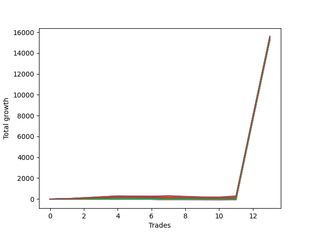

# Short Wallace Doodle 016 
- Symbol: NQ
- Date Range: 03/18/2022 - 06/17/2022
- Trading Period: 7:20-12:30
- Number of Trades: 13



| Name | Win Percent | Profit | Avg Profit / Trade |     | Name | Win Percent | Profit | Avg Profit / Trade |
| ---- | ----------- | ------ | ------------------ | --- | ---- | ----------- | ------ | ------------------ |
| Sorted By <br> Profit | | | | | Sorted By <br> Win Percentage ||||
| Seventy-Five | 61.54 | 7807250.00 | 600557.69 |     | One | 84.62 | 7729125.00 | 594548.08 |
| Five | 61.54 | 7805000.00 | 600384.62 |     | Two | 69.23 | 7728625.00 | 594509.62 |
| Seventy-Four | 61.54 | 7776750.00 | 598211.54 |     | Three | 69.23 | 7694125.00 | 591855.77 |
| Seventy-One | 61.54 | 7755125.00 | 596548.08 |     | Seventy-Five | 61.54 | 7807250.00 | 600557.69 |
| Fifty-Five | 61.54 | 7755125.00 | 596548.08 |     | Five | 61.54 | 7805000.00 | 600384.62 |
| Thirty-Nine | 61.54 | 7755125.00 | 596548.08 |     | Seventy-Four | 61.54 | 7776750.00 | 598211.54 |
| Twenty-Three | 61.54 | 7755125.00 | 596548.08 |     | Seventy-One | 61.54 | 7755125.00 | 596548.08 |
| Seven | 61.54 | 7755125.00 | 596548.08 |     | Fifty-Five | 61.54 | 7755125.00 | 596548.08 |
| Four | 61.54 | 7740750.00 | 595442.31 |     | Thirty-Nine | 61.54 | 7755125.00 | 596548.08 |
| Sixty-One | 38.46 | 7737125.00 | 595163.46 |     | Twenty-Three | 61.54 | 7755125.00 | 596548.08 |
| Seventy-Three | 46.15 | 7731500.00 | 594730.77 |     | Seven | 61.54 | 7755125.00 | 596548.08 |
| One | 84.62 | 7729125.00 | 594548.08 |     | Four | 61.54 | 7740750.00 | 595442.31 |
| Two | 69.23 | 7728625.00 | 594509.62 |     | Seventy | 61.54 | 7717875.00 | 593682.69 |
| Thirty-One | 30.77 | 7721125.00 | 593932.69 |     | Fifty-Four | 61.54 | 7717875.00 | 593682.69 |
| Seventy | 61.54 | 7717875.00 | 593682.69 |     | Thirty-Eight | 61.54 | 7717875.00 | 593682.69 |
| Fifty-Four | 61.54 | 7717875.00 | 593682.69 |     | Twenty-Two | 61.54 | 7717875.00 | 593682.69 |
| Thirty-Eight | 61.54 | 7717875.00 | 593682.69 |     | Six | 61.54 | 7717875.00 | 593682.69 |
| Twenty-Two | 61.54 | 7717875.00 | 593682.69 |     | Zero | 61.54 | 7663500.00 | 589500.00 |
| Six | 61.54 | 7717875.00 | 593682.69 |     | Seventy-Three | 46.15 | 7731500.00 | 594730.77 |
| Forty-Seven | 30.77 | 7712125.00 | 593240.38 |     | Twenty-One | 46.15 | 7651250.00 | 588557.69 |
| Thirty | 30.77 | 7702125.00 | 592471.15 |     | Twenty | 46.15 | 7651250.00 | 588557.69 |
| Sixty-Three | 38.46 | 7699625.00 | 592278.85 |     | Nineteen | 46.15 | 7651250.00 | 588557.69 |
| Three | 69.23 | 7694125.00 | 591855.77 |     | Eighteen | 46.15 | 7651250.00 | 588557.69 |
| Forty-Six | 30.77 | 7693125.00 | 591778.85 |     | Seventeen | 46.15 | 7651250.00 | 588557.69 |
| Sixty-Two | 38.46 | 7688250.00 | 591403.85 |     | Sixten | 46.15 | 7651250.00 | 588557.69 |
| Sixty | 38.46 | 7684375.00 | 591105.77 |     | Thirty-Seven | 46.15 | 7649000.00 | 588384.62 |
| Fifty-Eight | 38.46 | 7671500.00 | 590115.38 |     | Thirty-Six | 46.15 | 7649000.00 | 588384.62 |
| Fifteen | 23.08 | 7668750.00 | 589903.85 |     | Thirty-Five | 46.15 | 7649000.00 | 588384.62 |
| Zero | 61.54 | 7663500.00 | 589500.00 |     | Thirty-Four | 46.15 | 7649000.00 | 588384.62 |
| Forty-Five | 30.77 | 7663250.00 | 589480.77 |     | Thirty-Three | 46.15 | 7649000.00 | 588384.62 |
| Fourteen | 23.08 | 7654500.00 | 588807.69 |     | Thirty-Two | 46.15 | 7649000.00 | 588384.62 |
| Seventy-Two | 38.46 | 7654250.00 | 588788.46 |     | Sixty-One | 38.46 | 7737125.00 | 595163.46 |
| Twenty-One | 46.15 | 7651250.00 | 588557.69 |     | Sixty-Three | 38.46 | 7699625.00 | 592278.85 |
| Twenty | 46.15 | 7651250.00 | 588557.69 |     | Sixty-Two | 38.46 | 7688250.00 | 591403.85 |
| Nineteen | 46.15 | 7651250.00 | 588557.69 |     | Sixty | 38.46 | 7684375.00 | 591105.77 |
| Eighteen | 46.15 | 7651250.00 | 588557.69 |     | Fifty-Eight | 38.46 | 7671500.00 | 590115.38 |
| Seventeen | 46.15 | 7651250.00 | 588557.69 |     | Seventy-Two | 38.46 | 7654250.00 | 588788.46 |
| Sixten | 46.15 | 7651250.00 | 588557.69 |     | Fifty-Nine | 38.46 | 7651125.00 | 588548.08 |
| Fifty-Nine | 38.46 | 7651125.00 | 588548.08 |     | Fifty-Seven | 38.46 | 7640750.00 | 587750.00 |
| Thirty-Seven | 46.15 | 7649000.00 | 588384.62 |     | Fifty-Six | 38.46 | 7622750.00 | 586365.38 |
| Thirty-Six | 46.15 | 7649000.00 | 588384.62 |     | Thirty-One | 30.77 | 7721125.00 | 593932.69 |
| Thirty-Five | 46.15 | 7649000.00 | 588384.62 |     | Forty-Seven | 30.77 | 7712125.00 | 593240.38 |
| Thirty-Four | 46.15 | 7649000.00 | 588384.62 |     | Thirty | 30.77 | 7702125.00 | 592471.15 |
| Thirty-Three | 46.15 | 7649000.00 | 588384.62 |     | Forty-Six | 30.77 | 7693125.00 | 591778.85 |
| Thirty-Two | 46.15 | 7649000.00 | 588384.62 |     | Forty-Five | 30.77 | 7663250.00 | 589480.77 |
| Forty-Four | 30.77 | 7644125.00 | 588009.62 |     | Forty-Four | 30.77 | 7644125.00 | 588009.62 |
| Sixty-Nine | 23.08 | 7643250.00 | 587942.31 |     | Fifty-Three | 30.77 | 7641375.00 | 587798.08 |
| Fifty-Three | 30.77 | 7641375.00 | 587798.08 |     | Fifty-Two | 30.77 | 7641375.00 | 587798.08 |
| Fifty-Two | 30.77 | 7641375.00 | 587798.08 |     | Fifty-One | 30.77 | 7641375.00 | 587798.08 |
| Fifty-One | 30.77 | 7641375.00 | 587798.08 |     | Fifty | 30.77 | 7641375.00 | 587798.08 |
| Fifty | 30.77 | 7641375.00 | 587798.08 |     | Forty-Nine | 30.77 | 7641375.00 | 587798.08 |
| Forty-Nine | 30.77 | 7641375.00 | 587798.08 |     | Forty-Eight | 30.77 | 7641375.00 | 587798.08 |
| Forty-Eight | 30.77 | 7641375.00 | 587798.08 |     | Forty-Two | 30.77 | 7638000.00 | 587538.46 |
| Fifty-Seven | 38.46 | 7640750.00 | 587750.00 |     | Forty-Three | 30.77 | 7633625.00 | 587201.92 |
| Sixty-Eight | 23.08 | 7640500.00 | 587730.77 |     | Forty-One | 30.77 | 7630375.00 | 586951.92 |
| Forty-Two | 30.77 | 7638000.00 | 587538.46 |     | Forty | 30.77 | 7624250.00 | 586480.77 |
| Sixty-Six | 23.08 | 7634375.00 | 587259.62 |     | Thirteen | 30.77 | 7621000.00 | 586230.77 |
| Forty-Three | 30.77 | 7633625.00 | 587201.92 |     | Twelve | 30.77 | 7621000.00 | 586230.77 |
| Forty-One | 30.77 | 7630375.00 | 586951.92 |     | Eleven | 30.77 | 7621000.00 | 586230.77 |
| Sixty-Seven | 23.08 | 7630000.00 | 586923.08 |     | Ten | 30.77 | 7621000.00 | 586230.77 |
| Sixty-Five | 23.08 | 7626750.00 | 586673.08 |     | Nine | 30.77 | 7621000.00 | 586230.77 |
| Forty | 30.77 | 7624250.00 | 586480.77 |     | Eight | 30.77 | 7621000.00 | 586230.77 |
| Fifty-Six | 38.46 | 7622750.00 | 586365.38 |     | Twenty-Nine | 30.77 | 7619750.00 | 586134.62 |
| Thirteen | 30.77 | 7621000.00 | 586230.77 |     | Twenty-Eight | 30.77 | 7619750.00 | 586134.62 |
| Twelve | 30.77 | 7621000.00 | 586230.77 |     | twenty-Seven | 30.77 | 7619750.00 | 586134.62 |
| Eleven | 30.77 | 7621000.00 | 586230.77 |     | Twenty-Six | 30.77 | 7619750.00 | 586134.62 |
| Ten | 30.77 | 7621000.00 | 586230.77 |     | Twenty-Five | 30.77 | 7619750.00 | 586134.62 |
| Nine | 30.77 | 7621000.00 | 586230.77 |     | Twenty-Four | 30.77 | 7619750.00 | 586134.62 |
| Eight | 30.77 | 7621000.00 | 586230.77 |     | Fifteen | 23.08 | 7668750.00 | 589903.85 |
| Sixty-Four | 23.08 | 7620625.00 | 586201.92 |     | Fourteen | 23.08 | 7654500.00 | 588807.69 |
| Twenty-Nine | 30.77 | 7619750.00 | 586134.62 |     | Sixty-Nine | 23.08 | 7643250.00 | 587942.31 |
| Twenty-Eight | 30.77 | 7619750.00 | 586134.62 |     | Sixty-Eight | 23.08 | 7640500.00 | 587730.77 |
| twenty-Seven | 30.77 | 7619750.00 | 586134.62 |     | Sixty-Six | 23.08 | 7634375.00 | 587259.62 |
| Twenty-Six | 30.77 | 7619750.00 | 586134.62 |     | Sixty-Seven | 23.08 | 7630000.00 | 586923.08 |
| Twenty-Five | 30.77 | 7619750.00 | 586134.62 |     | Sixty-Five | 23.08 | 7626750.00 | 586673.08 |
| Twenty-Four | 30.77 | 7619750.00 | 586134.62 |     | Sixty-Four | 23.08 | 7620625.00 | 586201.92 |

## NO STOPLOSS

### Test Zero
* Sell when price hits the middle line of the 20p bollinger
* No Stoploss
* Results:
```
Total Trades: 13
Percent Up: 38.46
Percent Down: 61.54
Total Points Moved Down: 15327.00
Potential Profit: 7663500.00
Total Points Ups: 76.25 Count Ups: 5
Total Points Downs: 15403.25 Count Downs: 8
```

<details><summary>Trades</summary>

<code>In: 2022-03-29 08:52:00		Out: 2022-03-29 08:56:30		Total Position Time: 04:30		Total Move Down: 9.50		Total to Date: 9.50</code> <br />
<code>In: 2022-03-31 12:05:00		Out: 2022-03-31 12:11:10		Total Position Time: 06:10		Total Move Down: 14.75		Total to Date: 24.25</code> <br />
<code>In: 2022-03-31 12:06:00		Out: 2022-03-31 12:11:10		Total Position Time: 05:10		Total Move Down: 10.75		Total to Date: 35.00</code> <br />
<code>In: 2022-03-31 12:08:00		Out: 2022-03-31 12:11:10		Total Position Time: 03:10		Total Move Down: 18.50		Total to Date: 53.50</code> <br />
<code>In: 2022-04-07 12:06:00		Out: 2022-04-07 12:20:05		Total Position Time: 14:05		Total Move Down: -13.00		Total to Date: 40.50</code> <br />
<code>In: 2022-04-07 12:08:00		Out: 2022-04-07 12:20:05		Total Position Time: 12:05		Total Move Down: -12.50		Total to Date: 28.00</code> <br />
<code>In: 2022-04-28 08:14:00		Out: 2022-04-28 08:26:20		Total Position Time: 12:20		Total Move Down: -4.00		Total to Date: 24.00</code> <br />
<code>In: 2022-05-04 09:32:00		Out: 2022-05-04 09:45:25		Total Position Time: 13:25		Total Move Down: -6.00		Total to Date: 18.00</code> <br />
<code>In: 2022-05-10 10:45:00		Out: 2022-05-10 11:05:55		Total Position Time: 20:55		Total Move Down: -40.75		Total to Date: -22.75</code> <br />
<code>In: 2022-05-16 10:34:00		Out: 2022-05-16 10:42:15		Total Position Time: 08:15		Total Move Down: 1.50		Total to Date: -21.25</code> <br />
<code>In: 2022-05-24 09:18:00		Out: 2022-05-24 09:21:30		Total Position Time: 03:30		Total Move Down: 31.75		Total to Date: 10.50</code> <br />
<code>In: 2022-06-13 09:41:00		Out: 2022-06-13 09:41:10		Total Position Time: 00:10		Total Move Down: 7700.75		Total to Date: 7711.25</code> <br />
<code>In: 2022-06-14 10:14:00		Out: 2022-06-14 10:14:10		Total Position Time: 00:10		Total Move Down: 7615.75		Total to Date: 15327.00</code> <br />


</details>

### Test One
* Sell when the price hits the upper line of the 20p 1std bollinger
* No Stoploss
* Results:
```
Total Trades: 13
Percent Up: 15.38
Percent Down: 84.62
Total Points Moved Down: 15458.25
Potential Profit: 7729125.00
Total Points Ups: 28.00 Count Ups: 2
Total Points Downs: 15486.25 Count Downs: 11
```

<details><summary>Trades</summary>

<code>In: 2022-03-29 08:52:00		Out: 2022-03-29 08:58:40		Total Position Time: 06:40		Total Move Down: 17.75		Total to Date: 17.75</code> <br />
<code>In: 2022-03-31 12:05:00		Out: 2022-03-31 12:14:10		Total Position Time: 09:10		Total Move Down: 27.00		Total to Date: 44.75</code> <br />
<code>In: 2022-03-31 12:06:00		Out: 2022-03-31 12:14:10		Total Position Time: 08:10		Total Move Down: 23.00		Total to Date: 67.75</code> <br />
<code>In: 2022-03-31 12:08:00		Out: 2022-03-31 12:14:10		Total Position Time: 06:10		Total Move Down: 30.75		Total to Date: 98.50</code> <br />
<code>In: 2022-04-07 12:06:00		Out: 2022-04-07 12:21:20		Total Position Time: 15:20		Total Move Down: 4.00		Total to Date: 102.50</code> <br />
<code>In: 2022-04-07 12:08:00		Out: 2022-04-07 12:21:20		Total Position Time: 13:20		Total Move Down: 4.50		Total to Date: 107.00</code> <br />
<code>In: 2022-04-28 08:14:00		Out: 2022-04-28 08:26:40		Total Position Time: 12:40		Total Move Down: 7.50		Total to Date: 114.50</code> <br />
<code>In: 2022-05-04 09:32:00		Out: 2022-05-04 09:46:15		Total Position Time: 14:15		Total Move Down: -0.00		Total to Date: 114.50</code> <br />
<code>In: 2022-05-10 10:45:00		Out: 2022-05-10 11:06:35		Total Position Time: 21:35		Total Move Down: -28.00		Total to Date: 86.50</code> <br />
<code>In: 2022-05-16 10:34:00		Out: 2022-05-16 10:42:35		Total Position Time: 08:35		Total Move Down: 12.00		Total to Date: 98.50</code> <br />
<code>In: 2022-05-24 09:18:00		Out: 2022-05-24 09:26:40		Total Position Time: 08:40		Total Move Down: 43.25		Total to Date: 141.75</code> <br />
<code>In: 2022-06-13 09:41:00		Out: 2022-06-13 09:41:10		Total Position Time: 00:10		Total Move Down: 7700.75		Total to Date: 7842.50</code> <br />
<code>In: 2022-06-14 10:14:00		Out: 2022-06-14 10:14:10		Total Position Time: 00:10		Total Move Down: 7615.75		Total to Date: 15458.25</code> <br />


</details>

### Test Two
* Sell when the price hits the upper line of the 20p 2std bollinger
* No Stoploss
* Results:
```
Total Trades: 13
Percent Up: 30.77
Percent Down: 69.23
Total Points Moved Down: 15457.25
Potential Profit: 7728625.00
Total Points Ups: 109.75 Count Ups: 4
Total Points Downs: 15567.00 Count Downs: 9
```

<details><summary>Trades</summary>

<code>In: 2022-03-29 08:52:00		Out: 2022-03-29 09:01:35		Total Position Time: 09:35		Total Move Down: 27.50		Total to Date: 27.50</code> <br />
<code>In: 2022-03-31 12:05:00		Out: 2022-03-31 12:19:40		Total Position Time: 14:40		Total Move Down: 42.25		Total to Date: 69.75</code> <br />
<code>In: 2022-03-31 12:06:00		Out: 2022-03-31 12:19:40		Total Position Time: 13:40		Total Move Down: 38.25		Total to Date: 108.00</code> <br />
<code>In: 2022-03-31 12:08:00		Out: 2022-03-31 12:19:40		Total Position Time: 11:40		Total Move Down: 46.00		Total to Date: 154.00</code> <br />
<code>In: 2022-04-07 12:06:00		Out: 2022-04-07 12:35:55		Total Position Time: 29:55		Total Move Down: -20.50		Total to Date: 133.50</code> <br />
<code>In: 2022-04-07 12:08:00		Out: 2022-04-07 12:37:55		Total Position Time: 29:55		Total Move Down: -18.00		Total to Date: 115.50</code> <br />
<code>In: 2022-04-28 08:14:00		Out: 2022-04-28 08:32:20		Total Position Time: 18:20		Total Move Down: 16.25		Total to Date: 131.75</code> <br />
<code>In: 2022-05-04 09:32:00		Out: 2022-05-04 10:01:55		Total Position Time: 29:55		Total Move Down: -62.00		Total to Date: 69.75</code> <br />
<code>In: 2022-05-10 10:45:00		Out: 2022-05-10 11:07:25		Total Position Time: 22:25		Total Move Down: -9.25		Total to Date: 60.50</code> <br />
<code>In: 2022-05-16 10:34:00		Out: 2022-05-16 10:49:15		Total Position Time: 15:15		Total Move Down: 6.00		Total to Date: 66.50</code> <br />
<code>In: 2022-05-24 09:18:00		Out: 2022-05-24 09:32:40		Total Position Time: 14:40		Total Move Down: 74.25		Total to Date: 140.75</code> <br />
<code>In: 2022-06-13 09:41:00		Out: 2022-06-13 09:41:10		Total Position Time: 00:10		Total Move Down: 7700.75		Total to Date: 7841.50</code> <br />
<code>In: 2022-06-14 10:14:00		Out: 2022-06-14 10:14:10		Total Position Time: 00:10		Total Move Down: 7615.75		Total to Date: 15457.25</code> <br />


</details>

### Test Three
* Sell when price hits the middle line of the 50p bollinger
* No Stoploss
* Results:
```
Total Trades: 13
Percent Up: 30.77
Percent Down: 69.23
Total Points Moved Down: 15388.25
Potential Profit: 7694125.00
Total Points Ups: 150.50 Count Ups: 4
Total Points Downs: 15538.75 Count Downs: 9
```

<details><summary>Trades</summary>

<code>In: 2022-03-29 08:52:00		Out: 2022-03-29 09:00:25		Total Position Time: 08:25		Total Move Down: 21.75		Total to Date: 21.75</code> <br />
<code>In: 2022-03-31 12:05:00		Out: 2022-03-31 12:18:10		Total Position Time: 13:10		Total Move Down: 33.50		Total to Date: 55.25</code> <br />
<code>In: 2022-03-31 12:06:00		Out: 2022-03-31 12:18:10		Total Position Time: 12:10		Total Move Down: 29.50		Total to Date: 84.75</code> <br />
<code>In: 2022-03-31 12:08:00		Out: 2022-03-31 12:18:10		Total Position Time: 10:10		Total Move Down: 37.25		Total to Date: 122.00</code> <br />
<code>In: 2022-04-07 12:06:00		Out: 2022-04-07 12:35:55		Total Position Time: 29:55		Total Move Down: -20.50		Total to Date: 101.50</code> <br />
<code>In: 2022-04-07 12:08:00		Out: 2022-04-07 12:37:55		Total Position Time: 29:55		Total Move Down: -18.00		Total to Date: 83.50</code> <br />
<code>In: 2022-04-28 08:14:00		Out: 2022-04-28 08:38:05		Total Position Time: 24:05		Total Move Down: 37.75		Total to Date: 121.25</code> <br />
<code>In: 2022-05-04 09:32:00		Out: 2022-05-04 10:01:55		Total Position Time: 29:55		Total Move Down: -62.00		Total to Date: 59.25</code> <br />
<code>In: 2022-05-10 10:45:00		Out: 2022-05-10 11:14:55		Total Position Time: 29:55		Total Move Down: -50.00		Total to Date: 9.25</code> <br />
<code>In: 2022-05-16 10:34:00		Out: 2022-05-16 11:00:20		Total Position Time: 26:20		Total Move Down: 11.50		Total to Date: 20.75</code> <br />
<code>In: 2022-05-24 09:18:00		Out: 2022-05-24 09:31:10		Total Position Time: 13:10		Total Move Down: 51.00		Total to Date: 71.75</code> <br />
<code>In: 2022-06-13 09:41:00		Out: 2022-06-13 09:41:10		Total Position Time: 00:10		Total Move Down: 7700.75		Total to Date: 7772.50</code> <br />
<code>In: 2022-06-14 10:14:00		Out: 2022-06-14 10:14:10		Total Position Time: 00:10		Total Move Down: 7615.75		Total to Date: 15388.25</code> <br />


</details>

### Test Four
* Sell when the price hits the upper line of the 50p 1std bollinger
* No Stoploss
* Results:
```
Total Trades: 13
Percent Up: 38.46
Percent Down: 61.54
Total Points Moved Down: 15481.50
Potential Profit: 7740750.00
Total Points Ups: 152.50 Count Ups: 5
Total Points Downs: 15634.00 Count Downs: 8
```

<details><summary>Trades</summary>

<code>In: 2022-03-29 08:52:00		Out: 2022-03-29 09:02:10		Total Position Time: 10:10		Total Move Down: 39.25		Total to Date: 39.25</code> <br />
<code>In: 2022-03-31 12:05:00		Out: 2022-03-31 12:21:20		Total Position Time: 16:20		Total Move Down: 54.50		Total to Date: 93.75</code> <br />
<code>In: 2022-03-31 12:06:00		Out: 2022-03-31 12:21:20		Total Position Time: 15:20		Total Move Down: 50.50		Total to Date: 144.25</code> <br />
<code>In: 2022-03-31 12:08:00		Out: 2022-03-31 12:21:20		Total Position Time: 13:20		Total Move Down: 58.25		Total to Date: 202.50</code> <br />
<code>In: 2022-04-07 12:06:00		Out: 2022-04-07 12:35:55		Total Position Time: 29:55		Total Move Down: -20.50		Total to Date: 182.00</code> <br />
<code>In: 2022-04-07 12:08:00		Out: 2022-04-07 12:37:55		Total Position Time: 29:55		Total Move Down: -18.00		Total to Date: 164.00</code> <br />
<code>In: 2022-04-28 08:14:00		Out: 2022-04-28 08:43:55		Total Position Time: 29:55		Total Move Down: 39.50		Total to Date: 203.50</code> <br />
<code>In: 2022-05-04 09:32:00		Out: 2022-05-04 10:01:55		Total Position Time: 29:55		Total Move Down: -62.00		Total to Date: 141.50</code> <br />
<code>In: 2022-05-10 10:45:00		Out: 2022-05-10 11:14:55		Total Position Time: 29:55		Total Move Down: -50.00		Total to Date: 91.50</code> <br />
<code>In: 2022-05-16 10:34:00		Out: 2022-05-16 11:03:55		Total Position Time: 29:55		Total Move Down: -2.00		Total to Date: 89.50</code> <br />
<code>In: 2022-05-24 09:18:00		Out: 2022-05-24 09:33:05		Total Position Time: 15:05		Total Move Down: 75.50		Total to Date: 165.00</code> <br />
<code>In: 2022-06-13 09:41:00		Out: 2022-06-13 09:41:10		Total Position Time: 00:10		Total Move Down: 7700.75		Total to Date: 7865.75</code> <br />
<code>In: 2022-06-14 10:14:00		Out: 2022-06-14 10:14:10		Total Position Time: 00:10		Total Move Down: 7615.75		Total to Date: 15481.50</code> <br />


</details>

### Test Five
* Sell when the price hits the upper line of the 50p 2std bollinger
* No Stoploss
* Results:
```
Total Trades: 13
Percent Up: 38.46
Percent Down: 61.54
Total Points Moved Down: 15610.00
Potential Profit: 7805000.00
Total Points Ups: 152.50 Count Ups: 5
Total Points Downs: 15762.50 Count Downs: 8
```

<details><summary>Trades</summary>

<code>In: 2022-03-29 08:52:00		Out: 2022-03-29 09:21:55		Total Position Time: 29:55		Total Move Down: 24.00		Total to Date: 24.00</code> <br />
<code>In: 2022-03-31 12:05:00		Out: 2022-03-31 12:33:05		Total Position Time: 28:05		Total Move Down: 92.75		Total to Date: 116.75</code> <br />
<code>In: 2022-03-31 12:06:00		Out: 2022-03-31 12:33:05		Total Position Time: 27:05		Total Move Down: 88.75		Total to Date: 205.50</code> <br />
<code>In: 2022-03-31 12:08:00		Out: 2022-03-31 12:33:05		Total Position Time: 25:05		Total Move Down: 96.50		Total to Date: 302.00</code> <br />
<code>In: 2022-04-07 12:06:00		Out: 2022-04-07 12:35:55		Total Position Time: 29:55		Total Move Down: -20.50		Total to Date: 281.50</code> <br />
<code>In: 2022-04-07 12:08:00		Out: 2022-04-07 12:37:55		Total Position Time: 29:55		Total Move Down: -18.00		Total to Date: 263.50</code> <br />
<code>In: 2022-04-28 08:14:00		Out: 2022-04-28 08:43:55		Total Position Time: 29:55		Total Move Down: 39.50		Total to Date: 303.00</code> <br />
<code>In: 2022-05-04 09:32:00		Out: 2022-05-04 10:01:55		Total Position Time: 29:55		Total Move Down: -62.00		Total to Date: 241.00</code> <br />
<code>In: 2022-05-10 10:45:00		Out: 2022-05-10 11:14:55		Total Position Time: 29:55		Total Move Down: -50.00		Total to Date: 191.00</code> <br />
<code>In: 2022-05-16 10:34:00		Out: 2022-05-16 11:03:55		Total Position Time: 29:55		Total Move Down: -2.00		Total to Date: 189.00</code> <br />
<code>In: 2022-05-24 09:18:00		Out: 2022-05-24 09:47:55		Total Position Time: 29:55		Total Move Down: 104.50		Total to Date: 293.50</code> <br />
<code>In: 2022-06-13 09:41:00		Out: 2022-06-13 09:41:10		Total Position Time: 00:10		Total Move Down: 7700.75		Total to Date: 7994.25</code> <br />
<code>In: 2022-06-14 10:14:00		Out: 2022-06-14 10:14:10		Total Position Time: 00:10		Total Move Down: 7615.75		Total to Date: 15610.00</code> <br />


</details>

### Test Six
* Sell when the price hits the middle line of the 1std VWAP
* No Stoploss
* Results:
```
Total Trades: 13
Percent Up: 38.46
Percent Down: 61.54
Total Points Moved Down: 15435.75
Potential Profit: 7717875.00
Total Points Ups: 152.50 Count Ups: 5
Total Points Downs: 15588.25 Count Downs: 8
```

<details><summary>Trades</summary>

<code>In: 2022-03-29 08:52:00		Out: 2022-03-29 09:02:10		Total Position Time: 10:10		Total Move Down: 39.25		Total to Date: 39.25</code> <br />
<code>In: 2022-03-31 12:05:00		Out: 2022-03-31 12:16:50		Total Position Time: 11:50		Total Move Down: 31.00		Total to Date: 70.25</code> <br />
<code>In: 2022-03-31 12:06:00		Out: 2022-03-31 12:16:50		Total Position Time: 10:50		Total Move Down: 27.00		Total to Date: 97.25</code> <br />
<code>In: 2022-03-31 12:08:00		Out: 2022-03-31 12:16:50		Total Position Time: 08:50		Total Move Down: 34.75		Total to Date: 132.00</code> <br />
<code>In: 2022-04-07 12:06:00		Out: 2022-04-07 12:35:55		Total Position Time: 29:55		Total Move Down: -20.50		Total to Date: 111.50</code> <br />
<code>In: 2022-04-07 12:08:00		Out: 2022-04-07 12:37:55		Total Position Time: 29:55		Total Move Down: -18.00		Total to Date: 93.50</code> <br />
<code>In: 2022-04-28 08:14:00		Out: 2022-04-28 08:39:35		Total Position Time: 25:35		Total Move Down: 44.75		Total to Date: 138.25</code> <br />
<code>In: 2022-05-04 09:32:00		Out: 2022-05-04 10:01:55		Total Position Time: 29:55		Total Move Down: -62.00		Total to Date: 76.25</code> <br />
<code>In: 2022-05-10 10:45:00		Out: 2022-05-10 11:14:55		Total Position Time: 29:55		Total Move Down: -50.00		Total to Date: 26.25</code> <br />
<code>In: 2022-05-16 10:34:00		Out: 2022-05-16 11:03:55		Total Position Time: 29:55		Total Move Down: -2.00		Total to Date: 24.25</code> <br />
<code>In: 2022-05-24 09:18:00		Out: 2022-05-24 09:36:50		Total Position Time: 18:50		Total Move Down: 95.00		Total to Date: 119.25</code> <br />
<code>In: 2022-06-13 09:41:00		Out: 2022-06-13 09:41:10		Total Position Time: 00:10		Total Move Down: 7700.75		Total to Date: 7820.00</code> <br />
<code>In: 2022-06-14 10:14:00		Out: 2022-06-14 10:14:10		Total Position Time: 00:10		Total Move Down: 7615.75		Total to Date: 15435.75</code> <br />


</details>

### Test Seven
* Sell when the price hits the upper line of the 1std VWAP
* No Stoploss
* Results:
```
Total Trades: 13
Percent Up: 38.46
Percent Down: 61.54
Total Points Moved Down: 15510.25
Potential Profit: 7755125.00
Total Points Ups: 152.50 Count Ups: 5
Total Points Downs: 15662.75 Count Downs: 8
```

<details><summary>Trades</summary>

<code>In: 2022-03-29 08:52:00		Out: 2022-03-29 09:21:55		Total Position Time: 29:55		Total Move Down: 24.00		Total to Date: 24.00</code> <br />
<code>In: 2022-03-31 12:05:00		Out: 2022-03-31 12:21:30		Total Position Time: 16:30		Total Move Down: 59.50		Total to Date: 83.50</code> <br />
<code>In: 2022-03-31 12:06:00		Out: 2022-03-31 12:21:30		Total Position Time: 15:30		Total Move Down: 55.50		Total to Date: 139.00</code> <br />
<code>In: 2022-03-31 12:08:00		Out: 2022-03-31 12:21:30		Total Position Time: 13:30		Total Move Down: 63.25		Total to Date: 202.25</code> <br />
<code>In: 2022-04-07 12:06:00		Out: 2022-04-07 12:35:55		Total Position Time: 29:55		Total Move Down: -20.50		Total to Date: 181.75</code> <br />
<code>In: 2022-04-07 12:08:00		Out: 2022-04-07 12:37:55		Total Position Time: 29:55		Total Move Down: -18.00		Total to Date: 163.75</code> <br />
<code>In: 2022-04-28 08:14:00		Out: 2022-04-28 08:43:55		Total Position Time: 29:55		Total Move Down: 39.50		Total to Date: 203.25</code> <br />
<code>In: 2022-05-04 09:32:00		Out: 2022-05-04 10:01:55		Total Position Time: 29:55		Total Move Down: -62.00		Total to Date: 141.25</code> <br />
<code>In: 2022-05-10 10:45:00		Out: 2022-05-10 11:14:55		Total Position Time: 29:55		Total Move Down: -50.00		Total to Date: 91.25</code> <br />
<code>In: 2022-05-16 10:34:00		Out: 2022-05-16 11:03:55		Total Position Time: 29:55		Total Move Down: -2.00		Total to Date: 89.25</code> <br />
<code>In: 2022-05-24 09:18:00		Out: 2022-05-24 09:47:55		Total Position Time: 29:55		Total Move Down: 104.50		Total to Date: 193.75</code> <br />
<code>In: 2022-06-13 09:41:00		Out: 2022-06-13 09:41:10		Total Position Time: 00:10		Total Move Down: 7700.75		Total to Date: 7894.50</code> <br />
<code>In: 2022-06-14 10:14:00		Out: 2022-06-14 10:14:10		Total Position Time: 00:10		Total Move Down: 7615.75		Total to Date: 15510.25</code> <br />


</details>

## STOPLOSS OF 2

### Test Eight
* Sell when price hits the middle line of the 20p bollinger
* Stoploss is -2 points
* Results:
```
Total Trades: 13
Percent Up: 69.23
Percent Down: 30.77
Total Points Moved Down: 15242.00
Potential Profit: 7621000.00
Total Points Ups: 76.50 Count Ups: 9
Total Points Downs: 15318.50 Count Downs: 4
```

<details><summary>Trades</summary>

<code>In: 2022-03-29 08:52:00		Out: 2022-03-29 08:53:10		Total Position Time: 01:10		Total Move Down: -0.25		Total to Date: -0.25</code> <br />
<code>In: 2022-03-31 12:05:00		Out: 2022-03-31 12:05:10		Total Position Time: 00:10		Total Move Down: 1.00		Total to Date: 0.75</code> <br />
<code>In: 2022-03-31 12:06:00		Out: 2022-03-31 12:06:45		Total Position Time: 00:45		Total Move Down: -15.25		Total to Date: -14.50</code> <br />
<code>In: 2022-03-31 12:08:00		Out: 2022-03-31 12:09:40		Total Position Time: 01:40		Total Move Down: 1.00		Total to Date: -13.50</code> <br />
<code>In: 2022-04-07 12:06:00		Out: 2022-04-07 12:06:35		Total Position Time: 00:35		Total Move Down: -18.00		Total to Date: -31.50</code> <br />
<code>In: 2022-04-07 12:08:00		Out: 2022-04-07 12:08:55		Total Position Time: 00:55		Total Move Down: -3.75		Total to Date: -35.25</code> <br />
<code>In: 2022-04-28 08:14:00		Out: 2022-04-28 08:15:05		Total Position Time: 01:05		Total Move Down: -14.50		Total to Date: -49.75</code> <br />
<code>In: 2022-05-04 09:32:00		Out: 2022-05-04 09:33:15		Total Position Time: 01:15		Total Move Down: -4.00		Total to Date: -53.75</code> <br />
<code>In: 2022-05-10 10:45:00		Out: 2022-05-10 10:45:10		Total Position Time: 00:10		Total Move Down: -12.25		Total to Date: -66.00</code> <br />
<code>In: 2022-05-16 10:34:00		Out: 2022-05-16 10:35:35		Total Position Time: 01:35		Total Move Down: -8.25		Total to Date: -74.25</code> <br />
<code>In: 2022-05-24 09:18:00		Out: 2022-05-24 09:18:10		Total Position Time: 00:10		Total Move Down: -0.25		Total to Date: -74.50</code> <br />
<code>In: 2022-06-13 09:41:00		Out: 2022-06-13 09:41:10		Total Position Time: 00:10		Total Move Down: 7700.75		Total to Date: 7626.25</code> <br />
<code>In: 2022-06-14 10:14:00		Out: 2022-06-14 10:14:10		Total Position Time: 00:10		Total Move Down: 7615.75		Total to Date: 15242.00</code> <br />


</details>

### Test Nine
* Sell when the price hits the upper line of the 20p 1std bollinger
* Stoploss is -2 points
* Results:
```
Total Trades: 13
Percent Up: 69.23
Percent Down: 30.77
Total Points Moved Down: 15242.00
Potential Profit: 7621000.00
Total Points Ups: 76.50 Count Ups: 9
Total Points Downs: 15318.50 Count Downs: 4
```

<details><summary>Trades</summary>

<code>In: 2022-03-29 08:52:00		Out: 2022-03-29 08:53:10		Total Position Time: 01:10		Total Move Down: -0.25		Total to Date: -0.25</code> <br />
<code>In: 2022-03-31 12:05:00		Out: 2022-03-31 12:05:10		Total Position Time: 00:10		Total Move Down: 1.00		Total to Date: 0.75</code> <br />
<code>In: 2022-03-31 12:06:00		Out: 2022-03-31 12:06:45		Total Position Time: 00:45		Total Move Down: -15.25		Total to Date: -14.50</code> <br />
<code>In: 2022-03-31 12:08:00		Out: 2022-03-31 12:09:40		Total Position Time: 01:40		Total Move Down: 1.00		Total to Date: -13.50</code> <br />
<code>In: 2022-04-07 12:06:00		Out: 2022-04-07 12:06:35		Total Position Time: 00:35		Total Move Down: -18.00		Total to Date: -31.50</code> <br />
<code>In: 2022-04-07 12:08:00		Out: 2022-04-07 12:08:55		Total Position Time: 00:55		Total Move Down: -3.75		Total to Date: -35.25</code> <br />
<code>In: 2022-04-28 08:14:00		Out: 2022-04-28 08:15:05		Total Position Time: 01:05		Total Move Down: -14.50		Total to Date: -49.75</code> <br />
<code>In: 2022-05-04 09:32:00		Out: 2022-05-04 09:33:15		Total Position Time: 01:15		Total Move Down: -4.00		Total to Date: -53.75</code> <br />
<code>In: 2022-05-10 10:45:00		Out: 2022-05-10 10:45:10		Total Position Time: 00:10		Total Move Down: -12.25		Total to Date: -66.00</code> <br />
<code>In: 2022-05-16 10:34:00		Out: 2022-05-16 10:35:35		Total Position Time: 01:35		Total Move Down: -8.25		Total to Date: -74.25</code> <br />
<code>In: 2022-05-24 09:18:00		Out: 2022-05-24 09:18:10		Total Position Time: 00:10		Total Move Down: -0.25		Total to Date: -74.50</code> <br />
<code>In: 2022-06-13 09:41:00		Out: 2022-06-13 09:41:10		Total Position Time: 00:10		Total Move Down: 7700.75		Total to Date: 7626.25</code> <br />
<code>In: 2022-06-14 10:14:00		Out: 2022-06-14 10:14:10		Total Position Time: 00:10		Total Move Down: 7615.75		Total to Date: 15242.00</code> <br />


</details>

### Test Ten
* Sell when the price hits the upper line of the 20p 2std bollinger
* Stoploss is -2 points
* Results:
```
Total Trades: 13
Percent Up: 69.23
Percent Down: 30.77
Total Points Moved Down: 15242.00
Potential Profit: 7621000.00
Total Points Ups: 76.50 Count Ups: 9
Total Points Downs: 15318.50 Count Downs: 4
```

<details><summary>Trades</summary>

<code>In: 2022-03-29 08:52:00		Out: 2022-03-29 08:53:10		Total Position Time: 01:10		Total Move Down: -0.25		Total to Date: -0.25</code> <br />
<code>In: 2022-03-31 12:05:00		Out: 2022-03-31 12:05:10		Total Position Time: 00:10		Total Move Down: 1.00		Total to Date: 0.75</code> <br />
<code>In: 2022-03-31 12:06:00		Out: 2022-03-31 12:06:45		Total Position Time: 00:45		Total Move Down: -15.25		Total to Date: -14.50</code> <br />
<code>In: 2022-03-31 12:08:00		Out: 2022-03-31 12:09:40		Total Position Time: 01:40		Total Move Down: 1.00		Total to Date: -13.50</code> <br />
<code>In: 2022-04-07 12:06:00		Out: 2022-04-07 12:06:35		Total Position Time: 00:35		Total Move Down: -18.00		Total to Date: -31.50</code> <br />
<code>In: 2022-04-07 12:08:00		Out: 2022-04-07 12:08:55		Total Position Time: 00:55		Total Move Down: -3.75		Total to Date: -35.25</code> <br />
<code>In: 2022-04-28 08:14:00		Out: 2022-04-28 08:15:05		Total Position Time: 01:05		Total Move Down: -14.50		Total to Date: -49.75</code> <br />
<code>In: 2022-05-04 09:32:00		Out: 2022-05-04 09:33:15		Total Position Time: 01:15		Total Move Down: -4.00		Total to Date: -53.75</code> <br />
<code>In: 2022-05-10 10:45:00		Out: 2022-05-10 10:45:10		Total Position Time: 00:10		Total Move Down: -12.25		Total to Date: -66.00</code> <br />
<code>In: 2022-05-16 10:34:00		Out: 2022-05-16 10:35:35		Total Position Time: 01:35		Total Move Down: -8.25		Total to Date: -74.25</code> <br />
<code>In: 2022-05-24 09:18:00		Out: 2022-05-24 09:18:10		Total Position Time: 00:10		Total Move Down: -0.25		Total to Date: -74.50</code> <br />
<code>In: 2022-06-13 09:41:00		Out: 2022-06-13 09:41:10		Total Position Time: 00:10		Total Move Down: 7700.75		Total to Date: 7626.25</code> <br />
<code>In: 2022-06-14 10:14:00		Out: 2022-06-14 10:14:10		Total Position Time: 00:10		Total Move Down: 7615.75		Total to Date: 15242.00</code> <br />


</details>

### Test Eleven
* Sell when price hits the middle line of the 50p bollinger
* Stoploss is -2 points
* Results:
```
Total Trades: 13
Percent Up: 69.23
Percent Down: 30.77
Total Points Moved Down: 15242.00
Potential Profit: 7621000.00
Total Points Ups: 76.50 Count Ups: 9
Total Points Downs: 15318.50 Count Downs: 4
```

<details><summary>Trades</summary>

<code>In: 2022-03-29 08:52:00		Out: 2022-03-29 08:53:10		Total Position Time: 01:10		Total Move Down: -0.25		Total to Date: -0.25</code> <br />
<code>In: 2022-03-31 12:05:00		Out: 2022-03-31 12:05:10		Total Position Time: 00:10		Total Move Down: 1.00		Total to Date: 0.75</code> <br />
<code>In: 2022-03-31 12:06:00		Out: 2022-03-31 12:06:45		Total Position Time: 00:45		Total Move Down: -15.25		Total to Date: -14.50</code> <br />
<code>In: 2022-03-31 12:08:00		Out: 2022-03-31 12:09:40		Total Position Time: 01:40		Total Move Down: 1.00		Total to Date: -13.50</code> <br />
<code>In: 2022-04-07 12:06:00		Out: 2022-04-07 12:06:35		Total Position Time: 00:35		Total Move Down: -18.00		Total to Date: -31.50</code> <br />
<code>In: 2022-04-07 12:08:00		Out: 2022-04-07 12:08:55		Total Position Time: 00:55		Total Move Down: -3.75		Total to Date: -35.25</code> <br />
<code>In: 2022-04-28 08:14:00		Out: 2022-04-28 08:15:05		Total Position Time: 01:05		Total Move Down: -14.50		Total to Date: -49.75</code> <br />
<code>In: 2022-05-04 09:32:00		Out: 2022-05-04 09:33:15		Total Position Time: 01:15		Total Move Down: -4.00		Total to Date: -53.75</code> <br />
<code>In: 2022-05-10 10:45:00		Out: 2022-05-10 10:45:10		Total Position Time: 00:10		Total Move Down: -12.25		Total to Date: -66.00</code> <br />
<code>In: 2022-05-16 10:34:00		Out: 2022-05-16 10:35:35		Total Position Time: 01:35		Total Move Down: -8.25		Total to Date: -74.25</code> <br />
<code>In: 2022-05-24 09:18:00		Out: 2022-05-24 09:18:10		Total Position Time: 00:10		Total Move Down: -0.25		Total to Date: -74.50</code> <br />
<code>In: 2022-06-13 09:41:00		Out: 2022-06-13 09:41:10		Total Position Time: 00:10		Total Move Down: 7700.75		Total to Date: 7626.25</code> <br />
<code>In: 2022-06-14 10:14:00		Out: 2022-06-14 10:14:10		Total Position Time: 00:10		Total Move Down: 7615.75		Total to Date: 15242.00</code> <br />


</details>

### Test Twelve
* Sell when the price hits the upper line of the 50p 1std bollinger
* Stoploss is -2 points
* Results:
```
Total Trades: 13
Percent Up: 69.23
Percent Down: 30.77
Total Points Moved Down: 15242.00
Potential Profit: 7621000.00
Total Points Ups: 76.50 Count Ups: 9
Total Points Downs: 15318.50 Count Downs: 4
```

<details><summary>Trades</summary>

<code>In: 2022-03-29 08:52:00		Out: 2022-03-29 08:53:10		Total Position Time: 01:10		Total Move Down: -0.25		Total to Date: -0.25</code> <br />
<code>In: 2022-03-31 12:05:00		Out: 2022-03-31 12:05:10		Total Position Time: 00:10		Total Move Down: 1.00		Total to Date: 0.75</code> <br />
<code>In: 2022-03-31 12:06:00		Out: 2022-03-31 12:06:45		Total Position Time: 00:45		Total Move Down: -15.25		Total to Date: -14.50</code> <br />
<code>In: 2022-03-31 12:08:00		Out: 2022-03-31 12:09:40		Total Position Time: 01:40		Total Move Down: 1.00		Total to Date: -13.50</code> <br />
<code>In: 2022-04-07 12:06:00		Out: 2022-04-07 12:06:35		Total Position Time: 00:35		Total Move Down: -18.00		Total to Date: -31.50</code> <br />
<code>In: 2022-04-07 12:08:00		Out: 2022-04-07 12:08:55		Total Position Time: 00:55		Total Move Down: -3.75		Total to Date: -35.25</code> <br />
<code>In: 2022-04-28 08:14:00		Out: 2022-04-28 08:15:05		Total Position Time: 01:05		Total Move Down: -14.50		Total to Date: -49.75</code> <br />
<code>In: 2022-05-04 09:32:00		Out: 2022-05-04 09:33:15		Total Position Time: 01:15		Total Move Down: -4.00		Total to Date: -53.75</code> <br />
<code>In: 2022-05-10 10:45:00		Out: 2022-05-10 10:45:10		Total Position Time: 00:10		Total Move Down: -12.25		Total to Date: -66.00</code> <br />
<code>In: 2022-05-16 10:34:00		Out: 2022-05-16 10:35:35		Total Position Time: 01:35		Total Move Down: -8.25		Total to Date: -74.25</code> <br />
<code>In: 2022-05-24 09:18:00		Out: 2022-05-24 09:18:10		Total Position Time: 00:10		Total Move Down: -0.25		Total to Date: -74.50</code> <br />
<code>In: 2022-06-13 09:41:00		Out: 2022-06-13 09:41:10		Total Position Time: 00:10		Total Move Down: 7700.75		Total to Date: 7626.25</code> <br />
<code>In: 2022-06-14 10:14:00		Out: 2022-06-14 10:14:10		Total Position Time: 00:10		Total Move Down: 7615.75		Total to Date: 15242.00</code> <br />


</details>

### Test Thirteen
* Sell when the price hits the upper line of the 50p 2std bollinger
* Stoploss is -2 points
* Results:
```
Total Trades: 13
Percent Up: 69.23
Percent Down: 30.77
Total Points Moved Down: 15242.00
Potential Profit: 7621000.00
Total Points Ups: 76.50 Count Ups: 9
Total Points Downs: 15318.50 Count Downs: 4
```

<details><summary>Trades</summary>

<code>In: 2022-03-29 08:52:00		Out: 2022-03-29 08:53:10		Total Position Time: 01:10		Total Move Down: -0.25		Total to Date: -0.25</code> <br />
<code>In: 2022-03-31 12:05:00		Out: 2022-03-31 12:05:10		Total Position Time: 00:10		Total Move Down: 1.00		Total to Date: 0.75</code> <br />
<code>In: 2022-03-31 12:06:00		Out: 2022-03-31 12:06:45		Total Position Time: 00:45		Total Move Down: -15.25		Total to Date: -14.50</code> <br />
<code>In: 2022-03-31 12:08:00		Out: 2022-03-31 12:09:40		Total Position Time: 01:40		Total Move Down: 1.00		Total to Date: -13.50</code> <br />
<code>In: 2022-04-07 12:06:00		Out: 2022-04-07 12:06:35		Total Position Time: 00:35		Total Move Down: -18.00		Total to Date: -31.50</code> <br />
<code>In: 2022-04-07 12:08:00		Out: 2022-04-07 12:08:55		Total Position Time: 00:55		Total Move Down: -3.75		Total to Date: -35.25</code> <br />
<code>In: 2022-04-28 08:14:00		Out: 2022-04-28 08:15:05		Total Position Time: 01:05		Total Move Down: -14.50		Total to Date: -49.75</code> <br />
<code>In: 2022-05-04 09:32:00		Out: 2022-05-04 09:33:15		Total Position Time: 01:15		Total Move Down: -4.00		Total to Date: -53.75</code> <br />
<code>In: 2022-05-10 10:45:00		Out: 2022-05-10 10:45:10		Total Position Time: 00:10		Total Move Down: -12.25		Total to Date: -66.00</code> <br />
<code>In: 2022-05-16 10:34:00		Out: 2022-05-16 10:35:35		Total Position Time: 01:35		Total Move Down: -8.25		Total to Date: -74.25</code> <br />
<code>In: 2022-05-24 09:18:00		Out: 2022-05-24 09:18:10		Total Position Time: 00:10		Total Move Down: -0.25		Total to Date: -74.50</code> <br />
<code>In: 2022-06-13 09:41:00		Out: 2022-06-13 09:41:10		Total Position Time: 00:10		Total Move Down: 7700.75		Total to Date: 7626.25</code> <br />
<code>In: 2022-06-14 10:14:00		Out: 2022-06-14 10:14:10		Total Position Time: 00:10		Total Move Down: 7615.75		Total to Date: 15242.00</code> <br />


</details>

### Test Fourteen
* Sell when the price hits the middle line of the 1std VWAP
* Stoploss is -2 points
* Results:
```
Total Trades: 13
Percent Up: 76.92
Percent Down: 23.08
Total Points Moved Down: 15309.00
Potential Profit: 7654500.00
Total Points Ups: 42.25 Count Ups: 10
Total Points Downs: 15351.25 Count Downs: 3
```

<details><summary>Trades</summary>

<code>In: 2022-03-29 08:52:00		Out: 2022-03-29 08:53:15		Total Position Time: 01:15		Total Move Down: -3.75		Total to Date: -3.75</code> <br />
<code>In: 2022-03-31 12:05:00		Out: 2022-03-31 12:06:30		Total Position Time: 01:30		Total Move Down: -3.00		Total to Date: -6.75</code> <br />
<code>In: 2022-03-31 12:06:00		Out: 2022-03-31 12:06:20		Total Position Time: 00:20		Total Move Down: -3.50		Total to Date: -10.25</code> <br />
<code>In: 2022-03-31 12:08:00		Out: 2022-03-31 12:16:50		Total Position Time: 08:50		Total Move Down: 34.75		Total to Date: 24.50</code> <br />
<code>In: 2022-04-07 12:06:00		Out: 2022-04-07 12:06:15		Total Position Time: 00:15		Total Move Down: -4.00		Total to Date: 20.50</code> <br />
<code>In: 2022-04-07 12:08:00		Out: 2022-04-07 12:08:50		Total Position Time: 00:50		Total Move Down: -3.00		Total to Date: 17.50</code> <br />
<code>In: 2022-04-28 08:14:00		Out: 2022-04-28 08:14:35		Total Position Time: 00:35		Total Move Down: -3.25		Total to Date: 14.25</code> <br />
<code>In: 2022-05-04 09:32:00		Out: 2022-05-04 09:33:15		Total Position Time: 01:15		Total Move Down: -4.00		Total to Date: 10.25</code> <br />
<code>In: 2022-05-10 10:45:00		Out: 2022-05-10 10:45:10		Total Position Time: 00:10		Total Move Down: -12.25		Total to Date: -2.00</code> <br />
<code>In: 2022-05-16 10:34:00		Out: 2022-05-16 10:34:10		Total Position Time: 00:10		Total Move Down: -2.50		Total to Date: -4.50</code> <br />
<code>In: 2022-05-24 09:18:00		Out: 2022-05-24 09:18:20		Total Position Time: 00:20		Total Move Down: -3.00		Total to Date: -7.50</code> <br />
<code>In: 2022-06-13 09:41:00		Out: 2022-06-13 09:41:10		Total Position Time: 00:10		Total Move Down: 7700.75		Total to Date: 7693.25</code> <br />
<code>In: 2022-06-14 10:14:00		Out: 2022-06-14 10:14:10		Total Position Time: 00:10		Total Move Down: 7615.75		Total to Date: 15309.00</code> <br />


</details>

### Test Fifteen
* Sell when the price hits the upper line of the 1std VWAP
* Stoploss is -2 points
* Results:
```
Total Trades: 13
Percent Up: 76.92
Percent Down: 23.08
Total Points Moved Down: 15337.50
Potential Profit: 7668750.00
Total Points Ups: 42.25 Count Ups: 10
Total Points Downs: 15379.75 Count Downs: 3
```

<details><summary>Trades</summary>

<code>In: 2022-03-29 08:52:00		Out: 2022-03-29 08:53:15		Total Position Time: 01:15		Total Move Down: -3.75		Total to Date: -3.75</code> <br />
<code>In: 2022-03-31 12:05:00		Out: 2022-03-31 12:06:30		Total Position Time: 01:30		Total Move Down: -3.00		Total to Date: -6.75</code> <br />
<code>In: 2022-03-31 12:06:00		Out: 2022-03-31 12:06:20		Total Position Time: 00:20		Total Move Down: -3.50		Total to Date: -10.25</code> <br />
<code>In: 2022-03-31 12:08:00		Out: 2022-03-31 12:21:30		Total Position Time: 13:30		Total Move Down: 63.25		Total to Date: 53.00</code> <br />
<code>In: 2022-04-07 12:06:00		Out: 2022-04-07 12:06:15		Total Position Time: 00:15		Total Move Down: -4.00		Total to Date: 49.00</code> <br />
<code>In: 2022-04-07 12:08:00		Out: 2022-04-07 12:08:50		Total Position Time: 00:50		Total Move Down: -3.00		Total to Date: 46.00</code> <br />
<code>In: 2022-04-28 08:14:00		Out: 2022-04-28 08:14:35		Total Position Time: 00:35		Total Move Down: -3.25		Total to Date: 42.75</code> <br />
<code>In: 2022-05-04 09:32:00		Out: 2022-05-04 09:33:15		Total Position Time: 01:15		Total Move Down: -4.00		Total to Date: 38.75</code> <br />
<code>In: 2022-05-10 10:45:00		Out: 2022-05-10 10:45:10		Total Position Time: 00:10		Total Move Down: -12.25		Total to Date: 26.50</code> <br />
<code>In: 2022-05-16 10:34:00		Out: 2022-05-16 10:34:10		Total Position Time: 00:10		Total Move Down: -2.50		Total to Date: 24.00</code> <br />
<code>In: 2022-05-24 09:18:00		Out: 2022-05-24 09:18:20		Total Position Time: 00:20		Total Move Down: -3.00		Total to Date: 21.00</code> <br />
<code>In: 2022-06-13 09:41:00		Out: 2022-06-13 09:41:10		Total Position Time: 00:10		Total Move Down: 7700.75		Total to Date: 7721.75</code> <br />
<code>In: 2022-06-14 10:14:00		Out: 2022-06-14 10:14:10		Total Position Time: 00:10		Total Move Down: 7615.75		Total to Date: 15337.50</code> <br />


</details>

## TRAIL STOP OF 2

### Test Sixten
* Sell when price hits the middle line of the 20p bollinger
* Trailing Stop is -2 points
* Results:
```
Total Trades: 13
Percent Up: 53.85
Percent Down: 46.15
Total Points Moved Down: 15302.50
Potential Profit: 7651250.00
Total Points Ups: 23.00 Count Ups: 7
Total Points Downs: 15325.50 Count Downs: 6
```

<details><summary>Trades</summary>

<code>In: 2022-03-29 08:52:00		Out: 2022-03-29 08:52:20		Total Position Time: 00:20		Total Move Down: 2.25		Total to Date: 2.25</code> <br />
<code>In: 2022-03-31 12:05:00		Out: 2022-03-31 12:05:10		Total Position Time: 00:10		Total Move Down: 1.00		Total to Date: 3.25</code> <br />
<code>In: 2022-03-31 12:06:00		Out: 2022-03-31 12:06:20		Total Position Time: 00:20		Total Move Down: -3.50		Total to Date: -0.25</code> <br />
<code>In: 2022-03-31 12:08:00		Out: 2022-03-31 12:08:25		Total Position Time: 00:25		Total Move Down: 4.00		Total to Date: 3.75</code> <br />
<code>In: 2022-04-07 12:06:00		Out: 2022-04-07 12:06:15		Total Position Time: 00:15		Total Move Down: -4.00		Total to Date: -0.25</code> <br />
<code>In: 2022-04-07 12:08:00		Out: 2022-04-07 12:08:40		Total Position Time: 00:40		Total Move Down: -1.00		Total to Date: -1.25</code> <br />
<code>In: 2022-04-28 08:14:00		Out: 2022-04-28 08:14:30		Total Position Time: 00:30		Total Move Down: 1.75		Total to Date: 0.50</code> <br />
<code>In: 2022-05-04 09:32:00		Out: 2022-05-04 09:32:40		Total Position Time: 00:40		Total Move Down: -1.25		Total to Date: -0.75</code> <br />
<code>In: 2022-05-10 10:45:00		Out: 2022-05-10 10:45:10		Total Position Time: 00:10		Total Move Down: -12.25		Total to Date: -13.00</code> <br />
<code>In: 2022-05-16 10:34:00		Out: 2022-05-16 10:34:45		Total Position Time: 00:45		Total Move Down: -0.75		Total to Date: -13.75</code> <br />
<code>In: 2022-05-24 09:18:00		Out: 2022-05-24 09:18:10		Total Position Time: 00:10		Total Move Down: -0.25		Total to Date: -14.00</code> <br />
<code>In: 2022-06-13 09:41:00		Out: 2022-06-13 09:41:10		Total Position Time: 00:10		Total Move Down: 7700.75		Total to Date: 7686.75</code> <br />
<code>In: 2022-06-14 10:14:00		Out: 2022-06-14 10:14:10		Total Position Time: 00:10		Total Move Down: 7615.75		Total to Date: 15302.50</code> <br />


</details>

### Test Seventeen
* Sell when the price hits the upper line of the 20p 1std bollinger
* Trailing Stop is -2 points
* Results:
```
Total Trades: 13
Percent Up: 53.85
Percent Down: 46.15
Total Points Moved Down: 15302.50
Potential Profit: 7651250.00
Total Points Ups: 23.00 Count Ups: 7
Total Points Downs: 15325.50 Count Downs: 6
```

<details><summary>Trades</summary>

<code>In: 2022-03-29 08:52:00		Out: 2022-03-29 08:52:20		Total Position Time: 00:20		Total Move Down: 2.25		Total to Date: 2.25</code> <br />
<code>In: 2022-03-31 12:05:00		Out: 2022-03-31 12:05:10		Total Position Time: 00:10		Total Move Down: 1.00		Total to Date: 3.25</code> <br />
<code>In: 2022-03-31 12:06:00		Out: 2022-03-31 12:06:20		Total Position Time: 00:20		Total Move Down: -3.50		Total to Date: -0.25</code> <br />
<code>In: 2022-03-31 12:08:00		Out: 2022-03-31 12:08:25		Total Position Time: 00:25		Total Move Down: 4.00		Total to Date: 3.75</code> <br />
<code>In: 2022-04-07 12:06:00		Out: 2022-04-07 12:06:15		Total Position Time: 00:15		Total Move Down: -4.00		Total to Date: -0.25</code> <br />
<code>In: 2022-04-07 12:08:00		Out: 2022-04-07 12:08:40		Total Position Time: 00:40		Total Move Down: -1.00		Total to Date: -1.25</code> <br />
<code>In: 2022-04-28 08:14:00		Out: 2022-04-28 08:14:30		Total Position Time: 00:30		Total Move Down: 1.75		Total to Date: 0.50</code> <br />
<code>In: 2022-05-04 09:32:00		Out: 2022-05-04 09:32:40		Total Position Time: 00:40		Total Move Down: -1.25		Total to Date: -0.75</code> <br />
<code>In: 2022-05-10 10:45:00		Out: 2022-05-10 10:45:10		Total Position Time: 00:10		Total Move Down: -12.25		Total to Date: -13.00</code> <br />
<code>In: 2022-05-16 10:34:00		Out: 2022-05-16 10:34:45		Total Position Time: 00:45		Total Move Down: -0.75		Total to Date: -13.75</code> <br />
<code>In: 2022-05-24 09:18:00		Out: 2022-05-24 09:18:10		Total Position Time: 00:10		Total Move Down: -0.25		Total to Date: -14.00</code> <br />
<code>In: 2022-06-13 09:41:00		Out: 2022-06-13 09:41:10		Total Position Time: 00:10		Total Move Down: 7700.75		Total to Date: 7686.75</code> <br />
<code>In: 2022-06-14 10:14:00		Out: 2022-06-14 10:14:10		Total Position Time: 00:10		Total Move Down: 7615.75		Total to Date: 15302.50</code> <br />


</details>

### Test Eighteen
* Sell when the price hits the upper line of the 20p 2std bollinger
* Trailing Stop is -2 points
* Results:
```
Total Trades: 13
Percent Up: 53.85
Percent Down: 46.15
Total Points Moved Down: 15302.50
Potential Profit: 7651250.00
Total Points Ups: 23.00 Count Ups: 7
Total Points Downs: 15325.50 Count Downs: 6
```

<details><summary>Trades</summary>

<code>In: 2022-03-29 08:52:00		Out: 2022-03-29 08:52:20		Total Position Time: 00:20		Total Move Down: 2.25		Total to Date: 2.25</code> <br />
<code>In: 2022-03-31 12:05:00		Out: 2022-03-31 12:05:10		Total Position Time: 00:10		Total Move Down: 1.00		Total to Date: 3.25</code> <br />
<code>In: 2022-03-31 12:06:00		Out: 2022-03-31 12:06:20		Total Position Time: 00:20		Total Move Down: -3.50		Total to Date: -0.25</code> <br />
<code>In: 2022-03-31 12:08:00		Out: 2022-03-31 12:08:25		Total Position Time: 00:25		Total Move Down: 4.00		Total to Date: 3.75</code> <br />
<code>In: 2022-04-07 12:06:00		Out: 2022-04-07 12:06:15		Total Position Time: 00:15		Total Move Down: -4.00		Total to Date: -0.25</code> <br />
<code>In: 2022-04-07 12:08:00		Out: 2022-04-07 12:08:40		Total Position Time: 00:40		Total Move Down: -1.00		Total to Date: -1.25</code> <br />
<code>In: 2022-04-28 08:14:00		Out: 2022-04-28 08:14:30		Total Position Time: 00:30		Total Move Down: 1.75		Total to Date: 0.50</code> <br />
<code>In: 2022-05-04 09:32:00		Out: 2022-05-04 09:32:40		Total Position Time: 00:40		Total Move Down: -1.25		Total to Date: -0.75</code> <br />
<code>In: 2022-05-10 10:45:00		Out: 2022-05-10 10:45:10		Total Position Time: 00:10		Total Move Down: -12.25		Total to Date: -13.00</code> <br />
<code>In: 2022-05-16 10:34:00		Out: 2022-05-16 10:34:45		Total Position Time: 00:45		Total Move Down: -0.75		Total to Date: -13.75</code> <br />
<code>In: 2022-05-24 09:18:00		Out: 2022-05-24 09:18:10		Total Position Time: 00:10		Total Move Down: -0.25		Total to Date: -14.00</code> <br />
<code>In: 2022-06-13 09:41:00		Out: 2022-06-13 09:41:10		Total Position Time: 00:10		Total Move Down: 7700.75		Total to Date: 7686.75</code> <br />
<code>In: 2022-06-14 10:14:00		Out: 2022-06-14 10:14:10		Total Position Time: 00:10		Total Move Down: 7615.75		Total to Date: 15302.50</code> <br />


</details>

### Test Nineteen
* Sell when price hits the middle line of the 50p bollinger
* Trailing Stop is -2 points
* Results:
```
Total Trades: 13
Percent Up: 53.85
Percent Down: 46.15
Total Points Moved Down: 15302.50
Potential Profit: 7651250.00
Total Points Ups: 23.00 Count Ups: 7
Total Points Downs: 15325.50 Count Downs: 6
```

<details><summary>Trades</summary>

<code>In: 2022-03-29 08:52:00		Out: 2022-03-29 08:52:20		Total Position Time: 00:20		Total Move Down: 2.25		Total to Date: 2.25</code> <br />
<code>In: 2022-03-31 12:05:00		Out: 2022-03-31 12:05:10		Total Position Time: 00:10		Total Move Down: 1.00		Total to Date: 3.25</code> <br />
<code>In: 2022-03-31 12:06:00		Out: 2022-03-31 12:06:20		Total Position Time: 00:20		Total Move Down: -3.50		Total to Date: -0.25</code> <br />
<code>In: 2022-03-31 12:08:00		Out: 2022-03-31 12:08:25		Total Position Time: 00:25		Total Move Down: 4.00		Total to Date: 3.75</code> <br />
<code>In: 2022-04-07 12:06:00		Out: 2022-04-07 12:06:15		Total Position Time: 00:15		Total Move Down: -4.00		Total to Date: -0.25</code> <br />
<code>In: 2022-04-07 12:08:00		Out: 2022-04-07 12:08:40		Total Position Time: 00:40		Total Move Down: -1.00		Total to Date: -1.25</code> <br />
<code>In: 2022-04-28 08:14:00		Out: 2022-04-28 08:14:30		Total Position Time: 00:30		Total Move Down: 1.75		Total to Date: 0.50</code> <br />
<code>In: 2022-05-04 09:32:00		Out: 2022-05-04 09:32:40		Total Position Time: 00:40		Total Move Down: -1.25		Total to Date: -0.75</code> <br />
<code>In: 2022-05-10 10:45:00		Out: 2022-05-10 10:45:10		Total Position Time: 00:10		Total Move Down: -12.25		Total to Date: -13.00</code> <br />
<code>In: 2022-05-16 10:34:00		Out: 2022-05-16 10:34:45		Total Position Time: 00:45		Total Move Down: -0.75		Total to Date: -13.75</code> <br />
<code>In: 2022-05-24 09:18:00		Out: 2022-05-24 09:18:10		Total Position Time: 00:10		Total Move Down: -0.25		Total to Date: -14.00</code> <br />
<code>In: 2022-06-13 09:41:00		Out: 2022-06-13 09:41:10		Total Position Time: 00:10		Total Move Down: 7700.75		Total to Date: 7686.75</code> <br />
<code>In: 2022-06-14 10:14:00		Out: 2022-06-14 10:14:10		Total Position Time: 00:10		Total Move Down: 7615.75		Total to Date: 15302.50</code> <br />


</details>

### Test Twenty
* Sell when the price hits the upper line of the 50p 1std bollinger
* Trailing Stop is -2 points
* Results:
```
Total Trades: 13
Percent Up: 53.85
Percent Down: 46.15
Total Points Moved Down: 15302.50
Potential Profit: 7651250.00
Total Points Ups: 23.00 Count Ups: 7
Total Points Downs: 15325.50 Count Downs: 6
```

<details><summary>Trades</summary>

<code>In: 2022-03-29 08:52:00		Out: 2022-03-29 08:52:20		Total Position Time: 00:20		Total Move Down: 2.25		Total to Date: 2.25</code> <br />
<code>In: 2022-03-31 12:05:00		Out: 2022-03-31 12:05:10		Total Position Time: 00:10		Total Move Down: 1.00		Total to Date: 3.25</code> <br />
<code>In: 2022-03-31 12:06:00		Out: 2022-03-31 12:06:20		Total Position Time: 00:20		Total Move Down: -3.50		Total to Date: -0.25</code> <br />
<code>In: 2022-03-31 12:08:00		Out: 2022-03-31 12:08:25		Total Position Time: 00:25		Total Move Down: 4.00		Total to Date: 3.75</code> <br />
<code>In: 2022-04-07 12:06:00		Out: 2022-04-07 12:06:15		Total Position Time: 00:15		Total Move Down: -4.00		Total to Date: -0.25</code> <br />
<code>In: 2022-04-07 12:08:00		Out: 2022-04-07 12:08:40		Total Position Time: 00:40		Total Move Down: -1.00		Total to Date: -1.25</code> <br />
<code>In: 2022-04-28 08:14:00		Out: 2022-04-28 08:14:30		Total Position Time: 00:30		Total Move Down: 1.75		Total to Date: 0.50</code> <br />
<code>In: 2022-05-04 09:32:00		Out: 2022-05-04 09:32:40		Total Position Time: 00:40		Total Move Down: -1.25		Total to Date: -0.75</code> <br />
<code>In: 2022-05-10 10:45:00		Out: 2022-05-10 10:45:10		Total Position Time: 00:10		Total Move Down: -12.25		Total to Date: -13.00</code> <br />
<code>In: 2022-05-16 10:34:00		Out: 2022-05-16 10:34:45		Total Position Time: 00:45		Total Move Down: -0.75		Total to Date: -13.75</code> <br />
<code>In: 2022-05-24 09:18:00		Out: 2022-05-24 09:18:10		Total Position Time: 00:10		Total Move Down: -0.25		Total to Date: -14.00</code> <br />
<code>In: 2022-06-13 09:41:00		Out: 2022-06-13 09:41:10		Total Position Time: 00:10		Total Move Down: 7700.75		Total to Date: 7686.75</code> <br />
<code>In: 2022-06-14 10:14:00		Out: 2022-06-14 10:14:10		Total Position Time: 00:10		Total Move Down: 7615.75		Total to Date: 15302.50</code> <br />


</details>

### Test Twenty-One
* Sell when the price hits the upper line of the 50p 2std bollinger
* Trailing Stop is -2 points
* Results:
```
Total Trades: 13
Percent Up: 53.85
Percent Down: 46.15
Total Points Moved Down: 15302.50
Potential Profit: 7651250.00
Total Points Ups: 23.00 Count Ups: 7
Total Points Downs: 15325.50 Count Downs: 6
```

<details><summary>Trades</summary>

<code>In: 2022-03-29 08:52:00		Out: 2022-03-29 08:52:20		Total Position Time: 00:20		Total Move Down: 2.25		Total to Date: 2.25</code> <br />
<code>In: 2022-03-31 12:05:00		Out: 2022-03-31 12:05:10		Total Position Time: 00:10		Total Move Down: 1.00		Total to Date: 3.25</code> <br />
<code>In: 2022-03-31 12:06:00		Out: 2022-03-31 12:06:20		Total Position Time: 00:20		Total Move Down: -3.50		Total to Date: -0.25</code> <br />
<code>In: 2022-03-31 12:08:00		Out: 2022-03-31 12:08:25		Total Position Time: 00:25		Total Move Down: 4.00		Total to Date: 3.75</code> <br />
<code>In: 2022-04-07 12:06:00		Out: 2022-04-07 12:06:15		Total Position Time: 00:15		Total Move Down: -4.00		Total to Date: -0.25</code> <br />
<code>In: 2022-04-07 12:08:00		Out: 2022-04-07 12:08:40		Total Position Time: 00:40		Total Move Down: -1.00		Total to Date: -1.25</code> <br />
<code>In: 2022-04-28 08:14:00		Out: 2022-04-28 08:14:30		Total Position Time: 00:30		Total Move Down: 1.75		Total to Date: 0.50</code> <br />
<code>In: 2022-05-04 09:32:00		Out: 2022-05-04 09:32:40		Total Position Time: 00:40		Total Move Down: -1.25		Total to Date: -0.75</code> <br />
<code>In: 2022-05-10 10:45:00		Out: 2022-05-10 10:45:10		Total Position Time: 00:10		Total Move Down: -12.25		Total to Date: -13.00</code> <br />
<code>In: 2022-05-16 10:34:00		Out: 2022-05-16 10:34:45		Total Position Time: 00:45		Total Move Down: -0.75		Total to Date: -13.75</code> <br />
<code>In: 2022-05-24 09:18:00		Out: 2022-05-24 09:18:10		Total Position Time: 00:10		Total Move Down: -0.25		Total to Date: -14.00</code> <br />
<code>In: 2022-06-13 09:41:00		Out: 2022-06-13 09:41:10		Total Position Time: 00:10		Total Move Down: 7700.75		Total to Date: 7686.75</code> <br />
<code>In: 2022-06-14 10:14:00		Out: 2022-06-14 10:14:10		Total Position Time: 00:10		Total Move Down: 7615.75		Total to Date: 15302.50</code> <br />


</details>

### Test Twenty-Two
* Sell when the price hits the middle line of the 1std VWAP
* Trailing Stop is -2 points
* Results:
```
Total Trades: 13
Percent Up: 38.46
Percent Down: 61.54
Total Points Moved Down: 15435.75
Potential Profit: 7717875.00
Total Points Ups: 152.50 Count Ups: 5
Total Points Downs: 15588.25 Count Downs: 8
```

<details><summary>Trades</summary>

<code>In: 2022-03-29 08:52:00		Out: 2022-03-29 09:02:10		Total Position Time: 10:10		Total Move Down: 39.25		Total to Date: 39.25</code> <br />
<code>In: 2022-03-31 12:05:00		Out: 2022-03-31 12:16:50		Total Position Time: 11:50		Total Move Down: 31.00		Total to Date: 70.25</code> <br />
<code>In: 2022-03-31 12:06:00		Out: 2022-03-31 12:16:50		Total Position Time: 10:50		Total Move Down: 27.00		Total to Date: 97.25</code> <br />
<code>In: 2022-03-31 12:08:00		Out: 2022-03-31 12:16:50		Total Position Time: 08:50		Total Move Down: 34.75		Total to Date: 132.00</code> <br />
<code>In: 2022-04-07 12:06:00		Out: 2022-04-07 12:35:55		Total Position Time: 29:55		Total Move Down: -20.50		Total to Date: 111.50</code> <br />
<code>In: 2022-04-07 12:08:00		Out: 2022-04-07 12:37:55		Total Position Time: 29:55		Total Move Down: -18.00		Total to Date: 93.50</code> <br />
<code>In: 2022-04-28 08:14:00		Out: 2022-04-28 08:39:35		Total Position Time: 25:35		Total Move Down: 44.75		Total to Date: 138.25</code> <br />
<code>In: 2022-05-04 09:32:00		Out: 2022-05-04 10:01:55		Total Position Time: 29:55		Total Move Down: -62.00		Total to Date: 76.25</code> <br />
<code>In: 2022-05-10 10:45:00		Out: 2022-05-10 11:14:55		Total Position Time: 29:55		Total Move Down: -50.00		Total to Date: 26.25</code> <br />
<code>In: 2022-05-16 10:34:00		Out: 2022-05-16 11:03:55		Total Position Time: 29:55		Total Move Down: -2.00		Total to Date: 24.25</code> <br />
<code>In: 2022-05-24 09:18:00		Out: 2022-05-24 09:36:50		Total Position Time: 18:50		Total Move Down: 95.00		Total to Date: 119.25</code> <br />
<code>In: 2022-06-13 09:41:00		Out: 2022-06-13 09:41:10		Total Position Time: 00:10		Total Move Down: 7700.75		Total to Date: 7820.00</code> <br />
<code>In: 2022-06-14 10:14:00		Out: 2022-06-14 10:14:10		Total Position Time: 00:10		Total Move Down: 7615.75		Total to Date: 15435.75</code> <br />


</details>

### Test Twenty-Three
* Sell when the price hits the upper line of the 1std VWAP
* Trailing Stop is -2 points
* Results:
```
Total Trades: 13
Percent Up: 38.46
Percent Down: 61.54
Total Points Moved Down: 15510.25
Potential Profit: 7755125.00
Total Points Ups: 152.50 Count Ups: 5
Total Points Downs: 15662.75 Count Downs: 8
```

<details><summary>Trades</summary>

<code>In: 2022-03-29 08:52:00		Out: 2022-03-29 09:21:55		Total Position Time: 29:55		Total Move Down: 24.00		Total to Date: 24.00</code> <br />
<code>In: 2022-03-31 12:05:00		Out: 2022-03-31 12:21:30		Total Position Time: 16:30		Total Move Down: 59.50		Total to Date: 83.50</code> <br />
<code>In: 2022-03-31 12:06:00		Out: 2022-03-31 12:21:30		Total Position Time: 15:30		Total Move Down: 55.50		Total to Date: 139.00</code> <br />
<code>In: 2022-03-31 12:08:00		Out: 2022-03-31 12:21:30		Total Position Time: 13:30		Total Move Down: 63.25		Total to Date: 202.25</code> <br />
<code>In: 2022-04-07 12:06:00		Out: 2022-04-07 12:35:55		Total Position Time: 29:55		Total Move Down: -20.50		Total to Date: 181.75</code> <br />
<code>In: 2022-04-07 12:08:00		Out: 2022-04-07 12:37:55		Total Position Time: 29:55		Total Move Down: -18.00		Total to Date: 163.75</code> <br />
<code>In: 2022-04-28 08:14:00		Out: 2022-04-28 08:43:55		Total Position Time: 29:55		Total Move Down: 39.50		Total to Date: 203.25</code> <br />
<code>In: 2022-05-04 09:32:00		Out: 2022-05-04 10:01:55		Total Position Time: 29:55		Total Move Down: -62.00		Total to Date: 141.25</code> <br />
<code>In: 2022-05-10 10:45:00		Out: 2022-05-10 11:14:55		Total Position Time: 29:55		Total Move Down: -50.00		Total to Date: 91.25</code> <br />
<code>In: 2022-05-16 10:34:00		Out: 2022-05-16 11:03:55		Total Position Time: 29:55		Total Move Down: -2.00		Total to Date: 89.25</code> <br />
<code>In: 2022-05-24 09:18:00		Out: 2022-05-24 09:47:55		Total Position Time: 29:55		Total Move Down: 104.50		Total to Date: 193.75</code> <br />
<code>In: 2022-06-13 09:41:00		Out: 2022-06-13 09:41:10		Total Position Time: 00:10		Total Move Down: 7700.75		Total to Date: 7894.50</code> <br />
<code>In: 2022-06-14 10:14:00		Out: 2022-06-14 10:14:10		Total Position Time: 00:10		Total Move Down: 7615.75		Total to Date: 15510.25</code> <br />


</details>

## STOPLOSS OF 3

### Test Twenty-Four
* Sell when price hits the middle line of the 20p bollinger
* Stoploss is -3 points
* Results:
```
Total Trades: 13
Percent Up: 69.23
Percent Down: 30.77
Total Points Moved Down: 15239.50
Potential Profit: 7619750.00
Total Points Ups: 79.00 Count Ups: 9
Total Points Downs: 15318.50 Count Downs: 4
```

<details><summary>Trades</summary>

<code>In: 2022-03-29 08:52:00		Out: 2022-03-29 08:53:10		Total Position Time: 01:10		Total Move Down: -0.25		Total to Date: -0.25</code> <br />
<code>In: 2022-03-31 12:05:00		Out: 2022-03-31 12:05:10		Total Position Time: 00:10		Total Move Down: 1.00		Total to Date: 0.75</code> <br />
<code>In: 2022-03-31 12:06:00		Out: 2022-03-31 12:06:45		Total Position Time: 00:45		Total Move Down: -15.25		Total to Date: -14.50</code> <br />
<code>In: 2022-03-31 12:08:00		Out: 2022-03-31 12:09:40		Total Position Time: 01:40		Total Move Down: 1.00		Total to Date: -13.50</code> <br />
<code>In: 2022-04-07 12:06:00		Out: 2022-04-07 12:06:35		Total Position Time: 00:35		Total Move Down: -18.00		Total to Date: -31.50</code> <br />
<code>In: 2022-04-07 12:08:00		Out: 2022-04-07 12:08:55		Total Position Time: 00:55		Total Move Down: -3.75		Total to Date: -35.25</code> <br />
<code>In: 2022-04-28 08:14:00		Out: 2022-04-28 08:15:05		Total Position Time: 01:05		Total Move Down: -14.50		Total to Date: -49.75</code> <br />
<code>In: 2022-05-04 09:32:00		Out: 2022-05-04 09:33:20		Total Position Time: 01:20		Total Move Down: -6.50		Total to Date: -56.25</code> <br />
<code>In: 2022-05-10 10:45:00		Out: 2022-05-10 10:45:10		Total Position Time: 00:10		Total Move Down: -12.25		Total to Date: -68.50</code> <br />
<code>In: 2022-05-16 10:34:00		Out: 2022-05-16 10:35:35		Total Position Time: 01:35		Total Move Down: -8.25		Total to Date: -76.75</code> <br />
<code>In: 2022-05-24 09:18:00		Out: 2022-05-24 09:18:10		Total Position Time: 00:10		Total Move Down: -0.25		Total to Date: -77.00</code> <br />
<code>In: 2022-06-13 09:41:00		Out: 2022-06-13 09:41:10		Total Position Time: 00:10		Total Move Down: 7700.75		Total to Date: 7623.75</code> <br />
<code>In: 2022-06-14 10:14:00		Out: 2022-06-14 10:14:10		Total Position Time: 00:10		Total Move Down: 7615.75		Total to Date: 15239.50</code> <br />


</details>

### Test Twenty-Five
* Sell when the price hits the upper line of the 20p 1std bollinger
* Stoploss is -3 points
* Results:
```
Total Trades: 13
Percent Up: 69.23
Percent Down: 30.77
Total Points Moved Down: 15239.50
Potential Profit: 7619750.00
Total Points Ups: 79.00 Count Ups: 9
Total Points Downs: 15318.50 Count Downs: 4
```

<details><summary>Trades</summary>

<code>In: 2022-03-29 08:52:00		Out: 2022-03-29 08:53:10		Total Position Time: 01:10		Total Move Down: -0.25		Total to Date: -0.25</code> <br />
<code>In: 2022-03-31 12:05:00		Out: 2022-03-31 12:05:10		Total Position Time: 00:10		Total Move Down: 1.00		Total to Date: 0.75</code> <br />
<code>In: 2022-03-31 12:06:00		Out: 2022-03-31 12:06:45		Total Position Time: 00:45		Total Move Down: -15.25		Total to Date: -14.50</code> <br />
<code>In: 2022-03-31 12:08:00		Out: 2022-03-31 12:09:40		Total Position Time: 01:40		Total Move Down: 1.00		Total to Date: -13.50</code> <br />
<code>In: 2022-04-07 12:06:00		Out: 2022-04-07 12:06:35		Total Position Time: 00:35		Total Move Down: -18.00		Total to Date: -31.50</code> <br />
<code>In: 2022-04-07 12:08:00		Out: 2022-04-07 12:08:55		Total Position Time: 00:55		Total Move Down: -3.75		Total to Date: -35.25</code> <br />
<code>In: 2022-04-28 08:14:00		Out: 2022-04-28 08:15:05		Total Position Time: 01:05		Total Move Down: -14.50		Total to Date: -49.75</code> <br />
<code>In: 2022-05-04 09:32:00		Out: 2022-05-04 09:33:20		Total Position Time: 01:20		Total Move Down: -6.50		Total to Date: -56.25</code> <br />
<code>In: 2022-05-10 10:45:00		Out: 2022-05-10 10:45:10		Total Position Time: 00:10		Total Move Down: -12.25		Total to Date: -68.50</code> <br />
<code>In: 2022-05-16 10:34:00		Out: 2022-05-16 10:35:35		Total Position Time: 01:35		Total Move Down: -8.25		Total to Date: -76.75</code> <br />
<code>In: 2022-05-24 09:18:00		Out: 2022-05-24 09:18:10		Total Position Time: 00:10		Total Move Down: -0.25		Total to Date: -77.00</code> <br />
<code>In: 2022-06-13 09:41:00		Out: 2022-06-13 09:41:10		Total Position Time: 00:10		Total Move Down: 7700.75		Total to Date: 7623.75</code> <br />
<code>In: 2022-06-14 10:14:00		Out: 2022-06-14 10:14:10		Total Position Time: 00:10		Total Move Down: 7615.75		Total to Date: 15239.50</code> <br />


</details>

### Test Twenty-Six
* Sell when the price hits the upper line of the 20p 2std bollinger
* Stoploss is -3 points
* Results:
```
Total Trades: 13
Percent Up: 69.23
Percent Down: 30.77
Total Points Moved Down: 15239.50
Potential Profit: 7619750.00
Total Points Ups: 79.00 Count Ups: 9
Total Points Downs: 15318.50 Count Downs: 4
```

<details><summary>Trades</summary>

<code>In: 2022-03-29 08:52:00		Out: 2022-03-29 08:53:10		Total Position Time: 01:10		Total Move Down: -0.25		Total to Date: -0.25</code> <br />
<code>In: 2022-03-31 12:05:00		Out: 2022-03-31 12:05:10		Total Position Time: 00:10		Total Move Down: 1.00		Total to Date: 0.75</code> <br />
<code>In: 2022-03-31 12:06:00		Out: 2022-03-31 12:06:45		Total Position Time: 00:45		Total Move Down: -15.25		Total to Date: -14.50</code> <br />
<code>In: 2022-03-31 12:08:00		Out: 2022-03-31 12:09:40		Total Position Time: 01:40		Total Move Down: 1.00		Total to Date: -13.50</code> <br />
<code>In: 2022-04-07 12:06:00		Out: 2022-04-07 12:06:35		Total Position Time: 00:35		Total Move Down: -18.00		Total to Date: -31.50</code> <br />
<code>In: 2022-04-07 12:08:00		Out: 2022-04-07 12:08:55		Total Position Time: 00:55		Total Move Down: -3.75		Total to Date: -35.25</code> <br />
<code>In: 2022-04-28 08:14:00		Out: 2022-04-28 08:15:05		Total Position Time: 01:05		Total Move Down: -14.50		Total to Date: -49.75</code> <br />
<code>In: 2022-05-04 09:32:00		Out: 2022-05-04 09:33:20		Total Position Time: 01:20		Total Move Down: -6.50		Total to Date: -56.25</code> <br />
<code>In: 2022-05-10 10:45:00		Out: 2022-05-10 10:45:10		Total Position Time: 00:10		Total Move Down: -12.25		Total to Date: -68.50</code> <br />
<code>In: 2022-05-16 10:34:00		Out: 2022-05-16 10:35:35		Total Position Time: 01:35		Total Move Down: -8.25		Total to Date: -76.75</code> <br />
<code>In: 2022-05-24 09:18:00		Out: 2022-05-24 09:18:10		Total Position Time: 00:10		Total Move Down: -0.25		Total to Date: -77.00</code> <br />
<code>In: 2022-06-13 09:41:00		Out: 2022-06-13 09:41:10		Total Position Time: 00:10		Total Move Down: 7700.75		Total to Date: 7623.75</code> <br />
<code>In: 2022-06-14 10:14:00		Out: 2022-06-14 10:14:10		Total Position Time: 00:10		Total Move Down: 7615.75		Total to Date: 15239.50</code> <br />


</details>

### Test twenty-Seven
* Sell when price hits the middle line of the 50p bollinger
* Stoploss is -3 points
* Results:
```
Total Trades: 13
Percent Up: 69.23
Percent Down: 30.77
Total Points Moved Down: 15239.50
Potential Profit: 7619750.00
Total Points Ups: 79.00 Count Ups: 9
Total Points Downs: 15318.50 Count Downs: 4
```

<details><summary>Trades</summary>

<code>In: 2022-03-29 08:52:00		Out: 2022-03-29 08:53:10		Total Position Time: 01:10		Total Move Down: -0.25		Total to Date: -0.25</code> <br />
<code>In: 2022-03-31 12:05:00		Out: 2022-03-31 12:05:10		Total Position Time: 00:10		Total Move Down: 1.00		Total to Date: 0.75</code> <br />
<code>In: 2022-03-31 12:06:00		Out: 2022-03-31 12:06:45		Total Position Time: 00:45		Total Move Down: -15.25		Total to Date: -14.50</code> <br />
<code>In: 2022-03-31 12:08:00		Out: 2022-03-31 12:09:40		Total Position Time: 01:40		Total Move Down: 1.00		Total to Date: -13.50</code> <br />
<code>In: 2022-04-07 12:06:00		Out: 2022-04-07 12:06:35		Total Position Time: 00:35		Total Move Down: -18.00		Total to Date: -31.50</code> <br />
<code>In: 2022-04-07 12:08:00		Out: 2022-04-07 12:08:55		Total Position Time: 00:55		Total Move Down: -3.75		Total to Date: -35.25</code> <br />
<code>In: 2022-04-28 08:14:00		Out: 2022-04-28 08:15:05		Total Position Time: 01:05		Total Move Down: -14.50		Total to Date: -49.75</code> <br />
<code>In: 2022-05-04 09:32:00		Out: 2022-05-04 09:33:20		Total Position Time: 01:20		Total Move Down: -6.50		Total to Date: -56.25</code> <br />
<code>In: 2022-05-10 10:45:00		Out: 2022-05-10 10:45:10		Total Position Time: 00:10		Total Move Down: -12.25		Total to Date: -68.50</code> <br />
<code>In: 2022-05-16 10:34:00		Out: 2022-05-16 10:35:35		Total Position Time: 01:35		Total Move Down: -8.25		Total to Date: -76.75</code> <br />
<code>In: 2022-05-24 09:18:00		Out: 2022-05-24 09:18:10		Total Position Time: 00:10		Total Move Down: -0.25		Total to Date: -77.00</code> <br />
<code>In: 2022-06-13 09:41:00		Out: 2022-06-13 09:41:10		Total Position Time: 00:10		Total Move Down: 7700.75		Total to Date: 7623.75</code> <br />
<code>In: 2022-06-14 10:14:00		Out: 2022-06-14 10:14:10		Total Position Time: 00:10		Total Move Down: 7615.75		Total to Date: 15239.50</code> <br />


</details>

### Test Twenty-Eight
* Sell when the price hits the upper line of the 50p 1std bollinger
* Stoploss is -3 points
* Results:
```
Total Trades: 13
Percent Up: 69.23
Percent Down: 30.77
Total Points Moved Down: 15239.50
Potential Profit: 7619750.00
Total Points Ups: 79.00 Count Ups: 9
Total Points Downs: 15318.50 Count Downs: 4
```

<details><summary>Trades</summary>

<code>In: 2022-03-29 08:52:00		Out: 2022-03-29 08:53:10		Total Position Time: 01:10		Total Move Down: -0.25		Total to Date: -0.25</code> <br />
<code>In: 2022-03-31 12:05:00		Out: 2022-03-31 12:05:10		Total Position Time: 00:10		Total Move Down: 1.00		Total to Date: 0.75</code> <br />
<code>In: 2022-03-31 12:06:00		Out: 2022-03-31 12:06:45		Total Position Time: 00:45		Total Move Down: -15.25		Total to Date: -14.50</code> <br />
<code>In: 2022-03-31 12:08:00		Out: 2022-03-31 12:09:40		Total Position Time: 01:40		Total Move Down: 1.00		Total to Date: -13.50</code> <br />
<code>In: 2022-04-07 12:06:00		Out: 2022-04-07 12:06:35		Total Position Time: 00:35		Total Move Down: -18.00		Total to Date: -31.50</code> <br />
<code>In: 2022-04-07 12:08:00		Out: 2022-04-07 12:08:55		Total Position Time: 00:55		Total Move Down: -3.75		Total to Date: -35.25</code> <br />
<code>In: 2022-04-28 08:14:00		Out: 2022-04-28 08:15:05		Total Position Time: 01:05		Total Move Down: -14.50		Total to Date: -49.75</code> <br />
<code>In: 2022-05-04 09:32:00		Out: 2022-05-04 09:33:20		Total Position Time: 01:20		Total Move Down: -6.50		Total to Date: -56.25</code> <br />
<code>In: 2022-05-10 10:45:00		Out: 2022-05-10 10:45:10		Total Position Time: 00:10		Total Move Down: -12.25		Total to Date: -68.50</code> <br />
<code>In: 2022-05-16 10:34:00		Out: 2022-05-16 10:35:35		Total Position Time: 01:35		Total Move Down: -8.25		Total to Date: -76.75</code> <br />
<code>In: 2022-05-24 09:18:00		Out: 2022-05-24 09:18:10		Total Position Time: 00:10		Total Move Down: -0.25		Total to Date: -77.00</code> <br />
<code>In: 2022-06-13 09:41:00		Out: 2022-06-13 09:41:10		Total Position Time: 00:10		Total Move Down: 7700.75		Total to Date: 7623.75</code> <br />
<code>In: 2022-06-14 10:14:00		Out: 2022-06-14 10:14:10		Total Position Time: 00:10		Total Move Down: 7615.75		Total to Date: 15239.50</code> <br />


</details>

### Test Twenty-Nine
* Sell when the price hits the upper line of the 50p 2std bollinger
* Stoploss is -3 points
* Results:
```
Total Trades: 13
Percent Up: 69.23
Percent Down: 30.77
Total Points Moved Down: 15239.50
Potential Profit: 7619750.00
Total Points Ups: 79.00 Count Ups: 9
Total Points Downs: 15318.50 Count Downs: 4
```

<details><summary>Trades</summary>

<code>In: 2022-03-29 08:52:00		Out: 2022-03-29 08:53:10		Total Position Time: 01:10		Total Move Down: -0.25		Total to Date: -0.25</code> <br />
<code>In: 2022-03-31 12:05:00		Out: 2022-03-31 12:05:10		Total Position Time: 00:10		Total Move Down: 1.00		Total to Date: 0.75</code> <br />
<code>In: 2022-03-31 12:06:00		Out: 2022-03-31 12:06:45		Total Position Time: 00:45		Total Move Down: -15.25		Total to Date: -14.50</code> <br />
<code>In: 2022-03-31 12:08:00		Out: 2022-03-31 12:09:40		Total Position Time: 01:40		Total Move Down: 1.00		Total to Date: -13.50</code> <br />
<code>In: 2022-04-07 12:06:00		Out: 2022-04-07 12:06:35		Total Position Time: 00:35		Total Move Down: -18.00		Total to Date: -31.50</code> <br />
<code>In: 2022-04-07 12:08:00		Out: 2022-04-07 12:08:55		Total Position Time: 00:55		Total Move Down: -3.75		Total to Date: -35.25</code> <br />
<code>In: 2022-04-28 08:14:00		Out: 2022-04-28 08:15:05		Total Position Time: 01:05		Total Move Down: -14.50		Total to Date: -49.75</code> <br />
<code>In: 2022-05-04 09:32:00		Out: 2022-05-04 09:33:20		Total Position Time: 01:20		Total Move Down: -6.50		Total to Date: -56.25</code> <br />
<code>In: 2022-05-10 10:45:00		Out: 2022-05-10 10:45:10		Total Position Time: 00:10		Total Move Down: -12.25		Total to Date: -68.50</code> <br />
<code>In: 2022-05-16 10:34:00		Out: 2022-05-16 10:35:35		Total Position Time: 01:35		Total Move Down: -8.25		Total to Date: -76.75</code> <br />
<code>In: 2022-05-24 09:18:00		Out: 2022-05-24 09:18:10		Total Position Time: 00:10		Total Move Down: -0.25		Total to Date: -77.00</code> <br />
<code>In: 2022-06-13 09:41:00		Out: 2022-06-13 09:41:10		Total Position Time: 00:10		Total Move Down: 7700.75		Total to Date: 7623.75</code> <br />
<code>In: 2022-06-14 10:14:00		Out: 2022-06-14 10:14:10		Total Position Time: 00:10		Total Move Down: 7615.75		Total to Date: 15239.50</code> <br />


</details>

### Test Thirty
* Sell when the price hits the middle line of the 1std VWAP
* Stoploss is -3 points
* Results:
```
Total Trades: 13
Percent Up: 69.23
Percent Down: 30.77
Total Points Moved Down: 15404.25
Potential Profit: 7702125.00
Total Points Ups: 42.00 Count Ups: 9
Total Points Downs: 15446.25 Count Downs: 4
```

<details><summary>Trades</summary>

<code>In: 2022-03-29 08:52:00		Out: 2022-03-29 08:53:15		Total Position Time: 01:15		Total Move Down: -3.75		Total to Date: -3.75</code> <br />
<code>In: 2022-03-31 12:05:00		Out: 2022-03-31 12:06:30		Total Position Time: 01:30		Total Move Down: -3.00		Total to Date: -6.75</code> <br />
<code>In: 2022-03-31 12:06:00		Out: 2022-03-31 12:06:20		Total Position Time: 00:20		Total Move Down: -3.50		Total to Date: -10.25</code> <br />
<code>In: 2022-03-31 12:08:00		Out: 2022-03-31 12:16:50		Total Position Time: 08:50		Total Move Down: 34.75		Total to Date: 24.50</code> <br />
<code>In: 2022-04-07 12:06:00		Out: 2022-04-07 12:06:15		Total Position Time: 00:15		Total Move Down: -4.00		Total to Date: 20.50</code> <br />
<code>In: 2022-04-07 12:08:00		Out: 2022-04-07 12:08:55		Total Position Time: 00:55		Total Move Down: -3.75		Total to Date: 16.75</code> <br />
<code>In: 2022-04-28 08:14:00		Out: 2022-04-28 08:14:35		Total Position Time: 00:35		Total Move Down: -3.25		Total to Date: 13.50</code> <br />
<code>In: 2022-05-04 09:32:00		Out: 2022-05-04 09:33:15		Total Position Time: 01:15		Total Move Down: -4.00		Total to Date: 9.50</code> <br />
<code>In: 2022-05-10 10:45:00		Out: 2022-05-10 10:45:10		Total Position Time: 00:10		Total Move Down: -12.25		Total to Date: -2.75</code> <br />
<code>In: 2022-05-16 10:34:00		Out: 2022-05-16 10:34:15		Total Position Time: 00:15		Total Move Down: -4.50		Total to Date: -7.25</code> <br />
<code>In: 2022-05-24 09:18:00		Out: 2022-05-24 09:36:50		Total Position Time: 18:50		Total Move Down: 95.00		Total to Date: 87.75</code> <br />
<code>In: 2022-06-13 09:41:00		Out: 2022-06-13 09:41:10		Total Position Time: 00:10		Total Move Down: 7700.75		Total to Date: 7788.50</code> <br />
<code>In: 2022-06-14 10:14:00		Out: 2022-06-14 10:14:10		Total Position Time: 00:10		Total Move Down: 7615.75		Total to Date: 15404.25</code> <br />


</details>

### Test Thirty-One
* Sell when the price hits the upper line of the 1std VWAP
* Stoploss is -3 points
* Results:
```
Total Trades: 13
Percent Up: 69.23
Percent Down: 30.77
Total Points Moved Down: 15442.25
Potential Profit: 7721125.00
Total Points Ups: 42.00 Count Ups: 9
Total Points Downs: 15484.25 Count Downs: 4
```

<details><summary>Trades</summary>

<code>In: 2022-03-29 08:52:00		Out: 2022-03-29 08:53:15		Total Position Time: 01:15		Total Move Down: -3.75		Total to Date: -3.75</code> <br />
<code>In: 2022-03-31 12:05:00		Out: 2022-03-31 12:06:30		Total Position Time: 01:30		Total Move Down: -3.00		Total to Date: -6.75</code> <br />
<code>In: 2022-03-31 12:06:00		Out: 2022-03-31 12:06:20		Total Position Time: 00:20		Total Move Down: -3.50		Total to Date: -10.25</code> <br />
<code>In: 2022-03-31 12:08:00		Out: 2022-03-31 12:21:30		Total Position Time: 13:30		Total Move Down: 63.25		Total to Date: 53.00</code> <br />
<code>In: 2022-04-07 12:06:00		Out: 2022-04-07 12:06:15		Total Position Time: 00:15		Total Move Down: -4.00		Total to Date: 49.00</code> <br />
<code>In: 2022-04-07 12:08:00		Out: 2022-04-07 12:08:55		Total Position Time: 00:55		Total Move Down: -3.75		Total to Date: 45.25</code> <br />
<code>In: 2022-04-28 08:14:00		Out: 2022-04-28 08:14:35		Total Position Time: 00:35		Total Move Down: -3.25		Total to Date: 42.00</code> <br />
<code>In: 2022-05-04 09:32:00		Out: 2022-05-04 09:33:15		Total Position Time: 01:15		Total Move Down: -4.00		Total to Date: 38.00</code> <br />
<code>In: 2022-05-10 10:45:00		Out: 2022-05-10 10:45:10		Total Position Time: 00:10		Total Move Down: -12.25		Total to Date: 25.75</code> <br />
<code>In: 2022-05-16 10:34:00		Out: 2022-05-16 10:34:15		Total Position Time: 00:15		Total Move Down: -4.50		Total to Date: 21.25</code> <br />
<code>In: 2022-05-24 09:18:00		Out: 2022-05-24 09:47:55		Total Position Time: 29:55		Total Move Down: 104.50		Total to Date: 125.75</code> <br />
<code>In: 2022-06-13 09:41:00		Out: 2022-06-13 09:41:10		Total Position Time: 00:10		Total Move Down: 7700.75		Total to Date: 7826.50</code> <br />
<code>In: 2022-06-14 10:14:00		Out: 2022-06-14 10:14:10		Total Position Time: 00:10		Total Move Down: 7615.75		Total to Date: 15442.25</code> <br />


</details>

## TRAIL STOP OF 3

### Test Thirty-Two
* Sell when price hits the middle line of the 20p bollinger
* Trailing Stop is -3 points
* Results:
```
Total Trades: 13
Percent Up: 53.85
Percent Down: 46.15
Total Points Moved Down: 15298.00
Potential Profit: 7649000.00
Total Points Ups: 27.75 Count Ups: 7
Total Points Downs: 15325.75 Count Downs: 6
```

<details><summary>Trades</summary>

<code>In: 2022-03-29 08:52:00		Out: 2022-03-29 08:52:50		Total Position Time: 00:50		Total Move Down: 1.50		Total to Date: 1.50</code> <br />
<code>In: 2022-03-31 12:05:00		Out: 2022-03-31 12:05:10		Total Position Time: 00:10		Total Move Down: 1.00		Total to Date: 2.50</code> <br />
<code>In: 2022-03-31 12:06:00		Out: 2022-03-31 12:06:30		Total Position Time: 00:30		Total Move Down: -7.00		Total to Date: -4.50</code> <br />
<code>In: 2022-03-31 12:08:00		Out: 2022-03-31 12:09:20		Total Position Time: 01:20		Total Move Down: 5.00		Total to Date: 0.50</code> <br />
<code>In: 2022-04-07 12:06:00		Out: 2022-04-07 12:06:15		Total Position Time: 00:15		Total Move Down: -4.00		Total to Date: -3.50</code> <br />
<code>In: 2022-04-07 12:08:00		Out: 2022-04-07 12:08:40		Total Position Time: 00:40		Total Move Down: -1.00		Total to Date: -4.50</code> <br />
<code>In: 2022-04-28 08:14:00		Out: 2022-04-28 08:14:30		Total Position Time: 00:30		Total Move Down: 1.75		Total to Date: -2.75</code> <br />
<code>In: 2022-05-04 09:32:00		Out: 2022-05-04 09:32:40		Total Position Time: 00:40		Total Move Down: -1.25		Total to Date: -4.00</code> <br />
<code>In: 2022-05-10 10:45:00		Out: 2022-05-10 10:45:10		Total Position Time: 00:10		Total Move Down: -12.25		Total to Date: -16.25</code> <br />
<code>In: 2022-05-16 10:34:00		Out: 2022-05-16 10:34:50		Total Position Time: 00:50		Total Move Down: -2.00		Total to Date: -18.25</code> <br />
<code>In: 2022-05-24 09:18:00		Out: 2022-05-24 09:18:10		Total Position Time: 00:10		Total Move Down: -0.25		Total to Date: -18.50</code> <br />
<code>In: 2022-06-13 09:41:00		Out: 2022-06-13 09:41:10		Total Position Time: 00:10		Total Move Down: 7700.75		Total to Date: 7682.25</code> <br />
<code>In: 2022-06-14 10:14:00		Out: 2022-06-14 10:14:10		Total Position Time: 00:10		Total Move Down: 7615.75		Total to Date: 15298.00</code> <br />


</details>

### Test Thirty-Three
* Sell when the price hits the upper line of the 20p 1std bollinger
* Trailing Stop is -3 points
* Results:
```
Total Trades: 13
Percent Up: 53.85
Percent Down: 46.15
Total Points Moved Down: 15298.00
Potential Profit: 7649000.00
Total Points Ups: 27.75 Count Ups: 7
Total Points Downs: 15325.75 Count Downs: 6
```

<details><summary>Trades</summary>

<code>In: 2022-03-29 08:52:00		Out: 2022-03-29 08:52:50		Total Position Time: 00:50		Total Move Down: 1.50		Total to Date: 1.50</code> <br />
<code>In: 2022-03-31 12:05:00		Out: 2022-03-31 12:05:10		Total Position Time: 00:10		Total Move Down: 1.00		Total to Date: 2.50</code> <br />
<code>In: 2022-03-31 12:06:00		Out: 2022-03-31 12:06:30		Total Position Time: 00:30		Total Move Down: -7.00		Total to Date: -4.50</code> <br />
<code>In: 2022-03-31 12:08:00		Out: 2022-03-31 12:09:20		Total Position Time: 01:20		Total Move Down: 5.00		Total to Date: 0.50</code> <br />
<code>In: 2022-04-07 12:06:00		Out: 2022-04-07 12:06:15		Total Position Time: 00:15		Total Move Down: -4.00		Total to Date: -3.50</code> <br />
<code>In: 2022-04-07 12:08:00		Out: 2022-04-07 12:08:40		Total Position Time: 00:40		Total Move Down: -1.00		Total to Date: -4.50</code> <br />
<code>In: 2022-04-28 08:14:00		Out: 2022-04-28 08:14:30		Total Position Time: 00:30		Total Move Down: 1.75		Total to Date: -2.75</code> <br />
<code>In: 2022-05-04 09:32:00		Out: 2022-05-04 09:32:40		Total Position Time: 00:40		Total Move Down: -1.25		Total to Date: -4.00</code> <br />
<code>In: 2022-05-10 10:45:00		Out: 2022-05-10 10:45:10		Total Position Time: 00:10		Total Move Down: -12.25		Total to Date: -16.25</code> <br />
<code>In: 2022-05-16 10:34:00		Out: 2022-05-16 10:34:50		Total Position Time: 00:50		Total Move Down: -2.00		Total to Date: -18.25</code> <br />
<code>In: 2022-05-24 09:18:00		Out: 2022-05-24 09:18:10		Total Position Time: 00:10		Total Move Down: -0.25		Total to Date: -18.50</code> <br />
<code>In: 2022-06-13 09:41:00		Out: 2022-06-13 09:41:10		Total Position Time: 00:10		Total Move Down: 7700.75		Total to Date: 7682.25</code> <br />
<code>In: 2022-06-14 10:14:00		Out: 2022-06-14 10:14:10		Total Position Time: 00:10		Total Move Down: 7615.75		Total to Date: 15298.00</code> <br />


</details>

### Test Thirty-Four
* Sell when the price hits the upper line of the 20p 2std bollinger
* Trailing Stop is -3 points
* Results:
```
Total Trades: 13
Percent Up: 53.85
Percent Down: 46.15
Total Points Moved Down: 15298.00
Potential Profit: 7649000.00
Total Points Ups: 27.75 Count Ups: 7
Total Points Downs: 15325.75 Count Downs: 6
```

<details><summary>Trades</summary>

<code>In: 2022-03-29 08:52:00		Out: 2022-03-29 08:52:50		Total Position Time: 00:50		Total Move Down: 1.50		Total to Date: 1.50</code> <br />
<code>In: 2022-03-31 12:05:00		Out: 2022-03-31 12:05:10		Total Position Time: 00:10		Total Move Down: 1.00		Total to Date: 2.50</code> <br />
<code>In: 2022-03-31 12:06:00		Out: 2022-03-31 12:06:30		Total Position Time: 00:30		Total Move Down: -7.00		Total to Date: -4.50</code> <br />
<code>In: 2022-03-31 12:08:00		Out: 2022-03-31 12:09:20		Total Position Time: 01:20		Total Move Down: 5.00		Total to Date: 0.50</code> <br />
<code>In: 2022-04-07 12:06:00		Out: 2022-04-07 12:06:15		Total Position Time: 00:15		Total Move Down: -4.00		Total to Date: -3.50</code> <br />
<code>In: 2022-04-07 12:08:00		Out: 2022-04-07 12:08:40		Total Position Time: 00:40		Total Move Down: -1.00		Total to Date: -4.50</code> <br />
<code>In: 2022-04-28 08:14:00		Out: 2022-04-28 08:14:30		Total Position Time: 00:30		Total Move Down: 1.75		Total to Date: -2.75</code> <br />
<code>In: 2022-05-04 09:32:00		Out: 2022-05-04 09:32:40		Total Position Time: 00:40		Total Move Down: -1.25		Total to Date: -4.00</code> <br />
<code>In: 2022-05-10 10:45:00		Out: 2022-05-10 10:45:10		Total Position Time: 00:10		Total Move Down: -12.25		Total to Date: -16.25</code> <br />
<code>In: 2022-05-16 10:34:00		Out: 2022-05-16 10:34:50		Total Position Time: 00:50		Total Move Down: -2.00		Total to Date: -18.25</code> <br />
<code>In: 2022-05-24 09:18:00		Out: 2022-05-24 09:18:10		Total Position Time: 00:10		Total Move Down: -0.25		Total to Date: -18.50</code> <br />
<code>In: 2022-06-13 09:41:00		Out: 2022-06-13 09:41:10		Total Position Time: 00:10		Total Move Down: 7700.75		Total to Date: 7682.25</code> <br />
<code>In: 2022-06-14 10:14:00		Out: 2022-06-14 10:14:10		Total Position Time: 00:10		Total Move Down: 7615.75		Total to Date: 15298.00</code> <br />


</details>

### Test Thirty-Five
* Sell when price hits the middle line of the 50p bollinger
* Trailing Stop is -3 points
* Results:
```
Total Trades: 13
Percent Up: 53.85
Percent Down: 46.15
Total Points Moved Down: 15298.00
Potential Profit: 7649000.00
Total Points Ups: 27.75 Count Ups: 7
Total Points Downs: 15325.75 Count Downs: 6
```

<details><summary>Trades</summary>

<code>In: 2022-03-29 08:52:00		Out: 2022-03-29 08:52:50		Total Position Time: 00:50		Total Move Down: 1.50		Total to Date: 1.50</code> <br />
<code>In: 2022-03-31 12:05:00		Out: 2022-03-31 12:05:10		Total Position Time: 00:10		Total Move Down: 1.00		Total to Date: 2.50</code> <br />
<code>In: 2022-03-31 12:06:00		Out: 2022-03-31 12:06:30		Total Position Time: 00:30		Total Move Down: -7.00		Total to Date: -4.50</code> <br />
<code>In: 2022-03-31 12:08:00		Out: 2022-03-31 12:09:20		Total Position Time: 01:20		Total Move Down: 5.00		Total to Date: 0.50</code> <br />
<code>In: 2022-04-07 12:06:00		Out: 2022-04-07 12:06:15		Total Position Time: 00:15		Total Move Down: -4.00		Total to Date: -3.50</code> <br />
<code>In: 2022-04-07 12:08:00		Out: 2022-04-07 12:08:40		Total Position Time: 00:40		Total Move Down: -1.00		Total to Date: -4.50</code> <br />
<code>In: 2022-04-28 08:14:00		Out: 2022-04-28 08:14:30		Total Position Time: 00:30		Total Move Down: 1.75		Total to Date: -2.75</code> <br />
<code>In: 2022-05-04 09:32:00		Out: 2022-05-04 09:32:40		Total Position Time: 00:40		Total Move Down: -1.25		Total to Date: -4.00</code> <br />
<code>In: 2022-05-10 10:45:00		Out: 2022-05-10 10:45:10		Total Position Time: 00:10		Total Move Down: -12.25		Total to Date: -16.25</code> <br />
<code>In: 2022-05-16 10:34:00		Out: 2022-05-16 10:34:50		Total Position Time: 00:50		Total Move Down: -2.00		Total to Date: -18.25</code> <br />
<code>In: 2022-05-24 09:18:00		Out: 2022-05-24 09:18:10		Total Position Time: 00:10		Total Move Down: -0.25		Total to Date: -18.50</code> <br />
<code>In: 2022-06-13 09:41:00		Out: 2022-06-13 09:41:10		Total Position Time: 00:10		Total Move Down: 7700.75		Total to Date: 7682.25</code> <br />
<code>In: 2022-06-14 10:14:00		Out: 2022-06-14 10:14:10		Total Position Time: 00:10		Total Move Down: 7615.75		Total to Date: 15298.00</code> <br />


</details>

### Test Thirty-Six
* Sell when the price hits the upper line of the 50p 1std bollinger
* Trailing Stop is -3 points
* Results:
```
Total Trades: 13
Percent Up: 53.85
Percent Down: 46.15
Total Points Moved Down: 15298.00
Potential Profit: 7649000.00
Total Points Ups: 27.75 Count Ups: 7
Total Points Downs: 15325.75 Count Downs: 6
```

<details><summary>Trades</summary>

<code>In: 2022-03-29 08:52:00		Out: 2022-03-29 08:52:50		Total Position Time: 00:50		Total Move Down: 1.50		Total to Date: 1.50</code> <br />
<code>In: 2022-03-31 12:05:00		Out: 2022-03-31 12:05:10		Total Position Time: 00:10		Total Move Down: 1.00		Total to Date: 2.50</code> <br />
<code>In: 2022-03-31 12:06:00		Out: 2022-03-31 12:06:30		Total Position Time: 00:30		Total Move Down: -7.00		Total to Date: -4.50</code> <br />
<code>In: 2022-03-31 12:08:00		Out: 2022-03-31 12:09:20		Total Position Time: 01:20		Total Move Down: 5.00		Total to Date: 0.50</code> <br />
<code>In: 2022-04-07 12:06:00		Out: 2022-04-07 12:06:15		Total Position Time: 00:15		Total Move Down: -4.00		Total to Date: -3.50</code> <br />
<code>In: 2022-04-07 12:08:00		Out: 2022-04-07 12:08:40		Total Position Time: 00:40		Total Move Down: -1.00		Total to Date: -4.50</code> <br />
<code>In: 2022-04-28 08:14:00		Out: 2022-04-28 08:14:30		Total Position Time: 00:30		Total Move Down: 1.75		Total to Date: -2.75</code> <br />
<code>In: 2022-05-04 09:32:00		Out: 2022-05-04 09:32:40		Total Position Time: 00:40		Total Move Down: -1.25		Total to Date: -4.00</code> <br />
<code>In: 2022-05-10 10:45:00		Out: 2022-05-10 10:45:10		Total Position Time: 00:10		Total Move Down: -12.25		Total to Date: -16.25</code> <br />
<code>In: 2022-05-16 10:34:00		Out: 2022-05-16 10:34:50		Total Position Time: 00:50		Total Move Down: -2.00		Total to Date: -18.25</code> <br />
<code>In: 2022-05-24 09:18:00		Out: 2022-05-24 09:18:10		Total Position Time: 00:10		Total Move Down: -0.25		Total to Date: -18.50</code> <br />
<code>In: 2022-06-13 09:41:00		Out: 2022-06-13 09:41:10		Total Position Time: 00:10		Total Move Down: 7700.75		Total to Date: 7682.25</code> <br />
<code>In: 2022-06-14 10:14:00		Out: 2022-06-14 10:14:10		Total Position Time: 00:10		Total Move Down: 7615.75		Total to Date: 15298.00</code> <br />


</details>

### Test Thirty-Seven
* Sell when the price hits the upper line of the 50p 2std bollinger
* Trailing Stop is -3 points
* Results:
```
Total Trades: 13
Percent Up: 53.85
Percent Down: 46.15
Total Points Moved Down: 15298.00
Potential Profit: 7649000.00
Total Points Ups: 27.75 Count Ups: 7
Total Points Downs: 15325.75 Count Downs: 6
```

<details><summary>Trades</summary>

<code>In: 2022-03-29 08:52:00		Out: 2022-03-29 08:52:50		Total Position Time: 00:50		Total Move Down: 1.50		Total to Date: 1.50</code> <br />
<code>In: 2022-03-31 12:05:00		Out: 2022-03-31 12:05:10		Total Position Time: 00:10		Total Move Down: 1.00		Total to Date: 2.50</code> <br />
<code>In: 2022-03-31 12:06:00		Out: 2022-03-31 12:06:30		Total Position Time: 00:30		Total Move Down: -7.00		Total to Date: -4.50</code> <br />
<code>In: 2022-03-31 12:08:00		Out: 2022-03-31 12:09:20		Total Position Time: 01:20		Total Move Down: 5.00		Total to Date: 0.50</code> <br />
<code>In: 2022-04-07 12:06:00		Out: 2022-04-07 12:06:15		Total Position Time: 00:15		Total Move Down: -4.00		Total to Date: -3.50</code> <br />
<code>In: 2022-04-07 12:08:00		Out: 2022-04-07 12:08:40		Total Position Time: 00:40		Total Move Down: -1.00		Total to Date: -4.50</code> <br />
<code>In: 2022-04-28 08:14:00		Out: 2022-04-28 08:14:30		Total Position Time: 00:30		Total Move Down: 1.75		Total to Date: -2.75</code> <br />
<code>In: 2022-05-04 09:32:00		Out: 2022-05-04 09:32:40		Total Position Time: 00:40		Total Move Down: -1.25		Total to Date: -4.00</code> <br />
<code>In: 2022-05-10 10:45:00		Out: 2022-05-10 10:45:10		Total Position Time: 00:10		Total Move Down: -12.25		Total to Date: -16.25</code> <br />
<code>In: 2022-05-16 10:34:00		Out: 2022-05-16 10:34:50		Total Position Time: 00:50		Total Move Down: -2.00		Total to Date: -18.25</code> <br />
<code>In: 2022-05-24 09:18:00		Out: 2022-05-24 09:18:10		Total Position Time: 00:10		Total Move Down: -0.25		Total to Date: -18.50</code> <br />
<code>In: 2022-06-13 09:41:00		Out: 2022-06-13 09:41:10		Total Position Time: 00:10		Total Move Down: 7700.75		Total to Date: 7682.25</code> <br />
<code>In: 2022-06-14 10:14:00		Out: 2022-06-14 10:14:10		Total Position Time: 00:10		Total Move Down: 7615.75		Total to Date: 15298.00</code> <br />


</details>

### Test Thirty-Eight
* Sell when the price hits the middle line of the 1std VWAP
* Trailing Stop is -3 points
* Results:
```
Total Trades: 13
Percent Up: 38.46
Percent Down: 61.54
Total Points Moved Down: 15435.75
Potential Profit: 7717875.00
Total Points Ups: 152.50 Count Ups: 5
Total Points Downs: 15588.25 Count Downs: 8
```

<details><summary>Trades</summary>

<code>In: 2022-03-29 08:52:00		Out: 2022-03-29 09:02:10		Total Position Time: 10:10		Total Move Down: 39.25		Total to Date: 39.25</code> <br />
<code>In: 2022-03-31 12:05:00		Out: 2022-03-31 12:16:50		Total Position Time: 11:50		Total Move Down: 31.00		Total to Date: 70.25</code> <br />
<code>In: 2022-03-31 12:06:00		Out: 2022-03-31 12:16:50		Total Position Time: 10:50		Total Move Down: 27.00		Total to Date: 97.25</code> <br />
<code>In: 2022-03-31 12:08:00		Out: 2022-03-31 12:16:50		Total Position Time: 08:50		Total Move Down: 34.75		Total to Date: 132.00</code> <br />
<code>In: 2022-04-07 12:06:00		Out: 2022-04-07 12:35:55		Total Position Time: 29:55		Total Move Down: -20.50		Total to Date: 111.50</code> <br />
<code>In: 2022-04-07 12:08:00		Out: 2022-04-07 12:37:55		Total Position Time: 29:55		Total Move Down: -18.00		Total to Date: 93.50</code> <br />
<code>In: 2022-04-28 08:14:00		Out: 2022-04-28 08:39:35		Total Position Time: 25:35		Total Move Down: 44.75		Total to Date: 138.25</code> <br />
<code>In: 2022-05-04 09:32:00		Out: 2022-05-04 10:01:55		Total Position Time: 29:55		Total Move Down: -62.00		Total to Date: 76.25</code> <br />
<code>In: 2022-05-10 10:45:00		Out: 2022-05-10 11:14:55		Total Position Time: 29:55		Total Move Down: -50.00		Total to Date: 26.25</code> <br />
<code>In: 2022-05-16 10:34:00		Out: 2022-05-16 11:03:55		Total Position Time: 29:55		Total Move Down: -2.00		Total to Date: 24.25</code> <br />
<code>In: 2022-05-24 09:18:00		Out: 2022-05-24 09:36:50		Total Position Time: 18:50		Total Move Down: 95.00		Total to Date: 119.25</code> <br />
<code>In: 2022-06-13 09:41:00		Out: 2022-06-13 09:41:10		Total Position Time: 00:10		Total Move Down: 7700.75		Total to Date: 7820.00</code> <br />
<code>In: 2022-06-14 10:14:00		Out: 2022-06-14 10:14:10		Total Position Time: 00:10		Total Move Down: 7615.75		Total to Date: 15435.75</code> <br />


</details>

### Test Thirty-Nine
* Sell when the price hits the upper line of the 1std VWAP
* Trailing Stop is -3 points
* Results:
```
Total Trades: 13
Percent Up: 38.46
Percent Down: 61.54
Total Points Moved Down: 15510.25
Potential Profit: 7755125.00
Total Points Ups: 152.50 Count Ups: 5
Total Points Downs: 15662.75 Count Downs: 8
```

<details><summary>Trades</summary>

<code>In: 2022-03-29 08:52:00		Out: 2022-03-29 09:21:55		Total Position Time: 29:55		Total Move Down: 24.00		Total to Date: 24.00</code> <br />
<code>In: 2022-03-31 12:05:00		Out: 2022-03-31 12:21:30		Total Position Time: 16:30		Total Move Down: 59.50		Total to Date: 83.50</code> <br />
<code>In: 2022-03-31 12:06:00		Out: 2022-03-31 12:21:30		Total Position Time: 15:30		Total Move Down: 55.50		Total to Date: 139.00</code> <br />
<code>In: 2022-03-31 12:08:00		Out: 2022-03-31 12:21:30		Total Position Time: 13:30		Total Move Down: 63.25		Total to Date: 202.25</code> <br />
<code>In: 2022-04-07 12:06:00		Out: 2022-04-07 12:35:55		Total Position Time: 29:55		Total Move Down: -20.50		Total to Date: 181.75</code> <br />
<code>In: 2022-04-07 12:08:00		Out: 2022-04-07 12:37:55		Total Position Time: 29:55		Total Move Down: -18.00		Total to Date: 163.75</code> <br />
<code>In: 2022-04-28 08:14:00		Out: 2022-04-28 08:43:55		Total Position Time: 29:55		Total Move Down: 39.50		Total to Date: 203.25</code> <br />
<code>In: 2022-05-04 09:32:00		Out: 2022-05-04 10:01:55		Total Position Time: 29:55		Total Move Down: -62.00		Total to Date: 141.25</code> <br />
<code>In: 2022-05-10 10:45:00		Out: 2022-05-10 11:14:55		Total Position Time: 29:55		Total Move Down: -50.00		Total to Date: 91.25</code> <br />
<code>In: 2022-05-16 10:34:00		Out: 2022-05-16 11:03:55		Total Position Time: 29:55		Total Move Down: -2.00		Total to Date: 89.25</code> <br />
<code>In: 2022-05-24 09:18:00		Out: 2022-05-24 09:47:55		Total Position Time: 29:55		Total Move Down: 104.50		Total to Date: 193.75</code> <br />
<code>In: 2022-06-13 09:41:00		Out: 2022-06-13 09:41:10		Total Position Time: 00:10		Total Move Down: 7700.75		Total to Date: 7894.50</code> <br />
<code>In: 2022-06-14 10:14:00		Out: 2022-06-14 10:14:10		Total Position Time: 00:10		Total Move Down: 7615.75		Total to Date: 15510.25</code> <br />


</details>

## STOPLOSS OF 5

### Test Forty
* Sell when price hits the middle line of the 20p bollinger
* Stoploss is -5 points
* Results:
```
Total Trades: 13
Percent Up: 69.23
Percent Down: 30.77
Total Points Moved Down: 15248.50
Potential Profit: 7624250.00
Total Points Ups: 79.75 Count Ups: 9
Total Points Downs: 15328.25 Count Downs: 4
```

<details><summary>Trades</summary>

<code>In: 2022-03-29 08:52:00		Out: 2022-03-29 08:53:15		Total Position Time: 01:15		Total Move Down: -3.75		Total to Date: -3.75</code> <br />
<code>In: 2022-03-31 12:05:00		Out: 2022-03-31 12:06:30		Total Position Time: 01:30		Total Move Down: -3.00		Total to Date: -6.75</code> <br />
<code>In: 2022-03-31 12:06:00		Out: 2022-03-31 12:11:10		Total Position Time: 05:10		Total Move Down: 10.75		Total to Date: 4.00</code> <br />
<code>In: 2022-03-31 12:08:00		Out: 2022-03-31 12:09:50		Total Position Time: 01:50		Total Move Down: 1.00		Total to Date: 5.00</code> <br />
<code>In: 2022-04-07 12:06:00		Out: 2022-04-07 12:06:35		Total Position Time: 00:35		Total Move Down: -18.00		Total to Date: -13.00</code> <br />
<code>In: 2022-04-07 12:08:00		Out: 2022-04-07 12:09:05		Total Position Time: 01:05		Total Move Down: -7.25		Total to Date: -20.25</code> <br />
<code>In: 2022-04-28 08:14:00		Out: 2022-04-28 08:15:05		Total Position Time: 01:05		Total Move Down: -14.50		Total to Date: -34.75</code> <br />
<code>In: 2022-05-04 09:32:00		Out: 2022-05-04 09:33:20		Total Position Time: 01:20		Total Move Down: -6.50		Total to Date: -41.25</code> <br />
<code>In: 2022-05-10 10:45:00		Out: 2022-05-10 10:46:05		Total Position Time: 01:05		Total Move Down: -14.75		Total to Date: -56.00</code> <br />
<code>In: 2022-05-16 10:34:00		Out: 2022-05-16 10:35:45		Total Position Time: 01:45		Total Move Down: -11.75		Total to Date: -67.75</code> <br />
<code>In: 2022-05-24 09:18:00		Out: 2022-05-24 09:18:10		Total Position Time: 00:10		Total Move Down: -0.25		Total to Date: -68.00</code> <br />
<code>In: 2022-06-13 09:41:00		Out: 2022-06-13 09:41:10		Total Position Time: 00:10		Total Move Down: 7700.75		Total to Date: 7632.75</code> <br />
<code>In: 2022-06-14 10:14:00		Out: 2022-06-14 10:14:10		Total Position Time: 00:10		Total Move Down: 7615.75		Total to Date: 15248.50</code> <br />


</details>

### Test Forty-One
* Sell when the price hits the upper line of the 20p 1std bollinger
* Stoploss is -5 points
* Results:
```
Total Trades: 13
Percent Up: 69.23
Percent Down: 30.77
Total Points Moved Down: 15260.75
Potential Profit: 7630375.00
Total Points Ups: 79.75 Count Ups: 9
Total Points Downs: 15340.50 Count Downs: 4
```

<details><summary>Trades</summary>

<code>In: 2022-03-29 08:52:00		Out: 2022-03-29 08:53:15		Total Position Time: 01:15		Total Move Down: -3.75		Total to Date: -3.75</code> <br />
<code>In: 2022-03-31 12:05:00		Out: 2022-03-31 12:06:30		Total Position Time: 01:30		Total Move Down: -3.00		Total to Date: -6.75</code> <br />
<code>In: 2022-03-31 12:06:00		Out: 2022-03-31 12:14:10		Total Position Time: 08:10		Total Move Down: 23.00		Total to Date: 16.25</code> <br />
<code>In: 2022-03-31 12:08:00		Out: 2022-03-31 12:09:50		Total Position Time: 01:50		Total Move Down: 1.00		Total to Date: 17.25</code> <br />
<code>In: 2022-04-07 12:06:00		Out: 2022-04-07 12:06:35		Total Position Time: 00:35		Total Move Down: -18.00		Total to Date: -0.75</code> <br />
<code>In: 2022-04-07 12:08:00		Out: 2022-04-07 12:09:05		Total Position Time: 01:05		Total Move Down: -7.25		Total to Date: -8.00</code> <br />
<code>In: 2022-04-28 08:14:00		Out: 2022-04-28 08:15:05		Total Position Time: 01:05		Total Move Down: -14.50		Total to Date: -22.50</code> <br />
<code>In: 2022-05-04 09:32:00		Out: 2022-05-04 09:33:20		Total Position Time: 01:20		Total Move Down: -6.50		Total to Date: -29.00</code> <br />
<code>In: 2022-05-10 10:45:00		Out: 2022-05-10 10:46:05		Total Position Time: 01:05		Total Move Down: -14.75		Total to Date: -43.75</code> <br />
<code>In: 2022-05-16 10:34:00		Out: 2022-05-16 10:35:45		Total Position Time: 01:45		Total Move Down: -11.75		Total to Date: -55.50</code> <br />
<code>In: 2022-05-24 09:18:00		Out: 2022-05-24 09:18:10		Total Position Time: 00:10		Total Move Down: -0.25		Total to Date: -55.75</code> <br />
<code>In: 2022-06-13 09:41:00		Out: 2022-06-13 09:41:10		Total Position Time: 00:10		Total Move Down: 7700.75		Total to Date: 7645.00</code> <br />
<code>In: 2022-06-14 10:14:00		Out: 2022-06-14 10:14:10		Total Position Time: 00:10		Total Move Down: 7615.75		Total to Date: 15260.75</code> <br />


</details>

### Test Forty-Two
* Sell when the price hits the upper line of the 20p 2std bollinger
* Stoploss is -5 points
* Results:
```
Total Trades: 13
Percent Up: 69.23
Percent Down: 30.77
Total Points Moved Down: 15276.00
Potential Profit: 7638000.00
Total Points Ups: 79.75 Count Ups: 9
Total Points Downs: 15355.75 Count Downs: 4
```

<details><summary>Trades</summary>

<code>In: 2022-03-29 08:52:00		Out: 2022-03-29 08:53:15		Total Position Time: 01:15		Total Move Down: -3.75		Total to Date: -3.75</code> <br />
<code>In: 2022-03-31 12:05:00		Out: 2022-03-31 12:06:30		Total Position Time: 01:30		Total Move Down: -3.00		Total to Date: -6.75</code> <br />
<code>In: 2022-03-31 12:06:00		Out: 2022-03-31 12:19:40		Total Position Time: 13:40		Total Move Down: 38.25		Total to Date: 31.50</code> <br />
<code>In: 2022-03-31 12:08:00		Out: 2022-03-31 12:09:50		Total Position Time: 01:50		Total Move Down: 1.00		Total to Date: 32.50</code> <br />
<code>In: 2022-04-07 12:06:00		Out: 2022-04-07 12:06:35		Total Position Time: 00:35		Total Move Down: -18.00		Total to Date: 14.50</code> <br />
<code>In: 2022-04-07 12:08:00		Out: 2022-04-07 12:09:05		Total Position Time: 01:05		Total Move Down: -7.25		Total to Date: 7.25</code> <br />
<code>In: 2022-04-28 08:14:00		Out: 2022-04-28 08:15:05		Total Position Time: 01:05		Total Move Down: -14.50		Total to Date: -7.25</code> <br />
<code>In: 2022-05-04 09:32:00		Out: 2022-05-04 09:33:20		Total Position Time: 01:20		Total Move Down: -6.50		Total to Date: -13.75</code> <br />
<code>In: 2022-05-10 10:45:00		Out: 2022-05-10 10:46:05		Total Position Time: 01:05		Total Move Down: -14.75		Total to Date: -28.50</code> <br />
<code>In: 2022-05-16 10:34:00		Out: 2022-05-16 10:35:45		Total Position Time: 01:45		Total Move Down: -11.75		Total to Date: -40.25</code> <br />
<code>In: 2022-05-24 09:18:00		Out: 2022-05-24 09:18:10		Total Position Time: 00:10		Total Move Down: -0.25		Total to Date: -40.50</code> <br />
<code>In: 2022-06-13 09:41:00		Out: 2022-06-13 09:41:10		Total Position Time: 00:10		Total Move Down: 7700.75		Total to Date: 7660.25</code> <br />
<code>In: 2022-06-14 10:14:00		Out: 2022-06-14 10:14:10		Total Position Time: 00:10		Total Move Down: 7615.75		Total to Date: 15276.00</code> <br />


</details>

### Test Forty-Three
* Sell when price hits the middle line of the 50p bollinger
* Stoploss is -5 points
* Results:
```
Total Trades: 13
Percent Up: 69.23
Percent Down: 30.77
Total Points Moved Down: 15267.25
Potential Profit: 7633625.00
Total Points Ups: 79.75 Count Ups: 9
Total Points Downs: 15347.00 Count Downs: 4
```

<details><summary>Trades</summary>

<code>In: 2022-03-29 08:52:00		Out: 2022-03-29 08:53:15		Total Position Time: 01:15		Total Move Down: -3.75		Total to Date: -3.75</code> <br />
<code>In: 2022-03-31 12:05:00		Out: 2022-03-31 12:06:30		Total Position Time: 01:30		Total Move Down: -3.00		Total to Date: -6.75</code> <br />
<code>In: 2022-03-31 12:06:00		Out: 2022-03-31 12:18:10		Total Position Time: 12:10		Total Move Down: 29.50		Total to Date: 22.75</code> <br />
<code>In: 2022-03-31 12:08:00		Out: 2022-03-31 12:09:50		Total Position Time: 01:50		Total Move Down: 1.00		Total to Date: 23.75</code> <br />
<code>In: 2022-04-07 12:06:00		Out: 2022-04-07 12:06:35		Total Position Time: 00:35		Total Move Down: -18.00		Total to Date: 5.75</code> <br />
<code>In: 2022-04-07 12:08:00		Out: 2022-04-07 12:09:05		Total Position Time: 01:05		Total Move Down: -7.25		Total to Date: -1.50</code> <br />
<code>In: 2022-04-28 08:14:00		Out: 2022-04-28 08:15:05		Total Position Time: 01:05		Total Move Down: -14.50		Total to Date: -16.00</code> <br />
<code>In: 2022-05-04 09:32:00		Out: 2022-05-04 09:33:20		Total Position Time: 01:20		Total Move Down: -6.50		Total to Date: -22.50</code> <br />
<code>In: 2022-05-10 10:45:00		Out: 2022-05-10 10:46:05		Total Position Time: 01:05		Total Move Down: -14.75		Total to Date: -37.25</code> <br />
<code>In: 2022-05-16 10:34:00		Out: 2022-05-16 10:35:45		Total Position Time: 01:45		Total Move Down: -11.75		Total to Date: -49.00</code> <br />
<code>In: 2022-05-24 09:18:00		Out: 2022-05-24 09:18:10		Total Position Time: 00:10		Total Move Down: -0.25		Total to Date: -49.25</code> <br />
<code>In: 2022-06-13 09:41:00		Out: 2022-06-13 09:41:10		Total Position Time: 00:10		Total Move Down: 7700.75		Total to Date: 7651.50</code> <br />
<code>In: 2022-06-14 10:14:00		Out: 2022-06-14 10:14:10		Total Position Time: 00:10		Total Move Down: 7615.75		Total to Date: 15267.25</code> <br />


</details>

### Test Forty-Four
* Sell when the price hits the upper line of the 50p 1std bollinger
* Stoploss is -5 points
* Results:
```
Total Trades: 13
Percent Up: 69.23
Percent Down: 30.77
Total Points Moved Down: 15288.25
Potential Profit: 7644125.00
Total Points Ups: 79.75 Count Ups: 9
Total Points Downs: 15368.00 Count Downs: 4
```

<details><summary>Trades</summary>

<code>In: 2022-03-29 08:52:00		Out: 2022-03-29 08:53:15		Total Position Time: 01:15		Total Move Down: -3.75		Total to Date: -3.75</code> <br />
<code>In: 2022-03-31 12:05:00		Out: 2022-03-31 12:06:30		Total Position Time: 01:30		Total Move Down: -3.00		Total to Date: -6.75</code> <br />
<code>In: 2022-03-31 12:06:00		Out: 2022-03-31 12:21:20		Total Position Time: 15:20		Total Move Down: 50.50		Total to Date: 43.75</code> <br />
<code>In: 2022-03-31 12:08:00		Out: 2022-03-31 12:09:50		Total Position Time: 01:50		Total Move Down: 1.00		Total to Date: 44.75</code> <br />
<code>In: 2022-04-07 12:06:00		Out: 2022-04-07 12:06:35		Total Position Time: 00:35		Total Move Down: -18.00		Total to Date: 26.75</code> <br />
<code>In: 2022-04-07 12:08:00		Out: 2022-04-07 12:09:05		Total Position Time: 01:05		Total Move Down: -7.25		Total to Date: 19.50</code> <br />
<code>In: 2022-04-28 08:14:00		Out: 2022-04-28 08:15:05		Total Position Time: 01:05		Total Move Down: -14.50		Total to Date: 5.00</code> <br />
<code>In: 2022-05-04 09:32:00		Out: 2022-05-04 09:33:20		Total Position Time: 01:20		Total Move Down: -6.50		Total to Date: -1.50</code> <br />
<code>In: 2022-05-10 10:45:00		Out: 2022-05-10 10:46:05		Total Position Time: 01:05		Total Move Down: -14.75		Total to Date: -16.25</code> <br />
<code>In: 2022-05-16 10:34:00		Out: 2022-05-16 10:35:45		Total Position Time: 01:45		Total Move Down: -11.75		Total to Date: -28.00</code> <br />
<code>In: 2022-05-24 09:18:00		Out: 2022-05-24 09:18:10		Total Position Time: 00:10		Total Move Down: -0.25		Total to Date: -28.25</code> <br />
<code>In: 2022-06-13 09:41:00		Out: 2022-06-13 09:41:10		Total Position Time: 00:10		Total Move Down: 7700.75		Total to Date: 7672.50</code> <br />
<code>In: 2022-06-14 10:14:00		Out: 2022-06-14 10:14:10		Total Position Time: 00:10		Total Move Down: 7615.75		Total to Date: 15288.25</code> <br />


</details>

### Test Forty-Five
* Sell when the price hits the upper line of the 50p 2std bollinger
* Stoploss is -5 points
* Results:
```
Total Trades: 13
Percent Up: 69.23
Percent Down: 30.77
Total Points Moved Down: 15326.50
Potential Profit: 7663250.00
Total Points Ups: 79.75 Count Ups: 9
Total Points Downs: 15406.25 Count Downs: 4
```

<details><summary>Trades</summary>

<code>In: 2022-03-29 08:52:00		Out: 2022-03-29 08:53:15		Total Position Time: 01:15		Total Move Down: -3.75		Total to Date: -3.75</code> <br />
<code>In: 2022-03-31 12:05:00		Out: 2022-03-31 12:06:30		Total Position Time: 01:30		Total Move Down: -3.00		Total to Date: -6.75</code> <br />
<code>In: 2022-03-31 12:06:00		Out: 2022-03-31 12:33:05		Total Position Time: 27:05		Total Move Down: 88.75		Total to Date: 82.00</code> <br />
<code>In: 2022-03-31 12:08:00		Out: 2022-03-31 12:09:50		Total Position Time: 01:50		Total Move Down: 1.00		Total to Date: 83.00</code> <br />
<code>In: 2022-04-07 12:06:00		Out: 2022-04-07 12:06:35		Total Position Time: 00:35		Total Move Down: -18.00		Total to Date: 65.00</code> <br />
<code>In: 2022-04-07 12:08:00		Out: 2022-04-07 12:09:05		Total Position Time: 01:05		Total Move Down: -7.25		Total to Date: 57.75</code> <br />
<code>In: 2022-04-28 08:14:00		Out: 2022-04-28 08:15:05		Total Position Time: 01:05		Total Move Down: -14.50		Total to Date: 43.25</code> <br />
<code>In: 2022-05-04 09:32:00		Out: 2022-05-04 09:33:20		Total Position Time: 01:20		Total Move Down: -6.50		Total to Date: 36.75</code> <br />
<code>In: 2022-05-10 10:45:00		Out: 2022-05-10 10:46:05		Total Position Time: 01:05		Total Move Down: -14.75		Total to Date: 22.00</code> <br />
<code>In: 2022-05-16 10:34:00		Out: 2022-05-16 10:35:45		Total Position Time: 01:45		Total Move Down: -11.75		Total to Date: 10.25</code> <br />
<code>In: 2022-05-24 09:18:00		Out: 2022-05-24 09:18:10		Total Position Time: 00:10		Total Move Down: -0.25		Total to Date: 10.00</code> <br />
<code>In: 2022-06-13 09:41:00		Out: 2022-06-13 09:41:10		Total Position Time: 00:10		Total Move Down: 7700.75		Total to Date: 7710.75</code> <br />
<code>In: 2022-06-14 10:14:00		Out: 2022-06-14 10:14:10		Total Position Time: 00:10		Total Move Down: 7615.75		Total to Date: 15326.50</code> <br />


</details>

### Test Forty-Six
* Sell when the price hits the middle line of the 1std VWAP
* Stoploss is -5 points
* Results:
```
Total Trades: 13
Percent Up: 69.23
Percent Down: 30.77
Total Points Moved Down: 15386.25
Potential Profit: 7693125.00
Total Points Ups: 60.00 Count Ups: 9
Total Points Downs: 15446.25 Count Downs: 4
```

<details><summary>Trades</summary>

<code>In: 2022-03-29 08:52:00		Out: 2022-03-29 08:53:45		Total Position Time: 01:45		Total Move Down: -7.00		Total to Date: -7.00</code> <br />
<code>In: 2022-03-31 12:05:00		Out: 2022-03-31 12:06:35		Total Position Time: 01:35		Total Move Down: -5.25		Total to Date: -12.25</code> <br />
<code>In: 2022-03-31 12:06:00		Out: 2022-03-31 12:06:30		Total Position Time: 00:30		Total Move Down: -7.00		Total to Date: -19.25</code> <br />
<code>In: 2022-03-31 12:08:00		Out: 2022-03-31 12:16:50		Total Position Time: 08:50		Total Move Down: 34.75		Total to Date: 15.50</code> <br />
<code>In: 2022-04-07 12:06:00		Out: 2022-04-07 12:06:20		Total Position Time: 00:20		Total Move Down: -4.50		Total to Date: 11.00</code> <br />
<code>In: 2022-04-07 12:08:00		Out: 2022-04-07 12:09:05		Total Position Time: 01:05		Total Move Down: -7.25		Total to Date: 3.75</code> <br />
<code>In: 2022-04-28 08:14:00		Out: 2022-04-28 08:14:40		Total Position Time: 00:40		Total Move Down: -6.00		Total to Date: -2.25</code> <br />
<code>In: 2022-05-04 09:32:00		Out: 2022-05-04 09:33:20		Total Position Time: 01:20		Total Move Down: -6.50		Total to Date: -8.75</code> <br />
<code>In: 2022-05-10 10:45:00		Out: 2022-05-10 10:45:10		Total Position Time: 00:10		Total Move Down: -12.25		Total to Date: -21.00</code> <br />
<code>In: 2022-05-16 10:34:00		Out: 2022-05-16 10:35:00		Total Position Time: 01:00		Total Move Down: -4.25		Total to Date: -25.25</code> <br />
<code>In: 2022-05-24 09:18:00		Out: 2022-05-24 09:36:50		Total Position Time: 18:50		Total Move Down: 95.00		Total to Date: 69.75</code> <br />
<code>In: 2022-06-13 09:41:00		Out: 2022-06-13 09:41:10		Total Position Time: 00:10		Total Move Down: 7700.75		Total to Date: 7770.50</code> <br />
<code>In: 2022-06-14 10:14:00		Out: 2022-06-14 10:14:10		Total Position Time: 00:10		Total Move Down: 7615.75		Total to Date: 15386.25</code> <br />


</details>

### Test Forty-Seven
* Sell when the price hits the upper line of the 1std VWAP
* Stoploss is -5 points
* Results:
```
Total Trades: 13
Percent Up: 69.23
Percent Down: 30.77
Total Points Moved Down: 15424.25
Potential Profit: 7712125.00
Total Points Ups: 60.00 Count Ups: 9
Total Points Downs: 15484.25 Count Downs: 4
```

<details><summary>Trades</summary>

<code>In: 2022-03-29 08:52:00		Out: 2022-03-29 08:53:45		Total Position Time: 01:45		Total Move Down: -7.00		Total to Date: -7.00</code> <br />
<code>In: 2022-03-31 12:05:00		Out: 2022-03-31 12:06:35		Total Position Time: 01:35		Total Move Down: -5.25		Total to Date: -12.25</code> <br />
<code>In: 2022-03-31 12:06:00		Out: 2022-03-31 12:06:30		Total Position Time: 00:30		Total Move Down: -7.00		Total to Date: -19.25</code> <br />
<code>In: 2022-03-31 12:08:00		Out: 2022-03-31 12:21:30		Total Position Time: 13:30		Total Move Down: 63.25		Total to Date: 44.00</code> <br />
<code>In: 2022-04-07 12:06:00		Out: 2022-04-07 12:06:20		Total Position Time: 00:20		Total Move Down: -4.50		Total to Date: 39.50</code> <br />
<code>In: 2022-04-07 12:08:00		Out: 2022-04-07 12:09:05		Total Position Time: 01:05		Total Move Down: -7.25		Total to Date: 32.25</code> <br />
<code>In: 2022-04-28 08:14:00		Out: 2022-04-28 08:14:40		Total Position Time: 00:40		Total Move Down: -6.00		Total to Date: 26.25</code> <br />
<code>In: 2022-05-04 09:32:00		Out: 2022-05-04 09:33:20		Total Position Time: 01:20		Total Move Down: -6.50		Total to Date: 19.75</code> <br />
<code>In: 2022-05-10 10:45:00		Out: 2022-05-10 10:45:10		Total Position Time: 00:10		Total Move Down: -12.25		Total to Date: 7.50</code> <br />
<code>In: 2022-05-16 10:34:00		Out: 2022-05-16 10:35:00		Total Position Time: 01:00		Total Move Down: -4.25		Total to Date: 3.25</code> <br />
<code>In: 2022-05-24 09:18:00		Out: 2022-05-24 09:47:55		Total Position Time: 29:55		Total Move Down: 104.50		Total to Date: 107.75</code> <br />
<code>In: 2022-06-13 09:41:00		Out: 2022-06-13 09:41:10		Total Position Time: 00:10		Total Move Down: 7700.75		Total to Date: 7808.50</code> <br />
<code>In: 2022-06-14 10:14:00		Out: 2022-06-14 10:14:10		Total Position Time: 00:10		Total Move Down: 7615.75		Total to Date: 15424.25</code> <br />


</details>

## TRAIL STOP OF 5

### Test Forty-Eight
* Sell when price hits the middle line of the 20p bollinger
* Trailing Stop is -5 points
* Results:
```
Total Trades: 13
Percent Up: 69.23
Percent Down: 30.77
Total Points Moved Down: 15282.75
Potential Profit: 7641375.00
Total Points Ups: 35.50 Count Ups: 9
Total Points Downs: 15318.25 Count Downs: 4
```

<details><summary>Trades</summary>

<code>In: 2022-03-29 08:52:00		Out: 2022-03-29 08:53:15		Total Position Time: 01:15		Total Move Down: -3.75		Total to Date: -3.75</code> <br />
<code>In: 2022-03-31 12:05:00		Out: 2022-03-31 12:06:25		Total Position Time: 01:25		Total Move Down: 0.75		Total to Date: -3.00</code> <br />
<code>In: 2022-03-31 12:06:00		Out: 2022-03-31 12:06:30		Total Position Time: 00:30		Total Move Down: -7.00		Total to Date: -10.00</code> <br />
<code>In: 2022-03-31 12:08:00		Out: 2022-03-31 12:09:40		Total Position Time: 01:40		Total Move Down: 1.00		Total to Date: -9.00</code> <br />
<code>In: 2022-04-07 12:06:00		Out: 2022-04-07 12:06:20		Total Position Time: 00:20		Total Move Down: -4.50		Total to Date: -13.50</code> <br />
<code>In: 2022-04-07 12:08:00		Out: 2022-04-07 12:08:50		Total Position Time: 00:50		Total Move Down: -3.00		Total to Date: -16.50</code> <br />
<code>In: 2022-04-28 08:14:00		Out: 2022-04-28 08:14:35		Total Position Time: 00:35		Total Move Down: -3.25		Total to Date: -19.75</code> <br />
<code>In: 2022-05-04 09:32:00		Out: 2022-05-04 09:33:15		Total Position Time: 01:15		Total Move Down: -4.00		Total to Date: -23.75</code> <br />
<code>In: 2022-05-10 10:45:00		Out: 2022-05-10 10:45:35		Total Position Time: 00:35		Total Move Down: -5.50		Total to Date: -29.25</code> <br />
<code>In: 2022-05-16 10:34:00		Out: 2022-05-16 10:35:00		Total Position Time: 01:00		Total Move Down: -4.25		Total to Date: -33.50</code> <br />
<code>In: 2022-05-24 09:18:00		Out: 2022-05-24 09:18:10		Total Position Time: 00:10		Total Move Down: -0.25		Total to Date: -33.75</code> <br />
<code>In: 2022-06-13 09:41:00		Out: 2022-06-13 09:41:10		Total Position Time: 00:10		Total Move Down: 7700.75		Total to Date: 7667.00</code> <br />
<code>In: 2022-06-14 10:14:00		Out: 2022-06-14 10:14:10		Total Position Time: 00:10		Total Move Down: 7615.75		Total to Date: 15282.75</code> <br />


</details>

### Test Forty-Nine
* Sell when the price hits the upper line of the 20p 1std bollinger
* Trailing Stop is -5 points
* Results:
```
Total Trades: 13
Percent Up: 69.23
Percent Down: 30.77
Total Points Moved Down: 15282.75
Potential Profit: 7641375.00
Total Points Ups: 35.50 Count Ups: 9
Total Points Downs: 15318.25 Count Downs: 4
```

<details><summary>Trades</summary>

<code>In: 2022-03-29 08:52:00		Out: 2022-03-29 08:53:15		Total Position Time: 01:15		Total Move Down: -3.75		Total to Date: -3.75</code> <br />
<code>In: 2022-03-31 12:05:00		Out: 2022-03-31 12:06:25		Total Position Time: 01:25		Total Move Down: 0.75		Total to Date: -3.00</code> <br />
<code>In: 2022-03-31 12:06:00		Out: 2022-03-31 12:06:30		Total Position Time: 00:30		Total Move Down: -7.00		Total to Date: -10.00</code> <br />
<code>In: 2022-03-31 12:08:00		Out: 2022-03-31 12:09:40		Total Position Time: 01:40		Total Move Down: 1.00		Total to Date: -9.00</code> <br />
<code>In: 2022-04-07 12:06:00		Out: 2022-04-07 12:06:20		Total Position Time: 00:20		Total Move Down: -4.50		Total to Date: -13.50</code> <br />
<code>In: 2022-04-07 12:08:00		Out: 2022-04-07 12:08:50		Total Position Time: 00:50		Total Move Down: -3.00		Total to Date: -16.50</code> <br />
<code>In: 2022-04-28 08:14:00		Out: 2022-04-28 08:14:35		Total Position Time: 00:35		Total Move Down: -3.25		Total to Date: -19.75</code> <br />
<code>In: 2022-05-04 09:32:00		Out: 2022-05-04 09:33:15		Total Position Time: 01:15		Total Move Down: -4.00		Total to Date: -23.75</code> <br />
<code>In: 2022-05-10 10:45:00		Out: 2022-05-10 10:45:35		Total Position Time: 00:35		Total Move Down: -5.50		Total to Date: -29.25</code> <br />
<code>In: 2022-05-16 10:34:00		Out: 2022-05-16 10:35:00		Total Position Time: 01:00		Total Move Down: -4.25		Total to Date: -33.50</code> <br />
<code>In: 2022-05-24 09:18:00		Out: 2022-05-24 09:18:10		Total Position Time: 00:10		Total Move Down: -0.25		Total to Date: -33.75</code> <br />
<code>In: 2022-06-13 09:41:00		Out: 2022-06-13 09:41:10		Total Position Time: 00:10		Total Move Down: 7700.75		Total to Date: 7667.00</code> <br />
<code>In: 2022-06-14 10:14:00		Out: 2022-06-14 10:14:10		Total Position Time: 00:10		Total Move Down: 7615.75		Total to Date: 15282.75</code> <br />


</details>

### Test Fifty
* Sell when the price hits the upper line of the 20p 2std bollinger
* Trailing Stop is -5 points
* Results:
```
Total Trades: 13
Percent Up: 69.23
Percent Down: 30.77
Total Points Moved Down: 15282.75
Potential Profit: 7641375.00
Total Points Ups: 35.50 Count Ups: 9
Total Points Downs: 15318.25 Count Downs: 4
```

<details><summary>Trades</summary>

<code>In: 2022-03-29 08:52:00		Out: 2022-03-29 08:53:15		Total Position Time: 01:15		Total Move Down: -3.75		Total to Date: -3.75</code> <br />
<code>In: 2022-03-31 12:05:00		Out: 2022-03-31 12:06:25		Total Position Time: 01:25		Total Move Down: 0.75		Total to Date: -3.00</code> <br />
<code>In: 2022-03-31 12:06:00		Out: 2022-03-31 12:06:30		Total Position Time: 00:30		Total Move Down: -7.00		Total to Date: -10.00</code> <br />
<code>In: 2022-03-31 12:08:00		Out: 2022-03-31 12:09:40		Total Position Time: 01:40		Total Move Down: 1.00		Total to Date: -9.00</code> <br />
<code>In: 2022-04-07 12:06:00		Out: 2022-04-07 12:06:20		Total Position Time: 00:20		Total Move Down: -4.50		Total to Date: -13.50</code> <br />
<code>In: 2022-04-07 12:08:00		Out: 2022-04-07 12:08:50		Total Position Time: 00:50		Total Move Down: -3.00		Total to Date: -16.50</code> <br />
<code>In: 2022-04-28 08:14:00		Out: 2022-04-28 08:14:35		Total Position Time: 00:35		Total Move Down: -3.25		Total to Date: -19.75</code> <br />
<code>In: 2022-05-04 09:32:00		Out: 2022-05-04 09:33:15		Total Position Time: 01:15		Total Move Down: -4.00		Total to Date: -23.75</code> <br />
<code>In: 2022-05-10 10:45:00		Out: 2022-05-10 10:45:35		Total Position Time: 00:35		Total Move Down: -5.50		Total to Date: -29.25</code> <br />
<code>In: 2022-05-16 10:34:00		Out: 2022-05-16 10:35:00		Total Position Time: 01:00		Total Move Down: -4.25		Total to Date: -33.50</code> <br />
<code>In: 2022-05-24 09:18:00		Out: 2022-05-24 09:18:10		Total Position Time: 00:10		Total Move Down: -0.25		Total to Date: -33.75</code> <br />
<code>In: 2022-06-13 09:41:00		Out: 2022-06-13 09:41:10		Total Position Time: 00:10		Total Move Down: 7700.75		Total to Date: 7667.00</code> <br />
<code>In: 2022-06-14 10:14:00		Out: 2022-06-14 10:14:10		Total Position Time: 00:10		Total Move Down: 7615.75		Total to Date: 15282.75</code> <br />


</details>

### Test Fifty-One
* Sell when price hits the middle line of the 50p bollinger
* Trailing Stop is -5 points
* Results:
```
Total Trades: 13
Percent Up: 69.23
Percent Down: 30.77
Total Points Moved Down: 15282.75
Potential Profit: 7641375.00
Total Points Ups: 35.50 Count Ups: 9
Total Points Downs: 15318.25 Count Downs: 4
```

<details><summary>Trades</summary>

<code>In: 2022-03-29 08:52:00		Out: 2022-03-29 08:53:15		Total Position Time: 01:15		Total Move Down: -3.75		Total to Date: -3.75</code> <br />
<code>In: 2022-03-31 12:05:00		Out: 2022-03-31 12:06:25		Total Position Time: 01:25		Total Move Down: 0.75		Total to Date: -3.00</code> <br />
<code>In: 2022-03-31 12:06:00		Out: 2022-03-31 12:06:30		Total Position Time: 00:30		Total Move Down: -7.00		Total to Date: -10.00</code> <br />
<code>In: 2022-03-31 12:08:00		Out: 2022-03-31 12:09:40		Total Position Time: 01:40		Total Move Down: 1.00		Total to Date: -9.00</code> <br />
<code>In: 2022-04-07 12:06:00		Out: 2022-04-07 12:06:20		Total Position Time: 00:20		Total Move Down: -4.50		Total to Date: -13.50</code> <br />
<code>In: 2022-04-07 12:08:00		Out: 2022-04-07 12:08:50		Total Position Time: 00:50		Total Move Down: -3.00		Total to Date: -16.50</code> <br />
<code>In: 2022-04-28 08:14:00		Out: 2022-04-28 08:14:35		Total Position Time: 00:35		Total Move Down: -3.25		Total to Date: -19.75</code> <br />
<code>In: 2022-05-04 09:32:00		Out: 2022-05-04 09:33:15		Total Position Time: 01:15		Total Move Down: -4.00		Total to Date: -23.75</code> <br />
<code>In: 2022-05-10 10:45:00		Out: 2022-05-10 10:45:35		Total Position Time: 00:35		Total Move Down: -5.50		Total to Date: -29.25</code> <br />
<code>In: 2022-05-16 10:34:00		Out: 2022-05-16 10:35:00		Total Position Time: 01:00		Total Move Down: -4.25		Total to Date: -33.50</code> <br />
<code>In: 2022-05-24 09:18:00		Out: 2022-05-24 09:18:10		Total Position Time: 00:10		Total Move Down: -0.25		Total to Date: -33.75</code> <br />
<code>In: 2022-06-13 09:41:00		Out: 2022-06-13 09:41:10		Total Position Time: 00:10		Total Move Down: 7700.75		Total to Date: 7667.00</code> <br />
<code>In: 2022-06-14 10:14:00		Out: 2022-06-14 10:14:10		Total Position Time: 00:10		Total Move Down: 7615.75		Total to Date: 15282.75</code> <br />


</details>

### Test Fifty-Two
* Sell when the price hits the upper line of the 50p 1std bollinger
* Trailing Stop is -5 points
* Results:
```
Total Trades: 13
Percent Up: 69.23
Percent Down: 30.77
Total Points Moved Down: 15282.75
Potential Profit: 7641375.00
Total Points Ups: 35.50 Count Ups: 9
Total Points Downs: 15318.25 Count Downs: 4
```

<details><summary>Trades</summary>

<code>In: 2022-03-29 08:52:00		Out: 2022-03-29 08:53:15		Total Position Time: 01:15		Total Move Down: -3.75		Total to Date: -3.75</code> <br />
<code>In: 2022-03-31 12:05:00		Out: 2022-03-31 12:06:25		Total Position Time: 01:25		Total Move Down: 0.75		Total to Date: -3.00</code> <br />
<code>In: 2022-03-31 12:06:00		Out: 2022-03-31 12:06:30		Total Position Time: 00:30		Total Move Down: -7.00		Total to Date: -10.00</code> <br />
<code>In: 2022-03-31 12:08:00		Out: 2022-03-31 12:09:40		Total Position Time: 01:40		Total Move Down: 1.00		Total to Date: -9.00</code> <br />
<code>In: 2022-04-07 12:06:00		Out: 2022-04-07 12:06:20		Total Position Time: 00:20		Total Move Down: -4.50		Total to Date: -13.50</code> <br />
<code>In: 2022-04-07 12:08:00		Out: 2022-04-07 12:08:50		Total Position Time: 00:50		Total Move Down: -3.00		Total to Date: -16.50</code> <br />
<code>In: 2022-04-28 08:14:00		Out: 2022-04-28 08:14:35		Total Position Time: 00:35		Total Move Down: -3.25		Total to Date: -19.75</code> <br />
<code>In: 2022-05-04 09:32:00		Out: 2022-05-04 09:33:15		Total Position Time: 01:15		Total Move Down: -4.00		Total to Date: -23.75</code> <br />
<code>In: 2022-05-10 10:45:00		Out: 2022-05-10 10:45:35		Total Position Time: 00:35		Total Move Down: -5.50		Total to Date: -29.25</code> <br />
<code>In: 2022-05-16 10:34:00		Out: 2022-05-16 10:35:00		Total Position Time: 01:00		Total Move Down: -4.25		Total to Date: -33.50</code> <br />
<code>In: 2022-05-24 09:18:00		Out: 2022-05-24 09:18:10		Total Position Time: 00:10		Total Move Down: -0.25		Total to Date: -33.75</code> <br />
<code>In: 2022-06-13 09:41:00		Out: 2022-06-13 09:41:10		Total Position Time: 00:10		Total Move Down: 7700.75		Total to Date: 7667.00</code> <br />
<code>In: 2022-06-14 10:14:00		Out: 2022-06-14 10:14:10		Total Position Time: 00:10		Total Move Down: 7615.75		Total to Date: 15282.75</code> <br />


</details>

### Test Fifty-Three
* Sell when the price hits the upper line of the 50p 2std bollinger
* Trailing Stop is -5 points
* Results:
```
Total Trades: 13
Percent Up: 69.23
Percent Down: 30.77
Total Points Moved Down: 15282.75
Potential Profit: 7641375.00
Total Points Ups: 35.50 Count Ups: 9
Total Points Downs: 15318.25 Count Downs: 4
```

<details><summary>Trades</summary>

<code>In: 2022-03-29 08:52:00		Out: 2022-03-29 08:53:15		Total Position Time: 01:15		Total Move Down: -3.75		Total to Date: -3.75</code> <br />
<code>In: 2022-03-31 12:05:00		Out: 2022-03-31 12:06:25		Total Position Time: 01:25		Total Move Down: 0.75		Total to Date: -3.00</code> <br />
<code>In: 2022-03-31 12:06:00		Out: 2022-03-31 12:06:30		Total Position Time: 00:30		Total Move Down: -7.00		Total to Date: -10.00</code> <br />
<code>In: 2022-03-31 12:08:00		Out: 2022-03-31 12:09:40		Total Position Time: 01:40		Total Move Down: 1.00		Total to Date: -9.00</code> <br />
<code>In: 2022-04-07 12:06:00		Out: 2022-04-07 12:06:20		Total Position Time: 00:20		Total Move Down: -4.50		Total to Date: -13.50</code> <br />
<code>In: 2022-04-07 12:08:00		Out: 2022-04-07 12:08:50		Total Position Time: 00:50		Total Move Down: -3.00		Total to Date: -16.50</code> <br />
<code>In: 2022-04-28 08:14:00		Out: 2022-04-28 08:14:35		Total Position Time: 00:35		Total Move Down: -3.25		Total to Date: -19.75</code> <br />
<code>In: 2022-05-04 09:32:00		Out: 2022-05-04 09:33:15		Total Position Time: 01:15		Total Move Down: -4.00		Total to Date: -23.75</code> <br />
<code>In: 2022-05-10 10:45:00		Out: 2022-05-10 10:45:35		Total Position Time: 00:35		Total Move Down: -5.50		Total to Date: -29.25</code> <br />
<code>In: 2022-05-16 10:34:00		Out: 2022-05-16 10:35:00		Total Position Time: 01:00		Total Move Down: -4.25		Total to Date: -33.50</code> <br />
<code>In: 2022-05-24 09:18:00		Out: 2022-05-24 09:18:10		Total Position Time: 00:10		Total Move Down: -0.25		Total to Date: -33.75</code> <br />
<code>In: 2022-06-13 09:41:00		Out: 2022-06-13 09:41:10		Total Position Time: 00:10		Total Move Down: 7700.75		Total to Date: 7667.00</code> <br />
<code>In: 2022-06-14 10:14:00		Out: 2022-06-14 10:14:10		Total Position Time: 00:10		Total Move Down: 7615.75		Total to Date: 15282.75</code> <br />


</details>

### Test Fifty-Four
* Sell when the price hits the middle line of the 1std VWAP
* Trailing Stop is -5 points
* Results:
```
Total Trades: 13
Percent Up: 38.46
Percent Down: 61.54
Total Points Moved Down: 15435.75
Potential Profit: 7717875.00
Total Points Ups: 152.50 Count Ups: 5
Total Points Downs: 15588.25 Count Downs: 8
```

<details><summary>Trades</summary>

<code>In: 2022-03-29 08:52:00		Out: 2022-03-29 09:02:10		Total Position Time: 10:10		Total Move Down: 39.25		Total to Date: 39.25</code> <br />
<code>In: 2022-03-31 12:05:00		Out: 2022-03-31 12:16:50		Total Position Time: 11:50		Total Move Down: 31.00		Total to Date: 70.25</code> <br />
<code>In: 2022-03-31 12:06:00		Out: 2022-03-31 12:16:50		Total Position Time: 10:50		Total Move Down: 27.00		Total to Date: 97.25</code> <br />
<code>In: 2022-03-31 12:08:00		Out: 2022-03-31 12:16:50		Total Position Time: 08:50		Total Move Down: 34.75		Total to Date: 132.00</code> <br />
<code>In: 2022-04-07 12:06:00		Out: 2022-04-07 12:35:55		Total Position Time: 29:55		Total Move Down: -20.50		Total to Date: 111.50</code> <br />
<code>In: 2022-04-07 12:08:00		Out: 2022-04-07 12:37:55		Total Position Time: 29:55		Total Move Down: -18.00		Total to Date: 93.50</code> <br />
<code>In: 2022-04-28 08:14:00		Out: 2022-04-28 08:39:35		Total Position Time: 25:35		Total Move Down: 44.75		Total to Date: 138.25</code> <br />
<code>In: 2022-05-04 09:32:00		Out: 2022-05-04 10:01:55		Total Position Time: 29:55		Total Move Down: -62.00		Total to Date: 76.25</code> <br />
<code>In: 2022-05-10 10:45:00		Out: 2022-05-10 11:14:55		Total Position Time: 29:55		Total Move Down: -50.00		Total to Date: 26.25</code> <br />
<code>In: 2022-05-16 10:34:00		Out: 2022-05-16 11:03:55		Total Position Time: 29:55		Total Move Down: -2.00		Total to Date: 24.25</code> <br />
<code>In: 2022-05-24 09:18:00		Out: 2022-05-24 09:36:50		Total Position Time: 18:50		Total Move Down: 95.00		Total to Date: 119.25</code> <br />
<code>In: 2022-06-13 09:41:00		Out: 2022-06-13 09:41:10		Total Position Time: 00:10		Total Move Down: 7700.75		Total to Date: 7820.00</code> <br />
<code>In: 2022-06-14 10:14:00		Out: 2022-06-14 10:14:10		Total Position Time: 00:10		Total Move Down: 7615.75		Total to Date: 15435.75</code> <br />


</details>

### Test Fifty-Five
* Sell when the price hits the upper line of the 1std VWAP
* Trailing Stop is -5 points
* Results:
```
Total Trades: 13
Percent Up: 38.46
Percent Down: 61.54
Total Points Moved Down: 15510.25
Potential Profit: 7755125.00
Total Points Ups: 152.50 Count Ups: 5
Total Points Downs: 15662.75 Count Downs: 8
```

<details><summary>Trades</summary>

<code>In: 2022-03-29 08:52:00		Out: 2022-03-29 09:21:55		Total Position Time: 29:55		Total Move Down: 24.00		Total to Date: 24.00</code> <br />
<code>In: 2022-03-31 12:05:00		Out: 2022-03-31 12:21:30		Total Position Time: 16:30		Total Move Down: 59.50		Total to Date: 83.50</code> <br />
<code>In: 2022-03-31 12:06:00		Out: 2022-03-31 12:21:30		Total Position Time: 15:30		Total Move Down: 55.50		Total to Date: 139.00</code> <br />
<code>In: 2022-03-31 12:08:00		Out: 2022-03-31 12:21:30		Total Position Time: 13:30		Total Move Down: 63.25		Total to Date: 202.25</code> <br />
<code>In: 2022-04-07 12:06:00		Out: 2022-04-07 12:35:55		Total Position Time: 29:55		Total Move Down: -20.50		Total to Date: 181.75</code> <br />
<code>In: 2022-04-07 12:08:00		Out: 2022-04-07 12:37:55		Total Position Time: 29:55		Total Move Down: -18.00		Total to Date: 163.75</code> <br />
<code>In: 2022-04-28 08:14:00		Out: 2022-04-28 08:43:55		Total Position Time: 29:55		Total Move Down: 39.50		Total to Date: 203.25</code> <br />
<code>In: 2022-05-04 09:32:00		Out: 2022-05-04 10:01:55		Total Position Time: 29:55		Total Move Down: -62.00		Total to Date: 141.25</code> <br />
<code>In: 2022-05-10 10:45:00		Out: 2022-05-10 11:14:55		Total Position Time: 29:55		Total Move Down: -50.00		Total to Date: 91.25</code> <br />
<code>In: 2022-05-16 10:34:00		Out: 2022-05-16 11:03:55		Total Position Time: 29:55		Total Move Down: -2.00		Total to Date: 89.25</code> <br />
<code>In: 2022-05-24 09:18:00		Out: 2022-05-24 09:47:55		Total Position Time: 29:55		Total Move Down: 104.50		Total to Date: 193.75</code> <br />
<code>In: 2022-06-13 09:41:00		Out: 2022-06-13 09:41:10		Total Position Time: 00:10		Total Move Down: 7700.75		Total to Date: 7894.50</code> <br />
<code>In: 2022-06-14 10:14:00		Out: 2022-06-14 10:14:10		Total Position Time: 00:10		Total Move Down: 7615.75		Total to Date: 15510.25</code> <br />


</details>

## STOPLOSS OF 10

### Test Fifty-Six
* Sell when price hits the middle line of the 20p bollinger
* Stoploss is -10 points
* Results:
```
Total Trades: 13
Percent Up: 61.54
Percent Down: 38.46
Total Points Moved Down: 15245.50
Potential Profit: 7622750.00
Total Points Ups: 132.00 Count Ups: 8
Total Points Downs: 15377.50 Count Downs: 5
```

<details><summary>Trades</summary>

<code>In: 2022-03-29 08:52:00		Out: 2022-03-29 08:53:50		Total Position Time: 01:50		Total Move Down: -8.00		Total to Date: -8.00</code> <br />
<code>In: 2022-03-31 12:05:00		Out: 2022-03-31 12:06:45		Total Position Time: 01:45		Total Move Down: -11.25		Total to Date: -19.25</code> <br />
<code>In: 2022-03-31 12:06:00		Out: 2022-03-31 12:11:10		Total Position Time: 05:10		Total Move Down: 10.75		Total to Date: -8.50</code> <br />
<code>In: 2022-03-31 12:08:00		Out: 2022-03-31 12:11:10		Total Position Time: 03:10		Total Move Down: 18.50		Total to Date: 10.00</code> <br />
<code>In: 2022-04-07 12:06:00		Out: 2022-04-07 12:11:05		Total Position Time: 05:05		Total Move Down: -23.00		Total to Date: -13.00</code> <br />
<code>In: 2022-04-07 12:08:00		Out: 2022-04-07 12:09:45		Total Position Time: 01:45		Total Move Down: -13.75		Total to Date: -26.75</code> <br />
<code>In: 2022-04-28 08:14:00		Out: 2022-04-28 08:15:20		Total Position Time: 01:20		Total Move Down: -20.25		Total to Date: -47.00</code> <br />
<code>In: 2022-05-04 09:32:00		Out: 2022-05-04 09:37:05		Total Position Time: 05:05		Total Move Down: -12.25		Total to Date: -59.25</code> <br />
<code>In: 2022-05-10 10:45:00		Out: 2022-05-10 10:47:20		Total Position Time: 02:20		Total Move Down: -27.50		Total to Date: -86.75</code> <br />
<code>In: 2022-05-16 10:34:00		Out: 2022-05-16 10:40:45		Total Position Time: 06:45		Total Move Down: -16.00		Total to Date: -102.75</code> <br />
<code>In: 2022-05-24 09:18:00		Out: 2022-05-24 09:21:30		Total Position Time: 03:30		Total Move Down: 31.75		Total to Date: -71.00</code> <br />
<code>In: 2022-06-13 09:41:00		Out: 2022-06-13 09:41:10		Total Position Time: 00:10		Total Move Down: 7700.75		Total to Date: 7629.75</code> <br />
<code>In: 2022-06-14 10:14:00		Out: 2022-06-14 10:14:10		Total Position Time: 00:10		Total Move Down: 7615.75		Total to Date: 15245.50</code> <br />


</details>

### Test Fifty-Seven
* Sell when the price hits the upper line of the 20p 1std bollinger
* Stoploss is -10 points
* Results:
```
Total Trades: 13
Percent Up: 61.54
Percent Down: 38.46
Total Points Moved Down: 15281.50
Potential Profit: 7640750.00
Total Points Ups: 132.00 Count Ups: 8
Total Points Downs: 15413.50 Count Downs: 5
```

<details><summary>Trades</summary>

<code>In: 2022-03-29 08:52:00		Out: 2022-03-29 08:53:50		Total Position Time: 01:50		Total Move Down: -8.00		Total to Date: -8.00</code> <br />
<code>In: 2022-03-31 12:05:00		Out: 2022-03-31 12:06:45		Total Position Time: 01:45		Total Move Down: -11.25		Total to Date: -19.25</code> <br />
<code>In: 2022-03-31 12:06:00		Out: 2022-03-31 12:14:10		Total Position Time: 08:10		Total Move Down: 23.00		Total to Date: 3.75</code> <br />
<code>In: 2022-03-31 12:08:00		Out: 2022-03-31 12:14:10		Total Position Time: 06:10		Total Move Down: 30.75		Total to Date: 34.50</code> <br />
<code>In: 2022-04-07 12:06:00		Out: 2022-04-07 12:11:05		Total Position Time: 05:05		Total Move Down: -23.00		Total to Date: 11.50</code> <br />
<code>In: 2022-04-07 12:08:00		Out: 2022-04-07 12:09:45		Total Position Time: 01:45		Total Move Down: -13.75		Total to Date: -2.25</code> <br />
<code>In: 2022-04-28 08:14:00		Out: 2022-04-28 08:15:20		Total Position Time: 01:20		Total Move Down: -20.25		Total to Date: -22.50</code> <br />
<code>In: 2022-05-04 09:32:00		Out: 2022-05-04 09:37:05		Total Position Time: 05:05		Total Move Down: -12.25		Total to Date: -34.75</code> <br />
<code>In: 2022-05-10 10:45:00		Out: 2022-05-10 10:47:20		Total Position Time: 02:20		Total Move Down: -27.50		Total to Date: -62.25</code> <br />
<code>In: 2022-05-16 10:34:00		Out: 2022-05-16 10:40:45		Total Position Time: 06:45		Total Move Down: -16.00		Total to Date: -78.25</code> <br />
<code>In: 2022-05-24 09:18:00		Out: 2022-05-24 09:26:40		Total Position Time: 08:40		Total Move Down: 43.25		Total to Date: -35.00</code> <br />
<code>In: 2022-06-13 09:41:00		Out: 2022-06-13 09:41:10		Total Position Time: 00:10		Total Move Down: 7700.75		Total to Date: 7665.75</code> <br />
<code>In: 2022-06-14 10:14:00		Out: 2022-06-14 10:14:10		Total Position Time: 00:10		Total Move Down: 7615.75		Total to Date: 15281.50</code> <br />


</details>

### Test Fifty-Eight
* Sell when the price hits the upper line of the 20p 2std bollinger
* Stoploss is -10 points
* Results:
```
Total Trades: 13
Percent Up: 61.54
Percent Down: 38.46
Total Points Moved Down: 15343.00
Potential Profit: 7671500.00
Total Points Ups: 132.00 Count Ups: 8
Total Points Downs: 15475.00 Count Downs: 5
```

<details><summary>Trades</summary>

<code>In: 2022-03-29 08:52:00		Out: 2022-03-29 08:53:50		Total Position Time: 01:50		Total Move Down: -8.00		Total to Date: -8.00</code> <br />
<code>In: 2022-03-31 12:05:00		Out: 2022-03-31 12:06:45		Total Position Time: 01:45		Total Move Down: -11.25		Total to Date: -19.25</code> <br />
<code>In: 2022-03-31 12:06:00		Out: 2022-03-31 12:19:40		Total Position Time: 13:40		Total Move Down: 38.25		Total to Date: 19.00</code> <br />
<code>In: 2022-03-31 12:08:00		Out: 2022-03-31 12:19:40		Total Position Time: 11:40		Total Move Down: 46.00		Total to Date: 65.00</code> <br />
<code>In: 2022-04-07 12:06:00		Out: 2022-04-07 12:11:05		Total Position Time: 05:05		Total Move Down: -23.00		Total to Date: 42.00</code> <br />
<code>In: 2022-04-07 12:08:00		Out: 2022-04-07 12:09:45		Total Position Time: 01:45		Total Move Down: -13.75		Total to Date: 28.25</code> <br />
<code>In: 2022-04-28 08:14:00		Out: 2022-04-28 08:15:20		Total Position Time: 01:20		Total Move Down: -20.25		Total to Date: 8.00</code> <br />
<code>In: 2022-05-04 09:32:00		Out: 2022-05-04 09:37:05		Total Position Time: 05:05		Total Move Down: -12.25		Total to Date: -4.25</code> <br />
<code>In: 2022-05-10 10:45:00		Out: 2022-05-10 10:47:20		Total Position Time: 02:20		Total Move Down: -27.50		Total to Date: -31.75</code> <br />
<code>In: 2022-05-16 10:34:00		Out: 2022-05-16 10:40:45		Total Position Time: 06:45		Total Move Down: -16.00		Total to Date: -47.75</code> <br />
<code>In: 2022-05-24 09:18:00		Out: 2022-05-24 09:32:40		Total Position Time: 14:40		Total Move Down: 74.25		Total to Date: 26.50</code> <br />
<code>In: 2022-06-13 09:41:00		Out: 2022-06-13 09:41:10		Total Position Time: 00:10		Total Move Down: 7700.75		Total to Date: 7727.25</code> <br />
<code>In: 2022-06-14 10:14:00		Out: 2022-06-14 10:14:10		Total Position Time: 00:10		Total Move Down: 7615.75		Total to Date: 15343.00</code> <br />


</details>

### Test Fifty-Nine
* Sell when price hits the middle line of the 50p bollinger
* Stoploss is -10 points
* Results:
```
Total Trades: 13
Percent Up: 61.54
Percent Down: 38.46
Total Points Moved Down: 15302.25
Potential Profit: 7651125.00
Total Points Ups: 132.00 Count Ups: 8
Total Points Downs: 15434.25 Count Downs: 5
```

<details><summary>Trades</summary>

<code>In: 2022-03-29 08:52:00		Out: 2022-03-29 08:53:50		Total Position Time: 01:50		Total Move Down: -8.00		Total to Date: -8.00</code> <br />
<code>In: 2022-03-31 12:05:00		Out: 2022-03-31 12:06:45		Total Position Time: 01:45		Total Move Down: -11.25		Total to Date: -19.25</code> <br />
<code>In: 2022-03-31 12:06:00		Out: 2022-03-31 12:18:10		Total Position Time: 12:10		Total Move Down: 29.50		Total to Date: 10.25</code> <br />
<code>In: 2022-03-31 12:08:00		Out: 2022-03-31 12:18:10		Total Position Time: 10:10		Total Move Down: 37.25		Total to Date: 47.50</code> <br />
<code>In: 2022-04-07 12:06:00		Out: 2022-04-07 12:11:05		Total Position Time: 05:05		Total Move Down: -23.00		Total to Date: 24.50</code> <br />
<code>In: 2022-04-07 12:08:00		Out: 2022-04-07 12:09:45		Total Position Time: 01:45		Total Move Down: -13.75		Total to Date: 10.75</code> <br />
<code>In: 2022-04-28 08:14:00		Out: 2022-04-28 08:15:20		Total Position Time: 01:20		Total Move Down: -20.25		Total to Date: -9.50</code> <br />
<code>In: 2022-05-04 09:32:00		Out: 2022-05-04 09:37:05		Total Position Time: 05:05		Total Move Down: -12.25		Total to Date: -21.75</code> <br />
<code>In: 2022-05-10 10:45:00		Out: 2022-05-10 10:47:20		Total Position Time: 02:20		Total Move Down: -27.50		Total to Date: -49.25</code> <br />
<code>In: 2022-05-16 10:34:00		Out: 2022-05-16 10:40:45		Total Position Time: 06:45		Total Move Down: -16.00		Total to Date: -65.25</code> <br />
<code>In: 2022-05-24 09:18:00		Out: 2022-05-24 09:31:10		Total Position Time: 13:10		Total Move Down: 51.00		Total to Date: -14.25</code> <br />
<code>In: 2022-06-13 09:41:00		Out: 2022-06-13 09:41:10		Total Position Time: 00:10		Total Move Down: 7700.75		Total to Date: 7686.50</code> <br />
<code>In: 2022-06-14 10:14:00		Out: 2022-06-14 10:14:10		Total Position Time: 00:10		Total Move Down: 7615.75		Total to Date: 15302.25</code> <br />


</details>

### Test Sixty
* Sell when the price hits the upper line of the 50p 1std bollinger
* Stoploss is -10 points
* Results:
```
Total Trades: 13
Percent Up: 61.54
Percent Down: 38.46
Total Points Moved Down: 15368.75
Potential Profit: 7684375.00
Total Points Ups: 132.00 Count Ups: 8
Total Points Downs: 15500.75 Count Downs: 5
```

<details><summary>Trades</summary>

<code>In: 2022-03-29 08:52:00		Out: 2022-03-29 08:53:50		Total Position Time: 01:50		Total Move Down: -8.00		Total to Date: -8.00</code> <br />
<code>In: 2022-03-31 12:05:00		Out: 2022-03-31 12:06:45		Total Position Time: 01:45		Total Move Down: -11.25		Total to Date: -19.25</code> <br />
<code>In: 2022-03-31 12:06:00		Out: 2022-03-31 12:21:20		Total Position Time: 15:20		Total Move Down: 50.50		Total to Date: 31.25</code> <br />
<code>In: 2022-03-31 12:08:00		Out: 2022-03-31 12:21:20		Total Position Time: 13:20		Total Move Down: 58.25		Total to Date: 89.50</code> <br />
<code>In: 2022-04-07 12:06:00		Out: 2022-04-07 12:11:05		Total Position Time: 05:05		Total Move Down: -23.00		Total to Date: 66.50</code> <br />
<code>In: 2022-04-07 12:08:00		Out: 2022-04-07 12:09:45		Total Position Time: 01:45		Total Move Down: -13.75		Total to Date: 52.75</code> <br />
<code>In: 2022-04-28 08:14:00		Out: 2022-04-28 08:15:20		Total Position Time: 01:20		Total Move Down: -20.25		Total to Date: 32.50</code> <br />
<code>In: 2022-05-04 09:32:00		Out: 2022-05-04 09:37:05		Total Position Time: 05:05		Total Move Down: -12.25		Total to Date: 20.25</code> <br />
<code>In: 2022-05-10 10:45:00		Out: 2022-05-10 10:47:20		Total Position Time: 02:20		Total Move Down: -27.50		Total to Date: -7.25</code> <br />
<code>In: 2022-05-16 10:34:00		Out: 2022-05-16 10:40:45		Total Position Time: 06:45		Total Move Down: -16.00		Total to Date: -23.25</code> <br />
<code>In: 2022-05-24 09:18:00		Out: 2022-05-24 09:33:05		Total Position Time: 15:05		Total Move Down: 75.50		Total to Date: 52.25</code> <br />
<code>In: 2022-06-13 09:41:00		Out: 2022-06-13 09:41:10		Total Position Time: 00:10		Total Move Down: 7700.75		Total to Date: 7753.00</code> <br />
<code>In: 2022-06-14 10:14:00		Out: 2022-06-14 10:14:10		Total Position Time: 00:10		Total Move Down: 7615.75		Total to Date: 15368.75</code> <br />


</details>

### Test Sixty-One
* Sell when the price hits the upper line of the 50p 2std bollinger
* Stoploss is -10 points
* Results:
```
Total Trades: 13
Percent Up: 61.54
Percent Down: 38.46
Total Points Moved Down: 15474.25
Potential Profit: 7737125.00
Total Points Ups: 132.00 Count Ups: 8
Total Points Downs: 15606.25 Count Downs: 5
```

<details><summary>Trades</summary>

<code>In: 2022-03-29 08:52:00		Out: 2022-03-29 08:53:50		Total Position Time: 01:50		Total Move Down: -8.00		Total to Date: -8.00</code> <br />
<code>In: 2022-03-31 12:05:00		Out: 2022-03-31 12:06:45		Total Position Time: 01:45		Total Move Down: -11.25		Total to Date: -19.25</code> <br />
<code>In: 2022-03-31 12:06:00		Out: 2022-03-31 12:33:05		Total Position Time: 27:05		Total Move Down: 88.75		Total to Date: 69.50</code> <br />
<code>In: 2022-03-31 12:08:00		Out: 2022-03-31 12:33:05		Total Position Time: 25:05		Total Move Down: 96.50		Total to Date: 166.00</code> <br />
<code>In: 2022-04-07 12:06:00		Out: 2022-04-07 12:11:05		Total Position Time: 05:05		Total Move Down: -23.00		Total to Date: 143.00</code> <br />
<code>In: 2022-04-07 12:08:00		Out: 2022-04-07 12:09:45		Total Position Time: 01:45		Total Move Down: -13.75		Total to Date: 129.25</code> <br />
<code>In: 2022-04-28 08:14:00		Out: 2022-04-28 08:15:20		Total Position Time: 01:20		Total Move Down: -20.25		Total to Date: 109.00</code> <br />
<code>In: 2022-05-04 09:32:00		Out: 2022-05-04 09:37:05		Total Position Time: 05:05		Total Move Down: -12.25		Total to Date: 96.75</code> <br />
<code>In: 2022-05-10 10:45:00		Out: 2022-05-10 10:47:20		Total Position Time: 02:20		Total Move Down: -27.50		Total to Date: 69.25</code> <br />
<code>In: 2022-05-16 10:34:00		Out: 2022-05-16 10:40:45		Total Position Time: 06:45		Total Move Down: -16.00		Total to Date: 53.25</code> <br />
<code>In: 2022-05-24 09:18:00		Out: 2022-05-24 09:47:55		Total Position Time: 29:55		Total Move Down: 104.50		Total to Date: 157.75</code> <br />
<code>In: 2022-06-13 09:41:00		Out: 2022-06-13 09:41:10		Total Position Time: 00:10		Total Move Down: 7700.75		Total to Date: 7858.50</code> <br />
<code>In: 2022-06-14 10:14:00		Out: 2022-06-14 10:14:10		Total Position Time: 00:10		Total Move Down: 7615.75		Total to Date: 15474.25</code> <br />


</details>

### Test Sixty-Two
* Sell when the price hits the middle line of the 1std VWAP
* Stoploss is -10 points
* Results:
```
Total Trades: 13
Percent Up: 61.54
Percent Down: 38.46
Total Points Moved Down: 15376.50
Potential Profit: 7688250.00
Total Points Ups: 109.00 Count Ups: 8
Total Points Downs: 15485.50 Count Downs: 5
```

<details><summary>Trades</summary>

<code>In: 2022-03-29 08:52:00		Out: 2022-03-29 09:02:10		Total Position Time: 10:10		Total Move Down: 39.25		Total to Date: 39.25</code> <br />
<code>In: 2022-03-31 12:05:00		Out: 2022-03-31 12:06:45		Total Position Time: 01:45		Total Move Down: -11.25		Total to Date: 28.00</code> <br />
<code>In: 2022-03-31 12:06:00		Out: 2022-03-31 12:06:45		Total Position Time: 00:45		Total Move Down: -15.25		Total to Date: 12.75</code> <br />
<code>In: 2022-03-31 12:08:00		Out: 2022-03-31 12:16:50		Total Position Time: 08:50		Total Move Down: 34.75		Total to Date: 47.50</code> <br />
<code>In: 2022-04-07 12:06:00		Out: 2022-04-07 12:06:35		Total Position Time: 00:35		Total Move Down: -18.00		Total to Date: 29.50</code> <br />
<code>In: 2022-04-07 12:08:00		Out: 2022-04-07 12:09:45		Total Position Time: 01:45		Total Move Down: -13.75		Total to Date: 15.75</code> <br />
<code>In: 2022-04-28 08:14:00		Out: 2022-04-28 08:15:05		Total Position Time: 01:05		Total Move Down: -14.50		Total to Date: 1.25</code> <br />
<code>In: 2022-05-04 09:32:00		Out: 2022-05-04 09:37:05		Total Position Time: 05:05		Total Move Down: -12.25		Total to Date: -11.00</code> <br />
<code>In: 2022-05-10 10:45:00		Out: 2022-05-10 10:45:10		Total Position Time: 00:10		Total Move Down: -12.25		Total to Date: -23.25</code> <br />
<code>In: 2022-05-16 10:34:00		Out: 2022-05-16 10:35:45		Total Position Time: 01:45		Total Move Down: -11.75		Total to Date: -35.00</code> <br />
<code>In: 2022-05-24 09:18:00		Out: 2022-05-24 09:36:50		Total Position Time: 18:50		Total Move Down: 95.00		Total to Date: 60.00</code> <br />
<code>In: 2022-06-13 09:41:00		Out: 2022-06-13 09:41:10		Total Position Time: 00:10		Total Move Down: 7700.75		Total to Date: 7760.75</code> <br />
<code>In: 2022-06-14 10:14:00		Out: 2022-06-14 10:14:10		Total Position Time: 00:10		Total Move Down: 7615.75		Total to Date: 15376.50</code> <br />


</details>

### Test Sixty-Three
* Sell when the price hits the upper line of the 1std VWAP
* Stoploss is -10 points
* Results:
```
Total Trades: 13
Percent Up: 61.54
Percent Down: 38.46
Total Points Moved Down: 15399.25
Potential Profit: 7699625.00
Total Points Ups: 109.00 Count Ups: 8
Total Points Downs: 15508.25 Count Downs: 5
```

<details><summary>Trades</summary>

<code>In: 2022-03-29 08:52:00		Out: 2022-03-29 09:21:55		Total Position Time: 29:55		Total Move Down: 24.00		Total to Date: 24.00</code> <br />
<code>In: 2022-03-31 12:05:00		Out: 2022-03-31 12:06:45		Total Position Time: 01:45		Total Move Down: -11.25		Total to Date: 12.75</code> <br />
<code>In: 2022-03-31 12:06:00		Out: 2022-03-31 12:06:45		Total Position Time: 00:45		Total Move Down: -15.25		Total to Date: -2.50</code> <br />
<code>In: 2022-03-31 12:08:00		Out: 2022-03-31 12:21:30		Total Position Time: 13:30		Total Move Down: 63.25		Total to Date: 60.75</code> <br />
<code>In: 2022-04-07 12:06:00		Out: 2022-04-07 12:06:35		Total Position Time: 00:35		Total Move Down: -18.00		Total to Date: 42.75</code> <br />
<code>In: 2022-04-07 12:08:00		Out: 2022-04-07 12:09:45		Total Position Time: 01:45		Total Move Down: -13.75		Total to Date: 29.00</code> <br />
<code>In: 2022-04-28 08:14:00		Out: 2022-04-28 08:15:05		Total Position Time: 01:05		Total Move Down: -14.50		Total to Date: 14.50</code> <br />
<code>In: 2022-05-04 09:32:00		Out: 2022-05-04 09:37:05		Total Position Time: 05:05		Total Move Down: -12.25		Total to Date: 2.25</code> <br />
<code>In: 2022-05-10 10:45:00		Out: 2022-05-10 10:45:10		Total Position Time: 00:10		Total Move Down: -12.25		Total to Date: -10.00</code> <br />
<code>In: 2022-05-16 10:34:00		Out: 2022-05-16 10:35:45		Total Position Time: 01:45		Total Move Down: -11.75		Total to Date: -21.75</code> <br />
<code>In: 2022-05-24 09:18:00		Out: 2022-05-24 09:47:55		Total Position Time: 29:55		Total Move Down: 104.50		Total to Date: 82.75</code> <br />
<code>In: 2022-06-13 09:41:00		Out: 2022-06-13 09:41:10		Total Position Time: 00:10		Total Move Down: 7700.75		Total to Date: 7783.50</code> <br />
<code>In: 2022-06-14 10:14:00		Out: 2022-06-14 10:14:10		Total Position Time: 00:10		Total Move Down: 7615.75		Total to Date: 15399.25</code> <br />


</details>

## TRAIL STOP OF 10

### Test Sixty-Four
* Sell when price hits the middle line of the 20p bollinger
* Trailing Stop is -10 points
* Results:
```
Total Trades: 13
Percent Up: 76.92
Percent Down: 23.08
Total Points Moved Down: 15241.25
Potential Profit: 7620625.00
Total Points Ups: 93.75 Count Ups: 10
Total Points Downs: 15335.00 Count Downs: 3
```

<details><summary>Trades</summary>

<code>In: 2022-03-29 08:52:00		Out: 2022-03-29 08:53:45		Total Position Time: 01:45		Total Move Down: -7.00		Total to Date: -7.00</code> <br />
<code>In: 2022-03-31 12:05:00		Out: 2022-03-31 12:06:35		Total Position Time: 01:35		Total Move Down: -5.25		Total to Date: -12.25</code> <br />
<code>In: 2022-03-31 12:06:00		Out: 2022-03-31 12:06:45		Total Position Time: 00:45		Total Move Down: -15.25		Total to Date: -27.50</code> <br />
<code>In: 2022-03-31 12:08:00		Out: 2022-03-31 12:11:10		Total Position Time: 03:10		Total Move Down: 18.50		Total to Date: -9.00</code> <br />
<code>In: 2022-04-07 12:06:00		Out: 2022-04-07 12:06:35		Total Position Time: 00:35		Total Move Down: -18.00		Total to Date: -27.00</code> <br />
<code>In: 2022-04-07 12:08:00		Out: 2022-04-07 12:09:05		Total Position Time: 01:05		Total Move Down: -7.25		Total to Date: -34.25</code> <br />
<code>In: 2022-04-28 08:14:00		Out: 2022-04-28 08:14:40		Total Position Time: 00:40		Total Move Down: -6.00		Total to Date: -40.25</code> <br />
<code>In: 2022-05-04 09:32:00		Out: 2022-05-04 09:35:50		Total Position Time: 03:50		Total Move Down: -8.25		Total to Date: -48.50</code> <br />
<code>In: 2022-05-10 10:45:00		Out: 2022-05-10 10:46:05		Total Position Time: 01:05		Total Move Down: -14.75		Total to Date: -63.25</code> <br />
<code>In: 2022-05-16 10:34:00		Out: 2022-05-16 10:35:45		Total Position Time: 01:45		Total Move Down: -11.75		Total to Date: -75.00</code> <br />
<code>In: 2022-05-24 09:18:00		Out: 2022-05-24 09:19:20		Total Position Time: 01:20		Total Move Down: -0.25		Total to Date: -75.25</code> <br />
<code>In: 2022-06-13 09:41:00		Out: 2022-06-13 09:41:10		Total Position Time: 00:10		Total Move Down: 7700.75		Total to Date: 7625.50</code> <br />
<code>In: 2022-06-14 10:14:00		Out: 2022-06-14 10:14:10		Total Position Time: 00:10		Total Move Down: 7615.75		Total to Date: 15241.25</code> <br />


</details>

### Test Sixty-Five
* Sell when the price hits the upper line of the 20p 1std bollinger
* Trailing Stop is -10 points
* Results:
```
Total Trades: 13
Percent Up: 76.92
Percent Down: 23.08
Total Points Moved Down: 15253.50
Potential Profit: 7626750.00
Total Points Ups: 93.75 Count Ups: 10
Total Points Downs: 15347.25 Count Downs: 3
```

<details><summary>Trades</summary>

<code>In: 2022-03-29 08:52:00		Out: 2022-03-29 08:53:45		Total Position Time: 01:45		Total Move Down: -7.00		Total to Date: -7.00</code> <br />
<code>In: 2022-03-31 12:05:00		Out: 2022-03-31 12:06:35		Total Position Time: 01:35		Total Move Down: -5.25		Total to Date: -12.25</code> <br />
<code>In: 2022-03-31 12:06:00		Out: 2022-03-31 12:06:45		Total Position Time: 00:45		Total Move Down: -15.25		Total to Date: -27.50</code> <br />
<code>In: 2022-03-31 12:08:00		Out: 2022-03-31 12:14:10		Total Position Time: 06:10		Total Move Down: 30.75		Total to Date: 3.25</code> <br />
<code>In: 2022-04-07 12:06:00		Out: 2022-04-07 12:06:35		Total Position Time: 00:35		Total Move Down: -18.00		Total to Date: -14.75</code> <br />
<code>In: 2022-04-07 12:08:00		Out: 2022-04-07 12:09:05		Total Position Time: 01:05		Total Move Down: -7.25		Total to Date: -22.00</code> <br />
<code>In: 2022-04-28 08:14:00		Out: 2022-04-28 08:14:40		Total Position Time: 00:40		Total Move Down: -6.00		Total to Date: -28.00</code> <br />
<code>In: 2022-05-04 09:32:00		Out: 2022-05-04 09:35:50		Total Position Time: 03:50		Total Move Down: -8.25		Total to Date: -36.25</code> <br />
<code>In: 2022-05-10 10:45:00		Out: 2022-05-10 10:46:05		Total Position Time: 01:05		Total Move Down: -14.75		Total to Date: -51.00</code> <br />
<code>In: 2022-05-16 10:34:00		Out: 2022-05-16 10:35:45		Total Position Time: 01:45		Total Move Down: -11.75		Total to Date: -62.75</code> <br />
<code>In: 2022-05-24 09:18:00		Out: 2022-05-24 09:19:20		Total Position Time: 01:20		Total Move Down: -0.25		Total to Date: -63.00</code> <br />
<code>In: 2022-06-13 09:41:00		Out: 2022-06-13 09:41:10		Total Position Time: 00:10		Total Move Down: 7700.75		Total to Date: 7637.75</code> <br />
<code>In: 2022-06-14 10:14:00		Out: 2022-06-14 10:14:10		Total Position Time: 00:10		Total Move Down: 7615.75		Total to Date: 15253.50</code> <br />


</details>

### Test Sixty-Six
* Sell when the price hits the upper line of the 20p 2std bollinger
* Trailing Stop is -10 points
* Results:
```
Total Trades: 13
Percent Up: 76.92
Percent Down: 23.08
Total Points Moved Down: 15268.75
Potential Profit: 7634375.00
Total Points Ups: 93.75 Count Ups: 10
Total Points Downs: 15362.50 Count Downs: 3
```

<details><summary>Trades</summary>

<code>In: 2022-03-29 08:52:00		Out: 2022-03-29 08:53:45		Total Position Time: 01:45		Total Move Down: -7.00		Total to Date: -7.00</code> <br />
<code>In: 2022-03-31 12:05:00		Out: 2022-03-31 12:06:35		Total Position Time: 01:35		Total Move Down: -5.25		Total to Date: -12.25</code> <br />
<code>In: 2022-03-31 12:06:00		Out: 2022-03-31 12:06:45		Total Position Time: 00:45		Total Move Down: -15.25		Total to Date: -27.50</code> <br />
<code>In: 2022-03-31 12:08:00		Out: 2022-03-31 12:19:40		Total Position Time: 11:40		Total Move Down: 46.00		Total to Date: 18.50</code> <br />
<code>In: 2022-04-07 12:06:00		Out: 2022-04-07 12:06:35		Total Position Time: 00:35		Total Move Down: -18.00		Total to Date: 0.50</code> <br />
<code>In: 2022-04-07 12:08:00		Out: 2022-04-07 12:09:05		Total Position Time: 01:05		Total Move Down: -7.25		Total to Date: -6.75</code> <br />
<code>In: 2022-04-28 08:14:00		Out: 2022-04-28 08:14:40		Total Position Time: 00:40		Total Move Down: -6.00		Total to Date: -12.75</code> <br />
<code>In: 2022-05-04 09:32:00		Out: 2022-05-04 09:35:50		Total Position Time: 03:50		Total Move Down: -8.25		Total to Date: -21.00</code> <br />
<code>In: 2022-05-10 10:45:00		Out: 2022-05-10 10:46:05		Total Position Time: 01:05		Total Move Down: -14.75		Total to Date: -35.75</code> <br />
<code>In: 2022-05-16 10:34:00		Out: 2022-05-16 10:35:45		Total Position Time: 01:45		Total Move Down: -11.75		Total to Date: -47.50</code> <br />
<code>In: 2022-05-24 09:18:00		Out: 2022-05-24 09:19:20		Total Position Time: 01:20		Total Move Down: -0.25		Total to Date: -47.75</code> <br />
<code>In: 2022-06-13 09:41:00		Out: 2022-06-13 09:41:10		Total Position Time: 00:10		Total Move Down: 7700.75		Total to Date: 7653.00</code> <br />
<code>In: 2022-06-14 10:14:00		Out: 2022-06-14 10:14:10		Total Position Time: 00:10		Total Move Down: 7615.75		Total to Date: 15268.75</code> <br />


</details>

### Test Sixty-Seven
* Sell when price hits the middle line of the 50p bollinger
* Trailing Stop is -10 points
* Results:
```
Total Trades: 13
Percent Up: 76.92
Percent Down: 23.08
Total Points Moved Down: 15260.00
Potential Profit: 7630000.00
Total Points Ups: 93.75 Count Ups: 10
Total Points Downs: 15353.75 Count Downs: 3
```

<details><summary>Trades</summary>

<code>In: 2022-03-29 08:52:00		Out: 2022-03-29 08:53:45		Total Position Time: 01:45		Total Move Down: -7.00		Total to Date: -7.00</code> <br />
<code>In: 2022-03-31 12:05:00		Out: 2022-03-31 12:06:35		Total Position Time: 01:35		Total Move Down: -5.25		Total to Date: -12.25</code> <br />
<code>In: 2022-03-31 12:06:00		Out: 2022-03-31 12:06:45		Total Position Time: 00:45		Total Move Down: -15.25		Total to Date: -27.50</code> <br />
<code>In: 2022-03-31 12:08:00		Out: 2022-03-31 12:18:10		Total Position Time: 10:10		Total Move Down: 37.25		Total to Date: 9.75</code> <br />
<code>In: 2022-04-07 12:06:00		Out: 2022-04-07 12:06:35		Total Position Time: 00:35		Total Move Down: -18.00		Total to Date: -8.25</code> <br />
<code>In: 2022-04-07 12:08:00		Out: 2022-04-07 12:09:05		Total Position Time: 01:05		Total Move Down: -7.25		Total to Date: -15.50</code> <br />
<code>In: 2022-04-28 08:14:00		Out: 2022-04-28 08:14:40		Total Position Time: 00:40		Total Move Down: -6.00		Total to Date: -21.50</code> <br />
<code>In: 2022-05-04 09:32:00		Out: 2022-05-04 09:35:50		Total Position Time: 03:50		Total Move Down: -8.25		Total to Date: -29.75</code> <br />
<code>In: 2022-05-10 10:45:00		Out: 2022-05-10 10:46:05		Total Position Time: 01:05		Total Move Down: -14.75		Total to Date: -44.50</code> <br />
<code>In: 2022-05-16 10:34:00		Out: 2022-05-16 10:35:45		Total Position Time: 01:45		Total Move Down: -11.75		Total to Date: -56.25</code> <br />
<code>In: 2022-05-24 09:18:00		Out: 2022-05-24 09:19:20		Total Position Time: 01:20		Total Move Down: -0.25		Total to Date: -56.50</code> <br />
<code>In: 2022-06-13 09:41:00		Out: 2022-06-13 09:41:10		Total Position Time: 00:10		Total Move Down: 7700.75		Total to Date: 7644.25</code> <br />
<code>In: 2022-06-14 10:14:00		Out: 2022-06-14 10:14:10		Total Position Time: 00:10		Total Move Down: 7615.75		Total to Date: 15260.00</code> <br />


</details>

### Test Sixty-Eight
* Sell when the price hits the upper line of the 50p 1std bollinger
* Trailing Stop is -10 points
* Results:
```
Total Trades: 13
Percent Up: 76.92
Percent Down: 23.08
Total Points Moved Down: 15281.00
Potential Profit: 7640500.00
Total Points Ups: 93.75 Count Ups: 10
Total Points Downs: 15374.75 Count Downs: 3
```

<details><summary>Trades</summary>

<code>In: 2022-03-29 08:52:00		Out: 2022-03-29 08:53:45		Total Position Time: 01:45		Total Move Down: -7.00		Total to Date: -7.00</code> <br />
<code>In: 2022-03-31 12:05:00		Out: 2022-03-31 12:06:35		Total Position Time: 01:35		Total Move Down: -5.25		Total to Date: -12.25</code> <br />
<code>In: 2022-03-31 12:06:00		Out: 2022-03-31 12:06:45		Total Position Time: 00:45		Total Move Down: -15.25		Total to Date: -27.50</code> <br />
<code>In: 2022-03-31 12:08:00		Out: 2022-03-31 12:21:20		Total Position Time: 13:20		Total Move Down: 58.25		Total to Date: 30.75</code> <br />
<code>In: 2022-04-07 12:06:00		Out: 2022-04-07 12:06:35		Total Position Time: 00:35		Total Move Down: -18.00		Total to Date: 12.75</code> <br />
<code>In: 2022-04-07 12:08:00		Out: 2022-04-07 12:09:05		Total Position Time: 01:05		Total Move Down: -7.25		Total to Date: 5.50</code> <br />
<code>In: 2022-04-28 08:14:00		Out: 2022-04-28 08:14:40		Total Position Time: 00:40		Total Move Down: -6.00		Total to Date: -0.50</code> <br />
<code>In: 2022-05-04 09:32:00		Out: 2022-05-04 09:35:50		Total Position Time: 03:50		Total Move Down: -8.25		Total to Date: -8.75</code> <br />
<code>In: 2022-05-10 10:45:00		Out: 2022-05-10 10:46:05		Total Position Time: 01:05		Total Move Down: -14.75		Total to Date: -23.50</code> <br />
<code>In: 2022-05-16 10:34:00		Out: 2022-05-16 10:35:45		Total Position Time: 01:45		Total Move Down: -11.75		Total to Date: -35.25</code> <br />
<code>In: 2022-05-24 09:18:00		Out: 2022-05-24 09:19:20		Total Position Time: 01:20		Total Move Down: -0.25		Total to Date: -35.50</code> <br />
<code>In: 2022-06-13 09:41:00		Out: 2022-06-13 09:41:10		Total Position Time: 00:10		Total Move Down: 7700.75		Total to Date: 7665.25</code> <br />
<code>In: 2022-06-14 10:14:00		Out: 2022-06-14 10:14:10		Total Position Time: 00:10		Total Move Down: 7615.75		Total to Date: 15281.00</code> <br />


</details>

### Test Sixty-Nine
* Sell when the price hits the upper line of the 50p 2std bollinger
* Trailing Stop is -10 points
* Results:
```
Total Trades: 13
Percent Up: 76.92
Percent Down: 23.08
Total Points Moved Down: 15286.50
Potential Profit: 7643250.00
Total Points Ups: 93.75 Count Ups: 10
Total Points Downs: 15380.25 Count Downs: 3
```

<details><summary>Trades</summary>

<code>In: 2022-03-29 08:52:00		Out: 2022-03-29 08:53:45		Total Position Time: 01:45		Total Move Down: -7.00		Total to Date: -7.00</code> <br />
<code>In: 2022-03-31 12:05:00		Out: 2022-03-31 12:06:35		Total Position Time: 01:35		Total Move Down: -5.25		Total to Date: -12.25</code> <br />
<code>In: 2022-03-31 12:06:00		Out: 2022-03-31 12:06:45		Total Position Time: 00:45		Total Move Down: -15.25		Total to Date: -27.50</code> <br />
<code>In: 2022-03-31 12:08:00		Out: 2022-03-31 12:26:00		Total Position Time: 18:00		Total Move Down: 63.75		Total to Date: 36.25</code> <br />
<code>In: 2022-04-07 12:06:00		Out: 2022-04-07 12:06:35		Total Position Time: 00:35		Total Move Down: -18.00		Total to Date: 18.25</code> <br />
<code>In: 2022-04-07 12:08:00		Out: 2022-04-07 12:09:05		Total Position Time: 01:05		Total Move Down: -7.25		Total to Date: 11.00</code> <br />
<code>In: 2022-04-28 08:14:00		Out: 2022-04-28 08:14:40		Total Position Time: 00:40		Total Move Down: -6.00		Total to Date: 5.00</code> <br />
<code>In: 2022-05-04 09:32:00		Out: 2022-05-04 09:35:50		Total Position Time: 03:50		Total Move Down: -8.25		Total to Date: -3.25</code> <br />
<code>In: 2022-05-10 10:45:00		Out: 2022-05-10 10:46:05		Total Position Time: 01:05		Total Move Down: -14.75		Total to Date: -18.00</code> <br />
<code>In: 2022-05-16 10:34:00		Out: 2022-05-16 10:35:45		Total Position Time: 01:45		Total Move Down: -11.75		Total to Date: -29.75</code> <br />
<code>In: 2022-05-24 09:18:00		Out: 2022-05-24 09:19:20		Total Position Time: 01:20		Total Move Down: -0.25		Total to Date: -30.00</code> <br />
<code>In: 2022-06-13 09:41:00		Out: 2022-06-13 09:41:10		Total Position Time: 00:10		Total Move Down: 7700.75		Total to Date: 7670.75</code> <br />
<code>In: 2022-06-14 10:14:00		Out: 2022-06-14 10:14:10		Total Position Time: 00:10		Total Move Down: 7615.75		Total to Date: 15286.50</code> <br />


</details>

### Test Seventy
* Sell when the price hits the middle line of the 1std VWAP
* Trailing Stop is -10 points
* Results:
```
Total Trades: 13
Percent Up: 38.46
Percent Down: 61.54
Total Points Moved Down: 15435.75
Potential Profit: 7717875.00
Total Points Ups: 152.50 Count Ups: 5
Total Points Downs: 15588.25 Count Downs: 8
```

<details><summary>Trades</summary>

<code>In: 2022-03-29 08:52:00		Out: 2022-03-29 09:02:10		Total Position Time: 10:10		Total Move Down: 39.25		Total to Date: 39.25</code> <br />
<code>In: 2022-03-31 12:05:00		Out: 2022-03-31 12:16:50		Total Position Time: 11:50		Total Move Down: 31.00		Total to Date: 70.25</code> <br />
<code>In: 2022-03-31 12:06:00		Out: 2022-03-31 12:16:50		Total Position Time: 10:50		Total Move Down: 27.00		Total to Date: 97.25</code> <br />
<code>In: 2022-03-31 12:08:00		Out: 2022-03-31 12:16:50		Total Position Time: 08:50		Total Move Down: 34.75		Total to Date: 132.00</code> <br />
<code>In: 2022-04-07 12:06:00		Out: 2022-04-07 12:35:55		Total Position Time: 29:55		Total Move Down: -20.50		Total to Date: 111.50</code> <br />
<code>In: 2022-04-07 12:08:00		Out: 2022-04-07 12:37:55		Total Position Time: 29:55		Total Move Down: -18.00		Total to Date: 93.50</code> <br />
<code>In: 2022-04-28 08:14:00		Out: 2022-04-28 08:39:35		Total Position Time: 25:35		Total Move Down: 44.75		Total to Date: 138.25</code> <br />
<code>In: 2022-05-04 09:32:00		Out: 2022-05-04 10:01:55		Total Position Time: 29:55		Total Move Down: -62.00		Total to Date: 76.25</code> <br />
<code>In: 2022-05-10 10:45:00		Out: 2022-05-10 11:14:55		Total Position Time: 29:55		Total Move Down: -50.00		Total to Date: 26.25</code> <br />
<code>In: 2022-05-16 10:34:00		Out: 2022-05-16 11:03:55		Total Position Time: 29:55		Total Move Down: -2.00		Total to Date: 24.25</code> <br />
<code>In: 2022-05-24 09:18:00		Out: 2022-05-24 09:36:50		Total Position Time: 18:50		Total Move Down: 95.00		Total to Date: 119.25</code> <br />
<code>In: 2022-06-13 09:41:00		Out: 2022-06-13 09:41:10		Total Position Time: 00:10		Total Move Down: 7700.75		Total to Date: 7820.00</code> <br />
<code>In: 2022-06-14 10:14:00		Out: 2022-06-14 10:14:10		Total Position Time: 00:10		Total Move Down: 7615.75		Total to Date: 15435.75</code> <br />


</details>

### Test Seventy-One
* Sell when the price hits the upper line of the 1std VWAP
* Trailing Stop is -10 points
* Results:
```
Total Trades: 13
Percent Up: 38.46
Percent Down: 61.54
Total Points Moved Down: 15510.25
Potential Profit: 7755125.00
Total Points Ups: 152.50 Count Ups: 5
Total Points Downs: 15662.75 Count Downs: 8
```

<details><summary>Trades</summary>

<code>In: 2022-03-29 08:52:00		Out: 2022-03-29 09:21:55		Total Position Time: 29:55		Total Move Down: 24.00		Total to Date: 24.00</code> <br />
<code>In: 2022-03-31 12:05:00		Out: 2022-03-31 12:21:30		Total Position Time: 16:30		Total Move Down: 59.50		Total to Date: 83.50</code> <br />
<code>In: 2022-03-31 12:06:00		Out: 2022-03-31 12:21:30		Total Position Time: 15:30		Total Move Down: 55.50		Total to Date: 139.00</code> <br />
<code>In: 2022-03-31 12:08:00		Out: 2022-03-31 12:21:30		Total Position Time: 13:30		Total Move Down: 63.25		Total to Date: 202.25</code> <br />
<code>In: 2022-04-07 12:06:00		Out: 2022-04-07 12:35:55		Total Position Time: 29:55		Total Move Down: -20.50		Total to Date: 181.75</code> <br />
<code>In: 2022-04-07 12:08:00		Out: 2022-04-07 12:37:55		Total Position Time: 29:55		Total Move Down: -18.00		Total to Date: 163.75</code> <br />
<code>In: 2022-04-28 08:14:00		Out: 2022-04-28 08:43:55		Total Position Time: 29:55		Total Move Down: 39.50		Total to Date: 203.25</code> <br />
<code>In: 2022-05-04 09:32:00		Out: 2022-05-04 10:01:55		Total Position Time: 29:55		Total Move Down: -62.00		Total to Date: 141.25</code> <br />
<code>In: 2022-05-10 10:45:00		Out: 2022-05-10 11:14:55		Total Position Time: 29:55		Total Move Down: -50.00		Total to Date: 91.25</code> <br />
<code>In: 2022-05-16 10:34:00		Out: 2022-05-16 11:03:55		Total Position Time: 29:55		Total Move Down: -2.00		Total to Date: 89.25</code> <br />
<code>In: 2022-05-24 09:18:00		Out: 2022-05-24 09:47:55		Total Position Time: 29:55		Total Move Down: 104.50		Total to Date: 193.75</code> <br />
<code>In: 2022-06-13 09:41:00		Out: 2022-06-13 09:41:10		Total Position Time: 00:10		Total Move Down: 7700.75		Total to Date: 7894.50</code> <br />
<code>In: 2022-06-14 10:14:00		Out: 2022-06-14 10:14:10		Total Position Time: 00:10		Total Move Down: 7615.75		Total to Date: 15510.25</code> <br />


</details>

## SPECIAL EXIT CONDITIONS 

### Test Seventy-Two
* Sell when the linear regression slope is negative
* No Stoploss
* Results:
```
Total Trades: 13
Percent Up: 61.54
Percent Down: 38.46
Total Points Moved Down: 15308.50
Potential Profit: 7654250.00
Total Points Ups: 92.75 Count Ups: 8
Total Points Downs: 15401.25 Count Downs: 5
```

<details><summary>Trades</summary>

<code>In: 2022-03-29 08:52:00		Out: 2022-03-29 08:54:05		Total Position Time: 02:05		Total Move Down: -3.75		Total to Date: -3.75</code> <br />
<code>In: 2022-03-31 12:05:00		Out: 2022-03-31 12:06:05		Total Position Time: 01:05		Total Move Down: 5.75		Total to Date: 2.00</code> <br />
<code>In: 2022-03-31 12:06:00		Out: 2022-03-31 12:07:05		Total Position Time: 01:05		Total Move Down: -12.50		Total to Date: -10.50</code> <br />
<code>In: 2022-03-31 12:08:00		Out: 2022-03-31 12:30:05		Total Position Time: 22:05		Total Move Down: 66.25		Total to Date: 55.75</code> <br />
<code>In: 2022-04-07 12:06:00		Out: 2022-04-07 12:07:05		Total Position Time: 01:05		Total Move Down: -12.25		Total to Date: 43.50</code> <br />
<code>In: 2022-04-07 12:08:00		Out: 2022-04-07 12:10:05		Total Position Time: 02:05		Total Move Down: -15.25		Total to Date: 28.25</code> <br />
<code>In: 2022-04-28 08:14:00		Out: 2022-04-28 08:15:05		Total Position Time: 01:05		Total Move Down: -14.50		Total to Date: 13.75</code> <br />
<code>In: 2022-05-04 09:32:00		Out: 2022-05-04 09:36:05		Total Position Time: 04:05		Total Move Down: -8.75		Total to Date: 5.00</code> <br />
<code>In: 2022-05-10 10:45:00		Out: 2022-05-10 10:46:05		Total Position Time: 01:05		Total Move Down: -14.75		Total to Date: -9.75</code> <br />
<code>In: 2022-05-16 10:34:00		Out: 2022-05-16 10:36:05		Total Position Time: 02:05		Total Move Down: -11.00		Total to Date: -20.75</code> <br />
<code>In: 2022-05-24 09:18:00		Out: 2022-05-24 09:19:05		Total Position Time: 01:05		Total Move Down: 3.50		Total to Date: -17.25</code> <br />
<code>In: 2022-06-13 09:41:00		Out: 2022-06-13 09:53:05		Total Position Time: 12:05		Total Move Down: 7710.25		Total to Date: 7693.00</code> <br />
<code>In: 2022-06-14 10:14:00		Out: 2022-06-14 10:15:05		Total Position Time: 01:05		Total Move Down: 7615.50		Total to Date: 15308.50</code> <br />


</details>

### Test Seventy-Three
* Sell when the linear regression slope changes to negative
* No Stoploss
* Results:
```
Total Trades: 13
Percent Up: 53.85
Percent Down: 46.15
Total Points Moved Down: 15463.00
Potential Profit: 7731500.00
Total Points Ups: 108.00 Count Ups: 7
Total Points Downs: 15571.00 Count Downs: 6
```

<details><summary>Trades</summary>

<code>In: 2022-03-29 08:52:00		Out: 2022-03-29 08:54:05		Total Position Time: 02:05		Total Move Down: -3.75		Total to Date: -3.75</code> <br />
<code>In: 2022-03-31 12:05:00		Out: 2022-03-31 12:30:05		Total Position Time: 25:05		Total Move Down: 62.50		Total to Date: 58.75</code> <br />
<code>In: 2022-03-31 12:06:00		Out: 2022-03-31 12:30:05		Total Position Time: 24:05		Total Move Down: 58.50		Total to Date: 117.25</code> <br />
<code>In: 2022-03-31 12:08:00		Out: 2022-03-31 12:30:05		Total Position Time: 22:05		Total Move Down: 66.25		Total to Date: 183.50</code> <br />
<code>In: 2022-04-07 12:06:00		Out: 2022-04-07 12:10:05		Total Position Time: 04:05		Total Move Down: -15.75		Total to Date: 167.75</code> <br />
<code>In: 2022-04-07 12:08:00		Out: 2022-04-07 12:10:05		Total Position Time: 02:05		Total Move Down: -15.25		Total to Date: 152.50</code> <br />
<code>In: 2022-04-28 08:14:00		Out: 2022-04-28 08:19:05		Total Position Time: 05:05		Total Move Down: -20.25		Total to Date: 132.25</code> <br />
<code>In: 2022-05-04 09:32:00		Out: 2022-05-04 09:36:05		Total Position Time: 04:05		Total Move Down: -8.75		Total to Date: 123.50</code> <br />
<code>In: 2022-05-10 10:45:00		Out: 2022-05-10 10:55:05		Total Position Time: 10:05		Total Move Down: -33.25		Total to Date: 90.25</code> <br />
<code>In: 2022-05-16 10:34:00		Out: 2022-05-16 10:36:05		Total Position Time: 02:05		Total Move Down: -11.00		Total to Date: 79.25</code> <br />
<code>In: 2022-05-24 09:18:00		Out: 2022-05-24 09:31:05		Total Position Time: 13:05		Total Move Down: 41.00		Total to Date: 120.25</code> <br />
<code>In: 2022-06-13 09:41:00		Out: 2022-06-13 09:53:05		Total Position Time: 12:05		Total Move Down: 7710.25		Total to Date: 7830.50</code> <br />
<code>In: 2022-06-14 10:14:00		Out: 2022-06-14 10:43:55		Total Position Time: 29:55		Total Move Down: 7632.50		Total to Date: 15463.00</code> <br />


</details>

### Test Seventy-Four
* Sell when the bias changes to negative
* No Stoploss
* Results:
```
Total Trades: 13
Percent Up: 38.46
Percent Down: 61.54
Total Points Moved Down: 15553.50
Potential Profit: 7776750.00
Total Points Ups: 138.50 Count Ups: 5
Total Points Downs: 15692.00 Count Downs: 8
```

<details><summary>Trades</summary>

<code>In: 2022-03-29 08:52:00		Out: 2022-03-29 09:07:05		Total Position Time: 15:05		Total Move Down: 37.00		Total to Date: 37.00</code> <br />
<code>In: 2022-03-31 12:05:00		Out: 2022-03-31 12:34:55		Total Position Time: 29:55		Total Move Down: 88.25		Total to Date: 125.25</code> <br />
<code>In: 2022-03-31 12:06:00		Out: 2022-03-31 12:35:55		Total Position Time: 29:55		Total Move Down: 81.75		Total to Date: 207.00</code> <br />
<code>In: 2022-03-31 12:08:00		Out: 2022-03-31 12:37:55		Total Position Time: 29:55		Total Move Down: 79.00		Total to Date: 286.00</code> <br />
<code>In: 2022-04-07 12:06:00		Out: 2022-04-07 12:31:05		Total Position Time: 25:05		Total Move Down: -5.25		Total to Date: 280.75</code> <br />
<code>In: 2022-04-07 12:08:00		Out: 2022-04-07 12:31:05		Total Position Time: 23:05		Total Move Down: -4.75		Total to Date: 276.00</code> <br />
<code>In: 2022-04-28 08:14:00		Out: 2022-04-28 08:43:55		Total Position Time: 29:55		Total Move Down: 39.50		Total to Date: 315.50</code> <br />
<code>In: 2022-05-04 09:32:00		Out: 2022-05-04 10:01:55		Total Position Time: 29:55		Total Move Down: -62.00		Total to Date: 253.50</code> <br />
<code>In: 2022-05-10 10:45:00		Out: 2022-05-10 11:14:55		Total Position Time: 29:55		Total Move Down: -50.00		Total to Date: 203.50</code> <br />
<code>In: 2022-05-16 10:34:00		Out: 2022-05-16 10:41:05		Total Position Time: 07:05		Total Move Down: -16.50		Total to Date: 187.00</code> <br />
<code>In: 2022-05-24 09:18:00		Out: 2022-05-24 09:29:05		Total Position Time: 11:05		Total Move Down: 36.00		Total to Date: 223.00</code> <br />
<code>In: 2022-06-13 09:41:00		Out: 2022-06-13 10:10:55		Total Position Time: 29:55		Total Move Down: 7727.75		Total to Date: 7950.75</code> <br />
<code>In: 2022-06-14 10:14:00		Out: 2022-06-14 10:22:05		Total Position Time: 08:05		Total Move Down: 7602.75		Total to Date: 15553.50</code> <br />


</details>

### Test Seventy-Five
* Sell when the STDEV slope changes to negative
* No Stoploss
* Results:
```
Total Trades: 13
Percent Up: 38.46
Percent Down: 61.54
Total Points Moved Down: 15614.50
Potential Profit: 7807250.00
Total Points Ups: 152.50 Count Ups: 5
Total Points Downs: 15767.00 Count Downs: 8
```

<details><summary>Trades</summary>

<code>In: 2022-03-29 08:52:00		Out: 2022-03-29 09:04:05		Total Position Time: 12:05		Total Move Down: 30.25		Total to Date: 30.25</code> <br />
<code>In: 2022-03-31 12:05:00		Out: 2022-03-31 12:34:55		Total Position Time: 29:55		Total Move Down: 88.25		Total to Date: 118.50</code> <br />
<code>In: 2022-03-31 12:06:00		Out: 2022-03-31 12:35:55		Total Position Time: 29:55		Total Move Down: 81.75		Total to Date: 200.25</code> <br />
<code>In: 2022-03-31 12:08:00		Out: 2022-03-31 12:37:55		Total Position Time: 29:55		Total Move Down: 79.00		Total to Date: 279.25</code> <br />
<code>In: 2022-04-07 12:06:00		Out: 2022-04-07 12:35:55		Total Position Time: 29:55		Total Move Down: -20.50		Total to Date: 258.75</code> <br />
<code>In: 2022-04-07 12:08:00		Out: 2022-04-07 12:37:55		Total Position Time: 29:55		Total Move Down: -18.00		Total to Date: 240.75</code> <br />
<code>In: 2022-04-28 08:14:00		Out: 2022-04-28 08:43:55		Total Position Time: 29:55		Total Move Down: 39.50		Total to Date: 280.25</code> <br />
<code>In: 2022-05-04 09:32:00		Out: 2022-05-04 10:01:55		Total Position Time: 29:55		Total Move Down: -62.00		Total to Date: 218.25</code> <br />
<code>In: 2022-05-10 10:45:00		Out: 2022-05-10 11:14:55		Total Position Time: 29:55		Total Move Down: -50.00		Total to Date: 168.25</code> <br />
<code>In: 2022-05-16 10:34:00		Out: 2022-05-16 11:03:55		Total Position Time: 29:55		Total Move Down: -2.00		Total to Date: 166.25</code> <br />
<code>In: 2022-05-24 09:18:00		Out: 2022-05-24 09:43:05		Total Position Time: 25:05		Total Move Down: 93.75		Total to Date: 260.00</code> <br />
<code>In: 2022-06-13 09:41:00		Out: 2022-06-13 10:10:55		Total Position Time: 29:55		Total Move Down: 7727.75		Total to Date: 7987.75</code> <br />
<code>In: 2022-06-14 10:14:00		Out: 2022-06-14 10:42:05		Total Position Time: 28:05		Total Move Down: 7626.75		Total to Date: 15614.50</code> <br />


</details>