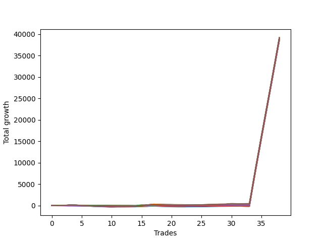

# Short Wallace Doodle 019 
- Symbol: NQ
- Date Range: 03/18/2022 - 06/17/2022
- Trading Period: 7:20-12:30
- Number of Trades: 38



| Name | Win Percent | Profit | Avg Profit / Trade |     | Name | Win Percent | Profit | Avg Profit / Trade |
| ---- | ----------- | ------ | ------------------ | --- | ---- | ----------- | ------ | ------------------ |
| Sorted By <br> Profit | | | | | Sorted By <br> Win Percentage ||||
| Seventy-Five | 60.53 | 19608500.00 | 516013.16 |     | Two | 63.16 | 19459250.00 | 512085.53 |
| Five | 57.89 | 19596375.00 | 515694.08 |     | One | 63.16 | 19399000.00 | 510500.00 |
| Seventy-One | 57.89 | 19565500.00 | 514881.58 |     | Zero | 63.16 | 19312250.00 | 508217.11 |
| Fifty-Five | 57.89 | 19565500.00 | 514881.58 |     | Seventy-Five | 60.53 | 19608500.00 | 516013.16 |
| Thirty-Nine | 57.89 | 19565500.00 | 514881.58 |     | Seventy | 60.53 | 19543375.00 | 514299.34 |
| Twenty-Three | 57.89 | 19565500.00 | 514881.58 |     | Fifty-Four | 60.53 | 19543375.00 | 514299.34 |
| Seven | 57.89 | 19565500.00 | 514881.58 |     | Thirty-Eight | 60.53 | 19543375.00 | 514299.34 |
| Seventy | 60.53 | 19543375.00 | 514299.34 |     | Twenty-Two | 60.53 | 19543375.00 | 514299.34 |
| Fifty-Four | 60.53 | 19543375.00 | 514299.34 |     | Six | 60.53 | 19543375.00 | 514299.34 |
| Thirty-Eight | 60.53 | 19543375.00 | 514299.34 |     | Four | 60.53 | 19520750.00 | 513703.95 |
| Twenty-Two | 60.53 | 19543375.00 | 514299.34 |     | Three | 60.53 | 19453375.00 | 511930.92 |
| Six | 60.53 | 19543375.00 | 514299.34 |     | Five | 57.89 | 19596375.00 | 515694.08 |
| Four | 60.53 | 19520750.00 | 513703.95 |     | Seventy-One | 57.89 | 19565500.00 | 514881.58 |
| Sixty-Three | 31.58 | 19476000.00 | 512526.32 |     | Fifty-Five | 57.89 | 19565500.00 | 514881.58 |
| Sixty-Two | 34.21 | 19471250.00 | 512401.32 |     | Thirty-Nine | 57.89 | 19565500.00 | 514881.58 |
| Seventy-Two | 57.89 | 19470750.00 | 512388.16 |     | Twenty-Three | 57.89 | 19565500.00 | 514881.58 |
| Seventy-Four | 55.26 | 19463125.00 | 512187.50 |     | Seven | 57.89 | 19565500.00 | 514881.58 |
| Two | 63.16 | 19459250.00 | 512085.53 |     | Seventy-Two | 57.89 | 19470750.00 | 512388.16 |
| Three | 60.53 | 19453375.00 | 511930.92 |     | Seventy-Four | 55.26 | 19463125.00 | 512187.50 |
| Thirty-One | 23.68 | 19442125.00 | 511634.87 |     | Twenty-One | 52.63 | 19364375.00 | 509588.82 |
| Forty-Seven | 23.68 | 19424875.00 | 511180.92 |     | Twenty | 52.63 | 19364375.00 | 509588.82 |
| Thirty | 23.68 | 19413500.00 | 510881.58 |     | Nineteen | 52.63 | 19364375.00 | 509588.82 |
| Fifteen | 21.05 | 19401000.00 | 510552.63 |     | Eighteen | 52.63 | 19364375.00 | 509588.82 |
| One | 63.16 | 19399000.00 | 510500.00 |     | Seventeen | 52.63 | 19364375.00 | 509588.82 |
| Forty-Six | 23.68 | 19396250.00 | 510427.63 |     | Sixten | 52.63 | 19364375.00 | 509588.82 |
| Sixty-Seven | 44.74 | 19388625.00 | 510226.97 |     | Fifty-One | 47.37 | 19358500.00 | 509434.21 |
| Sixty-Four | 44.74 | 19387125.00 | 510187.50 |     | Forty-Eight | 47.37 | 19357000.00 | 509394.74 |
| Seventy-Three | 44.74 | 19383500.00 | 510092.11 |     | Fifty-Three | 47.37 | 19355750.00 | 509361.84 |
| Sixty-Five | 42.11 | 19379750.00 | 509993.42 |     | Fifty-Two | 47.37 | 19355750.00 | 509361.84 |
| Sixty-Nine | 42.11 | 19377875.00 | 509944.08 |     | Fifty | 47.37 | 19355750.00 | 509361.84 |
| Sixty-Eight | 42.11 | 19377875.00 | 509944.08 |     | Forty-Nine | 47.37 | 19355750.00 | 509361.84 |
| Sixty-Six | 42.11 | 19377875.00 | 509944.08 |     | Sixty-Seven | 44.74 | 19388625.00 | 510226.97 |
| Fourteen | 21.05 | 19377125.00 | 509924.34 |     | Sixty-Four | 44.74 | 19387125.00 | 510187.50 |
| Twenty-One | 52.63 | 19364375.00 | 509588.82 |     | Seventy-Three | 44.74 | 19383500.00 | 510092.11 |
| Twenty | 52.63 | 19364375.00 | 509588.82 |     | Thirty-Two | 44.74 | 19354625.00 | 509332.24 |
| Nineteen | 52.63 | 19364375.00 | 509588.82 |     | Thirty-Seven | 44.74 | 19354125.00 | 509319.08 |
| Eighteen | 52.63 | 19364375.00 | 509588.82 |     | Thirty-Six | 44.74 | 19354125.00 | 509319.08 |
| Seventeen | 52.63 | 19364375.00 | 509588.82 |     | Thirty-Five | 44.74 | 19354125.00 | 509319.08 |
| Sixten | 52.63 | 19364375.00 | 509588.82 |     | Thirty-Four | 44.74 | 19354125.00 | 509319.08 |
| Fifty-One | 47.37 | 19358500.00 | 509434.21 |     | Thirty-Three | 44.74 | 19354125.00 | 509319.08 |
| Forty-Eight | 47.37 | 19357000.00 | 509394.74 |     | Sixty-Five | 42.11 | 19379750.00 | 509993.42 |
| Fifty-Three | 47.37 | 19355750.00 | 509361.84 |     | Sixty-Nine | 42.11 | 19377875.00 | 509944.08 |
| Fifty-Two | 47.37 | 19355750.00 | 509361.84 |     | Sixty-Eight | 42.11 | 19377875.00 | 509944.08 |
| Fifty | 47.37 | 19355750.00 | 509361.84 |     | Sixty-Six | 42.11 | 19377875.00 | 509944.08 |
| Forty-Nine | 47.37 | 19355750.00 | 509361.84 |     | Fifty-Six | 39.47 | 19312250.00 | 508217.11 |
| Thirty-Two | 44.74 | 19354625.00 | 509332.24 |     | Fifty-Nine | 36.84 | 19328500.00 | 508644.74 |
| Thirty-Seven | 44.74 | 19354125.00 | 509319.08 |     | Sixty-Two | 34.21 | 19471250.00 | 512401.32 |
| Thirty-Six | 44.74 | 19354125.00 | 509319.08 |     | Fifty-Eight | 34.21 | 19321125.00 | 508450.66 |
| Thirty-Five | 44.74 | 19354125.00 | 509319.08 |     | Fifty-Seven | 34.21 | 19315125.00 | 508292.76 |
| Thirty-Four | 44.74 | 19354125.00 | 509319.08 |     | Thirteen | 34.21 | 19299875.00 | 507891.45 |
| Thirty-Three | 44.74 | 19354125.00 | 509319.08 |     | Twelve | 34.21 | 19299875.00 | 507891.45 |
| Sixty-One | 31.58 | 19338625.00 | 508911.18 |     | Eleven | 34.21 | 19299875.00 | 507891.45 |
| Fifty-Nine | 36.84 | 19328500.00 | 508644.74 |     | Ten | 34.21 | 19299875.00 | 507891.45 |
| Fifty-Eight | 34.21 | 19321125.00 | 508450.66 |     | Nine | 34.21 | 19299875.00 | 507891.45 |
| Fifty-Seven | 34.21 | 19315125.00 | 508292.76 |     | Eight | 34.21 | 19299875.00 | 507891.45 |
| Zero | 63.16 | 19312250.00 | 508217.11 |     | Sixty-Three | 31.58 | 19476000.00 | 512526.32 |
| Fifty-Six | 39.47 | 19312250.00 | 508217.11 |     | Sixty-One | 31.58 | 19338625.00 | 508911.18 |
| Sixty | 31.58 | 19306875.00 | 508075.66 |     | Sixty | 31.58 | 19306875.00 | 508075.66 |
| Forty | 31.58 | 19303750.00 | 507993.42 |     | Forty | 31.58 | 19303750.00 | 507993.42 |
| Forty-Three | 28.95 | 19302375.00 | 507957.24 |     | Forty-Three | 28.95 | 19302375.00 | 507957.24 |
| Thirteen | 34.21 | 19299875.00 | 507891.45 |     | Forty-One | 28.95 | 19296375.00 | 507799.34 |
| Twelve | 34.21 | 19299875.00 | 507891.45 |     | Twenty-Four | 28.95 | 19284625.00 | 507490.13 |
| Eleven | 34.21 | 19299875.00 | 507891.45 |     | Twenty-Nine | 28.95 | 19284125.00 | 507476.97 |
| Ten | 34.21 | 19299875.00 | 507891.45 |     | Twenty-Eight | 28.95 | 19284125.00 | 507476.97 |
| Nine | 34.21 | 19299875.00 | 507891.45 |     | twenty-Seven | 28.95 | 19284125.00 | 507476.97 |
| Eight | 34.21 | 19299875.00 | 507891.45 |     | Twenty-Six | 28.95 | 19284125.00 | 507476.97 |
| Forty-One | 28.95 | 19296375.00 | 507799.34 |     | Twenty-Five | 28.95 | 19284125.00 | 507476.97 |
| Twenty-Four | 28.95 | 19284625.00 | 507490.13 |     | Forty-Five | 28.95 | 19282375.00 | 507430.92 |
| Twenty-Nine | 28.95 | 19284125.00 | 507476.97 |     | Forty-Four | 28.95 | 19282375.00 | 507430.92 |
| Twenty-Eight | 28.95 | 19284125.00 | 507476.97 |     | Forty-Two | 28.95 | 19282375.00 | 507430.92 |
| twenty-Seven | 28.95 | 19284125.00 | 507476.97 |     | Thirty-One | 23.68 | 19442125.00 | 511634.87 |
| Twenty-Six | 28.95 | 19284125.00 | 507476.97 |     | Forty-Seven | 23.68 | 19424875.00 | 511180.92 |
| Twenty-Five | 28.95 | 19284125.00 | 507476.97 |     | Thirty | 23.68 | 19413500.00 | 510881.58 |
| Forty-Five | 28.95 | 19282375.00 | 507430.92 |     | Forty-Six | 23.68 | 19396250.00 | 510427.63 |
| Forty-Four | 28.95 | 19282375.00 | 507430.92 |     | Fifteen | 21.05 | 19401000.00 | 510552.63 |
| Forty-Two | 28.95 | 19282375.00 | 507430.92 |     | Fourteen | 21.05 | 19377125.00 | 509924.34 |

## NO STOPLOSS

### Test Zero
* Sell when price hits the middle line of the 20p bollinger
* No Stoploss
* Results:
```
Total Trades: 38
Percent Up: 36.84
Percent Down: 63.16
Total Points Moved Down: 38624.50
Potential Profit: 19312250.00
Total Points Ups: 513.75 Count Ups: 14
Total Points Downs: 39138.25 Count Downs: 24
```

<details><summary>Trades</summary>

<code>In: 2022-03-21 08:20:00		Out: 2022-03-21 08:35:40		Total Position Time: 15:40		Total Move Down: -18.75		Total to Date: -18.75</code> <br />
<code>In: 2022-03-25 07:37:00		Out: 2022-03-25 07:49:25		Total Position Time: 12:25		Total Move Down: 7.50		Total to Date: -11.25</code> <br />
<code>In: 2022-03-25 07:38:00		Out: 2022-03-25 07:49:25		Total Position Time: 11:25		Total Move Down: 11.00		Total to Date: -0.25</code> <br />
<code>In: 2022-03-28 11:12:00		Out: 2022-03-28 11:12:10		Total Position Time: 00:10		Total Move Down: 7.25		Total to Date: 7.00</code> <br />
<code>In: 2022-03-28 11:28:00		Out: 2022-03-28 11:57:55		Total Position Time: 29:55		Total Move Down: -60.00		Total to Date: -53.00</code> <br />
<code>In: 2022-03-28 11:29:00		Out: 2022-03-28 11:58:55		Total Position Time: 29:55		Total Move Down: -65.00		Total to Date: -118.00</code> <br />
<code>In: 2022-03-28 11:30:00		Out: 2022-03-28 11:59:55		Total Position Time: 29:55		Total Move Down: -70.00		Total to Date: -188.00</code> <br />
<code>In: 2022-03-28 11:31:00		Out: 2022-03-28 12:00:55		Total Position Time: 29:55		Total Move Down: -60.00		Total to Date: -248.00</code> <br />
<code>In: 2022-03-28 11:50:00		Out: 2022-03-28 12:12:55		Total Position Time: 22:55		Total Move Down: -33.75		Total to Date: -281.75</code> <br />
<code>In: 2022-03-28 11:52:00		Out: 2022-03-28 12:12:55		Total Position Time: 20:55		Total Move Down: -20.50		Total to Date: -302.25</code> <br />
<code>In: 2022-03-29 08:52:00		Out: 2022-03-29 08:56:30		Total Position Time: 04:30		Total Move Down: 9.50		Total to Date: -292.75</code> <br />
<code>In: 2022-03-29 10:50:00		Out: 2022-03-29 11:04:05		Total Position Time: 14:05		Total Move Down: 0.75		Total to Date: -292.00</code> <br />
<code>In: 2022-03-31 07:36:00		Out: 2022-03-31 07:42:05		Total Position Time: 06:05		Total Move Down: 23.00		Total to Date: -269.00</code> <br />
<code>In: 2022-04-06 10:43:00		Out: 2022-04-06 10:56:50		Total Position Time: 13:50		Total Move Down: 2.25		Total to Date: -266.75</code> <br />
<code>In: 2022-04-06 11:05:00		Out: 2022-04-06 11:06:05		Total Position Time: 01:05		Total Move Down: 39.50		Total to Date: -227.25</code> <br />
<code>In: 2022-04-06 12:03:00		Out: 2022-04-06 12:08:05		Total Position Time: 05:05		Total Move Down: 55.75		Total to Date: -171.50</code> <br />
<code>In: 2022-04-06 12:04:00		Out: 2022-04-06 12:08:05		Total Position Time: 04:05		Total Move Down: 59.00		Total to Date: -112.50</code> <br />
<code>In: 2022-04-07 11:54:00		Out: 2022-04-07 12:20:05		Total Position Time: 26:05		Total Move Down: -64.00		Total to Date: -176.50</code> <br />
<code>In: 2022-04-07 11:57:00		Out: 2022-04-07 12:20:05		Total Position Time: 23:05		Total Move Down: -55.75		Total to Date: -232.25</code> <br />
<code>In: 2022-04-07 12:00:00		Out: 2022-04-07 12:20:05		Total Position Time: 20:05		Total Move Down: -34.25		Total to Date: -266.50</code> <br />
<code>In: 2022-04-07 12:01:00		Out: 2022-04-07 12:20:05		Total Position Time: 19:05		Total Move Down: -22.00		Total to Date: -288.50</code> <br />
<code>In: 2022-04-07 12:03:00		Out: 2022-04-07 12:20:05		Total Position Time: 17:05		Total Move Down: -2.25		Total to Date: -290.75</code> <br />
<code>In: 2022-04-08 07:33:00		Out: 2022-04-08 07:38:35		Total Position Time: 05:35		Total Move Down: 22.50		Total to Date: -268.25</code> <br />
<code>In: 2022-04-18 11:27:00		Out: 2022-04-18 11:40:45		Total Position Time: 13:45		Total Move Down: 11.25		Total to Date: -257.00</code> <br />
<code>In: 2022-04-18 11:28:00		Out: 2022-04-18 11:40:45		Total Position Time: 12:45		Total Move Down: -3.00		Total to Date: -260.00</code> <br />
<code>In: 2022-04-25 09:39:00		Out: 2022-04-25 09:40:45		Total Position Time: 01:45		Total Move Down: 27.50		Total to Date: -232.50</code> <br />
<code>In: 2022-05-04 10:04:00		Out: 2022-05-04 10:10:10		Total Position Time: 06:10		Total Move Down: 33.75		Total to Date: -198.75</code> <br />
<code>In: 2022-05-16 09:05:00		Out: 2022-05-16 09:06:00		Total Position Time: 01:00		Total Move Down: 21.75		Total to Date: -177.00</code> <br />
<code>In: 2022-05-16 10:31:00		Out: 2022-05-16 10:42:15		Total Position Time: 11:15		Total Move Down: 10.25		Total to Date: -166.75</code> <br />
<code>In: 2022-05-24 09:18:00		Out: 2022-05-24 09:21:30		Total Position Time: 03:30		Total Move Down: 31.75		Total to Date: -135.00</code> <br />
<code>In: 2022-05-31 07:33:00		Out: 2022-05-31 07:37:45		Total Position Time: 04:45		Total Move Down: 27.50		Total to Date: -107.50</code> <br />
<code>In: 2022-05-31 07:42:00		Out: 2022-05-31 07:49:55		Total Position Time: 07:55		Total Move Down: -4.50		Total to Date: -112.00</code> <br />
<code>In: 2022-05-31 07:44:00		Out: 2022-05-31 07:49:55		Total Position Time: 05:55		Total Move Down: 17.00		Total to Date: -95.00</code> <br />
<code>In: 2022-06-10 12:29:00		Out: 2022-06-10 12:29:10		Total Position Time: 00:10		Total Move Down: 8014.00		Total to Date: 7919.00</code> <br />
<code>In: 2022-06-13 09:40:00		Out: 2022-06-13 09:40:10		Total Position Time: 00:10		Total Move Down: 7713.00		Total to Date: 15632.00</code> <br />
<code>In: 2022-06-14 10:12:00		Out: 2022-06-14 10:12:10		Total Position Time: 00:10		Total Move Down: 7614.25		Total to Date: 23246.25</code> <br />
<code>In: 2022-06-14 10:19:00		Out: 2022-06-14 10:19:10		Total Position Time: 00:10		Total Move Down: 7641.25		Total to Date: 30887.50</code> <br />
<code>In: 2022-06-15 09:04:00		Out: 2022-06-15 09:04:10		Total Position Time: 00:10		Total Move Down: 7737.00		Total to Date: 38624.50</code> <br />


</details>

### Test One
* Sell when the price hits the upper line of the 20p 1std bollinger
* No Stoploss
* Results:
```
Total Trades: 38
Percent Up: 36.84
Percent Down: 63.16
Total Points Moved Down: 38798.00
Potential Profit: 19399000.00
Total Points Ups: 463.00 Count Ups: 14
Total Points Downs: 39261.00 Count Downs: 24
```

<details><summary>Trades</summary>

<code>In: 2022-03-21 08:20:00		Out: 2022-03-21 08:36:05		Total Position Time: 16:05		Total Move Down: -6.00		Total to Date: -6.00</code> <br />
<code>In: 2022-03-25 07:37:00		Out: 2022-03-25 07:51:30		Total Position Time: 14:30		Total Move Down: 17.25		Total to Date: 11.25</code> <br />
<code>In: 2022-03-25 07:38:00		Out: 2022-03-25 07:51:30		Total Position Time: 13:30		Total Move Down: 20.75		Total to Date: 32.00</code> <br />
<code>In: 2022-03-28 11:12:00		Out: 2022-03-28 11:19:20		Total Position Time: 07:20		Total Move Down: 8.50		Total to Date: 40.50</code> <br />
<code>In: 2022-03-28 11:28:00		Out: 2022-03-28 11:57:55		Total Position Time: 29:55		Total Move Down: -60.00		Total to Date: -19.50</code> <br />
<code>In: 2022-03-28 11:29:00		Out: 2022-03-28 11:58:55		Total Position Time: 29:55		Total Move Down: -65.00		Total to Date: -84.50</code> <br />
<code>In: 2022-03-28 11:30:00		Out: 2022-03-28 11:59:55		Total Position Time: 29:55		Total Move Down: -70.00		Total to Date: -154.50</code> <br />
<code>In: 2022-03-28 11:31:00		Out: 2022-03-28 12:00:55		Total Position Time: 29:55		Total Move Down: -60.00		Total to Date: -214.50</code> <br />
<code>In: 2022-03-28 11:50:00		Out: 2022-03-28 12:19:55		Total Position Time: 29:55		Total Move Down: -39.75		Total to Date: -254.25</code> <br />
<code>In: 2022-03-28 11:52:00		Out: 2022-03-28 12:21:55		Total Position Time: 29:55		Total Move Down: -38.75		Total to Date: -293.00</code> <br />
<code>In: 2022-03-29 08:52:00		Out: 2022-03-29 08:58:40		Total Position Time: 06:40		Total Move Down: 17.75		Total to Date: -275.25</code> <br />
<code>In: 2022-03-29 10:50:00		Out: 2022-03-29 11:06:05		Total Position Time: 16:05		Total Move Down: 2.25		Total to Date: -273.00</code> <br />
<code>In: 2022-03-31 07:36:00		Out: 2022-03-31 08:02:55		Total Position Time: 26:55		Total Move Down: -7.25		Total to Date: -280.25</code> <br />
<code>In: 2022-04-06 10:43:00		Out: 2022-04-06 10:58:00		Total Position Time: 15:00		Total Move Down: 12.00		Total to Date: -268.25</code> <br />
<code>In: 2022-04-06 11:05:00		Out: 2022-04-06 11:07:25		Total Position Time: 02:25		Total Move Down: 62.25		Total to Date: -206.00</code> <br />
<code>In: 2022-04-06 12:03:00		Out: 2022-04-06 12:13:30		Total Position Time: 10:30		Total Move Down: 62.25		Total to Date: -143.75</code> <br />
<code>In: 2022-04-06 12:04:00		Out: 2022-04-06 12:13:30		Total Position Time: 09:30		Total Move Down: 65.50		Total to Date: -78.25</code> <br />
<code>In: 2022-04-07 11:54:00		Out: 2022-04-07 12:21:20		Total Position Time: 27:20		Total Move Down: -47.00		Total to Date: -125.25</code> <br />
<code>In: 2022-04-07 11:57:00		Out: 2022-04-07 12:21:20		Total Position Time: 24:20		Total Move Down: -38.75		Total to Date: -164.00</code> <br />
<code>In: 2022-04-07 12:00:00		Out: 2022-04-07 12:21:20		Total Position Time: 21:20		Total Move Down: -17.25		Total to Date: -181.25</code> <br />
<code>In: 2022-04-07 12:01:00		Out: 2022-04-07 12:21:20		Total Position Time: 20:20		Total Move Down: -5.00		Total to Date: -186.25</code> <br />
<code>In: 2022-04-07 12:03:00		Out: 2022-04-07 12:21:20		Total Position Time: 18:20		Total Move Down: 14.75		Total to Date: -171.50</code> <br />
<code>In: 2022-04-08 07:33:00		Out: 2022-04-08 07:44:30		Total Position Time: 11:30		Total Move Down: 26.50		Total to Date: -145.00</code> <br />
<code>In: 2022-04-18 11:27:00		Out: 2022-04-18 11:41:15		Total Position Time: 14:15		Total Move Down: 22.75		Total to Date: -122.25</code> <br />
<code>In: 2022-04-18 11:28:00		Out: 2022-04-18 11:41:15		Total Position Time: 13:15		Total Move Down: 8.50		Total to Date: -113.75</code> <br />
<code>In: 2022-04-25 09:39:00		Out: 2022-04-25 09:45:00		Total Position Time: 06:00		Total Move Down: 39.25		Total to Date: -74.50</code> <br />
<code>In: 2022-05-04 10:04:00		Out: 2022-05-04 10:11:25		Total Position Time: 07:25		Total Move Down: 49.00		Total to Date: -25.50</code> <br />
<code>In: 2022-05-16 09:05:00		Out: 2022-05-16 09:06:25		Total Position Time: 01:25		Total Move Down: 32.25		Total to Date: 6.75</code> <br />
<code>In: 2022-05-16 10:31:00		Out: 2022-05-16 10:42:35		Total Position Time: 11:35		Total Move Down: 20.75		Total to Date: 27.50</code> <br />
<code>In: 2022-05-24 09:18:00		Out: 2022-05-24 09:26:40		Total Position Time: 08:40		Total Move Down: 43.25		Total to Date: 70.75</code> <br />
<code>In: 2022-05-31 07:33:00		Out: 2022-05-31 07:58:05		Total Position Time: 25:05		Total Move Down: -2.75		Total to Date: 68.00</code> <br />
<code>In: 2022-05-31 07:42:00		Out: 2022-05-31 07:58:05		Total Position Time: 16:05		Total Move Down: -5.50		Total to Date: 62.50</code> <br />
<code>In: 2022-05-31 07:44:00		Out: 2022-05-31 07:58:05		Total Position Time: 14:05		Total Move Down: 16.00		Total to Date: 78.50</code> <br />
<code>In: 2022-06-10 12:29:00		Out: 2022-06-10 12:29:10		Total Position Time: 00:10		Total Move Down: 8014.00		Total to Date: 8092.50</code> <br />
<code>In: 2022-06-13 09:40:00		Out: 2022-06-13 09:40:10		Total Position Time: 00:10		Total Move Down: 7713.00		Total to Date: 15805.50</code> <br />
<code>In: 2022-06-14 10:12:00		Out: 2022-06-14 10:12:10		Total Position Time: 00:10		Total Move Down: 7614.25		Total to Date: 23419.75</code> <br />
<code>In: 2022-06-14 10:19:00		Out: 2022-06-14 10:19:10		Total Position Time: 00:10		Total Move Down: 7641.25		Total to Date: 31061.00</code> <br />
<code>In: 2022-06-15 09:04:00		Out: 2022-06-15 09:04:10		Total Position Time: 00:10		Total Move Down: 7737.00		Total to Date: 38798.00</code> <br />


</details>

### Test Two
* Sell when the price hits the upper line of the 20p 2std bollinger
* No Stoploss
* Results:
```
Total Trades: 38
Percent Up: 36.84
Percent Down: 63.16
Total Points Moved Down: 38918.50
Potential Profit: 19459250.00
Total Points Ups: 515.50 Count Ups: 14
Total Points Downs: 39434.00 Count Downs: 24
```

<details><summary>Trades</summary>

<code>In: 2022-03-21 08:20:00		Out: 2022-03-21 08:49:45		Total Position Time: 29:45		Total Move Down: -8.00		Total to Date: -8.00</code> <br />
<code>In: 2022-03-25 07:37:00		Out: 2022-03-25 07:53:50		Total Position Time: 16:50		Total Move Down: 26.00		Total to Date: 18.00</code> <br />
<code>In: 2022-03-25 07:38:00		Out: 2022-03-25 07:53:50		Total Position Time: 15:50		Total Move Down: 29.50		Total to Date: 47.50</code> <br />
<code>In: 2022-03-28 11:12:00		Out: 2022-03-28 11:41:55		Total Position Time: 29:55		Total Move Down: -19.25		Total to Date: 28.25</code> <br />
<code>In: 2022-03-28 11:28:00		Out: 2022-03-28 11:57:55		Total Position Time: 29:55		Total Move Down: -60.00		Total to Date: -31.75</code> <br />
<code>In: 2022-03-28 11:29:00		Out: 2022-03-28 11:58:55		Total Position Time: 29:55		Total Move Down: -65.00		Total to Date: -96.75</code> <br />
<code>In: 2022-03-28 11:30:00		Out: 2022-03-28 11:59:55		Total Position Time: 29:55		Total Move Down: -70.00		Total to Date: -166.75</code> <br />
<code>In: 2022-03-28 11:31:00		Out: 2022-03-28 12:00:55		Total Position Time: 29:55		Total Move Down: -60.00		Total to Date: -226.75</code> <br />
<code>In: 2022-03-28 11:50:00		Out: 2022-03-28 12:19:55		Total Position Time: 29:55		Total Move Down: -39.75		Total to Date: -266.50</code> <br />
<code>In: 2022-03-28 11:52:00		Out: 2022-03-28 12:21:55		Total Position Time: 29:55		Total Move Down: -38.75		Total to Date: -305.25</code> <br />
<code>In: 2022-03-29 08:52:00		Out: 2022-03-29 09:01:35		Total Position Time: 09:35		Total Move Down: 27.50		Total to Date: -277.75</code> <br />
<code>In: 2022-03-29 10:50:00		Out: 2022-03-29 11:06:20		Total Position Time: 16:20		Total Move Down: 6.25		Total to Date: -271.50</code> <br />
<code>In: 2022-03-31 07:36:00		Out: 2022-03-31 08:03:25		Total Position Time: 27:25		Total Move Down: 2.75		Total to Date: -268.75</code> <br />
<code>In: 2022-04-06 10:43:00		Out: 2022-04-06 11:00:00		Total Position Time: 17:00		Total Move Down: 17.50		Total to Date: -251.25</code> <br />
<code>In: 2022-04-06 11:05:00		Out: 2022-04-06 11:08:25		Total Position Time: 03:25		Total Move Down: 91.25		Total to Date: -160.00</code> <br />
<code>In: 2022-04-06 12:03:00		Out: 2022-04-06 12:20:25		Total Position Time: 17:25		Total Move Down: 95.50		Total to Date: -64.50</code> <br />
<code>In: 2022-04-06 12:04:00		Out: 2022-04-06 12:20:25		Total Position Time: 16:25		Total Move Down: 98.75		Total to Date: 34.25</code> <br />
<code>In: 2022-04-07 11:54:00		Out: 2022-04-07 12:23:55		Total Position Time: 29:55		Total Move Down: -47.50		Total to Date: -13.25</code> <br />
<code>In: 2022-04-07 11:57:00		Out: 2022-04-07 12:26:55		Total Position Time: 29:55		Total Move Down: -48.25		Total to Date: -61.50</code> <br />
<code>In: 2022-04-07 12:00:00		Out: 2022-04-07 12:29:55		Total Position Time: 29:55		Total Move Down: -9.75		Total to Date: -71.25</code> <br />
<code>In: 2022-04-07 12:01:00		Out: 2022-04-07 12:30:55		Total Position Time: 29:55		Total Move Down: -14.25		Total to Date: -85.50</code> <br />
<code>In: 2022-04-07 12:03:00		Out: 2022-04-07 12:32:55		Total Position Time: 29:55		Total Move Down: -5.00		Total to Date: -90.50</code> <br />
<code>In: 2022-04-08 07:33:00		Out: 2022-04-08 07:45:45		Total Position Time: 12:45		Total Move Down: 36.75		Total to Date: -53.75</code> <br />
<code>In: 2022-04-18 11:27:00		Out: 2022-04-18 11:43:10		Total Position Time: 16:10		Total Move Down: 21.25		Total to Date: -32.50</code> <br />
<code>In: 2022-04-18 11:28:00		Out: 2022-04-18 11:43:10		Total Position Time: 15:10		Total Move Down: 7.00		Total to Date: -25.50</code> <br />
<code>In: 2022-04-25 09:39:00		Out: 2022-04-25 10:01:20		Total Position Time: 22:20		Total Move Down: 72.50		Total to Date: 47.00</code> <br />
<code>In: 2022-05-04 10:04:00		Out: 2022-05-04 10:33:55		Total Position Time: 29:55		Total Move Down: 21.00		Total to Date: 68.00</code> <br />
<code>In: 2022-05-16 09:05:00		Out: 2022-05-16 09:11:35		Total Position Time: 06:35		Total Move Down: 40.00		Total to Date: 108.00</code> <br />
<code>In: 2022-05-16 10:31:00		Out: 2022-05-16 10:49:15		Total Position Time: 18:15		Total Move Down: 14.75		Total to Date: 122.75</code> <br />
<code>In: 2022-05-24 09:18:00		Out: 2022-05-24 09:32:40		Total Position Time: 14:40		Total Move Down: 74.25		Total to Date: 197.00</code> <br />
<code>In: 2022-05-31 07:33:00		Out: 2022-05-31 08:02:55		Total Position Time: 29:55		Total Move Down: -30.00		Total to Date: 167.00</code> <br />
<code>In: 2022-05-31 07:42:00		Out: 2022-05-31 08:08:40		Total Position Time: 26:40		Total Move Down: 5.25		Total to Date: 172.25</code> <br />
<code>In: 2022-05-31 07:44:00		Out: 2022-05-31 08:08:40		Total Position Time: 24:40		Total Move Down: 26.75		Total to Date: 199.00</code> <br />
<code>In: 2022-06-10 12:29:00		Out: 2022-06-10 12:29:10		Total Position Time: 00:10		Total Move Down: 8014.00		Total to Date: 8213.00</code> <br />
<code>In: 2022-06-13 09:40:00		Out: 2022-06-13 09:40:10		Total Position Time: 00:10		Total Move Down: 7713.00		Total to Date: 15926.00</code> <br />
<code>In: 2022-06-14 10:12:00		Out: 2022-06-14 10:12:10		Total Position Time: 00:10		Total Move Down: 7614.25		Total to Date: 23540.25</code> <br />
<code>In: 2022-06-14 10:19:00		Out: 2022-06-14 10:19:10		Total Position Time: 00:10		Total Move Down: 7641.25		Total to Date: 31181.50</code> <br />
<code>In: 2022-06-15 09:04:00		Out: 2022-06-15 09:04:10		Total Position Time: 00:10		Total Move Down: 7737.00		Total to Date: 38918.50</code> <br />


</details>

### Test Three
* Sell when price hits the middle line of the 50p bollinger
* No Stoploss
* Results:
```
Total Trades: 38
Percent Up: 39.47
Percent Down: 60.53
Total Points Moved Down: 38906.75
Potential Profit: 19453375.00
Total Points Ups: 520.50 Count Ups: 15
Total Points Downs: 39427.25 Count Downs: 23
```

<details><summary>Trades</summary>

<code>In: 2022-03-21 08:20:00		Out: 2022-03-21 08:49:55		Total Position Time: 29:55		Total Move Down: -15.00		Total to Date: -15.00</code> <br />
<code>In: 2022-03-25 07:37:00		Out: 2022-03-25 07:54:05		Total Position Time: 17:05		Total Move Down: 35.50		Total to Date: 20.50</code> <br />
<code>In: 2022-03-25 07:38:00		Out: 2022-03-25 07:54:05		Total Position Time: 16:05		Total Move Down: 39.00		Total to Date: 59.50</code> <br />
<code>In: 2022-03-28 11:12:00		Out: 2022-03-28 11:13:00		Total Position Time: 01:00		Total Move Down: 10.25		Total to Date: 69.75</code> <br />
<code>In: 2022-03-28 11:28:00		Out: 2022-03-28 11:57:55		Total Position Time: 29:55		Total Move Down: -60.00		Total to Date: 9.75</code> <br />
<code>In: 2022-03-28 11:29:00		Out: 2022-03-28 11:58:55		Total Position Time: 29:55		Total Move Down: -65.00		Total to Date: -55.25</code> <br />
<code>In: 2022-03-28 11:30:00		Out: 2022-03-28 11:59:55		Total Position Time: 29:55		Total Move Down: -70.00		Total to Date: -125.25</code> <br />
<code>In: 2022-03-28 11:31:00		Out: 2022-03-28 12:00:55		Total Position Time: 29:55		Total Move Down: -60.00		Total to Date: -185.25</code> <br />
<code>In: 2022-03-28 11:50:00		Out: 2022-03-28 12:19:55		Total Position Time: 29:55		Total Move Down: -39.75		Total to Date: -225.00</code> <br />
<code>In: 2022-03-28 11:52:00		Out: 2022-03-28 12:21:55		Total Position Time: 29:55		Total Move Down: -38.75		Total to Date: -263.75</code> <br />
<code>In: 2022-03-29 08:52:00		Out: 2022-03-29 09:00:25		Total Position Time: 08:25		Total Move Down: 21.75		Total to Date: -242.00</code> <br />
<code>In: 2022-03-29 10:50:00		Out: 2022-03-29 11:18:55		Total Position Time: 28:55		Total Move Down: 12.75		Total to Date: -229.25</code> <br />
<code>In: 2022-03-31 07:36:00		Out: 2022-03-31 08:05:55		Total Position Time: 29:55		Total Move Down: -14.50		Total to Date: -243.75</code> <br />
<code>In: 2022-04-06 10:43:00		Out: 2022-04-06 11:00:10		Total Position Time: 17:10		Total Move Down: 43.50		Total to Date: -200.25</code> <br />
<code>In: 2022-04-06 11:05:00		Out: 2022-04-06 11:07:35		Total Position Time: 02:35		Total Move Down: 73.00		Total to Date: -127.25</code> <br />
<code>In: 2022-04-06 12:03:00		Out: 2022-04-06 12:20:00		Total Position Time: 17:00		Total Move Down: 81.75		Total to Date: -45.50</code> <br />
<code>In: 2022-04-06 12:04:00		Out: 2022-04-06 12:20:00		Total Position Time: 16:00		Total Move Down: 85.00		Total to Date: 39.50</code> <br />
<code>In: 2022-04-07 11:54:00		Out: 2022-04-07 12:23:55		Total Position Time: 29:55		Total Move Down: -47.50		Total to Date: -8.00</code> <br />
<code>In: 2022-04-07 11:57:00		Out: 2022-04-07 12:26:55		Total Position Time: 29:55		Total Move Down: -48.25		Total to Date: -56.25</code> <br />
<code>In: 2022-04-07 12:00:00		Out: 2022-04-07 12:29:55		Total Position Time: 29:55		Total Move Down: -9.75		Total to Date: -66.00</code> <br />
<code>In: 2022-04-07 12:01:00		Out: 2022-04-07 12:30:55		Total Position Time: 29:55		Total Move Down: -14.25		Total to Date: -80.25</code> <br />
<code>In: 2022-04-07 12:03:00		Out: 2022-04-07 12:32:55		Total Position Time: 29:55		Total Move Down: -5.00		Total to Date: -85.25</code> <br />
<code>In: 2022-04-08 07:33:00		Out: 2022-04-08 07:45:55		Total Position Time: 12:55		Total Move Down: 42.75		Total to Date: -42.50</code> <br />
<code>In: 2022-04-18 11:27:00		Out: 2022-04-18 11:41:15		Total Position Time: 14:15		Total Move Down: 22.75		Total to Date: -19.75</code> <br />
<code>In: 2022-04-18 11:28:00		Out: 2022-04-18 11:41:15		Total Position Time: 13:15		Total Move Down: 8.50		Total to Date: -11.25</code> <br />
<code>In: 2022-04-25 09:39:00		Out: 2022-04-25 09:55:05		Total Position Time: 16:05		Total Move Down: 34.25		Total to Date: 23.00</code> <br />
<code>In: 2022-05-04 10:04:00		Out: 2022-05-04 10:11:45		Total Position Time: 07:45		Total Move Down: 55.50		Total to Date: 78.50</code> <br />
<code>In: 2022-05-16 09:05:00		Out: 2022-05-16 09:15:55		Total Position Time: 10:55		Total Move Down: 51.50		Total to Date: 130.00</code> <br />
<code>In: 2022-05-16 10:31:00		Out: 2022-05-16 11:00:20		Total Position Time: 29:20		Total Move Down: 20.25		Total to Date: 150.25</code> <br />
<code>In: 2022-05-24 09:18:00		Out: 2022-05-24 09:31:10		Total Position Time: 13:10		Total Move Down: 51.00		Total to Date: 201.25</code> <br />
<code>In: 2022-05-31 07:33:00		Out: 2022-05-31 08:02:55		Total Position Time: 29:55		Total Move Down: -30.00		Total to Date: 171.25</code> <br />
<code>In: 2022-05-31 07:42:00		Out: 2022-05-31 08:08:30		Total Position Time: 26:30		Total Move Down: -2.75		Total to Date: 168.50</code> <br />
<code>In: 2022-05-31 07:44:00		Out: 2022-05-31 08:08:30		Total Position Time: 24:30		Total Move Down: 18.75		Total to Date: 187.25</code> <br />
<code>In: 2022-06-10 12:29:00		Out: 2022-06-10 12:29:10		Total Position Time: 00:10		Total Move Down: 8014.00		Total to Date: 8201.25</code> <br />
<code>In: 2022-06-13 09:40:00		Out: 2022-06-13 09:40:10		Total Position Time: 00:10		Total Move Down: 7713.00		Total to Date: 15914.25</code> <br />
<code>In: 2022-06-14 10:12:00		Out: 2022-06-14 10:12:10		Total Position Time: 00:10		Total Move Down: 7614.25		Total to Date: 23528.50</code> <br />
<code>In: 2022-06-14 10:19:00		Out: 2022-06-14 10:19:10		Total Position Time: 00:10		Total Move Down: 7641.25		Total to Date: 31169.75</code> <br />
<code>In: 2022-06-15 09:04:00		Out: 2022-06-15 09:04:10		Total Position Time: 00:10		Total Move Down: 7737.00		Total to Date: 38906.75</code> <br />


</details>

### Test Four
* Sell when the price hits the upper line of the 50p 1std bollinger
* No Stoploss
* Results:
```
Total Trades: 38
Percent Up: 39.47
Percent Down: 60.53
Total Points Moved Down: 39041.50
Potential Profit: 19520750.00
Total Points Ups: 593.50 Count Ups: 15
Total Points Downs: 39635.00 Count Downs: 23
```

<details><summary>Trades</summary>

<code>In: 2022-03-21 08:20:00		Out: 2022-03-21 08:49:55		Total Position Time: 29:55		Total Move Down: -15.00		Total to Date: -15.00</code> <br />
<code>In: 2022-03-25 07:37:00		Out: 2022-03-25 07:56:05		Total Position Time: 19:05		Total Move Down: 59.50		Total to Date: 44.50</code> <br />
<code>In: 2022-03-25 07:38:00		Out: 2022-03-25 07:56:05		Total Position Time: 18:05		Total Move Down: 63.00		Total to Date: 107.50</code> <br />
<code>In: 2022-03-28 11:12:00		Out: 2022-03-28 11:20:40		Total Position Time: 08:40		Total Move Down: 12.50		Total to Date: 120.00</code> <br />
<code>In: 2022-03-28 11:28:00		Out: 2022-03-28 11:57:55		Total Position Time: 29:55		Total Move Down: -60.00		Total to Date: 60.00</code> <br />
<code>In: 2022-03-28 11:29:00		Out: 2022-03-28 11:58:55		Total Position Time: 29:55		Total Move Down: -65.00		Total to Date: -5.00</code> <br />
<code>In: 2022-03-28 11:30:00		Out: 2022-03-28 11:59:55		Total Position Time: 29:55		Total Move Down: -70.00		Total to Date: -75.00</code> <br />
<code>In: 2022-03-28 11:31:00		Out: 2022-03-28 12:00:55		Total Position Time: 29:55		Total Move Down: -60.00		Total to Date: -135.00</code> <br />
<code>In: 2022-03-28 11:50:00		Out: 2022-03-28 12:19:55		Total Position Time: 29:55		Total Move Down: -39.75		Total to Date: -174.75</code> <br />
<code>In: 2022-03-28 11:52:00		Out: 2022-03-28 12:21:55		Total Position Time: 29:55		Total Move Down: -38.75		Total to Date: -213.50</code> <br />
<code>In: 2022-03-29 08:52:00		Out: 2022-03-29 09:02:10		Total Position Time: 10:10		Total Move Down: 39.25		Total to Date: -174.25</code> <br />
<code>In: 2022-03-29 10:50:00		Out: 2022-03-29 11:19:55		Total Position Time: 29:55		Total Move Down: 9.25		Total to Date: -165.00</code> <br />
<code>In: 2022-03-31 07:36:00		Out: 2022-03-31 08:05:55		Total Position Time: 29:55		Total Move Down: -14.50		Total to Date: -179.50</code> <br />
<code>In: 2022-04-06 10:43:00		Out: 2022-04-06 11:09:20		Total Position Time: 26:20		Total Move Down: 54.75		Total to Date: -124.75</code> <br />
<code>In: 2022-04-06 11:05:00		Out: 2022-04-06 11:09:20		Total Position Time: 04:20		Total Move Down: 105.50		Total to Date: -19.25</code> <br />
<code>In: 2022-04-06 12:03:00		Out: 2022-04-06 12:22:15		Total Position Time: 19:15		Total Move Down: 119.00		Total to Date: 99.75</code> <br />
<code>In: 2022-04-06 12:04:00		Out: 2022-04-06 12:22:15		Total Position Time: 18:15		Total Move Down: 122.25		Total to Date: 222.00</code> <br />
<code>In: 2022-04-07 11:54:00		Out: 2022-04-07 12:23:55		Total Position Time: 29:55		Total Move Down: -47.50		Total to Date: 174.50</code> <br />
<code>In: 2022-04-07 11:57:00		Out: 2022-04-07 12:26:55		Total Position Time: 29:55		Total Move Down: -48.25		Total to Date: 126.25</code> <br />
<code>In: 2022-04-07 12:00:00		Out: 2022-04-07 12:29:55		Total Position Time: 29:55		Total Move Down: -9.75		Total to Date: 116.50</code> <br />
<code>In: 2022-04-07 12:01:00		Out: 2022-04-07 12:30:55		Total Position Time: 29:55		Total Move Down: -14.25		Total to Date: 102.25</code> <br />
<code>In: 2022-04-07 12:03:00		Out: 2022-04-07 12:32:55		Total Position Time: 29:55		Total Move Down: -5.00		Total to Date: 97.25</code> <br />
<code>In: 2022-04-08 07:33:00		Out: 2022-04-08 08:02:55		Total Position Time: 29:55		Total Move Down: -75.75		Total to Date: 21.50</code> <br />
<code>In: 2022-04-18 11:27:00		Out: 2022-04-18 11:46:40		Total Position Time: 19:40		Total Move Down: 35.25		Total to Date: 56.75</code> <br />
<code>In: 2022-04-18 11:28:00		Out: 2022-04-18 11:46:40		Total Position Time: 18:40		Total Move Down: 21.00		Total to Date: 77.75</code> <br />
<code>In: 2022-04-25 09:39:00		Out: 2022-04-25 10:00:45		Total Position Time: 21:45		Total Move Down: 53.50		Total to Date: 131.25</code> <br />
<code>In: 2022-05-04 10:04:00		Out: 2022-05-04 10:33:55		Total Position Time: 29:55		Total Move Down: 21.00		Total to Date: 152.25</code> <br />
<code>In: 2022-05-16 09:05:00		Out: 2022-05-16 09:24:25		Total Position Time: 19:25		Total Move Down: 71.50		Total to Date: 223.75</code> <br />
<code>In: 2022-05-16 10:31:00		Out: 2022-05-16 11:00:55		Total Position Time: 29:55		Total Move Down: 25.00		Total to Date: 248.75</code> <br />
<code>In: 2022-05-24 09:18:00		Out: 2022-05-24 09:33:05		Total Position Time: 15:05		Total Move Down: 75.50		Total to Date: 324.25</code> <br />
<code>In: 2022-05-31 07:33:00		Out: 2022-05-31 08:02:55		Total Position Time: 29:55		Total Move Down: -30.00		Total to Date: 294.25</code> <br />
<code>In: 2022-05-31 07:42:00		Out: 2022-05-31 08:11:55		Total Position Time: 29:55		Total Move Down: 2.50		Total to Date: 296.75</code> <br />
<code>In: 2022-05-31 07:44:00		Out: 2022-05-31 08:13:55		Total Position Time: 29:55		Total Move Down: 25.25		Total to Date: 322.00</code> <br />
<code>In: 2022-06-10 12:29:00		Out: 2022-06-10 12:29:10		Total Position Time: 00:10		Total Move Down: 8014.00		Total to Date: 8336.00</code> <br />
<code>In: 2022-06-13 09:40:00		Out: 2022-06-13 09:40:10		Total Position Time: 00:10		Total Move Down: 7713.00		Total to Date: 16049.00</code> <br />
<code>In: 2022-06-14 10:12:00		Out: 2022-06-14 10:12:10		Total Position Time: 00:10		Total Move Down: 7614.25		Total to Date: 23663.25</code> <br />
<code>In: 2022-06-14 10:19:00		Out: 2022-06-14 10:19:10		Total Position Time: 00:10		Total Move Down: 7641.25		Total to Date: 31304.50</code> <br />
<code>In: 2022-06-15 09:04:00		Out: 2022-06-15 09:04:10		Total Position Time: 00:10		Total Move Down: 7737.00		Total to Date: 39041.50</code> <br />


</details>

### Test Five
* Sell when the price hits the upper line of the 50p 2std bollinger
* No Stoploss
* Results:
```
Total Trades: 38
Percent Up: 42.11
Percent Down: 57.89
Total Points Moved Down: 39192.75
Potential Profit: 19596375.00
Total Points Ups: 612.75 Count Ups: 16
Total Points Downs: 39805.50 Count Downs: 22
```

<details><summary>Trades</summary>

<code>In: 2022-03-21 08:20:00		Out: 2022-03-21 08:49:55		Total Position Time: 29:55		Total Move Down: -15.00		Total to Date: -15.00</code> <br />
<code>In: 2022-03-25 07:37:00		Out: 2022-03-25 08:06:55		Total Position Time: 29:55		Total Move Down: 67.50		Total to Date: 52.50</code> <br />
<code>In: 2022-03-25 07:38:00		Out: 2022-03-25 08:07:55		Total Position Time: 29:55		Total Move Down: 87.50		Total to Date: 140.00</code> <br />
<code>In: 2022-03-28 11:12:00		Out: 2022-03-28 11:41:55		Total Position Time: 29:55		Total Move Down: -19.25		Total to Date: 120.75</code> <br />
<code>In: 2022-03-28 11:28:00		Out: 2022-03-28 11:57:55		Total Position Time: 29:55		Total Move Down: -60.00		Total to Date: 60.75</code> <br />
<code>In: 2022-03-28 11:29:00		Out: 2022-03-28 11:58:55		Total Position Time: 29:55		Total Move Down: -65.00		Total to Date: -4.25</code> <br />
<code>In: 2022-03-28 11:30:00		Out: 2022-03-28 11:59:55		Total Position Time: 29:55		Total Move Down: -70.00		Total to Date: -74.25</code> <br />
<code>In: 2022-03-28 11:31:00		Out: 2022-03-28 12:00:55		Total Position Time: 29:55		Total Move Down: -60.00		Total to Date: -134.25</code> <br />
<code>In: 2022-03-28 11:50:00		Out: 2022-03-28 12:19:55		Total Position Time: 29:55		Total Move Down: -39.75		Total to Date: -174.00</code> <br />
<code>In: 2022-03-28 11:52:00		Out: 2022-03-28 12:21:55		Total Position Time: 29:55		Total Move Down: -38.75		Total to Date: -212.75</code> <br />
<code>In: 2022-03-29 08:52:00		Out: 2022-03-29 09:21:55		Total Position Time: 29:55		Total Move Down: 24.00		Total to Date: -188.75</code> <br />
<code>In: 2022-03-29 10:50:00		Out: 2022-03-29 11:19:55		Total Position Time: 29:55		Total Move Down: 9.25		Total to Date: -179.50</code> <br />
<code>In: 2022-03-31 07:36:00		Out: 2022-03-31 08:05:55		Total Position Time: 29:55		Total Move Down: -14.50		Total to Date: -194.00</code> <br />
<code>In: 2022-04-06 10:43:00		Out: 2022-04-06 11:12:55		Total Position Time: 29:55		Total Move Down: 81.00		Total to Date: -113.00</code> <br />
<code>In: 2022-04-06 11:05:00		Out: 2022-04-06 11:14:50		Total Position Time: 09:50		Total Move Down: 150.00		Total to Date: 37.00</code> <br />
<code>In: 2022-04-06 12:03:00		Out: 2022-04-06 12:32:55		Total Position Time: 29:55		Total Move Down: 151.50		Total to Date: 188.50</code> <br />
<code>In: 2022-04-06 12:04:00		Out: 2022-04-06 12:33:55		Total Position Time: 29:55		Total Move Down: 156.75		Total to Date: 345.25</code> <br />
<code>In: 2022-04-07 11:54:00		Out: 2022-04-07 12:23:55		Total Position Time: 29:55		Total Move Down: -47.50		Total to Date: 297.75</code> <br />
<code>In: 2022-04-07 11:57:00		Out: 2022-04-07 12:26:55		Total Position Time: 29:55		Total Move Down: -48.25		Total to Date: 249.50</code> <br />
<code>In: 2022-04-07 12:00:00		Out: 2022-04-07 12:29:55		Total Position Time: 29:55		Total Move Down: -9.75		Total to Date: 239.75</code> <br />
<code>In: 2022-04-07 12:01:00		Out: 2022-04-07 12:30:55		Total Position Time: 29:55		Total Move Down: -14.25		Total to Date: 225.50</code> <br />
<code>In: 2022-04-07 12:03:00		Out: 2022-04-07 12:32:55		Total Position Time: 29:55		Total Move Down: -5.00		Total to Date: 220.50</code> <br />
<code>In: 2022-04-08 07:33:00		Out: 2022-04-08 08:02:55		Total Position Time: 29:55		Total Move Down: -75.75		Total to Date: 144.75</code> <br />
<code>In: 2022-04-18 11:27:00		Out: 2022-04-18 11:56:55		Total Position Time: 29:55		Total Move Down: 36.00		Total to Date: 180.75</code> <br />
<code>In: 2022-04-18 11:28:00		Out: 2022-04-18 11:57:55		Total Position Time: 29:55		Total Move Down: 16.00		Total to Date: 196.75</code> <br />
<code>In: 2022-04-25 09:39:00		Out: 2022-04-25 10:01:40		Total Position Time: 22:40		Total Move Down: 73.50		Total to Date: 270.25</code> <br />
<code>In: 2022-05-04 10:04:00		Out: 2022-05-04 10:33:55		Total Position Time: 29:55		Total Move Down: 21.00		Total to Date: 291.25</code> <br />
<code>In: 2022-05-16 09:05:00		Out: 2022-05-16 09:34:55		Total Position Time: 29:55		Total Move Down: 54.75		Total to Date: 346.00</code> <br />
<code>In: 2022-05-16 10:31:00		Out: 2022-05-16 11:00:55		Total Position Time: 29:55		Total Move Down: 25.00		Total to Date: 371.00</code> <br />
<code>In: 2022-05-24 09:18:00		Out: 2022-05-24 09:47:55		Total Position Time: 29:55		Total Move Down: 104.50		Total to Date: 475.50</code> <br />
<code>In: 2022-05-31 07:33:00		Out: 2022-05-31 08:02:55		Total Position Time: 29:55		Total Move Down: -30.00		Total to Date: 445.50</code> <br />
<code>In: 2022-05-31 07:42:00		Out: 2022-05-31 08:11:55		Total Position Time: 29:55		Total Move Down: 2.50		Total to Date: 448.00</code> <br />
<code>In: 2022-05-31 07:44:00		Out: 2022-05-31 08:13:55		Total Position Time: 29:55		Total Move Down: 25.25		Total to Date: 473.25</code> <br />
<code>In: 2022-06-10 12:29:00		Out: 2022-06-10 12:29:10		Total Position Time: 00:10		Total Move Down: 8014.00		Total to Date: 8487.25</code> <br />
<code>In: 2022-06-13 09:40:00		Out: 2022-06-13 09:40:10		Total Position Time: 00:10		Total Move Down: 7713.00		Total to Date: 16200.25</code> <br />
<code>In: 2022-06-14 10:12:00		Out: 2022-06-14 10:12:10		Total Position Time: 00:10		Total Move Down: 7614.25		Total to Date: 23814.50</code> <br />
<code>In: 2022-06-14 10:19:00		Out: 2022-06-14 10:19:10		Total Position Time: 00:10		Total Move Down: 7641.25		Total to Date: 31455.75</code> <br />
<code>In: 2022-06-15 09:04:00		Out: 2022-06-15 09:04:10		Total Position Time: 00:10		Total Move Down: 7737.00		Total to Date: 39192.75</code> <br />


</details>

### Test Six
* Sell when the price hits the middle line of the 1std VWAP
* No Stoploss
* Results:
```
Total Trades: 38
Percent Up: 39.47
Percent Down: 60.53
Total Points Moved Down: 39086.75
Potential Profit: 19543375.00
Total Points Ups: 537.00 Count Ups: 15
Total Points Downs: 39623.75 Count Downs: 23
```

<details><summary>Trades</summary>

<code>In: 2022-03-21 08:20:00		Out: 2022-03-21 08:49:55		Total Position Time: 29:55		Total Move Down: -15.00		Total to Date: -15.00</code> <br />
<code>In: 2022-03-25 07:37:00		Out: 2022-03-25 07:54:10		Total Position Time: 17:10		Total Move Down: 40.50		Total to Date: 25.50</code> <br />
<code>In: 2022-03-25 07:38:00		Out: 2022-03-25 07:54:10		Total Position Time: 16:10		Total Move Down: 44.00		Total to Date: 69.50</code> <br />
<code>In: 2022-03-28 11:12:00		Out: 2022-03-28 11:41:55		Total Position Time: 29:55		Total Move Down: -19.25		Total to Date: 50.25</code> <br />
<code>In: 2022-03-28 11:28:00		Out: 2022-03-28 11:57:55		Total Position Time: 29:55		Total Move Down: -60.00		Total to Date: -9.75</code> <br />
<code>In: 2022-03-28 11:29:00		Out: 2022-03-28 11:58:55		Total Position Time: 29:55		Total Move Down: -65.00		Total to Date: -74.75</code> <br />
<code>In: 2022-03-28 11:30:00		Out: 2022-03-28 11:59:55		Total Position Time: 29:55		Total Move Down: -70.00		Total to Date: -144.75</code> <br />
<code>In: 2022-03-28 11:31:00		Out: 2022-03-28 12:00:55		Total Position Time: 29:55		Total Move Down: -60.00		Total to Date: -204.75</code> <br />
<code>In: 2022-03-28 11:50:00		Out: 2022-03-28 12:19:55		Total Position Time: 29:55		Total Move Down: -39.75		Total to Date: -244.50</code> <br />
<code>In: 2022-03-28 11:52:00		Out: 2022-03-28 12:21:55		Total Position Time: 29:55		Total Move Down: -38.75		Total to Date: -283.25</code> <br />
<code>In: 2022-03-29 08:52:00		Out: 2022-03-29 09:02:10		Total Position Time: 10:10		Total Move Down: 39.25		Total to Date: -244.00</code> <br />
<code>In: 2022-03-29 10:50:00		Out: 2022-03-29 11:19:55		Total Position Time: 29:55		Total Move Down: 9.25		Total to Date: -234.75</code> <br />
<code>In: 2022-03-31 07:36:00		Out: 2022-03-31 08:05:55		Total Position Time: 29:55		Total Move Down: -14.50		Total to Date: -249.25</code> <br />
<code>In: 2022-04-06 10:43:00		Out: 2022-04-06 11:00:10		Total Position Time: 17:10		Total Move Down: 43.50		Total to Date: -205.75</code> <br />
<code>In: 2022-04-06 11:05:00		Out: 2022-04-06 11:08:10		Total Position Time: 03:10		Total Move Down: 86.25		Total to Date: -119.50</code> <br />
<code>In: 2022-04-06 12:03:00		Out: 2022-04-06 12:25:35		Total Position Time: 22:35		Total Move Down: 134.50		Total to Date: 15.00</code> <br />
<code>In: 2022-04-06 12:04:00		Out: 2022-04-06 12:25:35		Total Position Time: 21:35		Total Move Down: 137.75		Total to Date: 152.75</code> <br />
<code>In: 2022-04-07 11:54:00		Out: 2022-04-07 12:23:55		Total Position Time: 29:55		Total Move Down: -47.50		Total to Date: 105.25</code> <br />
<code>In: 2022-04-07 11:57:00		Out: 2022-04-07 12:26:55		Total Position Time: 29:55		Total Move Down: -48.25		Total to Date: 57.00</code> <br />
<code>In: 2022-04-07 12:00:00		Out: 2022-04-07 12:29:55		Total Position Time: 29:55		Total Move Down: -9.75		Total to Date: 47.25</code> <br />
<code>In: 2022-04-07 12:01:00		Out: 2022-04-07 12:30:55		Total Position Time: 29:55		Total Move Down: -14.25		Total to Date: 33.00</code> <br />
<code>In: 2022-04-07 12:03:00		Out: 2022-04-07 12:32:55		Total Position Time: 29:55		Total Move Down: -5.00		Total to Date: 28.00</code> <br />
<code>In: 2022-04-08 07:33:00		Out: 2022-04-08 07:45:10		Total Position Time: 12:10		Total Move Down: 35.00		Total to Date: 63.00</code> <br />
<code>In: 2022-04-18 11:27:00		Out: 2022-04-18 11:56:55		Total Position Time: 29:55		Total Move Down: 36.00		Total to Date: 99.00</code> <br />
<code>In: 2022-04-18 11:28:00		Out: 2022-04-18 11:57:55		Total Position Time: 29:55		Total Move Down: 16.00		Total to Date: 115.00</code> <br />
<code>In: 2022-04-25 09:39:00		Out: 2022-04-25 10:01:00		Total Position Time: 22:00		Total Move Down: 57.00		Total to Date: 172.00</code> <br />
<code>In: 2022-05-04 10:04:00		Out: 2022-05-04 10:33:55		Total Position Time: 29:55		Total Move Down: 21.00		Total to Date: 193.00</code> <br />
<code>In: 2022-05-16 09:05:00		Out: 2022-05-16 09:17:45		Total Position Time: 12:45		Total Move Down: 56.50		Total to Date: 249.50</code> <br />
<code>In: 2022-05-16 10:31:00		Out: 2022-05-16 11:00:55		Total Position Time: 29:55		Total Move Down: 25.00		Total to Date: 274.50</code> <br />
<code>In: 2022-05-24 09:18:00		Out: 2022-05-24 09:36:50		Total Position Time: 18:50		Total Move Down: 95.00		Total to Date: 369.50</code> <br />
<code>In: 2022-05-31 07:33:00		Out: 2022-05-31 08:02:55		Total Position Time: 29:55		Total Move Down: -30.00		Total to Date: 339.50</code> <br />
<code>In: 2022-05-31 07:42:00		Out: 2022-05-31 08:11:55		Total Position Time: 29:55		Total Move Down: 2.50		Total to Date: 342.00</code> <br />
<code>In: 2022-05-31 07:44:00		Out: 2022-05-31 08:13:55		Total Position Time: 29:55		Total Move Down: 25.25		Total to Date: 367.25</code> <br />
<code>In: 2022-06-10 12:29:00		Out: 2022-06-10 12:29:10		Total Position Time: 00:10		Total Move Down: 8014.00		Total to Date: 8381.25</code> <br />
<code>In: 2022-06-13 09:40:00		Out: 2022-06-13 09:40:10		Total Position Time: 00:10		Total Move Down: 7713.00		Total to Date: 16094.25</code> <br />
<code>In: 2022-06-14 10:12:00		Out: 2022-06-14 10:12:10		Total Position Time: 00:10		Total Move Down: 7614.25		Total to Date: 23708.50</code> <br />
<code>In: 2022-06-14 10:19:00		Out: 2022-06-14 10:19:10		Total Position Time: 00:10		Total Move Down: 7641.25		Total to Date: 31349.75</code> <br />
<code>In: 2022-06-15 09:04:00		Out: 2022-06-15 09:04:10		Total Position Time: 00:10		Total Move Down: 7737.00		Total to Date: 39086.75</code> <br />


</details>

### Test Seven
* Sell when the price hits the upper line of the 1std VWAP
* No Stoploss
* Results:
```
Total Trades: 38
Percent Up: 42.11
Percent Down: 57.89
Total Points Moved Down: 39131.00
Potential Profit: 19565500.00
Total Points Ups: 612.75 Count Ups: 16
Total Points Downs: 39743.75 Count Downs: 22
```

<details><summary>Trades</summary>

<code>In: 2022-03-21 08:20:00		Out: 2022-03-21 08:49:55		Total Position Time: 29:55		Total Move Down: -15.00		Total to Date: -15.00</code> <br />
<code>In: 2022-03-25 07:37:00		Out: 2022-03-25 08:01:25		Total Position Time: 24:25		Total Move Down: 69.50		Total to Date: 54.50</code> <br />
<code>In: 2022-03-25 07:38:00		Out: 2022-03-25 08:01:25		Total Position Time: 23:25		Total Move Down: 73.00		Total to Date: 127.50</code> <br />
<code>In: 2022-03-28 11:12:00		Out: 2022-03-28 11:41:55		Total Position Time: 29:55		Total Move Down: -19.25		Total to Date: 108.25</code> <br />
<code>In: 2022-03-28 11:28:00		Out: 2022-03-28 11:57:55		Total Position Time: 29:55		Total Move Down: -60.00		Total to Date: 48.25</code> <br />
<code>In: 2022-03-28 11:29:00		Out: 2022-03-28 11:58:55		Total Position Time: 29:55		Total Move Down: -65.00		Total to Date: -16.75</code> <br />
<code>In: 2022-03-28 11:30:00		Out: 2022-03-28 11:59:55		Total Position Time: 29:55		Total Move Down: -70.00		Total to Date: -86.75</code> <br />
<code>In: 2022-03-28 11:31:00		Out: 2022-03-28 12:00:55		Total Position Time: 29:55		Total Move Down: -60.00		Total to Date: -146.75</code> <br />
<code>In: 2022-03-28 11:50:00		Out: 2022-03-28 12:19:55		Total Position Time: 29:55		Total Move Down: -39.75		Total to Date: -186.50</code> <br />
<code>In: 2022-03-28 11:52:00		Out: 2022-03-28 12:21:55		Total Position Time: 29:55		Total Move Down: -38.75		Total to Date: -225.25</code> <br />
<code>In: 2022-03-29 08:52:00		Out: 2022-03-29 09:21:55		Total Position Time: 29:55		Total Move Down: 24.00		Total to Date: -201.25</code> <br />
<code>In: 2022-03-29 10:50:00		Out: 2022-03-29 11:19:55		Total Position Time: 29:55		Total Move Down: 9.25		Total to Date: -192.00</code> <br />
<code>In: 2022-03-31 07:36:00		Out: 2022-03-31 08:05:55		Total Position Time: 29:55		Total Move Down: -14.50		Total to Date: -206.50</code> <br />
<code>In: 2022-04-06 10:43:00		Out: 2022-04-06 11:12:55		Total Position Time: 29:55		Total Move Down: 81.00		Total to Date: -125.50</code> <br />
<code>In: 2022-04-06 11:05:00		Out: 2022-04-06 11:13:00		Total Position Time: 08:00		Total Move Down: 135.75		Total to Date: 10.25</code> <br />
<code>In: 2022-04-06 12:03:00		Out: 2022-04-06 12:32:55		Total Position Time: 29:55		Total Move Down: 151.50		Total to Date: 161.75</code> <br />
<code>In: 2022-04-06 12:04:00		Out: 2022-04-06 12:33:55		Total Position Time: 29:55		Total Move Down: 156.75		Total to Date: 318.50</code> <br />
<code>In: 2022-04-07 11:54:00		Out: 2022-04-07 12:23:55		Total Position Time: 29:55		Total Move Down: -47.50		Total to Date: 271.00</code> <br />
<code>In: 2022-04-07 11:57:00		Out: 2022-04-07 12:26:55		Total Position Time: 29:55		Total Move Down: -48.25		Total to Date: 222.75</code> <br />
<code>In: 2022-04-07 12:00:00		Out: 2022-04-07 12:29:55		Total Position Time: 29:55		Total Move Down: -9.75		Total to Date: 213.00</code> <br />
<code>In: 2022-04-07 12:01:00		Out: 2022-04-07 12:30:55		Total Position Time: 29:55		Total Move Down: -14.25		Total to Date: 198.75</code> <br />
<code>In: 2022-04-07 12:03:00		Out: 2022-04-07 12:32:55		Total Position Time: 29:55		Total Move Down: -5.00		Total to Date: 193.75</code> <br />
<code>In: 2022-04-08 07:33:00		Out: 2022-04-08 08:02:55		Total Position Time: 29:55		Total Move Down: -75.75		Total to Date: 118.00</code> <br />
<code>In: 2022-04-18 11:27:00		Out: 2022-04-18 11:56:55		Total Position Time: 29:55		Total Move Down: 36.00		Total to Date: 154.00</code> <br />
<code>In: 2022-04-18 11:28:00		Out: 2022-04-18 11:57:55		Total Position Time: 29:55		Total Move Down: 16.00		Total to Date: 170.00</code> <br />
<code>In: 2022-04-25 09:39:00		Out: 2022-04-25 10:08:55		Total Position Time: 29:55		Total Move Down: 38.50		Total to Date: 208.50</code> <br />
<code>In: 2022-05-04 10:04:00		Out: 2022-05-04 10:33:55		Total Position Time: 29:55		Total Move Down: 21.00		Total to Date: 229.50</code> <br />
<code>In: 2022-05-16 09:05:00		Out: 2022-05-16 09:34:55		Total Position Time: 29:55		Total Move Down: 54.75		Total to Date: 284.25</code> <br />
<code>In: 2022-05-16 10:31:00		Out: 2022-05-16 11:00:55		Total Position Time: 29:55		Total Move Down: 25.00		Total to Date: 309.25</code> <br />
<code>In: 2022-05-24 09:18:00		Out: 2022-05-24 09:47:55		Total Position Time: 29:55		Total Move Down: 104.50		Total to Date: 413.75</code> <br />
<code>In: 2022-05-31 07:33:00		Out: 2022-05-31 08:02:55		Total Position Time: 29:55		Total Move Down: -30.00		Total to Date: 383.75</code> <br />
<code>In: 2022-05-31 07:42:00		Out: 2022-05-31 08:11:55		Total Position Time: 29:55		Total Move Down: 2.50		Total to Date: 386.25</code> <br />
<code>In: 2022-05-31 07:44:00		Out: 2022-05-31 08:13:55		Total Position Time: 29:55		Total Move Down: 25.25		Total to Date: 411.50</code> <br />
<code>In: 2022-06-10 12:29:00		Out: 2022-06-10 12:29:10		Total Position Time: 00:10		Total Move Down: 8014.00		Total to Date: 8425.50</code> <br />
<code>In: 2022-06-13 09:40:00		Out: 2022-06-13 09:40:10		Total Position Time: 00:10		Total Move Down: 7713.00		Total to Date: 16138.50</code> <br />
<code>In: 2022-06-14 10:12:00		Out: 2022-06-14 10:12:10		Total Position Time: 00:10		Total Move Down: 7614.25		Total to Date: 23752.75</code> <br />
<code>In: 2022-06-14 10:19:00		Out: 2022-06-14 10:19:10		Total Position Time: 00:10		Total Move Down: 7641.25		Total to Date: 31394.00</code> <br />
<code>In: 2022-06-15 09:04:00		Out: 2022-06-15 09:04:10		Total Position Time: 00:10		Total Move Down: 7737.00		Total to Date: 39131.00</code> <br />


</details>

## STOPLOSS OF 2

### Test Eight
* Sell when price hits the middle line of the 20p bollinger
* Stoploss is -2 points
* Results:
```
Total Trades: 38
Percent Up: 65.79
Percent Down: 34.21
Total Points Moved Down: 38599.75
Potential Profit: 19299875.00
Total Points Ups: 162.50 Count Ups: 25
Total Points Downs: 38762.25 Count Downs: 13
```

<details><summary>Trades</summary>

<code>In: 2022-03-21 08:20:00		Out: 2022-03-21 08:20:20		Total Position Time: 00:20		Total Move Down: 2.75		Total to Date: 2.75</code> <br />
<code>In: 2022-03-25 07:37:00		Out: 2022-03-25 07:37:40		Total Position Time: 00:40		Total Move Down: -5.00		Total to Date: -2.25</code> <br />
<code>In: 2022-03-25 07:38:00		Out: 2022-03-25 07:38:10		Total Position Time: 00:10		Total Move Down: -0.75		Total to Date: -3.00</code> <br />
<code>In: 2022-03-28 11:12:00		Out: 2022-03-28 11:12:10		Total Position Time: 00:10		Total Move Down: 7.25		Total to Date: 4.25</code> <br />
<code>In: 2022-03-28 11:28:00		Out: 2022-03-28 11:29:05		Total Position Time: 01:05		Total Move Down: -8.50		Total to Date: -4.25</code> <br />
<code>In: 2022-03-28 11:29:00		Out: 2022-03-28 11:29:15		Total Position Time: 00:15		Total Move Down: -8.00		Total to Date: -12.25</code> <br />
<code>In: 2022-03-28 11:30:00		Out: 2022-03-28 11:40:50		Total Position Time: 10:50		Total Move Down: -4.75		Total to Date: -17.00</code> <br />
<code>In: 2022-03-28 11:31:00		Out: 2022-03-28 11:31:10		Total Position Time: 00:10		Total Move Down: 0.75		Total to Date: -16.25</code> <br />
<code>In: 2022-03-28 11:50:00		Out: 2022-03-28 11:51:25		Total Position Time: 01:25		Total Move Down: -10.75		Total to Date: -27.00</code> <br />
<code>In: 2022-03-28 11:52:00		Out: 2022-03-28 11:55:50		Total Position Time: 03:50		Total Move Down: -12.25		Total to Date: -39.25</code> <br />
<code>In: 2022-03-29 08:52:00		Out: 2022-03-29 08:53:10		Total Position Time: 01:10		Total Move Down: -0.25		Total to Date: -39.50</code> <br />
<code>In: 2022-03-29 10:50:00		Out: 2022-03-29 10:50:10		Total Position Time: 00:10		Total Move Down: -1.75		Total to Date: -41.25</code> <br />
<code>In: 2022-03-31 07:36:00		Out: 2022-03-31 07:36:50		Total Position Time: 00:50		Total Move Down: -4.50		Total to Date: -45.75</code> <br />
<code>In: 2022-04-06 10:43:00		Out: 2022-04-06 10:43:25		Total Position Time: 00:25		Total Move Down: -4.50		Total to Date: -50.25</code> <br />
<code>In: 2022-04-06 11:05:00		Out: 2022-04-06 11:05:10		Total Position Time: 00:10		Total Move Down: 15.00		Total to Date: -35.25</code> <br />
<code>In: 2022-04-06 12:03:00		Out: 2022-04-06 12:03:20		Total Position Time: 00:20		Total Move Down: -8.50		Total to Date: -43.75</code> <br />
<code>In: 2022-04-06 12:04:00		Out: 2022-04-06 12:04:10		Total Position Time: 00:10		Total Move Down: -7.75		Total to Date: -51.50</code> <br />
<code>In: 2022-04-07 11:54:00		Out: 2022-04-07 11:54:35		Total Position Time: 00:35		Total Move Down: -5.50		Total to Date: -57.00</code> <br />
<code>In: 2022-04-07 11:57:00		Out: 2022-04-07 11:57:45		Total Position Time: 00:45		Total Move Down: -7.50		Total to Date: -64.50</code> <br />
<code>In: 2022-04-07 12:00:00		Out: 2022-04-07 12:01:15		Total Position Time: 01:15		Total Move Down: -16.25		Total to Date: -80.75</code> <br />
<code>In: 2022-04-07 12:01:00		Out: 2022-04-07 12:02:20		Total Position Time: 01:20		Total Move Down: -14.50		Total to Date: -95.25</code> <br />
<code>In: 2022-04-07 12:03:00		Out: 2022-04-07 12:03:10		Total Position Time: 00:10		Total Move Down: 4.50		Total to Date: -90.75</code> <br />
<code>In: 2022-04-08 07:33:00		Out: 2022-04-08 07:34:05		Total Position Time: 01:05		Total Move Down: -6.25		Total to Date: -97.00</code> <br />
<code>In: 2022-04-18 11:27:00		Out: 2022-04-18 11:27:10		Total Position Time: 00:10		Total Move Down: -1.25		Total to Date: -98.25</code> <br />
<code>In: 2022-04-18 11:28:00		Out: 2022-04-18 11:29:50		Total Position Time: 01:50		Total Move Down: -1.75		Total to Date: -100.00</code> <br />
<code>In: 2022-04-25 09:39:00		Out: 2022-04-25 09:39:10		Total Position Time: 00:10		Total Move Down: 9.00		Total to Date: -91.00</code> <br />
<code>In: 2022-05-04 10:04:00		Out: 2022-05-04 10:04:10		Total Position Time: 00:10		Total Move Down: 2.00		Total to Date: -89.00</code> <br />
<code>In: 2022-05-16 09:05:00		Out: 2022-05-16 09:05:10		Total Position Time: 00:10		Total Move Down: 1.50		Total to Date: -87.50</code> <br />
<code>In: 2022-05-16 10:31:00		Out: 2022-05-16 10:39:05		Total Position Time: 08:05		Total Move Down: -5.75		Total to Date: -93.25</code> <br />
<code>In: 2022-05-24 09:18:00		Out: 2022-05-24 09:18:10		Total Position Time: 00:10		Total Move Down: -0.25		Total to Date: -93.50</code> <br />
<code>In: 2022-05-31 07:33:00		Out: 2022-05-31 07:33:10		Total Position Time: 00:10		Total Move Down: -0.00		Total to Date: -93.50</code> <br />
<code>In: 2022-05-31 07:42:00		Out: 2022-05-31 07:43:05		Total Position Time: 01:05		Total Move Down: -18.00		Total to Date: -111.50</code> <br />
<code>In: 2022-05-31 07:44:00		Out: 2022-05-31 07:46:00		Total Position Time: 02:00		Total Move Down: -8.25		Total to Date: -119.75</code> <br />
<code>In: 2022-06-10 12:29:00		Out: 2022-06-10 12:29:10		Total Position Time: 00:10		Total Move Down: 8014.00		Total to Date: 7894.25</code> <br />
<code>In: 2022-06-13 09:40:00		Out: 2022-06-13 09:40:10		Total Position Time: 00:10		Total Move Down: 7713.00		Total to Date: 15607.25</code> <br />
<code>In: 2022-06-14 10:12:00		Out: 2022-06-14 10:12:10		Total Position Time: 00:10		Total Move Down: 7614.25		Total to Date: 23221.50</code> <br />
<code>In: 2022-06-14 10:19:00		Out: 2022-06-14 10:19:10		Total Position Time: 00:10		Total Move Down: 7641.25		Total to Date: 30862.75</code> <br />
<code>In: 2022-06-15 09:04:00		Out: 2022-06-15 09:04:10		Total Position Time: 00:10		Total Move Down: 7737.00		Total to Date: 38599.75</code> <br />


</details>

### Test Nine
* Sell when the price hits the upper line of the 20p 1std bollinger
* Stoploss is -2 points
* Results:
```
Total Trades: 38
Percent Up: 65.79
Percent Down: 34.21
Total Points Moved Down: 38599.75
Potential Profit: 19299875.00
Total Points Ups: 162.50 Count Ups: 25
Total Points Downs: 38762.25 Count Downs: 13
```

<details><summary>Trades</summary>

<code>In: 2022-03-21 08:20:00		Out: 2022-03-21 08:20:20		Total Position Time: 00:20		Total Move Down: 2.75		Total to Date: 2.75</code> <br />
<code>In: 2022-03-25 07:37:00		Out: 2022-03-25 07:37:40		Total Position Time: 00:40		Total Move Down: -5.00		Total to Date: -2.25</code> <br />
<code>In: 2022-03-25 07:38:00		Out: 2022-03-25 07:38:10		Total Position Time: 00:10		Total Move Down: -0.75		Total to Date: -3.00</code> <br />
<code>In: 2022-03-28 11:12:00		Out: 2022-03-28 11:12:10		Total Position Time: 00:10		Total Move Down: 7.25		Total to Date: 4.25</code> <br />
<code>In: 2022-03-28 11:28:00		Out: 2022-03-28 11:29:05		Total Position Time: 01:05		Total Move Down: -8.50		Total to Date: -4.25</code> <br />
<code>In: 2022-03-28 11:29:00		Out: 2022-03-28 11:29:15		Total Position Time: 00:15		Total Move Down: -8.00		Total to Date: -12.25</code> <br />
<code>In: 2022-03-28 11:30:00		Out: 2022-03-28 11:40:50		Total Position Time: 10:50		Total Move Down: -4.75		Total to Date: -17.00</code> <br />
<code>In: 2022-03-28 11:31:00		Out: 2022-03-28 11:31:10		Total Position Time: 00:10		Total Move Down: 0.75		Total to Date: -16.25</code> <br />
<code>In: 2022-03-28 11:50:00		Out: 2022-03-28 11:51:25		Total Position Time: 01:25		Total Move Down: -10.75		Total to Date: -27.00</code> <br />
<code>In: 2022-03-28 11:52:00		Out: 2022-03-28 11:55:50		Total Position Time: 03:50		Total Move Down: -12.25		Total to Date: -39.25</code> <br />
<code>In: 2022-03-29 08:52:00		Out: 2022-03-29 08:53:10		Total Position Time: 01:10		Total Move Down: -0.25		Total to Date: -39.50</code> <br />
<code>In: 2022-03-29 10:50:00		Out: 2022-03-29 10:50:10		Total Position Time: 00:10		Total Move Down: -1.75		Total to Date: -41.25</code> <br />
<code>In: 2022-03-31 07:36:00		Out: 2022-03-31 07:36:50		Total Position Time: 00:50		Total Move Down: -4.50		Total to Date: -45.75</code> <br />
<code>In: 2022-04-06 10:43:00		Out: 2022-04-06 10:43:25		Total Position Time: 00:25		Total Move Down: -4.50		Total to Date: -50.25</code> <br />
<code>In: 2022-04-06 11:05:00		Out: 2022-04-06 11:05:10		Total Position Time: 00:10		Total Move Down: 15.00		Total to Date: -35.25</code> <br />
<code>In: 2022-04-06 12:03:00		Out: 2022-04-06 12:03:20		Total Position Time: 00:20		Total Move Down: -8.50		Total to Date: -43.75</code> <br />
<code>In: 2022-04-06 12:04:00		Out: 2022-04-06 12:04:10		Total Position Time: 00:10		Total Move Down: -7.75		Total to Date: -51.50</code> <br />
<code>In: 2022-04-07 11:54:00		Out: 2022-04-07 11:54:35		Total Position Time: 00:35		Total Move Down: -5.50		Total to Date: -57.00</code> <br />
<code>In: 2022-04-07 11:57:00		Out: 2022-04-07 11:57:45		Total Position Time: 00:45		Total Move Down: -7.50		Total to Date: -64.50</code> <br />
<code>In: 2022-04-07 12:00:00		Out: 2022-04-07 12:01:15		Total Position Time: 01:15		Total Move Down: -16.25		Total to Date: -80.75</code> <br />
<code>In: 2022-04-07 12:01:00		Out: 2022-04-07 12:02:20		Total Position Time: 01:20		Total Move Down: -14.50		Total to Date: -95.25</code> <br />
<code>In: 2022-04-07 12:03:00		Out: 2022-04-07 12:03:10		Total Position Time: 00:10		Total Move Down: 4.50		Total to Date: -90.75</code> <br />
<code>In: 2022-04-08 07:33:00		Out: 2022-04-08 07:34:05		Total Position Time: 01:05		Total Move Down: -6.25		Total to Date: -97.00</code> <br />
<code>In: 2022-04-18 11:27:00		Out: 2022-04-18 11:27:10		Total Position Time: 00:10		Total Move Down: -1.25		Total to Date: -98.25</code> <br />
<code>In: 2022-04-18 11:28:00		Out: 2022-04-18 11:29:50		Total Position Time: 01:50		Total Move Down: -1.75		Total to Date: -100.00</code> <br />
<code>In: 2022-04-25 09:39:00		Out: 2022-04-25 09:39:10		Total Position Time: 00:10		Total Move Down: 9.00		Total to Date: -91.00</code> <br />
<code>In: 2022-05-04 10:04:00		Out: 2022-05-04 10:04:10		Total Position Time: 00:10		Total Move Down: 2.00		Total to Date: -89.00</code> <br />
<code>In: 2022-05-16 09:05:00		Out: 2022-05-16 09:05:10		Total Position Time: 00:10		Total Move Down: 1.50		Total to Date: -87.50</code> <br />
<code>In: 2022-05-16 10:31:00		Out: 2022-05-16 10:39:05		Total Position Time: 08:05		Total Move Down: -5.75		Total to Date: -93.25</code> <br />
<code>In: 2022-05-24 09:18:00		Out: 2022-05-24 09:18:10		Total Position Time: 00:10		Total Move Down: -0.25		Total to Date: -93.50</code> <br />
<code>In: 2022-05-31 07:33:00		Out: 2022-05-31 07:33:10		Total Position Time: 00:10		Total Move Down: -0.00		Total to Date: -93.50</code> <br />
<code>In: 2022-05-31 07:42:00		Out: 2022-05-31 07:43:05		Total Position Time: 01:05		Total Move Down: -18.00		Total to Date: -111.50</code> <br />
<code>In: 2022-05-31 07:44:00		Out: 2022-05-31 07:46:00		Total Position Time: 02:00		Total Move Down: -8.25		Total to Date: -119.75</code> <br />
<code>In: 2022-06-10 12:29:00		Out: 2022-06-10 12:29:10		Total Position Time: 00:10		Total Move Down: 8014.00		Total to Date: 7894.25</code> <br />
<code>In: 2022-06-13 09:40:00		Out: 2022-06-13 09:40:10		Total Position Time: 00:10		Total Move Down: 7713.00		Total to Date: 15607.25</code> <br />
<code>In: 2022-06-14 10:12:00		Out: 2022-06-14 10:12:10		Total Position Time: 00:10		Total Move Down: 7614.25		Total to Date: 23221.50</code> <br />
<code>In: 2022-06-14 10:19:00		Out: 2022-06-14 10:19:10		Total Position Time: 00:10		Total Move Down: 7641.25		Total to Date: 30862.75</code> <br />
<code>In: 2022-06-15 09:04:00		Out: 2022-06-15 09:04:10		Total Position Time: 00:10		Total Move Down: 7737.00		Total to Date: 38599.75</code> <br />


</details>

### Test Ten
* Sell when the price hits the upper line of the 20p 2std bollinger
* Stoploss is -2 points
* Results:
```
Total Trades: 38
Percent Up: 65.79
Percent Down: 34.21
Total Points Moved Down: 38599.75
Potential Profit: 19299875.00
Total Points Ups: 162.50 Count Ups: 25
Total Points Downs: 38762.25 Count Downs: 13
```

<details><summary>Trades</summary>

<code>In: 2022-03-21 08:20:00		Out: 2022-03-21 08:20:20		Total Position Time: 00:20		Total Move Down: 2.75		Total to Date: 2.75</code> <br />
<code>In: 2022-03-25 07:37:00		Out: 2022-03-25 07:37:40		Total Position Time: 00:40		Total Move Down: -5.00		Total to Date: -2.25</code> <br />
<code>In: 2022-03-25 07:38:00		Out: 2022-03-25 07:38:10		Total Position Time: 00:10		Total Move Down: -0.75		Total to Date: -3.00</code> <br />
<code>In: 2022-03-28 11:12:00		Out: 2022-03-28 11:12:10		Total Position Time: 00:10		Total Move Down: 7.25		Total to Date: 4.25</code> <br />
<code>In: 2022-03-28 11:28:00		Out: 2022-03-28 11:29:05		Total Position Time: 01:05		Total Move Down: -8.50		Total to Date: -4.25</code> <br />
<code>In: 2022-03-28 11:29:00		Out: 2022-03-28 11:29:15		Total Position Time: 00:15		Total Move Down: -8.00		Total to Date: -12.25</code> <br />
<code>In: 2022-03-28 11:30:00		Out: 2022-03-28 11:40:50		Total Position Time: 10:50		Total Move Down: -4.75		Total to Date: -17.00</code> <br />
<code>In: 2022-03-28 11:31:00		Out: 2022-03-28 11:31:10		Total Position Time: 00:10		Total Move Down: 0.75		Total to Date: -16.25</code> <br />
<code>In: 2022-03-28 11:50:00		Out: 2022-03-28 11:51:25		Total Position Time: 01:25		Total Move Down: -10.75		Total to Date: -27.00</code> <br />
<code>In: 2022-03-28 11:52:00		Out: 2022-03-28 11:55:50		Total Position Time: 03:50		Total Move Down: -12.25		Total to Date: -39.25</code> <br />
<code>In: 2022-03-29 08:52:00		Out: 2022-03-29 08:53:10		Total Position Time: 01:10		Total Move Down: -0.25		Total to Date: -39.50</code> <br />
<code>In: 2022-03-29 10:50:00		Out: 2022-03-29 10:50:10		Total Position Time: 00:10		Total Move Down: -1.75		Total to Date: -41.25</code> <br />
<code>In: 2022-03-31 07:36:00		Out: 2022-03-31 07:36:50		Total Position Time: 00:50		Total Move Down: -4.50		Total to Date: -45.75</code> <br />
<code>In: 2022-04-06 10:43:00		Out: 2022-04-06 10:43:25		Total Position Time: 00:25		Total Move Down: -4.50		Total to Date: -50.25</code> <br />
<code>In: 2022-04-06 11:05:00		Out: 2022-04-06 11:05:10		Total Position Time: 00:10		Total Move Down: 15.00		Total to Date: -35.25</code> <br />
<code>In: 2022-04-06 12:03:00		Out: 2022-04-06 12:03:20		Total Position Time: 00:20		Total Move Down: -8.50		Total to Date: -43.75</code> <br />
<code>In: 2022-04-06 12:04:00		Out: 2022-04-06 12:04:10		Total Position Time: 00:10		Total Move Down: -7.75		Total to Date: -51.50</code> <br />
<code>In: 2022-04-07 11:54:00		Out: 2022-04-07 11:54:35		Total Position Time: 00:35		Total Move Down: -5.50		Total to Date: -57.00</code> <br />
<code>In: 2022-04-07 11:57:00		Out: 2022-04-07 11:57:45		Total Position Time: 00:45		Total Move Down: -7.50		Total to Date: -64.50</code> <br />
<code>In: 2022-04-07 12:00:00		Out: 2022-04-07 12:01:15		Total Position Time: 01:15		Total Move Down: -16.25		Total to Date: -80.75</code> <br />
<code>In: 2022-04-07 12:01:00		Out: 2022-04-07 12:02:20		Total Position Time: 01:20		Total Move Down: -14.50		Total to Date: -95.25</code> <br />
<code>In: 2022-04-07 12:03:00		Out: 2022-04-07 12:03:10		Total Position Time: 00:10		Total Move Down: 4.50		Total to Date: -90.75</code> <br />
<code>In: 2022-04-08 07:33:00		Out: 2022-04-08 07:34:05		Total Position Time: 01:05		Total Move Down: -6.25		Total to Date: -97.00</code> <br />
<code>In: 2022-04-18 11:27:00		Out: 2022-04-18 11:27:10		Total Position Time: 00:10		Total Move Down: -1.25		Total to Date: -98.25</code> <br />
<code>In: 2022-04-18 11:28:00		Out: 2022-04-18 11:29:50		Total Position Time: 01:50		Total Move Down: -1.75		Total to Date: -100.00</code> <br />
<code>In: 2022-04-25 09:39:00		Out: 2022-04-25 09:39:10		Total Position Time: 00:10		Total Move Down: 9.00		Total to Date: -91.00</code> <br />
<code>In: 2022-05-04 10:04:00		Out: 2022-05-04 10:04:10		Total Position Time: 00:10		Total Move Down: 2.00		Total to Date: -89.00</code> <br />
<code>In: 2022-05-16 09:05:00		Out: 2022-05-16 09:05:10		Total Position Time: 00:10		Total Move Down: 1.50		Total to Date: -87.50</code> <br />
<code>In: 2022-05-16 10:31:00		Out: 2022-05-16 10:39:05		Total Position Time: 08:05		Total Move Down: -5.75		Total to Date: -93.25</code> <br />
<code>In: 2022-05-24 09:18:00		Out: 2022-05-24 09:18:10		Total Position Time: 00:10		Total Move Down: -0.25		Total to Date: -93.50</code> <br />
<code>In: 2022-05-31 07:33:00		Out: 2022-05-31 07:33:10		Total Position Time: 00:10		Total Move Down: -0.00		Total to Date: -93.50</code> <br />
<code>In: 2022-05-31 07:42:00		Out: 2022-05-31 07:43:05		Total Position Time: 01:05		Total Move Down: -18.00		Total to Date: -111.50</code> <br />
<code>In: 2022-05-31 07:44:00		Out: 2022-05-31 07:46:00		Total Position Time: 02:00		Total Move Down: -8.25		Total to Date: -119.75</code> <br />
<code>In: 2022-06-10 12:29:00		Out: 2022-06-10 12:29:10		Total Position Time: 00:10		Total Move Down: 8014.00		Total to Date: 7894.25</code> <br />
<code>In: 2022-06-13 09:40:00		Out: 2022-06-13 09:40:10		Total Position Time: 00:10		Total Move Down: 7713.00		Total to Date: 15607.25</code> <br />
<code>In: 2022-06-14 10:12:00		Out: 2022-06-14 10:12:10		Total Position Time: 00:10		Total Move Down: 7614.25		Total to Date: 23221.50</code> <br />
<code>In: 2022-06-14 10:19:00		Out: 2022-06-14 10:19:10		Total Position Time: 00:10		Total Move Down: 7641.25		Total to Date: 30862.75</code> <br />
<code>In: 2022-06-15 09:04:00		Out: 2022-06-15 09:04:10		Total Position Time: 00:10		Total Move Down: 7737.00		Total to Date: 38599.75</code> <br />


</details>

### Test Eleven
* Sell when price hits the middle line of the 50p bollinger
* Stoploss is -2 points
* Results:
```
Total Trades: 38
Percent Up: 65.79
Percent Down: 34.21
Total Points Moved Down: 38599.75
Potential Profit: 19299875.00
Total Points Ups: 162.50 Count Ups: 25
Total Points Downs: 38762.25 Count Downs: 13
```

<details><summary>Trades</summary>

<code>In: 2022-03-21 08:20:00		Out: 2022-03-21 08:20:20		Total Position Time: 00:20		Total Move Down: 2.75		Total to Date: 2.75</code> <br />
<code>In: 2022-03-25 07:37:00		Out: 2022-03-25 07:37:40		Total Position Time: 00:40		Total Move Down: -5.00		Total to Date: -2.25</code> <br />
<code>In: 2022-03-25 07:38:00		Out: 2022-03-25 07:38:10		Total Position Time: 00:10		Total Move Down: -0.75		Total to Date: -3.00</code> <br />
<code>In: 2022-03-28 11:12:00		Out: 2022-03-28 11:12:10		Total Position Time: 00:10		Total Move Down: 7.25		Total to Date: 4.25</code> <br />
<code>In: 2022-03-28 11:28:00		Out: 2022-03-28 11:29:05		Total Position Time: 01:05		Total Move Down: -8.50		Total to Date: -4.25</code> <br />
<code>In: 2022-03-28 11:29:00		Out: 2022-03-28 11:29:15		Total Position Time: 00:15		Total Move Down: -8.00		Total to Date: -12.25</code> <br />
<code>In: 2022-03-28 11:30:00		Out: 2022-03-28 11:40:50		Total Position Time: 10:50		Total Move Down: -4.75		Total to Date: -17.00</code> <br />
<code>In: 2022-03-28 11:31:00		Out: 2022-03-28 11:31:10		Total Position Time: 00:10		Total Move Down: 0.75		Total to Date: -16.25</code> <br />
<code>In: 2022-03-28 11:50:00		Out: 2022-03-28 11:51:25		Total Position Time: 01:25		Total Move Down: -10.75		Total to Date: -27.00</code> <br />
<code>In: 2022-03-28 11:52:00		Out: 2022-03-28 11:55:50		Total Position Time: 03:50		Total Move Down: -12.25		Total to Date: -39.25</code> <br />
<code>In: 2022-03-29 08:52:00		Out: 2022-03-29 08:53:10		Total Position Time: 01:10		Total Move Down: -0.25		Total to Date: -39.50</code> <br />
<code>In: 2022-03-29 10:50:00		Out: 2022-03-29 10:50:10		Total Position Time: 00:10		Total Move Down: -1.75		Total to Date: -41.25</code> <br />
<code>In: 2022-03-31 07:36:00		Out: 2022-03-31 07:36:50		Total Position Time: 00:50		Total Move Down: -4.50		Total to Date: -45.75</code> <br />
<code>In: 2022-04-06 10:43:00		Out: 2022-04-06 10:43:25		Total Position Time: 00:25		Total Move Down: -4.50		Total to Date: -50.25</code> <br />
<code>In: 2022-04-06 11:05:00		Out: 2022-04-06 11:05:10		Total Position Time: 00:10		Total Move Down: 15.00		Total to Date: -35.25</code> <br />
<code>In: 2022-04-06 12:03:00		Out: 2022-04-06 12:03:20		Total Position Time: 00:20		Total Move Down: -8.50		Total to Date: -43.75</code> <br />
<code>In: 2022-04-06 12:04:00		Out: 2022-04-06 12:04:10		Total Position Time: 00:10		Total Move Down: -7.75		Total to Date: -51.50</code> <br />
<code>In: 2022-04-07 11:54:00		Out: 2022-04-07 11:54:35		Total Position Time: 00:35		Total Move Down: -5.50		Total to Date: -57.00</code> <br />
<code>In: 2022-04-07 11:57:00		Out: 2022-04-07 11:57:45		Total Position Time: 00:45		Total Move Down: -7.50		Total to Date: -64.50</code> <br />
<code>In: 2022-04-07 12:00:00		Out: 2022-04-07 12:01:15		Total Position Time: 01:15		Total Move Down: -16.25		Total to Date: -80.75</code> <br />
<code>In: 2022-04-07 12:01:00		Out: 2022-04-07 12:02:20		Total Position Time: 01:20		Total Move Down: -14.50		Total to Date: -95.25</code> <br />
<code>In: 2022-04-07 12:03:00		Out: 2022-04-07 12:03:10		Total Position Time: 00:10		Total Move Down: 4.50		Total to Date: -90.75</code> <br />
<code>In: 2022-04-08 07:33:00		Out: 2022-04-08 07:34:05		Total Position Time: 01:05		Total Move Down: -6.25		Total to Date: -97.00</code> <br />
<code>In: 2022-04-18 11:27:00		Out: 2022-04-18 11:27:10		Total Position Time: 00:10		Total Move Down: -1.25		Total to Date: -98.25</code> <br />
<code>In: 2022-04-18 11:28:00		Out: 2022-04-18 11:29:50		Total Position Time: 01:50		Total Move Down: -1.75		Total to Date: -100.00</code> <br />
<code>In: 2022-04-25 09:39:00		Out: 2022-04-25 09:39:10		Total Position Time: 00:10		Total Move Down: 9.00		Total to Date: -91.00</code> <br />
<code>In: 2022-05-04 10:04:00		Out: 2022-05-04 10:04:10		Total Position Time: 00:10		Total Move Down: 2.00		Total to Date: -89.00</code> <br />
<code>In: 2022-05-16 09:05:00		Out: 2022-05-16 09:05:10		Total Position Time: 00:10		Total Move Down: 1.50		Total to Date: -87.50</code> <br />
<code>In: 2022-05-16 10:31:00		Out: 2022-05-16 10:39:05		Total Position Time: 08:05		Total Move Down: -5.75		Total to Date: -93.25</code> <br />
<code>In: 2022-05-24 09:18:00		Out: 2022-05-24 09:18:10		Total Position Time: 00:10		Total Move Down: -0.25		Total to Date: -93.50</code> <br />
<code>In: 2022-05-31 07:33:00		Out: 2022-05-31 07:33:10		Total Position Time: 00:10		Total Move Down: -0.00		Total to Date: -93.50</code> <br />
<code>In: 2022-05-31 07:42:00		Out: 2022-05-31 07:43:05		Total Position Time: 01:05		Total Move Down: -18.00		Total to Date: -111.50</code> <br />
<code>In: 2022-05-31 07:44:00		Out: 2022-05-31 07:46:00		Total Position Time: 02:00		Total Move Down: -8.25		Total to Date: -119.75</code> <br />
<code>In: 2022-06-10 12:29:00		Out: 2022-06-10 12:29:10		Total Position Time: 00:10		Total Move Down: 8014.00		Total to Date: 7894.25</code> <br />
<code>In: 2022-06-13 09:40:00		Out: 2022-06-13 09:40:10		Total Position Time: 00:10		Total Move Down: 7713.00		Total to Date: 15607.25</code> <br />
<code>In: 2022-06-14 10:12:00		Out: 2022-06-14 10:12:10		Total Position Time: 00:10		Total Move Down: 7614.25		Total to Date: 23221.50</code> <br />
<code>In: 2022-06-14 10:19:00		Out: 2022-06-14 10:19:10		Total Position Time: 00:10		Total Move Down: 7641.25		Total to Date: 30862.75</code> <br />
<code>In: 2022-06-15 09:04:00		Out: 2022-06-15 09:04:10		Total Position Time: 00:10		Total Move Down: 7737.00		Total to Date: 38599.75</code> <br />


</details>

### Test Twelve
* Sell when the price hits the upper line of the 50p 1std bollinger
* Stoploss is -2 points
* Results:
```
Total Trades: 38
Percent Up: 65.79
Percent Down: 34.21
Total Points Moved Down: 38599.75
Potential Profit: 19299875.00
Total Points Ups: 162.50 Count Ups: 25
Total Points Downs: 38762.25 Count Downs: 13
```

<details><summary>Trades</summary>

<code>In: 2022-03-21 08:20:00		Out: 2022-03-21 08:20:20		Total Position Time: 00:20		Total Move Down: 2.75		Total to Date: 2.75</code> <br />
<code>In: 2022-03-25 07:37:00		Out: 2022-03-25 07:37:40		Total Position Time: 00:40		Total Move Down: -5.00		Total to Date: -2.25</code> <br />
<code>In: 2022-03-25 07:38:00		Out: 2022-03-25 07:38:10		Total Position Time: 00:10		Total Move Down: -0.75		Total to Date: -3.00</code> <br />
<code>In: 2022-03-28 11:12:00		Out: 2022-03-28 11:12:10		Total Position Time: 00:10		Total Move Down: 7.25		Total to Date: 4.25</code> <br />
<code>In: 2022-03-28 11:28:00		Out: 2022-03-28 11:29:05		Total Position Time: 01:05		Total Move Down: -8.50		Total to Date: -4.25</code> <br />
<code>In: 2022-03-28 11:29:00		Out: 2022-03-28 11:29:15		Total Position Time: 00:15		Total Move Down: -8.00		Total to Date: -12.25</code> <br />
<code>In: 2022-03-28 11:30:00		Out: 2022-03-28 11:40:50		Total Position Time: 10:50		Total Move Down: -4.75		Total to Date: -17.00</code> <br />
<code>In: 2022-03-28 11:31:00		Out: 2022-03-28 11:31:10		Total Position Time: 00:10		Total Move Down: 0.75		Total to Date: -16.25</code> <br />
<code>In: 2022-03-28 11:50:00		Out: 2022-03-28 11:51:25		Total Position Time: 01:25		Total Move Down: -10.75		Total to Date: -27.00</code> <br />
<code>In: 2022-03-28 11:52:00		Out: 2022-03-28 11:55:50		Total Position Time: 03:50		Total Move Down: -12.25		Total to Date: -39.25</code> <br />
<code>In: 2022-03-29 08:52:00		Out: 2022-03-29 08:53:10		Total Position Time: 01:10		Total Move Down: -0.25		Total to Date: -39.50</code> <br />
<code>In: 2022-03-29 10:50:00		Out: 2022-03-29 10:50:10		Total Position Time: 00:10		Total Move Down: -1.75		Total to Date: -41.25</code> <br />
<code>In: 2022-03-31 07:36:00		Out: 2022-03-31 07:36:50		Total Position Time: 00:50		Total Move Down: -4.50		Total to Date: -45.75</code> <br />
<code>In: 2022-04-06 10:43:00		Out: 2022-04-06 10:43:25		Total Position Time: 00:25		Total Move Down: -4.50		Total to Date: -50.25</code> <br />
<code>In: 2022-04-06 11:05:00		Out: 2022-04-06 11:05:10		Total Position Time: 00:10		Total Move Down: 15.00		Total to Date: -35.25</code> <br />
<code>In: 2022-04-06 12:03:00		Out: 2022-04-06 12:03:20		Total Position Time: 00:20		Total Move Down: -8.50		Total to Date: -43.75</code> <br />
<code>In: 2022-04-06 12:04:00		Out: 2022-04-06 12:04:10		Total Position Time: 00:10		Total Move Down: -7.75		Total to Date: -51.50</code> <br />
<code>In: 2022-04-07 11:54:00		Out: 2022-04-07 11:54:35		Total Position Time: 00:35		Total Move Down: -5.50		Total to Date: -57.00</code> <br />
<code>In: 2022-04-07 11:57:00		Out: 2022-04-07 11:57:45		Total Position Time: 00:45		Total Move Down: -7.50		Total to Date: -64.50</code> <br />
<code>In: 2022-04-07 12:00:00		Out: 2022-04-07 12:01:15		Total Position Time: 01:15		Total Move Down: -16.25		Total to Date: -80.75</code> <br />
<code>In: 2022-04-07 12:01:00		Out: 2022-04-07 12:02:20		Total Position Time: 01:20		Total Move Down: -14.50		Total to Date: -95.25</code> <br />
<code>In: 2022-04-07 12:03:00		Out: 2022-04-07 12:03:10		Total Position Time: 00:10		Total Move Down: 4.50		Total to Date: -90.75</code> <br />
<code>In: 2022-04-08 07:33:00		Out: 2022-04-08 07:34:05		Total Position Time: 01:05		Total Move Down: -6.25		Total to Date: -97.00</code> <br />
<code>In: 2022-04-18 11:27:00		Out: 2022-04-18 11:27:10		Total Position Time: 00:10		Total Move Down: -1.25		Total to Date: -98.25</code> <br />
<code>In: 2022-04-18 11:28:00		Out: 2022-04-18 11:29:50		Total Position Time: 01:50		Total Move Down: -1.75		Total to Date: -100.00</code> <br />
<code>In: 2022-04-25 09:39:00		Out: 2022-04-25 09:39:10		Total Position Time: 00:10		Total Move Down: 9.00		Total to Date: -91.00</code> <br />
<code>In: 2022-05-04 10:04:00		Out: 2022-05-04 10:04:10		Total Position Time: 00:10		Total Move Down: 2.00		Total to Date: -89.00</code> <br />
<code>In: 2022-05-16 09:05:00		Out: 2022-05-16 09:05:10		Total Position Time: 00:10		Total Move Down: 1.50		Total to Date: -87.50</code> <br />
<code>In: 2022-05-16 10:31:00		Out: 2022-05-16 10:39:05		Total Position Time: 08:05		Total Move Down: -5.75		Total to Date: -93.25</code> <br />
<code>In: 2022-05-24 09:18:00		Out: 2022-05-24 09:18:10		Total Position Time: 00:10		Total Move Down: -0.25		Total to Date: -93.50</code> <br />
<code>In: 2022-05-31 07:33:00		Out: 2022-05-31 07:33:10		Total Position Time: 00:10		Total Move Down: -0.00		Total to Date: -93.50</code> <br />
<code>In: 2022-05-31 07:42:00		Out: 2022-05-31 07:43:05		Total Position Time: 01:05		Total Move Down: -18.00		Total to Date: -111.50</code> <br />
<code>In: 2022-05-31 07:44:00		Out: 2022-05-31 07:46:00		Total Position Time: 02:00		Total Move Down: -8.25		Total to Date: -119.75</code> <br />
<code>In: 2022-06-10 12:29:00		Out: 2022-06-10 12:29:10		Total Position Time: 00:10		Total Move Down: 8014.00		Total to Date: 7894.25</code> <br />
<code>In: 2022-06-13 09:40:00		Out: 2022-06-13 09:40:10		Total Position Time: 00:10		Total Move Down: 7713.00		Total to Date: 15607.25</code> <br />
<code>In: 2022-06-14 10:12:00		Out: 2022-06-14 10:12:10		Total Position Time: 00:10		Total Move Down: 7614.25		Total to Date: 23221.50</code> <br />
<code>In: 2022-06-14 10:19:00		Out: 2022-06-14 10:19:10		Total Position Time: 00:10		Total Move Down: 7641.25		Total to Date: 30862.75</code> <br />
<code>In: 2022-06-15 09:04:00		Out: 2022-06-15 09:04:10		Total Position Time: 00:10		Total Move Down: 7737.00		Total to Date: 38599.75</code> <br />


</details>

### Test Thirteen
* Sell when the price hits the upper line of the 50p 2std bollinger
* Stoploss is -2 points
* Results:
```
Total Trades: 38
Percent Up: 65.79
Percent Down: 34.21
Total Points Moved Down: 38599.75
Potential Profit: 19299875.00
Total Points Ups: 162.50 Count Ups: 25
Total Points Downs: 38762.25 Count Downs: 13
```

<details><summary>Trades</summary>

<code>In: 2022-03-21 08:20:00		Out: 2022-03-21 08:20:20		Total Position Time: 00:20		Total Move Down: 2.75		Total to Date: 2.75</code> <br />
<code>In: 2022-03-25 07:37:00		Out: 2022-03-25 07:37:40		Total Position Time: 00:40		Total Move Down: -5.00		Total to Date: -2.25</code> <br />
<code>In: 2022-03-25 07:38:00		Out: 2022-03-25 07:38:10		Total Position Time: 00:10		Total Move Down: -0.75		Total to Date: -3.00</code> <br />
<code>In: 2022-03-28 11:12:00		Out: 2022-03-28 11:12:10		Total Position Time: 00:10		Total Move Down: 7.25		Total to Date: 4.25</code> <br />
<code>In: 2022-03-28 11:28:00		Out: 2022-03-28 11:29:05		Total Position Time: 01:05		Total Move Down: -8.50		Total to Date: -4.25</code> <br />
<code>In: 2022-03-28 11:29:00		Out: 2022-03-28 11:29:15		Total Position Time: 00:15		Total Move Down: -8.00		Total to Date: -12.25</code> <br />
<code>In: 2022-03-28 11:30:00		Out: 2022-03-28 11:40:50		Total Position Time: 10:50		Total Move Down: -4.75		Total to Date: -17.00</code> <br />
<code>In: 2022-03-28 11:31:00		Out: 2022-03-28 11:31:10		Total Position Time: 00:10		Total Move Down: 0.75		Total to Date: -16.25</code> <br />
<code>In: 2022-03-28 11:50:00		Out: 2022-03-28 11:51:25		Total Position Time: 01:25		Total Move Down: -10.75		Total to Date: -27.00</code> <br />
<code>In: 2022-03-28 11:52:00		Out: 2022-03-28 11:55:50		Total Position Time: 03:50		Total Move Down: -12.25		Total to Date: -39.25</code> <br />
<code>In: 2022-03-29 08:52:00		Out: 2022-03-29 08:53:10		Total Position Time: 01:10		Total Move Down: -0.25		Total to Date: -39.50</code> <br />
<code>In: 2022-03-29 10:50:00		Out: 2022-03-29 10:50:10		Total Position Time: 00:10		Total Move Down: -1.75		Total to Date: -41.25</code> <br />
<code>In: 2022-03-31 07:36:00		Out: 2022-03-31 07:36:50		Total Position Time: 00:50		Total Move Down: -4.50		Total to Date: -45.75</code> <br />
<code>In: 2022-04-06 10:43:00		Out: 2022-04-06 10:43:25		Total Position Time: 00:25		Total Move Down: -4.50		Total to Date: -50.25</code> <br />
<code>In: 2022-04-06 11:05:00		Out: 2022-04-06 11:05:10		Total Position Time: 00:10		Total Move Down: 15.00		Total to Date: -35.25</code> <br />
<code>In: 2022-04-06 12:03:00		Out: 2022-04-06 12:03:20		Total Position Time: 00:20		Total Move Down: -8.50		Total to Date: -43.75</code> <br />
<code>In: 2022-04-06 12:04:00		Out: 2022-04-06 12:04:10		Total Position Time: 00:10		Total Move Down: -7.75		Total to Date: -51.50</code> <br />
<code>In: 2022-04-07 11:54:00		Out: 2022-04-07 11:54:35		Total Position Time: 00:35		Total Move Down: -5.50		Total to Date: -57.00</code> <br />
<code>In: 2022-04-07 11:57:00		Out: 2022-04-07 11:57:45		Total Position Time: 00:45		Total Move Down: -7.50		Total to Date: -64.50</code> <br />
<code>In: 2022-04-07 12:00:00		Out: 2022-04-07 12:01:15		Total Position Time: 01:15		Total Move Down: -16.25		Total to Date: -80.75</code> <br />
<code>In: 2022-04-07 12:01:00		Out: 2022-04-07 12:02:20		Total Position Time: 01:20		Total Move Down: -14.50		Total to Date: -95.25</code> <br />
<code>In: 2022-04-07 12:03:00		Out: 2022-04-07 12:03:10		Total Position Time: 00:10		Total Move Down: 4.50		Total to Date: -90.75</code> <br />
<code>In: 2022-04-08 07:33:00		Out: 2022-04-08 07:34:05		Total Position Time: 01:05		Total Move Down: -6.25		Total to Date: -97.00</code> <br />
<code>In: 2022-04-18 11:27:00		Out: 2022-04-18 11:27:10		Total Position Time: 00:10		Total Move Down: -1.25		Total to Date: -98.25</code> <br />
<code>In: 2022-04-18 11:28:00		Out: 2022-04-18 11:29:50		Total Position Time: 01:50		Total Move Down: -1.75		Total to Date: -100.00</code> <br />
<code>In: 2022-04-25 09:39:00		Out: 2022-04-25 09:39:10		Total Position Time: 00:10		Total Move Down: 9.00		Total to Date: -91.00</code> <br />
<code>In: 2022-05-04 10:04:00		Out: 2022-05-04 10:04:10		Total Position Time: 00:10		Total Move Down: 2.00		Total to Date: -89.00</code> <br />
<code>In: 2022-05-16 09:05:00		Out: 2022-05-16 09:05:10		Total Position Time: 00:10		Total Move Down: 1.50		Total to Date: -87.50</code> <br />
<code>In: 2022-05-16 10:31:00		Out: 2022-05-16 10:39:05		Total Position Time: 08:05		Total Move Down: -5.75		Total to Date: -93.25</code> <br />
<code>In: 2022-05-24 09:18:00		Out: 2022-05-24 09:18:10		Total Position Time: 00:10		Total Move Down: -0.25		Total to Date: -93.50</code> <br />
<code>In: 2022-05-31 07:33:00		Out: 2022-05-31 07:33:10		Total Position Time: 00:10		Total Move Down: -0.00		Total to Date: -93.50</code> <br />
<code>In: 2022-05-31 07:42:00		Out: 2022-05-31 07:43:05		Total Position Time: 01:05		Total Move Down: -18.00		Total to Date: -111.50</code> <br />
<code>In: 2022-05-31 07:44:00		Out: 2022-05-31 07:46:00		Total Position Time: 02:00		Total Move Down: -8.25		Total to Date: -119.75</code> <br />
<code>In: 2022-06-10 12:29:00		Out: 2022-06-10 12:29:10		Total Position Time: 00:10		Total Move Down: 8014.00		Total to Date: 7894.25</code> <br />
<code>In: 2022-06-13 09:40:00		Out: 2022-06-13 09:40:10		Total Position Time: 00:10		Total Move Down: 7713.00		Total to Date: 15607.25</code> <br />
<code>In: 2022-06-14 10:12:00		Out: 2022-06-14 10:12:10		Total Position Time: 00:10		Total Move Down: 7614.25		Total to Date: 23221.50</code> <br />
<code>In: 2022-06-14 10:19:00		Out: 2022-06-14 10:19:10		Total Position Time: 00:10		Total Move Down: 7641.25		Total to Date: 30862.75</code> <br />
<code>In: 2022-06-15 09:04:00		Out: 2022-06-15 09:04:10		Total Position Time: 00:10		Total Move Down: 7737.00		Total to Date: 38599.75</code> <br />


</details>

### Test Fourteen
* Sell when the price hits the middle line of the 1std VWAP
* Stoploss is -2 points
* Results:
```
Total Trades: 38
Percent Up: 78.95
Percent Down: 21.05
Total Points Moved Down: 38754.25
Potential Profit: 19377125.00
Total Points Ups: 129.00 Count Ups: 30
Total Points Downs: 38883.25 Count Downs: 8
```

<details><summary>Trades</summary>

<code>In: 2022-03-21 08:20:00		Out: 2022-03-21 08:21:30		Total Position Time: 01:30		Total Move Down: -2.50		Total to Date: -2.50</code> <br />
<code>In: 2022-03-25 07:37:00		Out: 2022-03-25 07:37:35		Total Position Time: 00:35		Total Move Down: -4.25		Total to Date: -6.75</code> <br />
<code>In: 2022-03-25 07:38:00		Out: 2022-03-25 07:38:15		Total Position Time: 00:15		Total Move Down: -1.75		Total to Date: -8.50</code> <br />
<code>In: 2022-03-28 11:12:00		Out: 2022-03-28 11:23:50		Total Position Time: 11:50		Total Move Down: -2.50		Total to Date: -11.00</code> <br />
<code>In: 2022-03-28 11:28:00		Out: 2022-03-28 11:28:15		Total Position Time: 00:15		Total Move Down: -4.25		Total to Date: -15.25</code> <br />
<code>In: 2022-03-28 11:29:00		Out: 2022-03-28 11:29:10		Total Position Time: 00:10		Total Move Down: -5.50		Total to Date: -20.75</code> <br />
<code>In: 2022-03-28 11:30:00		Out: 2022-03-28 11:30:20		Total Position Time: 00:20		Total Move Down: -2.75		Total to Date: -23.50</code> <br />
<code>In: 2022-03-28 11:31:00		Out: 2022-03-28 11:40:50		Total Position Time: 09:50		Total Move Down: -3.75		Total to Date: -27.25</code> <br />
<code>In: 2022-03-28 11:50:00		Out: 2022-03-28 11:50:10		Total Position Time: 00:10		Total Move Down: -5.50		Total to Date: -32.75</code> <br />
<code>In: 2022-03-28 11:52:00		Out: 2022-03-28 11:52:30		Total Position Time: 00:30		Total Move Down: -2.75		Total to Date: -35.50</code> <br />
<code>In: 2022-03-29 08:52:00		Out: 2022-03-29 08:53:15		Total Position Time: 01:15		Total Move Down: -3.75		Total to Date: -39.25</code> <br />
<code>In: 2022-03-29 10:50:00		Out: 2022-03-29 10:51:50		Total Position Time: 01:50		Total Move Down: -2.00		Total to Date: -41.25</code> <br />
<code>In: 2022-03-31 07:36:00		Out: 2022-03-31 07:36:50		Total Position Time: 00:50		Total Move Down: -4.50		Total to Date: -45.75</code> <br />
<code>In: 2022-04-06 10:43:00		Out: 2022-04-06 10:43:10		Total Position Time: 00:10		Total Move Down: -2.75		Total to Date: -48.50</code> <br />
<code>In: 2022-04-06 11:05:00		Out: 2022-04-06 11:08:10		Total Position Time: 03:10		Total Move Down: 86.25		Total to Date: 37.75</code> <br />
<code>In: 2022-04-06 12:03:00		Out: 2022-04-06 12:03:10		Total Position Time: 00:10		Total Move Down: -3.25		Total to Date: 34.50</code> <br />
<code>In: 2022-04-06 12:04:00		Out: 2022-04-06 12:04:10		Total Position Time: 00:10		Total Move Down: -7.75		Total to Date: 26.75</code> <br />
<code>In: 2022-04-07 11:54:00		Out: 2022-04-07 11:54:30		Total Position Time: 00:30		Total Move Down: -2.25		Total to Date: 24.50</code> <br />
<code>In: 2022-04-07 11:57:00		Out: 2022-04-07 11:57:10		Total Position Time: 00:10		Total Move Down: -2.25		Total to Date: 22.25</code> <br />
<code>In: 2022-04-07 12:00:00		Out: 2022-04-07 12:00:15		Total Position Time: 00:15		Total Move Down: -8.50		Total to Date: 13.75</code> <br />
<code>In: 2022-04-07 12:01:00		Out: 2022-04-07 12:01:15		Total Position Time: 00:15		Total Move Down: -4.00		Total to Date: 9.75</code> <br />
<code>In: 2022-04-07 12:03:00		Out: 2022-04-07 12:06:35		Total Position Time: 03:35		Total Move Down: -7.25		Total to Date: 2.50</code> <br />
<code>In: 2022-04-08 07:33:00		Out: 2022-04-08 07:34:05		Total Position Time: 01:05		Total Move Down: -6.25		Total to Date: -3.75</code> <br />
<code>In: 2022-04-18 11:27:00		Out: 2022-04-18 11:35:40		Total Position Time: 08:40		Total Move Down: -2.00		Total to Date: -5.75</code> <br />
<code>In: 2022-04-18 11:28:00		Out: 2022-04-18 11:30:15		Total Position Time: 02:15		Total Move Down: -3.25		Total to Date: -9.00</code> <br />
<code>In: 2022-04-25 09:39:00		Out: 2022-04-25 09:49:25		Total Position Time: 10:25		Total Move Down: -10.25		Total to Date: -19.25</code> <br />
<code>In: 2022-05-04 10:04:00		Out: 2022-05-04 10:33:55		Total Position Time: 29:55		Total Move Down: 21.00		Total to Date: 1.75</code> <br />
<code>In: 2022-05-16 09:05:00		Out: 2022-05-16 09:17:45		Total Position Time: 12:45		Total Move Down: 56.50		Total to Date: 58.25</code> <br />
<code>In: 2022-05-16 10:31:00		Out: 2022-05-16 10:31:10		Total Position Time: 00:10		Total Move Down: -2.00		Total to Date: 56.25</code> <br />
<code>In: 2022-05-24 09:18:00		Out: 2022-05-24 09:18:20		Total Position Time: 00:20		Total Move Down: -3.00		Total to Date: 53.25</code> <br />
<code>In: 2022-05-31 07:33:00		Out: 2022-05-31 07:33:25		Total Position Time: 00:25		Total Move Down: -5.00		Total to Date: 48.25</code> <br />
<code>In: 2022-05-31 07:42:00		Out: 2022-05-31 07:42:35		Total Position Time: 00:35		Total Move Down: -9.25		Total to Date: 39.00</code> <br />
<code>In: 2022-05-31 07:44:00		Out: 2022-05-31 07:44:50		Total Position Time: 00:50		Total Move Down: -4.25		Total to Date: 34.75</code> <br />
<code>In: 2022-06-10 12:29:00		Out: 2022-06-10 12:29:10		Total Position Time: 00:10		Total Move Down: 8014.00		Total to Date: 8048.75</code> <br />
<code>In: 2022-06-13 09:40:00		Out: 2022-06-13 09:40:10		Total Position Time: 00:10		Total Move Down: 7713.00		Total to Date: 15761.75</code> <br />
<code>In: 2022-06-14 10:12:00		Out: 2022-06-14 10:12:10		Total Position Time: 00:10		Total Move Down: 7614.25		Total to Date: 23376.00</code> <br />
<code>In: 2022-06-14 10:19:00		Out: 2022-06-14 10:19:10		Total Position Time: 00:10		Total Move Down: 7641.25		Total to Date: 31017.25</code> <br />
<code>In: 2022-06-15 09:04:00		Out: 2022-06-15 09:04:10		Total Position Time: 00:10		Total Move Down: 7737.00		Total to Date: 38754.25</code> <br />


</details>

### Test Fifteen
* Sell when the price hits the upper line of the 1std VWAP
* Stoploss is -2 points
* Results:
```
Total Trades: 38
Percent Up: 78.95
Percent Down: 21.05
Total Points Moved Down: 38802.00
Potential Profit: 19401000.00
Total Points Ups: 129.00 Count Ups: 30
Total Points Downs: 38931.00 Count Downs: 8
```

<details><summary>Trades</summary>

<code>In: 2022-03-21 08:20:00		Out: 2022-03-21 08:21:30		Total Position Time: 01:30		Total Move Down: -2.50		Total to Date: -2.50</code> <br />
<code>In: 2022-03-25 07:37:00		Out: 2022-03-25 07:37:35		Total Position Time: 00:35		Total Move Down: -4.25		Total to Date: -6.75</code> <br />
<code>In: 2022-03-25 07:38:00		Out: 2022-03-25 07:38:15		Total Position Time: 00:15		Total Move Down: -1.75		Total to Date: -8.50</code> <br />
<code>In: 2022-03-28 11:12:00		Out: 2022-03-28 11:23:50		Total Position Time: 11:50		Total Move Down: -2.50		Total to Date: -11.00</code> <br />
<code>In: 2022-03-28 11:28:00		Out: 2022-03-28 11:28:15		Total Position Time: 00:15		Total Move Down: -4.25		Total to Date: -15.25</code> <br />
<code>In: 2022-03-28 11:29:00		Out: 2022-03-28 11:29:10		Total Position Time: 00:10		Total Move Down: -5.50		Total to Date: -20.75</code> <br />
<code>In: 2022-03-28 11:30:00		Out: 2022-03-28 11:30:20		Total Position Time: 00:20		Total Move Down: -2.75		Total to Date: -23.50</code> <br />
<code>In: 2022-03-28 11:31:00		Out: 2022-03-28 11:40:50		Total Position Time: 09:50		Total Move Down: -3.75		Total to Date: -27.25</code> <br />
<code>In: 2022-03-28 11:50:00		Out: 2022-03-28 11:50:10		Total Position Time: 00:10		Total Move Down: -5.50		Total to Date: -32.75</code> <br />
<code>In: 2022-03-28 11:52:00		Out: 2022-03-28 11:52:30		Total Position Time: 00:30		Total Move Down: -2.75		Total to Date: -35.50</code> <br />
<code>In: 2022-03-29 08:52:00		Out: 2022-03-29 08:53:15		Total Position Time: 01:15		Total Move Down: -3.75		Total to Date: -39.25</code> <br />
<code>In: 2022-03-29 10:50:00		Out: 2022-03-29 10:51:50		Total Position Time: 01:50		Total Move Down: -2.00		Total to Date: -41.25</code> <br />
<code>In: 2022-03-31 07:36:00		Out: 2022-03-31 07:36:50		Total Position Time: 00:50		Total Move Down: -4.50		Total to Date: -45.75</code> <br />
<code>In: 2022-04-06 10:43:00		Out: 2022-04-06 10:43:10		Total Position Time: 00:10		Total Move Down: -2.75		Total to Date: -48.50</code> <br />
<code>In: 2022-04-06 11:05:00		Out: 2022-04-06 11:13:00		Total Position Time: 08:00		Total Move Down: 135.75		Total to Date: 87.25</code> <br />
<code>In: 2022-04-06 12:03:00		Out: 2022-04-06 12:03:10		Total Position Time: 00:10		Total Move Down: -3.25		Total to Date: 84.00</code> <br />
<code>In: 2022-04-06 12:04:00		Out: 2022-04-06 12:04:10		Total Position Time: 00:10		Total Move Down: -7.75		Total to Date: 76.25</code> <br />
<code>In: 2022-04-07 11:54:00		Out: 2022-04-07 11:54:30		Total Position Time: 00:30		Total Move Down: -2.25		Total to Date: 74.00</code> <br />
<code>In: 2022-04-07 11:57:00		Out: 2022-04-07 11:57:10		Total Position Time: 00:10		Total Move Down: -2.25		Total to Date: 71.75</code> <br />
<code>In: 2022-04-07 12:00:00		Out: 2022-04-07 12:00:15		Total Position Time: 00:15		Total Move Down: -8.50		Total to Date: 63.25</code> <br />
<code>In: 2022-04-07 12:01:00		Out: 2022-04-07 12:01:15		Total Position Time: 00:15		Total Move Down: -4.00		Total to Date: 59.25</code> <br />
<code>In: 2022-04-07 12:03:00		Out: 2022-04-07 12:06:35		Total Position Time: 03:35		Total Move Down: -7.25		Total to Date: 52.00</code> <br />
<code>In: 2022-04-08 07:33:00		Out: 2022-04-08 07:34:05		Total Position Time: 01:05		Total Move Down: -6.25		Total to Date: 45.75</code> <br />
<code>In: 2022-04-18 11:27:00		Out: 2022-04-18 11:35:40		Total Position Time: 08:40		Total Move Down: -2.00		Total to Date: 43.75</code> <br />
<code>In: 2022-04-18 11:28:00		Out: 2022-04-18 11:30:15		Total Position Time: 02:15		Total Move Down: -3.25		Total to Date: 40.50</code> <br />
<code>In: 2022-04-25 09:39:00		Out: 2022-04-25 09:49:25		Total Position Time: 10:25		Total Move Down: -10.25		Total to Date: 30.25</code> <br />
<code>In: 2022-05-04 10:04:00		Out: 2022-05-04 10:33:55		Total Position Time: 29:55		Total Move Down: 21.00		Total to Date: 51.25</code> <br />
<code>In: 2022-05-16 09:05:00		Out: 2022-05-16 09:34:55		Total Position Time: 29:55		Total Move Down: 54.75		Total to Date: 106.00</code> <br />
<code>In: 2022-05-16 10:31:00		Out: 2022-05-16 10:31:10		Total Position Time: 00:10		Total Move Down: -2.00		Total to Date: 104.00</code> <br />
<code>In: 2022-05-24 09:18:00		Out: 2022-05-24 09:18:20		Total Position Time: 00:20		Total Move Down: -3.00		Total to Date: 101.00</code> <br />
<code>In: 2022-05-31 07:33:00		Out: 2022-05-31 07:33:25		Total Position Time: 00:25		Total Move Down: -5.00		Total to Date: 96.00</code> <br />
<code>In: 2022-05-31 07:42:00		Out: 2022-05-31 07:42:35		Total Position Time: 00:35		Total Move Down: -9.25		Total to Date: 86.75</code> <br />
<code>In: 2022-05-31 07:44:00		Out: 2022-05-31 07:44:50		Total Position Time: 00:50		Total Move Down: -4.25		Total to Date: 82.50</code> <br />
<code>In: 2022-06-10 12:29:00		Out: 2022-06-10 12:29:10		Total Position Time: 00:10		Total Move Down: 8014.00		Total to Date: 8096.50</code> <br />
<code>In: 2022-06-13 09:40:00		Out: 2022-06-13 09:40:10		Total Position Time: 00:10		Total Move Down: 7713.00		Total to Date: 15809.50</code> <br />
<code>In: 2022-06-14 10:12:00		Out: 2022-06-14 10:12:10		Total Position Time: 00:10		Total Move Down: 7614.25		Total to Date: 23423.75</code> <br />
<code>In: 2022-06-14 10:19:00		Out: 2022-06-14 10:19:10		Total Position Time: 00:10		Total Move Down: 7641.25		Total to Date: 31065.00</code> <br />
<code>In: 2022-06-15 09:04:00		Out: 2022-06-15 09:04:10		Total Position Time: 00:10		Total Move Down: 7737.00		Total to Date: 38802.00</code> <br />


</details>

## TRAIL STOP OF 2

### Test Sixten
* Sell when price hits the middle line of the 20p bollinger
* Trailing Stop is -2 points
* Results:
```
Total Trades: 38
Percent Up: 47.37
Percent Down: 52.63
Total Points Moved Down: 38728.75
Potential Profit: 19364375.00
Total Points Ups: 68.25 Count Ups: 18
Total Points Downs: 38797.00 Count Downs: 20
```

<details><summary>Trades</summary>

<code>In: 2022-03-21 08:20:00		Out: 2022-03-21 08:20:20		Total Position Time: 00:20		Total Move Down: 2.75		Total to Date: 2.75</code> <br />
<code>In: 2022-03-25 07:37:00		Out: 2022-03-25 07:37:30		Total Position Time: 00:30		Total Move Down: -1.25		Total to Date: 1.50</code> <br />
<code>In: 2022-03-25 07:38:00		Out: 2022-03-25 07:38:10		Total Position Time: 00:10		Total Move Down: -0.75		Total to Date: 0.75</code> <br />
<code>In: 2022-03-28 11:12:00		Out: 2022-03-28 11:12:10		Total Position Time: 00:10		Total Move Down: 7.25		Total to Date: 8.00</code> <br />
<code>In: 2022-03-28 11:28:00		Out: 2022-03-28 11:28:15		Total Position Time: 00:15		Total Move Down: -4.25		Total to Date: 3.75</code> <br />
<code>In: 2022-03-28 11:29:00		Out: 2022-03-28 11:29:15		Total Position Time: 00:15		Total Move Down: -8.00		Total to Date: -4.25</code> <br />
<code>In: 2022-03-28 11:30:00		Out: 2022-03-28 11:30:20		Total Position Time: 00:20		Total Move Down: -2.75		Total to Date: -7.00</code> <br />
<code>In: 2022-03-28 11:31:00		Out: 2022-03-28 11:31:10		Total Position Time: 00:10		Total Move Down: 0.75		Total to Date: -6.25</code> <br />
<code>In: 2022-03-28 11:50:00		Out: 2022-03-28 11:50:15		Total Position Time: 00:15		Total Move Down: -7.75		Total to Date: -14.00</code> <br />
<code>In: 2022-03-28 11:52:00		Out: 2022-03-28 11:52:30		Total Position Time: 00:30		Total Move Down: -2.75		Total to Date: -16.75</code> <br />
<code>In: 2022-03-29 08:52:00		Out: 2022-03-29 08:52:20		Total Position Time: 00:20		Total Move Down: 2.25		Total to Date: -14.50</code> <br />
<code>In: 2022-03-29 10:50:00		Out: 2022-03-29 10:50:10		Total Position Time: 00:10		Total Move Down: -1.75		Total to Date: -16.25</code> <br />
<code>In: 2022-03-31 07:36:00		Out: 2022-03-31 07:36:15		Total Position Time: 00:15		Total Move Down: -1.00		Total to Date: -17.25</code> <br />
<code>In: 2022-04-06 10:43:00		Out: 2022-04-06 10:43:25		Total Position Time: 00:25		Total Move Down: -4.50		Total to Date: -21.75</code> <br />
<code>In: 2022-04-06 11:05:00		Out: 2022-04-06 11:05:10		Total Position Time: 00:10		Total Move Down: 15.00		Total to Date: -6.75</code> <br />
<code>In: 2022-04-06 12:03:00		Out: 2022-04-06 12:03:20		Total Position Time: 00:20		Total Move Down: -8.50		Total to Date: -15.25</code> <br />
<code>In: 2022-04-06 12:04:00		Out: 2022-04-06 12:04:10		Total Position Time: 00:10		Total Move Down: -7.75		Total to Date: -23.00</code> <br />
<code>In: 2022-04-07 11:54:00		Out: 2022-04-07 11:54:15		Total Position Time: 00:15		Total Move Down: 2.00		Total to Date: -21.00</code> <br />
<code>In: 2022-04-07 11:57:00		Out: 2022-04-07 11:57:25		Total Position Time: 00:25		Total Move Down: -3.25		Total to Date: -24.25</code> <br />
<code>In: 2022-04-07 12:00:00		Out: 2022-04-07 12:00:15		Total Position Time: 00:15		Total Move Down: -8.50		Total to Date: -32.75</code> <br />
<code>In: 2022-04-07 12:01:00		Out: 2022-04-07 12:01:15		Total Position Time: 00:15		Total Move Down: -4.00		Total to Date: -36.75</code> <br />
<code>In: 2022-04-07 12:03:00		Out: 2022-04-07 12:03:10		Total Position Time: 00:10		Total Move Down: 4.50		Total to Date: -32.25</code> <br />
<code>In: 2022-04-08 07:33:00		Out: 2022-04-08 07:33:45		Total Position Time: 00:45		Total Move Down: 13.50		Total to Date: -18.75</code> <br />
<code>In: 2022-04-18 11:27:00		Out: 2022-04-18 11:27:10		Total Position Time: 00:10		Total Move Down: -1.25		Total to Date: -20.00</code> <br />
<code>In: 2022-04-18 11:28:00		Out: 2022-04-18 11:28:35		Total Position Time: 00:35		Total Move Down: 5.75		Total to Date: -14.25</code> <br />
<code>In: 2022-04-25 09:39:00		Out: 2022-04-25 09:39:10		Total Position Time: 00:10		Total Move Down: 9.00		Total to Date: -5.25</code> <br />
<code>In: 2022-05-04 10:04:00		Out: 2022-05-04 10:04:10		Total Position Time: 00:10		Total Move Down: 2.00		Total to Date: -3.25</code> <br />
<code>In: 2022-05-16 09:05:00		Out: 2022-05-16 09:05:10		Total Position Time: 00:10		Total Move Down: 1.50		Total to Date: -1.75</code> <br />
<code>In: 2022-05-16 10:31:00		Out: 2022-05-16 10:31:40		Total Position Time: 00:40		Total Move Down: 1.25		Total to Date: -0.50</code> <br />
<code>In: 2022-05-24 09:18:00		Out: 2022-05-24 09:18:10		Total Position Time: 00:10		Total Move Down: -0.25		Total to Date: -0.75</code> <br />
<code>In: 2022-05-31 07:33:00		Out: 2022-05-31 07:33:10		Total Position Time: 00:10		Total Move Down: -0.00		Total to Date: -0.75</code> <br />
<code>In: 2022-05-31 07:42:00		Out: 2022-05-31 07:42:20		Total Position Time: 00:20		Total Move Down: 4.75		Total to Date: 4.00</code> <br />
<code>In: 2022-05-31 07:44:00		Out: 2022-05-31 07:44:25		Total Position Time: 00:25		Total Move Down: 5.25		Total to Date: 9.25</code> <br />
<code>In: 2022-06-10 12:29:00		Out: 2022-06-10 12:29:10		Total Position Time: 00:10		Total Move Down: 8014.00		Total to Date: 8023.25</code> <br />
<code>In: 2022-06-13 09:40:00		Out: 2022-06-13 09:40:10		Total Position Time: 00:10		Total Move Down: 7713.00		Total to Date: 15736.25</code> <br />
<code>In: 2022-06-14 10:12:00		Out: 2022-06-14 10:12:10		Total Position Time: 00:10		Total Move Down: 7614.25		Total to Date: 23350.50</code> <br />
<code>In: 2022-06-14 10:19:00		Out: 2022-06-14 10:19:10		Total Position Time: 00:10		Total Move Down: 7641.25		Total to Date: 30991.75</code> <br />
<code>In: 2022-06-15 09:04:00		Out: 2022-06-15 09:04:10		Total Position Time: 00:10		Total Move Down: 7737.00		Total to Date: 38728.75</code> <br />


</details>

### Test Seventeen
* Sell when the price hits the upper line of the 20p 1std bollinger
* Trailing Stop is -2 points
* Results:
```
Total Trades: 38
Percent Up: 47.37
Percent Down: 52.63
Total Points Moved Down: 38728.75
Potential Profit: 19364375.00
Total Points Ups: 68.25 Count Ups: 18
Total Points Downs: 38797.00 Count Downs: 20
```

<details><summary>Trades</summary>

<code>In: 2022-03-21 08:20:00		Out: 2022-03-21 08:20:20		Total Position Time: 00:20		Total Move Down: 2.75		Total to Date: 2.75</code> <br />
<code>In: 2022-03-25 07:37:00		Out: 2022-03-25 07:37:30		Total Position Time: 00:30		Total Move Down: -1.25		Total to Date: 1.50</code> <br />
<code>In: 2022-03-25 07:38:00		Out: 2022-03-25 07:38:10		Total Position Time: 00:10		Total Move Down: -0.75		Total to Date: 0.75</code> <br />
<code>In: 2022-03-28 11:12:00		Out: 2022-03-28 11:12:10		Total Position Time: 00:10		Total Move Down: 7.25		Total to Date: 8.00</code> <br />
<code>In: 2022-03-28 11:28:00		Out: 2022-03-28 11:28:15		Total Position Time: 00:15		Total Move Down: -4.25		Total to Date: 3.75</code> <br />
<code>In: 2022-03-28 11:29:00		Out: 2022-03-28 11:29:15		Total Position Time: 00:15		Total Move Down: -8.00		Total to Date: -4.25</code> <br />
<code>In: 2022-03-28 11:30:00		Out: 2022-03-28 11:30:20		Total Position Time: 00:20		Total Move Down: -2.75		Total to Date: -7.00</code> <br />
<code>In: 2022-03-28 11:31:00		Out: 2022-03-28 11:31:10		Total Position Time: 00:10		Total Move Down: 0.75		Total to Date: -6.25</code> <br />
<code>In: 2022-03-28 11:50:00		Out: 2022-03-28 11:50:15		Total Position Time: 00:15		Total Move Down: -7.75		Total to Date: -14.00</code> <br />
<code>In: 2022-03-28 11:52:00		Out: 2022-03-28 11:52:30		Total Position Time: 00:30		Total Move Down: -2.75		Total to Date: -16.75</code> <br />
<code>In: 2022-03-29 08:52:00		Out: 2022-03-29 08:52:20		Total Position Time: 00:20		Total Move Down: 2.25		Total to Date: -14.50</code> <br />
<code>In: 2022-03-29 10:50:00		Out: 2022-03-29 10:50:10		Total Position Time: 00:10		Total Move Down: -1.75		Total to Date: -16.25</code> <br />
<code>In: 2022-03-31 07:36:00		Out: 2022-03-31 07:36:15		Total Position Time: 00:15		Total Move Down: -1.00		Total to Date: -17.25</code> <br />
<code>In: 2022-04-06 10:43:00		Out: 2022-04-06 10:43:25		Total Position Time: 00:25		Total Move Down: -4.50		Total to Date: -21.75</code> <br />
<code>In: 2022-04-06 11:05:00		Out: 2022-04-06 11:05:10		Total Position Time: 00:10		Total Move Down: 15.00		Total to Date: -6.75</code> <br />
<code>In: 2022-04-06 12:03:00		Out: 2022-04-06 12:03:20		Total Position Time: 00:20		Total Move Down: -8.50		Total to Date: -15.25</code> <br />
<code>In: 2022-04-06 12:04:00		Out: 2022-04-06 12:04:10		Total Position Time: 00:10		Total Move Down: -7.75		Total to Date: -23.00</code> <br />
<code>In: 2022-04-07 11:54:00		Out: 2022-04-07 11:54:15		Total Position Time: 00:15		Total Move Down: 2.00		Total to Date: -21.00</code> <br />
<code>In: 2022-04-07 11:57:00		Out: 2022-04-07 11:57:25		Total Position Time: 00:25		Total Move Down: -3.25		Total to Date: -24.25</code> <br />
<code>In: 2022-04-07 12:00:00		Out: 2022-04-07 12:00:15		Total Position Time: 00:15		Total Move Down: -8.50		Total to Date: -32.75</code> <br />
<code>In: 2022-04-07 12:01:00		Out: 2022-04-07 12:01:15		Total Position Time: 00:15		Total Move Down: -4.00		Total to Date: -36.75</code> <br />
<code>In: 2022-04-07 12:03:00		Out: 2022-04-07 12:03:10		Total Position Time: 00:10		Total Move Down: 4.50		Total to Date: -32.25</code> <br />
<code>In: 2022-04-08 07:33:00		Out: 2022-04-08 07:33:45		Total Position Time: 00:45		Total Move Down: 13.50		Total to Date: -18.75</code> <br />
<code>In: 2022-04-18 11:27:00		Out: 2022-04-18 11:27:10		Total Position Time: 00:10		Total Move Down: -1.25		Total to Date: -20.00</code> <br />
<code>In: 2022-04-18 11:28:00		Out: 2022-04-18 11:28:35		Total Position Time: 00:35		Total Move Down: 5.75		Total to Date: -14.25</code> <br />
<code>In: 2022-04-25 09:39:00		Out: 2022-04-25 09:39:10		Total Position Time: 00:10		Total Move Down: 9.00		Total to Date: -5.25</code> <br />
<code>In: 2022-05-04 10:04:00		Out: 2022-05-04 10:04:10		Total Position Time: 00:10		Total Move Down: 2.00		Total to Date: -3.25</code> <br />
<code>In: 2022-05-16 09:05:00		Out: 2022-05-16 09:05:10		Total Position Time: 00:10		Total Move Down: 1.50		Total to Date: -1.75</code> <br />
<code>In: 2022-05-16 10:31:00		Out: 2022-05-16 10:31:40		Total Position Time: 00:40		Total Move Down: 1.25		Total to Date: -0.50</code> <br />
<code>In: 2022-05-24 09:18:00		Out: 2022-05-24 09:18:10		Total Position Time: 00:10		Total Move Down: -0.25		Total to Date: -0.75</code> <br />
<code>In: 2022-05-31 07:33:00		Out: 2022-05-31 07:33:10		Total Position Time: 00:10		Total Move Down: -0.00		Total to Date: -0.75</code> <br />
<code>In: 2022-05-31 07:42:00		Out: 2022-05-31 07:42:20		Total Position Time: 00:20		Total Move Down: 4.75		Total to Date: 4.00</code> <br />
<code>In: 2022-05-31 07:44:00		Out: 2022-05-31 07:44:25		Total Position Time: 00:25		Total Move Down: 5.25		Total to Date: 9.25</code> <br />
<code>In: 2022-06-10 12:29:00		Out: 2022-06-10 12:29:10		Total Position Time: 00:10		Total Move Down: 8014.00		Total to Date: 8023.25</code> <br />
<code>In: 2022-06-13 09:40:00		Out: 2022-06-13 09:40:10		Total Position Time: 00:10		Total Move Down: 7713.00		Total to Date: 15736.25</code> <br />
<code>In: 2022-06-14 10:12:00		Out: 2022-06-14 10:12:10		Total Position Time: 00:10		Total Move Down: 7614.25		Total to Date: 23350.50</code> <br />
<code>In: 2022-06-14 10:19:00		Out: 2022-06-14 10:19:10		Total Position Time: 00:10		Total Move Down: 7641.25		Total to Date: 30991.75</code> <br />
<code>In: 2022-06-15 09:04:00		Out: 2022-06-15 09:04:10		Total Position Time: 00:10		Total Move Down: 7737.00		Total to Date: 38728.75</code> <br />


</details>

### Test Eighteen
* Sell when the price hits the upper line of the 20p 2std bollinger
* Trailing Stop is -2 points
* Results:
```
Total Trades: 38
Percent Up: 47.37
Percent Down: 52.63
Total Points Moved Down: 38728.75
Potential Profit: 19364375.00
Total Points Ups: 68.25 Count Ups: 18
Total Points Downs: 38797.00 Count Downs: 20
```

<details><summary>Trades</summary>

<code>In: 2022-03-21 08:20:00		Out: 2022-03-21 08:20:20		Total Position Time: 00:20		Total Move Down: 2.75		Total to Date: 2.75</code> <br />
<code>In: 2022-03-25 07:37:00		Out: 2022-03-25 07:37:30		Total Position Time: 00:30		Total Move Down: -1.25		Total to Date: 1.50</code> <br />
<code>In: 2022-03-25 07:38:00		Out: 2022-03-25 07:38:10		Total Position Time: 00:10		Total Move Down: -0.75		Total to Date: 0.75</code> <br />
<code>In: 2022-03-28 11:12:00		Out: 2022-03-28 11:12:10		Total Position Time: 00:10		Total Move Down: 7.25		Total to Date: 8.00</code> <br />
<code>In: 2022-03-28 11:28:00		Out: 2022-03-28 11:28:15		Total Position Time: 00:15		Total Move Down: -4.25		Total to Date: 3.75</code> <br />
<code>In: 2022-03-28 11:29:00		Out: 2022-03-28 11:29:15		Total Position Time: 00:15		Total Move Down: -8.00		Total to Date: -4.25</code> <br />
<code>In: 2022-03-28 11:30:00		Out: 2022-03-28 11:30:20		Total Position Time: 00:20		Total Move Down: -2.75		Total to Date: -7.00</code> <br />
<code>In: 2022-03-28 11:31:00		Out: 2022-03-28 11:31:10		Total Position Time: 00:10		Total Move Down: 0.75		Total to Date: -6.25</code> <br />
<code>In: 2022-03-28 11:50:00		Out: 2022-03-28 11:50:15		Total Position Time: 00:15		Total Move Down: -7.75		Total to Date: -14.00</code> <br />
<code>In: 2022-03-28 11:52:00		Out: 2022-03-28 11:52:30		Total Position Time: 00:30		Total Move Down: -2.75		Total to Date: -16.75</code> <br />
<code>In: 2022-03-29 08:52:00		Out: 2022-03-29 08:52:20		Total Position Time: 00:20		Total Move Down: 2.25		Total to Date: -14.50</code> <br />
<code>In: 2022-03-29 10:50:00		Out: 2022-03-29 10:50:10		Total Position Time: 00:10		Total Move Down: -1.75		Total to Date: -16.25</code> <br />
<code>In: 2022-03-31 07:36:00		Out: 2022-03-31 07:36:15		Total Position Time: 00:15		Total Move Down: -1.00		Total to Date: -17.25</code> <br />
<code>In: 2022-04-06 10:43:00		Out: 2022-04-06 10:43:25		Total Position Time: 00:25		Total Move Down: -4.50		Total to Date: -21.75</code> <br />
<code>In: 2022-04-06 11:05:00		Out: 2022-04-06 11:05:10		Total Position Time: 00:10		Total Move Down: 15.00		Total to Date: -6.75</code> <br />
<code>In: 2022-04-06 12:03:00		Out: 2022-04-06 12:03:20		Total Position Time: 00:20		Total Move Down: -8.50		Total to Date: -15.25</code> <br />
<code>In: 2022-04-06 12:04:00		Out: 2022-04-06 12:04:10		Total Position Time: 00:10		Total Move Down: -7.75		Total to Date: -23.00</code> <br />
<code>In: 2022-04-07 11:54:00		Out: 2022-04-07 11:54:15		Total Position Time: 00:15		Total Move Down: 2.00		Total to Date: -21.00</code> <br />
<code>In: 2022-04-07 11:57:00		Out: 2022-04-07 11:57:25		Total Position Time: 00:25		Total Move Down: -3.25		Total to Date: -24.25</code> <br />
<code>In: 2022-04-07 12:00:00		Out: 2022-04-07 12:00:15		Total Position Time: 00:15		Total Move Down: -8.50		Total to Date: -32.75</code> <br />
<code>In: 2022-04-07 12:01:00		Out: 2022-04-07 12:01:15		Total Position Time: 00:15		Total Move Down: -4.00		Total to Date: -36.75</code> <br />
<code>In: 2022-04-07 12:03:00		Out: 2022-04-07 12:03:10		Total Position Time: 00:10		Total Move Down: 4.50		Total to Date: -32.25</code> <br />
<code>In: 2022-04-08 07:33:00		Out: 2022-04-08 07:33:45		Total Position Time: 00:45		Total Move Down: 13.50		Total to Date: -18.75</code> <br />
<code>In: 2022-04-18 11:27:00		Out: 2022-04-18 11:27:10		Total Position Time: 00:10		Total Move Down: -1.25		Total to Date: -20.00</code> <br />
<code>In: 2022-04-18 11:28:00		Out: 2022-04-18 11:28:35		Total Position Time: 00:35		Total Move Down: 5.75		Total to Date: -14.25</code> <br />
<code>In: 2022-04-25 09:39:00		Out: 2022-04-25 09:39:10		Total Position Time: 00:10		Total Move Down: 9.00		Total to Date: -5.25</code> <br />
<code>In: 2022-05-04 10:04:00		Out: 2022-05-04 10:04:10		Total Position Time: 00:10		Total Move Down: 2.00		Total to Date: -3.25</code> <br />
<code>In: 2022-05-16 09:05:00		Out: 2022-05-16 09:05:10		Total Position Time: 00:10		Total Move Down: 1.50		Total to Date: -1.75</code> <br />
<code>In: 2022-05-16 10:31:00		Out: 2022-05-16 10:31:40		Total Position Time: 00:40		Total Move Down: 1.25		Total to Date: -0.50</code> <br />
<code>In: 2022-05-24 09:18:00		Out: 2022-05-24 09:18:10		Total Position Time: 00:10		Total Move Down: -0.25		Total to Date: -0.75</code> <br />
<code>In: 2022-05-31 07:33:00		Out: 2022-05-31 07:33:10		Total Position Time: 00:10		Total Move Down: -0.00		Total to Date: -0.75</code> <br />
<code>In: 2022-05-31 07:42:00		Out: 2022-05-31 07:42:20		Total Position Time: 00:20		Total Move Down: 4.75		Total to Date: 4.00</code> <br />
<code>In: 2022-05-31 07:44:00		Out: 2022-05-31 07:44:25		Total Position Time: 00:25		Total Move Down: 5.25		Total to Date: 9.25</code> <br />
<code>In: 2022-06-10 12:29:00		Out: 2022-06-10 12:29:10		Total Position Time: 00:10		Total Move Down: 8014.00		Total to Date: 8023.25</code> <br />
<code>In: 2022-06-13 09:40:00		Out: 2022-06-13 09:40:10		Total Position Time: 00:10		Total Move Down: 7713.00		Total to Date: 15736.25</code> <br />
<code>In: 2022-06-14 10:12:00		Out: 2022-06-14 10:12:10		Total Position Time: 00:10		Total Move Down: 7614.25		Total to Date: 23350.50</code> <br />
<code>In: 2022-06-14 10:19:00		Out: 2022-06-14 10:19:10		Total Position Time: 00:10		Total Move Down: 7641.25		Total to Date: 30991.75</code> <br />
<code>In: 2022-06-15 09:04:00		Out: 2022-06-15 09:04:10		Total Position Time: 00:10		Total Move Down: 7737.00		Total to Date: 38728.75</code> <br />


</details>

### Test Nineteen
* Sell when price hits the middle line of the 50p bollinger
* Trailing Stop is -2 points
* Results:
```
Total Trades: 38
Percent Up: 47.37
Percent Down: 52.63
Total Points Moved Down: 38728.75
Potential Profit: 19364375.00
Total Points Ups: 68.25 Count Ups: 18
Total Points Downs: 38797.00 Count Downs: 20
```

<details><summary>Trades</summary>

<code>In: 2022-03-21 08:20:00		Out: 2022-03-21 08:20:20		Total Position Time: 00:20		Total Move Down: 2.75		Total to Date: 2.75</code> <br />
<code>In: 2022-03-25 07:37:00		Out: 2022-03-25 07:37:30		Total Position Time: 00:30		Total Move Down: -1.25		Total to Date: 1.50</code> <br />
<code>In: 2022-03-25 07:38:00		Out: 2022-03-25 07:38:10		Total Position Time: 00:10		Total Move Down: -0.75		Total to Date: 0.75</code> <br />
<code>In: 2022-03-28 11:12:00		Out: 2022-03-28 11:12:10		Total Position Time: 00:10		Total Move Down: 7.25		Total to Date: 8.00</code> <br />
<code>In: 2022-03-28 11:28:00		Out: 2022-03-28 11:28:15		Total Position Time: 00:15		Total Move Down: -4.25		Total to Date: 3.75</code> <br />
<code>In: 2022-03-28 11:29:00		Out: 2022-03-28 11:29:15		Total Position Time: 00:15		Total Move Down: -8.00		Total to Date: -4.25</code> <br />
<code>In: 2022-03-28 11:30:00		Out: 2022-03-28 11:30:20		Total Position Time: 00:20		Total Move Down: -2.75		Total to Date: -7.00</code> <br />
<code>In: 2022-03-28 11:31:00		Out: 2022-03-28 11:31:10		Total Position Time: 00:10		Total Move Down: 0.75		Total to Date: -6.25</code> <br />
<code>In: 2022-03-28 11:50:00		Out: 2022-03-28 11:50:15		Total Position Time: 00:15		Total Move Down: -7.75		Total to Date: -14.00</code> <br />
<code>In: 2022-03-28 11:52:00		Out: 2022-03-28 11:52:30		Total Position Time: 00:30		Total Move Down: -2.75		Total to Date: -16.75</code> <br />
<code>In: 2022-03-29 08:52:00		Out: 2022-03-29 08:52:20		Total Position Time: 00:20		Total Move Down: 2.25		Total to Date: -14.50</code> <br />
<code>In: 2022-03-29 10:50:00		Out: 2022-03-29 10:50:10		Total Position Time: 00:10		Total Move Down: -1.75		Total to Date: -16.25</code> <br />
<code>In: 2022-03-31 07:36:00		Out: 2022-03-31 07:36:15		Total Position Time: 00:15		Total Move Down: -1.00		Total to Date: -17.25</code> <br />
<code>In: 2022-04-06 10:43:00		Out: 2022-04-06 10:43:25		Total Position Time: 00:25		Total Move Down: -4.50		Total to Date: -21.75</code> <br />
<code>In: 2022-04-06 11:05:00		Out: 2022-04-06 11:05:10		Total Position Time: 00:10		Total Move Down: 15.00		Total to Date: -6.75</code> <br />
<code>In: 2022-04-06 12:03:00		Out: 2022-04-06 12:03:20		Total Position Time: 00:20		Total Move Down: -8.50		Total to Date: -15.25</code> <br />
<code>In: 2022-04-06 12:04:00		Out: 2022-04-06 12:04:10		Total Position Time: 00:10		Total Move Down: -7.75		Total to Date: -23.00</code> <br />
<code>In: 2022-04-07 11:54:00		Out: 2022-04-07 11:54:15		Total Position Time: 00:15		Total Move Down: 2.00		Total to Date: -21.00</code> <br />
<code>In: 2022-04-07 11:57:00		Out: 2022-04-07 11:57:25		Total Position Time: 00:25		Total Move Down: -3.25		Total to Date: -24.25</code> <br />
<code>In: 2022-04-07 12:00:00		Out: 2022-04-07 12:00:15		Total Position Time: 00:15		Total Move Down: -8.50		Total to Date: -32.75</code> <br />
<code>In: 2022-04-07 12:01:00		Out: 2022-04-07 12:01:15		Total Position Time: 00:15		Total Move Down: -4.00		Total to Date: -36.75</code> <br />
<code>In: 2022-04-07 12:03:00		Out: 2022-04-07 12:03:10		Total Position Time: 00:10		Total Move Down: 4.50		Total to Date: -32.25</code> <br />
<code>In: 2022-04-08 07:33:00		Out: 2022-04-08 07:33:45		Total Position Time: 00:45		Total Move Down: 13.50		Total to Date: -18.75</code> <br />
<code>In: 2022-04-18 11:27:00		Out: 2022-04-18 11:27:10		Total Position Time: 00:10		Total Move Down: -1.25		Total to Date: -20.00</code> <br />
<code>In: 2022-04-18 11:28:00		Out: 2022-04-18 11:28:35		Total Position Time: 00:35		Total Move Down: 5.75		Total to Date: -14.25</code> <br />
<code>In: 2022-04-25 09:39:00		Out: 2022-04-25 09:39:10		Total Position Time: 00:10		Total Move Down: 9.00		Total to Date: -5.25</code> <br />
<code>In: 2022-05-04 10:04:00		Out: 2022-05-04 10:04:10		Total Position Time: 00:10		Total Move Down: 2.00		Total to Date: -3.25</code> <br />
<code>In: 2022-05-16 09:05:00		Out: 2022-05-16 09:05:10		Total Position Time: 00:10		Total Move Down: 1.50		Total to Date: -1.75</code> <br />
<code>In: 2022-05-16 10:31:00		Out: 2022-05-16 10:31:40		Total Position Time: 00:40		Total Move Down: 1.25		Total to Date: -0.50</code> <br />
<code>In: 2022-05-24 09:18:00		Out: 2022-05-24 09:18:10		Total Position Time: 00:10		Total Move Down: -0.25		Total to Date: -0.75</code> <br />
<code>In: 2022-05-31 07:33:00		Out: 2022-05-31 07:33:10		Total Position Time: 00:10		Total Move Down: -0.00		Total to Date: -0.75</code> <br />
<code>In: 2022-05-31 07:42:00		Out: 2022-05-31 07:42:20		Total Position Time: 00:20		Total Move Down: 4.75		Total to Date: 4.00</code> <br />
<code>In: 2022-05-31 07:44:00		Out: 2022-05-31 07:44:25		Total Position Time: 00:25		Total Move Down: 5.25		Total to Date: 9.25</code> <br />
<code>In: 2022-06-10 12:29:00		Out: 2022-06-10 12:29:10		Total Position Time: 00:10		Total Move Down: 8014.00		Total to Date: 8023.25</code> <br />
<code>In: 2022-06-13 09:40:00		Out: 2022-06-13 09:40:10		Total Position Time: 00:10		Total Move Down: 7713.00		Total to Date: 15736.25</code> <br />
<code>In: 2022-06-14 10:12:00		Out: 2022-06-14 10:12:10		Total Position Time: 00:10		Total Move Down: 7614.25		Total to Date: 23350.50</code> <br />
<code>In: 2022-06-14 10:19:00		Out: 2022-06-14 10:19:10		Total Position Time: 00:10		Total Move Down: 7641.25		Total to Date: 30991.75</code> <br />
<code>In: 2022-06-15 09:04:00		Out: 2022-06-15 09:04:10		Total Position Time: 00:10		Total Move Down: 7737.00		Total to Date: 38728.75</code> <br />


</details>

### Test Twenty
* Sell when the price hits the upper line of the 50p 1std bollinger
* Trailing Stop is -2 points
* Results:
```
Total Trades: 38
Percent Up: 47.37
Percent Down: 52.63
Total Points Moved Down: 38728.75
Potential Profit: 19364375.00
Total Points Ups: 68.25 Count Ups: 18
Total Points Downs: 38797.00 Count Downs: 20
```

<details><summary>Trades</summary>

<code>In: 2022-03-21 08:20:00		Out: 2022-03-21 08:20:20		Total Position Time: 00:20		Total Move Down: 2.75		Total to Date: 2.75</code> <br />
<code>In: 2022-03-25 07:37:00		Out: 2022-03-25 07:37:30		Total Position Time: 00:30		Total Move Down: -1.25		Total to Date: 1.50</code> <br />
<code>In: 2022-03-25 07:38:00		Out: 2022-03-25 07:38:10		Total Position Time: 00:10		Total Move Down: -0.75		Total to Date: 0.75</code> <br />
<code>In: 2022-03-28 11:12:00		Out: 2022-03-28 11:12:10		Total Position Time: 00:10		Total Move Down: 7.25		Total to Date: 8.00</code> <br />
<code>In: 2022-03-28 11:28:00		Out: 2022-03-28 11:28:15		Total Position Time: 00:15		Total Move Down: -4.25		Total to Date: 3.75</code> <br />
<code>In: 2022-03-28 11:29:00		Out: 2022-03-28 11:29:15		Total Position Time: 00:15		Total Move Down: -8.00		Total to Date: -4.25</code> <br />
<code>In: 2022-03-28 11:30:00		Out: 2022-03-28 11:30:20		Total Position Time: 00:20		Total Move Down: -2.75		Total to Date: -7.00</code> <br />
<code>In: 2022-03-28 11:31:00		Out: 2022-03-28 11:31:10		Total Position Time: 00:10		Total Move Down: 0.75		Total to Date: -6.25</code> <br />
<code>In: 2022-03-28 11:50:00		Out: 2022-03-28 11:50:15		Total Position Time: 00:15		Total Move Down: -7.75		Total to Date: -14.00</code> <br />
<code>In: 2022-03-28 11:52:00		Out: 2022-03-28 11:52:30		Total Position Time: 00:30		Total Move Down: -2.75		Total to Date: -16.75</code> <br />
<code>In: 2022-03-29 08:52:00		Out: 2022-03-29 08:52:20		Total Position Time: 00:20		Total Move Down: 2.25		Total to Date: -14.50</code> <br />
<code>In: 2022-03-29 10:50:00		Out: 2022-03-29 10:50:10		Total Position Time: 00:10		Total Move Down: -1.75		Total to Date: -16.25</code> <br />
<code>In: 2022-03-31 07:36:00		Out: 2022-03-31 07:36:15		Total Position Time: 00:15		Total Move Down: -1.00		Total to Date: -17.25</code> <br />
<code>In: 2022-04-06 10:43:00		Out: 2022-04-06 10:43:25		Total Position Time: 00:25		Total Move Down: -4.50		Total to Date: -21.75</code> <br />
<code>In: 2022-04-06 11:05:00		Out: 2022-04-06 11:05:10		Total Position Time: 00:10		Total Move Down: 15.00		Total to Date: -6.75</code> <br />
<code>In: 2022-04-06 12:03:00		Out: 2022-04-06 12:03:20		Total Position Time: 00:20		Total Move Down: -8.50		Total to Date: -15.25</code> <br />
<code>In: 2022-04-06 12:04:00		Out: 2022-04-06 12:04:10		Total Position Time: 00:10		Total Move Down: -7.75		Total to Date: -23.00</code> <br />
<code>In: 2022-04-07 11:54:00		Out: 2022-04-07 11:54:15		Total Position Time: 00:15		Total Move Down: 2.00		Total to Date: -21.00</code> <br />
<code>In: 2022-04-07 11:57:00		Out: 2022-04-07 11:57:25		Total Position Time: 00:25		Total Move Down: -3.25		Total to Date: -24.25</code> <br />
<code>In: 2022-04-07 12:00:00		Out: 2022-04-07 12:00:15		Total Position Time: 00:15		Total Move Down: -8.50		Total to Date: -32.75</code> <br />
<code>In: 2022-04-07 12:01:00		Out: 2022-04-07 12:01:15		Total Position Time: 00:15		Total Move Down: -4.00		Total to Date: -36.75</code> <br />
<code>In: 2022-04-07 12:03:00		Out: 2022-04-07 12:03:10		Total Position Time: 00:10		Total Move Down: 4.50		Total to Date: -32.25</code> <br />
<code>In: 2022-04-08 07:33:00		Out: 2022-04-08 07:33:45		Total Position Time: 00:45		Total Move Down: 13.50		Total to Date: -18.75</code> <br />
<code>In: 2022-04-18 11:27:00		Out: 2022-04-18 11:27:10		Total Position Time: 00:10		Total Move Down: -1.25		Total to Date: -20.00</code> <br />
<code>In: 2022-04-18 11:28:00		Out: 2022-04-18 11:28:35		Total Position Time: 00:35		Total Move Down: 5.75		Total to Date: -14.25</code> <br />
<code>In: 2022-04-25 09:39:00		Out: 2022-04-25 09:39:10		Total Position Time: 00:10		Total Move Down: 9.00		Total to Date: -5.25</code> <br />
<code>In: 2022-05-04 10:04:00		Out: 2022-05-04 10:04:10		Total Position Time: 00:10		Total Move Down: 2.00		Total to Date: -3.25</code> <br />
<code>In: 2022-05-16 09:05:00		Out: 2022-05-16 09:05:10		Total Position Time: 00:10		Total Move Down: 1.50		Total to Date: -1.75</code> <br />
<code>In: 2022-05-16 10:31:00		Out: 2022-05-16 10:31:40		Total Position Time: 00:40		Total Move Down: 1.25		Total to Date: -0.50</code> <br />
<code>In: 2022-05-24 09:18:00		Out: 2022-05-24 09:18:10		Total Position Time: 00:10		Total Move Down: -0.25		Total to Date: -0.75</code> <br />
<code>In: 2022-05-31 07:33:00		Out: 2022-05-31 07:33:10		Total Position Time: 00:10		Total Move Down: -0.00		Total to Date: -0.75</code> <br />
<code>In: 2022-05-31 07:42:00		Out: 2022-05-31 07:42:20		Total Position Time: 00:20		Total Move Down: 4.75		Total to Date: 4.00</code> <br />
<code>In: 2022-05-31 07:44:00		Out: 2022-05-31 07:44:25		Total Position Time: 00:25		Total Move Down: 5.25		Total to Date: 9.25</code> <br />
<code>In: 2022-06-10 12:29:00		Out: 2022-06-10 12:29:10		Total Position Time: 00:10		Total Move Down: 8014.00		Total to Date: 8023.25</code> <br />
<code>In: 2022-06-13 09:40:00		Out: 2022-06-13 09:40:10		Total Position Time: 00:10		Total Move Down: 7713.00		Total to Date: 15736.25</code> <br />
<code>In: 2022-06-14 10:12:00		Out: 2022-06-14 10:12:10		Total Position Time: 00:10		Total Move Down: 7614.25		Total to Date: 23350.50</code> <br />
<code>In: 2022-06-14 10:19:00		Out: 2022-06-14 10:19:10		Total Position Time: 00:10		Total Move Down: 7641.25		Total to Date: 30991.75</code> <br />
<code>In: 2022-06-15 09:04:00		Out: 2022-06-15 09:04:10		Total Position Time: 00:10		Total Move Down: 7737.00		Total to Date: 38728.75</code> <br />


</details>

### Test Twenty-One
* Sell when the price hits the upper line of the 50p 2std bollinger
* Trailing Stop is -2 points
* Results:
```
Total Trades: 38
Percent Up: 47.37
Percent Down: 52.63
Total Points Moved Down: 38728.75
Potential Profit: 19364375.00
Total Points Ups: 68.25 Count Ups: 18
Total Points Downs: 38797.00 Count Downs: 20
```

<details><summary>Trades</summary>

<code>In: 2022-03-21 08:20:00		Out: 2022-03-21 08:20:20		Total Position Time: 00:20		Total Move Down: 2.75		Total to Date: 2.75</code> <br />
<code>In: 2022-03-25 07:37:00		Out: 2022-03-25 07:37:30		Total Position Time: 00:30		Total Move Down: -1.25		Total to Date: 1.50</code> <br />
<code>In: 2022-03-25 07:38:00		Out: 2022-03-25 07:38:10		Total Position Time: 00:10		Total Move Down: -0.75		Total to Date: 0.75</code> <br />
<code>In: 2022-03-28 11:12:00		Out: 2022-03-28 11:12:10		Total Position Time: 00:10		Total Move Down: 7.25		Total to Date: 8.00</code> <br />
<code>In: 2022-03-28 11:28:00		Out: 2022-03-28 11:28:15		Total Position Time: 00:15		Total Move Down: -4.25		Total to Date: 3.75</code> <br />
<code>In: 2022-03-28 11:29:00		Out: 2022-03-28 11:29:15		Total Position Time: 00:15		Total Move Down: -8.00		Total to Date: -4.25</code> <br />
<code>In: 2022-03-28 11:30:00		Out: 2022-03-28 11:30:20		Total Position Time: 00:20		Total Move Down: -2.75		Total to Date: -7.00</code> <br />
<code>In: 2022-03-28 11:31:00		Out: 2022-03-28 11:31:10		Total Position Time: 00:10		Total Move Down: 0.75		Total to Date: -6.25</code> <br />
<code>In: 2022-03-28 11:50:00		Out: 2022-03-28 11:50:15		Total Position Time: 00:15		Total Move Down: -7.75		Total to Date: -14.00</code> <br />
<code>In: 2022-03-28 11:52:00		Out: 2022-03-28 11:52:30		Total Position Time: 00:30		Total Move Down: -2.75		Total to Date: -16.75</code> <br />
<code>In: 2022-03-29 08:52:00		Out: 2022-03-29 08:52:20		Total Position Time: 00:20		Total Move Down: 2.25		Total to Date: -14.50</code> <br />
<code>In: 2022-03-29 10:50:00		Out: 2022-03-29 10:50:10		Total Position Time: 00:10		Total Move Down: -1.75		Total to Date: -16.25</code> <br />
<code>In: 2022-03-31 07:36:00		Out: 2022-03-31 07:36:15		Total Position Time: 00:15		Total Move Down: -1.00		Total to Date: -17.25</code> <br />
<code>In: 2022-04-06 10:43:00		Out: 2022-04-06 10:43:25		Total Position Time: 00:25		Total Move Down: -4.50		Total to Date: -21.75</code> <br />
<code>In: 2022-04-06 11:05:00		Out: 2022-04-06 11:05:10		Total Position Time: 00:10		Total Move Down: 15.00		Total to Date: -6.75</code> <br />
<code>In: 2022-04-06 12:03:00		Out: 2022-04-06 12:03:20		Total Position Time: 00:20		Total Move Down: -8.50		Total to Date: -15.25</code> <br />
<code>In: 2022-04-06 12:04:00		Out: 2022-04-06 12:04:10		Total Position Time: 00:10		Total Move Down: -7.75		Total to Date: -23.00</code> <br />
<code>In: 2022-04-07 11:54:00		Out: 2022-04-07 11:54:15		Total Position Time: 00:15		Total Move Down: 2.00		Total to Date: -21.00</code> <br />
<code>In: 2022-04-07 11:57:00		Out: 2022-04-07 11:57:25		Total Position Time: 00:25		Total Move Down: -3.25		Total to Date: -24.25</code> <br />
<code>In: 2022-04-07 12:00:00		Out: 2022-04-07 12:00:15		Total Position Time: 00:15		Total Move Down: -8.50		Total to Date: -32.75</code> <br />
<code>In: 2022-04-07 12:01:00		Out: 2022-04-07 12:01:15		Total Position Time: 00:15		Total Move Down: -4.00		Total to Date: -36.75</code> <br />
<code>In: 2022-04-07 12:03:00		Out: 2022-04-07 12:03:10		Total Position Time: 00:10		Total Move Down: 4.50		Total to Date: -32.25</code> <br />
<code>In: 2022-04-08 07:33:00		Out: 2022-04-08 07:33:45		Total Position Time: 00:45		Total Move Down: 13.50		Total to Date: -18.75</code> <br />
<code>In: 2022-04-18 11:27:00		Out: 2022-04-18 11:27:10		Total Position Time: 00:10		Total Move Down: -1.25		Total to Date: -20.00</code> <br />
<code>In: 2022-04-18 11:28:00		Out: 2022-04-18 11:28:35		Total Position Time: 00:35		Total Move Down: 5.75		Total to Date: -14.25</code> <br />
<code>In: 2022-04-25 09:39:00		Out: 2022-04-25 09:39:10		Total Position Time: 00:10		Total Move Down: 9.00		Total to Date: -5.25</code> <br />
<code>In: 2022-05-04 10:04:00		Out: 2022-05-04 10:04:10		Total Position Time: 00:10		Total Move Down: 2.00		Total to Date: -3.25</code> <br />
<code>In: 2022-05-16 09:05:00		Out: 2022-05-16 09:05:10		Total Position Time: 00:10		Total Move Down: 1.50		Total to Date: -1.75</code> <br />
<code>In: 2022-05-16 10:31:00		Out: 2022-05-16 10:31:40		Total Position Time: 00:40		Total Move Down: 1.25		Total to Date: -0.50</code> <br />
<code>In: 2022-05-24 09:18:00		Out: 2022-05-24 09:18:10		Total Position Time: 00:10		Total Move Down: -0.25		Total to Date: -0.75</code> <br />
<code>In: 2022-05-31 07:33:00		Out: 2022-05-31 07:33:10		Total Position Time: 00:10		Total Move Down: -0.00		Total to Date: -0.75</code> <br />
<code>In: 2022-05-31 07:42:00		Out: 2022-05-31 07:42:20		Total Position Time: 00:20		Total Move Down: 4.75		Total to Date: 4.00</code> <br />
<code>In: 2022-05-31 07:44:00		Out: 2022-05-31 07:44:25		Total Position Time: 00:25		Total Move Down: 5.25		Total to Date: 9.25</code> <br />
<code>In: 2022-06-10 12:29:00		Out: 2022-06-10 12:29:10		Total Position Time: 00:10		Total Move Down: 8014.00		Total to Date: 8023.25</code> <br />
<code>In: 2022-06-13 09:40:00		Out: 2022-06-13 09:40:10		Total Position Time: 00:10		Total Move Down: 7713.00		Total to Date: 15736.25</code> <br />
<code>In: 2022-06-14 10:12:00		Out: 2022-06-14 10:12:10		Total Position Time: 00:10		Total Move Down: 7614.25		Total to Date: 23350.50</code> <br />
<code>In: 2022-06-14 10:19:00		Out: 2022-06-14 10:19:10		Total Position Time: 00:10		Total Move Down: 7641.25		Total to Date: 30991.75</code> <br />
<code>In: 2022-06-15 09:04:00		Out: 2022-06-15 09:04:10		Total Position Time: 00:10		Total Move Down: 7737.00		Total to Date: 38728.75</code> <br />


</details>

### Test Twenty-Two
* Sell when the price hits the middle line of the 1std VWAP
* Trailing Stop is -2 points
* Results:
```
Total Trades: 38
Percent Up: 39.47
Percent Down: 60.53
Total Points Moved Down: 39086.75
Potential Profit: 19543375.00
Total Points Ups: 537.00 Count Ups: 15
Total Points Downs: 39623.75 Count Downs: 23
```

<details><summary>Trades</summary>

<code>In: 2022-03-21 08:20:00		Out: 2022-03-21 08:49:55		Total Position Time: 29:55		Total Move Down: -15.00		Total to Date: -15.00</code> <br />
<code>In: 2022-03-25 07:37:00		Out: 2022-03-25 07:54:10		Total Position Time: 17:10		Total Move Down: 40.50		Total to Date: 25.50</code> <br />
<code>In: 2022-03-25 07:38:00		Out: 2022-03-25 07:54:10		Total Position Time: 16:10		Total Move Down: 44.00		Total to Date: 69.50</code> <br />
<code>In: 2022-03-28 11:12:00		Out: 2022-03-28 11:41:55		Total Position Time: 29:55		Total Move Down: -19.25		Total to Date: 50.25</code> <br />
<code>In: 2022-03-28 11:28:00		Out: 2022-03-28 11:57:55		Total Position Time: 29:55		Total Move Down: -60.00		Total to Date: -9.75</code> <br />
<code>In: 2022-03-28 11:29:00		Out: 2022-03-28 11:58:55		Total Position Time: 29:55		Total Move Down: -65.00		Total to Date: -74.75</code> <br />
<code>In: 2022-03-28 11:30:00		Out: 2022-03-28 11:59:55		Total Position Time: 29:55		Total Move Down: -70.00		Total to Date: -144.75</code> <br />
<code>In: 2022-03-28 11:31:00		Out: 2022-03-28 12:00:55		Total Position Time: 29:55		Total Move Down: -60.00		Total to Date: -204.75</code> <br />
<code>In: 2022-03-28 11:50:00		Out: 2022-03-28 12:19:55		Total Position Time: 29:55		Total Move Down: -39.75		Total to Date: -244.50</code> <br />
<code>In: 2022-03-28 11:52:00		Out: 2022-03-28 12:21:55		Total Position Time: 29:55		Total Move Down: -38.75		Total to Date: -283.25</code> <br />
<code>In: 2022-03-29 08:52:00		Out: 2022-03-29 09:02:10		Total Position Time: 10:10		Total Move Down: 39.25		Total to Date: -244.00</code> <br />
<code>In: 2022-03-29 10:50:00		Out: 2022-03-29 11:19:55		Total Position Time: 29:55		Total Move Down: 9.25		Total to Date: -234.75</code> <br />
<code>In: 2022-03-31 07:36:00		Out: 2022-03-31 08:05:55		Total Position Time: 29:55		Total Move Down: -14.50		Total to Date: -249.25</code> <br />
<code>In: 2022-04-06 10:43:00		Out: 2022-04-06 11:00:10		Total Position Time: 17:10		Total Move Down: 43.50		Total to Date: -205.75</code> <br />
<code>In: 2022-04-06 11:05:00		Out: 2022-04-06 11:08:10		Total Position Time: 03:10		Total Move Down: 86.25		Total to Date: -119.50</code> <br />
<code>In: 2022-04-06 12:03:00		Out: 2022-04-06 12:25:35		Total Position Time: 22:35		Total Move Down: 134.50		Total to Date: 15.00</code> <br />
<code>In: 2022-04-06 12:04:00		Out: 2022-04-06 12:25:35		Total Position Time: 21:35		Total Move Down: 137.75		Total to Date: 152.75</code> <br />
<code>In: 2022-04-07 11:54:00		Out: 2022-04-07 12:23:55		Total Position Time: 29:55		Total Move Down: -47.50		Total to Date: 105.25</code> <br />
<code>In: 2022-04-07 11:57:00		Out: 2022-04-07 12:26:55		Total Position Time: 29:55		Total Move Down: -48.25		Total to Date: 57.00</code> <br />
<code>In: 2022-04-07 12:00:00		Out: 2022-04-07 12:29:55		Total Position Time: 29:55		Total Move Down: -9.75		Total to Date: 47.25</code> <br />
<code>In: 2022-04-07 12:01:00		Out: 2022-04-07 12:30:55		Total Position Time: 29:55		Total Move Down: -14.25		Total to Date: 33.00</code> <br />
<code>In: 2022-04-07 12:03:00		Out: 2022-04-07 12:32:55		Total Position Time: 29:55		Total Move Down: -5.00		Total to Date: 28.00</code> <br />
<code>In: 2022-04-08 07:33:00		Out: 2022-04-08 07:45:10		Total Position Time: 12:10		Total Move Down: 35.00		Total to Date: 63.00</code> <br />
<code>In: 2022-04-18 11:27:00		Out: 2022-04-18 11:56:55		Total Position Time: 29:55		Total Move Down: 36.00		Total to Date: 99.00</code> <br />
<code>In: 2022-04-18 11:28:00		Out: 2022-04-18 11:57:55		Total Position Time: 29:55		Total Move Down: 16.00		Total to Date: 115.00</code> <br />
<code>In: 2022-04-25 09:39:00		Out: 2022-04-25 10:01:00		Total Position Time: 22:00		Total Move Down: 57.00		Total to Date: 172.00</code> <br />
<code>In: 2022-05-04 10:04:00		Out: 2022-05-04 10:33:55		Total Position Time: 29:55		Total Move Down: 21.00		Total to Date: 193.00</code> <br />
<code>In: 2022-05-16 09:05:00		Out: 2022-05-16 09:17:45		Total Position Time: 12:45		Total Move Down: 56.50		Total to Date: 249.50</code> <br />
<code>In: 2022-05-16 10:31:00		Out: 2022-05-16 11:00:55		Total Position Time: 29:55		Total Move Down: 25.00		Total to Date: 274.50</code> <br />
<code>In: 2022-05-24 09:18:00		Out: 2022-05-24 09:36:50		Total Position Time: 18:50		Total Move Down: 95.00		Total to Date: 369.50</code> <br />
<code>In: 2022-05-31 07:33:00		Out: 2022-05-31 08:02:55		Total Position Time: 29:55		Total Move Down: -30.00		Total to Date: 339.50</code> <br />
<code>In: 2022-05-31 07:42:00		Out: 2022-05-31 08:11:55		Total Position Time: 29:55		Total Move Down: 2.50		Total to Date: 342.00</code> <br />
<code>In: 2022-05-31 07:44:00		Out: 2022-05-31 08:13:55		Total Position Time: 29:55		Total Move Down: 25.25		Total to Date: 367.25</code> <br />
<code>In: 2022-06-10 12:29:00		Out: 2022-06-10 12:29:10		Total Position Time: 00:10		Total Move Down: 8014.00		Total to Date: 8381.25</code> <br />
<code>In: 2022-06-13 09:40:00		Out: 2022-06-13 09:40:10		Total Position Time: 00:10		Total Move Down: 7713.00		Total to Date: 16094.25</code> <br />
<code>In: 2022-06-14 10:12:00		Out: 2022-06-14 10:12:10		Total Position Time: 00:10		Total Move Down: 7614.25		Total to Date: 23708.50</code> <br />
<code>In: 2022-06-14 10:19:00		Out: 2022-06-14 10:19:10		Total Position Time: 00:10		Total Move Down: 7641.25		Total to Date: 31349.75</code> <br />
<code>In: 2022-06-15 09:04:00		Out: 2022-06-15 09:04:10		Total Position Time: 00:10		Total Move Down: 7737.00		Total to Date: 39086.75</code> <br />


</details>

### Test Twenty-Three
* Sell when the price hits the upper line of the 1std VWAP
* Trailing Stop is -2 points
* Results:
```
Total Trades: 38
Percent Up: 42.11
Percent Down: 57.89
Total Points Moved Down: 39131.00
Potential Profit: 19565500.00
Total Points Ups: 612.75 Count Ups: 16
Total Points Downs: 39743.75 Count Downs: 22
```

<details><summary>Trades</summary>

<code>In: 2022-03-21 08:20:00		Out: 2022-03-21 08:49:55		Total Position Time: 29:55		Total Move Down: -15.00		Total to Date: -15.00</code> <br />
<code>In: 2022-03-25 07:37:00		Out: 2022-03-25 08:01:25		Total Position Time: 24:25		Total Move Down: 69.50		Total to Date: 54.50</code> <br />
<code>In: 2022-03-25 07:38:00		Out: 2022-03-25 08:01:25		Total Position Time: 23:25		Total Move Down: 73.00		Total to Date: 127.50</code> <br />
<code>In: 2022-03-28 11:12:00		Out: 2022-03-28 11:41:55		Total Position Time: 29:55		Total Move Down: -19.25		Total to Date: 108.25</code> <br />
<code>In: 2022-03-28 11:28:00		Out: 2022-03-28 11:57:55		Total Position Time: 29:55		Total Move Down: -60.00		Total to Date: 48.25</code> <br />
<code>In: 2022-03-28 11:29:00		Out: 2022-03-28 11:58:55		Total Position Time: 29:55		Total Move Down: -65.00		Total to Date: -16.75</code> <br />
<code>In: 2022-03-28 11:30:00		Out: 2022-03-28 11:59:55		Total Position Time: 29:55		Total Move Down: -70.00		Total to Date: -86.75</code> <br />
<code>In: 2022-03-28 11:31:00		Out: 2022-03-28 12:00:55		Total Position Time: 29:55		Total Move Down: -60.00		Total to Date: -146.75</code> <br />
<code>In: 2022-03-28 11:50:00		Out: 2022-03-28 12:19:55		Total Position Time: 29:55		Total Move Down: -39.75		Total to Date: -186.50</code> <br />
<code>In: 2022-03-28 11:52:00		Out: 2022-03-28 12:21:55		Total Position Time: 29:55		Total Move Down: -38.75		Total to Date: -225.25</code> <br />
<code>In: 2022-03-29 08:52:00		Out: 2022-03-29 09:21:55		Total Position Time: 29:55		Total Move Down: 24.00		Total to Date: -201.25</code> <br />
<code>In: 2022-03-29 10:50:00		Out: 2022-03-29 11:19:55		Total Position Time: 29:55		Total Move Down: 9.25		Total to Date: -192.00</code> <br />
<code>In: 2022-03-31 07:36:00		Out: 2022-03-31 08:05:55		Total Position Time: 29:55		Total Move Down: -14.50		Total to Date: -206.50</code> <br />
<code>In: 2022-04-06 10:43:00		Out: 2022-04-06 11:12:55		Total Position Time: 29:55		Total Move Down: 81.00		Total to Date: -125.50</code> <br />
<code>In: 2022-04-06 11:05:00		Out: 2022-04-06 11:13:00		Total Position Time: 08:00		Total Move Down: 135.75		Total to Date: 10.25</code> <br />
<code>In: 2022-04-06 12:03:00		Out: 2022-04-06 12:32:55		Total Position Time: 29:55		Total Move Down: 151.50		Total to Date: 161.75</code> <br />
<code>In: 2022-04-06 12:04:00		Out: 2022-04-06 12:33:55		Total Position Time: 29:55		Total Move Down: 156.75		Total to Date: 318.50</code> <br />
<code>In: 2022-04-07 11:54:00		Out: 2022-04-07 12:23:55		Total Position Time: 29:55		Total Move Down: -47.50		Total to Date: 271.00</code> <br />
<code>In: 2022-04-07 11:57:00		Out: 2022-04-07 12:26:55		Total Position Time: 29:55		Total Move Down: -48.25		Total to Date: 222.75</code> <br />
<code>In: 2022-04-07 12:00:00		Out: 2022-04-07 12:29:55		Total Position Time: 29:55		Total Move Down: -9.75		Total to Date: 213.00</code> <br />
<code>In: 2022-04-07 12:01:00		Out: 2022-04-07 12:30:55		Total Position Time: 29:55		Total Move Down: -14.25		Total to Date: 198.75</code> <br />
<code>In: 2022-04-07 12:03:00		Out: 2022-04-07 12:32:55		Total Position Time: 29:55		Total Move Down: -5.00		Total to Date: 193.75</code> <br />
<code>In: 2022-04-08 07:33:00		Out: 2022-04-08 08:02:55		Total Position Time: 29:55		Total Move Down: -75.75		Total to Date: 118.00</code> <br />
<code>In: 2022-04-18 11:27:00		Out: 2022-04-18 11:56:55		Total Position Time: 29:55		Total Move Down: 36.00		Total to Date: 154.00</code> <br />
<code>In: 2022-04-18 11:28:00		Out: 2022-04-18 11:57:55		Total Position Time: 29:55		Total Move Down: 16.00		Total to Date: 170.00</code> <br />
<code>In: 2022-04-25 09:39:00		Out: 2022-04-25 10:08:55		Total Position Time: 29:55		Total Move Down: 38.50		Total to Date: 208.50</code> <br />
<code>In: 2022-05-04 10:04:00		Out: 2022-05-04 10:33:55		Total Position Time: 29:55		Total Move Down: 21.00		Total to Date: 229.50</code> <br />
<code>In: 2022-05-16 09:05:00		Out: 2022-05-16 09:34:55		Total Position Time: 29:55		Total Move Down: 54.75		Total to Date: 284.25</code> <br />
<code>In: 2022-05-16 10:31:00		Out: 2022-05-16 11:00:55		Total Position Time: 29:55		Total Move Down: 25.00		Total to Date: 309.25</code> <br />
<code>In: 2022-05-24 09:18:00		Out: 2022-05-24 09:47:55		Total Position Time: 29:55		Total Move Down: 104.50		Total to Date: 413.75</code> <br />
<code>In: 2022-05-31 07:33:00		Out: 2022-05-31 08:02:55		Total Position Time: 29:55		Total Move Down: -30.00		Total to Date: 383.75</code> <br />
<code>In: 2022-05-31 07:42:00		Out: 2022-05-31 08:11:55		Total Position Time: 29:55		Total Move Down: 2.50		Total to Date: 386.25</code> <br />
<code>In: 2022-05-31 07:44:00		Out: 2022-05-31 08:13:55		Total Position Time: 29:55		Total Move Down: 25.25		Total to Date: 411.50</code> <br />
<code>In: 2022-06-10 12:29:00		Out: 2022-06-10 12:29:10		Total Position Time: 00:10		Total Move Down: 8014.00		Total to Date: 8425.50</code> <br />
<code>In: 2022-06-13 09:40:00		Out: 2022-06-13 09:40:10		Total Position Time: 00:10		Total Move Down: 7713.00		Total to Date: 16138.50</code> <br />
<code>In: 2022-06-14 10:12:00		Out: 2022-06-14 10:12:10		Total Position Time: 00:10		Total Move Down: 7614.25		Total to Date: 23752.75</code> <br />
<code>In: 2022-06-14 10:19:00		Out: 2022-06-14 10:19:10		Total Position Time: 00:10		Total Move Down: 7641.25		Total to Date: 31394.00</code> <br />
<code>In: 2022-06-15 09:04:00		Out: 2022-06-15 09:04:10		Total Position Time: 00:10		Total Move Down: 7737.00		Total to Date: 39131.00</code> <br />


</details>

## STOPLOSS OF 3

### Test Twenty-Four
* Sell when price hits the middle line of the 20p bollinger
* Stoploss is -3 points
* Results:
```
Total Trades: 38
Percent Up: 71.05
Percent Down: 28.95
Total Points Moved Down: 38569.25
Potential Profit: 19284625.00
Total Points Ups: 189.50 Count Ups: 27
Total Points Downs: 38758.75 Count Downs: 11
```

<details><summary>Trades</summary>

<code>In: 2022-03-21 08:20:00		Out: 2022-03-21 08:21:30		Total Position Time: 01:30		Total Move Down: -2.50		Total to Date: -2.50</code> <br />
<code>In: 2022-03-25 07:37:00		Out: 2022-03-25 07:42:10		Total Position Time: 05:10		Total Move Down: -9.00		Total to Date: -11.50</code> <br />
<code>In: 2022-03-25 07:38:00		Out: 2022-03-25 07:38:10		Total Position Time: 00:10		Total Move Down: -0.75		Total to Date: -12.25</code> <br />
<code>In: 2022-03-28 11:12:00		Out: 2022-03-28 11:12:10		Total Position Time: 00:10		Total Move Down: 7.25		Total to Date: -5.00</code> <br />
<code>In: 2022-03-28 11:28:00		Out: 2022-03-28 11:29:05		Total Position Time: 01:05		Total Move Down: -8.50		Total to Date: -13.50</code> <br />
<code>In: 2022-03-28 11:29:00		Out: 2022-03-28 11:29:15		Total Position Time: 00:15		Total Move Down: -8.00		Total to Date: -21.50</code> <br />
<code>In: 2022-03-28 11:30:00		Out: 2022-03-28 11:40:50		Total Position Time: 10:50		Total Move Down: -4.75		Total to Date: -26.25</code> <br />
<code>In: 2022-03-28 11:31:00		Out: 2022-03-28 11:31:15		Total Position Time: 00:15		Total Move Down: -1.00		Total to Date: -27.25</code> <br />
<code>In: 2022-03-28 11:50:00		Out: 2022-03-28 11:51:50		Total Position Time: 01:50		Total Move Down: -13.50		Total to Date: -40.75</code> <br />
<code>In: 2022-03-28 11:52:00		Out: 2022-03-28 11:55:50		Total Position Time: 03:50		Total Move Down: -12.25		Total to Date: -53.00</code> <br />
<code>In: 2022-03-29 08:52:00		Out: 2022-03-29 08:53:10		Total Position Time: 01:10		Total Move Down: -0.25		Total to Date: -53.25</code> <br />
<code>In: 2022-03-29 10:50:00		Out: 2022-03-29 10:50:10		Total Position Time: 00:10		Total Move Down: -1.75		Total to Date: -55.00</code> <br />
<code>In: 2022-03-31 07:36:00		Out: 2022-03-31 07:36:50		Total Position Time: 00:50		Total Move Down: -4.50		Total to Date: -59.50</code> <br />
<code>In: 2022-04-06 10:43:00		Out: 2022-04-06 10:43:30		Total Position Time: 00:30		Total Move Down: -7.25		Total to Date: -66.75</code> <br />
<code>In: 2022-04-06 11:05:00		Out: 2022-04-06 11:05:10		Total Position Time: 00:10		Total Move Down: 15.00		Total to Date: -51.75</code> <br />
<code>In: 2022-04-06 12:03:00		Out: 2022-04-06 12:03:20		Total Position Time: 00:20		Total Move Down: -8.50		Total to Date: -60.25</code> <br />
<code>In: 2022-04-06 12:04:00		Out: 2022-04-06 12:04:10		Total Position Time: 00:10		Total Move Down: -7.75		Total to Date: -68.00</code> <br />
<code>In: 2022-04-07 11:54:00		Out: 2022-04-07 11:54:35		Total Position Time: 00:35		Total Move Down: -5.50		Total to Date: -73.50</code> <br />
<code>In: 2022-04-07 11:57:00		Out: 2022-04-07 11:58:20		Total Position Time: 01:20		Total Move Down: -10.00		Total to Date: -83.50</code> <br />
<code>In: 2022-04-07 12:00:00		Out: 2022-04-07 12:01:15		Total Position Time: 01:15		Total Move Down: -16.25		Total to Date: -99.75</code> <br />
<code>In: 2022-04-07 12:01:00		Out: 2022-04-07 12:02:55		Total Position Time: 01:55		Total Move Down: -21.25		Total to Date: -121.00</code> <br />
<code>In: 2022-04-07 12:03:00		Out: 2022-04-07 12:03:10		Total Position Time: 00:10		Total Move Down: 4.50		Total to Date: -116.50</code> <br />
<code>In: 2022-04-08 07:33:00		Out: 2022-04-08 07:34:05		Total Position Time: 01:05		Total Move Down: -6.25		Total to Date: -122.75</code> <br />
<code>In: 2022-04-18 11:27:00		Out: 2022-04-18 11:27:10		Total Position Time: 00:10		Total Move Down: -1.25		Total to Date: -124.00</code> <br />
<code>In: 2022-04-18 11:28:00		Out: 2022-04-18 11:30:15		Total Position Time: 02:15		Total Move Down: -3.25		Total to Date: -127.25</code> <br />
<code>In: 2022-04-25 09:39:00		Out: 2022-04-25 09:39:10		Total Position Time: 00:10		Total Move Down: 9.00		Total to Date: -118.25</code> <br />
<code>In: 2022-05-04 10:04:00		Out: 2022-05-04 10:04:10		Total Position Time: 00:10		Total Move Down: 2.00		Total to Date: -116.25</code> <br />
<code>In: 2022-05-16 09:05:00		Out: 2022-05-16 09:05:10		Total Position Time: 00:10		Total Move Down: 1.50		Total to Date: -114.75</code> <br />
<code>In: 2022-05-16 10:31:00		Out: 2022-05-16 10:39:05		Total Position Time: 08:05		Total Move Down: -5.75		Total to Date: -120.50</code> <br />
<code>In: 2022-05-24 09:18:00		Out: 2022-05-24 09:18:10		Total Position Time: 00:10		Total Move Down: -0.25		Total to Date: -120.75</code> <br />
<code>In: 2022-05-31 07:33:00		Out: 2022-05-31 07:33:10		Total Position Time: 00:10		Total Move Down: -0.00		Total to Date: -120.75</code> <br />
<code>In: 2022-05-31 07:42:00		Out: 2022-05-31 07:43:05		Total Position Time: 01:05		Total Move Down: -18.00		Total to Date: -138.75</code> <br />
<code>In: 2022-05-31 07:44:00		Out: 2022-05-31 07:46:50		Total Position Time: 02:50		Total Move Down: -11.50		Total to Date: -150.25</code> <br />
<code>In: 2022-06-10 12:29:00		Out: 2022-06-10 12:29:10		Total Position Time: 00:10		Total Move Down: 8014.00		Total to Date: 7863.75</code> <br />
<code>In: 2022-06-13 09:40:00		Out: 2022-06-13 09:40:10		Total Position Time: 00:10		Total Move Down: 7713.00		Total to Date: 15576.75</code> <br />
<code>In: 2022-06-14 10:12:00		Out: 2022-06-14 10:12:10		Total Position Time: 00:10		Total Move Down: 7614.25		Total to Date: 23191.00</code> <br />
<code>In: 2022-06-14 10:19:00		Out: 2022-06-14 10:19:10		Total Position Time: 00:10		Total Move Down: 7641.25		Total to Date: 30832.25</code> <br />
<code>In: 2022-06-15 09:04:00		Out: 2022-06-15 09:04:10		Total Position Time: 00:10		Total Move Down: 7737.00		Total to Date: 38569.25</code> <br />


</details>

### Test Twenty-Five
* Sell when the price hits the upper line of the 20p 1std bollinger
* Stoploss is -3 points
* Results:
```
Total Trades: 38
Percent Up: 71.05
Percent Down: 28.95
Total Points Moved Down: 38568.25
Potential Profit: 19284125.00
Total Points Ups: 189.50 Count Ups: 27
Total Points Downs: 38757.75 Count Downs: 11
```

<details><summary>Trades</summary>

<code>In: 2022-03-21 08:20:00		Out: 2022-03-21 08:21:30		Total Position Time: 01:30		Total Move Down: -2.50		Total to Date: -2.50</code> <br />
<code>In: 2022-03-25 07:37:00		Out: 2022-03-25 07:42:10		Total Position Time: 05:10		Total Move Down: -9.00		Total to Date: -11.50</code> <br />
<code>In: 2022-03-25 07:38:00		Out: 2022-03-25 07:38:10		Total Position Time: 00:10		Total Move Down: -0.75		Total to Date: -12.25</code> <br />
<code>In: 2022-03-28 11:12:00		Out: 2022-03-28 11:12:15		Total Position Time: 00:15		Total Move Down: 6.25		Total to Date: -6.00</code> <br />
<code>In: 2022-03-28 11:28:00		Out: 2022-03-28 11:29:05		Total Position Time: 01:05		Total Move Down: -8.50		Total to Date: -14.50</code> <br />
<code>In: 2022-03-28 11:29:00		Out: 2022-03-28 11:29:15		Total Position Time: 00:15		Total Move Down: -8.00		Total to Date: -22.50</code> <br />
<code>In: 2022-03-28 11:30:00		Out: 2022-03-28 11:40:50		Total Position Time: 10:50		Total Move Down: -4.75		Total to Date: -27.25</code> <br />
<code>In: 2022-03-28 11:31:00		Out: 2022-03-28 11:31:15		Total Position Time: 00:15		Total Move Down: -1.00		Total to Date: -28.25</code> <br />
<code>In: 2022-03-28 11:50:00		Out: 2022-03-28 11:51:50		Total Position Time: 01:50		Total Move Down: -13.50		Total to Date: -41.75</code> <br />
<code>In: 2022-03-28 11:52:00		Out: 2022-03-28 11:55:50		Total Position Time: 03:50		Total Move Down: -12.25		Total to Date: -54.00</code> <br />
<code>In: 2022-03-29 08:52:00		Out: 2022-03-29 08:53:10		Total Position Time: 01:10		Total Move Down: -0.25		Total to Date: -54.25</code> <br />
<code>In: 2022-03-29 10:50:00		Out: 2022-03-29 10:50:10		Total Position Time: 00:10		Total Move Down: -1.75		Total to Date: -56.00</code> <br />
<code>In: 2022-03-31 07:36:00		Out: 2022-03-31 07:36:50		Total Position Time: 00:50		Total Move Down: -4.50		Total to Date: -60.50</code> <br />
<code>In: 2022-04-06 10:43:00		Out: 2022-04-06 10:43:30		Total Position Time: 00:30		Total Move Down: -7.25		Total to Date: -67.75</code> <br />
<code>In: 2022-04-06 11:05:00		Out: 2022-04-06 11:05:10		Total Position Time: 00:10		Total Move Down: 15.00		Total to Date: -52.75</code> <br />
<code>In: 2022-04-06 12:03:00		Out: 2022-04-06 12:03:20		Total Position Time: 00:20		Total Move Down: -8.50		Total to Date: -61.25</code> <br />
<code>In: 2022-04-06 12:04:00		Out: 2022-04-06 12:04:10		Total Position Time: 00:10		Total Move Down: -7.75		Total to Date: -69.00</code> <br />
<code>In: 2022-04-07 11:54:00		Out: 2022-04-07 11:54:35		Total Position Time: 00:35		Total Move Down: -5.50		Total to Date: -74.50</code> <br />
<code>In: 2022-04-07 11:57:00		Out: 2022-04-07 11:58:20		Total Position Time: 01:20		Total Move Down: -10.00		Total to Date: -84.50</code> <br />
<code>In: 2022-04-07 12:00:00		Out: 2022-04-07 12:01:15		Total Position Time: 01:15		Total Move Down: -16.25		Total to Date: -100.75</code> <br />
<code>In: 2022-04-07 12:01:00		Out: 2022-04-07 12:02:55		Total Position Time: 01:55		Total Move Down: -21.25		Total to Date: -122.00</code> <br />
<code>In: 2022-04-07 12:03:00		Out: 2022-04-07 12:03:10		Total Position Time: 00:10		Total Move Down: 4.50		Total to Date: -117.50</code> <br />
<code>In: 2022-04-08 07:33:00		Out: 2022-04-08 07:34:05		Total Position Time: 01:05		Total Move Down: -6.25		Total to Date: -123.75</code> <br />
<code>In: 2022-04-18 11:27:00		Out: 2022-04-18 11:27:10		Total Position Time: 00:10		Total Move Down: -1.25		Total to Date: -125.00</code> <br />
<code>In: 2022-04-18 11:28:00		Out: 2022-04-18 11:30:15		Total Position Time: 02:15		Total Move Down: -3.25		Total to Date: -128.25</code> <br />
<code>In: 2022-04-25 09:39:00		Out: 2022-04-25 09:39:10		Total Position Time: 00:10		Total Move Down: 9.00		Total to Date: -119.25</code> <br />
<code>In: 2022-05-04 10:04:00		Out: 2022-05-04 10:04:10		Total Position Time: 00:10		Total Move Down: 2.00		Total to Date: -117.25</code> <br />
<code>In: 2022-05-16 09:05:00		Out: 2022-05-16 09:05:10		Total Position Time: 00:10		Total Move Down: 1.50		Total to Date: -115.75</code> <br />
<code>In: 2022-05-16 10:31:00		Out: 2022-05-16 10:39:05		Total Position Time: 08:05		Total Move Down: -5.75		Total to Date: -121.50</code> <br />
<code>In: 2022-05-24 09:18:00		Out: 2022-05-24 09:18:10		Total Position Time: 00:10		Total Move Down: -0.25		Total to Date: -121.75</code> <br />
<code>In: 2022-05-31 07:33:00		Out: 2022-05-31 07:33:10		Total Position Time: 00:10		Total Move Down: -0.00		Total to Date: -121.75</code> <br />
<code>In: 2022-05-31 07:42:00		Out: 2022-05-31 07:43:05		Total Position Time: 01:05		Total Move Down: -18.00		Total to Date: -139.75</code> <br />
<code>In: 2022-05-31 07:44:00		Out: 2022-05-31 07:46:50		Total Position Time: 02:50		Total Move Down: -11.50		Total to Date: -151.25</code> <br />
<code>In: 2022-06-10 12:29:00		Out: 2022-06-10 12:29:10		Total Position Time: 00:10		Total Move Down: 8014.00		Total to Date: 7862.75</code> <br />
<code>In: 2022-06-13 09:40:00		Out: 2022-06-13 09:40:10		Total Position Time: 00:10		Total Move Down: 7713.00		Total to Date: 15575.75</code> <br />
<code>In: 2022-06-14 10:12:00		Out: 2022-06-14 10:12:10		Total Position Time: 00:10		Total Move Down: 7614.25		Total to Date: 23190.00</code> <br />
<code>In: 2022-06-14 10:19:00		Out: 2022-06-14 10:19:10		Total Position Time: 00:10		Total Move Down: 7641.25		Total to Date: 30831.25</code> <br />
<code>In: 2022-06-15 09:04:00		Out: 2022-06-15 09:04:10		Total Position Time: 00:10		Total Move Down: 7737.00		Total to Date: 38568.25</code> <br />


</details>

### Test Twenty-Six
* Sell when the price hits the upper line of the 20p 2std bollinger
* Stoploss is -3 points
* Results:
```
Total Trades: 38
Percent Up: 71.05
Percent Down: 28.95
Total Points Moved Down: 38568.25
Potential Profit: 19284125.00
Total Points Ups: 189.50 Count Ups: 27
Total Points Downs: 38757.75 Count Downs: 11
```

<details><summary>Trades</summary>

<code>In: 2022-03-21 08:20:00		Out: 2022-03-21 08:21:30		Total Position Time: 01:30		Total Move Down: -2.50		Total to Date: -2.50</code> <br />
<code>In: 2022-03-25 07:37:00		Out: 2022-03-25 07:42:10		Total Position Time: 05:10		Total Move Down: -9.00		Total to Date: -11.50</code> <br />
<code>In: 2022-03-25 07:38:00		Out: 2022-03-25 07:38:10		Total Position Time: 00:10		Total Move Down: -0.75		Total to Date: -12.25</code> <br />
<code>In: 2022-03-28 11:12:00		Out: 2022-03-28 11:12:15		Total Position Time: 00:15		Total Move Down: 6.25		Total to Date: -6.00</code> <br />
<code>In: 2022-03-28 11:28:00		Out: 2022-03-28 11:29:05		Total Position Time: 01:05		Total Move Down: -8.50		Total to Date: -14.50</code> <br />
<code>In: 2022-03-28 11:29:00		Out: 2022-03-28 11:29:15		Total Position Time: 00:15		Total Move Down: -8.00		Total to Date: -22.50</code> <br />
<code>In: 2022-03-28 11:30:00		Out: 2022-03-28 11:40:50		Total Position Time: 10:50		Total Move Down: -4.75		Total to Date: -27.25</code> <br />
<code>In: 2022-03-28 11:31:00		Out: 2022-03-28 11:31:15		Total Position Time: 00:15		Total Move Down: -1.00		Total to Date: -28.25</code> <br />
<code>In: 2022-03-28 11:50:00		Out: 2022-03-28 11:51:50		Total Position Time: 01:50		Total Move Down: -13.50		Total to Date: -41.75</code> <br />
<code>In: 2022-03-28 11:52:00		Out: 2022-03-28 11:55:50		Total Position Time: 03:50		Total Move Down: -12.25		Total to Date: -54.00</code> <br />
<code>In: 2022-03-29 08:52:00		Out: 2022-03-29 08:53:10		Total Position Time: 01:10		Total Move Down: -0.25		Total to Date: -54.25</code> <br />
<code>In: 2022-03-29 10:50:00		Out: 2022-03-29 10:50:10		Total Position Time: 00:10		Total Move Down: -1.75		Total to Date: -56.00</code> <br />
<code>In: 2022-03-31 07:36:00		Out: 2022-03-31 07:36:50		Total Position Time: 00:50		Total Move Down: -4.50		Total to Date: -60.50</code> <br />
<code>In: 2022-04-06 10:43:00		Out: 2022-04-06 10:43:30		Total Position Time: 00:30		Total Move Down: -7.25		Total to Date: -67.75</code> <br />
<code>In: 2022-04-06 11:05:00		Out: 2022-04-06 11:05:10		Total Position Time: 00:10		Total Move Down: 15.00		Total to Date: -52.75</code> <br />
<code>In: 2022-04-06 12:03:00		Out: 2022-04-06 12:03:20		Total Position Time: 00:20		Total Move Down: -8.50		Total to Date: -61.25</code> <br />
<code>In: 2022-04-06 12:04:00		Out: 2022-04-06 12:04:10		Total Position Time: 00:10		Total Move Down: -7.75		Total to Date: -69.00</code> <br />
<code>In: 2022-04-07 11:54:00		Out: 2022-04-07 11:54:35		Total Position Time: 00:35		Total Move Down: -5.50		Total to Date: -74.50</code> <br />
<code>In: 2022-04-07 11:57:00		Out: 2022-04-07 11:58:20		Total Position Time: 01:20		Total Move Down: -10.00		Total to Date: -84.50</code> <br />
<code>In: 2022-04-07 12:00:00		Out: 2022-04-07 12:01:15		Total Position Time: 01:15		Total Move Down: -16.25		Total to Date: -100.75</code> <br />
<code>In: 2022-04-07 12:01:00		Out: 2022-04-07 12:02:55		Total Position Time: 01:55		Total Move Down: -21.25		Total to Date: -122.00</code> <br />
<code>In: 2022-04-07 12:03:00		Out: 2022-04-07 12:03:10		Total Position Time: 00:10		Total Move Down: 4.50		Total to Date: -117.50</code> <br />
<code>In: 2022-04-08 07:33:00		Out: 2022-04-08 07:34:05		Total Position Time: 01:05		Total Move Down: -6.25		Total to Date: -123.75</code> <br />
<code>In: 2022-04-18 11:27:00		Out: 2022-04-18 11:27:10		Total Position Time: 00:10		Total Move Down: -1.25		Total to Date: -125.00</code> <br />
<code>In: 2022-04-18 11:28:00		Out: 2022-04-18 11:30:15		Total Position Time: 02:15		Total Move Down: -3.25		Total to Date: -128.25</code> <br />
<code>In: 2022-04-25 09:39:00		Out: 2022-04-25 09:39:10		Total Position Time: 00:10		Total Move Down: 9.00		Total to Date: -119.25</code> <br />
<code>In: 2022-05-04 10:04:00		Out: 2022-05-04 10:04:10		Total Position Time: 00:10		Total Move Down: 2.00		Total to Date: -117.25</code> <br />
<code>In: 2022-05-16 09:05:00		Out: 2022-05-16 09:05:10		Total Position Time: 00:10		Total Move Down: 1.50		Total to Date: -115.75</code> <br />
<code>In: 2022-05-16 10:31:00		Out: 2022-05-16 10:39:05		Total Position Time: 08:05		Total Move Down: -5.75		Total to Date: -121.50</code> <br />
<code>In: 2022-05-24 09:18:00		Out: 2022-05-24 09:18:10		Total Position Time: 00:10		Total Move Down: -0.25		Total to Date: -121.75</code> <br />
<code>In: 2022-05-31 07:33:00		Out: 2022-05-31 07:33:10		Total Position Time: 00:10		Total Move Down: -0.00		Total to Date: -121.75</code> <br />
<code>In: 2022-05-31 07:42:00		Out: 2022-05-31 07:43:05		Total Position Time: 01:05		Total Move Down: -18.00		Total to Date: -139.75</code> <br />
<code>In: 2022-05-31 07:44:00		Out: 2022-05-31 07:46:50		Total Position Time: 02:50		Total Move Down: -11.50		Total to Date: -151.25</code> <br />
<code>In: 2022-06-10 12:29:00		Out: 2022-06-10 12:29:10		Total Position Time: 00:10		Total Move Down: 8014.00		Total to Date: 7862.75</code> <br />
<code>In: 2022-06-13 09:40:00		Out: 2022-06-13 09:40:10		Total Position Time: 00:10		Total Move Down: 7713.00		Total to Date: 15575.75</code> <br />
<code>In: 2022-06-14 10:12:00		Out: 2022-06-14 10:12:10		Total Position Time: 00:10		Total Move Down: 7614.25		Total to Date: 23190.00</code> <br />
<code>In: 2022-06-14 10:19:00		Out: 2022-06-14 10:19:10		Total Position Time: 00:10		Total Move Down: 7641.25		Total to Date: 30831.25</code> <br />
<code>In: 2022-06-15 09:04:00		Out: 2022-06-15 09:04:10		Total Position Time: 00:10		Total Move Down: 7737.00		Total to Date: 38568.25</code> <br />


</details>

### Test twenty-Seven
* Sell when price hits the middle line of the 50p bollinger
* Stoploss is -3 points
* Results:
```
Total Trades: 38
Percent Up: 71.05
Percent Down: 28.95
Total Points Moved Down: 38568.25
Potential Profit: 19284125.00
Total Points Ups: 189.50 Count Ups: 27
Total Points Downs: 38757.75 Count Downs: 11
```

<details><summary>Trades</summary>

<code>In: 2022-03-21 08:20:00		Out: 2022-03-21 08:21:30		Total Position Time: 01:30		Total Move Down: -2.50		Total to Date: -2.50</code> <br />
<code>In: 2022-03-25 07:37:00		Out: 2022-03-25 07:42:10		Total Position Time: 05:10		Total Move Down: -9.00		Total to Date: -11.50</code> <br />
<code>In: 2022-03-25 07:38:00		Out: 2022-03-25 07:38:10		Total Position Time: 00:10		Total Move Down: -0.75		Total to Date: -12.25</code> <br />
<code>In: 2022-03-28 11:12:00		Out: 2022-03-28 11:12:15		Total Position Time: 00:15		Total Move Down: 6.25		Total to Date: -6.00</code> <br />
<code>In: 2022-03-28 11:28:00		Out: 2022-03-28 11:29:05		Total Position Time: 01:05		Total Move Down: -8.50		Total to Date: -14.50</code> <br />
<code>In: 2022-03-28 11:29:00		Out: 2022-03-28 11:29:15		Total Position Time: 00:15		Total Move Down: -8.00		Total to Date: -22.50</code> <br />
<code>In: 2022-03-28 11:30:00		Out: 2022-03-28 11:40:50		Total Position Time: 10:50		Total Move Down: -4.75		Total to Date: -27.25</code> <br />
<code>In: 2022-03-28 11:31:00		Out: 2022-03-28 11:31:15		Total Position Time: 00:15		Total Move Down: -1.00		Total to Date: -28.25</code> <br />
<code>In: 2022-03-28 11:50:00		Out: 2022-03-28 11:51:50		Total Position Time: 01:50		Total Move Down: -13.50		Total to Date: -41.75</code> <br />
<code>In: 2022-03-28 11:52:00		Out: 2022-03-28 11:55:50		Total Position Time: 03:50		Total Move Down: -12.25		Total to Date: -54.00</code> <br />
<code>In: 2022-03-29 08:52:00		Out: 2022-03-29 08:53:10		Total Position Time: 01:10		Total Move Down: -0.25		Total to Date: -54.25</code> <br />
<code>In: 2022-03-29 10:50:00		Out: 2022-03-29 10:50:10		Total Position Time: 00:10		Total Move Down: -1.75		Total to Date: -56.00</code> <br />
<code>In: 2022-03-31 07:36:00		Out: 2022-03-31 07:36:50		Total Position Time: 00:50		Total Move Down: -4.50		Total to Date: -60.50</code> <br />
<code>In: 2022-04-06 10:43:00		Out: 2022-04-06 10:43:30		Total Position Time: 00:30		Total Move Down: -7.25		Total to Date: -67.75</code> <br />
<code>In: 2022-04-06 11:05:00		Out: 2022-04-06 11:05:10		Total Position Time: 00:10		Total Move Down: 15.00		Total to Date: -52.75</code> <br />
<code>In: 2022-04-06 12:03:00		Out: 2022-04-06 12:03:20		Total Position Time: 00:20		Total Move Down: -8.50		Total to Date: -61.25</code> <br />
<code>In: 2022-04-06 12:04:00		Out: 2022-04-06 12:04:10		Total Position Time: 00:10		Total Move Down: -7.75		Total to Date: -69.00</code> <br />
<code>In: 2022-04-07 11:54:00		Out: 2022-04-07 11:54:35		Total Position Time: 00:35		Total Move Down: -5.50		Total to Date: -74.50</code> <br />
<code>In: 2022-04-07 11:57:00		Out: 2022-04-07 11:58:20		Total Position Time: 01:20		Total Move Down: -10.00		Total to Date: -84.50</code> <br />
<code>In: 2022-04-07 12:00:00		Out: 2022-04-07 12:01:15		Total Position Time: 01:15		Total Move Down: -16.25		Total to Date: -100.75</code> <br />
<code>In: 2022-04-07 12:01:00		Out: 2022-04-07 12:02:55		Total Position Time: 01:55		Total Move Down: -21.25		Total to Date: -122.00</code> <br />
<code>In: 2022-04-07 12:03:00		Out: 2022-04-07 12:03:10		Total Position Time: 00:10		Total Move Down: 4.50		Total to Date: -117.50</code> <br />
<code>In: 2022-04-08 07:33:00		Out: 2022-04-08 07:34:05		Total Position Time: 01:05		Total Move Down: -6.25		Total to Date: -123.75</code> <br />
<code>In: 2022-04-18 11:27:00		Out: 2022-04-18 11:27:10		Total Position Time: 00:10		Total Move Down: -1.25		Total to Date: -125.00</code> <br />
<code>In: 2022-04-18 11:28:00		Out: 2022-04-18 11:30:15		Total Position Time: 02:15		Total Move Down: -3.25		Total to Date: -128.25</code> <br />
<code>In: 2022-04-25 09:39:00		Out: 2022-04-25 09:39:10		Total Position Time: 00:10		Total Move Down: 9.00		Total to Date: -119.25</code> <br />
<code>In: 2022-05-04 10:04:00		Out: 2022-05-04 10:04:10		Total Position Time: 00:10		Total Move Down: 2.00		Total to Date: -117.25</code> <br />
<code>In: 2022-05-16 09:05:00		Out: 2022-05-16 09:05:10		Total Position Time: 00:10		Total Move Down: 1.50		Total to Date: -115.75</code> <br />
<code>In: 2022-05-16 10:31:00		Out: 2022-05-16 10:39:05		Total Position Time: 08:05		Total Move Down: -5.75		Total to Date: -121.50</code> <br />
<code>In: 2022-05-24 09:18:00		Out: 2022-05-24 09:18:10		Total Position Time: 00:10		Total Move Down: -0.25		Total to Date: -121.75</code> <br />
<code>In: 2022-05-31 07:33:00		Out: 2022-05-31 07:33:10		Total Position Time: 00:10		Total Move Down: -0.00		Total to Date: -121.75</code> <br />
<code>In: 2022-05-31 07:42:00		Out: 2022-05-31 07:43:05		Total Position Time: 01:05		Total Move Down: -18.00		Total to Date: -139.75</code> <br />
<code>In: 2022-05-31 07:44:00		Out: 2022-05-31 07:46:50		Total Position Time: 02:50		Total Move Down: -11.50		Total to Date: -151.25</code> <br />
<code>In: 2022-06-10 12:29:00		Out: 2022-06-10 12:29:10		Total Position Time: 00:10		Total Move Down: 8014.00		Total to Date: 7862.75</code> <br />
<code>In: 2022-06-13 09:40:00		Out: 2022-06-13 09:40:10		Total Position Time: 00:10		Total Move Down: 7713.00		Total to Date: 15575.75</code> <br />
<code>In: 2022-06-14 10:12:00		Out: 2022-06-14 10:12:10		Total Position Time: 00:10		Total Move Down: 7614.25		Total to Date: 23190.00</code> <br />
<code>In: 2022-06-14 10:19:00		Out: 2022-06-14 10:19:10		Total Position Time: 00:10		Total Move Down: 7641.25		Total to Date: 30831.25</code> <br />
<code>In: 2022-06-15 09:04:00		Out: 2022-06-15 09:04:10		Total Position Time: 00:10		Total Move Down: 7737.00		Total to Date: 38568.25</code> <br />


</details>

### Test Twenty-Eight
* Sell when the price hits the upper line of the 50p 1std bollinger
* Stoploss is -3 points
* Results:
```
Total Trades: 38
Percent Up: 71.05
Percent Down: 28.95
Total Points Moved Down: 38568.25
Potential Profit: 19284125.00
Total Points Ups: 189.50 Count Ups: 27
Total Points Downs: 38757.75 Count Downs: 11
```

<details><summary>Trades</summary>

<code>In: 2022-03-21 08:20:00		Out: 2022-03-21 08:21:30		Total Position Time: 01:30		Total Move Down: -2.50		Total to Date: -2.50</code> <br />
<code>In: 2022-03-25 07:37:00		Out: 2022-03-25 07:42:10		Total Position Time: 05:10		Total Move Down: -9.00		Total to Date: -11.50</code> <br />
<code>In: 2022-03-25 07:38:00		Out: 2022-03-25 07:38:10		Total Position Time: 00:10		Total Move Down: -0.75		Total to Date: -12.25</code> <br />
<code>In: 2022-03-28 11:12:00		Out: 2022-03-28 11:12:15		Total Position Time: 00:15		Total Move Down: 6.25		Total to Date: -6.00</code> <br />
<code>In: 2022-03-28 11:28:00		Out: 2022-03-28 11:29:05		Total Position Time: 01:05		Total Move Down: -8.50		Total to Date: -14.50</code> <br />
<code>In: 2022-03-28 11:29:00		Out: 2022-03-28 11:29:15		Total Position Time: 00:15		Total Move Down: -8.00		Total to Date: -22.50</code> <br />
<code>In: 2022-03-28 11:30:00		Out: 2022-03-28 11:40:50		Total Position Time: 10:50		Total Move Down: -4.75		Total to Date: -27.25</code> <br />
<code>In: 2022-03-28 11:31:00		Out: 2022-03-28 11:31:15		Total Position Time: 00:15		Total Move Down: -1.00		Total to Date: -28.25</code> <br />
<code>In: 2022-03-28 11:50:00		Out: 2022-03-28 11:51:50		Total Position Time: 01:50		Total Move Down: -13.50		Total to Date: -41.75</code> <br />
<code>In: 2022-03-28 11:52:00		Out: 2022-03-28 11:55:50		Total Position Time: 03:50		Total Move Down: -12.25		Total to Date: -54.00</code> <br />
<code>In: 2022-03-29 08:52:00		Out: 2022-03-29 08:53:10		Total Position Time: 01:10		Total Move Down: -0.25		Total to Date: -54.25</code> <br />
<code>In: 2022-03-29 10:50:00		Out: 2022-03-29 10:50:10		Total Position Time: 00:10		Total Move Down: -1.75		Total to Date: -56.00</code> <br />
<code>In: 2022-03-31 07:36:00		Out: 2022-03-31 07:36:50		Total Position Time: 00:50		Total Move Down: -4.50		Total to Date: -60.50</code> <br />
<code>In: 2022-04-06 10:43:00		Out: 2022-04-06 10:43:30		Total Position Time: 00:30		Total Move Down: -7.25		Total to Date: -67.75</code> <br />
<code>In: 2022-04-06 11:05:00		Out: 2022-04-06 11:05:10		Total Position Time: 00:10		Total Move Down: 15.00		Total to Date: -52.75</code> <br />
<code>In: 2022-04-06 12:03:00		Out: 2022-04-06 12:03:20		Total Position Time: 00:20		Total Move Down: -8.50		Total to Date: -61.25</code> <br />
<code>In: 2022-04-06 12:04:00		Out: 2022-04-06 12:04:10		Total Position Time: 00:10		Total Move Down: -7.75		Total to Date: -69.00</code> <br />
<code>In: 2022-04-07 11:54:00		Out: 2022-04-07 11:54:35		Total Position Time: 00:35		Total Move Down: -5.50		Total to Date: -74.50</code> <br />
<code>In: 2022-04-07 11:57:00		Out: 2022-04-07 11:58:20		Total Position Time: 01:20		Total Move Down: -10.00		Total to Date: -84.50</code> <br />
<code>In: 2022-04-07 12:00:00		Out: 2022-04-07 12:01:15		Total Position Time: 01:15		Total Move Down: -16.25		Total to Date: -100.75</code> <br />
<code>In: 2022-04-07 12:01:00		Out: 2022-04-07 12:02:55		Total Position Time: 01:55		Total Move Down: -21.25		Total to Date: -122.00</code> <br />
<code>In: 2022-04-07 12:03:00		Out: 2022-04-07 12:03:10		Total Position Time: 00:10		Total Move Down: 4.50		Total to Date: -117.50</code> <br />
<code>In: 2022-04-08 07:33:00		Out: 2022-04-08 07:34:05		Total Position Time: 01:05		Total Move Down: -6.25		Total to Date: -123.75</code> <br />
<code>In: 2022-04-18 11:27:00		Out: 2022-04-18 11:27:10		Total Position Time: 00:10		Total Move Down: -1.25		Total to Date: -125.00</code> <br />
<code>In: 2022-04-18 11:28:00		Out: 2022-04-18 11:30:15		Total Position Time: 02:15		Total Move Down: -3.25		Total to Date: -128.25</code> <br />
<code>In: 2022-04-25 09:39:00		Out: 2022-04-25 09:39:10		Total Position Time: 00:10		Total Move Down: 9.00		Total to Date: -119.25</code> <br />
<code>In: 2022-05-04 10:04:00		Out: 2022-05-04 10:04:10		Total Position Time: 00:10		Total Move Down: 2.00		Total to Date: -117.25</code> <br />
<code>In: 2022-05-16 09:05:00		Out: 2022-05-16 09:05:10		Total Position Time: 00:10		Total Move Down: 1.50		Total to Date: -115.75</code> <br />
<code>In: 2022-05-16 10:31:00		Out: 2022-05-16 10:39:05		Total Position Time: 08:05		Total Move Down: -5.75		Total to Date: -121.50</code> <br />
<code>In: 2022-05-24 09:18:00		Out: 2022-05-24 09:18:10		Total Position Time: 00:10		Total Move Down: -0.25		Total to Date: -121.75</code> <br />
<code>In: 2022-05-31 07:33:00		Out: 2022-05-31 07:33:10		Total Position Time: 00:10		Total Move Down: -0.00		Total to Date: -121.75</code> <br />
<code>In: 2022-05-31 07:42:00		Out: 2022-05-31 07:43:05		Total Position Time: 01:05		Total Move Down: -18.00		Total to Date: -139.75</code> <br />
<code>In: 2022-05-31 07:44:00		Out: 2022-05-31 07:46:50		Total Position Time: 02:50		Total Move Down: -11.50		Total to Date: -151.25</code> <br />
<code>In: 2022-06-10 12:29:00		Out: 2022-06-10 12:29:10		Total Position Time: 00:10		Total Move Down: 8014.00		Total to Date: 7862.75</code> <br />
<code>In: 2022-06-13 09:40:00		Out: 2022-06-13 09:40:10		Total Position Time: 00:10		Total Move Down: 7713.00		Total to Date: 15575.75</code> <br />
<code>In: 2022-06-14 10:12:00		Out: 2022-06-14 10:12:10		Total Position Time: 00:10		Total Move Down: 7614.25		Total to Date: 23190.00</code> <br />
<code>In: 2022-06-14 10:19:00		Out: 2022-06-14 10:19:10		Total Position Time: 00:10		Total Move Down: 7641.25		Total to Date: 30831.25</code> <br />
<code>In: 2022-06-15 09:04:00		Out: 2022-06-15 09:04:10		Total Position Time: 00:10		Total Move Down: 7737.00		Total to Date: 38568.25</code> <br />


</details>

### Test Twenty-Nine
* Sell when the price hits the upper line of the 50p 2std bollinger
* Stoploss is -3 points
* Results:
```
Total Trades: 38
Percent Up: 71.05
Percent Down: 28.95
Total Points Moved Down: 38568.25
Potential Profit: 19284125.00
Total Points Ups: 189.50 Count Ups: 27
Total Points Downs: 38757.75 Count Downs: 11
```

<details><summary>Trades</summary>

<code>In: 2022-03-21 08:20:00		Out: 2022-03-21 08:21:30		Total Position Time: 01:30		Total Move Down: -2.50		Total to Date: -2.50</code> <br />
<code>In: 2022-03-25 07:37:00		Out: 2022-03-25 07:42:10		Total Position Time: 05:10		Total Move Down: -9.00		Total to Date: -11.50</code> <br />
<code>In: 2022-03-25 07:38:00		Out: 2022-03-25 07:38:10		Total Position Time: 00:10		Total Move Down: -0.75		Total to Date: -12.25</code> <br />
<code>In: 2022-03-28 11:12:00		Out: 2022-03-28 11:12:15		Total Position Time: 00:15		Total Move Down: 6.25		Total to Date: -6.00</code> <br />
<code>In: 2022-03-28 11:28:00		Out: 2022-03-28 11:29:05		Total Position Time: 01:05		Total Move Down: -8.50		Total to Date: -14.50</code> <br />
<code>In: 2022-03-28 11:29:00		Out: 2022-03-28 11:29:15		Total Position Time: 00:15		Total Move Down: -8.00		Total to Date: -22.50</code> <br />
<code>In: 2022-03-28 11:30:00		Out: 2022-03-28 11:40:50		Total Position Time: 10:50		Total Move Down: -4.75		Total to Date: -27.25</code> <br />
<code>In: 2022-03-28 11:31:00		Out: 2022-03-28 11:31:15		Total Position Time: 00:15		Total Move Down: -1.00		Total to Date: -28.25</code> <br />
<code>In: 2022-03-28 11:50:00		Out: 2022-03-28 11:51:50		Total Position Time: 01:50		Total Move Down: -13.50		Total to Date: -41.75</code> <br />
<code>In: 2022-03-28 11:52:00		Out: 2022-03-28 11:55:50		Total Position Time: 03:50		Total Move Down: -12.25		Total to Date: -54.00</code> <br />
<code>In: 2022-03-29 08:52:00		Out: 2022-03-29 08:53:10		Total Position Time: 01:10		Total Move Down: -0.25		Total to Date: -54.25</code> <br />
<code>In: 2022-03-29 10:50:00		Out: 2022-03-29 10:50:10		Total Position Time: 00:10		Total Move Down: -1.75		Total to Date: -56.00</code> <br />
<code>In: 2022-03-31 07:36:00		Out: 2022-03-31 07:36:50		Total Position Time: 00:50		Total Move Down: -4.50		Total to Date: -60.50</code> <br />
<code>In: 2022-04-06 10:43:00		Out: 2022-04-06 10:43:30		Total Position Time: 00:30		Total Move Down: -7.25		Total to Date: -67.75</code> <br />
<code>In: 2022-04-06 11:05:00		Out: 2022-04-06 11:05:10		Total Position Time: 00:10		Total Move Down: 15.00		Total to Date: -52.75</code> <br />
<code>In: 2022-04-06 12:03:00		Out: 2022-04-06 12:03:20		Total Position Time: 00:20		Total Move Down: -8.50		Total to Date: -61.25</code> <br />
<code>In: 2022-04-06 12:04:00		Out: 2022-04-06 12:04:10		Total Position Time: 00:10		Total Move Down: -7.75		Total to Date: -69.00</code> <br />
<code>In: 2022-04-07 11:54:00		Out: 2022-04-07 11:54:35		Total Position Time: 00:35		Total Move Down: -5.50		Total to Date: -74.50</code> <br />
<code>In: 2022-04-07 11:57:00		Out: 2022-04-07 11:58:20		Total Position Time: 01:20		Total Move Down: -10.00		Total to Date: -84.50</code> <br />
<code>In: 2022-04-07 12:00:00		Out: 2022-04-07 12:01:15		Total Position Time: 01:15		Total Move Down: -16.25		Total to Date: -100.75</code> <br />
<code>In: 2022-04-07 12:01:00		Out: 2022-04-07 12:02:55		Total Position Time: 01:55		Total Move Down: -21.25		Total to Date: -122.00</code> <br />
<code>In: 2022-04-07 12:03:00		Out: 2022-04-07 12:03:10		Total Position Time: 00:10		Total Move Down: 4.50		Total to Date: -117.50</code> <br />
<code>In: 2022-04-08 07:33:00		Out: 2022-04-08 07:34:05		Total Position Time: 01:05		Total Move Down: -6.25		Total to Date: -123.75</code> <br />
<code>In: 2022-04-18 11:27:00		Out: 2022-04-18 11:27:10		Total Position Time: 00:10		Total Move Down: -1.25		Total to Date: -125.00</code> <br />
<code>In: 2022-04-18 11:28:00		Out: 2022-04-18 11:30:15		Total Position Time: 02:15		Total Move Down: -3.25		Total to Date: -128.25</code> <br />
<code>In: 2022-04-25 09:39:00		Out: 2022-04-25 09:39:10		Total Position Time: 00:10		Total Move Down: 9.00		Total to Date: -119.25</code> <br />
<code>In: 2022-05-04 10:04:00		Out: 2022-05-04 10:04:10		Total Position Time: 00:10		Total Move Down: 2.00		Total to Date: -117.25</code> <br />
<code>In: 2022-05-16 09:05:00		Out: 2022-05-16 09:05:10		Total Position Time: 00:10		Total Move Down: 1.50		Total to Date: -115.75</code> <br />
<code>In: 2022-05-16 10:31:00		Out: 2022-05-16 10:39:05		Total Position Time: 08:05		Total Move Down: -5.75		Total to Date: -121.50</code> <br />
<code>In: 2022-05-24 09:18:00		Out: 2022-05-24 09:18:10		Total Position Time: 00:10		Total Move Down: -0.25		Total to Date: -121.75</code> <br />
<code>In: 2022-05-31 07:33:00		Out: 2022-05-31 07:33:10		Total Position Time: 00:10		Total Move Down: -0.00		Total to Date: -121.75</code> <br />
<code>In: 2022-05-31 07:42:00		Out: 2022-05-31 07:43:05		Total Position Time: 01:05		Total Move Down: -18.00		Total to Date: -139.75</code> <br />
<code>In: 2022-05-31 07:44:00		Out: 2022-05-31 07:46:50		Total Position Time: 02:50		Total Move Down: -11.50		Total to Date: -151.25</code> <br />
<code>In: 2022-06-10 12:29:00		Out: 2022-06-10 12:29:10		Total Position Time: 00:10		Total Move Down: 8014.00		Total to Date: 7862.75</code> <br />
<code>In: 2022-06-13 09:40:00		Out: 2022-06-13 09:40:10		Total Position Time: 00:10		Total Move Down: 7713.00		Total to Date: 15575.75</code> <br />
<code>In: 2022-06-14 10:12:00		Out: 2022-06-14 10:12:10		Total Position Time: 00:10		Total Move Down: 7614.25		Total to Date: 23190.00</code> <br />
<code>In: 2022-06-14 10:19:00		Out: 2022-06-14 10:19:10		Total Position Time: 00:10		Total Move Down: 7641.25		Total to Date: 30831.25</code> <br />
<code>In: 2022-06-15 09:04:00		Out: 2022-06-15 09:04:10		Total Position Time: 00:10		Total Move Down: 7737.00		Total to Date: 38568.25</code> <br />


</details>

### Test Thirty
* Sell when the price hits the middle line of the 1std VWAP
* Stoploss is -3 points
* Results:
```
Total Trades: 38
Percent Up: 76.32
Percent Down: 23.68
Total Points Moved Down: 38827.00
Potential Profit: 19413500.00
Total Points Ups: 151.25 Count Ups: 29
Total Points Downs: 38978.25 Count Downs: 9
```

<details><summary>Trades</summary>

<code>In: 2022-03-21 08:20:00		Out: 2022-03-21 08:21:35		Total Position Time: 01:35		Total Move Down: -5.50		Total to Date: -5.50</code> <br />
<code>In: 2022-03-25 07:37:00		Out: 2022-03-25 07:37:35		Total Position Time: 00:35		Total Move Down: -4.25		Total to Date: -9.75</code> <br />
<code>In: 2022-03-25 07:38:00		Out: 2022-03-25 07:42:10		Total Position Time: 04:10		Total Move Down: -5.50		Total to Date: -15.25</code> <br />
<code>In: 2022-03-28 11:12:00		Out: 2022-03-28 11:24:10		Total Position Time: 12:10		Total Move Down: -5.25		Total to Date: -20.50</code> <br />
<code>In: 2022-03-28 11:28:00		Out: 2022-03-28 11:28:15		Total Position Time: 00:15		Total Move Down: -4.25		Total to Date: -24.75</code> <br />
<code>In: 2022-03-28 11:29:00		Out: 2022-03-28 11:29:10		Total Position Time: 00:10		Total Move Down: -5.50		Total to Date: -30.25</code> <br />
<code>In: 2022-03-28 11:30:00		Out: 2022-03-28 11:30:45		Total Position Time: 00:45		Total Move Down: -2.75		Total to Date: -33.00</code> <br />
<code>In: 2022-03-28 11:31:00		Out: 2022-03-28 11:40:50		Total Position Time: 09:50		Total Move Down: -3.75		Total to Date: -36.75</code> <br />
<code>In: 2022-03-28 11:50:00		Out: 2022-03-28 11:50:10		Total Position Time: 00:10		Total Move Down: -5.50		Total to Date: -42.25</code> <br />
<code>In: 2022-03-28 11:52:00		Out: 2022-03-28 11:52:35		Total Position Time: 00:35		Total Move Down: -4.25		Total to Date: -46.50</code> <br />
<code>In: 2022-03-29 08:52:00		Out: 2022-03-29 08:53:15		Total Position Time: 01:15		Total Move Down: -3.75		Total to Date: -50.25</code> <br />
<code>In: 2022-03-29 10:50:00		Out: 2022-03-29 10:52:15		Total Position Time: 02:15		Total Move Down: -4.25		Total to Date: -54.50</code> <br />
<code>In: 2022-03-31 07:36:00		Out: 2022-03-31 07:36:50		Total Position Time: 00:50		Total Move Down: -4.50		Total to Date: -59.00</code> <br />
<code>In: 2022-04-06 10:43:00		Out: 2022-04-06 10:43:15		Total Position Time: 00:15		Total Move Down: -3.75		Total to Date: -62.75</code> <br />
<code>In: 2022-04-06 11:05:00		Out: 2022-04-06 11:08:10		Total Position Time: 03:10		Total Move Down: 86.25		Total to Date: 23.50</code> <br />
<code>In: 2022-04-06 12:03:00		Out: 2022-04-06 12:03:10		Total Position Time: 00:10		Total Move Down: -3.25		Total to Date: 20.25</code> <br />
<code>In: 2022-04-06 12:04:00		Out: 2022-04-06 12:04:10		Total Position Time: 00:10		Total Move Down: -7.75		Total to Date: 12.50</code> <br />
<code>In: 2022-04-07 11:54:00		Out: 2022-04-07 11:54:35		Total Position Time: 00:35		Total Move Down: -5.50		Total to Date: 7.00</code> <br />
<code>In: 2022-04-07 11:57:00		Out: 2022-04-07 11:57:25		Total Position Time: 00:25		Total Move Down: -3.25		Total to Date: 3.75</code> <br />
<code>In: 2022-04-07 12:00:00		Out: 2022-04-07 12:00:15		Total Position Time: 00:15		Total Move Down: -8.50		Total to Date: -4.75</code> <br />
<code>In: 2022-04-07 12:01:00		Out: 2022-04-07 12:01:15		Total Position Time: 00:15		Total Move Down: -4.00		Total to Date: -8.75</code> <br />
<code>In: 2022-04-07 12:03:00		Out: 2022-04-07 12:06:35		Total Position Time: 03:35		Total Move Down: -7.25		Total to Date: -16.00</code> <br />
<code>In: 2022-04-08 07:33:00		Out: 2022-04-08 07:34:05		Total Position Time: 01:05		Total Move Down: -6.25		Total to Date: -22.25</code> <br />
<code>In: 2022-04-18 11:27:00		Out: 2022-04-18 11:35:45		Total Position Time: 08:45		Total Move Down: -7.25		Total to Date: -29.50</code> <br />
<code>In: 2022-04-18 11:28:00		Out: 2022-04-18 11:30:15		Total Position Time: 02:15		Total Move Down: -3.25		Total to Date: -32.75</code> <br />
<code>In: 2022-04-25 09:39:00		Out: 2022-04-25 09:49:25		Total Position Time: 10:25		Total Move Down: -10.25		Total to Date: -43.00</code> <br />
<code>In: 2022-05-04 10:04:00		Out: 2022-05-04 10:33:55		Total Position Time: 29:55		Total Move Down: 21.00		Total to Date: -22.00</code> <br />
<code>In: 2022-05-16 09:05:00		Out: 2022-05-16 09:17:45		Total Position Time: 12:45		Total Move Down: 56.50		Total to Date: 34.50</code> <br />
<code>In: 2022-05-16 10:31:00		Out: 2022-05-16 10:32:45		Total Position Time: 01:45		Total Move Down: -3.50		Total to Date: 31.00</code> <br />
<code>In: 2022-05-24 09:18:00		Out: 2022-05-24 09:36:50		Total Position Time: 18:50		Total Move Down: 95.00		Total to Date: 126.00</code> <br />
<code>In: 2022-05-31 07:33:00		Out: 2022-05-31 07:33:25		Total Position Time: 00:25		Total Move Down: -5.00		Total to Date: 121.00</code> <br />
<code>In: 2022-05-31 07:42:00		Out: 2022-05-31 07:42:35		Total Position Time: 00:35		Total Move Down: -9.25		Total to Date: 111.75</code> <br />
<code>In: 2022-05-31 07:44:00		Out: 2022-05-31 07:44:50		Total Position Time: 00:50		Total Move Down: -4.25		Total to Date: 107.50</code> <br />
<code>In: 2022-06-10 12:29:00		Out: 2022-06-10 12:29:10		Total Position Time: 00:10		Total Move Down: 8014.00		Total to Date: 8121.50</code> <br />
<code>In: 2022-06-13 09:40:00		Out: 2022-06-13 09:40:10		Total Position Time: 00:10		Total Move Down: 7713.00		Total to Date: 15834.50</code> <br />
<code>In: 2022-06-14 10:12:00		Out: 2022-06-14 10:12:10		Total Position Time: 00:10		Total Move Down: 7614.25		Total to Date: 23448.75</code> <br />
<code>In: 2022-06-14 10:19:00		Out: 2022-06-14 10:19:10		Total Position Time: 00:10		Total Move Down: 7641.25		Total to Date: 31090.00</code> <br />
<code>In: 2022-06-15 09:04:00		Out: 2022-06-15 09:04:10		Total Position Time: 00:10		Total Move Down: 7737.00		Total to Date: 38827.00</code> <br />


</details>

### Test Thirty-One
* Sell when the price hits the upper line of the 1std VWAP
* Stoploss is -3 points
* Results:
```
Total Trades: 38
Percent Up: 76.32
Percent Down: 23.68
Total Points Moved Down: 38884.25
Potential Profit: 19442125.00
Total Points Ups: 151.25 Count Ups: 29
Total Points Downs: 39035.50 Count Downs: 9
```

<details><summary>Trades</summary>

<code>In: 2022-03-21 08:20:00		Out: 2022-03-21 08:21:35		Total Position Time: 01:35		Total Move Down: -5.50		Total to Date: -5.50</code> <br />
<code>In: 2022-03-25 07:37:00		Out: 2022-03-25 07:37:35		Total Position Time: 00:35		Total Move Down: -4.25		Total to Date: -9.75</code> <br />
<code>In: 2022-03-25 07:38:00		Out: 2022-03-25 07:42:10		Total Position Time: 04:10		Total Move Down: -5.50		Total to Date: -15.25</code> <br />
<code>In: 2022-03-28 11:12:00		Out: 2022-03-28 11:24:10		Total Position Time: 12:10		Total Move Down: -5.25		Total to Date: -20.50</code> <br />
<code>In: 2022-03-28 11:28:00		Out: 2022-03-28 11:28:15		Total Position Time: 00:15		Total Move Down: -4.25		Total to Date: -24.75</code> <br />
<code>In: 2022-03-28 11:29:00		Out: 2022-03-28 11:29:10		Total Position Time: 00:10		Total Move Down: -5.50		Total to Date: -30.25</code> <br />
<code>In: 2022-03-28 11:30:00		Out: 2022-03-28 11:30:45		Total Position Time: 00:45		Total Move Down: -2.75		Total to Date: -33.00</code> <br />
<code>In: 2022-03-28 11:31:00		Out: 2022-03-28 11:40:50		Total Position Time: 09:50		Total Move Down: -3.75		Total to Date: -36.75</code> <br />
<code>In: 2022-03-28 11:50:00		Out: 2022-03-28 11:50:10		Total Position Time: 00:10		Total Move Down: -5.50		Total to Date: -42.25</code> <br />
<code>In: 2022-03-28 11:52:00		Out: 2022-03-28 11:52:35		Total Position Time: 00:35		Total Move Down: -4.25		Total to Date: -46.50</code> <br />
<code>In: 2022-03-29 08:52:00		Out: 2022-03-29 08:53:15		Total Position Time: 01:15		Total Move Down: -3.75		Total to Date: -50.25</code> <br />
<code>In: 2022-03-29 10:50:00		Out: 2022-03-29 10:52:15		Total Position Time: 02:15		Total Move Down: -4.25		Total to Date: -54.50</code> <br />
<code>In: 2022-03-31 07:36:00		Out: 2022-03-31 07:36:50		Total Position Time: 00:50		Total Move Down: -4.50		Total to Date: -59.00</code> <br />
<code>In: 2022-04-06 10:43:00		Out: 2022-04-06 10:43:15		Total Position Time: 00:15		Total Move Down: -3.75		Total to Date: -62.75</code> <br />
<code>In: 2022-04-06 11:05:00		Out: 2022-04-06 11:13:00		Total Position Time: 08:00		Total Move Down: 135.75		Total to Date: 73.00</code> <br />
<code>In: 2022-04-06 12:03:00		Out: 2022-04-06 12:03:10		Total Position Time: 00:10		Total Move Down: -3.25		Total to Date: 69.75</code> <br />
<code>In: 2022-04-06 12:04:00		Out: 2022-04-06 12:04:10		Total Position Time: 00:10		Total Move Down: -7.75		Total to Date: 62.00</code> <br />
<code>In: 2022-04-07 11:54:00		Out: 2022-04-07 11:54:35		Total Position Time: 00:35		Total Move Down: -5.50		Total to Date: 56.50</code> <br />
<code>In: 2022-04-07 11:57:00		Out: 2022-04-07 11:57:25		Total Position Time: 00:25		Total Move Down: -3.25		Total to Date: 53.25</code> <br />
<code>In: 2022-04-07 12:00:00		Out: 2022-04-07 12:00:15		Total Position Time: 00:15		Total Move Down: -8.50		Total to Date: 44.75</code> <br />
<code>In: 2022-04-07 12:01:00		Out: 2022-04-07 12:01:15		Total Position Time: 00:15		Total Move Down: -4.00		Total to Date: 40.75</code> <br />
<code>In: 2022-04-07 12:03:00		Out: 2022-04-07 12:06:35		Total Position Time: 03:35		Total Move Down: -7.25		Total to Date: 33.50</code> <br />
<code>In: 2022-04-08 07:33:00		Out: 2022-04-08 07:34:05		Total Position Time: 01:05		Total Move Down: -6.25		Total to Date: 27.25</code> <br />
<code>In: 2022-04-18 11:27:00		Out: 2022-04-18 11:35:45		Total Position Time: 08:45		Total Move Down: -7.25		Total to Date: 20.00</code> <br />
<code>In: 2022-04-18 11:28:00		Out: 2022-04-18 11:30:15		Total Position Time: 02:15		Total Move Down: -3.25		Total to Date: 16.75</code> <br />
<code>In: 2022-04-25 09:39:00		Out: 2022-04-25 09:49:25		Total Position Time: 10:25		Total Move Down: -10.25		Total to Date: 6.50</code> <br />
<code>In: 2022-05-04 10:04:00		Out: 2022-05-04 10:33:55		Total Position Time: 29:55		Total Move Down: 21.00		Total to Date: 27.50</code> <br />
<code>In: 2022-05-16 09:05:00		Out: 2022-05-16 09:34:55		Total Position Time: 29:55		Total Move Down: 54.75		Total to Date: 82.25</code> <br />
<code>In: 2022-05-16 10:31:00		Out: 2022-05-16 10:32:45		Total Position Time: 01:45		Total Move Down: -3.50		Total to Date: 78.75</code> <br />
<code>In: 2022-05-24 09:18:00		Out: 2022-05-24 09:47:55		Total Position Time: 29:55		Total Move Down: 104.50		Total to Date: 183.25</code> <br />
<code>In: 2022-05-31 07:33:00		Out: 2022-05-31 07:33:25		Total Position Time: 00:25		Total Move Down: -5.00		Total to Date: 178.25</code> <br />
<code>In: 2022-05-31 07:42:00		Out: 2022-05-31 07:42:35		Total Position Time: 00:35		Total Move Down: -9.25		Total to Date: 169.00</code> <br />
<code>In: 2022-05-31 07:44:00		Out: 2022-05-31 07:44:50		Total Position Time: 00:50		Total Move Down: -4.25		Total to Date: 164.75</code> <br />
<code>In: 2022-06-10 12:29:00		Out: 2022-06-10 12:29:10		Total Position Time: 00:10		Total Move Down: 8014.00		Total to Date: 8178.75</code> <br />
<code>In: 2022-06-13 09:40:00		Out: 2022-06-13 09:40:10		Total Position Time: 00:10		Total Move Down: 7713.00		Total to Date: 15891.75</code> <br />
<code>In: 2022-06-14 10:12:00		Out: 2022-06-14 10:12:10		Total Position Time: 00:10		Total Move Down: 7614.25		Total to Date: 23506.00</code> <br />
<code>In: 2022-06-14 10:19:00		Out: 2022-06-14 10:19:10		Total Position Time: 00:10		Total Move Down: 7641.25		Total to Date: 31147.25</code> <br />
<code>In: 2022-06-15 09:04:00		Out: 2022-06-15 09:04:10		Total Position Time: 00:10		Total Move Down: 7737.00		Total to Date: 38884.25</code> <br />


</details>

## TRAIL STOP OF 3

### Test Thirty-Two
* Sell when price hits the middle line of the 20p bollinger
* Trailing Stop is -3 points
* Results:
```
Total Trades: 38
Percent Up: 55.26
Percent Down: 44.74
Total Points Moved Down: 38709.25
Potential Profit: 19354625.00
Total Points Ups: 83.00 Count Ups: 21
Total Points Downs: 38792.25 Count Downs: 17
```

<details><summary>Trades</summary>

<code>In: 2022-03-21 08:20:00		Out: 2022-03-21 08:20:20		Total Position Time: 00:20		Total Move Down: 2.75		Total to Date: 2.75</code> <br />
<code>In: 2022-03-25 07:37:00		Out: 2022-03-25 07:37:30		Total Position Time: 00:30		Total Move Down: -1.25		Total to Date: 1.50</code> <br />
<code>In: 2022-03-25 07:38:00		Out: 2022-03-25 07:38:10		Total Position Time: 00:10		Total Move Down: -0.75		Total to Date: 0.75</code> <br />
<code>In: 2022-03-28 11:12:00		Out: 2022-03-28 11:12:10		Total Position Time: 00:10		Total Move Down: 7.25		Total to Date: 8.00</code> <br />
<code>In: 2022-03-28 11:28:00		Out: 2022-03-28 11:28:15		Total Position Time: 00:15		Total Move Down: -4.25		Total to Date: 3.75</code> <br />
<code>In: 2022-03-28 11:29:00		Out: 2022-03-28 11:29:15		Total Position Time: 00:15		Total Move Down: -8.00		Total to Date: -4.25</code> <br />
<code>In: 2022-03-28 11:30:00		Out: 2022-03-28 11:30:20		Total Position Time: 00:20		Total Move Down: -2.75		Total to Date: -7.00</code> <br />
<code>In: 2022-03-28 11:31:00		Out: 2022-03-28 11:31:15		Total Position Time: 00:15		Total Move Down: -1.00		Total to Date: -8.00</code> <br />
<code>In: 2022-03-28 11:50:00		Out: 2022-03-28 11:50:40		Total Position Time: 00:40		Total Move Down: -9.25		Total to Date: -17.25</code> <br />
<code>In: 2022-03-28 11:52:00		Out: 2022-03-28 11:52:35		Total Position Time: 00:35		Total Move Down: -4.25		Total to Date: -21.50</code> <br />
<code>In: 2022-03-29 08:52:00		Out: 2022-03-29 08:52:50		Total Position Time: 00:50		Total Move Down: 1.50		Total to Date: -20.00</code> <br />
<code>In: 2022-03-29 10:50:00		Out: 2022-03-29 10:50:10		Total Position Time: 00:10		Total Move Down: -1.75		Total to Date: -21.75</code> <br />
<code>In: 2022-03-31 07:36:00		Out: 2022-03-31 07:36:40		Total Position Time: 00:40		Total Move Down: -0.75		Total to Date: -22.50</code> <br />
<code>In: 2022-04-06 10:43:00		Out: 2022-04-06 10:43:30		Total Position Time: 00:30		Total Move Down: -7.25		Total to Date: -29.75</code> <br />
<code>In: 2022-04-06 11:05:00		Out: 2022-04-06 11:05:10		Total Position Time: 00:10		Total Move Down: 15.00		Total to Date: -14.75</code> <br />
<code>In: 2022-04-06 12:03:00		Out: 2022-04-06 12:03:20		Total Position Time: 00:20		Total Move Down: -8.50		Total to Date: -23.25</code> <br />
<code>In: 2022-04-06 12:04:00		Out: 2022-04-06 12:04:10		Total Position Time: 00:10		Total Move Down: -7.75		Total to Date: -31.00</code> <br />
<code>In: 2022-04-07 11:54:00		Out: 2022-04-07 11:54:30		Total Position Time: 00:30		Total Move Down: -2.25		Total to Date: -33.25</code> <br />
<code>In: 2022-04-07 11:57:00		Out: 2022-04-07 11:57:30		Total Position Time: 00:30		Total Move Down: -7.00		Total to Date: -40.25</code> <br />
<code>In: 2022-04-07 12:00:00		Out: 2022-04-07 12:00:15		Total Position Time: 00:15		Total Move Down: -8.50		Total to Date: -48.75</code> <br />
<code>In: 2022-04-07 12:01:00		Out: 2022-04-07 12:01:15		Total Position Time: 00:15		Total Move Down: -4.00		Total to Date: -52.75</code> <br />
<code>In: 2022-04-07 12:03:00		Out: 2022-04-07 12:03:10		Total Position Time: 00:10		Total Move Down: 4.50		Total to Date: -48.25</code> <br />
<code>In: 2022-04-08 07:33:00		Out: 2022-04-08 07:33:45		Total Position Time: 00:45		Total Move Down: 13.50		Total to Date: -34.75</code> <br />
<code>In: 2022-04-18 11:27:00		Out: 2022-04-18 11:27:10		Total Position Time: 00:10		Total Move Down: -1.25		Total to Date: -36.00</code> <br />
<code>In: 2022-04-18 11:28:00		Out: 2022-04-18 11:28:35		Total Position Time: 00:35		Total Move Down: 5.75		Total to Date: -30.25</code> <br />
<code>In: 2022-04-25 09:39:00		Out: 2022-04-25 09:39:10		Total Position Time: 00:10		Total Move Down: 9.00		Total to Date: -21.25</code> <br />
<code>In: 2022-05-04 10:04:00		Out: 2022-05-04 10:04:10		Total Position Time: 00:10		Total Move Down: 2.00		Total to Date: -19.25</code> <br />
<code>In: 2022-05-16 09:05:00		Out: 2022-05-16 09:05:10		Total Position Time: 00:10		Total Move Down: 1.50		Total to Date: -17.75</code> <br />
<code>In: 2022-05-16 10:31:00		Out: 2022-05-16 10:31:45		Total Position Time: 00:45		Total Move Down: -2.25		Total to Date: -20.00</code> <br />
<code>In: 2022-05-24 09:18:00		Out: 2022-05-24 09:18:10		Total Position Time: 00:10		Total Move Down: -0.25		Total to Date: -20.25</code> <br />
<code>In: 2022-05-31 07:33:00		Out: 2022-05-31 07:33:10		Total Position Time: 00:10		Total Move Down: -0.00		Total to Date: -20.25</code> <br />
<code>In: 2022-05-31 07:42:00		Out: 2022-05-31 07:42:20		Total Position Time: 00:20		Total Move Down: 4.75		Total to Date: -15.50</code> <br />
<code>In: 2022-05-31 07:44:00		Out: 2022-05-31 07:44:25		Total Position Time: 00:25		Total Move Down: 5.25		Total to Date: -10.25</code> <br />
<code>In: 2022-06-10 12:29:00		Out: 2022-06-10 12:29:10		Total Position Time: 00:10		Total Move Down: 8014.00		Total to Date: 8003.75</code> <br />
<code>In: 2022-06-13 09:40:00		Out: 2022-06-13 09:40:10		Total Position Time: 00:10		Total Move Down: 7713.00		Total to Date: 15716.75</code> <br />
<code>In: 2022-06-14 10:12:00		Out: 2022-06-14 10:12:10		Total Position Time: 00:10		Total Move Down: 7614.25		Total to Date: 23331.00</code> <br />
<code>In: 2022-06-14 10:19:00		Out: 2022-06-14 10:19:10		Total Position Time: 00:10		Total Move Down: 7641.25		Total to Date: 30972.25</code> <br />
<code>In: 2022-06-15 09:04:00		Out: 2022-06-15 09:04:10		Total Position Time: 00:10		Total Move Down: 7737.00		Total to Date: 38709.25</code> <br />


</details>

### Test Thirty-Three
* Sell when the price hits the upper line of the 20p 1std bollinger
* Trailing Stop is -3 points
* Results:
```
Total Trades: 38
Percent Up: 55.26
Percent Down: 44.74
Total Points Moved Down: 38708.25
Potential Profit: 19354125.00
Total Points Ups: 83.00 Count Ups: 21
Total Points Downs: 38791.25 Count Downs: 17
```

<details><summary>Trades</summary>

<code>In: 2022-03-21 08:20:00		Out: 2022-03-21 08:20:20		Total Position Time: 00:20		Total Move Down: 2.75		Total to Date: 2.75</code> <br />
<code>In: 2022-03-25 07:37:00		Out: 2022-03-25 07:37:30		Total Position Time: 00:30		Total Move Down: -1.25		Total to Date: 1.50</code> <br />
<code>In: 2022-03-25 07:38:00		Out: 2022-03-25 07:38:10		Total Position Time: 00:10		Total Move Down: -0.75		Total to Date: 0.75</code> <br />
<code>In: 2022-03-28 11:12:00		Out: 2022-03-28 11:12:15		Total Position Time: 00:15		Total Move Down: 6.25		Total to Date: 7.00</code> <br />
<code>In: 2022-03-28 11:28:00		Out: 2022-03-28 11:28:15		Total Position Time: 00:15		Total Move Down: -4.25		Total to Date: 2.75</code> <br />
<code>In: 2022-03-28 11:29:00		Out: 2022-03-28 11:29:15		Total Position Time: 00:15		Total Move Down: -8.00		Total to Date: -5.25</code> <br />
<code>In: 2022-03-28 11:30:00		Out: 2022-03-28 11:30:20		Total Position Time: 00:20		Total Move Down: -2.75		Total to Date: -8.00</code> <br />
<code>In: 2022-03-28 11:31:00		Out: 2022-03-28 11:31:15		Total Position Time: 00:15		Total Move Down: -1.00		Total to Date: -9.00</code> <br />
<code>In: 2022-03-28 11:50:00		Out: 2022-03-28 11:50:40		Total Position Time: 00:40		Total Move Down: -9.25		Total to Date: -18.25</code> <br />
<code>In: 2022-03-28 11:52:00		Out: 2022-03-28 11:52:35		Total Position Time: 00:35		Total Move Down: -4.25		Total to Date: -22.50</code> <br />
<code>In: 2022-03-29 08:52:00		Out: 2022-03-29 08:52:50		Total Position Time: 00:50		Total Move Down: 1.50		Total to Date: -21.00</code> <br />
<code>In: 2022-03-29 10:50:00		Out: 2022-03-29 10:50:10		Total Position Time: 00:10		Total Move Down: -1.75		Total to Date: -22.75</code> <br />
<code>In: 2022-03-31 07:36:00		Out: 2022-03-31 07:36:40		Total Position Time: 00:40		Total Move Down: -0.75		Total to Date: -23.50</code> <br />
<code>In: 2022-04-06 10:43:00		Out: 2022-04-06 10:43:30		Total Position Time: 00:30		Total Move Down: -7.25		Total to Date: -30.75</code> <br />
<code>In: 2022-04-06 11:05:00		Out: 2022-04-06 11:05:10		Total Position Time: 00:10		Total Move Down: 15.00		Total to Date: -15.75</code> <br />
<code>In: 2022-04-06 12:03:00		Out: 2022-04-06 12:03:20		Total Position Time: 00:20		Total Move Down: -8.50		Total to Date: -24.25</code> <br />
<code>In: 2022-04-06 12:04:00		Out: 2022-04-06 12:04:10		Total Position Time: 00:10		Total Move Down: -7.75		Total to Date: -32.00</code> <br />
<code>In: 2022-04-07 11:54:00		Out: 2022-04-07 11:54:30		Total Position Time: 00:30		Total Move Down: -2.25		Total to Date: -34.25</code> <br />
<code>In: 2022-04-07 11:57:00		Out: 2022-04-07 11:57:30		Total Position Time: 00:30		Total Move Down: -7.00		Total to Date: -41.25</code> <br />
<code>In: 2022-04-07 12:00:00		Out: 2022-04-07 12:00:15		Total Position Time: 00:15		Total Move Down: -8.50		Total to Date: -49.75</code> <br />
<code>In: 2022-04-07 12:01:00		Out: 2022-04-07 12:01:15		Total Position Time: 00:15		Total Move Down: -4.00		Total to Date: -53.75</code> <br />
<code>In: 2022-04-07 12:03:00		Out: 2022-04-07 12:03:10		Total Position Time: 00:10		Total Move Down: 4.50		Total to Date: -49.25</code> <br />
<code>In: 2022-04-08 07:33:00		Out: 2022-04-08 07:33:45		Total Position Time: 00:45		Total Move Down: 13.50		Total to Date: -35.75</code> <br />
<code>In: 2022-04-18 11:27:00		Out: 2022-04-18 11:27:10		Total Position Time: 00:10		Total Move Down: -1.25		Total to Date: -37.00</code> <br />
<code>In: 2022-04-18 11:28:00		Out: 2022-04-18 11:28:35		Total Position Time: 00:35		Total Move Down: 5.75		Total to Date: -31.25</code> <br />
<code>In: 2022-04-25 09:39:00		Out: 2022-04-25 09:39:10		Total Position Time: 00:10		Total Move Down: 9.00		Total to Date: -22.25</code> <br />
<code>In: 2022-05-04 10:04:00		Out: 2022-05-04 10:04:10		Total Position Time: 00:10		Total Move Down: 2.00		Total to Date: -20.25</code> <br />
<code>In: 2022-05-16 09:05:00		Out: 2022-05-16 09:05:10		Total Position Time: 00:10		Total Move Down: 1.50		Total to Date: -18.75</code> <br />
<code>In: 2022-05-16 10:31:00		Out: 2022-05-16 10:31:45		Total Position Time: 00:45		Total Move Down: -2.25		Total to Date: -21.00</code> <br />
<code>In: 2022-05-24 09:18:00		Out: 2022-05-24 09:18:10		Total Position Time: 00:10		Total Move Down: -0.25		Total to Date: -21.25</code> <br />
<code>In: 2022-05-31 07:33:00		Out: 2022-05-31 07:33:10		Total Position Time: 00:10		Total Move Down: -0.00		Total to Date: -21.25</code> <br />
<code>In: 2022-05-31 07:42:00		Out: 2022-05-31 07:42:20		Total Position Time: 00:20		Total Move Down: 4.75		Total to Date: -16.50</code> <br />
<code>In: 2022-05-31 07:44:00		Out: 2022-05-31 07:44:25		Total Position Time: 00:25		Total Move Down: 5.25		Total to Date: -11.25</code> <br />
<code>In: 2022-06-10 12:29:00		Out: 2022-06-10 12:29:10		Total Position Time: 00:10		Total Move Down: 8014.00		Total to Date: 8002.75</code> <br />
<code>In: 2022-06-13 09:40:00		Out: 2022-06-13 09:40:10		Total Position Time: 00:10		Total Move Down: 7713.00		Total to Date: 15715.75</code> <br />
<code>In: 2022-06-14 10:12:00		Out: 2022-06-14 10:12:10		Total Position Time: 00:10		Total Move Down: 7614.25		Total to Date: 23330.00</code> <br />
<code>In: 2022-06-14 10:19:00		Out: 2022-06-14 10:19:10		Total Position Time: 00:10		Total Move Down: 7641.25		Total to Date: 30971.25</code> <br />
<code>In: 2022-06-15 09:04:00		Out: 2022-06-15 09:04:10		Total Position Time: 00:10		Total Move Down: 7737.00		Total to Date: 38708.25</code> <br />


</details>

### Test Thirty-Four
* Sell when the price hits the upper line of the 20p 2std bollinger
* Trailing Stop is -3 points
* Results:
```
Total Trades: 38
Percent Up: 55.26
Percent Down: 44.74
Total Points Moved Down: 38708.25
Potential Profit: 19354125.00
Total Points Ups: 83.00 Count Ups: 21
Total Points Downs: 38791.25 Count Downs: 17
```

<details><summary>Trades</summary>

<code>In: 2022-03-21 08:20:00		Out: 2022-03-21 08:20:20		Total Position Time: 00:20		Total Move Down: 2.75		Total to Date: 2.75</code> <br />
<code>In: 2022-03-25 07:37:00		Out: 2022-03-25 07:37:30		Total Position Time: 00:30		Total Move Down: -1.25		Total to Date: 1.50</code> <br />
<code>In: 2022-03-25 07:38:00		Out: 2022-03-25 07:38:10		Total Position Time: 00:10		Total Move Down: -0.75		Total to Date: 0.75</code> <br />
<code>In: 2022-03-28 11:12:00		Out: 2022-03-28 11:12:15		Total Position Time: 00:15		Total Move Down: 6.25		Total to Date: 7.00</code> <br />
<code>In: 2022-03-28 11:28:00		Out: 2022-03-28 11:28:15		Total Position Time: 00:15		Total Move Down: -4.25		Total to Date: 2.75</code> <br />
<code>In: 2022-03-28 11:29:00		Out: 2022-03-28 11:29:15		Total Position Time: 00:15		Total Move Down: -8.00		Total to Date: -5.25</code> <br />
<code>In: 2022-03-28 11:30:00		Out: 2022-03-28 11:30:20		Total Position Time: 00:20		Total Move Down: -2.75		Total to Date: -8.00</code> <br />
<code>In: 2022-03-28 11:31:00		Out: 2022-03-28 11:31:15		Total Position Time: 00:15		Total Move Down: -1.00		Total to Date: -9.00</code> <br />
<code>In: 2022-03-28 11:50:00		Out: 2022-03-28 11:50:40		Total Position Time: 00:40		Total Move Down: -9.25		Total to Date: -18.25</code> <br />
<code>In: 2022-03-28 11:52:00		Out: 2022-03-28 11:52:35		Total Position Time: 00:35		Total Move Down: -4.25		Total to Date: -22.50</code> <br />
<code>In: 2022-03-29 08:52:00		Out: 2022-03-29 08:52:50		Total Position Time: 00:50		Total Move Down: 1.50		Total to Date: -21.00</code> <br />
<code>In: 2022-03-29 10:50:00		Out: 2022-03-29 10:50:10		Total Position Time: 00:10		Total Move Down: -1.75		Total to Date: -22.75</code> <br />
<code>In: 2022-03-31 07:36:00		Out: 2022-03-31 07:36:40		Total Position Time: 00:40		Total Move Down: -0.75		Total to Date: -23.50</code> <br />
<code>In: 2022-04-06 10:43:00		Out: 2022-04-06 10:43:30		Total Position Time: 00:30		Total Move Down: -7.25		Total to Date: -30.75</code> <br />
<code>In: 2022-04-06 11:05:00		Out: 2022-04-06 11:05:10		Total Position Time: 00:10		Total Move Down: 15.00		Total to Date: -15.75</code> <br />
<code>In: 2022-04-06 12:03:00		Out: 2022-04-06 12:03:20		Total Position Time: 00:20		Total Move Down: -8.50		Total to Date: -24.25</code> <br />
<code>In: 2022-04-06 12:04:00		Out: 2022-04-06 12:04:10		Total Position Time: 00:10		Total Move Down: -7.75		Total to Date: -32.00</code> <br />
<code>In: 2022-04-07 11:54:00		Out: 2022-04-07 11:54:30		Total Position Time: 00:30		Total Move Down: -2.25		Total to Date: -34.25</code> <br />
<code>In: 2022-04-07 11:57:00		Out: 2022-04-07 11:57:30		Total Position Time: 00:30		Total Move Down: -7.00		Total to Date: -41.25</code> <br />
<code>In: 2022-04-07 12:00:00		Out: 2022-04-07 12:00:15		Total Position Time: 00:15		Total Move Down: -8.50		Total to Date: -49.75</code> <br />
<code>In: 2022-04-07 12:01:00		Out: 2022-04-07 12:01:15		Total Position Time: 00:15		Total Move Down: -4.00		Total to Date: -53.75</code> <br />
<code>In: 2022-04-07 12:03:00		Out: 2022-04-07 12:03:10		Total Position Time: 00:10		Total Move Down: 4.50		Total to Date: -49.25</code> <br />
<code>In: 2022-04-08 07:33:00		Out: 2022-04-08 07:33:45		Total Position Time: 00:45		Total Move Down: 13.50		Total to Date: -35.75</code> <br />
<code>In: 2022-04-18 11:27:00		Out: 2022-04-18 11:27:10		Total Position Time: 00:10		Total Move Down: -1.25		Total to Date: -37.00</code> <br />
<code>In: 2022-04-18 11:28:00		Out: 2022-04-18 11:28:35		Total Position Time: 00:35		Total Move Down: 5.75		Total to Date: -31.25</code> <br />
<code>In: 2022-04-25 09:39:00		Out: 2022-04-25 09:39:10		Total Position Time: 00:10		Total Move Down: 9.00		Total to Date: -22.25</code> <br />
<code>In: 2022-05-04 10:04:00		Out: 2022-05-04 10:04:10		Total Position Time: 00:10		Total Move Down: 2.00		Total to Date: -20.25</code> <br />
<code>In: 2022-05-16 09:05:00		Out: 2022-05-16 09:05:10		Total Position Time: 00:10		Total Move Down: 1.50		Total to Date: -18.75</code> <br />
<code>In: 2022-05-16 10:31:00		Out: 2022-05-16 10:31:45		Total Position Time: 00:45		Total Move Down: -2.25		Total to Date: -21.00</code> <br />
<code>In: 2022-05-24 09:18:00		Out: 2022-05-24 09:18:10		Total Position Time: 00:10		Total Move Down: -0.25		Total to Date: -21.25</code> <br />
<code>In: 2022-05-31 07:33:00		Out: 2022-05-31 07:33:10		Total Position Time: 00:10		Total Move Down: -0.00		Total to Date: -21.25</code> <br />
<code>In: 2022-05-31 07:42:00		Out: 2022-05-31 07:42:20		Total Position Time: 00:20		Total Move Down: 4.75		Total to Date: -16.50</code> <br />
<code>In: 2022-05-31 07:44:00		Out: 2022-05-31 07:44:25		Total Position Time: 00:25		Total Move Down: 5.25		Total to Date: -11.25</code> <br />
<code>In: 2022-06-10 12:29:00		Out: 2022-06-10 12:29:10		Total Position Time: 00:10		Total Move Down: 8014.00		Total to Date: 8002.75</code> <br />
<code>In: 2022-06-13 09:40:00		Out: 2022-06-13 09:40:10		Total Position Time: 00:10		Total Move Down: 7713.00		Total to Date: 15715.75</code> <br />
<code>In: 2022-06-14 10:12:00		Out: 2022-06-14 10:12:10		Total Position Time: 00:10		Total Move Down: 7614.25		Total to Date: 23330.00</code> <br />
<code>In: 2022-06-14 10:19:00		Out: 2022-06-14 10:19:10		Total Position Time: 00:10		Total Move Down: 7641.25		Total to Date: 30971.25</code> <br />
<code>In: 2022-06-15 09:04:00		Out: 2022-06-15 09:04:10		Total Position Time: 00:10		Total Move Down: 7737.00		Total to Date: 38708.25</code> <br />


</details>

### Test Thirty-Five
* Sell when price hits the middle line of the 50p bollinger
* Trailing Stop is -3 points
* Results:
```
Total Trades: 38
Percent Up: 55.26
Percent Down: 44.74
Total Points Moved Down: 38708.25
Potential Profit: 19354125.00
Total Points Ups: 83.00 Count Ups: 21
Total Points Downs: 38791.25 Count Downs: 17
```

<details><summary>Trades</summary>

<code>In: 2022-03-21 08:20:00		Out: 2022-03-21 08:20:20		Total Position Time: 00:20		Total Move Down: 2.75		Total to Date: 2.75</code> <br />
<code>In: 2022-03-25 07:37:00		Out: 2022-03-25 07:37:30		Total Position Time: 00:30		Total Move Down: -1.25		Total to Date: 1.50</code> <br />
<code>In: 2022-03-25 07:38:00		Out: 2022-03-25 07:38:10		Total Position Time: 00:10		Total Move Down: -0.75		Total to Date: 0.75</code> <br />
<code>In: 2022-03-28 11:12:00		Out: 2022-03-28 11:12:15		Total Position Time: 00:15		Total Move Down: 6.25		Total to Date: 7.00</code> <br />
<code>In: 2022-03-28 11:28:00		Out: 2022-03-28 11:28:15		Total Position Time: 00:15		Total Move Down: -4.25		Total to Date: 2.75</code> <br />
<code>In: 2022-03-28 11:29:00		Out: 2022-03-28 11:29:15		Total Position Time: 00:15		Total Move Down: -8.00		Total to Date: -5.25</code> <br />
<code>In: 2022-03-28 11:30:00		Out: 2022-03-28 11:30:20		Total Position Time: 00:20		Total Move Down: -2.75		Total to Date: -8.00</code> <br />
<code>In: 2022-03-28 11:31:00		Out: 2022-03-28 11:31:15		Total Position Time: 00:15		Total Move Down: -1.00		Total to Date: -9.00</code> <br />
<code>In: 2022-03-28 11:50:00		Out: 2022-03-28 11:50:40		Total Position Time: 00:40		Total Move Down: -9.25		Total to Date: -18.25</code> <br />
<code>In: 2022-03-28 11:52:00		Out: 2022-03-28 11:52:35		Total Position Time: 00:35		Total Move Down: -4.25		Total to Date: -22.50</code> <br />
<code>In: 2022-03-29 08:52:00		Out: 2022-03-29 08:52:50		Total Position Time: 00:50		Total Move Down: 1.50		Total to Date: -21.00</code> <br />
<code>In: 2022-03-29 10:50:00		Out: 2022-03-29 10:50:10		Total Position Time: 00:10		Total Move Down: -1.75		Total to Date: -22.75</code> <br />
<code>In: 2022-03-31 07:36:00		Out: 2022-03-31 07:36:40		Total Position Time: 00:40		Total Move Down: -0.75		Total to Date: -23.50</code> <br />
<code>In: 2022-04-06 10:43:00		Out: 2022-04-06 10:43:30		Total Position Time: 00:30		Total Move Down: -7.25		Total to Date: -30.75</code> <br />
<code>In: 2022-04-06 11:05:00		Out: 2022-04-06 11:05:10		Total Position Time: 00:10		Total Move Down: 15.00		Total to Date: -15.75</code> <br />
<code>In: 2022-04-06 12:03:00		Out: 2022-04-06 12:03:20		Total Position Time: 00:20		Total Move Down: -8.50		Total to Date: -24.25</code> <br />
<code>In: 2022-04-06 12:04:00		Out: 2022-04-06 12:04:10		Total Position Time: 00:10		Total Move Down: -7.75		Total to Date: -32.00</code> <br />
<code>In: 2022-04-07 11:54:00		Out: 2022-04-07 11:54:30		Total Position Time: 00:30		Total Move Down: -2.25		Total to Date: -34.25</code> <br />
<code>In: 2022-04-07 11:57:00		Out: 2022-04-07 11:57:30		Total Position Time: 00:30		Total Move Down: -7.00		Total to Date: -41.25</code> <br />
<code>In: 2022-04-07 12:00:00		Out: 2022-04-07 12:00:15		Total Position Time: 00:15		Total Move Down: -8.50		Total to Date: -49.75</code> <br />
<code>In: 2022-04-07 12:01:00		Out: 2022-04-07 12:01:15		Total Position Time: 00:15		Total Move Down: -4.00		Total to Date: -53.75</code> <br />
<code>In: 2022-04-07 12:03:00		Out: 2022-04-07 12:03:10		Total Position Time: 00:10		Total Move Down: 4.50		Total to Date: -49.25</code> <br />
<code>In: 2022-04-08 07:33:00		Out: 2022-04-08 07:33:45		Total Position Time: 00:45		Total Move Down: 13.50		Total to Date: -35.75</code> <br />
<code>In: 2022-04-18 11:27:00		Out: 2022-04-18 11:27:10		Total Position Time: 00:10		Total Move Down: -1.25		Total to Date: -37.00</code> <br />
<code>In: 2022-04-18 11:28:00		Out: 2022-04-18 11:28:35		Total Position Time: 00:35		Total Move Down: 5.75		Total to Date: -31.25</code> <br />
<code>In: 2022-04-25 09:39:00		Out: 2022-04-25 09:39:10		Total Position Time: 00:10		Total Move Down: 9.00		Total to Date: -22.25</code> <br />
<code>In: 2022-05-04 10:04:00		Out: 2022-05-04 10:04:10		Total Position Time: 00:10		Total Move Down: 2.00		Total to Date: -20.25</code> <br />
<code>In: 2022-05-16 09:05:00		Out: 2022-05-16 09:05:10		Total Position Time: 00:10		Total Move Down: 1.50		Total to Date: -18.75</code> <br />
<code>In: 2022-05-16 10:31:00		Out: 2022-05-16 10:31:45		Total Position Time: 00:45		Total Move Down: -2.25		Total to Date: -21.00</code> <br />
<code>In: 2022-05-24 09:18:00		Out: 2022-05-24 09:18:10		Total Position Time: 00:10		Total Move Down: -0.25		Total to Date: -21.25</code> <br />
<code>In: 2022-05-31 07:33:00		Out: 2022-05-31 07:33:10		Total Position Time: 00:10		Total Move Down: -0.00		Total to Date: -21.25</code> <br />
<code>In: 2022-05-31 07:42:00		Out: 2022-05-31 07:42:20		Total Position Time: 00:20		Total Move Down: 4.75		Total to Date: -16.50</code> <br />
<code>In: 2022-05-31 07:44:00		Out: 2022-05-31 07:44:25		Total Position Time: 00:25		Total Move Down: 5.25		Total to Date: -11.25</code> <br />
<code>In: 2022-06-10 12:29:00		Out: 2022-06-10 12:29:10		Total Position Time: 00:10		Total Move Down: 8014.00		Total to Date: 8002.75</code> <br />
<code>In: 2022-06-13 09:40:00		Out: 2022-06-13 09:40:10		Total Position Time: 00:10		Total Move Down: 7713.00		Total to Date: 15715.75</code> <br />
<code>In: 2022-06-14 10:12:00		Out: 2022-06-14 10:12:10		Total Position Time: 00:10		Total Move Down: 7614.25		Total to Date: 23330.00</code> <br />
<code>In: 2022-06-14 10:19:00		Out: 2022-06-14 10:19:10		Total Position Time: 00:10		Total Move Down: 7641.25		Total to Date: 30971.25</code> <br />
<code>In: 2022-06-15 09:04:00		Out: 2022-06-15 09:04:10		Total Position Time: 00:10		Total Move Down: 7737.00		Total to Date: 38708.25</code> <br />


</details>

### Test Thirty-Six
* Sell when the price hits the upper line of the 50p 1std bollinger
* Trailing Stop is -3 points
* Results:
```
Total Trades: 38
Percent Up: 55.26
Percent Down: 44.74
Total Points Moved Down: 38708.25
Potential Profit: 19354125.00
Total Points Ups: 83.00 Count Ups: 21
Total Points Downs: 38791.25 Count Downs: 17
```

<details><summary>Trades</summary>

<code>In: 2022-03-21 08:20:00		Out: 2022-03-21 08:20:20		Total Position Time: 00:20		Total Move Down: 2.75		Total to Date: 2.75</code> <br />
<code>In: 2022-03-25 07:37:00		Out: 2022-03-25 07:37:30		Total Position Time: 00:30		Total Move Down: -1.25		Total to Date: 1.50</code> <br />
<code>In: 2022-03-25 07:38:00		Out: 2022-03-25 07:38:10		Total Position Time: 00:10		Total Move Down: -0.75		Total to Date: 0.75</code> <br />
<code>In: 2022-03-28 11:12:00		Out: 2022-03-28 11:12:15		Total Position Time: 00:15		Total Move Down: 6.25		Total to Date: 7.00</code> <br />
<code>In: 2022-03-28 11:28:00		Out: 2022-03-28 11:28:15		Total Position Time: 00:15		Total Move Down: -4.25		Total to Date: 2.75</code> <br />
<code>In: 2022-03-28 11:29:00		Out: 2022-03-28 11:29:15		Total Position Time: 00:15		Total Move Down: -8.00		Total to Date: -5.25</code> <br />
<code>In: 2022-03-28 11:30:00		Out: 2022-03-28 11:30:20		Total Position Time: 00:20		Total Move Down: -2.75		Total to Date: -8.00</code> <br />
<code>In: 2022-03-28 11:31:00		Out: 2022-03-28 11:31:15		Total Position Time: 00:15		Total Move Down: -1.00		Total to Date: -9.00</code> <br />
<code>In: 2022-03-28 11:50:00		Out: 2022-03-28 11:50:40		Total Position Time: 00:40		Total Move Down: -9.25		Total to Date: -18.25</code> <br />
<code>In: 2022-03-28 11:52:00		Out: 2022-03-28 11:52:35		Total Position Time: 00:35		Total Move Down: -4.25		Total to Date: -22.50</code> <br />
<code>In: 2022-03-29 08:52:00		Out: 2022-03-29 08:52:50		Total Position Time: 00:50		Total Move Down: 1.50		Total to Date: -21.00</code> <br />
<code>In: 2022-03-29 10:50:00		Out: 2022-03-29 10:50:10		Total Position Time: 00:10		Total Move Down: -1.75		Total to Date: -22.75</code> <br />
<code>In: 2022-03-31 07:36:00		Out: 2022-03-31 07:36:40		Total Position Time: 00:40		Total Move Down: -0.75		Total to Date: -23.50</code> <br />
<code>In: 2022-04-06 10:43:00		Out: 2022-04-06 10:43:30		Total Position Time: 00:30		Total Move Down: -7.25		Total to Date: -30.75</code> <br />
<code>In: 2022-04-06 11:05:00		Out: 2022-04-06 11:05:10		Total Position Time: 00:10		Total Move Down: 15.00		Total to Date: -15.75</code> <br />
<code>In: 2022-04-06 12:03:00		Out: 2022-04-06 12:03:20		Total Position Time: 00:20		Total Move Down: -8.50		Total to Date: -24.25</code> <br />
<code>In: 2022-04-06 12:04:00		Out: 2022-04-06 12:04:10		Total Position Time: 00:10		Total Move Down: -7.75		Total to Date: -32.00</code> <br />
<code>In: 2022-04-07 11:54:00		Out: 2022-04-07 11:54:30		Total Position Time: 00:30		Total Move Down: -2.25		Total to Date: -34.25</code> <br />
<code>In: 2022-04-07 11:57:00		Out: 2022-04-07 11:57:30		Total Position Time: 00:30		Total Move Down: -7.00		Total to Date: -41.25</code> <br />
<code>In: 2022-04-07 12:00:00		Out: 2022-04-07 12:00:15		Total Position Time: 00:15		Total Move Down: -8.50		Total to Date: -49.75</code> <br />
<code>In: 2022-04-07 12:01:00		Out: 2022-04-07 12:01:15		Total Position Time: 00:15		Total Move Down: -4.00		Total to Date: -53.75</code> <br />
<code>In: 2022-04-07 12:03:00		Out: 2022-04-07 12:03:10		Total Position Time: 00:10		Total Move Down: 4.50		Total to Date: -49.25</code> <br />
<code>In: 2022-04-08 07:33:00		Out: 2022-04-08 07:33:45		Total Position Time: 00:45		Total Move Down: 13.50		Total to Date: -35.75</code> <br />
<code>In: 2022-04-18 11:27:00		Out: 2022-04-18 11:27:10		Total Position Time: 00:10		Total Move Down: -1.25		Total to Date: -37.00</code> <br />
<code>In: 2022-04-18 11:28:00		Out: 2022-04-18 11:28:35		Total Position Time: 00:35		Total Move Down: 5.75		Total to Date: -31.25</code> <br />
<code>In: 2022-04-25 09:39:00		Out: 2022-04-25 09:39:10		Total Position Time: 00:10		Total Move Down: 9.00		Total to Date: -22.25</code> <br />
<code>In: 2022-05-04 10:04:00		Out: 2022-05-04 10:04:10		Total Position Time: 00:10		Total Move Down: 2.00		Total to Date: -20.25</code> <br />
<code>In: 2022-05-16 09:05:00		Out: 2022-05-16 09:05:10		Total Position Time: 00:10		Total Move Down: 1.50		Total to Date: -18.75</code> <br />
<code>In: 2022-05-16 10:31:00		Out: 2022-05-16 10:31:45		Total Position Time: 00:45		Total Move Down: -2.25		Total to Date: -21.00</code> <br />
<code>In: 2022-05-24 09:18:00		Out: 2022-05-24 09:18:10		Total Position Time: 00:10		Total Move Down: -0.25		Total to Date: -21.25</code> <br />
<code>In: 2022-05-31 07:33:00		Out: 2022-05-31 07:33:10		Total Position Time: 00:10		Total Move Down: -0.00		Total to Date: -21.25</code> <br />
<code>In: 2022-05-31 07:42:00		Out: 2022-05-31 07:42:20		Total Position Time: 00:20		Total Move Down: 4.75		Total to Date: -16.50</code> <br />
<code>In: 2022-05-31 07:44:00		Out: 2022-05-31 07:44:25		Total Position Time: 00:25		Total Move Down: 5.25		Total to Date: -11.25</code> <br />
<code>In: 2022-06-10 12:29:00		Out: 2022-06-10 12:29:10		Total Position Time: 00:10		Total Move Down: 8014.00		Total to Date: 8002.75</code> <br />
<code>In: 2022-06-13 09:40:00		Out: 2022-06-13 09:40:10		Total Position Time: 00:10		Total Move Down: 7713.00		Total to Date: 15715.75</code> <br />
<code>In: 2022-06-14 10:12:00		Out: 2022-06-14 10:12:10		Total Position Time: 00:10		Total Move Down: 7614.25		Total to Date: 23330.00</code> <br />
<code>In: 2022-06-14 10:19:00		Out: 2022-06-14 10:19:10		Total Position Time: 00:10		Total Move Down: 7641.25		Total to Date: 30971.25</code> <br />
<code>In: 2022-06-15 09:04:00		Out: 2022-06-15 09:04:10		Total Position Time: 00:10		Total Move Down: 7737.00		Total to Date: 38708.25</code> <br />


</details>

### Test Thirty-Seven
* Sell when the price hits the upper line of the 50p 2std bollinger
* Trailing Stop is -3 points
* Results:
```
Total Trades: 38
Percent Up: 55.26
Percent Down: 44.74
Total Points Moved Down: 38708.25
Potential Profit: 19354125.00
Total Points Ups: 83.00 Count Ups: 21
Total Points Downs: 38791.25 Count Downs: 17
```

<details><summary>Trades</summary>

<code>In: 2022-03-21 08:20:00		Out: 2022-03-21 08:20:20		Total Position Time: 00:20		Total Move Down: 2.75		Total to Date: 2.75</code> <br />
<code>In: 2022-03-25 07:37:00		Out: 2022-03-25 07:37:30		Total Position Time: 00:30		Total Move Down: -1.25		Total to Date: 1.50</code> <br />
<code>In: 2022-03-25 07:38:00		Out: 2022-03-25 07:38:10		Total Position Time: 00:10		Total Move Down: -0.75		Total to Date: 0.75</code> <br />
<code>In: 2022-03-28 11:12:00		Out: 2022-03-28 11:12:15		Total Position Time: 00:15		Total Move Down: 6.25		Total to Date: 7.00</code> <br />
<code>In: 2022-03-28 11:28:00		Out: 2022-03-28 11:28:15		Total Position Time: 00:15		Total Move Down: -4.25		Total to Date: 2.75</code> <br />
<code>In: 2022-03-28 11:29:00		Out: 2022-03-28 11:29:15		Total Position Time: 00:15		Total Move Down: -8.00		Total to Date: -5.25</code> <br />
<code>In: 2022-03-28 11:30:00		Out: 2022-03-28 11:30:20		Total Position Time: 00:20		Total Move Down: -2.75		Total to Date: -8.00</code> <br />
<code>In: 2022-03-28 11:31:00		Out: 2022-03-28 11:31:15		Total Position Time: 00:15		Total Move Down: -1.00		Total to Date: -9.00</code> <br />
<code>In: 2022-03-28 11:50:00		Out: 2022-03-28 11:50:40		Total Position Time: 00:40		Total Move Down: -9.25		Total to Date: -18.25</code> <br />
<code>In: 2022-03-28 11:52:00		Out: 2022-03-28 11:52:35		Total Position Time: 00:35		Total Move Down: -4.25		Total to Date: -22.50</code> <br />
<code>In: 2022-03-29 08:52:00		Out: 2022-03-29 08:52:50		Total Position Time: 00:50		Total Move Down: 1.50		Total to Date: -21.00</code> <br />
<code>In: 2022-03-29 10:50:00		Out: 2022-03-29 10:50:10		Total Position Time: 00:10		Total Move Down: -1.75		Total to Date: -22.75</code> <br />
<code>In: 2022-03-31 07:36:00		Out: 2022-03-31 07:36:40		Total Position Time: 00:40		Total Move Down: -0.75		Total to Date: -23.50</code> <br />
<code>In: 2022-04-06 10:43:00		Out: 2022-04-06 10:43:30		Total Position Time: 00:30		Total Move Down: -7.25		Total to Date: -30.75</code> <br />
<code>In: 2022-04-06 11:05:00		Out: 2022-04-06 11:05:10		Total Position Time: 00:10		Total Move Down: 15.00		Total to Date: -15.75</code> <br />
<code>In: 2022-04-06 12:03:00		Out: 2022-04-06 12:03:20		Total Position Time: 00:20		Total Move Down: -8.50		Total to Date: -24.25</code> <br />
<code>In: 2022-04-06 12:04:00		Out: 2022-04-06 12:04:10		Total Position Time: 00:10		Total Move Down: -7.75		Total to Date: -32.00</code> <br />
<code>In: 2022-04-07 11:54:00		Out: 2022-04-07 11:54:30		Total Position Time: 00:30		Total Move Down: -2.25		Total to Date: -34.25</code> <br />
<code>In: 2022-04-07 11:57:00		Out: 2022-04-07 11:57:30		Total Position Time: 00:30		Total Move Down: -7.00		Total to Date: -41.25</code> <br />
<code>In: 2022-04-07 12:00:00		Out: 2022-04-07 12:00:15		Total Position Time: 00:15		Total Move Down: -8.50		Total to Date: -49.75</code> <br />
<code>In: 2022-04-07 12:01:00		Out: 2022-04-07 12:01:15		Total Position Time: 00:15		Total Move Down: -4.00		Total to Date: -53.75</code> <br />
<code>In: 2022-04-07 12:03:00		Out: 2022-04-07 12:03:10		Total Position Time: 00:10		Total Move Down: 4.50		Total to Date: -49.25</code> <br />
<code>In: 2022-04-08 07:33:00		Out: 2022-04-08 07:33:45		Total Position Time: 00:45		Total Move Down: 13.50		Total to Date: -35.75</code> <br />
<code>In: 2022-04-18 11:27:00		Out: 2022-04-18 11:27:10		Total Position Time: 00:10		Total Move Down: -1.25		Total to Date: -37.00</code> <br />
<code>In: 2022-04-18 11:28:00		Out: 2022-04-18 11:28:35		Total Position Time: 00:35		Total Move Down: 5.75		Total to Date: -31.25</code> <br />
<code>In: 2022-04-25 09:39:00		Out: 2022-04-25 09:39:10		Total Position Time: 00:10		Total Move Down: 9.00		Total to Date: -22.25</code> <br />
<code>In: 2022-05-04 10:04:00		Out: 2022-05-04 10:04:10		Total Position Time: 00:10		Total Move Down: 2.00		Total to Date: -20.25</code> <br />
<code>In: 2022-05-16 09:05:00		Out: 2022-05-16 09:05:10		Total Position Time: 00:10		Total Move Down: 1.50		Total to Date: -18.75</code> <br />
<code>In: 2022-05-16 10:31:00		Out: 2022-05-16 10:31:45		Total Position Time: 00:45		Total Move Down: -2.25		Total to Date: -21.00</code> <br />
<code>In: 2022-05-24 09:18:00		Out: 2022-05-24 09:18:10		Total Position Time: 00:10		Total Move Down: -0.25		Total to Date: -21.25</code> <br />
<code>In: 2022-05-31 07:33:00		Out: 2022-05-31 07:33:10		Total Position Time: 00:10		Total Move Down: -0.00		Total to Date: -21.25</code> <br />
<code>In: 2022-05-31 07:42:00		Out: 2022-05-31 07:42:20		Total Position Time: 00:20		Total Move Down: 4.75		Total to Date: -16.50</code> <br />
<code>In: 2022-05-31 07:44:00		Out: 2022-05-31 07:44:25		Total Position Time: 00:25		Total Move Down: 5.25		Total to Date: -11.25</code> <br />
<code>In: 2022-06-10 12:29:00		Out: 2022-06-10 12:29:10		Total Position Time: 00:10		Total Move Down: 8014.00		Total to Date: 8002.75</code> <br />
<code>In: 2022-06-13 09:40:00		Out: 2022-06-13 09:40:10		Total Position Time: 00:10		Total Move Down: 7713.00		Total to Date: 15715.75</code> <br />
<code>In: 2022-06-14 10:12:00		Out: 2022-06-14 10:12:10		Total Position Time: 00:10		Total Move Down: 7614.25		Total to Date: 23330.00</code> <br />
<code>In: 2022-06-14 10:19:00		Out: 2022-06-14 10:19:10		Total Position Time: 00:10		Total Move Down: 7641.25		Total to Date: 30971.25</code> <br />
<code>In: 2022-06-15 09:04:00		Out: 2022-06-15 09:04:10		Total Position Time: 00:10		Total Move Down: 7737.00		Total to Date: 38708.25</code> <br />


</details>

### Test Thirty-Eight
* Sell when the price hits the middle line of the 1std VWAP
* Trailing Stop is -3 points
* Results:
```
Total Trades: 38
Percent Up: 39.47
Percent Down: 60.53
Total Points Moved Down: 39086.75
Potential Profit: 19543375.00
Total Points Ups: 537.00 Count Ups: 15
Total Points Downs: 39623.75 Count Downs: 23
```

<details><summary>Trades</summary>

<code>In: 2022-03-21 08:20:00		Out: 2022-03-21 08:49:55		Total Position Time: 29:55		Total Move Down: -15.00		Total to Date: -15.00</code> <br />
<code>In: 2022-03-25 07:37:00		Out: 2022-03-25 07:54:10		Total Position Time: 17:10		Total Move Down: 40.50		Total to Date: 25.50</code> <br />
<code>In: 2022-03-25 07:38:00		Out: 2022-03-25 07:54:10		Total Position Time: 16:10		Total Move Down: 44.00		Total to Date: 69.50</code> <br />
<code>In: 2022-03-28 11:12:00		Out: 2022-03-28 11:41:55		Total Position Time: 29:55		Total Move Down: -19.25		Total to Date: 50.25</code> <br />
<code>In: 2022-03-28 11:28:00		Out: 2022-03-28 11:57:55		Total Position Time: 29:55		Total Move Down: -60.00		Total to Date: -9.75</code> <br />
<code>In: 2022-03-28 11:29:00		Out: 2022-03-28 11:58:55		Total Position Time: 29:55		Total Move Down: -65.00		Total to Date: -74.75</code> <br />
<code>In: 2022-03-28 11:30:00		Out: 2022-03-28 11:59:55		Total Position Time: 29:55		Total Move Down: -70.00		Total to Date: -144.75</code> <br />
<code>In: 2022-03-28 11:31:00		Out: 2022-03-28 12:00:55		Total Position Time: 29:55		Total Move Down: -60.00		Total to Date: -204.75</code> <br />
<code>In: 2022-03-28 11:50:00		Out: 2022-03-28 12:19:55		Total Position Time: 29:55		Total Move Down: -39.75		Total to Date: -244.50</code> <br />
<code>In: 2022-03-28 11:52:00		Out: 2022-03-28 12:21:55		Total Position Time: 29:55		Total Move Down: -38.75		Total to Date: -283.25</code> <br />
<code>In: 2022-03-29 08:52:00		Out: 2022-03-29 09:02:10		Total Position Time: 10:10		Total Move Down: 39.25		Total to Date: -244.00</code> <br />
<code>In: 2022-03-29 10:50:00		Out: 2022-03-29 11:19:55		Total Position Time: 29:55		Total Move Down: 9.25		Total to Date: -234.75</code> <br />
<code>In: 2022-03-31 07:36:00		Out: 2022-03-31 08:05:55		Total Position Time: 29:55		Total Move Down: -14.50		Total to Date: -249.25</code> <br />
<code>In: 2022-04-06 10:43:00		Out: 2022-04-06 11:00:10		Total Position Time: 17:10		Total Move Down: 43.50		Total to Date: -205.75</code> <br />
<code>In: 2022-04-06 11:05:00		Out: 2022-04-06 11:08:10		Total Position Time: 03:10		Total Move Down: 86.25		Total to Date: -119.50</code> <br />
<code>In: 2022-04-06 12:03:00		Out: 2022-04-06 12:25:35		Total Position Time: 22:35		Total Move Down: 134.50		Total to Date: 15.00</code> <br />
<code>In: 2022-04-06 12:04:00		Out: 2022-04-06 12:25:35		Total Position Time: 21:35		Total Move Down: 137.75		Total to Date: 152.75</code> <br />
<code>In: 2022-04-07 11:54:00		Out: 2022-04-07 12:23:55		Total Position Time: 29:55		Total Move Down: -47.50		Total to Date: 105.25</code> <br />
<code>In: 2022-04-07 11:57:00		Out: 2022-04-07 12:26:55		Total Position Time: 29:55		Total Move Down: -48.25		Total to Date: 57.00</code> <br />
<code>In: 2022-04-07 12:00:00		Out: 2022-04-07 12:29:55		Total Position Time: 29:55		Total Move Down: -9.75		Total to Date: 47.25</code> <br />
<code>In: 2022-04-07 12:01:00		Out: 2022-04-07 12:30:55		Total Position Time: 29:55		Total Move Down: -14.25		Total to Date: 33.00</code> <br />
<code>In: 2022-04-07 12:03:00		Out: 2022-04-07 12:32:55		Total Position Time: 29:55		Total Move Down: -5.00		Total to Date: 28.00</code> <br />
<code>In: 2022-04-08 07:33:00		Out: 2022-04-08 07:45:10		Total Position Time: 12:10		Total Move Down: 35.00		Total to Date: 63.00</code> <br />
<code>In: 2022-04-18 11:27:00		Out: 2022-04-18 11:56:55		Total Position Time: 29:55		Total Move Down: 36.00		Total to Date: 99.00</code> <br />
<code>In: 2022-04-18 11:28:00		Out: 2022-04-18 11:57:55		Total Position Time: 29:55		Total Move Down: 16.00		Total to Date: 115.00</code> <br />
<code>In: 2022-04-25 09:39:00		Out: 2022-04-25 10:01:00		Total Position Time: 22:00		Total Move Down: 57.00		Total to Date: 172.00</code> <br />
<code>In: 2022-05-04 10:04:00		Out: 2022-05-04 10:33:55		Total Position Time: 29:55		Total Move Down: 21.00		Total to Date: 193.00</code> <br />
<code>In: 2022-05-16 09:05:00		Out: 2022-05-16 09:17:45		Total Position Time: 12:45		Total Move Down: 56.50		Total to Date: 249.50</code> <br />
<code>In: 2022-05-16 10:31:00		Out: 2022-05-16 11:00:55		Total Position Time: 29:55		Total Move Down: 25.00		Total to Date: 274.50</code> <br />
<code>In: 2022-05-24 09:18:00		Out: 2022-05-24 09:36:50		Total Position Time: 18:50		Total Move Down: 95.00		Total to Date: 369.50</code> <br />
<code>In: 2022-05-31 07:33:00		Out: 2022-05-31 08:02:55		Total Position Time: 29:55		Total Move Down: -30.00		Total to Date: 339.50</code> <br />
<code>In: 2022-05-31 07:42:00		Out: 2022-05-31 08:11:55		Total Position Time: 29:55		Total Move Down: 2.50		Total to Date: 342.00</code> <br />
<code>In: 2022-05-31 07:44:00		Out: 2022-05-31 08:13:55		Total Position Time: 29:55		Total Move Down: 25.25		Total to Date: 367.25</code> <br />
<code>In: 2022-06-10 12:29:00		Out: 2022-06-10 12:29:10		Total Position Time: 00:10		Total Move Down: 8014.00		Total to Date: 8381.25</code> <br />
<code>In: 2022-06-13 09:40:00		Out: 2022-06-13 09:40:10		Total Position Time: 00:10		Total Move Down: 7713.00		Total to Date: 16094.25</code> <br />
<code>In: 2022-06-14 10:12:00		Out: 2022-06-14 10:12:10		Total Position Time: 00:10		Total Move Down: 7614.25		Total to Date: 23708.50</code> <br />
<code>In: 2022-06-14 10:19:00		Out: 2022-06-14 10:19:10		Total Position Time: 00:10		Total Move Down: 7641.25		Total to Date: 31349.75</code> <br />
<code>In: 2022-06-15 09:04:00		Out: 2022-06-15 09:04:10		Total Position Time: 00:10		Total Move Down: 7737.00		Total to Date: 39086.75</code> <br />


</details>

### Test Thirty-Nine
* Sell when the price hits the upper line of the 1std VWAP
* Trailing Stop is -3 points
* Results:
```
Total Trades: 38
Percent Up: 42.11
Percent Down: 57.89
Total Points Moved Down: 39131.00
Potential Profit: 19565500.00
Total Points Ups: 612.75 Count Ups: 16
Total Points Downs: 39743.75 Count Downs: 22
```

<details><summary>Trades</summary>

<code>In: 2022-03-21 08:20:00		Out: 2022-03-21 08:49:55		Total Position Time: 29:55		Total Move Down: -15.00		Total to Date: -15.00</code> <br />
<code>In: 2022-03-25 07:37:00		Out: 2022-03-25 08:01:25		Total Position Time: 24:25		Total Move Down: 69.50		Total to Date: 54.50</code> <br />
<code>In: 2022-03-25 07:38:00		Out: 2022-03-25 08:01:25		Total Position Time: 23:25		Total Move Down: 73.00		Total to Date: 127.50</code> <br />
<code>In: 2022-03-28 11:12:00		Out: 2022-03-28 11:41:55		Total Position Time: 29:55		Total Move Down: -19.25		Total to Date: 108.25</code> <br />
<code>In: 2022-03-28 11:28:00		Out: 2022-03-28 11:57:55		Total Position Time: 29:55		Total Move Down: -60.00		Total to Date: 48.25</code> <br />
<code>In: 2022-03-28 11:29:00		Out: 2022-03-28 11:58:55		Total Position Time: 29:55		Total Move Down: -65.00		Total to Date: -16.75</code> <br />
<code>In: 2022-03-28 11:30:00		Out: 2022-03-28 11:59:55		Total Position Time: 29:55		Total Move Down: -70.00		Total to Date: -86.75</code> <br />
<code>In: 2022-03-28 11:31:00		Out: 2022-03-28 12:00:55		Total Position Time: 29:55		Total Move Down: -60.00		Total to Date: -146.75</code> <br />
<code>In: 2022-03-28 11:50:00		Out: 2022-03-28 12:19:55		Total Position Time: 29:55		Total Move Down: -39.75		Total to Date: -186.50</code> <br />
<code>In: 2022-03-28 11:52:00		Out: 2022-03-28 12:21:55		Total Position Time: 29:55		Total Move Down: -38.75		Total to Date: -225.25</code> <br />
<code>In: 2022-03-29 08:52:00		Out: 2022-03-29 09:21:55		Total Position Time: 29:55		Total Move Down: 24.00		Total to Date: -201.25</code> <br />
<code>In: 2022-03-29 10:50:00		Out: 2022-03-29 11:19:55		Total Position Time: 29:55		Total Move Down: 9.25		Total to Date: -192.00</code> <br />
<code>In: 2022-03-31 07:36:00		Out: 2022-03-31 08:05:55		Total Position Time: 29:55		Total Move Down: -14.50		Total to Date: -206.50</code> <br />
<code>In: 2022-04-06 10:43:00		Out: 2022-04-06 11:12:55		Total Position Time: 29:55		Total Move Down: 81.00		Total to Date: -125.50</code> <br />
<code>In: 2022-04-06 11:05:00		Out: 2022-04-06 11:13:00		Total Position Time: 08:00		Total Move Down: 135.75		Total to Date: 10.25</code> <br />
<code>In: 2022-04-06 12:03:00		Out: 2022-04-06 12:32:55		Total Position Time: 29:55		Total Move Down: 151.50		Total to Date: 161.75</code> <br />
<code>In: 2022-04-06 12:04:00		Out: 2022-04-06 12:33:55		Total Position Time: 29:55		Total Move Down: 156.75		Total to Date: 318.50</code> <br />
<code>In: 2022-04-07 11:54:00		Out: 2022-04-07 12:23:55		Total Position Time: 29:55		Total Move Down: -47.50		Total to Date: 271.00</code> <br />
<code>In: 2022-04-07 11:57:00		Out: 2022-04-07 12:26:55		Total Position Time: 29:55		Total Move Down: -48.25		Total to Date: 222.75</code> <br />
<code>In: 2022-04-07 12:00:00		Out: 2022-04-07 12:29:55		Total Position Time: 29:55		Total Move Down: -9.75		Total to Date: 213.00</code> <br />
<code>In: 2022-04-07 12:01:00		Out: 2022-04-07 12:30:55		Total Position Time: 29:55		Total Move Down: -14.25		Total to Date: 198.75</code> <br />
<code>In: 2022-04-07 12:03:00		Out: 2022-04-07 12:32:55		Total Position Time: 29:55		Total Move Down: -5.00		Total to Date: 193.75</code> <br />
<code>In: 2022-04-08 07:33:00		Out: 2022-04-08 08:02:55		Total Position Time: 29:55		Total Move Down: -75.75		Total to Date: 118.00</code> <br />
<code>In: 2022-04-18 11:27:00		Out: 2022-04-18 11:56:55		Total Position Time: 29:55		Total Move Down: 36.00		Total to Date: 154.00</code> <br />
<code>In: 2022-04-18 11:28:00		Out: 2022-04-18 11:57:55		Total Position Time: 29:55		Total Move Down: 16.00		Total to Date: 170.00</code> <br />
<code>In: 2022-04-25 09:39:00		Out: 2022-04-25 10:08:55		Total Position Time: 29:55		Total Move Down: 38.50		Total to Date: 208.50</code> <br />
<code>In: 2022-05-04 10:04:00		Out: 2022-05-04 10:33:55		Total Position Time: 29:55		Total Move Down: 21.00		Total to Date: 229.50</code> <br />
<code>In: 2022-05-16 09:05:00		Out: 2022-05-16 09:34:55		Total Position Time: 29:55		Total Move Down: 54.75		Total to Date: 284.25</code> <br />
<code>In: 2022-05-16 10:31:00		Out: 2022-05-16 11:00:55		Total Position Time: 29:55		Total Move Down: 25.00		Total to Date: 309.25</code> <br />
<code>In: 2022-05-24 09:18:00		Out: 2022-05-24 09:47:55		Total Position Time: 29:55		Total Move Down: 104.50		Total to Date: 413.75</code> <br />
<code>In: 2022-05-31 07:33:00		Out: 2022-05-31 08:02:55		Total Position Time: 29:55		Total Move Down: -30.00		Total to Date: 383.75</code> <br />
<code>In: 2022-05-31 07:42:00		Out: 2022-05-31 08:11:55		Total Position Time: 29:55		Total Move Down: 2.50		Total to Date: 386.25</code> <br />
<code>In: 2022-05-31 07:44:00		Out: 2022-05-31 08:13:55		Total Position Time: 29:55		Total Move Down: 25.25		Total to Date: 411.50</code> <br />
<code>In: 2022-06-10 12:29:00		Out: 2022-06-10 12:29:10		Total Position Time: 00:10		Total Move Down: 8014.00		Total to Date: 8425.50</code> <br />
<code>In: 2022-06-13 09:40:00		Out: 2022-06-13 09:40:10		Total Position Time: 00:10		Total Move Down: 7713.00		Total to Date: 16138.50</code> <br />
<code>In: 2022-06-14 10:12:00		Out: 2022-06-14 10:12:10		Total Position Time: 00:10		Total Move Down: 7614.25		Total to Date: 23752.75</code> <br />
<code>In: 2022-06-14 10:19:00		Out: 2022-06-14 10:19:10		Total Position Time: 00:10		Total Move Down: 7641.25		Total to Date: 31394.00</code> <br />
<code>In: 2022-06-15 09:04:00		Out: 2022-06-15 09:04:10		Total Position Time: 00:10		Total Move Down: 7737.00		Total to Date: 39131.00</code> <br />


</details>

## STOPLOSS OF 5

### Test Forty
* Sell when price hits the middle line of the 20p bollinger
* Stoploss is -5 points
* Results:
```
Total Trades: 38
Percent Up: 68.42
Percent Down: 31.58
Total Points Moved Down: 38607.50
Potential Profit: 19303750.00
Total Points Ups: 206.00 Count Ups: 26
Total Points Downs: 38813.50 Count Downs: 12
```

<details><summary>Trades</summary>

<code>In: 2022-03-21 08:20:00		Out: 2022-03-21 08:21:30		Total Position Time: 01:30		Total Move Down: -2.50		Total to Date: -2.50</code> <br />
<code>In: 2022-03-25 07:37:00		Out: 2022-03-25 07:42:10		Total Position Time: 05:10		Total Move Down: -9.00		Total to Date: -11.50</code> <br />
<code>In: 2022-03-25 07:38:00		Out: 2022-03-25 07:38:10		Total Position Time: 00:10		Total Move Down: -0.75		Total to Date: -12.25</code> <br />
<code>In: 2022-03-28 11:12:00		Out: 2022-03-28 11:12:10		Total Position Time: 00:10		Total Move Down: 7.25		Total to Date: -5.00</code> <br />
<code>In: 2022-03-28 11:28:00		Out: 2022-03-28 11:29:10		Total Position Time: 01:10		Total Move Down: -9.50		Total to Date: -14.50</code> <br />
<code>In: 2022-03-28 11:29:00		Out: 2022-03-28 11:43:15		Total Position Time: 14:15		Total Move Down: -8.75		Total to Date: -23.25</code> <br />
<code>In: 2022-03-28 11:30:00		Out: 2022-03-28 11:43:55		Total Position Time: 13:55		Total Move Down: -6.50		Total to Date: -29.75</code> <br />
<code>In: 2022-03-28 11:31:00		Out: 2022-03-28 11:40:40		Total Position Time: 09:40		Total Move Down: -0.75		Total to Date: -30.50</code> <br />
<code>In: 2022-03-28 11:50:00		Out: 2022-03-28 11:51:55		Total Position Time: 01:55		Total Move Down: -15.00		Total to Date: -45.50</code> <br />
<code>In: 2022-03-28 11:52:00		Out: 2022-03-28 11:55:50		Total Position Time: 03:50		Total Move Down: -12.25		Total to Date: -57.75</code> <br />
<code>In: 2022-03-29 08:52:00		Out: 2022-03-29 08:53:15		Total Position Time: 01:15		Total Move Down: -3.75		Total to Date: -61.50</code> <br />
<code>In: 2022-03-29 10:50:00		Out: 2022-03-29 10:50:10		Total Position Time: 00:10		Total Move Down: -1.75		Total to Date: -63.25</code> <br />
<code>In: 2022-03-31 07:36:00		Out: 2022-03-31 07:42:05		Total Position Time: 06:05		Total Move Down: 23.00		Total to Date: -40.25</code> <br />
<code>In: 2022-04-06 10:43:00		Out: 2022-04-06 10:43:30		Total Position Time: 00:30		Total Move Down: -7.25		Total to Date: -47.50</code> <br />
<code>In: 2022-04-06 11:05:00		Out: 2022-04-06 11:05:10		Total Position Time: 00:10		Total Move Down: 15.00		Total to Date: -32.50</code> <br />
<code>In: 2022-04-06 12:03:00		Out: 2022-04-06 12:03:20		Total Position Time: 00:20		Total Move Down: -8.50		Total to Date: -41.00</code> <br />
<code>In: 2022-04-06 12:04:00		Out: 2022-04-06 12:04:10		Total Position Time: 00:10		Total Move Down: -7.75		Total to Date: -48.75</code> <br />
<code>In: 2022-04-07 11:54:00		Out: 2022-04-07 11:55:10		Total Position Time: 01:10		Total Move Down: -11.00		Total to Date: -59.75</code> <br />
<code>In: 2022-04-07 11:57:00		Out: 2022-04-07 11:59:00		Total Position Time: 02:00		Total Move Down: -10.75		Total to Date: -70.50</code> <br />
<code>In: 2022-04-07 12:00:00		Out: 2022-04-07 12:01:15		Total Position Time: 01:15		Total Move Down: -16.25		Total to Date: -86.75</code> <br />
<code>In: 2022-04-07 12:01:00		Out: 2022-04-07 12:02:55		Total Position Time: 01:55		Total Move Down: -21.25		Total to Date: -108.00</code> <br />
<code>In: 2022-04-07 12:03:00		Out: 2022-04-07 12:03:10		Total Position Time: 00:10		Total Move Down: 4.50		Total to Date: -103.50</code> <br />
<code>In: 2022-04-08 07:33:00		Out: 2022-04-08 07:34:05		Total Position Time: 01:05		Total Move Down: -6.25		Total to Date: -109.75</code> <br />
<code>In: 2022-04-18 11:27:00		Out: 2022-04-18 11:27:10		Total Position Time: 00:10		Total Move Down: -1.25		Total to Date: -111.00</code> <br />
<code>In: 2022-04-18 11:28:00		Out: 2022-04-18 11:31:00		Total Position Time: 03:00		Total Move Down: -6.25		Total to Date: -117.25</code> <br />
<code>In: 2022-04-25 09:39:00		Out: 2022-04-25 09:39:10		Total Position Time: 00:10		Total Move Down: 9.00		Total to Date: -108.25</code> <br />
<code>In: 2022-05-04 10:04:00		Out: 2022-05-04 10:10:10		Total Position Time: 06:10		Total Move Down: 33.75		Total to Date: -74.50</code> <br />
<code>In: 2022-05-16 09:05:00		Out: 2022-05-16 09:05:10		Total Position Time: 00:10		Total Move Down: 1.50		Total to Date: -73.00</code> <br />
<code>In: 2022-05-16 10:31:00		Out: 2022-05-16 10:40:45		Total Position Time: 09:45		Total Move Down: -7.25		Total to Date: -80.25</code> <br />
<code>In: 2022-05-24 09:18:00		Out: 2022-05-24 09:18:10		Total Position Time: 00:10		Total Move Down: -0.25		Total to Date: -80.50</code> <br />
<code>In: 2022-05-31 07:33:00		Out: 2022-05-31 07:33:10		Total Position Time: 00:10		Total Move Down: -0.00		Total to Date: -80.50</code> <br />
<code>In: 2022-05-31 07:42:00		Out: 2022-05-31 07:43:10		Total Position Time: 01:10		Total Move Down: -20.00		Total to Date: -100.50</code> <br />
<code>In: 2022-05-31 07:44:00		Out: 2022-05-31 07:46:50		Total Position Time: 02:50		Total Move Down: -11.50		Total to Date: -112.00</code> <br />
<code>In: 2022-06-10 12:29:00		Out: 2022-06-10 12:29:10		Total Position Time: 00:10		Total Move Down: 8014.00		Total to Date: 7902.00</code> <br />
<code>In: 2022-06-13 09:40:00		Out: 2022-06-13 09:40:10		Total Position Time: 00:10		Total Move Down: 7713.00		Total to Date: 15615.00</code> <br />
<code>In: 2022-06-14 10:12:00		Out: 2022-06-14 10:12:10		Total Position Time: 00:10		Total Move Down: 7614.25		Total to Date: 23229.25</code> <br />
<code>In: 2022-06-14 10:19:00		Out: 2022-06-14 10:19:10		Total Position Time: 00:10		Total Move Down: 7641.25		Total to Date: 30870.50</code> <br />
<code>In: 2022-06-15 09:04:00		Out: 2022-06-15 09:04:10		Total Position Time: 00:10		Total Move Down: 7737.00		Total to Date: 38607.50</code> <br />


</details>

### Test Forty-One
* Sell when the price hits the upper line of the 20p 1std bollinger
* Stoploss is -5 points
* Results:
```
Total Trades: 38
Percent Up: 71.05
Percent Down: 28.95
Total Points Moved Down: 38592.75
Potential Profit: 19296375.00
Total Points Ups: 210.50 Count Ups: 27
Total Points Downs: 38803.25 Count Downs: 11
```

<details><summary>Trades</summary>

<code>In: 2022-03-21 08:20:00		Out: 2022-03-21 08:21:30		Total Position Time: 01:30		Total Move Down: -2.50		Total to Date: -2.50</code> <br />
<code>In: 2022-03-25 07:37:00		Out: 2022-03-25 07:42:10		Total Position Time: 05:10		Total Move Down: -9.00		Total to Date: -11.50</code> <br />
<code>In: 2022-03-25 07:38:00		Out: 2022-03-25 07:38:10		Total Position Time: 00:10		Total Move Down: -0.75		Total to Date: -12.25</code> <br />
<code>In: 2022-03-28 11:12:00		Out: 2022-03-28 11:13:20		Total Position Time: 01:20		Total Move Down: 4.75		Total to Date: -7.50</code> <br />
<code>In: 2022-03-28 11:28:00		Out: 2022-03-28 11:29:10		Total Position Time: 01:10		Total Move Down: -9.50		Total to Date: -17.00</code> <br />
<code>In: 2022-03-28 11:29:00		Out: 2022-03-28 11:43:15		Total Position Time: 14:15		Total Move Down: -8.75		Total to Date: -25.75</code> <br />
<code>In: 2022-03-28 11:30:00		Out: 2022-03-28 11:43:55		Total Position Time: 13:55		Total Move Down: -6.50		Total to Date: -32.25</code> <br />
<code>In: 2022-03-28 11:31:00		Out: 2022-03-28 11:40:40		Total Position Time: 09:40		Total Move Down: -0.75		Total to Date: -33.00</code> <br />
<code>In: 2022-03-28 11:50:00		Out: 2022-03-28 11:51:55		Total Position Time: 01:55		Total Move Down: -15.00		Total to Date: -48.00</code> <br />
<code>In: 2022-03-28 11:52:00		Out: 2022-03-28 11:55:50		Total Position Time: 03:50		Total Move Down: -12.25		Total to Date: -60.25</code> <br />
<code>In: 2022-03-29 08:52:00		Out: 2022-03-29 08:53:15		Total Position Time: 01:15		Total Move Down: -3.75		Total to Date: -64.00</code> <br />
<code>In: 2022-03-29 10:50:00		Out: 2022-03-29 10:50:10		Total Position Time: 00:10		Total Move Down: -1.75		Total to Date: -65.75</code> <br />
<code>In: 2022-03-31 07:36:00		Out: 2022-03-31 07:45:50		Total Position Time: 09:50		Total Move Down: -4.50		Total to Date: -70.25</code> <br />
<code>In: 2022-04-06 10:43:00		Out: 2022-04-06 10:43:30		Total Position Time: 00:30		Total Move Down: -7.25		Total to Date: -77.50</code> <br />
<code>In: 2022-04-06 11:05:00		Out: 2022-04-06 11:05:10		Total Position Time: 00:10		Total Move Down: 15.00		Total to Date: -62.50</code> <br />
<code>In: 2022-04-06 12:03:00		Out: 2022-04-06 12:03:20		Total Position Time: 00:20		Total Move Down: -8.50		Total to Date: -71.00</code> <br />
<code>In: 2022-04-06 12:04:00		Out: 2022-04-06 12:04:10		Total Position Time: 00:10		Total Move Down: -7.75		Total to Date: -78.75</code> <br />
<code>In: 2022-04-07 11:54:00		Out: 2022-04-07 11:55:10		Total Position Time: 01:10		Total Move Down: -11.00		Total to Date: -89.75</code> <br />
<code>In: 2022-04-07 11:57:00		Out: 2022-04-07 11:59:00		Total Position Time: 02:00		Total Move Down: -10.75		Total to Date: -100.50</code> <br />
<code>In: 2022-04-07 12:00:00		Out: 2022-04-07 12:01:15		Total Position Time: 01:15		Total Move Down: -16.25		Total to Date: -116.75</code> <br />
<code>In: 2022-04-07 12:01:00		Out: 2022-04-07 12:02:55		Total Position Time: 01:55		Total Move Down: -21.25		Total to Date: -138.00</code> <br />
<code>In: 2022-04-07 12:03:00		Out: 2022-04-07 12:03:10		Total Position Time: 00:10		Total Move Down: 4.50		Total to Date: -133.50</code> <br />
<code>In: 2022-04-08 07:33:00		Out: 2022-04-08 07:34:05		Total Position Time: 01:05		Total Move Down: -6.25		Total to Date: -139.75</code> <br />
<code>In: 2022-04-18 11:27:00		Out: 2022-04-18 11:27:10		Total Position Time: 00:10		Total Move Down: -1.25		Total to Date: -141.00</code> <br />
<code>In: 2022-04-18 11:28:00		Out: 2022-04-18 11:31:00		Total Position Time: 03:00		Total Move Down: -6.25		Total to Date: -147.25</code> <br />
<code>In: 2022-04-25 09:39:00		Out: 2022-04-25 09:39:10		Total Position Time: 00:10		Total Move Down: 9.00		Total to Date: -138.25</code> <br />
<code>In: 2022-05-04 10:04:00		Out: 2022-05-04 10:11:25		Total Position Time: 07:25		Total Move Down: 49.00		Total to Date: -89.25</code> <br />
<code>In: 2022-05-16 09:05:00		Out: 2022-05-16 09:05:10		Total Position Time: 00:10		Total Move Down: 1.50		Total to Date: -87.75</code> <br />
<code>In: 2022-05-16 10:31:00		Out: 2022-05-16 10:40:45		Total Position Time: 09:45		Total Move Down: -7.25		Total to Date: -95.00</code> <br />
<code>In: 2022-05-24 09:18:00		Out: 2022-05-24 09:18:10		Total Position Time: 00:10		Total Move Down: -0.25		Total to Date: -95.25</code> <br />
<code>In: 2022-05-31 07:33:00		Out: 2022-05-31 07:33:10		Total Position Time: 00:10		Total Move Down: -0.00		Total to Date: -95.25</code> <br />
<code>In: 2022-05-31 07:42:00		Out: 2022-05-31 07:43:10		Total Position Time: 01:10		Total Move Down: -20.00		Total to Date: -115.25</code> <br />
<code>In: 2022-05-31 07:44:00		Out: 2022-05-31 07:46:50		Total Position Time: 02:50		Total Move Down: -11.50		Total to Date: -126.75</code> <br />
<code>In: 2022-06-10 12:29:00		Out: 2022-06-10 12:29:10		Total Position Time: 00:10		Total Move Down: 8014.00		Total to Date: 7887.25</code> <br />
<code>In: 2022-06-13 09:40:00		Out: 2022-06-13 09:40:10		Total Position Time: 00:10		Total Move Down: 7713.00		Total to Date: 15600.25</code> <br />
<code>In: 2022-06-14 10:12:00		Out: 2022-06-14 10:12:10		Total Position Time: 00:10		Total Move Down: 7614.25		Total to Date: 23214.50</code> <br />
<code>In: 2022-06-14 10:19:00		Out: 2022-06-14 10:19:10		Total Position Time: 00:10		Total Move Down: 7641.25		Total to Date: 30855.75</code> <br />
<code>In: 2022-06-15 09:04:00		Out: 2022-06-15 09:04:10		Total Position Time: 00:10		Total Move Down: 7737.00		Total to Date: 38592.75</code> <br />


</details>

### Test Forty-Two
* Sell when the price hits the upper line of the 20p 2std bollinger
* Stoploss is -5 points
* Results:
```
Total Trades: 38
Percent Up: 71.05
Percent Down: 28.95
Total Points Moved Down: 38564.75
Potential Profit: 19282375.00
Total Points Ups: 210.50 Count Ups: 27
Total Points Downs: 38775.25 Count Downs: 11
```

<details><summary>Trades</summary>

<code>In: 2022-03-21 08:20:00		Out: 2022-03-21 08:21:30		Total Position Time: 01:30		Total Move Down: -2.50		Total to Date: -2.50</code> <br />
<code>In: 2022-03-25 07:37:00		Out: 2022-03-25 07:42:10		Total Position Time: 05:10		Total Move Down: -9.00		Total to Date: -11.50</code> <br />
<code>In: 2022-03-25 07:38:00		Out: 2022-03-25 07:38:10		Total Position Time: 00:10		Total Move Down: -0.75		Total to Date: -12.25</code> <br />
<code>In: 2022-03-28 11:12:00		Out: 2022-03-28 11:13:20		Total Position Time: 01:20		Total Move Down: 4.75		Total to Date: -7.50</code> <br />
<code>In: 2022-03-28 11:28:00		Out: 2022-03-28 11:29:10		Total Position Time: 01:10		Total Move Down: -9.50		Total to Date: -17.00</code> <br />
<code>In: 2022-03-28 11:29:00		Out: 2022-03-28 11:43:15		Total Position Time: 14:15		Total Move Down: -8.75		Total to Date: -25.75</code> <br />
<code>In: 2022-03-28 11:30:00		Out: 2022-03-28 11:43:55		Total Position Time: 13:55		Total Move Down: -6.50		Total to Date: -32.25</code> <br />
<code>In: 2022-03-28 11:31:00		Out: 2022-03-28 11:40:40		Total Position Time: 09:40		Total Move Down: -0.75		Total to Date: -33.00</code> <br />
<code>In: 2022-03-28 11:50:00		Out: 2022-03-28 11:51:55		Total Position Time: 01:55		Total Move Down: -15.00		Total to Date: -48.00</code> <br />
<code>In: 2022-03-28 11:52:00		Out: 2022-03-28 11:55:50		Total Position Time: 03:50		Total Move Down: -12.25		Total to Date: -60.25</code> <br />
<code>In: 2022-03-29 08:52:00		Out: 2022-03-29 08:53:15		Total Position Time: 01:15		Total Move Down: -3.75		Total to Date: -64.00</code> <br />
<code>In: 2022-03-29 10:50:00		Out: 2022-03-29 10:50:10		Total Position Time: 00:10		Total Move Down: -1.75		Total to Date: -65.75</code> <br />
<code>In: 2022-03-31 07:36:00		Out: 2022-03-31 07:45:50		Total Position Time: 09:50		Total Move Down: -4.50		Total to Date: -70.25</code> <br />
<code>In: 2022-04-06 10:43:00		Out: 2022-04-06 10:43:30		Total Position Time: 00:30		Total Move Down: -7.25		Total to Date: -77.50</code> <br />
<code>In: 2022-04-06 11:05:00		Out: 2022-04-06 11:05:10		Total Position Time: 00:10		Total Move Down: 15.00		Total to Date: -62.50</code> <br />
<code>In: 2022-04-06 12:03:00		Out: 2022-04-06 12:03:20		Total Position Time: 00:20		Total Move Down: -8.50		Total to Date: -71.00</code> <br />
<code>In: 2022-04-06 12:04:00		Out: 2022-04-06 12:04:10		Total Position Time: 00:10		Total Move Down: -7.75		Total to Date: -78.75</code> <br />
<code>In: 2022-04-07 11:54:00		Out: 2022-04-07 11:55:10		Total Position Time: 01:10		Total Move Down: -11.00		Total to Date: -89.75</code> <br />
<code>In: 2022-04-07 11:57:00		Out: 2022-04-07 11:59:00		Total Position Time: 02:00		Total Move Down: -10.75		Total to Date: -100.50</code> <br />
<code>In: 2022-04-07 12:00:00		Out: 2022-04-07 12:01:15		Total Position Time: 01:15		Total Move Down: -16.25		Total to Date: -116.75</code> <br />
<code>In: 2022-04-07 12:01:00		Out: 2022-04-07 12:02:55		Total Position Time: 01:55		Total Move Down: -21.25		Total to Date: -138.00</code> <br />
<code>In: 2022-04-07 12:03:00		Out: 2022-04-07 12:03:10		Total Position Time: 00:10		Total Move Down: 4.50		Total to Date: -133.50</code> <br />
<code>In: 2022-04-08 07:33:00		Out: 2022-04-08 07:34:05		Total Position Time: 01:05		Total Move Down: -6.25		Total to Date: -139.75</code> <br />
<code>In: 2022-04-18 11:27:00		Out: 2022-04-18 11:27:10		Total Position Time: 00:10		Total Move Down: -1.25		Total to Date: -141.00</code> <br />
<code>In: 2022-04-18 11:28:00		Out: 2022-04-18 11:31:00		Total Position Time: 03:00		Total Move Down: -6.25		Total to Date: -147.25</code> <br />
<code>In: 2022-04-25 09:39:00		Out: 2022-04-25 09:39:10		Total Position Time: 00:10		Total Move Down: 9.00		Total to Date: -138.25</code> <br />
<code>In: 2022-05-04 10:04:00		Out: 2022-05-04 10:33:55		Total Position Time: 29:55		Total Move Down: 21.00		Total to Date: -117.25</code> <br />
<code>In: 2022-05-16 09:05:00		Out: 2022-05-16 09:05:10		Total Position Time: 00:10		Total Move Down: 1.50		Total to Date: -115.75</code> <br />
<code>In: 2022-05-16 10:31:00		Out: 2022-05-16 10:40:45		Total Position Time: 09:45		Total Move Down: -7.25		Total to Date: -123.00</code> <br />
<code>In: 2022-05-24 09:18:00		Out: 2022-05-24 09:18:10		Total Position Time: 00:10		Total Move Down: -0.25		Total to Date: -123.25</code> <br />
<code>In: 2022-05-31 07:33:00		Out: 2022-05-31 07:33:10		Total Position Time: 00:10		Total Move Down: -0.00		Total to Date: -123.25</code> <br />
<code>In: 2022-05-31 07:42:00		Out: 2022-05-31 07:43:10		Total Position Time: 01:10		Total Move Down: -20.00		Total to Date: -143.25</code> <br />
<code>In: 2022-05-31 07:44:00		Out: 2022-05-31 07:46:50		Total Position Time: 02:50		Total Move Down: -11.50		Total to Date: -154.75</code> <br />
<code>In: 2022-06-10 12:29:00		Out: 2022-06-10 12:29:10		Total Position Time: 00:10		Total Move Down: 8014.00		Total to Date: 7859.25</code> <br />
<code>In: 2022-06-13 09:40:00		Out: 2022-06-13 09:40:10		Total Position Time: 00:10		Total Move Down: 7713.00		Total to Date: 15572.25</code> <br />
<code>In: 2022-06-14 10:12:00		Out: 2022-06-14 10:12:10		Total Position Time: 00:10		Total Move Down: 7614.25		Total to Date: 23186.50</code> <br />
<code>In: 2022-06-14 10:19:00		Out: 2022-06-14 10:19:10		Total Position Time: 00:10		Total Move Down: 7641.25		Total to Date: 30827.75</code> <br />
<code>In: 2022-06-15 09:04:00		Out: 2022-06-15 09:04:10		Total Position Time: 00:10		Total Move Down: 7737.00		Total to Date: 38564.75</code> <br />


</details>

### Test Forty-Three
* Sell when price hits the middle line of the 50p bollinger
* Stoploss is -5 points
* Results:
```
Total Trades: 38
Percent Up: 71.05
Percent Down: 28.95
Total Points Moved Down: 38604.75
Potential Profit: 19302375.00
Total Points Ups: 210.50 Count Ups: 27
Total Points Downs: 38815.25 Count Downs: 11
```

<details><summary>Trades</summary>

<code>In: 2022-03-21 08:20:00		Out: 2022-03-21 08:21:30		Total Position Time: 01:30		Total Move Down: -2.50		Total to Date: -2.50</code> <br />
<code>In: 2022-03-25 07:37:00		Out: 2022-03-25 07:42:10		Total Position Time: 05:10		Total Move Down: -9.00		Total to Date: -11.50</code> <br />
<code>In: 2022-03-25 07:38:00		Out: 2022-03-25 07:38:10		Total Position Time: 00:10		Total Move Down: -0.75		Total to Date: -12.25</code> <br />
<code>In: 2022-03-28 11:12:00		Out: 2022-03-28 11:13:00		Total Position Time: 01:00		Total Move Down: 10.25		Total to Date: -2.00</code> <br />
<code>In: 2022-03-28 11:28:00		Out: 2022-03-28 11:29:10		Total Position Time: 01:10		Total Move Down: -9.50		Total to Date: -11.50</code> <br />
<code>In: 2022-03-28 11:29:00		Out: 2022-03-28 11:43:15		Total Position Time: 14:15		Total Move Down: -8.75		Total to Date: -20.25</code> <br />
<code>In: 2022-03-28 11:30:00		Out: 2022-03-28 11:43:55		Total Position Time: 13:55		Total Move Down: -6.50		Total to Date: -26.75</code> <br />
<code>In: 2022-03-28 11:31:00		Out: 2022-03-28 11:40:40		Total Position Time: 09:40		Total Move Down: -0.75		Total to Date: -27.50</code> <br />
<code>In: 2022-03-28 11:50:00		Out: 2022-03-28 11:51:55		Total Position Time: 01:55		Total Move Down: -15.00		Total to Date: -42.50</code> <br />
<code>In: 2022-03-28 11:52:00		Out: 2022-03-28 11:55:50		Total Position Time: 03:50		Total Move Down: -12.25		Total to Date: -54.75</code> <br />
<code>In: 2022-03-29 08:52:00		Out: 2022-03-29 08:53:15		Total Position Time: 01:15		Total Move Down: -3.75		Total to Date: -58.50</code> <br />
<code>In: 2022-03-29 10:50:00		Out: 2022-03-29 10:50:10		Total Position Time: 00:10		Total Move Down: -1.75		Total to Date: -60.25</code> <br />
<code>In: 2022-03-31 07:36:00		Out: 2022-03-31 07:45:50		Total Position Time: 09:50		Total Move Down: -4.50		Total to Date: -64.75</code> <br />
<code>In: 2022-04-06 10:43:00		Out: 2022-04-06 10:43:30		Total Position Time: 00:30		Total Move Down: -7.25		Total to Date: -72.00</code> <br />
<code>In: 2022-04-06 11:05:00		Out: 2022-04-06 11:05:10		Total Position Time: 00:10		Total Move Down: 15.00		Total to Date: -57.00</code> <br />
<code>In: 2022-04-06 12:03:00		Out: 2022-04-06 12:03:20		Total Position Time: 00:20		Total Move Down: -8.50		Total to Date: -65.50</code> <br />
<code>In: 2022-04-06 12:04:00		Out: 2022-04-06 12:04:10		Total Position Time: 00:10		Total Move Down: -7.75		Total to Date: -73.25</code> <br />
<code>In: 2022-04-07 11:54:00		Out: 2022-04-07 11:55:10		Total Position Time: 01:10		Total Move Down: -11.00		Total to Date: -84.25</code> <br />
<code>In: 2022-04-07 11:57:00		Out: 2022-04-07 11:59:00		Total Position Time: 02:00		Total Move Down: -10.75		Total to Date: -95.00</code> <br />
<code>In: 2022-04-07 12:00:00		Out: 2022-04-07 12:01:15		Total Position Time: 01:15		Total Move Down: -16.25		Total to Date: -111.25</code> <br />
<code>In: 2022-04-07 12:01:00		Out: 2022-04-07 12:02:55		Total Position Time: 01:55		Total Move Down: -21.25		Total to Date: -132.50</code> <br />
<code>In: 2022-04-07 12:03:00		Out: 2022-04-07 12:03:10		Total Position Time: 00:10		Total Move Down: 4.50		Total to Date: -128.00</code> <br />
<code>In: 2022-04-08 07:33:00		Out: 2022-04-08 07:34:05		Total Position Time: 01:05		Total Move Down: -6.25		Total to Date: -134.25</code> <br />
<code>In: 2022-04-18 11:27:00		Out: 2022-04-18 11:27:10		Total Position Time: 00:10		Total Move Down: -1.25		Total to Date: -135.50</code> <br />
<code>In: 2022-04-18 11:28:00		Out: 2022-04-18 11:31:00		Total Position Time: 03:00		Total Move Down: -6.25		Total to Date: -141.75</code> <br />
<code>In: 2022-04-25 09:39:00		Out: 2022-04-25 09:39:10		Total Position Time: 00:10		Total Move Down: 9.00		Total to Date: -132.75</code> <br />
<code>In: 2022-05-04 10:04:00		Out: 2022-05-04 10:11:45		Total Position Time: 07:45		Total Move Down: 55.50		Total to Date: -77.25</code> <br />
<code>In: 2022-05-16 09:05:00		Out: 2022-05-16 09:05:10		Total Position Time: 00:10		Total Move Down: 1.50		Total to Date: -75.75</code> <br />
<code>In: 2022-05-16 10:31:00		Out: 2022-05-16 10:40:45		Total Position Time: 09:45		Total Move Down: -7.25		Total to Date: -83.00</code> <br />
<code>In: 2022-05-24 09:18:00		Out: 2022-05-24 09:18:10		Total Position Time: 00:10		Total Move Down: -0.25		Total to Date: -83.25</code> <br />
<code>In: 2022-05-31 07:33:00		Out: 2022-05-31 07:33:10		Total Position Time: 00:10		Total Move Down: -0.00		Total to Date: -83.25</code> <br />
<code>In: 2022-05-31 07:42:00		Out: 2022-05-31 07:43:10		Total Position Time: 01:10		Total Move Down: -20.00		Total to Date: -103.25</code> <br />
<code>In: 2022-05-31 07:44:00		Out: 2022-05-31 07:46:50		Total Position Time: 02:50		Total Move Down: -11.50		Total to Date: -114.75</code> <br />
<code>In: 2022-06-10 12:29:00		Out: 2022-06-10 12:29:10		Total Position Time: 00:10		Total Move Down: 8014.00		Total to Date: 7899.25</code> <br />
<code>In: 2022-06-13 09:40:00		Out: 2022-06-13 09:40:10		Total Position Time: 00:10		Total Move Down: 7713.00		Total to Date: 15612.25</code> <br />
<code>In: 2022-06-14 10:12:00		Out: 2022-06-14 10:12:10		Total Position Time: 00:10		Total Move Down: 7614.25		Total to Date: 23226.50</code> <br />
<code>In: 2022-06-14 10:19:00		Out: 2022-06-14 10:19:10		Total Position Time: 00:10		Total Move Down: 7641.25		Total to Date: 30867.75</code> <br />
<code>In: 2022-06-15 09:04:00		Out: 2022-06-15 09:04:10		Total Position Time: 00:10		Total Move Down: 7737.00		Total to Date: 38604.75</code> <br />


</details>

### Test Forty-Four
* Sell when the price hits the upper line of the 50p 1std bollinger
* Stoploss is -5 points
* Results:
```
Total Trades: 38
Percent Up: 71.05
Percent Down: 28.95
Total Points Moved Down: 38564.75
Potential Profit: 19282375.00
Total Points Ups: 210.50 Count Ups: 27
Total Points Downs: 38775.25 Count Downs: 11
```

<details><summary>Trades</summary>

<code>In: 2022-03-21 08:20:00		Out: 2022-03-21 08:21:30		Total Position Time: 01:30		Total Move Down: -2.50		Total to Date: -2.50</code> <br />
<code>In: 2022-03-25 07:37:00		Out: 2022-03-25 07:42:10		Total Position Time: 05:10		Total Move Down: -9.00		Total to Date: -11.50</code> <br />
<code>In: 2022-03-25 07:38:00		Out: 2022-03-25 07:38:10		Total Position Time: 00:10		Total Move Down: -0.75		Total to Date: -12.25</code> <br />
<code>In: 2022-03-28 11:12:00		Out: 2022-03-28 11:13:20		Total Position Time: 01:20		Total Move Down: 4.75		Total to Date: -7.50</code> <br />
<code>In: 2022-03-28 11:28:00		Out: 2022-03-28 11:29:10		Total Position Time: 01:10		Total Move Down: -9.50		Total to Date: -17.00</code> <br />
<code>In: 2022-03-28 11:29:00		Out: 2022-03-28 11:43:15		Total Position Time: 14:15		Total Move Down: -8.75		Total to Date: -25.75</code> <br />
<code>In: 2022-03-28 11:30:00		Out: 2022-03-28 11:43:55		Total Position Time: 13:55		Total Move Down: -6.50		Total to Date: -32.25</code> <br />
<code>In: 2022-03-28 11:31:00		Out: 2022-03-28 11:40:40		Total Position Time: 09:40		Total Move Down: -0.75		Total to Date: -33.00</code> <br />
<code>In: 2022-03-28 11:50:00		Out: 2022-03-28 11:51:55		Total Position Time: 01:55		Total Move Down: -15.00		Total to Date: -48.00</code> <br />
<code>In: 2022-03-28 11:52:00		Out: 2022-03-28 11:55:50		Total Position Time: 03:50		Total Move Down: -12.25		Total to Date: -60.25</code> <br />
<code>In: 2022-03-29 08:52:00		Out: 2022-03-29 08:53:15		Total Position Time: 01:15		Total Move Down: -3.75		Total to Date: -64.00</code> <br />
<code>In: 2022-03-29 10:50:00		Out: 2022-03-29 10:50:10		Total Position Time: 00:10		Total Move Down: -1.75		Total to Date: -65.75</code> <br />
<code>In: 2022-03-31 07:36:00		Out: 2022-03-31 07:45:50		Total Position Time: 09:50		Total Move Down: -4.50		Total to Date: -70.25</code> <br />
<code>In: 2022-04-06 10:43:00		Out: 2022-04-06 10:43:30		Total Position Time: 00:30		Total Move Down: -7.25		Total to Date: -77.50</code> <br />
<code>In: 2022-04-06 11:05:00		Out: 2022-04-06 11:05:10		Total Position Time: 00:10		Total Move Down: 15.00		Total to Date: -62.50</code> <br />
<code>In: 2022-04-06 12:03:00		Out: 2022-04-06 12:03:20		Total Position Time: 00:20		Total Move Down: -8.50		Total to Date: -71.00</code> <br />
<code>In: 2022-04-06 12:04:00		Out: 2022-04-06 12:04:10		Total Position Time: 00:10		Total Move Down: -7.75		Total to Date: -78.75</code> <br />
<code>In: 2022-04-07 11:54:00		Out: 2022-04-07 11:55:10		Total Position Time: 01:10		Total Move Down: -11.00		Total to Date: -89.75</code> <br />
<code>In: 2022-04-07 11:57:00		Out: 2022-04-07 11:59:00		Total Position Time: 02:00		Total Move Down: -10.75		Total to Date: -100.50</code> <br />
<code>In: 2022-04-07 12:00:00		Out: 2022-04-07 12:01:15		Total Position Time: 01:15		Total Move Down: -16.25		Total to Date: -116.75</code> <br />
<code>In: 2022-04-07 12:01:00		Out: 2022-04-07 12:02:55		Total Position Time: 01:55		Total Move Down: -21.25		Total to Date: -138.00</code> <br />
<code>In: 2022-04-07 12:03:00		Out: 2022-04-07 12:03:10		Total Position Time: 00:10		Total Move Down: 4.50		Total to Date: -133.50</code> <br />
<code>In: 2022-04-08 07:33:00		Out: 2022-04-08 07:34:05		Total Position Time: 01:05		Total Move Down: -6.25		Total to Date: -139.75</code> <br />
<code>In: 2022-04-18 11:27:00		Out: 2022-04-18 11:27:10		Total Position Time: 00:10		Total Move Down: -1.25		Total to Date: -141.00</code> <br />
<code>In: 2022-04-18 11:28:00		Out: 2022-04-18 11:31:00		Total Position Time: 03:00		Total Move Down: -6.25		Total to Date: -147.25</code> <br />
<code>In: 2022-04-25 09:39:00		Out: 2022-04-25 09:39:10		Total Position Time: 00:10		Total Move Down: 9.00		Total to Date: -138.25</code> <br />
<code>In: 2022-05-04 10:04:00		Out: 2022-05-04 10:33:55		Total Position Time: 29:55		Total Move Down: 21.00		Total to Date: -117.25</code> <br />
<code>In: 2022-05-16 09:05:00		Out: 2022-05-16 09:05:10		Total Position Time: 00:10		Total Move Down: 1.50		Total to Date: -115.75</code> <br />
<code>In: 2022-05-16 10:31:00		Out: 2022-05-16 10:40:45		Total Position Time: 09:45		Total Move Down: -7.25		Total to Date: -123.00</code> <br />
<code>In: 2022-05-24 09:18:00		Out: 2022-05-24 09:18:10		Total Position Time: 00:10		Total Move Down: -0.25		Total to Date: -123.25</code> <br />
<code>In: 2022-05-31 07:33:00		Out: 2022-05-31 07:33:10		Total Position Time: 00:10		Total Move Down: -0.00		Total to Date: -123.25</code> <br />
<code>In: 2022-05-31 07:42:00		Out: 2022-05-31 07:43:10		Total Position Time: 01:10		Total Move Down: -20.00		Total to Date: -143.25</code> <br />
<code>In: 2022-05-31 07:44:00		Out: 2022-05-31 07:46:50		Total Position Time: 02:50		Total Move Down: -11.50		Total to Date: -154.75</code> <br />
<code>In: 2022-06-10 12:29:00		Out: 2022-06-10 12:29:10		Total Position Time: 00:10		Total Move Down: 8014.00		Total to Date: 7859.25</code> <br />
<code>In: 2022-06-13 09:40:00		Out: 2022-06-13 09:40:10		Total Position Time: 00:10		Total Move Down: 7713.00		Total to Date: 15572.25</code> <br />
<code>In: 2022-06-14 10:12:00		Out: 2022-06-14 10:12:10		Total Position Time: 00:10		Total Move Down: 7614.25		Total to Date: 23186.50</code> <br />
<code>In: 2022-06-14 10:19:00		Out: 2022-06-14 10:19:10		Total Position Time: 00:10		Total Move Down: 7641.25		Total to Date: 30827.75</code> <br />
<code>In: 2022-06-15 09:04:00		Out: 2022-06-15 09:04:10		Total Position Time: 00:10		Total Move Down: 7737.00		Total to Date: 38564.75</code> <br />


</details>

### Test Forty-Five
* Sell when the price hits the upper line of the 50p 2std bollinger
* Stoploss is -5 points
* Results:
```
Total Trades: 38
Percent Up: 71.05
Percent Down: 28.95
Total Points Moved Down: 38564.75
Potential Profit: 19282375.00
Total Points Ups: 210.50 Count Ups: 27
Total Points Downs: 38775.25 Count Downs: 11
```

<details><summary>Trades</summary>

<code>In: 2022-03-21 08:20:00		Out: 2022-03-21 08:21:30		Total Position Time: 01:30		Total Move Down: -2.50		Total to Date: -2.50</code> <br />
<code>In: 2022-03-25 07:37:00		Out: 2022-03-25 07:42:10		Total Position Time: 05:10		Total Move Down: -9.00		Total to Date: -11.50</code> <br />
<code>In: 2022-03-25 07:38:00		Out: 2022-03-25 07:38:10		Total Position Time: 00:10		Total Move Down: -0.75		Total to Date: -12.25</code> <br />
<code>In: 2022-03-28 11:12:00		Out: 2022-03-28 11:13:20		Total Position Time: 01:20		Total Move Down: 4.75		Total to Date: -7.50</code> <br />
<code>In: 2022-03-28 11:28:00		Out: 2022-03-28 11:29:10		Total Position Time: 01:10		Total Move Down: -9.50		Total to Date: -17.00</code> <br />
<code>In: 2022-03-28 11:29:00		Out: 2022-03-28 11:43:15		Total Position Time: 14:15		Total Move Down: -8.75		Total to Date: -25.75</code> <br />
<code>In: 2022-03-28 11:30:00		Out: 2022-03-28 11:43:55		Total Position Time: 13:55		Total Move Down: -6.50		Total to Date: -32.25</code> <br />
<code>In: 2022-03-28 11:31:00		Out: 2022-03-28 11:40:40		Total Position Time: 09:40		Total Move Down: -0.75		Total to Date: -33.00</code> <br />
<code>In: 2022-03-28 11:50:00		Out: 2022-03-28 11:51:55		Total Position Time: 01:55		Total Move Down: -15.00		Total to Date: -48.00</code> <br />
<code>In: 2022-03-28 11:52:00		Out: 2022-03-28 11:55:50		Total Position Time: 03:50		Total Move Down: -12.25		Total to Date: -60.25</code> <br />
<code>In: 2022-03-29 08:52:00		Out: 2022-03-29 08:53:15		Total Position Time: 01:15		Total Move Down: -3.75		Total to Date: -64.00</code> <br />
<code>In: 2022-03-29 10:50:00		Out: 2022-03-29 10:50:10		Total Position Time: 00:10		Total Move Down: -1.75		Total to Date: -65.75</code> <br />
<code>In: 2022-03-31 07:36:00		Out: 2022-03-31 07:45:50		Total Position Time: 09:50		Total Move Down: -4.50		Total to Date: -70.25</code> <br />
<code>In: 2022-04-06 10:43:00		Out: 2022-04-06 10:43:30		Total Position Time: 00:30		Total Move Down: -7.25		Total to Date: -77.50</code> <br />
<code>In: 2022-04-06 11:05:00		Out: 2022-04-06 11:05:10		Total Position Time: 00:10		Total Move Down: 15.00		Total to Date: -62.50</code> <br />
<code>In: 2022-04-06 12:03:00		Out: 2022-04-06 12:03:20		Total Position Time: 00:20		Total Move Down: -8.50		Total to Date: -71.00</code> <br />
<code>In: 2022-04-06 12:04:00		Out: 2022-04-06 12:04:10		Total Position Time: 00:10		Total Move Down: -7.75		Total to Date: -78.75</code> <br />
<code>In: 2022-04-07 11:54:00		Out: 2022-04-07 11:55:10		Total Position Time: 01:10		Total Move Down: -11.00		Total to Date: -89.75</code> <br />
<code>In: 2022-04-07 11:57:00		Out: 2022-04-07 11:59:00		Total Position Time: 02:00		Total Move Down: -10.75		Total to Date: -100.50</code> <br />
<code>In: 2022-04-07 12:00:00		Out: 2022-04-07 12:01:15		Total Position Time: 01:15		Total Move Down: -16.25		Total to Date: -116.75</code> <br />
<code>In: 2022-04-07 12:01:00		Out: 2022-04-07 12:02:55		Total Position Time: 01:55		Total Move Down: -21.25		Total to Date: -138.00</code> <br />
<code>In: 2022-04-07 12:03:00		Out: 2022-04-07 12:03:10		Total Position Time: 00:10		Total Move Down: 4.50		Total to Date: -133.50</code> <br />
<code>In: 2022-04-08 07:33:00		Out: 2022-04-08 07:34:05		Total Position Time: 01:05		Total Move Down: -6.25		Total to Date: -139.75</code> <br />
<code>In: 2022-04-18 11:27:00		Out: 2022-04-18 11:27:10		Total Position Time: 00:10		Total Move Down: -1.25		Total to Date: -141.00</code> <br />
<code>In: 2022-04-18 11:28:00		Out: 2022-04-18 11:31:00		Total Position Time: 03:00		Total Move Down: -6.25		Total to Date: -147.25</code> <br />
<code>In: 2022-04-25 09:39:00		Out: 2022-04-25 09:39:10		Total Position Time: 00:10		Total Move Down: 9.00		Total to Date: -138.25</code> <br />
<code>In: 2022-05-04 10:04:00		Out: 2022-05-04 10:33:55		Total Position Time: 29:55		Total Move Down: 21.00		Total to Date: -117.25</code> <br />
<code>In: 2022-05-16 09:05:00		Out: 2022-05-16 09:05:10		Total Position Time: 00:10		Total Move Down: 1.50		Total to Date: -115.75</code> <br />
<code>In: 2022-05-16 10:31:00		Out: 2022-05-16 10:40:45		Total Position Time: 09:45		Total Move Down: -7.25		Total to Date: -123.00</code> <br />
<code>In: 2022-05-24 09:18:00		Out: 2022-05-24 09:18:10		Total Position Time: 00:10		Total Move Down: -0.25		Total to Date: -123.25</code> <br />
<code>In: 2022-05-31 07:33:00		Out: 2022-05-31 07:33:10		Total Position Time: 00:10		Total Move Down: -0.00		Total to Date: -123.25</code> <br />
<code>In: 2022-05-31 07:42:00		Out: 2022-05-31 07:43:10		Total Position Time: 01:10		Total Move Down: -20.00		Total to Date: -143.25</code> <br />
<code>In: 2022-05-31 07:44:00		Out: 2022-05-31 07:46:50		Total Position Time: 02:50		Total Move Down: -11.50		Total to Date: -154.75</code> <br />
<code>In: 2022-06-10 12:29:00		Out: 2022-06-10 12:29:10		Total Position Time: 00:10		Total Move Down: 8014.00		Total to Date: 7859.25</code> <br />
<code>In: 2022-06-13 09:40:00		Out: 2022-06-13 09:40:10		Total Position Time: 00:10		Total Move Down: 7713.00		Total to Date: 15572.25</code> <br />
<code>In: 2022-06-14 10:12:00		Out: 2022-06-14 10:12:10		Total Position Time: 00:10		Total Move Down: 7614.25		Total to Date: 23186.50</code> <br />
<code>In: 2022-06-14 10:19:00		Out: 2022-06-14 10:19:10		Total Position Time: 00:10		Total Move Down: 7641.25		Total to Date: 30827.75</code> <br />
<code>In: 2022-06-15 09:04:00		Out: 2022-06-15 09:04:10		Total Position Time: 00:10		Total Move Down: 7737.00		Total to Date: 38564.75</code> <br />


</details>

### Test Forty-Six
* Sell when the price hits the middle line of the 1std VWAP
* Stoploss is -5 points
* Results:
```
Total Trades: 38
Percent Up: 76.32
Percent Down: 23.68
Total Points Moved Down: 38792.50
Potential Profit: 19396250.00
Total Points Ups: 185.75 Count Ups: 29
Total Points Downs: 38978.25 Count Downs: 9
```

<details><summary>Trades</summary>

<code>In: 2022-03-21 08:20:00		Out: 2022-03-21 08:21:35		Total Position Time: 01:35		Total Move Down: -5.50		Total to Date: -5.50</code> <br />
<code>In: 2022-03-25 07:37:00		Out: 2022-03-25 07:37:40		Total Position Time: 00:40		Total Move Down: -5.00		Total to Date: -10.50</code> <br />
<code>In: 2022-03-25 07:38:00		Out: 2022-03-25 07:42:15		Total Position Time: 04:15		Total Move Down: -5.75		Total to Date: -16.25</code> <br />
<code>In: 2022-03-28 11:12:00		Out: 2022-03-28 11:24:10		Total Position Time: 12:10		Total Move Down: -5.25		Total to Date: -21.50</code> <br />
<code>In: 2022-03-28 11:28:00		Out: 2022-03-28 11:28:55		Total Position Time: 00:55		Total Move Down: -4.00		Total to Date: -25.50</code> <br />
<code>In: 2022-03-28 11:29:00		Out: 2022-03-28 11:29:10		Total Position Time: 00:10		Total Move Down: -5.50		Total to Date: -31.00</code> <br />
<code>In: 2022-03-28 11:30:00		Out: 2022-03-28 11:43:05		Total Position Time: 13:05		Total Move Down: -4.75		Total to Date: -35.75</code> <br />
<code>In: 2022-03-28 11:31:00		Out: 2022-03-28 11:43:55		Total Position Time: 12:55		Total Move Down: -5.50		Total to Date: -41.25</code> <br />
<code>In: 2022-03-28 11:50:00		Out: 2022-03-28 11:50:10		Total Position Time: 00:10		Total Move Down: -5.50		Total to Date: -46.75</code> <br />
<code>In: 2022-03-28 11:52:00		Out: 2022-03-28 11:55:45		Total Position Time: 03:45		Total Move Down: -6.00		Total to Date: -52.75</code> <br />
<code>In: 2022-03-29 08:52:00		Out: 2022-03-29 08:53:45		Total Position Time: 01:45		Total Move Down: -7.00		Total to Date: -59.75</code> <br />
<code>In: 2022-03-29 10:50:00		Out: 2022-03-29 10:52:20		Total Position Time: 02:20		Total Move Down: -4.25		Total to Date: -64.00</code> <br />
<code>In: 2022-03-31 07:36:00		Out: 2022-03-31 07:45:55		Total Position Time: 09:55		Total Move Down: -6.25		Total to Date: -70.25</code> <br />
<code>In: 2022-04-06 10:43:00		Out: 2022-04-06 10:43:30		Total Position Time: 00:30		Total Move Down: -7.25		Total to Date: -77.50</code> <br />
<code>In: 2022-04-06 11:05:00		Out: 2022-04-06 11:08:10		Total Position Time: 03:10		Total Move Down: 86.25		Total to Date: 8.75</code> <br />
<code>In: 2022-04-06 12:03:00		Out: 2022-04-06 12:03:20		Total Position Time: 00:20		Total Move Down: -8.50		Total to Date: 0.25</code> <br />
<code>In: 2022-04-06 12:04:00		Out: 2022-04-06 12:04:10		Total Position Time: 00:10		Total Move Down: -7.75		Total to Date: -7.50</code> <br />
<code>In: 2022-04-07 11:54:00		Out: 2022-04-07 11:54:35		Total Position Time: 00:35		Total Move Down: -5.50		Total to Date: -13.00</code> <br />
<code>In: 2022-04-07 11:57:00		Out: 2022-04-07 11:57:30		Total Position Time: 00:30		Total Move Down: -7.00		Total to Date: -20.00</code> <br />
<code>In: 2022-04-07 12:00:00		Out: 2022-04-07 12:00:15		Total Position Time: 00:15		Total Move Down: -8.50		Total to Date: -28.50</code> <br />
<code>In: 2022-04-07 12:01:00		Out: 2022-04-07 12:01:40		Total Position Time: 00:40		Total Move Down: -9.25		Total to Date: -37.75</code> <br />
<code>In: 2022-04-07 12:03:00		Out: 2022-04-07 12:06:35		Total Position Time: 03:35		Total Move Down: -7.25		Total to Date: -45.00</code> <br />
<code>In: 2022-04-08 07:33:00		Out: 2022-04-08 07:34:05		Total Position Time: 01:05		Total Move Down: -6.25		Total to Date: -51.25</code> <br />
<code>In: 2022-04-18 11:27:00		Out: 2022-04-18 11:35:45		Total Position Time: 08:45		Total Move Down: -7.25		Total to Date: -58.50</code> <br />
<code>In: 2022-04-18 11:28:00		Out: 2022-04-18 11:31:00		Total Position Time: 03:00		Total Move Down: -6.25		Total to Date: -64.75</code> <br />
<code>In: 2022-04-25 09:39:00		Out: 2022-04-25 09:49:25		Total Position Time: 10:25		Total Move Down: -10.25		Total to Date: -75.00</code> <br />
<code>In: 2022-05-04 10:04:00		Out: 2022-05-04 10:33:55		Total Position Time: 29:55		Total Move Down: 21.00		Total to Date: -54.00</code> <br />
<code>In: 2022-05-16 09:05:00		Out: 2022-05-16 09:17:45		Total Position Time: 12:45		Total Move Down: 56.50		Total to Date: 2.50</code> <br />
<code>In: 2022-05-16 10:31:00		Out: 2022-05-16 10:39:05		Total Position Time: 08:05		Total Move Down: -5.75		Total to Date: -3.25</code> <br />
<code>In: 2022-05-24 09:18:00		Out: 2022-05-24 09:36:50		Total Position Time: 18:50		Total Move Down: 95.00		Total to Date: 91.75</code> <br />
<code>In: 2022-05-31 07:33:00		Out: 2022-05-31 07:33:30		Total Position Time: 00:30		Total Move Down: -5.25		Total to Date: 86.50</code> <br />
<code>In: 2022-05-31 07:42:00		Out: 2022-05-31 07:42:35		Total Position Time: 00:35		Total Move Down: -9.25		Total to Date: 77.25</code> <br />
<code>In: 2022-05-31 07:44:00		Out: 2022-05-31 07:44:50		Total Position Time: 00:50		Total Move Down: -4.25		Total to Date: 73.00</code> <br />
<code>In: 2022-06-10 12:29:00		Out: 2022-06-10 12:29:10		Total Position Time: 00:10		Total Move Down: 8014.00		Total to Date: 8087.00</code> <br />
<code>In: 2022-06-13 09:40:00		Out: 2022-06-13 09:40:10		Total Position Time: 00:10		Total Move Down: 7713.00		Total to Date: 15800.00</code> <br />
<code>In: 2022-06-14 10:12:00		Out: 2022-06-14 10:12:10		Total Position Time: 00:10		Total Move Down: 7614.25		Total to Date: 23414.25</code> <br />
<code>In: 2022-06-14 10:19:00		Out: 2022-06-14 10:19:10		Total Position Time: 00:10		Total Move Down: 7641.25		Total to Date: 31055.50</code> <br />
<code>In: 2022-06-15 09:04:00		Out: 2022-06-15 09:04:10		Total Position Time: 00:10		Total Move Down: 7737.00		Total to Date: 38792.50</code> <br />


</details>

### Test Forty-Seven
* Sell when the price hits the upper line of the 1std VWAP
* Stoploss is -5 points
* Results:
```
Total Trades: 38
Percent Up: 76.32
Percent Down: 23.68
Total Points Moved Down: 38849.75
Potential Profit: 19424875.00
Total Points Ups: 185.75 Count Ups: 29
Total Points Downs: 39035.50 Count Downs: 9
```

<details><summary>Trades</summary>

<code>In: 2022-03-21 08:20:00		Out: 2022-03-21 08:21:35		Total Position Time: 01:35		Total Move Down: -5.50		Total to Date: -5.50</code> <br />
<code>In: 2022-03-25 07:37:00		Out: 2022-03-25 07:37:40		Total Position Time: 00:40		Total Move Down: -5.00		Total to Date: -10.50</code> <br />
<code>In: 2022-03-25 07:38:00		Out: 2022-03-25 07:42:15		Total Position Time: 04:15		Total Move Down: -5.75		Total to Date: -16.25</code> <br />
<code>In: 2022-03-28 11:12:00		Out: 2022-03-28 11:24:10		Total Position Time: 12:10		Total Move Down: -5.25		Total to Date: -21.50</code> <br />
<code>In: 2022-03-28 11:28:00		Out: 2022-03-28 11:28:55		Total Position Time: 00:55		Total Move Down: -4.00		Total to Date: -25.50</code> <br />
<code>In: 2022-03-28 11:29:00		Out: 2022-03-28 11:29:10		Total Position Time: 00:10		Total Move Down: -5.50		Total to Date: -31.00</code> <br />
<code>In: 2022-03-28 11:30:00		Out: 2022-03-28 11:43:05		Total Position Time: 13:05		Total Move Down: -4.75		Total to Date: -35.75</code> <br />
<code>In: 2022-03-28 11:31:00		Out: 2022-03-28 11:43:55		Total Position Time: 12:55		Total Move Down: -5.50		Total to Date: -41.25</code> <br />
<code>In: 2022-03-28 11:50:00		Out: 2022-03-28 11:50:10		Total Position Time: 00:10		Total Move Down: -5.50		Total to Date: -46.75</code> <br />
<code>In: 2022-03-28 11:52:00		Out: 2022-03-28 11:55:45		Total Position Time: 03:45		Total Move Down: -6.00		Total to Date: -52.75</code> <br />
<code>In: 2022-03-29 08:52:00		Out: 2022-03-29 08:53:45		Total Position Time: 01:45		Total Move Down: -7.00		Total to Date: -59.75</code> <br />
<code>In: 2022-03-29 10:50:00		Out: 2022-03-29 10:52:20		Total Position Time: 02:20		Total Move Down: -4.25		Total to Date: -64.00</code> <br />
<code>In: 2022-03-31 07:36:00		Out: 2022-03-31 07:45:55		Total Position Time: 09:55		Total Move Down: -6.25		Total to Date: -70.25</code> <br />
<code>In: 2022-04-06 10:43:00		Out: 2022-04-06 10:43:30		Total Position Time: 00:30		Total Move Down: -7.25		Total to Date: -77.50</code> <br />
<code>In: 2022-04-06 11:05:00		Out: 2022-04-06 11:13:00		Total Position Time: 08:00		Total Move Down: 135.75		Total to Date: 58.25</code> <br />
<code>In: 2022-04-06 12:03:00		Out: 2022-04-06 12:03:20		Total Position Time: 00:20		Total Move Down: -8.50		Total to Date: 49.75</code> <br />
<code>In: 2022-04-06 12:04:00		Out: 2022-04-06 12:04:10		Total Position Time: 00:10		Total Move Down: -7.75		Total to Date: 42.00</code> <br />
<code>In: 2022-04-07 11:54:00		Out: 2022-04-07 11:54:35		Total Position Time: 00:35		Total Move Down: -5.50		Total to Date: 36.50</code> <br />
<code>In: 2022-04-07 11:57:00		Out: 2022-04-07 11:57:30		Total Position Time: 00:30		Total Move Down: -7.00		Total to Date: 29.50</code> <br />
<code>In: 2022-04-07 12:00:00		Out: 2022-04-07 12:00:15		Total Position Time: 00:15		Total Move Down: -8.50		Total to Date: 21.00</code> <br />
<code>In: 2022-04-07 12:01:00		Out: 2022-04-07 12:01:40		Total Position Time: 00:40		Total Move Down: -9.25		Total to Date: 11.75</code> <br />
<code>In: 2022-04-07 12:03:00		Out: 2022-04-07 12:06:35		Total Position Time: 03:35		Total Move Down: -7.25		Total to Date: 4.50</code> <br />
<code>In: 2022-04-08 07:33:00		Out: 2022-04-08 07:34:05		Total Position Time: 01:05		Total Move Down: -6.25		Total to Date: -1.75</code> <br />
<code>In: 2022-04-18 11:27:00		Out: 2022-04-18 11:35:45		Total Position Time: 08:45		Total Move Down: -7.25		Total to Date: -9.00</code> <br />
<code>In: 2022-04-18 11:28:00		Out: 2022-04-18 11:31:00		Total Position Time: 03:00		Total Move Down: -6.25		Total to Date: -15.25</code> <br />
<code>In: 2022-04-25 09:39:00		Out: 2022-04-25 09:49:25		Total Position Time: 10:25		Total Move Down: -10.25		Total to Date: -25.50</code> <br />
<code>In: 2022-05-04 10:04:00		Out: 2022-05-04 10:33:55		Total Position Time: 29:55		Total Move Down: 21.00		Total to Date: -4.50</code> <br />
<code>In: 2022-05-16 09:05:00		Out: 2022-05-16 09:34:55		Total Position Time: 29:55		Total Move Down: 54.75		Total to Date: 50.25</code> <br />
<code>In: 2022-05-16 10:31:00		Out: 2022-05-16 10:39:05		Total Position Time: 08:05		Total Move Down: -5.75		Total to Date: 44.50</code> <br />
<code>In: 2022-05-24 09:18:00		Out: 2022-05-24 09:47:55		Total Position Time: 29:55		Total Move Down: 104.50		Total to Date: 149.00</code> <br />
<code>In: 2022-05-31 07:33:00		Out: 2022-05-31 07:33:30		Total Position Time: 00:30		Total Move Down: -5.25		Total to Date: 143.75</code> <br />
<code>In: 2022-05-31 07:42:00		Out: 2022-05-31 07:42:35		Total Position Time: 00:35		Total Move Down: -9.25		Total to Date: 134.50</code> <br />
<code>In: 2022-05-31 07:44:00		Out: 2022-05-31 07:44:50		Total Position Time: 00:50		Total Move Down: -4.25		Total to Date: 130.25</code> <br />
<code>In: 2022-06-10 12:29:00		Out: 2022-06-10 12:29:10		Total Position Time: 00:10		Total Move Down: 8014.00		Total to Date: 8144.25</code> <br />
<code>In: 2022-06-13 09:40:00		Out: 2022-06-13 09:40:10		Total Position Time: 00:10		Total Move Down: 7713.00		Total to Date: 15857.25</code> <br />
<code>In: 2022-06-14 10:12:00		Out: 2022-06-14 10:12:10		Total Position Time: 00:10		Total Move Down: 7614.25		Total to Date: 23471.50</code> <br />
<code>In: 2022-06-14 10:19:00		Out: 2022-06-14 10:19:10		Total Position Time: 00:10		Total Move Down: 7641.25		Total to Date: 31112.75</code> <br />
<code>In: 2022-06-15 09:04:00		Out: 2022-06-15 09:04:10		Total Position Time: 00:10		Total Move Down: 7737.00		Total to Date: 38849.75</code> <br />


</details>

## TRAIL STOP OF 5

### Test Forty-Eight
* Sell when price hits the middle line of the 20p bollinger
* Trailing Stop is -5 points
* Results:
```
Total Trades: 38
Percent Up: 52.63
Percent Down: 47.37
Total Points Moved Down: 38714.00
Potential Profit: 19357000.00
Total Points Ups: 92.00 Count Ups: 20
Total Points Downs: 38806.00 Count Downs: 18
```

<details><summary>Trades</summary>

<code>In: 2022-03-21 08:20:00		Out: 2022-03-21 08:20:50		Total Position Time: 00:50		Total Move Down: 4.50		Total to Date: 4.50</code> <br />
<code>In: 2022-03-25 07:37:00		Out: 2022-03-25 07:37:30		Total Position Time: 00:30		Total Move Down: -1.25		Total to Date: 3.25</code> <br />
<code>In: 2022-03-25 07:38:00		Out: 2022-03-25 07:38:10		Total Position Time: 00:10		Total Move Down: -0.75		Total to Date: 2.50</code> <br />
<code>In: 2022-03-28 11:12:00		Out: 2022-03-28 11:12:10		Total Position Time: 00:10		Total Move Down: 7.25		Total to Date: 9.75</code> <br />
<code>In: 2022-03-28 11:28:00		Out: 2022-03-28 11:29:05		Total Position Time: 01:05		Total Move Down: -8.50		Total to Date: 1.25</code> <br />
<code>In: 2022-03-28 11:29:00		Out: 2022-03-28 11:30:20		Total Position Time: 01:20		Total Move Down: -6.25		Total to Date: -5.00</code> <br />
<code>In: 2022-03-28 11:30:00		Out: 2022-03-28 11:36:40		Total Position Time: 06:40		Total Move Down: 5.50		Total to Date: 0.50</code> <br />
<code>In: 2022-03-28 11:31:00		Out: 2022-03-28 11:36:40		Total Position Time: 05:40		Total Move Down: 6.50		Total to Date: 7.00</code> <br />
<code>In: 2022-03-28 11:50:00		Out: 2022-03-28 11:51:10		Total Position Time: 01:10		Total Move Down: -10.25		Total to Date: -3.25</code> <br />
<code>In: 2022-03-28 11:52:00		Out: 2022-03-28 11:55:45		Total Position Time: 03:45		Total Move Down: -6.00		Total to Date: -9.25</code> <br />
<code>In: 2022-03-29 08:52:00		Out: 2022-03-29 08:53:15		Total Position Time: 01:15		Total Move Down: -3.75		Total to Date: -13.00</code> <br />
<code>In: 2022-03-29 10:50:00		Out: 2022-03-29 10:50:10		Total Position Time: 00:10		Total Move Down: -1.75		Total to Date: -14.75</code> <br />
<code>In: 2022-03-31 07:36:00		Out: 2022-03-31 07:36:50		Total Position Time: 00:50		Total Move Down: -4.50		Total to Date: -19.25</code> <br />
<code>In: 2022-04-06 10:43:00		Out: 2022-04-06 10:43:30		Total Position Time: 00:30		Total Move Down: -7.25		Total to Date: -26.50</code> <br />
<code>In: 2022-04-06 11:05:00		Out: 2022-04-06 11:05:10		Total Position Time: 00:10		Total Move Down: 15.00		Total to Date: -11.50</code> <br />
<code>In: 2022-04-06 12:03:00		Out: 2022-04-06 12:03:20		Total Position Time: 00:20		Total Move Down: -8.50		Total to Date: -20.00</code> <br />
<code>In: 2022-04-06 12:04:00		Out: 2022-04-06 12:04:10		Total Position Time: 00:10		Total Move Down: -7.75		Total to Date: -27.75</code> <br />
<code>In: 2022-04-07 11:54:00		Out: 2022-04-07 11:54:30		Total Position Time: 00:30		Total Move Down: -2.25		Total to Date: -30.00</code> <br />
<code>In: 2022-04-07 11:57:00		Out: 2022-04-07 11:57:30		Total Position Time: 00:30		Total Move Down: -7.00		Total to Date: -37.00</code> <br />
<code>In: 2022-04-07 12:00:00		Out: 2022-04-07 12:00:15		Total Position Time: 00:15		Total Move Down: -8.50		Total to Date: -45.50</code> <br />
<code>In: 2022-04-07 12:01:00		Out: 2022-04-07 12:01:15		Total Position Time: 00:15		Total Move Down: -4.00		Total to Date: -49.50</code> <br />
<code>In: 2022-04-07 12:03:00		Out: 2022-04-07 12:03:10		Total Position Time: 00:10		Total Move Down: 4.50		Total to Date: -45.00</code> <br />
<code>In: 2022-04-08 07:33:00		Out: 2022-04-08 07:33:45		Total Position Time: 00:45		Total Move Down: 13.50		Total to Date: -31.50</code> <br />
<code>In: 2022-04-18 11:27:00		Out: 2022-04-18 11:27:10		Total Position Time: 00:10		Total Move Down: -1.25		Total to Date: -32.75</code> <br />
<code>In: 2022-04-18 11:28:00		Out: 2022-04-18 11:28:40		Total Position Time: 00:40		Total Move Down: 1.50		Total to Date: -31.25</code> <br />
<code>In: 2022-04-25 09:39:00		Out: 2022-04-25 09:39:10		Total Position Time: 00:10		Total Move Down: 9.00		Total to Date: -22.25</code> <br />
<code>In: 2022-05-04 10:04:00		Out: 2022-05-04 10:06:15		Total Position Time: 02:15		Total Move Down: 14.50		Total to Date: -7.75</code> <br />
<code>In: 2022-05-16 09:05:00		Out: 2022-05-16 09:05:10		Total Position Time: 00:10		Total Move Down: 1.50		Total to Date: -6.25</code> <br />
<code>In: 2022-05-16 10:31:00		Out: 2022-05-16 10:31:45		Total Position Time: 00:45		Total Move Down: -2.25		Total to Date: -8.50</code> <br />
<code>In: 2022-05-24 09:18:00		Out: 2022-05-24 09:18:10		Total Position Time: 00:10		Total Move Down: -0.25		Total to Date: -8.75</code> <br />
<code>In: 2022-05-31 07:33:00		Out: 2022-05-31 07:33:10		Total Position Time: 00:10		Total Move Down: -0.00		Total to Date: -8.75</code> <br />
<code>In: 2022-05-31 07:42:00		Out: 2022-05-31 07:42:25		Total Position Time: 00:25		Total Move Down: 2.75		Total to Date: -6.00</code> <br />
<code>In: 2022-05-31 07:44:00		Out: 2022-05-31 07:44:45		Total Position Time: 00:45		Total Move Down: 0.50		Total to Date: -5.50</code> <br />
<code>In: 2022-06-10 12:29:00		Out: 2022-06-10 12:29:10		Total Position Time: 00:10		Total Move Down: 8014.00		Total to Date: 8008.50</code> <br />
<code>In: 2022-06-13 09:40:00		Out: 2022-06-13 09:40:10		Total Position Time: 00:10		Total Move Down: 7713.00		Total to Date: 15721.50</code> <br />
<code>In: 2022-06-14 10:12:00		Out: 2022-06-14 10:12:10		Total Position Time: 00:10		Total Move Down: 7614.25		Total to Date: 23335.75</code> <br />
<code>In: 2022-06-14 10:19:00		Out: 2022-06-14 10:19:10		Total Position Time: 00:10		Total Move Down: 7641.25		Total to Date: 30977.00</code> <br />
<code>In: 2022-06-15 09:04:00		Out: 2022-06-15 09:04:10		Total Position Time: 00:10		Total Move Down: 7737.00		Total to Date: 38714.00</code> <br />


</details>

### Test Forty-Nine
* Sell when the price hits the upper line of the 20p 1std bollinger
* Trailing Stop is -5 points
* Results:
```
Total Trades: 38
Percent Up: 52.63
Percent Down: 47.37
Total Points Moved Down: 38711.50
Potential Profit: 19355750.00
Total Points Ups: 92.00 Count Ups: 20
Total Points Downs: 38803.50 Count Downs: 18
```

<details><summary>Trades</summary>

<code>In: 2022-03-21 08:20:00		Out: 2022-03-21 08:20:50		Total Position Time: 00:50		Total Move Down: 4.50		Total to Date: 4.50</code> <br />
<code>In: 2022-03-25 07:37:00		Out: 2022-03-25 07:37:30		Total Position Time: 00:30		Total Move Down: -1.25		Total to Date: 3.25</code> <br />
<code>In: 2022-03-25 07:38:00		Out: 2022-03-25 07:38:10		Total Position Time: 00:10		Total Move Down: -0.75		Total to Date: 2.50</code> <br />
<code>In: 2022-03-28 11:12:00		Out: 2022-03-28 11:13:20		Total Position Time: 01:20		Total Move Down: 4.75		Total to Date: 7.25</code> <br />
<code>In: 2022-03-28 11:28:00		Out: 2022-03-28 11:29:05		Total Position Time: 01:05		Total Move Down: -8.50		Total to Date: -1.25</code> <br />
<code>In: 2022-03-28 11:29:00		Out: 2022-03-28 11:30:20		Total Position Time: 01:20		Total Move Down: -6.25		Total to Date: -7.50</code> <br />
<code>In: 2022-03-28 11:30:00		Out: 2022-03-28 11:36:40		Total Position Time: 06:40		Total Move Down: 5.50		Total to Date: -2.00</code> <br />
<code>In: 2022-03-28 11:31:00		Out: 2022-03-28 11:36:40		Total Position Time: 05:40		Total Move Down: 6.50		Total to Date: 4.50</code> <br />
<code>In: 2022-03-28 11:50:00		Out: 2022-03-28 11:51:10		Total Position Time: 01:10		Total Move Down: -10.25		Total to Date: -5.75</code> <br />
<code>In: 2022-03-28 11:52:00		Out: 2022-03-28 11:55:45		Total Position Time: 03:45		Total Move Down: -6.00		Total to Date: -11.75</code> <br />
<code>In: 2022-03-29 08:52:00		Out: 2022-03-29 08:53:15		Total Position Time: 01:15		Total Move Down: -3.75		Total to Date: -15.50</code> <br />
<code>In: 2022-03-29 10:50:00		Out: 2022-03-29 10:50:10		Total Position Time: 00:10		Total Move Down: -1.75		Total to Date: -17.25</code> <br />
<code>In: 2022-03-31 07:36:00		Out: 2022-03-31 07:36:50		Total Position Time: 00:50		Total Move Down: -4.50		Total to Date: -21.75</code> <br />
<code>In: 2022-04-06 10:43:00		Out: 2022-04-06 10:43:30		Total Position Time: 00:30		Total Move Down: -7.25		Total to Date: -29.00</code> <br />
<code>In: 2022-04-06 11:05:00		Out: 2022-04-06 11:05:10		Total Position Time: 00:10		Total Move Down: 15.00		Total to Date: -14.00</code> <br />
<code>In: 2022-04-06 12:03:00		Out: 2022-04-06 12:03:20		Total Position Time: 00:20		Total Move Down: -8.50		Total to Date: -22.50</code> <br />
<code>In: 2022-04-06 12:04:00		Out: 2022-04-06 12:04:10		Total Position Time: 00:10		Total Move Down: -7.75		Total to Date: -30.25</code> <br />
<code>In: 2022-04-07 11:54:00		Out: 2022-04-07 11:54:30		Total Position Time: 00:30		Total Move Down: -2.25		Total to Date: -32.50</code> <br />
<code>In: 2022-04-07 11:57:00		Out: 2022-04-07 11:57:30		Total Position Time: 00:30		Total Move Down: -7.00		Total to Date: -39.50</code> <br />
<code>In: 2022-04-07 12:00:00		Out: 2022-04-07 12:00:15		Total Position Time: 00:15		Total Move Down: -8.50		Total to Date: -48.00</code> <br />
<code>In: 2022-04-07 12:01:00		Out: 2022-04-07 12:01:15		Total Position Time: 00:15		Total Move Down: -4.00		Total to Date: -52.00</code> <br />
<code>In: 2022-04-07 12:03:00		Out: 2022-04-07 12:03:10		Total Position Time: 00:10		Total Move Down: 4.50		Total to Date: -47.50</code> <br />
<code>In: 2022-04-08 07:33:00		Out: 2022-04-08 07:33:45		Total Position Time: 00:45		Total Move Down: 13.50		Total to Date: -34.00</code> <br />
<code>In: 2022-04-18 11:27:00		Out: 2022-04-18 11:27:10		Total Position Time: 00:10		Total Move Down: -1.25		Total to Date: -35.25</code> <br />
<code>In: 2022-04-18 11:28:00		Out: 2022-04-18 11:28:40		Total Position Time: 00:40		Total Move Down: 1.50		Total to Date: -33.75</code> <br />
<code>In: 2022-04-25 09:39:00		Out: 2022-04-25 09:39:10		Total Position Time: 00:10		Total Move Down: 9.00		Total to Date: -24.75</code> <br />
<code>In: 2022-05-04 10:04:00		Out: 2022-05-04 10:06:15		Total Position Time: 02:15		Total Move Down: 14.50		Total to Date: -10.25</code> <br />
<code>In: 2022-05-16 09:05:00		Out: 2022-05-16 09:05:10		Total Position Time: 00:10		Total Move Down: 1.50		Total to Date: -8.75</code> <br />
<code>In: 2022-05-16 10:31:00		Out: 2022-05-16 10:31:45		Total Position Time: 00:45		Total Move Down: -2.25		Total to Date: -11.00</code> <br />
<code>In: 2022-05-24 09:18:00		Out: 2022-05-24 09:18:10		Total Position Time: 00:10		Total Move Down: -0.25		Total to Date: -11.25</code> <br />
<code>In: 2022-05-31 07:33:00		Out: 2022-05-31 07:33:10		Total Position Time: 00:10		Total Move Down: -0.00		Total to Date: -11.25</code> <br />
<code>In: 2022-05-31 07:42:00		Out: 2022-05-31 07:42:25		Total Position Time: 00:25		Total Move Down: 2.75		Total to Date: -8.50</code> <br />
<code>In: 2022-05-31 07:44:00		Out: 2022-05-31 07:44:45		Total Position Time: 00:45		Total Move Down: 0.50		Total to Date: -8.00</code> <br />
<code>In: 2022-06-10 12:29:00		Out: 2022-06-10 12:29:10		Total Position Time: 00:10		Total Move Down: 8014.00		Total to Date: 8006.00</code> <br />
<code>In: 2022-06-13 09:40:00		Out: 2022-06-13 09:40:10		Total Position Time: 00:10		Total Move Down: 7713.00		Total to Date: 15719.00</code> <br />
<code>In: 2022-06-14 10:12:00		Out: 2022-06-14 10:12:10		Total Position Time: 00:10		Total Move Down: 7614.25		Total to Date: 23333.25</code> <br />
<code>In: 2022-06-14 10:19:00		Out: 2022-06-14 10:19:10		Total Position Time: 00:10		Total Move Down: 7641.25		Total to Date: 30974.50</code> <br />
<code>In: 2022-06-15 09:04:00		Out: 2022-06-15 09:04:10		Total Position Time: 00:10		Total Move Down: 7737.00		Total to Date: 38711.50</code> <br />


</details>

### Test Fifty
* Sell when the price hits the upper line of the 20p 2std bollinger
* Trailing Stop is -5 points
* Results:
```
Total Trades: 38
Percent Up: 52.63
Percent Down: 47.37
Total Points Moved Down: 38711.50
Potential Profit: 19355750.00
Total Points Ups: 92.00 Count Ups: 20
Total Points Downs: 38803.50 Count Downs: 18
```

<details><summary>Trades</summary>

<code>In: 2022-03-21 08:20:00		Out: 2022-03-21 08:20:50		Total Position Time: 00:50		Total Move Down: 4.50		Total to Date: 4.50</code> <br />
<code>In: 2022-03-25 07:37:00		Out: 2022-03-25 07:37:30		Total Position Time: 00:30		Total Move Down: -1.25		Total to Date: 3.25</code> <br />
<code>In: 2022-03-25 07:38:00		Out: 2022-03-25 07:38:10		Total Position Time: 00:10		Total Move Down: -0.75		Total to Date: 2.50</code> <br />
<code>In: 2022-03-28 11:12:00		Out: 2022-03-28 11:13:20		Total Position Time: 01:20		Total Move Down: 4.75		Total to Date: 7.25</code> <br />
<code>In: 2022-03-28 11:28:00		Out: 2022-03-28 11:29:05		Total Position Time: 01:05		Total Move Down: -8.50		Total to Date: -1.25</code> <br />
<code>In: 2022-03-28 11:29:00		Out: 2022-03-28 11:30:20		Total Position Time: 01:20		Total Move Down: -6.25		Total to Date: -7.50</code> <br />
<code>In: 2022-03-28 11:30:00		Out: 2022-03-28 11:36:40		Total Position Time: 06:40		Total Move Down: 5.50		Total to Date: -2.00</code> <br />
<code>In: 2022-03-28 11:31:00		Out: 2022-03-28 11:36:40		Total Position Time: 05:40		Total Move Down: 6.50		Total to Date: 4.50</code> <br />
<code>In: 2022-03-28 11:50:00		Out: 2022-03-28 11:51:10		Total Position Time: 01:10		Total Move Down: -10.25		Total to Date: -5.75</code> <br />
<code>In: 2022-03-28 11:52:00		Out: 2022-03-28 11:55:45		Total Position Time: 03:45		Total Move Down: -6.00		Total to Date: -11.75</code> <br />
<code>In: 2022-03-29 08:52:00		Out: 2022-03-29 08:53:15		Total Position Time: 01:15		Total Move Down: -3.75		Total to Date: -15.50</code> <br />
<code>In: 2022-03-29 10:50:00		Out: 2022-03-29 10:50:10		Total Position Time: 00:10		Total Move Down: -1.75		Total to Date: -17.25</code> <br />
<code>In: 2022-03-31 07:36:00		Out: 2022-03-31 07:36:50		Total Position Time: 00:50		Total Move Down: -4.50		Total to Date: -21.75</code> <br />
<code>In: 2022-04-06 10:43:00		Out: 2022-04-06 10:43:30		Total Position Time: 00:30		Total Move Down: -7.25		Total to Date: -29.00</code> <br />
<code>In: 2022-04-06 11:05:00		Out: 2022-04-06 11:05:10		Total Position Time: 00:10		Total Move Down: 15.00		Total to Date: -14.00</code> <br />
<code>In: 2022-04-06 12:03:00		Out: 2022-04-06 12:03:20		Total Position Time: 00:20		Total Move Down: -8.50		Total to Date: -22.50</code> <br />
<code>In: 2022-04-06 12:04:00		Out: 2022-04-06 12:04:10		Total Position Time: 00:10		Total Move Down: -7.75		Total to Date: -30.25</code> <br />
<code>In: 2022-04-07 11:54:00		Out: 2022-04-07 11:54:30		Total Position Time: 00:30		Total Move Down: -2.25		Total to Date: -32.50</code> <br />
<code>In: 2022-04-07 11:57:00		Out: 2022-04-07 11:57:30		Total Position Time: 00:30		Total Move Down: -7.00		Total to Date: -39.50</code> <br />
<code>In: 2022-04-07 12:00:00		Out: 2022-04-07 12:00:15		Total Position Time: 00:15		Total Move Down: -8.50		Total to Date: -48.00</code> <br />
<code>In: 2022-04-07 12:01:00		Out: 2022-04-07 12:01:15		Total Position Time: 00:15		Total Move Down: -4.00		Total to Date: -52.00</code> <br />
<code>In: 2022-04-07 12:03:00		Out: 2022-04-07 12:03:10		Total Position Time: 00:10		Total Move Down: 4.50		Total to Date: -47.50</code> <br />
<code>In: 2022-04-08 07:33:00		Out: 2022-04-08 07:33:45		Total Position Time: 00:45		Total Move Down: 13.50		Total to Date: -34.00</code> <br />
<code>In: 2022-04-18 11:27:00		Out: 2022-04-18 11:27:10		Total Position Time: 00:10		Total Move Down: -1.25		Total to Date: -35.25</code> <br />
<code>In: 2022-04-18 11:28:00		Out: 2022-04-18 11:28:40		Total Position Time: 00:40		Total Move Down: 1.50		Total to Date: -33.75</code> <br />
<code>In: 2022-04-25 09:39:00		Out: 2022-04-25 09:39:10		Total Position Time: 00:10		Total Move Down: 9.00		Total to Date: -24.75</code> <br />
<code>In: 2022-05-04 10:04:00		Out: 2022-05-04 10:06:15		Total Position Time: 02:15		Total Move Down: 14.50		Total to Date: -10.25</code> <br />
<code>In: 2022-05-16 09:05:00		Out: 2022-05-16 09:05:10		Total Position Time: 00:10		Total Move Down: 1.50		Total to Date: -8.75</code> <br />
<code>In: 2022-05-16 10:31:00		Out: 2022-05-16 10:31:45		Total Position Time: 00:45		Total Move Down: -2.25		Total to Date: -11.00</code> <br />
<code>In: 2022-05-24 09:18:00		Out: 2022-05-24 09:18:10		Total Position Time: 00:10		Total Move Down: -0.25		Total to Date: -11.25</code> <br />
<code>In: 2022-05-31 07:33:00		Out: 2022-05-31 07:33:10		Total Position Time: 00:10		Total Move Down: -0.00		Total to Date: -11.25</code> <br />
<code>In: 2022-05-31 07:42:00		Out: 2022-05-31 07:42:25		Total Position Time: 00:25		Total Move Down: 2.75		Total to Date: -8.50</code> <br />
<code>In: 2022-05-31 07:44:00		Out: 2022-05-31 07:44:45		Total Position Time: 00:45		Total Move Down: 0.50		Total to Date: -8.00</code> <br />
<code>In: 2022-06-10 12:29:00		Out: 2022-06-10 12:29:10		Total Position Time: 00:10		Total Move Down: 8014.00		Total to Date: 8006.00</code> <br />
<code>In: 2022-06-13 09:40:00		Out: 2022-06-13 09:40:10		Total Position Time: 00:10		Total Move Down: 7713.00		Total to Date: 15719.00</code> <br />
<code>In: 2022-06-14 10:12:00		Out: 2022-06-14 10:12:10		Total Position Time: 00:10		Total Move Down: 7614.25		Total to Date: 23333.25</code> <br />
<code>In: 2022-06-14 10:19:00		Out: 2022-06-14 10:19:10		Total Position Time: 00:10		Total Move Down: 7641.25		Total to Date: 30974.50</code> <br />
<code>In: 2022-06-15 09:04:00		Out: 2022-06-15 09:04:10		Total Position Time: 00:10		Total Move Down: 7737.00		Total to Date: 38711.50</code> <br />


</details>

### Test Fifty-One
* Sell when price hits the middle line of the 50p bollinger
* Trailing Stop is -5 points
* Results:
```
Total Trades: 38
Percent Up: 52.63
Percent Down: 47.37
Total Points Moved Down: 38717.00
Potential Profit: 19358500.00
Total Points Ups: 92.00 Count Ups: 20
Total Points Downs: 38809.00 Count Downs: 18
```

<details><summary>Trades</summary>

<code>In: 2022-03-21 08:20:00		Out: 2022-03-21 08:20:50		Total Position Time: 00:50		Total Move Down: 4.50		Total to Date: 4.50</code> <br />
<code>In: 2022-03-25 07:37:00		Out: 2022-03-25 07:37:30		Total Position Time: 00:30		Total Move Down: -1.25		Total to Date: 3.25</code> <br />
<code>In: 2022-03-25 07:38:00		Out: 2022-03-25 07:38:10		Total Position Time: 00:10		Total Move Down: -0.75		Total to Date: 2.50</code> <br />
<code>In: 2022-03-28 11:12:00		Out: 2022-03-28 11:13:00		Total Position Time: 01:00		Total Move Down: 10.25		Total to Date: 12.75</code> <br />
<code>In: 2022-03-28 11:28:00		Out: 2022-03-28 11:29:05		Total Position Time: 01:05		Total Move Down: -8.50		Total to Date: 4.25</code> <br />
<code>In: 2022-03-28 11:29:00		Out: 2022-03-28 11:30:20		Total Position Time: 01:20		Total Move Down: -6.25		Total to Date: -2.00</code> <br />
<code>In: 2022-03-28 11:30:00		Out: 2022-03-28 11:36:40		Total Position Time: 06:40		Total Move Down: 5.50		Total to Date: 3.50</code> <br />
<code>In: 2022-03-28 11:31:00		Out: 2022-03-28 11:36:40		Total Position Time: 05:40		Total Move Down: 6.50		Total to Date: 10.00</code> <br />
<code>In: 2022-03-28 11:50:00		Out: 2022-03-28 11:51:10		Total Position Time: 01:10		Total Move Down: -10.25		Total to Date: -0.25</code> <br />
<code>In: 2022-03-28 11:52:00		Out: 2022-03-28 11:55:45		Total Position Time: 03:45		Total Move Down: -6.00		Total to Date: -6.25</code> <br />
<code>In: 2022-03-29 08:52:00		Out: 2022-03-29 08:53:15		Total Position Time: 01:15		Total Move Down: -3.75		Total to Date: -10.00</code> <br />
<code>In: 2022-03-29 10:50:00		Out: 2022-03-29 10:50:10		Total Position Time: 00:10		Total Move Down: -1.75		Total to Date: -11.75</code> <br />
<code>In: 2022-03-31 07:36:00		Out: 2022-03-31 07:36:50		Total Position Time: 00:50		Total Move Down: -4.50		Total to Date: -16.25</code> <br />
<code>In: 2022-04-06 10:43:00		Out: 2022-04-06 10:43:30		Total Position Time: 00:30		Total Move Down: -7.25		Total to Date: -23.50</code> <br />
<code>In: 2022-04-06 11:05:00		Out: 2022-04-06 11:05:10		Total Position Time: 00:10		Total Move Down: 15.00		Total to Date: -8.50</code> <br />
<code>In: 2022-04-06 12:03:00		Out: 2022-04-06 12:03:20		Total Position Time: 00:20		Total Move Down: -8.50		Total to Date: -17.00</code> <br />
<code>In: 2022-04-06 12:04:00		Out: 2022-04-06 12:04:10		Total Position Time: 00:10		Total Move Down: -7.75		Total to Date: -24.75</code> <br />
<code>In: 2022-04-07 11:54:00		Out: 2022-04-07 11:54:30		Total Position Time: 00:30		Total Move Down: -2.25		Total to Date: -27.00</code> <br />
<code>In: 2022-04-07 11:57:00		Out: 2022-04-07 11:57:30		Total Position Time: 00:30		Total Move Down: -7.00		Total to Date: -34.00</code> <br />
<code>In: 2022-04-07 12:00:00		Out: 2022-04-07 12:00:15		Total Position Time: 00:15		Total Move Down: -8.50		Total to Date: -42.50</code> <br />
<code>In: 2022-04-07 12:01:00		Out: 2022-04-07 12:01:15		Total Position Time: 00:15		Total Move Down: -4.00		Total to Date: -46.50</code> <br />
<code>In: 2022-04-07 12:03:00		Out: 2022-04-07 12:03:10		Total Position Time: 00:10		Total Move Down: 4.50		Total to Date: -42.00</code> <br />
<code>In: 2022-04-08 07:33:00		Out: 2022-04-08 07:33:45		Total Position Time: 00:45		Total Move Down: 13.50		Total to Date: -28.50</code> <br />
<code>In: 2022-04-18 11:27:00		Out: 2022-04-18 11:27:10		Total Position Time: 00:10		Total Move Down: -1.25		Total to Date: -29.75</code> <br />
<code>In: 2022-04-18 11:28:00		Out: 2022-04-18 11:28:40		Total Position Time: 00:40		Total Move Down: 1.50		Total to Date: -28.25</code> <br />
<code>In: 2022-04-25 09:39:00		Out: 2022-04-25 09:39:10		Total Position Time: 00:10		Total Move Down: 9.00		Total to Date: -19.25</code> <br />
<code>In: 2022-05-04 10:04:00		Out: 2022-05-04 10:06:15		Total Position Time: 02:15		Total Move Down: 14.50		Total to Date: -4.75</code> <br />
<code>In: 2022-05-16 09:05:00		Out: 2022-05-16 09:05:10		Total Position Time: 00:10		Total Move Down: 1.50		Total to Date: -3.25</code> <br />
<code>In: 2022-05-16 10:31:00		Out: 2022-05-16 10:31:45		Total Position Time: 00:45		Total Move Down: -2.25		Total to Date: -5.50</code> <br />
<code>In: 2022-05-24 09:18:00		Out: 2022-05-24 09:18:10		Total Position Time: 00:10		Total Move Down: -0.25		Total to Date: -5.75</code> <br />
<code>In: 2022-05-31 07:33:00		Out: 2022-05-31 07:33:10		Total Position Time: 00:10		Total Move Down: -0.00		Total to Date: -5.75</code> <br />
<code>In: 2022-05-31 07:42:00		Out: 2022-05-31 07:42:25		Total Position Time: 00:25		Total Move Down: 2.75		Total to Date: -3.00</code> <br />
<code>In: 2022-05-31 07:44:00		Out: 2022-05-31 07:44:45		Total Position Time: 00:45		Total Move Down: 0.50		Total to Date: -2.50</code> <br />
<code>In: 2022-06-10 12:29:00		Out: 2022-06-10 12:29:10		Total Position Time: 00:10		Total Move Down: 8014.00		Total to Date: 8011.50</code> <br />
<code>In: 2022-06-13 09:40:00		Out: 2022-06-13 09:40:10		Total Position Time: 00:10		Total Move Down: 7713.00		Total to Date: 15724.50</code> <br />
<code>In: 2022-06-14 10:12:00		Out: 2022-06-14 10:12:10		Total Position Time: 00:10		Total Move Down: 7614.25		Total to Date: 23338.75</code> <br />
<code>In: 2022-06-14 10:19:00		Out: 2022-06-14 10:19:10		Total Position Time: 00:10		Total Move Down: 7641.25		Total to Date: 30980.00</code> <br />
<code>In: 2022-06-15 09:04:00		Out: 2022-06-15 09:04:10		Total Position Time: 00:10		Total Move Down: 7737.00		Total to Date: 38717.00</code> <br />


</details>

### Test Fifty-Two
* Sell when the price hits the upper line of the 50p 1std bollinger
* Trailing Stop is -5 points
* Results:
```
Total Trades: 38
Percent Up: 52.63
Percent Down: 47.37
Total Points Moved Down: 38711.50
Potential Profit: 19355750.00
Total Points Ups: 92.00 Count Ups: 20
Total Points Downs: 38803.50 Count Downs: 18
```

<details><summary>Trades</summary>

<code>In: 2022-03-21 08:20:00		Out: 2022-03-21 08:20:50		Total Position Time: 00:50		Total Move Down: 4.50		Total to Date: 4.50</code> <br />
<code>In: 2022-03-25 07:37:00		Out: 2022-03-25 07:37:30		Total Position Time: 00:30		Total Move Down: -1.25		Total to Date: 3.25</code> <br />
<code>In: 2022-03-25 07:38:00		Out: 2022-03-25 07:38:10		Total Position Time: 00:10		Total Move Down: -0.75		Total to Date: 2.50</code> <br />
<code>In: 2022-03-28 11:12:00		Out: 2022-03-28 11:13:20		Total Position Time: 01:20		Total Move Down: 4.75		Total to Date: 7.25</code> <br />
<code>In: 2022-03-28 11:28:00		Out: 2022-03-28 11:29:05		Total Position Time: 01:05		Total Move Down: -8.50		Total to Date: -1.25</code> <br />
<code>In: 2022-03-28 11:29:00		Out: 2022-03-28 11:30:20		Total Position Time: 01:20		Total Move Down: -6.25		Total to Date: -7.50</code> <br />
<code>In: 2022-03-28 11:30:00		Out: 2022-03-28 11:36:40		Total Position Time: 06:40		Total Move Down: 5.50		Total to Date: -2.00</code> <br />
<code>In: 2022-03-28 11:31:00		Out: 2022-03-28 11:36:40		Total Position Time: 05:40		Total Move Down: 6.50		Total to Date: 4.50</code> <br />
<code>In: 2022-03-28 11:50:00		Out: 2022-03-28 11:51:10		Total Position Time: 01:10		Total Move Down: -10.25		Total to Date: -5.75</code> <br />
<code>In: 2022-03-28 11:52:00		Out: 2022-03-28 11:55:45		Total Position Time: 03:45		Total Move Down: -6.00		Total to Date: -11.75</code> <br />
<code>In: 2022-03-29 08:52:00		Out: 2022-03-29 08:53:15		Total Position Time: 01:15		Total Move Down: -3.75		Total to Date: -15.50</code> <br />
<code>In: 2022-03-29 10:50:00		Out: 2022-03-29 10:50:10		Total Position Time: 00:10		Total Move Down: -1.75		Total to Date: -17.25</code> <br />
<code>In: 2022-03-31 07:36:00		Out: 2022-03-31 07:36:50		Total Position Time: 00:50		Total Move Down: -4.50		Total to Date: -21.75</code> <br />
<code>In: 2022-04-06 10:43:00		Out: 2022-04-06 10:43:30		Total Position Time: 00:30		Total Move Down: -7.25		Total to Date: -29.00</code> <br />
<code>In: 2022-04-06 11:05:00		Out: 2022-04-06 11:05:10		Total Position Time: 00:10		Total Move Down: 15.00		Total to Date: -14.00</code> <br />
<code>In: 2022-04-06 12:03:00		Out: 2022-04-06 12:03:20		Total Position Time: 00:20		Total Move Down: -8.50		Total to Date: -22.50</code> <br />
<code>In: 2022-04-06 12:04:00		Out: 2022-04-06 12:04:10		Total Position Time: 00:10		Total Move Down: -7.75		Total to Date: -30.25</code> <br />
<code>In: 2022-04-07 11:54:00		Out: 2022-04-07 11:54:30		Total Position Time: 00:30		Total Move Down: -2.25		Total to Date: -32.50</code> <br />
<code>In: 2022-04-07 11:57:00		Out: 2022-04-07 11:57:30		Total Position Time: 00:30		Total Move Down: -7.00		Total to Date: -39.50</code> <br />
<code>In: 2022-04-07 12:00:00		Out: 2022-04-07 12:00:15		Total Position Time: 00:15		Total Move Down: -8.50		Total to Date: -48.00</code> <br />
<code>In: 2022-04-07 12:01:00		Out: 2022-04-07 12:01:15		Total Position Time: 00:15		Total Move Down: -4.00		Total to Date: -52.00</code> <br />
<code>In: 2022-04-07 12:03:00		Out: 2022-04-07 12:03:10		Total Position Time: 00:10		Total Move Down: 4.50		Total to Date: -47.50</code> <br />
<code>In: 2022-04-08 07:33:00		Out: 2022-04-08 07:33:45		Total Position Time: 00:45		Total Move Down: 13.50		Total to Date: -34.00</code> <br />
<code>In: 2022-04-18 11:27:00		Out: 2022-04-18 11:27:10		Total Position Time: 00:10		Total Move Down: -1.25		Total to Date: -35.25</code> <br />
<code>In: 2022-04-18 11:28:00		Out: 2022-04-18 11:28:40		Total Position Time: 00:40		Total Move Down: 1.50		Total to Date: -33.75</code> <br />
<code>In: 2022-04-25 09:39:00		Out: 2022-04-25 09:39:10		Total Position Time: 00:10		Total Move Down: 9.00		Total to Date: -24.75</code> <br />
<code>In: 2022-05-04 10:04:00		Out: 2022-05-04 10:06:15		Total Position Time: 02:15		Total Move Down: 14.50		Total to Date: -10.25</code> <br />
<code>In: 2022-05-16 09:05:00		Out: 2022-05-16 09:05:10		Total Position Time: 00:10		Total Move Down: 1.50		Total to Date: -8.75</code> <br />
<code>In: 2022-05-16 10:31:00		Out: 2022-05-16 10:31:45		Total Position Time: 00:45		Total Move Down: -2.25		Total to Date: -11.00</code> <br />
<code>In: 2022-05-24 09:18:00		Out: 2022-05-24 09:18:10		Total Position Time: 00:10		Total Move Down: -0.25		Total to Date: -11.25</code> <br />
<code>In: 2022-05-31 07:33:00		Out: 2022-05-31 07:33:10		Total Position Time: 00:10		Total Move Down: -0.00		Total to Date: -11.25</code> <br />
<code>In: 2022-05-31 07:42:00		Out: 2022-05-31 07:42:25		Total Position Time: 00:25		Total Move Down: 2.75		Total to Date: -8.50</code> <br />
<code>In: 2022-05-31 07:44:00		Out: 2022-05-31 07:44:45		Total Position Time: 00:45		Total Move Down: 0.50		Total to Date: -8.00</code> <br />
<code>In: 2022-06-10 12:29:00		Out: 2022-06-10 12:29:10		Total Position Time: 00:10		Total Move Down: 8014.00		Total to Date: 8006.00</code> <br />
<code>In: 2022-06-13 09:40:00		Out: 2022-06-13 09:40:10		Total Position Time: 00:10		Total Move Down: 7713.00		Total to Date: 15719.00</code> <br />
<code>In: 2022-06-14 10:12:00		Out: 2022-06-14 10:12:10		Total Position Time: 00:10		Total Move Down: 7614.25		Total to Date: 23333.25</code> <br />
<code>In: 2022-06-14 10:19:00		Out: 2022-06-14 10:19:10		Total Position Time: 00:10		Total Move Down: 7641.25		Total to Date: 30974.50</code> <br />
<code>In: 2022-06-15 09:04:00		Out: 2022-06-15 09:04:10		Total Position Time: 00:10		Total Move Down: 7737.00		Total to Date: 38711.50</code> <br />


</details>

### Test Fifty-Three
* Sell when the price hits the upper line of the 50p 2std bollinger
* Trailing Stop is -5 points
* Results:
```
Total Trades: 38
Percent Up: 52.63
Percent Down: 47.37
Total Points Moved Down: 38711.50
Potential Profit: 19355750.00
Total Points Ups: 92.00 Count Ups: 20
Total Points Downs: 38803.50 Count Downs: 18
```

<details><summary>Trades</summary>

<code>In: 2022-03-21 08:20:00		Out: 2022-03-21 08:20:50		Total Position Time: 00:50		Total Move Down: 4.50		Total to Date: 4.50</code> <br />
<code>In: 2022-03-25 07:37:00		Out: 2022-03-25 07:37:30		Total Position Time: 00:30		Total Move Down: -1.25		Total to Date: 3.25</code> <br />
<code>In: 2022-03-25 07:38:00		Out: 2022-03-25 07:38:10		Total Position Time: 00:10		Total Move Down: -0.75		Total to Date: 2.50</code> <br />
<code>In: 2022-03-28 11:12:00		Out: 2022-03-28 11:13:20		Total Position Time: 01:20		Total Move Down: 4.75		Total to Date: 7.25</code> <br />
<code>In: 2022-03-28 11:28:00		Out: 2022-03-28 11:29:05		Total Position Time: 01:05		Total Move Down: -8.50		Total to Date: -1.25</code> <br />
<code>In: 2022-03-28 11:29:00		Out: 2022-03-28 11:30:20		Total Position Time: 01:20		Total Move Down: -6.25		Total to Date: -7.50</code> <br />
<code>In: 2022-03-28 11:30:00		Out: 2022-03-28 11:36:40		Total Position Time: 06:40		Total Move Down: 5.50		Total to Date: -2.00</code> <br />
<code>In: 2022-03-28 11:31:00		Out: 2022-03-28 11:36:40		Total Position Time: 05:40		Total Move Down: 6.50		Total to Date: 4.50</code> <br />
<code>In: 2022-03-28 11:50:00		Out: 2022-03-28 11:51:10		Total Position Time: 01:10		Total Move Down: -10.25		Total to Date: -5.75</code> <br />
<code>In: 2022-03-28 11:52:00		Out: 2022-03-28 11:55:45		Total Position Time: 03:45		Total Move Down: -6.00		Total to Date: -11.75</code> <br />
<code>In: 2022-03-29 08:52:00		Out: 2022-03-29 08:53:15		Total Position Time: 01:15		Total Move Down: -3.75		Total to Date: -15.50</code> <br />
<code>In: 2022-03-29 10:50:00		Out: 2022-03-29 10:50:10		Total Position Time: 00:10		Total Move Down: -1.75		Total to Date: -17.25</code> <br />
<code>In: 2022-03-31 07:36:00		Out: 2022-03-31 07:36:50		Total Position Time: 00:50		Total Move Down: -4.50		Total to Date: -21.75</code> <br />
<code>In: 2022-04-06 10:43:00		Out: 2022-04-06 10:43:30		Total Position Time: 00:30		Total Move Down: -7.25		Total to Date: -29.00</code> <br />
<code>In: 2022-04-06 11:05:00		Out: 2022-04-06 11:05:10		Total Position Time: 00:10		Total Move Down: 15.00		Total to Date: -14.00</code> <br />
<code>In: 2022-04-06 12:03:00		Out: 2022-04-06 12:03:20		Total Position Time: 00:20		Total Move Down: -8.50		Total to Date: -22.50</code> <br />
<code>In: 2022-04-06 12:04:00		Out: 2022-04-06 12:04:10		Total Position Time: 00:10		Total Move Down: -7.75		Total to Date: -30.25</code> <br />
<code>In: 2022-04-07 11:54:00		Out: 2022-04-07 11:54:30		Total Position Time: 00:30		Total Move Down: -2.25		Total to Date: -32.50</code> <br />
<code>In: 2022-04-07 11:57:00		Out: 2022-04-07 11:57:30		Total Position Time: 00:30		Total Move Down: -7.00		Total to Date: -39.50</code> <br />
<code>In: 2022-04-07 12:00:00		Out: 2022-04-07 12:00:15		Total Position Time: 00:15		Total Move Down: -8.50		Total to Date: -48.00</code> <br />
<code>In: 2022-04-07 12:01:00		Out: 2022-04-07 12:01:15		Total Position Time: 00:15		Total Move Down: -4.00		Total to Date: -52.00</code> <br />
<code>In: 2022-04-07 12:03:00		Out: 2022-04-07 12:03:10		Total Position Time: 00:10		Total Move Down: 4.50		Total to Date: -47.50</code> <br />
<code>In: 2022-04-08 07:33:00		Out: 2022-04-08 07:33:45		Total Position Time: 00:45		Total Move Down: 13.50		Total to Date: -34.00</code> <br />
<code>In: 2022-04-18 11:27:00		Out: 2022-04-18 11:27:10		Total Position Time: 00:10		Total Move Down: -1.25		Total to Date: -35.25</code> <br />
<code>In: 2022-04-18 11:28:00		Out: 2022-04-18 11:28:40		Total Position Time: 00:40		Total Move Down: 1.50		Total to Date: -33.75</code> <br />
<code>In: 2022-04-25 09:39:00		Out: 2022-04-25 09:39:10		Total Position Time: 00:10		Total Move Down: 9.00		Total to Date: -24.75</code> <br />
<code>In: 2022-05-04 10:04:00		Out: 2022-05-04 10:06:15		Total Position Time: 02:15		Total Move Down: 14.50		Total to Date: -10.25</code> <br />
<code>In: 2022-05-16 09:05:00		Out: 2022-05-16 09:05:10		Total Position Time: 00:10		Total Move Down: 1.50		Total to Date: -8.75</code> <br />
<code>In: 2022-05-16 10:31:00		Out: 2022-05-16 10:31:45		Total Position Time: 00:45		Total Move Down: -2.25		Total to Date: -11.00</code> <br />
<code>In: 2022-05-24 09:18:00		Out: 2022-05-24 09:18:10		Total Position Time: 00:10		Total Move Down: -0.25		Total to Date: -11.25</code> <br />
<code>In: 2022-05-31 07:33:00		Out: 2022-05-31 07:33:10		Total Position Time: 00:10		Total Move Down: -0.00		Total to Date: -11.25</code> <br />
<code>In: 2022-05-31 07:42:00		Out: 2022-05-31 07:42:25		Total Position Time: 00:25		Total Move Down: 2.75		Total to Date: -8.50</code> <br />
<code>In: 2022-05-31 07:44:00		Out: 2022-05-31 07:44:45		Total Position Time: 00:45		Total Move Down: 0.50		Total to Date: -8.00</code> <br />
<code>In: 2022-06-10 12:29:00		Out: 2022-06-10 12:29:10		Total Position Time: 00:10		Total Move Down: 8014.00		Total to Date: 8006.00</code> <br />
<code>In: 2022-06-13 09:40:00		Out: 2022-06-13 09:40:10		Total Position Time: 00:10		Total Move Down: 7713.00		Total to Date: 15719.00</code> <br />
<code>In: 2022-06-14 10:12:00		Out: 2022-06-14 10:12:10		Total Position Time: 00:10		Total Move Down: 7614.25		Total to Date: 23333.25</code> <br />
<code>In: 2022-06-14 10:19:00		Out: 2022-06-14 10:19:10		Total Position Time: 00:10		Total Move Down: 7641.25		Total to Date: 30974.50</code> <br />
<code>In: 2022-06-15 09:04:00		Out: 2022-06-15 09:04:10		Total Position Time: 00:10		Total Move Down: 7737.00		Total to Date: 38711.50</code> <br />


</details>

### Test Fifty-Four
* Sell when the price hits the middle line of the 1std VWAP
* Trailing Stop is -5 points
* Results:
```
Total Trades: 38
Percent Up: 39.47
Percent Down: 60.53
Total Points Moved Down: 39086.75
Potential Profit: 19543375.00
Total Points Ups: 537.00 Count Ups: 15
Total Points Downs: 39623.75 Count Downs: 23
```

<details><summary>Trades</summary>

<code>In: 2022-03-21 08:20:00		Out: 2022-03-21 08:49:55		Total Position Time: 29:55		Total Move Down: -15.00		Total to Date: -15.00</code> <br />
<code>In: 2022-03-25 07:37:00		Out: 2022-03-25 07:54:10		Total Position Time: 17:10		Total Move Down: 40.50		Total to Date: 25.50</code> <br />
<code>In: 2022-03-25 07:38:00		Out: 2022-03-25 07:54:10		Total Position Time: 16:10		Total Move Down: 44.00		Total to Date: 69.50</code> <br />
<code>In: 2022-03-28 11:12:00		Out: 2022-03-28 11:41:55		Total Position Time: 29:55		Total Move Down: -19.25		Total to Date: 50.25</code> <br />
<code>In: 2022-03-28 11:28:00		Out: 2022-03-28 11:57:55		Total Position Time: 29:55		Total Move Down: -60.00		Total to Date: -9.75</code> <br />
<code>In: 2022-03-28 11:29:00		Out: 2022-03-28 11:58:55		Total Position Time: 29:55		Total Move Down: -65.00		Total to Date: -74.75</code> <br />
<code>In: 2022-03-28 11:30:00		Out: 2022-03-28 11:59:55		Total Position Time: 29:55		Total Move Down: -70.00		Total to Date: -144.75</code> <br />
<code>In: 2022-03-28 11:31:00		Out: 2022-03-28 12:00:55		Total Position Time: 29:55		Total Move Down: -60.00		Total to Date: -204.75</code> <br />
<code>In: 2022-03-28 11:50:00		Out: 2022-03-28 12:19:55		Total Position Time: 29:55		Total Move Down: -39.75		Total to Date: -244.50</code> <br />
<code>In: 2022-03-28 11:52:00		Out: 2022-03-28 12:21:55		Total Position Time: 29:55		Total Move Down: -38.75		Total to Date: -283.25</code> <br />
<code>In: 2022-03-29 08:52:00		Out: 2022-03-29 09:02:10		Total Position Time: 10:10		Total Move Down: 39.25		Total to Date: -244.00</code> <br />
<code>In: 2022-03-29 10:50:00		Out: 2022-03-29 11:19:55		Total Position Time: 29:55		Total Move Down: 9.25		Total to Date: -234.75</code> <br />
<code>In: 2022-03-31 07:36:00		Out: 2022-03-31 08:05:55		Total Position Time: 29:55		Total Move Down: -14.50		Total to Date: -249.25</code> <br />
<code>In: 2022-04-06 10:43:00		Out: 2022-04-06 11:00:10		Total Position Time: 17:10		Total Move Down: 43.50		Total to Date: -205.75</code> <br />
<code>In: 2022-04-06 11:05:00		Out: 2022-04-06 11:08:10		Total Position Time: 03:10		Total Move Down: 86.25		Total to Date: -119.50</code> <br />
<code>In: 2022-04-06 12:03:00		Out: 2022-04-06 12:25:35		Total Position Time: 22:35		Total Move Down: 134.50		Total to Date: 15.00</code> <br />
<code>In: 2022-04-06 12:04:00		Out: 2022-04-06 12:25:35		Total Position Time: 21:35		Total Move Down: 137.75		Total to Date: 152.75</code> <br />
<code>In: 2022-04-07 11:54:00		Out: 2022-04-07 12:23:55		Total Position Time: 29:55		Total Move Down: -47.50		Total to Date: 105.25</code> <br />
<code>In: 2022-04-07 11:57:00		Out: 2022-04-07 12:26:55		Total Position Time: 29:55		Total Move Down: -48.25		Total to Date: 57.00</code> <br />
<code>In: 2022-04-07 12:00:00		Out: 2022-04-07 12:29:55		Total Position Time: 29:55		Total Move Down: -9.75		Total to Date: 47.25</code> <br />
<code>In: 2022-04-07 12:01:00		Out: 2022-04-07 12:30:55		Total Position Time: 29:55		Total Move Down: -14.25		Total to Date: 33.00</code> <br />
<code>In: 2022-04-07 12:03:00		Out: 2022-04-07 12:32:55		Total Position Time: 29:55		Total Move Down: -5.00		Total to Date: 28.00</code> <br />
<code>In: 2022-04-08 07:33:00		Out: 2022-04-08 07:45:10		Total Position Time: 12:10		Total Move Down: 35.00		Total to Date: 63.00</code> <br />
<code>In: 2022-04-18 11:27:00		Out: 2022-04-18 11:56:55		Total Position Time: 29:55		Total Move Down: 36.00		Total to Date: 99.00</code> <br />
<code>In: 2022-04-18 11:28:00		Out: 2022-04-18 11:57:55		Total Position Time: 29:55		Total Move Down: 16.00		Total to Date: 115.00</code> <br />
<code>In: 2022-04-25 09:39:00		Out: 2022-04-25 10:01:00		Total Position Time: 22:00		Total Move Down: 57.00		Total to Date: 172.00</code> <br />
<code>In: 2022-05-04 10:04:00		Out: 2022-05-04 10:33:55		Total Position Time: 29:55		Total Move Down: 21.00		Total to Date: 193.00</code> <br />
<code>In: 2022-05-16 09:05:00		Out: 2022-05-16 09:17:45		Total Position Time: 12:45		Total Move Down: 56.50		Total to Date: 249.50</code> <br />
<code>In: 2022-05-16 10:31:00		Out: 2022-05-16 11:00:55		Total Position Time: 29:55		Total Move Down: 25.00		Total to Date: 274.50</code> <br />
<code>In: 2022-05-24 09:18:00		Out: 2022-05-24 09:36:50		Total Position Time: 18:50		Total Move Down: 95.00		Total to Date: 369.50</code> <br />
<code>In: 2022-05-31 07:33:00		Out: 2022-05-31 08:02:55		Total Position Time: 29:55		Total Move Down: -30.00		Total to Date: 339.50</code> <br />
<code>In: 2022-05-31 07:42:00		Out: 2022-05-31 08:11:55		Total Position Time: 29:55		Total Move Down: 2.50		Total to Date: 342.00</code> <br />
<code>In: 2022-05-31 07:44:00		Out: 2022-05-31 08:13:55		Total Position Time: 29:55		Total Move Down: 25.25		Total to Date: 367.25</code> <br />
<code>In: 2022-06-10 12:29:00		Out: 2022-06-10 12:29:10		Total Position Time: 00:10		Total Move Down: 8014.00		Total to Date: 8381.25</code> <br />
<code>In: 2022-06-13 09:40:00		Out: 2022-06-13 09:40:10		Total Position Time: 00:10		Total Move Down: 7713.00		Total to Date: 16094.25</code> <br />
<code>In: 2022-06-14 10:12:00		Out: 2022-06-14 10:12:10		Total Position Time: 00:10		Total Move Down: 7614.25		Total to Date: 23708.50</code> <br />
<code>In: 2022-06-14 10:19:00		Out: 2022-06-14 10:19:10		Total Position Time: 00:10		Total Move Down: 7641.25		Total to Date: 31349.75</code> <br />
<code>In: 2022-06-15 09:04:00		Out: 2022-06-15 09:04:10		Total Position Time: 00:10		Total Move Down: 7737.00		Total to Date: 39086.75</code> <br />


</details>

### Test Fifty-Five
* Sell when the price hits the upper line of the 1std VWAP
* Trailing Stop is -5 points
* Results:
```
Total Trades: 38
Percent Up: 42.11
Percent Down: 57.89
Total Points Moved Down: 39131.00
Potential Profit: 19565500.00
Total Points Ups: 612.75 Count Ups: 16
Total Points Downs: 39743.75 Count Downs: 22
```

<details><summary>Trades</summary>

<code>In: 2022-03-21 08:20:00		Out: 2022-03-21 08:49:55		Total Position Time: 29:55		Total Move Down: -15.00		Total to Date: -15.00</code> <br />
<code>In: 2022-03-25 07:37:00		Out: 2022-03-25 08:01:25		Total Position Time: 24:25		Total Move Down: 69.50		Total to Date: 54.50</code> <br />
<code>In: 2022-03-25 07:38:00		Out: 2022-03-25 08:01:25		Total Position Time: 23:25		Total Move Down: 73.00		Total to Date: 127.50</code> <br />
<code>In: 2022-03-28 11:12:00		Out: 2022-03-28 11:41:55		Total Position Time: 29:55		Total Move Down: -19.25		Total to Date: 108.25</code> <br />
<code>In: 2022-03-28 11:28:00		Out: 2022-03-28 11:57:55		Total Position Time: 29:55		Total Move Down: -60.00		Total to Date: 48.25</code> <br />
<code>In: 2022-03-28 11:29:00		Out: 2022-03-28 11:58:55		Total Position Time: 29:55		Total Move Down: -65.00		Total to Date: -16.75</code> <br />
<code>In: 2022-03-28 11:30:00		Out: 2022-03-28 11:59:55		Total Position Time: 29:55		Total Move Down: -70.00		Total to Date: -86.75</code> <br />
<code>In: 2022-03-28 11:31:00		Out: 2022-03-28 12:00:55		Total Position Time: 29:55		Total Move Down: -60.00		Total to Date: -146.75</code> <br />
<code>In: 2022-03-28 11:50:00		Out: 2022-03-28 12:19:55		Total Position Time: 29:55		Total Move Down: -39.75		Total to Date: -186.50</code> <br />
<code>In: 2022-03-28 11:52:00		Out: 2022-03-28 12:21:55		Total Position Time: 29:55		Total Move Down: -38.75		Total to Date: -225.25</code> <br />
<code>In: 2022-03-29 08:52:00		Out: 2022-03-29 09:21:55		Total Position Time: 29:55		Total Move Down: 24.00		Total to Date: -201.25</code> <br />
<code>In: 2022-03-29 10:50:00		Out: 2022-03-29 11:19:55		Total Position Time: 29:55		Total Move Down: 9.25		Total to Date: -192.00</code> <br />
<code>In: 2022-03-31 07:36:00		Out: 2022-03-31 08:05:55		Total Position Time: 29:55		Total Move Down: -14.50		Total to Date: -206.50</code> <br />
<code>In: 2022-04-06 10:43:00		Out: 2022-04-06 11:12:55		Total Position Time: 29:55		Total Move Down: 81.00		Total to Date: -125.50</code> <br />
<code>In: 2022-04-06 11:05:00		Out: 2022-04-06 11:13:00		Total Position Time: 08:00		Total Move Down: 135.75		Total to Date: 10.25</code> <br />
<code>In: 2022-04-06 12:03:00		Out: 2022-04-06 12:32:55		Total Position Time: 29:55		Total Move Down: 151.50		Total to Date: 161.75</code> <br />
<code>In: 2022-04-06 12:04:00		Out: 2022-04-06 12:33:55		Total Position Time: 29:55		Total Move Down: 156.75		Total to Date: 318.50</code> <br />
<code>In: 2022-04-07 11:54:00		Out: 2022-04-07 12:23:55		Total Position Time: 29:55		Total Move Down: -47.50		Total to Date: 271.00</code> <br />
<code>In: 2022-04-07 11:57:00		Out: 2022-04-07 12:26:55		Total Position Time: 29:55		Total Move Down: -48.25		Total to Date: 222.75</code> <br />
<code>In: 2022-04-07 12:00:00		Out: 2022-04-07 12:29:55		Total Position Time: 29:55		Total Move Down: -9.75		Total to Date: 213.00</code> <br />
<code>In: 2022-04-07 12:01:00		Out: 2022-04-07 12:30:55		Total Position Time: 29:55		Total Move Down: -14.25		Total to Date: 198.75</code> <br />
<code>In: 2022-04-07 12:03:00		Out: 2022-04-07 12:32:55		Total Position Time: 29:55		Total Move Down: -5.00		Total to Date: 193.75</code> <br />
<code>In: 2022-04-08 07:33:00		Out: 2022-04-08 08:02:55		Total Position Time: 29:55		Total Move Down: -75.75		Total to Date: 118.00</code> <br />
<code>In: 2022-04-18 11:27:00		Out: 2022-04-18 11:56:55		Total Position Time: 29:55		Total Move Down: 36.00		Total to Date: 154.00</code> <br />
<code>In: 2022-04-18 11:28:00		Out: 2022-04-18 11:57:55		Total Position Time: 29:55		Total Move Down: 16.00		Total to Date: 170.00</code> <br />
<code>In: 2022-04-25 09:39:00		Out: 2022-04-25 10:08:55		Total Position Time: 29:55		Total Move Down: 38.50		Total to Date: 208.50</code> <br />
<code>In: 2022-05-04 10:04:00		Out: 2022-05-04 10:33:55		Total Position Time: 29:55		Total Move Down: 21.00		Total to Date: 229.50</code> <br />
<code>In: 2022-05-16 09:05:00		Out: 2022-05-16 09:34:55		Total Position Time: 29:55		Total Move Down: 54.75		Total to Date: 284.25</code> <br />
<code>In: 2022-05-16 10:31:00		Out: 2022-05-16 11:00:55		Total Position Time: 29:55		Total Move Down: 25.00		Total to Date: 309.25</code> <br />
<code>In: 2022-05-24 09:18:00		Out: 2022-05-24 09:47:55		Total Position Time: 29:55		Total Move Down: 104.50		Total to Date: 413.75</code> <br />
<code>In: 2022-05-31 07:33:00		Out: 2022-05-31 08:02:55		Total Position Time: 29:55		Total Move Down: -30.00		Total to Date: 383.75</code> <br />
<code>In: 2022-05-31 07:42:00		Out: 2022-05-31 08:11:55		Total Position Time: 29:55		Total Move Down: 2.50		Total to Date: 386.25</code> <br />
<code>In: 2022-05-31 07:44:00		Out: 2022-05-31 08:13:55		Total Position Time: 29:55		Total Move Down: 25.25		Total to Date: 411.50</code> <br />
<code>In: 2022-06-10 12:29:00		Out: 2022-06-10 12:29:10		Total Position Time: 00:10		Total Move Down: 8014.00		Total to Date: 8425.50</code> <br />
<code>In: 2022-06-13 09:40:00		Out: 2022-06-13 09:40:10		Total Position Time: 00:10		Total Move Down: 7713.00		Total to Date: 16138.50</code> <br />
<code>In: 2022-06-14 10:12:00		Out: 2022-06-14 10:12:10		Total Position Time: 00:10		Total Move Down: 7614.25		Total to Date: 23752.75</code> <br />
<code>In: 2022-06-14 10:19:00		Out: 2022-06-14 10:19:10		Total Position Time: 00:10		Total Move Down: 7641.25		Total to Date: 31394.00</code> <br />
<code>In: 2022-06-15 09:04:00		Out: 2022-06-15 09:04:10		Total Position Time: 00:10		Total Move Down: 7737.00		Total to Date: 39131.00</code> <br />


</details>

## STOPLOSS OF 10

### Test Fifty-Six
* Sell when price hits the middle line of the 20p bollinger
* Stoploss is -10 points
* Results:
```
Total Trades: 38
Percent Up: 60.53
Percent Down: 39.47
Total Points Moved Down: 38624.50
Potential Profit: 19312250.00
Total Points Ups: 318.00 Count Ups: 23
Total Points Downs: 38942.50 Count Downs: 15
```

<details><summary>Trades</summary>

<code>In: 2022-03-21 08:20:00		Out: 2022-03-21 08:21:35		Total Position Time: 01:35		Total Move Down: -5.50		Total to Date: -5.50</code> <br />
<code>In: 2022-03-25 07:37:00		Out: 2022-03-25 07:42:55		Total Position Time: 05:55		Total Move Down: -12.75		Total to Date: -18.25</code> <br />
<code>In: 2022-03-25 07:38:00		Out: 2022-03-25 07:42:10		Total Position Time: 04:10		Total Move Down: -5.50		Total to Date: -23.75</code> <br />
<code>In: 2022-03-28 11:12:00		Out: 2022-03-28 11:12:10		Total Position Time: 00:10		Total Move Down: 7.25		Total to Date: -16.50</code> <br />
<code>In: 2022-03-28 11:28:00		Out: 2022-03-28 11:43:55		Total Position Time: 15:55		Total Move Down: -14.00		Total to Date: -30.50</code> <br />
<code>In: 2022-03-28 11:29:00		Out: 2022-03-28 11:44:30		Total Position Time: 15:30		Total Move Down: -16.25		Total to Date: -46.75</code> <br />
<code>In: 2022-03-28 11:30:00		Out: 2022-03-28 11:44:30		Total Position Time: 14:30		Total Move Down: -12.75		Total to Date: -59.50</code> <br />
<code>In: 2022-03-28 11:31:00		Out: 2022-03-28 11:44:05		Total Position Time: 13:05		Total Move Down: -6.75		Total to Date: -66.25</code> <br />
<code>In: 2022-03-28 11:50:00		Out: 2022-03-28 11:55:50		Total Position Time: 05:50		Total Move Down: -25.50		Total to Date: -91.75</code> <br />
<code>In: 2022-03-28 11:52:00		Out: 2022-03-28 11:56:05		Total Position Time: 04:05		Total Move Down: -14.50		Total to Date: -106.25</code> <br />
<code>In: 2022-03-29 08:52:00		Out: 2022-03-29 08:53:50		Total Position Time: 01:50		Total Move Down: -8.00		Total to Date: -114.25</code> <br />
<code>In: 2022-03-29 10:50:00		Out: 2022-03-29 10:52:20		Total Position Time: 02:20		Total Move Down: -4.25		Total to Date: -118.50</code> <br />
<code>In: 2022-03-31 07:36:00		Out: 2022-03-31 07:42:05		Total Position Time: 06:05		Total Move Down: 23.00		Total to Date: -95.50</code> <br />
<code>In: 2022-04-06 10:43:00		Out: 2022-04-06 10:49:25		Total Position Time: 06:25		Total Move Down: -15.00		Total to Date: -110.50</code> <br />
<code>In: 2022-04-06 11:05:00		Out: 2022-04-06 11:05:10		Total Position Time: 00:10		Total Move Down: 15.00		Total to Date: -95.50</code> <br />
<code>In: 2022-04-06 12:03:00		Out: 2022-04-06 12:03:30		Total Position Time: 00:30		Total Move Down: -13.25		Total to Date: -108.75</code> <br />
<code>In: 2022-04-06 12:04:00		Out: 2022-04-06 12:08:05		Total Position Time: 04:05		Total Move Down: 59.00		Total to Date: -49.75</code> <br />
<code>In: 2022-04-07 11:54:00		Out: 2022-04-07 11:55:10		Total Position Time: 01:10		Total Move Down: -11.00		Total to Date: -60.75</code> <br />
<code>In: 2022-04-07 11:57:00		Out: 2022-04-07 11:59:55		Total Position Time: 02:55		Total Move Down: -29.25		Total to Date: -90.00</code> <br />
<code>In: 2022-04-07 12:00:00		Out: 2022-04-07 12:01:40		Total Position Time: 01:40		Total Move Down: -21.50		Total to Date: -111.50</code> <br />
<code>In: 2022-04-07 12:01:00		Out: 2022-04-07 12:06:35		Total Position Time: 05:35		Total Move Down: -27.00		Total to Date: -138.50</code> <br />
<code>In: 2022-04-07 12:03:00		Out: 2022-04-07 12:06:30		Total Position Time: 03:30		Total Move Down: 1.75		Total to Date: -136.75</code> <br />
<code>In: 2022-04-08 07:33:00		Out: 2022-04-08 07:38:35		Total Position Time: 05:35		Total Move Down: 22.50		Total to Date: -114.25</code> <br />
<code>In: 2022-04-18 11:27:00		Out: 2022-04-18 11:27:10		Total Position Time: 00:10		Total Move Down: -1.25		Total to Date: -115.50</code> <br />
<code>In: 2022-04-18 11:28:00		Out: 2022-04-18 11:31:10		Total Position Time: 03:10		Total Move Down: -9.00		Total to Date: -124.50</code> <br />
<code>In: 2022-04-25 09:39:00		Out: 2022-04-25 09:40:45		Total Position Time: 01:45		Total Move Down: 27.50		Total to Date: -97.00</code> <br />
<code>In: 2022-05-04 10:04:00		Out: 2022-05-04 10:10:10		Total Position Time: 06:10		Total Move Down: 33.75		Total to Date: -63.25</code> <br />
<code>In: 2022-05-16 09:05:00		Out: 2022-05-16 09:05:10		Total Position Time: 00:10		Total Move Down: 1.50		Total to Date: -61.75</code> <br />
<code>In: 2022-05-16 10:31:00		Out: 2022-05-16 10:41:20		Total Position Time: 10:20		Total Move Down: -13.00		Total to Date: -74.75</code> <br />
<code>In: 2022-05-24 09:18:00		Out: 2022-05-24 09:21:30		Total Position Time: 03:30		Total Move Down: 31.75		Total to Date: -43.00</code> <br />
<code>In: 2022-05-31 07:33:00		Out: 2022-05-31 07:33:25		Total Position Time: 00:25		Total Move Down: -5.00		Total to Date: -48.00</code> <br />
<code>In: 2022-05-31 07:42:00		Out: 2022-05-31 07:43:35		Total Position Time: 01:35		Total Move Down: -27.50		Total to Date: -75.50</code> <br />
<code>In: 2022-05-31 07:44:00		Out: 2022-05-31 07:46:55		Total Position Time: 02:55		Total Move Down: -19.50		Total to Date: -95.00</code> <br />
<code>In: 2022-06-10 12:29:00		Out: 2022-06-10 12:29:10		Total Position Time: 00:10		Total Move Down: 8014.00		Total to Date: 7919.00</code> <br />
<code>In: 2022-06-13 09:40:00		Out: 2022-06-13 09:40:10		Total Position Time: 00:10		Total Move Down: 7713.00		Total to Date: 15632.00</code> <br />
<code>In: 2022-06-14 10:12:00		Out: 2022-06-14 10:12:10		Total Position Time: 00:10		Total Move Down: 7614.25		Total to Date: 23246.25</code> <br />
<code>In: 2022-06-14 10:19:00		Out: 2022-06-14 10:19:10		Total Position Time: 00:10		Total Move Down: 7641.25		Total to Date: 30887.50</code> <br />
<code>In: 2022-06-15 09:04:00		Out: 2022-06-15 09:04:10		Total Position Time: 00:10		Total Move Down: 7737.00		Total to Date: 38624.50</code> <br />


</details>

### Test Fifty-Seven
* Sell when the price hits the upper line of the 20p 1std bollinger
* Stoploss is -10 points
* Results:
```
Total Trades: 38
Percent Up: 65.79
Percent Down: 34.21
Total Points Moved Down: 38630.25
Potential Profit: 19315125.00
Total Points Ups: 331.00 Count Ups: 25
Total Points Downs: 38961.25 Count Downs: 13
```

<details><summary>Trades</summary>

<code>In: 2022-03-21 08:20:00		Out: 2022-03-21 08:21:35		Total Position Time: 01:35		Total Move Down: -5.50		Total to Date: -5.50</code> <br />
<code>In: 2022-03-25 07:37:00		Out: 2022-03-25 07:42:55		Total Position Time: 05:55		Total Move Down: -12.75		Total to Date: -18.25</code> <br />
<code>In: 2022-03-25 07:38:00		Out: 2022-03-25 07:42:10		Total Position Time: 04:10		Total Move Down: -5.50		Total to Date: -23.75</code> <br />
<code>In: 2022-03-28 11:12:00		Out: 2022-03-28 11:14:35		Total Position Time: 02:35		Total Move Down: -1.00		Total to Date: -24.75</code> <br />
<code>In: 2022-03-28 11:28:00		Out: 2022-03-28 11:43:55		Total Position Time: 15:55		Total Move Down: -14.00		Total to Date: -38.75</code> <br />
<code>In: 2022-03-28 11:29:00		Out: 2022-03-28 11:44:30		Total Position Time: 15:30		Total Move Down: -16.25		Total to Date: -55.00</code> <br />
<code>In: 2022-03-28 11:30:00		Out: 2022-03-28 11:44:30		Total Position Time: 14:30		Total Move Down: -12.75		Total to Date: -67.75</code> <br />
<code>In: 2022-03-28 11:31:00		Out: 2022-03-28 11:44:05		Total Position Time: 13:05		Total Move Down: -6.75		Total to Date: -74.50</code> <br />
<code>In: 2022-03-28 11:50:00		Out: 2022-03-28 11:55:50		Total Position Time: 05:50		Total Move Down: -25.50		Total to Date: -100.00</code> <br />
<code>In: 2022-03-28 11:52:00		Out: 2022-03-28 11:56:05		Total Position Time: 04:05		Total Move Down: -14.50		Total to Date: -114.50</code> <br />
<code>In: 2022-03-29 08:52:00		Out: 2022-03-29 08:53:50		Total Position Time: 01:50		Total Move Down: -8.00		Total to Date: -122.50</code> <br />
<code>In: 2022-03-29 10:50:00		Out: 2022-03-29 10:52:20		Total Position Time: 02:20		Total Move Down: -4.25		Total to Date: -126.75</code> <br />
<code>In: 2022-03-31 07:36:00		Out: 2022-03-31 07:46:05		Total Position Time: 10:05		Total Move Down: -12.00		Total to Date: -138.75</code> <br />
<code>In: 2022-04-06 10:43:00		Out: 2022-04-06 10:49:25		Total Position Time: 06:25		Total Move Down: -15.00		Total to Date: -153.75</code> <br />
<code>In: 2022-04-06 11:05:00		Out: 2022-04-06 11:05:10		Total Position Time: 00:10		Total Move Down: 15.00		Total to Date: -138.75</code> <br />
<code>In: 2022-04-06 12:03:00		Out: 2022-04-06 12:03:30		Total Position Time: 00:30		Total Move Down: -13.25		Total to Date: -152.00</code> <br />
<code>In: 2022-04-06 12:04:00		Out: 2022-04-06 12:13:30		Total Position Time: 09:30		Total Move Down: 65.50		Total to Date: -86.50</code> <br />
<code>In: 2022-04-07 11:54:00		Out: 2022-04-07 11:55:10		Total Position Time: 01:10		Total Move Down: -11.00		Total to Date: -97.50</code> <br />
<code>In: 2022-04-07 11:57:00		Out: 2022-04-07 11:59:55		Total Position Time: 02:55		Total Move Down: -29.25		Total to Date: -126.75</code> <br />
<code>In: 2022-04-07 12:00:00		Out: 2022-04-07 12:01:40		Total Position Time: 01:40		Total Move Down: -21.50		Total to Date: -148.25</code> <br />
<code>In: 2022-04-07 12:01:00		Out: 2022-04-07 12:06:35		Total Position Time: 05:35		Total Move Down: -27.00		Total to Date: -175.25</code> <br />
<code>In: 2022-04-07 12:03:00		Out: 2022-04-07 12:06:30		Total Position Time: 03:30		Total Move Down: 1.75		Total to Date: -173.50</code> <br />
<code>In: 2022-04-08 07:33:00		Out: 2022-04-08 07:44:30		Total Position Time: 11:30		Total Move Down: 26.50		Total to Date: -147.00</code> <br />
<code>In: 2022-04-18 11:27:00		Out: 2022-04-18 11:27:10		Total Position Time: 00:10		Total Move Down: -1.25		Total to Date: -148.25</code> <br />
<code>In: 2022-04-18 11:28:00		Out: 2022-04-18 11:31:10		Total Position Time: 03:10		Total Move Down: -9.00		Total to Date: -157.25</code> <br />
<code>In: 2022-04-25 09:39:00		Out: 2022-04-25 09:45:00		Total Position Time: 06:00		Total Move Down: 39.25		Total to Date: -118.00</code> <br />
<code>In: 2022-05-04 10:04:00		Out: 2022-05-04 10:11:25		Total Position Time: 07:25		Total Move Down: 49.00		Total to Date: -69.00</code> <br />
<code>In: 2022-05-16 09:05:00		Out: 2022-05-16 09:05:10		Total Position Time: 00:10		Total Move Down: 1.50		Total to Date: -67.50</code> <br />
<code>In: 2022-05-16 10:31:00		Out: 2022-05-16 10:41:20		Total Position Time: 10:20		Total Move Down: -13.00		Total to Date: -80.50</code> <br />
<code>In: 2022-05-24 09:18:00		Out: 2022-05-24 09:26:40		Total Position Time: 08:40		Total Move Down: 43.25		Total to Date: -37.25</code> <br />
<code>In: 2022-05-31 07:33:00		Out: 2022-05-31 07:33:25		Total Position Time: 00:25		Total Move Down: -5.00		Total to Date: -42.25</code> <br />
<code>In: 2022-05-31 07:42:00		Out: 2022-05-31 07:43:35		Total Position Time: 01:35		Total Move Down: -27.50		Total to Date: -69.75</code> <br />
<code>In: 2022-05-31 07:44:00		Out: 2022-05-31 07:46:55		Total Position Time: 02:55		Total Move Down: -19.50		Total to Date: -89.25</code> <br />
<code>In: 2022-06-10 12:29:00		Out: 2022-06-10 12:29:10		Total Position Time: 00:10		Total Move Down: 8014.00		Total to Date: 7924.75</code> <br />
<code>In: 2022-06-13 09:40:00		Out: 2022-06-13 09:40:10		Total Position Time: 00:10		Total Move Down: 7713.00		Total to Date: 15637.75</code> <br />
<code>In: 2022-06-14 10:12:00		Out: 2022-06-14 10:12:10		Total Position Time: 00:10		Total Move Down: 7614.25		Total to Date: 23252.00</code> <br />
<code>In: 2022-06-14 10:19:00		Out: 2022-06-14 10:19:10		Total Position Time: 00:10		Total Move Down: 7641.25		Total to Date: 30893.25</code> <br />
<code>In: 2022-06-15 09:04:00		Out: 2022-06-15 09:04:10		Total Position Time: 00:10		Total Move Down: 7737.00		Total to Date: 38630.25</code> <br />


</details>

### Test Fifty-Eight
* Sell when the price hits the upper line of the 20p 2std bollinger
* Stoploss is -10 points
* Results:
```
Total Trades: 38
Percent Up: 65.79
Percent Down: 34.21
Total Points Moved Down: 38642.25
Potential Profit: 19321125.00
Total Points Ups: 331.00 Count Ups: 25
Total Points Downs: 38973.25 Count Downs: 13
```

<details><summary>Trades</summary>

<code>In: 2022-03-21 08:20:00		Out: 2022-03-21 08:21:35		Total Position Time: 01:35		Total Move Down: -5.50		Total to Date: -5.50</code> <br />
<code>In: 2022-03-25 07:37:00		Out: 2022-03-25 07:42:55		Total Position Time: 05:55		Total Move Down: -12.75		Total to Date: -18.25</code> <br />
<code>In: 2022-03-25 07:38:00		Out: 2022-03-25 07:42:10		Total Position Time: 04:10		Total Move Down: -5.50		Total to Date: -23.75</code> <br />
<code>In: 2022-03-28 11:12:00		Out: 2022-03-28 11:14:35		Total Position Time: 02:35		Total Move Down: -1.00		Total to Date: -24.75</code> <br />
<code>In: 2022-03-28 11:28:00		Out: 2022-03-28 11:43:55		Total Position Time: 15:55		Total Move Down: -14.00		Total to Date: -38.75</code> <br />
<code>In: 2022-03-28 11:29:00		Out: 2022-03-28 11:44:30		Total Position Time: 15:30		Total Move Down: -16.25		Total to Date: -55.00</code> <br />
<code>In: 2022-03-28 11:30:00		Out: 2022-03-28 11:44:30		Total Position Time: 14:30		Total Move Down: -12.75		Total to Date: -67.75</code> <br />
<code>In: 2022-03-28 11:31:00		Out: 2022-03-28 11:44:05		Total Position Time: 13:05		Total Move Down: -6.75		Total to Date: -74.50</code> <br />
<code>In: 2022-03-28 11:50:00		Out: 2022-03-28 11:55:50		Total Position Time: 05:50		Total Move Down: -25.50		Total to Date: -100.00</code> <br />
<code>In: 2022-03-28 11:52:00		Out: 2022-03-28 11:56:05		Total Position Time: 04:05		Total Move Down: -14.50		Total to Date: -114.50</code> <br />
<code>In: 2022-03-29 08:52:00		Out: 2022-03-29 08:53:50		Total Position Time: 01:50		Total Move Down: -8.00		Total to Date: -122.50</code> <br />
<code>In: 2022-03-29 10:50:00		Out: 2022-03-29 10:52:20		Total Position Time: 02:20		Total Move Down: -4.25		Total to Date: -126.75</code> <br />
<code>In: 2022-03-31 07:36:00		Out: 2022-03-31 07:46:05		Total Position Time: 10:05		Total Move Down: -12.00		Total to Date: -138.75</code> <br />
<code>In: 2022-04-06 10:43:00		Out: 2022-04-06 10:49:25		Total Position Time: 06:25		Total Move Down: -15.00		Total to Date: -153.75</code> <br />
<code>In: 2022-04-06 11:05:00		Out: 2022-04-06 11:05:10		Total Position Time: 00:10		Total Move Down: 15.00		Total to Date: -138.75</code> <br />
<code>In: 2022-04-06 12:03:00		Out: 2022-04-06 12:03:30		Total Position Time: 00:30		Total Move Down: -13.25		Total to Date: -152.00</code> <br />
<code>In: 2022-04-06 12:04:00		Out: 2022-04-06 12:20:25		Total Position Time: 16:25		Total Move Down: 98.75		Total to Date: -53.25</code> <br />
<code>In: 2022-04-07 11:54:00		Out: 2022-04-07 11:55:10		Total Position Time: 01:10		Total Move Down: -11.00		Total to Date: -64.25</code> <br />
<code>In: 2022-04-07 11:57:00		Out: 2022-04-07 11:59:55		Total Position Time: 02:55		Total Move Down: -29.25		Total to Date: -93.50</code> <br />
<code>In: 2022-04-07 12:00:00		Out: 2022-04-07 12:01:40		Total Position Time: 01:40		Total Move Down: -21.50		Total to Date: -115.00</code> <br />
<code>In: 2022-04-07 12:01:00		Out: 2022-04-07 12:06:35		Total Position Time: 05:35		Total Move Down: -27.00		Total to Date: -142.00</code> <br />
<code>In: 2022-04-07 12:03:00		Out: 2022-04-07 12:06:30		Total Position Time: 03:30		Total Move Down: 1.75		Total to Date: -140.25</code> <br />
<code>In: 2022-04-08 07:33:00		Out: 2022-04-08 07:45:45		Total Position Time: 12:45		Total Move Down: 36.75		Total to Date: -103.50</code> <br />
<code>In: 2022-04-18 11:27:00		Out: 2022-04-18 11:27:10		Total Position Time: 00:10		Total Move Down: -1.25		Total to Date: -104.75</code> <br />
<code>In: 2022-04-18 11:28:00		Out: 2022-04-18 11:31:10		Total Position Time: 03:10		Total Move Down: -9.00		Total to Date: -113.75</code> <br />
<code>In: 2022-04-25 09:39:00		Out: 2022-04-25 09:49:10		Total Position Time: 10:10		Total Move Down: 4.75		Total to Date: -109.00</code> <br />
<code>In: 2022-05-04 10:04:00		Out: 2022-05-04 10:33:55		Total Position Time: 29:55		Total Move Down: 21.00		Total to Date: -88.00</code> <br />
<code>In: 2022-05-16 09:05:00		Out: 2022-05-16 09:05:10		Total Position Time: 00:10		Total Move Down: 1.50		Total to Date: -86.50</code> <br />
<code>In: 2022-05-16 10:31:00		Out: 2022-05-16 10:41:20		Total Position Time: 10:20		Total Move Down: -13.00		Total to Date: -99.50</code> <br />
<code>In: 2022-05-24 09:18:00		Out: 2022-05-24 09:32:40		Total Position Time: 14:40		Total Move Down: 74.25		Total to Date: -25.25</code> <br />
<code>In: 2022-05-31 07:33:00		Out: 2022-05-31 07:33:25		Total Position Time: 00:25		Total Move Down: -5.00		Total to Date: -30.25</code> <br />
<code>In: 2022-05-31 07:42:00		Out: 2022-05-31 07:43:35		Total Position Time: 01:35		Total Move Down: -27.50		Total to Date: -57.75</code> <br />
<code>In: 2022-05-31 07:44:00		Out: 2022-05-31 07:46:55		Total Position Time: 02:55		Total Move Down: -19.50		Total to Date: -77.25</code> <br />
<code>In: 2022-06-10 12:29:00		Out: 2022-06-10 12:29:10		Total Position Time: 00:10		Total Move Down: 8014.00		Total to Date: 7936.75</code> <br />
<code>In: 2022-06-13 09:40:00		Out: 2022-06-13 09:40:10		Total Position Time: 00:10		Total Move Down: 7713.00		Total to Date: 15649.75</code> <br />
<code>In: 2022-06-14 10:12:00		Out: 2022-06-14 10:12:10		Total Position Time: 00:10		Total Move Down: 7614.25		Total to Date: 23264.00</code> <br />
<code>In: 2022-06-14 10:19:00		Out: 2022-06-14 10:19:10		Total Position Time: 00:10		Total Move Down: 7641.25		Total to Date: 30905.25</code> <br />
<code>In: 2022-06-15 09:04:00		Out: 2022-06-15 09:04:10		Total Position Time: 00:10		Total Move Down: 7737.00		Total to Date: 38642.25</code> <br />


</details>

### Test Fifty-Nine
* Sell when price hits the middle line of the 50p bollinger
* Stoploss is -10 points
* Results:
```
Total Trades: 38
Percent Up: 63.16
Percent Down: 36.84
Total Points Moved Down: 38657.00
Potential Profit: 19328500.00
Total Points Ups: 330.00 Count Ups: 24
Total Points Downs: 38987.00 Count Downs: 14
```

<details><summary>Trades</summary>

<code>In: 2022-03-21 08:20:00		Out: 2022-03-21 08:21:35		Total Position Time: 01:35		Total Move Down: -5.50		Total to Date: -5.50</code> <br />
<code>In: 2022-03-25 07:37:00		Out: 2022-03-25 07:42:55		Total Position Time: 05:55		Total Move Down: -12.75		Total to Date: -18.25</code> <br />
<code>In: 2022-03-25 07:38:00		Out: 2022-03-25 07:42:10		Total Position Time: 04:10		Total Move Down: -5.50		Total to Date: -23.75</code> <br />
<code>In: 2022-03-28 11:12:00		Out: 2022-03-28 11:13:00		Total Position Time: 01:00		Total Move Down: 10.25		Total to Date: -13.50</code> <br />
<code>In: 2022-03-28 11:28:00		Out: 2022-03-28 11:43:55		Total Position Time: 15:55		Total Move Down: -14.00		Total to Date: -27.50</code> <br />
<code>In: 2022-03-28 11:29:00		Out: 2022-03-28 11:44:30		Total Position Time: 15:30		Total Move Down: -16.25		Total to Date: -43.75</code> <br />
<code>In: 2022-03-28 11:30:00		Out: 2022-03-28 11:44:30		Total Position Time: 14:30		Total Move Down: -12.75		Total to Date: -56.50</code> <br />
<code>In: 2022-03-28 11:31:00		Out: 2022-03-28 11:44:05		Total Position Time: 13:05		Total Move Down: -6.75		Total to Date: -63.25</code> <br />
<code>In: 2022-03-28 11:50:00		Out: 2022-03-28 11:55:50		Total Position Time: 05:50		Total Move Down: -25.50		Total to Date: -88.75</code> <br />
<code>In: 2022-03-28 11:52:00		Out: 2022-03-28 11:56:05		Total Position Time: 04:05		Total Move Down: -14.50		Total to Date: -103.25</code> <br />
<code>In: 2022-03-29 08:52:00		Out: 2022-03-29 08:53:50		Total Position Time: 01:50		Total Move Down: -8.00		Total to Date: -111.25</code> <br />
<code>In: 2022-03-29 10:50:00		Out: 2022-03-29 10:52:20		Total Position Time: 02:20		Total Move Down: -4.25		Total to Date: -115.50</code> <br />
<code>In: 2022-03-31 07:36:00		Out: 2022-03-31 07:46:05		Total Position Time: 10:05		Total Move Down: -12.00		Total to Date: -127.50</code> <br />
<code>In: 2022-04-06 10:43:00		Out: 2022-04-06 10:49:25		Total Position Time: 06:25		Total Move Down: -15.00		Total to Date: -142.50</code> <br />
<code>In: 2022-04-06 11:05:00		Out: 2022-04-06 11:05:10		Total Position Time: 00:10		Total Move Down: 15.00		Total to Date: -127.50</code> <br />
<code>In: 2022-04-06 12:03:00		Out: 2022-04-06 12:03:30		Total Position Time: 00:30		Total Move Down: -13.25		Total to Date: -140.75</code> <br />
<code>In: 2022-04-06 12:04:00		Out: 2022-04-06 12:20:00		Total Position Time: 16:00		Total Move Down: 85.00		Total to Date: -55.75</code> <br />
<code>In: 2022-04-07 11:54:00		Out: 2022-04-07 11:55:10		Total Position Time: 01:10		Total Move Down: -11.00		Total to Date: -66.75</code> <br />
<code>In: 2022-04-07 11:57:00		Out: 2022-04-07 11:59:55		Total Position Time: 02:55		Total Move Down: -29.25		Total to Date: -96.00</code> <br />
<code>In: 2022-04-07 12:00:00		Out: 2022-04-07 12:01:40		Total Position Time: 01:40		Total Move Down: -21.50		Total to Date: -117.50</code> <br />
<code>In: 2022-04-07 12:01:00		Out: 2022-04-07 12:06:35		Total Position Time: 05:35		Total Move Down: -27.00		Total to Date: -144.50</code> <br />
<code>In: 2022-04-07 12:03:00		Out: 2022-04-07 12:06:30		Total Position Time: 03:30		Total Move Down: 1.75		Total to Date: -142.75</code> <br />
<code>In: 2022-04-08 07:33:00		Out: 2022-04-08 07:45:55		Total Position Time: 12:55		Total Move Down: 42.75		Total to Date: -100.00</code> <br />
<code>In: 2022-04-18 11:27:00		Out: 2022-04-18 11:27:10		Total Position Time: 00:10		Total Move Down: -1.25		Total to Date: -101.25</code> <br />
<code>In: 2022-04-18 11:28:00		Out: 2022-04-18 11:31:10		Total Position Time: 03:10		Total Move Down: -9.00		Total to Date: -110.25</code> <br />
<code>In: 2022-04-25 09:39:00		Out: 2022-04-25 09:49:10		Total Position Time: 10:10		Total Move Down: 4.75		Total to Date: -105.50</code> <br />
<code>In: 2022-05-04 10:04:00		Out: 2022-05-04 10:11:45		Total Position Time: 07:45		Total Move Down: 55.50		Total to Date: -50.00</code> <br />
<code>In: 2022-05-16 09:05:00		Out: 2022-05-16 09:05:10		Total Position Time: 00:10		Total Move Down: 1.50		Total to Date: -48.50</code> <br />
<code>In: 2022-05-16 10:31:00		Out: 2022-05-16 10:41:20		Total Position Time: 10:20		Total Move Down: -13.00		Total to Date: -61.50</code> <br />
<code>In: 2022-05-24 09:18:00		Out: 2022-05-24 09:31:10		Total Position Time: 13:10		Total Move Down: 51.00		Total to Date: -10.50</code> <br />
<code>In: 2022-05-31 07:33:00		Out: 2022-05-31 07:33:25		Total Position Time: 00:25		Total Move Down: -5.00		Total to Date: -15.50</code> <br />
<code>In: 2022-05-31 07:42:00		Out: 2022-05-31 07:43:35		Total Position Time: 01:35		Total Move Down: -27.50		Total to Date: -43.00</code> <br />
<code>In: 2022-05-31 07:44:00		Out: 2022-05-31 07:46:55		Total Position Time: 02:55		Total Move Down: -19.50		Total to Date: -62.50</code> <br />
<code>In: 2022-06-10 12:29:00		Out: 2022-06-10 12:29:10		Total Position Time: 00:10		Total Move Down: 8014.00		Total to Date: 7951.50</code> <br />
<code>In: 2022-06-13 09:40:00		Out: 2022-06-13 09:40:10		Total Position Time: 00:10		Total Move Down: 7713.00		Total to Date: 15664.50</code> <br />
<code>In: 2022-06-14 10:12:00		Out: 2022-06-14 10:12:10		Total Position Time: 00:10		Total Move Down: 7614.25		Total to Date: 23278.75</code> <br />
<code>In: 2022-06-14 10:19:00		Out: 2022-06-14 10:19:10		Total Position Time: 00:10		Total Move Down: 7641.25		Total to Date: 30920.00</code> <br />
<code>In: 2022-06-15 09:04:00		Out: 2022-06-15 09:04:10		Total Position Time: 00:10		Total Move Down: 7737.00		Total to Date: 38657.00</code> <br />


</details>

### Test Sixty
* Sell when the price hits the upper line of the 50p 1std bollinger
* Stoploss is -10 points
* Results:
```
Total Trades: 38
Percent Up: 68.42
Percent Down: 31.58
Total Points Moved Down: 38613.75
Potential Profit: 19306875.00
Total Points Ups: 347.50 Count Ups: 26
Total Points Downs: 38961.25 Count Downs: 12
```

<details><summary>Trades</summary>

<code>In: 2022-03-21 08:20:00		Out: 2022-03-21 08:21:35		Total Position Time: 01:35		Total Move Down: -5.50		Total to Date: -5.50</code> <br />
<code>In: 2022-03-25 07:37:00		Out: 2022-03-25 07:42:55		Total Position Time: 05:55		Total Move Down: -12.75		Total to Date: -18.25</code> <br />
<code>In: 2022-03-25 07:38:00		Out: 2022-03-25 07:42:10		Total Position Time: 04:10		Total Move Down: -5.50		Total to Date: -23.75</code> <br />
<code>In: 2022-03-28 11:12:00		Out: 2022-03-28 11:14:35		Total Position Time: 02:35		Total Move Down: -1.00		Total to Date: -24.75</code> <br />
<code>In: 2022-03-28 11:28:00		Out: 2022-03-28 11:43:55		Total Position Time: 15:55		Total Move Down: -14.00		Total to Date: -38.75</code> <br />
<code>In: 2022-03-28 11:29:00		Out: 2022-03-28 11:44:30		Total Position Time: 15:30		Total Move Down: -16.25		Total to Date: -55.00</code> <br />
<code>In: 2022-03-28 11:30:00		Out: 2022-03-28 11:44:30		Total Position Time: 14:30		Total Move Down: -12.75		Total to Date: -67.75</code> <br />
<code>In: 2022-03-28 11:31:00		Out: 2022-03-28 11:44:05		Total Position Time: 13:05		Total Move Down: -6.75		Total to Date: -74.50</code> <br />
<code>In: 2022-03-28 11:50:00		Out: 2022-03-28 11:55:50		Total Position Time: 05:50		Total Move Down: -25.50		Total to Date: -100.00</code> <br />
<code>In: 2022-03-28 11:52:00		Out: 2022-03-28 11:56:05		Total Position Time: 04:05		Total Move Down: -14.50		Total to Date: -114.50</code> <br />
<code>In: 2022-03-29 08:52:00		Out: 2022-03-29 08:53:50		Total Position Time: 01:50		Total Move Down: -8.00		Total to Date: -122.50</code> <br />
<code>In: 2022-03-29 10:50:00		Out: 2022-03-29 10:52:20		Total Position Time: 02:20		Total Move Down: -4.25		Total to Date: -126.75</code> <br />
<code>In: 2022-03-31 07:36:00		Out: 2022-03-31 07:46:05		Total Position Time: 10:05		Total Move Down: -12.00		Total to Date: -138.75</code> <br />
<code>In: 2022-04-06 10:43:00		Out: 2022-04-06 10:49:25		Total Position Time: 06:25		Total Move Down: -15.00		Total to Date: -153.75</code> <br />
<code>In: 2022-04-06 11:05:00		Out: 2022-04-06 11:05:10		Total Position Time: 00:10		Total Move Down: 15.00		Total to Date: -138.75</code> <br />
<code>In: 2022-04-06 12:03:00		Out: 2022-04-06 12:03:30		Total Position Time: 00:30		Total Move Down: -13.25		Total to Date: -152.00</code> <br />
<code>In: 2022-04-06 12:04:00		Out: 2022-04-06 12:22:15		Total Position Time: 18:15		Total Move Down: 122.25		Total to Date: -29.75</code> <br />
<code>In: 2022-04-07 11:54:00		Out: 2022-04-07 11:55:10		Total Position Time: 01:10		Total Move Down: -11.00		Total to Date: -40.75</code> <br />
<code>In: 2022-04-07 11:57:00		Out: 2022-04-07 11:59:55		Total Position Time: 02:55		Total Move Down: -29.25		Total to Date: -70.00</code> <br />
<code>In: 2022-04-07 12:00:00		Out: 2022-04-07 12:01:40		Total Position Time: 01:40		Total Move Down: -21.50		Total to Date: -91.50</code> <br />
<code>In: 2022-04-07 12:01:00		Out: 2022-04-07 12:06:35		Total Position Time: 05:35		Total Move Down: -27.00		Total to Date: -118.50</code> <br />
<code>In: 2022-04-07 12:03:00		Out: 2022-04-07 12:06:30		Total Position Time: 03:30		Total Move Down: 1.75		Total to Date: -116.75</code> <br />
<code>In: 2022-04-08 07:33:00		Out: 2022-04-08 07:52:10		Total Position Time: 19:10		Total Move Down: -16.50		Total to Date: -133.25</code> <br />
<code>In: 2022-04-18 11:27:00		Out: 2022-04-18 11:27:10		Total Position Time: 00:10		Total Move Down: -1.25		Total to Date: -134.50</code> <br />
<code>In: 2022-04-18 11:28:00		Out: 2022-04-18 11:31:10		Total Position Time: 03:10		Total Move Down: -9.00		Total to Date: -143.50</code> <br />
<code>In: 2022-04-25 09:39:00		Out: 2022-04-25 09:49:10		Total Position Time: 10:10		Total Move Down: 4.75		Total to Date: -138.75</code> <br />
<code>In: 2022-05-04 10:04:00		Out: 2022-05-04 10:33:55		Total Position Time: 29:55		Total Move Down: 21.00		Total to Date: -117.75</code> <br />
<code>In: 2022-05-16 09:05:00		Out: 2022-05-16 09:05:10		Total Position Time: 00:10		Total Move Down: 1.50		Total to Date: -116.25</code> <br />
<code>In: 2022-05-16 10:31:00		Out: 2022-05-16 10:41:20		Total Position Time: 10:20		Total Move Down: -13.00		Total to Date: -129.25</code> <br />
<code>In: 2022-05-24 09:18:00		Out: 2022-05-24 09:33:05		Total Position Time: 15:05		Total Move Down: 75.50		Total to Date: -53.75</code> <br />
<code>In: 2022-05-31 07:33:00		Out: 2022-05-31 07:33:25		Total Position Time: 00:25		Total Move Down: -5.00		Total to Date: -58.75</code> <br />
<code>In: 2022-05-31 07:42:00		Out: 2022-05-31 07:43:35		Total Position Time: 01:35		Total Move Down: -27.50		Total to Date: -86.25</code> <br />
<code>In: 2022-05-31 07:44:00		Out: 2022-05-31 07:46:55		Total Position Time: 02:55		Total Move Down: -19.50		Total to Date: -105.75</code> <br />
<code>In: 2022-06-10 12:29:00		Out: 2022-06-10 12:29:10		Total Position Time: 00:10		Total Move Down: 8014.00		Total to Date: 7908.25</code> <br />
<code>In: 2022-06-13 09:40:00		Out: 2022-06-13 09:40:10		Total Position Time: 00:10		Total Move Down: 7713.00		Total to Date: 15621.25</code> <br />
<code>In: 2022-06-14 10:12:00		Out: 2022-06-14 10:12:10		Total Position Time: 00:10		Total Move Down: 7614.25		Total to Date: 23235.50</code> <br />
<code>In: 2022-06-14 10:19:00		Out: 2022-06-14 10:19:10		Total Position Time: 00:10		Total Move Down: 7641.25		Total to Date: 30876.75</code> <br />
<code>In: 2022-06-15 09:04:00		Out: 2022-06-15 09:04:10		Total Position Time: 00:10		Total Move Down: 7737.00		Total to Date: 38613.75</code> <br />


</details>

### Test Sixty-One
* Sell when the price hits the upper line of the 50p 2std bollinger
* Stoploss is -10 points
* Results:
```
Total Trades: 38
Percent Up: 68.42
Percent Down: 31.58
Total Points Moved Down: 38677.25
Potential Profit: 19338625.00
Total Points Ups: 347.50 Count Ups: 26
Total Points Downs: 39024.75 Count Downs: 12
```

<details><summary>Trades</summary>

<code>In: 2022-03-21 08:20:00		Out: 2022-03-21 08:21:35		Total Position Time: 01:35		Total Move Down: -5.50		Total to Date: -5.50</code> <br />
<code>In: 2022-03-25 07:37:00		Out: 2022-03-25 07:42:55		Total Position Time: 05:55		Total Move Down: -12.75		Total to Date: -18.25</code> <br />
<code>In: 2022-03-25 07:38:00		Out: 2022-03-25 07:42:10		Total Position Time: 04:10		Total Move Down: -5.50		Total to Date: -23.75</code> <br />
<code>In: 2022-03-28 11:12:00		Out: 2022-03-28 11:14:35		Total Position Time: 02:35		Total Move Down: -1.00		Total to Date: -24.75</code> <br />
<code>In: 2022-03-28 11:28:00		Out: 2022-03-28 11:43:55		Total Position Time: 15:55		Total Move Down: -14.00		Total to Date: -38.75</code> <br />
<code>In: 2022-03-28 11:29:00		Out: 2022-03-28 11:44:30		Total Position Time: 15:30		Total Move Down: -16.25		Total to Date: -55.00</code> <br />
<code>In: 2022-03-28 11:30:00		Out: 2022-03-28 11:44:30		Total Position Time: 14:30		Total Move Down: -12.75		Total to Date: -67.75</code> <br />
<code>In: 2022-03-28 11:31:00		Out: 2022-03-28 11:44:05		Total Position Time: 13:05		Total Move Down: -6.75		Total to Date: -74.50</code> <br />
<code>In: 2022-03-28 11:50:00		Out: 2022-03-28 11:55:50		Total Position Time: 05:50		Total Move Down: -25.50		Total to Date: -100.00</code> <br />
<code>In: 2022-03-28 11:52:00		Out: 2022-03-28 11:56:05		Total Position Time: 04:05		Total Move Down: -14.50		Total to Date: -114.50</code> <br />
<code>In: 2022-03-29 08:52:00		Out: 2022-03-29 08:53:50		Total Position Time: 01:50		Total Move Down: -8.00		Total to Date: -122.50</code> <br />
<code>In: 2022-03-29 10:50:00		Out: 2022-03-29 10:52:20		Total Position Time: 02:20		Total Move Down: -4.25		Total to Date: -126.75</code> <br />
<code>In: 2022-03-31 07:36:00		Out: 2022-03-31 07:46:05		Total Position Time: 10:05		Total Move Down: -12.00		Total to Date: -138.75</code> <br />
<code>In: 2022-04-06 10:43:00		Out: 2022-04-06 10:49:25		Total Position Time: 06:25		Total Move Down: -15.00		Total to Date: -153.75</code> <br />
<code>In: 2022-04-06 11:05:00		Out: 2022-04-06 11:05:10		Total Position Time: 00:10		Total Move Down: 15.00		Total to Date: -138.75</code> <br />
<code>In: 2022-04-06 12:03:00		Out: 2022-04-06 12:03:30		Total Position Time: 00:30		Total Move Down: -13.25		Total to Date: -152.00</code> <br />
<code>In: 2022-04-06 12:04:00		Out: 2022-04-06 12:33:55		Total Position Time: 29:55		Total Move Down: 156.75		Total to Date: 4.75</code> <br />
<code>In: 2022-04-07 11:54:00		Out: 2022-04-07 11:55:10		Total Position Time: 01:10		Total Move Down: -11.00		Total to Date: -6.25</code> <br />
<code>In: 2022-04-07 11:57:00		Out: 2022-04-07 11:59:55		Total Position Time: 02:55		Total Move Down: -29.25		Total to Date: -35.50</code> <br />
<code>In: 2022-04-07 12:00:00		Out: 2022-04-07 12:01:40		Total Position Time: 01:40		Total Move Down: -21.50		Total to Date: -57.00</code> <br />
<code>In: 2022-04-07 12:01:00		Out: 2022-04-07 12:06:35		Total Position Time: 05:35		Total Move Down: -27.00		Total to Date: -84.00</code> <br />
<code>In: 2022-04-07 12:03:00		Out: 2022-04-07 12:06:30		Total Position Time: 03:30		Total Move Down: 1.75		Total to Date: -82.25</code> <br />
<code>In: 2022-04-08 07:33:00		Out: 2022-04-08 07:52:10		Total Position Time: 19:10		Total Move Down: -16.50		Total to Date: -98.75</code> <br />
<code>In: 2022-04-18 11:27:00		Out: 2022-04-18 11:27:10		Total Position Time: 00:10		Total Move Down: -1.25		Total to Date: -100.00</code> <br />
<code>In: 2022-04-18 11:28:00		Out: 2022-04-18 11:31:10		Total Position Time: 03:10		Total Move Down: -9.00		Total to Date: -109.00</code> <br />
<code>In: 2022-04-25 09:39:00		Out: 2022-04-25 09:49:10		Total Position Time: 10:10		Total Move Down: 4.75		Total to Date: -104.25</code> <br />
<code>In: 2022-05-04 10:04:00		Out: 2022-05-04 10:33:55		Total Position Time: 29:55		Total Move Down: 21.00		Total to Date: -83.25</code> <br />
<code>In: 2022-05-16 09:05:00		Out: 2022-05-16 09:05:10		Total Position Time: 00:10		Total Move Down: 1.50		Total to Date: -81.75</code> <br />
<code>In: 2022-05-16 10:31:00		Out: 2022-05-16 10:41:20		Total Position Time: 10:20		Total Move Down: -13.00		Total to Date: -94.75</code> <br />
<code>In: 2022-05-24 09:18:00		Out: 2022-05-24 09:47:55		Total Position Time: 29:55		Total Move Down: 104.50		Total to Date: 9.75</code> <br />
<code>In: 2022-05-31 07:33:00		Out: 2022-05-31 07:33:25		Total Position Time: 00:25		Total Move Down: -5.00		Total to Date: 4.75</code> <br />
<code>In: 2022-05-31 07:42:00		Out: 2022-05-31 07:43:35		Total Position Time: 01:35		Total Move Down: -27.50		Total to Date: -22.75</code> <br />
<code>In: 2022-05-31 07:44:00		Out: 2022-05-31 07:46:55		Total Position Time: 02:55		Total Move Down: -19.50		Total to Date: -42.25</code> <br />
<code>In: 2022-06-10 12:29:00		Out: 2022-06-10 12:29:10		Total Position Time: 00:10		Total Move Down: 8014.00		Total to Date: 7971.75</code> <br />
<code>In: 2022-06-13 09:40:00		Out: 2022-06-13 09:40:10		Total Position Time: 00:10		Total Move Down: 7713.00		Total to Date: 15684.75</code> <br />
<code>In: 2022-06-14 10:12:00		Out: 2022-06-14 10:12:10		Total Position Time: 00:10		Total Move Down: 7614.25		Total to Date: 23299.00</code> <br />
<code>In: 2022-06-14 10:19:00		Out: 2022-06-14 10:19:10		Total Position Time: 00:10		Total Move Down: 7641.25		Total to Date: 30940.25</code> <br />
<code>In: 2022-06-15 09:04:00		Out: 2022-06-15 09:04:10		Total Position Time: 00:10		Total Move Down: 7737.00		Total to Date: 38677.25</code> <br />


</details>

### Test Sixty-Two
* Sell when the price hits the middle line of the 1std VWAP
* Stoploss is -10 points
* Results:
```
Total Trades: 38
Percent Up: 65.79
Percent Down: 34.21
Total Points Moved Down: 38942.50
Potential Profit: 19471250.00
Total Points Ups: 283.75 Count Ups: 25
Total Points Downs: 39226.25 Count Downs: 13
```

<details><summary>Trades</summary>

<code>In: 2022-03-21 08:20:00		Out: 2022-03-21 08:21:50		Total Position Time: 01:50		Total Move Down: -10.75		Total to Date: -10.75</code> <br />
<code>In: 2022-03-25 07:37:00		Out: 2022-03-25 07:42:20		Total Position Time: 05:20		Total Move Down: -10.75		Total to Date: -21.50</code> <br />
<code>In: 2022-03-25 07:38:00		Out: 2022-03-25 07:42:55		Total Position Time: 04:55		Total Move Down: -9.25		Total to Date: -30.75</code> <br />
<code>In: 2022-03-28 11:12:00		Out: 2022-03-28 11:24:30		Total Position Time: 12:30		Total Move Down: -10.75		Total to Date: -41.50</code> <br />
<code>In: 2022-03-28 11:28:00		Out: 2022-03-28 11:29:15		Total Position Time: 01:15		Total Move Down: -12.00		Total to Date: -53.50</code> <br />
<code>In: 2022-03-28 11:29:00		Out: 2022-03-28 11:43:55		Total Position Time: 14:55		Total Move Down: -10.00		Total to Date: -63.50</code> <br />
<code>In: 2022-03-28 11:30:00		Out: 2022-03-28 11:44:30		Total Position Time: 14:30		Total Move Down: -12.75		Total to Date: -76.25</code> <br />
<code>In: 2022-03-28 11:31:00		Out: 2022-03-28 11:44:30		Total Position Time: 13:30		Total Move Down: -11.75		Total to Date: -88.00</code> <br />
<code>In: 2022-03-28 11:50:00		Out: 2022-03-28 11:51:10		Total Position Time: 01:10		Total Move Down: -10.25		Total to Date: -98.25</code> <br />
<code>In: 2022-03-28 11:52:00		Out: 2022-03-28 11:55:50		Total Position Time: 03:50		Total Move Down: -12.25		Total to Date: -110.50</code> <br />
<code>In: 2022-03-29 08:52:00		Out: 2022-03-29 09:02:10		Total Position Time: 10:10		Total Move Down: 39.25		Total to Date: -71.25</code> <br />
<code>In: 2022-03-29 10:50:00		Out: 2022-03-29 10:59:35		Total Position Time: 09:35		Total Move Down: -11.25		Total to Date: -82.50</code> <br />
<code>In: 2022-03-31 07:36:00		Out: 2022-03-31 07:46:05		Total Position Time: 10:05		Total Move Down: -12.00		Total to Date: -94.50</code> <br />
<code>In: 2022-04-06 10:43:00		Out: 2022-04-06 10:49:20		Total Position Time: 06:20		Total Move Down: -11.50		Total to Date: -106.00</code> <br />
<code>In: 2022-04-06 11:05:00		Out: 2022-04-06 11:08:10		Total Position Time: 03:10		Total Move Down: 86.25		Total to Date: -19.75</code> <br />
<code>In: 2022-04-06 12:03:00		Out: 2022-04-06 12:03:30		Total Position Time: 00:30		Total Move Down: -13.25		Total to Date: -33.00</code> <br />
<code>In: 2022-04-06 12:04:00		Out: 2022-04-06 12:25:35		Total Position Time: 21:35		Total Move Down: 137.75		Total to Date: 104.75</code> <br />
<code>In: 2022-04-07 11:54:00		Out: 2022-04-07 11:55:10		Total Position Time: 01:10		Total Move Down: -11.00		Total to Date: 93.75</code> <br />
<code>In: 2022-04-07 11:57:00		Out: 2022-04-07 11:58:20		Total Position Time: 01:20		Total Move Down: -10.00		Total to Date: 83.75</code> <br />
<code>In: 2022-04-07 12:00:00		Out: 2022-04-07 12:00:25		Total Position Time: 00:25		Total Move Down: -11.25		Total to Date: 72.50</code> <br />
<code>In: 2022-04-07 12:01:00		Out: 2022-04-07 12:01:40		Total Position Time: 00:40		Total Move Down: -9.25		Total to Date: 63.25</code> <br />
<code>In: 2022-04-07 12:03:00		Out: 2022-04-07 12:11:05		Total Position Time: 08:05		Total Move Down: -12.25		Total to Date: 51.00</code> <br />
<code>In: 2022-04-08 07:33:00		Out: 2022-04-08 07:45:10		Total Position Time: 12:10		Total Move Down: 35.00		Total to Date: 86.00</code> <br />
<code>In: 2022-04-18 11:27:00		Out: 2022-04-18 11:56:55		Total Position Time: 29:55		Total Move Down: 36.00		Total to Date: 122.00</code> <br />
<code>In: 2022-04-18 11:28:00		Out: 2022-04-18 11:33:25		Total Position Time: 05:25		Total Move Down: -11.75		Total to Date: 110.25</code> <br />
<code>In: 2022-04-25 09:39:00		Out: 2022-04-25 09:49:25		Total Position Time: 10:25		Total Move Down: -10.25		Total to Date: 100.00</code> <br />
<code>In: 2022-05-04 10:04:00		Out: 2022-05-04 10:33:55		Total Position Time: 29:55		Total Move Down: 21.00		Total to Date: 121.00</code> <br />
<code>In: 2022-05-16 09:05:00		Out: 2022-05-16 09:17:45		Total Position Time: 12:45		Total Move Down: 56.50		Total to Date: 177.50</code> <br />
<code>In: 2022-05-16 10:31:00		Out: 2022-05-16 10:41:15		Total Position Time: 10:15		Total Move Down: -11.00		Total to Date: 166.50</code> <br />
<code>In: 2022-05-24 09:18:00		Out: 2022-05-24 09:36:50		Total Position Time: 18:50		Total Move Down: 95.00		Total to Date: 261.50</code> <br />
<code>In: 2022-05-31 07:33:00		Out: 2022-05-31 07:41:05		Total Position Time: 08:05		Total Move Down: -11.50		Total to Date: 250.00</code> <br />
<code>In: 2022-05-31 07:42:00		Out: 2022-05-31 07:43:00		Total Position Time: 01:00		Total Move Down: -15.50		Total to Date: 234.50</code> <br />
<code>In: 2022-05-31 07:44:00		Out: 2022-05-31 07:46:50		Total Position Time: 02:50		Total Move Down: -11.50		Total to Date: 223.00</code> <br />
<code>In: 2022-06-10 12:29:00		Out: 2022-06-10 12:29:10		Total Position Time: 00:10		Total Move Down: 8014.00		Total to Date: 8237.00</code> <br />
<code>In: 2022-06-13 09:40:00		Out: 2022-06-13 09:40:10		Total Position Time: 00:10		Total Move Down: 7713.00		Total to Date: 15950.00</code> <br />
<code>In: 2022-06-14 10:12:00		Out: 2022-06-14 10:12:10		Total Position Time: 00:10		Total Move Down: 7614.25		Total to Date: 23564.25</code> <br />
<code>In: 2022-06-14 10:19:00		Out: 2022-06-14 10:19:10		Total Position Time: 00:10		Total Move Down: 7641.25		Total to Date: 31205.50</code> <br />
<code>In: 2022-06-15 09:04:00		Out: 2022-06-15 09:04:10		Total Position Time: 00:10		Total Move Down: 7737.00		Total to Date: 38942.50</code> <br />


</details>

### Test Sixty-Three
* Sell when the price hits the upper line of the 1std VWAP
* Stoploss is -10 points
* Results:
```
Total Trades: 38
Percent Up: 68.42
Percent Down: 31.58
Total Points Moved Down: 38952.00
Potential Profit: 19476000.00
Total Points Ups: 300.25 Count Ups: 26
Total Points Downs: 39252.25 Count Downs: 12
```

<details><summary>Trades</summary>

<code>In: 2022-03-21 08:20:00		Out: 2022-03-21 08:21:50		Total Position Time: 01:50		Total Move Down: -10.75		Total to Date: -10.75</code> <br />
<code>In: 2022-03-25 07:37:00		Out: 2022-03-25 07:42:20		Total Position Time: 05:20		Total Move Down: -10.75		Total to Date: -21.50</code> <br />
<code>In: 2022-03-25 07:38:00		Out: 2022-03-25 07:42:55		Total Position Time: 04:55		Total Move Down: -9.25		Total to Date: -30.75</code> <br />
<code>In: 2022-03-28 11:12:00		Out: 2022-03-28 11:24:30		Total Position Time: 12:30		Total Move Down: -10.75		Total to Date: -41.50</code> <br />
<code>In: 2022-03-28 11:28:00		Out: 2022-03-28 11:29:15		Total Position Time: 01:15		Total Move Down: -12.00		Total to Date: -53.50</code> <br />
<code>In: 2022-03-28 11:29:00		Out: 2022-03-28 11:43:55		Total Position Time: 14:55		Total Move Down: -10.00		Total to Date: -63.50</code> <br />
<code>In: 2022-03-28 11:30:00		Out: 2022-03-28 11:44:30		Total Position Time: 14:30		Total Move Down: -12.75		Total to Date: -76.25</code> <br />
<code>In: 2022-03-28 11:31:00		Out: 2022-03-28 11:44:30		Total Position Time: 13:30		Total Move Down: -11.75		Total to Date: -88.00</code> <br />
<code>In: 2022-03-28 11:50:00		Out: 2022-03-28 11:51:10		Total Position Time: 01:10		Total Move Down: -10.25		Total to Date: -98.25</code> <br />
<code>In: 2022-03-28 11:52:00		Out: 2022-03-28 11:55:50		Total Position Time: 03:50		Total Move Down: -12.25		Total to Date: -110.50</code> <br />
<code>In: 2022-03-29 08:52:00		Out: 2022-03-29 09:21:55		Total Position Time: 29:55		Total Move Down: 24.00		Total to Date: -86.50</code> <br />
<code>In: 2022-03-29 10:50:00		Out: 2022-03-29 10:59:35		Total Position Time: 09:35		Total Move Down: -11.25		Total to Date: -97.75</code> <br />
<code>In: 2022-03-31 07:36:00		Out: 2022-03-31 07:46:05		Total Position Time: 10:05		Total Move Down: -12.00		Total to Date: -109.75</code> <br />
<code>In: 2022-04-06 10:43:00		Out: 2022-04-06 10:49:20		Total Position Time: 06:20		Total Move Down: -11.50		Total to Date: -121.25</code> <br />
<code>In: 2022-04-06 11:05:00		Out: 2022-04-06 11:13:00		Total Position Time: 08:00		Total Move Down: 135.75		Total to Date: 14.50</code> <br />
<code>In: 2022-04-06 12:03:00		Out: 2022-04-06 12:03:30		Total Position Time: 00:30		Total Move Down: -13.25		Total to Date: 1.25</code> <br />
<code>In: 2022-04-06 12:04:00		Out: 2022-04-06 12:33:55		Total Position Time: 29:55		Total Move Down: 156.75		Total to Date: 158.00</code> <br />
<code>In: 2022-04-07 11:54:00		Out: 2022-04-07 11:55:10		Total Position Time: 01:10		Total Move Down: -11.00		Total to Date: 147.00</code> <br />
<code>In: 2022-04-07 11:57:00		Out: 2022-04-07 11:58:20		Total Position Time: 01:20		Total Move Down: -10.00		Total to Date: 137.00</code> <br />
<code>In: 2022-04-07 12:00:00		Out: 2022-04-07 12:00:25		Total Position Time: 00:25		Total Move Down: -11.25		Total to Date: 125.75</code> <br />
<code>In: 2022-04-07 12:01:00		Out: 2022-04-07 12:01:40		Total Position Time: 00:40		Total Move Down: -9.25		Total to Date: 116.50</code> <br />
<code>In: 2022-04-07 12:03:00		Out: 2022-04-07 12:11:05		Total Position Time: 08:05		Total Move Down: -12.25		Total to Date: 104.25</code> <br />
<code>In: 2022-04-08 07:33:00		Out: 2022-04-08 07:52:10		Total Position Time: 19:10		Total Move Down: -16.50		Total to Date: 87.75</code> <br />
<code>In: 2022-04-18 11:27:00		Out: 2022-04-18 11:56:55		Total Position Time: 29:55		Total Move Down: 36.00		Total to Date: 123.75</code> <br />
<code>In: 2022-04-18 11:28:00		Out: 2022-04-18 11:33:25		Total Position Time: 05:25		Total Move Down: -11.75		Total to Date: 112.00</code> <br />
<code>In: 2022-04-25 09:39:00		Out: 2022-04-25 09:49:25		Total Position Time: 10:25		Total Move Down: -10.25		Total to Date: 101.75</code> <br />
<code>In: 2022-05-04 10:04:00		Out: 2022-05-04 10:33:55		Total Position Time: 29:55		Total Move Down: 21.00		Total to Date: 122.75</code> <br />
<code>In: 2022-05-16 09:05:00		Out: 2022-05-16 09:34:55		Total Position Time: 29:55		Total Move Down: 54.75		Total to Date: 177.50</code> <br />
<code>In: 2022-05-16 10:31:00		Out: 2022-05-16 10:41:15		Total Position Time: 10:15		Total Move Down: -11.00		Total to Date: 166.50</code> <br />
<code>In: 2022-05-24 09:18:00		Out: 2022-05-24 09:47:55		Total Position Time: 29:55		Total Move Down: 104.50		Total to Date: 271.00</code> <br />
<code>In: 2022-05-31 07:33:00		Out: 2022-05-31 07:41:05		Total Position Time: 08:05		Total Move Down: -11.50		Total to Date: 259.50</code> <br />
<code>In: 2022-05-31 07:42:00		Out: 2022-05-31 07:43:00		Total Position Time: 01:00		Total Move Down: -15.50		Total to Date: 244.00</code> <br />
<code>In: 2022-05-31 07:44:00		Out: 2022-05-31 07:46:50		Total Position Time: 02:50		Total Move Down: -11.50		Total to Date: 232.50</code> <br />
<code>In: 2022-06-10 12:29:00		Out: 2022-06-10 12:29:10		Total Position Time: 00:10		Total Move Down: 8014.00		Total to Date: 8246.50</code> <br />
<code>In: 2022-06-13 09:40:00		Out: 2022-06-13 09:40:10		Total Position Time: 00:10		Total Move Down: 7713.00		Total to Date: 15959.50</code> <br />
<code>In: 2022-06-14 10:12:00		Out: 2022-06-14 10:12:10		Total Position Time: 00:10		Total Move Down: 7614.25		Total to Date: 23573.75</code> <br />
<code>In: 2022-06-14 10:19:00		Out: 2022-06-14 10:19:10		Total Position Time: 00:10		Total Move Down: 7641.25		Total to Date: 31215.00</code> <br />
<code>In: 2022-06-15 09:04:00		Out: 2022-06-15 09:04:10		Total Position Time: 00:10		Total Move Down: 7737.00		Total to Date: 38952.00</code> <br />


</details>

## TRAIL STOP OF 10

### Test Sixty-Four
* Sell when price hits the middle line of the 20p bollinger
* Trailing Stop is -10 points
* Results:
```
Total Trades: 38
Percent Up: 55.26
Percent Down: 44.74
Total Points Moved Down: 38774.25
Potential Profit: 19387125.00
Total Points Ups: 134.00 Count Ups: 21
Total Points Downs: 38908.25 Count Downs: 17
```

<details><summary>Trades</summary>

<code>In: 2022-03-21 08:20:00		Out: 2022-03-21 08:21:30		Total Position Time: 01:30		Total Move Down: -2.50		Total to Date: -2.50</code> <br />
<code>In: 2022-03-25 07:37:00		Out: 2022-03-25 07:41:00		Total Position Time: 04:00		Total Move Down: 6.50		Total to Date: 4.00</code> <br />
<code>In: 2022-03-25 07:38:00		Out: 2022-03-25 07:41:00		Total Position Time: 03:00		Total Move Down: 10.00		Total to Date: 14.00</code> <br />
<code>In: 2022-03-28 11:12:00		Out: 2022-03-28 11:12:10		Total Position Time: 00:10		Total Move Down: 7.25		Total to Date: 21.25</code> <br />
<code>In: 2022-03-28 11:28:00		Out: 2022-03-28 11:29:15		Total Position Time: 01:15		Total Move Down: -12.00		Total to Date: 9.25</code> <br />
<code>In: 2022-03-28 11:29:00		Out: 2022-03-28 11:40:40		Total Position Time: 11:40		Total Move Down: -5.25		Total to Date: 4.00</code> <br />
<code>In: 2022-03-28 11:30:00		Out: 2022-03-28 11:40:40		Total Position Time: 10:40		Total Move Down: -1.75		Total to Date: 2.25</code> <br />
<code>In: 2022-03-28 11:31:00		Out: 2022-03-28 11:40:40		Total Position Time: 09:40		Total Move Down: -0.75		Total to Date: 1.50</code> <br />
<code>In: 2022-03-28 11:50:00		Out: 2022-03-28 11:52:30		Total Position Time: 02:30		Total Move Down: -16.00		Total to Date: -14.50</code> <br />
<code>In: 2022-03-28 11:52:00		Out: 2022-03-28 11:55:50		Total Position Time: 03:50		Total Move Down: -12.25		Total to Date: -26.75</code> <br />
<code>In: 2022-03-29 08:52:00		Out: 2022-03-29 08:53:45		Total Position Time: 01:45		Total Move Down: -7.00		Total to Date: -33.75</code> <br />
<code>In: 2022-03-29 10:50:00		Out: 2022-03-29 10:52:20		Total Position Time: 02:20		Total Move Down: -4.25		Total to Date: -38.00</code> <br />
<code>In: 2022-03-31 07:36:00		Out: 2022-03-31 07:42:05		Total Position Time: 06:05		Total Move Down: 23.00		Total to Date: -15.00</code> <br />
<code>In: 2022-04-06 10:43:00		Out: 2022-04-06 10:47:35		Total Position Time: 04:35		Total Move Down: 9.00		Total to Date: -6.00</code> <br />
<code>In: 2022-04-06 11:05:00		Out: 2022-04-06 11:05:10		Total Position Time: 00:10		Total Move Down: 15.00		Total to Date: 9.00</code> <br />
<code>In: 2022-04-06 12:03:00		Out: 2022-04-06 12:03:30		Total Position Time: 00:30		Total Move Down: -13.25		Total to Date: -4.25</code> <br />
<code>In: 2022-04-06 12:04:00		Out: 2022-04-06 12:07:10		Total Position Time: 03:10		Total Move Down: 40.50		Total to Date: 36.25</code> <br />
<code>In: 2022-04-07 11:54:00		Out: 2022-04-07 11:55:10		Total Position Time: 01:10		Total Move Down: -11.00		Total to Date: 25.25</code> <br />
<code>In: 2022-04-07 11:57:00		Out: 2022-04-07 11:59:00		Total Position Time: 02:00		Total Move Down: -10.75		Total to Date: 14.50</code> <br />
<code>In: 2022-04-07 12:00:00		Out: 2022-04-07 12:00:15		Total Position Time: 00:15		Total Move Down: -8.50		Total to Date: 6.00</code> <br />
<code>In: 2022-04-07 12:01:00		Out: 2022-04-07 12:01:15		Total Position Time: 00:15		Total Move Down: -4.00		Total to Date: 2.00</code> <br />
<code>In: 2022-04-07 12:03:00		Out: 2022-04-07 12:05:25		Total Position Time: 02:25		Total Move Down: 6.00		Total to Date: 8.00</code> <br />
<code>In: 2022-04-08 07:33:00		Out: 2022-04-08 07:33:55		Total Position Time: 00:55		Total Move Down: 8.75		Total to Date: 16.75</code> <br />
<code>In: 2022-04-18 11:27:00		Out: 2022-04-18 11:27:10		Total Position Time: 00:10		Total Move Down: -1.25		Total to Date: 15.50</code> <br />
<code>In: 2022-04-18 11:28:00		Out: 2022-04-18 11:29:50		Total Position Time: 01:50		Total Move Down: -1.75		Total to Date: 13.75</code> <br />
<code>In: 2022-04-25 09:39:00		Out: 2022-04-25 09:40:45		Total Position Time: 01:45		Total Move Down: 27.50		Total to Date: 41.25</code> <br />
<code>In: 2022-05-04 10:04:00		Out: 2022-05-04 10:10:10		Total Position Time: 06:10		Total Move Down: 33.75		Total to Date: 75.00</code> <br />
<code>In: 2022-05-16 09:05:00		Out: 2022-05-16 09:05:10		Total Position Time: 00:10		Total Move Down: 1.50		Total to Date: 76.50</code> <br />
<code>In: 2022-05-16 10:31:00		Out: 2022-05-16 10:35:45		Total Position Time: 04:45		Total Move Down: -3.00		Total to Date: 73.50</code> <br />
<code>In: 2022-05-24 09:18:00		Out: 2022-05-24 09:19:20		Total Position Time: 01:20		Total Move Down: -0.25		Total to Date: 73.25</code> <br />
<code>In: 2022-05-31 07:33:00		Out: 2022-05-31 07:33:25		Total Position Time: 00:25		Total Move Down: -5.00		Total to Date: 68.25</code> <br />
<code>In: 2022-05-31 07:42:00		Out: 2022-05-31 07:42:35		Total Position Time: 00:35		Total Move Down: -9.25		Total to Date: 59.00</code> <br />
<code>In: 2022-05-31 07:44:00		Out: 2022-05-31 07:44:50		Total Position Time: 00:50		Total Move Down: -4.25		Total to Date: 54.75</code> <br />
<code>In: 2022-06-10 12:29:00		Out: 2022-06-10 12:29:10		Total Position Time: 00:10		Total Move Down: 8014.00		Total to Date: 8068.75</code> <br />
<code>In: 2022-06-13 09:40:00		Out: 2022-06-13 09:40:10		Total Position Time: 00:10		Total Move Down: 7713.00		Total to Date: 15781.75</code> <br />
<code>In: 2022-06-14 10:12:00		Out: 2022-06-14 10:12:10		Total Position Time: 00:10		Total Move Down: 7614.25		Total to Date: 23396.00</code> <br />
<code>In: 2022-06-14 10:19:00		Out: 2022-06-14 10:19:10		Total Position Time: 00:10		Total Move Down: 7641.25		Total to Date: 31037.25</code> <br />
<code>In: 2022-06-15 09:04:00		Out: 2022-06-15 09:04:10		Total Position Time: 00:10		Total Move Down: 7737.00		Total to Date: 38774.25</code> <br />


</details>

### Test Sixty-Five
* Sell when the price hits the upper line of the 20p 1std bollinger
* Trailing Stop is -10 points
* Results:
```
Total Trades: 38
Percent Up: 57.89
Percent Down: 42.11
Total Points Moved Down: 38759.50
Potential Profit: 19379750.00
Total Points Ups: 135.00 Count Ups: 22
Total Points Downs: 38894.50 Count Downs: 16
```

<details><summary>Trades</summary>

<code>In: 2022-03-21 08:20:00		Out: 2022-03-21 08:21:30		Total Position Time: 01:30		Total Move Down: -2.50		Total to Date: -2.50</code> <br />
<code>In: 2022-03-25 07:37:00		Out: 2022-03-25 07:41:00		Total Position Time: 04:00		Total Move Down: 6.50		Total to Date: 4.00</code> <br />
<code>In: 2022-03-25 07:38:00		Out: 2022-03-25 07:41:00		Total Position Time: 03:00		Total Move Down: 10.00		Total to Date: 14.00</code> <br />
<code>In: 2022-03-28 11:12:00		Out: 2022-03-28 11:14:35		Total Position Time: 02:35		Total Move Down: -1.00		Total to Date: 13.00</code> <br />
<code>In: 2022-03-28 11:28:00		Out: 2022-03-28 11:29:15		Total Position Time: 01:15		Total Move Down: -12.00		Total to Date: 1.00</code> <br />
<code>In: 2022-03-28 11:29:00		Out: 2022-03-28 11:40:40		Total Position Time: 11:40		Total Move Down: -5.25		Total to Date: -4.25</code> <br />
<code>In: 2022-03-28 11:30:00		Out: 2022-03-28 11:40:40		Total Position Time: 10:40		Total Move Down: -1.75		Total to Date: -6.00</code> <br />
<code>In: 2022-03-28 11:31:00		Out: 2022-03-28 11:40:40		Total Position Time: 09:40		Total Move Down: -0.75		Total to Date: -6.75</code> <br />
<code>In: 2022-03-28 11:50:00		Out: 2022-03-28 11:52:30		Total Position Time: 02:30		Total Move Down: -16.00		Total to Date: -22.75</code> <br />
<code>In: 2022-03-28 11:52:00		Out: 2022-03-28 11:55:50		Total Position Time: 03:50		Total Move Down: -12.25		Total to Date: -35.00</code> <br />
<code>In: 2022-03-29 08:52:00		Out: 2022-03-29 08:53:45		Total Position Time: 01:45		Total Move Down: -7.00		Total to Date: -42.00</code> <br />
<code>In: 2022-03-29 10:50:00		Out: 2022-03-29 10:52:20		Total Position Time: 02:20		Total Move Down: -4.25		Total to Date: -46.25</code> <br />
<code>In: 2022-03-31 07:36:00		Out: 2022-03-31 07:42:40		Total Position Time: 06:40		Total Move Down: 10.75		Total to Date: -35.50</code> <br />
<code>In: 2022-04-06 10:43:00		Out: 2022-04-06 10:47:35		Total Position Time: 04:35		Total Move Down: 9.00		Total to Date: -26.50</code> <br />
<code>In: 2022-04-06 11:05:00		Out: 2022-04-06 11:05:10		Total Position Time: 00:10		Total Move Down: 15.00		Total to Date: -11.50</code> <br />
<code>In: 2022-04-06 12:03:00		Out: 2022-04-06 12:03:30		Total Position Time: 00:30		Total Move Down: -13.25		Total to Date: -24.75</code> <br />
<code>In: 2022-04-06 12:04:00		Out: 2022-04-06 12:07:10		Total Position Time: 03:10		Total Move Down: 40.50		Total to Date: 15.75</code> <br />
<code>In: 2022-04-07 11:54:00		Out: 2022-04-07 11:55:10		Total Position Time: 01:10		Total Move Down: -11.00		Total to Date: 4.75</code> <br />
<code>In: 2022-04-07 11:57:00		Out: 2022-04-07 11:59:00		Total Position Time: 02:00		Total Move Down: -10.75		Total to Date: -6.00</code> <br />
<code>In: 2022-04-07 12:00:00		Out: 2022-04-07 12:00:15		Total Position Time: 00:15		Total Move Down: -8.50		Total to Date: -14.50</code> <br />
<code>In: 2022-04-07 12:01:00		Out: 2022-04-07 12:01:15		Total Position Time: 00:15		Total Move Down: -4.00		Total to Date: -18.50</code> <br />
<code>In: 2022-04-07 12:03:00		Out: 2022-04-07 12:05:25		Total Position Time: 02:25		Total Move Down: 6.00		Total to Date: -12.50</code> <br />
<code>In: 2022-04-08 07:33:00		Out: 2022-04-08 07:33:55		Total Position Time: 00:55		Total Move Down: 8.75		Total to Date: -3.75</code> <br />
<code>In: 2022-04-18 11:27:00		Out: 2022-04-18 11:27:10		Total Position Time: 00:10		Total Move Down: -1.25		Total to Date: -5.00</code> <br />
<code>In: 2022-04-18 11:28:00		Out: 2022-04-18 11:29:50		Total Position Time: 01:50		Total Move Down: -1.75		Total to Date: -6.75</code> <br />
<code>In: 2022-04-25 09:39:00		Out: 2022-04-25 09:41:20		Total Position Time: 02:20		Total Move Down: 18.00		Total to Date: 11.25</code> <br />
<code>In: 2022-05-04 10:04:00		Out: 2022-05-04 10:11:25		Total Position Time: 07:25		Total Move Down: 49.00		Total to Date: 60.25</code> <br />
<code>In: 2022-05-16 09:05:00		Out: 2022-05-16 09:05:10		Total Position Time: 00:10		Total Move Down: 1.50		Total to Date: 61.75</code> <br />
<code>In: 2022-05-16 10:31:00		Out: 2022-05-16 10:35:45		Total Position Time: 04:45		Total Move Down: -3.00		Total to Date: 58.75</code> <br />
<code>In: 2022-05-24 09:18:00		Out: 2022-05-24 09:19:20		Total Position Time: 01:20		Total Move Down: -0.25		Total to Date: 58.50</code> <br />
<code>In: 2022-05-31 07:33:00		Out: 2022-05-31 07:33:25		Total Position Time: 00:25		Total Move Down: -5.00		Total to Date: 53.50</code> <br />
<code>In: 2022-05-31 07:42:00		Out: 2022-05-31 07:42:35		Total Position Time: 00:35		Total Move Down: -9.25		Total to Date: 44.25</code> <br />
<code>In: 2022-05-31 07:44:00		Out: 2022-05-31 07:44:50		Total Position Time: 00:50		Total Move Down: -4.25		Total to Date: 40.00</code> <br />
<code>In: 2022-06-10 12:29:00		Out: 2022-06-10 12:29:10		Total Position Time: 00:10		Total Move Down: 8014.00		Total to Date: 8054.00</code> <br />
<code>In: 2022-06-13 09:40:00		Out: 2022-06-13 09:40:10		Total Position Time: 00:10		Total Move Down: 7713.00		Total to Date: 15767.00</code> <br />
<code>In: 2022-06-14 10:12:00		Out: 2022-06-14 10:12:10		Total Position Time: 00:10		Total Move Down: 7614.25		Total to Date: 23381.25</code> <br />
<code>In: 2022-06-14 10:19:00		Out: 2022-06-14 10:19:10		Total Position Time: 00:10		Total Move Down: 7641.25		Total to Date: 31022.50</code> <br />
<code>In: 2022-06-15 09:04:00		Out: 2022-06-15 09:04:10		Total Position Time: 00:10		Total Move Down: 7737.00		Total to Date: 38759.50</code> <br />


</details>

### Test Sixty-Six
* Sell when the price hits the upper line of the 20p 2std bollinger
* Trailing Stop is -10 points
* Results:
```
Total Trades: 38
Percent Up: 57.89
Percent Down: 42.11
Total Points Moved Down: 38755.75
Potential Profit: 19377875.00
Total Points Ups: 135.00 Count Ups: 22
Total Points Downs: 38890.75 Count Downs: 16
```

<details><summary>Trades</summary>

<code>In: 2022-03-21 08:20:00		Out: 2022-03-21 08:21:30		Total Position Time: 01:30		Total Move Down: -2.50		Total to Date: -2.50</code> <br />
<code>In: 2022-03-25 07:37:00		Out: 2022-03-25 07:41:00		Total Position Time: 04:00		Total Move Down: 6.50		Total to Date: 4.00</code> <br />
<code>In: 2022-03-25 07:38:00		Out: 2022-03-25 07:41:00		Total Position Time: 03:00		Total Move Down: 10.00		Total to Date: 14.00</code> <br />
<code>In: 2022-03-28 11:12:00		Out: 2022-03-28 11:14:35		Total Position Time: 02:35		Total Move Down: -1.00		Total to Date: 13.00</code> <br />
<code>In: 2022-03-28 11:28:00		Out: 2022-03-28 11:29:15		Total Position Time: 01:15		Total Move Down: -12.00		Total to Date: 1.00</code> <br />
<code>In: 2022-03-28 11:29:00		Out: 2022-03-28 11:40:40		Total Position Time: 11:40		Total Move Down: -5.25		Total to Date: -4.25</code> <br />
<code>In: 2022-03-28 11:30:00		Out: 2022-03-28 11:40:40		Total Position Time: 10:40		Total Move Down: -1.75		Total to Date: -6.00</code> <br />
<code>In: 2022-03-28 11:31:00		Out: 2022-03-28 11:40:40		Total Position Time: 09:40		Total Move Down: -0.75		Total to Date: -6.75</code> <br />
<code>In: 2022-03-28 11:50:00		Out: 2022-03-28 11:52:30		Total Position Time: 02:30		Total Move Down: -16.00		Total to Date: -22.75</code> <br />
<code>In: 2022-03-28 11:52:00		Out: 2022-03-28 11:55:50		Total Position Time: 03:50		Total Move Down: -12.25		Total to Date: -35.00</code> <br />
<code>In: 2022-03-29 08:52:00		Out: 2022-03-29 08:53:45		Total Position Time: 01:45		Total Move Down: -7.00		Total to Date: -42.00</code> <br />
<code>In: 2022-03-29 10:50:00		Out: 2022-03-29 10:52:20		Total Position Time: 02:20		Total Move Down: -4.25		Total to Date: -46.25</code> <br />
<code>In: 2022-03-31 07:36:00		Out: 2022-03-31 07:42:40		Total Position Time: 06:40		Total Move Down: 10.75		Total to Date: -35.50</code> <br />
<code>In: 2022-04-06 10:43:00		Out: 2022-04-06 10:47:35		Total Position Time: 04:35		Total Move Down: 9.00		Total to Date: -26.50</code> <br />
<code>In: 2022-04-06 11:05:00		Out: 2022-04-06 11:05:10		Total Position Time: 00:10		Total Move Down: 15.00		Total to Date: -11.50</code> <br />
<code>In: 2022-04-06 12:03:00		Out: 2022-04-06 12:03:30		Total Position Time: 00:30		Total Move Down: -13.25		Total to Date: -24.75</code> <br />
<code>In: 2022-04-06 12:04:00		Out: 2022-04-06 12:07:10		Total Position Time: 03:10		Total Move Down: 40.50		Total to Date: 15.75</code> <br />
<code>In: 2022-04-07 11:54:00		Out: 2022-04-07 11:55:10		Total Position Time: 01:10		Total Move Down: -11.00		Total to Date: 4.75</code> <br />
<code>In: 2022-04-07 11:57:00		Out: 2022-04-07 11:59:00		Total Position Time: 02:00		Total Move Down: -10.75		Total to Date: -6.00</code> <br />
<code>In: 2022-04-07 12:00:00		Out: 2022-04-07 12:00:15		Total Position Time: 00:15		Total Move Down: -8.50		Total to Date: -14.50</code> <br />
<code>In: 2022-04-07 12:01:00		Out: 2022-04-07 12:01:15		Total Position Time: 00:15		Total Move Down: -4.00		Total to Date: -18.50</code> <br />
<code>In: 2022-04-07 12:03:00		Out: 2022-04-07 12:05:25		Total Position Time: 02:25		Total Move Down: 6.00		Total to Date: -12.50</code> <br />
<code>In: 2022-04-08 07:33:00		Out: 2022-04-08 07:33:55		Total Position Time: 00:55		Total Move Down: 8.75		Total to Date: -3.75</code> <br />
<code>In: 2022-04-18 11:27:00		Out: 2022-04-18 11:27:10		Total Position Time: 00:10		Total Move Down: -1.25		Total to Date: -5.00</code> <br />
<code>In: 2022-04-18 11:28:00		Out: 2022-04-18 11:29:50		Total Position Time: 01:50		Total Move Down: -1.75		Total to Date: -6.75</code> <br />
<code>In: 2022-04-25 09:39:00		Out: 2022-04-25 09:41:20		Total Position Time: 02:20		Total Move Down: 18.00		Total to Date: 11.25</code> <br />
<code>In: 2022-05-04 10:04:00		Out: 2022-05-04 10:13:25		Total Position Time: 09:25		Total Move Down: 45.25		Total to Date: 56.50</code> <br />
<code>In: 2022-05-16 09:05:00		Out: 2022-05-16 09:05:10		Total Position Time: 00:10		Total Move Down: 1.50		Total to Date: 58.00</code> <br />
<code>In: 2022-05-16 10:31:00		Out: 2022-05-16 10:35:45		Total Position Time: 04:45		Total Move Down: -3.00		Total to Date: 55.00</code> <br />
<code>In: 2022-05-24 09:18:00		Out: 2022-05-24 09:19:20		Total Position Time: 01:20		Total Move Down: -0.25		Total to Date: 54.75</code> <br />
<code>In: 2022-05-31 07:33:00		Out: 2022-05-31 07:33:25		Total Position Time: 00:25		Total Move Down: -5.00		Total to Date: 49.75</code> <br />
<code>In: 2022-05-31 07:42:00		Out: 2022-05-31 07:42:35		Total Position Time: 00:35		Total Move Down: -9.25		Total to Date: 40.50</code> <br />
<code>In: 2022-05-31 07:44:00		Out: 2022-05-31 07:44:50		Total Position Time: 00:50		Total Move Down: -4.25		Total to Date: 36.25</code> <br />
<code>In: 2022-06-10 12:29:00		Out: 2022-06-10 12:29:10		Total Position Time: 00:10		Total Move Down: 8014.00		Total to Date: 8050.25</code> <br />
<code>In: 2022-06-13 09:40:00		Out: 2022-06-13 09:40:10		Total Position Time: 00:10		Total Move Down: 7713.00		Total to Date: 15763.25</code> <br />
<code>In: 2022-06-14 10:12:00		Out: 2022-06-14 10:12:10		Total Position Time: 00:10		Total Move Down: 7614.25		Total to Date: 23377.50</code> <br />
<code>In: 2022-06-14 10:19:00		Out: 2022-06-14 10:19:10		Total Position Time: 00:10		Total Move Down: 7641.25		Total to Date: 31018.75</code> <br />
<code>In: 2022-06-15 09:04:00		Out: 2022-06-15 09:04:10		Total Position Time: 00:10		Total Move Down: 7737.00		Total to Date: 38755.75</code> <br />


</details>

### Test Sixty-Seven
* Sell when price hits the middle line of the 50p bollinger
* Trailing Stop is -10 points
* Results:
```
Total Trades: 38
Percent Up: 55.26
Percent Down: 44.74
Total Points Moved Down: 38777.25
Potential Profit: 19388625.00
Total Points Ups: 134.00 Count Ups: 21
Total Points Downs: 38911.25 Count Downs: 17
```

<details><summary>Trades</summary>

<code>In: 2022-03-21 08:20:00		Out: 2022-03-21 08:21:30		Total Position Time: 01:30		Total Move Down: -2.50		Total to Date: -2.50</code> <br />
<code>In: 2022-03-25 07:37:00		Out: 2022-03-25 07:41:00		Total Position Time: 04:00		Total Move Down: 6.50		Total to Date: 4.00</code> <br />
<code>In: 2022-03-25 07:38:00		Out: 2022-03-25 07:41:00		Total Position Time: 03:00		Total Move Down: 10.00		Total to Date: 14.00</code> <br />
<code>In: 2022-03-28 11:12:00		Out: 2022-03-28 11:13:00		Total Position Time: 01:00		Total Move Down: 10.25		Total to Date: 24.25</code> <br />
<code>In: 2022-03-28 11:28:00		Out: 2022-03-28 11:29:15		Total Position Time: 01:15		Total Move Down: -12.00		Total to Date: 12.25</code> <br />
<code>In: 2022-03-28 11:29:00		Out: 2022-03-28 11:40:40		Total Position Time: 11:40		Total Move Down: -5.25		Total to Date: 7.00</code> <br />
<code>In: 2022-03-28 11:30:00		Out: 2022-03-28 11:40:40		Total Position Time: 10:40		Total Move Down: -1.75		Total to Date: 5.25</code> <br />
<code>In: 2022-03-28 11:31:00		Out: 2022-03-28 11:40:40		Total Position Time: 09:40		Total Move Down: -0.75		Total to Date: 4.50</code> <br />
<code>In: 2022-03-28 11:50:00		Out: 2022-03-28 11:52:30		Total Position Time: 02:30		Total Move Down: -16.00		Total to Date: -11.50</code> <br />
<code>In: 2022-03-28 11:52:00		Out: 2022-03-28 11:55:50		Total Position Time: 03:50		Total Move Down: -12.25		Total to Date: -23.75</code> <br />
<code>In: 2022-03-29 08:52:00		Out: 2022-03-29 08:53:45		Total Position Time: 01:45		Total Move Down: -7.00		Total to Date: -30.75</code> <br />
<code>In: 2022-03-29 10:50:00		Out: 2022-03-29 10:52:20		Total Position Time: 02:20		Total Move Down: -4.25		Total to Date: -35.00</code> <br />
<code>In: 2022-03-31 07:36:00		Out: 2022-03-31 07:42:40		Total Position Time: 06:40		Total Move Down: 10.75		Total to Date: -24.25</code> <br />
<code>In: 2022-04-06 10:43:00		Out: 2022-04-06 10:47:35		Total Position Time: 04:35		Total Move Down: 9.00		Total to Date: -15.25</code> <br />
<code>In: 2022-04-06 11:05:00		Out: 2022-04-06 11:05:10		Total Position Time: 00:10		Total Move Down: 15.00		Total to Date: -0.25</code> <br />
<code>In: 2022-04-06 12:03:00		Out: 2022-04-06 12:03:30		Total Position Time: 00:30		Total Move Down: -13.25		Total to Date: -13.50</code> <br />
<code>In: 2022-04-06 12:04:00		Out: 2022-04-06 12:07:10		Total Position Time: 03:10		Total Move Down: 40.50		Total to Date: 27.00</code> <br />
<code>In: 2022-04-07 11:54:00		Out: 2022-04-07 11:55:10		Total Position Time: 01:10		Total Move Down: -11.00		Total to Date: 16.00</code> <br />
<code>In: 2022-04-07 11:57:00		Out: 2022-04-07 11:59:00		Total Position Time: 02:00		Total Move Down: -10.75		Total to Date: 5.25</code> <br />
<code>In: 2022-04-07 12:00:00		Out: 2022-04-07 12:00:15		Total Position Time: 00:15		Total Move Down: -8.50		Total to Date: -3.25</code> <br />
<code>In: 2022-04-07 12:01:00		Out: 2022-04-07 12:01:15		Total Position Time: 00:15		Total Move Down: -4.00		Total to Date: -7.25</code> <br />
<code>In: 2022-04-07 12:03:00		Out: 2022-04-07 12:05:25		Total Position Time: 02:25		Total Move Down: 6.00		Total to Date: -1.25</code> <br />
<code>In: 2022-04-08 07:33:00		Out: 2022-04-08 07:33:55		Total Position Time: 00:55		Total Move Down: 8.75		Total to Date: 7.50</code> <br />
<code>In: 2022-04-18 11:27:00		Out: 2022-04-18 11:27:10		Total Position Time: 00:10		Total Move Down: -1.25		Total to Date: 6.25</code> <br />
<code>In: 2022-04-18 11:28:00		Out: 2022-04-18 11:29:50		Total Position Time: 01:50		Total Move Down: -1.75		Total to Date: 4.50</code> <br />
<code>In: 2022-04-25 09:39:00		Out: 2022-04-25 09:41:20		Total Position Time: 02:20		Total Move Down: 18.00		Total to Date: 22.50</code> <br />
<code>In: 2022-05-04 10:04:00		Out: 2022-05-04 10:11:45		Total Position Time: 07:45		Total Move Down: 55.50		Total to Date: 78.00</code> <br />
<code>In: 2022-05-16 09:05:00		Out: 2022-05-16 09:05:10		Total Position Time: 00:10		Total Move Down: 1.50		Total to Date: 79.50</code> <br />
<code>In: 2022-05-16 10:31:00		Out: 2022-05-16 10:35:45		Total Position Time: 04:45		Total Move Down: -3.00		Total to Date: 76.50</code> <br />
<code>In: 2022-05-24 09:18:00		Out: 2022-05-24 09:19:20		Total Position Time: 01:20		Total Move Down: -0.25		Total to Date: 76.25</code> <br />
<code>In: 2022-05-31 07:33:00		Out: 2022-05-31 07:33:25		Total Position Time: 00:25		Total Move Down: -5.00		Total to Date: 71.25</code> <br />
<code>In: 2022-05-31 07:42:00		Out: 2022-05-31 07:42:35		Total Position Time: 00:35		Total Move Down: -9.25		Total to Date: 62.00</code> <br />
<code>In: 2022-05-31 07:44:00		Out: 2022-05-31 07:44:50		Total Position Time: 00:50		Total Move Down: -4.25		Total to Date: 57.75</code> <br />
<code>In: 2022-06-10 12:29:00		Out: 2022-06-10 12:29:10		Total Position Time: 00:10		Total Move Down: 8014.00		Total to Date: 8071.75</code> <br />
<code>In: 2022-06-13 09:40:00		Out: 2022-06-13 09:40:10		Total Position Time: 00:10		Total Move Down: 7713.00		Total to Date: 15784.75</code> <br />
<code>In: 2022-06-14 10:12:00		Out: 2022-06-14 10:12:10		Total Position Time: 00:10		Total Move Down: 7614.25		Total to Date: 23399.00</code> <br />
<code>In: 2022-06-14 10:19:00		Out: 2022-06-14 10:19:10		Total Position Time: 00:10		Total Move Down: 7641.25		Total to Date: 31040.25</code> <br />
<code>In: 2022-06-15 09:04:00		Out: 2022-06-15 09:04:10		Total Position Time: 00:10		Total Move Down: 7737.00		Total to Date: 38777.25</code> <br />


</details>

### Test Sixty-Eight
* Sell when the price hits the upper line of the 50p 1std bollinger
* Trailing Stop is -10 points
* Results:
```
Total Trades: 38
Percent Up: 57.89
Percent Down: 42.11
Total Points Moved Down: 38755.75
Potential Profit: 19377875.00
Total Points Ups: 135.00 Count Ups: 22
Total Points Downs: 38890.75 Count Downs: 16
```

<details><summary>Trades</summary>

<code>In: 2022-03-21 08:20:00		Out: 2022-03-21 08:21:30		Total Position Time: 01:30		Total Move Down: -2.50		Total to Date: -2.50</code> <br />
<code>In: 2022-03-25 07:37:00		Out: 2022-03-25 07:41:00		Total Position Time: 04:00		Total Move Down: 6.50		Total to Date: 4.00</code> <br />
<code>In: 2022-03-25 07:38:00		Out: 2022-03-25 07:41:00		Total Position Time: 03:00		Total Move Down: 10.00		Total to Date: 14.00</code> <br />
<code>In: 2022-03-28 11:12:00		Out: 2022-03-28 11:14:35		Total Position Time: 02:35		Total Move Down: -1.00		Total to Date: 13.00</code> <br />
<code>In: 2022-03-28 11:28:00		Out: 2022-03-28 11:29:15		Total Position Time: 01:15		Total Move Down: -12.00		Total to Date: 1.00</code> <br />
<code>In: 2022-03-28 11:29:00		Out: 2022-03-28 11:40:40		Total Position Time: 11:40		Total Move Down: -5.25		Total to Date: -4.25</code> <br />
<code>In: 2022-03-28 11:30:00		Out: 2022-03-28 11:40:40		Total Position Time: 10:40		Total Move Down: -1.75		Total to Date: -6.00</code> <br />
<code>In: 2022-03-28 11:31:00		Out: 2022-03-28 11:40:40		Total Position Time: 09:40		Total Move Down: -0.75		Total to Date: -6.75</code> <br />
<code>In: 2022-03-28 11:50:00		Out: 2022-03-28 11:52:30		Total Position Time: 02:30		Total Move Down: -16.00		Total to Date: -22.75</code> <br />
<code>In: 2022-03-28 11:52:00		Out: 2022-03-28 11:55:50		Total Position Time: 03:50		Total Move Down: -12.25		Total to Date: -35.00</code> <br />
<code>In: 2022-03-29 08:52:00		Out: 2022-03-29 08:53:45		Total Position Time: 01:45		Total Move Down: -7.00		Total to Date: -42.00</code> <br />
<code>In: 2022-03-29 10:50:00		Out: 2022-03-29 10:52:20		Total Position Time: 02:20		Total Move Down: -4.25		Total to Date: -46.25</code> <br />
<code>In: 2022-03-31 07:36:00		Out: 2022-03-31 07:42:40		Total Position Time: 06:40		Total Move Down: 10.75		Total to Date: -35.50</code> <br />
<code>In: 2022-04-06 10:43:00		Out: 2022-04-06 10:47:35		Total Position Time: 04:35		Total Move Down: 9.00		Total to Date: -26.50</code> <br />
<code>In: 2022-04-06 11:05:00		Out: 2022-04-06 11:05:10		Total Position Time: 00:10		Total Move Down: 15.00		Total to Date: -11.50</code> <br />
<code>In: 2022-04-06 12:03:00		Out: 2022-04-06 12:03:30		Total Position Time: 00:30		Total Move Down: -13.25		Total to Date: -24.75</code> <br />
<code>In: 2022-04-06 12:04:00		Out: 2022-04-06 12:07:10		Total Position Time: 03:10		Total Move Down: 40.50		Total to Date: 15.75</code> <br />
<code>In: 2022-04-07 11:54:00		Out: 2022-04-07 11:55:10		Total Position Time: 01:10		Total Move Down: -11.00		Total to Date: 4.75</code> <br />
<code>In: 2022-04-07 11:57:00		Out: 2022-04-07 11:59:00		Total Position Time: 02:00		Total Move Down: -10.75		Total to Date: -6.00</code> <br />
<code>In: 2022-04-07 12:00:00		Out: 2022-04-07 12:00:15		Total Position Time: 00:15		Total Move Down: -8.50		Total to Date: -14.50</code> <br />
<code>In: 2022-04-07 12:01:00		Out: 2022-04-07 12:01:15		Total Position Time: 00:15		Total Move Down: -4.00		Total to Date: -18.50</code> <br />
<code>In: 2022-04-07 12:03:00		Out: 2022-04-07 12:05:25		Total Position Time: 02:25		Total Move Down: 6.00		Total to Date: -12.50</code> <br />
<code>In: 2022-04-08 07:33:00		Out: 2022-04-08 07:33:55		Total Position Time: 00:55		Total Move Down: 8.75		Total to Date: -3.75</code> <br />
<code>In: 2022-04-18 11:27:00		Out: 2022-04-18 11:27:10		Total Position Time: 00:10		Total Move Down: -1.25		Total to Date: -5.00</code> <br />
<code>In: 2022-04-18 11:28:00		Out: 2022-04-18 11:29:50		Total Position Time: 01:50		Total Move Down: -1.75		Total to Date: -6.75</code> <br />
<code>In: 2022-04-25 09:39:00		Out: 2022-04-25 09:41:20		Total Position Time: 02:20		Total Move Down: 18.00		Total to Date: 11.25</code> <br />
<code>In: 2022-05-04 10:04:00		Out: 2022-05-04 10:13:25		Total Position Time: 09:25		Total Move Down: 45.25		Total to Date: 56.50</code> <br />
<code>In: 2022-05-16 09:05:00		Out: 2022-05-16 09:05:10		Total Position Time: 00:10		Total Move Down: 1.50		Total to Date: 58.00</code> <br />
<code>In: 2022-05-16 10:31:00		Out: 2022-05-16 10:35:45		Total Position Time: 04:45		Total Move Down: -3.00		Total to Date: 55.00</code> <br />
<code>In: 2022-05-24 09:18:00		Out: 2022-05-24 09:19:20		Total Position Time: 01:20		Total Move Down: -0.25		Total to Date: 54.75</code> <br />
<code>In: 2022-05-31 07:33:00		Out: 2022-05-31 07:33:25		Total Position Time: 00:25		Total Move Down: -5.00		Total to Date: 49.75</code> <br />
<code>In: 2022-05-31 07:42:00		Out: 2022-05-31 07:42:35		Total Position Time: 00:35		Total Move Down: -9.25		Total to Date: 40.50</code> <br />
<code>In: 2022-05-31 07:44:00		Out: 2022-05-31 07:44:50		Total Position Time: 00:50		Total Move Down: -4.25		Total to Date: 36.25</code> <br />
<code>In: 2022-06-10 12:29:00		Out: 2022-06-10 12:29:10		Total Position Time: 00:10		Total Move Down: 8014.00		Total to Date: 8050.25</code> <br />
<code>In: 2022-06-13 09:40:00		Out: 2022-06-13 09:40:10		Total Position Time: 00:10		Total Move Down: 7713.00		Total to Date: 15763.25</code> <br />
<code>In: 2022-06-14 10:12:00		Out: 2022-06-14 10:12:10		Total Position Time: 00:10		Total Move Down: 7614.25		Total to Date: 23377.50</code> <br />
<code>In: 2022-06-14 10:19:00		Out: 2022-06-14 10:19:10		Total Position Time: 00:10		Total Move Down: 7641.25		Total to Date: 31018.75</code> <br />
<code>In: 2022-06-15 09:04:00		Out: 2022-06-15 09:04:10		Total Position Time: 00:10		Total Move Down: 7737.00		Total to Date: 38755.75</code> <br />


</details>

### Test Sixty-Nine
* Sell when the price hits the upper line of the 50p 2std bollinger
* Trailing Stop is -10 points
* Results:
```
Total Trades: 38
Percent Up: 57.89
Percent Down: 42.11
Total Points Moved Down: 38755.75
Potential Profit: 19377875.00
Total Points Ups: 135.00 Count Ups: 22
Total Points Downs: 38890.75 Count Downs: 16
```

<details><summary>Trades</summary>

<code>In: 2022-03-21 08:20:00		Out: 2022-03-21 08:21:30		Total Position Time: 01:30		Total Move Down: -2.50		Total to Date: -2.50</code> <br />
<code>In: 2022-03-25 07:37:00		Out: 2022-03-25 07:41:00		Total Position Time: 04:00		Total Move Down: 6.50		Total to Date: 4.00</code> <br />
<code>In: 2022-03-25 07:38:00		Out: 2022-03-25 07:41:00		Total Position Time: 03:00		Total Move Down: 10.00		Total to Date: 14.00</code> <br />
<code>In: 2022-03-28 11:12:00		Out: 2022-03-28 11:14:35		Total Position Time: 02:35		Total Move Down: -1.00		Total to Date: 13.00</code> <br />
<code>In: 2022-03-28 11:28:00		Out: 2022-03-28 11:29:15		Total Position Time: 01:15		Total Move Down: -12.00		Total to Date: 1.00</code> <br />
<code>In: 2022-03-28 11:29:00		Out: 2022-03-28 11:40:40		Total Position Time: 11:40		Total Move Down: -5.25		Total to Date: -4.25</code> <br />
<code>In: 2022-03-28 11:30:00		Out: 2022-03-28 11:40:40		Total Position Time: 10:40		Total Move Down: -1.75		Total to Date: -6.00</code> <br />
<code>In: 2022-03-28 11:31:00		Out: 2022-03-28 11:40:40		Total Position Time: 09:40		Total Move Down: -0.75		Total to Date: -6.75</code> <br />
<code>In: 2022-03-28 11:50:00		Out: 2022-03-28 11:52:30		Total Position Time: 02:30		Total Move Down: -16.00		Total to Date: -22.75</code> <br />
<code>In: 2022-03-28 11:52:00		Out: 2022-03-28 11:55:50		Total Position Time: 03:50		Total Move Down: -12.25		Total to Date: -35.00</code> <br />
<code>In: 2022-03-29 08:52:00		Out: 2022-03-29 08:53:45		Total Position Time: 01:45		Total Move Down: -7.00		Total to Date: -42.00</code> <br />
<code>In: 2022-03-29 10:50:00		Out: 2022-03-29 10:52:20		Total Position Time: 02:20		Total Move Down: -4.25		Total to Date: -46.25</code> <br />
<code>In: 2022-03-31 07:36:00		Out: 2022-03-31 07:42:40		Total Position Time: 06:40		Total Move Down: 10.75		Total to Date: -35.50</code> <br />
<code>In: 2022-04-06 10:43:00		Out: 2022-04-06 10:47:35		Total Position Time: 04:35		Total Move Down: 9.00		Total to Date: -26.50</code> <br />
<code>In: 2022-04-06 11:05:00		Out: 2022-04-06 11:05:10		Total Position Time: 00:10		Total Move Down: 15.00		Total to Date: -11.50</code> <br />
<code>In: 2022-04-06 12:03:00		Out: 2022-04-06 12:03:30		Total Position Time: 00:30		Total Move Down: -13.25		Total to Date: -24.75</code> <br />
<code>In: 2022-04-06 12:04:00		Out: 2022-04-06 12:07:10		Total Position Time: 03:10		Total Move Down: 40.50		Total to Date: 15.75</code> <br />
<code>In: 2022-04-07 11:54:00		Out: 2022-04-07 11:55:10		Total Position Time: 01:10		Total Move Down: -11.00		Total to Date: 4.75</code> <br />
<code>In: 2022-04-07 11:57:00		Out: 2022-04-07 11:59:00		Total Position Time: 02:00		Total Move Down: -10.75		Total to Date: -6.00</code> <br />
<code>In: 2022-04-07 12:00:00		Out: 2022-04-07 12:00:15		Total Position Time: 00:15		Total Move Down: -8.50		Total to Date: -14.50</code> <br />
<code>In: 2022-04-07 12:01:00		Out: 2022-04-07 12:01:15		Total Position Time: 00:15		Total Move Down: -4.00		Total to Date: -18.50</code> <br />
<code>In: 2022-04-07 12:03:00		Out: 2022-04-07 12:05:25		Total Position Time: 02:25		Total Move Down: 6.00		Total to Date: -12.50</code> <br />
<code>In: 2022-04-08 07:33:00		Out: 2022-04-08 07:33:55		Total Position Time: 00:55		Total Move Down: 8.75		Total to Date: -3.75</code> <br />
<code>In: 2022-04-18 11:27:00		Out: 2022-04-18 11:27:10		Total Position Time: 00:10		Total Move Down: -1.25		Total to Date: -5.00</code> <br />
<code>In: 2022-04-18 11:28:00		Out: 2022-04-18 11:29:50		Total Position Time: 01:50		Total Move Down: -1.75		Total to Date: -6.75</code> <br />
<code>In: 2022-04-25 09:39:00		Out: 2022-04-25 09:41:20		Total Position Time: 02:20		Total Move Down: 18.00		Total to Date: 11.25</code> <br />
<code>In: 2022-05-04 10:04:00		Out: 2022-05-04 10:13:25		Total Position Time: 09:25		Total Move Down: 45.25		Total to Date: 56.50</code> <br />
<code>In: 2022-05-16 09:05:00		Out: 2022-05-16 09:05:10		Total Position Time: 00:10		Total Move Down: 1.50		Total to Date: 58.00</code> <br />
<code>In: 2022-05-16 10:31:00		Out: 2022-05-16 10:35:45		Total Position Time: 04:45		Total Move Down: -3.00		Total to Date: 55.00</code> <br />
<code>In: 2022-05-24 09:18:00		Out: 2022-05-24 09:19:20		Total Position Time: 01:20		Total Move Down: -0.25		Total to Date: 54.75</code> <br />
<code>In: 2022-05-31 07:33:00		Out: 2022-05-31 07:33:25		Total Position Time: 00:25		Total Move Down: -5.00		Total to Date: 49.75</code> <br />
<code>In: 2022-05-31 07:42:00		Out: 2022-05-31 07:42:35		Total Position Time: 00:35		Total Move Down: -9.25		Total to Date: 40.50</code> <br />
<code>In: 2022-05-31 07:44:00		Out: 2022-05-31 07:44:50		Total Position Time: 00:50		Total Move Down: -4.25		Total to Date: 36.25</code> <br />
<code>In: 2022-06-10 12:29:00		Out: 2022-06-10 12:29:10		Total Position Time: 00:10		Total Move Down: 8014.00		Total to Date: 8050.25</code> <br />
<code>In: 2022-06-13 09:40:00		Out: 2022-06-13 09:40:10		Total Position Time: 00:10		Total Move Down: 7713.00		Total to Date: 15763.25</code> <br />
<code>In: 2022-06-14 10:12:00		Out: 2022-06-14 10:12:10		Total Position Time: 00:10		Total Move Down: 7614.25		Total to Date: 23377.50</code> <br />
<code>In: 2022-06-14 10:19:00		Out: 2022-06-14 10:19:10		Total Position Time: 00:10		Total Move Down: 7641.25		Total to Date: 31018.75</code> <br />
<code>In: 2022-06-15 09:04:00		Out: 2022-06-15 09:04:10		Total Position Time: 00:10		Total Move Down: 7737.00		Total to Date: 38755.75</code> <br />


</details>

### Test Seventy
* Sell when the price hits the middle line of the 1std VWAP
* Trailing Stop is -10 points
* Results:
```
Total Trades: 38
Percent Up: 39.47
Percent Down: 60.53
Total Points Moved Down: 39086.75
Potential Profit: 19543375.00
Total Points Ups: 537.00 Count Ups: 15
Total Points Downs: 39623.75 Count Downs: 23
```

<details><summary>Trades</summary>

<code>In: 2022-03-21 08:20:00		Out: 2022-03-21 08:49:55		Total Position Time: 29:55		Total Move Down: -15.00		Total to Date: -15.00</code> <br />
<code>In: 2022-03-25 07:37:00		Out: 2022-03-25 07:54:10		Total Position Time: 17:10		Total Move Down: 40.50		Total to Date: 25.50</code> <br />
<code>In: 2022-03-25 07:38:00		Out: 2022-03-25 07:54:10		Total Position Time: 16:10		Total Move Down: 44.00		Total to Date: 69.50</code> <br />
<code>In: 2022-03-28 11:12:00		Out: 2022-03-28 11:41:55		Total Position Time: 29:55		Total Move Down: -19.25		Total to Date: 50.25</code> <br />
<code>In: 2022-03-28 11:28:00		Out: 2022-03-28 11:57:55		Total Position Time: 29:55		Total Move Down: -60.00		Total to Date: -9.75</code> <br />
<code>In: 2022-03-28 11:29:00		Out: 2022-03-28 11:58:55		Total Position Time: 29:55		Total Move Down: -65.00		Total to Date: -74.75</code> <br />
<code>In: 2022-03-28 11:30:00		Out: 2022-03-28 11:59:55		Total Position Time: 29:55		Total Move Down: -70.00		Total to Date: -144.75</code> <br />
<code>In: 2022-03-28 11:31:00		Out: 2022-03-28 12:00:55		Total Position Time: 29:55		Total Move Down: -60.00		Total to Date: -204.75</code> <br />
<code>In: 2022-03-28 11:50:00		Out: 2022-03-28 12:19:55		Total Position Time: 29:55		Total Move Down: -39.75		Total to Date: -244.50</code> <br />
<code>In: 2022-03-28 11:52:00		Out: 2022-03-28 12:21:55		Total Position Time: 29:55		Total Move Down: -38.75		Total to Date: -283.25</code> <br />
<code>In: 2022-03-29 08:52:00		Out: 2022-03-29 09:02:10		Total Position Time: 10:10		Total Move Down: 39.25		Total to Date: -244.00</code> <br />
<code>In: 2022-03-29 10:50:00		Out: 2022-03-29 11:19:55		Total Position Time: 29:55		Total Move Down: 9.25		Total to Date: -234.75</code> <br />
<code>In: 2022-03-31 07:36:00		Out: 2022-03-31 08:05:55		Total Position Time: 29:55		Total Move Down: -14.50		Total to Date: -249.25</code> <br />
<code>In: 2022-04-06 10:43:00		Out: 2022-04-06 11:00:10		Total Position Time: 17:10		Total Move Down: 43.50		Total to Date: -205.75</code> <br />
<code>In: 2022-04-06 11:05:00		Out: 2022-04-06 11:08:10		Total Position Time: 03:10		Total Move Down: 86.25		Total to Date: -119.50</code> <br />
<code>In: 2022-04-06 12:03:00		Out: 2022-04-06 12:25:35		Total Position Time: 22:35		Total Move Down: 134.50		Total to Date: 15.00</code> <br />
<code>In: 2022-04-06 12:04:00		Out: 2022-04-06 12:25:35		Total Position Time: 21:35		Total Move Down: 137.75		Total to Date: 152.75</code> <br />
<code>In: 2022-04-07 11:54:00		Out: 2022-04-07 12:23:55		Total Position Time: 29:55		Total Move Down: -47.50		Total to Date: 105.25</code> <br />
<code>In: 2022-04-07 11:57:00		Out: 2022-04-07 12:26:55		Total Position Time: 29:55		Total Move Down: -48.25		Total to Date: 57.00</code> <br />
<code>In: 2022-04-07 12:00:00		Out: 2022-04-07 12:29:55		Total Position Time: 29:55		Total Move Down: -9.75		Total to Date: 47.25</code> <br />
<code>In: 2022-04-07 12:01:00		Out: 2022-04-07 12:30:55		Total Position Time: 29:55		Total Move Down: -14.25		Total to Date: 33.00</code> <br />
<code>In: 2022-04-07 12:03:00		Out: 2022-04-07 12:32:55		Total Position Time: 29:55		Total Move Down: -5.00		Total to Date: 28.00</code> <br />
<code>In: 2022-04-08 07:33:00		Out: 2022-04-08 07:45:10		Total Position Time: 12:10		Total Move Down: 35.00		Total to Date: 63.00</code> <br />
<code>In: 2022-04-18 11:27:00		Out: 2022-04-18 11:56:55		Total Position Time: 29:55		Total Move Down: 36.00		Total to Date: 99.00</code> <br />
<code>In: 2022-04-18 11:28:00		Out: 2022-04-18 11:57:55		Total Position Time: 29:55		Total Move Down: 16.00		Total to Date: 115.00</code> <br />
<code>In: 2022-04-25 09:39:00		Out: 2022-04-25 10:01:00		Total Position Time: 22:00		Total Move Down: 57.00		Total to Date: 172.00</code> <br />
<code>In: 2022-05-04 10:04:00		Out: 2022-05-04 10:33:55		Total Position Time: 29:55		Total Move Down: 21.00		Total to Date: 193.00</code> <br />
<code>In: 2022-05-16 09:05:00		Out: 2022-05-16 09:17:45		Total Position Time: 12:45		Total Move Down: 56.50		Total to Date: 249.50</code> <br />
<code>In: 2022-05-16 10:31:00		Out: 2022-05-16 11:00:55		Total Position Time: 29:55		Total Move Down: 25.00		Total to Date: 274.50</code> <br />
<code>In: 2022-05-24 09:18:00		Out: 2022-05-24 09:36:50		Total Position Time: 18:50		Total Move Down: 95.00		Total to Date: 369.50</code> <br />
<code>In: 2022-05-31 07:33:00		Out: 2022-05-31 08:02:55		Total Position Time: 29:55		Total Move Down: -30.00		Total to Date: 339.50</code> <br />
<code>In: 2022-05-31 07:42:00		Out: 2022-05-31 08:11:55		Total Position Time: 29:55		Total Move Down: 2.50		Total to Date: 342.00</code> <br />
<code>In: 2022-05-31 07:44:00		Out: 2022-05-31 08:13:55		Total Position Time: 29:55		Total Move Down: 25.25		Total to Date: 367.25</code> <br />
<code>In: 2022-06-10 12:29:00		Out: 2022-06-10 12:29:10		Total Position Time: 00:10		Total Move Down: 8014.00		Total to Date: 8381.25</code> <br />
<code>In: 2022-06-13 09:40:00		Out: 2022-06-13 09:40:10		Total Position Time: 00:10		Total Move Down: 7713.00		Total to Date: 16094.25</code> <br />
<code>In: 2022-06-14 10:12:00		Out: 2022-06-14 10:12:10		Total Position Time: 00:10		Total Move Down: 7614.25		Total to Date: 23708.50</code> <br />
<code>In: 2022-06-14 10:19:00		Out: 2022-06-14 10:19:10		Total Position Time: 00:10		Total Move Down: 7641.25		Total to Date: 31349.75</code> <br />
<code>In: 2022-06-15 09:04:00		Out: 2022-06-15 09:04:10		Total Position Time: 00:10		Total Move Down: 7737.00		Total to Date: 39086.75</code> <br />


</details>

### Test Seventy-One
* Sell when the price hits the upper line of the 1std VWAP
* Trailing Stop is -10 points
* Results:
```
Total Trades: 38
Percent Up: 42.11
Percent Down: 57.89
Total Points Moved Down: 39131.00
Potential Profit: 19565500.00
Total Points Ups: 612.75 Count Ups: 16
Total Points Downs: 39743.75 Count Downs: 22
```

<details><summary>Trades</summary>

<code>In: 2022-03-21 08:20:00		Out: 2022-03-21 08:49:55		Total Position Time: 29:55		Total Move Down: -15.00		Total to Date: -15.00</code> <br />
<code>In: 2022-03-25 07:37:00		Out: 2022-03-25 08:01:25		Total Position Time: 24:25		Total Move Down: 69.50		Total to Date: 54.50</code> <br />
<code>In: 2022-03-25 07:38:00		Out: 2022-03-25 08:01:25		Total Position Time: 23:25		Total Move Down: 73.00		Total to Date: 127.50</code> <br />
<code>In: 2022-03-28 11:12:00		Out: 2022-03-28 11:41:55		Total Position Time: 29:55		Total Move Down: -19.25		Total to Date: 108.25</code> <br />
<code>In: 2022-03-28 11:28:00		Out: 2022-03-28 11:57:55		Total Position Time: 29:55		Total Move Down: -60.00		Total to Date: 48.25</code> <br />
<code>In: 2022-03-28 11:29:00		Out: 2022-03-28 11:58:55		Total Position Time: 29:55		Total Move Down: -65.00		Total to Date: -16.75</code> <br />
<code>In: 2022-03-28 11:30:00		Out: 2022-03-28 11:59:55		Total Position Time: 29:55		Total Move Down: -70.00		Total to Date: -86.75</code> <br />
<code>In: 2022-03-28 11:31:00		Out: 2022-03-28 12:00:55		Total Position Time: 29:55		Total Move Down: -60.00		Total to Date: -146.75</code> <br />
<code>In: 2022-03-28 11:50:00		Out: 2022-03-28 12:19:55		Total Position Time: 29:55		Total Move Down: -39.75		Total to Date: -186.50</code> <br />
<code>In: 2022-03-28 11:52:00		Out: 2022-03-28 12:21:55		Total Position Time: 29:55		Total Move Down: -38.75		Total to Date: -225.25</code> <br />
<code>In: 2022-03-29 08:52:00		Out: 2022-03-29 09:21:55		Total Position Time: 29:55		Total Move Down: 24.00		Total to Date: -201.25</code> <br />
<code>In: 2022-03-29 10:50:00		Out: 2022-03-29 11:19:55		Total Position Time: 29:55		Total Move Down: 9.25		Total to Date: -192.00</code> <br />
<code>In: 2022-03-31 07:36:00		Out: 2022-03-31 08:05:55		Total Position Time: 29:55		Total Move Down: -14.50		Total to Date: -206.50</code> <br />
<code>In: 2022-04-06 10:43:00		Out: 2022-04-06 11:12:55		Total Position Time: 29:55		Total Move Down: 81.00		Total to Date: -125.50</code> <br />
<code>In: 2022-04-06 11:05:00		Out: 2022-04-06 11:13:00		Total Position Time: 08:00		Total Move Down: 135.75		Total to Date: 10.25</code> <br />
<code>In: 2022-04-06 12:03:00		Out: 2022-04-06 12:32:55		Total Position Time: 29:55		Total Move Down: 151.50		Total to Date: 161.75</code> <br />
<code>In: 2022-04-06 12:04:00		Out: 2022-04-06 12:33:55		Total Position Time: 29:55		Total Move Down: 156.75		Total to Date: 318.50</code> <br />
<code>In: 2022-04-07 11:54:00		Out: 2022-04-07 12:23:55		Total Position Time: 29:55		Total Move Down: -47.50		Total to Date: 271.00</code> <br />
<code>In: 2022-04-07 11:57:00		Out: 2022-04-07 12:26:55		Total Position Time: 29:55		Total Move Down: -48.25		Total to Date: 222.75</code> <br />
<code>In: 2022-04-07 12:00:00		Out: 2022-04-07 12:29:55		Total Position Time: 29:55		Total Move Down: -9.75		Total to Date: 213.00</code> <br />
<code>In: 2022-04-07 12:01:00		Out: 2022-04-07 12:30:55		Total Position Time: 29:55		Total Move Down: -14.25		Total to Date: 198.75</code> <br />
<code>In: 2022-04-07 12:03:00		Out: 2022-04-07 12:32:55		Total Position Time: 29:55		Total Move Down: -5.00		Total to Date: 193.75</code> <br />
<code>In: 2022-04-08 07:33:00		Out: 2022-04-08 08:02:55		Total Position Time: 29:55		Total Move Down: -75.75		Total to Date: 118.00</code> <br />
<code>In: 2022-04-18 11:27:00		Out: 2022-04-18 11:56:55		Total Position Time: 29:55		Total Move Down: 36.00		Total to Date: 154.00</code> <br />
<code>In: 2022-04-18 11:28:00		Out: 2022-04-18 11:57:55		Total Position Time: 29:55		Total Move Down: 16.00		Total to Date: 170.00</code> <br />
<code>In: 2022-04-25 09:39:00		Out: 2022-04-25 10:08:55		Total Position Time: 29:55		Total Move Down: 38.50		Total to Date: 208.50</code> <br />
<code>In: 2022-05-04 10:04:00		Out: 2022-05-04 10:33:55		Total Position Time: 29:55		Total Move Down: 21.00		Total to Date: 229.50</code> <br />
<code>In: 2022-05-16 09:05:00		Out: 2022-05-16 09:34:55		Total Position Time: 29:55		Total Move Down: 54.75		Total to Date: 284.25</code> <br />
<code>In: 2022-05-16 10:31:00		Out: 2022-05-16 11:00:55		Total Position Time: 29:55		Total Move Down: 25.00		Total to Date: 309.25</code> <br />
<code>In: 2022-05-24 09:18:00		Out: 2022-05-24 09:47:55		Total Position Time: 29:55		Total Move Down: 104.50		Total to Date: 413.75</code> <br />
<code>In: 2022-05-31 07:33:00		Out: 2022-05-31 08:02:55		Total Position Time: 29:55		Total Move Down: -30.00		Total to Date: 383.75</code> <br />
<code>In: 2022-05-31 07:42:00		Out: 2022-05-31 08:11:55		Total Position Time: 29:55		Total Move Down: 2.50		Total to Date: 386.25</code> <br />
<code>In: 2022-05-31 07:44:00		Out: 2022-05-31 08:13:55		Total Position Time: 29:55		Total Move Down: 25.25		Total to Date: 411.50</code> <br />
<code>In: 2022-06-10 12:29:00		Out: 2022-06-10 12:29:10		Total Position Time: 00:10		Total Move Down: 8014.00		Total to Date: 8425.50</code> <br />
<code>In: 2022-06-13 09:40:00		Out: 2022-06-13 09:40:10		Total Position Time: 00:10		Total Move Down: 7713.00		Total to Date: 16138.50</code> <br />
<code>In: 2022-06-14 10:12:00		Out: 2022-06-14 10:12:10		Total Position Time: 00:10		Total Move Down: 7614.25		Total to Date: 23752.75</code> <br />
<code>In: 2022-06-14 10:19:00		Out: 2022-06-14 10:19:10		Total Position Time: 00:10		Total Move Down: 7641.25		Total to Date: 31394.00</code> <br />
<code>In: 2022-06-15 09:04:00		Out: 2022-06-15 09:04:10		Total Position Time: 00:10		Total Move Down: 7737.00		Total to Date: 39131.00</code> <br />


</details>

## SPECIAL EXIT CONDITIONS 

### Test Seventy-Two
* Sell when the linear regression slope is negative
* No Stoploss
* Results:
```
Total Trades: 38
Percent Up: 42.11
Percent Down: 57.89
Total Points Moved Down: 38941.50
Potential Profit: 19470750.00
Total Points Ups: 102.50 Count Ups: 16
Total Points Downs: 39044.00 Count Downs: 22
```

<details><summary>Trades</summary>

<code>In: 2022-03-21 08:20:00		Out: 2022-03-21 08:21:05		Total Position Time: 01:05		Total Move Down: 6.25		Total to Date: 6.25</code> <br />
<code>In: 2022-03-25 07:37:00		Out: 2022-03-25 07:38:05		Total Position Time: 01:05		Total Move Down: -3.25		Total to Date: 3.00</code> <br />
<code>In: 2022-03-25 07:38:00		Out: 2022-03-25 07:39:05		Total Position Time: 01:05		Total Move Down: 9.00		Total to Date: 12.00</code> <br />
<code>In: 2022-03-28 11:12:00		Out: 2022-03-28 11:14:05		Total Position Time: 02:05		Total Move Down: 2.50		Total to Date: 14.50</code> <br />
<code>In: 2022-03-28 11:28:00		Out: 2022-03-28 11:29:05		Total Position Time: 01:05		Total Move Down: -8.50		Total to Date: 6.00</code> <br />
<code>In: 2022-03-28 11:29:00		Out: 2022-03-28 11:30:05		Total Position Time: 01:05		Total Move Down: -0.75		Total to Date: 5.25</code> <br />
<code>In: 2022-03-28 11:30:00		Out: 2022-03-28 11:31:05		Total Position Time: 01:05		Total Move Down: 1.50		Total to Date: 6.75</code> <br />
<code>In: 2022-03-28 11:31:00		Out: 2022-03-28 11:32:05		Total Position Time: 01:05		Total Move Down: 4.75		Total to Date: 11.50</code> <br />
<code>In: 2022-03-28 11:50:00		Out: 2022-03-28 11:51:05		Total Position Time: 01:05		Total Move Down: -8.50		Total to Date: 3.00</code> <br />
<code>In: 2022-03-28 11:52:00		Out: 2022-03-28 11:53:05		Total Position Time: 01:05		Total Move Down: -3.75		Total to Date: -0.75</code> <br />
<code>In: 2022-03-29 08:52:00		Out: 2022-03-29 08:54:05		Total Position Time: 02:05		Total Move Down: -3.75		Total to Date: -4.50</code> <br />
<code>In: 2022-03-29 10:50:00		Out: 2022-03-29 10:51:05		Total Position Time: 01:05		Total Move Down: 2.00		Total to Date: -2.50</code> <br />
<code>In: 2022-03-31 07:36:00		Out: 2022-03-31 07:37:05		Total Position Time: 01:05		Total Move Down: 2.50		Total to Date: 0.00</code> <br />
<code>In: 2022-04-06 10:43:00		Out: 2022-04-06 10:44:05		Total Position Time: 01:05		Total Move Down: -3.50		Total to Date: -3.50</code> <br />
<code>In: 2022-04-06 11:05:00		Out: 2022-04-06 11:21:05		Total Position Time: 16:05		Total Move Down: 171.00		Total to Date: 167.50</code> <br />
<code>In: 2022-04-06 12:03:00		Out: 2022-04-06 12:04:05		Total Position Time: 01:05		Total Move Down: -9.50		Total to Date: 158.00</code> <br />
<code>In: 2022-04-06 12:04:00		Out: 2022-04-06 12:05:05		Total Position Time: 01:05		Total Move Down: 4.00		Total to Date: 162.00</code> <br />
<code>In: 2022-04-07 11:54:00		Out: 2022-04-07 11:55:05		Total Position Time: 01:05		Total Move Down: -4.00		Total to Date: 158.00</code> <br />
<code>In: 2022-04-07 11:57:00		Out: 2022-04-07 11:58:05		Total Position Time: 01:05		Total Move Down: -6.00		Total to Date: 152.00</code> <br />
<code>In: 2022-04-07 12:00:00		Out: 2022-04-07 12:01:05		Total Position Time: 01:05		Total Move Down: -11.00		Total to Date: 141.00</code> <br />
<code>In: 2022-04-07 12:01:00		Out: 2022-04-07 12:02:05		Total Position Time: 01:05		Total Move Down: -11.75		Total to Date: 129.25</code> <br />
<code>In: 2022-04-07 12:03:00		Out: 2022-04-07 12:04:05		Total Position Time: 01:05		Total Move Down: 12.75		Total to Date: 142.00</code> <br />
<code>In: 2022-04-08 07:33:00		Out: 2022-04-08 07:34:05		Total Position Time: 01:05		Total Move Down: -6.25		Total to Date: 135.75</code> <br />
<code>In: 2022-04-18 11:27:00		Out: 2022-04-18 11:28:05		Total Position Time: 01:05		Total Move Down: 25.25		Total to Date: 161.00</code> <br />
<code>In: 2022-04-18 11:28:00		Out: 2022-04-18 11:29:05		Total Position Time: 01:05		Total Move Down: 5.00		Total to Date: 166.00</code> <br />
<code>In: 2022-04-25 09:39:00		Out: 2022-04-25 09:40:05		Total Position Time: 01:05		Total Move Down: 15.50		Total to Date: 181.50</code> <br />
<code>In: 2022-05-04 10:04:00		Out: 2022-05-04 10:05:05		Total Position Time: 01:05		Total Move Down: 10.00		Total to Date: 191.50</code> <br />
<code>In: 2022-05-16 09:05:00		Out: 2022-05-16 09:23:05		Total Position Time: 18:05		Total Move Down: 46.50		Total to Date: 238.00</code> <br />
<code>In: 2022-05-16 10:31:00		Out: 2022-05-16 10:32:05		Total Position Time: 01:05		Total Move Down: -2.00		Total to Date: 236.00</code> <br />
<code>In: 2022-05-24 09:18:00		Out: 2022-05-24 09:19:05		Total Position Time: 01:05		Total Move Down: 3.50		Total to Date: 239.50</code> <br />
<code>In: 2022-05-31 07:33:00		Out: 2022-05-31 07:34:05		Total Position Time: 01:05		Total Move Down: 5.50		Total to Date: 245.00</code> <br />
<code>In: 2022-05-31 07:42:00		Out: 2022-05-31 07:43:05		Total Position Time: 01:05		Total Move Down: -18.00		Total to Date: 227.00</code> <br />
<code>In: 2022-05-31 07:44:00		Out: 2022-05-31 07:45:05		Total Position Time: 01:05		Total Move Down: -2.00		Total to Date: 225.00</code> <br />
<code>In: 2022-06-10 12:29:00		Out: 2022-06-10 12:30:05		Total Position Time: 01:05		Total Move Down: 8015.00		Total to Date: 8240.00</code> <br />
<code>In: 2022-06-13 09:40:00		Out: 2022-06-13 09:41:05		Total Position Time: 01:05		Total Move Down: 7715.25		Total to Date: 15955.25</code> <br />
<code>In: 2022-06-14 10:12:00		Out: 2022-06-14 10:13:05		Total Position Time: 01:05		Total Move Down: 7610.50		Total to Date: 23565.75</code> <br />
<code>In: 2022-06-14 10:19:00		Out: 2022-06-14 10:20:05		Total Position Time: 01:05		Total Move Down: 7639.75		Total to Date: 31205.50</code> <br />
<code>In: 2022-06-15 09:04:00		Out: 2022-06-15 09:05:05		Total Position Time: 01:05		Total Move Down: 7736.00		Total to Date: 38941.50</code> <br />


</details>

### Test Seventy-Three
* Sell when the linear regression slope changes to negative
* No Stoploss
* Results:
```
Total Trades: 38
Percent Up: 55.26
Percent Down: 44.74
Total Points Moved Down: 38767.00
Potential Profit: 19383500.00
Total Points Ups: 392.25 Count Ups: 21
Total Points Downs: 39159.25 Count Downs: 17
```

<details><summary>Trades</summary>

<code>In: 2022-03-21 08:20:00		Out: 2022-03-21 08:32:05		Total Position Time: 12:05		Total Move Down: -28.25		Total to Date: -28.25</code> <br />
<code>In: 2022-03-25 07:37:00		Out: 2022-03-25 07:48:05		Total Position Time: 11:05		Total Move Down: -13.00		Total to Date: -41.25</code> <br />
<code>In: 2022-03-25 07:38:00		Out: 2022-03-25 07:48:05		Total Position Time: 10:05		Total Move Down: -9.50		Total to Date: -50.75</code> <br />
<code>In: 2022-03-28 11:12:00		Out: 2022-03-28 11:14:05		Total Position Time: 02:05		Total Move Down: 2.50		Total to Date: -48.25</code> <br />
<code>In: 2022-03-28 11:28:00		Out: 2022-03-28 11:41:05		Total Position Time: 13:05		Total Move Down: -10.75		Total to Date: -59.00</code> <br />
<code>In: 2022-03-28 11:29:00		Out: 2022-03-28 11:41:05		Total Position Time: 12:05		Total Move Down: -6.75		Total to Date: -65.75</code> <br />
<code>In: 2022-03-28 11:30:00		Out: 2022-03-28 11:41:05		Total Position Time: 11:05		Total Move Down: -3.25		Total to Date: -69.00</code> <br />
<code>In: 2022-03-28 11:31:00		Out: 2022-03-28 11:41:05		Total Position Time: 10:05		Total Move Down: -2.25		Total to Date: -71.25</code> <br />
<code>In: 2022-03-28 11:50:00		Out: 2022-03-28 12:11:05		Total Position Time: 21:05		Total Move Down: -41.75		Total to Date: -113.00</code> <br />
<code>In: 2022-03-28 11:52:00		Out: 2022-03-28 12:11:05		Total Position Time: 19:05		Total Move Down: -28.50		Total to Date: -141.50</code> <br />
<code>In: 2022-03-29 08:52:00		Out: 2022-03-29 08:54:05		Total Position Time: 02:05		Total Move Down: -3.75		Total to Date: -145.25</code> <br />
<code>In: 2022-03-29 10:50:00		Out: 2022-03-29 11:02:05		Total Position Time: 12:05		Total Move Down: -9.75		Total to Date: -155.00</code> <br />
<code>In: 2022-03-31 07:36:00		Out: 2022-03-31 07:45:05		Total Position Time: 09:05		Total Move Down: 3.75		Total to Date: -151.25</code> <br />
<code>In: 2022-04-06 10:43:00		Out: 2022-04-06 10:48:05		Total Position Time: 05:05		Total Move Down: 0.75		Total to Date: -150.50</code> <br />
<code>In: 2022-04-06 11:05:00		Out: 2022-04-06 11:21:05		Total Position Time: 16:05		Total Move Down: 171.00		Total to Date: 20.50</code> <br />
<code>In: 2022-04-06 12:03:00		Out: 2022-04-06 12:16:05		Total Position Time: 13:05		Total Move Down: 23.50		Total to Date: 44.00</code> <br />
<code>In: 2022-04-06 12:04:00		Out: 2022-04-06 12:16:05		Total Position Time: 12:05		Total Move Down: 26.75		Total to Date: 70.75</code> <br />
<code>In: 2022-04-07 11:54:00		Out: 2022-04-07 12:10:05		Total Position Time: 16:05		Total Move Down: -66.75		Total to Date: 4.00</code> <br />
<code>In: 2022-04-07 11:57:00		Out: 2022-04-07 12:10:05		Total Position Time: 13:05		Total Move Down: -58.50		Total to Date: -54.50</code> <br />
<code>In: 2022-04-07 12:00:00		Out: 2022-04-07 12:10:05		Total Position Time: 10:05		Total Move Down: -37.00		Total to Date: -91.50</code> <br />
<code>In: 2022-04-07 12:01:00		Out: 2022-04-07 12:10:05		Total Position Time: 09:05		Total Move Down: -24.75		Total to Date: -116.25</code> <br />
<code>In: 2022-04-07 12:03:00		Out: 2022-04-07 12:10:05		Total Position Time: 07:05		Total Move Down: -5.00		Total to Date: -121.25</code> <br />
<code>In: 2022-04-08 07:33:00		Out: 2022-04-08 07:52:05		Total Position Time: 19:05		Total Move Down: -4.50		Total to Date: -125.75</code> <br />
<code>In: 2022-04-18 11:27:00		Out: 2022-04-18 11:35:05		Total Position Time: 08:05		Total Move Down: 2.75		Total to Date: -123.00</code> <br />
<code>In: 2022-04-18 11:28:00		Out: 2022-04-18 11:35:05		Total Position Time: 07:05		Total Move Down: -11.50		Total to Date: -134.50</code> <br />
<code>In: 2022-04-25 09:39:00		Out: 2022-04-25 09:47:05		Total Position Time: 08:05		Total Move Down: 20.25		Total to Date: -114.25</code> <br />
<code>In: 2022-05-04 10:04:00		Out: 2022-05-04 10:16:05		Total Position Time: 12:05		Total Move Down: 37.75		Total to Date: -76.50</code> <br />
<code>In: 2022-05-16 09:05:00		Out: 2022-05-16 09:23:05		Total Position Time: 18:05		Total Move Down: 46.50		Total to Date: -30.00</code> <br />
<code>In: 2022-05-16 10:31:00		Out: 2022-05-16 10:36:05		Total Position Time: 05:05		Total Move Down: -2.25		Total to Date: -32.25</code> <br />
<code>In: 2022-05-24 09:18:00		Out: 2022-05-24 09:31:05		Total Position Time: 13:05		Total Move Down: 41.00		Total to Date: 8.75</code> <br />
<code>In: 2022-05-31 07:33:00		Out: 2022-05-31 07:40:05		Total Position Time: 07:05		Total Move Down: 14.00		Total to Date: 22.75</code> <br />
<code>In: 2022-05-31 07:42:00		Out: 2022-05-31 07:55:05		Total Position Time: 13:05		Total Move Down: -23.00		Total to Date: -0.25</code> <br />
<code>In: 2022-05-31 07:44:00		Out: 2022-05-31 07:55:05		Total Position Time: 11:05		Total Move Down: -1.50		Total to Date: -1.75</code> <br />
<code>In: 2022-06-10 12:29:00		Out: 2022-06-10 12:39:05		Total Position Time: 10:05		Total Move Down: 8014.25		Total to Date: 8012.50</code> <br />
<code>In: 2022-06-13 09:40:00		Out: 2022-06-13 09:53:05		Total Position Time: 13:05		Total Move Down: 7725.75		Total to Date: 15738.25</code> <br />
<code>In: 2022-06-14 10:12:00		Out: 2022-06-14 10:41:55		Total Position Time: 29:55		Total Move Down: 7622.50		Total to Date: 23360.75</code> <br />
<code>In: 2022-06-14 10:19:00		Out: 2022-06-14 10:48:55		Total Position Time: 29:55		Total Move Down: 7669.25		Total to Date: 31030.00</code> <br />
<code>In: 2022-06-15 09:04:00		Out: 2022-06-15 09:11:05		Total Position Time: 07:05		Total Move Down: 7737.00		Total to Date: 38767.00</code> <br />


</details>

### Test Seventy-Four
* Sell when the bias changes to negative
* No Stoploss
* Results:
```
Total Trades: 38
Percent Up: 44.74
Percent Down: 55.26
Total Points Moved Down: 38926.25
Potential Profit: 19463125.00
Total Points Ups: 424.00 Count Ups: 17
Total Points Downs: 39350.25 Count Downs: 21
```

<details><summary>Trades</summary>

<code>In: 2022-03-21 08:20:00		Out: 2022-03-21 08:33:05		Total Position Time: 13:05		Total Move Down: -18.25		Total to Date: -18.25</code> <br />
<code>In: 2022-03-25 07:37:00		Out: 2022-03-25 07:39:05		Total Position Time: 02:05		Total Move Down: 5.50		Total to Date: -12.75</code> <br />
<code>In: 2022-03-25 07:38:00		Out: 2022-03-25 07:39:05		Total Position Time: 01:05		Total Move Down: 9.00		Total to Date: -3.75</code> <br />
<code>In: 2022-03-28 11:12:00		Out: 2022-03-28 11:41:55		Total Position Time: 29:55		Total Move Down: -19.25		Total to Date: -23.00</code> <br />
<code>In: 2022-03-28 11:28:00		Out: 2022-03-28 11:53:05		Total Position Time: 25:05		Total Move Down: -48.00		Total to Date: -71.00</code> <br />
<code>In: 2022-03-28 11:29:00		Out: 2022-03-28 11:53:05		Total Position Time: 24:05		Total Move Down: -44.00		Total to Date: -115.00</code> <br />
<code>In: 2022-03-28 11:30:00		Out: 2022-03-28 11:53:05		Total Position Time: 23:05		Total Move Down: -40.50		Total to Date: -155.50</code> <br />
<code>In: 2022-03-28 11:31:00		Out: 2022-03-28 11:53:05		Total Position Time: 22:05		Total Move Down: -39.50		Total to Date: -195.00</code> <br />
<code>In: 2022-03-28 11:50:00		Out: 2022-03-28 11:53:05		Total Position Time: 03:05		Total Move Down: -17.00		Total to Date: -212.00</code> <br />
<code>In: 2022-03-28 11:52:00		Out: 2022-03-28 11:53:05		Total Position Time: 01:05		Total Move Down: -3.75		Total to Date: -215.75</code> <br />
<code>In: 2022-03-29 08:52:00		Out: 2022-03-29 09:07:05		Total Position Time: 15:05		Total Move Down: 37.00		Total to Date: -178.75</code> <br />
<code>In: 2022-03-29 10:50:00		Out: 2022-03-29 10:54:05		Total Position Time: 04:05		Total Move Down: -1.25		Total to Date: -180.00</code> <br />
<code>In: 2022-03-31 07:36:00		Out: 2022-03-31 07:37:05		Total Position Time: 01:05		Total Move Down: 2.50		Total to Date: -177.50</code> <br />
<code>In: 2022-04-06 10:43:00		Out: 2022-04-06 11:12:55		Total Position Time: 29:55		Total Move Down: 81.00		Total to Date: -96.50</code> <br />
<code>In: 2022-04-06 11:05:00		Out: 2022-04-06 11:34:55		Total Position Time: 29:55		Total Move Down: 39.75		Total to Date: -56.75</code> <br />
<code>In: 2022-04-06 12:03:00		Out: 2022-04-06 12:22:05		Total Position Time: 19:05		Total Move Down: 109.50		Total to Date: 52.75</code> <br />
<code>In: 2022-04-06 12:04:00		Out: 2022-04-06 12:22:05		Total Position Time: 18:05		Total Move Down: 112.75		Total to Date: 165.50</code> <br />
<code>In: 2022-04-07 11:54:00		Out: 2022-04-07 12:23:55		Total Position Time: 29:55		Total Move Down: -47.50		Total to Date: 118.00</code> <br />
<code>In: 2022-04-07 11:57:00		Out: 2022-04-07 12:26:55		Total Position Time: 29:55		Total Move Down: -48.25		Total to Date: 69.75</code> <br />
<code>In: 2022-04-07 12:00:00		Out: 2022-04-07 12:29:55		Total Position Time: 29:55		Total Move Down: -9.75		Total to Date: 60.00</code> <br />
<code>In: 2022-04-07 12:01:00		Out: 2022-04-07 12:30:55		Total Position Time: 29:55		Total Move Down: -14.25		Total to Date: 45.75</code> <br />
<code>In: 2022-04-07 12:03:00		Out: 2022-04-07 12:31:05		Total Position Time: 28:05		Total Move Down: 5.50		Total to Date: 51.25</code> <br />
<code>In: 2022-04-08 07:33:00		Out: 2022-04-08 07:53:05		Total Position Time: 20:05		Total Move Down: -22.75		Total to Date: 28.50</code> <br />
<code>In: 2022-04-18 11:27:00		Out: 2022-04-18 11:52:05		Total Position Time: 25:05		Total Move Down: 20.00		Total to Date: 48.50</code> <br />
<code>In: 2022-04-18 11:28:00		Out: 2022-04-18 11:52:05		Total Position Time: 24:05		Total Move Down: 5.75		Total to Date: 54.25</code> <br />
<code>In: 2022-04-25 09:39:00		Out: 2022-04-25 09:41:05		Total Position Time: 02:05		Total Move Down: 26.00		Total to Date: 80.25</code> <br />
<code>In: 2022-05-04 10:04:00		Out: 2022-05-04 10:07:05		Total Position Time: 03:05		Total Move Down: 15.50		Total to Date: 95.75</code> <br />
<code>In: 2022-05-16 09:05:00		Out: 2022-05-16 09:34:55		Total Position Time: 29:55		Total Move Down: 54.75		Total to Date: 150.50</code> <br />
<code>In: 2022-05-16 10:31:00		Out: 2022-05-16 10:41:05		Total Position Time: 10:05		Total Move Down: -7.75		Total to Date: 142.75</code> <br />
<code>In: 2022-05-24 09:18:00		Out: 2022-05-24 09:29:05		Total Position Time: 11:05		Total Move Down: 36.00		Total to Date: 178.75</code> <br />
<code>In: 2022-05-31 07:33:00		Out: 2022-05-31 07:44:05		Total Position Time: 11:05		Total Move Down: -19.75		Total to Date: 159.00</code> <br />
<code>In: 2022-05-31 07:42:00		Out: 2022-05-31 07:44:05		Total Position Time: 02:05		Total Move Down: -22.50		Total to Date: 136.50</code> <br />
<code>In: 2022-05-31 07:44:00		Out: 2022-05-31 08:13:55		Total Position Time: 29:55		Total Move Down: 25.25		Total to Date: 161.75</code> <br />
<code>In: 2022-06-10 12:29:00		Out: 2022-06-10 12:58:55		Total Position Time: 29:55		Total Move Down: 8042.00		Total to Date: 8203.75</code> <br />
<code>In: 2022-06-13 09:40:00		Out: 2022-06-13 10:09:55		Total Position Time: 29:55		Total Move Down: 7742.50		Total to Date: 15946.25</code> <br />
<code>In: 2022-06-14 10:12:00		Out: 2022-06-14 10:22:05		Total Position Time: 10:05		Total Move Down: 7600.75		Total to Date: 23547.00</code> <br />
<code>In: 2022-06-14 10:19:00		Out: 2022-06-14 10:22:05		Total Position Time: 03:05		Total Move Down: 7640.25		Total to Date: 31187.25</code> <br />
<code>In: 2022-06-15 09:04:00		Out: 2022-06-15 09:10:05		Total Position Time: 06:05		Total Move Down: 7739.00		Total to Date: 38926.25</code> <br />


</details>

### Test Seventy-Five
* Sell when the STDEV slope changes to negative
* No Stoploss
* Results:
```
Total Trades: 38
Percent Up: 39.47
Percent Down: 60.53
Total Points Moved Down: 39217.00
Potential Profit: 19608500.00
Total Points Ups: 537.00 Count Ups: 15
Total Points Downs: 39754.00 Count Downs: 23
```

<details><summary>Trades</summary>

<code>In: 2022-03-21 08:20:00		Out: 2022-03-21 08:49:55		Total Position Time: 29:55		Total Move Down: -15.00		Total to Date: -15.00</code> <br />
<code>In: 2022-03-25 07:37:00		Out: 2022-03-25 08:06:55		Total Position Time: 29:55		Total Move Down: 67.50		Total to Date: 52.50</code> <br />
<code>In: 2022-03-25 07:38:00		Out: 2022-03-25 08:07:55		Total Position Time: 29:55		Total Move Down: 87.50		Total to Date: 140.00</code> <br />
<code>In: 2022-03-28 11:12:00		Out: 2022-03-28 11:41:55		Total Position Time: 29:55		Total Move Down: -19.25		Total to Date: 120.75</code> <br />
<code>In: 2022-03-28 11:28:00		Out: 2022-03-28 11:57:55		Total Position Time: 29:55		Total Move Down: -60.00		Total to Date: 60.75</code> <br />
<code>In: 2022-03-28 11:29:00		Out: 2022-03-28 11:58:55		Total Position Time: 29:55		Total Move Down: -65.00		Total to Date: -4.25</code> <br />
<code>In: 2022-03-28 11:30:00		Out: 2022-03-28 11:59:55		Total Position Time: 29:55		Total Move Down: -70.00		Total to Date: -74.25</code> <br />
<code>In: 2022-03-28 11:31:00		Out: 2022-03-28 12:00:55		Total Position Time: 29:55		Total Move Down: -60.00		Total to Date: -134.25</code> <br />
<code>In: 2022-03-28 11:50:00		Out: 2022-03-28 12:19:55		Total Position Time: 29:55		Total Move Down: -39.75		Total to Date: -174.00</code> <br />
<code>In: 2022-03-28 11:52:00		Out: 2022-03-28 12:21:55		Total Position Time: 29:55		Total Move Down: -38.75		Total to Date: -212.75</code> <br />
<code>In: 2022-03-29 08:52:00		Out: 2022-03-29 09:04:05		Total Position Time: 12:05		Total Move Down: 30.25		Total to Date: -182.50</code> <br />
<code>In: 2022-03-29 10:50:00		Out: 2022-03-29 11:19:55		Total Position Time: 29:55		Total Move Down: 9.25		Total to Date: -173.25</code> <br />
<code>In: 2022-03-31 07:36:00		Out: 2022-03-31 08:05:55		Total Position Time: 29:55		Total Move Down: -14.50		Total to Date: -187.75</code> <br />
<code>In: 2022-04-06 10:43:00		Out: 2022-04-06 11:12:55		Total Position Time: 29:55		Total Move Down: 81.00		Total to Date: -106.75</code> <br />
<code>In: 2022-04-06 11:05:00		Out: 2022-04-06 11:33:05		Total Position Time: 28:05		Total Move Down: 61.25		Total to Date: -45.50</code> <br />
<code>In: 2022-04-06 12:03:00		Out: 2022-04-06 12:32:05		Total Position Time: 29:05		Total Move Down: 132.00		Total to Date: 86.50</code> <br />
<code>In: 2022-04-06 12:04:00		Out: 2022-04-06 12:32:05		Total Position Time: 28:05		Total Move Down: 135.25		Total to Date: 221.75</code> <br />
<code>In: 2022-04-07 11:54:00		Out: 2022-04-07 12:23:55		Total Position Time: 29:55		Total Move Down: -47.50		Total to Date: 174.25</code> <br />
<code>In: 2022-04-07 11:57:00		Out: 2022-04-07 12:26:55		Total Position Time: 29:55		Total Move Down: -48.25		Total to Date: 126.00</code> <br />
<code>In: 2022-04-07 12:00:00		Out: 2022-04-07 12:29:55		Total Position Time: 29:55		Total Move Down: -9.75		Total to Date: 116.25</code> <br />
<code>In: 2022-04-07 12:01:00		Out: 2022-04-07 12:30:55		Total Position Time: 29:55		Total Move Down: -14.25		Total to Date: 102.00</code> <br />
<code>In: 2022-04-07 12:03:00		Out: 2022-04-07 12:32:55		Total Position Time: 29:55		Total Move Down: -5.00		Total to Date: 97.00</code> <br />
<code>In: 2022-04-08 07:33:00		Out: 2022-04-08 07:47:05		Total Position Time: 14:05		Total Move Down: 22.00		Total to Date: 119.00</code> <br />
<code>In: 2022-04-18 11:27:00		Out: 2022-04-18 11:56:55		Total Position Time: 29:55		Total Move Down: 36.00		Total to Date: 155.00</code> <br />
<code>In: 2022-04-18 11:28:00		Out: 2022-04-18 11:57:55		Total Position Time: 29:55		Total Move Down: 16.00		Total to Date: 171.00</code> <br />
<code>In: 2022-04-25 09:39:00		Out: 2022-04-25 10:08:05		Total Position Time: 29:05		Total Move Down: 43.25		Total to Date: 214.25</code> <br />
<code>In: 2022-05-04 10:04:00		Out: 2022-05-04 10:33:55		Total Position Time: 29:55		Total Move Down: 21.00		Total to Date: 235.25</code> <br />
<code>In: 2022-05-16 09:05:00		Out: 2022-05-16 09:28:05		Total Position Time: 23:05		Total Move Down: 59.50		Total to Date: 294.75</code> <br />
<code>In: 2022-05-16 10:31:00		Out: 2022-05-16 11:00:55		Total Position Time: 29:55		Total Move Down: 25.00		Total to Date: 319.75</code> <br />
<code>In: 2022-05-24 09:18:00		Out: 2022-05-24 09:43:05		Total Position Time: 25:05		Total Move Down: 93.75		Total to Date: 413.50</code> <br />
<code>In: 2022-05-31 07:33:00		Out: 2022-05-31 08:02:55		Total Position Time: 29:55		Total Move Down: -30.00		Total to Date: 383.50</code> <br />
<code>In: 2022-05-31 07:42:00		Out: 2022-05-31 08:10:05		Total Position Time: 28:05		Total Move Down: 5.00		Total to Date: 388.50</code> <br />
<code>In: 2022-05-31 07:44:00		Out: 2022-05-31 08:10:05		Total Position Time: 26:05		Total Move Down: 26.50		Total to Date: 415.00</code> <br />
<code>In: 2022-06-10 12:29:00		Out: 2022-06-10 12:58:55		Total Position Time: 29:55		Total Move Down: 8042.00		Total to Date: 8457.00</code> <br />
<code>In: 2022-06-13 09:40:00		Out: 2022-06-13 10:09:55		Total Position Time: 29:55		Total Move Down: 7742.50		Total to Date: 16199.50</code> <br />
<code>In: 2022-06-14 10:12:00		Out: 2022-06-14 10:41:55		Total Position Time: 29:55		Total Move Down: 7622.50		Total to Date: 23822.00</code> <br />
<code>In: 2022-06-14 10:19:00		Out: 2022-06-14 10:42:05		Total Position Time: 23:05		Total Move Down: 7664.25		Total to Date: 31486.25</code> <br />
<code>In: 2022-06-15 09:04:00		Out: 2022-06-15 09:33:55		Total Position Time: 29:55		Total Move Down: 7730.75		Total to Date: 39217.00</code> <br />


</details>