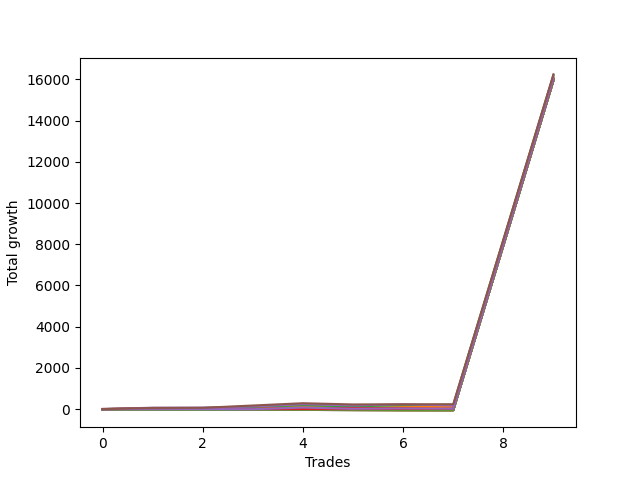

# Short Wallace Doodle 0225_009 
- Symbol: NQ
- Date Range: 3/18/22 - 6/24/22
- Trading Period: 7:20-12:30
- Number of Trades: 10


| Name | Win Percent | Profit | Avg Profit / Trade |     | Name | Win Percent | Profit | Avg Profit / Trade |
| ---- | ----------- | ------ | ------------------ | --- | ---- | ----------- | ------ | ------------------ |
| Sorted By <br> Profit | | | | | Sorted By <br> Win Percentage ||||
| Thirty-Six | 80.00 | 8119125.00 | 811912.50 |     | Three | 90.00 | 8108500.00 | 810850.00 |
| Three | 90.00 | 8108500.00 | 810850.00 |     | Thirty-Six | 80.00 | 8119125.00 | 811912.50 |
| Five | 80.00 | 8090125.00 | 809012.50 |     | Five | 80.00 | 8090125.00 | 809012.50 |
| Two | 80.00 | 8055375.00 | 805537.50 |     | Two | 80.00 | 8055375.00 | 805537.50 |
| One | 80.00 | 8035250.00 | 803525.00 |     | One | 80.00 | 8035250.00 | 803525.00 |
| Thirty-Five | 50.00 | 8021750.00 | 802175.00 |     | Thirty-Four | 60.00 | 8008125.00 | 800812.50 |
| Thirty-Four | 60.00 | 8008125.00 | 800812.50 |     | Thirty-Five | 50.00 | 8021750.00 | 802175.00 |
| Four | 50.00 | 7996000.00 | 799600.00 |     | Four | 50.00 | 7996000.00 | 799600.00 |
| Thirty-Three | 40.00 | 7990875.00 | 799087.50 |     | Thirty-Three | 40.00 | 7990875.00 | 799087.50 |
| Thirty-Two | 40.00 | 7990875.00 | 799087.50 |     | Thirty-Two | 40.00 | 7990875.00 | 799087.50 |
| Thirty-One | 40.00 | 7990875.00 | 799087.50 |     | Thirty-One | 40.00 | 7990875.00 | 799087.50 |
| Thirty | 40.00 | 7990875.00 | 799087.50 |     | Thirty | 40.00 | 7990875.00 | 799087.50 |
| Twenty-Nine | 40.00 | 7990875.00 | 799087.50 |     | Twenty-Nine | 40.00 | 7990875.00 | 799087.50 |
| Twenty-Eight | 40.00 | 7990875.00 | 799087.50 |     | Twenty-Eight | 40.00 | 7990875.00 | 799087.50 |
| Twenty-Seven | 40.00 | 7990875.00 | 799087.50 |     | Twenty-Seven | 40.00 | 7990875.00 | 799087.50 |
| Twenty-Six | 40.00 | 7990875.00 | 799087.50 |     | Twenty-Six | 40.00 | 7990875.00 | 799087.50 |
| Twenty-Five | 40.00 | 7990875.00 | 799087.50 |     | Twenty-Five | 40.00 | 7990875.00 | 799087.50 |
| Twenty-Four | 40.00 | 7990875.00 | 799087.50 |     | Twenty-Four | 40.00 | 7990875.00 | 799087.50 |
| Seventeen | 40.00 | 7987250.00 | 798725.00 |     | Seventeen | 40.00 | 7987250.00 | 798725.00 |
| Fifteen | 40.00 | 7987250.00 | 798725.00 |     | Fifteen | 40.00 | 7987250.00 | 798725.00 |
| Thirteen | 40.00 | 7987250.00 | 798725.00 |     | Thirteen | 40.00 | 7987250.00 | 798725.00 |
| Eleven | 40.00 | 7986250.00 | 798625.00 |     | Eleven | 40.00 | 7986250.00 | 798625.00 |
| Nine | 40.00 | 7986250.00 | 798625.00 |     | Nine | 40.00 | 7986250.00 | 798625.00 |
| Seven | 40.00 | 7986250.00 | 798625.00 |     | Seven | 40.00 | 7986250.00 | 798625.00 |
| Ten | 30.00 | 7978500.00 | 797850.00 |     | Ten | 30.00 | 7978500.00 | 797850.00 |
| Eight | 30.00 | 7978500.00 | 797850.00 |     | Eight | 30.00 | 7978500.00 | 797850.00 |
| Six | 30.00 | 7978500.00 | 797850.00 |     | Six | 30.00 | 7978500.00 | 797850.00 |
| Twenty-Three | 30.00 | 7978250.00 | 797825.00 |     | Twenty-Three | 30.00 | 7978250.00 | 797825.00 |
| Twenty-One | 30.00 | 7978250.00 | 797825.00 |     | Twenty-One | 30.00 | 7978250.00 | 797825.00 |
| Nineteen | 30.00 | 7978250.00 | 797825.00 |     | Nineteen | 30.00 | 7978250.00 | 797825.00 |
| Sixteen | 30.00 | 7975500.00 | 797550.00 |     | Sixteen | 30.00 | 7975500.00 | 797550.00 |
| Fourteen | 30.00 | 7975500.00 | 797550.00 |     | Fourteen | 30.00 | 7975500.00 | 797550.00 |
| Twelve | 30.00 | 7975500.00 | 797550.00 |     | Twelve | 30.00 | 7975500.00 | 797550.00 |
| Twenty-Two | 30.00 | 7970500.00 | 797050.00 |     | Twenty-Two | 30.00 | 7970500.00 | 797050.00 |
| Twenty | 30.00 | 7970500.00 | 797050.00 |     | Twenty | 30.00 | 7970500.00 | 797050.00 |
| Eighteen | 30.00 | 7970500.00 | 797050.00 |     | Eighteen | 30.00 | 7970500.00 | 797050.00 |

### Test One
* Sell when price hits the middle line of the 20p bollinger
* No Stoploss
* Results:
```
Total Trades: 10
Percent Up: 20.00
Percent Down: 80.00
Total Points Moved Down: 16070.50
Potential Profit: 8035250.00
Total Points Ups: 50.00 Count Ups: 2
Total Points Downs: 16120.50 Count Downs: 8
```

<details><summary>Trades</summary>

<code>In: 2022-03-29 10:50:00		Out: 2022-03-29 11:04:05		Total Position Time: 14:05		Total Move Down: 0.75		Total to Date: -0.75</code> <br />
<code>In: 2022-04-20 10:49:00		Out: 2022-04-20 10:50:00		Total Position Time: 01:00		Total Move Down: 23.00		Total to Date: -23.75</code> <br />
<code>In: 2022-04-26 11:23:00		Out: 2022-04-26 11:32:25		Total Position Time: 09:25		Total Move Down: 2.75		Total to Date: -26.50</code> <br />
<code>In: 2022-05-09 12:03:00		Out: 2022-05-09 12:09:20		Total Position Time: 06:20		Total Move Down: 28.75		Total to Date: -55.25</code> <br />
<code>In: 2022-05-11 08:40:00		Out: 2022-05-11 08:46:50		Total Position Time: 06:50		Total Move Down: 34.25		Total to Date: -89.50</code> <br />
<code>In: 2022-05-17 08:25:00		Out: 2022-05-17 08:47:15		Total Position Time: 22:15		Total Move Down: -48.25		Total to Date: -41.25</code> <br />
<code>In: 2022-05-20 11:55:00		Out: 2022-05-20 12:02:25		Total Position Time: 07:25		Total Move Down: 29.50		Total to Date: -70.75</code> <br />
<code>In: 2022-05-24 10:43:00		Out: 2022-05-24 10:57:50		Total Position Time: 14:50		Total Move Down: -1.75		Total to Date: -69.00</code> <br />
<code>In: 2022-06-10 10:48:00		Out: 2022-06-10 10:48:10		Total Position Time: 00:10		Total Move Down: 7989.25		Total to Date: -8058.25</code> <br />
<code>In: 2022-06-10 10:52:00		Out: 2022-06-10 10:52:10		Total Position Time: 00:10		Total Move Down: 8012.25		Total to Date: -16070.50</code> <br />


</details>

### Test Two
* Sell when the price hits the lower line of the 20p 1std bollinger
* No Stoploss
* Results:
```
Total Trades: 10
Percent Up: 20.00
Percent Down: 80.00
Total Points Moved Down: 16110.75
Potential Profit: 8055375.00
Total Points Ups: 59.75 Count Ups: 2
Total Points Downs: 16170.50 Count Downs: 8
```

<details><summary>Trades</summary>

<code>In: 2022-03-29 10:50:00		Out: 2022-03-29 11:06:05		Total Position Time: 16:05		Total Move Down: 2.25		Total to Date: -2.25</code> <br />
<code>In: 2022-04-20 10:49:00		Out: 2022-04-20 10:51:30		Total Position Time: 02:30		Total Move Down: 37.00		Total to Date: -39.25</code> <br />
<code>In: 2022-04-26 11:23:00		Out: 2022-04-26 11:41:20		Total Position Time: 18:20		Total Move Down: -1.00		Total to Date: -38.25</code> <br />
<code>In: 2022-05-09 12:03:00		Out: 2022-05-09 12:18:00		Total Position Time: 15:00		Total Move Down: 28.75		Total to Date: -67.00</code> <br />
<code>In: 2022-05-11 08:40:00		Out: 2022-05-11 08:50:45		Total Position Time: 10:45		Total Move Down: 49.00		Total to Date: -116.00</code> <br />
<code>In: 2022-05-17 08:25:00		Out: 2022-05-17 08:54:55		Total Position Time: 29:55		Total Move Down: -58.75		Total to Date: -57.25</code> <br />
<code>In: 2022-05-20 11:55:00		Out: 2022-05-20 12:03:35		Total Position Time: 08:35		Total Move Down: 46.00		Total to Date: -103.25</code> <br />
<code>In: 2022-05-24 10:43:00		Out: 2022-05-24 11:01:15		Total Position Time: 18:15		Total Move Down: 6.00		Total to Date: -109.25</code> <br />
<code>In: 2022-06-10 10:48:00		Out: 2022-06-10 10:48:10		Total Position Time: 00:10		Total Move Down: 7989.25		Total to Date: -8098.50</code> <br />
<code>In: 2022-06-10 10:52:00		Out: 2022-06-10 10:52:10		Total Position Time: 00:10		Total Move Down: 8012.25		Total to Date: -16110.75</code> <br />


</details>

### Test Three
* Sell when the price hits the lower line of the 20p 2std bollinger
* No Stoploss
* Results:
```
Total Trades: 10
Percent Up: 10.00
Percent Down: 90.00
Total Points Moved Down: 16217.00
Potential Profit: 8108500.00
Total Points Ups: 58.75 Count Ups: 1
Total Points Downs: 16275.75 Count Downs: 9
```

<details><summary>Trades</summary>

<code>In: 2022-03-29 10:50:00		Out: 2022-03-29 11:06:20		Total Position Time: 16:20		Total Move Down: 6.25		Total to Date: -6.25</code> <br />
<code>In: 2022-04-20 10:49:00		Out: 2022-04-20 11:08:40		Total Position Time: 19:40		Total Move Down: 41.75		Total to Date: -48.00</code> <br />
<code>In: 2022-04-26 11:23:00		Out: 2022-04-26 11:41:30		Total Position Time: 18:30		Total Move Down: 9.50		Total to Date: -57.50</code> <br />
<code>In: 2022-05-09 12:03:00		Out: 2022-05-09 12:20:45		Total Position Time: 17:45		Total Move Down: 53.00		Total to Date: -110.50</code> <br />
<code>In: 2022-05-11 08:40:00		Out: 2022-05-11 08:53:45		Total Position Time: 13:45		Total Move Down: 80.75		Total to Date: -191.25</code> <br />
<code>In: 2022-05-17 08:25:00		Out: 2022-05-17 08:54:55		Total Position Time: 29:55		Total Move Down: -58.75		Total to Date: -132.50</code> <br />
<code>In: 2022-05-20 11:55:00		Out: 2022-05-20 12:07:55		Total Position Time: 12:55		Total Move Down: 64.25		Total to Date: -196.75</code> <br />
<code>In: 2022-05-24 10:43:00		Out: 2022-05-24 11:01:40		Total Position Time: 18:40		Total Move Down: 18.75		Total to Date: -215.50</code> <br />
<code>In: 2022-06-10 10:48:00		Out: 2022-06-10 10:48:10		Total Position Time: 00:10		Total Move Down: 7989.25		Total to Date: -8204.75</code> <br />
<code>In: 2022-06-10 10:52:00		Out: 2022-06-10 10:52:10		Total Position Time: 00:10		Total Move Down: 8012.25		Total to Date: -16217.00</code> <br />


</details>

### Test Four
* Sell when the price hits the middle line of the 1std VWAP
* No Stoploss
* Results:
```
Total Trades: 10
Percent Up: 50.00
Percent Down: 50.00
Total Points Moved Down: 15992.00
Potential Profit: 7996000.00
Total Points Ups: 77.25 Count Ups: 5
Total Points Downs: 16069.25 Count Downs: 5
```

<details><summary>Trades</summary>

<code>In: 2022-03-29 10:50:00		Out: 2022-03-29 11:19:55		Total Position Time: 29:55		Total Move Down: 9.25		Total to Date: -9.25</code> <br />
<code>In: 2022-04-20 10:49:00		Out: 2022-04-20 10:49:55		Total Position Time: 00:55		Total Move Down: 12.75		Total to Date: -22.00</code> <br />
<code>In: 2022-04-26 11:23:00		Out: 2022-04-26 11:23:10		Total Position Time: 00:10		Total Move Down: -4.50		Total to Date: -17.50</code> <br />
<code>In: 2022-05-09 12:03:00		Out: 2022-05-09 12:03:10		Total Position Time: 00:10		Total Move Down: -5.50		Total to Date: -12.00</code> <br />
<code>In: 2022-05-11 08:40:00		Out: 2022-05-11 08:50:40		Total Position Time: 10:40		Total Move Down: 45.75		Total to Date: -57.75</code> <br />
<code>In: 2022-05-17 08:25:00		Out: 2022-05-17 08:25:10		Total Position Time: 00:10		Total Move Down: -5.75		Total to Date: -52.00</code> <br />
<code>In: 2022-05-20 11:55:00		Out: 2022-05-20 11:55:10		Total Position Time: 00:10		Total Move Down: -7.50		Total to Date: -44.50</code> <br />
<code>In: 2022-05-24 10:43:00		Out: 2022-05-24 11:12:55		Total Position Time: 29:55		Total Move Down: -54.00		Total to Date: 9.50</code> <br />
<code>In: 2022-06-10 10:48:00		Out: 2022-06-10 10:48:10		Total Position Time: 00:10		Total Move Down: 7989.25		Total to Date: -7979.75</code> <br />
<code>In: 2022-06-10 10:52:00		Out: 2022-06-10 10:52:10		Total Position Time: 00:10		Total Move Down: 8012.25		Total to Date: -15992.00</code> <br />


</details>

### Test Five
* Sell when the price hits the lower line of the 1std VWAP
* No Stoploss
* Results:
```
Total Trades: 10
Percent Up: 20.00
Percent Down: 80.00
Total Points Moved Down: 16180.25
Potential Profit: 8090125.00
Total Points Ups: 112.75 Count Ups: 2
Total Points Downs: 16293.00 Count Downs: 8
```

<details><summary>Trades</summary>

<code>In: 2022-03-29 10:50:00		Out: 2022-03-29 11:19:55		Total Position Time: 29:55		Total Move Down: 9.25		Total to Date: -9.25</code> <br />
<code>In: 2022-04-20 10:49:00		Out: 2022-04-20 11:18:55		Total Position Time: 29:55		Total Move Down: 61.00		Total to Date: -70.25</code> <br />
<code>In: 2022-04-26 11:23:00		Out: 2022-04-26 11:52:55		Total Position Time: 29:55		Total Move Down: 4.50		Total to Date: -74.75</code> <br />
<code>In: 2022-05-09 12:03:00		Out: 2022-05-09 12:20:45		Total Position Time: 17:45		Total Move Down: 53.00		Total to Date: -127.75</code> <br />
<code>In: 2022-05-11 08:40:00		Out: 2022-05-11 09:09:55		Total Position Time: 29:55		Total Move Down: 110.50		Total to Date: -238.25</code> <br />
<code>In: 2022-05-17 08:25:00		Out: 2022-05-17 08:54:55		Total Position Time: 29:55		Total Move Down: -58.75		Total to Date: -179.50</code> <br />
<code>In: 2022-05-20 11:55:00		Out: 2022-05-20 12:04:15		Total Position Time: 09:15		Total Move Down: 53.25		Total to Date: -232.75</code> <br />
<code>In: 2022-05-24 10:43:00		Out: 2022-05-24 11:12:55		Total Position Time: 29:55		Total Move Down: -54.00		Total to Date: -178.75</code> <br />
<code>In: 2022-06-10 10:48:00		Out: 2022-06-10 10:48:10		Total Position Time: 00:10		Total Move Down: 7989.25		Total to Date: -8168.00</code> <br />
<code>In: 2022-06-10 10:52:00		Out: 2022-06-10 10:52:10		Total Position Time: 00:10		Total Move Down: 8012.25		Total to Date: -16180.25</code> <br />


</details>

### Test Six
* Sell when the price hits the middle line of the 20p bollinger
* Stoploss is -2 points
* Results:
```
Total Trades: 10
Percent Up: 70.00
Percent Down: 30.00
Total Points Moved Down: 15957.00
Potential Profit: 7978500.00
Total Points Ups: 46.00 Count Ups: 7
Total Points Downs: 16003.00 Count Downs: 3
```

<details><summary>Trades</summary>

<code>In: 2022-03-29 10:50:00		Out: 2022-03-29 10:50:10		Total Position Time: 00:10		Total Move Down: -1.75		Total to Date: 1.75</code> <br />
<code>In: 2022-04-20 10:49:00		Out: 2022-04-20 10:49:10		Total Position Time: 00:10		Total Move Down: 1.50		Total to Date: 0.25</code> <br />
<code>In: 2022-04-26 11:23:00		Out: 2022-04-26 11:23:55		Total Position Time: 00:55		Total Move Down: -17.00		Total to Date: 17.25</code> <br />
<code>In: 2022-05-09 12:03:00		Out: 2022-05-09 12:03:10		Total Position Time: 00:10		Total Move Down: -5.50		Total to Date: 22.75</code> <br />
<code>In: 2022-05-11 08:40:00		Out: 2022-05-11 08:40:10		Total Position Time: 00:10		Total Move Down: -2.50		Total to Date: 25.25</code> <br />
<code>In: 2022-05-17 08:25:00		Out: 2022-05-17 08:25:20		Total Position Time: 00:20		Total Move Down: -8.00		Total to Date: 33.25</code> <br />
<code>In: 2022-05-20 11:55:00		Out: 2022-05-20 11:55:10		Total Position Time: 00:10		Total Move Down: -7.50		Total to Date: 40.75</code> <br />
<code>In: 2022-05-24 10:43:00		Out: 2022-05-24 10:44:20		Total Position Time: 01:20		Total Move Down: -3.75		Total to Date: 44.50</code> <br />
<code>In: 2022-06-10 10:48:00		Out: 2022-06-10 10:48:10		Total Position Time: 00:10		Total Move Down: 7989.25		Total to Date: -7944.75</code> <br />
<code>In: 2022-06-10 10:52:00		Out: 2022-06-10 10:52:10		Total Position Time: 00:10		Total Move Down: 8012.25		Total to Date: -15957.00</code> <br />


</details>

### Test Seven
* Sell when the price hits the middle line of the 20p bollinger
* Trailing Stop is -2 points
* Results:
```
Total Trades: 10
Percent Up: 60.00
Percent Down: 40.00
Total Points Moved Down: 15972.50
Potential Profit: 7986250.00
Total Points Ups: 33.75 Count Ups: 6
Total Points Downs: 16006.25 Count Downs: 4
```

<details><summary>Trades</summary>

<code>In: 2022-03-29 10:50:00		Out: 2022-03-29 10:50:10		Total Position Time: 00:10		Total Move Down: -1.75		Total to Date: 1.75</code> <br />
<code>In: 2022-04-20 10:49:00		Out: 2022-04-20 10:49:10		Total Position Time: 00:10		Total Move Down: 1.50		Total to Date: 0.25</code> <br />
<code>In: 2022-04-26 11:23:00		Out: 2022-04-26 11:23:20		Total Position Time: 00:20		Total Move Down: -8.50		Total to Date: 8.75</code> <br />
<code>In: 2022-05-09 12:03:00		Out: 2022-05-09 12:03:10		Total Position Time: 00:10		Total Move Down: -5.50		Total to Date: 14.25</code> <br />
<code>In: 2022-05-11 08:40:00		Out: 2022-05-11 08:40:10		Total Position Time: 00:10		Total Move Down: -2.50		Total to Date: 16.75</code> <br />
<code>In: 2022-05-17 08:25:00		Out: 2022-05-17 08:25:20		Total Position Time: 00:20		Total Move Down: -8.00		Total to Date: 24.75</code> <br />
<code>In: 2022-05-20 11:55:00		Out: 2022-05-20 11:55:10		Total Position Time: 00:10		Total Move Down: -7.50		Total to Date: 32.25</code> <br />
<code>In: 2022-05-24 10:43:00		Out: 2022-05-24 10:43:15		Total Position Time: 00:15		Total Move Down: 3.25		Total to Date: 29.00</code> <br />
<code>In: 2022-06-10 10:48:00		Out: 2022-06-10 10:48:10		Total Position Time: 00:10		Total Move Down: 7989.25		Total to Date: -7960.25</code> <br />
<code>In: 2022-06-10 10:52:00		Out: 2022-06-10 10:52:10		Total Position Time: 00:10		Total Move Down: 8012.25		Total to Date: -15972.50</code> <br />


</details>

### Test Eight
* Sell when the price hits the lower line of the 20p 1std bollinger
* Stoploss is -2 points
* Results:
```
Total Trades: 10
Percent Up: 70.00
Percent Down: 30.00
Total Points Moved Down: 15957.00
Potential Profit: 7978500.00
Total Points Ups: 46.00 Count Ups: 7
Total Points Downs: 16003.00 Count Downs: 3
```

<details><summary>Trades</summary>

<code>In: 2022-03-29 10:50:00		Out: 2022-03-29 10:50:10		Total Position Time: 00:10		Total Move Down: -1.75		Total to Date: 1.75</code> <br />
<code>In: 2022-04-20 10:49:00		Out: 2022-04-20 10:49:10		Total Position Time: 00:10		Total Move Down: 1.50		Total to Date: 0.25</code> <br />
<code>In: 2022-04-26 11:23:00		Out: 2022-04-26 11:23:55		Total Position Time: 00:55		Total Move Down: -17.00		Total to Date: 17.25</code> <br />
<code>In: 2022-05-09 12:03:00		Out: 2022-05-09 12:03:10		Total Position Time: 00:10		Total Move Down: -5.50		Total to Date: 22.75</code> <br />
<code>In: 2022-05-11 08:40:00		Out: 2022-05-11 08:40:10		Total Position Time: 00:10		Total Move Down: -2.50		Total to Date: 25.25</code> <br />
<code>In: 2022-05-17 08:25:00		Out: 2022-05-17 08:25:20		Total Position Time: 00:20		Total Move Down: -8.00		Total to Date: 33.25</code> <br />
<code>In: 2022-05-20 11:55:00		Out: 2022-05-20 11:55:10		Total Position Time: 00:10		Total Move Down: -7.50		Total to Date: 40.75</code> <br />
<code>In: 2022-05-24 10:43:00		Out: 2022-05-24 10:44:20		Total Position Time: 01:20		Total Move Down: -3.75		Total to Date: 44.50</code> <br />
<code>In: 2022-06-10 10:48:00		Out: 2022-06-10 10:48:10		Total Position Time: 00:10		Total Move Down: 7989.25		Total to Date: -7944.75</code> <br />
<code>In: 2022-06-10 10:52:00		Out: 2022-06-10 10:52:10		Total Position Time: 00:10		Total Move Down: 8012.25		Total to Date: -15957.00</code> <br />


</details>

### Test Nine
* Sell when the price hits the lower line of the 20p 1std bollinger
* Trailing Stop is -2 points
* Results:
```
Total Trades: 10
Percent Up: 60.00
Percent Down: 40.00
Total Points Moved Down: 15972.50
Potential Profit: 7986250.00
Total Points Ups: 33.75 Count Ups: 6
Total Points Downs: 16006.25 Count Downs: 4
```

<details><summary>Trades</summary>

<code>In: 2022-03-29 10:50:00		Out: 2022-03-29 10:50:10		Total Position Time: 00:10		Total Move Down: -1.75		Total to Date: 1.75</code> <br />
<code>In: 2022-04-20 10:49:00		Out: 2022-04-20 10:49:10		Total Position Time: 00:10		Total Move Down: 1.50		Total to Date: 0.25</code> <br />
<code>In: 2022-04-26 11:23:00		Out: 2022-04-26 11:23:20		Total Position Time: 00:20		Total Move Down: -8.50		Total to Date: 8.75</code> <br />
<code>In: 2022-05-09 12:03:00		Out: 2022-05-09 12:03:10		Total Position Time: 00:10		Total Move Down: -5.50		Total to Date: 14.25</code> <br />
<code>In: 2022-05-11 08:40:00		Out: 2022-05-11 08:40:10		Total Position Time: 00:10		Total Move Down: -2.50		Total to Date: 16.75</code> <br />
<code>In: 2022-05-17 08:25:00		Out: 2022-05-17 08:25:20		Total Position Time: 00:20		Total Move Down: -8.00		Total to Date: 24.75</code> <br />
<code>In: 2022-05-20 11:55:00		Out: 2022-05-20 11:55:10		Total Position Time: 00:10		Total Move Down: -7.50		Total to Date: 32.25</code> <br />
<code>In: 2022-05-24 10:43:00		Out: 2022-05-24 10:43:15		Total Position Time: 00:15		Total Move Down: 3.25		Total to Date: 29.00</code> <br />
<code>In: 2022-06-10 10:48:00		Out: 2022-06-10 10:48:10		Total Position Time: 00:10		Total Move Down: 7989.25		Total to Date: -7960.25</code> <br />
<code>In: 2022-06-10 10:52:00		Out: 2022-06-10 10:52:10		Total Position Time: 00:10		Total Move Down: 8012.25		Total to Date: -15972.50</code> <br />


</details>

### Test Ten
* Sell when the price hits the lower line of the 20p 2std bollinger
* Stoploss is -2 points
* Results:
```
Total Trades: 10
Percent Up: 70.00
Percent Down: 30.00
Total Points Moved Down: 15957.00
Potential Profit: 7978500.00
Total Points Ups: 46.00 Count Ups: 7
Total Points Downs: 16003.00 Count Downs: 3
```

<details><summary>Trades</summary>

<code>In: 2022-03-29 10:50:00		Out: 2022-03-29 10:50:10		Total Position Time: 00:10		Total Move Down: -1.75		Total to Date: 1.75</code> <br />
<code>In: 2022-04-20 10:49:00		Out: 2022-04-20 10:49:10		Total Position Time: 00:10		Total Move Down: 1.50		Total to Date: 0.25</code> <br />
<code>In: 2022-04-26 11:23:00		Out: 2022-04-26 11:23:55		Total Position Time: 00:55		Total Move Down: -17.00		Total to Date: 17.25</code> <br />
<code>In: 2022-05-09 12:03:00		Out: 2022-05-09 12:03:10		Total Position Time: 00:10		Total Move Down: -5.50		Total to Date: 22.75</code> <br />
<code>In: 2022-05-11 08:40:00		Out: 2022-05-11 08:40:10		Total Position Time: 00:10		Total Move Down: -2.50		Total to Date: 25.25</code> <br />
<code>In: 2022-05-17 08:25:00		Out: 2022-05-17 08:25:20		Total Position Time: 00:20		Total Move Down: -8.00		Total to Date: 33.25</code> <br />
<code>In: 2022-05-20 11:55:00		Out: 2022-05-20 11:55:10		Total Position Time: 00:10		Total Move Down: -7.50		Total to Date: 40.75</code> <br />
<code>In: 2022-05-24 10:43:00		Out: 2022-05-24 10:44:20		Total Position Time: 01:20		Total Move Down: -3.75		Total to Date: 44.50</code> <br />
<code>In: 2022-06-10 10:48:00		Out: 2022-06-10 10:48:10		Total Position Time: 00:10		Total Move Down: 7989.25		Total to Date: -7944.75</code> <br />
<code>In: 2022-06-10 10:52:00		Out: 2022-06-10 10:52:10		Total Position Time: 00:10		Total Move Down: 8012.25		Total to Date: -15957.00</code> <br />


</details>

### Test Eleven
* Sell when the price hits the lower line of the 20p 2std bollinger
* Trailing Stop is -2 points
* Results:
```
Total Trades: 10
Percent Up: 60.00
Percent Down: 40.00
Total Points Moved Down: 15972.50
Potential Profit: 7986250.00
Total Points Ups: 33.75 Count Ups: 6
Total Points Downs: 16006.25 Count Downs: 4
```

<details><summary>Trades</summary>

<code>In: 2022-03-29 10:50:00		Out: 2022-03-29 10:50:10		Total Position Time: 00:10		Total Move Down: -1.75		Total to Date: 1.75</code> <br />
<code>In: 2022-04-20 10:49:00		Out: 2022-04-20 10:49:10		Total Position Time: 00:10		Total Move Down: 1.50		Total to Date: 0.25</code> <br />
<code>In: 2022-04-26 11:23:00		Out: 2022-04-26 11:23:20		Total Position Time: 00:20		Total Move Down: -8.50		Total to Date: 8.75</code> <br />
<code>In: 2022-05-09 12:03:00		Out: 2022-05-09 12:03:10		Total Position Time: 00:10		Total Move Down: -5.50		Total to Date: 14.25</code> <br />
<code>In: 2022-05-11 08:40:00		Out: 2022-05-11 08:40:10		Total Position Time: 00:10		Total Move Down: -2.50		Total to Date: 16.75</code> <br />
<code>In: 2022-05-17 08:25:00		Out: 2022-05-17 08:25:20		Total Position Time: 00:20		Total Move Down: -8.00		Total to Date: 24.75</code> <br />
<code>In: 2022-05-20 11:55:00		Out: 2022-05-20 11:55:10		Total Position Time: 00:10		Total Move Down: -7.50		Total to Date: 32.25</code> <br />
<code>In: 2022-05-24 10:43:00		Out: 2022-05-24 10:43:15		Total Position Time: 00:15		Total Move Down: 3.25		Total to Date: 29.00</code> <br />
<code>In: 2022-06-10 10:48:00		Out: 2022-06-10 10:48:10		Total Position Time: 00:10		Total Move Down: 7989.25		Total to Date: -7960.25</code> <br />
<code>In: 2022-06-10 10:52:00		Out: 2022-06-10 10:52:10		Total Position Time: 00:10		Total Move Down: 8012.25		Total to Date: -15972.50</code> <br />


</details>

### Test Twelve
* Sell when the price hits the middle line of the 20p bollinger
* Stoploss is -3 points
* Results:
```
Total Trades: 10
Percent Up: 70.00
Percent Down: 30.00
Total Points Moved Down: 15951.00
Potential Profit: 7975500.00
Total Points Ups: 52.00 Count Ups: 7
Total Points Downs: 16003.00 Count Downs: 3
```

<details><summary>Trades</summary>

<code>In: 2022-03-29 10:50:00		Out: 2022-03-29 10:50:10		Total Position Time: 00:10		Total Move Down: -1.75		Total to Date: 1.75</code> <br />
<code>In: 2022-04-20 10:49:00		Out: 2022-04-20 10:49:10		Total Position Time: 00:10		Total Move Down: 1.50		Total to Date: 0.25</code> <br />
<code>In: 2022-04-26 11:23:00		Out: 2022-04-26 11:29:25		Total Position Time: 06:25		Total Move Down: -21.00		Total to Date: 21.25</code> <br />
<code>In: 2022-05-09 12:03:00		Out: 2022-05-09 12:03:10		Total Position Time: 00:10		Total Move Down: -5.50		Total to Date: 26.75</code> <br />
<code>In: 2022-05-11 08:40:00		Out: 2022-05-11 08:40:10		Total Position Time: 00:10		Total Move Down: -2.50		Total to Date: 29.25</code> <br />
<code>In: 2022-05-17 08:25:00		Out: 2022-05-17 08:28:20		Total Position Time: 03:20		Total Move Down: -10.00		Total to Date: 39.25</code> <br />
<code>In: 2022-05-20 11:55:00		Out: 2022-05-20 11:55:10		Total Position Time: 00:10		Total Move Down: -7.50		Total to Date: 46.75</code> <br />
<code>In: 2022-05-24 10:43:00		Out: 2022-05-24 10:44:20		Total Position Time: 01:20		Total Move Down: -3.75		Total to Date: 50.50</code> <br />
<code>In: 2022-06-10 10:48:00		Out: 2022-06-10 10:48:10		Total Position Time: 00:10		Total Move Down: 7989.25		Total to Date: -7938.75</code> <br />
<code>In: 2022-06-10 10:52:00		Out: 2022-06-10 10:52:10		Total Position Time: 00:10		Total Move Down: 8012.25		Total to Date: -15951.00</code> <br />


</details>

### Test Thirteen
* Sell when the price hits the middle line of the 20p bollinger
* Trailing Stop is -3 points
* Results:
```
Total Trades: 10
Percent Up: 60.00
Percent Down: 40.00
Total Points Moved Down: 15974.50
Potential Profit: 7987250.00
Total Points Ups: 32.75 Count Ups: 6
Total Points Downs: 16007.25 Count Downs: 4
```

<details><summary>Trades</summary>

<code>In: 2022-03-29 10:50:00		Out: 2022-03-29 10:50:10		Total Position Time: 00:10		Total Move Down: -1.75		Total to Date: 1.75</code> <br />
<code>In: 2022-04-20 10:49:00		Out: 2022-04-20 10:49:10		Total Position Time: 00:10		Total Move Down: 1.50		Total to Date: 0.25</code> <br />
<code>In: 2022-04-26 11:23:00		Out: 2022-04-26 11:23:20		Total Position Time: 00:20		Total Move Down: -8.50		Total to Date: 8.75</code> <br />
<code>In: 2022-05-09 12:03:00		Out: 2022-05-09 12:03:10		Total Position Time: 00:10		Total Move Down: -5.50		Total to Date: 14.25</code> <br />
<code>In: 2022-05-11 08:40:00		Out: 2022-05-11 08:40:10		Total Position Time: 00:10		Total Move Down: -2.50		Total to Date: 16.75</code> <br />
<code>In: 2022-05-17 08:25:00		Out: 2022-05-17 08:25:50		Total Position Time: 00:50		Total Move Down: -7.00		Total to Date: 23.75</code> <br />
<code>In: 2022-05-20 11:55:00		Out: 2022-05-20 11:55:10		Total Position Time: 00:10		Total Move Down: -7.50		Total to Date: 31.25</code> <br />
<code>In: 2022-05-24 10:43:00		Out: 2022-05-24 10:43:30		Total Position Time: 00:30		Total Move Down: 4.25		Total to Date: 27.00</code> <br />
<code>In: 2022-06-10 10:48:00		Out: 2022-06-10 10:48:10		Total Position Time: 00:10		Total Move Down: 7989.25		Total to Date: -7962.25</code> <br />
<code>In: 2022-06-10 10:52:00		Out: 2022-06-10 10:52:10		Total Position Time: 00:10		Total Move Down: 8012.25		Total to Date: -15974.50</code> <br />


</details>

### Test Fourteen
* Sell when the price hits the lower line of the 20p 1std bollinger
* Stoploss is -3 points
* Results:
```
Total Trades: 10
Percent Up: 70.00
Percent Down: 30.00
Total Points Moved Down: 15951.00
Potential Profit: 7975500.00
Total Points Ups: 52.00 Count Ups: 7
Total Points Downs: 16003.00 Count Downs: 3
```

<details><summary>Trades</summary>

<code>In: 2022-03-29 10:50:00		Out: 2022-03-29 10:50:10		Total Position Time: 00:10		Total Move Down: -1.75		Total to Date: 1.75</code> <br />
<code>In: 2022-04-20 10:49:00		Out: 2022-04-20 10:49:10		Total Position Time: 00:10		Total Move Down: 1.50		Total to Date: 0.25</code> <br />
<code>In: 2022-04-26 11:23:00		Out: 2022-04-26 11:29:25		Total Position Time: 06:25		Total Move Down: -21.00		Total to Date: 21.25</code> <br />
<code>In: 2022-05-09 12:03:00		Out: 2022-05-09 12:03:10		Total Position Time: 00:10		Total Move Down: -5.50		Total to Date: 26.75</code> <br />
<code>In: 2022-05-11 08:40:00		Out: 2022-05-11 08:40:10		Total Position Time: 00:10		Total Move Down: -2.50		Total to Date: 29.25</code> <br />
<code>In: 2022-05-17 08:25:00		Out: 2022-05-17 08:28:20		Total Position Time: 03:20		Total Move Down: -10.00		Total to Date: 39.25</code> <br />
<code>In: 2022-05-20 11:55:00		Out: 2022-05-20 11:55:10		Total Position Time: 00:10		Total Move Down: -7.50		Total to Date: 46.75</code> <br />
<code>In: 2022-05-24 10:43:00		Out: 2022-05-24 10:44:20		Total Position Time: 01:20		Total Move Down: -3.75		Total to Date: 50.50</code> <br />
<code>In: 2022-06-10 10:48:00		Out: 2022-06-10 10:48:10		Total Position Time: 00:10		Total Move Down: 7989.25		Total to Date: -7938.75</code> <br />
<code>In: 2022-06-10 10:52:00		Out: 2022-06-10 10:52:10		Total Position Time: 00:10		Total Move Down: 8012.25		Total to Date: -15951.00</code> <br />


</details>

### Test Fifteen
* Sell when the price hits the lower line of the 20p 1std bollinger
* Trailing Stop is -3 points
* Results:
```
Total Trades: 10
Percent Up: 60.00
Percent Down: 40.00
Total Points Moved Down: 15974.50
Potential Profit: 7987250.00
Total Points Ups: 32.75 Count Ups: 6
Total Points Downs: 16007.25 Count Downs: 4
```

<details><summary>Trades</summary>

<code>In: 2022-03-29 10:50:00		Out: 2022-03-29 10:50:10		Total Position Time: 00:10		Total Move Down: -1.75		Total to Date: 1.75</code> <br />
<code>In: 2022-04-20 10:49:00		Out: 2022-04-20 10:49:10		Total Position Time: 00:10		Total Move Down: 1.50		Total to Date: 0.25</code> <br />
<code>In: 2022-04-26 11:23:00		Out: 2022-04-26 11:23:20		Total Position Time: 00:20		Total Move Down: -8.50		Total to Date: 8.75</code> <br />
<code>In: 2022-05-09 12:03:00		Out: 2022-05-09 12:03:10		Total Position Time: 00:10		Total Move Down: -5.50		Total to Date: 14.25</code> <br />
<code>In: 2022-05-11 08:40:00		Out: 2022-05-11 08:40:10		Total Position Time: 00:10		Total Move Down: -2.50		Total to Date: 16.75</code> <br />
<code>In: 2022-05-17 08:25:00		Out: 2022-05-17 08:25:50		Total Position Time: 00:50		Total Move Down: -7.00		Total to Date: 23.75</code> <br />
<code>In: 2022-05-20 11:55:00		Out: 2022-05-20 11:55:10		Total Position Time: 00:10		Total Move Down: -7.50		Total to Date: 31.25</code> <br />
<code>In: 2022-05-24 10:43:00		Out: 2022-05-24 10:43:30		Total Position Time: 00:30		Total Move Down: 4.25		Total to Date: 27.00</code> <br />
<code>In: 2022-06-10 10:48:00		Out: 2022-06-10 10:48:10		Total Position Time: 00:10		Total Move Down: 7989.25		Total to Date: -7962.25</code> <br />
<code>In: 2022-06-10 10:52:00		Out: 2022-06-10 10:52:10		Total Position Time: 00:10		Total Move Down: 8012.25		Total to Date: -15974.50</code> <br />


</details>

### Test Sixteen
* Sell when the price hits the lower line of the 20p 2std bollinger
* Stoploss is -3 points
* Results:
```
Total Trades: 10
Percent Up: 70.00
Percent Down: 30.00
Total Points Moved Down: 15951.00
Potential Profit: 7975500.00
Total Points Ups: 52.00 Count Ups: 7
Total Points Downs: 16003.00 Count Downs: 3
```

<details><summary>Trades</summary>

<code>In: 2022-03-29 10:50:00		Out: 2022-03-29 10:50:10		Total Position Time: 00:10		Total Move Down: -1.75		Total to Date: 1.75</code> <br />
<code>In: 2022-04-20 10:49:00		Out: 2022-04-20 10:49:10		Total Position Time: 00:10		Total Move Down: 1.50		Total to Date: 0.25</code> <br />
<code>In: 2022-04-26 11:23:00		Out: 2022-04-26 11:29:25		Total Position Time: 06:25		Total Move Down: -21.00		Total to Date: 21.25</code> <br />
<code>In: 2022-05-09 12:03:00		Out: 2022-05-09 12:03:10		Total Position Time: 00:10		Total Move Down: -5.50		Total to Date: 26.75</code> <br />
<code>In: 2022-05-11 08:40:00		Out: 2022-05-11 08:40:10		Total Position Time: 00:10		Total Move Down: -2.50		Total to Date: 29.25</code> <br />
<code>In: 2022-05-17 08:25:00		Out: 2022-05-17 08:28:20		Total Position Time: 03:20		Total Move Down: -10.00		Total to Date: 39.25</code> <br />
<code>In: 2022-05-20 11:55:00		Out: 2022-05-20 11:55:10		Total Position Time: 00:10		Total Move Down: -7.50		Total to Date: 46.75</code> <br />
<code>In: 2022-05-24 10:43:00		Out: 2022-05-24 10:44:20		Total Position Time: 01:20		Total Move Down: -3.75		Total to Date: 50.50</code> <br />
<code>In: 2022-06-10 10:48:00		Out: 2022-06-10 10:48:10		Total Position Time: 00:10		Total Move Down: 7989.25		Total to Date: -7938.75</code> <br />
<code>In: 2022-06-10 10:52:00		Out: 2022-06-10 10:52:10		Total Position Time: 00:10		Total Move Down: 8012.25		Total to Date: -15951.00</code> <br />


</details>

### Test Seventeen
* Sell when the price hits the lower line of the 20p 2std bollinger
* Trailing Stop is -3 points
* Results:
```
Total Trades: 10
Percent Up: 60.00
Percent Down: 40.00
Total Points Moved Down: 15974.50
Potential Profit: 7987250.00
Total Points Ups: 32.75 Count Ups: 6
Total Points Downs: 16007.25 Count Downs: 4
```

<details><summary>Trades</summary>

<code>In: 2022-03-29 10:50:00		Out: 2022-03-29 10:50:10		Total Position Time: 00:10		Total Move Down: -1.75		Total to Date: 1.75</code> <br />
<code>In: 2022-04-20 10:49:00		Out: 2022-04-20 10:49:10		Total Position Time: 00:10		Total Move Down: 1.50		Total to Date: 0.25</code> <br />
<code>In: 2022-04-26 11:23:00		Out: 2022-04-26 11:23:20		Total Position Time: 00:20		Total Move Down: -8.50		Total to Date: 8.75</code> <br />
<code>In: 2022-05-09 12:03:00		Out: 2022-05-09 12:03:10		Total Position Time: 00:10		Total Move Down: -5.50		Total to Date: 14.25</code> <br />
<code>In: 2022-05-11 08:40:00		Out: 2022-05-11 08:40:10		Total Position Time: 00:10		Total Move Down: -2.50		Total to Date: 16.75</code> <br />
<code>In: 2022-05-17 08:25:00		Out: 2022-05-17 08:25:50		Total Position Time: 00:50		Total Move Down: -7.00		Total to Date: 23.75</code> <br />
<code>In: 2022-05-20 11:55:00		Out: 2022-05-20 11:55:10		Total Position Time: 00:10		Total Move Down: -7.50		Total to Date: 31.25</code> <br />
<code>In: 2022-05-24 10:43:00		Out: 2022-05-24 10:43:30		Total Position Time: 00:30		Total Move Down: 4.25		Total to Date: 27.00</code> <br />
<code>In: 2022-06-10 10:48:00		Out: 2022-06-10 10:48:10		Total Position Time: 00:10		Total Move Down: 7989.25		Total to Date: -7962.25</code> <br />
<code>In: 2022-06-10 10:52:00		Out: 2022-06-10 10:52:10		Total Position Time: 00:10		Total Move Down: 8012.25		Total to Date: -15974.50</code> <br />


</details>

### Test Eighteen
* Sell when the price hits the middle line of the 20p bollinger
* Stoploss is -5 points
* Results:
```
Total Trades: 10
Percent Up: 70.00
Percent Down: 30.00
Total Points Moved Down: 15941.00
Potential Profit: 7970500.00
Total Points Ups: 62.00 Count Ups: 7
Total Points Downs: 16003.00 Count Downs: 3
```

<details><summary>Trades</summary>

<code>In: 2022-03-29 10:50:00		Out: 2022-03-29 10:50:10		Total Position Time: 00:10		Total Move Down: -1.75		Total to Date: 1.75</code> <br />
<code>In: 2022-04-20 10:49:00		Out: 2022-04-20 10:49:10		Total Position Time: 00:10		Total Move Down: 1.50		Total to Date: 0.25</code> <br />
<code>In: 2022-04-26 11:23:00		Out: 2022-04-26 11:29:25		Total Position Time: 06:25		Total Move Down: -21.00		Total to Date: 21.25</code> <br />
<code>In: 2022-05-09 12:03:00		Out: 2022-05-09 12:03:10		Total Position Time: 00:10		Total Move Down: -5.50		Total to Date: 26.75</code> <br />
<code>In: 2022-05-11 08:40:00		Out: 2022-05-11 08:40:15		Total Position Time: 00:15		Total Move Down: -8.00		Total to Date: 34.75</code> <br />
<code>In: 2022-05-17 08:25:00		Out: 2022-05-17 08:28:30		Total Position Time: 03:30		Total Move Down: -14.50		Total to Date: 49.25</code> <br />
<code>In: 2022-05-20 11:55:00		Out: 2022-05-20 11:55:10		Total Position Time: 00:10		Total Move Down: -7.50		Total to Date: 56.75</code> <br />
<code>In: 2022-05-24 10:43:00		Out: 2022-05-24 10:44:20		Total Position Time: 01:20		Total Move Down: -3.75		Total to Date: 60.50</code> <br />
<code>In: 2022-06-10 10:48:00		Out: 2022-06-10 10:48:10		Total Position Time: 00:10		Total Move Down: 7989.25		Total to Date: -7928.75</code> <br />
<code>In: 2022-06-10 10:52:00		Out: 2022-06-10 10:52:10		Total Position Time: 00:10		Total Move Down: 8012.25		Total to Date: -15941.00</code> <br />


</details>

### Test Nineteen
* Sell when the price hits the middle line of the 20p bollinger
* Trailing Stop is -5 points
* Results:
```
Total Trades: 10
Percent Up: 70.00
Percent Down: 30.00
Total Points Moved Down: 15956.50
Potential Profit: 7978250.00
Total Points Ups: 46.50 Count Ups: 7
Total Points Downs: 16003.00 Count Downs: 3
```

<details><summary>Trades</summary>

<code>In: 2022-03-29 10:50:00		Out: 2022-03-29 10:50:10		Total Position Time: 00:10		Total Move Down: -1.75		Total to Date: 1.75</code> <br />
<code>In: 2022-04-20 10:49:00		Out: 2022-04-20 10:49:10		Total Position Time: 00:10		Total Move Down: 1.50		Total to Date: 0.25</code> <br />
<code>In: 2022-04-26 11:23:00		Out: 2022-04-26 11:23:25		Total Position Time: 00:25		Total Move Down: -14.75		Total to Date: 15.00</code> <br />
<code>In: 2022-05-09 12:03:00		Out: 2022-05-09 12:03:10		Total Position Time: 00:10		Total Move Down: -5.50		Total to Date: 20.50</code> <br />
<code>In: 2022-05-11 08:40:00		Out: 2022-05-11 08:40:15		Total Position Time: 00:15		Total Move Down: -8.00		Total to Date: 28.50</code> <br />
<code>In: 2022-05-17 08:25:00		Out: 2022-05-17 08:27:00		Total Position Time: 02:00		Total Move Down: -5.25		Total to Date: 33.75</code> <br />
<code>In: 2022-05-20 11:55:00		Out: 2022-05-20 11:55:10		Total Position Time: 00:10		Total Move Down: -7.50		Total to Date: 41.25</code> <br />
<code>In: 2022-05-24 10:43:00		Out: 2022-05-24 10:44:20		Total Position Time: 01:20		Total Move Down: -3.75		Total to Date: 45.00</code> <br />
<code>In: 2022-06-10 10:48:00		Out: 2022-06-10 10:48:10		Total Position Time: 00:10		Total Move Down: 7989.25		Total to Date: -7944.25</code> <br />
<code>In: 2022-06-10 10:52:00		Out: 2022-06-10 10:52:10		Total Position Time: 00:10		Total Move Down: 8012.25		Total to Date: -15956.50</code> <br />


</details>

### Test Twenty
* Sell when the price hits the lower line of the 20p 1std bollinger
* Stoploss is -5 points
* Results:
```
Total Trades: 10
Percent Up: 70.00
Percent Down: 30.00
Total Points Moved Down: 15941.00
Potential Profit: 7970500.00
Total Points Ups: 62.00 Count Ups: 7
Total Points Downs: 16003.00 Count Downs: 3
```

<details><summary>Trades</summary>

<code>In: 2022-03-29 10:50:00		Out: 2022-03-29 10:50:10		Total Position Time: 00:10		Total Move Down: -1.75		Total to Date: 1.75</code> <br />
<code>In: 2022-04-20 10:49:00		Out: 2022-04-20 10:49:10		Total Position Time: 00:10		Total Move Down: 1.50		Total to Date: 0.25</code> <br />
<code>In: 2022-04-26 11:23:00		Out: 2022-04-26 11:29:25		Total Position Time: 06:25		Total Move Down: -21.00		Total to Date: 21.25</code> <br />
<code>In: 2022-05-09 12:03:00		Out: 2022-05-09 12:03:10		Total Position Time: 00:10		Total Move Down: -5.50		Total to Date: 26.75</code> <br />
<code>In: 2022-05-11 08:40:00		Out: 2022-05-11 08:40:15		Total Position Time: 00:15		Total Move Down: -8.00		Total to Date: 34.75</code> <br />
<code>In: 2022-05-17 08:25:00		Out: 2022-05-17 08:28:30		Total Position Time: 03:30		Total Move Down: -14.50		Total to Date: 49.25</code> <br />
<code>In: 2022-05-20 11:55:00		Out: 2022-05-20 11:55:10		Total Position Time: 00:10		Total Move Down: -7.50		Total to Date: 56.75</code> <br />
<code>In: 2022-05-24 10:43:00		Out: 2022-05-24 10:44:20		Total Position Time: 01:20		Total Move Down: -3.75		Total to Date: 60.50</code> <br />
<code>In: 2022-06-10 10:48:00		Out: 2022-06-10 10:48:10		Total Position Time: 00:10		Total Move Down: 7989.25		Total to Date: -7928.75</code> <br />
<code>In: 2022-06-10 10:52:00		Out: 2022-06-10 10:52:10		Total Position Time: 00:10		Total Move Down: 8012.25		Total to Date: -15941.00</code> <br />


</details>

### Test Twenty-One
* Sell when the price hits the lower line of the 20p 1std bollinger
* Trailing Stop is -5 points
* Results:
```
Total Trades: 10
Percent Up: 70.00
Percent Down: 30.00
Total Points Moved Down: 15956.50
Potential Profit: 7978250.00
Total Points Ups: 46.50 Count Ups: 7
Total Points Downs: 16003.00 Count Downs: 3
```

<details><summary>Trades</summary>

<code>In: 2022-03-29 10:50:00		Out: 2022-03-29 10:50:10		Total Position Time: 00:10		Total Move Down: -1.75		Total to Date: 1.75</code> <br />
<code>In: 2022-04-20 10:49:00		Out: 2022-04-20 10:49:10		Total Position Time: 00:10		Total Move Down: 1.50		Total to Date: 0.25</code> <br />
<code>In: 2022-04-26 11:23:00		Out: 2022-04-26 11:23:25		Total Position Time: 00:25		Total Move Down: -14.75		Total to Date: 15.00</code> <br />
<code>In: 2022-05-09 12:03:00		Out: 2022-05-09 12:03:10		Total Position Time: 00:10		Total Move Down: -5.50		Total to Date: 20.50</code> <br />
<code>In: 2022-05-11 08:40:00		Out: 2022-05-11 08:40:15		Total Position Time: 00:15		Total Move Down: -8.00		Total to Date: 28.50</code> <br />
<code>In: 2022-05-17 08:25:00		Out: 2022-05-17 08:27:00		Total Position Time: 02:00		Total Move Down: -5.25		Total to Date: 33.75</code> <br />
<code>In: 2022-05-20 11:55:00		Out: 2022-05-20 11:55:10		Total Position Time: 00:10		Total Move Down: -7.50		Total to Date: 41.25</code> <br />
<code>In: 2022-05-24 10:43:00		Out: 2022-05-24 10:44:20		Total Position Time: 01:20		Total Move Down: -3.75		Total to Date: 45.00</code> <br />
<code>In: 2022-06-10 10:48:00		Out: 2022-06-10 10:48:10		Total Position Time: 00:10		Total Move Down: 7989.25		Total to Date: -7944.25</code> <br />
<code>In: 2022-06-10 10:52:00		Out: 2022-06-10 10:52:10		Total Position Time: 00:10		Total Move Down: 8012.25		Total to Date: -15956.50</code> <br />


</details>

### Test Twenty-Two
* Sell when the price hits the lower line of the 20p 2std bollinger
* Stoploss is -5 points
* Results:
```
Total Trades: 10
Percent Up: 70.00
Percent Down: 30.00
Total Points Moved Down: 15941.00
Potential Profit: 7970500.00
Total Points Ups: 62.00 Count Ups: 7
Total Points Downs: 16003.00 Count Downs: 3
```

<details><summary>Trades</summary>

<code>In: 2022-03-29 10:50:00		Out: 2022-03-29 10:50:10		Total Position Time: 00:10		Total Move Down: -1.75		Total to Date: 1.75</code> <br />
<code>In: 2022-04-20 10:49:00		Out: 2022-04-20 10:49:10		Total Position Time: 00:10		Total Move Down: 1.50		Total to Date: 0.25</code> <br />
<code>In: 2022-04-26 11:23:00		Out: 2022-04-26 11:29:25		Total Position Time: 06:25		Total Move Down: -21.00		Total to Date: 21.25</code> <br />
<code>In: 2022-05-09 12:03:00		Out: 2022-05-09 12:03:10		Total Position Time: 00:10		Total Move Down: -5.50		Total to Date: 26.75</code> <br />
<code>In: 2022-05-11 08:40:00		Out: 2022-05-11 08:40:15		Total Position Time: 00:15		Total Move Down: -8.00		Total to Date: 34.75</code> <br />
<code>In: 2022-05-17 08:25:00		Out: 2022-05-17 08:28:30		Total Position Time: 03:30		Total Move Down: -14.50		Total to Date: 49.25</code> <br />
<code>In: 2022-05-20 11:55:00		Out: 2022-05-20 11:55:10		Total Position Time: 00:10		Total Move Down: -7.50		Total to Date: 56.75</code> <br />
<code>In: 2022-05-24 10:43:00		Out: 2022-05-24 10:44:20		Total Position Time: 01:20		Total Move Down: -3.75		Total to Date: 60.50</code> <br />
<code>In: 2022-06-10 10:48:00		Out: 2022-06-10 10:48:10		Total Position Time: 00:10		Total Move Down: 7989.25		Total to Date: -7928.75</code> <br />
<code>In: 2022-06-10 10:52:00		Out: 2022-06-10 10:52:10		Total Position Time: 00:10		Total Move Down: 8012.25		Total to Date: -15941.00</code> <br />


</details>

### Test Twenty-Three
* Sell when the price hits the lower line of the 20p 2std bollinger
* Trailing Stop is -5 points
* Results:
```
Total Trades: 10
Percent Up: 70.00
Percent Down: 30.00
Total Points Moved Down: 15956.50
Potential Profit: 7978250.00
Total Points Ups: 46.50 Count Ups: 7
Total Points Downs: 16003.00 Count Downs: 3
```

<details><summary>Trades</summary>

<code>In: 2022-03-29 10:50:00		Out: 2022-03-29 10:50:10		Total Position Time: 00:10		Total Move Down: -1.75		Total to Date: 1.75</code> <br />
<code>In: 2022-04-20 10:49:00		Out: 2022-04-20 10:49:10		Total Position Time: 00:10		Total Move Down: 1.50		Total to Date: 0.25</code> <br />
<code>In: 2022-04-26 11:23:00		Out: 2022-04-26 11:23:25		Total Position Time: 00:25		Total Move Down: -14.75		Total to Date: 15.00</code> <br />
<code>In: 2022-05-09 12:03:00		Out: 2022-05-09 12:03:10		Total Position Time: 00:10		Total Move Down: -5.50		Total to Date: 20.50</code> <br />
<code>In: 2022-05-11 08:40:00		Out: 2022-05-11 08:40:15		Total Position Time: 00:15		Total Move Down: -8.00		Total to Date: 28.50</code> <br />
<code>In: 2022-05-17 08:25:00		Out: 2022-05-17 08:27:00		Total Position Time: 02:00		Total Move Down: -5.25		Total to Date: 33.75</code> <br />
<code>In: 2022-05-20 11:55:00		Out: 2022-05-20 11:55:10		Total Position Time: 00:10		Total Move Down: -7.50		Total to Date: 41.25</code> <br />
<code>In: 2022-05-24 10:43:00		Out: 2022-05-24 10:44:20		Total Position Time: 01:20		Total Move Down: -3.75		Total to Date: 45.00</code> <br />
<code>In: 2022-06-10 10:48:00		Out: 2022-06-10 10:48:10		Total Position Time: 00:10		Total Move Down: 7989.25		Total to Date: -7944.25</code> <br />
<code>In: 2022-06-10 10:52:00		Out: 2022-06-10 10:52:10		Total Position Time: 00:10		Total Move Down: 8012.25		Total to Date: -15956.50</code> <br />


</details>

### Test Twenty-Four
* Sell when the price hits the middle line of the 20p bollinger
* Stoploss is 10 points
* Results:
```
Total Trades: 10
Percent Up: 60.00
Percent Down: 40.00
Total Points Moved Down: 15981.75
Potential Profit: 7990875.00
Total Points Ups: 27.50 Count Ups: 6
Total Points Downs: 16009.25 Count Downs: 4
```

<details><summary>Trades</summary>

<code>In: 2022-03-29 10:50:00		Out: 2022-03-29 10:50:10		Total Position Time: 00:10		Total Move Down: -1.75		Total to Date: 1.75</code> <br />
<code>In: 2022-04-20 10:49:00		Out: 2022-04-20 10:49:10		Total Position Time: 00:10		Total Move Down: 1.50		Total to Date: 0.25</code> <br />
<code>In: 2022-04-26 11:23:00		Out: 2022-04-26 11:23:10		Total Position Time: 00:10		Total Move Down: -4.50		Total to Date: 4.75</code> <br />
<code>In: 2022-05-09 12:03:00		Out: 2022-05-09 12:03:10		Total Position Time: 00:10		Total Move Down: -5.50		Total to Date: 10.25</code> <br />
<code>In: 2022-05-11 08:40:00		Out: 2022-05-11 08:40:10		Total Position Time: 00:10		Total Move Down: -2.50		Total to Date: 12.75</code> <br />
<code>In: 2022-05-17 08:25:00		Out: 2022-05-17 08:25:10		Total Position Time: 00:10		Total Move Down: -5.75		Total to Date: 18.50</code> <br />
<code>In: 2022-05-20 11:55:00		Out: 2022-05-20 11:55:10		Total Position Time: 00:10		Total Move Down: -7.50		Total to Date: 26.00</code> <br />
<code>In: 2022-05-24 10:43:00		Out: 2022-05-24 10:43:10		Total Position Time: 00:10		Total Move Down: 6.25		Total to Date: 19.75</code> <br />
<code>In: 2022-06-10 10:48:00		Out: 2022-06-10 10:48:10		Total Position Time: 00:10		Total Move Down: 7989.25		Total to Date: -7969.50</code> <br />
<code>In: 2022-06-10 10:52:00		Out: 2022-06-10 10:52:10		Total Position Time: 00:10		Total Move Down: 8012.25		Total to Date: -15981.75</code> <br />


</details>

### Test Twenty-Five
* Sell when the price hits the middle line of the 20p bollinger
* Trailing Stop is 10 points
* Results:
```
Total Trades: 10
Percent Up: 60.00
Percent Down: 40.00
Total Points Moved Down: 15981.75
Potential Profit: 7990875.00
Total Points Ups: 27.50 Count Ups: 6
Total Points Downs: 16009.25 Count Downs: 4
```

<details><summary>Trades</summary>

<code>In: 2022-03-29 10:50:00		Out: 2022-03-29 10:50:10		Total Position Time: 00:10		Total Move Down: -1.75		Total to Date: 1.75</code> <br />
<code>In: 2022-04-20 10:49:00		Out: 2022-04-20 10:49:10		Total Position Time: 00:10		Total Move Down: 1.50		Total to Date: 0.25</code> <br />
<code>In: 2022-04-26 11:23:00		Out: 2022-04-26 11:23:10		Total Position Time: 00:10		Total Move Down: -4.50		Total to Date: 4.75</code> <br />
<code>In: 2022-05-09 12:03:00		Out: 2022-05-09 12:03:10		Total Position Time: 00:10		Total Move Down: -5.50		Total to Date: 10.25</code> <br />
<code>In: 2022-05-11 08:40:00		Out: 2022-05-11 08:40:10		Total Position Time: 00:10		Total Move Down: -2.50		Total to Date: 12.75</code> <br />
<code>In: 2022-05-17 08:25:00		Out: 2022-05-17 08:25:10		Total Position Time: 00:10		Total Move Down: -5.75		Total to Date: 18.50</code> <br />
<code>In: 2022-05-20 11:55:00		Out: 2022-05-20 11:55:10		Total Position Time: 00:10		Total Move Down: -7.50		Total to Date: 26.00</code> <br />
<code>In: 2022-05-24 10:43:00		Out: 2022-05-24 10:43:10		Total Position Time: 00:10		Total Move Down: 6.25		Total to Date: 19.75</code> <br />
<code>In: 2022-06-10 10:48:00		Out: 2022-06-10 10:48:10		Total Position Time: 00:10		Total Move Down: 7989.25		Total to Date: -7969.50</code> <br />
<code>In: 2022-06-10 10:52:00		Out: 2022-06-10 10:52:10		Total Position Time: 00:10		Total Move Down: 8012.25		Total to Date: -15981.75</code> <br />


</details>

### Test Twenty-Six
* Sell when the price hits the lower line of the 20p 1std bollinger
* Stoploss is 10 points
* Results:
```
Total Trades: 10
Percent Up: 60.00
Percent Down: 40.00
Total Points Moved Down: 15981.75
Potential Profit: 7990875.00
Total Points Ups: 27.50 Count Ups: 6
Total Points Downs: 16009.25 Count Downs: 4
```

<details><summary>Trades</summary>

<code>In: 2022-03-29 10:50:00		Out: 2022-03-29 10:50:10		Total Position Time: 00:10		Total Move Down: -1.75		Total to Date: 1.75</code> <br />
<code>In: 2022-04-20 10:49:00		Out: 2022-04-20 10:49:10		Total Position Time: 00:10		Total Move Down: 1.50		Total to Date: 0.25</code> <br />
<code>In: 2022-04-26 11:23:00		Out: 2022-04-26 11:23:10		Total Position Time: 00:10		Total Move Down: -4.50		Total to Date: 4.75</code> <br />
<code>In: 2022-05-09 12:03:00		Out: 2022-05-09 12:03:10		Total Position Time: 00:10		Total Move Down: -5.50		Total to Date: 10.25</code> <br />
<code>In: 2022-05-11 08:40:00		Out: 2022-05-11 08:40:10		Total Position Time: 00:10		Total Move Down: -2.50		Total to Date: 12.75</code> <br />
<code>In: 2022-05-17 08:25:00		Out: 2022-05-17 08:25:10		Total Position Time: 00:10		Total Move Down: -5.75		Total to Date: 18.50</code> <br />
<code>In: 2022-05-20 11:55:00		Out: 2022-05-20 11:55:10		Total Position Time: 00:10		Total Move Down: -7.50		Total to Date: 26.00</code> <br />
<code>In: 2022-05-24 10:43:00		Out: 2022-05-24 10:43:10		Total Position Time: 00:10		Total Move Down: 6.25		Total to Date: 19.75</code> <br />
<code>In: 2022-06-10 10:48:00		Out: 2022-06-10 10:48:10		Total Position Time: 00:10		Total Move Down: 7989.25		Total to Date: -7969.50</code> <br />
<code>In: 2022-06-10 10:52:00		Out: 2022-06-10 10:52:10		Total Position Time: 00:10		Total Move Down: 8012.25		Total to Date: -15981.75</code> <br />


</details>

### Test Twenty-Seven
* Sell when the price hits the lower line of the 20p 1std bollinger
* Trailing Stop is 10 points
* Results:
```
Total Trades: 10
Percent Up: 60.00
Percent Down: 40.00
Total Points Moved Down: 15981.75
Potential Profit: 7990875.00
Total Points Ups: 27.50 Count Ups: 6
Total Points Downs: 16009.25 Count Downs: 4
```

<details><summary>Trades</summary>

<code>In: 2022-03-29 10:50:00		Out: 2022-03-29 10:50:10		Total Position Time: 00:10		Total Move Down: -1.75		Total to Date: 1.75</code> <br />
<code>In: 2022-04-20 10:49:00		Out: 2022-04-20 10:49:10		Total Position Time: 00:10		Total Move Down: 1.50		Total to Date: 0.25</code> <br />
<code>In: 2022-04-26 11:23:00		Out: 2022-04-26 11:23:10		Total Position Time: 00:10		Total Move Down: -4.50		Total to Date: 4.75</code> <br />
<code>In: 2022-05-09 12:03:00		Out: 2022-05-09 12:03:10		Total Position Time: 00:10		Total Move Down: -5.50		Total to Date: 10.25</code> <br />
<code>In: 2022-05-11 08:40:00		Out: 2022-05-11 08:40:10		Total Position Time: 00:10		Total Move Down: -2.50		Total to Date: 12.75</code> <br />
<code>In: 2022-05-17 08:25:00		Out: 2022-05-17 08:25:10		Total Position Time: 00:10		Total Move Down: -5.75		Total to Date: 18.50</code> <br />
<code>In: 2022-05-20 11:55:00		Out: 2022-05-20 11:55:10		Total Position Time: 00:10		Total Move Down: -7.50		Total to Date: 26.00</code> <br />
<code>In: 2022-05-24 10:43:00		Out: 2022-05-24 10:43:10		Total Position Time: 00:10		Total Move Down: 6.25		Total to Date: 19.75</code> <br />
<code>In: 2022-06-10 10:48:00		Out: 2022-06-10 10:48:10		Total Position Time: 00:10		Total Move Down: 7989.25		Total to Date: -7969.50</code> <br />
<code>In: 2022-06-10 10:52:00		Out: 2022-06-10 10:52:10		Total Position Time: 00:10		Total Move Down: 8012.25		Total to Date: -15981.75</code> <br />


</details>

### Test Twenty-Eight
* Sell when the price hits the lower line of the 20p 2std bollinger
* Stoploss is 10 points
* Results:
```
Total Trades: 10
Percent Up: 60.00
Percent Down: 40.00
Total Points Moved Down: 15981.75
Potential Profit: 7990875.00
Total Points Ups: 27.50 Count Ups: 6
Total Points Downs: 16009.25 Count Downs: 4
```

<details><summary>Trades</summary>

<code>In: 2022-03-29 10:50:00		Out: 2022-03-29 10:50:10		Total Position Time: 00:10		Total Move Down: -1.75		Total to Date: 1.75</code> <br />
<code>In: 2022-04-20 10:49:00		Out: 2022-04-20 10:49:10		Total Position Time: 00:10		Total Move Down: 1.50		Total to Date: 0.25</code> <br />
<code>In: 2022-04-26 11:23:00		Out: 2022-04-26 11:23:10		Total Position Time: 00:10		Total Move Down: -4.50		Total to Date: 4.75</code> <br />
<code>In: 2022-05-09 12:03:00		Out: 2022-05-09 12:03:10		Total Position Time: 00:10		Total Move Down: -5.50		Total to Date: 10.25</code> <br />
<code>In: 2022-05-11 08:40:00		Out: 2022-05-11 08:40:10		Total Position Time: 00:10		Total Move Down: -2.50		Total to Date: 12.75</code> <br />
<code>In: 2022-05-17 08:25:00		Out: 2022-05-17 08:25:10		Total Position Time: 00:10		Total Move Down: -5.75		Total to Date: 18.50</code> <br />
<code>In: 2022-05-20 11:55:00		Out: 2022-05-20 11:55:10		Total Position Time: 00:10		Total Move Down: -7.50		Total to Date: 26.00</code> <br />
<code>In: 2022-05-24 10:43:00		Out: 2022-05-24 10:43:10		Total Position Time: 00:10		Total Move Down: 6.25		Total to Date: 19.75</code> <br />
<code>In: 2022-06-10 10:48:00		Out: 2022-06-10 10:48:10		Total Position Time: 00:10		Total Move Down: 7989.25		Total to Date: -7969.50</code> <br />
<code>In: 2022-06-10 10:52:00		Out: 2022-06-10 10:52:10		Total Position Time: 00:10		Total Move Down: 8012.25		Total to Date: -15981.75</code> <br />


</details>

### Test Twenty-Nine
* Sell when the price hits the lower line of the 20p 2std bollinger
* Trailing Stop is 10 points
* Results:
```
Total Trades: 10
Percent Up: 60.00
Percent Down: 40.00
Total Points Moved Down: 15981.75
Potential Profit: 7990875.00
Total Points Ups: 27.50 Count Ups: 6
Total Points Downs: 16009.25 Count Downs: 4
```

<details><summary>Trades</summary>

<code>In: 2022-03-29 10:50:00		Out: 2022-03-29 10:50:10		Total Position Time: 00:10		Total Move Down: -1.75		Total to Date: 1.75</code> <br />
<code>In: 2022-04-20 10:49:00		Out: 2022-04-20 10:49:10		Total Position Time: 00:10		Total Move Down: 1.50		Total to Date: 0.25</code> <br />
<code>In: 2022-04-26 11:23:00		Out: 2022-04-26 11:23:10		Total Position Time: 00:10		Total Move Down: -4.50		Total to Date: 4.75</code> <br />
<code>In: 2022-05-09 12:03:00		Out: 2022-05-09 12:03:10		Total Position Time: 00:10		Total Move Down: -5.50		Total to Date: 10.25</code> <br />
<code>In: 2022-05-11 08:40:00		Out: 2022-05-11 08:40:10		Total Position Time: 00:10		Total Move Down: -2.50		Total to Date: 12.75</code> <br />
<code>In: 2022-05-17 08:25:00		Out: 2022-05-17 08:25:10		Total Position Time: 00:10		Total Move Down: -5.75		Total to Date: 18.50</code> <br />
<code>In: 2022-05-20 11:55:00		Out: 2022-05-20 11:55:10		Total Position Time: 00:10		Total Move Down: -7.50		Total to Date: 26.00</code> <br />
<code>In: 2022-05-24 10:43:00		Out: 2022-05-24 10:43:10		Total Position Time: 00:10		Total Move Down: 6.25		Total to Date: 19.75</code> <br />
<code>In: 2022-06-10 10:48:00		Out: 2022-06-10 10:48:10		Total Position Time: 00:10		Total Move Down: 7989.25		Total to Date: -7969.50</code> <br />
<code>In: 2022-06-10 10:52:00		Out: 2022-06-10 10:52:10		Total Position Time: 00:10		Total Move Down: 8012.25		Total to Date: -15981.75</code> <br />


</details>

### Test Thirty
* Sell when the price hits the middle line of the 1std VWAP
* Stoploss is 10 points
* Results:
```
Total Trades: 10
Percent Up: 60.00
Percent Down: 40.00
Total Points Moved Down: 15981.75
Potential Profit: 7990875.00
Total Points Ups: 27.50 Count Ups: 6
Total Points Downs: 16009.25 Count Downs: 4
```

<details><summary>Trades</summary>

<code>In: 2022-03-29 10:50:00		Out: 2022-03-29 10:50:10		Total Position Time: 00:10		Total Move Down: -1.75		Total to Date: 1.75</code> <br />
<code>In: 2022-04-20 10:49:00		Out: 2022-04-20 10:49:10		Total Position Time: 00:10		Total Move Down: 1.50		Total to Date: 0.25</code> <br />
<code>In: 2022-04-26 11:23:00		Out: 2022-04-26 11:23:10		Total Position Time: 00:10		Total Move Down: -4.50		Total to Date: 4.75</code> <br />
<code>In: 2022-05-09 12:03:00		Out: 2022-05-09 12:03:10		Total Position Time: 00:10		Total Move Down: -5.50		Total to Date: 10.25</code> <br />
<code>In: 2022-05-11 08:40:00		Out: 2022-05-11 08:40:10		Total Position Time: 00:10		Total Move Down: -2.50		Total to Date: 12.75</code> <br />
<code>In: 2022-05-17 08:25:00		Out: 2022-05-17 08:25:10		Total Position Time: 00:10		Total Move Down: -5.75		Total to Date: 18.50</code> <br />
<code>In: 2022-05-20 11:55:00		Out: 2022-05-20 11:55:10		Total Position Time: 00:10		Total Move Down: -7.50		Total to Date: 26.00</code> <br />
<code>In: 2022-05-24 10:43:00		Out: 2022-05-24 10:43:10		Total Position Time: 00:10		Total Move Down: 6.25		Total to Date: 19.75</code> <br />
<code>In: 2022-06-10 10:48:00		Out: 2022-06-10 10:48:10		Total Position Time: 00:10		Total Move Down: 7989.25		Total to Date: -7969.50</code> <br />
<code>In: 2022-06-10 10:52:00		Out: 2022-06-10 10:52:10		Total Position Time: 00:10		Total Move Down: 8012.25		Total to Date: -15981.75</code> <br />


</details>

### Test Thirty-One
* Sell when the price hits the middle line of the 1std VWAP
* Trailing Stop is 10 points
* Results:
```
Total Trades: 10
Percent Up: 60.00
Percent Down: 40.00
Total Points Moved Down: 15981.75
Potential Profit: 7990875.00
Total Points Ups: 27.50 Count Ups: 6
Total Points Downs: 16009.25 Count Downs: 4
```

<details><summary>Trades</summary>

<code>In: 2022-03-29 10:50:00		Out: 2022-03-29 10:50:10		Total Position Time: 00:10		Total Move Down: -1.75		Total to Date: 1.75</code> <br />
<code>In: 2022-04-20 10:49:00		Out: 2022-04-20 10:49:10		Total Position Time: 00:10		Total Move Down: 1.50		Total to Date: 0.25</code> <br />
<code>In: 2022-04-26 11:23:00		Out: 2022-04-26 11:23:10		Total Position Time: 00:10		Total Move Down: -4.50		Total to Date: 4.75</code> <br />
<code>In: 2022-05-09 12:03:00		Out: 2022-05-09 12:03:10		Total Position Time: 00:10		Total Move Down: -5.50		Total to Date: 10.25</code> <br />
<code>In: 2022-05-11 08:40:00		Out: 2022-05-11 08:40:10		Total Position Time: 00:10		Total Move Down: -2.50		Total to Date: 12.75</code> <br />
<code>In: 2022-05-17 08:25:00		Out: 2022-05-17 08:25:10		Total Position Time: 00:10		Total Move Down: -5.75		Total to Date: 18.50</code> <br />
<code>In: 2022-05-20 11:55:00		Out: 2022-05-20 11:55:10		Total Position Time: 00:10		Total Move Down: -7.50		Total to Date: 26.00</code> <br />
<code>In: 2022-05-24 10:43:00		Out: 2022-05-24 10:43:10		Total Position Time: 00:10		Total Move Down: 6.25		Total to Date: 19.75</code> <br />
<code>In: 2022-06-10 10:48:00		Out: 2022-06-10 10:48:10		Total Position Time: 00:10		Total Move Down: 7989.25		Total to Date: -7969.50</code> <br />
<code>In: 2022-06-10 10:52:00		Out: 2022-06-10 10:52:10		Total Position Time: 00:10		Total Move Down: 8012.25		Total to Date: -15981.75</code> <br />


</details>

### Test Thirty-Two
* Sell when the price hits the lower line of the 1std VWAP
* Stoploss is 10 points
* Results:
```
Total Trades: 10
Percent Up: 60.00
Percent Down: 40.00
Total Points Moved Down: 15981.75
Potential Profit: 7990875.00
Total Points Ups: 27.50 Count Ups: 6
Total Points Downs: 16009.25 Count Downs: 4
```

<details><summary>Trades</summary>

<code>In: 2022-03-29 10:50:00		Out: 2022-03-29 10:50:10		Total Position Time: 00:10		Total Move Down: -1.75		Total to Date: 1.75</code> <br />
<code>In: 2022-04-20 10:49:00		Out: 2022-04-20 10:49:10		Total Position Time: 00:10		Total Move Down: 1.50		Total to Date: 0.25</code> <br />
<code>In: 2022-04-26 11:23:00		Out: 2022-04-26 11:23:10		Total Position Time: 00:10		Total Move Down: -4.50		Total to Date: 4.75</code> <br />
<code>In: 2022-05-09 12:03:00		Out: 2022-05-09 12:03:10		Total Position Time: 00:10		Total Move Down: -5.50		Total to Date: 10.25</code> <br />
<code>In: 2022-05-11 08:40:00		Out: 2022-05-11 08:40:10		Total Position Time: 00:10		Total Move Down: -2.50		Total to Date: 12.75</code> <br />
<code>In: 2022-05-17 08:25:00		Out: 2022-05-17 08:25:10		Total Position Time: 00:10		Total Move Down: -5.75		Total to Date: 18.50</code> <br />
<code>In: 2022-05-20 11:55:00		Out: 2022-05-20 11:55:10		Total Position Time: 00:10		Total Move Down: -7.50		Total to Date: 26.00</code> <br />
<code>In: 2022-05-24 10:43:00		Out: 2022-05-24 10:43:10		Total Position Time: 00:10		Total Move Down: 6.25		Total to Date: 19.75</code> <br />
<code>In: 2022-06-10 10:48:00		Out: 2022-06-10 10:48:10		Total Position Time: 00:10		Total Move Down: 7989.25		Total to Date: -7969.50</code> <br />
<code>In: 2022-06-10 10:52:00		Out: 2022-06-10 10:52:10		Total Position Time: 00:10		Total Move Down: 8012.25		Total to Date: -15981.75</code> <br />


</details>

### Test Thirty-Three
* Sell when the price hits the lower line of the 1std VWAP
* Trailing Stop is 10 points
* Results:
```
Total Trades: 10
Percent Up: 60.00
Percent Down: 40.00
Total Points Moved Down: 15981.75
Potential Profit: 7990875.00
Total Points Ups: 27.50 Count Ups: 6
Total Points Downs: 16009.25 Count Downs: 4
```

<details><summary>Trades</summary>

<code>In: 2022-03-29 10:50:00		Out: 2022-03-29 10:50:10		Total Position Time: 00:10		Total Move Down: -1.75		Total to Date: 1.75</code> <br />
<code>In: 2022-04-20 10:49:00		Out: 2022-04-20 10:49:10		Total Position Time: 00:10		Total Move Down: 1.50		Total to Date: 0.25</code> <br />
<code>In: 2022-04-26 11:23:00		Out: 2022-04-26 11:23:10		Total Position Time: 00:10		Total Move Down: -4.50		Total to Date: 4.75</code> <br />
<code>In: 2022-05-09 12:03:00		Out: 2022-05-09 12:03:10		Total Position Time: 00:10		Total Move Down: -5.50		Total to Date: 10.25</code> <br />
<code>In: 2022-05-11 08:40:00		Out: 2022-05-11 08:40:10		Total Position Time: 00:10		Total Move Down: -2.50		Total to Date: 12.75</code> <br />
<code>In: 2022-05-17 08:25:00		Out: 2022-05-17 08:25:10		Total Position Time: 00:10		Total Move Down: -5.75		Total to Date: 18.50</code> <br />
<code>In: 2022-05-20 11:55:00		Out: 2022-05-20 11:55:10		Total Position Time: 00:10		Total Move Down: -7.50		Total to Date: 26.00</code> <br />
<code>In: 2022-05-24 10:43:00		Out: 2022-05-24 10:43:10		Total Position Time: 00:10		Total Move Down: 6.25		Total to Date: 19.75</code> <br />
<code>In: 2022-06-10 10:48:00		Out: 2022-06-10 10:48:10		Total Position Time: 00:10		Total Move Down: 7989.25		Total to Date: -7969.50</code> <br />
<code>In: 2022-06-10 10:52:00		Out: 2022-06-10 10:52:10		Total Position Time: 00:10		Total Move Down: 8012.25		Total to Date: -15981.75</code> <br />


</details>

### Test Thirty-Four
* Sell when the linear regression slope is positive
* No Stoploss
* Results:
```
Total Trades: 10
Percent Up: 40.00
Percent Down: 60.00
Total Points Moved Down: 16016.25
Potential Profit: 8008125.00
Total Points Ups: 29.00 Count Ups: 4
Total Points Downs: 16045.25 Count Downs: 6
```

<details><summary>Trades</summary>

<code>In: 2022-03-29 10:50:00		Out: 2022-03-29 10:51:05		Total Position Time: 01:05		Total Move Down: 2.00		Total to Date: -2.00</code> <br />
<code>In: 2022-04-20 10:49:00		Out: 2022-04-20 10:59:05		Total Position Time: 10:05		Total Move Down: 28.25		Total to Date: -30.25</code> <br />
<code>In: 2022-04-26 11:23:00		Out: 2022-04-26 11:24:05		Total Position Time: 01:05		Total Move Down: -17.00		Total to Date: -13.25</code> <br />
<code>In: 2022-05-09 12:03:00		Out: 2022-05-09 12:07:05		Total Position Time: 04:05		Total Move Down: -8.75		Total to Date: -4.50</code> <br />
<code>In: 2022-05-11 08:40:00		Out: 2022-05-11 08:41:05		Total Position Time: 01:05		Total Move Down: -0.75		Total to Date: -3.75</code> <br />
<code>In: 2022-05-17 08:25:00		Out: 2022-05-17 08:26:05		Total Position Time: 01:05		Total Move Down: -2.50		Total to Date: -1.25</code> <br />
<code>In: 2022-05-20 11:55:00		Out: 2022-05-20 11:56:05		Total Position Time: 01:05		Total Move Down: 11.50		Total to Date: -12.75</code> <br />
<code>In: 2022-05-24 10:43:00		Out: 2022-05-24 10:44:05		Total Position Time: 01:05		Total Move Down: 5.75		Total to Date: -18.50</code> <br />
<code>In: 2022-06-10 10:48:00		Out: 2022-06-10 10:49:05		Total Position Time: 01:05		Total Move Down: 7985.25		Total to Date: -8003.75</code> <br />
<code>In: 2022-06-10 10:52:00		Out: 2022-06-10 10:53:05		Total Position Time: 01:05		Total Move Down: 8012.50		Total to Date: -16016.25</code> <br />


</details>

### Test Thirty-Five
* Sell when the linear regression slope changes to positive
* No Stoploss
* Results:
```
Total Trades: 10
Percent Up: 50.00
Percent Down: 50.00
Total Points Moved Down: 16043.50
Potential Profit: 8021750.00
Total Points Ups: 102.50 Count Ups: 5
Total Points Downs: 16146.00 Count Downs: 5
```

<details><summary>Trades</summary>

<code>In: 2022-03-29 10:50:00		Out: 2022-03-29 11:02:05		Total Position Time: 12:05		Total Move Down: -9.75		Total to Date: 9.75</code> <br />
<code>In: 2022-04-20 10:49:00		Out: 2022-04-20 10:59:05		Total Position Time: 10:05		Total Move Down: 28.25		Total to Date: -18.50</code> <br />
<code>In: 2022-04-26 11:23:00		Out: 2022-04-26 11:29:05		Total Position Time: 06:05		Total Move Down: -13.25		Total to Date: -5.25</code> <br />
<code>In: 2022-05-09 12:03:00		Out: 2022-05-09 12:07:05		Total Position Time: 04:05		Total Move Down: -8.75		Total to Date: 3.50</code> <br />
<code>In: 2022-05-11 08:40:00		Out: 2022-05-11 09:00:05		Total Position Time: 20:05		Total Move Down: 81.25		Total to Date: -77.75</code> <br />
<code>In: 2022-05-17 08:25:00		Out: 2022-05-17 08:52:05		Total Position Time: 27:05		Total Move Down: -59.75		Total to Date: -18.00</code> <br />
<code>In: 2022-05-20 11:55:00		Out: 2022-05-20 11:58:05		Total Position Time: 03:05		Total Move Down: 17.50		Total to Date: -35.50</code> <br />
<code>In: 2022-05-24 10:43:00		Out: 2022-05-24 10:55:05		Total Position Time: 12:05		Total Move Down: -11.00		Total to Date: -24.50</code> <br />
<code>In: 2022-06-10 10:48:00		Out: 2022-06-10 11:06:05		Total Position Time: 18:05		Total Move Down: 7995.50		Total to Date: -8020.00</code> <br />
<code>In: 2022-06-10 10:52:00		Out: 2022-06-10 11:06:05		Total Position Time: 14:05		Total Move Down: 8023.50		Total to Date: -16043.50</code> <br />


</details>

### Test Thirty-Six
* Sell when the linear regression slope changes to positive
* No Stoploss
* Results:
```
Total Trades: 10
Percent Up: 20.00
Percent Down: 80.00
Total Points Moved Down: 16238.25
Potential Profit: 8119125.00
Total Points Ups: 60.00 Count Ups: 2
Total Points Downs: 16298.25 Count Downs: 8
```

<details><summary>Trades</summary>

<code>In: 2022-03-29 10:50:00		Out: 2022-03-29 10:54:05		Total Position Time: 04:05		Total Move Down: -1.25		Total to Date: 1.25</code> <br />
<code>In: 2022-04-20 10:49:00		Out: 2022-04-20 11:18:55		Total Position Time: 29:55		Total Move Down: 61.00		Total to Date: -59.75</code> <br />
<code>In: 2022-04-26 11:23:00		Out: 2022-04-26 11:52:55		Total Position Time: 29:55		Total Move Down: 4.50		Total to Date: -64.25</code> <br />
<code>In: 2022-05-09 12:03:00		Out: 2022-05-09 12:32:55		Total Position Time: 29:55		Total Move Down: 112.75		Total to Date: -177.00</code> <br />
<code>In: 2022-05-11 08:40:00		Out: 2022-05-11 09:09:55		Total Position Time: 29:55		Total Move Down: 110.50		Total to Date: -287.50</code> <br />
<code>In: 2022-05-17 08:25:00		Out: 2022-05-17 08:54:55		Total Position Time: 29:55		Total Move Down: -58.75		Total to Date: -228.75</code> <br />
<code>In: 2022-05-20 11:55:00		Out: 2022-05-20 12:24:55		Total Position Time: 29:55		Total Move Down: 7.25		Total to Date: -236.00</code> <br />
<code>In: 2022-05-24 10:43:00		Out: 2022-05-24 10:45:05		Total Position Time: 02:05		Total Move Down: 1.00		Total to Date: -237.00</code> <br />
<code>In: 2022-06-10 10:48:00		Out: 2022-06-10 11:17:55		Total Position Time: 29:55		Total Move Down: 7990.75		Total to Date: -8227.75</code> <br />
<code>In: 2022-06-10 10:52:00		Out: 2022-06-10 11:21:55		Total Position Time: 29:55		Total Move Down: 8010.50		Total to Date: -16238.25</code> <br />


</details>