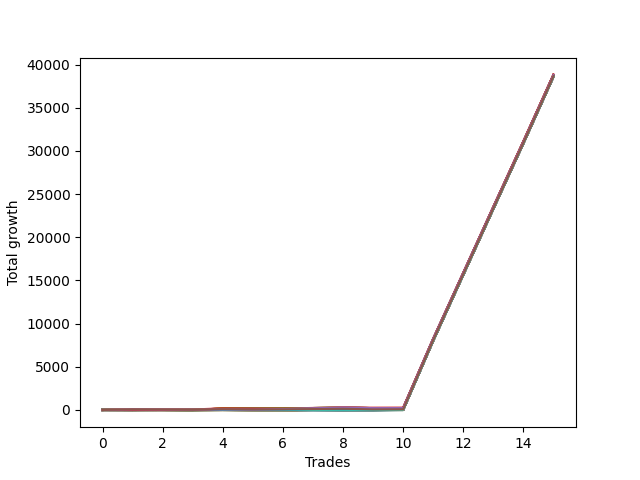

# Short Wallace Doodle 0225_009 
- Symbol: NQ
- Date Range: 03/18/2022 - 06/17/2022
- Trading Period: 7:20-12:30
- Number of Trades: 15



| Name | Win Percent | Profit | Avg Profit / Trade |     | Name | Win Percent | Profit | Avg Profit / Trade |
| ---- | ----------- | ------ | ------------------ | --- | ---- | ----------- | ------ | ------------------ |
| Sorted By <br> Profit | | | | | Sorted By <br> Win Percentage ||||
| Seventy-Three | 73.33 | 19432875.00 | 1295525.00 |     | One | 86.67 | 19357375.00 | 1290491.67 |
| Sixty-Three | 60.00 | 19406000.00 | 1293733.33 |     | Zero | 86.67 | 19345875.00 | 1289725.00 |
| Seventy-One | 73.33 | 19405000.00 | 1293666.67 |     | Four | 80.00 | 19362625.00 | 1290841.67 |
| Fifty-Five | 73.33 | 19405000.00 | 1293666.67 |     | Sixty-Two | 80.00 | 19356875.00 | 1290458.33 |
| Thirty-Nine | 73.33 | 19405000.00 | 1293666.67 |     | Seventy | 80.00 | 19352625.00 | 1290175.00 |
| Twenty-Three | 73.33 | 19405000.00 | 1293666.67 |     | Fifty-Four | 80.00 | 19352625.00 | 1290175.00 |
| Seven | 73.33 | 19405000.00 | 1293666.67 |     | Thirty-Eight | 80.00 | 19352625.00 | 1290175.00 |
| Seventy-Four | 73.33 | 19399500.00 | 1293300.00 |     | Twenty-Two | 80.00 | 19352625.00 | 1290175.00 |
| Seventy-Two | 60.00 | 19390875.00 | 1292725.00 |     | Six | 80.00 | 19352625.00 | 1290175.00 |
| Fifteen | 46.67 | 19385250.00 | 1292350.00 |     | Forty | 80.00 | 19311125.00 | 1287408.33 |
| Five | 73.33 | 19384375.00 | 1292291.67 |     | Three | 80.00 | 19311125.00 | 1287408.33 |
| Two | 73.33 | 19383625.00 | 1292241.67 |     | Seventy-Three | 73.33 | 19432875.00 | 1295525.00 |
| Thirty-One | 46.67 | 19381250.00 | 1292083.33 |     | Seventy-One | 73.33 | 19405000.00 | 1293666.67 |
| Forty-Seven | 46.67 | 19372250.00 | 1291483.33 |     | Fifty-Five | 73.33 | 19405000.00 | 1293666.67 |
| Four | 80.00 | 19362625.00 | 1290841.67 |     | Thirty-Nine | 73.33 | 19405000.00 | 1293666.67 |
| One | 86.67 | 19357375.00 | 1290491.67 |     | Twenty-Three | 73.33 | 19405000.00 | 1293666.67 |
| Sixty-Two | 80.00 | 19356875.00 | 1290458.33 |     | Seven | 73.33 | 19405000.00 | 1293666.67 |
| Seventy | 80.00 | 19352625.00 | 1290175.00 |     | Seventy-Four | 73.33 | 19399500.00 | 1293300.00 |
| Fifty-Four | 80.00 | 19352625.00 | 1290175.00 |     | Five | 73.33 | 19384375.00 | 1292291.67 |
| Thirty-Eight | 80.00 | 19352625.00 | 1290175.00 |     | Two | 73.33 | 19383625.00 | 1292241.67 |
| Twenty-Two | 80.00 | 19352625.00 | 1290175.00 |     | Seventy-Five | 73.33 | 19338250.00 | 1289216.67 |
| Six | 80.00 | 19352625.00 | 1290175.00 |     | Fourteen | 73.33 | 19337625.00 | 1289175.00 |
| Zero | 86.67 | 19345875.00 | 1289725.00 |     | Thirty | 73.33 | 19335500.00 | 1289033.33 |
| Forty-Two | 66.67 | 19340625.00 | 1289375.00 |     | Forty-Six | 73.33 | 19334000.00 | 1288933.33 |
| Seventy-Five | 73.33 | 19338250.00 | 1289216.67 |     | Forty-Eight | 73.33 | 19316375.00 | 1287758.33 |
| Fourteen | 73.33 | 19337625.00 | 1289175.00 |     | Thirty-Two | 73.33 | 19313375.00 | 1287558.33 |
| Thirty | 73.33 | 19335500.00 | 1289033.33 |     | Thirty-Seven | 73.33 | 19310375.00 | 1287358.33 |
| Forty-Six | 73.33 | 19334000.00 | 1288933.33 |     | Thirty-Six | 73.33 | 19310375.00 | 1287358.33 |
| Fifty-Eight | 53.33 | 19322500.00 | 1288166.67 |     | Thirty-Five | 73.33 | 19310375.00 | 1287358.33 |
| Sixty-Nine | 60.00 | 19321750.00 | 1288116.67 |     | Thirty-Four | 73.33 | 19310375.00 | 1287358.33 |
| Fifty-Two | 66.67 | 19319500.00 | 1287966.67 |     | Thirty-Three | 73.33 | 19310375.00 | 1287358.33 |
| Forty-Nine | 66.67 | 19319500.00 | 1287966.67 |     | Twelve | 73.33 | 19309375.00 | 1287291.67 |
| Sixty-Eight | 60.00 | 19319500.00 | 1287966.67 |     | Twenty-Eight | 73.33 | 19308250.00 | 1287216.67 |
| Fifty-Three | 66.67 | 19318500.00 | 1287900.00 |     | Sixty-Four | 73.33 | 19307500.00 | 1287166.67 |
| Fifty | 66.67 | 19318500.00 | 1287900.00 |     | Ten | 73.33 | 19305500.00 | 1287033.33 |
| Forty-Four | 66.67 | 19317875.00 | 1287858.33 |     | Twenty-Six | 73.33 | 19304375.00 | 1286958.33 |
| Sixty-Six | 60.00 | 19317875.00 | 1287858.33 |     | Eleven | 73.33 | 19302750.00 | 1286850.00 |
| Forty-Eight | 73.33 | 19316375.00 | 1287758.33 |     | Twenty-One | 73.33 | 19302500.00 | 1286833.33 |
| Thirty-Two | 73.33 | 19313375.00 | 1287558.33 |     | Twenty | 73.33 | 19302500.00 | 1286833.33 |
| Fifty-One | 66.67 | 19313125.00 | 1287541.67 |     | Nineteen | 73.33 | 19302500.00 | 1286833.33 |
| Sixty-Five | 60.00 | 19311500.00 | 1287433.33 |     | Eighteen | 73.33 | 19302500.00 | 1286833.33 |
| Forty | 80.00 | 19311125.00 | 1287408.33 |     | Seventeen | 73.33 | 19302500.00 | 1286833.33 |
| Three | 80.00 | 19311125.00 | 1287408.33 |     | Sixten | 73.33 | 19302500.00 | 1286833.33 |
| Thirty-Seven | 73.33 | 19310375.00 | 1287358.33 |     | Fifty-Six | 73.33 | 19301750.00 | 1286783.33 |
| Thirty-Six | 73.33 | 19310375.00 | 1287358.33 |     | twenty-Seven | 73.33 | 19301625.00 | 1286775.00 |
| Thirty-Five | 73.33 | 19310375.00 | 1287358.33 |     | Nine | 73.33 | 19301375.00 | 1286758.33 |
| Thirty-Four | 73.33 | 19310375.00 | 1287358.33 |     | Twenty-Five | 73.33 | 19300250.00 | 1286683.33 |
| Thirty-Three | 73.33 | 19310375.00 | 1287358.33 |     | Twenty-Four | 73.33 | 19298250.00 | 1286550.00 |
| Forty-Five | 66.67 | 19310125.00 | 1287341.67 |     | Eight | 73.33 | 19297500.00 | 1286500.00 |
| Forty-One | 66.67 | 19309875.00 | 1287325.00 |     | Thirteen | 73.33 | 19294375.00 | 1286291.67 |
| Twelve | 73.33 | 19309375.00 | 1287291.67 |     | Twenty-Nine | 73.33 | 19293250.00 | 1286216.67 |
| Sixty-Seven | 66.67 | 19309375.00 | 1287291.67 |     | Forty-Two | 66.67 | 19340625.00 | 1289375.00 |
| Twenty-Eight | 73.33 | 19308250.00 | 1287216.67 |     | Fifty-Two | 66.67 | 19319500.00 | 1287966.67 |
| Sixty-Four | 73.33 | 19307500.00 | 1287166.67 |     | Forty-Nine | 66.67 | 19319500.00 | 1287966.67 |
| Ten | 73.33 | 19305500.00 | 1287033.33 |     | Fifty-Three | 66.67 | 19318500.00 | 1287900.00 |
| Forty-Three | 66.67 | 19304875.00 | 1286991.67 |     | Fifty | 66.67 | 19318500.00 | 1287900.00 |
| Twenty-Six | 73.33 | 19304375.00 | 1286958.33 |     | Forty-Four | 66.67 | 19317875.00 | 1287858.33 |
| Eleven | 73.33 | 19302750.00 | 1286850.00 |     | Fifty-One | 66.67 | 19313125.00 | 1287541.67 |
| Twenty-One | 73.33 | 19302500.00 | 1286833.33 |     | Forty-Five | 66.67 | 19310125.00 | 1287341.67 |
| Twenty | 73.33 | 19302500.00 | 1286833.33 |     | Forty-One | 66.67 | 19309875.00 | 1287325.00 |
| Nineteen | 73.33 | 19302500.00 | 1286833.33 |     | Sixty-Seven | 66.67 | 19309375.00 | 1287291.67 |
| Eighteen | 73.33 | 19302500.00 | 1286833.33 |     | Forty-Three | 66.67 | 19304875.00 | 1286991.67 |
| Seventeen | 73.33 | 19302500.00 | 1286833.33 |     | Sixty-Three | 60.00 | 19406000.00 | 1293733.33 |
| Sixten | 73.33 | 19302500.00 | 1286833.33 |     | Seventy-Two | 60.00 | 19390875.00 | 1292725.00 |
| Fifty-Six | 73.33 | 19301750.00 | 1286783.33 |     | Sixty-Nine | 60.00 | 19321750.00 | 1288116.67 |
| twenty-Seven | 73.33 | 19301625.00 | 1286775.00 |     | Sixty-Eight | 60.00 | 19319500.00 | 1287966.67 |
| Nine | 73.33 | 19301375.00 | 1286758.33 |     | Sixty-Six | 60.00 | 19317875.00 | 1287858.33 |
| Twenty-Five | 73.33 | 19300250.00 | 1286683.33 |     | Sixty-Five | 60.00 | 19311500.00 | 1287433.33 |
| Sixty | 53.33 | 19299750.00 | 1286650.00 |     | Fifty-Nine | 60.00 | 19289625.00 | 1285975.00 |
| Twenty-Four | 73.33 | 19298250.00 | 1286550.00 |     | Fifty-Eight | 53.33 | 19322500.00 | 1288166.67 |
| Eight | 73.33 | 19297500.00 | 1286500.00 |     | Sixty | 53.33 | 19299750.00 | 1286650.00 |
| Thirteen | 73.33 | 19294375.00 | 1286291.67 |     | Sixty-One | 53.33 | 19292000.00 | 1286133.33 |
| Twenty-Nine | 73.33 | 19293250.00 | 1286216.67 |     | Fifty-Seven | 53.33 | 19291750.00 | 1286116.67 |
| Sixty-One | 53.33 | 19292000.00 | 1286133.33 |     | Fifteen | 46.67 | 19385250.00 | 1292350.00 |
| Fifty-Seven | 53.33 | 19291750.00 | 1286116.67 |     | Thirty-One | 46.67 | 19381250.00 | 1292083.33 |
| Fifty-Nine | 60.00 | 19289625.00 | 1285975.00 |     | Forty-Seven | 46.67 | 19372250.00 | 1291483.33 |

## NO STOPLOSS

### Test Zero
* Sell when price hits the middle line of the 20p bollinger
* No Stoploss
* Results:
```
Total Trades: 15
Percent Up: 13.33
Percent Down: 86.67
Total Points Moved Down: 38691.75
Potential Profit: 19345875.00
Total Points Ups: 13.75 Count Ups: 2
Total Points Downs: 38705.50 Count Downs: 13
```

<details><summary>Trades</summary>

<code>In: 2022-03-25 11:57:00		Out: 2022-03-25 11:57:20		Total Position Time: 00:20		Total Move Down: 3.25		Total to Date: 3.25</code> <br />
<code>In: 2022-03-28 11:12:00		Out: 2022-03-28 11:12:10		Total Position Time: 00:10		Total Move Down: 7.25		Total to Date: 10.50</code> <br />
<code>In: 2022-04-01 11:08:00		Out: 2022-04-01 11:24:40		Total Position Time: 16:40		Total Move Down: -10.25		Total to Date: 0.25</code> <br />
<code>In: 2022-04-06 11:05:00		Out: 2022-04-06 11:06:05		Total Position Time: 01:05		Total Move Down: 39.50		Total to Date: 39.75</code> <br />
<code>In: 2022-04-11 09:48:00		Out: 2022-04-11 09:54:10		Total Position Time: 06:10		Total Move Down: 3.50		Total to Date: 43.25</code> <br />
<code>In: 2022-04-22 08:11:00		Out: 2022-04-22 08:15:55		Total Position Time: 04:55		Total Move Down: 17.75		Total to Date: 61.00</code> <br />
<code>In: 2022-04-26 10:01:00		Out: 2022-04-26 10:02:15		Total Position Time: 01:15		Total Move Down: 17.25		Total to Date: 78.25</code> <br />
<code>In: 2022-04-26 11:58:00		Out: 2022-04-26 12:05:20		Total Position Time: 07:20		Total Move Down: 14.00		Total to Date: 92.25</code> <br />
<code>In: 2022-06-01 11:07:00		Out: 2022-06-01 11:18:40		Total Position Time: 11:40		Total Move Down: -3.50		Total to Date: 88.75</code> <br />
<code>In: 2022-06-03 11:31:00		Out: 2022-06-03 11:33:10		Total Position Time: 02:10		Total Move Down: 12.50		Total to Date: 101.25</code> <br />
<code>In: 2022-06-10 12:29:00		Out: 2022-06-10 12:29:10		Total Position Time: 00:10		Total Move Down: 8014.00		Total to Date: 8115.25</code> <br />
<code>In: 2022-06-13 08:42:00		Out: 2022-06-13 08:42:10		Total Position Time: 00:10		Total Move Down: 7627.75		Total to Date: 15743.00</code> <br />
<code>In: 2022-06-13 09:14:00		Out: 2022-06-13 09:14:10		Total Position Time: 00:10		Total Move Down: 7640.50		Total to Date: 23383.50</code> <br />
<code>In: 2022-06-14 10:02:00		Out: 2022-06-14 10:02:10		Total Position Time: 00:10		Total Move Down: 7590.25		Total to Date: 30973.75</code> <br />
<code>In: 2022-06-15 08:40:00		Out: 2022-06-15 08:40:10		Total Position Time: 00:10		Total Move Down: 7718.00		Total to Date: 38691.75</code> <br />


</details>

### Test One
* Sell when the price hits the upper line of the 20p 1std bollinger
* No Stoploss
* Results:
```
Total Trades: 15
Percent Up: 13.33
Percent Down: 86.67
Total Points Moved Down: 38714.75
Potential Profit: 19357375.00
Total Points Ups: 67.75 Count Ups: 2
Total Points Downs: 38782.50 Count Downs: 13
```

<details><summary>Trades</summary>

<code>In: 2022-03-25 11:57:00		Out: 2022-03-25 12:00:55		Total Position Time: 03:55		Total Move Down: 9.50		Total to Date: 9.50</code> <br />
<code>In: 2022-03-28 11:12:00		Out: 2022-03-28 11:19:20		Total Position Time: 07:20		Total Move Down: 8.50		Total to Date: 18.00</code> <br />
<code>In: 2022-04-01 11:08:00		Out: 2022-04-01 11:37:55		Total Position Time: 29:55		Total Move Down: -33.25		Total to Date: -15.25</code> <br />
<code>In: 2022-04-06 11:05:00		Out: 2022-04-06 11:07:25		Total Position Time: 02:25		Total Move Down: 62.25		Total to Date: 47.00</code> <br />
<code>In: 2022-04-11 09:48:00		Out: 2022-04-11 10:17:05		Total Position Time: 29:05		Total Move Down: -34.50		Total to Date: 12.50</code> <br />
<code>In: 2022-04-22 08:11:00		Out: 2022-04-22 08:25:10		Total Position Time: 14:10		Total Move Down: 17.50		Total to Date: 30.00</code> <br />
<code>In: 2022-04-26 10:01:00		Out: 2022-04-26 10:02:50		Total Position Time: 01:50		Total Move Down: 35.50		Total to Date: 65.50</code> <br />
<code>In: 2022-04-26 11:58:00		Out: 2022-04-26 12:06:35		Total Position Time: 08:35		Total Move Down: 35.50		Total to Date: 101.00</code> <br />
<code>In: 2022-06-01 11:07:00		Out: 2022-06-01 11:19:20		Total Position Time: 12:20		Total Move Down: 3.00		Total to Date: 104.00</code> <br />
<code>In: 2022-06-03 11:31:00		Out: 2022-06-03 11:35:45		Total Position Time: 04:45		Total Move Down: 20.25		Total to Date: 124.25</code> <br />
<code>In: 2022-06-10 12:29:00		Out: 2022-06-10 12:29:10		Total Position Time: 00:10		Total Move Down: 8014.00		Total to Date: 8138.25</code> <br />
<code>In: 2022-06-13 08:42:00		Out: 2022-06-13 08:42:10		Total Position Time: 00:10		Total Move Down: 7627.75		Total to Date: 15766.00</code> <br />
<code>In: 2022-06-13 09:14:00		Out: 2022-06-13 09:14:10		Total Position Time: 00:10		Total Move Down: 7640.50		Total to Date: 23406.50</code> <br />
<code>In: 2022-06-14 10:02:00		Out: 2022-06-14 10:02:10		Total Position Time: 00:10		Total Move Down: 7590.25		Total to Date: 30996.75</code> <br />
<code>In: 2022-06-15 08:40:00		Out: 2022-06-15 08:40:10		Total Position Time: 00:10		Total Move Down: 7718.00		Total to Date: 38714.75</code> <br />


</details>

### Test Two
* Sell when the price hits the upper line of the 20p 2std bollinger
* No Stoploss
* Results:
```
Total Trades: 15
Percent Up: 26.67
Percent Down: 73.33
Total Points Moved Down: 38767.25
Potential Profit: 19383625.00
Total Points Ups: 163.00 Count Ups: 4
Total Points Downs: 38930.25 Count Downs: 11
```

<details><summary>Trades</summary>

<code>In: 2022-03-25 11:57:00		Out: 2022-03-25 12:01:50		Total Position Time: 04:50		Total Move Down: 20.50		Total to Date: 20.50</code> <br />
<code>In: 2022-03-28 11:12:00		Out: 2022-03-28 11:41:55		Total Position Time: 29:55		Total Move Down: -19.25		Total to Date: 1.25</code> <br />
<code>In: 2022-04-01 11:08:00		Out: 2022-04-01 11:37:55		Total Position Time: 29:55		Total Move Down: -33.25		Total to Date: -32.00</code> <br />
<code>In: 2022-04-06 11:05:00		Out: 2022-04-06 11:08:25		Total Position Time: 03:25		Total Move Down: 91.25		Total to Date: 59.25</code> <br />
<code>In: 2022-04-11 09:48:00		Out: 2022-04-11 10:17:55		Total Position Time: 29:55		Total Move Down: -33.50		Total to Date: 25.75</code> <br />
<code>In: 2022-04-22 08:11:00		Out: 2022-04-22 08:31:10		Total Position Time: 20:10		Total Move Down: 32.75		Total to Date: 58.50</code> <br />
<code>In: 2022-04-26 10:01:00		Out: 2022-04-26 10:30:55		Total Position Time: 29:55		Total Move Down: 88.75		Total to Date: 147.25</code> <br />
<code>In: 2022-04-26 11:58:00		Out: 2022-04-26 12:14:50		Total Position Time: 16:50		Total Move Down: 78.00		Total to Date: 225.25</code> <br />
<code>In: 2022-06-01 11:07:00		Out: 2022-06-01 11:36:55		Total Position Time: 29:55		Total Move Down: -77.00		Total to Date: 148.25</code> <br />
<code>In: 2022-06-03 11:31:00		Out: 2022-06-03 11:37:25		Total Position Time: 06:25		Total Move Down: 28.50		Total to Date: 176.75</code> <br />
<code>In: 2022-06-10 12:29:00		Out: 2022-06-10 12:29:10		Total Position Time: 00:10		Total Move Down: 8014.00		Total to Date: 8190.75</code> <br />
<code>In: 2022-06-13 08:42:00		Out: 2022-06-13 08:42:10		Total Position Time: 00:10		Total Move Down: 7627.75		Total to Date: 15818.50</code> <br />
<code>In: 2022-06-13 09:14:00		Out: 2022-06-13 09:14:10		Total Position Time: 00:10		Total Move Down: 7640.50		Total to Date: 23459.00</code> <br />
<code>In: 2022-06-14 10:02:00		Out: 2022-06-14 10:02:10		Total Position Time: 00:10		Total Move Down: 7590.25		Total to Date: 31049.25</code> <br />
<code>In: 2022-06-15 08:40:00		Out: 2022-06-15 08:40:10		Total Position Time: 00:10		Total Move Down: 7718.00		Total to Date: 38767.25</code> <br />


</details>

### Test Three
* Sell when price hits the middle line of the 50p bollinger
* No Stoploss
* Results:
```
Total Trades: 15
Percent Up: 20.00
Percent Down: 80.00
Total Points Moved Down: 38622.25
Potential Profit: 19311125.00
Total Points Ups: 143.75 Count Ups: 3
Total Points Downs: 38766.00 Count Downs: 12
```

<details><summary>Trades</summary>

<code>In: 2022-03-25 11:57:00		Out: 2022-03-25 12:00:50		Total Position Time: 03:50		Total Move Down: 8.50		Total to Date: 8.50</code> <br />
<code>In: 2022-03-28 11:12:00		Out: 2022-03-28 11:13:00		Total Position Time: 01:00		Total Move Down: 10.25		Total to Date: 18.75</code> <br />
<code>In: 2022-04-01 11:08:00		Out: 2022-04-01 11:37:55		Total Position Time: 29:55		Total Move Down: -33.25		Total to Date: -14.50</code> <br />
<code>In: 2022-04-06 11:05:00		Out: 2022-04-06 11:07:35		Total Position Time: 02:35		Total Move Down: 73.00		Total to Date: 58.50</code> <br />
<code>In: 2022-04-11 09:48:00		Out: 2022-04-11 10:17:55		Total Position Time: 29:55		Total Move Down: -33.50		Total to Date: 25.00</code> <br />
<code>In: 2022-04-22 08:11:00		Out: 2022-04-22 08:16:00		Total Position Time: 05:00		Total Move Down: 20.50		Total to Date: 45.50</code> <br />
<code>In: 2022-04-26 10:01:00		Out: 2022-04-26 10:02:15		Total Position Time: 01:15		Total Move Down: 17.25		Total to Date: 62.75</code> <br />
<code>In: 2022-04-26 11:58:00		Out: 2022-04-26 12:05:25		Total Position Time: 07:25		Total Move Down: 23.00		Total to Date: 85.75</code> <br />
<code>In: 2022-06-01 11:07:00		Out: 2022-06-01 11:36:55		Total Position Time: 29:55		Total Move Down: -77.00		Total to Date: 8.75</code> <br />
<code>In: 2022-06-03 11:31:00		Out: 2022-06-03 11:37:10		Total Position Time: 06:10		Total Move Down: 23.00		Total to Date: 31.75</code> <br />
<code>In: 2022-06-10 12:29:00		Out: 2022-06-10 12:29:10		Total Position Time: 00:10		Total Move Down: 8014.00		Total to Date: 8045.75</code> <br />
<code>In: 2022-06-13 08:42:00		Out: 2022-06-13 08:42:10		Total Position Time: 00:10		Total Move Down: 7627.75		Total to Date: 15673.50</code> <br />
<code>In: 2022-06-13 09:14:00		Out: 2022-06-13 09:14:10		Total Position Time: 00:10		Total Move Down: 7640.50		Total to Date: 23314.00</code> <br />
<code>In: 2022-06-14 10:02:00		Out: 2022-06-14 10:02:10		Total Position Time: 00:10		Total Move Down: 7590.25		Total to Date: 30904.25</code> <br />
<code>In: 2022-06-15 08:40:00		Out: 2022-06-15 08:40:10		Total Position Time: 00:10		Total Move Down: 7718.00		Total to Date: 38622.25</code> <br />


</details>

### Test Four
* Sell when the price hits the upper line of the 50p 1std bollinger
* No Stoploss
* Results:
```
Total Trades: 15
Percent Up: 20.00
Percent Down: 80.00
Total Points Moved Down: 38725.25
Potential Profit: 19362625.00
Total Points Ups: 143.75 Count Ups: 3
Total Points Downs: 38869.00 Count Downs: 12
```

<details><summary>Trades</summary>

<code>In: 2022-03-25 11:57:00		Out: 2022-03-25 12:01:50		Total Position Time: 04:50		Total Move Down: 20.50		Total to Date: 20.50</code> <br />
<code>In: 2022-03-28 11:12:00		Out: 2022-03-28 11:20:40		Total Position Time: 08:40		Total Move Down: 12.50		Total to Date: 33.00</code> <br />
<code>In: 2022-04-01 11:08:00		Out: 2022-04-01 11:37:55		Total Position Time: 29:55		Total Move Down: -33.25		Total to Date: -0.25</code> <br />
<code>In: 2022-04-06 11:05:00		Out: 2022-04-06 11:09:20		Total Position Time: 04:20		Total Move Down: 105.50		Total to Date: 105.25</code> <br />
<code>In: 2022-04-11 09:48:00		Out: 2022-04-11 10:17:55		Total Position Time: 29:55		Total Move Down: -33.50		Total to Date: 71.75</code> <br />
<code>In: 2022-04-22 08:11:00		Out: 2022-04-22 08:31:10		Total Position Time: 20:10		Total Move Down: 32.75		Total to Date: 104.50</code> <br />
<code>In: 2022-04-26 10:01:00		Out: 2022-04-26 10:02:50		Total Position Time: 01:50		Total Move Down: 35.50		Total to Date: 140.00</code> <br />
<code>In: 2022-04-26 11:58:00		Out: 2022-04-26 12:06:35		Total Position Time: 08:35		Total Move Down: 35.50		Total to Date: 175.50</code> <br />
<code>In: 2022-06-01 11:07:00		Out: 2022-06-01 11:36:55		Total Position Time: 29:55		Total Move Down: -77.00		Total to Date: 98.50</code> <br />
<code>In: 2022-06-03 11:31:00		Out: 2022-06-03 11:38:55		Total Position Time: 07:55		Total Move Down: 36.25		Total to Date: 134.75</code> <br />
<code>In: 2022-06-10 12:29:00		Out: 2022-06-10 12:29:10		Total Position Time: 00:10		Total Move Down: 8014.00		Total to Date: 8148.75</code> <br />
<code>In: 2022-06-13 08:42:00		Out: 2022-06-13 08:42:10		Total Position Time: 00:10		Total Move Down: 7627.75		Total to Date: 15776.50</code> <br />
<code>In: 2022-06-13 09:14:00		Out: 2022-06-13 09:14:10		Total Position Time: 00:10		Total Move Down: 7640.50		Total to Date: 23417.00</code> <br />
<code>In: 2022-06-14 10:02:00		Out: 2022-06-14 10:02:10		Total Position Time: 00:10		Total Move Down: 7590.25		Total to Date: 31007.25</code> <br />
<code>In: 2022-06-15 08:40:00		Out: 2022-06-15 08:40:10		Total Position Time: 00:10		Total Move Down: 7718.00		Total to Date: 38725.25</code> <br />


</details>

### Test Five
* Sell when the price hits the upper line of the 50p 2std bollinger
* No Stoploss
* Results:
```
Total Trades: 15
Percent Up: 26.67
Percent Down: 73.33
Total Points Moved Down: 38768.75
Potential Profit: 19384375.00
Total Points Ups: 163.00 Count Ups: 4
Total Points Downs: 38931.75 Count Downs: 11
```

<details><summary>Trades</summary>

<code>In: 2022-03-25 11:57:00		Out: 2022-03-25 12:02:00		Total Position Time: 05:00		Total Move Down: 27.50		Total to Date: 27.50</code> <br />
<code>In: 2022-03-28 11:12:00		Out: 2022-03-28 11:41:55		Total Position Time: 29:55		Total Move Down: -19.25		Total to Date: 8.25</code> <br />
<code>In: 2022-04-01 11:08:00		Out: 2022-04-01 11:37:55		Total Position Time: 29:55		Total Move Down: -33.25		Total to Date: -25.00</code> <br />
<code>In: 2022-04-06 11:05:00		Out: 2022-04-06 11:14:50		Total Position Time: 09:50		Total Move Down: 150.00		Total to Date: 125.00</code> <br />
<code>In: 2022-04-11 09:48:00		Out: 2022-04-11 10:17:55		Total Position Time: 29:55		Total Move Down: -33.50		Total to Date: 91.50</code> <br />
<code>In: 2022-04-22 08:11:00		Out: 2022-04-22 08:35:15		Total Position Time: 24:15		Total Move Down: 50.75		Total to Date: 142.25</code> <br />
<code>In: 2022-04-26 10:01:00		Out: 2022-04-26 10:04:10		Total Position Time: 03:10		Total Move Down: 50.00		Total to Date: 192.25</code> <br />
<code>In: 2022-04-26 11:58:00		Out: 2022-04-26 12:13:00		Total Position Time: 15:00		Total Move Down: 56.75		Total to Date: 249.00</code> <br />
<code>In: 2022-06-01 11:07:00		Out: 2022-06-01 11:36:55		Total Position Time: 29:55		Total Move Down: -77.00		Total to Date: 172.00</code> <br />
<code>In: 2022-06-03 11:31:00		Out: 2022-06-03 12:00:55		Total Position Time: 29:55		Total Move Down: 6.25		Total to Date: 178.25</code> <br />
<code>In: 2022-06-10 12:29:00		Out: 2022-06-10 12:29:10		Total Position Time: 00:10		Total Move Down: 8014.00		Total to Date: 8192.25</code> <br />
<code>In: 2022-06-13 08:42:00		Out: 2022-06-13 08:42:10		Total Position Time: 00:10		Total Move Down: 7627.75		Total to Date: 15820.00</code> <br />
<code>In: 2022-06-13 09:14:00		Out: 2022-06-13 09:14:10		Total Position Time: 00:10		Total Move Down: 7640.50		Total to Date: 23460.50</code> <br />
<code>In: 2022-06-14 10:02:00		Out: 2022-06-14 10:02:10		Total Position Time: 00:10		Total Move Down: 7590.25		Total to Date: 31050.75</code> <br />
<code>In: 2022-06-15 08:40:00		Out: 2022-06-15 08:40:10		Total Position Time: 00:10		Total Move Down: 7718.00		Total to Date: 38768.75</code> <br />


</details>

### Test Six
* Sell when the price hits the middle line of the 1std VWAP
* No Stoploss
* Results:
```
Total Trades: 15
Percent Up: 20.00
Percent Down: 80.00
Total Points Moved Down: 38705.25
Potential Profit: 19352625.00
Total Points Ups: 29.25 Count Ups: 3
Total Points Downs: 38734.50 Count Downs: 12
```

<details><summary>Trades</summary>

<code>In: 2022-03-25 11:57:00		Out: 2022-03-25 12:07:20		Total Position Time: 10:20		Total Move Down: 44.75		Total to Date: 44.75</code> <br />
<code>In: 2022-03-28 11:12:00		Out: 2022-03-28 11:41:55		Total Position Time: 29:55		Total Move Down: -19.25		Total to Date: 25.50</code> <br />
<code>In: 2022-04-01 11:08:00		Out: 2022-04-01 11:08:10		Total Position Time: 00:10		Total Move Down: 1.25		Total to Date: 26.75</code> <br />
<code>In: 2022-04-06 11:05:00		Out: 2022-04-06 11:08:10		Total Position Time: 03:10		Total Move Down: 86.25		Total to Date: 113.00</code> <br />
<code>In: 2022-04-11 09:48:00		Out: 2022-04-11 09:48:10		Total Position Time: 00:10		Total Move Down: 0.75		Total to Date: 113.75</code> <br />
<code>In: 2022-04-22 08:11:00		Out: 2022-04-22 08:11:10		Total Position Time: 00:10		Total Move Down: 1.75		Total to Date: 115.50</code> <br />
<code>In: 2022-04-26 10:01:00		Out: 2022-04-26 10:01:10		Total Position Time: 00:10		Total Move Down: 4.25		Total to Date: 119.75</code> <br />
<code>In: 2022-04-26 11:58:00		Out: 2022-04-26 11:58:10		Total Position Time: 00:10		Total Move Down: -7.50		Total to Date: 112.25</code> <br />
<code>In: 2022-06-01 11:07:00		Out: 2022-06-01 11:07:10		Total Position Time: 00:10		Total Move Down: 5.00		Total to Date: 117.25</code> <br />
<code>In: 2022-06-03 11:31:00		Out: 2022-06-03 11:31:10		Total Position Time: 00:10		Total Move Down: -2.50		Total to Date: 114.75</code> <br />
<code>In: 2022-06-10 12:29:00		Out: 2022-06-10 12:29:10		Total Position Time: 00:10		Total Move Down: 8014.00		Total to Date: 8128.75</code> <br />
<code>In: 2022-06-13 08:42:00		Out: 2022-06-13 08:42:10		Total Position Time: 00:10		Total Move Down: 7627.75		Total to Date: 15756.50</code> <br />
<code>In: 2022-06-13 09:14:00		Out: 2022-06-13 09:14:10		Total Position Time: 00:10		Total Move Down: 7640.50		Total to Date: 23397.00</code> <br />
<code>In: 2022-06-14 10:02:00		Out: 2022-06-14 10:02:10		Total Position Time: 00:10		Total Move Down: 7590.25		Total to Date: 30987.25</code> <br />
<code>In: 2022-06-15 08:40:00		Out: 2022-06-15 08:40:10		Total Position Time: 00:10		Total Move Down: 7718.00		Total to Date: 38705.25</code> <br />


</details>

### Test Seven
* Sell when the price hits the upper line of the 1std VWAP
* No Stoploss
* Results:
```
Total Trades: 15
Percent Up: 26.67
Percent Down: 73.33
Total Points Moved Down: 38810.00
Potential Profit: 19405000.00
Total Points Ups: 163.00 Count Ups: 4
Total Points Downs: 38973.00 Count Downs: 11
```

<details><summary>Trades</summary>

<code>In: 2022-03-25 11:57:00		Out: 2022-03-25 12:26:55		Total Position Time: 29:55		Total Move Down: 77.25		Total to Date: 77.25</code> <br />
<code>In: 2022-03-28 11:12:00		Out: 2022-03-28 11:41:55		Total Position Time: 29:55		Total Move Down: -19.25		Total to Date: 58.00</code> <br />
<code>In: 2022-04-01 11:08:00		Out: 2022-04-01 11:37:55		Total Position Time: 29:55		Total Move Down: -33.25		Total to Date: 24.75</code> <br />
<code>In: 2022-04-06 11:05:00		Out: 2022-04-06 11:13:00		Total Position Time: 08:00		Total Move Down: 135.75		Total to Date: 160.50</code> <br />
<code>In: 2022-04-11 09:48:00		Out: 2022-04-11 10:17:55		Total Position Time: 29:55		Total Move Down: -33.50		Total to Date: 127.00</code> <br />
<code>In: 2022-04-22 08:11:00		Out: 2022-04-22 08:16:05		Total Position Time: 05:05		Total Move Down: 25.25		Total to Date: 152.25</code> <br />
<code>In: 2022-04-26 10:01:00		Out: 2022-04-26 10:14:55		Total Position Time: 13:55		Total Move Down: 71.25		Total to Date: 223.50</code> <br />
<code>In: 2022-04-26 11:58:00		Out: 2022-04-26 12:13:15		Total Position Time: 15:15		Total Move Down: 66.75		Total to Date: 290.25</code> <br />
<code>In: 2022-06-01 11:07:00		Out: 2022-06-01 11:36:55		Total Position Time: 29:55		Total Move Down: -77.00		Total to Date: 213.25</code> <br />
<code>In: 2022-06-03 11:31:00		Out: 2022-06-03 12:00:55		Total Position Time: 29:55		Total Move Down: 6.25		Total to Date: 219.50</code> <br />
<code>In: 2022-06-10 12:29:00		Out: 2022-06-10 12:29:10		Total Position Time: 00:10		Total Move Down: 8014.00		Total to Date: 8233.50</code> <br />
<code>In: 2022-06-13 08:42:00		Out: 2022-06-13 08:42:10		Total Position Time: 00:10		Total Move Down: 7627.75		Total to Date: 15861.25</code> <br />
<code>In: 2022-06-13 09:14:00		Out: 2022-06-13 09:14:10		Total Position Time: 00:10		Total Move Down: 7640.50		Total to Date: 23501.75</code> <br />
<code>In: 2022-06-14 10:02:00		Out: 2022-06-14 10:02:10		Total Position Time: 00:10		Total Move Down: 7590.25		Total to Date: 31092.00</code> <br />
<code>In: 2022-06-15 08:40:00		Out: 2022-06-15 08:40:10		Total Position Time: 00:10		Total Move Down: 7718.00		Total to Date: 38810.00</code> <br />


</details>

## STOPLOSS OF 2

### Test Eight
* Sell when price hits the middle line of the 20p bollinger
* Stoploss is -2 points
* Results:
```
Total Trades: 15
Percent Up: 26.67
Percent Down: 73.33
Total Points Moved Down: 38595.00
Potential Profit: 19297500.00
Total Points Ups: 38.75 Count Ups: 4
Total Points Downs: 38633.75 Count Downs: 11
```

<details><summary>Trades</summary>

<code>In: 2022-03-25 11:57:00		Out: 2022-03-25 11:57:10		Total Position Time: 00:10		Total Move Down: 1.00		Total to Date: 1.00</code> <br />
<code>In: 2022-03-28 11:12:00		Out: 2022-03-28 11:12:10		Total Position Time: 00:10		Total Move Down: 7.25		Total to Date: 8.25</code> <br />
<code>In: 2022-04-01 11:08:00		Out: 2022-04-01 11:14:35		Total Position Time: 06:35		Total Move Down: -8.50		Total to Date: -0.25</code> <br />
<code>In: 2022-04-06 11:05:00		Out: 2022-04-06 11:05:10		Total Position Time: 00:10		Total Move Down: 15.00		Total to Date: 14.75</code> <br />
<code>In: 2022-04-11 09:48:00		Out: 2022-04-11 09:50:50		Total Position Time: 02:50		Total Move Down: -14.00		Total to Date: 0.75</code> <br />
<code>In: 2022-04-22 08:11:00		Out: 2022-04-22 08:11:55		Total Position Time: 00:55		Total Move Down: -8.75		Total to Date: -8.00</code> <br />
<code>In: 2022-04-26 10:01:00		Out: 2022-04-26 10:01:10		Total Position Time: 00:10		Total Move Down: 4.25		Total to Date: -3.75</code> <br />
<code>In: 2022-04-26 11:58:00		Out: 2022-04-26 11:58:10		Total Position Time: 00:10		Total Move Down: -7.50		Total to Date: -11.25</code> <br />
<code>In: 2022-06-01 11:07:00		Out: 2022-06-01 11:07:15		Total Position Time: 00:15		Total Move Down: 3.25		Total to Date: -8.00</code> <br />
<code>In: 2022-06-03 11:31:00		Out: 2022-06-03 11:33:10		Total Position Time: 02:10		Total Move Down: 12.50		Total to Date: 4.50</code> <br />
<code>In: 2022-06-10 12:29:00		Out: 2022-06-10 12:29:10		Total Position Time: 00:10		Total Move Down: 8014.00		Total to Date: 8018.50</code> <br />
<code>In: 2022-06-13 08:42:00		Out: 2022-06-13 08:42:10		Total Position Time: 00:10		Total Move Down: 7627.75		Total to Date: 15646.25</code> <br />
<code>In: 2022-06-13 09:14:00		Out: 2022-06-13 09:14:10		Total Position Time: 00:10		Total Move Down: 7640.50		Total to Date: 23286.75</code> <br />
<code>In: 2022-06-14 10:02:00		Out: 2022-06-14 10:02:10		Total Position Time: 00:10		Total Move Down: 7590.25		Total to Date: 30877.00</code> <br />
<code>In: 2022-06-15 08:40:00		Out: 2022-06-15 08:40:10		Total Position Time: 00:10		Total Move Down: 7718.00		Total to Date: 38595.00</code> <br />


</details>

### Test Nine
* Sell when the price hits the upper line of the 20p 1std bollinger
* Stoploss is -2 points
* Results:
```
Total Trades: 15
Percent Up: 26.67
Percent Down: 73.33
Total Points Moved Down: 38602.75
Potential Profit: 19301375.00
Total Points Ups: 38.75 Count Ups: 4
Total Points Downs: 38641.50 Count Downs: 11
```

<details><summary>Trades</summary>

<code>In: 2022-03-25 11:57:00		Out: 2022-03-25 11:57:10		Total Position Time: 00:10		Total Move Down: 1.00		Total to Date: 1.00</code> <br />
<code>In: 2022-03-28 11:12:00		Out: 2022-03-28 11:12:10		Total Position Time: 00:10		Total Move Down: 7.25		Total to Date: 8.25</code> <br />
<code>In: 2022-04-01 11:08:00		Out: 2022-04-01 11:14:35		Total Position Time: 06:35		Total Move Down: -8.50		Total to Date: -0.25</code> <br />
<code>In: 2022-04-06 11:05:00		Out: 2022-04-06 11:05:10		Total Position Time: 00:10		Total Move Down: 15.00		Total to Date: 14.75</code> <br />
<code>In: 2022-04-11 09:48:00		Out: 2022-04-11 09:50:50		Total Position Time: 02:50		Total Move Down: -14.00		Total to Date: 0.75</code> <br />
<code>In: 2022-04-22 08:11:00		Out: 2022-04-22 08:11:55		Total Position Time: 00:55		Total Move Down: -8.75		Total to Date: -8.00</code> <br />
<code>In: 2022-04-26 10:01:00		Out: 2022-04-26 10:01:10		Total Position Time: 00:10		Total Move Down: 4.25		Total to Date: -3.75</code> <br />
<code>In: 2022-04-26 11:58:00		Out: 2022-04-26 11:58:10		Total Position Time: 00:10		Total Move Down: -7.50		Total to Date: -11.25</code> <br />
<code>In: 2022-06-01 11:07:00		Out: 2022-06-01 11:07:15		Total Position Time: 00:15		Total Move Down: 3.25		Total to Date: -8.00</code> <br />
<code>In: 2022-06-03 11:31:00		Out: 2022-06-03 11:35:45		Total Position Time: 04:45		Total Move Down: 20.25		Total to Date: 12.25</code> <br />
<code>In: 2022-06-10 12:29:00		Out: 2022-06-10 12:29:10		Total Position Time: 00:10		Total Move Down: 8014.00		Total to Date: 8026.25</code> <br />
<code>In: 2022-06-13 08:42:00		Out: 2022-06-13 08:42:10		Total Position Time: 00:10		Total Move Down: 7627.75		Total to Date: 15654.00</code> <br />
<code>In: 2022-06-13 09:14:00		Out: 2022-06-13 09:14:10		Total Position Time: 00:10		Total Move Down: 7640.50		Total to Date: 23294.50</code> <br />
<code>In: 2022-06-14 10:02:00		Out: 2022-06-14 10:02:10		Total Position Time: 00:10		Total Move Down: 7590.25		Total to Date: 30884.75</code> <br />
<code>In: 2022-06-15 08:40:00		Out: 2022-06-15 08:40:10		Total Position Time: 00:10		Total Move Down: 7718.00		Total to Date: 38602.75</code> <br />


</details>

### Test Ten
* Sell when the price hits the upper line of the 20p 2std bollinger
* Stoploss is -2 points
* Results:
```
Total Trades: 15
Percent Up: 26.67
Percent Down: 73.33
Total Points Moved Down: 38611.00
Potential Profit: 19305500.00
Total Points Ups: 38.75 Count Ups: 4
Total Points Downs: 38649.75 Count Downs: 11
```

<details><summary>Trades</summary>

<code>In: 2022-03-25 11:57:00		Out: 2022-03-25 11:57:10		Total Position Time: 00:10		Total Move Down: 1.00		Total to Date: 1.00</code> <br />
<code>In: 2022-03-28 11:12:00		Out: 2022-03-28 11:12:10		Total Position Time: 00:10		Total Move Down: 7.25		Total to Date: 8.25</code> <br />
<code>In: 2022-04-01 11:08:00		Out: 2022-04-01 11:14:35		Total Position Time: 06:35		Total Move Down: -8.50		Total to Date: -0.25</code> <br />
<code>In: 2022-04-06 11:05:00		Out: 2022-04-06 11:05:10		Total Position Time: 00:10		Total Move Down: 15.00		Total to Date: 14.75</code> <br />
<code>In: 2022-04-11 09:48:00		Out: 2022-04-11 09:50:50		Total Position Time: 02:50		Total Move Down: -14.00		Total to Date: 0.75</code> <br />
<code>In: 2022-04-22 08:11:00		Out: 2022-04-22 08:11:55		Total Position Time: 00:55		Total Move Down: -8.75		Total to Date: -8.00</code> <br />
<code>In: 2022-04-26 10:01:00		Out: 2022-04-26 10:01:10		Total Position Time: 00:10		Total Move Down: 4.25		Total to Date: -3.75</code> <br />
<code>In: 2022-04-26 11:58:00		Out: 2022-04-26 11:58:10		Total Position Time: 00:10		Total Move Down: -7.50		Total to Date: -11.25</code> <br />
<code>In: 2022-06-01 11:07:00		Out: 2022-06-01 11:07:15		Total Position Time: 00:15		Total Move Down: 3.25		Total to Date: -8.00</code> <br />
<code>In: 2022-06-03 11:31:00		Out: 2022-06-03 11:37:25		Total Position Time: 06:25		Total Move Down: 28.50		Total to Date: 20.50</code> <br />
<code>In: 2022-06-10 12:29:00		Out: 2022-06-10 12:29:10		Total Position Time: 00:10		Total Move Down: 8014.00		Total to Date: 8034.50</code> <br />
<code>In: 2022-06-13 08:42:00		Out: 2022-06-13 08:42:10		Total Position Time: 00:10		Total Move Down: 7627.75		Total to Date: 15662.25</code> <br />
<code>In: 2022-06-13 09:14:00		Out: 2022-06-13 09:14:10		Total Position Time: 00:10		Total Move Down: 7640.50		Total to Date: 23302.75</code> <br />
<code>In: 2022-06-14 10:02:00		Out: 2022-06-14 10:02:10		Total Position Time: 00:10		Total Move Down: 7590.25		Total to Date: 30893.00</code> <br />
<code>In: 2022-06-15 08:40:00		Out: 2022-06-15 08:40:10		Total Position Time: 00:10		Total Move Down: 7718.00		Total to Date: 38611.00</code> <br />


</details>

### Test Eleven
* Sell when price hits the middle line of the 50p bollinger
* Stoploss is -2 points
* Results:
```
Total Trades: 15
Percent Up: 26.67
Percent Down: 73.33
Total Points Moved Down: 38605.50
Potential Profit: 19302750.00
Total Points Ups: 38.75 Count Ups: 4
Total Points Downs: 38644.25 Count Downs: 11
```

<details><summary>Trades</summary>

<code>In: 2022-03-25 11:57:00		Out: 2022-03-25 11:57:10		Total Position Time: 00:10		Total Move Down: 1.00		Total to Date: 1.00</code> <br />
<code>In: 2022-03-28 11:12:00		Out: 2022-03-28 11:12:10		Total Position Time: 00:10		Total Move Down: 7.25		Total to Date: 8.25</code> <br />
<code>In: 2022-04-01 11:08:00		Out: 2022-04-01 11:14:35		Total Position Time: 06:35		Total Move Down: -8.50		Total to Date: -0.25</code> <br />
<code>In: 2022-04-06 11:05:00		Out: 2022-04-06 11:05:10		Total Position Time: 00:10		Total Move Down: 15.00		Total to Date: 14.75</code> <br />
<code>In: 2022-04-11 09:48:00		Out: 2022-04-11 09:50:50		Total Position Time: 02:50		Total Move Down: -14.00		Total to Date: 0.75</code> <br />
<code>In: 2022-04-22 08:11:00		Out: 2022-04-22 08:11:55		Total Position Time: 00:55		Total Move Down: -8.75		Total to Date: -8.00</code> <br />
<code>In: 2022-04-26 10:01:00		Out: 2022-04-26 10:01:10		Total Position Time: 00:10		Total Move Down: 4.25		Total to Date: -3.75</code> <br />
<code>In: 2022-04-26 11:58:00		Out: 2022-04-26 11:58:10		Total Position Time: 00:10		Total Move Down: -7.50		Total to Date: -11.25</code> <br />
<code>In: 2022-06-01 11:07:00		Out: 2022-06-01 11:07:15		Total Position Time: 00:15		Total Move Down: 3.25		Total to Date: -8.00</code> <br />
<code>In: 2022-06-03 11:31:00		Out: 2022-06-03 11:37:10		Total Position Time: 06:10		Total Move Down: 23.00		Total to Date: 15.00</code> <br />
<code>In: 2022-06-10 12:29:00		Out: 2022-06-10 12:29:10		Total Position Time: 00:10		Total Move Down: 8014.00		Total to Date: 8029.00</code> <br />
<code>In: 2022-06-13 08:42:00		Out: 2022-06-13 08:42:10		Total Position Time: 00:10		Total Move Down: 7627.75		Total to Date: 15656.75</code> <br />
<code>In: 2022-06-13 09:14:00		Out: 2022-06-13 09:14:10		Total Position Time: 00:10		Total Move Down: 7640.50		Total to Date: 23297.25</code> <br />
<code>In: 2022-06-14 10:02:00		Out: 2022-06-14 10:02:10		Total Position Time: 00:10		Total Move Down: 7590.25		Total to Date: 30887.50</code> <br />
<code>In: 2022-06-15 08:40:00		Out: 2022-06-15 08:40:10		Total Position Time: 00:10		Total Move Down: 7718.00		Total to Date: 38605.50</code> <br />


</details>

### Test Twelve
* Sell when the price hits the upper line of the 50p 1std bollinger
* Stoploss is -2 points
* Results:
```
Total Trades: 15
Percent Up: 26.67
Percent Down: 73.33
Total Points Moved Down: 38618.75
Potential Profit: 19309375.00
Total Points Ups: 38.75 Count Ups: 4
Total Points Downs: 38657.50 Count Downs: 11
```

<details><summary>Trades</summary>

<code>In: 2022-03-25 11:57:00		Out: 2022-03-25 11:57:10		Total Position Time: 00:10		Total Move Down: 1.00		Total to Date: 1.00</code> <br />
<code>In: 2022-03-28 11:12:00		Out: 2022-03-28 11:12:10		Total Position Time: 00:10		Total Move Down: 7.25		Total to Date: 8.25</code> <br />
<code>In: 2022-04-01 11:08:00		Out: 2022-04-01 11:14:35		Total Position Time: 06:35		Total Move Down: -8.50		Total to Date: -0.25</code> <br />
<code>In: 2022-04-06 11:05:00		Out: 2022-04-06 11:05:10		Total Position Time: 00:10		Total Move Down: 15.00		Total to Date: 14.75</code> <br />
<code>In: 2022-04-11 09:48:00		Out: 2022-04-11 09:50:50		Total Position Time: 02:50		Total Move Down: -14.00		Total to Date: 0.75</code> <br />
<code>In: 2022-04-22 08:11:00		Out: 2022-04-22 08:11:55		Total Position Time: 00:55		Total Move Down: -8.75		Total to Date: -8.00</code> <br />
<code>In: 2022-04-26 10:01:00		Out: 2022-04-26 10:01:10		Total Position Time: 00:10		Total Move Down: 4.25		Total to Date: -3.75</code> <br />
<code>In: 2022-04-26 11:58:00		Out: 2022-04-26 11:58:10		Total Position Time: 00:10		Total Move Down: -7.50		Total to Date: -11.25</code> <br />
<code>In: 2022-06-01 11:07:00		Out: 2022-06-01 11:07:15		Total Position Time: 00:15		Total Move Down: 3.25		Total to Date: -8.00</code> <br />
<code>In: 2022-06-03 11:31:00		Out: 2022-06-03 11:38:55		Total Position Time: 07:55		Total Move Down: 36.25		Total to Date: 28.25</code> <br />
<code>In: 2022-06-10 12:29:00		Out: 2022-06-10 12:29:10		Total Position Time: 00:10		Total Move Down: 8014.00		Total to Date: 8042.25</code> <br />
<code>In: 2022-06-13 08:42:00		Out: 2022-06-13 08:42:10		Total Position Time: 00:10		Total Move Down: 7627.75		Total to Date: 15670.00</code> <br />
<code>In: 2022-06-13 09:14:00		Out: 2022-06-13 09:14:10		Total Position Time: 00:10		Total Move Down: 7640.50		Total to Date: 23310.50</code> <br />
<code>In: 2022-06-14 10:02:00		Out: 2022-06-14 10:02:10		Total Position Time: 00:10		Total Move Down: 7590.25		Total to Date: 30900.75</code> <br />
<code>In: 2022-06-15 08:40:00		Out: 2022-06-15 08:40:10		Total Position Time: 00:10		Total Move Down: 7718.00		Total to Date: 38618.75</code> <br />


</details>

### Test Thirteen
* Sell when the price hits the upper line of the 50p 2std bollinger
* Stoploss is -2 points
* Results:
```
Total Trades: 15
Percent Up: 26.67
Percent Down: 73.33
Total Points Moved Down: 38588.75
Potential Profit: 19294375.00
Total Points Ups: 38.75 Count Ups: 4
Total Points Downs: 38627.50 Count Downs: 11
```

<details><summary>Trades</summary>

<code>In: 2022-03-25 11:57:00		Out: 2022-03-25 11:57:10		Total Position Time: 00:10		Total Move Down: 1.00		Total to Date: 1.00</code> <br />
<code>In: 2022-03-28 11:12:00		Out: 2022-03-28 11:12:10		Total Position Time: 00:10		Total Move Down: 7.25		Total to Date: 8.25</code> <br />
<code>In: 2022-04-01 11:08:00		Out: 2022-04-01 11:14:35		Total Position Time: 06:35		Total Move Down: -8.50		Total to Date: -0.25</code> <br />
<code>In: 2022-04-06 11:05:00		Out: 2022-04-06 11:05:10		Total Position Time: 00:10		Total Move Down: 15.00		Total to Date: 14.75</code> <br />
<code>In: 2022-04-11 09:48:00		Out: 2022-04-11 09:50:50		Total Position Time: 02:50		Total Move Down: -14.00		Total to Date: 0.75</code> <br />
<code>In: 2022-04-22 08:11:00		Out: 2022-04-22 08:11:55		Total Position Time: 00:55		Total Move Down: -8.75		Total to Date: -8.00</code> <br />
<code>In: 2022-04-26 10:01:00		Out: 2022-04-26 10:01:10		Total Position Time: 00:10		Total Move Down: 4.25		Total to Date: -3.75</code> <br />
<code>In: 2022-04-26 11:58:00		Out: 2022-04-26 11:58:10		Total Position Time: 00:10		Total Move Down: -7.50		Total to Date: -11.25</code> <br />
<code>In: 2022-06-01 11:07:00		Out: 2022-06-01 11:07:15		Total Position Time: 00:15		Total Move Down: 3.25		Total to Date: -8.00</code> <br />
<code>In: 2022-06-03 11:31:00		Out: 2022-06-03 12:00:55		Total Position Time: 29:55		Total Move Down: 6.25		Total to Date: -1.75</code> <br />
<code>In: 2022-06-10 12:29:00		Out: 2022-06-10 12:29:10		Total Position Time: 00:10		Total Move Down: 8014.00		Total to Date: 8012.25</code> <br />
<code>In: 2022-06-13 08:42:00		Out: 2022-06-13 08:42:10		Total Position Time: 00:10		Total Move Down: 7627.75		Total to Date: 15640.00</code> <br />
<code>In: 2022-06-13 09:14:00		Out: 2022-06-13 09:14:10		Total Position Time: 00:10		Total Move Down: 7640.50		Total to Date: 23280.50</code> <br />
<code>In: 2022-06-14 10:02:00		Out: 2022-06-14 10:02:10		Total Position Time: 00:10		Total Move Down: 7590.25		Total to Date: 30870.75</code> <br />
<code>In: 2022-06-15 08:40:00		Out: 2022-06-15 08:40:10		Total Position Time: 00:10		Total Move Down: 7718.00		Total to Date: 38588.75</code> <br />


</details>

### Test Fourteen
* Sell when the price hits the middle line of the 1std VWAP
* Stoploss is -2 points
* Results:
```
Total Trades: 15
Percent Up: 26.67
Percent Down: 73.33
Total Points Moved Down: 38675.25
Potential Profit: 19337625.00
Total Points Ups: 14.50 Count Ups: 4
Total Points Downs: 38689.75 Count Downs: 11
```

<details><summary>Trades</summary>

<code>In: 2022-03-25 11:57:00		Out: 2022-03-25 11:59:20		Total Position Time: 02:20		Total Move Down: -2.00		Total to Date: -2.00</code> <br />
<code>In: 2022-03-28 11:12:00		Out: 2022-03-28 11:23:50		Total Position Time: 11:50		Total Move Down: -2.50		Total to Date: -4.50</code> <br />
<code>In: 2022-04-01 11:08:00		Out: 2022-04-01 11:08:10		Total Position Time: 00:10		Total Move Down: 1.25		Total to Date: -3.25</code> <br />
<code>In: 2022-04-06 11:05:00		Out: 2022-04-06 11:08:10		Total Position Time: 03:10		Total Move Down: 86.25		Total to Date: 83.00</code> <br />
<code>In: 2022-04-11 09:48:00		Out: 2022-04-11 09:48:10		Total Position Time: 00:10		Total Move Down: 0.75		Total to Date: 83.75</code> <br />
<code>In: 2022-04-22 08:11:00		Out: 2022-04-22 08:11:10		Total Position Time: 00:10		Total Move Down: 1.75		Total to Date: 85.50</code> <br />
<code>In: 2022-04-26 10:01:00		Out: 2022-04-26 10:01:10		Total Position Time: 00:10		Total Move Down: 4.25		Total to Date: 89.75</code> <br />
<code>In: 2022-04-26 11:58:00		Out: 2022-04-26 11:58:10		Total Position Time: 00:10		Total Move Down: -7.50		Total to Date: 82.25</code> <br />
<code>In: 2022-06-01 11:07:00		Out: 2022-06-01 11:07:10		Total Position Time: 00:10		Total Move Down: 5.00		Total to Date: 87.25</code> <br />
<code>In: 2022-06-03 11:31:00		Out: 2022-06-03 11:31:10		Total Position Time: 00:10		Total Move Down: -2.50		Total to Date: 84.75</code> <br />
<code>In: 2022-06-10 12:29:00		Out: 2022-06-10 12:29:10		Total Position Time: 00:10		Total Move Down: 8014.00		Total to Date: 8098.75</code> <br />
<code>In: 2022-06-13 08:42:00		Out: 2022-06-13 08:42:10		Total Position Time: 00:10		Total Move Down: 7627.75		Total to Date: 15726.50</code> <br />
<code>In: 2022-06-13 09:14:00		Out: 2022-06-13 09:14:10		Total Position Time: 00:10		Total Move Down: 7640.50		Total to Date: 23367.00</code> <br />
<code>In: 2022-06-14 10:02:00		Out: 2022-06-14 10:02:10		Total Position Time: 00:10		Total Move Down: 7590.25		Total to Date: 30957.25</code> <br />
<code>In: 2022-06-15 08:40:00		Out: 2022-06-15 08:40:10		Total Position Time: 00:10		Total Move Down: 7718.00		Total to Date: 38675.25</code> <br />


</details>

### Test Fifteen
* Sell when the price hits the upper line of the 1std VWAP
* Stoploss is -2 points
* Results:
```
Total Trades: 15
Percent Up: 53.33
Percent Down: 46.67
Total Points Moved Down: 38770.50
Potential Profit: 19385250.00
Total Points Ups: 27.00 Count Ups: 8
Total Points Downs: 38797.50 Count Downs: 7
```

<details><summary>Trades</summary>

<code>In: 2022-03-25 11:57:00		Out: 2022-03-25 11:59:20		Total Position Time: 02:20		Total Move Down: -2.00		Total to Date: -2.00</code> <br />
<code>In: 2022-03-28 11:12:00		Out: 2022-03-28 11:23:50		Total Position Time: 11:50		Total Move Down: -2.50		Total to Date: -4.50</code> <br />
<code>In: 2022-04-01 11:08:00		Out: 2022-04-01 11:08:40		Total Position Time: 00:40		Total Move Down: -1.75		Total to Date: -6.25</code> <br />
<code>In: 2022-04-06 11:05:00		Out: 2022-04-06 11:13:00		Total Position Time: 08:00		Total Move Down: 135.75		Total to Date: 129.50</code> <br />
<code>In: 2022-04-11 09:48:00		Out: 2022-04-11 09:48:20		Total Position Time: 00:20		Total Move Down: -6.50		Total to Date: 123.00</code> <br />
<code>In: 2022-04-22 08:11:00		Out: 2022-04-22 08:11:45		Total Position Time: 00:45		Total Move Down: -1.50		Total to Date: 121.50</code> <br />
<code>In: 2022-04-26 10:01:00		Out: 2022-04-26 10:14:55		Total Position Time: 13:55		Total Move Down: 71.25		Total to Date: 192.75</code> <br />
<code>In: 2022-04-26 11:58:00		Out: 2022-04-26 11:58:10		Total Position Time: 00:10		Total Move Down: -7.50		Total to Date: 185.25</code> <br />
<code>In: 2022-06-01 11:07:00		Out: 2022-06-01 11:09:30		Total Position Time: 02:30		Total Move Down: -2.75		Total to Date: 182.50</code> <br />
<code>In: 2022-06-03 11:31:00		Out: 2022-06-03 11:31:10		Total Position Time: 00:10		Total Move Down: -2.50		Total to Date: 180.00</code> <br />
<code>In: 2022-06-10 12:29:00		Out: 2022-06-10 12:29:10		Total Position Time: 00:10		Total Move Down: 8014.00		Total to Date: 8194.00</code> <br />
<code>In: 2022-06-13 08:42:00		Out: 2022-06-13 08:42:10		Total Position Time: 00:10		Total Move Down: 7627.75		Total to Date: 15821.75</code> <br />
<code>In: 2022-06-13 09:14:00		Out: 2022-06-13 09:14:10		Total Position Time: 00:10		Total Move Down: 7640.50		Total to Date: 23462.25</code> <br />
<code>In: 2022-06-14 10:02:00		Out: 2022-06-14 10:02:10		Total Position Time: 00:10		Total Move Down: 7590.25		Total to Date: 31052.50</code> <br />
<code>In: 2022-06-15 08:40:00		Out: 2022-06-15 08:40:10		Total Position Time: 00:10		Total Move Down: 7718.00		Total to Date: 38770.50</code> <br />


</details>

## TRAIL STOP OF 2

### Test Sixten
* Sell when price hits the middle line of the 20p bollinger
* Trailing Stop is -2 points
* Results:
```
Total Trades: 15
Percent Up: 26.67
Percent Down: 73.33
Total Points Moved Down: 38605.00
Potential Profit: 19302500.00
Total Points Ups: 17.75 Count Ups: 4
Total Points Downs: 38622.75 Count Downs: 11
```

<details><summary>Trades</summary>

<code>In: 2022-03-25 11:57:00		Out: 2022-03-25 11:57:10		Total Position Time: 00:10		Total Move Down: 1.00		Total to Date: 1.00</code> <br />
<code>In: 2022-03-28 11:12:00		Out: 2022-03-28 11:12:10		Total Position Time: 00:10		Total Move Down: 7.25		Total to Date: 8.25</code> <br />
<code>In: 2022-04-01 11:08:00		Out: 2022-04-01 11:08:30		Total Position Time: 00:30		Total Move Down: 1.50		Total to Date: 9.75</code> <br />
<code>In: 2022-04-06 11:05:00		Out: 2022-04-06 11:05:10		Total Position Time: 00:10		Total Move Down: 15.00		Total to Date: 24.75</code> <br />
<code>In: 2022-04-11 09:48:00		Out: 2022-04-11 09:48:15		Total Position Time: 00:15		Total Move Down: -3.00		Total to Date: 21.75</code> <br />
<code>In: 2022-04-22 08:11:00		Out: 2022-04-22 08:11:20		Total Position Time: 00:20		Total Move Down: -2.00		Total to Date: 19.75</code> <br />
<code>In: 2022-04-26 10:01:00		Out: 2022-04-26 10:01:10		Total Position Time: 00:10		Total Move Down: 4.25		Total to Date: 24.00</code> <br />
<code>In: 2022-04-26 11:58:00		Out: 2022-04-26 11:58:10		Total Position Time: 00:10		Total Move Down: -7.50		Total to Date: 16.50</code> <br />
<code>In: 2022-06-01 11:07:00		Out: 2022-06-01 11:07:15		Total Position Time: 00:15		Total Move Down: 3.25		Total to Date: 19.75</code> <br />
<code>In: 2022-06-03 11:31:00		Out: 2022-06-03 11:31:35		Total Position Time: 00:35		Total Move Down: -5.25		Total to Date: 14.50</code> <br />
<code>In: 2022-06-10 12:29:00		Out: 2022-06-10 12:29:10		Total Position Time: 00:10		Total Move Down: 8014.00		Total to Date: 8028.50</code> <br />
<code>In: 2022-06-13 08:42:00		Out: 2022-06-13 08:42:10		Total Position Time: 00:10		Total Move Down: 7627.75		Total to Date: 15656.25</code> <br />
<code>In: 2022-06-13 09:14:00		Out: 2022-06-13 09:14:10		Total Position Time: 00:10		Total Move Down: 7640.50		Total to Date: 23296.75</code> <br />
<code>In: 2022-06-14 10:02:00		Out: 2022-06-14 10:02:10		Total Position Time: 00:10		Total Move Down: 7590.25		Total to Date: 30887.00</code> <br />
<code>In: 2022-06-15 08:40:00		Out: 2022-06-15 08:40:10		Total Position Time: 00:10		Total Move Down: 7718.00		Total to Date: 38605.00</code> <br />


</details>

### Test Seventeen
* Sell when the price hits the upper line of the 20p 1std bollinger
* Trailing Stop is -2 points
* Results:
```
Total Trades: 15
Percent Up: 26.67
Percent Down: 73.33
Total Points Moved Down: 38605.00
Potential Profit: 19302500.00
Total Points Ups: 17.75 Count Ups: 4
Total Points Downs: 38622.75 Count Downs: 11
```

<details><summary>Trades</summary>

<code>In: 2022-03-25 11:57:00		Out: 2022-03-25 11:57:10		Total Position Time: 00:10		Total Move Down: 1.00		Total to Date: 1.00</code> <br />
<code>In: 2022-03-28 11:12:00		Out: 2022-03-28 11:12:10		Total Position Time: 00:10		Total Move Down: 7.25		Total to Date: 8.25</code> <br />
<code>In: 2022-04-01 11:08:00		Out: 2022-04-01 11:08:30		Total Position Time: 00:30		Total Move Down: 1.50		Total to Date: 9.75</code> <br />
<code>In: 2022-04-06 11:05:00		Out: 2022-04-06 11:05:10		Total Position Time: 00:10		Total Move Down: 15.00		Total to Date: 24.75</code> <br />
<code>In: 2022-04-11 09:48:00		Out: 2022-04-11 09:48:15		Total Position Time: 00:15		Total Move Down: -3.00		Total to Date: 21.75</code> <br />
<code>In: 2022-04-22 08:11:00		Out: 2022-04-22 08:11:20		Total Position Time: 00:20		Total Move Down: -2.00		Total to Date: 19.75</code> <br />
<code>In: 2022-04-26 10:01:00		Out: 2022-04-26 10:01:10		Total Position Time: 00:10		Total Move Down: 4.25		Total to Date: 24.00</code> <br />
<code>In: 2022-04-26 11:58:00		Out: 2022-04-26 11:58:10		Total Position Time: 00:10		Total Move Down: -7.50		Total to Date: 16.50</code> <br />
<code>In: 2022-06-01 11:07:00		Out: 2022-06-01 11:07:15		Total Position Time: 00:15		Total Move Down: 3.25		Total to Date: 19.75</code> <br />
<code>In: 2022-06-03 11:31:00		Out: 2022-06-03 11:31:35		Total Position Time: 00:35		Total Move Down: -5.25		Total to Date: 14.50</code> <br />
<code>In: 2022-06-10 12:29:00		Out: 2022-06-10 12:29:10		Total Position Time: 00:10		Total Move Down: 8014.00		Total to Date: 8028.50</code> <br />
<code>In: 2022-06-13 08:42:00		Out: 2022-06-13 08:42:10		Total Position Time: 00:10		Total Move Down: 7627.75		Total to Date: 15656.25</code> <br />
<code>In: 2022-06-13 09:14:00		Out: 2022-06-13 09:14:10		Total Position Time: 00:10		Total Move Down: 7640.50		Total to Date: 23296.75</code> <br />
<code>In: 2022-06-14 10:02:00		Out: 2022-06-14 10:02:10		Total Position Time: 00:10		Total Move Down: 7590.25		Total to Date: 30887.00</code> <br />
<code>In: 2022-06-15 08:40:00		Out: 2022-06-15 08:40:10		Total Position Time: 00:10		Total Move Down: 7718.00		Total to Date: 38605.00</code> <br />


</details>

### Test Eighteen
* Sell when the price hits the upper line of the 20p 2std bollinger
* Trailing Stop is -2 points
* Results:
```
Total Trades: 15
Percent Up: 26.67
Percent Down: 73.33
Total Points Moved Down: 38605.00
Potential Profit: 19302500.00
Total Points Ups: 17.75 Count Ups: 4
Total Points Downs: 38622.75 Count Downs: 11
```

<details><summary>Trades</summary>

<code>In: 2022-03-25 11:57:00		Out: 2022-03-25 11:57:10		Total Position Time: 00:10		Total Move Down: 1.00		Total to Date: 1.00</code> <br />
<code>In: 2022-03-28 11:12:00		Out: 2022-03-28 11:12:10		Total Position Time: 00:10		Total Move Down: 7.25		Total to Date: 8.25</code> <br />
<code>In: 2022-04-01 11:08:00		Out: 2022-04-01 11:08:30		Total Position Time: 00:30		Total Move Down: 1.50		Total to Date: 9.75</code> <br />
<code>In: 2022-04-06 11:05:00		Out: 2022-04-06 11:05:10		Total Position Time: 00:10		Total Move Down: 15.00		Total to Date: 24.75</code> <br />
<code>In: 2022-04-11 09:48:00		Out: 2022-04-11 09:48:15		Total Position Time: 00:15		Total Move Down: -3.00		Total to Date: 21.75</code> <br />
<code>In: 2022-04-22 08:11:00		Out: 2022-04-22 08:11:20		Total Position Time: 00:20		Total Move Down: -2.00		Total to Date: 19.75</code> <br />
<code>In: 2022-04-26 10:01:00		Out: 2022-04-26 10:01:10		Total Position Time: 00:10		Total Move Down: 4.25		Total to Date: 24.00</code> <br />
<code>In: 2022-04-26 11:58:00		Out: 2022-04-26 11:58:10		Total Position Time: 00:10		Total Move Down: -7.50		Total to Date: 16.50</code> <br />
<code>In: 2022-06-01 11:07:00		Out: 2022-06-01 11:07:15		Total Position Time: 00:15		Total Move Down: 3.25		Total to Date: 19.75</code> <br />
<code>In: 2022-06-03 11:31:00		Out: 2022-06-03 11:31:35		Total Position Time: 00:35		Total Move Down: -5.25		Total to Date: 14.50</code> <br />
<code>In: 2022-06-10 12:29:00		Out: 2022-06-10 12:29:10		Total Position Time: 00:10		Total Move Down: 8014.00		Total to Date: 8028.50</code> <br />
<code>In: 2022-06-13 08:42:00		Out: 2022-06-13 08:42:10		Total Position Time: 00:10		Total Move Down: 7627.75		Total to Date: 15656.25</code> <br />
<code>In: 2022-06-13 09:14:00		Out: 2022-06-13 09:14:10		Total Position Time: 00:10		Total Move Down: 7640.50		Total to Date: 23296.75</code> <br />
<code>In: 2022-06-14 10:02:00		Out: 2022-06-14 10:02:10		Total Position Time: 00:10		Total Move Down: 7590.25		Total to Date: 30887.00</code> <br />
<code>In: 2022-06-15 08:40:00		Out: 2022-06-15 08:40:10		Total Position Time: 00:10		Total Move Down: 7718.00		Total to Date: 38605.00</code> <br />


</details>

### Test Nineteen
* Sell when price hits the middle line of the 50p bollinger
* Trailing Stop is -2 points
* Results:
```
Total Trades: 15
Percent Up: 26.67
Percent Down: 73.33
Total Points Moved Down: 38605.00
Potential Profit: 19302500.00
Total Points Ups: 17.75 Count Ups: 4
Total Points Downs: 38622.75 Count Downs: 11
```

<details><summary>Trades</summary>

<code>In: 2022-03-25 11:57:00		Out: 2022-03-25 11:57:10		Total Position Time: 00:10		Total Move Down: 1.00		Total to Date: 1.00</code> <br />
<code>In: 2022-03-28 11:12:00		Out: 2022-03-28 11:12:10		Total Position Time: 00:10		Total Move Down: 7.25		Total to Date: 8.25</code> <br />
<code>In: 2022-04-01 11:08:00		Out: 2022-04-01 11:08:30		Total Position Time: 00:30		Total Move Down: 1.50		Total to Date: 9.75</code> <br />
<code>In: 2022-04-06 11:05:00		Out: 2022-04-06 11:05:10		Total Position Time: 00:10		Total Move Down: 15.00		Total to Date: 24.75</code> <br />
<code>In: 2022-04-11 09:48:00		Out: 2022-04-11 09:48:15		Total Position Time: 00:15		Total Move Down: -3.00		Total to Date: 21.75</code> <br />
<code>In: 2022-04-22 08:11:00		Out: 2022-04-22 08:11:20		Total Position Time: 00:20		Total Move Down: -2.00		Total to Date: 19.75</code> <br />
<code>In: 2022-04-26 10:01:00		Out: 2022-04-26 10:01:10		Total Position Time: 00:10		Total Move Down: 4.25		Total to Date: 24.00</code> <br />
<code>In: 2022-04-26 11:58:00		Out: 2022-04-26 11:58:10		Total Position Time: 00:10		Total Move Down: -7.50		Total to Date: 16.50</code> <br />
<code>In: 2022-06-01 11:07:00		Out: 2022-06-01 11:07:15		Total Position Time: 00:15		Total Move Down: 3.25		Total to Date: 19.75</code> <br />
<code>In: 2022-06-03 11:31:00		Out: 2022-06-03 11:31:35		Total Position Time: 00:35		Total Move Down: -5.25		Total to Date: 14.50</code> <br />
<code>In: 2022-06-10 12:29:00		Out: 2022-06-10 12:29:10		Total Position Time: 00:10		Total Move Down: 8014.00		Total to Date: 8028.50</code> <br />
<code>In: 2022-06-13 08:42:00		Out: 2022-06-13 08:42:10		Total Position Time: 00:10		Total Move Down: 7627.75		Total to Date: 15656.25</code> <br />
<code>In: 2022-06-13 09:14:00		Out: 2022-06-13 09:14:10		Total Position Time: 00:10		Total Move Down: 7640.50		Total to Date: 23296.75</code> <br />
<code>In: 2022-06-14 10:02:00		Out: 2022-06-14 10:02:10		Total Position Time: 00:10		Total Move Down: 7590.25		Total to Date: 30887.00</code> <br />
<code>In: 2022-06-15 08:40:00		Out: 2022-06-15 08:40:10		Total Position Time: 00:10		Total Move Down: 7718.00		Total to Date: 38605.00</code> <br />


</details>

### Test Twenty
* Sell when the price hits the upper line of the 50p 1std bollinger
* Trailing Stop is -2 points
* Results:
```
Total Trades: 15
Percent Up: 26.67
Percent Down: 73.33
Total Points Moved Down: 38605.00
Potential Profit: 19302500.00
Total Points Ups: 17.75 Count Ups: 4
Total Points Downs: 38622.75 Count Downs: 11
```

<details><summary>Trades</summary>

<code>In: 2022-03-25 11:57:00		Out: 2022-03-25 11:57:10		Total Position Time: 00:10		Total Move Down: 1.00		Total to Date: 1.00</code> <br />
<code>In: 2022-03-28 11:12:00		Out: 2022-03-28 11:12:10		Total Position Time: 00:10		Total Move Down: 7.25		Total to Date: 8.25</code> <br />
<code>In: 2022-04-01 11:08:00		Out: 2022-04-01 11:08:30		Total Position Time: 00:30		Total Move Down: 1.50		Total to Date: 9.75</code> <br />
<code>In: 2022-04-06 11:05:00		Out: 2022-04-06 11:05:10		Total Position Time: 00:10		Total Move Down: 15.00		Total to Date: 24.75</code> <br />
<code>In: 2022-04-11 09:48:00		Out: 2022-04-11 09:48:15		Total Position Time: 00:15		Total Move Down: -3.00		Total to Date: 21.75</code> <br />
<code>In: 2022-04-22 08:11:00		Out: 2022-04-22 08:11:20		Total Position Time: 00:20		Total Move Down: -2.00		Total to Date: 19.75</code> <br />
<code>In: 2022-04-26 10:01:00		Out: 2022-04-26 10:01:10		Total Position Time: 00:10		Total Move Down: 4.25		Total to Date: 24.00</code> <br />
<code>In: 2022-04-26 11:58:00		Out: 2022-04-26 11:58:10		Total Position Time: 00:10		Total Move Down: -7.50		Total to Date: 16.50</code> <br />
<code>In: 2022-06-01 11:07:00		Out: 2022-06-01 11:07:15		Total Position Time: 00:15		Total Move Down: 3.25		Total to Date: 19.75</code> <br />
<code>In: 2022-06-03 11:31:00		Out: 2022-06-03 11:31:35		Total Position Time: 00:35		Total Move Down: -5.25		Total to Date: 14.50</code> <br />
<code>In: 2022-06-10 12:29:00		Out: 2022-06-10 12:29:10		Total Position Time: 00:10		Total Move Down: 8014.00		Total to Date: 8028.50</code> <br />
<code>In: 2022-06-13 08:42:00		Out: 2022-06-13 08:42:10		Total Position Time: 00:10		Total Move Down: 7627.75		Total to Date: 15656.25</code> <br />
<code>In: 2022-06-13 09:14:00		Out: 2022-06-13 09:14:10		Total Position Time: 00:10		Total Move Down: 7640.50		Total to Date: 23296.75</code> <br />
<code>In: 2022-06-14 10:02:00		Out: 2022-06-14 10:02:10		Total Position Time: 00:10		Total Move Down: 7590.25		Total to Date: 30887.00</code> <br />
<code>In: 2022-06-15 08:40:00		Out: 2022-06-15 08:40:10		Total Position Time: 00:10		Total Move Down: 7718.00		Total to Date: 38605.00</code> <br />


</details>

### Test Twenty-One
* Sell when the price hits the upper line of the 50p 2std bollinger
* Trailing Stop is -2 points
* Results:
```
Total Trades: 15
Percent Up: 26.67
Percent Down: 73.33
Total Points Moved Down: 38605.00
Potential Profit: 19302500.00
Total Points Ups: 17.75 Count Ups: 4
Total Points Downs: 38622.75 Count Downs: 11
```

<details><summary>Trades</summary>

<code>In: 2022-03-25 11:57:00		Out: 2022-03-25 11:57:10		Total Position Time: 00:10		Total Move Down: 1.00		Total to Date: 1.00</code> <br />
<code>In: 2022-03-28 11:12:00		Out: 2022-03-28 11:12:10		Total Position Time: 00:10		Total Move Down: 7.25		Total to Date: 8.25</code> <br />
<code>In: 2022-04-01 11:08:00		Out: 2022-04-01 11:08:30		Total Position Time: 00:30		Total Move Down: 1.50		Total to Date: 9.75</code> <br />
<code>In: 2022-04-06 11:05:00		Out: 2022-04-06 11:05:10		Total Position Time: 00:10		Total Move Down: 15.00		Total to Date: 24.75</code> <br />
<code>In: 2022-04-11 09:48:00		Out: 2022-04-11 09:48:15		Total Position Time: 00:15		Total Move Down: -3.00		Total to Date: 21.75</code> <br />
<code>In: 2022-04-22 08:11:00		Out: 2022-04-22 08:11:20		Total Position Time: 00:20		Total Move Down: -2.00		Total to Date: 19.75</code> <br />
<code>In: 2022-04-26 10:01:00		Out: 2022-04-26 10:01:10		Total Position Time: 00:10		Total Move Down: 4.25		Total to Date: 24.00</code> <br />
<code>In: 2022-04-26 11:58:00		Out: 2022-04-26 11:58:10		Total Position Time: 00:10		Total Move Down: -7.50		Total to Date: 16.50</code> <br />
<code>In: 2022-06-01 11:07:00		Out: 2022-06-01 11:07:15		Total Position Time: 00:15		Total Move Down: 3.25		Total to Date: 19.75</code> <br />
<code>In: 2022-06-03 11:31:00		Out: 2022-06-03 11:31:35		Total Position Time: 00:35		Total Move Down: -5.25		Total to Date: 14.50</code> <br />
<code>In: 2022-06-10 12:29:00		Out: 2022-06-10 12:29:10		Total Position Time: 00:10		Total Move Down: 8014.00		Total to Date: 8028.50</code> <br />
<code>In: 2022-06-13 08:42:00		Out: 2022-06-13 08:42:10		Total Position Time: 00:10		Total Move Down: 7627.75		Total to Date: 15656.25</code> <br />
<code>In: 2022-06-13 09:14:00		Out: 2022-06-13 09:14:10		Total Position Time: 00:10		Total Move Down: 7640.50		Total to Date: 23296.75</code> <br />
<code>In: 2022-06-14 10:02:00		Out: 2022-06-14 10:02:10		Total Position Time: 00:10		Total Move Down: 7590.25		Total to Date: 30887.00</code> <br />
<code>In: 2022-06-15 08:40:00		Out: 2022-06-15 08:40:10		Total Position Time: 00:10		Total Move Down: 7718.00		Total to Date: 38605.00</code> <br />


</details>

### Test Twenty-Two
* Sell when the price hits the middle line of the 1std VWAP
* Trailing Stop is -2 points
* Results:
```
Total Trades: 15
Percent Up: 20.00
Percent Down: 80.00
Total Points Moved Down: 38705.25
Potential Profit: 19352625.00
Total Points Ups: 29.25 Count Ups: 3
Total Points Downs: 38734.50 Count Downs: 12
```

<details><summary>Trades</summary>

<code>In: 2022-03-25 11:57:00		Out: 2022-03-25 12:07:20		Total Position Time: 10:20		Total Move Down: 44.75		Total to Date: 44.75</code> <br />
<code>In: 2022-03-28 11:12:00		Out: 2022-03-28 11:41:55		Total Position Time: 29:55		Total Move Down: -19.25		Total to Date: 25.50</code> <br />
<code>In: 2022-04-01 11:08:00		Out: 2022-04-01 11:08:10		Total Position Time: 00:10		Total Move Down: 1.25		Total to Date: 26.75</code> <br />
<code>In: 2022-04-06 11:05:00		Out: 2022-04-06 11:08:10		Total Position Time: 03:10		Total Move Down: 86.25		Total to Date: 113.00</code> <br />
<code>In: 2022-04-11 09:48:00		Out: 2022-04-11 09:48:10		Total Position Time: 00:10		Total Move Down: 0.75		Total to Date: 113.75</code> <br />
<code>In: 2022-04-22 08:11:00		Out: 2022-04-22 08:11:10		Total Position Time: 00:10		Total Move Down: 1.75		Total to Date: 115.50</code> <br />
<code>In: 2022-04-26 10:01:00		Out: 2022-04-26 10:01:10		Total Position Time: 00:10		Total Move Down: 4.25		Total to Date: 119.75</code> <br />
<code>In: 2022-04-26 11:58:00		Out: 2022-04-26 11:58:10		Total Position Time: 00:10		Total Move Down: -7.50		Total to Date: 112.25</code> <br />
<code>In: 2022-06-01 11:07:00		Out: 2022-06-01 11:07:10		Total Position Time: 00:10		Total Move Down: 5.00		Total to Date: 117.25</code> <br />
<code>In: 2022-06-03 11:31:00		Out: 2022-06-03 11:31:10		Total Position Time: 00:10		Total Move Down: -2.50		Total to Date: 114.75</code> <br />
<code>In: 2022-06-10 12:29:00		Out: 2022-06-10 12:29:10		Total Position Time: 00:10		Total Move Down: 8014.00		Total to Date: 8128.75</code> <br />
<code>In: 2022-06-13 08:42:00		Out: 2022-06-13 08:42:10		Total Position Time: 00:10		Total Move Down: 7627.75		Total to Date: 15756.50</code> <br />
<code>In: 2022-06-13 09:14:00		Out: 2022-06-13 09:14:10		Total Position Time: 00:10		Total Move Down: 7640.50		Total to Date: 23397.00</code> <br />
<code>In: 2022-06-14 10:02:00		Out: 2022-06-14 10:02:10		Total Position Time: 00:10		Total Move Down: 7590.25		Total to Date: 30987.25</code> <br />
<code>In: 2022-06-15 08:40:00		Out: 2022-06-15 08:40:10		Total Position Time: 00:10		Total Move Down: 7718.00		Total to Date: 38705.25</code> <br />


</details>

### Test Twenty-Three
* Sell when the price hits the upper line of the 1std VWAP
* Trailing Stop is -2 points
* Results:
```
Total Trades: 15
Percent Up: 26.67
Percent Down: 73.33
Total Points Moved Down: 38810.00
Potential Profit: 19405000.00
Total Points Ups: 163.00 Count Ups: 4
Total Points Downs: 38973.00 Count Downs: 11
```

<details><summary>Trades</summary>

<code>In: 2022-03-25 11:57:00		Out: 2022-03-25 12:26:55		Total Position Time: 29:55		Total Move Down: 77.25		Total to Date: 77.25</code> <br />
<code>In: 2022-03-28 11:12:00		Out: 2022-03-28 11:41:55		Total Position Time: 29:55		Total Move Down: -19.25		Total to Date: 58.00</code> <br />
<code>In: 2022-04-01 11:08:00		Out: 2022-04-01 11:37:55		Total Position Time: 29:55		Total Move Down: -33.25		Total to Date: 24.75</code> <br />
<code>In: 2022-04-06 11:05:00		Out: 2022-04-06 11:13:00		Total Position Time: 08:00		Total Move Down: 135.75		Total to Date: 160.50</code> <br />
<code>In: 2022-04-11 09:48:00		Out: 2022-04-11 10:17:55		Total Position Time: 29:55		Total Move Down: -33.50		Total to Date: 127.00</code> <br />
<code>In: 2022-04-22 08:11:00		Out: 2022-04-22 08:16:05		Total Position Time: 05:05		Total Move Down: 25.25		Total to Date: 152.25</code> <br />
<code>In: 2022-04-26 10:01:00		Out: 2022-04-26 10:14:55		Total Position Time: 13:55		Total Move Down: 71.25		Total to Date: 223.50</code> <br />
<code>In: 2022-04-26 11:58:00		Out: 2022-04-26 12:13:15		Total Position Time: 15:15		Total Move Down: 66.75		Total to Date: 290.25</code> <br />
<code>In: 2022-06-01 11:07:00		Out: 2022-06-01 11:36:55		Total Position Time: 29:55		Total Move Down: -77.00		Total to Date: 213.25</code> <br />
<code>In: 2022-06-03 11:31:00		Out: 2022-06-03 12:00:55		Total Position Time: 29:55		Total Move Down: 6.25		Total to Date: 219.50</code> <br />
<code>In: 2022-06-10 12:29:00		Out: 2022-06-10 12:29:10		Total Position Time: 00:10		Total Move Down: 8014.00		Total to Date: 8233.50</code> <br />
<code>In: 2022-06-13 08:42:00		Out: 2022-06-13 08:42:10		Total Position Time: 00:10		Total Move Down: 7627.75		Total to Date: 15861.25</code> <br />
<code>In: 2022-06-13 09:14:00		Out: 2022-06-13 09:14:10		Total Position Time: 00:10		Total Move Down: 7640.50		Total to Date: 23501.75</code> <br />
<code>In: 2022-06-14 10:02:00		Out: 2022-06-14 10:02:10		Total Position Time: 00:10		Total Move Down: 7590.25		Total to Date: 31092.00</code> <br />
<code>In: 2022-06-15 08:40:00		Out: 2022-06-15 08:40:10		Total Position Time: 00:10		Total Move Down: 7718.00		Total to Date: 38810.00</code> <br />


</details>

## STOPLOSS OF 3

### Test Twenty-Four
* Sell when price hits the middle line of the 20p bollinger
* Stoploss is -3 points
* Results:
```
Total Trades: 15
Percent Up: 26.67
Percent Down: 73.33
Total Points Moved Down: 38596.50
Potential Profit: 19298250.00
Total Points Ups: 39.50 Count Ups: 4
Total Points Downs: 38636.00 Count Downs: 11
```

<details><summary>Trades</summary>

<code>In: 2022-03-25 11:57:00		Out: 2022-03-25 11:57:20		Total Position Time: 00:20		Total Move Down: 3.25		Total to Date: 3.25</code> <br />
<code>In: 2022-03-28 11:12:00		Out: 2022-03-28 11:12:10		Total Position Time: 00:10		Total Move Down: 7.25		Total to Date: 10.50</code> <br />
<code>In: 2022-04-01 11:08:00		Out: 2022-04-01 11:14:40		Total Position Time: 06:40		Total Move Down: -9.25		Total to Date: 1.25</code> <br />
<code>In: 2022-04-06 11:05:00		Out: 2022-04-06 11:05:10		Total Position Time: 00:10		Total Move Down: 15.00		Total to Date: 16.25</code> <br />
<code>In: 2022-04-11 09:48:00		Out: 2022-04-11 09:50:50		Total Position Time: 02:50		Total Move Down: -14.00		Total to Date: 2.25</code> <br />
<code>In: 2022-04-22 08:11:00		Out: 2022-04-22 08:11:55		Total Position Time: 00:55		Total Move Down: -8.75		Total to Date: -6.50</code> <br />
<code>In: 2022-04-26 10:01:00		Out: 2022-04-26 10:01:10		Total Position Time: 00:10		Total Move Down: 4.25		Total to Date: -2.25</code> <br />
<code>In: 2022-04-26 11:58:00		Out: 2022-04-26 11:58:10		Total Position Time: 00:10		Total Move Down: -7.50		Total to Date: -9.75</code> <br />
<code>In: 2022-06-01 11:07:00		Out: 2022-06-01 11:08:05		Total Position Time: 01:05		Total Move Down: 3.25		Total to Date: -6.50</code> <br />
<code>In: 2022-06-03 11:31:00		Out: 2022-06-03 11:33:10		Total Position Time: 02:10		Total Move Down: 12.50		Total to Date: 6.00</code> <br />
<code>In: 2022-06-10 12:29:00		Out: 2022-06-10 12:29:10		Total Position Time: 00:10		Total Move Down: 8014.00		Total to Date: 8020.00</code> <br />
<code>In: 2022-06-13 08:42:00		Out: 2022-06-13 08:42:10		Total Position Time: 00:10		Total Move Down: 7627.75		Total to Date: 15647.75</code> <br />
<code>In: 2022-06-13 09:14:00		Out: 2022-06-13 09:14:10		Total Position Time: 00:10		Total Move Down: 7640.50		Total to Date: 23288.25</code> <br />
<code>In: 2022-06-14 10:02:00		Out: 2022-06-14 10:02:10		Total Position Time: 00:10		Total Move Down: 7590.25		Total to Date: 30878.50</code> <br />
<code>In: 2022-06-15 08:40:00		Out: 2022-06-15 08:40:10		Total Position Time: 00:10		Total Move Down: 7718.00		Total to Date: 38596.50</code> <br />


</details>

### Test Twenty-Five
* Sell when the price hits the upper line of the 20p 1std bollinger
* Stoploss is -3 points
* Results:
```
Total Trades: 15
Percent Up: 26.67
Percent Down: 73.33
Total Points Moved Down: 38600.50
Potential Profit: 19300250.00
Total Points Ups: 39.50 Count Ups: 4
Total Points Downs: 38640.00 Count Downs: 11
```

<details><summary>Trades</summary>

<code>In: 2022-03-25 11:57:00		Out: 2022-03-25 11:58:15		Total Position Time: 01:15		Total Move Down: 0.50		Total to Date: 0.50</code> <br />
<code>In: 2022-03-28 11:12:00		Out: 2022-03-28 11:12:15		Total Position Time: 00:15		Total Move Down: 6.25		Total to Date: 6.75</code> <br />
<code>In: 2022-04-01 11:08:00		Out: 2022-04-01 11:14:40		Total Position Time: 06:40		Total Move Down: -9.25		Total to Date: -2.50</code> <br />
<code>In: 2022-04-06 11:05:00		Out: 2022-04-06 11:05:10		Total Position Time: 00:10		Total Move Down: 15.00		Total to Date: 12.50</code> <br />
<code>In: 2022-04-11 09:48:00		Out: 2022-04-11 09:50:50		Total Position Time: 02:50		Total Move Down: -14.00		Total to Date: -1.50</code> <br />
<code>In: 2022-04-22 08:11:00		Out: 2022-04-22 08:11:55		Total Position Time: 00:55		Total Move Down: -8.75		Total to Date: -10.25</code> <br />
<code>In: 2022-04-26 10:01:00		Out: 2022-04-26 10:01:10		Total Position Time: 00:10		Total Move Down: 4.25		Total to Date: -6.00</code> <br />
<code>In: 2022-04-26 11:58:00		Out: 2022-04-26 11:58:10		Total Position Time: 00:10		Total Move Down: -7.50		Total to Date: -13.50</code> <br />
<code>In: 2022-06-01 11:07:00		Out: 2022-06-01 11:08:05		Total Position Time: 01:05		Total Move Down: 3.25		Total to Date: -10.25</code> <br />
<code>In: 2022-06-03 11:31:00		Out: 2022-06-03 11:35:45		Total Position Time: 04:45		Total Move Down: 20.25		Total to Date: 10.00</code> <br />
<code>In: 2022-06-10 12:29:00		Out: 2022-06-10 12:29:10		Total Position Time: 00:10		Total Move Down: 8014.00		Total to Date: 8024.00</code> <br />
<code>In: 2022-06-13 08:42:00		Out: 2022-06-13 08:42:10		Total Position Time: 00:10		Total Move Down: 7627.75		Total to Date: 15651.75</code> <br />
<code>In: 2022-06-13 09:14:00		Out: 2022-06-13 09:14:10		Total Position Time: 00:10		Total Move Down: 7640.50		Total to Date: 23292.25</code> <br />
<code>In: 2022-06-14 10:02:00		Out: 2022-06-14 10:02:10		Total Position Time: 00:10		Total Move Down: 7590.25		Total to Date: 30882.50</code> <br />
<code>In: 2022-06-15 08:40:00		Out: 2022-06-15 08:40:10		Total Position Time: 00:10		Total Move Down: 7718.00		Total to Date: 38600.50</code> <br />


</details>

### Test Twenty-Six
* Sell when the price hits the upper line of the 20p 2std bollinger
* Stoploss is -3 points
* Results:
```
Total Trades: 15
Percent Up: 26.67
Percent Down: 73.33
Total Points Moved Down: 38608.75
Potential Profit: 19304375.00
Total Points Ups: 39.50 Count Ups: 4
Total Points Downs: 38648.25 Count Downs: 11
```

<details><summary>Trades</summary>

<code>In: 2022-03-25 11:57:00		Out: 2022-03-25 11:58:15		Total Position Time: 01:15		Total Move Down: 0.50		Total to Date: 0.50</code> <br />
<code>In: 2022-03-28 11:12:00		Out: 2022-03-28 11:12:15		Total Position Time: 00:15		Total Move Down: 6.25		Total to Date: 6.75</code> <br />
<code>In: 2022-04-01 11:08:00		Out: 2022-04-01 11:14:40		Total Position Time: 06:40		Total Move Down: -9.25		Total to Date: -2.50</code> <br />
<code>In: 2022-04-06 11:05:00		Out: 2022-04-06 11:05:10		Total Position Time: 00:10		Total Move Down: 15.00		Total to Date: 12.50</code> <br />
<code>In: 2022-04-11 09:48:00		Out: 2022-04-11 09:50:50		Total Position Time: 02:50		Total Move Down: -14.00		Total to Date: -1.50</code> <br />
<code>In: 2022-04-22 08:11:00		Out: 2022-04-22 08:11:55		Total Position Time: 00:55		Total Move Down: -8.75		Total to Date: -10.25</code> <br />
<code>In: 2022-04-26 10:01:00		Out: 2022-04-26 10:01:10		Total Position Time: 00:10		Total Move Down: 4.25		Total to Date: -6.00</code> <br />
<code>In: 2022-04-26 11:58:00		Out: 2022-04-26 11:58:10		Total Position Time: 00:10		Total Move Down: -7.50		Total to Date: -13.50</code> <br />
<code>In: 2022-06-01 11:07:00		Out: 2022-06-01 11:08:05		Total Position Time: 01:05		Total Move Down: 3.25		Total to Date: -10.25</code> <br />
<code>In: 2022-06-03 11:31:00		Out: 2022-06-03 11:37:25		Total Position Time: 06:25		Total Move Down: 28.50		Total to Date: 18.25</code> <br />
<code>In: 2022-06-10 12:29:00		Out: 2022-06-10 12:29:10		Total Position Time: 00:10		Total Move Down: 8014.00		Total to Date: 8032.25</code> <br />
<code>In: 2022-06-13 08:42:00		Out: 2022-06-13 08:42:10		Total Position Time: 00:10		Total Move Down: 7627.75		Total to Date: 15660.00</code> <br />
<code>In: 2022-06-13 09:14:00		Out: 2022-06-13 09:14:10		Total Position Time: 00:10		Total Move Down: 7640.50		Total to Date: 23300.50</code> <br />
<code>In: 2022-06-14 10:02:00		Out: 2022-06-14 10:02:10		Total Position Time: 00:10		Total Move Down: 7590.25		Total to Date: 30890.75</code> <br />
<code>In: 2022-06-15 08:40:00		Out: 2022-06-15 08:40:10		Total Position Time: 00:10		Total Move Down: 7718.00		Total to Date: 38608.75</code> <br />


</details>

### Test twenty-Seven
* Sell when price hits the middle line of the 50p bollinger
* Stoploss is -3 points
* Results:
```
Total Trades: 15
Percent Up: 26.67
Percent Down: 73.33
Total Points Moved Down: 38603.25
Potential Profit: 19301625.00
Total Points Ups: 39.50 Count Ups: 4
Total Points Downs: 38642.75 Count Downs: 11
```

<details><summary>Trades</summary>

<code>In: 2022-03-25 11:57:00		Out: 2022-03-25 11:58:15		Total Position Time: 01:15		Total Move Down: 0.50		Total to Date: 0.50</code> <br />
<code>In: 2022-03-28 11:12:00		Out: 2022-03-28 11:12:15		Total Position Time: 00:15		Total Move Down: 6.25		Total to Date: 6.75</code> <br />
<code>In: 2022-04-01 11:08:00		Out: 2022-04-01 11:14:40		Total Position Time: 06:40		Total Move Down: -9.25		Total to Date: -2.50</code> <br />
<code>In: 2022-04-06 11:05:00		Out: 2022-04-06 11:05:10		Total Position Time: 00:10		Total Move Down: 15.00		Total to Date: 12.50</code> <br />
<code>In: 2022-04-11 09:48:00		Out: 2022-04-11 09:50:50		Total Position Time: 02:50		Total Move Down: -14.00		Total to Date: -1.50</code> <br />
<code>In: 2022-04-22 08:11:00		Out: 2022-04-22 08:11:55		Total Position Time: 00:55		Total Move Down: -8.75		Total to Date: -10.25</code> <br />
<code>In: 2022-04-26 10:01:00		Out: 2022-04-26 10:01:10		Total Position Time: 00:10		Total Move Down: 4.25		Total to Date: -6.00</code> <br />
<code>In: 2022-04-26 11:58:00		Out: 2022-04-26 11:58:10		Total Position Time: 00:10		Total Move Down: -7.50		Total to Date: -13.50</code> <br />
<code>In: 2022-06-01 11:07:00		Out: 2022-06-01 11:08:05		Total Position Time: 01:05		Total Move Down: 3.25		Total to Date: -10.25</code> <br />
<code>In: 2022-06-03 11:31:00		Out: 2022-06-03 11:37:10		Total Position Time: 06:10		Total Move Down: 23.00		Total to Date: 12.75</code> <br />
<code>In: 2022-06-10 12:29:00		Out: 2022-06-10 12:29:10		Total Position Time: 00:10		Total Move Down: 8014.00		Total to Date: 8026.75</code> <br />
<code>In: 2022-06-13 08:42:00		Out: 2022-06-13 08:42:10		Total Position Time: 00:10		Total Move Down: 7627.75		Total to Date: 15654.50</code> <br />
<code>In: 2022-06-13 09:14:00		Out: 2022-06-13 09:14:10		Total Position Time: 00:10		Total Move Down: 7640.50		Total to Date: 23295.00</code> <br />
<code>In: 2022-06-14 10:02:00		Out: 2022-06-14 10:02:10		Total Position Time: 00:10		Total Move Down: 7590.25		Total to Date: 30885.25</code> <br />
<code>In: 2022-06-15 08:40:00		Out: 2022-06-15 08:40:10		Total Position Time: 00:10		Total Move Down: 7718.00		Total to Date: 38603.25</code> <br />


</details>

### Test Twenty-Eight
* Sell when the price hits the upper line of the 50p 1std bollinger
* Stoploss is -3 points
* Results:
```
Total Trades: 15
Percent Up: 26.67
Percent Down: 73.33
Total Points Moved Down: 38616.50
Potential Profit: 19308250.00
Total Points Ups: 39.50 Count Ups: 4
Total Points Downs: 38656.00 Count Downs: 11
```

<details><summary>Trades</summary>

<code>In: 2022-03-25 11:57:00		Out: 2022-03-25 11:58:15		Total Position Time: 01:15		Total Move Down: 0.50		Total to Date: 0.50</code> <br />
<code>In: 2022-03-28 11:12:00		Out: 2022-03-28 11:12:15		Total Position Time: 00:15		Total Move Down: 6.25		Total to Date: 6.75</code> <br />
<code>In: 2022-04-01 11:08:00		Out: 2022-04-01 11:14:40		Total Position Time: 06:40		Total Move Down: -9.25		Total to Date: -2.50</code> <br />
<code>In: 2022-04-06 11:05:00		Out: 2022-04-06 11:05:10		Total Position Time: 00:10		Total Move Down: 15.00		Total to Date: 12.50</code> <br />
<code>In: 2022-04-11 09:48:00		Out: 2022-04-11 09:50:50		Total Position Time: 02:50		Total Move Down: -14.00		Total to Date: -1.50</code> <br />
<code>In: 2022-04-22 08:11:00		Out: 2022-04-22 08:11:55		Total Position Time: 00:55		Total Move Down: -8.75		Total to Date: -10.25</code> <br />
<code>In: 2022-04-26 10:01:00		Out: 2022-04-26 10:01:10		Total Position Time: 00:10		Total Move Down: 4.25		Total to Date: -6.00</code> <br />
<code>In: 2022-04-26 11:58:00		Out: 2022-04-26 11:58:10		Total Position Time: 00:10		Total Move Down: -7.50		Total to Date: -13.50</code> <br />
<code>In: 2022-06-01 11:07:00		Out: 2022-06-01 11:08:05		Total Position Time: 01:05		Total Move Down: 3.25		Total to Date: -10.25</code> <br />
<code>In: 2022-06-03 11:31:00		Out: 2022-06-03 11:38:55		Total Position Time: 07:55		Total Move Down: 36.25		Total to Date: 26.00</code> <br />
<code>In: 2022-06-10 12:29:00		Out: 2022-06-10 12:29:10		Total Position Time: 00:10		Total Move Down: 8014.00		Total to Date: 8040.00</code> <br />
<code>In: 2022-06-13 08:42:00		Out: 2022-06-13 08:42:10		Total Position Time: 00:10		Total Move Down: 7627.75		Total to Date: 15667.75</code> <br />
<code>In: 2022-06-13 09:14:00		Out: 2022-06-13 09:14:10		Total Position Time: 00:10		Total Move Down: 7640.50		Total to Date: 23308.25</code> <br />
<code>In: 2022-06-14 10:02:00		Out: 2022-06-14 10:02:10		Total Position Time: 00:10		Total Move Down: 7590.25		Total to Date: 30898.50</code> <br />
<code>In: 2022-06-15 08:40:00		Out: 2022-06-15 08:40:10		Total Position Time: 00:10		Total Move Down: 7718.00		Total to Date: 38616.50</code> <br />


</details>

### Test Twenty-Nine
* Sell when the price hits the upper line of the 50p 2std bollinger
* Stoploss is -3 points
* Results:
```
Total Trades: 15
Percent Up: 26.67
Percent Down: 73.33
Total Points Moved Down: 38586.50
Potential Profit: 19293250.00
Total Points Ups: 39.50 Count Ups: 4
Total Points Downs: 38626.00 Count Downs: 11
```

<details><summary>Trades</summary>

<code>In: 2022-03-25 11:57:00		Out: 2022-03-25 11:58:15		Total Position Time: 01:15		Total Move Down: 0.50		Total to Date: 0.50</code> <br />
<code>In: 2022-03-28 11:12:00		Out: 2022-03-28 11:12:15		Total Position Time: 00:15		Total Move Down: 6.25		Total to Date: 6.75</code> <br />
<code>In: 2022-04-01 11:08:00		Out: 2022-04-01 11:14:40		Total Position Time: 06:40		Total Move Down: -9.25		Total to Date: -2.50</code> <br />
<code>In: 2022-04-06 11:05:00		Out: 2022-04-06 11:05:10		Total Position Time: 00:10		Total Move Down: 15.00		Total to Date: 12.50</code> <br />
<code>In: 2022-04-11 09:48:00		Out: 2022-04-11 09:50:50		Total Position Time: 02:50		Total Move Down: -14.00		Total to Date: -1.50</code> <br />
<code>In: 2022-04-22 08:11:00		Out: 2022-04-22 08:11:55		Total Position Time: 00:55		Total Move Down: -8.75		Total to Date: -10.25</code> <br />
<code>In: 2022-04-26 10:01:00		Out: 2022-04-26 10:01:10		Total Position Time: 00:10		Total Move Down: 4.25		Total to Date: -6.00</code> <br />
<code>In: 2022-04-26 11:58:00		Out: 2022-04-26 11:58:10		Total Position Time: 00:10		Total Move Down: -7.50		Total to Date: -13.50</code> <br />
<code>In: 2022-06-01 11:07:00		Out: 2022-06-01 11:08:05		Total Position Time: 01:05		Total Move Down: 3.25		Total to Date: -10.25</code> <br />
<code>In: 2022-06-03 11:31:00		Out: 2022-06-03 12:00:55		Total Position Time: 29:55		Total Move Down: 6.25		Total to Date: -4.00</code> <br />
<code>In: 2022-06-10 12:29:00		Out: 2022-06-10 12:29:10		Total Position Time: 00:10		Total Move Down: 8014.00		Total to Date: 8010.00</code> <br />
<code>In: 2022-06-13 08:42:00		Out: 2022-06-13 08:42:10		Total Position Time: 00:10		Total Move Down: 7627.75		Total to Date: 15637.75</code> <br />
<code>In: 2022-06-13 09:14:00		Out: 2022-06-13 09:14:10		Total Position Time: 00:10		Total Move Down: 7640.50		Total to Date: 23278.25</code> <br />
<code>In: 2022-06-14 10:02:00		Out: 2022-06-14 10:02:10		Total Position Time: 00:10		Total Move Down: 7590.25		Total to Date: 30868.50</code> <br />
<code>In: 2022-06-15 08:40:00		Out: 2022-06-15 08:40:10		Total Position Time: 00:10		Total Move Down: 7718.00		Total to Date: 38586.50</code> <br />


</details>

### Test Thirty
* Sell when the price hits the middle line of the 1std VWAP
* Stoploss is -3 points
* Results:
```
Total Trades: 15
Percent Up: 26.67
Percent Down: 73.33
Total Points Moved Down: 38671.00
Potential Profit: 19335500.00
Total Points Ups: 18.75 Count Ups: 4
Total Points Downs: 38689.75 Count Downs: 11
```

<details><summary>Trades</summary>

<code>In: 2022-03-25 11:57:00		Out: 2022-03-25 11:59:25		Total Position Time: 02:25		Total Move Down: -3.50		Total to Date: -3.50</code> <br />
<code>In: 2022-03-28 11:12:00		Out: 2022-03-28 11:24:10		Total Position Time: 12:10		Total Move Down: -5.25		Total to Date: -8.75</code> <br />
<code>In: 2022-04-01 11:08:00		Out: 2022-04-01 11:08:10		Total Position Time: 00:10		Total Move Down: 1.25		Total to Date: -7.50</code> <br />
<code>In: 2022-04-06 11:05:00		Out: 2022-04-06 11:08:10		Total Position Time: 03:10		Total Move Down: 86.25		Total to Date: 78.75</code> <br />
<code>In: 2022-04-11 09:48:00		Out: 2022-04-11 09:48:10		Total Position Time: 00:10		Total Move Down: 0.75		Total to Date: 79.50</code> <br />
<code>In: 2022-04-22 08:11:00		Out: 2022-04-22 08:11:10		Total Position Time: 00:10		Total Move Down: 1.75		Total to Date: 81.25</code> <br />
<code>In: 2022-04-26 10:01:00		Out: 2022-04-26 10:01:10		Total Position Time: 00:10		Total Move Down: 4.25		Total to Date: 85.50</code> <br />
<code>In: 2022-04-26 11:58:00		Out: 2022-04-26 11:58:10		Total Position Time: 00:10		Total Move Down: -7.50		Total to Date: 78.00</code> <br />
<code>In: 2022-06-01 11:07:00		Out: 2022-06-01 11:07:10		Total Position Time: 00:10		Total Move Down: 5.00		Total to Date: 83.00</code> <br />
<code>In: 2022-06-03 11:31:00		Out: 2022-06-03 11:31:10		Total Position Time: 00:10		Total Move Down: -2.50		Total to Date: 80.50</code> <br />
<code>In: 2022-06-10 12:29:00		Out: 2022-06-10 12:29:10		Total Position Time: 00:10		Total Move Down: 8014.00		Total to Date: 8094.50</code> <br />
<code>In: 2022-06-13 08:42:00		Out: 2022-06-13 08:42:10		Total Position Time: 00:10		Total Move Down: 7627.75		Total to Date: 15722.25</code> <br />
<code>In: 2022-06-13 09:14:00		Out: 2022-06-13 09:14:10		Total Position Time: 00:10		Total Move Down: 7640.50		Total to Date: 23362.75</code> <br />
<code>In: 2022-06-14 10:02:00		Out: 2022-06-14 10:02:10		Total Position Time: 00:10		Total Move Down: 7590.25		Total to Date: 30953.00</code> <br />
<code>In: 2022-06-15 08:40:00		Out: 2022-06-15 08:40:10		Total Position Time: 00:10		Total Move Down: 7718.00		Total to Date: 38671.00</code> <br />


</details>

### Test Thirty-One
* Sell when the price hits the upper line of the 1std VWAP
* Stoploss is -3 points
* Results:
```
Total Trades: 15
Percent Up: 53.33
Percent Down: 46.67
Total Points Moved Down: 38762.50
Potential Profit: 19381250.00
Total Points Ups: 35.00 Count Ups: 8
Total Points Downs: 38797.50 Count Downs: 7
```

<details><summary>Trades</summary>

<code>In: 2022-03-25 11:57:00		Out: 2022-03-25 11:59:25		Total Position Time: 02:25		Total Move Down: -3.50		Total to Date: -3.50</code> <br />
<code>In: 2022-03-28 11:12:00		Out: 2022-03-28 11:24:10		Total Position Time: 12:10		Total Move Down: -5.25		Total to Date: -8.75</code> <br />
<code>In: 2022-04-01 11:08:00		Out: 2022-04-01 11:08:45		Total Position Time: 00:45		Total Move Down: -4.00		Total to Date: -12.75</code> <br />
<code>In: 2022-04-06 11:05:00		Out: 2022-04-06 11:13:00		Total Position Time: 08:00		Total Move Down: 135.75		Total to Date: 123.00</code> <br />
<code>In: 2022-04-11 09:48:00		Out: 2022-04-11 09:48:20		Total Position Time: 00:20		Total Move Down: -6.50		Total to Date: 116.50</code> <br />
<code>In: 2022-04-22 08:11:00		Out: 2022-04-22 08:11:50		Total Position Time: 00:50		Total Move Down: -3.00		Total to Date: 113.50</code> <br />
<code>In: 2022-04-26 10:01:00		Out: 2022-04-26 10:14:55		Total Position Time: 13:55		Total Move Down: 71.25		Total to Date: 184.75</code> <br />
<code>In: 2022-04-26 11:58:00		Out: 2022-04-26 11:58:10		Total Position Time: 00:10		Total Move Down: -7.50		Total to Date: 177.25</code> <br />
<code>In: 2022-06-01 11:07:00		Out: 2022-06-01 11:09:30		Total Position Time: 02:30		Total Move Down: -2.75		Total to Date: 174.50</code> <br />
<code>In: 2022-06-03 11:31:00		Out: 2022-06-03 11:31:10		Total Position Time: 00:10		Total Move Down: -2.50		Total to Date: 172.00</code> <br />
<code>In: 2022-06-10 12:29:00		Out: 2022-06-10 12:29:10		Total Position Time: 00:10		Total Move Down: 8014.00		Total to Date: 8186.00</code> <br />
<code>In: 2022-06-13 08:42:00		Out: 2022-06-13 08:42:10		Total Position Time: 00:10		Total Move Down: 7627.75		Total to Date: 15813.75</code> <br />
<code>In: 2022-06-13 09:14:00		Out: 2022-06-13 09:14:10		Total Position Time: 00:10		Total Move Down: 7640.50		Total to Date: 23454.25</code> <br />
<code>In: 2022-06-14 10:02:00		Out: 2022-06-14 10:02:10		Total Position Time: 00:10		Total Move Down: 7590.25		Total to Date: 31044.50</code> <br />
<code>In: 2022-06-15 08:40:00		Out: 2022-06-15 08:40:10		Total Position Time: 00:10		Total Move Down: 7718.00		Total to Date: 38762.50</code> <br />


</details>

## TRAIL STOP OF 3

### Test Thirty-Two
* Sell when price hits the middle line of the 20p bollinger
* Trailing Stop is -3 points
* Results:
```
Total Trades: 15
Percent Up: 26.67
Percent Down: 73.33
Total Points Moved Down: 38626.75
Potential Profit: 19313375.00
Total Points Ups: 12.75 Count Ups: 4
Total Points Downs: 38639.50 Count Downs: 11
```

<details><summary>Trades</summary>

<code>In: 2022-03-25 11:57:00		Out: 2022-03-25 11:57:20		Total Position Time: 00:20		Total Move Down: 3.25		Total to Date: 3.25</code> <br />
<code>In: 2022-03-28 11:12:00		Out: 2022-03-28 11:12:10		Total Position Time: 00:10		Total Move Down: 7.25		Total to Date: 10.50</code> <br />
<code>In: 2022-04-01 11:08:00		Out: 2022-04-01 11:08:35		Total Position Time: 00:35		Total Move Down: -0.25		Total to Date: 10.25</code> <br />
<code>In: 2022-04-06 11:05:00		Out: 2022-04-06 11:05:10		Total Position Time: 00:10		Total Move Down: 15.00		Total to Date: 25.25</code> <br />
<code>In: 2022-04-11 09:48:00		Out: 2022-04-11 09:48:15		Total Position Time: 00:15		Total Move Down: -3.00		Total to Date: 22.25</code> <br />
<code>In: 2022-04-22 08:11:00		Out: 2022-04-22 08:11:20		Total Position Time: 00:20		Total Move Down: -2.00		Total to Date: 20.25</code> <br />
<code>In: 2022-04-26 10:01:00		Out: 2022-04-26 10:01:10		Total Position Time: 00:10		Total Move Down: 4.25		Total to Date: 24.50</code> <br />
<code>In: 2022-04-26 11:58:00		Out: 2022-04-26 11:58:10		Total Position Time: 00:10		Total Move Down: -7.50		Total to Date: 17.00</code> <br />
<code>In: 2022-06-01 11:07:00		Out: 2022-06-01 11:08:00		Total Position Time: 01:00		Total Move Down: 6.75		Total to Date: 23.75</code> <br />
<code>In: 2022-06-03 11:31:00		Out: 2022-06-03 11:33:10		Total Position Time: 02:10		Total Move Down: 12.50		Total to Date: 36.25</code> <br />
<code>In: 2022-06-10 12:29:00		Out: 2022-06-10 12:29:10		Total Position Time: 00:10		Total Move Down: 8014.00		Total to Date: 8050.25</code> <br />
<code>In: 2022-06-13 08:42:00		Out: 2022-06-13 08:42:10		Total Position Time: 00:10		Total Move Down: 7627.75		Total to Date: 15678.00</code> <br />
<code>In: 2022-06-13 09:14:00		Out: 2022-06-13 09:14:10		Total Position Time: 00:10		Total Move Down: 7640.50		Total to Date: 23318.50</code> <br />
<code>In: 2022-06-14 10:02:00		Out: 2022-06-14 10:02:10		Total Position Time: 00:10		Total Move Down: 7590.25		Total to Date: 30908.75</code> <br />
<code>In: 2022-06-15 08:40:00		Out: 2022-06-15 08:40:10		Total Position Time: 00:10		Total Move Down: 7718.00		Total to Date: 38626.75</code> <br />


</details>

### Test Thirty-Three
* Sell when the price hits the upper line of the 20p 1std bollinger
* Trailing Stop is -3 points
* Results:
```
Total Trades: 15
Percent Up: 26.67
Percent Down: 73.33
Total Points Moved Down: 38620.75
Potential Profit: 19310375.00
Total Points Ups: 12.75 Count Ups: 4
Total Points Downs: 38633.50 Count Downs: 11
```

<details><summary>Trades</summary>

<code>In: 2022-03-25 11:57:00		Out: 2022-03-25 11:58:15		Total Position Time: 01:15		Total Move Down: 0.50		Total to Date: 0.50</code> <br />
<code>In: 2022-03-28 11:12:00		Out: 2022-03-28 11:12:15		Total Position Time: 00:15		Total Move Down: 6.25		Total to Date: 6.75</code> <br />
<code>In: 2022-04-01 11:08:00		Out: 2022-04-01 11:08:35		Total Position Time: 00:35		Total Move Down: -0.25		Total to Date: 6.50</code> <br />
<code>In: 2022-04-06 11:05:00		Out: 2022-04-06 11:05:10		Total Position Time: 00:10		Total Move Down: 15.00		Total to Date: 21.50</code> <br />
<code>In: 2022-04-11 09:48:00		Out: 2022-04-11 09:48:15		Total Position Time: 00:15		Total Move Down: -3.00		Total to Date: 18.50</code> <br />
<code>In: 2022-04-22 08:11:00		Out: 2022-04-22 08:11:20		Total Position Time: 00:20		Total Move Down: -2.00		Total to Date: 16.50</code> <br />
<code>In: 2022-04-26 10:01:00		Out: 2022-04-26 10:01:10		Total Position Time: 00:10		Total Move Down: 4.25		Total to Date: 20.75</code> <br />
<code>In: 2022-04-26 11:58:00		Out: 2022-04-26 11:58:10		Total Position Time: 00:10		Total Move Down: -7.50		Total to Date: 13.25</code> <br />
<code>In: 2022-06-01 11:07:00		Out: 2022-06-01 11:08:00		Total Position Time: 01:00		Total Move Down: 6.75		Total to Date: 20.00</code> <br />
<code>In: 2022-06-03 11:31:00		Out: 2022-06-03 11:33:30		Total Position Time: 02:30		Total Move Down: 10.25		Total to Date: 30.25</code> <br />
<code>In: 2022-06-10 12:29:00		Out: 2022-06-10 12:29:10		Total Position Time: 00:10		Total Move Down: 8014.00		Total to Date: 8044.25</code> <br />
<code>In: 2022-06-13 08:42:00		Out: 2022-06-13 08:42:10		Total Position Time: 00:10		Total Move Down: 7627.75		Total to Date: 15672.00</code> <br />
<code>In: 2022-06-13 09:14:00		Out: 2022-06-13 09:14:10		Total Position Time: 00:10		Total Move Down: 7640.50		Total to Date: 23312.50</code> <br />
<code>In: 2022-06-14 10:02:00		Out: 2022-06-14 10:02:10		Total Position Time: 00:10		Total Move Down: 7590.25		Total to Date: 30902.75</code> <br />
<code>In: 2022-06-15 08:40:00		Out: 2022-06-15 08:40:10		Total Position Time: 00:10		Total Move Down: 7718.00		Total to Date: 38620.75</code> <br />


</details>

### Test Thirty-Four
* Sell when the price hits the upper line of the 20p 2std bollinger
* Trailing Stop is -3 points
* Results:
```
Total Trades: 15
Percent Up: 26.67
Percent Down: 73.33
Total Points Moved Down: 38620.75
Potential Profit: 19310375.00
Total Points Ups: 12.75 Count Ups: 4
Total Points Downs: 38633.50 Count Downs: 11
```

<details><summary>Trades</summary>

<code>In: 2022-03-25 11:57:00		Out: 2022-03-25 11:58:15		Total Position Time: 01:15		Total Move Down: 0.50		Total to Date: 0.50</code> <br />
<code>In: 2022-03-28 11:12:00		Out: 2022-03-28 11:12:15		Total Position Time: 00:15		Total Move Down: 6.25		Total to Date: 6.75</code> <br />
<code>In: 2022-04-01 11:08:00		Out: 2022-04-01 11:08:35		Total Position Time: 00:35		Total Move Down: -0.25		Total to Date: 6.50</code> <br />
<code>In: 2022-04-06 11:05:00		Out: 2022-04-06 11:05:10		Total Position Time: 00:10		Total Move Down: 15.00		Total to Date: 21.50</code> <br />
<code>In: 2022-04-11 09:48:00		Out: 2022-04-11 09:48:15		Total Position Time: 00:15		Total Move Down: -3.00		Total to Date: 18.50</code> <br />
<code>In: 2022-04-22 08:11:00		Out: 2022-04-22 08:11:20		Total Position Time: 00:20		Total Move Down: -2.00		Total to Date: 16.50</code> <br />
<code>In: 2022-04-26 10:01:00		Out: 2022-04-26 10:01:10		Total Position Time: 00:10		Total Move Down: 4.25		Total to Date: 20.75</code> <br />
<code>In: 2022-04-26 11:58:00		Out: 2022-04-26 11:58:10		Total Position Time: 00:10		Total Move Down: -7.50		Total to Date: 13.25</code> <br />
<code>In: 2022-06-01 11:07:00		Out: 2022-06-01 11:08:00		Total Position Time: 01:00		Total Move Down: 6.75		Total to Date: 20.00</code> <br />
<code>In: 2022-06-03 11:31:00		Out: 2022-06-03 11:33:30		Total Position Time: 02:30		Total Move Down: 10.25		Total to Date: 30.25</code> <br />
<code>In: 2022-06-10 12:29:00		Out: 2022-06-10 12:29:10		Total Position Time: 00:10		Total Move Down: 8014.00		Total to Date: 8044.25</code> <br />
<code>In: 2022-06-13 08:42:00		Out: 2022-06-13 08:42:10		Total Position Time: 00:10		Total Move Down: 7627.75		Total to Date: 15672.00</code> <br />
<code>In: 2022-06-13 09:14:00		Out: 2022-06-13 09:14:10		Total Position Time: 00:10		Total Move Down: 7640.50		Total to Date: 23312.50</code> <br />
<code>In: 2022-06-14 10:02:00		Out: 2022-06-14 10:02:10		Total Position Time: 00:10		Total Move Down: 7590.25		Total to Date: 30902.75</code> <br />
<code>In: 2022-06-15 08:40:00		Out: 2022-06-15 08:40:10		Total Position Time: 00:10		Total Move Down: 7718.00		Total to Date: 38620.75</code> <br />


</details>

### Test Thirty-Five
* Sell when price hits the middle line of the 50p bollinger
* Trailing Stop is -3 points
* Results:
```
Total Trades: 15
Percent Up: 26.67
Percent Down: 73.33
Total Points Moved Down: 38620.75
Potential Profit: 19310375.00
Total Points Ups: 12.75 Count Ups: 4
Total Points Downs: 38633.50 Count Downs: 11
```

<details><summary>Trades</summary>

<code>In: 2022-03-25 11:57:00		Out: 2022-03-25 11:58:15		Total Position Time: 01:15		Total Move Down: 0.50		Total to Date: 0.50</code> <br />
<code>In: 2022-03-28 11:12:00		Out: 2022-03-28 11:12:15		Total Position Time: 00:15		Total Move Down: 6.25		Total to Date: 6.75</code> <br />
<code>In: 2022-04-01 11:08:00		Out: 2022-04-01 11:08:35		Total Position Time: 00:35		Total Move Down: -0.25		Total to Date: 6.50</code> <br />
<code>In: 2022-04-06 11:05:00		Out: 2022-04-06 11:05:10		Total Position Time: 00:10		Total Move Down: 15.00		Total to Date: 21.50</code> <br />
<code>In: 2022-04-11 09:48:00		Out: 2022-04-11 09:48:15		Total Position Time: 00:15		Total Move Down: -3.00		Total to Date: 18.50</code> <br />
<code>In: 2022-04-22 08:11:00		Out: 2022-04-22 08:11:20		Total Position Time: 00:20		Total Move Down: -2.00		Total to Date: 16.50</code> <br />
<code>In: 2022-04-26 10:01:00		Out: 2022-04-26 10:01:10		Total Position Time: 00:10		Total Move Down: 4.25		Total to Date: 20.75</code> <br />
<code>In: 2022-04-26 11:58:00		Out: 2022-04-26 11:58:10		Total Position Time: 00:10		Total Move Down: -7.50		Total to Date: 13.25</code> <br />
<code>In: 2022-06-01 11:07:00		Out: 2022-06-01 11:08:00		Total Position Time: 01:00		Total Move Down: 6.75		Total to Date: 20.00</code> <br />
<code>In: 2022-06-03 11:31:00		Out: 2022-06-03 11:33:30		Total Position Time: 02:30		Total Move Down: 10.25		Total to Date: 30.25</code> <br />
<code>In: 2022-06-10 12:29:00		Out: 2022-06-10 12:29:10		Total Position Time: 00:10		Total Move Down: 8014.00		Total to Date: 8044.25</code> <br />
<code>In: 2022-06-13 08:42:00		Out: 2022-06-13 08:42:10		Total Position Time: 00:10		Total Move Down: 7627.75		Total to Date: 15672.00</code> <br />
<code>In: 2022-06-13 09:14:00		Out: 2022-06-13 09:14:10		Total Position Time: 00:10		Total Move Down: 7640.50		Total to Date: 23312.50</code> <br />
<code>In: 2022-06-14 10:02:00		Out: 2022-06-14 10:02:10		Total Position Time: 00:10		Total Move Down: 7590.25		Total to Date: 30902.75</code> <br />
<code>In: 2022-06-15 08:40:00		Out: 2022-06-15 08:40:10		Total Position Time: 00:10		Total Move Down: 7718.00		Total to Date: 38620.75</code> <br />


</details>

### Test Thirty-Six
* Sell when the price hits the upper line of the 50p 1std bollinger
* Trailing Stop is -3 points
* Results:
```
Total Trades: 15
Percent Up: 26.67
Percent Down: 73.33
Total Points Moved Down: 38620.75
Potential Profit: 19310375.00
Total Points Ups: 12.75 Count Ups: 4
Total Points Downs: 38633.50 Count Downs: 11
```

<details><summary>Trades</summary>

<code>In: 2022-03-25 11:57:00		Out: 2022-03-25 11:58:15		Total Position Time: 01:15		Total Move Down: 0.50		Total to Date: 0.50</code> <br />
<code>In: 2022-03-28 11:12:00		Out: 2022-03-28 11:12:15		Total Position Time: 00:15		Total Move Down: 6.25		Total to Date: 6.75</code> <br />
<code>In: 2022-04-01 11:08:00		Out: 2022-04-01 11:08:35		Total Position Time: 00:35		Total Move Down: -0.25		Total to Date: 6.50</code> <br />
<code>In: 2022-04-06 11:05:00		Out: 2022-04-06 11:05:10		Total Position Time: 00:10		Total Move Down: 15.00		Total to Date: 21.50</code> <br />
<code>In: 2022-04-11 09:48:00		Out: 2022-04-11 09:48:15		Total Position Time: 00:15		Total Move Down: -3.00		Total to Date: 18.50</code> <br />
<code>In: 2022-04-22 08:11:00		Out: 2022-04-22 08:11:20		Total Position Time: 00:20		Total Move Down: -2.00		Total to Date: 16.50</code> <br />
<code>In: 2022-04-26 10:01:00		Out: 2022-04-26 10:01:10		Total Position Time: 00:10		Total Move Down: 4.25		Total to Date: 20.75</code> <br />
<code>In: 2022-04-26 11:58:00		Out: 2022-04-26 11:58:10		Total Position Time: 00:10		Total Move Down: -7.50		Total to Date: 13.25</code> <br />
<code>In: 2022-06-01 11:07:00		Out: 2022-06-01 11:08:00		Total Position Time: 01:00		Total Move Down: 6.75		Total to Date: 20.00</code> <br />
<code>In: 2022-06-03 11:31:00		Out: 2022-06-03 11:33:30		Total Position Time: 02:30		Total Move Down: 10.25		Total to Date: 30.25</code> <br />
<code>In: 2022-06-10 12:29:00		Out: 2022-06-10 12:29:10		Total Position Time: 00:10		Total Move Down: 8014.00		Total to Date: 8044.25</code> <br />
<code>In: 2022-06-13 08:42:00		Out: 2022-06-13 08:42:10		Total Position Time: 00:10		Total Move Down: 7627.75		Total to Date: 15672.00</code> <br />
<code>In: 2022-06-13 09:14:00		Out: 2022-06-13 09:14:10		Total Position Time: 00:10		Total Move Down: 7640.50		Total to Date: 23312.50</code> <br />
<code>In: 2022-06-14 10:02:00		Out: 2022-06-14 10:02:10		Total Position Time: 00:10		Total Move Down: 7590.25		Total to Date: 30902.75</code> <br />
<code>In: 2022-06-15 08:40:00		Out: 2022-06-15 08:40:10		Total Position Time: 00:10		Total Move Down: 7718.00		Total to Date: 38620.75</code> <br />


</details>

### Test Thirty-Seven
* Sell when the price hits the upper line of the 50p 2std bollinger
* Trailing Stop is -3 points
* Results:
```
Total Trades: 15
Percent Up: 26.67
Percent Down: 73.33
Total Points Moved Down: 38620.75
Potential Profit: 19310375.00
Total Points Ups: 12.75 Count Ups: 4
Total Points Downs: 38633.50 Count Downs: 11
```

<details><summary>Trades</summary>

<code>In: 2022-03-25 11:57:00		Out: 2022-03-25 11:58:15		Total Position Time: 01:15		Total Move Down: 0.50		Total to Date: 0.50</code> <br />
<code>In: 2022-03-28 11:12:00		Out: 2022-03-28 11:12:15		Total Position Time: 00:15		Total Move Down: 6.25		Total to Date: 6.75</code> <br />
<code>In: 2022-04-01 11:08:00		Out: 2022-04-01 11:08:35		Total Position Time: 00:35		Total Move Down: -0.25		Total to Date: 6.50</code> <br />
<code>In: 2022-04-06 11:05:00		Out: 2022-04-06 11:05:10		Total Position Time: 00:10		Total Move Down: 15.00		Total to Date: 21.50</code> <br />
<code>In: 2022-04-11 09:48:00		Out: 2022-04-11 09:48:15		Total Position Time: 00:15		Total Move Down: -3.00		Total to Date: 18.50</code> <br />
<code>In: 2022-04-22 08:11:00		Out: 2022-04-22 08:11:20		Total Position Time: 00:20		Total Move Down: -2.00		Total to Date: 16.50</code> <br />
<code>In: 2022-04-26 10:01:00		Out: 2022-04-26 10:01:10		Total Position Time: 00:10		Total Move Down: 4.25		Total to Date: 20.75</code> <br />
<code>In: 2022-04-26 11:58:00		Out: 2022-04-26 11:58:10		Total Position Time: 00:10		Total Move Down: -7.50		Total to Date: 13.25</code> <br />
<code>In: 2022-06-01 11:07:00		Out: 2022-06-01 11:08:00		Total Position Time: 01:00		Total Move Down: 6.75		Total to Date: 20.00</code> <br />
<code>In: 2022-06-03 11:31:00		Out: 2022-06-03 11:33:30		Total Position Time: 02:30		Total Move Down: 10.25		Total to Date: 30.25</code> <br />
<code>In: 2022-06-10 12:29:00		Out: 2022-06-10 12:29:10		Total Position Time: 00:10		Total Move Down: 8014.00		Total to Date: 8044.25</code> <br />
<code>In: 2022-06-13 08:42:00		Out: 2022-06-13 08:42:10		Total Position Time: 00:10		Total Move Down: 7627.75		Total to Date: 15672.00</code> <br />
<code>In: 2022-06-13 09:14:00		Out: 2022-06-13 09:14:10		Total Position Time: 00:10		Total Move Down: 7640.50		Total to Date: 23312.50</code> <br />
<code>In: 2022-06-14 10:02:00		Out: 2022-06-14 10:02:10		Total Position Time: 00:10		Total Move Down: 7590.25		Total to Date: 30902.75</code> <br />
<code>In: 2022-06-15 08:40:00		Out: 2022-06-15 08:40:10		Total Position Time: 00:10		Total Move Down: 7718.00		Total to Date: 38620.75</code> <br />


</details>

### Test Thirty-Eight
* Sell when the price hits the middle line of the 1std VWAP
* Trailing Stop is -3 points
* Results:
```
Total Trades: 15
Percent Up: 20.00
Percent Down: 80.00
Total Points Moved Down: 38705.25
Potential Profit: 19352625.00
Total Points Ups: 29.25 Count Ups: 3
Total Points Downs: 38734.50 Count Downs: 12
```

<details><summary>Trades</summary>

<code>In: 2022-03-25 11:57:00		Out: 2022-03-25 12:07:20		Total Position Time: 10:20		Total Move Down: 44.75		Total to Date: 44.75</code> <br />
<code>In: 2022-03-28 11:12:00		Out: 2022-03-28 11:41:55		Total Position Time: 29:55		Total Move Down: -19.25		Total to Date: 25.50</code> <br />
<code>In: 2022-04-01 11:08:00		Out: 2022-04-01 11:08:10		Total Position Time: 00:10		Total Move Down: 1.25		Total to Date: 26.75</code> <br />
<code>In: 2022-04-06 11:05:00		Out: 2022-04-06 11:08:10		Total Position Time: 03:10		Total Move Down: 86.25		Total to Date: 113.00</code> <br />
<code>In: 2022-04-11 09:48:00		Out: 2022-04-11 09:48:10		Total Position Time: 00:10		Total Move Down: 0.75		Total to Date: 113.75</code> <br />
<code>In: 2022-04-22 08:11:00		Out: 2022-04-22 08:11:10		Total Position Time: 00:10		Total Move Down: 1.75		Total to Date: 115.50</code> <br />
<code>In: 2022-04-26 10:01:00		Out: 2022-04-26 10:01:10		Total Position Time: 00:10		Total Move Down: 4.25		Total to Date: 119.75</code> <br />
<code>In: 2022-04-26 11:58:00		Out: 2022-04-26 11:58:10		Total Position Time: 00:10		Total Move Down: -7.50		Total to Date: 112.25</code> <br />
<code>In: 2022-06-01 11:07:00		Out: 2022-06-01 11:07:10		Total Position Time: 00:10		Total Move Down: 5.00		Total to Date: 117.25</code> <br />
<code>In: 2022-06-03 11:31:00		Out: 2022-06-03 11:31:10		Total Position Time: 00:10		Total Move Down: -2.50		Total to Date: 114.75</code> <br />
<code>In: 2022-06-10 12:29:00		Out: 2022-06-10 12:29:10		Total Position Time: 00:10		Total Move Down: 8014.00		Total to Date: 8128.75</code> <br />
<code>In: 2022-06-13 08:42:00		Out: 2022-06-13 08:42:10		Total Position Time: 00:10		Total Move Down: 7627.75		Total to Date: 15756.50</code> <br />
<code>In: 2022-06-13 09:14:00		Out: 2022-06-13 09:14:10		Total Position Time: 00:10		Total Move Down: 7640.50		Total to Date: 23397.00</code> <br />
<code>In: 2022-06-14 10:02:00		Out: 2022-06-14 10:02:10		Total Position Time: 00:10		Total Move Down: 7590.25		Total to Date: 30987.25</code> <br />
<code>In: 2022-06-15 08:40:00		Out: 2022-06-15 08:40:10		Total Position Time: 00:10		Total Move Down: 7718.00		Total to Date: 38705.25</code> <br />


</details>

### Test Thirty-Nine
* Sell when the price hits the upper line of the 1std VWAP
* Trailing Stop is -3 points
* Results:
```
Total Trades: 15
Percent Up: 26.67
Percent Down: 73.33
Total Points Moved Down: 38810.00
Potential Profit: 19405000.00
Total Points Ups: 163.00 Count Ups: 4
Total Points Downs: 38973.00 Count Downs: 11
```

<details><summary>Trades</summary>

<code>In: 2022-03-25 11:57:00		Out: 2022-03-25 12:26:55		Total Position Time: 29:55		Total Move Down: 77.25		Total to Date: 77.25</code> <br />
<code>In: 2022-03-28 11:12:00		Out: 2022-03-28 11:41:55		Total Position Time: 29:55		Total Move Down: -19.25		Total to Date: 58.00</code> <br />
<code>In: 2022-04-01 11:08:00		Out: 2022-04-01 11:37:55		Total Position Time: 29:55		Total Move Down: -33.25		Total to Date: 24.75</code> <br />
<code>In: 2022-04-06 11:05:00		Out: 2022-04-06 11:13:00		Total Position Time: 08:00		Total Move Down: 135.75		Total to Date: 160.50</code> <br />
<code>In: 2022-04-11 09:48:00		Out: 2022-04-11 10:17:55		Total Position Time: 29:55		Total Move Down: -33.50		Total to Date: 127.00</code> <br />
<code>In: 2022-04-22 08:11:00		Out: 2022-04-22 08:16:05		Total Position Time: 05:05		Total Move Down: 25.25		Total to Date: 152.25</code> <br />
<code>In: 2022-04-26 10:01:00		Out: 2022-04-26 10:14:55		Total Position Time: 13:55		Total Move Down: 71.25		Total to Date: 223.50</code> <br />
<code>In: 2022-04-26 11:58:00		Out: 2022-04-26 12:13:15		Total Position Time: 15:15		Total Move Down: 66.75		Total to Date: 290.25</code> <br />
<code>In: 2022-06-01 11:07:00		Out: 2022-06-01 11:36:55		Total Position Time: 29:55		Total Move Down: -77.00		Total to Date: 213.25</code> <br />
<code>In: 2022-06-03 11:31:00		Out: 2022-06-03 12:00:55		Total Position Time: 29:55		Total Move Down: 6.25		Total to Date: 219.50</code> <br />
<code>In: 2022-06-10 12:29:00		Out: 2022-06-10 12:29:10		Total Position Time: 00:10		Total Move Down: 8014.00		Total to Date: 8233.50</code> <br />
<code>In: 2022-06-13 08:42:00		Out: 2022-06-13 08:42:10		Total Position Time: 00:10		Total Move Down: 7627.75		Total to Date: 15861.25</code> <br />
<code>In: 2022-06-13 09:14:00		Out: 2022-06-13 09:14:10		Total Position Time: 00:10		Total Move Down: 7640.50		Total to Date: 23501.75</code> <br />
<code>In: 2022-06-14 10:02:00		Out: 2022-06-14 10:02:10		Total Position Time: 00:10		Total Move Down: 7590.25		Total to Date: 31092.00</code> <br />
<code>In: 2022-06-15 08:40:00		Out: 2022-06-15 08:40:10		Total Position Time: 00:10		Total Move Down: 7718.00		Total to Date: 38810.00</code> <br />


</details>

## STOPLOSS OF 5

### Test Forty
* Sell when price hits the middle line of the 20p bollinger
* Stoploss is -5 points
* Results:
```
Total Trades: 15
Percent Up: 20.00
Percent Down: 80.00
Total Points Moved Down: 38622.25
Potential Profit: 19311125.00
Total Points Ups: 27.75 Count Ups: 3
Total Points Downs: 38650.00 Count Downs: 12
```

<details><summary>Trades</summary>

<code>In: 2022-03-25 11:57:00		Out: 2022-03-25 11:57:20		Total Position Time: 00:20		Total Move Down: 3.25		Total to Date: 3.25</code> <br />
<code>In: 2022-03-28 11:12:00		Out: 2022-03-28 11:12:10		Total Position Time: 00:10		Total Move Down: 7.25		Total to Date: 10.50</code> <br />
<code>In: 2022-04-01 11:08:00		Out: 2022-04-01 11:15:10		Total Position Time: 07:10		Total Move Down: -11.50		Total to Date: -1.00</code> <br />
<code>In: 2022-04-06 11:05:00		Out: 2022-04-06 11:05:10		Total Position Time: 00:10		Total Move Down: 15.00		Total to Date: 14.00</code> <br />
<code>In: 2022-04-11 09:48:00		Out: 2022-04-11 09:54:10		Total Position Time: 06:10		Total Move Down: 3.50		Total to Date: 17.50</code> <br />
<code>In: 2022-04-22 08:11:00		Out: 2022-04-22 08:11:55		Total Position Time: 00:55		Total Move Down: -8.75		Total to Date: 8.75</code> <br />
<code>In: 2022-04-26 10:01:00		Out: 2022-04-26 10:02:15		Total Position Time: 01:15		Total Move Down: 17.25		Total to Date: 26.00</code> <br />
<code>In: 2022-04-26 11:58:00		Out: 2022-04-26 11:58:10		Total Position Time: 00:10		Total Move Down: -7.50		Total to Date: 18.50</code> <br />
<code>In: 2022-06-01 11:07:00		Out: 2022-06-01 11:09:15		Total Position Time: 02:15		Total Move Down: 0.75		Total to Date: 19.25</code> <br />
<code>In: 2022-06-03 11:31:00		Out: 2022-06-03 11:33:10		Total Position Time: 02:10		Total Move Down: 12.50		Total to Date: 31.75</code> <br />
<code>In: 2022-06-10 12:29:00		Out: 2022-06-10 12:29:10		Total Position Time: 00:10		Total Move Down: 8014.00		Total to Date: 8045.75</code> <br />
<code>In: 2022-06-13 08:42:00		Out: 2022-06-13 08:42:10		Total Position Time: 00:10		Total Move Down: 7627.75		Total to Date: 15673.50</code> <br />
<code>In: 2022-06-13 09:14:00		Out: 2022-06-13 09:14:10		Total Position Time: 00:10		Total Move Down: 7640.50		Total to Date: 23314.00</code> <br />
<code>In: 2022-06-14 10:02:00		Out: 2022-06-14 10:02:10		Total Position Time: 00:10		Total Move Down: 7590.25		Total to Date: 30904.25</code> <br />
<code>In: 2022-06-15 08:40:00		Out: 2022-06-15 08:40:10		Total Position Time: 00:10		Total Move Down: 7718.00		Total to Date: 38622.25</code> <br />


</details>

### Test Forty-One
* Sell when the price hits the upper line of the 20p 1std bollinger
* Stoploss is -5 points
* Results:
```
Total Trades: 15
Percent Up: 33.33
Percent Down: 66.67
Total Points Moved Down: 38619.75
Potential Profit: 19309875.00
Total Points Ups: 47.00 Count Ups: 5
Total Points Downs: 38666.75 Count Downs: 10
```

<details><summary>Trades</summary>

<code>In: 2022-03-25 11:57:00		Out: 2022-03-25 11:59:20		Total Position Time: 02:20		Total Move Down: -2.00		Total to Date: -2.00</code> <br />
<code>In: 2022-03-28 11:12:00		Out: 2022-03-28 11:13:20		Total Position Time: 01:20		Total Move Down: 4.75		Total to Date: 2.75</code> <br />
<code>In: 2022-04-01 11:08:00		Out: 2022-04-01 11:15:10		Total Position Time: 07:10		Total Move Down: -11.50		Total to Date: -8.75</code> <br />
<code>In: 2022-04-06 11:05:00		Out: 2022-04-06 11:05:10		Total Position Time: 00:10		Total Move Down: 15.00		Total to Date: 6.25</code> <br />
<code>In: 2022-04-11 09:48:00		Out: 2022-04-11 09:57:40		Total Position Time: 09:40		Total Move Down: -17.25		Total to Date: -11.00</code> <br />
<code>In: 2022-04-22 08:11:00		Out: 2022-04-22 08:11:55		Total Position Time: 00:55		Total Move Down: -8.75		Total to Date: -19.75</code> <br />
<code>In: 2022-04-26 10:01:00		Out: 2022-04-26 10:02:50		Total Position Time: 01:50		Total Move Down: 35.50		Total to Date: 15.75</code> <br />
<code>In: 2022-04-26 11:58:00		Out: 2022-04-26 11:58:10		Total Position Time: 00:10		Total Move Down: -7.50		Total to Date: 8.25</code> <br />
<code>In: 2022-06-01 11:07:00		Out: 2022-06-01 11:09:15		Total Position Time: 02:15		Total Move Down: 0.75		Total to Date: 9.00</code> <br />
<code>In: 2022-06-03 11:31:00		Out: 2022-06-03 11:35:45		Total Position Time: 04:45		Total Move Down: 20.25		Total to Date: 29.25</code> <br />
<code>In: 2022-06-10 12:29:00		Out: 2022-06-10 12:29:10		Total Position Time: 00:10		Total Move Down: 8014.00		Total to Date: 8043.25</code> <br />
<code>In: 2022-06-13 08:42:00		Out: 2022-06-13 08:42:10		Total Position Time: 00:10		Total Move Down: 7627.75		Total to Date: 15671.00</code> <br />
<code>In: 2022-06-13 09:14:00		Out: 2022-06-13 09:14:10		Total Position Time: 00:10		Total Move Down: 7640.50		Total to Date: 23311.50</code> <br />
<code>In: 2022-06-14 10:02:00		Out: 2022-06-14 10:02:10		Total Position Time: 00:10		Total Move Down: 7590.25		Total to Date: 30901.75</code> <br />
<code>In: 2022-06-15 08:40:00		Out: 2022-06-15 08:40:10		Total Position Time: 00:10		Total Move Down: 7718.00		Total to Date: 38619.75</code> <br />


</details>

### Test Forty-Two
* Sell when the price hits the upper line of the 20p 2std bollinger
* Stoploss is -5 points
* Results:
```
Total Trades: 15
Percent Up: 33.33
Percent Down: 66.67
Total Points Moved Down: 38681.25
Potential Profit: 19340625.00
Total Points Ups: 47.00 Count Ups: 5
Total Points Downs: 38728.25 Count Downs: 10
```

<details><summary>Trades</summary>

<code>In: 2022-03-25 11:57:00		Out: 2022-03-25 11:59:20		Total Position Time: 02:20		Total Move Down: -2.00		Total to Date: -2.00</code> <br />
<code>In: 2022-03-28 11:12:00		Out: 2022-03-28 11:13:20		Total Position Time: 01:20		Total Move Down: 4.75		Total to Date: 2.75</code> <br />
<code>In: 2022-04-01 11:08:00		Out: 2022-04-01 11:15:10		Total Position Time: 07:10		Total Move Down: -11.50		Total to Date: -8.75</code> <br />
<code>In: 2022-04-06 11:05:00		Out: 2022-04-06 11:05:10		Total Position Time: 00:10		Total Move Down: 15.00		Total to Date: 6.25</code> <br />
<code>In: 2022-04-11 09:48:00		Out: 2022-04-11 09:57:40		Total Position Time: 09:40		Total Move Down: -17.25		Total to Date: -11.00</code> <br />
<code>In: 2022-04-22 08:11:00		Out: 2022-04-22 08:11:55		Total Position Time: 00:55		Total Move Down: -8.75		Total to Date: -19.75</code> <br />
<code>In: 2022-04-26 10:01:00		Out: 2022-04-26 10:30:55		Total Position Time: 29:55		Total Move Down: 88.75		Total to Date: 69.00</code> <br />
<code>In: 2022-04-26 11:58:00		Out: 2022-04-26 11:58:10		Total Position Time: 00:10		Total Move Down: -7.50		Total to Date: 61.50</code> <br />
<code>In: 2022-06-01 11:07:00		Out: 2022-06-01 11:09:15		Total Position Time: 02:15		Total Move Down: 0.75		Total to Date: 62.25</code> <br />
<code>In: 2022-06-03 11:31:00		Out: 2022-06-03 11:37:25		Total Position Time: 06:25		Total Move Down: 28.50		Total to Date: 90.75</code> <br />
<code>In: 2022-06-10 12:29:00		Out: 2022-06-10 12:29:10		Total Position Time: 00:10		Total Move Down: 8014.00		Total to Date: 8104.75</code> <br />
<code>In: 2022-06-13 08:42:00		Out: 2022-06-13 08:42:10		Total Position Time: 00:10		Total Move Down: 7627.75		Total to Date: 15732.50</code> <br />
<code>In: 2022-06-13 09:14:00		Out: 2022-06-13 09:14:10		Total Position Time: 00:10		Total Move Down: 7640.50		Total to Date: 23373.00</code> <br />
<code>In: 2022-06-14 10:02:00		Out: 2022-06-14 10:02:10		Total Position Time: 00:10		Total Move Down: 7590.25		Total to Date: 30963.25</code> <br />
<code>In: 2022-06-15 08:40:00		Out: 2022-06-15 08:40:10		Total Position Time: 00:10		Total Move Down: 7718.00		Total to Date: 38681.25</code> <br />


</details>

### Test Forty-Three
* Sell when price hits the middle line of the 50p bollinger
* Stoploss is -5 points
* Results:
```
Total Trades: 15
Percent Up: 33.33
Percent Down: 66.67
Total Points Moved Down: 38609.75
Potential Profit: 19304875.00
Total Points Ups: 47.00 Count Ups: 5
Total Points Downs: 38656.75 Count Downs: 10
```

<details><summary>Trades</summary>

<code>In: 2022-03-25 11:57:00		Out: 2022-03-25 11:59:20		Total Position Time: 02:20		Total Move Down: -2.00		Total to Date: -2.00</code> <br />
<code>In: 2022-03-28 11:12:00		Out: 2022-03-28 11:13:00		Total Position Time: 01:00		Total Move Down: 10.25		Total to Date: 8.25</code> <br />
<code>In: 2022-04-01 11:08:00		Out: 2022-04-01 11:15:10		Total Position Time: 07:10		Total Move Down: -11.50		Total to Date: -3.25</code> <br />
<code>In: 2022-04-06 11:05:00		Out: 2022-04-06 11:05:10		Total Position Time: 00:10		Total Move Down: 15.00		Total to Date: 11.75</code> <br />
<code>In: 2022-04-11 09:48:00		Out: 2022-04-11 09:57:40		Total Position Time: 09:40		Total Move Down: -17.25		Total to Date: -5.50</code> <br />
<code>In: 2022-04-22 08:11:00		Out: 2022-04-22 08:11:55		Total Position Time: 00:55		Total Move Down: -8.75		Total to Date: -14.25</code> <br />
<code>In: 2022-04-26 10:01:00		Out: 2022-04-26 10:02:15		Total Position Time: 01:15		Total Move Down: 17.25		Total to Date: 3.00</code> <br />
<code>In: 2022-04-26 11:58:00		Out: 2022-04-26 11:58:10		Total Position Time: 00:10		Total Move Down: -7.50		Total to Date: -4.50</code> <br />
<code>In: 2022-06-01 11:07:00		Out: 2022-06-01 11:09:15		Total Position Time: 02:15		Total Move Down: 0.75		Total to Date: -3.75</code> <br />
<code>In: 2022-06-03 11:31:00		Out: 2022-06-03 11:37:10		Total Position Time: 06:10		Total Move Down: 23.00		Total to Date: 19.25</code> <br />
<code>In: 2022-06-10 12:29:00		Out: 2022-06-10 12:29:10		Total Position Time: 00:10		Total Move Down: 8014.00		Total to Date: 8033.25</code> <br />
<code>In: 2022-06-13 08:42:00		Out: 2022-06-13 08:42:10		Total Position Time: 00:10		Total Move Down: 7627.75		Total to Date: 15661.00</code> <br />
<code>In: 2022-06-13 09:14:00		Out: 2022-06-13 09:14:10		Total Position Time: 00:10		Total Move Down: 7640.50		Total to Date: 23301.50</code> <br />
<code>In: 2022-06-14 10:02:00		Out: 2022-06-14 10:02:10		Total Position Time: 00:10		Total Move Down: 7590.25		Total to Date: 30891.75</code> <br />
<code>In: 2022-06-15 08:40:00		Out: 2022-06-15 08:40:10		Total Position Time: 00:10		Total Move Down: 7718.00		Total to Date: 38609.75</code> <br />


</details>

### Test Forty-Four
* Sell when the price hits the upper line of the 50p 1std bollinger
* Stoploss is -5 points
* Results:
```
Total Trades: 15
Percent Up: 33.33
Percent Down: 66.67
Total Points Moved Down: 38635.75
Potential Profit: 19317875.00
Total Points Ups: 47.00 Count Ups: 5
Total Points Downs: 38682.75 Count Downs: 10
```

<details><summary>Trades</summary>

<code>In: 2022-03-25 11:57:00		Out: 2022-03-25 11:59:20		Total Position Time: 02:20		Total Move Down: -2.00		Total to Date: -2.00</code> <br />
<code>In: 2022-03-28 11:12:00		Out: 2022-03-28 11:13:20		Total Position Time: 01:20		Total Move Down: 4.75		Total to Date: 2.75</code> <br />
<code>In: 2022-04-01 11:08:00		Out: 2022-04-01 11:15:10		Total Position Time: 07:10		Total Move Down: -11.50		Total to Date: -8.75</code> <br />
<code>In: 2022-04-06 11:05:00		Out: 2022-04-06 11:05:10		Total Position Time: 00:10		Total Move Down: 15.00		Total to Date: 6.25</code> <br />
<code>In: 2022-04-11 09:48:00		Out: 2022-04-11 09:57:40		Total Position Time: 09:40		Total Move Down: -17.25		Total to Date: -11.00</code> <br />
<code>In: 2022-04-22 08:11:00		Out: 2022-04-22 08:11:55		Total Position Time: 00:55		Total Move Down: -8.75		Total to Date: -19.75</code> <br />
<code>In: 2022-04-26 10:01:00		Out: 2022-04-26 10:02:50		Total Position Time: 01:50		Total Move Down: 35.50		Total to Date: 15.75</code> <br />
<code>In: 2022-04-26 11:58:00		Out: 2022-04-26 11:58:10		Total Position Time: 00:10		Total Move Down: -7.50		Total to Date: 8.25</code> <br />
<code>In: 2022-06-01 11:07:00		Out: 2022-06-01 11:09:15		Total Position Time: 02:15		Total Move Down: 0.75		Total to Date: 9.00</code> <br />
<code>In: 2022-06-03 11:31:00		Out: 2022-06-03 11:38:55		Total Position Time: 07:55		Total Move Down: 36.25		Total to Date: 45.25</code> <br />
<code>In: 2022-06-10 12:29:00		Out: 2022-06-10 12:29:10		Total Position Time: 00:10		Total Move Down: 8014.00		Total to Date: 8059.25</code> <br />
<code>In: 2022-06-13 08:42:00		Out: 2022-06-13 08:42:10		Total Position Time: 00:10		Total Move Down: 7627.75		Total to Date: 15687.00</code> <br />
<code>In: 2022-06-13 09:14:00		Out: 2022-06-13 09:14:10		Total Position Time: 00:10		Total Move Down: 7640.50		Total to Date: 23327.50</code> <br />
<code>In: 2022-06-14 10:02:00		Out: 2022-06-14 10:02:10		Total Position Time: 00:10		Total Move Down: 7590.25		Total to Date: 30917.75</code> <br />
<code>In: 2022-06-15 08:40:00		Out: 2022-06-15 08:40:10		Total Position Time: 00:10		Total Move Down: 7718.00		Total to Date: 38635.75</code> <br />


</details>

### Test Forty-Five
* Sell when the price hits the upper line of the 50p 2std bollinger
* Stoploss is -5 points
* Results:
```
Total Trades: 15
Percent Up: 33.33
Percent Down: 66.67
Total Points Moved Down: 38620.25
Potential Profit: 19310125.00
Total Points Ups: 47.00 Count Ups: 5
Total Points Downs: 38667.25 Count Downs: 10
```

<details><summary>Trades</summary>

<code>In: 2022-03-25 11:57:00		Out: 2022-03-25 11:59:20		Total Position Time: 02:20		Total Move Down: -2.00		Total to Date: -2.00</code> <br />
<code>In: 2022-03-28 11:12:00		Out: 2022-03-28 11:13:20		Total Position Time: 01:20		Total Move Down: 4.75		Total to Date: 2.75</code> <br />
<code>In: 2022-04-01 11:08:00		Out: 2022-04-01 11:15:10		Total Position Time: 07:10		Total Move Down: -11.50		Total to Date: -8.75</code> <br />
<code>In: 2022-04-06 11:05:00		Out: 2022-04-06 11:05:10		Total Position Time: 00:10		Total Move Down: 15.00		Total to Date: 6.25</code> <br />
<code>In: 2022-04-11 09:48:00		Out: 2022-04-11 09:57:40		Total Position Time: 09:40		Total Move Down: -17.25		Total to Date: -11.00</code> <br />
<code>In: 2022-04-22 08:11:00		Out: 2022-04-22 08:11:55		Total Position Time: 00:55		Total Move Down: -8.75		Total to Date: -19.75</code> <br />
<code>In: 2022-04-26 10:01:00		Out: 2022-04-26 10:04:10		Total Position Time: 03:10		Total Move Down: 50.00		Total to Date: 30.25</code> <br />
<code>In: 2022-04-26 11:58:00		Out: 2022-04-26 11:58:10		Total Position Time: 00:10		Total Move Down: -7.50		Total to Date: 22.75</code> <br />
<code>In: 2022-06-01 11:07:00		Out: 2022-06-01 11:09:15		Total Position Time: 02:15		Total Move Down: 0.75		Total to Date: 23.50</code> <br />
<code>In: 2022-06-03 11:31:00		Out: 2022-06-03 12:00:55		Total Position Time: 29:55		Total Move Down: 6.25		Total to Date: 29.75</code> <br />
<code>In: 2022-06-10 12:29:00		Out: 2022-06-10 12:29:10		Total Position Time: 00:10		Total Move Down: 8014.00		Total to Date: 8043.75</code> <br />
<code>In: 2022-06-13 08:42:00		Out: 2022-06-13 08:42:10		Total Position Time: 00:10		Total Move Down: 7627.75		Total to Date: 15671.50</code> <br />
<code>In: 2022-06-13 09:14:00		Out: 2022-06-13 09:14:10		Total Position Time: 00:10		Total Move Down: 7640.50		Total to Date: 23312.00</code> <br />
<code>In: 2022-06-14 10:02:00		Out: 2022-06-14 10:02:10		Total Position Time: 00:10		Total Move Down: 7590.25		Total to Date: 30902.25</code> <br />
<code>In: 2022-06-15 08:40:00		Out: 2022-06-15 08:40:10		Total Position Time: 00:10		Total Move Down: 7718.00		Total to Date: 38620.25</code> <br />


</details>

### Test Forty-Six
* Sell when the price hits the middle line of the 1std VWAP
* Stoploss is -5 points
* Results:
```
Total Trades: 15
Percent Up: 26.67
Percent Down: 73.33
Total Points Moved Down: 38668.00
Potential Profit: 19334000.00
Total Points Ups: 21.75 Count Ups: 4
Total Points Downs: 38689.75 Count Downs: 11
```

<details><summary>Trades</summary>

<code>In: 2022-03-25 11:57:00		Out: 2022-03-25 11:59:40		Total Position Time: 02:40		Total Move Down: -6.50		Total to Date: -6.50</code> <br />
<code>In: 2022-03-28 11:12:00		Out: 2022-03-28 11:24:10		Total Position Time: 12:10		Total Move Down: -5.25		Total to Date: -11.75</code> <br />
<code>In: 2022-04-01 11:08:00		Out: 2022-04-01 11:08:10		Total Position Time: 00:10		Total Move Down: 1.25		Total to Date: -10.50</code> <br />
<code>In: 2022-04-06 11:05:00		Out: 2022-04-06 11:08:10		Total Position Time: 03:10		Total Move Down: 86.25		Total to Date: 75.75</code> <br />
<code>In: 2022-04-11 09:48:00		Out: 2022-04-11 09:48:10		Total Position Time: 00:10		Total Move Down: 0.75		Total to Date: 76.50</code> <br />
<code>In: 2022-04-22 08:11:00		Out: 2022-04-22 08:11:10		Total Position Time: 00:10		Total Move Down: 1.75		Total to Date: 78.25</code> <br />
<code>In: 2022-04-26 10:01:00		Out: 2022-04-26 10:01:10		Total Position Time: 00:10		Total Move Down: 4.25		Total to Date: 82.50</code> <br />
<code>In: 2022-04-26 11:58:00		Out: 2022-04-26 11:58:10		Total Position Time: 00:10		Total Move Down: -7.50		Total to Date: 75.00</code> <br />
<code>In: 2022-06-01 11:07:00		Out: 2022-06-01 11:07:10		Total Position Time: 00:10		Total Move Down: 5.00		Total to Date: 80.00</code> <br />
<code>In: 2022-06-03 11:31:00		Out: 2022-06-03 11:31:10		Total Position Time: 00:10		Total Move Down: -2.50		Total to Date: 77.50</code> <br />
<code>In: 2022-06-10 12:29:00		Out: 2022-06-10 12:29:10		Total Position Time: 00:10		Total Move Down: 8014.00		Total to Date: 8091.50</code> <br />
<code>In: 2022-06-13 08:42:00		Out: 2022-06-13 08:42:10		Total Position Time: 00:10		Total Move Down: 7627.75		Total to Date: 15719.25</code> <br />
<code>In: 2022-06-13 09:14:00		Out: 2022-06-13 09:14:10		Total Position Time: 00:10		Total Move Down: 7640.50		Total to Date: 23359.75</code> <br />
<code>In: 2022-06-14 10:02:00		Out: 2022-06-14 10:02:10		Total Position Time: 00:10		Total Move Down: 7590.25		Total to Date: 30950.00</code> <br />
<code>In: 2022-06-15 08:40:00		Out: 2022-06-15 08:40:10		Total Position Time: 00:10		Total Move Down: 7718.00		Total to Date: 38668.00</code> <br />


</details>

### Test Forty-Seven
* Sell when the price hits the upper line of the 1std VWAP
* Stoploss is -5 points
* Results:
```
Total Trades: 15
Percent Up: 53.33
Percent Down: 46.67
Total Points Moved Down: 38744.50
Potential Profit: 19372250.00
Total Points Ups: 53.00 Count Ups: 8
Total Points Downs: 38797.50 Count Downs: 7
```

<details><summary>Trades</summary>

<code>In: 2022-03-25 11:57:00		Out: 2022-03-25 11:59:40		Total Position Time: 02:40		Total Move Down: -6.50		Total to Date: -6.50</code> <br />
<code>In: 2022-03-28 11:12:00		Out: 2022-03-28 11:24:10		Total Position Time: 12:10		Total Move Down: -5.25		Total to Date: -11.75</code> <br />
<code>In: 2022-04-01 11:08:00		Out: 2022-04-01 11:08:50		Total Position Time: 00:50		Total Move Down: -5.25		Total to Date: -17.00</code> <br />
<code>In: 2022-04-06 11:05:00		Out: 2022-04-06 11:13:00		Total Position Time: 08:00		Total Move Down: 135.75		Total to Date: 118.75</code> <br />
<code>In: 2022-04-11 09:48:00		Out: 2022-04-11 09:48:20		Total Position Time: 00:20		Total Move Down: -6.50		Total to Date: 112.25</code> <br />
<code>In: 2022-04-22 08:11:00		Out: 2022-04-22 08:11:55		Total Position Time: 00:55		Total Move Down: -8.75		Total to Date: 103.50</code> <br />
<code>In: 2022-04-26 10:01:00		Out: 2022-04-26 10:14:55		Total Position Time: 13:55		Total Move Down: 71.25		Total to Date: 174.75</code> <br />
<code>In: 2022-04-26 11:58:00		Out: 2022-04-26 11:58:10		Total Position Time: 00:10		Total Move Down: -7.50		Total to Date: 167.25</code> <br />
<code>In: 2022-06-01 11:07:00		Out: 2022-06-01 11:09:45		Total Position Time: 02:45		Total Move Down: -8.00		Total to Date: 159.25</code> <br />
<code>In: 2022-06-03 11:31:00		Out: 2022-06-03 11:31:35		Total Position Time: 00:35		Total Move Down: -5.25		Total to Date: 154.00</code> <br />
<code>In: 2022-06-10 12:29:00		Out: 2022-06-10 12:29:10		Total Position Time: 00:10		Total Move Down: 8014.00		Total to Date: 8168.00</code> <br />
<code>In: 2022-06-13 08:42:00		Out: 2022-06-13 08:42:10		Total Position Time: 00:10		Total Move Down: 7627.75		Total to Date: 15795.75</code> <br />
<code>In: 2022-06-13 09:14:00		Out: 2022-06-13 09:14:10		Total Position Time: 00:10		Total Move Down: 7640.50		Total to Date: 23436.25</code> <br />
<code>In: 2022-06-14 10:02:00		Out: 2022-06-14 10:02:10		Total Position Time: 00:10		Total Move Down: 7590.25		Total to Date: 31026.50</code> <br />
<code>In: 2022-06-15 08:40:00		Out: 2022-06-15 08:40:10		Total Position Time: 00:10		Total Move Down: 7718.00		Total to Date: 38744.50</code> <br />


</details>

## TRAIL STOP OF 5

### Test Forty-Eight
* Sell when price hits the middle line of the 20p bollinger
* Trailing Stop is -5 points
* Results:
```
Total Trades: 15
Percent Up: 26.67
Percent Down: 73.33
Total Points Moved Down: 38632.75
Potential Profit: 19316375.00
Total Points Ups: 16.25 Count Ups: 4
Total Points Downs: 38649.00 Count Downs: 11
```

<details><summary>Trades</summary>

<code>In: 2022-03-25 11:57:00		Out: 2022-03-25 11:57:20		Total Position Time: 00:20		Total Move Down: 3.25		Total to Date: 3.25</code> <br />
<code>In: 2022-03-28 11:12:00		Out: 2022-03-28 11:12:10		Total Position Time: 00:10		Total Move Down: 7.25		Total to Date: 10.50</code> <br />
<code>In: 2022-04-01 11:08:00		Out: 2022-04-01 11:08:35		Total Position Time: 00:35		Total Move Down: -0.25		Total to Date: 10.25</code> <br />
<code>In: 2022-04-06 11:05:00		Out: 2022-04-06 11:05:10		Total Position Time: 00:10		Total Move Down: 15.00		Total to Date: 25.25</code> <br />
<code>In: 2022-04-11 09:48:00		Out: 2022-04-11 09:48:20		Total Position Time: 00:20		Total Move Down: -6.50		Total to Date: 18.75</code> <br />
<code>In: 2022-04-22 08:11:00		Out: 2022-04-22 08:11:20		Total Position Time: 00:20		Total Move Down: -2.00		Total to Date: 16.75</code> <br />
<code>In: 2022-04-26 10:01:00		Out: 2022-04-26 10:02:15		Total Position Time: 01:15		Total Move Down: 17.25		Total to Date: 34.00</code> <br />
<code>In: 2022-04-26 11:58:00		Out: 2022-04-26 11:58:10		Total Position Time: 00:10		Total Move Down: -7.50		Total to Date: 26.50</code> <br />
<code>In: 2022-06-01 11:07:00		Out: 2022-06-01 11:08:05		Total Position Time: 01:05		Total Move Down: 3.25		Total to Date: 29.75</code> <br />
<code>In: 2022-06-03 11:31:00		Out: 2022-06-03 11:33:10		Total Position Time: 02:10		Total Move Down: 12.50		Total to Date: 42.25</code> <br />
<code>In: 2022-06-10 12:29:00		Out: 2022-06-10 12:29:10		Total Position Time: 00:10		Total Move Down: 8014.00		Total to Date: 8056.25</code> <br />
<code>In: 2022-06-13 08:42:00		Out: 2022-06-13 08:42:10		Total Position Time: 00:10		Total Move Down: 7627.75		Total to Date: 15684.00</code> <br />
<code>In: 2022-06-13 09:14:00		Out: 2022-06-13 09:14:10		Total Position Time: 00:10		Total Move Down: 7640.50		Total to Date: 23324.50</code> <br />
<code>In: 2022-06-14 10:02:00		Out: 2022-06-14 10:02:10		Total Position Time: 00:10		Total Move Down: 7590.25		Total to Date: 30914.75</code> <br />
<code>In: 2022-06-15 08:40:00		Out: 2022-06-15 08:40:10		Total Position Time: 00:10		Total Move Down: 7718.00		Total to Date: 38632.75</code> <br />


</details>

### Test Forty-Nine
* Sell when the price hits the upper line of the 20p 1std bollinger
* Trailing Stop is -5 points
* Results:
```
Total Trades: 15
Percent Up: 33.33
Percent Down: 66.67
Total Points Moved Down: 38639.00
Potential Profit: 19319500.00
Total Points Ups: 18.25 Count Ups: 5
Total Points Downs: 38657.25 Count Downs: 10
```

<details><summary>Trades</summary>

<code>In: 2022-03-25 11:57:00		Out: 2022-03-25 11:58:25		Total Position Time: 01:25		Total Move Down: -2.00		Total to Date: -2.00</code> <br />
<code>In: 2022-03-28 11:12:00		Out: 2022-03-28 11:13:20		Total Position Time: 01:20		Total Move Down: 4.75		Total to Date: 2.75</code> <br />
<code>In: 2022-04-01 11:08:00		Out: 2022-04-01 11:08:35		Total Position Time: 00:35		Total Move Down: -0.25		Total to Date: 2.50</code> <br />
<code>In: 2022-04-06 11:05:00		Out: 2022-04-06 11:05:10		Total Position Time: 00:10		Total Move Down: 15.00		Total to Date: 17.50</code> <br />
<code>In: 2022-04-11 09:48:00		Out: 2022-04-11 09:48:20		Total Position Time: 00:20		Total Move Down: -6.50		Total to Date: 11.00</code> <br />
<code>In: 2022-04-22 08:11:00		Out: 2022-04-22 08:11:20		Total Position Time: 00:20		Total Move Down: -2.00		Total to Date: 9.00</code> <br />
<code>In: 2022-04-26 10:01:00		Out: 2022-04-26 10:02:50		Total Position Time: 01:50		Total Move Down: 35.50		Total to Date: 44.50</code> <br />
<code>In: 2022-04-26 11:58:00		Out: 2022-04-26 11:58:10		Total Position Time: 00:10		Total Move Down: -7.50		Total to Date: 37.00</code> <br />
<code>In: 2022-06-01 11:07:00		Out: 2022-06-01 11:08:05		Total Position Time: 01:05		Total Move Down: 3.25		Total to Date: 40.25</code> <br />
<code>In: 2022-06-03 11:31:00		Out: 2022-06-03 11:33:35		Total Position Time: 02:35		Total Move Down: 8.25		Total to Date: 48.50</code> <br />
<code>In: 2022-06-10 12:29:00		Out: 2022-06-10 12:29:10		Total Position Time: 00:10		Total Move Down: 8014.00		Total to Date: 8062.50</code> <br />
<code>In: 2022-06-13 08:42:00		Out: 2022-06-13 08:42:10		Total Position Time: 00:10		Total Move Down: 7627.75		Total to Date: 15690.25</code> <br />
<code>In: 2022-06-13 09:14:00		Out: 2022-06-13 09:14:10		Total Position Time: 00:10		Total Move Down: 7640.50		Total to Date: 23330.75</code> <br />
<code>In: 2022-06-14 10:02:00		Out: 2022-06-14 10:02:10		Total Position Time: 00:10		Total Move Down: 7590.25		Total to Date: 30921.00</code> <br />
<code>In: 2022-06-15 08:40:00		Out: 2022-06-15 08:40:10		Total Position Time: 00:10		Total Move Down: 7718.00		Total to Date: 38639.00</code> <br />


</details>

### Test Fifty
* Sell when the price hits the upper line of the 20p 2std bollinger
* Trailing Stop is -5 points
* Results:
```
Total Trades: 15
Percent Up: 33.33
Percent Down: 66.67
Total Points Moved Down: 38637.00
Potential Profit: 19318500.00
Total Points Ups: 18.25 Count Ups: 5
Total Points Downs: 38655.25 Count Downs: 10
```

<details><summary>Trades</summary>

<code>In: 2022-03-25 11:57:00		Out: 2022-03-25 11:58:25		Total Position Time: 01:25		Total Move Down: -2.00		Total to Date: -2.00</code> <br />
<code>In: 2022-03-28 11:12:00		Out: 2022-03-28 11:13:20		Total Position Time: 01:20		Total Move Down: 4.75		Total to Date: 2.75</code> <br />
<code>In: 2022-04-01 11:08:00		Out: 2022-04-01 11:08:35		Total Position Time: 00:35		Total Move Down: -0.25		Total to Date: 2.50</code> <br />
<code>In: 2022-04-06 11:05:00		Out: 2022-04-06 11:05:10		Total Position Time: 00:10		Total Move Down: 15.00		Total to Date: 17.50</code> <br />
<code>In: 2022-04-11 09:48:00		Out: 2022-04-11 09:48:20		Total Position Time: 00:20		Total Move Down: -6.50		Total to Date: 11.00</code> <br />
<code>In: 2022-04-22 08:11:00		Out: 2022-04-22 08:11:20		Total Position Time: 00:20		Total Move Down: -2.00		Total to Date: 9.00</code> <br />
<code>In: 2022-04-26 10:01:00		Out: 2022-04-26 10:03:35		Total Position Time: 02:35		Total Move Down: 33.50		Total to Date: 42.50</code> <br />
<code>In: 2022-04-26 11:58:00		Out: 2022-04-26 11:58:10		Total Position Time: 00:10		Total Move Down: -7.50		Total to Date: 35.00</code> <br />
<code>In: 2022-06-01 11:07:00		Out: 2022-06-01 11:08:05		Total Position Time: 01:05		Total Move Down: 3.25		Total to Date: 38.25</code> <br />
<code>In: 2022-06-03 11:31:00		Out: 2022-06-03 11:33:35		Total Position Time: 02:35		Total Move Down: 8.25		Total to Date: 46.50</code> <br />
<code>In: 2022-06-10 12:29:00		Out: 2022-06-10 12:29:10		Total Position Time: 00:10		Total Move Down: 8014.00		Total to Date: 8060.50</code> <br />
<code>In: 2022-06-13 08:42:00		Out: 2022-06-13 08:42:10		Total Position Time: 00:10		Total Move Down: 7627.75		Total to Date: 15688.25</code> <br />
<code>In: 2022-06-13 09:14:00		Out: 2022-06-13 09:14:10		Total Position Time: 00:10		Total Move Down: 7640.50		Total to Date: 23328.75</code> <br />
<code>In: 2022-06-14 10:02:00		Out: 2022-06-14 10:02:10		Total Position Time: 00:10		Total Move Down: 7590.25		Total to Date: 30919.00</code> <br />
<code>In: 2022-06-15 08:40:00		Out: 2022-06-15 08:40:10		Total Position Time: 00:10		Total Move Down: 7718.00		Total to Date: 38637.00</code> <br />


</details>

### Test Fifty-One
* Sell when price hits the middle line of the 50p bollinger
* Trailing Stop is -5 points
* Results:
```
Total Trades: 15
Percent Up: 33.33
Percent Down: 66.67
Total Points Moved Down: 38626.25
Potential Profit: 19313125.00
Total Points Ups: 18.25 Count Ups: 5
Total Points Downs: 38644.50 Count Downs: 10
```

<details><summary>Trades</summary>

<code>In: 2022-03-25 11:57:00		Out: 2022-03-25 11:58:25		Total Position Time: 01:25		Total Move Down: -2.00		Total to Date: -2.00</code> <br />
<code>In: 2022-03-28 11:12:00		Out: 2022-03-28 11:13:00		Total Position Time: 01:00		Total Move Down: 10.25		Total to Date: 8.25</code> <br />
<code>In: 2022-04-01 11:08:00		Out: 2022-04-01 11:08:35		Total Position Time: 00:35		Total Move Down: -0.25		Total to Date: 8.00</code> <br />
<code>In: 2022-04-06 11:05:00		Out: 2022-04-06 11:05:10		Total Position Time: 00:10		Total Move Down: 15.00		Total to Date: 23.00</code> <br />
<code>In: 2022-04-11 09:48:00		Out: 2022-04-11 09:48:20		Total Position Time: 00:20		Total Move Down: -6.50		Total to Date: 16.50</code> <br />
<code>In: 2022-04-22 08:11:00		Out: 2022-04-22 08:11:20		Total Position Time: 00:20		Total Move Down: -2.00		Total to Date: 14.50</code> <br />
<code>In: 2022-04-26 10:01:00		Out: 2022-04-26 10:02:15		Total Position Time: 01:15		Total Move Down: 17.25		Total to Date: 31.75</code> <br />
<code>In: 2022-04-26 11:58:00		Out: 2022-04-26 11:58:10		Total Position Time: 00:10		Total Move Down: -7.50		Total to Date: 24.25</code> <br />
<code>In: 2022-06-01 11:07:00		Out: 2022-06-01 11:08:05		Total Position Time: 01:05		Total Move Down: 3.25		Total to Date: 27.50</code> <br />
<code>In: 2022-06-03 11:31:00		Out: 2022-06-03 11:33:35		Total Position Time: 02:35		Total Move Down: 8.25		Total to Date: 35.75</code> <br />
<code>In: 2022-06-10 12:29:00		Out: 2022-06-10 12:29:10		Total Position Time: 00:10		Total Move Down: 8014.00		Total to Date: 8049.75</code> <br />
<code>In: 2022-06-13 08:42:00		Out: 2022-06-13 08:42:10		Total Position Time: 00:10		Total Move Down: 7627.75		Total to Date: 15677.50</code> <br />
<code>In: 2022-06-13 09:14:00		Out: 2022-06-13 09:14:10		Total Position Time: 00:10		Total Move Down: 7640.50		Total to Date: 23318.00</code> <br />
<code>In: 2022-06-14 10:02:00		Out: 2022-06-14 10:02:10		Total Position Time: 00:10		Total Move Down: 7590.25		Total to Date: 30908.25</code> <br />
<code>In: 2022-06-15 08:40:00		Out: 2022-06-15 08:40:10		Total Position Time: 00:10		Total Move Down: 7718.00		Total to Date: 38626.25</code> <br />


</details>

### Test Fifty-Two
* Sell when the price hits the upper line of the 50p 1std bollinger
* Trailing Stop is -5 points
* Results:
```
Total Trades: 15
Percent Up: 33.33
Percent Down: 66.67
Total Points Moved Down: 38639.00
Potential Profit: 19319500.00
Total Points Ups: 18.25 Count Ups: 5
Total Points Downs: 38657.25 Count Downs: 10
```

<details><summary>Trades</summary>

<code>In: 2022-03-25 11:57:00		Out: 2022-03-25 11:58:25		Total Position Time: 01:25		Total Move Down: -2.00		Total to Date: -2.00</code> <br />
<code>In: 2022-03-28 11:12:00		Out: 2022-03-28 11:13:20		Total Position Time: 01:20		Total Move Down: 4.75		Total to Date: 2.75</code> <br />
<code>In: 2022-04-01 11:08:00		Out: 2022-04-01 11:08:35		Total Position Time: 00:35		Total Move Down: -0.25		Total to Date: 2.50</code> <br />
<code>In: 2022-04-06 11:05:00		Out: 2022-04-06 11:05:10		Total Position Time: 00:10		Total Move Down: 15.00		Total to Date: 17.50</code> <br />
<code>In: 2022-04-11 09:48:00		Out: 2022-04-11 09:48:20		Total Position Time: 00:20		Total Move Down: -6.50		Total to Date: 11.00</code> <br />
<code>In: 2022-04-22 08:11:00		Out: 2022-04-22 08:11:20		Total Position Time: 00:20		Total Move Down: -2.00		Total to Date: 9.00</code> <br />
<code>In: 2022-04-26 10:01:00		Out: 2022-04-26 10:02:50		Total Position Time: 01:50		Total Move Down: 35.50		Total to Date: 44.50</code> <br />
<code>In: 2022-04-26 11:58:00		Out: 2022-04-26 11:58:10		Total Position Time: 00:10		Total Move Down: -7.50		Total to Date: 37.00</code> <br />
<code>In: 2022-06-01 11:07:00		Out: 2022-06-01 11:08:05		Total Position Time: 01:05		Total Move Down: 3.25		Total to Date: 40.25</code> <br />
<code>In: 2022-06-03 11:31:00		Out: 2022-06-03 11:33:35		Total Position Time: 02:35		Total Move Down: 8.25		Total to Date: 48.50</code> <br />
<code>In: 2022-06-10 12:29:00		Out: 2022-06-10 12:29:10		Total Position Time: 00:10		Total Move Down: 8014.00		Total to Date: 8062.50</code> <br />
<code>In: 2022-06-13 08:42:00		Out: 2022-06-13 08:42:10		Total Position Time: 00:10		Total Move Down: 7627.75		Total to Date: 15690.25</code> <br />
<code>In: 2022-06-13 09:14:00		Out: 2022-06-13 09:14:10		Total Position Time: 00:10		Total Move Down: 7640.50		Total to Date: 23330.75</code> <br />
<code>In: 2022-06-14 10:02:00		Out: 2022-06-14 10:02:10		Total Position Time: 00:10		Total Move Down: 7590.25		Total to Date: 30921.00</code> <br />
<code>In: 2022-06-15 08:40:00		Out: 2022-06-15 08:40:10		Total Position Time: 00:10		Total Move Down: 7718.00		Total to Date: 38639.00</code> <br />


</details>

### Test Fifty-Three
* Sell when the price hits the upper line of the 50p 2std bollinger
* Trailing Stop is -5 points
* Results:
```
Total Trades: 15
Percent Up: 33.33
Percent Down: 66.67
Total Points Moved Down: 38637.00
Potential Profit: 19318500.00
Total Points Ups: 18.25 Count Ups: 5
Total Points Downs: 38655.25 Count Downs: 10
```

<details><summary>Trades</summary>

<code>In: 2022-03-25 11:57:00		Out: 2022-03-25 11:58:25		Total Position Time: 01:25		Total Move Down: -2.00		Total to Date: -2.00</code> <br />
<code>In: 2022-03-28 11:12:00		Out: 2022-03-28 11:13:20		Total Position Time: 01:20		Total Move Down: 4.75		Total to Date: 2.75</code> <br />
<code>In: 2022-04-01 11:08:00		Out: 2022-04-01 11:08:35		Total Position Time: 00:35		Total Move Down: -0.25		Total to Date: 2.50</code> <br />
<code>In: 2022-04-06 11:05:00		Out: 2022-04-06 11:05:10		Total Position Time: 00:10		Total Move Down: 15.00		Total to Date: 17.50</code> <br />
<code>In: 2022-04-11 09:48:00		Out: 2022-04-11 09:48:20		Total Position Time: 00:20		Total Move Down: -6.50		Total to Date: 11.00</code> <br />
<code>In: 2022-04-22 08:11:00		Out: 2022-04-22 08:11:20		Total Position Time: 00:20		Total Move Down: -2.00		Total to Date: 9.00</code> <br />
<code>In: 2022-04-26 10:01:00		Out: 2022-04-26 10:03:35		Total Position Time: 02:35		Total Move Down: 33.50		Total to Date: 42.50</code> <br />
<code>In: 2022-04-26 11:58:00		Out: 2022-04-26 11:58:10		Total Position Time: 00:10		Total Move Down: -7.50		Total to Date: 35.00</code> <br />
<code>In: 2022-06-01 11:07:00		Out: 2022-06-01 11:08:05		Total Position Time: 01:05		Total Move Down: 3.25		Total to Date: 38.25</code> <br />
<code>In: 2022-06-03 11:31:00		Out: 2022-06-03 11:33:35		Total Position Time: 02:35		Total Move Down: 8.25		Total to Date: 46.50</code> <br />
<code>In: 2022-06-10 12:29:00		Out: 2022-06-10 12:29:10		Total Position Time: 00:10		Total Move Down: 8014.00		Total to Date: 8060.50</code> <br />
<code>In: 2022-06-13 08:42:00		Out: 2022-06-13 08:42:10		Total Position Time: 00:10		Total Move Down: 7627.75		Total to Date: 15688.25</code> <br />
<code>In: 2022-06-13 09:14:00		Out: 2022-06-13 09:14:10		Total Position Time: 00:10		Total Move Down: 7640.50		Total to Date: 23328.75</code> <br />
<code>In: 2022-06-14 10:02:00		Out: 2022-06-14 10:02:10		Total Position Time: 00:10		Total Move Down: 7590.25		Total to Date: 30919.00</code> <br />
<code>In: 2022-06-15 08:40:00		Out: 2022-06-15 08:40:10		Total Position Time: 00:10		Total Move Down: 7718.00		Total to Date: 38637.00</code> <br />


</details>

### Test Fifty-Four
* Sell when the price hits the middle line of the 1std VWAP
* Trailing Stop is -5 points
* Results:
```
Total Trades: 15
Percent Up: 20.00
Percent Down: 80.00
Total Points Moved Down: 38705.25
Potential Profit: 19352625.00
Total Points Ups: 29.25 Count Ups: 3
Total Points Downs: 38734.50 Count Downs: 12
```

<details><summary>Trades</summary>

<code>In: 2022-03-25 11:57:00		Out: 2022-03-25 12:07:20		Total Position Time: 10:20		Total Move Down: 44.75		Total to Date: 44.75</code> <br />
<code>In: 2022-03-28 11:12:00		Out: 2022-03-28 11:41:55		Total Position Time: 29:55		Total Move Down: -19.25		Total to Date: 25.50</code> <br />
<code>In: 2022-04-01 11:08:00		Out: 2022-04-01 11:08:10		Total Position Time: 00:10		Total Move Down: 1.25		Total to Date: 26.75</code> <br />
<code>In: 2022-04-06 11:05:00		Out: 2022-04-06 11:08:10		Total Position Time: 03:10		Total Move Down: 86.25		Total to Date: 113.00</code> <br />
<code>In: 2022-04-11 09:48:00		Out: 2022-04-11 09:48:10		Total Position Time: 00:10		Total Move Down: 0.75		Total to Date: 113.75</code> <br />
<code>In: 2022-04-22 08:11:00		Out: 2022-04-22 08:11:10		Total Position Time: 00:10		Total Move Down: 1.75		Total to Date: 115.50</code> <br />
<code>In: 2022-04-26 10:01:00		Out: 2022-04-26 10:01:10		Total Position Time: 00:10		Total Move Down: 4.25		Total to Date: 119.75</code> <br />
<code>In: 2022-04-26 11:58:00		Out: 2022-04-26 11:58:10		Total Position Time: 00:10		Total Move Down: -7.50		Total to Date: 112.25</code> <br />
<code>In: 2022-06-01 11:07:00		Out: 2022-06-01 11:07:10		Total Position Time: 00:10		Total Move Down: 5.00		Total to Date: 117.25</code> <br />
<code>In: 2022-06-03 11:31:00		Out: 2022-06-03 11:31:10		Total Position Time: 00:10		Total Move Down: -2.50		Total to Date: 114.75</code> <br />
<code>In: 2022-06-10 12:29:00		Out: 2022-06-10 12:29:10		Total Position Time: 00:10		Total Move Down: 8014.00		Total to Date: 8128.75</code> <br />
<code>In: 2022-06-13 08:42:00		Out: 2022-06-13 08:42:10		Total Position Time: 00:10		Total Move Down: 7627.75		Total to Date: 15756.50</code> <br />
<code>In: 2022-06-13 09:14:00		Out: 2022-06-13 09:14:10		Total Position Time: 00:10		Total Move Down: 7640.50		Total to Date: 23397.00</code> <br />
<code>In: 2022-06-14 10:02:00		Out: 2022-06-14 10:02:10		Total Position Time: 00:10		Total Move Down: 7590.25		Total to Date: 30987.25</code> <br />
<code>In: 2022-06-15 08:40:00		Out: 2022-06-15 08:40:10		Total Position Time: 00:10		Total Move Down: 7718.00		Total to Date: 38705.25</code> <br />


</details>

### Test Fifty-Five
* Sell when the price hits the upper line of the 1std VWAP
* Trailing Stop is -5 points
* Results:
```
Total Trades: 15
Percent Up: 26.67
Percent Down: 73.33
Total Points Moved Down: 38810.00
Potential Profit: 19405000.00
Total Points Ups: 163.00 Count Ups: 4
Total Points Downs: 38973.00 Count Downs: 11
```

<details><summary>Trades</summary>

<code>In: 2022-03-25 11:57:00		Out: 2022-03-25 12:26:55		Total Position Time: 29:55		Total Move Down: 77.25		Total to Date: 77.25</code> <br />
<code>In: 2022-03-28 11:12:00		Out: 2022-03-28 11:41:55		Total Position Time: 29:55		Total Move Down: -19.25		Total to Date: 58.00</code> <br />
<code>In: 2022-04-01 11:08:00		Out: 2022-04-01 11:37:55		Total Position Time: 29:55		Total Move Down: -33.25		Total to Date: 24.75</code> <br />
<code>In: 2022-04-06 11:05:00		Out: 2022-04-06 11:13:00		Total Position Time: 08:00		Total Move Down: 135.75		Total to Date: 160.50</code> <br />
<code>In: 2022-04-11 09:48:00		Out: 2022-04-11 10:17:55		Total Position Time: 29:55		Total Move Down: -33.50		Total to Date: 127.00</code> <br />
<code>In: 2022-04-22 08:11:00		Out: 2022-04-22 08:16:05		Total Position Time: 05:05		Total Move Down: 25.25		Total to Date: 152.25</code> <br />
<code>In: 2022-04-26 10:01:00		Out: 2022-04-26 10:14:55		Total Position Time: 13:55		Total Move Down: 71.25		Total to Date: 223.50</code> <br />
<code>In: 2022-04-26 11:58:00		Out: 2022-04-26 12:13:15		Total Position Time: 15:15		Total Move Down: 66.75		Total to Date: 290.25</code> <br />
<code>In: 2022-06-01 11:07:00		Out: 2022-06-01 11:36:55		Total Position Time: 29:55		Total Move Down: -77.00		Total to Date: 213.25</code> <br />
<code>In: 2022-06-03 11:31:00		Out: 2022-06-03 12:00:55		Total Position Time: 29:55		Total Move Down: 6.25		Total to Date: 219.50</code> <br />
<code>In: 2022-06-10 12:29:00		Out: 2022-06-10 12:29:10		Total Position Time: 00:10		Total Move Down: 8014.00		Total to Date: 8233.50</code> <br />
<code>In: 2022-06-13 08:42:00		Out: 2022-06-13 08:42:10		Total Position Time: 00:10		Total Move Down: 7627.75		Total to Date: 15861.25</code> <br />
<code>In: 2022-06-13 09:14:00		Out: 2022-06-13 09:14:10		Total Position Time: 00:10		Total Move Down: 7640.50		Total to Date: 23501.75</code> <br />
<code>In: 2022-06-14 10:02:00		Out: 2022-06-14 10:02:10		Total Position Time: 00:10		Total Move Down: 7590.25		Total to Date: 31092.00</code> <br />
<code>In: 2022-06-15 08:40:00		Out: 2022-06-15 08:40:10		Total Position Time: 00:10		Total Move Down: 7718.00		Total to Date: 38810.00</code> <br />


</details>

## STOPLOSS OF 10

### Test Fifty-Six
* Sell when price hits the middle line of the 20p bollinger
* Stoploss is -10 points
* Results:
```
Total Trades: 15
Percent Up: 26.67
Percent Down: 73.33
Total Points Moved Down: 38603.50
Potential Profit: 19301750.00
Total Points Ups: 45.75 Count Ups: 4
Total Points Downs: 38649.25 Count Downs: 11
```

<details><summary>Trades</summary>

<code>In: 2022-03-25 11:57:00		Out: 2022-03-25 11:57:20		Total Position Time: 00:20		Total Move Down: 3.25		Total to Date: 3.25</code> <br />
<code>In: 2022-03-28 11:12:00		Out: 2022-03-28 11:12:10		Total Position Time: 00:10		Total Move Down: 7.25		Total to Date: 10.50</code> <br />
<code>In: 2022-04-01 11:08:00		Out: 2022-04-01 11:15:30		Total Position Time: 07:30		Total Move Down: -16.75		Total to Date: -6.25</code> <br />
<code>In: 2022-04-06 11:05:00		Out: 2022-04-06 11:05:10		Total Position Time: 00:10		Total Move Down: 15.00		Total to Date: 8.75</code> <br />
<code>In: 2022-04-11 09:48:00		Out: 2022-04-11 09:54:10		Total Position Time: 06:10		Total Move Down: 3.50		Total to Date: 12.25</code> <br />
<code>In: 2022-04-22 08:11:00		Out: 2022-04-22 08:15:25		Total Position Time: 04:25		Total Move Down: -15.25		Total to Date: -3.00</code> <br />
<code>In: 2022-04-26 10:01:00		Out: 2022-04-26 10:02:15		Total Position Time: 01:15		Total Move Down: 17.25		Total to Date: 14.25</code> <br />
<code>In: 2022-04-26 11:58:00		Out: 2022-04-26 11:59:35		Total Position Time: 01:35		Total Move Down: -11.00		Total to Date: 3.25</code> <br />
<code>In: 2022-06-01 11:07:00		Out: 2022-06-01 11:09:30		Total Position Time: 02:30		Total Move Down: -2.75		Total to Date: 0.50</code> <br />
<code>In: 2022-06-03 11:31:00		Out: 2022-06-03 11:33:10		Total Position Time: 02:10		Total Move Down: 12.50		Total to Date: 13.00</code> <br />
<code>In: 2022-06-10 12:29:00		Out: 2022-06-10 12:29:10		Total Position Time: 00:10		Total Move Down: 8014.00		Total to Date: 8027.00</code> <br />
<code>In: 2022-06-13 08:42:00		Out: 2022-06-13 08:42:10		Total Position Time: 00:10		Total Move Down: 7627.75		Total to Date: 15654.75</code> <br />
<code>In: 2022-06-13 09:14:00		Out: 2022-06-13 09:14:10		Total Position Time: 00:10		Total Move Down: 7640.50		Total to Date: 23295.25</code> <br />
<code>In: 2022-06-14 10:02:00		Out: 2022-06-14 10:02:10		Total Position Time: 00:10		Total Move Down: 7590.25		Total to Date: 30885.50</code> <br />
<code>In: 2022-06-15 08:40:00		Out: 2022-06-15 08:40:10		Total Position Time: 00:10		Total Move Down: 7718.00		Total to Date: 38603.50</code> <br />


</details>

### Test Fifty-Seven
* Sell when the price hits the upper line of the 20p 1std bollinger
* Stoploss is -10 points
* Results:
```
Total Trades: 15
Percent Up: 46.67
Percent Down: 53.33
Total Points Moved Down: 38583.50
Potential Profit: 19291750.00
Total Points Ups: 77.75 Count Ups: 7
Total Points Downs: 38661.25 Count Downs: 8
```

<details><summary>Trades</summary>

<code>In: 2022-03-25 11:57:00		Out: 2022-03-25 11:59:45		Total Position Time: 02:45		Total Move Down: -8.00		Total to Date: -8.00</code> <br />
<code>In: 2022-03-28 11:12:00		Out: 2022-03-28 11:14:35		Total Position Time: 02:35		Total Move Down: -1.00		Total to Date: -9.00</code> <br />
<code>In: 2022-04-01 11:08:00		Out: 2022-04-01 11:15:30		Total Position Time: 07:30		Total Move Down: -16.75		Total to Date: -25.75</code> <br />
<code>In: 2022-04-06 11:05:00		Out: 2022-04-06 11:05:10		Total Position Time: 00:10		Total Move Down: 15.00		Total to Date: -10.75</code> <br />
<code>In: 2022-04-11 09:48:00		Out: 2022-04-11 09:57:55		Total Position Time: 09:55		Total Move Down: -23.00		Total to Date: -33.75</code> <br />
<code>In: 2022-04-22 08:11:00		Out: 2022-04-22 08:15:25		Total Position Time: 04:25		Total Move Down: -15.25		Total to Date: -49.00</code> <br />
<code>In: 2022-04-26 10:01:00		Out: 2022-04-26 10:02:50		Total Position Time: 01:50		Total Move Down: 35.50		Total to Date: -13.50</code> <br />
<code>In: 2022-04-26 11:58:00		Out: 2022-04-26 11:59:35		Total Position Time: 01:35		Total Move Down: -11.00		Total to Date: -24.50</code> <br />
<code>In: 2022-06-01 11:07:00		Out: 2022-06-01 11:09:30		Total Position Time: 02:30		Total Move Down: -2.75		Total to Date: -27.25</code> <br />
<code>In: 2022-06-03 11:31:00		Out: 2022-06-03 11:35:45		Total Position Time: 04:45		Total Move Down: 20.25		Total to Date: -7.00</code> <br />
<code>In: 2022-06-10 12:29:00		Out: 2022-06-10 12:29:10		Total Position Time: 00:10		Total Move Down: 8014.00		Total to Date: 8007.00</code> <br />
<code>In: 2022-06-13 08:42:00		Out: 2022-06-13 08:42:10		Total Position Time: 00:10		Total Move Down: 7627.75		Total to Date: 15634.75</code> <br />
<code>In: 2022-06-13 09:14:00		Out: 2022-06-13 09:14:10		Total Position Time: 00:10		Total Move Down: 7640.50		Total to Date: 23275.25</code> <br />
<code>In: 2022-06-14 10:02:00		Out: 2022-06-14 10:02:10		Total Position Time: 00:10		Total Move Down: 7590.25		Total to Date: 30865.50</code> <br />
<code>In: 2022-06-15 08:40:00		Out: 2022-06-15 08:40:10		Total Position Time: 00:10		Total Move Down: 7718.00		Total to Date: 38583.50</code> <br />


</details>

### Test Fifty-Eight
* Sell when the price hits the upper line of the 20p 2std bollinger
* Stoploss is -10 points
* Results:
```
Total Trades: 15
Percent Up: 46.67
Percent Down: 53.33
Total Points Moved Down: 38645.00
Potential Profit: 19322500.00
Total Points Ups: 77.75 Count Ups: 7
Total Points Downs: 38722.75 Count Downs: 8
```

<details><summary>Trades</summary>

<code>In: 2022-03-25 11:57:00		Out: 2022-03-25 11:59:45		Total Position Time: 02:45		Total Move Down: -8.00		Total to Date: -8.00</code> <br />
<code>In: 2022-03-28 11:12:00		Out: 2022-03-28 11:14:35		Total Position Time: 02:35		Total Move Down: -1.00		Total to Date: -9.00</code> <br />
<code>In: 2022-04-01 11:08:00		Out: 2022-04-01 11:15:30		Total Position Time: 07:30		Total Move Down: -16.75		Total to Date: -25.75</code> <br />
<code>In: 2022-04-06 11:05:00		Out: 2022-04-06 11:05:10		Total Position Time: 00:10		Total Move Down: 15.00		Total to Date: -10.75</code> <br />
<code>In: 2022-04-11 09:48:00		Out: 2022-04-11 09:57:55		Total Position Time: 09:55		Total Move Down: -23.00		Total to Date: -33.75</code> <br />
<code>In: 2022-04-22 08:11:00		Out: 2022-04-22 08:15:25		Total Position Time: 04:25		Total Move Down: -15.25		Total to Date: -49.00</code> <br />
<code>In: 2022-04-26 10:01:00		Out: 2022-04-26 10:30:55		Total Position Time: 29:55		Total Move Down: 88.75		Total to Date: 39.75</code> <br />
<code>In: 2022-04-26 11:58:00		Out: 2022-04-26 11:59:35		Total Position Time: 01:35		Total Move Down: -11.00		Total to Date: 28.75</code> <br />
<code>In: 2022-06-01 11:07:00		Out: 2022-06-01 11:09:30		Total Position Time: 02:30		Total Move Down: -2.75		Total to Date: 26.00</code> <br />
<code>In: 2022-06-03 11:31:00		Out: 2022-06-03 11:37:25		Total Position Time: 06:25		Total Move Down: 28.50		Total to Date: 54.50</code> <br />
<code>In: 2022-06-10 12:29:00		Out: 2022-06-10 12:29:10		Total Position Time: 00:10		Total Move Down: 8014.00		Total to Date: 8068.50</code> <br />
<code>In: 2022-06-13 08:42:00		Out: 2022-06-13 08:42:10		Total Position Time: 00:10		Total Move Down: 7627.75		Total to Date: 15696.25</code> <br />
<code>In: 2022-06-13 09:14:00		Out: 2022-06-13 09:14:10		Total Position Time: 00:10		Total Move Down: 7640.50		Total to Date: 23336.75</code> <br />
<code>In: 2022-06-14 10:02:00		Out: 2022-06-14 10:02:10		Total Position Time: 00:10		Total Move Down: 7590.25		Total to Date: 30927.00</code> <br />
<code>In: 2022-06-15 08:40:00		Out: 2022-06-15 08:40:10		Total Position Time: 00:10		Total Move Down: 7718.00		Total to Date: 38645.00</code> <br />


</details>

### Test Fifty-Nine
* Sell when price hits the middle line of the 50p bollinger
* Stoploss is -10 points
* Results:
```
Total Trades: 15
Percent Up: 40.00
Percent Down: 60.00
Total Points Moved Down: 38579.25
Potential Profit: 19289625.00
Total Points Ups: 76.75 Count Ups: 6
Total Points Downs: 38656.00 Count Downs: 9
```

<details><summary>Trades</summary>

<code>In: 2022-03-25 11:57:00		Out: 2022-03-25 11:59:45		Total Position Time: 02:45		Total Move Down: -8.00		Total to Date: -8.00</code> <br />
<code>In: 2022-03-28 11:12:00		Out: 2022-03-28 11:13:00		Total Position Time: 01:00		Total Move Down: 10.25		Total to Date: 2.25</code> <br />
<code>In: 2022-04-01 11:08:00		Out: 2022-04-01 11:15:30		Total Position Time: 07:30		Total Move Down: -16.75		Total to Date: -14.50</code> <br />
<code>In: 2022-04-06 11:05:00		Out: 2022-04-06 11:05:10		Total Position Time: 00:10		Total Move Down: 15.00		Total to Date: 0.50</code> <br />
<code>In: 2022-04-11 09:48:00		Out: 2022-04-11 09:57:55		Total Position Time: 09:55		Total Move Down: -23.00		Total to Date: -22.50</code> <br />
<code>In: 2022-04-22 08:11:00		Out: 2022-04-22 08:15:25		Total Position Time: 04:25		Total Move Down: -15.25		Total to Date: -37.75</code> <br />
<code>In: 2022-04-26 10:01:00		Out: 2022-04-26 10:02:15		Total Position Time: 01:15		Total Move Down: 17.25		Total to Date: -20.50</code> <br />
<code>In: 2022-04-26 11:58:00		Out: 2022-04-26 11:59:35		Total Position Time: 01:35		Total Move Down: -11.00		Total to Date: -31.50</code> <br />
<code>In: 2022-06-01 11:07:00		Out: 2022-06-01 11:09:30		Total Position Time: 02:30		Total Move Down: -2.75		Total to Date: -34.25</code> <br />
<code>In: 2022-06-03 11:31:00		Out: 2022-06-03 11:37:10		Total Position Time: 06:10		Total Move Down: 23.00		Total to Date: -11.25</code> <br />
<code>In: 2022-06-10 12:29:00		Out: 2022-06-10 12:29:10		Total Position Time: 00:10		Total Move Down: 8014.00		Total to Date: 8002.75</code> <br />
<code>In: 2022-06-13 08:42:00		Out: 2022-06-13 08:42:10		Total Position Time: 00:10		Total Move Down: 7627.75		Total to Date: 15630.50</code> <br />
<code>In: 2022-06-13 09:14:00		Out: 2022-06-13 09:14:10		Total Position Time: 00:10		Total Move Down: 7640.50		Total to Date: 23271.00</code> <br />
<code>In: 2022-06-14 10:02:00		Out: 2022-06-14 10:02:10		Total Position Time: 00:10		Total Move Down: 7590.25		Total to Date: 30861.25</code> <br />
<code>In: 2022-06-15 08:40:00		Out: 2022-06-15 08:40:10		Total Position Time: 00:10		Total Move Down: 7718.00		Total to Date: 38579.25</code> <br />


</details>

### Test Sixty
* Sell when the price hits the upper line of the 50p 1std bollinger
* Stoploss is -10 points
* Results:
```
Total Trades: 15
Percent Up: 46.67
Percent Down: 53.33
Total Points Moved Down: 38599.50
Potential Profit: 19299750.00
Total Points Ups: 77.75 Count Ups: 7
Total Points Downs: 38677.25 Count Downs: 8
```

<details><summary>Trades</summary>

<code>In: 2022-03-25 11:57:00		Out: 2022-03-25 11:59:45		Total Position Time: 02:45		Total Move Down: -8.00		Total to Date: -8.00</code> <br />
<code>In: 2022-03-28 11:12:00		Out: 2022-03-28 11:14:35		Total Position Time: 02:35		Total Move Down: -1.00		Total to Date: -9.00</code> <br />
<code>In: 2022-04-01 11:08:00		Out: 2022-04-01 11:15:30		Total Position Time: 07:30		Total Move Down: -16.75		Total to Date: -25.75</code> <br />
<code>In: 2022-04-06 11:05:00		Out: 2022-04-06 11:05:10		Total Position Time: 00:10		Total Move Down: 15.00		Total to Date: -10.75</code> <br />
<code>In: 2022-04-11 09:48:00		Out: 2022-04-11 09:57:55		Total Position Time: 09:55		Total Move Down: -23.00		Total to Date: -33.75</code> <br />
<code>In: 2022-04-22 08:11:00		Out: 2022-04-22 08:15:25		Total Position Time: 04:25		Total Move Down: -15.25		Total to Date: -49.00</code> <br />
<code>In: 2022-04-26 10:01:00		Out: 2022-04-26 10:02:50		Total Position Time: 01:50		Total Move Down: 35.50		Total to Date: -13.50</code> <br />
<code>In: 2022-04-26 11:58:00		Out: 2022-04-26 11:59:35		Total Position Time: 01:35		Total Move Down: -11.00		Total to Date: -24.50</code> <br />
<code>In: 2022-06-01 11:07:00		Out: 2022-06-01 11:09:30		Total Position Time: 02:30		Total Move Down: -2.75		Total to Date: -27.25</code> <br />
<code>In: 2022-06-03 11:31:00		Out: 2022-06-03 11:38:55		Total Position Time: 07:55		Total Move Down: 36.25		Total to Date: 9.00</code> <br />
<code>In: 2022-06-10 12:29:00		Out: 2022-06-10 12:29:10		Total Position Time: 00:10		Total Move Down: 8014.00		Total to Date: 8023.00</code> <br />
<code>In: 2022-06-13 08:42:00		Out: 2022-06-13 08:42:10		Total Position Time: 00:10		Total Move Down: 7627.75		Total to Date: 15650.75</code> <br />
<code>In: 2022-06-13 09:14:00		Out: 2022-06-13 09:14:10		Total Position Time: 00:10		Total Move Down: 7640.50		Total to Date: 23291.25</code> <br />
<code>In: 2022-06-14 10:02:00		Out: 2022-06-14 10:02:10		Total Position Time: 00:10		Total Move Down: 7590.25		Total to Date: 30881.50</code> <br />
<code>In: 2022-06-15 08:40:00		Out: 2022-06-15 08:40:10		Total Position Time: 00:10		Total Move Down: 7718.00		Total to Date: 38599.50</code> <br />


</details>

### Test Sixty-One
* Sell when the price hits the upper line of the 50p 2std bollinger
* Stoploss is -10 points
* Results:
```
Total Trades: 15
Percent Up: 46.67
Percent Down: 53.33
Total Points Moved Down: 38584.00
Potential Profit: 19292000.00
Total Points Ups: 77.75 Count Ups: 7
Total Points Downs: 38661.75 Count Downs: 8
```

<details><summary>Trades</summary>

<code>In: 2022-03-25 11:57:00		Out: 2022-03-25 11:59:45		Total Position Time: 02:45		Total Move Down: -8.00		Total to Date: -8.00</code> <br />
<code>In: 2022-03-28 11:12:00		Out: 2022-03-28 11:14:35		Total Position Time: 02:35		Total Move Down: -1.00		Total to Date: -9.00</code> <br />
<code>In: 2022-04-01 11:08:00		Out: 2022-04-01 11:15:30		Total Position Time: 07:30		Total Move Down: -16.75		Total to Date: -25.75</code> <br />
<code>In: 2022-04-06 11:05:00		Out: 2022-04-06 11:05:10		Total Position Time: 00:10		Total Move Down: 15.00		Total to Date: -10.75</code> <br />
<code>In: 2022-04-11 09:48:00		Out: 2022-04-11 09:57:55		Total Position Time: 09:55		Total Move Down: -23.00		Total to Date: -33.75</code> <br />
<code>In: 2022-04-22 08:11:00		Out: 2022-04-22 08:15:25		Total Position Time: 04:25		Total Move Down: -15.25		Total to Date: -49.00</code> <br />
<code>In: 2022-04-26 10:01:00		Out: 2022-04-26 10:04:10		Total Position Time: 03:10		Total Move Down: 50.00		Total to Date: 1.00</code> <br />
<code>In: 2022-04-26 11:58:00		Out: 2022-04-26 11:59:35		Total Position Time: 01:35		Total Move Down: -11.00		Total to Date: -10.00</code> <br />
<code>In: 2022-06-01 11:07:00		Out: 2022-06-01 11:09:30		Total Position Time: 02:30		Total Move Down: -2.75		Total to Date: -12.75</code> <br />
<code>In: 2022-06-03 11:31:00		Out: 2022-06-03 12:00:55		Total Position Time: 29:55		Total Move Down: 6.25		Total to Date: -6.50</code> <br />
<code>In: 2022-06-10 12:29:00		Out: 2022-06-10 12:29:10		Total Position Time: 00:10		Total Move Down: 8014.00		Total to Date: 8007.50</code> <br />
<code>In: 2022-06-13 08:42:00		Out: 2022-06-13 08:42:10		Total Position Time: 00:10		Total Move Down: 7627.75		Total to Date: 15635.25</code> <br />
<code>In: 2022-06-13 09:14:00		Out: 2022-06-13 09:14:10		Total Position Time: 00:10		Total Move Down: 7640.50		Total to Date: 23275.75</code> <br />
<code>In: 2022-06-14 10:02:00		Out: 2022-06-14 10:02:10		Total Position Time: 00:10		Total Move Down: 7590.25		Total to Date: 30866.00</code> <br />
<code>In: 2022-06-15 08:40:00		Out: 2022-06-15 08:40:10		Total Position Time: 00:10		Total Move Down: 7718.00		Total to Date: 38584.00</code> <br />


</details>

### Test Sixty-Two
* Sell when the price hits the middle line of the 1std VWAP
* Stoploss is -10 points
* Results:
```
Total Trades: 15
Percent Up: 20.00
Percent Down: 80.00
Total Points Moved Down: 38713.75
Potential Profit: 19356875.00
Total Points Ups: 20.75 Count Ups: 3
Total Points Downs: 38734.50 Count Downs: 12
```

<details><summary>Trades</summary>

<code>In: 2022-03-25 11:57:00		Out: 2022-03-25 12:07:20		Total Position Time: 10:20		Total Move Down: 44.75		Total to Date: 44.75</code> <br />
<code>In: 2022-03-28 11:12:00		Out: 2022-03-28 11:24:30		Total Position Time: 12:30		Total Move Down: -10.75		Total to Date: 34.00</code> <br />
<code>In: 2022-04-01 11:08:00		Out: 2022-04-01 11:08:10		Total Position Time: 00:10		Total Move Down: 1.25		Total to Date: 35.25</code> <br />
<code>In: 2022-04-06 11:05:00		Out: 2022-04-06 11:08:10		Total Position Time: 03:10		Total Move Down: 86.25		Total to Date: 121.50</code> <br />
<code>In: 2022-04-11 09:48:00		Out: 2022-04-11 09:48:10		Total Position Time: 00:10		Total Move Down: 0.75		Total to Date: 122.25</code> <br />
<code>In: 2022-04-22 08:11:00		Out: 2022-04-22 08:11:10		Total Position Time: 00:10		Total Move Down: 1.75		Total to Date: 124.00</code> <br />
<code>In: 2022-04-26 10:01:00		Out: 2022-04-26 10:01:10		Total Position Time: 00:10		Total Move Down: 4.25		Total to Date: 128.25</code> <br />
<code>In: 2022-04-26 11:58:00		Out: 2022-04-26 11:58:10		Total Position Time: 00:10		Total Move Down: -7.50		Total to Date: 120.75</code> <br />
<code>In: 2022-06-01 11:07:00		Out: 2022-06-01 11:07:10		Total Position Time: 00:10		Total Move Down: 5.00		Total to Date: 125.75</code> <br />
<code>In: 2022-06-03 11:31:00		Out: 2022-06-03 11:31:10		Total Position Time: 00:10		Total Move Down: -2.50		Total to Date: 123.25</code> <br />
<code>In: 2022-06-10 12:29:00		Out: 2022-06-10 12:29:10		Total Position Time: 00:10		Total Move Down: 8014.00		Total to Date: 8137.25</code> <br />
<code>In: 2022-06-13 08:42:00		Out: 2022-06-13 08:42:10		Total Position Time: 00:10		Total Move Down: 7627.75		Total to Date: 15765.00</code> <br />
<code>In: 2022-06-13 09:14:00		Out: 2022-06-13 09:14:10		Total Position Time: 00:10		Total Move Down: 7640.50		Total to Date: 23405.50</code> <br />
<code>In: 2022-06-14 10:02:00		Out: 2022-06-14 10:02:10		Total Position Time: 00:10		Total Move Down: 7590.25		Total to Date: 30995.75</code> <br />
<code>In: 2022-06-15 08:40:00		Out: 2022-06-15 08:40:10		Total Position Time: 00:10		Total Move Down: 7718.00		Total to Date: 38713.75</code> <br />


</details>

### Test Sixty-Three
* Sell when the price hits the upper line of the 1std VWAP
* Stoploss is -10 points
* Results:
```
Total Trades: 15
Percent Up: 40.00
Percent Down: 60.00
Total Points Moved Down: 38812.00
Potential Profit: 19406000.00
Total Points Ups: 69.00 Count Ups: 6
Total Points Downs: 38881.00 Count Downs: 9
```

<details><summary>Trades</summary>

<code>In: 2022-03-25 11:57:00		Out: 2022-03-25 12:26:55		Total Position Time: 29:55		Total Move Down: 77.25		Total to Date: 77.25</code> <br />
<code>In: 2022-03-28 11:12:00		Out: 2022-03-28 11:24:30		Total Position Time: 12:30		Total Move Down: -10.75		Total to Date: 66.50</code> <br />
<code>In: 2022-04-01 11:08:00		Out: 2022-04-01 11:15:00		Total Position Time: 07:00		Total Move Down: -10.75		Total to Date: 55.75</code> <br />
<code>In: 2022-04-06 11:05:00		Out: 2022-04-06 11:13:00		Total Position Time: 08:00		Total Move Down: 135.75		Total to Date: 191.50</code> <br />
<code>In: 2022-04-11 09:48:00		Out: 2022-04-11 09:48:35		Total Position Time: 00:35		Total Move Down: -11.25		Total to Date: 180.25</code> <br />
<code>In: 2022-04-22 08:11:00		Out: 2022-04-22 08:15:25		Total Position Time: 04:25		Total Move Down: -15.25		Total to Date: 165.00</code> <br />
<code>In: 2022-04-26 10:01:00		Out: 2022-04-26 10:14:55		Total Position Time: 13:55		Total Move Down: 71.25		Total to Date: 236.25</code> <br />
<code>In: 2022-04-26 11:58:00		Out: 2022-04-26 11:59:35		Total Position Time: 01:35		Total Move Down: -11.00		Total to Date: 225.25</code> <br />
<code>In: 2022-06-01 11:07:00		Out: 2022-06-01 11:10:20		Total Position Time: 03:20		Total Move Down: -10.00		Total to Date: 215.25</code> <br />
<code>In: 2022-06-03 11:31:00		Out: 2022-06-03 12:00:55		Total Position Time: 29:55		Total Move Down: 6.25		Total to Date: 221.50</code> <br />
<code>In: 2022-06-10 12:29:00		Out: 2022-06-10 12:29:10		Total Position Time: 00:10		Total Move Down: 8014.00		Total to Date: 8235.50</code> <br />
<code>In: 2022-06-13 08:42:00		Out: 2022-06-13 08:42:10		Total Position Time: 00:10		Total Move Down: 7627.75		Total to Date: 15863.25</code> <br />
<code>In: 2022-06-13 09:14:00		Out: 2022-06-13 09:14:10		Total Position Time: 00:10		Total Move Down: 7640.50		Total to Date: 23503.75</code> <br />
<code>In: 2022-06-14 10:02:00		Out: 2022-06-14 10:02:10		Total Position Time: 00:10		Total Move Down: 7590.25		Total to Date: 31094.00</code> <br />
<code>In: 2022-06-15 08:40:00		Out: 2022-06-15 08:40:10		Total Position Time: 00:10		Total Move Down: 7718.00		Total to Date: 38812.00</code> <br />


</details>

## TRAIL STOP OF 10

### Test Sixty-Four
* Sell when price hits the middle line of the 20p bollinger
* Trailing Stop is -10 points
* Results:
```
Total Trades: 15
Percent Up: 26.67
Percent Down: 73.33
Total Points Moved Down: 38615.00
Potential Profit: 19307500.00
Total Points Ups: 31.25 Count Ups: 4
Total Points Downs: 38646.25 Count Downs: 11
```

<details><summary>Trades</summary>

<code>In: 2022-03-25 11:57:00		Out: 2022-03-25 11:57:20		Total Position Time: 00:20		Total Move Down: 3.25		Total to Date: 3.25</code> <br />
<code>In: 2022-03-28 11:12:00		Out: 2022-03-28 11:12:10		Total Position Time: 00:10		Total Move Down: 7.25		Total to Date: 10.50</code> <br />
<code>In: 2022-04-01 11:08:00		Out: 2022-04-01 11:08:50		Total Position Time: 00:50		Total Move Down: -5.25		Total to Date: 5.25</code> <br />
<code>In: 2022-04-06 11:05:00		Out: 2022-04-06 11:05:10		Total Position Time: 00:10		Total Move Down: 15.00		Total to Date: 20.25</code> <br />
<code>In: 2022-04-11 09:48:00		Out: 2022-04-11 09:48:35		Total Position Time: 00:35		Total Move Down: -11.25		Total to Date: 9.00</code> <br />
<code>In: 2022-04-22 08:11:00		Out: 2022-04-22 08:11:55		Total Position Time: 00:55		Total Move Down: -8.75		Total to Date: 0.25</code> <br />
<code>In: 2022-04-26 10:01:00		Out: 2022-04-26 10:02:15		Total Position Time: 01:15		Total Move Down: 17.25		Total to Date: 17.50</code> <br />
<code>In: 2022-04-26 11:58:00		Out: 2022-04-26 11:59:30		Total Position Time: 01:30		Total Move Down: -6.00		Total to Date: 11.50</code> <br />
<code>In: 2022-06-01 11:07:00		Out: 2022-06-01 11:09:20		Total Position Time: 02:20		Total Move Down: 0.50		Total to Date: 12.00</code> <br />
<code>In: 2022-06-03 11:31:00		Out: 2022-06-03 11:33:10		Total Position Time: 02:10		Total Move Down: 12.50		Total to Date: 24.50</code> <br />
<code>In: 2022-06-10 12:29:00		Out: 2022-06-10 12:29:10		Total Position Time: 00:10		Total Move Down: 8014.00		Total to Date: 8038.50</code> <br />
<code>In: 2022-06-13 08:42:00		Out: 2022-06-13 08:42:10		Total Position Time: 00:10		Total Move Down: 7627.75		Total to Date: 15666.25</code> <br />
<code>In: 2022-06-13 09:14:00		Out: 2022-06-13 09:14:10		Total Position Time: 00:10		Total Move Down: 7640.50		Total to Date: 23306.75</code> <br />
<code>In: 2022-06-14 10:02:00		Out: 2022-06-14 10:02:10		Total Position Time: 00:10		Total Move Down: 7590.25		Total to Date: 30897.00</code> <br />
<code>In: 2022-06-15 08:40:00		Out: 2022-06-15 08:40:10		Total Position Time: 00:10		Total Move Down: 7718.00		Total to Date: 38615.00</code> <br />


</details>

### Test Sixty-Five
* Sell when the price hits the upper line of the 20p 1std bollinger
* Trailing Stop is -10 points
* Results:
```
Total Trades: 15
Percent Up: 40.00
Percent Down: 60.00
Total Points Moved Down: 38623.00
Potential Profit: 19311500.00
Total Points Ups: 38.75 Count Ups: 6
Total Points Downs: 38661.75 Count Downs: 9
```

<details><summary>Trades</summary>

<code>In: 2022-03-25 11:57:00		Out: 2022-03-25 11:59:40		Total Position Time: 02:40		Total Move Down: -6.50		Total to Date: -6.50</code> <br />
<code>In: 2022-03-28 11:12:00		Out: 2022-03-28 11:14:35		Total Position Time: 02:35		Total Move Down: -1.00		Total to Date: -7.50</code> <br />
<code>In: 2022-04-01 11:08:00		Out: 2022-04-01 11:08:50		Total Position Time: 00:50		Total Move Down: -5.25		Total to Date: -12.75</code> <br />
<code>In: 2022-04-06 11:05:00		Out: 2022-04-06 11:05:10		Total Position Time: 00:10		Total Move Down: 15.00		Total to Date: 2.25</code> <br />
<code>In: 2022-04-11 09:48:00		Out: 2022-04-11 09:48:35		Total Position Time: 00:35		Total Move Down: -11.25		Total to Date: -9.00</code> <br />
<code>In: 2022-04-22 08:11:00		Out: 2022-04-22 08:11:55		Total Position Time: 00:55		Total Move Down: -8.75		Total to Date: -17.75</code> <br />
<code>In: 2022-04-26 10:01:00		Out: 2022-04-26 10:02:50		Total Position Time: 01:50		Total Move Down: 35.50		Total to Date: 17.75</code> <br />
<code>In: 2022-04-26 11:58:00		Out: 2022-04-26 11:59:30		Total Position Time: 01:30		Total Move Down: -6.00		Total to Date: 11.75</code> <br />
<code>In: 2022-06-01 11:07:00		Out: 2022-06-01 11:09:20		Total Position Time: 02:20		Total Move Down: 0.50		Total to Date: 12.25</code> <br />
<code>In: 2022-06-03 11:31:00		Out: 2022-06-03 11:35:45		Total Position Time: 04:45		Total Move Down: 20.25		Total to Date: 32.50</code> <br />
<code>In: 2022-06-10 12:29:00		Out: 2022-06-10 12:29:10		Total Position Time: 00:10		Total Move Down: 8014.00		Total to Date: 8046.50</code> <br />
<code>In: 2022-06-13 08:42:00		Out: 2022-06-13 08:42:10		Total Position Time: 00:10		Total Move Down: 7627.75		Total to Date: 15674.25</code> <br />
<code>In: 2022-06-13 09:14:00		Out: 2022-06-13 09:14:10		Total Position Time: 00:10		Total Move Down: 7640.50		Total to Date: 23314.75</code> <br />
<code>In: 2022-06-14 10:02:00		Out: 2022-06-14 10:02:10		Total Position Time: 00:10		Total Move Down: 7590.25		Total to Date: 30905.00</code> <br />
<code>In: 2022-06-15 08:40:00		Out: 2022-06-15 08:40:10		Total Position Time: 00:10		Total Move Down: 7718.00		Total to Date: 38623.00</code> <br />


</details>

### Test Sixty-Six
* Sell when the price hits the upper line of the 20p 2std bollinger
* Trailing Stop is -10 points
* Results:
```
Total Trades: 15
Percent Up: 40.00
Percent Down: 60.00
Total Points Moved Down: 38635.75
Potential Profit: 19317875.00
Total Points Ups: 38.75 Count Ups: 6
Total Points Downs: 38674.50 Count Downs: 9
```

<details><summary>Trades</summary>

<code>In: 2022-03-25 11:57:00		Out: 2022-03-25 11:59:40		Total Position Time: 02:40		Total Move Down: -6.50		Total to Date: -6.50</code> <br />
<code>In: 2022-03-28 11:12:00		Out: 2022-03-28 11:14:35		Total Position Time: 02:35		Total Move Down: -1.00		Total to Date: -7.50</code> <br />
<code>In: 2022-04-01 11:08:00		Out: 2022-04-01 11:08:50		Total Position Time: 00:50		Total Move Down: -5.25		Total to Date: -12.75</code> <br />
<code>In: 2022-04-06 11:05:00		Out: 2022-04-06 11:05:10		Total Position Time: 00:10		Total Move Down: 15.00		Total to Date: 2.25</code> <br />
<code>In: 2022-04-11 09:48:00		Out: 2022-04-11 09:48:35		Total Position Time: 00:35		Total Move Down: -11.25		Total to Date: -9.00</code> <br />
<code>In: 2022-04-22 08:11:00		Out: 2022-04-22 08:11:55		Total Position Time: 00:55		Total Move Down: -8.75		Total to Date: -17.75</code> <br />
<code>In: 2022-04-26 10:01:00		Out: 2022-04-26 10:08:10		Total Position Time: 07:10		Total Move Down: 40.00		Total to Date: 22.25</code> <br />
<code>In: 2022-04-26 11:58:00		Out: 2022-04-26 11:59:30		Total Position Time: 01:30		Total Move Down: -6.00		Total to Date: 16.25</code> <br />
<code>In: 2022-06-01 11:07:00		Out: 2022-06-01 11:09:20		Total Position Time: 02:20		Total Move Down: 0.50		Total to Date: 16.75</code> <br />
<code>In: 2022-06-03 11:31:00		Out: 2022-06-03 11:37:25		Total Position Time: 06:25		Total Move Down: 28.50		Total to Date: 45.25</code> <br />
<code>In: 2022-06-10 12:29:00		Out: 2022-06-10 12:29:10		Total Position Time: 00:10		Total Move Down: 8014.00		Total to Date: 8059.25</code> <br />
<code>In: 2022-06-13 08:42:00		Out: 2022-06-13 08:42:10		Total Position Time: 00:10		Total Move Down: 7627.75		Total to Date: 15687.00</code> <br />
<code>In: 2022-06-13 09:14:00		Out: 2022-06-13 09:14:10		Total Position Time: 00:10		Total Move Down: 7640.50		Total to Date: 23327.50</code> <br />
<code>In: 2022-06-14 10:02:00		Out: 2022-06-14 10:02:10		Total Position Time: 00:10		Total Move Down: 7590.25		Total to Date: 30917.75</code> <br />
<code>In: 2022-06-15 08:40:00		Out: 2022-06-15 08:40:10		Total Position Time: 00:10		Total Move Down: 7718.00		Total to Date: 38635.75</code> <br />


</details>

### Test Sixty-Seven
* Sell when price hits the middle line of the 50p bollinger
* Trailing Stop is -10 points
* Results:
```
Total Trades: 15
Percent Up: 33.33
Percent Down: 66.67
Total Points Moved Down: 38618.75
Potential Profit: 19309375.00
Total Points Ups: 37.75 Count Ups: 5
Total Points Downs: 38656.50 Count Downs: 10
```

<details><summary>Trades</summary>

<code>In: 2022-03-25 11:57:00		Out: 2022-03-25 11:59:40		Total Position Time: 02:40		Total Move Down: -6.50		Total to Date: -6.50</code> <br />
<code>In: 2022-03-28 11:12:00		Out: 2022-03-28 11:13:00		Total Position Time: 01:00		Total Move Down: 10.25		Total to Date: 3.75</code> <br />
<code>In: 2022-04-01 11:08:00		Out: 2022-04-01 11:08:50		Total Position Time: 00:50		Total Move Down: -5.25		Total to Date: -1.50</code> <br />
<code>In: 2022-04-06 11:05:00		Out: 2022-04-06 11:05:10		Total Position Time: 00:10		Total Move Down: 15.00		Total to Date: 13.50</code> <br />
<code>In: 2022-04-11 09:48:00		Out: 2022-04-11 09:48:35		Total Position Time: 00:35		Total Move Down: -11.25		Total to Date: 2.25</code> <br />
<code>In: 2022-04-22 08:11:00		Out: 2022-04-22 08:11:55		Total Position Time: 00:55		Total Move Down: -8.75		Total to Date: -6.50</code> <br />
<code>In: 2022-04-26 10:01:00		Out: 2022-04-26 10:02:15		Total Position Time: 01:15		Total Move Down: 17.25		Total to Date: 10.75</code> <br />
<code>In: 2022-04-26 11:58:00		Out: 2022-04-26 11:59:30		Total Position Time: 01:30		Total Move Down: -6.00		Total to Date: 4.75</code> <br />
<code>In: 2022-06-01 11:07:00		Out: 2022-06-01 11:09:20		Total Position Time: 02:20		Total Move Down: 0.50		Total to Date: 5.25</code> <br />
<code>In: 2022-06-03 11:31:00		Out: 2022-06-03 11:37:10		Total Position Time: 06:10		Total Move Down: 23.00		Total to Date: 28.25</code> <br />
<code>In: 2022-06-10 12:29:00		Out: 2022-06-10 12:29:10		Total Position Time: 00:10		Total Move Down: 8014.00		Total to Date: 8042.25</code> <br />
<code>In: 2022-06-13 08:42:00		Out: 2022-06-13 08:42:10		Total Position Time: 00:10		Total Move Down: 7627.75		Total to Date: 15670.00</code> <br />
<code>In: 2022-06-13 09:14:00		Out: 2022-06-13 09:14:10		Total Position Time: 00:10		Total Move Down: 7640.50		Total to Date: 23310.50</code> <br />
<code>In: 2022-06-14 10:02:00		Out: 2022-06-14 10:02:10		Total Position Time: 00:10		Total Move Down: 7590.25		Total to Date: 30900.75</code> <br />
<code>In: 2022-06-15 08:40:00		Out: 2022-06-15 08:40:10		Total Position Time: 00:10		Total Move Down: 7718.00		Total to Date: 38618.75</code> <br />


</details>

### Test Sixty-Eight
* Sell when the price hits the upper line of the 50p 1std bollinger
* Trailing Stop is -10 points
* Results:
```
Total Trades: 15
Percent Up: 40.00
Percent Down: 60.00
Total Points Moved Down: 38639.00
Potential Profit: 19319500.00
Total Points Ups: 38.75 Count Ups: 6
Total Points Downs: 38677.75 Count Downs: 9
```

<details><summary>Trades</summary>

<code>In: 2022-03-25 11:57:00		Out: 2022-03-25 11:59:40		Total Position Time: 02:40		Total Move Down: -6.50		Total to Date: -6.50</code> <br />
<code>In: 2022-03-28 11:12:00		Out: 2022-03-28 11:14:35		Total Position Time: 02:35		Total Move Down: -1.00		Total to Date: -7.50</code> <br />
<code>In: 2022-04-01 11:08:00		Out: 2022-04-01 11:08:50		Total Position Time: 00:50		Total Move Down: -5.25		Total to Date: -12.75</code> <br />
<code>In: 2022-04-06 11:05:00		Out: 2022-04-06 11:05:10		Total Position Time: 00:10		Total Move Down: 15.00		Total to Date: 2.25</code> <br />
<code>In: 2022-04-11 09:48:00		Out: 2022-04-11 09:48:35		Total Position Time: 00:35		Total Move Down: -11.25		Total to Date: -9.00</code> <br />
<code>In: 2022-04-22 08:11:00		Out: 2022-04-22 08:11:55		Total Position Time: 00:55		Total Move Down: -8.75		Total to Date: -17.75</code> <br />
<code>In: 2022-04-26 10:01:00		Out: 2022-04-26 10:02:50		Total Position Time: 01:50		Total Move Down: 35.50		Total to Date: 17.75</code> <br />
<code>In: 2022-04-26 11:58:00		Out: 2022-04-26 11:59:30		Total Position Time: 01:30		Total Move Down: -6.00		Total to Date: 11.75</code> <br />
<code>In: 2022-06-01 11:07:00		Out: 2022-06-01 11:09:20		Total Position Time: 02:20		Total Move Down: 0.50		Total to Date: 12.25</code> <br />
<code>In: 2022-06-03 11:31:00		Out: 2022-06-03 11:38:55		Total Position Time: 07:55		Total Move Down: 36.25		Total to Date: 48.50</code> <br />
<code>In: 2022-06-10 12:29:00		Out: 2022-06-10 12:29:10		Total Position Time: 00:10		Total Move Down: 8014.00		Total to Date: 8062.50</code> <br />
<code>In: 2022-06-13 08:42:00		Out: 2022-06-13 08:42:10		Total Position Time: 00:10		Total Move Down: 7627.75		Total to Date: 15690.25</code> <br />
<code>In: 2022-06-13 09:14:00		Out: 2022-06-13 09:14:10		Total Position Time: 00:10		Total Move Down: 7640.50		Total to Date: 23330.75</code> <br />
<code>In: 2022-06-14 10:02:00		Out: 2022-06-14 10:02:10		Total Position Time: 00:10		Total Move Down: 7590.25		Total to Date: 30921.00</code> <br />
<code>In: 2022-06-15 08:40:00		Out: 2022-06-15 08:40:10		Total Position Time: 00:10		Total Move Down: 7718.00		Total to Date: 38639.00</code> <br />


</details>

### Test Sixty-Nine
* Sell when the price hits the upper line of the 50p 2std bollinger
* Trailing Stop is -10 points
* Results:
```
Total Trades: 15
Percent Up: 40.00
Percent Down: 60.00
Total Points Moved Down: 38643.50
Potential Profit: 19321750.00
Total Points Ups: 38.75 Count Ups: 6
Total Points Downs: 38682.25 Count Downs: 9
```

<details><summary>Trades</summary>

<code>In: 2022-03-25 11:57:00		Out: 2022-03-25 11:59:40		Total Position Time: 02:40		Total Move Down: -6.50		Total to Date: -6.50</code> <br />
<code>In: 2022-03-28 11:12:00		Out: 2022-03-28 11:14:35		Total Position Time: 02:35		Total Move Down: -1.00		Total to Date: -7.50</code> <br />
<code>In: 2022-04-01 11:08:00		Out: 2022-04-01 11:08:50		Total Position Time: 00:50		Total Move Down: -5.25		Total to Date: -12.75</code> <br />
<code>In: 2022-04-06 11:05:00		Out: 2022-04-06 11:05:10		Total Position Time: 00:10		Total Move Down: 15.00		Total to Date: 2.25</code> <br />
<code>In: 2022-04-11 09:48:00		Out: 2022-04-11 09:48:35		Total Position Time: 00:35		Total Move Down: -11.25		Total to Date: -9.00</code> <br />
<code>In: 2022-04-22 08:11:00		Out: 2022-04-22 08:11:55		Total Position Time: 00:55		Total Move Down: -8.75		Total to Date: -17.75</code> <br />
<code>In: 2022-04-26 10:01:00		Out: 2022-04-26 10:04:10		Total Position Time: 03:10		Total Move Down: 50.00		Total to Date: 32.25</code> <br />
<code>In: 2022-04-26 11:58:00		Out: 2022-04-26 11:59:30		Total Position Time: 01:30		Total Move Down: -6.00		Total to Date: 26.25</code> <br />
<code>In: 2022-06-01 11:07:00		Out: 2022-06-01 11:09:20		Total Position Time: 02:20		Total Move Down: 0.50		Total to Date: 26.75</code> <br />
<code>In: 2022-06-03 11:31:00		Out: 2022-06-03 11:44:05		Total Position Time: 13:05		Total Move Down: 26.25		Total to Date: 53.00</code> <br />
<code>In: 2022-06-10 12:29:00		Out: 2022-06-10 12:29:10		Total Position Time: 00:10		Total Move Down: 8014.00		Total to Date: 8067.00</code> <br />
<code>In: 2022-06-13 08:42:00		Out: 2022-06-13 08:42:10		Total Position Time: 00:10		Total Move Down: 7627.75		Total to Date: 15694.75</code> <br />
<code>In: 2022-06-13 09:14:00		Out: 2022-06-13 09:14:10		Total Position Time: 00:10		Total Move Down: 7640.50		Total to Date: 23335.25</code> <br />
<code>In: 2022-06-14 10:02:00		Out: 2022-06-14 10:02:10		Total Position Time: 00:10		Total Move Down: 7590.25		Total to Date: 30925.50</code> <br />
<code>In: 2022-06-15 08:40:00		Out: 2022-06-15 08:40:10		Total Position Time: 00:10		Total Move Down: 7718.00		Total to Date: 38643.50</code> <br />


</details>

### Test Seventy
* Sell when the price hits the middle line of the 1std VWAP
* Trailing Stop is -10 points
* Results:
```
Total Trades: 15
Percent Up: 20.00
Percent Down: 80.00
Total Points Moved Down: 38705.25
Potential Profit: 19352625.00
Total Points Ups: 29.25 Count Ups: 3
Total Points Downs: 38734.50 Count Downs: 12
```

<details><summary>Trades</summary>

<code>In: 2022-03-25 11:57:00		Out: 2022-03-25 12:07:20		Total Position Time: 10:20		Total Move Down: 44.75		Total to Date: 44.75</code> <br />
<code>In: 2022-03-28 11:12:00		Out: 2022-03-28 11:41:55		Total Position Time: 29:55		Total Move Down: -19.25		Total to Date: 25.50</code> <br />
<code>In: 2022-04-01 11:08:00		Out: 2022-04-01 11:08:10		Total Position Time: 00:10		Total Move Down: 1.25		Total to Date: 26.75</code> <br />
<code>In: 2022-04-06 11:05:00		Out: 2022-04-06 11:08:10		Total Position Time: 03:10		Total Move Down: 86.25		Total to Date: 113.00</code> <br />
<code>In: 2022-04-11 09:48:00		Out: 2022-04-11 09:48:10		Total Position Time: 00:10		Total Move Down: 0.75		Total to Date: 113.75</code> <br />
<code>In: 2022-04-22 08:11:00		Out: 2022-04-22 08:11:10		Total Position Time: 00:10		Total Move Down: 1.75		Total to Date: 115.50</code> <br />
<code>In: 2022-04-26 10:01:00		Out: 2022-04-26 10:01:10		Total Position Time: 00:10		Total Move Down: 4.25		Total to Date: 119.75</code> <br />
<code>In: 2022-04-26 11:58:00		Out: 2022-04-26 11:58:10		Total Position Time: 00:10		Total Move Down: -7.50		Total to Date: 112.25</code> <br />
<code>In: 2022-06-01 11:07:00		Out: 2022-06-01 11:07:10		Total Position Time: 00:10		Total Move Down: 5.00		Total to Date: 117.25</code> <br />
<code>In: 2022-06-03 11:31:00		Out: 2022-06-03 11:31:10		Total Position Time: 00:10		Total Move Down: -2.50		Total to Date: 114.75</code> <br />
<code>In: 2022-06-10 12:29:00		Out: 2022-06-10 12:29:10		Total Position Time: 00:10		Total Move Down: 8014.00		Total to Date: 8128.75</code> <br />
<code>In: 2022-06-13 08:42:00		Out: 2022-06-13 08:42:10		Total Position Time: 00:10		Total Move Down: 7627.75		Total to Date: 15756.50</code> <br />
<code>In: 2022-06-13 09:14:00		Out: 2022-06-13 09:14:10		Total Position Time: 00:10		Total Move Down: 7640.50		Total to Date: 23397.00</code> <br />
<code>In: 2022-06-14 10:02:00		Out: 2022-06-14 10:02:10		Total Position Time: 00:10		Total Move Down: 7590.25		Total to Date: 30987.25</code> <br />
<code>In: 2022-06-15 08:40:00		Out: 2022-06-15 08:40:10		Total Position Time: 00:10		Total Move Down: 7718.00		Total to Date: 38705.25</code> <br />


</details>

### Test Seventy-One
* Sell when the price hits the upper line of the 1std VWAP
* Trailing Stop is -10 points
* Results:
```
Total Trades: 15
Percent Up: 26.67
Percent Down: 73.33
Total Points Moved Down: 38810.00
Potential Profit: 19405000.00
Total Points Ups: 163.00 Count Ups: 4
Total Points Downs: 38973.00 Count Downs: 11
```

<details><summary>Trades</summary>

<code>In: 2022-03-25 11:57:00		Out: 2022-03-25 12:26:55		Total Position Time: 29:55		Total Move Down: 77.25		Total to Date: 77.25</code> <br />
<code>In: 2022-03-28 11:12:00		Out: 2022-03-28 11:41:55		Total Position Time: 29:55		Total Move Down: -19.25		Total to Date: 58.00</code> <br />
<code>In: 2022-04-01 11:08:00		Out: 2022-04-01 11:37:55		Total Position Time: 29:55		Total Move Down: -33.25		Total to Date: 24.75</code> <br />
<code>In: 2022-04-06 11:05:00		Out: 2022-04-06 11:13:00		Total Position Time: 08:00		Total Move Down: 135.75		Total to Date: 160.50</code> <br />
<code>In: 2022-04-11 09:48:00		Out: 2022-04-11 10:17:55		Total Position Time: 29:55		Total Move Down: -33.50		Total to Date: 127.00</code> <br />
<code>In: 2022-04-22 08:11:00		Out: 2022-04-22 08:16:05		Total Position Time: 05:05		Total Move Down: 25.25		Total to Date: 152.25</code> <br />
<code>In: 2022-04-26 10:01:00		Out: 2022-04-26 10:14:55		Total Position Time: 13:55		Total Move Down: 71.25		Total to Date: 223.50</code> <br />
<code>In: 2022-04-26 11:58:00		Out: 2022-04-26 12:13:15		Total Position Time: 15:15		Total Move Down: 66.75		Total to Date: 290.25</code> <br />
<code>In: 2022-06-01 11:07:00		Out: 2022-06-01 11:36:55		Total Position Time: 29:55		Total Move Down: -77.00		Total to Date: 213.25</code> <br />
<code>In: 2022-06-03 11:31:00		Out: 2022-06-03 12:00:55		Total Position Time: 29:55		Total Move Down: 6.25		Total to Date: 219.50</code> <br />
<code>In: 2022-06-10 12:29:00		Out: 2022-06-10 12:29:10		Total Position Time: 00:10		Total Move Down: 8014.00		Total to Date: 8233.50</code> <br />
<code>In: 2022-06-13 08:42:00		Out: 2022-06-13 08:42:10		Total Position Time: 00:10		Total Move Down: 7627.75		Total to Date: 15861.25</code> <br />
<code>In: 2022-06-13 09:14:00		Out: 2022-06-13 09:14:10		Total Position Time: 00:10		Total Move Down: 7640.50		Total to Date: 23501.75</code> <br />
<code>In: 2022-06-14 10:02:00		Out: 2022-06-14 10:02:10		Total Position Time: 00:10		Total Move Down: 7590.25		Total to Date: 31092.00</code> <br />
<code>In: 2022-06-15 08:40:00		Out: 2022-06-15 08:40:10		Total Position Time: 00:10		Total Move Down: 7718.00		Total to Date: 38810.00</code> <br />


</details>

## SPECIAL EXIT CONDITIONS 

### Test Seventy-Two
* Sell when the linear regression slope is negative
* No Stoploss
* Results:
```
Total Trades: 15
Percent Up: 40.00
Percent Down: 60.00
Total Points Moved Down: 38781.75
Potential Profit: 19390875.00
Total Points Ups: 32.00 Count Ups: 6
Total Points Downs: 38813.75 Count Downs: 9
```

<details><summary>Trades</summary>

<code>In: 2022-03-25 11:57:00		Out: 2022-03-25 12:00:05		Total Position Time: 03:05		Total Move Down: -6.50		Total to Date: -6.50</code> <br />
<code>In: 2022-03-28 11:12:00		Out: 2022-03-28 11:14:05		Total Position Time: 02:05		Total Move Down: 2.50		Total to Date: -4.00</code> <br />
<code>In: 2022-04-01 11:08:00		Out: 2022-04-01 11:09:05		Total Position Time: 01:05		Total Move Down: -3.75		Total to Date: -7.75</code> <br />
<code>In: 2022-04-06 11:05:00		Out: 2022-04-06 11:21:05		Total Position Time: 16:05		Total Move Down: 171.00		Total to Date: 163.25</code> <br />
<code>In: 2022-04-11 09:48:00		Out: 2022-04-11 09:49:05		Total Position Time: 01:05		Total Move Down: -9.50		Total to Date: 153.75</code> <br />
<code>In: 2022-04-22 08:11:00		Out: 2022-04-22 08:12:05		Total Position Time: 01:05		Total Move Down: -0.50		Total to Date: 153.25</code> <br />
<code>In: 2022-04-26 10:01:00		Out: 2022-04-26 10:12:05		Total Position Time: 11:05		Total Move Down: 54.25		Total to Date: 207.50</code> <br />
<code>In: 2022-04-26 11:58:00		Out: 2022-04-26 11:59:05		Total Position Time: 01:05		Total Move Down: 1.75		Total to Date: 209.25</code> <br />
<code>In: 2022-06-01 11:07:00		Out: 2022-06-01 11:10:05		Total Position Time: 03:05		Total Move Down: -7.50		Total to Date: 201.75</code> <br />
<code>In: 2022-06-03 11:31:00		Out: 2022-06-03 11:32:05		Total Position Time: 01:05		Total Move Down: -4.25		Total to Date: 197.50</code> <br />
<code>In: 2022-06-10 12:29:00		Out: 2022-06-10 12:30:05		Total Position Time: 01:05		Total Move Down: 8015.00		Total to Date: 8212.50</code> <br />
<code>In: 2022-06-13 08:42:00		Out: 2022-06-13 08:43:05		Total Position Time: 01:05		Total Move Down: 7622.00		Total to Date: 15834.50</code> <br />
<code>In: 2022-06-13 09:14:00		Out: 2022-06-13 09:15:05		Total Position Time: 01:05		Total Move Down: 7640.50		Total to Date: 23475.00</code> <br />
<code>In: 2022-06-14 10:02:00		Out: 2022-06-14 10:05:05		Total Position Time: 03:05		Total Move Down: 7591.00		Total to Date: 31066.00</code> <br />
<code>In: 2022-06-15 08:40:00		Out: 2022-06-15 08:41:05		Total Position Time: 01:05		Total Move Down: 7715.75		Total to Date: 38781.75</code> <br />


</details>

### Test Seventy-Three
* Sell when the linear regression slope changes to negative
* No Stoploss
* Results:
```
Total Trades: 15
Percent Up: 26.67
Percent Down: 73.33
Total Points Moved Down: 38865.75
Potential Profit: 19432875.00
Total Points Ups: 52.50 Count Ups: 4
Total Points Downs: 38918.25 Count Downs: 11
```

<details><summary>Trades</summary>

<code>In: 2022-03-25 11:57:00		Out: 2022-03-25 12:00:05		Total Position Time: 03:05		Total Move Down: -6.50		Total to Date: -6.50</code> <br />
<code>In: 2022-03-28 11:12:00		Out: 2022-03-28 11:14:05		Total Position Time: 02:05		Total Move Down: 2.50		Total to Date: -4.00</code> <br />
<code>In: 2022-04-01 11:08:00		Out: 2022-04-01 11:13:05		Total Position Time: 05:05		Total Move Down: 1.75		Total to Date: -2.25</code> <br />
<code>In: 2022-04-06 11:05:00		Out: 2022-04-06 11:21:05		Total Position Time: 16:05		Total Move Down: 171.00		Total to Date: 168.75</code> <br />
<code>In: 2022-04-11 09:48:00		Out: 2022-04-11 09:58:05		Total Position Time: 10:05		Total Move Down: -24.50		Total to Date: 144.25</code> <br />
<code>In: 2022-04-22 08:11:00		Out: 2022-04-22 08:21:05		Total Position Time: 10:05		Total Move Down: -14.00		Total to Date: 130.25</code> <br />
<code>In: 2022-04-26 10:01:00		Out: 2022-04-26 10:12:05		Total Position Time: 11:05		Total Move Down: 54.25		Total to Date: 184.50</code> <br />
<code>In: 2022-04-26 11:58:00		Out: 2022-04-26 12:22:05		Total Position Time: 24:05		Total Move Down: 90.00		Total to Date: 274.50</code> <br />
<code>In: 2022-06-01 11:07:00		Out: 2022-06-01 11:10:05		Total Position Time: 03:05		Total Move Down: -7.50		Total to Date: 267.00</code> <br />
<code>In: 2022-06-03 11:31:00		Out: 2022-06-03 11:34:05		Total Position Time: 03:05		Total Move Down: 8.50		Total to Date: 275.50</code> <br />
<code>In: 2022-06-10 12:29:00		Out: 2022-06-10 12:39:05		Total Position Time: 10:05		Total Move Down: 8014.25		Total to Date: 8289.75</code> <br />
<code>In: 2022-06-13 08:42:00		Out: 2022-06-13 08:57:05		Total Position Time: 15:05		Total Move Down: 7631.25		Total to Date: 15921.00</code> <br />
<code>In: 2022-06-13 09:14:00		Out: 2022-06-13 09:21:05		Total Position Time: 07:05		Total Move Down: 7638.50		Total to Date: 23559.50</code> <br />
<code>In: 2022-06-14 10:02:00		Out: 2022-06-14 10:05:05		Total Position Time: 03:05		Total Move Down: 7591.00		Total to Date: 31150.50</code> <br />
<code>In: 2022-06-15 08:40:00		Out: 2022-06-15 08:46:05		Total Position Time: 06:05		Total Move Down: 7715.25		Total to Date: 38865.75</code> <br />


</details>

### Test Seventy-Four
* Sell when the bias changes to negative
* No Stoploss
* Results:
```
Total Trades: 15
Percent Up: 26.67
Percent Down: 73.33
Total Points Moved Down: 38799.00
Potential Profit: 19399500.00
Total Points Ups: 163.00 Count Ups: 4
Total Points Downs: 38962.00 Count Downs: 11
```

<details><summary>Trades</summary>

<code>In: 2022-03-25 11:57:00		Out: 2022-03-25 12:26:55		Total Position Time: 29:55		Total Move Down: 77.25		Total to Date: 77.25</code> <br />
<code>In: 2022-03-28 11:12:00		Out: 2022-03-28 11:41:55		Total Position Time: 29:55		Total Move Down: -19.25		Total to Date: 58.00</code> <br />
<code>In: 2022-04-01 11:08:00		Out: 2022-04-01 11:37:55		Total Position Time: 29:55		Total Move Down: -33.25		Total to Date: 24.75</code> <br />
<code>In: 2022-04-06 11:05:00		Out: 2022-04-06 11:34:55		Total Position Time: 29:55		Total Move Down: 39.75		Total to Date: 64.50</code> <br />
<code>In: 2022-04-11 09:48:00		Out: 2022-04-11 10:17:55		Total Position Time: 29:55		Total Move Down: -33.50		Total to Date: 31.00</code> <br />
<code>In: 2022-04-22 08:11:00		Out: 2022-04-22 08:40:55		Total Position Time: 29:55		Total Move Down: 72.50		Total to Date: 103.50</code> <br />
<code>In: 2022-04-26 10:01:00		Out: 2022-04-26 10:30:55		Total Position Time: 29:55		Total Move Down: 88.75		Total to Date: 192.25</code> <br />
<code>In: 2022-04-26 11:58:00		Out: 2022-04-26 12:27:55		Total Position Time: 29:55		Total Move Down: 99.25		Total to Date: 291.50</code> <br />
<code>In: 2022-06-01 11:07:00		Out: 2022-06-01 11:36:55		Total Position Time: 29:55		Total Move Down: -77.00		Total to Date: 214.50</code> <br />
<code>In: 2022-06-03 11:31:00		Out: 2022-06-03 12:00:55		Total Position Time: 29:55		Total Move Down: 6.25		Total to Date: 220.75</code> <br />
<code>In: 2022-06-10 12:29:00		Out: 2022-06-10 12:58:55		Total Position Time: 29:55		Total Move Down: 8042.00		Total to Date: 8262.75</code> <br />
<code>In: 2022-06-13 08:42:00		Out: 2022-06-13 09:11:55		Total Position Time: 29:55		Total Move Down: 7619.75		Total to Date: 15882.50</code> <br />
<code>In: 2022-06-13 09:14:00		Out: 2022-06-13 09:43:55		Total Position Time: 29:55		Total Move Down: 7630.25		Total to Date: 23512.75</code> <br />
<code>In: 2022-06-14 10:02:00		Out: 2022-06-14 10:22:05		Total Position Time: 20:05		Total Move Down: 7571.50		Total to Date: 31084.25</code> <br />
<code>In: 2022-06-15 08:40:00		Out: 2022-06-15 09:09:55		Total Position Time: 29:55		Total Move Down: 7714.75		Total to Date: 38799.00</code> <br />


</details>

### Test Seventy-Five
* Sell when the STDEV slope changes to negative
* No Stoploss
* Results:
```
Total Trades: 15
Percent Up: 26.67
Percent Down: 73.33
Total Points Moved Down: 38676.50
Potential Profit: 19338250.00
Total Points Ups: 163.00 Count Ups: 4
Total Points Downs: 38839.50 Count Downs: 11
```

<details><summary>Trades</summary>

<code>In: 2022-03-25 11:57:00		Out: 2022-03-25 12:26:55		Total Position Time: 29:55		Total Move Down: 77.25		Total to Date: 77.25</code> <br />
<code>In: 2022-03-28 11:12:00		Out: 2022-03-28 11:41:55		Total Position Time: 29:55		Total Move Down: -19.25		Total to Date: 58.00</code> <br />
<code>In: 2022-04-01 11:08:00		Out: 2022-04-01 11:37:55		Total Position Time: 29:55		Total Move Down: -33.25		Total to Date: 24.75</code> <br />
<code>In: 2022-04-06 11:05:00		Out: 2022-04-06 11:33:05		Total Position Time: 28:05		Total Move Down: 61.25		Total to Date: 86.00</code> <br />
<code>In: 2022-04-11 09:48:00		Out: 2022-04-11 10:17:55		Total Position Time: 29:55		Total Move Down: -33.50		Total to Date: 52.50</code> <br />
<code>In: 2022-04-22 08:11:00		Out: 2022-04-22 08:17:05		Total Position Time: 06:05		Total Move Down: 13.00		Total to Date: 65.50</code> <br />
<code>In: 2022-04-26 10:01:00		Out: 2022-04-26 10:08:05		Total Position Time: 07:05		Total Move Down: 41.00		Total to Date: 106.50</code> <br />
<code>In: 2022-04-26 11:58:00		Out: 2022-04-26 12:11:05		Total Position Time: 13:05		Total Move Down: 38.50		Total to Date: 145.00</code> <br />
<code>In: 2022-06-01 11:07:00		Out: 2022-06-01 11:36:55		Total Position Time: 29:55		Total Move Down: -77.00		Total to Date: 68.00</code> <br />
<code>In: 2022-06-03 11:31:00		Out: 2022-06-03 11:45:05		Total Position Time: 14:05		Total Move Down: 17.50		Total to Date: 85.50</code> <br />
<code>In: 2022-06-10 12:29:00		Out: 2022-06-10 12:58:55		Total Position Time: 29:55		Total Move Down: 8042.00		Total to Date: 8127.50</code> <br />
<code>In: 2022-06-13 08:42:00		Out: 2022-06-13 09:11:55		Total Position Time: 29:55		Total Move Down: 7619.75		Total to Date: 15747.25</code> <br />
<code>In: 2022-06-13 09:14:00		Out: 2022-06-13 09:43:55		Total Position Time: 29:55		Total Move Down: 7630.25		Total to Date: 23377.50</code> <br />
<code>In: 2022-06-14 10:02:00		Out: 2022-06-14 10:31:55		Total Position Time: 29:55		Total Move Down: 7584.25		Total to Date: 30961.75</code> <br />
<code>In: 2022-06-15 08:40:00		Out: 2022-06-15 09:09:55		Total Position Time: 29:55		Total Move Down: 7714.75		Total to Date: 38676.50</code> <br />


</details>