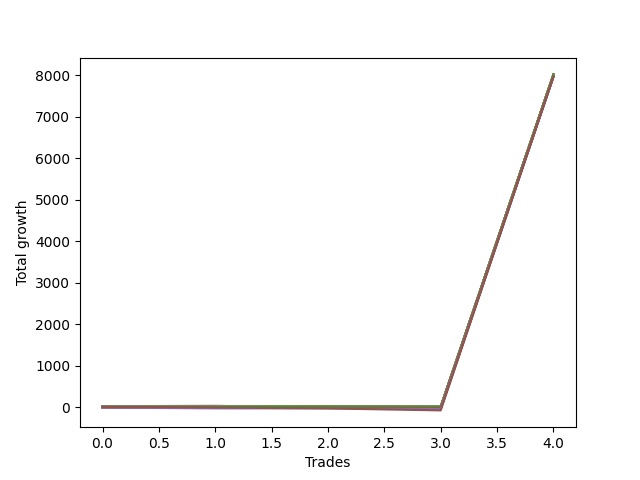

# Short Entry Wallace MJ 007 
- Symbol: NQ
- Date Range: 03/18/2022 - 06/17/2022
- Trading Period: 7:20-12:30
- Number of Trades: 4



| Name | Win Percent | Profit | Avg Profit / Trade |     | Name | Win Percent | Profit | Avg Profit / Trade |
| ---- | ----------- | ------ | ------------------ | --- | ---- | ----------- | ------ | ------------------ |
| Sorted By <br> Profit | | | | | Sorted By <br> Win Percentage ||||
| Zero | 75.00 | -4125.00 | -1031.25 |     | Zero | 75.00 | -4125.00 | -1031.25 |
| Twenty-One | 25.00 | -5250.00 | -1312.50 |     | Two | 50.00 | -22125.00 | -5531.25 |
| Twenty | 25.00 | -5250.00 | -1312.50 |     | One | 50.00 | -37625.00 | -9406.25 |
| Nineteen | 25.00 | -5250.00 | -1312.50 |     | Twenty-One | 25.00 | -5250.00 | -1312.50 |
| Eighteen | 25.00 | -5250.00 | -1312.50 |     | Twenty | 25.00 | -5250.00 | -1312.50 |
| Seventeen | 25.00 | -5250.00 | -1312.50 |     | Nineteen | 25.00 | -5250.00 | -1312.50 |
| Sixten | 25.00 | -5250.00 | -1312.50 |     | Eighteen | 25.00 | -5250.00 | -1312.50 |
| Thirty-Seven | 25.00 | -5875.00 | -1468.75 |     | Seventeen | 25.00 | -5250.00 | -1312.50 |
| Thirty-Six | 25.00 | -5875.00 | -1468.75 |     | Sixten | 25.00 | -5250.00 | -1312.50 |
| Thirty-Five | 25.00 | -5875.00 | -1468.75 |     | Thirty-Seven | 25.00 | -5875.00 | -1468.75 |
| Thirty-Four | 25.00 | -5875.00 | -1468.75 |     | Thirty-Six | 25.00 | -5875.00 | -1468.75 |
| Thirty-Three | 25.00 | -5875.00 | -1468.75 |     | Thirty-Five | 25.00 | -5875.00 | -1468.75 |
| Thirty-Two | 25.00 | -5875.00 | -1468.75 |     | Thirty-Four | 25.00 | -5875.00 | -1468.75 |
| Seventy-Two | 25.00 | -6250.00 | -1562.50 |     | Thirty-Three | 25.00 | -5875.00 | -1468.75 |
| Fifty-Three | 25.00 | -8750.00 | -2187.50 |     | Thirty-Two | 25.00 | -5875.00 | -1468.75 |
| Fifty-Two | 25.00 | -8750.00 | -2187.50 |     | Seventy-Two | 25.00 | -6250.00 | -1562.50 |
| Fifty-One | 25.00 | -8750.00 | -2187.50 |     | Fifty-Three | 25.00 | -8750.00 | -2187.50 |
| Fifty | 25.00 | -8750.00 | -2187.50 |     | Fifty-Two | 25.00 | -8750.00 | -2187.50 |
| Forty-Nine | 25.00 | -8750.00 | -2187.50 |     | Fifty-One | 25.00 | -8750.00 | -2187.50 |
| Forty-Eight | 25.00 | -8750.00 | -2187.50 |     | Fifty | 25.00 | -8750.00 | -2187.50 |
| Fifteen | 0.00 | -9375.00 | -2343.75 |     | Forty-Nine | 25.00 | -8750.00 | -2187.50 |
| Fourteen | 0.00 | -9375.00 | -2343.75 |     | Forty-Eight | 25.00 | -8750.00 | -2187.50 |
| Thirty-One | 0.00 | -9750.00 | -2437.50 |     | Sixty-Nine | 25.00 | -16875.00 | -4218.75 |
| Thirty | 0.00 | -9750.00 | -2437.50 |     | Sixty-Eight | 25.00 | -16875.00 | -4218.75 |
| Forty-Seven | 0.00 | -11125.00 | -2781.25 |     | Sixty-Seven | 25.00 | -16875.00 | -4218.75 |
| Forty-Six | 0.00 | -11125.00 | -2781.25 |     | Sixty-Six | 25.00 | -16875.00 | -4218.75 |
| Thirteen | 0.00 | -13250.00 | -3312.50 |     | Sixty-Five | 25.00 | -16875.00 | -4218.75 |
| Twelve | 0.00 | -13250.00 | -3312.50 |     | Sixty-Four | 25.00 | -16875.00 | -4218.75 |
| Eleven | 0.00 | -13250.00 | -3312.50 |     | Three | 25.00 | -34750.00 | -8687.50 |
| Ten | 0.00 | -13250.00 | -3312.50 |     | Seventy-Five | 25.00 | -42750.00 | -10687.50 |
| Nine | 0.00 | -13250.00 | -3312.50 |     | Seventy-Four | 25.00 | -42750.00 | -10687.50 |
| Eight | 0.00 | -13250.00 | -3312.50 |     | Seventy-One | 25.00 | -42750.00 | -10687.50 |
| Twenty-Nine | 0.00 | -15250.00 | -3812.50 |     | Seventy | 25.00 | -42750.00 | -10687.50 |
| Twenty-Eight | 0.00 | -15250.00 | -3812.50 |     | Fifty-Five | 25.00 | -42750.00 | -10687.50 |
| twenty-Seven | 0.00 | -15250.00 | -3812.50 |     | Fifty-Four | 25.00 | -42750.00 | -10687.50 |
| Twenty-Six | 0.00 | -15250.00 | -3812.50 |     | Thirty-Nine | 25.00 | -42750.00 | -10687.50 |
| Twenty-Five | 0.00 | -15250.00 | -3812.50 |     | Thirty-Eight | 25.00 | -42750.00 | -10687.50 |
| Twenty-Four | 0.00 | -15250.00 | -3812.50 |     | Twenty-Three | 25.00 | -42750.00 | -10687.50 |
| Sixty-Nine | 25.00 | -16875.00 | -4218.75 |     | Twenty-Two | 25.00 | -42750.00 | -10687.50 |
| Sixty-Eight | 25.00 | -16875.00 | -4218.75 |     | Seven | 25.00 | -42750.00 | -10687.50 |
| Sixty-Seven | 25.00 | -16875.00 | -4218.75 |     | Six | 25.00 | -42750.00 | -10687.50 |
| Sixty-Six | 25.00 | -16875.00 | -4218.75 |     | Five | 25.00 | -42750.00 | -10687.50 |
| Sixty-Five | 25.00 | -16875.00 | -4218.75 |     | Four | 25.00 | -42750.00 | -10687.50 |
| Sixty-Four | 25.00 | -16875.00 | -4218.75 |     | Fifteen | 0.00 | -9375.00 | -2343.75 |
| Forty-Five | 0.00 | -18500.00 | -4625.00 |     | Fourteen | 0.00 | -9375.00 | -2343.75 |
| Forty-Four | 0.00 | -18500.00 | -4625.00 |     | Thirty-One | 0.00 | -9750.00 | -2437.50 |
| Forty-Three | 0.00 | -18500.00 | -4625.00 |     | Thirty | 0.00 | -9750.00 | -2437.50 |
| Forty-Two | 0.00 | -18500.00 | -4625.00 |     | Forty-Seven | 0.00 | -11125.00 | -2781.25 |
| Forty-One | 0.00 | -18500.00 | -4625.00 |     | Forty-Six | 0.00 | -11125.00 | -2781.25 |
| Forty | 0.00 | -18500.00 | -4625.00 |     | Thirteen | 0.00 | -13250.00 | -3312.50 |
| Two | 50.00 | -22125.00 | -5531.25 |     | Twelve | 0.00 | -13250.00 | -3312.50 |
| Sixty-Three | 0.00 | -23500.00 | -5875.00 |     | Eleven | 0.00 | -13250.00 | -3312.50 |
| Sixty-Two | 0.00 | -23500.00 | -5875.00 |     | Ten | 0.00 | -13250.00 | -3312.50 |
| Sixty-One | 0.00 | -23625.00 | -5906.25 |     | Nine | 0.00 | -13250.00 | -3312.50 |
| Sixty | 0.00 | -23625.00 | -5906.25 |     | Eight | 0.00 | -13250.00 | -3312.50 |
| Fifty-Nine | 0.00 | -23625.00 | -5906.25 |     | Twenty-Nine | 0.00 | -15250.00 | -3812.50 |
| Fifty-Eight | 0.00 | -23625.00 | -5906.25 |     | Twenty-Eight | 0.00 | -15250.00 | -3812.50 |
| Fifty-Seven | 0.00 | -23625.00 | -5906.25 |     | twenty-Seven | 0.00 | -15250.00 | -3812.50 |
| Fifty-Six | 0.00 | -23625.00 | -5906.25 |     | Twenty-Six | 0.00 | -15250.00 | -3812.50 |
| Three | 25.00 | -34750.00 | -8687.50 |     | Twenty-Five | 0.00 | -15250.00 | -3812.50 |
| One | 50.00 | -37625.00 | -9406.25 |     | Twenty-Four | 0.00 | -15250.00 | -3812.50 |
| Seventy-Five | 25.00 | -42750.00 | -10687.50 |     | Forty-Five | 0.00 | -18500.00 | -4625.00 |
| Seventy-Four | 25.00 | -42750.00 | -10687.50 |     | Forty-Four | 0.00 | -18500.00 | -4625.00 |
| Seventy-One | 25.00 | -42750.00 | -10687.50 |     | Forty-Three | 0.00 | -18500.00 | -4625.00 |
| Seventy | 25.00 | -42750.00 | -10687.50 |     | Forty-Two | 0.00 | -18500.00 | -4625.00 |
| Fifty-Five | 25.00 | -42750.00 | -10687.50 |     | Forty-One | 0.00 | -18500.00 | -4625.00 |
| Fifty-Four | 25.00 | -42750.00 | -10687.50 |     | Forty | 0.00 | -18500.00 | -4625.00 |
| Thirty-Nine | 25.00 | -42750.00 | -10687.50 |     | Sixty-Three | 0.00 | -23500.00 | -5875.00 |
| Thirty-Eight | 25.00 | -42750.00 | -10687.50 |     | Sixty-Two | 0.00 | -23500.00 | -5875.00 |
| Twenty-Three | 25.00 | -42750.00 | -10687.50 |     | Sixty-One | 0.00 | -23625.00 | -5906.25 |
| Twenty-Two | 25.00 | -42750.00 | -10687.50 |     | Sixty | 0.00 | -23625.00 | -5906.25 |
| Seven | 25.00 | -42750.00 | -10687.50 |     | Fifty-Nine | 0.00 | -23625.00 | -5906.25 |
| Six | 25.00 | -42750.00 | -10687.50 |     | Fifty-Eight | 0.00 | -23625.00 | -5906.25 |
| Five | 25.00 | -42750.00 | -10687.50 |     | Fifty-Seven | 0.00 | -23625.00 | -5906.25 |
| Four | 25.00 | -42750.00 | -10687.50 |     | Fifty-Six | 0.00 | -23625.00 | -5906.25 |
| Seventy-Three | 0.00 | -50750.00 | -12687.50 |     | Seventy-Three | 0.00 | -50750.00 | -12687.50 |

## NO STOPLOSS

### Test Zero
* Sell when price hits the middle line of the 20p bollinger
* No Stoploss
* Results:
```
Total Trades: 4
Percent Up: 25.00
Percent Down: 75.00
Total Points Moved Down: -8.25
Potential Profit: -4125.00
Total Points Ups: 44.75 Count Ups: 1
Total Points Downs: 36.50 Count Downs: 3
```

<details><summary>Trades</summary>

<code>In: 2022-04-28 10:17:00		Out: 2022-04-28 10:22:10		Total Position Time: 05:10		Total Move Down: 7.75		Total to Date: 7.75</code> <br />
<code>In: 2022-05-03 08:12:00		Out: 2022-05-03 08:17:35		Total Position Time: 05:35		Total Move Down: 27.25		Total to Date: 35.00</code> <br />
<code>In: 2022-05-16 11:12:00		Out: 2022-05-16 11:17:30		Total Position Time: 05:30		Total Move Down: 1.50		Total to Date: 36.50</code> <br />
<code>In: 2022-05-25 11:59:00		Out: 2022-05-25 12:16:05		Total Position Time: 17:05		Total Move Down: -44.75		Total to Date: -8.25</code> <br />


</details>

### Test One
* Sell when the price hits the upper line of the 20p 1std bollinger
* No Stoploss
* Results:
```
Total Trades: 4
Percent Up: 50.00
Percent Down: 50.00
Total Points Moved Down: -75.25
Potential Profit: -37625.00
Total Points Ups: 87.50 Count Ups: 2
Total Points Downs: 12.25 Count Downs: 2
```

<details><summary>Trades</summary>

<code>In: 2022-04-28 10:17:00		Out: 2022-04-28 10:30:45		Total Position Time: 13:45		Total Move Down: 8.00		Total to Date: 8.00</code> <br />
<code>In: 2022-05-03 08:12:00		Out: 2022-05-03 08:28:35		Total Position Time: 16:35		Total Move Down: 4.25		Total to Date: 12.25</code> <br />
<code>In: 2022-05-16 11:12:00		Out: 2022-05-16 11:41:55		Total Position Time: 29:55		Total Move Down: -47.50		Total to Date: -35.25</code> <br />
<code>In: 2022-05-25 11:59:00		Out: 2022-05-25 12:20:05		Total Position Time: 21:05		Total Move Down: -40.00		Total to Date: -75.25</code> <br />


</details>

### Test Two
* Sell when the price hits the upper line of the 20p 2std bollinger
* No Stoploss
* Results:
```
Total Trades: 4
Percent Up: 50.00
Percent Down: 50.00
Total Points Moved Down: -44.25
Potential Profit: -22125.00
Total Points Ups: 74.25 Count Ups: 2
Total Points Downs: 30.00 Count Downs: 2
```

<details><summary>Trades</summary>

<code>In: 2022-04-28 10:17:00		Out: 2022-04-28 10:31:00		Total Position Time: 14:00		Total Move Down: 14.50		Total to Date: 14.50</code> <br />
<code>In: 2022-05-03 08:12:00		Out: 2022-05-03 08:35:55		Total Position Time: 23:55		Total Move Down: 15.50		Total to Date: 30.00</code> <br />
<code>In: 2022-05-16 11:12:00		Out: 2022-05-16 11:41:55		Total Position Time: 29:55		Total Move Down: -47.50		Total to Date: -17.50</code> <br />
<code>In: 2022-05-25 11:59:00		Out: 2022-05-25 12:22:50		Total Position Time: 23:50		Total Move Down: -26.75		Total to Date: -44.25</code> <br />


</details>

### Test Three
* Sell when price hits the middle line of the 50p bollinger
* No Stoploss
* Results:
```
Total Trades: 4
Percent Up: 75.00
Percent Down: 25.00
Total Points Moved Down: -69.50
Potential Profit: -34750.00
Total Points Ups: 96.50 Count Ups: 3
Total Points Downs: 27.00 Count Downs: 1
```

<details><summary>Trades</summary>

<code>In: 2022-04-28 10:17:00		Out: 2022-04-28 10:46:55		Total Position Time: 29:55		Total Move Down: -22.00		Total to Date: -22.00</code> <br />
<code>In: 2022-05-03 08:12:00		Out: 2022-05-03 08:39:05		Total Position Time: 27:05		Total Move Down: 27.00		Total to Date: 5.00</code> <br />
<code>In: 2022-05-16 11:12:00		Out: 2022-05-16 11:41:55		Total Position Time: 29:55		Total Move Down: -47.50		Total to Date: -42.50</code> <br />
<code>In: 2022-05-25 11:59:00		Out: 2022-05-25 12:28:55		Total Position Time: 29:55		Total Move Down: -27.00		Total to Date: -69.50</code> <br />


</details>

### Test Four
* Sell when the price hits the upper line of the 50p 1std bollinger
* No Stoploss
* Results:
```
Total Trades: 4
Percent Up: 75.00
Percent Down: 25.00
Total Points Moved Down: -85.50
Potential Profit: -42750.00
Total Points Ups: 96.50 Count Ups: 3
Total Points Downs: 11.00 Count Downs: 1
```

<details><summary>Trades</summary>

<code>In: 2022-04-28 10:17:00		Out: 2022-04-28 10:46:55		Total Position Time: 29:55		Total Move Down: -22.00		Total to Date: -22.00</code> <br />
<code>In: 2022-05-03 08:12:00		Out: 2022-05-03 08:41:55		Total Position Time: 29:55		Total Move Down: 11.00		Total to Date: -11.00</code> <br />
<code>In: 2022-05-16 11:12:00		Out: 2022-05-16 11:41:55		Total Position Time: 29:55		Total Move Down: -47.50		Total to Date: -58.50</code> <br />
<code>In: 2022-05-25 11:59:00		Out: 2022-05-25 12:28:55		Total Position Time: 29:55		Total Move Down: -27.00		Total to Date: -85.50</code> <br />


</details>

### Test Five
* Sell when the price hits the upper line of the 50p 2std bollinger
* No Stoploss
* Results:
```
Total Trades: 4
Percent Up: 75.00
Percent Down: 25.00
Total Points Moved Down: -85.50
Potential Profit: -42750.00
Total Points Ups: 96.50 Count Ups: 3
Total Points Downs: 11.00 Count Downs: 1
```

<details><summary>Trades</summary>

<code>In: 2022-04-28 10:17:00		Out: 2022-04-28 10:46:55		Total Position Time: 29:55		Total Move Down: -22.00		Total to Date: -22.00</code> <br />
<code>In: 2022-05-03 08:12:00		Out: 2022-05-03 08:41:55		Total Position Time: 29:55		Total Move Down: 11.00		Total to Date: -11.00</code> <br />
<code>In: 2022-05-16 11:12:00		Out: 2022-05-16 11:41:55		Total Position Time: 29:55		Total Move Down: -47.50		Total to Date: -58.50</code> <br />
<code>In: 2022-05-25 11:59:00		Out: 2022-05-25 12:28:55		Total Position Time: 29:55		Total Move Down: -27.00		Total to Date: -85.50</code> <br />


</details>

### Test Six
* Sell when the price hits the middle line of the 1std VWAP
* No Stoploss
* Results:
```
Total Trades: 4
Percent Up: 75.00
Percent Down: 25.00
Total Points Moved Down: -85.50
Potential Profit: -42750.00
Total Points Ups: 96.50 Count Ups: 3
Total Points Downs: 11.00 Count Downs: 1
```

<details><summary>Trades</summary>

<code>In: 2022-04-28 10:17:00		Out: 2022-04-28 10:46:55		Total Position Time: 29:55		Total Move Down: -22.00		Total to Date: -22.00</code> <br />
<code>In: 2022-05-03 08:12:00		Out: 2022-05-03 08:41:55		Total Position Time: 29:55		Total Move Down: 11.00		Total to Date: -11.00</code> <br />
<code>In: 2022-05-16 11:12:00		Out: 2022-05-16 11:41:55		Total Position Time: 29:55		Total Move Down: -47.50		Total to Date: -58.50</code> <br />
<code>In: 2022-05-25 11:59:00		Out: 2022-05-25 12:28:55		Total Position Time: 29:55		Total Move Down: -27.00		Total to Date: -85.50</code> <br />


</details>

### Test Seven
* Sell when the price hits the upper line of the 1std VWAP
* No Stoploss
* Results:
```
Total Trades: 4
Percent Up: 75.00
Percent Down: 25.00
Total Points Moved Down: -85.50
Potential Profit: -42750.00
Total Points Ups: 96.50 Count Ups: 3
Total Points Downs: 11.00 Count Downs: 1
```

<details><summary>Trades</summary>

<code>In: 2022-04-28 10:17:00		Out: 2022-04-28 10:46:55		Total Position Time: 29:55		Total Move Down: -22.00		Total to Date: -22.00</code> <br />
<code>In: 2022-05-03 08:12:00		Out: 2022-05-03 08:41:55		Total Position Time: 29:55		Total Move Down: 11.00		Total to Date: -11.00</code> <br />
<code>In: 2022-05-16 11:12:00		Out: 2022-05-16 11:41:55		Total Position Time: 29:55		Total Move Down: -47.50		Total to Date: -58.50</code> <br />
<code>In: 2022-05-25 11:59:00		Out: 2022-05-25 12:28:55		Total Position Time: 29:55		Total Move Down: -27.00		Total to Date: -85.50</code> <br />


</details>

## STOPLOSS OF 2

### Test Eight
* Sell when price hits the middle line of the 20p bollinger
* Stoploss is -2 points
* Results:
```
Total Trades: 4
Percent Up: 100.00
Percent Down: 0.00
Total Points Moved Down: -26.50
Potential Profit: -13250.00
Total Points Ups: 26.50 Count Ups: 4
Total Points Downs: 0.00 Count Downs: 0
```

<details><summary>Trades</summary>

<code>In: 2022-04-28 10:17:00		Out: 2022-04-28 10:19:25		Total Position Time: 02:25		Total Move Down: -2.75		Total to Date: -2.75</code> <br />
<code>In: 2022-05-03 08:12:00		Out: 2022-05-03 08:12:10		Total Position Time: 00:10		Total Move Down: -5.25		Total to Date: -8.00</code> <br />
<code>In: 2022-05-16 11:12:00		Out: 2022-05-16 11:12:15		Total Position Time: 00:15		Total Move Down: -9.75		Total to Date: -17.75</code> <br />
<code>In: 2022-05-25 11:59:00		Out: 2022-05-25 11:59:55		Total Position Time: 00:55		Total Move Down: -8.75		Total to Date: -26.50</code> <br />


</details>

### Test Nine
* Sell when the price hits the upper line of the 20p 1std bollinger
* Stoploss is -2 points
* Results:
```
Total Trades: 4
Percent Up: 100.00
Percent Down: 0.00
Total Points Moved Down: -26.50
Potential Profit: -13250.00
Total Points Ups: 26.50 Count Ups: 4
Total Points Downs: 0.00 Count Downs: 0
```

<details><summary>Trades</summary>

<code>In: 2022-04-28 10:17:00		Out: 2022-04-28 10:19:25		Total Position Time: 02:25		Total Move Down: -2.75		Total to Date: -2.75</code> <br />
<code>In: 2022-05-03 08:12:00		Out: 2022-05-03 08:12:10		Total Position Time: 00:10		Total Move Down: -5.25		Total to Date: -8.00</code> <br />
<code>In: 2022-05-16 11:12:00		Out: 2022-05-16 11:12:15		Total Position Time: 00:15		Total Move Down: -9.75		Total to Date: -17.75</code> <br />
<code>In: 2022-05-25 11:59:00		Out: 2022-05-25 11:59:55		Total Position Time: 00:55		Total Move Down: -8.75		Total to Date: -26.50</code> <br />


</details>

### Test Ten
* Sell when the price hits the upper line of the 20p 2std bollinger
* Stoploss is -2 points
* Results:
```
Total Trades: 4
Percent Up: 100.00
Percent Down: 0.00
Total Points Moved Down: -26.50
Potential Profit: -13250.00
Total Points Ups: 26.50 Count Ups: 4
Total Points Downs: 0.00 Count Downs: 0
```

<details><summary>Trades</summary>

<code>In: 2022-04-28 10:17:00		Out: 2022-04-28 10:19:25		Total Position Time: 02:25		Total Move Down: -2.75		Total to Date: -2.75</code> <br />
<code>In: 2022-05-03 08:12:00		Out: 2022-05-03 08:12:10		Total Position Time: 00:10		Total Move Down: -5.25		Total to Date: -8.00</code> <br />
<code>In: 2022-05-16 11:12:00		Out: 2022-05-16 11:12:15		Total Position Time: 00:15		Total Move Down: -9.75		Total to Date: -17.75</code> <br />
<code>In: 2022-05-25 11:59:00		Out: 2022-05-25 11:59:55		Total Position Time: 00:55		Total Move Down: -8.75		Total to Date: -26.50</code> <br />


</details>

### Test Eleven
* Sell when price hits the middle line of the 50p bollinger
* Stoploss is -2 points
* Results:
```
Total Trades: 4
Percent Up: 100.00
Percent Down: 0.00
Total Points Moved Down: -26.50
Potential Profit: -13250.00
Total Points Ups: 26.50 Count Ups: 4
Total Points Downs: 0.00 Count Downs: 0
```

<details><summary>Trades</summary>

<code>In: 2022-04-28 10:17:00		Out: 2022-04-28 10:19:25		Total Position Time: 02:25		Total Move Down: -2.75		Total to Date: -2.75</code> <br />
<code>In: 2022-05-03 08:12:00		Out: 2022-05-03 08:12:10		Total Position Time: 00:10		Total Move Down: -5.25		Total to Date: -8.00</code> <br />
<code>In: 2022-05-16 11:12:00		Out: 2022-05-16 11:12:15		Total Position Time: 00:15		Total Move Down: -9.75		Total to Date: -17.75</code> <br />
<code>In: 2022-05-25 11:59:00		Out: 2022-05-25 11:59:55		Total Position Time: 00:55		Total Move Down: -8.75		Total to Date: -26.50</code> <br />


</details>

### Test Twelve
* Sell when the price hits the upper line of the 50p 1std bollinger
* Stoploss is -2 points
* Results:
```
Total Trades: 4
Percent Up: 100.00
Percent Down: 0.00
Total Points Moved Down: -26.50
Potential Profit: -13250.00
Total Points Ups: 26.50 Count Ups: 4
Total Points Downs: 0.00 Count Downs: 0
```

<details><summary>Trades</summary>

<code>In: 2022-04-28 10:17:00		Out: 2022-04-28 10:19:25		Total Position Time: 02:25		Total Move Down: -2.75		Total to Date: -2.75</code> <br />
<code>In: 2022-05-03 08:12:00		Out: 2022-05-03 08:12:10		Total Position Time: 00:10		Total Move Down: -5.25		Total to Date: -8.00</code> <br />
<code>In: 2022-05-16 11:12:00		Out: 2022-05-16 11:12:15		Total Position Time: 00:15		Total Move Down: -9.75		Total to Date: -17.75</code> <br />
<code>In: 2022-05-25 11:59:00		Out: 2022-05-25 11:59:55		Total Position Time: 00:55		Total Move Down: -8.75		Total to Date: -26.50</code> <br />


</details>

### Test Thirteen
* Sell when the price hits the upper line of the 50p 2std bollinger
* Stoploss is -2 points
* Results:
```
Total Trades: 4
Percent Up: 100.00
Percent Down: 0.00
Total Points Moved Down: -26.50
Potential Profit: -13250.00
Total Points Ups: 26.50 Count Ups: 4
Total Points Downs: 0.00 Count Downs: 0
```

<details><summary>Trades</summary>

<code>In: 2022-04-28 10:17:00		Out: 2022-04-28 10:19:25		Total Position Time: 02:25		Total Move Down: -2.75		Total to Date: -2.75</code> <br />
<code>In: 2022-05-03 08:12:00		Out: 2022-05-03 08:12:10		Total Position Time: 00:10		Total Move Down: -5.25		Total to Date: -8.00</code> <br />
<code>In: 2022-05-16 11:12:00		Out: 2022-05-16 11:12:15		Total Position Time: 00:15		Total Move Down: -9.75		Total to Date: -17.75</code> <br />
<code>In: 2022-05-25 11:59:00		Out: 2022-05-25 11:59:55		Total Position Time: 00:55		Total Move Down: -8.75		Total to Date: -26.50</code> <br />


</details>

### Test Fourteen
* Sell when the price hits the middle line of the 1std VWAP
* Stoploss is -2 points
* Results:
```
Total Trades: 4
Percent Up: 100.00
Percent Down: 0.00
Total Points Moved Down: -18.75
Potential Profit: -9375.00
Total Points Ups: 18.75 Count Ups: 4
Total Points Downs: 0.00 Count Downs: 0
```

<details><summary>Trades</summary>

<code>In: 2022-04-28 10:17:00		Out: 2022-04-28 10:19:25		Total Position Time: 02:25		Total Move Down: -2.75		Total to Date: -2.75</code> <br />
<code>In: 2022-05-03 08:12:00		Out: 2022-05-03 08:12:10		Total Position Time: 00:10		Total Move Down: -5.25		Total to Date: -8.00</code> <br />
<code>In: 2022-05-16 11:12:00		Out: 2022-05-16 11:12:10		Total Position Time: 00:10		Total Move Down: -6.75		Total to Date: -14.75</code> <br />
<code>In: 2022-05-25 11:59:00		Out: 2022-05-25 11:59:10		Total Position Time: 00:10		Total Move Down: -4.00		Total to Date: -18.75</code> <br />


</details>

### Test Fifteen
* Sell when the price hits the upper line of the 1std VWAP
* Stoploss is -2 points
* Results:
```
Total Trades: 4
Percent Up: 100.00
Percent Down: 0.00
Total Points Moved Down: -18.75
Potential Profit: -9375.00
Total Points Ups: 18.75 Count Ups: 4
Total Points Downs: 0.00 Count Downs: 0
```

<details><summary>Trades</summary>

<code>In: 2022-04-28 10:17:00		Out: 2022-04-28 10:19:25		Total Position Time: 02:25		Total Move Down: -2.75		Total to Date: -2.75</code> <br />
<code>In: 2022-05-03 08:12:00		Out: 2022-05-03 08:12:10		Total Position Time: 00:10		Total Move Down: -5.25		Total to Date: -8.00</code> <br />
<code>In: 2022-05-16 11:12:00		Out: 2022-05-16 11:12:10		Total Position Time: 00:10		Total Move Down: -6.75		Total to Date: -14.75</code> <br />
<code>In: 2022-05-25 11:59:00		Out: 2022-05-25 11:59:10		Total Position Time: 00:10		Total Move Down: -4.00		Total to Date: -18.75</code> <br />


</details>

## TRAIL STOP OF 2

### Test Sixten
* Sell when price hits the middle line of the 20p bollinger
* Trailing Stop is -2 points
* Results:
```
Total Trades: 4
Percent Up: 75.00
Percent Down: 25.00
Total Points Moved Down: -10.50
Potential Profit: -5250.00
Total Points Ups: 19.25 Count Ups: 3
Total Points Downs: 8.75 Count Downs: 1
```

<details><summary>Trades</summary>

<code>In: 2022-04-28 10:17:00		Out: 2022-04-28 10:17:25		Total Position Time: 00:25		Total Move Down: 8.75		Total to Date: 8.75</code> <br />
<code>In: 2022-05-03 08:12:00		Out: 2022-05-03 08:12:10		Total Position Time: 00:10		Total Move Down: -5.25		Total to Date: 3.50</code> <br />
<code>In: 2022-05-16 11:12:00		Out: 2022-05-16 11:12:15		Total Position Time: 00:15		Total Move Down: -9.75		Total to Date: -6.25</code> <br />
<code>In: 2022-05-25 11:59:00		Out: 2022-05-25 11:59:20		Total Position Time: 00:20		Total Move Down: -4.25		Total to Date: -10.50</code> <br />


</details>

### Test Seventeen
* Sell when the price hits the upper line of the 20p 1std bollinger
* Trailing Stop is -2 points
* Results:
```
Total Trades: 4
Percent Up: 75.00
Percent Down: 25.00
Total Points Moved Down: -10.50
Potential Profit: -5250.00
Total Points Ups: 19.25 Count Ups: 3
Total Points Downs: 8.75 Count Downs: 1
```

<details><summary>Trades</summary>

<code>In: 2022-04-28 10:17:00		Out: 2022-04-28 10:17:25		Total Position Time: 00:25		Total Move Down: 8.75		Total to Date: 8.75</code> <br />
<code>In: 2022-05-03 08:12:00		Out: 2022-05-03 08:12:10		Total Position Time: 00:10		Total Move Down: -5.25		Total to Date: 3.50</code> <br />
<code>In: 2022-05-16 11:12:00		Out: 2022-05-16 11:12:15		Total Position Time: 00:15		Total Move Down: -9.75		Total to Date: -6.25</code> <br />
<code>In: 2022-05-25 11:59:00		Out: 2022-05-25 11:59:20		Total Position Time: 00:20		Total Move Down: -4.25		Total to Date: -10.50</code> <br />


</details>

### Test Eighteen
* Sell when the price hits the upper line of the 20p 2std bollinger
* Trailing Stop is -2 points
* Results:
```
Total Trades: 4
Percent Up: 75.00
Percent Down: 25.00
Total Points Moved Down: -10.50
Potential Profit: -5250.00
Total Points Ups: 19.25 Count Ups: 3
Total Points Downs: 8.75 Count Downs: 1
```

<details><summary>Trades</summary>

<code>In: 2022-04-28 10:17:00		Out: 2022-04-28 10:17:25		Total Position Time: 00:25		Total Move Down: 8.75		Total to Date: 8.75</code> <br />
<code>In: 2022-05-03 08:12:00		Out: 2022-05-03 08:12:10		Total Position Time: 00:10		Total Move Down: -5.25		Total to Date: 3.50</code> <br />
<code>In: 2022-05-16 11:12:00		Out: 2022-05-16 11:12:15		Total Position Time: 00:15		Total Move Down: -9.75		Total to Date: -6.25</code> <br />
<code>In: 2022-05-25 11:59:00		Out: 2022-05-25 11:59:20		Total Position Time: 00:20		Total Move Down: -4.25		Total to Date: -10.50</code> <br />


</details>

### Test Nineteen
* Sell when price hits the middle line of the 50p bollinger
* Trailing Stop is -2 points
* Results:
```
Total Trades: 4
Percent Up: 75.00
Percent Down: 25.00
Total Points Moved Down: -10.50
Potential Profit: -5250.00
Total Points Ups: 19.25 Count Ups: 3
Total Points Downs: 8.75 Count Downs: 1
```

<details><summary>Trades</summary>

<code>In: 2022-04-28 10:17:00		Out: 2022-04-28 10:17:25		Total Position Time: 00:25		Total Move Down: 8.75		Total to Date: 8.75</code> <br />
<code>In: 2022-05-03 08:12:00		Out: 2022-05-03 08:12:10		Total Position Time: 00:10		Total Move Down: -5.25		Total to Date: 3.50</code> <br />
<code>In: 2022-05-16 11:12:00		Out: 2022-05-16 11:12:15		Total Position Time: 00:15		Total Move Down: -9.75		Total to Date: -6.25</code> <br />
<code>In: 2022-05-25 11:59:00		Out: 2022-05-25 11:59:20		Total Position Time: 00:20		Total Move Down: -4.25		Total to Date: -10.50</code> <br />


</details>

### Test Twenty
* Sell when the price hits the upper line of the 50p 1std bollinger
* Trailing Stop is -2 points
* Results:
```
Total Trades: 4
Percent Up: 75.00
Percent Down: 25.00
Total Points Moved Down: -10.50
Potential Profit: -5250.00
Total Points Ups: 19.25 Count Ups: 3
Total Points Downs: 8.75 Count Downs: 1
```

<details><summary>Trades</summary>

<code>In: 2022-04-28 10:17:00		Out: 2022-04-28 10:17:25		Total Position Time: 00:25		Total Move Down: 8.75		Total to Date: 8.75</code> <br />
<code>In: 2022-05-03 08:12:00		Out: 2022-05-03 08:12:10		Total Position Time: 00:10		Total Move Down: -5.25		Total to Date: 3.50</code> <br />
<code>In: 2022-05-16 11:12:00		Out: 2022-05-16 11:12:15		Total Position Time: 00:15		Total Move Down: -9.75		Total to Date: -6.25</code> <br />
<code>In: 2022-05-25 11:59:00		Out: 2022-05-25 11:59:20		Total Position Time: 00:20		Total Move Down: -4.25		Total to Date: -10.50</code> <br />


</details>

### Test Twenty-One
* Sell when the price hits the upper line of the 50p 2std bollinger
* Trailing Stop is -2 points
* Results:
```
Total Trades: 4
Percent Up: 75.00
Percent Down: 25.00
Total Points Moved Down: -10.50
Potential Profit: -5250.00
Total Points Ups: 19.25 Count Ups: 3
Total Points Downs: 8.75 Count Downs: 1
```

<details><summary>Trades</summary>

<code>In: 2022-04-28 10:17:00		Out: 2022-04-28 10:17:25		Total Position Time: 00:25		Total Move Down: 8.75		Total to Date: 8.75</code> <br />
<code>In: 2022-05-03 08:12:00		Out: 2022-05-03 08:12:10		Total Position Time: 00:10		Total Move Down: -5.25		Total to Date: 3.50</code> <br />
<code>In: 2022-05-16 11:12:00		Out: 2022-05-16 11:12:15		Total Position Time: 00:15		Total Move Down: -9.75		Total to Date: -6.25</code> <br />
<code>In: 2022-05-25 11:59:00		Out: 2022-05-25 11:59:20		Total Position Time: 00:20		Total Move Down: -4.25		Total to Date: -10.50</code> <br />


</details>

### Test Twenty-Two
* Sell when the price hits the middle line of the 1std VWAP
* Trailing Stop is -2 points
* Results:
```
Total Trades: 4
Percent Up: 75.00
Percent Down: 25.00
Total Points Moved Down: -85.50
Potential Profit: -42750.00
Total Points Ups: 96.50 Count Ups: 3
Total Points Downs: 11.00 Count Downs: 1
```

<details><summary>Trades</summary>

<code>In: 2022-04-28 10:17:00		Out: 2022-04-28 10:46:55		Total Position Time: 29:55		Total Move Down: -22.00		Total to Date: -22.00</code> <br />
<code>In: 2022-05-03 08:12:00		Out: 2022-05-03 08:41:55		Total Position Time: 29:55		Total Move Down: 11.00		Total to Date: -11.00</code> <br />
<code>In: 2022-05-16 11:12:00		Out: 2022-05-16 11:41:55		Total Position Time: 29:55		Total Move Down: -47.50		Total to Date: -58.50</code> <br />
<code>In: 2022-05-25 11:59:00		Out: 2022-05-25 12:28:55		Total Position Time: 29:55		Total Move Down: -27.00		Total to Date: -85.50</code> <br />


</details>

### Test Twenty-Three
* Sell when the price hits the upper line of the 1std VWAP
* Trailing Stop is -2 points
* Results:
```
Total Trades: 4
Percent Up: 75.00
Percent Down: 25.00
Total Points Moved Down: -85.50
Potential Profit: -42750.00
Total Points Ups: 96.50 Count Ups: 3
Total Points Downs: 11.00 Count Downs: 1
```

<details><summary>Trades</summary>

<code>In: 2022-04-28 10:17:00		Out: 2022-04-28 10:46:55		Total Position Time: 29:55		Total Move Down: -22.00		Total to Date: -22.00</code> <br />
<code>In: 2022-05-03 08:12:00		Out: 2022-05-03 08:41:55		Total Position Time: 29:55		Total Move Down: 11.00		Total to Date: -11.00</code> <br />
<code>In: 2022-05-16 11:12:00		Out: 2022-05-16 11:41:55		Total Position Time: 29:55		Total Move Down: -47.50		Total to Date: -58.50</code> <br />
<code>In: 2022-05-25 11:59:00		Out: 2022-05-25 12:28:55		Total Position Time: 29:55		Total Move Down: -27.00		Total to Date: -85.50</code> <br />


</details>

## STOPLOSS OF 3

### Test Twenty-Four
* Sell when price hits the middle line of the 20p bollinger
* Stoploss is -3 points
* Results:
```
Total Trades: 4
Percent Up: 100.00
Percent Down: 0.00
Total Points Moved Down: -30.50
Potential Profit: -15250.00
Total Points Ups: 30.50 Count Ups: 4
Total Points Downs: 0.00 Count Downs: 0
```

<details><summary>Trades</summary>

<code>In: 2022-04-28 10:17:00		Out: 2022-04-28 10:19:25		Total Position Time: 02:25		Total Move Down: -2.75		Total to Date: -2.75</code> <br />
<code>In: 2022-05-03 08:12:00		Out: 2022-05-03 08:12:10		Total Position Time: 00:10		Total Move Down: -5.25		Total to Date: -8.00</code> <br />
<code>In: 2022-05-16 11:12:00		Out: 2022-05-16 11:12:25		Total Position Time: 00:25		Total Move Down: -11.00		Total to Date: -19.00</code> <br />
<code>In: 2022-05-25 11:59:00		Out: 2022-05-25 12:00:40		Total Position Time: 01:40		Total Move Down: -11.50		Total to Date: -30.50</code> <br />


</details>

### Test Twenty-Five
* Sell when the price hits the upper line of the 20p 1std bollinger
* Stoploss is -3 points
* Results:
```
Total Trades: 4
Percent Up: 100.00
Percent Down: 0.00
Total Points Moved Down: -30.50
Potential Profit: -15250.00
Total Points Ups: 30.50 Count Ups: 4
Total Points Downs: 0.00 Count Downs: 0
```

<details><summary>Trades</summary>

<code>In: 2022-04-28 10:17:00		Out: 2022-04-28 10:19:25		Total Position Time: 02:25		Total Move Down: -2.75		Total to Date: -2.75</code> <br />
<code>In: 2022-05-03 08:12:00		Out: 2022-05-03 08:12:10		Total Position Time: 00:10		Total Move Down: -5.25		Total to Date: -8.00</code> <br />
<code>In: 2022-05-16 11:12:00		Out: 2022-05-16 11:12:25		Total Position Time: 00:25		Total Move Down: -11.00		Total to Date: -19.00</code> <br />
<code>In: 2022-05-25 11:59:00		Out: 2022-05-25 12:00:40		Total Position Time: 01:40		Total Move Down: -11.50		Total to Date: -30.50</code> <br />


</details>

### Test Twenty-Six
* Sell when the price hits the upper line of the 20p 2std bollinger
* Stoploss is -3 points
* Results:
```
Total Trades: 4
Percent Up: 100.00
Percent Down: 0.00
Total Points Moved Down: -30.50
Potential Profit: -15250.00
Total Points Ups: 30.50 Count Ups: 4
Total Points Downs: 0.00 Count Downs: 0
```

<details><summary>Trades</summary>

<code>In: 2022-04-28 10:17:00		Out: 2022-04-28 10:19:25		Total Position Time: 02:25		Total Move Down: -2.75		Total to Date: -2.75</code> <br />
<code>In: 2022-05-03 08:12:00		Out: 2022-05-03 08:12:10		Total Position Time: 00:10		Total Move Down: -5.25		Total to Date: -8.00</code> <br />
<code>In: 2022-05-16 11:12:00		Out: 2022-05-16 11:12:25		Total Position Time: 00:25		Total Move Down: -11.00		Total to Date: -19.00</code> <br />
<code>In: 2022-05-25 11:59:00		Out: 2022-05-25 12:00:40		Total Position Time: 01:40		Total Move Down: -11.50		Total to Date: -30.50</code> <br />


</details>

### Test twenty-Seven
* Sell when price hits the middle line of the 50p bollinger
* Stoploss is -3 points
* Results:
```
Total Trades: 4
Percent Up: 100.00
Percent Down: 0.00
Total Points Moved Down: -30.50
Potential Profit: -15250.00
Total Points Ups: 30.50 Count Ups: 4
Total Points Downs: 0.00 Count Downs: 0
```

<details><summary>Trades</summary>

<code>In: 2022-04-28 10:17:00		Out: 2022-04-28 10:19:25		Total Position Time: 02:25		Total Move Down: -2.75		Total to Date: -2.75</code> <br />
<code>In: 2022-05-03 08:12:00		Out: 2022-05-03 08:12:10		Total Position Time: 00:10		Total Move Down: -5.25		Total to Date: -8.00</code> <br />
<code>In: 2022-05-16 11:12:00		Out: 2022-05-16 11:12:25		Total Position Time: 00:25		Total Move Down: -11.00		Total to Date: -19.00</code> <br />
<code>In: 2022-05-25 11:59:00		Out: 2022-05-25 12:00:40		Total Position Time: 01:40		Total Move Down: -11.50		Total to Date: -30.50</code> <br />


</details>

### Test Twenty-Eight
* Sell when the price hits the upper line of the 50p 1std bollinger
* Stoploss is -3 points
* Results:
```
Total Trades: 4
Percent Up: 100.00
Percent Down: 0.00
Total Points Moved Down: -30.50
Potential Profit: -15250.00
Total Points Ups: 30.50 Count Ups: 4
Total Points Downs: 0.00 Count Downs: 0
```

<details><summary>Trades</summary>

<code>In: 2022-04-28 10:17:00		Out: 2022-04-28 10:19:25		Total Position Time: 02:25		Total Move Down: -2.75		Total to Date: -2.75</code> <br />
<code>In: 2022-05-03 08:12:00		Out: 2022-05-03 08:12:10		Total Position Time: 00:10		Total Move Down: -5.25		Total to Date: -8.00</code> <br />
<code>In: 2022-05-16 11:12:00		Out: 2022-05-16 11:12:25		Total Position Time: 00:25		Total Move Down: -11.00		Total to Date: -19.00</code> <br />
<code>In: 2022-05-25 11:59:00		Out: 2022-05-25 12:00:40		Total Position Time: 01:40		Total Move Down: -11.50		Total to Date: -30.50</code> <br />


</details>

### Test Twenty-Nine
* Sell when the price hits the upper line of the 50p 2std bollinger
* Stoploss is -3 points
* Results:
```
Total Trades: 4
Percent Up: 100.00
Percent Down: 0.00
Total Points Moved Down: -30.50
Potential Profit: -15250.00
Total Points Ups: 30.50 Count Ups: 4
Total Points Downs: 0.00 Count Downs: 0
```

<details><summary>Trades</summary>

<code>In: 2022-04-28 10:17:00		Out: 2022-04-28 10:19:25		Total Position Time: 02:25		Total Move Down: -2.75		Total to Date: -2.75</code> <br />
<code>In: 2022-05-03 08:12:00		Out: 2022-05-03 08:12:10		Total Position Time: 00:10		Total Move Down: -5.25		Total to Date: -8.00</code> <br />
<code>In: 2022-05-16 11:12:00		Out: 2022-05-16 11:12:25		Total Position Time: 00:25		Total Move Down: -11.00		Total to Date: -19.00</code> <br />
<code>In: 2022-05-25 11:59:00		Out: 2022-05-25 12:00:40		Total Position Time: 01:40		Total Move Down: -11.50		Total to Date: -30.50</code> <br />


</details>

### Test Thirty
* Sell when the price hits the middle line of the 1std VWAP
* Stoploss is -3 points
* Results:
```
Total Trades: 4
Percent Up: 100.00
Percent Down: 0.00
Total Points Moved Down: -19.50
Potential Profit: -9750.00
Total Points Ups: 19.50 Count Ups: 4
Total Points Downs: 0.00 Count Downs: 0
```

<details><summary>Trades</summary>

<code>In: 2022-04-28 10:17:00		Out: 2022-04-28 10:19:30		Total Position Time: 02:30		Total Move Down: -3.50		Total to Date: -3.50</code> <br />
<code>In: 2022-05-03 08:12:00		Out: 2022-05-03 08:12:10		Total Position Time: 00:10		Total Move Down: -5.25		Total to Date: -8.75</code> <br />
<code>In: 2022-05-16 11:12:00		Out: 2022-05-16 11:12:10		Total Position Time: 00:10		Total Move Down: -6.75		Total to Date: -15.50</code> <br />
<code>In: 2022-05-25 11:59:00		Out: 2022-05-25 11:59:10		Total Position Time: 00:10		Total Move Down: -4.00		Total to Date: -19.50</code> <br />


</details>

### Test Thirty-One
* Sell when the price hits the upper line of the 1std VWAP
* Stoploss is -3 points
* Results:
```
Total Trades: 4
Percent Up: 100.00
Percent Down: 0.00
Total Points Moved Down: -19.50
Potential Profit: -9750.00
Total Points Ups: 19.50 Count Ups: 4
Total Points Downs: 0.00 Count Downs: 0
```

<details><summary>Trades</summary>

<code>In: 2022-04-28 10:17:00		Out: 2022-04-28 10:19:30		Total Position Time: 02:30		Total Move Down: -3.50		Total to Date: -3.50</code> <br />
<code>In: 2022-05-03 08:12:00		Out: 2022-05-03 08:12:10		Total Position Time: 00:10		Total Move Down: -5.25		Total to Date: -8.75</code> <br />
<code>In: 2022-05-16 11:12:00		Out: 2022-05-16 11:12:10		Total Position Time: 00:10		Total Move Down: -6.75		Total to Date: -15.50</code> <br />
<code>In: 2022-05-25 11:59:00		Out: 2022-05-25 11:59:10		Total Position Time: 00:10		Total Move Down: -4.00		Total to Date: -19.50</code> <br />


</details>

## TRAIL STOP OF 3

### Test Thirty-Two
* Sell when price hits the middle line of the 20p bollinger
* Trailing Stop is -3 points
* Results:
```
Total Trades: 4
Percent Up: 75.00
Percent Down: 25.00
Total Points Moved Down: -11.75
Potential Profit: -5875.00
Total Points Ups: 20.50 Count Ups: 3
Total Points Downs: 8.75 Count Downs: 1
```

<details><summary>Trades</summary>

<code>In: 2022-04-28 10:17:00		Out: 2022-04-28 10:17:25		Total Position Time: 00:25		Total Move Down: 8.75		Total to Date: 8.75</code> <br />
<code>In: 2022-05-03 08:12:00		Out: 2022-05-03 08:12:10		Total Position Time: 00:10		Total Move Down: -5.25		Total to Date: 3.50</code> <br />
<code>In: 2022-05-16 11:12:00		Out: 2022-05-16 11:12:25		Total Position Time: 00:25		Total Move Down: -11.00		Total to Date: -7.50</code> <br />
<code>In: 2022-05-25 11:59:00		Out: 2022-05-25 11:59:20		Total Position Time: 00:20		Total Move Down: -4.25		Total to Date: -11.75</code> <br />


</details>

### Test Thirty-Three
* Sell when the price hits the upper line of the 20p 1std bollinger
* Trailing Stop is -3 points
* Results:
```
Total Trades: 4
Percent Up: 75.00
Percent Down: 25.00
Total Points Moved Down: -11.75
Potential Profit: -5875.00
Total Points Ups: 20.50 Count Ups: 3
Total Points Downs: 8.75 Count Downs: 1
```

<details><summary>Trades</summary>

<code>In: 2022-04-28 10:17:00		Out: 2022-04-28 10:17:25		Total Position Time: 00:25		Total Move Down: 8.75		Total to Date: 8.75</code> <br />
<code>In: 2022-05-03 08:12:00		Out: 2022-05-03 08:12:10		Total Position Time: 00:10		Total Move Down: -5.25		Total to Date: 3.50</code> <br />
<code>In: 2022-05-16 11:12:00		Out: 2022-05-16 11:12:25		Total Position Time: 00:25		Total Move Down: -11.00		Total to Date: -7.50</code> <br />
<code>In: 2022-05-25 11:59:00		Out: 2022-05-25 11:59:20		Total Position Time: 00:20		Total Move Down: -4.25		Total to Date: -11.75</code> <br />


</details>

### Test Thirty-Four
* Sell when the price hits the upper line of the 20p 2std bollinger
* Trailing Stop is -3 points
* Results:
```
Total Trades: 4
Percent Up: 75.00
Percent Down: 25.00
Total Points Moved Down: -11.75
Potential Profit: -5875.00
Total Points Ups: 20.50 Count Ups: 3
Total Points Downs: 8.75 Count Downs: 1
```

<details><summary>Trades</summary>

<code>In: 2022-04-28 10:17:00		Out: 2022-04-28 10:17:25		Total Position Time: 00:25		Total Move Down: 8.75		Total to Date: 8.75</code> <br />
<code>In: 2022-05-03 08:12:00		Out: 2022-05-03 08:12:10		Total Position Time: 00:10		Total Move Down: -5.25		Total to Date: 3.50</code> <br />
<code>In: 2022-05-16 11:12:00		Out: 2022-05-16 11:12:25		Total Position Time: 00:25		Total Move Down: -11.00		Total to Date: -7.50</code> <br />
<code>In: 2022-05-25 11:59:00		Out: 2022-05-25 11:59:20		Total Position Time: 00:20		Total Move Down: -4.25		Total to Date: -11.75</code> <br />


</details>

### Test Thirty-Five
* Sell when price hits the middle line of the 50p bollinger
* Trailing Stop is -3 points
* Results:
```
Total Trades: 4
Percent Up: 75.00
Percent Down: 25.00
Total Points Moved Down: -11.75
Potential Profit: -5875.00
Total Points Ups: 20.50 Count Ups: 3
Total Points Downs: 8.75 Count Downs: 1
```

<details><summary>Trades</summary>

<code>In: 2022-04-28 10:17:00		Out: 2022-04-28 10:17:25		Total Position Time: 00:25		Total Move Down: 8.75		Total to Date: 8.75</code> <br />
<code>In: 2022-05-03 08:12:00		Out: 2022-05-03 08:12:10		Total Position Time: 00:10		Total Move Down: -5.25		Total to Date: 3.50</code> <br />
<code>In: 2022-05-16 11:12:00		Out: 2022-05-16 11:12:25		Total Position Time: 00:25		Total Move Down: -11.00		Total to Date: -7.50</code> <br />
<code>In: 2022-05-25 11:59:00		Out: 2022-05-25 11:59:20		Total Position Time: 00:20		Total Move Down: -4.25		Total to Date: -11.75</code> <br />


</details>

### Test Thirty-Six
* Sell when the price hits the upper line of the 50p 1std bollinger
* Trailing Stop is -3 points
* Results:
```
Total Trades: 4
Percent Up: 75.00
Percent Down: 25.00
Total Points Moved Down: -11.75
Potential Profit: -5875.00
Total Points Ups: 20.50 Count Ups: 3
Total Points Downs: 8.75 Count Downs: 1
```

<details><summary>Trades</summary>

<code>In: 2022-04-28 10:17:00		Out: 2022-04-28 10:17:25		Total Position Time: 00:25		Total Move Down: 8.75		Total to Date: 8.75</code> <br />
<code>In: 2022-05-03 08:12:00		Out: 2022-05-03 08:12:10		Total Position Time: 00:10		Total Move Down: -5.25		Total to Date: 3.50</code> <br />
<code>In: 2022-05-16 11:12:00		Out: 2022-05-16 11:12:25		Total Position Time: 00:25		Total Move Down: -11.00		Total to Date: -7.50</code> <br />
<code>In: 2022-05-25 11:59:00		Out: 2022-05-25 11:59:20		Total Position Time: 00:20		Total Move Down: -4.25		Total to Date: -11.75</code> <br />


</details>

### Test Thirty-Seven
* Sell when the price hits the upper line of the 50p 2std bollinger
* Trailing Stop is -3 points
* Results:
```
Total Trades: 4
Percent Up: 75.00
Percent Down: 25.00
Total Points Moved Down: -11.75
Potential Profit: -5875.00
Total Points Ups: 20.50 Count Ups: 3
Total Points Downs: 8.75 Count Downs: 1
```

<details><summary>Trades</summary>

<code>In: 2022-04-28 10:17:00		Out: 2022-04-28 10:17:25		Total Position Time: 00:25		Total Move Down: 8.75		Total to Date: 8.75</code> <br />
<code>In: 2022-05-03 08:12:00		Out: 2022-05-03 08:12:10		Total Position Time: 00:10		Total Move Down: -5.25		Total to Date: 3.50</code> <br />
<code>In: 2022-05-16 11:12:00		Out: 2022-05-16 11:12:25		Total Position Time: 00:25		Total Move Down: -11.00		Total to Date: -7.50</code> <br />
<code>In: 2022-05-25 11:59:00		Out: 2022-05-25 11:59:20		Total Position Time: 00:20		Total Move Down: -4.25		Total to Date: -11.75</code> <br />


</details>

### Test Thirty-Eight
* Sell when the price hits the middle line of the 1std VWAP
* Trailing Stop is -3 points
* Results:
```
Total Trades: 4
Percent Up: 75.00
Percent Down: 25.00
Total Points Moved Down: -85.50
Potential Profit: -42750.00
Total Points Ups: 96.50 Count Ups: 3
Total Points Downs: 11.00 Count Downs: 1
```

<details><summary>Trades</summary>

<code>In: 2022-04-28 10:17:00		Out: 2022-04-28 10:46:55		Total Position Time: 29:55		Total Move Down: -22.00		Total to Date: -22.00</code> <br />
<code>In: 2022-05-03 08:12:00		Out: 2022-05-03 08:41:55		Total Position Time: 29:55		Total Move Down: 11.00		Total to Date: -11.00</code> <br />
<code>In: 2022-05-16 11:12:00		Out: 2022-05-16 11:41:55		Total Position Time: 29:55		Total Move Down: -47.50		Total to Date: -58.50</code> <br />
<code>In: 2022-05-25 11:59:00		Out: 2022-05-25 12:28:55		Total Position Time: 29:55		Total Move Down: -27.00		Total to Date: -85.50</code> <br />


</details>

### Test Thirty-Nine
* Sell when the price hits the upper line of the 1std VWAP
* Trailing Stop is -3 points
* Results:
```
Total Trades: 4
Percent Up: 75.00
Percent Down: 25.00
Total Points Moved Down: -85.50
Potential Profit: -42750.00
Total Points Ups: 96.50 Count Ups: 3
Total Points Downs: 11.00 Count Downs: 1
```

<details><summary>Trades</summary>

<code>In: 2022-04-28 10:17:00		Out: 2022-04-28 10:46:55		Total Position Time: 29:55		Total Move Down: -22.00		Total to Date: -22.00</code> <br />
<code>In: 2022-05-03 08:12:00		Out: 2022-05-03 08:41:55		Total Position Time: 29:55		Total Move Down: 11.00		Total to Date: -11.00</code> <br />
<code>In: 2022-05-16 11:12:00		Out: 2022-05-16 11:41:55		Total Position Time: 29:55		Total Move Down: -47.50		Total to Date: -58.50</code> <br />
<code>In: 2022-05-25 11:59:00		Out: 2022-05-25 12:28:55		Total Position Time: 29:55		Total Move Down: -27.00		Total to Date: -85.50</code> <br />


</details>

## STOPLOSS OF 5

### Test Forty
* Sell when price hits the middle line of the 20p bollinger
* Stoploss is -5 points
* Results:
```
Total Trades: 4
Percent Up: 100.00
Percent Down: 0.00
Total Points Moved Down: -37.00
Potential Profit: -18500.00
Total Points Ups: 37.00 Count Ups: 4
Total Points Downs: 0.00 Count Downs: 0
```

<details><summary>Trades</summary>

<code>In: 2022-04-28 10:17:00		Out: 2022-04-28 10:19:25		Total Position Time: 02:25		Total Move Down: -2.75		Total to Date: -2.75</code> <br />
<code>In: 2022-05-03 08:12:00		Out: 2022-05-03 08:12:10		Total Position Time: 00:10		Total Move Down: -5.25		Total to Date: -8.00</code> <br />
<code>In: 2022-05-16 11:12:00		Out: 2022-05-16 11:12:25		Total Position Time: 00:25		Total Move Down: -11.00		Total to Date: -19.00</code> <br />
<code>In: 2022-05-25 11:59:00		Out: 2022-05-25 12:00:45		Total Position Time: 01:45		Total Move Down: -18.00		Total to Date: -37.00</code> <br />


</details>

### Test Forty-One
* Sell when the price hits the upper line of the 20p 1std bollinger
* Stoploss is -5 points
* Results:
```
Total Trades: 4
Percent Up: 100.00
Percent Down: 0.00
Total Points Moved Down: -37.00
Potential Profit: -18500.00
Total Points Ups: 37.00 Count Ups: 4
Total Points Downs: 0.00 Count Downs: 0
```

<details><summary>Trades</summary>

<code>In: 2022-04-28 10:17:00		Out: 2022-04-28 10:19:25		Total Position Time: 02:25		Total Move Down: -2.75		Total to Date: -2.75</code> <br />
<code>In: 2022-05-03 08:12:00		Out: 2022-05-03 08:12:10		Total Position Time: 00:10		Total Move Down: -5.25		Total to Date: -8.00</code> <br />
<code>In: 2022-05-16 11:12:00		Out: 2022-05-16 11:12:25		Total Position Time: 00:25		Total Move Down: -11.00		Total to Date: -19.00</code> <br />
<code>In: 2022-05-25 11:59:00		Out: 2022-05-25 12:00:45		Total Position Time: 01:45		Total Move Down: -18.00		Total to Date: -37.00</code> <br />


</details>

### Test Forty-Two
* Sell when the price hits the upper line of the 20p 2std bollinger
* Stoploss is -5 points
* Results:
```
Total Trades: 4
Percent Up: 100.00
Percent Down: 0.00
Total Points Moved Down: -37.00
Potential Profit: -18500.00
Total Points Ups: 37.00 Count Ups: 4
Total Points Downs: 0.00 Count Downs: 0
```

<details><summary>Trades</summary>

<code>In: 2022-04-28 10:17:00		Out: 2022-04-28 10:19:25		Total Position Time: 02:25		Total Move Down: -2.75		Total to Date: -2.75</code> <br />
<code>In: 2022-05-03 08:12:00		Out: 2022-05-03 08:12:10		Total Position Time: 00:10		Total Move Down: -5.25		Total to Date: -8.00</code> <br />
<code>In: 2022-05-16 11:12:00		Out: 2022-05-16 11:12:25		Total Position Time: 00:25		Total Move Down: -11.00		Total to Date: -19.00</code> <br />
<code>In: 2022-05-25 11:59:00		Out: 2022-05-25 12:00:45		Total Position Time: 01:45		Total Move Down: -18.00		Total to Date: -37.00</code> <br />


</details>

### Test Forty-Three
* Sell when price hits the middle line of the 50p bollinger
* Stoploss is -5 points
* Results:
```
Total Trades: 4
Percent Up: 100.00
Percent Down: 0.00
Total Points Moved Down: -37.00
Potential Profit: -18500.00
Total Points Ups: 37.00 Count Ups: 4
Total Points Downs: 0.00 Count Downs: 0
```

<details><summary>Trades</summary>

<code>In: 2022-04-28 10:17:00		Out: 2022-04-28 10:19:25		Total Position Time: 02:25		Total Move Down: -2.75		Total to Date: -2.75</code> <br />
<code>In: 2022-05-03 08:12:00		Out: 2022-05-03 08:12:10		Total Position Time: 00:10		Total Move Down: -5.25		Total to Date: -8.00</code> <br />
<code>In: 2022-05-16 11:12:00		Out: 2022-05-16 11:12:25		Total Position Time: 00:25		Total Move Down: -11.00		Total to Date: -19.00</code> <br />
<code>In: 2022-05-25 11:59:00		Out: 2022-05-25 12:00:45		Total Position Time: 01:45		Total Move Down: -18.00		Total to Date: -37.00</code> <br />


</details>

### Test Forty-Four
* Sell when the price hits the upper line of the 50p 1std bollinger
* Stoploss is -5 points
* Results:
```
Total Trades: 4
Percent Up: 100.00
Percent Down: 0.00
Total Points Moved Down: -37.00
Potential Profit: -18500.00
Total Points Ups: 37.00 Count Ups: 4
Total Points Downs: 0.00 Count Downs: 0
```

<details><summary>Trades</summary>

<code>In: 2022-04-28 10:17:00		Out: 2022-04-28 10:19:25		Total Position Time: 02:25		Total Move Down: -2.75		Total to Date: -2.75</code> <br />
<code>In: 2022-05-03 08:12:00		Out: 2022-05-03 08:12:10		Total Position Time: 00:10		Total Move Down: -5.25		Total to Date: -8.00</code> <br />
<code>In: 2022-05-16 11:12:00		Out: 2022-05-16 11:12:25		Total Position Time: 00:25		Total Move Down: -11.00		Total to Date: -19.00</code> <br />
<code>In: 2022-05-25 11:59:00		Out: 2022-05-25 12:00:45		Total Position Time: 01:45		Total Move Down: -18.00		Total to Date: -37.00</code> <br />


</details>

### Test Forty-Five
* Sell when the price hits the upper line of the 50p 2std bollinger
* Stoploss is -5 points
* Results:
```
Total Trades: 4
Percent Up: 100.00
Percent Down: 0.00
Total Points Moved Down: -37.00
Potential Profit: -18500.00
Total Points Ups: 37.00 Count Ups: 4
Total Points Downs: 0.00 Count Downs: 0
```

<details><summary>Trades</summary>

<code>In: 2022-04-28 10:17:00		Out: 2022-04-28 10:19:25		Total Position Time: 02:25		Total Move Down: -2.75		Total to Date: -2.75</code> <br />
<code>In: 2022-05-03 08:12:00		Out: 2022-05-03 08:12:10		Total Position Time: 00:10		Total Move Down: -5.25		Total to Date: -8.00</code> <br />
<code>In: 2022-05-16 11:12:00		Out: 2022-05-16 11:12:25		Total Position Time: 00:25		Total Move Down: -11.00		Total to Date: -19.00</code> <br />
<code>In: 2022-05-25 11:59:00		Out: 2022-05-25 12:00:45		Total Position Time: 01:45		Total Move Down: -18.00		Total to Date: -37.00</code> <br />


</details>

### Test Forty-Six
* Sell when the price hits the middle line of the 1std VWAP
* Stoploss is -5 points
* Results:
```
Total Trades: 4
Percent Up: 100.00
Percent Down: 0.00
Total Points Moved Down: -22.25
Potential Profit: -11125.00
Total Points Ups: 22.25 Count Ups: 4
Total Points Downs: 0.00 Count Downs: 0
```

<details><summary>Trades</summary>

<code>In: 2022-04-28 10:17:00		Out: 2022-04-28 10:21:30		Total Position Time: 04:30		Total Move Down: -6.00		Total to Date: -6.00</code> <br />
<code>In: 2022-05-03 08:12:00		Out: 2022-05-03 08:12:10		Total Position Time: 00:10		Total Move Down: -5.25		Total to Date: -11.25</code> <br />
<code>In: 2022-05-16 11:12:00		Out: 2022-05-16 11:12:10		Total Position Time: 00:10		Total Move Down: -6.75		Total to Date: -18.00</code> <br />
<code>In: 2022-05-25 11:59:00		Out: 2022-05-25 11:59:20		Total Position Time: 00:20		Total Move Down: -4.25		Total to Date: -22.25</code> <br />


</details>

### Test Forty-Seven
* Sell when the price hits the upper line of the 1std VWAP
* Stoploss is -5 points
* Results:
```
Total Trades: 4
Percent Up: 100.00
Percent Down: 0.00
Total Points Moved Down: -22.25
Potential Profit: -11125.00
Total Points Ups: 22.25 Count Ups: 4
Total Points Downs: 0.00 Count Downs: 0
```

<details><summary>Trades</summary>

<code>In: 2022-04-28 10:17:00		Out: 2022-04-28 10:21:30		Total Position Time: 04:30		Total Move Down: -6.00		Total to Date: -6.00</code> <br />
<code>In: 2022-05-03 08:12:00		Out: 2022-05-03 08:12:10		Total Position Time: 00:10		Total Move Down: -5.25		Total to Date: -11.25</code> <br />
<code>In: 2022-05-16 11:12:00		Out: 2022-05-16 11:12:10		Total Position Time: 00:10		Total Move Down: -6.75		Total to Date: -18.00</code> <br />
<code>In: 2022-05-25 11:59:00		Out: 2022-05-25 11:59:20		Total Position Time: 00:20		Total Move Down: -4.25		Total to Date: -22.25</code> <br />


</details>

## TRAIL STOP OF 5

### Test Forty-Eight
* Sell when price hits the middle line of the 20p bollinger
* Trailing Stop is -5 points
* Results:
```
Total Trades: 4
Percent Up: 75.00
Percent Down: 25.00
Total Points Moved Down: -17.50
Potential Profit: -8750.00
Total Points Ups: 25.00 Count Ups: 3
Total Points Downs: 7.50 Count Downs: 1
```

<details><summary>Trades</summary>

<code>In: 2022-04-28 10:17:00		Out: 2022-04-28 10:17:50		Total Position Time: 00:50		Total Move Down: 7.50		Total to Date: 7.50</code> <br />
<code>In: 2022-05-03 08:12:00		Out: 2022-05-03 08:12:10		Total Position Time: 00:10		Total Move Down: -5.25		Total to Date: 2.25</code> <br />
<code>In: 2022-05-16 11:12:00		Out: 2022-05-16 11:12:25		Total Position Time: 00:25		Total Move Down: -11.00		Total to Date: -8.75</code> <br />
<code>In: 2022-05-25 11:59:00		Out: 2022-05-25 11:59:55		Total Position Time: 00:55		Total Move Down: -8.75		Total to Date: -17.50</code> <br />


</details>

### Test Forty-Nine
* Sell when the price hits the upper line of the 20p 1std bollinger
* Trailing Stop is -5 points
* Results:
```
Total Trades: 4
Percent Up: 75.00
Percent Down: 25.00
Total Points Moved Down: -17.50
Potential Profit: -8750.00
Total Points Ups: 25.00 Count Ups: 3
Total Points Downs: 7.50 Count Downs: 1
```

<details><summary>Trades</summary>

<code>In: 2022-04-28 10:17:00		Out: 2022-04-28 10:17:50		Total Position Time: 00:50		Total Move Down: 7.50		Total to Date: 7.50</code> <br />
<code>In: 2022-05-03 08:12:00		Out: 2022-05-03 08:12:10		Total Position Time: 00:10		Total Move Down: -5.25		Total to Date: 2.25</code> <br />
<code>In: 2022-05-16 11:12:00		Out: 2022-05-16 11:12:25		Total Position Time: 00:25		Total Move Down: -11.00		Total to Date: -8.75</code> <br />
<code>In: 2022-05-25 11:59:00		Out: 2022-05-25 11:59:55		Total Position Time: 00:55		Total Move Down: -8.75		Total to Date: -17.50</code> <br />


</details>

### Test Fifty
* Sell when the price hits the upper line of the 20p 2std bollinger
* Trailing Stop is -5 points
* Results:
```
Total Trades: 4
Percent Up: 75.00
Percent Down: 25.00
Total Points Moved Down: -17.50
Potential Profit: -8750.00
Total Points Ups: 25.00 Count Ups: 3
Total Points Downs: 7.50 Count Downs: 1
```

<details><summary>Trades</summary>

<code>In: 2022-04-28 10:17:00		Out: 2022-04-28 10:17:50		Total Position Time: 00:50		Total Move Down: 7.50		Total to Date: 7.50</code> <br />
<code>In: 2022-05-03 08:12:00		Out: 2022-05-03 08:12:10		Total Position Time: 00:10		Total Move Down: -5.25		Total to Date: 2.25</code> <br />
<code>In: 2022-05-16 11:12:00		Out: 2022-05-16 11:12:25		Total Position Time: 00:25		Total Move Down: -11.00		Total to Date: -8.75</code> <br />
<code>In: 2022-05-25 11:59:00		Out: 2022-05-25 11:59:55		Total Position Time: 00:55		Total Move Down: -8.75		Total to Date: -17.50</code> <br />


</details>

### Test Fifty-One
* Sell when price hits the middle line of the 50p bollinger
* Trailing Stop is -5 points
* Results:
```
Total Trades: 4
Percent Up: 75.00
Percent Down: 25.00
Total Points Moved Down: -17.50
Potential Profit: -8750.00
Total Points Ups: 25.00 Count Ups: 3
Total Points Downs: 7.50 Count Downs: 1
```

<details><summary>Trades</summary>

<code>In: 2022-04-28 10:17:00		Out: 2022-04-28 10:17:50		Total Position Time: 00:50		Total Move Down: 7.50		Total to Date: 7.50</code> <br />
<code>In: 2022-05-03 08:12:00		Out: 2022-05-03 08:12:10		Total Position Time: 00:10		Total Move Down: -5.25		Total to Date: 2.25</code> <br />
<code>In: 2022-05-16 11:12:00		Out: 2022-05-16 11:12:25		Total Position Time: 00:25		Total Move Down: -11.00		Total to Date: -8.75</code> <br />
<code>In: 2022-05-25 11:59:00		Out: 2022-05-25 11:59:55		Total Position Time: 00:55		Total Move Down: -8.75		Total to Date: -17.50</code> <br />


</details>

### Test Fifty-Two
* Sell when the price hits the upper line of the 50p 1std bollinger
* Trailing Stop is -5 points
* Results:
```
Total Trades: 4
Percent Up: 75.00
Percent Down: 25.00
Total Points Moved Down: -17.50
Potential Profit: -8750.00
Total Points Ups: 25.00 Count Ups: 3
Total Points Downs: 7.50 Count Downs: 1
```

<details><summary>Trades</summary>

<code>In: 2022-04-28 10:17:00		Out: 2022-04-28 10:17:50		Total Position Time: 00:50		Total Move Down: 7.50		Total to Date: 7.50</code> <br />
<code>In: 2022-05-03 08:12:00		Out: 2022-05-03 08:12:10		Total Position Time: 00:10		Total Move Down: -5.25		Total to Date: 2.25</code> <br />
<code>In: 2022-05-16 11:12:00		Out: 2022-05-16 11:12:25		Total Position Time: 00:25		Total Move Down: -11.00		Total to Date: -8.75</code> <br />
<code>In: 2022-05-25 11:59:00		Out: 2022-05-25 11:59:55		Total Position Time: 00:55		Total Move Down: -8.75		Total to Date: -17.50</code> <br />


</details>

### Test Fifty-Three
* Sell when the price hits the upper line of the 50p 2std bollinger
* Trailing Stop is -5 points
* Results:
```
Total Trades: 4
Percent Up: 75.00
Percent Down: 25.00
Total Points Moved Down: -17.50
Potential Profit: -8750.00
Total Points Ups: 25.00 Count Ups: 3
Total Points Downs: 7.50 Count Downs: 1
```

<details><summary>Trades</summary>

<code>In: 2022-04-28 10:17:00		Out: 2022-04-28 10:17:50		Total Position Time: 00:50		Total Move Down: 7.50		Total to Date: 7.50</code> <br />
<code>In: 2022-05-03 08:12:00		Out: 2022-05-03 08:12:10		Total Position Time: 00:10		Total Move Down: -5.25		Total to Date: 2.25</code> <br />
<code>In: 2022-05-16 11:12:00		Out: 2022-05-16 11:12:25		Total Position Time: 00:25		Total Move Down: -11.00		Total to Date: -8.75</code> <br />
<code>In: 2022-05-25 11:59:00		Out: 2022-05-25 11:59:55		Total Position Time: 00:55		Total Move Down: -8.75		Total to Date: -17.50</code> <br />


</details>

### Test Fifty-Four
* Sell when the price hits the middle line of the 1std VWAP
* Trailing Stop is -5 points
* Results:
```
Total Trades: 4
Percent Up: 75.00
Percent Down: 25.00
Total Points Moved Down: -85.50
Potential Profit: -42750.00
Total Points Ups: 96.50 Count Ups: 3
Total Points Downs: 11.00 Count Downs: 1
```

<details><summary>Trades</summary>

<code>In: 2022-04-28 10:17:00		Out: 2022-04-28 10:46:55		Total Position Time: 29:55		Total Move Down: -22.00		Total to Date: -22.00</code> <br />
<code>In: 2022-05-03 08:12:00		Out: 2022-05-03 08:41:55		Total Position Time: 29:55		Total Move Down: 11.00		Total to Date: -11.00</code> <br />
<code>In: 2022-05-16 11:12:00		Out: 2022-05-16 11:41:55		Total Position Time: 29:55		Total Move Down: -47.50		Total to Date: -58.50</code> <br />
<code>In: 2022-05-25 11:59:00		Out: 2022-05-25 12:28:55		Total Position Time: 29:55		Total Move Down: -27.00		Total to Date: -85.50</code> <br />


</details>

### Test Fifty-Five
* Sell when the price hits the upper line of the 1std VWAP
* Trailing Stop is -5 points
* Results:
```
Total Trades: 4
Percent Up: 75.00
Percent Down: 25.00
Total Points Moved Down: -85.50
Potential Profit: -42750.00
Total Points Ups: 96.50 Count Ups: 3
Total Points Downs: 11.00 Count Downs: 1
```

<details><summary>Trades</summary>

<code>In: 2022-04-28 10:17:00		Out: 2022-04-28 10:46:55		Total Position Time: 29:55		Total Move Down: -22.00		Total to Date: -22.00</code> <br />
<code>In: 2022-05-03 08:12:00		Out: 2022-05-03 08:41:55		Total Position Time: 29:55		Total Move Down: 11.00		Total to Date: -11.00</code> <br />
<code>In: 2022-05-16 11:12:00		Out: 2022-05-16 11:41:55		Total Position Time: 29:55		Total Move Down: -47.50		Total to Date: -58.50</code> <br />
<code>In: 2022-05-25 11:59:00		Out: 2022-05-25 12:28:55		Total Position Time: 29:55		Total Move Down: -27.00		Total to Date: -85.50</code> <br />


</details>

## STOPLOSS OF 10

### Test Fifty-Six
* Sell when price hits the middle line of the 20p bollinger
* Stoploss is -10 points
* Results:
```
Total Trades: 4
Percent Up: 100.00
Percent Down: 0.00
Total Points Moved Down: -47.25
Potential Profit: -23625.00
Total Points Ups: 47.25 Count Ups: 4
Total Points Downs: 0.00 Count Downs: 0
```

<details><summary>Trades</summary>

<code>In: 2022-04-28 10:17:00		Out: 2022-04-28 10:21:30		Total Position Time: 04:30		Total Move Down: -6.00		Total to Date: -6.00</code> <br />
<code>In: 2022-05-03 08:12:00		Out: 2022-05-03 08:12:10		Total Position Time: 00:10		Total Move Down: -5.25		Total to Date: -11.25</code> <br />
<code>In: 2022-05-16 11:12:00		Out: 2022-05-16 11:16:40		Total Position Time: 04:40		Total Move Down: -18.00		Total to Date: -29.25</code> <br />
<code>In: 2022-05-25 11:59:00		Out: 2022-05-25 12:00:45		Total Position Time: 01:45		Total Move Down: -18.00		Total to Date: -47.25</code> <br />


</details>

### Test Fifty-Seven
* Sell when the price hits the upper line of the 20p 1std bollinger
* Stoploss is -10 points
* Results:
```
Total Trades: 4
Percent Up: 100.00
Percent Down: 0.00
Total Points Moved Down: -47.25
Potential Profit: -23625.00
Total Points Ups: 47.25 Count Ups: 4
Total Points Downs: 0.00 Count Downs: 0
```

<details><summary>Trades</summary>

<code>In: 2022-04-28 10:17:00		Out: 2022-04-28 10:21:30		Total Position Time: 04:30		Total Move Down: -6.00		Total to Date: -6.00</code> <br />
<code>In: 2022-05-03 08:12:00		Out: 2022-05-03 08:12:10		Total Position Time: 00:10		Total Move Down: -5.25		Total to Date: -11.25</code> <br />
<code>In: 2022-05-16 11:12:00		Out: 2022-05-16 11:16:40		Total Position Time: 04:40		Total Move Down: -18.00		Total to Date: -29.25</code> <br />
<code>In: 2022-05-25 11:59:00		Out: 2022-05-25 12:00:45		Total Position Time: 01:45		Total Move Down: -18.00		Total to Date: -47.25</code> <br />


</details>

### Test Fifty-Eight
* Sell when the price hits the upper line of the 20p 2std bollinger
* Stoploss is -10 points
* Results:
```
Total Trades: 4
Percent Up: 100.00
Percent Down: 0.00
Total Points Moved Down: -47.25
Potential Profit: -23625.00
Total Points Ups: 47.25 Count Ups: 4
Total Points Downs: 0.00 Count Downs: 0
```

<details><summary>Trades</summary>

<code>In: 2022-04-28 10:17:00		Out: 2022-04-28 10:21:30		Total Position Time: 04:30		Total Move Down: -6.00		Total to Date: -6.00</code> <br />
<code>In: 2022-05-03 08:12:00		Out: 2022-05-03 08:12:10		Total Position Time: 00:10		Total Move Down: -5.25		Total to Date: -11.25</code> <br />
<code>In: 2022-05-16 11:12:00		Out: 2022-05-16 11:16:40		Total Position Time: 04:40		Total Move Down: -18.00		Total to Date: -29.25</code> <br />
<code>In: 2022-05-25 11:59:00		Out: 2022-05-25 12:00:45		Total Position Time: 01:45		Total Move Down: -18.00		Total to Date: -47.25</code> <br />


</details>

### Test Fifty-Nine
* Sell when price hits the middle line of the 50p bollinger
* Stoploss is -10 points
* Results:
```
Total Trades: 4
Percent Up: 100.00
Percent Down: 0.00
Total Points Moved Down: -47.25
Potential Profit: -23625.00
Total Points Ups: 47.25 Count Ups: 4
Total Points Downs: 0.00 Count Downs: 0
```

<details><summary>Trades</summary>

<code>In: 2022-04-28 10:17:00		Out: 2022-04-28 10:21:30		Total Position Time: 04:30		Total Move Down: -6.00		Total to Date: -6.00</code> <br />
<code>In: 2022-05-03 08:12:00		Out: 2022-05-03 08:12:10		Total Position Time: 00:10		Total Move Down: -5.25		Total to Date: -11.25</code> <br />
<code>In: 2022-05-16 11:12:00		Out: 2022-05-16 11:16:40		Total Position Time: 04:40		Total Move Down: -18.00		Total to Date: -29.25</code> <br />
<code>In: 2022-05-25 11:59:00		Out: 2022-05-25 12:00:45		Total Position Time: 01:45		Total Move Down: -18.00		Total to Date: -47.25</code> <br />


</details>

### Test Sixty
* Sell when the price hits the upper line of the 50p 1std bollinger
* Stoploss is -10 points
* Results:
```
Total Trades: 4
Percent Up: 100.00
Percent Down: 0.00
Total Points Moved Down: -47.25
Potential Profit: -23625.00
Total Points Ups: 47.25 Count Ups: 4
Total Points Downs: 0.00 Count Downs: 0
```

<details><summary>Trades</summary>

<code>In: 2022-04-28 10:17:00		Out: 2022-04-28 10:21:30		Total Position Time: 04:30		Total Move Down: -6.00		Total to Date: -6.00</code> <br />
<code>In: 2022-05-03 08:12:00		Out: 2022-05-03 08:12:10		Total Position Time: 00:10		Total Move Down: -5.25		Total to Date: -11.25</code> <br />
<code>In: 2022-05-16 11:12:00		Out: 2022-05-16 11:16:40		Total Position Time: 04:40		Total Move Down: -18.00		Total to Date: -29.25</code> <br />
<code>In: 2022-05-25 11:59:00		Out: 2022-05-25 12:00:45		Total Position Time: 01:45		Total Move Down: -18.00		Total to Date: -47.25</code> <br />


</details>

### Test Sixty-One
* Sell when the price hits the upper line of the 50p 2std bollinger
* Stoploss is -10 points
* Results:
```
Total Trades: 4
Percent Up: 100.00
Percent Down: 0.00
Total Points Moved Down: -47.25
Potential Profit: -23625.00
Total Points Ups: 47.25 Count Ups: 4
Total Points Downs: 0.00 Count Downs: 0
```

<details><summary>Trades</summary>

<code>In: 2022-04-28 10:17:00		Out: 2022-04-28 10:21:30		Total Position Time: 04:30		Total Move Down: -6.00		Total to Date: -6.00</code> <br />
<code>In: 2022-05-03 08:12:00		Out: 2022-05-03 08:12:10		Total Position Time: 00:10		Total Move Down: -5.25		Total to Date: -11.25</code> <br />
<code>In: 2022-05-16 11:12:00		Out: 2022-05-16 11:16:40		Total Position Time: 04:40		Total Move Down: -18.00		Total to Date: -29.25</code> <br />
<code>In: 2022-05-25 11:59:00		Out: 2022-05-25 12:00:45		Total Position Time: 01:45		Total Move Down: -18.00		Total to Date: -47.25</code> <br />


</details>

### Test Sixty-Two
* Sell when the price hits the middle line of the 1std VWAP
* Stoploss is -10 points
* Results:
```
Total Trades: 4
Percent Up: 100.00
Percent Down: 0.00
Total Points Moved Down: -47.00
Potential Profit: -23500.00
Total Points Ups: 47.00 Count Ups: 4
Total Points Downs: 0.00 Count Downs: 0
```

<details><summary>Trades</summary>

<code>In: 2022-04-28 10:17:00		Out: 2022-04-28 10:28:50		Total Position Time: 11:50		Total Move Down: -11.25		Total to Date: -11.25</code> <br />
<code>In: 2022-05-03 08:12:00		Out: 2022-05-03 08:15:00		Total Position Time: 03:00		Total Move Down: -13.25		Total to Date: -24.50</code> <br />
<code>In: 2022-05-16 11:12:00		Out: 2022-05-16 11:12:25		Total Position Time: 00:25		Total Move Down: -11.00		Total to Date: -35.50</code> <br />
<code>In: 2022-05-25 11:59:00		Out: 2022-05-25 12:00:40		Total Position Time: 01:40		Total Move Down: -11.50		Total to Date: -47.00</code> <br />


</details>

### Test Sixty-Three
* Sell when the price hits the upper line of the 1std VWAP
* Stoploss is -10 points
* Results:
```
Total Trades: 4
Percent Up: 100.00
Percent Down: 0.00
Total Points Moved Down: -47.00
Potential Profit: -23500.00
Total Points Ups: 47.00 Count Ups: 4
Total Points Downs: 0.00 Count Downs: 0
```

<details><summary>Trades</summary>

<code>In: 2022-04-28 10:17:00		Out: 2022-04-28 10:28:50		Total Position Time: 11:50		Total Move Down: -11.25		Total to Date: -11.25</code> <br />
<code>In: 2022-05-03 08:12:00		Out: 2022-05-03 08:15:00		Total Position Time: 03:00		Total Move Down: -13.25		Total to Date: -24.50</code> <br />
<code>In: 2022-05-16 11:12:00		Out: 2022-05-16 11:12:25		Total Position Time: 00:25		Total Move Down: -11.00		Total to Date: -35.50</code> <br />
<code>In: 2022-05-25 11:59:00		Out: 2022-05-25 12:00:40		Total Position Time: 01:40		Total Move Down: -11.50		Total to Date: -47.00</code> <br />


</details>

## TRAIL STOP OF 10

### Test Sixty-Four
* Sell when price hits the middle line of the 20p bollinger
* Trailing Stop is -10 points
* Results:
```
Total Trades: 4
Percent Up: 75.00
Percent Down: 25.00
Total Points Moved Down: -33.75
Potential Profit: -16875.00
Total Points Ups: 36.00 Count Ups: 3
Total Points Downs: 2.25 Count Downs: 1
```

<details><summary>Trades</summary>

<code>In: 2022-04-28 10:17:00		Out: 2022-04-28 10:19:20		Total Position Time: 02:20		Total Move Down: 2.25		Total to Date: 2.25</code> <br />
<code>In: 2022-05-03 08:12:00		Out: 2022-05-03 08:12:10		Total Position Time: 00:10		Total Move Down: -5.25		Total to Date: -3.00</code> <br />
<code>In: 2022-05-16 11:12:00		Out: 2022-05-16 11:16:20		Total Position Time: 04:20		Total Move Down: -12.75		Total to Date: -15.75</code> <br />
<code>In: 2022-05-25 11:59:00		Out: 2022-05-25 12:00:45		Total Position Time: 01:45		Total Move Down: -18.00		Total to Date: -33.75</code> <br />


</details>

### Test Sixty-Five
* Sell when the price hits the upper line of the 20p 1std bollinger
* Trailing Stop is -10 points
* Results:
```
Total Trades: 4
Percent Up: 75.00
Percent Down: 25.00
Total Points Moved Down: -33.75
Potential Profit: -16875.00
Total Points Ups: 36.00 Count Ups: 3
Total Points Downs: 2.25 Count Downs: 1
```

<details><summary>Trades</summary>

<code>In: 2022-04-28 10:17:00		Out: 2022-04-28 10:19:20		Total Position Time: 02:20		Total Move Down: 2.25		Total to Date: 2.25</code> <br />
<code>In: 2022-05-03 08:12:00		Out: 2022-05-03 08:12:10		Total Position Time: 00:10		Total Move Down: -5.25		Total to Date: -3.00</code> <br />
<code>In: 2022-05-16 11:12:00		Out: 2022-05-16 11:16:20		Total Position Time: 04:20		Total Move Down: -12.75		Total to Date: -15.75</code> <br />
<code>In: 2022-05-25 11:59:00		Out: 2022-05-25 12:00:45		Total Position Time: 01:45		Total Move Down: -18.00		Total to Date: -33.75</code> <br />


</details>

### Test Sixty-Six
* Sell when the price hits the upper line of the 20p 2std bollinger
* Trailing Stop is -10 points
* Results:
```
Total Trades: 4
Percent Up: 75.00
Percent Down: 25.00
Total Points Moved Down: -33.75
Potential Profit: -16875.00
Total Points Ups: 36.00 Count Ups: 3
Total Points Downs: 2.25 Count Downs: 1
```

<details><summary>Trades</summary>

<code>In: 2022-04-28 10:17:00		Out: 2022-04-28 10:19:20		Total Position Time: 02:20		Total Move Down: 2.25		Total to Date: 2.25</code> <br />
<code>In: 2022-05-03 08:12:00		Out: 2022-05-03 08:12:10		Total Position Time: 00:10		Total Move Down: -5.25		Total to Date: -3.00</code> <br />
<code>In: 2022-05-16 11:12:00		Out: 2022-05-16 11:16:20		Total Position Time: 04:20		Total Move Down: -12.75		Total to Date: -15.75</code> <br />
<code>In: 2022-05-25 11:59:00		Out: 2022-05-25 12:00:45		Total Position Time: 01:45		Total Move Down: -18.00		Total to Date: -33.75</code> <br />


</details>

### Test Sixty-Seven
* Sell when price hits the middle line of the 50p bollinger
* Trailing Stop is -10 points
* Results:
```
Total Trades: 4
Percent Up: 75.00
Percent Down: 25.00
Total Points Moved Down: -33.75
Potential Profit: -16875.00
Total Points Ups: 36.00 Count Ups: 3
Total Points Downs: 2.25 Count Downs: 1
```

<details><summary>Trades</summary>

<code>In: 2022-04-28 10:17:00		Out: 2022-04-28 10:19:20		Total Position Time: 02:20		Total Move Down: 2.25		Total to Date: 2.25</code> <br />
<code>In: 2022-05-03 08:12:00		Out: 2022-05-03 08:12:10		Total Position Time: 00:10		Total Move Down: -5.25		Total to Date: -3.00</code> <br />
<code>In: 2022-05-16 11:12:00		Out: 2022-05-16 11:16:20		Total Position Time: 04:20		Total Move Down: -12.75		Total to Date: -15.75</code> <br />
<code>In: 2022-05-25 11:59:00		Out: 2022-05-25 12:00:45		Total Position Time: 01:45		Total Move Down: -18.00		Total to Date: -33.75</code> <br />


</details>

### Test Sixty-Eight
* Sell when the price hits the upper line of the 50p 1std bollinger
* Trailing Stop is -10 points
* Results:
```
Total Trades: 4
Percent Up: 75.00
Percent Down: 25.00
Total Points Moved Down: -33.75
Potential Profit: -16875.00
Total Points Ups: 36.00 Count Ups: 3
Total Points Downs: 2.25 Count Downs: 1
```

<details><summary>Trades</summary>

<code>In: 2022-04-28 10:17:00		Out: 2022-04-28 10:19:20		Total Position Time: 02:20		Total Move Down: 2.25		Total to Date: 2.25</code> <br />
<code>In: 2022-05-03 08:12:00		Out: 2022-05-03 08:12:10		Total Position Time: 00:10		Total Move Down: -5.25		Total to Date: -3.00</code> <br />
<code>In: 2022-05-16 11:12:00		Out: 2022-05-16 11:16:20		Total Position Time: 04:20		Total Move Down: -12.75		Total to Date: -15.75</code> <br />
<code>In: 2022-05-25 11:59:00		Out: 2022-05-25 12:00:45		Total Position Time: 01:45		Total Move Down: -18.00		Total to Date: -33.75</code> <br />


</details>

### Test Sixty-Nine
* Sell when the price hits the upper line of the 50p 2std bollinger
* Trailing Stop is -10 points
* Results:
```
Total Trades: 4
Percent Up: 75.00
Percent Down: 25.00
Total Points Moved Down: -33.75
Potential Profit: -16875.00
Total Points Ups: 36.00 Count Ups: 3
Total Points Downs: 2.25 Count Downs: 1
```

<details><summary>Trades</summary>

<code>In: 2022-04-28 10:17:00		Out: 2022-04-28 10:19:20		Total Position Time: 02:20		Total Move Down: 2.25		Total to Date: 2.25</code> <br />
<code>In: 2022-05-03 08:12:00		Out: 2022-05-03 08:12:10		Total Position Time: 00:10		Total Move Down: -5.25		Total to Date: -3.00</code> <br />
<code>In: 2022-05-16 11:12:00		Out: 2022-05-16 11:16:20		Total Position Time: 04:20		Total Move Down: -12.75		Total to Date: -15.75</code> <br />
<code>In: 2022-05-25 11:59:00		Out: 2022-05-25 12:00:45		Total Position Time: 01:45		Total Move Down: -18.00		Total to Date: -33.75</code> <br />


</details>

### Test Seventy
* Sell when the price hits the middle line of the 1std VWAP
* Trailing Stop is -10 points
* Results:
```
Total Trades: 4
Percent Up: 75.00
Percent Down: 25.00
Total Points Moved Down: -85.50
Potential Profit: -42750.00
Total Points Ups: 96.50 Count Ups: 3
Total Points Downs: 11.00 Count Downs: 1
```

<details><summary>Trades</summary>

<code>In: 2022-04-28 10:17:00		Out: 2022-04-28 10:46:55		Total Position Time: 29:55		Total Move Down: -22.00		Total to Date: -22.00</code> <br />
<code>In: 2022-05-03 08:12:00		Out: 2022-05-03 08:41:55		Total Position Time: 29:55		Total Move Down: 11.00		Total to Date: -11.00</code> <br />
<code>In: 2022-05-16 11:12:00		Out: 2022-05-16 11:41:55		Total Position Time: 29:55		Total Move Down: -47.50		Total to Date: -58.50</code> <br />
<code>In: 2022-05-25 11:59:00		Out: 2022-05-25 12:28:55		Total Position Time: 29:55		Total Move Down: -27.00		Total to Date: -85.50</code> <br />


</details>

### Test Seventy-One
* Sell when the price hits the upper line of the 1std VWAP
* Trailing Stop is -10 points
* Results:
```
Total Trades: 4
Percent Up: 75.00
Percent Down: 25.00
Total Points Moved Down: -85.50
Potential Profit: -42750.00
Total Points Ups: 96.50 Count Ups: 3
Total Points Downs: 11.00 Count Downs: 1
```

<details><summary>Trades</summary>

<code>In: 2022-04-28 10:17:00		Out: 2022-04-28 10:46:55		Total Position Time: 29:55		Total Move Down: -22.00		Total to Date: -22.00</code> <br />
<code>In: 2022-05-03 08:12:00		Out: 2022-05-03 08:41:55		Total Position Time: 29:55		Total Move Down: 11.00		Total to Date: -11.00</code> <br />
<code>In: 2022-05-16 11:12:00		Out: 2022-05-16 11:41:55		Total Position Time: 29:55		Total Move Down: -47.50		Total to Date: -58.50</code> <br />
<code>In: 2022-05-25 11:59:00		Out: 2022-05-25 12:28:55		Total Position Time: 29:55		Total Move Down: -27.00		Total to Date: -85.50</code> <br />


</details>

## SPECIAL EXIT CONDITIONS 

### Test Seventy-Two
* Sell when the linear regression slope is negative
* No Stoploss
* Results:
```
Total Trades: 4
Percent Up: 75.00
Percent Down: 25.00
Total Points Moved Down: -12.50
Potential Profit: -6250.00
Total Points Ups: 19.50 Count Ups: 3
Total Points Downs: 7.00 Count Downs: 1
```

<details><summary>Trades</summary>

<code>In: 2022-04-28 10:17:00		Out: 2022-04-28 10:26:05		Total Position Time: 09:05		Total Move Down: -0.25		Total to Date: -0.25</code> <br />
<code>In: 2022-05-03 08:12:00		Out: 2022-05-03 08:13:05		Total Position Time: 01:05		Total Move Down: 7.00		Total to Date: 6.75</code> <br />
<code>In: 2022-05-16 11:12:00		Out: 2022-05-16 11:20:05		Total Position Time: 08:05		Total Move Down: -11.25		Total to Date: -4.50</code> <br />
<code>In: 2022-05-25 11:59:00		Out: 2022-05-25 12:00:05		Total Position Time: 01:05		Total Move Down: -8.00		Total to Date: -12.50</code> <br />


</details>

### Test Seventy-Three
* Sell when the linear regression slope changes to negative
* No Stoploss
* Results:
```
Total Trades: 4
Percent Up: 100.00
Percent Down: 0.00
Total Points Moved Down: -101.50
Potential Profit: -50750.00
Total Points Ups: 101.50 Count Ups: 4
Total Points Downs: 0.00 Count Downs: 0
```

<details><summary>Trades</summary>

<code>In: 2022-04-28 10:17:00		Out: 2022-04-28 10:26:05		Total Position Time: 09:05		Total Move Down: -0.25		Total to Date: -0.25</code> <br />
<code>In: 2022-05-03 08:12:00		Out: 2022-05-03 08:15:05		Total Position Time: 03:05		Total Move Down: -23.25		Total to Date: -23.50</code> <br />
<code>In: 2022-05-16 11:12:00		Out: 2022-05-16 11:20:05		Total Position Time: 08:05		Total Move Down: -11.25		Total to Date: -34.75</code> <br />
<code>In: 2022-05-25 11:59:00		Out: 2022-05-25 12:14:05		Total Position Time: 15:05		Total Move Down: -66.75		Total to Date: -101.50</code> <br />


</details>

### Test Seventy-Four
* Sell when the bias changes to negative
* No Stoploss
* Results:
```
Total Trades: 4
Percent Up: 75.00
Percent Down: 25.00
Total Points Moved Down: -85.50
Potential Profit: -42750.00
Total Points Ups: 96.50 Count Ups: 3
Total Points Downs: 11.00 Count Downs: 1
```

<details><summary>Trades</summary>

<code>In: 2022-04-28 10:17:00		Out: 2022-04-28 10:46:55		Total Position Time: 29:55		Total Move Down: -22.00		Total to Date: -22.00</code> <br />
<code>In: 2022-05-03 08:12:00		Out: 2022-05-03 08:41:55		Total Position Time: 29:55		Total Move Down: 11.00		Total to Date: -11.00</code> <br />
<code>In: 2022-05-16 11:12:00		Out: 2022-05-16 11:41:55		Total Position Time: 29:55		Total Move Down: -47.50		Total to Date: -58.50</code> <br />
<code>In: 2022-05-25 11:59:00		Out: 2022-05-25 12:28:55		Total Position Time: 29:55		Total Move Down: -27.00		Total to Date: -85.50</code> <br />


</details>

### Test Seventy-Five
* Sell when the STDEV slope changes to negative
* No Stoploss
* Results:
```
Total Trades: 4
Percent Up: 75.00
Percent Down: 25.00
Total Points Moved Down: -85.50
Potential Profit: -42750.00
Total Points Ups: 96.50 Count Ups: 3
Total Points Downs: 11.00 Count Downs: 1
```

<details><summary>Trades</summary>

<code>In: 2022-04-28 10:17:00		Out: 2022-04-28 10:46:55		Total Position Time: 29:55		Total Move Down: -22.00		Total to Date: -22.00</code> <br />
<code>In: 2022-05-03 08:12:00		Out: 2022-05-03 08:41:55		Total Position Time: 29:55		Total Move Down: 11.00		Total to Date: -11.00</code> <br />
<code>In: 2022-05-16 11:12:00		Out: 2022-05-16 11:41:55		Total Position Time: 29:55		Total Move Down: -47.50		Total to Date: -58.50</code> <br />
<code>In: 2022-05-25 11:59:00		Out: 2022-05-25 12:28:55		Total Position Time: 29:55		Total Move Down: -27.00		Total to Date: -85.50</code> <br />


</details>