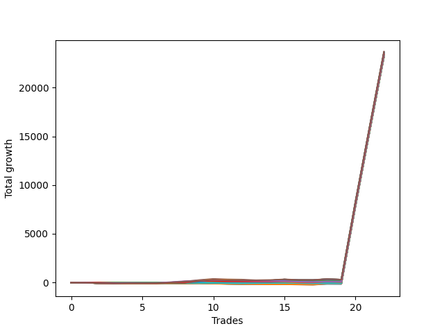

# Short Wallace Doodle 011 
- Symbol: NQ
- Date Range: 03/18/2022 - 06/17/2022
- Trading Period: 7:20-12:30
- Number of Trades: 22



| Name | Win Percent | Profit | Avg Profit / Trade |     | Name | Win Percent | Profit | Avg Profit / Trade |
| ---- | ----------- | ------ | ------------------ | --- | ---- | ----------- | ------ | ------------------ |
| Sorted By <br> Profit | | | | | Sorted By <br> Win Percentage ||||
| Seventy-Five | 63.64 | 11846500.00 | 538477.27 |     | One | 77.27 | 11730500.00 | 533204.55 |
| Seventy | 63.64 | 11807750.00 | 536715.91 |     | Two | 72.73 | 11805750.00 | 536625.00 |
| Fifty-Four | 63.64 | 11807750.00 | 536715.91 |     | Three | 68.18 | 11775875.00 | 535267.05 |
| Thirty-Eight | 63.64 | 11807750.00 | 536715.91 |     | Seventy-Five | 63.64 | 11846500.00 | 538477.27 |
| Twenty-Two | 63.64 | 11807750.00 | 536715.91 |     | Seventy | 63.64 | 11807750.00 | 536715.91 |
| Six | 63.64 | 11807750.00 | 536715.91 |     | Fifty-Four | 63.64 | 11807750.00 | 536715.91 |
| Two | 72.73 | 11805750.00 | 536625.00 |     | Thirty-Eight | 63.64 | 11807750.00 | 536715.91 |
| Three | 68.18 | 11775875.00 | 535267.05 |     | Twenty-Two | 63.64 | 11807750.00 | 536715.91 |
| Thirty-One | 22.73 | 11742500.00 | 533750.00 |     | Six | 63.64 | 11807750.00 | 536715.91 |
| Seventy-Four | 45.45 | 11735250.00 | 533420.45 |     | Zero | 63.64 | 11650250.00 | 529556.82 |
| Seventy-Two | 50.00 | 11730875.00 | 533221.59 |     | Thirty-Two | 59.09 | 11675125.00 | 530687.50 |
| One | 77.27 | 11730500.00 | 533204.55 |     | Thirty-Seven | 59.09 | 11674625.00 | 530664.77 |
| Forty-Seven | 22.73 | 11728750.00 | 533125.00 |     | Thirty-Six | 59.09 | 11674625.00 | 530664.77 |
| Sixty-Two | 36.36 | 11727875.00 | 533085.23 |     | Thirty-Five | 59.09 | 11674625.00 | 530664.77 |
| Five | 50.00 | 11722875.00 | 532857.95 |     | Thirty-Four | 59.09 | 11674625.00 | 530664.77 |
| Thirty | 22.73 | 11713000.00 | 532409.09 |     | Thirty-Three | 59.09 | 11674625.00 | 530664.77 |
| Seventy-Three | 45.45 | 11708375.00 | 532198.86 |     | Twenty-One | 59.09 | 11672750.00 | 530579.55 |
| Forty-Six | 22.73 | 11699250.00 | 531784.09 |     | Twenty | 59.09 | 11672750.00 | 530579.55 |
| Sixty-Three | 27.27 | 11698250.00 | 531738.64 |     | Nineteen | 59.09 | 11672750.00 | 530579.55 |
| Fifteen | 18.18 | 11692750.00 | 531488.64 |     | Eighteen | 59.09 | 11672750.00 | 530579.55 |
| Seventy-One | 50.00 | 11692000.00 | 531454.55 |     | Seventeen | 59.09 | 11672750.00 | 530579.55 |
| Fifty-Five | 50.00 | 11692000.00 | 531454.55 |     | Sixten | 59.09 | 11672750.00 | 530579.55 |
| Thirty-Nine | 50.00 | 11692000.00 | 531454.55 |     | Four | 54.55 | 11660000.00 | 530000.00 |
| Twenty-Three | 50.00 | 11692000.00 | 531454.55 |     | Seventy-Two | 50.00 | 11730875.00 | 533221.59 |
| Seven | 50.00 | 11692000.00 | 531454.55 |     | Five | 50.00 | 11722875.00 | 532857.95 |
| Thirty-Two | 59.09 | 11675125.00 | 530687.50 |     | Seventy-One | 50.00 | 11692000.00 | 531454.55 |
| Thirty-Seven | 59.09 | 11674625.00 | 530664.77 |     | Fifty-Five | 50.00 | 11692000.00 | 531454.55 |
| Thirty-Six | 59.09 | 11674625.00 | 530664.77 |     | Thirty-Nine | 50.00 | 11692000.00 | 531454.55 |
| Thirty-Five | 59.09 | 11674625.00 | 530664.77 |     | Twenty-Three | 50.00 | 11692000.00 | 531454.55 |
| Thirty-Four | 59.09 | 11674625.00 | 530664.77 |     | Seven | 50.00 | 11692000.00 | 531454.55 |
| Thirty-Three | 59.09 | 11674625.00 | 530664.77 |     | Fifty-One | 50.00 | 11663250.00 | 530147.73 |
| Twenty-One | 59.09 | 11672750.00 | 530579.55 |     | Forty-Eight | 50.00 | 11661750.00 | 530079.55 |
| Twenty | 59.09 | 11672750.00 | 530579.55 |     | Fifty-Three | 50.00 | 11660500.00 | 530022.73 |
| Nineteen | 59.09 | 11672750.00 | 530579.55 |     | Fifty-Two | 50.00 | 11660500.00 | 530022.73 |
| Eighteen | 59.09 | 11672750.00 | 530579.55 |     | Fifty | 50.00 | 11660500.00 | 530022.73 |
| Seventeen | 59.09 | 11672750.00 | 530579.55 |     | Forty-Nine | 50.00 | 11660500.00 | 530022.73 |
| Sixten | 59.09 | 11672750.00 | 530579.55 |     | Seventy-Four | 45.45 | 11735250.00 | 533420.45 |
| Fourteen | 18.18 | 11668000.00 | 530363.64 |     | Seventy-Three | 45.45 | 11708375.00 | 532198.86 |
| Fifty-One | 50.00 | 11663250.00 | 530147.73 |     | Fifty-Nine | 40.91 | 11636875.00 | 528948.86 |
| Forty-Eight | 50.00 | 11661750.00 | 530079.55 |     | Sixty-Seven | 40.91 | 11631500.00 | 528704.55 |
| Fifty-Three | 50.00 | 11660500.00 | 530022.73 |     | Sixty-Four | 40.91 | 11630000.00 | 528636.36 |
| Fifty-Two | 50.00 | 11660500.00 | 530022.73 |     | Fifty-Six | 40.91 | 11605500.00 | 527522.73 |
| Fifty | 50.00 | 11660500.00 | 530022.73 |     | Sixty-Two | 36.36 | 11727875.00 | 533085.23 |
| Forty-Nine | 50.00 | 11660500.00 | 530022.73 |     | Fifty-Eight | 36.36 | 11636875.00 | 528948.86 |
| Four | 54.55 | 11660000.00 | 530000.00 |     | Sixty-Nine | 36.36 | 11625875.00 | 528448.86 |
| Zero | 63.64 | 11650250.00 | 529556.82 |     | Sixty-Eight | 36.36 | 11625875.00 | 528448.86 |
| Fifty-Nine | 40.91 | 11636875.00 | 528948.86 |     | Sixty-Six | 36.36 | 11625875.00 | 528448.86 |
| Fifty-Eight | 36.36 | 11636875.00 | 528948.86 |     | Sixty-Five | 36.36 | 11625875.00 | 528448.86 |
| Sixty-Seven | 40.91 | 11631500.00 | 528704.55 |     | Fifty-Seven | 36.36 | 11611125.00 | 527778.41 |
| Sixty-Four | 40.91 | 11630000.00 | 528636.36 |     | Thirteen | 31.82 | 11619875.00 | 528176.14 |
| Sixty-Nine | 36.36 | 11625875.00 | 528448.86 |     | Twelve | 31.82 | 11619875.00 | 528176.14 |
| Sixty-Eight | 36.36 | 11625875.00 | 528448.86 |     | Eleven | 31.82 | 11619875.00 | 528176.14 |
| Sixty-Six | 36.36 | 11625875.00 | 528448.86 |     | Ten | 31.82 | 11619875.00 | 528176.14 |
| Sixty-Five | 36.36 | 11625875.00 | 528448.86 |     | Nine | 31.82 | 11619875.00 | 528176.14 |
| Thirteen | 31.82 | 11619875.00 | 528176.14 |     | Eight | 31.82 | 11619875.00 | 528176.14 |
| Twelve | 31.82 | 11619875.00 | 528176.14 |     | Twenty-Four | 31.82 | 11612500.00 | 527840.91 |
| Eleven | 31.82 | 11619875.00 | 528176.14 |     | Twenty-Nine | 31.82 | 11612000.00 | 527818.18 |
| Ten | 31.82 | 11619875.00 | 528176.14 |     | Twenty-Eight | 31.82 | 11612000.00 | 527818.18 |
| Nine | 31.82 | 11619875.00 | 528176.14 |     | twenty-Seven | 31.82 | 11612000.00 | 527818.18 |
| Eight | 31.82 | 11619875.00 | 528176.14 |     | Twenty-Six | 31.82 | 11612000.00 | 527818.18 |
| Twenty-Four | 31.82 | 11612500.00 | 527840.91 |     | Twenty-Five | 31.82 | 11612000.00 | 527818.18 |
| Twenty-Nine | 31.82 | 11612000.00 | 527818.18 |     | Sixty-Three | 27.27 | 11698250.00 | 531738.64 |
| Twenty-Eight | 31.82 | 11612000.00 | 527818.18 |     | Forty-Three | 27.27 | 11603750.00 | 527443.18 |
| twenty-Seven | 31.82 | 11612000.00 | 527818.18 |     | Forty | 27.27 | 11602250.00 | 527375.00 |
| Twenty-Six | 31.82 | 11612000.00 | 527818.18 |     | Forty-Five | 27.27 | 11601000.00 | 527318.18 |
| Twenty-Five | 31.82 | 11612000.00 | 527818.18 |     | Forty-Four | 27.27 | 11601000.00 | 527318.18 |
| Fifty-Seven | 36.36 | 11611125.00 | 527778.41 |     | Forty-Two | 27.27 | 11601000.00 | 527318.18 |
| Fifty-Six | 40.91 | 11605500.00 | 527522.73 |     | Forty-One | 27.27 | 11601000.00 | 527318.18 |
| Forty-Three | 27.27 | 11603750.00 | 527443.18 |     | Sixty-One | 27.27 | 11598750.00 | 527215.91 |
| Forty | 27.27 | 11602250.00 | 527375.00 |     | Sixty | 27.27 | 11584250.00 | 526556.82 |
| Forty-Five | 27.27 | 11601000.00 | 527318.18 |     | Thirty-One | 22.73 | 11742500.00 | 533750.00 |
| Forty-Four | 27.27 | 11601000.00 | 527318.18 |     | Forty-Seven | 22.73 | 11728750.00 | 533125.00 |
| Forty-Two | 27.27 | 11601000.00 | 527318.18 |     | Thirty | 22.73 | 11713000.00 | 532409.09 |
| Forty-One | 27.27 | 11601000.00 | 527318.18 |     | Forty-Six | 22.73 | 11699250.00 | 531784.09 |
| Sixty-One | 27.27 | 11598750.00 | 527215.91 |     | Fifteen | 18.18 | 11692750.00 | 531488.64 |
| Sixty | 27.27 | 11584250.00 | 526556.82 |     | Fourteen | 18.18 | 11668000.00 | 530363.64 |

## NO STOPLOSS

### Test Zero
* Sell when price hits the middle line of the 20p bollinger
* No Stoploss
* Results:
```
Total Trades: 22
Percent Up: 36.36
Percent Down: 63.64
Total Points Moved Down: 23300.50
Potential Profit: 11650250.00
Total Points Ups: 257.50 Count Ups: 8
Total Points Downs: 23558.00 Count Downs: 14
```

<details><summary>Trades</summary>

<code>In: 2022-03-28 11:12:00		Out: 2022-03-28 11:12:10		Total Position Time: 00:10		Total Move Down: 7.25		Total to Date: 7.25</code> <br />
<code>In: 2022-03-28 11:32:00		Out: 2022-03-28 12:01:55		Total Position Time: 29:55		Total Move Down: -65.25		Total to Date: -58.00</code> <br />
<code>In: 2022-03-28 11:50:00		Out: 2022-03-28 12:12:55		Total Position Time: 22:55		Total Move Down: -33.75		Total to Date: -91.75</code> <br />
<code>In: 2022-03-29 08:52:00		Out: 2022-03-29 08:56:30		Total Position Time: 04:30		Total Move Down: 9.50		Total to Date: -82.25</code> <br />
<code>In: 2022-03-29 10:50:00		Out: 2022-03-29 11:04:05		Total Position Time: 14:05		Total Move Down: 0.75		Total to Date: -81.50</code> <br />
<code>In: 2022-03-29 10:51:00		Out: 2022-03-29 11:04:05		Total Position Time: 13:05		Total Move Down: -4.75		Total to Date: -86.25</code> <br />
<code>In: 2022-03-31 12:05:00		Out: 2022-03-31 12:11:10		Total Position Time: 06:10		Total Move Down: 14.75		Total to Date: -71.50</code> <br />
<code>In: 2022-04-06 10:45:00		Out: 2022-04-06 10:56:50		Total Position Time: 11:50		Total Move Down: 2.25		Total to Date: -69.25</code> <br />
<code>In: 2022-04-06 11:05:00		Out: 2022-04-06 11:06:05		Total Position Time: 01:05		Total Move Down: 39.50		Total to Date: -29.75</code> <br />
<code>In: 2022-04-06 12:02:00		Out: 2022-04-06 12:08:05		Total Position Time: 06:05		Total Move Down: 34.50		Total to Date: 4.75</code> <br />
<code>In: 2022-04-07 11:57:00		Out: 2022-04-07 12:20:05		Total Position Time: 23:05		Total Move Down: -55.75		Total to Date: -51.00</code> <br />
<code>In: 2022-04-07 12:04:00		Out: 2022-04-07 12:20:05		Total Position Time: 16:05		Total Move Down: -14.50		Total to Date: -65.50</code> <br />
<code>In: 2022-04-08 07:33:00		Out: 2022-04-08 07:38:35		Total Position Time: 05:35		Total Move Down: 22.50		Total to Date: -43.00</code> <br />
<code>In: 2022-04-08 07:33:00		Out: 2022-04-08 07:38:35		Total Position Time: 05:35		Total Move Down: 22.50		Total to Date: -20.50</code> <br />
<code>In: 2022-05-06 07:21:00		Out: 2022-05-06 07:29:55		Total Position Time: 08:55		Total Move Down: 43.75		Total to Date: 23.25</code> <br />
<code>In: 2022-05-10 10:37:00		Out: 2022-05-10 11:05:55		Total Position Time: 28:55		Total Move Down: -79.50		Total to Date: -56.25</code> <br />
<code>In: 2022-05-16 10:30:00		Out: 2022-05-16 10:42:15		Total Position Time: 12:15		Total Move Down: -2.25		Total to Date: -58.50</code> <br />
<code>In: 2022-05-24 09:18:00		Out: 2022-05-24 09:21:30		Total Position Time: 03:30		Total Move Down: 31.75		Total to Date: -26.75</code> <br />
<code>In: 2022-05-24 10:43:00		Out: 2022-05-24 10:57:50		Total Position Time: 14:50		Total Move Down: -1.75		Total to Date: -28.50</code> <br />
<code>In: 2022-06-10 12:29:00		Out: 2022-06-10 12:29:10		Total Position Time: 00:10		Total Move Down: 8014.00		Total to Date: 7985.50</code> <br />
<code>In: 2022-06-13 09:41:00		Out: 2022-06-13 09:41:10		Total Position Time: 00:10		Total Move Down: 7700.75		Total to Date: 15686.25</code> <br />
<code>In: 2022-06-14 10:12:00		Out: 2022-06-14 10:12:10		Total Position Time: 00:10		Total Move Down: 7614.25		Total to Date: 23300.50</code> <br />


</details>

### Test One
* Sell when the price hits the upper line of the 20p 1std bollinger
* No Stoploss
* Results:
```
Total Trades: 22
Percent Up: 22.73
Percent Down: 77.27
Total Points Moved Down: 23461.00
Potential Profit: 11730500.00
Total Points Ups: 213.75 Count Ups: 5
Total Points Downs: 23674.75 Count Downs: 17
```

<details><summary>Trades</summary>

<code>In: 2022-03-28 11:12:00		Out: 2022-03-28 11:19:20		Total Position Time: 07:20		Total Move Down: 8.50		Total to Date: 8.50</code> <br />
<code>In: 2022-03-28 11:32:00		Out: 2022-03-28 12:01:55		Total Position Time: 29:55		Total Move Down: -65.25		Total to Date: -56.75</code> <br />
<code>In: 2022-03-28 11:50:00		Out: 2022-03-28 12:19:55		Total Position Time: 29:55		Total Move Down: -39.75		Total to Date: -96.50</code> <br />
<code>In: 2022-03-29 08:52:00		Out: 2022-03-29 08:58:40		Total Position Time: 06:40		Total Move Down: 17.75		Total to Date: -78.75</code> <br />
<code>In: 2022-03-29 10:50:00		Out: 2022-03-29 11:06:05		Total Position Time: 16:05		Total Move Down: 2.25		Total to Date: -76.50</code> <br />
<code>In: 2022-03-29 10:51:00		Out: 2022-03-29 11:06:05		Total Position Time: 15:05		Total Move Down: -3.25		Total to Date: -79.75</code> <br />
<code>In: 2022-03-31 12:05:00		Out: 2022-03-31 12:14:10		Total Position Time: 09:10		Total Move Down: 27.00		Total to Date: -52.75</code> <br />
<code>In: 2022-04-06 10:45:00		Out: 2022-04-06 10:58:00		Total Position Time: 13:00		Total Move Down: 12.00		Total to Date: -40.75</code> <br />
<code>In: 2022-04-06 11:05:00		Out: 2022-04-06 11:07:25		Total Position Time: 02:25		Total Move Down: 62.25		Total to Date: 21.50</code> <br />
<code>In: 2022-04-06 12:02:00		Out: 2022-04-06 12:13:30		Total Position Time: 11:30		Total Move Down: 41.00		Total to Date: 62.50</code> <br />
<code>In: 2022-04-07 11:57:00		Out: 2022-04-07 12:21:20		Total Position Time: 24:20		Total Move Down: -38.75		Total to Date: 23.75</code> <br />
<code>In: 2022-04-07 12:04:00		Out: 2022-04-07 12:21:20		Total Position Time: 17:20		Total Move Down: 2.50		Total to Date: 26.25</code> <br />
<code>In: 2022-04-08 07:33:00		Out: 2022-04-08 07:44:30		Total Position Time: 11:30		Total Move Down: 26.50		Total to Date: 52.75</code> <br />
<code>In: 2022-04-08 07:33:00		Out: 2022-04-08 07:44:30		Total Position Time: 11:30		Total Move Down: 26.50		Total to Date: 79.25</code> <br />
<code>In: 2022-05-06 07:21:00		Out: 2022-05-06 07:33:50		Total Position Time: 12:50		Total Move Down: 62.00		Total to Date: 141.25</code> <br />
<code>In: 2022-05-10 10:37:00		Out: 2022-05-10 11:06:35		Total Position Time: 29:35		Total Move Down: -66.75		Total to Date: 74.50</code> <br />
<code>In: 2022-05-16 10:30:00		Out: 2022-05-16 10:42:35		Total Position Time: 12:35		Total Move Down: 8.25		Total to Date: 82.75</code> <br />
<code>In: 2022-05-24 09:18:00		Out: 2022-05-24 09:26:40		Total Position Time: 08:40		Total Move Down: 43.25		Total to Date: 126.00</code> <br />
<code>In: 2022-05-24 10:43:00		Out: 2022-05-24 11:01:15		Total Position Time: 18:15		Total Move Down: 6.00		Total to Date: 132.00</code> <br />
<code>In: 2022-06-10 12:29:00		Out: 2022-06-10 12:29:10		Total Position Time: 00:10		Total Move Down: 8014.00		Total to Date: 8146.00</code> <br />
<code>In: 2022-06-13 09:41:00		Out: 2022-06-13 09:41:10		Total Position Time: 00:10		Total Move Down: 7700.75		Total to Date: 15846.75</code> <br />
<code>In: 2022-06-14 10:12:00		Out: 2022-06-14 10:12:10		Total Position Time: 00:10		Total Move Down: 7614.25		Total to Date: 23461.00</code> <br />


</details>

### Test Two
* Sell when the price hits the upper line of the 20p 2std bollinger
* No Stoploss
* Results:
```
Total Trades: 22
Percent Up: 27.27
Percent Down: 72.73
Total Points Moved Down: 23611.50
Potential Profit: 11805750.00
Total Points Ups: 251.50 Count Ups: 6
Total Points Downs: 23863.00 Count Downs: 16
```

<details><summary>Trades</summary>

<code>In: 2022-03-28 11:12:00		Out: 2022-03-28 11:41:55		Total Position Time: 29:55		Total Move Down: -19.25		Total to Date: -19.25</code> <br />
<code>In: 2022-03-28 11:32:00		Out: 2022-03-28 12:01:55		Total Position Time: 29:55		Total Move Down: -65.25		Total to Date: -84.50</code> <br />
<code>In: 2022-03-28 11:50:00		Out: 2022-03-28 12:19:55		Total Position Time: 29:55		Total Move Down: -39.75		Total to Date: -124.25</code> <br />
<code>In: 2022-03-29 08:52:00		Out: 2022-03-29 09:01:35		Total Position Time: 09:35		Total Move Down: 27.50		Total to Date: -96.75</code> <br />
<code>In: 2022-03-29 10:50:00		Out: 2022-03-29 11:06:20		Total Position Time: 16:20		Total Move Down: 6.25		Total to Date: -90.50</code> <br />
<code>In: 2022-03-29 10:51:00		Out: 2022-03-29 11:06:20		Total Position Time: 15:20		Total Move Down: 0.75		Total to Date: -89.75</code> <br />
<code>In: 2022-03-31 12:05:00		Out: 2022-03-31 12:19:40		Total Position Time: 14:40		Total Move Down: 42.25		Total to Date: -47.50</code> <br />
<code>In: 2022-04-06 10:45:00		Out: 2022-04-06 11:00:00		Total Position Time: 15:00		Total Move Down: 17.50		Total to Date: -30.00</code> <br />
<code>In: 2022-04-06 11:05:00		Out: 2022-04-06 11:08:25		Total Position Time: 03:25		Total Move Down: 91.25		Total to Date: 61.25</code> <br />
<code>In: 2022-04-06 12:02:00		Out: 2022-04-06 12:20:25		Total Position Time: 18:25		Total Move Down: 74.25		Total to Date: 135.50</code> <br />
<code>In: 2022-04-07 11:57:00		Out: 2022-04-07 12:26:55		Total Position Time: 29:55		Total Move Down: -48.25		Total to Date: 87.25</code> <br />
<code>In: 2022-04-07 12:04:00		Out: 2022-04-07 12:33:55		Total Position Time: 29:55		Total Move Down: -20.00		Total to Date: 67.25</code> <br />
<code>In: 2022-04-08 07:33:00		Out: 2022-04-08 07:45:45		Total Position Time: 12:45		Total Move Down: 36.75		Total to Date: 104.00</code> <br />
<code>In: 2022-04-08 07:33:00		Out: 2022-04-08 07:45:45		Total Position Time: 12:45		Total Move Down: 36.75		Total to Date: 140.75</code> <br />
<code>In: 2022-05-06 07:21:00		Out: 2022-05-06 07:36:35		Total Position Time: 15:35		Total Move Down: 105.50		Total to Date: 246.25</code> <br />
<code>In: 2022-05-10 10:37:00		Out: 2022-05-10 11:06:55		Total Position Time: 29:55		Total Move Down: -59.00		Total to Date: 187.25</code> <br />
<code>In: 2022-05-16 10:30:00		Out: 2022-05-16 10:49:15		Total Position Time: 19:15		Total Move Down: 2.25		Total to Date: 189.50</code> <br />
<code>In: 2022-05-24 09:18:00		Out: 2022-05-24 09:32:40		Total Position Time: 14:40		Total Move Down: 74.25		Total to Date: 263.75</code> <br />
<code>In: 2022-05-24 10:43:00		Out: 2022-05-24 11:01:40		Total Position Time: 18:40		Total Move Down: 18.75		Total to Date: 282.50</code> <br />
<code>In: 2022-06-10 12:29:00		Out: 2022-06-10 12:29:10		Total Position Time: 00:10		Total Move Down: 8014.00		Total to Date: 8296.50</code> <br />
<code>In: 2022-06-13 09:41:00		Out: 2022-06-13 09:41:10		Total Position Time: 00:10		Total Move Down: 7700.75		Total to Date: 15997.25</code> <br />
<code>In: 2022-06-14 10:12:00		Out: 2022-06-14 10:12:10		Total Position Time: 00:10		Total Move Down: 7614.25		Total to Date: 23611.50</code> <br />


</details>

### Test Three
* Sell when price hits the middle line of the 50p bollinger
* No Stoploss
* Results:
```
Total Trades: 22
Percent Up: 31.82
Percent Down: 68.18
Total Points Moved Down: 23551.75
Potential Profit: 11775875.00
Total Points Ups: 289.25 Count Ups: 7
Total Points Downs: 23841.00 Count Downs: 15
```

<details><summary>Trades</summary>

<code>In: 2022-03-28 11:12:00		Out: 2022-03-28 11:13:00		Total Position Time: 01:00		Total Move Down: 10.25		Total to Date: 10.25</code> <br />
<code>In: 2022-03-28 11:32:00		Out: 2022-03-28 12:01:55		Total Position Time: 29:55		Total Move Down: -65.25		Total to Date: -55.00</code> <br />
<code>In: 2022-03-28 11:50:00		Out: 2022-03-28 12:19:55		Total Position Time: 29:55		Total Move Down: -39.75		Total to Date: -94.75</code> <br />
<code>In: 2022-03-29 08:52:00		Out: 2022-03-29 09:00:25		Total Position Time: 08:25		Total Move Down: 21.75		Total to Date: -73.00</code> <br />
<code>In: 2022-03-29 10:50:00		Out: 2022-03-29 11:18:55		Total Position Time: 28:55		Total Move Down: 12.75		Total to Date: -60.25</code> <br />
<code>In: 2022-03-29 10:51:00		Out: 2022-03-29 11:18:55		Total Position Time: 27:55		Total Move Down: 7.25		Total to Date: -53.00</code> <br />
<code>In: 2022-03-31 12:05:00		Out: 2022-03-31 12:18:10		Total Position Time: 13:10		Total Move Down: 33.50		Total to Date: -19.50</code> <br />
<code>In: 2022-04-06 10:45:00		Out: 2022-04-06 11:00:10		Total Position Time: 15:10		Total Move Down: 43.50		Total to Date: 24.00</code> <br />
<code>In: 2022-04-06 11:05:00		Out: 2022-04-06 11:07:35		Total Position Time: 02:35		Total Move Down: 73.00		Total to Date: 97.00</code> <br />
<code>In: 2022-04-06 12:02:00		Out: 2022-04-06 12:20:00		Total Position Time: 18:00		Total Move Down: 60.50		Total to Date: 157.50</code> <br />
<code>In: 2022-04-07 11:57:00		Out: 2022-04-07 12:26:55		Total Position Time: 29:55		Total Move Down: -48.25		Total to Date: 109.25</code> <br />
<code>In: 2022-04-07 12:04:00		Out: 2022-04-07 12:33:55		Total Position Time: 29:55		Total Move Down: -20.00		Total to Date: 89.25</code> <br />
<code>In: 2022-04-08 07:33:00		Out: 2022-04-08 07:45:55		Total Position Time: 12:55		Total Move Down: 42.75		Total to Date: 132.00</code> <br />
<code>In: 2022-04-08 07:33:00		Out: 2022-04-08 07:45:55		Total Position Time: 12:55		Total Move Down: 42.75		Total to Date: 174.75</code> <br />
<code>In: 2022-05-06 07:21:00		Out: 2022-05-06 07:37:00		Total Position Time: 16:00		Total Move Down: 113.00		Total to Date: 287.75</code> <br />
<code>In: 2022-05-10 10:37:00		Out: 2022-05-10 11:06:55		Total Position Time: 29:55		Total Move Down: -59.00		Total to Date: 228.75</code> <br />
<code>In: 2022-05-16 10:30:00		Out: 2022-05-16 10:59:55		Total Position Time: 29:55		Total Move Down: -3.00		Total to Date: 225.75</code> <br />
<code>In: 2022-05-24 09:18:00		Out: 2022-05-24 09:31:10		Total Position Time: 13:10		Total Move Down: 51.00		Total to Date: 276.75</code> <br />
<code>In: 2022-05-24 10:43:00		Out: 2022-05-24 11:12:55		Total Position Time: 29:55		Total Move Down: -54.00		Total to Date: 222.75</code> <br />
<code>In: 2022-06-10 12:29:00		Out: 2022-06-10 12:29:10		Total Position Time: 00:10		Total Move Down: 8014.00		Total to Date: 8236.75</code> <br />
<code>In: 2022-06-13 09:41:00		Out: 2022-06-13 09:41:10		Total Position Time: 00:10		Total Move Down: 7700.75		Total to Date: 15937.50</code> <br />
<code>In: 2022-06-14 10:12:00		Out: 2022-06-14 10:12:10		Total Position Time: 00:10		Total Move Down: 7614.25		Total to Date: 23551.75</code> <br />


</details>

### Test Four
* Sell when the price hits the upper line of the 50p 1std bollinger
* No Stoploss
* Results:
```
Total Trades: 22
Percent Up: 45.45
Percent Down: 54.55
Total Points Moved Down: 23320.00
Potential Profit: 11660000.00
Total Points Ups: 460.00 Count Ups: 10
Total Points Downs: 23780.00 Count Downs: 12
```

<details><summary>Trades</summary>

<code>In: 2022-03-28 11:12:00		Out: 2022-03-28 11:20:40		Total Position Time: 08:40		Total Move Down: 12.50		Total to Date: 12.50</code> <br />
<code>In: 2022-03-28 11:32:00		Out: 2022-03-28 12:01:55		Total Position Time: 29:55		Total Move Down: -65.25		Total to Date: -52.75</code> <br />
<code>In: 2022-03-28 11:50:00		Out: 2022-03-28 12:19:55		Total Position Time: 29:55		Total Move Down: -39.75		Total to Date: -92.50</code> <br />
<code>In: 2022-03-29 08:52:00		Out: 2022-03-29 09:02:10		Total Position Time: 10:10		Total Move Down: 39.25		Total to Date: -53.25</code> <br />
<code>In: 2022-03-29 10:50:00		Out: 2022-03-29 11:19:55		Total Position Time: 29:55		Total Move Down: 9.25		Total to Date: -44.00</code> <br />
<code>In: 2022-03-29 10:51:00		Out: 2022-03-29 11:20:55		Total Position Time: 29:55		Total Move Down: 2.00		Total to Date: -42.00</code> <br />
<code>In: 2022-03-31 12:05:00		Out: 2022-03-31 12:21:20		Total Position Time: 16:20		Total Move Down: 54.50		Total to Date: 12.50</code> <br />
<code>In: 2022-04-06 10:45:00		Out: 2022-04-06 11:09:20		Total Position Time: 24:20		Total Move Down: 54.75		Total to Date: 67.25</code> <br />
<code>In: 2022-04-06 11:05:00		Out: 2022-04-06 11:09:20		Total Position Time: 04:20		Total Move Down: 105.50		Total to Date: 172.75</code> <br />
<code>In: 2022-04-06 12:02:00		Out: 2022-04-06 12:22:15		Total Position Time: 20:15		Total Move Down: 97.75		Total to Date: 270.50</code> <br />
<code>In: 2022-04-07 11:57:00		Out: 2022-04-07 12:26:55		Total Position Time: 29:55		Total Move Down: -48.25		Total to Date: 222.25</code> <br />
<code>In: 2022-04-07 12:04:00		Out: 2022-04-07 12:33:55		Total Position Time: 29:55		Total Move Down: -20.00		Total to Date: 202.25</code> <br />
<code>In: 2022-04-08 07:33:00		Out: 2022-04-08 08:02:55		Total Position Time: 29:55		Total Move Down: -75.75		Total to Date: 126.50</code> <br />
<code>In: 2022-04-08 07:33:00		Out: 2022-04-08 08:02:55		Total Position Time: 29:55		Total Move Down: -75.75		Total to Date: 50.75</code> <br />
<code>In: 2022-05-06 07:21:00		Out: 2022-05-06 07:50:55		Total Position Time: 29:55		Total Move Down: -19.25		Total to Date: 31.50</code> <br />
<code>In: 2022-05-10 10:37:00		Out: 2022-05-10 11:06:55		Total Position Time: 29:55		Total Move Down: -59.00		Total to Date: -27.50</code> <br />
<code>In: 2022-05-16 10:30:00		Out: 2022-05-16 10:59:55		Total Position Time: 29:55		Total Move Down: -3.00		Total to Date: -30.50</code> <br />
<code>In: 2022-05-24 09:18:00		Out: 2022-05-24 09:33:05		Total Position Time: 15:05		Total Move Down: 75.50		Total to Date: 45.00</code> <br />
<code>In: 2022-05-24 10:43:00		Out: 2022-05-24 11:12:55		Total Position Time: 29:55		Total Move Down: -54.00		Total to Date: -9.00</code> <br />
<code>In: 2022-06-10 12:29:00		Out: 2022-06-10 12:29:10		Total Position Time: 00:10		Total Move Down: 8014.00		Total to Date: 8005.00</code> <br />
<code>In: 2022-06-13 09:41:00		Out: 2022-06-13 09:41:10		Total Position Time: 00:10		Total Move Down: 7700.75		Total to Date: 15705.75</code> <br />
<code>In: 2022-06-14 10:12:00		Out: 2022-06-14 10:12:10		Total Position Time: 00:10		Total Move Down: 7614.25		Total to Date: 23320.00</code> <br />


</details>

### Test Five
* Sell when the price hits the upper line of the 50p 2std bollinger
* No Stoploss
* Results:
```
Total Trades: 22
Percent Up: 50.00
Percent Down: 50.00
Total Points Moved Down: 23445.75
Potential Profit: 11722875.00
Total Points Ups: 479.25 Count Ups: 11
Total Points Downs: 23925.00 Count Downs: 11
```

<details><summary>Trades</summary>

<code>In: 2022-03-28 11:12:00		Out: 2022-03-28 11:41:55		Total Position Time: 29:55		Total Move Down: -19.25		Total to Date: -19.25</code> <br />
<code>In: 2022-03-28 11:32:00		Out: 2022-03-28 12:01:55		Total Position Time: 29:55		Total Move Down: -65.25		Total to Date: -84.50</code> <br />
<code>In: 2022-03-28 11:50:00		Out: 2022-03-28 12:19:55		Total Position Time: 29:55		Total Move Down: -39.75		Total to Date: -124.25</code> <br />
<code>In: 2022-03-29 08:52:00		Out: 2022-03-29 09:21:55		Total Position Time: 29:55		Total Move Down: 24.00		Total to Date: -100.25</code> <br />
<code>In: 2022-03-29 10:50:00		Out: 2022-03-29 11:19:55		Total Position Time: 29:55		Total Move Down: 9.25		Total to Date: -91.00</code> <br />
<code>In: 2022-03-29 10:51:00		Out: 2022-03-29 11:20:55		Total Position Time: 29:55		Total Move Down: 2.00		Total to Date: -89.00</code> <br />
<code>In: 2022-03-31 12:05:00		Out: 2022-03-31 12:33:05		Total Position Time: 28:05		Total Move Down: 92.75		Total to Date: 3.75</code> <br />
<code>In: 2022-04-06 10:45:00		Out: 2022-04-06 11:14:50		Total Position Time: 29:50		Total Move Down: 99.25		Total to Date: 103.00</code> <br />
<code>In: 2022-04-06 11:05:00		Out: 2022-04-06 11:14:50		Total Position Time: 09:50		Total Move Down: 150.00		Total to Date: 253.00</code> <br />
<code>In: 2022-04-06 12:02:00		Out: 2022-04-06 12:31:55		Total Position Time: 29:55		Total Move Down: 114.25		Total to Date: 367.25</code> <br />
<code>In: 2022-04-07 11:57:00		Out: 2022-04-07 12:26:55		Total Position Time: 29:55		Total Move Down: -48.25		Total to Date: 319.00</code> <br />
<code>In: 2022-04-07 12:04:00		Out: 2022-04-07 12:33:55		Total Position Time: 29:55		Total Move Down: -20.00		Total to Date: 299.00</code> <br />
<code>In: 2022-04-08 07:33:00		Out: 2022-04-08 08:02:55		Total Position Time: 29:55		Total Move Down: -75.75		Total to Date: 223.25</code> <br />
<code>In: 2022-04-08 07:33:00		Out: 2022-04-08 08:02:55		Total Position Time: 29:55		Total Move Down: -75.75		Total to Date: 147.50</code> <br />
<code>In: 2022-05-06 07:21:00		Out: 2022-05-06 07:50:55		Total Position Time: 29:55		Total Move Down: -19.25		Total to Date: 128.25</code> <br />
<code>In: 2022-05-10 10:37:00		Out: 2022-05-10 11:06:55		Total Position Time: 29:55		Total Move Down: -59.00		Total to Date: 69.25</code> <br />
<code>In: 2022-05-16 10:30:00		Out: 2022-05-16 10:59:55		Total Position Time: 29:55		Total Move Down: -3.00		Total to Date: 66.25</code> <br />
<code>In: 2022-05-24 09:18:00		Out: 2022-05-24 09:47:55		Total Position Time: 29:55		Total Move Down: 104.50		Total to Date: 170.75</code> <br />
<code>In: 2022-05-24 10:43:00		Out: 2022-05-24 11:12:55		Total Position Time: 29:55		Total Move Down: -54.00		Total to Date: 116.75</code> <br />
<code>In: 2022-06-10 12:29:00		Out: 2022-06-10 12:29:10		Total Position Time: 00:10		Total Move Down: 8014.00		Total to Date: 8130.75</code> <br />
<code>In: 2022-06-13 09:41:00		Out: 2022-06-13 09:41:10		Total Position Time: 00:10		Total Move Down: 7700.75		Total to Date: 15831.50</code> <br />
<code>In: 2022-06-14 10:12:00		Out: 2022-06-14 10:12:10		Total Position Time: 00:10		Total Move Down: 7614.25		Total to Date: 23445.75</code> <br />


</details>

### Test Six
* Sell when the price hits the middle line of the 1std VWAP
* No Stoploss
* Results:
```
Total Trades: 22
Percent Up: 36.36
Percent Down: 63.64
Total Points Moved Down: 23615.50
Potential Profit: 11807750.00
Total Points Ups: 308.50 Count Ups: 8
Total Points Downs: 23924.00 Count Downs: 14
```

<details><summary>Trades</summary>

<code>In: 2022-03-28 11:12:00		Out: 2022-03-28 11:41:55		Total Position Time: 29:55		Total Move Down: -19.25		Total to Date: -19.25</code> <br />
<code>In: 2022-03-28 11:32:00		Out: 2022-03-28 12:01:55		Total Position Time: 29:55		Total Move Down: -65.25		Total to Date: -84.50</code> <br />
<code>In: 2022-03-28 11:50:00		Out: 2022-03-28 12:19:55		Total Position Time: 29:55		Total Move Down: -39.75		Total to Date: -124.25</code> <br />
<code>In: 2022-03-29 08:52:00		Out: 2022-03-29 09:02:10		Total Position Time: 10:10		Total Move Down: 39.25		Total to Date: -85.00</code> <br />
<code>In: 2022-03-29 10:50:00		Out: 2022-03-29 11:19:55		Total Position Time: 29:55		Total Move Down: 9.25		Total to Date: -75.75</code> <br />
<code>In: 2022-03-29 10:51:00		Out: 2022-03-29 11:20:55		Total Position Time: 29:55		Total Move Down: 2.00		Total to Date: -73.75</code> <br />
<code>In: 2022-03-31 12:05:00		Out: 2022-03-31 12:16:50		Total Position Time: 11:50		Total Move Down: 31.00		Total to Date: -42.75</code> <br />
<code>In: 2022-04-06 10:45:00		Out: 2022-04-06 11:00:10		Total Position Time: 15:10		Total Move Down: 43.50		Total to Date: 0.75</code> <br />
<code>In: 2022-04-06 11:05:00		Out: 2022-04-06 11:08:10		Total Position Time: 03:10		Total Move Down: 86.25		Total to Date: 87.00</code> <br />
<code>In: 2022-04-06 12:02:00		Out: 2022-04-06 12:25:35		Total Position Time: 23:35		Total Move Down: 113.25		Total to Date: 200.25</code> <br />
<code>In: 2022-04-07 11:57:00		Out: 2022-04-07 12:26:55		Total Position Time: 29:55		Total Move Down: -48.25		Total to Date: 152.00</code> <br />
<code>In: 2022-04-07 12:04:00		Out: 2022-04-07 12:33:55		Total Position Time: 29:55		Total Move Down: -20.00		Total to Date: 132.00</code> <br />
<code>In: 2022-04-08 07:33:00		Out: 2022-04-08 07:45:10		Total Position Time: 12:10		Total Move Down: 35.00		Total to Date: 167.00</code> <br />
<code>In: 2022-04-08 07:33:00		Out: 2022-04-08 07:45:10		Total Position Time: 12:10		Total Move Down: 35.00		Total to Date: 202.00</code> <br />
<code>In: 2022-05-06 07:21:00		Out: 2022-05-06 07:36:35		Total Position Time: 15:35		Total Move Down: 105.50		Total to Date: 307.50</code> <br />
<code>In: 2022-05-10 10:37:00		Out: 2022-05-10 11:06:55		Total Position Time: 29:55		Total Move Down: -59.00		Total to Date: 248.50</code> <br />
<code>In: 2022-05-16 10:30:00		Out: 2022-05-16 10:59:55		Total Position Time: 29:55		Total Move Down: -3.00		Total to Date: 245.50</code> <br />
<code>In: 2022-05-24 09:18:00		Out: 2022-05-24 09:36:50		Total Position Time: 18:50		Total Move Down: 95.00		Total to Date: 340.50</code> <br />
<code>In: 2022-05-24 10:43:00		Out: 2022-05-24 11:12:55		Total Position Time: 29:55		Total Move Down: -54.00		Total to Date: 286.50</code> <br />
<code>In: 2022-06-10 12:29:00		Out: 2022-06-10 12:29:10		Total Position Time: 00:10		Total Move Down: 8014.00		Total to Date: 8300.50</code> <br />
<code>In: 2022-06-13 09:41:00		Out: 2022-06-13 09:41:10		Total Position Time: 00:10		Total Move Down: 7700.75		Total to Date: 16001.25</code> <br />
<code>In: 2022-06-14 10:12:00		Out: 2022-06-14 10:12:10		Total Position Time: 00:10		Total Move Down: 7614.25		Total to Date: 23615.50</code> <br />


</details>

### Test Seven
* Sell when the price hits the upper line of the 1std VWAP
* No Stoploss
* Results:
```
Total Trades: 22
Percent Up: 50.00
Percent Down: 50.00
Total Points Moved Down: 23384.00
Potential Profit: 11692000.00
Total Points Ups: 479.25 Count Ups: 11
Total Points Downs: 23863.25 Count Downs: 11
```

<details><summary>Trades</summary>

<code>In: 2022-03-28 11:12:00		Out: 2022-03-28 11:41:55		Total Position Time: 29:55		Total Move Down: -19.25		Total to Date: -19.25</code> <br />
<code>In: 2022-03-28 11:32:00		Out: 2022-03-28 12:01:55		Total Position Time: 29:55		Total Move Down: -65.25		Total to Date: -84.50</code> <br />
<code>In: 2022-03-28 11:50:00		Out: 2022-03-28 12:19:55		Total Position Time: 29:55		Total Move Down: -39.75		Total to Date: -124.25</code> <br />
<code>In: 2022-03-29 08:52:00		Out: 2022-03-29 09:21:55		Total Position Time: 29:55		Total Move Down: 24.00		Total to Date: -100.25</code> <br />
<code>In: 2022-03-29 10:50:00		Out: 2022-03-29 11:19:55		Total Position Time: 29:55		Total Move Down: 9.25		Total to Date: -91.00</code> <br />
<code>In: 2022-03-29 10:51:00		Out: 2022-03-29 11:20:55		Total Position Time: 29:55		Total Move Down: 2.00		Total to Date: -89.00</code> <br />
<code>In: 2022-03-31 12:05:00		Out: 2022-03-31 12:21:30		Total Position Time: 16:30		Total Move Down: 59.50		Total to Date: -29.50</code> <br />
<code>In: 2022-04-06 10:45:00		Out: 2022-04-06 11:13:00		Total Position Time: 28:00		Total Move Down: 85.00		Total to Date: 55.50</code> <br />
<code>In: 2022-04-06 11:05:00		Out: 2022-04-06 11:13:00		Total Position Time: 08:00		Total Move Down: 135.75		Total to Date: 191.25</code> <br />
<code>In: 2022-04-06 12:02:00		Out: 2022-04-06 12:31:55		Total Position Time: 29:55		Total Move Down: 114.25		Total to Date: 305.50</code> <br />
<code>In: 2022-04-07 11:57:00		Out: 2022-04-07 12:26:55		Total Position Time: 29:55		Total Move Down: -48.25		Total to Date: 257.25</code> <br />
<code>In: 2022-04-07 12:04:00		Out: 2022-04-07 12:33:55		Total Position Time: 29:55		Total Move Down: -20.00		Total to Date: 237.25</code> <br />
<code>In: 2022-04-08 07:33:00		Out: 2022-04-08 08:02:55		Total Position Time: 29:55		Total Move Down: -75.75		Total to Date: 161.50</code> <br />
<code>In: 2022-04-08 07:33:00		Out: 2022-04-08 08:02:55		Total Position Time: 29:55		Total Move Down: -75.75		Total to Date: 85.75</code> <br />
<code>In: 2022-05-06 07:21:00		Out: 2022-05-06 07:50:55		Total Position Time: 29:55		Total Move Down: -19.25		Total to Date: 66.50</code> <br />
<code>In: 2022-05-10 10:37:00		Out: 2022-05-10 11:06:55		Total Position Time: 29:55		Total Move Down: -59.00		Total to Date: 7.50</code> <br />
<code>In: 2022-05-16 10:30:00		Out: 2022-05-16 10:59:55		Total Position Time: 29:55		Total Move Down: -3.00		Total to Date: 4.50</code> <br />
<code>In: 2022-05-24 09:18:00		Out: 2022-05-24 09:47:55		Total Position Time: 29:55		Total Move Down: 104.50		Total to Date: 109.00</code> <br />
<code>In: 2022-05-24 10:43:00		Out: 2022-05-24 11:12:55		Total Position Time: 29:55		Total Move Down: -54.00		Total to Date: 55.00</code> <br />
<code>In: 2022-06-10 12:29:00		Out: 2022-06-10 12:29:10		Total Position Time: 00:10		Total Move Down: 8014.00		Total to Date: 8069.00</code> <br />
<code>In: 2022-06-13 09:41:00		Out: 2022-06-13 09:41:10		Total Position Time: 00:10		Total Move Down: 7700.75		Total to Date: 15769.75</code> <br />
<code>In: 2022-06-14 10:12:00		Out: 2022-06-14 10:12:10		Total Position Time: 00:10		Total Move Down: 7614.25		Total to Date: 23384.00</code> <br />


</details>

## STOPLOSS OF 2

### Test Eight
* Sell when price hits the middle line of the 20p bollinger
* Stoploss is -2 points
* Results:
```
Total Trades: 22
Percent Up: 68.18
Percent Down: 31.82
Total Points Moved Down: 23239.75
Potential Profit: 11619875.00
Total Points Ups: 115.00 Count Ups: 15
Total Points Downs: 23354.75 Count Downs: 7
```

<details><summary>Trades</summary>

<code>In: 2022-03-28 11:12:00		Out: 2022-03-28 11:12:10		Total Position Time: 00:10		Total Move Down: 7.25		Total to Date: 7.25</code> <br />
<code>In: 2022-03-28 11:32:00		Out: 2022-03-28 11:40:40		Total Position Time: 08:40		Total Move Down: -5.50		Total to Date: 1.75</code> <br />
<code>In: 2022-03-28 11:50:00		Out: 2022-03-28 11:51:25		Total Position Time: 01:25		Total Move Down: -10.75		Total to Date: -9.00</code> <br />
<code>In: 2022-03-29 08:52:00		Out: 2022-03-29 08:53:10		Total Position Time: 01:10		Total Move Down: -0.25		Total to Date: -9.25</code> <br />
<code>In: 2022-03-29 10:50:00		Out: 2022-03-29 10:50:10		Total Position Time: 00:10		Total Move Down: -1.75		Total to Date: -11.00</code> <br />
<code>In: 2022-03-29 10:51:00		Out: 2022-03-29 10:51:50		Total Position Time: 00:50		Total Move Down: -7.50		Total to Date: -18.50</code> <br />
<code>In: 2022-03-31 12:05:00		Out: 2022-03-31 12:05:10		Total Position Time: 00:10		Total Move Down: 1.00		Total to Date: -17.50</code> <br />
<code>In: 2022-04-06 10:45:00		Out: 2022-04-06 10:45:10		Total Position Time: 00:10		Total Move Down: -1.00		Total to Date: -18.50</code> <br />
<code>In: 2022-04-06 11:05:00		Out: 2022-04-06 11:05:10		Total Position Time: 00:10		Total Move Down: 15.00		Total to Date: -3.50</code> <br />
<code>In: 2022-04-06 12:02:00		Out: 2022-04-06 12:02:45		Total Position Time: 00:45		Total Move Down: -32.25		Total to Date: -35.75</code> <br />
<code>In: 2022-04-07 11:57:00		Out: 2022-04-07 11:57:45		Total Position Time: 00:45		Total Move Down: -7.50		Total to Date: -43.25</code> <br />
<code>In: 2022-04-07 12:04:00		Out: 2022-04-07 12:05:25		Total Position Time: 01:25		Total Move Down: -6.25		Total to Date: -49.50</code> <br />
<code>In: 2022-04-08 07:33:00		Out: 2022-04-08 07:34:05		Total Position Time: 01:05		Total Move Down: -6.25		Total to Date: -55.75</code> <br />
<code>In: 2022-04-08 07:33:00		Out: 2022-04-08 07:34:05		Total Position Time: 01:05		Total Move Down: -6.25		Total to Date: -62.00</code> <br />
<code>In: 2022-05-06 07:21:00		Out: 2022-05-06 07:21:10		Total Position Time: 00:10		Total Move Down: 2.50		Total to Date: -59.50</code> <br />
<code>In: 2022-05-10 10:37:00		Out: 2022-05-10 10:37:35		Total Position Time: 00:35		Total Move Down: -11.00		Total to Date: -70.50</code> <br />
<code>In: 2022-05-16 10:30:00		Out: 2022-05-16 10:31:05		Total Position Time: 01:05		Total Move Down: -14.75		Total to Date: -85.25</code> <br />
<code>In: 2022-05-24 09:18:00		Out: 2022-05-24 09:18:10		Total Position Time: 00:10		Total Move Down: -0.25		Total to Date: -85.50</code> <br />
<code>In: 2022-05-24 10:43:00		Out: 2022-05-24 10:44:20		Total Position Time: 01:20		Total Move Down: -3.75		Total to Date: -89.25</code> <br />
<code>In: 2022-06-10 12:29:00		Out: 2022-06-10 12:29:10		Total Position Time: 00:10		Total Move Down: 8014.00		Total to Date: 7924.75</code> <br />
<code>In: 2022-06-13 09:41:00		Out: 2022-06-13 09:41:10		Total Position Time: 00:10		Total Move Down: 7700.75		Total to Date: 15625.50</code> <br />
<code>In: 2022-06-14 10:12:00		Out: 2022-06-14 10:12:10		Total Position Time: 00:10		Total Move Down: 7614.25		Total to Date: 23239.75</code> <br />


</details>

### Test Nine
* Sell when the price hits the upper line of the 20p 1std bollinger
* Stoploss is -2 points
* Results:
```
Total Trades: 22
Percent Up: 68.18
Percent Down: 31.82
Total Points Moved Down: 23239.75
Potential Profit: 11619875.00
Total Points Ups: 115.00 Count Ups: 15
Total Points Downs: 23354.75 Count Downs: 7
```

<details><summary>Trades</summary>

<code>In: 2022-03-28 11:12:00		Out: 2022-03-28 11:12:10		Total Position Time: 00:10		Total Move Down: 7.25		Total to Date: 7.25</code> <br />
<code>In: 2022-03-28 11:32:00		Out: 2022-03-28 11:40:40		Total Position Time: 08:40		Total Move Down: -5.50		Total to Date: 1.75</code> <br />
<code>In: 2022-03-28 11:50:00		Out: 2022-03-28 11:51:25		Total Position Time: 01:25		Total Move Down: -10.75		Total to Date: -9.00</code> <br />
<code>In: 2022-03-29 08:52:00		Out: 2022-03-29 08:53:10		Total Position Time: 01:10		Total Move Down: -0.25		Total to Date: -9.25</code> <br />
<code>In: 2022-03-29 10:50:00		Out: 2022-03-29 10:50:10		Total Position Time: 00:10		Total Move Down: -1.75		Total to Date: -11.00</code> <br />
<code>In: 2022-03-29 10:51:00		Out: 2022-03-29 10:51:50		Total Position Time: 00:50		Total Move Down: -7.50		Total to Date: -18.50</code> <br />
<code>In: 2022-03-31 12:05:00		Out: 2022-03-31 12:05:10		Total Position Time: 00:10		Total Move Down: 1.00		Total to Date: -17.50</code> <br />
<code>In: 2022-04-06 10:45:00		Out: 2022-04-06 10:45:10		Total Position Time: 00:10		Total Move Down: -1.00		Total to Date: -18.50</code> <br />
<code>In: 2022-04-06 11:05:00		Out: 2022-04-06 11:05:10		Total Position Time: 00:10		Total Move Down: 15.00		Total to Date: -3.50</code> <br />
<code>In: 2022-04-06 12:02:00		Out: 2022-04-06 12:02:45		Total Position Time: 00:45		Total Move Down: -32.25		Total to Date: -35.75</code> <br />
<code>In: 2022-04-07 11:57:00		Out: 2022-04-07 11:57:45		Total Position Time: 00:45		Total Move Down: -7.50		Total to Date: -43.25</code> <br />
<code>In: 2022-04-07 12:04:00		Out: 2022-04-07 12:05:25		Total Position Time: 01:25		Total Move Down: -6.25		Total to Date: -49.50</code> <br />
<code>In: 2022-04-08 07:33:00		Out: 2022-04-08 07:34:05		Total Position Time: 01:05		Total Move Down: -6.25		Total to Date: -55.75</code> <br />
<code>In: 2022-04-08 07:33:00		Out: 2022-04-08 07:34:05		Total Position Time: 01:05		Total Move Down: -6.25		Total to Date: -62.00</code> <br />
<code>In: 2022-05-06 07:21:00		Out: 2022-05-06 07:21:10		Total Position Time: 00:10		Total Move Down: 2.50		Total to Date: -59.50</code> <br />
<code>In: 2022-05-10 10:37:00		Out: 2022-05-10 10:37:35		Total Position Time: 00:35		Total Move Down: -11.00		Total to Date: -70.50</code> <br />
<code>In: 2022-05-16 10:30:00		Out: 2022-05-16 10:31:05		Total Position Time: 01:05		Total Move Down: -14.75		Total to Date: -85.25</code> <br />
<code>In: 2022-05-24 09:18:00		Out: 2022-05-24 09:18:10		Total Position Time: 00:10		Total Move Down: -0.25		Total to Date: -85.50</code> <br />
<code>In: 2022-05-24 10:43:00		Out: 2022-05-24 10:44:20		Total Position Time: 01:20		Total Move Down: -3.75		Total to Date: -89.25</code> <br />
<code>In: 2022-06-10 12:29:00		Out: 2022-06-10 12:29:10		Total Position Time: 00:10		Total Move Down: 8014.00		Total to Date: 7924.75</code> <br />
<code>In: 2022-06-13 09:41:00		Out: 2022-06-13 09:41:10		Total Position Time: 00:10		Total Move Down: 7700.75		Total to Date: 15625.50</code> <br />
<code>In: 2022-06-14 10:12:00		Out: 2022-06-14 10:12:10		Total Position Time: 00:10		Total Move Down: 7614.25		Total to Date: 23239.75</code> <br />


</details>

### Test Ten
* Sell when the price hits the upper line of the 20p 2std bollinger
* Stoploss is -2 points
* Results:
```
Total Trades: 22
Percent Up: 68.18
Percent Down: 31.82
Total Points Moved Down: 23239.75
Potential Profit: 11619875.00
Total Points Ups: 115.00 Count Ups: 15
Total Points Downs: 23354.75 Count Downs: 7
```

<details><summary>Trades</summary>

<code>In: 2022-03-28 11:12:00		Out: 2022-03-28 11:12:10		Total Position Time: 00:10		Total Move Down: 7.25		Total to Date: 7.25</code> <br />
<code>In: 2022-03-28 11:32:00		Out: 2022-03-28 11:40:40		Total Position Time: 08:40		Total Move Down: -5.50		Total to Date: 1.75</code> <br />
<code>In: 2022-03-28 11:50:00		Out: 2022-03-28 11:51:25		Total Position Time: 01:25		Total Move Down: -10.75		Total to Date: -9.00</code> <br />
<code>In: 2022-03-29 08:52:00		Out: 2022-03-29 08:53:10		Total Position Time: 01:10		Total Move Down: -0.25		Total to Date: -9.25</code> <br />
<code>In: 2022-03-29 10:50:00		Out: 2022-03-29 10:50:10		Total Position Time: 00:10		Total Move Down: -1.75		Total to Date: -11.00</code> <br />
<code>In: 2022-03-29 10:51:00		Out: 2022-03-29 10:51:50		Total Position Time: 00:50		Total Move Down: -7.50		Total to Date: -18.50</code> <br />
<code>In: 2022-03-31 12:05:00		Out: 2022-03-31 12:05:10		Total Position Time: 00:10		Total Move Down: 1.00		Total to Date: -17.50</code> <br />
<code>In: 2022-04-06 10:45:00		Out: 2022-04-06 10:45:10		Total Position Time: 00:10		Total Move Down: -1.00		Total to Date: -18.50</code> <br />
<code>In: 2022-04-06 11:05:00		Out: 2022-04-06 11:05:10		Total Position Time: 00:10		Total Move Down: 15.00		Total to Date: -3.50</code> <br />
<code>In: 2022-04-06 12:02:00		Out: 2022-04-06 12:02:45		Total Position Time: 00:45		Total Move Down: -32.25		Total to Date: -35.75</code> <br />
<code>In: 2022-04-07 11:57:00		Out: 2022-04-07 11:57:45		Total Position Time: 00:45		Total Move Down: -7.50		Total to Date: -43.25</code> <br />
<code>In: 2022-04-07 12:04:00		Out: 2022-04-07 12:05:25		Total Position Time: 01:25		Total Move Down: -6.25		Total to Date: -49.50</code> <br />
<code>In: 2022-04-08 07:33:00		Out: 2022-04-08 07:34:05		Total Position Time: 01:05		Total Move Down: -6.25		Total to Date: -55.75</code> <br />
<code>In: 2022-04-08 07:33:00		Out: 2022-04-08 07:34:05		Total Position Time: 01:05		Total Move Down: -6.25		Total to Date: -62.00</code> <br />
<code>In: 2022-05-06 07:21:00		Out: 2022-05-06 07:21:10		Total Position Time: 00:10		Total Move Down: 2.50		Total to Date: -59.50</code> <br />
<code>In: 2022-05-10 10:37:00		Out: 2022-05-10 10:37:35		Total Position Time: 00:35		Total Move Down: -11.00		Total to Date: -70.50</code> <br />
<code>In: 2022-05-16 10:30:00		Out: 2022-05-16 10:31:05		Total Position Time: 01:05		Total Move Down: -14.75		Total to Date: -85.25</code> <br />
<code>In: 2022-05-24 09:18:00		Out: 2022-05-24 09:18:10		Total Position Time: 00:10		Total Move Down: -0.25		Total to Date: -85.50</code> <br />
<code>In: 2022-05-24 10:43:00		Out: 2022-05-24 10:44:20		Total Position Time: 01:20		Total Move Down: -3.75		Total to Date: -89.25</code> <br />
<code>In: 2022-06-10 12:29:00		Out: 2022-06-10 12:29:10		Total Position Time: 00:10		Total Move Down: 8014.00		Total to Date: 7924.75</code> <br />
<code>In: 2022-06-13 09:41:00		Out: 2022-06-13 09:41:10		Total Position Time: 00:10		Total Move Down: 7700.75		Total to Date: 15625.50</code> <br />
<code>In: 2022-06-14 10:12:00		Out: 2022-06-14 10:12:10		Total Position Time: 00:10		Total Move Down: 7614.25		Total to Date: 23239.75</code> <br />


</details>

### Test Eleven
* Sell when price hits the middle line of the 50p bollinger
* Stoploss is -2 points
* Results:
```
Total Trades: 22
Percent Up: 68.18
Percent Down: 31.82
Total Points Moved Down: 23239.75
Potential Profit: 11619875.00
Total Points Ups: 115.00 Count Ups: 15
Total Points Downs: 23354.75 Count Downs: 7
```

<details><summary>Trades</summary>

<code>In: 2022-03-28 11:12:00		Out: 2022-03-28 11:12:10		Total Position Time: 00:10		Total Move Down: 7.25		Total to Date: 7.25</code> <br />
<code>In: 2022-03-28 11:32:00		Out: 2022-03-28 11:40:40		Total Position Time: 08:40		Total Move Down: -5.50		Total to Date: 1.75</code> <br />
<code>In: 2022-03-28 11:50:00		Out: 2022-03-28 11:51:25		Total Position Time: 01:25		Total Move Down: -10.75		Total to Date: -9.00</code> <br />
<code>In: 2022-03-29 08:52:00		Out: 2022-03-29 08:53:10		Total Position Time: 01:10		Total Move Down: -0.25		Total to Date: -9.25</code> <br />
<code>In: 2022-03-29 10:50:00		Out: 2022-03-29 10:50:10		Total Position Time: 00:10		Total Move Down: -1.75		Total to Date: -11.00</code> <br />
<code>In: 2022-03-29 10:51:00		Out: 2022-03-29 10:51:50		Total Position Time: 00:50		Total Move Down: -7.50		Total to Date: -18.50</code> <br />
<code>In: 2022-03-31 12:05:00		Out: 2022-03-31 12:05:10		Total Position Time: 00:10		Total Move Down: 1.00		Total to Date: -17.50</code> <br />
<code>In: 2022-04-06 10:45:00		Out: 2022-04-06 10:45:10		Total Position Time: 00:10		Total Move Down: -1.00		Total to Date: -18.50</code> <br />
<code>In: 2022-04-06 11:05:00		Out: 2022-04-06 11:05:10		Total Position Time: 00:10		Total Move Down: 15.00		Total to Date: -3.50</code> <br />
<code>In: 2022-04-06 12:02:00		Out: 2022-04-06 12:02:45		Total Position Time: 00:45		Total Move Down: -32.25		Total to Date: -35.75</code> <br />
<code>In: 2022-04-07 11:57:00		Out: 2022-04-07 11:57:45		Total Position Time: 00:45		Total Move Down: -7.50		Total to Date: -43.25</code> <br />
<code>In: 2022-04-07 12:04:00		Out: 2022-04-07 12:05:25		Total Position Time: 01:25		Total Move Down: -6.25		Total to Date: -49.50</code> <br />
<code>In: 2022-04-08 07:33:00		Out: 2022-04-08 07:34:05		Total Position Time: 01:05		Total Move Down: -6.25		Total to Date: -55.75</code> <br />
<code>In: 2022-04-08 07:33:00		Out: 2022-04-08 07:34:05		Total Position Time: 01:05		Total Move Down: -6.25		Total to Date: -62.00</code> <br />
<code>In: 2022-05-06 07:21:00		Out: 2022-05-06 07:21:10		Total Position Time: 00:10		Total Move Down: 2.50		Total to Date: -59.50</code> <br />
<code>In: 2022-05-10 10:37:00		Out: 2022-05-10 10:37:35		Total Position Time: 00:35		Total Move Down: -11.00		Total to Date: -70.50</code> <br />
<code>In: 2022-05-16 10:30:00		Out: 2022-05-16 10:31:05		Total Position Time: 01:05		Total Move Down: -14.75		Total to Date: -85.25</code> <br />
<code>In: 2022-05-24 09:18:00		Out: 2022-05-24 09:18:10		Total Position Time: 00:10		Total Move Down: -0.25		Total to Date: -85.50</code> <br />
<code>In: 2022-05-24 10:43:00		Out: 2022-05-24 10:44:20		Total Position Time: 01:20		Total Move Down: -3.75		Total to Date: -89.25</code> <br />
<code>In: 2022-06-10 12:29:00		Out: 2022-06-10 12:29:10		Total Position Time: 00:10		Total Move Down: 8014.00		Total to Date: 7924.75</code> <br />
<code>In: 2022-06-13 09:41:00		Out: 2022-06-13 09:41:10		Total Position Time: 00:10		Total Move Down: 7700.75		Total to Date: 15625.50</code> <br />
<code>In: 2022-06-14 10:12:00		Out: 2022-06-14 10:12:10		Total Position Time: 00:10		Total Move Down: 7614.25		Total to Date: 23239.75</code> <br />


</details>

### Test Twelve
* Sell when the price hits the upper line of the 50p 1std bollinger
* Stoploss is -2 points
* Results:
```
Total Trades: 22
Percent Up: 68.18
Percent Down: 31.82
Total Points Moved Down: 23239.75
Potential Profit: 11619875.00
Total Points Ups: 115.00 Count Ups: 15
Total Points Downs: 23354.75 Count Downs: 7
```

<details><summary>Trades</summary>

<code>In: 2022-03-28 11:12:00		Out: 2022-03-28 11:12:10		Total Position Time: 00:10		Total Move Down: 7.25		Total to Date: 7.25</code> <br />
<code>In: 2022-03-28 11:32:00		Out: 2022-03-28 11:40:40		Total Position Time: 08:40		Total Move Down: -5.50		Total to Date: 1.75</code> <br />
<code>In: 2022-03-28 11:50:00		Out: 2022-03-28 11:51:25		Total Position Time: 01:25		Total Move Down: -10.75		Total to Date: -9.00</code> <br />
<code>In: 2022-03-29 08:52:00		Out: 2022-03-29 08:53:10		Total Position Time: 01:10		Total Move Down: -0.25		Total to Date: -9.25</code> <br />
<code>In: 2022-03-29 10:50:00		Out: 2022-03-29 10:50:10		Total Position Time: 00:10		Total Move Down: -1.75		Total to Date: -11.00</code> <br />
<code>In: 2022-03-29 10:51:00		Out: 2022-03-29 10:51:50		Total Position Time: 00:50		Total Move Down: -7.50		Total to Date: -18.50</code> <br />
<code>In: 2022-03-31 12:05:00		Out: 2022-03-31 12:05:10		Total Position Time: 00:10		Total Move Down: 1.00		Total to Date: -17.50</code> <br />
<code>In: 2022-04-06 10:45:00		Out: 2022-04-06 10:45:10		Total Position Time: 00:10		Total Move Down: -1.00		Total to Date: -18.50</code> <br />
<code>In: 2022-04-06 11:05:00		Out: 2022-04-06 11:05:10		Total Position Time: 00:10		Total Move Down: 15.00		Total to Date: -3.50</code> <br />
<code>In: 2022-04-06 12:02:00		Out: 2022-04-06 12:02:45		Total Position Time: 00:45		Total Move Down: -32.25		Total to Date: -35.75</code> <br />
<code>In: 2022-04-07 11:57:00		Out: 2022-04-07 11:57:45		Total Position Time: 00:45		Total Move Down: -7.50		Total to Date: -43.25</code> <br />
<code>In: 2022-04-07 12:04:00		Out: 2022-04-07 12:05:25		Total Position Time: 01:25		Total Move Down: -6.25		Total to Date: -49.50</code> <br />
<code>In: 2022-04-08 07:33:00		Out: 2022-04-08 07:34:05		Total Position Time: 01:05		Total Move Down: -6.25		Total to Date: -55.75</code> <br />
<code>In: 2022-04-08 07:33:00		Out: 2022-04-08 07:34:05		Total Position Time: 01:05		Total Move Down: -6.25		Total to Date: -62.00</code> <br />
<code>In: 2022-05-06 07:21:00		Out: 2022-05-06 07:21:10		Total Position Time: 00:10		Total Move Down: 2.50		Total to Date: -59.50</code> <br />
<code>In: 2022-05-10 10:37:00		Out: 2022-05-10 10:37:35		Total Position Time: 00:35		Total Move Down: -11.00		Total to Date: -70.50</code> <br />
<code>In: 2022-05-16 10:30:00		Out: 2022-05-16 10:31:05		Total Position Time: 01:05		Total Move Down: -14.75		Total to Date: -85.25</code> <br />
<code>In: 2022-05-24 09:18:00		Out: 2022-05-24 09:18:10		Total Position Time: 00:10		Total Move Down: -0.25		Total to Date: -85.50</code> <br />
<code>In: 2022-05-24 10:43:00		Out: 2022-05-24 10:44:20		Total Position Time: 01:20		Total Move Down: -3.75		Total to Date: -89.25</code> <br />
<code>In: 2022-06-10 12:29:00		Out: 2022-06-10 12:29:10		Total Position Time: 00:10		Total Move Down: 8014.00		Total to Date: 7924.75</code> <br />
<code>In: 2022-06-13 09:41:00		Out: 2022-06-13 09:41:10		Total Position Time: 00:10		Total Move Down: 7700.75		Total to Date: 15625.50</code> <br />
<code>In: 2022-06-14 10:12:00		Out: 2022-06-14 10:12:10		Total Position Time: 00:10		Total Move Down: 7614.25		Total to Date: 23239.75</code> <br />


</details>

### Test Thirteen
* Sell when the price hits the upper line of the 50p 2std bollinger
* Stoploss is -2 points
* Results:
```
Total Trades: 22
Percent Up: 68.18
Percent Down: 31.82
Total Points Moved Down: 23239.75
Potential Profit: 11619875.00
Total Points Ups: 115.00 Count Ups: 15
Total Points Downs: 23354.75 Count Downs: 7
```

<details><summary>Trades</summary>

<code>In: 2022-03-28 11:12:00		Out: 2022-03-28 11:12:10		Total Position Time: 00:10		Total Move Down: 7.25		Total to Date: 7.25</code> <br />
<code>In: 2022-03-28 11:32:00		Out: 2022-03-28 11:40:40		Total Position Time: 08:40		Total Move Down: -5.50		Total to Date: 1.75</code> <br />
<code>In: 2022-03-28 11:50:00		Out: 2022-03-28 11:51:25		Total Position Time: 01:25		Total Move Down: -10.75		Total to Date: -9.00</code> <br />
<code>In: 2022-03-29 08:52:00		Out: 2022-03-29 08:53:10		Total Position Time: 01:10		Total Move Down: -0.25		Total to Date: -9.25</code> <br />
<code>In: 2022-03-29 10:50:00		Out: 2022-03-29 10:50:10		Total Position Time: 00:10		Total Move Down: -1.75		Total to Date: -11.00</code> <br />
<code>In: 2022-03-29 10:51:00		Out: 2022-03-29 10:51:50		Total Position Time: 00:50		Total Move Down: -7.50		Total to Date: -18.50</code> <br />
<code>In: 2022-03-31 12:05:00		Out: 2022-03-31 12:05:10		Total Position Time: 00:10		Total Move Down: 1.00		Total to Date: -17.50</code> <br />
<code>In: 2022-04-06 10:45:00		Out: 2022-04-06 10:45:10		Total Position Time: 00:10		Total Move Down: -1.00		Total to Date: -18.50</code> <br />
<code>In: 2022-04-06 11:05:00		Out: 2022-04-06 11:05:10		Total Position Time: 00:10		Total Move Down: 15.00		Total to Date: -3.50</code> <br />
<code>In: 2022-04-06 12:02:00		Out: 2022-04-06 12:02:45		Total Position Time: 00:45		Total Move Down: -32.25		Total to Date: -35.75</code> <br />
<code>In: 2022-04-07 11:57:00		Out: 2022-04-07 11:57:45		Total Position Time: 00:45		Total Move Down: -7.50		Total to Date: -43.25</code> <br />
<code>In: 2022-04-07 12:04:00		Out: 2022-04-07 12:05:25		Total Position Time: 01:25		Total Move Down: -6.25		Total to Date: -49.50</code> <br />
<code>In: 2022-04-08 07:33:00		Out: 2022-04-08 07:34:05		Total Position Time: 01:05		Total Move Down: -6.25		Total to Date: -55.75</code> <br />
<code>In: 2022-04-08 07:33:00		Out: 2022-04-08 07:34:05		Total Position Time: 01:05		Total Move Down: -6.25		Total to Date: -62.00</code> <br />
<code>In: 2022-05-06 07:21:00		Out: 2022-05-06 07:21:10		Total Position Time: 00:10		Total Move Down: 2.50		Total to Date: -59.50</code> <br />
<code>In: 2022-05-10 10:37:00		Out: 2022-05-10 10:37:35		Total Position Time: 00:35		Total Move Down: -11.00		Total to Date: -70.50</code> <br />
<code>In: 2022-05-16 10:30:00		Out: 2022-05-16 10:31:05		Total Position Time: 01:05		Total Move Down: -14.75		Total to Date: -85.25</code> <br />
<code>In: 2022-05-24 09:18:00		Out: 2022-05-24 09:18:10		Total Position Time: 00:10		Total Move Down: -0.25		Total to Date: -85.50</code> <br />
<code>In: 2022-05-24 10:43:00		Out: 2022-05-24 10:44:20		Total Position Time: 01:20		Total Move Down: -3.75		Total to Date: -89.25</code> <br />
<code>In: 2022-06-10 12:29:00		Out: 2022-06-10 12:29:10		Total Position Time: 00:10		Total Move Down: 8014.00		Total to Date: 7924.75</code> <br />
<code>In: 2022-06-13 09:41:00		Out: 2022-06-13 09:41:10		Total Position Time: 00:10		Total Move Down: 7700.75		Total to Date: 15625.50</code> <br />
<code>In: 2022-06-14 10:12:00		Out: 2022-06-14 10:12:10		Total Position Time: 00:10		Total Move Down: 7614.25		Total to Date: 23239.75</code> <br />


</details>

### Test Fourteen
* Sell when the price hits the middle line of the 1std VWAP
* Stoploss is -2 points
* Results:
```
Total Trades: 22
Percent Up: 81.82
Percent Down: 18.18
Total Points Moved Down: 23336.00
Potential Profit: 11668000.00
Total Points Ups: 79.25 Count Ups: 18
Total Points Downs: 23415.25 Count Downs: 4
```

<details><summary>Trades</summary>

<code>In: 2022-03-28 11:12:00		Out: 2022-03-28 11:23:50		Total Position Time: 11:50		Total Move Down: -2.50		Total to Date: -2.50</code> <br />
<code>In: 2022-03-28 11:32:00		Out: 2022-03-28 11:32:15		Total Position Time: 00:15		Total Move Down: -2.25		Total to Date: -4.75</code> <br />
<code>In: 2022-03-28 11:50:00		Out: 2022-03-28 11:50:10		Total Position Time: 00:10		Total Move Down: -5.50		Total to Date: -10.25</code> <br />
<code>In: 2022-03-29 08:52:00		Out: 2022-03-29 08:53:15		Total Position Time: 01:15		Total Move Down: -3.75		Total to Date: -14.00</code> <br />
<code>In: 2022-03-29 10:50:00		Out: 2022-03-29 10:51:50		Total Position Time: 01:50		Total Move Down: -2.00		Total to Date: -16.00</code> <br />
<code>In: 2022-03-29 10:51:00		Out: 2022-03-29 10:51:10		Total Position Time: 00:10		Total Move Down: -4.50		Total to Date: -20.50</code> <br />
<code>In: 2022-03-31 12:05:00		Out: 2022-03-31 12:06:30		Total Position Time: 01:30		Total Move Down: -3.00		Total to Date: -23.50</code> <br />
<code>In: 2022-04-06 10:45:00		Out: 2022-04-06 10:49:00		Total Position Time: 04:00		Total Move Down: -2.75		Total to Date: -26.25</code> <br />
<code>In: 2022-04-06 11:05:00		Out: 2022-04-06 11:08:10		Total Position Time: 03:10		Total Move Down: 86.25		Total to Date: 60.00</code> <br />
<code>In: 2022-04-06 12:02:00		Out: 2022-04-06 12:02:10		Total Position Time: 00:10		Total Move Down: -10.00		Total to Date: 50.00</code> <br />
<code>In: 2022-04-07 11:57:00		Out: 2022-04-07 11:57:10		Total Position Time: 00:10		Total Move Down: -2.25		Total to Date: 47.75</code> <br />
<code>In: 2022-04-07 12:04:00		Out: 2022-04-07 12:04:35		Total Position Time: 00:35		Total Move Down: -1.50		Total to Date: 46.25</code> <br />
<code>In: 2022-04-08 07:33:00		Out: 2022-04-08 07:34:05		Total Position Time: 01:05		Total Move Down: -6.25		Total to Date: 40.00</code> <br />
<code>In: 2022-04-08 07:33:00		Out: 2022-04-08 07:34:05		Total Position Time: 01:05		Total Move Down: -6.25		Total to Date: 33.75</code> <br />
<code>In: 2022-05-06 07:21:00		Out: 2022-05-06 07:22:20		Total Position Time: 01:20		Total Move Down: -5.50		Total to Date: 28.25</code> <br />
<code>In: 2022-05-10 10:37:00		Out: 2022-05-10 10:37:35		Total Position Time: 00:35		Total Move Down: -11.00		Total to Date: 17.25</code> <br />
<code>In: 2022-05-16 10:30:00		Out: 2022-05-16 10:30:10		Total Position Time: 00:10		Total Move Down: -3.50		Total to Date: 13.75</code> <br />
<code>In: 2022-05-24 09:18:00		Out: 2022-05-24 09:18:20		Total Position Time: 00:20		Total Move Down: -3.00		Total to Date: 10.75</code> <br />
<code>In: 2022-05-24 10:43:00		Out: 2022-05-24 10:44:20		Total Position Time: 01:20		Total Move Down: -3.75		Total to Date: 7.00</code> <br />
<code>In: 2022-06-10 12:29:00		Out: 2022-06-10 12:29:10		Total Position Time: 00:10		Total Move Down: 8014.00		Total to Date: 8021.00</code> <br />
<code>In: 2022-06-13 09:41:00		Out: 2022-06-13 09:41:10		Total Position Time: 00:10		Total Move Down: 7700.75		Total to Date: 15721.75</code> <br />
<code>In: 2022-06-14 10:12:00		Out: 2022-06-14 10:12:10		Total Position Time: 00:10		Total Move Down: 7614.25		Total to Date: 23336.00</code> <br />


</details>

### Test Fifteen
* Sell when the price hits the upper line of the 1std VWAP
* Stoploss is -2 points
* Results:
```
Total Trades: 22
Percent Up: 81.82
Percent Down: 18.18
Total Points Moved Down: 23385.50
Potential Profit: 11692750.00
Total Points Ups: 79.25 Count Ups: 18
Total Points Downs: 23464.75 Count Downs: 4
```

<details><summary>Trades</summary>

<code>In: 2022-03-28 11:12:00		Out: 2022-03-28 11:23:50		Total Position Time: 11:50		Total Move Down: -2.50		Total to Date: -2.50</code> <br />
<code>In: 2022-03-28 11:32:00		Out: 2022-03-28 11:32:15		Total Position Time: 00:15		Total Move Down: -2.25		Total to Date: -4.75</code> <br />
<code>In: 2022-03-28 11:50:00		Out: 2022-03-28 11:50:10		Total Position Time: 00:10		Total Move Down: -5.50		Total to Date: -10.25</code> <br />
<code>In: 2022-03-29 08:52:00		Out: 2022-03-29 08:53:15		Total Position Time: 01:15		Total Move Down: -3.75		Total to Date: -14.00</code> <br />
<code>In: 2022-03-29 10:50:00		Out: 2022-03-29 10:51:50		Total Position Time: 01:50		Total Move Down: -2.00		Total to Date: -16.00</code> <br />
<code>In: 2022-03-29 10:51:00		Out: 2022-03-29 10:51:10		Total Position Time: 00:10		Total Move Down: -4.50		Total to Date: -20.50</code> <br />
<code>In: 2022-03-31 12:05:00		Out: 2022-03-31 12:06:30		Total Position Time: 01:30		Total Move Down: -3.00		Total to Date: -23.50</code> <br />
<code>In: 2022-04-06 10:45:00		Out: 2022-04-06 10:49:00		Total Position Time: 04:00		Total Move Down: -2.75		Total to Date: -26.25</code> <br />
<code>In: 2022-04-06 11:05:00		Out: 2022-04-06 11:13:00		Total Position Time: 08:00		Total Move Down: 135.75		Total to Date: 109.50</code> <br />
<code>In: 2022-04-06 12:02:00		Out: 2022-04-06 12:02:10		Total Position Time: 00:10		Total Move Down: -10.00		Total to Date: 99.50</code> <br />
<code>In: 2022-04-07 11:57:00		Out: 2022-04-07 11:57:10		Total Position Time: 00:10		Total Move Down: -2.25		Total to Date: 97.25</code> <br />
<code>In: 2022-04-07 12:04:00		Out: 2022-04-07 12:04:35		Total Position Time: 00:35		Total Move Down: -1.50		Total to Date: 95.75</code> <br />
<code>In: 2022-04-08 07:33:00		Out: 2022-04-08 07:34:05		Total Position Time: 01:05		Total Move Down: -6.25		Total to Date: 89.50</code> <br />
<code>In: 2022-04-08 07:33:00		Out: 2022-04-08 07:34:05		Total Position Time: 01:05		Total Move Down: -6.25		Total to Date: 83.25</code> <br />
<code>In: 2022-05-06 07:21:00		Out: 2022-05-06 07:22:20		Total Position Time: 01:20		Total Move Down: -5.50		Total to Date: 77.75</code> <br />
<code>In: 2022-05-10 10:37:00		Out: 2022-05-10 10:37:35		Total Position Time: 00:35		Total Move Down: -11.00		Total to Date: 66.75</code> <br />
<code>In: 2022-05-16 10:30:00		Out: 2022-05-16 10:30:10		Total Position Time: 00:10		Total Move Down: -3.50		Total to Date: 63.25</code> <br />
<code>In: 2022-05-24 09:18:00		Out: 2022-05-24 09:18:20		Total Position Time: 00:20		Total Move Down: -3.00		Total to Date: 60.25</code> <br />
<code>In: 2022-05-24 10:43:00		Out: 2022-05-24 10:44:20		Total Position Time: 01:20		Total Move Down: -3.75		Total to Date: 56.50</code> <br />
<code>In: 2022-06-10 12:29:00		Out: 2022-06-10 12:29:10		Total Position Time: 00:10		Total Move Down: 8014.00		Total to Date: 8070.50</code> <br />
<code>In: 2022-06-13 09:41:00		Out: 2022-06-13 09:41:10		Total Position Time: 00:10		Total Move Down: 7700.75		Total to Date: 15771.25</code> <br />
<code>In: 2022-06-14 10:12:00		Out: 2022-06-14 10:12:10		Total Position Time: 00:10		Total Move Down: 7614.25		Total to Date: 23385.50</code> <br />


</details>

## TRAIL STOP OF 2

### Test Sixten
* Sell when price hits the middle line of the 20p bollinger
* Trailing Stop is -2 points
* Results:
```
Total Trades: 22
Percent Up: 40.91
Percent Down: 59.09
Total Points Moved Down: 23345.50
Potential Profit: 11672750.00
Total Points Ups: 44.50 Count Ups: 9
Total Points Downs: 23390.00 Count Downs: 13
```

<details><summary>Trades</summary>

<code>In: 2022-03-28 11:12:00		Out: 2022-03-28 11:12:10		Total Position Time: 00:10		Total Move Down: 7.25		Total to Date: 7.25</code> <br />
<code>In: 2022-03-28 11:32:00		Out: 2022-03-28 11:32:40		Total Position Time: 00:40		Total Move Down: -2.75		Total to Date: 4.50</code> <br />
<code>In: 2022-03-28 11:50:00		Out: 2022-03-28 11:50:15		Total Position Time: 00:15		Total Move Down: -7.75		Total to Date: -3.25</code> <br />
<code>In: 2022-03-29 08:52:00		Out: 2022-03-29 08:52:20		Total Position Time: 00:20		Total Move Down: 2.25		Total to Date: -1.00</code> <br />
<code>In: 2022-03-29 10:50:00		Out: 2022-03-29 10:50:10		Total Position Time: 00:10		Total Move Down: -1.75		Total to Date: -2.75</code> <br />
<code>In: 2022-03-29 10:51:00		Out: 2022-03-29 10:51:25		Total Position Time: 00:25		Total Move Down: -7.50		Total to Date: -10.25</code> <br />
<code>In: 2022-03-31 12:05:00		Out: 2022-03-31 12:05:10		Total Position Time: 00:10		Total Move Down: 1.00		Total to Date: -9.25</code> <br />
<code>In: 2022-04-06 10:45:00		Out: 2022-04-06 10:45:10		Total Position Time: 00:10		Total Move Down: -1.00		Total to Date: -10.25</code> <br />
<code>In: 2022-04-06 11:05:00		Out: 2022-04-06 11:05:10		Total Position Time: 00:10		Total Move Down: 15.00		Total to Date: 4.75</code> <br />
<code>In: 2022-04-06 12:02:00		Out: 2022-04-06 12:02:15		Total Position Time: 00:15		Total Move Down: -14.75		Total to Date: -10.00</code> <br />
<code>In: 2022-04-07 11:57:00		Out: 2022-04-07 11:57:25		Total Position Time: 00:25		Total Move Down: -3.25		Total to Date: -13.25</code> <br />
<code>In: 2022-04-07 12:04:00		Out: 2022-04-07 12:04:20		Total Position Time: 00:20		Total Move Down: 1.50		Total to Date: -11.75</code> <br />
<code>In: 2022-04-08 07:33:00		Out: 2022-04-08 07:33:45		Total Position Time: 00:45		Total Move Down: 13.50		Total to Date: 1.75</code> <br />
<code>In: 2022-04-08 07:33:00		Out: 2022-04-08 07:33:45		Total Position Time: 00:45		Total Move Down: 13.50		Total to Date: 15.25</code> <br />
<code>In: 2022-05-06 07:21:00		Out: 2022-05-06 07:21:10		Total Position Time: 00:10		Total Move Down: 2.50		Total to Date: 17.75</code> <br />
<code>In: 2022-05-10 10:37:00		Out: 2022-05-10 10:37:25		Total Position Time: 00:25		Total Move Down: 1.25		Total to Date: 19.00</code> <br />
<code>In: 2022-05-16 10:30:00		Out: 2022-05-16 10:30:20		Total Position Time: 00:20		Total Move Down: -5.50		Total to Date: 13.50</code> <br />
<code>In: 2022-05-24 09:18:00		Out: 2022-05-24 09:18:10		Total Position Time: 00:10		Total Move Down: -0.25		Total to Date: 13.25</code> <br />
<code>In: 2022-05-24 10:43:00		Out: 2022-05-24 10:43:15		Total Position Time: 00:15		Total Move Down: 3.25		Total to Date: 16.50</code> <br />
<code>In: 2022-06-10 12:29:00		Out: 2022-06-10 12:29:10		Total Position Time: 00:10		Total Move Down: 8014.00		Total to Date: 8030.50</code> <br />
<code>In: 2022-06-13 09:41:00		Out: 2022-06-13 09:41:10		Total Position Time: 00:10		Total Move Down: 7700.75		Total to Date: 15731.25</code> <br />
<code>In: 2022-06-14 10:12:00		Out: 2022-06-14 10:12:10		Total Position Time: 00:10		Total Move Down: 7614.25		Total to Date: 23345.50</code> <br />


</details>

### Test Seventeen
* Sell when the price hits the upper line of the 20p 1std bollinger
* Trailing Stop is -2 points
* Results:
```
Total Trades: 22
Percent Up: 40.91
Percent Down: 59.09
Total Points Moved Down: 23345.50
Potential Profit: 11672750.00
Total Points Ups: 44.50 Count Ups: 9
Total Points Downs: 23390.00 Count Downs: 13
```

<details><summary>Trades</summary>

<code>In: 2022-03-28 11:12:00		Out: 2022-03-28 11:12:10		Total Position Time: 00:10		Total Move Down: 7.25		Total to Date: 7.25</code> <br />
<code>In: 2022-03-28 11:32:00		Out: 2022-03-28 11:32:40		Total Position Time: 00:40		Total Move Down: -2.75		Total to Date: 4.50</code> <br />
<code>In: 2022-03-28 11:50:00		Out: 2022-03-28 11:50:15		Total Position Time: 00:15		Total Move Down: -7.75		Total to Date: -3.25</code> <br />
<code>In: 2022-03-29 08:52:00		Out: 2022-03-29 08:52:20		Total Position Time: 00:20		Total Move Down: 2.25		Total to Date: -1.00</code> <br />
<code>In: 2022-03-29 10:50:00		Out: 2022-03-29 10:50:10		Total Position Time: 00:10		Total Move Down: -1.75		Total to Date: -2.75</code> <br />
<code>In: 2022-03-29 10:51:00		Out: 2022-03-29 10:51:25		Total Position Time: 00:25		Total Move Down: -7.50		Total to Date: -10.25</code> <br />
<code>In: 2022-03-31 12:05:00		Out: 2022-03-31 12:05:10		Total Position Time: 00:10		Total Move Down: 1.00		Total to Date: -9.25</code> <br />
<code>In: 2022-04-06 10:45:00		Out: 2022-04-06 10:45:10		Total Position Time: 00:10		Total Move Down: -1.00		Total to Date: -10.25</code> <br />
<code>In: 2022-04-06 11:05:00		Out: 2022-04-06 11:05:10		Total Position Time: 00:10		Total Move Down: 15.00		Total to Date: 4.75</code> <br />
<code>In: 2022-04-06 12:02:00		Out: 2022-04-06 12:02:15		Total Position Time: 00:15		Total Move Down: -14.75		Total to Date: -10.00</code> <br />
<code>In: 2022-04-07 11:57:00		Out: 2022-04-07 11:57:25		Total Position Time: 00:25		Total Move Down: -3.25		Total to Date: -13.25</code> <br />
<code>In: 2022-04-07 12:04:00		Out: 2022-04-07 12:04:20		Total Position Time: 00:20		Total Move Down: 1.50		Total to Date: -11.75</code> <br />
<code>In: 2022-04-08 07:33:00		Out: 2022-04-08 07:33:45		Total Position Time: 00:45		Total Move Down: 13.50		Total to Date: 1.75</code> <br />
<code>In: 2022-04-08 07:33:00		Out: 2022-04-08 07:33:45		Total Position Time: 00:45		Total Move Down: 13.50		Total to Date: 15.25</code> <br />
<code>In: 2022-05-06 07:21:00		Out: 2022-05-06 07:21:10		Total Position Time: 00:10		Total Move Down: 2.50		Total to Date: 17.75</code> <br />
<code>In: 2022-05-10 10:37:00		Out: 2022-05-10 10:37:25		Total Position Time: 00:25		Total Move Down: 1.25		Total to Date: 19.00</code> <br />
<code>In: 2022-05-16 10:30:00		Out: 2022-05-16 10:30:20		Total Position Time: 00:20		Total Move Down: -5.50		Total to Date: 13.50</code> <br />
<code>In: 2022-05-24 09:18:00		Out: 2022-05-24 09:18:10		Total Position Time: 00:10		Total Move Down: -0.25		Total to Date: 13.25</code> <br />
<code>In: 2022-05-24 10:43:00		Out: 2022-05-24 10:43:15		Total Position Time: 00:15		Total Move Down: 3.25		Total to Date: 16.50</code> <br />
<code>In: 2022-06-10 12:29:00		Out: 2022-06-10 12:29:10		Total Position Time: 00:10		Total Move Down: 8014.00		Total to Date: 8030.50</code> <br />
<code>In: 2022-06-13 09:41:00		Out: 2022-06-13 09:41:10		Total Position Time: 00:10		Total Move Down: 7700.75		Total to Date: 15731.25</code> <br />
<code>In: 2022-06-14 10:12:00		Out: 2022-06-14 10:12:10		Total Position Time: 00:10		Total Move Down: 7614.25		Total to Date: 23345.50</code> <br />


</details>

### Test Eighteen
* Sell when the price hits the upper line of the 20p 2std bollinger
* Trailing Stop is -2 points
* Results:
```
Total Trades: 22
Percent Up: 40.91
Percent Down: 59.09
Total Points Moved Down: 23345.50
Potential Profit: 11672750.00
Total Points Ups: 44.50 Count Ups: 9
Total Points Downs: 23390.00 Count Downs: 13
```

<details><summary>Trades</summary>

<code>In: 2022-03-28 11:12:00		Out: 2022-03-28 11:12:10		Total Position Time: 00:10		Total Move Down: 7.25		Total to Date: 7.25</code> <br />
<code>In: 2022-03-28 11:32:00		Out: 2022-03-28 11:32:40		Total Position Time: 00:40		Total Move Down: -2.75		Total to Date: 4.50</code> <br />
<code>In: 2022-03-28 11:50:00		Out: 2022-03-28 11:50:15		Total Position Time: 00:15		Total Move Down: -7.75		Total to Date: -3.25</code> <br />
<code>In: 2022-03-29 08:52:00		Out: 2022-03-29 08:52:20		Total Position Time: 00:20		Total Move Down: 2.25		Total to Date: -1.00</code> <br />
<code>In: 2022-03-29 10:50:00		Out: 2022-03-29 10:50:10		Total Position Time: 00:10		Total Move Down: -1.75		Total to Date: -2.75</code> <br />
<code>In: 2022-03-29 10:51:00		Out: 2022-03-29 10:51:25		Total Position Time: 00:25		Total Move Down: -7.50		Total to Date: -10.25</code> <br />
<code>In: 2022-03-31 12:05:00		Out: 2022-03-31 12:05:10		Total Position Time: 00:10		Total Move Down: 1.00		Total to Date: -9.25</code> <br />
<code>In: 2022-04-06 10:45:00		Out: 2022-04-06 10:45:10		Total Position Time: 00:10		Total Move Down: -1.00		Total to Date: -10.25</code> <br />
<code>In: 2022-04-06 11:05:00		Out: 2022-04-06 11:05:10		Total Position Time: 00:10		Total Move Down: 15.00		Total to Date: 4.75</code> <br />
<code>In: 2022-04-06 12:02:00		Out: 2022-04-06 12:02:15		Total Position Time: 00:15		Total Move Down: -14.75		Total to Date: -10.00</code> <br />
<code>In: 2022-04-07 11:57:00		Out: 2022-04-07 11:57:25		Total Position Time: 00:25		Total Move Down: -3.25		Total to Date: -13.25</code> <br />
<code>In: 2022-04-07 12:04:00		Out: 2022-04-07 12:04:20		Total Position Time: 00:20		Total Move Down: 1.50		Total to Date: -11.75</code> <br />
<code>In: 2022-04-08 07:33:00		Out: 2022-04-08 07:33:45		Total Position Time: 00:45		Total Move Down: 13.50		Total to Date: 1.75</code> <br />
<code>In: 2022-04-08 07:33:00		Out: 2022-04-08 07:33:45		Total Position Time: 00:45		Total Move Down: 13.50		Total to Date: 15.25</code> <br />
<code>In: 2022-05-06 07:21:00		Out: 2022-05-06 07:21:10		Total Position Time: 00:10		Total Move Down: 2.50		Total to Date: 17.75</code> <br />
<code>In: 2022-05-10 10:37:00		Out: 2022-05-10 10:37:25		Total Position Time: 00:25		Total Move Down: 1.25		Total to Date: 19.00</code> <br />
<code>In: 2022-05-16 10:30:00		Out: 2022-05-16 10:30:20		Total Position Time: 00:20		Total Move Down: -5.50		Total to Date: 13.50</code> <br />
<code>In: 2022-05-24 09:18:00		Out: 2022-05-24 09:18:10		Total Position Time: 00:10		Total Move Down: -0.25		Total to Date: 13.25</code> <br />
<code>In: 2022-05-24 10:43:00		Out: 2022-05-24 10:43:15		Total Position Time: 00:15		Total Move Down: 3.25		Total to Date: 16.50</code> <br />
<code>In: 2022-06-10 12:29:00		Out: 2022-06-10 12:29:10		Total Position Time: 00:10		Total Move Down: 8014.00		Total to Date: 8030.50</code> <br />
<code>In: 2022-06-13 09:41:00		Out: 2022-06-13 09:41:10		Total Position Time: 00:10		Total Move Down: 7700.75		Total to Date: 15731.25</code> <br />
<code>In: 2022-06-14 10:12:00		Out: 2022-06-14 10:12:10		Total Position Time: 00:10		Total Move Down: 7614.25		Total to Date: 23345.50</code> <br />


</details>

### Test Nineteen
* Sell when price hits the middle line of the 50p bollinger
* Trailing Stop is -2 points
* Results:
```
Total Trades: 22
Percent Up: 40.91
Percent Down: 59.09
Total Points Moved Down: 23345.50
Potential Profit: 11672750.00
Total Points Ups: 44.50 Count Ups: 9
Total Points Downs: 23390.00 Count Downs: 13
```

<details><summary>Trades</summary>

<code>In: 2022-03-28 11:12:00		Out: 2022-03-28 11:12:10		Total Position Time: 00:10		Total Move Down: 7.25		Total to Date: 7.25</code> <br />
<code>In: 2022-03-28 11:32:00		Out: 2022-03-28 11:32:40		Total Position Time: 00:40		Total Move Down: -2.75		Total to Date: 4.50</code> <br />
<code>In: 2022-03-28 11:50:00		Out: 2022-03-28 11:50:15		Total Position Time: 00:15		Total Move Down: -7.75		Total to Date: -3.25</code> <br />
<code>In: 2022-03-29 08:52:00		Out: 2022-03-29 08:52:20		Total Position Time: 00:20		Total Move Down: 2.25		Total to Date: -1.00</code> <br />
<code>In: 2022-03-29 10:50:00		Out: 2022-03-29 10:50:10		Total Position Time: 00:10		Total Move Down: -1.75		Total to Date: -2.75</code> <br />
<code>In: 2022-03-29 10:51:00		Out: 2022-03-29 10:51:25		Total Position Time: 00:25		Total Move Down: -7.50		Total to Date: -10.25</code> <br />
<code>In: 2022-03-31 12:05:00		Out: 2022-03-31 12:05:10		Total Position Time: 00:10		Total Move Down: 1.00		Total to Date: -9.25</code> <br />
<code>In: 2022-04-06 10:45:00		Out: 2022-04-06 10:45:10		Total Position Time: 00:10		Total Move Down: -1.00		Total to Date: -10.25</code> <br />
<code>In: 2022-04-06 11:05:00		Out: 2022-04-06 11:05:10		Total Position Time: 00:10		Total Move Down: 15.00		Total to Date: 4.75</code> <br />
<code>In: 2022-04-06 12:02:00		Out: 2022-04-06 12:02:15		Total Position Time: 00:15		Total Move Down: -14.75		Total to Date: -10.00</code> <br />
<code>In: 2022-04-07 11:57:00		Out: 2022-04-07 11:57:25		Total Position Time: 00:25		Total Move Down: -3.25		Total to Date: -13.25</code> <br />
<code>In: 2022-04-07 12:04:00		Out: 2022-04-07 12:04:20		Total Position Time: 00:20		Total Move Down: 1.50		Total to Date: -11.75</code> <br />
<code>In: 2022-04-08 07:33:00		Out: 2022-04-08 07:33:45		Total Position Time: 00:45		Total Move Down: 13.50		Total to Date: 1.75</code> <br />
<code>In: 2022-04-08 07:33:00		Out: 2022-04-08 07:33:45		Total Position Time: 00:45		Total Move Down: 13.50		Total to Date: 15.25</code> <br />
<code>In: 2022-05-06 07:21:00		Out: 2022-05-06 07:21:10		Total Position Time: 00:10		Total Move Down: 2.50		Total to Date: 17.75</code> <br />
<code>In: 2022-05-10 10:37:00		Out: 2022-05-10 10:37:25		Total Position Time: 00:25		Total Move Down: 1.25		Total to Date: 19.00</code> <br />
<code>In: 2022-05-16 10:30:00		Out: 2022-05-16 10:30:20		Total Position Time: 00:20		Total Move Down: -5.50		Total to Date: 13.50</code> <br />
<code>In: 2022-05-24 09:18:00		Out: 2022-05-24 09:18:10		Total Position Time: 00:10		Total Move Down: -0.25		Total to Date: 13.25</code> <br />
<code>In: 2022-05-24 10:43:00		Out: 2022-05-24 10:43:15		Total Position Time: 00:15		Total Move Down: 3.25		Total to Date: 16.50</code> <br />
<code>In: 2022-06-10 12:29:00		Out: 2022-06-10 12:29:10		Total Position Time: 00:10		Total Move Down: 8014.00		Total to Date: 8030.50</code> <br />
<code>In: 2022-06-13 09:41:00		Out: 2022-06-13 09:41:10		Total Position Time: 00:10		Total Move Down: 7700.75		Total to Date: 15731.25</code> <br />
<code>In: 2022-06-14 10:12:00		Out: 2022-06-14 10:12:10		Total Position Time: 00:10		Total Move Down: 7614.25		Total to Date: 23345.50</code> <br />


</details>

### Test Twenty
* Sell when the price hits the upper line of the 50p 1std bollinger
* Trailing Stop is -2 points
* Results:
```
Total Trades: 22
Percent Up: 40.91
Percent Down: 59.09
Total Points Moved Down: 23345.50
Potential Profit: 11672750.00
Total Points Ups: 44.50 Count Ups: 9
Total Points Downs: 23390.00 Count Downs: 13
```

<details><summary>Trades</summary>

<code>In: 2022-03-28 11:12:00		Out: 2022-03-28 11:12:10		Total Position Time: 00:10		Total Move Down: 7.25		Total to Date: 7.25</code> <br />
<code>In: 2022-03-28 11:32:00		Out: 2022-03-28 11:32:40		Total Position Time: 00:40		Total Move Down: -2.75		Total to Date: 4.50</code> <br />
<code>In: 2022-03-28 11:50:00		Out: 2022-03-28 11:50:15		Total Position Time: 00:15		Total Move Down: -7.75		Total to Date: -3.25</code> <br />
<code>In: 2022-03-29 08:52:00		Out: 2022-03-29 08:52:20		Total Position Time: 00:20		Total Move Down: 2.25		Total to Date: -1.00</code> <br />
<code>In: 2022-03-29 10:50:00		Out: 2022-03-29 10:50:10		Total Position Time: 00:10		Total Move Down: -1.75		Total to Date: -2.75</code> <br />
<code>In: 2022-03-29 10:51:00		Out: 2022-03-29 10:51:25		Total Position Time: 00:25		Total Move Down: -7.50		Total to Date: -10.25</code> <br />
<code>In: 2022-03-31 12:05:00		Out: 2022-03-31 12:05:10		Total Position Time: 00:10		Total Move Down: 1.00		Total to Date: -9.25</code> <br />
<code>In: 2022-04-06 10:45:00		Out: 2022-04-06 10:45:10		Total Position Time: 00:10		Total Move Down: -1.00		Total to Date: -10.25</code> <br />
<code>In: 2022-04-06 11:05:00		Out: 2022-04-06 11:05:10		Total Position Time: 00:10		Total Move Down: 15.00		Total to Date: 4.75</code> <br />
<code>In: 2022-04-06 12:02:00		Out: 2022-04-06 12:02:15		Total Position Time: 00:15		Total Move Down: -14.75		Total to Date: -10.00</code> <br />
<code>In: 2022-04-07 11:57:00		Out: 2022-04-07 11:57:25		Total Position Time: 00:25		Total Move Down: -3.25		Total to Date: -13.25</code> <br />
<code>In: 2022-04-07 12:04:00		Out: 2022-04-07 12:04:20		Total Position Time: 00:20		Total Move Down: 1.50		Total to Date: -11.75</code> <br />
<code>In: 2022-04-08 07:33:00		Out: 2022-04-08 07:33:45		Total Position Time: 00:45		Total Move Down: 13.50		Total to Date: 1.75</code> <br />
<code>In: 2022-04-08 07:33:00		Out: 2022-04-08 07:33:45		Total Position Time: 00:45		Total Move Down: 13.50		Total to Date: 15.25</code> <br />
<code>In: 2022-05-06 07:21:00		Out: 2022-05-06 07:21:10		Total Position Time: 00:10		Total Move Down: 2.50		Total to Date: 17.75</code> <br />
<code>In: 2022-05-10 10:37:00		Out: 2022-05-10 10:37:25		Total Position Time: 00:25		Total Move Down: 1.25		Total to Date: 19.00</code> <br />
<code>In: 2022-05-16 10:30:00		Out: 2022-05-16 10:30:20		Total Position Time: 00:20		Total Move Down: -5.50		Total to Date: 13.50</code> <br />
<code>In: 2022-05-24 09:18:00		Out: 2022-05-24 09:18:10		Total Position Time: 00:10		Total Move Down: -0.25		Total to Date: 13.25</code> <br />
<code>In: 2022-05-24 10:43:00		Out: 2022-05-24 10:43:15		Total Position Time: 00:15		Total Move Down: 3.25		Total to Date: 16.50</code> <br />
<code>In: 2022-06-10 12:29:00		Out: 2022-06-10 12:29:10		Total Position Time: 00:10		Total Move Down: 8014.00		Total to Date: 8030.50</code> <br />
<code>In: 2022-06-13 09:41:00		Out: 2022-06-13 09:41:10		Total Position Time: 00:10		Total Move Down: 7700.75		Total to Date: 15731.25</code> <br />
<code>In: 2022-06-14 10:12:00		Out: 2022-06-14 10:12:10		Total Position Time: 00:10		Total Move Down: 7614.25		Total to Date: 23345.50</code> <br />


</details>

### Test Twenty-One
* Sell when the price hits the upper line of the 50p 2std bollinger
* Trailing Stop is -2 points
* Results:
```
Total Trades: 22
Percent Up: 40.91
Percent Down: 59.09
Total Points Moved Down: 23345.50
Potential Profit: 11672750.00
Total Points Ups: 44.50 Count Ups: 9
Total Points Downs: 23390.00 Count Downs: 13
```

<details><summary>Trades</summary>

<code>In: 2022-03-28 11:12:00		Out: 2022-03-28 11:12:10		Total Position Time: 00:10		Total Move Down: 7.25		Total to Date: 7.25</code> <br />
<code>In: 2022-03-28 11:32:00		Out: 2022-03-28 11:32:40		Total Position Time: 00:40		Total Move Down: -2.75		Total to Date: 4.50</code> <br />
<code>In: 2022-03-28 11:50:00		Out: 2022-03-28 11:50:15		Total Position Time: 00:15		Total Move Down: -7.75		Total to Date: -3.25</code> <br />
<code>In: 2022-03-29 08:52:00		Out: 2022-03-29 08:52:20		Total Position Time: 00:20		Total Move Down: 2.25		Total to Date: -1.00</code> <br />
<code>In: 2022-03-29 10:50:00		Out: 2022-03-29 10:50:10		Total Position Time: 00:10		Total Move Down: -1.75		Total to Date: -2.75</code> <br />
<code>In: 2022-03-29 10:51:00		Out: 2022-03-29 10:51:25		Total Position Time: 00:25		Total Move Down: -7.50		Total to Date: -10.25</code> <br />
<code>In: 2022-03-31 12:05:00		Out: 2022-03-31 12:05:10		Total Position Time: 00:10		Total Move Down: 1.00		Total to Date: -9.25</code> <br />
<code>In: 2022-04-06 10:45:00		Out: 2022-04-06 10:45:10		Total Position Time: 00:10		Total Move Down: -1.00		Total to Date: -10.25</code> <br />
<code>In: 2022-04-06 11:05:00		Out: 2022-04-06 11:05:10		Total Position Time: 00:10		Total Move Down: 15.00		Total to Date: 4.75</code> <br />
<code>In: 2022-04-06 12:02:00		Out: 2022-04-06 12:02:15		Total Position Time: 00:15		Total Move Down: -14.75		Total to Date: -10.00</code> <br />
<code>In: 2022-04-07 11:57:00		Out: 2022-04-07 11:57:25		Total Position Time: 00:25		Total Move Down: -3.25		Total to Date: -13.25</code> <br />
<code>In: 2022-04-07 12:04:00		Out: 2022-04-07 12:04:20		Total Position Time: 00:20		Total Move Down: 1.50		Total to Date: -11.75</code> <br />
<code>In: 2022-04-08 07:33:00		Out: 2022-04-08 07:33:45		Total Position Time: 00:45		Total Move Down: 13.50		Total to Date: 1.75</code> <br />
<code>In: 2022-04-08 07:33:00		Out: 2022-04-08 07:33:45		Total Position Time: 00:45		Total Move Down: 13.50		Total to Date: 15.25</code> <br />
<code>In: 2022-05-06 07:21:00		Out: 2022-05-06 07:21:10		Total Position Time: 00:10		Total Move Down: 2.50		Total to Date: 17.75</code> <br />
<code>In: 2022-05-10 10:37:00		Out: 2022-05-10 10:37:25		Total Position Time: 00:25		Total Move Down: 1.25		Total to Date: 19.00</code> <br />
<code>In: 2022-05-16 10:30:00		Out: 2022-05-16 10:30:20		Total Position Time: 00:20		Total Move Down: -5.50		Total to Date: 13.50</code> <br />
<code>In: 2022-05-24 09:18:00		Out: 2022-05-24 09:18:10		Total Position Time: 00:10		Total Move Down: -0.25		Total to Date: 13.25</code> <br />
<code>In: 2022-05-24 10:43:00		Out: 2022-05-24 10:43:15		Total Position Time: 00:15		Total Move Down: 3.25		Total to Date: 16.50</code> <br />
<code>In: 2022-06-10 12:29:00		Out: 2022-06-10 12:29:10		Total Position Time: 00:10		Total Move Down: 8014.00		Total to Date: 8030.50</code> <br />
<code>In: 2022-06-13 09:41:00		Out: 2022-06-13 09:41:10		Total Position Time: 00:10		Total Move Down: 7700.75		Total to Date: 15731.25</code> <br />
<code>In: 2022-06-14 10:12:00		Out: 2022-06-14 10:12:10		Total Position Time: 00:10		Total Move Down: 7614.25		Total to Date: 23345.50</code> <br />


</details>

### Test Twenty-Two
* Sell when the price hits the middle line of the 1std VWAP
* Trailing Stop is -2 points
* Results:
```
Total Trades: 22
Percent Up: 36.36
Percent Down: 63.64
Total Points Moved Down: 23615.50
Potential Profit: 11807750.00
Total Points Ups: 308.50 Count Ups: 8
Total Points Downs: 23924.00 Count Downs: 14
```

<details><summary>Trades</summary>

<code>In: 2022-03-28 11:12:00		Out: 2022-03-28 11:41:55		Total Position Time: 29:55		Total Move Down: -19.25		Total to Date: -19.25</code> <br />
<code>In: 2022-03-28 11:32:00		Out: 2022-03-28 12:01:55		Total Position Time: 29:55		Total Move Down: -65.25		Total to Date: -84.50</code> <br />
<code>In: 2022-03-28 11:50:00		Out: 2022-03-28 12:19:55		Total Position Time: 29:55		Total Move Down: -39.75		Total to Date: -124.25</code> <br />
<code>In: 2022-03-29 08:52:00		Out: 2022-03-29 09:02:10		Total Position Time: 10:10		Total Move Down: 39.25		Total to Date: -85.00</code> <br />
<code>In: 2022-03-29 10:50:00		Out: 2022-03-29 11:19:55		Total Position Time: 29:55		Total Move Down: 9.25		Total to Date: -75.75</code> <br />
<code>In: 2022-03-29 10:51:00		Out: 2022-03-29 11:20:55		Total Position Time: 29:55		Total Move Down: 2.00		Total to Date: -73.75</code> <br />
<code>In: 2022-03-31 12:05:00		Out: 2022-03-31 12:16:50		Total Position Time: 11:50		Total Move Down: 31.00		Total to Date: -42.75</code> <br />
<code>In: 2022-04-06 10:45:00		Out: 2022-04-06 11:00:10		Total Position Time: 15:10		Total Move Down: 43.50		Total to Date: 0.75</code> <br />
<code>In: 2022-04-06 11:05:00		Out: 2022-04-06 11:08:10		Total Position Time: 03:10		Total Move Down: 86.25		Total to Date: 87.00</code> <br />
<code>In: 2022-04-06 12:02:00		Out: 2022-04-06 12:25:35		Total Position Time: 23:35		Total Move Down: 113.25		Total to Date: 200.25</code> <br />
<code>In: 2022-04-07 11:57:00		Out: 2022-04-07 12:26:55		Total Position Time: 29:55		Total Move Down: -48.25		Total to Date: 152.00</code> <br />
<code>In: 2022-04-07 12:04:00		Out: 2022-04-07 12:33:55		Total Position Time: 29:55		Total Move Down: -20.00		Total to Date: 132.00</code> <br />
<code>In: 2022-04-08 07:33:00		Out: 2022-04-08 07:45:10		Total Position Time: 12:10		Total Move Down: 35.00		Total to Date: 167.00</code> <br />
<code>In: 2022-04-08 07:33:00		Out: 2022-04-08 07:45:10		Total Position Time: 12:10		Total Move Down: 35.00		Total to Date: 202.00</code> <br />
<code>In: 2022-05-06 07:21:00		Out: 2022-05-06 07:36:35		Total Position Time: 15:35		Total Move Down: 105.50		Total to Date: 307.50</code> <br />
<code>In: 2022-05-10 10:37:00		Out: 2022-05-10 11:06:55		Total Position Time: 29:55		Total Move Down: -59.00		Total to Date: 248.50</code> <br />
<code>In: 2022-05-16 10:30:00		Out: 2022-05-16 10:59:55		Total Position Time: 29:55		Total Move Down: -3.00		Total to Date: 245.50</code> <br />
<code>In: 2022-05-24 09:18:00		Out: 2022-05-24 09:36:50		Total Position Time: 18:50		Total Move Down: 95.00		Total to Date: 340.50</code> <br />
<code>In: 2022-05-24 10:43:00		Out: 2022-05-24 11:12:55		Total Position Time: 29:55		Total Move Down: -54.00		Total to Date: 286.50</code> <br />
<code>In: 2022-06-10 12:29:00		Out: 2022-06-10 12:29:10		Total Position Time: 00:10		Total Move Down: 8014.00		Total to Date: 8300.50</code> <br />
<code>In: 2022-06-13 09:41:00		Out: 2022-06-13 09:41:10		Total Position Time: 00:10		Total Move Down: 7700.75		Total to Date: 16001.25</code> <br />
<code>In: 2022-06-14 10:12:00		Out: 2022-06-14 10:12:10		Total Position Time: 00:10		Total Move Down: 7614.25		Total to Date: 23615.50</code> <br />


</details>

### Test Twenty-Three
* Sell when the price hits the upper line of the 1std VWAP
* Trailing Stop is -2 points
* Results:
```
Total Trades: 22
Percent Up: 50.00
Percent Down: 50.00
Total Points Moved Down: 23384.00
Potential Profit: 11692000.00
Total Points Ups: 479.25 Count Ups: 11
Total Points Downs: 23863.25 Count Downs: 11
```

<details><summary>Trades</summary>

<code>In: 2022-03-28 11:12:00		Out: 2022-03-28 11:41:55		Total Position Time: 29:55		Total Move Down: -19.25		Total to Date: -19.25</code> <br />
<code>In: 2022-03-28 11:32:00		Out: 2022-03-28 12:01:55		Total Position Time: 29:55		Total Move Down: -65.25		Total to Date: -84.50</code> <br />
<code>In: 2022-03-28 11:50:00		Out: 2022-03-28 12:19:55		Total Position Time: 29:55		Total Move Down: -39.75		Total to Date: -124.25</code> <br />
<code>In: 2022-03-29 08:52:00		Out: 2022-03-29 09:21:55		Total Position Time: 29:55		Total Move Down: 24.00		Total to Date: -100.25</code> <br />
<code>In: 2022-03-29 10:50:00		Out: 2022-03-29 11:19:55		Total Position Time: 29:55		Total Move Down: 9.25		Total to Date: -91.00</code> <br />
<code>In: 2022-03-29 10:51:00		Out: 2022-03-29 11:20:55		Total Position Time: 29:55		Total Move Down: 2.00		Total to Date: -89.00</code> <br />
<code>In: 2022-03-31 12:05:00		Out: 2022-03-31 12:21:30		Total Position Time: 16:30		Total Move Down: 59.50		Total to Date: -29.50</code> <br />
<code>In: 2022-04-06 10:45:00		Out: 2022-04-06 11:13:00		Total Position Time: 28:00		Total Move Down: 85.00		Total to Date: 55.50</code> <br />
<code>In: 2022-04-06 11:05:00		Out: 2022-04-06 11:13:00		Total Position Time: 08:00		Total Move Down: 135.75		Total to Date: 191.25</code> <br />
<code>In: 2022-04-06 12:02:00		Out: 2022-04-06 12:31:55		Total Position Time: 29:55		Total Move Down: 114.25		Total to Date: 305.50</code> <br />
<code>In: 2022-04-07 11:57:00		Out: 2022-04-07 12:26:55		Total Position Time: 29:55		Total Move Down: -48.25		Total to Date: 257.25</code> <br />
<code>In: 2022-04-07 12:04:00		Out: 2022-04-07 12:33:55		Total Position Time: 29:55		Total Move Down: -20.00		Total to Date: 237.25</code> <br />
<code>In: 2022-04-08 07:33:00		Out: 2022-04-08 08:02:55		Total Position Time: 29:55		Total Move Down: -75.75		Total to Date: 161.50</code> <br />
<code>In: 2022-04-08 07:33:00		Out: 2022-04-08 08:02:55		Total Position Time: 29:55		Total Move Down: -75.75		Total to Date: 85.75</code> <br />
<code>In: 2022-05-06 07:21:00		Out: 2022-05-06 07:50:55		Total Position Time: 29:55		Total Move Down: -19.25		Total to Date: 66.50</code> <br />
<code>In: 2022-05-10 10:37:00		Out: 2022-05-10 11:06:55		Total Position Time: 29:55		Total Move Down: -59.00		Total to Date: 7.50</code> <br />
<code>In: 2022-05-16 10:30:00		Out: 2022-05-16 10:59:55		Total Position Time: 29:55		Total Move Down: -3.00		Total to Date: 4.50</code> <br />
<code>In: 2022-05-24 09:18:00		Out: 2022-05-24 09:47:55		Total Position Time: 29:55		Total Move Down: 104.50		Total to Date: 109.00</code> <br />
<code>In: 2022-05-24 10:43:00		Out: 2022-05-24 11:12:55		Total Position Time: 29:55		Total Move Down: -54.00		Total to Date: 55.00</code> <br />
<code>In: 2022-06-10 12:29:00		Out: 2022-06-10 12:29:10		Total Position Time: 00:10		Total Move Down: 8014.00		Total to Date: 8069.00</code> <br />
<code>In: 2022-06-13 09:41:00		Out: 2022-06-13 09:41:10		Total Position Time: 00:10		Total Move Down: 7700.75		Total to Date: 15769.75</code> <br />
<code>In: 2022-06-14 10:12:00		Out: 2022-06-14 10:12:10		Total Position Time: 00:10		Total Move Down: 7614.25		Total to Date: 23384.00</code> <br />


</details>

## STOPLOSS OF 3

### Test Twenty-Four
* Sell when price hits the middle line of the 20p bollinger
* Stoploss is -3 points
* Results:
```
Total Trades: 22
Percent Up: 68.18
Percent Down: 31.82
Total Points Moved Down: 23225.00
Potential Profit: 11612500.00
Total Points Ups: 129.75 Count Ups: 15
Total Points Downs: 23354.75 Count Downs: 7
```

<details><summary>Trades</summary>

<code>In: 2022-03-28 11:12:00		Out: 2022-03-28 11:12:10		Total Position Time: 00:10		Total Move Down: 7.25		Total to Date: 7.25</code> <br />
<code>In: 2022-03-28 11:32:00		Out: 2022-03-28 11:40:50		Total Position Time: 08:50		Total Move Down: -8.50		Total to Date: -1.25</code> <br />
<code>In: 2022-03-28 11:50:00		Out: 2022-03-28 11:51:50		Total Position Time: 01:50		Total Move Down: -13.50		Total to Date: -14.75</code> <br />
<code>In: 2022-03-29 08:52:00		Out: 2022-03-29 08:53:10		Total Position Time: 01:10		Total Move Down: -0.25		Total to Date: -15.00</code> <br />
<code>In: 2022-03-29 10:50:00		Out: 2022-03-29 10:50:10		Total Position Time: 00:10		Total Move Down: -1.75		Total to Date: -16.75</code> <br />
<code>In: 2022-03-29 10:51:00		Out: 2022-03-29 10:52:15		Total Position Time: 01:15		Total Move Down: -9.75		Total to Date: -26.50</code> <br />
<code>In: 2022-03-31 12:05:00		Out: 2022-03-31 12:05:10		Total Position Time: 00:10		Total Move Down: 1.00		Total to Date: -25.50</code> <br />
<code>In: 2022-04-06 10:45:00		Out: 2022-04-06 10:49:00		Total Position Time: 04:00		Total Move Down: -2.75		Total to Date: -28.25</code> <br />
<code>In: 2022-04-06 11:05:00		Out: 2022-04-06 11:05:10		Total Position Time: 00:10		Total Move Down: 15.00		Total to Date: -13.25</code> <br />
<code>In: 2022-04-06 12:02:00		Out: 2022-04-06 12:02:45		Total Position Time: 00:45		Total Move Down: -32.25		Total to Date: -45.50</code> <br />
<code>In: 2022-04-07 11:57:00		Out: 2022-04-07 11:58:20		Total Position Time: 01:20		Total Move Down: -10.00		Total to Date: -55.50</code> <br />
<code>In: 2022-04-07 12:04:00		Out: 2022-04-07 12:05:30		Total Position Time: 01:30		Total Move Down: -7.50		Total to Date: -63.00</code> <br />
<code>In: 2022-04-08 07:33:00		Out: 2022-04-08 07:34:05		Total Position Time: 01:05		Total Move Down: -6.25		Total to Date: -69.25</code> <br />
<code>In: 2022-04-08 07:33:00		Out: 2022-04-08 07:34:05		Total Position Time: 01:05		Total Move Down: -6.25		Total to Date: -75.50</code> <br />
<code>In: 2022-05-06 07:21:00		Out: 2022-05-06 07:21:10		Total Position Time: 00:10		Total Move Down: 2.50		Total to Date: -73.00</code> <br />
<code>In: 2022-05-10 10:37:00		Out: 2022-05-10 10:37:35		Total Position Time: 00:35		Total Move Down: -11.00		Total to Date: -84.00</code> <br />
<code>In: 2022-05-16 10:30:00		Out: 2022-05-16 10:32:45		Total Position Time: 02:45		Total Move Down: -16.00		Total to Date: -100.00</code> <br />
<code>In: 2022-05-24 09:18:00		Out: 2022-05-24 09:18:10		Total Position Time: 00:10		Total Move Down: -0.25		Total to Date: -100.25</code> <br />
<code>In: 2022-05-24 10:43:00		Out: 2022-05-24 10:44:20		Total Position Time: 01:20		Total Move Down: -3.75		Total to Date: -104.00</code> <br />
<code>In: 2022-06-10 12:29:00		Out: 2022-06-10 12:29:10		Total Position Time: 00:10		Total Move Down: 8014.00		Total to Date: 7910.00</code> <br />
<code>In: 2022-06-13 09:41:00		Out: 2022-06-13 09:41:10		Total Position Time: 00:10		Total Move Down: 7700.75		Total to Date: 15610.75</code> <br />
<code>In: 2022-06-14 10:12:00		Out: 2022-06-14 10:12:10		Total Position Time: 00:10		Total Move Down: 7614.25		Total to Date: 23225.00</code> <br />


</details>

### Test Twenty-Five
* Sell when the price hits the upper line of the 20p 1std bollinger
* Stoploss is -3 points
* Results:
```
Total Trades: 22
Percent Up: 68.18
Percent Down: 31.82
Total Points Moved Down: 23224.00
Potential Profit: 11612000.00
Total Points Ups: 129.75 Count Ups: 15
Total Points Downs: 23353.75 Count Downs: 7
```

<details><summary>Trades</summary>

<code>In: 2022-03-28 11:12:00		Out: 2022-03-28 11:12:15		Total Position Time: 00:15		Total Move Down: 6.25		Total to Date: 6.25</code> <br />
<code>In: 2022-03-28 11:32:00		Out: 2022-03-28 11:40:50		Total Position Time: 08:50		Total Move Down: -8.50		Total to Date: -2.25</code> <br />
<code>In: 2022-03-28 11:50:00		Out: 2022-03-28 11:51:50		Total Position Time: 01:50		Total Move Down: -13.50		Total to Date: -15.75</code> <br />
<code>In: 2022-03-29 08:52:00		Out: 2022-03-29 08:53:10		Total Position Time: 01:10		Total Move Down: -0.25		Total to Date: -16.00</code> <br />
<code>In: 2022-03-29 10:50:00		Out: 2022-03-29 10:50:10		Total Position Time: 00:10		Total Move Down: -1.75		Total to Date: -17.75</code> <br />
<code>In: 2022-03-29 10:51:00		Out: 2022-03-29 10:52:15		Total Position Time: 01:15		Total Move Down: -9.75		Total to Date: -27.50</code> <br />
<code>In: 2022-03-31 12:05:00		Out: 2022-03-31 12:05:10		Total Position Time: 00:10		Total Move Down: 1.00		Total to Date: -26.50</code> <br />
<code>In: 2022-04-06 10:45:00		Out: 2022-04-06 10:49:00		Total Position Time: 04:00		Total Move Down: -2.75		Total to Date: -29.25</code> <br />
<code>In: 2022-04-06 11:05:00		Out: 2022-04-06 11:05:10		Total Position Time: 00:10		Total Move Down: 15.00		Total to Date: -14.25</code> <br />
<code>In: 2022-04-06 12:02:00		Out: 2022-04-06 12:02:45		Total Position Time: 00:45		Total Move Down: -32.25		Total to Date: -46.50</code> <br />
<code>In: 2022-04-07 11:57:00		Out: 2022-04-07 11:58:20		Total Position Time: 01:20		Total Move Down: -10.00		Total to Date: -56.50</code> <br />
<code>In: 2022-04-07 12:04:00		Out: 2022-04-07 12:05:30		Total Position Time: 01:30		Total Move Down: -7.50		Total to Date: -64.00</code> <br />
<code>In: 2022-04-08 07:33:00		Out: 2022-04-08 07:34:05		Total Position Time: 01:05		Total Move Down: -6.25		Total to Date: -70.25</code> <br />
<code>In: 2022-04-08 07:33:00		Out: 2022-04-08 07:34:05		Total Position Time: 01:05		Total Move Down: -6.25		Total to Date: -76.50</code> <br />
<code>In: 2022-05-06 07:21:00		Out: 2022-05-06 07:21:10		Total Position Time: 00:10		Total Move Down: 2.50		Total to Date: -74.00</code> <br />
<code>In: 2022-05-10 10:37:00		Out: 2022-05-10 10:37:35		Total Position Time: 00:35		Total Move Down: -11.00		Total to Date: -85.00</code> <br />
<code>In: 2022-05-16 10:30:00		Out: 2022-05-16 10:32:45		Total Position Time: 02:45		Total Move Down: -16.00		Total to Date: -101.00</code> <br />
<code>In: 2022-05-24 09:18:00		Out: 2022-05-24 09:18:10		Total Position Time: 00:10		Total Move Down: -0.25		Total to Date: -101.25</code> <br />
<code>In: 2022-05-24 10:43:00		Out: 2022-05-24 10:44:20		Total Position Time: 01:20		Total Move Down: -3.75		Total to Date: -105.00</code> <br />
<code>In: 2022-06-10 12:29:00		Out: 2022-06-10 12:29:10		Total Position Time: 00:10		Total Move Down: 8014.00		Total to Date: 7909.00</code> <br />
<code>In: 2022-06-13 09:41:00		Out: 2022-06-13 09:41:10		Total Position Time: 00:10		Total Move Down: 7700.75		Total to Date: 15609.75</code> <br />
<code>In: 2022-06-14 10:12:00		Out: 2022-06-14 10:12:10		Total Position Time: 00:10		Total Move Down: 7614.25		Total to Date: 23224.00</code> <br />


</details>

### Test Twenty-Six
* Sell when the price hits the upper line of the 20p 2std bollinger
* Stoploss is -3 points
* Results:
```
Total Trades: 22
Percent Up: 68.18
Percent Down: 31.82
Total Points Moved Down: 23224.00
Potential Profit: 11612000.00
Total Points Ups: 129.75 Count Ups: 15
Total Points Downs: 23353.75 Count Downs: 7
```

<details><summary>Trades</summary>

<code>In: 2022-03-28 11:12:00		Out: 2022-03-28 11:12:15		Total Position Time: 00:15		Total Move Down: 6.25		Total to Date: 6.25</code> <br />
<code>In: 2022-03-28 11:32:00		Out: 2022-03-28 11:40:50		Total Position Time: 08:50		Total Move Down: -8.50		Total to Date: -2.25</code> <br />
<code>In: 2022-03-28 11:50:00		Out: 2022-03-28 11:51:50		Total Position Time: 01:50		Total Move Down: -13.50		Total to Date: -15.75</code> <br />
<code>In: 2022-03-29 08:52:00		Out: 2022-03-29 08:53:10		Total Position Time: 01:10		Total Move Down: -0.25		Total to Date: -16.00</code> <br />
<code>In: 2022-03-29 10:50:00		Out: 2022-03-29 10:50:10		Total Position Time: 00:10		Total Move Down: -1.75		Total to Date: -17.75</code> <br />
<code>In: 2022-03-29 10:51:00		Out: 2022-03-29 10:52:15		Total Position Time: 01:15		Total Move Down: -9.75		Total to Date: -27.50</code> <br />
<code>In: 2022-03-31 12:05:00		Out: 2022-03-31 12:05:10		Total Position Time: 00:10		Total Move Down: 1.00		Total to Date: -26.50</code> <br />
<code>In: 2022-04-06 10:45:00		Out: 2022-04-06 10:49:00		Total Position Time: 04:00		Total Move Down: -2.75		Total to Date: -29.25</code> <br />
<code>In: 2022-04-06 11:05:00		Out: 2022-04-06 11:05:10		Total Position Time: 00:10		Total Move Down: 15.00		Total to Date: -14.25</code> <br />
<code>In: 2022-04-06 12:02:00		Out: 2022-04-06 12:02:45		Total Position Time: 00:45		Total Move Down: -32.25		Total to Date: -46.50</code> <br />
<code>In: 2022-04-07 11:57:00		Out: 2022-04-07 11:58:20		Total Position Time: 01:20		Total Move Down: -10.00		Total to Date: -56.50</code> <br />
<code>In: 2022-04-07 12:04:00		Out: 2022-04-07 12:05:30		Total Position Time: 01:30		Total Move Down: -7.50		Total to Date: -64.00</code> <br />
<code>In: 2022-04-08 07:33:00		Out: 2022-04-08 07:34:05		Total Position Time: 01:05		Total Move Down: -6.25		Total to Date: -70.25</code> <br />
<code>In: 2022-04-08 07:33:00		Out: 2022-04-08 07:34:05		Total Position Time: 01:05		Total Move Down: -6.25		Total to Date: -76.50</code> <br />
<code>In: 2022-05-06 07:21:00		Out: 2022-05-06 07:21:10		Total Position Time: 00:10		Total Move Down: 2.50		Total to Date: -74.00</code> <br />
<code>In: 2022-05-10 10:37:00		Out: 2022-05-10 10:37:35		Total Position Time: 00:35		Total Move Down: -11.00		Total to Date: -85.00</code> <br />
<code>In: 2022-05-16 10:30:00		Out: 2022-05-16 10:32:45		Total Position Time: 02:45		Total Move Down: -16.00		Total to Date: -101.00</code> <br />
<code>In: 2022-05-24 09:18:00		Out: 2022-05-24 09:18:10		Total Position Time: 00:10		Total Move Down: -0.25		Total to Date: -101.25</code> <br />
<code>In: 2022-05-24 10:43:00		Out: 2022-05-24 10:44:20		Total Position Time: 01:20		Total Move Down: -3.75		Total to Date: -105.00</code> <br />
<code>In: 2022-06-10 12:29:00		Out: 2022-06-10 12:29:10		Total Position Time: 00:10		Total Move Down: 8014.00		Total to Date: 7909.00</code> <br />
<code>In: 2022-06-13 09:41:00		Out: 2022-06-13 09:41:10		Total Position Time: 00:10		Total Move Down: 7700.75		Total to Date: 15609.75</code> <br />
<code>In: 2022-06-14 10:12:00		Out: 2022-06-14 10:12:10		Total Position Time: 00:10		Total Move Down: 7614.25		Total to Date: 23224.00</code> <br />


</details>

### Test twenty-Seven
* Sell when price hits the middle line of the 50p bollinger
* Stoploss is -3 points
* Results:
```
Total Trades: 22
Percent Up: 68.18
Percent Down: 31.82
Total Points Moved Down: 23224.00
Potential Profit: 11612000.00
Total Points Ups: 129.75 Count Ups: 15
Total Points Downs: 23353.75 Count Downs: 7
```

<details><summary>Trades</summary>

<code>In: 2022-03-28 11:12:00		Out: 2022-03-28 11:12:15		Total Position Time: 00:15		Total Move Down: 6.25		Total to Date: 6.25</code> <br />
<code>In: 2022-03-28 11:32:00		Out: 2022-03-28 11:40:50		Total Position Time: 08:50		Total Move Down: -8.50		Total to Date: -2.25</code> <br />
<code>In: 2022-03-28 11:50:00		Out: 2022-03-28 11:51:50		Total Position Time: 01:50		Total Move Down: -13.50		Total to Date: -15.75</code> <br />
<code>In: 2022-03-29 08:52:00		Out: 2022-03-29 08:53:10		Total Position Time: 01:10		Total Move Down: -0.25		Total to Date: -16.00</code> <br />
<code>In: 2022-03-29 10:50:00		Out: 2022-03-29 10:50:10		Total Position Time: 00:10		Total Move Down: -1.75		Total to Date: -17.75</code> <br />
<code>In: 2022-03-29 10:51:00		Out: 2022-03-29 10:52:15		Total Position Time: 01:15		Total Move Down: -9.75		Total to Date: -27.50</code> <br />
<code>In: 2022-03-31 12:05:00		Out: 2022-03-31 12:05:10		Total Position Time: 00:10		Total Move Down: 1.00		Total to Date: -26.50</code> <br />
<code>In: 2022-04-06 10:45:00		Out: 2022-04-06 10:49:00		Total Position Time: 04:00		Total Move Down: -2.75		Total to Date: -29.25</code> <br />
<code>In: 2022-04-06 11:05:00		Out: 2022-04-06 11:05:10		Total Position Time: 00:10		Total Move Down: 15.00		Total to Date: -14.25</code> <br />
<code>In: 2022-04-06 12:02:00		Out: 2022-04-06 12:02:45		Total Position Time: 00:45		Total Move Down: -32.25		Total to Date: -46.50</code> <br />
<code>In: 2022-04-07 11:57:00		Out: 2022-04-07 11:58:20		Total Position Time: 01:20		Total Move Down: -10.00		Total to Date: -56.50</code> <br />
<code>In: 2022-04-07 12:04:00		Out: 2022-04-07 12:05:30		Total Position Time: 01:30		Total Move Down: -7.50		Total to Date: -64.00</code> <br />
<code>In: 2022-04-08 07:33:00		Out: 2022-04-08 07:34:05		Total Position Time: 01:05		Total Move Down: -6.25		Total to Date: -70.25</code> <br />
<code>In: 2022-04-08 07:33:00		Out: 2022-04-08 07:34:05		Total Position Time: 01:05		Total Move Down: -6.25		Total to Date: -76.50</code> <br />
<code>In: 2022-05-06 07:21:00		Out: 2022-05-06 07:21:10		Total Position Time: 00:10		Total Move Down: 2.50		Total to Date: -74.00</code> <br />
<code>In: 2022-05-10 10:37:00		Out: 2022-05-10 10:37:35		Total Position Time: 00:35		Total Move Down: -11.00		Total to Date: -85.00</code> <br />
<code>In: 2022-05-16 10:30:00		Out: 2022-05-16 10:32:45		Total Position Time: 02:45		Total Move Down: -16.00		Total to Date: -101.00</code> <br />
<code>In: 2022-05-24 09:18:00		Out: 2022-05-24 09:18:10		Total Position Time: 00:10		Total Move Down: -0.25		Total to Date: -101.25</code> <br />
<code>In: 2022-05-24 10:43:00		Out: 2022-05-24 10:44:20		Total Position Time: 01:20		Total Move Down: -3.75		Total to Date: -105.00</code> <br />
<code>In: 2022-06-10 12:29:00		Out: 2022-06-10 12:29:10		Total Position Time: 00:10		Total Move Down: 8014.00		Total to Date: 7909.00</code> <br />
<code>In: 2022-06-13 09:41:00		Out: 2022-06-13 09:41:10		Total Position Time: 00:10		Total Move Down: 7700.75		Total to Date: 15609.75</code> <br />
<code>In: 2022-06-14 10:12:00		Out: 2022-06-14 10:12:10		Total Position Time: 00:10		Total Move Down: 7614.25		Total to Date: 23224.00</code> <br />


</details>

### Test Twenty-Eight
* Sell when the price hits the upper line of the 50p 1std bollinger
* Stoploss is -3 points
* Results:
```
Total Trades: 22
Percent Up: 68.18
Percent Down: 31.82
Total Points Moved Down: 23224.00
Potential Profit: 11612000.00
Total Points Ups: 129.75 Count Ups: 15
Total Points Downs: 23353.75 Count Downs: 7
```

<details><summary>Trades</summary>

<code>In: 2022-03-28 11:12:00		Out: 2022-03-28 11:12:15		Total Position Time: 00:15		Total Move Down: 6.25		Total to Date: 6.25</code> <br />
<code>In: 2022-03-28 11:32:00		Out: 2022-03-28 11:40:50		Total Position Time: 08:50		Total Move Down: -8.50		Total to Date: -2.25</code> <br />
<code>In: 2022-03-28 11:50:00		Out: 2022-03-28 11:51:50		Total Position Time: 01:50		Total Move Down: -13.50		Total to Date: -15.75</code> <br />
<code>In: 2022-03-29 08:52:00		Out: 2022-03-29 08:53:10		Total Position Time: 01:10		Total Move Down: -0.25		Total to Date: -16.00</code> <br />
<code>In: 2022-03-29 10:50:00		Out: 2022-03-29 10:50:10		Total Position Time: 00:10		Total Move Down: -1.75		Total to Date: -17.75</code> <br />
<code>In: 2022-03-29 10:51:00		Out: 2022-03-29 10:52:15		Total Position Time: 01:15		Total Move Down: -9.75		Total to Date: -27.50</code> <br />
<code>In: 2022-03-31 12:05:00		Out: 2022-03-31 12:05:10		Total Position Time: 00:10		Total Move Down: 1.00		Total to Date: -26.50</code> <br />
<code>In: 2022-04-06 10:45:00		Out: 2022-04-06 10:49:00		Total Position Time: 04:00		Total Move Down: -2.75		Total to Date: -29.25</code> <br />
<code>In: 2022-04-06 11:05:00		Out: 2022-04-06 11:05:10		Total Position Time: 00:10		Total Move Down: 15.00		Total to Date: -14.25</code> <br />
<code>In: 2022-04-06 12:02:00		Out: 2022-04-06 12:02:45		Total Position Time: 00:45		Total Move Down: -32.25		Total to Date: -46.50</code> <br />
<code>In: 2022-04-07 11:57:00		Out: 2022-04-07 11:58:20		Total Position Time: 01:20		Total Move Down: -10.00		Total to Date: -56.50</code> <br />
<code>In: 2022-04-07 12:04:00		Out: 2022-04-07 12:05:30		Total Position Time: 01:30		Total Move Down: -7.50		Total to Date: -64.00</code> <br />
<code>In: 2022-04-08 07:33:00		Out: 2022-04-08 07:34:05		Total Position Time: 01:05		Total Move Down: -6.25		Total to Date: -70.25</code> <br />
<code>In: 2022-04-08 07:33:00		Out: 2022-04-08 07:34:05		Total Position Time: 01:05		Total Move Down: -6.25		Total to Date: -76.50</code> <br />
<code>In: 2022-05-06 07:21:00		Out: 2022-05-06 07:21:10		Total Position Time: 00:10		Total Move Down: 2.50		Total to Date: -74.00</code> <br />
<code>In: 2022-05-10 10:37:00		Out: 2022-05-10 10:37:35		Total Position Time: 00:35		Total Move Down: -11.00		Total to Date: -85.00</code> <br />
<code>In: 2022-05-16 10:30:00		Out: 2022-05-16 10:32:45		Total Position Time: 02:45		Total Move Down: -16.00		Total to Date: -101.00</code> <br />
<code>In: 2022-05-24 09:18:00		Out: 2022-05-24 09:18:10		Total Position Time: 00:10		Total Move Down: -0.25		Total to Date: -101.25</code> <br />
<code>In: 2022-05-24 10:43:00		Out: 2022-05-24 10:44:20		Total Position Time: 01:20		Total Move Down: -3.75		Total to Date: -105.00</code> <br />
<code>In: 2022-06-10 12:29:00		Out: 2022-06-10 12:29:10		Total Position Time: 00:10		Total Move Down: 8014.00		Total to Date: 7909.00</code> <br />
<code>In: 2022-06-13 09:41:00		Out: 2022-06-13 09:41:10		Total Position Time: 00:10		Total Move Down: 7700.75		Total to Date: 15609.75</code> <br />
<code>In: 2022-06-14 10:12:00		Out: 2022-06-14 10:12:10		Total Position Time: 00:10		Total Move Down: 7614.25		Total to Date: 23224.00</code> <br />


</details>

### Test Twenty-Nine
* Sell when the price hits the upper line of the 50p 2std bollinger
* Stoploss is -3 points
* Results:
```
Total Trades: 22
Percent Up: 68.18
Percent Down: 31.82
Total Points Moved Down: 23224.00
Potential Profit: 11612000.00
Total Points Ups: 129.75 Count Ups: 15
Total Points Downs: 23353.75 Count Downs: 7
```

<details><summary>Trades</summary>

<code>In: 2022-03-28 11:12:00		Out: 2022-03-28 11:12:15		Total Position Time: 00:15		Total Move Down: 6.25		Total to Date: 6.25</code> <br />
<code>In: 2022-03-28 11:32:00		Out: 2022-03-28 11:40:50		Total Position Time: 08:50		Total Move Down: -8.50		Total to Date: -2.25</code> <br />
<code>In: 2022-03-28 11:50:00		Out: 2022-03-28 11:51:50		Total Position Time: 01:50		Total Move Down: -13.50		Total to Date: -15.75</code> <br />
<code>In: 2022-03-29 08:52:00		Out: 2022-03-29 08:53:10		Total Position Time: 01:10		Total Move Down: -0.25		Total to Date: -16.00</code> <br />
<code>In: 2022-03-29 10:50:00		Out: 2022-03-29 10:50:10		Total Position Time: 00:10		Total Move Down: -1.75		Total to Date: -17.75</code> <br />
<code>In: 2022-03-29 10:51:00		Out: 2022-03-29 10:52:15		Total Position Time: 01:15		Total Move Down: -9.75		Total to Date: -27.50</code> <br />
<code>In: 2022-03-31 12:05:00		Out: 2022-03-31 12:05:10		Total Position Time: 00:10		Total Move Down: 1.00		Total to Date: -26.50</code> <br />
<code>In: 2022-04-06 10:45:00		Out: 2022-04-06 10:49:00		Total Position Time: 04:00		Total Move Down: -2.75		Total to Date: -29.25</code> <br />
<code>In: 2022-04-06 11:05:00		Out: 2022-04-06 11:05:10		Total Position Time: 00:10		Total Move Down: 15.00		Total to Date: -14.25</code> <br />
<code>In: 2022-04-06 12:02:00		Out: 2022-04-06 12:02:45		Total Position Time: 00:45		Total Move Down: -32.25		Total to Date: -46.50</code> <br />
<code>In: 2022-04-07 11:57:00		Out: 2022-04-07 11:58:20		Total Position Time: 01:20		Total Move Down: -10.00		Total to Date: -56.50</code> <br />
<code>In: 2022-04-07 12:04:00		Out: 2022-04-07 12:05:30		Total Position Time: 01:30		Total Move Down: -7.50		Total to Date: -64.00</code> <br />
<code>In: 2022-04-08 07:33:00		Out: 2022-04-08 07:34:05		Total Position Time: 01:05		Total Move Down: -6.25		Total to Date: -70.25</code> <br />
<code>In: 2022-04-08 07:33:00		Out: 2022-04-08 07:34:05		Total Position Time: 01:05		Total Move Down: -6.25		Total to Date: -76.50</code> <br />
<code>In: 2022-05-06 07:21:00		Out: 2022-05-06 07:21:10		Total Position Time: 00:10		Total Move Down: 2.50		Total to Date: -74.00</code> <br />
<code>In: 2022-05-10 10:37:00		Out: 2022-05-10 10:37:35		Total Position Time: 00:35		Total Move Down: -11.00		Total to Date: -85.00</code> <br />
<code>In: 2022-05-16 10:30:00		Out: 2022-05-16 10:32:45		Total Position Time: 02:45		Total Move Down: -16.00		Total to Date: -101.00</code> <br />
<code>In: 2022-05-24 09:18:00		Out: 2022-05-24 09:18:10		Total Position Time: 00:10		Total Move Down: -0.25		Total to Date: -101.25</code> <br />
<code>In: 2022-05-24 10:43:00		Out: 2022-05-24 10:44:20		Total Position Time: 01:20		Total Move Down: -3.75		Total to Date: -105.00</code> <br />
<code>In: 2022-06-10 12:29:00		Out: 2022-06-10 12:29:10		Total Position Time: 00:10		Total Move Down: 8014.00		Total to Date: 7909.00</code> <br />
<code>In: 2022-06-13 09:41:00		Out: 2022-06-13 09:41:10		Total Position Time: 00:10		Total Move Down: 7700.75		Total to Date: 15609.75</code> <br />
<code>In: 2022-06-14 10:12:00		Out: 2022-06-14 10:12:10		Total Position Time: 00:10		Total Move Down: 7614.25		Total to Date: 23224.00</code> <br />


</details>

### Test Thirty
* Sell when the price hits the middle line of the 1std VWAP
* Stoploss is -3 points
* Results:
```
Total Trades: 22
Percent Up: 77.27
Percent Down: 22.73
Total Points Moved Down: 23426.00
Potential Profit: 11713000.00
Total Points Ups: 84.25 Count Ups: 17
Total Points Downs: 23510.25 Count Downs: 5
```

<details><summary>Trades</summary>

<code>In: 2022-03-28 11:12:00		Out: 2022-03-28 11:24:10		Total Position Time: 12:10		Total Move Down: -5.25		Total to Date: -5.25</code> <br />
<code>In: 2022-03-28 11:32:00		Out: 2022-03-28 11:32:50		Total Position Time: 00:50		Total Move Down: -4.25		Total to Date: -9.50</code> <br />
<code>In: 2022-03-28 11:50:00		Out: 2022-03-28 11:50:10		Total Position Time: 00:10		Total Move Down: -5.50		Total to Date: -15.00</code> <br />
<code>In: 2022-03-29 08:52:00		Out: 2022-03-29 08:53:15		Total Position Time: 01:15		Total Move Down: -3.75		Total to Date: -18.75</code> <br />
<code>In: 2022-03-29 10:50:00		Out: 2022-03-29 10:52:15		Total Position Time: 02:15		Total Move Down: -4.25		Total to Date: -23.00</code> <br />
<code>In: 2022-03-29 10:51:00		Out: 2022-03-29 10:51:10		Total Position Time: 00:10		Total Move Down: -4.50		Total to Date: -27.50</code> <br />
<code>In: 2022-03-31 12:05:00		Out: 2022-03-31 12:06:30		Total Position Time: 01:30		Total Move Down: -3.00		Total to Date: -30.50</code> <br />
<code>In: 2022-04-06 10:45:00		Out: 2022-04-06 10:49:05		Total Position Time: 04:05		Total Move Down: -2.75		Total to Date: -33.25</code> <br />
<code>In: 2022-04-06 11:05:00		Out: 2022-04-06 11:08:10		Total Position Time: 03:10		Total Move Down: 86.25		Total to Date: 53.00</code> <br />
<code>In: 2022-04-06 12:02:00		Out: 2022-04-06 12:02:10		Total Position Time: 00:10		Total Move Down: -10.00		Total to Date: 43.00</code> <br />
<code>In: 2022-04-07 11:57:00		Out: 2022-04-07 11:57:25		Total Position Time: 00:25		Total Move Down: -3.25		Total to Date: 39.75</code> <br />
<code>In: 2022-04-07 12:04:00		Out: 2022-04-07 12:04:35		Total Position Time: 00:35		Total Move Down: -1.50		Total to Date: 38.25</code> <br />
<code>In: 2022-04-08 07:33:00		Out: 2022-04-08 07:34:05		Total Position Time: 01:05		Total Move Down: -6.25		Total to Date: 32.00</code> <br />
<code>In: 2022-04-08 07:33:00		Out: 2022-04-08 07:34:05		Total Position Time: 01:05		Total Move Down: -6.25		Total to Date: 25.75</code> <br />
<code>In: 2022-05-06 07:21:00		Out: 2022-05-06 07:22:20		Total Position Time: 01:20		Total Move Down: -5.50		Total to Date: 20.25</code> <br />
<code>In: 2022-05-10 10:37:00		Out: 2022-05-10 10:37:35		Total Position Time: 00:35		Total Move Down: -11.00		Total to Date: 9.25</code> <br />
<code>In: 2022-05-16 10:30:00		Out: 2022-05-16 10:30:10		Total Position Time: 00:10		Total Move Down: -3.50		Total to Date: 5.75</code> <br />
<code>In: 2022-05-24 09:18:00		Out: 2022-05-24 09:36:50		Total Position Time: 18:50		Total Move Down: 95.00		Total to Date: 100.75</code> <br />
<code>In: 2022-05-24 10:43:00		Out: 2022-05-24 10:44:20		Total Position Time: 01:20		Total Move Down: -3.75		Total to Date: 97.00</code> <br />
<code>In: 2022-06-10 12:29:00		Out: 2022-06-10 12:29:10		Total Position Time: 00:10		Total Move Down: 8014.00		Total to Date: 8111.00</code> <br />
<code>In: 2022-06-13 09:41:00		Out: 2022-06-13 09:41:10		Total Position Time: 00:10		Total Move Down: 7700.75		Total to Date: 15811.75</code> <br />
<code>In: 2022-06-14 10:12:00		Out: 2022-06-14 10:12:10		Total Position Time: 00:10		Total Move Down: 7614.25		Total to Date: 23426.00</code> <br />


</details>

### Test Thirty-One
* Sell when the price hits the upper line of the 1std VWAP
* Stoploss is -3 points
* Results:
```
Total Trades: 22
Percent Up: 77.27
Percent Down: 22.73
Total Points Moved Down: 23485.00
Potential Profit: 11742500.00
Total Points Ups: 84.25 Count Ups: 17
Total Points Downs: 23569.25 Count Downs: 5
```

<details><summary>Trades</summary>

<code>In: 2022-03-28 11:12:00		Out: 2022-03-28 11:24:10		Total Position Time: 12:10		Total Move Down: -5.25		Total to Date: -5.25</code> <br />
<code>In: 2022-03-28 11:32:00		Out: 2022-03-28 11:32:50		Total Position Time: 00:50		Total Move Down: -4.25		Total to Date: -9.50</code> <br />
<code>In: 2022-03-28 11:50:00		Out: 2022-03-28 11:50:10		Total Position Time: 00:10		Total Move Down: -5.50		Total to Date: -15.00</code> <br />
<code>In: 2022-03-29 08:52:00		Out: 2022-03-29 08:53:15		Total Position Time: 01:15		Total Move Down: -3.75		Total to Date: -18.75</code> <br />
<code>In: 2022-03-29 10:50:00		Out: 2022-03-29 10:52:15		Total Position Time: 02:15		Total Move Down: -4.25		Total to Date: -23.00</code> <br />
<code>In: 2022-03-29 10:51:00		Out: 2022-03-29 10:51:10		Total Position Time: 00:10		Total Move Down: -4.50		Total to Date: -27.50</code> <br />
<code>In: 2022-03-31 12:05:00		Out: 2022-03-31 12:06:30		Total Position Time: 01:30		Total Move Down: -3.00		Total to Date: -30.50</code> <br />
<code>In: 2022-04-06 10:45:00		Out: 2022-04-06 10:49:05		Total Position Time: 04:05		Total Move Down: -2.75		Total to Date: -33.25</code> <br />
<code>In: 2022-04-06 11:05:00		Out: 2022-04-06 11:13:00		Total Position Time: 08:00		Total Move Down: 135.75		Total to Date: 102.50</code> <br />
<code>In: 2022-04-06 12:02:00		Out: 2022-04-06 12:02:10		Total Position Time: 00:10		Total Move Down: -10.00		Total to Date: 92.50</code> <br />
<code>In: 2022-04-07 11:57:00		Out: 2022-04-07 11:57:25		Total Position Time: 00:25		Total Move Down: -3.25		Total to Date: 89.25</code> <br />
<code>In: 2022-04-07 12:04:00		Out: 2022-04-07 12:04:35		Total Position Time: 00:35		Total Move Down: -1.50		Total to Date: 87.75</code> <br />
<code>In: 2022-04-08 07:33:00		Out: 2022-04-08 07:34:05		Total Position Time: 01:05		Total Move Down: -6.25		Total to Date: 81.50</code> <br />
<code>In: 2022-04-08 07:33:00		Out: 2022-04-08 07:34:05		Total Position Time: 01:05		Total Move Down: -6.25		Total to Date: 75.25</code> <br />
<code>In: 2022-05-06 07:21:00		Out: 2022-05-06 07:22:20		Total Position Time: 01:20		Total Move Down: -5.50		Total to Date: 69.75</code> <br />
<code>In: 2022-05-10 10:37:00		Out: 2022-05-10 10:37:35		Total Position Time: 00:35		Total Move Down: -11.00		Total to Date: 58.75</code> <br />
<code>In: 2022-05-16 10:30:00		Out: 2022-05-16 10:30:10		Total Position Time: 00:10		Total Move Down: -3.50		Total to Date: 55.25</code> <br />
<code>In: 2022-05-24 09:18:00		Out: 2022-05-24 09:47:55		Total Position Time: 29:55		Total Move Down: 104.50		Total to Date: 159.75</code> <br />
<code>In: 2022-05-24 10:43:00		Out: 2022-05-24 10:44:20		Total Position Time: 01:20		Total Move Down: -3.75		Total to Date: 156.00</code> <br />
<code>In: 2022-06-10 12:29:00		Out: 2022-06-10 12:29:10		Total Position Time: 00:10		Total Move Down: 8014.00		Total to Date: 8170.00</code> <br />
<code>In: 2022-06-13 09:41:00		Out: 2022-06-13 09:41:10		Total Position Time: 00:10		Total Move Down: 7700.75		Total to Date: 15870.75</code> <br />
<code>In: 2022-06-14 10:12:00		Out: 2022-06-14 10:12:10		Total Position Time: 00:10		Total Move Down: 7614.25		Total to Date: 23485.00</code> <br />


</details>

## TRAIL STOP OF 3

### Test Thirty-Two
* Sell when price hits the middle line of the 20p bollinger
* Trailing Stop is -3 points
* Results:
```
Total Trades: 22
Percent Up: 40.91
Percent Down: 59.09
Total Points Moved Down: 23350.25
Potential Profit: 11675125.00
Total Points Ups: 52.75 Count Ups: 9
Total Points Downs: 23403.00 Count Downs: 13
```

<details><summary>Trades</summary>

<code>In: 2022-03-28 11:12:00		Out: 2022-03-28 11:12:10		Total Position Time: 00:10		Total Move Down: 7.25		Total to Date: 7.25</code> <br />
<code>In: 2022-03-28 11:32:00		Out: 2022-03-28 11:32:50		Total Position Time: 00:50		Total Move Down: -4.25		Total to Date: 3.00</code> <br />
<code>In: 2022-03-28 11:50:00		Out: 2022-03-28 11:50:40		Total Position Time: 00:40		Total Move Down: -9.25		Total to Date: -6.25</code> <br />
<code>In: 2022-03-29 08:52:00		Out: 2022-03-29 08:52:50		Total Position Time: 00:50		Total Move Down: 1.50		Total to Date: -4.75</code> <br />
<code>In: 2022-03-29 10:50:00		Out: 2022-03-29 10:50:10		Total Position Time: 00:10		Total Move Down: -1.75		Total to Date: -6.50</code> <br />
<code>In: 2022-03-29 10:51:00		Out: 2022-03-29 10:51:50		Total Position Time: 00:50		Total Move Down: -7.50		Total to Date: -14.00</code> <br />
<code>In: 2022-03-31 12:05:00		Out: 2022-03-31 12:05:10		Total Position Time: 00:10		Total Move Down: 1.00		Total to Date: -13.00</code> <br />
<code>In: 2022-04-06 10:45:00		Out: 2022-04-06 10:47:30		Total Position Time: 02:30		Total Move Down: 14.00		Total to Date: 1.00</code> <br />
<code>In: 2022-04-06 11:05:00		Out: 2022-04-06 11:05:10		Total Position Time: 00:10		Total Move Down: 15.00		Total to Date: 16.00</code> <br />
<code>In: 2022-04-06 12:02:00		Out: 2022-04-06 12:02:15		Total Position Time: 00:15		Total Move Down: -14.75		Total to Date: 1.25</code> <br />
<code>In: 2022-04-07 11:57:00		Out: 2022-04-07 11:57:30		Total Position Time: 00:30		Total Move Down: -7.00		Total to Date: -5.75</code> <br />
<code>In: 2022-04-07 12:04:00		Out: 2022-04-07 12:04:20		Total Position Time: 00:20		Total Move Down: 1.50		Total to Date: -4.25</code> <br />
<code>In: 2022-04-08 07:33:00		Out: 2022-04-08 07:33:45		Total Position Time: 00:45		Total Move Down: 13.50		Total to Date: 9.25</code> <br />
<code>In: 2022-04-08 07:33:00		Out: 2022-04-08 07:33:45		Total Position Time: 00:45		Total Move Down: 13.50		Total to Date: 22.75</code> <br />
<code>In: 2022-05-06 07:21:00		Out: 2022-05-06 07:21:10		Total Position Time: 00:10		Total Move Down: 2.50		Total to Date: 25.25</code> <br />
<code>In: 2022-05-10 10:37:00		Out: 2022-05-10 10:37:30		Total Position Time: 00:30		Total Move Down: -1.25		Total to Date: 24.00</code> <br />
<code>In: 2022-05-16 10:30:00		Out: 2022-05-16 10:30:25		Total Position Time: 00:25		Total Move Down: -6.75		Total to Date: 17.25</code> <br />
<code>In: 2022-05-24 09:18:00		Out: 2022-05-24 09:18:10		Total Position Time: 00:10		Total Move Down: -0.25		Total to Date: 17.00</code> <br />
<code>In: 2022-05-24 10:43:00		Out: 2022-05-24 10:43:30		Total Position Time: 00:30		Total Move Down: 4.25		Total to Date: 21.25</code> <br />
<code>In: 2022-06-10 12:29:00		Out: 2022-06-10 12:29:10		Total Position Time: 00:10		Total Move Down: 8014.00		Total to Date: 8035.25</code> <br />
<code>In: 2022-06-13 09:41:00		Out: 2022-06-13 09:41:10		Total Position Time: 00:10		Total Move Down: 7700.75		Total to Date: 15736.00</code> <br />
<code>In: 2022-06-14 10:12:00		Out: 2022-06-14 10:12:10		Total Position Time: 00:10		Total Move Down: 7614.25		Total to Date: 23350.25</code> <br />


</details>

### Test Thirty-Three
* Sell when the price hits the upper line of the 20p 1std bollinger
* Trailing Stop is -3 points
* Results:
```
Total Trades: 22
Percent Up: 40.91
Percent Down: 59.09
Total Points Moved Down: 23349.25
Potential Profit: 11674625.00
Total Points Ups: 52.75 Count Ups: 9
Total Points Downs: 23402.00 Count Downs: 13
```

<details><summary>Trades</summary>

<code>In: 2022-03-28 11:12:00		Out: 2022-03-28 11:12:15		Total Position Time: 00:15		Total Move Down: 6.25		Total to Date: 6.25</code> <br />
<code>In: 2022-03-28 11:32:00		Out: 2022-03-28 11:32:50		Total Position Time: 00:50		Total Move Down: -4.25		Total to Date: 2.00</code> <br />
<code>In: 2022-03-28 11:50:00		Out: 2022-03-28 11:50:40		Total Position Time: 00:40		Total Move Down: -9.25		Total to Date: -7.25</code> <br />
<code>In: 2022-03-29 08:52:00		Out: 2022-03-29 08:52:50		Total Position Time: 00:50		Total Move Down: 1.50		Total to Date: -5.75</code> <br />
<code>In: 2022-03-29 10:50:00		Out: 2022-03-29 10:50:10		Total Position Time: 00:10		Total Move Down: -1.75		Total to Date: -7.50</code> <br />
<code>In: 2022-03-29 10:51:00		Out: 2022-03-29 10:51:50		Total Position Time: 00:50		Total Move Down: -7.50		Total to Date: -15.00</code> <br />
<code>In: 2022-03-31 12:05:00		Out: 2022-03-31 12:05:10		Total Position Time: 00:10		Total Move Down: 1.00		Total to Date: -14.00</code> <br />
<code>In: 2022-04-06 10:45:00		Out: 2022-04-06 10:47:30		Total Position Time: 02:30		Total Move Down: 14.00		Total to Date: 0.00</code> <br />
<code>In: 2022-04-06 11:05:00		Out: 2022-04-06 11:05:10		Total Position Time: 00:10		Total Move Down: 15.00		Total to Date: 15.00</code> <br />
<code>In: 2022-04-06 12:02:00		Out: 2022-04-06 12:02:15		Total Position Time: 00:15		Total Move Down: -14.75		Total to Date: 0.25</code> <br />
<code>In: 2022-04-07 11:57:00		Out: 2022-04-07 11:57:30		Total Position Time: 00:30		Total Move Down: -7.00		Total to Date: -6.75</code> <br />
<code>In: 2022-04-07 12:04:00		Out: 2022-04-07 12:04:20		Total Position Time: 00:20		Total Move Down: 1.50		Total to Date: -5.25</code> <br />
<code>In: 2022-04-08 07:33:00		Out: 2022-04-08 07:33:45		Total Position Time: 00:45		Total Move Down: 13.50		Total to Date: 8.25</code> <br />
<code>In: 2022-04-08 07:33:00		Out: 2022-04-08 07:33:45		Total Position Time: 00:45		Total Move Down: 13.50		Total to Date: 21.75</code> <br />
<code>In: 2022-05-06 07:21:00		Out: 2022-05-06 07:21:10		Total Position Time: 00:10		Total Move Down: 2.50		Total to Date: 24.25</code> <br />
<code>In: 2022-05-10 10:37:00		Out: 2022-05-10 10:37:30		Total Position Time: 00:30		Total Move Down: -1.25		Total to Date: 23.00</code> <br />
<code>In: 2022-05-16 10:30:00		Out: 2022-05-16 10:30:25		Total Position Time: 00:25		Total Move Down: -6.75		Total to Date: 16.25</code> <br />
<code>In: 2022-05-24 09:18:00		Out: 2022-05-24 09:18:10		Total Position Time: 00:10		Total Move Down: -0.25		Total to Date: 16.00</code> <br />
<code>In: 2022-05-24 10:43:00		Out: 2022-05-24 10:43:30		Total Position Time: 00:30		Total Move Down: 4.25		Total to Date: 20.25</code> <br />
<code>In: 2022-06-10 12:29:00		Out: 2022-06-10 12:29:10		Total Position Time: 00:10		Total Move Down: 8014.00		Total to Date: 8034.25</code> <br />
<code>In: 2022-06-13 09:41:00		Out: 2022-06-13 09:41:10		Total Position Time: 00:10		Total Move Down: 7700.75		Total to Date: 15735.00</code> <br />
<code>In: 2022-06-14 10:12:00		Out: 2022-06-14 10:12:10		Total Position Time: 00:10		Total Move Down: 7614.25		Total to Date: 23349.25</code> <br />


</details>

### Test Thirty-Four
* Sell when the price hits the upper line of the 20p 2std bollinger
* Trailing Stop is -3 points
* Results:
```
Total Trades: 22
Percent Up: 40.91
Percent Down: 59.09
Total Points Moved Down: 23349.25
Potential Profit: 11674625.00
Total Points Ups: 52.75 Count Ups: 9
Total Points Downs: 23402.00 Count Downs: 13
```

<details><summary>Trades</summary>

<code>In: 2022-03-28 11:12:00		Out: 2022-03-28 11:12:15		Total Position Time: 00:15		Total Move Down: 6.25		Total to Date: 6.25</code> <br />
<code>In: 2022-03-28 11:32:00		Out: 2022-03-28 11:32:50		Total Position Time: 00:50		Total Move Down: -4.25		Total to Date: 2.00</code> <br />
<code>In: 2022-03-28 11:50:00		Out: 2022-03-28 11:50:40		Total Position Time: 00:40		Total Move Down: -9.25		Total to Date: -7.25</code> <br />
<code>In: 2022-03-29 08:52:00		Out: 2022-03-29 08:52:50		Total Position Time: 00:50		Total Move Down: 1.50		Total to Date: -5.75</code> <br />
<code>In: 2022-03-29 10:50:00		Out: 2022-03-29 10:50:10		Total Position Time: 00:10		Total Move Down: -1.75		Total to Date: -7.50</code> <br />
<code>In: 2022-03-29 10:51:00		Out: 2022-03-29 10:51:50		Total Position Time: 00:50		Total Move Down: -7.50		Total to Date: -15.00</code> <br />
<code>In: 2022-03-31 12:05:00		Out: 2022-03-31 12:05:10		Total Position Time: 00:10		Total Move Down: 1.00		Total to Date: -14.00</code> <br />
<code>In: 2022-04-06 10:45:00		Out: 2022-04-06 10:47:30		Total Position Time: 02:30		Total Move Down: 14.00		Total to Date: 0.00</code> <br />
<code>In: 2022-04-06 11:05:00		Out: 2022-04-06 11:05:10		Total Position Time: 00:10		Total Move Down: 15.00		Total to Date: 15.00</code> <br />
<code>In: 2022-04-06 12:02:00		Out: 2022-04-06 12:02:15		Total Position Time: 00:15		Total Move Down: -14.75		Total to Date: 0.25</code> <br />
<code>In: 2022-04-07 11:57:00		Out: 2022-04-07 11:57:30		Total Position Time: 00:30		Total Move Down: -7.00		Total to Date: -6.75</code> <br />
<code>In: 2022-04-07 12:04:00		Out: 2022-04-07 12:04:20		Total Position Time: 00:20		Total Move Down: 1.50		Total to Date: -5.25</code> <br />
<code>In: 2022-04-08 07:33:00		Out: 2022-04-08 07:33:45		Total Position Time: 00:45		Total Move Down: 13.50		Total to Date: 8.25</code> <br />
<code>In: 2022-04-08 07:33:00		Out: 2022-04-08 07:33:45		Total Position Time: 00:45		Total Move Down: 13.50		Total to Date: 21.75</code> <br />
<code>In: 2022-05-06 07:21:00		Out: 2022-05-06 07:21:10		Total Position Time: 00:10		Total Move Down: 2.50		Total to Date: 24.25</code> <br />
<code>In: 2022-05-10 10:37:00		Out: 2022-05-10 10:37:30		Total Position Time: 00:30		Total Move Down: -1.25		Total to Date: 23.00</code> <br />
<code>In: 2022-05-16 10:30:00		Out: 2022-05-16 10:30:25		Total Position Time: 00:25		Total Move Down: -6.75		Total to Date: 16.25</code> <br />
<code>In: 2022-05-24 09:18:00		Out: 2022-05-24 09:18:10		Total Position Time: 00:10		Total Move Down: -0.25		Total to Date: 16.00</code> <br />
<code>In: 2022-05-24 10:43:00		Out: 2022-05-24 10:43:30		Total Position Time: 00:30		Total Move Down: 4.25		Total to Date: 20.25</code> <br />
<code>In: 2022-06-10 12:29:00		Out: 2022-06-10 12:29:10		Total Position Time: 00:10		Total Move Down: 8014.00		Total to Date: 8034.25</code> <br />
<code>In: 2022-06-13 09:41:00		Out: 2022-06-13 09:41:10		Total Position Time: 00:10		Total Move Down: 7700.75		Total to Date: 15735.00</code> <br />
<code>In: 2022-06-14 10:12:00		Out: 2022-06-14 10:12:10		Total Position Time: 00:10		Total Move Down: 7614.25		Total to Date: 23349.25</code> <br />


</details>

### Test Thirty-Five
* Sell when price hits the middle line of the 50p bollinger
* Trailing Stop is -3 points
* Results:
```
Total Trades: 22
Percent Up: 40.91
Percent Down: 59.09
Total Points Moved Down: 23349.25
Potential Profit: 11674625.00
Total Points Ups: 52.75 Count Ups: 9
Total Points Downs: 23402.00 Count Downs: 13
```

<details><summary>Trades</summary>

<code>In: 2022-03-28 11:12:00		Out: 2022-03-28 11:12:15		Total Position Time: 00:15		Total Move Down: 6.25		Total to Date: 6.25</code> <br />
<code>In: 2022-03-28 11:32:00		Out: 2022-03-28 11:32:50		Total Position Time: 00:50		Total Move Down: -4.25		Total to Date: 2.00</code> <br />
<code>In: 2022-03-28 11:50:00		Out: 2022-03-28 11:50:40		Total Position Time: 00:40		Total Move Down: -9.25		Total to Date: -7.25</code> <br />
<code>In: 2022-03-29 08:52:00		Out: 2022-03-29 08:52:50		Total Position Time: 00:50		Total Move Down: 1.50		Total to Date: -5.75</code> <br />
<code>In: 2022-03-29 10:50:00		Out: 2022-03-29 10:50:10		Total Position Time: 00:10		Total Move Down: -1.75		Total to Date: -7.50</code> <br />
<code>In: 2022-03-29 10:51:00		Out: 2022-03-29 10:51:50		Total Position Time: 00:50		Total Move Down: -7.50		Total to Date: -15.00</code> <br />
<code>In: 2022-03-31 12:05:00		Out: 2022-03-31 12:05:10		Total Position Time: 00:10		Total Move Down: 1.00		Total to Date: -14.00</code> <br />
<code>In: 2022-04-06 10:45:00		Out: 2022-04-06 10:47:30		Total Position Time: 02:30		Total Move Down: 14.00		Total to Date: 0.00</code> <br />
<code>In: 2022-04-06 11:05:00		Out: 2022-04-06 11:05:10		Total Position Time: 00:10		Total Move Down: 15.00		Total to Date: 15.00</code> <br />
<code>In: 2022-04-06 12:02:00		Out: 2022-04-06 12:02:15		Total Position Time: 00:15		Total Move Down: -14.75		Total to Date: 0.25</code> <br />
<code>In: 2022-04-07 11:57:00		Out: 2022-04-07 11:57:30		Total Position Time: 00:30		Total Move Down: -7.00		Total to Date: -6.75</code> <br />
<code>In: 2022-04-07 12:04:00		Out: 2022-04-07 12:04:20		Total Position Time: 00:20		Total Move Down: 1.50		Total to Date: -5.25</code> <br />
<code>In: 2022-04-08 07:33:00		Out: 2022-04-08 07:33:45		Total Position Time: 00:45		Total Move Down: 13.50		Total to Date: 8.25</code> <br />
<code>In: 2022-04-08 07:33:00		Out: 2022-04-08 07:33:45		Total Position Time: 00:45		Total Move Down: 13.50		Total to Date: 21.75</code> <br />
<code>In: 2022-05-06 07:21:00		Out: 2022-05-06 07:21:10		Total Position Time: 00:10		Total Move Down: 2.50		Total to Date: 24.25</code> <br />
<code>In: 2022-05-10 10:37:00		Out: 2022-05-10 10:37:30		Total Position Time: 00:30		Total Move Down: -1.25		Total to Date: 23.00</code> <br />
<code>In: 2022-05-16 10:30:00		Out: 2022-05-16 10:30:25		Total Position Time: 00:25		Total Move Down: -6.75		Total to Date: 16.25</code> <br />
<code>In: 2022-05-24 09:18:00		Out: 2022-05-24 09:18:10		Total Position Time: 00:10		Total Move Down: -0.25		Total to Date: 16.00</code> <br />
<code>In: 2022-05-24 10:43:00		Out: 2022-05-24 10:43:30		Total Position Time: 00:30		Total Move Down: 4.25		Total to Date: 20.25</code> <br />
<code>In: 2022-06-10 12:29:00		Out: 2022-06-10 12:29:10		Total Position Time: 00:10		Total Move Down: 8014.00		Total to Date: 8034.25</code> <br />
<code>In: 2022-06-13 09:41:00		Out: 2022-06-13 09:41:10		Total Position Time: 00:10		Total Move Down: 7700.75		Total to Date: 15735.00</code> <br />
<code>In: 2022-06-14 10:12:00		Out: 2022-06-14 10:12:10		Total Position Time: 00:10		Total Move Down: 7614.25		Total to Date: 23349.25</code> <br />


</details>

### Test Thirty-Six
* Sell when the price hits the upper line of the 50p 1std bollinger
* Trailing Stop is -3 points
* Results:
```
Total Trades: 22
Percent Up: 40.91
Percent Down: 59.09
Total Points Moved Down: 23349.25
Potential Profit: 11674625.00
Total Points Ups: 52.75 Count Ups: 9
Total Points Downs: 23402.00 Count Downs: 13
```

<details><summary>Trades</summary>

<code>In: 2022-03-28 11:12:00		Out: 2022-03-28 11:12:15		Total Position Time: 00:15		Total Move Down: 6.25		Total to Date: 6.25</code> <br />
<code>In: 2022-03-28 11:32:00		Out: 2022-03-28 11:32:50		Total Position Time: 00:50		Total Move Down: -4.25		Total to Date: 2.00</code> <br />
<code>In: 2022-03-28 11:50:00		Out: 2022-03-28 11:50:40		Total Position Time: 00:40		Total Move Down: -9.25		Total to Date: -7.25</code> <br />
<code>In: 2022-03-29 08:52:00		Out: 2022-03-29 08:52:50		Total Position Time: 00:50		Total Move Down: 1.50		Total to Date: -5.75</code> <br />
<code>In: 2022-03-29 10:50:00		Out: 2022-03-29 10:50:10		Total Position Time: 00:10		Total Move Down: -1.75		Total to Date: -7.50</code> <br />
<code>In: 2022-03-29 10:51:00		Out: 2022-03-29 10:51:50		Total Position Time: 00:50		Total Move Down: -7.50		Total to Date: -15.00</code> <br />
<code>In: 2022-03-31 12:05:00		Out: 2022-03-31 12:05:10		Total Position Time: 00:10		Total Move Down: 1.00		Total to Date: -14.00</code> <br />
<code>In: 2022-04-06 10:45:00		Out: 2022-04-06 10:47:30		Total Position Time: 02:30		Total Move Down: 14.00		Total to Date: 0.00</code> <br />
<code>In: 2022-04-06 11:05:00		Out: 2022-04-06 11:05:10		Total Position Time: 00:10		Total Move Down: 15.00		Total to Date: 15.00</code> <br />
<code>In: 2022-04-06 12:02:00		Out: 2022-04-06 12:02:15		Total Position Time: 00:15		Total Move Down: -14.75		Total to Date: 0.25</code> <br />
<code>In: 2022-04-07 11:57:00		Out: 2022-04-07 11:57:30		Total Position Time: 00:30		Total Move Down: -7.00		Total to Date: -6.75</code> <br />
<code>In: 2022-04-07 12:04:00		Out: 2022-04-07 12:04:20		Total Position Time: 00:20		Total Move Down: 1.50		Total to Date: -5.25</code> <br />
<code>In: 2022-04-08 07:33:00		Out: 2022-04-08 07:33:45		Total Position Time: 00:45		Total Move Down: 13.50		Total to Date: 8.25</code> <br />
<code>In: 2022-04-08 07:33:00		Out: 2022-04-08 07:33:45		Total Position Time: 00:45		Total Move Down: 13.50		Total to Date: 21.75</code> <br />
<code>In: 2022-05-06 07:21:00		Out: 2022-05-06 07:21:10		Total Position Time: 00:10		Total Move Down: 2.50		Total to Date: 24.25</code> <br />
<code>In: 2022-05-10 10:37:00		Out: 2022-05-10 10:37:30		Total Position Time: 00:30		Total Move Down: -1.25		Total to Date: 23.00</code> <br />
<code>In: 2022-05-16 10:30:00		Out: 2022-05-16 10:30:25		Total Position Time: 00:25		Total Move Down: -6.75		Total to Date: 16.25</code> <br />
<code>In: 2022-05-24 09:18:00		Out: 2022-05-24 09:18:10		Total Position Time: 00:10		Total Move Down: -0.25		Total to Date: 16.00</code> <br />
<code>In: 2022-05-24 10:43:00		Out: 2022-05-24 10:43:30		Total Position Time: 00:30		Total Move Down: 4.25		Total to Date: 20.25</code> <br />
<code>In: 2022-06-10 12:29:00		Out: 2022-06-10 12:29:10		Total Position Time: 00:10		Total Move Down: 8014.00		Total to Date: 8034.25</code> <br />
<code>In: 2022-06-13 09:41:00		Out: 2022-06-13 09:41:10		Total Position Time: 00:10		Total Move Down: 7700.75		Total to Date: 15735.00</code> <br />
<code>In: 2022-06-14 10:12:00		Out: 2022-06-14 10:12:10		Total Position Time: 00:10		Total Move Down: 7614.25		Total to Date: 23349.25</code> <br />


</details>

### Test Thirty-Seven
* Sell when the price hits the upper line of the 50p 2std bollinger
* Trailing Stop is -3 points
* Results:
```
Total Trades: 22
Percent Up: 40.91
Percent Down: 59.09
Total Points Moved Down: 23349.25
Potential Profit: 11674625.00
Total Points Ups: 52.75 Count Ups: 9
Total Points Downs: 23402.00 Count Downs: 13
```

<details><summary>Trades</summary>

<code>In: 2022-03-28 11:12:00		Out: 2022-03-28 11:12:15		Total Position Time: 00:15		Total Move Down: 6.25		Total to Date: 6.25</code> <br />
<code>In: 2022-03-28 11:32:00		Out: 2022-03-28 11:32:50		Total Position Time: 00:50		Total Move Down: -4.25		Total to Date: 2.00</code> <br />
<code>In: 2022-03-28 11:50:00		Out: 2022-03-28 11:50:40		Total Position Time: 00:40		Total Move Down: -9.25		Total to Date: -7.25</code> <br />
<code>In: 2022-03-29 08:52:00		Out: 2022-03-29 08:52:50		Total Position Time: 00:50		Total Move Down: 1.50		Total to Date: -5.75</code> <br />
<code>In: 2022-03-29 10:50:00		Out: 2022-03-29 10:50:10		Total Position Time: 00:10		Total Move Down: -1.75		Total to Date: -7.50</code> <br />
<code>In: 2022-03-29 10:51:00		Out: 2022-03-29 10:51:50		Total Position Time: 00:50		Total Move Down: -7.50		Total to Date: -15.00</code> <br />
<code>In: 2022-03-31 12:05:00		Out: 2022-03-31 12:05:10		Total Position Time: 00:10		Total Move Down: 1.00		Total to Date: -14.00</code> <br />
<code>In: 2022-04-06 10:45:00		Out: 2022-04-06 10:47:30		Total Position Time: 02:30		Total Move Down: 14.00		Total to Date: 0.00</code> <br />
<code>In: 2022-04-06 11:05:00		Out: 2022-04-06 11:05:10		Total Position Time: 00:10		Total Move Down: 15.00		Total to Date: 15.00</code> <br />
<code>In: 2022-04-06 12:02:00		Out: 2022-04-06 12:02:15		Total Position Time: 00:15		Total Move Down: -14.75		Total to Date: 0.25</code> <br />
<code>In: 2022-04-07 11:57:00		Out: 2022-04-07 11:57:30		Total Position Time: 00:30		Total Move Down: -7.00		Total to Date: -6.75</code> <br />
<code>In: 2022-04-07 12:04:00		Out: 2022-04-07 12:04:20		Total Position Time: 00:20		Total Move Down: 1.50		Total to Date: -5.25</code> <br />
<code>In: 2022-04-08 07:33:00		Out: 2022-04-08 07:33:45		Total Position Time: 00:45		Total Move Down: 13.50		Total to Date: 8.25</code> <br />
<code>In: 2022-04-08 07:33:00		Out: 2022-04-08 07:33:45		Total Position Time: 00:45		Total Move Down: 13.50		Total to Date: 21.75</code> <br />
<code>In: 2022-05-06 07:21:00		Out: 2022-05-06 07:21:10		Total Position Time: 00:10		Total Move Down: 2.50		Total to Date: 24.25</code> <br />
<code>In: 2022-05-10 10:37:00		Out: 2022-05-10 10:37:30		Total Position Time: 00:30		Total Move Down: -1.25		Total to Date: 23.00</code> <br />
<code>In: 2022-05-16 10:30:00		Out: 2022-05-16 10:30:25		Total Position Time: 00:25		Total Move Down: -6.75		Total to Date: 16.25</code> <br />
<code>In: 2022-05-24 09:18:00		Out: 2022-05-24 09:18:10		Total Position Time: 00:10		Total Move Down: -0.25		Total to Date: 16.00</code> <br />
<code>In: 2022-05-24 10:43:00		Out: 2022-05-24 10:43:30		Total Position Time: 00:30		Total Move Down: 4.25		Total to Date: 20.25</code> <br />
<code>In: 2022-06-10 12:29:00		Out: 2022-06-10 12:29:10		Total Position Time: 00:10		Total Move Down: 8014.00		Total to Date: 8034.25</code> <br />
<code>In: 2022-06-13 09:41:00		Out: 2022-06-13 09:41:10		Total Position Time: 00:10		Total Move Down: 7700.75		Total to Date: 15735.00</code> <br />
<code>In: 2022-06-14 10:12:00		Out: 2022-06-14 10:12:10		Total Position Time: 00:10		Total Move Down: 7614.25		Total to Date: 23349.25</code> <br />


</details>

### Test Thirty-Eight
* Sell when the price hits the middle line of the 1std VWAP
* Trailing Stop is -3 points
* Results:
```
Total Trades: 22
Percent Up: 36.36
Percent Down: 63.64
Total Points Moved Down: 23615.50
Potential Profit: 11807750.00
Total Points Ups: 308.50 Count Ups: 8
Total Points Downs: 23924.00 Count Downs: 14
```

<details><summary>Trades</summary>

<code>In: 2022-03-28 11:12:00		Out: 2022-03-28 11:41:55		Total Position Time: 29:55		Total Move Down: -19.25		Total to Date: -19.25</code> <br />
<code>In: 2022-03-28 11:32:00		Out: 2022-03-28 12:01:55		Total Position Time: 29:55		Total Move Down: -65.25		Total to Date: -84.50</code> <br />
<code>In: 2022-03-28 11:50:00		Out: 2022-03-28 12:19:55		Total Position Time: 29:55		Total Move Down: -39.75		Total to Date: -124.25</code> <br />
<code>In: 2022-03-29 08:52:00		Out: 2022-03-29 09:02:10		Total Position Time: 10:10		Total Move Down: 39.25		Total to Date: -85.00</code> <br />
<code>In: 2022-03-29 10:50:00		Out: 2022-03-29 11:19:55		Total Position Time: 29:55		Total Move Down: 9.25		Total to Date: -75.75</code> <br />
<code>In: 2022-03-29 10:51:00		Out: 2022-03-29 11:20:55		Total Position Time: 29:55		Total Move Down: 2.00		Total to Date: -73.75</code> <br />
<code>In: 2022-03-31 12:05:00		Out: 2022-03-31 12:16:50		Total Position Time: 11:50		Total Move Down: 31.00		Total to Date: -42.75</code> <br />
<code>In: 2022-04-06 10:45:00		Out: 2022-04-06 11:00:10		Total Position Time: 15:10		Total Move Down: 43.50		Total to Date: 0.75</code> <br />
<code>In: 2022-04-06 11:05:00		Out: 2022-04-06 11:08:10		Total Position Time: 03:10		Total Move Down: 86.25		Total to Date: 87.00</code> <br />
<code>In: 2022-04-06 12:02:00		Out: 2022-04-06 12:25:35		Total Position Time: 23:35		Total Move Down: 113.25		Total to Date: 200.25</code> <br />
<code>In: 2022-04-07 11:57:00		Out: 2022-04-07 12:26:55		Total Position Time: 29:55		Total Move Down: -48.25		Total to Date: 152.00</code> <br />
<code>In: 2022-04-07 12:04:00		Out: 2022-04-07 12:33:55		Total Position Time: 29:55		Total Move Down: -20.00		Total to Date: 132.00</code> <br />
<code>In: 2022-04-08 07:33:00		Out: 2022-04-08 07:45:10		Total Position Time: 12:10		Total Move Down: 35.00		Total to Date: 167.00</code> <br />
<code>In: 2022-04-08 07:33:00		Out: 2022-04-08 07:45:10		Total Position Time: 12:10		Total Move Down: 35.00		Total to Date: 202.00</code> <br />
<code>In: 2022-05-06 07:21:00		Out: 2022-05-06 07:36:35		Total Position Time: 15:35		Total Move Down: 105.50		Total to Date: 307.50</code> <br />
<code>In: 2022-05-10 10:37:00		Out: 2022-05-10 11:06:55		Total Position Time: 29:55		Total Move Down: -59.00		Total to Date: 248.50</code> <br />
<code>In: 2022-05-16 10:30:00		Out: 2022-05-16 10:59:55		Total Position Time: 29:55		Total Move Down: -3.00		Total to Date: 245.50</code> <br />
<code>In: 2022-05-24 09:18:00		Out: 2022-05-24 09:36:50		Total Position Time: 18:50		Total Move Down: 95.00		Total to Date: 340.50</code> <br />
<code>In: 2022-05-24 10:43:00		Out: 2022-05-24 11:12:55		Total Position Time: 29:55		Total Move Down: -54.00		Total to Date: 286.50</code> <br />
<code>In: 2022-06-10 12:29:00		Out: 2022-06-10 12:29:10		Total Position Time: 00:10		Total Move Down: 8014.00		Total to Date: 8300.50</code> <br />
<code>In: 2022-06-13 09:41:00		Out: 2022-06-13 09:41:10		Total Position Time: 00:10		Total Move Down: 7700.75		Total to Date: 16001.25</code> <br />
<code>In: 2022-06-14 10:12:00		Out: 2022-06-14 10:12:10		Total Position Time: 00:10		Total Move Down: 7614.25		Total to Date: 23615.50</code> <br />


</details>

### Test Thirty-Nine
* Sell when the price hits the upper line of the 1std VWAP
* Trailing Stop is -3 points
* Results:
```
Total Trades: 22
Percent Up: 50.00
Percent Down: 50.00
Total Points Moved Down: 23384.00
Potential Profit: 11692000.00
Total Points Ups: 479.25 Count Ups: 11
Total Points Downs: 23863.25 Count Downs: 11
```

<details><summary>Trades</summary>

<code>In: 2022-03-28 11:12:00		Out: 2022-03-28 11:41:55		Total Position Time: 29:55		Total Move Down: -19.25		Total to Date: -19.25</code> <br />
<code>In: 2022-03-28 11:32:00		Out: 2022-03-28 12:01:55		Total Position Time: 29:55		Total Move Down: -65.25		Total to Date: -84.50</code> <br />
<code>In: 2022-03-28 11:50:00		Out: 2022-03-28 12:19:55		Total Position Time: 29:55		Total Move Down: -39.75		Total to Date: -124.25</code> <br />
<code>In: 2022-03-29 08:52:00		Out: 2022-03-29 09:21:55		Total Position Time: 29:55		Total Move Down: 24.00		Total to Date: -100.25</code> <br />
<code>In: 2022-03-29 10:50:00		Out: 2022-03-29 11:19:55		Total Position Time: 29:55		Total Move Down: 9.25		Total to Date: -91.00</code> <br />
<code>In: 2022-03-29 10:51:00		Out: 2022-03-29 11:20:55		Total Position Time: 29:55		Total Move Down: 2.00		Total to Date: -89.00</code> <br />
<code>In: 2022-03-31 12:05:00		Out: 2022-03-31 12:21:30		Total Position Time: 16:30		Total Move Down: 59.50		Total to Date: -29.50</code> <br />
<code>In: 2022-04-06 10:45:00		Out: 2022-04-06 11:13:00		Total Position Time: 28:00		Total Move Down: 85.00		Total to Date: 55.50</code> <br />
<code>In: 2022-04-06 11:05:00		Out: 2022-04-06 11:13:00		Total Position Time: 08:00		Total Move Down: 135.75		Total to Date: 191.25</code> <br />
<code>In: 2022-04-06 12:02:00		Out: 2022-04-06 12:31:55		Total Position Time: 29:55		Total Move Down: 114.25		Total to Date: 305.50</code> <br />
<code>In: 2022-04-07 11:57:00		Out: 2022-04-07 12:26:55		Total Position Time: 29:55		Total Move Down: -48.25		Total to Date: 257.25</code> <br />
<code>In: 2022-04-07 12:04:00		Out: 2022-04-07 12:33:55		Total Position Time: 29:55		Total Move Down: -20.00		Total to Date: 237.25</code> <br />
<code>In: 2022-04-08 07:33:00		Out: 2022-04-08 08:02:55		Total Position Time: 29:55		Total Move Down: -75.75		Total to Date: 161.50</code> <br />
<code>In: 2022-04-08 07:33:00		Out: 2022-04-08 08:02:55		Total Position Time: 29:55		Total Move Down: -75.75		Total to Date: 85.75</code> <br />
<code>In: 2022-05-06 07:21:00		Out: 2022-05-06 07:50:55		Total Position Time: 29:55		Total Move Down: -19.25		Total to Date: 66.50</code> <br />
<code>In: 2022-05-10 10:37:00		Out: 2022-05-10 11:06:55		Total Position Time: 29:55		Total Move Down: -59.00		Total to Date: 7.50</code> <br />
<code>In: 2022-05-16 10:30:00		Out: 2022-05-16 10:59:55		Total Position Time: 29:55		Total Move Down: -3.00		Total to Date: 4.50</code> <br />
<code>In: 2022-05-24 09:18:00		Out: 2022-05-24 09:47:55		Total Position Time: 29:55		Total Move Down: 104.50		Total to Date: 109.00</code> <br />
<code>In: 2022-05-24 10:43:00		Out: 2022-05-24 11:12:55		Total Position Time: 29:55		Total Move Down: -54.00		Total to Date: 55.00</code> <br />
<code>In: 2022-06-10 12:29:00		Out: 2022-06-10 12:29:10		Total Position Time: 00:10		Total Move Down: 8014.00		Total to Date: 8069.00</code> <br />
<code>In: 2022-06-13 09:41:00		Out: 2022-06-13 09:41:10		Total Position Time: 00:10		Total Move Down: 7700.75		Total to Date: 15769.75</code> <br />
<code>In: 2022-06-14 10:12:00		Out: 2022-06-14 10:12:10		Total Position Time: 00:10		Total Move Down: 7614.25		Total to Date: 23384.00</code> <br />


</details>

## STOPLOSS OF 5

### Test Forty
* Sell when price hits the middle line of the 20p bollinger
* Stoploss is -5 points
* Results:
```
Total Trades: 22
Percent Up: 72.73
Percent Down: 27.27
Total Points Moved Down: 23204.50
Potential Profit: 11602250.00
Total Points Ups: 149.25 Count Ups: 16
Total Points Downs: 23353.75 Count Downs: 6
```

<details><summary>Trades</summary>

<code>In: 2022-03-28 11:12:00		Out: 2022-03-28 11:12:10		Total Position Time: 00:10		Total Move Down: 7.25		Total to Date: 7.25</code> <br />
<code>In: 2022-03-28 11:32:00		Out: 2022-03-28 11:40:50		Total Position Time: 08:50		Total Move Down: -8.50		Total to Date: -1.25</code> <br />
<code>In: 2022-03-28 11:50:00		Out: 2022-03-28 11:51:55		Total Position Time: 01:55		Total Move Down: -15.00		Total to Date: -16.25</code> <br />
<code>In: 2022-03-29 08:52:00		Out: 2022-03-29 08:53:15		Total Position Time: 01:15		Total Move Down: -3.75		Total to Date: -20.00</code> <br />
<code>In: 2022-03-29 10:50:00		Out: 2022-03-29 10:50:10		Total Position Time: 00:10		Total Move Down: -1.75		Total to Date: -21.75</code> <br />
<code>In: 2022-03-29 10:51:00		Out: 2022-03-29 10:52:20		Total Position Time: 01:20		Total Move Down: -9.75		Total to Date: -31.50</code> <br />
<code>In: 2022-03-31 12:05:00		Out: 2022-03-31 12:06:30		Total Position Time: 01:30		Total Move Down: -3.00		Total to Date: -34.50</code> <br />
<code>In: 2022-04-06 10:45:00		Out: 2022-04-06 10:49:10		Total Position Time: 04:10		Total Move Down: -8.25		Total to Date: -42.75</code> <br />
<code>In: 2022-04-06 11:05:00		Out: 2022-04-06 11:05:10		Total Position Time: 00:10		Total Move Down: 15.00		Total to Date: -27.75</code> <br />
<code>In: 2022-04-06 12:02:00		Out: 2022-04-06 12:02:45		Total Position Time: 00:45		Total Move Down: -32.25		Total to Date: -60.00</code> <br />
<code>In: 2022-04-07 11:57:00		Out: 2022-04-07 11:59:00		Total Position Time: 02:00		Total Move Down: -10.75		Total to Date: -70.75</code> <br />
<code>In: 2022-04-07 12:04:00		Out: 2022-04-07 12:06:30		Total Position Time: 02:30		Total Move Down: -10.50		Total to Date: -81.25</code> <br />
<code>In: 2022-04-08 07:33:00		Out: 2022-04-08 07:34:05		Total Position Time: 01:05		Total Move Down: -6.25		Total to Date: -87.50</code> <br />
<code>In: 2022-04-08 07:33:00		Out: 2022-04-08 07:34:05		Total Position Time: 01:05		Total Move Down: -6.25		Total to Date: -93.75</code> <br />
<code>In: 2022-05-06 07:21:00		Out: 2022-05-06 07:21:10		Total Position Time: 00:10		Total Move Down: 2.50		Total to Date: -91.25</code> <br />
<code>In: 2022-05-10 10:37:00		Out: 2022-05-10 10:37:35		Total Position Time: 00:35		Total Move Down: -11.00		Total to Date: -102.25</code> <br />
<code>In: 2022-05-16 10:30:00		Out: 2022-05-16 10:39:05		Total Position Time: 09:05		Total Move Down: -18.25		Total to Date: -120.50</code> <br />
<code>In: 2022-05-24 09:18:00		Out: 2022-05-24 09:18:10		Total Position Time: 00:10		Total Move Down: -0.25		Total to Date: -120.75</code> <br />
<code>In: 2022-05-24 10:43:00		Out: 2022-05-24 10:44:20		Total Position Time: 01:20		Total Move Down: -3.75		Total to Date: -124.50</code> <br />
<code>In: 2022-06-10 12:29:00		Out: 2022-06-10 12:29:10		Total Position Time: 00:10		Total Move Down: 8014.00		Total to Date: 7889.50</code> <br />
<code>In: 2022-06-13 09:41:00		Out: 2022-06-13 09:41:10		Total Position Time: 00:10		Total Move Down: 7700.75		Total to Date: 15590.25</code> <br />
<code>In: 2022-06-14 10:12:00		Out: 2022-06-14 10:12:10		Total Position Time: 00:10		Total Move Down: 7614.25		Total to Date: 23204.50</code> <br />


</details>

### Test Forty-One
* Sell when the price hits the upper line of the 20p 1std bollinger
* Stoploss is -5 points
* Results:
```
Total Trades: 22
Percent Up: 72.73
Percent Down: 27.27
Total Points Moved Down: 23202.00
Potential Profit: 11601000.00
Total Points Ups: 149.25 Count Ups: 16
Total Points Downs: 23351.25 Count Downs: 6
```

<details><summary>Trades</summary>

<code>In: 2022-03-28 11:12:00		Out: 2022-03-28 11:13:20		Total Position Time: 01:20		Total Move Down: 4.75		Total to Date: 4.75</code> <br />
<code>In: 2022-03-28 11:32:00		Out: 2022-03-28 11:40:50		Total Position Time: 08:50		Total Move Down: -8.50		Total to Date: -3.75</code> <br />
<code>In: 2022-03-28 11:50:00		Out: 2022-03-28 11:51:55		Total Position Time: 01:55		Total Move Down: -15.00		Total to Date: -18.75</code> <br />
<code>In: 2022-03-29 08:52:00		Out: 2022-03-29 08:53:15		Total Position Time: 01:15		Total Move Down: -3.75		Total to Date: -22.50</code> <br />
<code>In: 2022-03-29 10:50:00		Out: 2022-03-29 10:50:10		Total Position Time: 00:10		Total Move Down: -1.75		Total to Date: -24.25</code> <br />
<code>In: 2022-03-29 10:51:00		Out: 2022-03-29 10:52:20		Total Position Time: 01:20		Total Move Down: -9.75		Total to Date: -34.00</code> <br />
<code>In: 2022-03-31 12:05:00		Out: 2022-03-31 12:06:30		Total Position Time: 01:30		Total Move Down: -3.00		Total to Date: -37.00</code> <br />
<code>In: 2022-04-06 10:45:00		Out: 2022-04-06 10:49:10		Total Position Time: 04:10		Total Move Down: -8.25		Total to Date: -45.25</code> <br />
<code>In: 2022-04-06 11:05:00		Out: 2022-04-06 11:05:10		Total Position Time: 00:10		Total Move Down: 15.00		Total to Date: -30.25</code> <br />
<code>In: 2022-04-06 12:02:00		Out: 2022-04-06 12:02:45		Total Position Time: 00:45		Total Move Down: -32.25		Total to Date: -62.50</code> <br />
<code>In: 2022-04-07 11:57:00		Out: 2022-04-07 11:59:00		Total Position Time: 02:00		Total Move Down: -10.75		Total to Date: -73.25</code> <br />
<code>In: 2022-04-07 12:04:00		Out: 2022-04-07 12:06:30		Total Position Time: 02:30		Total Move Down: -10.50		Total to Date: -83.75</code> <br />
<code>In: 2022-04-08 07:33:00		Out: 2022-04-08 07:34:05		Total Position Time: 01:05		Total Move Down: -6.25		Total to Date: -90.00</code> <br />
<code>In: 2022-04-08 07:33:00		Out: 2022-04-08 07:34:05		Total Position Time: 01:05		Total Move Down: -6.25		Total to Date: -96.25</code> <br />
<code>In: 2022-05-06 07:21:00		Out: 2022-05-06 07:21:10		Total Position Time: 00:10		Total Move Down: 2.50		Total to Date: -93.75</code> <br />
<code>In: 2022-05-10 10:37:00		Out: 2022-05-10 10:37:35		Total Position Time: 00:35		Total Move Down: -11.00		Total to Date: -104.75</code> <br />
<code>In: 2022-05-16 10:30:00		Out: 2022-05-16 10:39:05		Total Position Time: 09:05		Total Move Down: -18.25		Total to Date: -123.00</code> <br />
<code>In: 2022-05-24 09:18:00		Out: 2022-05-24 09:18:10		Total Position Time: 00:10		Total Move Down: -0.25		Total to Date: -123.25</code> <br />
<code>In: 2022-05-24 10:43:00		Out: 2022-05-24 10:44:20		Total Position Time: 01:20		Total Move Down: -3.75		Total to Date: -127.00</code> <br />
<code>In: 2022-06-10 12:29:00		Out: 2022-06-10 12:29:10		Total Position Time: 00:10		Total Move Down: 8014.00		Total to Date: 7887.00</code> <br />
<code>In: 2022-06-13 09:41:00		Out: 2022-06-13 09:41:10		Total Position Time: 00:10		Total Move Down: 7700.75		Total to Date: 15587.75</code> <br />
<code>In: 2022-06-14 10:12:00		Out: 2022-06-14 10:12:10		Total Position Time: 00:10		Total Move Down: 7614.25		Total to Date: 23202.00</code> <br />


</details>

### Test Forty-Two
* Sell when the price hits the upper line of the 20p 2std bollinger
* Stoploss is -5 points
* Results:
```
Total Trades: 22
Percent Up: 72.73
Percent Down: 27.27
Total Points Moved Down: 23202.00
Potential Profit: 11601000.00
Total Points Ups: 149.25 Count Ups: 16
Total Points Downs: 23351.25 Count Downs: 6
```

<details><summary>Trades</summary>

<code>In: 2022-03-28 11:12:00		Out: 2022-03-28 11:13:20		Total Position Time: 01:20		Total Move Down: 4.75		Total to Date: 4.75</code> <br />
<code>In: 2022-03-28 11:32:00		Out: 2022-03-28 11:40:50		Total Position Time: 08:50		Total Move Down: -8.50		Total to Date: -3.75</code> <br />
<code>In: 2022-03-28 11:50:00		Out: 2022-03-28 11:51:55		Total Position Time: 01:55		Total Move Down: -15.00		Total to Date: -18.75</code> <br />
<code>In: 2022-03-29 08:52:00		Out: 2022-03-29 08:53:15		Total Position Time: 01:15		Total Move Down: -3.75		Total to Date: -22.50</code> <br />
<code>In: 2022-03-29 10:50:00		Out: 2022-03-29 10:50:10		Total Position Time: 00:10		Total Move Down: -1.75		Total to Date: -24.25</code> <br />
<code>In: 2022-03-29 10:51:00		Out: 2022-03-29 10:52:20		Total Position Time: 01:20		Total Move Down: -9.75		Total to Date: -34.00</code> <br />
<code>In: 2022-03-31 12:05:00		Out: 2022-03-31 12:06:30		Total Position Time: 01:30		Total Move Down: -3.00		Total to Date: -37.00</code> <br />
<code>In: 2022-04-06 10:45:00		Out: 2022-04-06 10:49:10		Total Position Time: 04:10		Total Move Down: -8.25		Total to Date: -45.25</code> <br />
<code>In: 2022-04-06 11:05:00		Out: 2022-04-06 11:05:10		Total Position Time: 00:10		Total Move Down: 15.00		Total to Date: -30.25</code> <br />
<code>In: 2022-04-06 12:02:00		Out: 2022-04-06 12:02:45		Total Position Time: 00:45		Total Move Down: -32.25		Total to Date: -62.50</code> <br />
<code>In: 2022-04-07 11:57:00		Out: 2022-04-07 11:59:00		Total Position Time: 02:00		Total Move Down: -10.75		Total to Date: -73.25</code> <br />
<code>In: 2022-04-07 12:04:00		Out: 2022-04-07 12:06:30		Total Position Time: 02:30		Total Move Down: -10.50		Total to Date: -83.75</code> <br />
<code>In: 2022-04-08 07:33:00		Out: 2022-04-08 07:34:05		Total Position Time: 01:05		Total Move Down: -6.25		Total to Date: -90.00</code> <br />
<code>In: 2022-04-08 07:33:00		Out: 2022-04-08 07:34:05		Total Position Time: 01:05		Total Move Down: -6.25		Total to Date: -96.25</code> <br />
<code>In: 2022-05-06 07:21:00		Out: 2022-05-06 07:21:10		Total Position Time: 00:10		Total Move Down: 2.50		Total to Date: -93.75</code> <br />
<code>In: 2022-05-10 10:37:00		Out: 2022-05-10 10:37:35		Total Position Time: 00:35		Total Move Down: -11.00		Total to Date: -104.75</code> <br />
<code>In: 2022-05-16 10:30:00		Out: 2022-05-16 10:39:05		Total Position Time: 09:05		Total Move Down: -18.25		Total to Date: -123.00</code> <br />
<code>In: 2022-05-24 09:18:00		Out: 2022-05-24 09:18:10		Total Position Time: 00:10		Total Move Down: -0.25		Total to Date: -123.25</code> <br />
<code>In: 2022-05-24 10:43:00		Out: 2022-05-24 10:44:20		Total Position Time: 01:20		Total Move Down: -3.75		Total to Date: -127.00</code> <br />
<code>In: 2022-06-10 12:29:00		Out: 2022-06-10 12:29:10		Total Position Time: 00:10		Total Move Down: 8014.00		Total to Date: 7887.00</code> <br />
<code>In: 2022-06-13 09:41:00		Out: 2022-06-13 09:41:10		Total Position Time: 00:10		Total Move Down: 7700.75		Total to Date: 15587.75</code> <br />
<code>In: 2022-06-14 10:12:00		Out: 2022-06-14 10:12:10		Total Position Time: 00:10		Total Move Down: 7614.25		Total to Date: 23202.00</code> <br />


</details>

### Test Forty-Three
* Sell when price hits the middle line of the 50p bollinger
* Stoploss is -5 points
* Results:
```
Total Trades: 22
Percent Up: 72.73
Percent Down: 27.27
Total Points Moved Down: 23207.50
Potential Profit: 11603750.00
Total Points Ups: 149.25 Count Ups: 16
Total Points Downs: 23356.75 Count Downs: 6
```

<details><summary>Trades</summary>

<code>In: 2022-03-28 11:12:00		Out: 2022-03-28 11:13:00		Total Position Time: 01:00		Total Move Down: 10.25		Total to Date: 10.25</code> <br />
<code>In: 2022-03-28 11:32:00		Out: 2022-03-28 11:40:50		Total Position Time: 08:50		Total Move Down: -8.50		Total to Date: 1.75</code> <br />
<code>In: 2022-03-28 11:50:00		Out: 2022-03-28 11:51:55		Total Position Time: 01:55		Total Move Down: -15.00		Total to Date: -13.25</code> <br />
<code>In: 2022-03-29 08:52:00		Out: 2022-03-29 08:53:15		Total Position Time: 01:15		Total Move Down: -3.75		Total to Date: -17.00</code> <br />
<code>In: 2022-03-29 10:50:00		Out: 2022-03-29 10:50:10		Total Position Time: 00:10		Total Move Down: -1.75		Total to Date: -18.75</code> <br />
<code>In: 2022-03-29 10:51:00		Out: 2022-03-29 10:52:20		Total Position Time: 01:20		Total Move Down: -9.75		Total to Date: -28.50</code> <br />
<code>In: 2022-03-31 12:05:00		Out: 2022-03-31 12:06:30		Total Position Time: 01:30		Total Move Down: -3.00		Total to Date: -31.50</code> <br />
<code>In: 2022-04-06 10:45:00		Out: 2022-04-06 10:49:10		Total Position Time: 04:10		Total Move Down: -8.25		Total to Date: -39.75</code> <br />
<code>In: 2022-04-06 11:05:00		Out: 2022-04-06 11:05:10		Total Position Time: 00:10		Total Move Down: 15.00		Total to Date: -24.75</code> <br />
<code>In: 2022-04-06 12:02:00		Out: 2022-04-06 12:02:45		Total Position Time: 00:45		Total Move Down: -32.25		Total to Date: -57.00</code> <br />
<code>In: 2022-04-07 11:57:00		Out: 2022-04-07 11:59:00		Total Position Time: 02:00		Total Move Down: -10.75		Total to Date: -67.75</code> <br />
<code>In: 2022-04-07 12:04:00		Out: 2022-04-07 12:06:30		Total Position Time: 02:30		Total Move Down: -10.50		Total to Date: -78.25</code> <br />
<code>In: 2022-04-08 07:33:00		Out: 2022-04-08 07:34:05		Total Position Time: 01:05		Total Move Down: -6.25		Total to Date: -84.50</code> <br />
<code>In: 2022-04-08 07:33:00		Out: 2022-04-08 07:34:05		Total Position Time: 01:05		Total Move Down: -6.25		Total to Date: -90.75</code> <br />
<code>In: 2022-05-06 07:21:00		Out: 2022-05-06 07:21:10		Total Position Time: 00:10		Total Move Down: 2.50		Total to Date: -88.25</code> <br />
<code>In: 2022-05-10 10:37:00		Out: 2022-05-10 10:37:35		Total Position Time: 00:35		Total Move Down: -11.00		Total to Date: -99.25</code> <br />
<code>In: 2022-05-16 10:30:00		Out: 2022-05-16 10:39:05		Total Position Time: 09:05		Total Move Down: -18.25		Total to Date: -117.50</code> <br />
<code>In: 2022-05-24 09:18:00		Out: 2022-05-24 09:18:10		Total Position Time: 00:10		Total Move Down: -0.25		Total to Date: -117.75</code> <br />
<code>In: 2022-05-24 10:43:00		Out: 2022-05-24 10:44:20		Total Position Time: 01:20		Total Move Down: -3.75		Total to Date: -121.50</code> <br />
<code>In: 2022-06-10 12:29:00		Out: 2022-06-10 12:29:10		Total Position Time: 00:10		Total Move Down: 8014.00		Total to Date: 7892.50</code> <br />
<code>In: 2022-06-13 09:41:00		Out: 2022-06-13 09:41:10		Total Position Time: 00:10		Total Move Down: 7700.75		Total to Date: 15593.25</code> <br />
<code>In: 2022-06-14 10:12:00		Out: 2022-06-14 10:12:10		Total Position Time: 00:10		Total Move Down: 7614.25		Total to Date: 23207.50</code> <br />


</details>

### Test Forty-Four
* Sell when the price hits the upper line of the 50p 1std bollinger
* Stoploss is -5 points
* Results:
```
Total Trades: 22
Percent Up: 72.73
Percent Down: 27.27
Total Points Moved Down: 23202.00
Potential Profit: 11601000.00
Total Points Ups: 149.25 Count Ups: 16
Total Points Downs: 23351.25 Count Downs: 6
```

<details><summary>Trades</summary>

<code>In: 2022-03-28 11:12:00		Out: 2022-03-28 11:13:20		Total Position Time: 01:20		Total Move Down: 4.75		Total to Date: 4.75</code> <br />
<code>In: 2022-03-28 11:32:00		Out: 2022-03-28 11:40:50		Total Position Time: 08:50		Total Move Down: -8.50		Total to Date: -3.75</code> <br />
<code>In: 2022-03-28 11:50:00		Out: 2022-03-28 11:51:55		Total Position Time: 01:55		Total Move Down: -15.00		Total to Date: -18.75</code> <br />
<code>In: 2022-03-29 08:52:00		Out: 2022-03-29 08:53:15		Total Position Time: 01:15		Total Move Down: -3.75		Total to Date: -22.50</code> <br />
<code>In: 2022-03-29 10:50:00		Out: 2022-03-29 10:50:10		Total Position Time: 00:10		Total Move Down: -1.75		Total to Date: -24.25</code> <br />
<code>In: 2022-03-29 10:51:00		Out: 2022-03-29 10:52:20		Total Position Time: 01:20		Total Move Down: -9.75		Total to Date: -34.00</code> <br />
<code>In: 2022-03-31 12:05:00		Out: 2022-03-31 12:06:30		Total Position Time: 01:30		Total Move Down: -3.00		Total to Date: -37.00</code> <br />
<code>In: 2022-04-06 10:45:00		Out: 2022-04-06 10:49:10		Total Position Time: 04:10		Total Move Down: -8.25		Total to Date: -45.25</code> <br />
<code>In: 2022-04-06 11:05:00		Out: 2022-04-06 11:05:10		Total Position Time: 00:10		Total Move Down: 15.00		Total to Date: -30.25</code> <br />
<code>In: 2022-04-06 12:02:00		Out: 2022-04-06 12:02:45		Total Position Time: 00:45		Total Move Down: -32.25		Total to Date: -62.50</code> <br />
<code>In: 2022-04-07 11:57:00		Out: 2022-04-07 11:59:00		Total Position Time: 02:00		Total Move Down: -10.75		Total to Date: -73.25</code> <br />
<code>In: 2022-04-07 12:04:00		Out: 2022-04-07 12:06:30		Total Position Time: 02:30		Total Move Down: -10.50		Total to Date: -83.75</code> <br />
<code>In: 2022-04-08 07:33:00		Out: 2022-04-08 07:34:05		Total Position Time: 01:05		Total Move Down: -6.25		Total to Date: -90.00</code> <br />
<code>In: 2022-04-08 07:33:00		Out: 2022-04-08 07:34:05		Total Position Time: 01:05		Total Move Down: -6.25		Total to Date: -96.25</code> <br />
<code>In: 2022-05-06 07:21:00		Out: 2022-05-06 07:21:10		Total Position Time: 00:10		Total Move Down: 2.50		Total to Date: -93.75</code> <br />
<code>In: 2022-05-10 10:37:00		Out: 2022-05-10 10:37:35		Total Position Time: 00:35		Total Move Down: -11.00		Total to Date: -104.75</code> <br />
<code>In: 2022-05-16 10:30:00		Out: 2022-05-16 10:39:05		Total Position Time: 09:05		Total Move Down: -18.25		Total to Date: -123.00</code> <br />
<code>In: 2022-05-24 09:18:00		Out: 2022-05-24 09:18:10		Total Position Time: 00:10		Total Move Down: -0.25		Total to Date: -123.25</code> <br />
<code>In: 2022-05-24 10:43:00		Out: 2022-05-24 10:44:20		Total Position Time: 01:20		Total Move Down: -3.75		Total to Date: -127.00</code> <br />
<code>In: 2022-06-10 12:29:00		Out: 2022-06-10 12:29:10		Total Position Time: 00:10		Total Move Down: 8014.00		Total to Date: 7887.00</code> <br />
<code>In: 2022-06-13 09:41:00		Out: 2022-06-13 09:41:10		Total Position Time: 00:10		Total Move Down: 7700.75		Total to Date: 15587.75</code> <br />
<code>In: 2022-06-14 10:12:00		Out: 2022-06-14 10:12:10		Total Position Time: 00:10		Total Move Down: 7614.25		Total to Date: 23202.00</code> <br />


</details>

### Test Forty-Five
* Sell when the price hits the upper line of the 50p 2std bollinger
* Stoploss is -5 points
* Results:
```
Total Trades: 22
Percent Up: 72.73
Percent Down: 27.27
Total Points Moved Down: 23202.00
Potential Profit: 11601000.00
Total Points Ups: 149.25 Count Ups: 16
Total Points Downs: 23351.25 Count Downs: 6
```

<details><summary>Trades</summary>

<code>In: 2022-03-28 11:12:00		Out: 2022-03-28 11:13:20		Total Position Time: 01:20		Total Move Down: 4.75		Total to Date: 4.75</code> <br />
<code>In: 2022-03-28 11:32:00		Out: 2022-03-28 11:40:50		Total Position Time: 08:50		Total Move Down: -8.50		Total to Date: -3.75</code> <br />
<code>In: 2022-03-28 11:50:00		Out: 2022-03-28 11:51:55		Total Position Time: 01:55		Total Move Down: -15.00		Total to Date: -18.75</code> <br />
<code>In: 2022-03-29 08:52:00		Out: 2022-03-29 08:53:15		Total Position Time: 01:15		Total Move Down: -3.75		Total to Date: -22.50</code> <br />
<code>In: 2022-03-29 10:50:00		Out: 2022-03-29 10:50:10		Total Position Time: 00:10		Total Move Down: -1.75		Total to Date: -24.25</code> <br />
<code>In: 2022-03-29 10:51:00		Out: 2022-03-29 10:52:20		Total Position Time: 01:20		Total Move Down: -9.75		Total to Date: -34.00</code> <br />
<code>In: 2022-03-31 12:05:00		Out: 2022-03-31 12:06:30		Total Position Time: 01:30		Total Move Down: -3.00		Total to Date: -37.00</code> <br />
<code>In: 2022-04-06 10:45:00		Out: 2022-04-06 10:49:10		Total Position Time: 04:10		Total Move Down: -8.25		Total to Date: -45.25</code> <br />
<code>In: 2022-04-06 11:05:00		Out: 2022-04-06 11:05:10		Total Position Time: 00:10		Total Move Down: 15.00		Total to Date: -30.25</code> <br />
<code>In: 2022-04-06 12:02:00		Out: 2022-04-06 12:02:45		Total Position Time: 00:45		Total Move Down: -32.25		Total to Date: -62.50</code> <br />
<code>In: 2022-04-07 11:57:00		Out: 2022-04-07 11:59:00		Total Position Time: 02:00		Total Move Down: -10.75		Total to Date: -73.25</code> <br />
<code>In: 2022-04-07 12:04:00		Out: 2022-04-07 12:06:30		Total Position Time: 02:30		Total Move Down: -10.50		Total to Date: -83.75</code> <br />
<code>In: 2022-04-08 07:33:00		Out: 2022-04-08 07:34:05		Total Position Time: 01:05		Total Move Down: -6.25		Total to Date: -90.00</code> <br />
<code>In: 2022-04-08 07:33:00		Out: 2022-04-08 07:34:05		Total Position Time: 01:05		Total Move Down: -6.25		Total to Date: -96.25</code> <br />
<code>In: 2022-05-06 07:21:00		Out: 2022-05-06 07:21:10		Total Position Time: 00:10		Total Move Down: 2.50		Total to Date: -93.75</code> <br />
<code>In: 2022-05-10 10:37:00		Out: 2022-05-10 10:37:35		Total Position Time: 00:35		Total Move Down: -11.00		Total to Date: -104.75</code> <br />
<code>In: 2022-05-16 10:30:00		Out: 2022-05-16 10:39:05		Total Position Time: 09:05		Total Move Down: -18.25		Total to Date: -123.00</code> <br />
<code>In: 2022-05-24 09:18:00		Out: 2022-05-24 09:18:10		Total Position Time: 00:10		Total Move Down: -0.25		Total to Date: -123.25</code> <br />
<code>In: 2022-05-24 10:43:00		Out: 2022-05-24 10:44:20		Total Position Time: 01:20		Total Move Down: -3.75		Total to Date: -127.00</code> <br />
<code>In: 2022-06-10 12:29:00		Out: 2022-06-10 12:29:10		Total Position Time: 00:10		Total Move Down: 8014.00		Total to Date: 7887.00</code> <br />
<code>In: 2022-06-13 09:41:00		Out: 2022-06-13 09:41:10		Total Position Time: 00:10		Total Move Down: 7700.75		Total to Date: 15587.75</code> <br />
<code>In: 2022-06-14 10:12:00		Out: 2022-06-14 10:12:10		Total Position Time: 00:10		Total Move Down: 7614.25		Total to Date: 23202.00</code> <br />


</details>

### Test Forty-Six
* Sell when the price hits the middle line of the 1std VWAP
* Stoploss is -5 points
* Results:
```
Total Trades: 22
Percent Up: 77.27
Percent Down: 22.73
Total Points Moved Down: 23398.50
Potential Profit: 11699250.00
Total Points Ups: 111.75 Count Ups: 17
Total Points Downs: 23510.25 Count Downs: 5
```

<details><summary>Trades</summary>

<code>In: 2022-03-28 11:12:00		Out: 2022-03-28 11:24:10		Total Position Time: 12:10		Total Move Down: -5.25		Total to Date: -5.25</code> <br />
<code>In: 2022-03-28 11:32:00		Out: 2022-03-28 11:40:40		Total Position Time: 08:40		Total Move Down: -5.50		Total to Date: -10.75</code> <br />
<code>In: 2022-03-28 11:50:00		Out: 2022-03-28 11:50:10		Total Position Time: 00:10		Total Move Down: -5.50		Total to Date: -16.25</code> <br />
<code>In: 2022-03-29 08:52:00		Out: 2022-03-29 08:53:45		Total Position Time: 01:45		Total Move Down: -7.00		Total to Date: -23.25</code> <br />
<code>In: 2022-03-29 10:50:00		Out: 2022-03-29 10:52:20		Total Position Time: 02:20		Total Move Down: -4.25		Total to Date: -27.50</code> <br />
<code>In: 2022-03-29 10:51:00		Out: 2022-03-29 10:51:15		Total Position Time: 00:15		Total Move Down: -5.75		Total to Date: -33.25</code> <br />
<code>In: 2022-03-31 12:05:00		Out: 2022-03-31 12:06:35		Total Position Time: 01:35		Total Move Down: -5.25		Total to Date: -38.50</code> <br />
<code>In: 2022-04-06 10:45:00		Out: 2022-04-06 10:49:10		Total Position Time: 04:10		Total Move Down: -8.25		Total to Date: -46.75</code> <br />
<code>In: 2022-04-06 11:05:00		Out: 2022-04-06 11:08:10		Total Position Time: 03:10		Total Move Down: 86.25		Total to Date: 39.50</code> <br />
<code>In: 2022-04-06 12:02:00		Out: 2022-04-06 12:02:10		Total Position Time: 00:10		Total Move Down: -10.00		Total to Date: 29.50</code> <br />
<code>In: 2022-04-07 11:57:00		Out: 2022-04-07 11:57:30		Total Position Time: 00:30		Total Move Down: -7.00		Total to Date: 22.50</code> <br />
<code>In: 2022-04-07 12:04:00		Out: 2022-04-07 12:05:25		Total Position Time: 01:25		Total Move Down: -6.25		Total to Date: 16.25</code> <br />
<code>In: 2022-04-08 07:33:00		Out: 2022-04-08 07:34:05		Total Position Time: 01:05		Total Move Down: -6.25		Total to Date: 10.00</code> <br />
<code>In: 2022-04-08 07:33:00		Out: 2022-04-08 07:34:05		Total Position Time: 01:05		Total Move Down: -6.25		Total to Date: 3.75</code> <br />
<code>In: 2022-05-06 07:21:00		Out: 2022-05-06 07:22:20		Total Position Time: 01:20		Total Move Down: -5.50		Total to Date: -1.75</code> <br />
<code>In: 2022-05-10 10:37:00		Out: 2022-05-10 10:37:35		Total Position Time: 00:35		Total Move Down: -11.00		Total to Date: -12.75</code> <br />
<code>In: 2022-05-16 10:30:00		Out: 2022-05-16 10:30:20		Total Position Time: 00:20		Total Move Down: -5.50		Total to Date: -18.25</code> <br />
<code>In: 2022-05-24 09:18:00		Out: 2022-05-24 09:36:50		Total Position Time: 18:50		Total Move Down: 95.00		Total to Date: 76.75</code> <br />
<code>In: 2022-05-24 10:43:00		Out: 2022-05-24 10:45:40		Total Position Time: 02:40		Total Move Down: -7.25		Total to Date: 69.50</code> <br />
<code>In: 2022-06-10 12:29:00		Out: 2022-06-10 12:29:10		Total Position Time: 00:10		Total Move Down: 8014.00		Total to Date: 8083.50</code> <br />
<code>In: 2022-06-13 09:41:00		Out: 2022-06-13 09:41:10		Total Position Time: 00:10		Total Move Down: 7700.75		Total to Date: 15784.25</code> <br />
<code>In: 2022-06-14 10:12:00		Out: 2022-06-14 10:12:10		Total Position Time: 00:10		Total Move Down: 7614.25		Total to Date: 23398.50</code> <br />


</details>

### Test Forty-Seven
* Sell when the price hits the upper line of the 1std VWAP
* Stoploss is -5 points
* Results:
```
Total Trades: 22
Percent Up: 77.27
Percent Down: 22.73
Total Points Moved Down: 23457.50
Potential Profit: 11728750.00
Total Points Ups: 111.75 Count Ups: 17
Total Points Downs: 23569.25 Count Downs: 5
```

<details><summary>Trades</summary>

<code>In: 2022-03-28 11:12:00		Out: 2022-03-28 11:24:10		Total Position Time: 12:10		Total Move Down: -5.25		Total to Date: -5.25</code> <br />
<code>In: 2022-03-28 11:32:00		Out: 2022-03-28 11:40:40		Total Position Time: 08:40		Total Move Down: -5.50		Total to Date: -10.75</code> <br />
<code>In: 2022-03-28 11:50:00		Out: 2022-03-28 11:50:10		Total Position Time: 00:10		Total Move Down: -5.50		Total to Date: -16.25</code> <br />
<code>In: 2022-03-29 08:52:00		Out: 2022-03-29 08:53:45		Total Position Time: 01:45		Total Move Down: -7.00		Total to Date: -23.25</code> <br />
<code>In: 2022-03-29 10:50:00		Out: 2022-03-29 10:52:20		Total Position Time: 02:20		Total Move Down: -4.25		Total to Date: -27.50</code> <br />
<code>In: 2022-03-29 10:51:00		Out: 2022-03-29 10:51:15		Total Position Time: 00:15		Total Move Down: -5.75		Total to Date: -33.25</code> <br />
<code>In: 2022-03-31 12:05:00		Out: 2022-03-31 12:06:35		Total Position Time: 01:35		Total Move Down: -5.25		Total to Date: -38.50</code> <br />
<code>In: 2022-04-06 10:45:00		Out: 2022-04-06 10:49:10		Total Position Time: 04:10		Total Move Down: -8.25		Total to Date: -46.75</code> <br />
<code>In: 2022-04-06 11:05:00		Out: 2022-04-06 11:13:00		Total Position Time: 08:00		Total Move Down: 135.75		Total to Date: 89.00</code> <br />
<code>In: 2022-04-06 12:02:00		Out: 2022-04-06 12:02:10		Total Position Time: 00:10		Total Move Down: -10.00		Total to Date: 79.00</code> <br />
<code>In: 2022-04-07 11:57:00		Out: 2022-04-07 11:57:30		Total Position Time: 00:30		Total Move Down: -7.00		Total to Date: 72.00</code> <br />
<code>In: 2022-04-07 12:04:00		Out: 2022-04-07 12:05:25		Total Position Time: 01:25		Total Move Down: -6.25		Total to Date: 65.75</code> <br />
<code>In: 2022-04-08 07:33:00		Out: 2022-04-08 07:34:05		Total Position Time: 01:05		Total Move Down: -6.25		Total to Date: 59.50</code> <br />
<code>In: 2022-04-08 07:33:00		Out: 2022-04-08 07:34:05		Total Position Time: 01:05		Total Move Down: -6.25		Total to Date: 53.25</code> <br />
<code>In: 2022-05-06 07:21:00		Out: 2022-05-06 07:22:20		Total Position Time: 01:20		Total Move Down: -5.50		Total to Date: 47.75</code> <br />
<code>In: 2022-05-10 10:37:00		Out: 2022-05-10 10:37:35		Total Position Time: 00:35		Total Move Down: -11.00		Total to Date: 36.75</code> <br />
<code>In: 2022-05-16 10:30:00		Out: 2022-05-16 10:30:20		Total Position Time: 00:20		Total Move Down: -5.50		Total to Date: 31.25</code> <br />
<code>In: 2022-05-24 09:18:00		Out: 2022-05-24 09:47:55		Total Position Time: 29:55		Total Move Down: 104.50		Total to Date: 135.75</code> <br />
<code>In: 2022-05-24 10:43:00		Out: 2022-05-24 10:45:40		Total Position Time: 02:40		Total Move Down: -7.25		Total to Date: 128.50</code> <br />
<code>In: 2022-06-10 12:29:00		Out: 2022-06-10 12:29:10		Total Position Time: 00:10		Total Move Down: 8014.00		Total to Date: 8142.50</code> <br />
<code>In: 2022-06-13 09:41:00		Out: 2022-06-13 09:41:10		Total Position Time: 00:10		Total Move Down: 7700.75		Total to Date: 15843.25</code> <br />
<code>In: 2022-06-14 10:12:00		Out: 2022-06-14 10:12:10		Total Position Time: 00:10		Total Move Down: 7614.25		Total to Date: 23457.50</code> <br />


</details>

## TRAIL STOP OF 5

### Test Forty-Eight
* Sell when price hits the middle line of the 20p bollinger
* Trailing Stop is -5 points
* Results:
```
Total Trades: 22
Percent Up: 50.00
Percent Down: 50.00
Total Points Moved Down: 23323.50
Potential Profit: 11661750.00
Total Points Ups: 68.75 Count Ups: 11
Total Points Downs: 23392.25 Count Downs: 11
```

<details><summary>Trades</summary>

<code>In: 2022-03-28 11:12:00		Out: 2022-03-28 11:12:10		Total Position Time: 00:10		Total Move Down: 7.25		Total to Date: 7.25</code> <br />
<code>In: 2022-03-28 11:32:00		Out: 2022-03-28 11:36:40		Total Position Time: 04:40		Total Move Down: 1.75		Total to Date: 9.00</code> <br />
<code>In: 2022-03-28 11:50:00		Out: 2022-03-28 11:51:10		Total Position Time: 01:10		Total Move Down: -10.25		Total to Date: -1.25</code> <br />
<code>In: 2022-03-29 08:52:00		Out: 2022-03-29 08:53:15		Total Position Time: 01:15		Total Move Down: -3.75		Total to Date: -5.00</code> <br />
<code>In: 2022-03-29 10:50:00		Out: 2022-03-29 10:50:10		Total Position Time: 00:10		Total Move Down: -1.75		Total to Date: -6.75</code> <br />
<code>In: 2022-03-29 10:51:00		Out: 2022-03-29 10:52:20		Total Position Time: 01:20		Total Move Down: -9.75		Total to Date: -16.50</code> <br />
<code>In: 2022-03-31 12:05:00		Out: 2022-03-31 12:06:25		Total Position Time: 01:25		Total Move Down: 0.75		Total to Date: -15.75</code> <br />
<code>In: 2022-04-06 10:45:00		Out: 2022-04-06 10:47:35		Total Position Time: 02:35		Total Move Down: 9.00		Total to Date: -6.75</code> <br />
<code>In: 2022-04-06 11:05:00		Out: 2022-04-06 11:05:10		Total Position Time: 00:10		Total Move Down: 15.00		Total to Date: 8.25</code> <br />
<code>In: 2022-04-06 12:02:00		Out: 2022-04-06 12:02:20		Total Position Time: 00:20		Total Move Down: -19.50		Total to Date: -11.25</code> <br />
<code>In: 2022-04-07 11:57:00		Out: 2022-04-07 11:57:30		Total Position Time: 00:30		Total Move Down: -7.00		Total to Date: -18.25</code> <br />
<code>In: 2022-04-07 12:04:00		Out: 2022-04-07 12:04:25		Total Position Time: 00:25		Total Move Down: -0.00		Total to Date: -18.25</code> <br />
<code>In: 2022-04-08 07:33:00		Out: 2022-04-08 07:33:45		Total Position Time: 00:45		Total Move Down: 13.50		Total to Date: -4.75</code> <br />
<code>In: 2022-04-08 07:33:00		Out: 2022-04-08 07:33:45		Total Position Time: 00:45		Total Move Down: 13.50		Total to Date: 8.75</code> <br />
<code>In: 2022-05-06 07:21:00		Out: 2022-05-06 07:21:10		Total Position Time: 00:10		Total Move Down: 2.50		Total to Date: 11.25</code> <br />
<code>In: 2022-05-10 10:37:00		Out: 2022-05-10 10:37:30		Total Position Time: 00:30		Total Move Down: -1.25		Total to Date: 10.00</code> <br />
<code>In: 2022-05-16 10:30:00		Out: 2022-05-16 10:30:30		Total Position Time: 00:30		Total Move Down: -11.50		Total to Date: -1.50</code> <br />
<code>In: 2022-05-24 09:18:00		Out: 2022-05-24 09:18:10		Total Position Time: 00:10		Total Move Down: -0.25		Total to Date: -1.75</code> <br />
<code>In: 2022-05-24 10:43:00		Out: 2022-05-24 10:44:20		Total Position Time: 01:20		Total Move Down: -3.75		Total to Date: -5.50</code> <br />
<code>In: 2022-06-10 12:29:00		Out: 2022-06-10 12:29:10		Total Position Time: 00:10		Total Move Down: 8014.00		Total to Date: 8008.50</code> <br />
<code>In: 2022-06-13 09:41:00		Out: 2022-06-13 09:41:10		Total Position Time: 00:10		Total Move Down: 7700.75		Total to Date: 15709.25</code> <br />
<code>In: 2022-06-14 10:12:00		Out: 2022-06-14 10:12:10		Total Position Time: 00:10		Total Move Down: 7614.25		Total to Date: 23323.50</code> <br />


</details>

### Test Forty-Nine
* Sell when the price hits the upper line of the 20p 1std bollinger
* Trailing Stop is -5 points
* Results:
```
Total Trades: 22
Percent Up: 50.00
Percent Down: 50.00
Total Points Moved Down: 23321.00
Potential Profit: 11660500.00
Total Points Ups: 68.75 Count Ups: 11
Total Points Downs: 23389.75 Count Downs: 11
```

<details><summary>Trades</summary>

<code>In: 2022-03-28 11:12:00		Out: 2022-03-28 11:13:20		Total Position Time: 01:20		Total Move Down: 4.75		Total to Date: 4.75</code> <br />
<code>In: 2022-03-28 11:32:00		Out: 2022-03-28 11:36:40		Total Position Time: 04:40		Total Move Down: 1.75		Total to Date: 6.50</code> <br />
<code>In: 2022-03-28 11:50:00		Out: 2022-03-28 11:51:10		Total Position Time: 01:10		Total Move Down: -10.25		Total to Date: -3.75</code> <br />
<code>In: 2022-03-29 08:52:00		Out: 2022-03-29 08:53:15		Total Position Time: 01:15		Total Move Down: -3.75		Total to Date: -7.50</code> <br />
<code>In: 2022-03-29 10:50:00		Out: 2022-03-29 10:50:10		Total Position Time: 00:10		Total Move Down: -1.75		Total to Date: -9.25</code> <br />
<code>In: 2022-03-29 10:51:00		Out: 2022-03-29 10:52:20		Total Position Time: 01:20		Total Move Down: -9.75		Total to Date: -19.00</code> <br />
<code>In: 2022-03-31 12:05:00		Out: 2022-03-31 12:06:25		Total Position Time: 01:25		Total Move Down: 0.75		Total to Date: -18.25</code> <br />
<code>In: 2022-04-06 10:45:00		Out: 2022-04-06 10:47:35		Total Position Time: 02:35		Total Move Down: 9.00		Total to Date: -9.25</code> <br />
<code>In: 2022-04-06 11:05:00		Out: 2022-04-06 11:05:10		Total Position Time: 00:10		Total Move Down: 15.00		Total to Date: 5.75</code> <br />
<code>In: 2022-04-06 12:02:00		Out: 2022-04-06 12:02:20		Total Position Time: 00:20		Total Move Down: -19.50		Total to Date: -13.75</code> <br />
<code>In: 2022-04-07 11:57:00		Out: 2022-04-07 11:57:30		Total Position Time: 00:30		Total Move Down: -7.00		Total to Date: -20.75</code> <br />
<code>In: 2022-04-07 12:04:00		Out: 2022-04-07 12:04:25		Total Position Time: 00:25		Total Move Down: -0.00		Total to Date: -20.75</code> <br />
<code>In: 2022-04-08 07:33:00		Out: 2022-04-08 07:33:45		Total Position Time: 00:45		Total Move Down: 13.50		Total to Date: -7.25</code> <br />
<code>In: 2022-04-08 07:33:00		Out: 2022-04-08 07:33:45		Total Position Time: 00:45		Total Move Down: 13.50		Total to Date: 6.25</code> <br />
<code>In: 2022-05-06 07:21:00		Out: 2022-05-06 07:21:10		Total Position Time: 00:10		Total Move Down: 2.50		Total to Date: 8.75</code> <br />
<code>In: 2022-05-10 10:37:00		Out: 2022-05-10 10:37:30		Total Position Time: 00:30		Total Move Down: -1.25		Total to Date: 7.50</code> <br />
<code>In: 2022-05-16 10:30:00		Out: 2022-05-16 10:30:30		Total Position Time: 00:30		Total Move Down: -11.50		Total to Date: -4.00</code> <br />
<code>In: 2022-05-24 09:18:00		Out: 2022-05-24 09:18:10		Total Position Time: 00:10		Total Move Down: -0.25		Total to Date: -4.25</code> <br />
<code>In: 2022-05-24 10:43:00		Out: 2022-05-24 10:44:20		Total Position Time: 01:20		Total Move Down: -3.75		Total to Date: -8.00</code> <br />
<code>In: 2022-06-10 12:29:00		Out: 2022-06-10 12:29:10		Total Position Time: 00:10		Total Move Down: 8014.00		Total to Date: 8006.00</code> <br />
<code>In: 2022-06-13 09:41:00		Out: 2022-06-13 09:41:10		Total Position Time: 00:10		Total Move Down: 7700.75		Total to Date: 15706.75</code> <br />
<code>In: 2022-06-14 10:12:00		Out: 2022-06-14 10:12:10		Total Position Time: 00:10		Total Move Down: 7614.25		Total to Date: 23321.00</code> <br />


</details>

### Test Fifty
* Sell when the price hits the upper line of the 20p 2std bollinger
* Trailing Stop is -5 points
* Results:
```
Total Trades: 22
Percent Up: 50.00
Percent Down: 50.00
Total Points Moved Down: 23321.00
Potential Profit: 11660500.00
Total Points Ups: 68.75 Count Ups: 11
Total Points Downs: 23389.75 Count Downs: 11
```

<details><summary>Trades</summary>

<code>In: 2022-03-28 11:12:00		Out: 2022-03-28 11:13:20		Total Position Time: 01:20		Total Move Down: 4.75		Total to Date: 4.75</code> <br />
<code>In: 2022-03-28 11:32:00		Out: 2022-03-28 11:36:40		Total Position Time: 04:40		Total Move Down: 1.75		Total to Date: 6.50</code> <br />
<code>In: 2022-03-28 11:50:00		Out: 2022-03-28 11:51:10		Total Position Time: 01:10		Total Move Down: -10.25		Total to Date: -3.75</code> <br />
<code>In: 2022-03-29 08:52:00		Out: 2022-03-29 08:53:15		Total Position Time: 01:15		Total Move Down: -3.75		Total to Date: -7.50</code> <br />
<code>In: 2022-03-29 10:50:00		Out: 2022-03-29 10:50:10		Total Position Time: 00:10		Total Move Down: -1.75		Total to Date: -9.25</code> <br />
<code>In: 2022-03-29 10:51:00		Out: 2022-03-29 10:52:20		Total Position Time: 01:20		Total Move Down: -9.75		Total to Date: -19.00</code> <br />
<code>In: 2022-03-31 12:05:00		Out: 2022-03-31 12:06:25		Total Position Time: 01:25		Total Move Down: 0.75		Total to Date: -18.25</code> <br />
<code>In: 2022-04-06 10:45:00		Out: 2022-04-06 10:47:35		Total Position Time: 02:35		Total Move Down: 9.00		Total to Date: -9.25</code> <br />
<code>In: 2022-04-06 11:05:00		Out: 2022-04-06 11:05:10		Total Position Time: 00:10		Total Move Down: 15.00		Total to Date: 5.75</code> <br />
<code>In: 2022-04-06 12:02:00		Out: 2022-04-06 12:02:20		Total Position Time: 00:20		Total Move Down: -19.50		Total to Date: -13.75</code> <br />
<code>In: 2022-04-07 11:57:00		Out: 2022-04-07 11:57:30		Total Position Time: 00:30		Total Move Down: -7.00		Total to Date: -20.75</code> <br />
<code>In: 2022-04-07 12:04:00		Out: 2022-04-07 12:04:25		Total Position Time: 00:25		Total Move Down: -0.00		Total to Date: -20.75</code> <br />
<code>In: 2022-04-08 07:33:00		Out: 2022-04-08 07:33:45		Total Position Time: 00:45		Total Move Down: 13.50		Total to Date: -7.25</code> <br />
<code>In: 2022-04-08 07:33:00		Out: 2022-04-08 07:33:45		Total Position Time: 00:45		Total Move Down: 13.50		Total to Date: 6.25</code> <br />
<code>In: 2022-05-06 07:21:00		Out: 2022-05-06 07:21:10		Total Position Time: 00:10		Total Move Down: 2.50		Total to Date: 8.75</code> <br />
<code>In: 2022-05-10 10:37:00		Out: 2022-05-10 10:37:30		Total Position Time: 00:30		Total Move Down: -1.25		Total to Date: 7.50</code> <br />
<code>In: 2022-05-16 10:30:00		Out: 2022-05-16 10:30:30		Total Position Time: 00:30		Total Move Down: -11.50		Total to Date: -4.00</code> <br />
<code>In: 2022-05-24 09:18:00		Out: 2022-05-24 09:18:10		Total Position Time: 00:10		Total Move Down: -0.25		Total to Date: -4.25</code> <br />
<code>In: 2022-05-24 10:43:00		Out: 2022-05-24 10:44:20		Total Position Time: 01:20		Total Move Down: -3.75		Total to Date: -8.00</code> <br />
<code>In: 2022-06-10 12:29:00		Out: 2022-06-10 12:29:10		Total Position Time: 00:10		Total Move Down: 8014.00		Total to Date: 8006.00</code> <br />
<code>In: 2022-06-13 09:41:00		Out: 2022-06-13 09:41:10		Total Position Time: 00:10		Total Move Down: 7700.75		Total to Date: 15706.75</code> <br />
<code>In: 2022-06-14 10:12:00		Out: 2022-06-14 10:12:10		Total Position Time: 00:10		Total Move Down: 7614.25		Total to Date: 23321.00</code> <br />


</details>

### Test Fifty-One
* Sell when price hits the middle line of the 50p bollinger
* Trailing Stop is -5 points
* Results:
```
Total Trades: 22
Percent Up: 50.00
Percent Down: 50.00
Total Points Moved Down: 23326.50
Potential Profit: 11663250.00
Total Points Ups: 68.75 Count Ups: 11
Total Points Downs: 23395.25 Count Downs: 11
```

<details><summary>Trades</summary>

<code>In: 2022-03-28 11:12:00		Out: 2022-03-28 11:13:00		Total Position Time: 01:00		Total Move Down: 10.25		Total to Date: 10.25</code> <br />
<code>In: 2022-03-28 11:32:00		Out: 2022-03-28 11:36:40		Total Position Time: 04:40		Total Move Down: 1.75		Total to Date: 12.00</code> <br />
<code>In: 2022-03-28 11:50:00		Out: 2022-03-28 11:51:10		Total Position Time: 01:10		Total Move Down: -10.25		Total to Date: 1.75</code> <br />
<code>In: 2022-03-29 08:52:00		Out: 2022-03-29 08:53:15		Total Position Time: 01:15		Total Move Down: -3.75		Total to Date: -2.00</code> <br />
<code>In: 2022-03-29 10:50:00		Out: 2022-03-29 10:50:10		Total Position Time: 00:10		Total Move Down: -1.75		Total to Date: -3.75</code> <br />
<code>In: 2022-03-29 10:51:00		Out: 2022-03-29 10:52:20		Total Position Time: 01:20		Total Move Down: -9.75		Total to Date: -13.50</code> <br />
<code>In: 2022-03-31 12:05:00		Out: 2022-03-31 12:06:25		Total Position Time: 01:25		Total Move Down: 0.75		Total to Date: -12.75</code> <br />
<code>In: 2022-04-06 10:45:00		Out: 2022-04-06 10:47:35		Total Position Time: 02:35		Total Move Down: 9.00		Total to Date: -3.75</code> <br />
<code>In: 2022-04-06 11:05:00		Out: 2022-04-06 11:05:10		Total Position Time: 00:10		Total Move Down: 15.00		Total to Date: 11.25</code> <br />
<code>In: 2022-04-06 12:02:00		Out: 2022-04-06 12:02:20		Total Position Time: 00:20		Total Move Down: -19.50		Total to Date: -8.25</code> <br />
<code>In: 2022-04-07 11:57:00		Out: 2022-04-07 11:57:30		Total Position Time: 00:30		Total Move Down: -7.00		Total to Date: -15.25</code> <br />
<code>In: 2022-04-07 12:04:00		Out: 2022-04-07 12:04:25		Total Position Time: 00:25		Total Move Down: -0.00		Total to Date: -15.25</code> <br />
<code>In: 2022-04-08 07:33:00		Out: 2022-04-08 07:33:45		Total Position Time: 00:45		Total Move Down: 13.50		Total to Date: -1.75</code> <br />
<code>In: 2022-04-08 07:33:00		Out: 2022-04-08 07:33:45		Total Position Time: 00:45		Total Move Down: 13.50		Total to Date: 11.75</code> <br />
<code>In: 2022-05-06 07:21:00		Out: 2022-05-06 07:21:10		Total Position Time: 00:10		Total Move Down: 2.50		Total to Date: 14.25</code> <br />
<code>In: 2022-05-10 10:37:00		Out: 2022-05-10 10:37:30		Total Position Time: 00:30		Total Move Down: -1.25		Total to Date: 13.00</code> <br />
<code>In: 2022-05-16 10:30:00		Out: 2022-05-16 10:30:30		Total Position Time: 00:30		Total Move Down: -11.50		Total to Date: 1.50</code> <br />
<code>In: 2022-05-24 09:18:00		Out: 2022-05-24 09:18:10		Total Position Time: 00:10		Total Move Down: -0.25		Total to Date: 1.25</code> <br />
<code>In: 2022-05-24 10:43:00		Out: 2022-05-24 10:44:20		Total Position Time: 01:20		Total Move Down: -3.75		Total to Date: -2.50</code> <br />
<code>In: 2022-06-10 12:29:00		Out: 2022-06-10 12:29:10		Total Position Time: 00:10		Total Move Down: 8014.00		Total to Date: 8011.50</code> <br />
<code>In: 2022-06-13 09:41:00		Out: 2022-06-13 09:41:10		Total Position Time: 00:10		Total Move Down: 7700.75		Total to Date: 15712.25</code> <br />
<code>In: 2022-06-14 10:12:00		Out: 2022-06-14 10:12:10		Total Position Time: 00:10		Total Move Down: 7614.25		Total to Date: 23326.50</code> <br />


</details>

### Test Fifty-Two
* Sell when the price hits the upper line of the 50p 1std bollinger
* Trailing Stop is -5 points
* Results:
```
Total Trades: 22
Percent Up: 50.00
Percent Down: 50.00
Total Points Moved Down: 23321.00
Potential Profit: 11660500.00
Total Points Ups: 68.75 Count Ups: 11
Total Points Downs: 23389.75 Count Downs: 11
```

<details><summary>Trades</summary>

<code>In: 2022-03-28 11:12:00		Out: 2022-03-28 11:13:20		Total Position Time: 01:20		Total Move Down: 4.75		Total to Date: 4.75</code> <br />
<code>In: 2022-03-28 11:32:00		Out: 2022-03-28 11:36:40		Total Position Time: 04:40		Total Move Down: 1.75		Total to Date: 6.50</code> <br />
<code>In: 2022-03-28 11:50:00		Out: 2022-03-28 11:51:10		Total Position Time: 01:10		Total Move Down: -10.25		Total to Date: -3.75</code> <br />
<code>In: 2022-03-29 08:52:00		Out: 2022-03-29 08:53:15		Total Position Time: 01:15		Total Move Down: -3.75		Total to Date: -7.50</code> <br />
<code>In: 2022-03-29 10:50:00		Out: 2022-03-29 10:50:10		Total Position Time: 00:10		Total Move Down: -1.75		Total to Date: -9.25</code> <br />
<code>In: 2022-03-29 10:51:00		Out: 2022-03-29 10:52:20		Total Position Time: 01:20		Total Move Down: -9.75		Total to Date: -19.00</code> <br />
<code>In: 2022-03-31 12:05:00		Out: 2022-03-31 12:06:25		Total Position Time: 01:25		Total Move Down: 0.75		Total to Date: -18.25</code> <br />
<code>In: 2022-04-06 10:45:00		Out: 2022-04-06 10:47:35		Total Position Time: 02:35		Total Move Down: 9.00		Total to Date: -9.25</code> <br />
<code>In: 2022-04-06 11:05:00		Out: 2022-04-06 11:05:10		Total Position Time: 00:10		Total Move Down: 15.00		Total to Date: 5.75</code> <br />
<code>In: 2022-04-06 12:02:00		Out: 2022-04-06 12:02:20		Total Position Time: 00:20		Total Move Down: -19.50		Total to Date: -13.75</code> <br />
<code>In: 2022-04-07 11:57:00		Out: 2022-04-07 11:57:30		Total Position Time: 00:30		Total Move Down: -7.00		Total to Date: -20.75</code> <br />
<code>In: 2022-04-07 12:04:00		Out: 2022-04-07 12:04:25		Total Position Time: 00:25		Total Move Down: -0.00		Total to Date: -20.75</code> <br />
<code>In: 2022-04-08 07:33:00		Out: 2022-04-08 07:33:45		Total Position Time: 00:45		Total Move Down: 13.50		Total to Date: -7.25</code> <br />
<code>In: 2022-04-08 07:33:00		Out: 2022-04-08 07:33:45		Total Position Time: 00:45		Total Move Down: 13.50		Total to Date: 6.25</code> <br />
<code>In: 2022-05-06 07:21:00		Out: 2022-05-06 07:21:10		Total Position Time: 00:10		Total Move Down: 2.50		Total to Date: 8.75</code> <br />
<code>In: 2022-05-10 10:37:00		Out: 2022-05-10 10:37:30		Total Position Time: 00:30		Total Move Down: -1.25		Total to Date: 7.50</code> <br />
<code>In: 2022-05-16 10:30:00		Out: 2022-05-16 10:30:30		Total Position Time: 00:30		Total Move Down: -11.50		Total to Date: -4.00</code> <br />
<code>In: 2022-05-24 09:18:00		Out: 2022-05-24 09:18:10		Total Position Time: 00:10		Total Move Down: -0.25		Total to Date: -4.25</code> <br />
<code>In: 2022-05-24 10:43:00		Out: 2022-05-24 10:44:20		Total Position Time: 01:20		Total Move Down: -3.75		Total to Date: -8.00</code> <br />
<code>In: 2022-06-10 12:29:00		Out: 2022-06-10 12:29:10		Total Position Time: 00:10		Total Move Down: 8014.00		Total to Date: 8006.00</code> <br />
<code>In: 2022-06-13 09:41:00		Out: 2022-06-13 09:41:10		Total Position Time: 00:10		Total Move Down: 7700.75		Total to Date: 15706.75</code> <br />
<code>In: 2022-06-14 10:12:00		Out: 2022-06-14 10:12:10		Total Position Time: 00:10		Total Move Down: 7614.25		Total to Date: 23321.00</code> <br />


</details>

### Test Fifty-Three
* Sell when the price hits the upper line of the 50p 2std bollinger
* Trailing Stop is -5 points
* Results:
```
Total Trades: 22
Percent Up: 50.00
Percent Down: 50.00
Total Points Moved Down: 23321.00
Potential Profit: 11660500.00
Total Points Ups: 68.75 Count Ups: 11
Total Points Downs: 23389.75 Count Downs: 11
```

<details><summary>Trades</summary>

<code>In: 2022-03-28 11:12:00		Out: 2022-03-28 11:13:20		Total Position Time: 01:20		Total Move Down: 4.75		Total to Date: 4.75</code> <br />
<code>In: 2022-03-28 11:32:00		Out: 2022-03-28 11:36:40		Total Position Time: 04:40		Total Move Down: 1.75		Total to Date: 6.50</code> <br />
<code>In: 2022-03-28 11:50:00		Out: 2022-03-28 11:51:10		Total Position Time: 01:10		Total Move Down: -10.25		Total to Date: -3.75</code> <br />
<code>In: 2022-03-29 08:52:00		Out: 2022-03-29 08:53:15		Total Position Time: 01:15		Total Move Down: -3.75		Total to Date: -7.50</code> <br />
<code>In: 2022-03-29 10:50:00		Out: 2022-03-29 10:50:10		Total Position Time: 00:10		Total Move Down: -1.75		Total to Date: -9.25</code> <br />
<code>In: 2022-03-29 10:51:00		Out: 2022-03-29 10:52:20		Total Position Time: 01:20		Total Move Down: -9.75		Total to Date: -19.00</code> <br />
<code>In: 2022-03-31 12:05:00		Out: 2022-03-31 12:06:25		Total Position Time: 01:25		Total Move Down: 0.75		Total to Date: -18.25</code> <br />
<code>In: 2022-04-06 10:45:00		Out: 2022-04-06 10:47:35		Total Position Time: 02:35		Total Move Down: 9.00		Total to Date: -9.25</code> <br />
<code>In: 2022-04-06 11:05:00		Out: 2022-04-06 11:05:10		Total Position Time: 00:10		Total Move Down: 15.00		Total to Date: 5.75</code> <br />
<code>In: 2022-04-06 12:02:00		Out: 2022-04-06 12:02:20		Total Position Time: 00:20		Total Move Down: -19.50		Total to Date: -13.75</code> <br />
<code>In: 2022-04-07 11:57:00		Out: 2022-04-07 11:57:30		Total Position Time: 00:30		Total Move Down: -7.00		Total to Date: -20.75</code> <br />
<code>In: 2022-04-07 12:04:00		Out: 2022-04-07 12:04:25		Total Position Time: 00:25		Total Move Down: -0.00		Total to Date: -20.75</code> <br />
<code>In: 2022-04-08 07:33:00		Out: 2022-04-08 07:33:45		Total Position Time: 00:45		Total Move Down: 13.50		Total to Date: -7.25</code> <br />
<code>In: 2022-04-08 07:33:00		Out: 2022-04-08 07:33:45		Total Position Time: 00:45		Total Move Down: 13.50		Total to Date: 6.25</code> <br />
<code>In: 2022-05-06 07:21:00		Out: 2022-05-06 07:21:10		Total Position Time: 00:10		Total Move Down: 2.50		Total to Date: 8.75</code> <br />
<code>In: 2022-05-10 10:37:00		Out: 2022-05-10 10:37:30		Total Position Time: 00:30		Total Move Down: -1.25		Total to Date: 7.50</code> <br />
<code>In: 2022-05-16 10:30:00		Out: 2022-05-16 10:30:30		Total Position Time: 00:30		Total Move Down: -11.50		Total to Date: -4.00</code> <br />
<code>In: 2022-05-24 09:18:00		Out: 2022-05-24 09:18:10		Total Position Time: 00:10		Total Move Down: -0.25		Total to Date: -4.25</code> <br />
<code>In: 2022-05-24 10:43:00		Out: 2022-05-24 10:44:20		Total Position Time: 01:20		Total Move Down: -3.75		Total to Date: -8.00</code> <br />
<code>In: 2022-06-10 12:29:00		Out: 2022-06-10 12:29:10		Total Position Time: 00:10		Total Move Down: 8014.00		Total to Date: 8006.00</code> <br />
<code>In: 2022-06-13 09:41:00		Out: 2022-06-13 09:41:10		Total Position Time: 00:10		Total Move Down: 7700.75		Total to Date: 15706.75</code> <br />
<code>In: 2022-06-14 10:12:00		Out: 2022-06-14 10:12:10		Total Position Time: 00:10		Total Move Down: 7614.25		Total to Date: 23321.00</code> <br />


</details>

### Test Fifty-Four
* Sell when the price hits the middle line of the 1std VWAP
* Trailing Stop is -5 points
* Results:
```
Total Trades: 22
Percent Up: 36.36
Percent Down: 63.64
Total Points Moved Down: 23615.50
Potential Profit: 11807750.00
Total Points Ups: 308.50 Count Ups: 8
Total Points Downs: 23924.00 Count Downs: 14
```

<details><summary>Trades</summary>

<code>In: 2022-03-28 11:12:00		Out: 2022-03-28 11:41:55		Total Position Time: 29:55		Total Move Down: -19.25		Total to Date: -19.25</code> <br />
<code>In: 2022-03-28 11:32:00		Out: 2022-03-28 12:01:55		Total Position Time: 29:55		Total Move Down: -65.25		Total to Date: -84.50</code> <br />
<code>In: 2022-03-28 11:50:00		Out: 2022-03-28 12:19:55		Total Position Time: 29:55		Total Move Down: -39.75		Total to Date: -124.25</code> <br />
<code>In: 2022-03-29 08:52:00		Out: 2022-03-29 09:02:10		Total Position Time: 10:10		Total Move Down: 39.25		Total to Date: -85.00</code> <br />
<code>In: 2022-03-29 10:50:00		Out: 2022-03-29 11:19:55		Total Position Time: 29:55		Total Move Down: 9.25		Total to Date: -75.75</code> <br />
<code>In: 2022-03-29 10:51:00		Out: 2022-03-29 11:20:55		Total Position Time: 29:55		Total Move Down: 2.00		Total to Date: -73.75</code> <br />
<code>In: 2022-03-31 12:05:00		Out: 2022-03-31 12:16:50		Total Position Time: 11:50		Total Move Down: 31.00		Total to Date: -42.75</code> <br />
<code>In: 2022-04-06 10:45:00		Out: 2022-04-06 11:00:10		Total Position Time: 15:10		Total Move Down: 43.50		Total to Date: 0.75</code> <br />
<code>In: 2022-04-06 11:05:00		Out: 2022-04-06 11:08:10		Total Position Time: 03:10		Total Move Down: 86.25		Total to Date: 87.00</code> <br />
<code>In: 2022-04-06 12:02:00		Out: 2022-04-06 12:25:35		Total Position Time: 23:35		Total Move Down: 113.25		Total to Date: 200.25</code> <br />
<code>In: 2022-04-07 11:57:00		Out: 2022-04-07 12:26:55		Total Position Time: 29:55		Total Move Down: -48.25		Total to Date: 152.00</code> <br />
<code>In: 2022-04-07 12:04:00		Out: 2022-04-07 12:33:55		Total Position Time: 29:55		Total Move Down: -20.00		Total to Date: 132.00</code> <br />
<code>In: 2022-04-08 07:33:00		Out: 2022-04-08 07:45:10		Total Position Time: 12:10		Total Move Down: 35.00		Total to Date: 167.00</code> <br />
<code>In: 2022-04-08 07:33:00		Out: 2022-04-08 07:45:10		Total Position Time: 12:10		Total Move Down: 35.00		Total to Date: 202.00</code> <br />
<code>In: 2022-05-06 07:21:00		Out: 2022-05-06 07:36:35		Total Position Time: 15:35		Total Move Down: 105.50		Total to Date: 307.50</code> <br />
<code>In: 2022-05-10 10:37:00		Out: 2022-05-10 11:06:55		Total Position Time: 29:55		Total Move Down: -59.00		Total to Date: 248.50</code> <br />
<code>In: 2022-05-16 10:30:00		Out: 2022-05-16 10:59:55		Total Position Time: 29:55		Total Move Down: -3.00		Total to Date: 245.50</code> <br />
<code>In: 2022-05-24 09:18:00		Out: 2022-05-24 09:36:50		Total Position Time: 18:50		Total Move Down: 95.00		Total to Date: 340.50</code> <br />
<code>In: 2022-05-24 10:43:00		Out: 2022-05-24 11:12:55		Total Position Time: 29:55		Total Move Down: -54.00		Total to Date: 286.50</code> <br />
<code>In: 2022-06-10 12:29:00		Out: 2022-06-10 12:29:10		Total Position Time: 00:10		Total Move Down: 8014.00		Total to Date: 8300.50</code> <br />
<code>In: 2022-06-13 09:41:00		Out: 2022-06-13 09:41:10		Total Position Time: 00:10		Total Move Down: 7700.75		Total to Date: 16001.25</code> <br />
<code>In: 2022-06-14 10:12:00		Out: 2022-06-14 10:12:10		Total Position Time: 00:10		Total Move Down: 7614.25		Total to Date: 23615.50</code> <br />


</details>

### Test Fifty-Five
* Sell when the price hits the upper line of the 1std VWAP
* Trailing Stop is -5 points
* Results:
```
Total Trades: 22
Percent Up: 50.00
Percent Down: 50.00
Total Points Moved Down: 23384.00
Potential Profit: 11692000.00
Total Points Ups: 479.25 Count Ups: 11
Total Points Downs: 23863.25 Count Downs: 11
```

<details><summary>Trades</summary>

<code>In: 2022-03-28 11:12:00		Out: 2022-03-28 11:41:55		Total Position Time: 29:55		Total Move Down: -19.25		Total to Date: -19.25</code> <br />
<code>In: 2022-03-28 11:32:00		Out: 2022-03-28 12:01:55		Total Position Time: 29:55		Total Move Down: -65.25		Total to Date: -84.50</code> <br />
<code>In: 2022-03-28 11:50:00		Out: 2022-03-28 12:19:55		Total Position Time: 29:55		Total Move Down: -39.75		Total to Date: -124.25</code> <br />
<code>In: 2022-03-29 08:52:00		Out: 2022-03-29 09:21:55		Total Position Time: 29:55		Total Move Down: 24.00		Total to Date: -100.25</code> <br />
<code>In: 2022-03-29 10:50:00		Out: 2022-03-29 11:19:55		Total Position Time: 29:55		Total Move Down: 9.25		Total to Date: -91.00</code> <br />
<code>In: 2022-03-29 10:51:00		Out: 2022-03-29 11:20:55		Total Position Time: 29:55		Total Move Down: 2.00		Total to Date: -89.00</code> <br />
<code>In: 2022-03-31 12:05:00		Out: 2022-03-31 12:21:30		Total Position Time: 16:30		Total Move Down: 59.50		Total to Date: -29.50</code> <br />
<code>In: 2022-04-06 10:45:00		Out: 2022-04-06 11:13:00		Total Position Time: 28:00		Total Move Down: 85.00		Total to Date: 55.50</code> <br />
<code>In: 2022-04-06 11:05:00		Out: 2022-04-06 11:13:00		Total Position Time: 08:00		Total Move Down: 135.75		Total to Date: 191.25</code> <br />
<code>In: 2022-04-06 12:02:00		Out: 2022-04-06 12:31:55		Total Position Time: 29:55		Total Move Down: 114.25		Total to Date: 305.50</code> <br />
<code>In: 2022-04-07 11:57:00		Out: 2022-04-07 12:26:55		Total Position Time: 29:55		Total Move Down: -48.25		Total to Date: 257.25</code> <br />
<code>In: 2022-04-07 12:04:00		Out: 2022-04-07 12:33:55		Total Position Time: 29:55		Total Move Down: -20.00		Total to Date: 237.25</code> <br />
<code>In: 2022-04-08 07:33:00		Out: 2022-04-08 08:02:55		Total Position Time: 29:55		Total Move Down: -75.75		Total to Date: 161.50</code> <br />
<code>In: 2022-04-08 07:33:00		Out: 2022-04-08 08:02:55		Total Position Time: 29:55		Total Move Down: -75.75		Total to Date: 85.75</code> <br />
<code>In: 2022-05-06 07:21:00		Out: 2022-05-06 07:50:55		Total Position Time: 29:55		Total Move Down: -19.25		Total to Date: 66.50</code> <br />
<code>In: 2022-05-10 10:37:00		Out: 2022-05-10 11:06:55		Total Position Time: 29:55		Total Move Down: -59.00		Total to Date: 7.50</code> <br />
<code>In: 2022-05-16 10:30:00		Out: 2022-05-16 10:59:55		Total Position Time: 29:55		Total Move Down: -3.00		Total to Date: 4.50</code> <br />
<code>In: 2022-05-24 09:18:00		Out: 2022-05-24 09:47:55		Total Position Time: 29:55		Total Move Down: 104.50		Total to Date: 109.00</code> <br />
<code>In: 2022-05-24 10:43:00		Out: 2022-05-24 11:12:55		Total Position Time: 29:55		Total Move Down: -54.00		Total to Date: 55.00</code> <br />
<code>In: 2022-06-10 12:29:00		Out: 2022-06-10 12:29:10		Total Position Time: 00:10		Total Move Down: 8014.00		Total to Date: 8069.00</code> <br />
<code>In: 2022-06-13 09:41:00		Out: 2022-06-13 09:41:10		Total Position Time: 00:10		Total Move Down: 7700.75		Total to Date: 15769.75</code> <br />
<code>In: 2022-06-14 10:12:00		Out: 2022-06-14 10:12:10		Total Position Time: 00:10		Total Move Down: 7614.25		Total to Date: 23384.00</code> <br />


</details>

## STOPLOSS OF 10

### Test Fifty-Six
* Sell when price hits the middle line of the 20p bollinger
* Stoploss is -10 points
* Results:
```
Total Trades: 22
Percent Up: 59.09
Percent Down: 40.91
Total Points Moved Down: 23211.00
Potential Profit: 11605500.00
Total Points Ups: 219.50 Count Ups: 13
Total Points Downs: 23430.50 Count Downs: 9
```

<details><summary>Trades</summary>

<code>In: 2022-03-28 11:12:00		Out: 2022-03-28 11:12:10		Total Position Time: 00:10		Total Move Down: 7.25		Total to Date: 7.25</code> <br />
<code>In: 2022-03-28 11:32:00		Out: 2022-03-28 11:44:30		Total Position Time: 12:30		Total Move Down: -16.50		Total to Date: -9.25</code> <br />
<code>In: 2022-03-28 11:50:00		Out: 2022-03-28 11:55:50		Total Position Time: 05:50		Total Move Down: -25.50		Total to Date: -34.75</code> <br />
<code>In: 2022-03-29 08:52:00		Out: 2022-03-29 08:53:50		Total Position Time: 01:50		Total Move Down: -8.00		Total to Date: -42.75</code> <br />
<code>In: 2022-03-29 10:50:00		Out: 2022-03-29 10:52:20		Total Position Time: 02:20		Total Move Down: -4.25		Total to Date: -47.00</code> <br />
<code>In: 2022-03-29 10:51:00		Out: 2022-03-29 10:59:35		Total Position Time: 08:35		Total Move Down: -16.75		Total to Date: -63.75</code> <br />
<code>In: 2022-03-31 12:05:00		Out: 2022-03-31 12:06:45		Total Position Time: 01:45		Total Move Down: -11.25		Total to Date: -75.00</code> <br />
<code>In: 2022-04-06 10:45:00		Out: 2022-04-06 10:49:20		Total Position Time: 04:20		Total Move Down: -11.50		Total to Date: -86.50</code> <br />
<code>In: 2022-04-06 11:05:00		Out: 2022-04-06 11:05:10		Total Position Time: 00:10		Total Move Down: 15.00		Total to Date: -71.50</code> <br />
<code>In: 2022-04-06 12:02:00		Out: 2022-04-06 12:02:45		Total Position Time: 00:45		Total Move Down: -32.25		Total to Date: -103.75</code> <br />
<code>In: 2022-04-07 11:57:00		Out: 2022-04-07 11:59:55		Total Position Time: 02:55		Total Move Down: -29.25		Total to Date: -133.00</code> <br />
<code>In: 2022-04-07 12:04:00		Out: 2022-04-07 12:06:35		Total Position Time: 02:35		Total Move Down: -19.50		Total to Date: -152.50</code> <br />
<code>In: 2022-04-08 07:33:00		Out: 2022-04-08 07:38:35		Total Position Time: 05:35		Total Move Down: 22.50		Total to Date: -130.00</code> <br />
<code>In: 2022-04-08 07:33:00		Out: 2022-04-08 07:38:35		Total Position Time: 05:35		Total Move Down: 22.50		Total to Date: -107.50</code> <br />
<code>In: 2022-05-06 07:21:00		Out: 2022-05-06 07:21:10		Total Position Time: 00:10		Total Move Down: 2.50		Total to Date: -105.00</code> <br />
<code>In: 2022-05-10 10:37:00		Out: 2022-05-10 10:37:40		Total Position Time: 00:40		Total Move Down: -14.00		Total to Date: -119.00</code> <br />
<code>In: 2022-05-16 10:30:00		Out: 2022-05-16 10:41:15		Total Position Time: 11:15		Total Move Down: -23.50		Total to Date: -142.50</code> <br />
<code>In: 2022-05-24 09:18:00		Out: 2022-05-24 09:21:30		Total Position Time: 03:30		Total Move Down: 31.75		Total to Date: -110.75</code> <br />
<code>In: 2022-05-24 10:43:00		Out: 2022-05-24 10:45:40		Total Position Time: 02:40		Total Move Down: -7.25		Total to Date: -118.00</code> <br />
<code>In: 2022-06-10 12:29:00		Out: 2022-06-10 12:29:10		Total Position Time: 00:10		Total Move Down: 8014.00		Total to Date: 7896.00</code> <br />
<code>In: 2022-06-13 09:41:00		Out: 2022-06-13 09:41:10		Total Position Time: 00:10		Total Move Down: 7700.75		Total to Date: 15596.75</code> <br />
<code>In: 2022-06-14 10:12:00		Out: 2022-06-14 10:12:10		Total Position Time: 00:10		Total Move Down: 7614.25		Total to Date: 23211.00</code> <br />


</details>

### Test Fifty-Seven
* Sell when the price hits the upper line of the 20p 1std bollinger
* Stoploss is -10 points
* Results:
```
Total Trades: 22
Percent Up: 63.64
Percent Down: 36.36
Total Points Moved Down: 23222.25
Potential Profit: 11611125.00
Total Points Ups: 220.50 Count Ups: 14
Total Points Downs: 23442.75 Count Downs: 8
```

<details><summary>Trades</summary>

<code>In: 2022-03-28 11:12:00		Out: 2022-03-28 11:14:35		Total Position Time: 02:35		Total Move Down: -1.00		Total to Date: -1.00</code> <br />
<code>In: 2022-03-28 11:32:00		Out: 2022-03-28 11:44:30		Total Position Time: 12:30		Total Move Down: -16.50		Total to Date: -17.50</code> <br />
<code>In: 2022-03-28 11:50:00		Out: 2022-03-28 11:55:50		Total Position Time: 05:50		Total Move Down: -25.50		Total to Date: -43.00</code> <br />
<code>In: 2022-03-29 08:52:00		Out: 2022-03-29 08:53:50		Total Position Time: 01:50		Total Move Down: -8.00		Total to Date: -51.00</code> <br />
<code>In: 2022-03-29 10:50:00		Out: 2022-03-29 10:52:20		Total Position Time: 02:20		Total Move Down: -4.25		Total to Date: -55.25</code> <br />
<code>In: 2022-03-29 10:51:00		Out: 2022-03-29 10:59:35		Total Position Time: 08:35		Total Move Down: -16.75		Total to Date: -72.00</code> <br />
<code>In: 2022-03-31 12:05:00		Out: 2022-03-31 12:06:45		Total Position Time: 01:45		Total Move Down: -11.25		Total to Date: -83.25</code> <br />
<code>In: 2022-04-06 10:45:00		Out: 2022-04-06 10:49:20		Total Position Time: 04:20		Total Move Down: -11.50		Total to Date: -94.75</code> <br />
<code>In: 2022-04-06 11:05:00		Out: 2022-04-06 11:05:10		Total Position Time: 00:10		Total Move Down: 15.00		Total to Date: -79.75</code> <br />
<code>In: 2022-04-06 12:02:00		Out: 2022-04-06 12:02:45		Total Position Time: 00:45		Total Move Down: -32.25		Total to Date: -112.00</code> <br />
<code>In: 2022-04-07 11:57:00		Out: 2022-04-07 11:59:55		Total Position Time: 02:55		Total Move Down: -29.25		Total to Date: -141.25</code> <br />
<code>In: 2022-04-07 12:04:00		Out: 2022-04-07 12:06:35		Total Position Time: 02:35		Total Move Down: -19.50		Total to Date: -160.75</code> <br />
<code>In: 2022-04-08 07:33:00		Out: 2022-04-08 07:44:30		Total Position Time: 11:30		Total Move Down: 26.50		Total to Date: -134.25</code> <br />
<code>In: 2022-04-08 07:33:00		Out: 2022-04-08 07:44:30		Total Position Time: 11:30		Total Move Down: 26.50		Total to Date: -107.75</code> <br />
<code>In: 2022-05-06 07:21:00		Out: 2022-05-06 07:21:10		Total Position Time: 00:10		Total Move Down: 2.50		Total to Date: -105.25</code> <br />
<code>In: 2022-05-10 10:37:00		Out: 2022-05-10 10:37:40		Total Position Time: 00:40		Total Move Down: -14.00		Total to Date: -119.25</code> <br />
<code>In: 2022-05-16 10:30:00		Out: 2022-05-16 10:41:15		Total Position Time: 11:15		Total Move Down: -23.50		Total to Date: -142.75</code> <br />
<code>In: 2022-05-24 09:18:00		Out: 2022-05-24 09:26:40		Total Position Time: 08:40		Total Move Down: 43.25		Total to Date: -99.50</code> <br />
<code>In: 2022-05-24 10:43:00		Out: 2022-05-24 10:45:40		Total Position Time: 02:40		Total Move Down: -7.25		Total to Date: -106.75</code> <br />
<code>In: 2022-06-10 12:29:00		Out: 2022-06-10 12:29:10		Total Position Time: 00:10		Total Move Down: 8014.00		Total to Date: 7907.25</code> <br />
<code>In: 2022-06-13 09:41:00		Out: 2022-06-13 09:41:10		Total Position Time: 00:10		Total Move Down: 7700.75		Total to Date: 15608.00</code> <br />
<code>In: 2022-06-14 10:12:00		Out: 2022-06-14 10:12:10		Total Position Time: 00:10		Total Move Down: 7614.25		Total to Date: 23222.25</code> <br />


</details>

### Test Fifty-Eight
* Sell when the price hits the upper line of the 20p 2std bollinger
* Stoploss is -10 points
* Results:
```
Total Trades: 22
Percent Up: 63.64
Percent Down: 36.36
Total Points Moved Down: 23273.75
Potential Profit: 11636875.00
Total Points Ups: 220.50 Count Ups: 14
Total Points Downs: 23494.25 Count Downs: 8
```

<details><summary>Trades</summary>

<code>In: 2022-03-28 11:12:00		Out: 2022-03-28 11:14:35		Total Position Time: 02:35		Total Move Down: -1.00		Total to Date: -1.00</code> <br />
<code>In: 2022-03-28 11:32:00		Out: 2022-03-28 11:44:30		Total Position Time: 12:30		Total Move Down: -16.50		Total to Date: -17.50</code> <br />
<code>In: 2022-03-28 11:50:00		Out: 2022-03-28 11:55:50		Total Position Time: 05:50		Total Move Down: -25.50		Total to Date: -43.00</code> <br />
<code>In: 2022-03-29 08:52:00		Out: 2022-03-29 08:53:50		Total Position Time: 01:50		Total Move Down: -8.00		Total to Date: -51.00</code> <br />
<code>In: 2022-03-29 10:50:00		Out: 2022-03-29 10:52:20		Total Position Time: 02:20		Total Move Down: -4.25		Total to Date: -55.25</code> <br />
<code>In: 2022-03-29 10:51:00		Out: 2022-03-29 10:59:35		Total Position Time: 08:35		Total Move Down: -16.75		Total to Date: -72.00</code> <br />
<code>In: 2022-03-31 12:05:00		Out: 2022-03-31 12:06:45		Total Position Time: 01:45		Total Move Down: -11.25		Total to Date: -83.25</code> <br />
<code>In: 2022-04-06 10:45:00		Out: 2022-04-06 10:49:20		Total Position Time: 04:20		Total Move Down: -11.50		Total to Date: -94.75</code> <br />
<code>In: 2022-04-06 11:05:00		Out: 2022-04-06 11:05:10		Total Position Time: 00:10		Total Move Down: 15.00		Total to Date: -79.75</code> <br />
<code>In: 2022-04-06 12:02:00		Out: 2022-04-06 12:02:45		Total Position Time: 00:45		Total Move Down: -32.25		Total to Date: -112.00</code> <br />
<code>In: 2022-04-07 11:57:00		Out: 2022-04-07 11:59:55		Total Position Time: 02:55		Total Move Down: -29.25		Total to Date: -141.25</code> <br />
<code>In: 2022-04-07 12:04:00		Out: 2022-04-07 12:06:35		Total Position Time: 02:35		Total Move Down: -19.50		Total to Date: -160.75</code> <br />
<code>In: 2022-04-08 07:33:00		Out: 2022-04-08 07:45:45		Total Position Time: 12:45		Total Move Down: 36.75		Total to Date: -124.00</code> <br />
<code>In: 2022-04-08 07:33:00		Out: 2022-04-08 07:45:45		Total Position Time: 12:45		Total Move Down: 36.75		Total to Date: -87.25</code> <br />
<code>In: 2022-05-06 07:21:00		Out: 2022-05-06 07:21:10		Total Position Time: 00:10		Total Move Down: 2.50		Total to Date: -84.75</code> <br />
<code>In: 2022-05-10 10:37:00		Out: 2022-05-10 10:37:40		Total Position Time: 00:40		Total Move Down: -14.00		Total to Date: -98.75</code> <br />
<code>In: 2022-05-16 10:30:00		Out: 2022-05-16 10:41:15		Total Position Time: 11:15		Total Move Down: -23.50		Total to Date: -122.25</code> <br />
<code>In: 2022-05-24 09:18:00		Out: 2022-05-24 09:32:40		Total Position Time: 14:40		Total Move Down: 74.25		Total to Date: -48.00</code> <br />
<code>In: 2022-05-24 10:43:00		Out: 2022-05-24 10:45:40		Total Position Time: 02:40		Total Move Down: -7.25		Total to Date: -55.25</code> <br />
<code>In: 2022-06-10 12:29:00		Out: 2022-06-10 12:29:10		Total Position Time: 00:10		Total Move Down: 8014.00		Total to Date: 7958.75</code> <br />
<code>In: 2022-06-13 09:41:00		Out: 2022-06-13 09:41:10		Total Position Time: 00:10		Total Move Down: 7700.75		Total to Date: 15659.50</code> <br />
<code>In: 2022-06-14 10:12:00		Out: 2022-06-14 10:12:10		Total Position Time: 00:10		Total Move Down: 7614.25		Total to Date: 23273.75</code> <br />


</details>

### Test Fifty-Nine
* Sell when price hits the middle line of the 50p bollinger
* Stoploss is -10 points
* Results:
```
Total Trades: 22
Percent Up: 59.09
Percent Down: 40.91
Total Points Moved Down: 23273.75
Potential Profit: 11636875.00
Total Points Ups: 219.50 Count Ups: 13
Total Points Downs: 23493.25 Count Downs: 9
```

<details><summary>Trades</summary>

<code>In: 2022-03-28 11:12:00		Out: 2022-03-28 11:13:00		Total Position Time: 01:00		Total Move Down: 10.25		Total to Date: 10.25</code> <br />
<code>In: 2022-03-28 11:32:00		Out: 2022-03-28 11:44:30		Total Position Time: 12:30		Total Move Down: -16.50		Total to Date: -6.25</code> <br />
<code>In: 2022-03-28 11:50:00		Out: 2022-03-28 11:55:50		Total Position Time: 05:50		Total Move Down: -25.50		Total to Date: -31.75</code> <br />
<code>In: 2022-03-29 08:52:00		Out: 2022-03-29 08:53:50		Total Position Time: 01:50		Total Move Down: -8.00		Total to Date: -39.75</code> <br />
<code>In: 2022-03-29 10:50:00		Out: 2022-03-29 10:52:20		Total Position Time: 02:20		Total Move Down: -4.25		Total to Date: -44.00</code> <br />
<code>In: 2022-03-29 10:51:00		Out: 2022-03-29 10:59:35		Total Position Time: 08:35		Total Move Down: -16.75		Total to Date: -60.75</code> <br />
<code>In: 2022-03-31 12:05:00		Out: 2022-03-31 12:06:45		Total Position Time: 01:45		Total Move Down: -11.25		Total to Date: -72.00</code> <br />
<code>In: 2022-04-06 10:45:00		Out: 2022-04-06 10:49:20		Total Position Time: 04:20		Total Move Down: -11.50		Total to Date: -83.50</code> <br />
<code>In: 2022-04-06 11:05:00		Out: 2022-04-06 11:05:10		Total Position Time: 00:10		Total Move Down: 15.00		Total to Date: -68.50</code> <br />
<code>In: 2022-04-06 12:02:00		Out: 2022-04-06 12:02:45		Total Position Time: 00:45		Total Move Down: -32.25		Total to Date: -100.75</code> <br />
<code>In: 2022-04-07 11:57:00		Out: 2022-04-07 11:59:55		Total Position Time: 02:55		Total Move Down: -29.25		Total to Date: -130.00</code> <br />
<code>In: 2022-04-07 12:04:00		Out: 2022-04-07 12:06:35		Total Position Time: 02:35		Total Move Down: -19.50		Total to Date: -149.50</code> <br />
<code>In: 2022-04-08 07:33:00		Out: 2022-04-08 07:45:55		Total Position Time: 12:55		Total Move Down: 42.75		Total to Date: -106.75</code> <br />
<code>In: 2022-04-08 07:33:00		Out: 2022-04-08 07:45:55		Total Position Time: 12:55		Total Move Down: 42.75		Total to Date: -64.00</code> <br />
<code>In: 2022-05-06 07:21:00		Out: 2022-05-06 07:21:10		Total Position Time: 00:10		Total Move Down: 2.50		Total to Date: -61.50</code> <br />
<code>In: 2022-05-10 10:37:00		Out: 2022-05-10 10:37:40		Total Position Time: 00:40		Total Move Down: -14.00		Total to Date: -75.50</code> <br />
<code>In: 2022-05-16 10:30:00		Out: 2022-05-16 10:41:15		Total Position Time: 11:15		Total Move Down: -23.50		Total to Date: -99.00</code> <br />
<code>In: 2022-05-24 09:18:00		Out: 2022-05-24 09:31:10		Total Position Time: 13:10		Total Move Down: 51.00		Total to Date: -48.00</code> <br />
<code>In: 2022-05-24 10:43:00		Out: 2022-05-24 10:45:40		Total Position Time: 02:40		Total Move Down: -7.25		Total to Date: -55.25</code> <br />
<code>In: 2022-06-10 12:29:00		Out: 2022-06-10 12:29:10		Total Position Time: 00:10		Total Move Down: 8014.00		Total to Date: 7958.75</code> <br />
<code>In: 2022-06-13 09:41:00		Out: 2022-06-13 09:41:10		Total Position Time: 00:10		Total Move Down: 7700.75		Total to Date: 15659.50</code> <br />
<code>In: 2022-06-14 10:12:00		Out: 2022-06-14 10:12:10		Total Position Time: 00:10		Total Move Down: 7614.25		Total to Date: 23273.75</code> <br />


</details>

### Test Sixty
* Sell when the price hits the upper line of the 50p 1std bollinger
* Stoploss is -10 points
* Results:
```
Total Trades: 22
Percent Up: 72.73
Percent Down: 27.27
Total Points Moved Down: 23168.50
Potential Profit: 11584250.00
Total Points Ups: 253.50 Count Ups: 16
Total Points Downs: 23422.00 Count Downs: 6
```

<details><summary>Trades</summary>

<code>In: 2022-03-28 11:12:00		Out: 2022-03-28 11:14:35		Total Position Time: 02:35		Total Move Down: -1.00		Total to Date: -1.00</code> <br />
<code>In: 2022-03-28 11:32:00		Out: 2022-03-28 11:44:30		Total Position Time: 12:30		Total Move Down: -16.50		Total to Date: -17.50</code> <br />
<code>In: 2022-03-28 11:50:00		Out: 2022-03-28 11:55:50		Total Position Time: 05:50		Total Move Down: -25.50		Total to Date: -43.00</code> <br />
<code>In: 2022-03-29 08:52:00		Out: 2022-03-29 08:53:50		Total Position Time: 01:50		Total Move Down: -8.00		Total to Date: -51.00</code> <br />
<code>In: 2022-03-29 10:50:00		Out: 2022-03-29 10:52:20		Total Position Time: 02:20		Total Move Down: -4.25		Total to Date: -55.25</code> <br />
<code>In: 2022-03-29 10:51:00		Out: 2022-03-29 10:59:35		Total Position Time: 08:35		Total Move Down: -16.75		Total to Date: -72.00</code> <br />
<code>In: 2022-03-31 12:05:00		Out: 2022-03-31 12:06:45		Total Position Time: 01:45		Total Move Down: -11.25		Total to Date: -83.25</code> <br />
<code>In: 2022-04-06 10:45:00		Out: 2022-04-06 10:49:20		Total Position Time: 04:20		Total Move Down: -11.50		Total to Date: -94.75</code> <br />
<code>In: 2022-04-06 11:05:00		Out: 2022-04-06 11:05:10		Total Position Time: 00:10		Total Move Down: 15.00		Total to Date: -79.75</code> <br />
<code>In: 2022-04-06 12:02:00		Out: 2022-04-06 12:02:45		Total Position Time: 00:45		Total Move Down: -32.25		Total to Date: -112.00</code> <br />
<code>In: 2022-04-07 11:57:00		Out: 2022-04-07 11:59:55		Total Position Time: 02:55		Total Move Down: -29.25		Total to Date: -141.25</code> <br />
<code>In: 2022-04-07 12:04:00		Out: 2022-04-07 12:06:35		Total Position Time: 02:35		Total Move Down: -19.50		Total to Date: -160.75</code> <br />
<code>In: 2022-04-08 07:33:00		Out: 2022-04-08 07:52:10		Total Position Time: 19:10		Total Move Down: -16.50		Total to Date: -177.25</code> <br />
<code>In: 2022-04-08 07:33:00		Out: 2022-04-08 07:52:10		Total Position Time: 19:10		Total Move Down: -16.50		Total to Date: -193.75</code> <br />
<code>In: 2022-05-06 07:21:00		Out: 2022-05-06 07:21:10		Total Position Time: 00:10		Total Move Down: 2.50		Total to Date: -191.25</code> <br />
<code>In: 2022-05-10 10:37:00		Out: 2022-05-10 10:37:40		Total Position Time: 00:40		Total Move Down: -14.00		Total to Date: -205.25</code> <br />
<code>In: 2022-05-16 10:30:00		Out: 2022-05-16 10:41:15		Total Position Time: 11:15		Total Move Down: -23.50		Total to Date: -228.75</code> <br />
<code>In: 2022-05-24 09:18:00		Out: 2022-05-24 09:33:05		Total Position Time: 15:05		Total Move Down: 75.50		Total to Date: -153.25</code> <br />
<code>In: 2022-05-24 10:43:00		Out: 2022-05-24 10:45:40		Total Position Time: 02:40		Total Move Down: -7.25		Total to Date: -160.50</code> <br />
<code>In: 2022-06-10 12:29:00		Out: 2022-06-10 12:29:10		Total Position Time: 00:10		Total Move Down: 8014.00		Total to Date: 7853.50</code> <br />
<code>In: 2022-06-13 09:41:00		Out: 2022-06-13 09:41:10		Total Position Time: 00:10		Total Move Down: 7700.75		Total to Date: 15554.25</code> <br />
<code>In: 2022-06-14 10:12:00		Out: 2022-06-14 10:12:10		Total Position Time: 00:10		Total Move Down: 7614.25		Total to Date: 23168.50</code> <br />


</details>

### Test Sixty-One
* Sell when the price hits the upper line of the 50p 2std bollinger
* Stoploss is -10 points
* Results:
```
Total Trades: 22
Percent Up: 72.73
Percent Down: 27.27
Total Points Moved Down: 23197.50
Potential Profit: 11598750.00
Total Points Ups: 253.50 Count Ups: 16
Total Points Downs: 23451.00 Count Downs: 6
```

<details><summary>Trades</summary>

<code>In: 2022-03-28 11:12:00		Out: 2022-03-28 11:14:35		Total Position Time: 02:35		Total Move Down: -1.00		Total to Date: -1.00</code> <br />
<code>In: 2022-03-28 11:32:00		Out: 2022-03-28 11:44:30		Total Position Time: 12:30		Total Move Down: -16.50		Total to Date: -17.50</code> <br />
<code>In: 2022-03-28 11:50:00		Out: 2022-03-28 11:55:50		Total Position Time: 05:50		Total Move Down: -25.50		Total to Date: -43.00</code> <br />
<code>In: 2022-03-29 08:52:00		Out: 2022-03-29 08:53:50		Total Position Time: 01:50		Total Move Down: -8.00		Total to Date: -51.00</code> <br />
<code>In: 2022-03-29 10:50:00		Out: 2022-03-29 10:52:20		Total Position Time: 02:20		Total Move Down: -4.25		Total to Date: -55.25</code> <br />
<code>In: 2022-03-29 10:51:00		Out: 2022-03-29 10:59:35		Total Position Time: 08:35		Total Move Down: -16.75		Total to Date: -72.00</code> <br />
<code>In: 2022-03-31 12:05:00		Out: 2022-03-31 12:06:45		Total Position Time: 01:45		Total Move Down: -11.25		Total to Date: -83.25</code> <br />
<code>In: 2022-04-06 10:45:00		Out: 2022-04-06 10:49:20		Total Position Time: 04:20		Total Move Down: -11.50		Total to Date: -94.75</code> <br />
<code>In: 2022-04-06 11:05:00		Out: 2022-04-06 11:05:10		Total Position Time: 00:10		Total Move Down: 15.00		Total to Date: -79.75</code> <br />
<code>In: 2022-04-06 12:02:00		Out: 2022-04-06 12:02:45		Total Position Time: 00:45		Total Move Down: -32.25		Total to Date: -112.00</code> <br />
<code>In: 2022-04-07 11:57:00		Out: 2022-04-07 11:59:55		Total Position Time: 02:55		Total Move Down: -29.25		Total to Date: -141.25</code> <br />
<code>In: 2022-04-07 12:04:00		Out: 2022-04-07 12:06:35		Total Position Time: 02:35		Total Move Down: -19.50		Total to Date: -160.75</code> <br />
<code>In: 2022-04-08 07:33:00		Out: 2022-04-08 07:52:10		Total Position Time: 19:10		Total Move Down: -16.50		Total to Date: -177.25</code> <br />
<code>In: 2022-04-08 07:33:00		Out: 2022-04-08 07:52:10		Total Position Time: 19:10		Total Move Down: -16.50		Total to Date: -193.75</code> <br />
<code>In: 2022-05-06 07:21:00		Out: 2022-05-06 07:21:10		Total Position Time: 00:10		Total Move Down: 2.50		Total to Date: -191.25</code> <br />
<code>In: 2022-05-10 10:37:00		Out: 2022-05-10 10:37:40		Total Position Time: 00:40		Total Move Down: -14.00		Total to Date: -205.25</code> <br />
<code>In: 2022-05-16 10:30:00		Out: 2022-05-16 10:41:15		Total Position Time: 11:15		Total Move Down: -23.50		Total to Date: -228.75</code> <br />
<code>In: 2022-05-24 09:18:00		Out: 2022-05-24 09:47:55		Total Position Time: 29:55		Total Move Down: 104.50		Total to Date: -124.25</code> <br />
<code>In: 2022-05-24 10:43:00		Out: 2022-05-24 10:45:40		Total Position Time: 02:40		Total Move Down: -7.25		Total to Date: -131.50</code> <br />
<code>In: 2022-06-10 12:29:00		Out: 2022-06-10 12:29:10		Total Position Time: 00:10		Total Move Down: 8014.00		Total to Date: 7882.50</code> <br />
<code>In: 2022-06-13 09:41:00		Out: 2022-06-13 09:41:10		Total Position Time: 00:10		Total Move Down: 7700.75		Total to Date: 15583.25</code> <br />
<code>In: 2022-06-14 10:12:00		Out: 2022-06-14 10:12:10		Total Position Time: 00:10		Total Move Down: 7614.25		Total to Date: 23197.50</code> <br />


</details>

### Test Sixty-Two
* Sell when the price hits the middle line of the 1std VWAP
* Stoploss is -10 points
* Results:
```
Total Trades: 22
Percent Up: 63.64
Percent Down: 36.36
Total Points Moved Down: 23455.75
Potential Profit: 11727875.00
Total Points Ups: 163.75 Count Ups: 14
Total Points Downs: 23619.50 Count Downs: 8
```

<details><summary>Trades</summary>

<code>In: 2022-03-28 11:12:00		Out: 2022-03-28 11:24:30		Total Position Time: 12:30		Total Move Down: -10.75		Total to Date: -10.75</code> <br />
<code>In: 2022-03-28 11:32:00		Out: 2022-03-28 11:43:55		Total Position Time: 11:55		Total Move Down: -10.25		Total to Date: -21.00</code> <br />
<code>In: 2022-03-28 11:50:00		Out: 2022-03-28 11:51:10		Total Position Time: 01:10		Total Move Down: -10.25		Total to Date: -31.25</code> <br />
<code>In: 2022-03-29 08:52:00		Out: 2022-03-29 09:02:10		Total Position Time: 10:10		Total Move Down: 39.25		Total to Date: 8.00</code> <br />
<code>In: 2022-03-29 10:50:00		Out: 2022-03-29 10:59:35		Total Position Time: 09:35		Total Move Down: -11.25		Total to Date: -3.25</code> <br />
<code>In: 2022-03-29 10:51:00		Out: 2022-03-29 10:52:20		Total Position Time: 01:20		Total Move Down: -9.75		Total to Date: -13.00</code> <br />
<code>In: 2022-03-31 12:05:00		Out: 2022-03-31 12:06:45		Total Position Time: 01:45		Total Move Down: -11.25		Total to Date: -24.25</code> <br />
<code>In: 2022-04-06 10:45:00		Out: 2022-04-06 10:49:20		Total Position Time: 04:20		Total Move Down: -11.50		Total to Date: -35.75</code> <br />
<code>In: 2022-04-06 11:05:00		Out: 2022-04-06 11:08:10		Total Position Time: 03:10		Total Move Down: 86.25		Total to Date: 50.50</code> <br />
<code>In: 2022-04-06 12:02:00		Out: 2022-04-06 12:02:10		Total Position Time: 00:10		Total Move Down: -10.00		Total to Date: 40.50</code> <br />
<code>In: 2022-04-07 11:57:00		Out: 2022-04-07 11:58:20		Total Position Time: 01:20		Total Move Down: -10.00		Total to Date: 30.50</code> <br />
<code>In: 2022-04-07 12:04:00		Out: 2022-04-07 12:06:35		Total Position Time: 02:35		Total Move Down: -19.50		Total to Date: 11.00</code> <br />
<code>In: 2022-04-08 07:33:00		Out: 2022-04-08 07:45:10		Total Position Time: 12:10		Total Move Down: 35.00		Total to Date: 46.00</code> <br />
<code>In: 2022-04-08 07:33:00		Out: 2022-04-08 07:45:10		Total Position Time: 12:10		Total Move Down: 35.00		Total to Date: 81.00</code> <br />
<code>In: 2022-05-06 07:21:00		Out: 2022-05-06 07:22:35		Total Position Time: 01:35		Total Move Down: -14.75		Total to Date: 66.25</code> <br />
<code>In: 2022-05-10 10:37:00		Out: 2022-05-10 10:37:35		Total Position Time: 00:35		Total Move Down: -11.00		Total to Date: 55.25</code> <br />
<code>In: 2022-05-16 10:30:00		Out: 2022-05-16 10:30:30		Total Position Time: 00:30		Total Move Down: -11.50		Total to Date: 43.75</code> <br />
<code>In: 2022-05-24 09:18:00		Out: 2022-05-24 09:36:50		Total Position Time: 18:50		Total Move Down: 95.00		Total to Date: 138.75</code> <br />
<code>In: 2022-05-24 10:43:00		Out: 2022-05-24 10:46:00		Total Position Time: 03:00		Total Move Down: -12.00		Total to Date: 126.75</code> <br />
<code>In: 2022-06-10 12:29:00		Out: 2022-06-10 12:29:10		Total Position Time: 00:10		Total Move Down: 8014.00		Total to Date: 8140.75</code> <br />
<code>In: 2022-06-13 09:41:00		Out: 2022-06-13 09:41:10		Total Position Time: 00:10		Total Move Down: 7700.75		Total to Date: 15841.50</code> <br />
<code>In: 2022-06-14 10:12:00		Out: 2022-06-14 10:12:10		Total Position Time: 00:10		Total Move Down: 7614.25		Total to Date: 23455.75</code> <br />


</details>

### Test Sixty-Three
* Sell when the price hits the upper line of the 1std VWAP
* Stoploss is -10 points
* Results:
```
Total Trades: 22
Percent Up: 72.73
Percent Down: 27.27
Total Points Moved Down: 23396.50
Potential Profit: 11698250.00
Total Points Ups: 196.75 Count Ups: 16
Total Points Downs: 23593.25 Count Downs: 6
```

<details><summary>Trades</summary>

<code>In: 2022-03-28 11:12:00		Out: 2022-03-28 11:24:30		Total Position Time: 12:30		Total Move Down: -10.75		Total to Date: -10.75</code> <br />
<code>In: 2022-03-28 11:32:00		Out: 2022-03-28 11:43:55		Total Position Time: 11:55		Total Move Down: -10.25		Total to Date: -21.00</code> <br />
<code>In: 2022-03-28 11:50:00		Out: 2022-03-28 11:51:10		Total Position Time: 01:10		Total Move Down: -10.25		Total to Date: -31.25</code> <br />
<code>In: 2022-03-29 08:52:00		Out: 2022-03-29 09:21:55		Total Position Time: 29:55		Total Move Down: 24.00		Total to Date: -7.25</code> <br />
<code>In: 2022-03-29 10:50:00		Out: 2022-03-29 10:59:35		Total Position Time: 09:35		Total Move Down: -11.25		Total to Date: -18.50</code> <br />
<code>In: 2022-03-29 10:51:00		Out: 2022-03-29 10:52:20		Total Position Time: 01:20		Total Move Down: -9.75		Total to Date: -28.25</code> <br />
<code>In: 2022-03-31 12:05:00		Out: 2022-03-31 12:06:45		Total Position Time: 01:45		Total Move Down: -11.25		Total to Date: -39.50</code> <br />
<code>In: 2022-04-06 10:45:00		Out: 2022-04-06 10:49:20		Total Position Time: 04:20		Total Move Down: -11.50		Total to Date: -51.00</code> <br />
<code>In: 2022-04-06 11:05:00		Out: 2022-04-06 11:13:00		Total Position Time: 08:00		Total Move Down: 135.75		Total to Date: 84.75</code> <br />
<code>In: 2022-04-06 12:02:00		Out: 2022-04-06 12:02:10		Total Position Time: 00:10		Total Move Down: -10.00		Total to Date: 74.75</code> <br />
<code>In: 2022-04-07 11:57:00		Out: 2022-04-07 11:58:20		Total Position Time: 01:20		Total Move Down: -10.00		Total to Date: 64.75</code> <br />
<code>In: 2022-04-07 12:04:00		Out: 2022-04-07 12:06:35		Total Position Time: 02:35		Total Move Down: -19.50		Total to Date: 45.25</code> <br />
<code>In: 2022-04-08 07:33:00		Out: 2022-04-08 07:52:10		Total Position Time: 19:10		Total Move Down: -16.50		Total to Date: 28.75</code> <br />
<code>In: 2022-04-08 07:33:00		Out: 2022-04-08 07:52:10		Total Position Time: 19:10		Total Move Down: -16.50		Total to Date: 12.25</code> <br />
<code>In: 2022-05-06 07:21:00		Out: 2022-05-06 07:22:35		Total Position Time: 01:35		Total Move Down: -14.75		Total to Date: -2.50</code> <br />
<code>In: 2022-05-10 10:37:00		Out: 2022-05-10 10:37:35		Total Position Time: 00:35		Total Move Down: -11.00		Total to Date: -13.50</code> <br />
<code>In: 2022-05-16 10:30:00		Out: 2022-05-16 10:30:30		Total Position Time: 00:30		Total Move Down: -11.50		Total to Date: -25.00</code> <br />
<code>In: 2022-05-24 09:18:00		Out: 2022-05-24 09:47:55		Total Position Time: 29:55		Total Move Down: 104.50		Total to Date: 79.50</code> <br />
<code>In: 2022-05-24 10:43:00		Out: 2022-05-24 10:46:00		Total Position Time: 03:00		Total Move Down: -12.00		Total to Date: 67.50</code> <br />
<code>In: 2022-06-10 12:29:00		Out: 2022-06-10 12:29:10		Total Position Time: 00:10		Total Move Down: 8014.00		Total to Date: 8081.50</code> <br />
<code>In: 2022-06-13 09:41:00		Out: 2022-06-13 09:41:10		Total Position Time: 00:10		Total Move Down: 7700.75		Total to Date: 15782.25</code> <br />
<code>In: 2022-06-14 10:12:00		Out: 2022-06-14 10:12:10		Total Position Time: 00:10		Total Move Down: 7614.25		Total to Date: 23396.50</code> <br />


</details>

## TRAIL STOP OF 10

### Test Sixty-Four
* Sell when price hits the middle line of the 20p bollinger
* Trailing Stop is -10 points
* Results:
```
Total Trades: 22
Percent Up: 59.09
Percent Down: 40.91
Total Points Moved Down: 23260.00
Potential Profit: 11630000.00
Total Points Ups: 120.25 Count Ups: 13
Total Points Downs: 23380.25 Count Downs: 9
```

<details><summary>Trades</summary>

<code>In: 2022-03-28 11:12:00		Out: 2022-03-28 11:12:10		Total Position Time: 00:10		Total Move Down: 7.25		Total to Date: 7.25</code> <br />
<code>In: 2022-03-28 11:32:00		Out: 2022-03-28 11:40:40		Total Position Time: 08:40		Total Move Down: -5.50		Total to Date: 1.75</code> <br />
<code>In: 2022-03-28 11:50:00		Out: 2022-03-28 11:52:30		Total Position Time: 02:30		Total Move Down: -16.00		Total to Date: -14.25</code> <br />
<code>In: 2022-03-29 08:52:00		Out: 2022-03-29 08:53:45		Total Position Time: 01:45		Total Move Down: -7.00		Total to Date: -21.25</code> <br />
<code>In: 2022-03-29 10:50:00		Out: 2022-03-29 10:52:20		Total Position Time: 02:20		Total Move Down: -4.25		Total to Date: -25.50</code> <br />
<code>In: 2022-03-29 10:51:00		Out: 2022-03-29 10:58:45		Total Position Time: 07:45		Total Move Down: -12.75		Total to Date: -38.25</code> <br />
<code>In: 2022-03-31 12:05:00		Out: 2022-03-31 12:06:35		Total Position Time: 01:35		Total Move Down: -5.25		Total to Date: -43.50</code> <br />
<code>In: 2022-04-06 10:45:00		Out: 2022-04-06 10:47:35		Total Position Time: 02:35		Total Move Down: 9.00		Total to Date: -34.50</code> <br />
<code>In: 2022-04-06 11:05:00		Out: 2022-04-06 11:05:10		Total Position Time: 00:10		Total Move Down: 15.00		Total to Date: -19.50</code> <br />
<code>In: 2022-04-06 12:02:00		Out: 2022-04-06 12:02:25		Total Position Time: 00:25		Total Move Down: -22.75		Total to Date: -42.25</code> <br />
<code>In: 2022-04-07 11:57:00		Out: 2022-04-07 11:59:00		Total Position Time: 02:00		Total Move Down: -10.75		Total to Date: -53.00</code> <br />
<code>In: 2022-04-07 12:04:00		Out: 2022-04-07 12:05:25		Total Position Time: 01:25		Total Move Down: -6.25		Total to Date: -59.25</code> <br />
<code>In: 2022-04-08 07:33:00		Out: 2022-04-08 07:33:55		Total Position Time: 00:55		Total Move Down: 8.75		Total to Date: -50.50</code> <br />
<code>In: 2022-04-08 07:33:00		Out: 2022-04-08 07:33:55		Total Position Time: 00:55		Total Move Down: 8.75		Total to Date: -41.75</code> <br />
<code>In: 2022-05-06 07:21:00		Out: 2022-05-06 07:21:10		Total Position Time: 00:10		Total Move Down: 2.50		Total to Date: -39.25</code> <br />
<code>In: 2022-05-10 10:37:00		Out: 2022-05-10 10:37:35		Total Position Time: 00:35		Total Move Down: -11.00		Total to Date: -50.25</code> <br />
<code>In: 2022-05-16 10:30:00		Out: 2022-05-16 10:31:05		Total Position Time: 01:05		Total Move Down: -14.75		Total to Date: -65.00</code> <br />
<code>In: 2022-05-24 09:18:00		Out: 2022-05-24 09:19:20		Total Position Time: 01:20		Total Move Down: -0.25		Total to Date: -65.25</code> <br />
<code>In: 2022-05-24 10:43:00		Out: 2022-05-24 10:44:20		Total Position Time: 01:20		Total Move Down: -3.75		Total to Date: -69.00</code> <br />
<code>In: 2022-06-10 12:29:00		Out: 2022-06-10 12:29:10		Total Position Time: 00:10		Total Move Down: 8014.00		Total to Date: 7945.00</code> <br />
<code>In: 2022-06-13 09:41:00		Out: 2022-06-13 09:41:10		Total Position Time: 00:10		Total Move Down: 7700.75		Total to Date: 15645.75</code> <br />
<code>In: 2022-06-14 10:12:00		Out: 2022-06-14 10:12:10		Total Position Time: 00:10		Total Move Down: 7614.25		Total to Date: 23260.00</code> <br />


</details>

### Test Sixty-Five
* Sell when the price hits the upper line of the 20p 1std bollinger
* Trailing Stop is -10 points
* Results:
```
Total Trades: 22
Percent Up: 63.64
Percent Down: 36.36
Total Points Moved Down: 23251.75
Potential Profit: 11625875.00
Total Points Ups: 121.25 Count Ups: 14
Total Points Downs: 23373.00 Count Downs: 8
```

<details><summary>Trades</summary>

<code>In: 2022-03-28 11:12:00		Out: 2022-03-28 11:14:35		Total Position Time: 02:35		Total Move Down: -1.00		Total to Date: -1.00</code> <br />
<code>In: 2022-03-28 11:32:00		Out: 2022-03-28 11:40:40		Total Position Time: 08:40		Total Move Down: -5.50		Total to Date: -6.50</code> <br />
<code>In: 2022-03-28 11:50:00		Out: 2022-03-28 11:52:30		Total Position Time: 02:30		Total Move Down: -16.00		Total to Date: -22.50</code> <br />
<code>In: 2022-03-29 08:52:00		Out: 2022-03-29 08:53:45		Total Position Time: 01:45		Total Move Down: -7.00		Total to Date: -29.50</code> <br />
<code>In: 2022-03-29 10:50:00		Out: 2022-03-29 10:52:20		Total Position Time: 02:20		Total Move Down: -4.25		Total to Date: -33.75</code> <br />
<code>In: 2022-03-29 10:51:00		Out: 2022-03-29 10:58:45		Total Position Time: 07:45		Total Move Down: -12.75		Total to Date: -46.50</code> <br />
<code>In: 2022-03-31 12:05:00		Out: 2022-03-31 12:06:35		Total Position Time: 01:35		Total Move Down: -5.25		Total to Date: -51.75</code> <br />
<code>In: 2022-04-06 10:45:00		Out: 2022-04-06 10:47:35		Total Position Time: 02:35		Total Move Down: 9.00		Total to Date: -42.75</code> <br />
<code>In: 2022-04-06 11:05:00		Out: 2022-04-06 11:05:10		Total Position Time: 00:10		Total Move Down: 15.00		Total to Date: -27.75</code> <br />
<code>In: 2022-04-06 12:02:00		Out: 2022-04-06 12:02:25		Total Position Time: 00:25		Total Move Down: -22.75		Total to Date: -50.50</code> <br />
<code>In: 2022-04-07 11:57:00		Out: 2022-04-07 11:59:00		Total Position Time: 02:00		Total Move Down: -10.75		Total to Date: -61.25</code> <br />
<code>In: 2022-04-07 12:04:00		Out: 2022-04-07 12:05:25		Total Position Time: 01:25		Total Move Down: -6.25		Total to Date: -67.50</code> <br />
<code>In: 2022-04-08 07:33:00		Out: 2022-04-08 07:33:55		Total Position Time: 00:55		Total Move Down: 8.75		Total to Date: -58.75</code> <br />
<code>In: 2022-04-08 07:33:00		Out: 2022-04-08 07:33:55		Total Position Time: 00:55		Total Move Down: 8.75		Total to Date: -50.00</code> <br />
<code>In: 2022-05-06 07:21:00		Out: 2022-05-06 07:21:10		Total Position Time: 00:10		Total Move Down: 2.50		Total to Date: -47.50</code> <br />
<code>In: 2022-05-10 10:37:00		Out: 2022-05-10 10:37:35		Total Position Time: 00:35		Total Move Down: -11.00		Total to Date: -58.50</code> <br />
<code>In: 2022-05-16 10:30:00		Out: 2022-05-16 10:31:05		Total Position Time: 01:05		Total Move Down: -14.75		Total to Date: -73.25</code> <br />
<code>In: 2022-05-24 09:18:00		Out: 2022-05-24 09:19:20		Total Position Time: 01:20		Total Move Down: -0.25		Total to Date: -73.50</code> <br />
<code>In: 2022-05-24 10:43:00		Out: 2022-05-24 10:44:20		Total Position Time: 01:20		Total Move Down: -3.75		Total to Date: -77.25</code> <br />
<code>In: 2022-06-10 12:29:00		Out: 2022-06-10 12:29:10		Total Position Time: 00:10		Total Move Down: 8014.00		Total to Date: 7936.75</code> <br />
<code>In: 2022-06-13 09:41:00		Out: 2022-06-13 09:41:10		Total Position Time: 00:10		Total Move Down: 7700.75		Total to Date: 15637.50</code> <br />
<code>In: 2022-06-14 10:12:00		Out: 2022-06-14 10:12:10		Total Position Time: 00:10		Total Move Down: 7614.25		Total to Date: 23251.75</code> <br />


</details>

### Test Sixty-Six
* Sell when the price hits the upper line of the 20p 2std bollinger
* Trailing Stop is -10 points
* Results:
```
Total Trades: 22
Percent Up: 63.64
Percent Down: 36.36
Total Points Moved Down: 23251.75
Potential Profit: 11625875.00
Total Points Ups: 121.25 Count Ups: 14
Total Points Downs: 23373.00 Count Downs: 8
```

<details><summary>Trades</summary>

<code>In: 2022-03-28 11:12:00		Out: 2022-03-28 11:14:35		Total Position Time: 02:35		Total Move Down: -1.00		Total to Date: -1.00</code> <br />
<code>In: 2022-03-28 11:32:00		Out: 2022-03-28 11:40:40		Total Position Time: 08:40		Total Move Down: -5.50		Total to Date: -6.50</code> <br />
<code>In: 2022-03-28 11:50:00		Out: 2022-03-28 11:52:30		Total Position Time: 02:30		Total Move Down: -16.00		Total to Date: -22.50</code> <br />
<code>In: 2022-03-29 08:52:00		Out: 2022-03-29 08:53:45		Total Position Time: 01:45		Total Move Down: -7.00		Total to Date: -29.50</code> <br />
<code>In: 2022-03-29 10:50:00		Out: 2022-03-29 10:52:20		Total Position Time: 02:20		Total Move Down: -4.25		Total to Date: -33.75</code> <br />
<code>In: 2022-03-29 10:51:00		Out: 2022-03-29 10:58:45		Total Position Time: 07:45		Total Move Down: -12.75		Total to Date: -46.50</code> <br />
<code>In: 2022-03-31 12:05:00		Out: 2022-03-31 12:06:35		Total Position Time: 01:35		Total Move Down: -5.25		Total to Date: -51.75</code> <br />
<code>In: 2022-04-06 10:45:00		Out: 2022-04-06 10:47:35		Total Position Time: 02:35		Total Move Down: 9.00		Total to Date: -42.75</code> <br />
<code>In: 2022-04-06 11:05:00		Out: 2022-04-06 11:05:10		Total Position Time: 00:10		Total Move Down: 15.00		Total to Date: -27.75</code> <br />
<code>In: 2022-04-06 12:02:00		Out: 2022-04-06 12:02:25		Total Position Time: 00:25		Total Move Down: -22.75		Total to Date: -50.50</code> <br />
<code>In: 2022-04-07 11:57:00		Out: 2022-04-07 11:59:00		Total Position Time: 02:00		Total Move Down: -10.75		Total to Date: -61.25</code> <br />
<code>In: 2022-04-07 12:04:00		Out: 2022-04-07 12:05:25		Total Position Time: 01:25		Total Move Down: -6.25		Total to Date: -67.50</code> <br />
<code>In: 2022-04-08 07:33:00		Out: 2022-04-08 07:33:55		Total Position Time: 00:55		Total Move Down: 8.75		Total to Date: -58.75</code> <br />
<code>In: 2022-04-08 07:33:00		Out: 2022-04-08 07:33:55		Total Position Time: 00:55		Total Move Down: 8.75		Total to Date: -50.00</code> <br />
<code>In: 2022-05-06 07:21:00		Out: 2022-05-06 07:21:10		Total Position Time: 00:10		Total Move Down: 2.50		Total to Date: -47.50</code> <br />
<code>In: 2022-05-10 10:37:00		Out: 2022-05-10 10:37:35		Total Position Time: 00:35		Total Move Down: -11.00		Total to Date: -58.50</code> <br />
<code>In: 2022-05-16 10:30:00		Out: 2022-05-16 10:31:05		Total Position Time: 01:05		Total Move Down: -14.75		Total to Date: -73.25</code> <br />
<code>In: 2022-05-24 09:18:00		Out: 2022-05-24 09:19:20		Total Position Time: 01:20		Total Move Down: -0.25		Total to Date: -73.50</code> <br />
<code>In: 2022-05-24 10:43:00		Out: 2022-05-24 10:44:20		Total Position Time: 01:20		Total Move Down: -3.75		Total to Date: -77.25</code> <br />
<code>In: 2022-06-10 12:29:00		Out: 2022-06-10 12:29:10		Total Position Time: 00:10		Total Move Down: 8014.00		Total to Date: 7936.75</code> <br />
<code>In: 2022-06-13 09:41:00		Out: 2022-06-13 09:41:10		Total Position Time: 00:10		Total Move Down: 7700.75		Total to Date: 15637.50</code> <br />
<code>In: 2022-06-14 10:12:00		Out: 2022-06-14 10:12:10		Total Position Time: 00:10		Total Move Down: 7614.25		Total to Date: 23251.75</code> <br />


</details>

### Test Sixty-Seven
* Sell when price hits the middle line of the 50p bollinger
* Trailing Stop is -10 points
* Results:
```
Total Trades: 22
Percent Up: 59.09
Percent Down: 40.91
Total Points Moved Down: 23263.00
Potential Profit: 11631500.00
Total Points Ups: 120.25 Count Ups: 13
Total Points Downs: 23383.25 Count Downs: 9
```

<details><summary>Trades</summary>

<code>In: 2022-03-28 11:12:00		Out: 2022-03-28 11:13:00		Total Position Time: 01:00		Total Move Down: 10.25		Total to Date: 10.25</code> <br />
<code>In: 2022-03-28 11:32:00		Out: 2022-03-28 11:40:40		Total Position Time: 08:40		Total Move Down: -5.50		Total to Date: 4.75</code> <br />
<code>In: 2022-03-28 11:50:00		Out: 2022-03-28 11:52:30		Total Position Time: 02:30		Total Move Down: -16.00		Total to Date: -11.25</code> <br />
<code>In: 2022-03-29 08:52:00		Out: 2022-03-29 08:53:45		Total Position Time: 01:45		Total Move Down: -7.00		Total to Date: -18.25</code> <br />
<code>In: 2022-03-29 10:50:00		Out: 2022-03-29 10:52:20		Total Position Time: 02:20		Total Move Down: -4.25		Total to Date: -22.50</code> <br />
<code>In: 2022-03-29 10:51:00		Out: 2022-03-29 10:58:45		Total Position Time: 07:45		Total Move Down: -12.75		Total to Date: -35.25</code> <br />
<code>In: 2022-03-31 12:05:00		Out: 2022-03-31 12:06:35		Total Position Time: 01:35		Total Move Down: -5.25		Total to Date: -40.50</code> <br />
<code>In: 2022-04-06 10:45:00		Out: 2022-04-06 10:47:35		Total Position Time: 02:35		Total Move Down: 9.00		Total to Date: -31.50</code> <br />
<code>In: 2022-04-06 11:05:00		Out: 2022-04-06 11:05:10		Total Position Time: 00:10		Total Move Down: 15.00		Total to Date: -16.50</code> <br />
<code>In: 2022-04-06 12:02:00		Out: 2022-04-06 12:02:25		Total Position Time: 00:25		Total Move Down: -22.75		Total to Date: -39.25</code> <br />
<code>In: 2022-04-07 11:57:00		Out: 2022-04-07 11:59:00		Total Position Time: 02:00		Total Move Down: -10.75		Total to Date: -50.00</code> <br />
<code>In: 2022-04-07 12:04:00		Out: 2022-04-07 12:05:25		Total Position Time: 01:25		Total Move Down: -6.25		Total to Date: -56.25</code> <br />
<code>In: 2022-04-08 07:33:00		Out: 2022-04-08 07:33:55		Total Position Time: 00:55		Total Move Down: 8.75		Total to Date: -47.50</code> <br />
<code>In: 2022-04-08 07:33:00		Out: 2022-04-08 07:33:55		Total Position Time: 00:55		Total Move Down: 8.75		Total to Date: -38.75</code> <br />
<code>In: 2022-05-06 07:21:00		Out: 2022-05-06 07:21:10		Total Position Time: 00:10		Total Move Down: 2.50		Total to Date: -36.25</code> <br />
<code>In: 2022-05-10 10:37:00		Out: 2022-05-10 10:37:35		Total Position Time: 00:35		Total Move Down: -11.00		Total to Date: -47.25</code> <br />
<code>In: 2022-05-16 10:30:00		Out: 2022-05-16 10:31:05		Total Position Time: 01:05		Total Move Down: -14.75		Total to Date: -62.00</code> <br />
<code>In: 2022-05-24 09:18:00		Out: 2022-05-24 09:19:20		Total Position Time: 01:20		Total Move Down: -0.25		Total to Date: -62.25</code> <br />
<code>In: 2022-05-24 10:43:00		Out: 2022-05-24 10:44:20		Total Position Time: 01:20		Total Move Down: -3.75		Total to Date: -66.00</code> <br />
<code>In: 2022-06-10 12:29:00		Out: 2022-06-10 12:29:10		Total Position Time: 00:10		Total Move Down: 8014.00		Total to Date: 7948.00</code> <br />
<code>In: 2022-06-13 09:41:00		Out: 2022-06-13 09:41:10		Total Position Time: 00:10		Total Move Down: 7700.75		Total to Date: 15648.75</code> <br />
<code>In: 2022-06-14 10:12:00		Out: 2022-06-14 10:12:10		Total Position Time: 00:10		Total Move Down: 7614.25		Total to Date: 23263.00</code> <br />


</details>

### Test Sixty-Eight
* Sell when the price hits the upper line of the 50p 1std bollinger
* Trailing Stop is -10 points
* Results:
```
Total Trades: 22
Percent Up: 63.64
Percent Down: 36.36
Total Points Moved Down: 23251.75
Potential Profit: 11625875.00
Total Points Ups: 121.25 Count Ups: 14
Total Points Downs: 23373.00 Count Downs: 8
```

<details><summary>Trades</summary>

<code>In: 2022-03-28 11:12:00		Out: 2022-03-28 11:14:35		Total Position Time: 02:35		Total Move Down: -1.00		Total to Date: -1.00</code> <br />
<code>In: 2022-03-28 11:32:00		Out: 2022-03-28 11:40:40		Total Position Time: 08:40		Total Move Down: -5.50		Total to Date: -6.50</code> <br />
<code>In: 2022-03-28 11:50:00		Out: 2022-03-28 11:52:30		Total Position Time: 02:30		Total Move Down: -16.00		Total to Date: -22.50</code> <br />
<code>In: 2022-03-29 08:52:00		Out: 2022-03-29 08:53:45		Total Position Time: 01:45		Total Move Down: -7.00		Total to Date: -29.50</code> <br />
<code>In: 2022-03-29 10:50:00		Out: 2022-03-29 10:52:20		Total Position Time: 02:20		Total Move Down: -4.25		Total to Date: -33.75</code> <br />
<code>In: 2022-03-29 10:51:00		Out: 2022-03-29 10:58:45		Total Position Time: 07:45		Total Move Down: -12.75		Total to Date: -46.50</code> <br />
<code>In: 2022-03-31 12:05:00		Out: 2022-03-31 12:06:35		Total Position Time: 01:35		Total Move Down: -5.25		Total to Date: -51.75</code> <br />
<code>In: 2022-04-06 10:45:00		Out: 2022-04-06 10:47:35		Total Position Time: 02:35		Total Move Down: 9.00		Total to Date: -42.75</code> <br />
<code>In: 2022-04-06 11:05:00		Out: 2022-04-06 11:05:10		Total Position Time: 00:10		Total Move Down: 15.00		Total to Date: -27.75</code> <br />
<code>In: 2022-04-06 12:02:00		Out: 2022-04-06 12:02:25		Total Position Time: 00:25		Total Move Down: -22.75		Total to Date: -50.50</code> <br />
<code>In: 2022-04-07 11:57:00		Out: 2022-04-07 11:59:00		Total Position Time: 02:00		Total Move Down: -10.75		Total to Date: -61.25</code> <br />
<code>In: 2022-04-07 12:04:00		Out: 2022-04-07 12:05:25		Total Position Time: 01:25		Total Move Down: -6.25		Total to Date: -67.50</code> <br />
<code>In: 2022-04-08 07:33:00		Out: 2022-04-08 07:33:55		Total Position Time: 00:55		Total Move Down: 8.75		Total to Date: -58.75</code> <br />
<code>In: 2022-04-08 07:33:00		Out: 2022-04-08 07:33:55		Total Position Time: 00:55		Total Move Down: 8.75		Total to Date: -50.00</code> <br />
<code>In: 2022-05-06 07:21:00		Out: 2022-05-06 07:21:10		Total Position Time: 00:10		Total Move Down: 2.50		Total to Date: -47.50</code> <br />
<code>In: 2022-05-10 10:37:00		Out: 2022-05-10 10:37:35		Total Position Time: 00:35		Total Move Down: -11.00		Total to Date: -58.50</code> <br />
<code>In: 2022-05-16 10:30:00		Out: 2022-05-16 10:31:05		Total Position Time: 01:05		Total Move Down: -14.75		Total to Date: -73.25</code> <br />
<code>In: 2022-05-24 09:18:00		Out: 2022-05-24 09:19:20		Total Position Time: 01:20		Total Move Down: -0.25		Total to Date: -73.50</code> <br />
<code>In: 2022-05-24 10:43:00		Out: 2022-05-24 10:44:20		Total Position Time: 01:20		Total Move Down: -3.75		Total to Date: -77.25</code> <br />
<code>In: 2022-06-10 12:29:00		Out: 2022-06-10 12:29:10		Total Position Time: 00:10		Total Move Down: 8014.00		Total to Date: 7936.75</code> <br />
<code>In: 2022-06-13 09:41:00		Out: 2022-06-13 09:41:10		Total Position Time: 00:10		Total Move Down: 7700.75		Total to Date: 15637.50</code> <br />
<code>In: 2022-06-14 10:12:00		Out: 2022-06-14 10:12:10		Total Position Time: 00:10		Total Move Down: 7614.25		Total to Date: 23251.75</code> <br />


</details>

### Test Sixty-Nine
* Sell when the price hits the upper line of the 50p 2std bollinger
* Trailing Stop is -10 points
* Results:
```
Total Trades: 22
Percent Up: 63.64
Percent Down: 36.36
Total Points Moved Down: 23251.75
Potential Profit: 11625875.00
Total Points Ups: 121.25 Count Ups: 14
Total Points Downs: 23373.00 Count Downs: 8
```

<details><summary>Trades</summary>

<code>In: 2022-03-28 11:12:00		Out: 2022-03-28 11:14:35		Total Position Time: 02:35		Total Move Down: -1.00		Total to Date: -1.00</code> <br />
<code>In: 2022-03-28 11:32:00		Out: 2022-03-28 11:40:40		Total Position Time: 08:40		Total Move Down: -5.50		Total to Date: -6.50</code> <br />
<code>In: 2022-03-28 11:50:00		Out: 2022-03-28 11:52:30		Total Position Time: 02:30		Total Move Down: -16.00		Total to Date: -22.50</code> <br />
<code>In: 2022-03-29 08:52:00		Out: 2022-03-29 08:53:45		Total Position Time: 01:45		Total Move Down: -7.00		Total to Date: -29.50</code> <br />
<code>In: 2022-03-29 10:50:00		Out: 2022-03-29 10:52:20		Total Position Time: 02:20		Total Move Down: -4.25		Total to Date: -33.75</code> <br />
<code>In: 2022-03-29 10:51:00		Out: 2022-03-29 10:58:45		Total Position Time: 07:45		Total Move Down: -12.75		Total to Date: -46.50</code> <br />
<code>In: 2022-03-31 12:05:00		Out: 2022-03-31 12:06:35		Total Position Time: 01:35		Total Move Down: -5.25		Total to Date: -51.75</code> <br />
<code>In: 2022-04-06 10:45:00		Out: 2022-04-06 10:47:35		Total Position Time: 02:35		Total Move Down: 9.00		Total to Date: -42.75</code> <br />
<code>In: 2022-04-06 11:05:00		Out: 2022-04-06 11:05:10		Total Position Time: 00:10		Total Move Down: 15.00		Total to Date: -27.75</code> <br />
<code>In: 2022-04-06 12:02:00		Out: 2022-04-06 12:02:25		Total Position Time: 00:25		Total Move Down: -22.75		Total to Date: -50.50</code> <br />
<code>In: 2022-04-07 11:57:00		Out: 2022-04-07 11:59:00		Total Position Time: 02:00		Total Move Down: -10.75		Total to Date: -61.25</code> <br />
<code>In: 2022-04-07 12:04:00		Out: 2022-04-07 12:05:25		Total Position Time: 01:25		Total Move Down: -6.25		Total to Date: -67.50</code> <br />
<code>In: 2022-04-08 07:33:00		Out: 2022-04-08 07:33:55		Total Position Time: 00:55		Total Move Down: 8.75		Total to Date: -58.75</code> <br />
<code>In: 2022-04-08 07:33:00		Out: 2022-04-08 07:33:55		Total Position Time: 00:55		Total Move Down: 8.75		Total to Date: -50.00</code> <br />
<code>In: 2022-05-06 07:21:00		Out: 2022-05-06 07:21:10		Total Position Time: 00:10		Total Move Down: 2.50		Total to Date: -47.50</code> <br />
<code>In: 2022-05-10 10:37:00		Out: 2022-05-10 10:37:35		Total Position Time: 00:35		Total Move Down: -11.00		Total to Date: -58.50</code> <br />
<code>In: 2022-05-16 10:30:00		Out: 2022-05-16 10:31:05		Total Position Time: 01:05		Total Move Down: -14.75		Total to Date: -73.25</code> <br />
<code>In: 2022-05-24 09:18:00		Out: 2022-05-24 09:19:20		Total Position Time: 01:20		Total Move Down: -0.25		Total to Date: -73.50</code> <br />
<code>In: 2022-05-24 10:43:00		Out: 2022-05-24 10:44:20		Total Position Time: 01:20		Total Move Down: -3.75		Total to Date: -77.25</code> <br />
<code>In: 2022-06-10 12:29:00		Out: 2022-06-10 12:29:10		Total Position Time: 00:10		Total Move Down: 8014.00		Total to Date: 7936.75</code> <br />
<code>In: 2022-06-13 09:41:00		Out: 2022-06-13 09:41:10		Total Position Time: 00:10		Total Move Down: 7700.75		Total to Date: 15637.50</code> <br />
<code>In: 2022-06-14 10:12:00		Out: 2022-06-14 10:12:10		Total Position Time: 00:10		Total Move Down: 7614.25		Total to Date: 23251.75</code> <br />


</details>

### Test Seventy
* Sell when the price hits the middle line of the 1std VWAP
* Trailing Stop is -10 points
* Results:
```
Total Trades: 22
Percent Up: 36.36
Percent Down: 63.64
Total Points Moved Down: 23615.50
Potential Profit: 11807750.00
Total Points Ups: 308.50 Count Ups: 8
Total Points Downs: 23924.00 Count Downs: 14
```

<details><summary>Trades</summary>

<code>In: 2022-03-28 11:12:00		Out: 2022-03-28 11:41:55		Total Position Time: 29:55		Total Move Down: -19.25		Total to Date: -19.25</code> <br />
<code>In: 2022-03-28 11:32:00		Out: 2022-03-28 12:01:55		Total Position Time: 29:55		Total Move Down: -65.25		Total to Date: -84.50</code> <br />
<code>In: 2022-03-28 11:50:00		Out: 2022-03-28 12:19:55		Total Position Time: 29:55		Total Move Down: -39.75		Total to Date: -124.25</code> <br />
<code>In: 2022-03-29 08:52:00		Out: 2022-03-29 09:02:10		Total Position Time: 10:10		Total Move Down: 39.25		Total to Date: -85.00</code> <br />
<code>In: 2022-03-29 10:50:00		Out: 2022-03-29 11:19:55		Total Position Time: 29:55		Total Move Down: 9.25		Total to Date: -75.75</code> <br />
<code>In: 2022-03-29 10:51:00		Out: 2022-03-29 11:20:55		Total Position Time: 29:55		Total Move Down: 2.00		Total to Date: -73.75</code> <br />
<code>In: 2022-03-31 12:05:00		Out: 2022-03-31 12:16:50		Total Position Time: 11:50		Total Move Down: 31.00		Total to Date: -42.75</code> <br />
<code>In: 2022-04-06 10:45:00		Out: 2022-04-06 11:00:10		Total Position Time: 15:10		Total Move Down: 43.50		Total to Date: 0.75</code> <br />
<code>In: 2022-04-06 11:05:00		Out: 2022-04-06 11:08:10		Total Position Time: 03:10		Total Move Down: 86.25		Total to Date: 87.00</code> <br />
<code>In: 2022-04-06 12:02:00		Out: 2022-04-06 12:25:35		Total Position Time: 23:35		Total Move Down: 113.25		Total to Date: 200.25</code> <br />
<code>In: 2022-04-07 11:57:00		Out: 2022-04-07 12:26:55		Total Position Time: 29:55		Total Move Down: -48.25		Total to Date: 152.00</code> <br />
<code>In: 2022-04-07 12:04:00		Out: 2022-04-07 12:33:55		Total Position Time: 29:55		Total Move Down: -20.00		Total to Date: 132.00</code> <br />
<code>In: 2022-04-08 07:33:00		Out: 2022-04-08 07:45:10		Total Position Time: 12:10		Total Move Down: 35.00		Total to Date: 167.00</code> <br />
<code>In: 2022-04-08 07:33:00		Out: 2022-04-08 07:45:10		Total Position Time: 12:10		Total Move Down: 35.00		Total to Date: 202.00</code> <br />
<code>In: 2022-05-06 07:21:00		Out: 2022-05-06 07:36:35		Total Position Time: 15:35		Total Move Down: 105.50		Total to Date: 307.50</code> <br />
<code>In: 2022-05-10 10:37:00		Out: 2022-05-10 11:06:55		Total Position Time: 29:55		Total Move Down: -59.00		Total to Date: 248.50</code> <br />
<code>In: 2022-05-16 10:30:00		Out: 2022-05-16 10:59:55		Total Position Time: 29:55		Total Move Down: -3.00		Total to Date: 245.50</code> <br />
<code>In: 2022-05-24 09:18:00		Out: 2022-05-24 09:36:50		Total Position Time: 18:50		Total Move Down: 95.00		Total to Date: 340.50</code> <br />
<code>In: 2022-05-24 10:43:00		Out: 2022-05-24 11:12:55		Total Position Time: 29:55		Total Move Down: -54.00		Total to Date: 286.50</code> <br />
<code>In: 2022-06-10 12:29:00		Out: 2022-06-10 12:29:10		Total Position Time: 00:10		Total Move Down: 8014.00		Total to Date: 8300.50</code> <br />
<code>In: 2022-06-13 09:41:00		Out: 2022-06-13 09:41:10		Total Position Time: 00:10		Total Move Down: 7700.75		Total to Date: 16001.25</code> <br />
<code>In: 2022-06-14 10:12:00		Out: 2022-06-14 10:12:10		Total Position Time: 00:10		Total Move Down: 7614.25		Total to Date: 23615.50</code> <br />


</details>

### Test Seventy-One
* Sell when the price hits the upper line of the 1std VWAP
* Trailing Stop is -10 points
* Results:
```
Total Trades: 22
Percent Up: 50.00
Percent Down: 50.00
Total Points Moved Down: 23384.00
Potential Profit: 11692000.00
Total Points Ups: 479.25 Count Ups: 11
Total Points Downs: 23863.25 Count Downs: 11
```

<details><summary>Trades</summary>

<code>In: 2022-03-28 11:12:00		Out: 2022-03-28 11:41:55		Total Position Time: 29:55		Total Move Down: -19.25		Total to Date: -19.25</code> <br />
<code>In: 2022-03-28 11:32:00		Out: 2022-03-28 12:01:55		Total Position Time: 29:55		Total Move Down: -65.25		Total to Date: -84.50</code> <br />
<code>In: 2022-03-28 11:50:00		Out: 2022-03-28 12:19:55		Total Position Time: 29:55		Total Move Down: -39.75		Total to Date: -124.25</code> <br />
<code>In: 2022-03-29 08:52:00		Out: 2022-03-29 09:21:55		Total Position Time: 29:55		Total Move Down: 24.00		Total to Date: -100.25</code> <br />
<code>In: 2022-03-29 10:50:00		Out: 2022-03-29 11:19:55		Total Position Time: 29:55		Total Move Down: 9.25		Total to Date: -91.00</code> <br />
<code>In: 2022-03-29 10:51:00		Out: 2022-03-29 11:20:55		Total Position Time: 29:55		Total Move Down: 2.00		Total to Date: -89.00</code> <br />
<code>In: 2022-03-31 12:05:00		Out: 2022-03-31 12:21:30		Total Position Time: 16:30		Total Move Down: 59.50		Total to Date: -29.50</code> <br />
<code>In: 2022-04-06 10:45:00		Out: 2022-04-06 11:13:00		Total Position Time: 28:00		Total Move Down: 85.00		Total to Date: 55.50</code> <br />
<code>In: 2022-04-06 11:05:00		Out: 2022-04-06 11:13:00		Total Position Time: 08:00		Total Move Down: 135.75		Total to Date: 191.25</code> <br />
<code>In: 2022-04-06 12:02:00		Out: 2022-04-06 12:31:55		Total Position Time: 29:55		Total Move Down: 114.25		Total to Date: 305.50</code> <br />
<code>In: 2022-04-07 11:57:00		Out: 2022-04-07 12:26:55		Total Position Time: 29:55		Total Move Down: -48.25		Total to Date: 257.25</code> <br />
<code>In: 2022-04-07 12:04:00		Out: 2022-04-07 12:33:55		Total Position Time: 29:55		Total Move Down: -20.00		Total to Date: 237.25</code> <br />
<code>In: 2022-04-08 07:33:00		Out: 2022-04-08 08:02:55		Total Position Time: 29:55		Total Move Down: -75.75		Total to Date: 161.50</code> <br />
<code>In: 2022-04-08 07:33:00		Out: 2022-04-08 08:02:55		Total Position Time: 29:55		Total Move Down: -75.75		Total to Date: 85.75</code> <br />
<code>In: 2022-05-06 07:21:00		Out: 2022-05-06 07:50:55		Total Position Time: 29:55		Total Move Down: -19.25		Total to Date: 66.50</code> <br />
<code>In: 2022-05-10 10:37:00		Out: 2022-05-10 11:06:55		Total Position Time: 29:55		Total Move Down: -59.00		Total to Date: 7.50</code> <br />
<code>In: 2022-05-16 10:30:00		Out: 2022-05-16 10:59:55		Total Position Time: 29:55		Total Move Down: -3.00		Total to Date: 4.50</code> <br />
<code>In: 2022-05-24 09:18:00		Out: 2022-05-24 09:47:55		Total Position Time: 29:55		Total Move Down: 104.50		Total to Date: 109.00</code> <br />
<code>In: 2022-05-24 10:43:00		Out: 2022-05-24 11:12:55		Total Position Time: 29:55		Total Move Down: -54.00		Total to Date: 55.00</code> <br />
<code>In: 2022-06-10 12:29:00		Out: 2022-06-10 12:29:10		Total Position Time: 00:10		Total Move Down: 8014.00		Total to Date: 8069.00</code> <br />
<code>In: 2022-06-13 09:41:00		Out: 2022-06-13 09:41:10		Total Position Time: 00:10		Total Move Down: 7700.75		Total to Date: 15769.75</code> <br />
<code>In: 2022-06-14 10:12:00		Out: 2022-06-14 10:12:10		Total Position Time: 00:10		Total Move Down: 7614.25		Total to Date: 23384.00</code> <br />


</details>

## SPECIAL EXIT CONDITIONS 

### Test Seventy-Two
* Sell when the linear regression slope is negative
* No Stoploss
* Results:
```
Total Trades: 22
Percent Up: 50.00
Percent Down: 50.00
Total Points Moved Down: 23461.75
Potential Profit: 11730875.00
Total Points Ups: 89.75 Count Ups: 11
Total Points Downs: 23551.50 Count Downs: 11
```

<details><summary>Trades</summary>

<code>In: 2022-03-28 11:12:00		Out: 2022-03-28 11:14:05		Total Position Time: 02:05		Total Move Down: 2.50		Total to Date: 2.50</code> <br />
<code>In: 2022-03-28 11:32:00		Out: 2022-03-28 11:33:05		Total Position Time: 01:05		Total Move Down: -4.25		Total to Date: -1.75</code> <br />
<code>In: 2022-03-28 11:50:00		Out: 2022-03-28 11:51:05		Total Position Time: 01:05		Total Move Down: -8.50		Total to Date: -10.25</code> <br />
<code>In: 2022-03-29 08:52:00		Out: 2022-03-29 08:54:05		Total Position Time: 02:05		Total Move Down: -3.75		Total to Date: -14.00</code> <br />
<code>In: 2022-03-29 10:50:00		Out: 2022-03-29 10:51:05		Total Position Time: 01:05		Total Move Down: 2.00		Total to Date: -12.00</code> <br />
<code>In: 2022-03-29 10:51:00		Out: 2022-03-29 10:52:05		Total Position Time: 01:05		Total Move Down: -8.50		Total to Date: -20.50</code> <br />
<code>In: 2022-03-31 12:05:00		Out: 2022-03-31 12:06:05		Total Position Time: 01:05		Total Move Down: 5.75		Total to Date: -14.75</code> <br />
<code>In: 2022-04-06 10:45:00		Out: 2022-04-06 10:46:05		Total Position Time: 01:05		Total Move Down: 6.25		Total to Date: -8.50</code> <br />
<code>In: 2022-04-06 11:05:00		Out: 2022-04-06 11:21:05		Total Position Time: 16:05		Total Move Down: 171.00		Total to Date: 162.50</code> <br />
<code>In: 2022-04-06 12:02:00		Out: 2022-04-06 12:03:05		Total Position Time: 01:05		Total Move Down: -25.25		Total to Date: 137.25</code> <br />
<code>In: 2022-04-07 11:57:00		Out: 2022-04-07 11:58:05		Total Position Time: 01:05		Total Move Down: -6.00		Total to Date: 131.25</code> <br />
<code>In: 2022-04-07 12:04:00		Out: 2022-04-07 12:05:05		Total Position Time: 01:05		Total Move Down: -3.50		Total to Date: 127.75</code> <br />
<code>In: 2022-04-08 07:33:00		Out: 2022-04-08 07:34:05		Total Position Time: 01:05		Total Move Down: -6.25		Total to Date: 121.50</code> <br />
<code>In: 2022-04-08 07:33:00		Out: 2022-04-08 07:34:05		Total Position Time: 01:05		Total Move Down: -6.25		Total to Date: 115.25</code> <br />
<code>In: 2022-05-06 07:21:00		Out: 2022-05-06 07:22:05		Total Position Time: 01:05		Total Move Down: 19.00		Total to Date: 134.25</code> <br />
<code>In: 2022-05-10 10:37:00		Out: 2022-05-10 10:38:05		Total Position Time: 01:05		Total Move Down: -2.75		Total to Date: 131.50</code> <br />
<code>In: 2022-05-16 10:30:00		Out: 2022-05-16 10:31:05		Total Position Time: 01:05		Total Move Down: -14.75		Total to Date: 116.75</code> <br />
<code>In: 2022-05-24 09:18:00		Out: 2022-05-24 09:19:05		Total Position Time: 01:05		Total Move Down: 3.50		Total to Date: 120.25</code> <br />
<code>In: 2022-05-24 10:43:00		Out: 2022-05-24 10:44:05		Total Position Time: 01:05		Total Move Down: 5.75		Total to Date: 126.00</code> <br />
<code>In: 2022-06-10 12:29:00		Out: 2022-06-10 12:30:05		Total Position Time: 01:05		Total Move Down: 8015.00		Total to Date: 8141.00</code> <br />
<code>In: 2022-06-13 09:41:00		Out: 2022-06-13 09:53:05		Total Position Time: 12:05		Total Move Down: 7710.25		Total to Date: 15851.25</code> <br />
<code>In: 2022-06-14 10:12:00		Out: 2022-06-14 10:13:05		Total Position Time: 01:05		Total Move Down: 7610.50		Total to Date: 23461.75</code> <br />


</details>

### Test Seventy-Three
* Sell when the linear regression slope changes to negative
* No Stoploss
* Results:
```
Total Trades: 22
Percent Up: 54.55
Percent Down: 45.45
Total Points Moved Down: 23416.75
Potential Profit: 11708375.00
Total Points Ups: 260.00 Count Ups: 12
Total Points Downs: 23676.75 Count Downs: 10
```

<details><summary>Trades</summary>

<code>In: 2022-03-28 11:12:00		Out: 2022-03-28 11:14:05		Total Position Time: 02:05		Total Move Down: 2.50		Total to Date: 2.50</code> <br />
<code>In: 2022-03-28 11:32:00		Out: 2022-03-28 11:41:05		Total Position Time: 09:05		Total Move Down: -7.00		Total to Date: -4.50</code> <br />
<code>In: 2022-03-28 11:50:00		Out: 2022-03-28 12:11:05		Total Position Time: 21:05		Total Move Down: -41.75		Total to Date: -46.25</code> <br />
<code>In: 2022-03-29 08:52:00		Out: 2022-03-29 08:54:05		Total Position Time: 02:05		Total Move Down: -3.75		Total to Date: -50.00</code> <br />
<code>In: 2022-03-29 10:50:00		Out: 2022-03-29 11:02:05		Total Position Time: 12:05		Total Move Down: -9.75		Total to Date: -59.75</code> <br />
<code>In: 2022-03-29 10:51:00		Out: 2022-03-29 11:02:05		Total Position Time: 11:05		Total Move Down: -15.25		Total to Date: -75.00</code> <br />
<code>In: 2022-03-31 12:05:00		Out: 2022-03-31 12:30:05		Total Position Time: 25:05		Total Move Down: 62.50		Total to Date: -12.50</code> <br />
<code>In: 2022-04-06 10:45:00		Out: 2022-04-06 10:48:05		Total Position Time: 03:05		Total Move Down: 0.75		Total to Date: -11.75</code> <br />
<code>In: 2022-04-06 11:05:00		Out: 2022-04-06 11:21:05		Total Position Time: 16:05		Total Move Down: 171.00		Total to Date: 159.25</code> <br />
<code>In: 2022-04-06 12:02:00		Out: 2022-04-06 12:16:05		Total Position Time: 14:05		Total Move Down: 2.25		Total to Date: 161.50</code> <br />
<code>In: 2022-04-07 11:57:00		Out: 2022-04-07 12:10:05		Total Position Time: 13:05		Total Move Down: -58.50		Total to Date: 103.00</code> <br />
<code>In: 2022-04-07 12:04:00		Out: 2022-04-07 12:10:05		Total Position Time: 06:05		Total Move Down: -17.25		Total to Date: 85.75</code> <br />
<code>In: 2022-04-08 07:33:00		Out: 2022-04-08 07:52:05		Total Position Time: 19:05		Total Move Down: -4.50		Total to Date: 81.25</code> <br />
<code>In: 2022-04-08 07:33:00		Out: 2022-04-08 07:52:05		Total Position Time: 19:05		Total Move Down: -4.50		Total to Date: 76.75</code> <br />
<code>In: 2022-05-06 07:21:00		Out: 2022-05-06 07:41:05		Total Position Time: 20:05		Total Move Down: 49.75		Total to Date: 126.50</code> <br />
<code>In: 2022-05-10 10:37:00		Out: 2022-05-10 10:55:05		Total Position Time: 18:05		Total Move Down: -72.00		Total to Date: 54.50</code> <br />
<code>In: 2022-05-16 10:30:00		Out: 2022-05-16 10:36:05		Total Position Time: 06:05		Total Move Down: -14.75		Total to Date: 39.75</code> <br />
<code>In: 2022-05-24 09:18:00		Out: 2022-05-24 09:31:05		Total Position Time: 13:05		Total Move Down: 41.00		Total to Date: 80.75</code> <br />
<code>In: 2022-05-24 10:43:00		Out: 2022-05-24 10:55:05		Total Position Time: 12:05		Total Move Down: -11.00		Total to Date: 69.75</code> <br />
<code>In: 2022-06-10 12:29:00		Out: 2022-06-10 12:39:05		Total Position Time: 10:05		Total Move Down: 8014.25		Total to Date: 8084.00</code> <br />
<code>In: 2022-06-13 09:41:00		Out: 2022-06-13 09:53:05		Total Position Time: 12:05		Total Move Down: 7710.25		Total to Date: 15794.25</code> <br />
<code>In: 2022-06-14 10:12:00		Out: 2022-06-14 10:41:55		Total Position Time: 29:55		Total Move Down: 7622.50		Total to Date: 23416.75</code> <br />


</details>

### Test Seventy-Four
* Sell when the bias changes to negative
* No Stoploss
* Results:
```
Total Trades: 22
Percent Up: 54.55
Percent Down: 45.45
Total Points Moved Down: 23470.50
Potential Profit: 11735250.00
Total Points Ups: 287.50 Count Ups: 12
Total Points Downs: 23758.00 Count Downs: 10
```

<details><summary>Trades</summary>

<code>In: 2022-03-28 11:12:00		Out: 2022-03-28 11:41:55		Total Position Time: 29:55		Total Move Down: -19.25		Total to Date: -19.25</code> <br />
<code>In: 2022-03-28 11:32:00		Out: 2022-03-28 11:53:05		Total Position Time: 21:05		Total Move Down: -44.25		Total to Date: -63.50</code> <br />
<code>In: 2022-03-28 11:50:00		Out: 2022-03-28 11:53:05		Total Position Time: 03:05		Total Move Down: -17.00		Total to Date: -80.50</code> <br />
<code>In: 2022-03-29 08:52:00		Out: 2022-03-29 09:07:05		Total Position Time: 15:05		Total Move Down: 37.00		Total to Date: -43.50</code> <br />
<code>In: 2022-03-29 10:50:00		Out: 2022-03-29 10:54:05		Total Position Time: 04:05		Total Move Down: -1.25		Total to Date: -44.75</code> <br />
<code>In: 2022-03-29 10:51:00		Out: 2022-03-29 10:54:05		Total Position Time: 03:05		Total Move Down: -6.75		Total to Date: -51.50</code> <br />
<code>In: 2022-03-31 12:05:00		Out: 2022-03-31 12:34:55		Total Position Time: 29:55		Total Move Down: 88.25		Total to Date: 36.75</code> <br />
<code>In: 2022-04-06 10:45:00		Out: 2022-04-06 11:14:55		Total Position Time: 29:55		Total Move Down: 97.25		Total to Date: 134.00</code> <br />
<code>In: 2022-04-06 11:05:00		Out: 2022-04-06 11:34:55		Total Position Time: 29:55		Total Move Down: 39.75		Total to Date: 173.75</code> <br />
<code>In: 2022-04-06 12:02:00		Out: 2022-04-06 12:22:05		Total Position Time: 20:05		Total Move Down: 88.25		Total to Date: 262.00</code> <br />
<code>In: 2022-04-07 11:57:00		Out: 2022-04-07 12:26:55		Total Position Time: 29:55		Total Move Down: -48.25		Total to Date: 213.75</code> <br />
<code>In: 2022-04-07 12:04:00		Out: 2022-04-07 12:31:05		Total Position Time: 27:05		Total Move Down: -6.75		Total to Date: 207.00</code> <br />
<code>In: 2022-04-08 07:33:00		Out: 2022-04-08 07:53:05		Total Position Time: 20:05		Total Move Down: -22.75		Total to Date: 184.25</code> <br />
<code>In: 2022-04-08 07:33:00		Out: 2022-04-08 07:53:05		Total Position Time: 20:05		Total Move Down: -22.75		Total to Date: 161.50</code> <br />
<code>In: 2022-05-06 07:21:00		Out: 2022-05-06 07:50:55		Total Position Time: 29:55		Total Move Down: -19.25		Total to Date: 142.25</code> <br />
<code>In: 2022-05-10 10:37:00		Out: 2022-05-10 11:06:55		Total Position Time: 29:55		Total Move Down: -59.00		Total to Date: 83.25</code> <br />
<code>In: 2022-05-16 10:30:00		Out: 2022-05-16 10:41:05		Total Position Time: 11:05		Total Move Down: -20.25		Total to Date: 63.00</code> <br />
<code>In: 2022-05-24 09:18:00		Out: 2022-05-24 09:29:05		Total Position Time: 11:05		Total Move Down: 36.00		Total to Date: 99.00</code> <br />
<code>In: 2022-05-24 10:43:00		Out: 2022-05-24 10:45:05		Total Position Time: 02:05		Total Move Down: 1.00		Total to Date: 100.00</code> <br />
<code>In: 2022-06-10 12:29:00		Out: 2022-06-10 12:58:55		Total Position Time: 29:55		Total Move Down: 8042.00		Total to Date: 8142.00</code> <br />
<code>In: 2022-06-13 09:41:00		Out: 2022-06-13 10:10:55		Total Position Time: 29:55		Total Move Down: 7727.75		Total to Date: 15869.75</code> <br />
<code>In: 2022-06-14 10:12:00		Out: 2022-06-14 10:22:05		Total Position Time: 10:05		Total Move Down: 7600.75		Total to Date: 23470.50</code> <br />


</details>

### Test Seventy-Five
* Sell when the STDEV slope changes to negative
* No Stoploss
* Results:
```
Total Trades: 22
Percent Up: 36.36
Percent Down: 63.64
Total Points Moved Down: 23693.00
Potential Profit: 11846500.00
Total Points Ups: 308.50 Count Ups: 8
Total Points Downs: 24001.50 Count Downs: 14
```

<details><summary>Trades</summary>

<code>In: 2022-03-28 11:12:00		Out: 2022-03-28 11:41:55		Total Position Time: 29:55		Total Move Down: -19.25		Total to Date: -19.25</code> <br />
<code>In: 2022-03-28 11:32:00		Out: 2022-03-28 12:01:55		Total Position Time: 29:55		Total Move Down: -65.25		Total to Date: -84.50</code> <br />
<code>In: 2022-03-28 11:50:00		Out: 2022-03-28 12:19:55		Total Position Time: 29:55		Total Move Down: -39.75		Total to Date: -124.25</code> <br />
<code>In: 2022-03-29 08:52:00		Out: 2022-03-29 09:04:05		Total Position Time: 12:05		Total Move Down: 30.25		Total to Date: -94.00</code> <br />
<code>In: 2022-03-29 10:50:00		Out: 2022-03-29 11:19:55		Total Position Time: 29:55		Total Move Down: 9.25		Total to Date: -84.75</code> <br />
<code>In: 2022-03-29 10:51:00		Out: 2022-03-29 11:20:55		Total Position Time: 29:55		Total Move Down: 2.00		Total to Date: -82.75</code> <br />
<code>In: 2022-03-31 12:05:00		Out: 2022-03-31 12:34:55		Total Position Time: 29:55		Total Move Down: 88.25		Total to Date: 5.50</code> <br />
<code>In: 2022-04-06 10:45:00		Out: 2022-04-06 11:14:55		Total Position Time: 29:55		Total Move Down: 97.25		Total to Date: 102.75</code> <br />
<code>In: 2022-04-06 11:05:00		Out: 2022-04-06 11:33:05		Total Position Time: 28:05		Total Move Down: 61.25		Total to Date: 164.00</code> <br />
<code>In: 2022-04-06 12:02:00		Out: 2022-04-06 12:31:55		Total Position Time: 29:55		Total Move Down: 114.25		Total to Date: 278.25</code> <br />
<code>In: 2022-04-07 11:57:00		Out: 2022-04-07 12:26:55		Total Position Time: 29:55		Total Move Down: -48.25		Total to Date: 230.00</code> <br />
<code>In: 2022-04-07 12:04:00		Out: 2022-04-07 12:33:55		Total Position Time: 29:55		Total Move Down: -20.00		Total to Date: 210.00</code> <br />
<code>In: 2022-04-08 07:33:00		Out: 2022-04-08 07:47:05		Total Position Time: 14:05		Total Move Down: 22.00		Total to Date: 232.00</code> <br />
<code>In: 2022-04-08 07:33:00		Out: 2022-04-08 07:47:05		Total Position Time: 14:05		Total Move Down: 22.00		Total to Date: 254.00</code> <br />
<code>In: 2022-05-06 07:21:00		Out: 2022-05-06 07:36:05		Total Position Time: 15:05		Total Move Down: 69.00		Total to Date: 323.00</code> <br />
<code>In: 2022-05-10 10:37:00		Out: 2022-05-10 11:06:55		Total Position Time: 29:55		Total Move Down: -59.00		Total to Date: 264.00</code> <br />
<code>In: 2022-05-16 10:30:00		Out: 2022-05-16 10:59:55		Total Position Time: 29:55		Total Move Down: -3.00		Total to Date: 261.00</code> <br />
<code>In: 2022-05-24 09:18:00		Out: 2022-05-24 09:43:05		Total Position Time: 25:05		Total Move Down: 93.75		Total to Date: 354.75</code> <br />
<code>In: 2022-05-24 10:43:00		Out: 2022-05-24 11:12:55		Total Position Time: 29:55		Total Move Down: -54.00		Total to Date: 300.75</code> <br />
<code>In: 2022-06-10 12:29:00		Out: 2022-06-10 12:58:55		Total Position Time: 29:55		Total Move Down: 8042.00		Total to Date: 8342.75</code> <br />
<code>In: 2022-06-13 09:41:00		Out: 2022-06-13 10:10:55		Total Position Time: 29:55		Total Move Down: 7727.75		Total to Date: 16070.50</code> <br />
<code>In: 2022-06-14 10:12:00		Out: 2022-06-14 10:41:55		Total Position Time: 29:55		Total Move Down: 7622.50		Total to Date: 23693.00</code> <br />


</details>