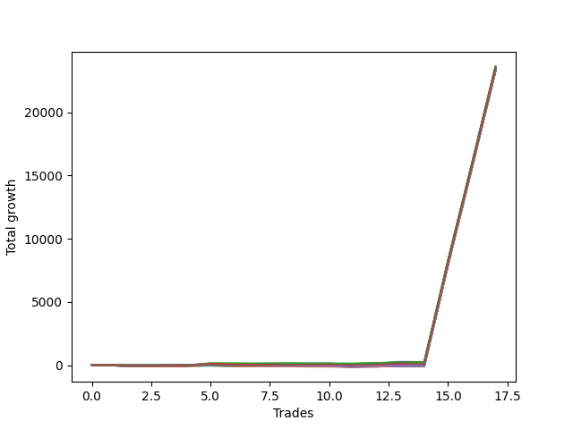

# Short Wallace Doodle 014 
- Symbol: NQ
- Date Range: 03/18/2022 - 06/17/2022
- Trading Period: 7:20-12:30
- Number of Trades: 17



| Name | Win Percent | Profit | Avg Profit / Trade |     | Name | Win Percent | Profit | Avg Profit / Trade |
| ---- | ----------- | ------ | ------------------ | --- | ---- | ----------- | ------ | ------------------ |
| Sorted By <br> Profit | | | | | Sorted By <br> Win Percentage ||||
| Sixty-Two | 52.94 | 11806125.00 | 694477.94 |     | One | 82.35 | 11724250.00 | 689661.76 |
| Thirty-One | 35.29 | 11793750.00 | 693750.00 |     | Two | 76.47 | 11768750.00 | 692279.41 |
| Forty-Seven | 35.29 | 11787000.00 | 693352.94 |     | Three | 76.47 | 11734125.00 | 690242.65 |
| Sixty-Three | 41.18 | 11775625.00 | 692683.82 |     | Seventy | 70.59 | 11758625.00 | 691683.82 |
| Seventy-Two | 58.82 | 11772000.00 | 692470.59 |     | Fifty-Four | 70.59 | 11758625.00 | 691683.82 |
| Two | 76.47 | 11768750.00 | 692279.41 |     | Thirty-Eight | 70.59 | 11758625.00 | 691683.82 |
| Thirty | 35.29 | 11765125.00 | 692066.18 |     | Twenty-Two | 70.59 | 11758625.00 | 691683.82 |
| Seventy | 70.59 | 11758625.00 | 691683.82 |     | Six | 70.59 | 11758625.00 | 691683.82 |
| Fifty-Four | 70.59 | 11758625.00 | 691683.82 |     | Seventy-Five | 70.59 | 11744750.00 | 690867.65 |
| Thirty-Eight | 70.59 | 11758625.00 | 691683.82 |     | Twenty-One | 70.59 | 11700500.00 | 688264.71 |
| Twenty-Two | 70.59 | 11758625.00 | 691683.82 |     | Twenty | 70.59 | 11700500.00 | 688264.71 |
| Six | 70.59 | 11758625.00 | 691683.82 |     | Nineteen | 70.59 | 11700500.00 | 688264.71 |
| Forty-Six | 35.29 | 11758375.00 | 691669.12 |     | Eighteen | 70.59 | 11700500.00 | 688264.71 |
| Fifteen | 29.41 | 11745875.00 | 690933.82 |     | Seventeen | 70.59 | 11700500.00 | 688264.71 |
| Seventy-Five | 70.59 | 11744750.00 | 690867.65 |     | Sixten | 70.59 | 11700500.00 | 688264.71 |
| Three | 76.47 | 11734125.00 | 690242.65 |     | Zero | 70.59 | 11674875.00 | 686757.35 |
| One | 82.35 | 11724250.00 | 689661.76 |     | Thirty-Two | 64.71 | 11696750.00 | 688044.12 |
| Fourteen | 29.41 | 11722000.00 | 689529.41 |     | Thirty-Seven | 64.71 | 11696250.00 | 688014.71 |
| Fifty-Nine | 52.94 | 11708375.00 | 688727.94 |     | Thirty-Six | 64.71 | 11696250.00 | 688014.71 |
| Fifty-Eight | 47.06 | 11708375.00 | 688727.94 |     | Thirty-Five | 64.71 | 11696250.00 | 688014.71 |
| Twenty-One | 70.59 | 11700500.00 | 688264.71 |     | Thirty-Four | 64.71 | 11696250.00 | 688014.71 |
| Twenty | 70.59 | 11700500.00 | 688264.71 |     | Thirty-Three | 64.71 | 11696250.00 | 688014.71 |
| Nineteen | 70.59 | 11700500.00 | 688264.71 |     | Four | 64.71 | 11673625.00 | 686683.82 |
| Eighteen | 70.59 | 11700500.00 | 688264.71 |     | Seventy-Two | 58.82 | 11772000.00 | 692470.59 |
| Seventeen | 70.59 | 11700500.00 | 688264.71 |     | Five | 58.82 | 11676000.00 | 686823.53 |
| Sixten | 70.59 | 11700500.00 | 688264.71 |     | Seventy-One | 58.82 | 11668875.00 | 686404.41 |
| Seventy-Three | 41.18 | 11697250.00 | 688073.53 |     | Fifty-Five | 58.82 | 11668875.00 | 686404.41 |
| Thirty-Two | 64.71 | 11696750.00 | 688044.12 |     | Thirty-Nine | 58.82 | 11668875.00 | 686404.41 |
| Thirty-Seven | 64.71 | 11696250.00 | 688014.71 |     | Twenty-Three | 58.82 | 11668875.00 | 686404.41 |
| Thirty-Six | 64.71 | 11696250.00 | 688014.71 |     | Seven | 58.82 | 11668875.00 | 686404.41 |
| Thirty-Five | 64.71 | 11696250.00 | 688014.71 |     | Sixty-Two | 52.94 | 11806125.00 | 694477.94 |
| Thirty-Four | 64.71 | 11696250.00 | 688014.71 |     | Fifty-Nine | 52.94 | 11708375.00 | 688727.94 |
| Thirty-Three | 64.71 | 11696250.00 | 688014.71 |     | Fifty-One | 52.94 | 11689000.00 | 687588.24 |
| Fifty-One | 52.94 | 11689000.00 | 687588.24 |     | Forty-Eight | 52.94 | 11687500.00 | 687500.00 |
| Forty-Eight | 52.94 | 11687500.00 | 687500.00 |     | Fifty-Three | 52.94 | 11686250.00 | 687426.47 |
| Fifty-Three | 52.94 | 11686250.00 | 687426.47 |     | Fifty-Two | 52.94 | 11686250.00 | 687426.47 |
| Fifty-Two | 52.94 | 11686250.00 | 687426.47 |     | Fifty | 52.94 | 11686250.00 | 687426.47 |
| Fifty | 52.94 | 11686250.00 | 687426.47 |     | Forty-Nine | 52.94 | 11686250.00 | 687426.47 |
| Forty-Nine | 52.94 | 11686250.00 | 687426.47 |     | Fifty-Six | 52.94 | 11677000.00 | 686882.35 |
| Fifty-Seven | 47.06 | 11682625.00 | 687213.24 |     | Seventy-Four | 52.94 | 11673375.00 | 686669.12 |
| Fifty-Six | 52.94 | 11677000.00 | 686882.35 |     | Fifty-Eight | 47.06 | 11708375.00 | 688727.94 |
| Five | 58.82 | 11676000.00 | 686823.53 |     | Fifty-Seven | 47.06 | 11682625.00 | 687213.24 |
| Zero | 70.59 | 11674875.00 | 686757.35 |     | Sixty-Seven | 47.06 | 11670125.00 | 686477.94 |
| Four | 64.71 | 11673625.00 | 686683.82 |     | Sixty-Four | 47.06 | 11668625.00 | 686389.71 |
| Seventy-Four | 52.94 | 11673375.00 | 686669.12 |     | Sixty-Three | 41.18 | 11775625.00 | 692683.82 |
| Sixty-One | 35.29 | 11670250.00 | 686485.29 |     | Seventy-Three | 41.18 | 11697250.00 | 688073.53 |
| Sixty-Seven | 47.06 | 11670125.00 | 686477.94 |     | Sixty-Nine | 41.18 | 11664500.00 | 686147.06 |
| Seventy-One | 58.82 | 11668875.00 | 686404.41 |     | Sixty-Eight | 41.18 | 11664500.00 | 686147.06 |
| Fifty-Five | 58.82 | 11668875.00 | 686404.41 |     | Sixty-Six | 41.18 | 11664500.00 | 686147.06 |
| Thirty-Nine | 58.82 | 11668875.00 | 686404.41 |     | Sixty-Five | 41.18 | 11664500.00 | 686147.06 |
| Twenty-Three | 58.82 | 11668875.00 | 686404.41 |     | Thirty-One | 35.29 | 11793750.00 | 693750.00 |
| Seven | 58.82 | 11668875.00 | 686404.41 |     | Forty-Seven | 35.29 | 11787000.00 | 693352.94 |
| Sixty-Four | 47.06 | 11668625.00 | 686389.71 |     | Thirty | 35.29 | 11765125.00 | 692066.18 |
| Sixty-Nine | 41.18 | 11664500.00 | 686147.06 |     | Forty-Six | 35.29 | 11758375.00 | 691669.12 |
| Sixty-Eight | 41.18 | 11664500.00 | 686147.06 |     | Sixty-One | 35.29 | 11670250.00 | 686485.29 |
| Sixty-Six | 41.18 | 11664500.00 | 686147.06 |     | Thirteen | 35.29 | 11662500.00 | 686029.41 |
| Sixty-Five | 41.18 | 11664500.00 | 686147.06 |     | Twelve | 35.29 | 11662500.00 | 686029.41 |
| Thirteen | 35.29 | 11662500.00 | 686029.41 |     | Eleven | 35.29 | 11662500.00 | 686029.41 |
| Twelve | 35.29 | 11662500.00 | 686029.41 |     | Ten | 35.29 | 11662500.00 | 686029.41 |
| Eleven | 35.29 | 11662500.00 | 686029.41 |     | Nine | 35.29 | 11662500.00 | 686029.41 |
| Ten | 35.29 | 11662500.00 | 686029.41 |     | Eight | 35.29 | 11662500.00 | 686029.41 |
| Nine | 35.29 | 11662500.00 | 686029.41 |     | Twenty-Four | 35.29 | 11659125.00 | 685830.88 |
| Eight | 35.29 | 11662500.00 | 686029.41 |     | Twenty-Nine | 35.29 | 11658625.00 | 685801.47 |
| Twenty-Four | 35.29 | 11659125.00 | 685830.88 |     | Twenty-Eight | 35.29 | 11658625.00 | 685801.47 |
| Twenty-Nine | 35.29 | 11658625.00 | 685801.47 |     | twenty-Seven | 35.29 | 11658625.00 | 685801.47 |
| Twenty-Eight | 35.29 | 11658625.00 | 685801.47 |     | Twenty-Six | 35.29 | 11658625.00 | 685801.47 |
| twenty-Seven | 35.29 | 11658625.00 | 685801.47 |     | Twenty-Five | 35.29 | 11658625.00 | 685801.47 |
| Twenty-Six | 35.29 | 11658625.00 | 685801.47 |     | Forty-Three | 35.29 | 11656250.00 | 685661.76 |
| Twenty-Five | 35.29 | 11658625.00 | 685801.47 |     | Sixty | 35.29 | 11655750.00 | 685632.35 |
| Forty-Three | 35.29 | 11656250.00 | 685661.76 |     | Forty | 35.29 | 11654750.00 | 685573.53 |
| Sixty | 35.29 | 11655750.00 | 685632.35 |     | Forty-Five | 35.29 | 11653500.00 | 685500.00 |
| Forty | 35.29 | 11654750.00 | 685573.53 |     | Forty-Four | 35.29 | 11653500.00 | 685500.00 |
| Forty-Five | 35.29 | 11653500.00 | 685500.00 |     | Forty-Two | 35.29 | 11653500.00 | 685500.00 |
| Forty-Four | 35.29 | 11653500.00 | 685500.00 |     | Forty-One | 35.29 | 11653500.00 | 685500.00 |
| Forty-Two | 35.29 | 11653500.00 | 685500.00 |     | Fifteen | 29.41 | 11745875.00 | 690933.82 |
| Forty-One | 35.29 | 11653500.00 | 685500.00 |     | Fourteen | 29.41 | 11722000.00 | 689529.41 |

## NO STOPLOSS

### Test Zero
* Sell when price hits the middle line of the 20p bollinger
* No Stoploss
* Results:
```
Total Trades: 17
Percent Up: 29.41
Percent Down: 70.59
Total Points Moved Down: 23349.75
Potential Profit: 11674875.00
Total Points Ups: 173.75 Count Ups: 5
Total Points Downs: 23523.50 Count Downs: 12
```

<details><summary>Trades</summary>

<code>In: 2022-03-28 11:12:00		Out: 2022-03-28 11:12:10		Total Position Time: 00:10		Total Move Down: 7.25		Total to Date: 7.25</code> <br />
<code>In: 2022-03-28 11:50:00		Out: 2022-03-28 12:12:55		Total Position Time: 22:55		Total Move Down: -33.75		Total to Date: -26.50</code> <br />
<code>In: 2022-03-29 08:52:00		Out: 2022-03-29 08:56:30		Total Position Time: 04:30		Total Move Down: 9.50		Total to Date: -17.00</code> <br />
<code>In: 2022-03-29 10:50:00		Out: 2022-03-29 11:04:05		Total Position Time: 14:05		Total Move Down: 0.75		Total to Date: -16.25</code> <br />
<code>In: 2022-04-06 11:05:00		Out: 2022-04-06 11:06:05		Total Position Time: 01:05		Total Move Down: 39.50		Total to Date: 23.25</code> <br />
<code>In: 2022-04-07 11:57:00		Out: 2022-04-07 12:20:05		Total Position Time: 23:05		Total Move Down: -55.75		Total to Date: -32.50</code> <br />
<code>In: 2022-04-08 07:33:00		Out: 2022-04-08 07:38:35		Total Position Time: 05:35		Total Move Down: 22.50		Total to Date: -10.00</code> <br />
<code>In: 2022-04-08 07:33:00		Out: 2022-04-08 07:38:35		Total Position Time: 05:35		Total Move Down: 22.50		Total to Date: 12.50</code> <br />
<code>In: 2022-04-18 11:28:00		Out: 2022-04-18 11:40:45		Total Position Time: 12:45		Total Move Down: -3.00		Total to Date: 9.50</code> <br />
<code>In: 2022-04-25 09:28:00		Out: 2022-04-25 09:31:05		Total Position Time: 03:05		Total Move Down: 15.00		Total to Date: 24.50</code> <br />
<code>In: 2022-05-10 10:37:00		Out: 2022-05-10 11:05:55		Total Position Time: 28:55		Total Move Down: -79.50		Total to Date: -55.00</code> <br />
<code>In: 2022-05-16 09:05:00		Out: 2022-05-16 09:06:00		Total Position Time: 01:00		Total Move Down: 21.75		Total to Date: -33.25</code> <br />
<code>In: 2022-05-24 09:18:00		Out: 2022-05-24 09:21:30		Total Position Time: 03:30		Total Move Down: 31.75		Total to Date: -1.50</code> <br />
<code>In: 2022-05-24 10:43:00		Out: 2022-05-24 10:57:50		Total Position Time: 14:50		Total Move Down: -1.75		Total to Date: -3.25</code> <br />
<code>In: 2022-06-10 12:29:00		Out: 2022-06-10 12:29:10		Total Position Time: 00:10		Total Move Down: 8014.00		Total to Date: 8010.75</code> <br />
<code>In: 2022-06-14 10:12:00		Out: 2022-06-14 10:12:10		Total Position Time: 00:10		Total Move Down: 7614.25		Total to Date: 15625.00</code> <br />
<code>In: 2022-06-15 08:59:00		Out: 2022-06-15 08:59:10		Total Position Time: 00:10		Total Move Down: 7724.75		Total to Date: 23349.75</code> <br />


</details>

### Test One
* Sell when the price hits the upper line of the 20p 1std bollinger
* No Stoploss
* Results:
```
Total Trades: 17
Percent Up: 17.65
Percent Down: 82.35
Total Points Moved Down: 23448.50
Potential Profit: 11724250.00
Total Points Ups: 145.25 Count Ups: 3
Total Points Downs: 23593.75 Count Downs: 14
```

<details><summary>Trades</summary>

<code>In: 2022-03-28 11:12:00		Out: 2022-03-28 11:19:20		Total Position Time: 07:20		Total Move Down: 8.50		Total to Date: 8.50</code> <br />
<code>In: 2022-03-28 11:50:00		Out: 2022-03-28 12:19:55		Total Position Time: 29:55		Total Move Down: -39.75		Total to Date: -31.25</code> <br />
<code>In: 2022-03-29 08:52:00		Out: 2022-03-29 08:58:40		Total Position Time: 06:40		Total Move Down: 17.75		Total to Date: -13.50</code> <br />
<code>In: 2022-03-29 10:50:00		Out: 2022-03-29 11:06:05		Total Position Time: 16:05		Total Move Down: 2.25		Total to Date: -11.25</code> <br />
<code>In: 2022-04-06 11:05:00		Out: 2022-04-06 11:07:25		Total Position Time: 02:25		Total Move Down: 62.25		Total to Date: 51.00</code> <br />
<code>In: 2022-04-07 11:57:00		Out: 2022-04-07 12:21:20		Total Position Time: 24:20		Total Move Down: -38.75		Total to Date: 12.25</code> <br />
<code>In: 2022-04-08 07:33:00		Out: 2022-04-08 07:44:30		Total Position Time: 11:30		Total Move Down: 26.50		Total to Date: 38.75</code> <br />
<code>In: 2022-04-08 07:33:00		Out: 2022-04-08 07:44:30		Total Position Time: 11:30		Total Move Down: 26.50		Total to Date: 65.25</code> <br />
<code>In: 2022-04-18 11:28:00		Out: 2022-04-18 11:41:15		Total Position Time: 13:15		Total Move Down: 8.50		Total to Date: 73.75</code> <br />
<code>In: 2022-04-25 09:28:00		Out: 2022-04-25 09:45:00		Total Position Time: 17:00		Total Move Down: 7.00		Total to Date: 80.75</code> <br />
<code>In: 2022-05-10 10:37:00		Out: 2022-05-10 11:06:35		Total Position Time: 29:35		Total Move Down: -66.75		Total to Date: 14.00</code> <br />
<code>In: 2022-05-16 09:05:00		Out: 2022-05-16 09:06:25		Total Position Time: 01:25		Total Move Down: 32.25		Total to Date: 46.25</code> <br />
<code>In: 2022-05-24 09:18:00		Out: 2022-05-24 09:26:40		Total Position Time: 08:40		Total Move Down: 43.25		Total to Date: 89.50</code> <br />
<code>In: 2022-05-24 10:43:00		Out: 2022-05-24 11:01:15		Total Position Time: 18:15		Total Move Down: 6.00		Total to Date: 95.50</code> <br />
<code>In: 2022-06-10 12:29:00		Out: 2022-06-10 12:29:10		Total Position Time: 00:10		Total Move Down: 8014.00		Total to Date: 8109.50</code> <br />
<code>In: 2022-06-14 10:12:00		Out: 2022-06-14 10:12:10		Total Position Time: 00:10		Total Move Down: 7614.25		Total to Date: 15723.75</code> <br />
<code>In: 2022-06-15 08:59:00		Out: 2022-06-15 08:59:10		Total Position Time: 00:10		Total Move Down: 7724.75		Total to Date: 23448.50</code> <br />


</details>

### Test Two
* Sell when the price hits the upper line of the 20p 2std bollinger
* No Stoploss
* Results:
```
Total Trades: 17
Percent Up: 23.53
Percent Down: 76.47
Total Points Moved Down: 23537.50
Potential Profit: 11768750.00
Total Points Ups: 166.25 Count Ups: 4
Total Points Downs: 23703.75 Count Downs: 13
```

<details><summary>Trades</summary>

<code>In: 2022-03-28 11:12:00		Out: 2022-03-28 11:41:55		Total Position Time: 29:55		Total Move Down: -19.25		Total to Date: -19.25</code> <br />
<code>In: 2022-03-28 11:50:00		Out: 2022-03-28 12:19:55		Total Position Time: 29:55		Total Move Down: -39.75		Total to Date: -59.00</code> <br />
<code>In: 2022-03-29 08:52:00		Out: 2022-03-29 09:01:35		Total Position Time: 09:35		Total Move Down: 27.50		Total to Date: -31.50</code> <br />
<code>In: 2022-03-29 10:50:00		Out: 2022-03-29 11:06:20		Total Position Time: 16:20		Total Move Down: 6.25		Total to Date: -25.25</code> <br />
<code>In: 2022-04-06 11:05:00		Out: 2022-04-06 11:08:25		Total Position Time: 03:25		Total Move Down: 91.25		Total to Date: 66.00</code> <br />
<code>In: 2022-04-07 11:57:00		Out: 2022-04-07 12:26:55		Total Position Time: 29:55		Total Move Down: -48.25		Total to Date: 17.75</code> <br />
<code>In: 2022-04-08 07:33:00		Out: 2022-04-08 07:45:45		Total Position Time: 12:45		Total Move Down: 36.75		Total to Date: 54.50</code> <br />
<code>In: 2022-04-08 07:33:00		Out: 2022-04-08 07:45:45		Total Position Time: 12:45		Total Move Down: 36.75		Total to Date: 91.25</code> <br />
<code>In: 2022-04-18 11:28:00		Out: 2022-04-18 11:43:10		Total Position Time: 15:10		Total Move Down: 7.00		Total to Date: 98.25</code> <br />
<code>In: 2022-04-25 09:28:00		Out: 2022-04-25 09:57:55		Total Position Time: 29:55		Total Move Down: 12.25		Total to Date: 110.50</code> <br />
<code>In: 2022-05-10 10:37:00		Out: 2022-05-10 11:06:55		Total Position Time: 29:55		Total Move Down: -59.00		Total to Date: 51.50</code> <br />
<code>In: 2022-05-16 09:05:00		Out: 2022-05-16 09:11:35		Total Position Time: 06:35		Total Move Down: 40.00		Total to Date: 91.50</code> <br />
<code>In: 2022-05-24 09:18:00		Out: 2022-05-24 09:32:40		Total Position Time: 14:40		Total Move Down: 74.25		Total to Date: 165.75</code> <br />
<code>In: 2022-05-24 10:43:00		Out: 2022-05-24 11:01:40		Total Position Time: 18:40		Total Move Down: 18.75		Total to Date: 184.50</code> <br />
<code>In: 2022-06-10 12:29:00		Out: 2022-06-10 12:29:10		Total Position Time: 00:10		Total Move Down: 8014.00		Total to Date: 8198.50</code> <br />
<code>In: 2022-06-14 10:12:00		Out: 2022-06-14 10:12:10		Total Position Time: 00:10		Total Move Down: 7614.25		Total to Date: 15812.75</code> <br />
<code>In: 2022-06-15 08:59:00		Out: 2022-06-15 08:59:10		Total Position Time: 00:10		Total Move Down: 7724.75		Total to Date: 23537.50</code> <br />


</details>

### Test Three
* Sell when price hits the middle line of the 50p bollinger
* No Stoploss
* Results:
```
Total Trades: 17
Percent Up: 23.53
Percent Down: 76.47
Total Points Moved Down: 23468.25
Potential Profit: 11734125.00
Total Points Ups: 201.00 Count Ups: 4
Total Points Downs: 23669.25 Count Downs: 13
```

<details><summary>Trades</summary>

<code>In: 2022-03-28 11:12:00		Out: 2022-03-28 11:13:00		Total Position Time: 01:00		Total Move Down: 10.25		Total to Date: 10.25</code> <br />
<code>In: 2022-03-28 11:50:00		Out: 2022-03-28 12:19:55		Total Position Time: 29:55		Total Move Down: -39.75		Total to Date: -29.50</code> <br />
<code>In: 2022-03-29 08:52:00		Out: 2022-03-29 09:00:25		Total Position Time: 08:25		Total Move Down: 21.75		Total to Date: -7.75</code> <br />
<code>In: 2022-03-29 10:50:00		Out: 2022-03-29 11:18:55		Total Position Time: 28:55		Total Move Down: 12.75		Total to Date: 5.00</code> <br />
<code>In: 2022-04-06 11:05:00		Out: 2022-04-06 11:07:35		Total Position Time: 02:35		Total Move Down: 73.00		Total to Date: 78.00</code> <br />
<code>In: 2022-04-07 11:57:00		Out: 2022-04-07 12:26:55		Total Position Time: 29:55		Total Move Down: -48.25		Total to Date: 29.75</code> <br />
<code>In: 2022-04-08 07:33:00		Out: 2022-04-08 07:45:55		Total Position Time: 12:55		Total Move Down: 42.75		Total to Date: 72.50</code> <br />
<code>In: 2022-04-08 07:33:00		Out: 2022-04-08 07:45:55		Total Position Time: 12:55		Total Move Down: 42.75		Total to Date: 115.25</code> <br />
<code>In: 2022-04-18 11:28:00		Out: 2022-04-18 11:41:15		Total Position Time: 13:15		Total Move Down: 8.50		Total to Date: 123.75</code> <br />
<code>In: 2022-04-25 09:28:00		Out: 2022-04-25 09:55:05		Total Position Time: 27:05		Total Move Down: 2.00		Total to Date: 125.75</code> <br />
<code>In: 2022-05-10 10:37:00		Out: 2022-05-10 11:06:55		Total Position Time: 29:55		Total Move Down: -59.00		Total to Date: 66.75</code> <br />
<code>In: 2022-05-16 09:05:00		Out: 2022-05-16 09:15:55		Total Position Time: 10:55		Total Move Down: 51.50		Total to Date: 118.25</code> <br />
<code>In: 2022-05-24 09:18:00		Out: 2022-05-24 09:31:10		Total Position Time: 13:10		Total Move Down: 51.00		Total to Date: 169.25</code> <br />
<code>In: 2022-05-24 10:43:00		Out: 2022-05-24 11:12:55		Total Position Time: 29:55		Total Move Down: -54.00		Total to Date: 115.25</code> <br />
<code>In: 2022-06-10 12:29:00		Out: 2022-06-10 12:29:10		Total Position Time: 00:10		Total Move Down: 8014.00		Total to Date: 8129.25</code> <br />
<code>In: 2022-06-14 10:12:00		Out: 2022-06-14 10:12:10		Total Position Time: 00:10		Total Move Down: 7614.25		Total to Date: 15743.50</code> <br />
<code>In: 2022-06-15 08:59:00		Out: 2022-06-15 08:59:10		Total Position Time: 00:10		Total Move Down: 7724.75		Total to Date: 23468.25</code> <br />


</details>

### Test Four
* Sell when the price hits the upper line of the 50p 1std bollinger
* No Stoploss
* Results:
```
Total Trades: 17
Percent Up: 35.29
Percent Down: 64.71
Total Points Moved Down: 23347.25
Potential Profit: 11673625.00
Total Points Ups: 352.50 Count Ups: 6
Total Points Downs: 23699.75 Count Downs: 11
```

<details><summary>Trades</summary>

<code>In: 2022-03-28 11:12:00		Out: 2022-03-28 11:20:40		Total Position Time: 08:40		Total Move Down: 12.50		Total to Date: 12.50</code> <br />
<code>In: 2022-03-28 11:50:00		Out: 2022-03-28 12:19:55		Total Position Time: 29:55		Total Move Down: -39.75		Total to Date: -27.25</code> <br />
<code>In: 2022-03-29 08:52:00		Out: 2022-03-29 09:02:10		Total Position Time: 10:10		Total Move Down: 39.25		Total to Date: 12.00</code> <br />
<code>In: 2022-03-29 10:50:00		Out: 2022-03-29 11:19:55		Total Position Time: 29:55		Total Move Down: 9.25		Total to Date: 21.25</code> <br />
<code>In: 2022-04-06 11:05:00		Out: 2022-04-06 11:09:20		Total Position Time: 04:20		Total Move Down: 105.50		Total to Date: 126.75</code> <br />
<code>In: 2022-04-07 11:57:00		Out: 2022-04-07 12:26:55		Total Position Time: 29:55		Total Move Down: -48.25		Total to Date: 78.50</code> <br />
<code>In: 2022-04-08 07:33:00		Out: 2022-04-08 08:02:55		Total Position Time: 29:55		Total Move Down: -75.75		Total to Date: 2.75</code> <br />
<code>In: 2022-04-08 07:33:00		Out: 2022-04-08 08:02:55		Total Position Time: 29:55		Total Move Down: -75.75		Total to Date: -73.00</code> <br />
<code>In: 2022-04-18 11:28:00		Out: 2022-04-18 11:46:40		Total Position Time: 18:40		Total Move Down: 21.00		Total to Date: -52.00</code> <br />
<code>In: 2022-04-25 09:28:00		Out: 2022-04-25 09:57:55		Total Position Time: 29:55		Total Move Down: 12.25		Total to Date: -39.75</code> <br />
<code>In: 2022-05-10 10:37:00		Out: 2022-05-10 11:06:55		Total Position Time: 29:55		Total Move Down: -59.00		Total to Date: -98.75</code> <br />
<code>In: 2022-05-16 09:05:00		Out: 2022-05-16 09:24:25		Total Position Time: 19:25		Total Move Down: 71.50		Total to Date: -27.25</code> <br />
<code>In: 2022-05-24 09:18:00		Out: 2022-05-24 09:33:05		Total Position Time: 15:05		Total Move Down: 75.50		Total to Date: 48.25</code> <br />
<code>In: 2022-05-24 10:43:00		Out: 2022-05-24 11:12:55		Total Position Time: 29:55		Total Move Down: -54.00		Total to Date: -5.75</code> <br />
<code>In: 2022-06-10 12:29:00		Out: 2022-06-10 12:29:10		Total Position Time: 00:10		Total Move Down: 8014.00		Total to Date: 8008.25</code> <br />
<code>In: 2022-06-14 10:12:00		Out: 2022-06-14 10:12:10		Total Position Time: 00:10		Total Move Down: 7614.25		Total to Date: 15622.50</code> <br />
<code>In: 2022-06-15 08:59:00		Out: 2022-06-15 08:59:10		Total Position Time: 00:10		Total Move Down: 7724.75		Total to Date: 23347.25</code> <br />


</details>

### Test Five
* Sell when the price hits the upper line of the 50p 2std bollinger
* No Stoploss
* Results:
```
Total Trades: 17
Percent Up: 41.18
Percent Down: 58.82
Total Points Moved Down: 23352.00
Potential Profit: 11676000.00
Total Points Ups: 371.75 Count Ups: 7
Total Points Downs: 23723.75 Count Downs: 10
```

<details><summary>Trades</summary>

<code>In: 2022-03-28 11:12:00		Out: 2022-03-28 11:41:55		Total Position Time: 29:55		Total Move Down: -19.25		Total to Date: -19.25</code> <br />
<code>In: 2022-03-28 11:50:00		Out: 2022-03-28 12:19:55		Total Position Time: 29:55		Total Move Down: -39.75		Total to Date: -59.00</code> <br />
<code>In: 2022-03-29 08:52:00		Out: 2022-03-29 09:21:55		Total Position Time: 29:55		Total Move Down: 24.00		Total to Date: -35.00</code> <br />
<code>In: 2022-03-29 10:50:00		Out: 2022-03-29 11:19:55		Total Position Time: 29:55		Total Move Down: 9.25		Total to Date: -25.75</code> <br />
<code>In: 2022-04-06 11:05:00		Out: 2022-04-06 11:14:50		Total Position Time: 09:50		Total Move Down: 150.00		Total to Date: 124.25</code> <br />
<code>In: 2022-04-07 11:57:00		Out: 2022-04-07 12:26:55		Total Position Time: 29:55		Total Move Down: -48.25		Total to Date: 76.00</code> <br />
<code>In: 2022-04-08 07:33:00		Out: 2022-04-08 08:02:55		Total Position Time: 29:55		Total Move Down: -75.75		Total to Date: 0.25</code> <br />
<code>In: 2022-04-08 07:33:00		Out: 2022-04-08 08:02:55		Total Position Time: 29:55		Total Move Down: -75.75		Total to Date: -75.50</code> <br />
<code>In: 2022-04-18 11:28:00		Out: 2022-04-18 11:57:55		Total Position Time: 29:55		Total Move Down: 16.00		Total to Date: -59.50</code> <br />
<code>In: 2022-04-25 09:28:00		Out: 2022-04-25 09:57:55		Total Position Time: 29:55		Total Move Down: 12.25		Total to Date: -47.25</code> <br />
<code>In: 2022-05-10 10:37:00		Out: 2022-05-10 11:06:55		Total Position Time: 29:55		Total Move Down: -59.00		Total to Date: -106.25</code> <br />
<code>In: 2022-05-16 09:05:00		Out: 2022-05-16 09:34:55		Total Position Time: 29:55		Total Move Down: 54.75		Total to Date: -51.50</code> <br />
<code>In: 2022-05-24 09:18:00		Out: 2022-05-24 09:47:55		Total Position Time: 29:55		Total Move Down: 104.50		Total to Date: 53.00</code> <br />
<code>In: 2022-05-24 10:43:00		Out: 2022-05-24 11:12:55		Total Position Time: 29:55		Total Move Down: -54.00		Total to Date: -1.00</code> <br />
<code>In: 2022-06-10 12:29:00		Out: 2022-06-10 12:29:10		Total Position Time: 00:10		Total Move Down: 8014.00		Total to Date: 8013.00</code> <br />
<code>In: 2022-06-14 10:12:00		Out: 2022-06-14 10:12:10		Total Position Time: 00:10		Total Move Down: 7614.25		Total to Date: 15627.25</code> <br />
<code>In: 2022-06-15 08:59:00		Out: 2022-06-15 08:59:10		Total Position Time: 00:10		Total Move Down: 7724.75		Total to Date: 23352.00</code> <br />


</details>

### Test Six
* Sell when the price hits the middle line of the 1std VWAP
* No Stoploss
* Results:
```
Total Trades: 17
Percent Up: 29.41
Percent Down: 70.59
Total Points Moved Down: 23517.25
Potential Profit: 11758625.00
Total Points Ups: 220.25 Count Ups: 5
Total Points Downs: 23737.50 Count Downs: 12
```

<details><summary>Trades</summary>

<code>In: 2022-03-28 11:12:00		Out: 2022-03-28 11:41:55		Total Position Time: 29:55		Total Move Down: -19.25		Total to Date: -19.25</code> <br />
<code>In: 2022-03-28 11:50:00		Out: 2022-03-28 12:19:55		Total Position Time: 29:55		Total Move Down: -39.75		Total to Date: -59.00</code> <br />
<code>In: 2022-03-29 08:52:00		Out: 2022-03-29 09:02:10		Total Position Time: 10:10		Total Move Down: 39.25		Total to Date: -19.75</code> <br />
<code>In: 2022-03-29 10:50:00		Out: 2022-03-29 11:19:55		Total Position Time: 29:55		Total Move Down: 9.25		Total to Date: -10.50</code> <br />
<code>In: 2022-04-06 11:05:00		Out: 2022-04-06 11:08:10		Total Position Time: 03:10		Total Move Down: 86.25		Total to Date: 75.75</code> <br />
<code>In: 2022-04-07 11:57:00		Out: 2022-04-07 12:26:55		Total Position Time: 29:55		Total Move Down: -48.25		Total to Date: 27.50</code> <br />
<code>In: 2022-04-08 07:33:00		Out: 2022-04-08 07:45:10		Total Position Time: 12:10		Total Move Down: 35.00		Total to Date: 62.50</code> <br />
<code>In: 2022-04-08 07:33:00		Out: 2022-04-08 07:45:10		Total Position Time: 12:10		Total Move Down: 35.00		Total to Date: 97.50</code> <br />
<code>In: 2022-04-18 11:28:00		Out: 2022-04-18 11:57:55		Total Position Time: 29:55		Total Move Down: 16.00		Total to Date: 113.50</code> <br />
<code>In: 2022-04-25 09:28:00		Out: 2022-04-25 09:57:55		Total Position Time: 29:55		Total Move Down: 12.25		Total to Date: 125.75</code> <br />
<code>In: 2022-05-10 10:37:00		Out: 2022-05-10 11:06:55		Total Position Time: 29:55		Total Move Down: -59.00		Total to Date: 66.75</code> <br />
<code>In: 2022-05-16 09:05:00		Out: 2022-05-16 09:17:45		Total Position Time: 12:45		Total Move Down: 56.50		Total to Date: 123.25</code> <br />
<code>In: 2022-05-24 09:18:00		Out: 2022-05-24 09:36:50		Total Position Time: 18:50		Total Move Down: 95.00		Total to Date: 218.25</code> <br />
<code>In: 2022-05-24 10:43:00		Out: 2022-05-24 11:12:55		Total Position Time: 29:55		Total Move Down: -54.00		Total to Date: 164.25</code> <br />
<code>In: 2022-06-10 12:29:00		Out: 2022-06-10 12:29:10		Total Position Time: 00:10		Total Move Down: 8014.00		Total to Date: 8178.25</code> <br />
<code>In: 2022-06-14 10:12:00		Out: 2022-06-14 10:12:10		Total Position Time: 00:10		Total Move Down: 7614.25		Total to Date: 15792.50</code> <br />
<code>In: 2022-06-15 08:59:00		Out: 2022-06-15 08:59:10		Total Position Time: 00:10		Total Move Down: 7724.75		Total to Date: 23517.25</code> <br />


</details>

### Test Seven
* Sell when the price hits the upper line of the 1std VWAP
* No Stoploss
* Results:
```
Total Trades: 17
Percent Up: 41.18
Percent Down: 58.82
Total Points Moved Down: 23337.75
Potential Profit: 11668875.00
Total Points Ups: 371.75 Count Ups: 7
Total Points Downs: 23709.50 Count Downs: 10
```

<details><summary>Trades</summary>

<code>In: 2022-03-28 11:12:00		Out: 2022-03-28 11:41:55		Total Position Time: 29:55		Total Move Down: -19.25		Total to Date: -19.25</code> <br />
<code>In: 2022-03-28 11:50:00		Out: 2022-03-28 12:19:55		Total Position Time: 29:55		Total Move Down: -39.75		Total to Date: -59.00</code> <br />
<code>In: 2022-03-29 08:52:00		Out: 2022-03-29 09:21:55		Total Position Time: 29:55		Total Move Down: 24.00		Total to Date: -35.00</code> <br />
<code>In: 2022-03-29 10:50:00		Out: 2022-03-29 11:19:55		Total Position Time: 29:55		Total Move Down: 9.25		Total to Date: -25.75</code> <br />
<code>In: 2022-04-06 11:05:00		Out: 2022-04-06 11:13:00		Total Position Time: 08:00		Total Move Down: 135.75		Total to Date: 110.00</code> <br />
<code>In: 2022-04-07 11:57:00		Out: 2022-04-07 12:26:55		Total Position Time: 29:55		Total Move Down: -48.25		Total to Date: 61.75</code> <br />
<code>In: 2022-04-08 07:33:00		Out: 2022-04-08 08:02:55		Total Position Time: 29:55		Total Move Down: -75.75		Total to Date: -14.00</code> <br />
<code>In: 2022-04-08 07:33:00		Out: 2022-04-08 08:02:55		Total Position Time: 29:55		Total Move Down: -75.75		Total to Date: -89.75</code> <br />
<code>In: 2022-04-18 11:28:00		Out: 2022-04-18 11:57:55		Total Position Time: 29:55		Total Move Down: 16.00		Total to Date: -73.75</code> <br />
<code>In: 2022-04-25 09:28:00		Out: 2022-04-25 09:57:55		Total Position Time: 29:55		Total Move Down: 12.25		Total to Date: -61.50</code> <br />
<code>In: 2022-05-10 10:37:00		Out: 2022-05-10 11:06:55		Total Position Time: 29:55		Total Move Down: -59.00		Total to Date: -120.50</code> <br />
<code>In: 2022-05-16 09:05:00		Out: 2022-05-16 09:34:55		Total Position Time: 29:55		Total Move Down: 54.75		Total to Date: -65.75</code> <br />
<code>In: 2022-05-24 09:18:00		Out: 2022-05-24 09:47:55		Total Position Time: 29:55		Total Move Down: 104.50		Total to Date: 38.75</code> <br />
<code>In: 2022-05-24 10:43:00		Out: 2022-05-24 11:12:55		Total Position Time: 29:55		Total Move Down: -54.00		Total to Date: -15.25</code> <br />
<code>In: 2022-06-10 12:29:00		Out: 2022-06-10 12:29:10		Total Position Time: 00:10		Total Move Down: 8014.00		Total to Date: 7998.75</code> <br />
<code>In: 2022-06-14 10:12:00		Out: 2022-06-14 10:12:10		Total Position Time: 00:10		Total Move Down: 7614.25		Total to Date: 15613.00</code> <br />
<code>In: 2022-06-15 08:59:00		Out: 2022-06-15 08:59:10		Total Position Time: 00:10		Total Move Down: 7724.75		Total to Date: 23337.75</code> <br />


</details>

## STOPLOSS OF 2

### Test Eight
* Sell when price hits the middle line of the 20p bollinger
* Stoploss is -2 points
* Results:
```
Total Trades: 17
Percent Up: 64.71
Percent Down: 35.29
Total Points Moved Down: 23325.00
Potential Profit: 11662500.00
Total Points Ups: 51.75 Count Ups: 11
Total Points Downs: 23376.75 Count Downs: 6
```

<details><summary>Trades</summary>

<code>In: 2022-03-28 11:12:00		Out: 2022-03-28 11:12:10		Total Position Time: 00:10		Total Move Down: 7.25		Total to Date: 7.25</code> <br />
<code>In: 2022-03-28 11:50:00		Out: 2022-03-28 11:51:25		Total Position Time: 01:25		Total Move Down: -10.75		Total to Date: -3.50</code> <br />
<code>In: 2022-03-29 08:52:00		Out: 2022-03-29 08:53:10		Total Position Time: 01:10		Total Move Down: -0.25		Total to Date: -3.75</code> <br />
<code>In: 2022-03-29 10:50:00		Out: 2022-03-29 10:50:10		Total Position Time: 00:10		Total Move Down: -1.75		Total to Date: -5.50</code> <br />
<code>In: 2022-04-06 11:05:00		Out: 2022-04-06 11:05:10		Total Position Time: 00:10		Total Move Down: 15.00		Total to Date: 9.50</code> <br />
<code>In: 2022-04-07 11:57:00		Out: 2022-04-07 11:57:45		Total Position Time: 00:45		Total Move Down: -7.50		Total to Date: 2.00</code> <br />
<code>In: 2022-04-08 07:33:00		Out: 2022-04-08 07:34:05		Total Position Time: 01:05		Total Move Down: -6.25		Total to Date: -4.25</code> <br />
<code>In: 2022-04-08 07:33:00		Out: 2022-04-08 07:34:05		Total Position Time: 01:05		Total Move Down: -6.25		Total to Date: -10.50</code> <br />
<code>In: 2022-04-18 11:28:00		Out: 2022-04-18 11:29:50		Total Position Time: 01:50		Total Move Down: -1.75		Total to Date: -12.25</code> <br />
<code>In: 2022-04-25 09:28:00		Out: 2022-04-25 09:28:10		Total Position Time: 00:10		Total Move Down: -2.25		Total to Date: -14.50</code> <br />
<code>In: 2022-05-10 10:37:00		Out: 2022-05-10 10:37:35		Total Position Time: 00:35		Total Move Down: -11.00		Total to Date: -25.50</code> <br />
<code>In: 2022-05-16 09:05:00		Out: 2022-05-16 09:05:10		Total Position Time: 00:10		Total Move Down: 1.50		Total to Date: -24.00</code> <br />
<code>In: 2022-05-24 09:18:00		Out: 2022-05-24 09:18:10		Total Position Time: 00:10		Total Move Down: -0.25		Total to Date: -24.25</code> <br />
<code>In: 2022-05-24 10:43:00		Out: 2022-05-24 10:44:20		Total Position Time: 01:20		Total Move Down: -3.75		Total to Date: -28.00</code> <br />
<code>In: 2022-06-10 12:29:00		Out: 2022-06-10 12:29:10		Total Position Time: 00:10		Total Move Down: 8014.00		Total to Date: 7986.00</code> <br />
<code>In: 2022-06-14 10:12:00		Out: 2022-06-14 10:12:10		Total Position Time: 00:10		Total Move Down: 7614.25		Total to Date: 15600.25</code> <br />
<code>In: 2022-06-15 08:59:00		Out: 2022-06-15 08:59:10		Total Position Time: 00:10		Total Move Down: 7724.75		Total to Date: 23325.00</code> <br />


</details>

### Test Nine
* Sell when the price hits the upper line of the 20p 1std bollinger
* Stoploss is -2 points
* Results:
```
Total Trades: 17
Percent Up: 64.71
Percent Down: 35.29
Total Points Moved Down: 23325.00
Potential Profit: 11662500.00
Total Points Ups: 51.75 Count Ups: 11
Total Points Downs: 23376.75 Count Downs: 6
```

<details><summary>Trades</summary>

<code>In: 2022-03-28 11:12:00		Out: 2022-03-28 11:12:10		Total Position Time: 00:10		Total Move Down: 7.25		Total to Date: 7.25</code> <br />
<code>In: 2022-03-28 11:50:00		Out: 2022-03-28 11:51:25		Total Position Time: 01:25		Total Move Down: -10.75		Total to Date: -3.50</code> <br />
<code>In: 2022-03-29 08:52:00		Out: 2022-03-29 08:53:10		Total Position Time: 01:10		Total Move Down: -0.25		Total to Date: -3.75</code> <br />
<code>In: 2022-03-29 10:50:00		Out: 2022-03-29 10:50:10		Total Position Time: 00:10		Total Move Down: -1.75		Total to Date: -5.50</code> <br />
<code>In: 2022-04-06 11:05:00		Out: 2022-04-06 11:05:10		Total Position Time: 00:10		Total Move Down: 15.00		Total to Date: 9.50</code> <br />
<code>In: 2022-04-07 11:57:00		Out: 2022-04-07 11:57:45		Total Position Time: 00:45		Total Move Down: -7.50		Total to Date: 2.00</code> <br />
<code>In: 2022-04-08 07:33:00		Out: 2022-04-08 07:34:05		Total Position Time: 01:05		Total Move Down: -6.25		Total to Date: -4.25</code> <br />
<code>In: 2022-04-08 07:33:00		Out: 2022-04-08 07:34:05		Total Position Time: 01:05		Total Move Down: -6.25		Total to Date: -10.50</code> <br />
<code>In: 2022-04-18 11:28:00		Out: 2022-04-18 11:29:50		Total Position Time: 01:50		Total Move Down: -1.75		Total to Date: -12.25</code> <br />
<code>In: 2022-04-25 09:28:00		Out: 2022-04-25 09:28:10		Total Position Time: 00:10		Total Move Down: -2.25		Total to Date: -14.50</code> <br />
<code>In: 2022-05-10 10:37:00		Out: 2022-05-10 10:37:35		Total Position Time: 00:35		Total Move Down: -11.00		Total to Date: -25.50</code> <br />
<code>In: 2022-05-16 09:05:00		Out: 2022-05-16 09:05:10		Total Position Time: 00:10		Total Move Down: 1.50		Total to Date: -24.00</code> <br />
<code>In: 2022-05-24 09:18:00		Out: 2022-05-24 09:18:10		Total Position Time: 00:10		Total Move Down: -0.25		Total to Date: -24.25</code> <br />
<code>In: 2022-05-24 10:43:00		Out: 2022-05-24 10:44:20		Total Position Time: 01:20		Total Move Down: -3.75		Total to Date: -28.00</code> <br />
<code>In: 2022-06-10 12:29:00		Out: 2022-06-10 12:29:10		Total Position Time: 00:10		Total Move Down: 8014.00		Total to Date: 7986.00</code> <br />
<code>In: 2022-06-14 10:12:00		Out: 2022-06-14 10:12:10		Total Position Time: 00:10		Total Move Down: 7614.25		Total to Date: 15600.25</code> <br />
<code>In: 2022-06-15 08:59:00		Out: 2022-06-15 08:59:10		Total Position Time: 00:10		Total Move Down: 7724.75		Total to Date: 23325.00</code> <br />


</details>

### Test Ten
* Sell when the price hits the upper line of the 20p 2std bollinger
* Stoploss is -2 points
* Results:
```
Total Trades: 17
Percent Up: 64.71
Percent Down: 35.29
Total Points Moved Down: 23325.00
Potential Profit: 11662500.00
Total Points Ups: 51.75 Count Ups: 11
Total Points Downs: 23376.75 Count Downs: 6
```

<details><summary>Trades</summary>

<code>In: 2022-03-28 11:12:00		Out: 2022-03-28 11:12:10		Total Position Time: 00:10		Total Move Down: 7.25		Total to Date: 7.25</code> <br />
<code>In: 2022-03-28 11:50:00		Out: 2022-03-28 11:51:25		Total Position Time: 01:25		Total Move Down: -10.75		Total to Date: -3.50</code> <br />
<code>In: 2022-03-29 08:52:00		Out: 2022-03-29 08:53:10		Total Position Time: 01:10		Total Move Down: -0.25		Total to Date: -3.75</code> <br />
<code>In: 2022-03-29 10:50:00		Out: 2022-03-29 10:50:10		Total Position Time: 00:10		Total Move Down: -1.75		Total to Date: -5.50</code> <br />
<code>In: 2022-04-06 11:05:00		Out: 2022-04-06 11:05:10		Total Position Time: 00:10		Total Move Down: 15.00		Total to Date: 9.50</code> <br />
<code>In: 2022-04-07 11:57:00		Out: 2022-04-07 11:57:45		Total Position Time: 00:45		Total Move Down: -7.50		Total to Date: 2.00</code> <br />
<code>In: 2022-04-08 07:33:00		Out: 2022-04-08 07:34:05		Total Position Time: 01:05		Total Move Down: -6.25		Total to Date: -4.25</code> <br />
<code>In: 2022-04-08 07:33:00		Out: 2022-04-08 07:34:05		Total Position Time: 01:05		Total Move Down: -6.25		Total to Date: -10.50</code> <br />
<code>In: 2022-04-18 11:28:00		Out: 2022-04-18 11:29:50		Total Position Time: 01:50		Total Move Down: -1.75		Total to Date: -12.25</code> <br />
<code>In: 2022-04-25 09:28:00		Out: 2022-04-25 09:28:10		Total Position Time: 00:10		Total Move Down: -2.25		Total to Date: -14.50</code> <br />
<code>In: 2022-05-10 10:37:00		Out: 2022-05-10 10:37:35		Total Position Time: 00:35		Total Move Down: -11.00		Total to Date: -25.50</code> <br />
<code>In: 2022-05-16 09:05:00		Out: 2022-05-16 09:05:10		Total Position Time: 00:10		Total Move Down: 1.50		Total to Date: -24.00</code> <br />
<code>In: 2022-05-24 09:18:00		Out: 2022-05-24 09:18:10		Total Position Time: 00:10		Total Move Down: -0.25		Total to Date: -24.25</code> <br />
<code>In: 2022-05-24 10:43:00		Out: 2022-05-24 10:44:20		Total Position Time: 01:20		Total Move Down: -3.75		Total to Date: -28.00</code> <br />
<code>In: 2022-06-10 12:29:00		Out: 2022-06-10 12:29:10		Total Position Time: 00:10		Total Move Down: 8014.00		Total to Date: 7986.00</code> <br />
<code>In: 2022-06-14 10:12:00		Out: 2022-06-14 10:12:10		Total Position Time: 00:10		Total Move Down: 7614.25		Total to Date: 15600.25</code> <br />
<code>In: 2022-06-15 08:59:00		Out: 2022-06-15 08:59:10		Total Position Time: 00:10		Total Move Down: 7724.75		Total to Date: 23325.00</code> <br />


</details>

### Test Eleven
* Sell when price hits the middle line of the 50p bollinger
* Stoploss is -2 points
* Results:
```
Total Trades: 17
Percent Up: 64.71
Percent Down: 35.29
Total Points Moved Down: 23325.00
Potential Profit: 11662500.00
Total Points Ups: 51.75 Count Ups: 11
Total Points Downs: 23376.75 Count Downs: 6
```

<details><summary>Trades</summary>

<code>In: 2022-03-28 11:12:00		Out: 2022-03-28 11:12:10		Total Position Time: 00:10		Total Move Down: 7.25		Total to Date: 7.25</code> <br />
<code>In: 2022-03-28 11:50:00		Out: 2022-03-28 11:51:25		Total Position Time: 01:25		Total Move Down: -10.75		Total to Date: -3.50</code> <br />
<code>In: 2022-03-29 08:52:00		Out: 2022-03-29 08:53:10		Total Position Time: 01:10		Total Move Down: -0.25		Total to Date: -3.75</code> <br />
<code>In: 2022-03-29 10:50:00		Out: 2022-03-29 10:50:10		Total Position Time: 00:10		Total Move Down: -1.75		Total to Date: -5.50</code> <br />
<code>In: 2022-04-06 11:05:00		Out: 2022-04-06 11:05:10		Total Position Time: 00:10		Total Move Down: 15.00		Total to Date: 9.50</code> <br />
<code>In: 2022-04-07 11:57:00		Out: 2022-04-07 11:57:45		Total Position Time: 00:45		Total Move Down: -7.50		Total to Date: 2.00</code> <br />
<code>In: 2022-04-08 07:33:00		Out: 2022-04-08 07:34:05		Total Position Time: 01:05		Total Move Down: -6.25		Total to Date: -4.25</code> <br />
<code>In: 2022-04-08 07:33:00		Out: 2022-04-08 07:34:05		Total Position Time: 01:05		Total Move Down: -6.25		Total to Date: -10.50</code> <br />
<code>In: 2022-04-18 11:28:00		Out: 2022-04-18 11:29:50		Total Position Time: 01:50		Total Move Down: -1.75		Total to Date: -12.25</code> <br />
<code>In: 2022-04-25 09:28:00		Out: 2022-04-25 09:28:10		Total Position Time: 00:10		Total Move Down: -2.25		Total to Date: -14.50</code> <br />
<code>In: 2022-05-10 10:37:00		Out: 2022-05-10 10:37:35		Total Position Time: 00:35		Total Move Down: -11.00		Total to Date: -25.50</code> <br />
<code>In: 2022-05-16 09:05:00		Out: 2022-05-16 09:05:10		Total Position Time: 00:10		Total Move Down: 1.50		Total to Date: -24.00</code> <br />
<code>In: 2022-05-24 09:18:00		Out: 2022-05-24 09:18:10		Total Position Time: 00:10		Total Move Down: -0.25		Total to Date: -24.25</code> <br />
<code>In: 2022-05-24 10:43:00		Out: 2022-05-24 10:44:20		Total Position Time: 01:20		Total Move Down: -3.75		Total to Date: -28.00</code> <br />
<code>In: 2022-06-10 12:29:00		Out: 2022-06-10 12:29:10		Total Position Time: 00:10		Total Move Down: 8014.00		Total to Date: 7986.00</code> <br />
<code>In: 2022-06-14 10:12:00		Out: 2022-06-14 10:12:10		Total Position Time: 00:10		Total Move Down: 7614.25		Total to Date: 15600.25</code> <br />
<code>In: 2022-06-15 08:59:00		Out: 2022-06-15 08:59:10		Total Position Time: 00:10		Total Move Down: 7724.75		Total to Date: 23325.00</code> <br />


</details>

### Test Twelve
* Sell when the price hits the upper line of the 50p 1std bollinger
* Stoploss is -2 points
* Results:
```
Total Trades: 17
Percent Up: 64.71
Percent Down: 35.29
Total Points Moved Down: 23325.00
Potential Profit: 11662500.00
Total Points Ups: 51.75 Count Ups: 11
Total Points Downs: 23376.75 Count Downs: 6
```

<details><summary>Trades</summary>

<code>In: 2022-03-28 11:12:00		Out: 2022-03-28 11:12:10		Total Position Time: 00:10		Total Move Down: 7.25		Total to Date: 7.25</code> <br />
<code>In: 2022-03-28 11:50:00		Out: 2022-03-28 11:51:25		Total Position Time: 01:25		Total Move Down: -10.75		Total to Date: -3.50</code> <br />
<code>In: 2022-03-29 08:52:00		Out: 2022-03-29 08:53:10		Total Position Time: 01:10		Total Move Down: -0.25		Total to Date: -3.75</code> <br />
<code>In: 2022-03-29 10:50:00		Out: 2022-03-29 10:50:10		Total Position Time: 00:10		Total Move Down: -1.75		Total to Date: -5.50</code> <br />
<code>In: 2022-04-06 11:05:00		Out: 2022-04-06 11:05:10		Total Position Time: 00:10		Total Move Down: 15.00		Total to Date: 9.50</code> <br />
<code>In: 2022-04-07 11:57:00		Out: 2022-04-07 11:57:45		Total Position Time: 00:45		Total Move Down: -7.50		Total to Date: 2.00</code> <br />
<code>In: 2022-04-08 07:33:00		Out: 2022-04-08 07:34:05		Total Position Time: 01:05		Total Move Down: -6.25		Total to Date: -4.25</code> <br />
<code>In: 2022-04-08 07:33:00		Out: 2022-04-08 07:34:05		Total Position Time: 01:05		Total Move Down: -6.25		Total to Date: -10.50</code> <br />
<code>In: 2022-04-18 11:28:00		Out: 2022-04-18 11:29:50		Total Position Time: 01:50		Total Move Down: -1.75		Total to Date: -12.25</code> <br />
<code>In: 2022-04-25 09:28:00		Out: 2022-04-25 09:28:10		Total Position Time: 00:10		Total Move Down: -2.25		Total to Date: -14.50</code> <br />
<code>In: 2022-05-10 10:37:00		Out: 2022-05-10 10:37:35		Total Position Time: 00:35		Total Move Down: -11.00		Total to Date: -25.50</code> <br />
<code>In: 2022-05-16 09:05:00		Out: 2022-05-16 09:05:10		Total Position Time: 00:10		Total Move Down: 1.50		Total to Date: -24.00</code> <br />
<code>In: 2022-05-24 09:18:00		Out: 2022-05-24 09:18:10		Total Position Time: 00:10		Total Move Down: -0.25		Total to Date: -24.25</code> <br />
<code>In: 2022-05-24 10:43:00		Out: 2022-05-24 10:44:20		Total Position Time: 01:20		Total Move Down: -3.75		Total to Date: -28.00</code> <br />
<code>In: 2022-06-10 12:29:00		Out: 2022-06-10 12:29:10		Total Position Time: 00:10		Total Move Down: 8014.00		Total to Date: 7986.00</code> <br />
<code>In: 2022-06-14 10:12:00		Out: 2022-06-14 10:12:10		Total Position Time: 00:10		Total Move Down: 7614.25		Total to Date: 15600.25</code> <br />
<code>In: 2022-06-15 08:59:00		Out: 2022-06-15 08:59:10		Total Position Time: 00:10		Total Move Down: 7724.75		Total to Date: 23325.00</code> <br />


</details>

### Test Thirteen
* Sell when the price hits the upper line of the 50p 2std bollinger
* Stoploss is -2 points
* Results:
```
Total Trades: 17
Percent Up: 64.71
Percent Down: 35.29
Total Points Moved Down: 23325.00
Potential Profit: 11662500.00
Total Points Ups: 51.75 Count Ups: 11
Total Points Downs: 23376.75 Count Downs: 6
```

<details><summary>Trades</summary>

<code>In: 2022-03-28 11:12:00		Out: 2022-03-28 11:12:10		Total Position Time: 00:10		Total Move Down: 7.25		Total to Date: 7.25</code> <br />
<code>In: 2022-03-28 11:50:00		Out: 2022-03-28 11:51:25		Total Position Time: 01:25		Total Move Down: -10.75		Total to Date: -3.50</code> <br />
<code>In: 2022-03-29 08:52:00		Out: 2022-03-29 08:53:10		Total Position Time: 01:10		Total Move Down: -0.25		Total to Date: -3.75</code> <br />
<code>In: 2022-03-29 10:50:00		Out: 2022-03-29 10:50:10		Total Position Time: 00:10		Total Move Down: -1.75		Total to Date: -5.50</code> <br />
<code>In: 2022-04-06 11:05:00		Out: 2022-04-06 11:05:10		Total Position Time: 00:10		Total Move Down: 15.00		Total to Date: 9.50</code> <br />
<code>In: 2022-04-07 11:57:00		Out: 2022-04-07 11:57:45		Total Position Time: 00:45		Total Move Down: -7.50		Total to Date: 2.00</code> <br />
<code>In: 2022-04-08 07:33:00		Out: 2022-04-08 07:34:05		Total Position Time: 01:05		Total Move Down: -6.25		Total to Date: -4.25</code> <br />
<code>In: 2022-04-08 07:33:00		Out: 2022-04-08 07:34:05		Total Position Time: 01:05		Total Move Down: -6.25		Total to Date: -10.50</code> <br />
<code>In: 2022-04-18 11:28:00		Out: 2022-04-18 11:29:50		Total Position Time: 01:50		Total Move Down: -1.75		Total to Date: -12.25</code> <br />
<code>In: 2022-04-25 09:28:00		Out: 2022-04-25 09:28:10		Total Position Time: 00:10		Total Move Down: -2.25		Total to Date: -14.50</code> <br />
<code>In: 2022-05-10 10:37:00		Out: 2022-05-10 10:37:35		Total Position Time: 00:35		Total Move Down: -11.00		Total to Date: -25.50</code> <br />
<code>In: 2022-05-16 09:05:00		Out: 2022-05-16 09:05:10		Total Position Time: 00:10		Total Move Down: 1.50		Total to Date: -24.00</code> <br />
<code>In: 2022-05-24 09:18:00		Out: 2022-05-24 09:18:10		Total Position Time: 00:10		Total Move Down: -0.25		Total to Date: -24.25</code> <br />
<code>In: 2022-05-24 10:43:00		Out: 2022-05-24 10:44:20		Total Position Time: 01:20		Total Move Down: -3.75		Total to Date: -28.00</code> <br />
<code>In: 2022-06-10 12:29:00		Out: 2022-06-10 12:29:10		Total Position Time: 00:10		Total Move Down: 8014.00		Total to Date: 7986.00</code> <br />
<code>In: 2022-06-14 10:12:00		Out: 2022-06-14 10:12:10		Total Position Time: 00:10		Total Move Down: 7614.25		Total to Date: 15600.25</code> <br />
<code>In: 2022-06-15 08:59:00		Out: 2022-06-15 08:59:10		Total Position Time: 00:10		Total Move Down: 7724.75		Total to Date: 23325.00</code> <br />


</details>

### Test Fourteen
* Sell when the price hits the middle line of the 1std VWAP
* Stoploss is -2 points
* Results:
```
Total Trades: 17
Percent Up: 70.59
Percent Down: 29.41
Total Points Moved Down: 23444.00
Potential Profit: 11722000.00
Total Points Ups: 51.75 Count Ups: 12
Total Points Downs: 23495.75 Count Downs: 5
```

<details><summary>Trades</summary>

<code>In: 2022-03-28 11:12:00		Out: 2022-03-28 11:23:50		Total Position Time: 11:50		Total Move Down: -2.50		Total to Date: -2.50</code> <br />
<code>In: 2022-03-28 11:50:00		Out: 2022-03-28 11:50:10		Total Position Time: 00:10		Total Move Down: -5.50		Total to Date: -8.00</code> <br />
<code>In: 2022-03-29 08:52:00		Out: 2022-03-29 08:53:15		Total Position Time: 01:15		Total Move Down: -3.75		Total to Date: -11.75</code> <br />
<code>In: 2022-03-29 10:50:00		Out: 2022-03-29 10:51:50		Total Position Time: 01:50		Total Move Down: -2.00		Total to Date: -13.75</code> <br />
<code>In: 2022-04-06 11:05:00		Out: 2022-04-06 11:08:10		Total Position Time: 03:10		Total Move Down: 86.25		Total to Date: 72.50</code> <br />
<code>In: 2022-04-07 11:57:00		Out: 2022-04-07 11:57:10		Total Position Time: 00:10		Total Move Down: -2.25		Total to Date: 70.25</code> <br />
<code>In: 2022-04-08 07:33:00		Out: 2022-04-08 07:34:05		Total Position Time: 01:05		Total Move Down: -6.25		Total to Date: 64.00</code> <br />
<code>In: 2022-04-08 07:33:00		Out: 2022-04-08 07:34:05		Total Position Time: 01:05		Total Move Down: -6.25		Total to Date: 57.75</code> <br />
<code>In: 2022-04-18 11:28:00		Out: 2022-04-18 11:30:15		Total Position Time: 02:15		Total Move Down: -3.25		Total to Date: 54.50</code> <br />
<code>In: 2022-04-25 09:28:00		Out: 2022-04-25 09:28:10		Total Position Time: 00:10		Total Move Down: -2.25		Total to Date: 52.25</code> <br />
<code>In: 2022-05-10 10:37:00		Out: 2022-05-10 10:37:35		Total Position Time: 00:35		Total Move Down: -11.00		Total to Date: 41.25</code> <br />
<code>In: 2022-05-16 09:05:00		Out: 2022-05-16 09:17:45		Total Position Time: 12:45		Total Move Down: 56.50		Total to Date: 97.75</code> <br />
<code>In: 2022-05-24 09:18:00		Out: 2022-05-24 09:18:20		Total Position Time: 00:20		Total Move Down: -3.00		Total to Date: 94.75</code> <br />
<code>In: 2022-05-24 10:43:00		Out: 2022-05-24 10:44:20		Total Position Time: 01:20		Total Move Down: -3.75		Total to Date: 91.00</code> <br />
<code>In: 2022-06-10 12:29:00		Out: 2022-06-10 12:29:10		Total Position Time: 00:10		Total Move Down: 8014.00		Total to Date: 8105.00</code> <br />
<code>In: 2022-06-14 10:12:00		Out: 2022-06-14 10:12:10		Total Position Time: 00:10		Total Move Down: 7614.25		Total to Date: 15719.25</code> <br />
<code>In: 2022-06-15 08:59:00		Out: 2022-06-15 08:59:10		Total Position Time: 00:10		Total Move Down: 7724.75		Total to Date: 23444.00</code> <br />


</details>

### Test Fifteen
* Sell when the price hits the upper line of the 1std VWAP
* Stoploss is -2 points
* Results:
```
Total Trades: 17
Percent Up: 70.59
Percent Down: 29.41
Total Points Moved Down: 23491.75
Potential Profit: 11745875.00
Total Points Ups: 51.75 Count Ups: 12
Total Points Downs: 23543.50 Count Downs: 5
```

<details><summary>Trades</summary>

<code>In: 2022-03-28 11:12:00		Out: 2022-03-28 11:23:50		Total Position Time: 11:50		Total Move Down: -2.50		Total to Date: -2.50</code> <br />
<code>In: 2022-03-28 11:50:00		Out: 2022-03-28 11:50:10		Total Position Time: 00:10		Total Move Down: -5.50		Total to Date: -8.00</code> <br />
<code>In: 2022-03-29 08:52:00		Out: 2022-03-29 08:53:15		Total Position Time: 01:15		Total Move Down: -3.75		Total to Date: -11.75</code> <br />
<code>In: 2022-03-29 10:50:00		Out: 2022-03-29 10:51:50		Total Position Time: 01:50		Total Move Down: -2.00		Total to Date: -13.75</code> <br />
<code>In: 2022-04-06 11:05:00		Out: 2022-04-06 11:13:00		Total Position Time: 08:00		Total Move Down: 135.75		Total to Date: 122.00</code> <br />
<code>In: 2022-04-07 11:57:00		Out: 2022-04-07 11:57:10		Total Position Time: 00:10		Total Move Down: -2.25		Total to Date: 119.75</code> <br />
<code>In: 2022-04-08 07:33:00		Out: 2022-04-08 07:34:05		Total Position Time: 01:05		Total Move Down: -6.25		Total to Date: 113.50</code> <br />
<code>In: 2022-04-08 07:33:00		Out: 2022-04-08 07:34:05		Total Position Time: 01:05		Total Move Down: -6.25		Total to Date: 107.25</code> <br />
<code>In: 2022-04-18 11:28:00		Out: 2022-04-18 11:30:15		Total Position Time: 02:15		Total Move Down: -3.25		Total to Date: 104.00</code> <br />
<code>In: 2022-04-25 09:28:00		Out: 2022-04-25 09:28:10		Total Position Time: 00:10		Total Move Down: -2.25		Total to Date: 101.75</code> <br />
<code>In: 2022-05-10 10:37:00		Out: 2022-05-10 10:37:35		Total Position Time: 00:35		Total Move Down: -11.00		Total to Date: 90.75</code> <br />
<code>In: 2022-05-16 09:05:00		Out: 2022-05-16 09:34:55		Total Position Time: 29:55		Total Move Down: 54.75		Total to Date: 145.50</code> <br />
<code>In: 2022-05-24 09:18:00		Out: 2022-05-24 09:18:20		Total Position Time: 00:20		Total Move Down: -3.00		Total to Date: 142.50</code> <br />
<code>In: 2022-05-24 10:43:00		Out: 2022-05-24 10:44:20		Total Position Time: 01:20		Total Move Down: -3.75		Total to Date: 138.75</code> <br />
<code>In: 2022-06-10 12:29:00		Out: 2022-06-10 12:29:10		Total Position Time: 00:10		Total Move Down: 8014.00		Total to Date: 8152.75</code> <br />
<code>In: 2022-06-14 10:12:00		Out: 2022-06-14 10:12:10		Total Position Time: 00:10		Total Move Down: 7614.25		Total to Date: 15767.00</code> <br />
<code>In: 2022-06-15 08:59:00		Out: 2022-06-15 08:59:10		Total Position Time: 00:10		Total Move Down: 7724.75		Total to Date: 23491.75</code> <br />


</details>

## TRAIL STOP OF 2

### Test Sixten
* Sell when price hits the middle line of the 20p bollinger
* Trailing Stop is -2 points
* Results:
```
Total Trades: 17
Percent Up: 29.41
Percent Down: 70.59
Total Points Moved Down: 23401.00
Potential Profit: 11700500.00
Total Points Ups: 15.25 Count Ups: 5
Total Points Downs: 23416.25 Count Downs: 12
```

<details><summary>Trades</summary>

<code>In: 2022-03-28 11:12:00		Out: 2022-03-28 11:12:10		Total Position Time: 00:10		Total Move Down: 7.25		Total to Date: 7.25</code> <br />
<code>In: 2022-03-28 11:50:00		Out: 2022-03-28 11:50:15		Total Position Time: 00:15		Total Move Down: -7.75		Total to Date: -0.50</code> <br />
<code>In: 2022-03-29 08:52:00		Out: 2022-03-29 08:52:20		Total Position Time: 00:20		Total Move Down: 2.25		Total to Date: 1.75</code> <br />
<code>In: 2022-03-29 10:50:00		Out: 2022-03-29 10:50:10		Total Position Time: 00:10		Total Move Down: -1.75		Total to Date: 0.00</code> <br />
<code>In: 2022-04-06 11:05:00		Out: 2022-04-06 11:05:10		Total Position Time: 00:10		Total Move Down: 15.00		Total to Date: 15.00</code> <br />
<code>In: 2022-04-07 11:57:00		Out: 2022-04-07 11:57:25		Total Position Time: 00:25		Total Move Down: -3.25		Total to Date: 11.75</code> <br />
<code>In: 2022-04-08 07:33:00		Out: 2022-04-08 07:33:45		Total Position Time: 00:45		Total Move Down: 13.50		Total to Date: 25.25</code> <br />
<code>In: 2022-04-08 07:33:00		Out: 2022-04-08 07:33:45		Total Position Time: 00:45		Total Move Down: 13.50		Total to Date: 38.75</code> <br />
<code>In: 2022-04-18 11:28:00		Out: 2022-04-18 11:28:35		Total Position Time: 00:35		Total Move Down: 5.75		Total to Date: 44.50</code> <br />
<code>In: 2022-04-25 09:28:00		Out: 2022-04-25 09:28:10		Total Position Time: 00:10		Total Move Down: -2.25		Total to Date: 42.25</code> <br />
<code>In: 2022-05-10 10:37:00		Out: 2022-05-10 10:37:25		Total Position Time: 00:25		Total Move Down: 1.25		Total to Date: 43.50</code> <br />
<code>In: 2022-05-16 09:05:00		Out: 2022-05-16 09:05:10		Total Position Time: 00:10		Total Move Down: 1.50		Total to Date: 45.00</code> <br />
<code>In: 2022-05-24 09:18:00		Out: 2022-05-24 09:18:10		Total Position Time: 00:10		Total Move Down: -0.25		Total to Date: 44.75</code> <br />
<code>In: 2022-05-24 10:43:00		Out: 2022-05-24 10:43:15		Total Position Time: 00:15		Total Move Down: 3.25		Total to Date: 48.00</code> <br />
<code>In: 2022-06-10 12:29:00		Out: 2022-06-10 12:29:10		Total Position Time: 00:10		Total Move Down: 8014.00		Total to Date: 8062.00</code> <br />
<code>In: 2022-06-14 10:12:00		Out: 2022-06-14 10:12:10		Total Position Time: 00:10		Total Move Down: 7614.25		Total to Date: 15676.25</code> <br />
<code>In: 2022-06-15 08:59:00		Out: 2022-06-15 08:59:10		Total Position Time: 00:10		Total Move Down: 7724.75		Total to Date: 23401.00</code> <br />


</details>

### Test Seventeen
* Sell when the price hits the upper line of the 20p 1std bollinger
* Trailing Stop is -2 points
* Results:
```
Total Trades: 17
Percent Up: 29.41
Percent Down: 70.59
Total Points Moved Down: 23401.00
Potential Profit: 11700500.00
Total Points Ups: 15.25 Count Ups: 5
Total Points Downs: 23416.25 Count Downs: 12
```

<details><summary>Trades</summary>

<code>In: 2022-03-28 11:12:00		Out: 2022-03-28 11:12:10		Total Position Time: 00:10		Total Move Down: 7.25		Total to Date: 7.25</code> <br />
<code>In: 2022-03-28 11:50:00		Out: 2022-03-28 11:50:15		Total Position Time: 00:15		Total Move Down: -7.75		Total to Date: -0.50</code> <br />
<code>In: 2022-03-29 08:52:00		Out: 2022-03-29 08:52:20		Total Position Time: 00:20		Total Move Down: 2.25		Total to Date: 1.75</code> <br />
<code>In: 2022-03-29 10:50:00		Out: 2022-03-29 10:50:10		Total Position Time: 00:10		Total Move Down: -1.75		Total to Date: 0.00</code> <br />
<code>In: 2022-04-06 11:05:00		Out: 2022-04-06 11:05:10		Total Position Time: 00:10		Total Move Down: 15.00		Total to Date: 15.00</code> <br />
<code>In: 2022-04-07 11:57:00		Out: 2022-04-07 11:57:25		Total Position Time: 00:25		Total Move Down: -3.25		Total to Date: 11.75</code> <br />
<code>In: 2022-04-08 07:33:00		Out: 2022-04-08 07:33:45		Total Position Time: 00:45		Total Move Down: 13.50		Total to Date: 25.25</code> <br />
<code>In: 2022-04-08 07:33:00		Out: 2022-04-08 07:33:45		Total Position Time: 00:45		Total Move Down: 13.50		Total to Date: 38.75</code> <br />
<code>In: 2022-04-18 11:28:00		Out: 2022-04-18 11:28:35		Total Position Time: 00:35		Total Move Down: 5.75		Total to Date: 44.50</code> <br />
<code>In: 2022-04-25 09:28:00		Out: 2022-04-25 09:28:10		Total Position Time: 00:10		Total Move Down: -2.25		Total to Date: 42.25</code> <br />
<code>In: 2022-05-10 10:37:00		Out: 2022-05-10 10:37:25		Total Position Time: 00:25		Total Move Down: 1.25		Total to Date: 43.50</code> <br />
<code>In: 2022-05-16 09:05:00		Out: 2022-05-16 09:05:10		Total Position Time: 00:10		Total Move Down: 1.50		Total to Date: 45.00</code> <br />
<code>In: 2022-05-24 09:18:00		Out: 2022-05-24 09:18:10		Total Position Time: 00:10		Total Move Down: -0.25		Total to Date: 44.75</code> <br />
<code>In: 2022-05-24 10:43:00		Out: 2022-05-24 10:43:15		Total Position Time: 00:15		Total Move Down: 3.25		Total to Date: 48.00</code> <br />
<code>In: 2022-06-10 12:29:00		Out: 2022-06-10 12:29:10		Total Position Time: 00:10		Total Move Down: 8014.00		Total to Date: 8062.00</code> <br />
<code>In: 2022-06-14 10:12:00		Out: 2022-06-14 10:12:10		Total Position Time: 00:10		Total Move Down: 7614.25		Total to Date: 15676.25</code> <br />
<code>In: 2022-06-15 08:59:00		Out: 2022-06-15 08:59:10		Total Position Time: 00:10		Total Move Down: 7724.75		Total to Date: 23401.00</code> <br />


</details>

### Test Eighteen
* Sell when the price hits the upper line of the 20p 2std bollinger
* Trailing Stop is -2 points
* Results:
```
Total Trades: 17
Percent Up: 29.41
Percent Down: 70.59
Total Points Moved Down: 23401.00
Potential Profit: 11700500.00
Total Points Ups: 15.25 Count Ups: 5
Total Points Downs: 23416.25 Count Downs: 12
```

<details><summary>Trades</summary>

<code>In: 2022-03-28 11:12:00		Out: 2022-03-28 11:12:10		Total Position Time: 00:10		Total Move Down: 7.25		Total to Date: 7.25</code> <br />
<code>In: 2022-03-28 11:50:00		Out: 2022-03-28 11:50:15		Total Position Time: 00:15		Total Move Down: -7.75		Total to Date: -0.50</code> <br />
<code>In: 2022-03-29 08:52:00		Out: 2022-03-29 08:52:20		Total Position Time: 00:20		Total Move Down: 2.25		Total to Date: 1.75</code> <br />
<code>In: 2022-03-29 10:50:00		Out: 2022-03-29 10:50:10		Total Position Time: 00:10		Total Move Down: -1.75		Total to Date: 0.00</code> <br />
<code>In: 2022-04-06 11:05:00		Out: 2022-04-06 11:05:10		Total Position Time: 00:10		Total Move Down: 15.00		Total to Date: 15.00</code> <br />
<code>In: 2022-04-07 11:57:00		Out: 2022-04-07 11:57:25		Total Position Time: 00:25		Total Move Down: -3.25		Total to Date: 11.75</code> <br />
<code>In: 2022-04-08 07:33:00		Out: 2022-04-08 07:33:45		Total Position Time: 00:45		Total Move Down: 13.50		Total to Date: 25.25</code> <br />
<code>In: 2022-04-08 07:33:00		Out: 2022-04-08 07:33:45		Total Position Time: 00:45		Total Move Down: 13.50		Total to Date: 38.75</code> <br />
<code>In: 2022-04-18 11:28:00		Out: 2022-04-18 11:28:35		Total Position Time: 00:35		Total Move Down: 5.75		Total to Date: 44.50</code> <br />
<code>In: 2022-04-25 09:28:00		Out: 2022-04-25 09:28:10		Total Position Time: 00:10		Total Move Down: -2.25		Total to Date: 42.25</code> <br />
<code>In: 2022-05-10 10:37:00		Out: 2022-05-10 10:37:25		Total Position Time: 00:25		Total Move Down: 1.25		Total to Date: 43.50</code> <br />
<code>In: 2022-05-16 09:05:00		Out: 2022-05-16 09:05:10		Total Position Time: 00:10		Total Move Down: 1.50		Total to Date: 45.00</code> <br />
<code>In: 2022-05-24 09:18:00		Out: 2022-05-24 09:18:10		Total Position Time: 00:10		Total Move Down: -0.25		Total to Date: 44.75</code> <br />
<code>In: 2022-05-24 10:43:00		Out: 2022-05-24 10:43:15		Total Position Time: 00:15		Total Move Down: 3.25		Total to Date: 48.00</code> <br />
<code>In: 2022-06-10 12:29:00		Out: 2022-06-10 12:29:10		Total Position Time: 00:10		Total Move Down: 8014.00		Total to Date: 8062.00</code> <br />
<code>In: 2022-06-14 10:12:00		Out: 2022-06-14 10:12:10		Total Position Time: 00:10		Total Move Down: 7614.25		Total to Date: 15676.25</code> <br />
<code>In: 2022-06-15 08:59:00		Out: 2022-06-15 08:59:10		Total Position Time: 00:10		Total Move Down: 7724.75		Total to Date: 23401.00</code> <br />


</details>

### Test Nineteen
* Sell when price hits the middle line of the 50p bollinger
* Trailing Stop is -2 points
* Results:
```
Total Trades: 17
Percent Up: 29.41
Percent Down: 70.59
Total Points Moved Down: 23401.00
Potential Profit: 11700500.00
Total Points Ups: 15.25 Count Ups: 5
Total Points Downs: 23416.25 Count Downs: 12
```

<details><summary>Trades</summary>

<code>In: 2022-03-28 11:12:00		Out: 2022-03-28 11:12:10		Total Position Time: 00:10		Total Move Down: 7.25		Total to Date: 7.25</code> <br />
<code>In: 2022-03-28 11:50:00		Out: 2022-03-28 11:50:15		Total Position Time: 00:15		Total Move Down: -7.75		Total to Date: -0.50</code> <br />
<code>In: 2022-03-29 08:52:00		Out: 2022-03-29 08:52:20		Total Position Time: 00:20		Total Move Down: 2.25		Total to Date: 1.75</code> <br />
<code>In: 2022-03-29 10:50:00		Out: 2022-03-29 10:50:10		Total Position Time: 00:10		Total Move Down: -1.75		Total to Date: 0.00</code> <br />
<code>In: 2022-04-06 11:05:00		Out: 2022-04-06 11:05:10		Total Position Time: 00:10		Total Move Down: 15.00		Total to Date: 15.00</code> <br />
<code>In: 2022-04-07 11:57:00		Out: 2022-04-07 11:57:25		Total Position Time: 00:25		Total Move Down: -3.25		Total to Date: 11.75</code> <br />
<code>In: 2022-04-08 07:33:00		Out: 2022-04-08 07:33:45		Total Position Time: 00:45		Total Move Down: 13.50		Total to Date: 25.25</code> <br />
<code>In: 2022-04-08 07:33:00		Out: 2022-04-08 07:33:45		Total Position Time: 00:45		Total Move Down: 13.50		Total to Date: 38.75</code> <br />
<code>In: 2022-04-18 11:28:00		Out: 2022-04-18 11:28:35		Total Position Time: 00:35		Total Move Down: 5.75		Total to Date: 44.50</code> <br />
<code>In: 2022-04-25 09:28:00		Out: 2022-04-25 09:28:10		Total Position Time: 00:10		Total Move Down: -2.25		Total to Date: 42.25</code> <br />
<code>In: 2022-05-10 10:37:00		Out: 2022-05-10 10:37:25		Total Position Time: 00:25		Total Move Down: 1.25		Total to Date: 43.50</code> <br />
<code>In: 2022-05-16 09:05:00		Out: 2022-05-16 09:05:10		Total Position Time: 00:10		Total Move Down: 1.50		Total to Date: 45.00</code> <br />
<code>In: 2022-05-24 09:18:00		Out: 2022-05-24 09:18:10		Total Position Time: 00:10		Total Move Down: -0.25		Total to Date: 44.75</code> <br />
<code>In: 2022-05-24 10:43:00		Out: 2022-05-24 10:43:15		Total Position Time: 00:15		Total Move Down: 3.25		Total to Date: 48.00</code> <br />
<code>In: 2022-06-10 12:29:00		Out: 2022-06-10 12:29:10		Total Position Time: 00:10		Total Move Down: 8014.00		Total to Date: 8062.00</code> <br />
<code>In: 2022-06-14 10:12:00		Out: 2022-06-14 10:12:10		Total Position Time: 00:10		Total Move Down: 7614.25		Total to Date: 15676.25</code> <br />
<code>In: 2022-06-15 08:59:00		Out: 2022-06-15 08:59:10		Total Position Time: 00:10		Total Move Down: 7724.75		Total to Date: 23401.00</code> <br />


</details>

### Test Twenty
* Sell when the price hits the upper line of the 50p 1std bollinger
* Trailing Stop is -2 points
* Results:
```
Total Trades: 17
Percent Up: 29.41
Percent Down: 70.59
Total Points Moved Down: 23401.00
Potential Profit: 11700500.00
Total Points Ups: 15.25 Count Ups: 5
Total Points Downs: 23416.25 Count Downs: 12
```

<details><summary>Trades</summary>

<code>In: 2022-03-28 11:12:00		Out: 2022-03-28 11:12:10		Total Position Time: 00:10		Total Move Down: 7.25		Total to Date: 7.25</code> <br />
<code>In: 2022-03-28 11:50:00		Out: 2022-03-28 11:50:15		Total Position Time: 00:15		Total Move Down: -7.75		Total to Date: -0.50</code> <br />
<code>In: 2022-03-29 08:52:00		Out: 2022-03-29 08:52:20		Total Position Time: 00:20		Total Move Down: 2.25		Total to Date: 1.75</code> <br />
<code>In: 2022-03-29 10:50:00		Out: 2022-03-29 10:50:10		Total Position Time: 00:10		Total Move Down: -1.75		Total to Date: 0.00</code> <br />
<code>In: 2022-04-06 11:05:00		Out: 2022-04-06 11:05:10		Total Position Time: 00:10		Total Move Down: 15.00		Total to Date: 15.00</code> <br />
<code>In: 2022-04-07 11:57:00		Out: 2022-04-07 11:57:25		Total Position Time: 00:25		Total Move Down: -3.25		Total to Date: 11.75</code> <br />
<code>In: 2022-04-08 07:33:00		Out: 2022-04-08 07:33:45		Total Position Time: 00:45		Total Move Down: 13.50		Total to Date: 25.25</code> <br />
<code>In: 2022-04-08 07:33:00		Out: 2022-04-08 07:33:45		Total Position Time: 00:45		Total Move Down: 13.50		Total to Date: 38.75</code> <br />
<code>In: 2022-04-18 11:28:00		Out: 2022-04-18 11:28:35		Total Position Time: 00:35		Total Move Down: 5.75		Total to Date: 44.50</code> <br />
<code>In: 2022-04-25 09:28:00		Out: 2022-04-25 09:28:10		Total Position Time: 00:10		Total Move Down: -2.25		Total to Date: 42.25</code> <br />
<code>In: 2022-05-10 10:37:00		Out: 2022-05-10 10:37:25		Total Position Time: 00:25		Total Move Down: 1.25		Total to Date: 43.50</code> <br />
<code>In: 2022-05-16 09:05:00		Out: 2022-05-16 09:05:10		Total Position Time: 00:10		Total Move Down: 1.50		Total to Date: 45.00</code> <br />
<code>In: 2022-05-24 09:18:00		Out: 2022-05-24 09:18:10		Total Position Time: 00:10		Total Move Down: -0.25		Total to Date: 44.75</code> <br />
<code>In: 2022-05-24 10:43:00		Out: 2022-05-24 10:43:15		Total Position Time: 00:15		Total Move Down: 3.25		Total to Date: 48.00</code> <br />
<code>In: 2022-06-10 12:29:00		Out: 2022-06-10 12:29:10		Total Position Time: 00:10		Total Move Down: 8014.00		Total to Date: 8062.00</code> <br />
<code>In: 2022-06-14 10:12:00		Out: 2022-06-14 10:12:10		Total Position Time: 00:10		Total Move Down: 7614.25		Total to Date: 15676.25</code> <br />
<code>In: 2022-06-15 08:59:00		Out: 2022-06-15 08:59:10		Total Position Time: 00:10		Total Move Down: 7724.75		Total to Date: 23401.00</code> <br />


</details>

### Test Twenty-One
* Sell when the price hits the upper line of the 50p 2std bollinger
* Trailing Stop is -2 points
* Results:
```
Total Trades: 17
Percent Up: 29.41
Percent Down: 70.59
Total Points Moved Down: 23401.00
Potential Profit: 11700500.00
Total Points Ups: 15.25 Count Ups: 5
Total Points Downs: 23416.25 Count Downs: 12
```

<details><summary>Trades</summary>

<code>In: 2022-03-28 11:12:00		Out: 2022-03-28 11:12:10		Total Position Time: 00:10		Total Move Down: 7.25		Total to Date: 7.25</code> <br />
<code>In: 2022-03-28 11:50:00		Out: 2022-03-28 11:50:15		Total Position Time: 00:15		Total Move Down: -7.75		Total to Date: -0.50</code> <br />
<code>In: 2022-03-29 08:52:00		Out: 2022-03-29 08:52:20		Total Position Time: 00:20		Total Move Down: 2.25		Total to Date: 1.75</code> <br />
<code>In: 2022-03-29 10:50:00		Out: 2022-03-29 10:50:10		Total Position Time: 00:10		Total Move Down: -1.75		Total to Date: 0.00</code> <br />
<code>In: 2022-04-06 11:05:00		Out: 2022-04-06 11:05:10		Total Position Time: 00:10		Total Move Down: 15.00		Total to Date: 15.00</code> <br />
<code>In: 2022-04-07 11:57:00		Out: 2022-04-07 11:57:25		Total Position Time: 00:25		Total Move Down: -3.25		Total to Date: 11.75</code> <br />
<code>In: 2022-04-08 07:33:00		Out: 2022-04-08 07:33:45		Total Position Time: 00:45		Total Move Down: 13.50		Total to Date: 25.25</code> <br />
<code>In: 2022-04-08 07:33:00		Out: 2022-04-08 07:33:45		Total Position Time: 00:45		Total Move Down: 13.50		Total to Date: 38.75</code> <br />
<code>In: 2022-04-18 11:28:00		Out: 2022-04-18 11:28:35		Total Position Time: 00:35		Total Move Down: 5.75		Total to Date: 44.50</code> <br />
<code>In: 2022-04-25 09:28:00		Out: 2022-04-25 09:28:10		Total Position Time: 00:10		Total Move Down: -2.25		Total to Date: 42.25</code> <br />
<code>In: 2022-05-10 10:37:00		Out: 2022-05-10 10:37:25		Total Position Time: 00:25		Total Move Down: 1.25		Total to Date: 43.50</code> <br />
<code>In: 2022-05-16 09:05:00		Out: 2022-05-16 09:05:10		Total Position Time: 00:10		Total Move Down: 1.50		Total to Date: 45.00</code> <br />
<code>In: 2022-05-24 09:18:00		Out: 2022-05-24 09:18:10		Total Position Time: 00:10		Total Move Down: -0.25		Total to Date: 44.75</code> <br />
<code>In: 2022-05-24 10:43:00		Out: 2022-05-24 10:43:15		Total Position Time: 00:15		Total Move Down: 3.25		Total to Date: 48.00</code> <br />
<code>In: 2022-06-10 12:29:00		Out: 2022-06-10 12:29:10		Total Position Time: 00:10		Total Move Down: 8014.00		Total to Date: 8062.00</code> <br />
<code>In: 2022-06-14 10:12:00		Out: 2022-06-14 10:12:10		Total Position Time: 00:10		Total Move Down: 7614.25		Total to Date: 15676.25</code> <br />
<code>In: 2022-06-15 08:59:00		Out: 2022-06-15 08:59:10		Total Position Time: 00:10		Total Move Down: 7724.75		Total to Date: 23401.00</code> <br />


</details>

### Test Twenty-Two
* Sell when the price hits the middle line of the 1std VWAP
* Trailing Stop is -2 points
* Results:
```
Total Trades: 17
Percent Up: 29.41
Percent Down: 70.59
Total Points Moved Down: 23517.25
Potential Profit: 11758625.00
Total Points Ups: 220.25 Count Ups: 5
Total Points Downs: 23737.50 Count Downs: 12
```

<details><summary>Trades</summary>

<code>In: 2022-03-28 11:12:00		Out: 2022-03-28 11:41:55		Total Position Time: 29:55		Total Move Down: -19.25		Total to Date: -19.25</code> <br />
<code>In: 2022-03-28 11:50:00		Out: 2022-03-28 12:19:55		Total Position Time: 29:55		Total Move Down: -39.75		Total to Date: -59.00</code> <br />
<code>In: 2022-03-29 08:52:00		Out: 2022-03-29 09:02:10		Total Position Time: 10:10		Total Move Down: 39.25		Total to Date: -19.75</code> <br />
<code>In: 2022-03-29 10:50:00		Out: 2022-03-29 11:19:55		Total Position Time: 29:55		Total Move Down: 9.25		Total to Date: -10.50</code> <br />
<code>In: 2022-04-06 11:05:00		Out: 2022-04-06 11:08:10		Total Position Time: 03:10		Total Move Down: 86.25		Total to Date: 75.75</code> <br />
<code>In: 2022-04-07 11:57:00		Out: 2022-04-07 12:26:55		Total Position Time: 29:55		Total Move Down: -48.25		Total to Date: 27.50</code> <br />
<code>In: 2022-04-08 07:33:00		Out: 2022-04-08 07:45:10		Total Position Time: 12:10		Total Move Down: 35.00		Total to Date: 62.50</code> <br />
<code>In: 2022-04-08 07:33:00		Out: 2022-04-08 07:45:10		Total Position Time: 12:10		Total Move Down: 35.00		Total to Date: 97.50</code> <br />
<code>In: 2022-04-18 11:28:00		Out: 2022-04-18 11:57:55		Total Position Time: 29:55		Total Move Down: 16.00		Total to Date: 113.50</code> <br />
<code>In: 2022-04-25 09:28:00		Out: 2022-04-25 09:57:55		Total Position Time: 29:55		Total Move Down: 12.25		Total to Date: 125.75</code> <br />
<code>In: 2022-05-10 10:37:00		Out: 2022-05-10 11:06:55		Total Position Time: 29:55		Total Move Down: -59.00		Total to Date: 66.75</code> <br />
<code>In: 2022-05-16 09:05:00		Out: 2022-05-16 09:17:45		Total Position Time: 12:45		Total Move Down: 56.50		Total to Date: 123.25</code> <br />
<code>In: 2022-05-24 09:18:00		Out: 2022-05-24 09:36:50		Total Position Time: 18:50		Total Move Down: 95.00		Total to Date: 218.25</code> <br />
<code>In: 2022-05-24 10:43:00		Out: 2022-05-24 11:12:55		Total Position Time: 29:55		Total Move Down: -54.00		Total to Date: 164.25</code> <br />
<code>In: 2022-06-10 12:29:00		Out: 2022-06-10 12:29:10		Total Position Time: 00:10		Total Move Down: 8014.00		Total to Date: 8178.25</code> <br />
<code>In: 2022-06-14 10:12:00		Out: 2022-06-14 10:12:10		Total Position Time: 00:10		Total Move Down: 7614.25		Total to Date: 15792.50</code> <br />
<code>In: 2022-06-15 08:59:00		Out: 2022-06-15 08:59:10		Total Position Time: 00:10		Total Move Down: 7724.75		Total to Date: 23517.25</code> <br />


</details>

### Test Twenty-Three
* Sell when the price hits the upper line of the 1std VWAP
* Trailing Stop is -2 points
* Results:
```
Total Trades: 17
Percent Up: 41.18
Percent Down: 58.82
Total Points Moved Down: 23337.75
Potential Profit: 11668875.00
Total Points Ups: 371.75 Count Ups: 7
Total Points Downs: 23709.50 Count Downs: 10
```

<details><summary>Trades</summary>

<code>In: 2022-03-28 11:12:00		Out: 2022-03-28 11:41:55		Total Position Time: 29:55		Total Move Down: -19.25		Total to Date: -19.25</code> <br />
<code>In: 2022-03-28 11:50:00		Out: 2022-03-28 12:19:55		Total Position Time: 29:55		Total Move Down: -39.75		Total to Date: -59.00</code> <br />
<code>In: 2022-03-29 08:52:00		Out: 2022-03-29 09:21:55		Total Position Time: 29:55		Total Move Down: 24.00		Total to Date: -35.00</code> <br />
<code>In: 2022-03-29 10:50:00		Out: 2022-03-29 11:19:55		Total Position Time: 29:55		Total Move Down: 9.25		Total to Date: -25.75</code> <br />
<code>In: 2022-04-06 11:05:00		Out: 2022-04-06 11:13:00		Total Position Time: 08:00		Total Move Down: 135.75		Total to Date: 110.00</code> <br />
<code>In: 2022-04-07 11:57:00		Out: 2022-04-07 12:26:55		Total Position Time: 29:55		Total Move Down: -48.25		Total to Date: 61.75</code> <br />
<code>In: 2022-04-08 07:33:00		Out: 2022-04-08 08:02:55		Total Position Time: 29:55		Total Move Down: -75.75		Total to Date: -14.00</code> <br />
<code>In: 2022-04-08 07:33:00		Out: 2022-04-08 08:02:55		Total Position Time: 29:55		Total Move Down: -75.75		Total to Date: -89.75</code> <br />
<code>In: 2022-04-18 11:28:00		Out: 2022-04-18 11:57:55		Total Position Time: 29:55		Total Move Down: 16.00		Total to Date: -73.75</code> <br />
<code>In: 2022-04-25 09:28:00		Out: 2022-04-25 09:57:55		Total Position Time: 29:55		Total Move Down: 12.25		Total to Date: -61.50</code> <br />
<code>In: 2022-05-10 10:37:00		Out: 2022-05-10 11:06:55		Total Position Time: 29:55		Total Move Down: -59.00		Total to Date: -120.50</code> <br />
<code>In: 2022-05-16 09:05:00		Out: 2022-05-16 09:34:55		Total Position Time: 29:55		Total Move Down: 54.75		Total to Date: -65.75</code> <br />
<code>In: 2022-05-24 09:18:00		Out: 2022-05-24 09:47:55		Total Position Time: 29:55		Total Move Down: 104.50		Total to Date: 38.75</code> <br />
<code>In: 2022-05-24 10:43:00		Out: 2022-05-24 11:12:55		Total Position Time: 29:55		Total Move Down: -54.00		Total to Date: -15.25</code> <br />
<code>In: 2022-06-10 12:29:00		Out: 2022-06-10 12:29:10		Total Position Time: 00:10		Total Move Down: 8014.00		Total to Date: 7998.75</code> <br />
<code>In: 2022-06-14 10:12:00		Out: 2022-06-14 10:12:10		Total Position Time: 00:10		Total Move Down: 7614.25		Total to Date: 15613.00</code> <br />
<code>In: 2022-06-15 08:59:00		Out: 2022-06-15 08:59:10		Total Position Time: 00:10		Total Move Down: 7724.75		Total to Date: 23337.75</code> <br />


</details>

## STOPLOSS OF 3

### Test Twenty-Four
* Sell when price hits the middle line of the 20p bollinger
* Stoploss is -3 points
* Results:
```
Total Trades: 17
Percent Up: 64.71
Percent Down: 35.29
Total Points Moved Down: 23318.25
Potential Profit: 11659125.00
Total Points Ups: 58.50 Count Ups: 11
Total Points Downs: 23376.75 Count Downs: 6
```

<details><summary>Trades</summary>

<code>In: 2022-03-28 11:12:00		Out: 2022-03-28 11:12:10		Total Position Time: 00:10		Total Move Down: 7.25		Total to Date: 7.25</code> <br />
<code>In: 2022-03-28 11:50:00		Out: 2022-03-28 11:51:50		Total Position Time: 01:50		Total Move Down: -13.50		Total to Date: -6.25</code> <br />
<code>In: 2022-03-29 08:52:00		Out: 2022-03-29 08:53:10		Total Position Time: 01:10		Total Move Down: -0.25		Total to Date: -6.50</code> <br />
<code>In: 2022-03-29 10:50:00		Out: 2022-03-29 10:50:10		Total Position Time: 00:10		Total Move Down: -1.75		Total to Date: -8.25</code> <br />
<code>In: 2022-04-06 11:05:00		Out: 2022-04-06 11:05:10		Total Position Time: 00:10		Total Move Down: 15.00		Total to Date: 6.75</code> <br />
<code>In: 2022-04-07 11:57:00		Out: 2022-04-07 11:58:20		Total Position Time: 01:20		Total Move Down: -10.00		Total to Date: -3.25</code> <br />
<code>In: 2022-04-08 07:33:00		Out: 2022-04-08 07:34:05		Total Position Time: 01:05		Total Move Down: -6.25		Total to Date: -9.50</code> <br />
<code>In: 2022-04-08 07:33:00		Out: 2022-04-08 07:34:05		Total Position Time: 01:05		Total Move Down: -6.25		Total to Date: -15.75</code> <br />
<code>In: 2022-04-18 11:28:00		Out: 2022-04-18 11:30:15		Total Position Time: 02:15		Total Move Down: -3.25		Total to Date: -19.00</code> <br />
<code>In: 2022-04-25 09:28:00		Out: 2022-04-25 09:28:10		Total Position Time: 00:10		Total Move Down: -2.25		Total to Date: -21.25</code> <br />
<code>In: 2022-05-10 10:37:00		Out: 2022-05-10 10:37:35		Total Position Time: 00:35		Total Move Down: -11.00		Total to Date: -32.25</code> <br />
<code>In: 2022-05-16 09:05:00		Out: 2022-05-16 09:05:10		Total Position Time: 00:10		Total Move Down: 1.50		Total to Date: -30.75</code> <br />
<code>In: 2022-05-24 09:18:00		Out: 2022-05-24 09:18:10		Total Position Time: 00:10		Total Move Down: -0.25		Total to Date: -31.00</code> <br />
<code>In: 2022-05-24 10:43:00		Out: 2022-05-24 10:44:20		Total Position Time: 01:20		Total Move Down: -3.75		Total to Date: -34.75</code> <br />
<code>In: 2022-06-10 12:29:00		Out: 2022-06-10 12:29:10		Total Position Time: 00:10		Total Move Down: 8014.00		Total to Date: 7979.25</code> <br />
<code>In: 2022-06-14 10:12:00		Out: 2022-06-14 10:12:10		Total Position Time: 00:10		Total Move Down: 7614.25		Total to Date: 15593.50</code> <br />
<code>In: 2022-06-15 08:59:00		Out: 2022-06-15 08:59:10		Total Position Time: 00:10		Total Move Down: 7724.75		Total to Date: 23318.25</code> <br />


</details>

### Test Twenty-Five
* Sell when the price hits the upper line of the 20p 1std bollinger
* Stoploss is -3 points
* Results:
```
Total Trades: 17
Percent Up: 64.71
Percent Down: 35.29
Total Points Moved Down: 23317.25
Potential Profit: 11658625.00
Total Points Ups: 58.50 Count Ups: 11
Total Points Downs: 23375.75 Count Downs: 6
```

<details><summary>Trades</summary>

<code>In: 2022-03-28 11:12:00		Out: 2022-03-28 11:12:15		Total Position Time: 00:15		Total Move Down: 6.25		Total to Date: 6.25</code> <br />
<code>In: 2022-03-28 11:50:00		Out: 2022-03-28 11:51:50		Total Position Time: 01:50		Total Move Down: -13.50		Total to Date: -7.25</code> <br />
<code>In: 2022-03-29 08:52:00		Out: 2022-03-29 08:53:10		Total Position Time: 01:10		Total Move Down: -0.25		Total to Date: -7.50</code> <br />
<code>In: 2022-03-29 10:50:00		Out: 2022-03-29 10:50:10		Total Position Time: 00:10		Total Move Down: -1.75		Total to Date: -9.25</code> <br />
<code>In: 2022-04-06 11:05:00		Out: 2022-04-06 11:05:10		Total Position Time: 00:10		Total Move Down: 15.00		Total to Date: 5.75</code> <br />
<code>In: 2022-04-07 11:57:00		Out: 2022-04-07 11:58:20		Total Position Time: 01:20		Total Move Down: -10.00		Total to Date: -4.25</code> <br />
<code>In: 2022-04-08 07:33:00		Out: 2022-04-08 07:34:05		Total Position Time: 01:05		Total Move Down: -6.25		Total to Date: -10.50</code> <br />
<code>In: 2022-04-08 07:33:00		Out: 2022-04-08 07:34:05		Total Position Time: 01:05		Total Move Down: -6.25		Total to Date: -16.75</code> <br />
<code>In: 2022-04-18 11:28:00		Out: 2022-04-18 11:30:15		Total Position Time: 02:15		Total Move Down: -3.25		Total to Date: -20.00</code> <br />
<code>In: 2022-04-25 09:28:00		Out: 2022-04-25 09:28:10		Total Position Time: 00:10		Total Move Down: -2.25		Total to Date: -22.25</code> <br />
<code>In: 2022-05-10 10:37:00		Out: 2022-05-10 10:37:35		Total Position Time: 00:35		Total Move Down: -11.00		Total to Date: -33.25</code> <br />
<code>In: 2022-05-16 09:05:00		Out: 2022-05-16 09:05:10		Total Position Time: 00:10		Total Move Down: 1.50		Total to Date: -31.75</code> <br />
<code>In: 2022-05-24 09:18:00		Out: 2022-05-24 09:18:10		Total Position Time: 00:10		Total Move Down: -0.25		Total to Date: -32.00</code> <br />
<code>In: 2022-05-24 10:43:00		Out: 2022-05-24 10:44:20		Total Position Time: 01:20		Total Move Down: -3.75		Total to Date: -35.75</code> <br />
<code>In: 2022-06-10 12:29:00		Out: 2022-06-10 12:29:10		Total Position Time: 00:10		Total Move Down: 8014.00		Total to Date: 7978.25</code> <br />
<code>In: 2022-06-14 10:12:00		Out: 2022-06-14 10:12:10		Total Position Time: 00:10		Total Move Down: 7614.25		Total to Date: 15592.50</code> <br />
<code>In: 2022-06-15 08:59:00		Out: 2022-06-15 08:59:10		Total Position Time: 00:10		Total Move Down: 7724.75		Total to Date: 23317.25</code> <br />


</details>

### Test Twenty-Six
* Sell when the price hits the upper line of the 20p 2std bollinger
* Stoploss is -3 points
* Results:
```
Total Trades: 17
Percent Up: 64.71
Percent Down: 35.29
Total Points Moved Down: 23317.25
Potential Profit: 11658625.00
Total Points Ups: 58.50 Count Ups: 11
Total Points Downs: 23375.75 Count Downs: 6
```

<details><summary>Trades</summary>

<code>In: 2022-03-28 11:12:00		Out: 2022-03-28 11:12:15		Total Position Time: 00:15		Total Move Down: 6.25		Total to Date: 6.25</code> <br />
<code>In: 2022-03-28 11:50:00		Out: 2022-03-28 11:51:50		Total Position Time: 01:50		Total Move Down: -13.50		Total to Date: -7.25</code> <br />
<code>In: 2022-03-29 08:52:00		Out: 2022-03-29 08:53:10		Total Position Time: 01:10		Total Move Down: -0.25		Total to Date: -7.50</code> <br />
<code>In: 2022-03-29 10:50:00		Out: 2022-03-29 10:50:10		Total Position Time: 00:10		Total Move Down: -1.75		Total to Date: -9.25</code> <br />
<code>In: 2022-04-06 11:05:00		Out: 2022-04-06 11:05:10		Total Position Time: 00:10		Total Move Down: 15.00		Total to Date: 5.75</code> <br />
<code>In: 2022-04-07 11:57:00		Out: 2022-04-07 11:58:20		Total Position Time: 01:20		Total Move Down: -10.00		Total to Date: -4.25</code> <br />
<code>In: 2022-04-08 07:33:00		Out: 2022-04-08 07:34:05		Total Position Time: 01:05		Total Move Down: -6.25		Total to Date: -10.50</code> <br />
<code>In: 2022-04-08 07:33:00		Out: 2022-04-08 07:34:05		Total Position Time: 01:05		Total Move Down: -6.25		Total to Date: -16.75</code> <br />
<code>In: 2022-04-18 11:28:00		Out: 2022-04-18 11:30:15		Total Position Time: 02:15		Total Move Down: -3.25		Total to Date: -20.00</code> <br />
<code>In: 2022-04-25 09:28:00		Out: 2022-04-25 09:28:10		Total Position Time: 00:10		Total Move Down: -2.25		Total to Date: -22.25</code> <br />
<code>In: 2022-05-10 10:37:00		Out: 2022-05-10 10:37:35		Total Position Time: 00:35		Total Move Down: -11.00		Total to Date: -33.25</code> <br />
<code>In: 2022-05-16 09:05:00		Out: 2022-05-16 09:05:10		Total Position Time: 00:10		Total Move Down: 1.50		Total to Date: -31.75</code> <br />
<code>In: 2022-05-24 09:18:00		Out: 2022-05-24 09:18:10		Total Position Time: 00:10		Total Move Down: -0.25		Total to Date: -32.00</code> <br />
<code>In: 2022-05-24 10:43:00		Out: 2022-05-24 10:44:20		Total Position Time: 01:20		Total Move Down: -3.75		Total to Date: -35.75</code> <br />
<code>In: 2022-06-10 12:29:00		Out: 2022-06-10 12:29:10		Total Position Time: 00:10		Total Move Down: 8014.00		Total to Date: 7978.25</code> <br />
<code>In: 2022-06-14 10:12:00		Out: 2022-06-14 10:12:10		Total Position Time: 00:10		Total Move Down: 7614.25		Total to Date: 15592.50</code> <br />
<code>In: 2022-06-15 08:59:00		Out: 2022-06-15 08:59:10		Total Position Time: 00:10		Total Move Down: 7724.75		Total to Date: 23317.25</code> <br />


</details>

### Test twenty-Seven
* Sell when price hits the middle line of the 50p bollinger
* Stoploss is -3 points
* Results:
```
Total Trades: 17
Percent Up: 64.71
Percent Down: 35.29
Total Points Moved Down: 23317.25
Potential Profit: 11658625.00
Total Points Ups: 58.50 Count Ups: 11
Total Points Downs: 23375.75 Count Downs: 6
```

<details><summary>Trades</summary>

<code>In: 2022-03-28 11:12:00		Out: 2022-03-28 11:12:15		Total Position Time: 00:15		Total Move Down: 6.25		Total to Date: 6.25</code> <br />
<code>In: 2022-03-28 11:50:00		Out: 2022-03-28 11:51:50		Total Position Time: 01:50		Total Move Down: -13.50		Total to Date: -7.25</code> <br />
<code>In: 2022-03-29 08:52:00		Out: 2022-03-29 08:53:10		Total Position Time: 01:10		Total Move Down: -0.25		Total to Date: -7.50</code> <br />
<code>In: 2022-03-29 10:50:00		Out: 2022-03-29 10:50:10		Total Position Time: 00:10		Total Move Down: -1.75		Total to Date: -9.25</code> <br />
<code>In: 2022-04-06 11:05:00		Out: 2022-04-06 11:05:10		Total Position Time: 00:10		Total Move Down: 15.00		Total to Date: 5.75</code> <br />
<code>In: 2022-04-07 11:57:00		Out: 2022-04-07 11:58:20		Total Position Time: 01:20		Total Move Down: -10.00		Total to Date: -4.25</code> <br />
<code>In: 2022-04-08 07:33:00		Out: 2022-04-08 07:34:05		Total Position Time: 01:05		Total Move Down: -6.25		Total to Date: -10.50</code> <br />
<code>In: 2022-04-08 07:33:00		Out: 2022-04-08 07:34:05		Total Position Time: 01:05		Total Move Down: -6.25		Total to Date: -16.75</code> <br />
<code>In: 2022-04-18 11:28:00		Out: 2022-04-18 11:30:15		Total Position Time: 02:15		Total Move Down: -3.25		Total to Date: -20.00</code> <br />
<code>In: 2022-04-25 09:28:00		Out: 2022-04-25 09:28:10		Total Position Time: 00:10		Total Move Down: -2.25		Total to Date: -22.25</code> <br />
<code>In: 2022-05-10 10:37:00		Out: 2022-05-10 10:37:35		Total Position Time: 00:35		Total Move Down: -11.00		Total to Date: -33.25</code> <br />
<code>In: 2022-05-16 09:05:00		Out: 2022-05-16 09:05:10		Total Position Time: 00:10		Total Move Down: 1.50		Total to Date: -31.75</code> <br />
<code>In: 2022-05-24 09:18:00		Out: 2022-05-24 09:18:10		Total Position Time: 00:10		Total Move Down: -0.25		Total to Date: -32.00</code> <br />
<code>In: 2022-05-24 10:43:00		Out: 2022-05-24 10:44:20		Total Position Time: 01:20		Total Move Down: -3.75		Total to Date: -35.75</code> <br />
<code>In: 2022-06-10 12:29:00		Out: 2022-06-10 12:29:10		Total Position Time: 00:10		Total Move Down: 8014.00		Total to Date: 7978.25</code> <br />
<code>In: 2022-06-14 10:12:00		Out: 2022-06-14 10:12:10		Total Position Time: 00:10		Total Move Down: 7614.25		Total to Date: 15592.50</code> <br />
<code>In: 2022-06-15 08:59:00		Out: 2022-06-15 08:59:10		Total Position Time: 00:10		Total Move Down: 7724.75		Total to Date: 23317.25</code> <br />


</details>

### Test Twenty-Eight
* Sell when the price hits the upper line of the 50p 1std bollinger
* Stoploss is -3 points
* Results:
```
Total Trades: 17
Percent Up: 64.71
Percent Down: 35.29
Total Points Moved Down: 23317.25
Potential Profit: 11658625.00
Total Points Ups: 58.50 Count Ups: 11
Total Points Downs: 23375.75 Count Downs: 6
```

<details><summary>Trades</summary>

<code>In: 2022-03-28 11:12:00		Out: 2022-03-28 11:12:15		Total Position Time: 00:15		Total Move Down: 6.25		Total to Date: 6.25</code> <br />
<code>In: 2022-03-28 11:50:00		Out: 2022-03-28 11:51:50		Total Position Time: 01:50		Total Move Down: -13.50		Total to Date: -7.25</code> <br />
<code>In: 2022-03-29 08:52:00		Out: 2022-03-29 08:53:10		Total Position Time: 01:10		Total Move Down: -0.25		Total to Date: -7.50</code> <br />
<code>In: 2022-03-29 10:50:00		Out: 2022-03-29 10:50:10		Total Position Time: 00:10		Total Move Down: -1.75		Total to Date: -9.25</code> <br />
<code>In: 2022-04-06 11:05:00		Out: 2022-04-06 11:05:10		Total Position Time: 00:10		Total Move Down: 15.00		Total to Date: 5.75</code> <br />
<code>In: 2022-04-07 11:57:00		Out: 2022-04-07 11:58:20		Total Position Time: 01:20		Total Move Down: -10.00		Total to Date: -4.25</code> <br />
<code>In: 2022-04-08 07:33:00		Out: 2022-04-08 07:34:05		Total Position Time: 01:05		Total Move Down: -6.25		Total to Date: -10.50</code> <br />
<code>In: 2022-04-08 07:33:00		Out: 2022-04-08 07:34:05		Total Position Time: 01:05		Total Move Down: -6.25		Total to Date: -16.75</code> <br />
<code>In: 2022-04-18 11:28:00		Out: 2022-04-18 11:30:15		Total Position Time: 02:15		Total Move Down: -3.25		Total to Date: -20.00</code> <br />
<code>In: 2022-04-25 09:28:00		Out: 2022-04-25 09:28:10		Total Position Time: 00:10		Total Move Down: -2.25		Total to Date: -22.25</code> <br />
<code>In: 2022-05-10 10:37:00		Out: 2022-05-10 10:37:35		Total Position Time: 00:35		Total Move Down: -11.00		Total to Date: -33.25</code> <br />
<code>In: 2022-05-16 09:05:00		Out: 2022-05-16 09:05:10		Total Position Time: 00:10		Total Move Down: 1.50		Total to Date: -31.75</code> <br />
<code>In: 2022-05-24 09:18:00		Out: 2022-05-24 09:18:10		Total Position Time: 00:10		Total Move Down: -0.25		Total to Date: -32.00</code> <br />
<code>In: 2022-05-24 10:43:00		Out: 2022-05-24 10:44:20		Total Position Time: 01:20		Total Move Down: -3.75		Total to Date: -35.75</code> <br />
<code>In: 2022-06-10 12:29:00		Out: 2022-06-10 12:29:10		Total Position Time: 00:10		Total Move Down: 8014.00		Total to Date: 7978.25</code> <br />
<code>In: 2022-06-14 10:12:00		Out: 2022-06-14 10:12:10		Total Position Time: 00:10		Total Move Down: 7614.25		Total to Date: 15592.50</code> <br />
<code>In: 2022-06-15 08:59:00		Out: 2022-06-15 08:59:10		Total Position Time: 00:10		Total Move Down: 7724.75		Total to Date: 23317.25</code> <br />


</details>

### Test Twenty-Nine
* Sell when the price hits the upper line of the 50p 2std bollinger
* Stoploss is -3 points
* Results:
```
Total Trades: 17
Percent Up: 64.71
Percent Down: 35.29
Total Points Moved Down: 23317.25
Potential Profit: 11658625.00
Total Points Ups: 58.50 Count Ups: 11
Total Points Downs: 23375.75 Count Downs: 6
```

<details><summary>Trades</summary>

<code>In: 2022-03-28 11:12:00		Out: 2022-03-28 11:12:15		Total Position Time: 00:15		Total Move Down: 6.25		Total to Date: 6.25</code> <br />
<code>In: 2022-03-28 11:50:00		Out: 2022-03-28 11:51:50		Total Position Time: 01:50		Total Move Down: -13.50		Total to Date: -7.25</code> <br />
<code>In: 2022-03-29 08:52:00		Out: 2022-03-29 08:53:10		Total Position Time: 01:10		Total Move Down: -0.25		Total to Date: -7.50</code> <br />
<code>In: 2022-03-29 10:50:00		Out: 2022-03-29 10:50:10		Total Position Time: 00:10		Total Move Down: -1.75		Total to Date: -9.25</code> <br />
<code>In: 2022-04-06 11:05:00		Out: 2022-04-06 11:05:10		Total Position Time: 00:10		Total Move Down: 15.00		Total to Date: 5.75</code> <br />
<code>In: 2022-04-07 11:57:00		Out: 2022-04-07 11:58:20		Total Position Time: 01:20		Total Move Down: -10.00		Total to Date: -4.25</code> <br />
<code>In: 2022-04-08 07:33:00		Out: 2022-04-08 07:34:05		Total Position Time: 01:05		Total Move Down: -6.25		Total to Date: -10.50</code> <br />
<code>In: 2022-04-08 07:33:00		Out: 2022-04-08 07:34:05		Total Position Time: 01:05		Total Move Down: -6.25		Total to Date: -16.75</code> <br />
<code>In: 2022-04-18 11:28:00		Out: 2022-04-18 11:30:15		Total Position Time: 02:15		Total Move Down: -3.25		Total to Date: -20.00</code> <br />
<code>In: 2022-04-25 09:28:00		Out: 2022-04-25 09:28:10		Total Position Time: 00:10		Total Move Down: -2.25		Total to Date: -22.25</code> <br />
<code>In: 2022-05-10 10:37:00		Out: 2022-05-10 10:37:35		Total Position Time: 00:35		Total Move Down: -11.00		Total to Date: -33.25</code> <br />
<code>In: 2022-05-16 09:05:00		Out: 2022-05-16 09:05:10		Total Position Time: 00:10		Total Move Down: 1.50		Total to Date: -31.75</code> <br />
<code>In: 2022-05-24 09:18:00		Out: 2022-05-24 09:18:10		Total Position Time: 00:10		Total Move Down: -0.25		Total to Date: -32.00</code> <br />
<code>In: 2022-05-24 10:43:00		Out: 2022-05-24 10:44:20		Total Position Time: 01:20		Total Move Down: -3.75		Total to Date: -35.75</code> <br />
<code>In: 2022-06-10 12:29:00		Out: 2022-06-10 12:29:10		Total Position Time: 00:10		Total Move Down: 8014.00		Total to Date: 7978.25</code> <br />
<code>In: 2022-06-14 10:12:00		Out: 2022-06-14 10:12:10		Total Position Time: 00:10		Total Move Down: 7614.25		Total to Date: 15592.50</code> <br />
<code>In: 2022-06-15 08:59:00		Out: 2022-06-15 08:59:10		Total Position Time: 00:10		Total Move Down: 7724.75		Total to Date: 23317.25</code> <br />


</details>

### Test Thirty
* Sell when the price hits the middle line of the 1std VWAP
* Stoploss is -3 points
* Results:
```
Total Trades: 17
Percent Up: 64.71
Percent Down: 35.29
Total Points Moved Down: 23530.25
Potential Profit: 11765125.00
Total Points Ups: 60.50 Count Ups: 11
Total Points Downs: 23590.75 Count Downs: 6
```

<details><summary>Trades</summary>

<code>In: 2022-03-28 11:12:00		Out: 2022-03-28 11:24:10		Total Position Time: 12:10		Total Move Down: -5.25		Total to Date: -5.25</code> <br />
<code>In: 2022-03-28 11:50:00		Out: 2022-03-28 11:50:10		Total Position Time: 00:10		Total Move Down: -5.50		Total to Date: -10.75</code> <br />
<code>In: 2022-03-29 08:52:00		Out: 2022-03-29 08:53:15		Total Position Time: 01:15		Total Move Down: -3.75		Total to Date: -14.50</code> <br />
<code>In: 2022-03-29 10:50:00		Out: 2022-03-29 10:52:15		Total Position Time: 02:15		Total Move Down: -4.25		Total to Date: -18.75</code> <br />
<code>In: 2022-04-06 11:05:00		Out: 2022-04-06 11:08:10		Total Position Time: 03:10		Total Move Down: 86.25		Total to Date: 67.50</code> <br />
<code>In: 2022-04-07 11:57:00		Out: 2022-04-07 11:57:25		Total Position Time: 00:25		Total Move Down: -3.25		Total to Date: 64.25</code> <br />
<code>In: 2022-04-08 07:33:00		Out: 2022-04-08 07:34:05		Total Position Time: 01:05		Total Move Down: -6.25		Total to Date: 58.00</code> <br />
<code>In: 2022-04-08 07:33:00		Out: 2022-04-08 07:34:05		Total Position Time: 01:05		Total Move Down: -6.25		Total to Date: 51.75</code> <br />
<code>In: 2022-04-18 11:28:00		Out: 2022-04-18 11:30:15		Total Position Time: 02:15		Total Move Down: -3.25		Total to Date: 48.50</code> <br />
<code>In: 2022-04-25 09:28:00		Out: 2022-04-25 09:32:10		Total Position Time: 04:10		Total Move Down: -8.00		Total to Date: 40.50</code> <br />
<code>In: 2022-05-10 10:37:00		Out: 2022-05-10 10:37:35		Total Position Time: 00:35		Total Move Down: -11.00		Total to Date: 29.50</code> <br />
<code>In: 2022-05-16 09:05:00		Out: 2022-05-16 09:17:45		Total Position Time: 12:45		Total Move Down: 56.50		Total to Date: 86.00</code> <br />
<code>In: 2022-05-24 09:18:00		Out: 2022-05-24 09:36:50		Total Position Time: 18:50		Total Move Down: 95.00		Total to Date: 181.00</code> <br />
<code>In: 2022-05-24 10:43:00		Out: 2022-05-24 10:44:20		Total Position Time: 01:20		Total Move Down: -3.75		Total to Date: 177.25</code> <br />
<code>In: 2022-06-10 12:29:00		Out: 2022-06-10 12:29:10		Total Position Time: 00:10		Total Move Down: 8014.00		Total to Date: 8191.25</code> <br />
<code>In: 2022-06-14 10:12:00		Out: 2022-06-14 10:12:10		Total Position Time: 00:10		Total Move Down: 7614.25		Total to Date: 15805.50</code> <br />
<code>In: 2022-06-15 08:59:00		Out: 2022-06-15 08:59:10		Total Position Time: 00:10		Total Move Down: 7724.75		Total to Date: 23530.25</code> <br />


</details>

### Test Thirty-One
* Sell when the price hits the upper line of the 1std VWAP
* Stoploss is -3 points
* Results:
```
Total Trades: 17
Percent Up: 64.71
Percent Down: 35.29
Total Points Moved Down: 23587.50
Potential Profit: 11793750.00
Total Points Ups: 60.50 Count Ups: 11
Total Points Downs: 23648.00 Count Downs: 6
```

<details><summary>Trades</summary>

<code>In: 2022-03-28 11:12:00		Out: 2022-03-28 11:24:10		Total Position Time: 12:10		Total Move Down: -5.25		Total to Date: -5.25</code> <br />
<code>In: 2022-03-28 11:50:00		Out: 2022-03-28 11:50:10		Total Position Time: 00:10		Total Move Down: -5.50		Total to Date: -10.75</code> <br />
<code>In: 2022-03-29 08:52:00		Out: 2022-03-29 08:53:15		Total Position Time: 01:15		Total Move Down: -3.75		Total to Date: -14.50</code> <br />
<code>In: 2022-03-29 10:50:00		Out: 2022-03-29 10:52:15		Total Position Time: 02:15		Total Move Down: -4.25		Total to Date: -18.75</code> <br />
<code>In: 2022-04-06 11:05:00		Out: 2022-04-06 11:13:00		Total Position Time: 08:00		Total Move Down: 135.75		Total to Date: 117.00</code> <br />
<code>In: 2022-04-07 11:57:00		Out: 2022-04-07 11:57:25		Total Position Time: 00:25		Total Move Down: -3.25		Total to Date: 113.75</code> <br />
<code>In: 2022-04-08 07:33:00		Out: 2022-04-08 07:34:05		Total Position Time: 01:05		Total Move Down: -6.25		Total to Date: 107.50</code> <br />
<code>In: 2022-04-08 07:33:00		Out: 2022-04-08 07:34:05		Total Position Time: 01:05		Total Move Down: -6.25		Total to Date: 101.25</code> <br />
<code>In: 2022-04-18 11:28:00		Out: 2022-04-18 11:30:15		Total Position Time: 02:15		Total Move Down: -3.25		Total to Date: 98.00</code> <br />
<code>In: 2022-04-25 09:28:00		Out: 2022-04-25 09:32:10		Total Position Time: 04:10		Total Move Down: -8.00		Total to Date: 90.00</code> <br />
<code>In: 2022-05-10 10:37:00		Out: 2022-05-10 10:37:35		Total Position Time: 00:35		Total Move Down: -11.00		Total to Date: 79.00</code> <br />
<code>In: 2022-05-16 09:05:00		Out: 2022-05-16 09:34:55		Total Position Time: 29:55		Total Move Down: 54.75		Total to Date: 133.75</code> <br />
<code>In: 2022-05-24 09:18:00		Out: 2022-05-24 09:47:55		Total Position Time: 29:55		Total Move Down: 104.50		Total to Date: 238.25</code> <br />
<code>In: 2022-05-24 10:43:00		Out: 2022-05-24 10:44:20		Total Position Time: 01:20		Total Move Down: -3.75		Total to Date: 234.50</code> <br />
<code>In: 2022-06-10 12:29:00		Out: 2022-06-10 12:29:10		Total Position Time: 00:10		Total Move Down: 8014.00		Total to Date: 8248.50</code> <br />
<code>In: 2022-06-14 10:12:00		Out: 2022-06-14 10:12:10		Total Position Time: 00:10		Total Move Down: 7614.25		Total to Date: 15862.75</code> <br />
<code>In: 2022-06-15 08:59:00		Out: 2022-06-15 08:59:10		Total Position Time: 00:10		Total Move Down: 7724.75		Total to Date: 23587.50</code> <br />


</details>

## TRAIL STOP OF 3

### Test Thirty-Two
* Sell when price hits the middle line of the 20p bollinger
* Trailing Stop is -3 points
* Results:
```
Total Trades: 17
Percent Up: 35.29
Percent Down: 64.71
Total Points Moved Down: 23393.50
Potential Profit: 11696750.00
Total Points Ups: 21.75 Count Ups: 6
Total Points Downs: 23415.25 Count Downs: 11
```

<details><summary>Trades</summary>

<code>In: 2022-03-28 11:12:00		Out: 2022-03-28 11:12:10		Total Position Time: 00:10		Total Move Down: 7.25		Total to Date: 7.25</code> <br />
<code>In: 2022-03-28 11:50:00		Out: 2022-03-28 11:50:40		Total Position Time: 00:40		Total Move Down: -9.25		Total to Date: -2.00</code> <br />
<code>In: 2022-03-29 08:52:00		Out: 2022-03-29 08:52:50		Total Position Time: 00:50		Total Move Down: 1.50		Total to Date: -0.50</code> <br />
<code>In: 2022-03-29 10:50:00		Out: 2022-03-29 10:50:10		Total Position Time: 00:10		Total Move Down: -1.75		Total to Date: -2.25</code> <br />
<code>In: 2022-04-06 11:05:00		Out: 2022-04-06 11:05:10		Total Position Time: 00:10		Total Move Down: 15.00		Total to Date: 12.75</code> <br />
<code>In: 2022-04-07 11:57:00		Out: 2022-04-07 11:57:30		Total Position Time: 00:30		Total Move Down: -7.00		Total to Date: 5.75</code> <br />
<code>In: 2022-04-08 07:33:00		Out: 2022-04-08 07:33:45		Total Position Time: 00:45		Total Move Down: 13.50		Total to Date: 19.25</code> <br />
<code>In: 2022-04-08 07:33:00		Out: 2022-04-08 07:33:45		Total Position Time: 00:45		Total Move Down: 13.50		Total to Date: 32.75</code> <br />
<code>In: 2022-04-18 11:28:00		Out: 2022-04-18 11:28:35		Total Position Time: 00:35		Total Move Down: 5.75		Total to Date: 38.50</code> <br />
<code>In: 2022-04-25 09:28:00		Out: 2022-04-25 09:28:10		Total Position Time: 00:10		Total Move Down: -2.25		Total to Date: 36.25</code> <br />
<code>In: 2022-05-10 10:37:00		Out: 2022-05-10 10:37:30		Total Position Time: 00:30		Total Move Down: -1.25		Total to Date: 35.00</code> <br />
<code>In: 2022-05-16 09:05:00		Out: 2022-05-16 09:05:10		Total Position Time: 00:10		Total Move Down: 1.50		Total to Date: 36.50</code> <br />
<code>In: 2022-05-24 09:18:00		Out: 2022-05-24 09:18:10		Total Position Time: 00:10		Total Move Down: -0.25		Total to Date: 36.25</code> <br />
<code>In: 2022-05-24 10:43:00		Out: 2022-05-24 10:43:30		Total Position Time: 00:30		Total Move Down: 4.25		Total to Date: 40.50</code> <br />
<code>In: 2022-06-10 12:29:00		Out: 2022-06-10 12:29:10		Total Position Time: 00:10		Total Move Down: 8014.00		Total to Date: 8054.50</code> <br />
<code>In: 2022-06-14 10:12:00		Out: 2022-06-14 10:12:10		Total Position Time: 00:10		Total Move Down: 7614.25		Total to Date: 15668.75</code> <br />
<code>In: 2022-06-15 08:59:00		Out: 2022-06-15 08:59:10		Total Position Time: 00:10		Total Move Down: 7724.75		Total to Date: 23393.50</code> <br />


</details>

### Test Thirty-Three
* Sell when the price hits the upper line of the 20p 1std bollinger
* Trailing Stop is -3 points
* Results:
```
Total Trades: 17
Percent Up: 35.29
Percent Down: 64.71
Total Points Moved Down: 23392.50
Potential Profit: 11696250.00
Total Points Ups: 21.75 Count Ups: 6
Total Points Downs: 23414.25 Count Downs: 11
```

<details><summary>Trades</summary>

<code>In: 2022-03-28 11:12:00		Out: 2022-03-28 11:12:15		Total Position Time: 00:15		Total Move Down: 6.25		Total to Date: 6.25</code> <br />
<code>In: 2022-03-28 11:50:00		Out: 2022-03-28 11:50:40		Total Position Time: 00:40		Total Move Down: -9.25		Total to Date: -3.00</code> <br />
<code>In: 2022-03-29 08:52:00		Out: 2022-03-29 08:52:50		Total Position Time: 00:50		Total Move Down: 1.50		Total to Date: -1.50</code> <br />
<code>In: 2022-03-29 10:50:00		Out: 2022-03-29 10:50:10		Total Position Time: 00:10		Total Move Down: -1.75		Total to Date: -3.25</code> <br />
<code>In: 2022-04-06 11:05:00		Out: 2022-04-06 11:05:10		Total Position Time: 00:10		Total Move Down: 15.00		Total to Date: 11.75</code> <br />
<code>In: 2022-04-07 11:57:00		Out: 2022-04-07 11:57:30		Total Position Time: 00:30		Total Move Down: -7.00		Total to Date: 4.75</code> <br />
<code>In: 2022-04-08 07:33:00		Out: 2022-04-08 07:33:45		Total Position Time: 00:45		Total Move Down: 13.50		Total to Date: 18.25</code> <br />
<code>In: 2022-04-08 07:33:00		Out: 2022-04-08 07:33:45		Total Position Time: 00:45		Total Move Down: 13.50		Total to Date: 31.75</code> <br />
<code>In: 2022-04-18 11:28:00		Out: 2022-04-18 11:28:35		Total Position Time: 00:35		Total Move Down: 5.75		Total to Date: 37.50</code> <br />
<code>In: 2022-04-25 09:28:00		Out: 2022-04-25 09:28:10		Total Position Time: 00:10		Total Move Down: -2.25		Total to Date: 35.25</code> <br />
<code>In: 2022-05-10 10:37:00		Out: 2022-05-10 10:37:30		Total Position Time: 00:30		Total Move Down: -1.25		Total to Date: 34.00</code> <br />
<code>In: 2022-05-16 09:05:00		Out: 2022-05-16 09:05:10		Total Position Time: 00:10		Total Move Down: 1.50		Total to Date: 35.50</code> <br />
<code>In: 2022-05-24 09:18:00		Out: 2022-05-24 09:18:10		Total Position Time: 00:10		Total Move Down: -0.25		Total to Date: 35.25</code> <br />
<code>In: 2022-05-24 10:43:00		Out: 2022-05-24 10:43:30		Total Position Time: 00:30		Total Move Down: 4.25		Total to Date: 39.50</code> <br />
<code>In: 2022-06-10 12:29:00		Out: 2022-06-10 12:29:10		Total Position Time: 00:10		Total Move Down: 8014.00		Total to Date: 8053.50</code> <br />
<code>In: 2022-06-14 10:12:00		Out: 2022-06-14 10:12:10		Total Position Time: 00:10		Total Move Down: 7614.25		Total to Date: 15667.75</code> <br />
<code>In: 2022-06-15 08:59:00		Out: 2022-06-15 08:59:10		Total Position Time: 00:10		Total Move Down: 7724.75		Total to Date: 23392.50</code> <br />


</details>

### Test Thirty-Four
* Sell when the price hits the upper line of the 20p 2std bollinger
* Trailing Stop is -3 points
* Results:
```
Total Trades: 17
Percent Up: 35.29
Percent Down: 64.71
Total Points Moved Down: 23392.50
Potential Profit: 11696250.00
Total Points Ups: 21.75 Count Ups: 6
Total Points Downs: 23414.25 Count Downs: 11
```

<details><summary>Trades</summary>

<code>In: 2022-03-28 11:12:00		Out: 2022-03-28 11:12:15		Total Position Time: 00:15		Total Move Down: 6.25		Total to Date: 6.25</code> <br />
<code>In: 2022-03-28 11:50:00		Out: 2022-03-28 11:50:40		Total Position Time: 00:40		Total Move Down: -9.25		Total to Date: -3.00</code> <br />
<code>In: 2022-03-29 08:52:00		Out: 2022-03-29 08:52:50		Total Position Time: 00:50		Total Move Down: 1.50		Total to Date: -1.50</code> <br />
<code>In: 2022-03-29 10:50:00		Out: 2022-03-29 10:50:10		Total Position Time: 00:10		Total Move Down: -1.75		Total to Date: -3.25</code> <br />
<code>In: 2022-04-06 11:05:00		Out: 2022-04-06 11:05:10		Total Position Time: 00:10		Total Move Down: 15.00		Total to Date: 11.75</code> <br />
<code>In: 2022-04-07 11:57:00		Out: 2022-04-07 11:57:30		Total Position Time: 00:30		Total Move Down: -7.00		Total to Date: 4.75</code> <br />
<code>In: 2022-04-08 07:33:00		Out: 2022-04-08 07:33:45		Total Position Time: 00:45		Total Move Down: 13.50		Total to Date: 18.25</code> <br />
<code>In: 2022-04-08 07:33:00		Out: 2022-04-08 07:33:45		Total Position Time: 00:45		Total Move Down: 13.50		Total to Date: 31.75</code> <br />
<code>In: 2022-04-18 11:28:00		Out: 2022-04-18 11:28:35		Total Position Time: 00:35		Total Move Down: 5.75		Total to Date: 37.50</code> <br />
<code>In: 2022-04-25 09:28:00		Out: 2022-04-25 09:28:10		Total Position Time: 00:10		Total Move Down: -2.25		Total to Date: 35.25</code> <br />
<code>In: 2022-05-10 10:37:00		Out: 2022-05-10 10:37:30		Total Position Time: 00:30		Total Move Down: -1.25		Total to Date: 34.00</code> <br />
<code>In: 2022-05-16 09:05:00		Out: 2022-05-16 09:05:10		Total Position Time: 00:10		Total Move Down: 1.50		Total to Date: 35.50</code> <br />
<code>In: 2022-05-24 09:18:00		Out: 2022-05-24 09:18:10		Total Position Time: 00:10		Total Move Down: -0.25		Total to Date: 35.25</code> <br />
<code>In: 2022-05-24 10:43:00		Out: 2022-05-24 10:43:30		Total Position Time: 00:30		Total Move Down: 4.25		Total to Date: 39.50</code> <br />
<code>In: 2022-06-10 12:29:00		Out: 2022-06-10 12:29:10		Total Position Time: 00:10		Total Move Down: 8014.00		Total to Date: 8053.50</code> <br />
<code>In: 2022-06-14 10:12:00		Out: 2022-06-14 10:12:10		Total Position Time: 00:10		Total Move Down: 7614.25		Total to Date: 15667.75</code> <br />
<code>In: 2022-06-15 08:59:00		Out: 2022-06-15 08:59:10		Total Position Time: 00:10		Total Move Down: 7724.75		Total to Date: 23392.50</code> <br />


</details>

### Test Thirty-Five
* Sell when price hits the middle line of the 50p bollinger
* Trailing Stop is -3 points
* Results:
```
Total Trades: 17
Percent Up: 35.29
Percent Down: 64.71
Total Points Moved Down: 23392.50
Potential Profit: 11696250.00
Total Points Ups: 21.75 Count Ups: 6
Total Points Downs: 23414.25 Count Downs: 11
```

<details><summary>Trades</summary>

<code>In: 2022-03-28 11:12:00		Out: 2022-03-28 11:12:15		Total Position Time: 00:15		Total Move Down: 6.25		Total to Date: 6.25</code> <br />
<code>In: 2022-03-28 11:50:00		Out: 2022-03-28 11:50:40		Total Position Time: 00:40		Total Move Down: -9.25		Total to Date: -3.00</code> <br />
<code>In: 2022-03-29 08:52:00		Out: 2022-03-29 08:52:50		Total Position Time: 00:50		Total Move Down: 1.50		Total to Date: -1.50</code> <br />
<code>In: 2022-03-29 10:50:00		Out: 2022-03-29 10:50:10		Total Position Time: 00:10		Total Move Down: -1.75		Total to Date: -3.25</code> <br />
<code>In: 2022-04-06 11:05:00		Out: 2022-04-06 11:05:10		Total Position Time: 00:10		Total Move Down: 15.00		Total to Date: 11.75</code> <br />
<code>In: 2022-04-07 11:57:00		Out: 2022-04-07 11:57:30		Total Position Time: 00:30		Total Move Down: -7.00		Total to Date: 4.75</code> <br />
<code>In: 2022-04-08 07:33:00		Out: 2022-04-08 07:33:45		Total Position Time: 00:45		Total Move Down: 13.50		Total to Date: 18.25</code> <br />
<code>In: 2022-04-08 07:33:00		Out: 2022-04-08 07:33:45		Total Position Time: 00:45		Total Move Down: 13.50		Total to Date: 31.75</code> <br />
<code>In: 2022-04-18 11:28:00		Out: 2022-04-18 11:28:35		Total Position Time: 00:35		Total Move Down: 5.75		Total to Date: 37.50</code> <br />
<code>In: 2022-04-25 09:28:00		Out: 2022-04-25 09:28:10		Total Position Time: 00:10		Total Move Down: -2.25		Total to Date: 35.25</code> <br />
<code>In: 2022-05-10 10:37:00		Out: 2022-05-10 10:37:30		Total Position Time: 00:30		Total Move Down: -1.25		Total to Date: 34.00</code> <br />
<code>In: 2022-05-16 09:05:00		Out: 2022-05-16 09:05:10		Total Position Time: 00:10		Total Move Down: 1.50		Total to Date: 35.50</code> <br />
<code>In: 2022-05-24 09:18:00		Out: 2022-05-24 09:18:10		Total Position Time: 00:10		Total Move Down: -0.25		Total to Date: 35.25</code> <br />
<code>In: 2022-05-24 10:43:00		Out: 2022-05-24 10:43:30		Total Position Time: 00:30		Total Move Down: 4.25		Total to Date: 39.50</code> <br />
<code>In: 2022-06-10 12:29:00		Out: 2022-06-10 12:29:10		Total Position Time: 00:10		Total Move Down: 8014.00		Total to Date: 8053.50</code> <br />
<code>In: 2022-06-14 10:12:00		Out: 2022-06-14 10:12:10		Total Position Time: 00:10		Total Move Down: 7614.25		Total to Date: 15667.75</code> <br />
<code>In: 2022-06-15 08:59:00		Out: 2022-06-15 08:59:10		Total Position Time: 00:10		Total Move Down: 7724.75		Total to Date: 23392.50</code> <br />


</details>

### Test Thirty-Six
* Sell when the price hits the upper line of the 50p 1std bollinger
* Trailing Stop is -3 points
* Results:
```
Total Trades: 17
Percent Up: 35.29
Percent Down: 64.71
Total Points Moved Down: 23392.50
Potential Profit: 11696250.00
Total Points Ups: 21.75 Count Ups: 6
Total Points Downs: 23414.25 Count Downs: 11
```

<details><summary>Trades</summary>

<code>In: 2022-03-28 11:12:00		Out: 2022-03-28 11:12:15		Total Position Time: 00:15		Total Move Down: 6.25		Total to Date: 6.25</code> <br />
<code>In: 2022-03-28 11:50:00		Out: 2022-03-28 11:50:40		Total Position Time: 00:40		Total Move Down: -9.25		Total to Date: -3.00</code> <br />
<code>In: 2022-03-29 08:52:00		Out: 2022-03-29 08:52:50		Total Position Time: 00:50		Total Move Down: 1.50		Total to Date: -1.50</code> <br />
<code>In: 2022-03-29 10:50:00		Out: 2022-03-29 10:50:10		Total Position Time: 00:10		Total Move Down: -1.75		Total to Date: -3.25</code> <br />
<code>In: 2022-04-06 11:05:00		Out: 2022-04-06 11:05:10		Total Position Time: 00:10		Total Move Down: 15.00		Total to Date: 11.75</code> <br />
<code>In: 2022-04-07 11:57:00		Out: 2022-04-07 11:57:30		Total Position Time: 00:30		Total Move Down: -7.00		Total to Date: 4.75</code> <br />
<code>In: 2022-04-08 07:33:00		Out: 2022-04-08 07:33:45		Total Position Time: 00:45		Total Move Down: 13.50		Total to Date: 18.25</code> <br />
<code>In: 2022-04-08 07:33:00		Out: 2022-04-08 07:33:45		Total Position Time: 00:45		Total Move Down: 13.50		Total to Date: 31.75</code> <br />
<code>In: 2022-04-18 11:28:00		Out: 2022-04-18 11:28:35		Total Position Time: 00:35		Total Move Down: 5.75		Total to Date: 37.50</code> <br />
<code>In: 2022-04-25 09:28:00		Out: 2022-04-25 09:28:10		Total Position Time: 00:10		Total Move Down: -2.25		Total to Date: 35.25</code> <br />
<code>In: 2022-05-10 10:37:00		Out: 2022-05-10 10:37:30		Total Position Time: 00:30		Total Move Down: -1.25		Total to Date: 34.00</code> <br />
<code>In: 2022-05-16 09:05:00		Out: 2022-05-16 09:05:10		Total Position Time: 00:10		Total Move Down: 1.50		Total to Date: 35.50</code> <br />
<code>In: 2022-05-24 09:18:00		Out: 2022-05-24 09:18:10		Total Position Time: 00:10		Total Move Down: -0.25		Total to Date: 35.25</code> <br />
<code>In: 2022-05-24 10:43:00		Out: 2022-05-24 10:43:30		Total Position Time: 00:30		Total Move Down: 4.25		Total to Date: 39.50</code> <br />
<code>In: 2022-06-10 12:29:00		Out: 2022-06-10 12:29:10		Total Position Time: 00:10		Total Move Down: 8014.00		Total to Date: 8053.50</code> <br />
<code>In: 2022-06-14 10:12:00		Out: 2022-06-14 10:12:10		Total Position Time: 00:10		Total Move Down: 7614.25		Total to Date: 15667.75</code> <br />
<code>In: 2022-06-15 08:59:00		Out: 2022-06-15 08:59:10		Total Position Time: 00:10		Total Move Down: 7724.75		Total to Date: 23392.50</code> <br />


</details>

### Test Thirty-Seven
* Sell when the price hits the upper line of the 50p 2std bollinger
* Trailing Stop is -3 points
* Results:
```
Total Trades: 17
Percent Up: 35.29
Percent Down: 64.71
Total Points Moved Down: 23392.50
Potential Profit: 11696250.00
Total Points Ups: 21.75 Count Ups: 6
Total Points Downs: 23414.25 Count Downs: 11
```

<details><summary>Trades</summary>

<code>In: 2022-03-28 11:12:00		Out: 2022-03-28 11:12:15		Total Position Time: 00:15		Total Move Down: 6.25		Total to Date: 6.25</code> <br />
<code>In: 2022-03-28 11:50:00		Out: 2022-03-28 11:50:40		Total Position Time: 00:40		Total Move Down: -9.25		Total to Date: -3.00</code> <br />
<code>In: 2022-03-29 08:52:00		Out: 2022-03-29 08:52:50		Total Position Time: 00:50		Total Move Down: 1.50		Total to Date: -1.50</code> <br />
<code>In: 2022-03-29 10:50:00		Out: 2022-03-29 10:50:10		Total Position Time: 00:10		Total Move Down: -1.75		Total to Date: -3.25</code> <br />
<code>In: 2022-04-06 11:05:00		Out: 2022-04-06 11:05:10		Total Position Time: 00:10		Total Move Down: 15.00		Total to Date: 11.75</code> <br />
<code>In: 2022-04-07 11:57:00		Out: 2022-04-07 11:57:30		Total Position Time: 00:30		Total Move Down: -7.00		Total to Date: 4.75</code> <br />
<code>In: 2022-04-08 07:33:00		Out: 2022-04-08 07:33:45		Total Position Time: 00:45		Total Move Down: 13.50		Total to Date: 18.25</code> <br />
<code>In: 2022-04-08 07:33:00		Out: 2022-04-08 07:33:45		Total Position Time: 00:45		Total Move Down: 13.50		Total to Date: 31.75</code> <br />
<code>In: 2022-04-18 11:28:00		Out: 2022-04-18 11:28:35		Total Position Time: 00:35		Total Move Down: 5.75		Total to Date: 37.50</code> <br />
<code>In: 2022-04-25 09:28:00		Out: 2022-04-25 09:28:10		Total Position Time: 00:10		Total Move Down: -2.25		Total to Date: 35.25</code> <br />
<code>In: 2022-05-10 10:37:00		Out: 2022-05-10 10:37:30		Total Position Time: 00:30		Total Move Down: -1.25		Total to Date: 34.00</code> <br />
<code>In: 2022-05-16 09:05:00		Out: 2022-05-16 09:05:10		Total Position Time: 00:10		Total Move Down: 1.50		Total to Date: 35.50</code> <br />
<code>In: 2022-05-24 09:18:00		Out: 2022-05-24 09:18:10		Total Position Time: 00:10		Total Move Down: -0.25		Total to Date: 35.25</code> <br />
<code>In: 2022-05-24 10:43:00		Out: 2022-05-24 10:43:30		Total Position Time: 00:30		Total Move Down: 4.25		Total to Date: 39.50</code> <br />
<code>In: 2022-06-10 12:29:00		Out: 2022-06-10 12:29:10		Total Position Time: 00:10		Total Move Down: 8014.00		Total to Date: 8053.50</code> <br />
<code>In: 2022-06-14 10:12:00		Out: 2022-06-14 10:12:10		Total Position Time: 00:10		Total Move Down: 7614.25		Total to Date: 15667.75</code> <br />
<code>In: 2022-06-15 08:59:00		Out: 2022-06-15 08:59:10		Total Position Time: 00:10		Total Move Down: 7724.75		Total to Date: 23392.50</code> <br />


</details>

### Test Thirty-Eight
* Sell when the price hits the middle line of the 1std VWAP
* Trailing Stop is -3 points
* Results:
```
Total Trades: 17
Percent Up: 29.41
Percent Down: 70.59
Total Points Moved Down: 23517.25
Potential Profit: 11758625.00
Total Points Ups: 220.25 Count Ups: 5
Total Points Downs: 23737.50 Count Downs: 12
```

<details><summary>Trades</summary>

<code>In: 2022-03-28 11:12:00		Out: 2022-03-28 11:41:55		Total Position Time: 29:55		Total Move Down: -19.25		Total to Date: -19.25</code> <br />
<code>In: 2022-03-28 11:50:00		Out: 2022-03-28 12:19:55		Total Position Time: 29:55		Total Move Down: -39.75		Total to Date: -59.00</code> <br />
<code>In: 2022-03-29 08:52:00		Out: 2022-03-29 09:02:10		Total Position Time: 10:10		Total Move Down: 39.25		Total to Date: -19.75</code> <br />
<code>In: 2022-03-29 10:50:00		Out: 2022-03-29 11:19:55		Total Position Time: 29:55		Total Move Down: 9.25		Total to Date: -10.50</code> <br />
<code>In: 2022-04-06 11:05:00		Out: 2022-04-06 11:08:10		Total Position Time: 03:10		Total Move Down: 86.25		Total to Date: 75.75</code> <br />
<code>In: 2022-04-07 11:57:00		Out: 2022-04-07 12:26:55		Total Position Time: 29:55		Total Move Down: -48.25		Total to Date: 27.50</code> <br />
<code>In: 2022-04-08 07:33:00		Out: 2022-04-08 07:45:10		Total Position Time: 12:10		Total Move Down: 35.00		Total to Date: 62.50</code> <br />
<code>In: 2022-04-08 07:33:00		Out: 2022-04-08 07:45:10		Total Position Time: 12:10		Total Move Down: 35.00		Total to Date: 97.50</code> <br />
<code>In: 2022-04-18 11:28:00		Out: 2022-04-18 11:57:55		Total Position Time: 29:55		Total Move Down: 16.00		Total to Date: 113.50</code> <br />
<code>In: 2022-04-25 09:28:00		Out: 2022-04-25 09:57:55		Total Position Time: 29:55		Total Move Down: 12.25		Total to Date: 125.75</code> <br />
<code>In: 2022-05-10 10:37:00		Out: 2022-05-10 11:06:55		Total Position Time: 29:55		Total Move Down: -59.00		Total to Date: 66.75</code> <br />
<code>In: 2022-05-16 09:05:00		Out: 2022-05-16 09:17:45		Total Position Time: 12:45		Total Move Down: 56.50		Total to Date: 123.25</code> <br />
<code>In: 2022-05-24 09:18:00		Out: 2022-05-24 09:36:50		Total Position Time: 18:50		Total Move Down: 95.00		Total to Date: 218.25</code> <br />
<code>In: 2022-05-24 10:43:00		Out: 2022-05-24 11:12:55		Total Position Time: 29:55		Total Move Down: -54.00		Total to Date: 164.25</code> <br />
<code>In: 2022-06-10 12:29:00		Out: 2022-06-10 12:29:10		Total Position Time: 00:10		Total Move Down: 8014.00		Total to Date: 8178.25</code> <br />
<code>In: 2022-06-14 10:12:00		Out: 2022-06-14 10:12:10		Total Position Time: 00:10		Total Move Down: 7614.25		Total to Date: 15792.50</code> <br />
<code>In: 2022-06-15 08:59:00		Out: 2022-06-15 08:59:10		Total Position Time: 00:10		Total Move Down: 7724.75		Total to Date: 23517.25</code> <br />


</details>

### Test Thirty-Nine
* Sell when the price hits the upper line of the 1std VWAP
* Trailing Stop is -3 points
* Results:
```
Total Trades: 17
Percent Up: 41.18
Percent Down: 58.82
Total Points Moved Down: 23337.75
Potential Profit: 11668875.00
Total Points Ups: 371.75 Count Ups: 7
Total Points Downs: 23709.50 Count Downs: 10
```

<details><summary>Trades</summary>

<code>In: 2022-03-28 11:12:00		Out: 2022-03-28 11:41:55		Total Position Time: 29:55		Total Move Down: -19.25		Total to Date: -19.25</code> <br />
<code>In: 2022-03-28 11:50:00		Out: 2022-03-28 12:19:55		Total Position Time: 29:55		Total Move Down: -39.75		Total to Date: -59.00</code> <br />
<code>In: 2022-03-29 08:52:00		Out: 2022-03-29 09:21:55		Total Position Time: 29:55		Total Move Down: 24.00		Total to Date: -35.00</code> <br />
<code>In: 2022-03-29 10:50:00		Out: 2022-03-29 11:19:55		Total Position Time: 29:55		Total Move Down: 9.25		Total to Date: -25.75</code> <br />
<code>In: 2022-04-06 11:05:00		Out: 2022-04-06 11:13:00		Total Position Time: 08:00		Total Move Down: 135.75		Total to Date: 110.00</code> <br />
<code>In: 2022-04-07 11:57:00		Out: 2022-04-07 12:26:55		Total Position Time: 29:55		Total Move Down: -48.25		Total to Date: 61.75</code> <br />
<code>In: 2022-04-08 07:33:00		Out: 2022-04-08 08:02:55		Total Position Time: 29:55		Total Move Down: -75.75		Total to Date: -14.00</code> <br />
<code>In: 2022-04-08 07:33:00		Out: 2022-04-08 08:02:55		Total Position Time: 29:55		Total Move Down: -75.75		Total to Date: -89.75</code> <br />
<code>In: 2022-04-18 11:28:00		Out: 2022-04-18 11:57:55		Total Position Time: 29:55		Total Move Down: 16.00		Total to Date: -73.75</code> <br />
<code>In: 2022-04-25 09:28:00		Out: 2022-04-25 09:57:55		Total Position Time: 29:55		Total Move Down: 12.25		Total to Date: -61.50</code> <br />
<code>In: 2022-05-10 10:37:00		Out: 2022-05-10 11:06:55		Total Position Time: 29:55		Total Move Down: -59.00		Total to Date: -120.50</code> <br />
<code>In: 2022-05-16 09:05:00		Out: 2022-05-16 09:34:55		Total Position Time: 29:55		Total Move Down: 54.75		Total to Date: -65.75</code> <br />
<code>In: 2022-05-24 09:18:00		Out: 2022-05-24 09:47:55		Total Position Time: 29:55		Total Move Down: 104.50		Total to Date: 38.75</code> <br />
<code>In: 2022-05-24 10:43:00		Out: 2022-05-24 11:12:55		Total Position Time: 29:55		Total Move Down: -54.00		Total to Date: -15.25</code> <br />
<code>In: 2022-06-10 12:29:00		Out: 2022-06-10 12:29:10		Total Position Time: 00:10		Total Move Down: 8014.00		Total to Date: 7998.75</code> <br />
<code>In: 2022-06-14 10:12:00		Out: 2022-06-14 10:12:10		Total Position Time: 00:10		Total Move Down: 7614.25		Total to Date: 15613.00</code> <br />
<code>In: 2022-06-15 08:59:00		Out: 2022-06-15 08:59:10		Total Position Time: 00:10		Total Move Down: 7724.75		Total to Date: 23337.75</code> <br />


</details>

## STOPLOSS OF 5

### Test Forty
* Sell when price hits the middle line of the 20p bollinger
* Stoploss is -5 points
* Results:
```
Total Trades: 17
Percent Up: 64.71
Percent Down: 35.29
Total Points Moved Down: 23309.50
Potential Profit: 11654750.00
Total Points Ups: 67.25 Count Ups: 11
Total Points Downs: 23376.75 Count Downs: 6
```

<details><summary>Trades</summary>

<code>In: 2022-03-28 11:12:00		Out: 2022-03-28 11:12:10		Total Position Time: 00:10		Total Move Down: 7.25		Total to Date: 7.25</code> <br />
<code>In: 2022-03-28 11:50:00		Out: 2022-03-28 11:51:55		Total Position Time: 01:55		Total Move Down: -15.00		Total to Date: -7.75</code> <br />
<code>In: 2022-03-29 08:52:00		Out: 2022-03-29 08:53:15		Total Position Time: 01:15		Total Move Down: -3.75		Total to Date: -11.50</code> <br />
<code>In: 2022-03-29 10:50:00		Out: 2022-03-29 10:50:10		Total Position Time: 00:10		Total Move Down: -1.75		Total to Date: -13.25</code> <br />
<code>In: 2022-04-06 11:05:00		Out: 2022-04-06 11:05:10		Total Position Time: 00:10		Total Move Down: 15.00		Total to Date: 1.75</code> <br />
<code>In: 2022-04-07 11:57:00		Out: 2022-04-07 11:59:00		Total Position Time: 02:00		Total Move Down: -10.75		Total to Date: -9.00</code> <br />
<code>In: 2022-04-08 07:33:00		Out: 2022-04-08 07:34:05		Total Position Time: 01:05		Total Move Down: -6.25		Total to Date: -15.25</code> <br />
<code>In: 2022-04-08 07:33:00		Out: 2022-04-08 07:34:05		Total Position Time: 01:05		Total Move Down: -6.25		Total to Date: -21.50</code> <br />
<code>In: 2022-04-18 11:28:00		Out: 2022-04-18 11:31:00		Total Position Time: 03:00		Total Move Down: -6.25		Total to Date: -27.75</code> <br />
<code>In: 2022-04-25 09:28:00		Out: 2022-04-25 09:28:10		Total Position Time: 00:10		Total Move Down: -2.25		Total to Date: -30.00</code> <br />
<code>In: 2022-05-10 10:37:00		Out: 2022-05-10 10:37:35		Total Position Time: 00:35		Total Move Down: -11.00		Total to Date: -41.00</code> <br />
<code>In: 2022-05-16 09:05:00		Out: 2022-05-16 09:05:10		Total Position Time: 00:10		Total Move Down: 1.50		Total to Date: -39.50</code> <br />
<code>In: 2022-05-24 09:18:00		Out: 2022-05-24 09:18:10		Total Position Time: 00:10		Total Move Down: -0.25		Total to Date: -39.75</code> <br />
<code>In: 2022-05-24 10:43:00		Out: 2022-05-24 10:44:20		Total Position Time: 01:20		Total Move Down: -3.75		Total to Date: -43.50</code> <br />
<code>In: 2022-06-10 12:29:00		Out: 2022-06-10 12:29:10		Total Position Time: 00:10		Total Move Down: 8014.00		Total to Date: 7970.50</code> <br />
<code>In: 2022-06-14 10:12:00		Out: 2022-06-14 10:12:10		Total Position Time: 00:10		Total Move Down: 7614.25		Total to Date: 15584.75</code> <br />
<code>In: 2022-06-15 08:59:00		Out: 2022-06-15 08:59:10		Total Position Time: 00:10		Total Move Down: 7724.75		Total to Date: 23309.50</code> <br />


</details>

### Test Forty-One
* Sell when the price hits the upper line of the 20p 1std bollinger
* Stoploss is -5 points
* Results:
```
Total Trades: 17
Percent Up: 64.71
Percent Down: 35.29
Total Points Moved Down: 23307.00
Potential Profit: 11653500.00
Total Points Ups: 67.25 Count Ups: 11
Total Points Downs: 23374.25 Count Downs: 6
```

<details><summary>Trades</summary>

<code>In: 2022-03-28 11:12:00		Out: 2022-03-28 11:13:20		Total Position Time: 01:20		Total Move Down: 4.75		Total to Date: 4.75</code> <br />
<code>In: 2022-03-28 11:50:00		Out: 2022-03-28 11:51:55		Total Position Time: 01:55		Total Move Down: -15.00		Total to Date: -10.25</code> <br />
<code>In: 2022-03-29 08:52:00		Out: 2022-03-29 08:53:15		Total Position Time: 01:15		Total Move Down: -3.75		Total to Date: -14.00</code> <br />
<code>In: 2022-03-29 10:50:00		Out: 2022-03-29 10:50:10		Total Position Time: 00:10		Total Move Down: -1.75		Total to Date: -15.75</code> <br />
<code>In: 2022-04-06 11:05:00		Out: 2022-04-06 11:05:10		Total Position Time: 00:10		Total Move Down: 15.00		Total to Date: -0.75</code> <br />
<code>In: 2022-04-07 11:57:00		Out: 2022-04-07 11:59:00		Total Position Time: 02:00		Total Move Down: -10.75		Total to Date: -11.50</code> <br />
<code>In: 2022-04-08 07:33:00		Out: 2022-04-08 07:34:05		Total Position Time: 01:05		Total Move Down: -6.25		Total to Date: -17.75</code> <br />
<code>In: 2022-04-08 07:33:00		Out: 2022-04-08 07:34:05		Total Position Time: 01:05		Total Move Down: -6.25		Total to Date: -24.00</code> <br />
<code>In: 2022-04-18 11:28:00		Out: 2022-04-18 11:31:00		Total Position Time: 03:00		Total Move Down: -6.25		Total to Date: -30.25</code> <br />
<code>In: 2022-04-25 09:28:00		Out: 2022-04-25 09:28:10		Total Position Time: 00:10		Total Move Down: -2.25		Total to Date: -32.50</code> <br />
<code>In: 2022-05-10 10:37:00		Out: 2022-05-10 10:37:35		Total Position Time: 00:35		Total Move Down: -11.00		Total to Date: -43.50</code> <br />
<code>In: 2022-05-16 09:05:00		Out: 2022-05-16 09:05:10		Total Position Time: 00:10		Total Move Down: 1.50		Total to Date: -42.00</code> <br />
<code>In: 2022-05-24 09:18:00		Out: 2022-05-24 09:18:10		Total Position Time: 00:10		Total Move Down: -0.25		Total to Date: -42.25</code> <br />
<code>In: 2022-05-24 10:43:00		Out: 2022-05-24 10:44:20		Total Position Time: 01:20		Total Move Down: -3.75		Total to Date: -46.00</code> <br />
<code>In: 2022-06-10 12:29:00		Out: 2022-06-10 12:29:10		Total Position Time: 00:10		Total Move Down: 8014.00		Total to Date: 7968.00</code> <br />
<code>In: 2022-06-14 10:12:00		Out: 2022-06-14 10:12:10		Total Position Time: 00:10		Total Move Down: 7614.25		Total to Date: 15582.25</code> <br />
<code>In: 2022-06-15 08:59:00		Out: 2022-06-15 08:59:10		Total Position Time: 00:10		Total Move Down: 7724.75		Total to Date: 23307.00</code> <br />


</details>

### Test Forty-Two
* Sell when the price hits the upper line of the 20p 2std bollinger
* Stoploss is -5 points
* Results:
```
Total Trades: 17
Percent Up: 64.71
Percent Down: 35.29
Total Points Moved Down: 23307.00
Potential Profit: 11653500.00
Total Points Ups: 67.25 Count Ups: 11
Total Points Downs: 23374.25 Count Downs: 6
```

<details><summary>Trades</summary>

<code>In: 2022-03-28 11:12:00		Out: 2022-03-28 11:13:20		Total Position Time: 01:20		Total Move Down: 4.75		Total to Date: 4.75</code> <br />
<code>In: 2022-03-28 11:50:00		Out: 2022-03-28 11:51:55		Total Position Time: 01:55		Total Move Down: -15.00		Total to Date: -10.25</code> <br />
<code>In: 2022-03-29 08:52:00		Out: 2022-03-29 08:53:15		Total Position Time: 01:15		Total Move Down: -3.75		Total to Date: -14.00</code> <br />
<code>In: 2022-03-29 10:50:00		Out: 2022-03-29 10:50:10		Total Position Time: 00:10		Total Move Down: -1.75		Total to Date: -15.75</code> <br />
<code>In: 2022-04-06 11:05:00		Out: 2022-04-06 11:05:10		Total Position Time: 00:10		Total Move Down: 15.00		Total to Date: -0.75</code> <br />
<code>In: 2022-04-07 11:57:00		Out: 2022-04-07 11:59:00		Total Position Time: 02:00		Total Move Down: -10.75		Total to Date: -11.50</code> <br />
<code>In: 2022-04-08 07:33:00		Out: 2022-04-08 07:34:05		Total Position Time: 01:05		Total Move Down: -6.25		Total to Date: -17.75</code> <br />
<code>In: 2022-04-08 07:33:00		Out: 2022-04-08 07:34:05		Total Position Time: 01:05		Total Move Down: -6.25		Total to Date: -24.00</code> <br />
<code>In: 2022-04-18 11:28:00		Out: 2022-04-18 11:31:00		Total Position Time: 03:00		Total Move Down: -6.25		Total to Date: -30.25</code> <br />
<code>In: 2022-04-25 09:28:00		Out: 2022-04-25 09:28:10		Total Position Time: 00:10		Total Move Down: -2.25		Total to Date: -32.50</code> <br />
<code>In: 2022-05-10 10:37:00		Out: 2022-05-10 10:37:35		Total Position Time: 00:35		Total Move Down: -11.00		Total to Date: -43.50</code> <br />
<code>In: 2022-05-16 09:05:00		Out: 2022-05-16 09:05:10		Total Position Time: 00:10		Total Move Down: 1.50		Total to Date: -42.00</code> <br />
<code>In: 2022-05-24 09:18:00		Out: 2022-05-24 09:18:10		Total Position Time: 00:10		Total Move Down: -0.25		Total to Date: -42.25</code> <br />
<code>In: 2022-05-24 10:43:00		Out: 2022-05-24 10:44:20		Total Position Time: 01:20		Total Move Down: -3.75		Total to Date: -46.00</code> <br />
<code>In: 2022-06-10 12:29:00		Out: 2022-06-10 12:29:10		Total Position Time: 00:10		Total Move Down: 8014.00		Total to Date: 7968.00</code> <br />
<code>In: 2022-06-14 10:12:00		Out: 2022-06-14 10:12:10		Total Position Time: 00:10		Total Move Down: 7614.25		Total to Date: 15582.25</code> <br />
<code>In: 2022-06-15 08:59:00		Out: 2022-06-15 08:59:10		Total Position Time: 00:10		Total Move Down: 7724.75		Total to Date: 23307.00</code> <br />


</details>

### Test Forty-Three
* Sell when price hits the middle line of the 50p bollinger
* Stoploss is -5 points
* Results:
```
Total Trades: 17
Percent Up: 64.71
Percent Down: 35.29
Total Points Moved Down: 23312.50
Potential Profit: 11656250.00
Total Points Ups: 67.25 Count Ups: 11
Total Points Downs: 23379.75 Count Downs: 6
```

<details><summary>Trades</summary>

<code>In: 2022-03-28 11:12:00		Out: 2022-03-28 11:13:00		Total Position Time: 01:00		Total Move Down: 10.25		Total to Date: 10.25</code> <br />
<code>In: 2022-03-28 11:50:00		Out: 2022-03-28 11:51:55		Total Position Time: 01:55		Total Move Down: -15.00		Total to Date: -4.75</code> <br />
<code>In: 2022-03-29 08:52:00		Out: 2022-03-29 08:53:15		Total Position Time: 01:15		Total Move Down: -3.75		Total to Date: -8.50</code> <br />
<code>In: 2022-03-29 10:50:00		Out: 2022-03-29 10:50:10		Total Position Time: 00:10		Total Move Down: -1.75		Total to Date: -10.25</code> <br />
<code>In: 2022-04-06 11:05:00		Out: 2022-04-06 11:05:10		Total Position Time: 00:10		Total Move Down: 15.00		Total to Date: 4.75</code> <br />
<code>In: 2022-04-07 11:57:00		Out: 2022-04-07 11:59:00		Total Position Time: 02:00		Total Move Down: -10.75		Total to Date: -6.00</code> <br />
<code>In: 2022-04-08 07:33:00		Out: 2022-04-08 07:34:05		Total Position Time: 01:05		Total Move Down: -6.25		Total to Date: -12.25</code> <br />
<code>In: 2022-04-08 07:33:00		Out: 2022-04-08 07:34:05		Total Position Time: 01:05		Total Move Down: -6.25		Total to Date: -18.50</code> <br />
<code>In: 2022-04-18 11:28:00		Out: 2022-04-18 11:31:00		Total Position Time: 03:00		Total Move Down: -6.25		Total to Date: -24.75</code> <br />
<code>In: 2022-04-25 09:28:00		Out: 2022-04-25 09:28:10		Total Position Time: 00:10		Total Move Down: -2.25		Total to Date: -27.00</code> <br />
<code>In: 2022-05-10 10:37:00		Out: 2022-05-10 10:37:35		Total Position Time: 00:35		Total Move Down: -11.00		Total to Date: -38.00</code> <br />
<code>In: 2022-05-16 09:05:00		Out: 2022-05-16 09:05:10		Total Position Time: 00:10		Total Move Down: 1.50		Total to Date: -36.50</code> <br />
<code>In: 2022-05-24 09:18:00		Out: 2022-05-24 09:18:10		Total Position Time: 00:10		Total Move Down: -0.25		Total to Date: -36.75</code> <br />
<code>In: 2022-05-24 10:43:00		Out: 2022-05-24 10:44:20		Total Position Time: 01:20		Total Move Down: -3.75		Total to Date: -40.50</code> <br />
<code>In: 2022-06-10 12:29:00		Out: 2022-06-10 12:29:10		Total Position Time: 00:10		Total Move Down: 8014.00		Total to Date: 7973.50</code> <br />
<code>In: 2022-06-14 10:12:00		Out: 2022-06-14 10:12:10		Total Position Time: 00:10		Total Move Down: 7614.25		Total to Date: 15587.75</code> <br />
<code>In: 2022-06-15 08:59:00		Out: 2022-06-15 08:59:10		Total Position Time: 00:10		Total Move Down: 7724.75		Total to Date: 23312.50</code> <br />


</details>

### Test Forty-Four
* Sell when the price hits the upper line of the 50p 1std bollinger
* Stoploss is -5 points
* Results:
```
Total Trades: 17
Percent Up: 64.71
Percent Down: 35.29
Total Points Moved Down: 23307.00
Potential Profit: 11653500.00
Total Points Ups: 67.25 Count Ups: 11
Total Points Downs: 23374.25 Count Downs: 6
```

<details><summary>Trades</summary>

<code>In: 2022-03-28 11:12:00		Out: 2022-03-28 11:13:20		Total Position Time: 01:20		Total Move Down: 4.75		Total to Date: 4.75</code> <br />
<code>In: 2022-03-28 11:50:00		Out: 2022-03-28 11:51:55		Total Position Time: 01:55		Total Move Down: -15.00		Total to Date: -10.25</code> <br />
<code>In: 2022-03-29 08:52:00		Out: 2022-03-29 08:53:15		Total Position Time: 01:15		Total Move Down: -3.75		Total to Date: -14.00</code> <br />
<code>In: 2022-03-29 10:50:00		Out: 2022-03-29 10:50:10		Total Position Time: 00:10		Total Move Down: -1.75		Total to Date: -15.75</code> <br />
<code>In: 2022-04-06 11:05:00		Out: 2022-04-06 11:05:10		Total Position Time: 00:10		Total Move Down: 15.00		Total to Date: -0.75</code> <br />
<code>In: 2022-04-07 11:57:00		Out: 2022-04-07 11:59:00		Total Position Time: 02:00		Total Move Down: -10.75		Total to Date: -11.50</code> <br />
<code>In: 2022-04-08 07:33:00		Out: 2022-04-08 07:34:05		Total Position Time: 01:05		Total Move Down: -6.25		Total to Date: -17.75</code> <br />
<code>In: 2022-04-08 07:33:00		Out: 2022-04-08 07:34:05		Total Position Time: 01:05		Total Move Down: -6.25		Total to Date: -24.00</code> <br />
<code>In: 2022-04-18 11:28:00		Out: 2022-04-18 11:31:00		Total Position Time: 03:00		Total Move Down: -6.25		Total to Date: -30.25</code> <br />
<code>In: 2022-04-25 09:28:00		Out: 2022-04-25 09:28:10		Total Position Time: 00:10		Total Move Down: -2.25		Total to Date: -32.50</code> <br />
<code>In: 2022-05-10 10:37:00		Out: 2022-05-10 10:37:35		Total Position Time: 00:35		Total Move Down: -11.00		Total to Date: -43.50</code> <br />
<code>In: 2022-05-16 09:05:00		Out: 2022-05-16 09:05:10		Total Position Time: 00:10		Total Move Down: 1.50		Total to Date: -42.00</code> <br />
<code>In: 2022-05-24 09:18:00		Out: 2022-05-24 09:18:10		Total Position Time: 00:10		Total Move Down: -0.25		Total to Date: -42.25</code> <br />
<code>In: 2022-05-24 10:43:00		Out: 2022-05-24 10:44:20		Total Position Time: 01:20		Total Move Down: -3.75		Total to Date: -46.00</code> <br />
<code>In: 2022-06-10 12:29:00		Out: 2022-06-10 12:29:10		Total Position Time: 00:10		Total Move Down: 8014.00		Total to Date: 7968.00</code> <br />
<code>In: 2022-06-14 10:12:00		Out: 2022-06-14 10:12:10		Total Position Time: 00:10		Total Move Down: 7614.25		Total to Date: 15582.25</code> <br />
<code>In: 2022-06-15 08:59:00		Out: 2022-06-15 08:59:10		Total Position Time: 00:10		Total Move Down: 7724.75		Total to Date: 23307.00</code> <br />


</details>

### Test Forty-Five
* Sell when the price hits the upper line of the 50p 2std bollinger
* Stoploss is -5 points
* Results:
```
Total Trades: 17
Percent Up: 64.71
Percent Down: 35.29
Total Points Moved Down: 23307.00
Potential Profit: 11653500.00
Total Points Ups: 67.25 Count Ups: 11
Total Points Downs: 23374.25 Count Downs: 6
```

<details><summary>Trades</summary>

<code>In: 2022-03-28 11:12:00		Out: 2022-03-28 11:13:20		Total Position Time: 01:20		Total Move Down: 4.75		Total to Date: 4.75</code> <br />
<code>In: 2022-03-28 11:50:00		Out: 2022-03-28 11:51:55		Total Position Time: 01:55		Total Move Down: -15.00		Total to Date: -10.25</code> <br />
<code>In: 2022-03-29 08:52:00		Out: 2022-03-29 08:53:15		Total Position Time: 01:15		Total Move Down: -3.75		Total to Date: -14.00</code> <br />
<code>In: 2022-03-29 10:50:00		Out: 2022-03-29 10:50:10		Total Position Time: 00:10		Total Move Down: -1.75		Total to Date: -15.75</code> <br />
<code>In: 2022-04-06 11:05:00		Out: 2022-04-06 11:05:10		Total Position Time: 00:10		Total Move Down: 15.00		Total to Date: -0.75</code> <br />
<code>In: 2022-04-07 11:57:00		Out: 2022-04-07 11:59:00		Total Position Time: 02:00		Total Move Down: -10.75		Total to Date: -11.50</code> <br />
<code>In: 2022-04-08 07:33:00		Out: 2022-04-08 07:34:05		Total Position Time: 01:05		Total Move Down: -6.25		Total to Date: -17.75</code> <br />
<code>In: 2022-04-08 07:33:00		Out: 2022-04-08 07:34:05		Total Position Time: 01:05		Total Move Down: -6.25		Total to Date: -24.00</code> <br />
<code>In: 2022-04-18 11:28:00		Out: 2022-04-18 11:31:00		Total Position Time: 03:00		Total Move Down: -6.25		Total to Date: -30.25</code> <br />
<code>In: 2022-04-25 09:28:00		Out: 2022-04-25 09:28:10		Total Position Time: 00:10		Total Move Down: -2.25		Total to Date: -32.50</code> <br />
<code>In: 2022-05-10 10:37:00		Out: 2022-05-10 10:37:35		Total Position Time: 00:35		Total Move Down: -11.00		Total to Date: -43.50</code> <br />
<code>In: 2022-05-16 09:05:00		Out: 2022-05-16 09:05:10		Total Position Time: 00:10		Total Move Down: 1.50		Total to Date: -42.00</code> <br />
<code>In: 2022-05-24 09:18:00		Out: 2022-05-24 09:18:10		Total Position Time: 00:10		Total Move Down: -0.25		Total to Date: -42.25</code> <br />
<code>In: 2022-05-24 10:43:00		Out: 2022-05-24 10:44:20		Total Position Time: 01:20		Total Move Down: -3.75		Total to Date: -46.00</code> <br />
<code>In: 2022-06-10 12:29:00		Out: 2022-06-10 12:29:10		Total Position Time: 00:10		Total Move Down: 8014.00		Total to Date: 7968.00</code> <br />
<code>In: 2022-06-14 10:12:00		Out: 2022-06-14 10:12:10		Total Position Time: 00:10		Total Move Down: 7614.25		Total to Date: 15582.25</code> <br />
<code>In: 2022-06-15 08:59:00		Out: 2022-06-15 08:59:10		Total Position Time: 00:10		Total Move Down: 7724.75		Total to Date: 23307.00</code> <br />


</details>

### Test Forty-Six
* Sell when the price hits the middle line of the 1std VWAP
* Stoploss is -5 points
* Results:
```
Total Trades: 17
Percent Up: 64.71
Percent Down: 35.29
Total Points Moved Down: 23516.75
Potential Profit: 11758375.00
Total Points Ups: 74.00 Count Ups: 11
Total Points Downs: 23590.75 Count Downs: 6
```

<details><summary>Trades</summary>

<code>In: 2022-03-28 11:12:00		Out: 2022-03-28 11:24:10		Total Position Time: 12:10		Total Move Down: -5.25		Total to Date: -5.25</code> <br />
<code>In: 2022-03-28 11:50:00		Out: 2022-03-28 11:50:10		Total Position Time: 00:10		Total Move Down: -5.50		Total to Date: -10.75</code> <br />
<code>In: 2022-03-29 08:52:00		Out: 2022-03-29 08:53:45		Total Position Time: 01:45		Total Move Down: -7.00		Total to Date: -17.75</code> <br />
<code>In: 2022-03-29 10:50:00		Out: 2022-03-29 10:52:20		Total Position Time: 02:20		Total Move Down: -4.25		Total to Date: -22.00</code> <br />
<code>In: 2022-04-06 11:05:00		Out: 2022-04-06 11:08:10		Total Position Time: 03:10		Total Move Down: 86.25		Total to Date: 64.25</code> <br />
<code>In: 2022-04-07 11:57:00		Out: 2022-04-07 11:57:30		Total Position Time: 00:30		Total Move Down: -7.00		Total to Date: 57.25</code> <br />
<code>In: 2022-04-08 07:33:00		Out: 2022-04-08 07:34:05		Total Position Time: 01:05		Total Move Down: -6.25		Total to Date: 51.00</code> <br />
<code>In: 2022-04-08 07:33:00		Out: 2022-04-08 07:34:05		Total Position Time: 01:05		Total Move Down: -6.25		Total to Date: 44.75</code> <br />
<code>In: 2022-04-18 11:28:00		Out: 2022-04-18 11:31:00		Total Position Time: 03:00		Total Move Down: -6.25		Total to Date: 38.50</code> <br />
<code>In: 2022-04-25 09:28:00		Out: 2022-04-25 09:32:10		Total Position Time: 04:10		Total Move Down: -8.00		Total to Date: 30.50</code> <br />
<code>In: 2022-05-10 10:37:00		Out: 2022-05-10 10:37:35		Total Position Time: 00:35		Total Move Down: -11.00		Total to Date: 19.50</code> <br />
<code>In: 2022-05-16 09:05:00		Out: 2022-05-16 09:17:45		Total Position Time: 12:45		Total Move Down: 56.50		Total to Date: 76.00</code> <br />
<code>In: 2022-05-24 09:18:00		Out: 2022-05-24 09:36:50		Total Position Time: 18:50		Total Move Down: 95.00		Total to Date: 171.00</code> <br />
<code>In: 2022-05-24 10:43:00		Out: 2022-05-24 10:45:40		Total Position Time: 02:40		Total Move Down: -7.25		Total to Date: 163.75</code> <br />
<code>In: 2022-06-10 12:29:00		Out: 2022-06-10 12:29:10		Total Position Time: 00:10		Total Move Down: 8014.00		Total to Date: 8177.75</code> <br />
<code>In: 2022-06-14 10:12:00		Out: 2022-06-14 10:12:10		Total Position Time: 00:10		Total Move Down: 7614.25		Total to Date: 15792.00</code> <br />
<code>In: 2022-06-15 08:59:00		Out: 2022-06-15 08:59:10		Total Position Time: 00:10		Total Move Down: 7724.75		Total to Date: 23516.75</code> <br />


</details>

### Test Forty-Seven
* Sell when the price hits the upper line of the 1std VWAP
* Stoploss is -5 points
* Results:
```
Total Trades: 17
Percent Up: 64.71
Percent Down: 35.29
Total Points Moved Down: 23574.00
Potential Profit: 11787000.00
Total Points Ups: 74.00 Count Ups: 11
Total Points Downs: 23648.00 Count Downs: 6
```

<details><summary>Trades</summary>

<code>In: 2022-03-28 11:12:00		Out: 2022-03-28 11:24:10		Total Position Time: 12:10		Total Move Down: -5.25		Total to Date: -5.25</code> <br />
<code>In: 2022-03-28 11:50:00		Out: 2022-03-28 11:50:10		Total Position Time: 00:10		Total Move Down: -5.50		Total to Date: -10.75</code> <br />
<code>In: 2022-03-29 08:52:00		Out: 2022-03-29 08:53:45		Total Position Time: 01:45		Total Move Down: -7.00		Total to Date: -17.75</code> <br />
<code>In: 2022-03-29 10:50:00		Out: 2022-03-29 10:52:20		Total Position Time: 02:20		Total Move Down: -4.25		Total to Date: -22.00</code> <br />
<code>In: 2022-04-06 11:05:00		Out: 2022-04-06 11:13:00		Total Position Time: 08:00		Total Move Down: 135.75		Total to Date: 113.75</code> <br />
<code>In: 2022-04-07 11:57:00		Out: 2022-04-07 11:57:30		Total Position Time: 00:30		Total Move Down: -7.00		Total to Date: 106.75</code> <br />
<code>In: 2022-04-08 07:33:00		Out: 2022-04-08 07:34:05		Total Position Time: 01:05		Total Move Down: -6.25		Total to Date: 100.50</code> <br />
<code>In: 2022-04-08 07:33:00		Out: 2022-04-08 07:34:05		Total Position Time: 01:05		Total Move Down: -6.25		Total to Date: 94.25</code> <br />
<code>In: 2022-04-18 11:28:00		Out: 2022-04-18 11:31:00		Total Position Time: 03:00		Total Move Down: -6.25		Total to Date: 88.00</code> <br />
<code>In: 2022-04-25 09:28:00		Out: 2022-04-25 09:32:10		Total Position Time: 04:10		Total Move Down: -8.00		Total to Date: 80.00</code> <br />
<code>In: 2022-05-10 10:37:00		Out: 2022-05-10 10:37:35		Total Position Time: 00:35		Total Move Down: -11.00		Total to Date: 69.00</code> <br />
<code>In: 2022-05-16 09:05:00		Out: 2022-05-16 09:34:55		Total Position Time: 29:55		Total Move Down: 54.75		Total to Date: 123.75</code> <br />
<code>In: 2022-05-24 09:18:00		Out: 2022-05-24 09:47:55		Total Position Time: 29:55		Total Move Down: 104.50		Total to Date: 228.25</code> <br />
<code>In: 2022-05-24 10:43:00		Out: 2022-05-24 10:45:40		Total Position Time: 02:40		Total Move Down: -7.25		Total to Date: 221.00</code> <br />
<code>In: 2022-06-10 12:29:00		Out: 2022-06-10 12:29:10		Total Position Time: 00:10		Total Move Down: 8014.00		Total to Date: 8235.00</code> <br />
<code>In: 2022-06-14 10:12:00		Out: 2022-06-14 10:12:10		Total Position Time: 00:10		Total Move Down: 7614.25		Total to Date: 15849.25</code> <br />
<code>In: 2022-06-15 08:59:00		Out: 2022-06-15 08:59:10		Total Position Time: 00:10		Total Move Down: 7724.75		Total to Date: 23574.00</code> <br />


</details>

## TRAIL STOP OF 5

### Test Forty-Eight
* Sell when price hits the middle line of the 20p bollinger
* Trailing Stop is -5 points
* Results:
```
Total Trades: 17
Percent Up: 47.06
Percent Down: 52.94
Total Points Moved Down: 23375.00
Potential Profit: 11687500.00
Total Points Ups: 30.25 Count Ups: 8
Total Points Downs: 23405.25 Count Downs: 9
```

<details><summary>Trades</summary>

<code>In: 2022-03-28 11:12:00		Out: 2022-03-28 11:12:10		Total Position Time: 00:10		Total Move Down: 7.25		Total to Date: 7.25</code> <br />
<code>In: 2022-03-28 11:50:00		Out: 2022-03-28 11:51:10		Total Position Time: 01:10		Total Move Down: -10.25		Total to Date: -3.00</code> <br />
<code>In: 2022-03-29 08:52:00		Out: 2022-03-29 08:53:15		Total Position Time: 01:15		Total Move Down: -3.75		Total to Date: -6.75</code> <br />
<code>In: 2022-03-29 10:50:00		Out: 2022-03-29 10:50:10		Total Position Time: 00:10		Total Move Down: -1.75		Total to Date: -8.50</code> <br />
<code>In: 2022-04-06 11:05:00		Out: 2022-04-06 11:05:10		Total Position Time: 00:10		Total Move Down: 15.00		Total to Date: 6.50</code> <br />
<code>In: 2022-04-07 11:57:00		Out: 2022-04-07 11:57:30		Total Position Time: 00:30		Total Move Down: -7.00		Total to Date: -0.50</code> <br />
<code>In: 2022-04-08 07:33:00		Out: 2022-04-08 07:33:45		Total Position Time: 00:45		Total Move Down: 13.50		Total to Date: 13.00</code> <br />
<code>In: 2022-04-08 07:33:00		Out: 2022-04-08 07:33:45		Total Position Time: 00:45		Total Move Down: 13.50		Total to Date: 26.50</code> <br />
<code>In: 2022-04-18 11:28:00		Out: 2022-04-18 11:28:40		Total Position Time: 00:40		Total Move Down: 1.50		Total to Date: 28.00</code> <br />
<code>In: 2022-04-25 09:28:00		Out: 2022-04-25 09:28:10		Total Position Time: 00:10		Total Move Down: -2.25		Total to Date: 25.75</code> <br />
<code>In: 2022-05-10 10:37:00		Out: 2022-05-10 10:37:30		Total Position Time: 00:30		Total Move Down: -1.25		Total to Date: 24.50</code> <br />
<code>In: 2022-05-16 09:05:00		Out: 2022-05-16 09:05:10		Total Position Time: 00:10		Total Move Down: 1.50		Total to Date: 26.00</code> <br />
<code>In: 2022-05-24 09:18:00		Out: 2022-05-24 09:18:10		Total Position Time: 00:10		Total Move Down: -0.25		Total to Date: 25.75</code> <br />
<code>In: 2022-05-24 10:43:00		Out: 2022-05-24 10:44:20		Total Position Time: 01:20		Total Move Down: -3.75		Total to Date: 22.00</code> <br />
<code>In: 2022-06-10 12:29:00		Out: 2022-06-10 12:29:10		Total Position Time: 00:10		Total Move Down: 8014.00		Total to Date: 8036.00</code> <br />
<code>In: 2022-06-14 10:12:00		Out: 2022-06-14 10:12:10		Total Position Time: 00:10		Total Move Down: 7614.25		Total to Date: 15650.25</code> <br />
<code>In: 2022-06-15 08:59:00		Out: 2022-06-15 08:59:10		Total Position Time: 00:10		Total Move Down: 7724.75		Total to Date: 23375.00</code> <br />


</details>

### Test Forty-Nine
* Sell when the price hits the upper line of the 20p 1std bollinger
* Trailing Stop is -5 points
* Results:
```
Total Trades: 17
Percent Up: 47.06
Percent Down: 52.94
Total Points Moved Down: 23372.50
Potential Profit: 11686250.00
Total Points Ups: 30.25 Count Ups: 8
Total Points Downs: 23402.75 Count Downs: 9
```

<details><summary>Trades</summary>

<code>In: 2022-03-28 11:12:00		Out: 2022-03-28 11:13:20		Total Position Time: 01:20		Total Move Down: 4.75		Total to Date: 4.75</code> <br />
<code>In: 2022-03-28 11:50:00		Out: 2022-03-28 11:51:10		Total Position Time: 01:10		Total Move Down: -10.25		Total to Date: -5.50</code> <br />
<code>In: 2022-03-29 08:52:00		Out: 2022-03-29 08:53:15		Total Position Time: 01:15		Total Move Down: -3.75		Total to Date: -9.25</code> <br />
<code>In: 2022-03-29 10:50:00		Out: 2022-03-29 10:50:10		Total Position Time: 00:10		Total Move Down: -1.75		Total to Date: -11.00</code> <br />
<code>In: 2022-04-06 11:05:00		Out: 2022-04-06 11:05:10		Total Position Time: 00:10		Total Move Down: 15.00		Total to Date: 4.00</code> <br />
<code>In: 2022-04-07 11:57:00		Out: 2022-04-07 11:57:30		Total Position Time: 00:30		Total Move Down: -7.00		Total to Date: -3.00</code> <br />
<code>In: 2022-04-08 07:33:00		Out: 2022-04-08 07:33:45		Total Position Time: 00:45		Total Move Down: 13.50		Total to Date: 10.50</code> <br />
<code>In: 2022-04-08 07:33:00		Out: 2022-04-08 07:33:45		Total Position Time: 00:45		Total Move Down: 13.50		Total to Date: 24.00</code> <br />
<code>In: 2022-04-18 11:28:00		Out: 2022-04-18 11:28:40		Total Position Time: 00:40		Total Move Down: 1.50		Total to Date: 25.50</code> <br />
<code>In: 2022-04-25 09:28:00		Out: 2022-04-25 09:28:10		Total Position Time: 00:10		Total Move Down: -2.25		Total to Date: 23.25</code> <br />
<code>In: 2022-05-10 10:37:00		Out: 2022-05-10 10:37:30		Total Position Time: 00:30		Total Move Down: -1.25		Total to Date: 22.00</code> <br />
<code>In: 2022-05-16 09:05:00		Out: 2022-05-16 09:05:10		Total Position Time: 00:10		Total Move Down: 1.50		Total to Date: 23.50</code> <br />
<code>In: 2022-05-24 09:18:00		Out: 2022-05-24 09:18:10		Total Position Time: 00:10		Total Move Down: -0.25		Total to Date: 23.25</code> <br />
<code>In: 2022-05-24 10:43:00		Out: 2022-05-24 10:44:20		Total Position Time: 01:20		Total Move Down: -3.75		Total to Date: 19.50</code> <br />
<code>In: 2022-06-10 12:29:00		Out: 2022-06-10 12:29:10		Total Position Time: 00:10		Total Move Down: 8014.00		Total to Date: 8033.50</code> <br />
<code>In: 2022-06-14 10:12:00		Out: 2022-06-14 10:12:10		Total Position Time: 00:10		Total Move Down: 7614.25		Total to Date: 15647.75</code> <br />
<code>In: 2022-06-15 08:59:00		Out: 2022-06-15 08:59:10		Total Position Time: 00:10		Total Move Down: 7724.75		Total to Date: 23372.50</code> <br />


</details>

### Test Fifty
* Sell when the price hits the upper line of the 20p 2std bollinger
* Trailing Stop is -5 points
* Results:
```
Total Trades: 17
Percent Up: 47.06
Percent Down: 52.94
Total Points Moved Down: 23372.50
Potential Profit: 11686250.00
Total Points Ups: 30.25 Count Ups: 8
Total Points Downs: 23402.75 Count Downs: 9
```

<details><summary>Trades</summary>

<code>In: 2022-03-28 11:12:00		Out: 2022-03-28 11:13:20		Total Position Time: 01:20		Total Move Down: 4.75		Total to Date: 4.75</code> <br />
<code>In: 2022-03-28 11:50:00		Out: 2022-03-28 11:51:10		Total Position Time: 01:10		Total Move Down: -10.25		Total to Date: -5.50</code> <br />
<code>In: 2022-03-29 08:52:00		Out: 2022-03-29 08:53:15		Total Position Time: 01:15		Total Move Down: -3.75		Total to Date: -9.25</code> <br />
<code>In: 2022-03-29 10:50:00		Out: 2022-03-29 10:50:10		Total Position Time: 00:10		Total Move Down: -1.75		Total to Date: -11.00</code> <br />
<code>In: 2022-04-06 11:05:00		Out: 2022-04-06 11:05:10		Total Position Time: 00:10		Total Move Down: 15.00		Total to Date: 4.00</code> <br />
<code>In: 2022-04-07 11:57:00		Out: 2022-04-07 11:57:30		Total Position Time: 00:30		Total Move Down: -7.00		Total to Date: -3.00</code> <br />
<code>In: 2022-04-08 07:33:00		Out: 2022-04-08 07:33:45		Total Position Time: 00:45		Total Move Down: 13.50		Total to Date: 10.50</code> <br />
<code>In: 2022-04-08 07:33:00		Out: 2022-04-08 07:33:45		Total Position Time: 00:45		Total Move Down: 13.50		Total to Date: 24.00</code> <br />
<code>In: 2022-04-18 11:28:00		Out: 2022-04-18 11:28:40		Total Position Time: 00:40		Total Move Down: 1.50		Total to Date: 25.50</code> <br />
<code>In: 2022-04-25 09:28:00		Out: 2022-04-25 09:28:10		Total Position Time: 00:10		Total Move Down: -2.25		Total to Date: 23.25</code> <br />
<code>In: 2022-05-10 10:37:00		Out: 2022-05-10 10:37:30		Total Position Time: 00:30		Total Move Down: -1.25		Total to Date: 22.00</code> <br />
<code>In: 2022-05-16 09:05:00		Out: 2022-05-16 09:05:10		Total Position Time: 00:10		Total Move Down: 1.50		Total to Date: 23.50</code> <br />
<code>In: 2022-05-24 09:18:00		Out: 2022-05-24 09:18:10		Total Position Time: 00:10		Total Move Down: -0.25		Total to Date: 23.25</code> <br />
<code>In: 2022-05-24 10:43:00		Out: 2022-05-24 10:44:20		Total Position Time: 01:20		Total Move Down: -3.75		Total to Date: 19.50</code> <br />
<code>In: 2022-06-10 12:29:00		Out: 2022-06-10 12:29:10		Total Position Time: 00:10		Total Move Down: 8014.00		Total to Date: 8033.50</code> <br />
<code>In: 2022-06-14 10:12:00		Out: 2022-06-14 10:12:10		Total Position Time: 00:10		Total Move Down: 7614.25		Total to Date: 15647.75</code> <br />
<code>In: 2022-06-15 08:59:00		Out: 2022-06-15 08:59:10		Total Position Time: 00:10		Total Move Down: 7724.75		Total to Date: 23372.50</code> <br />


</details>

### Test Fifty-One
* Sell when price hits the middle line of the 50p bollinger
* Trailing Stop is -5 points
* Results:
```
Total Trades: 17
Percent Up: 47.06
Percent Down: 52.94
Total Points Moved Down: 23378.00
Potential Profit: 11689000.00
Total Points Ups: 30.25 Count Ups: 8
Total Points Downs: 23408.25 Count Downs: 9
```

<details><summary>Trades</summary>

<code>In: 2022-03-28 11:12:00		Out: 2022-03-28 11:13:00		Total Position Time: 01:00		Total Move Down: 10.25		Total to Date: 10.25</code> <br />
<code>In: 2022-03-28 11:50:00		Out: 2022-03-28 11:51:10		Total Position Time: 01:10		Total Move Down: -10.25		Total to Date: 0.00</code> <br />
<code>In: 2022-03-29 08:52:00		Out: 2022-03-29 08:53:15		Total Position Time: 01:15		Total Move Down: -3.75		Total to Date: -3.75</code> <br />
<code>In: 2022-03-29 10:50:00		Out: 2022-03-29 10:50:10		Total Position Time: 00:10		Total Move Down: -1.75		Total to Date: -5.50</code> <br />
<code>In: 2022-04-06 11:05:00		Out: 2022-04-06 11:05:10		Total Position Time: 00:10		Total Move Down: 15.00		Total to Date: 9.50</code> <br />
<code>In: 2022-04-07 11:57:00		Out: 2022-04-07 11:57:30		Total Position Time: 00:30		Total Move Down: -7.00		Total to Date: 2.50</code> <br />
<code>In: 2022-04-08 07:33:00		Out: 2022-04-08 07:33:45		Total Position Time: 00:45		Total Move Down: 13.50		Total to Date: 16.00</code> <br />
<code>In: 2022-04-08 07:33:00		Out: 2022-04-08 07:33:45		Total Position Time: 00:45		Total Move Down: 13.50		Total to Date: 29.50</code> <br />
<code>In: 2022-04-18 11:28:00		Out: 2022-04-18 11:28:40		Total Position Time: 00:40		Total Move Down: 1.50		Total to Date: 31.00</code> <br />
<code>In: 2022-04-25 09:28:00		Out: 2022-04-25 09:28:10		Total Position Time: 00:10		Total Move Down: -2.25		Total to Date: 28.75</code> <br />
<code>In: 2022-05-10 10:37:00		Out: 2022-05-10 10:37:30		Total Position Time: 00:30		Total Move Down: -1.25		Total to Date: 27.50</code> <br />
<code>In: 2022-05-16 09:05:00		Out: 2022-05-16 09:05:10		Total Position Time: 00:10		Total Move Down: 1.50		Total to Date: 29.00</code> <br />
<code>In: 2022-05-24 09:18:00		Out: 2022-05-24 09:18:10		Total Position Time: 00:10		Total Move Down: -0.25		Total to Date: 28.75</code> <br />
<code>In: 2022-05-24 10:43:00		Out: 2022-05-24 10:44:20		Total Position Time: 01:20		Total Move Down: -3.75		Total to Date: 25.00</code> <br />
<code>In: 2022-06-10 12:29:00		Out: 2022-06-10 12:29:10		Total Position Time: 00:10		Total Move Down: 8014.00		Total to Date: 8039.00</code> <br />
<code>In: 2022-06-14 10:12:00		Out: 2022-06-14 10:12:10		Total Position Time: 00:10		Total Move Down: 7614.25		Total to Date: 15653.25</code> <br />
<code>In: 2022-06-15 08:59:00		Out: 2022-06-15 08:59:10		Total Position Time: 00:10		Total Move Down: 7724.75		Total to Date: 23378.00</code> <br />


</details>

### Test Fifty-Two
* Sell when the price hits the upper line of the 50p 1std bollinger
* Trailing Stop is -5 points
* Results:
```
Total Trades: 17
Percent Up: 47.06
Percent Down: 52.94
Total Points Moved Down: 23372.50
Potential Profit: 11686250.00
Total Points Ups: 30.25 Count Ups: 8
Total Points Downs: 23402.75 Count Downs: 9
```

<details><summary>Trades</summary>

<code>In: 2022-03-28 11:12:00		Out: 2022-03-28 11:13:20		Total Position Time: 01:20		Total Move Down: 4.75		Total to Date: 4.75</code> <br />
<code>In: 2022-03-28 11:50:00		Out: 2022-03-28 11:51:10		Total Position Time: 01:10		Total Move Down: -10.25		Total to Date: -5.50</code> <br />
<code>In: 2022-03-29 08:52:00		Out: 2022-03-29 08:53:15		Total Position Time: 01:15		Total Move Down: -3.75		Total to Date: -9.25</code> <br />
<code>In: 2022-03-29 10:50:00		Out: 2022-03-29 10:50:10		Total Position Time: 00:10		Total Move Down: -1.75		Total to Date: -11.00</code> <br />
<code>In: 2022-04-06 11:05:00		Out: 2022-04-06 11:05:10		Total Position Time: 00:10		Total Move Down: 15.00		Total to Date: 4.00</code> <br />
<code>In: 2022-04-07 11:57:00		Out: 2022-04-07 11:57:30		Total Position Time: 00:30		Total Move Down: -7.00		Total to Date: -3.00</code> <br />
<code>In: 2022-04-08 07:33:00		Out: 2022-04-08 07:33:45		Total Position Time: 00:45		Total Move Down: 13.50		Total to Date: 10.50</code> <br />
<code>In: 2022-04-08 07:33:00		Out: 2022-04-08 07:33:45		Total Position Time: 00:45		Total Move Down: 13.50		Total to Date: 24.00</code> <br />
<code>In: 2022-04-18 11:28:00		Out: 2022-04-18 11:28:40		Total Position Time: 00:40		Total Move Down: 1.50		Total to Date: 25.50</code> <br />
<code>In: 2022-04-25 09:28:00		Out: 2022-04-25 09:28:10		Total Position Time: 00:10		Total Move Down: -2.25		Total to Date: 23.25</code> <br />
<code>In: 2022-05-10 10:37:00		Out: 2022-05-10 10:37:30		Total Position Time: 00:30		Total Move Down: -1.25		Total to Date: 22.00</code> <br />
<code>In: 2022-05-16 09:05:00		Out: 2022-05-16 09:05:10		Total Position Time: 00:10		Total Move Down: 1.50		Total to Date: 23.50</code> <br />
<code>In: 2022-05-24 09:18:00		Out: 2022-05-24 09:18:10		Total Position Time: 00:10		Total Move Down: -0.25		Total to Date: 23.25</code> <br />
<code>In: 2022-05-24 10:43:00		Out: 2022-05-24 10:44:20		Total Position Time: 01:20		Total Move Down: -3.75		Total to Date: 19.50</code> <br />
<code>In: 2022-06-10 12:29:00		Out: 2022-06-10 12:29:10		Total Position Time: 00:10		Total Move Down: 8014.00		Total to Date: 8033.50</code> <br />
<code>In: 2022-06-14 10:12:00		Out: 2022-06-14 10:12:10		Total Position Time: 00:10		Total Move Down: 7614.25		Total to Date: 15647.75</code> <br />
<code>In: 2022-06-15 08:59:00		Out: 2022-06-15 08:59:10		Total Position Time: 00:10		Total Move Down: 7724.75		Total to Date: 23372.50</code> <br />


</details>

### Test Fifty-Three
* Sell when the price hits the upper line of the 50p 2std bollinger
* Trailing Stop is -5 points
* Results:
```
Total Trades: 17
Percent Up: 47.06
Percent Down: 52.94
Total Points Moved Down: 23372.50
Potential Profit: 11686250.00
Total Points Ups: 30.25 Count Ups: 8
Total Points Downs: 23402.75 Count Downs: 9
```

<details><summary>Trades</summary>

<code>In: 2022-03-28 11:12:00		Out: 2022-03-28 11:13:20		Total Position Time: 01:20		Total Move Down: 4.75		Total to Date: 4.75</code> <br />
<code>In: 2022-03-28 11:50:00		Out: 2022-03-28 11:51:10		Total Position Time: 01:10		Total Move Down: -10.25		Total to Date: -5.50</code> <br />
<code>In: 2022-03-29 08:52:00		Out: 2022-03-29 08:53:15		Total Position Time: 01:15		Total Move Down: -3.75		Total to Date: -9.25</code> <br />
<code>In: 2022-03-29 10:50:00		Out: 2022-03-29 10:50:10		Total Position Time: 00:10		Total Move Down: -1.75		Total to Date: -11.00</code> <br />
<code>In: 2022-04-06 11:05:00		Out: 2022-04-06 11:05:10		Total Position Time: 00:10		Total Move Down: 15.00		Total to Date: 4.00</code> <br />
<code>In: 2022-04-07 11:57:00		Out: 2022-04-07 11:57:30		Total Position Time: 00:30		Total Move Down: -7.00		Total to Date: -3.00</code> <br />
<code>In: 2022-04-08 07:33:00		Out: 2022-04-08 07:33:45		Total Position Time: 00:45		Total Move Down: 13.50		Total to Date: 10.50</code> <br />
<code>In: 2022-04-08 07:33:00		Out: 2022-04-08 07:33:45		Total Position Time: 00:45		Total Move Down: 13.50		Total to Date: 24.00</code> <br />
<code>In: 2022-04-18 11:28:00		Out: 2022-04-18 11:28:40		Total Position Time: 00:40		Total Move Down: 1.50		Total to Date: 25.50</code> <br />
<code>In: 2022-04-25 09:28:00		Out: 2022-04-25 09:28:10		Total Position Time: 00:10		Total Move Down: -2.25		Total to Date: 23.25</code> <br />
<code>In: 2022-05-10 10:37:00		Out: 2022-05-10 10:37:30		Total Position Time: 00:30		Total Move Down: -1.25		Total to Date: 22.00</code> <br />
<code>In: 2022-05-16 09:05:00		Out: 2022-05-16 09:05:10		Total Position Time: 00:10		Total Move Down: 1.50		Total to Date: 23.50</code> <br />
<code>In: 2022-05-24 09:18:00		Out: 2022-05-24 09:18:10		Total Position Time: 00:10		Total Move Down: -0.25		Total to Date: 23.25</code> <br />
<code>In: 2022-05-24 10:43:00		Out: 2022-05-24 10:44:20		Total Position Time: 01:20		Total Move Down: -3.75		Total to Date: 19.50</code> <br />
<code>In: 2022-06-10 12:29:00		Out: 2022-06-10 12:29:10		Total Position Time: 00:10		Total Move Down: 8014.00		Total to Date: 8033.50</code> <br />
<code>In: 2022-06-14 10:12:00		Out: 2022-06-14 10:12:10		Total Position Time: 00:10		Total Move Down: 7614.25		Total to Date: 15647.75</code> <br />
<code>In: 2022-06-15 08:59:00		Out: 2022-06-15 08:59:10		Total Position Time: 00:10		Total Move Down: 7724.75		Total to Date: 23372.50</code> <br />


</details>

### Test Fifty-Four
* Sell when the price hits the middle line of the 1std VWAP
* Trailing Stop is -5 points
* Results:
```
Total Trades: 17
Percent Up: 29.41
Percent Down: 70.59
Total Points Moved Down: 23517.25
Potential Profit: 11758625.00
Total Points Ups: 220.25 Count Ups: 5
Total Points Downs: 23737.50 Count Downs: 12
```

<details><summary>Trades</summary>

<code>In: 2022-03-28 11:12:00		Out: 2022-03-28 11:41:55		Total Position Time: 29:55		Total Move Down: -19.25		Total to Date: -19.25</code> <br />
<code>In: 2022-03-28 11:50:00		Out: 2022-03-28 12:19:55		Total Position Time: 29:55		Total Move Down: -39.75		Total to Date: -59.00</code> <br />
<code>In: 2022-03-29 08:52:00		Out: 2022-03-29 09:02:10		Total Position Time: 10:10		Total Move Down: 39.25		Total to Date: -19.75</code> <br />
<code>In: 2022-03-29 10:50:00		Out: 2022-03-29 11:19:55		Total Position Time: 29:55		Total Move Down: 9.25		Total to Date: -10.50</code> <br />
<code>In: 2022-04-06 11:05:00		Out: 2022-04-06 11:08:10		Total Position Time: 03:10		Total Move Down: 86.25		Total to Date: 75.75</code> <br />
<code>In: 2022-04-07 11:57:00		Out: 2022-04-07 12:26:55		Total Position Time: 29:55		Total Move Down: -48.25		Total to Date: 27.50</code> <br />
<code>In: 2022-04-08 07:33:00		Out: 2022-04-08 07:45:10		Total Position Time: 12:10		Total Move Down: 35.00		Total to Date: 62.50</code> <br />
<code>In: 2022-04-08 07:33:00		Out: 2022-04-08 07:45:10		Total Position Time: 12:10		Total Move Down: 35.00		Total to Date: 97.50</code> <br />
<code>In: 2022-04-18 11:28:00		Out: 2022-04-18 11:57:55		Total Position Time: 29:55		Total Move Down: 16.00		Total to Date: 113.50</code> <br />
<code>In: 2022-04-25 09:28:00		Out: 2022-04-25 09:57:55		Total Position Time: 29:55		Total Move Down: 12.25		Total to Date: 125.75</code> <br />
<code>In: 2022-05-10 10:37:00		Out: 2022-05-10 11:06:55		Total Position Time: 29:55		Total Move Down: -59.00		Total to Date: 66.75</code> <br />
<code>In: 2022-05-16 09:05:00		Out: 2022-05-16 09:17:45		Total Position Time: 12:45		Total Move Down: 56.50		Total to Date: 123.25</code> <br />
<code>In: 2022-05-24 09:18:00		Out: 2022-05-24 09:36:50		Total Position Time: 18:50		Total Move Down: 95.00		Total to Date: 218.25</code> <br />
<code>In: 2022-05-24 10:43:00		Out: 2022-05-24 11:12:55		Total Position Time: 29:55		Total Move Down: -54.00		Total to Date: 164.25</code> <br />
<code>In: 2022-06-10 12:29:00		Out: 2022-06-10 12:29:10		Total Position Time: 00:10		Total Move Down: 8014.00		Total to Date: 8178.25</code> <br />
<code>In: 2022-06-14 10:12:00		Out: 2022-06-14 10:12:10		Total Position Time: 00:10		Total Move Down: 7614.25		Total to Date: 15792.50</code> <br />
<code>In: 2022-06-15 08:59:00		Out: 2022-06-15 08:59:10		Total Position Time: 00:10		Total Move Down: 7724.75		Total to Date: 23517.25</code> <br />


</details>

### Test Fifty-Five
* Sell when the price hits the upper line of the 1std VWAP
* Trailing Stop is -5 points
* Results:
```
Total Trades: 17
Percent Up: 41.18
Percent Down: 58.82
Total Points Moved Down: 23337.75
Potential Profit: 11668875.00
Total Points Ups: 371.75 Count Ups: 7
Total Points Downs: 23709.50 Count Downs: 10
```

<details><summary>Trades</summary>

<code>In: 2022-03-28 11:12:00		Out: 2022-03-28 11:41:55		Total Position Time: 29:55		Total Move Down: -19.25		Total to Date: -19.25</code> <br />
<code>In: 2022-03-28 11:50:00		Out: 2022-03-28 12:19:55		Total Position Time: 29:55		Total Move Down: -39.75		Total to Date: -59.00</code> <br />
<code>In: 2022-03-29 08:52:00		Out: 2022-03-29 09:21:55		Total Position Time: 29:55		Total Move Down: 24.00		Total to Date: -35.00</code> <br />
<code>In: 2022-03-29 10:50:00		Out: 2022-03-29 11:19:55		Total Position Time: 29:55		Total Move Down: 9.25		Total to Date: -25.75</code> <br />
<code>In: 2022-04-06 11:05:00		Out: 2022-04-06 11:13:00		Total Position Time: 08:00		Total Move Down: 135.75		Total to Date: 110.00</code> <br />
<code>In: 2022-04-07 11:57:00		Out: 2022-04-07 12:26:55		Total Position Time: 29:55		Total Move Down: -48.25		Total to Date: 61.75</code> <br />
<code>In: 2022-04-08 07:33:00		Out: 2022-04-08 08:02:55		Total Position Time: 29:55		Total Move Down: -75.75		Total to Date: -14.00</code> <br />
<code>In: 2022-04-08 07:33:00		Out: 2022-04-08 08:02:55		Total Position Time: 29:55		Total Move Down: -75.75		Total to Date: -89.75</code> <br />
<code>In: 2022-04-18 11:28:00		Out: 2022-04-18 11:57:55		Total Position Time: 29:55		Total Move Down: 16.00		Total to Date: -73.75</code> <br />
<code>In: 2022-04-25 09:28:00		Out: 2022-04-25 09:57:55		Total Position Time: 29:55		Total Move Down: 12.25		Total to Date: -61.50</code> <br />
<code>In: 2022-05-10 10:37:00		Out: 2022-05-10 11:06:55		Total Position Time: 29:55		Total Move Down: -59.00		Total to Date: -120.50</code> <br />
<code>In: 2022-05-16 09:05:00		Out: 2022-05-16 09:34:55		Total Position Time: 29:55		Total Move Down: 54.75		Total to Date: -65.75</code> <br />
<code>In: 2022-05-24 09:18:00		Out: 2022-05-24 09:47:55		Total Position Time: 29:55		Total Move Down: 104.50		Total to Date: 38.75</code> <br />
<code>In: 2022-05-24 10:43:00		Out: 2022-05-24 11:12:55		Total Position Time: 29:55		Total Move Down: -54.00		Total to Date: -15.25</code> <br />
<code>In: 2022-06-10 12:29:00		Out: 2022-06-10 12:29:10		Total Position Time: 00:10		Total Move Down: 8014.00		Total to Date: 7998.75</code> <br />
<code>In: 2022-06-14 10:12:00		Out: 2022-06-14 10:12:10		Total Position Time: 00:10		Total Move Down: 7614.25		Total to Date: 15613.00</code> <br />
<code>In: 2022-06-15 08:59:00		Out: 2022-06-15 08:59:10		Total Position Time: 00:10		Total Move Down: 7724.75		Total to Date: 23337.75</code> <br />


</details>

## STOPLOSS OF 10

### Test Fifty-Six
* Sell when price hits the middle line of the 20p bollinger
* Stoploss is -10 points
* Results:
```
Total Trades: 17
Percent Up: 47.06
Percent Down: 52.94
Total Points Moved Down: 23354.00
Potential Profit: 11677000.00
Total Points Ups: 99.50 Count Ups: 8
Total Points Downs: 23453.50 Count Downs: 9
```

<details><summary>Trades</summary>

<code>In: 2022-03-28 11:12:00		Out: 2022-03-28 11:12:10		Total Position Time: 00:10		Total Move Down: 7.25		Total to Date: 7.25</code> <br />
<code>In: 2022-03-28 11:50:00		Out: 2022-03-28 11:55:50		Total Position Time: 05:50		Total Move Down: -25.50		Total to Date: -18.25</code> <br />
<code>In: 2022-03-29 08:52:00		Out: 2022-03-29 08:53:50		Total Position Time: 01:50		Total Move Down: -8.00		Total to Date: -26.25</code> <br />
<code>In: 2022-03-29 10:50:00		Out: 2022-03-29 10:52:20		Total Position Time: 02:20		Total Move Down: -4.25		Total to Date: -30.50</code> <br />
<code>In: 2022-04-06 11:05:00		Out: 2022-04-06 11:05:10		Total Position Time: 00:10		Total Move Down: 15.00		Total to Date: -15.50</code> <br />
<code>In: 2022-04-07 11:57:00		Out: 2022-04-07 11:59:55		Total Position Time: 02:55		Total Move Down: -29.25		Total to Date: -44.75</code> <br />
<code>In: 2022-04-08 07:33:00		Out: 2022-04-08 07:38:35		Total Position Time: 05:35		Total Move Down: 22.50		Total to Date: -22.25</code> <br />
<code>In: 2022-04-08 07:33:00		Out: 2022-04-08 07:38:35		Total Position Time: 05:35		Total Move Down: 22.50		Total to Date: 0.25</code> <br />
<code>In: 2022-04-18 11:28:00		Out: 2022-04-18 11:31:10		Total Position Time: 03:10		Total Move Down: -9.00		Total to Date: -8.75</code> <br />
<code>In: 2022-04-25 09:28:00		Out: 2022-04-25 09:28:10		Total Position Time: 00:10		Total Move Down: -2.25		Total to Date: -11.00</code> <br />
<code>In: 2022-05-10 10:37:00		Out: 2022-05-10 10:37:40		Total Position Time: 00:40		Total Move Down: -14.00		Total to Date: -25.00</code> <br />
<code>In: 2022-05-16 09:05:00		Out: 2022-05-16 09:05:10		Total Position Time: 00:10		Total Move Down: 1.50		Total to Date: -23.50</code> <br />
<code>In: 2022-05-24 09:18:00		Out: 2022-05-24 09:21:30		Total Position Time: 03:30		Total Move Down: 31.75		Total to Date: 8.25</code> <br />
<code>In: 2022-05-24 10:43:00		Out: 2022-05-24 10:45:40		Total Position Time: 02:40		Total Move Down: -7.25		Total to Date: 1.00</code> <br />
<code>In: 2022-06-10 12:29:00		Out: 2022-06-10 12:29:10		Total Position Time: 00:10		Total Move Down: 8014.00		Total to Date: 8015.00</code> <br />
<code>In: 2022-06-14 10:12:00		Out: 2022-06-14 10:12:10		Total Position Time: 00:10		Total Move Down: 7614.25		Total to Date: 15629.25</code> <br />
<code>In: 2022-06-15 08:59:00		Out: 2022-06-15 08:59:10		Total Position Time: 00:10		Total Move Down: 7724.75		Total to Date: 23354.00</code> <br />


</details>

### Test Fifty-Seven
* Sell when the price hits the upper line of the 20p 1std bollinger
* Stoploss is -10 points
* Results:
```
Total Trades: 17
Percent Up: 52.94
Percent Down: 47.06
Total Points Moved Down: 23365.25
Potential Profit: 11682625.00
Total Points Ups: 100.50 Count Ups: 9
Total Points Downs: 23465.75 Count Downs: 8
```

<details><summary>Trades</summary>

<code>In: 2022-03-28 11:12:00		Out: 2022-03-28 11:14:35		Total Position Time: 02:35		Total Move Down: -1.00		Total to Date: -1.00</code> <br />
<code>In: 2022-03-28 11:50:00		Out: 2022-03-28 11:55:50		Total Position Time: 05:50		Total Move Down: -25.50		Total to Date: -26.50</code> <br />
<code>In: 2022-03-29 08:52:00		Out: 2022-03-29 08:53:50		Total Position Time: 01:50		Total Move Down: -8.00		Total to Date: -34.50</code> <br />
<code>In: 2022-03-29 10:50:00		Out: 2022-03-29 10:52:20		Total Position Time: 02:20		Total Move Down: -4.25		Total to Date: -38.75</code> <br />
<code>In: 2022-04-06 11:05:00		Out: 2022-04-06 11:05:10		Total Position Time: 00:10		Total Move Down: 15.00		Total to Date: -23.75</code> <br />
<code>In: 2022-04-07 11:57:00		Out: 2022-04-07 11:59:55		Total Position Time: 02:55		Total Move Down: -29.25		Total to Date: -53.00</code> <br />
<code>In: 2022-04-08 07:33:00		Out: 2022-04-08 07:44:30		Total Position Time: 11:30		Total Move Down: 26.50		Total to Date: -26.50</code> <br />
<code>In: 2022-04-08 07:33:00		Out: 2022-04-08 07:44:30		Total Position Time: 11:30		Total Move Down: 26.50		Total to Date: 0.00</code> <br />
<code>In: 2022-04-18 11:28:00		Out: 2022-04-18 11:31:10		Total Position Time: 03:10		Total Move Down: -9.00		Total to Date: -9.00</code> <br />
<code>In: 2022-04-25 09:28:00		Out: 2022-04-25 09:28:10		Total Position Time: 00:10		Total Move Down: -2.25		Total to Date: -11.25</code> <br />
<code>In: 2022-05-10 10:37:00		Out: 2022-05-10 10:37:40		Total Position Time: 00:40		Total Move Down: -14.00		Total to Date: -25.25</code> <br />
<code>In: 2022-05-16 09:05:00		Out: 2022-05-16 09:05:10		Total Position Time: 00:10		Total Move Down: 1.50		Total to Date: -23.75</code> <br />
<code>In: 2022-05-24 09:18:00		Out: 2022-05-24 09:26:40		Total Position Time: 08:40		Total Move Down: 43.25		Total to Date: 19.50</code> <br />
<code>In: 2022-05-24 10:43:00		Out: 2022-05-24 10:45:40		Total Position Time: 02:40		Total Move Down: -7.25		Total to Date: 12.25</code> <br />
<code>In: 2022-06-10 12:29:00		Out: 2022-06-10 12:29:10		Total Position Time: 00:10		Total Move Down: 8014.00		Total to Date: 8026.25</code> <br />
<code>In: 2022-06-14 10:12:00		Out: 2022-06-14 10:12:10		Total Position Time: 00:10		Total Move Down: 7614.25		Total to Date: 15640.50</code> <br />
<code>In: 2022-06-15 08:59:00		Out: 2022-06-15 08:59:10		Total Position Time: 00:10		Total Move Down: 7724.75		Total to Date: 23365.25</code> <br />


</details>

### Test Fifty-Eight
* Sell when the price hits the upper line of the 20p 2std bollinger
* Stoploss is -10 points
* Results:
```
Total Trades: 17
Percent Up: 52.94
Percent Down: 47.06
Total Points Moved Down: 23416.75
Potential Profit: 11708375.00
Total Points Ups: 100.50 Count Ups: 9
Total Points Downs: 23517.25 Count Downs: 8
```

<details><summary>Trades</summary>

<code>In: 2022-03-28 11:12:00		Out: 2022-03-28 11:14:35		Total Position Time: 02:35		Total Move Down: -1.00		Total to Date: -1.00</code> <br />
<code>In: 2022-03-28 11:50:00		Out: 2022-03-28 11:55:50		Total Position Time: 05:50		Total Move Down: -25.50		Total to Date: -26.50</code> <br />
<code>In: 2022-03-29 08:52:00		Out: 2022-03-29 08:53:50		Total Position Time: 01:50		Total Move Down: -8.00		Total to Date: -34.50</code> <br />
<code>In: 2022-03-29 10:50:00		Out: 2022-03-29 10:52:20		Total Position Time: 02:20		Total Move Down: -4.25		Total to Date: -38.75</code> <br />
<code>In: 2022-04-06 11:05:00		Out: 2022-04-06 11:05:10		Total Position Time: 00:10		Total Move Down: 15.00		Total to Date: -23.75</code> <br />
<code>In: 2022-04-07 11:57:00		Out: 2022-04-07 11:59:55		Total Position Time: 02:55		Total Move Down: -29.25		Total to Date: -53.00</code> <br />
<code>In: 2022-04-08 07:33:00		Out: 2022-04-08 07:45:45		Total Position Time: 12:45		Total Move Down: 36.75		Total to Date: -16.25</code> <br />
<code>In: 2022-04-08 07:33:00		Out: 2022-04-08 07:45:45		Total Position Time: 12:45		Total Move Down: 36.75		Total to Date: 20.50</code> <br />
<code>In: 2022-04-18 11:28:00		Out: 2022-04-18 11:31:10		Total Position Time: 03:10		Total Move Down: -9.00		Total to Date: 11.50</code> <br />
<code>In: 2022-04-25 09:28:00		Out: 2022-04-25 09:28:10		Total Position Time: 00:10		Total Move Down: -2.25		Total to Date: 9.25</code> <br />
<code>In: 2022-05-10 10:37:00		Out: 2022-05-10 10:37:40		Total Position Time: 00:40		Total Move Down: -14.00		Total to Date: -4.75</code> <br />
<code>In: 2022-05-16 09:05:00		Out: 2022-05-16 09:05:10		Total Position Time: 00:10		Total Move Down: 1.50		Total to Date: -3.25</code> <br />
<code>In: 2022-05-24 09:18:00		Out: 2022-05-24 09:32:40		Total Position Time: 14:40		Total Move Down: 74.25		Total to Date: 71.00</code> <br />
<code>In: 2022-05-24 10:43:00		Out: 2022-05-24 10:45:40		Total Position Time: 02:40		Total Move Down: -7.25		Total to Date: 63.75</code> <br />
<code>In: 2022-06-10 12:29:00		Out: 2022-06-10 12:29:10		Total Position Time: 00:10		Total Move Down: 8014.00		Total to Date: 8077.75</code> <br />
<code>In: 2022-06-14 10:12:00		Out: 2022-06-14 10:12:10		Total Position Time: 00:10		Total Move Down: 7614.25		Total to Date: 15692.00</code> <br />
<code>In: 2022-06-15 08:59:00		Out: 2022-06-15 08:59:10		Total Position Time: 00:10		Total Move Down: 7724.75		Total to Date: 23416.75</code> <br />


</details>

### Test Fifty-Nine
* Sell when price hits the middle line of the 50p bollinger
* Stoploss is -10 points
* Results:
```
Total Trades: 17
Percent Up: 47.06
Percent Down: 52.94
Total Points Moved Down: 23416.75
Potential Profit: 11708375.00
Total Points Ups: 99.50 Count Ups: 8
Total Points Downs: 23516.25 Count Downs: 9
```

<details><summary>Trades</summary>

<code>In: 2022-03-28 11:12:00		Out: 2022-03-28 11:13:00		Total Position Time: 01:00		Total Move Down: 10.25		Total to Date: 10.25</code> <br />
<code>In: 2022-03-28 11:50:00		Out: 2022-03-28 11:55:50		Total Position Time: 05:50		Total Move Down: -25.50		Total to Date: -15.25</code> <br />
<code>In: 2022-03-29 08:52:00		Out: 2022-03-29 08:53:50		Total Position Time: 01:50		Total Move Down: -8.00		Total to Date: -23.25</code> <br />
<code>In: 2022-03-29 10:50:00		Out: 2022-03-29 10:52:20		Total Position Time: 02:20		Total Move Down: -4.25		Total to Date: -27.50</code> <br />
<code>In: 2022-04-06 11:05:00		Out: 2022-04-06 11:05:10		Total Position Time: 00:10		Total Move Down: 15.00		Total to Date: -12.50</code> <br />
<code>In: 2022-04-07 11:57:00		Out: 2022-04-07 11:59:55		Total Position Time: 02:55		Total Move Down: -29.25		Total to Date: -41.75</code> <br />
<code>In: 2022-04-08 07:33:00		Out: 2022-04-08 07:45:55		Total Position Time: 12:55		Total Move Down: 42.75		Total to Date: 1.00</code> <br />
<code>In: 2022-04-08 07:33:00		Out: 2022-04-08 07:45:55		Total Position Time: 12:55		Total Move Down: 42.75		Total to Date: 43.75</code> <br />
<code>In: 2022-04-18 11:28:00		Out: 2022-04-18 11:31:10		Total Position Time: 03:10		Total Move Down: -9.00		Total to Date: 34.75</code> <br />
<code>In: 2022-04-25 09:28:00		Out: 2022-04-25 09:28:10		Total Position Time: 00:10		Total Move Down: -2.25		Total to Date: 32.50</code> <br />
<code>In: 2022-05-10 10:37:00		Out: 2022-05-10 10:37:40		Total Position Time: 00:40		Total Move Down: -14.00		Total to Date: 18.50</code> <br />
<code>In: 2022-05-16 09:05:00		Out: 2022-05-16 09:05:10		Total Position Time: 00:10		Total Move Down: 1.50		Total to Date: 20.00</code> <br />
<code>In: 2022-05-24 09:18:00		Out: 2022-05-24 09:31:10		Total Position Time: 13:10		Total Move Down: 51.00		Total to Date: 71.00</code> <br />
<code>In: 2022-05-24 10:43:00		Out: 2022-05-24 10:45:40		Total Position Time: 02:40		Total Move Down: -7.25		Total to Date: 63.75</code> <br />
<code>In: 2022-06-10 12:29:00		Out: 2022-06-10 12:29:10		Total Position Time: 00:10		Total Move Down: 8014.00		Total to Date: 8077.75</code> <br />
<code>In: 2022-06-14 10:12:00		Out: 2022-06-14 10:12:10		Total Position Time: 00:10		Total Move Down: 7614.25		Total to Date: 15692.00</code> <br />
<code>In: 2022-06-15 08:59:00		Out: 2022-06-15 08:59:10		Total Position Time: 00:10		Total Move Down: 7724.75		Total to Date: 23416.75</code> <br />


</details>

### Test Sixty
* Sell when the price hits the upper line of the 50p 1std bollinger
* Stoploss is -10 points
* Results:
```
Total Trades: 17
Percent Up: 64.71
Percent Down: 35.29
Total Points Moved Down: 23311.50
Potential Profit: 11655750.00
Total Points Ups: 133.50 Count Ups: 11
Total Points Downs: 23445.00 Count Downs: 6
```

<details><summary>Trades</summary>

<code>In: 2022-03-28 11:12:00		Out: 2022-03-28 11:14:35		Total Position Time: 02:35		Total Move Down: -1.00		Total to Date: -1.00</code> <br />
<code>In: 2022-03-28 11:50:00		Out: 2022-03-28 11:55:50		Total Position Time: 05:50		Total Move Down: -25.50		Total to Date: -26.50</code> <br />
<code>In: 2022-03-29 08:52:00		Out: 2022-03-29 08:53:50		Total Position Time: 01:50		Total Move Down: -8.00		Total to Date: -34.50</code> <br />
<code>In: 2022-03-29 10:50:00		Out: 2022-03-29 10:52:20		Total Position Time: 02:20		Total Move Down: -4.25		Total to Date: -38.75</code> <br />
<code>In: 2022-04-06 11:05:00		Out: 2022-04-06 11:05:10		Total Position Time: 00:10		Total Move Down: 15.00		Total to Date: -23.75</code> <br />
<code>In: 2022-04-07 11:57:00		Out: 2022-04-07 11:59:55		Total Position Time: 02:55		Total Move Down: -29.25		Total to Date: -53.00</code> <br />
<code>In: 2022-04-08 07:33:00		Out: 2022-04-08 07:52:10		Total Position Time: 19:10		Total Move Down: -16.50		Total to Date: -69.50</code> <br />
<code>In: 2022-04-08 07:33:00		Out: 2022-04-08 07:52:10		Total Position Time: 19:10		Total Move Down: -16.50		Total to Date: -86.00</code> <br />
<code>In: 2022-04-18 11:28:00		Out: 2022-04-18 11:31:10		Total Position Time: 03:10		Total Move Down: -9.00		Total to Date: -95.00</code> <br />
<code>In: 2022-04-25 09:28:00		Out: 2022-04-25 09:28:10		Total Position Time: 00:10		Total Move Down: -2.25		Total to Date: -97.25</code> <br />
<code>In: 2022-05-10 10:37:00		Out: 2022-05-10 10:37:40		Total Position Time: 00:40		Total Move Down: -14.00		Total to Date: -111.25</code> <br />
<code>In: 2022-05-16 09:05:00		Out: 2022-05-16 09:05:10		Total Position Time: 00:10		Total Move Down: 1.50		Total to Date: -109.75</code> <br />
<code>In: 2022-05-24 09:18:00		Out: 2022-05-24 09:33:05		Total Position Time: 15:05		Total Move Down: 75.50		Total to Date: -34.25</code> <br />
<code>In: 2022-05-24 10:43:00		Out: 2022-05-24 10:45:40		Total Position Time: 02:40		Total Move Down: -7.25		Total to Date: -41.50</code> <br />
<code>In: 2022-06-10 12:29:00		Out: 2022-06-10 12:29:10		Total Position Time: 00:10		Total Move Down: 8014.00		Total to Date: 7972.50</code> <br />
<code>In: 2022-06-14 10:12:00		Out: 2022-06-14 10:12:10		Total Position Time: 00:10		Total Move Down: 7614.25		Total to Date: 15586.75</code> <br />
<code>In: 2022-06-15 08:59:00		Out: 2022-06-15 08:59:10		Total Position Time: 00:10		Total Move Down: 7724.75		Total to Date: 23311.50</code> <br />


</details>

### Test Sixty-One
* Sell when the price hits the upper line of the 50p 2std bollinger
* Stoploss is -10 points
* Results:
```
Total Trades: 17
Percent Up: 64.71
Percent Down: 35.29
Total Points Moved Down: 23340.50
Potential Profit: 11670250.00
Total Points Ups: 133.50 Count Ups: 11
Total Points Downs: 23474.00 Count Downs: 6
```

<details><summary>Trades</summary>

<code>In: 2022-03-28 11:12:00		Out: 2022-03-28 11:14:35		Total Position Time: 02:35		Total Move Down: -1.00		Total to Date: -1.00</code> <br />
<code>In: 2022-03-28 11:50:00		Out: 2022-03-28 11:55:50		Total Position Time: 05:50		Total Move Down: -25.50		Total to Date: -26.50</code> <br />
<code>In: 2022-03-29 08:52:00		Out: 2022-03-29 08:53:50		Total Position Time: 01:50		Total Move Down: -8.00		Total to Date: -34.50</code> <br />
<code>In: 2022-03-29 10:50:00		Out: 2022-03-29 10:52:20		Total Position Time: 02:20		Total Move Down: -4.25		Total to Date: -38.75</code> <br />
<code>In: 2022-04-06 11:05:00		Out: 2022-04-06 11:05:10		Total Position Time: 00:10		Total Move Down: 15.00		Total to Date: -23.75</code> <br />
<code>In: 2022-04-07 11:57:00		Out: 2022-04-07 11:59:55		Total Position Time: 02:55		Total Move Down: -29.25		Total to Date: -53.00</code> <br />
<code>In: 2022-04-08 07:33:00		Out: 2022-04-08 07:52:10		Total Position Time: 19:10		Total Move Down: -16.50		Total to Date: -69.50</code> <br />
<code>In: 2022-04-08 07:33:00		Out: 2022-04-08 07:52:10		Total Position Time: 19:10		Total Move Down: -16.50		Total to Date: -86.00</code> <br />
<code>In: 2022-04-18 11:28:00		Out: 2022-04-18 11:31:10		Total Position Time: 03:10		Total Move Down: -9.00		Total to Date: -95.00</code> <br />
<code>In: 2022-04-25 09:28:00		Out: 2022-04-25 09:28:10		Total Position Time: 00:10		Total Move Down: -2.25		Total to Date: -97.25</code> <br />
<code>In: 2022-05-10 10:37:00		Out: 2022-05-10 10:37:40		Total Position Time: 00:40		Total Move Down: -14.00		Total to Date: -111.25</code> <br />
<code>In: 2022-05-16 09:05:00		Out: 2022-05-16 09:05:10		Total Position Time: 00:10		Total Move Down: 1.50		Total to Date: -109.75</code> <br />
<code>In: 2022-05-24 09:18:00		Out: 2022-05-24 09:47:55		Total Position Time: 29:55		Total Move Down: 104.50		Total to Date: -5.25</code> <br />
<code>In: 2022-05-24 10:43:00		Out: 2022-05-24 10:45:40		Total Position Time: 02:40		Total Move Down: -7.25		Total to Date: -12.50</code> <br />
<code>In: 2022-06-10 12:29:00		Out: 2022-06-10 12:29:10		Total Position Time: 00:10		Total Move Down: 8014.00		Total to Date: 8001.50</code> <br />
<code>In: 2022-06-14 10:12:00		Out: 2022-06-14 10:12:10		Total Position Time: 00:10		Total Move Down: 7614.25		Total to Date: 15615.75</code> <br />
<code>In: 2022-06-15 08:59:00		Out: 2022-06-15 08:59:10		Total Position Time: 00:10		Total Move Down: 7724.75		Total to Date: 23340.50</code> <br />


</details>

### Test Sixty-Two
* Sell when the price hits the middle line of the 1std VWAP
* Stoploss is -10 points
* Results:
```
Total Trades: 17
Percent Up: 47.06
Percent Down: 52.94
Total Points Moved Down: 23612.25
Potential Profit: 11806125.00
Total Points Ups: 87.75 Count Ups: 8
Total Points Downs: 23700.00 Count Downs: 9
```

<details><summary>Trades</summary>

<code>In: 2022-03-28 11:12:00		Out: 2022-03-28 11:24:30		Total Position Time: 12:30		Total Move Down: -10.75		Total to Date: -10.75</code> <br />
<code>In: 2022-03-28 11:50:00		Out: 2022-03-28 11:51:10		Total Position Time: 01:10		Total Move Down: -10.25		Total to Date: -21.00</code> <br />
<code>In: 2022-03-29 08:52:00		Out: 2022-03-29 09:02:10		Total Position Time: 10:10		Total Move Down: 39.25		Total to Date: 18.25</code> <br />
<code>In: 2022-03-29 10:50:00		Out: 2022-03-29 10:59:35		Total Position Time: 09:35		Total Move Down: -11.25		Total to Date: 7.00</code> <br />
<code>In: 2022-04-06 11:05:00		Out: 2022-04-06 11:08:10		Total Position Time: 03:10		Total Move Down: 86.25		Total to Date: 93.25</code> <br />
<code>In: 2022-04-07 11:57:00		Out: 2022-04-07 11:58:20		Total Position Time: 01:20		Total Move Down: -10.00		Total to Date: 83.25</code> <br />
<code>In: 2022-04-08 07:33:00		Out: 2022-04-08 07:45:10		Total Position Time: 12:10		Total Move Down: 35.00		Total to Date: 118.25</code> <br />
<code>In: 2022-04-08 07:33:00		Out: 2022-04-08 07:45:10		Total Position Time: 12:10		Total Move Down: 35.00		Total to Date: 153.25</code> <br />
<code>In: 2022-04-18 11:28:00		Out: 2022-04-18 11:33:25		Total Position Time: 05:25		Total Move Down: -11.75		Total to Date: 141.50</code> <br />
<code>In: 2022-04-25 09:28:00		Out: 2022-04-25 09:32:20		Total Position Time: 04:20		Total Move Down: -10.75		Total to Date: 130.75</code> <br />
<code>In: 2022-05-10 10:37:00		Out: 2022-05-10 10:37:35		Total Position Time: 00:35		Total Move Down: -11.00		Total to Date: 119.75</code> <br />
<code>In: 2022-05-16 09:05:00		Out: 2022-05-16 09:17:45		Total Position Time: 12:45		Total Move Down: 56.50		Total to Date: 176.25</code> <br />
<code>In: 2022-05-24 09:18:00		Out: 2022-05-24 09:36:50		Total Position Time: 18:50		Total Move Down: 95.00		Total to Date: 271.25</code> <br />
<code>In: 2022-05-24 10:43:00		Out: 2022-05-24 10:46:00		Total Position Time: 03:00		Total Move Down: -12.00		Total to Date: 259.25</code> <br />
<code>In: 2022-06-10 12:29:00		Out: 2022-06-10 12:29:10		Total Position Time: 00:10		Total Move Down: 8014.00		Total to Date: 8273.25</code> <br />
<code>In: 2022-06-14 10:12:00		Out: 2022-06-14 10:12:10		Total Position Time: 00:10		Total Move Down: 7614.25		Total to Date: 15887.50</code> <br />
<code>In: 2022-06-15 08:59:00		Out: 2022-06-15 08:59:10		Total Position Time: 00:10		Total Move Down: 7724.75		Total to Date: 23612.25</code> <br />


</details>

### Test Sixty-Three
* Sell when the price hits the upper line of the 1std VWAP
* Stoploss is -10 points
* Results:
```
Total Trades: 17
Percent Up: 58.82
Percent Down: 41.18
Total Points Moved Down: 23551.25
Potential Profit: 11775625.00
Total Points Ups: 120.75 Count Ups: 10
Total Points Downs: 23672.00 Count Downs: 7
```

<details><summary>Trades</summary>

<code>In: 2022-03-28 11:12:00		Out: 2022-03-28 11:24:30		Total Position Time: 12:30		Total Move Down: -10.75		Total to Date: -10.75</code> <br />
<code>In: 2022-03-28 11:50:00		Out: 2022-03-28 11:51:10		Total Position Time: 01:10		Total Move Down: -10.25		Total to Date: -21.00</code> <br />
<code>In: 2022-03-29 08:52:00		Out: 2022-03-29 09:21:55		Total Position Time: 29:55		Total Move Down: 24.00		Total to Date: 3.00</code> <br />
<code>In: 2022-03-29 10:50:00		Out: 2022-03-29 10:59:35		Total Position Time: 09:35		Total Move Down: -11.25		Total to Date: -8.25</code> <br />
<code>In: 2022-04-06 11:05:00		Out: 2022-04-06 11:13:00		Total Position Time: 08:00		Total Move Down: 135.75		Total to Date: 127.50</code> <br />
<code>In: 2022-04-07 11:57:00		Out: 2022-04-07 11:58:20		Total Position Time: 01:20		Total Move Down: -10.00		Total to Date: 117.50</code> <br />
<code>In: 2022-04-08 07:33:00		Out: 2022-04-08 07:52:10		Total Position Time: 19:10		Total Move Down: -16.50		Total to Date: 101.00</code> <br />
<code>In: 2022-04-08 07:33:00		Out: 2022-04-08 07:52:10		Total Position Time: 19:10		Total Move Down: -16.50		Total to Date: 84.50</code> <br />
<code>In: 2022-04-18 11:28:00		Out: 2022-04-18 11:33:25		Total Position Time: 05:25		Total Move Down: -11.75		Total to Date: 72.75</code> <br />
<code>In: 2022-04-25 09:28:00		Out: 2022-04-25 09:32:20		Total Position Time: 04:20		Total Move Down: -10.75		Total to Date: 62.00</code> <br />
<code>In: 2022-05-10 10:37:00		Out: 2022-05-10 10:37:35		Total Position Time: 00:35		Total Move Down: -11.00		Total to Date: 51.00</code> <br />
<code>In: 2022-05-16 09:05:00		Out: 2022-05-16 09:34:55		Total Position Time: 29:55		Total Move Down: 54.75		Total to Date: 105.75</code> <br />
<code>In: 2022-05-24 09:18:00		Out: 2022-05-24 09:47:55		Total Position Time: 29:55		Total Move Down: 104.50		Total to Date: 210.25</code> <br />
<code>In: 2022-05-24 10:43:00		Out: 2022-05-24 10:46:00		Total Position Time: 03:00		Total Move Down: -12.00		Total to Date: 198.25</code> <br />
<code>In: 2022-06-10 12:29:00		Out: 2022-06-10 12:29:10		Total Position Time: 00:10		Total Move Down: 8014.00		Total to Date: 8212.25</code> <br />
<code>In: 2022-06-14 10:12:00		Out: 2022-06-14 10:12:10		Total Position Time: 00:10		Total Move Down: 7614.25		Total to Date: 15826.50</code> <br />
<code>In: 2022-06-15 08:59:00		Out: 2022-06-15 08:59:10		Total Position Time: 00:10		Total Move Down: 7724.75		Total to Date: 23551.25</code> <br />


</details>

## TRAIL STOP OF 10

### Test Sixty-Four
* Sell when price hits the middle line of the 20p bollinger
* Trailing Stop is -10 points
* Results:
```
Total Trades: 17
Percent Up: 52.94
Percent Down: 47.06
Total Points Moved Down: 23337.25
Potential Profit: 11668625.00
Total Points Ups: 57.00 Count Ups: 9
Total Points Downs: 23394.25 Count Downs: 8
```

<details><summary>Trades</summary>

<code>In: 2022-03-28 11:12:00		Out: 2022-03-28 11:12:10		Total Position Time: 00:10		Total Move Down: 7.25		Total to Date: 7.25</code> <br />
<code>In: 2022-03-28 11:50:00		Out: 2022-03-28 11:52:30		Total Position Time: 02:30		Total Move Down: -16.00		Total to Date: -8.75</code> <br />
<code>In: 2022-03-29 08:52:00		Out: 2022-03-29 08:53:45		Total Position Time: 01:45		Total Move Down: -7.00		Total to Date: -15.75</code> <br />
<code>In: 2022-03-29 10:50:00		Out: 2022-03-29 10:52:20		Total Position Time: 02:20		Total Move Down: -4.25		Total to Date: -20.00</code> <br />
<code>In: 2022-04-06 11:05:00		Out: 2022-04-06 11:05:10		Total Position Time: 00:10		Total Move Down: 15.00		Total to Date: -5.00</code> <br />
<code>In: 2022-04-07 11:57:00		Out: 2022-04-07 11:59:00		Total Position Time: 02:00		Total Move Down: -10.75		Total to Date: -15.75</code> <br />
<code>In: 2022-04-08 07:33:00		Out: 2022-04-08 07:33:55		Total Position Time: 00:55		Total Move Down: 8.75		Total to Date: -7.00</code> <br />
<code>In: 2022-04-08 07:33:00		Out: 2022-04-08 07:33:55		Total Position Time: 00:55		Total Move Down: 8.75		Total to Date: 1.75</code> <br />
<code>In: 2022-04-18 11:28:00		Out: 2022-04-18 11:29:50		Total Position Time: 01:50		Total Move Down: -1.75		Total to Date: 0.00</code> <br />
<code>In: 2022-04-25 09:28:00		Out: 2022-04-25 09:28:10		Total Position Time: 00:10		Total Move Down: -2.25		Total to Date: -2.25</code> <br />
<code>In: 2022-05-10 10:37:00		Out: 2022-05-10 10:37:35		Total Position Time: 00:35		Total Move Down: -11.00		Total to Date: -13.25</code> <br />
<code>In: 2022-05-16 09:05:00		Out: 2022-05-16 09:05:10		Total Position Time: 00:10		Total Move Down: 1.50		Total to Date: -11.75</code> <br />
<code>In: 2022-05-24 09:18:00		Out: 2022-05-24 09:19:20		Total Position Time: 01:20		Total Move Down: -0.25		Total to Date: -12.00</code> <br />
<code>In: 2022-05-24 10:43:00		Out: 2022-05-24 10:44:20		Total Position Time: 01:20		Total Move Down: -3.75		Total to Date: -15.75</code> <br />
<code>In: 2022-06-10 12:29:00		Out: 2022-06-10 12:29:10		Total Position Time: 00:10		Total Move Down: 8014.00		Total to Date: 7998.25</code> <br />
<code>In: 2022-06-14 10:12:00		Out: 2022-06-14 10:12:10		Total Position Time: 00:10		Total Move Down: 7614.25		Total to Date: 15612.50</code> <br />
<code>In: 2022-06-15 08:59:00		Out: 2022-06-15 08:59:10		Total Position Time: 00:10		Total Move Down: 7724.75		Total to Date: 23337.25</code> <br />


</details>

### Test Sixty-Five
* Sell when the price hits the upper line of the 20p 1std bollinger
* Trailing Stop is -10 points
* Results:
```
Total Trades: 17
Percent Up: 58.82
Percent Down: 41.18
Total Points Moved Down: 23329.00
Potential Profit: 11664500.00
Total Points Ups: 58.00 Count Ups: 10
Total Points Downs: 23387.00 Count Downs: 7
```

<details><summary>Trades</summary>

<code>In: 2022-03-28 11:12:00		Out: 2022-03-28 11:14:35		Total Position Time: 02:35		Total Move Down: -1.00		Total to Date: -1.00</code> <br />
<code>In: 2022-03-28 11:50:00		Out: 2022-03-28 11:52:30		Total Position Time: 02:30		Total Move Down: -16.00		Total to Date: -17.00</code> <br />
<code>In: 2022-03-29 08:52:00		Out: 2022-03-29 08:53:45		Total Position Time: 01:45		Total Move Down: -7.00		Total to Date: -24.00</code> <br />
<code>In: 2022-03-29 10:50:00		Out: 2022-03-29 10:52:20		Total Position Time: 02:20		Total Move Down: -4.25		Total to Date: -28.25</code> <br />
<code>In: 2022-04-06 11:05:00		Out: 2022-04-06 11:05:10		Total Position Time: 00:10		Total Move Down: 15.00		Total to Date: -13.25</code> <br />
<code>In: 2022-04-07 11:57:00		Out: 2022-04-07 11:59:00		Total Position Time: 02:00		Total Move Down: -10.75		Total to Date: -24.00</code> <br />
<code>In: 2022-04-08 07:33:00		Out: 2022-04-08 07:33:55		Total Position Time: 00:55		Total Move Down: 8.75		Total to Date: -15.25</code> <br />
<code>In: 2022-04-08 07:33:00		Out: 2022-04-08 07:33:55		Total Position Time: 00:55		Total Move Down: 8.75		Total to Date: -6.50</code> <br />
<code>In: 2022-04-18 11:28:00		Out: 2022-04-18 11:29:50		Total Position Time: 01:50		Total Move Down: -1.75		Total to Date: -8.25</code> <br />
<code>In: 2022-04-25 09:28:00		Out: 2022-04-25 09:28:10		Total Position Time: 00:10		Total Move Down: -2.25		Total to Date: -10.50</code> <br />
<code>In: 2022-05-10 10:37:00		Out: 2022-05-10 10:37:35		Total Position Time: 00:35		Total Move Down: -11.00		Total to Date: -21.50</code> <br />
<code>In: 2022-05-16 09:05:00		Out: 2022-05-16 09:05:10		Total Position Time: 00:10		Total Move Down: 1.50		Total to Date: -20.00</code> <br />
<code>In: 2022-05-24 09:18:00		Out: 2022-05-24 09:19:20		Total Position Time: 01:20		Total Move Down: -0.25		Total to Date: -20.25</code> <br />
<code>In: 2022-05-24 10:43:00		Out: 2022-05-24 10:44:20		Total Position Time: 01:20		Total Move Down: -3.75		Total to Date: -24.00</code> <br />
<code>In: 2022-06-10 12:29:00		Out: 2022-06-10 12:29:10		Total Position Time: 00:10		Total Move Down: 8014.00		Total to Date: 7990.00</code> <br />
<code>In: 2022-06-14 10:12:00		Out: 2022-06-14 10:12:10		Total Position Time: 00:10		Total Move Down: 7614.25		Total to Date: 15604.25</code> <br />
<code>In: 2022-06-15 08:59:00		Out: 2022-06-15 08:59:10		Total Position Time: 00:10		Total Move Down: 7724.75		Total to Date: 23329.00</code> <br />


</details>

### Test Sixty-Six
* Sell when the price hits the upper line of the 20p 2std bollinger
* Trailing Stop is -10 points
* Results:
```
Total Trades: 17
Percent Up: 58.82
Percent Down: 41.18
Total Points Moved Down: 23329.00
Potential Profit: 11664500.00
Total Points Ups: 58.00 Count Ups: 10
Total Points Downs: 23387.00 Count Downs: 7
```

<details><summary>Trades</summary>

<code>In: 2022-03-28 11:12:00		Out: 2022-03-28 11:14:35		Total Position Time: 02:35		Total Move Down: -1.00		Total to Date: -1.00</code> <br />
<code>In: 2022-03-28 11:50:00		Out: 2022-03-28 11:52:30		Total Position Time: 02:30		Total Move Down: -16.00		Total to Date: -17.00</code> <br />
<code>In: 2022-03-29 08:52:00		Out: 2022-03-29 08:53:45		Total Position Time: 01:45		Total Move Down: -7.00		Total to Date: -24.00</code> <br />
<code>In: 2022-03-29 10:50:00		Out: 2022-03-29 10:52:20		Total Position Time: 02:20		Total Move Down: -4.25		Total to Date: -28.25</code> <br />
<code>In: 2022-04-06 11:05:00		Out: 2022-04-06 11:05:10		Total Position Time: 00:10		Total Move Down: 15.00		Total to Date: -13.25</code> <br />
<code>In: 2022-04-07 11:57:00		Out: 2022-04-07 11:59:00		Total Position Time: 02:00		Total Move Down: -10.75		Total to Date: -24.00</code> <br />
<code>In: 2022-04-08 07:33:00		Out: 2022-04-08 07:33:55		Total Position Time: 00:55		Total Move Down: 8.75		Total to Date: -15.25</code> <br />
<code>In: 2022-04-08 07:33:00		Out: 2022-04-08 07:33:55		Total Position Time: 00:55		Total Move Down: 8.75		Total to Date: -6.50</code> <br />
<code>In: 2022-04-18 11:28:00		Out: 2022-04-18 11:29:50		Total Position Time: 01:50		Total Move Down: -1.75		Total to Date: -8.25</code> <br />
<code>In: 2022-04-25 09:28:00		Out: 2022-04-25 09:28:10		Total Position Time: 00:10		Total Move Down: -2.25		Total to Date: -10.50</code> <br />
<code>In: 2022-05-10 10:37:00		Out: 2022-05-10 10:37:35		Total Position Time: 00:35		Total Move Down: -11.00		Total to Date: -21.50</code> <br />
<code>In: 2022-05-16 09:05:00		Out: 2022-05-16 09:05:10		Total Position Time: 00:10		Total Move Down: 1.50		Total to Date: -20.00</code> <br />
<code>In: 2022-05-24 09:18:00		Out: 2022-05-24 09:19:20		Total Position Time: 01:20		Total Move Down: -0.25		Total to Date: -20.25</code> <br />
<code>In: 2022-05-24 10:43:00		Out: 2022-05-24 10:44:20		Total Position Time: 01:20		Total Move Down: -3.75		Total to Date: -24.00</code> <br />
<code>In: 2022-06-10 12:29:00		Out: 2022-06-10 12:29:10		Total Position Time: 00:10		Total Move Down: 8014.00		Total to Date: 7990.00</code> <br />
<code>In: 2022-06-14 10:12:00		Out: 2022-06-14 10:12:10		Total Position Time: 00:10		Total Move Down: 7614.25		Total to Date: 15604.25</code> <br />
<code>In: 2022-06-15 08:59:00		Out: 2022-06-15 08:59:10		Total Position Time: 00:10		Total Move Down: 7724.75		Total to Date: 23329.00</code> <br />


</details>

### Test Sixty-Seven
* Sell when price hits the middle line of the 50p bollinger
* Trailing Stop is -10 points
* Results:
```
Total Trades: 17
Percent Up: 52.94
Percent Down: 47.06
Total Points Moved Down: 23340.25
Potential Profit: 11670125.00
Total Points Ups: 57.00 Count Ups: 9
Total Points Downs: 23397.25 Count Downs: 8
```

<details><summary>Trades</summary>

<code>In: 2022-03-28 11:12:00		Out: 2022-03-28 11:13:00		Total Position Time: 01:00		Total Move Down: 10.25		Total to Date: 10.25</code> <br />
<code>In: 2022-03-28 11:50:00		Out: 2022-03-28 11:52:30		Total Position Time: 02:30		Total Move Down: -16.00		Total to Date: -5.75</code> <br />
<code>In: 2022-03-29 08:52:00		Out: 2022-03-29 08:53:45		Total Position Time: 01:45		Total Move Down: -7.00		Total to Date: -12.75</code> <br />
<code>In: 2022-03-29 10:50:00		Out: 2022-03-29 10:52:20		Total Position Time: 02:20		Total Move Down: -4.25		Total to Date: -17.00</code> <br />
<code>In: 2022-04-06 11:05:00		Out: 2022-04-06 11:05:10		Total Position Time: 00:10		Total Move Down: 15.00		Total to Date: -2.00</code> <br />
<code>In: 2022-04-07 11:57:00		Out: 2022-04-07 11:59:00		Total Position Time: 02:00		Total Move Down: -10.75		Total to Date: -12.75</code> <br />
<code>In: 2022-04-08 07:33:00		Out: 2022-04-08 07:33:55		Total Position Time: 00:55		Total Move Down: 8.75		Total to Date: -4.00</code> <br />
<code>In: 2022-04-08 07:33:00		Out: 2022-04-08 07:33:55		Total Position Time: 00:55		Total Move Down: 8.75		Total to Date: 4.75</code> <br />
<code>In: 2022-04-18 11:28:00		Out: 2022-04-18 11:29:50		Total Position Time: 01:50		Total Move Down: -1.75		Total to Date: 3.00</code> <br />
<code>In: 2022-04-25 09:28:00		Out: 2022-04-25 09:28:10		Total Position Time: 00:10		Total Move Down: -2.25		Total to Date: 0.75</code> <br />
<code>In: 2022-05-10 10:37:00		Out: 2022-05-10 10:37:35		Total Position Time: 00:35		Total Move Down: -11.00		Total to Date: -10.25</code> <br />
<code>In: 2022-05-16 09:05:00		Out: 2022-05-16 09:05:10		Total Position Time: 00:10		Total Move Down: 1.50		Total to Date: -8.75</code> <br />
<code>In: 2022-05-24 09:18:00		Out: 2022-05-24 09:19:20		Total Position Time: 01:20		Total Move Down: -0.25		Total to Date: -9.00</code> <br />
<code>In: 2022-05-24 10:43:00		Out: 2022-05-24 10:44:20		Total Position Time: 01:20		Total Move Down: -3.75		Total to Date: -12.75</code> <br />
<code>In: 2022-06-10 12:29:00		Out: 2022-06-10 12:29:10		Total Position Time: 00:10		Total Move Down: 8014.00		Total to Date: 8001.25</code> <br />
<code>In: 2022-06-14 10:12:00		Out: 2022-06-14 10:12:10		Total Position Time: 00:10		Total Move Down: 7614.25		Total to Date: 15615.50</code> <br />
<code>In: 2022-06-15 08:59:00		Out: 2022-06-15 08:59:10		Total Position Time: 00:10		Total Move Down: 7724.75		Total to Date: 23340.25</code> <br />


</details>

### Test Sixty-Eight
* Sell when the price hits the upper line of the 50p 1std bollinger
* Trailing Stop is -10 points
* Results:
```
Total Trades: 17
Percent Up: 58.82
Percent Down: 41.18
Total Points Moved Down: 23329.00
Potential Profit: 11664500.00
Total Points Ups: 58.00 Count Ups: 10
Total Points Downs: 23387.00 Count Downs: 7
```

<details><summary>Trades</summary>

<code>In: 2022-03-28 11:12:00		Out: 2022-03-28 11:14:35		Total Position Time: 02:35		Total Move Down: -1.00		Total to Date: -1.00</code> <br />
<code>In: 2022-03-28 11:50:00		Out: 2022-03-28 11:52:30		Total Position Time: 02:30		Total Move Down: -16.00		Total to Date: -17.00</code> <br />
<code>In: 2022-03-29 08:52:00		Out: 2022-03-29 08:53:45		Total Position Time: 01:45		Total Move Down: -7.00		Total to Date: -24.00</code> <br />
<code>In: 2022-03-29 10:50:00		Out: 2022-03-29 10:52:20		Total Position Time: 02:20		Total Move Down: -4.25		Total to Date: -28.25</code> <br />
<code>In: 2022-04-06 11:05:00		Out: 2022-04-06 11:05:10		Total Position Time: 00:10		Total Move Down: 15.00		Total to Date: -13.25</code> <br />
<code>In: 2022-04-07 11:57:00		Out: 2022-04-07 11:59:00		Total Position Time: 02:00		Total Move Down: -10.75		Total to Date: -24.00</code> <br />
<code>In: 2022-04-08 07:33:00		Out: 2022-04-08 07:33:55		Total Position Time: 00:55		Total Move Down: 8.75		Total to Date: -15.25</code> <br />
<code>In: 2022-04-08 07:33:00		Out: 2022-04-08 07:33:55		Total Position Time: 00:55		Total Move Down: 8.75		Total to Date: -6.50</code> <br />
<code>In: 2022-04-18 11:28:00		Out: 2022-04-18 11:29:50		Total Position Time: 01:50		Total Move Down: -1.75		Total to Date: -8.25</code> <br />
<code>In: 2022-04-25 09:28:00		Out: 2022-04-25 09:28:10		Total Position Time: 00:10		Total Move Down: -2.25		Total to Date: -10.50</code> <br />
<code>In: 2022-05-10 10:37:00		Out: 2022-05-10 10:37:35		Total Position Time: 00:35		Total Move Down: -11.00		Total to Date: -21.50</code> <br />
<code>In: 2022-05-16 09:05:00		Out: 2022-05-16 09:05:10		Total Position Time: 00:10		Total Move Down: 1.50		Total to Date: -20.00</code> <br />
<code>In: 2022-05-24 09:18:00		Out: 2022-05-24 09:19:20		Total Position Time: 01:20		Total Move Down: -0.25		Total to Date: -20.25</code> <br />
<code>In: 2022-05-24 10:43:00		Out: 2022-05-24 10:44:20		Total Position Time: 01:20		Total Move Down: -3.75		Total to Date: -24.00</code> <br />
<code>In: 2022-06-10 12:29:00		Out: 2022-06-10 12:29:10		Total Position Time: 00:10		Total Move Down: 8014.00		Total to Date: 7990.00</code> <br />
<code>In: 2022-06-14 10:12:00		Out: 2022-06-14 10:12:10		Total Position Time: 00:10		Total Move Down: 7614.25		Total to Date: 15604.25</code> <br />
<code>In: 2022-06-15 08:59:00		Out: 2022-06-15 08:59:10		Total Position Time: 00:10		Total Move Down: 7724.75		Total to Date: 23329.00</code> <br />


</details>

### Test Sixty-Nine
* Sell when the price hits the upper line of the 50p 2std bollinger
* Trailing Stop is -10 points
* Results:
```
Total Trades: 17
Percent Up: 58.82
Percent Down: 41.18
Total Points Moved Down: 23329.00
Potential Profit: 11664500.00
Total Points Ups: 58.00 Count Ups: 10
Total Points Downs: 23387.00 Count Downs: 7
```

<details><summary>Trades</summary>

<code>In: 2022-03-28 11:12:00		Out: 2022-03-28 11:14:35		Total Position Time: 02:35		Total Move Down: -1.00		Total to Date: -1.00</code> <br />
<code>In: 2022-03-28 11:50:00		Out: 2022-03-28 11:52:30		Total Position Time: 02:30		Total Move Down: -16.00		Total to Date: -17.00</code> <br />
<code>In: 2022-03-29 08:52:00		Out: 2022-03-29 08:53:45		Total Position Time: 01:45		Total Move Down: -7.00		Total to Date: -24.00</code> <br />
<code>In: 2022-03-29 10:50:00		Out: 2022-03-29 10:52:20		Total Position Time: 02:20		Total Move Down: -4.25		Total to Date: -28.25</code> <br />
<code>In: 2022-04-06 11:05:00		Out: 2022-04-06 11:05:10		Total Position Time: 00:10		Total Move Down: 15.00		Total to Date: -13.25</code> <br />
<code>In: 2022-04-07 11:57:00		Out: 2022-04-07 11:59:00		Total Position Time: 02:00		Total Move Down: -10.75		Total to Date: -24.00</code> <br />
<code>In: 2022-04-08 07:33:00		Out: 2022-04-08 07:33:55		Total Position Time: 00:55		Total Move Down: 8.75		Total to Date: -15.25</code> <br />
<code>In: 2022-04-08 07:33:00		Out: 2022-04-08 07:33:55		Total Position Time: 00:55		Total Move Down: 8.75		Total to Date: -6.50</code> <br />
<code>In: 2022-04-18 11:28:00		Out: 2022-04-18 11:29:50		Total Position Time: 01:50		Total Move Down: -1.75		Total to Date: -8.25</code> <br />
<code>In: 2022-04-25 09:28:00		Out: 2022-04-25 09:28:10		Total Position Time: 00:10		Total Move Down: -2.25		Total to Date: -10.50</code> <br />
<code>In: 2022-05-10 10:37:00		Out: 2022-05-10 10:37:35		Total Position Time: 00:35		Total Move Down: -11.00		Total to Date: -21.50</code> <br />
<code>In: 2022-05-16 09:05:00		Out: 2022-05-16 09:05:10		Total Position Time: 00:10		Total Move Down: 1.50		Total to Date: -20.00</code> <br />
<code>In: 2022-05-24 09:18:00		Out: 2022-05-24 09:19:20		Total Position Time: 01:20		Total Move Down: -0.25		Total to Date: -20.25</code> <br />
<code>In: 2022-05-24 10:43:00		Out: 2022-05-24 10:44:20		Total Position Time: 01:20		Total Move Down: -3.75		Total to Date: -24.00</code> <br />
<code>In: 2022-06-10 12:29:00		Out: 2022-06-10 12:29:10		Total Position Time: 00:10		Total Move Down: 8014.00		Total to Date: 7990.00</code> <br />
<code>In: 2022-06-14 10:12:00		Out: 2022-06-14 10:12:10		Total Position Time: 00:10		Total Move Down: 7614.25		Total to Date: 15604.25</code> <br />
<code>In: 2022-06-15 08:59:00		Out: 2022-06-15 08:59:10		Total Position Time: 00:10		Total Move Down: 7724.75		Total to Date: 23329.00</code> <br />


</details>

### Test Seventy
* Sell when the price hits the middle line of the 1std VWAP
* Trailing Stop is -10 points
* Results:
```
Total Trades: 17
Percent Up: 29.41
Percent Down: 70.59
Total Points Moved Down: 23517.25
Potential Profit: 11758625.00
Total Points Ups: 220.25 Count Ups: 5
Total Points Downs: 23737.50 Count Downs: 12
```

<details><summary>Trades</summary>

<code>In: 2022-03-28 11:12:00		Out: 2022-03-28 11:41:55		Total Position Time: 29:55		Total Move Down: -19.25		Total to Date: -19.25</code> <br />
<code>In: 2022-03-28 11:50:00		Out: 2022-03-28 12:19:55		Total Position Time: 29:55		Total Move Down: -39.75		Total to Date: -59.00</code> <br />
<code>In: 2022-03-29 08:52:00		Out: 2022-03-29 09:02:10		Total Position Time: 10:10		Total Move Down: 39.25		Total to Date: -19.75</code> <br />
<code>In: 2022-03-29 10:50:00		Out: 2022-03-29 11:19:55		Total Position Time: 29:55		Total Move Down: 9.25		Total to Date: -10.50</code> <br />
<code>In: 2022-04-06 11:05:00		Out: 2022-04-06 11:08:10		Total Position Time: 03:10		Total Move Down: 86.25		Total to Date: 75.75</code> <br />
<code>In: 2022-04-07 11:57:00		Out: 2022-04-07 12:26:55		Total Position Time: 29:55		Total Move Down: -48.25		Total to Date: 27.50</code> <br />
<code>In: 2022-04-08 07:33:00		Out: 2022-04-08 07:45:10		Total Position Time: 12:10		Total Move Down: 35.00		Total to Date: 62.50</code> <br />
<code>In: 2022-04-08 07:33:00		Out: 2022-04-08 07:45:10		Total Position Time: 12:10		Total Move Down: 35.00		Total to Date: 97.50</code> <br />
<code>In: 2022-04-18 11:28:00		Out: 2022-04-18 11:57:55		Total Position Time: 29:55		Total Move Down: 16.00		Total to Date: 113.50</code> <br />
<code>In: 2022-04-25 09:28:00		Out: 2022-04-25 09:57:55		Total Position Time: 29:55		Total Move Down: 12.25		Total to Date: 125.75</code> <br />
<code>In: 2022-05-10 10:37:00		Out: 2022-05-10 11:06:55		Total Position Time: 29:55		Total Move Down: -59.00		Total to Date: 66.75</code> <br />
<code>In: 2022-05-16 09:05:00		Out: 2022-05-16 09:17:45		Total Position Time: 12:45		Total Move Down: 56.50		Total to Date: 123.25</code> <br />
<code>In: 2022-05-24 09:18:00		Out: 2022-05-24 09:36:50		Total Position Time: 18:50		Total Move Down: 95.00		Total to Date: 218.25</code> <br />
<code>In: 2022-05-24 10:43:00		Out: 2022-05-24 11:12:55		Total Position Time: 29:55		Total Move Down: -54.00		Total to Date: 164.25</code> <br />
<code>In: 2022-06-10 12:29:00		Out: 2022-06-10 12:29:10		Total Position Time: 00:10		Total Move Down: 8014.00		Total to Date: 8178.25</code> <br />
<code>In: 2022-06-14 10:12:00		Out: 2022-06-14 10:12:10		Total Position Time: 00:10		Total Move Down: 7614.25		Total to Date: 15792.50</code> <br />
<code>In: 2022-06-15 08:59:00		Out: 2022-06-15 08:59:10		Total Position Time: 00:10		Total Move Down: 7724.75		Total to Date: 23517.25</code> <br />


</details>

### Test Seventy-One
* Sell when the price hits the upper line of the 1std VWAP
* Trailing Stop is -10 points
* Results:
```
Total Trades: 17
Percent Up: 41.18
Percent Down: 58.82
Total Points Moved Down: 23337.75
Potential Profit: 11668875.00
Total Points Ups: 371.75 Count Ups: 7
Total Points Downs: 23709.50 Count Downs: 10
```

<details><summary>Trades</summary>

<code>In: 2022-03-28 11:12:00		Out: 2022-03-28 11:41:55		Total Position Time: 29:55		Total Move Down: -19.25		Total to Date: -19.25</code> <br />
<code>In: 2022-03-28 11:50:00		Out: 2022-03-28 12:19:55		Total Position Time: 29:55		Total Move Down: -39.75		Total to Date: -59.00</code> <br />
<code>In: 2022-03-29 08:52:00		Out: 2022-03-29 09:21:55		Total Position Time: 29:55		Total Move Down: 24.00		Total to Date: -35.00</code> <br />
<code>In: 2022-03-29 10:50:00		Out: 2022-03-29 11:19:55		Total Position Time: 29:55		Total Move Down: 9.25		Total to Date: -25.75</code> <br />
<code>In: 2022-04-06 11:05:00		Out: 2022-04-06 11:13:00		Total Position Time: 08:00		Total Move Down: 135.75		Total to Date: 110.00</code> <br />
<code>In: 2022-04-07 11:57:00		Out: 2022-04-07 12:26:55		Total Position Time: 29:55		Total Move Down: -48.25		Total to Date: 61.75</code> <br />
<code>In: 2022-04-08 07:33:00		Out: 2022-04-08 08:02:55		Total Position Time: 29:55		Total Move Down: -75.75		Total to Date: -14.00</code> <br />
<code>In: 2022-04-08 07:33:00		Out: 2022-04-08 08:02:55		Total Position Time: 29:55		Total Move Down: -75.75		Total to Date: -89.75</code> <br />
<code>In: 2022-04-18 11:28:00		Out: 2022-04-18 11:57:55		Total Position Time: 29:55		Total Move Down: 16.00		Total to Date: -73.75</code> <br />
<code>In: 2022-04-25 09:28:00		Out: 2022-04-25 09:57:55		Total Position Time: 29:55		Total Move Down: 12.25		Total to Date: -61.50</code> <br />
<code>In: 2022-05-10 10:37:00		Out: 2022-05-10 11:06:55		Total Position Time: 29:55		Total Move Down: -59.00		Total to Date: -120.50</code> <br />
<code>In: 2022-05-16 09:05:00		Out: 2022-05-16 09:34:55		Total Position Time: 29:55		Total Move Down: 54.75		Total to Date: -65.75</code> <br />
<code>In: 2022-05-24 09:18:00		Out: 2022-05-24 09:47:55		Total Position Time: 29:55		Total Move Down: 104.50		Total to Date: 38.75</code> <br />
<code>In: 2022-05-24 10:43:00		Out: 2022-05-24 11:12:55		Total Position Time: 29:55		Total Move Down: -54.00		Total to Date: -15.25</code> <br />
<code>In: 2022-06-10 12:29:00		Out: 2022-06-10 12:29:10		Total Position Time: 00:10		Total Move Down: 8014.00		Total to Date: 7998.75</code> <br />
<code>In: 2022-06-14 10:12:00		Out: 2022-06-14 10:12:10		Total Position Time: 00:10		Total Move Down: 7614.25		Total to Date: 15613.00</code> <br />
<code>In: 2022-06-15 08:59:00		Out: 2022-06-15 08:59:10		Total Position Time: 00:10		Total Move Down: 7724.75		Total to Date: 23337.75</code> <br />


</details>

## SPECIAL EXIT CONDITIONS 

### Test Seventy-Two
* Sell when the linear regression slope is negative
* No Stoploss
* Results:
```
Total Trades: 17
Percent Up: 41.18
Percent Down: 58.82
Total Points Moved Down: 23544.00
Potential Profit: 11772000.00
Total Points Ups: 43.75 Count Ups: 7
Total Points Downs: 23587.75 Count Downs: 10
```

<details><summary>Trades</summary>

<code>In: 2022-03-28 11:12:00		Out: 2022-03-28 11:14:05		Total Position Time: 02:05		Total Move Down: 2.50		Total to Date: 2.50</code> <br />
<code>In: 2022-03-28 11:50:00		Out: 2022-03-28 11:51:05		Total Position Time: 01:05		Total Move Down: -8.50		Total to Date: -6.00</code> <br />
<code>In: 2022-03-29 08:52:00		Out: 2022-03-29 08:54:05		Total Position Time: 02:05		Total Move Down: -3.75		Total to Date: -9.75</code> <br />
<code>In: 2022-03-29 10:50:00		Out: 2022-03-29 10:51:05		Total Position Time: 01:05		Total Move Down: 2.00		Total to Date: -7.75</code> <br />
<code>In: 2022-04-06 11:05:00		Out: 2022-04-06 11:21:05		Total Position Time: 16:05		Total Move Down: 171.00		Total to Date: 163.25</code> <br />
<code>In: 2022-04-07 11:57:00		Out: 2022-04-07 11:58:05		Total Position Time: 01:05		Total Move Down: -6.00		Total to Date: 157.25</code> <br />
<code>In: 2022-04-08 07:33:00		Out: 2022-04-08 07:34:05		Total Position Time: 01:05		Total Move Down: -6.25		Total to Date: 151.00</code> <br />
<code>In: 2022-04-08 07:33:00		Out: 2022-04-08 07:34:05		Total Position Time: 01:05		Total Move Down: -6.25		Total to Date: 144.75</code> <br />
<code>In: 2022-04-18 11:28:00		Out: 2022-04-18 11:29:05		Total Position Time: 01:05		Total Move Down: 5.00		Total to Date: 149.75</code> <br />
<code>In: 2022-04-25 09:28:00		Out: 2022-04-25 09:33:05		Total Position Time: 05:05		Total Move Down: -10.25		Total to Date: 139.50</code> <br />
<code>In: 2022-05-10 10:37:00		Out: 2022-05-10 10:38:05		Total Position Time: 01:05		Total Move Down: -2.75		Total to Date: 136.75</code> <br />
<code>In: 2022-05-16 09:05:00		Out: 2022-05-16 09:23:05		Total Position Time: 18:05		Total Move Down: 46.50		Total to Date: 183.25</code> <br />
<code>In: 2022-05-24 09:18:00		Out: 2022-05-24 09:19:05		Total Position Time: 01:05		Total Move Down: 3.50		Total to Date: 186.75</code> <br />
<code>In: 2022-05-24 10:43:00		Out: 2022-05-24 10:44:05		Total Position Time: 01:05		Total Move Down: 5.75		Total to Date: 192.50</code> <br />
<code>In: 2022-06-10 12:29:00		Out: 2022-06-10 12:30:05		Total Position Time: 01:05		Total Move Down: 8015.00		Total to Date: 8207.50</code> <br />
<code>In: 2022-06-14 10:12:00		Out: 2022-06-14 10:13:05		Total Position Time: 01:05		Total Move Down: 7610.50		Total to Date: 15818.00</code> <br />
<code>In: 2022-06-15 08:59:00		Out: 2022-06-15 09:00:05		Total Position Time: 01:05		Total Move Down: 7726.00		Total to Date: 23544.00</code> <br />


</details>

### Test Seventy-Three
* Sell when the linear regression slope changes to negative
* No Stoploss
* Results:
```
Total Trades: 17
Percent Up: 58.82
Percent Down: 41.18
Total Points Moved Down: 23394.50
Potential Profit: 11697250.00
Total Points Ups: 227.50 Count Ups: 10
Total Points Downs: 23622.00 Count Downs: 7
```

<details><summary>Trades</summary>

<code>In: 2022-03-28 11:12:00		Out: 2022-03-28 11:14:05		Total Position Time: 02:05		Total Move Down: 2.50		Total to Date: 2.50</code> <br />
<code>In: 2022-03-28 11:50:00		Out: 2022-03-28 12:11:05		Total Position Time: 21:05		Total Move Down: -41.75		Total to Date: -39.25</code> <br />
<code>In: 2022-03-29 08:52:00		Out: 2022-03-29 08:54:05		Total Position Time: 02:05		Total Move Down: -3.75		Total to Date: -43.00</code> <br />
<code>In: 2022-03-29 10:50:00		Out: 2022-03-29 11:02:05		Total Position Time: 12:05		Total Move Down: -9.75		Total to Date: -52.75</code> <br />
<code>In: 2022-04-06 11:05:00		Out: 2022-04-06 11:21:05		Total Position Time: 16:05		Total Move Down: 171.00		Total to Date: 118.25</code> <br />
<code>In: 2022-04-07 11:57:00		Out: 2022-04-07 12:10:05		Total Position Time: 13:05		Total Move Down: -58.50		Total to Date: 59.75</code> <br />
<code>In: 2022-04-08 07:33:00		Out: 2022-04-08 07:52:05		Total Position Time: 19:05		Total Move Down: -4.50		Total to Date: 55.25</code> <br />
<code>In: 2022-04-08 07:33:00		Out: 2022-04-08 07:52:05		Total Position Time: 19:05		Total Move Down: -4.50		Total to Date: 50.75</code> <br />
<code>In: 2022-04-18 11:28:00		Out: 2022-04-18 11:35:05		Total Position Time: 07:05		Total Move Down: -11.50		Total to Date: 39.25</code> <br />
<code>In: 2022-04-25 09:28:00		Out: 2022-04-25 09:33:05		Total Position Time: 05:05		Total Move Down: -10.25		Total to Date: 29.00</code> <br />
<code>In: 2022-05-10 10:37:00		Out: 2022-05-10 10:55:05		Total Position Time: 18:05		Total Move Down: -72.00		Total to Date: -43.00</code> <br />
<code>In: 2022-05-16 09:05:00		Out: 2022-05-16 09:23:05		Total Position Time: 18:05		Total Move Down: 46.50		Total to Date: 3.50</code> <br />
<code>In: 2022-05-24 09:18:00		Out: 2022-05-24 09:31:05		Total Position Time: 13:05		Total Move Down: 41.00		Total to Date: 44.50</code> <br />
<code>In: 2022-05-24 10:43:00		Out: 2022-05-24 10:55:05		Total Position Time: 12:05		Total Move Down: -11.00		Total to Date: 33.50</code> <br />
<code>In: 2022-06-10 12:29:00		Out: 2022-06-10 12:39:05		Total Position Time: 10:05		Total Move Down: 8014.25		Total to Date: 8047.75</code> <br />
<code>In: 2022-06-14 10:12:00		Out: 2022-06-14 10:41:55		Total Position Time: 29:55		Total Move Down: 7622.50		Total to Date: 15670.25</code> <br />
<code>In: 2022-06-15 08:59:00		Out: 2022-06-15 09:11:05		Total Position Time: 12:05		Total Move Down: 7724.25		Total to Date: 23394.50</code> <br />


</details>

### Test Seventy-Four
* Sell when the bias changes to negative
* No Stoploss
* Results:
```
Total Trades: 17
Percent Up: 47.06
Percent Down: 52.94
Total Points Moved Down: 23346.75
Potential Profit: 11673375.00
Total Points Ups: 196.50 Count Ups: 8
Total Points Downs: 23543.25 Count Downs: 9
```

<details><summary>Trades</summary>

<code>In: 2022-03-28 11:12:00		Out: 2022-03-28 11:41:55		Total Position Time: 29:55		Total Move Down: -19.25		Total to Date: -19.25</code> <br />
<code>In: 2022-03-28 11:50:00		Out: 2022-03-28 11:53:05		Total Position Time: 03:05		Total Move Down: -17.00		Total to Date: -36.25</code> <br />
<code>In: 2022-03-29 08:52:00		Out: 2022-03-29 09:07:05		Total Position Time: 15:05		Total Move Down: 37.00		Total to Date: 0.75</code> <br />
<code>In: 2022-03-29 10:50:00		Out: 2022-03-29 10:54:05		Total Position Time: 04:05		Total Move Down: -1.25		Total to Date: -0.50</code> <br />
<code>In: 2022-04-06 11:05:00		Out: 2022-04-06 11:34:55		Total Position Time: 29:55		Total Move Down: 39.75		Total to Date: 39.25</code> <br />
<code>In: 2022-04-07 11:57:00		Out: 2022-04-07 12:26:55		Total Position Time: 29:55		Total Move Down: -48.25		Total to Date: -9.00</code> <br />
<code>In: 2022-04-08 07:33:00		Out: 2022-04-08 07:53:05		Total Position Time: 20:05		Total Move Down: -22.75		Total to Date: -31.75</code> <br />
<code>In: 2022-04-08 07:33:00		Out: 2022-04-08 07:53:05		Total Position Time: 20:05		Total Move Down: -22.75		Total to Date: -54.50</code> <br />
<code>In: 2022-04-18 11:28:00		Out: 2022-04-18 11:52:05		Total Position Time: 24:05		Total Move Down: 5.75		Total to Date: -48.75</code> <br />
<code>In: 2022-04-25 09:28:00		Out: 2022-04-25 09:41:05		Total Position Time: 13:05		Total Move Down: -6.25		Total to Date: -55.00</code> <br />
<code>In: 2022-05-10 10:37:00		Out: 2022-05-10 11:06:55		Total Position Time: 29:55		Total Move Down: -59.00		Total to Date: -114.00</code> <br />
<code>In: 2022-05-16 09:05:00		Out: 2022-05-16 09:34:55		Total Position Time: 29:55		Total Move Down: 54.75		Total to Date: -59.25</code> <br />
<code>In: 2022-05-24 09:18:00		Out: 2022-05-24 09:29:05		Total Position Time: 11:05		Total Move Down: 36.00		Total to Date: -23.25</code> <br />
<code>In: 2022-05-24 10:43:00		Out: 2022-05-24 10:45:05		Total Position Time: 02:05		Total Move Down: 1.00		Total to Date: -22.25</code> <br />
<code>In: 2022-06-10 12:29:00		Out: 2022-06-10 12:58:55		Total Position Time: 29:55		Total Move Down: 8042.00		Total to Date: 8019.75</code> <br />
<code>In: 2022-06-14 10:12:00		Out: 2022-06-14 10:22:05		Total Position Time: 10:05		Total Move Down: 7600.75		Total to Date: 15620.50</code> <br />
<code>In: 2022-06-15 08:59:00		Out: 2022-06-15 09:10:05		Total Position Time: 11:05		Total Move Down: 7726.25		Total to Date: 23346.75</code> <br />


</details>

### Test Seventy-Five
* Sell when the STDEV slope changes to negative
* No Stoploss
* Results:
```
Total Trades: 17
Percent Up: 29.41
Percent Down: 70.59
Total Points Moved Down: 23489.50
Potential Profit: 11744750.00
Total Points Ups: 220.25 Count Ups: 5
Total Points Downs: 23709.75 Count Downs: 12
```

<details><summary>Trades</summary>

<code>In: 2022-03-28 11:12:00		Out: 2022-03-28 11:41:55		Total Position Time: 29:55		Total Move Down: -19.25		Total to Date: -19.25</code> <br />
<code>In: 2022-03-28 11:50:00		Out: 2022-03-28 12:19:55		Total Position Time: 29:55		Total Move Down: -39.75		Total to Date: -59.00</code> <br />
<code>In: 2022-03-29 08:52:00		Out: 2022-03-29 09:04:05		Total Position Time: 12:05		Total Move Down: 30.25		Total to Date: -28.75</code> <br />
<code>In: 2022-03-29 10:50:00		Out: 2022-03-29 11:19:55		Total Position Time: 29:55		Total Move Down: 9.25		Total to Date: -19.50</code> <br />
<code>In: 2022-04-06 11:05:00		Out: 2022-04-06 11:33:05		Total Position Time: 28:05		Total Move Down: 61.25		Total to Date: 41.75</code> <br />
<code>In: 2022-04-07 11:57:00		Out: 2022-04-07 12:26:55		Total Position Time: 29:55		Total Move Down: -48.25		Total to Date: -6.50</code> <br />
<code>In: 2022-04-08 07:33:00		Out: 2022-04-08 07:47:05		Total Position Time: 14:05		Total Move Down: 22.00		Total to Date: 15.50</code> <br />
<code>In: 2022-04-08 07:33:00		Out: 2022-04-08 07:47:05		Total Position Time: 14:05		Total Move Down: 22.00		Total to Date: 37.50</code> <br />
<code>In: 2022-04-18 11:28:00		Out: 2022-04-18 11:57:55		Total Position Time: 29:55		Total Move Down: 16.00		Total to Date: 53.50</code> <br />
<code>In: 2022-04-25 09:28:00		Out: 2022-04-25 09:57:55		Total Position Time: 29:55		Total Move Down: 12.25		Total to Date: 65.75</code> <br />
<code>In: 2022-05-10 10:37:00		Out: 2022-05-10 11:06:55		Total Position Time: 29:55		Total Move Down: -59.00		Total to Date: 6.75</code> <br />
<code>In: 2022-05-16 09:05:00		Out: 2022-05-16 09:28:05		Total Position Time: 23:05		Total Move Down: 59.50		Total to Date: 66.25</code> <br />
<code>In: 2022-05-24 09:18:00		Out: 2022-05-24 09:43:05		Total Position Time: 25:05		Total Move Down: 93.75		Total to Date: 160.00</code> <br />
<code>In: 2022-05-24 10:43:00		Out: 2022-05-24 11:12:55		Total Position Time: 29:55		Total Move Down: -54.00		Total to Date: 106.00</code> <br />
<code>In: 2022-06-10 12:29:00		Out: 2022-06-10 12:58:55		Total Position Time: 29:55		Total Move Down: 8042.00		Total to Date: 8148.00</code> <br />
<code>In: 2022-06-14 10:12:00		Out: 2022-06-14 10:41:55		Total Position Time: 29:55		Total Move Down: 7622.50		Total to Date: 15770.50</code> <br />
<code>In: 2022-06-15 08:59:00		Out: 2022-06-15 09:28:55		Total Position Time: 29:55		Total Move Down: 7719.00		Total to Date: 23489.50</code> <br />


</details>