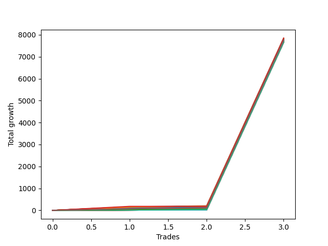

# Short Wallace Doodle 015 
- Symbol: NQ
- Date Range: 03/18/2022 - 06/17/2022
- Trading Period: 7:20-12:30
- Number of Trades: 3



| Name | Win Percent | Profit | Avg Profit / Trade |     | Name | Win Percent | Profit | Avg Profit / Trade |
| ---- | ----------- | ------ | ------------------ | --- | ---- | ----------- | ------ | ------------------ |
| Sorted By <br> Profit | | | | | Sorted By <br> Win Percentage ||||
| Seventy-Three | 66.67 | 3924125.00 | 1308041.67 |     | Five | 100.00 | 3923875.00 | 1307958.33 |
| Five | 100.00 | 3923875.00 | 1307958.33 |     | Seventy-One | 100.00 | 3916750.00 | 1305583.33 |
| Seventy-One | 100.00 | 3916750.00 | 1305583.33 |     | Fifty-Five | 100.00 | 3916750.00 | 1305583.33 |
| Fifty-Five | 100.00 | 3916750.00 | 1305583.33 |     | Thirty-Nine | 100.00 | 3916750.00 | 1305583.33 |
| Thirty-Nine | 100.00 | 3916750.00 | 1305583.33 |     | Twenty-Three | 100.00 | 3916750.00 | 1305583.33 |
| Twenty-Three | 100.00 | 3916750.00 | 1305583.33 |     | Seven | 100.00 | 3916750.00 | 1305583.33 |
| Seven | 100.00 | 3916750.00 | 1305583.33 |     | Forty-Five | 100.00 | 3905375.00 | 1301791.67 |
| Forty-Five | 100.00 | 3905375.00 | 1301791.67 |     | Twenty-Nine | 100.00 | 3905375.00 | 1301791.67 |
| Twenty-Nine | 100.00 | 3905375.00 | 1301791.67 |     | Sixty-One | 100.00 | 3904625.00 | 1301541.67 |
| Sixty-One | 100.00 | 3904625.00 | 1301541.67 |     | Four | 100.00 | 3901625.00 | 1300541.67 |
| Four | 100.00 | 3901625.00 | 1300541.67 |     | Seventy | 100.00 | 3892000.00 | 1297333.33 |
| Fifteen | 66.67 | 3892500.00 | 1297500.00 |     | Fifty-Four | 100.00 | 3892000.00 | 1297333.33 |
| Seventy | 100.00 | 3892000.00 | 1297333.33 |     | Thirty-Eight | 100.00 | 3892000.00 | 1297333.33 |
| Fifty-Four | 100.00 | 3892000.00 | 1297333.33 |     | Twenty-Two | 100.00 | 3892000.00 | 1297333.33 |
| Thirty-Eight | 100.00 | 3892000.00 | 1297333.33 |     | Six | 100.00 | 3892000.00 | 1297333.33 |
| Twenty-Two | 100.00 | 3892000.00 | 1297333.33 |     | Seventy-Five | 100.00 | 3891000.00 | 1297000.00 |
| Six | 100.00 | 3892000.00 | 1297333.33 |     | Two | 100.00 | 3889625.00 | 1296541.67 |
| Thirty-One | 66.67 | 3891750.00 | 1297250.00 |     | Three | 100.00 | 3886250.00 | 1295416.67 |
| Seventy-Five | 100.00 | 3891000.00 | 1297000.00 |     | Forty-Four | 100.00 | 3883125.00 | 1294375.00 |
| Forty-Seven | 66.67 | 3890875.00 | 1296958.33 |     | Twenty-Eight | 100.00 | 3883125.00 | 1294375.00 |
| Two | 100.00 | 3889625.00 | 1296541.67 |     | Sixty | 100.00 | 3882375.00 | 1294125.00 |
| Sixty-Three | 66.67 | 3886500.00 | 1295500.00 |     | Forty-Two | 100.00 | 3876000.00 | 1292000.00 |
| Three | 100.00 | 3886250.00 | 1295416.67 |     | Twenty-Six | 100.00 | 3876000.00 | 1292000.00 |
| Forty-Four | 100.00 | 3883125.00 | 1294375.00 |     | Fifty-Eight | 100.00 | 3875250.00 | 1291750.00 |
| Twenty-Eight | 100.00 | 3883125.00 | 1294375.00 |     | Seventy-Four | 100.00 | 3873875.00 | 1291291.67 |
| Sixty | 100.00 | 3882375.00 | 1294125.00 |     | Zero | 100.00 | 3869625.00 | 1289875.00 |
| Forty-Two | 100.00 | 3876000.00 | 1292000.00 |     | One | 100.00 | 3869500.00 | 1289833.33 |
| Twenty-Six | 100.00 | 3876000.00 | 1292000.00 |     | Forty-Three | 100.00 | 3866875.00 | 1288958.33 |
| Fifty-Eight | 100.00 | 3875250.00 | 1291750.00 |     | twenty-Seven | 100.00 | 3866875.00 | 1288958.33 |
| Seventy-Four | 100.00 | 3873875.00 | 1291291.67 |     | Fifty-Nine | 100.00 | 3866125.00 | 1288708.33 |
| Zero | 100.00 | 3869625.00 | 1289875.00 |     | Forty-One | 100.00 | 3861500.00 | 1287166.67 |
| One | 100.00 | 3869500.00 | 1289833.33 |     | Twenty-Five | 100.00 | 3861500.00 | 1287166.67 |
| Fourteen | 66.67 | 3867750.00 | 1289250.00 |     | Fifty-Seven | 100.00 | 3860750.00 | 1286916.67 |
| Thirty | 66.67 | 3867000.00 | 1289000.00 |     | Seventy-Two | 100.00 | 3851750.00 | 1283916.67 |
| Forty-Three | 100.00 | 3866875.00 | 1288958.33 |     | Forty | 100.00 | 3850125.00 | 1283375.00 |
| twenty-Seven | 100.00 | 3866875.00 | 1288958.33 |     | Twenty-Four | 100.00 | 3850125.00 | 1283375.00 |
| Fifty-Nine | 100.00 | 3866125.00 | 1288708.33 |     | Fifty-Six | 100.00 | 3849375.00 | 1283125.00 |
| Forty-Six | 66.67 | 3866125.00 | 1288708.33 |     | Sixty-Nine | 100.00 | 3830750.00 | 1276916.67 |
| Sixty-Two | 66.67 | 3861750.00 | 1287250.00 |     | Sixty-Eight | 100.00 | 3830750.00 | 1276916.67 |
| Forty-One | 100.00 | 3861500.00 | 1287166.67 |     | Sixty-Seven | 100.00 | 3830750.00 | 1276916.67 |
| Twenty-Five | 100.00 | 3861500.00 | 1287166.67 |     | Sixty-Six | 100.00 | 3830750.00 | 1276916.67 |
| Fifty-Seven | 100.00 | 3860750.00 | 1286916.67 |     | Sixty-Five | 100.00 | 3830750.00 | 1276916.67 |
| Seventy-Two | 100.00 | 3851750.00 | 1283916.67 |     | Sixty-Four | 100.00 | 3830750.00 | 1276916.67 |
| Forty | 100.00 | 3850125.00 | 1283375.00 |     | Fifty-Three | 100.00 | 3829875.00 | 1276625.00 |
| Twenty-Four | 100.00 | 3850125.00 | 1283375.00 |     | Fifty-Two | 100.00 | 3829875.00 | 1276625.00 |
| Fifty-Six | 100.00 | 3849375.00 | 1283125.00 |     | Fifty-One | 100.00 | 3829875.00 | 1276625.00 |
| Sixty-Nine | 100.00 | 3830750.00 | 1276916.67 |     | Fifty | 100.00 | 3829875.00 | 1276625.00 |
| Sixty-Eight | 100.00 | 3830750.00 | 1276916.67 |     | Forty-Nine | 100.00 | 3829875.00 | 1276625.00 |
| Sixty-Seven | 100.00 | 3830750.00 | 1276916.67 |     | Forty-Eight | 100.00 | 3829875.00 | 1276625.00 |
| Sixty-Six | 100.00 | 3830750.00 | 1276916.67 |     | Thirty-Seven | 100.00 | 3829875.00 | 1276625.00 |
| Sixty-Five | 100.00 | 3830750.00 | 1276916.67 |     | Thirty-Six | 100.00 | 3829875.00 | 1276625.00 |
| Sixty-Four | 100.00 | 3830750.00 | 1276916.67 |     | Thirty-Five | 100.00 | 3829875.00 | 1276625.00 |
| Fifty-Three | 100.00 | 3829875.00 | 1276625.00 |     | Thirty-Four | 100.00 | 3829875.00 | 1276625.00 |
| Fifty-Two | 100.00 | 3829875.00 | 1276625.00 |     | Thirty-Three | 100.00 | 3829875.00 | 1276625.00 |
| Fifty-One | 100.00 | 3829875.00 | 1276625.00 |     | Thirty-Two | 100.00 | 3829875.00 | 1276625.00 |
| Fifty | 100.00 | 3829875.00 | 1276625.00 |     | Twenty-One | 100.00 | 3829875.00 | 1276625.00 |
| Forty-Nine | 100.00 | 3829875.00 | 1276625.00 |     | Twenty | 100.00 | 3829875.00 | 1276625.00 |
| Forty-Eight | 100.00 | 3829875.00 | 1276625.00 |     | Nineteen | 100.00 | 3829875.00 | 1276625.00 |
| Thirty-Seven | 100.00 | 3829875.00 | 1276625.00 |     | Eighteen | 100.00 | 3829875.00 | 1276625.00 |
| Thirty-Six | 100.00 | 3829875.00 | 1276625.00 |     | Seventeen | 100.00 | 3829875.00 | 1276625.00 |
| Thirty-Five | 100.00 | 3829875.00 | 1276625.00 |     | Sixten | 100.00 | 3829875.00 | 1276625.00 |
| Thirty-Four | 100.00 | 3829875.00 | 1276625.00 |     | Thirteen | 100.00 | 3829875.00 | 1276625.00 |
| Thirty-Three | 100.00 | 3829875.00 | 1276625.00 |     | Twelve | 100.00 | 3829875.00 | 1276625.00 |
| Thirty-Two | 100.00 | 3829875.00 | 1276625.00 |     | Eleven | 100.00 | 3829875.00 | 1276625.00 |
| Twenty-One | 100.00 | 3829875.00 | 1276625.00 |     | Ten | 100.00 | 3829875.00 | 1276625.00 |
| Twenty | 100.00 | 3829875.00 | 1276625.00 |     | Nine | 100.00 | 3829875.00 | 1276625.00 |
| Nineteen | 100.00 | 3829875.00 | 1276625.00 |     | Eight | 100.00 | 3829875.00 | 1276625.00 |
| Eighteen | 100.00 | 3829875.00 | 1276625.00 |     | Seventy-Three | 66.67 | 3924125.00 | 1308041.67 |
| Seventeen | 100.00 | 3829875.00 | 1276625.00 |     | Fifteen | 66.67 | 3892500.00 | 1297500.00 |
| Sixten | 100.00 | 3829875.00 | 1276625.00 |     | Thirty-One | 66.67 | 3891750.00 | 1297250.00 |
| Thirteen | 100.00 | 3829875.00 | 1276625.00 |     | Forty-Seven | 66.67 | 3890875.00 | 1296958.33 |
| Twelve | 100.00 | 3829875.00 | 1276625.00 |     | Sixty-Three | 66.67 | 3886500.00 | 1295500.00 |
| Eleven | 100.00 | 3829875.00 | 1276625.00 |     | Fourteen | 66.67 | 3867750.00 | 1289250.00 |
| Ten | 100.00 | 3829875.00 | 1276625.00 |     | Thirty | 66.67 | 3867000.00 | 1289000.00 |
| Nine | 100.00 | 3829875.00 | 1276625.00 |     | Forty-Six | 66.67 | 3866125.00 | 1288708.33 |
| Eight | 100.00 | 3829875.00 | 1276625.00 |     | Sixty-Two | 66.67 | 3861750.00 | 1287250.00 |

## NO STOPLOSS

### Test Zero
* Sell when price hits the middle line of the 20p bollinger
* No Stoploss
* Results:
```
Total Trades: 3
Percent Up: 0.00
Percent Down: 100.00
Total Points Moved Down: 7739.25
Potential Profit: 3869625.00
Total Points Ups: 0.00 Count Ups: 0
Total Points Downs: 7739.25 Count Downs: 3
```

<details><summary>Trades</summary>

<code>In: 2022-04-06 11:04:00		Out: 2022-04-06 11:06:05		Total Position Time: 02:05		Total Move Down: 49.75		Total to Date: 49.75</code> <br />
<code>In: 2022-05-03 08:10:00		Out: 2022-05-03 08:17:35		Total Position Time: 07:35		Total Move Down: 48.25		Total to Date: 98.00</code> <br />
<code>In: 2022-06-14 10:19:00		Out: 2022-06-14 10:19:10		Total Position Time: 00:10		Total Move Down: 7641.25		Total to Date: 7739.25</code> <br />


</details>

### Test One
* Sell when the price hits the upper line of the 20p 1std bollinger
* No Stoploss
* Results:
```
Total Trades: 3
Percent Up: 0.00
Percent Down: 100.00
Total Points Moved Down: 7739.00
Potential Profit: 3869500.00
Total Points Ups: 0.00 Count Ups: 0
Total Points Downs: 7739.00 Count Downs: 3
```

<details><summary>Trades</summary>

<code>In: 2022-04-06 11:04:00		Out: 2022-04-06 11:07:25		Total Position Time: 03:25		Total Move Down: 72.50		Total to Date: 72.50</code> <br />
<code>In: 2022-05-03 08:10:00		Out: 2022-05-03 08:28:35		Total Position Time: 18:35		Total Move Down: 25.25		Total to Date: 97.75</code> <br />
<code>In: 2022-06-14 10:19:00		Out: 2022-06-14 10:19:10		Total Position Time: 00:10		Total Move Down: 7641.25		Total to Date: 7739.00</code> <br />


</details>

### Test Two
* Sell when the price hits the upper line of the 20p 2std bollinger
* No Stoploss
* Results:
```
Total Trades: 3
Percent Up: 0.00
Percent Down: 100.00
Total Points Moved Down: 7779.25
Potential Profit: 3889625.00
Total Points Ups: 0.00 Count Ups: 0
Total Points Downs: 7779.25 Count Downs: 3
```

<details><summary>Trades</summary>

<code>In: 2022-04-06 11:04:00		Out: 2022-04-06 11:08:25		Total Position Time: 04:25		Total Move Down: 101.50		Total to Date: 101.50</code> <br />
<code>In: 2022-05-03 08:10:00		Out: 2022-05-03 08:35:55		Total Position Time: 25:55		Total Move Down: 36.50		Total to Date: 138.00</code> <br />
<code>In: 2022-06-14 10:19:00		Out: 2022-06-14 10:19:10		Total Position Time: 00:10		Total Move Down: 7641.25		Total to Date: 7779.25</code> <br />


</details>

### Test Three
* Sell when price hits the middle line of the 50p bollinger
* No Stoploss
* Results:
```
Total Trades: 3
Percent Up: 0.00
Percent Down: 100.00
Total Points Moved Down: 7772.50
Potential Profit: 3886250.00
Total Points Ups: 0.00 Count Ups: 0
Total Points Downs: 7772.50 Count Downs: 3
```

<details><summary>Trades</summary>

<code>In: 2022-04-06 11:04:00		Out: 2022-04-06 11:07:35		Total Position Time: 03:35		Total Move Down: 83.25		Total to Date: 83.25</code> <br />
<code>In: 2022-05-03 08:10:00		Out: 2022-05-03 08:39:05		Total Position Time: 29:05		Total Move Down: 48.00		Total to Date: 131.25</code> <br />
<code>In: 2022-06-14 10:19:00		Out: 2022-06-14 10:19:10		Total Position Time: 00:10		Total Move Down: 7641.25		Total to Date: 7772.50</code> <br />


</details>

### Test Four
* Sell when the price hits the upper line of the 50p 1std bollinger
* No Stoploss
* Results:
```
Total Trades: 3
Percent Up: 0.00
Percent Down: 100.00
Total Points Moved Down: 7803.25
Potential Profit: 3901625.00
Total Points Ups: 0.00 Count Ups: 0
Total Points Downs: 7803.25 Count Downs: 3
```

<details><summary>Trades</summary>

<code>In: 2022-04-06 11:04:00		Out: 2022-04-06 11:09:20		Total Position Time: 05:20		Total Move Down: 115.75		Total to Date: 115.75</code> <br />
<code>In: 2022-05-03 08:10:00		Out: 2022-05-03 08:39:55		Total Position Time: 29:55		Total Move Down: 46.25		Total to Date: 162.00</code> <br />
<code>In: 2022-06-14 10:19:00		Out: 2022-06-14 10:19:10		Total Position Time: 00:10		Total Move Down: 7641.25		Total to Date: 7803.25</code> <br />


</details>

### Test Five
* Sell when the price hits the upper line of the 50p 2std bollinger
* No Stoploss
* Results:
```
Total Trades: 3
Percent Up: 0.00
Percent Down: 100.00
Total Points Moved Down: 7847.75
Potential Profit: 3923875.00
Total Points Ups: 0.00 Count Ups: 0
Total Points Downs: 7847.75 Count Downs: 3
```

<details><summary>Trades</summary>

<code>In: 2022-04-06 11:04:00		Out: 2022-04-06 11:14:50		Total Position Time: 10:50		Total Move Down: 160.25		Total to Date: 160.25</code> <br />
<code>In: 2022-05-03 08:10:00		Out: 2022-05-03 08:39:55		Total Position Time: 29:55		Total Move Down: 46.25		Total to Date: 206.50</code> <br />
<code>In: 2022-06-14 10:19:00		Out: 2022-06-14 10:19:10		Total Position Time: 00:10		Total Move Down: 7641.25		Total to Date: 7847.75</code> <br />


</details>

### Test Six
* Sell when the price hits the middle line of the 1std VWAP
* No Stoploss
* Results:
```
Total Trades: 3
Percent Up: 0.00
Percent Down: 100.00
Total Points Moved Down: 7784.00
Potential Profit: 3892000.00
Total Points Ups: 0.00 Count Ups: 0
Total Points Downs: 7784.00 Count Downs: 3
```

<details><summary>Trades</summary>

<code>In: 2022-04-06 11:04:00		Out: 2022-04-06 11:08:10		Total Position Time: 04:10		Total Move Down: 96.50		Total to Date: 96.50</code> <br />
<code>In: 2022-05-03 08:10:00		Out: 2022-05-03 08:39:55		Total Position Time: 29:55		Total Move Down: 46.25		Total to Date: 142.75</code> <br />
<code>In: 2022-06-14 10:19:00		Out: 2022-06-14 10:19:10		Total Position Time: 00:10		Total Move Down: 7641.25		Total to Date: 7784.00</code> <br />


</details>

### Test Seven
* Sell when the price hits the upper line of the 1std VWAP
* No Stoploss
* Results:
```
Total Trades: 3
Percent Up: 0.00
Percent Down: 100.00
Total Points Moved Down: 7833.50
Potential Profit: 3916750.00
Total Points Ups: 0.00 Count Ups: 0
Total Points Downs: 7833.50 Count Downs: 3
```

<details><summary>Trades</summary>

<code>In: 2022-04-06 11:04:00		Out: 2022-04-06 11:13:00		Total Position Time: 09:00		Total Move Down: 146.00		Total to Date: 146.00</code> <br />
<code>In: 2022-05-03 08:10:00		Out: 2022-05-03 08:39:55		Total Position Time: 29:55		Total Move Down: 46.25		Total to Date: 192.25</code> <br />
<code>In: 2022-06-14 10:19:00		Out: 2022-06-14 10:19:10		Total Position Time: 00:10		Total Move Down: 7641.25		Total to Date: 7833.50</code> <br />


</details>

## STOPLOSS OF 2

### Test Eight
* Sell when price hits the middle line of the 20p bollinger
* Stoploss is -2 points
* Results:
```
Total Trades: 3
Percent Up: 0.00
Percent Down: 100.00
Total Points Moved Down: 7659.75
Potential Profit: 3829875.00
Total Points Ups: 0.00 Count Ups: 0
Total Points Downs: 7659.75 Count Downs: 3
```

<details><summary>Trades</summary>

<code>In: 2022-04-06 11:04:00		Out: 2022-04-06 11:04:15		Total Position Time: 00:15		Total Move Down: 9.25		Total to Date: 9.25</code> <br />
<code>In: 2022-05-03 08:10:00		Out: 2022-05-03 08:10:10		Total Position Time: 00:10		Total Move Down: 9.25		Total to Date: 18.50</code> <br />
<code>In: 2022-06-14 10:19:00		Out: 2022-06-14 10:19:10		Total Position Time: 00:10		Total Move Down: 7641.25		Total to Date: 7659.75</code> <br />


</details>

### Test Nine
* Sell when the price hits the upper line of the 20p 1std bollinger
* Stoploss is -2 points
* Results:
```
Total Trades: 3
Percent Up: 0.00
Percent Down: 100.00
Total Points Moved Down: 7659.75
Potential Profit: 3829875.00
Total Points Ups: 0.00 Count Ups: 0
Total Points Downs: 7659.75 Count Downs: 3
```

<details><summary>Trades</summary>

<code>In: 2022-04-06 11:04:00		Out: 2022-04-06 11:04:15		Total Position Time: 00:15		Total Move Down: 9.25		Total to Date: 9.25</code> <br />
<code>In: 2022-05-03 08:10:00		Out: 2022-05-03 08:10:10		Total Position Time: 00:10		Total Move Down: 9.25		Total to Date: 18.50</code> <br />
<code>In: 2022-06-14 10:19:00		Out: 2022-06-14 10:19:10		Total Position Time: 00:10		Total Move Down: 7641.25		Total to Date: 7659.75</code> <br />


</details>

### Test Ten
* Sell when the price hits the upper line of the 20p 2std bollinger
* Stoploss is -2 points
* Results:
```
Total Trades: 3
Percent Up: 0.00
Percent Down: 100.00
Total Points Moved Down: 7659.75
Potential Profit: 3829875.00
Total Points Ups: 0.00 Count Ups: 0
Total Points Downs: 7659.75 Count Downs: 3
```

<details><summary>Trades</summary>

<code>In: 2022-04-06 11:04:00		Out: 2022-04-06 11:04:15		Total Position Time: 00:15		Total Move Down: 9.25		Total to Date: 9.25</code> <br />
<code>In: 2022-05-03 08:10:00		Out: 2022-05-03 08:10:10		Total Position Time: 00:10		Total Move Down: 9.25		Total to Date: 18.50</code> <br />
<code>In: 2022-06-14 10:19:00		Out: 2022-06-14 10:19:10		Total Position Time: 00:10		Total Move Down: 7641.25		Total to Date: 7659.75</code> <br />


</details>

### Test Eleven
* Sell when price hits the middle line of the 50p bollinger
* Stoploss is -2 points
* Results:
```
Total Trades: 3
Percent Up: 0.00
Percent Down: 100.00
Total Points Moved Down: 7659.75
Potential Profit: 3829875.00
Total Points Ups: 0.00 Count Ups: 0
Total Points Downs: 7659.75 Count Downs: 3
```

<details><summary>Trades</summary>

<code>In: 2022-04-06 11:04:00		Out: 2022-04-06 11:04:15		Total Position Time: 00:15		Total Move Down: 9.25		Total to Date: 9.25</code> <br />
<code>In: 2022-05-03 08:10:00		Out: 2022-05-03 08:10:10		Total Position Time: 00:10		Total Move Down: 9.25		Total to Date: 18.50</code> <br />
<code>In: 2022-06-14 10:19:00		Out: 2022-06-14 10:19:10		Total Position Time: 00:10		Total Move Down: 7641.25		Total to Date: 7659.75</code> <br />


</details>

### Test Twelve
* Sell when the price hits the upper line of the 50p 1std bollinger
* Stoploss is -2 points
* Results:
```
Total Trades: 3
Percent Up: 0.00
Percent Down: 100.00
Total Points Moved Down: 7659.75
Potential Profit: 3829875.00
Total Points Ups: 0.00 Count Ups: 0
Total Points Downs: 7659.75 Count Downs: 3
```

<details><summary>Trades</summary>

<code>In: 2022-04-06 11:04:00		Out: 2022-04-06 11:04:15		Total Position Time: 00:15		Total Move Down: 9.25		Total to Date: 9.25</code> <br />
<code>In: 2022-05-03 08:10:00		Out: 2022-05-03 08:10:10		Total Position Time: 00:10		Total Move Down: 9.25		Total to Date: 18.50</code> <br />
<code>In: 2022-06-14 10:19:00		Out: 2022-06-14 10:19:10		Total Position Time: 00:10		Total Move Down: 7641.25		Total to Date: 7659.75</code> <br />


</details>

### Test Thirteen
* Sell when the price hits the upper line of the 50p 2std bollinger
* Stoploss is -2 points
* Results:
```
Total Trades: 3
Percent Up: 0.00
Percent Down: 100.00
Total Points Moved Down: 7659.75
Potential Profit: 3829875.00
Total Points Ups: 0.00 Count Ups: 0
Total Points Downs: 7659.75 Count Downs: 3
```

<details><summary>Trades</summary>

<code>In: 2022-04-06 11:04:00		Out: 2022-04-06 11:04:15		Total Position Time: 00:15		Total Move Down: 9.25		Total to Date: 9.25</code> <br />
<code>In: 2022-05-03 08:10:00		Out: 2022-05-03 08:10:10		Total Position Time: 00:10		Total Move Down: 9.25		Total to Date: 18.50</code> <br />
<code>In: 2022-06-14 10:19:00		Out: 2022-06-14 10:19:10		Total Position Time: 00:10		Total Move Down: 7641.25		Total to Date: 7659.75</code> <br />


</details>

### Test Fourteen
* Sell when the price hits the middle line of the 1std VWAP
* Stoploss is -2 points
* Results:
```
Total Trades: 3
Percent Up: 33.33
Percent Down: 66.67
Total Points Moved Down: 7735.50
Potential Profit: 3867750.00
Total Points Ups: 2.25 Count Ups: 1
Total Points Downs: 7737.75 Count Downs: 2
```

<details><summary>Trades</summary>

<code>In: 2022-04-06 11:04:00		Out: 2022-04-06 11:08:10		Total Position Time: 04:10		Total Move Down: 96.50		Total to Date: 96.50</code> <br />
<code>In: 2022-05-03 08:10:00		Out: 2022-05-03 08:15:05		Total Position Time: 05:05		Total Move Down: -2.25		Total to Date: 94.25</code> <br />
<code>In: 2022-06-14 10:19:00		Out: 2022-06-14 10:19:10		Total Position Time: 00:10		Total Move Down: 7641.25		Total to Date: 7735.50</code> <br />


</details>

### Test Fifteen
* Sell when the price hits the upper line of the 1std VWAP
* Stoploss is -2 points
* Results:
```
Total Trades: 3
Percent Up: 33.33
Percent Down: 66.67
Total Points Moved Down: 7785.00
Potential Profit: 3892500.00
Total Points Ups: 2.25 Count Ups: 1
Total Points Downs: 7787.25 Count Downs: 2
```

<details><summary>Trades</summary>

<code>In: 2022-04-06 11:04:00		Out: 2022-04-06 11:13:00		Total Position Time: 09:00		Total Move Down: 146.00		Total to Date: 146.00</code> <br />
<code>In: 2022-05-03 08:10:00		Out: 2022-05-03 08:15:05		Total Position Time: 05:05		Total Move Down: -2.25		Total to Date: 143.75</code> <br />
<code>In: 2022-06-14 10:19:00		Out: 2022-06-14 10:19:10		Total Position Time: 00:10		Total Move Down: 7641.25		Total to Date: 7785.00</code> <br />


</details>

## TRAIL STOP OF 2

### Test Sixten
* Sell when price hits the middle line of the 20p bollinger
* Trailing Stop is -2 points
* Results:
```
Total Trades: 3
Percent Up: 0.00
Percent Down: 100.00
Total Points Moved Down: 7659.75
Potential Profit: 3829875.00
Total Points Ups: 0.00 Count Ups: 0
Total Points Downs: 7659.75 Count Downs: 3
```

<details><summary>Trades</summary>

<code>In: 2022-04-06 11:04:00		Out: 2022-04-06 11:04:15		Total Position Time: 00:15		Total Move Down: 9.25		Total to Date: 9.25</code> <br />
<code>In: 2022-05-03 08:10:00		Out: 2022-05-03 08:10:10		Total Position Time: 00:10		Total Move Down: 9.25		Total to Date: 18.50</code> <br />
<code>In: 2022-06-14 10:19:00		Out: 2022-06-14 10:19:10		Total Position Time: 00:10		Total Move Down: 7641.25		Total to Date: 7659.75</code> <br />


</details>

### Test Seventeen
* Sell when the price hits the upper line of the 20p 1std bollinger
* Trailing Stop is -2 points
* Results:
```
Total Trades: 3
Percent Up: 0.00
Percent Down: 100.00
Total Points Moved Down: 7659.75
Potential Profit: 3829875.00
Total Points Ups: 0.00 Count Ups: 0
Total Points Downs: 7659.75 Count Downs: 3
```

<details><summary>Trades</summary>

<code>In: 2022-04-06 11:04:00		Out: 2022-04-06 11:04:15		Total Position Time: 00:15		Total Move Down: 9.25		Total to Date: 9.25</code> <br />
<code>In: 2022-05-03 08:10:00		Out: 2022-05-03 08:10:10		Total Position Time: 00:10		Total Move Down: 9.25		Total to Date: 18.50</code> <br />
<code>In: 2022-06-14 10:19:00		Out: 2022-06-14 10:19:10		Total Position Time: 00:10		Total Move Down: 7641.25		Total to Date: 7659.75</code> <br />


</details>

### Test Eighteen
* Sell when the price hits the upper line of the 20p 2std bollinger
* Trailing Stop is -2 points
* Results:
```
Total Trades: 3
Percent Up: 0.00
Percent Down: 100.00
Total Points Moved Down: 7659.75
Potential Profit: 3829875.00
Total Points Ups: 0.00 Count Ups: 0
Total Points Downs: 7659.75 Count Downs: 3
```

<details><summary>Trades</summary>

<code>In: 2022-04-06 11:04:00		Out: 2022-04-06 11:04:15		Total Position Time: 00:15		Total Move Down: 9.25		Total to Date: 9.25</code> <br />
<code>In: 2022-05-03 08:10:00		Out: 2022-05-03 08:10:10		Total Position Time: 00:10		Total Move Down: 9.25		Total to Date: 18.50</code> <br />
<code>In: 2022-06-14 10:19:00		Out: 2022-06-14 10:19:10		Total Position Time: 00:10		Total Move Down: 7641.25		Total to Date: 7659.75</code> <br />


</details>

### Test Nineteen
* Sell when price hits the middle line of the 50p bollinger
* Trailing Stop is -2 points
* Results:
```
Total Trades: 3
Percent Up: 0.00
Percent Down: 100.00
Total Points Moved Down: 7659.75
Potential Profit: 3829875.00
Total Points Ups: 0.00 Count Ups: 0
Total Points Downs: 7659.75 Count Downs: 3
```

<details><summary>Trades</summary>

<code>In: 2022-04-06 11:04:00		Out: 2022-04-06 11:04:15		Total Position Time: 00:15		Total Move Down: 9.25		Total to Date: 9.25</code> <br />
<code>In: 2022-05-03 08:10:00		Out: 2022-05-03 08:10:10		Total Position Time: 00:10		Total Move Down: 9.25		Total to Date: 18.50</code> <br />
<code>In: 2022-06-14 10:19:00		Out: 2022-06-14 10:19:10		Total Position Time: 00:10		Total Move Down: 7641.25		Total to Date: 7659.75</code> <br />


</details>

### Test Twenty
* Sell when the price hits the upper line of the 50p 1std bollinger
* Trailing Stop is -2 points
* Results:
```
Total Trades: 3
Percent Up: 0.00
Percent Down: 100.00
Total Points Moved Down: 7659.75
Potential Profit: 3829875.00
Total Points Ups: 0.00 Count Ups: 0
Total Points Downs: 7659.75 Count Downs: 3
```

<details><summary>Trades</summary>

<code>In: 2022-04-06 11:04:00		Out: 2022-04-06 11:04:15		Total Position Time: 00:15		Total Move Down: 9.25		Total to Date: 9.25</code> <br />
<code>In: 2022-05-03 08:10:00		Out: 2022-05-03 08:10:10		Total Position Time: 00:10		Total Move Down: 9.25		Total to Date: 18.50</code> <br />
<code>In: 2022-06-14 10:19:00		Out: 2022-06-14 10:19:10		Total Position Time: 00:10		Total Move Down: 7641.25		Total to Date: 7659.75</code> <br />


</details>

### Test Twenty-One
* Sell when the price hits the upper line of the 50p 2std bollinger
* Trailing Stop is -2 points
* Results:
```
Total Trades: 3
Percent Up: 0.00
Percent Down: 100.00
Total Points Moved Down: 7659.75
Potential Profit: 3829875.00
Total Points Ups: 0.00 Count Ups: 0
Total Points Downs: 7659.75 Count Downs: 3
```

<details><summary>Trades</summary>

<code>In: 2022-04-06 11:04:00		Out: 2022-04-06 11:04:15		Total Position Time: 00:15		Total Move Down: 9.25		Total to Date: 9.25</code> <br />
<code>In: 2022-05-03 08:10:00		Out: 2022-05-03 08:10:10		Total Position Time: 00:10		Total Move Down: 9.25		Total to Date: 18.50</code> <br />
<code>In: 2022-06-14 10:19:00		Out: 2022-06-14 10:19:10		Total Position Time: 00:10		Total Move Down: 7641.25		Total to Date: 7659.75</code> <br />


</details>

### Test Twenty-Two
* Sell when the price hits the middle line of the 1std VWAP
* Trailing Stop is -2 points
* Results:
```
Total Trades: 3
Percent Up: 0.00
Percent Down: 100.00
Total Points Moved Down: 7784.00
Potential Profit: 3892000.00
Total Points Ups: 0.00 Count Ups: 0
Total Points Downs: 7784.00 Count Downs: 3
```

<details><summary>Trades</summary>

<code>In: 2022-04-06 11:04:00		Out: 2022-04-06 11:08:10		Total Position Time: 04:10		Total Move Down: 96.50		Total to Date: 96.50</code> <br />
<code>In: 2022-05-03 08:10:00		Out: 2022-05-03 08:39:55		Total Position Time: 29:55		Total Move Down: 46.25		Total to Date: 142.75</code> <br />
<code>In: 2022-06-14 10:19:00		Out: 2022-06-14 10:19:10		Total Position Time: 00:10		Total Move Down: 7641.25		Total to Date: 7784.00</code> <br />


</details>

### Test Twenty-Three
* Sell when the price hits the upper line of the 1std VWAP
* Trailing Stop is -2 points
* Results:
```
Total Trades: 3
Percent Up: 0.00
Percent Down: 100.00
Total Points Moved Down: 7833.50
Potential Profit: 3916750.00
Total Points Ups: 0.00 Count Ups: 0
Total Points Downs: 7833.50 Count Downs: 3
```

<details><summary>Trades</summary>

<code>In: 2022-04-06 11:04:00		Out: 2022-04-06 11:13:00		Total Position Time: 09:00		Total Move Down: 146.00		Total to Date: 146.00</code> <br />
<code>In: 2022-05-03 08:10:00		Out: 2022-05-03 08:39:55		Total Position Time: 29:55		Total Move Down: 46.25		Total to Date: 192.25</code> <br />
<code>In: 2022-06-14 10:19:00		Out: 2022-06-14 10:19:10		Total Position Time: 00:10		Total Move Down: 7641.25		Total to Date: 7833.50</code> <br />


</details>

## STOPLOSS OF 3

### Test Twenty-Four
* Sell when price hits the middle line of the 20p bollinger
* Stoploss is -3 points
* Results:
```
Total Trades: 3
Percent Up: 0.00
Percent Down: 100.00
Total Points Moved Down: 7700.25
Potential Profit: 3850125.00
Total Points Ups: 0.00 Count Ups: 0
Total Points Downs: 7700.25 Count Downs: 3
```

<details><summary>Trades</summary>

<code>In: 2022-04-06 11:04:00		Out: 2022-04-06 11:06:05		Total Position Time: 02:05		Total Move Down: 49.75		Total to Date: 49.75</code> <br />
<code>In: 2022-05-03 08:10:00		Out: 2022-05-03 08:10:10		Total Position Time: 00:10		Total Move Down: 9.25		Total to Date: 59.00</code> <br />
<code>In: 2022-06-14 10:19:00		Out: 2022-06-14 10:19:10		Total Position Time: 00:10		Total Move Down: 7641.25		Total to Date: 7700.25</code> <br />


</details>

### Test Twenty-Five
* Sell when the price hits the upper line of the 20p 1std bollinger
* Stoploss is -3 points
* Results:
```
Total Trades: 3
Percent Up: 0.00
Percent Down: 100.00
Total Points Moved Down: 7723.00
Potential Profit: 3861500.00
Total Points Ups: 0.00 Count Ups: 0
Total Points Downs: 7723.00 Count Downs: 3
```

<details><summary>Trades</summary>

<code>In: 2022-04-06 11:04:00		Out: 2022-04-06 11:07:25		Total Position Time: 03:25		Total Move Down: 72.50		Total to Date: 72.50</code> <br />
<code>In: 2022-05-03 08:10:00		Out: 2022-05-03 08:10:10		Total Position Time: 00:10		Total Move Down: 9.25		Total to Date: 81.75</code> <br />
<code>In: 2022-06-14 10:19:00		Out: 2022-06-14 10:19:10		Total Position Time: 00:10		Total Move Down: 7641.25		Total to Date: 7723.00</code> <br />


</details>

### Test Twenty-Six
* Sell when the price hits the upper line of the 20p 2std bollinger
* Stoploss is -3 points
* Results:
```
Total Trades: 3
Percent Up: 0.00
Percent Down: 100.00
Total Points Moved Down: 7752.00
Potential Profit: 3876000.00
Total Points Ups: 0.00 Count Ups: 0
Total Points Downs: 7752.00 Count Downs: 3
```

<details><summary>Trades</summary>

<code>In: 2022-04-06 11:04:00		Out: 2022-04-06 11:08:25		Total Position Time: 04:25		Total Move Down: 101.50		Total to Date: 101.50</code> <br />
<code>In: 2022-05-03 08:10:00		Out: 2022-05-03 08:10:10		Total Position Time: 00:10		Total Move Down: 9.25		Total to Date: 110.75</code> <br />
<code>In: 2022-06-14 10:19:00		Out: 2022-06-14 10:19:10		Total Position Time: 00:10		Total Move Down: 7641.25		Total to Date: 7752.00</code> <br />


</details>

### Test twenty-Seven
* Sell when price hits the middle line of the 50p bollinger
* Stoploss is -3 points
* Results:
```
Total Trades: 3
Percent Up: 0.00
Percent Down: 100.00
Total Points Moved Down: 7733.75
Potential Profit: 3866875.00
Total Points Ups: 0.00 Count Ups: 0
Total Points Downs: 7733.75 Count Downs: 3
```

<details><summary>Trades</summary>

<code>In: 2022-04-06 11:04:00		Out: 2022-04-06 11:07:35		Total Position Time: 03:35		Total Move Down: 83.25		Total to Date: 83.25</code> <br />
<code>In: 2022-05-03 08:10:00		Out: 2022-05-03 08:10:10		Total Position Time: 00:10		Total Move Down: 9.25		Total to Date: 92.50</code> <br />
<code>In: 2022-06-14 10:19:00		Out: 2022-06-14 10:19:10		Total Position Time: 00:10		Total Move Down: 7641.25		Total to Date: 7733.75</code> <br />


</details>

### Test Twenty-Eight
* Sell when the price hits the upper line of the 50p 1std bollinger
* Stoploss is -3 points
* Results:
```
Total Trades: 3
Percent Up: 0.00
Percent Down: 100.00
Total Points Moved Down: 7766.25
Potential Profit: 3883125.00
Total Points Ups: 0.00 Count Ups: 0
Total Points Downs: 7766.25 Count Downs: 3
```

<details><summary>Trades</summary>

<code>In: 2022-04-06 11:04:00		Out: 2022-04-06 11:09:20		Total Position Time: 05:20		Total Move Down: 115.75		Total to Date: 115.75</code> <br />
<code>In: 2022-05-03 08:10:00		Out: 2022-05-03 08:10:10		Total Position Time: 00:10		Total Move Down: 9.25		Total to Date: 125.00</code> <br />
<code>In: 2022-06-14 10:19:00		Out: 2022-06-14 10:19:10		Total Position Time: 00:10		Total Move Down: 7641.25		Total to Date: 7766.25</code> <br />


</details>

### Test Twenty-Nine
* Sell when the price hits the upper line of the 50p 2std bollinger
* Stoploss is -3 points
* Results:
```
Total Trades: 3
Percent Up: 0.00
Percent Down: 100.00
Total Points Moved Down: 7810.75
Potential Profit: 3905375.00
Total Points Ups: 0.00 Count Ups: 0
Total Points Downs: 7810.75 Count Downs: 3
```

<details><summary>Trades</summary>

<code>In: 2022-04-06 11:04:00		Out: 2022-04-06 11:14:50		Total Position Time: 10:50		Total Move Down: 160.25		Total to Date: 160.25</code> <br />
<code>In: 2022-05-03 08:10:00		Out: 2022-05-03 08:10:10		Total Position Time: 00:10		Total Move Down: 9.25		Total to Date: 169.50</code> <br />
<code>In: 2022-06-14 10:19:00		Out: 2022-06-14 10:19:10		Total Position Time: 00:10		Total Move Down: 7641.25		Total to Date: 7810.75</code> <br />


</details>

### Test Thirty
* Sell when the price hits the middle line of the 1std VWAP
* Stoploss is -3 points
* Results:
```
Total Trades: 3
Percent Up: 33.33
Percent Down: 66.67
Total Points Moved Down: 7734.00
Potential Profit: 3867000.00
Total Points Ups: 3.75 Count Ups: 1
Total Points Downs: 7737.75 Count Downs: 2
```

<details><summary>Trades</summary>

<code>In: 2022-04-06 11:04:00		Out: 2022-04-06 11:08:10		Total Position Time: 04:10		Total Move Down: 96.50		Total to Date: 96.50</code> <br />
<code>In: 2022-05-03 08:10:00		Out: 2022-05-03 08:15:10		Total Position Time: 05:10		Total Move Down: -3.75		Total to Date: 92.75</code> <br />
<code>In: 2022-06-14 10:19:00		Out: 2022-06-14 10:19:10		Total Position Time: 00:10		Total Move Down: 7641.25		Total to Date: 7734.00</code> <br />


</details>

### Test Thirty-One
* Sell when the price hits the upper line of the 1std VWAP
* Stoploss is -3 points
* Results:
```
Total Trades: 3
Percent Up: 33.33
Percent Down: 66.67
Total Points Moved Down: 7783.50
Potential Profit: 3891750.00
Total Points Ups: 3.75 Count Ups: 1
Total Points Downs: 7787.25 Count Downs: 2
```

<details><summary>Trades</summary>

<code>In: 2022-04-06 11:04:00		Out: 2022-04-06 11:13:00		Total Position Time: 09:00		Total Move Down: 146.00		Total to Date: 146.00</code> <br />
<code>In: 2022-05-03 08:10:00		Out: 2022-05-03 08:15:10		Total Position Time: 05:10		Total Move Down: -3.75		Total to Date: 142.25</code> <br />
<code>In: 2022-06-14 10:19:00		Out: 2022-06-14 10:19:10		Total Position Time: 00:10		Total Move Down: 7641.25		Total to Date: 7783.50</code> <br />


</details>

## TRAIL STOP OF 3

### Test Thirty-Two
* Sell when price hits the middle line of the 20p bollinger
* Trailing Stop is -3 points
* Results:
```
Total Trades: 3
Percent Up: 0.00
Percent Down: 100.00
Total Points Moved Down: 7659.75
Potential Profit: 3829875.00
Total Points Ups: 0.00 Count Ups: 0
Total Points Downs: 7659.75 Count Downs: 3
```

<details><summary>Trades</summary>

<code>In: 2022-04-06 11:04:00		Out: 2022-04-06 11:04:15		Total Position Time: 00:15		Total Move Down: 9.25		Total to Date: 9.25</code> <br />
<code>In: 2022-05-03 08:10:00		Out: 2022-05-03 08:10:10		Total Position Time: 00:10		Total Move Down: 9.25		Total to Date: 18.50</code> <br />
<code>In: 2022-06-14 10:19:00		Out: 2022-06-14 10:19:10		Total Position Time: 00:10		Total Move Down: 7641.25		Total to Date: 7659.75</code> <br />


</details>

### Test Thirty-Three
* Sell when the price hits the upper line of the 20p 1std bollinger
* Trailing Stop is -3 points
* Results:
```
Total Trades: 3
Percent Up: 0.00
Percent Down: 100.00
Total Points Moved Down: 7659.75
Potential Profit: 3829875.00
Total Points Ups: 0.00 Count Ups: 0
Total Points Downs: 7659.75 Count Downs: 3
```

<details><summary>Trades</summary>

<code>In: 2022-04-06 11:04:00		Out: 2022-04-06 11:04:15		Total Position Time: 00:15		Total Move Down: 9.25		Total to Date: 9.25</code> <br />
<code>In: 2022-05-03 08:10:00		Out: 2022-05-03 08:10:10		Total Position Time: 00:10		Total Move Down: 9.25		Total to Date: 18.50</code> <br />
<code>In: 2022-06-14 10:19:00		Out: 2022-06-14 10:19:10		Total Position Time: 00:10		Total Move Down: 7641.25		Total to Date: 7659.75</code> <br />


</details>

### Test Thirty-Four
* Sell when the price hits the upper line of the 20p 2std bollinger
* Trailing Stop is -3 points
* Results:
```
Total Trades: 3
Percent Up: 0.00
Percent Down: 100.00
Total Points Moved Down: 7659.75
Potential Profit: 3829875.00
Total Points Ups: 0.00 Count Ups: 0
Total Points Downs: 7659.75 Count Downs: 3
```

<details><summary>Trades</summary>

<code>In: 2022-04-06 11:04:00		Out: 2022-04-06 11:04:15		Total Position Time: 00:15		Total Move Down: 9.25		Total to Date: 9.25</code> <br />
<code>In: 2022-05-03 08:10:00		Out: 2022-05-03 08:10:10		Total Position Time: 00:10		Total Move Down: 9.25		Total to Date: 18.50</code> <br />
<code>In: 2022-06-14 10:19:00		Out: 2022-06-14 10:19:10		Total Position Time: 00:10		Total Move Down: 7641.25		Total to Date: 7659.75</code> <br />


</details>

### Test Thirty-Five
* Sell when price hits the middle line of the 50p bollinger
* Trailing Stop is -3 points
* Results:
```
Total Trades: 3
Percent Up: 0.00
Percent Down: 100.00
Total Points Moved Down: 7659.75
Potential Profit: 3829875.00
Total Points Ups: 0.00 Count Ups: 0
Total Points Downs: 7659.75 Count Downs: 3
```

<details><summary>Trades</summary>

<code>In: 2022-04-06 11:04:00		Out: 2022-04-06 11:04:15		Total Position Time: 00:15		Total Move Down: 9.25		Total to Date: 9.25</code> <br />
<code>In: 2022-05-03 08:10:00		Out: 2022-05-03 08:10:10		Total Position Time: 00:10		Total Move Down: 9.25		Total to Date: 18.50</code> <br />
<code>In: 2022-06-14 10:19:00		Out: 2022-06-14 10:19:10		Total Position Time: 00:10		Total Move Down: 7641.25		Total to Date: 7659.75</code> <br />


</details>

### Test Thirty-Six
* Sell when the price hits the upper line of the 50p 1std bollinger
* Trailing Stop is -3 points
* Results:
```
Total Trades: 3
Percent Up: 0.00
Percent Down: 100.00
Total Points Moved Down: 7659.75
Potential Profit: 3829875.00
Total Points Ups: 0.00 Count Ups: 0
Total Points Downs: 7659.75 Count Downs: 3
```

<details><summary>Trades</summary>

<code>In: 2022-04-06 11:04:00		Out: 2022-04-06 11:04:15		Total Position Time: 00:15		Total Move Down: 9.25		Total to Date: 9.25</code> <br />
<code>In: 2022-05-03 08:10:00		Out: 2022-05-03 08:10:10		Total Position Time: 00:10		Total Move Down: 9.25		Total to Date: 18.50</code> <br />
<code>In: 2022-06-14 10:19:00		Out: 2022-06-14 10:19:10		Total Position Time: 00:10		Total Move Down: 7641.25		Total to Date: 7659.75</code> <br />


</details>

### Test Thirty-Seven
* Sell when the price hits the upper line of the 50p 2std bollinger
* Trailing Stop is -3 points
* Results:
```
Total Trades: 3
Percent Up: 0.00
Percent Down: 100.00
Total Points Moved Down: 7659.75
Potential Profit: 3829875.00
Total Points Ups: 0.00 Count Ups: 0
Total Points Downs: 7659.75 Count Downs: 3
```

<details><summary>Trades</summary>

<code>In: 2022-04-06 11:04:00		Out: 2022-04-06 11:04:15		Total Position Time: 00:15		Total Move Down: 9.25		Total to Date: 9.25</code> <br />
<code>In: 2022-05-03 08:10:00		Out: 2022-05-03 08:10:10		Total Position Time: 00:10		Total Move Down: 9.25		Total to Date: 18.50</code> <br />
<code>In: 2022-06-14 10:19:00		Out: 2022-06-14 10:19:10		Total Position Time: 00:10		Total Move Down: 7641.25		Total to Date: 7659.75</code> <br />


</details>

### Test Thirty-Eight
* Sell when the price hits the middle line of the 1std VWAP
* Trailing Stop is -3 points
* Results:
```
Total Trades: 3
Percent Up: 0.00
Percent Down: 100.00
Total Points Moved Down: 7784.00
Potential Profit: 3892000.00
Total Points Ups: 0.00 Count Ups: 0
Total Points Downs: 7784.00 Count Downs: 3
```

<details><summary>Trades</summary>

<code>In: 2022-04-06 11:04:00		Out: 2022-04-06 11:08:10		Total Position Time: 04:10		Total Move Down: 96.50		Total to Date: 96.50</code> <br />
<code>In: 2022-05-03 08:10:00		Out: 2022-05-03 08:39:55		Total Position Time: 29:55		Total Move Down: 46.25		Total to Date: 142.75</code> <br />
<code>In: 2022-06-14 10:19:00		Out: 2022-06-14 10:19:10		Total Position Time: 00:10		Total Move Down: 7641.25		Total to Date: 7784.00</code> <br />


</details>

### Test Thirty-Nine
* Sell when the price hits the upper line of the 1std VWAP
* Trailing Stop is -3 points
* Results:
```
Total Trades: 3
Percent Up: 0.00
Percent Down: 100.00
Total Points Moved Down: 7833.50
Potential Profit: 3916750.00
Total Points Ups: 0.00 Count Ups: 0
Total Points Downs: 7833.50 Count Downs: 3
```

<details><summary>Trades</summary>

<code>In: 2022-04-06 11:04:00		Out: 2022-04-06 11:13:00		Total Position Time: 09:00		Total Move Down: 146.00		Total to Date: 146.00</code> <br />
<code>In: 2022-05-03 08:10:00		Out: 2022-05-03 08:39:55		Total Position Time: 29:55		Total Move Down: 46.25		Total to Date: 192.25</code> <br />
<code>In: 2022-06-14 10:19:00		Out: 2022-06-14 10:19:10		Total Position Time: 00:10		Total Move Down: 7641.25		Total to Date: 7833.50</code> <br />


</details>

## STOPLOSS OF 5

### Test Forty
* Sell when price hits the middle line of the 20p bollinger
* Stoploss is -5 points
* Results:
```
Total Trades: 3
Percent Up: 0.00
Percent Down: 100.00
Total Points Moved Down: 7700.25
Potential Profit: 3850125.00
Total Points Ups: 0.00 Count Ups: 0
Total Points Downs: 7700.25 Count Downs: 3
```

<details><summary>Trades</summary>

<code>In: 2022-04-06 11:04:00		Out: 2022-04-06 11:06:05		Total Position Time: 02:05		Total Move Down: 49.75		Total to Date: 49.75</code> <br />
<code>In: 2022-05-03 08:10:00		Out: 2022-05-03 08:10:10		Total Position Time: 00:10		Total Move Down: 9.25		Total to Date: 59.00</code> <br />
<code>In: 2022-06-14 10:19:00		Out: 2022-06-14 10:19:10		Total Position Time: 00:10		Total Move Down: 7641.25		Total to Date: 7700.25</code> <br />


</details>

### Test Forty-One
* Sell when the price hits the upper line of the 20p 1std bollinger
* Stoploss is -5 points
* Results:
```
Total Trades: 3
Percent Up: 0.00
Percent Down: 100.00
Total Points Moved Down: 7723.00
Potential Profit: 3861500.00
Total Points Ups: 0.00 Count Ups: 0
Total Points Downs: 7723.00 Count Downs: 3
```

<details><summary>Trades</summary>

<code>In: 2022-04-06 11:04:00		Out: 2022-04-06 11:07:25		Total Position Time: 03:25		Total Move Down: 72.50		Total to Date: 72.50</code> <br />
<code>In: 2022-05-03 08:10:00		Out: 2022-05-03 08:10:10		Total Position Time: 00:10		Total Move Down: 9.25		Total to Date: 81.75</code> <br />
<code>In: 2022-06-14 10:19:00		Out: 2022-06-14 10:19:10		Total Position Time: 00:10		Total Move Down: 7641.25		Total to Date: 7723.00</code> <br />


</details>

### Test Forty-Two
* Sell when the price hits the upper line of the 20p 2std bollinger
* Stoploss is -5 points
* Results:
```
Total Trades: 3
Percent Up: 0.00
Percent Down: 100.00
Total Points Moved Down: 7752.00
Potential Profit: 3876000.00
Total Points Ups: 0.00 Count Ups: 0
Total Points Downs: 7752.00 Count Downs: 3
```

<details><summary>Trades</summary>

<code>In: 2022-04-06 11:04:00		Out: 2022-04-06 11:08:25		Total Position Time: 04:25		Total Move Down: 101.50		Total to Date: 101.50</code> <br />
<code>In: 2022-05-03 08:10:00		Out: 2022-05-03 08:10:10		Total Position Time: 00:10		Total Move Down: 9.25		Total to Date: 110.75</code> <br />
<code>In: 2022-06-14 10:19:00		Out: 2022-06-14 10:19:10		Total Position Time: 00:10		Total Move Down: 7641.25		Total to Date: 7752.00</code> <br />


</details>

### Test Forty-Three
* Sell when price hits the middle line of the 50p bollinger
* Stoploss is -5 points
* Results:
```
Total Trades: 3
Percent Up: 0.00
Percent Down: 100.00
Total Points Moved Down: 7733.75
Potential Profit: 3866875.00
Total Points Ups: 0.00 Count Ups: 0
Total Points Downs: 7733.75 Count Downs: 3
```

<details><summary>Trades</summary>

<code>In: 2022-04-06 11:04:00		Out: 2022-04-06 11:07:35		Total Position Time: 03:35		Total Move Down: 83.25		Total to Date: 83.25</code> <br />
<code>In: 2022-05-03 08:10:00		Out: 2022-05-03 08:10:10		Total Position Time: 00:10		Total Move Down: 9.25		Total to Date: 92.50</code> <br />
<code>In: 2022-06-14 10:19:00		Out: 2022-06-14 10:19:10		Total Position Time: 00:10		Total Move Down: 7641.25		Total to Date: 7733.75</code> <br />


</details>

### Test Forty-Four
* Sell when the price hits the upper line of the 50p 1std bollinger
* Stoploss is -5 points
* Results:
```
Total Trades: 3
Percent Up: 0.00
Percent Down: 100.00
Total Points Moved Down: 7766.25
Potential Profit: 3883125.00
Total Points Ups: 0.00 Count Ups: 0
Total Points Downs: 7766.25 Count Downs: 3
```

<details><summary>Trades</summary>

<code>In: 2022-04-06 11:04:00		Out: 2022-04-06 11:09:20		Total Position Time: 05:20		Total Move Down: 115.75		Total to Date: 115.75</code> <br />
<code>In: 2022-05-03 08:10:00		Out: 2022-05-03 08:10:10		Total Position Time: 00:10		Total Move Down: 9.25		Total to Date: 125.00</code> <br />
<code>In: 2022-06-14 10:19:00		Out: 2022-06-14 10:19:10		Total Position Time: 00:10		Total Move Down: 7641.25		Total to Date: 7766.25</code> <br />


</details>

### Test Forty-Five
* Sell when the price hits the upper line of the 50p 2std bollinger
* Stoploss is -5 points
* Results:
```
Total Trades: 3
Percent Up: 0.00
Percent Down: 100.00
Total Points Moved Down: 7810.75
Potential Profit: 3905375.00
Total Points Ups: 0.00 Count Ups: 0
Total Points Downs: 7810.75 Count Downs: 3
```

<details><summary>Trades</summary>

<code>In: 2022-04-06 11:04:00		Out: 2022-04-06 11:14:50		Total Position Time: 10:50		Total Move Down: 160.25		Total to Date: 160.25</code> <br />
<code>In: 2022-05-03 08:10:00		Out: 2022-05-03 08:10:10		Total Position Time: 00:10		Total Move Down: 9.25		Total to Date: 169.50</code> <br />
<code>In: 2022-06-14 10:19:00		Out: 2022-06-14 10:19:10		Total Position Time: 00:10		Total Move Down: 7641.25		Total to Date: 7810.75</code> <br />


</details>

### Test Forty-Six
* Sell when the price hits the middle line of the 1std VWAP
* Stoploss is -5 points
* Results:
```
Total Trades: 3
Percent Up: 33.33
Percent Down: 66.67
Total Points Moved Down: 7732.25
Potential Profit: 3866125.00
Total Points Ups: 5.50 Count Ups: 1
Total Points Downs: 7737.75 Count Downs: 2
```

<details><summary>Trades</summary>

<code>In: 2022-04-06 11:04:00		Out: 2022-04-06 11:08:10		Total Position Time: 04:10		Total Move Down: 96.50		Total to Date: 96.50</code> <br />
<code>In: 2022-05-03 08:10:00		Out: 2022-05-03 08:24:40		Total Position Time: 14:40		Total Move Down: -5.50		Total to Date: 91.00</code> <br />
<code>In: 2022-06-14 10:19:00		Out: 2022-06-14 10:19:10		Total Position Time: 00:10		Total Move Down: 7641.25		Total to Date: 7732.25</code> <br />


</details>

### Test Forty-Seven
* Sell when the price hits the upper line of the 1std VWAP
* Stoploss is -5 points
* Results:
```
Total Trades: 3
Percent Up: 33.33
Percent Down: 66.67
Total Points Moved Down: 7781.75
Potential Profit: 3890875.00
Total Points Ups: 5.50 Count Ups: 1
Total Points Downs: 7787.25 Count Downs: 2
```

<details><summary>Trades</summary>

<code>In: 2022-04-06 11:04:00		Out: 2022-04-06 11:13:00		Total Position Time: 09:00		Total Move Down: 146.00		Total to Date: 146.00</code> <br />
<code>In: 2022-05-03 08:10:00		Out: 2022-05-03 08:24:40		Total Position Time: 14:40		Total Move Down: -5.50		Total to Date: 140.50</code> <br />
<code>In: 2022-06-14 10:19:00		Out: 2022-06-14 10:19:10		Total Position Time: 00:10		Total Move Down: 7641.25		Total to Date: 7781.75</code> <br />


</details>

## TRAIL STOP OF 5

### Test Forty-Eight
* Sell when price hits the middle line of the 20p bollinger
* Trailing Stop is -5 points
* Results:
```
Total Trades: 3
Percent Up: 0.00
Percent Down: 100.00
Total Points Moved Down: 7659.75
Potential Profit: 3829875.00
Total Points Ups: 0.00 Count Ups: 0
Total Points Downs: 7659.75 Count Downs: 3
```

<details><summary>Trades</summary>

<code>In: 2022-04-06 11:04:00		Out: 2022-04-06 11:04:15		Total Position Time: 00:15		Total Move Down: 9.25		Total to Date: 9.25</code> <br />
<code>In: 2022-05-03 08:10:00		Out: 2022-05-03 08:10:10		Total Position Time: 00:10		Total Move Down: 9.25		Total to Date: 18.50</code> <br />
<code>In: 2022-06-14 10:19:00		Out: 2022-06-14 10:19:10		Total Position Time: 00:10		Total Move Down: 7641.25		Total to Date: 7659.75</code> <br />


</details>

### Test Forty-Nine
* Sell when the price hits the upper line of the 20p 1std bollinger
* Trailing Stop is -5 points
* Results:
```
Total Trades: 3
Percent Up: 0.00
Percent Down: 100.00
Total Points Moved Down: 7659.75
Potential Profit: 3829875.00
Total Points Ups: 0.00 Count Ups: 0
Total Points Downs: 7659.75 Count Downs: 3
```

<details><summary>Trades</summary>

<code>In: 2022-04-06 11:04:00		Out: 2022-04-06 11:04:15		Total Position Time: 00:15		Total Move Down: 9.25		Total to Date: 9.25</code> <br />
<code>In: 2022-05-03 08:10:00		Out: 2022-05-03 08:10:10		Total Position Time: 00:10		Total Move Down: 9.25		Total to Date: 18.50</code> <br />
<code>In: 2022-06-14 10:19:00		Out: 2022-06-14 10:19:10		Total Position Time: 00:10		Total Move Down: 7641.25		Total to Date: 7659.75</code> <br />


</details>

### Test Fifty
* Sell when the price hits the upper line of the 20p 2std bollinger
* Trailing Stop is -5 points
* Results:
```
Total Trades: 3
Percent Up: 0.00
Percent Down: 100.00
Total Points Moved Down: 7659.75
Potential Profit: 3829875.00
Total Points Ups: 0.00 Count Ups: 0
Total Points Downs: 7659.75 Count Downs: 3
```

<details><summary>Trades</summary>

<code>In: 2022-04-06 11:04:00		Out: 2022-04-06 11:04:15		Total Position Time: 00:15		Total Move Down: 9.25		Total to Date: 9.25</code> <br />
<code>In: 2022-05-03 08:10:00		Out: 2022-05-03 08:10:10		Total Position Time: 00:10		Total Move Down: 9.25		Total to Date: 18.50</code> <br />
<code>In: 2022-06-14 10:19:00		Out: 2022-06-14 10:19:10		Total Position Time: 00:10		Total Move Down: 7641.25		Total to Date: 7659.75</code> <br />


</details>

### Test Fifty-One
* Sell when price hits the middle line of the 50p bollinger
* Trailing Stop is -5 points
* Results:
```
Total Trades: 3
Percent Up: 0.00
Percent Down: 100.00
Total Points Moved Down: 7659.75
Potential Profit: 3829875.00
Total Points Ups: 0.00 Count Ups: 0
Total Points Downs: 7659.75 Count Downs: 3
```

<details><summary>Trades</summary>

<code>In: 2022-04-06 11:04:00		Out: 2022-04-06 11:04:15		Total Position Time: 00:15		Total Move Down: 9.25		Total to Date: 9.25</code> <br />
<code>In: 2022-05-03 08:10:00		Out: 2022-05-03 08:10:10		Total Position Time: 00:10		Total Move Down: 9.25		Total to Date: 18.50</code> <br />
<code>In: 2022-06-14 10:19:00		Out: 2022-06-14 10:19:10		Total Position Time: 00:10		Total Move Down: 7641.25		Total to Date: 7659.75</code> <br />


</details>

### Test Fifty-Two
* Sell when the price hits the upper line of the 50p 1std bollinger
* Trailing Stop is -5 points
* Results:
```
Total Trades: 3
Percent Up: 0.00
Percent Down: 100.00
Total Points Moved Down: 7659.75
Potential Profit: 3829875.00
Total Points Ups: 0.00 Count Ups: 0
Total Points Downs: 7659.75 Count Downs: 3
```

<details><summary>Trades</summary>

<code>In: 2022-04-06 11:04:00		Out: 2022-04-06 11:04:15		Total Position Time: 00:15		Total Move Down: 9.25		Total to Date: 9.25</code> <br />
<code>In: 2022-05-03 08:10:00		Out: 2022-05-03 08:10:10		Total Position Time: 00:10		Total Move Down: 9.25		Total to Date: 18.50</code> <br />
<code>In: 2022-06-14 10:19:00		Out: 2022-06-14 10:19:10		Total Position Time: 00:10		Total Move Down: 7641.25		Total to Date: 7659.75</code> <br />


</details>

### Test Fifty-Three
* Sell when the price hits the upper line of the 50p 2std bollinger
* Trailing Stop is -5 points
* Results:
```
Total Trades: 3
Percent Up: 0.00
Percent Down: 100.00
Total Points Moved Down: 7659.75
Potential Profit: 3829875.00
Total Points Ups: 0.00 Count Ups: 0
Total Points Downs: 7659.75 Count Downs: 3
```

<details><summary>Trades</summary>

<code>In: 2022-04-06 11:04:00		Out: 2022-04-06 11:04:15		Total Position Time: 00:15		Total Move Down: 9.25		Total to Date: 9.25</code> <br />
<code>In: 2022-05-03 08:10:00		Out: 2022-05-03 08:10:10		Total Position Time: 00:10		Total Move Down: 9.25		Total to Date: 18.50</code> <br />
<code>In: 2022-06-14 10:19:00		Out: 2022-06-14 10:19:10		Total Position Time: 00:10		Total Move Down: 7641.25		Total to Date: 7659.75</code> <br />


</details>

### Test Fifty-Four
* Sell when the price hits the middle line of the 1std VWAP
* Trailing Stop is -5 points
* Results:
```
Total Trades: 3
Percent Up: 0.00
Percent Down: 100.00
Total Points Moved Down: 7784.00
Potential Profit: 3892000.00
Total Points Ups: 0.00 Count Ups: 0
Total Points Downs: 7784.00 Count Downs: 3
```

<details><summary>Trades</summary>

<code>In: 2022-04-06 11:04:00		Out: 2022-04-06 11:08:10		Total Position Time: 04:10		Total Move Down: 96.50		Total to Date: 96.50</code> <br />
<code>In: 2022-05-03 08:10:00		Out: 2022-05-03 08:39:55		Total Position Time: 29:55		Total Move Down: 46.25		Total to Date: 142.75</code> <br />
<code>In: 2022-06-14 10:19:00		Out: 2022-06-14 10:19:10		Total Position Time: 00:10		Total Move Down: 7641.25		Total to Date: 7784.00</code> <br />


</details>

### Test Fifty-Five
* Sell when the price hits the upper line of the 1std VWAP
* Trailing Stop is -5 points
* Results:
```
Total Trades: 3
Percent Up: 0.00
Percent Down: 100.00
Total Points Moved Down: 7833.50
Potential Profit: 3916750.00
Total Points Ups: 0.00 Count Ups: 0
Total Points Downs: 7833.50 Count Downs: 3
```

<details><summary>Trades</summary>

<code>In: 2022-04-06 11:04:00		Out: 2022-04-06 11:13:00		Total Position Time: 09:00		Total Move Down: 146.00		Total to Date: 146.00</code> <br />
<code>In: 2022-05-03 08:10:00		Out: 2022-05-03 08:39:55		Total Position Time: 29:55		Total Move Down: 46.25		Total to Date: 192.25</code> <br />
<code>In: 2022-06-14 10:19:00		Out: 2022-06-14 10:19:10		Total Position Time: 00:10		Total Move Down: 7641.25		Total to Date: 7833.50</code> <br />


</details>

## STOPLOSS OF 10

### Test Fifty-Six
* Sell when price hits the middle line of the 20p bollinger
* Stoploss is -10 points
* Results:
```
Total Trades: 3
Percent Up: 0.00
Percent Down: 100.00
Total Points Moved Down: 7698.75
Potential Profit: 3849375.00
Total Points Ups: 0.00 Count Ups: 0
Total Points Downs: 7698.75 Count Downs: 3
```

<details><summary>Trades</summary>

<code>In: 2022-04-06 11:04:00		Out: 2022-04-06 11:06:05		Total Position Time: 02:05		Total Move Down: 49.75		Total to Date: 49.75</code> <br />
<code>In: 2022-05-03 08:10:00		Out: 2022-05-03 08:10:25		Total Position Time: 00:25		Total Move Down: 7.75		Total to Date: 57.50</code> <br />
<code>In: 2022-06-14 10:19:00		Out: 2022-06-14 10:19:10		Total Position Time: 00:10		Total Move Down: 7641.25		Total to Date: 7698.75</code> <br />


</details>

### Test Fifty-Seven
* Sell when the price hits the upper line of the 20p 1std bollinger
* Stoploss is -10 points
* Results:
```
Total Trades: 3
Percent Up: 0.00
Percent Down: 100.00
Total Points Moved Down: 7721.50
Potential Profit: 3860750.00
Total Points Ups: 0.00 Count Ups: 0
Total Points Downs: 7721.50 Count Downs: 3
```

<details><summary>Trades</summary>

<code>In: 2022-04-06 11:04:00		Out: 2022-04-06 11:07:25		Total Position Time: 03:25		Total Move Down: 72.50		Total to Date: 72.50</code> <br />
<code>In: 2022-05-03 08:10:00		Out: 2022-05-03 08:10:25		Total Position Time: 00:25		Total Move Down: 7.75		Total to Date: 80.25</code> <br />
<code>In: 2022-06-14 10:19:00		Out: 2022-06-14 10:19:10		Total Position Time: 00:10		Total Move Down: 7641.25		Total to Date: 7721.50</code> <br />


</details>

### Test Fifty-Eight
* Sell when the price hits the upper line of the 20p 2std bollinger
* Stoploss is -10 points
* Results:
```
Total Trades: 3
Percent Up: 0.00
Percent Down: 100.00
Total Points Moved Down: 7750.50
Potential Profit: 3875250.00
Total Points Ups: 0.00 Count Ups: 0
Total Points Downs: 7750.50 Count Downs: 3
```

<details><summary>Trades</summary>

<code>In: 2022-04-06 11:04:00		Out: 2022-04-06 11:08:25		Total Position Time: 04:25		Total Move Down: 101.50		Total to Date: 101.50</code> <br />
<code>In: 2022-05-03 08:10:00		Out: 2022-05-03 08:10:25		Total Position Time: 00:25		Total Move Down: 7.75		Total to Date: 109.25</code> <br />
<code>In: 2022-06-14 10:19:00		Out: 2022-06-14 10:19:10		Total Position Time: 00:10		Total Move Down: 7641.25		Total to Date: 7750.50</code> <br />


</details>

### Test Fifty-Nine
* Sell when price hits the middle line of the 50p bollinger
* Stoploss is -10 points
* Results:
```
Total Trades: 3
Percent Up: 0.00
Percent Down: 100.00
Total Points Moved Down: 7732.25
Potential Profit: 3866125.00
Total Points Ups: 0.00 Count Ups: 0
Total Points Downs: 7732.25 Count Downs: 3
```

<details><summary>Trades</summary>

<code>In: 2022-04-06 11:04:00		Out: 2022-04-06 11:07:35		Total Position Time: 03:35		Total Move Down: 83.25		Total to Date: 83.25</code> <br />
<code>In: 2022-05-03 08:10:00		Out: 2022-05-03 08:10:25		Total Position Time: 00:25		Total Move Down: 7.75		Total to Date: 91.00</code> <br />
<code>In: 2022-06-14 10:19:00		Out: 2022-06-14 10:19:10		Total Position Time: 00:10		Total Move Down: 7641.25		Total to Date: 7732.25</code> <br />


</details>

### Test Sixty
* Sell when the price hits the upper line of the 50p 1std bollinger
* Stoploss is -10 points
* Results:
```
Total Trades: 3
Percent Up: 0.00
Percent Down: 100.00
Total Points Moved Down: 7764.75
Potential Profit: 3882375.00
Total Points Ups: 0.00 Count Ups: 0
Total Points Downs: 7764.75 Count Downs: 3
```

<details><summary>Trades</summary>

<code>In: 2022-04-06 11:04:00		Out: 2022-04-06 11:09:20		Total Position Time: 05:20		Total Move Down: 115.75		Total to Date: 115.75</code> <br />
<code>In: 2022-05-03 08:10:00		Out: 2022-05-03 08:10:25		Total Position Time: 00:25		Total Move Down: 7.75		Total to Date: 123.50</code> <br />
<code>In: 2022-06-14 10:19:00		Out: 2022-06-14 10:19:10		Total Position Time: 00:10		Total Move Down: 7641.25		Total to Date: 7764.75</code> <br />


</details>

### Test Sixty-One
* Sell when the price hits the upper line of the 50p 2std bollinger
* Stoploss is -10 points
* Results:
```
Total Trades: 3
Percent Up: 0.00
Percent Down: 100.00
Total Points Moved Down: 7809.25
Potential Profit: 3904625.00
Total Points Ups: 0.00 Count Ups: 0
Total Points Downs: 7809.25 Count Downs: 3
```

<details><summary>Trades</summary>

<code>In: 2022-04-06 11:04:00		Out: 2022-04-06 11:14:50		Total Position Time: 10:50		Total Move Down: 160.25		Total to Date: 160.25</code> <br />
<code>In: 2022-05-03 08:10:00		Out: 2022-05-03 08:10:25		Total Position Time: 00:25		Total Move Down: 7.75		Total to Date: 168.00</code> <br />
<code>In: 2022-06-14 10:19:00		Out: 2022-06-14 10:19:10		Total Position Time: 00:10		Total Move Down: 7641.25		Total to Date: 7809.25</code> <br />


</details>

### Test Sixty-Two
* Sell when the price hits the middle line of the 1std VWAP
* Stoploss is -10 points
* Results:
```
Total Trades: 3
Percent Up: 33.33
Percent Down: 66.67
Total Points Moved Down: 7723.50
Potential Profit: 3861750.00
Total Points Ups: 14.25 Count Ups: 1
Total Points Downs: 7737.75 Count Downs: 2
```

<details><summary>Trades</summary>

<code>In: 2022-04-06 11:04:00		Out: 2022-04-06 11:08:10		Total Position Time: 04:10		Total Move Down: 96.50		Total to Date: 96.50</code> <br />
<code>In: 2022-05-03 08:10:00		Out: 2022-05-03 08:24:45		Total Position Time: 14:45		Total Move Down: -14.25		Total to Date: 82.25</code> <br />
<code>In: 2022-06-14 10:19:00		Out: 2022-06-14 10:19:10		Total Position Time: 00:10		Total Move Down: 7641.25		Total to Date: 7723.50</code> <br />


</details>

### Test Sixty-Three
* Sell when the price hits the upper line of the 1std VWAP
* Stoploss is -10 points
* Results:
```
Total Trades: 3
Percent Up: 33.33
Percent Down: 66.67
Total Points Moved Down: 7773.00
Potential Profit: 3886500.00
Total Points Ups: 14.25 Count Ups: 1
Total Points Downs: 7787.25 Count Downs: 2
```

<details><summary>Trades</summary>

<code>In: 2022-04-06 11:04:00		Out: 2022-04-06 11:13:00		Total Position Time: 09:00		Total Move Down: 146.00		Total to Date: 146.00</code> <br />
<code>In: 2022-05-03 08:10:00		Out: 2022-05-03 08:24:45		Total Position Time: 14:45		Total Move Down: -14.25		Total to Date: 131.75</code> <br />
<code>In: 2022-06-14 10:19:00		Out: 2022-06-14 10:19:10		Total Position Time: 00:10		Total Move Down: 7641.25		Total to Date: 7773.00</code> <br />


</details>

## TRAIL STOP OF 10

### Test Sixty-Four
* Sell when price hits the middle line of the 20p bollinger
* Trailing Stop is -10 points
* Results:
```
Total Trades: 3
Percent Up: 0.00
Percent Down: 100.00
Total Points Moved Down: 7661.50
Potential Profit: 3830750.00
Total Points Ups: 0.00 Count Ups: 0
Total Points Downs: 7661.50 Count Downs: 3
```

<details><summary>Trades</summary>

<code>In: 2022-04-06 11:04:00		Out: 2022-04-06 11:04:55		Total Position Time: 00:55		Total Move Down: 12.50		Total to Date: 12.50</code> <br />
<code>In: 2022-05-03 08:10:00		Out: 2022-05-03 08:10:25		Total Position Time: 00:25		Total Move Down: 7.75		Total to Date: 20.25</code> <br />
<code>In: 2022-06-14 10:19:00		Out: 2022-06-14 10:19:10		Total Position Time: 00:10		Total Move Down: 7641.25		Total to Date: 7661.50</code> <br />


</details>

### Test Sixty-Five
* Sell when the price hits the upper line of the 20p 1std bollinger
* Trailing Stop is -10 points
* Results:
```
Total Trades: 3
Percent Up: 0.00
Percent Down: 100.00
Total Points Moved Down: 7661.50
Potential Profit: 3830750.00
Total Points Ups: 0.00 Count Ups: 0
Total Points Downs: 7661.50 Count Downs: 3
```

<details><summary>Trades</summary>

<code>In: 2022-04-06 11:04:00		Out: 2022-04-06 11:04:55		Total Position Time: 00:55		Total Move Down: 12.50		Total to Date: 12.50</code> <br />
<code>In: 2022-05-03 08:10:00		Out: 2022-05-03 08:10:25		Total Position Time: 00:25		Total Move Down: 7.75		Total to Date: 20.25</code> <br />
<code>In: 2022-06-14 10:19:00		Out: 2022-06-14 10:19:10		Total Position Time: 00:10		Total Move Down: 7641.25		Total to Date: 7661.50</code> <br />


</details>

### Test Sixty-Six
* Sell when the price hits the upper line of the 20p 2std bollinger
* Trailing Stop is -10 points
* Results:
```
Total Trades: 3
Percent Up: 0.00
Percent Down: 100.00
Total Points Moved Down: 7661.50
Potential Profit: 3830750.00
Total Points Ups: 0.00 Count Ups: 0
Total Points Downs: 7661.50 Count Downs: 3
```

<details><summary>Trades</summary>

<code>In: 2022-04-06 11:04:00		Out: 2022-04-06 11:04:55		Total Position Time: 00:55		Total Move Down: 12.50		Total to Date: 12.50</code> <br />
<code>In: 2022-05-03 08:10:00		Out: 2022-05-03 08:10:25		Total Position Time: 00:25		Total Move Down: 7.75		Total to Date: 20.25</code> <br />
<code>In: 2022-06-14 10:19:00		Out: 2022-06-14 10:19:10		Total Position Time: 00:10		Total Move Down: 7641.25		Total to Date: 7661.50</code> <br />


</details>

### Test Sixty-Seven
* Sell when price hits the middle line of the 50p bollinger
* Trailing Stop is -10 points
* Results:
```
Total Trades: 3
Percent Up: 0.00
Percent Down: 100.00
Total Points Moved Down: 7661.50
Potential Profit: 3830750.00
Total Points Ups: 0.00 Count Ups: 0
Total Points Downs: 7661.50 Count Downs: 3
```

<details><summary>Trades</summary>

<code>In: 2022-04-06 11:04:00		Out: 2022-04-06 11:04:55		Total Position Time: 00:55		Total Move Down: 12.50		Total to Date: 12.50</code> <br />
<code>In: 2022-05-03 08:10:00		Out: 2022-05-03 08:10:25		Total Position Time: 00:25		Total Move Down: 7.75		Total to Date: 20.25</code> <br />
<code>In: 2022-06-14 10:19:00		Out: 2022-06-14 10:19:10		Total Position Time: 00:10		Total Move Down: 7641.25		Total to Date: 7661.50</code> <br />


</details>

### Test Sixty-Eight
* Sell when the price hits the upper line of the 50p 1std bollinger
* Trailing Stop is -10 points
* Results:
```
Total Trades: 3
Percent Up: 0.00
Percent Down: 100.00
Total Points Moved Down: 7661.50
Potential Profit: 3830750.00
Total Points Ups: 0.00 Count Ups: 0
Total Points Downs: 7661.50 Count Downs: 3
```

<details><summary>Trades</summary>

<code>In: 2022-04-06 11:04:00		Out: 2022-04-06 11:04:55		Total Position Time: 00:55		Total Move Down: 12.50		Total to Date: 12.50</code> <br />
<code>In: 2022-05-03 08:10:00		Out: 2022-05-03 08:10:25		Total Position Time: 00:25		Total Move Down: 7.75		Total to Date: 20.25</code> <br />
<code>In: 2022-06-14 10:19:00		Out: 2022-06-14 10:19:10		Total Position Time: 00:10		Total Move Down: 7641.25		Total to Date: 7661.50</code> <br />


</details>

### Test Sixty-Nine
* Sell when the price hits the upper line of the 50p 2std bollinger
* Trailing Stop is -10 points
* Results:
```
Total Trades: 3
Percent Up: 0.00
Percent Down: 100.00
Total Points Moved Down: 7661.50
Potential Profit: 3830750.00
Total Points Ups: 0.00 Count Ups: 0
Total Points Downs: 7661.50 Count Downs: 3
```

<details><summary>Trades</summary>

<code>In: 2022-04-06 11:04:00		Out: 2022-04-06 11:04:55		Total Position Time: 00:55		Total Move Down: 12.50		Total to Date: 12.50</code> <br />
<code>In: 2022-05-03 08:10:00		Out: 2022-05-03 08:10:25		Total Position Time: 00:25		Total Move Down: 7.75		Total to Date: 20.25</code> <br />
<code>In: 2022-06-14 10:19:00		Out: 2022-06-14 10:19:10		Total Position Time: 00:10		Total Move Down: 7641.25		Total to Date: 7661.50</code> <br />


</details>

### Test Seventy
* Sell when the price hits the middle line of the 1std VWAP
* Trailing Stop is -10 points
* Results:
```
Total Trades: 3
Percent Up: 0.00
Percent Down: 100.00
Total Points Moved Down: 7784.00
Potential Profit: 3892000.00
Total Points Ups: 0.00 Count Ups: 0
Total Points Downs: 7784.00 Count Downs: 3
```

<details><summary>Trades</summary>

<code>In: 2022-04-06 11:04:00		Out: 2022-04-06 11:08:10		Total Position Time: 04:10		Total Move Down: 96.50		Total to Date: 96.50</code> <br />
<code>In: 2022-05-03 08:10:00		Out: 2022-05-03 08:39:55		Total Position Time: 29:55		Total Move Down: 46.25		Total to Date: 142.75</code> <br />
<code>In: 2022-06-14 10:19:00		Out: 2022-06-14 10:19:10		Total Position Time: 00:10		Total Move Down: 7641.25		Total to Date: 7784.00</code> <br />


</details>

### Test Seventy-One
* Sell when the price hits the upper line of the 1std VWAP
* Trailing Stop is -10 points
* Results:
```
Total Trades: 3
Percent Up: 0.00
Percent Down: 100.00
Total Points Moved Down: 7833.50
Potential Profit: 3916750.00
Total Points Ups: 0.00 Count Ups: 0
Total Points Downs: 7833.50 Count Downs: 3
```

<details><summary>Trades</summary>

<code>In: 2022-04-06 11:04:00		Out: 2022-04-06 11:13:00		Total Position Time: 09:00		Total Move Down: 146.00		Total to Date: 146.00</code> <br />
<code>In: 2022-05-03 08:10:00		Out: 2022-05-03 08:39:55		Total Position Time: 29:55		Total Move Down: 46.25		Total to Date: 192.25</code> <br />
<code>In: 2022-06-14 10:19:00		Out: 2022-06-14 10:19:10		Total Position Time: 00:10		Total Move Down: 7641.25		Total to Date: 7833.50</code> <br />


</details>

## SPECIAL EXIT CONDITIONS 

### Test Seventy-Two
* Sell when the linear regression slope is negative
* No Stoploss
* Results:
```
Total Trades: 3
Percent Up: 0.00
Percent Down: 100.00
Total Points Moved Down: 7703.50
Potential Profit: 3851750.00
Total Points Ups: 0.00 Count Ups: 0
Total Points Downs: 7703.50 Count Downs: 3
```

<details><summary>Trades</summary>

<code>In: 2022-04-06 11:04:00		Out: 2022-04-06 11:05:05		Total Position Time: 01:05		Total Move Down: 29.75		Total to Date: 29.75</code> <br />
<code>In: 2022-05-03 08:10:00		Out: 2022-05-03 08:11:05		Total Position Time: 01:05		Total Move Down: 34.00		Total to Date: 63.75</code> <br />
<code>In: 2022-06-14 10:19:00		Out: 2022-06-14 10:20:05		Total Position Time: 01:05		Total Move Down: 7639.75		Total to Date: 7703.50</code> <br />


</details>

### Test Seventy-Three
* Sell when the linear regression slope changes to negative
* No Stoploss
* Results:
```
Total Trades: 3
Percent Up: 33.33
Percent Down: 66.67
Total Points Moved Down: 7848.25
Potential Profit: 3924125.00
Total Points Ups: 2.25 Count Ups: 1
Total Points Downs: 7850.50 Count Downs: 2
```

<details><summary>Trades</summary>

<code>In: 2022-04-06 11:04:00		Out: 2022-04-06 11:21:05		Total Position Time: 17:05		Total Move Down: 181.25		Total to Date: 181.25</code> <br />
<code>In: 2022-05-03 08:10:00		Out: 2022-05-03 08:15:05		Total Position Time: 05:05		Total Move Down: -2.25		Total to Date: 179.00</code> <br />
<code>In: 2022-06-14 10:19:00		Out: 2022-06-14 10:48:55		Total Position Time: 29:55		Total Move Down: 7669.25		Total to Date: 7848.25</code> <br />


</details>

### Test Seventy-Four
* Sell when the bias changes to negative
* No Stoploss
* Results:
```
Total Trades: 3
Percent Up: 0.00
Percent Down: 100.00
Total Points Moved Down: 7747.75
Potential Profit: 3873875.00
Total Points Ups: 0.00 Count Ups: 0
Total Points Downs: 7747.75 Count Downs: 3
```

<details><summary>Trades</summary>

<code>In: 2022-04-06 11:04:00		Out: 2022-04-06 11:33:55		Total Position Time: 29:55		Total Move Down: 73.50		Total to Date: 73.50</code> <br />
<code>In: 2022-05-03 08:10:00		Out: 2022-05-03 08:11:05		Total Position Time: 01:05		Total Move Down: 34.00		Total to Date: 107.50</code> <br />
<code>In: 2022-06-14 10:19:00		Out: 2022-06-14 10:22:05		Total Position Time: 03:05		Total Move Down: 7640.25		Total to Date: 7747.75</code> <br />


</details>

### Test Seventy-Five
* Sell when the STDEV slope changes to negative
* No Stoploss
* Results:
```
Total Trades: 3
Percent Up: 0.00
Percent Down: 100.00
Total Points Moved Down: 7782.00
Potential Profit: 3891000.00
Total Points Ups: 0.00 Count Ups: 0
Total Points Downs: 7782.00 Count Downs: 3
```

<details><summary>Trades</summary>

<code>In: 2022-04-06 11:04:00		Out: 2022-04-06 11:33:05		Total Position Time: 29:05		Total Move Down: 71.50		Total to Date: 71.50</code> <br />
<code>In: 2022-05-03 08:10:00		Out: 2022-05-03 08:39:55		Total Position Time: 29:55		Total Move Down: 46.25		Total to Date: 117.75</code> <br />
<code>In: 2022-06-14 10:19:00		Out: 2022-06-14 10:42:05		Total Position Time: 23:05		Total Move Down: 7664.25		Total to Date: 7782.00</code> <br />


</details>