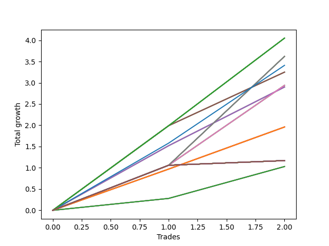

# Long Bulldog 001 
- Symbol: NVDA_Unlimited
- Date Range: 02/08/2022 - 07/08/2022
- Trading Period: 7:20-12:30
- Number of Trades: 2



| Name | Win Percent | Profit | Avg Profit / Trade | Avg Time / Trade |      | Name | Win Percent | Profit | Avg Profit / Trade | Avg Time / Trade |
| ---- | ----------- | ------ | ------------------ | ---------------- | ---- | ---- | ----------- | ------ | ------------------ | ---------------- |
| Sorted By <br> Profit | | | | | | Sorted By <br> Win Percentage ||||
| One Hundred Twenty-Seven | 100.00 | 2025.00 | 1012.50 | 11:12 |     | One Hundred Twenty-Seven | 100.00 | 2025.00 | 1012.50 | 11:12 |
| One Hundred Twenty-Two | 100.00 | 2025.00 | 1012.50 | 11:12 |     | One Hundred Twenty-Two | 100.00 | 2025.00 | 1012.50 | 11:12 |
| One Hundred Seventeen | 100.00 | 2025.00 | 1012.50 | 11:12 |     | One Hundred Seventeen | 100.00 | 2025.00 | 1012.50 | 11:12 |
| One Hundred Twelve | 100.00 | 2025.00 | 1012.50 | 11:12 |     | One Hundred Twelve | 100.00 | 2025.00 | 1012.50 | 11:12 |
| Eighty-Two | 100.00 | 2025.00 | 1012.50 | 11:12 |     | Eighty-Two | 100.00 | 2025.00 | 1012.50 | 11:12 |
| Sixty-Nine | 100.00 | 1810.00 | 905.00 | 21:57 |     | Sixty-Nine | 100.00 | 1810.00 | 905.00 | 21:57 |
| Sixty-One | 100.00 | 1810.00 | 905.00 | 21:57 |     | Sixty-One | 100.00 | 1810.00 | 905.00 | 21:57 |
| Fifty-Three | 100.00 | 1810.00 | 905.00 | 21:57 |     | Fifty-Three | 100.00 | 1810.00 | 905.00 | 21:57 |
| Forty-Five | 100.00 | 1810.00 | 905.00 | 21:57 |     | Forty-Five | 100.00 | 1810.00 | 905.00 | 21:57 |
| Five | 100.00 | 1810.00 | 905.00 | 21:57 |     | Five | 100.00 | 1810.00 | 905.00 | 21:57 |
| Seventy-Three | 100.00 | 1705.00 | 852.50 | 15:05 |     | Seventy-Three | 100.00 | 1705.00 | 852.50 | 15:05 |
| Sixty-Seven | 100.00 | 1625.00 | 812.50 | 09:40 |     | Sixty-Seven | 100.00 | 1625.00 | 812.50 | 09:40 |
| Fifty-Nine | 100.00 | 1625.00 | 812.50 | 09:40 |     | Fifty-Nine | 100.00 | 1625.00 | 812.50 | 09:40 |
| Fifty-One | 100.00 | 1625.00 | 812.50 | 09:40 |     | Fifty-One | 100.00 | 1625.00 | 812.50 | 09:40 |
| Forty-Three | 100.00 | 1625.00 | 812.50 | 09:40 |     | Forty-Three | 100.00 | 1625.00 | 812.50 | 09:40 |
| Three | 100.00 | 1625.00 | 812.50 | 09:40 |     | Three | 100.00 | 1625.00 | 812.50 | 09:40 |
| Sixty-Eight | 100.00 | 1470.00 | 735.00 | 20:40 |     | Sixty-Eight | 100.00 | 1470.00 | 735.00 | 20:40 |
| Sixty | 100.00 | 1470.00 | 735.00 | 20:40 |     | Sixty | 100.00 | 1470.00 | 735.00 | 20:40 |
| Fifty-Two | 100.00 | 1470.00 | 735.00 | 20:40 |     | Fifty-Two | 100.00 | 1470.00 | 735.00 | 20:40 |
| Forty-Four | 100.00 | 1470.00 | 735.00 | 20:40 |     | Forty-Four | 100.00 | 1470.00 | 735.00 | 20:40 |
| Four | 100.00 | 1470.00 | 735.00 | 20:40 |     | Four | 100.00 | 1470.00 | 735.00 | 20:40 |
| Sixty-Six | 100.00 | 1450.00 | 725.00 | 07:50 |     | Sixty-Six | 100.00 | 1450.00 | 725.00 | 07:50 |
| Fifty-Eight | 100.00 | 1450.00 | 725.00 | 07:50 |     | Fifty-Eight | 100.00 | 1450.00 | 725.00 | 07:50 |
| Fifty | 100.00 | 1450.00 | 725.00 | 07:50 |     | Fifty | 100.00 | 1450.00 | 725.00 | 07:50 |
| Forty-Two | 100.00 | 1450.00 | 725.00 | 07:50 |     | Forty-Two | 100.00 | 1450.00 | 725.00 | 07:50 |
| Two | 100.00 | 1450.00 | 725.00 | 07:50 |     | Two | 100.00 | 1450.00 | 725.00 | 07:50 |
| One Hundred Twenty-Six | 100.00 | 980.00 | 490.00 | 05:22 |     | One Hundred Twenty-Six | 100.00 | 980.00 | 490.00 | 05:22 |
| One Hundred Twenty-One | 100.00 | 980.00 | 490.00 | 05:22 |     | One Hundred Twenty-One | 100.00 | 980.00 | 490.00 | 05:22 |
| One Hundred Sixteen | 100.00 | 980.00 | 490.00 | 05:22 |     | One Hundred Sixteen | 100.00 | 980.00 | 490.00 | 05:22 |
| One Hundred Eleven | 100.00 | 980.00 | 490.00 | 05:22 |     | One Hundred Eleven | 100.00 | 980.00 | 490.00 | 05:22 |
| Eighty-One | 100.00 | 980.00 | 490.00 | 05:22 |     | Eighty-One | 100.00 | 980.00 | 490.00 | 05:22 |
| Sixty-Five | 100.00 | 980.00 | 490.00 | 05:22 |     | Sixty-Five | 100.00 | 980.00 | 490.00 | 05:22 |
| Fifty-Seven | 100.00 | 980.00 | 490.00 | 05:22 |     | Fifty-Seven | 100.00 | 980.00 | 490.00 | 05:22 |
| Forty-Nine | 100.00 | 980.00 | 490.00 | 05:22 |     | Forty-Nine | 100.00 | 980.00 | 490.00 | 05:22 |
| Forty-One | 100.00 | 980.00 | 490.00 | 05:22 |     | Forty-One | 100.00 | 980.00 | 490.00 | 05:22 |
| One | 100.00 | 980.00 | 490.00 | 05:22 |     | One | 100.00 | 980.00 | 490.00 | 05:22 |
| One Hundred Thirty | 100.00 | 585.00 | 292.50 | 29:55 |     | One Hundred Thirty | 100.00 | 585.00 | 292.50 | 29:55 |
| One Hundred Twenty-Nine | 100.00 | 585.00 | 292.50 | 29:55 |     | One Hundred Twenty-Nine | 100.00 | 585.00 | 292.50 | 29:55 |
| One Hundred Twenty-Eight | 100.00 | 585.00 | 292.50 | 29:55 |     | One Hundred Twenty-Eight | 100.00 | 585.00 | 292.50 | 29:55 |
| One Hundred Twenty-Five | 100.00 | 585.00 | 292.50 | 29:55 |     | One Hundred Twenty-Five | 100.00 | 585.00 | 292.50 | 29:55 |
| One Hundred Twenty-Four | 100.00 | 585.00 | 292.50 | 29:55 |     | One Hundred Twenty-Four | 100.00 | 585.00 | 292.50 | 29:55 |
| One Hundred Twenty-Three | 100.00 | 585.00 | 292.50 | 29:55 |     | One Hundred Twenty-Three | 100.00 | 585.00 | 292.50 | 29:55 |
| One Hundred Twenty | 100.00 | 585.00 | 292.50 | 29:55 |     | One Hundred Twenty | 100.00 | 585.00 | 292.50 | 29:55 |
| One Hundred Ninteen | 100.00 | 585.00 | 292.50 | 29:55 |     | One Hundred Ninteen | 100.00 | 585.00 | 292.50 | 29:55 |
| One Hundred Eighteen | 100.00 | 585.00 | 292.50 | 29:55 |     | One Hundred Eighteen | 100.00 | 585.00 | 292.50 | 29:55 |
| One Hundred Fifteen | 100.00 | 585.00 | 292.50 | 29:55 |     | One Hundred Fifteen | 100.00 | 585.00 | 292.50 | 29:55 |
| One Hundred Fourteen | 100.00 | 585.00 | 292.50 | 29:55 |     | One Hundred Fourteen | 100.00 | 585.00 | 292.50 | 29:55 |
| One Hundred Thirteen | 100.00 | 585.00 | 292.50 | 29:55 |     | One Hundred Thirteen | 100.00 | 585.00 | 292.50 | 29:55 |
| Eighty-Five | 100.00 | 585.00 | 292.50 | 29:55 |     | Eighty-Five | 100.00 | 585.00 | 292.50 | 29:55 |
| Eighty-Four | 100.00 | 585.00 | 292.50 | 29:55 |     | Eighty-Four | 100.00 | 585.00 | 292.50 | 29:55 |
| Eighty-Three | 100.00 | 585.00 | 292.50 | 29:55 |     | Eighty-Three | 100.00 | 585.00 | 292.50 | 29:55 |
| Seventy-One | 100.00 | 585.00 | 292.50 | 29:55 |     | Seventy-One | 100.00 | 585.00 | 292.50 | 29:55 |
| Seventy | 100.00 | 585.00 | 292.50 | 29:55 |     | Seventy | 100.00 | 585.00 | 292.50 | 29:55 |
| Sixty-Three | 100.00 | 585.00 | 292.50 | 29:55 |     | Sixty-Three | 100.00 | 585.00 | 292.50 | 29:55 |
| Sixty-Two | 100.00 | 585.00 | 292.50 | 29:55 |     | Sixty-Two | 100.00 | 585.00 | 292.50 | 29:55 |
| Fifty-Five | 100.00 | 585.00 | 292.50 | 29:55 |     | Fifty-Five | 100.00 | 585.00 | 292.50 | 29:55 |
| Fifty-Four | 100.00 | 585.00 | 292.50 | 29:55 |     | Fifty-Four | 100.00 | 585.00 | 292.50 | 29:55 |
| Forty-Seven | 100.00 | 585.00 | 292.50 | 29:55 |     | Forty-Seven | 100.00 | 585.00 | 292.50 | 29:55 |
| Forty-Six | 100.00 | 585.00 | 292.50 | 29:55 |     | Forty-Six | 100.00 | 585.00 | 292.50 | 29:55 |
| Seven | 100.00 | 585.00 | 292.50 | 29:55 |     | Seven | 100.00 | 585.00 | 292.50 | 29:55 |
| Six | 100.00 | 585.00 | 292.50 | 29:55 |     | Six | 100.00 | 585.00 | 292.50 | 29:55 |
| Sixty-Four | 100.00 | 515.00 | 257.50 | 02:40 |     | Sixty-Four | 100.00 | 515.00 | 257.50 | 02:40 |
| Fifty-Six | 100.00 | 515.00 | 257.50 | 02:40 |     | Fifty-Six | 100.00 | 515.00 | 257.50 | 02:40 |
| Forty-Eight | 100.00 | 515.00 | 257.50 | 02:40 |     | Forty-Eight | 100.00 | 515.00 | 257.50 | 02:40 |
| Forty | 100.00 | 515.00 | 257.50 | 02:40 |     | Forty | 100.00 | 515.00 | 257.50 | 02:40 |
| Zero | 100.00 | 515.00 | 257.50 | 02:40 |     | Zero | 100.00 | 515.00 | 257.50 | 02:40 |

## NO STOPLOSS

### Test Zero
* Sell when price hits the middle line of the 20p bollinger
* No Stoploss
* Results:
```
Total Trades: 2
Percent Up: 100.00
Percent Down: 0.00
Total Points Moved Up: 1.03
Potential Profit: 515.00
Total Points Ups: 1.03 Count Ups: 2
Total Points Downs: 0.00 Count Downs: 0
```

<details><summary>Trades</summary>

<code>In: 2022-02-10 10:40:00		Out: 2022-02-10 10:40:35		Total Position Time: 00:35		Total Move Up: 0.28		Total to Date: 0.28</code> <br />
<code>In: 2022-05-02 10:51:00		Out: 2022-05-02 10:55:45		Total Position Time: 04:45		Total Move Up: 0.75		Total to Date: 1.03</code> <br />


</details>

### Test One
* Sell when the price hits the upper line of the 20p 1std bollinger
* No Stoploss
* Results:
```
Total Trades: 2
Percent Up: 100.00
Percent Down: 0.00
Total Points Moved Up: 1.96
Potential Profit: 980.00
Total Points Ups: 1.96 Count Ups: 2
Total Points Downs: 0.00 Count Downs: 0
```

<details><summary>Trades</summary>

<code>In: 2022-02-10 10:40:00		Out: 2022-02-10 10:43:25		Total Position Time: 03:25		Total Move Up: 0.97		Total to Date: 0.97</code> <br />
<code>In: 2022-05-02 10:51:00		Out: 2022-05-02 10:58:20		Total Position Time: 07:20		Total Move Up: 0.99		Total to Date: 1.96</code> <br />


</details>

### Test Two
* Sell when the price hits the upper line of the 20p 2std bollinger
* No Stoploss
* Results:
```
Total Trades: 2
Percent Up: 100.00
Percent Down: 0.00
Total Points Moved Up: 2.90
Potential Profit: 1450.00
Total Points Ups: 2.90 Count Ups: 2
Total Points Downs: 0.00 Count Downs: 0
```

<details><summary>Trades</summary>

<code>In: 2022-02-10 10:40:00		Out: 2022-02-10 10:46:45		Total Position Time: 06:45		Total Move Up: 1.52		Total to Date: 1.52</code> <br />
<code>In: 2022-05-02 10:51:00		Out: 2022-05-02 10:59:55		Total Position Time: 08:55		Total Move Up: 1.38		Total to Date: 2.90</code> <br />


</details>

### Test Three
* Sell when price hits the middle line of the 50p bollinger
* No Stoploss
* Results:
```
Total Trades: 2
Percent Up: 100.00
Percent Down: 0.00
Total Points Moved Up: 3.25
Potential Profit: 1625.00
Total Points Ups: 3.25 Count Ups: 2
Total Points Downs: 0.00 Count Downs: 0
```

<details><summary>Trades</summary>

<code>In: 2022-02-10 10:40:00		Out: 2022-02-10 10:50:30		Total Position Time: 10:30		Total Move Up: 1.99		Total to Date: 1.99</code> <br />
<code>In: 2022-05-02 10:51:00		Out: 2022-05-02 10:59:50		Total Position Time: 08:50		Total Move Up: 1.26		Total to Date: 3.25</code> <br />


</details>

### Test Four
* Sell when the price hits the upper line of the 50p 1std bollinger
* No Stoploss
* Results:
```
Total Trades: 2
Percent Up: 100.00
Percent Down: 0.00
Total Points Moved Up: 2.94
Potential Profit: 1470.00
Total Points Ups: 2.94 Count Ups: 2
Total Points Downs: 0.00 Count Downs: 0
```

<details><summary>Trades</summary>

<code>In: 2022-02-10 10:40:00		Out: 2022-02-10 11:09:55		Total Position Time: 29:55		Total Move Up: 1.06		Total to Date: 1.06</code> <br />
<code>In: 2022-05-02 10:51:00		Out: 2022-05-02 11:02:25		Total Position Time: 11:25		Total Move Up: 1.88		Total to Date: 2.94</code> <br />


</details>

### Test Five
* Sell when the price hits the upper line of the 50p 2std bollinger
* No Stoploss
* Results:
```
Total Trades: 2
Percent Up: 100.00
Percent Down: 0.00
Total Points Moved Up: 3.62
Potential Profit: 1810.00
Total Points Ups: 3.62 Count Ups: 2
Total Points Downs: 0.00 Count Downs: 0
```

<details><summary>Trades</summary>

<code>In: 2022-02-10 10:40:00		Out: 2022-02-10 11:09:55		Total Position Time: 29:55		Total Move Up: 1.06		Total to Date: 1.06</code> <br />
<code>In: 2022-05-02 10:51:00		Out: 2022-05-02 11:05:00		Total Position Time: 14:00		Total Move Up: 2.56		Total to Date: 3.62</code> <br />


</details>

### Test Six
* Sell when the price hits the middle line of the 1std VWAP
* No Stoploss
* Results:
```
Total Trades: 2
Percent Up: 100.00
Percent Down: 0.00
Total Points Moved Up: 1.17
Potential Profit: 585.00
Total Points Ups: 1.17 Count Ups: 2
Total Points Downs: 0.00 Count Downs: 0
```

<details><summary>Trades</summary>

<code>In: 2022-02-10 10:40:00		Out: 2022-02-10 11:09:55		Total Position Time: 29:55		Total Move Up: 1.06		Total to Date: 1.06</code> <br />
<code>In: 2022-05-02 10:51:00		Out: 2022-05-02 11:20:55		Total Position Time: 29:55		Total Move Up: 0.11		Total to Date: 1.17</code> <br />


</details>

### Test Seven
* Sell when the price hits the upper line of the 1std VWAP
* No Stoploss
* Results:
```
Total Trades: 2
Percent Up: 100.00
Percent Down: 0.00
Total Points Moved Up: 1.17
Potential Profit: 585.00
Total Points Ups: 1.17 Count Ups: 2
Total Points Downs: 0.00 Count Downs: 0
```

<details><summary>Trades</summary>

<code>In: 2022-02-10 10:40:00		Out: 2022-02-10 11:09:55		Total Position Time: 29:55		Total Move Up: 1.06		Total to Date: 1.06</code> <br />
<code>In: 2022-05-02 10:51:00		Out: 2022-05-02 11:20:55		Total Position Time: 29:55		Total Move Up: 0.11		Total to Date: 1.17</code> <br />


</details>

## STOPLOSS OF 5

### Test Forty
* Sell when price hits the middle line of the 20p bollinger
* Stoploss is 5 points
* Results:
```
Total Trades: 2
Percent Up: 100.00
Percent Down: 0.00
Total Points Moved Up: 1.03
Potential Profit: 515.00
Total Points Ups: 1.03 Count Ups: 2
Total Points Downs: 0.00 Count Downs: 0
```

<details><summary>Trades</summary>

<code>In: 2022-02-10 10:40:00		Out: 2022-02-10 10:40:35		Total Position Time: 00:35		Total Move Up: 0.28		Total to Date: 0.28</code> <br />
<code>In: 2022-05-02 10:51:00		Out: 2022-05-02 10:55:45		Total Position Time: 04:45		Total Move Up: 0.75		Total to Date: 1.03</code> <br />


</details>

### Test Forty-One
* Sell when the price hits the upper line of the 20p 1std bollinger
* Stoploss is 5 points
* Results:
```
Total Trades: 2
Percent Up: 100.00
Percent Down: 0.00
Total Points Moved Up: 1.96
Potential Profit: 980.00
Total Points Ups: 1.96 Count Ups: 2
Total Points Downs: 0.00 Count Downs: 0
```

<details><summary>Trades</summary>

<code>In: 2022-02-10 10:40:00		Out: 2022-02-10 10:43:25		Total Position Time: 03:25		Total Move Up: 0.97		Total to Date: 0.97</code> <br />
<code>In: 2022-05-02 10:51:00		Out: 2022-05-02 10:58:20		Total Position Time: 07:20		Total Move Up: 0.99		Total to Date: 1.96</code> <br />


</details>

### Test Forty-Two
* Sell when the price hits the upper line of the 20p 2std bollinger
* Stoploss is 5 points
* Results:
```
Total Trades: 2
Percent Up: 100.00
Percent Down: 0.00
Total Points Moved Up: 2.90
Potential Profit: 1450.00
Total Points Ups: 2.90 Count Ups: 2
Total Points Downs: 0.00 Count Downs: 0
```

<details><summary>Trades</summary>

<code>In: 2022-02-10 10:40:00		Out: 2022-02-10 10:46:45		Total Position Time: 06:45		Total Move Up: 1.52		Total to Date: 1.52</code> <br />
<code>In: 2022-05-02 10:51:00		Out: 2022-05-02 10:59:55		Total Position Time: 08:55		Total Move Up: 1.38		Total to Date: 2.90</code> <br />


</details>

### Test Forty-Three
* Sell when price hits the middle line of the 50p bollinger
* Stoploss is 5 points
* Results:
```
Total Trades: 2
Percent Up: 100.00
Percent Down: 0.00
Total Points Moved Up: 3.25
Potential Profit: 1625.00
Total Points Ups: 3.25 Count Ups: 2
Total Points Downs: 0.00 Count Downs: 0
```

<details><summary>Trades</summary>

<code>In: 2022-02-10 10:40:00		Out: 2022-02-10 10:50:30		Total Position Time: 10:30		Total Move Up: 1.99		Total to Date: 1.99</code> <br />
<code>In: 2022-05-02 10:51:00		Out: 2022-05-02 10:59:50		Total Position Time: 08:50		Total Move Up: 1.26		Total to Date: 3.25</code> <br />


</details>

### Test Forty-Four
* Sell when the price hits the upper line of the 50p 1std bollinger
* Stoploss is 5 points
* Results:
```
Total Trades: 2
Percent Up: 100.00
Percent Down: 0.00
Total Points Moved Up: 2.94
Potential Profit: 1470.00
Total Points Ups: 2.94 Count Ups: 2
Total Points Downs: 0.00 Count Downs: 0
```

<details><summary>Trades</summary>

<code>In: 2022-02-10 10:40:00		Out: 2022-02-10 11:09:55		Total Position Time: 29:55		Total Move Up: 1.06		Total to Date: 1.06</code> <br />
<code>In: 2022-05-02 10:51:00		Out: 2022-05-02 11:02:25		Total Position Time: 11:25		Total Move Up: 1.88		Total to Date: 2.94</code> <br />


</details>

### Test Forty-Five
* Sell when the price hits the upper line of the 50p 2std bollinger
* Stoploss is 5 points
* Results:
```
Total Trades: 2
Percent Up: 100.00
Percent Down: 0.00
Total Points Moved Up: 3.62
Potential Profit: 1810.00
Total Points Ups: 3.62 Count Ups: 2
Total Points Downs: 0.00 Count Downs: 0
```

<details><summary>Trades</summary>

<code>In: 2022-02-10 10:40:00		Out: 2022-02-10 11:09:55		Total Position Time: 29:55		Total Move Up: 1.06		Total to Date: 1.06</code> <br />
<code>In: 2022-05-02 10:51:00		Out: 2022-05-02 11:05:00		Total Position Time: 14:00		Total Move Up: 2.56		Total to Date: 3.62</code> <br />


</details>

### Test Forty-Six
* Sell when the price hits the middle line of the 1std VWAP
* Stoploss is 5 points
* Results:
```
Total Trades: 2
Percent Up: 100.00
Percent Down: 0.00
Total Points Moved Up: 1.17
Potential Profit: 585.00
Total Points Ups: 1.17 Count Ups: 2
Total Points Downs: 0.00 Count Downs: 0
```

<details><summary>Trades</summary>

<code>In: 2022-02-10 10:40:00		Out: 2022-02-10 11:09:55		Total Position Time: 29:55		Total Move Up: 1.06		Total to Date: 1.06</code> <br />
<code>In: 2022-05-02 10:51:00		Out: 2022-05-02 11:20:55		Total Position Time: 29:55		Total Move Up: 0.11		Total to Date: 1.17</code> <br />


</details>

### Test Forty-Seven
* Sell when the price hits the upper line of the 1std VWAP
* Stoploss is 5 points
* Results:
```
Total Trades: 2
Percent Up: 100.00
Percent Down: 0.00
Total Points Moved Up: 1.17
Potential Profit: 585.00
Total Points Ups: 1.17 Count Ups: 2
Total Points Downs: 0.00 Count Downs: 0
```

<details><summary>Trades</summary>

<code>In: 2022-02-10 10:40:00		Out: 2022-02-10 11:09:55		Total Position Time: 29:55		Total Move Up: 1.06		Total to Date: 1.06</code> <br />
<code>In: 2022-05-02 10:51:00		Out: 2022-05-02 11:20:55		Total Position Time: 29:55		Total Move Up: 0.11		Total to Date: 1.17</code> <br />


</details>

## TRAIL STOP OF 5

### Test Forty-Eight
* Sell when price hits the middle line of the 20p bollinger
* Trailing Stop is 5 points
* Results:
```
Total Trades: 2
Percent Up: 100.00
Percent Down: 0.00
Total Points Moved Up: 1.03
Potential Profit: 515.00
Total Points Ups: 1.03 Count Ups: 2
Total Points Downs: 0.00 Count Downs: 0
```

<details><summary>Trades</summary>

<code>In: 2022-02-10 10:40:00		Out: 2022-02-10 10:40:35		Total Position Time: 00:35		Total Move Up: 0.28		Total to Date: 0.28</code> <br />
<code>In: 2022-05-02 10:51:00		Out: 2022-05-02 10:55:45		Total Position Time: 04:45		Total Move Up: 0.75		Total to Date: 1.03</code> <br />


</details>

### Test Forty-Nine
* Sell when the price hits the upper line of the 20p 1std bollinger
* Trailing Stop is 5 points
* Results:
```
Total Trades: 2
Percent Up: 100.00
Percent Down: 0.00
Total Points Moved Up: 1.96
Potential Profit: 980.00
Total Points Ups: 1.96 Count Ups: 2
Total Points Downs: 0.00 Count Downs: 0
```

<details><summary>Trades</summary>

<code>In: 2022-02-10 10:40:00		Out: 2022-02-10 10:43:25		Total Position Time: 03:25		Total Move Up: 0.97		Total to Date: 0.97</code> <br />
<code>In: 2022-05-02 10:51:00		Out: 2022-05-02 10:58:20		Total Position Time: 07:20		Total Move Up: 0.99		Total to Date: 1.96</code> <br />


</details>

### Test Fifty
* Sell when the price hits the upper line of the 20p 2std bollinger
* Trailing Stop is 5 points
* Results:
```
Total Trades: 2
Percent Up: 100.00
Percent Down: 0.00
Total Points Moved Up: 2.90
Potential Profit: 1450.00
Total Points Ups: 2.90 Count Ups: 2
Total Points Downs: 0.00 Count Downs: 0
```

<details><summary>Trades</summary>

<code>In: 2022-02-10 10:40:00		Out: 2022-02-10 10:46:45		Total Position Time: 06:45		Total Move Up: 1.52		Total to Date: 1.52</code> <br />
<code>In: 2022-05-02 10:51:00		Out: 2022-05-02 10:59:55		Total Position Time: 08:55		Total Move Up: 1.38		Total to Date: 2.90</code> <br />


</details>

### Test Fifty-One
* Sell when price hits the middle line of the 50p bollinger
* Trailing Stop is 5 points
* Results:
```
Total Trades: 2
Percent Up: 100.00
Percent Down: 0.00
Total Points Moved Up: 3.25
Potential Profit: 1625.00
Total Points Ups: 3.25 Count Ups: 2
Total Points Downs: 0.00 Count Downs: 0
```

<details><summary>Trades</summary>

<code>In: 2022-02-10 10:40:00		Out: 2022-02-10 10:50:30		Total Position Time: 10:30		Total Move Up: 1.99		Total to Date: 1.99</code> <br />
<code>In: 2022-05-02 10:51:00		Out: 2022-05-02 10:59:50		Total Position Time: 08:50		Total Move Up: 1.26		Total to Date: 3.25</code> <br />


</details>

### Test Fifty-Two
* Sell when the price hits the upper line of the 50p 1std bollinger
* Trailing Stop is 5 points
* Results:
```
Total Trades: 2
Percent Up: 100.00
Percent Down: 0.00
Total Points Moved Up: 2.94
Potential Profit: 1470.00
Total Points Ups: 2.94 Count Ups: 2
Total Points Downs: 0.00 Count Downs: 0
```

<details><summary>Trades</summary>

<code>In: 2022-02-10 10:40:00		Out: 2022-02-10 11:09:55		Total Position Time: 29:55		Total Move Up: 1.06		Total to Date: 1.06</code> <br />
<code>In: 2022-05-02 10:51:00		Out: 2022-05-02 11:02:25		Total Position Time: 11:25		Total Move Up: 1.88		Total to Date: 2.94</code> <br />


</details>

### Test Fifty-Three
* Sell when the price hits the upper line of the 50p 2std bollinger
* Trailing Stop is 5 points
* Results:
```
Total Trades: 2
Percent Up: 100.00
Percent Down: 0.00
Total Points Moved Up: 3.62
Potential Profit: 1810.00
Total Points Ups: 3.62 Count Ups: 2
Total Points Downs: 0.00 Count Downs: 0
```

<details><summary>Trades</summary>

<code>In: 2022-02-10 10:40:00		Out: 2022-02-10 11:09:55		Total Position Time: 29:55		Total Move Up: 1.06		Total to Date: 1.06</code> <br />
<code>In: 2022-05-02 10:51:00		Out: 2022-05-02 11:05:00		Total Position Time: 14:00		Total Move Up: 2.56		Total to Date: 3.62</code> <br />


</details>

### Test Fifty-Four
* Sell when the price hits the middle line of the 1std VWAP
* Trailing Stop is 5 points
* Results:
```
Total Trades: 2
Percent Up: 100.00
Percent Down: 0.00
Total Points Moved Up: 1.17
Potential Profit: 585.00
Total Points Ups: 1.17 Count Ups: 2
Total Points Downs: 0.00 Count Downs: 0
```

<details><summary>Trades</summary>

<code>In: 2022-02-10 10:40:00		Out: 2022-02-10 11:09:55		Total Position Time: 29:55		Total Move Up: 1.06		Total to Date: 1.06</code> <br />
<code>In: 2022-05-02 10:51:00		Out: 2022-05-02 11:20:55		Total Position Time: 29:55		Total Move Up: 0.11		Total to Date: 1.17</code> <br />


</details>

### Test Fifty-Five
* Sell when the price hits the upper line of the 1std VWAP
* Trailing Stop is 5 points
* Results:
```
Total Trades: 2
Percent Up: 100.00
Percent Down: 0.00
Total Points Moved Up: 1.17
Potential Profit: 585.00
Total Points Ups: 1.17 Count Ups: 2
Total Points Downs: 0.00 Count Downs: 0
```

<details><summary>Trades</summary>

<code>In: 2022-02-10 10:40:00		Out: 2022-02-10 11:09:55		Total Position Time: 29:55		Total Move Up: 1.06		Total to Date: 1.06</code> <br />
<code>In: 2022-05-02 10:51:00		Out: 2022-05-02 11:20:55		Total Position Time: 29:55		Total Move Up: 0.11		Total to Date: 1.17</code> <br />


</details>

## STOPLOSS OF 10

### Test Fifty-Six
* Sell when price hits the middle line of the 20p bollinger
* Stoploss is 10 points
* Results:
```
Total Trades: 2
Percent Up: 100.00
Percent Down: 0.00
Total Points Moved Up: 1.03
Potential Profit: 515.00
Total Points Ups: 1.03 Count Ups: 2
Total Points Downs: 0.00 Count Downs: 0
```

<details><summary>Trades</summary>

<code>In: 2022-02-10 10:40:00		Out: 2022-02-10 10:40:35		Total Position Time: 00:35		Total Move Up: 0.28		Total to Date: 0.28</code> <br />
<code>In: 2022-05-02 10:51:00		Out: 2022-05-02 10:55:45		Total Position Time: 04:45		Total Move Up: 0.75		Total to Date: 1.03</code> <br />


</details>

### Test Fifty-Seven
* Sell when the price hits the upper line of the 20p 1std bollinger
* Stoploss is 10 points
* Results:
```
Total Trades: 2
Percent Up: 100.00
Percent Down: 0.00
Total Points Moved Up: 1.96
Potential Profit: 980.00
Total Points Ups: 1.96 Count Ups: 2
Total Points Downs: 0.00 Count Downs: 0
```

<details><summary>Trades</summary>

<code>In: 2022-02-10 10:40:00		Out: 2022-02-10 10:43:25		Total Position Time: 03:25		Total Move Up: 0.97		Total to Date: 0.97</code> <br />
<code>In: 2022-05-02 10:51:00		Out: 2022-05-02 10:58:20		Total Position Time: 07:20		Total Move Up: 0.99		Total to Date: 1.96</code> <br />


</details>

### Test Fifty-Eight
* Sell when the price hits the upper line of the 20p 2std bollinger
* Stoploss is 10 points
* Results:
```
Total Trades: 2
Percent Up: 100.00
Percent Down: 0.00
Total Points Moved Up: 2.90
Potential Profit: 1450.00
Total Points Ups: 2.90 Count Ups: 2
Total Points Downs: 0.00 Count Downs: 0
```

<details><summary>Trades</summary>

<code>In: 2022-02-10 10:40:00		Out: 2022-02-10 10:46:45		Total Position Time: 06:45		Total Move Up: 1.52		Total to Date: 1.52</code> <br />
<code>In: 2022-05-02 10:51:00		Out: 2022-05-02 10:59:55		Total Position Time: 08:55		Total Move Up: 1.38		Total to Date: 2.90</code> <br />


</details>

### Test Fifty-Nine
* Sell when price hits the middle line of the 50p bollinger
* Stoploss is 10 points
* Results:
```
Total Trades: 2
Percent Up: 100.00
Percent Down: 0.00
Total Points Moved Up: 3.25
Potential Profit: 1625.00
Total Points Ups: 3.25 Count Ups: 2
Total Points Downs: 0.00 Count Downs: 0
```

<details><summary>Trades</summary>

<code>In: 2022-02-10 10:40:00		Out: 2022-02-10 10:50:30		Total Position Time: 10:30		Total Move Up: 1.99		Total to Date: 1.99</code> <br />
<code>In: 2022-05-02 10:51:00		Out: 2022-05-02 10:59:50		Total Position Time: 08:50		Total Move Up: 1.26		Total to Date: 3.25</code> <br />


</details>

### Test Sixty
* Sell when the price hits the upper line of the 50p 1std bollinger
* Stoploss is 10 points
* Results:
```
Total Trades: 2
Percent Up: 100.00
Percent Down: 0.00
Total Points Moved Up: 2.94
Potential Profit: 1470.00
Total Points Ups: 2.94 Count Ups: 2
Total Points Downs: 0.00 Count Downs: 0
```

<details><summary>Trades</summary>

<code>In: 2022-02-10 10:40:00		Out: 2022-02-10 11:09:55		Total Position Time: 29:55		Total Move Up: 1.06		Total to Date: 1.06</code> <br />
<code>In: 2022-05-02 10:51:00		Out: 2022-05-02 11:02:25		Total Position Time: 11:25		Total Move Up: 1.88		Total to Date: 2.94</code> <br />


</details>

### Test Sixty-One
* Sell when the price hits the upper line of the 50p 2std bollinger
* Stoploss is 10 points
* Results:
```
Total Trades: 2
Percent Up: 100.00
Percent Down: 0.00
Total Points Moved Up: 3.62
Potential Profit: 1810.00
Total Points Ups: 3.62 Count Ups: 2
Total Points Downs: 0.00 Count Downs: 0
```

<details><summary>Trades</summary>

<code>In: 2022-02-10 10:40:00		Out: 2022-02-10 11:09:55		Total Position Time: 29:55		Total Move Up: 1.06		Total to Date: 1.06</code> <br />
<code>In: 2022-05-02 10:51:00		Out: 2022-05-02 11:05:00		Total Position Time: 14:00		Total Move Up: 2.56		Total to Date: 3.62</code> <br />


</details>

### Test Sixty-Two
* Sell when the price hits the middle line of the 1std VWAP
* Stoploss is 10 points
* Results:
```
Total Trades: 2
Percent Up: 100.00
Percent Down: 0.00
Total Points Moved Up: 1.17
Potential Profit: 585.00
Total Points Ups: 1.17 Count Ups: 2
Total Points Downs: 0.00 Count Downs: 0
```

<details><summary>Trades</summary>

<code>In: 2022-02-10 10:40:00		Out: 2022-02-10 11:09:55		Total Position Time: 29:55		Total Move Up: 1.06		Total to Date: 1.06</code> <br />
<code>In: 2022-05-02 10:51:00		Out: 2022-05-02 11:20:55		Total Position Time: 29:55		Total Move Up: 0.11		Total to Date: 1.17</code> <br />


</details>

### Test Sixty-Three
* Sell when the price hits the upper line of the 1std VWAP
* Stoploss is 10 points
* Results:
```
Total Trades: 2
Percent Up: 100.00
Percent Down: 0.00
Total Points Moved Up: 1.17
Potential Profit: 585.00
Total Points Ups: 1.17 Count Ups: 2
Total Points Downs: 0.00 Count Downs: 0
```

<details><summary>Trades</summary>

<code>In: 2022-02-10 10:40:00		Out: 2022-02-10 11:09:55		Total Position Time: 29:55		Total Move Up: 1.06		Total to Date: 1.06</code> <br />
<code>In: 2022-05-02 10:51:00		Out: 2022-05-02 11:20:55		Total Position Time: 29:55		Total Move Up: 0.11		Total to Date: 1.17</code> <br />


</details>

## TRAIL STOP OF 10

### Test Sixty-Four
* Sell when price hits the middle line of the 20p bollinger
* Trailing Stop is 10 points
* Results:
```
Total Trades: 2
Percent Up: 100.00
Percent Down: 0.00
Total Points Moved Up: 1.03
Potential Profit: 515.00
Total Points Ups: 1.03 Count Ups: 2
Total Points Downs: 0.00 Count Downs: 0
```

<details><summary>Trades</summary>

<code>In: 2022-02-10 10:40:00		Out: 2022-02-10 10:40:35		Total Position Time: 00:35		Total Move Up: 0.28		Total to Date: 0.28</code> <br />
<code>In: 2022-05-02 10:51:00		Out: 2022-05-02 10:55:45		Total Position Time: 04:45		Total Move Up: 0.75		Total to Date: 1.03</code> <br />


</details>

### Test Sixty-Five
* Sell when the price hits the upper line of the 20p 1std bollinger
* Trailing Stop is 10 points
* Results:
```
Total Trades: 2
Percent Up: 100.00
Percent Down: 0.00
Total Points Moved Up: 1.96
Potential Profit: 980.00
Total Points Ups: 1.96 Count Ups: 2
Total Points Downs: 0.00 Count Downs: 0
```

<details><summary>Trades</summary>

<code>In: 2022-02-10 10:40:00		Out: 2022-02-10 10:43:25		Total Position Time: 03:25		Total Move Up: 0.97		Total to Date: 0.97</code> <br />
<code>In: 2022-05-02 10:51:00		Out: 2022-05-02 10:58:20		Total Position Time: 07:20		Total Move Up: 0.99		Total to Date: 1.96</code> <br />


</details>

### Test Sixty-Six
* Sell when the price hits the upper line of the 20p 2std bollinger
* Trailing Stop is 10 points
* Results:
```
Total Trades: 2
Percent Up: 100.00
Percent Down: 0.00
Total Points Moved Up: 2.90
Potential Profit: 1450.00
Total Points Ups: 2.90 Count Ups: 2
Total Points Downs: 0.00 Count Downs: 0
```

<details><summary>Trades</summary>

<code>In: 2022-02-10 10:40:00		Out: 2022-02-10 10:46:45		Total Position Time: 06:45		Total Move Up: 1.52		Total to Date: 1.52</code> <br />
<code>In: 2022-05-02 10:51:00		Out: 2022-05-02 10:59:55		Total Position Time: 08:55		Total Move Up: 1.38		Total to Date: 2.90</code> <br />


</details>

### Test Sixty-Seven
* Sell when price hits the middle line of the 50p bollinger
* Trailing Stop is 10 points
* Results:
```
Total Trades: 2
Percent Up: 100.00
Percent Down: 0.00
Total Points Moved Up: 3.25
Potential Profit: 1625.00
Total Points Ups: 3.25 Count Ups: 2
Total Points Downs: 0.00 Count Downs: 0
```

<details><summary>Trades</summary>

<code>In: 2022-02-10 10:40:00		Out: 2022-02-10 10:50:30		Total Position Time: 10:30		Total Move Up: 1.99		Total to Date: 1.99</code> <br />
<code>In: 2022-05-02 10:51:00		Out: 2022-05-02 10:59:50		Total Position Time: 08:50		Total Move Up: 1.26		Total to Date: 3.25</code> <br />


</details>

### Test Sixty-Eight
* Sell when the price hits the upper line of the 50p 1std bollinger
* Trailing Stop is 10 points
* Results:
```
Total Trades: 2
Percent Up: 100.00
Percent Down: 0.00
Total Points Moved Up: 2.94
Potential Profit: 1470.00
Total Points Ups: 2.94 Count Ups: 2
Total Points Downs: 0.00 Count Downs: 0
```

<details><summary>Trades</summary>

<code>In: 2022-02-10 10:40:00		Out: 2022-02-10 11:09:55		Total Position Time: 29:55		Total Move Up: 1.06		Total to Date: 1.06</code> <br />
<code>In: 2022-05-02 10:51:00		Out: 2022-05-02 11:02:25		Total Position Time: 11:25		Total Move Up: 1.88		Total to Date: 2.94</code> <br />


</details>

### Test Sixty-Nine
* Sell when the price hits the upper line of the 50p 2std bollinger
* Trailing Stop is 10 points
* Results:
```
Total Trades: 2
Percent Up: 100.00
Percent Down: 0.00
Total Points Moved Up: 3.62
Potential Profit: 1810.00
Total Points Ups: 3.62 Count Ups: 2
Total Points Downs: 0.00 Count Downs: 0
```

<details><summary>Trades</summary>

<code>In: 2022-02-10 10:40:00		Out: 2022-02-10 11:09:55		Total Position Time: 29:55		Total Move Up: 1.06		Total to Date: 1.06</code> <br />
<code>In: 2022-05-02 10:51:00		Out: 2022-05-02 11:05:00		Total Position Time: 14:00		Total Move Up: 2.56		Total to Date: 3.62</code> <br />


</details>

### Test Seventy
* Sell when the price hits the middle line of the 1std VWAP
* Trailing Stop is 10 points
* Results:
```
Total Trades: 2
Percent Up: 100.00
Percent Down: 0.00
Total Points Moved Up: 1.17
Potential Profit: 585.00
Total Points Ups: 1.17 Count Ups: 2
Total Points Downs: 0.00 Count Downs: 0
```

<details><summary>Trades</summary>

<code>In: 2022-02-10 10:40:00		Out: 2022-02-10 11:09:55		Total Position Time: 29:55		Total Move Up: 1.06		Total to Date: 1.06</code> <br />
<code>In: 2022-05-02 10:51:00		Out: 2022-05-02 11:20:55		Total Position Time: 29:55		Total Move Up: 0.11		Total to Date: 1.17</code> <br />


</details>

### Test Seventy-One
* Sell when the price hits the upper line of the 1std VWAP
* Trailing Stop is 10 points
* Results:
```
Total Trades: 2
Percent Up: 100.00
Percent Down: 0.00
Total Points Moved Up: 1.17
Potential Profit: 585.00
Total Points Ups: 1.17 Count Ups: 2
Total Points Downs: 0.00 Count Downs: 0
```

<details><summary>Trades</summary>

<code>In: 2022-02-10 10:40:00		Out: 2022-02-10 11:09:55		Total Position Time: 29:55		Total Move Up: 1.06		Total to Date: 1.06</code> <br />
<code>In: 2022-05-02 10:51:00		Out: 2022-05-02 11:20:55		Total Position Time: 29:55		Total Move Up: 0.11		Total to Date: 1.17</code> <br />


</details>

## SPECIAL EXIT CONDITIONS 

### Test Seventy-Three
* Sell when the linear regression slope changes to negative
* No Stoploss
* Results:
```
Total Trades: 2
Percent Up: 100.00
Percent Down: 0.00
Total Points Moved Up: 3.41
Potential Profit: 1705.00
Total Points Ups: 3.41 Count Ups: 2
Total Points Downs: 0.00 Count Downs: 0
```

<details><summary>Trades</summary>

<code>In: 2022-02-10 10:40:00		Out: 2022-02-10 10:52:05		Total Position Time: 12:05		Total Move Up: 1.58		Total to Date: 1.58</code> <br />
<code>In: 2022-05-02 10:51:00		Out: 2022-05-02 11:09:05		Total Position Time: 18:05		Total Move Up: 1.83		Total to Date: 3.41</code> <br />


</details>

## TAKE PROFIT

### Test Eighty-One
* Take Profit of 1 Point
* No Stoploss
* Results:
```
Total Trades: 2
Percent Up: 100.00
Percent Down: 0.00
Total Points Moved Up: 1.96
Potential Profit: 980.00
Total Points Ups: 1.96 Count Ups: 2
Total Points Downs: 0.00 Count Downs: 0
```

<details><summary>Trades</summary>

<code>In: 2022-02-10 10:40:00		Out: 2022-02-10 10:43:25		Total Position Time: 03:25		Total Move Up: 0.97		Total to Date: 0.97</code> <br />
<code>In: 2022-05-02 10:51:00		Out: 2022-05-02 10:58:20		Total Position Time: 07:20		Total Move Up: 0.99		Total to Date: 1.96</code> <br />


</details>

### Test Eighty-Two
* Take Profit of 2 Point
* No Stoploss
* Results:
```
Total Trades: 2
Percent Up: 100.00
Percent Down: 0.00
Total Points Moved Up: 4.05
Potential Profit: 2025.00
Total Points Ups: 4.05 Count Ups: 2
Total Points Downs: 0.00 Count Downs: 0
```

<details><summary>Trades</summary>

<code>In: 2022-02-10 10:40:00		Out: 2022-02-10 10:50:30		Total Position Time: 10:30		Total Move Up: 1.99		Total to Date: 1.99</code> <br />
<code>In: 2022-05-02 10:51:00		Out: 2022-05-02 11:02:55		Total Position Time: 11:55		Total Move Up: 2.06		Total to Date: 4.05</code> <br />


</details>

### Test Eighty-Three
* Take Profit of 3 Point
* No Stoploss
* Results:
```
Total Trades: 2
Percent Up: 100.00
Percent Down: 0.00
Total Points Moved Up: 1.17
Potential Profit: 585.00
Total Points Ups: 1.17 Count Ups: 2
Total Points Downs: 0.00 Count Downs: 0
```

<details><summary>Trades</summary>

<code>In: 2022-02-10 10:40:00		Out: 2022-02-10 11:09:55		Total Position Time: 29:55		Total Move Up: 1.06		Total to Date: 1.06</code> <br />
<code>In: 2022-05-02 10:51:00		Out: 2022-05-02 11:20:55		Total Position Time: 29:55		Total Move Up: 0.11		Total to Date: 1.17</code> <br />


</details>

### Test Eighty-Four
* Take Profit of 4 Point
* No Stoploss
* Results:
```
Total Trades: 2
Percent Up: 100.00
Percent Down: 0.00
Total Points Moved Up: 1.17
Potential Profit: 585.00
Total Points Ups: 1.17 Count Ups: 2
Total Points Downs: 0.00 Count Downs: 0
```

<details><summary>Trades</summary>

<code>In: 2022-02-10 10:40:00		Out: 2022-02-10 11:09:55		Total Position Time: 29:55		Total Move Up: 1.06		Total to Date: 1.06</code> <br />
<code>In: 2022-05-02 10:51:00		Out: 2022-05-02 11:20:55		Total Position Time: 29:55		Total Move Up: 0.11		Total to Date: 1.17</code> <br />


</details>

### Test Eighty-Five
* Take Profit of 5 Point
* No Stoploss
* Results:
```
Total Trades: 2
Percent Up: 100.00
Percent Down: 0.00
Total Points Moved Up: 1.17
Potential Profit: 585.00
Total Points Ups: 1.17 Count Ups: 2
Total Points Downs: 0.00 Count Downs: 0
```

<details><summary>Trades</summary>

<code>In: 2022-02-10 10:40:00		Out: 2022-02-10 11:09:55		Total Position Time: 29:55		Total Move Up: 1.06		Total to Date: 1.06</code> <br />
<code>In: 2022-05-02 10:51:00		Out: 2022-05-02 11:20:55		Total Position Time: 29:55		Total Move Up: 0.11		Total to Date: 1.17</code> <br />


</details>

## TAKE PROFIT Stoploss of Five

### Test One Hundred Eleven
* Take Profit of 1 Point
* Stoploss is 5 points
* Results:
```
Total Trades: 2
Percent Up: 100.00
Percent Down: 0.00
Total Points Moved Up: 1.96
Potential Profit: 980.00
Total Points Ups: 1.96 Count Ups: 2
Total Points Downs: 0.00 Count Downs: 0
```

<details><summary>Trades</summary>

<code>In: 2022-02-10 10:40:00		Out: 2022-02-10 10:43:25		Total Position Time: 03:25		Total Move Up: 0.97		Total to Date: 0.97</code> <br />
<code>In: 2022-05-02 10:51:00		Out: 2022-05-02 10:58:20		Total Position Time: 07:20		Total Move Up: 0.99		Total to Date: 1.96</code> <br />


</details>

### Test One Hundred Twelve
* Take Profit of 2 Point
* Stoploss is 5 points
* Results:
```
Total Trades: 2
Percent Up: 100.00
Percent Down: 0.00
Total Points Moved Up: 4.05
Potential Profit: 2025.00
Total Points Ups: 4.05 Count Ups: 2
Total Points Downs: 0.00 Count Downs: 0
```

<details><summary>Trades</summary>

<code>In: 2022-02-10 10:40:00		Out: 2022-02-10 10:50:30		Total Position Time: 10:30		Total Move Up: 1.99		Total to Date: 1.99</code> <br />
<code>In: 2022-05-02 10:51:00		Out: 2022-05-02 11:02:55		Total Position Time: 11:55		Total Move Up: 2.06		Total to Date: 4.05</code> <br />


</details>

### Test One Hundred Thirteen
* Take Profit of 3 Point
* Stoploss is 5 points
* Results:
```
Total Trades: 2
Percent Up: 100.00
Percent Down: 0.00
Total Points Moved Up: 1.17
Potential Profit: 585.00
Total Points Ups: 1.17 Count Ups: 2
Total Points Downs: 0.00 Count Downs: 0
```

<details><summary>Trades</summary>

<code>In: 2022-02-10 10:40:00		Out: 2022-02-10 11:09:55		Total Position Time: 29:55		Total Move Up: 1.06		Total to Date: 1.06</code> <br />
<code>In: 2022-05-02 10:51:00		Out: 2022-05-02 11:20:55		Total Position Time: 29:55		Total Move Up: 0.11		Total to Date: 1.17</code> <br />


</details>

### Test One Hundred Fourteen
* Take Profit of 4 Point
* Stoploss is 5 points
* Results:
```
Total Trades: 2
Percent Up: 100.00
Percent Down: 0.00
Total Points Moved Up: 1.17
Potential Profit: 585.00
Total Points Ups: 1.17 Count Ups: 2
Total Points Downs: 0.00 Count Downs: 0
```

<details><summary>Trades</summary>

<code>In: 2022-02-10 10:40:00		Out: 2022-02-10 11:09:55		Total Position Time: 29:55		Total Move Up: 1.06		Total to Date: 1.06</code> <br />
<code>In: 2022-05-02 10:51:00		Out: 2022-05-02 11:20:55		Total Position Time: 29:55		Total Move Up: 0.11		Total to Date: 1.17</code> <br />


</details>

### Test One Hundred Fifteen
* Take Profit of 5 Point
* Stoploss is 5 points
* Results:
```
Total Trades: 2
Percent Up: 100.00
Percent Down: 0.00
Total Points Moved Up: 1.17
Potential Profit: 585.00
Total Points Ups: 1.17 Count Ups: 2
Total Points Downs: 0.00 Count Downs: 0
```

<details><summary>Trades</summary>

<code>In: 2022-02-10 10:40:00		Out: 2022-02-10 11:09:55		Total Position Time: 29:55		Total Move Up: 1.06		Total to Date: 1.06</code> <br />
<code>In: 2022-05-02 10:51:00		Out: 2022-05-02 11:20:55		Total Position Time: 29:55		Total Move Up: 0.11		Total to Date: 1.17</code> <br />


</details>

## TAKE PROFIT Trailstop of Five

### Test One Hundred Sixteen
* Take Profit of 1 Point
* Trailing stop is 5 points
* Results:
```
Total Trades: 2
Percent Up: 100.00
Percent Down: 0.00
Total Points Moved Up: 1.96
Potential Profit: 980.00
Total Points Ups: 1.96 Count Ups: 2
Total Points Downs: 0.00 Count Downs: 0
```

<details><summary>Trades</summary>

<code>In: 2022-02-10 10:40:00		Out: 2022-02-10 10:43:25		Total Position Time: 03:25		Total Move Up: 0.97		Total to Date: 0.97</code> <br />
<code>In: 2022-05-02 10:51:00		Out: 2022-05-02 10:58:20		Total Position Time: 07:20		Total Move Up: 0.99		Total to Date: 1.96</code> <br />


</details>

### Test One Hundred Seventeen
* Take Profit of 2 Point
* Trailing stop is 5 points
* Results:
```
Total Trades: 2
Percent Up: 100.00
Percent Down: 0.00
Total Points Moved Up: 4.05
Potential Profit: 2025.00
Total Points Ups: 4.05 Count Ups: 2
Total Points Downs: 0.00 Count Downs: 0
```

<details><summary>Trades</summary>

<code>In: 2022-02-10 10:40:00		Out: 2022-02-10 10:50:30		Total Position Time: 10:30		Total Move Up: 1.99		Total to Date: 1.99</code> <br />
<code>In: 2022-05-02 10:51:00		Out: 2022-05-02 11:02:55		Total Position Time: 11:55		Total Move Up: 2.06		Total to Date: 4.05</code> <br />


</details>

### Test One Hundred Eighteen
* Take Profit of 3 Point
* Trailing stop is 5 points
* Results:
```
Total Trades: 2
Percent Up: 100.00
Percent Down: 0.00
Total Points Moved Up: 1.17
Potential Profit: 585.00
Total Points Ups: 1.17 Count Ups: 2
Total Points Downs: 0.00 Count Downs: 0
```

<details><summary>Trades</summary>

<code>In: 2022-02-10 10:40:00		Out: 2022-02-10 11:09:55		Total Position Time: 29:55		Total Move Up: 1.06		Total to Date: 1.06</code> <br />
<code>In: 2022-05-02 10:51:00		Out: 2022-05-02 11:20:55		Total Position Time: 29:55		Total Move Up: 0.11		Total to Date: 1.17</code> <br />


</details>

### Test One Hundred Ninteen
* Take Profit of 4 Point
* Trailing stop is 5 points
* Results:
```
Total Trades: 2
Percent Up: 100.00
Percent Down: 0.00
Total Points Moved Up: 1.17
Potential Profit: 585.00
Total Points Ups: 1.17 Count Ups: 2
Total Points Downs: 0.00 Count Downs: 0
```

<details><summary>Trades</summary>

<code>In: 2022-02-10 10:40:00		Out: 2022-02-10 11:09:55		Total Position Time: 29:55		Total Move Up: 1.06		Total to Date: 1.06</code> <br />
<code>In: 2022-05-02 10:51:00		Out: 2022-05-02 11:20:55		Total Position Time: 29:55		Total Move Up: 0.11		Total to Date: 1.17</code> <br />


</details>

### Test One Hundred Twenty
* Take Profit of 5 Point
* Trailing stop is 5 points
* Results:
```
Total Trades: 2
Percent Up: 100.00
Percent Down: 0.00
Total Points Moved Up: 1.17
Potential Profit: 585.00
Total Points Ups: 1.17 Count Ups: 2
Total Points Downs: 0.00 Count Downs: 0
```

<details><summary>Trades</summary>

<code>In: 2022-02-10 10:40:00		Out: 2022-02-10 11:09:55		Total Position Time: 29:55		Total Move Up: 1.06		Total to Date: 1.06</code> <br />
<code>In: 2022-05-02 10:51:00		Out: 2022-05-02 11:20:55		Total Position Time: 29:55		Total Move Up: 0.11		Total to Date: 1.17</code> <br />


</details>

## TAKE PROFIT Stoploss of Ten

### Test One Hundred Twenty-One
* Take Profit of 1 Point
* Stoploss is 10 points
* Results:
```
Total Trades: 2
Percent Up: 100.00
Percent Down: 0.00
Total Points Moved Up: 1.96
Potential Profit: 980.00
Total Points Ups: 1.96 Count Ups: 2
Total Points Downs: 0.00 Count Downs: 0
```

<details><summary>Trades</summary>

<code>In: 2022-02-10 10:40:00		Out: 2022-02-10 10:43:25		Total Position Time: 03:25		Total Move Up: 0.97		Total to Date: 0.97</code> <br />
<code>In: 2022-05-02 10:51:00		Out: 2022-05-02 10:58:20		Total Position Time: 07:20		Total Move Up: 0.99		Total to Date: 1.96</code> <br />


</details>

### Test One Hundred Twenty-Two
* Take Profit of 2 Point
* Stoploss is 10 points
* Results:
```
Total Trades: 2
Percent Up: 100.00
Percent Down: 0.00
Total Points Moved Up: 4.05
Potential Profit: 2025.00
Total Points Ups: 4.05 Count Ups: 2
Total Points Downs: 0.00 Count Downs: 0
```

<details><summary>Trades</summary>

<code>In: 2022-02-10 10:40:00		Out: 2022-02-10 10:50:30		Total Position Time: 10:30		Total Move Up: 1.99		Total to Date: 1.99</code> <br />
<code>In: 2022-05-02 10:51:00		Out: 2022-05-02 11:02:55		Total Position Time: 11:55		Total Move Up: 2.06		Total to Date: 4.05</code> <br />


</details>

### Test One Hundred Twenty-Three
* Take Profit of 3 Point
* Stoploss is 10 points
* Results:
```
Total Trades: 2
Percent Up: 100.00
Percent Down: 0.00
Total Points Moved Up: 1.17
Potential Profit: 585.00
Total Points Ups: 1.17 Count Ups: 2
Total Points Downs: 0.00 Count Downs: 0
```

<details><summary>Trades</summary>

<code>In: 2022-02-10 10:40:00		Out: 2022-02-10 11:09:55		Total Position Time: 29:55		Total Move Up: 1.06		Total to Date: 1.06</code> <br />
<code>In: 2022-05-02 10:51:00		Out: 2022-05-02 11:20:55		Total Position Time: 29:55		Total Move Up: 0.11		Total to Date: 1.17</code> <br />


</details>

### Test One Hundred Twenty-Four
* Take Profit of 4 Point
* Stoploss is 10 points
* Results:
```
Total Trades: 2
Percent Up: 100.00
Percent Down: 0.00
Total Points Moved Up: 1.17
Potential Profit: 585.00
Total Points Ups: 1.17 Count Ups: 2
Total Points Downs: 0.00 Count Downs: 0
```

<details><summary>Trades</summary>

<code>In: 2022-02-10 10:40:00		Out: 2022-02-10 11:09:55		Total Position Time: 29:55		Total Move Up: 1.06		Total to Date: 1.06</code> <br />
<code>In: 2022-05-02 10:51:00		Out: 2022-05-02 11:20:55		Total Position Time: 29:55		Total Move Up: 0.11		Total to Date: 1.17</code> <br />


</details>

### Test One Hundred Twenty-Five
* Take Profit of 5 Point
* Stoploss is 10 points
* Results:
```
Total Trades: 2
Percent Up: 100.00
Percent Down: 0.00
Total Points Moved Up: 1.17
Potential Profit: 585.00
Total Points Ups: 1.17 Count Ups: 2
Total Points Downs: 0.00 Count Downs: 0
```

<details><summary>Trades</summary>

<code>In: 2022-02-10 10:40:00		Out: 2022-02-10 11:09:55		Total Position Time: 29:55		Total Move Up: 1.06		Total to Date: 1.06</code> <br />
<code>In: 2022-05-02 10:51:00		Out: 2022-05-02 11:20:55		Total Position Time: 29:55		Total Move Up: 0.11		Total to Date: 1.17</code> <br />


</details>

## TAKE PROFIT Trailstop of Ten

### Test One Hundred Twenty-Six
* Take Profit of 1 Point
* Trailing stop is 10 points
* Results:
```
Total Trades: 2
Percent Up: 100.00
Percent Down: 0.00
Total Points Moved Up: 1.96
Potential Profit: 980.00
Total Points Ups: 1.96 Count Ups: 2
Total Points Downs: 0.00 Count Downs: 0
```

<details><summary>Trades</summary>

<code>In: 2022-02-10 10:40:00		Out: 2022-02-10 10:43:25		Total Position Time: 03:25		Total Move Up: 0.97		Total to Date: 0.97</code> <br />
<code>In: 2022-05-02 10:51:00		Out: 2022-05-02 10:58:20		Total Position Time: 07:20		Total Move Up: 0.99		Total to Date: 1.96</code> <br />


</details>

### Test One Hundred Twenty-Seven
* Take Profit of 2 Point
* Trailing stop is 10 points
* Results:
```
Total Trades: 2
Percent Up: 100.00
Percent Down: 0.00
Total Points Moved Up: 4.05
Potential Profit: 2025.00
Total Points Ups: 4.05 Count Ups: 2
Total Points Downs: 0.00 Count Downs: 0
```

<details><summary>Trades</summary>

<code>In: 2022-02-10 10:40:00		Out: 2022-02-10 10:50:30		Total Position Time: 10:30		Total Move Up: 1.99		Total to Date: 1.99</code> <br />
<code>In: 2022-05-02 10:51:00		Out: 2022-05-02 11:02:55		Total Position Time: 11:55		Total Move Up: 2.06		Total to Date: 4.05</code> <br />


</details>

### Test One Hundred Twenty-Eight
* Take Profit of 3 Point
* Trailing stop is 10 points
* Results:
```
Total Trades: 2
Percent Up: 100.00
Percent Down: 0.00
Total Points Moved Up: 1.17
Potential Profit: 585.00
Total Points Ups: 1.17 Count Ups: 2
Total Points Downs: 0.00 Count Downs: 0
```

<details><summary>Trades</summary>

<code>In: 2022-02-10 10:40:00		Out: 2022-02-10 11:09:55		Total Position Time: 29:55		Total Move Up: 1.06		Total to Date: 1.06</code> <br />
<code>In: 2022-05-02 10:51:00		Out: 2022-05-02 11:20:55		Total Position Time: 29:55		Total Move Up: 0.11		Total to Date: 1.17</code> <br />


</details>

### Test One Hundred Twenty-Nine
* Take Profit of 4 Point
* Trailing stop is 10 points
* Results:
```
Total Trades: 2
Percent Up: 100.00
Percent Down: 0.00
Total Points Moved Up: 1.17
Potential Profit: 585.00
Total Points Ups: 1.17 Count Ups: 2
Total Points Downs: 0.00 Count Downs: 0
```

<details><summary>Trades</summary>

<code>In: 2022-02-10 10:40:00		Out: 2022-02-10 11:09:55		Total Position Time: 29:55		Total Move Up: 1.06		Total to Date: 1.06</code> <br />
<code>In: 2022-05-02 10:51:00		Out: 2022-05-02 11:20:55		Total Position Time: 29:55		Total Move Up: 0.11		Total to Date: 1.17</code> <br />


</details>

### Test One Hundred Thirty
* Take Profit of 5 Point
* Trailing stop is 10 points
* Results:
```
Total Trades: 2
Percent Up: 100.00
Percent Down: 0.00
Total Points Moved Up: 1.17
Potential Profit: 585.00
Total Points Ups: 1.17 Count Ups: 2
Total Points Downs: 0.00 Count Downs: 0
```

<details><summary>Trades</summary>

<code>In: 2022-02-10 10:40:00		Out: 2022-02-10 11:09:55		Total Position Time: 29:55		Total Move Up: 1.06		Total to Date: 1.06</code> <br />
<code>In: 2022-05-02 10:51:00		Out: 2022-05-02 11:20:55		Total Position Time: 29:55		Total Move Up: 0.11		Total to Date: 1.17</code> <br />


</details>