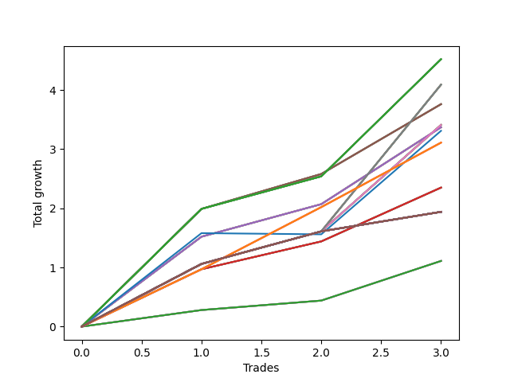

# Long Bulldog 002 
- Symbol: NVDA_Unlimited
- Date Range: 02/08/2022 - 07/08/2022
- Trading Period: 7:20-12:30
- Number of Trades: 3



| Name | Win Percent | Profit | Avg Profit / Trade | Avg Time / Trade |      | Name | Win Percent | Profit | Avg Profit / Trade | Avg Time / Trade |
| ---- | ----------- | ------ | ------------------ | ---------------- | ---- | ---- | ----------- | ------ | ------------------ | ---------------- |
| Sorted By <br> Profit | | | | | | Sorted By <br> Win Percentage ||||
| One Hundred Twenty-Seven | 100.00 | 2260.00 | 753.33 | 17:06 |     | One Hundred Twenty-Seven | 100.00 | 2260.00 | 753.33 | 17:06 |
| One Hundred Twenty-Two | 100.00 | 2260.00 | 753.33 | 17:06 |     | One Hundred Twenty-Two | 100.00 | 2260.00 | 753.33 | 17:06 |
| One Hundred Seventeen | 100.00 | 2260.00 | 753.33 | 17:06 |     | One Hundred Seventeen | 100.00 | 2260.00 | 753.33 | 17:06 |
| One Hundred Twelve | 100.00 | 2260.00 | 753.33 | 17:06 |     | One Hundred Twelve | 100.00 | 2260.00 | 753.33 | 17:06 |
| Eighty-Two | 100.00 | 2260.00 | 753.33 | 17:06 |     | Eighty-Two | 100.00 | 2260.00 | 753.33 | 17:06 |
| Sixty-Nine | 100.00 | 2045.00 | 681.67 | 24:16 |     | Sixty-Nine | 100.00 | 2045.00 | 681.67 | 24:16 |
| Sixty-One | 100.00 | 2045.00 | 681.67 | 24:16 |     | Sixty-One | 100.00 | 2045.00 | 681.67 | 24:16 |
| Fifty-Three | 100.00 | 2045.00 | 681.67 | 24:16 |     | Fifty-Three | 100.00 | 2045.00 | 681.67 | 24:16 |
| Forty-Five | 100.00 | 2045.00 | 681.67 | 24:16 |     | Forty-Five | 100.00 | 2045.00 | 681.67 | 24:16 |
| Five | 100.00 | 2045.00 | 681.67 | 24:16 |     | Five | 100.00 | 2045.00 | 681.67 | 24:16 |
| Sixty-Seven | 100.00 | 1880.00 | 626.67 | 13:00 |     | Sixty-Seven | 100.00 | 1880.00 | 626.67 | 13:00 |
| Fifty-Nine | 100.00 | 1880.00 | 626.67 | 13:00 |     | Fifty-Nine | 100.00 | 1880.00 | 626.67 | 13:00 |
| Fifty-One | 100.00 | 1880.00 | 626.67 | 13:00 |     | Fifty-One | 100.00 | 1880.00 | 626.67 | 13:00 |
| Forty-Three | 100.00 | 1880.00 | 626.67 | 13:00 |     | Forty-Three | 100.00 | 1880.00 | 626.67 | 13:00 |
| Three | 100.00 | 1880.00 | 626.67 | 13:00 |     | Three | 100.00 | 1880.00 | 626.67 | 13:00 |
| Sixty-Eight | 100.00 | 1705.00 | 568.33 | 23:25 |     | Sixty-Eight | 100.00 | 1705.00 | 568.33 | 23:25 |
| Sixty | 100.00 | 1705.00 | 568.33 | 23:25 |     | Sixty | 100.00 | 1705.00 | 568.33 | 23:25 |
| Fifty-Two | 100.00 | 1705.00 | 568.33 | 23:25 |     | Fifty-Two | 100.00 | 1705.00 | 568.33 | 23:25 |
| Forty-Four | 100.00 | 1705.00 | 568.33 | 23:25 |     | Forty-Four | 100.00 | 1705.00 | 568.33 | 23:25 |
| Four | 100.00 | 1705.00 | 568.33 | 23:25 |     | Four | 100.00 | 1705.00 | 568.33 | 23:25 |
| Sixty-Six | 100.00 | 1685.00 | 561.67 | 14:51 |     | Sixty-Six | 100.00 | 1685.00 | 561.67 | 14:51 |
| Fifty-Eight | 100.00 | 1685.00 | 561.67 | 14:51 |     | Fifty-Eight | 100.00 | 1685.00 | 561.67 | 14:51 |
| Fifty | 100.00 | 1685.00 | 561.67 | 14:51 |     | Fifty | 100.00 | 1685.00 | 561.67 | 14:51 |
| Forty-Two | 100.00 | 1685.00 | 561.67 | 14:51 |     | Forty-Two | 100.00 | 1685.00 | 561.67 | 14:51 |
| Two | 100.00 | 1685.00 | 561.67 | 14:51 |     | Two | 100.00 | 1685.00 | 561.67 | 14:51 |
| Seventy-Three | 66.67 | 1655.00 | 551.67 | 12:45 |     | One Hundred Twenty-Six | 100.00 | 1555.00 | 518.33 | 10:46 |
| One Hundred Twenty-Six | 100.00 | 1555.00 | 518.33 | 10:46 |     | One Hundred Twenty-One | 100.00 | 1555.00 | 518.33 | 10:46 |
| One Hundred Twenty-One | 100.00 | 1555.00 | 518.33 | 10:46 |     | One Hundred Sixteen | 100.00 | 1555.00 | 518.33 | 10:46 |
| One Hundred Sixteen | 100.00 | 1555.00 | 518.33 | 10:46 |     | One Hundred Eleven | 100.00 | 1555.00 | 518.33 | 10:46 |
| One Hundred Eleven | 100.00 | 1555.00 | 518.33 | 10:46 |     | Eighty-One | 100.00 | 1555.00 | 518.33 | 10:46 |
| Eighty-One | 100.00 | 1555.00 | 518.33 | 10:46 |     | Sixty-Five | 100.00 | 1175.00 | 391.67 | 05:00 |
| Sixty-Five | 100.00 | 1175.00 | 391.67 | 05:00 |     | Fifty-Seven | 100.00 | 1175.00 | 391.67 | 05:00 |
| Fifty-Seven | 100.00 | 1175.00 | 391.67 | 05:00 |     | Forty-Nine | 100.00 | 1175.00 | 391.67 | 05:00 |
| Forty-Nine | 100.00 | 1175.00 | 391.67 | 05:00 |     | Forty-One | 100.00 | 1175.00 | 391.67 | 05:00 |
| Forty-One | 100.00 | 1175.00 | 391.67 | 05:00 |     | One | 100.00 | 1175.00 | 391.67 | 05:00 |
| One | 100.00 | 1175.00 | 391.67 | 05:00 |     | One Hundred Thirty | 100.00 | 970.00 | 323.33 | 29:55 |
| One Hundred Thirty | 100.00 | 970.00 | 323.33 | 29:55 |     | One Hundred Twenty-Nine | 100.00 | 970.00 | 323.33 | 29:55 |
| One Hundred Twenty-Nine | 100.00 | 970.00 | 323.33 | 29:55 |     | One Hundred Twenty-Eight | 100.00 | 970.00 | 323.33 | 29:55 |
| One Hundred Twenty-Eight | 100.00 | 970.00 | 323.33 | 29:55 |     | One Hundred Twenty-Five | 100.00 | 970.00 | 323.33 | 29:55 |
| One Hundred Twenty-Five | 100.00 | 970.00 | 323.33 | 29:55 |     | One Hundred Twenty-Four | 100.00 | 970.00 | 323.33 | 29:55 |
| One Hundred Twenty-Four | 100.00 | 970.00 | 323.33 | 29:55 |     | One Hundred Twenty-Three | 100.00 | 970.00 | 323.33 | 29:55 |
| One Hundred Twenty-Three | 100.00 | 970.00 | 323.33 | 29:55 |     | One Hundred Twenty | 100.00 | 970.00 | 323.33 | 29:55 |
| One Hundred Twenty | 100.00 | 970.00 | 323.33 | 29:55 |     | One Hundred Ninteen | 100.00 | 970.00 | 323.33 | 29:55 |
| One Hundred Ninteen | 100.00 | 970.00 | 323.33 | 29:55 |     | One Hundred Eighteen | 100.00 | 970.00 | 323.33 | 29:55 |
| One Hundred Eighteen | 100.00 | 970.00 | 323.33 | 29:55 |     | One Hundred Fifteen | 100.00 | 970.00 | 323.33 | 29:55 |
| One Hundred Fifteen | 100.00 | 970.00 | 323.33 | 29:55 |     | One Hundred Fourteen | 100.00 | 970.00 | 323.33 | 29:55 |
| One Hundred Fourteen | 100.00 | 970.00 | 323.33 | 29:55 |     | One Hundred Thirteen | 100.00 | 970.00 | 323.33 | 29:55 |
| One Hundred Thirteen | 100.00 | 970.00 | 323.33 | 29:55 |     | Eighty-Five | 100.00 | 970.00 | 323.33 | 29:55 |
| Eighty-Five | 100.00 | 970.00 | 323.33 | 29:55 |     | Eighty-Four | 100.00 | 970.00 | 323.33 | 29:55 |
| Eighty-Four | 100.00 | 970.00 | 323.33 | 29:55 |     | Eighty-Three | 100.00 | 970.00 | 323.33 | 29:55 |
| Eighty-Three | 100.00 | 970.00 | 323.33 | 29:55 |     | Seventy-One | 100.00 | 970.00 | 323.33 | 29:55 |
| Seventy-One | 100.00 | 970.00 | 323.33 | 29:55 |     | Seventy | 100.00 | 970.00 | 323.33 | 29:55 |
| Seventy | 100.00 | 970.00 | 323.33 | 29:55 |     | Sixty-Three | 100.00 | 970.00 | 323.33 | 29:55 |
| Sixty-Three | 100.00 | 970.00 | 323.33 | 29:55 |     | Sixty-Two | 100.00 | 970.00 | 323.33 | 29:55 |
| Sixty-Two | 100.00 | 970.00 | 323.33 | 29:55 |     | Fifty-Five | 100.00 | 970.00 | 323.33 | 29:55 |
| Fifty-Five | 100.00 | 970.00 | 323.33 | 29:55 |     | Fifty-Four | 100.00 | 970.00 | 323.33 | 29:55 |
| Fifty-Four | 100.00 | 970.00 | 323.33 | 29:55 |     | Forty-Seven | 100.00 | 970.00 | 323.33 | 29:55 |
| Forty-Seven | 100.00 | 970.00 | 323.33 | 29:55 |     | Forty-Six | 100.00 | 970.00 | 323.33 | 29:55 |
| Forty-Six | 100.00 | 970.00 | 323.33 | 29:55 |     | Seven | 100.00 | 970.00 | 323.33 | 29:55 |
| Seven | 100.00 | 970.00 | 323.33 | 29:55 |     | Six | 100.00 | 970.00 | 323.33 | 29:55 |
| Six | 100.00 | 970.00 | 323.33 | 29:55 |     | Sixty-Four | 100.00 | 555.00 | 185.00 | 01:38 |
| Sixty-Four | 100.00 | 555.00 | 185.00 | 01:38 |     | Fifty-Six | 100.00 | 555.00 | 185.00 | 01:38 |
| Fifty-Six | 100.00 | 555.00 | 185.00 | 01:38 |     | Forty-Eight | 100.00 | 555.00 | 185.00 | 01:38 |
| Forty-Eight | 100.00 | 555.00 | 185.00 | 01:38 |     | Forty | 100.00 | 555.00 | 185.00 | 01:38 |
| Forty | 100.00 | 555.00 | 185.00 | 01:38 |     | Zero | 100.00 | 555.00 | 185.00 | 01:38 |
| Zero | 100.00 | 555.00 | 185.00 | 01:38 |     | Seventy-Three | 66.67 | 1655.00 | 551.67 | 12:45 |

## NO STOPLOSS

### Test Zero
* Sell when price hits the middle line of the 20p bollinger
* No Stoploss
* Results:
```
Total Trades: 3
Percent Up: 100.00
Percent Down: 0.00
Total Points Moved Up: 1.11
Potential Profit: 555.00
Total Points Ups: 1.11 Count Ups: 3
Total Points Downs: 0.00 Count Downs: 0
```

<details><summary>Trades</summary>

<code>In: 2022-02-10 10:40:00		Out: 2022-02-10 10:40:35		Total Position Time: 00:35		Total Move Up: 0.28		Total to Date: 0.28</code> <br />
<code>In: 2022-03-30 08:14:00		Out: 2022-03-30 08:14:35		Total Position Time: 00:35		Total Move Up: 0.16		Total to Date: 0.44</code> <br />
<code>In: 2022-05-02 10:52:00		Out: 2022-05-02 10:55:45		Total Position Time: 03:45		Total Move Up: 0.67		Total to Date: 1.11</code> <br />


</details>

### Test One
* Sell when the price hits the upper line of the 20p 1std bollinger
* No Stoploss
* Results:
```
Total Trades: 3
Percent Up: 100.00
Percent Down: 0.00
Total Points Moved Up: 2.35
Potential Profit: 1175.00
Total Points Ups: 2.35 Count Ups: 3
Total Points Downs: 0.00 Count Downs: 0
```

<details><summary>Trades</summary>

<code>In: 2022-02-10 10:40:00		Out: 2022-02-10 10:43:25		Total Position Time: 03:25		Total Move Up: 0.97		Total to Date: 0.97</code> <br />
<code>In: 2022-03-30 08:14:00		Out: 2022-03-30 08:19:15		Total Position Time: 05:15		Total Move Up: 0.47		Total to Date: 1.44</code> <br />
<code>In: 2022-05-02 10:52:00		Out: 2022-05-02 10:58:20		Total Position Time: 06:20		Total Move Up: 0.91		Total to Date: 2.35</code> <br />


</details>

### Test Two
* Sell when the price hits the upper line of the 20p 2std bollinger
* No Stoploss
* Results:
```
Total Trades: 3
Percent Up: 100.00
Percent Down: 0.00
Total Points Moved Up: 3.37
Potential Profit: 1685.00
Total Points Ups: 3.37 Count Ups: 3
Total Points Downs: 0.00 Count Downs: 0
```

<details><summary>Trades</summary>

<code>In: 2022-02-10 10:40:00		Out: 2022-02-10 10:46:45		Total Position Time: 06:45		Total Move Up: 1.52		Total to Date: 1.52</code> <br />
<code>In: 2022-03-30 08:14:00		Out: 2022-03-30 08:43:55		Total Position Time: 29:55		Total Move Up: 0.55		Total to Date: 2.07</code> <br />
<code>In: 2022-05-02 10:52:00		Out: 2022-05-02 10:59:55		Total Position Time: 07:55		Total Move Up: 1.30		Total to Date: 3.37</code> <br />


</details>

### Test Three
* Sell when price hits the middle line of the 50p bollinger
* No Stoploss
* Results:
```
Total Trades: 3
Percent Up: 100.00
Percent Down: 0.00
Total Points Moved Up: 3.76
Potential Profit: 1880.00
Total Points Ups: 3.76 Count Ups: 3
Total Points Downs: 0.00 Count Downs: 0
```

<details><summary>Trades</summary>

<code>In: 2022-02-10 10:40:00		Out: 2022-02-10 10:50:30		Total Position Time: 10:30		Total Move Up: 1.99		Total to Date: 1.99</code> <br />
<code>In: 2022-03-30 08:14:00		Out: 2022-03-30 08:34:40		Total Position Time: 20:40		Total Move Up: 0.59		Total to Date: 2.58</code> <br />
<code>In: 2022-05-02 10:52:00		Out: 2022-05-02 10:59:50		Total Position Time: 07:50		Total Move Up: 1.18		Total to Date: 3.76</code> <br />


</details>

### Test Four
* Sell when the price hits the upper line of the 50p 1std bollinger
* No Stoploss
* Results:
```
Total Trades: 3
Percent Up: 100.00
Percent Down: 0.00
Total Points Moved Up: 3.41
Potential Profit: 1705.00
Total Points Ups: 3.41 Count Ups: 3
Total Points Downs: 0.00 Count Downs: 0
```

<details><summary>Trades</summary>

<code>In: 2022-02-10 10:40:00		Out: 2022-02-10 11:09:55		Total Position Time: 29:55		Total Move Up: 1.06		Total to Date: 1.06</code> <br />
<code>In: 2022-03-30 08:14:00		Out: 2022-03-30 08:43:55		Total Position Time: 29:55		Total Move Up: 0.55		Total to Date: 1.61</code> <br />
<code>In: 2022-05-02 10:52:00		Out: 2022-05-02 11:02:25		Total Position Time: 10:25		Total Move Up: 1.80		Total to Date: 3.41</code> <br />


</details>

### Test Five
* Sell when the price hits the upper line of the 50p 2std bollinger
* No Stoploss
* Results:
```
Total Trades: 3
Percent Up: 100.00
Percent Down: 0.00
Total Points Moved Up: 4.09
Potential Profit: 2045.00
Total Points Ups: 4.09 Count Ups: 3
Total Points Downs: 0.00 Count Downs: 0
```

<details><summary>Trades</summary>

<code>In: 2022-02-10 10:40:00		Out: 2022-02-10 11:09:55		Total Position Time: 29:55		Total Move Up: 1.06		Total to Date: 1.06</code> <br />
<code>In: 2022-03-30 08:14:00		Out: 2022-03-30 08:43:55		Total Position Time: 29:55		Total Move Up: 0.55		Total to Date: 1.61</code> <br />
<code>In: 2022-05-02 10:52:00		Out: 2022-05-02 11:05:00		Total Position Time: 13:00		Total Move Up: 2.48		Total to Date: 4.09</code> <br />


</details>

### Test Six
* Sell when the price hits the middle line of the 1std VWAP
* No Stoploss
* Results:
```
Total Trades: 3
Percent Up: 100.00
Percent Down: 0.00
Total Points Moved Up: 1.94
Potential Profit: 970.00
Total Points Ups: 1.94 Count Ups: 3
Total Points Downs: 0.00 Count Downs: 0
```

<details><summary>Trades</summary>

<code>In: 2022-02-10 10:40:00		Out: 2022-02-10 11:09:55		Total Position Time: 29:55		Total Move Up: 1.06		Total to Date: 1.06</code> <br />
<code>In: 2022-03-30 08:14:00		Out: 2022-03-30 08:43:55		Total Position Time: 29:55		Total Move Up: 0.55		Total to Date: 1.61</code> <br />
<code>In: 2022-05-02 10:52:00		Out: 2022-05-02 11:21:55		Total Position Time: 29:55		Total Move Up: 0.33		Total to Date: 1.94</code> <br />


</details>

### Test Seven
* Sell when the price hits the upper line of the 1std VWAP
* No Stoploss
* Results:
```
Total Trades: 3
Percent Up: 100.00
Percent Down: 0.00
Total Points Moved Up: 1.94
Potential Profit: 970.00
Total Points Ups: 1.94 Count Ups: 3
Total Points Downs: 0.00 Count Downs: 0
```

<details><summary>Trades</summary>

<code>In: 2022-02-10 10:40:00		Out: 2022-02-10 11:09:55		Total Position Time: 29:55		Total Move Up: 1.06		Total to Date: 1.06</code> <br />
<code>In: 2022-03-30 08:14:00		Out: 2022-03-30 08:43:55		Total Position Time: 29:55		Total Move Up: 0.55		Total to Date: 1.61</code> <br />
<code>In: 2022-05-02 10:52:00		Out: 2022-05-02 11:21:55		Total Position Time: 29:55		Total Move Up: 0.33		Total to Date: 1.94</code> <br />


</details>

## STOPLOSS OF 5

### Test Forty
* Sell when price hits the middle line of the 20p bollinger
* Stoploss is 5 points
* Results:
```
Total Trades: 3
Percent Up: 100.00
Percent Down: 0.00
Total Points Moved Up: 1.11
Potential Profit: 555.00
Total Points Ups: 1.11 Count Ups: 3
Total Points Downs: 0.00 Count Downs: 0
```

<details><summary>Trades</summary>

<code>In: 2022-02-10 10:40:00		Out: 2022-02-10 10:40:35		Total Position Time: 00:35		Total Move Up: 0.28		Total to Date: 0.28</code> <br />
<code>In: 2022-03-30 08:14:00		Out: 2022-03-30 08:14:35		Total Position Time: 00:35		Total Move Up: 0.16		Total to Date: 0.44</code> <br />
<code>In: 2022-05-02 10:52:00		Out: 2022-05-02 10:55:45		Total Position Time: 03:45		Total Move Up: 0.67		Total to Date: 1.11</code> <br />


</details>

### Test Forty-One
* Sell when the price hits the upper line of the 20p 1std bollinger
* Stoploss is 5 points
* Results:
```
Total Trades: 3
Percent Up: 100.00
Percent Down: 0.00
Total Points Moved Up: 2.35
Potential Profit: 1175.00
Total Points Ups: 2.35 Count Ups: 3
Total Points Downs: 0.00 Count Downs: 0
```

<details><summary>Trades</summary>

<code>In: 2022-02-10 10:40:00		Out: 2022-02-10 10:43:25		Total Position Time: 03:25		Total Move Up: 0.97		Total to Date: 0.97</code> <br />
<code>In: 2022-03-30 08:14:00		Out: 2022-03-30 08:19:15		Total Position Time: 05:15		Total Move Up: 0.47		Total to Date: 1.44</code> <br />
<code>In: 2022-05-02 10:52:00		Out: 2022-05-02 10:58:20		Total Position Time: 06:20		Total Move Up: 0.91		Total to Date: 2.35</code> <br />


</details>

### Test Forty-Two
* Sell when the price hits the upper line of the 20p 2std bollinger
* Stoploss is 5 points
* Results:
```
Total Trades: 3
Percent Up: 100.00
Percent Down: 0.00
Total Points Moved Up: 3.37
Potential Profit: 1685.00
Total Points Ups: 3.37 Count Ups: 3
Total Points Downs: 0.00 Count Downs: 0
```

<details><summary>Trades</summary>

<code>In: 2022-02-10 10:40:00		Out: 2022-02-10 10:46:45		Total Position Time: 06:45		Total Move Up: 1.52		Total to Date: 1.52</code> <br />
<code>In: 2022-03-30 08:14:00		Out: 2022-03-30 08:43:55		Total Position Time: 29:55		Total Move Up: 0.55		Total to Date: 2.07</code> <br />
<code>In: 2022-05-02 10:52:00		Out: 2022-05-02 10:59:55		Total Position Time: 07:55		Total Move Up: 1.30		Total to Date: 3.37</code> <br />


</details>

### Test Forty-Three
* Sell when price hits the middle line of the 50p bollinger
* Stoploss is 5 points
* Results:
```
Total Trades: 3
Percent Up: 100.00
Percent Down: 0.00
Total Points Moved Up: 3.76
Potential Profit: 1880.00
Total Points Ups: 3.76 Count Ups: 3
Total Points Downs: 0.00 Count Downs: 0
```

<details><summary>Trades</summary>

<code>In: 2022-02-10 10:40:00		Out: 2022-02-10 10:50:30		Total Position Time: 10:30		Total Move Up: 1.99		Total to Date: 1.99</code> <br />
<code>In: 2022-03-30 08:14:00		Out: 2022-03-30 08:34:40		Total Position Time: 20:40		Total Move Up: 0.59		Total to Date: 2.58</code> <br />
<code>In: 2022-05-02 10:52:00		Out: 2022-05-02 10:59:50		Total Position Time: 07:50		Total Move Up: 1.18		Total to Date: 3.76</code> <br />


</details>

### Test Forty-Four
* Sell when the price hits the upper line of the 50p 1std bollinger
* Stoploss is 5 points
* Results:
```
Total Trades: 3
Percent Up: 100.00
Percent Down: 0.00
Total Points Moved Up: 3.41
Potential Profit: 1705.00
Total Points Ups: 3.41 Count Ups: 3
Total Points Downs: 0.00 Count Downs: 0
```

<details><summary>Trades</summary>

<code>In: 2022-02-10 10:40:00		Out: 2022-02-10 11:09:55		Total Position Time: 29:55		Total Move Up: 1.06		Total to Date: 1.06</code> <br />
<code>In: 2022-03-30 08:14:00		Out: 2022-03-30 08:43:55		Total Position Time: 29:55		Total Move Up: 0.55		Total to Date: 1.61</code> <br />
<code>In: 2022-05-02 10:52:00		Out: 2022-05-02 11:02:25		Total Position Time: 10:25		Total Move Up: 1.80		Total to Date: 3.41</code> <br />


</details>

### Test Forty-Five
* Sell when the price hits the upper line of the 50p 2std bollinger
* Stoploss is 5 points
* Results:
```
Total Trades: 3
Percent Up: 100.00
Percent Down: 0.00
Total Points Moved Up: 4.09
Potential Profit: 2045.00
Total Points Ups: 4.09 Count Ups: 3
Total Points Downs: 0.00 Count Downs: 0
```

<details><summary>Trades</summary>

<code>In: 2022-02-10 10:40:00		Out: 2022-02-10 11:09:55		Total Position Time: 29:55		Total Move Up: 1.06		Total to Date: 1.06</code> <br />
<code>In: 2022-03-30 08:14:00		Out: 2022-03-30 08:43:55		Total Position Time: 29:55		Total Move Up: 0.55		Total to Date: 1.61</code> <br />
<code>In: 2022-05-02 10:52:00		Out: 2022-05-02 11:05:00		Total Position Time: 13:00		Total Move Up: 2.48		Total to Date: 4.09</code> <br />


</details>

### Test Forty-Six
* Sell when the price hits the middle line of the 1std VWAP
* Stoploss is 5 points
* Results:
```
Total Trades: 3
Percent Up: 100.00
Percent Down: 0.00
Total Points Moved Up: 1.94
Potential Profit: 970.00
Total Points Ups: 1.94 Count Ups: 3
Total Points Downs: 0.00 Count Downs: 0
```

<details><summary>Trades</summary>

<code>In: 2022-02-10 10:40:00		Out: 2022-02-10 11:09:55		Total Position Time: 29:55		Total Move Up: 1.06		Total to Date: 1.06</code> <br />
<code>In: 2022-03-30 08:14:00		Out: 2022-03-30 08:43:55		Total Position Time: 29:55		Total Move Up: 0.55		Total to Date: 1.61</code> <br />
<code>In: 2022-05-02 10:52:00		Out: 2022-05-02 11:21:55		Total Position Time: 29:55		Total Move Up: 0.33		Total to Date: 1.94</code> <br />


</details>

### Test Forty-Seven
* Sell when the price hits the upper line of the 1std VWAP
* Stoploss is 5 points
* Results:
```
Total Trades: 3
Percent Up: 100.00
Percent Down: 0.00
Total Points Moved Up: 1.94
Potential Profit: 970.00
Total Points Ups: 1.94 Count Ups: 3
Total Points Downs: 0.00 Count Downs: 0
```

<details><summary>Trades</summary>

<code>In: 2022-02-10 10:40:00		Out: 2022-02-10 11:09:55		Total Position Time: 29:55		Total Move Up: 1.06		Total to Date: 1.06</code> <br />
<code>In: 2022-03-30 08:14:00		Out: 2022-03-30 08:43:55		Total Position Time: 29:55		Total Move Up: 0.55		Total to Date: 1.61</code> <br />
<code>In: 2022-05-02 10:52:00		Out: 2022-05-02 11:21:55		Total Position Time: 29:55		Total Move Up: 0.33		Total to Date: 1.94</code> <br />


</details>

## TRAIL STOP OF 5

### Test Forty-Eight
* Sell when price hits the middle line of the 20p bollinger
* Trailing Stop is 5 points
* Results:
```
Total Trades: 3
Percent Up: 100.00
Percent Down: 0.00
Total Points Moved Up: 1.11
Potential Profit: 555.00
Total Points Ups: 1.11 Count Ups: 3
Total Points Downs: 0.00 Count Downs: 0
```

<details><summary>Trades</summary>

<code>In: 2022-02-10 10:40:00		Out: 2022-02-10 10:40:35		Total Position Time: 00:35		Total Move Up: 0.28		Total to Date: 0.28</code> <br />
<code>In: 2022-03-30 08:14:00		Out: 2022-03-30 08:14:35		Total Position Time: 00:35		Total Move Up: 0.16		Total to Date: 0.44</code> <br />
<code>In: 2022-05-02 10:52:00		Out: 2022-05-02 10:55:45		Total Position Time: 03:45		Total Move Up: 0.67		Total to Date: 1.11</code> <br />


</details>

### Test Forty-Nine
* Sell when the price hits the upper line of the 20p 1std bollinger
* Trailing Stop is 5 points
* Results:
```
Total Trades: 3
Percent Up: 100.00
Percent Down: 0.00
Total Points Moved Up: 2.35
Potential Profit: 1175.00
Total Points Ups: 2.35 Count Ups: 3
Total Points Downs: 0.00 Count Downs: 0
```

<details><summary>Trades</summary>

<code>In: 2022-02-10 10:40:00		Out: 2022-02-10 10:43:25		Total Position Time: 03:25		Total Move Up: 0.97		Total to Date: 0.97</code> <br />
<code>In: 2022-03-30 08:14:00		Out: 2022-03-30 08:19:15		Total Position Time: 05:15		Total Move Up: 0.47		Total to Date: 1.44</code> <br />
<code>In: 2022-05-02 10:52:00		Out: 2022-05-02 10:58:20		Total Position Time: 06:20		Total Move Up: 0.91		Total to Date: 2.35</code> <br />


</details>

### Test Fifty
* Sell when the price hits the upper line of the 20p 2std bollinger
* Trailing Stop is 5 points
* Results:
```
Total Trades: 3
Percent Up: 100.00
Percent Down: 0.00
Total Points Moved Up: 3.37
Potential Profit: 1685.00
Total Points Ups: 3.37 Count Ups: 3
Total Points Downs: 0.00 Count Downs: 0
```

<details><summary>Trades</summary>

<code>In: 2022-02-10 10:40:00		Out: 2022-02-10 10:46:45		Total Position Time: 06:45		Total Move Up: 1.52		Total to Date: 1.52</code> <br />
<code>In: 2022-03-30 08:14:00		Out: 2022-03-30 08:43:55		Total Position Time: 29:55		Total Move Up: 0.55		Total to Date: 2.07</code> <br />
<code>In: 2022-05-02 10:52:00		Out: 2022-05-02 10:59:55		Total Position Time: 07:55		Total Move Up: 1.30		Total to Date: 3.37</code> <br />


</details>

### Test Fifty-One
* Sell when price hits the middle line of the 50p bollinger
* Trailing Stop is 5 points
* Results:
```
Total Trades: 3
Percent Up: 100.00
Percent Down: 0.00
Total Points Moved Up: 3.76
Potential Profit: 1880.00
Total Points Ups: 3.76 Count Ups: 3
Total Points Downs: 0.00 Count Downs: 0
```

<details><summary>Trades</summary>

<code>In: 2022-02-10 10:40:00		Out: 2022-02-10 10:50:30		Total Position Time: 10:30		Total Move Up: 1.99		Total to Date: 1.99</code> <br />
<code>In: 2022-03-30 08:14:00		Out: 2022-03-30 08:34:40		Total Position Time: 20:40		Total Move Up: 0.59		Total to Date: 2.58</code> <br />
<code>In: 2022-05-02 10:52:00		Out: 2022-05-02 10:59:50		Total Position Time: 07:50		Total Move Up: 1.18		Total to Date: 3.76</code> <br />


</details>

### Test Fifty-Two
* Sell when the price hits the upper line of the 50p 1std bollinger
* Trailing Stop is 5 points
* Results:
```
Total Trades: 3
Percent Up: 100.00
Percent Down: 0.00
Total Points Moved Up: 3.41
Potential Profit: 1705.00
Total Points Ups: 3.41 Count Ups: 3
Total Points Downs: 0.00 Count Downs: 0
```

<details><summary>Trades</summary>

<code>In: 2022-02-10 10:40:00		Out: 2022-02-10 11:09:55		Total Position Time: 29:55		Total Move Up: 1.06		Total to Date: 1.06</code> <br />
<code>In: 2022-03-30 08:14:00		Out: 2022-03-30 08:43:55		Total Position Time: 29:55		Total Move Up: 0.55		Total to Date: 1.61</code> <br />
<code>In: 2022-05-02 10:52:00		Out: 2022-05-02 11:02:25		Total Position Time: 10:25		Total Move Up: 1.80		Total to Date: 3.41</code> <br />


</details>

### Test Fifty-Three
* Sell when the price hits the upper line of the 50p 2std bollinger
* Trailing Stop is 5 points
* Results:
```
Total Trades: 3
Percent Up: 100.00
Percent Down: 0.00
Total Points Moved Up: 4.09
Potential Profit: 2045.00
Total Points Ups: 4.09 Count Ups: 3
Total Points Downs: 0.00 Count Downs: 0
```

<details><summary>Trades</summary>

<code>In: 2022-02-10 10:40:00		Out: 2022-02-10 11:09:55		Total Position Time: 29:55		Total Move Up: 1.06		Total to Date: 1.06</code> <br />
<code>In: 2022-03-30 08:14:00		Out: 2022-03-30 08:43:55		Total Position Time: 29:55		Total Move Up: 0.55		Total to Date: 1.61</code> <br />
<code>In: 2022-05-02 10:52:00		Out: 2022-05-02 11:05:00		Total Position Time: 13:00		Total Move Up: 2.48		Total to Date: 4.09</code> <br />


</details>

### Test Fifty-Four
* Sell when the price hits the middle line of the 1std VWAP
* Trailing Stop is 5 points
* Results:
```
Total Trades: 3
Percent Up: 100.00
Percent Down: 0.00
Total Points Moved Up: 1.94
Potential Profit: 970.00
Total Points Ups: 1.94 Count Ups: 3
Total Points Downs: 0.00 Count Downs: 0
```

<details><summary>Trades</summary>

<code>In: 2022-02-10 10:40:00		Out: 2022-02-10 11:09:55		Total Position Time: 29:55		Total Move Up: 1.06		Total to Date: 1.06</code> <br />
<code>In: 2022-03-30 08:14:00		Out: 2022-03-30 08:43:55		Total Position Time: 29:55		Total Move Up: 0.55		Total to Date: 1.61</code> <br />
<code>In: 2022-05-02 10:52:00		Out: 2022-05-02 11:21:55		Total Position Time: 29:55		Total Move Up: 0.33		Total to Date: 1.94</code> <br />


</details>

### Test Fifty-Five
* Sell when the price hits the upper line of the 1std VWAP
* Trailing Stop is 5 points
* Results:
```
Total Trades: 3
Percent Up: 100.00
Percent Down: 0.00
Total Points Moved Up: 1.94
Potential Profit: 970.00
Total Points Ups: 1.94 Count Ups: 3
Total Points Downs: 0.00 Count Downs: 0
```

<details><summary>Trades</summary>

<code>In: 2022-02-10 10:40:00		Out: 2022-02-10 11:09:55		Total Position Time: 29:55		Total Move Up: 1.06		Total to Date: 1.06</code> <br />
<code>In: 2022-03-30 08:14:00		Out: 2022-03-30 08:43:55		Total Position Time: 29:55		Total Move Up: 0.55		Total to Date: 1.61</code> <br />
<code>In: 2022-05-02 10:52:00		Out: 2022-05-02 11:21:55		Total Position Time: 29:55		Total Move Up: 0.33		Total to Date: 1.94</code> <br />


</details>

## STOPLOSS OF 10

### Test Fifty-Six
* Sell when price hits the middle line of the 20p bollinger
* Stoploss is 10 points
* Results:
```
Total Trades: 3
Percent Up: 100.00
Percent Down: 0.00
Total Points Moved Up: 1.11
Potential Profit: 555.00
Total Points Ups: 1.11 Count Ups: 3
Total Points Downs: 0.00 Count Downs: 0
```

<details><summary>Trades</summary>

<code>In: 2022-02-10 10:40:00		Out: 2022-02-10 10:40:35		Total Position Time: 00:35		Total Move Up: 0.28		Total to Date: 0.28</code> <br />
<code>In: 2022-03-30 08:14:00		Out: 2022-03-30 08:14:35		Total Position Time: 00:35		Total Move Up: 0.16		Total to Date: 0.44</code> <br />
<code>In: 2022-05-02 10:52:00		Out: 2022-05-02 10:55:45		Total Position Time: 03:45		Total Move Up: 0.67		Total to Date: 1.11</code> <br />


</details>

### Test Fifty-Seven
* Sell when the price hits the upper line of the 20p 1std bollinger
* Stoploss is 10 points
* Results:
```
Total Trades: 3
Percent Up: 100.00
Percent Down: 0.00
Total Points Moved Up: 2.35
Potential Profit: 1175.00
Total Points Ups: 2.35 Count Ups: 3
Total Points Downs: 0.00 Count Downs: 0
```

<details><summary>Trades</summary>

<code>In: 2022-02-10 10:40:00		Out: 2022-02-10 10:43:25		Total Position Time: 03:25		Total Move Up: 0.97		Total to Date: 0.97</code> <br />
<code>In: 2022-03-30 08:14:00		Out: 2022-03-30 08:19:15		Total Position Time: 05:15		Total Move Up: 0.47		Total to Date: 1.44</code> <br />
<code>In: 2022-05-02 10:52:00		Out: 2022-05-02 10:58:20		Total Position Time: 06:20		Total Move Up: 0.91		Total to Date: 2.35</code> <br />


</details>

### Test Fifty-Eight
* Sell when the price hits the upper line of the 20p 2std bollinger
* Stoploss is 10 points
* Results:
```
Total Trades: 3
Percent Up: 100.00
Percent Down: 0.00
Total Points Moved Up: 3.37
Potential Profit: 1685.00
Total Points Ups: 3.37 Count Ups: 3
Total Points Downs: 0.00 Count Downs: 0
```

<details><summary>Trades</summary>

<code>In: 2022-02-10 10:40:00		Out: 2022-02-10 10:46:45		Total Position Time: 06:45		Total Move Up: 1.52		Total to Date: 1.52</code> <br />
<code>In: 2022-03-30 08:14:00		Out: 2022-03-30 08:43:55		Total Position Time: 29:55		Total Move Up: 0.55		Total to Date: 2.07</code> <br />
<code>In: 2022-05-02 10:52:00		Out: 2022-05-02 10:59:55		Total Position Time: 07:55		Total Move Up: 1.30		Total to Date: 3.37</code> <br />


</details>

### Test Fifty-Nine
* Sell when price hits the middle line of the 50p bollinger
* Stoploss is 10 points
* Results:
```
Total Trades: 3
Percent Up: 100.00
Percent Down: 0.00
Total Points Moved Up: 3.76
Potential Profit: 1880.00
Total Points Ups: 3.76 Count Ups: 3
Total Points Downs: 0.00 Count Downs: 0
```

<details><summary>Trades</summary>

<code>In: 2022-02-10 10:40:00		Out: 2022-02-10 10:50:30		Total Position Time: 10:30		Total Move Up: 1.99		Total to Date: 1.99</code> <br />
<code>In: 2022-03-30 08:14:00		Out: 2022-03-30 08:34:40		Total Position Time: 20:40		Total Move Up: 0.59		Total to Date: 2.58</code> <br />
<code>In: 2022-05-02 10:52:00		Out: 2022-05-02 10:59:50		Total Position Time: 07:50		Total Move Up: 1.18		Total to Date: 3.76</code> <br />


</details>

### Test Sixty
* Sell when the price hits the upper line of the 50p 1std bollinger
* Stoploss is 10 points
* Results:
```
Total Trades: 3
Percent Up: 100.00
Percent Down: 0.00
Total Points Moved Up: 3.41
Potential Profit: 1705.00
Total Points Ups: 3.41 Count Ups: 3
Total Points Downs: 0.00 Count Downs: 0
```

<details><summary>Trades</summary>

<code>In: 2022-02-10 10:40:00		Out: 2022-02-10 11:09:55		Total Position Time: 29:55		Total Move Up: 1.06		Total to Date: 1.06</code> <br />
<code>In: 2022-03-30 08:14:00		Out: 2022-03-30 08:43:55		Total Position Time: 29:55		Total Move Up: 0.55		Total to Date: 1.61</code> <br />
<code>In: 2022-05-02 10:52:00		Out: 2022-05-02 11:02:25		Total Position Time: 10:25		Total Move Up: 1.80		Total to Date: 3.41</code> <br />


</details>

### Test Sixty-One
* Sell when the price hits the upper line of the 50p 2std bollinger
* Stoploss is 10 points
* Results:
```
Total Trades: 3
Percent Up: 100.00
Percent Down: 0.00
Total Points Moved Up: 4.09
Potential Profit: 2045.00
Total Points Ups: 4.09 Count Ups: 3
Total Points Downs: 0.00 Count Downs: 0
```

<details><summary>Trades</summary>

<code>In: 2022-02-10 10:40:00		Out: 2022-02-10 11:09:55		Total Position Time: 29:55		Total Move Up: 1.06		Total to Date: 1.06</code> <br />
<code>In: 2022-03-30 08:14:00		Out: 2022-03-30 08:43:55		Total Position Time: 29:55		Total Move Up: 0.55		Total to Date: 1.61</code> <br />
<code>In: 2022-05-02 10:52:00		Out: 2022-05-02 11:05:00		Total Position Time: 13:00		Total Move Up: 2.48		Total to Date: 4.09</code> <br />


</details>

### Test Sixty-Two
* Sell when the price hits the middle line of the 1std VWAP
* Stoploss is 10 points
* Results:
```
Total Trades: 3
Percent Up: 100.00
Percent Down: 0.00
Total Points Moved Up: 1.94
Potential Profit: 970.00
Total Points Ups: 1.94 Count Ups: 3
Total Points Downs: 0.00 Count Downs: 0
```

<details><summary>Trades</summary>

<code>In: 2022-02-10 10:40:00		Out: 2022-02-10 11:09:55		Total Position Time: 29:55		Total Move Up: 1.06		Total to Date: 1.06</code> <br />
<code>In: 2022-03-30 08:14:00		Out: 2022-03-30 08:43:55		Total Position Time: 29:55		Total Move Up: 0.55		Total to Date: 1.61</code> <br />
<code>In: 2022-05-02 10:52:00		Out: 2022-05-02 11:21:55		Total Position Time: 29:55		Total Move Up: 0.33		Total to Date: 1.94</code> <br />


</details>

### Test Sixty-Three
* Sell when the price hits the upper line of the 1std VWAP
* Stoploss is 10 points
* Results:
```
Total Trades: 3
Percent Up: 100.00
Percent Down: 0.00
Total Points Moved Up: 1.94
Potential Profit: 970.00
Total Points Ups: 1.94 Count Ups: 3
Total Points Downs: 0.00 Count Downs: 0
```

<details><summary>Trades</summary>

<code>In: 2022-02-10 10:40:00		Out: 2022-02-10 11:09:55		Total Position Time: 29:55		Total Move Up: 1.06		Total to Date: 1.06</code> <br />
<code>In: 2022-03-30 08:14:00		Out: 2022-03-30 08:43:55		Total Position Time: 29:55		Total Move Up: 0.55		Total to Date: 1.61</code> <br />
<code>In: 2022-05-02 10:52:00		Out: 2022-05-02 11:21:55		Total Position Time: 29:55		Total Move Up: 0.33		Total to Date: 1.94</code> <br />


</details>

## TRAIL STOP OF 10

### Test Sixty-Four
* Sell when price hits the middle line of the 20p bollinger
* Trailing Stop is 10 points
* Results:
```
Total Trades: 3
Percent Up: 100.00
Percent Down: 0.00
Total Points Moved Up: 1.11
Potential Profit: 555.00
Total Points Ups: 1.11 Count Ups: 3
Total Points Downs: 0.00 Count Downs: 0
```

<details><summary>Trades</summary>

<code>In: 2022-02-10 10:40:00		Out: 2022-02-10 10:40:35		Total Position Time: 00:35		Total Move Up: 0.28		Total to Date: 0.28</code> <br />
<code>In: 2022-03-30 08:14:00		Out: 2022-03-30 08:14:35		Total Position Time: 00:35		Total Move Up: 0.16		Total to Date: 0.44</code> <br />
<code>In: 2022-05-02 10:52:00		Out: 2022-05-02 10:55:45		Total Position Time: 03:45		Total Move Up: 0.67		Total to Date: 1.11</code> <br />


</details>

### Test Sixty-Five
* Sell when the price hits the upper line of the 20p 1std bollinger
* Trailing Stop is 10 points
* Results:
```
Total Trades: 3
Percent Up: 100.00
Percent Down: 0.00
Total Points Moved Up: 2.35
Potential Profit: 1175.00
Total Points Ups: 2.35 Count Ups: 3
Total Points Downs: 0.00 Count Downs: 0
```

<details><summary>Trades</summary>

<code>In: 2022-02-10 10:40:00		Out: 2022-02-10 10:43:25		Total Position Time: 03:25		Total Move Up: 0.97		Total to Date: 0.97</code> <br />
<code>In: 2022-03-30 08:14:00		Out: 2022-03-30 08:19:15		Total Position Time: 05:15		Total Move Up: 0.47		Total to Date: 1.44</code> <br />
<code>In: 2022-05-02 10:52:00		Out: 2022-05-02 10:58:20		Total Position Time: 06:20		Total Move Up: 0.91		Total to Date: 2.35</code> <br />


</details>

### Test Sixty-Six
* Sell when the price hits the upper line of the 20p 2std bollinger
* Trailing Stop is 10 points
* Results:
```
Total Trades: 3
Percent Up: 100.00
Percent Down: 0.00
Total Points Moved Up: 3.37
Potential Profit: 1685.00
Total Points Ups: 3.37 Count Ups: 3
Total Points Downs: 0.00 Count Downs: 0
```

<details><summary>Trades</summary>

<code>In: 2022-02-10 10:40:00		Out: 2022-02-10 10:46:45		Total Position Time: 06:45		Total Move Up: 1.52		Total to Date: 1.52</code> <br />
<code>In: 2022-03-30 08:14:00		Out: 2022-03-30 08:43:55		Total Position Time: 29:55		Total Move Up: 0.55		Total to Date: 2.07</code> <br />
<code>In: 2022-05-02 10:52:00		Out: 2022-05-02 10:59:55		Total Position Time: 07:55		Total Move Up: 1.30		Total to Date: 3.37</code> <br />


</details>

### Test Sixty-Seven
* Sell when price hits the middle line of the 50p bollinger
* Trailing Stop is 10 points
* Results:
```
Total Trades: 3
Percent Up: 100.00
Percent Down: 0.00
Total Points Moved Up: 3.76
Potential Profit: 1880.00
Total Points Ups: 3.76 Count Ups: 3
Total Points Downs: 0.00 Count Downs: 0
```

<details><summary>Trades</summary>

<code>In: 2022-02-10 10:40:00		Out: 2022-02-10 10:50:30		Total Position Time: 10:30		Total Move Up: 1.99		Total to Date: 1.99</code> <br />
<code>In: 2022-03-30 08:14:00		Out: 2022-03-30 08:34:40		Total Position Time: 20:40		Total Move Up: 0.59		Total to Date: 2.58</code> <br />
<code>In: 2022-05-02 10:52:00		Out: 2022-05-02 10:59:50		Total Position Time: 07:50		Total Move Up: 1.18		Total to Date: 3.76</code> <br />


</details>

### Test Sixty-Eight
* Sell when the price hits the upper line of the 50p 1std bollinger
* Trailing Stop is 10 points
* Results:
```
Total Trades: 3
Percent Up: 100.00
Percent Down: 0.00
Total Points Moved Up: 3.41
Potential Profit: 1705.00
Total Points Ups: 3.41 Count Ups: 3
Total Points Downs: 0.00 Count Downs: 0
```

<details><summary>Trades</summary>

<code>In: 2022-02-10 10:40:00		Out: 2022-02-10 11:09:55		Total Position Time: 29:55		Total Move Up: 1.06		Total to Date: 1.06</code> <br />
<code>In: 2022-03-30 08:14:00		Out: 2022-03-30 08:43:55		Total Position Time: 29:55		Total Move Up: 0.55		Total to Date: 1.61</code> <br />
<code>In: 2022-05-02 10:52:00		Out: 2022-05-02 11:02:25		Total Position Time: 10:25		Total Move Up: 1.80		Total to Date: 3.41</code> <br />


</details>

### Test Sixty-Nine
* Sell when the price hits the upper line of the 50p 2std bollinger
* Trailing Stop is 10 points
* Results:
```
Total Trades: 3
Percent Up: 100.00
Percent Down: 0.00
Total Points Moved Up: 4.09
Potential Profit: 2045.00
Total Points Ups: 4.09 Count Ups: 3
Total Points Downs: 0.00 Count Downs: 0
```

<details><summary>Trades</summary>

<code>In: 2022-02-10 10:40:00		Out: 2022-02-10 11:09:55		Total Position Time: 29:55		Total Move Up: 1.06		Total to Date: 1.06</code> <br />
<code>In: 2022-03-30 08:14:00		Out: 2022-03-30 08:43:55		Total Position Time: 29:55		Total Move Up: 0.55		Total to Date: 1.61</code> <br />
<code>In: 2022-05-02 10:52:00		Out: 2022-05-02 11:05:00		Total Position Time: 13:00		Total Move Up: 2.48		Total to Date: 4.09</code> <br />


</details>

### Test Seventy
* Sell when the price hits the middle line of the 1std VWAP
* Trailing Stop is 10 points
* Results:
```
Total Trades: 3
Percent Up: 100.00
Percent Down: 0.00
Total Points Moved Up: 1.94
Potential Profit: 970.00
Total Points Ups: 1.94 Count Ups: 3
Total Points Downs: 0.00 Count Downs: 0
```

<details><summary>Trades</summary>

<code>In: 2022-02-10 10:40:00		Out: 2022-02-10 11:09:55		Total Position Time: 29:55		Total Move Up: 1.06		Total to Date: 1.06</code> <br />
<code>In: 2022-03-30 08:14:00		Out: 2022-03-30 08:43:55		Total Position Time: 29:55		Total Move Up: 0.55		Total to Date: 1.61</code> <br />
<code>In: 2022-05-02 10:52:00		Out: 2022-05-02 11:21:55		Total Position Time: 29:55		Total Move Up: 0.33		Total to Date: 1.94</code> <br />


</details>

### Test Seventy-One
* Sell when the price hits the upper line of the 1std VWAP
* Trailing Stop is 10 points
* Results:
```
Total Trades: 3
Percent Up: 100.00
Percent Down: 0.00
Total Points Moved Up: 1.94
Potential Profit: 970.00
Total Points Ups: 1.94 Count Ups: 3
Total Points Downs: 0.00 Count Downs: 0
```

<details><summary>Trades</summary>

<code>In: 2022-02-10 10:40:00		Out: 2022-02-10 11:09:55		Total Position Time: 29:55		Total Move Up: 1.06		Total to Date: 1.06</code> <br />
<code>In: 2022-03-30 08:14:00		Out: 2022-03-30 08:43:55		Total Position Time: 29:55		Total Move Up: 0.55		Total to Date: 1.61</code> <br />
<code>In: 2022-05-02 10:52:00		Out: 2022-05-02 11:21:55		Total Position Time: 29:55		Total Move Up: 0.33		Total to Date: 1.94</code> <br />


</details>

## SPECIAL EXIT CONDITIONS 

### Test Seventy-Three
* Sell when the linear regression slope changes to negative
* No Stoploss
* Results:
```
Total Trades: 3
Percent Up: 66.67
Percent Down: 33.33
Total Points Moved Up: 3.31
Potential Profit: 1655.00
Total Points Ups: 3.33 Count Ups: 2
Total Points Downs: -0.02 Count Downs: 1
```

<details><summary>Trades</summary>

<code>In: 2022-02-10 10:40:00		Out: 2022-02-10 10:52:05		Total Position Time: 12:05		Total Move Up: 1.58		Total to Date: 1.58</code> <br />
<code>In: 2022-03-30 08:14:00		Out: 2022-03-30 08:23:05		Total Position Time: 09:05		Total Move Up: -0.02		Total to Date: 1.56</code> <br />
<code>In: 2022-05-02 10:52:00		Out: 2022-05-02 11:09:05		Total Position Time: 17:05		Total Move Up: 1.75		Total to Date: 3.31</code> <br />


</details>

## TAKE PROFIT

### Test Eighty-One
* Take Profit of 1 Point
* No Stoploss
* Results:
```
Total Trades: 3
Percent Up: 100.00
Percent Down: 0.00
Total Points Moved Up: 3.11
Potential Profit: 1555.00
Total Points Ups: 3.11 Count Ups: 3
Total Points Downs: 0.00 Count Downs: 0
```

<details><summary>Trades</summary>

<code>In: 2022-02-10 10:40:00		Out: 2022-02-10 10:43:25		Total Position Time: 03:25		Total Move Up: 0.97		Total to Date: 0.97</code> <br />
<code>In: 2022-03-30 08:14:00		Out: 2022-03-30 08:35:15		Total Position Time: 21:15		Total Move Up: 1.05		Total to Date: 2.02</code> <br />
<code>In: 2022-05-02 10:52:00		Out: 2022-05-02 10:59:40		Total Position Time: 07:40		Total Move Up: 1.09		Total to Date: 3.11</code> <br />


</details>

### Test Eighty-Two
* Take Profit of 2 Point
* No Stoploss
* Results:
```
Total Trades: 3
Percent Up: 100.00
Percent Down: 0.00
Total Points Moved Up: 4.52
Potential Profit: 2260.00
Total Points Ups: 4.52 Count Ups: 3
Total Points Downs: 0.00 Count Downs: 0
```

<details><summary>Trades</summary>

<code>In: 2022-02-10 10:40:00		Out: 2022-02-10 10:50:30		Total Position Time: 10:30		Total Move Up: 1.99		Total to Date: 1.99</code> <br />
<code>In: 2022-03-30 08:14:00		Out: 2022-03-30 08:43:55		Total Position Time: 29:55		Total Move Up: 0.55		Total to Date: 2.54</code> <br />
<code>In: 2022-05-02 10:52:00		Out: 2022-05-02 11:02:55		Total Position Time: 10:55		Total Move Up: 1.98		Total to Date: 4.52</code> <br />


</details>

### Test Eighty-Three
* Take Profit of 3 Point
* No Stoploss
* Results:
```
Total Trades: 3
Percent Up: 100.00
Percent Down: 0.00
Total Points Moved Up: 1.94
Potential Profit: 970.00
Total Points Ups: 1.94 Count Ups: 3
Total Points Downs: 0.00 Count Downs: 0
```

<details><summary>Trades</summary>

<code>In: 2022-02-10 10:40:00		Out: 2022-02-10 11:09:55		Total Position Time: 29:55		Total Move Up: 1.06		Total to Date: 1.06</code> <br />
<code>In: 2022-03-30 08:14:00		Out: 2022-03-30 08:43:55		Total Position Time: 29:55		Total Move Up: 0.55		Total to Date: 1.61</code> <br />
<code>In: 2022-05-02 10:52:00		Out: 2022-05-02 11:21:55		Total Position Time: 29:55		Total Move Up: 0.33		Total to Date: 1.94</code> <br />


</details>

### Test Eighty-Four
* Take Profit of 4 Point
* No Stoploss
* Results:
```
Total Trades: 3
Percent Up: 100.00
Percent Down: 0.00
Total Points Moved Up: 1.94
Potential Profit: 970.00
Total Points Ups: 1.94 Count Ups: 3
Total Points Downs: 0.00 Count Downs: 0
```

<details><summary>Trades</summary>

<code>In: 2022-02-10 10:40:00		Out: 2022-02-10 11:09:55		Total Position Time: 29:55		Total Move Up: 1.06		Total to Date: 1.06</code> <br />
<code>In: 2022-03-30 08:14:00		Out: 2022-03-30 08:43:55		Total Position Time: 29:55		Total Move Up: 0.55		Total to Date: 1.61</code> <br />
<code>In: 2022-05-02 10:52:00		Out: 2022-05-02 11:21:55		Total Position Time: 29:55		Total Move Up: 0.33		Total to Date: 1.94</code> <br />


</details>

### Test Eighty-Five
* Take Profit of 5 Point
* No Stoploss
* Results:
```
Total Trades: 3
Percent Up: 100.00
Percent Down: 0.00
Total Points Moved Up: 1.94
Potential Profit: 970.00
Total Points Ups: 1.94 Count Ups: 3
Total Points Downs: 0.00 Count Downs: 0
```

<details><summary>Trades</summary>

<code>In: 2022-02-10 10:40:00		Out: 2022-02-10 11:09:55		Total Position Time: 29:55		Total Move Up: 1.06		Total to Date: 1.06</code> <br />
<code>In: 2022-03-30 08:14:00		Out: 2022-03-30 08:43:55		Total Position Time: 29:55		Total Move Up: 0.55		Total to Date: 1.61</code> <br />
<code>In: 2022-05-02 10:52:00		Out: 2022-05-02 11:21:55		Total Position Time: 29:55		Total Move Up: 0.33		Total to Date: 1.94</code> <br />


</details>

## TAKE PROFIT Stoploss of Five

### Test One Hundred Eleven
* Take Profit of 1 Point
* Stoploss is 5 points
* Results:
```
Total Trades: 3
Percent Up: 100.00
Percent Down: 0.00
Total Points Moved Up: 3.11
Potential Profit: 1555.00
Total Points Ups: 3.11 Count Ups: 3
Total Points Downs: 0.00 Count Downs: 0
```

<details><summary>Trades</summary>

<code>In: 2022-02-10 10:40:00		Out: 2022-02-10 10:43:25		Total Position Time: 03:25		Total Move Up: 0.97		Total to Date: 0.97</code> <br />
<code>In: 2022-03-30 08:14:00		Out: 2022-03-30 08:35:15		Total Position Time: 21:15		Total Move Up: 1.05		Total to Date: 2.02</code> <br />
<code>In: 2022-05-02 10:52:00		Out: 2022-05-02 10:59:40		Total Position Time: 07:40		Total Move Up: 1.09		Total to Date: 3.11</code> <br />


</details>

### Test One Hundred Twelve
* Take Profit of 2 Point
* Stoploss is 5 points
* Results:
```
Total Trades: 3
Percent Up: 100.00
Percent Down: 0.00
Total Points Moved Up: 4.52
Potential Profit: 2260.00
Total Points Ups: 4.52 Count Ups: 3
Total Points Downs: 0.00 Count Downs: 0
```

<details><summary>Trades</summary>

<code>In: 2022-02-10 10:40:00		Out: 2022-02-10 10:50:30		Total Position Time: 10:30		Total Move Up: 1.99		Total to Date: 1.99</code> <br />
<code>In: 2022-03-30 08:14:00		Out: 2022-03-30 08:43:55		Total Position Time: 29:55		Total Move Up: 0.55		Total to Date: 2.54</code> <br />
<code>In: 2022-05-02 10:52:00		Out: 2022-05-02 11:02:55		Total Position Time: 10:55		Total Move Up: 1.98		Total to Date: 4.52</code> <br />


</details>

### Test One Hundred Thirteen
* Take Profit of 3 Point
* Stoploss is 5 points
* Results:
```
Total Trades: 3
Percent Up: 100.00
Percent Down: 0.00
Total Points Moved Up: 1.94
Potential Profit: 970.00
Total Points Ups: 1.94 Count Ups: 3
Total Points Downs: 0.00 Count Downs: 0
```

<details><summary>Trades</summary>

<code>In: 2022-02-10 10:40:00		Out: 2022-02-10 11:09:55		Total Position Time: 29:55		Total Move Up: 1.06		Total to Date: 1.06</code> <br />
<code>In: 2022-03-30 08:14:00		Out: 2022-03-30 08:43:55		Total Position Time: 29:55		Total Move Up: 0.55		Total to Date: 1.61</code> <br />
<code>In: 2022-05-02 10:52:00		Out: 2022-05-02 11:21:55		Total Position Time: 29:55		Total Move Up: 0.33		Total to Date: 1.94</code> <br />


</details>

### Test One Hundred Fourteen
* Take Profit of 4 Point
* Stoploss is 5 points
* Results:
```
Total Trades: 3
Percent Up: 100.00
Percent Down: 0.00
Total Points Moved Up: 1.94
Potential Profit: 970.00
Total Points Ups: 1.94 Count Ups: 3
Total Points Downs: 0.00 Count Downs: 0
```

<details><summary>Trades</summary>

<code>In: 2022-02-10 10:40:00		Out: 2022-02-10 11:09:55		Total Position Time: 29:55		Total Move Up: 1.06		Total to Date: 1.06</code> <br />
<code>In: 2022-03-30 08:14:00		Out: 2022-03-30 08:43:55		Total Position Time: 29:55		Total Move Up: 0.55		Total to Date: 1.61</code> <br />
<code>In: 2022-05-02 10:52:00		Out: 2022-05-02 11:21:55		Total Position Time: 29:55		Total Move Up: 0.33		Total to Date: 1.94</code> <br />


</details>

### Test One Hundred Fifteen
* Take Profit of 5 Point
* Stoploss is 5 points
* Results:
```
Total Trades: 3
Percent Up: 100.00
Percent Down: 0.00
Total Points Moved Up: 1.94
Potential Profit: 970.00
Total Points Ups: 1.94 Count Ups: 3
Total Points Downs: 0.00 Count Downs: 0
```

<details><summary>Trades</summary>

<code>In: 2022-02-10 10:40:00		Out: 2022-02-10 11:09:55		Total Position Time: 29:55		Total Move Up: 1.06		Total to Date: 1.06</code> <br />
<code>In: 2022-03-30 08:14:00		Out: 2022-03-30 08:43:55		Total Position Time: 29:55		Total Move Up: 0.55		Total to Date: 1.61</code> <br />
<code>In: 2022-05-02 10:52:00		Out: 2022-05-02 11:21:55		Total Position Time: 29:55		Total Move Up: 0.33		Total to Date: 1.94</code> <br />


</details>

## TAKE PROFIT Trailstop of Five

### Test One Hundred Sixteen
* Take Profit of 1 Point
* Trailing stop is 5 points
* Results:
```
Total Trades: 3
Percent Up: 100.00
Percent Down: 0.00
Total Points Moved Up: 3.11
Potential Profit: 1555.00
Total Points Ups: 3.11 Count Ups: 3
Total Points Downs: 0.00 Count Downs: 0
```

<details><summary>Trades</summary>

<code>In: 2022-02-10 10:40:00		Out: 2022-02-10 10:43:25		Total Position Time: 03:25		Total Move Up: 0.97		Total to Date: 0.97</code> <br />
<code>In: 2022-03-30 08:14:00		Out: 2022-03-30 08:35:15		Total Position Time: 21:15		Total Move Up: 1.05		Total to Date: 2.02</code> <br />
<code>In: 2022-05-02 10:52:00		Out: 2022-05-02 10:59:40		Total Position Time: 07:40		Total Move Up: 1.09		Total to Date: 3.11</code> <br />


</details>

### Test One Hundred Seventeen
* Take Profit of 2 Point
* Trailing stop is 5 points
* Results:
```
Total Trades: 3
Percent Up: 100.00
Percent Down: 0.00
Total Points Moved Up: 4.52
Potential Profit: 2260.00
Total Points Ups: 4.52 Count Ups: 3
Total Points Downs: 0.00 Count Downs: 0
```

<details><summary>Trades</summary>

<code>In: 2022-02-10 10:40:00		Out: 2022-02-10 10:50:30		Total Position Time: 10:30		Total Move Up: 1.99		Total to Date: 1.99</code> <br />
<code>In: 2022-03-30 08:14:00		Out: 2022-03-30 08:43:55		Total Position Time: 29:55		Total Move Up: 0.55		Total to Date: 2.54</code> <br />
<code>In: 2022-05-02 10:52:00		Out: 2022-05-02 11:02:55		Total Position Time: 10:55		Total Move Up: 1.98		Total to Date: 4.52</code> <br />


</details>

### Test One Hundred Eighteen
* Take Profit of 3 Point
* Trailing stop is 5 points
* Results:
```
Total Trades: 3
Percent Up: 100.00
Percent Down: 0.00
Total Points Moved Up: 1.94
Potential Profit: 970.00
Total Points Ups: 1.94 Count Ups: 3
Total Points Downs: 0.00 Count Downs: 0
```

<details><summary>Trades</summary>

<code>In: 2022-02-10 10:40:00		Out: 2022-02-10 11:09:55		Total Position Time: 29:55		Total Move Up: 1.06		Total to Date: 1.06</code> <br />
<code>In: 2022-03-30 08:14:00		Out: 2022-03-30 08:43:55		Total Position Time: 29:55		Total Move Up: 0.55		Total to Date: 1.61</code> <br />
<code>In: 2022-05-02 10:52:00		Out: 2022-05-02 11:21:55		Total Position Time: 29:55		Total Move Up: 0.33		Total to Date: 1.94</code> <br />


</details>

### Test One Hundred Ninteen
* Take Profit of 4 Point
* Trailing stop is 5 points
* Results:
```
Total Trades: 3
Percent Up: 100.00
Percent Down: 0.00
Total Points Moved Up: 1.94
Potential Profit: 970.00
Total Points Ups: 1.94 Count Ups: 3
Total Points Downs: 0.00 Count Downs: 0
```

<details><summary>Trades</summary>

<code>In: 2022-02-10 10:40:00		Out: 2022-02-10 11:09:55		Total Position Time: 29:55		Total Move Up: 1.06		Total to Date: 1.06</code> <br />
<code>In: 2022-03-30 08:14:00		Out: 2022-03-30 08:43:55		Total Position Time: 29:55		Total Move Up: 0.55		Total to Date: 1.61</code> <br />
<code>In: 2022-05-02 10:52:00		Out: 2022-05-02 11:21:55		Total Position Time: 29:55		Total Move Up: 0.33		Total to Date: 1.94</code> <br />


</details>

### Test One Hundred Twenty
* Take Profit of 5 Point
* Trailing stop is 5 points
* Results:
```
Total Trades: 3
Percent Up: 100.00
Percent Down: 0.00
Total Points Moved Up: 1.94
Potential Profit: 970.00
Total Points Ups: 1.94 Count Ups: 3
Total Points Downs: 0.00 Count Downs: 0
```

<details><summary>Trades</summary>

<code>In: 2022-02-10 10:40:00		Out: 2022-02-10 11:09:55		Total Position Time: 29:55		Total Move Up: 1.06		Total to Date: 1.06</code> <br />
<code>In: 2022-03-30 08:14:00		Out: 2022-03-30 08:43:55		Total Position Time: 29:55		Total Move Up: 0.55		Total to Date: 1.61</code> <br />
<code>In: 2022-05-02 10:52:00		Out: 2022-05-02 11:21:55		Total Position Time: 29:55		Total Move Up: 0.33		Total to Date: 1.94</code> <br />


</details>

## TAKE PROFIT Stoploss of Ten

### Test One Hundred Twenty-One
* Take Profit of 1 Point
* Stoploss is 10 points
* Results:
```
Total Trades: 3
Percent Up: 100.00
Percent Down: 0.00
Total Points Moved Up: 3.11
Potential Profit: 1555.00
Total Points Ups: 3.11 Count Ups: 3
Total Points Downs: 0.00 Count Downs: 0
```

<details><summary>Trades</summary>

<code>In: 2022-02-10 10:40:00		Out: 2022-02-10 10:43:25		Total Position Time: 03:25		Total Move Up: 0.97		Total to Date: 0.97</code> <br />
<code>In: 2022-03-30 08:14:00		Out: 2022-03-30 08:35:15		Total Position Time: 21:15		Total Move Up: 1.05		Total to Date: 2.02</code> <br />
<code>In: 2022-05-02 10:52:00		Out: 2022-05-02 10:59:40		Total Position Time: 07:40		Total Move Up: 1.09		Total to Date: 3.11</code> <br />


</details>

### Test One Hundred Twenty-Two
* Take Profit of 2 Point
* Stoploss is 10 points
* Results:
```
Total Trades: 3
Percent Up: 100.00
Percent Down: 0.00
Total Points Moved Up: 4.52
Potential Profit: 2260.00
Total Points Ups: 4.52 Count Ups: 3
Total Points Downs: 0.00 Count Downs: 0
```

<details><summary>Trades</summary>

<code>In: 2022-02-10 10:40:00		Out: 2022-02-10 10:50:30		Total Position Time: 10:30		Total Move Up: 1.99		Total to Date: 1.99</code> <br />
<code>In: 2022-03-30 08:14:00		Out: 2022-03-30 08:43:55		Total Position Time: 29:55		Total Move Up: 0.55		Total to Date: 2.54</code> <br />
<code>In: 2022-05-02 10:52:00		Out: 2022-05-02 11:02:55		Total Position Time: 10:55		Total Move Up: 1.98		Total to Date: 4.52</code> <br />


</details>

### Test One Hundred Twenty-Three
* Take Profit of 3 Point
* Stoploss is 10 points
* Results:
```
Total Trades: 3
Percent Up: 100.00
Percent Down: 0.00
Total Points Moved Up: 1.94
Potential Profit: 970.00
Total Points Ups: 1.94 Count Ups: 3
Total Points Downs: 0.00 Count Downs: 0
```

<details><summary>Trades</summary>

<code>In: 2022-02-10 10:40:00		Out: 2022-02-10 11:09:55		Total Position Time: 29:55		Total Move Up: 1.06		Total to Date: 1.06</code> <br />
<code>In: 2022-03-30 08:14:00		Out: 2022-03-30 08:43:55		Total Position Time: 29:55		Total Move Up: 0.55		Total to Date: 1.61</code> <br />
<code>In: 2022-05-02 10:52:00		Out: 2022-05-02 11:21:55		Total Position Time: 29:55		Total Move Up: 0.33		Total to Date: 1.94</code> <br />


</details>

### Test One Hundred Twenty-Four
* Take Profit of 4 Point
* Stoploss is 10 points
* Results:
```
Total Trades: 3
Percent Up: 100.00
Percent Down: 0.00
Total Points Moved Up: 1.94
Potential Profit: 970.00
Total Points Ups: 1.94 Count Ups: 3
Total Points Downs: 0.00 Count Downs: 0
```

<details><summary>Trades</summary>

<code>In: 2022-02-10 10:40:00		Out: 2022-02-10 11:09:55		Total Position Time: 29:55		Total Move Up: 1.06		Total to Date: 1.06</code> <br />
<code>In: 2022-03-30 08:14:00		Out: 2022-03-30 08:43:55		Total Position Time: 29:55		Total Move Up: 0.55		Total to Date: 1.61</code> <br />
<code>In: 2022-05-02 10:52:00		Out: 2022-05-02 11:21:55		Total Position Time: 29:55		Total Move Up: 0.33		Total to Date: 1.94</code> <br />


</details>

### Test One Hundred Twenty-Five
* Take Profit of 5 Point
* Stoploss is 10 points
* Results:
```
Total Trades: 3
Percent Up: 100.00
Percent Down: 0.00
Total Points Moved Up: 1.94
Potential Profit: 970.00
Total Points Ups: 1.94 Count Ups: 3
Total Points Downs: 0.00 Count Downs: 0
```

<details><summary>Trades</summary>

<code>In: 2022-02-10 10:40:00		Out: 2022-02-10 11:09:55		Total Position Time: 29:55		Total Move Up: 1.06		Total to Date: 1.06</code> <br />
<code>In: 2022-03-30 08:14:00		Out: 2022-03-30 08:43:55		Total Position Time: 29:55		Total Move Up: 0.55		Total to Date: 1.61</code> <br />
<code>In: 2022-05-02 10:52:00		Out: 2022-05-02 11:21:55		Total Position Time: 29:55		Total Move Up: 0.33		Total to Date: 1.94</code> <br />


</details>

## TAKE PROFIT Trailstop of Ten

### Test One Hundred Twenty-Six
* Take Profit of 1 Point
* Trailing stop is 10 points
* Results:
```
Total Trades: 3
Percent Up: 100.00
Percent Down: 0.00
Total Points Moved Up: 3.11
Potential Profit: 1555.00
Total Points Ups: 3.11 Count Ups: 3
Total Points Downs: 0.00 Count Downs: 0
```

<details><summary>Trades</summary>

<code>In: 2022-02-10 10:40:00		Out: 2022-02-10 10:43:25		Total Position Time: 03:25		Total Move Up: 0.97		Total to Date: 0.97</code> <br />
<code>In: 2022-03-30 08:14:00		Out: 2022-03-30 08:35:15		Total Position Time: 21:15		Total Move Up: 1.05		Total to Date: 2.02</code> <br />
<code>In: 2022-05-02 10:52:00		Out: 2022-05-02 10:59:40		Total Position Time: 07:40		Total Move Up: 1.09		Total to Date: 3.11</code> <br />


</details>

### Test One Hundred Twenty-Seven
* Take Profit of 2 Point
* Trailing stop is 10 points
* Results:
```
Total Trades: 3
Percent Up: 100.00
Percent Down: 0.00
Total Points Moved Up: 4.52
Potential Profit: 2260.00
Total Points Ups: 4.52 Count Ups: 3
Total Points Downs: 0.00 Count Downs: 0
```

<details><summary>Trades</summary>

<code>In: 2022-02-10 10:40:00		Out: 2022-02-10 10:50:30		Total Position Time: 10:30		Total Move Up: 1.99		Total to Date: 1.99</code> <br />
<code>In: 2022-03-30 08:14:00		Out: 2022-03-30 08:43:55		Total Position Time: 29:55		Total Move Up: 0.55		Total to Date: 2.54</code> <br />
<code>In: 2022-05-02 10:52:00		Out: 2022-05-02 11:02:55		Total Position Time: 10:55		Total Move Up: 1.98		Total to Date: 4.52</code> <br />


</details>

### Test One Hundred Twenty-Eight
* Take Profit of 3 Point
* Trailing stop is 10 points
* Results:
```
Total Trades: 3
Percent Up: 100.00
Percent Down: 0.00
Total Points Moved Up: 1.94
Potential Profit: 970.00
Total Points Ups: 1.94 Count Ups: 3
Total Points Downs: 0.00 Count Downs: 0
```

<details><summary>Trades</summary>

<code>In: 2022-02-10 10:40:00		Out: 2022-02-10 11:09:55		Total Position Time: 29:55		Total Move Up: 1.06		Total to Date: 1.06</code> <br />
<code>In: 2022-03-30 08:14:00		Out: 2022-03-30 08:43:55		Total Position Time: 29:55		Total Move Up: 0.55		Total to Date: 1.61</code> <br />
<code>In: 2022-05-02 10:52:00		Out: 2022-05-02 11:21:55		Total Position Time: 29:55		Total Move Up: 0.33		Total to Date: 1.94</code> <br />


</details>

### Test One Hundred Twenty-Nine
* Take Profit of 4 Point
* Trailing stop is 10 points
* Results:
```
Total Trades: 3
Percent Up: 100.00
Percent Down: 0.00
Total Points Moved Up: 1.94
Potential Profit: 970.00
Total Points Ups: 1.94 Count Ups: 3
Total Points Downs: 0.00 Count Downs: 0
```

<details><summary>Trades</summary>

<code>In: 2022-02-10 10:40:00		Out: 2022-02-10 11:09:55		Total Position Time: 29:55		Total Move Up: 1.06		Total to Date: 1.06</code> <br />
<code>In: 2022-03-30 08:14:00		Out: 2022-03-30 08:43:55		Total Position Time: 29:55		Total Move Up: 0.55		Total to Date: 1.61</code> <br />
<code>In: 2022-05-02 10:52:00		Out: 2022-05-02 11:21:55		Total Position Time: 29:55		Total Move Up: 0.33		Total to Date: 1.94</code> <br />


</details>

### Test One Hundred Thirty
* Take Profit of 5 Point
* Trailing stop is 10 points
* Results:
```
Total Trades: 3
Percent Up: 100.00
Percent Down: 0.00
Total Points Moved Up: 1.94
Potential Profit: 970.00
Total Points Ups: 1.94 Count Ups: 3
Total Points Downs: 0.00 Count Downs: 0
```

<details><summary>Trades</summary>

<code>In: 2022-02-10 10:40:00		Out: 2022-02-10 11:09:55		Total Position Time: 29:55		Total Move Up: 1.06		Total to Date: 1.06</code> <br />
<code>In: 2022-03-30 08:14:00		Out: 2022-03-30 08:43:55		Total Position Time: 29:55		Total Move Up: 0.55		Total to Date: 1.61</code> <br />
<code>In: 2022-05-02 10:52:00		Out: 2022-05-02 11:21:55		Total Position Time: 29:55		Total Move Up: 0.33		Total to Date: 1.94</code> <br />


</details>