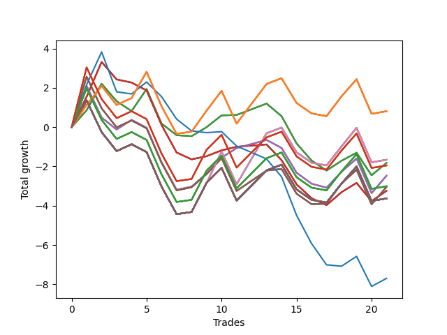

# Long Bulldog 003 
- Symbol: NVDA_Unlimited
- Date Range: 02/08/2022 - 07/08/2022
- Trading Period: 7:20-12:30
- Number of Trades: 21



| Name | Win Percent | Profit | Avg Profit / Trade | Avg Time / Trade |      | Name | Win Percent | Profit | Avg Profit / Trade | Avg Time / Trade |
| ---- | ----------- | ------ | ------------------ | ---------------- | ---- | ---- | ----------- | ------ | ------------------ | ---------------- |
| Sorted By <br> Profit | | | | | | Sorted By <br> Win Percentage ||||
| One Hundred Twenty-Six | 61.90 | 405.00 | 19.29 | 24:33 |     | One Hundred Twenty-Six | 61.90 | 405.00 | 19.29 | 24:33 |
| One Hundred Twenty-One | 61.90 | 405.00 | 19.29 | 24:33 |     | One Hundred Twenty-One | 61.90 | 405.00 | 19.29 | 24:33 |
| One Hundred Sixteen | 61.90 | 405.00 | 19.29 | 24:33 |     | One Hundred Sixteen | 61.90 | 405.00 | 19.29 | 24:33 |
| One Hundred Eleven | 61.90 | 405.00 | 19.29 | 24:33 |     | One Hundred Eleven | 61.90 | 405.00 | 19.29 | 24:33 |
| Eighty-One | 61.90 | 405.00 | 19.29 | 24:33 |     | Eighty-One | 61.90 | 405.00 | 19.29 | 24:33 |
| Sixty-Eight | 52.38 | -830.00 | -39.52 | 29:10 |     | Sixty-Seven | 57.14 | -1520.00 | -72.38 | 26:15 |
| Sixty | 52.38 | -830.00 | -39.52 | 29:10 |     | Fifty-Nine | 57.14 | -1520.00 | -72.38 | 26:15 |
| Fifty-Two | 52.38 | -830.00 | -39.52 | 29:10 |     | Fifty-One | 57.14 | -1520.00 | -72.38 | 26:15 |
| Forty-Four | 52.38 | -830.00 | -39.52 | 29:10 |     | Forty-Three | 57.14 | -1520.00 | -72.38 | 26:15 |
| Four | 52.38 | -830.00 | -39.52 | 29:10 |     | Three | 57.14 | -1520.00 | -72.38 | 26:15 |
| Sixty-Four | 52.38 | -910.00 | -43.33 | 13:04 |     | Sixty-Eight | 52.38 | -830.00 | -39.52 | 29:10 |
| Fifty-Six | 52.38 | -910.00 | -43.33 | 13:04 |     | Sixty | 52.38 | -830.00 | -39.52 | 29:10 |
| Forty-Eight | 52.38 | -910.00 | -43.33 | 13:04 |     | Fifty-Two | 52.38 | -830.00 | -39.52 | 29:10 |
| Forty | 52.38 | -910.00 | -43.33 | 13:04 |     | Forty-Four | 52.38 | -830.00 | -39.52 | 29:10 |
| Zero | 52.38 | -910.00 | -43.33 | 13:04 |     | Four | 52.38 | -830.00 | -39.52 | 29:10 |
| One Hundred Twenty-Eight | 52.38 | -975.00 | -46.43 | 29:30 |     | Sixty-Four | 52.38 | -910.00 | -43.33 | 13:04 |
| One Hundred Twenty-Three | 52.38 | -975.00 | -46.43 | 29:30 |     | Fifty-Six | 52.38 | -910.00 | -43.33 | 13:04 |
| One Hundred Eighteen | 52.38 | -975.00 | -46.43 | 29:30 |     | Forty-Eight | 52.38 | -910.00 | -43.33 | 13:04 |
| One Hundred Thirteen | 52.38 | -975.00 | -46.43 | 29:30 |     | Forty | 52.38 | -910.00 | -43.33 | 13:04 |
| Eighty-Three | 52.38 | -975.00 | -46.43 | 29:30 |     | Zero | 52.38 | -910.00 | -43.33 | 13:04 |
| Sixty-Six | 52.38 | -1235.00 | -58.81 | 23:23 |     | One Hundred Twenty-Eight | 52.38 | -975.00 | -46.43 | 29:30 |
| Fifty-Eight | 52.38 | -1235.00 | -58.81 | 23:23 |     | One Hundred Twenty-Three | 52.38 | -975.00 | -46.43 | 29:30 |
| Fifty | 52.38 | -1235.00 | -58.81 | 23:23 |     | One Hundred Eighteen | 52.38 | -975.00 | -46.43 | 29:30 |
| Forty-Two | 52.38 | -1235.00 | -58.81 | 23:23 |     | One Hundred Thirteen | 52.38 | -975.00 | -46.43 | 29:30 |
| Two | 52.38 | -1235.00 | -58.81 | 23:23 |     | Eighty-Three | 52.38 | -975.00 | -46.43 | 29:30 |
| One Hundred Twenty-Seven | 52.38 | -1505.00 | -71.67 | 28:50 |     | Sixty-Six | 52.38 | -1235.00 | -58.81 | 23:23 |
| One Hundred Twenty-Two | 52.38 | -1505.00 | -71.67 | 28:50 |     | Fifty-Eight | 52.38 | -1235.00 | -58.81 | 23:23 |
| One Hundred Seventeen | 52.38 | -1505.00 | -71.67 | 28:50 |     | Fifty | 52.38 | -1235.00 | -58.81 | 23:23 |
| One Hundred Twelve | 52.38 | -1505.00 | -71.67 | 28:50 |     | Forty-Two | 52.38 | -1235.00 | -58.81 | 23:23 |
| Eighty-Two | 52.38 | -1505.00 | -71.67 | 28:50 |     | Two | 52.38 | -1235.00 | -58.81 | 23:23 |
| Sixty-Seven | 57.14 | -1520.00 | -72.38 | 26:15 |     | One Hundred Twenty-Seven | 52.38 | -1505.00 | -71.67 | 28:50 |
| Fifty-Nine | 57.14 | -1520.00 | -72.38 | 26:15 |     | One Hundred Twenty-Two | 52.38 | -1505.00 | -71.67 | 28:50 |
| Fifty-One | 57.14 | -1520.00 | -72.38 | 26:15 |     | One Hundred Seventeen | 52.38 | -1505.00 | -71.67 | 28:50 |
| Forty-Three | 57.14 | -1520.00 | -72.38 | 26:15 |     | One Hundred Twelve | 52.38 | -1505.00 | -71.67 | 28:50 |
| Three | 57.14 | -1520.00 | -72.38 | 26:15 |     | Eighty-Two | 52.38 | -1505.00 | -71.67 | 28:50 |
| Sixty-Five | 47.62 | -1620.00 | -77.14 | 20:54 |     | One Hundred Thirty | 52.38 | -1815.00 | -86.43 | 29:55 |
| Fifty-Seven | 47.62 | -1620.00 | -77.14 | 20:54 |     | One Hundred Twenty-Nine | 52.38 | -1815.00 | -86.43 | 29:55 |
| Forty-Nine | 47.62 | -1620.00 | -77.14 | 20:54 |     | One Hundred Twenty-Five | 52.38 | -1815.00 | -86.43 | 29:55 |
| Forty-One | 47.62 | -1620.00 | -77.14 | 20:54 |     | One Hundred Twenty-Four | 52.38 | -1815.00 | -86.43 | 29:55 |
| One | 47.62 | -1620.00 | -77.14 | 20:54 |     | One Hundred Twenty | 52.38 | -1815.00 | -86.43 | 29:55 |
| One Hundred Thirty | 52.38 | -1815.00 | -86.43 | 29:55 |     | One Hundred Ninteen | 52.38 | -1815.00 | -86.43 | 29:55 |
| One Hundred Twenty-Nine | 52.38 | -1815.00 | -86.43 | 29:55 |     | One Hundred Fifteen | 52.38 | -1815.00 | -86.43 | 29:55 |
| One Hundred Twenty-Five | 52.38 | -1815.00 | -86.43 | 29:55 |     | One Hundred Fourteen | 52.38 | -1815.00 | -86.43 | 29:55 |
| One Hundred Twenty-Four | 52.38 | -1815.00 | -86.43 | 29:55 |     | Eighty-Five | 52.38 | -1815.00 | -86.43 | 29:55 |
| One Hundred Twenty | 52.38 | -1815.00 | -86.43 | 29:55 |     | Eighty-Four | 52.38 | -1815.00 | -86.43 | 29:55 |
| One Hundred Ninteen | 52.38 | -1815.00 | -86.43 | 29:55 |     | Seventy-One | 52.38 | -1815.00 | -86.43 | 29:55 |
| One Hundred Fifteen | 52.38 | -1815.00 | -86.43 | 29:55 |     | Seventy | 52.38 | -1815.00 | -86.43 | 29:55 |
| One Hundred Fourteen | 52.38 | -1815.00 | -86.43 | 29:55 |     | Sixty-Nine | 52.38 | -1815.00 | -86.43 | 29:55 |
| Eighty-Five | 52.38 | -1815.00 | -86.43 | 29:55 |     | Sixty-Three | 52.38 | -1815.00 | -86.43 | 29:55 |
| Eighty-Four | 52.38 | -1815.00 | -86.43 | 29:55 |     | Sixty-Two | 52.38 | -1815.00 | -86.43 | 29:55 |
| Seventy-One | 52.38 | -1815.00 | -86.43 | 29:55 |     | Sixty-One | 52.38 | -1815.00 | -86.43 | 29:55 |
| Seventy | 52.38 | -1815.00 | -86.43 | 29:55 |     | Fifty-Five | 52.38 | -1815.00 | -86.43 | 29:55 |
| Sixty-Nine | 52.38 | -1815.00 | -86.43 | 29:55 |     | Fifty-Four | 52.38 | -1815.00 | -86.43 | 29:55 |
| Sixty-Three | 52.38 | -1815.00 | -86.43 | 29:55 |     | Fifty-Three | 52.38 | -1815.00 | -86.43 | 29:55 |
| Sixty-Two | 52.38 | -1815.00 | -86.43 | 29:55 |     | Forty-Seven | 52.38 | -1815.00 | -86.43 | 29:55 |
| Sixty-One | 52.38 | -1815.00 | -86.43 | 29:55 |     | Forty-Six | 52.38 | -1815.00 | -86.43 | 29:55 |
| Fifty-Five | 52.38 | -1815.00 | -86.43 | 29:55 |     | Forty-Five | 52.38 | -1815.00 | -86.43 | 29:55 |
| Fifty-Four | 52.38 | -1815.00 | -86.43 | 29:55 |     | Seven | 52.38 | -1815.00 | -86.43 | 29:55 |
| Fifty-Three | 52.38 | -1815.00 | -86.43 | 29:55 |     | Six | 52.38 | -1815.00 | -86.43 | 29:55 |
| Forty-Seven | 52.38 | -1815.00 | -86.43 | 29:55 |     | Five | 52.38 | -1815.00 | -86.43 | 29:55 |
| Forty-Six | 52.38 | -1815.00 | -86.43 | 29:55 |     | Sixty-Five | 47.62 | -1620.00 | -77.14 | 20:54 |
| Forty-Five | 52.38 | -1815.00 | -86.43 | 29:55 |     | Fifty-Seven | 47.62 | -1620.00 | -77.14 | 20:54 |
| Seven | 52.38 | -1815.00 | -86.43 | 29:55 |     | Forty-Nine | 47.62 | -1620.00 | -77.14 | 20:54 |
| Six | 52.38 | -1815.00 | -86.43 | 29:55 |     | Forty-One | 47.62 | -1620.00 | -77.14 | 20:54 |
| Five | 52.38 | -1815.00 | -86.43 | 29:55 |     | One | 47.62 | -1620.00 | -77.14 | 20:54 |
| Seventy-Three | 28.57 | -3850.00 | -183.33 | 13:16 |     | Seventy-Three | 28.57 | -3850.00 | -183.33 | 13:16 |

## NO STOPLOSS

### Test Zero
* Sell when price hits the middle line of the 20p bollinger
* No Stoploss
* Results:
```
Total Trades: 21
Percent Up: 52.38
Percent Down: 47.62
Total Points Moved Up: -1.82
Potential Profit: -910.00
Total Points Ups: 6.53 Count Ups: 11
Total Points Downs: -8.35 Count Downs: 10
```

<details><summary>Trades</summary>

<code>In: 2022-02-10 10:39:00		Out: 2022-02-10 10:40:35		Total Position Time: 01:35		Total Move Up: 0.86		Total to Date: 0.86</code> <br />
<code>In: 2022-02-10 12:03:00		Out: 2022-02-10 12:09:25		Total Position Time: 06:25		Total Move Up: 1.35		Total to Date: 2.21</code> <br />
<code>In: 2022-02-14 10:58:00		Out: 2022-02-14 11:13:00		Total Position Time: 15:00		Total Move Up: -0.89		Total to Date: 1.32</code> <br />
<code>In: 2022-02-23 10:17:00		Out: 2022-02-23 10:36:10		Total Position Time: 19:10		Total Move Up: -0.50		Total to Date: 0.82</code> <br />
<code>In: 2022-02-28 11:11:00		Out: 2022-02-28 11:19:45		Total Position Time: 08:45		Total Move Up: 1.12		Total to Date: 1.94</code> <br />
<code>In: 2022-03-11 08:08:00		Out: 2022-03-11 08:37:55		Total Position Time: 29:55		Total Move Up: -1.76		Total to Date: 0.18</code> <br />
<code>In: 2022-03-30 12:00:00		Out: 2022-03-30 12:14:15		Total Position Time: 14:15		Total Move Up: -0.59		Total to Date: -0.41</code> <br />
<code>In: 2022-03-30 12:02:00		Out: 2022-03-30 12:14:15		Total Position Time: 12:15		Total Move Up: -0.05		Total to Date: -0.46</code> <br />
<code>In: 2022-03-30 12:04:00		Out: 2022-03-30 12:14:15		Total Position Time: 10:15		Total Move Up: 0.46		Total to Date: -0.00</code> <br />
<code>In: 2022-03-30 12:06:00		Out: 2022-03-30 12:14:15		Total Position Time: 08:15		Total Move Up: 0.60		Total to Date: 0.60</code> <br />
<code>In: 2022-04-07 07:43:00		Out: 2022-04-07 07:56:05		Total Position Time: 13:05		Total Move Up: 0.02		Total to Date: 0.62</code> <br />
<code>In: 2022-04-08 11:30:00		Out: 2022-04-08 11:39:40		Total Position Time: 09:40		Total Move Up: 0.29		Total to Date: 0.91</code> <br />
<code>In: 2022-04-08 11:30:00		Out: 2022-04-08 11:39:40		Total Position Time: 09:40		Total Move Up: 0.29		Total to Date: 1.20</code> <br />
<code>In: 2022-06-03 08:05:00		Out: 2022-06-03 08:21:10		Total Position Time: 16:10		Total Move Up: -0.64		Total to Date: 0.56</code> <br />
<code>In: 2022-06-08 09:25:00		Out: 2022-06-08 09:50:15		Total Position Time: 25:15		Total Move Up: -1.39		Total to Date: -0.83</code> <br />
<code>In: 2022-06-08 09:29:00		Out: 2022-06-08 09:50:15		Total Position Time: 21:15		Total Move Up: -0.87		Total to Date: -1.70</code> <br />
<code>In: 2022-06-08 09:35:00		Out: 2022-06-08 09:50:15		Total Position Time: 15:15		Total Move Up: -0.51		Total to Date: -2.21</code> <br />
<code>In: 2022-06-08 09:41:00		Out: 2022-06-08 09:50:15		Total Position Time: 09:15		Total Move Up: 0.50		Total to Date: -1.71</code> <br />
<code>In: 2022-06-09 10:46:00		Out: 2022-06-09 10:51:05		Total Position Time: 05:05		Total Move Up: 0.41		Total to Date: -1.30</code> <br />
<code>In: 2022-06-09 11:57:00		Out: 2022-06-09 12:18:20		Total Position Time: 21:20		Total Move Up: -1.15		Total to Date: -2.45</code> <br />
<code>In: 2022-06-23 10:05:00		Out: 2022-06-23 10:07:40		Total Position Time: 02:40		Total Move Up: 0.63		Total to Date: -1.82</code> <br />


</details>

### Test One
* Sell when the price hits the upper line of the 20p 1std bollinger
* No Stoploss
* Results:
```
Total Trades: 21
Percent Up: 47.62
Percent Down: 52.38
Total Points Moved Up: -3.24
Potential Profit: -1620.00
Total Points Ups: 5.74 Count Ups: 10
Total Points Downs: -8.98 Count Downs: 11
```

<details><summary>Trades</summary>

<code>In: 2022-02-10 10:39:00		Out: 2022-02-10 10:43:25		Total Position Time: 04:25		Total Move Up: 1.55		Total to Date: 1.55</code> <br />
<code>In: 2022-02-10 12:03:00		Out: 2022-02-10 12:12:40		Total Position Time: 09:40		Total Move Up: 1.77		Total to Date: 3.32</code> <br />
<code>In: 2022-02-14 10:58:00		Out: 2022-02-14 11:17:05		Total Position Time: 19:05		Total Move Up: -0.89		Total to Date: 2.43</code> <br />
<code>In: 2022-02-23 10:17:00		Out: 2022-02-23 10:39:05		Total Position Time: 22:05		Total Move Up: -0.16		Total to Date: 2.27</code> <br />
<code>In: 2022-02-28 11:11:00		Out: 2022-02-28 11:40:55		Total Position Time: 29:55		Total Move Up: -0.40		Total to Date: 1.87</code> <br />
<code>In: 2022-03-11 08:08:00		Out: 2022-03-11 08:37:55		Total Position Time: 29:55		Total Move Up: -1.76		Total to Date: 0.11</code> <br />
<code>In: 2022-03-30 12:00:00		Out: 2022-03-30 12:29:55		Total Position Time: 29:55		Total Move Up: -1.40		Total to Date: -1.29</code> <br />
<code>In: 2022-03-30 12:02:00		Out: 2022-03-30 12:30:45		Total Position Time: 28:45		Total Move Up: -0.35		Total to Date: -1.64</code> <br />
<code>In: 2022-03-30 12:04:00		Out: 2022-03-30 12:30:45		Total Position Time: 26:45		Total Move Up: 0.16		Total to Date: -1.48</code> <br />
<code>In: 2022-03-30 12:06:00		Out: 2022-03-30 12:30:45		Total Position Time: 24:45		Total Move Up: 0.30		Total to Date: -1.18</code> <br />
<code>In: 2022-04-07 07:43:00		Out: 2022-04-07 08:00:05		Total Position Time: 17:05		Total Move Up: 0.18		Total to Date: -1.00</code> <br />
<code>In: 2022-04-08 11:30:00		Out: 2022-04-08 11:47:10		Total Position Time: 17:10		Total Move Up: 0.06		Total to Date: -0.94</code> <br />
<code>In: 2022-04-08 11:30:00		Out: 2022-04-08 11:47:10		Total Position Time: 17:10		Total Move Up: 0.06		Total to Date: -0.88</code> <br />
<code>In: 2022-06-03 08:05:00		Out: 2022-06-03 08:29:30		Total Position Time: 24:30		Total Move Up: -0.80		Total to Date: -1.68</code> <br />
<code>In: 2022-06-08 09:25:00		Out: 2022-06-08 09:54:00		Total Position Time: 29:00		Total Move Up: -1.23		Total to Date: -2.91</code> <br />
<code>In: 2022-06-08 09:29:00		Out: 2022-06-08 09:54:00		Total Position Time: 25:00		Total Move Up: -0.71		Total to Date: -3.62</code> <br />
<code>In: 2022-06-08 09:35:00		Out: 2022-06-08 09:54:00		Total Position Time: 19:00		Total Move Up: -0.35		Total to Date: -3.97</code> <br />
<code>In: 2022-06-08 09:41:00		Out: 2022-06-08 09:54:00		Total Position Time: 13:00		Total Move Up: 0.66		Total to Date: -3.31</code> <br />
<code>In: 2022-06-09 10:46:00		Out: 2022-06-09 10:57:10		Total Position Time: 11:10		Total Move Up: 0.47		Total to Date: -2.84</code> <br />
<code>In: 2022-06-09 11:57:00		Out: 2022-06-09 12:19:25		Total Position Time: 22:25		Total Move Up: -0.93		Total to Date: -3.77</code> <br />
<code>In: 2022-06-23 10:05:00		Out: 2022-06-23 10:23:10		Total Position Time: 18:10		Total Move Up: 0.53		Total to Date: -3.24</code> <br />


</details>

### Test Two
* Sell when the price hits the upper line of the 20p 2std bollinger
* No Stoploss
* Results:
```
Total Trades: 21
Percent Up: 52.38
Percent Down: 47.62
Total Points Moved Up: -2.47
Potential Profit: -1235.00
Total Points Ups: 7.50 Count Ups: 11
Total Points Downs: -9.97 Count Downs: 10
```

<details><summary>Trades</summary>

<code>In: 2022-02-10 10:39:00		Out: 2022-02-10 10:46:45		Total Position Time: 07:45		Total Move Up: 2.10		Total to Date: 2.10</code> <br />
<code>In: 2022-02-10 12:03:00		Out: 2022-02-10 12:32:55		Total Position Time: 29:55		Total Move Up: -1.61		Total to Date: 0.49</code> <br />
<code>In: 2022-02-14 10:58:00		Out: 2022-02-14 11:18:05		Total Position Time: 20:05		Total Move Up: -0.61		Total to Date: -0.12</code> <br />
<code>In: 2022-02-23 10:17:00		Out: 2022-02-23 10:42:50		Total Position Time: 25:50		Total Move Up: 0.49		Total to Date: 0.37</code> <br />
<code>In: 2022-02-28 11:11:00		Out: 2022-02-28 11:40:55		Total Position Time: 29:55		Total Move Up: -0.40		Total to Date: -0.03</code> <br />
<code>In: 2022-03-11 08:08:00		Out: 2022-03-11 08:37:55		Total Position Time: 29:55		Total Move Up: -1.76		Total to Date: -1.79</code> <br />
<code>In: 2022-03-30 12:00:00		Out: 2022-03-30 12:29:55		Total Position Time: 29:55		Total Move Up: -1.40		Total to Date: -3.19</code> <br />
<code>In: 2022-03-30 12:02:00		Out: 2022-03-30 12:31:35		Total Position Time: 29:35		Total Move Up: 0.16		Total to Date: -3.03</code> <br />
<code>In: 2022-03-30 12:04:00		Out: 2022-03-30 12:31:35		Total Position Time: 27:35		Total Move Up: 0.67		Total to Date: -2.36</code> <br />
<code>In: 2022-03-30 12:06:00		Out: 2022-03-30 12:31:35		Total Position Time: 25:35		Total Move Up: 0.81		Total to Date: -1.55</code> <br />
<code>In: 2022-04-07 07:43:00		Out: 2022-04-07 08:00:10		Total Position Time: 17:10		Total Move Up: 0.48		Total to Date: -1.07</code> <br />
<code>In: 2022-04-08 11:30:00		Out: 2022-04-08 11:47:45		Total Position Time: 17:45		Total Move Up: 0.21		Total to Date: -0.86</code> <br />
<code>In: 2022-04-08 11:30:00		Out: 2022-04-08 11:47:45		Total Position Time: 17:45		Total Move Up: 0.21		Total to Date: -0.65</code> <br />
<code>In: 2022-06-03 08:05:00		Out: 2022-06-03 08:30:25		Total Position Time: 25:25		Total Move Up: -0.41		Total to Date: -1.06</code> <br />
<code>In: 2022-06-08 09:25:00		Out: 2022-06-08 09:54:55		Total Position Time: 29:55		Total Move Up: -1.26		Total to Date: -2.32</code> <br />
<code>In: 2022-06-08 09:29:00		Out: 2022-06-08 09:56:45		Total Position Time: 27:45		Total Move Up: -0.56		Total to Date: -2.88</code> <br />
<code>In: 2022-06-08 09:35:00		Out: 2022-06-08 09:56:45		Total Position Time: 21:45		Total Move Up: -0.20		Total to Date: -3.08</code> <br />
<code>In: 2022-06-08 09:41:00		Out: 2022-06-08 09:56:45		Total Position Time: 15:45		Total Move Up: 0.81		Total to Date: -2.27</code> <br />
<code>In: 2022-06-09 10:46:00		Out: 2022-06-09 10:59:30		Total Position Time: 13:30		Total Move Up: 0.67		Total to Date: -1.60</code> <br />
<code>In: 2022-06-09 11:57:00		Out: 2022-06-09 12:26:55		Total Position Time: 29:55		Total Move Up: -1.76		Total to Date: -3.36</code> <br />
<code>In: 2022-06-23 10:05:00		Out: 2022-06-23 10:23:20		Total Position Time: 18:20		Total Move Up: 0.89		Total to Date: -2.47</code> <br />


</details>

### Test Three
* Sell when price hits the middle line of the 50p bollinger
* No Stoploss
* Results:
```
Total Trades: 21
Percent Up: 57.14
Percent Down: 42.86
Total Points Moved Up: -3.04
Potential Profit: -1520.00
Total Points Ups: 8.32 Count Ups: 12
Total Points Downs: -11.36 Count Downs: 9
```

<details><summary>Trades</summary>

<code>In: 2022-02-10 10:39:00		Out: 2022-02-10 10:50:30		Total Position Time: 11:30		Total Move Up: 2.57		Total to Date: 2.57</code> <br />
<code>In: 2022-02-10 12:03:00		Out: 2022-02-10 12:32:55		Total Position Time: 29:55		Total Move Up: -1.61		Total to Date: 0.96</code> <br />
<code>In: 2022-02-14 10:58:00		Out: 2022-02-14 11:27:55		Total Position Time: 29:55		Total Move Up: -0.97		Total to Date: -0.01</code> <br />
<code>In: 2022-02-23 10:17:00		Out: 2022-02-23 10:46:55		Total Position Time: 29:55		Total Move Up: 0.35		Total to Date: 0.34</code> <br />
<code>In: 2022-02-28 11:11:00		Out: 2022-02-28 11:40:55		Total Position Time: 29:55		Total Move Up: -0.40		Total to Date: -0.06</code> <br />
<code>In: 2022-03-11 08:08:00		Out: 2022-03-11 08:37:55		Total Position Time: 29:55		Total Move Up: -1.76		Total to Date: -1.82</code> <br />
<code>In: 2022-03-30 12:00:00		Out: 2022-03-30 12:29:55		Total Position Time: 29:55		Total Move Up: -1.40		Total to Date: -3.22</code> <br />
<code>In: 2022-03-30 12:02:00		Out: 2022-03-30 12:31:35		Total Position Time: 29:35		Total Move Up: 0.16		Total to Date: -3.06</code> <br />
<code>In: 2022-03-30 12:04:00		Out: 2022-03-30 12:31:35		Total Position Time: 27:35		Total Move Up: 0.67		Total to Date: -2.39</code> <br />
<code>In: 2022-03-30 12:06:00		Out: 2022-03-30 12:31:35		Total Position Time: 25:35		Total Move Up: 0.81		Total to Date: -1.58</code> <br />
<code>In: 2022-04-07 07:43:00		Out: 2022-04-07 08:12:55		Total Position Time: 29:55		Total Move Up: -1.67		Total to Date: -3.25</code> <br />
<code>In: 2022-04-08 11:30:00		Out: 2022-04-08 11:49:10		Total Position Time: 19:10		Total Move Up: 0.52		Total to Date: -2.73</code> <br />
<code>In: 2022-04-08 11:30:00		Out: 2022-04-08 11:49:10		Total Position Time: 19:10		Total Move Up: 0.52		Total to Date: -2.21</code> <br />
<code>In: 2022-06-03 08:05:00		Out: 2022-06-03 08:32:10		Total Position Time: 27:10		Total Move Up: 0.08		Total to Date: -2.13</code> <br />
<code>In: 2022-06-08 09:25:00		Out: 2022-06-08 09:54:55		Total Position Time: 29:55		Total Move Up: -1.26		Total to Date: -3.39</code> <br />
<code>In: 2022-06-08 09:29:00		Out: 2022-06-08 09:58:55		Total Position Time: 29:55		Total Move Up: -0.53		Total to Date: -3.92</code> <br />
<code>In: 2022-06-08 09:35:00		Out: 2022-06-08 10:04:30		Total Position Time: 29:30		Total Move Up: 0.02		Total to Date: -3.90</code> <br />
<code>In: 2022-06-08 09:41:00		Out: 2022-06-08 10:04:30		Total Position Time: 23:30		Total Move Up: 1.03		Total to Date: -2.87</code> <br />
<code>In: 2022-06-09 10:46:00		Out: 2022-06-09 11:07:05		Total Position Time: 21:05		Total Move Up: 0.70		Total to Date: -2.17</code> <br />
<code>In: 2022-06-09 11:57:00		Out: 2022-06-09 12:26:55		Total Position Time: 29:55		Total Move Up: -1.76		Total to Date: -3.93</code> <br />
<code>In: 2022-06-23 10:05:00		Out: 2022-06-23 10:23:20		Total Position Time: 18:20		Total Move Up: 0.89		Total to Date: -3.04</code> <br />


</details>

### Test Four
* Sell when the price hits the upper line of the 50p 1std bollinger
* No Stoploss
* Results:
```
Total Trades: 21
Percent Up: 52.38
Percent Down: 47.62
Total Points Moved Up: -1.66
Potential Profit: -830.00
Total Points Ups: 9.84 Count Ups: 11
Total Points Downs: -11.50 Count Downs: 10
```

<details><summary>Trades</summary>

<code>In: 2022-02-10 10:39:00		Out: 2022-02-10 11:08:55		Total Position Time: 29:55		Total Move Up: 1.36		Total to Date: 1.36</code> <br />
<code>In: 2022-02-10 12:03:00		Out: 2022-02-10 12:32:55		Total Position Time: 29:55		Total Move Up: -1.61		Total to Date: -0.25</code> <br />
<code>In: 2022-02-14 10:58:00		Out: 2022-02-14 11:27:55		Total Position Time: 29:55		Total Move Up: -0.97		Total to Date: -1.22</code> <br />
<code>In: 2022-02-23 10:17:00		Out: 2022-02-23 10:46:55		Total Position Time: 29:55		Total Move Up: 0.35		Total to Date: -0.87</code> <br />
<code>In: 2022-02-28 11:11:00		Out: 2022-02-28 11:40:55		Total Position Time: 29:55		Total Move Up: -0.40		Total to Date: -1.27</code> <br />
<code>In: 2022-03-11 08:08:00		Out: 2022-03-11 08:37:55		Total Position Time: 29:55		Total Move Up: -1.76		Total to Date: -3.03</code> <br />
<code>In: 2022-03-30 12:00:00		Out: 2022-03-30 12:29:55		Total Position Time: 29:55		Total Move Up: -1.40		Total to Date: -4.43</code> <br />
<code>In: 2022-03-30 12:02:00		Out: 2022-03-30 12:31:55		Total Position Time: 29:55		Total Move Up: 0.11		Total to Date: -4.32</code> <br />
<code>In: 2022-03-30 12:04:00		Out: 2022-03-30 12:33:45		Total Position Time: 29:45		Total Move Up: 1.47		Total to Date: -2.85</code> <br />
<code>In: 2022-03-30 12:06:00		Out: 2022-03-30 12:33:45		Total Position Time: 27:45		Total Move Up: 1.61		Total to Date: -1.24</code> <br />
<code>In: 2022-04-07 07:43:00		Out: 2022-04-07 08:12:55		Total Position Time: 29:55		Total Move Up: -1.67		Total to Date: -2.91</code> <br />
<code>In: 2022-04-08 11:30:00		Out: 2022-04-08 11:53:15		Total Position Time: 23:15		Total Move Up: 1.30		Total to Date: -1.61</code> <br />
<code>In: 2022-04-08 11:30:00		Out: 2022-04-08 11:53:15		Total Position Time: 23:15		Total Move Up: 1.30		Total to Date: -0.31</code> <br />
<code>In: 2022-06-03 08:05:00		Out: 2022-06-03 08:34:55		Total Position Time: 29:55		Total Move Up: 0.29		Total to Date: -0.02</code> <br />
<code>In: 2022-06-08 09:25:00		Out: 2022-06-08 09:54:55		Total Position Time: 29:55		Total Move Up: -1.26		Total to Date: -1.28</code> <br />
<code>In: 2022-06-08 09:29:00		Out: 2022-06-08 09:58:55		Total Position Time: 29:55		Total Move Up: -0.53		Total to Date: -1.81</code> <br />
<code>In: 2022-06-08 09:35:00		Out: 2022-06-08 10:04:55		Total Position Time: 29:55		Total Move Up: -0.14		Total to Date: -1.95</code> <br />
<code>In: 2022-06-08 09:41:00		Out: 2022-06-08 10:10:55		Total Position Time: 29:55		Total Move Up: 0.97		Total to Date: -0.98</code> <br />
<code>In: 2022-06-09 10:46:00		Out: 2022-06-09 11:15:50		Total Position Time: 29:50		Total Move Up: 0.95		Total to Date: -0.03</code> <br />
<code>In: 2022-06-09 11:57:00		Out: 2022-06-09 12:26:55		Total Position Time: 29:55		Total Move Up: -1.76		Total to Date: -1.79</code> <br />
<code>In: 2022-06-23 10:05:00		Out: 2022-06-23 10:34:55		Total Position Time: 29:55		Total Move Up: 0.13		Total to Date: -1.66</code> <br />


</details>

### Test Five
* Sell when the price hits the upper line of the 50p 2std bollinger
* No Stoploss
* Results:
```
Total Trades: 21
Percent Up: 52.38
Percent Down: 47.62
Total Points Moved Up: -3.63
Potential Profit: -1815.00
Total Points Ups: 7.87 Count Ups: 11
Total Points Downs: -11.50 Count Downs: 10
```

<details><summary>Trades</summary>

<code>In: 2022-02-10 10:39:00		Out: 2022-02-10 11:08:55		Total Position Time: 29:55		Total Move Up: 1.36		Total to Date: 1.36</code> <br />
<code>In: 2022-02-10 12:03:00		Out: 2022-02-10 12:32:55		Total Position Time: 29:55		Total Move Up: -1.61		Total to Date: -0.25</code> <br />
<code>In: 2022-02-14 10:58:00		Out: 2022-02-14 11:27:55		Total Position Time: 29:55		Total Move Up: -0.97		Total to Date: -1.22</code> <br />
<code>In: 2022-02-23 10:17:00		Out: 2022-02-23 10:46:55		Total Position Time: 29:55		Total Move Up: 0.35		Total to Date: -0.87</code> <br />
<code>In: 2022-02-28 11:11:00		Out: 2022-02-28 11:40:55		Total Position Time: 29:55		Total Move Up: -0.40		Total to Date: -1.27</code> <br />
<code>In: 2022-03-11 08:08:00		Out: 2022-03-11 08:37:55		Total Position Time: 29:55		Total Move Up: -1.76		Total to Date: -3.03</code> <br />
<code>In: 2022-03-30 12:00:00		Out: 2022-03-30 12:29:55		Total Position Time: 29:55		Total Move Up: -1.40		Total to Date: -4.43</code> <br />
<code>In: 2022-03-30 12:02:00		Out: 2022-03-30 12:31:55		Total Position Time: 29:55		Total Move Up: 0.11		Total to Date: -4.32</code> <br />
<code>In: 2022-03-30 12:04:00		Out: 2022-03-30 12:33:55		Total Position Time: 29:55		Total Move Up: 1.49		Total to Date: -2.83</code> <br />
<code>In: 2022-03-30 12:06:00		Out: 2022-03-30 12:35:55		Total Position Time: 29:55		Total Move Up: 0.76		Total to Date: -2.07</code> <br />
<code>In: 2022-04-07 07:43:00		Out: 2022-04-07 08:12:55		Total Position Time: 29:55		Total Move Up: -1.67		Total to Date: -3.74</code> <br />
<code>In: 2022-04-08 11:30:00		Out: 2022-04-08 11:59:55		Total Position Time: 29:55		Total Move Up: 0.77		Total to Date: -2.97</code> <br />
<code>In: 2022-04-08 11:30:00		Out: 2022-04-08 11:59:55		Total Position Time: 29:55		Total Move Up: 0.77		Total to Date: -2.20</code> <br />
<code>In: 2022-06-03 08:05:00		Out: 2022-06-03 08:34:55		Total Position Time: 29:55		Total Move Up: 0.29		Total to Date: -1.91</code> <br />
<code>In: 2022-06-08 09:25:00		Out: 2022-06-08 09:54:55		Total Position Time: 29:55		Total Move Up: -1.26		Total to Date: -3.17</code> <br />
<code>In: 2022-06-08 09:29:00		Out: 2022-06-08 09:58:55		Total Position Time: 29:55		Total Move Up: -0.53		Total to Date: -3.70</code> <br />
<code>In: 2022-06-08 09:35:00		Out: 2022-06-08 10:04:55		Total Position Time: 29:55		Total Move Up: -0.14		Total to Date: -3.84</code> <br />
<code>In: 2022-06-08 09:41:00		Out: 2022-06-08 10:10:55		Total Position Time: 29:55		Total Move Up: 0.97		Total to Date: -2.87</code> <br />
<code>In: 2022-06-09 10:46:00		Out: 2022-06-09 11:15:55		Total Position Time: 29:55		Total Move Up: 0.87		Total to Date: -2.00</code> <br />
<code>In: 2022-06-09 11:57:00		Out: 2022-06-09 12:26:55		Total Position Time: 29:55		Total Move Up: -1.76		Total to Date: -3.76</code> <br />
<code>In: 2022-06-23 10:05:00		Out: 2022-06-23 10:34:55		Total Position Time: 29:55		Total Move Up: 0.13		Total to Date: -3.63</code> <br />


</details>

### Test Six
* Sell when the price hits the middle line of the 1std VWAP
* No Stoploss
* Results:
```
Total Trades: 21
Percent Up: 52.38
Percent Down: 47.62
Total Points Moved Up: -3.63
Potential Profit: -1815.00
Total Points Ups: 7.87 Count Ups: 11
Total Points Downs: -11.50 Count Downs: 10
```

<details><summary>Trades</summary>

<code>In: 2022-02-10 10:39:00		Out: 2022-02-10 11:08:55		Total Position Time: 29:55		Total Move Up: 1.36		Total to Date: 1.36</code> <br />
<code>In: 2022-02-10 12:03:00		Out: 2022-02-10 12:32:55		Total Position Time: 29:55		Total Move Up: -1.61		Total to Date: -0.25</code> <br />
<code>In: 2022-02-14 10:58:00		Out: 2022-02-14 11:27:55		Total Position Time: 29:55		Total Move Up: -0.97		Total to Date: -1.22</code> <br />
<code>In: 2022-02-23 10:17:00		Out: 2022-02-23 10:46:55		Total Position Time: 29:55		Total Move Up: 0.35		Total to Date: -0.87</code> <br />
<code>In: 2022-02-28 11:11:00		Out: 2022-02-28 11:40:55		Total Position Time: 29:55		Total Move Up: -0.40		Total to Date: -1.27</code> <br />
<code>In: 2022-03-11 08:08:00		Out: 2022-03-11 08:37:55		Total Position Time: 29:55		Total Move Up: -1.76		Total to Date: -3.03</code> <br />
<code>In: 2022-03-30 12:00:00		Out: 2022-03-30 12:29:55		Total Position Time: 29:55		Total Move Up: -1.40		Total to Date: -4.43</code> <br />
<code>In: 2022-03-30 12:02:00		Out: 2022-03-30 12:31:55		Total Position Time: 29:55		Total Move Up: 0.11		Total to Date: -4.32</code> <br />
<code>In: 2022-03-30 12:04:00		Out: 2022-03-30 12:33:55		Total Position Time: 29:55		Total Move Up: 1.49		Total to Date: -2.83</code> <br />
<code>In: 2022-03-30 12:06:00		Out: 2022-03-30 12:35:55		Total Position Time: 29:55		Total Move Up: 0.76		Total to Date: -2.07</code> <br />
<code>In: 2022-04-07 07:43:00		Out: 2022-04-07 08:12:55		Total Position Time: 29:55		Total Move Up: -1.67		Total to Date: -3.74</code> <br />
<code>In: 2022-04-08 11:30:00		Out: 2022-04-08 11:59:55		Total Position Time: 29:55		Total Move Up: 0.77		Total to Date: -2.97</code> <br />
<code>In: 2022-04-08 11:30:00		Out: 2022-04-08 11:59:55		Total Position Time: 29:55		Total Move Up: 0.77		Total to Date: -2.20</code> <br />
<code>In: 2022-06-03 08:05:00		Out: 2022-06-03 08:34:55		Total Position Time: 29:55		Total Move Up: 0.29		Total to Date: -1.91</code> <br />
<code>In: 2022-06-08 09:25:00		Out: 2022-06-08 09:54:55		Total Position Time: 29:55		Total Move Up: -1.26		Total to Date: -3.17</code> <br />
<code>In: 2022-06-08 09:29:00		Out: 2022-06-08 09:58:55		Total Position Time: 29:55		Total Move Up: -0.53		Total to Date: -3.70</code> <br />
<code>In: 2022-06-08 09:35:00		Out: 2022-06-08 10:04:55		Total Position Time: 29:55		Total Move Up: -0.14		Total to Date: -3.84</code> <br />
<code>In: 2022-06-08 09:41:00		Out: 2022-06-08 10:10:55		Total Position Time: 29:55		Total Move Up: 0.97		Total to Date: -2.87</code> <br />
<code>In: 2022-06-09 10:46:00		Out: 2022-06-09 11:15:55		Total Position Time: 29:55		Total Move Up: 0.87		Total to Date: -2.00</code> <br />
<code>In: 2022-06-09 11:57:00		Out: 2022-06-09 12:26:55		Total Position Time: 29:55		Total Move Up: -1.76		Total to Date: -3.76</code> <br />
<code>In: 2022-06-23 10:05:00		Out: 2022-06-23 10:34:55		Total Position Time: 29:55		Total Move Up: 0.13		Total to Date: -3.63</code> <br />


</details>

### Test Seven
* Sell when the price hits the upper line of the 1std VWAP
* No Stoploss
* Results:
```
Total Trades: 21
Percent Up: 52.38
Percent Down: 47.62
Total Points Moved Up: -3.63
Potential Profit: -1815.00
Total Points Ups: 7.87 Count Ups: 11
Total Points Downs: -11.50 Count Downs: 10
```

<details><summary>Trades</summary>

<code>In: 2022-02-10 10:39:00		Out: 2022-02-10 11:08:55		Total Position Time: 29:55		Total Move Up: 1.36		Total to Date: 1.36</code> <br />
<code>In: 2022-02-10 12:03:00		Out: 2022-02-10 12:32:55		Total Position Time: 29:55		Total Move Up: -1.61		Total to Date: -0.25</code> <br />
<code>In: 2022-02-14 10:58:00		Out: 2022-02-14 11:27:55		Total Position Time: 29:55		Total Move Up: -0.97		Total to Date: -1.22</code> <br />
<code>In: 2022-02-23 10:17:00		Out: 2022-02-23 10:46:55		Total Position Time: 29:55		Total Move Up: 0.35		Total to Date: -0.87</code> <br />
<code>In: 2022-02-28 11:11:00		Out: 2022-02-28 11:40:55		Total Position Time: 29:55		Total Move Up: -0.40		Total to Date: -1.27</code> <br />
<code>In: 2022-03-11 08:08:00		Out: 2022-03-11 08:37:55		Total Position Time: 29:55		Total Move Up: -1.76		Total to Date: -3.03</code> <br />
<code>In: 2022-03-30 12:00:00		Out: 2022-03-30 12:29:55		Total Position Time: 29:55		Total Move Up: -1.40		Total to Date: -4.43</code> <br />
<code>In: 2022-03-30 12:02:00		Out: 2022-03-30 12:31:55		Total Position Time: 29:55		Total Move Up: 0.11		Total to Date: -4.32</code> <br />
<code>In: 2022-03-30 12:04:00		Out: 2022-03-30 12:33:55		Total Position Time: 29:55		Total Move Up: 1.49		Total to Date: -2.83</code> <br />
<code>In: 2022-03-30 12:06:00		Out: 2022-03-30 12:35:55		Total Position Time: 29:55		Total Move Up: 0.76		Total to Date: -2.07</code> <br />
<code>In: 2022-04-07 07:43:00		Out: 2022-04-07 08:12:55		Total Position Time: 29:55		Total Move Up: -1.67		Total to Date: -3.74</code> <br />
<code>In: 2022-04-08 11:30:00		Out: 2022-04-08 11:59:55		Total Position Time: 29:55		Total Move Up: 0.77		Total to Date: -2.97</code> <br />
<code>In: 2022-04-08 11:30:00		Out: 2022-04-08 11:59:55		Total Position Time: 29:55		Total Move Up: 0.77		Total to Date: -2.20</code> <br />
<code>In: 2022-06-03 08:05:00		Out: 2022-06-03 08:34:55		Total Position Time: 29:55		Total Move Up: 0.29		Total to Date: -1.91</code> <br />
<code>In: 2022-06-08 09:25:00		Out: 2022-06-08 09:54:55		Total Position Time: 29:55		Total Move Up: -1.26		Total to Date: -3.17</code> <br />
<code>In: 2022-06-08 09:29:00		Out: 2022-06-08 09:58:55		Total Position Time: 29:55		Total Move Up: -0.53		Total to Date: -3.70</code> <br />
<code>In: 2022-06-08 09:35:00		Out: 2022-06-08 10:04:55		Total Position Time: 29:55		Total Move Up: -0.14		Total to Date: -3.84</code> <br />
<code>In: 2022-06-08 09:41:00		Out: 2022-06-08 10:10:55		Total Position Time: 29:55		Total Move Up: 0.97		Total to Date: -2.87</code> <br />
<code>In: 2022-06-09 10:46:00		Out: 2022-06-09 11:15:55		Total Position Time: 29:55		Total Move Up: 0.87		Total to Date: -2.00</code> <br />
<code>In: 2022-06-09 11:57:00		Out: 2022-06-09 12:26:55		Total Position Time: 29:55		Total Move Up: -1.76		Total to Date: -3.76</code> <br />
<code>In: 2022-06-23 10:05:00		Out: 2022-06-23 10:34:55		Total Position Time: 29:55		Total Move Up: 0.13		Total to Date: -3.63</code> <br />


</details>

## STOPLOSS OF 5

### Test Forty
* Sell when price hits the middle line of the 20p bollinger
* Stoploss is 5 points
* Results:
```
Total Trades: 21
Percent Up: 52.38
Percent Down: 47.62
Total Points Moved Up: -1.82
Potential Profit: -910.00
Total Points Ups: 6.53 Count Ups: 11
Total Points Downs: -8.35 Count Downs: 10
```

<details><summary>Trades</summary>

<code>In: 2022-02-10 10:39:00		Out: 2022-02-10 10:40:35		Total Position Time: 01:35		Total Move Up: 0.86		Total to Date: 0.86</code> <br />
<code>In: 2022-02-10 12:03:00		Out: 2022-02-10 12:09:25		Total Position Time: 06:25		Total Move Up: 1.35		Total to Date: 2.21</code> <br />
<code>In: 2022-02-14 10:58:00		Out: 2022-02-14 11:13:00		Total Position Time: 15:00		Total Move Up: -0.89		Total to Date: 1.32</code> <br />
<code>In: 2022-02-23 10:17:00		Out: 2022-02-23 10:36:10		Total Position Time: 19:10		Total Move Up: -0.50		Total to Date: 0.82</code> <br />
<code>In: 2022-02-28 11:11:00		Out: 2022-02-28 11:19:45		Total Position Time: 08:45		Total Move Up: 1.12		Total to Date: 1.94</code> <br />
<code>In: 2022-03-11 08:08:00		Out: 2022-03-11 08:37:55		Total Position Time: 29:55		Total Move Up: -1.76		Total to Date: 0.18</code> <br />
<code>In: 2022-03-30 12:00:00		Out: 2022-03-30 12:14:15		Total Position Time: 14:15		Total Move Up: -0.59		Total to Date: -0.41</code> <br />
<code>In: 2022-03-30 12:02:00		Out: 2022-03-30 12:14:15		Total Position Time: 12:15		Total Move Up: -0.05		Total to Date: -0.46</code> <br />
<code>In: 2022-03-30 12:04:00		Out: 2022-03-30 12:14:15		Total Position Time: 10:15		Total Move Up: 0.46		Total to Date: -0.00</code> <br />
<code>In: 2022-03-30 12:06:00		Out: 2022-03-30 12:14:15		Total Position Time: 08:15		Total Move Up: 0.60		Total to Date: 0.60</code> <br />
<code>In: 2022-04-07 07:43:00		Out: 2022-04-07 07:56:05		Total Position Time: 13:05		Total Move Up: 0.02		Total to Date: 0.62</code> <br />
<code>In: 2022-04-08 11:30:00		Out: 2022-04-08 11:39:40		Total Position Time: 09:40		Total Move Up: 0.29		Total to Date: 0.91</code> <br />
<code>In: 2022-04-08 11:30:00		Out: 2022-04-08 11:39:40		Total Position Time: 09:40		Total Move Up: 0.29		Total to Date: 1.20</code> <br />
<code>In: 2022-06-03 08:05:00		Out: 2022-06-03 08:21:10		Total Position Time: 16:10		Total Move Up: -0.64		Total to Date: 0.56</code> <br />
<code>In: 2022-06-08 09:25:00		Out: 2022-06-08 09:50:15		Total Position Time: 25:15		Total Move Up: -1.39		Total to Date: -0.83</code> <br />
<code>In: 2022-06-08 09:29:00		Out: 2022-06-08 09:50:15		Total Position Time: 21:15		Total Move Up: -0.87		Total to Date: -1.70</code> <br />
<code>In: 2022-06-08 09:35:00		Out: 2022-06-08 09:50:15		Total Position Time: 15:15		Total Move Up: -0.51		Total to Date: -2.21</code> <br />
<code>In: 2022-06-08 09:41:00		Out: 2022-06-08 09:50:15		Total Position Time: 09:15		Total Move Up: 0.50		Total to Date: -1.71</code> <br />
<code>In: 2022-06-09 10:46:00		Out: 2022-06-09 10:51:05		Total Position Time: 05:05		Total Move Up: 0.41		Total to Date: -1.30</code> <br />
<code>In: 2022-06-09 11:57:00		Out: 2022-06-09 12:18:20		Total Position Time: 21:20		Total Move Up: -1.15		Total to Date: -2.45</code> <br />
<code>In: 2022-06-23 10:05:00		Out: 2022-06-23 10:07:40		Total Position Time: 02:40		Total Move Up: 0.63		Total to Date: -1.82</code> <br />


</details>

### Test Forty-One
* Sell when the price hits the upper line of the 20p 1std bollinger
* Stoploss is 5 points
* Results:
```
Total Trades: 21
Percent Up: 47.62
Percent Down: 52.38
Total Points Moved Up: -3.24
Potential Profit: -1620.00
Total Points Ups: 5.74 Count Ups: 10
Total Points Downs: -8.98 Count Downs: 11
```

<details><summary>Trades</summary>

<code>In: 2022-02-10 10:39:00		Out: 2022-02-10 10:43:25		Total Position Time: 04:25		Total Move Up: 1.55		Total to Date: 1.55</code> <br />
<code>In: 2022-02-10 12:03:00		Out: 2022-02-10 12:12:40		Total Position Time: 09:40		Total Move Up: 1.77		Total to Date: 3.32</code> <br />
<code>In: 2022-02-14 10:58:00		Out: 2022-02-14 11:17:05		Total Position Time: 19:05		Total Move Up: -0.89		Total to Date: 2.43</code> <br />
<code>In: 2022-02-23 10:17:00		Out: 2022-02-23 10:39:05		Total Position Time: 22:05		Total Move Up: -0.16		Total to Date: 2.27</code> <br />
<code>In: 2022-02-28 11:11:00		Out: 2022-02-28 11:40:55		Total Position Time: 29:55		Total Move Up: -0.40		Total to Date: 1.87</code> <br />
<code>In: 2022-03-11 08:08:00		Out: 2022-03-11 08:37:55		Total Position Time: 29:55		Total Move Up: -1.76		Total to Date: 0.11</code> <br />
<code>In: 2022-03-30 12:00:00		Out: 2022-03-30 12:29:55		Total Position Time: 29:55		Total Move Up: -1.40		Total to Date: -1.29</code> <br />
<code>In: 2022-03-30 12:02:00		Out: 2022-03-30 12:30:45		Total Position Time: 28:45		Total Move Up: -0.35		Total to Date: -1.64</code> <br />
<code>In: 2022-03-30 12:04:00		Out: 2022-03-30 12:30:45		Total Position Time: 26:45		Total Move Up: 0.16		Total to Date: -1.48</code> <br />
<code>In: 2022-03-30 12:06:00		Out: 2022-03-30 12:30:45		Total Position Time: 24:45		Total Move Up: 0.30		Total to Date: -1.18</code> <br />
<code>In: 2022-04-07 07:43:00		Out: 2022-04-07 08:00:05		Total Position Time: 17:05		Total Move Up: 0.18		Total to Date: -1.00</code> <br />
<code>In: 2022-04-08 11:30:00		Out: 2022-04-08 11:47:10		Total Position Time: 17:10		Total Move Up: 0.06		Total to Date: -0.94</code> <br />
<code>In: 2022-04-08 11:30:00		Out: 2022-04-08 11:47:10		Total Position Time: 17:10		Total Move Up: 0.06		Total to Date: -0.88</code> <br />
<code>In: 2022-06-03 08:05:00		Out: 2022-06-03 08:29:30		Total Position Time: 24:30		Total Move Up: -0.80		Total to Date: -1.68</code> <br />
<code>In: 2022-06-08 09:25:00		Out: 2022-06-08 09:54:00		Total Position Time: 29:00		Total Move Up: -1.23		Total to Date: -2.91</code> <br />
<code>In: 2022-06-08 09:29:00		Out: 2022-06-08 09:54:00		Total Position Time: 25:00		Total Move Up: -0.71		Total to Date: -3.62</code> <br />
<code>In: 2022-06-08 09:35:00		Out: 2022-06-08 09:54:00		Total Position Time: 19:00		Total Move Up: -0.35		Total to Date: -3.97</code> <br />
<code>In: 2022-06-08 09:41:00		Out: 2022-06-08 09:54:00		Total Position Time: 13:00		Total Move Up: 0.66		Total to Date: -3.31</code> <br />
<code>In: 2022-06-09 10:46:00		Out: 2022-06-09 10:57:10		Total Position Time: 11:10		Total Move Up: 0.47		Total to Date: -2.84</code> <br />
<code>In: 2022-06-09 11:57:00		Out: 2022-06-09 12:19:25		Total Position Time: 22:25		Total Move Up: -0.93		Total to Date: -3.77</code> <br />
<code>In: 2022-06-23 10:05:00		Out: 2022-06-23 10:23:10		Total Position Time: 18:10		Total Move Up: 0.53		Total to Date: -3.24</code> <br />


</details>

### Test Forty-Two
* Sell when the price hits the upper line of the 20p 2std bollinger
* Stoploss is 5 points
* Results:
```
Total Trades: 21
Percent Up: 52.38
Percent Down: 47.62
Total Points Moved Up: -2.47
Potential Profit: -1235.00
Total Points Ups: 7.50 Count Ups: 11
Total Points Downs: -9.97 Count Downs: 10
```

<details><summary>Trades</summary>

<code>In: 2022-02-10 10:39:00		Out: 2022-02-10 10:46:45		Total Position Time: 07:45		Total Move Up: 2.10		Total to Date: 2.10</code> <br />
<code>In: 2022-02-10 12:03:00		Out: 2022-02-10 12:32:55		Total Position Time: 29:55		Total Move Up: -1.61		Total to Date: 0.49</code> <br />
<code>In: 2022-02-14 10:58:00		Out: 2022-02-14 11:18:05		Total Position Time: 20:05		Total Move Up: -0.61		Total to Date: -0.12</code> <br />
<code>In: 2022-02-23 10:17:00		Out: 2022-02-23 10:42:50		Total Position Time: 25:50		Total Move Up: 0.49		Total to Date: 0.37</code> <br />
<code>In: 2022-02-28 11:11:00		Out: 2022-02-28 11:40:55		Total Position Time: 29:55		Total Move Up: -0.40		Total to Date: -0.03</code> <br />
<code>In: 2022-03-11 08:08:00		Out: 2022-03-11 08:37:55		Total Position Time: 29:55		Total Move Up: -1.76		Total to Date: -1.79</code> <br />
<code>In: 2022-03-30 12:00:00		Out: 2022-03-30 12:29:55		Total Position Time: 29:55		Total Move Up: -1.40		Total to Date: -3.19</code> <br />
<code>In: 2022-03-30 12:02:00		Out: 2022-03-30 12:31:35		Total Position Time: 29:35		Total Move Up: 0.16		Total to Date: -3.03</code> <br />
<code>In: 2022-03-30 12:04:00		Out: 2022-03-30 12:31:35		Total Position Time: 27:35		Total Move Up: 0.67		Total to Date: -2.36</code> <br />
<code>In: 2022-03-30 12:06:00		Out: 2022-03-30 12:31:35		Total Position Time: 25:35		Total Move Up: 0.81		Total to Date: -1.55</code> <br />
<code>In: 2022-04-07 07:43:00		Out: 2022-04-07 08:00:10		Total Position Time: 17:10		Total Move Up: 0.48		Total to Date: -1.07</code> <br />
<code>In: 2022-04-08 11:30:00		Out: 2022-04-08 11:47:45		Total Position Time: 17:45		Total Move Up: 0.21		Total to Date: -0.86</code> <br />
<code>In: 2022-04-08 11:30:00		Out: 2022-04-08 11:47:45		Total Position Time: 17:45		Total Move Up: 0.21		Total to Date: -0.65</code> <br />
<code>In: 2022-06-03 08:05:00		Out: 2022-06-03 08:30:25		Total Position Time: 25:25		Total Move Up: -0.41		Total to Date: -1.06</code> <br />
<code>In: 2022-06-08 09:25:00		Out: 2022-06-08 09:54:55		Total Position Time: 29:55		Total Move Up: -1.26		Total to Date: -2.32</code> <br />
<code>In: 2022-06-08 09:29:00		Out: 2022-06-08 09:56:45		Total Position Time: 27:45		Total Move Up: -0.56		Total to Date: -2.88</code> <br />
<code>In: 2022-06-08 09:35:00		Out: 2022-06-08 09:56:45		Total Position Time: 21:45		Total Move Up: -0.20		Total to Date: -3.08</code> <br />
<code>In: 2022-06-08 09:41:00		Out: 2022-06-08 09:56:45		Total Position Time: 15:45		Total Move Up: 0.81		Total to Date: -2.27</code> <br />
<code>In: 2022-06-09 10:46:00		Out: 2022-06-09 10:59:30		Total Position Time: 13:30		Total Move Up: 0.67		Total to Date: -1.60</code> <br />
<code>In: 2022-06-09 11:57:00		Out: 2022-06-09 12:26:55		Total Position Time: 29:55		Total Move Up: -1.76		Total to Date: -3.36</code> <br />
<code>In: 2022-06-23 10:05:00		Out: 2022-06-23 10:23:20		Total Position Time: 18:20		Total Move Up: 0.89		Total to Date: -2.47</code> <br />


</details>

### Test Forty-Three
* Sell when price hits the middle line of the 50p bollinger
* Stoploss is 5 points
* Results:
```
Total Trades: 21
Percent Up: 57.14
Percent Down: 42.86
Total Points Moved Up: -3.04
Potential Profit: -1520.00
Total Points Ups: 8.32 Count Ups: 12
Total Points Downs: -11.36 Count Downs: 9
```

<details><summary>Trades</summary>

<code>In: 2022-02-10 10:39:00		Out: 2022-02-10 10:50:30		Total Position Time: 11:30		Total Move Up: 2.57		Total to Date: 2.57</code> <br />
<code>In: 2022-02-10 12:03:00		Out: 2022-02-10 12:32:55		Total Position Time: 29:55		Total Move Up: -1.61		Total to Date: 0.96</code> <br />
<code>In: 2022-02-14 10:58:00		Out: 2022-02-14 11:27:55		Total Position Time: 29:55		Total Move Up: -0.97		Total to Date: -0.01</code> <br />
<code>In: 2022-02-23 10:17:00		Out: 2022-02-23 10:46:55		Total Position Time: 29:55		Total Move Up: 0.35		Total to Date: 0.34</code> <br />
<code>In: 2022-02-28 11:11:00		Out: 2022-02-28 11:40:55		Total Position Time: 29:55		Total Move Up: -0.40		Total to Date: -0.06</code> <br />
<code>In: 2022-03-11 08:08:00		Out: 2022-03-11 08:37:55		Total Position Time: 29:55		Total Move Up: -1.76		Total to Date: -1.82</code> <br />
<code>In: 2022-03-30 12:00:00		Out: 2022-03-30 12:29:55		Total Position Time: 29:55		Total Move Up: -1.40		Total to Date: -3.22</code> <br />
<code>In: 2022-03-30 12:02:00		Out: 2022-03-30 12:31:35		Total Position Time: 29:35		Total Move Up: 0.16		Total to Date: -3.06</code> <br />
<code>In: 2022-03-30 12:04:00		Out: 2022-03-30 12:31:35		Total Position Time: 27:35		Total Move Up: 0.67		Total to Date: -2.39</code> <br />
<code>In: 2022-03-30 12:06:00		Out: 2022-03-30 12:31:35		Total Position Time: 25:35		Total Move Up: 0.81		Total to Date: -1.58</code> <br />
<code>In: 2022-04-07 07:43:00		Out: 2022-04-07 08:12:55		Total Position Time: 29:55		Total Move Up: -1.67		Total to Date: -3.25</code> <br />
<code>In: 2022-04-08 11:30:00		Out: 2022-04-08 11:49:10		Total Position Time: 19:10		Total Move Up: 0.52		Total to Date: -2.73</code> <br />
<code>In: 2022-04-08 11:30:00		Out: 2022-04-08 11:49:10		Total Position Time: 19:10		Total Move Up: 0.52		Total to Date: -2.21</code> <br />
<code>In: 2022-06-03 08:05:00		Out: 2022-06-03 08:32:10		Total Position Time: 27:10		Total Move Up: 0.08		Total to Date: -2.13</code> <br />
<code>In: 2022-06-08 09:25:00		Out: 2022-06-08 09:54:55		Total Position Time: 29:55		Total Move Up: -1.26		Total to Date: -3.39</code> <br />
<code>In: 2022-06-08 09:29:00		Out: 2022-06-08 09:58:55		Total Position Time: 29:55		Total Move Up: -0.53		Total to Date: -3.92</code> <br />
<code>In: 2022-06-08 09:35:00		Out: 2022-06-08 10:04:30		Total Position Time: 29:30		Total Move Up: 0.02		Total to Date: -3.90</code> <br />
<code>In: 2022-06-08 09:41:00		Out: 2022-06-08 10:04:30		Total Position Time: 23:30		Total Move Up: 1.03		Total to Date: -2.87</code> <br />
<code>In: 2022-06-09 10:46:00		Out: 2022-06-09 11:07:05		Total Position Time: 21:05		Total Move Up: 0.70		Total to Date: -2.17</code> <br />
<code>In: 2022-06-09 11:57:00		Out: 2022-06-09 12:26:55		Total Position Time: 29:55		Total Move Up: -1.76		Total to Date: -3.93</code> <br />
<code>In: 2022-06-23 10:05:00		Out: 2022-06-23 10:23:20		Total Position Time: 18:20		Total Move Up: 0.89		Total to Date: -3.04</code> <br />


</details>

### Test Forty-Four
* Sell when the price hits the upper line of the 50p 1std bollinger
* Stoploss is 5 points
* Results:
```
Total Trades: 21
Percent Up: 52.38
Percent Down: 47.62
Total Points Moved Up: -1.66
Potential Profit: -830.00
Total Points Ups: 9.84 Count Ups: 11
Total Points Downs: -11.50 Count Downs: 10
```

<details><summary>Trades</summary>

<code>In: 2022-02-10 10:39:00		Out: 2022-02-10 11:08:55		Total Position Time: 29:55		Total Move Up: 1.36		Total to Date: 1.36</code> <br />
<code>In: 2022-02-10 12:03:00		Out: 2022-02-10 12:32:55		Total Position Time: 29:55		Total Move Up: -1.61		Total to Date: -0.25</code> <br />
<code>In: 2022-02-14 10:58:00		Out: 2022-02-14 11:27:55		Total Position Time: 29:55		Total Move Up: -0.97		Total to Date: -1.22</code> <br />
<code>In: 2022-02-23 10:17:00		Out: 2022-02-23 10:46:55		Total Position Time: 29:55		Total Move Up: 0.35		Total to Date: -0.87</code> <br />
<code>In: 2022-02-28 11:11:00		Out: 2022-02-28 11:40:55		Total Position Time: 29:55		Total Move Up: -0.40		Total to Date: -1.27</code> <br />
<code>In: 2022-03-11 08:08:00		Out: 2022-03-11 08:37:55		Total Position Time: 29:55		Total Move Up: -1.76		Total to Date: -3.03</code> <br />
<code>In: 2022-03-30 12:00:00		Out: 2022-03-30 12:29:55		Total Position Time: 29:55		Total Move Up: -1.40		Total to Date: -4.43</code> <br />
<code>In: 2022-03-30 12:02:00		Out: 2022-03-30 12:31:55		Total Position Time: 29:55		Total Move Up: 0.11		Total to Date: -4.32</code> <br />
<code>In: 2022-03-30 12:04:00		Out: 2022-03-30 12:33:45		Total Position Time: 29:45		Total Move Up: 1.47		Total to Date: -2.85</code> <br />
<code>In: 2022-03-30 12:06:00		Out: 2022-03-30 12:33:45		Total Position Time: 27:45		Total Move Up: 1.61		Total to Date: -1.24</code> <br />
<code>In: 2022-04-07 07:43:00		Out: 2022-04-07 08:12:55		Total Position Time: 29:55		Total Move Up: -1.67		Total to Date: -2.91</code> <br />
<code>In: 2022-04-08 11:30:00		Out: 2022-04-08 11:53:15		Total Position Time: 23:15		Total Move Up: 1.30		Total to Date: -1.61</code> <br />
<code>In: 2022-04-08 11:30:00		Out: 2022-04-08 11:53:15		Total Position Time: 23:15		Total Move Up: 1.30		Total to Date: -0.31</code> <br />
<code>In: 2022-06-03 08:05:00		Out: 2022-06-03 08:34:55		Total Position Time: 29:55		Total Move Up: 0.29		Total to Date: -0.02</code> <br />
<code>In: 2022-06-08 09:25:00		Out: 2022-06-08 09:54:55		Total Position Time: 29:55		Total Move Up: -1.26		Total to Date: -1.28</code> <br />
<code>In: 2022-06-08 09:29:00		Out: 2022-06-08 09:58:55		Total Position Time: 29:55		Total Move Up: -0.53		Total to Date: -1.81</code> <br />
<code>In: 2022-06-08 09:35:00		Out: 2022-06-08 10:04:55		Total Position Time: 29:55		Total Move Up: -0.14		Total to Date: -1.95</code> <br />
<code>In: 2022-06-08 09:41:00		Out: 2022-06-08 10:10:55		Total Position Time: 29:55		Total Move Up: 0.97		Total to Date: -0.98</code> <br />
<code>In: 2022-06-09 10:46:00		Out: 2022-06-09 11:15:50		Total Position Time: 29:50		Total Move Up: 0.95		Total to Date: -0.03</code> <br />
<code>In: 2022-06-09 11:57:00		Out: 2022-06-09 12:26:55		Total Position Time: 29:55		Total Move Up: -1.76		Total to Date: -1.79</code> <br />
<code>In: 2022-06-23 10:05:00		Out: 2022-06-23 10:34:55		Total Position Time: 29:55		Total Move Up: 0.13		Total to Date: -1.66</code> <br />


</details>

### Test Forty-Five
* Sell when the price hits the upper line of the 50p 2std bollinger
* Stoploss is 5 points
* Results:
```
Total Trades: 21
Percent Up: 52.38
Percent Down: 47.62
Total Points Moved Up: -3.63
Potential Profit: -1815.00
Total Points Ups: 7.87 Count Ups: 11
Total Points Downs: -11.50 Count Downs: 10
```

<details><summary>Trades</summary>

<code>In: 2022-02-10 10:39:00		Out: 2022-02-10 11:08:55		Total Position Time: 29:55		Total Move Up: 1.36		Total to Date: 1.36</code> <br />
<code>In: 2022-02-10 12:03:00		Out: 2022-02-10 12:32:55		Total Position Time: 29:55		Total Move Up: -1.61		Total to Date: -0.25</code> <br />
<code>In: 2022-02-14 10:58:00		Out: 2022-02-14 11:27:55		Total Position Time: 29:55		Total Move Up: -0.97		Total to Date: -1.22</code> <br />
<code>In: 2022-02-23 10:17:00		Out: 2022-02-23 10:46:55		Total Position Time: 29:55		Total Move Up: 0.35		Total to Date: -0.87</code> <br />
<code>In: 2022-02-28 11:11:00		Out: 2022-02-28 11:40:55		Total Position Time: 29:55		Total Move Up: -0.40		Total to Date: -1.27</code> <br />
<code>In: 2022-03-11 08:08:00		Out: 2022-03-11 08:37:55		Total Position Time: 29:55		Total Move Up: -1.76		Total to Date: -3.03</code> <br />
<code>In: 2022-03-30 12:00:00		Out: 2022-03-30 12:29:55		Total Position Time: 29:55		Total Move Up: -1.40		Total to Date: -4.43</code> <br />
<code>In: 2022-03-30 12:02:00		Out: 2022-03-30 12:31:55		Total Position Time: 29:55		Total Move Up: 0.11		Total to Date: -4.32</code> <br />
<code>In: 2022-03-30 12:04:00		Out: 2022-03-30 12:33:55		Total Position Time: 29:55		Total Move Up: 1.49		Total to Date: -2.83</code> <br />
<code>In: 2022-03-30 12:06:00		Out: 2022-03-30 12:35:55		Total Position Time: 29:55		Total Move Up: 0.76		Total to Date: -2.07</code> <br />
<code>In: 2022-04-07 07:43:00		Out: 2022-04-07 08:12:55		Total Position Time: 29:55		Total Move Up: -1.67		Total to Date: -3.74</code> <br />
<code>In: 2022-04-08 11:30:00		Out: 2022-04-08 11:59:55		Total Position Time: 29:55		Total Move Up: 0.77		Total to Date: -2.97</code> <br />
<code>In: 2022-04-08 11:30:00		Out: 2022-04-08 11:59:55		Total Position Time: 29:55		Total Move Up: 0.77		Total to Date: -2.20</code> <br />
<code>In: 2022-06-03 08:05:00		Out: 2022-06-03 08:34:55		Total Position Time: 29:55		Total Move Up: 0.29		Total to Date: -1.91</code> <br />
<code>In: 2022-06-08 09:25:00		Out: 2022-06-08 09:54:55		Total Position Time: 29:55		Total Move Up: -1.26		Total to Date: -3.17</code> <br />
<code>In: 2022-06-08 09:29:00		Out: 2022-06-08 09:58:55		Total Position Time: 29:55		Total Move Up: -0.53		Total to Date: -3.70</code> <br />
<code>In: 2022-06-08 09:35:00		Out: 2022-06-08 10:04:55		Total Position Time: 29:55		Total Move Up: -0.14		Total to Date: -3.84</code> <br />
<code>In: 2022-06-08 09:41:00		Out: 2022-06-08 10:10:55		Total Position Time: 29:55		Total Move Up: 0.97		Total to Date: -2.87</code> <br />
<code>In: 2022-06-09 10:46:00		Out: 2022-06-09 11:15:55		Total Position Time: 29:55		Total Move Up: 0.87		Total to Date: -2.00</code> <br />
<code>In: 2022-06-09 11:57:00		Out: 2022-06-09 12:26:55		Total Position Time: 29:55		Total Move Up: -1.76		Total to Date: -3.76</code> <br />
<code>In: 2022-06-23 10:05:00		Out: 2022-06-23 10:34:55		Total Position Time: 29:55		Total Move Up: 0.13		Total to Date: -3.63</code> <br />


</details>

### Test Forty-Six
* Sell when the price hits the middle line of the 1std VWAP
* Stoploss is 5 points
* Results:
```
Total Trades: 21
Percent Up: 52.38
Percent Down: 47.62
Total Points Moved Up: -3.63
Potential Profit: -1815.00
Total Points Ups: 7.87 Count Ups: 11
Total Points Downs: -11.50 Count Downs: 10
```

<details><summary>Trades</summary>

<code>In: 2022-02-10 10:39:00		Out: 2022-02-10 11:08:55		Total Position Time: 29:55		Total Move Up: 1.36		Total to Date: 1.36</code> <br />
<code>In: 2022-02-10 12:03:00		Out: 2022-02-10 12:32:55		Total Position Time: 29:55		Total Move Up: -1.61		Total to Date: -0.25</code> <br />
<code>In: 2022-02-14 10:58:00		Out: 2022-02-14 11:27:55		Total Position Time: 29:55		Total Move Up: -0.97		Total to Date: -1.22</code> <br />
<code>In: 2022-02-23 10:17:00		Out: 2022-02-23 10:46:55		Total Position Time: 29:55		Total Move Up: 0.35		Total to Date: -0.87</code> <br />
<code>In: 2022-02-28 11:11:00		Out: 2022-02-28 11:40:55		Total Position Time: 29:55		Total Move Up: -0.40		Total to Date: -1.27</code> <br />
<code>In: 2022-03-11 08:08:00		Out: 2022-03-11 08:37:55		Total Position Time: 29:55		Total Move Up: -1.76		Total to Date: -3.03</code> <br />
<code>In: 2022-03-30 12:00:00		Out: 2022-03-30 12:29:55		Total Position Time: 29:55		Total Move Up: -1.40		Total to Date: -4.43</code> <br />
<code>In: 2022-03-30 12:02:00		Out: 2022-03-30 12:31:55		Total Position Time: 29:55		Total Move Up: 0.11		Total to Date: -4.32</code> <br />
<code>In: 2022-03-30 12:04:00		Out: 2022-03-30 12:33:55		Total Position Time: 29:55		Total Move Up: 1.49		Total to Date: -2.83</code> <br />
<code>In: 2022-03-30 12:06:00		Out: 2022-03-30 12:35:55		Total Position Time: 29:55		Total Move Up: 0.76		Total to Date: -2.07</code> <br />
<code>In: 2022-04-07 07:43:00		Out: 2022-04-07 08:12:55		Total Position Time: 29:55		Total Move Up: -1.67		Total to Date: -3.74</code> <br />
<code>In: 2022-04-08 11:30:00		Out: 2022-04-08 11:59:55		Total Position Time: 29:55		Total Move Up: 0.77		Total to Date: -2.97</code> <br />
<code>In: 2022-04-08 11:30:00		Out: 2022-04-08 11:59:55		Total Position Time: 29:55		Total Move Up: 0.77		Total to Date: -2.20</code> <br />
<code>In: 2022-06-03 08:05:00		Out: 2022-06-03 08:34:55		Total Position Time: 29:55		Total Move Up: 0.29		Total to Date: -1.91</code> <br />
<code>In: 2022-06-08 09:25:00		Out: 2022-06-08 09:54:55		Total Position Time: 29:55		Total Move Up: -1.26		Total to Date: -3.17</code> <br />
<code>In: 2022-06-08 09:29:00		Out: 2022-06-08 09:58:55		Total Position Time: 29:55		Total Move Up: -0.53		Total to Date: -3.70</code> <br />
<code>In: 2022-06-08 09:35:00		Out: 2022-06-08 10:04:55		Total Position Time: 29:55		Total Move Up: -0.14		Total to Date: -3.84</code> <br />
<code>In: 2022-06-08 09:41:00		Out: 2022-06-08 10:10:55		Total Position Time: 29:55		Total Move Up: 0.97		Total to Date: -2.87</code> <br />
<code>In: 2022-06-09 10:46:00		Out: 2022-06-09 11:15:55		Total Position Time: 29:55		Total Move Up: 0.87		Total to Date: -2.00</code> <br />
<code>In: 2022-06-09 11:57:00		Out: 2022-06-09 12:26:55		Total Position Time: 29:55		Total Move Up: -1.76		Total to Date: -3.76</code> <br />
<code>In: 2022-06-23 10:05:00		Out: 2022-06-23 10:34:55		Total Position Time: 29:55		Total Move Up: 0.13		Total to Date: -3.63</code> <br />


</details>

### Test Forty-Seven
* Sell when the price hits the upper line of the 1std VWAP
* Stoploss is 5 points
* Results:
```
Total Trades: 21
Percent Up: 52.38
Percent Down: 47.62
Total Points Moved Up: -3.63
Potential Profit: -1815.00
Total Points Ups: 7.87 Count Ups: 11
Total Points Downs: -11.50 Count Downs: 10
```

<details><summary>Trades</summary>

<code>In: 2022-02-10 10:39:00		Out: 2022-02-10 11:08:55		Total Position Time: 29:55		Total Move Up: 1.36		Total to Date: 1.36</code> <br />
<code>In: 2022-02-10 12:03:00		Out: 2022-02-10 12:32:55		Total Position Time: 29:55		Total Move Up: -1.61		Total to Date: -0.25</code> <br />
<code>In: 2022-02-14 10:58:00		Out: 2022-02-14 11:27:55		Total Position Time: 29:55		Total Move Up: -0.97		Total to Date: -1.22</code> <br />
<code>In: 2022-02-23 10:17:00		Out: 2022-02-23 10:46:55		Total Position Time: 29:55		Total Move Up: 0.35		Total to Date: -0.87</code> <br />
<code>In: 2022-02-28 11:11:00		Out: 2022-02-28 11:40:55		Total Position Time: 29:55		Total Move Up: -0.40		Total to Date: -1.27</code> <br />
<code>In: 2022-03-11 08:08:00		Out: 2022-03-11 08:37:55		Total Position Time: 29:55		Total Move Up: -1.76		Total to Date: -3.03</code> <br />
<code>In: 2022-03-30 12:00:00		Out: 2022-03-30 12:29:55		Total Position Time: 29:55		Total Move Up: -1.40		Total to Date: -4.43</code> <br />
<code>In: 2022-03-30 12:02:00		Out: 2022-03-30 12:31:55		Total Position Time: 29:55		Total Move Up: 0.11		Total to Date: -4.32</code> <br />
<code>In: 2022-03-30 12:04:00		Out: 2022-03-30 12:33:55		Total Position Time: 29:55		Total Move Up: 1.49		Total to Date: -2.83</code> <br />
<code>In: 2022-03-30 12:06:00		Out: 2022-03-30 12:35:55		Total Position Time: 29:55		Total Move Up: 0.76		Total to Date: -2.07</code> <br />
<code>In: 2022-04-07 07:43:00		Out: 2022-04-07 08:12:55		Total Position Time: 29:55		Total Move Up: -1.67		Total to Date: -3.74</code> <br />
<code>In: 2022-04-08 11:30:00		Out: 2022-04-08 11:59:55		Total Position Time: 29:55		Total Move Up: 0.77		Total to Date: -2.97</code> <br />
<code>In: 2022-04-08 11:30:00		Out: 2022-04-08 11:59:55		Total Position Time: 29:55		Total Move Up: 0.77		Total to Date: -2.20</code> <br />
<code>In: 2022-06-03 08:05:00		Out: 2022-06-03 08:34:55		Total Position Time: 29:55		Total Move Up: 0.29		Total to Date: -1.91</code> <br />
<code>In: 2022-06-08 09:25:00		Out: 2022-06-08 09:54:55		Total Position Time: 29:55		Total Move Up: -1.26		Total to Date: -3.17</code> <br />
<code>In: 2022-06-08 09:29:00		Out: 2022-06-08 09:58:55		Total Position Time: 29:55		Total Move Up: -0.53		Total to Date: -3.70</code> <br />
<code>In: 2022-06-08 09:35:00		Out: 2022-06-08 10:04:55		Total Position Time: 29:55		Total Move Up: -0.14		Total to Date: -3.84</code> <br />
<code>In: 2022-06-08 09:41:00		Out: 2022-06-08 10:10:55		Total Position Time: 29:55		Total Move Up: 0.97		Total to Date: -2.87</code> <br />
<code>In: 2022-06-09 10:46:00		Out: 2022-06-09 11:15:55		Total Position Time: 29:55		Total Move Up: 0.87		Total to Date: -2.00</code> <br />
<code>In: 2022-06-09 11:57:00		Out: 2022-06-09 12:26:55		Total Position Time: 29:55		Total Move Up: -1.76		Total to Date: -3.76</code> <br />
<code>In: 2022-06-23 10:05:00		Out: 2022-06-23 10:34:55		Total Position Time: 29:55		Total Move Up: 0.13		Total to Date: -3.63</code> <br />


</details>

## TRAIL STOP OF 5

### Test Forty-Eight
* Sell when price hits the middle line of the 20p bollinger
* Trailing Stop is 5 points
* Results:
```
Total Trades: 21
Percent Up: 52.38
Percent Down: 47.62
Total Points Moved Up: -1.82
Potential Profit: -910.00
Total Points Ups: 6.53 Count Ups: 11
Total Points Downs: -8.35 Count Downs: 10
```

<details><summary>Trades</summary>

<code>In: 2022-02-10 10:39:00		Out: 2022-02-10 10:40:35		Total Position Time: 01:35		Total Move Up: 0.86		Total to Date: 0.86</code> <br />
<code>In: 2022-02-10 12:03:00		Out: 2022-02-10 12:09:25		Total Position Time: 06:25		Total Move Up: 1.35		Total to Date: 2.21</code> <br />
<code>In: 2022-02-14 10:58:00		Out: 2022-02-14 11:13:00		Total Position Time: 15:00		Total Move Up: -0.89		Total to Date: 1.32</code> <br />
<code>In: 2022-02-23 10:17:00		Out: 2022-02-23 10:36:10		Total Position Time: 19:10		Total Move Up: -0.50		Total to Date: 0.82</code> <br />
<code>In: 2022-02-28 11:11:00		Out: 2022-02-28 11:19:45		Total Position Time: 08:45		Total Move Up: 1.12		Total to Date: 1.94</code> <br />
<code>In: 2022-03-11 08:08:00		Out: 2022-03-11 08:37:55		Total Position Time: 29:55		Total Move Up: -1.76		Total to Date: 0.18</code> <br />
<code>In: 2022-03-30 12:00:00		Out: 2022-03-30 12:14:15		Total Position Time: 14:15		Total Move Up: -0.59		Total to Date: -0.41</code> <br />
<code>In: 2022-03-30 12:02:00		Out: 2022-03-30 12:14:15		Total Position Time: 12:15		Total Move Up: -0.05		Total to Date: -0.46</code> <br />
<code>In: 2022-03-30 12:04:00		Out: 2022-03-30 12:14:15		Total Position Time: 10:15		Total Move Up: 0.46		Total to Date: -0.00</code> <br />
<code>In: 2022-03-30 12:06:00		Out: 2022-03-30 12:14:15		Total Position Time: 08:15		Total Move Up: 0.60		Total to Date: 0.60</code> <br />
<code>In: 2022-04-07 07:43:00		Out: 2022-04-07 07:56:05		Total Position Time: 13:05		Total Move Up: 0.02		Total to Date: 0.62</code> <br />
<code>In: 2022-04-08 11:30:00		Out: 2022-04-08 11:39:40		Total Position Time: 09:40		Total Move Up: 0.29		Total to Date: 0.91</code> <br />
<code>In: 2022-04-08 11:30:00		Out: 2022-04-08 11:39:40		Total Position Time: 09:40		Total Move Up: 0.29		Total to Date: 1.20</code> <br />
<code>In: 2022-06-03 08:05:00		Out: 2022-06-03 08:21:10		Total Position Time: 16:10		Total Move Up: -0.64		Total to Date: 0.56</code> <br />
<code>In: 2022-06-08 09:25:00		Out: 2022-06-08 09:50:15		Total Position Time: 25:15		Total Move Up: -1.39		Total to Date: -0.83</code> <br />
<code>In: 2022-06-08 09:29:00		Out: 2022-06-08 09:50:15		Total Position Time: 21:15		Total Move Up: -0.87		Total to Date: -1.70</code> <br />
<code>In: 2022-06-08 09:35:00		Out: 2022-06-08 09:50:15		Total Position Time: 15:15		Total Move Up: -0.51		Total to Date: -2.21</code> <br />
<code>In: 2022-06-08 09:41:00		Out: 2022-06-08 09:50:15		Total Position Time: 09:15		Total Move Up: 0.50		Total to Date: -1.71</code> <br />
<code>In: 2022-06-09 10:46:00		Out: 2022-06-09 10:51:05		Total Position Time: 05:05		Total Move Up: 0.41		Total to Date: -1.30</code> <br />
<code>In: 2022-06-09 11:57:00		Out: 2022-06-09 12:18:20		Total Position Time: 21:20		Total Move Up: -1.15		Total to Date: -2.45</code> <br />
<code>In: 2022-06-23 10:05:00		Out: 2022-06-23 10:07:40		Total Position Time: 02:40		Total Move Up: 0.63		Total to Date: -1.82</code> <br />


</details>

### Test Forty-Nine
* Sell when the price hits the upper line of the 20p 1std bollinger
* Trailing Stop is 5 points
* Results:
```
Total Trades: 21
Percent Up: 47.62
Percent Down: 52.38
Total Points Moved Up: -3.24
Potential Profit: -1620.00
Total Points Ups: 5.74 Count Ups: 10
Total Points Downs: -8.98 Count Downs: 11
```

<details><summary>Trades</summary>

<code>In: 2022-02-10 10:39:00		Out: 2022-02-10 10:43:25		Total Position Time: 04:25		Total Move Up: 1.55		Total to Date: 1.55</code> <br />
<code>In: 2022-02-10 12:03:00		Out: 2022-02-10 12:12:40		Total Position Time: 09:40		Total Move Up: 1.77		Total to Date: 3.32</code> <br />
<code>In: 2022-02-14 10:58:00		Out: 2022-02-14 11:17:05		Total Position Time: 19:05		Total Move Up: -0.89		Total to Date: 2.43</code> <br />
<code>In: 2022-02-23 10:17:00		Out: 2022-02-23 10:39:05		Total Position Time: 22:05		Total Move Up: -0.16		Total to Date: 2.27</code> <br />
<code>In: 2022-02-28 11:11:00		Out: 2022-02-28 11:40:55		Total Position Time: 29:55		Total Move Up: -0.40		Total to Date: 1.87</code> <br />
<code>In: 2022-03-11 08:08:00		Out: 2022-03-11 08:37:55		Total Position Time: 29:55		Total Move Up: -1.76		Total to Date: 0.11</code> <br />
<code>In: 2022-03-30 12:00:00		Out: 2022-03-30 12:29:55		Total Position Time: 29:55		Total Move Up: -1.40		Total to Date: -1.29</code> <br />
<code>In: 2022-03-30 12:02:00		Out: 2022-03-30 12:30:45		Total Position Time: 28:45		Total Move Up: -0.35		Total to Date: -1.64</code> <br />
<code>In: 2022-03-30 12:04:00		Out: 2022-03-30 12:30:45		Total Position Time: 26:45		Total Move Up: 0.16		Total to Date: -1.48</code> <br />
<code>In: 2022-03-30 12:06:00		Out: 2022-03-30 12:30:45		Total Position Time: 24:45		Total Move Up: 0.30		Total to Date: -1.18</code> <br />
<code>In: 2022-04-07 07:43:00		Out: 2022-04-07 08:00:05		Total Position Time: 17:05		Total Move Up: 0.18		Total to Date: -1.00</code> <br />
<code>In: 2022-04-08 11:30:00		Out: 2022-04-08 11:47:10		Total Position Time: 17:10		Total Move Up: 0.06		Total to Date: -0.94</code> <br />
<code>In: 2022-04-08 11:30:00		Out: 2022-04-08 11:47:10		Total Position Time: 17:10		Total Move Up: 0.06		Total to Date: -0.88</code> <br />
<code>In: 2022-06-03 08:05:00		Out: 2022-06-03 08:29:30		Total Position Time: 24:30		Total Move Up: -0.80		Total to Date: -1.68</code> <br />
<code>In: 2022-06-08 09:25:00		Out: 2022-06-08 09:54:00		Total Position Time: 29:00		Total Move Up: -1.23		Total to Date: -2.91</code> <br />
<code>In: 2022-06-08 09:29:00		Out: 2022-06-08 09:54:00		Total Position Time: 25:00		Total Move Up: -0.71		Total to Date: -3.62</code> <br />
<code>In: 2022-06-08 09:35:00		Out: 2022-06-08 09:54:00		Total Position Time: 19:00		Total Move Up: -0.35		Total to Date: -3.97</code> <br />
<code>In: 2022-06-08 09:41:00		Out: 2022-06-08 09:54:00		Total Position Time: 13:00		Total Move Up: 0.66		Total to Date: -3.31</code> <br />
<code>In: 2022-06-09 10:46:00		Out: 2022-06-09 10:57:10		Total Position Time: 11:10		Total Move Up: 0.47		Total to Date: -2.84</code> <br />
<code>In: 2022-06-09 11:57:00		Out: 2022-06-09 12:19:25		Total Position Time: 22:25		Total Move Up: -0.93		Total to Date: -3.77</code> <br />
<code>In: 2022-06-23 10:05:00		Out: 2022-06-23 10:23:10		Total Position Time: 18:10		Total Move Up: 0.53		Total to Date: -3.24</code> <br />


</details>

### Test Fifty
* Sell when the price hits the upper line of the 20p 2std bollinger
* Trailing Stop is 5 points
* Results:
```
Total Trades: 21
Percent Up: 52.38
Percent Down: 47.62
Total Points Moved Up: -2.47
Potential Profit: -1235.00
Total Points Ups: 7.50 Count Ups: 11
Total Points Downs: -9.97 Count Downs: 10
```

<details><summary>Trades</summary>

<code>In: 2022-02-10 10:39:00		Out: 2022-02-10 10:46:45		Total Position Time: 07:45		Total Move Up: 2.10		Total to Date: 2.10</code> <br />
<code>In: 2022-02-10 12:03:00		Out: 2022-02-10 12:32:55		Total Position Time: 29:55		Total Move Up: -1.61		Total to Date: 0.49</code> <br />
<code>In: 2022-02-14 10:58:00		Out: 2022-02-14 11:18:05		Total Position Time: 20:05		Total Move Up: -0.61		Total to Date: -0.12</code> <br />
<code>In: 2022-02-23 10:17:00		Out: 2022-02-23 10:42:50		Total Position Time: 25:50		Total Move Up: 0.49		Total to Date: 0.37</code> <br />
<code>In: 2022-02-28 11:11:00		Out: 2022-02-28 11:40:55		Total Position Time: 29:55		Total Move Up: -0.40		Total to Date: -0.03</code> <br />
<code>In: 2022-03-11 08:08:00		Out: 2022-03-11 08:37:55		Total Position Time: 29:55		Total Move Up: -1.76		Total to Date: -1.79</code> <br />
<code>In: 2022-03-30 12:00:00		Out: 2022-03-30 12:29:55		Total Position Time: 29:55		Total Move Up: -1.40		Total to Date: -3.19</code> <br />
<code>In: 2022-03-30 12:02:00		Out: 2022-03-30 12:31:35		Total Position Time: 29:35		Total Move Up: 0.16		Total to Date: -3.03</code> <br />
<code>In: 2022-03-30 12:04:00		Out: 2022-03-30 12:31:35		Total Position Time: 27:35		Total Move Up: 0.67		Total to Date: -2.36</code> <br />
<code>In: 2022-03-30 12:06:00		Out: 2022-03-30 12:31:35		Total Position Time: 25:35		Total Move Up: 0.81		Total to Date: -1.55</code> <br />
<code>In: 2022-04-07 07:43:00		Out: 2022-04-07 08:00:10		Total Position Time: 17:10		Total Move Up: 0.48		Total to Date: -1.07</code> <br />
<code>In: 2022-04-08 11:30:00		Out: 2022-04-08 11:47:45		Total Position Time: 17:45		Total Move Up: 0.21		Total to Date: -0.86</code> <br />
<code>In: 2022-04-08 11:30:00		Out: 2022-04-08 11:47:45		Total Position Time: 17:45		Total Move Up: 0.21		Total to Date: -0.65</code> <br />
<code>In: 2022-06-03 08:05:00		Out: 2022-06-03 08:30:25		Total Position Time: 25:25		Total Move Up: -0.41		Total to Date: -1.06</code> <br />
<code>In: 2022-06-08 09:25:00		Out: 2022-06-08 09:54:55		Total Position Time: 29:55		Total Move Up: -1.26		Total to Date: -2.32</code> <br />
<code>In: 2022-06-08 09:29:00		Out: 2022-06-08 09:56:45		Total Position Time: 27:45		Total Move Up: -0.56		Total to Date: -2.88</code> <br />
<code>In: 2022-06-08 09:35:00		Out: 2022-06-08 09:56:45		Total Position Time: 21:45		Total Move Up: -0.20		Total to Date: -3.08</code> <br />
<code>In: 2022-06-08 09:41:00		Out: 2022-06-08 09:56:45		Total Position Time: 15:45		Total Move Up: 0.81		Total to Date: -2.27</code> <br />
<code>In: 2022-06-09 10:46:00		Out: 2022-06-09 10:59:30		Total Position Time: 13:30		Total Move Up: 0.67		Total to Date: -1.60</code> <br />
<code>In: 2022-06-09 11:57:00		Out: 2022-06-09 12:26:55		Total Position Time: 29:55		Total Move Up: -1.76		Total to Date: -3.36</code> <br />
<code>In: 2022-06-23 10:05:00		Out: 2022-06-23 10:23:20		Total Position Time: 18:20		Total Move Up: 0.89		Total to Date: -2.47</code> <br />


</details>

### Test Fifty-One
* Sell when price hits the middle line of the 50p bollinger
* Trailing Stop is 5 points
* Results:
```
Total Trades: 21
Percent Up: 57.14
Percent Down: 42.86
Total Points Moved Up: -3.04
Potential Profit: -1520.00
Total Points Ups: 8.32 Count Ups: 12
Total Points Downs: -11.36 Count Downs: 9
```

<details><summary>Trades</summary>

<code>In: 2022-02-10 10:39:00		Out: 2022-02-10 10:50:30		Total Position Time: 11:30		Total Move Up: 2.57		Total to Date: 2.57</code> <br />
<code>In: 2022-02-10 12:03:00		Out: 2022-02-10 12:32:55		Total Position Time: 29:55		Total Move Up: -1.61		Total to Date: 0.96</code> <br />
<code>In: 2022-02-14 10:58:00		Out: 2022-02-14 11:27:55		Total Position Time: 29:55		Total Move Up: -0.97		Total to Date: -0.01</code> <br />
<code>In: 2022-02-23 10:17:00		Out: 2022-02-23 10:46:55		Total Position Time: 29:55		Total Move Up: 0.35		Total to Date: 0.34</code> <br />
<code>In: 2022-02-28 11:11:00		Out: 2022-02-28 11:40:55		Total Position Time: 29:55		Total Move Up: -0.40		Total to Date: -0.06</code> <br />
<code>In: 2022-03-11 08:08:00		Out: 2022-03-11 08:37:55		Total Position Time: 29:55		Total Move Up: -1.76		Total to Date: -1.82</code> <br />
<code>In: 2022-03-30 12:00:00		Out: 2022-03-30 12:29:55		Total Position Time: 29:55		Total Move Up: -1.40		Total to Date: -3.22</code> <br />
<code>In: 2022-03-30 12:02:00		Out: 2022-03-30 12:31:35		Total Position Time: 29:35		Total Move Up: 0.16		Total to Date: -3.06</code> <br />
<code>In: 2022-03-30 12:04:00		Out: 2022-03-30 12:31:35		Total Position Time: 27:35		Total Move Up: 0.67		Total to Date: -2.39</code> <br />
<code>In: 2022-03-30 12:06:00		Out: 2022-03-30 12:31:35		Total Position Time: 25:35		Total Move Up: 0.81		Total to Date: -1.58</code> <br />
<code>In: 2022-04-07 07:43:00		Out: 2022-04-07 08:12:55		Total Position Time: 29:55		Total Move Up: -1.67		Total to Date: -3.25</code> <br />
<code>In: 2022-04-08 11:30:00		Out: 2022-04-08 11:49:10		Total Position Time: 19:10		Total Move Up: 0.52		Total to Date: -2.73</code> <br />
<code>In: 2022-04-08 11:30:00		Out: 2022-04-08 11:49:10		Total Position Time: 19:10		Total Move Up: 0.52		Total to Date: -2.21</code> <br />
<code>In: 2022-06-03 08:05:00		Out: 2022-06-03 08:32:10		Total Position Time: 27:10		Total Move Up: 0.08		Total to Date: -2.13</code> <br />
<code>In: 2022-06-08 09:25:00		Out: 2022-06-08 09:54:55		Total Position Time: 29:55		Total Move Up: -1.26		Total to Date: -3.39</code> <br />
<code>In: 2022-06-08 09:29:00		Out: 2022-06-08 09:58:55		Total Position Time: 29:55		Total Move Up: -0.53		Total to Date: -3.92</code> <br />
<code>In: 2022-06-08 09:35:00		Out: 2022-06-08 10:04:30		Total Position Time: 29:30		Total Move Up: 0.02		Total to Date: -3.90</code> <br />
<code>In: 2022-06-08 09:41:00		Out: 2022-06-08 10:04:30		Total Position Time: 23:30		Total Move Up: 1.03		Total to Date: -2.87</code> <br />
<code>In: 2022-06-09 10:46:00		Out: 2022-06-09 11:07:05		Total Position Time: 21:05		Total Move Up: 0.70		Total to Date: -2.17</code> <br />
<code>In: 2022-06-09 11:57:00		Out: 2022-06-09 12:26:55		Total Position Time: 29:55		Total Move Up: -1.76		Total to Date: -3.93</code> <br />
<code>In: 2022-06-23 10:05:00		Out: 2022-06-23 10:23:20		Total Position Time: 18:20		Total Move Up: 0.89		Total to Date: -3.04</code> <br />


</details>

### Test Fifty-Two
* Sell when the price hits the upper line of the 50p 1std bollinger
* Trailing Stop is 5 points
* Results:
```
Total Trades: 21
Percent Up: 52.38
Percent Down: 47.62
Total Points Moved Up: -1.66
Potential Profit: -830.00
Total Points Ups: 9.84 Count Ups: 11
Total Points Downs: -11.50 Count Downs: 10
```

<details><summary>Trades</summary>

<code>In: 2022-02-10 10:39:00		Out: 2022-02-10 11:08:55		Total Position Time: 29:55		Total Move Up: 1.36		Total to Date: 1.36</code> <br />
<code>In: 2022-02-10 12:03:00		Out: 2022-02-10 12:32:55		Total Position Time: 29:55		Total Move Up: -1.61		Total to Date: -0.25</code> <br />
<code>In: 2022-02-14 10:58:00		Out: 2022-02-14 11:27:55		Total Position Time: 29:55		Total Move Up: -0.97		Total to Date: -1.22</code> <br />
<code>In: 2022-02-23 10:17:00		Out: 2022-02-23 10:46:55		Total Position Time: 29:55		Total Move Up: 0.35		Total to Date: -0.87</code> <br />
<code>In: 2022-02-28 11:11:00		Out: 2022-02-28 11:40:55		Total Position Time: 29:55		Total Move Up: -0.40		Total to Date: -1.27</code> <br />
<code>In: 2022-03-11 08:08:00		Out: 2022-03-11 08:37:55		Total Position Time: 29:55		Total Move Up: -1.76		Total to Date: -3.03</code> <br />
<code>In: 2022-03-30 12:00:00		Out: 2022-03-30 12:29:55		Total Position Time: 29:55		Total Move Up: -1.40		Total to Date: -4.43</code> <br />
<code>In: 2022-03-30 12:02:00		Out: 2022-03-30 12:31:55		Total Position Time: 29:55		Total Move Up: 0.11		Total to Date: -4.32</code> <br />
<code>In: 2022-03-30 12:04:00		Out: 2022-03-30 12:33:45		Total Position Time: 29:45		Total Move Up: 1.47		Total to Date: -2.85</code> <br />
<code>In: 2022-03-30 12:06:00		Out: 2022-03-30 12:33:45		Total Position Time: 27:45		Total Move Up: 1.61		Total to Date: -1.24</code> <br />
<code>In: 2022-04-07 07:43:00		Out: 2022-04-07 08:12:55		Total Position Time: 29:55		Total Move Up: -1.67		Total to Date: -2.91</code> <br />
<code>In: 2022-04-08 11:30:00		Out: 2022-04-08 11:53:15		Total Position Time: 23:15		Total Move Up: 1.30		Total to Date: -1.61</code> <br />
<code>In: 2022-04-08 11:30:00		Out: 2022-04-08 11:53:15		Total Position Time: 23:15		Total Move Up: 1.30		Total to Date: -0.31</code> <br />
<code>In: 2022-06-03 08:05:00		Out: 2022-06-03 08:34:55		Total Position Time: 29:55		Total Move Up: 0.29		Total to Date: -0.02</code> <br />
<code>In: 2022-06-08 09:25:00		Out: 2022-06-08 09:54:55		Total Position Time: 29:55		Total Move Up: -1.26		Total to Date: -1.28</code> <br />
<code>In: 2022-06-08 09:29:00		Out: 2022-06-08 09:58:55		Total Position Time: 29:55		Total Move Up: -0.53		Total to Date: -1.81</code> <br />
<code>In: 2022-06-08 09:35:00		Out: 2022-06-08 10:04:55		Total Position Time: 29:55		Total Move Up: -0.14		Total to Date: -1.95</code> <br />
<code>In: 2022-06-08 09:41:00		Out: 2022-06-08 10:10:55		Total Position Time: 29:55		Total Move Up: 0.97		Total to Date: -0.98</code> <br />
<code>In: 2022-06-09 10:46:00		Out: 2022-06-09 11:15:50		Total Position Time: 29:50		Total Move Up: 0.95		Total to Date: -0.03</code> <br />
<code>In: 2022-06-09 11:57:00		Out: 2022-06-09 12:26:55		Total Position Time: 29:55		Total Move Up: -1.76		Total to Date: -1.79</code> <br />
<code>In: 2022-06-23 10:05:00		Out: 2022-06-23 10:34:55		Total Position Time: 29:55		Total Move Up: 0.13		Total to Date: -1.66</code> <br />


</details>

### Test Fifty-Three
* Sell when the price hits the upper line of the 50p 2std bollinger
* Trailing Stop is 5 points
* Results:
```
Total Trades: 21
Percent Up: 52.38
Percent Down: 47.62
Total Points Moved Up: -3.63
Potential Profit: -1815.00
Total Points Ups: 7.87 Count Ups: 11
Total Points Downs: -11.50 Count Downs: 10
```

<details><summary>Trades</summary>

<code>In: 2022-02-10 10:39:00		Out: 2022-02-10 11:08:55		Total Position Time: 29:55		Total Move Up: 1.36		Total to Date: 1.36</code> <br />
<code>In: 2022-02-10 12:03:00		Out: 2022-02-10 12:32:55		Total Position Time: 29:55		Total Move Up: -1.61		Total to Date: -0.25</code> <br />
<code>In: 2022-02-14 10:58:00		Out: 2022-02-14 11:27:55		Total Position Time: 29:55		Total Move Up: -0.97		Total to Date: -1.22</code> <br />
<code>In: 2022-02-23 10:17:00		Out: 2022-02-23 10:46:55		Total Position Time: 29:55		Total Move Up: 0.35		Total to Date: -0.87</code> <br />
<code>In: 2022-02-28 11:11:00		Out: 2022-02-28 11:40:55		Total Position Time: 29:55		Total Move Up: -0.40		Total to Date: -1.27</code> <br />
<code>In: 2022-03-11 08:08:00		Out: 2022-03-11 08:37:55		Total Position Time: 29:55		Total Move Up: -1.76		Total to Date: -3.03</code> <br />
<code>In: 2022-03-30 12:00:00		Out: 2022-03-30 12:29:55		Total Position Time: 29:55		Total Move Up: -1.40		Total to Date: -4.43</code> <br />
<code>In: 2022-03-30 12:02:00		Out: 2022-03-30 12:31:55		Total Position Time: 29:55		Total Move Up: 0.11		Total to Date: -4.32</code> <br />
<code>In: 2022-03-30 12:04:00		Out: 2022-03-30 12:33:55		Total Position Time: 29:55		Total Move Up: 1.49		Total to Date: -2.83</code> <br />
<code>In: 2022-03-30 12:06:00		Out: 2022-03-30 12:35:55		Total Position Time: 29:55		Total Move Up: 0.76		Total to Date: -2.07</code> <br />
<code>In: 2022-04-07 07:43:00		Out: 2022-04-07 08:12:55		Total Position Time: 29:55		Total Move Up: -1.67		Total to Date: -3.74</code> <br />
<code>In: 2022-04-08 11:30:00		Out: 2022-04-08 11:59:55		Total Position Time: 29:55		Total Move Up: 0.77		Total to Date: -2.97</code> <br />
<code>In: 2022-04-08 11:30:00		Out: 2022-04-08 11:59:55		Total Position Time: 29:55		Total Move Up: 0.77		Total to Date: -2.20</code> <br />
<code>In: 2022-06-03 08:05:00		Out: 2022-06-03 08:34:55		Total Position Time: 29:55		Total Move Up: 0.29		Total to Date: -1.91</code> <br />
<code>In: 2022-06-08 09:25:00		Out: 2022-06-08 09:54:55		Total Position Time: 29:55		Total Move Up: -1.26		Total to Date: -3.17</code> <br />
<code>In: 2022-06-08 09:29:00		Out: 2022-06-08 09:58:55		Total Position Time: 29:55		Total Move Up: -0.53		Total to Date: -3.70</code> <br />
<code>In: 2022-06-08 09:35:00		Out: 2022-06-08 10:04:55		Total Position Time: 29:55		Total Move Up: -0.14		Total to Date: -3.84</code> <br />
<code>In: 2022-06-08 09:41:00		Out: 2022-06-08 10:10:55		Total Position Time: 29:55		Total Move Up: 0.97		Total to Date: -2.87</code> <br />
<code>In: 2022-06-09 10:46:00		Out: 2022-06-09 11:15:55		Total Position Time: 29:55		Total Move Up: 0.87		Total to Date: -2.00</code> <br />
<code>In: 2022-06-09 11:57:00		Out: 2022-06-09 12:26:55		Total Position Time: 29:55		Total Move Up: -1.76		Total to Date: -3.76</code> <br />
<code>In: 2022-06-23 10:05:00		Out: 2022-06-23 10:34:55		Total Position Time: 29:55		Total Move Up: 0.13		Total to Date: -3.63</code> <br />


</details>

### Test Fifty-Four
* Sell when the price hits the middle line of the 1std VWAP
* Trailing Stop is 5 points
* Results:
```
Total Trades: 21
Percent Up: 52.38
Percent Down: 47.62
Total Points Moved Up: -3.63
Potential Profit: -1815.00
Total Points Ups: 7.87 Count Ups: 11
Total Points Downs: -11.50 Count Downs: 10
```

<details><summary>Trades</summary>

<code>In: 2022-02-10 10:39:00		Out: 2022-02-10 11:08:55		Total Position Time: 29:55		Total Move Up: 1.36		Total to Date: 1.36</code> <br />
<code>In: 2022-02-10 12:03:00		Out: 2022-02-10 12:32:55		Total Position Time: 29:55		Total Move Up: -1.61		Total to Date: -0.25</code> <br />
<code>In: 2022-02-14 10:58:00		Out: 2022-02-14 11:27:55		Total Position Time: 29:55		Total Move Up: -0.97		Total to Date: -1.22</code> <br />
<code>In: 2022-02-23 10:17:00		Out: 2022-02-23 10:46:55		Total Position Time: 29:55		Total Move Up: 0.35		Total to Date: -0.87</code> <br />
<code>In: 2022-02-28 11:11:00		Out: 2022-02-28 11:40:55		Total Position Time: 29:55		Total Move Up: -0.40		Total to Date: -1.27</code> <br />
<code>In: 2022-03-11 08:08:00		Out: 2022-03-11 08:37:55		Total Position Time: 29:55		Total Move Up: -1.76		Total to Date: -3.03</code> <br />
<code>In: 2022-03-30 12:00:00		Out: 2022-03-30 12:29:55		Total Position Time: 29:55		Total Move Up: -1.40		Total to Date: -4.43</code> <br />
<code>In: 2022-03-30 12:02:00		Out: 2022-03-30 12:31:55		Total Position Time: 29:55		Total Move Up: 0.11		Total to Date: -4.32</code> <br />
<code>In: 2022-03-30 12:04:00		Out: 2022-03-30 12:33:55		Total Position Time: 29:55		Total Move Up: 1.49		Total to Date: -2.83</code> <br />
<code>In: 2022-03-30 12:06:00		Out: 2022-03-30 12:35:55		Total Position Time: 29:55		Total Move Up: 0.76		Total to Date: -2.07</code> <br />
<code>In: 2022-04-07 07:43:00		Out: 2022-04-07 08:12:55		Total Position Time: 29:55		Total Move Up: -1.67		Total to Date: -3.74</code> <br />
<code>In: 2022-04-08 11:30:00		Out: 2022-04-08 11:59:55		Total Position Time: 29:55		Total Move Up: 0.77		Total to Date: -2.97</code> <br />
<code>In: 2022-04-08 11:30:00		Out: 2022-04-08 11:59:55		Total Position Time: 29:55		Total Move Up: 0.77		Total to Date: -2.20</code> <br />
<code>In: 2022-06-03 08:05:00		Out: 2022-06-03 08:34:55		Total Position Time: 29:55		Total Move Up: 0.29		Total to Date: -1.91</code> <br />
<code>In: 2022-06-08 09:25:00		Out: 2022-06-08 09:54:55		Total Position Time: 29:55		Total Move Up: -1.26		Total to Date: -3.17</code> <br />
<code>In: 2022-06-08 09:29:00		Out: 2022-06-08 09:58:55		Total Position Time: 29:55		Total Move Up: -0.53		Total to Date: -3.70</code> <br />
<code>In: 2022-06-08 09:35:00		Out: 2022-06-08 10:04:55		Total Position Time: 29:55		Total Move Up: -0.14		Total to Date: -3.84</code> <br />
<code>In: 2022-06-08 09:41:00		Out: 2022-06-08 10:10:55		Total Position Time: 29:55		Total Move Up: 0.97		Total to Date: -2.87</code> <br />
<code>In: 2022-06-09 10:46:00		Out: 2022-06-09 11:15:55		Total Position Time: 29:55		Total Move Up: 0.87		Total to Date: -2.00</code> <br />
<code>In: 2022-06-09 11:57:00		Out: 2022-06-09 12:26:55		Total Position Time: 29:55		Total Move Up: -1.76		Total to Date: -3.76</code> <br />
<code>In: 2022-06-23 10:05:00		Out: 2022-06-23 10:34:55		Total Position Time: 29:55		Total Move Up: 0.13		Total to Date: -3.63</code> <br />


</details>

### Test Fifty-Five
* Sell when the price hits the upper line of the 1std VWAP
* Trailing Stop is 5 points
* Results:
```
Total Trades: 21
Percent Up: 52.38
Percent Down: 47.62
Total Points Moved Up: -3.63
Potential Profit: -1815.00
Total Points Ups: 7.87 Count Ups: 11
Total Points Downs: -11.50 Count Downs: 10
```

<details><summary>Trades</summary>

<code>In: 2022-02-10 10:39:00		Out: 2022-02-10 11:08:55		Total Position Time: 29:55		Total Move Up: 1.36		Total to Date: 1.36</code> <br />
<code>In: 2022-02-10 12:03:00		Out: 2022-02-10 12:32:55		Total Position Time: 29:55		Total Move Up: -1.61		Total to Date: -0.25</code> <br />
<code>In: 2022-02-14 10:58:00		Out: 2022-02-14 11:27:55		Total Position Time: 29:55		Total Move Up: -0.97		Total to Date: -1.22</code> <br />
<code>In: 2022-02-23 10:17:00		Out: 2022-02-23 10:46:55		Total Position Time: 29:55		Total Move Up: 0.35		Total to Date: -0.87</code> <br />
<code>In: 2022-02-28 11:11:00		Out: 2022-02-28 11:40:55		Total Position Time: 29:55		Total Move Up: -0.40		Total to Date: -1.27</code> <br />
<code>In: 2022-03-11 08:08:00		Out: 2022-03-11 08:37:55		Total Position Time: 29:55		Total Move Up: -1.76		Total to Date: -3.03</code> <br />
<code>In: 2022-03-30 12:00:00		Out: 2022-03-30 12:29:55		Total Position Time: 29:55		Total Move Up: -1.40		Total to Date: -4.43</code> <br />
<code>In: 2022-03-30 12:02:00		Out: 2022-03-30 12:31:55		Total Position Time: 29:55		Total Move Up: 0.11		Total to Date: -4.32</code> <br />
<code>In: 2022-03-30 12:04:00		Out: 2022-03-30 12:33:55		Total Position Time: 29:55		Total Move Up: 1.49		Total to Date: -2.83</code> <br />
<code>In: 2022-03-30 12:06:00		Out: 2022-03-30 12:35:55		Total Position Time: 29:55		Total Move Up: 0.76		Total to Date: -2.07</code> <br />
<code>In: 2022-04-07 07:43:00		Out: 2022-04-07 08:12:55		Total Position Time: 29:55		Total Move Up: -1.67		Total to Date: -3.74</code> <br />
<code>In: 2022-04-08 11:30:00		Out: 2022-04-08 11:59:55		Total Position Time: 29:55		Total Move Up: 0.77		Total to Date: -2.97</code> <br />
<code>In: 2022-04-08 11:30:00		Out: 2022-04-08 11:59:55		Total Position Time: 29:55		Total Move Up: 0.77		Total to Date: -2.20</code> <br />
<code>In: 2022-06-03 08:05:00		Out: 2022-06-03 08:34:55		Total Position Time: 29:55		Total Move Up: 0.29		Total to Date: -1.91</code> <br />
<code>In: 2022-06-08 09:25:00		Out: 2022-06-08 09:54:55		Total Position Time: 29:55		Total Move Up: -1.26		Total to Date: -3.17</code> <br />
<code>In: 2022-06-08 09:29:00		Out: 2022-06-08 09:58:55		Total Position Time: 29:55		Total Move Up: -0.53		Total to Date: -3.70</code> <br />
<code>In: 2022-06-08 09:35:00		Out: 2022-06-08 10:04:55		Total Position Time: 29:55		Total Move Up: -0.14		Total to Date: -3.84</code> <br />
<code>In: 2022-06-08 09:41:00		Out: 2022-06-08 10:10:55		Total Position Time: 29:55		Total Move Up: 0.97		Total to Date: -2.87</code> <br />
<code>In: 2022-06-09 10:46:00		Out: 2022-06-09 11:15:55		Total Position Time: 29:55		Total Move Up: 0.87		Total to Date: -2.00</code> <br />
<code>In: 2022-06-09 11:57:00		Out: 2022-06-09 12:26:55		Total Position Time: 29:55		Total Move Up: -1.76		Total to Date: -3.76</code> <br />
<code>In: 2022-06-23 10:05:00		Out: 2022-06-23 10:34:55		Total Position Time: 29:55		Total Move Up: 0.13		Total to Date: -3.63</code> <br />


</details>

## STOPLOSS OF 10

### Test Fifty-Six
* Sell when price hits the middle line of the 20p bollinger
* Stoploss is 10 points
* Results:
```
Total Trades: 21
Percent Up: 52.38
Percent Down: 47.62
Total Points Moved Up: -1.82
Potential Profit: -910.00
Total Points Ups: 6.53 Count Ups: 11
Total Points Downs: -8.35 Count Downs: 10
```

<details><summary>Trades</summary>

<code>In: 2022-02-10 10:39:00		Out: 2022-02-10 10:40:35		Total Position Time: 01:35		Total Move Up: 0.86		Total to Date: 0.86</code> <br />
<code>In: 2022-02-10 12:03:00		Out: 2022-02-10 12:09:25		Total Position Time: 06:25		Total Move Up: 1.35		Total to Date: 2.21</code> <br />
<code>In: 2022-02-14 10:58:00		Out: 2022-02-14 11:13:00		Total Position Time: 15:00		Total Move Up: -0.89		Total to Date: 1.32</code> <br />
<code>In: 2022-02-23 10:17:00		Out: 2022-02-23 10:36:10		Total Position Time: 19:10		Total Move Up: -0.50		Total to Date: 0.82</code> <br />
<code>In: 2022-02-28 11:11:00		Out: 2022-02-28 11:19:45		Total Position Time: 08:45		Total Move Up: 1.12		Total to Date: 1.94</code> <br />
<code>In: 2022-03-11 08:08:00		Out: 2022-03-11 08:37:55		Total Position Time: 29:55		Total Move Up: -1.76		Total to Date: 0.18</code> <br />
<code>In: 2022-03-30 12:00:00		Out: 2022-03-30 12:14:15		Total Position Time: 14:15		Total Move Up: -0.59		Total to Date: -0.41</code> <br />
<code>In: 2022-03-30 12:02:00		Out: 2022-03-30 12:14:15		Total Position Time: 12:15		Total Move Up: -0.05		Total to Date: -0.46</code> <br />
<code>In: 2022-03-30 12:04:00		Out: 2022-03-30 12:14:15		Total Position Time: 10:15		Total Move Up: 0.46		Total to Date: -0.00</code> <br />
<code>In: 2022-03-30 12:06:00		Out: 2022-03-30 12:14:15		Total Position Time: 08:15		Total Move Up: 0.60		Total to Date: 0.60</code> <br />
<code>In: 2022-04-07 07:43:00		Out: 2022-04-07 07:56:05		Total Position Time: 13:05		Total Move Up: 0.02		Total to Date: 0.62</code> <br />
<code>In: 2022-04-08 11:30:00		Out: 2022-04-08 11:39:40		Total Position Time: 09:40		Total Move Up: 0.29		Total to Date: 0.91</code> <br />
<code>In: 2022-04-08 11:30:00		Out: 2022-04-08 11:39:40		Total Position Time: 09:40		Total Move Up: 0.29		Total to Date: 1.20</code> <br />
<code>In: 2022-06-03 08:05:00		Out: 2022-06-03 08:21:10		Total Position Time: 16:10		Total Move Up: -0.64		Total to Date: 0.56</code> <br />
<code>In: 2022-06-08 09:25:00		Out: 2022-06-08 09:50:15		Total Position Time: 25:15		Total Move Up: -1.39		Total to Date: -0.83</code> <br />
<code>In: 2022-06-08 09:29:00		Out: 2022-06-08 09:50:15		Total Position Time: 21:15		Total Move Up: -0.87		Total to Date: -1.70</code> <br />
<code>In: 2022-06-08 09:35:00		Out: 2022-06-08 09:50:15		Total Position Time: 15:15		Total Move Up: -0.51		Total to Date: -2.21</code> <br />
<code>In: 2022-06-08 09:41:00		Out: 2022-06-08 09:50:15		Total Position Time: 09:15		Total Move Up: 0.50		Total to Date: -1.71</code> <br />
<code>In: 2022-06-09 10:46:00		Out: 2022-06-09 10:51:05		Total Position Time: 05:05		Total Move Up: 0.41		Total to Date: -1.30</code> <br />
<code>In: 2022-06-09 11:57:00		Out: 2022-06-09 12:18:20		Total Position Time: 21:20		Total Move Up: -1.15		Total to Date: -2.45</code> <br />
<code>In: 2022-06-23 10:05:00		Out: 2022-06-23 10:07:40		Total Position Time: 02:40		Total Move Up: 0.63		Total to Date: -1.82</code> <br />


</details>

### Test Fifty-Seven
* Sell when the price hits the upper line of the 20p 1std bollinger
* Stoploss is 10 points
* Results:
```
Total Trades: 21
Percent Up: 47.62
Percent Down: 52.38
Total Points Moved Up: -3.24
Potential Profit: -1620.00
Total Points Ups: 5.74 Count Ups: 10
Total Points Downs: -8.98 Count Downs: 11
```

<details><summary>Trades</summary>

<code>In: 2022-02-10 10:39:00		Out: 2022-02-10 10:43:25		Total Position Time: 04:25		Total Move Up: 1.55		Total to Date: 1.55</code> <br />
<code>In: 2022-02-10 12:03:00		Out: 2022-02-10 12:12:40		Total Position Time: 09:40		Total Move Up: 1.77		Total to Date: 3.32</code> <br />
<code>In: 2022-02-14 10:58:00		Out: 2022-02-14 11:17:05		Total Position Time: 19:05		Total Move Up: -0.89		Total to Date: 2.43</code> <br />
<code>In: 2022-02-23 10:17:00		Out: 2022-02-23 10:39:05		Total Position Time: 22:05		Total Move Up: -0.16		Total to Date: 2.27</code> <br />
<code>In: 2022-02-28 11:11:00		Out: 2022-02-28 11:40:55		Total Position Time: 29:55		Total Move Up: -0.40		Total to Date: 1.87</code> <br />
<code>In: 2022-03-11 08:08:00		Out: 2022-03-11 08:37:55		Total Position Time: 29:55		Total Move Up: -1.76		Total to Date: 0.11</code> <br />
<code>In: 2022-03-30 12:00:00		Out: 2022-03-30 12:29:55		Total Position Time: 29:55		Total Move Up: -1.40		Total to Date: -1.29</code> <br />
<code>In: 2022-03-30 12:02:00		Out: 2022-03-30 12:30:45		Total Position Time: 28:45		Total Move Up: -0.35		Total to Date: -1.64</code> <br />
<code>In: 2022-03-30 12:04:00		Out: 2022-03-30 12:30:45		Total Position Time: 26:45		Total Move Up: 0.16		Total to Date: -1.48</code> <br />
<code>In: 2022-03-30 12:06:00		Out: 2022-03-30 12:30:45		Total Position Time: 24:45		Total Move Up: 0.30		Total to Date: -1.18</code> <br />
<code>In: 2022-04-07 07:43:00		Out: 2022-04-07 08:00:05		Total Position Time: 17:05		Total Move Up: 0.18		Total to Date: -1.00</code> <br />
<code>In: 2022-04-08 11:30:00		Out: 2022-04-08 11:47:10		Total Position Time: 17:10		Total Move Up: 0.06		Total to Date: -0.94</code> <br />
<code>In: 2022-04-08 11:30:00		Out: 2022-04-08 11:47:10		Total Position Time: 17:10		Total Move Up: 0.06		Total to Date: -0.88</code> <br />
<code>In: 2022-06-03 08:05:00		Out: 2022-06-03 08:29:30		Total Position Time: 24:30		Total Move Up: -0.80		Total to Date: -1.68</code> <br />
<code>In: 2022-06-08 09:25:00		Out: 2022-06-08 09:54:00		Total Position Time: 29:00		Total Move Up: -1.23		Total to Date: -2.91</code> <br />
<code>In: 2022-06-08 09:29:00		Out: 2022-06-08 09:54:00		Total Position Time: 25:00		Total Move Up: -0.71		Total to Date: -3.62</code> <br />
<code>In: 2022-06-08 09:35:00		Out: 2022-06-08 09:54:00		Total Position Time: 19:00		Total Move Up: -0.35		Total to Date: -3.97</code> <br />
<code>In: 2022-06-08 09:41:00		Out: 2022-06-08 09:54:00		Total Position Time: 13:00		Total Move Up: 0.66		Total to Date: -3.31</code> <br />
<code>In: 2022-06-09 10:46:00		Out: 2022-06-09 10:57:10		Total Position Time: 11:10		Total Move Up: 0.47		Total to Date: -2.84</code> <br />
<code>In: 2022-06-09 11:57:00		Out: 2022-06-09 12:19:25		Total Position Time: 22:25		Total Move Up: -0.93		Total to Date: -3.77</code> <br />
<code>In: 2022-06-23 10:05:00		Out: 2022-06-23 10:23:10		Total Position Time: 18:10		Total Move Up: 0.53		Total to Date: -3.24</code> <br />


</details>

### Test Fifty-Eight
* Sell when the price hits the upper line of the 20p 2std bollinger
* Stoploss is 10 points
* Results:
```
Total Trades: 21
Percent Up: 52.38
Percent Down: 47.62
Total Points Moved Up: -2.47
Potential Profit: -1235.00
Total Points Ups: 7.50 Count Ups: 11
Total Points Downs: -9.97 Count Downs: 10
```

<details><summary>Trades</summary>

<code>In: 2022-02-10 10:39:00		Out: 2022-02-10 10:46:45		Total Position Time: 07:45		Total Move Up: 2.10		Total to Date: 2.10</code> <br />
<code>In: 2022-02-10 12:03:00		Out: 2022-02-10 12:32:55		Total Position Time: 29:55		Total Move Up: -1.61		Total to Date: 0.49</code> <br />
<code>In: 2022-02-14 10:58:00		Out: 2022-02-14 11:18:05		Total Position Time: 20:05		Total Move Up: -0.61		Total to Date: -0.12</code> <br />
<code>In: 2022-02-23 10:17:00		Out: 2022-02-23 10:42:50		Total Position Time: 25:50		Total Move Up: 0.49		Total to Date: 0.37</code> <br />
<code>In: 2022-02-28 11:11:00		Out: 2022-02-28 11:40:55		Total Position Time: 29:55		Total Move Up: -0.40		Total to Date: -0.03</code> <br />
<code>In: 2022-03-11 08:08:00		Out: 2022-03-11 08:37:55		Total Position Time: 29:55		Total Move Up: -1.76		Total to Date: -1.79</code> <br />
<code>In: 2022-03-30 12:00:00		Out: 2022-03-30 12:29:55		Total Position Time: 29:55		Total Move Up: -1.40		Total to Date: -3.19</code> <br />
<code>In: 2022-03-30 12:02:00		Out: 2022-03-30 12:31:35		Total Position Time: 29:35		Total Move Up: 0.16		Total to Date: -3.03</code> <br />
<code>In: 2022-03-30 12:04:00		Out: 2022-03-30 12:31:35		Total Position Time: 27:35		Total Move Up: 0.67		Total to Date: -2.36</code> <br />
<code>In: 2022-03-30 12:06:00		Out: 2022-03-30 12:31:35		Total Position Time: 25:35		Total Move Up: 0.81		Total to Date: -1.55</code> <br />
<code>In: 2022-04-07 07:43:00		Out: 2022-04-07 08:00:10		Total Position Time: 17:10		Total Move Up: 0.48		Total to Date: -1.07</code> <br />
<code>In: 2022-04-08 11:30:00		Out: 2022-04-08 11:47:45		Total Position Time: 17:45		Total Move Up: 0.21		Total to Date: -0.86</code> <br />
<code>In: 2022-04-08 11:30:00		Out: 2022-04-08 11:47:45		Total Position Time: 17:45		Total Move Up: 0.21		Total to Date: -0.65</code> <br />
<code>In: 2022-06-03 08:05:00		Out: 2022-06-03 08:30:25		Total Position Time: 25:25		Total Move Up: -0.41		Total to Date: -1.06</code> <br />
<code>In: 2022-06-08 09:25:00		Out: 2022-06-08 09:54:55		Total Position Time: 29:55		Total Move Up: -1.26		Total to Date: -2.32</code> <br />
<code>In: 2022-06-08 09:29:00		Out: 2022-06-08 09:56:45		Total Position Time: 27:45		Total Move Up: -0.56		Total to Date: -2.88</code> <br />
<code>In: 2022-06-08 09:35:00		Out: 2022-06-08 09:56:45		Total Position Time: 21:45		Total Move Up: -0.20		Total to Date: -3.08</code> <br />
<code>In: 2022-06-08 09:41:00		Out: 2022-06-08 09:56:45		Total Position Time: 15:45		Total Move Up: 0.81		Total to Date: -2.27</code> <br />
<code>In: 2022-06-09 10:46:00		Out: 2022-06-09 10:59:30		Total Position Time: 13:30		Total Move Up: 0.67		Total to Date: -1.60</code> <br />
<code>In: 2022-06-09 11:57:00		Out: 2022-06-09 12:26:55		Total Position Time: 29:55		Total Move Up: -1.76		Total to Date: -3.36</code> <br />
<code>In: 2022-06-23 10:05:00		Out: 2022-06-23 10:23:20		Total Position Time: 18:20		Total Move Up: 0.89		Total to Date: -2.47</code> <br />


</details>

### Test Fifty-Nine
* Sell when price hits the middle line of the 50p bollinger
* Stoploss is 10 points
* Results:
```
Total Trades: 21
Percent Up: 57.14
Percent Down: 42.86
Total Points Moved Up: -3.04
Potential Profit: -1520.00
Total Points Ups: 8.32 Count Ups: 12
Total Points Downs: -11.36 Count Downs: 9
```

<details><summary>Trades</summary>

<code>In: 2022-02-10 10:39:00		Out: 2022-02-10 10:50:30		Total Position Time: 11:30		Total Move Up: 2.57		Total to Date: 2.57</code> <br />
<code>In: 2022-02-10 12:03:00		Out: 2022-02-10 12:32:55		Total Position Time: 29:55		Total Move Up: -1.61		Total to Date: 0.96</code> <br />
<code>In: 2022-02-14 10:58:00		Out: 2022-02-14 11:27:55		Total Position Time: 29:55		Total Move Up: -0.97		Total to Date: -0.01</code> <br />
<code>In: 2022-02-23 10:17:00		Out: 2022-02-23 10:46:55		Total Position Time: 29:55		Total Move Up: 0.35		Total to Date: 0.34</code> <br />
<code>In: 2022-02-28 11:11:00		Out: 2022-02-28 11:40:55		Total Position Time: 29:55		Total Move Up: -0.40		Total to Date: -0.06</code> <br />
<code>In: 2022-03-11 08:08:00		Out: 2022-03-11 08:37:55		Total Position Time: 29:55		Total Move Up: -1.76		Total to Date: -1.82</code> <br />
<code>In: 2022-03-30 12:00:00		Out: 2022-03-30 12:29:55		Total Position Time: 29:55		Total Move Up: -1.40		Total to Date: -3.22</code> <br />
<code>In: 2022-03-30 12:02:00		Out: 2022-03-30 12:31:35		Total Position Time: 29:35		Total Move Up: 0.16		Total to Date: -3.06</code> <br />
<code>In: 2022-03-30 12:04:00		Out: 2022-03-30 12:31:35		Total Position Time: 27:35		Total Move Up: 0.67		Total to Date: -2.39</code> <br />
<code>In: 2022-03-30 12:06:00		Out: 2022-03-30 12:31:35		Total Position Time: 25:35		Total Move Up: 0.81		Total to Date: -1.58</code> <br />
<code>In: 2022-04-07 07:43:00		Out: 2022-04-07 08:12:55		Total Position Time: 29:55		Total Move Up: -1.67		Total to Date: -3.25</code> <br />
<code>In: 2022-04-08 11:30:00		Out: 2022-04-08 11:49:10		Total Position Time: 19:10		Total Move Up: 0.52		Total to Date: -2.73</code> <br />
<code>In: 2022-04-08 11:30:00		Out: 2022-04-08 11:49:10		Total Position Time: 19:10		Total Move Up: 0.52		Total to Date: -2.21</code> <br />
<code>In: 2022-06-03 08:05:00		Out: 2022-06-03 08:32:10		Total Position Time: 27:10		Total Move Up: 0.08		Total to Date: -2.13</code> <br />
<code>In: 2022-06-08 09:25:00		Out: 2022-06-08 09:54:55		Total Position Time: 29:55		Total Move Up: -1.26		Total to Date: -3.39</code> <br />
<code>In: 2022-06-08 09:29:00		Out: 2022-06-08 09:58:55		Total Position Time: 29:55		Total Move Up: -0.53		Total to Date: -3.92</code> <br />
<code>In: 2022-06-08 09:35:00		Out: 2022-06-08 10:04:30		Total Position Time: 29:30		Total Move Up: 0.02		Total to Date: -3.90</code> <br />
<code>In: 2022-06-08 09:41:00		Out: 2022-06-08 10:04:30		Total Position Time: 23:30		Total Move Up: 1.03		Total to Date: -2.87</code> <br />
<code>In: 2022-06-09 10:46:00		Out: 2022-06-09 11:07:05		Total Position Time: 21:05		Total Move Up: 0.70		Total to Date: -2.17</code> <br />
<code>In: 2022-06-09 11:57:00		Out: 2022-06-09 12:26:55		Total Position Time: 29:55		Total Move Up: -1.76		Total to Date: -3.93</code> <br />
<code>In: 2022-06-23 10:05:00		Out: 2022-06-23 10:23:20		Total Position Time: 18:20		Total Move Up: 0.89		Total to Date: -3.04</code> <br />


</details>

### Test Sixty
* Sell when the price hits the upper line of the 50p 1std bollinger
* Stoploss is 10 points
* Results:
```
Total Trades: 21
Percent Up: 52.38
Percent Down: 47.62
Total Points Moved Up: -1.66
Potential Profit: -830.00
Total Points Ups: 9.84 Count Ups: 11
Total Points Downs: -11.50 Count Downs: 10
```

<details><summary>Trades</summary>

<code>In: 2022-02-10 10:39:00		Out: 2022-02-10 11:08:55		Total Position Time: 29:55		Total Move Up: 1.36		Total to Date: 1.36</code> <br />
<code>In: 2022-02-10 12:03:00		Out: 2022-02-10 12:32:55		Total Position Time: 29:55		Total Move Up: -1.61		Total to Date: -0.25</code> <br />
<code>In: 2022-02-14 10:58:00		Out: 2022-02-14 11:27:55		Total Position Time: 29:55		Total Move Up: -0.97		Total to Date: -1.22</code> <br />
<code>In: 2022-02-23 10:17:00		Out: 2022-02-23 10:46:55		Total Position Time: 29:55		Total Move Up: 0.35		Total to Date: -0.87</code> <br />
<code>In: 2022-02-28 11:11:00		Out: 2022-02-28 11:40:55		Total Position Time: 29:55		Total Move Up: -0.40		Total to Date: -1.27</code> <br />
<code>In: 2022-03-11 08:08:00		Out: 2022-03-11 08:37:55		Total Position Time: 29:55		Total Move Up: -1.76		Total to Date: -3.03</code> <br />
<code>In: 2022-03-30 12:00:00		Out: 2022-03-30 12:29:55		Total Position Time: 29:55		Total Move Up: -1.40		Total to Date: -4.43</code> <br />
<code>In: 2022-03-30 12:02:00		Out: 2022-03-30 12:31:55		Total Position Time: 29:55		Total Move Up: 0.11		Total to Date: -4.32</code> <br />
<code>In: 2022-03-30 12:04:00		Out: 2022-03-30 12:33:45		Total Position Time: 29:45		Total Move Up: 1.47		Total to Date: -2.85</code> <br />
<code>In: 2022-03-30 12:06:00		Out: 2022-03-30 12:33:45		Total Position Time: 27:45		Total Move Up: 1.61		Total to Date: -1.24</code> <br />
<code>In: 2022-04-07 07:43:00		Out: 2022-04-07 08:12:55		Total Position Time: 29:55		Total Move Up: -1.67		Total to Date: -2.91</code> <br />
<code>In: 2022-04-08 11:30:00		Out: 2022-04-08 11:53:15		Total Position Time: 23:15		Total Move Up: 1.30		Total to Date: -1.61</code> <br />
<code>In: 2022-04-08 11:30:00		Out: 2022-04-08 11:53:15		Total Position Time: 23:15		Total Move Up: 1.30		Total to Date: -0.31</code> <br />
<code>In: 2022-06-03 08:05:00		Out: 2022-06-03 08:34:55		Total Position Time: 29:55		Total Move Up: 0.29		Total to Date: -0.02</code> <br />
<code>In: 2022-06-08 09:25:00		Out: 2022-06-08 09:54:55		Total Position Time: 29:55		Total Move Up: -1.26		Total to Date: -1.28</code> <br />
<code>In: 2022-06-08 09:29:00		Out: 2022-06-08 09:58:55		Total Position Time: 29:55		Total Move Up: -0.53		Total to Date: -1.81</code> <br />
<code>In: 2022-06-08 09:35:00		Out: 2022-06-08 10:04:55		Total Position Time: 29:55		Total Move Up: -0.14		Total to Date: -1.95</code> <br />
<code>In: 2022-06-08 09:41:00		Out: 2022-06-08 10:10:55		Total Position Time: 29:55		Total Move Up: 0.97		Total to Date: -0.98</code> <br />
<code>In: 2022-06-09 10:46:00		Out: 2022-06-09 11:15:50		Total Position Time: 29:50		Total Move Up: 0.95		Total to Date: -0.03</code> <br />
<code>In: 2022-06-09 11:57:00		Out: 2022-06-09 12:26:55		Total Position Time: 29:55		Total Move Up: -1.76		Total to Date: -1.79</code> <br />
<code>In: 2022-06-23 10:05:00		Out: 2022-06-23 10:34:55		Total Position Time: 29:55		Total Move Up: 0.13		Total to Date: -1.66</code> <br />


</details>

### Test Sixty-One
* Sell when the price hits the upper line of the 50p 2std bollinger
* Stoploss is 10 points
* Results:
```
Total Trades: 21
Percent Up: 52.38
Percent Down: 47.62
Total Points Moved Up: -3.63
Potential Profit: -1815.00
Total Points Ups: 7.87 Count Ups: 11
Total Points Downs: -11.50 Count Downs: 10
```

<details><summary>Trades</summary>

<code>In: 2022-02-10 10:39:00		Out: 2022-02-10 11:08:55		Total Position Time: 29:55		Total Move Up: 1.36		Total to Date: 1.36</code> <br />
<code>In: 2022-02-10 12:03:00		Out: 2022-02-10 12:32:55		Total Position Time: 29:55		Total Move Up: -1.61		Total to Date: -0.25</code> <br />
<code>In: 2022-02-14 10:58:00		Out: 2022-02-14 11:27:55		Total Position Time: 29:55		Total Move Up: -0.97		Total to Date: -1.22</code> <br />
<code>In: 2022-02-23 10:17:00		Out: 2022-02-23 10:46:55		Total Position Time: 29:55		Total Move Up: 0.35		Total to Date: -0.87</code> <br />
<code>In: 2022-02-28 11:11:00		Out: 2022-02-28 11:40:55		Total Position Time: 29:55		Total Move Up: -0.40		Total to Date: -1.27</code> <br />
<code>In: 2022-03-11 08:08:00		Out: 2022-03-11 08:37:55		Total Position Time: 29:55		Total Move Up: -1.76		Total to Date: -3.03</code> <br />
<code>In: 2022-03-30 12:00:00		Out: 2022-03-30 12:29:55		Total Position Time: 29:55		Total Move Up: -1.40		Total to Date: -4.43</code> <br />
<code>In: 2022-03-30 12:02:00		Out: 2022-03-30 12:31:55		Total Position Time: 29:55		Total Move Up: 0.11		Total to Date: -4.32</code> <br />
<code>In: 2022-03-30 12:04:00		Out: 2022-03-30 12:33:55		Total Position Time: 29:55		Total Move Up: 1.49		Total to Date: -2.83</code> <br />
<code>In: 2022-03-30 12:06:00		Out: 2022-03-30 12:35:55		Total Position Time: 29:55		Total Move Up: 0.76		Total to Date: -2.07</code> <br />
<code>In: 2022-04-07 07:43:00		Out: 2022-04-07 08:12:55		Total Position Time: 29:55		Total Move Up: -1.67		Total to Date: -3.74</code> <br />
<code>In: 2022-04-08 11:30:00		Out: 2022-04-08 11:59:55		Total Position Time: 29:55		Total Move Up: 0.77		Total to Date: -2.97</code> <br />
<code>In: 2022-04-08 11:30:00		Out: 2022-04-08 11:59:55		Total Position Time: 29:55		Total Move Up: 0.77		Total to Date: -2.20</code> <br />
<code>In: 2022-06-03 08:05:00		Out: 2022-06-03 08:34:55		Total Position Time: 29:55		Total Move Up: 0.29		Total to Date: -1.91</code> <br />
<code>In: 2022-06-08 09:25:00		Out: 2022-06-08 09:54:55		Total Position Time: 29:55		Total Move Up: -1.26		Total to Date: -3.17</code> <br />
<code>In: 2022-06-08 09:29:00		Out: 2022-06-08 09:58:55		Total Position Time: 29:55		Total Move Up: -0.53		Total to Date: -3.70</code> <br />
<code>In: 2022-06-08 09:35:00		Out: 2022-06-08 10:04:55		Total Position Time: 29:55		Total Move Up: -0.14		Total to Date: -3.84</code> <br />
<code>In: 2022-06-08 09:41:00		Out: 2022-06-08 10:10:55		Total Position Time: 29:55		Total Move Up: 0.97		Total to Date: -2.87</code> <br />
<code>In: 2022-06-09 10:46:00		Out: 2022-06-09 11:15:55		Total Position Time: 29:55		Total Move Up: 0.87		Total to Date: -2.00</code> <br />
<code>In: 2022-06-09 11:57:00		Out: 2022-06-09 12:26:55		Total Position Time: 29:55		Total Move Up: -1.76		Total to Date: -3.76</code> <br />
<code>In: 2022-06-23 10:05:00		Out: 2022-06-23 10:34:55		Total Position Time: 29:55		Total Move Up: 0.13		Total to Date: -3.63</code> <br />


</details>

### Test Sixty-Two
* Sell when the price hits the middle line of the 1std VWAP
* Stoploss is 10 points
* Results:
```
Total Trades: 21
Percent Up: 52.38
Percent Down: 47.62
Total Points Moved Up: -3.63
Potential Profit: -1815.00
Total Points Ups: 7.87 Count Ups: 11
Total Points Downs: -11.50 Count Downs: 10
```

<details><summary>Trades</summary>

<code>In: 2022-02-10 10:39:00		Out: 2022-02-10 11:08:55		Total Position Time: 29:55		Total Move Up: 1.36		Total to Date: 1.36</code> <br />
<code>In: 2022-02-10 12:03:00		Out: 2022-02-10 12:32:55		Total Position Time: 29:55		Total Move Up: -1.61		Total to Date: -0.25</code> <br />
<code>In: 2022-02-14 10:58:00		Out: 2022-02-14 11:27:55		Total Position Time: 29:55		Total Move Up: -0.97		Total to Date: -1.22</code> <br />
<code>In: 2022-02-23 10:17:00		Out: 2022-02-23 10:46:55		Total Position Time: 29:55		Total Move Up: 0.35		Total to Date: -0.87</code> <br />
<code>In: 2022-02-28 11:11:00		Out: 2022-02-28 11:40:55		Total Position Time: 29:55		Total Move Up: -0.40		Total to Date: -1.27</code> <br />
<code>In: 2022-03-11 08:08:00		Out: 2022-03-11 08:37:55		Total Position Time: 29:55		Total Move Up: -1.76		Total to Date: -3.03</code> <br />
<code>In: 2022-03-30 12:00:00		Out: 2022-03-30 12:29:55		Total Position Time: 29:55		Total Move Up: -1.40		Total to Date: -4.43</code> <br />
<code>In: 2022-03-30 12:02:00		Out: 2022-03-30 12:31:55		Total Position Time: 29:55		Total Move Up: 0.11		Total to Date: -4.32</code> <br />
<code>In: 2022-03-30 12:04:00		Out: 2022-03-30 12:33:55		Total Position Time: 29:55		Total Move Up: 1.49		Total to Date: -2.83</code> <br />
<code>In: 2022-03-30 12:06:00		Out: 2022-03-30 12:35:55		Total Position Time: 29:55		Total Move Up: 0.76		Total to Date: -2.07</code> <br />
<code>In: 2022-04-07 07:43:00		Out: 2022-04-07 08:12:55		Total Position Time: 29:55		Total Move Up: -1.67		Total to Date: -3.74</code> <br />
<code>In: 2022-04-08 11:30:00		Out: 2022-04-08 11:59:55		Total Position Time: 29:55		Total Move Up: 0.77		Total to Date: -2.97</code> <br />
<code>In: 2022-04-08 11:30:00		Out: 2022-04-08 11:59:55		Total Position Time: 29:55		Total Move Up: 0.77		Total to Date: -2.20</code> <br />
<code>In: 2022-06-03 08:05:00		Out: 2022-06-03 08:34:55		Total Position Time: 29:55		Total Move Up: 0.29		Total to Date: -1.91</code> <br />
<code>In: 2022-06-08 09:25:00		Out: 2022-06-08 09:54:55		Total Position Time: 29:55		Total Move Up: -1.26		Total to Date: -3.17</code> <br />
<code>In: 2022-06-08 09:29:00		Out: 2022-06-08 09:58:55		Total Position Time: 29:55		Total Move Up: -0.53		Total to Date: -3.70</code> <br />
<code>In: 2022-06-08 09:35:00		Out: 2022-06-08 10:04:55		Total Position Time: 29:55		Total Move Up: -0.14		Total to Date: -3.84</code> <br />
<code>In: 2022-06-08 09:41:00		Out: 2022-06-08 10:10:55		Total Position Time: 29:55		Total Move Up: 0.97		Total to Date: -2.87</code> <br />
<code>In: 2022-06-09 10:46:00		Out: 2022-06-09 11:15:55		Total Position Time: 29:55		Total Move Up: 0.87		Total to Date: -2.00</code> <br />
<code>In: 2022-06-09 11:57:00		Out: 2022-06-09 12:26:55		Total Position Time: 29:55		Total Move Up: -1.76		Total to Date: -3.76</code> <br />
<code>In: 2022-06-23 10:05:00		Out: 2022-06-23 10:34:55		Total Position Time: 29:55		Total Move Up: 0.13		Total to Date: -3.63</code> <br />


</details>

### Test Sixty-Three
* Sell when the price hits the upper line of the 1std VWAP
* Stoploss is 10 points
* Results:
```
Total Trades: 21
Percent Up: 52.38
Percent Down: 47.62
Total Points Moved Up: -3.63
Potential Profit: -1815.00
Total Points Ups: 7.87 Count Ups: 11
Total Points Downs: -11.50 Count Downs: 10
```

<details><summary>Trades</summary>

<code>In: 2022-02-10 10:39:00		Out: 2022-02-10 11:08:55		Total Position Time: 29:55		Total Move Up: 1.36		Total to Date: 1.36</code> <br />
<code>In: 2022-02-10 12:03:00		Out: 2022-02-10 12:32:55		Total Position Time: 29:55		Total Move Up: -1.61		Total to Date: -0.25</code> <br />
<code>In: 2022-02-14 10:58:00		Out: 2022-02-14 11:27:55		Total Position Time: 29:55		Total Move Up: -0.97		Total to Date: -1.22</code> <br />
<code>In: 2022-02-23 10:17:00		Out: 2022-02-23 10:46:55		Total Position Time: 29:55		Total Move Up: 0.35		Total to Date: -0.87</code> <br />
<code>In: 2022-02-28 11:11:00		Out: 2022-02-28 11:40:55		Total Position Time: 29:55		Total Move Up: -0.40		Total to Date: -1.27</code> <br />
<code>In: 2022-03-11 08:08:00		Out: 2022-03-11 08:37:55		Total Position Time: 29:55		Total Move Up: -1.76		Total to Date: -3.03</code> <br />
<code>In: 2022-03-30 12:00:00		Out: 2022-03-30 12:29:55		Total Position Time: 29:55		Total Move Up: -1.40		Total to Date: -4.43</code> <br />
<code>In: 2022-03-30 12:02:00		Out: 2022-03-30 12:31:55		Total Position Time: 29:55		Total Move Up: 0.11		Total to Date: -4.32</code> <br />
<code>In: 2022-03-30 12:04:00		Out: 2022-03-30 12:33:55		Total Position Time: 29:55		Total Move Up: 1.49		Total to Date: -2.83</code> <br />
<code>In: 2022-03-30 12:06:00		Out: 2022-03-30 12:35:55		Total Position Time: 29:55		Total Move Up: 0.76		Total to Date: -2.07</code> <br />
<code>In: 2022-04-07 07:43:00		Out: 2022-04-07 08:12:55		Total Position Time: 29:55		Total Move Up: -1.67		Total to Date: -3.74</code> <br />
<code>In: 2022-04-08 11:30:00		Out: 2022-04-08 11:59:55		Total Position Time: 29:55		Total Move Up: 0.77		Total to Date: -2.97</code> <br />
<code>In: 2022-04-08 11:30:00		Out: 2022-04-08 11:59:55		Total Position Time: 29:55		Total Move Up: 0.77		Total to Date: -2.20</code> <br />
<code>In: 2022-06-03 08:05:00		Out: 2022-06-03 08:34:55		Total Position Time: 29:55		Total Move Up: 0.29		Total to Date: -1.91</code> <br />
<code>In: 2022-06-08 09:25:00		Out: 2022-06-08 09:54:55		Total Position Time: 29:55		Total Move Up: -1.26		Total to Date: -3.17</code> <br />
<code>In: 2022-06-08 09:29:00		Out: 2022-06-08 09:58:55		Total Position Time: 29:55		Total Move Up: -0.53		Total to Date: -3.70</code> <br />
<code>In: 2022-06-08 09:35:00		Out: 2022-06-08 10:04:55		Total Position Time: 29:55		Total Move Up: -0.14		Total to Date: -3.84</code> <br />
<code>In: 2022-06-08 09:41:00		Out: 2022-06-08 10:10:55		Total Position Time: 29:55		Total Move Up: 0.97		Total to Date: -2.87</code> <br />
<code>In: 2022-06-09 10:46:00		Out: 2022-06-09 11:15:55		Total Position Time: 29:55		Total Move Up: 0.87		Total to Date: -2.00</code> <br />
<code>In: 2022-06-09 11:57:00		Out: 2022-06-09 12:26:55		Total Position Time: 29:55		Total Move Up: -1.76		Total to Date: -3.76</code> <br />
<code>In: 2022-06-23 10:05:00		Out: 2022-06-23 10:34:55		Total Position Time: 29:55		Total Move Up: 0.13		Total to Date: -3.63</code> <br />


</details>

## TRAIL STOP OF 10

### Test Sixty-Four
* Sell when price hits the middle line of the 20p bollinger
* Trailing Stop is 10 points
* Results:
```
Total Trades: 21
Percent Up: 52.38
Percent Down: 47.62
Total Points Moved Up: -1.82
Potential Profit: -910.00
Total Points Ups: 6.53 Count Ups: 11
Total Points Downs: -8.35 Count Downs: 10
```

<details><summary>Trades</summary>

<code>In: 2022-02-10 10:39:00		Out: 2022-02-10 10:40:35		Total Position Time: 01:35		Total Move Up: 0.86		Total to Date: 0.86</code> <br />
<code>In: 2022-02-10 12:03:00		Out: 2022-02-10 12:09:25		Total Position Time: 06:25		Total Move Up: 1.35		Total to Date: 2.21</code> <br />
<code>In: 2022-02-14 10:58:00		Out: 2022-02-14 11:13:00		Total Position Time: 15:00		Total Move Up: -0.89		Total to Date: 1.32</code> <br />
<code>In: 2022-02-23 10:17:00		Out: 2022-02-23 10:36:10		Total Position Time: 19:10		Total Move Up: -0.50		Total to Date: 0.82</code> <br />
<code>In: 2022-02-28 11:11:00		Out: 2022-02-28 11:19:45		Total Position Time: 08:45		Total Move Up: 1.12		Total to Date: 1.94</code> <br />
<code>In: 2022-03-11 08:08:00		Out: 2022-03-11 08:37:55		Total Position Time: 29:55		Total Move Up: -1.76		Total to Date: 0.18</code> <br />
<code>In: 2022-03-30 12:00:00		Out: 2022-03-30 12:14:15		Total Position Time: 14:15		Total Move Up: -0.59		Total to Date: -0.41</code> <br />
<code>In: 2022-03-30 12:02:00		Out: 2022-03-30 12:14:15		Total Position Time: 12:15		Total Move Up: -0.05		Total to Date: -0.46</code> <br />
<code>In: 2022-03-30 12:04:00		Out: 2022-03-30 12:14:15		Total Position Time: 10:15		Total Move Up: 0.46		Total to Date: -0.00</code> <br />
<code>In: 2022-03-30 12:06:00		Out: 2022-03-30 12:14:15		Total Position Time: 08:15		Total Move Up: 0.60		Total to Date: 0.60</code> <br />
<code>In: 2022-04-07 07:43:00		Out: 2022-04-07 07:56:05		Total Position Time: 13:05		Total Move Up: 0.02		Total to Date: 0.62</code> <br />
<code>In: 2022-04-08 11:30:00		Out: 2022-04-08 11:39:40		Total Position Time: 09:40		Total Move Up: 0.29		Total to Date: 0.91</code> <br />
<code>In: 2022-04-08 11:30:00		Out: 2022-04-08 11:39:40		Total Position Time: 09:40		Total Move Up: 0.29		Total to Date: 1.20</code> <br />
<code>In: 2022-06-03 08:05:00		Out: 2022-06-03 08:21:10		Total Position Time: 16:10		Total Move Up: -0.64		Total to Date: 0.56</code> <br />
<code>In: 2022-06-08 09:25:00		Out: 2022-06-08 09:50:15		Total Position Time: 25:15		Total Move Up: -1.39		Total to Date: -0.83</code> <br />
<code>In: 2022-06-08 09:29:00		Out: 2022-06-08 09:50:15		Total Position Time: 21:15		Total Move Up: -0.87		Total to Date: -1.70</code> <br />
<code>In: 2022-06-08 09:35:00		Out: 2022-06-08 09:50:15		Total Position Time: 15:15		Total Move Up: -0.51		Total to Date: -2.21</code> <br />
<code>In: 2022-06-08 09:41:00		Out: 2022-06-08 09:50:15		Total Position Time: 09:15		Total Move Up: 0.50		Total to Date: -1.71</code> <br />
<code>In: 2022-06-09 10:46:00		Out: 2022-06-09 10:51:05		Total Position Time: 05:05		Total Move Up: 0.41		Total to Date: -1.30</code> <br />
<code>In: 2022-06-09 11:57:00		Out: 2022-06-09 12:18:20		Total Position Time: 21:20		Total Move Up: -1.15		Total to Date: -2.45</code> <br />
<code>In: 2022-06-23 10:05:00		Out: 2022-06-23 10:07:40		Total Position Time: 02:40		Total Move Up: 0.63		Total to Date: -1.82</code> <br />


</details>

### Test Sixty-Five
* Sell when the price hits the upper line of the 20p 1std bollinger
* Trailing Stop is 10 points
* Results:
```
Total Trades: 21
Percent Up: 47.62
Percent Down: 52.38
Total Points Moved Up: -3.24
Potential Profit: -1620.00
Total Points Ups: 5.74 Count Ups: 10
Total Points Downs: -8.98 Count Downs: 11
```

<details><summary>Trades</summary>

<code>In: 2022-02-10 10:39:00		Out: 2022-02-10 10:43:25		Total Position Time: 04:25		Total Move Up: 1.55		Total to Date: 1.55</code> <br />
<code>In: 2022-02-10 12:03:00		Out: 2022-02-10 12:12:40		Total Position Time: 09:40		Total Move Up: 1.77		Total to Date: 3.32</code> <br />
<code>In: 2022-02-14 10:58:00		Out: 2022-02-14 11:17:05		Total Position Time: 19:05		Total Move Up: -0.89		Total to Date: 2.43</code> <br />
<code>In: 2022-02-23 10:17:00		Out: 2022-02-23 10:39:05		Total Position Time: 22:05		Total Move Up: -0.16		Total to Date: 2.27</code> <br />
<code>In: 2022-02-28 11:11:00		Out: 2022-02-28 11:40:55		Total Position Time: 29:55		Total Move Up: -0.40		Total to Date: 1.87</code> <br />
<code>In: 2022-03-11 08:08:00		Out: 2022-03-11 08:37:55		Total Position Time: 29:55		Total Move Up: -1.76		Total to Date: 0.11</code> <br />
<code>In: 2022-03-30 12:00:00		Out: 2022-03-30 12:29:55		Total Position Time: 29:55		Total Move Up: -1.40		Total to Date: -1.29</code> <br />
<code>In: 2022-03-30 12:02:00		Out: 2022-03-30 12:30:45		Total Position Time: 28:45		Total Move Up: -0.35		Total to Date: -1.64</code> <br />
<code>In: 2022-03-30 12:04:00		Out: 2022-03-30 12:30:45		Total Position Time: 26:45		Total Move Up: 0.16		Total to Date: -1.48</code> <br />
<code>In: 2022-03-30 12:06:00		Out: 2022-03-30 12:30:45		Total Position Time: 24:45		Total Move Up: 0.30		Total to Date: -1.18</code> <br />
<code>In: 2022-04-07 07:43:00		Out: 2022-04-07 08:00:05		Total Position Time: 17:05		Total Move Up: 0.18		Total to Date: -1.00</code> <br />
<code>In: 2022-04-08 11:30:00		Out: 2022-04-08 11:47:10		Total Position Time: 17:10		Total Move Up: 0.06		Total to Date: -0.94</code> <br />
<code>In: 2022-04-08 11:30:00		Out: 2022-04-08 11:47:10		Total Position Time: 17:10		Total Move Up: 0.06		Total to Date: -0.88</code> <br />
<code>In: 2022-06-03 08:05:00		Out: 2022-06-03 08:29:30		Total Position Time: 24:30		Total Move Up: -0.80		Total to Date: -1.68</code> <br />
<code>In: 2022-06-08 09:25:00		Out: 2022-06-08 09:54:00		Total Position Time: 29:00		Total Move Up: -1.23		Total to Date: -2.91</code> <br />
<code>In: 2022-06-08 09:29:00		Out: 2022-06-08 09:54:00		Total Position Time: 25:00		Total Move Up: -0.71		Total to Date: -3.62</code> <br />
<code>In: 2022-06-08 09:35:00		Out: 2022-06-08 09:54:00		Total Position Time: 19:00		Total Move Up: -0.35		Total to Date: -3.97</code> <br />
<code>In: 2022-06-08 09:41:00		Out: 2022-06-08 09:54:00		Total Position Time: 13:00		Total Move Up: 0.66		Total to Date: -3.31</code> <br />
<code>In: 2022-06-09 10:46:00		Out: 2022-06-09 10:57:10		Total Position Time: 11:10		Total Move Up: 0.47		Total to Date: -2.84</code> <br />
<code>In: 2022-06-09 11:57:00		Out: 2022-06-09 12:19:25		Total Position Time: 22:25		Total Move Up: -0.93		Total to Date: -3.77</code> <br />
<code>In: 2022-06-23 10:05:00		Out: 2022-06-23 10:23:10		Total Position Time: 18:10		Total Move Up: 0.53		Total to Date: -3.24</code> <br />


</details>

### Test Sixty-Six
* Sell when the price hits the upper line of the 20p 2std bollinger
* Trailing Stop is 10 points
* Results:
```
Total Trades: 21
Percent Up: 52.38
Percent Down: 47.62
Total Points Moved Up: -2.47
Potential Profit: -1235.00
Total Points Ups: 7.50 Count Ups: 11
Total Points Downs: -9.97 Count Downs: 10
```

<details><summary>Trades</summary>

<code>In: 2022-02-10 10:39:00		Out: 2022-02-10 10:46:45		Total Position Time: 07:45		Total Move Up: 2.10		Total to Date: 2.10</code> <br />
<code>In: 2022-02-10 12:03:00		Out: 2022-02-10 12:32:55		Total Position Time: 29:55		Total Move Up: -1.61		Total to Date: 0.49</code> <br />
<code>In: 2022-02-14 10:58:00		Out: 2022-02-14 11:18:05		Total Position Time: 20:05		Total Move Up: -0.61		Total to Date: -0.12</code> <br />
<code>In: 2022-02-23 10:17:00		Out: 2022-02-23 10:42:50		Total Position Time: 25:50		Total Move Up: 0.49		Total to Date: 0.37</code> <br />
<code>In: 2022-02-28 11:11:00		Out: 2022-02-28 11:40:55		Total Position Time: 29:55		Total Move Up: -0.40		Total to Date: -0.03</code> <br />
<code>In: 2022-03-11 08:08:00		Out: 2022-03-11 08:37:55		Total Position Time: 29:55		Total Move Up: -1.76		Total to Date: -1.79</code> <br />
<code>In: 2022-03-30 12:00:00		Out: 2022-03-30 12:29:55		Total Position Time: 29:55		Total Move Up: -1.40		Total to Date: -3.19</code> <br />
<code>In: 2022-03-30 12:02:00		Out: 2022-03-30 12:31:35		Total Position Time: 29:35		Total Move Up: 0.16		Total to Date: -3.03</code> <br />
<code>In: 2022-03-30 12:04:00		Out: 2022-03-30 12:31:35		Total Position Time: 27:35		Total Move Up: 0.67		Total to Date: -2.36</code> <br />
<code>In: 2022-03-30 12:06:00		Out: 2022-03-30 12:31:35		Total Position Time: 25:35		Total Move Up: 0.81		Total to Date: -1.55</code> <br />
<code>In: 2022-04-07 07:43:00		Out: 2022-04-07 08:00:10		Total Position Time: 17:10		Total Move Up: 0.48		Total to Date: -1.07</code> <br />
<code>In: 2022-04-08 11:30:00		Out: 2022-04-08 11:47:45		Total Position Time: 17:45		Total Move Up: 0.21		Total to Date: -0.86</code> <br />
<code>In: 2022-04-08 11:30:00		Out: 2022-04-08 11:47:45		Total Position Time: 17:45		Total Move Up: 0.21		Total to Date: -0.65</code> <br />
<code>In: 2022-06-03 08:05:00		Out: 2022-06-03 08:30:25		Total Position Time: 25:25		Total Move Up: -0.41		Total to Date: -1.06</code> <br />
<code>In: 2022-06-08 09:25:00		Out: 2022-06-08 09:54:55		Total Position Time: 29:55		Total Move Up: -1.26		Total to Date: -2.32</code> <br />
<code>In: 2022-06-08 09:29:00		Out: 2022-06-08 09:56:45		Total Position Time: 27:45		Total Move Up: -0.56		Total to Date: -2.88</code> <br />
<code>In: 2022-06-08 09:35:00		Out: 2022-06-08 09:56:45		Total Position Time: 21:45		Total Move Up: -0.20		Total to Date: -3.08</code> <br />
<code>In: 2022-06-08 09:41:00		Out: 2022-06-08 09:56:45		Total Position Time: 15:45		Total Move Up: 0.81		Total to Date: -2.27</code> <br />
<code>In: 2022-06-09 10:46:00		Out: 2022-06-09 10:59:30		Total Position Time: 13:30		Total Move Up: 0.67		Total to Date: -1.60</code> <br />
<code>In: 2022-06-09 11:57:00		Out: 2022-06-09 12:26:55		Total Position Time: 29:55		Total Move Up: -1.76		Total to Date: -3.36</code> <br />
<code>In: 2022-06-23 10:05:00		Out: 2022-06-23 10:23:20		Total Position Time: 18:20		Total Move Up: 0.89		Total to Date: -2.47</code> <br />


</details>

### Test Sixty-Seven
* Sell when price hits the middle line of the 50p bollinger
* Trailing Stop is 10 points
* Results:
```
Total Trades: 21
Percent Up: 57.14
Percent Down: 42.86
Total Points Moved Up: -3.04
Potential Profit: -1520.00
Total Points Ups: 8.32 Count Ups: 12
Total Points Downs: -11.36 Count Downs: 9
```

<details><summary>Trades</summary>

<code>In: 2022-02-10 10:39:00		Out: 2022-02-10 10:50:30		Total Position Time: 11:30		Total Move Up: 2.57		Total to Date: 2.57</code> <br />
<code>In: 2022-02-10 12:03:00		Out: 2022-02-10 12:32:55		Total Position Time: 29:55		Total Move Up: -1.61		Total to Date: 0.96</code> <br />
<code>In: 2022-02-14 10:58:00		Out: 2022-02-14 11:27:55		Total Position Time: 29:55		Total Move Up: -0.97		Total to Date: -0.01</code> <br />
<code>In: 2022-02-23 10:17:00		Out: 2022-02-23 10:46:55		Total Position Time: 29:55		Total Move Up: 0.35		Total to Date: 0.34</code> <br />
<code>In: 2022-02-28 11:11:00		Out: 2022-02-28 11:40:55		Total Position Time: 29:55		Total Move Up: -0.40		Total to Date: -0.06</code> <br />
<code>In: 2022-03-11 08:08:00		Out: 2022-03-11 08:37:55		Total Position Time: 29:55		Total Move Up: -1.76		Total to Date: -1.82</code> <br />
<code>In: 2022-03-30 12:00:00		Out: 2022-03-30 12:29:55		Total Position Time: 29:55		Total Move Up: -1.40		Total to Date: -3.22</code> <br />
<code>In: 2022-03-30 12:02:00		Out: 2022-03-30 12:31:35		Total Position Time: 29:35		Total Move Up: 0.16		Total to Date: -3.06</code> <br />
<code>In: 2022-03-30 12:04:00		Out: 2022-03-30 12:31:35		Total Position Time: 27:35		Total Move Up: 0.67		Total to Date: -2.39</code> <br />
<code>In: 2022-03-30 12:06:00		Out: 2022-03-30 12:31:35		Total Position Time: 25:35		Total Move Up: 0.81		Total to Date: -1.58</code> <br />
<code>In: 2022-04-07 07:43:00		Out: 2022-04-07 08:12:55		Total Position Time: 29:55		Total Move Up: -1.67		Total to Date: -3.25</code> <br />
<code>In: 2022-04-08 11:30:00		Out: 2022-04-08 11:49:10		Total Position Time: 19:10		Total Move Up: 0.52		Total to Date: -2.73</code> <br />
<code>In: 2022-04-08 11:30:00		Out: 2022-04-08 11:49:10		Total Position Time: 19:10		Total Move Up: 0.52		Total to Date: -2.21</code> <br />
<code>In: 2022-06-03 08:05:00		Out: 2022-06-03 08:32:10		Total Position Time: 27:10		Total Move Up: 0.08		Total to Date: -2.13</code> <br />
<code>In: 2022-06-08 09:25:00		Out: 2022-06-08 09:54:55		Total Position Time: 29:55		Total Move Up: -1.26		Total to Date: -3.39</code> <br />
<code>In: 2022-06-08 09:29:00		Out: 2022-06-08 09:58:55		Total Position Time: 29:55		Total Move Up: -0.53		Total to Date: -3.92</code> <br />
<code>In: 2022-06-08 09:35:00		Out: 2022-06-08 10:04:30		Total Position Time: 29:30		Total Move Up: 0.02		Total to Date: -3.90</code> <br />
<code>In: 2022-06-08 09:41:00		Out: 2022-06-08 10:04:30		Total Position Time: 23:30		Total Move Up: 1.03		Total to Date: -2.87</code> <br />
<code>In: 2022-06-09 10:46:00		Out: 2022-06-09 11:07:05		Total Position Time: 21:05		Total Move Up: 0.70		Total to Date: -2.17</code> <br />
<code>In: 2022-06-09 11:57:00		Out: 2022-06-09 12:26:55		Total Position Time: 29:55		Total Move Up: -1.76		Total to Date: -3.93</code> <br />
<code>In: 2022-06-23 10:05:00		Out: 2022-06-23 10:23:20		Total Position Time: 18:20		Total Move Up: 0.89		Total to Date: -3.04</code> <br />


</details>

### Test Sixty-Eight
* Sell when the price hits the upper line of the 50p 1std bollinger
* Trailing Stop is 10 points
* Results:
```
Total Trades: 21
Percent Up: 52.38
Percent Down: 47.62
Total Points Moved Up: -1.66
Potential Profit: -830.00
Total Points Ups: 9.84 Count Ups: 11
Total Points Downs: -11.50 Count Downs: 10
```

<details><summary>Trades</summary>

<code>In: 2022-02-10 10:39:00		Out: 2022-02-10 11:08:55		Total Position Time: 29:55		Total Move Up: 1.36		Total to Date: 1.36</code> <br />
<code>In: 2022-02-10 12:03:00		Out: 2022-02-10 12:32:55		Total Position Time: 29:55		Total Move Up: -1.61		Total to Date: -0.25</code> <br />
<code>In: 2022-02-14 10:58:00		Out: 2022-02-14 11:27:55		Total Position Time: 29:55		Total Move Up: -0.97		Total to Date: -1.22</code> <br />
<code>In: 2022-02-23 10:17:00		Out: 2022-02-23 10:46:55		Total Position Time: 29:55		Total Move Up: 0.35		Total to Date: -0.87</code> <br />
<code>In: 2022-02-28 11:11:00		Out: 2022-02-28 11:40:55		Total Position Time: 29:55		Total Move Up: -0.40		Total to Date: -1.27</code> <br />
<code>In: 2022-03-11 08:08:00		Out: 2022-03-11 08:37:55		Total Position Time: 29:55		Total Move Up: -1.76		Total to Date: -3.03</code> <br />
<code>In: 2022-03-30 12:00:00		Out: 2022-03-30 12:29:55		Total Position Time: 29:55		Total Move Up: -1.40		Total to Date: -4.43</code> <br />
<code>In: 2022-03-30 12:02:00		Out: 2022-03-30 12:31:55		Total Position Time: 29:55		Total Move Up: 0.11		Total to Date: -4.32</code> <br />
<code>In: 2022-03-30 12:04:00		Out: 2022-03-30 12:33:45		Total Position Time: 29:45		Total Move Up: 1.47		Total to Date: -2.85</code> <br />
<code>In: 2022-03-30 12:06:00		Out: 2022-03-30 12:33:45		Total Position Time: 27:45		Total Move Up: 1.61		Total to Date: -1.24</code> <br />
<code>In: 2022-04-07 07:43:00		Out: 2022-04-07 08:12:55		Total Position Time: 29:55		Total Move Up: -1.67		Total to Date: -2.91</code> <br />
<code>In: 2022-04-08 11:30:00		Out: 2022-04-08 11:53:15		Total Position Time: 23:15		Total Move Up: 1.30		Total to Date: -1.61</code> <br />
<code>In: 2022-04-08 11:30:00		Out: 2022-04-08 11:53:15		Total Position Time: 23:15		Total Move Up: 1.30		Total to Date: -0.31</code> <br />
<code>In: 2022-06-03 08:05:00		Out: 2022-06-03 08:34:55		Total Position Time: 29:55		Total Move Up: 0.29		Total to Date: -0.02</code> <br />
<code>In: 2022-06-08 09:25:00		Out: 2022-06-08 09:54:55		Total Position Time: 29:55		Total Move Up: -1.26		Total to Date: -1.28</code> <br />
<code>In: 2022-06-08 09:29:00		Out: 2022-06-08 09:58:55		Total Position Time: 29:55		Total Move Up: -0.53		Total to Date: -1.81</code> <br />
<code>In: 2022-06-08 09:35:00		Out: 2022-06-08 10:04:55		Total Position Time: 29:55		Total Move Up: -0.14		Total to Date: -1.95</code> <br />
<code>In: 2022-06-08 09:41:00		Out: 2022-06-08 10:10:55		Total Position Time: 29:55		Total Move Up: 0.97		Total to Date: -0.98</code> <br />
<code>In: 2022-06-09 10:46:00		Out: 2022-06-09 11:15:50		Total Position Time: 29:50		Total Move Up: 0.95		Total to Date: -0.03</code> <br />
<code>In: 2022-06-09 11:57:00		Out: 2022-06-09 12:26:55		Total Position Time: 29:55		Total Move Up: -1.76		Total to Date: -1.79</code> <br />
<code>In: 2022-06-23 10:05:00		Out: 2022-06-23 10:34:55		Total Position Time: 29:55		Total Move Up: 0.13		Total to Date: -1.66</code> <br />


</details>

### Test Sixty-Nine
* Sell when the price hits the upper line of the 50p 2std bollinger
* Trailing Stop is 10 points
* Results:
```
Total Trades: 21
Percent Up: 52.38
Percent Down: 47.62
Total Points Moved Up: -3.63
Potential Profit: -1815.00
Total Points Ups: 7.87 Count Ups: 11
Total Points Downs: -11.50 Count Downs: 10
```

<details><summary>Trades</summary>

<code>In: 2022-02-10 10:39:00		Out: 2022-02-10 11:08:55		Total Position Time: 29:55		Total Move Up: 1.36		Total to Date: 1.36</code> <br />
<code>In: 2022-02-10 12:03:00		Out: 2022-02-10 12:32:55		Total Position Time: 29:55		Total Move Up: -1.61		Total to Date: -0.25</code> <br />
<code>In: 2022-02-14 10:58:00		Out: 2022-02-14 11:27:55		Total Position Time: 29:55		Total Move Up: -0.97		Total to Date: -1.22</code> <br />
<code>In: 2022-02-23 10:17:00		Out: 2022-02-23 10:46:55		Total Position Time: 29:55		Total Move Up: 0.35		Total to Date: -0.87</code> <br />
<code>In: 2022-02-28 11:11:00		Out: 2022-02-28 11:40:55		Total Position Time: 29:55		Total Move Up: -0.40		Total to Date: -1.27</code> <br />
<code>In: 2022-03-11 08:08:00		Out: 2022-03-11 08:37:55		Total Position Time: 29:55		Total Move Up: -1.76		Total to Date: -3.03</code> <br />
<code>In: 2022-03-30 12:00:00		Out: 2022-03-30 12:29:55		Total Position Time: 29:55		Total Move Up: -1.40		Total to Date: -4.43</code> <br />
<code>In: 2022-03-30 12:02:00		Out: 2022-03-30 12:31:55		Total Position Time: 29:55		Total Move Up: 0.11		Total to Date: -4.32</code> <br />
<code>In: 2022-03-30 12:04:00		Out: 2022-03-30 12:33:55		Total Position Time: 29:55		Total Move Up: 1.49		Total to Date: -2.83</code> <br />
<code>In: 2022-03-30 12:06:00		Out: 2022-03-30 12:35:55		Total Position Time: 29:55		Total Move Up: 0.76		Total to Date: -2.07</code> <br />
<code>In: 2022-04-07 07:43:00		Out: 2022-04-07 08:12:55		Total Position Time: 29:55		Total Move Up: -1.67		Total to Date: -3.74</code> <br />
<code>In: 2022-04-08 11:30:00		Out: 2022-04-08 11:59:55		Total Position Time: 29:55		Total Move Up: 0.77		Total to Date: -2.97</code> <br />
<code>In: 2022-04-08 11:30:00		Out: 2022-04-08 11:59:55		Total Position Time: 29:55		Total Move Up: 0.77		Total to Date: -2.20</code> <br />
<code>In: 2022-06-03 08:05:00		Out: 2022-06-03 08:34:55		Total Position Time: 29:55		Total Move Up: 0.29		Total to Date: -1.91</code> <br />
<code>In: 2022-06-08 09:25:00		Out: 2022-06-08 09:54:55		Total Position Time: 29:55		Total Move Up: -1.26		Total to Date: -3.17</code> <br />
<code>In: 2022-06-08 09:29:00		Out: 2022-06-08 09:58:55		Total Position Time: 29:55		Total Move Up: -0.53		Total to Date: -3.70</code> <br />
<code>In: 2022-06-08 09:35:00		Out: 2022-06-08 10:04:55		Total Position Time: 29:55		Total Move Up: -0.14		Total to Date: -3.84</code> <br />
<code>In: 2022-06-08 09:41:00		Out: 2022-06-08 10:10:55		Total Position Time: 29:55		Total Move Up: 0.97		Total to Date: -2.87</code> <br />
<code>In: 2022-06-09 10:46:00		Out: 2022-06-09 11:15:55		Total Position Time: 29:55		Total Move Up: 0.87		Total to Date: -2.00</code> <br />
<code>In: 2022-06-09 11:57:00		Out: 2022-06-09 12:26:55		Total Position Time: 29:55		Total Move Up: -1.76		Total to Date: -3.76</code> <br />
<code>In: 2022-06-23 10:05:00		Out: 2022-06-23 10:34:55		Total Position Time: 29:55		Total Move Up: 0.13		Total to Date: -3.63</code> <br />


</details>

### Test Seventy
* Sell when the price hits the middle line of the 1std VWAP
* Trailing Stop is 10 points
* Results:
```
Total Trades: 21
Percent Up: 52.38
Percent Down: 47.62
Total Points Moved Up: -3.63
Potential Profit: -1815.00
Total Points Ups: 7.87 Count Ups: 11
Total Points Downs: -11.50 Count Downs: 10
```

<details><summary>Trades</summary>

<code>In: 2022-02-10 10:39:00		Out: 2022-02-10 11:08:55		Total Position Time: 29:55		Total Move Up: 1.36		Total to Date: 1.36</code> <br />
<code>In: 2022-02-10 12:03:00		Out: 2022-02-10 12:32:55		Total Position Time: 29:55		Total Move Up: -1.61		Total to Date: -0.25</code> <br />
<code>In: 2022-02-14 10:58:00		Out: 2022-02-14 11:27:55		Total Position Time: 29:55		Total Move Up: -0.97		Total to Date: -1.22</code> <br />
<code>In: 2022-02-23 10:17:00		Out: 2022-02-23 10:46:55		Total Position Time: 29:55		Total Move Up: 0.35		Total to Date: -0.87</code> <br />
<code>In: 2022-02-28 11:11:00		Out: 2022-02-28 11:40:55		Total Position Time: 29:55		Total Move Up: -0.40		Total to Date: -1.27</code> <br />
<code>In: 2022-03-11 08:08:00		Out: 2022-03-11 08:37:55		Total Position Time: 29:55		Total Move Up: -1.76		Total to Date: -3.03</code> <br />
<code>In: 2022-03-30 12:00:00		Out: 2022-03-30 12:29:55		Total Position Time: 29:55		Total Move Up: -1.40		Total to Date: -4.43</code> <br />
<code>In: 2022-03-30 12:02:00		Out: 2022-03-30 12:31:55		Total Position Time: 29:55		Total Move Up: 0.11		Total to Date: -4.32</code> <br />
<code>In: 2022-03-30 12:04:00		Out: 2022-03-30 12:33:55		Total Position Time: 29:55		Total Move Up: 1.49		Total to Date: -2.83</code> <br />
<code>In: 2022-03-30 12:06:00		Out: 2022-03-30 12:35:55		Total Position Time: 29:55		Total Move Up: 0.76		Total to Date: -2.07</code> <br />
<code>In: 2022-04-07 07:43:00		Out: 2022-04-07 08:12:55		Total Position Time: 29:55		Total Move Up: -1.67		Total to Date: -3.74</code> <br />
<code>In: 2022-04-08 11:30:00		Out: 2022-04-08 11:59:55		Total Position Time: 29:55		Total Move Up: 0.77		Total to Date: -2.97</code> <br />
<code>In: 2022-04-08 11:30:00		Out: 2022-04-08 11:59:55		Total Position Time: 29:55		Total Move Up: 0.77		Total to Date: -2.20</code> <br />
<code>In: 2022-06-03 08:05:00		Out: 2022-06-03 08:34:55		Total Position Time: 29:55		Total Move Up: 0.29		Total to Date: -1.91</code> <br />
<code>In: 2022-06-08 09:25:00		Out: 2022-06-08 09:54:55		Total Position Time: 29:55		Total Move Up: -1.26		Total to Date: -3.17</code> <br />
<code>In: 2022-06-08 09:29:00		Out: 2022-06-08 09:58:55		Total Position Time: 29:55		Total Move Up: -0.53		Total to Date: -3.70</code> <br />
<code>In: 2022-06-08 09:35:00		Out: 2022-06-08 10:04:55		Total Position Time: 29:55		Total Move Up: -0.14		Total to Date: -3.84</code> <br />
<code>In: 2022-06-08 09:41:00		Out: 2022-06-08 10:10:55		Total Position Time: 29:55		Total Move Up: 0.97		Total to Date: -2.87</code> <br />
<code>In: 2022-06-09 10:46:00		Out: 2022-06-09 11:15:55		Total Position Time: 29:55		Total Move Up: 0.87		Total to Date: -2.00</code> <br />
<code>In: 2022-06-09 11:57:00		Out: 2022-06-09 12:26:55		Total Position Time: 29:55		Total Move Up: -1.76		Total to Date: -3.76</code> <br />
<code>In: 2022-06-23 10:05:00		Out: 2022-06-23 10:34:55		Total Position Time: 29:55		Total Move Up: 0.13		Total to Date: -3.63</code> <br />


</details>

### Test Seventy-One
* Sell when the price hits the upper line of the 1std VWAP
* Trailing Stop is 10 points
* Results:
```
Total Trades: 21
Percent Up: 52.38
Percent Down: 47.62
Total Points Moved Up: -3.63
Potential Profit: -1815.00
Total Points Ups: 7.87 Count Ups: 11
Total Points Downs: -11.50 Count Downs: 10
```

<details><summary>Trades</summary>

<code>In: 2022-02-10 10:39:00		Out: 2022-02-10 11:08:55		Total Position Time: 29:55		Total Move Up: 1.36		Total to Date: 1.36</code> <br />
<code>In: 2022-02-10 12:03:00		Out: 2022-02-10 12:32:55		Total Position Time: 29:55		Total Move Up: -1.61		Total to Date: -0.25</code> <br />
<code>In: 2022-02-14 10:58:00		Out: 2022-02-14 11:27:55		Total Position Time: 29:55		Total Move Up: -0.97		Total to Date: -1.22</code> <br />
<code>In: 2022-02-23 10:17:00		Out: 2022-02-23 10:46:55		Total Position Time: 29:55		Total Move Up: 0.35		Total to Date: -0.87</code> <br />
<code>In: 2022-02-28 11:11:00		Out: 2022-02-28 11:40:55		Total Position Time: 29:55		Total Move Up: -0.40		Total to Date: -1.27</code> <br />
<code>In: 2022-03-11 08:08:00		Out: 2022-03-11 08:37:55		Total Position Time: 29:55		Total Move Up: -1.76		Total to Date: -3.03</code> <br />
<code>In: 2022-03-30 12:00:00		Out: 2022-03-30 12:29:55		Total Position Time: 29:55		Total Move Up: -1.40		Total to Date: -4.43</code> <br />
<code>In: 2022-03-30 12:02:00		Out: 2022-03-30 12:31:55		Total Position Time: 29:55		Total Move Up: 0.11		Total to Date: -4.32</code> <br />
<code>In: 2022-03-30 12:04:00		Out: 2022-03-30 12:33:55		Total Position Time: 29:55		Total Move Up: 1.49		Total to Date: -2.83</code> <br />
<code>In: 2022-03-30 12:06:00		Out: 2022-03-30 12:35:55		Total Position Time: 29:55		Total Move Up: 0.76		Total to Date: -2.07</code> <br />
<code>In: 2022-04-07 07:43:00		Out: 2022-04-07 08:12:55		Total Position Time: 29:55		Total Move Up: -1.67		Total to Date: -3.74</code> <br />
<code>In: 2022-04-08 11:30:00		Out: 2022-04-08 11:59:55		Total Position Time: 29:55		Total Move Up: 0.77		Total to Date: -2.97</code> <br />
<code>In: 2022-04-08 11:30:00		Out: 2022-04-08 11:59:55		Total Position Time: 29:55		Total Move Up: 0.77		Total to Date: -2.20</code> <br />
<code>In: 2022-06-03 08:05:00		Out: 2022-06-03 08:34:55		Total Position Time: 29:55		Total Move Up: 0.29		Total to Date: -1.91</code> <br />
<code>In: 2022-06-08 09:25:00		Out: 2022-06-08 09:54:55		Total Position Time: 29:55		Total Move Up: -1.26		Total to Date: -3.17</code> <br />
<code>In: 2022-06-08 09:29:00		Out: 2022-06-08 09:58:55		Total Position Time: 29:55		Total Move Up: -0.53		Total to Date: -3.70</code> <br />
<code>In: 2022-06-08 09:35:00		Out: 2022-06-08 10:04:55		Total Position Time: 29:55		Total Move Up: -0.14		Total to Date: -3.84</code> <br />
<code>In: 2022-06-08 09:41:00		Out: 2022-06-08 10:10:55		Total Position Time: 29:55		Total Move Up: 0.97		Total to Date: -2.87</code> <br />
<code>In: 2022-06-09 10:46:00		Out: 2022-06-09 11:15:55		Total Position Time: 29:55		Total Move Up: 0.87		Total to Date: -2.00</code> <br />
<code>In: 2022-06-09 11:57:00		Out: 2022-06-09 12:26:55		Total Position Time: 29:55		Total Move Up: -1.76		Total to Date: -3.76</code> <br />
<code>In: 2022-06-23 10:05:00		Out: 2022-06-23 10:34:55		Total Position Time: 29:55		Total Move Up: 0.13		Total to Date: -3.63</code> <br />


</details>

## SPECIAL EXIT CONDITIONS 

### Test Seventy-Three
* Sell when the linear regression slope changes to negative
* No Stoploss
* Results:
```
Total Trades: 21
Percent Up: 28.57
Percent Down: 71.43
Total Points Moved Up: -7.70
Potential Profit: -3850.00
Total Points Ups: 5.40 Count Ups: 6
Total Points Downs: -13.10 Count Downs: 15
```

<details><summary>Trades</summary>

<code>In: 2022-02-10 10:39:00		Out: 2022-02-10 10:52:05		Total Position Time: 13:05		Total Move Up: 2.16		Total to Date: 2.16</code> <br />
<code>In: 2022-02-10 12:03:00		Out: 2022-02-10 12:16:05		Total Position Time: 13:05		Total Move Up: 1.67		Total to Date: 3.83</code> <br />
<code>In: 2022-02-14 10:58:00		Out: 2022-02-14 11:07:05		Total Position Time: 09:05		Total Move Up: -2.03		Total to Date: 1.80</code> <br />
<code>In: 2022-02-23 10:17:00		Out: 2022-02-23 10:20:05		Total Position Time: 03:05		Total Move Up: -0.11		Total to Date: 1.69</code> <br />
<code>In: 2022-02-28 11:11:00		Out: 2022-02-28 11:23:05		Total Position Time: 12:05		Total Move Up: 0.61		Total to Date: 2.30</code> <br />
<code>In: 2022-03-11 08:08:00		Out: 2022-03-11 08:23:05		Total Position Time: 15:05		Total Move Up: -0.75		Total to Date: 1.55</code> <br />
<code>In: 2022-03-30 12:00:00		Out: 2022-03-30 12:17:05		Total Position Time: 17:05		Total Move Up: -1.14		Total to Date: 0.41</code> <br />
<code>In: 2022-03-30 12:02:00		Out: 2022-03-30 12:17:05		Total Position Time: 15:05		Total Move Up: -0.60		Total to Date: -0.19</code> <br />
<code>In: 2022-03-30 12:04:00		Out: 2022-03-30 12:17:05		Total Position Time: 13:05		Total Move Up: -0.09		Total to Date: -0.28</code> <br />
<code>In: 2022-03-30 12:06:00		Out: 2022-03-30 12:17:05		Total Position Time: 11:05		Total Move Up: 0.05		Total to Date: -0.23</code> <br />
<code>In: 2022-04-07 07:43:00		Out: 2022-04-07 07:59:05		Total Position Time: 16:05		Total Move Up: -0.73		Total to Date: -0.96</code> <br />
<code>In: 2022-04-08 11:30:00		Out: 2022-04-08 11:43:05		Total Position Time: 13:05		Total Move Up: -0.33		Total to Date: -1.29</code> <br />
<code>In: 2022-04-08 11:30:00		Out: 2022-04-08 11:43:05		Total Position Time: 13:05		Total Move Up: -0.33		Total to Date: -1.62</code> <br />
<code>In: 2022-06-03 08:05:00		Out: 2022-06-03 08:26:05		Total Position Time: 21:05		Total Move Up: -0.91		Total to Date: -2.53</code> <br />
<code>In: 2022-06-08 09:25:00		Out: 2022-06-08 09:45:05		Total Position Time: 20:05		Total Move Up: -1.96		Total to Date: -4.49</code> <br />
<code>In: 2022-06-08 09:29:00		Out: 2022-06-08 09:45:05		Total Position Time: 16:05		Total Move Up: -1.44		Total to Date: -5.93</code> <br />
<code>In: 2022-06-08 09:35:00		Out: 2022-06-08 09:45:05		Total Position Time: 10:05		Total Move Up: -1.08		Total to Date: -7.01</code> <br />
<code>In: 2022-06-08 09:41:00		Out: 2022-06-08 09:45:05		Total Position Time: 04:05		Total Move Up: -0.07		Total to Date: -7.08</code> <br />
<code>In: 2022-06-09 10:46:00		Out: 2022-06-09 11:01:05		Total Position Time: 15:05		Total Move Up: 0.50		Total to Date: -6.58</code> <br />
<code>In: 2022-06-09 11:57:00		Out: 2022-06-09 12:14:05		Total Position Time: 17:05		Total Move Up: -1.53		Total to Date: -8.11</code> <br />
<code>In: 2022-06-23 10:05:00		Out: 2022-06-23 10:16:05		Total Position Time: 11:05		Total Move Up: 0.41		Total to Date: -7.70</code> <br />


</details>

## TAKE PROFIT

### Test Eighty-One
* Take Profit of 1 Point
* No Stoploss
* Results:
```
Total Trades: 21
Percent Up: 61.90
Percent Down: 38.10
Total Points Moved Up: 0.81
Potential Profit: 405.00
Total Points Ups: 10.30 Count Ups: 13
Total Points Downs: -9.49 Count Downs: 8
```

<details><summary>Trades</summary>

<code>In: 2022-02-10 10:39:00		Out: 2022-02-10 10:40:50		Total Position Time: 01:50		Total Move Up: 1.13		Total to Date: 1.13</code> <br />
<code>In: 2022-02-10 12:03:00		Out: 2022-02-10 12:04:50		Total Position Time: 01:50		Total Move Up: 0.97		Total to Date: 2.10</code> <br />
<code>In: 2022-02-14 10:58:00		Out: 2022-02-14 11:27:55		Total Position Time: 29:55		Total Move Up: -0.97		Total to Date: 1.13</code> <br />
<code>In: 2022-02-23 10:17:00		Out: 2022-02-23 10:46:55		Total Position Time: 29:55		Total Move Up: 0.35		Total to Date: 1.48</code> <br />
<code>In: 2022-02-28 11:11:00		Out: 2022-02-28 11:15:20		Total Position Time: 04:20		Total Move Up: 1.34		Total to Date: 2.82</code> <br />
<code>In: 2022-03-11 08:08:00		Out: 2022-03-11 08:37:55		Total Position Time: 29:55		Total Move Up: -1.76		Total to Date: 1.06</code> <br />
<code>In: 2022-03-30 12:00:00		Out: 2022-03-30 12:29:55		Total Position Time: 29:55		Total Move Up: -1.40		Total to Date: -0.34</code> <br />
<code>In: 2022-03-30 12:02:00		Out: 2022-03-30 12:31:55		Total Position Time: 29:55		Total Move Up: 0.11		Total to Date: -0.23</code> <br />
<code>In: 2022-03-30 12:04:00		Out: 2022-03-30 12:33:25		Total Position Time: 29:25		Total Move Up: 1.07		Total to Date: 0.84</code> <br />
<code>In: 2022-03-30 12:06:00		Out: 2022-03-30 12:32:25		Total Position Time: 26:25		Total Move Up: 1.01		Total to Date: 1.85</code> <br />
<code>In: 2022-04-07 07:43:00		Out: 2022-04-07 08:12:55		Total Position Time: 29:55		Total Move Up: -1.67		Total to Date: 0.18</code> <br />
<code>In: 2022-04-08 11:30:00		Out: 2022-04-08 11:52:20		Total Position Time: 22:20		Total Move Up: 1.01		Total to Date: 1.19</code> <br />
<code>In: 2022-04-08 11:30:00		Out: 2022-04-08 11:52:20		Total Position Time: 22:20		Total Move Up: 1.01		Total to Date: 2.20</code> <br />
<code>In: 2022-06-03 08:05:00		Out: 2022-06-03 08:34:55		Total Position Time: 29:55		Total Move Up: 0.29		Total to Date: 2.49</code> <br />
<code>In: 2022-06-08 09:25:00		Out: 2022-06-08 09:54:55		Total Position Time: 29:55		Total Move Up: -1.26		Total to Date: 1.23</code> <br />
<code>In: 2022-06-08 09:29:00		Out: 2022-06-08 09:58:55		Total Position Time: 29:55		Total Move Up: -0.53		Total to Date: 0.70</code> <br />
<code>In: 2022-06-08 09:35:00		Out: 2022-06-08 10:04:55		Total Position Time: 29:55		Total Move Up: -0.14		Total to Date: 0.56</code> <br />
<code>In: 2022-06-08 09:41:00		Out: 2022-06-08 09:59:10		Total Position Time: 18:10		Total Move Up: 1.01		Total to Date: 1.57</code> <br />
<code>In: 2022-06-09 10:46:00		Out: 2022-06-09 11:15:55		Total Position Time: 29:55		Total Move Up: 0.87		Total to Date: 2.44</code> <br />
<code>In: 2022-06-09 11:57:00		Out: 2022-06-09 12:26:55		Total Position Time: 29:55		Total Move Up: -1.76		Total to Date: 0.68</code> <br />
<code>In: 2022-06-23 10:05:00		Out: 2022-06-23 10:34:55		Total Position Time: 29:55		Total Move Up: 0.13		Total to Date: 0.81</code> <br />


</details>

### Test Eighty-Two
* Take Profit of 2 Point
* No Stoploss
* Results:
```
Total Trades: 21
Percent Up: 52.38
Percent Down: 47.62
Total Points Moved Up: -3.01
Potential Profit: -1505.00
Total Points Ups: 8.49 Count Ups: 11
Total Points Downs: -11.50 Count Downs: 10
```

<details><summary>Trades</summary>

<code>In: 2022-02-10 10:39:00		Out: 2022-02-10 10:46:25		Total Position Time: 07:25		Total Move Up: 1.98		Total to Date: 1.98</code> <br />
<code>In: 2022-02-10 12:03:00		Out: 2022-02-10 12:32:55		Total Position Time: 29:55		Total Move Up: -1.61		Total to Date: 0.37</code> <br />
<code>In: 2022-02-14 10:58:00		Out: 2022-02-14 11:27:55		Total Position Time: 29:55		Total Move Up: -0.97		Total to Date: -0.60</code> <br />
<code>In: 2022-02-23 10:17:00		Out: 2022-02-23 10:46:55		Total Position Time: 29:55		Total Move Up: 0.35		Total to Date: -0.25</code> <br />
<code>In: 2022-02-28 11:11:00		Out: 2022-02-28 11:40:55		Total Position Time: 29:55		Total Move Up: -0.40		Total to Date: -0.65</code> <br />
<code>In: 2022-03-11 08:08:00		Out: 2022-03-11 08:37:55		Total Position Time: 29:55		Total Move Up: -1.76		Total to Date: -2.41</code> <br />
<code>In: 2022-03-30 12:00:00		Out: 2022-03-30 12:29:55		Total Position Time: 29:55		Total Move Up: -1.40		Total to Date: -3.81</code> <br />
<code>In: 2022-03-30 12:02:00		Out: 2022-03-30 12:31:55		Total Position Time: 29:55		Total Move Up: 0.11		Total to Date: -3.70</code> <br />
<code>In: 2022-03-30 12:04:00		Out: 2022-03-30 12:33:55		Total Position Time: 29:55		Total Move Up: 1.49		Total to Date: -2.21</code> <br />
<code>In: 2022-03-30 12:06:00		Out: 2022-03-30 12:35:55		Total Position Time: 29:55		Total Move Up: 0.76		Total to Date: -1.45</code> <br />
<code>In: 2022-04-07 07:43:00		Out: 2022-04-07 08:12:55		Total Position Time: 29:55		Total Move Up: -1.67		Total to Date: -3.12</code> <br />
<code>In: 2022-04-08 11:30:00		Out: 2022-04-08 11:59:55		Total Position Time: 29:55		Total Move Up: 0.77		Total to Date: -2.35</code> <br />
<code>In: 2022-04-08 11:30:00		Out: 2022-04-08 11:59:55		Total Position Time: 29:55		Total Move Up: 0.77		Total to Date: -1.58</code> <br />
<code>In: 2022-06-03 08:05:00		Out: 2022-06-03 08:34:55		Total Position Time: 29:55		Total Move Up: 0.29		Total to Date: -1.29</code> <br />
<code>In: 2022-06-08 09:25:00		Out: 2022-06-08 09:54:55		Total Position Time: 29:55		Total Move Up: -1.26		Total to Date: -2.55</code> <br />
<code>In: 2022-06-08 09:29:00		Out: 2022-06-08 09:58:55		Total Position Time: 29:55		Total Move Up: -0.53		Total to Date: -3.08</code> <br />
<code>In: 2022-06-08 09:35:00		Out: 2022-06-08 10:04:55		Total Position Time: 29:55		Total Move Up: -0.14		Total to Date: -3.22</code> <br />
<code>In: 2022-06-08 09:41:00		Out: 2022-06-08 10:10:55		Total Position Time: 29:55		Total Move Up: 0.97		Total to Date: -2.25</code> <br />
<code>In: 2022-06-09 10:46:00		Out: 2022-06-09 11:15:55		Total Position Time: 29:55		Total Move Up: 0.87		Total to Date: -1.38</code> <br />
<code>In: 2022-06-09 11:57:00		Out: 2022-06-09 12:26:55		Total Position Time: 29:55		Total Move Up: -1.76		Total to Date: -3.14</code> <br />
<code>In: 2022-06-23 10:05:00		Out: 2022-06-23 10:34:55		Total Position Time: 29:55		Total Move Up: 0.13		Total to Date: -3.01</code> <br />


</details>

### Test Eighty-Three
* Take Profit of 3 Point
* No Stoploss
* Results:
```
Total Trades: 21
Percent Up: 52.38
Percent Down: 47.62
Total Points Moved Up: -1.95
Potential Profit: -975.00
Total Points Ups: 9.55 Count Ups: 11
Total Points Downs: -11.50 Count Downs: 10
```

<details><summary>Trades</summary>

<code>In: 2022-02-10 10:39:00		Out: 2022-02-10 11:00:30		Total Position Time: 21:30		Total Move Up: 3.04		Total to Date: 3.04</code> <br />
<code>In: 2022-02-10 12:03:00		Out: 2022-02-10 12:32:55		Total Position Time: 29:55		Total Move Up: -1.61		Total to Date: 1.43</code> <br />
<code>In: 2022-02-14 10:58:00		Out: 2022-02-14 11:27:55		Total Position Time: 29:55		Total Move Up: -0.97		Total to Date: 0.46</code> <br />
<code>In: 2022-02-23 10:17:00		Out: 2022-02-23 10:46:55		Total Position Time: 29:55		Total Move Up: 0.35		Total to Date: 0.81</code> <br />
<code>In: 2022-02-28 11:11:00		Out: 2022-02-28 11:40:55		Total Position Time: 29:55		Total Move Up: -0.40		Total to Date: 0.41</code> <br />
<code>In: 2022-03-11 08:08:00		Out: 2022-03-11 08:37:55		Total Position Time: 29:55		Total Move Up: -1.76		Total to Date: -1.35</code> <br />
<code>In: 2022-03-30 12:00:00		Out: 2022-03-30 12:29:55		Total Position Time: 29:55		Total Move Up: -1.40		Total to Date: -2.75</code> <br />
<code>In: 2022-03-30 12:02:00		Out: 2022-03-30 12:31:55		Total Position Time: 29:55		Total Move Up: 0.11		Total to Date: -2.64</code> <br />
<code>In: 2022-03-30 12:04:00		Out: 2022-03-30 12:33:55		Total Position Time: 29:55		Total Move Up: 1.49		Total to Date: -1.15</code> <br />
<code>In: 2022-03-30 12:06:00		Out: 2022-03-30 12:35:55		Total Position Time: 29:55		Total Move Up: 0.76		Total to Date: -0.39</code> <br />
<code>In: 2022-04-07 07:43:00		Out: 2022-04-07 08:12:55		Total Position Time: 29:55		Total Move Up: -1.67		Total to Date: -2.06</code> <br />
<code>In: 2022-04-08 11:30:00		Out: 2022-04-08 11:59:55		Total Position Time: 29:55		Total Move Up: 0.77		Total to Date: -1.29</code> <br />
<code>In: 2022-04-08 11:30:00		Out: 2022-04-08 11:59:55		Total Position Time: 29:55		Total Move Up: 0.77		Total to Date: -0.52</code> <br />
<code>In: 2022-06-03 08:05:00		Out: 2022-06-03 08:34:55		Total Position Time: 29:55		Total Move Up: 0.29		Total to Date: -0.23</code> <br />
<code>In: 2022-06-08 09:25:00		Out: 2022-06-08 09:54:55		Total Position Time: 29:55		Total Move Up: -1.26		Total to Date: -1.49</code> <br />
<code>In: 2022-06-08 09:29:00		Out: 2022-06-08 09:58:55		Total Position Time: 29:55		Total Move Up: -0.53		Total to Date: -2.02</code> <br />
<code>In: 2022-06-08 09:35:00		Out: 2022-06-08 10:04:55		Total Position Time: 29:55		Total Move Up: -0.14		Total to Date: -2.16</code> <br />
<code>In: 2022-06-08 09:41:00		Out: 2022-06-08 10:10:55		Total Position Time: 29:55		Total Move Up: 0.97		Total to Date: -1.19</code> <br />
<code>In: 2022-06-09 10:46:00		Out: 2022-06-09 11:15:55		Total Position Time: 29:55		Total Move Up: 0.87		Total to Date: -0.32</code> <br />
<code>In: 2022-06-09 11:57:00		Out: 2022-06-09 12:26:55		Total Position Time: 29:55		Total Move Up: -1.76		Total to Date: -2.08</code> <br />
<code>In: 2022-06-23 10:05:00		Out: 2022-06-23 10:34:55		Total Position Time: 29:55		Total Move Up: 0.13		Total to Date: -1.95</code> <br />


</details>

### Test Eighty-Four
* Take Profit of 4 Point
* No Stoploss
* Results:
```
Total Trades: 21
Percent Up: 52.38
Percent Down: 47.62
Total Points Moved Up: -3.63
Potential Profit: -1815.00
Total Points Ups: 7.87 Count Ups: 11
Total Points Downs: -11.50 Count Downs: 10
```

<details><summary>Trades</summary>

<code>In: 2022-02-10 10:39:00		Out: 2022-02-10 11:08:55		Total Position Time: 29:55		Total Move Up: 1.36		Total to Date: 1.36</code> <br />
<code>In: 2022-02-10 12:03:00		Out: 2022-02-10 12:32:55		Total Position Time: 29:55		Total Move Up: -1.61		Total to Date: -0.25</code> <br />
<code>In: 2022-02-14 10:58:00		Out: 2022-02-14 11:27:55		Total Position Time: 29:55		Total Move Up: -0.97		Total to Date: -1.22</code> <br />
<code>In: 2022-02-23 10:17:00		Out: 2022-02-23 10:46:55		Total Position Time: 29:55		Total Move Up: 0.35		Total to Date: -0.87</code> <br />
<code>In: 2022-02-28 11:11:00		Out: 2022-02-28 11:40:55		Total Position Time: 29:55		Total Move Up: -0.40		Total to Date: -1.27</code> <br />
<code>In: 2022-03-11 08:08:00		Out: 2022-03-11 08:37:55		Total Position Time: 29:55		Total Move Up: -1.76		Total to Date: -3.03</code> <br />
<code>In: 2022-03-30 12:00:00		Out: 2022-03-30 12:29:55		Total Position Time: 29:55		Total Move Up: -1.40		Total to Date: -4.43</code> <br />
<code>In: 2022-03-30 12:02:00		Out: 2022-03-30 12:31:55		Total Position Time: 29:55		Total Move Up: 0.11		Total to Date: -4.32</code> <br />
<code>In: 2022-03-30 12:04:00		Out: 2022-03-30 12:33:55		Total Position Time: 29:55		Total Move Up: 1.49		Total to Date: -2.83</code> <br />
<code>In: 2022-03-30 12:06:00		Out: 2022-03-30 12:35:55		Total Position Time: 29:55		Total Move Up: 0.76		Total to Date: -2.07</code> <br />
<code>In: 2022-04-07 07:43:00		Out: 2022-04-07 08:12:55		Total Position Time: 29:55		Total Move Up: -1.67		Total to Date: -3.74</code> <br />
<code>In: 2022-04-08 11:30:00		Out: 2022-04-08 11:59:55		Total Position Time: 29:55		Total Move Up: 0.77		Total to Date: -2.97</code> <br />
<code>In: 2022-04-08 11:30:00		Out: 2022-04-08 11:59:55		Total Position Time: 29:55		Total Move Up: 0.77		Total to Date: -2.20</code> <br />
<code>In: 2022-06-03 08:05:00		Out: 2022-06-03 08:34:55		Total Position Time: 29:55		Total Move Up: 0.29		Total to Date: -1.91</code> <br />
<code>In: 2022-06-08 09:25:00		Out: 2022-06-08 09:54:55		Total Position Time: 29:55		Total Move Up: -1.26		Total to Date: -3.17</code> <br />
<code>In: 2022-06-08 09:29:00		Out: 2022-06-08 09:58:55		Total Position Time: 29:55		Total Move Up: -0.53		Total to Date: -3.70</code> <br />
<code>In: 2022-06-08 09:35:00		Out: 2022-06-08 10:04:55		Total Position Time: 29:55		Total Move Up: -0.14		Total to Date: -3.84</code> <br />
<code>In: 2022-06-08 09:41:00		Out: 2022-06-08 10:10:55		Total Position Time: 29:55		Total Move Up: 0.97		Total to Date: -2.87</code> <br />
<code>In: 2022-06-09 10:46:00		Out: 2022-06-09 11:15:55		Total Position Time: 29:55		Total Move Up: 0.87		Total to Date: -2.00</code> <br />
<code>In: 2022-06-09 11:57:00		Out: 2022-06-09 12:26:55		Total Position Time: 29:55		Total Move Up: -1.76		Total to Date: -3.76</code> <br />
<code>In: 2022-06-23 10:05:00		Out: 2022-06-23 10:34:55		Total Position Time: 29:55		Total Move Up: 0.13		Total to Date: -3.63</code> <br />


</details>

### Test Eighty-Five
* Take Profit of 5 Point
* No Stoploss
* Results:
```
Total Trades: 21
Percent Up: 52.38
Percent Down: 47.62
Total Points Moved Up: -3.63
Potential Profit: -1815.00
Total Points Ups: 7.87 Count Ups: 11
Total Points Downs: -11.50 Count Downs: 10
```

<details><summary>Trades</summary>

<code>In: 2022-02-10 10:39:00		Out: 2022-02-10 11:08:55		Total Position Time: 29:55		Total Move Up: 1.36		Total to Date: 1.36</code> <br />
<code>In: 2022-02-10 12:03:00		Out: 2022-02-10 12:32:55		Total Position Time: 29:55		Total Move Up: -1.61		Total to Date: -0.25</code> <br />
<code>In: 2022-02-14 10:58:00		Out: 2022-02-14 11:27:55		Total Position Time: 29:55		Total Move Up: -0.97		Total to Date: -1.22</code> <br />
<code>In: 2022-02-23 10:17:00		Out: 2022-02-23 10:46:55		Total Position Time: 29:55		Total Move Up: 0.35		Total to Date: -0.87</code> <br />
<code>In: 2022-02-28 11:11:00		Out: 2022-02-28 11:40:55		Total Position Time: 29:55		Total Move Up: -0.40		Total to Date: -1.27</code> <br />
<code>In: 2022-03-11 08:08:00		Out: 2022-03-11 08:37:55		Total Position Time: 29:55		Total Move Up: -1.76		Total to Date: -3.03</code> <br />
<code>In: 2022-03-30 12:00:00		Out: 2022-03-30 12:29:55		Total Position Time: 29:55		Total Move Up: -1.40		Total to Date: -4.43</code> <br />
<code>In: 2022-03-30 12:02:00		Out: 2022-03-30 12:31:55		Total Position Time: 29:55		Total Move Up: 0.11		Total to Date: -4.32</code> <br />
<code>In: 2022-03-30 12:04:00		Out: 2022-03-30 12:33:55		Total Position Time: 29:55		Total Move Up: 1.49		Total to Date: -2.83</code> <br />
<code>In: 2022-03-30 12:06:00		Out: 2022-03-30 12:35:55		Total Position Time: 29:55		Total Move Up: 0.76		Total to Date: -2.07</code> <br />
<code>In: 2022-04-07 07:43:00		Out: 2022-04-07 08:12:55		Total Position Time: 29:55		Total Move Up: -1.67		Total to Date: -3.74</code> <br />
<code>In: 2022-04-08 11:30:00		Out: 2022-04-08 11:59:55		Total Position Time: 29:55		Total Move Up: 0.77		Total to Date: -2.97</code> <br />
<code>In: 2022-04-08 11:30:00		Out: 2022-04-08 11:59:55		Total Position Time: 29:55		Total Move Up: 0.77		Total to Date: -2.20</code> <br />
<code>In: 2022-06-03 08:05:00		Out: 2022-06-03 08:34:55		Total Position Time: 29:55		Total Move Up: 0.29		Total to Date: -1.91</code> <br />
<code>In: 2022-06-08 09:25:00		Out: 2022-06-08 09:54:55		Total Position Time: 29:55		Total Move Up: -1.26		Total to Date: -3.17</code> <br />
<code>In: 2022-06-08 09:29:00		Out: 2022-06-08 09:58:55		Total Position Time: 29:55		Total Move Up: -0.53		Total to Date: -3.70</code> <br />
<code>In: 2022-06-08 09:35:00		Out: 2022-06-08 10:04:55		Total Position Time: 29:55		Total Move Up: -0.14		Total to Date: -3.84</code> <br />
<code>In: 2022-06-08 09:41:00		Out: 2022-06-08 10:10:55		Total Position Time: 29:55		Total Move Up: 0.97		Total to Date: -2.87</code> <br />
<code>In: 2022-06-09 10:46:00		Out: 2022-06-09 11:15:55		Total Position Time: 29:55		Total Move Up: 0.87		Total to Date: -2.00</code> <br />
<code>In: 2022-06-09 11:57:00		Out: 2022-06-09 12:26:55		Total Position Time: 29:55		Total Move Up: -1.76		Total to Date: -3.76</code> <br />
<code>In: 2022-06-23 10:05:00		Out: 2022-06-23 10:34:55		Total Position Time: 29:55		Total Move Up: 0.13		Total to Date: -3.63</code> <br />


</details>

## TAKE PROFIT Stoploss of Five

### Test One Hundred Eleven
* Take Profit of 1 Point
* Stoploss is 5 points
* Results:
```
Total Trades: 21
Percent Up: 61.90
Percent Down: 38.10
Total Points Moved Up: 0.81
Potential Profit: 405.00
Total Points Ups: 10.30 Count Ups: 13
Total Points Downs: -9.49 Count Downs: 8
```

<details><summary>Trades</summary>

<code>In: 2022-02-10 10:39:00		Out: 2022-02-10 10:40:50		Total Position Time: 01:50		Total Move Up: 1.13		Total to Date: 1.13</code> <br />
<code>In: 2022-02-10 12:03:00		Out: 2022-02-10 12:04:50		Total Position Time: 01:50		Total Move Up: 0.97		Total to Date: 2.10</code> <br />
<code>In: 2022-02-14 10:58:00		Out: 2022-02-14 11:27:55		Total Position Time: 29:55		Total Move Up: -0.97		Total to Date: 1.13</code> <br />
<code>In: 2022-02-23 10:17:00		Out: 2022-02-23 10:46:55		Total Position Time: 29:55		Total Move Up: 0.35		Total to Date: 1.48</code> <br />
<code>In: 2022-02-28 11:11:00		Out: 2022-02-28 11:15:20		Total Position Time: 04:20		Total Move Up: 1.34		Total to Date: 2.82</code> <br />
<code>In: 2022-03-11 08:08:00		Out: 2022-03-11 08:37:55		Total Position Time: 29:55		Total Move Up: -1.76		Total to Date: 1.06</code> <br />
<code>In: 2022-03-30 12:00:00		Out: 2022-03-30 12:29:55		Total Position Time: 29:55		Total Move Up: -1.40		Total to Date: -0.34</code> <br />
<code>In: 2022-03-30 12:02:00		Out: 2022-03-30 12:31:55		Total Position Time: 29:55		Total Move Up: 0.11		Total to Date: -0.23</code> <br />
<code>In: 2022-03-30 12:04:00		Out: 2022-03-30 12:33:25		Total Position Time: 29:25		Total Move Up: 1.07		Total to Date: 0.84</code> <br />
<code>In: 2022-03-30 12:06:00		Out: 2022-03-30 12:32:25		Total Position Time: 26:25		Total Move Up: 1.01		Total to Date: 1.85</code> <br />
<code>In: 2022-04-07 07:43:00		Out: 2022-04-07 08:12:55		Total Position Time: 29:55		Total Move Up: -1.67		Total to Date: 0.18</code> <br />
<code>In: 2022-04-08 11:30:00		Out: 2022-04-08 11:52:20		Total Position Time: 22:20		Total Move Up: 1.01		Total to Date: 1.19</code> <br />
<code>In: 2022-04-08 11:30:00		Out: 2022-04-08 11:52:20		Total Position Time: 22:20		Total Move Up: 1.01		Total to Date: 2.20</code> <br />
<code>In: 2022-06-03 08:05:00		Out: 2022-06-03 08:34:55		Total Position Time: 29:55		Total Move Up: 0.29		Total to Date: 2.49</code> <br />
<code>In: 2022-06-08 09:25:00		Out: 2022-06-08 09:54:55		Total Position Time: 29:55		Total Move Up: -1.26		Total to Date: 1.23</code> <br />
<code>In: 2022-06-08 09:29:00		Out: 2022-06-08 09:58:55		Total Position Time: 29:55		Total Move Up: -0.53		Total to Date: 0.70</code> <br />
<code>In: 2022-06-08 09:35:00		Out: 2022-06-08 10:04:55		Total Position Time: 29:55		Total Move Up: -0.14		Total to Date: 0.56</code> <br />
<code>In: 2022-06-08 09:41:00		Out: 2022-06-08 09:59:10		Total Position Time: 18:10		Total Move Up: 1.01		Total to Date: 1.57</code> <br />
<code>In: 2022-06-09 10:46:00		Out: 2022-06-09 11:15:55		Total Position Time: 29:55		Total Move Up: 0.87		Total to Date: 2.44</code> <br />
<code>In: 2022-06-09 11:57:00		Out: 2022-06-09 12:26:55		Total Position Time: 29:55		Total Move Up: -1.76		Total to Date: 0.68</code> <br />
<code>In: 2022-06-23 10:05:00		Out: 2022-06-23 10:34:55		Total Position Time: 29:55		Total Move Up: 0.13		Total to Date: 0.81</code> <br />


</details>

### Test One Hundred Twelve
* Take Profit of 2 Point
* Stoploss is 5 points
* Results:
```
Total Trades: 21
Percent Up: 52.38
Percent Down: 47.62
Total Points Moved Up: -3.01
Potential Profit: -1505.00
Total Points Ups: 8.49 Count Ups: 11
Total Points Downs: -11.50 Count Downs: 10
```

<details><summary>Trades</summary>

<code>In: 2022-02-10 10:39:00		Out: 2022-02-10 10:46:25		Total Position Time: 07:25		Total Move Up: 1.98		Total to Date: 1.98</code> <br />
<code>In: 2022-02-10 12:03:00		Out: 2022-02-10 12:32:55		Total Position Time: 29:55		Total Move Up: -1.61		Total to Date: 0.37</code> <br />
<code>In: 2022-02-14 10:58:00		Out: 2022-02-14 11:27:55		Total Position Time: 29:55		Total Move Up: -0.97		Total to Date: -0.60</code> <br />
<code>In: 2022-02-23 10:17:00		Out: 2022-02-23 10:46:55		Total Position Time: 29:55		Total Move Up: 0.35		Total to Date: -0.25</code> <br />
<code>In: 2022-02-28 11:11:00		Out: 2022-02-28 11:40:55		Total Position Time: 29:55		Total Move Up: -0.40		Total to Date: -0.65</code> <br />
<code>In: 2022-03-11 08:08:00		Out: 2022-03-11 08:37:55		Total Position Time: 29:55		Total Move Up: -1.76		Total to Date: -2.41</code> <br />
<code>In: 2022-03-30 12:00:00		Out: 2022-03-30 12:29:55		Total Position Time: 29:55		Total Move Up: -1.40		Total to Date: -3.81</code> <br />
<code>In: 2022-03-30 12:02:00		Out: 2022-03-30 12:31:55		Total Position Time: 29:55		Total Move Up: 0.11		Total to Date: -3.70</code> <br />
<code>In: 2022-03-30 12:04:00		Out: 2022-03-30 12:33:55		Total Position Time: 29:55		Total Move Up: 1.49		Total to Date: -2.21</code> <br />
<code>In: 2022-03-30 12:06:00		Out: 2022-03-30 12:35:55		Total Position Time: 29:55		Total Move Up: 0.76		Total to Date: -1.45</code> <br />
<code>In: 2022-04-07 07:43:00		Out: 2022-04-07 08:12:55		Total Position Time: 29:55		Total Move Up: -1.67		Total to Date: -3.12</code> <br />
<code>In: 2022-04-08 11:30:00		Out: 2022-04-08 11:59:55		Total Position Time: 29:55		Total Move Up: 0.77		Total to Date: -2.35</code> <br />
<code>In: 2022-04-08 11:30:00		Out: 2022-04-08 11:59:55		Total Position Time: 29:55		Total Move Up: 0.77		Total to Date: -1.58</code> <br />
<code>In: 2022-06-03 08:05:00		Out: 2022-06-03 08:34:55		Total Position Time: 29:55		Total Move Up: 0.29		Total to Date: -1.29</code> <br />
<code>In: 2022-06-08 09:25:00		Out: 2022-06-08 09:54:55		Total Position Time: 29:55		Total Move Up: -1.26		Total to Date: -2.55</code> <br />
<code>In: 2022-06-08 09:29:00		Out: 2022-06-08 09:58:55		Total Position Time: 29:55		Total Move Up: -0.53		Total to Date: -3.08</code> <br />
<code>In: 2022-06-08 09:35:00		Out: 2022-06-08 10:04:55		Total Position Time: 29:55		Total Move Up: -0.14		Total to Date: -3.22</code> <br />
<code>In: 2022-06-08 09:41:00		Out: 2022-06-08 10:10:55		Total Position Time: 29:55		Total Move Up: 0.97		Total to Date: -2.25</code> <br />
<code>In: 2022-06-09 10:46:00		Out: 2022-06-09 11:15:55		Total Position Time: 29:55		Total Move Up: 0.87		Total to Date: -1.38</code> <br />
<code>In: 2022-06-09 11:57:00		Out: 2022-06-09 12:26:55		Total Position Time: 29:55		Total Move Up: -1.76		Total to Date: -3.14</code> <br />
<code>In: 2022-06-23 10:05:00		Out: 2022-06-23 10:34:55		Total Position Time: 29:55		Total Move Up: 0.13		Total to Date: -3.01</code> <br />


</details>

### Test One Hundred Thirteen
* Take Profit of 3 Point
* Stoploss is 5 points
* Results:
```
Total Trades: 21
Percent Up: 52.38
Percent Down: 47.62
Total Points Moved Up: -1.95
Potential Profit: -975.00
Total Points Ups: 9.55 Count Ups: 11
Total Points Downs: -11.50 Count Downs: 10
```

<details><summary>Trades</summary>

<code>In: 2022-02-10 10:39:00		Out: 2022-02-10 11:00:30		Total Position Time: 21:30		Total Move Up: 3.04		Total to Date: 3.04</code> <br />
<code>In: 2022-02-10 12:03:00		Out: 2022-02-10 12:32:55		Total Position Time: 29:55		Total Move Up: -1.61		Total to Date: 1.43</code> <br />
<code>In: 2022-02-14 10:58:00		Out: 2022-02-14 11:27:55		Total Position Time: 29:55		Total Move Up: -0.97		Total to Date: 0.46</code> <br />
<code>In: 2022-02-23 10:17:00		Out: 2022-02-23 10:46:55		Total Position Time: 29:55		Total Move Up: 0.35		Total to Date: 0.81</code> <br />
<code>In: 2022-02-28 11:11:00		Out: 2022-02-28 11:40:55		Total Position Time: 29:55		Total Move Up: -0.40		Total to Date: 0.41</code> <br />
<code>In: 2022-03-11 08:08:00		Out: 2022-03-11 08:37:55		Total Position Time: 29:55		Total Move Up: -1.76		Total to Date: -1.35</code> <br />
<code>In: 2022-03-30 12:00:00		Out: 2022-03-30 12:29:55		Total Position Time: 29:55		Total Move Up: -1.40		Total to Date: -2.75</code> <br />
<code>In: 2022-03-30 12:02:00		Out: 2022-03-30 12:31:55		Total Position Time: 29:55		Total Move Up: 0.11		Total to Date: -2.64</code> <br />
<code>In: 2022-03-30 12:04:00		Out: 2022-03-30 12:33:55		Total Position Time: 29:55		Total Move Up: 1.49		Total to Date: -1.15</code> <br />
<code>In: 2022-03-30 12:06:00		Out: 2022-03-30 12:35:55		Total Position Time: 29:55		Total Move Up: 0.76		Total to Date: -0.39</code> <br />
<code>In: 2022-04-07 07:43:00		Out: 2022-04-07 08:12:55		Total Position Time: 29:55		Total Move Up: -1.67		Total to Date: -2.06</code> <br />
<code>In: 2022-04-08 11:30:00		Out: 2022-04-08 11:59:55		Total Position Time: 29:55		Total Move Up: 0.77		Total to Date: -1.29</code> <br />
<code>In: 2022-04-08 11:30:00		Out: 2022-04-08 11:59:55		Total Position Time: 29:55		Total Move Up: 0.77		Total to Date: -0.52</code> <br />
<code>In: 2022-06-03 08:05:00		Out: 2022-06-03 08:34:55		Total Position Time: 29:55		Total Move Up: 0.29		Total to Date: -0.23</code> <br />
<code>In: 2022-06-08 09:25:00		Out: 2022-06-08 09:54:55		Total Position Time: 29:55		Total Move Up: -1.26		Total to Date: -1.49</code> <br />
<code>In: 2022-06-08 09:29:00		Out: 2022-06-08 09:58:55		Total Position Time: 29:55		Total Move Up: -0.53		Total to Date: -2.02</code> <br />
<code>In: 2022-06-08 09:35:00		Out: 2022-06-08 10:04:55		Total Position Time: 29:55		Total Move Up: -0.14		Total to Date: -2.16</code> <br />
<code>In: 2022-06-08 09:41:00		Out: 2022-06-08 10:10:55		Total Position Time: 29:55		Total Move Up: 0.97		Total to Date: -1.19</code> <br />
<code>In: 2022-06-09 10:46:00		Out: 2022-06-09 11:15:55		Total Position Time: 29:55		Total Move Up: 0.87		Total to Date: -0.32</code> <br />
<code>In: 2022-06-09 11:57:00		Out: 2022-06-09 12:26:55		Total Position Time: 29:55		Total Move Up: -1.76		Total to Date: -2.08</code> <br />
<code>In: 2022-06-23 10:05:00		Out: 2022-06-23 10:34:55		Total Position Time: 29:55		Total Move Up: 0.13		Total to Date: -1.95</code> <br />


</details>

### Test One Hundred Fourteen
* Take Profit of 4 Point
* Stoploss is 5 points
* Results:
```
Total Trades: 21
Percent Up: 52.38
Percent Down: 47.62
Total Points Moved Up: -3.63
Potential Profit: -1815.00
Total Points Ups: 7.87 Count Ups: 11
Total Points Downs: -11.50 Count Downs: 10
```

<details><summary>Trades</summary>

<code>In: 2022-02-10 10:39:00		Out: 2022-02-10 11:08:55		Total Position Time: 29:55		Total Move Up: 1.36		Total to Date: 1.36</code> <br />
<code>In: 2022-02-10 12:03:00		Out: 2022-02-10 12:32:55		Total Position Time: 29:55		Total Move Up: -1.61		Total to Date: -0.25</code> <br />
<code>In: 2022-02-14 10:58:00		Out: 2022-02-14 11:27:55		Total Position Time: 29:55		Total Move Up: -0.97		Total to Date: -1.22</code> <br />
<code>In: 2022-02-23 10:17:00		Out: 2022-02-23 10:46:55		Total Position Time: 29:55		Total Move Up: 0.35		Total to Date: -0.87</code> <br />
<code>In: 2022-02-28 11:11:00		Out: 2022-02-28 11:40:55		Total Position Time: 29:55		Total Move Up: -0.40		Total to Date: -1.27</code> <br />
<code>In: 2022-03-11 08:08:00		Out: 2022-03-11 08:37:55		Total Position Time: 29:55		Total Move Up: -1.76		Total to Date: -3.03</code> <br />
<code>In: 2022-03-30 12:00:00		Out: 2022-03-30 12:29:55		Total Position Time: 29:55		Total Move Up: -1.40		Total to Date: -4.43</code> <br />
<code>In: 2022-03-30 12:02:00		Out: 2022-03-30 12:31:55		Total Position Time: 29:55		Total Move Up: 0.11		Total to Date: -4.32</code> <br />
<code>In: 2022-03-30 12:04:00		Out: 2022-03-30 12:33:55		Total Position Time: 29:55		Total Move Up: 1.49		Total to Date: -2.83</code> <br />
<code>In: 2022-03-30 12:06:00		Out: 2022-03-30 12:35:55		Total Position Time: 29:55		Total Move Up: 0.76		Total to Date: -2.07</code> <br />
<code>In: 2022-04-07 07:43:00		Out: 2022-04-07 08:12:55		Total Position Time: 29:55		Total Move Up: -1.67		Total to Date: -3.74</code> <br />
<code>In: 2022-04-08 11:30:00		Out: 2022-04-08 11:59:55		Total Position Time: 29:55		Total Move Up: 0.77		Total to Date: -2.97</code> <br />
<code>In: 2022-04-08 11:30:00		Out: 2022-04-08 11:59:55		Total Position Time: 29:55		Total Move Up: 0.77		Total to Date: -2.20</code> <br />
<code>In: 2022-06-03 08:05:00		Out: 2022-06-03 08:34:55		Total Position Time: 29:55		Total Move Up: 0.29		Total to Date: -1.91</code> <br />
<code>In: 2022-06-08 09:25:00		Out: 2022-06-08 09:54:55		Total Position Time: 29:55		Total Move Up: -1.26		Total to Date: -3.17</code> <br />
<code>In: 2022-06-08 09:29:00		Out: 2022-06-08 09:58:55		Total Position Time: 29:55		Total Move Up: -0.53		Total to Date: -3.70</code> <br />
<code>In: 2022-06-08 09:35:00		Out: 2022-06-08 10:04:55		Total Position Time: 29:55		Total Move Up: -0.14		Total to Date: -3.84</code> <br />
<code>In: 2022-06-08 09:41:00		Out: 2022-06-08 10:10:55		Total Position Time: 29:55		Total Move Up: 0.97		Total to Date: -2.87</code> <br />
<code>In: 2022-06-09 10:46:00		Out: 2022-06-09 11:15:55		Total Position Time: 29:55		Total Move Up: 0.87		Total to Date: -2.00</code> <br />
<code>In: 2022-06-09 11:57:00		Out: 2022-06-09 12:26:55		Total Position Time: 29:55		Total Move Up: -1.76		Total to Date: -3.76</code> <br />
<code>In: 2022-06-23 10:05:00		Out: 2022-06-23 10:34:55		Total Position Time: 29:55		Total Move Up: 0.13		Total to Date: -3.63</code> <br />


</details>

### Test One Hundred Fifteen
* Take Profit of 5 Point
* Stoploss is 5 points
* Results:
```
Total Trades: 21
Percent Up: 52.38
Percent Down: 47.62
Total Points Moved Up: -3.63
Potential Profit: -1815.00
Total Points Ups: 7.87 Count Ups: 11
Total Points Downs: -11.50 Count Downs: 10
```

<details><summary>Trades</summary>

<code>In: 2022-02-10 10:39:00		Out: 2022-02-10 11:08:55		Total Position Time: 29:55		Total Move Up: 1.36		Total to Date: 1.36</code> <br />
<code>In: 2022-02-10 12:03:00		Out: 2022-02-10 12:32:55		Total Position Time: 29:55		Total Move Up: -1.61		Total to Date: -0.25</code> <br />
<code>In: 2022-02-14 10:58:00		Out: 2022-02-14 11:27:55		Total Position Time: 29:55		Total Move Up: -0.97		Total to Date: -1.22</code> <br />
<code>In: 2022-02-23 10:17:00		Out: 2022-02-23 10:46:55		Total Position Time: 29:55		Total Move Up: 0.35		Total to Date: -0.87</code> <br />
<code>In: 2022-02-28 11:11:00		Out: 2022-02-28 11:40:55		Total Position Time: 29:55		Total Move Up: -0.40		Total to Date: -1.27</code> <br />
<code>In: 2022-03-11 08:08:00		Out: 2022-03-11 08:37:55		Total Position Time: 29:55		Total Move Up: -1.76		Total to Date: -3.03</code> <br />
<code>In: 2022-03-30 12:00:00		Out: 2022-03-30 12:29:55		Total Position Time: 29:55		Total Move Up: -1.40		Total to Date: -4.43</code> <br />
<code>In: 2022-03-30 12:02:00		Out: 2022-03-30 12:31:55		Total Position Time: 29:55		Total Move Up: 0.11		Total to Date: -4.32</code> <br />
<code>In: 2022-03-30 12:04:00		Out: 2022-03-30 12:33:55		Total Position Time: 29:55		Total Move Up: 1.49		Total to Date: -2.83</code> <br />
<code>In: 2022-03-30 12:06:00		Out: 2022-03-30 12:35:55		Total Position Time: 29:55		Total Move Up: 0.76		Total to Date: -2.07</code> <br />
<code>In: 2022-04-07 07:43:00		Out: 2022-04-07 08:12:55		Total Position Time: 29:55		Total Move Up: -1.67		Total to Date: -3.74</code> <br />
<code>In: 2022-04-08 11:30:00		Out: 2022-04-08 11:59:55		Total Position Time: 29:55		Total Move Up: 0.77		Total to Date: -2.97</code> <br />
<code>In: 2022-04-08 11:30:00		Out: 2022-04-08 11:59:55		Total Position Time: 29:55		Total Move Up: 0.77		Total to Date: -2.20</code> <br />
<code>In: 2022-06-03 08:05:00		Out: 2022-06-03 08:34:55		Total Position Time: 29:55		Total Move Up: 0.29		Total to Date: -1.91</code> <br />
<code>In: 2022-06-08 09:25:00		Out: 2022-06-08 09:54:55		Total Position Time: 29:55		Total Move Up: -1.26		Total to Date: -3.17</code> <br />
<code>In: 2022-06-08 09:29:00		Out: 2022-06-08 09:58:55		Total Position Time: 29:55		Total Move Up: -0.53		Total to Date: -3.70</code> <br />
<code>In: 2022-06-08 09:35:00		Out: 2022-06-08 10:04:55		Total Position Time: 29:55		Total Move Up: -0.14		Total to Date: -3.84</code> <br />
<code>In: 2022-06-08 09:41:00		Out: 2022-06-08 10:10:55		Total Position Time: 29:55		Total Move Up: 0.97		Total to Date: -2.87</code> <br />
<code>In: 2022-06-09 10:46:00		Out: 2022-06-09 11:15:55		Total Position Time: 29:55		Total Move Up: 0.87		Total to Date: -2.00</code> <br />
<code>In: 2022-06-09 11:57:00		Out: 2022-06-09 12:26:55		Total Position Time: 29:55		Total Move Up: -1.76		Total to Date: -3.76</code> <br />
<code>In: 2022-06-23 10:05:00		Out: 2022-06-23 10:34:55		Total Position Time: 29:55		Total Move Up: 0.13		Total to Date: -3.63</code> <br />


</details>

## TAKE PROFIT Trailstop of Five

### Test One Hundred Sixteen
* Take Profit of 1 Point
* Trailing stop is 5 points
* Results:
```
Total Trades: 21
Percent Up: 61.90
Percent Down: 38.10
Total Points Moved Up: 0.81
Potential Profit: 405.00
Total Points Ups: 10.30 Count Ups: 13
Total Points Downs: -9.49 Count Downs: 8
```

<details><summary>Trades</summary>

<code>In: 2022-02-10 10:39:00		Out: 2022-02-10 10:40:50		Total Position Time: 01:50		Total Move Up: 1.13		Total to Date: 1.13</code> <br />
<code>In: 2022-02-10 12:03:00		Out: 2022-02-10 12:04:50		Total Position Time: 01:50		Total Move Up: 0.97		Total to Date: 2.10</code> <br />
<code>In: 2022-02-14 10:58:00		Out: 2022-02-14 11:27:55		Total Position Time: 29:55		Total Move Up: -0.97		Total to Date: 1.13</code> <br />
<code>In: 2022-02-23 10:17:00		Out: 2022-02-23 10:46:55		Total Position Time: 29:55		Total Move Up: 0.35		Total to Date: 1.48</code> <br />
<code>In: 2022-02-28 11:11:00		Out: 2022-02-28 11:15:20		Total Position Time: 04:20		Total Move Up: 1.34		Total to Date: 2.82</code> <br />
<code>In: 2022-03-11 08:08:00		Out: 2022-03-11 08:37:55		Total Position Time: 29:55		Total Move Up: -1.76		Total to Date: 1.06</code> <br />
<code>In: 2022-03-30 12:00:00		Out: 2022-03-30 12:29:55		Total Position Time: 29:55		Total Move Up: -1.40		Total to Date: -0.34</code> <br />
<code>In: 2022-03-30 12:02:00		Out: 2022-03-30 12:31:55		Total Position Time: 29:55		Total Move Up: 0.11		Total to Date: -0.23</code> <br />
<code>In: 2022-03-30 12:04:00		Out: 2022-03-30 12:33:25		Total Position Time: 29:25		Total Move Up: 1.07		Total to Date: 0.84</code> <br />
<code>In: 2022-03-30 12:06:00		Out: 2022-03-30 12:32:25		Total Position Time: 26:25		Total Move Up: 1.01		Total to Date: 1.85</code> <br />
<code>In: 2022-04-07 07:43:00		Out: 2022-04-07 08:12:55		Total Position Time: 29:55		Total Move Up: -1.67		Total to Date: 0.18</code> <br />
<code>In: 2022-04-08 11:30:00		Out: 2022-04-08 11:52:20		Total Position Time: 22:20		Total Move Up: 1.01		Total to Date: 1.19</code> <br />
<code>In: 2022-04-08 11:30:00		Out: 2022-04-08 11:52:20		Total Position Time: 22:20		Total Move Up: 1.01		Total to Date: 2.20</code> <br />
<code>In: 2022-06-03 08:05:00		Out: 2022-06-03 08:34:55		Total Position Time: 29:55		Total Move Up: 0.29		Total to Date: 2.49</code> <br />
<code>In: 2022-06-08 09:25:00		Out: 2022-06-08 09:54:55		Total Position Time: 29:55		Total Move Up: -1.26		Total to Date: 1.23</code> <br />
<code>In: 2022-06-08 09:29:00		Out: 2022-06-08 09:58:55		Total Position Time: 29:55		Total Move Up: -0.53		Total to Date: 0.70</code> <br />
<code>In: 2022-06-08 09:35:00		Out: 2022-06-08 10:04:55		Total Position Time: 29:55		Total Move Up: -0.14		Total to Date: 0.56</code> <br />
<code>In: 2022-06-08 09:41:00		Out: 2022-06-08 09:59:10		Total Position Time: 18:10		Total Move Up: 1.01		Total to Date: 1.57</code> <br />
<code>In: 2022-06-09 10:46:00		Out: 2022-06-09 11:15:55		Total Position Time: 29:55		Total Move Up: 0.87		Total to Date: 2.44</code> <br />
<code>In: 2022-06-09 11:57:00		Out: 2022-06-09 12:26:55		Total Position Time: 29:55		Total Move Up: -1.76		Total to Date: 0.68</code> <br />
<code>In: 2022-06-23 10:05:00		Out: 2022-06-23 10:34:55		Total Position Time: 29:55		Total Move Up: 0.13		Total to Date: 0.81</code> <br />


</details>

### Test One Hundred Seventeen
* Take Profit of 2 Point
* Trailing stop is 5 points
* Results:
```
Total Trades: 21
Percent Up: 52.38
Percent Down: 47.62
Total Points Moved Up: -3.01
Potential Profit: -1505.00
Total Points Ups: 8.49 Count Ups: 11
Total Points Downs: -11.50 Count Downs: 10
```

<details><summary>Trades</summary>

<code>In: 2022-02-10 10:39:00		Out: 2022-02-10 10:46:25		Total Position Time: 07:25		Total Move Up: 1.98		Total to Date: 1.98</code> <br />
<code>In: 2022-02-10 12:03:00		Out: 2022-02-10 12:32:55		Total Position Time: 29:55		Total Move Up: -1.61		Total to Date: 0.37</code> <br />
<code>In: 2022-02-14 10:58:00		Out: 2022-02-14 11:27:55		Total Position Time: 29:55		Total Move Up: -0.97		Total to Date: -0.60</code> <br />
<code>In: 2022-02-23 10:17:00		Out: 2022-02-23 10:46:55		Total Position Time: 29:55		Total Move Up: 0.35		Total to Date: -0.25</code> <br />
<code>In: 2022-02-28 11:11:00		Out: 2022-02-28 11:40:55		Total Position Time: 29:55		Total Move Up: -0.40		Total to Date: -0.65</code> <br />
<code>In: 2022-03-11 08:08:00		Out: 2022-03-11 08:37:55		Total Position Time: 29:55		Total Move Up: -1.76		Total to Date: -2.41</code> <br />
<code>In: 2022-03-30 12:00:00		Out: 2022-03-30 12:29:55		Total Position Time: 29:55		Total Move Up: -1.40		Total to Date: -3.81</code> <br />
<code>In: 2022-03-30 12:02:00		Out: 2022-03-30 12:31:55		Total Position Time: 29:55		Total Move Up: 0.11		Total to Date: -3.70</code> <br />
<code>In: 2022-03-30 12:04:00		Out: 2022-03-30 12:33:55		Total Position Time: 29:55		Total Move Up: 1.49		Total to Date: -2.21</code> <br />
<code>In: 2022-03-30 12:06:00		Out: 2022-03-30 12:35:55		Total Position Time: 29:55		Total Move Up: 0.76		Total to Date: -1.45</code> <br />
<code>In: 2022-04-07 07:43:00		Out: 2022-04-07 08:12:55		Total Position Time: 29:55		Total Move Up: -1.67		Total to Date: -3.12</code> <br />
<code>In: 2022-04-08 11:30:00		Out: 2022-04-08 11:59:55		Total Position Time: 29:55		Total Move Up: 0.77		Total to Date: -2.35</code> <br />
<code>In: 2022-04-08 11:30:00		Out: 2022-04-08 11:59:55		Total Position Time: 29:55		Total Move Up: 0.77		Total to Date: -1.58</code> <br />
<code>In: 2022-06-03 08:05:00		Out: 2022-06-03 08:34:55		Total Position Time: 29:55		Total Move Up: 0.29		Total to Date: -1.29</code> <br />
<code>In: 2022-06-08 09:25:00		Out: 2022-06-08 09:54:55		Total Position Time: 29:55		Total Move Up: -1.26		Total to Date: -2.55</code> <br />
<code>In: 2022-06-08 09:29:00		Out: 2022-06-08 09:58:55		Total Position Time: 29:55		Total Move Up: -0.53		Total to Date: -3.08</code> <br />
<code>In: 2022-06-08 09:35:00		Out: 2022-06-08 10:04:55		Total Position Time: 29:55		Total Move Up: -0.14		Total to Date: -3.22</code> <br />
<code>In: 2022-06-08 09:41:00		Out: 2022-06-08 10:10:55		Total Position Time: 29:55		Total Move Up: 0.97		Total to Date: -2.25</code> <br />
<code>In: 2022-06-09 10:46:00		Out: 2022-06-09 11:15:55		Total Position Time: 29:55		Total Move Up: 0.87		Total to Date: -1.38</code> <br />
<code>In: 2022-06-09 11:57:00		Out: 2022-06-09 12:26:55		Total Position Time: 29:55		Total Move Up: -1.76		Total to Date: -3.14</code> <br />
<code>In: 2022-06-23 10:05:00		Out: 2022-06-23 10:34:55		Total Position Time: 29:55		Total Move Up: 0.13		Total to Date: -3.01</code> <br />


</details>

### Test One Hundred Eighteen
* Take Profit of 3 Point
* Trailing stop is 5 points
* Results:
```
Total Trades: 21
Percent Up: 52.38
Percent Down: 47.62
Total Points Moved Up: -1.95
Potential Profit: -975.00
Total Points Ups: 9.55 Count Ups: 11
Total Points Downs: -11.50 Count Downs: 10
```

<details><summary>Trades</summary>

<code>In: 2022-02-10 10:39:00		Out: 2022-02-10 11:00:30		Total Position Time: 21:30		Total Move Up: 3.04		Total to Date: 3.04</code> <br />
<code>In: 2022-02-10 12:03:00		Out: 2022-02-10 12:32:55		Total Position Time: 29:55		Total Move Up: -1.61		Total to Date: 1.43</code> <br />
<code>In: 2022-02-14 10:58:00		Out: 2022-02-14 11:27:55		Total Position Time: 29:55		Total Move Up: -0.97		Total to Date: 0.46</code> <br />
<code>In: 2022-02-23 10:17:00		Out: 2022-02-23 10:46:55		Total Position Time: 29:55		Total Move Up: 0.35		Total to Date: 0.81</code> <br />
<code>In: 2022-02-28 11:11:00		Out: 2022-02-28 11:40:55		Total Position Time: 29:55		Total Move Up: -0.40		Total to Date: 0.41</code> <br />
<code>In: 2022-03-11 08:08:00		Out: 2022-03-11 08:37:55		Total Position Time: 29:55		Total Move Up: -1.76		Total to Date: -1.35</code> <br />
<code>In: 2022-03-30 12:00:00		Out: 2022-03-30 12:29:55		Total Position Time: 29:55		Total Move Up: -1.40		Total to Date: -2.75</code> <br />
<code>In: 2022-03-30 12:02:00		Out: 2022-03-30 12:31:55		Total Position Time: 29:55		Total Move Up: 0.11		Total to Date: -2.64</code> <br />
<code>In: 2022-03-30 12:04:00		Out: 2022-03-30 12:33:55		Total Position Time: 29:55		Total Move Up: 1.49		Total to Date: -1.15</code> <br />
<code>In: 2022-03-30 12:06:00		Out: 2022-03-30 12:35:55		Total Position Time: 29:55		Total Move Up: 0.76		Total to Date: -0.39</code> <br />
<code>In: 2022-04-07 07:43:00		Out: 2022-04-07 08:12:55		Total Position Time: 29:55		Total Move Up: -1.67		Total to Date: -2.06</code> <br />
<code>In: 2022-04-08 11:30:00		Out: 2022-04-08 11:59:55		Total Position Time: 29:55		Total Move Up: 0.77		Total to Date: -1.29</code> <br />
<code>In: 2022-04-08 11:30:00		Out: 2022-04-08 11:59:55		Total Position Time: 29:55		Total Move Up: 0.77		Total to Date: -0.52</code> <br />
<code>In: 2022-06-03 08:05:00		Out: 2022-06-03 08:34:55		Total Position Time: 29:55		Total Move Up: 0.29		Total to Date: -0.23</code> <br />
<code>In: 2022-06-08 09:25:00		Out: 2022-06-08 09:54:55		Total Position Time: 29:55		Total Move Up: -1.26		Total to Date: -1.49</code> <br />
<code>In: 2022-06-08 09:29:00		Out: 2022-06-08 09:58:55		Total Position Time: 29:55		Total Move Up: -0.53		Total to Date: -2.02</code> <br />
<code>In: 2022-06-08 09:35:00		Out: 2022-06-08 10:04:55		Total Position Time: 29:55		Total Move Up: -0.14		Total to Date: -2.16</code> <br />
<code>In: 2022-06-08 09:41:00		Out: 2022-06-08 10:10:55		Total Position Time: 29:55		Total Move Up: 0.97		Total to Date: -1.19</code> <br />
<code>In: 2022-06-09 10:46:00		Out: 2022-06-09 11:15:55		Total Position Time: 29:55		Total Move Up: 0.87		Total to Date: -0.32</code> <br />
<code>In: 2022-06-09 11:57:00		Out: 2022-06-09 12:26:55		Total Position Time: 29:55		Total Move Up: -1.76		Total to Date: -2.08</code> <br />
<code>In: 2022-06-23 10:05:00		Out: 2022-06-23 10:34:55		Total Position Time: 29:55		Total Move Up: 0.13		Total to Date: -1.95</code> <br />


</details>

### Test One Hundred Ninteen
* Take Profit of 4 Point
* Trailing stop is 5 points
* Results:
```
Total Trades: 21
Percent Up: 52.38
Percent Down: 47.62
Total Points Moved Up: -3.63
Potential Profit: -1815.00
Total Points Ups: 7.87 Count Ups: 11
Total Points Downs: -11.50 Count Downs: 10
```

<details><summary>Trades</summary>

<code>In: 2022-02-10 10:39:00		Out: 2022-02-10 11:08:55		Total Position Time: 29:55		Total Move Up: 1.36		Total to Date: 1.36</code> <br />
<code>In: 2022-02-10 12:03:00		Out: 2022-02-10 12:32:55		Total Position Time: 29:55		Total Move Up: -1.61		Total to Date: -0.25</code> <br />
<code>In: 2022-02-14 10:58:00		Out: 2022-02-14 11:27:55		Total Position Time: 29:55		Total Move Up: -0.97		Total to Date: -1.22</code> <br />
<code>In: 2022-02-23 10:17:00		Out: 2022-02-23 10:46:55		Total Position Time: 29:55		Total Move Up: 0.35		Total to Date: -0.87</code> <br />
<code>In: 2022-02-28 11:11:00		Out: 2022-02-28 11:40:55		Total Position Time: 29:55		Total Move Up: -0.40		Total to Date: -1.27</code> <br />
<code>In: 2022-03-11 08:08:00		Out: 2022-03-11 08:37:55		Total Position Time: 29:55		Total Move Up: -1.76		Total to Date: -3.03</code> <br />
<code>In: 2022-03-30 12:00:00		Out: 2022-03-30 12:29:55		Total Position Time: 29:55		Total Move Up: -1.40		Total to Date: -4.43</code> <br />
<code>In: 2022-03-30 12:02:00		Out: 2022-03-30 12:31:55		Total Position Time: 29:55		Total Move Up: 0.11		Total to Date: -4.32</code> <br />
<code>In: 2022-03-30 12:04:00		Out: 2022-03-30 12:33:55		Total Position Time: 29:55		Total Move Up: 1.49		Total to Date: -2.83</code> <br />
<code>In: 2022-03-30 12:06:00		Out: 2022-03-30 12:35:55		Total Position Time: 29:55		Total Move Up: 0.76		Total to Date: -2.07</code> <br />
<code>In: 2022-04-07 07:43:00		Out: 2022-04-07 08:12:55		Total Position Time: 29:55		Total Move Up: -1.67		Total to Date: -3.74</code> <br />
<code>In: 2022-04-08 11:30:00		Out: 2022-04-08 11:59:55		Total Position Time: 29:55		Total Move Up: 0.77		Total to Date: -2.97</code> <br />
<code>In: 2022-04-08 11:30:00		Out: 2022-04-08 11:59:55		Total Position Time: 29:55		Total Move Up: 0.77		Total to Date: -2.20</code> <br />
<code>In: 2022-06-03 08:05:00		Out: 2022-06-03 08:34:55		Total Position Time: 29:55		Total Move Up: 0.29		Total to Date: -1.91</code> <br />
<code>In: 2022-06-08 09:25:00		Out: 2022-06-08 09:54:55		Total Position Time: 29:55		Total Move Up: -1.26		Total to Date: -3.17</code> <br />
<code>In: 2022-06-08 09:29:00		Out: 2022-06-08 09:58:55		Total Position Time: 29:55		Total Move Up: -0.53		Total to Date: -3.70</code> <br />
<code>In: 2022-06-08 09:35:00		Out: 2022-06-08 10:04:55		Total Position Time: 29:55		Total Move Up: -0.14		Total to Date: -3.84</code> <br />
<code>In: 2022-06-08 09:41:00		Out: 2022-06-08 10:10:55		Total Position Time: 29:55		Total Move Up: 0.97		Total to Date: -2.87</code> <br />
<code>In: 2022-06-09 10:46:00		Out: 2022-06-09 11:15:55		Total Position Time: 29:55		Total Move Up: 0.87		Total to Date: -2.00</code> <br />
<code>In: 2022-06-09 11:57:00		Out: 2022-06-09 12:26:55		Total Position Time: 29:55		Total Move Up: -1.76		Total to Date: -3.76</code> <br />
<code>In: 2022-06-23 10:05:00		Out: 2022-06-23 10:34:55		Total Position Time: 29:55		Total Move Up: 0.13		Total to Date: -3.63</code> <br />


</details>

### Test One Hundred Twenty
* Take Profit of 5 Point
* Trailing stop is 5 points
* Results:
```
Total Trades: 21
Percent Up: 52.38
Percent Down: 47.62
Total Points Moved Up: -3.63
Potential Profit: -1815.00
Total Points Ups: 7.87 Count Ups: 11
Total Points Downs: -11.50 Count Downs: 10
```

<details><summary>Trades</summary>

<code>In: 2022-02-10 10:39:00		Out: 2022-02-10 11:08:55		Total Position Time: 29:55		Total Move Up: 1.36		Total to Date: 1.36</code> <br />
<code>In: 2022-02-10 12:03:00		Out: 2022-02-10 12:32:55		Total Position Time: 29:55		Total Move Up: -1.61		Total to Date: -0.25</code> <br />
<code>In: 2022-02-14 10:58:00		Out: 2022-02-14 11:27:55		Total Position Time: 29:55		Total Move Up: -0.97		Total to Date: -1.22</code> <br />
<code>In: 2022-02-23 10:17:00		Out: 2022-02-23 10:46:55		Total Position Time: 29:55		Total Move Up: 0.35		Total to Date: -0.87</code> <br />
<code>In: 2022-02-28 11:11:00		Out: 2022-02-28 11:40:55		Total Position Time: 29:55		Total Move Up: -0.40		Total to Date: -1.27</code> <br />
<code>In: 2022-03-11 08:08:00		Out: 2022-03-11 08:37:55		Total Position Time: 29:55		Total Move Up: -1.76		Total to Date: -3.03</code> <br />
<code>In: 2022-03-30 12:00:00		Out: 2022-03-30 12:29:55		Total Position Time: 29:55		Total Move Up: -1.40		Total to Date: -4.43</code> <br />
<code>In: 2022-03-30 12:02:00		Out: 2022-03-30 12:31:55		Total Position Time: 29:55		Total Move Up: 0.11		Total to Date: -4.32</code> <br />
<code>In: 2022-03-30 12:04:00		Out: 2022-03-30 12:33:55		Total Position Time: 29:55		Total Move Up: 1.49		Total to Date: -2.83</code> <br />
<code>In: 2022-03-30 12:06:00		Out: 2022-03-30 12:35:55		Total Position Time: 29:55		Total Move Up: 0.76		Total to Date: -2.07</code> <br />
<code>In: 2022-04-07 07:43:00		Out: 2022-04-07 08:12:55		Total Position Time: 29:55		Total Move Up: -1.67		Total to Date: -3.74</code> <br />
<code>In: 2022-04-08 11:30:00		Out: 2022-04-08 11:59:55		Total Position Time: 29:55		Total Move Up: 0.77		Total to Date: -2.97</code> <br />
<code>In: 2022-04-08 11:30:00		Out: 2022-04-08 11:59:55		Total Position Time: 29:55		Total Move Up: 0.77		Total to Date: -2.20</code> <br />
<code>In: 2022-06-03 08:05:00		Out: 2022-06-03 08:34:55		Total Position Time: 29:55		Total Move Up: 0.29		Total to Date: -1.91</code> <br />
<code>In: 2022-06-08 09:25:00		Out: 2022-06-08 09:54:55		Total Position Time: 29:55		Total Move Up: -1.26		Total to Date: -3.17</code> <br />
<code>In: 2022-06-08 09:29:00		Out: 2022-06-08 09:58:55		Total Position Time: 29:55		Total Move Up: -0.53		Total to Date: -3.70</code> <br />
<code>In: 2022-06-08 09:35:00		Out: 2022-06-08 10:04:55		Total Position Time: 29:55		Total Move Up: -0.14		Total to Date: -3.84</code> <br />
<code>In: 2022-06-08 09:41:00		Out: 2022-06-08 10:10:55		Total Position Time: 29:55		Total Move Up: 0.97		Total to Date: -2.87</code> <br />
<code>In: 2022-06-09 10:46:00		Out: 2022-06-09 11:15:55		Total Position Time: 29:55		Total Move Up: 0.87		Total to Date: -2.00</code> <br />
<code>In: 2022-06-09 11:57:00		Out: 2022-06-09 12:26:55		Total Position Time: 29:55		Total Move Up: -1.76		Total to Date: -3.76</code> <br />
<code>In: 2022-06-23 10:05:00		Out: 2022-06-23 10:34:55		Total Position Time: 29:55		Total Move Up: 0.13		Total to Date: -3.63</code> <br />


</details>

## TAKE PROFIT Stoploss of Ten

### Test One Hundred Twenty-One
* Take Profit of 1 Point
* Stoploss is 10 points
* Results:
```
Total Trades: 21
Percent Up: 61.90
Percent Down: 38.10
Total Points Moved Up: 0.81
Potential Profit: 405.00
Total Points Ups: 10.30 Count Ups: 13
Total Points Downs: -9.49 Count Downs: 8
```

<details><summary>Trades</summary>

<code>In: 2022-02-10 10:39:00		Out: 2022-02-10 10:40:50		Total Position Time: 01:50		Total Move Up: 1.13		Total to Date: 1.13</code> <br />
<code>In: 2022-02-10 12:03:00		Out: 2022-02-10 12:04:50		Total Position Time: 01:50		Total Move Up: 0.97		Total to Date: 2.10</code> <br />
<code>In: 2022-02-14 10:58:00		Out: 2022-02-14 11:27:55		Total Position Time: 29:55		Total Move Up: -0.97		Total to Date: 1.13</code> <br />
<code>In: 2022-02-23 10:17:00		Out: 2022-02-23 10:46:55		Total Position Time: 29:55		Total Move Up: 0.35		Total to Date: 1.48</code> <br />
<code>In: 2022-02-28 11:11:00		Out: 2022-02-28 11:15:20		Total Position Time: 04:20		Total Move Up: 1.34		Total to Date: 2.82</code> <br />
<code>In: 2022-03-11 08:08:00		Out: 2022-03-11 08:37:55		Total Position Time: 29:55		Total Move Up: -1.76		Total to Date: 1.06</code> <br />
<code>In: 2022-03-30 12:00:00		Out: 2022-03-30 12:29:55		Total Position Time: 29:55		Total Move Up: -1.40		Total to Date: -0.34</code> <br />
<code>In: 2022-03-30 12:02:00		Out: 2022-03-30 12:31:55		Total Position Time: 29:55		Total Move Up: 0.11		Total to Date: -0.23</code> <br />
<code>In: 2022-03-30 12:04:00		Out: 2022-03-30 12:33:25		Total Position Time: 29:25		Total Move Up: 1.07		Total to Date: 0.84</code> <br />
<code>In: 2022-03-30 12:06:00		Out: 2022-03-30 12:32:25		Total Position Time: 26:25		Total Move Up: 1.01		Total to Date: 1.85</code> <br />
<code>In: 2022-04-07 07:43:00		Out: 2022-04-07 08:12:55		Total Position Time: 29:55		Total Move Up: -1.67		Total to Date: 0.18</code> <br />
<code>In: 2022-04-08 11:30:00		Out: 2022-04-08 11:52:20		Total Position Time: 22:20		Total Move Up: 1.01		Total to Date: 1.19</code> <br />
<code>In: 2022-04-08 11:30:00		Out: 2022-04-08 11:52:20		Total Position Time: 22:20		Total Move Up: 1.01		Total to Date: 2.20</code> <br />
<code>In: 2022-06-03 08:05:00		Out: 2022-06-03 08:34:55		Total Position Time: 29:55		Total Move Up: 0.29		Total to Date: 2.49</code> <br />
<code>In: 2022-06-08 09:25:00		Out: 2022-06-08 09:54:55		Total Position Time: 29:55		Total Move Up: -1.26		Total to Date: 1.23</code> <br />
<code>In: 2022-06-08 09:29:00		Out: 2022-06-08 09:58:55		Total Position Time: 29:55		Total Move Up: -0.53		Total to Date: 0.70</code> <br />
<code>In: 2022-06-08 09:35:00		Out: 2022-06-08 10:04:55		Total Position Time: 29:55		Total Move Up: -0.14		Total to Date: 0.56</code> <br />
<code>In: 2022-06-08 09:41:00		Out: 2022-06-08 09:59:10		Total Position Time: 18:10		Total Move Up: 1.01		Total to Date: 1.57</code> <br />
<code>In: 2022-06-09 10:46:00		Out: 2022-06-09 11:15:55		Total Position Time: 29:55		Total Move Up: 0.87		Total to Date: 2.44</code> <br />
<code>In: 2022-06-09 11:57:00		Out: 2022-06-09 12:26:55		Total Position Time: 29:55		Total Move Up: -1.76		Total to Date: 0.68</code> <br />
<code>In: 2022-06-23 10:05:00		Out: 2022-06-23 10:34:55		Total Position Time: 29:55		Total Move Up: 0.13		Total to Date: 0.81</code> <br />


</details>

### Test One Hundred Twenty-Two
* Take Profit of 2 Point
* Stoploss is 10 points
* Results:
```
Total Trades: 21
Percent Up: 52.38
Percent Down: 47.62
Total Points Moved Up: -3.01
Potential Profit: -1505.00
Total Points Ups: 8.49 Count Ups: 11
Total Points Downs: -11.50 Count Downs: 10
```

<details><summary>Trades</summary>

<code>In: 2022-02-10 10:39:00		Out: 2022-02-10 10:46:25		Total Position Time: 07:25		Total Move Up: 1.98		Total to Date: 1.98</code> <br />
<code>In: 2022-02-10 12:03:00		Out: 2022-02-10 12:32:55		Total Position Time: 29:55		Total Move Up: -1.61		Total to Date: 0.37</code> <br />
<code>In: 2022-02-14 10:58:00		Out: 2022-02-14 11:27:55		Total Position Time: 29:55		Total Move Up: -0.97		Total to Date: -0.60</code> <br />
<code>In: 2022-02-23 10:17:00		Out: 2022-02-23 10:46:55		Total Position Time: 29:55		Total Move Up: 0.35		Total to Date: -0.25</code> <br />
<code>In: 2022-02-28 11:11:00		Out: 2022-02-28 11:40:55		Total Position Time: 29:55		Total Move Up: -0.40		Total to Date: -0.65</code> <br />
<code>In: 2022-03-11 08:08:00		Out: 2022-03-11 08:37:55		Total Position Time: 29:55		Total Move Up: -1.76		Total to Date: -2.41</code> <br />
<code>In: 2022-03-30 12:00:00		Out: 2022-03-30 12:29:55		Total Position Time: 29:55		Total Move Up: -1.40		Total to Date: -3.81</code> <br />
<code>In: 2022-03-30 12:02:00		Out: 2022-03-30 12:31:55		Total Position Time: 29:55		Total Move Up: 0.11		Total to Date: -3.70</code> <br />
<code>In: 2022-03-30 12:04:00		Out: 2022-03-30 12:33:55		Total Position Time: 29:55		Total Move Up: 1.49		Total to Date: -2.21</code> <br />
<code>In: 2022-03-30 12:06:00		Out: 2022-03-30 12:35:55		Total Position Time: 29:55		Total Move Up: 0.76		Total to Date: -1.45</code> <br />
<code>In: 2022-04-07 07:43:00		Out: 2022-04-07 08:12:55		Total Position Time: 29:55		Total Move Up: -1.67		Total to Date: -3.12</code> <br />
<code>In: 2022-04-08 11:30:00		Out: 2022-04-08 11:59:55		Total Position Time: 29:55		Total Move Up: 0.77		Total to Date: -2.35</code> <br />
<code>In: 2022-04-08 11:30:00		Out: 2022-04-08 11:59:55		Total Position Time: 29:55		Total Move Up: 0.77		Total to Date: -1.58</code> <br />
<code>In: 2022-06-03 08:05:00		Out: 2022-06-03 08:34:55		Total Position Time: 29:55		Total Move Up: 0.29		Total to Date: -1.29</code> <br />
<code>In: 2022-06-08 09:25:00		Out: 2022-06-08 09:54:55		Total Position Time: 29:55		Total Move Up: -1.26		Total to Date: -2.55</code> <br />
<code>In: 2022-06-08 09:29:00		Out: 2022-06-08 09:58:55		Total Position Time: 29:55		Total Move Up: -0.53		Total to Date: -3.08</code> <br />
<code>In: 2022-06-08 09:35:00		Out: 2022-06-08 10:04:55		Total Position Time: 29:55		Total Move Up: -0.14		Total to Date: -3.22</code> <br />
<code>In: 2022-06-08 09:41:00		Out: 2022-06-08 10:10:55		Total Position Time: 29:55		Total Move Up: 0.97		Total to Date: -2.25</code> <br />
<code>In: 2022-06-09 10:46:00		Out: 2022-06-09 11:15:55		Total Position Time: 29:55		Total Move Up: 0.87		Total to Date: -1.38</code> <br />
<code>In: 2022-06-09 11:57:00		Out: 2022-06-09 12:26:55		Total Position Time: 29:55		Total Move Up: -1.76		Total to Date: -3.14</code> <br />
<code>In: 2022-06-23 10:05:00		Out: 2022-06-23 10:34:55		Total Position Time: 29:55		Total Move Up: 0.13		Total to Date: -3.01</code> <br />


</details>

### Test One Hundred Twenty-Three
* Take Profit of 3 Point
* Stoploss is 10 points
* Results:
```
Total Trades: 21
Percent Up: 52.38
Percent Down: 47.62
Total Points Moved Up: -1.95
Potential Profit: -975.00
Total Points Ups: 9.55 Count Ups: 11
Total Points Downs: -11.50 Count Downs: 10
```

<details><summary>Trades</summary>

<code>In: 2022-02-10 10:39:00		Out: 2022-02-10 11:00:30		Total Position Time: 21:30		Total Move Up: 3.04		Total to Date: 3.04</code> <br />
<code>In: 2022-02-10 12:03:00		Out: 2022-02-10 12:32:55		Total Position Time: 29:55		Total Move Up: -1.61		Total to Date: 1.43</code> <br />
<code>In: 2022-02-14 10:58:00		Out: 2022-02-14 11:27:55		Total Position Time: 29:55		Total Move Up: -0.97		Total to Date: 0.46</code> <br />
<code>In: 2022-02-23 10:17:00		Out: 2022-02-23 10:46:55		Total Position Time: 29:55		Total Move Up: 0.35		Total to Date: 0.81</code> <br />
<code>In: 2022-02-28 11:11:00		Out: 2022-02-28 11:40:55		Total Position Time: 29:55		Total Move Up: -0.40		Total to Date: 0.41</code> <br />
<code>In: 2022-03-11 08:08:00		Out: 2022-03-11 08:37:55		Total Position Time: 29:55		Total Move Up: -1.76		Total to Date: -1.35</code> <br />
<code>In: 2022-03-30 12:00:00		Out: 2022-03-30 12:29:55		Total Position Time: 29:55		Total Move Up: -1.40		Total to Date: -2.75</code> <br />
<code>In: 2022-03-30 12:02:00		Out: 2022-03-30 12:31:55		Total Position Time: 29:55		Total Move Up: 0.11		Total to Date: -2.64</code> <br />
<code>In: 2022-03-30 12:04:00		Out: 2022-03-30 12:33:55		Total Position Time: 29:55		Total Move Up: 1.49		Total to Date: -1.15</code> <br />
<code>In: 2022-03-30 12:06:00		Out: 2022-03-30 12:35:55		Total Position Time: 29:55		Total Move Up: 0.76		Total to Date: -0.39</code> <br />
<code>In: 2022-04-07 07:43:00		Out: 2022-04-07 08:12:55		Total Position Time: 29:55		Total Move Up: -1.67		Total to Date: -2.06</code> <br />
<code>In: 2022-04-08 11:30:00		Out: 2022-04-08 11:59:55		Total Position Time: 29:55		Total Move Up: 0.77		Total to Date: -1.29</code> <br />
<code>In: 2022-04-08 11:30:00		Out: 2022-04-08 11:59:55		Total Position Time: 29:55		Total Move Up: 0.77		Total to Date: -0.52</code> <br />
<code>In: 2022-06-03 08:05:00		Out: 2022-06-03 08:34:55		Total Position Time: 29:55		Total Move Up: 0.29		Total to Date: -0.23</code> <br />
<code>In: 2022-06-08 09:25:00		Out: 2022-06-08 09:54:55		Total Position Time: 29:55		Total Move Up: -1.26		Total to Date: -1.49</code> <br />
<code>In: 2022-06-08 09:29:00		Out: 2022-06-08 09:58:55		Total Position Time: 29:55		Total Move Up: -0.53		Total to Date: -2.02</code> <br />
<code>In: 2022-06-08 09:35:00		Out: 2022-06-08 10:04:55		Total Position Time: 29:55		Total Move Up: -0.14		Total to Date: -2.16</code> <br />
<code>In: 2022-06-08 09:41:00		Out: 2022-06-08 10:10:55		Total Position Time: 29:55		Total Move Up: 0.97		Total to Date: -1.19</code> <br />
<code>In: 2022-06-09 10:46:00		Out: 2022-06-09 11:15:55		Total Position Time: 29:55		Total Move Up: 0.87		Total to Date: -0.32</code> <br />
<code>In: 2022-06-09 11:57:00		Out: 2022-06-09 12:26:55		Total Position Time: 29:55		Total Move Up: -1.76		Total to Date: -2.08</code> <br />
<code>In: 2022-06-23 10:05:00		Out: 2022-06-23 10:34:55		Total Position Time: 29:55		Total Move Up: 0.13		Total to Date: -1.95</code> <br />


</details>

### Test One Hundred Twenty-Four
* Take Profit of 4 Point
* Stoploss is 10 points
* Results:
```
Total Trades: 21
Percent Up: 52.38
Percent Down: 47.62
Total Points Moved Up: -3.63
Potential Profit: -1815.00
Total Points Ups: 7.87 Count Ups: 11
Total Points Downs: -11.50 Count Downs: 10
```

<details><summary>Trades</summary>

<code>In: 2022-02-10 10:39:00		Out: 2022-02-10 11:08:55		Total Position Time: 29:55		Total Move Up: 1.36		Total to Date: 1.36</code> <br />
<code>In: 2022-02-10 12:03:00		Out: 2022-02-10 12:32:55		Total Position Time: 29:55		Total Move Up: -1.61		Total to Date: -0.25</code> <br />
<code>In: 2022-02-14 10:58:00		Out: 2022-02-14 11:27:55		Total Position Time: 29:55		Total Move Up: -0.97		Total to Date: -1.22</code> <br />
<code>In: 2022-02-23 10:17:00		Out: 2022-02-23 10:46:55		Total Position Time: 29:55		Total Move Up: 0.35		Total to Date: -0.87</code> <br />
<code>In: 2022-02-28 11:11:00		Out: 2022-02-28 11:40:55		Total Position Time: 29:55		Total Move Up: -0.40		Total to Date: -1.27</code> <br />
<code>In: 2022-03-11 08:08:00		Out: 2022-03-11 08:37:55		Total Position Time: 29:55		Total Move Up: -1.76		Total to Date: -3.03</code> <br />
<code>In: 2022-03-30 12:00:00		Out: 2022-03-30 12:29:55		Total Position Time: 29:55		Total Move Up: -1.40		Total to Date: -4.43</code> <br />
<code>In: 2022-03-30 12:02:00		Out: 2022-03-30 12:31:55		Total Position Time: 29:55		Total Move Up: 0.11		Total to Date: -4.32</code> <br />
<code>In: 2022-03-30 12:04:00		Out: 2022-03-30 12:33:55		Total Position Time: 29:55		Total Move Up: 1.49		Total to Date: -2.83</code> <br />
<code>In: 2022-03-30 12:06:00		Out: 2022-03-30 12:35:55		Total Position Time: 29:55		Total Move Up: 0.76		Total to Date: -2.07</code> <br />
<code>In: 2022-04-07 07:43:00		Out: 2022-04-07 08:12:55		Total Position Time: 29:55		Total Move Up: -1.67		Total to Date: -3.74</code> <br />
<code>In: 2022-04-08 11:30:00		Out: 2022-04-08 11:59:55		Total Position Time: 29:55		Total Move Up: 0.77		Total to Date: -2.97</code> <br />
<code>In: 2022-04-08 11:30:00		Out: 2022-04-08 11:59:55		Total Position Time: 29:55		Total Move Up: 0.77		Total to Date: -2.20</code> <br />
<code>In: 2022-06-03 08:05:00		Out: 2022-06-03 08:34:55		Total Position Time: 29:55		Total Move Up: 0.29		Total to Date: -1.91</code> <br />
<code>In: 2022-06-08 09:25:00		Out: 2022-06-08 09:54:55		Total Position Time: 29:55		Total Move Up: -1.26		Total to Date: -3.17</code> <br />
<code>In: 2022-06-08 09:29:00		Out: 2022-06-08 09:58:55		Total Position Time: 29:55		Total Move Up: -0.53		Total to Date: -3.70</code> <br />
<code>In: 2022-06-08 09:35:00		Out: 2022-06-08 10:04:55		Total Position Time: 29:55		Total Move Up: -0.14		Total to Date: -3.84</code> <br />
<code>In: 2022-06-08 09:41:00		Out: 2022-06-08 10:10:55		Total Position Time: 29:55		Total Move Up: 0.97		Total to Date: -2.87</code> <br />
<code>In: 2022-06-09 10:46:00		Out: 2022-06-09 11:15:55		Total Position Time: 29:55		Total Move Up: 0.87		Total to Date: -2.00</code> <br />
<code>In: 2022-06-09 11:57:00		Out: 2022-06-09 12:26:55		Total Position Time: 29:55		Total Move Up: -1.76		Total to Date: -3.76</code> <br />
<code>In: 2022-06-23 10:05:00		Out: 2022-06-23 10:34:55		Total Position Time: 29:55		Total Move Up: 0.13		Total to Date: -3.63</code> <br />


</details>

### Test One Hundred Twenty-Five
* Take Profit of 5 Point
* Stoploss is 10 points
* Results:
```
Total Trades: 21
Percent Up: 52.38
Percent Down: 47.62
Total Points Moved Up: -3.63
Potential Profit: -1815.00
Total Points Ups: 7.87 Count Ups: 11
Total Points Downs: -11.50 Count Downs: 10
```

<details><summary>Trades</summary>

<code>In: 2022-02-10 10:39:00		Out: 2022-02-10 11:08:55		Total Position Time: 29:55		Total Move Up: 1.36		Total to Date: 1.36</code> <br />
<code>In: 2022-02-10 12:03:00		Out: 2022-02-10 12:32:55		Total Position Time: 29:55		Total Move Up: -1.61		Total to Date: -0.25</code> <br />
<code>In: 2022-02-14 10:58:00		Out: 2022-02-14 11:27:55		Total Position Time: 29:55		Total Move Up: -0.97		Total to Date: -1.22</code> <br />
<code>In: 2022-02-23 10:17:00		Out: 2022-02-23 10:46:55		Total Position Time: 29:55		Total Move Up: 0.35		Total to Date: -0.87</code> <br />
<code>In: 2022-02-28 11:11:00		Out: 2022-02-28 11:40:55		Total Position Time: 29:55		Total Move Up: -0.40		Total to Date: -1.27</code> <br />
<code>In: 2022-03-11 08:08:00		Out: 2022-03-11 08:37:55		Total Position Time: 29:55		Total Move Up: -1.76		Total to Date: -3.03</code> <br />
<code>In: 2022-03-30 12:00:00		Out: 2022-03-30 12:29:55		Total Position Time: 29:55		Total Move Up: -1.40		Total to Date: -4.43</code> <br />
<code>In: 2022-03-30 12:02:00		Out: 2022-03-30 12:31:55		Total Position Time: 29:55		Total Move Up: 0.11		Total to Date: -4.32</code> <br />
<code>In: 2022-03-30 12:04:00		Out: 2022-03-30 12:33:55		Total Position Time: 29:55		Total Move Up: 1.49		Total to Date: -2.83</code> <br />
<code>In: 2022-03-30 12:06:00		Out: 2022-03-30 12:35:55		Total Position Time: 29:55		Total Move Up: 0.76		Total to Date: -2.07</code> <br />
<code>In: 2022-04-07 07:43:00		Out: 2022-04-07 08:12:55		Total Position Time: 29:55		Total Move Up: -1.67		Total to Date: -3.74</code> <br />
<code>In: 2022-04-08 11:30:00		Out: 2022-04-08 11:59:55		Total Position Time: 29:55		Total Move Up: 0.77		Total to Date: -2.97</code> <br />
<code>In: 2022-04-08 11:30:00		Out: 2022-04-08 11:59:55		Total Position Time: 29:55		Total Move Up: 0.77		Total to Date: -2.20</code> <br />
<code>In: 2022-06-03 08:05:00		Out: 2022-06-03 08:34:55		Total Position Time: 29:55		Total Move Up: 0.29		Total to Date: -1.91</code> <br />
<code>In: 2022-06-08 09:25:00		Out: 2022-06-08 09:54:55		Total Position Time: 29:55		Total Move Up: -1.26		Total to Date: -3.17</code> <br />
<code>In: 2022-06-08 09:29:00		Out: 2022-06-08 09:58:55		Total Position Time: 29:55		Total Move Up: -0.53		Total to Date: -3.70</code> <br />
<code>In: 2022-06-08 09:35:00		Out: 2022-06-08 10:04:55		Total Position Time: 29:55		Total Move Up: -0.14		Total to Date: -3.84</code> <br />
<code>In: 2022-06-08 09:41:00		Out: 2022-06-08 10:10:55		Total Position Time: 29:55		Total Move Up: 0.97		Total to Date: -2.87</code> <br />
<code>In: 2022-06-09 10:46:00		Out: 2022-06-09 11:15:55		Total Position Time: 29:55		Total Move Up: 0.87		Total to Date: -2.00</code> <br />
<code>In: 2022-06-09 11:57:00		Out: 2022-06-09 12:26:55		Total Position Time: 29:55		Total Move Up: -1.76		Total to Date: -3.76</code> <br />
<code>In: 2022-06-23 10:05:00		Out: 2022-06-23 10:34:55		Total Position Time: 29:55		Total Move Up: 0.13		Total to Date: -3.63</code> <br />


</details>

## TAKE PROFIT Trailstop of Ten

### Test One Hundred Twenty-Six
* Take Profit of 1 Point
* Trailing stop is 10 points
* Results:
```
Total Trades: 21
Percent Up: 61.90
Percent Down: 38.10
Total Points Moved Up: 0.81
Potential Profit: 405.00
Total Points Ups: 10.30 Count Ups: 13
Total Points Downs: -9.49 Count Downs: 8
```

<details><summary>Trades</summary>

<code>In: 2022-02-10 10:39:00		Out: 2022-02-10 10:40:50		Total Position Time: 01:50		Total Move Up: 1.13		Total to Date: 1.13</code> <br />
<code>In: 2022-02-10 12:03:00		Out: 2022-02-10 12:04:50		Total Position Time: 01:50		Total Move Up: 0.97		Total to Date: 2.10</code> <br />
<code>In: 2022-02-14 10:58:00		Out: 2022-02-14 11:27:55		Total Position Time: 29:55		Total Move Up: -0.97		Total to Date: 1.13</code> <br />
<code>In: 2022-02-23 10:17:00		Out: 2022-02-23 10:46:55		Total Position Time: 29:55		Total Move Up: 0.35		Total to Date: 1.48</code> <br />
<code>In: 2022-02-28 11:11:00		Out: 2022-02-28 11:15:20		Total Position Time: 04:20		Total Move Up: 1.34		Total to Date: 2.82</code> <br />
<code>In: 2022-03-11 08:08:00		Out: 2022-03-11 08:37:55		Total Position Time: 29:55		Total Move Up: -1.76		Total to Date: 1.06</code> <br />
<code>In: 2022-03-30 12:00:00		Out: 2022-03-30 12:29:55		Total Position Time: 29:55		Total Move Up: -1.40		Total to Date: -0.34</code> <br />
<code>In: 2022-03-30 12:02:00		Out: 2022-03-30 12:31:55		Total Position Time: 29:55		Total Move Up: 0.11		Total to Date: -0.23</code> <br />
<code>In: 2022-03-30 12:04:00		Out: 2022-03-30 12:33:25		Total Position Time: 29:25		Total Move Up: 1.07		Total to Date: 0.84</code> <br />
<code>In: 2022-03-30 12:06:00		Out: 2022-03-30 12:32:25		Total Position Time: 26:25		Total Move Up: 1.01		Total to Date: 1.85</code> <br />
<code>In: 2022-04-07 07:43:00		Out: 2022-04-07 08:12:55		Total Position Time: 29:55		Total Move Up: -1.67		Total to Date: 0.18</code> <br />
<code>In: 2022-04-08 11:30:00		Out: 2022-04-08 11:52:20		Total Position Time: 22:20		Total Move Up: 1.01		Total to Date: 1.19</code> <br />
<code>In: 2022-04-08 11:30:00		Out: 2022-04-08 11:52:20		Total Position Time: 22:20		Total Move Up: 1.01		Total to Date: 2.20</code> <br />
<code>In: 2022-06-03 08:05:00		Out: 2022-06-03 08:34:55		Total Position Time: 29:55		Total Move Up: 0.29		Total to Date: 2.49</code> <br />
<code>In: 2022-06-08 09:25:00		Out: 2022-06-08 09:54:55		Total Position Time: 29:55		Total Move Up: -1.26		Total to Date: 1.23</code> <br />
<code>In: 2022-06-08 09:29:00		Out: 2022-06-08 09:58:55		Total Position Time: 29:55		Total Move Up: -0.53		Total to Date: 0.70</code> <br />
<code>In: 2022-06-08 09:35:00		Out: 2022-06-08 10:04:55		Total Position Time: 29:55		Total Move Up: -0.14		Total to Date: 0.56</code> <br />
<code>In: 2022-06-08 09:41:00		Out: 2022-06-08 09:59:10		Total Position Time: 18:10		Total Move Up: 1.01		Total to Date: 1.57</code> <br />
<code>In: 2022-06-09 10:46:00		Out: 2022-06-09 11:15:55		Total Position Time: 29:55		Total Move Up: 0.87		Total to Date: 2.44</code> <br />
<code>In: 2022-06-09 11:57:00		Out: 2022-06-09 12:26:55		Total Position Time: 29:55		Total Move Up: -1.76		Total to Date: 0.68</code> <br />
<code>In: 2022-06-23 10:05:00		Out: 2022-06-23 10:34:55		Total Position Time: 29:55		Total Move Up: 0.13		Total to Date: 0.81</code> <br />


</details>

### Test One Hundred Twenty-Seven
* Take Profit of 2 Point
* Trailing stop is 10 points
* Results:
```
Total Trades: 21
Percent Up: 52.38
Percent Down: 47.62
Total Points Moved Up: -3.01
Potential Profit: -1505.00
Total Points Ups: 8.49 Count Ups: 11
Total Points Downs: -11.50 Count Downs: 10
```

<details><summary>Trades</summary>

<code>In: 2022-02-10 10:39:00		Out: 2022-02-10 10:46:25		Total Position Time: 07:25		Total Move Up: 1.98		Total to Date: 1.98</code> <br />
<code>In: 2022-02-10 12:03:00		Out: 2022-02-10 12:32:55		Total Position Time: 29:55		Total Move Up: -1.61		Total to Date: 0.37</code> <br />
<code>In: 2022-02-14 10:58:00		Out: 2022-02-14 11:27:55		Total Position Time: 29:55		Total Move Up: -0.97		Total to Date: -0.60</code> <br />
<code>In: 2022-02-23 10:17:00		Out: 2022-02-23 10:46:55		Total Position Time: 29:55		Total Move Up: 0.35		Total to Date: -0.25</code> <br />
<code>In: 2022-02-28 11:11:00		Out: 2022-02-28 11:40:55		Total Position Time: 29:55		Total Move Up: -0.40		Total to Date: -0.65</code> <br />
<code>In: 2022-03-11 08:08:00		Out: 2022-03-11 08:37:55		Total Position Time: 29:55		Total Move Up: -1.76		Total to Date: -2.41</code> <br />
<code>In: 2022-03-30 12:00:00		Out: 2022-03-30 12:29:55		Total Position Time: 29:55		Total Move Up: -1.40		Total to Date: -3.81</code> <br />
<code>In: 2022-03-30 12:02:00		Out: 2022-03-30 12:31:55		Total Position Time: 29:55		Total Move Up: 0.11		Total to Date: -3.70</code> <br />
<code>In: 2022-03-30 12:04:00		Out: 2022-03-30 12:33:55		Total Position Time: 29:55		Total Move Up: 1.49		Total to Date: -2.21</code> <br />
<code>In: 2022-03-30 12:06:00		Out: 2022-03-30 12:35:55		Total Position Time: 29:55		Total Move Up: 0.76		Total to Date: -1.45</code> <br />
<code>In: 2022-04-07 07:43:00		Out: 2022-04-07 08:12:55		Total Position Time: 29:55		Total Move Up: -1.67		Total to Date: -3.12</code> <br />
<code>In: 2022-04-08 11:30:00		Out: 2022-04-08 11:59:55		Total Position Time: 29:55		Total Move Up: 0.77		Total to Date: -2.35</code> <br />
<code>In: 2022-04-08 11:30:00		Out: 2022-04-08 11:59:55		Total Position Time: 29:55		Total Move Up: 0.77		Total to Date: -1.58</code> <br />
<code>In: 2022-06-03 08:05:00		Out: 2022-06-03 08:34:55		Total Position Time: 29:55		Total Move Up: 0.29		Total to Date: -1.29</code> <br />
<code>In: 2022-06-08 09:25:00		Out: 2022-06-08 09:54:55		Total Position Time: 29:55		Total Move Up: -1.26		Total to Date: -2.55</code> <br />
<code>In: 2022-06-08 09:29:00		Out: 2022-06-08 09:58:55		Total Position Time: 29:55		Total Move Up: -0.53		Total to Date: -3.08</code> <br />
<code>In: 2022-06-08 09:35:00		Out: 2022-06-08 10:04:55		Total Position Time: 29:55		Total Move Up: -0.14		Total to Date: -3.22</code> <br />
<code>In: 2022-06-08 09:41:00		Out: 2022-06-08 10:10:55		Total Position Time: 29:55		Total Move Up: 0.97		Total to Date: -2.25</code> <br />
<code>In: 2022-06-09 10:46:00		Out: 2022-06-09 11:15:55		Total Position Time: 29:55		Total Move Up: 0.87		Total to Date: -1.38</code> <br />
<code>In: 2022-06-09 11:57:00		Out: 2022-06-09 12:26:55		Total Position Time: 29:55		Total Move Up: -1.76		Total to Date: -3.14</code> <br />
<code>In: 2022-06-23 10:05:00		Out: 2022-06-23 10:34:55		Total Position Time: 29:55		Total Move Up: 0.13		Total to Date: -3.01</code> <br />


</details>

### Test One Hundred Twenty-Eight
* Take Profit of 3 Point
* Trailing stop is 10 points
* Results:
```
Total Trades: 21
Percent Up: 52.38
Percent Down: 47.62
Total Points Moved Up: -1.95
Potential Profit: -975.00
Total Points Ups: 9.55 Count Ups: 11
Total Points Downs: -11.50 Count Downs: 10
```

<details><summary>Trades</summary>

<code>In: 2022-02-10 10:39:00		Out: 2022-02-10 11:00:30		Total Position Time: 21:30		Total Move Up: 3.04		Total to Date: 3.04</code> <br />
<code>In: 2022-02-10 12:03:00		Out: 2022-02-10 12:32:55		Total Position Time: 29:55		Total Move Up: -1.61		Total to Date: 1.43</code> <br />
<code>In: 2022-02-14 10:58:00		Out: 2022-02-14 11:27:55		Total Position Time: 29:55		Total Move Up: -0.97		Total to Date: 0.46</code> <br />
<code>In: 2022-02-23 10:17:00		Out: 2022-02-23 10:46:55		Total Position Time: 29:55		Total Move Up: 0.35		Total to Date: 0.81</code> <br />
<code>In: 2022-02-28 11:11:00		Out: 2022-02-28 11:40:55		Total Position Time: 29:55		Total Move Up: -0.40		Total to Date: 0.41</code> <br />
<code>In: 2022-03-11 08:08:00		Out: 2022-03-11 08:37:55		Total Position Time: 29:55		Total Move Up: -1.76		Total to Date: -1.35</code> <br />
<code>In: 2022-03-30 12:00:00		Out: 2022-03-30 12:29:55		Total Position Time: 29:55		Total Move Up: -1.40		Total to Date: -2.75</code> <br />
<code>In: 2022-03-30 12:02:00		Out: 2022-03-30 12:31:55		Total Position Time: 29:55		Total Move Up: 0.11		Total to Date: -2.64</code> <br />
<code>In: 2022-03-30 12:04:00		Out: 2022-03-30 12:33:55		Total Position Time: 29:55		Total Move Up: 1.49		Total to Date: -1.15</code> <br />
<code>In: 2022-03-30 12:06:00		Out: 2022-03-30 12:35:55		Total Position Time: 29:55		Total Move Up: 0.76		Total to Date: -0.39</code> <br />
<code>In: 2022-04-07 07:43:00		Out: 2022-04-07 08:12:55		Total Position Time: 29:55		Total Move Up: -1.67		Total to Date: -2.06</code> <br />
<code>In: 2022-04-08 11:30:00		Out: 2022-04-08 11:59:55		Total Position Time: 29:55		Total Move Up: 0.77		Total to Date: -1.29</code> <br />
<code>In: 2022-04-08 11:30:00		Out: 2022-04-08 11:59:55		Total Position Time: 29:55		Total Move Up: 0.77		Total to Date: -0.52</code> <br />
<code>In: 2022-06-03 08:05:00		Out: 2022-06-03 08:34:55		Total Position Time: 29:55		Total Move Up: 0.29		Total to Date: -0.23</code> <br />
<code>In: 2022-06-08 09:25:00		Out: 2022-06-08 09:54:55		Total Position Time: 29:55		Total Move Up: -1.26		Total to Date: -1.49</code> <br />
<code>In: 2022-06-08 09:29:00		Out: 2022-06-08 09:58:55		Total Position Time: 29:55		Total Move Up: -0.53		Total to Date: -2.02</code> <br />
<code>In: 2022-06-08 09:35:00		Out: 2022-06-08 10:04:55		Total Position Time: 29:55		Total Move Up: -0.14		Total to Date: -2.16</code> <br />
<code>In: 2022-06-08 09:41:00		Out: 2022-06-08 10:10:55		Total Position Time: 29:55		Total Move Up: 0.97		Total to Date: -1.19</code> <br />
<code>In: 2022-06-09 10:46:00		Out: 2022-06-09 11:15:55		Total Position Time: 29:55		Total Move Up: 0.87		Total to Date: -0.32</code> <br />
<code>In: 2022-06-09 11:57:00		Out: 2022-06-09 12:26:55		Total Position Time: 29:55		Total Move Up: -1.76		Total to Date: -2.08</code> <br />
<code>In: 2022-06-23 10:05:00		Out: 2022-06-23 10:34:55		Total Position Time: 29:55		Total Move Up: 0.13		Total to Date: -1.95</code> <br />


</details>

### Test One Hundred Twenty-Nine
* Take Profit of 4 Point
* Trailing stop is 10 points
* Results:
```
Total Trades: 21
Percent Up: 52.38
Percent Down: 47.62
Total Points Moved Up: -3.63
Potential Profit: -1815.00
Total Points Ups: 7.87 Count Ups: 11
Total Points Downs: -11.50 Count Downs: 10
```

<details><summary>Trades</summary>

<code>In: 2022-02-10 10:39:00		Out: 2022-02-10 11:08:55		Total Position Time: 29:55		Total Move Up: 1.36		Total to Date: 1.36</code> <br />
<code>In: 2022-02-10 12:03:00		Out: 2022-02-10 12:32:55		Total Position Time: 29:55		Total Move Up: -1.61		Total to Date: -0.25</code> <br />
<code>In: 2022-02-14 10:58:00		Out: 2022-02-14 11:27:55		Total Position Time: 29:55		Total Move Up: -0.97		Total to Date: -1.22</code> <br />
<code>In: 2022-02-23 10:17:00		Out: 2022-02-23 10:46:55		Total Position Time: 29:55		Total Move Up: 0.35		Total to Date: -0.87</code> <br />
<code>In: 2022-02-28 11:11:00		Out: 2022-02-28 11:40:55		Total Position Time: 29:55		Total Move Up: -0.40		Total to Date: -1.27</code> <br />
<code>In: 2022-03-11 08:08:00		Out: 2022-03-11 08:37:55		Total Position Time: 29:55		Total Move Up: -1.76		Total to Date: -3.03</code> <br />
<code>In: 2022-03-30 12:00:00		Out: 2022-03-30 12:29:55		Total Position Time: 29:55		Total Move Up: -1.40		Total to Date: -4.43</code> <br />
<code>In: 2022-03-30 12:02:00		Out: 2022-03-30 12:31:55		Total Position Time: 29:55		Total Move Up: 0.11		Total to Date: -4.32</code> <br />
<code>In: 2022-03-30 12:04:00		Out: 2022-03-30 12:33:55		Total Position Time: 29:55		Total Move Up: 1.49		Total to Date: -2.83</code> <br />
<code>In: 2022-03-30 12:06:00		Out: 2022-03-30 12:35:55		Total Position Time: 29:55		Total Move Up: 0.76		Total to Date: -2.07</code> <br />
<code>In: 2022-04-07 07:43:00		Out: 2022-04-07 08:12:55		Total Position Time: 29:55		Total Move Up: -1.67		Total to Date: -3.74</code> <br />
<code>In: 2022-04-08 11:30:00		Out: 2022-04-08 11:59:55		Total Position Time: 29:55		Total Move Up: 0.77		Total to Date: -2.97</code> <br />
<code>In: 2022-04-08 11:30:00		Out: 2022-04-08 11:59:55		Total Position Time: 29:55		Total Move Up: 0.77		Total to Date: -2.20</code> <br />
<code>In: 2022-06-03 08:05:00		Out: 2022-06-03 08:34:55		Total Position Time: 29:55		Total Move Up: 0.29		Total to Date: -1.91</code> <br />
<code>In: 2022-06-08 09:25:00		Out: 2022-06-08 09:54:55		Total Position Time: 29:55		Total Move Up: -1.26		Total to Date: -3.17</code> <br />
<code>In: 2022-06-08 09:29:00		Out: 2022-06-08 09:58:55		Total Position Time: 29:55		Total Move Up: -0.53		Total to Date: -3.70</code> <br />
<code>In: 2022-06-08 09:35:00		Out: 2022-06-08 10:04:55		Total Position Time: 29:55		Total Move Up: -0.14		Total to Date: -3.84</code> <br />
<code>In: 2022-06-08 09:41:00		Out: 2022-06-08 10:10:55		Total Position Time: 29:55		Total Move Up: 0.97		Total to Date: -2.87</code> <br />
<code>In: 2022-06-09 10:46:00		Out: 2022-06-09 11:15:55		Total Position Time: 29:55		Total Move Up: 0.87		Total to Date: -2.00</code> <br />
<code>In: 2022-06-09 11:57:00		Out: 2022-06-09 12:26:55		Total Position Time: 29:55		Total Move Up: -1.76		Total to Date: -3.76</code> <br />
<code>In: 2022-06-23 10:05:00		Out: 2022-06-23 10:34:55		Total Position Time: 29:55		Total Move Up: 0.13		Total to Date: -3.63</code> <br />


</details>

### Test One Hundred Thirty
* Take Profit of 5 Point
* Trailing stop is 10 points
* Results:
```
Total Trades: 21
Percent Up: 52.38
Percent Down: 47.62
Total Points Moved Up: -3.63
Potential Profit: -1815.00
Total Points Ups: 7.87 Count Ups: 11
Total Points Downs: -11.50 Count Downs: 10
```

<details><summary>Trades</summary>

<code>In: 2022-02-10 10:39:00		Out: 2022-02-10 11:08:55		Total Position Time: 29:55		Total Move Up: 1.36		Total to Date: 1.36</code> <br />
<code>In: 2022-02-10 12:03:00		Out: 2022-02-10 12:32:55		Total Position Time: 29:55		Total Move Up: -1.61		Total to Date: -0.25</code> <br />
<code>In: 2022-02-14 10:58:00		Out: 2022-02-14 11:27:55		Total Position Time: 29:55		Total Move Up: -0.97		Total to Date: -1.22</code> <br />
<code>In: 2022-02-23 10:17:00		Out: 2022-02-23 10:46:55		Total Position Time: 29:55		Total Move Up: 0.35		Total to Date: -0.87</code> <br />
<code>In: 2022-02-28 11:11:00		Out: 2022-02-28 11:40:55		Total Position Time: 29:55		Total Move Up: -0.40		Total to Date: -1.27</code> <br />
<code>In: 2022-03-11 08:08:00		Out: 2022-03-11 08:37:55		Total Position Time: 29:55		Total Move Up: -1.76		Total to Date: -3.03</code> <br />
<code>In: 2022-03-30 12:00:00		Out: 2022-03-30 12:29:55		Total Position Time: 29:55		Total Move Up: -1.40		Total to Date: -4.43</code> <br />
<code>In: 2022-03-30 12:02:00		Out: 2022-03-30 12:31:55		Total Position Time: 29:55		Total Move Up: 0.11		Total to Date: -4.32</code> <br />
<code>In: 2022-03-30 12:04:00		Out: 2022-03-30 12:33:55		Total Position Time: 29:55		Total Move Up: 1.49		Total to Date: -2.83</code> <br />
<code>In: 2022-03-30 12:06:00		Out: 2022-03-30 12:35:55		Total Position Time: 29:55		Total Move Up: 0.76		Total to Date: -2.07</code> <br />
<code>In: 2022-04-07 07:43:00		Out: 2022-04-07 08:12:55		Total Position Time: 29:55		Total Move Up: -1.67		Total to Date: -3.74</code> <br />
<code>In: 2022-04-08 11:30:00		Out: 2022-04-08 11:59:55		Total Position Time: 29:55		Total Move Up: 0.77		Total to Date: -2.97</code> <br />
<code>In: 2022-04-08 11:30:00		Out: 2022-04-08 11:59:55		Total Position Time: 29:55		Total Move Up: 0.77		Total to Date: -2.20</code> <br />
<code>In: 2022-06-03 08:05:00		Out: 2022-06-03 08:34:55		Total Position Time: 29:55		Total Move Up: 0.29		Total to Date: -1.91</code> <br />
<code>In: 2022-06-08 09:25:00		Out: 2022-06-08 09:54:55		Total Position Time: 29:55		Total Move Up: -1.26		Total to Date: -3.17</code> <br />
<code>In: 2022-06-08 09:29:00		Out: 2022-06-08 09:58:55		Total Position Time: 29:55		Total Move Up: -0.53		Total to Date: -3.70</code> <br />
<code>In: 2022-06-08 09:35:00		Out: 2022-06-08 10:04:55		Total Position Time: 29:55		Total Move Up: -0.14		Total to Date: -3.84</code> <br />
<code>In: 2022-06-08 09:41:00		Out: 2022-06-08 10:10:55		Total Position Time: 29:55		Total Move Up: 0.97		Total to Date: -2.87</code> <br />
<code>In: 2022-06-09 10:46:00		Out: 2022-06-09 11:15:55		Total Position Time: 29:55		Total Move Up: 0.87		Total to Date: -2.00</code> <br />
<code>In: 2022-06-09 11:57:00		Out: 2022-06-09 12:26:55		Total Position Time: 29:55		Total Move Up: -1.76		Total to Date: -3.76</code> <br />
<code>In: 2022-06-23 10:05:00		Out: 2022-06-23 10:34:55		Total Position Time: 29:55		Total Move Up: 0.13		Total to Date: -3.63</code> <br />


</details>