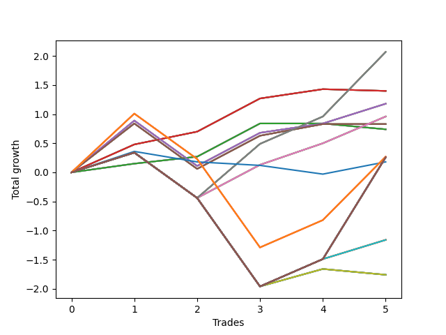

# Long Bulldog 004 
- Symbol: NVDA_Unlimited
- Date Range: 02/08/2022 - 07/08/2022
- Trading Period: 7:20-12:30
- Number of Trades: 5



| Name | Win Percent | Profit | Avg Profit / Trade | Avg Time / Trade |      | Name | Win Percent | Profit | Avg Profit / Trade | Avg Time / Trade |
| ---- | ----------- | ------ | ------------------ | ---------------- | ---- | ---- | ----------- | ------ | ------------------ | ---------------- |
| Sorted By <br> Profit | | | | | | Sorted By <br> Win Percentage ||||
| Sixty-Nine | 80.00 | 1035.00 | 207.00 | 20:33 |     | Sixty-Nine | 80.00 | 1035.00 | 207.00 | 20:33 |
| Sixty-One | 80.00 | 1035.00 | 207.00 | 20:33 |     | Sixty-One | 80.00 | 1035.00 | 207.00 | 20:33 |
| Fifty-Three | 80.00 | 1035.00 | 207.00 | 20:33 |     | Fifty-Three | 80.00 | 1035.00 | 207.00 | 20:33 |
| Forty-Five | 80.00 | 1035.00 | 207.00 | 20:33 |     | Forty-Five | 80.00 | 1035.00 | 207.00 | 20:33 |
| Five | 80.00 | 1035.00 | 207.00 | 20:33 |     | Five | 80.00 | 1035.00 | 207.00 | 20:33 |
| Sixty-Five | 80.00 | 700.00 | 140.00 | 04:49 |     | Sixty-Five | 80.00 | 700.00 | 140.00 | 04:49 |
| Fifty-Seven | 80.00 | 700.00 | 140.00 | 04:49 |     | Fifty-Seven | 80.00 | 700.00 | 140.00 | 04:49 |
| Forty-Nine | 80.00 | 700.00 | 140.00 | 04:49 |     | Forty-Nine | 80.00 | 700.00 | 140.00 | 04:49 |
| Forty-One | 80.00 | 700.00 | 140.00 | 04:49 |     | Forty-One | 80.00 | 700.00 | 140.00 | 04:49 |
| One | 80.00 | 700.00 | 140.00 | 04:49 |     | One | 80.00 | 700.00 | 140.00 | 04:49 |
| Sixty-Six | 80.00 | 590.00 | 118.00 | 10:45 |     | Sixty-Six | 80.00 | 590.00 | 118.00 | 10:45 |
| Fifty-Eight | 80.00 | 590.00 | 118.00 | 10:45 |     | Fifty-Eight | 80.00 | 590.00 | 118.00 | 10:45 |
| Fifty | 80.00 | 590.00 | 118.00 | 10:45 |     | Fifty | 80.00 | 590.00 | 118.00 | 10:45 |
| Forty-Two | 80.00 | 590.00 | 118.00 | 10:45 |     | Forty-Two | 80.00 | 590.00 | 118.00 | 10:45 |
| Two | 80.00 | 590.00 | 118.00 | 10:45 |     | Two | 80.00 | 590.00 | 118.00 | 10:45 |
| Sixty-Eight | 80.00 | 480.00 | 96.00 | 17:45 |     | Sixty-Eight | 80.00 | 480.00 | 96.00 | 17:45 |
| Sixty | 80.00 | 480.00 | 96.00 | 17:45 |     | Sixty | 80.00 | 480.00 | 96.00 | 17:45 |
| Fifty-Two | 80.00 | 480.00 | 96.00 | 17:45 |     | Fifty-Two | 80.00 | 480.00 | 96.00 | 17:45 |
| Forty-Four | 80.00 | 480.00 | 96.00 | 17:45 |     | Forty-Four | 80.00 | 480.00 | 96.00 | 17:45 |
| Four | 80.00 | 480.00 | 96.00 | 17:45 |     | Four | 80.00 | 480.00 | 96.00 | 17:45 |
| Sixty-Seven | 80.00 | 415.00 | 83.00 | 12:46 |     | Sixty-Seven | 80.00 | 415.00 | 83.00 | 12:46 |
| Fifty-Nine | 80.00 | 415.00 | 83.00 | 12:46 |     | Fifty-Nine | 80.00 | 415.00 | 83.00 | 12:46 |
| Fifty-One | 80.00 | 415.00 | 83.00 | 12:46 |     | Fifty-One | 80.00 | 415.00 | 83.00 | 12:46 |
| Forty-Three | 80.00 | 415.00 | 83.00 | 12:46 |     | Forty-Three | 80.00 | 415.00 | 83.00 | 12:46 |
| Three | 80.00 | 415.00 | 83.00 | 12:46 |     | Three | 80.00 | 415.00 | 83.00 | 12:46 |
| Sixty-Four | 80.00 | 370.00 | 74.00 | 02:16 |     | Sixty-Four | 80.00 | 370.00 | 74.00 | 02:16 |
| Fifty-Six | 80.00 | 370.00 | 74.00 | 02:16 |     | Fifty-Six | 80.00 | 370.00 | 74.00 | 02:16 |
| Forty-Eight | 80.00 | 370.00 | 74.00 | 02:16 |     | Forty-Eight | 80.00 | 370.00 | 74.00 | 02:16 |
| Forty | 80.00 | 370.00 | 74.00 | 02:16 |     | Forty | 80.00 | 370.00 | 74.00 | 02:16 |
| Zero | 80.00 | 370.00 | 74.00 | 02:16 |     | Zero | 80.00 | 370.00 | 74.00 | 02:16 |
| One Hundred Twenty-Six | 60.00 | 135.00 | 27.00 | 22:58 |     | One Hundred Twenty-Six | 60.00 | 135.00 | 27.00 | 22:58 |
| One Hundred Twenty-One | 60.00 | 135.00 | 27.00 | 22:58 |     | One Hundred Twenty-One | 60.00 | 135.00 | 27.00 | 22:58 |
| One Hundred Sixteen | 60.00 | 135.00 | 27.00 | 22:58 |     | One Hundred Sixteen | 60.00 | 135.00 | 27.00 | 22:58 |
| One Hundred Eleven | 60.00 | 135.00 | 27.00 | 22:58 |     | One Hundred Eleven | 60.00 | 135.00 | 27.00 | 22:58 |
| Eighty-One | 60.00 | 135.00 | 27.00 | 22:58 |     | Eighty-One | 60.00 | 135.00 | 27.00 | 22:58 |
| One Hundred Thirty | 60.00 | 130.00 | 26.00 | 29:55 |     | One Hundred Thirty | 60.00 | 130.00 | 26.00 | 29:55 |
| One Hundred Twenty-Nine | 60.00 | 130.00 | 26.00 | 29:55 |     | One Hundred Twenty-Nine | 60.00 | 130.00 | 26.00 | 29:55 |
| One Hundred Twenty-Eight | 60.00 | 130.00 | 26.00 | 29:55 |     | One Hundred Twenty-Eight | 60.00 | 130.00 | 26.00 | 29:55 |
| One Hundred Twenty-Seven | 60.00 | 130.00 | 26.00 | 29:55 |     | One Hundred Twenty-Seven | 60.00 | 130.00 | 26.00 | 29:55 |
| One Hundred Twenty-Five | 60.00 | 130.00 | 26.00 | 29:55 |     | One Hundred Twenty-Five | 60.00 | 130.00 | 26.00 | 29:55 |
| One Hundred Twenty-Four | 60.00 | 130.00 | 26.00 | 29:55 |     | One Hundred Twenty-Four | 60.00 | 130.00 | 26.00 | 29:55 |
| One Hundred Twenty-Three | 60.00 | 130.00 | 26.00 | 29:55 |     | One Hundred Twenty-Three | 60.00 | 130.00 | 26.00 | 29:55 |
| One Hundred Twenty-Two | 60.00 | 130.00 | 26.00 | 29:55 |     | One Hundred Twenty-Two | 60.00 | 130.00 | 26.00 | 29:55 |
| One Hundred Twenty | 60.00 | 130.00 | 26.00 | 29:55 |     | One Hundred Twenty | 60.00 | 130.00 | 26.00 | 29:55 |
| One Hundred Ninteen | 60.00 | 130.00 | 26.00 | 29:55 |     | One Hundred Ninteen | 60.00 | 130.00 | 26.00 | 29:55 |
| One Hundred Eighteen | 60.00 | 130.00 | 26.00 | 29:55 |     | One Hundred Eighteen | 60.00 | 130.00 | 26.00 | 29:55 |
| One Hundred Seventeen | 60.00 | 130.00 | 26.00 | 29:55 |     | One Hundred Seventeen | 60.00 | 130.00 | 26.00 | 29:55 |
| One Hundred Fifteen | 60.00 | 130.00 | 26.00 | 29:55 |     | One Hundred Fifteen | 60.00 | 130.00 | 26.00 | 29:55 |
| One Hundred Fourteen | 60.00 | 130.00 | 26.00 | 29:55 |     | One Hundred Fourteen | 60.00 | 130.00 | 26.00 | 29:55 |
| One Hundred Thirteen | 60.00 | 130.00 | 26.00 | 29:55 |     | One Hundred Thirteen | 60.00 | 130.00 | 26.00 | 29:55 |
| One Hundred Twelve | 60.00 | 130.00 | 26.00 | 29:55 |     | One Hundred Twelve | 60.00 | 130.00 | 26.00 | 29:55 |
| Eighty-Five | 60.00 | 130.00 | 26.00 | 29:55 |     | Eighty-Five | 60.00 | 130.00 | 26.00 | 29:55 |
| Eighty-Four | 60.00 | 130.00 | 26.00 | 29:55 |     | Eighty-Four | 60.00 | 130.00 | 26.00 | 29:55 |
| Eighty-Three | 60.00 | 130.00 | 26.00 | 29:55 |     | Eighty-Three | 60.00 | 130.00 | 26.00 | 29:55 |
| Eighty-Two | 60.00 | 130.00 | 26.00 | 29:55 |     | Eighty-Two | 60.00 | 130.00 | 26.00 | 29:55 |
| Seventy-Three | 40.00 | 90.00 | 18.00 | 08:53 |     | Seventy-One | 60.00 | -580.00 | -116.00 | 24:07 |
| Seventy-One | 60.00 | -580.00 | -116.00 | 24:07 |     | Sixty-Three | 60.00 | -580.00 | -116.00 | 24:07 |
| Sixty-Three | 60.00 | -580.00 | -116.00 | 24:07 |     | Fifty-Five | 60.00 | -580.00 | -116.00 | 24:07 |
| Fifty-Five | 60.00 | -580.00 | -116.00 | 24:07 |     | Forty-Seven | 60.00 | -580.00 | -116.00 | 24:07 |
| Forty-Seven | 60.00 | -580.00 | -116.00 | 24:07 |     | Seven | 60.00 | -580.00 | -116.00 | 24:07 |
| Seven | 60.00 | -580.00 | -116.00 | 24:07 |     | Seventy-Three | 40.00 | 90.00 | 18.00 | 08:53 |
| Seventy | 40.00 | -880.00 | -176.00 | 23:28 |     | Seventy | 40.00 | -880.00 | -176.00 | 23:28 |
| Sixty-Two | 40.00 | -880.00 | -176.00 | 23:28 |     | Sixty-Two | 40.00 | -880.00 | -176.00 | 23:28 |
| Fifty-Four | 40.00 | -880.00 | -176.00 | 23:28 |     | Fifty-Four | 40.00 | -880.00 | -176.00 | 23:28 |
| Forty-Six | 40.00 | -880.00 | -176.00 | 23:28 |     | Forty-Six | 40.00 | -880.00 | -176.00 | 23:28 |
| Six | 40.00 | -880.00 | -176.00 | 23:28 |     | Six | 40.00 | -880.00 | -176.00 | 23:28 |

## NO STOPLOSS

### Test Zero
* Sell when price hits the middle line of the 20p bollinger
* No Stoploss
* Results:
```
Total Trades: 5
Percent Up: 80.00
Percent Down: 20.00
Total Points Moved Up: 0.74
Potential Profit: 370.00
Total Points Ups: 0.84 Count Ups: 4
Total Points Downs: -0.10 Count Downs: 1
```

<details><summary>Trades</summary>

<code>In: 2022-03-31 10:19:00		Out: 2022-03-31 10:26:20		Total Position Time: 07:20		Total Move Up: 0.15		Total to Date: 0.15</code> <br />
<code>In: 2022-05-06 11:12:00		Out: 2022-05-06 11:12:15		Total Position Time: 00:15		Total Move Up: 0.12		Total to Date: 0.27</code> <br />
<code>In: 2022-05-06 11:50:00		Out: 2022-05-06 11:50:10		Total Position Time: 00:10		Total Move Up: 0.57		Total to Date: 0.84</code> <br />
<code>In: 2022-06-27 10:51:00		Out: 2022-06-27 10:54:25		Total Position Time: 03:25		Total Move Up: 0.00		Total to Date: 0.84</code> <br />
<code>In: 2022-07-06 11:29:00		Out: 2022-07-06 11:29:10		Total Position Time: 00:10		Total Move Up: -0.10		Total to Date: 0.74</code> <br />


</details>

### Test One
* Sell when the price hits the upper line of the 20p 1std bollinger
* No Stoploss
* Results:
```
Total Trades: 5
Percent Up: 80.00
Percent Down: 20.00
Total Points Moved Up: 1.40
Potential Profit: 700.00
Total Points Ups: 1.43 Count Ups: 4
Total Points Downs: -0.03 Count Downs: 1
```

<details><summary>Trades</summary>

<code>In: 2022-03-31 10:19:00		Out: 2022-03-31 10:29:05		Total Position Time: 10:05		Total Move Up: 0.48		Total to Date: 0.48</code> <br />
<code>In: 2022-05-06 11:12:00		Out: 2022-05-06 11:15:05		Total Position Time: 03:05		Total Move Up: 0.22		Total to Date: 0.70</code> <br />
<code>In: 2022-05-06 11:50:00		Out: 2022-05-06 11:50:10		Total Position Time: 00:10		Total Move Up: 0.57		Total to Date: 1.27</code> <br />
<code>In: 2022-06-27 10:51:00		Out: 2022-06-27 11:01:20		Total Position Time: 10:20		Total Move Up: 0.16		Total to Date: 1.43</code> <br />
<code>In: 2022-07-06 11:29:00		Out: 2022-07-06 11:29:25		Total Position Time: 00:25		Total Move Up: -0.03		Total to Date: 1.40</code> <br />


</details>

### Test Two
* Sell when the price hits the upper line of the 20p 2std bollinger
* No Stoploss
* Results:
```
Total Trades: 5
Percent Up: 80.00
Percent Down: 20.00
Total Points Moved Up: 1.18
Potential Profit: 590.00
Total Points Ups: 1.96 Count Ups: 4
Total Points Downs: -0.78 Count Downs: 1
```

<details><summary>Trades</summary>

<code>In: 2022-03-31 10:19:00		Out: 2022-03-31 10:31:20		Total Position Time: 12:20		Total Move Up: 0.89		Total to Date: 0.89</code> <br />
<code>In: 2022-05-06 11:12:00		Out: 2022-05-06 11:41:55		Total Position Time: 29:55		Total Move Up: -0.78		Total to Date: 0.11</code> <br />
<code>In: 2022-05-06 11:50:00		Out: 2022-05-06 11:50:10		Total Position Time: 00:10		Total Move Up: 0.57		Total to Date: 0.68</code> <br />
<code>In: 2022-06-27 10:51:00		Out: 2022-06-27 11:01:20		Total Position Time: 10:20		Total Move Up: 0.16		Total to Date: 0.84</code> <br />
<code>In: 2022-07-06 11:29:00		Out: 2022-07-06 11:30:00		Total Position Time: 01:00		Total Move Up: 0.34		Total to Date: 1.18</code> <br />


</details>

### Test Three
* Sell when price hits the middle line of the 50p bollinger
* No Stoploss
* Results:
```
Total Trades: 5
Percent Up: 80.00
Percent Down: 20.00
Total Points Moved Up: 0.83
Potential Profit: 415.00
Total Points Ups: 1.61 Count Ups: 4
Total Points Downs: -0.78 Count Downs: 1
```

<details><summary>Trades</summary>

<code>In: 2022-03-31 10:19:00		Out: 2022-03-31 10:29:40		Total Position Time: 10:40		Total Move Up: 0.84		Total to Date: 0.84</code> <br />
<code>In: 2022-05-06 11:12:00		Out: 2022-05-06 11:41:55		Total Position Time: 29:55		Total Move Up: -0.78		Total to Date: 0.06</code> <br />
<code>In: 2022-05-06 11:50:00		Out: 2022-05-06 11:50:10		Total Position Time: 00:10		Total Move Up: 0.57		Total to Date: 0.63</code> <br />
<code>In: 2022-06-27 10:51:00		Out: 2022-06-27 11:13:35		Total Position Time: 22:35		Total Move Up: 0.20		Total to Date: 0.83</code> <br />
<code>In: 2022-07-06 11:29:00		Out: 2022-07-06 11:29:30		Total Position Time: 00:30		Total Move Up: 0.00		Total to Date: 0.83</code> <br />


</details>

### Test Four
* Sell when the price hits the upper line of the 50p 1std bollinger
* No Stoploss
* Results:
```
Total Trades: 5
Percent Up: 80.00
Percent Down: 20.00
Total Points Moved Up: 0.96
Potential Profit: 480.00
Total Points Ups: 1.74 Count Ups: 4
Total Points Downs: -0.78 Count Downs: 1
```

<details><summary>Trades</summary>

<code>In: 2022-03-31 10:19:00		Out: 2022-03-31 10:48:55		Total Position Time: 29:55		Total Move Up: 0.34		Total to Date: 0.34</code> <br />
<code>In: 2022-05-06 11:12:00		Out: 2022-05-06 11:41:55		Total Position Time: 29:55		Total Move Up: -0.78		Total to Date: -0.44</code> <br />
<code>In: 2022-05-06 11:50:00		Out: 2022-05-06 11:50:10		Total Position Time: 00:10		Total Move Up: 0.57		Total to Date: 0.13</code> <br />
<code>In: 2022-06-27 10:51:00		Out: 2022-06-27 11:18:40		Total Position Time: 27:40		Total Move Up: 0.37		Total to Date: 0.50</code> <br />
<code>In: 2022-07-06 11:29:00		Out: 2022-07-06 11:30:05		Total Position Time: 01:05		Total Move Up: 0.46		Total to Date: 0.96</code> <br />


</details>

### Test Five
* Sell when the price hits the upper line of the 50p 2std bollinger
* No Stoploss
* Results:
```
Total Trades: 5
Percent Up: 80.00
Percent Down: 20.00
Total Points Moved Up: 2.07
Potential Profit: 1035.00
Total Points Ups: 2.85 Count Ups: 4
Total Points Downs: -0.78 Count Downs: 1
```

<details><summary>Trades</summary>

<code>In: 2022-03-31 10:19:00		Out: 2022-03-31 10:48:55		Total Position Time: 29:55		Total Move Up: 0.34		Total to Date: 0.34</code> <br />
<code>In: 2022-05-06 11:12:00		Out: 2022-05-06 11:41:55		Total Position Time: 29:55		Total Move Up: -0.78		Total to Date: -0.44</code> <br />
<code>In: 2022-05-06 11:50:00		Out: 2022-05-06 11:50:35		Total Position Time: 00:35		Total Move Up: 0.93		Total to Date: 0.49</code> <br />
<code>In: 2022-06-27 10:51:00		Out: 2022-06-27 11:20:55		Total Position Time: 29:55		Total Move Up: 0.47		Total to Date: 0.96</code> <br />
<code>In: 2022-07-06 11:29:00		Out: 2022-07-06 11:41:25		Total Position Time: 12:25		Total Move Up: 1.11		Total to Date: 2.07</code> <br />


</details>

### Test Six
* Sell when the price hits the middle line of the 1std VWAP
* No Stoploss
* Results:
```
Total Trades: 5
Percent Up: 40.00
Percent Down: 60.00
Total Points Moved Up: -1.76
Potential Profit: -880.00
Total Points Ups: 0.64 Count Ups: 2
Total Points Downs: -2.40 Count Downs: 3
```

<details><summary>Trades</summary>

<code>In: 2022-03-31 10:19:00		Out: 2022-03-31 10:48:55		Total Position Time: 29:55		Total Move Up: 0.34		Total to Date: 0.34</code> <br />
<code>In: 2022-05-06 11:12:00		Out: 2022-05-06 11:41:55		Total Position Time: 29:55		Total Move Up: -0.78		Total to Date: -0.44</code> <br />
<code>In: 2022-05-06 11:50:00		Out: 2022-05-06 12:19:55		Total Position Time: 29:55		Total Move Up: -1.52		Total to Date: -1.96</code> <br />
<code>In: 2022-06-27 10:51:00		Out: 2022-06-27 11:18:25		Total Position Time: 27:25		Total Move Up: 0.30		Total to Date: -1.66</code> <br />
<code>In: 2022-07-06 11:29:00		Out: 2022-07-06 11:29:10		Total Position Time: 00:10		Total Move Up: -0.10		Total to Date: -1.76</code> <br />


</details>

### Test Seven
* Sell when the price hits the upper line of the 1std VWAP
* No Stoploss
* Results:
```
Total Trades: 5
Percent Up: 60.00
Percent Down: 40.00
Total Points Moved Up: -1.16
Potential Profit: -580.00
Total Points Ups: 1.14 Count Ups: 3
Total Points Downs: -2.30 Count Downs: 2
```

<details><summary>Trades</summary>

<code>In: 2022-03-31 10:19:00		Out: 2022-03-31 10:48:55		Total Position Time: 29:55		Total Move Up: 0.34		Total to Date: 0.34</code> <br />
<code>In: 2022-05-06 11:12:00		Out: 2022-05-06 11:41:55		Total Position Time: 29:55		Total Move Up: -0.78		Total to Date: -0.44</code> <br />
<code>In: 2022-05-06 11:50:00		Out: 2022-05-06 12:19:55		Total Position Time: 29:55		Total Move Up: -1.52		Total to Date: -1.96</code> <br />
<code>In: 2022-06-27 10:51:00		Out: 2022-06-27 11:20:55		Total Position Time: 29:55		Total Move Up: 0.47		Total to Date: -1.49</code> <br />
<code>In: 2022-07-06 11:29:00		Out: 2022-07-06 11:29:55		Total Position Time: 00:55		Total Move Up: 0.33		Total to Date: -1.16</code> <br />


</details>

## STOPLOSS OF 5

### Test Forty
* Sell when price hits the middle line of the 20p bollinger
* Stoploss is 5 points
* Results:
```
Total Trades: 5
Percent Up: 80.00
Percent Down: 20.00
Total Points Moved Up: 0.74
Potential Profit: 370.00
Total Points Ups: 0.84 Count Ups: 4
Total Points Downs: -0.10 Count Downs: 1
```

<details><summary>Trades</summary>

<code>In: 2022-03-31 10:19:00		Out: 2022-03-31 10:26:20		Total Position Time: 07:20		Total Move Up: 0.15		Total to Date: 0.15</code> <br />
<code>In: 2022-05-06 11:12:00		Out: 2022-05-06 11:12:15		Total Position Time: 00:15		Total Move Up: 0.12		Total to Date: 0.27</code> <br />
<code>In: 2022-05-06 11:50:00		Out: 2022-05-06 11:50:10		Total Position Time: 00:10		Total Move Up: 0.57		Total to Date: 0.84</code> <br />
<code>In: 2022-06-27 10:51:00		Out: 2022-06-27 10:54:25		Total Position Time: 03:25		Total Move Up: 0.00		Total to Date: 0.84</code> <br />
<code>In: 2022-07-06 11:29:00		Out: 2022-07-06 11:29:10		Total Position Time: 00:10		Total Move Up: -0.10		Total to Date: 0.74</code> <br />


</details>

### Test Forty-One
* Sell when the price hits the upper line of the 20p 1std bollinger
* Stoploss is 5 points
* Results:
```
Total Trades: 5
Percent Up: 80.00
Percent Down: 20.00
Total Points Moved Up: 1.40
Potential Profit: 700.00
Total Points Ups: 1.43 Count Ups: 4
Total Points Downs: -0.03 Count Downs: 1
```

<details><summary>Trades</summary>

<code>In: 2022-03-31 10:19:00		Out: 2022-03-31 10:29:05		Total Position Time: 10:05		Total Move Up: 0.48		Total to Date: 0.48</code> <br />
<code>In: 2022-05-06 11:12:00		Out: 2022-05-06 11:15:05		Total Position Time: 03:05		Total Move Up: 0.22		Total to Date: 0.70</code> <br />
<code>In: 2022-05-06 11:50:00		Out: 2022-05-06 11:50:10		Total Position Time: 00:10		Total Move Up: 0.57		Total to Date: 1.27</code> <br />
<code>In: 2022-06-27 10:51:00		Out: 2022-06-27 11:01:20		Total Position Time: 10:20		Total Move Up: 0.16		Total to Date: 1.43</code> <br />
<code>In: 2022-07-06 11:29:00		Out: 2022-07-06 11:29:25		Total Position Time: 00:25		Total Move Up: -0.03		Total to Date: 1.40</code> <br />


</details>

### Test Forty-Two
* Sell when the price hits the upper line of the 20p 2std bollinger
* Stoploss is 5 points
* Results:
```
Total Trades: 5
Percent Up: 80.00
Percent Down: 20.00
Total Points Moved Up: 1.18
Potential Profit: 590.00
Total Points Ups: 1.96 Count Ups: 4
Total Points Downs: -0.78 Count Downs: 1
```

<details><summary>Trades</summary>

<code>In: 2022-03-31 10:19:00		Out: 2022-03-31 10:31:20		Total Position Time: 12:20		Total Move Up: 0.89		Total to Date: 0.89</code> <br />
<code>In: 2022-05-06 11:12:00		Out: 2022-05-06 11:41:55		Total Position Time: 29:55		Total Move Up: -0.78		Total to Date: 0.11</code> <br />
<code>In: 2022-05-06 11:50:00		Out: 2022-05-06 11:50:10		Total Position Time: 00:10		Total Move Up: 0.57		Total to Date: 0.68</code> <br />
<code>In: 2022-06-27 10:51:00		Out: 2022-06-27 11:01:20		Total Position Time: 10:20		Total Move Up: 0.16		Total to Date: 0.84</code> <br />
<code>In: 2022-07-06 11:29:00		Out: 2022-07-06 11:30:00		Total Position Time: 01:00		Total Move Up: 0.34		Total to Date: 1.18</code> <br />


</details>

### Test Forty-Three
* Sell when price hits the middle line of the 50p bollinger
* Stoploss is 5 points
* Results:
```
Total Trades: 5
Percent Up: 80.00
Percent Down: 20.00
Total Points Moved Up: 0.83
Potential Profit: 415.00
Total Points Ups: 1.61 Count Ups: 4
Total Points Downs: -0.78 Count Downs: 1
```

<details><summary>Trades</summary>

<code>In: 2022-03-31 10:19:00		Out: 2022-03-31 10:29:40		Total Position Time: 10:40		Total Move Up: 0.84		Total to Date: 0.84</code> <br />
<code>In: 2022-05-06 11:12:00		Out: 2022-05-06 11:41:55		Total Position Time: 29:55		Total Move Up: -0.78		Total to Date: 0.06</code> <br />
<code>In: 2022-05-06 11:50:00		Out: 2022-05-06 11:50:10		Total Position Time: 00:10		Total Move Up: 0.57		Total to Date: 0.63</code> <br />
<code>In: 2022-06-27 10:51:00		Out: 2022-06-27 11:13:35		Total Position Time: 22:35		Total Move Up: 0.20		Total to Date: 0.83</code> <br />
<code>In: 2022-07-06 11:29:00		Out: 2022-07-06 11:29:30		Total Position Time: 00:30		Total Move Up: 0.00		Total to Date: 0.83</code> <br />


</details>

### Test Forty-Four
* Sell when the price hits the upper line of the 50p 1std bollinger
* Stoploss is 5 points
* Results:
```
Total Trades: 5
Percent Up: 80.00
Percent Down: 20.00
Total Points Moved Up: 0.96
Potential Profit: 480.00
Total Points Ups: 1.74 Count Ups: 4
Total Points Downs: -0.78 Count Downs: 1
```

<details><summary>Trades</summary>

<code>In: 2022-03-31 10:19:00		Out: 2022-03-31 10:48:55		Total Position Time: 29:55		Total Move Up: 0.34		Total to Date: 0.34</code> <br />
<code>In: 2022-05-06 11:12:00		Out: 2022-05-06 11:41:55		Total Position Time: 29:55		Total Move Up: -0.78		Total to Date: -0.44</code> <br />
<code>In: 2022-05-06 11:50:00		Out: 2022-05-06 11:50:10		Total Position Time: 00:10		Total Move Up: 0.57		Total to Date: 0.13</code> <br />
<code>In: 2022-06-27 10:51:00		Out: 2022-06-27 11:18:40		Total Position Time: 27:40		Total Move Up: 0.37		Total to Date: 0.50</code> <br />
<code>In: 2022-07-06 11:29:00		Out: 2022-07-06 11:30:05		Total Position Time: 01:05		Total Move Up: 0.46		Total to Date: 0.96</code> <br />


</details>

### Test Forty-Five
* Sell when the price hits the upper line of the 50p 2std bollinger
* Stoploss is 5 points
* Results:
```
Total Trades: 5
Percent Up: 80.00
Percent Down: 20.00
Total Points Moved Up: 2.07
Potential Profit: 1035.00
Total Points Ups: 2.85 Count Ups: 4
Total Points Downs: -0.78 Count Downs: 1
```

<details><summary>Trades</summary>

<code>In: 2022-03-31 10:19:00		Out: 2022-03-31 10:48:55		Total Position Time: 29:55		Total Move Up: 0.34		Total to Date: 0.34</code> <br />
<code>In: 2022-05-06 11:12:00		Out: 2022-05-06 11:41:55		Total Position Time: 29:55		Total Move Up: -0.78		Total to Date: -0.44</code> <br />
<code>In: 2022-05-06 11:50:00		Out: 2022-05-06 11:50:35		Total Position Time: 00:35		Total Move Up: 0.93		Total to Date: 0.49</code> <br />
<code>In: 2022-06-27 10:51:00		Out: 2022-06-27 11:20:55		Total Position Time: 29:55		Total Move Up: 0.47		Total to Date: 0.96</code> <br />
<code>In: 2022-07-06 11:29:00		Out: 2022-07-06 11:41:25		Total Position Time: 12:25		Total Move Up: 1.11		Total to Date: 2.07</code> <br />


</details>

### Test Forty-Six
* Sell when the price hits the middle line of the 1std VWAP
* Stoploss is 5 points
* Results:
```
Total Trades: 5
Percent Up: 40.00
Percent Down: 60.00
Total Points Moved Up: -1.76
Potential Profit: -880.00
Total Points Ups: 0.64 Count Ups: 2
Total Points Downs: -2.40 Count Downs: 3
```

<details><summary>Trades</summary>

<code>In: 2022-03-31 10:19:00		Out: 2022-03-31 10:48:55		Total Position Time: 29:55		Total Move Up: 0.34		Total to Date: 0.34</code> <br />
<code>In: 2022-05-06 11:12:00		Out: 2022-05-06 11:41:55		Total Position Time: 29:55		Total Move Up: -0.78		Total to Date: -0.44</code> <br />
<code>In: 2022-05-06 11:50:00		Out: 2022-05-06 12:19:55		Total Position Time: 29:55		Total Move Up: -1.52		Total to Date: -1.96</code> <br />
<code>In: 2022-06-27 10:51:00		Out: 2022-06-27 11:18:25		Total Position Time: 27:25		Total Move Up: 0.30		Total to Date: -1.66</code> <br />
<code>In: 2022-07-06 11:29:00		Out: 2022-07-06 11:29:10		Total Position Time: 00:10		Total Move Up: -0.10		Total to Date: -1.76</code> <br />


</details>

### Test Forty-Seven
* Sell when the price hits the upper line of the 1std VWAP
* Stoploss is 5 points
* Results:
```
Total Trades: 5
Percent Up: 60.00
Percent Down: 40.00
Total Points Moved Up: -1.16
Potential Profit: -580.00
Total Points Ups: 1.14 Count Ups: 3
Total Points Downs: -2.30 Count Downs: 2
```

<details><summary>Trades</summary>

<code>In: 2022-03-31 10:19:00		Out: 2022-03-31 10:48:55		Total Position Time: 29:55		Total Move Up: 0.34		Total to Date: 0.34</code> <br />
<code>In: 2022-05-06 11:12:00		Out: 2022-05-06 11:41:55		Total Position Time: 29:55		Total Move Up: -0.78		Total to Date: -0.44</code> <br />
<code>In: 2022-05-06 11:50:00		Out: 2022-05-06 12:19:55		Total Position Time: 29:55		Total Move Up: -1.52		Total to Date: -1.96</code> <br />
<code>In: 2022-06-27 10:51:00		Out: 2022-06-27 11:20:55		Total Position Time: 29:55		Total Move Up: 0.47		Total to Date: -1.49</code> <br />
<code>In: 2022-07-06 11:29:00		Out: 2022-07-06 11:29:55		Total Position Time: 00:55		Total Move Up: 0.33		Total to Date: -1.16</code> <br />


</details>

## TRAIL STOP OF 5

### Test Forty-Eight
* Sell when price hits the middle line of the 20p bollinger
* Trailing Stop is 5 points
* Results:
```
Total Trades: 5
Percent Up: 80.00
Percent Down: 20.00
Total Points Moved Up: 0.74
Potential Profit: 370.00
Total Points Ups: 0.84 Count Ups: 4
Total Points Downs: -0.10 Count Downs: 1
```

<details><summary>Trades</summary>

<code>In: 2022-03-31 10:19:00		Out: 2022-03-31 10:26:20		Total Position Time: 07:20		Total Move Up: 0.15		Total to Date: 0.15</code> <br />
<code>In: 2022-05-06 11:12:00		Out: 2022-05-06 11:12:15		Total Position Time: 00:15		Total Move Up: 0.12		Total to Date: 0.27</code> <br />
<code>In: 2022-05-06 11:50:00		Out: 2022-05-06 11:50:10		Total Position Time: 00:10		Total Move Up: 0.57		Total to Date: 0.84</code> <br />
<code>In: 2022-06-27 10:51:00		Out: 2022-06-27 10:54:25		Total Position Time: 03:25		Total Move Up: 0.00		Total to Date: 0.84</code> <br />
<code>In: 2022-07-06 11:29:00		Out: 2022-07-06 11:29:10		Total Position Time: 00:10		Total Move Up: -0.10		Total to Date: 0.74</code> <br />


</details>

### Test Forty-Nine
* Sell when the price hits the upper line of the 20p 1std bollinger
* Trailing Stop is 5 points
* Results:
```
Total Trades: 5
Percent Up: 80.00
Percent Down: 20.00
Total Points Moved Up: 1.40
Potential Profit: 700.00
Total Points Ups: 1.43 Count Ups: 4
Total Points Downs: -0.03 Count Downs: 1
```

<details><summary>Trades</summary>

<code>In: 2022-03-31 10:19:00		Out: 2022-03-31 10:29:05		Total Position Time: 10:05		Total Move Up: 0.48		Total to Date: 0.48</code> <br />
<code>In: 2022-05-06 11:12:00		Out: 2022-05-06 11:15:05		Total Position Time: 03:05		Total Move Up: 0.22		Total to Date: 0.70</code> <br />
<code>In: 2022-05-06 11:50:00		Out: 2022-05-06 11:50:10		Total Position Time: 00:10		Total Move Up: 0.57		Total to Date: 1.27</code> <br />
<code>In: 2022-06-27 10:51:00		Out: 2022-06-27 11:01:20		Total Position Time: 10:20		Total Move Up: 0.16		Total to Date: 1.43</code> <br />
<code>In: 2022-07-06 11:29:00		Out: 2022-07-06 11:29:25		Total Position Time: 00:25		Total Move Up: -0.03		Total to Date: 1.40</code> <br />


</details>

### Test Fifty
* Sell when the price hits the upper line of the 20p 2std bollinger
* Trailing Stop is 5 points
* Results:
```
Total Trades: 5
Percent Up: 80.00
Percent Down: 20.00
Total Points Moved Up: 1.18
Potential Profit: 590.00
Total Points Ups: 1.96 Count Ups: 4
Total Points Downs: -0.78 Count Downs: 1
```

<details><summary>Trades</summary>

<code>In: 2022-03-31 10:19:00		Out: 2022-03-31 10:31:20		Total Position Time: 12:20		Total Move Up: 0.89		Total to Date: 0.89</code> <br />
<code>In: 2022-05-06 11:12:00		Out: 2022-05-06 11:41:55		Total Position Time: 29:55		Total Move Up: -0.78		Total to Date: 0.11</code> <br />
<code>In: 2022-05-06 11:50:00		Out: 2022-05-06 11:50:10		Total Position Time: 00:10		Total Move Up: 0.57		Total to Date: 0.68</code> <br />
<code>In: 2022-06-27 10:51:00		Out: 2022-06-27 11:01:20		Total Position Time: 10:20		Total Move Up: 0.16		Total to Date: 0.84</code> <br />
<code>In: 2022-07-06 11:29:00		Out: 2022-07-06 11:30:00		Total Position Time: 01:00		Total Move Up: 0.34		Total to Date: 1.18</code> <br />


</details>

### Test Fifty-One
* Sell when price hits the middle line of the 50p bollinger
* Trailing Stop is 5 points
* Results:
```
Total Trades: 5
Percent Up: 80.00
Percent Down: 20.00
Total Points Moved Up: 0.83
Potential Profit: 415.00
Total Points Ups: 1.61 Count Ups: 4
Total Points Downs: -0.78 Count Downs: 1
```

<details><summary>Trades</summary>

<code>In: 2022-03-31 10:19:00		Out: 2022-03-31 10:29:40		Total Position Time: 10:40		Total Move Up: 0.84		Total to Date: 0.84</code> <br />
<code>In: 2022-05-06 11:12:00		Out: 2022-05-06 11:41:55		Total Position Time: 29:55		Total Move Up: -0.78		Total to Date: 0.06</code> <br />
<code>In: 2022-05-06 11:50:00		Out: 2022-05-06 11:50:10		Total Position Time: 00:10		Total Move Up: 0.57		Total to Date: 0.63</code> <br />
<code>In: 2022-06-27 10:51:00		Out: 2022-06-27 11:13:35		Total Position Time: 22:35		Total Move Up: 0.20		Total to Date: 0.83</code> <br />
<code>In: 2022-07-06 11:29:00		Out: 2022-07-06 11:29:30		Total Position Time: 00:30		Total Move Up: 0.00		Total to Date: 0.83</code> <br />


</details>

### Test Fifty-Two
* Sell when the price hits the upper line of the 50p 1std bollinger
* Trailing Stop is 5 points
* Results:
```
Total Trades: 5
Percent Up: 80.00
Percent Down: 20.00
Total Points Moved Up: 0.96
Potential Profit: 480.00
Total Points Ups: 1.74 Count Ups: 4
Total Points Downs: -0.78 Count Downs: 1
```

<details><summary>Trades</summary>

<code>In: 2022-03-31 10:19:00		Out: 2022-03-31 10:48:55		Total Position Time: 29:55		Total Move Up: 0.34		Total to Date: 0.34</code> <br />
<code>In: 2022-05-06 11:12:00		Out: 2022-05-06 11:41:55		Total Position Time: 29:55		Total Move Up: -0.78		Total to Date: -0.44</code> <br />
<code>In: 2022-05-06 11:50:00		Out: 2022-05-06 11:50:10		Total Position Time: 00:10		Total Move Up: 0.57		Total to Date: 0.13</code> <br />
<code>In: 2022-06-27 10:51:00		Out: 2022-06-27 11:18:40		Total Position Time: 27:40		Total Move Up: 0.37		Total to Date: 0.50</code> <br />
<code>In: 2022-07-06 11:29:00		Out: 2022-07-06 11:30:05		Total Position Time: 01:05		Total Move Up: 0.46		Total to Date: 0.96</code> <br />


</details>

### Test Fifty-Three
* Sell when the price hits the upper line of the 50p 2std bollinger
* Trailing Stop is 5 points
* Results:
```
Total Trades: 5
Percent Up: 80.00
Percent Down: 20.00
Total Points Moved Up: 2.07
Potential Profit: 1035.00
Total Points Ups: 2.85 Count Ups: 4
Total Points Downs: -0.78 Count Downs: 1
```

<details><summary>Trades</summary>

<code>In: 2022-03-31 10:19:00		Out: 2022-03-31 10:48:55		Total Position Time: 29:55		Total Move Up: 0.34		Total to Date: 0.34</code> <br />
<code>In: 2022-05-06 11:12:00		Out: 2022-05-06 11:41:55		Total Position Time: 29:55		Total Move Up: -0.78		Total to Date: -0.44</code> <br />
<code>In: 2022-05-06 11:50:00		Out: 2022-05-06 11:50:35		Total Position Time: 00:35		Total Move Up: 0.93		Total to Date: 0.49</code> <br />
<code>In: 2022-06-27 10:51:00		Out: 2022-06-27 11:20:55		Total Position Time: 29:55		Total Move Up: 0.47		Total to Date: 0.96</code> <br />
<code>In: 2022-07-06 11:29:00		Out: 2022-07-06 11:41:25		Total Position Time: 12:25		Total Move Up: 1.11		Total to Date: 2.07</code> <br />


</details>

### Test Fifty-Four
* Sell when the price hits the middle line of the 1std VWAP
* Trailing Stop is 5 points
* Results:
```
Total Trades: 5
Percent Up: 40.00
Percent Down: 60.00
Total Points Moved Up: -1.76
Potential Profit: -880.00
Total Points Ups: 0.64 Count Ups: 2
Total Points Downs: -2.40 Count Downs: 3
```

<details><summary>Trades</summary>

<code>In: 2022-03-31 10:19:00		Out: 2022-03-31 10:48:55		Total Position Time: 29:55		Total Move Up: 0.34		Total to Date: 0.34</code> <br />
<code>In: 2022-05-06 11:12:00		Out: 2022-05-06 11:41:55		Total Position Time: 29:55		Total Move Up: -0.78		Total to Date: -0.44</code> <br />
<code>In: 2022-05-06 11:50:00		Out: 2022-05-06 12:19:55		Total Position Time: 29:55		Total Move Up: -1.52		Total to Date: -1.96</code> <br />
<code>In: 2022-06-27 10:51:00		Out: 2022-06-27 11:18:25		Total Position Time: 27:25		Total Move Up: 0.30		Total to Date: -1.66</code> <br />
<code>In: 2022-07-06 11:29:00		Out: 2022-07-06 11:29:10		Total Position Time: 00:10		Total Move Up: -0.10		Total to Date: -1.76</code> <br />


</details>

### Test Fifty-Five
* Sell when the price hits the upper line of the 1std VWAP
* Trailing Stop is 5 points
* Results:
```
Total Trades: 5
Percent Up: 60.00
Percent Down: 40.00
Total Points Moved Up: -1.16
Potential Profit: -580.00
Total Points Ups: 1.14 Count Ups: 3
Total Points Downs: -2.30 Count Downs: 2
```

<details><summary>Trades</summary>

<code>In: 2022-03-31 10:19:00		Out: 2022-03-31 10:48:55		Total Position Time: 29:55		Total Move Up: 0.34		Total to Date: 0.34</code> <br />
<code>In: 2022-05-06 11:12:00		Out: 2022-05-06 11:41:55		Total Position Time: 29:55		Total Move Up: -0.78		Total to Date: -0.44</code> <br />
<code>In: 2022-05-06 11:50:00		Out: 2022-05-06 12:19:55		Total Position Time: 29:55		Total Move Up: -1.52		Total to Date: -1.96</code> <br />
<code>In: 2022-06-27 10:51:00		Out: 2022-06-27 11:20:55		Total Position Time: 29:55		Total Move Up: 0.47		Total to Date: -1.49</code> <br />
<code>In: 2022-07-06 11:29:00		Out: 2022-07-06 11:29:55		Total Position Time: 00:55		Total Move Up: 0.33		Total to Date: -1.16</code> <br />


</details>

## STOPLOSS OF 10

### Test Fifty-Six
* Sell when price hits the middle line of the 20p bollinger
* Stoploss is 10 points
* Results:
```
Total Trades: 5
Percent Up: 80.00
Percent Down: 20.00
Total Points Moved Up: 0.74
Potential Profit: 370.00
Total Points Ups: 0.84 Count Ups: 4
Total Points Downs: -0.10 Count Downs: 1
```

<details><summary>Trades</summary>

<code>In: 2022-03-31 10:19:00		Out: 2022-03-31 10:26:20		Total Position Time: 07:20		Total Move Up: 0.15		Total to Date: 0.15</code> <br />
<code>In: 2022-05-06 11:12:00		Out: 2022-05-06 11:12:15		Total Position Time: 00:15		Total Move Up: 0.12		Total to Date: 0.27</code> <br />
<code>In: 2022-05-06 11:50:00		Out: 2022-05-06 11:50:10		Total Position Time: 00:10		Total Move Up: 0.57		Total to Date: 0.84</code> <br />
<code>In: 2022-06-27 10:51:00		Out: 2022-06-27 10:54:25		Total Position Time: 03:25		Total Move Up: 0.00		Total to Date: 0.84</code> <br />
<code>In: 2022-07-06 11:29:00		Out: 2022-07-06 11:29:10		Total Position Time: 00:10		Total Move Up: -0.10		Total to Date: 0.74</code> <br />


</details>

### Test Fifty-Seven
* Sell when the price hits the upper line of the 20p 1std bollinger
* Stoploss is 10 points
* Results:
```
Total Trades: 5
Percent Up: 80.00
Percent Down: 20.00
Total Points Moved Up: 1.40
Potential Profit: 700.00
Total Points Ups: 1.43 Count Ups: 4
Total Points Downs: -0.03 Count Downs: 1
```

<details><summary>Trades</summary>

<code>In: 2022-03-31 10:19:00		Out: 2022-03-31 10:29:05		Total Position Time: 10:05		Total Move Up: 0.48		Total to Date: 0.48</code> <br />
<code>In: 2022-05-06 11:12:00		Out: 2022-05-06 11:15:05		Total Position Time: 03:05		Total Move Up: 0.22		Total to Date: 0.70</code> <br />
<code>In: 2022-05-06 11:50:00		Out: 2022-05-06 11:50:10		Total Position Time: 00:10		Total Move Up: 0.57		Total to Date: 1.27</code> <br />
<code>In: 2022-06-27 10:51:00		Out: 2022-06-27 11:01:20		Total Position Time: 10:20		Total Move Up: 0.16		Total to Date: 1.43</code> <br />
<code>In: 2022-07-06 11:29:00		Out: 2022-07-06 11:29:25		Total Position Time: 00:25		Total Move Up: -0.03		Total to Date: 1.40</code> <br />


</details>

### Test Fifty-Eight
* Sell when the price hits the upper line of the 20p 2std bollinger
* Stoploss is 10 points
* Results:
```
Total Trades: 5
Percent Up: 80.00
Percent Down: 20.00
Total Points Moved Up: 1.18
Potential Profit: 590.00
Total Points Ups: 1.96 Count Ups: 4
Total Points Downs: -0.78 Count Downs: 1
```

<details><summary>Trades</summary>

<code>In: 2022-03-31 10:19:00		Out: 2022-03-31 10:31:20		Total Position Time: 12:20		Total Move Up: 0.89		Total to Date: 0.89</code> <br />
<code>In: 2022-05-06 11:12:00		Out: 2022-05-06 11:41:55		Total Position Time: 29:55		Total Move Up: -0.78		Total to Date: 0.11</code> <br />
<code>In: 2022-05-06 11:50:00		Out: 2022-05-06 11:50:10		Total Position Time: 00:10		Total Move Up: 0.57		Total to Date: 0.68</code> <br />
<code>In: 2022-06-27 10:51:00		Out: 2022-06-27 11:01:20		Total Position Time: 10:20		Total Move Up: 0.16		Total to Date: 0.84</code> <br />
<code>In: 2022-07-06 11:29:00		Out: 2022-07-06 11:30:00		Total Position Time: 01:00		Total Move Up: 0.34		Total to Date: 1.18</code> <br />


</details>

### Test Fifty-Nine
* Sell when price hits the middle line of the 50p bollinger
* Stoploss is 10 points
* Results:
```
Total Trades: 5
Percent Up: 80.00
Percent Down: 20.00
Total Points Moved Up: 0.83
Potential Profit: 415.00
Total Points Ups: 1.61 Count Ups: 4
Total Points Downs: -0.78 Count Downs: 1
```

<details><summary>Trades</summary>

<code>In: 2022-03-31 10:19:00		Out: 2022-03-31 10:29:40		Total Position Time: 10:40		Total Move Up: 0.84		Total to Date: 0.84</code> <br />
<code>In: 2022-05-06 11:12:00		Out: 2022-05-06 11:41:55		Total Position Time: 29:55		Total Move Up: -0.78		Total to Date: 0.06</code> <br />
<code>In: 2022-05-06 11:50:00		Out: 2022-05-06 11:50:10		Total Position Time: 00:10		Total Move Up: 0.57		Total to Date: 0.63</code> <br />
<code>In: 2022-06-27 10:51:00		Out: 2022-06-27 11:13:35		Total Position Time: 22:35		Total Move Up: 0.20		Total to Date: 0.83</code> <br />
<code>In: 2022-07-06 11:29:00		Out: 2022-07-06 11:29:30		Total Position Time: 00:30		Total Move Up: 0.00		Total to Date: 0.83</code> <br />


</details>

### Test Sixty
* Sell when the price hits the upper line of the 50p 1std bollinger
* Stoploss is 10 points
* Results:
```
Total Trades: 5
Percent Up: 80.00
Percent Down: 20.00
Total Points Moved Up: 0.96
Potential Profit: 480.00
Total Points Ups: 1.74 Count Ups: 4
Total Points Downs: -0.78 Count Downs: 1
```

<details><summary>Trades</summary>

<code>In: 2022-03-31 10:19:00		Out: 2022-03-31 10:48:55		Total Position Time: 29:55		Total Move Up: 0.34		Total to Date: 0.34</code> <br />
<code>In: 2022-05-06 11:12:00		Out: 2022-05-06 11:41:55		Total Position Time: 29:55		Total Move Up: -0.78		Total to Date: -0.44</code> <br />
<code>In: 2022-05-06 11:50:00		Out: 2022-05-06 11:50:10		Total Position Time: 00:10		Total Move Up: 0.57		Total to Date: 0.13</code> <br />
<code>In: 2022-06-27 10:51:00		Out: 2022-06-27 11:18:40		Total Position Time: 27:40		Total Move Up: 0.37		Total to Date: 0.50</code> <br />
<code>In: 2022-07-06 11:29:00		Out: 2022-07-06 11:30:05		Total Position Time: 01:05		Total Move Up: 0.46		Total to Date: 0.96</code> <br />


</details>

### Test Sixty-One
* Sell when the price hits the upper line of the 50p 2std bollinger
* Stoploss is 10 points
* Results:
```
Total Trades: 5
Percent Up: 80.00
Percent Down: 20.00
Total Points Moved Up: 2.07
Potential Profit: 1035.00
Total Points Ups: 2.85 Count Ups: 4
Total Points Downs: -0.78 Count Downs: 1
```

<details><summary>Trades</summary>

<code>In: 2022-03-31 10:19:00		Out: 2022-03-31 10:48:55		Total Position Time: 29:55		Total Move Up: 0.34		Total to Date: 0.34</code> <br />
<code>In: 2022-05-06 11:12:00		Out: 2022-05-06 11:41:55		Total Position Time: 29:55		Total Move Up: -0.78		Total to Date: -0.44</code> <br />
<code>In: 2022-05-06 11:50:00		Out: 2022-05-06 11:50:35		Total Position Time: 00:35		Total Move Up: 0.93		Total to Date: 0.49</code> <br />
<code>In: 2022-06-27 10:51:00		Out: 2022-06-27 11:20:55		Total Position Time: 29:55		Total Move Up: 0.47		Total to Date: 0.96</code> <br />
<code>In: 2022-07-06 11:29:00		Out: 2022-07-06 11:41:25		Total Position Time: 12:25		Total Move Up: 1.11		Total to Date: 2.07</code> <br />


</details>

### Test Sixty-Two
* Sell when the price hits the middle line of the 1std VWAP
* Stoploss is 10 points
* Results:
```
Total Trades: 5
Percent Up: 40.00
Percent Down: 60.00
Total Points Moved Up: -1.76
Potential Profit: -880.00
Total Points Ups: 0.64 Count Ups: 2
Total Points Downs: -2.40 Count Downs: 3
```

<details><summary>Trades</summary>

<code>In: 2022-03-31 10:19:00		Out: 2022-03-31 10:48:55		Total Position Time: 29:55		Total Move Up: 0.34		Total to Date: 0.34</code> <br />
<code>In: 2022-05-06 11:12:00		Out: 2022-05-06 11:41:55		Total Position Time: 29:55		Total Move Up: -0.78		Total to Date: -0.44</code> <br />
<code>In: 2022-05-06 11:50:00		Out: 2022-05-06 12:19:55		Total Position Time: 29:55		Total Move Up: -1.52		Total to Date: -1.96</code> <br />
<code>In: 2022-06-27 10:51:00		Out: 2022-06-27 11:18:25		Total Position Time: 27:25		Total Move Up: 0.30		Total to Date: -1.66</code> <br />
<code>In: 2022-07-06 11:29:00		Out: 2022-07-06 11:29:10		Total Position Time: 00:10		Total Move Up: -0.10		Total to Date: -1.76</code> <br />


</details>

### Test Sixty-Three
* Sell when the price hits the upper line of the 1std VWAP
* Stoploss is 10 points
* Results:
```
Total Trades: 5
Percent Up: 60.00
Percent Down: 40.00
Total Points Moved Up: -1.16
Potential Profit: -580.00
Total Points Ups: 1.14 Count Ups: 3
Total Points Downs: -2.30 Count Downs: 2
```

<details><summary>Trades</summary>

<code>In: 2022-03-31 10:19:00		Out: 2022-03-31 10:48:55		Total Position Time: 29:55		Total Move Up: 0.34		Total to Date: 0.34</code> <br />
<code>In: 2022-05-06 11:12:00		Out: 2022-05-06 11:41:55		Total Position Time: 29:55		Total Move Up: -0.78		Total to Date: -0.44</code> <br />
<code>In: 2022-05-06 11:50:00		Out: 2022-05-06 12:19:55		Total Position Time: 29:55		Total Move Up: -1.52		Total to Date: -1.96</code> <br />
<code>In: 2022-06-27 10:51:00		Out: 2022-06-27 11:20:55		Total Position Time: 29:55		Total Move Up: 0.47		Total to Date: -1.49</code> <br />
<code>In: 2022-07-06 11:29:00		Out: 2022-07-06 11:29:55		Total Position Time: 00:55		Total Move Up: 0.33		Total to Date: -1.16</code> <br />


</details>

## TRAIL STOP OF 10

### Test Sixty-Four
* Sell when price hits the middle line of the 20p bollinger
* Trailing Stop is 10 points
* Results:
```
Total Trades: 5
Percent Up: 80.00
Percent Down: 20.00
Total Points Moved Up: 0.74
Potential Profit: 370.00
Total Points Ups: 0.84 Count Ups: 4
Total Points Downs: -0.10 Count Downs: 1
```

<details><summary>Trades</summary>

<code>In: 2022-03-31 10:19:00		Out: 2022-03-31 10:26:20		Total Position Time: 07:20		Total Move Up: 0.15		Total to Date: 0.15</code> <br />
<code>In: 2022-05-06 11:12:00		Out: 2022-05-06 11:12:15		Total Position Time: 00:15		Total Move Up: 0.12		Total to Date: 0.27</code> <br />
<code>In: 2022-05-06 11:50:00		Out: 2022-05-06 11:50:10		Total Position Time: 00:10		Total Move Up: 0.57		Total to Date: 0.84</code> <br />
<code>In: 2022-06-27 10:51:00		Out: 2022-06-27 10:54:25		Total Position Time: 03:25		Total Move Up: 0.00		Total to Date: 0.84</code> <br />
<code>In: 2022-07-06 11:29:00		Out: 2022-07-06 11:29:10		Total Position Time: 00:10		Total Move Up: -0.10		Total to Date: 0.74</code> <br />


</details>

### Test Sixty-Five
* Sell when the price hits the upper line of the 20p 1std bollinger
* Trailing Stop is 10 points
* Results:
```
Total Trades: 5
Percent Up: 80.00
Percent Down: 20.00
Total Points Moved Up: 1.40
Potential Profit: 700.00
Total Points Ups: 1.43 Count Ups: 4
Total Points Downs: -0.03 Count Downs: 1
```

<details><summary>Trades</summary>

<code>In: 2022-03-31 10:19:00		Out: 2022-03-31 10:29:05		Total Position Time: 10:05		Total Move Up: 0.48		Total to Date: 0.48</code> <br />
<code>In: 2022-05-06 11:12:00		Out: 2022-05-06 11:15:05		Total Position Time: 03:05		Total Move Up: 0.22		Total to Date: 0.70</code> <br />
<code>In: 2022-05-06 11:50:00		Out: 2022-05-06 11:50:10		Total Position Time: 00:10		Total Move Up: 0.57		Total to Date: 1.27</code> <br />
<code>In: 2022-06-27 10:51:00		Out: 2022-06-27 11:01:20		Total Position Time: 10:20		Total Move Up: 0.16		Total to Date: 1.43</code> <br />
<code>In: 2022-07-06 11:29:00		Out: 2022-07-06 11:29:25		Total Position Time: 00:25		Total Move Up: -0.03		Total to Date: 1.40</code> <br />


</details>

### Test Sixty-Six
* Sell when the price hits the upper line of the 20p 2std bollinger
* Trailing Stop is 10 points
* Results:
```
Total Trades: 5
Percent Up: 80.00
Percent Down: 20.00
Total Points Moved Up: 1.18
Potential Profit: 590.00
Total Points Ups: 1.96 Count Ups: 4
Total Points Downs: -0.78 Count Downs: 1
```

<details><summary>Trades</summary>

<code>In: 2022-03-31 10:19:00		Out: 2022-03-31 10:31:20		Total Position Time: 12:20		Total Move Up: 0.89		Total to Date: 0.89</code> <br />
<code>In: 2022-05-06 11:12:00		Out: 2022-05-06 11:41:55		Total Position Time: 29:55		Total Move Up: -0.78		Total to Date: 0.11</code> <br />
<code>In: 2022-05-06 11:50:00		Out: 2022-05-06 11:50:10		Total Position Time: 00:10		Total Move Up: 0.57		Total to Date: 0.68</code> <br />
<code>In: 2022-06-27 10:51:00		Out: 2022-06-27 11:01:20		Total Position Time: 10:20		Total Move Up: 0.16		Total to Date: 0.84</code> <br />
<code>In: 2022-07-06 11:29:00		Out: 2022-07-06 11:30:00		Total Position Time: 01:00		Total Move Up: 0.34		Total to Date: 1.18</code> <br />


</details>

### Test Sixty-Seven
* Sell when price hits the middle line of the 50p bollinger
* Trailing Stop is 10 points
* Results:
```
Total Trades: 5
Percent Up: 80.00
Percent Down: 20.00
Total Points Moved Up: 0.83
Potential Profit: 415.00
Total Points Ups: 1.61 Count Ups: 4
Total Points Downs: -0.78 Count Downs: 1
```

<details><summary>Trades</summary>

<code>In: 2022-03-31 10:19:00		Out: 2022-03-31 10:29:40		Total Position Time: 10:40		Total Move Up: 0.84		Total to Date: 0.84</code> <br />
<code>In: 2022-05-06 11:12:00		Out: 2022-05-06 11:41:55		Total Position Time: 29:55		Total Move Up: -0.78		Total to Date: 0.06</code> <br />
<code>In: 2022-05-06 11:50:00		Out: 2022-05-06 11:50:10		Total Position Time: 00:10		Total Move Up: 0.57		Total to Date: 0.63</code> <br />
<code>In: 2022-06-27 10:51:00		Out: 2022-06-27 11:13:35		Total Position Time: 22:35		Total Move Up: 0.20		Total to Date: 0.83</code> <br />
<code>In: 2022-07-06 11:29:00		Out: 2022-07-06 11:29:30		Total Position Time: 00:30		Total Move Up: 0.00		Total to Date: 0.83</code> <br />


</details>

### Test Sixty-Eight
* Sell when the price hits the upper line of the 50p 1std bollinger
* Trailing Stop is 10 points
* Results:
```
Total Trades: 5
Percent Up: 80.00
Percent Down: 20.00
Total Points Moved Up: 0.96
Potential Profit: 480.00
Total Points Ups: 1.74 Count Ups: 4
Total Points Downs: -0.78 Count Downs: 1
```

<details><summary>Trades</summary>

<code>In: 2022-03-31 10:19:00		Out: 2022-03-31 10:48:55		Total Position Time: 29:55		Total Move Up: 0.34		Total to Date: 0.34</code> <br />
<code>In: 2022-05-06 11:12:00		Out: 2022-05-06 11:41:55		Total Position Time: 29:55		Total Move Up: -0.78		Total to Date: -0.44</code> <br />
<code>In: 2022-05-06 11:50:00		Out: 2022-05-06 11:50:10		Total Position Time: 00:10		Total Move Up: 0.57		Total to Date: 0.13</code> <br />
<code>In: 2022-06-27 10:51:00		Out: 2022-06-27 11:18:40		Total Position Time: 27:40		Total Move Up: 0.37		Total to Date: 0.50</code> <br />
<code>In: 2022-07-06 11:29:00		Out: 2022-07-06 11:30:05		Total Position Time: 01:05		Total Move Up: 0.46		Total to Date: 0.96</code> <br />


</details>

### Test Sixty-Nine
* Sell when the price hits the upper line of the 50p 2std bollinger
* Trailing Stop is 10 points
* Results:
```
Total Trades: 5
Percent Up: 80.00
Percent Down: 20.00
Total Points Moved Up: 2.07
Potential Profit: 1035.00
Total Points Ups: 2.85 Count Ups: 4
Total Points Downs: -0.78 Count Downs: 1
```

<details><summary>Trades</summary>

<code>In: 2022-03-31 10:19:00		Out: 2022-03-31 10:48:55		Total Position Time: 29:55		Total Move Up: 0.34		Total to Date: 0.34</code> <br />
<code>In: 2022-05-06 11:12:00		Out: 2022-05-06 11:41:55		Total Position Time: 29:55		Total Move Up: -0.78		Total to Date: -0.44</code> <br />
<code>In: 2022-05-06 11:50:00		Out: 2022-05-06 11:50:35		Total Position Time: 00:35		Total Move Up: 0.93		Total to Date: 0.49</code> <br />
<code>In: 2022-06-27 10:51:00		Out: 2022-06-27 11:20:55		Total Position Time: 29:55		Total Move Up: 0.47		Total to Date: 0.96</code> <br />
<code>In: 2022-07-06 11:29:00		Out: 2022-07-06 11:41:25		Total Position Time: 12:25		Total Move Up: 1.11		Total to Date: 2.07</code> <br />


</details>

### Test Seventy
* Sell when the price hits the middle line of the 1std VWAP
* Trailing Stop is 10 points
* Results:
```
Total Trades: 5
Percent Up: 40.00
Percent Down: 60.00
Total Points Moved Up: -1.76
Potential Profit: -880.00
Total Points Ups: 0.64 Count Ups: 2
Total Points Downs: -2.40 Count Downs: 3
```

<details><summary>Trades</summary>

<code>In: 2022-03-31 10:19:00		Out: 2022-03-31 10:48:55		Total Position Time: 29:55		Total Move Up: 0.34		Total to Date: 0.34</code> <br />
<code>In: 2022-05-06 11:12:00		Out: 2022-05-06 11:41:55		Total Position Time: 29:55		Total Move Up: -0.78		Total to Date: -0.44</code> <br />
<code>In: 2022-05-06 11:50:00		Out: 2022-05-06 12:19:55		Total Position Time: 29:55		Total Move Up: -1.52		Total to Date: -1.96</code> <br />
<code>In: 2022-06-27 10:51:00		Out: 2022-06-27 11:18:25		Total Position Time: 27:25		Total Move Up: 0.30		Total to Date: -1.66</code> <br />
<code>In: 2022-07-06 11:29:00		Out: 2022-07-06 11:29:10		Total Position Time: 00:10		Total Move Up: -0.10		Total to Date: -1.76</code> <br />


</details>

### Test Seventy-One
* Sell when the price hits the upper line of the 1std VWAP
* Trailing Stop is 10 points
* Results:
```
Total Trades: 5
Percent Up: 60.00
Percent Down: 40.00
Total Points Moved Up: -1.16
Potential Profit: -580.00
Total Points Ups: 1.14 Count Ups: 3
Total Points Downs: -2.30 Count Downs: 2
```

<details><summary>Trades</summary>

<code>In: 2022-03-31 10:19:00		Out: 2022-03-31 10:48:55		Total Position Time: 29:55		Total Move Up: 0.34		Total to Date: 0.34</code> <br />
<code>In: 2022-05-06 11:12:00		Out: 2022-05-06 11:41:55		Total Position Time: 29:55		Total Move Up: -0.78		Total to Date: -0.44</code> <br />
<code>In: 2022-05-06 11:50:00		Out: 2022-05-06 12:19:55		Total Position Time: 29:55		Total Move Up: -1.52		Total to Date: -1.96</code> <br />
<code>In: 2022-06-27 10:51:00		Out: 2022-06-27 11:20:55		Total Position Time: 29:55		Total Move Up: 0.47		Total to Date: -1.49</code> <br />
<code>In: 2022-07-06 11:29:00		Out: 2022-07-06 11:29:55		Total Position Time: 00:55		Total Move Up: 0.33		Total to Date: -1.16</code> <br />


</details>

## SPECIAL EXIT CONDITIONS 

### Test Seventy-Three
* Sell when the linear regression slope changes to negative
* No Stoploss
* Results:
```
Total Trades: 5
Percent Up: 40.00
Percent Down: 60.00
Total Points Moved Up: 0.18
Potential Profit: 90.00
Total Points Ups: 0.57 Count Ups: 2
Total Points Downs: -0.39 Count Downs: 3
```

<details><summary>Trades</summary>

<code>In: 2022-03-31 10:19:00		Out: 2022-03-31 10:36:05		Total Position Time: 17:05		Total Move Up: 0.36		Total to Date: 0.36</code> <br />
<code>In: 2022-05-06 11:12:00		Out: 2022-05-06 11:20:05		Total Position Time: 08:05		Total Move Up: -0.18		Total to Date: 0.18</code> <br />
<code>In: 2022-05-06 11:50:00		Out: 2022-05-06 11:59:05		Total Position Time: 09:05		Total Move Up: -0.06		Total to Date: 0.12</code> <br />
<code>In: 2022-06-27 10:51:00		Out: 2022-06-27 10:52:05		Total Position Time: 01:05		Total Move Up: -0.15		Total to Date: -0.03</code> <br />
<code>In: 2022-07-06 11:29:00		Out: 2022-07-06 11:38:05		Total Position Time: 09:05		Total Move Up: 0.21		Total to Date: 0.18</code> <br />


</details>

## TAKE PROFIT

### Test Eighty-One
* Take Profit of 1 Point
* No Stoploss
* Results:
```
Total Trades: 5
Percent Up: 60.00
Percent Down: 40.00
Total Points Moved Up: 0.27
Potential Profit: 135.00
Total Points Ups: 2.57 Count Ups: 3
Total Points Downs: -2.30 Count Downs: 2
```

<details><summary>Trades</summary>

<code>In: 2022-03-31 10:19:00		Out: 2022-03-31 10:31:45		Total Position Time: 12:45		Total Move Up: 1.01		Total to Date: 1.01</code> <br />
<code>In: 2022-05-06 11:12:00		Out: 2022-05-06 11:41:55		Total Position Time: 29:55		Total Move Up: -0.78		Total to Date: 0.23</code> <br />
<code>In: 2022-05-06 11:50:00		Out: 2022-05-06 12:19:55		Total Position Time: 29:55		Total Move Up: -1.52		Total to Date: -1.29</code> <br />
<code>In: 2022-06-27 10:51:00		Out: 2022-06-27 11:20:55		Total Position Time: 29:55		Total Move Up: 0.47		Total to Date: -0.82</code> <br />
<code>In: 2022-07-06 11:29:00		Out: 2022-07-06 11:41:20		Total Position Time: 12:20		Total Move Up: 1.09		Total to Date: 0.27</code> <br />


</details>

### Test Eighty-Two
* Take Profit of 2 Point
* No Stoploss
* Results:
```
Total Trades: 5
Percent Up: 60.00
Percent Down: 40.00
Total Points Moved Up: 0.26
Potential Profit: 130.00
Total Points Ups: 2.56 Count Ups: 3
Total Points Downs: -2.30 Count Downs: 2
```

<details><summary>Trades</summary>

<code>In: 2022-03-31 10:19:00		Out: 2022-03-31 10:48:55		Total Position Time: 29:55		Total Move Up: 0.34		Total to Date: 0.34</code> <br />
<code>In: 2022-05-06 11:12:00		Out: 2022-05-06 11:41:55		Total Position Time: 29:55		Total Move Up: -0.78		Total to Date: -0.44</code> <br />
<code>In: 2022-05-06 11:50:00		Out: 2022-05-06 12:19:55		Total Position Time: 29:55		Total Move Up: -1.52		Total to Date: -1.96</code> <br />
<code>In: 2022-06-27 10:51:00		Out: 2022-06-27 11:20:55		Total Position Time: 29:55		Total Move Up: 0.47		Total to Date: -1.49</code> <br />
<code>In: 2022-07-06 11:29:00		Out: 2022-07-06 11:58:55		Total Position Time: 29:55		Total Move Up: 1.75		Total to Date: 0.26</code> <br />


</details>

### Test Eighty-Three
* Take Profit of 3 Point
* No Stoploss
* Results:
```
Total Trades: 5
Percent Up: 60.00
Percent Down: 40.00
Total Points Moved Up: 0.26
Potential Profit: 130.00
Total Points Ups: 2.56 Count Ups: 3
Total Points Downs: -2.30 Count Downs: 2
```

<details><summary>Trades</summary>

<code>In: 2022-03-31 10:19:00		Out: 2022-03-31 10:48:55		Total Position Time: 29:55		Total Move Up: 0.34		Total to Date: 0.34</code> <br />
<code>In: 2022-05-06 11:12:00		Out: 2022-05-06 11:41:55		Total Position Time: 29:55		Total Move Up: -0.78		Total to Date: -0.44</code> <br />
<code>In: 2022-05-06 11:50:00		Out: 2022-05-06 12:19:55		Total Position Time: 29:55		Total Move Up: -1.52		Total to Date: -1.96</code> <br />
<code>In: 2022-06-27 10:51:00		Out: 2022-06-27 11:20:55		Total Position Time: 29:55		Total Move Up: 0.47		Total to Date: -1.49</code> <br />
<code>In: 2022-07-06 11:29:00		Out: 2022-07-06 11:58:55		Total Position Time: 29:55		Total Move Up: 1.75		Total to Date: 0.26</code> <br />


</details>

### Test Eighty-Four
* Take Profit of 4 Point
* No Stoploss
* Results:
```
Total Trades: 5
Percent Up: 60.00
Percent Down: 40.00
Total Points Moved Up: 0.26
Potential Profit: 130.00
Total Points Ups: 2.56 Count Ups: 3
Total Points Downs: -2.30 Count Downs: 2
```

<details><summary>Trades</summary>

<code>In: 2022-03-31 10:19:00		Out: 2022-03-31 10:48:55		Total Position Time: 29:55		Total Move Up: 0.34		Total to Date: 0.34</code> <br />
<code>In: 2022-05-06 11:12:00		Out: 2022-05-06 11:41:55		Total Position Time: 29:55		Total Move Up: -0.78		Total to Date: -0.44</code> <br />
<code>In: 2022-05-06 11:50:00		Out: 2022-05-06 12:19:55		Total Position Time: 29:55		Total Move Up: -1.52		Total to Date: -1.96</code> <br />
<code>In: 2022-06-27 10:51:00		Out: 2022-06-27 11:20:55		Total Position Time: 29:55		Total Move Up: 0.47		Total to Date: -1.49</code> <br />
<code>In: 2022-07-06 11:29:00		Out: 2022-07-06 11:58:55		Total Position Time: 29:55		Total Move Up: 1.75		Total to Date: 0.26</code> <br />


</details>

### Test Eighty-Five
* Take Profit of 5 Point
* No Stoploss
* Results:
```
Total Trades: 5
Percent Up: 60.00
Percent Down: 40.00
Total Points Moved Up: 0.26
Potential Profit: 130.00
Total Points Ups: 2.56 Count Ups: 3
Total Points Downs: -2.30 Count Downs: 2
```

<details><summary>Trades</summary>

<code>In: 2022-03-31 10:19:00		Out: 2022-03-31 10:48:55		Total Position Time: 29:55		Total Move Up: 0.34		Total to Date: 0.34</code> <br />
<code>In: 2022-05-06 11:12:00		Out: 2022-05-06 11:41:55		Total Position Time: 29:55		Total Move Up: -0.78		Total to Date: -0.44</code> <br />
<code>In: 2022-05-06 11:50:00		Out: 2022-05-06 12:19:55		Total Position Time: 29:55		Total Move Up: -1.52		Total to Date: -1.96</code> <br />
<code>In: 2022-06-27 10:51:00		Out: 2022-06-27 11:20:55		Total Position Time: 29:55		Total Move Up: 0.47		Total to Date: -1.49</code> <br />
<code>In: 2022-07-06 11:29:00		Out: 2022-07-06 11:58:55		Total Position Time: 29:55		Total Move Up: 1.75		Total to Date: 0.26</code> <br />


</details>

## TAKE PROFIT Stoploss of Five

### Test One Hundred Eleven
* Take Profit of 1 Point
* Stoploss is 5 points
* Results:
```
Total Trades: 5
Percent Up: 60.00
Percent Down: 40.00
Total Points Moved Up: 0.27
Potential Profit: 135.00
Total Points Ups: 2.57 Count Ups: 3
Total Points Downs: -2.30 Count Downs: 2
```

<details><summary>Trades</summary>

<code>In: 2022-03-31 10:19:00		Out: 2022-03-31 10:31:45		Total Position Time: 12:45		Total Move Up: 1.01		Total to Date: 1.01</code> <br />
<code>In: 2022-05-06 11:12:00		Out: 2022-05-06 11:41:55		Total Position Time: 29:55		Total Move Up: -0.78		Total to Date: 0.23</code> <br />
<code>In: 2022-05-06 11:50:00		Out: 2022-05-06 12:19:55		Total Position Time: 29:55		Total Move Up: -1.52		Total to Date: -1.29</code> <br />
<code>In: 2022-06-27 10:51:00		Out: 2022-06-27 11:20:55		Total Position Time: 29:55		Total Move Up: 0.47		Total to Date: -0.82</code> <br />
<code>In: 2022-07-06 11:29:00		Out: 2022-07-06 11:41:20		Total Position Time: 12:20		Total Move Up: 1.09		Total to Date: 0.27</code> <br />


</details>

### Test One Hundred Twelve
* Take Profit of 2 Point
* Stoploss is 5 points
* Results:
```
Total Trades: 5
Percent Up: 60.00
Percent Down: 40.00
Total Points Moved Up: 0.26
Potential Profit: 130.00
Total Points Ups: 2.56 Count Ups: 3
Total Points Downs: -2.30 Count Downs: 2
```

<details><summary>Trades</summary>

<code>In: 2022-03-31 10:19:00		Out: 2022-03-31 10:48:55		Total Position Time: 29:55		Total Move Up: 0.34		Total to Date: 0.34</code> <br />
<code>In: 2022-05-06 11:12:00		Out: 2022-05-06 11:41:55		Total Position Time: 29:55		Total Move Up: -0.78		Total to Date: -0.44</code> <br />
<code>In: 2022-05-06 11:50:00		Out: 2022-05-06 12:19:55		Total Position Time: 29:55		Total Move Up: -1.52		Total to Date: -1.96</code> <br />
<code>In: 2022-06-27 10:51:00		Out: 2022-06-27 11:20:55		Total Position Time: 29:55		Total Move Up: 0.47		Total to Date: -1.49</code> <br />
<code>In: 2022-07-06 11:29:00		Out: 2022-07-06 11:58:55		Total Position Time: 29:55		Total Move Up: 1.75		Total to Date: 0.26</code> <br />


</details>

### Test One Hundred Thirteen
* Take Profit of 3 Point
* Stoploss is 5 points
* Results:
```
Total Trades: 5
Percent Up: 60.00
Percent Down: 40.00
Total Points Moved Up: 0.26
Potential Profit: 130.00
Total Points Ups: 2.56 Count Ups: 3
Total Points Downs: -2.30 Count Downs: 2
```

<details><summary>Trades</summary>

<code>In: 2022-03-31 10:19:00		Out: 2022-03-31 10:48:55		Total Position Time: 29:55		Total Move Up: 0.34		Total to Date: 0.34</code> <br />
<code>In: 2022-05-06 11:12:00		Out: 2022-05-06 11:41:55		Total Position Time: 29:55		Total Move Up: -0.78		Total to Date: -0.44</code> <br />
<code>In: 2022-05-06 11:50:00		Out: 2022-05-06 12:19:55		Total Position Time: 29:55		Total Move Up: -1.52		Total to Date: -1.96</code> <br />
<code>In: 2022-06-27 10:51:00		Out: 2022-06-27 11:20:55		Total Position Time: 29:55		Total Move Up: 0.47		Total to Date: -1.49</code> <br />
<code>In: 2022-07-06 11:29:00		Out: 2022-07-06 11:58:55		Total Position Time: 29:55		Total Move Up: 1.75		Total to Date: 0.26</code> <br />


</details>

### Test One Hundred Fourteen
* Take Profit of 4 Point
* Stoploss is 5 points
* Results:
```
Total Trades: 5
Percent Up: 60.00
Percent Down: 40.00
Total Points Moved Up: 0.26
Potential Profit: 130.00
Total Points Ups: 2.56 Count Ups: 3
Total Points Downs: -2.30 Count Downs: 2
```

<details><summary>Trades</summary>

<code>In: 2022-03-31 10:19:00		Out: 2022-03-31 10:48:55		Total Position Time: 29:55		Total Move Up: 0.34		Total to Date: 0.34</code> <br />
<code>In: 2022-05-06 11:12:00		Out: 2022-05-06 11:41:55		Total Position Time: 29:55		Total Move Up: -0.78		Total to Date: -0.44</code> <br />
<code>In: 2022-05-06 11:50:00		Out: 2022-05-06 12:19:55		Total Position Time: 29:55		Total Move Up: -1.52		Total to Date: -1.96</code> <br />
<code>In: 2022-06-27 10:51:00		Out: 2022-06-27 11:20:55		Total Position Time: 29:55		Total Move Up: 0.47		Total to Date: -1.49</code> <br />
<code>In: 2022-07-06 11:29:00		Out: 2022-07-06 11:58:55		Total Position Time: 29:55		Total Move Up: 1.75		Total to Date: 0.26</code> <br />


</details>

### Test One Hundred Fifteen
* Take Profit of 5 Point
* Stoploss is 5 points
* Results:
```
Total Trades: 5
Percent Up: 60.00
Percent Down: 40.00
Total Points Moved Up: 0.26
Potential Profit: 130.00
Total Points Ups: 2.56 Count Ups: 3
Total Points Downs: -2.30 Count Downs: 2
```

<details><summary>Trades</summary>

<code>In: 2022-03-31 10:19:00		Out: 2022-03-31 10:48:55		Total Position Time: 29:55		Total Move Up: 0.34		Total to Date: 0.34</code> <br />
<code>In: 2022-05-06 11:12:00		Out: 2022-05-06 11:41:55		Total Position Time: 29:55		Total Move Up: -0.78		Total to Date: -0.44</code> <br />
<code>In: 2022-05-06 11:50:00		Out: 2022-05-06 12:19:55		Total Position Time: 29:55		Total Move Up: -1.52		Total to Date: -1.96</code> <br />
<code>In: 2022-06-27 10:51:00		Out: 2022-06-27 11:20:55		Total Position Time: 29:55		Total Move Up: 0.47		Total to Date: -1.49</code> <br />
<code>In: 2022-07-06 11:29:00		Out: 2022-07-06 11:58:55		Total Position Time: 29:55		Total Move Up: 1.75		Total to Date: 0.26</code> <br />


</details>

## TAKE PROFIT Trailstop of Five

### Test One Hundred Sixteen
* Take Profit of 1 Point
* Trailing stop is 5 points
* Results:
```
Total Trades: 5
Percent Up: 60.00
Percent Down: 40.00
Total Points Moved Up: 0.27
Potential Profit: 135.00
Total Points Ups: 2.57 Count Ups: 3
Total Points Downs: -2.30 Count Downs: 2
```

<details><summary>Trades</summary>

<code>In: 2022-03-31 10:19:00		Out: 2022-03-31 10:31:45		Total Position Time: 12:45		Total Move Up: 1.01		Total to Date: 1.01</code> <br />
<code>In: 2022-05-06 11:12:00		Out: 2022-05-06 11:41:55		Total Position Time: 29:55		Total Move Up: -0.78		Total to Date: 0.23</code> <br />
<code>In: 2022-05-06 11:50:00		Out: 2022-05-06 12:19:55		Total Position Time: 29:55		Total Move Up: -1.52		Total to Date: -1.29</code> <br />
<code>In: 2022-06-27 10:51:00		Out: 2022-06-27 11:20:55		Total Position Time: 29:55		Total Move Up: 0.47		Total to Date: -0.82</code> <br />
<code>In: 2022-07-06 11:29:00		Out: 2022-07-06 11:41:20		Total Position Time: 12:20		Total Move Up: 1.09		Total to Date: 0.27</code> <br />


</details>

### Test One Hundred Seventeen
* Take Profit of 2 Point
* Trailing stop is 5 points
* Results:
```
Total Trades: 5
Percent Up: 60.00
Percent Down: 40.00
Total Points Moved Up: 0.26
Potential Profit: 130.00
Total Points Ups: 2.56 Count Ups: 3
Total Points Downs: -2.30 Count Downs: 2
```

<details><summary>Trades</summary>

<code>In: 2022-03-31 10:19:00		Out: 2022-03-31 10:48:55		Total Position Time: 29:55		Total Move Up: 0.34		Total to Date: 0.34</code> <br />
<code>In: 2022-05-06 11:12:00		Out: 2022-05-06 11:41:55		Total Position Time: 29:55		Total Move Up: -0.78		Total to Date: -0.44</code> <br />
<code>In: 2022-05-06 11:50:00		Out: 2022-05-06 12:19:55		Total Position Time: 29:55		Total Move Up: -1.52		Total to Date: -1.96</code> <br />
<code>In: 2022-06-27 10:51:00		Out: 2022-06-27 11:20:55		Total Position Time: 29:55		Total Move Up: 0.47		Total to Date: -1.49</code> <br />
<code>In: 2022-07-06 11:29:00		Out: 2022-07-06 11:58:55		Total Position Time: 29:55		Total Move Up: 1.75		Total to Date: 0.26</code> <br />


</details>

### Test One Hundred Eighteen
* Take Profit of 3 Point
* Trailing stop is 5 points
* Results:
```
Total Trades: 5
Percent Up: 60.00
Percent Down: 40.00
Total Points Moved Up: 0.26
Potential Profit: 130.00
Total Points Ups: 2.56 Count Ups: 3
Total Points Downs: -2.30 Count Downs: 2
```

<details><summary>Trades</summary>

<code>In: 2022-03-31 10:19:00		Out: 2022-03-31 10:48:55		Total Position Time: 29:55		Total Move Up: 0.34		Total to Date: 0.34</code> <br />
<code>In: 2022-05-06 11:12:00		Out: 2022-05-06 11:41:55		Total Position Time: 29:55		Total Move Up: -0.78		Total to Date: -0.44</code> <br />
<code>In: 2022-05-06 11:50:00		Out: 2022-05-06 12:19:55		Total Position Time: 29:55		Total Move Up: -1.52		Total to Date: -1.96</code> <br />
<code>In: 2022-06-27 10:51:00		Out: 2022-06-27 11:20:55		Total Position Time: 29:55		Total Move Up: 0.47		Total to Date: -1.49</code> <br />
<code>In: 2022-07-06 11:29:00		Out: 2022-07-06 11:58:55		Total Position Time: 29:55		Total Move Up: 1.75		Total to Date: 0.26</code> <br />


</details>

### Test One Hundred Ninteen
* Take Profit of 4 Point
* Trailing stop is 5 points
* Results:
```
Total Trades: 5
Percent Up: 60.00
Percent Down: 40.00
Total Points Moved Up: 0.26
Potential Profit: 130.00
Total Points Ups: 2.56 Count Ups: 3
Total Points Downs: -2.30 Count Downs: 2
```

<details><summary>Trades</summary>

<code>In: 2022-03-31 10:19:00		Out: 2022-03-31 10:48:55		Total Position Time: 29:55		Total Move Up: 0.34		Total to Date: 0.34</code> <br />
<code>In: 2022-05-06 11:12:00		Out: 2022-05-06 11:41:55		Total Position Time: 29:55		Total Move Up: -0.78		Total to Date: -0.44</code> <br />
<code>In: 2022-05-06 11:50:00		Out: 2022-05-06 12:19:55		Total Position Time: 29:55		Total Move Up: -1.52		Total to Date: -1.96</code> <br />
<code>In: 2022-06-27 10:51:00		Out: 2022-06-27 11:20:55		Total Position Time: 29:55		Total Move Up: 0.47		Total to Date: -1.49</code> <br />
<code>In: 2022-07-06 11:29:00		Out: 2022-07-06 11:58:55		Total Position Time: 29:55		Total Move Up: 1.75		Total to Date: 0.26</code> <br />


</details>

### Test One Hundred Twenty
* Take Profit of 5 Point
* Trailing stop is 5 points
* Results:
```
Total Trades: 5
Percent Up: 60.00
Percent Down: 40.00
Total Points Moved Up: 0.26
Potential Profit: 130.00
Total Points Ups: 2.56 Count Ups: 3
Total Points Downs: -2.30 Count Downs: 2
```

<details><summary>Trades</summary>

<code>In: 2022-03-31 10:19:00		Out: 2022-03-31 10:48:55		Total Position Time: 29:55		Total Move Up: 0.34		Total to Date: 0.34</code> <br />
<code>In: 2022-05-06 11:12:00		Out: 2022-05-06 11:41:55		Total Position Time: 29:55		Total Move Up: -0.78		Total to Date: -0.44</code> <br />
<code>In: 2022-05-06 11:50:00		Out: 2022-05-06 12:19:55		Total Position Time: 29:55		Total Move Up: -1.52		Total to Date: -1.96</code> <br />
<code>In: 2022-06-27 10:51:00		Out: 2022-06-27 11:20:55		Total Position Time: 29:55		Total Move Up: 0.47		Total to Date: -1.49</code> <br />
<code>In: 2022-07-06 11:29:00		Out: 2022-07-06 11:58:55		Total Position Time: 29:55		Total Move Up: 1.75		Total to Date: 0.26</code> <br />


</details>

## TAKE PROFIT Stoploss of Ten

### Test One Hundred Twenty-One
* Take Profit of 1 Point
* Stoploss is 10 points
* Results:
```
Total Trades: 5
Percent Up: 60.00
Percent Down: 40.00
Total Points Moved Up: 0.27
Potential Profit: 135.00
Total Points Ups: 2.57 Count Ups: 3
Total Points Downs: -2.30 Count Downs: 2
```

<details><summary>Trades</summary>

<code>In: 2022-03-31 10:19:00		Out: 2022-03-31 10:31:45		Total Position Time: 12:45		Total Move Up: 1.01		Total to Date: 1.01</code> <br />
<code>In: 2022-05-06 11:12:00		Out: 2022-05-06 11:41:55		Total Position Time: 29:55		Total Move Up: -0.78		Total to Date: 0.23</code> <br />
<code>In: 2022-05-06 11:50:00		Out: 2022-05-06 12:19:55		Total Position Time: 29:55		Total Move Up: -1.52		Total to Date: -1.29</code> <br />
<code>In: 2022-06-27 10:51:00		Out: 2022-06-27 11:20:55		Total Position Time: 29:55		Total Move Up: 0.47		Total to Date: -0.82</code> <br />
<code>In: 2022-07-06 11:29:00		Out: 2022-07-06 11:41:20		Total Position Time: 12:20		Total Move Up: 1.09		Total to Date: 0.27</code> <br />


</details>

### Test One Hundred Twenty-Two
* Take Profit of 2 Point
* Stoploss is 10 points
* Results:
```
Total Trades: 5
Percent Up: 60.00
Percent Down: 40.00
Total Points Moved Up: 0.26
Potential Profit: 130.00
Total Points Ups: 2.56 Count Ups: 3
Total Points Downs: -2.30 Count Downs: 2
```

<details><summary>Trades</summary>

<code>In: 2022-03-31 10:19:00		Out: 2022-03-31 10:48:55		Total Position Time: 29:55		Total Move Up: 0.34		Total to Date: 0.34</code> <br />
<code>In: 2022-05-06 11:12:00		Out: 2022-05-06 11:41:55		Total Position Time: 29:55		Total Move Up: -0.78		Total to Date: -0.44</code> <br />
<code>In: 2022-05-06 11:50:00		Out: 2022-05-06 12:19:55		Total Position Time: 29:55		Total Move Up: -1.52		Total to Date: -1.96</code> <br />
<code>In: 2022-06-27 10:51:00		Out: 2022-06-27 11:20:55		Total Position Time: 29:55		Total Move Up: 0.47		Total to Date: -1.49</code> <br />
<code>In: 2022-07-06 11:29:00		Out: 2022-07-06 11:58:55		Total Position Time: 29:55		Total Move Up: 1.75		Total to Date: 0.26</code> <br />


</details>

### Test One Hundred Twenty-Three
* Take Profit of 3 Point
* Stoploss is 10 points
* Results:
```
Total Trades: 5
Percent Up: 60.00
Percent Down: 40.00
Total Points Moved Up: 0.26
Potential Profit: 130.00
Total Points Ups: 2.56 Count Ups: 3
Total Points Downs: -2.30 Count Downs: 2
```

<details><summary>Trades</summary>

<code>In: 2022-03-31 10:19:00		Out: 2022-03-31 10:48:55		Total Position Time: 29:55		Total Move Up: 0.34		Total to Date: 0.34</code> <br />
<code>In: 2022-05-06 11:12:00		Out: 2022-05-06 11:41:55		Total Position Time: 29:55		Total Move Up: -0.78		Total to Date: -0.44</code> <br />
<code>In: 2022-05-06 11:50:00		Out: 2022-05-06 12:19:55		Total Position Time: 29:55		Total Move Up: -1.52		Total to Date: -1.96</code> <br />
<code>In: 2022-06-27 10:51:00		Out: 2022-06-27 11:20:55		Total Position Time: 29:55		Total Move Up: 0.47		Total to Date: -1.49</code> <br />
<code>In: 2022-07-06 11:29:00		Out: 2022-07-06 11:58:55		Total Position Time: 29:55		Total Move Up: 1.75		Total to Date: 0.26</code> <br />


</details>

### Test One Hundred Twenty-Four
* Take Profit of 4 Point
* Stoploss is 10 points
* Results:
```
Total Trades: 5
Percent Up: 60.00
Percent Down: 40.00
Total Points Moved Up: 0.26
Potential Profit: 130.00
Total Points Ups: 2.56 Count Ups: 3
Total Points Downs: -2.30 Count Downs: 2
```

<details><summary>Trades</summary>

<code>In: 2022-03-31 10:19:00		Out: 2022-03-31 10:48:55		Total Position Time: 29:55		Total Move Up: 0.34		Total to Date: 0.34</code> <br />
<code>In: 2022-05-06 11:12:00		Out: 2022-05-06 11:41:55		Total Position Time: 29:55		Total Move Up: -0.78		Total to Date: -0.44</code> <br />
<code>In: 2022-05-06 11:50:00		Out: 2022-05-06 12:19:55		Total Position Time: 29:55		Total Move Up: -1.52		Total to Date: -1.96</code> <br />
<code>In: 2022-06-27 10:51:00		Out: 2022-06-27 11:20:55		Total Position Time: 29:55		Total Move Up: 0.47		Total to Date: -1.49</code> <br />
<code>In: 2022-07-06 11:29:00		Out: 2022-07-06 11:58:55		Total Position Time: 29:55		Total Move Up: 1.75		Total to Date: 0.26</code> <br />


</details>

### Test One Hundred Twenty-Five
* Take Profit of 5 Point
* Stoploss is 10 points
* Results:
```
Total Trades: 5
Percent Up: 60.00
Percent Down: 40.00
Total Points Moved Up: 0.26
Potential Profit: 130.00
Total Points Ups: 2.56 Count Ups: 3
Total Points Downs: -2.30 Count Downs: 2
```

<details><summary>Trades</summary>

<code>In: 2022-03-31 10:19:00		Out: 2022-03-31 10:48:55		Total Position Time: 29:55		Total Move Up: 0.34		Total to Date: 0.34</code> <br />
<code>In: 2022-05-06 11:12:00		Out: 2022-05-06 11:41:55		Total Position Time: 29:55		Total Move Up: -0.78		Total to Date: -0.44</code> <br />
<code>In: 2022-05-06 11:50:00		Out: 2022-05-06 12:19:55		Total Position Time: 29:55		Total Move Up: -1.52		Total to Date: -1.96</code> <br />
<code>In: 2022-06-27 10:51:00		Out: 2022-06-27 11:20:55		Total Position Time: 29:55		Total Move Up: 0.47		Total to Date: -1.49</code> <br />
<code>In: 2022-07-06 11:29:00		Out: 2022-07-06 11:58:55		Total Position Time: 29:55		Total Move Up: 1.75		Total to Date: 0.26</code> <br />


</details>

## TAKE PROFIT Trailstop of Ten

### Test One Hundred Twenty-Six
* Take Profit of 1 Point
* Trailing stop is 10 points
* Results:
```
Total Trades: 5
Percent Up: 60.00
Percent Down: 40.00
Total Points Moved Up: 0.27
Potential Profit: 135.00
Total Points Ups: 2.57 Count Ups: 3
Total Points Downs: -2.30 Count Downs: 2
```

<details><summary>Trades</summary>

<code>In: 2022-03-31 10:19:00		Out: 2022-03-31 10:31:45		Total Position Time: 12:45		Total Move Up: 1.01		Total to Date: 1.01</code> <br />
<code>In: 2022-05-06 11:12:00		Out: 2022-05-06 11:41:55		Total Position Time: 29:55		Total Move Up: -0.78		Total to Date: 0.23</code> <br />
<code>In: 2022-05-06 11:50:00		Out: 2022-05-06 12:19:55		Total Position Time: 29:55		Total Move Up: -1.52		Total to Date: -1.29</code> <br />
<code>In: 2022-06-27 10:51:00		Out: 2022-06-27 11:20:55		Total Position Time: 29:55		Total Move Up: 0.47		Total to Date: -0.82</code> <br />
<code>In: 2022-07-06 11:29:00		Out: 2022-07-06 11:41:20		Total Position Time: 12:20		Total Move Up: 1.09		Total to Date: 0.27</code> <br />


</details>

### Test One Hundred Twenty-Seven
* Take Profit of 2 Point
* Trailing stop is 10 points
* Results:
```
Total Trades: 5
Percent Up: 60.00
Percent Down: 40.00
Total Points Moved Up: 0.26
Potential Profit: 130.00
Total Points Ups: 2.56 Count Ups: 3
Total Points Downs: -2.30 Count Downs: 2
```

<details><summary>Trades</summary>

<code>In: 2022-03-31 10:19:00		Out: 2022-03-31 10:48:55		Total Position Time: 29:55		Total Move Up: 0.34		Total to Date: 0.34</code> <br />
<code>In: 2022-05-06 11:12:00		Out: 2022-05-06 11:41:55		Total Position Time: 29:55		Total Move Up: -0.78		Total to Date: -0.44</code> <br />
<code>In: 2022-05-06 11:50:00		Out: 2022-05-06 12:19:55		Total Position Time: 29:55		Total Move Up: -1.52		Total to Date: -1.96</code> <br />
<code>In: 2022-06-27 10:51:00		Out: 2022-06-27 11:20:55		Total Position Time: 29:55		Total Move Up: 0.47		Total to Date: -1.49</code> <br />
<code>In: 2022-07-06 11:29:00		Out: 2022-07-06 11:58:55		Total Position Time: 29:55		Total Move Up: 1.75		Total to Date: 0.26</code> <br />


</details>

### Test One Hundred Twenty-Eight
* Take Profit of 3 Point
* Trailing stop is 10 points
* Results:
```
Total Trades: 5
Percent Up: 60.00
Percent Down: 40.00
Total Points Moved Up: 0.26
Potential Profit: 130.00
Total Points Ups: 2.56 Count Ups: 3
Total Points Downs: -2.30 Count Downs: 2
```

<details><summary>Trades</summary>

<code>In: 2022-03-31 10:19:00		Out: 2022-03-31 10:48:55		Total Position Time: 29:55		Total Move Up: 0.34		Total to Date: 0.34</code> <br />
<code>In: 2022-05-06 11:12:00		Out: 2022-05-06 11:41:55		Total Position Time: 29:55		Total Move Up: -0.78		Total to Date: -0.44</code> <br />
<code>In: 2022-05-06 11:50:00		Out: 2022-05-06 12:19:55		Total Position Time: 29:55		Total Move Up: -1.52		Total to Date: -1.96</code> <br />
<code>In: 2022-06-27 10:51:00		Out: 2022-06-27 11:20:55		Total Position Time: 29:55		Total Move Up: 0.47		Total to Date: -1.49</code> <br />
<code>In: 2022-07-06 11:29:00		Out: 2022-07-06 11:58:55		Total Position Time: 29:55		Total Move Up: 1.75		Total to Date: 0.26</code> <br />


</details>

### Test One Hundred Twenty-Nine
* Take Profit of 4 Point
* Trailing stop is 10 points
* Results:
```
Total Trades: 5
Percent Up: 60.00
Percent Down: 40.00
Total Points Moved Up: 0.26
Potential Profit: 130.00
Total Points Ups: 2.56 Count Ups: 3
Total Points Downs: -2.30 Count Downs: 2
```

<details><summary>Trades</summary>

<code>In: 2022-03-31 10:19:00		Out: 2022-03-31 10:48:55		Total Position Time: 29:55		Total Move Up: 0.34		Total to Date: 0.34</code> <br />
<code>In: 2022-05-06 11:12:00		Out: 2022-05-06 11:41:55		Total Position Time: 29:55		Total Move Up: -0.78		Total to Date: -0.44</code> <br />
<code>In: 2022-05-06 11:50:00		Out: 2022-05-06 12:19:55		Total Position Time: 29:55		Total Move Up: -1.52		Total to Date: -1.96</code> <br />
<code>In: 2022-06-27 10:51:00		Out: 2022-06-27 11:20:55		Total Position Time: 29:55		Total Move Up: 0.47		Total to Date: -1.49</code> <br />
<code>In: 2022-07-06 11:29:00		Out: 2022-07-06 11:58:55		Total Position Time: 29:55		Total Move Up: 1.75		Total to Date: 0.26</code> <br />


</details>

### Test One Hundred Thirty
* Take Profit of 5 Point
* Trailing stop is 10 points
* Results:
```
Total Trades: 5
Percent Up: 60.00
Percent Down: 40.00
Total Points Moved Up: 0.26
Potential Profit: 130.00
Total Points Ups: 2.56 Count Ups: 3
Total Points Downs: -2.30 Count Downs: 2
```

<details><summary>Trades</summary>

<code>In: 2022-03-31 10:19:00		Out: 2022-03-31 10:48:55		Total Position Time: 29:55		Total Move Up: 0.34		Total to Date: 0.34</code> <br />
<code>In: 2022-05-06 11:12:00		Out: 2022-05-06 11:41:55		Total Position Time: 29:55		Total Move Up: -0.78		Total to Date: -0.44</code> <br />
<code>In: 2022-05-06 11:50:00		Out: 2022-05-06 12:19:55		Total Position Time: 29:55		Total Move Up: -1.52		Total to Date: -1.96</code> <br />
<code>In: 2022-06-27 10:51:00		Out: 2022-06-27 11:20:55		Total Position Time: 29:55		Total Move Up: 0.47		Total to Date: -1.49</code> <br />
<code>In: 2022-07-06 11:29:00		Out: 2022-07-06 11:58:55		Total Position Time: 29:55		Total Move Up: 1.75		Total to Date: 0.26</code> <br />


</details>