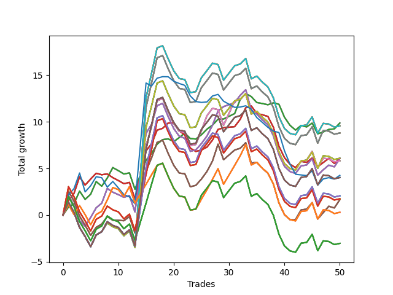

# Long Bulldog 005 
- Symbol: NVDA_Unlimited
- Date Range: 02/08/2022 - 07/08/2022
- Trading Period: 7:20-12:30
- Number of Trades: 50



| Name | Win Percent | Profit | Avg Profit / Trade | Avg Time / Trade |      | Name | Win Percent | Profit | Avg Profit / Trade | Avg Time / Trade |
| ---- | ----------- | ------ | ------------------ | ---------------- | ---- | ---- | ----------- | ------ | ------------------ | ---------------- |
| Sorted By <br> Profit | | | | | | Sorted By <br> Win Percentage ||||
| Sixty-Four | 64.00 | 4935.00 | 98.70 | 10:21 |     | Sixty-Four | 64.00 | 4935.00 | 98.70 | 10:21 |
| Fifty-Six | 64.00 | 4935.00 | 98.70 | 10:21 |     | Fifty-Six | 64.00 | 4935.00 | 98.70 | 10:21 |
| Forty-Eight | 64.00 | 4935.00 | 98.70 | 10:21 |     | Forty-Eight | 64.00 | 4935.00 | 98.70 | 10:21 |
| Forty | 64.00 | 4935.00 | 98.70 | 10:21 |     | Forty | 64.00 | 4935.00 | 98.70 | 10:21 |
| Zero | 64.00 | 4935.00 | 98.70 | 10:21 |     | Zero | 64.00 | 4935.00 | 98.70 | 10:21 |
| Seventy-One | 48.00 | 4780.00 | 95.60 | 29:55 |     | Sixty-Five | 58.00 | 3035.00 | 60.70 | 19:13 |
| Sixty-Three | 48.00 | 4780.00 | 95.60 | 29:55 |     | Fifty-Seven | 58.00 | 3035.00 | 60.70 | 19:13 |
| Fifty-Five | 48.00 | 4780.00 | 95.60 | 29:55 |     | Forty-Nine | 58.00 | 3035.00 | 60.70 | 19:13 |
| Forty-Seven | 48.00 | 4780.00 | 95.60 | 29:55 |     | Forty-One | 58.00 | 3035.00 | 60.70 | 19:13 |
| Seven | 48.00 | 4780.00 | 95.60 | 29:55 |     | One | 58.00 | 3035.00 | 60.70 | 19:13 |
| Sixty-Nine | 48.00 | 4400.00 | 88.00 | 29:06 |     | Sixty-Six | 54.00 | 3030.00 | 60.60 | 23:25 |
| Sixty-One | 48.00 | 4400.00 | 88.00 | 29:06 |     | Fifty-Eight | 54.00 | 3030.00 | 60.60 | 23:25 |
| Fifty-Three | 48.00 | 4400.00 | 88.00 | 29:06 |     | Fifty | 54.00 | 3030.00 | 60.60 | 23:25 |
| Forty-Five | 48.00 | 4400.00 | 88.00 | 29:06 |     | Forty-Two | 54.00 | 3030.00 | 60.60 | 23:25 |
| Five | 48.00 | 4400.00 | 88.00 | 29:06 |     | Two | 54.00 | 3030.00 | 60.60 | 23:25 |
| Seventy | 48.00 | 3045.00 | 60.90 | 28:21 |     | Sixty-Seven | 54.00 | 825.00 | 16.50 | 25:15 |
| Sixty-Two | 48.00 | 3045.00 | 60.90 | 28:21 |     | Fifty-Nine | 54.00 | 825.00 | 16.50 | 25:15 |
| Fifty-Four | 48.00 | 3045.00 | 60.90 | 28:21 |     | Fifty-One | 54.00 | 825.00 | 16.50 | 25:15 |
| Forty-Six | 48.00 | 3045.00 | 60.90 | 28:21 |     | Forty-Three | 54.00 | 825.00 | 16.50 | 25:15 |
| Six | 48.00 | 3045.00 | 60.90 | 28:21 |     | Three | 54.00 | 825.00 | 16.50 | 25:15 |
| Sixty-Five | 58.00 | 3035.00 | 60.70 | 19:13 |     | One Hundred Twenty-Six | 54.00 | 145.00 | 2.90 | 22:40 |
| Fifty-Seven | 58.00 | 3035.00 | 60.70 | 19:13 |     | One Hundred Twenty-One | 54.00 | 145.00 | 2.90 | 22:40 |
| Forty-Nine | 58.00 | 3035.00 | 60.70 | 19:13 |     | One Hundred Sixteen | 54.00 | 145.00 | 2.90 | 22:40 |
| Forty-One | 58.00 | 3035.00 | 60.70 | 19:13 |     | One Hundred Eleven | 54.00 | 145.00 | 2.90 | 22:40 |
| One | 58.00 | 3035.00 | 60.70 | 19:13 |     | Eighty-One | 54.00 | 145.00 | 2.90 | 22:40 |
| Sixty-Six | 54.00 | 3030.00 | 60.60 | 23:25 |     | Seventy-One | 48.00 | 4780.00 | 95.60 | 29:55 |
| Fifty-Eight | 54.00 | 3030.00 | 60.60 | 23:25 |     | Sixty-Three | 48.00 | 4780.00 | 95.60 | 29:55 |
| Fifty | 54.00 | 3030.00 | 60.60 | 23:25 |     | Fifty-Five | 48.00 | 4780.00 | 95.60 | 29:55 |
| Forty-Two | 54.00 | 3030.00 | 60.60 | 23:25 |     | Forty-Seven | 48.00 | 4780.00 | 95.60 | 29:55 |
| Two | 54.00 | 3030.00 | 60.60 | 23:25 |     | Seven | 48.00 | 4780.00 | 95.60 | 29:55 |
| Sixty-Eight | 48.00 | 2910.00 | 58.20 | 28:25 |     | Sixty-Nine | 48.00 | 4400.00 | 88.00 | 29:06 |
| Sixty | 48.00 | 2910.00 | 58.20 | 28:25 |     | Sixty-One | 48.00 | 4400.00 | 88.00 | 29:06 |
| Fifty-Two | 48.00 | 2910.00 | 58.20 | 28:25 |     | Fifty-Three | 48.00 | 4400.00 | 88.00 | 29:06 |
| Forty-Four | 48.00 | 2910.00 | 58.20 | 28:25 |     | Forty-Five | 48.00 | 4400.00 | 88.00 | 29:06 |
| Four | 48.00 | 2910.00 | 58.20 | 28:25 |     | Five | 48.00 | 4400.00 | 88.00 | 29:06 |
| Seventy-Three | 38.00 | 2130.00 | 42.60 | 13:26 |     | Seventy | 48.00 | 3045.00 | 60.90 | 28:21 |
| One Hundred Thirty | 48.00 | 2010.00 | 40.20 | 29:03 |     | Sixty-Two | 48.00 | 3045.00 | 60.90 | 28:21 |
| One Hundred Twenty-Five | 48.00 | 2010.00 | 40.20 | 29:03 |     | Fifty-Four | 48.00 | 3045.00 | 60.90 | 28:21 |
| One Hundred Twenty | 48.00 | 2010.00 | 40.20 | 29:03 |     | Forty-Six | 48.00 | 3045.00 | 60.90 | 28:21 |
| One Hundred Fifteen | 48.00 | 2010.00 | 40.20 | 29:03 |     | Six | 48.00 | 3045.00 | 60.90 | 28:21 |
| Eighty-Five | 48.00 | 2010.00 | 40.20 | 29:03 |     | Sixty-Eight | 48.00 | 2910.00 | 58.20 | 28:25 |
| One Hundred Twenty-Nine | 48.00 | 1030.00 | 20.60 | 28:58 |     | Sixty | 48.00 | 2910.00 | 58.20 | 28:25 |
| One Hundred Twenty-Four | 48.00 | 1030.00 | 20.60 | 28:58 |     | Fifty-Two | 48.00 | 2910.00 | 58.20 | 28:25 |
| One Hundred Ninteen | 48.00 | 1030.00 | 20.60 | 28:58 |     | Forty-Four | 48.00 | 2910.00 | 58.20 | 28:25 |
| One Hundred Fourteen | 48.00 | 1030.00 | 20.60 | 28:58 |     | Four | 48.00 | 2910.00 | 58.20 | 28:25 |
| Eighty-Four | 48.00 | 1030.00 | 20.60 | 28:58 |     | One Hundred Thirty | 48.00 | 2010.00 | 40.20 | 29:03 |
| One Hundred Twenty-Eight | 48.00 | 870.00 | 17.40 | 28:43 |     | One Hundred Twenty-Five | 48.00 | 2010.00 | 40.20 | 29:03 |
| One Hundred Twenty-Three | 48.00 | 870.00 | 17.40 | 28:43 |     | One Hundred Twenty | 48.00 | 2010.00 | 40.20 | 29:03 |
| One Hundred Eighteen | 48.00 | 870.00 | 17.40 | 28:43 |     | One Hundred Fifteen | 48.00 | 2010.00 | 40.20 | 29:03 |
| One Hundred Thirteen | 48.00 | 870.00 | 17.40 | 28:43 |     | Eighty-Five | 48.00 | 2010.00 | 40.20 | 29:03 |
| Eighty-Three | 48.00 | 870.00 | 17.40 | 28:43 |     | One Hundred Twenty-Nine | 48.00 | 1030.00 | 20.60 | 28:58 |
| Sixty-Seven | 54.00 | 825.00 | 16.50 | 25:15 |     | One Hundred Twenty-Four | 48.00 | 1030.00 | 20.60 | 28:58 |
| Fifty-Nine | 54.00 | 825.00 | 16.50 | 25:15 |     | One Hundred Ninteen | 48.00 | 1030.00 | 20.60 | 28:58 |
| Fifty-One | 54.00 | 825.00 | 16.50 | 25:15 |     | One Hundred Fourteen | 48.00 | 1030.00 | 20.60 | 28:58 |
| Forty-Three | 54.00 | 825.00 | 16.50 | 25:15 |     | Eighty-Four | 48.00 | 1030.00 | 20.60 | 28:58 |
| Three | 54.00 | 825.00 | 16.50 | 25:15 |     | One Hundred Twenty-Eight | 48.00 | 870.00 | 17.40 | 28:43 |
| One Hundred Twenty-Six | 54.00 | 145.00 | 2.90 | 22:40 |     | One Hundred Twenty-Three | 48.00 | 870.00 | 17.40 | 28:43 |
| One Hundred Twenty-One | 54.00 | 145.00 | 2.90 | 22:40 |     | One Hundred Eighteen | 48.00 | 870.00 | 17.40 | 28:43 |
| One Hundred Sixteen | 54.00 | 145.00 | 2.90 | 22:40 |     | One Hundred Thirteen | 48.00 | 870.00 | 17.40 | 28:43 |
| One Hundred Eleven | 54.00 | 145.00 | 2.90 | 22:40 |     | Eighty-Three | 48.00 | 870.00 | 17.40 | 28:43 |
| Eighty-One | 54.00 | 145.00 | 2.90 | 22:40 |     | One Hundred Twenty-Seven | 48.00 | -1520.00 | -30.40 | 28:12 |
| One Hundred Twenty-Seven | 48.00 | -1520.00 | -30.40 | 28:12 |     | One Hundred Twenty-Two | 48.00 | -1520.00 | -30.40 | 28:12 |
| One Hundred Twenty-Two | 48.00 | -1520.00 | -30.40 | 28:12 |     | One Hundred Seventeen | 48.00 | -1520.00 | -30.40 | 28:12 |
| One Hundred Seventeen | 48.00 | -1520.00 | -30.40 | 28:12 |     | One Hundred Twelve | 48.00 | -1520.00 | -30.40 | 28:12 |
| One Hundred Twelve | 48.00 | -1520.00 | -30.40 | 28:12 |     | Eighty-Two | 48.00 | -1520.00 | -30.40 | 28:12 |
| Eighty-Two | 48.00 | -1520.00 | -30.40 | 28:12 |     | Seventy-Three | 38.00 | 2130.00 | 42.60 | 13:26 |

## NO STOPLOSS

### Test Zero
* Sell when price hits the middle line of the 20p bollinger
* No Stoploss
* Results:
```
Total Trades: 50
Percent Up: 64.00
Percent Down: 36.00
Total Points Moved Up: 9.87
Potential Profit: 4935.00
Total Points Ups: 20.08 Count Ups: 32
Total Points Downs: -10.21 Count Downs: 18
```

<details><summary>Trades</summary>

<code>In: 2022-02-10 10:39:00		Out: 2022-02-10 10:40:35		Total Position Time: 01:35		Total Move Up: 0.86		Total to Date: 0.86</code> <br />
<code>In: 2022-02-10 12:00:00		Out: 2022-02-10 12:09:25		Total Position Time: 09:25		Total Move Up: 0.36		Total to Date: 1.22</code> <br />
<code>In: 2022-02-10 12:03:00		Out: 2022-02-10 12:09:25		Total Position Time: 06:25		Total Move Up: 1.35		Total to Date: 2.57</code> <br />
<code>In: 2022-02-14 10:58:00		Out: 2022-02-14 11:13:00		Total Position Time: 15:00		Total Move Up: -0.89		Total to Date: 1.68</code> <br />
<code>In: 2022-02-16 09:36:00		Out: 2022-02-16 09:43:40		Total Position Time: 07:40		Total Move Up: 0.55		Total to Date: 2.23</code> <br />
<code>In: 2022-02-22 08:58:00		Out: 2022-02-22 09:02:30		Total Position Time: 04:30		Total Move Up: 1.36		Total to Date: 3.59</code> <br />
<code>In: 2022-02-23 10:17:00		Out: 2022-02-23 10:36:10		Total Position Time: 19:10		Total Move Up: -0.50		Total to Date: 3.09</code> <br />
<code>In: 2022-02-25 10:59:00		Out: 2022-02-25 11:04:10		Total Position Time: 05:10		Total Move Up: 0.88		Total to Date: 3.97</code> <br />
<code>In: 2022-02-28 11:11:00		Out: 2022-02-28 11:19:45		Total Position Time: 08:45		Total Move Up: 1.12		Total to Date: 5.09</code> <br />
<code>In: 2022-03-03 12:03:00		Out: 2022-03-03 12:18:20		Total Position Time: 15:20		Total Move Up: -0.33		Total to Date: 4.76</code> <br />
<code>In: 2022-03-03 12:06:00		Out: 2022-03-03 12:18:20		Total Position Time: 12:20		Total Move Up: -0.36		Total to Date: 4.40</code> <br />
<code>In: 2022-03-03 12:10:00		Out: 2022-03-03 12:18:20		Total Position Time: 08:20		Total Move Up: 0.12		Total to Date: 4.52</code> <br />
<code>In: 2022-03-11 08:08:00		Out: 2022-03-11 08:37:55		Total Position Time: 29:55		Total Move Up: -1.76		Total to Date: 2.76</code> <br />
<code>In: 2022-03-16 11:33:00		Out: 2022-03-16 11:38:05		Total Position Time: 05:05		Total Move Up: 1.58		Total to Date: 4.34</code> <br />
<code>In: 2022-03-16 11:35:00		Out: 2022-03-16 11:38:05		Total Position Time: 03:05		Total Move Up: 1.54		Total to Date: 5.88</code> <br />
<code>In: 2022-03-17 07:56:00		Out: 2022-03-17 07:59:20		Total Position Time: 03:20		Total Move Up: 0.72		Total to Date: 6.60</code> <br />
<code>In: 2022-03-28 07:22:00		Out: 2022-03-28 07:29:20		Total Position Time: 07:20		Total Move Up: 1.00		Total to Date: 7.60</code> <br />
<code>In: 2022-03-28 08:38:00		Out: 2022-03-28 08:45:05		Total Position Time: 07:05		Total Move Up: 0.49		Total to Date: 8.09</code> <br />
<code>In: 2022-03-28 08:51:00		Out: 2022-03-28 09:01:10		Total Position Time: 10:10		Total Move Up: 0.08		Total to Date: 8.17</code> <br />
<code>In: 2022-03-30 08:02:00		Out: 2022-03-30 08:14:35		Total Position Time: 12:35		Total Move Up: -0.30		Total to Date: 7.87</code> <br />
<code>In: 2022-03-30 11:00:00		Out: 2022-03-30 11:04:15		Total Position Time: 04:15		Total Move Up: 0.44		Total to Date: 8.31</code> <br />
<code>In: 2022-03-30 11:02:00		Out: 2022-03-30 11:04:15		Total Position Time: 02:15		Total Move Up: 0.48		Total to Date: 8.79</code> <br />
<code>In: 2022-03-30 12:00:00		Out: 2022-03-30 12:14:15		Total Position Time: 14:15		Total Move Up: -0.59		Total to Date: 8.20</code> <br />
<code>In: 2022-03-30 12:02:00		Out: 2022-03-30 12:14:15		Total Position Time: 12:15		Total Move Up: -0.05		Total to Date: 8.15</code> <br />
<code>In: 2022-03-30 12:04:00		Out: 2022-03-30 12:14:15		Total Position Time: 10:15		Total Move Up: 0.46		Total to Date: 8.61</code> <br />
<code>In: 2022-03-30 12:06:00		Out: 2022-03-30 12:14:15		Total Position Time: 08:15		Total Move Up: 0.60		Total to Date: 9.21</code> <br />
<code>In: 2022-03-31 10:18:00		Out: 2022-03-31 10:26:20		Total Position Time: 08:20		Total Move Up: 0.43		Total to Date: 9.64</code> <br />
<code>In: 2022-04-01 08:40:00		Out: 2022-04-01 08:47:20		Total Position Time: 07:20		Total Move Up: 0.64		Total to Date: 10.28</code> <br />
<code>In: 2022-04-07 07:43:00		Out: 2022-04-07 07:56:05		Total Position Time: 13:05		Total Move Up: 0.02		Total to Date: 10.30</code> <br />
<code>In: 2022-04-08 11:30:00		Out: 2022-04-08 11:39:40		Total Position Time: 09:40		Total Move Up: 0.29		Total to Date: 10.59</code> <br />
<code>In: 2022-04-08 11:30:00		Out: 2022-04-08 11:39:40		Total Position Time: 09:40		Total Move Up: 0.29		Total to Date: 10.88</code> <br />
<code>In: 2022-04-11 07:30:00		Out: 2022-04-11 07:35:30		Total Position Time: 05:30		Total Move Up: 1.50		Total to Date: 12.38</code> <br />
<code>In: 2022-04-12 07:50:00		Out: 2022-04-12 08:02:00		Total Position Time: 12:00		Total Move Up: 0.65		Total to Date: 13.03</code> <br />
<code>In: 2022-06-03 07:32:00		Out: 2022-06-03 07:44:45		Total Position Time: 12:45		Total Move Up: -0.32		Total to Date: 12.71</code> <br />
<code>In: 2022-06-03 08:05:00		Out: 2022-06-03 08:21:10		Total Position Time: 16:10		Total Move Up: -0.64		Total to Date: 12.07</code> <br />
<code>In: 2022-06-06 09:04:00		Out: 2022-06-06 09:20:50		Total Position Time: 16:50		Total Move Up: -0.11		Total to Date: 11.96</code> <br />
<code>In: 2022-06-06 09:06:00		Out: 2022-06-06 09:20:50		Total Position Time: 14:50		Total Move Up: -0.13		Total to Date: 11.83</code> <br />
<code>In: 2022-06-08 09:01:00		Out: 2022-06-08 09:01:10		Total Position Time: 00:10		Total Move Up: 0.20		Total to Date: 12.03</code> <br />
<code>In: 2022-06-08 09:07:00		Out: 2022-06-08 09:17:00		Total Position Time: 10:00		Total Move Up: -0.15		Total to Date: 11.88</code> <br />
<code>In: 2022-06-08 09:25:00		Out: 2022-06-08 09:50:15		Total Position Time: 25:15		Total Move Up: -1.39		Total to Date: 10.49</code> <br />
<code>In: 2022-06-08 09:29:00		Out: 2022-06-08 09:50:15		Total Position Time: 21:15		Total Move Up: -0.87		Total to Date: 9.62</code> <br />
<code>In: 2022-06-08 09:35:00		Out: 2022-06-08 09:50:15		Total Position Time: 15:15		Total Move Up: -0.51		Total to Date: 9.11</code> <br />
<code>In: 2022-06-08 09:41:00		Out: 2022-06-08 09:50:15		Total Position Time: 09:15		Total Move Up: 0.50		Total to Date: 9.61</code> <br />
<code>In: 2022-06-09 10:37:00		Out: 2022-06-09 10:51:05		Total Position Time: 14:05		Total Move Up: -0.16		Total to Date: 9.45</code> <br />
<code>In: 2022-06-09 10:46:00		Out: 2022-06-09 10:51:05		Total Position Time: 05:05		Total Move Up: 0.41		Total to Date: 9.86</code> <br />
<code>In: 2022-06-09 11:57:00		Out: 2022-06-09 12:18:20		Total Position Time: 21:20		Total Move Up: -1.15		Total to Date: 8.71</code> <br />
<code>In: 2022-06-22 09:09:00		Out: 2022-06-22 09:17:35		Total Position Time: 08:35		Total Move Up: 0.20		Total to Date: 8.91</code> <br />
<code>In: 2022-06-23 09:06:00		Out: 2022-06-23 09:18:25		Total Position Time: 12:25		Total Move Up: 0.27		Total to Date: 9.18</code> <br />
<code>In: 2022-06-23 09:54:00		Out: 2022-06-23 09:56:45		Total Position Time: 02:45		Total Move Up: 0.06		Total to Date: 9.24</code> <br />
<code>In: 2022-06-23 10:05:00		Out: 2022-06-23 10:07:40		Total Position Time: 02:40		Total Move Up: 0.63		Total to Date: 9.87</code> <br />


</details>

### Test One
* Sell when the price hits the upper line of the 20p 1std bollinger
* No Stoploss
* Results:
```
Total Trades: 50
Percent Up: 58.00
Percent Down: 42.00
Total Points Moved Up: 6.07
Potential Profit: 3035.00
Total Points Ups: 21.17 Count Ups: 29
Total Points Downs: -15.10 Count Downs: 21
```

<details><summary>Trades</summary>

<code>In: 2022-02-10 10:39:00		Out: 2022-02-10 10:43:25		Total Position Time: 04:25		Total Move Up: 1.55		Total to Date: 1.55</code> <br />
<code>In: 2022-02-10 12:00:00		Out: 2022-02-10 12:12:40		Total Position Time: 12:40		Total Move Up: 0.78		Total to Date: 2.33</code> <br />
<code>In: 2022-02-10 12:03:00		Out: 2022-02-10 12:12:40		Total Position Time: 09:40		Total Move Up: 1.77		Total to Date: 4.10</code> <br />
<code>In: 2022-02-14 10:58:00		Out: 2022-02-14 11:17:05		Total Position Time: 19:05		Total Move Up: -0.89		Total to Date: 3.21</code> <br />
<code>In: 2022-02-16 09:36:00		Out: 2022-02-16 09:48:20		Total Position Time: 12:20		Total Move Up: 0.65		Total to Date: 3.86</code> <br />
<code>In: 2022-02-22 08:58:00		Out: 2022-02-22 09:26:25		Total Position Time: 28:25		Total Move Up: 0.62		Total to Date: 4.48</code> <br />
<code>In: 2022-02-23 10:17:00		Out: 2022-02-23 10:39:05		Total Position Time: 22:05		Total Move Up: -0.16		Total to Date: 4.32</code> <br />
<code>In: 2022-02-25 10:59:00		Out: 2022-02-25 11:17:50		Total Position Time: 18:50		Total Move Up: 0.09		Total to Date: 4.41</code> <br />
<code>In: 2022-02-28 11:11:00		Out: 2022-02-28 11:40:55		Total Position Time: 29:55		Total Move Up: -0.40		Total to Date: 4.01</code> <br />
<code>In: 2022-03-03 12:03:00		Out: 2022-03-03 12:26:05		Total Position Time: 23:05		Total Move Up: -0.31		Total to Date: 3.70</code> <br />
<code>In: 2022-03-03 12:06:00		Out: 2022-03-03 12:26:05		Total Position Time: 20:05		Total Move Up: -0.34		Total to Date: 3.36</code> <br />
<code>In: 2022-03-03 12:10:00		Out: 2022-03-03 12:26:05		Total Position Time: 16:05		Total Move Up: 0.14		Total to Date: 3.50</code> <br />
<code>In: 2022-03-11 08:08:00		Out: 2022-03-11 08:37:55		Total Position Time: 29:55		Total Move Up: -1.76		Total to Date: 1.74</code> <br />
<code>In: 2022-03-16 11:33:00		Out: 2022-03-16 11:39:05		Total Position Time: 06:05		Total Move Up: 2.59		Total to Date: 4.33</code> <br />
<code>In: 2022-03-16 11:35:00		Out: 2022-03-16 11:39:05		Total Position Time: 04:05		Total Move Up: 2.55		Total to Date: 6.88</code> <br />
<code>In: 2022-03-17 07:56:00		Out: 2022-03-17 08:08:20		Total Position Time: 12:20		Total Move Up: 0.77		Total to Date: 7.65</code> <br />
<code>In: 2022-03-28 07:22:00		Out: 2022-03-28 07:30:05		Total Position Time: 08:05		Total Move Up: 1.45		Total to Date: 9.10</code> <br />
<code>In: 2022-03-28 08:38:00		Out: 2022-03-28 09:01:50		Total Position Time: 23:50		Total Move Up: 0.20		Total to Date: 9.30</code> <br />
<code>In: 2022-03-28 08:51:00		Out: 2022-03-28 09:01:50		Total Position Time: 10:50		Total Move Up: 0.57		Total to Date: 9.87</code> <br />
<code>In: 2022-03-30 08:02:00		Out: 2022-03-30 08:19:15		Total Position Time: 17:15		Total Move Up: 0.01		Total to Date: 9.88</code> <br />
<code>In: 2022-03-30 11:00:00		Out: 2022-03-30 11:29:55		Total Position Time: 29:55		Total Move Up: -0.83		Total to Date: 9.05</code> <br />
<code>In: 2022-03-30 11:02:00		Out: 2022-03-30 11:30:50		Total Position Time: 28:50		Total Move Up: -0.48		Total to Date: 8.57</code> <br />
<code>In: 2022-03-30 12:00:00		Out: 2022-03-30 12:29:55		Total Position Time: 29:55		Total Move Up: -1.40		Total to Date: 7.17</code> <br />
<code>In: 2022-03-30 12:02:00		Out: 2022-03-30 12:30:45		Total Position Time: 28:45		Total Move Up: -0.35		Total to Date: 6.82</code> <br />
<code>In: 2022-03-30 12:04:00		Out: 2022-03-30 12:30:45		Total Position Time: 26:45		Total Move Up: 0.16		Total to Date: 6.98</code> <br />
<code>In: 2022-03-30 12:06:00		Out: 2022-03-30 12:30:45		Total Position Time: 24:45		Total Move Up: 0.30		Total to Date: 7.28</code> <br />
<code>In: 2022-03-31 10:18:00		Out: 2022-03-31 10:29:05		Total Position Time: 11:05		Total Move Up: 0.76		Total to Date: 8.04</code> <br />
<code>In: 2022-04-01 08:40:00		Out: 2022-04-01 08:51:15		Total Position Time: 11:15		Total Move Up: 1.14		Total to Date: 9.18</code> <br />
<code>In: 2022-04-07 07:43:00		Out: 2022-04-07 08:00:05		Total Position Time: 17:05		Total Move Up: 0.18		Total to Date: 9.36</code> <br />
<code>In: 2022-04-08 11:30:00		Out: 2022-04-08 11:47:10		Total Position Time: 17:10		Total Move Up: 0.06		Total to Date: 9.42</code> <br />
<code>In: 2022-04-08 11:30:00		Out: 2022-04-08 11:47:10		Total Position Time: 17:10		Total Move Up: 0.06		Total to Date: 9.48</code> <br />
<code>In: 2022-04-11 07:30:00		Out: 2022-04-11 07:55:05		Total Position Time: 25:05		Total Move Up: 0.78		Total to Date: 10.26</code> <br />
<code>In: 2022-04-12 07:50:00		Out: 2022-04-12 08:04:30		Total Position Time: 14:30		Total Move Up: 1.24		Total to Date: 11.50</code> <br />
<code>In: 2022-06-03 07:32:00		Out: 2022-06-03 07:46:30		Total Position Time: 14:30		Total Move Up: 0.20		Total to Date: 11.70</code> <br />
<code>In: 2022-06-03 08:05:00		Out: 2022-06-03 08:29:30		Total Position Time: 24:30		Total Move Up: -0.80		Total to Date: 10.90</code> <br />
<code>In: 2022-06-06 09:04:00		Out: 2022-06-06 09:24:10		Total Position Time: 20:10		Total Move Up: -0.15		Total to Date: 10.75</code> <br />
<code>In: 2022-06-06 09:06:00		Out: 2022-06-06 09:24:10		Total Position Time: 18:10		Total Move Up: -0.17		Total to Date: 10.58</code> <br />
<code>In: 2022-06-08 09:01:00		Out: 2022-06-08 09:30:55		Total Position Time: 29:55		Total Move Up: -1.17		Total to Date: 9.41</code> <br />
<code>In: 2022-06-08 09:07:00		Out: 2022-06-08 09:36:55		Total Position Time: 29:55		Total Move Up: -2.03		Total to Date: 7.38</code> <br />
<code>In: 2022-06-08 09:25:00		Out: 2022-06-08 09:54:00		Total Position Time: 29:00		Total Move Up: -1.23		Total to Date: 6.15</code> <br />
<code>In: 2022-06-08 09:29:00		Out: 2022-06-08 09:54:00		Total Position Time: 25:00		Total Move Up: -0.71		Total to Date: 5.44</code> <br />
<code>In: 2022-06-08 09:35:00		Out: 2022-06-08 09:54:00		Total Position Time: 19:00		Total Move Up: -0.35		Total to Date: 5.09</code> <br />
<code>In: 2022-06-08 09:41:00		Out: 2022-06-08 09:54:00		Total Position Time: 13:00		Total Move Up: 0.66		Total to Date: 5.75</code> <br />
<code>In: 2022-06-09 10:37:00		Out: 2022-06-09 10:57:10		Total Position Time: 20:10		Total Move Up: -0.10		Total to Date: 5.65</code> <br />
<code>In: 2022-06-09 10:46:00		Out: 2022-06-09 10:57:10		Total Position Time: 11:10		Total Move Up: 0.47		Total to Date: 6.12</code> <br />
<code>In: 2022-06-09 11:57:00		Out: 2022-06-09 12:19:25		Total Position Time: 22:25		Total Move Up: -0.93		Total to Date: 5.19</code> <br />
<code>In: 2022-06-22 09:09:00		Out: 2022-06-22 09:21:25		Total Position Time: 12:25		Total Move Up: 0.44		Total to Date: 5.63</code> <br />
<code>In: 2022-06-23 09:06:00		Out: 2022-06-23 09:19:05		Total Position Time: 13:05		Total Move Up: 0.45		Total to Date: 6.08</code> <br />
<code>In: 2022-06-23 09:54:00		Out: 2022-06-23 10:23:10		Total Position Time: 29:10		Total Move Up: -0.54		Total to Date: 5.54</code> <br />
<code>In: 2022-06-23 10:05:00		Out: 2022-06-23 10:23:10		Total Position Time: 18:10		Total Move Up: 0.53		Total to Date: 6.07</code> <br />


</details>

### Test Two
* Sell when the price hits the upper line of the 20p 2std bollinger
* No Stoploss
* Results:
```
Total Trades: 50
Percent Up: 54.00
Percent Down: 46.00
Total Points Moved Up: 6.06
Potential Profit: 3030.00
Total Points Ups: 28.14 Count Ups: 27
Total Points Downs: -22.08 Count Downs: 23
```

<details><summary>Trades</summary>

<code>In: 2022-02-10 10:39:00		Out: 2022-02-10 10:46:45		Total Position Time: 07:45		Total Move Up: 2.10		Total to Date: 2.10</code> <br />
<code>In: 2022-02-10 12:00:00		Out: 2022-02-10 12:29:55		Total Position Time: 29:55		Total Move Up: -1.09		Total to Date: 1.01</code> <br />
<code>In: 2022-02-10 12:03:00		Out: 2022-02-10 12:32:55		Total Position Time: 29:55		Total Move Up: -1.61		Total to Date: -0.60</code> <br />
<code>In: 2022-02-14 10:58:00		Out: 2022-02-14 11:18:05		Total Position Time: 20:05		Total Move Up: -0.61		Total to Date: -1.21</code> <br />
<code>In: 2022-02-16 09:36:00		Out: 2022-02-16 09:50:05		Total Position Time: 14:05		Total Move Up: 0.95		Total to Date: -0.26</code> <br />
<code>In: 2022-02-22 08:58:00		Out: 2022-02-22 09:27:40		Total Position Time: 29:40		Total Move Up: 1.04		Total to Date: 0.78</code> <br />
<code>In: 2022-02-23 10:17:00		Out: 2022-02-23 10:42:50		Total Position Time: 25:50		Total Move Up: 0.49		Total to Date: 1.27</code> <br />
<code>In: 2022-02-25 10:59:00		Out: 2022-02-25 11:25:45		Total Position Time: 26:45		Total Move Up: 1.58		Total to Date: 2.85</code> <br />
<code>In: 2022-02-28 11:11:00		Out: 2022-02-28 11:40:55		Total Position Time: 29:55		Total Move Up: -0.40		Total to Date: 2.45</code> <br />
<code>In: 2022-03-03 12:03:00		Out: 2022-03-03 12:27:10		Total Position Time: 24:10		Total Move Up: -0.26		Total to Date: 2.19</code> <br />
<code>In: 2022-03-03 12:06:00		Out: 2022-03-03 12:27:10		Total Position Time: 21:10		Total Move Up: -0.29		Total to Date: 1.90</code> <br />
<code>In: 2022-03-03 12:10:00		Out: 2022-03-03 12:27:10		Total Position Time: 17:10		Total Move Up: 0.19		Total to Date: 2.09</code> <br />
<code>In: 2022-03-11 08:08:00		Out: 2022-03-11 08:37:55		Total Position Time: 29:55		Total Move Up: -1.76		Total to Date: 0.33</code> <br />
<code>In: 2022-03-16 11:33:00		Out: 2022-03-16 11:40:10		Total Position Time: 07:10		Total Move Up: 4.23		Total to Date: 4.56</code> <br />
<code>In: 2022-03-16 11:35:00		Out: 2022-03-16 11:40:10		Total Position Time: 05:10		Total Move Up: 4.19		Total to Date: 8.75</code> <br />
<code>In: 2022-03-17 07:56:00		Out: 2022-03-17 08:10:10		Total Position Time: 14:10		Total Move Up: 0.98		Total to Date: 9.73</code> <br />
<code>In: 2022-03-28 07:22:00		Out: 2022-03-28 07:45:10		Total Position Time: 23:10		Total Move Up: 2.01		Total to Date: 11.74</code> <br />
<code>In: 2022-03-28 08:38:00		Out: 2022-03-28 09:07:55		Total Position Time: 29:55		Total Move Up: 0.23		Total to Date: 11.97</code> <br />
<code>In: 2022-03-28 08:51:00		Out: 2022-03-28 09:20:55		Total Position Time: 29:55		Total Move Up: -1.41		Total to Date: 10.56</code> <br />
<code>In: 2022-03-30 08:02:00		Out: 2022-03-30 08:31:55		Total Position Time: 29:55		Total Move Up: -1.28		Total to Date: 9.28</code> <br />
<code>In: 2022-03-30 11:00:00		Out: 2022-03-30 11:29:55		Total Position Time: 29:55		Total Move Up: -0.83		Total to Date: 8.45</code> <br />
<code>In: 2022-03-30 11:02:00		Out: 2022-03-30 11:31:10		Total Position Time: 29:10		Total Move Up: -0.22		Total to Date: 8.23</code> <br />
<code>In: 2022-03-30 12:00:00		Out: 2022-03-30 12:29:55		Total Position Time: 29:55		Total Move Up: -1.40		Total to Date: 6.83</code> <br />
<code>In: 2022-03-30 12:02:00		Out: 2022-03-30 12:31:35		Total Position Time: 29:35		Total Move Up: 0.16		Total to Date: 6.99</code> <br />
<code>In: 2022-03-30 12:04:00		Out: 2022-03-30 12:31:35		Total Position Time: 27:35		Total Move Up: 0.67		Total to Date: 7.66</code> <br />
<code>In: 2022-03-30 12:06:00		Out: 2022-03-30 12:31:35		Total Position Time: 25:35		Total Move Up: 0.81		Total to Date: 8.47</code> <br />
<code>In: 2022-03-31 10:18:00		Out: 2022-03-31 10:31:20		Total Position Time: 13:20		Total Move Up: 1.17		Total to Date: 9.64</code> <br />
<code>In: 2022-04-01 08:40:00		Out: 2022-04-01 08:53:15		Total Position Time: 13:15		Total Move Up: 1.51		Total to Date: 11.15</code> <br />
<code>In: 2022-04-07 07:43:00		Out: 2022-04-07 08:00:10		Total Position Time: 17:10		Total Move Up: 0.48		Total to Date: 11.63</code> <br />
<code>In: 2022-04-08 11:30:00		Out: 2022-04-08 11:47:45		Total Position Time: 17:45		Total Move Up: 0.21		Total to Date: 11.84</code> <br />
<code>In: 2022-04-08 11:30:00		Out: 2022-04-08 11:47:45		Total Position Time: 17:45		Total Move Up: 0.21		Total to Date: 12.05</code> <br />
<code>In: 2022-04-11 07:30:00		Out: 2022-04-11 07:56:10		Total Position Time: 26:10		Total Move Up: 0.79		Total to Date: 12.84</code> <br />
<code>In: 2022-04-12 07:50:00		Out: 2022-04-12 08:19:55		Total Position Time: 29:55		Total Move Up: 0.60		Total to Date: 13.44</code> <br />
<code>In: 2022-06-03 07:32:00		Out: 2022-06-03 08:01:55		Total Position Time: 29:55		Total Move Up: -2.19		Total to Date: 11.25</code> <br />
<code>In: 2022-06-03 08:05:00		Out: 2022-06-03 08:30:25		Total Position Time: 25:25		Total Move Up: -0.41		Total to Date: 10.84</code> <br />
<code>In: 2022-06-06 09:04:00		Out: 2022-06-06 09:33:55		Total Position Time: 29:55		Total Move Up: -0.64		Total to Date: 10.20</code> <br />
<code>In: 2022-06-06 09:06:00		Out: 2022-06-06 09:35:55		Total Position Time: 29:55		Total Move Up: -0.52		Total to Date: 9.68</code> <br />
<code>In: 2022-06-08 09:01:00		Out: 2022-06-08 09:30:55		Total Position Time: 29:55		Total Move Up: -1.17		Total to Date: 8.51</code> <br />
<code>In: 2022-06-08 09:07:00		Out: 2022-06-08 09:36:55		Total Position Time: 29:55		Total Move Up: -2.03		Total to Date: 6.48</code> <br />
<code>In: 2022-06-08 09:25:00		Out: 2022-06-08 09:54:55		Total Position Time: 29:55		Total Move Up: -1.26		Total to Date: 5.22</code> <br />
<code>In: 2022-06-08 09:29:00		Out: 2022-06-08 09:56:45		Total Position Time: 27:45		Total Move Up: -0.56		Total to Date: 4.66</code> <br />
<code>In: 2022-06-08 09:35:00		Out: 2022-06-08 09:56:45		Total Position Time: 21:45		Total Move Up: -0.20		Total to Date: 4.46</code> <br />
<code>In: 2022-06-08 09:41:00		Out: 2022-06-08 09:56:45		Total Position Time: 15:45		Total Move Up: 0.81		Total to Date: 5.27</code> <br />
<code>In: 2022-06-09 10:37:00		Out: 2022-06-09 10:59:30		Total Position Time: 22:30		Total Move Up: 0.10		Total to Date: 5.37</code> <br />
<code>In: 2022-06-09 10:46:00		Out: 2022-06-09 10:59:30		Total Position Time: 13:30		Total Move Up: 0.67		Total to Date: 6.04</code> <br />
<code>In: 2022-06-09 11:57:00		Out: 2022-06-09 12:26:55		Total Position Time: 29:55		Total Move Up: -1.76		Total to Date: 4.28</code> <br />
<code>In: 2022-06-22 09:09:00		Out: 2022-06-22 09:22:25		Total Position Time: 13:25		Total Move Up: 0.57		Total to Date: 4.85</code> <br />
<code>In: 2022-06-23 09:06:00		Out: 2022-06-23 09:27:35		Total Position Time: 21:35		Total Move Up: 0.50		Total to Date: 5.35</code> <br />
<code>In: 2022-06-23 09:54:00		Out: 2022-06-23 10:23:20		Total Position Time: 29:20		Total Move Up: -0.18		Total to Date: 5.17</code> <br />
<code>In: 2022-06-23 10:05:00		Out: 2022-06-23 10:23:20		Total Position Time: 18:20		Total Move Up: 0.89		Total to Date: 6.06</code> <br />


</details>

### Test Three
* Sell when price hits the middle line of the 50p bollinger
* No Stoploss
* Results:
```
Total Trades: 50
Percent Up: 54.00
Percent Down: 46.00
Total Points Moved Up: 1.65
Potential Profit: 825.00
Total Points Ups: 25.55 Count Ups: 27
Total Points Downs: -23.90 Count Downs: 23
```

<details><summary>Trades</summary>

<code>In: 2022-02-10 10:39:00		Out: 2022-02-10 10:50:30		Total Position Time: 11:30		Total Move Up: 2.57		Total to Date: 2.57</code> <br />
<code>In: 2022-02-10 12:00:00		Out: 2022-02-10 12:29:55		Total Position Time: 29:55		Total Move Up: -1.09		Total to Date: 1.48</code> <br />
<code>In: 2022-02-10 12:03:00		Out: 2022-02-10 12:32:55		Total Position Time: 29:55		Total Move Up: -1.61		Total to Date: -0.13</code> <br />
<code>In: 2022-02-14 10:58:00		Out: 2022-02-14 11:27:55		Total Position Time: 29:55		Total Move Up: -0.97		Total to Date: -1.10</code> <br />
<code>In: 2022-02-16 09:36:00		Out: 2022-02-16 10:05:55		Total Position Time: 29:55		Total Move Up: -1.08		Total to Date: -2.18</code> <br />
<code>In: 2022-02-22 08:58:00		Out: 2022-02-22 09:27:35		Total Position Time: 29:35		Total Move Up: 0.86		Total to Date: -1.32</code> <br />
<code>In: 2022-02-23 10:17:00		Out: 2022-02-23 10:46:55		Total Position Time: 29:55		Total Move Up: 0.35		Total to Date: -0.97</code> <br />
<code>In: 2022-02-25 10:59:00		Out: 2022-02-25 11:21:35		Total Position Time: 22:35		Total Move Up: 0.81		Total to Date: -0.16</code> <br />
<code>In: 2022-02-28 11:11:00		Out: 2022-02-28 11:40:55		Total Position Time: 29:55		Total Move Up: -0.40		Total to Date: -0.56</code> <br />
<code>In: 2022-03-03 12:03:00		Out: 2022-03-03 12:28:05		Total Position Time: 25:05		Total Move Up: -0.01		Total to Date: -0.57</code> <br />
<code>In: 2022-03-03 12:06:00		Out: 2022-03-03 12:28:05		Total Position Time: 22:05		Total Move Up: -0.04		Total to Date: -0.61</code> <br />
<code>In: 2022-03-03 12:10:00		Out: 2022-03-03 12:28:05		Total Position Time: 18:05		Total Move Up: 0.44		Total to Date: -0.17</code> <br />
<code>In: 2022-03-11 08:08:00		Out: 2022-03-11 08:37:55		Total Position Time: 29:55		Total Move Up: -1.76		Total to Date: -1.93</code> <br />
<code>In: 2022-03-16 11:33:00		Out: 2022-03-16 11:39:45		Total Position Time: 06:45		Total Move Up: 3.34		Total to Date: 1.41</code> <br />
<code>In: 2022-03-16 11:35:00		Out: 2022-03-16 11:39:45		Total Position Time: 04:45		Total Move Up: 3.30		Total to Date: 4.71</code> <br />
<code>In: 2022-03-17 07:56:00		Out: 2022-03-17 08:11:05		Total Position Time: 15:05		Total Move Up: 1.42		Total to Date: 6.13</code> <br />
<code>In: 2022-03-28 07:22:00		Out: 2022-03-28 07:45:05		Total Position Time: 23:05		Total Move Up: 1.66		Total to Date: 7.79</code> <br />
<code>In: 2022-03-28 08:38:00		Out: 2022-03-28 09:07:55		Total Position Time: 29:55		Total Move Up: 0.23		Total to Date: 8.02</code> <br />
<code>In: 2022-03-28 08:51:00		Out: 2022-03-28 09:20:55		Total Position Time: 29:55		Total Move Up: -1.41		Total to Date: 6.61</code> <br />
<code>In: 2022-03-30 08:02:00		Out: 2022-03-30 08:31:55		Total Position Time: 29:55		Total Move Up: -1.28		Total to Date: 5.33</code> <br />
<code>In: 2022-03-30 11:00:00		Out: 2022-03-30 11:29:55		Total Position Time: 29:55		Total Move Up: -0.83		Total to Date: 4.50</code> <br />
<code>In: 2022-03-30 11:02:00		Out: 2022-03-30 11:31:25		Total Position Time: 29:25		Total Move Up: -0.07		Total to Date: 4.43</code> <br />
<code>In: 2022-03-30 12:00:00		Out: 2022-03-30 12:29:55		Total Position Time: 29:55		Total Move Up: -1.40		Total to Date: 3.03</code> <br />
<code>In: 2022-03-30 12:02:00		Out: 2022-03-30 12:31:35		Total Position Time: 29:35		Total Move Up: 0.16		Total to Date: 3.19</code> <br />
<code>In: 2022-03-30 12:04:00		Out: 2022-03-30 12:31:35		Total Position Time: 27:35		Total Move Up: 0.67		Total to Date: 3.86</code> <br />
<code>In: 2022-03-30 12:06:00		Out: 2022-03-30 12:31:35		Total Position Time: 25:35		Total Move Up: 0.81		Total to Date: 4.67</code> <br />
<code>In: 2022-03-31 10:18:00		Out: 2022-03-31 10:29:40		Total Position Time: 11:40		Total Move Up: 1.12		Total to Date: 5.79</code> <br />
<code>In: 2022-04-01 08:40:00		Out: 2022-04-01 08:54:30		Total Position Time: 14:30		Total Move Up: 1.81		Total to Date: 7.60</code> <br />
<code>In: 2022-04-07 07:43:00		Out: 2022-04-07 08:12:55		Total Position Time: 29:55		Total Move Up: -1.67		Total to Date: 5.93</code> <br />
<code>In: 2022-04-08 11:30:00		Out: 2022-04-08 11:49:10		Total Position Time: 19:10		Total Move Up: 0.52		Total to Date: 6.45</code> <br />
<code>In: 2022-04-08 11:30:00		Out: 2022-04-08 11:49:10		Total Position Time: 19:10		Total Move Up: 0.52		Total to Date: 6.97</code> <br />
<code>In: 2022-04-11 07:30:00		Out: 2022-04-11 07:59:55		Total Position Time: 29:55		Total Move Up: 0.19		Total to Date: 7.16</code> <br />
<code>In: 2022-04-12 07:50:00		Out: 2022-04-12 08:19:55		Total Position Time: 29:55		Total Move Up: 0.60		Total to Date: 7.76</code> <br />
<code>In: 2022-06-03 07:32:00		Out: 2022-06-03 08:01:55		Total Position Time: 29:55		Total Move Up: -2.19		Total to Date: 5.57</code> <br />
<code>In: 2022-06-03 08:05:00		Out: 2022-06-03 08:32:10		Total Position Time: 27:10		Total Move Up: 0.08		Total to Date: 5.65</code> <br />
<code>In: 2022-06-06 09:04:00		Out: 2022-06-06 09:33:55		Total Position Time: 29:55		Total Move Up: -0.64		Total to Date: 5.01</code> <br />
<code>In: 2022-06-06 09:06:00		Out: 2022-06-06 09:35:55		Total Position Time: 29:55		Total Move Up: -0.52		Total to Date: 4.49</code> <br />
<code>In: 2022-06-08 09:01:00		Out: 2022-06-08 09:30:55		Total Position Time: 29:55		Total Move Up: -1.17		Total to Date: 3.32</code> <br />
<code>In: 2022-06-08 09:07:00		Out: 2022-06-08 09:36:55		Total Position Time: 29:55		Total Move Up: -2.03		Total to Date: 1.29</code> <br />
<code>In: 2022-06-08 09:25:00		Out: 2022-06-08 09:54:55		Total Position Time: 29:55		Total Move Up: -1.26		Total to Date: 0.03</code> <br />
<code>In: 2022-06-08 09:29:00		Out: 2022-06-08 09:58:55		Total Position Time: 29:55		Total Move Up: -0.53		Total to Date: -0.50</code> <br />
<code>In: 2022-06-08 09:35:00		Out: 2022-06-08 10:04:30		Total Position Time: 29:30		Total Move Up: 0.02		Total to Date: -0.48</code> <br />
<code>In: 2022-06-08 09:41:00		Out: 2022-06-08 10:04:30		Total Position Time: 23:30		Total Move Up: 1.03		Total to Date: 0.55</code> <br />
<code>In: 2022-06-09 10:37:00		Out: 2022-06-09 11:06:55		Total Position Time: 29:55		Total Move Up: 0.08		Total to Date: 0.63</code> <br />
<code>In: 2022-06-09 10:46:00		Out: 2022-06-09 11:07:05		Total Position Time: 21:05		Total Move Up: 0.70		Total to Date: 1.33</code> <br />
<code>In: 2022-06-09 11:57:00		Out: 2022-06-09 12:26:55		Total Position Time: 29:55		Total Move Up: -1.76		Total to Date: -0.43</code> <br />
<code>In: 2022-06-22 09:09:00		Out: 2022-06-22 09:28:05		Total Position Time: 19:05		Total Move Up: 0.69		Total to Date: 0.26</code> <br />
<code>In: 2022-06-23 09:06:00		Out: 2022-06-23 09:27:55		Total Position Time: 21:55		Total Move Up: 0.68		Total to Date: 0.94</code> <br />
<code>In: 2022-06-23 09:54:00		Out: 2022-06-23 10:23:20		Total Position Time: 29:20		Total Move Up: -0.18		Total to Date: 0.76</code> <br />
<code>In: 2022-06-23 10:05:00		Out: 2022-06-23 10:23:20		Total Position Time: 18:20		Total Move Up: 0.89		Total to Date: 1.65</code> <br />


</details>

### Test Four
* Sell when the price hits the upper line of the 50p 1std bollinger
* No Stoploss
* Results:
```
Total Trades: 50
Percent Up: 48.00
Percent Down: 52.00
Total Points Moved Up: 5.82
Potential Profit: 2910.00
Total Points Ups: 31.19 Count Ups: 24
Total Points Downs: -25.37 Count Downs: 26
```

<details><summary>Trades</summary>

<code>In: 2022-02-10 10:39:00		Out: 2022-02-10 11:08:55		Total Position Time: 29:55		Total Move Up: 1.36		Total to Date: 1.36</code> <br />
<code>In: 2022-02-10 12:00:00		Out: 2022-02-10 12:29:55		Total Position Time: 29:55		Total Move Up: -1.09		Total to Date: 0.27</code> <br />
<code>In: 2022-02-10 12:03:00		Out: 2022-02-10 12:32:55		Total Position Time: 29:55		Total Move Up: -1.61		Total to Date: -1.34</code> <br />
<code>In: 2022-02-14 10:58:00		Out: 2022-02-14 11:27:55		Total Position Time: 29:55		Total Move Up: -0.97		Total to Date: -2.31</code> <br />
<code>In: 2022-02-16 09:36:00		Out: 2022-02-16 10:05:55		Total Position Time: 29:55		Total Move Up: -1.08		Total to Date: -3.39</code> <br />
<code>In: 2022-02-22 08:58:00		Out: 2022-02-22 09:27:55		Total Position Time: 29:55		Total Move Up: 1.25		Total to Date: -2.14</code> <br />
<code>In: 2022-02-23 10:17:00		Out: 2022-02-23 10:46:55		Total Position Time: 29:55		Total Move Up: 0.35		Total to Date: -1.79</code> <br />
<code>In: 2022-02-25 10:59:00		Out: 2022-02-25 11:28:55		Total Position Time: 29:55		Total Move Up: 1.07		Total to Date: -0.72</code> <br />
<code>In: 2022-02-28 11:11:00		Out: 2022-02-28 11:40:55		Total Position Time: 29:55		Total Move Up: -0.40		Total to Date: -1.12</code> <br />
<code>In: 2022-03-03 12:03:00		Out: 2022-03-03 12:32:55		Total Position Time: 29:55		Total Move Up: -0.22		Total to Date: -1.34</code> <br />
<code>In: 2022-03-03 12:06:00		Out: 2022-03-03 12:35:55		Total Position Time: 29:55		Total Move Up: -0.75		Total to Date: -2.09</code> <br />
<code>In: 2022-03-03 12:10:00		Out: 2022-03-03 12:39:55		Total Position Time: 29:55		Total Move Up: 0.50		Total to Date: -1.59</code> <br />
<code>In: 2022-03-11 08:08:00		Out: 2022-03-11 08:37:55		Total Position Time: 29:55		Total Move Up: -1.76		Total to Date: -3.35</code> <br />
<code>In: 2022-03-16 11:33:00		Out: 2022-03-16 11:42:20		Total Position Time: 09:20		Total Move Up: 5.41		Total to Date: 2.06</code> <br />
<code>In: 2022-03-16 11:35:00		Out: 2022-03-16 11:42:20		Total Position Time: 07:20		Total Move Up: 5.37		Total to Date: 7.43</code> <br />
<code>In: 2022-03-17 07:56:00		Out: 2022-03-17 08:18:30		Total Position Time: 22:30		Total Move Up: 2.05		Total to Date: 9.48</code> <br />
<code>In: 2022-03-28 07:22:00		Out: 2022-03-28 07:48:25		Total Position Time: 26:25		Total Move Up: 2.78		Total to Date: 12.26</code> <br />
<code>In: 2022-03-28 08:38:00		Out: 2022-03-28 09:07:55		Total Position Time: 29:55		Total Move Up: 0.23		Total to Date: 12.49</code> <br />
<code>In: 2022-03-28 08:51:00		Out: 2022-03-28 09:20:55		Total Position Time: 29:55		Total Move Up: -1.41		Total to Date: 11.08</code> <br />
<code>In: 2022-03-30 08:02:00		Out: 2022-03-30 08:31:55		Total Position Time: 29:55		Total Move Up: -1.28		Total to Date: 9.80</code> <br />
<code>In: 2022-03-30 11:00:00		Out: 2022-03-30 11:29:55		Total Position Time: 29:55		Total Move Up: -0.83		Total to Date: 8.97</code> <br />
<code>In: 2022-03-30 11:02:00		Out: 2022-03-30 11:31:55		Total Position Time: 29:55		Total Move Up: -0.11		Total to Date: 8.86</code> <br />
<code>In: 2022-03-30 12:00:00		Out: 2022-03-30 12:29:55		Total Position Time: 29:55		Total Move Up: -1.40		Total to Date: 7.46</code> <br />
<code>In: 2022-03-30 12:02:00		Out: 2022-03-30 12:31:55		Total Position Time: 29:55		Total Move Up: 0.11		Total to Date: 7.57</code> <br />
<code>In: 2022-03-30 12:04:00		Out: 2022-03-30 12:33:45		Total Position Time: 29:45		Total Move Up: 1.47		Total to Date: 9.04</code> <br />
<code>In: 2022-03-30 12:06:00		Out: 2022-03-30 12:33:45		Total Position Time: 27:45		Total Move Up: 1.61		Total to Date: 10.65</code> <br />
<code>In: 2022-03-31 10:18:00		Out: 2022-03-31 10:47:55		Total Position Time: 29:55		Total Move Up: 0.80		Total to Date: 11.45</code> <br />
<code>In: 2022-04-01 08:40:00		Out: 2022-04-01 09:09:55		Total Position Time: 29:55		Total Move Up: -0.15		Total to Date: 11.30</code> <br />
<code>In: 2022-04-07 07:43:00		Out: 2022-04-07 08:12:55		Total Position Time: 29:55		Total Move Up: -1.67		Total to Date: 9.63</code> <br />
<code>In: 2022-04-08 11:30:00		Out: 2022-04-08 11:53:15		Total Position Time: 23:15		Total Move Up: 1.30		Total to Date: 10.93</code> <br />
<code>In: 2022-04-08 11:30:00		Out: 2022-04-08 11:53:15		Total Position Time: 23:15		Total Move Up: 1.30		Total to Date: 12.23</code> <br />
<code>In: 2022-04-11 07:30:00		Out: 2022-04-11 07:59:55		Total Position Time: 29:55		Total Move Up: 0.19		Total to Date: 12.42</code> <br />
<code>In: 2022-04-12 07:50:00		Out: 2022-04-12 08:19:55		Total Position Time: 29:55		Total Move Up: 0.60		Total to Date: 13.02</code> <br />
<code>In: 2022-06-03 07:32:00		Out: 2022-06-03 08:01:55		Total Position Time: 29:55		Total Move Up: -2.19		Total to Date: 10.83</code> <br />
<code>In: 2022-06-03 08:05:00		Out: 2022-06-03 08:34:55		Total Position Time: 29:55		Total Move Up: 0.29		Total to Date: 11.12</code> <br />
<code>In: 2022-06-06 09:04:00		Out: 2022-06-06 09:33:55		Total Position Time: 29:55		Total Move Up: -0.64		Total to Date: 10.48</code> <br />
<code>In: 2022-06-06 09:06:00		Out: 2022-06-06 09:35:55		Total Position Time: 29:55		Total Move Up: -0.52		Total to Date: 9.96</code> <br />
<code>In: 2022-06-08 09:01:00		Out: 2022-06-08 09:30:55		Total Position Time: 29:55		Total Move Up: -1.17		Total to Date: 8.79</code> <br />
<code>In: 2022-06-08 09:07:00		Out: 2022-06-08 09:36:55		Total Position Time: 29:55		Total Move Up: -2.03		Total to Date: 6.76</code> <br />
<code>In: 2022-06-08 09:25:00		Out: 2022-06-08 09:54:55		Total Position Time: 29:55		Total Move Up: -1.26		Total to Date: 5.50</code> <br />
<code>In: 2022-06-08 09:29:00		Out: 2022-06-08 09:58:55		Total Position Time: 29:55		Total Move Up: -0.53		Total to Date: 4.97</code> <br />
<code>In: 2022-06-08 09:35:00		Out: 2022-06-08 10:04:55		Total Position Time: 29:55		Total Move Up: -0.14		Total to Date: 4.83</code> <br />
<code>In: 2022-06-08 09:41:00		Out: 2022-06-08 10:10:55		Total Position Time: 29:55		Total Move Up: 0.97		Total to Date: 5.80</code> <br />
<code>In: 2022-06-09 10:37:00		Out: 2022-06-09 11:06:55		Total Position Time: 29:55		Total Move Up: 0.08		Total to Date: 5.88</code> <br />
<code>In: 2022-06-09 10:46:00		Out: 2022-06-09 11:15:50		Total Position Time: 29:50		Total Move Up: 0.95		Total to Date: 6.83</code> <br />
<code>In: 2022-06-09 11:57:00		Out: 2022-06-09 12:26:55		Total Position Time: 29:55		Total Move Up: -1.76		Total to Date: 5.07</code> <br />
<code>In: 2022-06-22 09:09:00		Out: 2022-06-22 09:33:45		Total Position Time: 24:45		Total Move Up: 1.02		Total to Date: 6.09</code> <br />
<code>In: 2022-06-23 09:06:00		Out: 2022-06-23 09:35:55		Total Position Time: 29:55		Total Move Up: -0.07		Total to Date: 6.02</code> <br />
<code>In: 2022-06-23 09:54:00		Out: 2022-06-23 10:23:55		Total Position Time: 29:55		Total Move Up: -0.33		Total to Date: 5.69</code> <br />
<code>In: 2022-06-23 10:05:00		Out: 2022-06-23 10:34:55		Total Position Time: 29:55		Total Move Up: 0.13		Total to Date: 5.82</code> <br />


</details>

### Test Five
* Sell when the price hits the upper line of the 50p 2std bollinger
* No Stoploss
* Results:
```
Total Trades: 50
Percent Up: 48.00
Percent Down: 52.00
Total Points Moved Up: 8.80
Potential Profit: 4400.00
Total Points Ups: 34.17 Count Ups: 24
Total Points Downs: -25.37 Count Downs: 26
```

<details><summary>Trades</summary>

<code>In: 2022-02-10 10:39:00		Out: 2022-02-10 11:08:55		Total Position Time: 29:55		Total Move Up: 1.36		Total to Date: 1.36</code> <br />
<code>In: 2022-02-10 12:00:00		Out: 2022-02-10 12:29:55		Total Position Time: 29:55		Total Move Up: -1.09		Total to Date: 0.27</code> <br />
<code>In: 2022-02-10 12:03:00		Out: 2022-02-10 12:32:55		Total Position Time: 29:55		Total Move Up: -1.61		Total to Date: -1.34</code> <br />
<code>In: 2022-02-14 10:58:00		Out: 2022-02-14 11:27:55		Total Position Time: 29:55		Total Move Up: -0.97		Total to Date: -2.31</code> <br />
<code>In: 2022-02-16 09:36:00		Out: 2022-02-16 10:05:55		Total Position Time: 29:55		Total Move Up: -1.08		Total to Date: -3.39</code> <br />
<code>In: 2022-02-22 08:58:00		Out: 2022-02-22 09:27:55		Total Position Time: 29:55		Total Move Up: 1.25		Total to Date: -2.14</code> <br />
<code>In: 2022-02-23 10:17:00		Out: 2022-02-23 10:46:55		Total Position Time: 29:55		Total Move Up: 0.35		Total to Date: -1.79</code> <br />
<code>In: 2022-02-25 10:59:00		Out: 2022-02-25 11:28:55		Total Position Time: 29:55		Total Move Up: 1.07		Total to Date: -0.72</code> <br />
<code>In: 2022-02-28 11:11:00		Out: 2022-02-28 11:40:55		Total Position Time: 29:55		Total Move Up: -0.40		Total to Date: -1.12</code> <br />
<code>In: 2022-03-03 12:03:00		Out: 2022-03-03 12:32:55		Total Position Time: 29:55		Total Move Up: -0.22		Total to Date: -1.34</code> <br />
<code>In: 2022-03-03 12:06:00		Out: 2022-03-03 12:35:55		Total Position Time: 29:55		Total Move Up: -0.75		Total to Date: -2.09</code> <br />
<code>In: 2022-03-03 12:10:00		Out: 2022-03-03 12:39:55		Total Position Time: 29:55		Total Move Up: 0.50		Total to Date: -1.59</code> <br />
<code>In: 2022-03-11 08:08:00		Out: 2022-03-11 08:37:55		Total Position Time: 29:55		Total Move Up: -1.76		Total to Date: -3.35</code> <br />
<code>In: 2022-03-16 11:33:00		Out: 2022-03-16 11:46:10		Total Position Time: 13:10		Total Move Up: 7.47		Total to Date: 4.12</code> <br />
<code>In: 2022-03-16 11:35:00		Out: 2022-03-16 11:46:10		Total Position Time: 11:10		Total Move Up: 7.43		Total to Date: 11.55</code> <br />
<code>In: 2022-03-17 07:56:00		Out: 2022-03-17 08:24:10		Total Position Time: 28:10		Total Move Up: 2.61		Total to Date: 14.16</code> <br />
<code>In: 2022-03-28 07:22:00		Out: 2022-03-28 07:51:55		Total Position Time: 29:55		Total Move Up: 2.71		Total to Date: 16.87</code> <br />
<code>In: 2022-03-28 08:38:00		Out: 2022-03-28 09:07:55		Total Position Time: 29:55		Total Move Up: 0.23		Total to Date: 17.10</code> <br />
<code>In: 2022-03-28 08:51:00		Out: 2022-03-28 09:20:55		Total Position Time: 29:55		Total Move Up: -1.41		Total to Date: 15.69</code> <br />
<code>In: 2022-03-30 08:02:00		Out: 2022-03-30 08:31:55		Total Position Time: 29:55		Total Move Up: -1.28		Total to Date: 14.41</code> <br />
<code>In: 2022-03-30 11:00:00		Out: 2022-03-30 11:29:55		Total Position Time: 29:55		Total Move Up: -0.83		Total to Date: 13.58</code> <br />
<code>In: 2022-03-30 11:02:00		Out: 2022-03-30 11:31:55		Total Position Time: 29:55		Total Move Up: -0.11		Total to Date: 13.47</code> <br />
<code>In: 2022-03-30 12:00:00		Out: 2022-03-30 12:29:55		Total Position Time: 29:55		Total Move Up: -1.40		Total to Date: 12.07</code> <br />
<code>In: 2022-03-30 12:02:00		Out: 2022-03-30 12:31:55		Total Position Time: 29:55		Total Move Up: 0.11		Total to Date: 12.18</code> <br />
<code>In: 2022-03-30 12:04:00		Out: 2022-03-30 12:33:55		Total Position Time: 29:55		Total Move Up: 1.49		Total to Date: 13.67</code> <br />
<code>In: 2022-03-30 12:06:00		Out: 2022-03-30 12:35:55		Total Position Time: 29:55		Total Move Up: 0.76		Total to Date: 14.43</code> <br />
<code>In: 2022-03-31 10:18:00		Out: 2022-03-31 10:47:55		Total Position Time: 29:55		Total Move Up: 0.80		Total to Date: 15.23</code> <br />
<code>In: 2022-04-01 08:40:00		Out: 2022-04-01 09:09:55		Total Position Time: 29:55		Total Move Up: -0.15		Total to Date: 15.08</code> <br />
<code>In: 2022-04-07 07:43:00		Out: 2022-04-07 08:12:55		Total Position Time: 29:55		Total Move Up: -1.67		Total to Date: 13.41</code> <br />
<code>In: 2022-04-08 11:30:00		Out: 2022-04-08 11:59:55		Total Position Time: 29:55		Total Move Up: 0.77		Total to Date: 14.18</code> <br />
<code>In: 2022-04-08 11:30:00		Out: 2022-04-08 11:59:55		Total Position Time: 29:55		Total Move Up: 0.77		Total to Date: 14.95</code> <br />
<code>In: 2022-04-11 07:30:00		Out: 2022-04-11 07:59:55		Total Position Time: 29:55		Total Move Up: 0.19		Total to Date: 15.14</code> <br />
<code>In: 2022-04-12 07:50:00		Out: 2022-04-12 08:19:55		Total Position Time: 29:55		Total Move Up: 0.60		Total to Date: 15.74</code> <br />
<code>In: 2022-06-03 07:32:00		Out: 2022-06-03 08:01:55		Total Position Time: 29:55		Total Move Up: -2.19		Total to Date: 13.55</code> <br />
<code>In: 2022-06-03 08:05:00		Out: 2022-06-03 08:34:55		Total Position Time: 29:55		Total Move Up: 0.29		Total to Date: 13.84</code> <br />
<code>In: 2022-06-06 09:04:00		Out: 2022-06-06 09:33:55		Total Position Time: 29:55		Total Move Up: -0.64		Total to Date: 13.20</code> <br />
<code>In: 2022-06-06 09:06:00		Out: 2022-06-06 09:35:55		Total Position Time: 29:55		Total Move Up: -0.52		Total to Date: 12.68</code> <br />
<code>In: 2022-06-08 09:01:00		Out: 2022-06-08 09:30:55		Total Position Time: 29:55		Total Move Up: -1.17		Total to Date: 11.51</code> <br />
<code>In: 2022-06-08 09:07:00		Out: 2022-06-08 09:36:55		Total Position Time: 29:55		Total Move Up: -2.03		Total to Date: 9.48</code> <br />
<code>In: 2022-06-08 09:25:00		Out: 2022-06-08 09:54:55		Total Position Time: 29:55		Total Move Up: -1.26		Total to Date: 8.22</code> <br />
<code>In: 2022-06-08 09:29:00		Out: 2022-06-08 09:58:55		Total Position Time: 29:55		Total Move Up: -0.53		Total to Date: 7.69</code> <br />
<code>In: 2022-06-08 09:35:00		Out: 2022-06-08 10:04:55		Total Position Time: 29:55		Total Move Up: -0.14		Total to Date: 7.55</code> <br />
<code>In: 2022-06-08 09:41:00		Out: 2022-06-08 10:10:55		Total Position Time: 29:55		Total Move Up: 0.97		Total to Date: 8.52</code> <br />
<code>In: 2022-06-09 10:37:00		Out: 2022-06-09 11:06:55		Total Position Time: 29:55		Total Move Up: 0.08		Total to Date: 8.60</code> <br />
<code>In: 2022-06-09 10:46:00		Out: 2022-06-09 11:15:55		Total Position Time: 29:55		Total Move Up: 0.87		Total to Date: 9.47</code> <br />
<code>In: 2022-06-09 11:57:00		Out: 2022-06-09 12:26:55		Total Position Time: 29:55		Total Move Up: -1.76		Total to Date: 7.71</code> <br />
<code>In: 2022-06-22 09:09:00		Out: 2022-06-22 09:36:05		Total Position Time: 27:05		Total Move Up: 1.36		Total to Date: 9.07</code> <br />
<code>In: 2022-06-23 09:06:00		Out: 2022-06-23 09:35:55		Total Position Time: 29:55		Total Move Up: -0.07		Total to Date: 9.00</code> <br />
<code>In: 2022-06-23 09:54:00		Out: 2022-06-23 10:23:55		Total Position Time: 29:55		Total Move Up: -0.33		Total to Date: 8.67</code> <br />
<code>In: 2022-06-23 10:05:00		Out: 2022-06-23 10:34:55		Total Position Time: 29:55		Total Move Up: 0.13		Total to Date: 8.80</code> <br />


</details>

### Test Six
* Sell when the price hits the middle line of the 1std VWAP
* No Stoploss
* Results:
```
Total Trades: 50
Percent Up: 48.00
Percent Down: 52.00
Total Points Moved Up: 6.09
Potential Profit: 3045.00
Total Points Ups: 31.46 Count Ups: 24
Total Points Downs: -25.37 Count Downs: 26
```

<details><summary>Trades</summary>

<code>In: 2022-02-10 10:39:00		Out: 2022-02-10 11:08:55		Total Position Time: 29:55		Total Move Up: 1.36		Total to Date: 1.36</code> <br />
<code>In: 2022-02-10 12:00:00		Out: 2022-02-10 12:29:55		Total Position Time: 29:55		Total Move Up: -1.09		Total to Date: 0.27</code> <br />
<code>In: 2022-02-10 12:03:00		Out: 2022-02-10 12:32:55		Total Position Time: 29:55		Total Move Up: -1.61		Total to Date: -1.34</code> <br />
<code>In: 2022-02-14 10:58:00		Out: 2022-02-14 11:27:55		Total Position Time: 29:55		Total Move Up: -0.97		Total to Date: -2.31</code> <br />
<code>In: 2022-02-16 09:36:00		Out: 2022-02-16 10:05:55		Total Position Time: 29:55		Total Move Up: -1.08		Total to Date: -3.39</code> <br />
<code>In: 2022-02-22 08:58:00		Out: 2022-02-22 09:27:55		Total Position Time: 29:55		Total Move Up: 1.25		Total to Date: -2.14</code> <br />
<code>In: 2022-02-23 10:17:00		Out: 2022-02-23 10:46:55		Total Position Time: 29:55		Total Move Up: 0.35		Total to Date: -1.79</code> <br />
<code>In: 2022-02-25 10:59:00		Out: 2022-02-25 10:59:35		Total Position Time: 00:35		Total Move Up: 0.93		Total to Date: -0.86</code> <br />
<code>In: 2022-02-28 11:11:00		Out: 2022-02-28 11:40:55		Total Position Time: 29:55		Total Move Up: -0.40		Total to Date: -1.26</code> <br />
<code>In: 2022-03-03 12:03:00		Out: 2022-03-03 12:32:55		Total Position Time: 29:55		Total Move Up: -0.22		Total to Date: -1.48</code> <br />
<code>In: 2022-03-03 12:06:00		Out: 2022-03-03 12:35:55		Total Position Time: 29:55		Total Move Up: -0.75		Total to Date: -2.23</code> <br />
<code>In: 2022-03-03 12:10:00		Out: 2022-03-03 12:39:55		Total Position Time: 29:55		Total Move Up: 0.50		Total to Date: -1.73</code> <br />
<code>In: 2022-03-11 08:08:00		Out: 2022-03-11 08:37:55		Total Position Time: 29:55		Total Move Up: -1.76		Total to Date: -3.49</code> <br />
<code>In: 2022-03-16 11:33:00		Out: 2022-03-16 11:44:20		Total Position Time: 11:20		Total Move Up: 6.47		Total to Date: 2.98</code> <br />
<code>In: 2022-03-16 11:35:00		Out: 2022-03-16 11:44:20		Total Position Time: 09:20		Total Move Up: 6.43		Total to Date: 9.41</code> <br />
<code>In: 2022-03-17 07:56:00		Out: 2022-03-17 08:23:30		Total Position Time: 27:30		Total Move Up: 2.30		Total to Date: 11.71</code> <br />
<code>In: 2022-03-28 07:22:00		Out: 2022-03-28 07:48:05		Total Position Time: 26:05		Total Move Up: 2.45		Total to Date: 14.16</code> <br />
<code>In: 2022-03-28 08:38:00		Out: 2022-03-28 09:07:55		Total Position Time: 29:55		Total Move Up: 0.23		Total to Date: 14.39</code> <br />
<code>In: 2022-03-28 08:51:00		Out: 2022-03-28 09:20:55		Total Position Time: 29:55		Total Move Up: -1.41		Total to Date: 12.98</code> <br />
<code>In: 2022-03-30 08:02:00		Out: 2022-03-30 08:31:55		Total Position Time: 29:55		Total Move Up: -1.28		Total to Date: 11.70</code> <br />
<code>In: 2022-03-30 11:00:00		Out: 2022-03-30 11:29:55		Total Position Time: 29:55		Total Move Up: -0.83		Total to Date: 10.87</code> <br />
<code>In: 2022-03-30 11:02:00		Out: 2022-03-30 11:31:55		Total Position Time: 29:55		Total Move Up: -0.11		Total to Date: 10.76</code> <br />
<code>In: 2022-03-30 12:00:00		Out: 2022-03-30 12:29:55		Total Position Time: 29:55		Total Move Up: -1.40		Total to Date: 9.36</code> <br />
<code>In: 2022-03-30 12:02:00		Out: 2022-03-30 12:31:55		Total Position Time: 29:55		Total Move Up: 0.11		Total to Date: 9.47</code> <br />
<code>In: 2022-03-30 12:04:00		Out: 2022-03-30 12:33:55		Total Position Time: 29:55		Total Move Up: 1.49		Total to Date: 10.96</code> <br />
<code>In: 2022-03-30 12:06:00		Out: 2022-03-30 12:35:55		Total Position Time: 29:55		Total Move Up: 0.76		Total to Date: 11.72</code> <br />
<code>In: 2022-03-31 10:18:00		Out: 2022-03-31 10:47:55		Total Position Time: 29:55		Total Move Up: 0.80		Total to Date: 12.52</code> <br />
<code>In: 2022-04-01 08:40:00		Out: 2022-04-01 09:09:55		Total Position Time: 29:55		Total Move Up: -0.15		Total to Date: 12.37</code> <br />
<code>In: 2022-04-07 07:43:00		Out: 2022-04-07 08:12:55		Total Position Time: 29:55		Total Move Up: -1.67		Total to Date: 10.70</code> <br />
<code>In: 2022-04-08 11:30:00		Out: 2022-04-08 11:59:55		Total Position Time: 29:55		Total Move Up: 0.77		Total to Date: 11.47</code> <br />
<code>In: 2022-04-08 11:30:00		Out: 2022-04-08 11:59:55		Total Position Time: 29:55		Total Move Up: 0.77		Total to Date: 12.24</code> <br />
<code>In: 2022-04-11 07:30:00		Out: 2022-04-11 07:59:55		Total Position Time: 29:55		Total Move Up: 0.19		Total to Date: 12.43</code> <br />
<code>In: 2022-04-12 07:50:00		Out: 2022-04-12 08:19:55		Total Position Time: 29:55		Total Move Up: 0.60		Total to Date: 13.03</code> <br />
<code>In: 2022-06-03 07:32:00		Out: 2022-06-03 08:01:55		Total Position Time: 29:55		Total Move Up: -2.19		Total to Date: 10.84</code> <br />
<code>In: 2022-06-03 08:05:00		Out: 2022-06-03 08:34:55		Total Position Time: 29:55		Total Move Up: 0.29		Total to Date: 11.13</code> <br />
<code>In: 2022-06-06 09:04:00		Out: 2022-06-06 09:33:55		Total Position Time: 29:55		Total Move Up: -0.64		Total to Date: 10.49</code> <br />
<code>In: 2022-06-06 09:06:00		Out: 2022-06-06 09:35:55		Total Position Time: 29:55		Total Move Up: -0.52		Total to Date: 9.97</code> <br />
<code>In: 2022-06-08 09:01:00		Out: 2022-06-08 09:30:55		Total Position Time: 29:55		Total Move Up: -1.17		Total to Date: 8.80</code> <br />
<code>In: 2022-06-08 09:07:00		Out: 2022-06-08 09:36:55		Total Position Time: 29:55		Total Move Up: -2.03		Total to Date: 6.77</code> <br />
<code>In: 2022-06-08 09:25:00		Out: 2022-06-08 09:54:55		Total Position Time: 29:55		Total Move Up: -1.26		Total to Date: 5.51</code> <br />
<code>In: 2022-06-08 09:29:00		Out: 2022-06-08 09:58:55		Total Position Time: 29:55		Total Move Up: -0.53		Total to Date: 4.98</code> <br />
<code>In: 2022-06-08 09:35:00		Out: 2022-06-08 10:04:55		Total Position Time: 29:55		Total Move Up: -0.14		Total to Date: 4.84</code> <br />
<code>In: 2022-06-08 09:41:00		Out: 2022-06-08 10:10:55		Total Position Time: 29:55		Total Move Up: 0.97		Total to Date: 5.81</code> <br />
<code>In: 2022-06-09 10:37:00		Out: 2022-06-09 11:06:55		Total Position Time: 29:55		Total Move Up: 0.08		Total to Date: 5.89</code> <br />
<code>In: 2022-06-09 10:46:00		Out: 2022-06-09 11:15:55		Total Position Time: 29:55		Total Move Up: 0.87		Total to Date: 6.76</code> <br />
<code>In: 2022-06-09 11:57:00		Out: 2022-06-09 12:26:55		Total Position Time: 29:55		Total Move Up: -1.76		Total to Date: 5.00</code> <br />
<code>In: 2022-06-22 09:09:00		Out: 2022-06-22 09:36:05		Total Position Time: 27:05		Total Move Up: 1.36		Total to Date: 6.36</code> <br />
<code>In: 2022-06-23 09:06:00		Out: 2022-06-23 09:35:55		Total Position Time: 29:55		Total Move Up: -0.07		Total to Date: 6.29</code> <br />
<code>In: 2022-06-23 09:54:00		Out: 2022-06-23 10:23:55		Total Position Time: 29:55		Total Move Up: -0.33		Total to Date: 5.96</code> <br />
<code>In: 2022-06-23 10:05:00		Out: 2022-06-23 10:34:55		Total Position Time: 29:55		Total Move Up: 0.13		Total to Date: 6.09</code> <br />


</details>

### Test Seven
* Sell when the price hits the upper line of the 1std VWAP
* No Stoploss
* Results:
```
Total Trades: 50
Percent Up: 48.00
Percent Down: 52.00
Total Points Moved Up: 9.56
Potential Profit: 4780.00
Total Points Ups: 34.93 Count Ups: 24
Total Points Downs: -25.37 Count Downs: 26
```

<details><summary>Trades</summary>

<code>In: 2022-02-10 10:39:00		Out: 2022-02-10 11:08:55		Total Position Time: 29:55		Total Move Up: 1.36		Total to Date: 1.36</code> <br />
<code>In: 2022-02-10 12:00:00		Out: 2022-02-10 12:29:55		Total Position Time: 29:55		Total Move Up: -1.09		Total to Date: 0.27</code> <br />
<code>In: 2022-02-10 12:03:00		Out: 2022-02-10 12:32:55		Total Position Time: 29:55		Total Move Up: -1.61		Total to Date: -1.34</code> <br />
<code>In: 2022-02-14 10:58:00		Out: 2022-02-14 11:27:55		Total Position Time: 29:55		Total Move Up: -0.97		Total to Date: -2.31</code> <br />
<code>In: 2022-02-16 09:36:00		Out: 2022-02-16 10:05:55		Total Position Time: 29:55		Total Move Up: -1.08		Total to Date: -3.39</code> <br />
<code>In: 2022-02-22 08:58:00		Out: 2022-02-22 09:27:55		Total Position Time: 29:55		Total Move Up: 1.25		Total to Date: -2.14</code> <br />
<code>In: 2022-02-23 10:17:00		Out: 2022-02-23 10:46:55		Total Position Time: 29:55		Total Move Up: 0.35		Total to Date: -1.79</code> <br />
<code>In: 2022-02-25 10:59:00		Out: 2022-02-25 11:28:55		Total Position Time: 29:55		Total Move Up: 1.07		Total to Date: -0.72</code> <br />
<code>In: 2022-02-28 11:11:00		Out: 2022-02-28 11:40:55		Total Position Time: 29:55		Total Move Up: -0.40		Total to Date: -1.12</code> <br />
<code>In: 2022-03-03 12:03:00		Out: 2022-03-03 12:32:55		Total Position Time: 29:55		Total Move Up: -0.22		Total to Date: -1.34</code> <br />
<code>In: 2022-03-03 12:06:00		Out: 2022-03-03 12:35:55		Total Position Time: 29:55		Total Move Up: -0.75		Total to Date: -2.09</code> <br />
<code>In: 2022-03-03 12:10:00		Out: 2022-03-03 12:39:55		Total Position Time: 29:55		Total Move Up: 0.50		Total to Date: -1.59</code> <br />
<code>In: 2022-03-11 08:08:00		Out: 2022-03-11 08:37:55		Total Position Time: 29:55		Total Move Up: -1.76		Total to Date: -3.35</code> <br />
<code>In: 2022-03-16 11:33:00		Out: 2022-03-16 12:02:55		Total Position Time: 29:55		Total Move Up: 7.89		Total to Date: 4.54</code> <br />
<code>In: 2022-03-16 11:35:00		Out: 2022-03-16 12:04:55		Total Position Time: 29:55		Total Move Up: 8.03		Total to Date: 12.57</code> <br />
<code>In: 2022-03-17 07:56:00		Out: 2022-03-17 08:25:55		Total Position Time: 29:55		Total Move Up: 2.65		Total to Date: 15.22</code> <br />
<code>In: 2022-03-28 07:22:00		Out: 2022-03-28 07:51:55		Total Position Time: 29:55		Total Move Up: 2.71		Total to Date: 17.93</code> <br />
<code>In: 2022-03-28 08:38:00		Out: 2022-03-28 09:07:55		Total Position Time: 29:55		Total Move Up: 0.23		Total to Date: 18.16</code> <br />
<code>In: 2022-03-28 08:51:00		Out: 2022-03-28 09:20:55		Total Position Time: 29:55		Total Move Up: -1.41		Total to Date: 16.75</code> <br />
<code>In: 2022-03-30 08:02:00		Out: 2022-03-30 08:31:55		Total Position Time: 29:55		Total Move Up: -1.28		Total to Date: 15.47</code> <br />
<code>In: 2022-03-30 11:00:00		Out: 2022-03-30 11:29:55		Total Position Time: 29:55		Total Move Up: -0.83		Total to Date: 14.64</code> <br />
<code>In: 2022-03-30 11:02:00		Out: 2022-03-30 11:31:55		Total Position Time: 29:55		Total Move Up: -0.11		Total to Date: 14.53</code> <br />
<code>In: 2022-03-30 12:00:00		Out: 2022-03-30 12:29:55		Total Position Time: 29:55		Total Move Up: -1.40		Total to Date: 13.13</code> <br />
<code>In: 2022-03-30 12:02:00		Out: 2022-03-30 12:31:55		Total Position Time: 29:55		Total Move Up: 0.11		Total to Date: 13.24</code> <br />
<code>In: 2022-03-30 12:04:00		Out: 2022-03-30 12:33:55		Total Position Time: 29:55		Total Move Up: 1.49		Total to Date: 14.73</code> <br />
<code>In: 2022-03-30 12:06:00		Out: 2022-03-30 12:35:55		Total Position Time: 29:55		Total Move Up: 0.76		Total to Date: 15.49</code> <br />
<code>In: 2022-03-31 10:18:00		Out: 2022-03-31 10:47:55		Total Position Time: 29:55		Total Move Up: 0.80		Total to Date: 16.29</code> <br />
<code>In: 2022-04-01 08:40:00		Out: 2022-04-01 09:09:55		Total Position Time: 29:55		Total Move Up: -0.15		Total to Date: 16.14</code> <br />
<code>In: 2022-04-07 07:43:00		Out: 2022-04-07 08:12:55		Total Position Time: 29:55		Total Move Up: -1.67		Total to Date: 14.47</code> <br />
<code>In: 2022-04-08 11:30:00		Out: 2022-04-08 11:59:55		Total Position Time: 29:55		Total Move Up: 0.77		Total to Date: 15.24</code> <br />
<code>In: 2022-04-08 11:30:00		Out: 2022-04-08 11:59:55		Total Position Time: 29:55		Total Move Up: 0.77		Total to Date: 16.01</code> <br />
<code>In: 2022-04-11 07:30:00		Out: 2022-04-11 07:59:55		Total Position Time: 29:55		Total Move Up: 0.19		Total to Date: 16.20</code> <br />
<code>In: 2022-04-12 07:50:00		Out: 2022-04-12 08:19:55		Total Position Time: 29:55		Total Move Up: 0.60		Total to Date: 16.80</code> <br />
<code>In: 2022-06-03 07:32:00		Out: 2022-06-03 08:01:55		Total Position Time: 29:55		Total Move Up: -2.19		Total to Date: 14.61</code> <br />
<code>In: 2022-06-03 08:05:00		Out: 2022-06-03 08:34:55		Total Position Time: 29:55		Total Move Up: 0.29		Total to Date: 14.90</code> <br />
<code>In: 2022-06-06 09:04:00		Out: 2022-06-06 09:33:55		Total Position Time: 29:55		Total Move Up: -0.64		Total to Date: 14.26</code> <br />
<code>In: 2022-06-06 09:06:00		Out: 2022-06-06 09:35:55		Total Position Time: 29:55		Total Move Up: -0.52		Total to Date: 13.74</code> <br />
<code>In: 2022-06-08 09:01:00		Out: 2022-06-08 09:30:55		Total Position Time: 29:55		Total Move Up: -1.17		Total to Date: 12.57</code> <br />
<code>In: 2022-06-08 09:07:00		Out: 2022-06-08 09:36:55		Total Position Time: 29:55		Total Move Up: -2.03		Total to Date: 10.54</code> <br />
<code>In: 2022-06-08 09:25:00		Out: 2022-06-08 09:54:55		Total Position Time: 29:55		Total Move Up: -1.26		Total to Date: 9.28</code> <br />
<code>In: 2022-06-08 09:29:00		Out: 2022-06-08 09:58:55		Total Position Time: 29:55		Total Move Up: -0.53		Total to Date: 8.75</code> <br />
<code>In: 2022-06-08 09:35:00		Out: 2022-06-08 10:04:55		Total Position Time: 29:55		Total Move Up: -0.14		Total to Date: 8.61</code> <br />
<code>In: 2022-06-08 09:41:00		Out: 2022-06-08 10:10:55		Total Position Time: 29:55		Total Move Up: 0.97		Total to Date: 9.58</code> <br />
<code>In: 2022-06-09 10:37:00		Out: 2022-06-09 11:06:55		Total Position Time: 29:55		Total Move Up: 0.08		Total to Date: 9.66</code> <br />
<code>In: 2022-06-09 10:46:00		Out: 2022-06-09 11:15:55		Total Position Time: 29:55		Total Move Up: 0.87		Total to Date: 10.53</code> <br />
<code>In: 2022-06-09 11:57:00		Out: 2022-06-09 12:26:55		Total Position Time: 29:55		Total Move Up: -1.76		Total to Date: 8.77</code> <br />
<code>In: 2022-06-22 09:09:00		Out: 2022-06-22 09:38:55		Total Position Time: 29:55		Total Move Up: 1.06		Total to Date: 9.83</code> <br />
<code>In: 2022-06-23 09:06:00		Out: 2022-06-23 09:35:55		Total Position Time: 29:55		Total Move Up: -0.07		Total to Date: 9.76</code> <br />
<code>In: 2022-06-23 09:54:00		Out: 2022-06-23 10:23:55		Total Position Time: 29:55		Total Move Up: -0.33		Total to Date: 9.43</code> <br />
<code>In: 2022-06-23 10:05:00		Out: 2022-06-23 10:34:55		Total Position Time: 29:55		Total Move Up: 0.13		Total to Date: 9.56</code> <br />


</details>

## STOPLOSS OF 5

### Test Forty
* Sell when price hits the middle line of the 20p bollinger
* Stoploss is 5 points
* Results:
```
Total Trades: 50
Percent Up: 64.00
Percent Down: 36.00
Total Points Moved Up: 9.87
Potential Profit: 4935.00
Total Points Ups: 20.08 Count Ups: 32
Total Points Downs: -10.21 Count Downs: 18
```

<details><summary>Trades</summary>

<code>In: 2022-02-10 10:39:00		Out: 2022-02-10 10:40:35		Total Position Time: 01:35		Total Move Up: 0.86		Total to Date: 0.86</code> <br />
<code>In: 2022-02-10 12:00:00		Out: 2022-02-10 12:09:25		Total Position Time: 09:25		Total Move Up: 0.36		Total to Date: 1.22</code> <br />
<code>In: 2022-02-10 12:03:00		Out: 2022-02-10 12:09:25		Total Position Time: 06:25		Total Move Up: 1.35		Total to Date: 2.57</code> <br />
<code>In: 2022-02-14 10:58:00		Out: 2022-02-14 11:13:00		Total Position Time: 15:00		Total Move Up: -0.89		Total to Date: 1.68</code> <br />
<code>In: 2022-02-16 09:36:00		Out: 2022-02-16 09:43:40		Total Position Time: 07:40		Total Move Up: 0.55		Total to Date: 2.23</code> <br />
<code>In: 2022-02-22 08:58:00		Out: 2022-02-22 09:02:30		Total Position Time: 04:30		Total Move Up: 1.36		Total to Date: 3.59</code> <br />
<code>In: 2022-02-23 10:17:00		Out: 2022-02-23 10:36:10		Total Position Time: 19:10		Total Move Up: -0.50		Total to Date: 3.09</code> <br />
<code>In: 2022-02-25 10:59:00		Out: 2022-02-25 11:04:10		Total Position Time: 05:10		Total Move Up: 0.88		Total to Date: 3.97</code> <br />
<code>In: 2022-02-28 11:11:00		Out: 2022-02-28 11:19:45		Total Position Time: 08:45		Total Move Up: 1.12		Total to Date: 5.09</code> <br />
<code>In: 2022-03-03 12:03:00		Out: 2022-03-03 12:18:20		Total Position Time: 15:20		Total Move Up: -0.33		Total to Date: 4.76</code> <br />
<code>In: 2022-03-03 12:06:00		Out: 2022-03-03 12:18:20		Total Position Time: 12:20		Total Move Up: -0.36		Total to Date: 4.40</code> <br />
<code>In: 2022-03-03 12:10:00		Out: 2022-03-03 12:18:20		Total Position Time: 08:20		Total Move Up: 0.12		Total to Date: 4.52</code> <br />
<code>In: 2022-03-11 08:08:00		Out: 2022-03-11 08:37:55		Total Position Time: 29:55		Total Move Up: -1.76		Total to Date: 2.76</code> <br />
<code>In: 2022-03-16 11:33:00		Out: 2022-03-16 11:38:05		Total Position Time: 05:05		Total Move Up: 1.58		Total to Date: 4.34</code> <br />
<code>In: 2022-03-16 11:35:00		Out: 2022-03-16 11:38:05		Total Position Time: 03:05		Total Move Up: 1.54		Total to Date: 5.88</code> <br />
<code>In: 2022-03-17 07:56:00		Out: 2022-03-17 07:59:20		Total Position Time: 03:20		Total Move Up: 0.72		Total to Date: 6.60</code> <br />
<code>In: 2022-03-28 07:22:00		Out: 2022-03-28 07:29:20		Total Position Time: 07:20		Total Move Up: 1.00		Total to Date: 7.60</code> <br />
<code>In: 2022-03-28 08:38:00		Out: 2022-03-28 08:45:05		Total Position Time: 07:05		Total Move Up: 0.49		Total to Date: 8.09</code> <br />
<code>In: 2022-03-28 08:51:00		Out: 2022-03-28 09:01:10		Total Position Time: 10:10		Total Move Up: 0.08		Total to Date: 8.17</code> <br />
<code>In: 2022-03-30 08:02:00		Out: 2022-03-30 08:14:35		Total Position Time: 12:35		Total Move Up: -0.30		Total to Date: 7.87</code> <br />
<code>In: 2022-03-30 11:00:00		Out: 2022-03-30 11:04:15		Total Position Time: 04:15		Total Move Up: 0.44		Total to Date: 8.31</code> <br />
<code>In: 2022-03-30 11:02:00		Out: 2022-03-30 11:04:15		Total Position Time: 02:15		Total Move Up: 0.48		Total to Date: 8.79</code> <br />
<code>In: 2022-03-30 12:00:00		Out: 2022-03-30 12:14:15		Total Position Time: 14:15		Total Move Up: -0.59		Total to Date: 8.20</code> <br />
<code>In: 2022-03-30 12:02:00		Out: 2022-03-30 12:14:15		Total Position Time: 12:15		Total Move Up: -0.05		Total to Date: 8.15</code> <br />
<code>In: 2022-03-30 12:04:00		Out: 2022-03-30 12:14:15		Total Position Time: 10:15		Total Move Up: 0.46		Total to Date: 8.61</code> <br />
<code>In: 2022-03-30 12:06:00		Out: 2022-03-30 12:14:15		Total Position Time: 08:15		Total Move Up: 0.60		Total to Date: 9.21</code> <br />
<code>In: 2022-03-31 10:18:00		Out: 2022-03-31 10:26:20		Total Position Time: 08:20		Total Move Up: 0.43		Total to Date: 9.64</code> <br />
<code>In: 2022-04-01 08:40:00		Out: 2022-04-01 08:47:20		Total Position Time: 07:20		Total Move Up: 0.64		Total to Date: 10.28</code> <br />
<code>In: 2022-04-07 07:43:00		Out: 2022-04-07 07:56:05		Total Position Time: 13:05		Total Move Up: 0.02		Total to Date: 10.30</code> <br />
<code>In: 2022-04-08 11:30:00		Out: 2022-04-08 11:39:40		Total Position Time: 09:40		Total Move Up: 0.29		Total to Date: 10.59</code> <br />
<code>In: 2022-04-08 11:30:00		Out: 2022-04-08 11:39:40		Total Position Time: 09:40		Total Move Up: 0.29		Total to Date: 10.88</code> <br />
<code>In: 2022-04-11 07:30:00		Out: 2022-04-11 07:35:30		Total Position Time: 05:30		Total Move Up: 1.50		Total to Date: 12.38</code> <br />
<code>In: 2022-04-12 07:50:00		Out: 2022-04-12 08:02:00		Total Position Time: 12:00		Total Move Up: 0.65		Total to Date: 13.03</code> <br />
<code>In: 2022-06-03 07:32:00		Out: 2022-06-03 07:44:45		Total Position Time: 12:45		Total Move Up: -0.32		Total to Date: 12.71</code> <br />
<code>In: 2022-06-03 08:05:00		Out: 2022-06-03 08:21:10		Total Position Time: 16:10		Total Move Up: -0.64		Total to Date: 12.07</code> <br />
<code>In: 2022-06-06 09:04:00		Out: 2022-06-06 09:20:50		Total Position Time: 16:50		Total Move Up: -0.11		Total to Date: 11.96</code> <br />
<code>In: 2022-06-06 09:06:00		Out: 2022-06-06 09:20:50		Total Position Time: 14:50		Total Move Up: -0.13		Total to Date: 11.83</code> <br />
<code>In: 2022-06-08 09:01:00		Out: 2022-06-08 09:01:10		Total Position Time: 00:10		Total Move Up: 0.20		Total to Date: 12.03</code> <br />
<code>In: 2022-06-08 09:07:00		Out: 2022-06-08 09:17:00		Total Position Time: 10:00		Total Move Up: -0.15		Total to Date: 11.88</code> <br />
<code>In: 2022-06-08 09:25:00		Out: 2022-06-08 09:50:15		Total Position Time: 25:15		Total Move Up: -1.39		Total to Date: 10.49</code> <br />
<code>In: 2022-06-08 09:29:00		Out: 2022-06-08 09:50:15		Total Position Time: 21:15		Total Move Up: -0.87		Total to Date: 9.62</code> <br />
<code>In: 2022-06-08 09:35:00		Out: 2022-06-08 09:50:15		Total Position Time: 15:15		Total Move Up: -0.51		Total to Date: 9.11</code> <br />
<code>In: 2022-06-08 09:41:00		Out: 2022-06-08 09:50:15		Total Position Time: 09:15		Total Move Up: 0.50		Total to Date: 9.61</code> <br />
<code>In: 2022-06-09 10:37:00		Out: 2022-06-09 10:51:05		Total Position Time: 14:05		Total Move Up: -0.16		Total to Date: 9.45</code> <br />
<code>In: 2022-06-09 10:46:00		Out: 2022-06-09 10:51:05		Total Position Time: 05:05		Total Move Up: 0.41		Total to Date: 9.86</code> <br />
<code>In: 2022-06-09 11:57:00		Out: 2022-06-09 12:18:20		Total Position Time: 21:20		Total Move Up: -1.15		Total to Date: 8.71</code> <br />
<code>In: 2022-06-22 09:09:00		Out: 2022-06-22 09:17:35		Total Position Time: 08:35		Total Move Up: 0.20		Total to Date: 8.91</code> <br />
<code>In: 2022-06-23 09:06:00		Out: 2022-06-23 09:18:25		Total Position Time: 12:25		Total Move Up: 0.27		Total to Date: 9.18</code> <br />
<code>In: 2022-06-23 09:54:00		Out: 2022-06-23 09:56:45		Total Position Time: 02:45		Total Move Up: 0.06		Total to Date: 9.24</code> <br />
<code>In: 2022-06-23 10:05:00		Out: 2022-06-23 10:07:40		Total Position Time: 02:40		Total Move Up: 0.63		Total to Date: 9.87</code> <br />


</details>

### Test Forty-One
* Sell when the price hits the upper line of the 20p 1std bollinger
* Stoploss is 5 points
* Results:
```
Total Trades: 50
Percent Up: 58.00
Percent Down: 42.00
Total Points Moved Up: 6.07
Potential Profit: 3035.00
Total Points Ups: 21.17 Count Ups: 29
Total Points Downs: -15.10 Count Downs: 21
```

<details><summary>Trades</summary>

<code>In: 2022-02-10 10:39:00		Out: 2022-02-10 10:43:25		Total Position Time: 04:25		Total Move Up: 1.55		Total to Date: 1.55</code> <br />
<code>In: 2022-02-10 12:00:00		Out: 2022-02-10 12:12:40		Total Position Time: 12:40		Total Move Up: 0.78		Total to Date: 2.33</code> <br />
<code>In: 2022-02-10 12:03:00		Out: 2022-02-10 12:12:40		Total Position Time: 09:40		Total Move Up: 1.77		Total to Date: 4.10</code> <br />
<code>In: 2022-02-14 10:58:00		Out: 2022-02-14 11:17:05		Total Position Time: 19:05		Total Move Up: -0.89		Total to Date: 3.21</code> <br />
<code>In: 2022-02-16 09:36:00		Out: 2022-02-16 09:48:20		Total Position Time: 12:20		Total Move Up: 0.65		Total to Date: 3.86</code> <br />
<code>In: 2022-02-22 08:58:00		Out: 2022-02-22 09:26:25		Total Position Time: 28:25		Total Move Up: 0.62		Total to Date: 4.48</code> <br />
<code>In: 2022-02-23 10:17:00		Out: 2022-02-23 10:39:05		Total Position Time: 22:05		Total Move Up: -0.16		Total to Date: 4.32</code> <br />
<code>In: 2022-02-25 10:59:00		Out: 2022-02-25 11:17:50		Total Position Time: 18:50		Total Move Up: 0.09		Total to Date: 4.41</code> <br />
<code>In: 2022-02-28 11:11:00		Out: 2022-02-28 11:40:55		Total Position Time: 29:55		Total Move Up: -0.40		Total to Date: 4.01</code> <br />
<code>In: 2022-03-03 12:03:00		Out: 2022-03-03 12:26:05		Total Position Time: 23:05		Total Move Up: -0.31		Total to Date: 3.70</code> <br />
<code>In: 2022-03-03 12:06:00		Out: 2022-03-03 12:26:05		Total Position Time: 20:05		Total Move Up: -0.34		Total to Date: 3.36</code> <br />
<code>In: 2022-03-03 12:10:00		Out: 2022-03-03 12:26:05		Total Position Time: 16:05		Total Move Up: 0.14		Total to Date: 3.50</code> <br />
<code>In: 2022-03-11 08:08:00		Out: 2022-03-11 08:37:55		Total Position Time: 29:55		Total Move Up: -1.76		Total to Date: 1.74</code> <br />
<code>In: 2022-03-16 11:33:00		Out: 2022-03-16 11:39:05		Total Position Time: 06:05		Total Move Up: 2.59		Total to Date: 4.33</code> <br />
<code>In: 2022-03-16 11:35:00		Out: 2022-03-16 11:39:05		Total Position Time: 04:05		Total Move Up: 2.55		Total to Date: 6.88</code> <br />
<code>In: 2022-03-17 07:56:00		Out: 2022-03-17 08:08:20		Total Position Time: 12:20		Total Move Up: 0.77		Total to Date: 7.65</code> <br />
<code>In: 2022-03-28 07:22:00		Out: 2022-03-28 07:30:05		Total Position Time: 08:05		Total Move Up: 1.45		Total to Date: 9.10</code> <br />
<code>In: 2022-03-28 08:38:00		Out: 2022-03-28 09:01:50		Total Position Time: 23:50		Total Move Up: 0.20		Total to Date: 9.30</code> <br />
<code>In: 2022-03-28 08:51:00		Out: 2022-03-28 09:01:50		Total Position Time: 10:50		Total Move Up: 0.57		Total to Date: 9.87</code> <br />
<code>In: 2022-03-30 08:02:00		Out: 2022-03-30 08:19:15		Total Position Time: 17:15		Total Move Up: 0.01		Total to Date: 9.88</code> <br />
<code>In: 2022-03-30 11:00:00		Out: 2022-03-30 11:29:55		Total Position Time: 29:55		Total Move Up: -0.83		Total to Date: 9.05</code> <br />
<code>In: 2022-03-30 11:02:00		Out: 2022-03-30 11:30:50		Total Position Time: 28:50		Total Move Up: -0.48		Total to Date: 8.57</code> <br />
<code>In: 2022-03-30 12:00:00		Out: 2022-03-30 12:29:55		Total Position Time: 29:55		Total Move Up: -1.40		Total to Date: 7.17</code> <br />
<code>In: 2022-03-30 12:02:00		Out: 2022-03-30 12:30:45		Total Position Time: 28:45		Total Move Up: -0.35		Total to Date: 6.82</code> <br />
<code>In: 2022-03-30 12:04:00		Out: 2022-03-30 12:30:45		Total Position Time: 26:45		Total Move Up: 0.16		Total to Date: 6.98</code> <br />
<code>In: 2022-03-30 12:06:00		Out: 2022-03-30 12:30:45		Total Position Time: 24:45		Total Move Up: 0.30		Total to Date: 7.28</code> <br />
<code>In: 2022-03-31 10:18:00		Out: 2022-03-31 10:29:05		Total Position Time: 11:05		Total Move Up: 0.76		Total to Date: 8.04</code> <br />
<code>In: 2022-04-01 08:40:00		Out: 2022-04-01 08:51:15		Total Position Time: 11:15		Total Move Up: 1.14		Total to Date: 9.18</code> <br />
<code>In: 2022-04-07 07:43:00		Out: 2022-04-07 08:00:05		Total Position Time: 17:05		Total Move Up: 0.18		Total to Date: 9.36</code> <br />
<code>In: 2022-04-08 11:30:00		Out: 2022-04-08 11:47:10		Total Position Time: 17:10		Total Move Up: 0.06		Total to Date: 9.42</code> <br />
<code>In: 2022-04-08 11:30:00		Out: 2022-04-08 11:47:10		Total Position Time: 17:10		Total Move Up: 0.06		Total to Date: 9.48</code> <br />
<code>In: 2022-04-11 07:30:00		Out: 2022-04-11 07:55:05		Total Position Time: 25:05		Total Move Up: 0.78		Total to Date: 10.26</code> <br />
<code>In: 2022-04-12 07:50:00		Out: 2022-04-12 08:04:30		Total Position Time: 14:30		Total Move Up: 1.24		Total to Date: 11.50</code> <br />
<code>In: 2022-06-03 07:32:00		Out: 2022-06-03 07:46:30		Total Position Time: 14:30		Total Move Up: 0.20		Total to Date: 11.70</code> <br />
<code>In: 2022-06-03 08:05:00		Out: 2022-06-03 08:29:30		Total Position Time: 24:30		Total Move Up: -0.80		Total to Date: 10.90</code> <br />
<code>In: 2022-06-06 09:04:00		Out: 2022-06-06 09:24:10		Total Position Time: 20:10		Total Move Up: -0.15		Total to Date: 10.75</code> <br />
<code>In: 2022-06-06 09:06:00		Out: 2022-06-06 09:24:10		Total Position Time: 18:10		Total Move Up: -0.17		Total to Date: 10.58</code> <br />
<code>In: 2022-06-08 09:01:00		Out: 2022-06-08 09:30:55		Total Position Time: 29:55		Total Move Up: -1.17		Total to Date: 9.41</code> <br />
<code>In: 2022-06-08 09:07:00		Out: 2022-06-08 09:36:55		Total Position Time: 29:55		Total Move Up: -2.03		Total to Date: 7.38</code> <br />
<code>In: 2022-06-08 09:25:00		Out: 2022-06-08 09:54:00		Total Position Time: 29:00		Total Move Up: -1.23		Total to Date: 6.15</code> <br />
<code>In: 2022-06-08 09:29:00		Out: 2022-06-08 09:54:00		Total Position Time: 25:00		Total Move Up: -0.71		Total to Date: 5.44</code> <br />
<code>In: 2022-06-08 09:35:00		Out: 2022-06-08 09:54:00		Total Position Time: 19:00		Total Move Up: -0.35		Total to Date: 5.09</code> <br />
<code>In: 2022-06-08 09:41:00		Out: 2022-06-08 09:54:00		Total Position Time: 13:00		Total Move Up: 0.66		Total to Date: 5.75</code> <br />
<code>In: 2022-06-09 10:37:00		Out: 2022-06-09 10:57:10		Total Position Time: 20:10		Total Move Up: -0.10		Total to Date: 5.65</code> <br />
<code>In: 2022-06-09 10:46:00		Out: 2022-06-09 10:57:10		Total Position Time: 11:10		Total Move Up: 0.47		Total to Date: 6.12</code> <br />
<code>In: 2022-06-09 11:57:00		Out: 2022-06-09 12:19:25		Total Position Time: 22:25		Total Move Up: -0.93		Total to Date: 5.19</code> <br />
<code>In: 2022-06-22 09:09:00		Out: 2022-06-22 09:21:25		Total Position Time: 12:25		Total Move Up: 0.44		Total to Date: 5.63</code> <br />
<code>In: 2022-06-23 09:06:00		Out: 2022-06-23 09:19:05		Total Position Time: 13:05		Total Move Up: 0.45		Total to Date: 6.08</code> <br />
<code>In: 2022-06-23 09:54:00		Out: 2022-06-23 10:23:10		Total Position Time: 29:10		Total Move Up: -0.54		Total to Date: 5.54</code> <br />
<code>In: 2022-06-23 10:05:00		Out: 2022-06-23 10:23:10		Total Position Time: 18:10		Total Move Up: 0.53		Total to Date: 6.07</code> <br />


</details>

### Test Forty-Two
* Sell when the price hits the upper line of the 20p 2std bollinger
* Stoploss is 5 points
* Results:
```
Total Trades: 50
Percent Up: 54.00
Percent Down: 46.00
Total Points Moved Up: 6.06
Potential Profit: 3030.00
Total Points Ups: 28.14 Count Ups: 27
Total Points Downs: -22.08 Count Downs: 23
```

<details><summary>Trades</summary>

<code>In: 2022-02-10 10:39:00		Out: 2022-02-10 10:46:45		Total Position Time: 07:45		Total Move Up: 2.10		Total to Date: 2.10</code> <br />
<code>In: 2022-02-10 12:00:00		Out: 2022-02-10 12:29:55		Total Position Time: 29:55		Total Move Up: -1.09		Total to Date: 1.01</code> <br />
<code>In: 2022-02-10 12:03:00		Out: 2022-02-10 12:32:55		Total Position Time: 29:55		Total Move Up: -1.61		Total to Date: -0.60</code> <br />
<code>In: 2022-02-14 10:58:00		Out: 2022-02-14 11:18:05		Total Position Time: 20:05		Total Move Up: -0.61		Total to Date: -1.21</code> <br />
<code>In: 2022-02-16 09:36:00		Out: 2022-02-16 09:50:05		Total Position Time: 14:05		Total Move Up: 0.95		Total to Date: -0.26</code> <br />
<code>In: 2022-02-22 08:58:00		Out: 2022-02-22 09:27:40		Total Position Time: 29:40		Total Move Up: 1.04		Total to Date: 0.78</code> <br />
<code>In: 2022-02-23 10:17:00		Out: 2022-02-23 10:42:50		Total Position Time: 25:50		Total Move Up: 0.49		Total to Date: 1.27</code> <br />
<code>In: 2022-02-25 10:59:00		Out: 2022-02-25 11:25:45		Total Position Time: 26:45		Total Move Up: 1.58		Total to Date: 2.85</code> <br />
<code>In: 2022-02-28 11:11:00		Out: 2022-02-28 11:40:55		Total Position Time: 29:55		Total Move Up: -0.40		Total to Date: 2.45</code> <br />
<code>In: 2022-03-03 12:03:00		Out: 2022-03-03 12:27:10		Total Position Time: 24:10		Total Move Up: -0.26		Total to Date: 2.19</code> <br />
<code>In: 2022-03-03 12:06:00		Out: 2022-03-03 12:27:10		Total Position Time: 21:10		Total Move Up: -0.29		Total to Date: 1.90</code> <br />
<code>In: 2022-03-03 12:10:00		Out: 2022-03-03 12:27:10		Total Position Time: 17:10		Total Move Up: 0.19		Total to Date: 2.09</code> <br />
<code>In: 2022-03-11 08:08:00		Out: 2022-03-11 08:37:55		Total Position Time: 29:55		Total Move Up: -1.76		Total to Date: 0.33</code> <br />
<code>In: 2022-03-16 11:33:00		Out: 2022-03-16 11:40:10		Total Position Time: 07:10		Total Move Up: 4.23		Total to Date: 4.56</code> <br />
<code>In: 2022-03-16 11:35:00		Out: 2022-03-16 11:40:10		Total Position Time: 05:10		Total Move Up: 4.19		Total to Date: 8.75</code> <br />
<code>In: 2022-03-17 07:56:00		Out: 2022-03-17 08:10:10		Total Position Time: 14:10		Total Move Up: 0.98		Total to Date: 9.73</code> <br />
<code>In: 2022-03-28 07:22:00		Out: 2022-03-28 07:45:10		Total Position Time: 23:10		Total Move Up: 2.01		Total to Date: 11.74</code> <br />
<code>In: 2022-03-28 08:38:00		Out: 2022-03-28 09:07:55		Total Position Time: 29:55		Total Move Up: 0.23		Total to Date: 11.97</code> <br />
<code>In: 2022-03-28 08:51:00		Out: 2022-03-28 09:20:55		Total Position Time: 29:55		Total Move Up: -1.41		Total to Date: 10.56</code> <br />
<code>In: 2022-03-30 08:02:00		Out: 2022-03-30 08:31:55		Total Position Time: 29:55		Total Move Up: -1.28		Total to Date: 9.28</code> <br />
<code>In: 2022-03-30 11:00:00		Out: 2022-03-30 11:29:55		Total Position Time: 29:55		Total Move Up: -0.83		Total to Date: 8.45</code> <br />
<code>In: 2022-03-30 11:02:00		Out: 2022-03-30 11:31:10		Total Position Time: 29:10		Total Move Up: -0.22		Total to Date: 8.23</code> <br />
<code>In: 2022-03-30 12:00:00		Out: 2022-03-30 12:29:55		Total Position Time: 29:55		Total Move Up: -1.40		Total to Date: 6.83</code> <br />
<code>In: 2022-03-30 12:02:00		Out: 2022-03-30 12:31:35		Total Position Time: 29:35		Total Move Up: 0.16		Total to Date: 6.99</code> <br />
<code>In: 2022-03-30 12:04:00		Out: 2022-03-30 12:31:35		Total Position Time: 27:35		Total Move Up: 0.67		Total to Date: 7.66</code> <br />
<code>In: 2022-03-30 12:06:00		Out: 2022-03-30 12:31:35		Total Position Time: 25:35		Total Move Up: 0.81		Total to Date: 8.47</code> <br />
<code>In: 2022-03-31 10:18:00		Out: 2022-03-31 10:31:20		Total Position Time: 13:20		Total Move Up: 1.17		Total to Date: 9.64</code> <br />
<code>In: 2022-04-01 08:40:00		Out: 2022-04-01 08:53:15		Total Position Time: 13:15		Total Move Up: 1.51		Total to Date: 11.15</code> <br />
<code>In: 2022-04-07 07:43:00		Out: 2022-04-07 08:00:10		Total Position Time: 17:10		Total Move Up: 0.48		Total to Date: 11.63</code> <br />
<code>In: 2022-04-08 11:30:00		Out: 2022-04-08 11:47:45		Total Position Time: 17:45		Total Move Up: 0.21		Total to Date: 11.84</code> <br />
<code>In: 2022-04-08 11:30:00		Out: 2022-04-08 11:47:45		Total Position Time: 17:45		Total Move Up: 0.21		Total to Date: 12.05</code> <br />
<code>In: 2022-04-11 07:30:00		Out: 2022-04-11 07:56:10		Total Position Time: 26:10		Total Move Up: 0.79		Total to Date: 12.84</code> <br />
<code>In: 2022-04-12 07:50:00		Out: 2022-04-12 08:19:55		Total Position Time: 29:55		Total Move Up: 0.60		Total to Date: 13.44</code> <br />
<code>In: 2022-06-03 07:32:00		Out: 2022-06-03 08:01:55		Total Position Time: 29:55		Total Move Up: -2.19		Total to Date: 11.25</code> <br />
<code>In: 2022-06-03 08:05:00		Out: 2022-06-03 08:30:25		Total Position Time: 25:25		Total Move Up: -0.41		Total to Date: 10.84</code> <br />
<code>In: 2022-06-06 09:04:00		Out: 2022-06-06 09:33:55		Total Position Time: 29:55		Total Move Up: -0.64		Total to Date: 10.20</code> <br />
<code>In: 2022-06-06 09:06:00		Out: 2022-06-06 09:35:55		Total Position Time: 29:55		Total Move Up: -0.52		Total to Date: 9.68</code> <br />
<code>In: 2022-06-08 09:01:00		Out: 2022-06-08 09:30:55		Total Position Time: 29:55		Total Move Up: -1.17		Total to Date: 8.51</code> <br />
<code>In: 2022-06-08 09:07:00		Out: 2022-06-08 09:36:55		Total Position Time: 29:55		Total Move Up: -2.03		Total to Date: 6.48</code> <br />
<code>In: 2022-06-08 09:25:00		Out: 2022-06-08 09:54:55		Total Position Time: 29:55		Total Move Up: -1.26		Total to Date: 5.22</code> <br />
<code>In: 2022-06-08 09:29:00		Out: 2022-06-08 09:56:45		Total Position Time: 27:45		Total Move Up: -0.56		Total to Date: 4.66</code> <br />
<code>In: 2022-06-08 09:35:00		Out: 2022-06-08 09:56:45		Total Position Time: 21:45		Total Move Up: -0.20		Total to Date: 4.46</code> <br />
<code>In: 2022-06-08 09:41:00		Out: 2022-06-08 09:56:45		Total Position Time: 15:45		Total Move Up: 0.81		Total to Date: 5.27</code> <br />
<code>In: 2022-06-09 10:37:00		Out: 2022-06-09 10:59:30		Total Position Time: 22:30		Total Move Up: 0.10		Total to Date: 5.37</code> <br />
<code>In: 2022-06-09 10:46:00		Out: 2022-06-09 10:59:30		Total Position Time: 13:30		Total Move Up: 0.67		Total to Date: 6.04</code> <br />
<code>In: 2022-06-09 11:57:00		Out: 2022-06-09 12:26:55		Total Position Time: 29:55		Total Move Up: -1.76		Total to Date: 4.28</code> <br />
<code>In: 2022-06-22 09:09:00		Out: 2022-06-22 09:22:25		Total Position Time: 13:25		Total Move Up: 0.57		Total to Date: 4.85</code> <br />
<code>In: 2022-06-23 09:06:00		Out: 2022-06-23 09:27:35		Total Position Time: 21:35		Total Move Up: 0.50		Total to Date: 5.35</code> <br />
<code>In: 2022-06-23 09:54:00		Out: 2022-06-23 10:23:20		Total Position Time: 29:20		Total Move Up: -0.18		Total to Date: 5.17</code> <br />
<code>In: 2022-06-23 10:05:00		Out: 2022-06-23 10:23:20		Total Position Time: 18:20		Total Move Up: 0.89		Total to Date: 6.06</code> <br />


</details>

### Test Forty-Three
* Sell when price hits the middle line of the 50p bollinger
* Stoploss is 5 points
* Results:
```
Total Trades: 50
Percent Up: 54.00
Percent Down: 46.00
Total Points Moved Up: 1.65
Potential Profit: 825.00
Total Points Ups: 25.55 Count Ups: 27
Total Points Downs: -23.90 Count Downs: 23
```

<details><summary>Trades</summary>

<code>In: 2022-02-10 10:39:00		Out: 2022-02-10 10:50:30		Total Position Time: 11:30		Total Move Up: 2.57		Total to Date: 2.57</code> <br />
<code>In: 2022-02-10 12:00:00		Out: 2022-02-10 12:29:55		Total Position Time: 29:55		Total Move Up: -1.09		Total to Date: 1.48</code> <br />
<code>In: 2022-02-10 12:03:00		Out: 2022-02-10 12:32:55		Total Position Time: 29:55		Total Move Up: -1.61		Total to Date: -0.13</code> <br />
<code>In: 2022-02-14 10:58:00		Out: 2022-02-14 11:27:55		Total Position Time: 29:55		Total Move Up: -0.97		Total to Date: -1.10</code> <br />
<code>In: 2022-02-16 09:36:00		Out: 2022-02-16 10:05:55		Total Position Time: 29:55		Total Move Up: -1.08		Total to Date: -2.18</code> <br />
<code>In: 2022-02-22 08:58:00		Out: 2022-02-22 09:27:35		Total Position Time: 29:35		Total Move Up: 0.86		Total to Date: -1.32</code> <br />
<code>In: 2022-02-23 10:17:00		Out: 2022-02-23 10:46:55		Total Position Time: 29:55		Total Move Up: 0.35		Total to Date: -0.97</code> <br />
<code>In: 2022-02-25 10:59:00		Out: 2022-02-25 11:21:35		Total Position Time: 22:35		Total Move Up: 0.81		Total to Date: -0.16</code> <br />
<code>In: 2022-02-28 11:11:00		Out: 2022-02-28 11:40:55		Total Position Time: 29:55		Total Move Up: -0.40		Total to Date: -0.56</code> <br />
<code>In: 2022-03-03 12:03:00		Out: 2022-03-03 12:28:05		Total Position Time: 25:05		Total Move Up: -0.01		Total to Date: -0.57</code> <br />
<code>In: 2022-03-03 12:06:00		Out: 2022-03-03 12:28:05		Total Position Time: 22:05		Total Move Up: -0.04		Total to Date: -0.61</code> <br />
<code>In: 2022-03-03 12:10:00		Out: 2022-03-03 12:28:05		Total Position Time: 18:05		Total Move Up: 0.44		Total to Date: -0.17</code> <br />
<code>In: 2022-03-11 08:08:00		Out: 2022-03-11 08:37:55		Total Position Time: 29:55		Total Move Up: -1.76		Total to Date: -1.93</code> <br />
<code>In: 2022-03-16 11:33:00		Out: 2022-03-16 11:39:45		Total Position Time: 06:45		Total Move Up: 3.34		Total to Date: 1.41</code> <br />
<code>In: 2022-03-16 11:35:00		Out: 2022-03-16 11:39:45		Total Position Time: 04:45		Total Move Up: 3.30		Total to Date: 4.71</code> <br />
<code>In: 2022-03-17 07:56:00		Out: 2022-03-17 08:11:05		Total Position Time: 15:05		Total Move Up: 1.42		Total to Date: 6.13</code> <br />
<code>In: 2022-03-28 07:22:00		Out: 2022-03-28 07:45:05		Total Position Time: 23:05		Total Move Up: 1.66		Total to Date: 7.79</code> <br />
<code>In: 2022-03-28 08:38:00		Out: 2022-03-28 09:07:55		Total Position Time: 29:55		Total Move Up: 0.23		Total to Date: 8.02</code> <br />
<code>In: 2022-03-28 08:51:00		Out: 2022-03-28 09:20:55		Total Position Time: 29:55		Total Move Up: -1.41		Total to Date: 6.61</code> <br />
<code>In: 2022-03-30 08:02:00		Out: 2022-03-30 08:31:55		Total Position Time: 29:55		Total Move Up: -1.28		Total to Date: 5.33</code> <br />
<code>In: 2022-03-30 11:00:00		Out: 2022-03-30 11:29:55		Total Position Time: 29:55		Total Move Up: -0.83		Total to Date: 4.50</code> <br />
<code>In: 2022-03-30 11:02:00		Out: 2022-03-30 11:31:25		Total Position Time: 29:25		Total Move Up: -0.07		Total to Date: 4.43</code> <br />
<code>In: 2022-03-30 12:00:00		Out: 2022-03-30 12:29:55		Total Position Time: 29:55		Total Move Up: -1.40		Total to Date: 3.03</code> <br />
<code>In: 2022-03-30 12:02:00		Out: 2022-03-30 12:31:35		Total Position Time: 29:35		Total Move Up: 0.16		Total to Date: 3.19</code> <br />
<code>In: 2022-03-30 12:04:00		Out: 2022-03-30 12:31:35		Total Position Time: 27:35		Total Move Up: 0.67		Total to Date: 3.86</code> <br />
<code>In: 2022-03-30 12:06:00		Out: 2022-03-30 12:31:35		Total Position Time: 25:35		Total Move Up: 0.81		Total to Date: 4.67</code> <br />
<code>In: 2022-03-31 10:18:00		Out: 2022-03-31 10:29:40		Total Position Time: 11:40		Total Move Up: 1.12		Total to Date: 5.79</code> <br />
<code>In: 2022-04-01 08:40:00		Out: 2022-04-01 08:54:30		Total Position Time: 14:30		Total Move Up: 1.81		Total to Date: 7.60</code> <br />
<code>In: 2022-04-07 07:43:00		Out: 2022-04-07 08:12:55		Total Position Time: 29:55		Total Move Up: -1.67		Total to Date: 5.93</code> <br />
<code>In: 2022-04-08 11:30:00		Out: 2022-04-08 11:49:10		Total Position Time: 19:10		Total Move Up: 0.52		Total to Date: 6.45</code> <br />
<code>In: 2022-04-08 11:30:00		Out: 2022-04-08 11:49:10		Total Position Time: 19:10		Total Move Up: 0.52		Total to Date: 6.97</code> <br />
<code>In: 2022-04-11 07:30:00		Out: 2022-04-11 07:59:55		Total Position Time: 29:55		Total Move Up: 0.19		Total to Date: 7.16</code> <br />
<code>In: 2022-04-12 07:50:00		Out: 2022-04-12 08:19:55		Total Position Time: 29:55		Total Move Up: 0.60		Total to Date: 7.76</code> <br />
<code>In: 2022-06-03 07:32:00		Out: 2022-06-03 08:01:55		Total Position Time: 29:55		Total Move Up: -2.19		Total to Date: 5.57</code> <br />
<code>In: 2022-06-03 08:05:00		Out: 2022-06-03 08:32:10		Total Position Time: 27:10		Total Move Up: 0.08		Total to Date: 5.65</code> <br />
<code>In: 2022-06-06 09:04:00		Out: 2022-06-06 09:33:55		Total Position Time: 29:55		Total Move Up: -0.64		Total to Date: 5.01</code> <br />
<code>In: 2022-06-06 09:06:00		Out: 2022-06-06 09:35:55		Total Position Time: 29:55		Total Move Up: -0.52		Total to Date: 4.49</code> <br />
<code>In: 2022-06-08 09:01:00		Out: 2022-06-08 09:30:55		Total Position Time: 29:55		Total Move Up: -1.17		Total to Date: 3.32</code> <br />
<code>In: 2022-06-08 09:07:00		Out: 2022-06-08 09:36:55		Total Position Time: 29:55		Total Move Up: -2.03		Total to Date: 1.29</code> <br />
<code>In: 2022-06-08 09:25:00		Out: 2022-06-08 09:54:55		Total Position Time: 29:55		Total Move Up: -1.26		Total to Date: 0.03</code> <br />
<code>In: 2022-06-08 09:29:00		Out: 2022-06-08 09:58:55		Total Position Time: 29:55		Total Move Up: -0.53		Total to Date: -0.50</code> <br />
<code>In: 2022-06-08 09:35:00		Out: 2022-06-08 10:04:30		Total Position Time: 29:30		Total Move Up: 0.02		Total to Date: -0.48</code> <br />
<code>In: 2022-06-08 09:41:00		Out: 2022-06-08 10:04:30		Total Position Time: 23:30		Total Move Up: 1.03		Total to Date: 0.55</code> <br />
<code>In: 2022-06-09 10:37:00		Out: 2022-06-09 11:06:55		Total Position Time: 29:55		Total Move Up: 0.08		Total to Date: 0.63</code> <br />
<code>In: 2022-06-09 10:46:00		Out: 2022-06-09 11:07:05		Total Position Time: 21:05		Total Move Up: 0.70		Total to Date: 1.33</code> <br />
<code>In: 2022-06-09 11:57:00		Out: 2022-06-09 12:26:55		Total Position Time: 29:55		Total Move Up: -1.76		Total to Date: -0.43</code> <br />
<code>In: 2022-06-22 09:09:00		Out: 2022-06-22 09:28:05		Total Position Time: 19:05		Total Move Up: 0.69		Total to Date: 0.26</code> <br />
<code>In: 2022-06-23 09:06:00		Out: 2022-06-23 09:27:55		Total Position Time: 21:55		Total Move Up: 0.68		Total to Date: 0.94</code> <br />
<code>In: 2022-06-23 09:54:00		Out: 2022-06-23 10:23:20		Total Position Time: 29:20		Total Move Up: -0.18		Total to Date: 0.76</code> <br />
<code>In: 2022-06-23 10:05:00		Out: 2022-06-23 10:23:20		Total Position Time: 18:20		Total Move Up: 0.89		Total to Date: 1.65</code> <br />


</details>

### Test Forty-Four
* Sell when the price hits the upper line of the 50p 1std bollinger
* Stoploss is 5 points
* Results:
```
Total Trades: 50
Percent Up: 48.00
Percent Down: 52.00
Total Points Moved Up: 5.82
Potential Profit: 2910.00
Total Points Ups: 31.19 Count Ups: 24
Total Points Downs: -25.37 Count Downs: 26
```

<details><summary>Trades</summary>

<code>In: 2022-02-10 10:39:00		Out: 2022-02-10 11:08:55		Total Position Time: 29:55		Total Move Up: 1.36		Total to Date: 1.36</code> <br />
<code>In: 2022-02-10 12:00:00		Out: 2022-02-10 12:29:55		Total Position Time: 29:55		Total Move Up: -1.09		Total to Date: 0.27</code> <br />
<code>In: 2022-02-10 12:03:00		Out: 2022-02-10 12:32:55		Total Position Time: 29:55		Total Move Up: -1.61		Total to Date: -1.34</code> <br />
<code>In: 2022-02-14 10:58:00		Out: 2022-02-14 11:27:55		Total Position Time: 29:55		Total Move Up: -0.97		Total to Date: -2.31</code> <br />
<code>In: 2022-02-16 09:36:00		Out: 2022-02-16 10:05:55		Total Position Time: 29:55		Total Move Up: -1.08		Total to Date: -3.39</code> <br />
<code>In: 2022-02-22 08:58:00		Out: 2022-02-22 09:27:55		Total Position Time: 29:55		Total Move Up: 1.25		Total to Date: -2.14</code> <br />
<code>In: 2022-02-23 10:17:00		Out: 2022-02-23 10:46:55		Total Position Time: 29:55		Total Move Up: 0.35		Total to Date: -1.79</code> <br />
<code>In: 2022-02-25 10:59:00		Out: 2022-02-25 11:28:55		Total Position Time: 29:55		Total Move Up: 1.07		Total to Date: -0.72</code> <br />
<code>In: 2022-02-28 11:11:00		Out: 2022-02-28 11:40:55		Total Position Time: 29:55		Total Move Up: -0.40		Total to Date: -1.12</code> <br />
<code>In: 2022-03-03 12:03:00		Out: 2022-03-03 12:32:55		Total Position Time: 29:55		Total Move Up: -0.22		Total to Date: -1.34</code> <br />
<code>In: 2022-03-03 12:06:00		Out: 2022-03-03 12:35:55		Total Position Time: 29:55		Total Move Up: -0.75		Total to Date: -2.09</code> <br />
<code>In: 2022-03-03 12:10:00		Out: 2022-03-03 12:39:55		Total Position Time: 29:55		Total Move Up: 0.50		Total to Date: -1.59</code> <br />
<code>In: 2022-03-11 08:08:00		Out: 2022-03-11 08:37:55		Total Position Time: 29:55		Total Move Up: -1.76		Total to Date: -3.35</code> <br />
<code>In: 2022-03-16 11:33:00		Out: 2022-03-16 11:42:20		Total Position Time: 09:20		Total Move Up: 5.41		Total to Date: 2.06</code> <br />
<code>In: 2022-03-16 11:35:00		Out: 2022-03-16 11:42:20		Total Position Time: 07:20		Total Move Up: 5.37		Total to Date: 7.43</code> <br />
<code>In: 2022-03-17 07:56:00		Out: 2022-03-17 08:18:30		Total Position Time: 22:30		Total Move Up: 2.05		Total to Date: 9.48</code> <br />
<code>In: 2022-03-28 07:22:00		Out: 2022-03-28 07:48:25		Total Position Time: 26:25		Total Move Up: 2.78		Total to Date: 12.26</code> <br />
<code>In: 2022-03-28 08:38:00		Out: 2022-03-28 09:07:55		Total Position Time: 29:55		Total Move Up: 0.23		Total to Date: 12.49</code> <br />
<code>In: 2022-03-28 08:51:00		Out: 2022-03-28 09:20:55		Total Position Time: 29:55		Total Move Up: -1.41		Total to Date: 11.08</code> <br />
<code>In: 2022-03-30 08:02:00		Out: 2022-03-30 08:31:55		Total Position Time: 29:55		Total Move Up: -1.28		Total to Date: 9.80</code> <br />
<code>In: 2022-03-30 11:00:00		Out: 2022-03-30 11:29:55		Total Position Time: 29:55		Total Move Up: -0.83		Total to Date: 8.97</code> <br />
<code>In: 2022-03-30 11:02:00		Out: 2022-03-30 11:31:55		Total Position Time: 29:55		Total Move Up: -0.11		Total to Date: 8.86</code> <br />
<code>In: 2022-03-30 12:00:00		Out: 2022-03-30 12:29:55		Total Position Time: 29:55		Total Move Up: -1.40		Total to Date: 7.46</code> <br />
<code>In: 2022-03-30 12:02:00		Out: 2022-03-30 12:31:55		Total Position Time: 29:55		Total Move Up: 0.11		Total to Date: 7.57</code> <br />
<code>In: 2022-03-30 12:04:00		Out: 2022-03-30 12:33:45		Total Position Time: 29:45		Total Move Up: 1.47		Total to Date: 9.04</code> <br />
<code>In: 2022-03-30 12:06:00		Out: 2022-03-30 12:33:45		Total Position Time: 27:45		Total Move Up: 1.61		Total to Date: 10.65</code> <br />
<code>In: 2022-03-31 10:18:00		Out: 2022-03-31 10:47:55		Total Position Time: 29:55		Total Move Up: 0.80		Total to Date: 11.45</code> <br />
<code>In: 2022-04-01 08:40:00		Out: 2022-04-01 09:09:55		Total Position Time: 29:55		Total Move Up: -0.15		Total to Date: 11.30</code> <br />
<code>In: 2022-04-07 07:43:00		Out: 2022-04-07 08:12:55		Total Position Time: 29:55		Total Move Up: -1.67		Total to Date: 9.63</code> <br />
<code>In: 2022-04-08 11:30:00		Out: 2022-04-08 11:53:15		Total Position Time: 23:15		Total Move Up: 1.30		Total to Date: 10.93</code> <br />
<code>In: 2022-04-08 11:30:00		Out: 2022-04-08 11:53:15		Total Position Time: 23:15		Total Move Up: 1.30		Total to Date: 12.23</code> <br />
<code>In: 2022-04-11 07:30:00		Out: 2022-04-11 07:59:55		Total Position Time: 29:55		Total Move Up: 0.19		Total to Date: 12.42</code> <br />
<code>In: 2022-04-12 07:50:00		Out: 2022-04-12 08:19:55		Total Position Time: 29:55		Total Move Up: 0.60		Total to Date: 13.02</code> <br />
<code>In: 2022-06-03 07:32:00		Out: 2022-06-03 08:01:55		Total Position Time: 29:55		Total Move Up: -2.19		Total to Date: 10.83</code> <br />
<code>In: 2022-06-03 08:05:00		Out: 2022-06-03 08:34:55		Total Position Time: 29:55		Total Move Up: 0.29		Total to Date: 11.12</code> <br />
<code>In: 2022-06-06 09:04:00		Out: 2022-06-06 09:33:55		Total Position Time: 29:55		Total Move Up: -0.64		Total to Date: 10.48</code> <br />
<code>In: 2022-06-06 09:06:00		Out: 2022-06-06 09:35:55		Total Position Time: 29:55		Total Move Up: -0.52		Total to Date: 9.96</code> <br />
<code>In: 2022-06-08 09:01:00		Out: 2022-06-08 09:30:55		Total Position Time: 29:55		Total Move Up: -1.17		Total to Date: 8.79</code> <br />
<code>In: 2022-06-08 09:07:00		Out: 2022-06-08 09:36:55		Total Position Time: 29:55		Total Move Up: -2.03		Total to Date: 6.76</code> <br />
<code>In: 2022-06-08 09:25:00		Out: 2022-06-08 09:54:55		Total Position Time: 29:55		Total Move Up: -1.26		Total to Date: 5.50</code> <br />
<code>In: 2022-06-08 09:29:00		Out: 2022-06-08 09:58:55		Total Position Time: 29:55		Total Move Up: -0.53		Total to Date: 4.97</code> <br />
<code>In: 2022-06-08 09:35:00		Out: 2022-06-08 10:04:55		Total Position Time: 29:55		Total Move Up: -0.14		Total to Date: 4.83</code> <br />
<code>In: 2022-06-08 09:41:00		Out: 2022-06-08 10:10:55		Total Position Time: 29:55		Total Move Up: 0.97		Total to Date: 5.80</code> <br />
<code>In: 2022-06-09 10:37:00		Out: 2022-06-09 11:06:55		Total Position Time: 29:55		Total Move Up: 0.08		Total to Date: 5.88</code> <br />
<code>In: 2022-06-09 10:46:00		Out: 2022-06-09 11:15:50		Total Position Time: 29:50		Total Move Up: 0.95		Total to Date: 6.83</code> <br />
<code>In: 2022-06-09 11:57:00		Out: 2022-06-09 12:26:55		Total Position Time: 29:55		Total Move Up: -1.76		Total to Date: 5.07</code> <br />
<code>In: 2022-06-22 09:09:00		Out: 2022-06-22 09:33:45		Total Position Time: 24:45		Total Move Up: 1.02		Total to Date: 6.09</code> <br />
<code>In: 2022-06-23 09:06:00		Out: 2022-06-23 09:35:55		Total Position Time: 29:55		Total Move Up: -0.07		Total to Date: 6.02</code> <br />
<code>In: 2022-06-23 09:54:00		Out: 2022-06-23 10:23:55		Total Position Time: 29:55		Total Move Up: -0.33		Total to Date: 5.69</code> <br />
<code>In: 2022-06-23 10:05:00		Out: 2022-06-23 10:34:55		Total Position Time: 29:55		Total Move Up: 0.13		Total to Date: 5.82</code> <br />


</details>

### Test Forty-Five
* Sell when the price hits the upper line of the 50p 2std bollinger
* Stoploss is 5 points
* Results:
```
Total Trades: 50
Percent Up: 48.00
Percent Down: 52.00
Total Points Moved Up: 8.80
Potential Profit: 4400.00
Total Points Ups: 34.17 Count Ups: 24
Total Points Downs: -25.37 Count Downs: 26
```

<details><summary>Trades</summary>

<code>In: 2022-02-10 10:39:00		Out: 2022-02-10 11:08:55		Total Position Time: 29:55		Total Move Up: 1.36		Total to Date: 1.36</code> <br />
<code>In: 2022-02-10 12:00:00		Out: 2022-02-10 12:29:55		Total Position Time: 29:55		Total Move Up: -1.09		Total to Date: 0.27</code> <br />
<code>In: 2022-02-10 12:03:00		Out: 2022-02-10 12:32:55		Total Position Time: 29:55		Total Move Up: -1.61		Total to Date: -1.34</code> <br />
<code>In: 2022-02-14 10:58:00		Out: 2022-02-14 11:27:55		Total Position Time: 29:55		Total Move Up: -0.97		Total to Date: -2.31</code> <br />
<code>In: 2022-02-16 09:36:00		Out: 2022-02-16 10:05:55		Total Position Time: 29:55		Total Move Up: -1.08		Total to Date: -3.39</code> <br />
<code>In: 2022-02-22 08:58:00		Out: 2022-02-22 09:27:55		Total Position Time: 29:55		Total Move Up: 1.25		Total to Date: -2.14</code> <br />
<code>In: 2022-02-23 10:17:00		Out: 2022-02-23 10:46:55		Total Position Time: 29:55		Total Move Up: 0.35		Total to Date: -1.79</code> <br />
<code>In: 2022-02-25 10:59:00		Out: 2022-02-25 11:28:55		Total Position Time: 29:55		Total Move Up: 1.07		Total to Date: -0.72</code> <br />
<code>In: 2022-02-28 11:11:00		Out: 2022-02-28 11:40:55		Total Position Time: 29:55		Total Move Up: -0.40		Total to Date: -1.12</code> <br />
<code>In: 2022-03-03 12:03:00		Out: 2022-03-03 12:32:55		Total Position Time: 29:55		Total Move Up: -0.22		Total to Date: -1.34</code> <br />
<code>In: 2022-03-03 12:06:00		Out: 2022-03-03 12:35:55		Total Position Time: 29:55		Total Move Up: -0.75		Total to Date: -2.09</code> <br />
<code>In: 2022-03-03 12:10:00		Out: 2022-03-03 12:39:55		Total Position Time: 29:55		Total Move Up: 0.50		Total to Date: -1.59</code> <br />
<code>In: 2022-03-11 08:08:00		Out: 2022-03-11 08:37:55		Total Position Time: 29:55		Total Move Up: -1.76		Total to Date: -3.35</code> <br />
<code>In: 2022-03-16 11:33:00		Out: 2022-03-16 11:46:10		Total Position Time: 13:10		Total Move Up: 7.47		Total to Date: 4.12</code> <br />
<code>In: 2022-03-16 11:35:00		Out: 2022-03-16 11:46:10		Total Position Time: 11:10		Total Move Up: 7.43		Total to Date: 11.55</code> <br />
<code>In: 2022-03-17 07:56:00		Out: 2022-03-17 08:24:10		Total Position Time: 28:10		Total Move Up: 2.61		Total to Date: 14.16</code> <br />
<code>In: 2022-03-28 07:22:00		Out: 2022-03-28 07:51:55		Total Position Time: 29:55		Total Move Up: 2.71		Total to Date: 16.87</code> <br />
<code>In: 2022-03-28 08:38:00		Out: 2022-03-28 09:07:55		Total Position Time: 29:55		Total Move Up: 0.23		Total to Date: 17.10</code> <br />
<code>In: 2022-03-28 08:51:00		Out: 2022-03-28 09:20:55		Total Position Time: 29:55		Total Move Up: -1.41		Total to Date: 15.69</code> <br />
<code>In: 2022-03-30 08:02:00		Out: 2022-03-30 08:31:55		Total Position Time: 29:55		Total Move Up: -1.28		Total to Date: 14.41</code> <br />
<code>In: 2022-03-30 11:00:00		Out: 2022-03-30 11:29:55		Total Position Time: 29:55		Total Move Up: -0.83		Total to Date: 13.58</code> <br />
<code>In: 2022-03-30 11:02:00		Out: 2022-03-30 11:31:55		Total Position Time: 29:55		Total Move Up: -0.11		Total to Date: 13.47</code> <br />
<code>In: 2022-03-30 12:00:00		Out: 2022-03-30 12:29:55		Total Position Time: 29:55		Total Move Up: -1.40		Total to Date: 12.07</code> <br />
<code>In: 2022-03-30 12:02:00		Out: 2022-03-30 12:31:55		Total Position Time: 29:55		Total Move Up: 0.11		Total to Date: 12.18</code> <br />
<code>In: 2022-03-30 12:04:00		Out: 2022-03-30 12:33:55		Total Position Time: 29:55		Total Move Up: 1.49		Total to Date: 13.67</code> <br />
<code>In: 2022-03-30 12:06:00		Out: 2022-03-30 12:35:55		Total Position Time: 29:55		Total Move Up: 0.76		Total to Date: 14.43</code> <br />
<code>In: 2022-03-31 10:18:00		Out: 2022-03-31 10:47:55		Total Position Time: 29:55		Total Move Up: 0.80		Total to Date: 15.23</code> <br />
<code>In: 2022-04-01 08:40:00		Out: 2022-04-01 09:09:55		Total Position Time: 29:55		Total Move Up: -0.15		Total to Date: 15.08</code> <br />
<code>In: 2022-04-07 07:43:00		Out: 2022-04-07 08:12:55		Total Position Time: 29:55		Total Move Up: -1.67		Total to Date: 13.41</code> <br />
<code>In: 2022-04-08 11:30:00		Out: 2022-04-08 11:59:55		Total Position Time: 29:55		Total Move Up: 0.77		Total to Date: 14.18</code> <br />
<code>In: 2022-04-08 11:30:00		Out: 2022-04-08 11:59:55		Total Position Time: 29:55		Total Move Up: 0.77		Total to Date: 14.95</code> <br />
<code>In: 2022-04-11 07:30:00		Out: 2022-04-11 07:59:55		Total Position Time: 29:55		Total Move Up: 0.19		Total to Date: 15.14</code> <br />
<code>In: 2022-04-12 07:50:00		Out: 2022-04-12 08:19:55		Total Position Time: 29:55		Total Move Up: 0.60		Total to Date: 15.74</code> <br />
<code>In: 2022-06-03 07:32:00		Out: 2022-06-03 08:01:55		Total Position Time: 29:55		Total Move Up: -2.19		Total to Date: 13.55</code> <br />
<code>In: 2022-06-03 08:05:00		Out: 2022-06-03 08:34:55		Total Position Time: 29:55		Total Move Up: 0.29		Total to Date: 13.84</code> <br />
<code>In: 2022-06-06 09:04:00		Out: 2022-06-06 09:33:55		Total Position Time: 29:55		Total Move Up: -0.64		Total to Date: 13.20</code> <br />
<code>In: 2022-06-06 09:06:00		Out: 2022-06-06 09:35:55		Total Position Time: 29:55		Total Move Up: -0.52		Total to Date: 12.68</code> <br />
<code>In: 2022-06-08 09:01:00		Out: 2022-06-08 09:30:55		Total Position Time: 29:55		Total Move Up: -1.17		Total to Date: 11.51</code> <br />
<code>In: 2022-06-08 09:07:00		Out: 2022-06-08 09:36:55		Total Position Time: 29:55		Total Move Up: -2.03		Total to Date: 9.48</code> <br />
<code>In: 2022-06-08 09:25:00		Out: 2022-06-08 09:54:55		Total Position Time: 29:55		Total Move Up: -1.26		Total to Date: 8.22</code> <br />
<code>In: 2022-06-08 09:29:00		Out: 2022-06-08 09:58:55		Total Position Time: 29:55		Total Move Up: -0.53		Total to Date: 7.69</code> <br />
<code>In: 2022-06-08 09:35:00		Out: 2022-06-08 10:04:55		Total Position Time: 29:55		Total Move Up: -0.14		Total to Date: 7.55</code> <br />
<code>In: 2022-06-08 09:41:00		Out: 2022-06-08 10:10:55		Total Position Time: 29:55		Total Move Up: 0.97		Total to Date: 8.52</code> <br />
<code>In: 2022-06-09 10:37:00		Out: 2022-06-09 11:06:55		Total Position Time: 29:55		Total Move Up: 0.08		Total to Date: 8.60</code> <br />
<code>In: 2022-06-09 10:46:00		Out: 2022-06-09 11:15:55		Total Position Time: 29:55		Total Move Up: 0.87		Total to Date: 9.47</code> <br />
<code>In: 2022-06-09 11:57:00		Out: 2022-06-09 12:26:55		Total Position Time: 29:55		Total Move Up: -1.76		Total to Date: 7.71</code> <br />
<code>In: 2022-06-22 09:09:00		Out: 2022-06-22 09:36:05		Total Position Time: 27:05		Total Move Up: 1.36		Total to Date: 9.07</code> <br />
<code>In: 2022-06-23 09:06:00		Out: 2022-06-23 09:35:55		Total Position Time: 29:55		Total Move Up: -0.07		Total to Date: 9.00</code> <br />
<code>In: 2022-06-23 09:54:00		Out: 2022-06-23 10:23:55		Total Position Time: 29:55		Total Move Up: -0.33		Total to Date: 8.67</code> <br />
<code>In: 2022-06-23 10:05:00		Out: 2022-06-23 10:34:55		Total Position Time: 29:55		Total Move Up: 0.13		Total to Date: 8.80</code> <br />


</details>

### Test Forty-Six
* Sell when the price hits the middle line of the 1std VWAP
* Stoploss is 5 points
* Results:
```
Total Trades: 50
Percent Up: 48.00
Percent Down: 52.00
Total Points Moved Up: 6.09
Potential Profit: 3045.00
Total Points Ups: 31.46 Count Ups: 24
Total Points Downs: -25.37 Count Downs: 26
```

<details><summary>Trades</summary>

<code>In: 2022-02-10 10:39:00		Out: 2022-02-10 11:08:55		Total Position Time: 29:55		Total Move Up: 1.36		Total to Date: 1.36</code> <br />
<code>In: 2022-02-10 12:00:00		Out: 2022-02-10 12:29:55		Total Position Time: 29:55		Total Move Up: -1.09		Total to Date: 0.27</code> <br />
<code>In: 2022-02-10 12:03:00		Out: 2022-02-10 12:32:55		Total Position Time: 29:55		Total Move Up: -1.61		Total to Date: -1.34</code> <br />
<code>In: 2022-02-14 10:58:00		Out: 2022-02-14 11:27:55		Total Position Time: 29:55		Total Move Up: -0.97		Total to Date: -2.31</code> <br />
<code>In: 2022-02-16 09:36:00		Out: 2022-02-16 10:05:55		Total Position Time: 29:55		Total Move Up: -1.08		Total to Date: -3.39</code> <br />
<code>In: 2022-02-22 08:58:00		Out: 2022-02-22 09:27:55		Total Position Time: 29:55		Total Move Up: 1.25		Total to Date: -2.14</code> <br />
<code>In: 2022-02-23 10:17:00		Out: 2022-02-23 10:46:55		Total Position Time: 29:55		Total Move Up: 0.35		Total to Date: -1.79</code> <br />
<code>In: 2022-02-25 10:59:00		Out: 2022-02-25 10:59:35		Total Position Time: 00:35		Total Move Up: 0.93		Total to Date: -0.86</code> <br />
<code>In: 2022-02-28 11:11:00		Out: 2022-02-28 11:40:55		Total Position Time: 29:55		Total Move Up: -0.40		Total to Date: -1.26</code> <br />
<code>In: 2022-03-03 12:03:00		Out: 2022-03-03 12:32:55		Total Position Time: 29:55		Total Move Up: -0.22		Total to Date: -1.48</code> <br />
<code>In: 2022-03-03 12:06:00		Out: 2022-03-03 12:35:55		Total Position Time: 29:55		Total Move Up: -0.75		Total to Date: -2.23</code> <br />
<code>In: 2022-03-03 12:10:00		Out: 2022-03-03 12:39:55		Total Position Time: 29:55		Total Move Up: 0.50		Total to Date: -1.73</code> <br />
<code>In: 2022-03-11 08:08:00		Out: 2022-03-11 08:37:55		Total Position Time: 29:55		Total Move Up: -1.76		Total to Date: -3.49</code> <br />
<code>In: 2022-03-16 11:33:00		Out: 2022-03-16 11:44:20		Total Position Time: 11:20		Total Move Up: 6.47		Total to Date: 2.98</code> <br />
<code>In: 2022-03-16 11:35:00		Out: 2022-03-16 11:44:20		Total Position Time: 09:20		Total Move Up: 6.43		Total to Date: 9.41</code> <br />
<code>In: 2022-03-17 07:56:00		Out: 2022-03-17 08:23:30		Total Position Time: 27:30		Total Move Up: 2.30		Total to Date: 11.71</code> <br />
<code>In: 2022-03-28 07:22:00		Out: 2022-03-28 07:48:05		Total Position Time: 26:05		Total Move Up: 2.45		Total to Date: 14.16</code> <br />
<code>In: 2022-03-28 08:38:00		Out: 2022-03-28 09:07:55		Total Position Time: 29:55		Total Move Up: 0.23		Total to Date: 14.39</code> <br />
<code>In: 2022-03-28 08:51:00		Out: 2022-03-28 09:20:55		Total Position Time: 29:55		Total Move Up: -1.41		Total to Date: 12.98</code> <br />
<code>In: 2022-03-30 08:02:00		Out: 2022-03-30 08:31:55		Total Position Time: 29:55		Total Move Up: -1.28		Total to Date: 11.70</code> <br />
<code>In: 2022-03-30 11:00:00		Out: 2022-03-30 11:29:55		Total Position Time: 29:55		Total Move Up: -0.83		Total to Date: 10.87</code> <br />
<code>In: 2022-03-30 11:02:00		Out: 2022-03-30 11:31:55		Total Position Time: 29:55		Total Move Up: -0.11		Total to Date: 10.76</code> <br />
<code>In: 2022-03-30 12:00:00		Out: 2022-03-30 12:29:55		Total Position Time: 29:55		Total Move Up: -1.40		Total to Date: 9.36</code> <br />
<code>In: 2022-03-30 12:02:00		Out: 2022-03-30 12:31:55		Total Position Time: 29:55		Total Move Up: 0.11		Total to Date: 9.47</code> <br />
<code>In: 2022-03-30 12:04:00		Out: 2022-03-30 12:33:55		Total Position Time: 29:55		Total Move Up: 1.49		Total to Date: 10.96</code> <br />
<code>In: 2022-03-30 12:06:00		Out: 2022-03-30 12:35:55		Total Position Time: 29:55		Total Move Up: 0.76		Total to Date: 11.72</code> <br />
<code>In: 2022-03-31 10:18:00		Out: 2022-03-31 10:47:55		Total Position Time: 29:55		Total Move Up: 0.80		Total to Date: 12.52</code> <br />
<code>In: 2022-04-01 08:40:00		Out: 2022-04-01 09:09:55		Total Position Time: 29:55		Total Move Up: -0.15		Total to Date: 12.37</code> <br />
<code>In: 2022-04-07 07:43:00		Out: 2022-04-07 08:12:55		Total Position Time: 29:55		Total Move Up: -1.67		Total to Date: 10.70</code> <br />
<code>In: 2022-04-08 11:30:00		Out: 2022-04-08 11:59:55		Total Position Time: 29:55		Total Move Up: 0.77		Total to Date: 11.47</code> <br />
<code>In: 2022-04-08 11:30:00		Out: 2022-04-08 11:59:55		Total Position Time: 29:55		Total Move Up: 0.77		Total to Date: 12.24</code> <br />
<code>In: 2022-04-11 07:30:00		Out: 2022-04-11 07:59:55		Total Position Time: 29:55		Total Move Up: 0.19		Total to Date: 12.43</code> <br />
<code>In: 2022-04-12 07:50:00		Out: 2022-04-12 08:19:55		Total Position Time: 29:55		Total Move Up: 0.60		Total to Date: 13.03</code> <br />
<code>In: 2022-06-03 07:32:00		Out: 2022-06-03 08:01:55		Total Position Time: 29:55		Total Move Up: -2.19		Total to Date: 10.84</code> <br />
<code>In: 2022-06-03 08:05:00		Out: 2022-06-03 08:34:55		Total Position Time: 29:55		Total Move Up: 0.29		Total to Date: 11.13</code> <br />
<code>In: 2022-06-06 09:04:00		Out: 2022-06-06 09:33:55		Total Position Time: 29:55		Total Move Up: -0.64		Total to Date: 10.49</code> <br />
<code>In: 2022-06-06 09:06:00		Out: 2022-06-06 09:35:55		Total Position Time: 29:55		Total Move Up: -0.52		Total to Date: 9.97</code> <br />
<code>In: 2022-06-08 09:01:00		Out: 2022-06-08 09:30:55		Total Position Time: 29:55		Total Move Up: -1.17		Total to Date: 8.80</code> <br />
<code>In: 2022-06-08 09:07:00		Out: 2022-06-08 09:36:55		Total Position Time: 29:55		Total Move Up: -2.03		Total to Date: 6.77</code> <br />
<code>In: 2022-06-08 09:25:00		Out: 2022-06-08 09:54:55		Total Position Time: 29:55		Total Move Up: -1.26		Total to Date: 5.51</code> <br />
<code>In: 2022-06-08 09:29:00		Out: 2022-06-08 09:58:55		Total Position Time: 29:55		Total Move Up: -0.53		Total to Date: 4.98</code> <br />
<code>In: 2022-06-08 09:35:00		Out: 2022-06-08 10:04:55		Total Position Time: 29:55		Total Move Up: -0.14		Total to Date: 4.84</code> <br />
<code>In: 2022-06-08 09:41:00		Out: 2022-06-08 10:10:55		Total Position Time: 29:55		Total Move Up: 0.97		Total to Date: 5.81</code> <br />
<code>In: 2022-06-09 10:37:00		Out: 2022-06-09 11:06:55		Total Position Time: 29:55		Total Move Up: 0.08		Total to Date: 5.89</code> <br />
<code>In: 2022-06-09 10:46:00		Out: 2022-06-09 11:15:55		Total Position Time: 29:55		Total Move Up: 0.87		Total to Date: 6.76</code> <br />
<code>In: 2022-06-09 11:57:00		Out: 2022-06-09 12:26:55		Total Position Time: 29:55		Total Move Up: -1.76		Total to Date: 5.00</code> <br />
<code>In: 2022-06-22 09:09:00		Out: 2022-06-22 09:36:05		Total Position Time: 27:05		Total Move Up: 1.36		Total to Date: 6.36</code> <br />
<code>In: 2022-06-23 09:06:00		Out: 2022-06-23 09:35:55		Total Position Time: 29:55		Total Move Up: -0.07		Total to Date: 6.29</code> <br />
<code>In: 2022-06-23 09:54:00		Out: 2022-06-23 10:23:55		Total Position Time: 29:55		Total Move Up: -0.33		Total to Date: 5.96</code> <br />
<code>In: 2022-06-23 10:05:00		Out: 2022-06-23 10:34:55		Total Position Time: 29:55		Total Move Up: 0.13		Total to Date: 6.09</code> <br />


</details>

### Test Forty-Seven
* Sell when the price hits the upper line of the 1std VWAP
* Stoploss is 5 points
* Results:
```
Total Trades: 50
Percent Up: 48.00
Percent Down: 52.00
Total Points Moved Up: 9.56
Potential Profit: 4780.00
Total Points Ups: 34.93 Count Ups: 24
Total Points Downs: -25.37 Count Downs: 26
```

<details><summary>Trades</summary>

<code>In: 2022-02-10 10:39:00		Out: 2022-02-10 11:08:55		Total Position Time: 29:55		Total Move Up: 1.36		Total to Date: 1.36</code> <br />
<code>In: 2022-02-10 12:00:00		Out: 2022-02-10 12:29:55		Total Position Time: 29:55		Total Move Up: -1.09		Total to Date: 0.27</code> <br />
<code>In: 2022-02-10 12:03:00		Out: 2022-02-10 12:32:55		Total Position Time: 29:55		Total Move Up: -1.61		Total to Date: -1.34</code> <br />
<code>In: 2022-02-14 10:58:00		Out: 2022-02-14 11:27:55		Total Position Time: 29:55		Total Move Up: -0.97		Total to Date: -2.31</code> <br />
<code>In: 2022-02-16 09:36:00		Out: 2022-02-16 10:05:55		Total Position Time: 29:55		Total Move Up: -1.08		Total to Date: -3.39</code> <br />
<code>In: 2022-02-22 08:58:00		Out: 2022-02-22 09:27:55		Total Position Time: 29:55		Total Move Up: 1.25		Total to Date: -2.14</code> <br />
<code>In: 2022-02-23 10:17:00		Out: 2022-02-23 10:46:55		Total Position Time: 29:55		Total Move Up: 0.35		Total to Date: -1.79</code> <br />
<code>In: 2022-02-25 10:59:00		Out: 2022-02-25 11:28:55		Total Position Time: 29:55		Total Move Up: 1.07		Total to Date: -0.72</code> <br />
<code>In: 2022-02-28 11:11:00		Out: 2022-02-28 11:40:55		Total Position Time: 29:55		Total Move Up: -0.40		Total to Date: -1.12</code> <br />
<code>In: 2022-03-03 12:03:00		Out: 2022-03-03 12:32:55		Total Position Time: 29:55		Total Move Up: -0.22		Total to Date: -1.34</code> <br />
<code>In: 2022-03-03 12:06:00		Out: 2022-03-03 12:35:55		Total Position Time: 29:55		Total Move Up: -0.75		Total to Date: -2.09</code> <br />
<code>In: 2022-03-03 12:10:00		Out: 2022-03-03 12:39:55		Total Position Time: 29:55		Total Move Up: 0.50		Total to Date: -1.59</code> <br />
<code>In: 2022-03-11 08:08:00		Out: 2022-03-11 08:37:55		Total Position Time: 29:55		Total Move Up: -1.76		Total to Date: -3.35</code> <br />
<code>In: 2022-03-16 11:33:00		Out: 2022-03-16 12:02:55		Total Position Time: 29:55		Total Move Up: 7.89		Total to Date: 4.54</code> <br />
<code>In: 2022-03-16 11:35:00		Out: 2022-03-16 12:04:55		Total Position Time: 29:55		Total Move Up: 8.03		Total to Date: 12.57</code> <br />
<code>In: 2022-03-17 07:56:00		Out: 2022-03-17 08:25:55		Total Position Time: 29:55		Total Move Up: 2.65		Total to Date: 15.22</code> <br />
<code>In: 2022-03-28 07:22:00		Out: 2022-03-28 07:51:55		Total Position Time: 29:55		Total Move Up: 2.71		Total to Date: 17.93</code> <br />
<code>In: 2022-03-28 08:38:00		Out: 2022-03-28 09:07:55		Total Position Time: 29:55		Total Move Up: 0.23		Total to Date: 18.16</code> <br />
<code>In: 2022-03-28 08:51:00		Out: 2022-03-28 09:20:55		Total Position Time: 29:55		Total Move Up: -1.41		Total to Date: 16.75</code> <br />
<code>In: 2022-03-30 08:02:00		Out: 2022-03-30 08:31:55		Total Position Time: 29:55		Total Move Up: -1.28		Total to Date: 15.47</code> <br />
<code>In: 2022-03-30 11:00:00		Out: 2022-03-30 11:29:55		Total Position Time: 29:55		Total Move Up: -0.83		Total to Date: 14.64</code> <br />
<code>In: 2022-03-30 11:02:00		Out: 2022-03-30 11:31:55		Total Position Time: 29:55		Total Move Up: -0.11		Total to Date: 14.53</code> <br />
<code>In: 2022-03-30 12:00:00		Out: 2022-03-30 12:29:55		Total Position Time: 29:55		Total Move Up: -1.40		Total to Date: 13.13</code> <br />
<code>In: 2022-03-30 12:02:00		Out: 2022-03-30 12:31:55		Total Position Time: 29:55		Total Move Up: 0.11		Total to Date: 13.24</code> <br />
<code>In: 2022-03-30 12:04:00		Out: 2022-03-30 12:33:55		Total Position Time: 29:55		Total Move Up: 1.49		Total to Date: 14.73</code> <br />
<code>In: 2022-03-30 12:06:00		Out: 2022-03-30 12:35:55		Total Position Time: 29:55		Total Move Up: 0.76		Total to Date: 15.49</code> <br />
<code>In: 2022-03-31 10:18:00		Out: 2022-03-31 10:47:55		Total Position Time: 29:55		Total Move Up: 0.80		Total to Date: 16.29</code> <br />
<code>In: 2022-04-01 08:40:00		Out: 2022-04-01 09:09:55		Total Position Time: 29:55		Total Move Up: -0.15		Total to Date: 16.14</code> <br />
<code>In: 2022-04-07 07:43:00		Out: 2022-04-07 08:12:55		Total Position Time: 29:55		Total Move Up: -1.67		Total to Date: 14.47</code> <br />
<code>In: 2022-04-08 11:30:00		Out: 2022-04-08 11:59:55		Total Position Time: 29:55		Total Move Up: 0.77		Total to Date: 15.24</code> <br />
<code>In: 2022-04-08 11:30:00		Out: 2022-04-08 11:59:55		Total Position Time: 29:55		Total Move Up: 0.77		Total to Date: 16.01</code> <br />
<code>In: 2022-04-11 07:30:00		Out: 2022-04-11 07:59:55		Total Position Time: 29:55		Total Move Up: 0.19		Total to Date: 16.20</code> <br />
<code>In: 2022-04-12 07:50:00		Out: 2022-04-12 08:19:55		Total Position Time: 29:55		Total Move Up: 0.60		Total to Date: 16.80</code> <br />
<code>In: 2022-06-03 07:32:00		Out: 2022-06-03 08:01:55		Total Position Time: 29:55		Total Move Up: -2.19		Total to Date: 14.61</code> <br />
<code>In: 2022-06-03 08:05:00		Out: 2022-06-03 08:34:55		Total Position Time: 29:55		Total Move Up: 0.29		Total to Date: 14.90</code> <br />
<code>In: 2022-06-06 09:04:00		Out: 2022-06-06 09:33:55		Total Position Time: 29:55		Total Move Up: -0.64		Total to Date: 14.26</code> <br />
<code>In: 2022-06-06 09:06:00		Out: 2022-06-06 09:35:55		Total Position Time: 29:55		Total Move Up: -0.52		Total to Date: 13.74</code> <br />
<code>In: 2022-06-08 09:01:00		Out: 2022-06-08 09:30:55		Total Position Time: 29:55		Total Move Up: -1.17		Total to Date: 12.57</code> <br />
<code>In: 2022-06-08 09:07:00		Out: 2022-06-08 09:36:55		Total Position Time: 29:55		Total Move Up: -2.03		Total to Date: 10.54</code> <br />
<code>In: 2022-06-08 09:25:00		Out: 2022-06-08 09:54:55		Total Position Time: 29:55		Total Move Up: -1.26		Total to Date: 9.28</code> <br />
<code>In: 2022-06-08 09:29:00		Out: 2022-06-08 09:58:55		Total Position Time: 29:55		Total Move Up: -0.53		Total to Date: 8.75</code> <br />
<code>In: 2022-06-08 09:35:00		Out: 2022-06-08 10:04:55		Total Position Time: 29:55		Total Move Up: -0.14		Total to Date: 8.61</code> <br />
<code>In: 2022-06-08 09:41:00		Out: 2022-06-08 10:10:55		Total Position Time: 29:55		Total Move Up: 0.97		Total to Date: 9.58</code> <br />
<code>In: 2022-06-09 10:37:00		Out: 2022-06-09 11:06:55		Total Position Time: 29:55		Total Move Up: 0.08		Total to Date: 9.66</code> <br />
<code>In: 2022-06-09 10:46:00		Out: 2022-06-09 11:15:55		Total Position Time: 29:55		Total Move Up: 0.87		Total to Date: 10.53</code> <br />
<code>In: 2022-06-09 11:57:00		Out: 2022-06-09 12:26:55		Total Position Time: 29:55		Total Move Up: -1.76		Total to Date: 8.77</code> <br />
<code>In: 2022-06-22 09:09:00		Out: 2022-06-22 09:38:55		Total Position Time: 29:55		Total Move Up: 1.06		Total to Date: 9.83</code> <br />
<code>In: 2022-06-23 09:06:00		Out: 2022-06-23 09:35:55		Total Position Time: 29:55		Total Move Up: -0.07		Total to Date: 9.76</code> <br />
<code>In: 2022-06-23 09:54:00		Out: 2022-06-23 10:23:55		Total Position Time: 29:55		Total Move Up: -0.33		Total to Date: 9.43</code> <br />
<code>In: 2022-06-23 10:05:00		Out: 2022-06-23 10:34:55		Total Position Time: 29:55		Total Move Up: 0.13		Total to Date: 9.56</code> <br />


</details>

## TRAIL STOP OF 5

### Test Forty-Eight
* Sell when price hits the middle line of the 20p bollinger
* Trailing Stop is 5 points
* Results:
```
Total Trades: 50
Percent Up: 64.00
Percent Down: 36.00
Total Points Moved Up: 9.87
Potential Profit: 4935.00
Total Points Ups: 20.08 Count Ups: 32
Total Points Downs: -10.21 Count Downs: 18
```

<details><summary>Trades</summary>

<code>In: 2022-02-10 10:39:00		Out: 2022-02-10 10:40:35		Total Position Time: 01:35		Total Move Up: 0.86		Total to Date: 0.86</code> <br />
<code>In: 2022-02-10 12:00:00		Out: 2022-02-10 12:09:25		Total Position Time: 09:25		Total Move Up: 0.36		Total to Date: 1.22</code> <br />
<code>In: 2022-02-10 12:03:00		Out: 2022-02-10 12:09:25		Total Position Time: 06:25		Total Move Up: 1.35		Total to Date: 2.57</code> <br />
<code>In: 2022-02-14 10:58:00		Out: 2022-02-14 11:13:00		Total Position Time: 15:00		Total Move Up: -0.89		Total to Date: 1.68</code> <br />
<code>In: 2022-02-16 09:36:00		Out: 2022-02-16 09:43:40		Total Position Time: 07:40		Total Move Up: 0.55		Total to Date: 2.23</code> <br />
<code>In: 2022-02-22 08:58:00		Out: 2022-02-22 09:02:30		Total Position Time: 04:30		Total Move Up: 1.36		Total to Date: 3.59</code> <br />
<code>In: 2022-02-23 10:17:00		Out: 2022-02-23 10:36:10		Total Position Time: 19:10		Total Move Up: -0.50		Total to Date: 3.09</code> <br />
<code>In: 2022-02-25 10:59:00		Out: 2022-02-25 11:04:10		Total Position Time: 05:10		Total Move Up: 0.88		Total to Date: 3.97</code> <br />
<code>In: 2022-02-28 11:11:00		Out: 2022-02-28 11:19:45		Total Position Time: 08:45		Total Move Up: 1.12		Total to Date: 5.09</code> <br />
<code>In: 2022-03-03 12:03:00		Out: 2022-03-03 12:18:20		Total Position Time: 15:20		Total Move Up: -0.33		Total to Date: 4.76</code> <br />
<code>In: 2022-03-03 12:06:00		Out: 2022-03-03 12:18:20		Total Position Time: 12:20		Total Move Up: -0.36		Total to Date: 4.40</code> <br />
<code>In: 2022-03-03 12:10:00		Out: 2022-03-03 12:18:20		Total Position Time: 08:20		Total Move Up: 0.12		Total to Date: 4.52</code> <br />
<code>In: 2022-03-11 08:08:00		Out: 2022-03-11 08:37:55		Total Position Time: 29:55		Total Move Up: -1.76		Total to Date: 2.76</code> <br />
<code>In: 2022-03-16 11:33:00		Out: 2022-03-16 11:38:05		Total Position Time: 05:05		Total Move Up: 1.58		Total to Date: 4.34</code> <br />
<code>In: 2022-03-16 11:35:00		Out: 2022-03-16 11:38:05		Total Position Time: 03:05		Total Move Up: 1.54		Total to Date: 5.88</code> <br />
<code>In: 2022-03-17 07:56:00		Out: 2022-03-17 07:59:20		Total Position Time: 03:20		Total Move Up: 0.72		Total to Date: 6.60</code> <br />
<code>In: 2022-03-28 07:22:00		Out: 2022-03-28 07:29:20		Total Position Time: 07:20		Total Move Up: 1.00		Total to Date: 7.60</code> <br />
<code>In: 2022-03-28 08:38:00		Out: 2022-03-28 08:45:05		Total Position Time: 07:05		Total Move Up: 0.49		Total to Date: 8.09</code> <br />
<code>In: 2022-03-28 08:51:00		Out: 2022-03-28 09:01:10		Total Position Time: 10:10		Total Move Up: 0.08		Total to Date: 8.17</code> <br />
<code>In: 2022-03-30 08:02:00		Out: 2022-03-30 08:14:35		Total Position Time: 12:35		Total Move Up: -0.30		Total to Date: 7.87</code> <br />
<code>In: 2022-03-30 11:00:00		Out: 2022-03-30 11:04:15		Total Position Time: 04:15		Total Move Up: 0.44		Total to Date: 8.31</code> <br />
<code>In: 2022-03-30 11:02:00		Out: 2022-03-30 11:04:15		Total Position Time: 02:15		Total Move Up: 0.48		Total to Date: 8.79</code> <br />
<code>In: 2022-03-30 12:00:00		Out: 2022-03-30 12:14:15		Total Position Time: 14:15		Total Move Up: -0.59		Total to Date: 8.20</code> <br />
<code>In: 2022-03-30 12:02:00		Out: 2022-03-30 12:14:15		Total Position Time: 12:15		Total Move Up: -0.05		Total to Date: 8.15</code> <br />
<code>In: 2022-03-30 12:04:00		Out: 2022-03-30 12:14:15		Total Position Time: 10:15		Total Move Up: 0.46		Total to Date: 8.61</code> <br />
<code>In: 2022-03-30 12:06:00		Out: 2022-03-30 12:14:15		Total Position Time: 08:15		Total Move Up: 0.60		Total to Date: 9.21</code> <br />
<code>In: 2022-03-31 10:18:00		Out: 2022-03-31 10:26:20		Total Position Time: 08:20		Total Move Up: 0.43		Total to Date: 9.64</code> <br />
<code>In: 2022-04-01 08:40:00		Out: 2022-04-01 08:47:20		Total Position Time: 07:20		Total Move Up: 0.64		Total to Date: 10.28</code> <br />
<code>In: 2022-04-07 07:43:00		Out: 2022-04-07 07:56:05		Total Position Time: 13:05		Total Move Up: 0.02		Total to Date: 10.30</code> <br />
<code>In: 2022-04-08 11:30:00		Out: 2022-04-08 11:39:40		Total Position Time: 09:40		Total Move Up: 0.29		Total to Date: 10.59</code> <br />
<code>In: 2022-04-08 11:30:00		Out: 2022-04-08 11:39:40		Total Position Time: 09:40		Total Move Up: 0.29		Total to Date: 10.88</code> <br />
<code>In: 2022-04-11 07:30:00		Out: 2022-04-11 07:35:30		Total Position Time: 05:30		Total Move Up: 1.50		Total to Date: 12.38</code> <br />
<code>In: 2022-04-12 07:50:00		Out: 2022-04-12 08:02:00		Total Position Time: 12:00		Total Move Up: 0.65		Total to Date: 13.03</code> <br />
<code>In: 2022-06-03 07:32:00		Out: 2022-06-03 07:44:45		Total Position Time: 12:45		Total Move Up: -0.32		Total to Date: 12.71</code> <br />
<code>In: 2022-06-03 08:05:00		Out: 2022-06-03 08:21:10		Total Position Time: 16:10		Total Move Up: -0.64		Total to Date: 12.07</code> <br />
<code>In: 2022-06-06 09:04:00		Out: 2022-06-06 09:20:50		Total Position Time: 16:50		Total Move Up: -0.11		Total to Date: 11.96</code> <br />
<code>In: 2022-06-06 09:06:00		Out: 2022-06-06 09:20:50		Total Position Time: 14:50		Total Move Up: -0.13		Total to Date: 11.83</code> <br />
<code>In: 2022-06-08 09:01:00		Out: 2022-06-08 09:01:10		Total Position Time: 00:10		Total Move Up: 0.20		Total to Date: 12.03</code> <br />
<code>In: 2022-06-08 09:07:00		Out: 2022-06-08 09:17:00		Total Position Time: 10:00		Total Move Up: -0.15		Total to Date: 11.88</code> <br />
<code>In: 2022-06-08 09:25:00		Out: 2022-06-08 09:50:15		Total Position Time: 25:15		Total Move Up: -1.39		Total to Date: 10.49</code> <br />
<code>In: 2022-06-08 09:29:00		Out: 2022-06-08 09:50:15		Total Position Time: 21:15		Total Move Up: -0.87		Total to Date: 9.62</code> <br />
<code>In: 2022-06-08 09:35:00		Out: 2022-06-08 09:50:15		Total Position Time: 15:15		Total Move Up: -0.51		Total to Date: 9.11</code> <br />
<code>In: 2022-06-08 09:41:00		Out: 2022-06-08 09:50:15		Total Position Time: 09:15		Total Move Up: 0.50		Total to Date: 9.61</code> <br />
<code>In: 2022-06-09 10:37:00		Out: 2022-06-09 10:51:05		Total Position Time: 14:05		Total Move Up: -0.16		Total to Date: 9.45</code> <br />
<code>In: 2022-06-09 10:46:00		Out: 2022-06-09 10:51:05		Total Position Time: 05:05		Total Move Up: 0.41		Total to Date: 9.86</code> <br />
<code>In: 2022-06-09 11:57:00		Out: 2022-06-09 12:18:20		Total Position Time: 21:20		Total Move Up: -1.15		Total to Date: 8.71</code> <br />
<code>In: 2022-06-22 09:09:00		Out: 2022-06-22 09:17:35		Total Position Time: 08:35		Total Move Up: 0.20		Total to Date: 8.91</code> <br />
<code>In: 2022-06-23 09:06:00		Out: 2022-06-23 09:18:25		Total Position Time: 12:25		Total Move Up: 0.27		Total to Date: 9.18</code> <br />
<code>In: 2022-06-23 09:54:00		Out: 2022-06-23 09:56:45		Total Position Time: 02:45		Total Move Up: 0.06		Total to Date: 9.24</code> <br />
<code>In: 2022-06-23 10:05:00		Out: 2022-06-23 10:07:40		Total Position Time: 02:40		Total Move Up: 0.63		Total to Date: 9.87</code> <br />


</details>

### Test Forty-Nine
* Sell when the price hits the upper line of the 20p 1std bollinger
* Trailing Stop is 5 points
* Results:
```
Total Trades: 50
Percent Up: 58.00
Percent Down: 42.00
Total Points Moved Up: 6.07
Potential Profit: 3035.00
Total Points Ups: 21.17 Count Ups: 29
Total Points Downs: -15.10 Count Downs: 21
```

<details><summary>Trades</summary>

<code>In: 2022-02-10 10:39:00		Out: 2022-02-10 10:43:25		Total Position Time: 04:25		Total Move Up: 1.55		Total to Date: 1.55</code> <br />
<code>In: 2022-02-10 12:00:00		Out: 2022-02-10 12:12:40		Total Position Time: 12:40		Total Move Up: 0.78		Total to Date: 2.33</code> <br />
<code>In: 2022-02-10 12:03:00		Out: 2022-02-10 12:12:40		Total Position Time: 09:40		Total Move Up: 1.77		Total to Date: 4.10</code> <br />
<code>In: 2022-02-14 10:58:00		Out: 2022-02-14 11:17:05		Total Position Time: 19:05		Total Move Up: -0.89		Total to Date: 3.21</code> <br />
<code>In: 2022-02-16 09:36:00		Out: 2022-02-16 09:48:20		Total Position Time: 12:20		Total Move Up: 0.65		Total to Date: 3.86</code> <br />
<code>In: 2022-02-22 08:58:00		Out: 2022-02-22 09:26:25		Total Position Time: 28:25		Total Move Up: 0.62		Total to Date: 4.48</code> <br />
<code>In: 2022-02-23 10:17:00		Out: 2022-02-23 10:39:05		Total Position Time: 22:05		Total Move Up: -0.16		Total to Date: 4.32</code> <br />
<code>In: 2022-02-25 10:59:00		Out: 2022-02-25 11:17:50		Total Position Time: 18:50		Total Move Up: 0.09		Total to Date: 4.41</code> <br />
<code>In: 2022-02-28 11:11:00		Out: 2022-02-28 11:40:55		Total Position Time: 29:55		Total Move Up: -0.40		Total to Date: 4.01</code> <br />
<code>In: 2022-03-03 12:03:00		Out: 2022-03-03 12:26:05		Total Position Time: 23:05		Total Move Up: -0.31		Total to Date: 3.70</code> <br />
<code>In: 2022-03-03 12:06:00		Out: 2022-03-03 12:26:05		Total Position Time: 20:05		Total Move Up: -0.34		Total to Date: 3.36</code> <br />
<code>In: 2022-03-03 12:10:00		Out: 2022-03-03 12:26:05		Total Position Time: 16:05		Total Move Up: 0.14		Total to Date: 3.50</code> <br />
<code>In: 2022-03-11 08:08:00		Out: 2022-03-11 08:37:55		Total Position Time: 29:55		Total Move Up: -1.76		Total to Date: 1.74</code> <br />
<code>In: 2022-03-16 11:33:00		Out: 2022-03-16 11:39:05		Total Position Time: 06:05		Total Move Up: 2.59		Total to Date: 4.33</code> <br />
<code>In: 2022-03-16 11:35:00		Out: 2022-03-16 11:39:05		Total Position Time: 04:05		Total Move Up: 2.55		Total to Date: 6.88</code> <br />
<code>In: 2022-03-17 07:56:00		Out: 2022-03-17 08:08:20		Total Position Time: 12:20		Total Move Up: 0.77		Total to Date: 7.65</code> <br />
<code>In: 2022-03-28 07:22:00		Out: 2022-03-28 07:30:05		Total Position Time: 08:05		Total Move Up: 1.45		Total to Date: 9.10</code> <br />
<code>In: 2022-03-28 08:38:00		Out: 2022-03-28 09:01:50		Total Position Time: 23:50		Total Move Up: 0.20		Total to Date: 9.30</code> <br />
<code>In: 2022-03-28 08:51:00		Out: 2022-03-28 09:01:50		Total Position Time: 10:50		Total Move Up: 0.57		Total to Date: 9.87</code> <br />
<code>In: 2022-03-30 08:02:00		Out: 2022-03-30 08:19:15		Total Position Time: 17:15		Total Move Up: 0.01		Total to Date: 9.88</code> <br />
<code>In: 2022-03-30 11:00:00		Out: 2022-03-30 11:29:55		Total Position Time: 29:55		Total Move Up: -0.83		Total to Date: 9.05</code> <br />
<code>In: 2022-03-30 11:02:00		Out: 2022-03-30 11:30:50		Total Position Time: 28:50		Total Move Up: -0.48		Total to Date: 8.57</code> <br />
<code>In: 2022-03-30 12:00:00		Out: 2022-03-30 12:29:55		Total Position Time: 29:55		Total Move Up: -1.40		Total to Date: 7.17</code> <br />
<code>In: 2022-03-30 12:02:00		Out: 2022-03-30 12:30:45		Total Position Time: 28:45		Total Move Up: -0.35		Total to Date: 6.82</code> <br />
<code>In: 2022-03-30 12:04:00		Out: 2022-03-30 12:30:45		Total Position Time: 26:45		Total Move Up: 0.16		Total to Date: 6.98</code> <br />
<code>In: 2022-03-30 12:06:00		Out: 2022-03-30 12:30:45		Total Position Time: 24:45		Total Move Up: 0.30		Total to Date: 7.28</code> <br />
<code>In: 2022-03-31 10:18:00		Out: 2022-03-31 10:29:05		Total Position Time: 11:05		Total Move Up: 0.76		Total to Date: 8.04</code> <br />
<code>In: 2022-04-01 08:40:00		Out: 2022-04-01 08:51:15		Total Position Time: 11:15		Total Move Up: 1.14		Total to Date: 9.18</code> <br />
<code>In: 2022-04-07 07:43:00		Out: 2022-04-07 08:00:05		Total Position Time: 17:05		Total Move Up: 0.18		Total to Date: 9.36</code> <br />
<code>In: 2022-04-08 11:30:00		Out: 2022-04-08 11:47:10		Total Position Time: 17:10		Total Move Up: 0.06		Total to Date: 9.42</code> <br />
<code>In: 2022-04-08 11:30:00		Out: 2022-04-08 11:47:10		Total Position Time: 17:10		Total Move Up: 0.06		Total to Date: 9.48</code> <br />
<code>In: 2022-04-11 07:30:00		Out: 2022-04-11 07:55:05		Total Position Time: 25:05		Total Move Up: 0.78		Total to Date: 10.26</code> <br />
<code>In: 2022-04-12 07:50:00		Out: 2022-04-12 08:04:30		Total Position Time: 14:30		Total Move Up: 1.24		Total to Date: 11.50</code> <br />
<code>In: 2022-06-03 07:32:00		Out: 2022-06-03 07:46:30		Total Position Time: 14:30		Total Move Up: 0.20		Total to Date: 11.70</code> <br />
<code>In: 2022-06-03 08:05:00		Out: 2022-06-03 08:29:30		Total Position Time: 24:30		Total Move Up: -0.80		Total to Date: 10.90</code> <br />
<code>In: 2022-06-06 09:04:00		Out: 2022-06-06 09:24:10		Total Position Time: 20:10		Total Move Up: -0.15		Total to Date: 10.75</code> <br />
<code>In: 2022-06-06 09:06:00		Out: 2022-06-06 09:24:10		Total Position Time: 18:10		Total Move Up: -0.17		Total to Date: 10.58</code> <br />
<code>In: 2022-06-08 09:01:00		Out: 2022-06-08 09:30:55		Total Position Time: 29:55		Total Move Up: -1.17		Total to Date: 9.41</code> <br />
<code>In: 2022-06-08 09:07:00		Out: 2022-06-08 09:36:55		Total Position Time: 29:55		Total Move Up: -2.03		Total to Date: 7.38</code> <br />
<code>In: 2022-06-08 09:25:00		Out: 2022-06-08 09:54:00		Total Position Time: 29:00		Total Move Up: -1.23		Total to Date: 6.15</code> <br />
<code>In: 2022-06-08 09:29:00		Out: 2022-06-08 09:54:00		Total Position Time: 25:00		Total Move Up: -0.71		Total to Date: 5.44</code> <br />
<code>In: 2022-06-08 09:35:00		Out: 2022-06-08 09:54:00		Total Position Time: 19:00		Total Move Up: -0.35		Total to Date: 5.09</code> <br />
<code>In: 2022-06-08 09:41:00		Out: 2022-06-08 09:54:00		Total Position Time: 13:00		Total Move Up: 0.66		Total to Date: 5.75</code> <br />
<code>In: 2022-06-09 10:37:00		Out: 2022-06-09 10:57:10		Total Position Time: 20:10		Total Move Up: -0.10		Total to Date: 5.65</code> <br />
<code>In: 2022-06-09 10:46:00		Out: 2022-06-09 10:57:10		Total Position Time: 11:10		Total Move Up: 0.47		Total to Date: 6.12</code> <br />
<code>In: 2022-06-09 11:57:00		Out: 2022-06-09 12:19:25		Total Position Time: 22:25		Total Move Up: -0.93		Total to Date: 5.19</code> <br />
<code>In: 2022-06-22 09:09:00		Out: 2022-06-22 09:21:25		Total Position Time: 12:25		Total Move Up: 0.44		Total to Date: 5.63</code> <br />
<code>In: 2022-06-23 09:06:00		Out: 2022-06-23 09:19:05		Total Position Time: 13:05		Total Move Up: 0.45		Total to Date: 6.08</code> <br />
<code>In: 2022-06-23 09:54:00		Out: 2022-06-23 10:23:10		Total Position Time: 29:10		Total Move Up: -0.54		Total to Date: 5.54</code> <br />
<code>In: 2022-06-23 10:05:00		Out: 2022-06-23 10:23:10		Total Position Time: 18:10		Total Move Up: 0.53		Total to Date: 6.07</code> <br />


</details>

### Test Fifty
* Sell when the price hits the upper line of the 20p 2std bollinger
* Trailing Stop is 5 points
* Results:
```
Total Trades: 50
Percent Up: 54.00
Percent Down: 46.00
Total Points Moved Up: 6.06
Potential Profit: 3030.00
Total Points Ups: 28.14 Count Ups: 27
Total Points Downs: -22.08 Count Downs: 23
```

<details><summary>Trades</summary>

<code>In: 2022-02-10 10:39:00		Out: 2022-02-10 10:46:45		Total Position Time: 07:45		Total Move Up: 2.10		Total to Date: 2.10</code> <br />
<code>In: 2022-02-10 12:00:00		Out: 2022-02-10 12:29:55		Total Position Time: 29:55		Total Move Up: -1.09		Total to Date: 1.01</code> <br />
<code>In: 2022-02-10 12:03:00		Out: 2022-02-10 12:32:55		Total Position Time: 29:55		Total Move Up: -1.61		Total to Date: -0.60</code> <br />
<code>In: 2022-02-14 10:58:00		Out: 2022-02-14 11:18:05		Total Position Time: 20:05		Total Move Up: -0.61		Total to Date: -1.21</code> <br />
<code>In: 2022-02-16 09:36:00		Out: 2022-02-16 09:50:05		Total Position Time: 14:05		Total Move Up: 0.95		Total to Date: -0.26</code> <br />
<code>In: 2022-02-22 08:58:00		Out: 2022-02-22 09:27:40		Total Position Time: 29:40		Total Move Up: 1.04		Total to Date: 0.78</code> <br />
<code>In: 2022-02-23 10:17:00		Out: 2022-02-23 10:42:50		Total Position Time: 25:50		Total Move Up: 0.49		Total to Date: 1.27</code> <br />
<code>In: 2022-02-25 10:59:00		Out: 2022-02-25 11:25:45		Total Position Time: 26:45		Total Move Up: 1.58		Total to Date: 2.85</code> <br />
<code>In: 2022-02-28 11:11:00		Out: 2022-02-28 11:40:55		Total Position Time: 29:55		Total Move Up: -0.40		Total to Date: 2.45</code> <br />
<code>In: 2022-03-03 12:03:00		Out: 2022-03-03 12:27:10		Total Position Time: 24:10		Total Move Up: -0.26		Total to Date: 2.19</code> <br />
<code>In: 2022-03-03 12:06:00		Out: 2022-03-03 12:27:10		Total Position Time: 21:10		Total Move Up: -0.29		Total to Date: 1.90</code> <br />
<code>In: 2022-03-03 12:10:00		Out: 2022-03-03 12:27:10		Total Position Time: 17:10		Total Move Up: 0.19		Total to Date: 2.09</code> <br />
<code>In: 2022-03-11 08:08:00		Out: 2022-03-11 08:37:55		Total Position Time: 29:55		Total Move Up: -1.76		Total to Date: 0.33</code> <br />
<code>In: 2022-03-16 11:33:00		Out: 2022-03-16 11:40:10		Total Position Time: 07:10		Total Move Up: 4.23		Total to Date: 4.56</code> <br />
<code>In: 2022-03-16 11:35:00		Out: 2022-03-16 11:40:10		Total Position Time: 05:10		Total Move Up: 4.19		Total to Date: 8.75</code> <br />
<code>In: 2022-03-17 07:56:00		Out: 2022-03-17 08:10:10		Total Position Time: 14:10		Total Move Up: 0.98		Total to Date: 9.73</code> <br />
<code>In: 2022-03-28 07:22:00		Out: 2022-03-28 07:45:10		Total Position Time: 23:10		Total Move Up: 2.01		Total to Date: 11.74</code> <br />
<code>In: 2022-03-28 08:38:00		Out: 2022-03-28 09:07:55		Total Position Time: 29:55		Total Move Up: 0.23		Total to Date: 11.97</code> <br />
<code>In: 2022-03-28 08:51:00		Out: 2022-03-28 09:20:55		Total Position Time: 29:55		Total Move Up: -1.41		Total to Date: 10.56</code> <br />
<code>In: 2022-03-30 08:02:00		Out: 2022-03-30 08:31:55		Total Position Time: 29:55		Total Move Up: -1.28		Total to Date: 9.28</code> <br />
<code>In: 2022-03-30 11:00:00		Out: 2022-03-30 11:29:55		Total Position Time: 29:55		Total Move Up: -0.83		Total to Date: 8.45</code> <br />
<code>In: 2022-03-30 11:02:00		Out: 2022-03-30 11:31:10		Total Position Time: 29:10		Total Move Up: -0.22		Total to Date: 8.23</code> <br />
<code>In: 2022-03-30 12:00:00		Out: 2022-03-30 12:29:55		Total Position Time: 29:55		Total Move Up: -1.40		Total to Date: 6.83</code> <br />
<code>In: 2022-03-30 12:02:00		Out: 2022-03-30 12:31:35		Total Position Time: 29:35		Total Move Up: 0.16		Total to Date: 6.99</code> <br />
<code>In: 2022-03-30 12:04:00		Out: 2022-03-30 12:31:35		Total Position Time: 27:35		Total Move Up: 0.67		Total to Date: 7.66</code> <br />
<code>In: 2022-03-30 12:06:00		Out: 2022-03-30 12:31:35		Total Position Time: 25:35		Total Move Up: 0.81		Total to Date: 8.47</code> <br />
<code>In: 2022-03-31 10:18:00		Out: 2022-03-31 10:31:20		Total Position Time: 13:20		Total Move Up: 1.17		Total to Date: 9.64</code> <br />
<code>In: 2022-04-01 08:40:00		Out: 2022-04-01 08:53:15		Total Position Time: 13:15		Total Move Up: 1.51		Total to Date: 11.15</code> <br />
<code>In: 2022-04-07 07:43:00		Out: 2022-04-07 08:00:10		Total Position Time: 17:10		Total Move Up: 0.48		Total to Date: 11.63</code> <br />
<code>In: 2022-04-08 11:30:00		Out: 2022-04-08 11:47:45		Total Position Time: 17:45		Total Move Up: 0.21		Total to Date: 11.84</code> <br />
<code>In: 2022-04-08 11:30:00		Out: 2022-04-08 11:47:45		Total Position Time: 17:45		Total Move Up: 0.21		Total to Date: 12.05</code> <br />
<code>In: 2022-04-11 07:30:00		Out: 2022-04-11 07:56:10		Total Position Time: 26:10		Total Move Up: 0.79		Total to Date: 12.84</code> <br />
<code>In: 2022-04-12 07:50:00		Out: 2022-04-12 08:19:55		Total Position Time: 29:55		Total Move Up: 0.60		Total to Date: 13.44</code> <br />
<code>In: 2022-06-03 07:32:00		Out: 2022-06-03 08:01:55		Total Position Time: 29:55		Total Move Up: -2.19		Total to Date: 11.25</code> <br />
<code>In: 2022-06-03 08:05:00		Out: 2022-06-03 08:30:25		Total Position Time: 25:25		Total Move Up: -0.41		Total to Date: 10.84</code> <br />
<code>In: 2022-06-06 09:04:00		Out: 2022-06-06 09:33:55		Total Position Time: 29:55		Total Move Up: -0.64		Total to Date: 10.20</code> <br />
<code>In: 2022-06-06 09:06:00		Out: 2022-06-06 09:35:55		Total Position Time: 29:55		Total Move Up: -0.52		Total to Date: 9.68</code> <br />
<code>In: 2022-06-08 09:01:00		Out: 2022-06-08 09:30:55		Total Position Time: 29:55		Total Move Up: -1.17		Total to Date: 8.51</code> <br />
<code>In: 2022-06-08 09:07:00		Out: 2022-06-08 09:36:55		Total Position Time: 29:55		Total Move Up: -2.03		Total to Date: 6.48</code> <br />
<code>In: 2022-06-08 09:25:00		Out: 2022-06-08 09:54:55		Total Position Time: 29:55		Total Move Up: -1.26		Total to Date: 5.22</code> <br />
<code>In: 2022-06-08 09:29:00		Out: 2022-06-08 09:56:45		Total Position Time: 27:45		Total Move Up: -0.56		Total to Date: 4.66</code> <br />
<code>In: 2022-06-08 09:35:00		Out: 2022-06-08 09:56:45		Total Position Time: 21:45		Total Move Up: -0.20		Total to Date: 4.46</code> <br />
<code>In: 2022-06-08 09:41:00		Out: 2022-06-08 09:56:45		Total Position Time: 15:45		Total Move Up: 0.81		Total to Date: 5.27</code> <br />
<code>In: 2022-06-09 10:37:00		Out: 2022-06-09 10:59:30		Total Position Time: 22:30		Total Move Up: 0.10		Total to Date: 5.37</code> <br />
<code>In: 2022-06-09 10:46:00		Out: 2022-06-09 10:59:30		Total Position Time: 13:30		Total Move Up: 0.67		Total to Date: 6.04</code> <br />
<code>In: 2022-06-09 11:57:00		Out: 2022-06-09 12:26:55		Total Position Time: 29:55		Total Move Up: -1.76		Total to Date: 4.28</code> <br />
<code>In: 2022-06-22 09:09:00		Out: 2022-06-22 09:22:25		Total Position Time: 13:25		Total Move Up: 0.57		Total to Date: 4.85</code> <br />
<code>In: 2022-06-23 09:06:00		Out: 2022-06-23 09:27:35		Total Position Time: 21:35		Total Move Up: 0.50		Total to Date: 5.35</code> <br />
<code>In: 2022-06-23 09:54:00		Out: 2022-06-23 10:23:20		Total Position Time: 29:20		Total Move Up: -0.18		Total to Date: 5.17</code> <br />
<code>In: 2022-06-23 10:05:00		Out: 2022-06-23 10:23:20		Total Position Time: 18:20		Total Move Up: 0.89		Total to Date: 6.06</code> <br />


</details>

### Test Fifty-One
* Sell when price hits the middle line of the 50p bollinger
* Trailing Stop is 5 points
* Results:
```
Total Trades: 50
Percent Up: 54.00
Percent Down: 46.00
Total Points Moved Up: 1.65
Potential Profit: 825.00
Total Points Ups: 25.55 Count Ups: 27
Total Points Downs: -23.90 Count Downs: 23
```

<details><summary>Trades</summary>

<code>In: 2022-02-10 10:39:00		Out: 2022-02-10 10:50:30		Total Position Time: 11:30		Total Move Up: 2.57		Total to Date: 2.57</code> <br />
<code>In: 2022-02-10 12:00:00		Out: 2022-02-10 12:29:55		Total Position Time: 29:55		Total Move Up: -1.09		Total to Date: 1.48</code> <br />
<code>In: 2022-02-10 12:03:00		Out: 2022-02-10 12:32:55		Total Position Time: 29:55		Total Move Up: -1.61		Total to Date: -0.13</code> <br />
<code>In: 2022-02-14 10:58:00		Out: 2022-02-14 11:27:55		Total Position Time: 29:55		Total Move Up: -0.97		Total to Date: -1.10</code> <br />
<code>In: 2022-02-16 09:36:00		Out: 2022-02-16 10:05:55		Total Position Time: 29:55		Total Move Up: -1.08		Total to Date: -2.18</code> <br />
<code>In: 2022-02-22 08:58:00		Out: 2022-02-22 09:27:35		Total Position Time: 29:35		Total Move Up: 0.86		Total to Date: -1.32</code> <br />
<code>In: 2022-02-23 10:17:00		Out: 2022-02-23 10:46:55		Total Position Time: 29:55		Total Move Up: 0.35		Total to Date: -0.97</code> <br />
<code>In: 2022-02-25 10:59:00		Out: 2022-02-25 11:21:35		Total Position Time: 22:35		Total Move Up: 0.81		Total to Date: -0.16</code> <br />
<code>In: 2022-02-28 11:11:00		Out: 2022-02-28 11:40:55		Total Position Time: 29:55		Total Move Up: -0.40		Total to Date: -0.56</code> <br />
<code>In: 2022-03-03 12:03:00		Out: 2022-03-03 12:28:05		Total Position Time: 25:05		Total Move Up: -0.01		Total to Date: -0.57</code> <br />
<code>In: 2022-03-03 12:06:00		Out: 2022-03-03 12:28:05		Total Position Time: 22:05		Total Move Up: -0.04		Total to Date: -0.61</code> <br />
<code>In: 2022-03-03 12:10:00		Out: 2022-03-03 12:28:05		Total Position Time: 18:05		Total Move Up: 0.44		Total to Date: -0.17</code> <br />
<code>In: 2022-03-11 08:08:00		Out: 2022-03-11 08:37:55		Total Position Time: 29:55		Total Move Up: -1.76		Total to Date: -1.93</code> <br />
<code>In: 2022-03-16 11:33:00		Out: 2022-03-16 11:39:45		Total Position Time: 06:45		Total Move Up: 3.34		Total to Date: 1.41</code> <br />
<code>In: 2022-03-16 11:35:00		Out: 2022-03-16 11:39:45		Total Position Time: 04:45		Total Move Up: 3.30		Total to Date: 4.71</code> <br />
<code>In: 2022-03-17 07:56:00		Out: 2022-03-17 08:11:05		Total Position Time: 15:05		Total Move Up: 1.42		Total to Date: 6.13</code> <br />
<code>In: 2022-03-28 07:22:00		Out: 2022-03-28 07:45:05		Total Position Time: 23:05		Total Move Up: 1.66		Total to Date: 7.79</code> <br />
<code>In: 2022-03-28 08:38:00		Out: 2022-03-28 09:07:55		Total Position Time: 29:55		Total Move Up: 0.23		Total to Date: 8.02</code> <br />
<code>In: 2022-03-28 08:51:00		Out: 2022-03-28 09:20:55		Total Position Time: 29:55		Total Move Up: -1.41		Total to Date: 6.61</code> <br />
<code>In: 2022-03-30 08:02:00		Out: 2022-03-30 08:31:55		Total Position Time: 29:55		Total Move Up: -1.28		Total to Date: 5.33</code> <br />
<code>In: 2022-03-30 11:00:00		Out: 2022-03-30 11:29:55		Total Position Time: 29:55		Total Move Up: -0.83		Total to Date: 4.50</code> <br />
<code>In: 2022-03-30 11:02:00		Out: 2022-03-30 11:31:25		Total Position Time: 29:25		Total Move Up: -0.07		Total to Date: 4.43</code> <br />
<code>In: 2022-03-30 12:00:00		Out: 2022-03-30 12:29:55		Total Position Time: 29:55		Total Move Up: -1.40		Total to Date: 3.03</code> <br />
<code>In: 2022-03-30 12:02:00		Out: 2022-03-30 12:31:35		Total Position Time: 29:35		Total Move Up: 0.16		Total to Date: 3.19</code> <br />
<code>In: 2022-03-30 12:04:00		Out: 2022-03-30 12:31:35		Total Position Time: 27:35		Total Move Up: 0.67		Total to Date: 3.86</code> <br />
<code>In: 2022-03-30 12:06:00		Out: 2022-03-30 12:31:35		Total Position Time: 25:35		Total Move Up: 0.81		Total to Date: 4.67</code> <br />
<code>In: 2022-03-31 10:18:00		Out: 2022-03-31 10:29:40		Total Position Time: 11:40		Total Move Up: 1.12		Total to Date: 5.79</code> <br />
<code>In: 2022-04-01 08:40:00		Out: 2022-04-01 08:54:30		Total Position Time: 14:30		Total Move Up: 1.81		Total to Date: 7.60</code> <br />
<code>In: 2022-04-07 07:43:00		Out: 2022-04-07 08:12:55		Total Position Time: 29:55		Total Move Up: -1.67		Total to Date: 5.93</code> <br />
<code>In: 2022-04-08 11:30:00		Out: 2022-04-08 11:49:10		Total Position Time: 19:10		Total Move Up: 0.52		Total to Date: 6.45</code> <br />
<code>In: 2022-04-08 11:30:00		Out: 2022-04-08 11:49:10		Total Position Time: 19:10		Total Move Up: 0.52		Total to Date: 6.97</code> <br />
<code>In: 2022-04-11 07:30:00		Out: 2022-04-11 07:59:55		Total Position Time: 29:55		Total Move Up: 0.19		Total to Date: 7.16</code> <br />
<code>In: 2022-04-12 07:50:00		Out: 2022-04-12 08:19:55		Total Position Time: 29:55		Total Move Up: 0.60		Total to Date: 7.76</code> <br />
<code>In: 2022-06-03 07:32:00		Out: 2022-06-03 08:01:55		Total Position Time: 29:55		Total Move Up: -2.19		Total to Date: 5.57</code> <br />
<code>In: 2022-06-03 08:05:00		Out: 2022-06-03 08:32:10		Total Position Time: 27:10		Total Move Up: 0.08		Total to Date: 5.65</code> <br />
<code>In: 2022-06-06 09:04:00		Out: 2022-06-06 09:33:55		Total Position Time: 29:55		Total Move Up: -0.64		Total to Date: 5.01</code> <br />
<code>In: 2022-06-06 09:06:00		Out: 2022-06-06 09:35:55		Total Position Time: 29:55		Total Move Up: -0.52		Total to Date: 4.49</code> <br />
<code>In: 2022-06-08 09:01:00		Out: 2022-06-08 09:30:55		Total Position Time: 29:55		Total Move Up: -1.17		Total to Date: 3.32</code> <br />
<code>In: 2022-06-08 09:07:00		Out: 2022-06-08 09:36:55		Total Position Time: 29:55		Total Move Up: -2.03		Total to Date: 1.29</code> <br />
<code>In: 2022-06-08 09:25:00		Out: 2022-06-08 09:54:55		Total Position Time: 29:55		Total Move Up: -1.26		Total to Date: 0.03</code> <br />
<code>In: 2022-06-08 09:29:00		Out: 2022-06-08 09:58:55		Total Position Time: 29:55		Total Move Up: -0.53		Total to Date: -0.50</code> <br />
<code>In: 2022-06-08 09:35:00		Out: 2022-06-08 10:04:30		Total Position Time: 29:30		Total Move Up: 0.02		Total to Date: -0.48</code> <br />
<code>In: 2022-06-08 09:41:00		Out: 2022-06-08 10:04:30		Total Position Time: 23:30		Total Move Up: 1.03		Total to Date: 0.55</code> <br />
<code>In: 2022-06-09 10:37:00		Out: 2022-06-09 11:06:55		Total Position Time: 29:55		Total Move Up: 0.08		Total to Date: 0.63</code> <br />
<code>In: 2022-06-09 10:46:00		Out: 2022-06-09 11:07:05		Total Position Time: 21:05		Total Move Up: 0.70		Total to Date: 1.33</code> <br />
<code>In: 2022-06-09 11:57:00		Out: 2022-06-09 12:26:55		Total Position Time: 29:55		Total Move Up: -1.76		Total to Date: -0.43</code> <br />
<code>In: 2022-06-22 09:09:00		Out: 2022-06-22 09:28:05		Total Position Time: 19:05		Total Move Up: 0.69		Total to Date: 0.26</code> <br />
<code>In: 2022-06-23 09:06:00		Out: 2022-06-23 09:27:55		Total Position Time: 21:55		Total Move Up: 0.68		Total to Date: 0.94</code> <br />
<code>In: 2022-06-23 09:54:00		Out: 2022-06-23 10:23:20		Total Position Time: 29:20		Total Move Up: -0.18		Total to Date: 0.76</code> <br />
<code>In: 2022-06-23 10:05:00		Out: 2022-06-23 10:23:20		Total Position Time: 18:20		Total Move Up: 0.89		Total to Date: 1.65</code> <br />


</details>

### Test Fifty-Two
* Sell when the price hits the upper line of the 50p 1std bollinger
* Trailing Stop is 5 points
* Results:
```
Total Trades: 50
Percent Up: 48.00
Percent Down: 52.00
Total Points Moved Up: 5.82
Potential Profit: 2910.00
Total Points Ups: 31.19 Count Ups: 24
Total Points Downs: -25.37 Count Downs: 26
```

<details><summary>Trades</summary>

<code>In: 2022-02-10 10:39:00		Out: 2022-02-10 11:08:55		Total Position Time: 29:55		Total Move Up: 1.36		Total to Date: 1.36</code> <br />
<code>In: 2022-02-10 12:00:00		Out: 2022-02-10 12:29:55		Total Position Time: 29:55		Total Move Up: -1.09		Total to Date: 0.27</code> <br />
<code>In: 2022-02-10 12:03:00		Out: 2022-02-10 12:32:55		Total Position Time: 29:55		Total Move Up: -1.61		Total to Date: -1.34</code> <br />
<code>In: 2022-02-14 10:58:00		Out: 2022-02-14 11:27:55		Total Position Time: 29:55		Total Move Up: -0.97		Total to Date: -2.31</code> <br />
<code>In: 2022-02-16 09:36:00		Out: 2022-02-16 10:05:55		Total Position Time: 29:55		Total Move Up: -1.08		Total to Date: -3.39</code> <br />
<code>In: 2022-02-22 08:58:00		Out: 2022-02-22 09:27:55		Total Position Time: 29:55		Total Move Up: 1.25		Total to Date: -2.14</code> <br />
<code>In: 2022-02-23 10:17:00		Out: 2022-02-23 10:46:55		Total Position Time: 29:55		Total Move Up: 0.35		Total to Date: -1.79</code> <br />
<code>In: 2022-02-25 10:59:00		Out: 2022-02-25 11:28:55		Total Position Time: 29:55		Total Move Up: 1.07		Total to Date: -0.72</code> <br />
<code>In: 2022-02-28 11:11:00		Out: 2022-02-28 11:40:55		Total Position Time: 29:55		Total Move Up: -0.40		Total to Date: -1.12</code> <br />
<code>In: 2022-03-03 12:03:00		Out: 2022-03-03 12:32:55		Total Position Time: 29:55		Total Move Up: -0.22		Total to Date: -1.34</code> <br />
<code>In: 2022-03-03 12:06:00		Out: 2022-03-03 12:35:55		Total Position Time: 29:55		Total Move Up: -0.75		Total to Date: -2.09</code> <br />
<code>In: 2022-03-03 12:10:00		Out: 2022-03-03 12:39:55		Total Position Time: 29:55		Total Move Up: 0.50		Total to Date: -1.59</code> <br />
<code>In: 2022-03-11 08:08:00		Out: 2022-03-11 08:37:55		Total Position Time: 29:55		Total Move Up: -1.76		Total to Date: -3.35</code> <br />
<code>In: 2022-03-16 11:33:00		Out: 2022-03-16 11:42:20		Total Position Time: 09:20		Total Move Up: 5.41		Total to Date: 2.06</code> <br />
<code>In: 2022-03-16 11:35:00		Out: 2022-03-16 11:42:20		Total Position Time: 07:20		Total Move Up: 5.37		Total to Date: 7.43</code> <br />
<code>In: 2022-03-17 07:56:00		Out: 2022-03-17 08:18:30		Total Position Time: 22:30		Total Move Up: 2.05		Total to Date: 9.48</code> <br />
<code>In: 2022-03-28 07:22:00		Out: 2022-03-28 07:48:25		Total Position Time: 26:25		Total Move Up: 2.78		Total to Date: 12.26</code> <br />
<code>In: 2022-03-28 08:38:00		Out: 2022-03-28 09:07:55		Total Position Time: 29:55		Total Move Up: 0.23		Total to Date: 12.49</code> <br />
<code>In: 2022-03-28 08:51:00		Out: 2022-03-28 09:20:55		Total Position Time: 29:55		Total Move Up: -1.41		Total to Date: 11.08</code> <br />
<code>In: 2022-03-30 08:02:00		Out: 2022-03-30 08:31:55		Total Position Time: 29:55		Total Move Up: -1.28		Total to Date: 9.80</code> <br />
<code>In: 2022-03-30 11:00:00		Out: 2022-03-30 11:29:55		Total Position Time: 29:55		Total Move Up: -0.83		Total to Date: 8.97</code> <br />
<code>In: 2022-03-30 11:02:00		Out: 2022-03-30 11:31:55		Total Position Time: 29:55		Total Move Up: -0.11		Total to Date: 8.86</code> <br />
<code>In: 2022-03-30 12:00:00		Out: 2022-03-30 12:29:55		Total Position Time: 29:55		Total Move Up: -1.40		Total to Date: 7.46</code> <br />
<code>In: 2022-03-30 12:02:00		Out: 2022-03-30 12:31:55		Total Position Time: 29:55		Total Move Up: 0.11		Total to Date: 7.57</code> <br />
<code>In: 2022-03-30 12:04:00		Out: 2022-03-30 12:33:45		Total Position Time: 29:45		Total Move Up: 1.47		Total to Date: 9.04</code> <br />
<code>In: 2022-03-30 12:06:00		Out: 2022-03-30 12:33:45		Total Position Time: 27:45		Total Move Up: 1.61		Total to Date: 10.65</code> <br />
<code>In: 2022-03-31 10:18:00		Out: 2022-03-31 10:47:55		Total Position Time: 29:55		Total Move Up: 0.80		Total to Date: 11.45</code> <br />
<code>In: 2022-04-01 08:40:00		Out: 2022-04-01 09:09:55		Total Position Time: 29:55		Total Move Up: -0.15		Total to Date: 11.30</code> <br />
<code>In: 2022-04-07 07:43:00		Out: 2022-04-07 08:12:55		Total Position Time: 29:55		Total Move Up: -1.67		Total to Date: 9.63</code> <br />
<code>In: 2022-04-08 11:30:00		Out: 2022-04-08 11:53:15		Total Position Time: 23:15		Total Move Up: 1.30		Total to Date: 10.93</code> <br />
<code>In: 2022-04-08 11:30:00		Out: 2022-04-08 11:53:15		Total Position Time: 23:15		Total Move Up: 1.30		Total to Date: 12.23</code> <br />
<code>In: 2022-04-11 07:30:00		Out: 2022-04-11 07:59:55		Total Position Time: 29:55		Total Move Up: 0.19		Total to Date: 12.42</code> <br />
<code>In: 2022-04-12 07:50:00		Out: 2022-04-12 08:19:55		Total Position Time: 29:55		Total Move Up: 0.60		Total to Date: 13.02</code> <br />
<code>In: 2022-06-03 07:32:00		Out: 2022-06-03 08:01:55		Total Position Time: 29:55		Total Move Up: -2.19		Total to Date: 10.83</code> <br />
<code>In: 2022-06-03 08:05:00		Out: 2022-06-03 08:34:55		Total Position Time: 29:55		Total Move Up: 0.29		Total to Date: 11.12</code> <br />
<code>In: 2022-06-06 09:04:00		Out: 2022-06-06 09:33:55		Total Position Time: 29:55		Total Move Up: -0.64		Total to Date: 10.48</code> <br />
<code>In: 2022-06-06 09:06:00		Out: 2022-06-06 09:35:55		Total Position Time: 29:55		Total Move Up: -0.52		Total to Date: 9.96</code> <br />
<code>In: 2022-06-08 09:01:00		Out: 2022-06-08 09:30:55		Total Position Time: 29:55		Total Move Up: -1.17		Total to Date: 8.79</code> <br />
<code>In: 2022-06-08 09:07:00		Out: 2022-06-08 09:36:55		Total Position Time: 29:55		Total Move Up: -2.03		Total to Date: 6.76</code> <br />
<code>In: 2022-06-08 09:25:00		Out: 2022-06-08 09:54:55		Total Position Time: 29:55		Total Move Up: -1.26		Total to Date: 5.50</code> <br />
<code>In: 2022-06-08 09:29:00		Out: 2022-06-08 09:58:55		Total Position Time: 29:55		Total Move Up: -0.53		Total to Date: 4.97</code> <br />
<code>In: 2022-06-08 09:35:00		Out: 2022-06-08 10:04:55		Total Position Time: 29:55		Total Move Up: -0.14		Total to Date: 4.83</code> <br />
<code>In: 2022-06-08 09:41:00		Out: 2022-06-08 10:10:55		Total Position Time: 29:55		Total Move Up: 0.97		Total to Date: 5.80</code> <br />
<code>In: 2022-06-09 10:37:00		Out: 2022-06-09 11:06:55		Total Position Time: 29:55		Total Move Up: 0.08		Total to Date: 5.88</code> <br />
<code>In: 2022-06-09 10:46:00		Out: 2022-06-09 11:15:50		Total Position Time: 29:50		Total Move Up: 0.95		Total to Date: 6.83</code> <br />
<code>In: 2022-06-09 11:57:00		Out: 2022-06-09 12:26:55		Total Position Time: 29:55		Total Move Up: -1.76		Total to Date: 5.07</code> <br />
<code>In: 2022-06-22 09:09:00		Out: 2022-06-22 09:33:45		Total Position Time: 24:45		Total Move Up: 1.02		Total to Date: 6.09</code> <br />
<code>In: 2022-06-23 09:06:00		Out: 2022-06-23 09:35:55		Total Position Time: 29:55		Total Move Up: -0.07		Total to Date: 6.02</code> <br />
<code>In: 2022-06-23 09:54:00		Out: 2022-06-23 10:23:55		Total Position Time: 29:55		Total Move Up: -0.33		Total to Date: 5.69</code> <br />
<code>In: 2022-06-23 10:05:00		Out: 2022-06-23 10:34:55		Total Position Time: 29:55		Total Move Up: 0.13		Total to Date: 5.82</code> <br />


</details>

### Test Fifty-Three
* Sell when the price hits the upper line of the 50p 2std bollinger
* Trailing Stop is 5 points
* Results:
```
Total Trades: 50
Percent Up: 48.00
Percent Down: 52.00
Total Points Moved Up: 8.80
Potential Profit: 4400.00
Total Points Ups: 34.17 Count Ups: 24
Total Points Downs: -25.37 Count Downs: 26
```

<details><summary>Trades</summary>

<code>In: 2022-02-10 10:39:00		Out: 2022-02-10 11:08:55		Total Position Time: 29:55		Total Move Up: 1.36		Total to Date: 1.36</code> <br />
<code>In: 2022-02-10 12:00:00		Out: 2022-02-10 12:29:55		Total Position Time: 29:55		Total Move Up: -1.09		Total to Date: 0.27</code> <br />
<code>In: 2022-02-10 12:03:00		Out: 2022-02-10 12:32:55		Total Position Time: 29:55		Total Move Up: -1.61		Total to Date: -1.34</code> <br />
<code>In: 2022-02-14 10:58:00		Out: 2022-02-14 11:27:55		Total Position Time: 29:55		Total Move Up: -0.97		Total to Date: -2.31</code> <br />
<code>In: 2022-02-16 09:36:00		Out: 2022-02-16 10:05:55		Total Position Time: 29:55		Total Move Up: -1.08		Total to Date: -3.39</code> <br />
<code>In: 2022-02-22 08:58:00		Out: 2022-02-22 09:27:55		Total Position Time: 29:55		Total Move Up: 1.25		Total to Date: -2.14</code> <br />
<code>In: 2022-02-23 10:17:00		Out: 2022-02-23 10:46:55		Total Position Time: 29:55		Total Move Up: 0.35		Total to Date: -1.79</code> <br />
<code>In: 2022-02-25 10:59:00		Out: 2022-02-25 11:28:55		Total Position Time: 29:55		Total Move Up: 1.07		Total to Date: -0.72</code> <br />
<code>In: 2022-02-28 11:11:00		Out: 2022-02-28 11:40:55		Total Position Time: 29:55		Total Move Up: -0.40		Total to Date: -1.12</code> <br />
<code>In: 2022-03-03 12:03:00		Out: 2022-03-03 12:32:55		Total Position Time: 29:55		Total Move Up: -0.22		Total to Date: -1.34</code> <br />
<code>In: 2022-03-03 12:06:00		Out: 2022-03-03 12:35:55		Total Position Time: 29:55		Total Move Up: -0.75		Total to Date: -2.09</code> <br />
<code>In: 2022-03-03 12:10:00		Out: 2022-03-03 12:39:55		Total Position Time: 29:55		Total Move Up: 0.50		Total to Date: -1.59</code> <br />
<code>In: 2022-03-11 08:08:00		Out: 2022-03-11 08:37:55		Total Position Time: 29:55		Total Move Up: -1.76		Total to Date: -3.35</code> <br />
<code>In: 2022-03-16 11:33:00		Out: 2022-03-16 11:46:10		Total Position Time: 13:10		Total Move Up: 7.47		Total to Date: 4.12</code> <br />
<code>In: 2022-03-16 11:35:00		Out: 2022-03-16 11:46:10		Total Position Time: 11:10		Total Move Up: 7.43		Total to Date: 11.55</code> <br />
<code>In: 2022-03-17 07:56:00		Out: 2022-03-17 08:24:10		Total Position Time: 28:10		Total Move Up: 2.61		Total to Date: 14.16</code> <br />
<code>In: 2022-03-28 07:22:00		Out: 2022-03-28 07:51:55		Total Position Time: 29:55		Total Move Up: 2.71		Total to Date: 16.87</code> <br />
<code>In: 2022-03-28 08:38:00		Out: 2022-03-28 09:07:55		Total Position Time: 29:55		Total Move Up: 0.23		Total to Date: 17.10</code> <br />
<code>In: 2022-03-28 08:51:00		Out: 2022-03-28 09:20:55		Total Position Time: 29:55		Total Move Up: -1.41		Total to Date: 15.69</code> <br />
<code>In: 2022-03-30 08:02:00		Out: 2022-03-30 08:31:55		Total Position Time: 29:55		Total Move Up: -1.28		Total to Date: 14.41</code> <br />
<code>In: 2022-03-30 11:00:00		Out: 2022-03-30 11:29:55		Total Position Time: 29:55		Total Move Up: -0.83		Total to Date: 13.58</code> <br />
<code>In: 2022-03-30 11:02:00		Out: 2022-03-30 11:31:55		Total Position Time: 29:55		Total Move Up: -0.11		Total to Date: 13.47</code> <br />
<code>In: 2022-03-30 12:00:00		Out: 2022-03-30 12:29:55		Total Position Time: 29:55		Total Move Up: -1.40		Total to Date: 12.07</code> <br />
<code>In: 2022-03-30 12:02:00		Out: 2022-03-30 12:31:55		Total Position Time: 29:55		Total Move Up: 0.11		Total to Date: 12.18</code> <br />
<code>In: 2022-03-30 12:04:00		Out: 2022-03-30 12:33:55		Total Position Time: 29:55		Total Move Up: 1.49		Total to Date: 13.67</code> <br />
<code>In: 2022-03-30 12:06:00		Out: 2022-03-30 12:35:55		Total Position Time: 29:55		Total Move Up: 0.76		Total to Date: 14.43</code> <br />
<code>In: 2022-03-31 10:18:00		Out: 2022-03-31 10:47:55		Total Position Time: 29:55		Total Move Up: 0.80		Total to Date: 15.23</code> <br />
<code>In: 2022-04-01 08:40:00		Out: 2022-04-01 09:09:55		Total Position Time: 29:55		Total Move Up: -0.15		Total to Date: 15.08</code> <br />
<code>In: 2022-04-07 07:43:00		Out: 2022-04-07 08:12:55		Total Position Time: 29:55		Total Move Up: -1.67		Total to Date: 13.41</code> <br />
<code>In: 2022-04-08 11:30:00		Out: 2022-04-08 11:59:55		Total Position Time: 29:55		Total Move Up: 0.77		Total to Date: 14.18</code> <br />
<code>In: 2022-04-08 11:30:00		Out: 2022-04-08 11:59:55		Total Position Time: 29:55		Total Move Up: 0.77		Total to Date: 14.95</code> <br />
<code>In: 2022-04-11 07:30:00		Out: 2022-04-11 07:59:55		Total Position Time: 29:55		Total Move Up: 0.19		Total to Date: 15.14</code> <br />
<code>In: 2022-04-12 07:50:00		Out: 2022-04-12 08:19:55		Total Position Time: 29:55		Total Move Up: 0.60		Total to Date: 15.74</code> <br />
<code>In: 2022-06-03 07:32:00		Out: 2022-06-03 08:01:55		Total Position Time: 29:55		Total Move Up: -2.19		Total to Date: 13.55</code> <br />
<code>In: 2022-06-03 08:05:00		Out: 2022-06-03 08:34:55		Total Position Time: 29:55		Total Move Up: 0.29		Total to Date: 13.84</code> <br />
<code>In: 2022-06-06 09:04:00		Out: 2022-06-06 09:33:55		Total Position Time: 29:55		Total Move Up: -0.64		Total to Date: 13.20</code> <br />
<code>In: 2022-06-06 09:06:00		Out: 2022-06-06 09:35:55		Total Position Time: 29:55		Total Move Up: -0.52		Total to Date: 12.68</code> <br />
<code>In: 2022-06-08 09:01:00		Out: 2022-06-08 09:30:55		Total Position Time: 29:55		Total Move Up: -1.17		Total to Date: 11.51</code> <br />
<code>In: 2022-06-08 09:07:00		Out: 2022-06-08 09:36:55		Total Position Time: 29:55		Total Move Up: -2.03		Total to Date: 9.48</code> <br />
<code>In: 2022-06-08 09:25:00		Out: 2022-06-08 09:54:55		Total Position Time: 29:55		Total Move Up: -1.26		Total to Date: 8.22</code> <br />
<code>In: 2022-06-08 09:29:00		Out: 2022-06-08 09:58:55		Total Position Time: 29:55		Total Move Up: -0.53		Total to Date: 7.69</code> <br />
<code>In: 2022-06-08 09:35:00		Out: 2022-06-08 10:04:55		Total Position Time: 29:55		Total Move Up: -0.14		Total to Date: 7.55</code> <br />
<code>In: 2022-06-08 09:41:00		Out: 2022-06-08 10:10:55		Total Position Time: 29:55		Total Move Up: 0.97		Total to Date: 8.52</code> <br />
<code>In: 2022-06-09 10:37:00		Out: 2022-06-09 11:06:55		Total Position Time: 29:55		Total Move Up: 0.08		Total to Date: 8.60</code> <br />
<code>In: 2022-06-09 10:46:00		Out: 2022-06-09 11:15:55		Total Position Time: 29:55		Total Move Up: 0.87		Total to Date: 9.47</code> <br />
<code>In: 2022-06-09 11:57:00		Out: 2022-06-09 12:26:55		Total Position Time: 29:55		Total Move Up: -1.76		Total to Date: 7.71</code> <br />
<code>In: 2022-06-22 09:09:00		Out: 2022-06-22 09:36:05		Total Position Time: 27:05		Total Move Up: 1.36		Total to Date: 9.07</code> <br />
<code>In: 2022-06-23 09:06:00		Out: 2022-06-23 09:35:55		Total Position Time: 29:55		Total Move Up: -0.07		Total to Date: 9.00</code> <br />
<code>In: 2022-06-23 09:54:00		Out: 2022-06-23 10:23:55		Total Position Time: 29:55		Total Move Up: -0.33		Total to Date: 8.67</code> <br />
<code>In: 2022-06-23 10:05:00		Out: 2022-06-23 10:34:55		Total Position Time: 29:55		Total Move Up: 0.13		Total to Date: 8.80</code> <br />


</details>

### Test Fifty-Four
* Sell when the price hits the middle line of the 1std VWAP
* Trailing Stop is 5 points
* Results:
```
Total Trades: 50
Percent Up: 48.00
Percent Down: 52.00
Total Points Moved Up: 6.09
Potential Profit: 3045.00
Total Points Ups: 31.46 Count Ups: 24
Total Points Downs: -25.37 Count Downs: 26
```

<details><summary>Trades</summary>

<code>In: 2022-02-10 10:39:00		Out: 2022-02-10 11:08:55		Total Position Time: 29:55		Total Move Up: 1.36		Total to Date: 1.36</code> <br />
<code>In: 2022-02-10 12:00:00		Out: 2022-02-10 12:29:55		Total Position Time: 29:55		Total Move Up: -1.09		Total to Date: 0.27</code> <br />
<code>In: 2022-02-10 12:03:00		Out: 2022-02-10 12:32:55		Total Position Time: 29:55		Total Move Up: -1.61		Total to Date: -1.34</code> <br />
<code>In: 2022-02-14 10:58:00		Out: 2022-02-14 11:27:55		Total Position Time: 29:55		Total Move Up: -0.97		Total to Date: -2.31</code> <br />
<code>In: 2022-02-16 09:36:00		Out: 2022-02-16 10:05:55		Total Position Time: 29:55		Total Move Up: -1.08		Total to Date: -3.39</code> <br />
<code>In: 2022-02-22 08:58:00		Out: 2022-02-22 09:27:55		Total Position Time: 29:55		Total Move Up: 1.25		Total to Date: -2.14</code> <br />
<code>In: 2022-02-23 10:17:00		Out: 2022-02-23 10:46:55		Total Position Time: 29:55		Total Move Up: 0.35		Total to Date: -1.79</code> <br />
<code>In: 2022-02-25 10:59:00		Out: 2022-02-25 10:59:35		Total Position Time: 00:35		Total Move Up: 0.93		Total to Date: -0.86</code> <br />
<code>In: 2022-02-28 11:11:00		Out: 2022-02-28 11:40:55		Total Position Time: 29:55		Total Move Up: -0.40		Total to Date: -1.26</code> <br />
<code>In: 2022-03-03 12:03:00		Out: 2022-03-03 12:32:55		Total Position Time: 29:55		Total Move Up: -0.22		Total to Date: -1.48</code> <br />
<code>In: 2022-03-03 12:06:00		Out: 2022-03-03 12:35:55		Total Position Time: 29:55		Total Move Up: -0.75		Total to Date: -2.23</code> <br />
<code>In: 2022-03-03 12:10:00		Out: 2022-03-03 12:39:55		Total Position Time: 29:55		Total Move Up: 0.50		Total to Date: -1.73</code> <br />
<code>In: 2022-03-11 08:08:00		Out: 2022-03-11 08:37:55		Total Position Time: 29:55		Total Move Up: -1.76		Total to Date: -3.49</code> <br />
<code>In: 2022-03-16 11:33:00		Out: 2022-03-16 11:44:20		Total Position Time: 11:20		Total Move Up: 6.47		Total to Date: 2.98</code> <br />
<code>In: 2022-03-16 11:35:00		Out: 2022-03-16 11:44:20		Total Position Time: 09:20		Total Move Up: 6.43		Total to Date: 9.41</code> <br />
<code>In: 2022-03-17 07:56:00		Out: 2022-03-17 08:23:30		Total Position Time: 27:30		Total Move Up: 2.30		Total to Date: 11.71</code> <br />
<code>In: 2022-03-28 07:22:00		Out: 2022-03-28 07:48:05		Total Position Time: 26:05		Total Move Up: 2.45		Total to Date: 14.16</code> <br />
<code>In: 2022-03-28 08:38:00		Out: 2022-03-28 09:07:55		Total Position Time: 29:55		Total Move Up: 0.23		Total to Date: 14.39</code> <br />
<code>In: 2022-03-28 08:51:00		Out: 2022-03-28 09:20:55		Total Position Time: 29:55		Total Move Up: -1.41		Total to Date: 12.98</code> <br />
<code>In: 2022-03-30 08:02:00		Out: 2022-03-30 08:31:55		Total Position Time: 29:55		Total Move Up: -1.28		Total to Date: 11.70</code> <br />
<code>In: 2022-03-30 11:00:00		Out: 2022-03-30 11:29:55		Total Position Time: 29:55		Total Move Up: -0.83		Total to Date: 10.87</code> <br />
<code>In: 2022-03-30 11:02:00		Out: 2022-03-30 11:31:55		Total Position Time: 29:55		Total Move Up: -0.11		Total to Date: 10.76</code> <br />
<code>In: 2022-03-30 12:00:00		Out: 2022-03-30 12:29:55		Total Position Time: 29:55		Total Move Up: -1.40		Total to Date: 9.36</code> <br />
<code>In: 2022-03-30 12:02:00		Out: 2022-03-30 12:31:55		Total Position Time: 29:55		Total Move Up: 0.11		Total to Date: 9.47</code> <br />
<code>In: 2022-03-30 12:04:00		Out: 2022-03-30 12:33:55		Total Position Time: 29:55		Total Move Up: 1.49		Total to Date: 10.96</code> <br />
<code>In: 2022-03-30 12:06:00		Out: 2022-03-30 12:35:55		Total Position Time: 29:55		Total Move Up: 0.76		Total to Date: 11.72</code> <br />
<code>In: 2022-03-31 10:18:00		Out: 2022-03-31 10:47:55		Total Position Time: 29:55		Total Move Up: 0.80		Total to Date: 12.52</code> <br />
<code>In: 2022-04-01 08:40:00		Out: 2022-04-01 09:09:55		Total Position Time: 29:55		Total Move Up: -0.15		Total to Date: 12.37</code> <br />
<code>In: 2022-04-07 07:43:00		Out: 2022-04-07 08:12:55		Total Position Time: 29:55		Total Move Up: -1.67		Total to Date: 10.70</code> <br />
<code>In: 2022-04-08 11:30:00		Out: 2022-04-08 11:59:55		Total Position Time: 29:55		Total Move Up: 0.77		Total to Date: 11.47</code> <br />
<code>In: 2022-04-08 11:30:00		Out: 2022-04-08 11:59:55		Total Position Time: 29:55		Total Move Up: 0.77		Total to Date: 12.24</code> <br />
<code>In: 2022-04-11 07:30:00		Out: 2022-04-11 07:59:55		Total Position Time: 29:55		Total Move Up: 0.19		Total to Date: 12.43</code> <br />
<code>In: 2022-04-12 07:50:00		Out: 2022-04-12 08:19:55		Total Position Time: 29:55		Total Move Up: 0.60		Total to Date: 13.03</code> <br />
<code>In: 2022-06-03 07:32:00		Out: 2022-06-03 08:01:55		Total Position Time: 29:55		Total Move Up: -2.19		Total to Date: 10.84</code> <br />
<code>In: 2022-06-03 08:05:00		Out: 2022-06-03 08:34:55		Total Position Time: 29:55		Total Move Up: 0.29		Total to Date: 11.13</code> <br />
<code>In: 2022-06-06 09:04:00		Out: 2022-06-06 09:33:55		Total Position Time: 29:55		Total Move Up: -0.64		Total to Date: 10.49</code> <br />
<code>In: 2022-06-06 09:06:00		Out: 2022-06-06 09:35:55		Total Position Time: 29:55		Total Move Up: -0.52		Total to Date: 9.97</code> <br />
<code>In: 2022-06-08 09:01:00		Out: 2022-06-08 09:30:55		Total Position Time: 29:55		Total Move Up: -1.17		Total to Date: 8.80</code> <br />
<code>In: 2022-06-08 09:07:00		Out: 2022-06-08 09:36:55		Total Position Time: 29:55		Total Move Up: -2.03		Total to Date: 6.77</code> <br />
<code>In: 2022-06-08 09:25:00		Out: 2022-06-08 09:54:55		Total Position Time: 29:55		Total Move Up: -1.26		Total to Date: 5.51</code> <br />
<code>In: 2022-06-08 09:29:00		Out: 2022-06-08 09:58:55		Total Position Time: 29:55		Total Move Up: -0.53		Total to Date: 4.98</code> <br />
<code>In: 2022-06-08 09:35:00		Out: 2022-06-08 10:04:55		Total Position Time: 29:55		Total Move Up: -0.14		Total to Date: 4.84</code> <br />
<code>In: 2022-06-08 09:41:00		Out: 2022-06-08 10:10:55		Total Position Time: 29:55		Total Move Up: 0.97		Total to Date: 5.81</code> <br />
<code>In: 2022-06-09 10:37:00		Out: 2022-06-09 11:06:55		Total Position Time: 29:55		Total Move Up: 0.08		Total to Date: 5.89</code> <br />
<code>In: 2022-06-09 10:46:00		Out: 2022-06-09 11:15:55		Total Position Time: 29:55		Total Move Up: 0.87		Total to Date: 6.76</code> <br />
<code>In: 2022-06-09 11:57:00		Out: 2022-06-09 12:26:55		Total Position Time: 29:55		Total Move Up: -1.76		Total to Date: 5.00</code> <br />
<code>In: 2022-06-22 09:09:00		Out: 2022-06-22 09:36:05		Total Position Time: 27:05		Total Move Up: 1.36		Total to Date: 6.36</code> <br />
<code>In: 2022-06-23 09:06:00		Out: 2022-06-23 09:35:55		Total Position Time: 29:55		Total Move Up: -0.07		Total to Date: 6.29</code> <br />
<code>In: 2022-06-23 09:54:00		Out: 2022-06-23 10:23:55		Total Position Time: 29:55		Total Move Up: -0.33		Total to Date: 5.96</code> <br />
<code>In: 2022-06-23 10:05:00		Out: 2022-06-23 10:34:55		Total Position Time: 29:55		Total Move Up: 0.13		Total to Date: 6.09</code> <br />


</details>

### Test Fifty-Five
* Sell when the price hits the upper line of the 1std VWAP
* Trailing Stop is 5 points
* Results:
```
Total Trades: 50
Percent Up: 48.00
Percent Down: 52.00
Total Points Moved Up: 9.56
Potential Profit: 4780.00
Total Points Ups: 34.93 Count Ups: 24
Total Points Downs: -25.37 Count Downs: 26
```

<details><summary>Trades</summary>

<code>In: 2022-02-10 10:39:00		Out: 2022-02-10 11:08:55		Total Position Time: 29:55		Total Move Up: 1.36		Total to Date: 1.36</code> <br />
<code>In: 2022-02-10 12:00:00		Out: 2022-02-10 12:29:55		Total Position Time: 29:55		Total Move Up: -1.09		Total to Date: 0.27</code> <br />
<code>In: 2022-02-10 12:03:00		Out: 2022-02-10 12:32:55		Total Position Time: 29:55		Total Move Up: -1.61		Total to Date: -1.34</code> <br />
<code>In: 2022-02-14 10:58:00		Out: 2022-02-14 11:27:55		Total Position Time: 29:55		Total Move Up: -0.97		Total to Date: -2.31</code> <br />
<code>In: 2022-02-16 09:36:00		Out: 2022-02-16 10:05:55		Total Position Time: 29:55		Total Move Up: -1.08		Total to Date: -3.39</code> <br />
<code>In: 2022-02-22 08:58:00		Out: 2022-02-22 09:27:55		Total Position Time: 29:55		Total Move Up: 1.25		Total to Date: -2.14</code> <br />
<code>In: 2022-02-23 10:17:00		Out: 2022-02-23 10:46:55		Total Position Time: 29:55		Total Move Up: 0.35		Total to Date: -1.79</code> <br />
<code>In: 2022-02-25 10:59:00		Out: 2022-02-25 11:28:55		Total Position Time: 29:55		Total Move Up: 1.07		Total to Date: -0.72</code> <br />
<code>In: 2022-02-28 11:11:00		Out: 2022-02-28 11:40:55		Total Position Time: 29:55		Total Move Up: -0.40		Total to Date: -1.12</code> <br />
<code>In: 2022-03-03 12:03:00		Out: 2022-03-03 12:32:55		Total Position Time: 29:55		Total Move Up: -0.22		Total to Date: -1.34</code> <br />
<code>In: 2022-03-03 12:06:00		Out: 2022-03-03 12:35:55		Total Position Time: 29:55		Total Move Up: -0.75		Total to Date: -2.09</code> <br />
<code>In: 2022-03-03 12:10:00		Out: 2022-03-03 12:39:55		Total Position Time: 29:55		Total Move Up: 0.50		Total to Date: -1.59</code> <br />
<code>In: 2022-03-11 08:08:00		Out: 2022-03-11 08:37:55		Total Position Time: 29:55		Total Move Up: -1.76		Total to Date: -3.35</code> <br />
<code>In: 2022-03-16 11:33:00		Out: 2022-03-16 12:02:55		Total Position Time: 29:55		Total Move Up: 7.89		Total to Date: 4.54</code> <br />
<code>In: 2022-03-16 11:35:00		Out: 2022-03-16 12:04:55		Total Position Time: 29:55		Total Move Up: 8.03		Total to Date: 12.57</code> <br />
<code>In: 2022-03-17 07:56:00		Out: 2022-03-17 08:25:55		Total Position Time: 29:55		Total Move Up: 2.65		Total to Date: 15.22</code> <br />
<code>In: 2022-03-28 07:22:00		Out: 2022-03-28 07:51:55		Total Position Time: 29:55		Total Move Up: 2.71		Total to Date: 17.93</code> <br />
<code>In: 2022-03-28 08:38:00		Out: 2022-03-28 09:07:55		Total Position Time: 29:55		Total Move Up: 0.23		Total to Date: 18.16</code> <br />
<code>In: 2022-03-28 08:51:00		Out: 2022-03-28 09:20:55		Total Position Time: 29:55		Total Move Up: -1.41		Total to Date: 16.75</code> <br />
<code>In: 2022-03-30 08:02:00		Out: 2022-03-30 08:31:55		Total Position Time: 29:55		Total Move Up: -1.28		Total to Date: 15.47</code> <br />
<code>In: 2022-03-30 11:00:00		Out: 2022-03-30 11:29:55		Total Position Time: 29:55		Total Move Up: -0.83		Total to Date: 14.64</code> <br />
<code>In: 2022-03-30 11:02:00		Out: 2022-03-30 11:31:55		Total Position Time: 29:55		Total Move Up: -0.11		Total to Date: 14.53</code> <br />
<code>In: 2022-03-30 12:00:00		Out: 2022-03-30 12:29:55		Total Position Time: 29:55		Total Move Up: -1.40		Total to Date: 13.13</code> <br />
<code>In: 2022-03-30 12:02:00		Out: 2022-03-30 12:31:55		Total Position Time: 29:55		Total Move Up: 0.11		Total to Date: 13.24</code> <br />
<code>In: 2022-03-30 12:04:00		Out: 2022-03-30 12:33:55		Total Position Time: 29:55		Total Move Up: 1.49		Total to Date: 14.73</code> <br />
<code>In: 2022-03-30 12:06:00		Out: 2022-03-30 12:35:55		Total Position Time: 29:55		Total Move Up: 0.76		Total to Date: 15.49</code> <br />
<code>In: 2022-03-31 10:18:00		Out: 2022-03-31 10:47:55		Total Position Time: 29:55		Total Move Up: 0.80		Total to Date: 16.29</code> <br />
<code>In: 2022-04-01 08:40:00		Out: 2022-04-01 09:09:55		Total Position Time: 29:55		Total Move Up: -0.15		Total to Date: 16.14</code> <br />
<code>In: 2022-04-07 07:43:00		Out: 2022-04-07 08:12:55		Total Position Time: 29:55		Total Move Up: -1.67		Total to Date: 14.47</code> <br />
<code>In: 2022-04-08 11:30:00		Out: 2022-04-08 11:59:55		Total Position Time: 29:55		Total Move Up: 0.77		Total to Date: 15.24</code> <br />
<code>In: 2022-04-08 11:30:00		Out: 2022-04-08 11:59:55		Total Position Time: 29:55		Total Move Up: 0.77		Total to Date: 16.01</code> <br />
<code>In: 2022-04-11 07:30:00		Out: 2022-04-11 07:59:55		Total Position Time: 29:55		Total Move Up: 0.19		Total to Date: 16.20</code> <br />
<code>In: 2022-04-12 07:50:00		Out: 2022-04-12 08:19:55		Total Position Time: 29:55		Total Move Up: 0.60		Total to Date: 16.80</code> <br />
<code>In: 2022-06-03 07:32:00		Out: 2022-06-03 08:01:55		Total Position Time: 29:55		Total Move Up: -2.19		Total to Date: 14.61</code> <br />
<code>In: 2022-06-03 08:05:00		Out: 2022-06-03 08:34:55		Total Position Time: 29:55		Total Move Up: 0.29		Total to Date: 14.90</code> <br />
<code>In: 2022-06-06 09:04:00		Out: 2022-06-06 09:33:55		Total Position Time: 29:55		Total Move Up: -0.64		Total to Date: 14.26</code> <br />
<code>In: 2022-06-06 09:06:00		Out: 2022-06-06 09:35:55		Total Position Time: 29:55		Total Move Up: -0.52		Total to Date: 13.74</code> <br />
<code>In: 2022-06-08 09:01:00		Out: 2022-06-08 09:30:55		Total Position Time: 29:55		Total Move Up: -1.17		Total to Date: 12.57</code> <br />
<code>In: 2022-06-08 09:07:00		Out: 2022-06-08 09:36:55		Total Position Time: 29:55		Total Move Up: -2.03		Total to Date: 10.54</code> <br />
<code>In: 2022-06-08 09:25:00		Out: 2022-06-08 09:54:55		Total Position Time: 29:55		Total Move Up: -1.26		Total to Date: 9.28</code> <br />
<code>In: 2022-06-08 09:29:00		Out: 2022-06-08 09:58:55		Total Position Time: 29:55		Total Move Up: -0.53		Total to Date: 8.75</code> <br />
<code>In: 2022-06-08 09:35:00		Out: 2022-06-08 10:04:55		Total Position Time: 29:55		Total Move Up: -0.14		Total to Date: 8.61</code> <br />
<code>In: 2022-06-08 09:41:00		Out: 2022-06-08 10:10:55		Total Position Time: 29:55		Total Move Up: 0.97		Total to Date: 9.58</code> <br />
<code>In: 2022-06-09 10:37:00		Out: 2022-06-09 11:06:55		Total Position Time: 29:55		Total Move Up: 0.08		Total to Date: 9.66</code> <br />
<code>In: 2022-06-09 10:46:00		Out: 2022-06-09 11:15:55		Total Position Time: 29:55		Total Move Up: 0.87		Total to Date: 10.53</code> <br />
<code>In: 2022-06-09 11:57:00		Out: 2022-06-09 12:26:55		Total Position Time: 29:55		Total Move Up: -1.76		Total to Date: 8.77</code> <br />
<code>In: 2022-06-22 09:09:00		Out: 2022-06-22 09:38:55		Total Position Time: 29:55		Total Move Up: 1.06		Total to Date: 9.83</code> <br />
<code>In: 2022-06-23 09:06:00		Out: 2022-06-23 09:35:55		Total Position Time: 29:55		Total Move Up: -0.07		Total to Date: 9.76</code> <br />
<code>In: 2022-06-23 09:54:00		Out: 2022-06-23 10:23:55		Total Position Time: 29:55		Total Move Up: -0.33		Total to Date: 9.43</code> <br />
<code>In: 2022-06-23 10:05:00		Out: 2022-06-23 10:34:55		Total Position Time: 29:55		Total Move Up: 0.13		Total to Date: 9.56</code> <br />


</details>

## STOPLOSS OF 10

### Test Fifty-Six
* Sell when price hits the middle line of the 20p bollinger
* Stoploss is 10 points
* Results:
```
Total Trades: 50
Percent Up: 64.00
Percent Down: 36.00
Total Points Moved Up: 9.87
Potential Profit: 4935.00
Total Points Ups: 20.08 Count Ups: 32
Total Points Downs: -10.21 Count Downs: 18
```

<details><summary>Trades</summary>

<code>In: 2022-02-10 10:39:00		Out: 2022-02-10 10:40:35		Total Position Time: 01:35		Total Move Up: 0.86		Total to Date: 0.86</code> <br />
<code>In: 2022-02-10 12:00:00		Out: 2022-02-10 12:09:25		Total Position Time: 09:25		Total Move Up: 0.36		Total to Date: 1.22</code> <br />
<code>In: 2022-02-10 12:03:00		Out: 2022-02-10 12:09:25		Total Position Time: 06:25		Total Move Up: 1.35		Total to Date: 2.57</code> <br />
<code>In: 2022-02-14 10:58:00		Out: 2022-02-14 11:13:00		Total Position Time: 15:00		Total Move Up: -0.89		Total to Date: 1.68</code> <br />
<code>In: 2022-02-16 09:36:00		Out: 2022-02-16 09:43:40		Total Position Time: 07:40		Total Move Up: 0.55		Total to Date: 2.23</code> <br />
<code>In: 2022-02-22 08:58:00		Out: 2022-02-22 09:02:30		Total Position Time: 04:30		Total Move Up: 1.36		Total to Date: 3.59</code> <br />
<code>In: 2022-02-23 10:17:00		Out: 2022-02-23 10:36:10		Total Position Time: 19:10		Total Move Up: -0.50		Total to Date: 3.09</code> <br />
<code>In: 2022-02-25 10:59:00		Out: 2022-02-25 11:04:10		Total Position Time: 05:10		Total Move Up: 0.88		Total to Date: 3.97</code> <br />
<code>In: 2022-02-28 11:11:00		Out: 2022-02-28 11:19:45		Total Position Time: 08:45		Total Move Up: 1.12		Total to Date: 5.09</code> <br />
<code>In: 2022-03-03 12:03:00		Out: 2022-03-03 12:18:20		Total Position Time: 15:20		Total Move Up: -0.33		Total to Date: 4.76</code> <br />
<code>In: 2022-03-03 12:06:00		Out: 2022-03-03 12:18:20		Total Position Time: 12:20		Total Move Up: -0.36		Total to Date: 4.40</code> <br />
<code>In: 2022-03-03 12:10:00		Out: 2022-03-03 12:18:20		Total Position Time: 08:20		Total Move Up: 0.12		Total to Date: 4.52</code> <br />
<code>In: 2022-03-11 08:08:00		Out: 2022-03-11 08:37:55		Total Position Time: 29:55		Total Move Up: -1.76		Total to Date: 2.76</code> <br />
<code>In: 2022-03-16 11:33:00		Out: 2022-03-16 11:38:05		Total Position Time: 05:05		Total Move Up: 1.58		Total to Date: 4.34</code> <br />
<code>In: 2022-03-16 11:35:00		Out: 2022-03-16 11:38:05		Total Position Time: 03:05		Total Move Up: 1.54		Total to Date: 5.88</code> <br />
<code>In: 2022-03-17 07:56:00		Out: 2022-03-17 07:59:20		Total Position Time: 03:20		Total Move Up: 0.72		Total to Date: 6.60</code> <br />
<code>In: 2022-03-28 07:22:00		Out: 2022-03-28 07:29:20		Total Position Time: 07:20		Total Move Up: 1.00		Total to Date: 7.60</code> <br />
<code>In: 2022-03-28 08:38:00		Out: 2022-03-28 08:45:05		Total Position Time: 07:05		Total Move Up: 0.49		Total to Date: 8.09</code> <br />
<code>In: 2022-03-28 08:51:00		Out: 2022-03-28 09:01:10		Total Position Time: 10:10		Total Move Up: 0.08		Total to Date: 8.17</code> <br />
<code>In: 2022-03-30 08:02:00		Out: 2022-03-30 08:14:35		Total Position Time: 12:35		Total Move Up: -0.30		Total to Date: 7.87</code> <br />
<code>In: 2022-03-30 11:00:00		Out: 2022-03-30 11:04:15		Total Position Time: 04:15		Total Move Up: 0.44		Total to Date: 8.31</code> <br />
<code>In: 2022-03-30 11:02:00		Out: 2022-03-30 11:04:15		Total Position Time: 02:15		Total Move Up: 0.48		Total to Date: 8.79</code> <br />
<code>In: 2022-03-30 12:00:00		Out: 2022-03-30 12:14:15		Total Position Time: 14:15		Total Move Up: -0.59		Total to Date: 8.20</code> <br />
<code>In: 2022-03-30 12:02:00		Out: 2022-03-30 12:14:15		Total Position Time: 12:15		Total Move Up: -0.05		Total to Date: 8.15</code> <br />
<code>In: 2022-03-30 12:04:00		Out: 2022-03-30 12:14:15		Total Position Time: 10:15		Total Move Up: 0.46		Total to Date: 8.61</code> <br />
<code>In: 2022-03-30 12:06:00		Out: 2022-03-30 12:14:15		Total Position Time: 08:15		Total Move Up: 0.60		Total to Date: 9.21</code> <br />
<code>In: 2022-03-31 10:18:00		Out: 2022-03-31 10:26:20		Total Position Time: 08:20		Total Move Up: 0.43		Total to Date: 9.64</code> <br />
<code>In: 2022-04-01 08:40:00		Out: 2022-04-01 08:47:20		Total Position Time: 07:20		Total Move Up: 0.64		Total to Date: 10.28</code> <br />
<code>In: 2022-04-07 07:43:00		Out: 2022-04-07 07:56:05		Total Position Time: 13:05		Total Move Up: 0.02		Total to Date: 10.30</code> <br />
<code>In: 2022-04-08 11:30:00		Out: 2022-04-08 11:39:40		Total Position Time: 09:40		Total Move Up: 0.29		Total to Date: 10.59</code> <br />
<code>In: 2022-04-08 11:30:00		Out: 2022-04-08 11:39:40		Total Position Time: 09:40		Total Move Up: 0.29		Total to Date: 10.88</code> <br />
<code>In: 2022-04-11 07:30:00		Out: 2022-04-11 07:35:30		Total Position Time: 05:30		Total Move Up: 1.50		Total to Date: 12.38</code> <br />
<code>In: 2022-04-12 07:50:00		Out: 2022-04-12 08:02:00		Total Position Time: 12:00		Total Move Up: 0.65		Total to Date: 13.03</code> <br />
<code>In: 2022-06-03 07:32:00		Out: 2022-06-03 07:44:45		Total Position Time: 12:45		Total Move Up: -0.32		Total to Date: 12.71</code> <br />
<code>In: 2022-06-03 08:05:00		Out: 2022-06-03 08:21:10		Total Position Time: 16:10		Total Move Up: -0.64		Total to Date: 12.07</code> <br />
<code>In: 2022-06-06 09:04:00		Out: 2022-06-06 09:20:50		Total Position Time: 16:50		Total Move Up: -0.11		Total to Date: 11.96</code> <br />
<code>In: 2022-06-06 09:06:00		Out: 2022-06-06 09:20:50		Total Position Time: 14:50		Total Move Up: -0.13		Total to Date: 11.83</code> <br />
<code>In: 2022-06-08 09:01:00		Out: 2022-06-08 09:01:10		Total Position Time: 00:10		Total Move Up: 0.20		Total to Date: 12.03</code> <br />
<code>In: 2022-06-08 09:07:00		Out: 2022-06-08 09:17:00		Total Position Time: 10:00		Total Move Up: -0.15		Total to Date: 11.88</code> <br />
<code>In: 2022-06-08 09:25:00		Out: 2022-06-08 09:50:15		Total Position Time: 25:15		Total Move Up: -1.39		Total to Date: 10.49</code> <br />
<code>In: 2022-06-08 09:29:00		Out: 2022-06-08 09:50:15		Total Position Time: 21:15		Total Move Up: -0.87		Total to Date: 9.62</code> <br />
<code>In: 2022-06-08 09:35:00		Out: 2022-06-08 09:50:15		Total Position Time: 15:15		Total Move Up: -0.51		Total to Date: 9.11</code> <br />
<code>In: 2022-06-08 09:41:00		Out: 2022-06-08 09:50:15		Total Position Time: 09:15		Total Move Up: 0.50		Total to Date: 9.61</code> <br />
<code>In: 2022-06-09 10:37:00		Out: 2022-06-09 10:51:05		Total Position Time: 14:05		Total Move Up: -0.16		Total to Date: 9.45</code> <br />
<code>In: 2022-06-09 10:46:00		Out: 2022-06-09 10:51:05		Total Position Time: 05:05		Total Move Up: 0.41		Total to Date: 9.86</code> <br />
<code>In: 2022-06-09 11:57:00		Out: 2022-06-09 12:18:20		Total Position Time: 21:20		Total Move Up: -1.15		Total to Date: 8.71</code> <br />
<code>In: 2022-06-22 09:09:00		Out: 2022-06-22 09:17:35		Total Position Time: 08:35		Total Move Up: 0.20		Total to Date: 8.91</code> <br />
<code>In: 2022-06-23 09:06:00		Out: 2022-06-23 09:18:25		Total Position Time: 12:25		Total Move Up: 0.27		Total to Date: 9.18</code> <br />
<code>In: 2022-06-23 09:54:00		Out: 2022-06-23 09:56:45		Total Position Time: 02:45		Total Move Up: 0.06		Total to Date: 9.24</code> <br />
<code>In: 2022-06-23 10:05:00		Out: 2022-06-23 10:07:40		Total Position Time: 02:40		Total Move Up: 0.63		Total to Date: 9.87</code> <br />


</details>

### Test Fifty-Seven
* Sell when the price hits the upper line of the 20p 1std bollinger
* Stoploss is 10 points
* Results:
```
Total Trades: 50
Percent Up: 58.00
Percent Down: 42.00
Total Points Moved Up: 6.07
Potential Profit: 3035.00
Total Points Ups: 21.17 Count Ups: 29
Total Points Downs: -15.10 Count Downs: 21
```

<details><summary>Trades</summary>

<code>In: 2022-02-10 10:39:00		Out: 2022-02-10 10:43:25		Total Position Time: 04:25		Total Move Up: 1.55		Total to Date: 1.55</code> <br />
<code>In: 2022-02-10 12:00:00		Out: 2022-02-10 12:12:40		Total Position Time: 12:40		Total Move Up: 0.78		Total to Date: 2.33</code> <br />
<code>In: 2022-02-10 12:03:00		Out: 2022-02-10 12:12:40		Total Position Time: 09:40		Total Move Up: 1.77		Total to Date: 4.10</code> <br />
<code>In: 2022-02-14 10:58:00		Out: 2022-02-14 11:17:05		Total Position Time: 19:05		Total Move Up: -0.89		Total to Date: 3.21</code> <br />
<code>In: 2022-02-16 09:36:00		Out: 2022-02-16 09:48:20		Total Position Time: 12:20		Total Move Up: 0.65		Total to Date: 3.86</code> <br />
<code>In: 2022-02-22 08:58:00		Out: 2022-02-22 09:26:25		Total Position Time: 28:25		Total Move Up: 0.62		Total to Date: 4.48</code> <br />
<code>In: 2022-02-23 10:17:00		Out: 2022-02-23 10:39:05		Total Position Time: 22:05		Total Move Up: -0.16		Total to Date: 4.32</code> <br />
<code>In: 2022-02-25 10:59:00		Out: 2022-02-25 11:17:50		Total Position Time: 18:50		Total Move Up: 0.09		Total to Date: 4.41</code> <br />
<code>In: 2022-02-28 11:11:00		Out: 2022-02-28 11:40:55		Total Position Time: 29:55		Total Move Up: -0.40		Total to Date: 4.01</code> <br />
<code>In: 2022-03-03 12:03:00		Out: 2022-03-03 12:26:05		Total Position Time: 23:05		Total Move Up: -0.31		Total to Date: 3.70</code> <br />
<code>In: 2022-03-03 12:06:00		Out: 2022-03-03 12:26:05		Total Position Time: 20:05		Total Move Up: -0.34		Total to Date: 3.36</code> <br />
<code>In: 2022-03-03 12:10:00		Out: 2022-03-03 12:26:05		Total Position Time: 16:05		Total Move Up: 0.14		Total to Date: 3.50</code> <br />
<code>In: 2022-03-11 08:08:00		Out: 2022-03-11 08:37:55		Total Position Time: 29:55		Total Move Up: -1.76		Total to Date: 1.74</code> <br />
<code>In: 2022-03-16 11:33:00		Out: 2022-03-16 11:39:05		Total Position Time: 06:05		Total Move Up: 2.59		Total to Date: 4.33</code> <br />
<code>In: 2022-03-16 11:35:00		Out: 2022-03-16 11:39:05		Total Position Time: 04:05		Total Move Up: 2.55		Total to Date: 6.88</code> <br />
<code>In: 2022-03-17 07:56:00		Out: 2022-03-17 08:08:20		Total Position Time: 12:20		Total Move Up: 0.77		Total to Date: 7.65</code> <br />
<code>In: 2022-03-28 07:22:00		Out: 2022-03-28 07:30:05		Total Position Time: 08:05		Total Move Up: 1.45		Total to Date: 9.10</code> <br />
<code>In: 2022-03-28 08:38:00		Out: 2022-03-28 09:01:50		Total Position Time: 23:50		Total Move Up: 0.20		Total to Date: 9.30</code> <br />
<code>In: 2022-03-28 08:51:00		Out: 2022-03-28 09:01:50		Total Position Time: 10:50		Total Move Up: 0.57		Total to Date: 9.87</code> <br />
<code>In: 2022-03-30 08:02:00		Out: 2022-03-30 08:19:15		Total Position Time: 17:15		Total Move Up: 0.01		Total to Date: 9.88</code> <br />
<code>In: 2022-03-30 11:00:00		Out: 2022-03-30 11:29:55		Total Position Time: 29:55		Total Move Up: -0.83		Total to Date: 9.05</code> <br />
<code>In: 2022-03-30 11:02:00		Out: 2022-03-30 11:30:50		Total Position Time: 28:50		Total Move Up: -0.48		Total to Date: 8.57</code> <br />
<code>In: 2022-03-30 12:00:00		Out: 2022-03-30 12:29:55		Total Position Time: 29:55		Total Move Up: -1.40		Total to Date: 7.17</code> <br />
<code>In: 2022-03-30 12:02:00		Out: 2022-03-30 12:30:45		Total Position Time: 28:45		Total Move Up: -0.35		Total to Date: 6.82</code> <br />
<code>In: 2022-03-30 12:04:00		Out: 2022-03-30 12:30:45		Total Position Time: 26:45		Total Move Up: 0.16		Total to Date: 6.98</code> <br />
<code>In: 2022-03-30 12:06:00		Out: 2022-03-30 12:30:45		Total Position Time: 24:45		Total Move Up: 0.30		Total to Date: 7.28</code> <br />
<code>In: 2022-03-31 10:18:00		Out: 2022-03-31 10:29:05		Total Position Time: 11:05		Total Move Up: 0.76		Total to Date: 8.04</code> <br />
<code>In: 2022-04-01 08:40:00		Out: 2022-04-01 08:51:15		Total Position Time: 11:15		Total Move Up: 1.14		Total to Date: 9.18</code> <br />
<code>In: 2022-04-07 07:43:00		Out: 2022-04-07 08:00:05		Total Position Time: 17:05		Total Move Up: 0.18		Total to Date: 9.36</code> <br />
<code>In: 2022-04-08 11:30:00		Out: 2022-04-08 11:47:10		Total Position Time: 17:10		Total Move Up: 0.06		Total to Date: 9.42</code> <br />
<code>In: 2022-04-08 11:30:00		Out: 2022-04-08 11:47:10		Total Position Time: 17:10		Total Move Up: 0.06		Total to Date: 9.48</code> <br />
<code>In: 2022-04-11 07:30:00		Out: 2022-04-11 07:55:05		Total Position Time: 25:05		Total Move Up: 0.78		Total to Date: 10.26</code> <br />
<code>In: 2022-04-12 07:50:00		Out: 2022-04-12 08:04:30		Total Position Time: 14:30		Total Move Up: 1.24		Total to Date: 11.50</code> <br />
<code>In: 2022-06-03 07:32:00		Out: 2022-06-03 07:46:30		Total Position Time: 14:30		Total Move Up: 0.20		Total to Date: 11.70</code> <br />
<code>In: 2022-06-03 08:05:00		Out: 2022-06-03 08:29:30		Total Position Time: 24:30		Total Move Up: -0.80		Total to Date: 10.90</code> <br />
<code>In: 2022-06-06 09:04:00		Out: 2022-06-06 09:24:10		Total Position Time: 20:10		Total Move Up: -0.15		Total to Date: 10.75</code> <br />
<code>In: 2022-06-06 09:06:00		Out: 2022-06-06 09:24:10		Total Position Time: 18:10		Total Move Up: -0.17		Total to Date: 10.58</code> <br />
<code>In: 2022-06-08 09:01:00		Out: 2022-06-08 09:30:55		Total Position Time: 29:55		Total Move Up: -1.17		Total to Date: 9.41</code> <br />
<code>In: 2022-06-08 09:07:00		Out: 2022-06-08 09:36:55		Total Position Time: 29:55		Total Move Up: -2.03		Total to Date: 7.38</code> <br />
<code>In: 2022-06-08 09:25:00		Out: 2022-06-08 09:54:00		Total Position Time: 29:00		Total Move Up: -1.23		Total to Date: 6.15</code> <br />
<code>In: 2022-06-08 09:29:00		Out: 2022-06-08 09:54:00		Total Position Time: 25:00		Total Move Up: -0.71		Total to Date: 5.44</code> <br />
<code>In: 2022-06-08 09:35:00		Out: 2022-06-08 09:54:00		Total Position Time: 19:00		Total Move Up: -0.35		Total to Date: 5.09</code> <br />
<code>In: 2022-06-08 09:41:00		Out: 2022-06-08 09:54:00		Total Position Time: 13:00		Total Move Up: 0.66		Total to Date: 5.75</code> <br />
<code>In: 2022-06-09 10:37:00		Out: 2022-06-09 10:57:10		Total Position Time: 20:10		Total Move Up: -0.10		Total to Date: 5.65</code> <br />
<code>In: 2022-06-09 10:46:00		Out: 2022-06-09 10:57:10		Total Position Time: 11:10		Total Move Up: 0.47		Total to Date: 6.12</code> <br />
<code>In: 2022-06-09 11:57:00		Out: 2022-06-09 12:19:25		Total Position Time: 22:25		Total Move Up: -0.93		Total to Date: 5.19</code> <br />
<code>In: 2022-06-22 09:09:00		Out: 2022-06-22 09:21:25		Total Position Time: 12:25		Total Move Up: 0.44		Total to Date: 5.63</code> <br />
<code>In: 2022-06-23 09:06:00		Out: 2022-06-23 09:19:05		Total Position Time: 13:05		Total Move Up: 0.45		Total to Date: 6.08</code> <br />
<code>In: 2022-06-23 09:54:00		Out: 2022-06-23 10:23:10		Total Position Time: 29:10		Total Move Up: -0.54		Total to Date: 5.54</code> <br />
<code>In: 2022-06-23 10:05:00		Out: 2022-06-23 10:23:10		Total Position Time: 18:10		Total Move Up: 0.53		Total to Date: 6.07</code> <br />


</details>

### Test Fifty-Eight
* Sell when the price hits the upper line of the 20p 2std bollinger
* Stoploss is 10 points
* Results:
```
Total Trades: 50
Percent Up: 54.00
Percent Down: 46.00
Total Points Moved Up: 6.06
Potential Profit: 3030.00
Total Points Ups: 28.14 Count Ups: 27
Total Points Downs: -22.08 Count Downs: 23
```

<details><summary>Trades</summary>

<code>In: 2022-02-10 10:39:00		Out: 2022-02-10 10:46:45		Total Position Time: 07:45		Total Move Up: 2.10		Total to Date: 2.10</code> <br />
<code>In: 2022-02-10 12:00:00		Out: 2022-02-10 12:29:55		Total Position Time: 29:55		Total Move Up: -1.09		Total to Date: 1.01</code> <br />
<code>In: 2022-02-10 12:03:00		Out: 2022-02-10 12:32:55		Total Position Time: 29:55		Total Move Up: -1.61		Total to Date: -0.60</code> <br />
<code>In: 2022-02-14 10:58:00		Out: 2022-02-14 11:18:05		Total Position Time: 20:05		Total Move Up: -0.61		Total to Date: -1.21</code> <br />
<code>In: 2022-02-16 09:36:00		Out: 2022-02-16 09:50:05		Total Position Time: 14:05		Total Move Up: 0.95		Total to Date: -0.26</code> <br />
<code>In: 2022-02-22 08:58:00		Out: 2022-02-22 09:27:40		Total Position Time: 29:40		Total Move Up: 1.04		Total to Date: 0.78</code> <br />
<code>In: 2022-02-23 10:17:00		Out: 2022-02-23 10:42:50		Total Position Time: 25:50		Total Move Up: 0.49		Total to Date: 1.27</code> <br />
<code>In: 2022-02-25 10:59:00		Out: 2022-02-25 11:25:45		Total Position Time: 26:45		Total Move Up: 1.58		Total to Date: 2.85</code> <br />
<code>In: 2022-02-28 11:11:00		Out: 2022-02-28 11:40:55		Total Position Time: 29:55		Total Move Up: -0.40		Total to Date: 2.45</code> <br />
<code>In: 2022-03-03 12:03:00		Out: 2022-03-03 12:27:10		Total Position Time: 24:10		Total Move Up: -0.26		Total to Date: 2.19</code> <br />
<code>In: 2022-03-03 12:06:00		Out: 2022-03-03 12:27:10		Total Position Time: 21:10		Total Move Up: -0.29		Total to Date: 1.90</code> <br />
<code>In: 2022-03-03 12:10:00		Out: 2022-03-03 12:27:10		Total Position Time: 17:10		Total Move Up: 0.19		Total to Date: 2.09</code> <br />
<code>In: 2022-03-11 08:08:00		Out: 2022-03-11 08:37:55		Total Position Time: 29:55		Total Move Up: -1.76		Total to Date: 0.33</code> <br />
<code>In: 2022-03-16 11:33:00		Out: 2022-03-16 11:40:10		Total Position Time: 07:10		Total Move Up: 4.23		Total to Date: 4.56</code> <br />
<code>In: 2022-03-16 11:35:00		Out: 2022-03-16 11:40:10		Total Position Time: 05:10		Total Move Up: 4.19		Total to Date: 8.75</code> <br />
<code>In: 2022-03-17 07:56:00		Out: 2022-03-17 08:10:10		Total Position Time: 14:10		Total Move Up: 0.98		Total to Date: 9.73</code> <br />
<code>In: 2022-03-28 07:22:00		Out: 2022-03-28 07:45:10		Total Position Time: 23:10		Total Move Up: 2.01		Total to Date: 11.74</code> <br />
<code>In: 2022-03-28 08:38:00		Out: 2022-03-28 09:07:55		Total Position Time: 29:55		Total Move Up: 0.23		Total to Date: 11.97</code> <br />
<code>In: 2022-03-28 08:51:00		Out: 2022-03-28 09:20:55		Total Position Time: 29:55		Total Move Up: -1.41		Total to Date: 10.56</code> <br />
<code>In: 2022-03-30 08:02:00		Out: 2022-03-30 08:31:55		Total Position Time: 29:55		Total Move Up: -1.28		Total to Date: 9.28</code> <br />
<code>In: 2022-03-30 11:00:00		Out: 2022-03-30 11:29:55		Total Position Time: 29:55		Total Move Up: -0.83		Total to Date: 8.45</code> <br />
<code>In: 2022-03-30 11:02:00		Out: 2022-03-30 11:31:10		Total Position Time: 29:10		Total Move Up: -0.22		Total to Date: 8.23</code> <br />
<code>In: 2022-03-30 12:00:00		Out: 2022-03-30 12:29:55		Total Position Time: 29:55		Total Move Up: -1.40		Total to Date: 6.83</code> <br />
<code>In: 2022-03-30 12:02:00		Out: 2022-03-30 12:31:35		Total Position Time: 29:35		Total Move Up: 0.16		Total to Date: 6.99</code> <br />
<code>In: 2022-03-30 12:04:00		Out: 2022-03-30 12:31:35		Total Position Time: 27:35		Total Move Up: 0.67		Total to Date: 7.66</code> <br />
<code>In: 2022-03-30 12:06:00		Out: 2022-03-30 12:31:35		Total Position Time: 25:35		Total Move Up: 0.81		Total to Date: 8.47</code> <br />
<code>In: 2022-03-31 10:18:00		Out: 2022-03-31 10:31:20		Total Position Time: 13:20		Total Move Up: 1.17		Total to Date: 9.64</code> <br />
<code>In: 2022-04-01 08:40:00		Out: 2022-04-01 08:53:15		Total Position Time: 13:15		Total Move Up: 1.51		Total to Date: 11.15</code> <br />
<code>In: 2022-04-07 07:43:00		Out: 2022-04-07 08:00:10		Total Position Time: 17:10		Total Move Up: 0.48		Total to Date: 11.63</code> <br />
<code>In: 2022-04-08 11:30:00		Out: 2022-04-08 11:47:45		Total Position Time: 17:45		Total Move Up: 0.21		Total to Date: 11.84</code> <br />
<code>In: 2022-04-08 11:30:00		Out: 2022-04-08 11:47:45		Total Position Time: 17:45		Total Move Up: 0.21		Total to Date: 12.05</code> <br />
<code>In: 2022-04-11 07:30:00		Out: 2022-04-11 07:56:10		Total Position Time: 26:10		Total Move Up: 0.79		Total to Date: 12.84</code> <br />
<code>In: 2022-04-12 07:50:00		Out: 2022-04-12 08:19:55		Total Position Time: 29:55		Total Move Up: 0.60		Total to Date: 13.44</code> <br />
<code>In: 2022-06-03 07:32:00		Out: 2022-06-03 08:01:55		Total Position Time: 29:55		Total Move Up: -2.19		Total to Date: 11.25</code> <br />
<code>In: 2022-06-03 08:05:00		Out: 2022-06-03 08:30:25		Total Position Time: 25:25		Total Move Up: -0.41		Total to Date: 10.84</code> <br />
<code>In: 2022-06-06 09:04:00		Out: 2022-06-06 09:33:55		Total Position Time: 29:55		Total Move Up: -0.64		Total to Date: 10.20</code> <br />
<code>In: 2022-06-06 09:06:00		Out: 2022-06-06 09:35:55		Total Position Time: 29:55		Total Move Up: -0.52		Total to Date: 9.68</code> <br />
<code>In: 2022-06-08 09:01:00		Out: 2022-06-08 09:30:55		Total Position Time: 29:55		Total Move Up: -1.17		Total to Date: 8.51</code> <br />
<code>In: 2022-06-08 09:07:00		Out: 2022-06-08 09:36:55		Total Position Time: 29:55		Total Move Up: -2.03		Total to Date: 6.48</code> <br />
<code>In: 2022-06-08 09:25:00		Out: 2022-06-08 09:54:55		Total Position Time: 29:55		Total Move Up: -1.26		Total to Date: 5.22</code> <br />
<code>In: 2022-06-08 09:29:00		Out: 2022-06-08 09:56:45		Total Position Time: 27:45		Total Move Up: -0.56		Total to Date: 4.66</code> <br />
<code>In: 2022-06-08 09:35:00		Out: 2022-06-08 09:56:45		Total Position Time: 21:45		Total Move Up: -0.20		Total to Date: 4.46</code> <br />
<code>In: 2022-06-08 09:41:00		Out: 2022-06-08 09:56:45		Total Position Time: 15:45		Total Move Up: 0.81		Total to Date: 5.27</code> <br />
<code>In: 2022-06-09 10:37:00		Out: 2022-06-09 10:59:30		Total Position Time: 22:30		Total Move Up: 0.10		Total to Date: 5.37</code> <br />
<code>In: 2022-06-09 10:46:00		Out: 2022-06-09 10:59:30		Total Position Time: 13:30		Total Move Up: 0.67		Total to Date: 6.04</code> <br />
<code>In: 2022-06-09 11:57:00		Out: 2022-06-09 12:26:55		Total Position Time: 29:55		Total Move Up: -1.76		Total to Date: 4.28</code> <br />
<code>In: 2022-06-22 09:09:00		Out: 2022-06-22 09:22:25		Total Position Time: 13:25		Total Move Up: 0.57		Total to Date: 4.85</code> <br />
<code>In: 2022-06-23 09:06:00		Out: 2022-06-23 09:27:35		Total Position Time: 21:35		Total Move Up: 0.50		Total to Date: 5.35</code> <br />
<code>In: 2022-06-23 09:54:00		Out: 2022-06-23 10:23:20		Total Position Time: 29:20		Total Move Up: -0.18		Total to Date: 5.17</code> <br />
<code>In: 2022-06-23 10:05:00		Out: 2022-06-23 10:23:20		Total Position Time: 18:20		Total Move Up: 0.89		Total to Date: 6.06</code> <br />


</details>

### Test Fifty-Nine
* Sell when price hits the middle line of the 50p bollinger
* Stoploss is 10 points
* Results:
```
Total Trades: 50
Percent Up: 54.00
Percent Down: 46.00
Total Points Moved Up: 1.65
Potential Profit: 825.00
Total Points Ups: 25.55 Count Ups: 27
Total Points Downs: -23.90 Count Downs: 23
```

<details><summary>Trades</summary>

<code>In: 2022-02-10 10:39:00		Out: 2022-02-10 10:50:30		Total Position Time: 11:30		Total Move Up: 2.57		Total to Date: 2.57</code> <br />
<code>In: 2022-02-10 12:00:00		Out: 2022-02-10 12:29:55		Total Position Time: 29:55		Total Move Up: -1.09		Total to Date: 1.48</code> <br />
<code>In: 2022-02-10 12:03:00		Out: 2022-02-10 12:32:55		Total Position Time: 29:55		Total Move Up: -1.61		Total to Date: -0.13</code> <br />
<code>In: 2022-02-14 10:58:00		Out: 2022-02-14 11:27:55		Total Position Time: 29:55		Total Move Up: -0.97		Total to Date: -1.10</code> <br />
<code>In: 2022-02-16 09:36:00		Out: 2022-02-16 10:05:55		Total Position Time: 29:55		Total Move Up: -1.08		Total to Date: -2.18</code> <br />
<code>In: 2022-02-22 08:58:00		Out: 2022-02-22 09:27:35		Total Position Time: 29:35		Total Move Up: 0.86		Total to Date: -1.32</code> <br />
<code>In: 2022-02-23 10:17:00		Out: 2022-02-23 10:46:55		Total Position Time: 29:55		Total Move Up: 0.35		Total to Date: -0.97</code> <br />
<code>In: 2022-02-25 10:59:00		Out: 2022-02-25 11:21:35		Total Position Time: 22:35		Total Move Up: 0.81		Total to Date: -0.16</code> <br />
<code>In: 2022-02-28 11:11:00		Out: 2022-02-28 11:40:55		Total Position Time: 29:55		Total Move Up: -0.40		Total to Date: -0.56</code> <br />
<code>In: 2022-03-03 12:03:00		Out: 2022-03-03 12:28:05		Total Position Time: 25:05		Total Move Up: -0.01		Total to Date: -0.57</code> <br />
<code>In: 2022-03-03 12:06:00		Out: 2022-03-03 12:28:05		Total Position Time: 22:05		Total Move Up: -0.04		Total to Date: -0.61</code> <br />
<code>In: 2022-03-03 12:10:00		Out: 2022-03-03 12:28:05		Total Position Time: 18:05		Total Move Up: 0.44		Total to Date: -0.17</code> <br />
<code>In: 2022-03-11 08:08:00		Out: 2022-03-11 08:37:55		Total Position Time: 29:55		Total Move Up: -1.76		Total to Date: -1.93</code> <br />
<code>In: 2022-03-16 11:33:00		Out: 2022-03-16 11:39:45		Total Position Time: 06:45		Total Move Up: 3.34		Total to Date: 1.41</code> <br />
<code>In: 2022-03-16 11:35:00		Out: 2022-03-16 11:39:45		Total Position Time: 04:45		Total Move Up: 3.30		Total to Date: 4.71</code> <br />
<code>In: 2022-03-17 07:56:00		Out: 2022-03-17 08:11:05		Total Position Time: 15:05		Total Move Up: 1.42		Total to Date: 6.13</code> <br />
<code>In: 2022-03-28 07:22:00		Out: 2022-03-28 07:45:05		Total Position Time: 23:05		Total Move Up: 1.66		Total to Date: 7.79</code> <br />
<code>In: 2022-03-28 08:38:00		Out: 2022-03-28 09:07:55		Total Position Time: 29:55		Total Move Up: 0.23		Total to Date: 8.02</code> <br />
<code>In: 2022-03-28 08:51:00		Out: 2022-03-28 09:20:55		Total Position Time: 29:55		Total Move Up: -1.41		Total to Date: 6.61</code> <br />
<code>In: 2022-03-30 08:02:00		Out: 2022-03-30 08:31:55		Total Position Time: 29:55		Total Move Up: -1.28		Total to Date: 5.33</code> <br />
<code>In: 2022-03-30 11:00:00		Out: 2022-03-30 11:29:55		Total Position Time: 29:55		Total Move Up: -0.83		Total to Date: 4.50</code> <br />
<code>In: 2022-03-30 11:02:00		Out: 2022-03-30 11:31:25		Total Position Time: 29:25		Total Move Up: -0.07		Total to Date: 4.43</code> <br />
<code>In: 2022-03-30 12:00:00		Out: 2022-03-30 12:29:55		Total Position Time: 29:55		Total Move Up: -1.40		Total to Date: 3.03</code> <br />
<code>In: 2022-03-30 12:02:00		Out: 2022-03-30 12:31:35		Total Position Time: 29:35		Total Move Up: 0.16		Total to Date: 3.19</code> <br />
<code>In: 2022-03-30 12:04:00		Out: 2022-03-30 12:31:35		Total Position Time: 27:35		Total Move Up: 0.67		Total to Date: 3.86</code> <br />
<code>In: 2022-03-30 12:06:00		Out: 2022-03-30 12:31:35		Total Position Time: 25:35		Total Move Up: 0.81		Total to Date: 4.67</code> <br />
<code>In: 2022-03-31 10:18:00		Out: 2022-03-31 10:29:40		Total Position Time: 11:40		Total Move Up: 1.12		Total to Date: 5.79</code> <br />
<code>In: 2022-04-01 08:40:00		Out: 2022-04-01 08:54:30		Total Position Time: 14:30		Total Move Up: 1.81		Total to Date: 7.60</code> <br />
<code>In: 2022-04-07 07:43:00		Out: 2022-04-07 08:12:55		Total Position Time: 29:55		Total Move Up: -1.67		Total to Date: 5.93</code> <br />
<code>In: 2022-04-08 11:30:00		Out: 2022-04-08 11:49:10		Total Position Time: 19:10		Total Move Up: 0.52		Total to Date: 6.45</code> <br />
<code>In: 2022-04-08 11:30:00		Out: 2022-04-08 11:49:10		Total Position Time: 19:10		Total Move Up: 0.52		Total to Date: 6.97</code> <br />
<code>In: 2022-04-11 07:30:00		Out: 2022-04-11 07:59:55		Total Position Time: 29:55		Total Move Up: 0.19		Total to Date: 7.16</code> <br />
<code>In: 2022-04-12 07:50:00		Out: 2022-04-12 08:19:55		Total Position Time: 29:55		Total Move Up: 0.60		Total to Date: 7.76</code> <br />
<code>In: 2022-06-03 07:32:00		Out: 2022-06-03 08:01:55		Total Position Time: 29:55		Total Move Up: -2.19		Total to Date: 5.57</code> <br />
<code>In: 2022-06-03 08:05:00		Out: 2022-06-03 08:32:10		Total Position Time: 27:10		Total Move Up: 0.08		Total to Date: 5.65</code> <br />
<code>In: 2022-06-06 09:04:00		Out: 2022-06-06 09:33:55		Total Position Time: 29:55		Total Move Up: -0.64		Total to Date: 5.01</code> <br />
<code>In: 2022-06-06 09:06:00		Out: 2022-06-06 09:35:55		Total Position Time: 29:55		Total Move Up: -0.52		Total to Date: 4.49</code> <br />
<code>In: 2022-06-08 09:01:00		Out: 2022-06-08 09:30:55		Total Position Time: 29:55		Total Move Up: -1.17		Total to Date: 3.32</code> <br />
<code>In: 2022-06-08 09:07:00		Out: 2022-06-08 09:36:55		Total Position Time: 29:55		Total Move Up: -2.03		Total to Date: 1.29</code> <br />
<code>In: 2022-06-08 09:25:00		Out: 2022-06-08 09:54:55		Total Position Time: 29:55		Total Move Up: -1.26		Total to Date: 0.03</code> <br />
<code>In: 2022-06-08 09:29:00		Out: 2022-06-08 09:58:55		Total Position Time: 29:55		Total Move Up: -0.53		Total to Date: -0.50</code> <br />
<code>In: 2022-06-08 09:35:00		Out: 2022-06-08 10:04:30		Total Position Time: 29:30		Total Move Up: 0.02		Total to Date: -0.48</code> <br />
<code>In: 2022-06-08 09:41:00		Out: 2022-06-08 10:04:30		Total Position Time: 23:30		Total Move Up: 1.03		Total to Date: 0.55</code> <br />
<code>In: 2022-06-09 10:37:00		Out: 2022-06-09 11:06:55		Total Position Time: 29:55		Total Move Up: 0.08		Total to Date: 0.63</code> <br />
<code>In: 2022-06-09 10:46:00		Out: 2022-06-09 11:07:05		Total Position Time: 21:05		Total Move Up: 0.70		Total to Date: 1.33</code> <br />
<code>In: 2022-06-09 11:57:00		Out: 2022-06-09 12:26:55		Total Position Time: 29:55		Total Move Up: -1.76		Total to Date: -0.43</code> <br />
<code>In: 2022-06-22 09:09:00		Out: 2022-06-22 09:28:05		Total Position Time: 19:05		Total Move Up: 0.69		Total to Date: 0.26</code> <br />
<code>In: 2022-06-23 09:06:00		Out: 2022-06-23 09:27:55		Total Position Time: 21:55		Total Move Up: 0.68		Total to Date: 0.94</code> <br />
<code>In: 2022-06-23 09:54:00		Out: 2022-06-23 10:23:20		Total Position Time: 29:20		Total Move Up: -0.18		Total to Date: 0.76</code> <br />
<code>In: 2022-06-23 10:05:00		Out: 2022-06-23 10:23:20		Total Position Time: 18:20		Total Move Up: 0.89		Total to Date: 1.65</code> <br />


</details>

### Test Sixty
* Sell when the price hits the upper line of the 50p 1std bollinger
* Stoploss is 10 points
* Results:
```
Total Trades: 50
Percent Up: 48.00
Percent Down: 52.00
Total Points Moved Up: 5.82
Potential Profit: 2910.00
Total Points Ups: 31.19 Count Ups: 24
Total Points Downs: -25.37 Count Downs: 26
```

<details><summary>Trades</summary>

<code>In: 2022-02-10 10:39:00		Out: 2022-02-10 11:08:55		Total Position Time: 29:55		Total Move Up: 1.36		Total to Date: 1.36</code> <br />
<code>In: 2022-02-10 12:00:00		Out: 2022-02-10 12:29:55		Total Position Time: 29:55		Total Move Up: -1.09		Total to Date: 0.27</code> <br />
<code>In: 2022-02-10 12:03:00		Out: 2022-02-10 12:32:55		Total Position Time: 29:55		Total Move Up: -1.61		Total to Date: -1.34</code> <br />
<code>In: 2022-02-14 10:58:00		Out: 2022-02-14 11:27:55		Total Position Time: 29:55		Total Move Up: -0.97		Total to Date: -2.31</code> <br />
<code>In: 2022-02-16 09:36:00		Out: 2022-02-16 10:05:55		Total Position Time: 29:55		Total Move Up: -1.08		Total to Date: -3.39</code> <br />
<code>In: 2022-02-22 08:58:00		Out: 2022-02-22 09:27:55		Total Position Time: 29:55		Total Move Up: 1.25		Total to Date: -2.14</code> <br />
<code>In: 2022-02-23 10:17:00		Out: 2022-02-23 10:46:55		Total Position Time: 29:55		Total Move Up: 0.35		Total to Date: -1.79</code> <br />
<code>In: 2022-02-25 10:59:00		Out: 2022-02-25 11:28:55		Total Position Time: 29:55		Total Move Up: 1.07		Total to Date: -0.72</code> <br />
<code>In: 2022-02-28 11:11:00		Out: 2022-02-28 11:40:55		Total Position Time: 29:55		Total Move Up: -0.40		Total to Date: -1.12</code> <br />
<code>In: 2022-03-03 12:03:00		Out: 2022-03-03 12:32:55		Total Position Time: 29:55		Total Move Up: -0.22		Total to Date: -1.34</code> <br />
<code>In: 2022-03-03 12:06:00		Out: 2022-03-03 12:35:55		Total Position Time: 29:55		Total Move Up: -0.75		Total to Date: -2.09</code> <br />
<code>In: 2022-03-03 12:10:00		Out: 2022-03-03 12:39:55		Total Position Time: 29:55		Total Move Up: 0.50		Total to Date: -1.59</code> <br />
<code>In: 2022-03-11 08:08:00		Out: 2022-03-11 08:37:55		Total Position Time: 29:55		Total Move Up: -1.76		Total to Date: -3.35</code> <br />
<code>In: 2022-03-16 11:33:00		Out: 2022-03-16 11:42:20		Total Position Time: 09:20		Total Move Up: 5.41		Total to Date: 2.06</code> <br />
<code>In: 2022-03-16 11:35:00		Out: 2022-03-16 11:42:20		Total Position Time: 07:20		Total Move Up: 5.37		Total to Date: 7.43</code> <br />
<code>In: 2022-03-17 07:56:00		Out: 2022-03-17 08:18:30		Total Position Time: 22:30		Total Move Up: 2.05		Total to Date: 9.48</code> <br />
<code>In: 2022-03-28 07:22:00		Out: 2022-03-28 07:48:25		Total Position Time: 26:25		Total Move Up: 2.78		Total to Date: 12.26</code> <br />
<code>In: 2022-03-28 08:38:00		Out: 2022-03-28 09:07:55		Total Position Time: 29:55		Total Move Up: 0.23		Total to Date: 12.49</code> <br />
<code>In: 2022-03-28 08:51:00		Out: 2022-03-28 09:20:55		Total Position Time: 29:55		Total Move Up: -1.41		Total to Date: 11.08</code> <br />
<code>In: 2022-03-30 08:02:00		Out: 2022-03-30 08:31:55		Total Position Time: 29:55		Total Move Up: -1.28		Total to Date: 9.80</code> <br />
<code>In: 2022-03-30 11:00:00		Out: 2022-03-30 11:29:55		Total Position Time: 29:55		Total Move Up: -0.83		Total to Date: 8.97</code> <br />
<code>In: 2022-03-30 11:02:00		Out: 2022-03-30 11:31:55		Total Position Time: 29:55		Total Move Up: -0.11		Total to Date: 8.86</code> <br />
<code>In: 2022-03-30 12:00:00		Out: 2022-03-30 12:29:55		Total Position Time: 29:55		Total Move Up: -1.40		Total to Date: 7.46</code> <br />
<code>In: 2022-03-30 12:02:00		Out: 2022-03-30 12:31:55		Total Position Time: 29:55		Total Move Up: 0.11		Total to Date: 7.57</code> <br />
<code>In: 2022-03-30 12:04:00		Out: 2022-03-30 12:33:45		Total Position Time: 29:45		Total Move Up: 1.47		Total to Date: 9.04</code> <br />
<code>In: 2022-03-30 12:06:00		Out: 2022-03-30 12:33:45		Total Position Time: 27:45		Total Move Up: 1.61		Total to Date: 10.65</code> <br />
<code>In: 2022-03-31 10:18:00		Out: 2022-03-31 10:47:55		Total Position Time: 29:55		Total Move Up: 0.80		Total to Date: 11.45</code> <br />
<code>In: 2022-04-01 08:40:00		Out: 2022-04-01 09:09:55		Total Position Time: 29:55		Total Move Up: -0.15		Total to Date: 11.30</code> <br />
<code>In: 2022-04-07 07:43:00		Out: 2022-04-07 08:12:55		Total Position Time: 29:55		Total Move Up: -1.67		Total to Date: 9.63</code> <br />
<code>In: 2022-04-08 11:30:00		Out: 2022-04-08 11:53:15		Total Position Time: 23:15		Total Move Up: 1.30		Total to Date: 10.93</code> <br />
<code>In: 2022-04-08 11:30:00		Out: 2022-04-08 11:53:15		Total Position Time: 23:15		Total Move Up: 1.30		Total to Date: 12.23</code> <br />
<code>In: 2022-04-11 07:30:00		Out: 2022-04-11 07:59:55		Total Position Time: 29:55		Total Move Up: 0.19		Total to Date: 12.42</code> <br />
<code>In: 2022-04-12 07:50:00		Out: 2022-04-12 08:19:55		Total Position Time: 29:55		Total Move Up: 0.60		Total to Date: 13.02</code> <br />
<code>In: 2022-06-03 07:32:00		Out: 2022-06-03 08:01:55		Total Position Time: 29:55		Total Move Up: -2.19		Total to Date: 10.83</code> <br />
<code>In: 2022-06-03 08:05:00		Out: 2022-06-03 08:34:55		Total Position Time: 29:55		Total Move Up: 0.29		Total to Date: 11.12</code> <br />
<code>In: 2022-06-06 09:04:00		Out: 2022-06-06 09:33:55		Total Position Time: 29:55		Total Move Up: -0.64		Total to Date: 10.48</code> <br />
<code>In: 2022-06-06 09:06:00		Out: 2022-06-06 09:35:55		Total Position Time: 29:55		Total Move Up: -0.52		Total to Date: 9.96</code> <br />
<code>In: 2022-06-08 09:01:00		Out: 2022-06-08 09:30:55		Total Position Time: 29:55		Total Move Up: -1.17		Total to Date: 8.79</code> <br />
<code>In: 2022-06-08 09:07:00		Out: 2022-06-08 09:36:55		Total Position Time: 29:55		Total Move Up: -2.03		Total to Date: 6.76</code> <br />
<code>In: 2022-06-08 09:25:00		Out: 2022-06-08 09:54:55		Total Position Time: 29:55		Total Move Up: -1.26		Total to Date: 5.50</code> <br />
<code>In: 2022-06-08 09:29:00		Out: 2022-06-08 09:58:55		Total Position Time: 29:55		Total Move Up: -0.53		Total to Date: 4.97</code> <br />
<code>In: 2022-06-08 09:35:00		Out: 2022-06-08 10:04:55		Total Position Time: 29:55		Total Move Up: -0.14		Total to Date: 4.83</code> <br />
<code>In: 2022-06-08 09:41:00		Out: 2022-06-08 10:10:55		Total Position Time: 29:55		Total Move Up: 0.97		Total to Date: 5.80</code> <br />
<code>In: 2022-06-09 10:37:00		Out: 2022-06-09 11:06:55		Total Position Time: 29:55		Total Move Up: 0.08		Total to Date: 5.88</code> <br />
<code>In: 2022-06-09 10:46:00		Out: 2022-06-09 11:15:50		Total Position Time: 29:50		Total Move Up: 0.95		Total to Date: 6.83</code> <br />
<code>In: 2022-06-09 11:57:00		Out: 2022-06-09 12:26:55		Total Position Time: 29:55		Total Move Up: -1.76		Total to Date: 5.07</code> <br />
<code>In: 2022-06-22 09:09:00		Out: 2022-06-22 09:33:45		Total Position Time: 24:45		Total Move Up: 1.02		Total to Date: 6.09</code> <br />
<code>In: 2022-06-23 09:06:00		Out: 2022-06-23 09:35:55		Total Position Time: 29:55		Total Move Up: -0.07		Total to Date: 6.02</code> <br />
<code>In: 2022-06-23 09:54:00		Out: 2022-06-23 10:23:55		Total Position Time: 29:55		Total Move Up: -0.33		Total to Date: 5.69</code> <br />
<code>In: 2022-06-23 10:05:00		Out: 2022-06-23 10:34:55		Total Position Time: 29:55		Total Move Up: 0.13		Total to Date: 5.82</code> <br />


</details>

### Test Sixty-One
* Sell when the price hits the upper line of the 50p 2std bollinger
* Stoploss is 10 points
* Results:
```
Total Trades: 50
Percent Up: 48.00
Percent Down: 52.00
Total Points Moved Up: 8.80
Potential Profit: 4400.00
Total Points Ups: 34.17 Count Ups: 24
Total Points Downs: -25.37 Count Downs: 26
```

<details><summary>Trades</summary>

<code>In: 2022-02-10 10:39:00		Out: 2022-02-10 11:08:55		Total Position Time: 29:55		Total Move Up: 1.36		Total to Date: 1.36</code> <br />
<code>In: 2022-02-10 12:00:00		Out: 2022-02-10 12:29:55		Total Position Time: 29:55		Total Move Up: -1.09		Total to Date: 0.27</code> <br />
<code>In: 2022-02-10 12:03:00		Out: 2022-02-10 12:32:55		Total Position Time: 29:55		Total Move Up: -1.61		Total to Date: -1.34</code> <br />
<code>In: 2022-02-14 10:58:00		Out: 2022-02-14 11:27:55		Total Position Time: 29:55		Total Move Up: -0.97		Total to Date: -2.31</code> <br />
<code>In: 2022-02-16 09:36:00		Out: 2022-02-16 10:05:55		Total Position Time: 29:55		Total Move Up: -1.08		Total to Date: -3.39</code> <br />
<code>In: 2022-02-22 08:58:00		Out: 2022-02-22 09:27:55		Total Position Time: 29:55		Total Move Up: 1.25		Total to Date: -2.14</code> <br />
<code>In: 2022-02-23 10:17:00		Out: 2022-02-23 10:46:55		Total Position Time: 29:55		Total Move Up: 0.35		Total to Date: -1.79</code> <br />
<code>In: 2022-02-25 10:59:00		Out: 2022-02-25 11:28:55		Total Position Time: 29:55		Total Move Up: 1.07		Total to Date: -0.72</code> <br />
<code>In: 2022-02-28 11:11:00		Out: 2022-02-28 11:40:55		Total Position Time: 29:55		Total Move Up: -0.40		Total to Date: -1.12</code> <br />
<code>In: 2022-03-03 12:03:00		Out: 2022-03-03 12:32:55		Total Position Time: 29:55		Total Move Up: -0.22		Total to Date: -1.34</code> <br />
<code>In: 2022-03-03 12:06:00		Out: 2022-03-03 12:35:55		Total Position Time: 29:55		Total Move Up: -0.75		Total to Date: -2.09</code> <br />
<code>In: 2022-03-03 12:10:00		Out: 2022-03-03 12:39:55		Total Position Time: 29:55		Total Move Up: 0.50		Total to Date: -1.59</code> <br />
<code>In: 2022-03-11 08:08:00		Out: 2022-03-11 08:37:55		Total Position Time: 29:55		Total Move Up: -1.76		Total to Date: -3.35</code> <br />
<code>In: 2022-03-16 11:33:00		Out: 2022-03-16 11:46:10		Total Position Time: 13:10		Total Move Up: 7.47		Total to Date: 4.12</code> <br />
<code>In: 2022-03-16 11:35:00		Out: 2022-03-16 11:46:10		Total Position Time: 11:10		Total Move Up: 7.43		Total to Date: 11.55</code> <br />
<code>In: 2022-03-17 07:56:00		Out: 2022-03-17 08:24:10		Total Position Time: 28:10		Total Move Up: 2.61		Total to Date: 14.16</code> <br />
<code>In: 2022-03-28 07:22:00		Out: 2022-03-28 07:51:55		Total Position Time: 29:55		Total Move Up: 2.71		Total to Date: 16.87</code> <br />
<code>In: 2022-03-28 08:38:00		Out: 2022-03-28 09:07:55		Total Position Time: 29:55		Total Move Up: 0.23		Total to Date: 17.10</code> <br />
<code>In: 2022-03-28 08:51:00		Out: 2022-03-28 09:20:55		Total Position Time: 29:55		Total Move Up: -1.41		Total to Date: 15.69</code> <br />
<code>In: 2022-03-30 08:02:00		Out: 2022-03-30 08:31:55		Total Position Time: 29:55		Total Move Up: -1.28		Total to Date: 14.41</code> <br />
<code>In: 2022-03-30 11:00:00		Out: 2022-03-30 11:29:55		Total Position Time: 29:55		Total Move Up: -0.83		Total to Date: 13.58</code> <br />
<code>In: 2022-03-30 11:02:00		Out: 2022-03-30 11:31:55		Total Position Time: 29:55		Total Move Up: -0.11		Total to Date: 13.47</code> <br />
<code>In: 2022-03-30 12:00:00		Out: 2022-03-30 12:29:55		Total Position Time: 29:55		Total Move Up: -1.40		Total to Date: 12.07</code> <br />
<code>In: 2022-03-30 12:02:00		Out: 2022-03-30 12:31:55		Total Position Time: 29:55		Total Move Up: 0.11		Total to Date: 12.18</code> <br />
<code>In: 2022-03-30 12:04:00		Out: 2022-03-30 12:33:55		Total Position Time: 29:55		Total Move Up: 1.49		Total to Date: 13.67</code> <br />
<code>In: 2022-03-30 12:06:00		Out: 2022-03-30 12:35:55		Total Position Time: 29:55		Total Move Up: 0.76		Total to Date: 14.43</code> <br />
<code>In: 2022-03-31 10:18:00		Out: 2022-03-31 10:47:55		Total Position Time: 29:55		Total Move Up: 0.80		Total to Date: 15.23</code> <br />
<code>In: 2022-04-01 08:40:00		Out: 2022-04-01 09:09:55		Total Position Time: 29:55		Total Move Up: -0.15		Total to Date: 15.08</code> <br />
<code>In: 2022-04-07 07:43:00		Out: 2022-04-07 08:12:55		Total Position Time: 29:55		Total Move Up: -1.67		Total to Date: 13.41</code> <br />
<code>In: 2022-04-08 11:30:00		Out: 2022-04-08 11:59:55		Total Position Time: 29:55		Total Move Up: 0.77		Total to Date: 14.18</code> <br />
<code>In: 2022-04-08 11:30:00		Out: 2022-04-08 11:59:55		Total Position Time: 29:55		Total Move Up: 0.77		Total to Date: 14.95</code> <br />
<code>In: 2022-04-11 07:30:00		Out: 2022-04-11 07:59:55		Total Position Time: 29:55		Total Move Up: 0.19		Total to Date: 15.14</code> <br />
<code>In: 2022-04-12 07:50:00		Out: 2022-04-12 08:19:55		Total Position Time: 29:55		Total Move Up: 0.60		Total to Date: 15.74</code> <br />
<code>In: 2022-06-03 07:32:00		Out: 2022-06-03 08:01:55		Total Position Time: 29:55		Total Move Up: -2.19		Total to Date: 13.55</code> <br />
<code>In: 2022-06-03 08:05:00		Out: 2022-06-03 08:34:55		Total Position Time: 29:55		Total Move Up: 0.29		Total to Date: 13.84</code> <br />
<code>In: 2022-06-06 09:04:00		Out: 2022-06-06 09:33:55		Total Position Time: 29:55		Total Move Up: -0.64		Total to Date: 13.20</code> <br />
<code>In: 2022-06-06 09:06:00		Out: 2022-06-06 09:35:55		Total Position Time: 29:55		Total Move Up: -0.52		Total to Date: 12.68</code> <br />
<code>In: 2022-06-08 09:01:00		Out: 2022-06-08 09:30:55		Total Position Time: 29:55		Total Move Up: -1.17		Total to Date: 11.51</code> <br />
<code>In: 2022-06-08 09:07:00		Out: 2022-06-08 09:36:55		Total Position Time: 29:55		Total Move Up: -2.03		Total to Date: 9.48</code> <br />
<code>In: 2022-06-08 09:25:00		Out: 2022-06-08 09:54:55		Total Position Time: 29:55		Total Move Up: -1.26		Total to Date: 8.22</code> <br />
<code>In: 2022-06-08 09:29:00		Out: 2022-06-08 09:58:55		Total Position Time: 29:55		Total Move Up: -0.53		Total to Date: 7.69</code> <br />
<code>In: 2022-06-08 09:35:00		Out: 2022-06-08 10:04:55		Total Position Time: 29:55		Total Move Up: -0.14		Total to Date: 7.55</code> <br />
<code>In: 2022-06-08 09:41:00		Out: 2022-06-08 10:10:55		Total Position Time: 29:55		Total Move Up: 0.97		Total to Date: 8.52</code> <br />
<code>In: 2022-06-09 10:37:00		Out: 2022-06-09 11:06:55		Total Position Time: 29:55		Total Move Up: 0.08		Total to Date: 8.60</code> <br />
<code>In: 2022-06-09 10:46:00		Out: 2022-06-09 11:15:55		Total Position Time: 29:55		Total Move Up: 0.87		Total to Date: 9.47</code> <br />
<code>In: 2022-06-09 11:57:00		Out: 2022-06-09 12:26:55		Total Position Time: 29:55		Total Move Up: -1.76		Total to Date: 7.71</code> <br />
<code>In: 2022-06-22 09:09:00		Out: 2022-06-22 09:36:05		Total Position Time: 27:05		Total Move Up: 1.36		Total to Date: 9.07</code> <br />
<code>In: 2022-06-23 09:06:00		Out: 2022-06-23 09:35:55		Total Position Time: 29:55		Total Move Up: -0.07		Total to Date: 9.00</code> <br />
<code>In: 2022-06-23 09:54:00		Out: 2022-06-23 10:23:55		Total Position Time: 29:55		Total Move Up: -0.33		Total to Date: 8.67</code> <br />
<code>In: 2022-06-23 10:05:00		Out: 2022-06-23 10:34:55		Total Position Time: 29:55		Total Move Up: 0.13		Total to Date: 8.80</code> <br />


</details>

### Test Sixty-Two
* Sell when the price hits the middle line of the 1std VWAP
* Stoploss is 10 points
* Results:
```
Total Trades: 50
Percent Up: 48.00
Percent Down: 52.00
Total Points Moved Up: 6.09
Potential Profit: 3045.00
Total Points Ups: 31.46 Count Ups: 24
Total Points Downs: -25.37 Count Downs: 26
```

<details><summary>Trades</summary>

<code>In: 2022-02-10 10:39:00		Out: 2022-02-10 11:08:55		Total Position Time: 29:55		Total Move Up: 1.36		Total to Date: 1.36</code> <br />
<code>In: 2022-02-10 12:00:00		Out: 2022-02-10 12:29:55		Total Position Time: 29:55		Total Move Up: -1.09		Total to Date: 0.27</code> <br />
<code>In: 2022-02-10 12:03:00		Out: 2022-02-10 12:32:55		Total Position Time: 29:55		Total Move Up: -1.61		Total to Date: -1.34</code> <br />
<code>In: 2022-02-14 10:58:00		Out: 2022-02-14 11:27:55		Total Position Time: 29:55		Total Move Up: -0.97		Total to Date: -2.31</code> <br />
<code>In: 2022-02-16 09:36:00		Out: 2022-02-16 10:05:55		Total Position Time: 29:55		Total Move Up: -1.08		Total to Date: -3.39</code> <br />
<code>In: 2022-02-22 08:58:00		Out: 2022-02-22 09:27:55		Total Position Time: 29:55		Total Move Up: 1.25		Total to Date: -2.14</code> <br />
<code>In: 2022-02-23 10:17:00		Out: 2022-02-23 10:46:55		Total Position Time: 29:55		Total Move Up: 0.35		Total to Date: -1.79</code> <br />
<code>In: 2022-02-25 10:59:00		Out: 2022-02-25 10:59:35		Total Position Time: 00:35		Total Move Up: 0.93		Total to Date: -0.86</code> <br />
<code>In: 2022-02-28 11:11:00		Out: 2022-02-28 11:40:55		Total Position Time: 29:55		Total Move Up: -0.40		Total to Date: -1.26</code> <br />
<code>In: 2022-03-03 12:03:00		Out: 2022-03-03 12:32:55		Total Position Time: 29:55		Total Move Up: -0.22		Total to Date: -1.48</code> <br />
<code>In: 2022-03-03 12:06:00		Out: 2022-03-03 12:35:55		Total Position Time: 29:55		Total Move Up: -0.75		Total to Date: -2.23</code> <br />
<code>In: 2022-03-03 12:10:00		Out: 2022-03-03 12:39:55		Total Position Time: 29:55		Total Move Up: 0.50		Total to Date: -1.73</code> <br />
<code>In: 2022-03-11 08:08:00		Out: 2022-03-11 08:37:55		Total Position Time: 29:55		Total Move Up: -1.76		Total to Date: -3.49</code> <br />
<code>In: 2022-03-16 11:33:00		Out: 2022-03-16 11:44:20		Total Position Time: 11:20		Total Move Up: 6.47		Total to Date: 2.98</code> <br />
<code>In: 2022-03-16 11:35:00		Out: 2022-03-16 11:44:20		Total Position Time: 09:20		Total Move Up: 6.43		Total to Date: 9.41</code> <br />
<code>In: 2022-03-17 07:56:00		Out: 2022-03-17 08:23:30		Total Position Time: 27:30		Total Move Up: 2.30		Total to Date: 11.71</code> <br />
<code>In: 2022-03-28 07:22:00		Out: 2022-03-28 07:48:05		Total Position Time: 26:05		Total Move Up: 2.45		Total to Date: 14.16</code> <br />
<code>In: 2022-03-28 08:38:00		Out: 2022-03-28 09:07:55		Total Position Time: 29:55		Total Move Up: 0.23		Total to Date: 14.39</code> <br />
<code>In: 2022-03-28 08:51:00		Out: 2022-03-28 09:20:55		Total Position Time: 29:55		Total Move Up: -1.41		Total to Date: 12.98</code> <br />
<code>In: 2022-03-30 08:02:00		Out: 2022-03-30 08:31:55		Total Position Time: 29:55		Total Move Up: -1.28		Total to Date: 11.70</code> <br />
<code>In: 2022-03-30 11:00:00		Out: 2022-03-30 11:29:55		Total Position Time: 29:55		Total Move Up: -0.83		Total to Date: 10.87</code> <br />
<code>In: 2022-03-30 11:02:00		Out: 2022-03-30 11:31:55		Total Position Time: 29:55		Total Move Up: -0.11		Total to Date: 10.76</code> <br />
<code>In: 2022-03-30 12:00:00		Out: 2022-03-30 12:29:55		Total Position Time: 29:55		Total Move Up: -1.40		Total to Date: 9.36</code> <br />
<code>In: 2022-03-30 12:02:00		Out: 2022-03-30 12:31:55		Total Position Time: 29:55		Total Move Up: 0.11		Total to Date: 9.47</code> <br />
<code>In: 2022-03-30 12:04:00		Out: 2022-03-30 12:33:55		Total Position Time: 29:55		Total Move Up: 1.49		Total to Date: 10.96</code> <br />
<code>In: 2022-03-30 12:06:00		Out: 2022-03-30 12:35:55		Total Position Time: 29:55		Total Move Up: 0.76		Total to Date: 11.72</code> <br />
<code>In: 2022-03-31 10:18:00		Out: 2022-03-31 10:47:55		Total Position Time: 29:55		Total Move Up: 0.80		Total to Date: 12.52</code> <br />
<code>In: 2022-04-01 08:40:00		Out: 2022-04-01 09:09:55		Total Position Time: 29:55		Total Move Up: -0.15		Total to Date: 12.37</code> <br />
<code>In: 2022-04-07 07:43:00		Out: 2022-04-07 08:12:55		Total Position Time: 29:55		Total Move Up: -1.67		Total to Date: 10.70</code> <br />
<code>In: 2022-04-08 11:30:00		Out: 2022-04-08 11:59:55		Total Position Time: 29:55		Total Move Up: 0.77		Total to Date: 11.47</code> <br />
<code>In: 2022-04-08 11:30:00		Out: 2022-04-08 11:59:55		Total Position Time: 29:55		Total Move Up: 0.77		Total to Date: 12.24</code> <br />
<code>In: 2022-04-11 07:30:00		Out: 2022-04-11 07:59:55		Total Position Time: 29:55		Total Move Up: 0.19		Total to Date: 12.43</code> <br />
<code>In: 2022-04-12 07:50:00		Out: 2022-04-12 08:19:55		Total Position Time: 29:55		Total Move Up: 0.60		Total to Date: 13.03</code> <br />
<code>In: 2022-06-03 07:32:00		Out: 2022-06-03 08:01:55		Total Position Time: 29:55		Total Move Up: -2.19		Total to Date: 10.84</code> <br />
<code>In: 2022-06-03 08:05:00		Out: 2022-06-03 08:34:55		Total Position Time: 29:55		Total Move Up: 0.29		Total to Date: 11.13</code> <br />
<code>In: 2022-06-06 09:04:00		Out: 2022-06-06 09:33:55		Total Position Time: 29:55		Total Move Up: -0.64		Total to Date: 10.49</code> <br />
<code>In: 2022-06-06 09:06:00		Out: 2022-06-06 09:35:55		Total Position Time: 29:55		Total Move Up: -0.52		Total to Date: 9.97</code> <br />
<code>In: 2022-06-08 09:01:00		Out: 2022-06-08 09:30:55		Total Position Time: 29:55		Total Move Up: -1.17		Total to Date: 8.80</code> <br />
<code>In: 2022-06-08 09:07:00		Out: 2022-06-08 09:36:55		Total Position Time: 29:55		Total Move Up: -2.03		Total to Date: 6.77</code> <br />
<code>In: 2022-06-08 09:25:00		Out: 2022-06-08 09:54:55		Total Position Time: 29:55		Total Move Up: -1.26		Total to Date: 5.51</code> <br />
<code>In: 2022-06-08 09:29:00		Out: 2022-06-08 09:58:55		Total Position Time: 29:55		Total Move Up: -0.53		Total to Date: 4.98</code> <br />
<code>In: 2022-06-08 09:35:00		Out: 2022-06-08 10:04:55		Total Position Time: 29:55		Total Move Up: -0.14		Total to Date: 4.84</code> <br />
<code>In: 2022-06-08 09:41:00		Out: 2022-06-08 10:10:55		Total Position Time: 29:55		Total Move Up: 0.97		Total to Date: 5.81</code> <br />
<code>In: 2022-06-09 10:37:00		Out: 2022-06-09 11:06:55		Total Position Time: 29:55		Total Move Up: 0.08		Total to Date: 5.89</code> <br />
<code>In: 2022-06-09 10:46:00		Out: 2022-06-09 11:15:55		Total Position Time: 29:55		Total Move Up: 0.87		Total to Date: 6.76</code> <br />
<code>In: 2022-06-09 11:57:00		Out: 2022-06-09 12:26:55		Total Position Time: 29:55		Total Move Up: -1.76		Total to Date: 5.00</code> <br />
<code>In: 2022-06-22 09:09:00		Out: 2022-06-22 09:36:05		Total Position Time: 27:05		Total Move Up: 1.36		Total to Date: 6.36</code> <br />
<code>In: 2022-06-23 09:06:00		Out: 2022-06-23 09:35:55		Total Position Time: 29:55		Total Move Up: -0.07		Total to Date: 6.29</code> <br />
<code>In: 2022-06-23 09:54:00		Out: 2022-06-23 10:23:55		Total Position Time: 29:55		Total Move Up: -0.33		Total to Date: 5.96</code> <br />
<code>In: 2022-06-23 10:05:00		Out: 2022-06-23 10:34:55		Total Position Time: 29:55		Total Move Up: 0.13		Total to Date: 6.09</code> <br />


</details>

### Test Sixty-Three
* Sell when the price hits the upper line of the 1std VWAP
* Stoploss is 10 points
* Results:
```
Total Trades: 50
Percent Up: 48.00
Percent Down: 52.00
Total Points Moved Up: 9.56
Potential Profit: 4780.00
Total Points Ups: 34.93 Count Ups: 24
Total Points Downs: -25.37 Count Downs: 26
```

<details><summary>Trades</summary>

<code>In: 2022-02-10 10:39:00		Out: 2022-02-10 11:08:55		Total Position Time: 29:55		Total Move Up: 1.36		Total to Date: 1.36</code> <br />
<code>In: 2022-02-10 12:00:00		Out: 2022-02-10 12:29:55		Total Position Time: 29:55		Total Move Up: -1.09		Total to Date: 0.27</code> <br />
<code>In: 2022-02-10 12:03:00		Out: 2022-02-10 12:32:55		Total Position Time: 29:55		Total Move Up: -1.61		Total to Date: -1.34</code> <br />
<code>In: 2022-02-14 10:58:00		Out: 2022-02-14 11:27:55		Total Position Time: 29:55		Total Move Up: -0.97		Total to Date: -2.31</code> <br />
<code>In: 2022-02-16 09:36:00		Out: 2022-02-16 10:05:55		Total Position Time: 29:55		Total Move Up: -1.08		Total to Date: -3.39</code> <br />
<code>In: 2022-02-22 08:58:00		Out: 2022-02-22 09:27:55		Total Position Time: 29:55		Total Move Up: 1.25		Total to Date: -2.14</code> <br />
<code>In: 2022-02-23 10:17:00		Out: 2022-02-23 10:46:55		Total Position Time: 29:55		Total Move Up: 0.35		Total to Date: -1.79</code> <br />
<code>In: 2022-02-25 10:59:00		Out: 2022-02-25 11:28:55		Total Position Time: 29:55		Total Move Up: 1.07		Total to Date: -0.72</code> <br />
<code>In: 2022-02-28 11:11:00		Out: 2022-02-28 11:40:55		Total Position Time: 29:55		Total Move Up: -0.40		Total to Date: -1.12</code> <br />
<code>In: 2022-03-03 12:03:00		Out: 2022-03-03 12:32:55		Total Position Time: 29:55		Total Move Up: -0.22		Total to Date: -1.34</code> <br />
<code>In: 2022-03-03 12:06:00		Out: 2022-03-03 12:35:55		Total Position Time: 29:55		Total Move Up: -0.75		Total to Date: -2.09</code> <br />
<code>In: 2022-03-03 12:10:00		Out: 2022-03-03 12:39:55		Total Position Time: 29:55		Total Move Up: 0.50		Total to Date: -1.59</code> <br />
<code>In: 2022-03-11 08:08:00		Out: 2022-03-11 08:37:55		Total Position Time: 29:55		Total Move Up: -1.76		Total to Date: -3.35</code> <br />
<code>In: 2022-03-16 11:33:00		Out: 2022-03-16 12:02:55		Total Position Time: 29:55		Total Move Up: 7.89		Total to Date: 4.54</code> <br />
<code>In: 2022-03-16 11:35:00		Out: 2022-03-16 12:04:55		Total Position Time: 29:55		Total Move Up: 8.03		Total to Date: 12.57</code> <br />
<code>In: 2022-03-17 07:56:00		Out: 2022-03-17 08:25:55		Total Position Time: 29:55		Total Move Up: 2.65		Total to Date: 15.22</code> <br />
<code>In: 2022-03-28 07:22:00		Out: 2022-03-28 07:51:55		Total Position Time: 29:55		Total Move Up: 2.71		Total to Date: 17.93</code> <br />
<code>In: 2022-03-28 08:38:00		Out: 2022-03-28 09:07:55		Total Position Time: 29:55		Total Move Up: 0.23		Total to Date: 18.16</code> <br />
<code>In: 2022-03-28 08:51:00		Out: 2022-03-28 09:20:55		Total Position Time: 29:55		Total Move Up: -1.41		Total to Date: 16.75</code> <br />
<code>In: 2022-03-30 08:02:00		Out: 2022-03-30 08:31:55		Total Position Time: 29:55		Total Move Up: -1.28		Total to Date: 15.47</code> <br />
<code>In: 2022-03-30 11:00:00		Out: 2022-03-30 11:29:55		Total Position Time: 29:55		Total Move Up: -0.83		Total to Date: 14.64</code> <br />
<code>In: 2022-03-30 11:02:00		Out: 2022-03-30 11:31:55		Total Position Time: 29:55		Total Move Up: -0.11		Total to Date: 14.53</code> <br />
<code>In: 2022-03-30 12:00:00		Out: 2022-03-30 12:29:55		Total Position Time: 29:55		Total Move Up: -1.40		Total to Date: 13.13</code> <br />
<code>In: 2022-03-30 12:02:00		Out: 2022-03-30 12:31:55		Total Position Time: 29:55		Total Move Up: 0.11		Total to Date: 13.24</code> <br />
<code>In: 2022-03-30 12:04:00		Out: 2022-03-30 12:33:55		Total Position Time: 29:55		Total Move Up: 1.49		Total to Date: 14.73</code> <br />
<code>In: 2022-03-30 12:06:00		Out: 2022-03-30 12:35:55		Total Position Time: 29:55		Total Move Up: 0.76		Total to Date: 15.49</code> <br />
<code>In: 2022-03-31 10:18:00		Out: 2022-03-31 10:47:55		Total Position Time: 29:55		Total Move Up: 0.80		Total to Date: 16.29</code> <br />
<code>In: 2022-04-01 08:40:00		Out: 2022-04-01 09:09:55		Total Position Time: 29:55		Total Move Up: -0.15		Total to Date: 16.14</code> <br />
<code>In: 2022-04-07 07:43:00		Out: 2022-04-07 08:12:55		Total Position Time: 29:55		Total Move Up: -1.67		Total to Date: 14.47</code> <br />
<code>In: 2022-04-08 11:30:00		Out: 2022-04-08 11:59:55		Total Position Time: 29:55		Total Move Up: 0.77		Total to Date: 15.24</code> <br />
<code>In: 2022-04-08 11:30:00		Out: 2022-04-08 11:59:55		Total Position Time: 29:55		Total Move Up: 0.77		Total to Date: 16.01</code> <br />
<code>In: 2022-04-11 07:30:00		Out: 2022-04-11 07:59:55		Total Position Time: 29:55		Total Move Up: 0.19		Total to Date: 16.20</code> <br />
<code>In: 2022-04-12 07:50:00		Out: 2022-04-12 08:19:55		Total Position Time: 29:55		Total Move Up: 0.60		Total to Date: 16.80</code> <br />
<code>In: 2022-06-03 07:32:00		Out: 2022-06-03 08:01:55		Total Position Time: 29:55		Total Move Up: -2.19		Total to Date: 14.61</code> <br />
<code>In: 2022-06-03 08:05:00		Out: 2022-06-03 08:34:55		Total Position Time: 29:55		Total Move Up: 0.29		Total to Date: 14.90</code> <br />
<code>In: 2022-06-06 09:04:00		Out: 2022-06-06 09:33:55		Total Position Time: 29:55		Total Move Up: -0.64		Total to Date: 14.26</code> <br />
<code>In: 2022-06-06 09:06:00		Out: 2022-06-06 09:35:55		Total Position Time: 29:55		Total Move Up: -0.52		Total to Date: 13.74</code> <br />
<code>In: 2022-06-08 09:01:00		Out: 2022-06-08 09:30:55		Total Position Time: 29:55		Total Move Up: -1.17		Total to Date: 12.57</code> <br />
<code>In: 2022-06-08 09:07:00		Out: 2022-06-08 09:36:55		Total Position Time: 29:55		Total Move Up: -2.03		Total to Date: 10.54</code> <br />
<code>In: 2022-06-08 09:25:00		Out: 2022-06-08 09:54:55		Total Position Time: 29:55		Total Move Up: -1.26		Total to Date: 9.28</code> <br />
<code>In: 2022-06-08 09:29:00		Out: 2022-06-08 09:58:55		Total Position Time: 29:55		Total Move Up: -0.53		Total to Date: 8.75</code> <br />
<code>In: 2022-06-08 09:35:00		Out: 2022-06-08 10:04:55		Total Position Time: 29:55		Total Move Up: -0.14		Total to Date: 8.61</code> <br />
<code>In: 2022-06-08 09:41:00		Out: 2022-06-08 10:10:55		Total Position Time: 29:55		Total Move Up: 0.97		Total to Date: 9.58</code> <br />
<code>In: 2022-06-09 10:37:00		Out: 2022-06-09 11:06:55		Total Position Time: 29:55		Total Move Up: 0.08		Total to Date: 9.66</code> <br />
<code>In: 2022-06-09 10:46:00		Out: 2022-06-09 11:15:55		Total Position Time: 29:55		Total Move Up: 0.87		Total to Date: 10.53</code> <br />
<code>In: 2022-06-09 11:57:00		Out: 2022-06-09 12:26:55		Total Position Time: 29:55		Total Move Up: -1.76		Total to Date: 8.77</code> <br />
<code>In: 2022-06-22 09:09:00		Out: 2022-06-22 09:38:55		Total Position Time: 29:55		Total Move Up: 1.06		Total to Date: 9.83</code> <br />
<code>In: 2022-06-23 09:06:00		Out: 2022-06-23 09:35:55		Total Position Time: 29:55		Total Move Up: -0.07		Total to Date: 9.76</code> <br />
<code>In: 2022-06-23 09:54:00		Out: 2022-06-23 10:23:55		Total Position Time: 29:55		Total Move Up: -0.33		Total to Date: 9.43</code> <br />
<code>In: 2022-06-23 10:05:00		Out: 2022-06-23 10:34:55		Total Position Time: 29:55		Total Move Up: 0.13		Total to Date: 9.56</code> <br />


</details>

## TRAIL STOP OF 10

### Test Sixty-Four
* Sell when price hits the middle line of the 20p bollinger
* Trailing Stop is 10 points
* Results:
```
Total Trades: 50
Percent Up: 64.00
Percent Down: 36.00
Total Points Moved Up: 9.87
Potential Profit: 4935.00
Total Points Ups: 20.08 Count Ups: 32
Total Points Downs: -10.21 Count Downs: 18
```

<details><summary>Trades</summary>

<code>In: 2022-02-10 10:39:00		Out: 2022-02-10 10:40:35		Total Position Time: 01:35		Total Move Up: 0.86		Total to Date: 0.86</code> <br />
<code>In: 2022-02-10 12:00:00		Out: 2022-02-10 12:09:25		Total Position Time: 09:25		Total Move Up: 0.36		Total to Date: 1.22</code> <br />
<code>In: 2022-02-10 12:03:00		Out: 2022-02-10 12:09:25		Total Position Time: 06:25		Total Move Up: 1.35		Total to Date: 2.57</code> <br />
<code>In: 2022-02-14 10:58:00		Out: 2022-02-14 11:13:00		Total Position Time: 15:00		Total Move Up: -0.89		Total to Date: 1.68</code> <br />
<code>In: 2022-02-16 09:36:00		Out: 2022-02-16 09:43:40		Total Position Time: 07:40		Total Move Up: 0.55		Total to Date: 2.23</code> <br />
<code>In: 2022-02-22 08:58:00		Out: 2022-02-22 09:02:30		Total Position Time: 04:30		Total Move Up: 1.36		Total to Date: 3.59</code> <br />
<code>In: 2022-02-23 10:17:00		Out: 2022-02-23 10:36:10		Total Position Time: 19:10		Total Move Up: -0.50		Total to Date: 3.09</code> <br />
<code>In: 2022-02-25 10:59:00		Out: 2022-02-25 11:04:10		Total Position Time: 05:10		Total Move Up: 0.88		Total to Date: 3.97</code> <br />
<code>In: 2022-02-28 11:11:00		Out: 2022-02-28 11:19:45		Total Position Time: 08:45		Total Move Up: 1.12		Total to Date: 5.09</code> <br />
<code>In: 2022-03-03 12:03:00		Out: 2022-03-03 12:18:20		Total Position Time: 15:20		Total Move Up: -0.33		Total to Date: 4.76</code> <br />
<code>In: 2022-03-03 12:06:00		Out: 2022-03-03 12:18:20		Total Position Time: 12:20		Total Move Up: -0.36		Total to Date: 4.40</code> <br />
<code>In: 2022-03-03 12:10:00		Out: 2022-03-03 12:18:20		Total Position Time: 08:20		Total Move Up: 0.12		Total to Date: 4.52</code> <br />
<code>In: 2022-03-11 08:08:00		Out: 2022-03-11 08:37:55		Total Position Time: 29:55		Total Move Up: -1.76		Total to Date: 2.76</code> <br />
<code>In: 2022-03-16 11:33:00		Out: 2022-03-16 11:38:05		Total Position Time: 05:05		Total Move Up: 1.58		Total to Date: 4.34</code> <br />
<code>In: 2022-03-16 11:35:00		Out: 2022-03-16 11:38:05		Total Position Time: 03:05		Total Move Up: 1.54		Total to Date: 5.88</code> <br />
<code>In: 2022-03-17 07:56:00		Out: 2022-03-17 07:59:20		Total Position Time: 03:20		Total Move Up: 0.72		Total to Date: 6.60</code> <br />
<code>In: 2022-03-28 07:22:00		Out: 2022-03-28 07:29:20		Total Position Time: 07:20		Total Move Up: 1.00		Total to Date: 7.60</code> <br />
<code>In: 2022-03-28 08:38:00		Out: 2022-03-28 08:45:05		Total Position Time: 07:05		Total Move Up: 0.49		Total to Date: 8.09</code> <br />
<code>In: 2022-03-28 08:51:00		Out: 2022-03-28 09:01:10		Total Position Time: 10:10		Total Move Up: 0.08		Total to Date: 8.17</code> <br />
<code>In: 2022-03-30 08:02:00		Out: 2022-03-30 08:14:35		Total Position Time: 12:35		Total Move Up: -0.30		Total to Date: 7.87</code> <br />
<code>In: 2022-03-30 11:00:00		Out: 2022-03-30 11:04:15		Total Position Time: 04:15		Total Move Up: 0.44		Total to Date: 8.31</code> <br />
<code>In: 2022-03-30 11:02:00		Out: 2022-03-30 11:04:15		Total Position Time: 02:15		Total Move Up: 0.48		Total to Date: 8.79</code> <br />
<code>In: 2022-03-30 12:00:00		Out: 2022-03-30 12:14:15		Total Position Time: 14:15		Total Move Up: -0.59		Total to Date: 8.20</code> <br />
<code>In: 2022-03-30 12:02:00		Out: 2022-03-30 12:14:15		Total Position Time: 12:15		Total Move Up: -0.05		Total to Date: 8.15</code> <br />
<code>In: 2022-03-30 12:04:00		Out: 2022-03-30 12:14:15		Total Position Time: 10:15		Total Move Up: 0.46		Total to Date: 8.61</code> <br />
<code>In: 2022-03-30 12:06:00		Out: 2022-03-30 12:14:15		Total Position Time: 08:15		Total Move Up: 0.60		Total to Date: 9.21</code> <br />
<code>In: 2022-03-31 10:18:00		Out: 2022-03-31 10:26:20		Total Position Time: 08:20		Total Move Up: 0.43		Total to Date: 9.64</code> <br />
<code>In: 2022-04-01 08:40:00		Out: 2022-04-01 08:47:20		Total Position Time: 07:20		Total Move Up: 0.64		Total to Date: 10.28</code> <br />
<code>In: 2022-04-07 07:43:00		Out: 2022-04-07 07:56:05		Total Position Time: 13:05		Total Move Up: 0.02		Total to Date: 10.30</code> <br />
<code>In: 2022-04-08 11:30:00		Out: 2022-04-08 11:39:40		Total Position Time: 09:40		Total Move Up: 0.29		Total to Date: 10.59</code> <br />
<code>In: 2022-04-08 11:30:00		Out: 2022-04-08 11:39:40		Total Position Time: 09:40		Total Move Up: 0.29		Total to Date: 10.88</code> <br />
<code>In: 2022-04-11 07:30:00		Out: 2022-04-11 07:35:30		Total Position Time: 05:30		Total Move Up: 1.50		Total to Date: 12.38</code> <br />
<code>In: 2022-04-12 07:50:00		Out: 2022-04-12 08:02:00		Total Position Time: 12:00		Total Move Up: 0.65		Total to Date: 13.03</code> <br />
<code>In: 2022-06-03 07:32:00		Out: 2022-06-03 07:44:45		Total Position Time: 12:45		Total Move Up: -0.32		Total to Date: 12.71</code> <br />
<code>In: 2022-06-03 08:05:00		Out: 2022-06-03 08:21:10		Total Position Time: 16:10		Total Move Up: -0.64		Total to Date: 12.07</code> <br />
<code>In: 2022-06-06 09:04:00		Out: 2022-06-06 09:20:50		Total Position Time: 16:50		Total Move Up: -0.11		Total to Date: 11.96</code> <br />
<code>In: 2022-06-06 09:06:00		Out: 2022-06-06 09:20:50		Total Position Time: 14:50		Total Move Up: -0.13		Total to Date: 11.83</code> <br />
<code>In: 2022-06-08 09:01:00		Out: 2022-06-08 09:01:10		Total Position Time: 00:10		Total Move Up: 0.20		Total to Date: 12.03</code> <br />
<code>In: 2022-06-08 09:07:00		Out: 2022-06-08 09:17:00		Total Position Time: 10:00		Total Move Up: -0.15		Total to Date: 11.88</code> <br />
<code>In: 2022-06-08 09:25:00		Out: 2022-06-08 09:50:15		Total Position Time: 25:15		Total Move Up: -1.39		Total to Date: 10.49</code> <br />
<code>In: 2022-06-08 09:29:00		Out: 2022-06-08 09:50:15		Total Position Time: 21:15		Total Move Up: -0.87		Total to Date: 9.62</code> <br />
<code>In: 2022-06-08 09:35:00		Out: 2022-06-08 09:50:15		Total Position Time: 15:15		Total Move Up: -0.51		Total to Date: 9.11</code> <br />
<code>In: 2022-06-08 09:41:00		Out: 2022-06-08 09:50:15		Total Position Time: 09:15		Total Move Up: 0.50		Total to Date: 9.61</code> <br />
<code>In: 2022-06-09 10:37:00		Out: 2022-06-09 10:51:05		Total Position Time: 14:05		Total Move Up: -0.16		Total to Date: 9.45</code> <br />
<code>In: 2022-06-09 10:46:00		Out: 2022-06-09 10:51:05		Total Position Time: 05:05		Total Move Up: 0.41		Total to Date: 9.86</code> <br />
<code>In: 2022-06-09 11:57:00		Out: 2022-06-09 12:18:20		Total Position Time: 21:20		Total Move Up: -1.15		Total to Date: 8.71</code> <br />
<code>In: 2022-06-22 09:09:00		Out: 2022-06-22 09:17:35		Total Position Time: 08:35		Total Move Up: 0.20		Total to Date: 8.91</code> <br />
<code>In: 2022-06-23 09:06:00		Out: 2022-06-23 09:18:25		Total Position Time: 12:25		Total Move Up: 0.27		Total to Date: 9.18</code> <br />
<code>In: 2022-06-23 09:54:00		Out: 2022-06-23 09:56:45		Total Position Time: 02:45		Total Move Up: 0.06		Total to Date: 9.24</code> <br />
<code>In: 2022-06-23 10:05:00		Out: 2022-06-23 10:07:40		Total Position Time: 02:40		Total Move Up: 0.63		Total to Date: 9.87</code> <br />


</details>

### Test Sixty-Five
* Sell when the price hits the upper line of the 20p 1std bollinger
* Trailing Stop is 10 points
* Results:
```
Total Trades: 50
Percent Up: 58.00
Percent Down: 42.00
Total Points Moved Up: 6.07
Potential Profit: 3035.00
Total Points Ups: 21.17 Count Ups: 29
Total Points Downs: -15.10 Count Downs: 21
```

<details><summary>Trades</summary>

<code>In: 2022-02-10 10:39:00		Out: 2022-02-10 10:43:25		Total Position Time: 04:25		Total Move Up: 1.55		Total to Date: 1.55</code> <br />
<code>In: 2022-02-10 12:00:00		Out: 2022-02-10 12:12:40		Total Position Time: 12:40		Total Move Up: 0.78		Total to Date: 2.33</code> <br />
<code>In: 2022-02-10 12:03:00		Out: 2022-02-10 12:12:40		Total Position Time: 09:40		Total Move Up: 1.77		Total to Date: 4.10</code> <br />
<code>In: 2022-02-14 10:58:00		Out: 2022-02-14 11:17:05		Total Position Time: 19:05		Total Move Up: -0.89		Total to Date: 3.21</code> <br />
<code>In: 2022-02-16 09:36:00		Out: 2022-02-16 09:48:20		Total Position Time: 12:20		Total Move Up: 0.65		Total to Date: 3.86</code> <br />
<code>In: 2022-02-22 08:58:00		Out: 2022-02-22 09:26:25		Total Position Time: 28:25		Total Move Up: 0.62		Total to Date: 4.48</code> <br />
<code>In: 2022-02-23 10:17:00		Out: 2022-02-23 10:39:05		Total Position Time: 22:05		Total Move Up: -0.16		Total to Date: 4.32</code> <br />
<code>In: 2022-02-25 10:59:00		Out: 2022-02-25 11:17:50		Total Position Time: 18:50		Total Move Up: 0.09		Total to Date: 4.41</code> <br />
<code>In: 2022-02-28 11:11:00		Out: 2022-02-28 11:40:55		Total Position Time: 29:55		Total Move Up: -0.40		Total to Date: 4.01</code> <br />
<code>In: 2022-03-03 12:03:00		Out: 2022-03-03 12:26:05		Total Position Time: 23:05		Total Move Up: -0.31		Total to Date: 3.70</code> <br />
<code>In: 2022-03-03 12:06:00		Out: 2022-03-03 12:26:05		Total Position Time: 20:05		Total Move Up: -0.34		Total to Date: 3.36</code> <br />
<code>In: 2022-03-03 12:10:00		Out: 2022-03-03 12:26:05		Total Position Time: 16:05		Total Move Up: 0.14		Total to Date: 3.50</code> <br />
<code>In: 2022-03-11 08:08:00		Out: 2022-03-11 08:37:55		Total Position Time: 29:55		Total Move Up: -1.76		Total to Date: 1.74</code> <br />
<code>In: 2022-03-16 11:33:00		Out: 2022-03-16 11:39:05		Total Position Time: 06:05		Total Move Up: 2.59		Total to Date: 4.33</code> <br />
<code>In: 2022-03-16 11:35:00		Out: 2022-03-16 11:39:05		Total Position Time: 04:05		Total Move Up: 2.55		Total to Date: 6.88</code> <br />
<code>In: 2022-03-17 07:56:00		Out: 2022-03-17 08:08:20		Total Position Time: 12:20		Total Move Up: 0.77		Total to Date: 7.65</code> <br />
<code>In: 2022-03-28 07:22:00		Out: 2022-03-28 07:30:05		Total Position Time: 08:05		Total Move Up: 1.45		Total to Date: 9.10</code> <br />
<code>In: 2022-03-28 08:38:00		Out: 2022-03-28 09:01:50		Total Position Time: 23:50		Total Move Up: 0.20		Total to Date: 9.30</code> <br />
<code>In: 2022-03-28 08:51:00		Out: 2022-03-28 09:01:50		Total Position Time: 10:50		Total Move Up: 0.57		Total to Date: 9.87</code> <br />
<code>In: 2022-03-30 08:02:00		Out: 2022-03-30 08:19:15		Total Position Time: 17:15		Total Move Up: 0.01		Total to Date: 9.88</code> <br />
<code>In: 2022-03-30 11:00:00		Out: 2022-03-30 11:29:55		Total Position Time: 29:55		Total Move Up: -0.83		Total to Date: 9.05</code> <br />
<code>In: 2022-03-30 11:02:00		Out: 2022-03-30 11:30:50		Total Position Time: 28:50		Total Move Up: -0.48		Total to Date: 8.57</code> <br />
<code>In: 2022-03-30 12:00:00		Out: 2022-03-30 12:29:55		Total Position Time: 29:55		Total Move Up: -1.40		Total to Date: 7.17</code> <br />
<code>In: 2022-03-30 12:02:00		Out: 2022-03-30 12:30:45		Total Position Time: 28:45		Total Move Up: -0.35		Total to Date: 6.82</code> <br />
<code>In: 2022-03-30 12:04:00		Out: 2022-03-30 12:30:45		Total Position Time: 26:45		Total Move Up: 0.16		Total to Date: 6.98</code> <br />
<code>In: 2022-03-30 12:06:00		Out: 2022-03-30 12:30:45		Total Position Time: 24:45		Total Move Up: 0.30		Total to Date: 7.28</code> <br />
<code>In: 2022-03-31 10:18:00		Out: 2022-03-31 10:29:05		Total Position Time: 11:05		Total Move Up: 0.76		Total to Date: 8.04</code> <br />
<code>In: 2022-04-01 08:40:00		Out: 2022-04-01 08:51:15		Total Position Time: 11:15		Total Move Up: 1.14		Total to Date: 9.18</code> <br />
<code>In: 2022-04-07 07:43:00		Out: 2022-04-07 08:00:05		Total Position Time: 17:05		Total Move Up: 0.18		Total to Date: 9.36</code> <br />
<code>In: 2022-04-08 11:30:00		Out: 2022-04-08 11:47:10		Total Position Time: 17:10		Total Move Up: 0.06		Total to Date: 9.42</code> <br />
<code>In: 2022-04-08 11:30:00		Out: 2022-04-08 11:47:10		Total Position Time: 17:10		Total Move Up: 0.06		Total to Date: 9.48</code> <br />
<code>In: 2022-04-11 07:30:00		Out: 2022-04-11 07:55:05		Total Position Time: 25:05		Total Move Up: 0.78		Total to Date: 10.26</code> <br />
<code>In: 2022-04-12 07:50:00		Out: 2022-04-12 08:04:30		Total Position Time: 14:30		Total Move Up: 1.24		Total to Date: 11.50</code> <br />
<code>In: 2022-06-03 07:32:00		Out: 2022-06-03 07:46:30		Total Position Time: 14:30		Total Move Up: 0.20		Total to Date: 11.70</code> <br />
<code>In: 2022-06-03 08:05:00		Out: 2022-06-03 08:29:30		Total Position Time: 24:30		Total Move Up: -0.80		Total to Date: 10.90</code> <br />
<code>In: 2022-06-06 09:04:00		Out: 2022-06-06 09:24:10		Total Position Time: 20:10		Total Move Up: -0.15		Total to Date: 10.75</code> <br />
<code>In: 2022-06-06 09:06:00		Out: 2022-06-06 09:24:10		Total Position Time: 18:10		Total Move Up: -0.17		Total to Date: 10.58</code> <br />
<code>In: 2022-06-08 09:01:00		Out: 2022-06-08 09:30:55		Total Position Time: 29:55		Total Move Up: -1.17		Total to Date: 9.41</code> <br />
<code>In: 2022-06-08 09:07:00		Out: 2022-06-08 09:36:55		Total Position Time: 29:55		Total Move Up: -2.03		Total to Date: 7.38</code> <br />
<code>In: 2022-06-08 09:25:00		Out: 2022-06-08 09:54:00		Total Position Time: 29:00		Total Move Up: -1.23		Total to Date: 6.15</code> <br />
<code>In: 2022-06-08 09:29:00		Out: 2022-06-08 09:54:00		Total Position Time: 25:00		Total Move Up: -0.71		Total to Date: 5.44</code> <br />
<code>In: 2022-06-08 09:35:00		Out: 2022-06-08 09:54:00		Total Position Time: 19:00		Total Move Up: -0.35		Total to Date: 5.09</code> <br />
<code>In: 2022-06-08 09:41:00		Out: 2022-06-08 09:54:00		Total Position Time: 13:00		Total Move Up: 0.66		Total to Date: 5.75</code> <br />
<code>In: 2022-06-09 10:37:00		Out: 2022-06-09 10:57:10		Total Position Time: 20:10		Total Move Up: -0.10		Total to Date: 5.65</code> <br />
<code>In: 2022-06-09 10:46:00		Out: 2022-06-09 10:57:10		Total Position Time: 11:10		Total Move Up: 0.47		Total to Date: 6.12</code> <br />
<code>In: 2022-06-09 11:57:00		Out: 2022-06-09 12:19:25		Total Position Time: 22:25		Total Move Up: -0.93		Total to Date: 5.19</code> <br />
<code>In: 2022-06-22 09:09:00		Out: 2022-06-22 09:21:25		Total Position Time: 12:25		Total Move Up: 0.44		Total to Date: 5.63</code> <br />
<code>In: 2022-06-23 09:06:00		Out: 2022-06-23 09:19:05		Total Position Time: 13:05		Total Move Up: 0.45		Total to Date: 6.08</code> <br />
<code>In: 2022-06-23 09:54:00		Out: 2022-06-23 10:23:10		Total Position Time: 29:10		Total Move Up: -0.54		Total to Date: 5.54</code> <br />
<code>In: 2022-06-23 10:05:00		Out: 2022-06-23 10:23:10		Total Position Time: 18:10		Total Move Up: 0.53		Total to Date: 6.07</code> <br />


</details>

### Test Sixty-Six
* Sell when the price hits the upper line of the 20p 2std bollinger
* Trailing Stop is 10 points
* Results:
```
Total Trades: 50
Percent Up: 54.00
Percent Down: 46.00
Total Points Moved Up: 6.06
Potential Profit: 3030.00
Total Points Ups: 28.14 Count Ups: 27
Total Points Downs: -22.08 Count Downs: 23
```

<details><summary>Trades</summary>

<code>In: 2022-02-10 10:39:00		Out: 2022-02-10 10:46:45		Total Position Time: 07:45		Total Move Up: 2.10		Total to Date: 2.10</code> <br />
<code>In: 2022-02-10 12:00:00		Out: 2022-02-10 12:29:55		Total Position Time: 29:55		Total Move Up: -1.09		Total to Date: 1.01</code> <br />
<code>In: 2022-02-10 12:03:00		Out: 2022-02-10 12:32:55		Total Position Time: 29:55		Total Move Up: -1.61		Total to Date: -0.60</code> <br />
<code>In: 2022-02-14 10:58:00		Out: 2022-02-14 11:18:05		Total Position Time: 20:05		Total Move Up: -0.61		Total to Date: -1.21</code> <br />
<code>In: 2022-02-16 09:36:00		Out: 2022-02-16 09:50:05		Total Position Time: 14:05		Total Move Up: 0.95		Total to Date: -0.26</code> <br />
<code>In: 2022-02-22 08:58:00		Out: 2022-02-22 09:27:40		Total Position Time: 29:40		Total Move Up: 1.04		Total to Date: 0.78</code> <br />
<code>In: 2022-02-23 10:17:00		Out: 2022-02-23 10:42:50		Total Position Time: 25:50		Total Move Up: 0.49		Total to Date: 1.27</code> <br />
<code>In: 2022-02-25 10:59:00		Out: 2022-02-25 11:25:45		Total Position Time: 26:45		Total Move Up: 1.58		Total to Date: 2.85</code> <br />
<code>In: 2022-02-28 11:11:00		Out: 2022-02-28 11:40:55		Total Position Time: 29:55		Total Move Up: -0.40		Total to Date: 2.45</code> <br />
<code>In: 2022-03-03 12:03:00		Out: 2022-03-03 12:27:10		Total Position Time: 24:10		Total Move Up: -0.26		Total to Date: 2.19</code> <br />
<code>In: 2022-03-03 12:06:00		Out: 2022-03-03 12:27:10		Total Position Time: 21:10		Total Move Up: -0.29		Total to Date: 1.90</code> <br />
<code>In: 2022-03-03 12:10:00		Out: 2022-03-03 12:27:10		Total Position Time: 17:10		Total Move Up: 0.19		Total to Date: 2.09</code> <br />
<code>In: 2022-03-11 08:08:00		Out: 2022-03-11 08:37:55		Total Position Time: 29:55		Total Move Up: -1.76		Total to Date: 0.33</code> <br />
<code>In: 2022-03-16 11:33:00		Out: 2022-03-16 11:40:10		Total Position Time: 07:10		Total Move Up: 4.23		Total to Date: 4.56</code> <br />
<code>In: 2022-03-16 11:35:00		Out: 2022-03-16 11:40:10		Total Position Time: 05:10		Total Move Up: 4.19		Total to Date: 8.75</code> <br />
<code>In: 2022-03-17 07:56:00		Out: 2022-03-17 08:10:10		Total Position Time: 14:10		Total Move Up: 0.98		Total to Date: 9.73</code> <br />
<code>In: 2022-03-28 07:22:00		Out: 2022-03-28 07:45:10		Total Position Time: 23:10		Total Move Up: 2.01		Total to Date: 11.74</code> <br />
<code>In: 2022-03-28 08:38:00		Out: 2022-03-28 09:07:55		Total Position Time: 29:55		Total Move Up: 0.23		Total to Date: 11.97</code> <br />
<code>In: 2022-03-28 08:51:00		Out: 2022-03-28 09:20:55		Total Position Time: 29:55		Total Move Up: -1.41		Total to Date: 10.56</code> <br />
<code>In: 2022-03-30 08:02:00		Out: 2022-03-30 08:31:55		Total Position Time: 29:55		Total Move Up: -1.28		Total to Date: 9.28</code> <br />
<code>In: 2022-03-30 11:00:00		Out: 2022-03-30 11:29:55		Total Position Time: 29:55		Total Move Up: -0.83		Total to Date: 8.45</code> <br />
<code>In: 2022-03-30 11:02:00		Out: 2022-03-30 11:31:10		Total Position Time: 29:10		Total Move Up: -0.22		Total to Date: 8.23</code> <br />
<code>In: 2022-03-30 12:00:00		Out: 2022-03-30 12:29:55		Total Position Time: 29:55		Total Move Up: -1.40		Total to Date: 6.83</code> <br />
<code>In: 2022-03-30 12:02:00		Out: 2022-03-30 12:31:35		Total Position Time: 29:35		Total Move Up: 0.16		Total to Date: 6.99</code> <br />
<code>In: 2022-03-30 12:04:00		Out: 2022-03-30 12:31:35		Total Position Time: 27:35		Total Move Up: 0.67		Total to Date: 7.66</code> <br />
<code>In: 2022-03-30 12:06:00		Out: 2022-03-30 12:31:35		Total Position Time: 25:35		Total Move Up: 0.81		Total to Date: 8.47</code> <br />
<code>In: 2022-03-31 10:18:00		Out: 2022-03-31 10:31:20		Total Position Time: 13:20		Total Move Up: 1.17		Total to Date: 9.64</code> <br />
<code>In: 2022-04-01 08:40:00		Out: 2022-04-01 08:53:15		Total Position Time: 13:15		Total Move Up: 1.51		Total to Date: 11.15</code> <br />
<code>In: 2022-04-07 07:43:00		Out: 2022-04-07 08:00:10		Total Position Time: 17:10		Total Move Up: 0.48		Total to Date: 11.63</code> <br />
<code>In: 2022-04-08 11:30:00		Out: 2022-04-08 11:47:45		Total Position Time: 17:45		Total Move Up: 0.21		Total to Date: 11.84</code> <br />
<code>In: 2022-04-08 11:30:00		Out: 2022-04-08 11:47:45		Total Position Time: 17:45		Total Move Up: 0.21		Total to Date: 12.05</code> <br />
<code>In: 2022-04-11 07:30:00		Out: 2022-04-11 07:56:10		Total Position Time: 26:10		Total Move Up: 0.79		Total to Date: 12.84</code> <br />
<code>In: 2022-04-12 07:50:00		Out: 2022-04-12 08:19:55		Total Position Time: 29:55		Total Move Up: 0.60		Total to Date: 13.44</code> <br />
<code>In: 2022-06-03 07:32:00		Out: 2022-06-03 08:01:55		Total Position Time: 29:55		Total Move Up: -2.19		Total to Date: 11.25</code> <br />
<code>In: 2022-06-03 08:05:00		Out: 2022-06-03 08:30:25		Total Position Time: 25:25		Total Move Up: -0.41		Total to Date: 10.84</code> <br />
<code>In: 2022-06-06 09:04:00		Out: 2022-06-06 09:33:55		Total Position Time: 29:55		Total Move Up: -0.64		Total to Date: 10.20</code> <br />
<code>In: 2022-06-06 09:06:00		Out: 2022-06-06 09:35:55		Total Position Time: 29:55		Total Move Up: -0.52		Total to Date: 9.68</code> <br />
<code>In: 2022-06-08 09:01:00		Out: 2022-06-08 09:30:55		Total Position Time: 29:55		Total Move Up: -1.17		Total to Date: 8.51</code> <br />
<code>In: 2022-06-08 09:07:00		Out: 2022-06-08 09:36:55		Total Position Time: 29:55		Total Move Up: -2.03		Total to Date: 6.48</code> <br />
<code>In: 2022-06-08 09:25:00		Out: 2022-06-08 09:54:55		Total Position Time: 29:55		Total Move Up: -1.26		Total to Date: 5.22</code> <br />
<code>In: 2022-06-08 09:29:00		Out: 2022-06-08 09:56:45		Total Position Time: 27:45		Total Move Up: -0.56		Total to Date: 4.66</code> <br />
<code>In: 2022-06-08 09:35:00		Out: 2022-06-08 09:56:45		Total Position Time: 21:45		Total Move Up: -0.20		Total to Date: 4.46</code> <br />
<code>In: 2022-06-08 09:41:00		Out: 2022-06-08 09:56:45		Total Position Time: 15:45		Total Move Up: 0.81		Total to Date: 5.27</code> <br />
<code>In: 2022-06-09 10:37:00		Out: 2022-06-09 10:59:30		Total Position Time: 22:30		Total Move Up: 0.10		Total to Date: 5.37</code> <br />
<code>In: 2022-06-09 10:46:00		Out: 2022-06-09 10:59:30		Total Position Time: 13:30		Total Move Up: 0.67		Total to Date: 6.04</code> <br />
<code>In: 2022-06-09 11:57:00		Out: 2022-06-09 12:26:55		Total Position Time: 29:55		Total Move Up: -1.76		Total to Date: 4.28</code> <br />
<code>In: 2022-06-22 09:09:00		Out: 2022-06-22 09:22:25		Total Position Time: 13:25		Total Move Up: 0.57		Total to Date: 4.85</code> <br />
<code>In: 2022-06-23 09:06:00		Out: 2022-06-23 09:27:35		Total Position Time: 21:35		Total Move Up: 0.50		Total to Date: 5.35</code> <br />
<code>In: 2022-06-23 09:54:00		Out: 2022-06-23 10:23:20		Total Position Time: 29:20		Total Move Up: -0.18		Total to Date: 5.17</code> <br />
<code>In: 2022-06-23 10:05:00		Out: 2022-06-23 10:23:20		Total Position Time: 18:20		Total Move Up: 0.89		Total to Date: 6.06</code> <br />


</details>

### Test Sixty-Seven
* Sell when price hits the middle line of the 50p bollinger
* Trailing Stop is 10 points
* Results:
```
Total Trades: 50
Percent Up: 54.00
Percent Down: 46.00
Total Points Moved Up: 1.65
Potential Profit: 825.00
Total Points Ups: 25.55 Count Ups: 27
Total Points Downs: -23.90 Count Downs: 23
```

<details><summary>Trades</summary>

<code>In: 2022-02-10 10:39:00		Out: 2022-02-10 10:50:30		Total Position Time: 11:30		Total Move Up: 2.57		Total to Date: 2.57</code> <br />
<code>In: 2022-02-10 12:00:00		Out: 2022-02-10 12:29:55		Total Position Time: 29:55		Total Move Up: -1.09		Total to Date: 1.48</code> <br />
<code>In: 2022-02-10 12:03:00		Out: 2022-02-10 12:32:55		Total Position Time: 29:55		Total Move Up: -1.61		Total to Date: -0.13</code> <br />
<code>In: 2022-02-14 10:58:00		Out: 2022-02-14 11:27:55		Total Position Time: 29:55		Total Move Up: -0.97		Total to Date: -1.10</code> <br />
<code>In: 2022-02-16 09:36:00		Out: 2022-02-16 10:05:55		Total Position Time: 29:55		Total Move Up: -1.08		Total to Date: -2.18</code> <br />
<code>In: 2022-02-22 08:58:00		Out: 2022-02-22 09:27:35		Total Position Time: 29:35		Total Move Up: 0.86		Total to Date: -1.32</code> <br />
<code>In: 2022-02-23 10:17:00		Out: 2022-02-23 10:46:55		Total Position Time: 29:55		Total Move Up: 0.35		Total to Date: -0.97</code> <br />
<code>In: 2022-02-25 10:59:00		Out: 2022-02-25 11:21:35		Total Position Time: 22:35		Total Move Up: 0.81		Total to Date: -0.16</code> <br />
<code>In: 2022-02-28 11:11:00		Out: 2022-02-28 11:40:55		Total Position Time: 29:55		Total Move Up: -0.40		Total to Date: -0.56</code> <br />
<code>In: 2022-03-03 12:03:00		Out: 2022-03-03 12:28:05		Total Position Time: 25:05		Total Move Up: -0.01		Total to Date: -0.57</code> <br />
<code>In: 2022-03-03 12:06:00		Out: 2022-03-03 12:28:05		Total Position Time: 22:05		Total Move Up: -0.04		Total to Date: -0.61</code> <br />
<code>In: 2022-03-03 12:10:00		Out: 2022-03-03 12:28:05		Total Position Time: 18:05		Total Move Up: 0.44		Total to Date: -0.17</code> <br />
<code>In: 2022-03-11 08:08:00		Out: 2022-03-11 08:37:55		Total Position Time: 29:55		Total Move Up: -1.76		Total to Date: -1.93</code> <br />
<code>In: 2022-03-16 11:33:00		Out: 2022-03-16 11:39:45		Total Position Time: 06:45		Total Move Up: 3.34		Total to Date: 1.41</code> <br />
<code>In: 2022-03-16 11:35:00		Out: 2022-03-16 11:39:45		Total Position Time: 04:45		Total Move Up: 3.30		Total to Date: 4.71</code> <br />
<code>In: 2022-03-17 07:56:00		Out: 2022-03-17 08:11:05		Total Position Time: 15:05		Total Move Up: 1.42		Total to Date: 6.13</code> <br />
<code>In: 2022-03-28 07:22:00		Out: 2022-03-28 07:45:05		Total Position Time: 23:05		Total Move Up: 1.66		Total to Date: 7.79</code> <br />
<code>In: 2022-03-28 08:38:00		Out: 2022-03-28 09:07:55		Total Position Time: 29:55		Total Move Up: 0.23		Total to Date: 8.02</code> <br />
<code>In: 2022-03-28 08:51:00		Out: 2022-03-28 09:20:55		Total Position Time: 29:55		Total Move Up: -1.41		Total to Date: 6.61</code> <br />
<code>In: 2022-03-30 08:02:00		Out: 2022-03-30 08:31:55		Total Position Time: 29:55		Total Move Up: -1.28		Total to Date: 5.33</code> <br />
<code>In: 2022-03-30 11:00:00		Out: 2022-03-30 11:29:55		Total Position Time: 29:55		Total Move Up: -0.83		Total to Date: 4.50</code> <br />
<code>In: 2022-03-30 11:02:00		Out: 2022-03-30 11:31:25		Total Position Time: 29:25		Total Move Up: -0.07		Total to Date: 4.43</code> <br />
<code>In: 2022-03-30 12:00:00		Out: 2022-03-30 12:29:55		Total Position Time: 29:55		Total Move Up: -1.40		Total to Date: 3.03</code> <br />
<code>In: 2022-03-30 12:02:00		Out: 2022-03-30 12:31:35		Total Position Time: 29:35		Total Move Up: 0.16		Total to Date: 3.19</code> <br />
<code>In: 2022-03-30 12:04:00		Out: 2022-03-30 12:31:35		Total Position Time: 27:35		Total Move Up: 0.67		Total to Date: 3.86</code> <br />
<code>In: 2022-03-30 12:06:00		Out: 2022-03-30 12:31:35		Total Position Time: 25:35		Total Move Up: 0.81		Total to Date: 4.67</code> <br />
<code>In: 2022-03-31 10:18:00		Out: 2022-03-31 10:29:40		Total Position Time: 11:40		Total Move Up: 1.12		Total to Date: 5.79</code> <br />
<code>In: 2022-04-01 08:40:00		Out: 2022-04-01 08:54:30		Total Position Time: 14:30		Total Move Up: 1.81		Total to Date: 7.60</code> <br />
<code>In: 2022-04-07 07:43:00		Out: 2022-04-07 08:12:55		Total Position Time: 29:55		Total Move Up: -1.67		Total to Date: 5.93</code> <br />
<code>In: 2022-04-08 11:30:00		Out: 2022-04-08 11:49:10		Total Position Time: 19:10		Total Move Up: 0.52		Total to Date: 6.45</code> <br />
<code>In: 2022-04-08 11:30:00		Out: 2022-04-08 11:49:10		Total Position Time: 19:10		Total Move Up: 0.52		Total to Date: 6.97</code> <br />
<code>In: 2022-04-11 07:30:00		Out: 2022-04-11 07:59:55		Total Position Time: 29:55		Total Move Up: 0.19		Total to Date: 7.16</code> <br />
<code>In: 2022-04-12 07:50:00		Out: 2022-04-12 08:19:55		Total Position Time: 29:55		Total Move Up: 0.60		Total to Date: 7.76</code> <br />
<code>In: 2022-06-03 07:32:00		Out: 2022-06-03 08:01:55		Total Position Time: 29:55		Total Move Up: -2.19		Total to Date: 5.57</code> <br />
<code>In: 2022-06-03 08:05:00		Out: 2022-06-03 08:32:10		Total Position Time: 27:10		Total Move Up: 0.08		Total to Date: 5.65</code> <br />
<code>In: 2022-06-06 09:04:00		Out: 2022-06-06 09:33:55		Total Position Time: 29:55		Total Move Up: -0.64		Total to Date: 5.01</code> <br />
<code>In: 2022-06-06 09:06:00		Out: 2022-06-06 09:35:55		Total Position Time: 29:55		Total Move Up: -0.52		Total to Date: 4.49</code> <br />
<code>In: 2022-06-08 09:01:00		Out: 2022-06-08 09:30:55		Total Position Time: 29:55		Total Move Up: -1.17		Total to Date: 3.32</code> <br />
<code>In: 2022-06-08 09:07:00		Out: 2022-06-08 09:36:55		Total Position Time: 29:55		Total Move Up: -2.03		Total to Date: 1.29</code> <br />
<code>In: 2022-06-08 09:25:00		Out: 2022-06-08 09:54:55		Total Position Time: 29:55		Total Move Up: -1.26		Total to Date: 0.03</code> <br />
<code>In: 2022-06-08 09:29:00		Out: 2022-06-08 09:58:55		Total Position Time: 29:55		Total Move Up: -0.53		Total to Date: -0.50</code> <br />
<code>In: 2022-06-08 09:35:00		Out: 2022-06-08 10:04:30		Total Position Time: 29:30		Total Move Up: 0.02		Total to Date: -0.48</code> <br />
<code>In: 2022-06-08 09:41:00		Out: 2022-06-08 10:04:30		Total Position Time: 23:30		Total Move Up: 1.03		Total to Date: 0.55</code> <br />
<code>In: 2022-06-09 10:37:00		Out: 2022-06-09 11:06:55		Total Position Time: 29:55		Total Move Up: 0.08		Total to Date: 0.63</code> <br />
<code>In: 2022-06-09 10:46:00		Out: 2022-06-09 11:07:05		Total Position Time: 21:05		Total Move Up: 0.70		Total to Date: 1.33</code> <br />
<code>In: 2022-06-09 11:57:00		Out: 2022-06-09 12:26:55		Total Position Time: 29:55		Total Move Up: -1.76		Total to Date: -0.43</code> <br />
<code>In: 2022-06-22 09:09:00		Out: 2022-06-22 09:28:05		Total Position Time: 19:05		Total Move Up: 0.69		Total to Date: 0.26</code> <br />
<code>In: 2022-06-23 09:06:00		Out: 2022-06-23 09:27:55		Total Position Time: 21:55		Total Move Up: 0.68		Total to Date: 0.94</code> <br />
<code>In: 2022-06-23 09:54:00		Out: 2022-06-23 10:23:20		Total Position Time: 29:20		Total Move Up: -0.18		Total to Date: 0.76</code> <br />
<code>In: 2022-06-23 10:05:00		Out: 2022-06-23 10:23:20		Total Position Time: 18:20		Total Move Up: 0.89		Total to Date: 1.65</code> <br />


</details>

### Test Sixty-Eight
* Sell when the price hits the upper line of the 50p 1std bollinger
* Trailing Stop is 10 points
* Results:
```
Total Trades: 50
Percent Up: 48.00
Percent Down: 52.00
Total Points Moved Up: 5.82
Potential Profit: 2910.00
Total Points Ups: 31.19 Count Ups: 24
Total Points Downs: -25.37 Count Downs: 26
```

<details><summary>Trades</summary>

<code>In: 2022-02-10 10:39:00		Out: 2022-02-10 11:08:55		Total Position Time: 29:55		Total Move Up: 1.36		Total to Date: 1.36</code> <br />
<code>In: 2022-02-10 12:00:00		Out: 2022-02-10 12:29:55		Total Position Time: 29:55		Total Move Up: -1.09		Total to Date: 0.27</code> <br />
<code>In: 2022-02-10 12:03:00		Out: 2022-02-10 12:32:55		Total Position Time: 29:55		Total Move Up: -1.61		Total to Date: -1.34</code> <br />
<code>In: 2022-02-14 10:58:00		Out: 2022-02-14 11:27:55		Total Position Time: 29:55		Total Move Up: -0.97		Total to Date: -2.31</code> <br />
<code>In: 2022-02-16 09:36:00		Out: 2022-02-16 10:05:55		Total Position Time: 29:55		Total Move Up: -1.08		Total to Date: -3.39</code> <br />
<code>In: 2022-02-22 08:58:00		Out: 2022-02-22 09:27:55		Total Position Time: 29:55		Total Move Up: 1.25		Total to Date: -2.14</code> <br />
<code>In: 2022-02-23 10:17:00		Out: 2022-02-23 10:46:55		Total Position Time: 29:55		Total Move Up: 0.35		Total to Date: -1.79</code> <br />
<code>In: 2022-02-25 10:59:00		Out: 2022-02-25 11:28:55		Total Position Time: 29:55		Total Move Up: 1.07		Total to Date: -0.72</code> <br />
<code>In: 2022-02-28 11:11:00		Out: 2022-02-28 11:40:55		Total Position Time: 29:55		Total Move Up: -0.40		Total to Date: -1.12</code> <br />
<code>In: 2022-03-03 12:03:00		Out: 2022-03-03 12:32:55		Total Position Time: 29:55		Total Move Up: -0.22		Total to Date: -1.34</code> <br />
<code>In: 2022-03-03 12:06:00		Out: 2022-03-03 12:35:55		Total Position Time: 29:55		Total Move Up: -0.75		Total to Date: -2.09</code> <br />
<code>In: 2022-03-03 12:10:00		Out: 2022-03-03 12:39:55		Total Position Time: 29:55		Total Move Up: 0.50		Total to Date: -1.59</code> <br />
<code>In: 2022-03-11 08:08:00		Out: 2022-03-11 08:37:55		Total Position Time: 29:55		Total Move Up: -1.76		Total to Date: -3.35</code> <br />
<code>In: 2022-03-16 11:33:00		Out: 2022-03-16 11:42:20		Total Position Time: 09:20		Total Move Up: 5.41		Total to Date: 2.06</code> <br />
<code>In: 2022-03-16 11:35:00		Out: 2022-03-16 11:42:20		Total Position Time: 07:20		Total Move Up: 5.37		Total to Date: 7.43</code> <br />
<code>In: 2022-03-17 07:56:00		Out: 2022-03-17 08:18:30		Total Position Time: 22:30		Total Move Up: 2.05		Total to Date: 9.48</code> <br />
<code>In: 2022-03-28 07:22:00		Out: 2022-03-28 07:48:25		Total Position Time: 26:25		Total Move Up: 2.78		Total to Date: 12.26</code> <br />
<code>In: 2022-03-28 08:38:00		Out: 2022-03-28 09:07:55		Total Position Time: 29:55		Total Move Up: 0.23		Total to Date: 12.49</code> <br />
<code>In: 2022-03-28 08:51:00		Out: 2022-03-28 09:20:55		Total Position Time: 29:55		Total Move Up: -1.41		Total to Date: 11.08</code> <br />
<code>In: 2022-03-30 08:02:00		Out: 2022-03-30 08:31:55		Total Position Time: 29:55		Total Move Up: -1.28		Total to Date: 9.80</code> <br />
<code>In: 2022-03-30 11:00:00		Out: 2022-03-30 11:29:55		Total Position Time: 29:55		Total Move Up: -0.83		Total to Date: 8.97</code> <br />
<code>In: 2022-03-30 11:02:00		Out: 2022-03-30 11:31:55		Total Position Time: 29:55		Total Move Up: -0.11		Total to Date: 8.86</code> <br />
<code>In: 2022-03-30 12:00:00		Out: 2022-03-30 12:29:55		Total Position Time: 29:55		Total Move Up: -1.40		Total to Date: 7.46</code> <br />
<code>In: 2022-03-30 12:02:00		Out: 2022-03-30 12:31:55		Total Position Time: 29:55		Total Move Up: 0.11		Total to Date: 7.57</code> <br />
<code>In: 2022-03-30 12:04:00		Out: 2022-03-30 12:33:45		Total Position Time: 29:45		Total Move Up: 1.47		Total to Date: 9.04</code> <br />
<code>In: 2022-03-30 12:06:00		Out: 2022-03-30 12:33:45		Total Position Time: 27:45		Total Move Up: 1.61		Total to Date: 10.65</code> <br />
<code>In: 2022-03-31 10:18:00		Out: 2022-03-31 10:47:55		Total Position Time: 29:55		Total Move Up: 0.80		Total to Date: 11.45</code> <br />
<code>In: 2022-04-01 08:40:00		Out: 2022-04-01 09:09:55		Total Position Time: 29:55		Total Move Up: -0.15		Total to Date: 11.30</code> <br />
<code>In: 2022-04-07 07:43:00		Out: 2022-04-07 08:12:55		Total Position Time: 29:55		Total Move Up: -1.67		Total to Date: 9.63</code> <br />
<code>In: 2022-04-08 11:30:00		Out: 2022-04-08 11:53:15		Total Position Time: 23:15		Total Move Up: 1.30		Total to Date: 10.93</code> <br />
<code>In: 2022-04-08 11:30:00		Out: 2022-04-08 11:53:15		Total Position Time: 23:15		Total Move Up: 1.30		Total to Date: 12.23</code> <br />
<code>In: 2022-04-11 07:30:00		Out: 2022-04-11 07:59:55		Total Position Time: 29:55		Total Move Up: 0.19		Total to Date: 12.42</code> <br />
<code>In: 2022-04-12 07:50:00		Out: 2022-04-12 08:19:55		Total Position Time: 29:55		Total Move Up: 0.60		Total to Date: 13.02</code> <br />
<code>In: 2022-06-03 07:32:00		Out: 2022-06-03 08:01:55		Total Position Time: 29:55		Total Move Up: -2.19		Total to Date: 10.83</code> <br />
<code>In: 2022-06-03 08:05:00		Out: 2022-06-03 08:34:55		Total Position Time: 29:55		Total Move Up: 0.29		Total to Date: 11.12</code> <br />
<code>In: 2022-06-06 09:04:00		Out: 2022-06-06 09:33:55		Total Position Time: 29:55		Total Move Up: -0.64		Total to Date: 10.48</code> <br />
<code>In: 2022-06-06 09:06:00		Out: 2022-06-06 09:35:55		Total Position Time: 29:55		Total Move Up: -0.52		Total to Date: 9.96</code> <br />
<code>In: 2022-06-08 09:01:00		Out: 2022-06-08 09:30:55		Total Position Time: 29:55		Total Move Up: -1.17		Total to Date: 8.79</code> <br />
<code>In: 2022-06-08 09:07:00		Out: 2022-06-08 09:36:55		Total Position Time: 29:55		Total Move Up: -2.03		Total to Date: 6.76</code> <br />
<code>In: 2022-06-08 09:25:00		Out: 2022-06-08 09:54:55		Total Position Time: 29:55		Total Move Up: -1.26		Total to Date: 5.50</code> <br />
<code>In: 2022-06-08 09:29:00		Out: 2022-06-08 09:58:55		Total Position Time: 29:55		Total Move Up: -0.53		Total to Date: 4.97</code> <br />
<code>In: 2022-06-08 09:35:00		Out: 2022-06-08 10:04:55		Total Position Time: 29:55		Total Move Up: -0.14		Total to Date: 4.83</code> <br />
<code>In: 2022-06-08 09:41:00		Out: 2022-06-08 10:10:55		Total Position Time: 29:55		Total Move Up: 0.97		Total to Date: 5.80</code> <br />
<code>In: 2022-06-09 10:37:00		Out: 2022-06-09 11:06:55		Total Position Time: 29:55		Total Move Up: 0.08		Total to Date: 5.88</code> <br />
<code>In: 2022-06-09 10:46:00		Out: 2022-06-09 11:15:50		Total Position Time: 29:50		Total Move Up: 0.95		Total to Date: 6.83</code> <br />
<code>In: 2022-06-09 11:57:00		Out: 2022-06-09 12:26:55		Total Position Time: 29:55		Total Move Up: -1.76		Total to Date: 5.07</code> <br />
<code>In: 2022-06-22 09:09:00		Out: 2022-06-22 09:33:45		Total Position Time: 24:45		Total Move Up: 1.02		Total to Date: 6.09</code> <br />
<code>In: 2022-06-23 09:06:00		Out: 2022-06-23 09:35:55		Total Position Time: 29:55		Total Move Up: -0.07		Total to Date: 6.02</code> <br />
<code>In: 2022-06-23 09:54:00		Out: 2022-06-23 10:23:55		Total Position Time: 29:55		Total Move Up: -0.33		Total to Date: 5.69</code> <br />
<code>In: 2022-06-23 10:05:00		Out: 2022-06-23 10:34:55		Total Position Time: 29:55		Total Move Up: 0.13		Total to Date: 5.82</code> <br />


</details>

### Test Sixty-Nine
* Sell when the price hits the upper line of the 50p 2std bollinger
* Trailing Stop is 10 points
* Results:
```
Total Trades: 50
Percent Up: 48.00
Percent Down: 52.00
Total Points Moved Up: 8.80
Potential Profit: 4400.00
Total Points Ups: 34.17 Count Ups: 24
Total Points Downs: -25.37 Count Downs: 26
```

<details><summary>Trades</summary>

<code>In: 2022-02-10 10:39:00		Out: 2022-02-10 11:08:55		Total Position Time: 29:55		Total Move Up: 1.36		Total to Date: 1.36</code> <br />
<code>In: 2022-02-10 12:00:00		Out: 2022-02-10 12:29:55		Total Position Time: 29:55		Total Move Up: -1.09		Total to Date: 0.27</code> <br />
<code>In: 2022-02-10 12:03:00		Out: 2022-02-10 12:32:55		Total Position Time: 29:55		Total Move Up: -1.61		Total to Date: -1.34</code> <br />
<code>In: 2022-02-14 10:58:00		Out: 2022-02-14 11:27:55		Total Position Time: 29:55		Total Move Up: -0.97		Total to Date: -2.31</code> <br />
<code>In: 2022-02-16 09:36:00		Out: 2022-02-16 10:05:55		Total Position Time: 29:55		Total Move Up: -1.08		Total to Date: -3.39</code> <br />
<code>In: 2022-02-22 08:58:00		Out: 2022-02-22 09:27:55		Total Position Time: 29:55		Total Move Up: 1.25		Total to Date: -2.14</code> <br />
<code>In: 2022-02-23 10:17:00		Out: 2022-02-23 10:46:55		Total Position Time: 29:55		Total Move Up: 0.35		Total to Date: -1.79</code> <br />
<code>In: 2022-02-25 10:59:00		Out: 2022-02-25 11:28:55		Total Position Time: 29:55		Total Move Up: 1.07		Total to Date: -0.72</code> <br />
<code>In: 2022-02-28 11:11:00		Out: 2022-02-28 11:40:55		Total Position Time: 29:55		Total Move Up: -0.40		Total to Date: -1.12</code> <br />
<code>In: 2022-03-03 12:03:00		Out: 2022-03-03 12:32:55		Total Position Time: 29:55		Total Move Up: -0.22		Total to Date: -1.34</code> <br />
<code>In: 2022-03-03 12:06:00		Out: 2022-03-03 12:35:55		Total Position Time: 29:55		Total Move Up: -0.75		Total to Date: -2.09</code> <br />
<code>In: 2022-03-03 12:10:00		Out: 2022-03-03 12:39:55		Total Position Time: 29:55		Total Move Up: 0.50		Total to Date: -1.59</code> <br />
<code>In: 2022-03-11 08:08:00		Out: 2022-03-11 08:37:55		Total Position Time: 29:55		Total Move Up: -1.76		Total to Date: -3.35</code> <br />
<code>In: 2022-03-16 11:33:00		Out: 2022-03-16 11:46:10		Total Position Time: 13:10		Total Move Up: 7.47		Total to Date: 4.12</code> <br />
<code>In: 2022-03-16 11:35:00		Out: 2022-03-16 11:46:10		Total Position Time: 11:10		Total Move Up: 7.43		Total to Date: 11.55</code> <br />
<code>In: 2022-03-17 07:56:00		Out: 2022-03-17 08:24:10		Total Position Time: 28:10		Total Move Up: 2.61		Total to Date: 14.16</code> <br />
<code>In: 2022-03-28 07:22:00		Out: 2022-03-28 07:51:55		Total Position Time: 29:55		Total Move Up: 2.71		Total to Date: 16.87</code> <br />
<code>In: 2022-03-28 08:38:00		Out: 2022-03-28 09:07:55		Total Position Time: 29:55		Total Move Up: 0.23		Total to Date: 17.10</code> <br />
<code>In: 2022-03-28 08:51:00		Out: 2022-03-28 09:20:55		Total Position Time: 29:55		Total Move Up: -1.41		Total to Date: 15.69</code> <br />
<code>In: 2022-03-30 08:02:00		Out: 2022-03-30 08:31:55		Total Position Time: 29:55		Total Move Up: -1.28		Total to Date: 14.41</code> <br />
<code>In: 2022-03-30 11:00:00		Out: 2022-03-30 11:29:55		Total Position Time: 29:55		Total Move Up: -0.83		Total to Date: 13.58</code> <br />
<code>In: 2022-03-30 11:02:00		Out: 2022-03-30 11:31:55		Total Position Time: 29:55		Total Move Up: -0.11		Total to Date: 13.47</code> <br />
<code>In: 2022-03-30 12:00:00		Out: 2022-03-30 12:29:55		Total Position Time: 29:55		Total Move Up: -1.40		Total to Date: 12.07</code> <br />
<code>In: 2022-03-30 12:02:00		Out: 2022-03-30 12:31:55		Total Position Time: 29:55		Total Move Up: 0.11		Total to Date: 12.18</code> <br />
<code>In: 2022-03-30 12:04:00		Out: 2022-03-30 12:33:55		Total Position Time: 29:55		Total Move Up: 1.49		Total to Date: 13.67</code> <br />
<code>In: 2022-03-30 12:06:00		Out: 2022-03-30 12:35:55		Total Position Time: 29:55		Total Move Up: 0.76		Total to Date: 14.43</code> <br />
<code>In: 2022-03-31 10:18:00		Out: 2022-03-31 10:47:55		Total Position Time: 29:55		Total Move Up: 0.80		Total to Date: 15.23</code> <br />
<code>In: 2022-04-01 08:40:00		Out: 2022-04-01 09:09:55		Total Position Time: 29:55		Total Move Up: -0.15		Total to Date: 15.08</code> <br />
<code>In: 2022-04-07 07:43:00		Out: 2022-04-07 08:12:55		Total Position Time: 29:55		Total Move Up: -1.67		Total to Date: 13.41</code> <br />
<code>In: 2022-04-08 11:30:00		Out: 2022-04-08 11:59:55		Total Position Time: 29:55		Total Move Up: 0.77		Total to Date: 14.18</code> <br />
<code>In: 2022-04-08 11:30:00		Out: 2022-04-08 11:59:55		Total Position Time: 29:55		Total Move Up: 0.77		Total to Date: 14.95</code> <br />
<code>In: 2022-04-11 07:30:00		Out: 2022-04-11 07:59:55		Total Position Time: 29:55		Total Move Up: 0.19		Total to Date: 15.14</code> <br />
<code>In: 2022-04-12 07:50:00		Out: 2022-04-12 08:19:55		Total Position Time: 29:55		Total Move Up: 0.60		Total to Date: 15.74</code> <br />
<code>In: 2022-06-03 07:32:00		Out: 2022-06-03 08:01:55		Total Position Time: 29:55		Total Move Up: -2.19		Total to Date: 13.55</code> <br />
<code>In: 2022-06-03 08:05:00		Out: 2022-06-03 08:34:55		Total Position Time: 29:55		Total Move Up: 0.29		Total to Date: 13.84</code> <br />
<code>In: 2022-06-06 09:04:00		Out: 2022-06-06 09:33:55		Total Position Time: 29:55		Total Move Up: -0.64		Total to Date: 13.20</code> <br />
<code>In: 2022-06-06 09:06:00		Out: 2022-06-06 09:35:55		Total Position Time: 29:55		Total Move Up: -0.52		Total to Date: 12.68</code> <br />
<code>In: 2022-06-08 09:01:00		Out: 2022-06-08 09:30:55		Total Position Time: 29:55		Total Move Up: -1.17		Total to Date: 11.51</code> <br />
<code>In: 2022-06-08 09:07:00		Out: 2022-06-08 09:36:55		Total Position Time: 29:55		Total Move Up: -2.03		Total to Date: 9.48</code> <br />
<code>In: 2022-06-08 09:25:00		Out: 2022-06-08 09:54:55		Total Position Time: 29:55		Total Move Up: -1.26		Total to Date: 8.22</code> <br />
<code>In: 2022-06-08 09:29:00		Out: 2022-06-08 09:58:55		Total Position Time: 29:55		Total Move Up: -0.53		Total to Date: 7.69</code> <br />
<code>In: 2022-06-08 09:35:00		Out: 2022-06-08 10:04:55		Total Position Time: 29:55		Total Move Up: -0.14		Total to Date: 7.55</code> <br />
<code>In: 2022-06-08 09:41:00		Out: 2022-06-08 10:10:55		Total Position Time: 29:55		Total Move Up: 0.97		Total to Date: 8.52</code> <br />
<code>In: 2022-06-09 10:37:00		Out: 2022-06-09 11:06:55		Total Position Time: 29:55		Total Move Up: 0.08		Total to Date: 8.60</code> <br />
<code>In: 2022-06-09 10:46:00		Out: 2022-06-09 11:15:55		Total Position Time: 29:55		Total Move Up: 0.87		Total to Date: 9.47</code> <br />
<code>In: 2022-06-09 11:57:00		Out: 2022-06-09 12:26:55		Total Position Time: 29:55		Total Move Up: -1.76		Total to Date: 7.71</code> <br />
<code>In: 2022-06-22 09:09:00		Out: 2022-06-22 09:36:05		Total Position Time: 27:05		Total Move Up: 1.36		Total to Date: 9.07</code> <br />
<code>In: 2022-06-23 09:06:00		Out: 2022-06-23 09:35:55		Total Position Time: 29:55		Total Move Up: -0.07		Total to Date: 9.00</code> <br />
<code>In: 2022-06-23 09:54:00		Out: 2022-06-23 10:23:55		Total Position Time: 29:55		Total Move Up: -0.33		Total to Date: 8.67</code> <br />
<code>In: 2022-06-23 10:05:00		Out: 2022-06-23 10:34:55		Total Position Time: 29:55		Total Move Up: 0.13		Total to Date: 8.80</code> <br />


</details>

### Test Seventy
* Sell when the price hits the middle line of the 1std VWAP
* Trailing Stop is 10 points
* Results:
```
Total Trades: 50
Percent Up: 48.00
Percent Down: 52.00
Total Points Moved Up: 6.09
Potential Profit: 3045.00
Total Points Ups: 31.46 Count Ups: 24
Total Points Downs: -25.37 Count Downs: 26
```

<details><summary>Trades</summary>

<code>In: 2022-02-10 10:39:00		Out: 2022-02-10 11:08:55		Total Position Time: 29:55		Total Move Up: 1.36		Total to Date: 1.36</code> <br />
<code>In: 2022-02-10 12:00:00		Out: 2022-02-10 12:29:55		Total Position Time: 29:55		Total Move Up: -1.09		Total to Date: 0.27</code> <br />
<code>In: 2022-02-10 12:03:00		Out: 2022-02-10 12:32:55		Total Position Time: 29:55		Total Move Up: -1.61		Total to Date: -1.34</code> <br />
<code>In: 2022-02-14 10:58:00		Out: 2022-02-14 11:27:55		Total Position Time: 29:55		Total Move Up: -0.97		Total to Date: -2.31</code> <br />
<code>In: 2022-02-16 09:36:00		Out: 2022-02-16 10:05:55		Total Position Time: 29:55		Total Move Up: -1.08		Total to Date: -3.39</code> <br />
<code>In: 2022-02-22 08:58:00		Out: 2022-02-22 09:27:55		Total Position Time: 29:55		Total Move Up: 1.25		Total to Date: -2.14</code> <br />
<code>In: 2022-02-23 10:17:00		Out: 2022-02-23 10:46:55		Total Position Time: 29:55		Total Move Up: 0.35		Total to Date: -1.79</code> <br />
<code>In: 2022-02-25 10:59:00		Out: 2022-02-25 10:59:35		Total Position Time: 00:35		Total Move Up: 0.93		Total to Date: -0.86</code> <br />
<code>In: 2022-02-28 11:11:00		Out: 2022-02-28 11:40:55		Total Position Time: 29:55		Total Move Up: -0.40		Total to Date: -1.26</code> <br />
<code>In: 2022-03-03 12:03:00		Out: 2022-03-03 12:32:55		Total Position Time: 29:55		Total Move Up: -0.22		Total to Date: -1.48</code> <br />
<code>In: 2022-03-03 12:06:00		Out: 2022-03-03 12:35:55		Total Position Time: 29:55		Total Move Up: -0.75		Total to Date: -2.23</code> <br />
<code>In: 2022-03-03 12:10:00		Out: 2022-03-03 12:39:55		Total Position Time: 29:55		Total Move Up: 0.50		Total to Date: -1.73</code> <br />
<code>In: 2022-03-11 08:08:00		Out: 2022-03-11 08:37:55		Total Position Time: 29:55		Total Move Up: -1.76		Total to Date: -3.49</code> <br />
<code>In: 2022-03-16 11:33:00		Out: 2022-03-16 11:44:20		Total Position Time: 11:20		Total Move Up: 6.47		Total to Date: 2.98</code> <br />
<code>In: 2022-03-16 11:35:00		Out: 2022-03-16 11:44:20		Total Position Time: 09:20		Total Move Up: 6.43		Total to Date: 9.41</code> <br />
<code>In: 2022-03-17 07:56:00		Out: 2022-03-17 08:23:30		Total Position Time: 27:30		Total Move Up: 2.30		Total to Date: 11.71</code> <br />
<code>In: 2022-03-28 07:22:00		Out: 2022-03-28 07:48:05		Total Position Time: 26:05		Total Move Up: 2.45		Total to Date: 14.16</code> <br />
<code>In: 2022-03-28 08:38:00		Out: 2022-03-28 09:07:55		Total Position Time: 29:55		Total Move Up: 0.23		Total to Date: 14.39</code> <br />
<code>In: 2022-03-28 08:51:00		Out: 2022-03-28 09:20:55		Total Position Time: 29:55		Total Move Up: -1.41		Total to Date: 12.98</code> <br />
<code>In: 2022-03-30 08:02:00		Out: 2022-03-30 08:31:55		Total Position Time: 29:55		Total Move Up: -1.28		Total to Date: 11.70</code> <br />
<code>In: 2022-03-30 11:00:00		Out: 2022-03-30 11:29:55		Total Position Time: 29:55		Total Move Up: -0.83		Total to Date: 10.87</code> <br />
<code>In: 2022-03-30 11:02:00		Out: 2022-03-30 11:31:55		Total Position Time: 29:55		Total Move Up: -0.11		Total to Date: 10.76</code> <br />
<code>In: 2022-03-30 12:00:00		Out: 2022-03-30 12:29:55		Total Position Time: 29:55		Total Move Up: -1.40		Total to Date: 9.36</code> <br />
<code>In: 2022-03-30 12:02:00		Out: 2022-03-30 12:31:55		Total Position Time: 29:55		Total Move Up: 0.11		Total to Date: 9.47</code> <br />
<code>In: 2022-03-30 12:04:00		Out: 2022-03-30 12:33:55		Total Position Time: 29:55		Total Move Up: 1.49		Total to Date: 10.96</code> <br />
<code>In: 2022-03-30 12:06:00		Out: 2022-03-30 12:35:55		Total Position Time: 29:55		Total Move Up: 0.76		Total to Date: 11.72</code> <br />
<code>In: 2022-03-31 10:18:00		Out: 2022-03-31 10:47:55		Total Position Time: 29:55		Total Move Up: 0.80		Total to Date: 12.52</code> <br />
<code>In: 2022-04-01 08:40:00		Out: 2022-04-01 09:09:55		Total Position Time: 29:55		Total Move Up: -0.15		Total to Date: 12.37</code> <br />
<code>In: 2022-04-07 07:43:00		Out: 2022-04-07 08:12:55		Total Position Time: 29:55		Total Move Up: -1.67		Total to Date: 10.70</code> <br />
<code>In: 2022-04-08 11:30:00		Out: 2022-04-08 11:59:55		Total Position Time: 29:55		Total Move Up: 0.77		Total to Date: 11.47</code> <br />
<code>In: 2022-04-08 11:30:00		Out: 2022-04-08 11:59:55		Total Position Time: 29:55		Total Move Up: 0.77		Total to Date: 12.24</code> <br />
<code>In: 2022-04-11 07:30:00		Out: 2022-04-11 07:59:55		Total Position Time: 29:55		Total Move Up: 0.19		Total to Date: 12.43</code> <br />
<code>In: 2022-04-12 07:50:00		Out: 2022-04-12 08:19:55		Total Position Time: 29:55		Total Move Up: 0.60		Total to Date: 13.03</code> <br />
<code>In: 2022-06-03 07:32:00		Out: 2022-06-03 08:01:55		Total Position Time: 29:55		Total Move Up: -2.19		Total to Date: 10.84</code> <br />
<code>In: 2022-06-03 08:05:00		Out: 2022-06-03 08:34:55		Total Position Time: 29:55		Total Move Up: 0.29		Total to Date: 11.13</code> <br />
<code>In: 2022-06-06 09:04:00		Out: 2022-06-06 09:33:55		Total Position Time: 29:55		Total Move Up: -0.64		Total to Date: 10.49</code> <br />
<code>In: 2022-06-06 09:06:00		Out: 2022-06-06 09:35:55		Total Position Time: 29:55		Total Move Up: -0.52		Total to Date: 9.97</code> <br />
<code>In: 2022-06-08 09:01:00		Out: 2022-06-08 09:30:55		Total Position Time: 29:55		Total Move Up: -1.17		Total to Date: 8.80</code> <br />
<code>In: 2022-06-08 09:07:00		Out: 2022-06-08 09:36:55		Total Position Time: 29:55		Total Move Up: -2.03		Total to Date: 6.77</code> <br />
<code>In: 2022-06-08 09:25:00		Out: 2022-06-08 09:54:55		Total Position Time: 29:55		Total Move Up: -1.26		Total to Date: 5.51</code> <br />
<code>In: 2022-06-08 09:29:00		Out: 2022-06-08 09:58:55		Total Position Time: 29:55		Total Move Up: -0.53		Total to Date: 4.98</code> <br />
<code>In: 2022-06-08 09:35:00		Out: 2022-06-08 10:04:55		Total Position Time: 29:55		Total Move Up: -0.14		Total to Date: 4.84</code> <br />
<code>In: 2022-06-08 09:41:00		Out: 2022-06-08 10:10:55		Total Position Time: 29:55		Total Move Up: 0.97		Total to Date: 5.81</code> <br />
<code>In: 2022-06-09 10:37:00		Out: 2022-06-09 11:06:55		Total Position Time: 29:55		Total Move Up: 0.08		Total to Date: 5.89</code> <br />
<code>In: 2022-06-09 10:46:00		Out: 2022-06-09 11:15:55		Total Position Time: 29:55		Total Move Up: 0.87		Total to Date: 6.76</code> <br />
<code>In: 2022-06-09 11:57:00		Out: 2022-06-09 12:26:55		Total Position Time: 29:55		Total Move Up: -1.76		Total to Date: 5.00</code> <br />
<code>In: 2022-06-22 09:09:00		Out: 2022-06-22 09:36:05		Total Position Time: 27:05		Total Move Up: 1.36		Total to Date: 6.36</code> <br />
<code>In: 2022-06-23 09:06:00		Out: 2022-06-23 09:35:55		Total Position Time: 29:55		Total Move Up: -0.07		Total to Date: 6.29</code> <br />
<code>In: 2022-06-23 09:54:00		Out: 2022-06-23 10:23:55		Total Position Time: 29:55		Total Move Up: -0.33		Total to Date: 5.96</code> <br />
<code>In: 2022-06-23 10:05:00		Out: 2022-06-23 10:34:55		Total Position Time: 29:55		Total Move Up: 0.13		Total to Date: 6.09</code> <br />


</details>

### Test Seventy-One
* Sell when the price hits the upper line of the 1std VWAP
* Trailing Stop is 10 points
* Results:
```
Total Trades: 50
Percent Up: 48.00
Percent Down: 52.00
Total Points Moved Up: 9.56
Potential Profit: 4780.00
Total Points Ups: 34.93 Count Ups: 24
Total Points Downs: -25.37 Count Downs: 26
```

<details><summary>Trades</summary>

<code>In: 2022-02-10 10:39:00		Out: 2022-02-10 11:08:55		Total Position Time: 29:55		Total Move Up: 1.36		Total to Date: 1.36</code> <br />
<code>In: 2022-02-10 12:00:00		Out: 2022-02-10 12:29:55		Total Position Time: 29:55		Total Move Up: -1.09		Total to Date: 0.27</code> <br />
<code>In: 2022-02-10 12:03:00		Out: 2022-02-10 12:32:55		Total Position Time: 29:55		Total Move Up: -1.61		Total to Date: -1.34</code> <br />
<code>In: 2022-02-14 10:58:00		Out: 2022-02-14 11:27:55		Total Position Time: 29:55		Total Move Up: -0.97		Total to Date: -2.31</code> <br />
<code>In: 2022-02-16 09:36:00		Out: 2022-02-16 10:05:55		Total Position Time: 29:55		Total Move Up: -1.08		Total to Date: -3.39</code> <br />
<code>In: 2022-02-22 08:58:00		Out: 2022-02-22 09:27:55		Total Position Time: 29:55		Total Move Up: 1.25		Total to Date: -2.14</code> <br />
<code>In: 2022-02-23 10:17:00		Out: 2022-02-23 10:46:55		Total Position Time: 29:55		Total Move Up: 0.35		Total to Date: -1.79</code> <br />
<code>In: 2022-02-25 10:59:00		Out: 2022-02-25 11:28:55		Total Position Time: 29:55		Total Move Up: 1.07		Total to Date: -0.72</code> <br />
<code>In: 2022-02-28 11:11:00		Out: 2022-02-28 11:40:55		Total Position Time: 29:55		Total Move Up: -0.40		Total to Date: -1.12</code> <br />
<code>In: 2022-03-03 12:03:00		Out: 2022-03-03 12:32:55		Total Position Time: 29:55		Total Move Up: -0.22		Total to Date: -1.34</code> <br />
<code>In: 2022-03-03 12:06:00		Out: 2022-03-03 12:35:55		Total Position Time: 29:55		Total Move Up: -0.75		Total to Date: -2.09</code> <br />
<code>In: 2022-03-03 12:10:00		Out: 2022-03-03 12:39:55		Total Position Time: 29:55		Total Move Up: 0.50		Total to Date: -1.59</code> <br />
<code>In: 2022-03-11 08:08:00		Out: 2022-03-11 08:37:55		Total Position Time: 29:55		Total Move Up: -1.76		Total to Date: -3.35</code> <br />
<code>In: 2022-03-16 11:33:00		Out: 2022-03-16 12:02:55		Total Position Time: 29:55		Total Move Up: 7.89		Total to Date: 4.54</code> <br />
<code>In: 2022-03-16 11:35:00		Out: 2022-03-16 12:04:55		Total Position Time: 29:55		Total Move Up: 8.03		Total to Date: 12.57</code> <br />
<code>In: 2022-03-17 07:56:00		Out: 2022-03-17 08:25:55		Total Position Time: 29:55		Total Move Up: 2.65		Total to Date: 15.22</code> <br />
<code>In: 2022-03-28 07:22:00		Out: 2022-03-28 07:51:55		Total Position Time: 29:55		Total Move Up: 2.71		Total to Date: 17.93</code> <br />
<code>In: 2022-03-28 08:38:00		Out: 2022-03-28 09:07:55		Total Position Time: 29:55		Total Move Up: 0.23		Total to Date: 18.16</code> <br />
<code>In: 2022-03-28 08:51:00		Out: 2022-03-28 09:20:55		Total Position Time: 29:55		Total Move Up: -1.41		Total to Date: 16.75</code> <br />
<code>In: 2022-03-30 08:02:00		Out: 2022-03-30 08:31:55		Total Position Time: 29:55		Total Move Up: -1.28		Total to Date: 15.47</code> <br />
<code>In: 2022-03-30 11:00:00		Out: 2022-03-30 11:29:55		Total Position Time: 29:55		Total Move Up: -0.83		Total to Date: 14.64</code> <br />
<code>In: 2022-03-30 11:02:00		Out: 2022-03-30 11:31:55		Total Position Time: 29:55		Total Move Up: -0.11		Total to Date: 14.53</code> <br />
<code>In: 2022-03-30 12:00:00		Out: 2022-03-30 12:29:55		Total Position Time: 29:55		Total Move Up: -1.40		Total to Date: 13.13</code> <br />
<code>In: 2022-03-30 12:02:00		Out: 2022-03-30 12:31:55		Total Position Time: 29:55		Total Move Up: 0.11		Total to Date: 13.24</code> <br />
<code>In: 2022-03-30 12:04:00		Out: 2022-03-30 12:33:55		Total Position Time: 29:55		Total Move Up: 1.49		Total to Date: 14.73</code> <br />
<code>In: 2022-03-30 12:06:00		Out: 2022-03-30 12:35:55		Total Position Time: 29:55		Total Move Up: 0.76		Total to Date: 15.49</code> <br />
<code>In: 2022-03-31 10:18:00		Out: 2022-03-31 10:47:55		Total Position Time: 29:55		Total Move Up: 0.80		Total to Date: 16.29</code> <br />
<code>In: 2022-04-01 08:40:00		Out: 2022-04-01 09:09:55		Total Position Time: 29:55		Total Move Up: -0.15		Total to Date: 16.14</code> <br />
<code>In: 2022-04-07 07:43:00		Out: 2022-04-07 08:12:55		Total Position Time: 29:55		Total Move Up: -1.67		Total to Date: 14.47</code> <br />
<code>In: 2022-04-08 11:30:00		Out: 2022-04-08 11:59:55		Total Position Time: 29:55		Total Move Up: 0.77		Total to Date: 15.24</code> <br />
<code>In: 2022-04-08 11:30:00		Out: 2022-04-08 11:59:55		Total Position Time: 29:55		Total Move Up: 0.77		Total to Date: 16.01</code> <br />
<code>In: 2022-04-11 07:30:00		Out: 2022-04-11 07:59:55		Total Position Time: 29:55		Total Move Up: 0.19		Total to Date: 16.20</code> <br />
<code>In: 2022-04-12 07:50:00		Out: 2022-04-12 08:19:55		Total Position Time: 29:55		Total Move Up: 0.60		Total to Date: 16.80</code> <br />
<code>In: 2022-06-03 07:32:00		Out: 2022-06-03 08:01:55		Total Position Time: 29:55		Total Move Up: -2.19		Total to Date: 14.61</code> <br />
<code>In: 2022-06-03 08:05:00		Out: 2022-06-03 08:34:55		Total Position Time: 29:55		Total Move Up: 0.29		Total to Date: 14.90</code> <br />
<code>In: 2022-06-06 09:04:00		Out: 2022-06-06 09:33:55		Total Position Time: 29:55		Total Move Up: -0.64		Total to Date: 14.26</code> <br />
<code>In: 2022-06-06 09:06:00		Out: 2022-06-06 09:35:55		Total Position Time: 29:55		Total Move Up: -0.52		Total to Date: 13.74</code> <br />
<code>In: 2022-06-08 09:01:00		Out: 2022-06-08 09:30:55		Total Position Time: 29:55		Total Move Up: -1.17		Total to Date: 12.57</code> <br />
<code>In: 2022-06-08 09:07:00		Out: 2022-06-08 09:36:55		Total Position Time: 29:55		Total Move Up: -2.03		Total to Date: 10.54</code> <br />
<code>In: 2022-06-08 09:25:00		Out: 2022-06-08 09:54:55		Total Position Time: 29:55		Total Move Up: -1.26		Total to Date: 9.28</code> <br />
<code>In: 2022-06-08 09:29:00		Out: 2022-06-08 09:58:55		Total Position Time: 29:55		Total Move Up: -0.53		Total to Date: 8.75</code> <br />
<code>In: 2022-06-08 09:35:00		Out: 2022-06-08 10:04:55		Total Position Time: 29:55		Total Move Up: -0.14		Total to Date: 8.61</code> <br />
<code>In: 2022-06-08 09:41:00		Out: 2022-06-08 10:10:55		Total Position Time: 29:55		Total Move Up: 0.97		Total to Date: 9.58</code> <br />
<code>In: 2022-06-09 10:37:00		Out: 2022-06-09 11:06:55		Total Position Time: 29:55		Total Move Up: 0.08		Total to Date: 9.66</code> <br />
<code>In: 2022-06-09 10:46:00		Out: 2022-06-09 11:15:55		Total Position Time: 29:55		Total Move Up: 0.87		Total to Date: 10.53</code> <br />
<code>In: 2022-06-09 11:57:00		Out: 2022-06-09 12:26:55		Total Position Time: 29:55		Total Move Up: -1.76		Total to Date: 8.77</code> <br />
<code>In: 2022-06-22 09:09:00		Out: 2022-06-22 09:38:55		Total Position Time: 29:55		Total Move Up: 1.06		Total to Date: 9.83</code> <br />
<code>In: 2022-06-23 09:06:00		Out: 2022-06-23 09:35:55		Total Position Time: 29:55		Total Move Up: -0.07		Total to Date: 9.76</code> <br />
<code>In: 2022-06-23 09:54:00		Out: 2022-06-23 10:23:55		Total Position Time: 29:55		Total Move Up: -0.33		Total to Date: 9.43</code> <br />
<code>In: 2022-06-23 10:05:00		Out: 2022-06-23 10:34:55		Total Position Time: 29:55		Total Move Up: 0.13		Total to Date: 9.56</code> <br />


</details>

## SPECIAL EXIT CONDITIONS 

### Test Seventy-Three
* Sell when the linear regression slope changes to negative
* No Stoploss
* Results:
```
Total Trades: 50
Percent Up: 38.00
Percent Down: 62.00
Total Points Moved Up: 4.26
Potential Profit: 2130.00
Total Points Ups: 23.46 Count Ups: 19
Total Points Downs: -19.20 Count Downs: 31
```

<details><summary>Trades</summary>

<code>In: 2022-02-10 10:39:00		Out: 2022-02-10 10:52:05		Total Position Time: 13:05		Total Move Up: 2.16		Total to Date: 2.16</code> <br />
<code>In: 2022-02-10 12:00:00		Out: 2022-02-10 12:16:05		Total Position Time: 16:05		Total Move Up: 0.68		Total to Date: 2.84</code> <br />
<code>In: 2022-02-10 12:03:00		Out: 2022-02-10 12:16:05		Total Position Time: 13:05		Total Move Up: 1.67		Total to Date: 4.51</code> <br />
<code>In: 2022-02-14 10:58:00		Out: 2022-02-14 11:07:05		Total Position Time: 09:05		Total Move Up: -2.03		Total to Date: 2.48</code> <br />
<code>In: 2022-02-16 09:36:00		Out: 2022-02-16 09:53:05		Total Position Time: 17:05		Total Move Up: 0.66		Total to Date: 3.14</code> <br />
<code>In: 2022-02-22 08:58:00		Out: 2022-02-22 09:10:05		Total Position Time: 12:05		Total Move Up: 0.97		Total to Date: 4.11</code> <br />
<code>In: 2022-02-23 10:17:00		Out: 2022-02-23 10:20:05		Total Position Time: 03:05		Total Move Up: -0.11		Total to Date: 4.00</code> <br />
<code>In: 2022-02-25 10:59:00		Out: 2022-02-25 11:07:05		Total Position Time: 08:05		Total Move Up: -1.01		Total to Date: 2.99</code> <br />
<code>In: 2022-02-28 11:11:00		Out: 2022-02-28 11:23:05		Total Position Time: 12:05		Total Move Up: 0.61		Total to Date: 3.60</code> <br />
<code>In: 2022-03-03 12:03:00		Out: 2022-03-03 12:22:05		Total Position Time: 19:05		Total Move Up: -0.69		Total to Date: 2.91</code> <br />
<code>In: 2022-03-03 12:06:00		Out: 2022-03-03 12:22:05		Total Position Time: 16:05		Total Move Up: -0.72		Total to Date: 2.19</code> <br />
<code>In: 2022-03-03 12:10:00		Out: 2022-03-03 12:22:05		Total Position Time: 12:05		Total Move Up: -0.24		Total to Date: 1.95</code> <br />
<code>In: 2022-03-11 08:08:00		Out: 2022-03-11 08:23:05		Total Position Time: 15:05		Total Move Up: -0.75		Total to Date: 1.20</code> <br />
<code>In: 2022-03-16 11:33:00		Out: 2022-03-16 11:50:05		Total Position Time: 17:05		Total Move Up: 6.50		Total to Date: 7.70</code> <br />
<code>In: 2022-03-16 11:35:00		Out: 2022-03-16 11:50:05		Total Position Time: 15:05		Total Move Up: 6.46		Total to Date: 14.16</code> <br />
<code>In: 2022-03-17 07:56:00		Out: 2022-03-17 08:02:05		Total Position Time: 06:05		Total Move Up: -0.32		Total to Date: 13.84</code> <br />
<code>In: 2022-03-28 07:22:00		Out: 2022-03-28 07:35:05		Total Position Time: 13:05		Total Move Up: 0.84		Total to Date: 14.68</code> <br />
<code>In: 2022-03-28 08:38:00		Out: 2022-03-28 08:49:05		Total Position Time: 11:05		Total Move Up: 0.16		Total to Date: 14.84</code> <br />
<code>In: 2022-03-28 08:51:00		Out: 2022-03-28 09:09:05		Total Position Time: 18:05		Total Move Up: -0.01		Total to Date: 14.83</code> <br />
<code>In: 2022-03-30 08:02:00		Out: 2022-03-30 08:23:05		Total Position Time: 21:05		Total Move Up: -0.48		Total to Date: 14.35</code> <br />
<code>In: 2022-03-30 11:00:00		Out: 2022-03-30 11:06:05		Total Position Time: 06:05		Total Move Up: -0.24		Total to Date: 14.11</code> <br />
<code>In: 2022-03-30 11:02:00		Out: 2022-03-30 11:06:05		Total Position Time: 04:05		Total Move Up: -0.20		Total to Date: 13.91</code> <br />
<code>In: 2022-03-30 12:00:00		Out: 2022-03-30 12:17:05		Total Position Time: 17:05		Total Move Up: -1.14		Total to Date: 12.77</code> <br />
<code>In: 2022-03-30 12:02:00		Out: 2022-03-30 12:17:05		Total Position Time: 15:05		Total Move Up: -0.60		Total to Date: 12.17</code> <br />
<code>In: 2022-03-30 12:04:00		Out: 2022-03-30 12:17:05		Total Position Time: 13:05		Total Move Up: -0.09		Total to Date: 12.08</code> <br />
<code>In: 2022-03-30 12:06:00		Out: 2022-03-30 12:17:05		Total Position Time: 11:05		Total Move Up: 0.05		Total to Date: 12.13</code> <br />
<code>In: 2022-03-31 10:18:00		Out: 2022-03-31 10:36:05		Total Position Time: 18:05		Total Move Up: 0.64		Total to Date: 12.77</code> <br />
<code>In: 2022-04-01 08:40:00		Out: 2022-04-01 08:57:05		Total Position Time: 17:05		Total Move Up: 0.17		Total to Date: 12.94</code> <br />
<code>In: 2022-04-07 07:43:00		Out: 2022-04-07 07:59:05		Total Position Time: 16:05		Total Move Up: -0.73		Total to Date: 12.21</code> <br />
<code>In: 2022-04-08 11:30:00		Out: 2022-04-08 11:43:05		Total Position Time: 13:05		Total Move Up: -0.33		Total to Date: 11.88</code> <br />
<code>In: 2022-04-08 11:30:00		Out: 2022-04-08 11:43:05		Total Position Time: 13:05		Total Move Up: -0.33		Total to Date: 11.55</code> <br />
<code>In: 2022-04-11 07:30:00		Out: 2022-04-11 07:41:05		Total Position Time: 11:05		Total Move Up: 0.03		Total to Date: 11.58</code> <br />
<code>In: 2022-04-12 07:50:00		Out: 2022-04-12 08:06:05		Total Position Time: 16:05		Total Move Up: 0.14		Total to Date: 11.72</code> <br />
<code>In: 2022-06-03 07:32:00		Out: 2022-06-03 07:52:05		Total Position Time: 20:05		Total Move Up: -0.36		Total to Date: 11.36</code> <br />
<code>In: 2022-06-03 08:05:00		Out: 2022-06-03 08:26:05		Total Position Time: 21:05		Total Move Up: -0.91		Total to Date: 10.45</code> <br />
<code>In: 2022-06-06 09:04:00		Out: 2022-06-06 09:18:05		Total Position Time: 14:05		Total Move Up: -0.51		Total to Date: 9.94</code> <br />
<code>In: 2022-06-06 09:06:00		Out: 2022-06-06 09:18:05		Total Position Time: 12:05		Total Move Up: -0.53		Total to Date: 9.41</code> <br />
<code>In: 2022-06-08 09:01:00		Out: 2022-06-08 09:06:05		Total Position Time: 05:05		Total Move Up: -0.41		Total to Date: 9.00</code> <br />
<code>In: 2022-06-08 09:07:00		Out: 2022-06-08 09:09:05		Total Position Time: 02:05		Total Move Up: -0.15		Total to Date: 8.85</code> <br />
<code>In: 2022-06-08 09:25:00		Out: 2022-06-08 09:45:05		Total Position Time: 20:05		Total Move Up: -1.96		Total to Date: 6.89</code> <br />
<code>In: 2022-06-08 09:29:00		Out: 2022-06-08 09:45:05		Total Position Time: 16:05		Total Move Up: -1.44		Total to Date: 5.45</code> <br />
<code>In: 2022-06-08 09:35:00		Out: 2022-06-08 09:45:05		Total Position Time: 10:05		Total Move Up: -1.08		Total to Date: 4.37</code> <br />
<code>In: 2022-06-08 09:41:00		Out: 2022-06-08 09:45:05		Total Position Time: 04:05		Total Move Up: -0.07		Total to Date: 4.30</code> <br />
<code>In: 2022-06-09 10:37:00		Out: 2022-06-09 11:01:05		Total Position Time: 24:05		Total Move Up: -0.07		Total to Date: 4.23</code> <br />
<code>In: 2022-06-09 10:46:00		Out: 2022-06-09 11:01:05		Total Position Time: 15:05		Total Move Up: 0.50		Total to Date: 4.73</code> <br />
<code>In: 2022-06-09 11:57:00		Out: 2022-06-09 12:14:05		Total Position Time: 17:05		Total Move Up: -1.53		Total to Date: 3.20</code> <br />
<code>In: 2022-06-22 09:09:00		Out: 2022-06-22 09:31:05		Total Position Time: 22:05		Total Move Up: 0.67		Total to Date: 3.87</code> <br />
<code>In: 2022-06-23 09:06:00		Out: 2022-06-23 09:24:05		Total Position Time: 18:05		Total Move Up: 0.14		Total to Date: 4.01</code> <br />
<code>In: 2022-06-23 09:54:00		Out: 2022-06-23 09:55:05		Total Position Time: 01:05		Total Move Up: -0.16		Total to Date: 3.85</code> <br />
<code>In: 2022-06-23 10:05:00		Out: 2022-06-23 10:16:05		Total Position Time: 11:05		Total Move Up: 0.41		Total to Date: 4.26</code> <br />


</details>

## TAKE PROFIT

### Test Eighty-One
* Take Profit of 1 Point
* No Stoploss
* Results:
```
Total Trades: 50
Percent Up: 54.00
Percent Down: 46.00
Total Points Moved Up: 0.29
Potential Profit: 145.00
Total Points Ups: 23.50 Count Ups: 27
Total Points Downs: -23.21 Count Downs: 23
```

<details><summary>Trades</summary>

<code>In: 2022-02-10 10:39:00		Out: 2022-02-10 10:40:50		Total Position Time: 01:50		Total Move Up: 1.13		Total to Date: 1.13</code> <br />
<code>In: 2022-02-10 12:00:00		Out: 2022-02-10 12:29:55		Total Position Time: 29:55		Total Move Up: -1.09		Total to Date: 0.04</code> <br />
<code>In: 2022-02-10 12:03:00		Out: 2022-02-10 12:04:50		Total Position Time: 01:50		Total Move Up: 0.97		Total to Date: 1.01</code> <br />
<code>In: 2022-02-14 10:58:00		Out: 2022-02-14 11:27:55		Total Position Time: 29:55		Total Move Up: -0.97		Total to Date: 0.04</code> <br />
<code>In: 2022-02-16 09:36:00		Out: 2022-02-16 10:05:55		Total Position Time: 29:55		Total Move Up: -1.08		Total to Date: -1.04</code> <br />
<code>In: 2022-02-22 08:58:00		Out: 2022-02-22 09:02:25		Total Position Time: 04:25		Total Move Up: 1.09		Total to Date: 0.05</code> <br />
<code>In: 2022-02-23 10:17:00		Out: 2022-02-23 10:46:55		Total Position Time: 29:55		Total Move Up: 0.35		Total to Date: 0.40</code> <br />
<code>In: 2022-02-25 10:59:00		Out: 2022-02-25 11:04:15		Total Position Time: 05:15		Total Move Up: 1.21		Total to Date: 1.61</code> <br />
<code>In: 2022-02-28 11:11:00		Out: 2022-02-28 11:15:20		Total Position Time: 04:20		Total Move Up: 1.34		Total to Date: 2.95</code> <br />
<code>In: 2022-03-03 12:03:00		Out: 2022-03-03 12:32:55		Total Position Time: 29:55		Total Move Up: -0.22		Total to Date: 2.73</code> <br />
<code>In: 2022-03-03 12:06:00		Out: 2022-03-03 12:35:55		Total Position Time: 29:55		Total Move Up: -0.75		Total to Date: 1.98</code> <br />
<code>In: 2022-03-03 12:10:00		Out: 2022-03-03 12:29:50		Total Position Time: 19:50		Total Move Up: 1.06		Total to Date: 3.04</code> <br />
<code>In: 2022-03-11 08:08:00		Out: 2022-03-11 08:37:55		Total Position Time: 29:55		Total Move Up: -1.76		Total to Date: 1.28</code> <br />
<code>In: 2022-03-16 11:33:00		Out: 2022-03-16 11:36:50		Total Position Time: 03:50		Total Move Up: 1.03		Total to Date: 2.31</code> <br />
<code>In: 2022-03-16 11:35:00		Out: 2022-03-16 11:36:50		Total Position Time: 01:50		Total Move Up: 0.99		Total to Date: 3.30</code> <br />
<code>In: 2022-03-17 07:56:00		Out: 2022-03-17 07:59:40		Total Position Time: 03:40		Total Move Up: 1.02		Total to Date: 4.32</code> <br />
<code>In: 2022-03-28 07:22:00		Out: 2022-03-28 07:29:20		Total Position Time: 07:20		Total Move Up: 1.00		Total to Date: 5.32</code> <br />
<code>In: 2022-03-28 08:38:00		Out: 2022-03-28 09:07:55		Total Position Time: 29:55		Total Move Up: 0.23		Total to Date: 5.55</code> <br />
<code>In: 2022-03-28 08:51:00		Out: 2022-03-28 09:20:55		Total Position Time: 29:55		Total Move Up: -1.41		Total to Date: 4.14</code> <br />
<code>In: 2022-03-30 08:02:00		Out: 2022-03-30 08:31:55		Total Position Time: 29:55		Total Move Up: -1.28		Total to Date: 2.86</code> <br />
<code>In: 2022-03-30 11:00:00		Out: 2022-03-30 11:29:55		Total Position Time: 29:55		Total Move Up: -0.83		Total to Date: 2.03</code> <br />
<code>In: 2022-03-30 11:02:00		Out: 2022-03-30 11:31:55		Total Position Time: 29:55		Total Move Up: -0.11		Total to Date: 1.92</code> <br />
<code>In: 2022-03-30 12:00:00		Out: 2022-03-30 12:29:55		Total Position Time: 29:55		Total Move Up: -1.40		Total to Date: 0.52</code> <br />
<code>In: 2022-03-30 12:02:00		Out: 2022-03-30 12:31:55		Total Position Time: 29:55		Total Move Up: 0.11		Total to Date: 0.63</code> <br />
<code>In: 2022-03-30 12:04:00		Out: 2022-03-30 12:33:25		Total Position Time: 29:25		Total Move Up: 1.07		Total to Date: 1.70</code> <br />
<code>In: 2022-03-30 12:06:00		Out: 2022-03-30 12:32:25		Total Position Time: 26:25		Total Move Up: 1.01		Total to Date: 2.71</code> <br />
<code>In: 2022-03-31 10:18:00		Out: 2022-03-31 10:29:40		Total Position Time: 11:40		Total Move Up: 1.12		Total to Date: 3.83</code> <br />
<code>In: 2022-04-01 08:40:00		Out: 2022-04-01 08:51:15		Total Position Time: 11:15		Total Move Up: 1.14		Total to Date: 4.97</code> <br />
<code>In: 2022-04-07 07:43:00		Out: 2022-04-07 08:12:55		Total Position Time: 29:55		Total Move Up: -1.67		Total to Date: 3.30</code> <br />
<code>In: 2022-04-08 11:30:00		Out: 2022-04-08 11:52:20		Total Position Time: 22:20		Total Move Up: 1.01		Total to Date: 4.31</code> <br />
<code>In: 2022-04-08 11:30:00		Out: 2022-04-08 11:52:20		Total Position Time: 22:20		Total Move Up: 1.01		Total to Date: 5.32</code> <br />
<code>In: 2022-04-11 07:30:00		Out: 2022-04-11 07:34:15		Total Position Time: 04:15		Total Move Up: 1.03		Total to Date: 6.35</code> <br />
<code>In: 2022-04-12 07:50:00		Out: 2022-04-12 08:02:35		Total Position Time: 12:35		Total Move Up: 1.21		Total to Date: 7.56</code> <br />
<code>In: 2022-06-03 07:32:00		Out: 2022-06-03 08:01:55		Total Position Time: 29:55		Total Move Up: -2.19		Total to Date: 5.37</code> <br />
<code>In: 2022-06-03 08:05:00		Out: 2022-06-03 08:34:55		Total Position Time: 29:55		Total Move Up: 0.29		Total to Date: 5.66</code> <br />
<code>In: 2022-06-06 09:04:00		Out: 2022-06-06 09:33:55		Total Position Time: 29:55		Total Move Up: -0.64		Total to Date: 5.02</code> <br />
<code>In: 2022-06-06 09:06:00		Out: 2022-06-06 09:35:55		Total Position Time: 29:55		Total Move Up: -0.52		Total to Date: 4.50</code> <br />
<code>In: 2022-06-08 09:01:00		Out: 2022-06-08 09:30:55		Total Position Time: 29:55		Total Move Up: -1.17		Total to Date: 3.33</code> <br />
<code>In: 2022-06-08 09:07:00		Out: 2022-06-08 09:36:55		Total Position Time: 29:55		Total Move Up: -2.03		Total to Date: 1.30</code> <br />
<code>In: 2022-06-08 09:25:00		Out: 2022-06-08 09:54:55		Total Position Time: 29:55		Total Move Up: -1.26		Total to Date: 0.04</code> <br />
<code>In: 2022-06-08 09:29:00		Out: 2022-06-08 09:58:55		Total Position Time: 29:55		Total Move Up: -0.53		Total to Date: -0.49</code> <br />
<code>In: 2022-06-08 09:35:00		Out: 2022-06-08 10:04:55		Total Position Time: 29:55		Total Move Up: -0.14		Total to Date: -0.63</code> <br />
<code>In: 2022-06-08 09:41:00		Out: 2022-06-08 09:59:10		Total Position Time: 18:10		Total Move Up: 1.01		Total to Date: 0.38</code> <br />
<code>In: 2022-06-09 10:37:00		Out: 2022-06-09 11:06:55		Total Position Time: 29:55		Total Move Up: 0.08		Total to Date: 0.46</code> <br />
<code>In: 2022-06-09 10:46:00		Out: 2022-06-09 11:15:55		Total Position Time: 29:55		Total Move Up: 0.87		Total to Date: 1.33</code> <br />
<code>In: 2022-06-09 11:57:00		Out: 2022-06-09 12:26:55		Total Position Time: 29:55		Total Move Up: -1.76		Total to Date: -0.43</code> <br />
<code>In: 2022-06-22 09:09:00		Out: 2022-06-22 09:32:15		Total Position Time: 23:15		Total Move Up: 0.99		Total to Date: 0.56</code> <br />
<code>In: 2022-06-23 09:06:00		Out: 2022-06-23 09:35:55		Total Position Time: 29:55		Total Move Up: -0.07		Total to Date: 0.49</code> <br />
<code>In: 2022-06-23 09:54:00		Out: 2022-06-23 10:23:55		Total Position Time: 29:55		Total Move Up: -0.33		Total to Date: 0.16</code> <br />
<code>In: 2022-06-23 10:05:00		Out: 2022-06-23 10:34:55		Total Position Time: 29:55		Total Move Up: 0.13		Total to Date: 0.29</code> <br />


</details>

### Test Eighty-Two
* Take Profit of 2 Point
* No Stoploss
* Results:
```
Total Trades: 50
Percent Up: 48.00
Percent Down: 52.00
Total Points Moved Up: -3.04
Potential Profit: -1520.00
Total Points Ups: 22.33 Count Ups: 24
Total Points Downs: -25.37 Count Downs: 26
```

<details><summary>Trades</summary>

<code>In: 2022-02-10 10:39:00		Out: 2022-02-10 10:46:25		Total Position Time: 07:25		Total Move Up: 1.98		Total to Date: 1.98</code> <br />
<code>In: 2022-02-10 12:00:00		Out: 2022-02-10 12:29:55		Total Position Time: 29:55		Total Move Up: -1.09		Total to Date: 0.89</code> <br />
<code>In: 2022-02-10 12:03:00		Out: 2022-02-10 12:32:55		Total Position Time: 29:55		Total Move Up: -1.61		Total to Date: -0.72</code> <br />
<code>In: 2022-02-14 10:58:00		Out: 2022-02-14 11:27:55		Total Position Time: 29:55		Total Move Up: -0.97		Total to Date: -1.69</code> <br />
<code>In: 2022-02-16 09:36:00		Out: 2022-02-16 10:05:55		Total Position Time: 29:55		Total Move Up: -1.08		Total to Date: -2.77</code> <br />
<code>In: 2022-02-22 08:58:00		Out: 2022-02-22 09:27:55		Total Position Time: 29:55		Total Move Up: 1.25		Total to Date: -1.52</code> <br />
<code>In: 2022-02-23 10:17:00		Out: 2022-02-23 10:46:55		Total Position Time: 29:55		Total Move Up: 0.35		Total to Date: -1.17</code> <br />
<code>In: 2022-02-25 10:59:00		Out: 2022-02-25 11:28:55		Total Position Time: 29:55		Total Move Up: 1.07		Total to Date: -0.10</code> <br />
<code>In: 2022-02-28 11:11:00		Out: 2022-02-28 11:40:55		Total Position Time: 29:55		Total Move Up: -0.40		Total to Date: -0.50</code> <br />
<code>In: 2022-03-03 12:03:00		Out: 2022-03-03 12:32:55		Total Position Time: 29:55		Total Move Up: -0.22		Total to Date: -0.72</code> <br />
<code>In: 2022-03-03 12:06:00		Out: 2022-03-03 12:35:55		Total Position Time: 29:55		Total Move Up: -0.75		Total to Date: -1.47</code> <br />
<code>In: 2022-03-03 12:10:00		Out: 2022-03-03 12:39:55		Total Position Time: 29:55		Total Move Up: 0.50		Total to Date: -0.97</code> <br />
<code>In: 2022-03-11 08:08:00		Out: 2022-03-11 08:37:55		Total Position Time: 29:55		Total Move Up: -1.76		Total to Date: -2.73</code> <br />
<code>In: 2022-03-16 11:33:00		Out: 2022-03-16 11:38:25		Total Position Time: 05:25		Total Move Up: 2.02		Total to Date: -0.71</code> <br />
<code>In: 2022-03-16 11:35:00		Out: 2022-03-16 11:38:25		Total Position Time: 03:25		Total Move Up: 1.98		Total to Date: 1.27</code> <br />
<code>In: 2022-03-17 07:56:00		Out: 2022-03-17 08:18:30		Total Position Time: 22:30		Total Move Up: 2.05		Total to Date: 3.32</code> <br />
<code>In: 2022-03-28 07:22:00		Out: 2022-03-28 07:47:40		Total Position Time: 25:40		Total Move Up: 2.01		Total to Date: 5.33</code> <br />
<code>In: 2022-03-28 08:38:00		Out: 2022-03-28 09:07:55		Total Position Time: 29:55		Total Move Up: 0.23		Total to Date: 5.56</code> <br />
<code>In: 2022-03-28 08:51:00		Out: 2022-03-28 09:20:55		Total Position Time: 29:55		Total Move Up: -1.41		Total to Date: 4.15</code> <br />
<code>In: 2022-03-30 08:02:00		Out: 2022-03-30 08:31:55		Total Position Time: 29:55		Total Move Up: -1.28		Total to Date: 2.87</code> <br />
<code>In: 2022-03-30 11:00:00		Out: 2022-03-30 11:29:55		Total Position Time: 29:55		Total Move Up: -0.83		Total to Date: 2.04</code> <br />
<code>In: 2022-03-30 11:02:00		Out: 2022-03-30 11:31:55		Total Position Time: 29:55		Total Move Up: -0.11		Total to Date: 1.93</code> <br />
<code>In: 2022-03-30 12:00:00		Out: 2022-03-30 12:29:55		Total Position Time: 29:55		Total Move Up: -1.40		Total to Date: 0.53</code> <br />
<code>In: 2022-03-30 12:02:00		Out: 2022-03-30 12:31:55		Total Position Time: 29:55		Total Move Up: 0.11		Total to Date: 0.64</code> <br />
<code>In: 2022-03-30 12:04:00		Out: 2022-03-30 12:33:55		Total Position Time: 29:55		Total Move Up: 1.49		Total to Date: 2.13</code> <br />
<code>In: 2022-03-30 12:06:00		Out: 2022-03-30 12:35:55		Total Position Time: 29:55		Total Move Up: 0.76		Total to Date: 2.89</code> <br />
<code>In: 2022-03-31 10:18:00		Out: 2022-03-31 10:47:55		Total Position Time: 29:55		Total Move Up: 0.80		Total to Date: 3.69</code> <br />
<code>In: 2022-04-01 08:40:00		Out: 2022-04-01 09:09:55		Total Position Time: 29:55		Total Move Up: -0.15		Total to Date: 3.54</code> <br />
<code>In: 2022-04-07 07:43:00		Out: 2022-04-07 08:12:55		Total Position Time: 29:55		Total Move Up: -1.67		Total to Date: 1.87</code> <br />
<code>In: 2022-04-08 11:30:00		Out: 2022-04-08 11:59:55		Total Position Time: 29:55		Total Move Up: 0.77		Total to Date: 2.64</code> <br />
<code>In: 2022-04-08 11:30:00		Out: 2022-04-08 11:59:55		Total Position Time: 29:55		Total Move Up: 0.77		Total to Date: 3.41</code> <br />
<code>In: 2022-04-11 07:30:00		Out: 2022-04-11 07:59:55		Total Position Time: 29:55		Total Move Up: 0.19		Total to Date: 3.60</code> <br />
<code>In: 2022-04-12 07:50:00		Out: 2022-04-12 08:19:55		Total Position Time: 29:55		Total Move Up: 0.60		Total to Date: 4.20</code> <br />
<code>In: 2022-06-03 07:32:00		Out: 2022-06-03 08:01:55		Total Position Time: 29:55		Total Move Up: -2.19		Total to Date: 2.01</code> <br />
<code>In: 2022-06-03 08:05:00		Out: 2022-06-03 08:34:55		Total Position Time: 29:55		Total Move Up: 0.29		Total to Date: 2.30</code> <br />
<code>In: 2022-06-06 09:04:00		Out: 2022-06-06 09:33:55		Total Position Time: 29:55		Total Move Up: -0.64		Total to Date: 1.66</code> <br />
<code>In: 2022-06-06 09:06:00		Out: 2022-06-06 09:35:55		Total Position Time: 29:55		Total Move Up: -0.52		Total to Date: 1.14</code> <br />
<code>In: 2022-06-08 09:01:00		Out: 2022-06-08 09:30:55		Total Position Time: 29:55		Total Move Up: -1.17		Total to Date: -0.03</code> <br />
<code>In: 2022-06-08 09:07:00		Out: 2022-06-08 09:36:55		Total Position Time: 29:55		Total Move Up: -2.03		Total to Date: -2.06</code> <br />
<code>In: 2022-06-08 09:25:00		Out: 2022-06-08 09:54:55		Total Position Time: 29:55		Total Move Up: -1.26		Total to Date: -3.32</code> <br />
<code>In: 2022-06-08 09:29:00		Out: 2022-06-08 09:58:55		Total Position Time: 29:55		Total Move Up: -0.53		Total to Date: -3.85</code> <br />
<code>In: 2022-06-08 09:35:00		Out: 2022-06-08 10:04:55		Total Position Time: 29:55		Total Move Up: -0.14		Total to Date: -3.99</code> <br />
<code>In: 2022-06-08 09:41:00		Out: 2022-06-08 10:10:55		Total Position Time: 29:55		Total Move Up: 0.97		Total to Date: -3.02</code> <br />
<code>In: 2022-06-09 10:37:00		Out: 2022-06-09 11:06:55		Total Position Time: 29:55		Total Move Up: 0.08		Total to Date: -2.94</code> <br />
<code>In: 2022-06-09 10:46:00		Out: 2022-06-09 11:15:55		Total Position Time: 29:55		Total Move Up: 0.87		Total to Date: -2.07</code> <br />
<code>In: 2022-06-09 11:57:00		Out: 2022-06-09 12:26:55		Total Position Time: 29:55		Total Move Up: -1.76		Total to Date: -3.83</code> <br />
<code>In: 2022-06-22 09:09:00		Out: 2022-06-22 09:38:55		Total Position Time: 29:55		Total Move Up: 1.06		Total to Date: -2.77</code> <br />
<code>In: 2022-06-23 09:06:00		Out: 2022-06-23 09:35:55		Total Position Time: 29:55		Total Move Up: -0.07		Total to Date: -2.84</code> <br />
<code>In: 2022-06-23 09:54:00		Out: 2022-06-23 10:23:55		Total Position Time: 29:55		Total Move Up: -0.33		Total to Date: -3.17</code> <br />
<code>In: 2022-06-23 10:05:00		Out: 2022-06-23 10:34:55		Total Position Time: 29:55		Total Move Up: 0.13		Total to Date: -3.04</code> <br />


</details>

### Test Eighty-Three
* Take Profit of 3 Point
* No Stoploss
* Results:
```
Total Trades: 50
Percent Up: 48.00
Percent Down: 52.00
Total Points Moved Up: 1.74
Potential Profit: 870.00
Total Points Ups: 27.11 Count Ups: 24
Total Points Downs: -25.37 Count Downs: 26
```

<details><summary>Trades</summary>

<code>In: 2022-02-10 10:39:00		Out: 2022-02-10 11:00:30		Total Position Time: 21:30		Total Move Up: 3.04		Total to Date: 3.04</code> <br />
<code>In: 2022-02-10 12:00:00		Out: 2022-02-10 12:29:55		Total Position Time: 29:55		Total Move Up: -1.09		Total to Date: 1.95</code> <br />
<code>In: 2022-02-10 12:03:00		Out: 2022-02-10 12:32:55		Total Position Time: 29:55		Total Move Up: -1.61		Total to Date: 0.34</code> <br />
<code>In: 2022-02-14 10:58:00		Out: 2022-02-14 11:27:55		Total Position Time: 29:55		Total Move Up: -0.97		Total to Date: -0.63</code> <br />
<code>In: 2022-02-16 09:36:00		Out: 2022-02-16 10:05:55		Total Position Time: 29:55		Total Move Up: -1.08		Total to Date: -1.71</code> <br />
<code>In: 2022-02-22 08:58:00		Out: 2022-02-22 09:27:55		Total Position Time: 29:55		Total Move Up: 1.25		Total to Date: -0.46</code> <br />
<code>In: 2022-02-23 10:17:00		Out: 2022-02-23 10:46:55		Total Position Time: 29:55		Total Move Up: 0.35		Total to Date: -0.11</code> <br />
<code>In: 2022-02-25 10:59:00		Out: 2022-02-25 11:28:55		Total Position Time: 29:55		Total Move Up: 1.07		Total to Date: 0.96</code> <br />
<code>In: 2022-02-28 11:11:00		Out: 2022-02-28 11:40:55		Total Position Time: 29:55		Total Move Up: -0.40		Total to Date: 0.56</code> <br />
<code>In: 2022-03-03 12:03:00		Out: 2022-03-03 12:32:55		Total Position Time: 29:55		Total Move Up: -0.22		Total to Date: 0.34</code> <br />
<code>In: 2022-03-03 12:06:00		Out: 2022-03-03 12:35:55		Total Position Time: 29:55		Total Move Up: -0.75		Total to Date: -0.41</code> <br />
<code>In: 2022-03-03 12:10:00		Out: 2022-03-03 12:39:55		Total Position Time: 29:55		Total Move Up: 0.50		Total to Date: 0.09</code> <br />
<code>In: 2022-03-11 08:08:00		Out: 2022-03-11 08:37:55		Total Position Time: 29:55		Total Move Up: -1.76		Total to Date: -1.67</code> <br />
<code>In: 2022-03-16 11:33:00		Out: 2022-03-16 11:39:40		Total Position Time: 06:40		Total Move Up: 3.04		Total to Date: 1.37</code> <br />
<code>In: 2022-03-16 11:35:00		Out: 2022-03-16 11:39:40		Total Position Time: 04:40		Total Move Up: 3.00		Total to Date: 4.37</code> <br />
<code>In: 2022-03-17 07:56:00		Out: 2022-03-17 08:25:55		Total Position Time: 29:55		Total Move Up: 2.65		Total to Date: 7.02</code> <br />
<code>In: 2022-03-28 07:22:00		Out: 2022-03-28 07:49:25		Total Position Time: 27:25		Total Move Up: 3.09		Total to Date: 10.11</code> <br />
<code>In: 2022-03-28 08:38:00		Out: 2022-03-28 09:07:55		Total Position Time: 29:55		Total Move Up: 0.23		Total to Date: 10.34</code> <br />
<code>In: 2022-03-28 08:51:00		Out: 2022-03-28 09:20:55		Total Position Time: 29:55		Total Move Up: -1.41		Total to Date: 8.93</code> <br />
<code>In: 2022-03-30 08:02:00		Out: 2022-03-30 08:31:55		Total Position Time: 29:55		Total Move Up: -1.28		Total to Date: 7.65</code> <br />
<code>In: 2022-03-30 11:00:00		Out: 2022-03-30 11:29:55		Total Position Time: 29:55		Total Move Up: -0.83		Total to Date: 6.82</code> <br />
<code>In: 2022-03-30 11:02:00		Out: 2022-03-30 11:31:55		Total Position Time: 29:55		Total Move Up: -0.11		Total to Date: 6.71</code> <br />
<code>In: 2022-03-30 12:00:00		Out: 2022-03-30 12:29:55		Total Position Time: 29:55		Total Move Up: -1.40		Total to Date: 5.31</code> <br />
<code>In: 2022-03-30 12:02:00		Out: 2022-03-30 12:31:55		Total Position Time: 29:55		Total Move Up: 0.11		Total to Date: 5.42</code> <br />
<code>In: 2022-03-30 12:04:00		Out: 2022-03-30 12:33:55		Total Position Time: 29:55		Total Move Up: 1.49		Total to Date: 6.91</code> <br />
<code>In: 2022-03-30 12:06:00		Out: 2022-03-30 12:35:55		Total Position Time: 29:55		Total Move Up: 0.76		Total to Date: 7.67</code> <br />
<code>In: 2022-03-31 10:18:00		Out: 2022-03-31 10:47:55		Total Position Time: 29:55		Total Move Up: 0.80		Total to Date: 8.47</code> <br />
<code>In: 2022-04-01 08:40:00		Out: 2022-04-01 09:09:55		Total Position Time: 29:55		Total Move Up: -0.15		Total to Date: 8.32</code> <br />
<code>In: 2022-04-07 07:43:00		Out: 2022-04-07 08:12:55		Total Position Time: 29:55		Total Move Up: -1.67		Total to Date: 6.65</code> <br />
<code>In: 2022-04-08 11:30:00		Out: 2022-04-08 11:59:55		Total Position Time: 29:55		Total Move Up: 0.77		Total to Date: 7.42</code> <br />
<code>In: 2022-04-08 11:30:00		Out: 2022-04-08 11:59:55		Total Position Time: 29:55		Total Move Up: 0.77		Total to Date: 8.19</code> <br />
<code>In: 2022-04-11 07:30:00		Out: 2022-04-11 07:59:55		Total Position Time: 29:55		Total Move Up: 0.19		Total to Date: 8.38</code> <br />
<code>In: 2022-04-12 07:50:00		Out: 2022-04-12 08:19:55		Total Position Time: 29:55		Total Move Up: 0.60		Total to Date: 8.98</code> <br />
<code>In: 2022-06-03 07:32:00		Out: 2022-06-03 08:01:55		Total Position Time: 29:55		Total Move Up: -2.19		Total to Date: 6.79</code> <br />
<code>In: 2022-06-03 08:05:00		Out: 2022-06-03 08:34:55		Total Position Time: 29:55		Total Move Up: 0.29		Total to Date: 7.08</code> <br />
<code>In: 2022-06-06 09:04:00		Out: 2022-06-06 09:33:55		Total Position Time: 29:55		Total Move Up: -0.64		Total to Date: 6.44</code> <br />
<code>In: 2022-06-06 09:06:00		Out: 2022-06-06 09:35:55		Total Position Time: 29:55		Total Move Up: -0.52		Total to Date: 5.92</code> <br />
<code>In: 2022-06-08 09:01:00		Out: 2022-06-08 09:30:55		Total Position Time: 29:55		Total Move Up: -1.17		Total to Date: 4.75</code> <br />
<code>In: 2022-06-08 09:07:00		Out: 2022-06-08 09:36:55		Total Position Time: 29:55		Total Move Up: -2.03		Total to Date: 2.72</code> <br />
<code>In: 2022-06-08 09:25:00		Out: 2022-06-08 09:54:55		Total Position Time: 29:55		Total Move Up: -1.26		Total to Date: 1.46</code> <br />
<code>In: 2022-06-08 09:29:00		Out: 2022-06-08 09:58:55		Total Position Time: 29:55		Total Move Up: -0.53		Total to Date: 0.93</code> <br />
<code>In: 2022-06-08 09:35:00		Out: 2022-06-08 10:04:55		Total Position Time: 29:55		Total Move Up: -0.14		Total to Date: 0.79</code> <br />
<code>In: 2022-06-08 09:41:00		Out: 2022-06-08 10:10:55		Total Position Time: 29:55		Total Move Up: 0.97		Total to Date: 1.76</code> <br />
<code>In: 2022-06-09 10:37:00		Out: 2022-06-09 11:06:55		Total Position Time: 29:55		Total Move Up: 0.08		Total to Date: 1.84</code> <br />
<code>In: 2022-06-09 10:46:00		Out: 2022-06-09 11:15:55		Total Position Time: 29:55		Total Move Up: 0.87		Total to Date: 2.71</code> <br />
<code>In: 2022-06-09 11:57:00		Out: 2022-06-09 12:26:55		Total Position Time: 29:55		Total Move Up: -1.76		Total to Date: 0.95</code> <br />
<code>In: 2022-06-22 09:09:00		Out: 2022-06-22 09:38:55		Total Position Time: 29:55		Total Move Up: 1.06		Total to Date: 2.01</code> <br />
<code>In: 2022-06-23 09:06:00		Out: 2022-06-23 09:35:55		Total Position Time: 29:55		Total Move Up: -0.07		Total to Date: 1.94</code> <br />
<code>In: 2022-06-23 09:54:00		Out: 2022-06-23 10:23:55		Total Position Time: 29:55		Total Move Up: -0.33		Total to Date: 1.61</code> <br />
<code>In: 2022-06-23 10:05:00		Out: 2022-06-23 10:34:55		Total Position Time: 29:55		Total Move Up: 0.13		Total to Date: 1.74</code> <br />


</details>

### Test Eighty-Four
* Take Profit of 4 Point
* No Stoploss
* Results:
```
Total Trades: 50
Percent Up: 48.00
Percent Down: 52.00
Total Points Moved Up: 2.06
Potential Profit: 1030.00
Total Points Ups: 27.43 Count Ups: 24
Total Points Downs: -25.37 Count Downs: 26
```

<details><summary>Trades</summary>

<code>In: 2022-02-10 10:39:00		Out: 2022-02-10 11:08:55		Total Position Time: 29:55		Total Move Up: 1.36		Total to Date: 1.36</code> <br />
<code>In: 2022-02-10 12:00:00		Out: 2022-02-10 12:29:55		Total Position Time: 29:55		Total Move Up: -1.09		Total to Date: 0.27</code> <br />
<code>In: 2022-02-10 12:03:00		Out: 2022-02-10 12:32:55		Total Position Time: 29:55		Total Move Up: -1.61		Total to Date: -1.34</code> <br />
<code>In: 2022-02-14 10:58:00		Out: 2022-02-14 11:27:55		Total Position Time: 29:55		Total Move Up: -0.97		Total to Date: -2.31</code> <br />
<code>In: 2022-02-16 09:36:00		Out: 2022-02-16 10:05:55		Total Position Time: 29:55		Total Move Up: -1.08		Total to Date: -3.39</code> <br />
<code>In: 2022-02-22 08:58:00		Out: 2022-02-22 09:27:55		Total Position Time: 29:55		Total Move Up: 1.25		Total to Date: -2.14</code> <br />
<code>In: 2022-02-23 10:17:00		Out: 2022-02-23 10:46:55		Total Position Time: 29:55		Total Move Up: 0.35		Total to Date: -1.79</code> <br />
<code>In: 2022-02-25 10:59:00		Out: 2022-02-25 11:28:55		Total Position Time: 29:55		Total Move Up: 1.07		Total to Date: -0.72</code> <br />
<code>In: 2022-02-28 11:11:00		Out: 2022-02-28 11:40:55		Total Position Time: 29:55		Total Move Up: -0.40		Total to Date: -1.12</code> <br />
<code>In: 2022-03-03 12:03:00		Out: 2022-03-03 12:32:55		Total Position Time: 29:55		Total Move Up: -0.22		Total to Date: -1.34</code> <br />
<code>In: 2022-03-03 12:06:00		Out: 2022-03-03 12:35:55		Total Position Time: 29:55		Total Move Up: -0.75		Total to Date: -2.09</code> <br />
<code>In: 2022-03-03 12:10:00		Out: 2022-03-03 12:39:55		Total Position Time: 29:55		Total Move Up: 0.50		Total to Date: -1.59</code> <br />
<code>In: 2022-03-11 08:08:00		Out: 2022-03-11 08:37:55		Total Position Time: 29:55		Total Move Up: -1.76		Total to Date: -3.35</code> <br />
<code>In: 2022-03-16 11:33:00		Out: 2022-03-16 11:40:10		Total Position Time: 07:10		Total Move Up: 4.23		Total to Date: 0.88</code> <br />
<code>In: 2022-03-16 11:35:00		Out: 2022-03-16 11:40:10		Total Position Time: 05:10		Total Move Up: 4.19		Total to Date: 5.07</code> <br />
<code>In: 2022-03-17 07:56:00		Out: 2022-03-17 08:25:55		Total Position Time: 29:55		Total Move Up: 2.65		Total to Date: 7.72</code> <br />
<code>In: 2022-03-28 07:22:00		Out: 2022-03-28 07:51:55		Total Position Time: 29:55		Total Move Up: 2.71		Total to Date: 10.43</code> <br />
<code>In: 2022-03-28 08:38:00		Out: 2022-03-28 09:07:55		Total Position Time: 29:55		Total Move Up: 0.23		Total to Date: 10.66</code> <br />
<code>In: 2022-03-28 08:51:00		Out: 2022-03-28 09:20:55		Total Position Time: 29:55		Total Move Up: -1.41		Total to Date: 9.25</code> <br />
<code>In: 2022-03-30 08:02:00		Out: 2022-03-30 08:31:55		Total Position Time: 29:55		Total Move Up: -1.28		Total to Date: 7.97</code> <br />
<code>In: 2022-03-30 11:00:00		Out: 2022-03-30 11:29:55		Total Position Time: 29:55		Total Move Up: -0.83		Total to Date: 7.14</code> <br />
<code>In: 2022-03-30 11:02:00		Out: 2022-03-30 11:31:55		Total Position Time: 29:55		Total Move Up: -0.11		Total to Date: 7.03</code> <br />
<code>In: 2022-03-30 12:00:00		Out: 2022-03-30 12:29:55		Total Position Time: 29:55		Total Move Up: -1.40		Total to Date: 5.63</code> <br />
<code>In: 2022-03-30 12:02:00		Out: 2022-03-30 12:31:55		Total Position Time: 29:55		Total Move Up: 0.11		Total to Date: 5.74</code> <br />
<code>In: 2022-03-30 12:04:00		Out: 2022-03-30 12:33:55		Total Position Time: 29:55		Total Move Up: 1.49		Total to Date: 7.23</code> <br />
<code>In: 2022-03-30 12:06:00		Out: 2022-03-30 12:35:55		Total Position Time: 29:55		Total Move Up: 0.76		Total to Date: 7.99</code> <br />
<code>In: 2022-03-31 10:18:00		Out: 2022-03-31 10:47:55		Total Position Time: 29:55		Total Move Up: 0.80		Total to Date: 8.79</code> <br />
<code>In: 2022-04-01 08:40:00		Out: 2022-04-01 09:09:55		Total Position Time: 29:55		Total Move Up: -0.15		Total to Date: 8.64</code> <br />
<code>In: 2022-04-07 07:43:00		Out: 2022-04-07 08:12:55		Total Position Time: 29:55		Total Move Up: -1.67		Total to Date: 6.97</code> <br />
<code>In: 2022-04-08 11:30:00		Out: 2022-04-08 11:59:55		Total Position Time: 29:55		Total Move Up: 0.77		Total to Date: 7.74</code> <br />
<code>In: 2022-04-08 11:30:00		Out: 2022-04-08 11:59:55		Total Position Time: 29:55		Total Move Up: 0.77		Total to Date: 8.51</code> <br />
<code>In: 2022-04-11 07:30:00		Out: 2022-04-11 07:59:55		Total Position Time: 29:55		Total Move Up: 0.19		Total to Date: 8.70</code> <br />
<code>In: 2022-04-12 07:50:00		Out: 2022-04-12 08:19:55		Total Position Time: 29:55		Total Move Up: 0.60		Total to Date: 9.30</code> <br />
<code>In: 2022-06-03 07:32:00		Out: 2022-06-03 08:01:55		Total Position Time: 29:55		Total Move Up: -2.19		Total to Date: 7.11</code> <br />
<code>In: 2022-06-03 08:05:00		Out: 2022-06-03 08:34:55		Total Position Time: 29:55		Total Move Up: 0.29		Total to Date: 7.40</code> <br />
<code>In: 2022-06-06 09:04:00		Out: 2022-06-06 09:33:55		Total Position Time: 29:55		Total Move Up: -0.64		Total to Date: 6.76</code> <br />
<code>In: 2022-06-06 09:06:00		Out: 2022-06-06 09:35:55		Total Position Time: 29:55		Total Move Up: -0.52		Total to Date: 6.24</code> <br />
<code>In: 2022-06-08 09:01:00		Out: 2022-06-08 09:30:55		Total Position Time: 29:55		Total Move Up: -1.17		Total to Date: 5.07</code> <br />
<code>In: 2022-06-08 09:07:00		Out: 2022-06-08 09:36:55		Total Position Time: 29:55		Total Move Up: -2.03		Total to Date: 3.04</code> <br />
<code>In: 2022-06-08 09:25:00		Out: 2022-06-08 09:54:55		Total Position Time: 29:55		Total Move Up: -1.26		Total to Date: 1.78</code> <br />
<code>In: 2022-06-08 09:29:00		Out: 2022-06-08 09:58:55		Total Position Time: 29:55		Total Move Up: -0.53		Total to Date: 1.25</code> <br />
<code>In: 2022-06-08 09:35:00		Out: 2022-06-08 10:04:55		Total Position Time: 29:55		Total Move Up: -0.14		Total to Date: 1.11</code> <br />
<code>In: 2022-06-08 09:41:00		Out: 2022-06-08 10:10:55		Total Position Time: 29:55		Total Move Up: 0.97		Total to Date: 2.08</code> <br />
<code>In: 2022-06-09 10:37:00		Out: 2022-06-09 11:06:55		Total Position Time: 29:55		Total Move Up: 0.08		Total to Date: 2.16</code> <br />
<code>In: 2022-06-09 10:46:00		Out: 2022-06-09 11:15:55		Total Position Time: 29:55		Total Move Up: 0.87		Total to Date: 3.03</code> <br />
<code>In: 2022-06-09 11:57:00		Out: 2022-06-09 12:26:55		Total Position Time: 29:55		Total Move Up: -1.76		Total to Date: 1.27</code> <br />
<code>In: 2022-06-22 09:09:00		Out: 2022-06-22 09:38:55		Total Position Time: 29:55		Total Move Up: 1.06		Total to Date: 2.33</code> <br />
<code>In: 2022-06-23 09:06:00		Out: 2022-06-23 09:35:55		Total Position Time: 29:55		Total Move Up: -0.07		Total to Date: 2.26</code> <br />
<code>In: 2022-06-23 09:54:00		Out: 2022-06-23 10:23:55		Total Position Time: 29:55		Total Move Up: -0.33		Total to Date: 1.93</code> <br />
<code>In: 2022-06-23 10:05:00		Out: 2022-06-23 10:34:55		Total Position Time: 29:55		Total Move Up: 0.13		Total to Date: 2.06</code> <br />


</details>

### Test Eighty-Five
* Take Profit of 5 Point
* No Stoploss
* Results:
```
Total Trades: 50
Percent Up: 48.00
Percent Down: 52.00
Total Points Moved Up: 4.02
Potential Profit: 2010.00
Total Points Ups: 29.39 Count Ups: 24
Total Points Downs: -25.37 Count Downs: 26
```

<details><summary>Trades</summary>

<code>In: 2022-02-10 10:39:00		Out: 2022-02-10 11:08:55		Total Position Time: 29:55		Total Move Up: 1.36		Total to Date: 1.36</code> <br />
<code>In: 2022-02-10 12:00:00		Out: 2022-02-10 12:29:55		Total Position Time: 29:55		Total Move Up: -1.09		Total to Date: 0.27</code> <br />
<code>In: 2022-02-10 12:03:00		Out: 2022-02-10 12:32:55		Total Position Time: 29:55		Total Move Up: -1.61		Total to Date: -1.34</code> <br />
<code>In: 2022-02-14 10:58:00		Out: 2022-02-14 11:27:55		Total Position Time: 29:55		Total Move Up: -0.97		Total to Date: -2.31</code> <br />
<code>In: 2022-02-16 09:36:00		Out: 2022-02-16 10:05:55		Total Position Time: 29:55		Total Move Up: -1.08		Total to Date: -3.39</code> <br />
<code>In: 2022-02-22 08:58:00		Out: 2022-02-22 09:27:55		Total Position Time: 29:55		Total Move Up: 1.25		Total to Date: -2.14</code> <br />
<code>In: 2022-02-23 10:17:00		Out: 2022-02-23 10:46:55		Total Position Time: 29:55		Total Move Up: 0.35		Total to Date: -1.79</code> <br />
<code>In: 2022-02-25 10:59:00		Out: 2022-02-25 11:28:55		Total Position Time: 29:55		Total Move Up: 1.07		Total to Date: -0.72</code> <br />
<code>In: 2022-02-28 11:11:00		Out: 2022-02-28 11:40:55		Total Position Time: 29:55		Total Move Up: -0.40		Total to Date: -1.12</code> <br />
<code>In: 2022-03-03 12:03:00		Out: 2022-03-03 12:32:55		Total Position Time: 29:55		Total Move Up: -0.22		Total to Date: -1.34</code> <br />
<code>In: 2022-03-03 12:06:00		Out: 2022-03-03 12:35:55		Total Position Time: 29:55		Total Move Up: -0.75		Total to Date: -2.09</code> <br />
<code>In: 2022-03-03 12:10:00		Out: 2022-03-03 12:39:55		Total Position Time: 29:55		Total Move Up: 0.50		Total to Date: -1.59</code> <br />
<code>In: 2022-03-11 08:08:00		Out: 2022-03-11 08:37:55		Total Position Time: 29:55		Total Move Up: -1.76		Total to Date: -3.35</code> <br />
<code>In: 2022-03-16 11:33:00		Out: 2022-03-16 11:42:10		Total Position Time: 09:10		Total Move Up: 5.01		Total to Date: 1.66</code> <br />
<code>In: 2022-03-16 11:35:00		Out: 2022-03-16 11:42:20		Total Position Time: 07:20		Total Move Up: 5.37		Total to Date: 7.03</code> <br />
<code>In: 2022-03-17 07:56:00		Out: 2022-03-17 08:25:55		Total Position Time: 29:55		Total Move Up: 2.65		Total to Date: 9.68</code> <br />
<code>In: 2022-03-28 07:22:00		Out: 2022-03-28 07:51:55		Total Position Time: 29:55		Total Move Up: 2.71		Total to Date: 12.39</code> <br />
<code>In: 2022-03-28 08:38:00		Out: 2022-03-28 09:07:55		Total Position Time: 29:55		Total Move Up: 0.23		Total to Date: 12.62</code> <br />
<code>In: 2022-03-28 08:51:00		Out: 2022-03-28 09:20:55		Total Position Time: 29:55		Total Move Up: -1.41		Total to Date: 11.21</code> <br />
<code>In: 2022-03-30 08:02:00		Out: 2022-03-30 08:31:55		Total Position Time: 29:55		Total Move Up: -1.28		Total to Date: 9.93</code> <br />
<code>In: 2022-03-30 11:00:00		Out: 2022-03-30 11:29:55		Total Position Time: 29:55		Total Move Up: -0.83		Total to Date: 9.10</code> <br />
<code>In: 2022-03-30 11:02:00		Out: 2022-03-30 11:31:55		Total Position Time: 29:55		Total Move Up: -0.11		Total to Date: 8.99</code> <br />
<code>In: 2022-03-30 12:00:00		Out: 2022-03-30 12:29:55		Total Position Time: 29:55		Total Move Up: -1.40		Total to Date: 7.59</code> <br />
<code>In: 2022-03-30 12:02:00		Out: 2022-03-30 12:31:55		Total Position Time: 29:55		Total Move Up: 0.11		Total to Date: 7.70</code> <br />
<code>In: 2022-03-30 12:04:00		Out: 2022-03-30 12:33:55		Total Position Time: 29:55		Total Move Up: 1.49		Total to Date: 9.19</code> <br />
<code>In: 2022-03-30 12:06:00		Out: 2022-03-30 12:35:55		Total Position Time: 29:55		Total Move Up: 0.76		Total to Date: 9.95</code> <br />
<code>In: 2022-03-31 10:18:00		Out: 2022-03-31 10:47:55		Total Position Time: 29:55		Total Move Up: 0.80		Total to Date: 10.75</code> <br />
<code>In: 2022-04-01 08:40:00		Out: 2022-04-01 09:09:55		Total Position Time: 29:55		Total Move Up: -0.15		Total to Date: 10.60</code> <br />
<code>In: 2022-04-07 07:43:00		Out: 2022-04-07 08:12:55		Total Position Time: 29:55		Total Move Up: -1.67		Total to Date: 8.93</code> <br />
<code>In: 2022-04-08 11:30:00		Out: 2022-04-08 11:59:55		Total Position Time: 29:55		Total Move Up: 0.77		Total to Date: 9.70</code> <br />
<code>In: 2022-04-08 11:30:00		Out: 2022-04-08 11:59:55		Total Position Time: 29:55		Total Move Up: 0.77		Total to Date: 10.47</code> <br />
<code>In: 2022-04-11 07:30:00		Out: 2022-04-11 07:59:55		Total Position Time: 29:55		Total Move Up: 0.19		Total to Date: 10.66</code> <br />
<code>In: 2022-04-12 07:50:00		Out: 2022-04-12 08:19:55		Total Position Time: 29:55		Total Move Up: 0.60		Total to Date: 11.26</code> <br />
<code>In: 2022-06-03 07:32:00		Out: 2022-06-03 08:01:55		Total Position Time: 29:55		Total Move Up: -2.19		Total to Date: 9.07</code> <br />
<code>In: 2022-06-03 08:05:00		Out: 2022-06-03 08:34:55		Total Position Time: 29:55		Total Move Up: 0.29		Total to Date: 9.36</code> <br />
<code>In: 2022-06-06 09:04:00		Out: 2022-06-06 09:33:55		Total Position Time: 29:55		Total Move Up: -0.64		Total to Date: 8.72</code> <br />
<code>In: 2022-06-06 09:06:00		Out: 2022-06-06 09:35:55		Total Position Time: 29:55		Total Move Up: -0.52		Total to Date: 8.20</code> <br />
<code>In: 2022-06-08 09:01:00		Out: 2022-06-08 09:30:55		Total Position Time: 29:55		Total Move Up: -1.17		Total to Date: 7.03</code> <br />
<code>In: 2022-06-08 09:07:00		Out: 2022-06-08 09:36:55		Total Position Time: 29:55		Total Move Up: -2.03		Total to Date: 5.00</code> <br />
<code>In: 2022-06-08 09:25:00		Out: 2022-06-08 09:54:55		Total Position Time: 29:55		Total Move Up: -1.26		Total to Date: 3.74</code> <br />
<code>In: 2022-06-08 09:29:00		Out: 2022-06-08 09:58:55		Total Position Time: 29:55		Total Move Up: -0.53		Total to Date: 3.21</code> <br />
<code>In: 2022-06-08 09:35:00		Out: 2022-06-08 10:04:55		Total Position Time: 29:55		Total Move Up: -0.14		Total to Date: 3.07</code> <br />
<code>In: 2022-06-08 09:41:00		Out: 2022-06-08 10:10:55		Total Position Time: 29:55		Total Move Up: 0.97		Total to Date: 4.04</code> <br />
<code>In: 2022-06-09 10:37:00		Out: 2022-06-09 11:06:55		Total Position Time: 29:55		Total Move Up: 0.08		Total to Date: 4.12</code> <br />
<code>In: 2022-06-09 10:46:00		Out: 2022-06-09 11:15:55		Total Position Time: 29:55		Total Move Up: 0.87		Total to Date: 4.99</code> <br />
<code>In: 2022-06-09 11:57:00		Out: 2022-06-09 12:26:55		Total Position Time: 29:55		Total Move Up: -1.76		Total to Date: 3.23</code> <br />
<code>In: 2022-06-22 09:09:00		Out: 2022-06-22 09:38:55		Total Position Time: 29:55		Total Move Up: 1.06		Total to Date: 4.29</code> <br />
<code>In: 2022-06-23 09:06:00		Out: 2022-06-23 09:35:55		Total Position Time: 29:55		Total Move Up: -0.07		Total to Date: 4.22</code> <br />
<code>In: 2022-06-23 09:54:00		Out: 2022-06-23 10:23:55		Total Position Time: 29:55		Total Move Up: -0.33		Total to Date: 3.89</code> <br />
<code>In: 2022-06-23 10:05:00		Out: 2022-06-23 10:34:55		Total Position Time: 29:55		Total Move Up: 0.13		Total to Date: 4.02</code> <br />


</details>

## TAKE PROFIT Stoploss of Five

### Test One Hundred Eleven
* Take Profit of 1 Point
* Stoploss is 5 points
* Results:
```
Total Trades: 50
Percent Up: 54.00
Percent Down: 46.00
Total Points Moved Up: 0.29
Potential Profit: 145.00
Total Points Ups: 23.50 Count Ups: 27
Total Points Downs: -23.21 Count Downs: 23
```

<details><summary>Trades</summary>

<code>In: 2022-02-10 10:39:00		Out: 2022-02-10 10:40:50		Total Position Time: 01:50		Total Move Up: 1.13		Total to Date: 1.13</code> <br />
<code>In: 2022-02-10 12:00:00		Out: 2022-02-10 12:29:55		Total Position Time: 29:55		Total Move Up: -1.09		Total to Date: 0.04</code> <br />
<code>In: 2022-02-10 12:03:00		Out: 2022-02-10 12:04:50		Total Position Time: 01:50		Total Move Up: 0.97		Total to Date: 1.01</code> <br />
<code>In: 2022-02-14 10:58:00		Out: 2022-02-14 11:27:55		Total Position Time: 29:55		Total Move Up: -0.97		Total to Date: 0.04</code> <br />
<code>In: 2022-02-16 09:36:00		Out: 2022-02-16 10:05:55		Total Position Time: 29:55		Total Move Up: -1.08		Total to Date: -1.04</code> <br />
<code>In: 2022-02-22 08:58:00		Out: 2022-02-22 09:02:25		Total Position Time: 04:25		Total Move Up: 1.09		Total to Date: 0.05</code> <br />
<code>In: 2022-02-23 10:17:00		Out: 2022-02-23 10:46:55		Total Position Time: 29:55		Total Move Up: 0.35		Total to Date: 0.40</code> <br />
<code>In: 2022-02-25 10:59:00		Out: 2022-02-25 11:04:15		Total Position Time: 05:15		Total Move Up: 1.21		Total to Date: 1.61</code> <br />
<code>In: 2022-02-28 11:11:00		Out: 2022-02-28 11:15:20		Total Position Time: 04:20		Total Move Up: 1.34		Total to Date: 2.95</code> <br />
<code>In: 2022-03-03 12:03:00		Out: 2022-03-03 12:32:55		Total Position Time: 29:55		Total Move Up: -0.22		Total to Date: 2.73</code> <br />
<code>In: 2022-03-03 12:06:00		Out: 2022-03-03 12:35:55		Total Position Time: 29:55		Total Move Up: -0.75		Total to Date: 1.98</code> <br />
<code>In: 2022-03-03 12:10:00		Out: 2022-03-03 12:29:50		Total Position Time: 19:50		Total Move Up: 1.06		Total to Date: 3.04</code> <br />
<code>In: 2022-03-11 08:08:00		Out: 2022-03-11 08:37:55		Total Position Time: 29:55		Total Move Up: -1.76		Total to Date: 1.28</code> <br />
<code>In: 2022-03-16 11:33:00		Out: 2022-03-16 11:36:50		Total Position Time: 03:50		Total Move Up: 1.03		Total to Date: 2.31</code> <br />
<code>In: 2022-03-16 11:35:00		Out: 2022-03-16 11:36:50		Total Position Time: 01:50		Total Move Up: 0.99		Total to Date: 3.30</code> <br />
<code>In: 2022-03-17 07:56:00		Out: 2022-03-17 07:59:40		Total Position Time: 03:40		Total Move Up: 1.02		Total to Date: 4.32</code> <br />
<code>In: 2022-03-28 07:22:00		Out: 2022-03-28 07:29:20		Total Position Time: 07:20		Total Move Up: 1.00		Total to Date: 5.32</code> <br />
<code>In: 2022-03-28 08:38:00		Out: 2022-03-28 09:07:55		Total Position Time: 29:55		Total Move Up: 0.23		Total to Date: 5.55</code> <br />
<code>In: 2022-03-28 08:51:00		Out: 2022-03-28 09:20:55		Total Position Time: 29:55		Total Move Up: -1.41		Total to Date: 4.14</code> <br />
<code>In: 2022-03-30 08:02:00		Out: 2022-03-30 08:31:55		Total Position Time: 29:55		Total Move Up: -1.28		Total to Date: 2.86</code> <br />
<code>In: 2022-03-30 11:00:00		Out: 2022-03-30 11:29:55		Total Position Time: 29:55		Total Move Up: -0.83		Total to Date: 2.03</code> <br />
<code>In: 2022-03-30 11:02:00		Out: 2022-03-30 11:31:55		Total Position Time: 29:55		Total Move Up: -0.11		Total to Date: 1.92</code> <br />
<code>In: 2022-03-30 12:00:00		Out: 2022-03-30 12:29:55		Total Position Time: 29:55		Total Move Up: -1.40		Total to Date: 0.52</code> <br />
<code>In: 2022-03-30 12:02:00		Out: 2022-03-30 12:31:55		Total Position Time: 29:55		Total Move Up: 0.11		Total to Date: 0.63</code> <br />
<code>In: 2022-03-30 12:04:00		Out: 2022-03-30 12:33:25		Total Position Time: 29:25		Total Move Up: 1.07		Total to Date: 1.70</code> <br />
<code>In: 2022-03-30 12:06:00		Out: 2022-03-30 12:32:25		Total Position Time: 26:25		Total Move Up: 1.01		Total to Date: 2.71</code> <br />
<code>In: 2022-03-31 10:18:00		Out: 2022-03-31 10:29:40		Total Position Time: 11:40		Total Move Up: 1.12		Total to Date: 3.83</code> <br />
<code>In: 2022-04-01 08:40:00		Out: 2022-04-01 08:51:15		Total Position Time: 11:15		Total Move Up: 1.14		Total to Date: 4.97</code> <br />
<code>In: 2022-04-07 07:43:00		Out: 2022-04-07 08:12:55		Total Position Time: 29:55		Total Move Up: -1.67		Total to Date: 3.30</code> <br />
<code>In: 2022-04-08 11:30:00		Out: 2022-04-08 11:52:20		Total Position Time: 22:20		Total Move Up: 1.01		Total to Date: 4.31</code> <br />
<code>In: 2022-04-08 11:30:00		Out: 2022-04-08 11:52:20		Total Position Time: 22:20		Total Move Up: 1.01		Total to Date: 5.32</code> <br />
<code>In: 2022-04-11 07:30:00		Out: 2022-04-11 07:34:15		Total Position Time: 04:15		Total Move Up: 1.03		Total to Date: 6.35</code> <br />
<code>In: 2022-04-12 07:50:00		Out: 2022-04-12 08:02:35		Total Position Time: 12:35		Total Move Up: 1.21		Total to Date: 7.56</code> <br />
<code>In: 2022-06-03 07:32:00		Out: 2022-06-03 08:01:55		Total Position Time: 29:55		Total Move Up: -2.19		Total to Date: 5.37</code> <br />
<code>In: 2022-06-03 08:05:00		Out: 2022-06-03 08:34:55		Total Position Time: 29:55		Total Move Up: 0.29		Total to Date: 5.66</code> <br />
<code>In: 2022-06-06 09:04:00		Out: 2022-06-06 09:33:55		Total Position Time: 29:55		Total Move Up: -0.64		Total to Date: 5.02</code> <br />
<code>In: 2022-06-06 09:06:00		Out: 2022-06-06 09:35:55		Total Position Time: 29:55		Total Move Up: -0.52		Total to Date: 4.50</code> <br />
<code>In: 2022-06-08 09:01:00		Out: 2022-06-08 09:30:55		Total Position Time: 29:55		Total Move Up: -1.17		Total to Date: 3.33</code> <br />
<code>In: 2022-06-08 09:07:00		Out: 2022-06-08 09:36:55		Total Position Time: 29:55		Total Move Up: -2.03		Total to Date: 1.30</code> <br />
<code>In: 2022-06-08 09:25:00		Out: 2022-06-08 09:54:55		Total Position Time: 29:55		Total Move Up: -1.26		Total to Date: 0.04</code> <br />
<code>In: 2022-06-08 09:29:00		Out: 2022-06-08 09:58:55		Total Position Time: 29:55		Total Move Up: -0.53		Total to Date: -0.49</code> <br />
<code>In: 2022-06-08 09:35:00		Out: 2022-06-08 10:04:55		Total Position Time: 29:55		Total Move Up: -0.14		Total to Date: -0.63</code> <br />
<code>In: 2022-06-08 09:41:00		Out: 2022-06-08 09:59:10		Total Position Time: 18:10		Total Move Up: 1.01		Total to Date: 0.38</code> <br />
<code>In: 2022-06-09 10:37:00		Out: 2022-06-09 11:06:55		Total Position Time: 29:55		Total Move Up: 0.08		Total to Date: 0.46</code> <br />
<code>In: 2022-06-09 10:46:00		Out: 2022-06-09 11:15:55		Total Position Time: 29:55		Total Move Up: 0.87		Total to Date: 1.33</code> <br />
<code>In: 2022-06-09 11:57:00		Out: 2022-06-09 12:26:55		Total Position Time: 29:55		Total Move Up: -1.76		Total to Date: -0.43</code> <br />
<code>In: 2022-06-22 09:09:00		Out: 2022-06-22 09:32:15		Total Position Time: 23:15		Total Move Up: 0.99		Total to Date: 0.56</code> <br />
<code>In: 2022-06-23 09:06:00		Out: 2022-06-23 09:35:55		Total Position Time: 29:55		Total Move Up: -0.07		Total to Date: 0.49</code> <br />
<code>In: 2022-06-23 09:54:00		Out: 2022-06-23 10:23:55		Total Position Time: 29:55		Total Move Up: -0.33		Total to Date: 0.16</code> <br />
<code>In: 2022-06-23 10:05:00		Out: 2022-06-23 10:34:55		Total Position Time: 29:55		Total Move Up: 0.13		Total to Date: 0.29</code> <br />


</details>

### Test One Hundred Twelve
* Take Profit of 2 Point
* Stoploss is 5 points
* Results:
```
Total Trades: 50
Percent Up: 48.00
Percent Down: 52.00
Total Points Moved Up: -3.04
Potential Profit: -1520.00
Total Points Ups: 22.33 Count Ups: 24
Total Points Downs: -25.37 Count Downs: 26
```

<details><summary>Trades</summary>

<code>In: 2022-02-10 10:39:00		Out: 2022-02-10 10:46:25		Total Position Time: 07:25		Total Move Up: 1.98		Total to Date: 1.98</code> <br />
<code>In: 2022-02-10 12:00:00		Out: 2022-02-10 12:29:55		Total Position Time: 29:55		Total Move Up: -1.09		Total to Date: 0.89</code> <br />
<code>In: 2022-02-10 12:03:00		Out: 2022-02-10 12:32:55		Total Position Time: 29:55		Total Move Up: -1.61		Total to Date: -0.72</code> <br />
<code>In: 2022-02-14 10:58:00		Out: 2022-02-14 11:27:55		Total Position Time: 29:55		Total Move Up: -0.97		Total to Date: -1.69</code> <br />
<code>In: 2022-02-16 09:36:00		Out: 2022-02-16 10:05:55		Total Position Time: 29:55		Total Move Up: -1.08		Total to Date: -2.77</code> <br />
<code>In: 2022-02-22 08:58:00		Out: 2022-02-22 09:27:55		Total Position Time: 29:55		Total Move Up: 1.25		Total to Date: -1.52</code> <br />
<code>In: 2022-02-23 10:17:00		Out: 2022-02-23 10:46:55		Total Position Time: 29:55		Total Move Up: 0.35		Total to Date: -1.17</code> <br />
<code>In: 2022-02-25 10:59:00		Out: 2022-02-25 11:28:55		Total Position Time: 29:55		Total Move Up: 1.07		Total to Date: -0.10</code> <br />
<code>In: 2022-02-28 11:11:00		Out: 2022-02-28 11:40:55		Total Position Time: 29:55		Total Move Up: -0.40		Total to Date: -0.50</code> <br />
<code>In: 2022-03-03 12:03:00		Out: 2022-03-03 12:32:55		Total Position Time: 29:55		Total Move Up: -0.22		Total to Date: -0.72</code> <br />
<code>In: 2022-03-03 12:06:00		Out: 2022-03-03 12:35:55		Total Position Time: 29:55		Total Move Up: -0.75		Total to Date: -1.47</code> <br />
<code>In: 2022-03-03 12:10:00		Out: 2022-03-03 12:39:55		Total Position Time: 29:55		Total Move Up: 0.50		Total to Date: -0.97</code> <br />
<code>In: 2022-03-11 08:08:00		Out: 2022-03-11 08:37:55		Total Position Time: 29:55		Total Move Up: -1.76		Total to Date: -2.73</code> <br />
<code>In: 2022-03-16 11:33:00		Out: 2022-03-16 11:38:25		Total Position Time: 05:25		Total Move Up: 2.02		Total to Date: -0.71</code> <br />
<code>In: 2022-03-16 11:35:00		Out: 2022-03-16 11:38:25		Total Position Time: 03:25		Total Move Up: 1.98		Total to Date: 1.27</code> <br />
<code>In: 2022-03-17 07:56:00		Out: 2022-03-17 08:18:30		Total Position Time: 22:30		Total Move Up: 2.05		Total to Date: 3.32</code> <br />
<code>In: 2022-03-28 07:22:00		Out: 2022-03-28 07:47:40		Total Position Time: 25:40		Total Move Up: 2.01		Total to Date: 5.33</code> <br />
<code>In: 2022-03-28 08:38:00		Out: 2022-03-28 09:07:55		Total Position Time: 29:55		Total Move Up: 0.23		Total to Date: 5.56</code> <br />
<code>In: 2022-03-28 08:51:00		Out: 2022-03-28 09:20:55		Total Position Time: 29:55		Total Move Up: -1.41		Total to Date: 4.15</code> <br />
<code>In: 2022-03-30 08:02:00		Out: 2022-03-30 08:31:55		Total Position Time: 29:55		Total Move Up: -1.28		Total to Date: 2.87</code> <br />
<code>In: 2022-03-30 11:00:00		Out: 2022-03-30 11:29:55		Total Position Time: 29:55		Total Move Up: -0.83		Total to Date: 2.04</code> <br />
<code>In: 2022-03-30 11:02:00		Out: 2022-03-30 11:31:55		Total Position Time: 29:55		Total Move Up: -0.11		Total to Date: 1.93</code> <br />
<code>In: 2022-03-30 12:00:00		Out: 2022-03-30 12:29:55		Total Position Time: 29:55		Total Move Up: -1.40		Total to Date: 0.53</code> <br />
<code>In: 2022-03-30 12:02:00		Out: 2022-03-30 12:31:55		Total Position Time: 29:55		Total Move Up: 0.11		Total to Date: 0.64</code> <br />
<code>In: 2022-03-30 12:04:00		Out: 2022-03-30 12:33:55		Total Position Time: 29:55		Total Move Up: 1.49		Total to Date: 2.13</code> <br />
<code>In: 2022-03-30 12:06:00		Out: 2022-03-30 12:35:55		Total Position Time: 29:55		Total Move Up: 0.76		Total to Date: 2.89</code> <br />
<code>In: 2022-03-31 10:18:00		Out: 2022-03-31 10:47:55		Total Position Time: 29:55		Total Move Up: 0.80		Total to Date: 3.69</code> <br />
<code>In: 2022-04-01 08:40:00		Out: 2022-04-01 09:09:55		Total Position Time: 29:55		Total Move Up: -0.15		Total to Date: 3.54</code> <br />
<code>In: 2022-04-07 07:43:00		Out: 2022-04-07 08:12:55		Total Position Time: 29:55		Total Move Up: -1.67		Total to Date: 1.87</code> <br />
<code>In: 2022-04-08 11:30:00		Out: 2022-04-08 11:59:55		Total Position Time: 29:55		Total Move Up: 0.77		Total to Date: 2.64</code> <br />
<code>In: 2022-04-08 11:30:00		Out: 2022-04-08 11:59:55		Total Position Time: 29:55		Total Move Up: 0.77		Total to Date: 3.41</code> <br />
<code>In: 2022-04-11 07:30:00		Out: 2022-04-11 07:59:55		Total Position Time: 29:55		Total Move Up: 0.19		Total to Date: 3.60</code> <br />
<code>In: 2022-04-12 07:50:00		Out: 2022-04-12 08:19:55		Total Position Time: 29:55		Total Move Up: 0.60		Total to Date: 4.20</code> <br />
<code>In: 2022-06-03 07:32:00		Out: 2022-06-03 08:01:55		Total Position Time: 29:55		Total Move Up: -2.19		Total to Date: 2.01</code> <br />
<code>In: 2022-06-03 08:05:00		Out: 2022-06-03 08:34:55		Total Position Time: 29:55		Total Move Up: 0.29		Total to Date: 2.30</code> <br />
<code>In: 2022-06-06 09:04:00		Out: 2022-06-06 09:33:55		Total Position Time: 29:55		Total Move Up: -0.64		Total to Date: 1.66</code> <br />
<code>In: 2022-06-06 09:06:00		Out: 2022-06-06 09:35:55		Total Position Time: 29:55		Total Move Up: -0.52		Total to Date: 1.14</code> <br />
<code>In: 2022-06-08 09:01:00		Out: 2022-06-08 09:30:55		Total Position Time: 29:55		Total Move Up: -1.17		Total to Date: -0.03</code> <br />
<code>In: 2022-06-08 09:07:00		Out: 2022-06-08 09:36:55		Total Position Time: 29:55		Total Move Up: -2.03		Total to Date: -2.06</code> <br />
<code>In: 2022-06-08 09:25:00		Out: 2022-06-08 09:54:55		Total Position Time: 29:55		Total Move Up: -1.26		Total to Date: -3.32</code> <br />
<code>In: 2022-06-08 09:29:00		Out: 2022-06-08 09:58:55		Total Position Time: 29:55		Total Move Up: -0.53		Total to Date: -3.85</code> <br />
<code>In: 2022-06-08 09:35:00		Out: 2022-06-08 10:04:55		Total Position Time: 29:55		Total Move Up: -0.14		Total to Date: -3.99</code> <br />
<code>In: 2022-06-08 09:41:00		Out: 2022-06-08 10:10:55		Total Position Time: 29:55		Total Move Up: 0.97		Total to Date: -3.02</code> <br />
<code>In: 2022-06-09 10:37:00		Out: 2022-06-09 11:06:55		Total Position Time: 29:55		Total Move Up: 0.08		Total to Date: -2.94</code> <br />
<code>In: 2022-06-09 10:46:00		Out: 2022-06-09 11:15:55		Total Position Time: 29:55		Total Move Up: 0.87		Total to Date: -2.07</code> <br />
<code>In: 2022-06-09 11:57:00		Out: 2022-06-09 12:26:55		Total Position Time: 29:55		Total Move Up: -1.76		Total to Date: -3.83</code> <br />
<code>In: 2022-06-22 09:09:00		Out: 2022-06-22 09:38:55		Total Position Time: 29:55		Total Move Up: 1.06		Total to Date: -2.77</code> <br />
<code>In: 2022-06-23 09:06:00		Out: 2022-06-23 09:35:55		Total Position Time: 29:55		Total Move Up: -0.07		Total to Date: -2.84</code> <br />
<code>In: 2022-06-23 09:54:00		Out: 2022-06-23 10:23:55		Total Position Time: 29:55		Total Move Up: -0.33		Total to Date: -3.17</code> <br />
<code>In: 2022-06-23 10:05:00		Out: 2022-06-23 10:34:55		Total Position Time: 29:55		Total Move Up: 0.13		Total to Date: -3.04</code> <br />


</details>

### Test One Hundred Thirteen
* Take Profit of 3 Point
* Stoploss is 5 points
* Results:
```
Total Trades: 50
Percent Up: 48.00
Percent Down: 52.00
Total Points Moved Up: 1.74
Potential Profit: 870.00
Total Points Ups: 27.11 Count Ups: 24
Total Points Downs: -25.37 Count Downs: 26
```

<details><summary>Trades</summary>

<code>In: 2022-02-10 10:39:00		Out: 2022-02-10 11:00:30		Total Position Time: 21:30		Total Move Up: 3.04		Total to Date: 3.04</code> <br />
<code>In: 2022-02-10 12:00:00		Out: 2022-02-10 12:29:55		Total Position Time: 29:55		Total Move Up: -1.09		Total to Date: 1.95</code> <br />
<code>In: 2022-02-10 12:03:00		Out: 2022-02-10 12:32:55		Total Position Time: 29:55		Total Move Up: -1.61		Total to Date: 0.34</code> <br />
<code>In: 2022-02-14 10:58:00		Out: 2022-02-14 11:27:55		Total Position Time: 29:55		Total Move Up: -0.97		Total to Date: -0.63</code> <br />
<code>In: 2022-02-16 09:36:00		Out: 2022-02-16 10:05:55		Total Position Time: 29:55		Total Move Up: -1.08		Total to Date: -1.71</code> <br />
<code>In: 2022-02-22 08:58:00		Out: 2022-02-22 09:27:55		Total Position Time: 29:55		Total Move Up: 1.25		Total to Date: -0.46</code> <br />
<code>In: 2022-02-23 10:17:00		Out: 2022-02-23 10:46:55		Total Position Time: 29:55		Total Move Up: 0.35		Total to Date: -0.11</code> <br />
<code>In: 2022-02-25 10:59:00		Out: 2022-02-25 11:28:55		Total Position Time: 29:55		Total Move Up: 1.07		Total to Date: 0.96</code> <br />
<code>In: 2022-02-28 11:11:00		Out: 2022-02-28 11:40:55		Total Position Time: 29:55		Total Move Up: -0.40		Total to Date: 0.56</code> <br />
<code>In: 2022-03-03 12:03:00		Out: 2022-03-03 12:32:55		Total Position Time: 29:55		Total Move Up: -0.22		Total to Date: 0.34</code> <br />
<code>In: 2022-03-03 12:06:00		Out: 2022-03-03 12:35:55		Total Position Time: 29:55		Total Move Up: -0.75		Total to Date: -0.41</code> <br />
<code>In: 2022-03-03 12:10:00		Out: 2022-03-03 12:39:55		Total Position Time: 29:55		Total Move Up: 0.50		Total to Date: 0.09</code> <br />
<code>In: 2022-03-11 08:08:00		Out: 2022-03-11 08:37:55		Total Position Time: 29:55		Total Move Up: -1.76		Total to Date: -1.67</code> <br />
<code>In: 2022-03-16 11:33:00		Out: 2022-03-16 11:39:40		Total Position Time: 06:40		Total Move Up: 3.04		Total to Date: 1.37</code> <br />
<code>In: 2022-03-16 11:35:00		Out: 2022-03-16 11:39:40		Total Position Time: 04:40		Total Move Up: 3.00		Total to Date: 4.37</code> <br />
<code>In: 2022-03-17 07:56:00		Out: 2022-03-17 08:25:55		Total Position Time: 29:55		Total Move Up: 2.65		Total to Date: 7.02</code> <br />
<code>In: 2022-03-28 07:22:00		Out: 2022-03-28 07:49:25		Total Position Time: 27:25		Total Move Up: 3.09		Total to Date: 10.11</code> <br />
<code>In: 2022-03-28 08:38:00		Out: 2022-03-28 09:07:55		Total Position Time: 29:55		Total Move Up: 0.23		Total to Date: 10.34</code> <br />
<code>In: 2022-03-28 08:51:00		Out: 2022-03-28 09:20:55		Total Position Time: 29:55		Total Move Up: -1.41		Total to Date: 8.93</code> <br />
<code>In: 2022-03-30 08:02:00		Out: 2022-03-30 08:31:55		Total Position Time: 29:55		Total Move Up: -1.28		Total to Date: 7.65</code> <br />
<code>In: 2022-03-30 11:00:00		Out: 2022-03-30 11:29:55		Total Position Time: 29:55		Total Move Up: -0.83		Total to Date: 6.82</code> <br />
<code>In: 2022-03-30 11:02:00		Out: 2022-03-30 11:31:55		Total Position Time: 29:55		Total Move Up: -0.11		Total to Date: 6.71</code> <br />
<code>In: 2022-03-30 12:00:00		Out: 2022-03-30 12:29:55		Total Position Time: 29:55		Total Move Up: -1.40		Total to Date: 5.31</code> <br />
<code>In: 2022-03-30 12:02:00		Out: 2022-03-30 12:31:55		Total Position Time: 29:55		Total Move Up: 0.11		Total to Date: 5.42</code> <br />
<code>In: 2022-03-30 12:04:00		Out: 2022-03-30 12:33:55		Total Position Time: 29:55		Total Move Up: 1.49		Total to Date: 6.91</code> <br />
<code>In: 2022-03-30 12:06:00		Out: 2022-03-30 12:35:55		Total Position Time: 29:55		Total Move Up: 0.76		Total to Date: 7.67</code> <br />
<code>In: 2022-03-31 10:18:00		Out: 2022-03-31 10:47:55		Total Position Time: 29:55		Total Move Up: 0.80		Total to Date: 8.47</code> <br />
<code>In: 2022-04-01 08:40:00		Out: 2022-04-01 09:09:55		Total Position Time: 29:55		Total Move Up: -0.15		Total to Date: 8.32</code> <br />
<code>In: 2022-04-07 07:43:00		Out: 2022-04-07 08:12:55		Total Position Time: 29:55		Total Move Up: -1.67		Total to Date: 6.65</code> <br />
<code>In: 2022-04-08 11:30:00		Out: 2022-04-08 11:59:55		Total Position Time: 29:55		Total Move Up: 0.77		Total to Date: 7.42</code> <br />
<code>In: 2022-04-08 11:30:00		Out: 2022-04-08 11:59:55		Total Position Time: 29:55		Total Move Up: 0.77		Total to Date: 8.19</code> <br />
<code>In: 2022-04-11 07:30:00		Out: 2022-04-11 07:59:55		Total Position Time: 29:55		Total Move Up: 0.19		Total to Date: 8.38</code> <br />
<code>In: 2022-04-12 07:50:00		Out: 2022-04-12 08:19:55		Total Position Time: 29:55		Total Move Up: 0.60		Total to Date: 8.98</code> <br />
<code>In: 2022-06-03 07:32:00		Out: 2022-06-03 08:01:55		Total Position Time: 29:55		Total Move Up: -2.19		Total to Date: 6.79</code> <br />
<code>In: 2022-06-03 08:05:00		Out: 2022-06-03 08:34:55		Total Position Time: 29:55		Total Move Up: 0.29		Total to Date: 7.08</code> <br />
<code>In: 2022-06-06 09:04:00		Out: 2022-06-06 09:33:55		Total Position Time: 29:55		Total Move Up: -0.64		Total to Date: 6.44</code> <br />
<code>In: 2022-06-06 09:06:00		Out: 2022-06-06 09:35:55		Total Position Time: 29:55		Total Move Up: -0.52		Total to Date: 5.92</code> <br />
<code>In: 2022-06-08 09:01:00		Out: 2022-06-08 09:30:55		Total Position Time: 29:55		Total Move Up: -1.17		Total to Date: 4.75</code> <br />
<code>In: 2022-06-08 09:07:00		Out: 2022-06-08 09:36:55		Total Position Time: 29:55		Total Move Up: -2.03		Total to Date: 2.72</code> <br />
<code>In: 2022-06-08 09:25:00		Out: 2022-06-08 09:54:55		Total Position Time: 29:55		Total Move Up: -1.26		Total to Date: 1.46</code> <br />
<code>In: 2022-06-08 09:29:00		Out: 2022-06-08 09:58:55		Total Position Time: 29:55		Total Move Up: -0.53		Total to Date: 0.93</code> <br />
<code>In: 2022-06-08 09:35:00		Out: 2022-06-08 10:04:55		Total Position Time: 29:55		Total Move Up: -0.14		Total to Date: 0.79</code> <br />
<code>In: 2022-06-08 09:41:00		Out: 2022-06-08 10:10:55		Total Position Time: 29:55		Total Move Up: 0.97		Total to Date: 1.76</code> <br />
<code>In: 2022-06-09 10:37:00		Out: 2022-06-09 11:06:55		Total Position Time: 29:55		Total Move Up: 0.08		Total to Date: 1.84</code> <br />
<code>In: 2022-06-09 10:46:00		Out: 2022-06-09 11:15:55		Total Position Time: 29:55		Total Move Up: 0.87		Total to Date: 2.71</code> <br />
<code>In: 2022-06-09 11:57:00		Out: 2022-06-09 12:26:55		Total Position Time: 29:55		Total Move Up: -1.76		Total to Date: 0.95</code> <br />
<code>In: 2022-06-22 09:09:00		Out: 2022-06-22 09:38:55		Total Position Time: 29:55		Total Move Up: 1.06		Total to Date: 2.01</code> <br />
<code>In: 2022-06-23 09:06:00		Out: 2022-06-23 09:35:55		Total Position Time: 29:55		Total Move Up: -0.07		Total to Date: 1.94</code> <br />
<code>In: 2022-06-23 09:54:00		Out: 2022-06-23 10:23:55		Total Position Time: 29:55		Total Move Up: -0.33		Total to Date: 1.61</code> <br />
<code>In: 2022-06-23 10:05:00		Out: 2022-06-23 10:34:55		Total Position Time: 29:55		Total Move Up: 0.13		Total to Date: 1.74</code> <br />


</details>

### Test One Hundred Fourteen
* Take Profit of 4 Point
* Stoploss is 5 points
* Results:
```
Total Trades: 50
Percent Up: 48.00
Percent Down: 52.00
Total Points Moved Up: 2.06
Potential Profit: 1030.00
Total Points Ups: 27.43 Count Ups: 24
Total Points Downs: -25.37 Count Downs: 26
```

<details><summary>Trades</summary>

<code>In: 2022-02-10 10:39:00		Out: 2022-02-10 11:08:55		Total Position Time: 29:55		Total Move Up: 1.36		Total to Date: 1.36</code> <br />
<code>In: 2022-02-10 12:00:00		Out: 2022-02-10 12:29:55		Total Position Time: 29:55		Total Move Up: -1.09		Total to Date: 0.27</code> <br />
<code>In: 2022-02-10 12:03:00		Out: 2022-02-10 12:32:55		Total Position Time: 29:55		Total Move Up: -1.61		Total to Date: -1.34</code> <br />
<code>In: 2022-02-14 10:58:00		Out: 2022-02-14 11:27:55		Total Position Time: 29:55		Total Move Up: -0.97		Total to Date: -2.31</code> <br />
<code>In: 2022-02-16 09:36:00		Out: 2022-02-16 10:05:55		Total Position Time: 29:55		Total Move Up: -1.08		Total to Date: -3.39</code> <br />
<code>In: 2022-02-22 08:58:00		Out: 2022-02-22 09:27:55		Total Position Time: 29:55		Total Move Up: 1.25		Total to Date: -2.14</code> <br />
<code>In: 2022-02-23 10:17:00		Out: 2022-02-23 10:46:55		Total Position Time: 29:55		Total Move Up: 0.35		Total to Date: -1.79</code> <br />
<code>In: 2022-02-25 10:59:00		Out: 2022-02-25 11:28:55		Total Position Time: 29:55		Total Move Up: 1.07		Total to Date: -0.72</code> <br />
<code>In: 2022-02-28 11:11:00		Out: 2022-02-28 11:40:55		Total Position Time: 29:55		Total Move Up: -0.40		Total to Date: -1.12</code> <br />
<code>In: 2022-03-03 12:03:00		Out: 2022-03-03 12:32:55		Total Position Time: 29:55		Total Move Up: -0.22		Total to Date: -1.34</code> <br />
<code>In: 2022-03-03 12:06:00		Out: 2022-03-03 12:35:55		Total Position Time: 29:55		Total Move Up: -0.75		Total to Date: -2.09</code> <br />
<code>In: 2022-03-03 12:10:00		Out: 2022-03-03 12:39:55		Total Position Time: 29:55		Total Move Up: 0.50		Total to Date: -1.59</code> <br />
<code>In: 2022-03-11 08:08:00		Out: 2022-03-11 08:37:55		Total Position Time: 29:55		Total Move Up: -1.76		Total to Date: -3.35</code> <br />
<code>In: 2022-03-16 11:33:00		Out: 2022-03-16 11:40:10		Total Position Time: 07:10		Total Move Up: 4.23		Total to Date: 0.88</code> <br />
<code>In: 2022-03-16 11:35:00		Out: 2022-03-16 11:40:10		Total Position Time: 05:10		Total Move Up: 4.19		Total to Date: 5.07</code> <br />
<code>In: 2022-03-17 07:56:00		Out: 2022-03-17 08:25:55		Total Position Time: 29:55		Total Move Up: 2.65		Total to Date: 7.72</code> <br />
<code>In: 2022-03-28 07:22:00		Out: 2022-03-28 07:51:55		Total Position Time: 29:55		Total Move Up: 2.71		Total to Date: 10.43</code> <br />
<code>In: 2022-03-28 08:38:00		Out: 2022-03-28 09:07:55		Total Position Time: 29:55		Total Move Up: 0.23		Total to Date: 10.66</code> <br />
<code>In: 2022-03-28 08:51:00		Out: 2022-03-28 09:20:55		Total Position Time: 29:55		Total Move Up: -1.41		Total to Date: 9.25</code> <br />
<code>In: 2022-03-30 08:02:00		Out: 2022-03-30 08:31:55		Total Position Time: 29:55		Total Move Up: -1.28		Total to Date: 7.97</code> <br />
<code>In: 2022-03-30 11:00:00		Out: 2022-03-30 11:29:55		Total Position Time: 29:55		Total Move Up: -0.83		Total to Date: 7.14</code> <br />
<code>In: 2022-03-30 11:02:00		Out: 2022-03-30 11:31:55		Total Position Time: 29:55		Total Move Up: -0.11		Total to Date: 7.03</code> <br />
<code>In: 2022-03-30 12:00:00		Out: 2022-03-30 12:29:55		Total Position Time: 29:55		Total Move Up: -1.40		Total to Date: 5.63</code> <br />
<code>In: 2022-03-30 12:02:00		Out: 2022-03-30 12:31:55		Total Position Time: 29:55		Total Move Up: 0.11		Total to Date: 5.74</code> <br />
<code>In: 2022-03-30 12:04:00		Out: 2022-03-30 12:33:55		Total Position Time: 29:55		Total Move Up: 1.49		Total to Date: 7.23</code> <br />
<code>In: 2022-03-30 12:06:00		Out: 2022-03-30 12:35:55		Total Position Time: 29:55		Total Move Up: 0.76		Total to Date: 7.99</code> <br />
<code>In: 2022-03-31 10:18:00		Out: 2022-03-31 10:47:55		Total Position Time: 29:55		Total Move Up: 0.80		Total to Date: 8.79</code> <br />
<code>In: 2022-04-01 08:40:00		Out: 2022-04-01 09:09:55		Total Position Time: 29:55		Total Move Up: -0.15		Total to Date: 8.64</code> <br />
<code>In: 2022-04-07 07:43:00		Out: 2022-04-07 08:12:55		Total Position Time: 29:55		Total Move Up: -1.67		Total to Date: 6.97</code> <br />
<code>In: 2022-04-08 11:30:00		Out: 2022-04-08 11:59:55		Total Position Time: 29:55		Total Move Up: 0.77		Total to Date: 7.74</code> <br />
<code>In: 2022-04-08 11:30:00		Out: 2022-04-08 11:59:55		Total Position Time: 29:55		Total Move Up: 0.77		Total to Date: 8.51</code> <br />
<code>In: 2022-04-11 07:30:00		Out: 2022-04-11 07:59:55		Total Position Time: 29:55		Total Move Up: 0.19		Total to Date: 8.70</code> <br />
<code>In: 2022-04-12 07:50:00		Out: 2022-04-12 08:19:55		Total Position Time: 29:55		Total Move Up: 0.60		Total to Date: 9.30</code> <br />
<code>In: 2022-06-03 07:32:00		Out: 2022-06-03 08:01:55		Total Position Time: 29:55		Total Move Up: -2.19		Total to Date: 7.11</code> <br />
<code>In: 2022-06-03 08:05:00		Out: 2022-06-03 08:34:55		Total Position Time: 29:55		Total Move Up: 0.29		Total to Date: 7.40</code> <br />
<code>In: 2022-06-06 09:04:00		Out: 2022-06-06 09:33:55		Total Position Time: 29:55		Total Move Up: -0.64		Total to Date: 6.76</code> <br />
<code>In: 2022-06-06 09:06:00		Out: 2022-06-06 09:35:55		Total Position Time: 29:55		Total Move Up: -0.52		Total to Date: 6.24</code> <br />
<code>In: 2022-06-08 09:01:00		Out: 2022-06-08 09:30:55		Total Position Time: 29:55		Total Move Up: -1.17		Total to Date: 5.07</code> <br />
<code>In: 2022-06-08 09:07:00		Out: 2022-06-08 09:36:55		Total Position Time: 29:55		Total Move Up: -2.03		Total to Date: 3.04</code> <br />
<code>In: 2022-06-08 09:25:00		Out: 2022-06-08 09:54:55		Total Position Time: 29:55		Total Move Up: -1.26		Total to Date: 1.78</code> <br />
<code>In: 2022-06-08 09:29:00		Out: 2022-06-08 09:58:55		Total Position Time: 29:55		Total Move Up: -0.53		Total to Date: 1.25</code> <br />
<code>In: 2022-06-08 09:35:00		Out: 2022-06-08 10:04:55		Total Position Time: 29:55		Total Move Up: -0.14		Total to Date: 1.11</code> <br />
<code>In: 2022-06-08 09:41:00		Out: 2022-06-08 10:10:55		Total Position Time: 29:55		Total Move Up: 0.97		Total to Date: 2.08</code> <br />
<code>In: 2022-06-09 10:37:00		Out: 2022-06-09 11:06:55		Total Position Time: 29:55		Total Move Up: 0.08		Total to Date: 2.16</code> <br />
<code>In: 2022-06-09 10:46:00		Out: 2022-06-09 11:15:55		Total Position Time: 29:55		Total Move Up: 0.87		Total to Date: 3.03</code> <br />
<code>In: 2022-06-09 11:57:00		Out: 2022-06-09 12:26:55		Total Position Time: 29:55		Total Move Up: -1.76		Total to Date: 1.27</code> <br />
<code>In: 2022-06-22 09:09:00		Out: 2022-06-22 09:38:55		Total Position Time: 29:55		Total Move Up: 1.06		Total to Date: 2.33</code> <br />
<code>In: 2022-06-23 09:06:00		Out: 2022-06-23 09:35:55		Total Position Time: 29:55		Total Move Up: -0.07		Total to Date: 2.26</code> <br />
<code>In: 2022-06-23 09:54:00		Out: 2022-06-23 10:23:55		Total Position Time: 29:55		Total Move Up: -0.33		Total to Date: 1.93</code> <br />
<code>In: 2022-06-23 10:05:00		Out: 2022-06-23 10:34:55		Total Position Time: 29:55		Total Move Up: 0.13		Total to Date: 2.06</code> <br />


</details>

### Test One Hundred Fifteen
* Take Profit of 5 Point
* Stoploss is 5 points
* Results:
```
Total Trades: 50
Percent Up: 48.00
Percent Down: 52.00
Total Points Moved Up: 4.02
Potential Profit: 2010.00
Total Points Ups: 29.39 Count Ups: 24
Total Points Downs: -25.37 Count Downs: 26
```

<details><summary>Trades</summary>

<code>In: 2022-02-10 10:39:00		Out: 2022-02-10 11:08:55		Total Position Time: 29:55		Total Move Up: 1.36		Total to Date: 1.36</code> <br />
<code>In: 2022-02-10 12:00:00		Out: 2022-02-10 12:29:55		Total Position Time: 29:55		Total Move Up: -1.09		Total to Date: 0.27</code> <br />
<code>In: 2022-02-10 12:03:00		Out: 2022-02-10 12:32:55		Total Position Time: 29:55		Total Move Up: -1.61		Total to Date: -1.34</code> <br />
<code>In: 2022-02-14 10:58:00		Out: 2022-02-14 11:27:55		Total Position Time: 29:55		Total Move Up: -0.97		Total to Date: -2.31</code> <br />
<code>In: 2022-02-16 09:36:00		Out: 2022-02-16 10:05:55		Total Position Time: 29:55		Total Move Up: -1.08		Total to Date: -3.39</code> <br />
<code>In: 2022-02-22 08:58:00		Out: 2022-02-22 09:27:55		Total Position Time: 29:55		Total Move Up: 1.25		Total to Date: -2.14</code> <br />
<code>In: 2022-02-23 10:17:00		Out: 2022-02-23 10:46:55		Total Position Time: 29:55		Total Move Up: 0.35		Total to Date: -1.79</code> <br />
<code>In: 2022-02-25 10:59:00		Out: 2022-02-25 11:28:55		Total Position Time: 29:55		Total Move Up: 1.07		Total to Date: -0.72</code> <br />
<code>In: 2022-02-28 11:11:00		Out: 2022-02-28 11:40:55		Total Position Time: 29:55		Total Move Up: -0.40		Total to Date: -1.12</code> <br />
<code>In: 2022-03-03 12:03:00		Out: 2022-03-03 12:32:55		Total Position Time: 29:55		Total Move Up: -0.22		Total to Date: -1.34</code> <br />
<code>In: 2022-03-03 12:06:00		Out: 2022-03-03 12:35:55		Total Position Time: 29:55		Total Move Up: -0.75		Total to Date: -2.09</code> <br />
<code>In: 2022-03-03 12:10:00		Out: 2022-03-03 12:39:55		Total Position Time: 29:55		Total Move Up: 0.50		Total to Date: -1.59</code> <br />
<code>In: 2022-03-11 08:08:00		Out: 2022-03-11 08:37:55		Total Position Time: 29:55		Total Move Up: -1.76		Total to Date: -3.35</code> <br />
<code>In: 2022-03-16 11:33:00		Out: 2022-03-16 11:42:10		Total Position Time: 09:10		Total Move Up: 5.01		Total to Date: 1.66</code> <br />
<code>In: 2022-03-16 11:35:00		Out: 2022-03-16 11:42:20		Total Position Time: 07:20		Total Move Up: 5.37		Total to Date: 7.03</code> <br />
<code>In: 2022-03-17 07:56:00		Out: 2022-03-17 08:25:55		Total Position Time: 29:55		Total Move Up: 2.65		Total to Date: 9.68</code> <br />
<code>In: 2022-03-28 07:22:00		Out: 2022-03-28 07:51:55		Total Position Time: 29:55		Total Move Up: 2.71		Total to Date: 12.39</code> <br />
<code>In: 2022-03-28 08:38:00		Out: 2022-03-28 09:07:55		Total Position Time: 29:55		Total Move Up: 0.23		Total to Date: 12.62</code> <br />
<code>In: 2022-03-28 08:51:00		Out: 2022-03-28 09:20:55		Total Position Time: 29:55		Total Move Up: -1.41		Total to Date: 11.21</code> <br />
<code>In: 2022-03-30 08:02:00		Out: 2022-03-30 08:31:55		Total Position Time: 29:55		Total Move Up: -1.28		Total to Date: 9.93</code> <br />
<code>In: 2022-03-30 11:00:00		Out: 2022-03-30 11:29:55		Total Position Time: 29:55		Total Move Up: -0.83		Total to Date: 9.10</code> <br />
<code>In: 2022-03-30 11:02:00		Out: 2022-03-30 11:31:55		Total Position Time: 29:55		Total Move Up: -0.11		Total to Date: 8.99</code> <br />
<code>In: 2022-03-30 12:00:00		Out: 2022-03-30 12:29:55		Total Position Time: 29:55		Total Move Up: -1.40		Total to Date: 7.59</code> <br />
<code>In: 2022-03-30 12:02:00		Out: 2022-03-30 12:31:55		Total Position Time: 29:55		Total Move Up: 0.11		Total to Date: 7.70</code> <br />
<code>In: 2022-03-30 12:04:00		Out: 2022-03-30 12:33:55		Total Position Time: 29:55		Total Move Up: 1.49		Total to Date: 9.19</code> <br />
<code>In: 2022-03-30 12:06:00		Out: 2022-03-30 12:35:55		Total Position Time: 29:55		Total Move Up: 0.76		Total to Date: 9.95</code> <br />
<code>In: 2022-03-31 10:18:00		Out: 2022-03-31 10:47:55		Total Position Time: 29:55		Total Move Up: 0.80		Total to Date: 10.75</code> <br />
<code>In: 2022-04-01 08:40:00		Out: 2022-04-01 09:09:55		Total Position Time: 29:55		Total Move Up: -0.15		Total to Date: 10.60</code> <br />
<code>In: 2022-04-07 07:43:00		Out: 2022-04-07 08:12:55		Total Position Time: 29:55		Total Move Up: -1.67		Total to Date: 8.93</code> <br />
<code>In: 2022-04-08 11:30:00		Out: 2022-04-08 11:59:55		Total Position Time: 29:55		Total Move Up: 0.77		Total to Date: 9.70</code> <br />
<code>In: 2022-04-08 11:30:00		Out: 2022-04-08 11:59:55		Total Position Time: 29:55		Total Move Up: 0.77		Total to Date: 10.47</code> <br />
<code>In: 2022-04-11 07:30:00		Out: 2022-04-11 07:59:55		Total Position Time: 29:55		Total Move Up: 0.19		Total to Date: 10.66</code> <br />
<code>In: 2022-04-12 07:50:00		Out: 2022-04-12 08:19:55		Total Position Time: 29:55		Total Move Up: 0.60		Total to Date: 11.26</code> <br />
<code>In: 2022-06-03 07:32:00		Out: 2022-06-03 08:01:55		Total Position Time: 29:55		Total Move Up: -2.19		Total to Date: 9.07</code> <br />
<code>In: 2022-06-03 08:05:00		Out: 2022-06-03 08:34:55		Total Position Time: 29:55		Total Move Up: 0.29		Total to Date: 9.36</code> <br />
<code>In: 2022-06-06 09:04:00		Out: 2022-06-06 09:33:55		Total Position Time: 29:55		Total Move Up: -0.64		Total to Date: 8.72</code> <br />
<code>In: 2022-06-06 09:06:00		Out: 2022-06-06 09:35:55		Total Position Time: 29:55		Total Move Up: -0.52		Total to Date: 8.20</code> <br />
<code>In: 2022-06-08 09:01:00		Out: 2022-06-08 09:30:55		Total Position Time: 29:55		Total Move Up: -1.17		Total to Date: 7.03</code> <br />
<code>In: 2022-06-08 09:07:00		Out: 2022-06-08 09:36:55		Total Position Time: 29:55		Total Move Up: -2.03		Total to Date: 5.00</code> <br />
<code>In: 2022-06-08 09:25:00		Out: 2022-06-08 09:54:55		Total Position Time: 29:55		Total Move Up: -1.26		Total to Date: 3.74</code> <br />
<code>In: 2022-06-08 09:29:00		Out: 2022-06-08 09:58:55		Total Position Time: 29:55		Total Move Up: -0.53		Total to Date: 3.21</code> <br />
<code>In: 2022-06-08 09:35:00		Out: 2022-06-08 10:04:55		Total Position Time: 29:55		Total Move Up: -0.14		Total to Date: 3.07</code> <br />
<code>In: 2022-06-08 09:41:00		Out: 2022-06-08 10:10:55		Total Position Time: 29:55		Total Move Up: 0.97		Total to Date: 4.04</code> <br />
<code>In: 2022-06-09 10:37:00		Out: 2022-06-09 11:06:55		Total Position Time: 29:55		Total Move Up: 0.08		Total to Date: 4.12</code> <br />
<code>In: 2022-06-09 10:46:00		Out: 2022-06-09 11:15:55		Total Position Time: 29:55		Total Move Up: 0.87		Total to Date: 4.99</code> <br />
<code>In: 2022-06-09 11:57:00		Out: 2022-06-09 12:26:55		Total Position Time: 29:55		Total Move Up: -1.76		Total to Date: 3.23</code> <br />
<code>In: 2022-06-22 09:09:00		Out: 2022-06-22 09:38:55		Total Position Time: 29:55		Total Move Up: 1.06		Total to Date: 4.29</code> <br />
<code>In: 2022-06-23 09:06:00		Out: 2022-06-23 09:35:55		Total Position Time: 29:55		Total Move Up: -0.07		Total to Date: 4.22</code> <br />
<code>In: 2022-06-23 09:54:00		Out: 2022-06-23 10:23:55		Total Position Time: 29:55		Total Move Up: -0.33		Total to Date: 3.89</code> <br />
<code>In: 2022-06-23 10:05:00		Out: 2022-06-23 10:34:55		Total Position Time: 29:55		Total Move Up: 0.13		Total to Date: 4.02</code> <br />


</details>

## TAKE PROFIT Trailstop of Five

### Test One Hundred Sixteen
* Take Profit of 1 Point
* Trailing stop is 5 points
* Results:
```
Total Trades: 50
Percent Up: 54.00
Percent Down: 46.00
Total Points Moved Up: 0.29
Potential Profit: 145.00
Total Points Ups: 23.50 Count Ups: 27
Total Points Downs: -23.21 Count Downs: 23
```

<details><summary>Trades</summary>

<code>In: 2022-02-10 10:39:00		Out: 2022-02-10 10:40:50		Total Position Time: 01:50		Total Move Up: 1.13		Total to Date: 1.13</code> <br />
<code>In: 2022-02-10 12:00:00		Out: 2022-02-10 12:29:55		Total Position Time: 29:55		Total Move Up: -1.09		Total to Date: 0.04</code> <br />
<code>In: 2022-02-10 12:03:00		Out: 2022-02-10 12:04:50		Total Position Time: 01:50		Total Move Up: 0.97		Total to Date: 1.01</code> <br />
<code>In: 2022-02-14 10:58:00		Out: 2022-02-14 11:27:55		Total Position Time: 29:55		Total Move Up: -0.97		Total to Date: 0.04</code> <br />
<code>In: 2022-02-16 09:36:00		Out: 2022-02-16 10:05:55		Total Position Time: 29:55		Total Move Up: -1.08		Total to Date: -1.04</code> <br />
<code>In: 2022-02-22 08:58:00		Out: 2022-02-22 09:02:25		Total Position Time: 04:25		Total Move Up: 1.09		Total to Date: 0.05</code> <br />
<code>In: 2022-02-23 10:17:00		Out: 2022-02-23 10:46:55		Total Position Time: 29:55		Total Move Up: 0.35		Total to Date: 0.40</code> <br />
<code>In: 2022-02-25 10:59:00		Out: 2022-02-25 11:04:15		Total Position Time: 05:15		Total Move Up: 1.21		Total to Date: 1.61</code> <br />
<code>In: 2022-02-28 11:11:00		Out: 2022-02-28 11:15:20		Total Position Time: 04:20		Total Move Up: 1.34		Total to Date: 2.95</code> <br />
<code>In: 2022-03-03 12:03:00		Out: 2022-03-03 12:32:55		Total Position Time: 29:55		Total Move Up: -0.22		Total to Date: 2.73</code> <br />
<code>In: 2022-03-03 12:06:00		Out: 2022-03-03 12:35:55		Total Position Time: 29:55		Total Move Up: -0.75		Total to Date: 1.98</code> <br />
<code>In: 2022-03-03 12:10:00		Out: 2022-03-03 12:29:50		Total Position Time: 19:50		Total Move Up: 1.06		Total to Date: 3.04</code> <br />
<code>In: 2022-03-11 08:08:00		Out: 2022-03-11 08:37:55		Total Position Time: 29:55		Total Move Up: -1.76		Total to Date: 1.28</code> <br />
<code>In: 2022-03-16 11:33:00		Out: 2022-03-16 11:36:50		Total Position Time: 03:50		Total Move Up: 1.03		Total to Date: 2.31</code> <br />
<code>In: 2022-03-16 11:35:00		Out: 2022-03-16 11:36:50		Total Position Time: 01:50		Total Move Up: 0.99		Total to Date: 3.30</code> <br />
<code>In: 2022-03-17 07:56:00		Out: 2022-03-17 07:59:40		Total Position Time: 03:40		Total Move Up: 1.02		Total to Date: 4.32</code> <br />
<code>In: 2022-03-28 07:22:00		Out: 2022-03-28 07:29:20		Total Position Time: 07:20		Total Move Up: 1.00		Total to Date: 5.32</code> <br />
<code>In: 2022-03-28 08:38:00		Out: 2022-03-28 09:07:55		Total Position Time: 29:55		Total Move Up: 0.23		Total to Date: 5.55</code> <br />
<code>In: 2022-03-28 08:51:00		Out: 2022-03-28 09:20:55		Total Position Time: 29:55		Total Move Up: -1.41		Total to Date: 4.14</code> <br />
<code>In: 2022-03-30 08:02:00		Out: 2022-03-30 08:31:55		Total Position Time: 29:55		Total Move Up: -1.28		Total to Date: 2.86</code> <br />
<code>In: 2022-03-30 11:00:00		Out: 2022-03-30 11:29:55		Total Position Time: 29:55		Total Move Up: -0.83		Total to Date: 2.03</code> <br />
<code>In: 2022-03-30 11:02:00		Out: 2022-03-30 11:31:55		Total Position Time: 29:55		Total Move Up: -0.11		Total to Date: 1.92</code> <br />
<code>In: 2022-03-30 12:00:00		Out: 2022-03-30 12:29:55		Total Position Time: 29:55		Total Move Up: -1.40		Total to Date: 0.52</code> <br />
<code>In: 2022-03-30 12:02:00		Out: 2022-03-30 12:31:55		Total Position Time: 29:55		Total Move Up: 0.11		Total to Date: 0.63</code> <br />
<code>In: 2022-03-30 12:04:00		Out: 2022-03-30 12:33:25		Total Position Time: 29:25		Total Move Up: 1.07		Total to Date: 1.70</code> <br />
<code>In: 2022-03-30 12:06:00		Out: 2022-03-30 12:32:25		Total Position Time: 26:25		Total Move Up: 1.01		Total to Date: 2.71</code> <br />
<code>In: 2022-03-31 10:18:00		Out: 2022-03-31 10:29:40		Total Position Time: 11:40		Total Move Up: 1.12		Total to Date: 3.83</code> <br />
<code>In: 2022-04-01 08:40:00		Out: 2022-04-01 08:51:15		Total Position Time: 11:15		Total Move Up: 1.14		Total to Date: 4.97</code> <br />
<code>In: 2022-04-07 07:43:00		Out: 2022-04-07 08:12:55		Total Position Time: 29:55		Total Move Up: -1.67		Total to Date: 3.30</code> <br />
<code>In: 2022-04-08 11:30:00		Out: 2022-04-08 11:52:20		Total Position Time: 22:20		Total Move Up: 1.01		Total to Date: 4.31</code> <br />
<code>In: 2022-04-08 11:30:00		Out: 2022-04-08 11:52:20		Total Position Time: 22:20		Total Move Up: 1.01		Total to Date: 5.32</code> <br />
<code>In: 2022-04-11 07:30:00		Out: 2022-04-11 07:34:15		Total Position Time: 04:15		Total Move Up: 1.03		Total to Date: 6.35</code> <br />
<code>In: 2022-04-12 07:50:00		Out: 2022-04-12 08:02:35		Total Position Time: 12:35		Total Move Up: 1.21		Total to Date: 7.56</code> <br />
<code>In: 2022-06-03 07:32:00		Out: 2022-06-03 08:01:55		Total Position Time: 29:55		Total Move Up: -2.19		Total to Date: 5.37</code> <br />
<code>In: 2022-06-03 08:05:00		Out: 2022-06-03 08:34:55		Total Position Time: 29:55		Total Move Up: 0.29		Total to Date: 5.66</code> <br />
<code>In: 2022-06-06 09:04:00		Out: 2022-06-06 09:33:55		Total Position Time: 29:55		Total Move Up: -0.64		Total to Date: 5.02</code> <br />
<code>In: 2022-06-06 09:06:00		Out: 2022-06-06 09:35:55		Total Position Time: 29:55		Total Move Up: -0.52		Total to Date: 4.50</code> <br />
<code>In: 2022-06-08 09:01:00		Out: 2022-06-08 09:30:55		Total Position Time: 29:55		Total Move Up: -1.17		Total to Date: 3.33</code> <br />
<code>In: 2022-06-08 09:07:00		Out: 2022-06-08 09:36:55		Total Position Time: 29:55		Total Move Up: -2.03		Total to Date: 1.30</code> <br />
<code>In: 2022-06-08 09:25:00		Out: 2022-06-08 09:54:55		Total Position Time: 29:55		Total Move Up: -1.26		Total to Date: 0.04</code> <br />
<code>In: 2022-06-08 09:29:00		Out: 2022-06-08 09:58:55		Total Position Time: 29:55		Total Move Up: -0.53		Total to Date: -0.49</code> <br />
<code>In: 2022-06-08 09:35:00		Out: 2022-06-08 10:04:55		Total Position Time: 29:55		Total Move Up: -0.14		Total to Date: -0.63</code> <br />
<code>In: 2022-06-08 09:41:00		Out: 2022-06-08 09:59:10		Total Position Time: 18:10		Total Move Up: 1.01		Total to Date: 0.38</code> <br />
<code>In: 2022-06-09 10:37:00		Out: 2022-06-09 11:06:55		Total Position Time: 29:55		Total Move Up: 0.08		Total to Date: 0.46</code> <br />
<code>In: 2022-06-09 10:46:00		Out: 2022-06-09 11:15:55		Total Position Time: 29:55		Total Move Up: 0.87		Total to Date: 1.33</code> <br />
<code>In: 2022-06-09 11:57:00		Out: 2022-06-09 12:26:55		Total Position Time: 29:55		Total Move Up: -1.76		Total to Date: -0.43</code> <br />
<code>In: 2022-06-22 09:09:00		Out: 2022-06-22 09:32:15		Total Position Time: 23:15		Total Move Up: 0.99		Total to Date: 0.56</code> <br />
<code>In: 2022-06-23 09:06:00		Out: 2022-06-23 09:35:55		Total Position Time: 29:55		Total Move Up: -0.07		Total to Date: 0.49</code> <br />
<code>In: 2022-06-23 09:54:00		Out: 2022-06-23 10:23:55		Total Position Time: 29:55		Total Move Up: -0.33		Total to Date: 0.16</code> <br />
<code>In: 2022-06-23 10:05:00		Out: 2022-06-23 10:34:55		Total Position Time: 29:55		Total Move Up: 0.13		Total to Date: 0.29</code> <br />


</details>

### Test One Hundred Seventeen
* Take Profit of 2 Point
* Trailing stop is 5 points
* Results:
```
Total Trades: 50
Percent Up: 48.00
Percent Down: 52.00
Total Points Moved Up: -3.04
Potential Profit: -1520.00
Total Points Ups: 22.33 Count Ups: 24
Total Points Downs: -25.37 Count Downs: 26
```

<details><summary>Trades</summary>

<code>In: 2022-02-10 10:39:00		Out: 2022-02-10 10:46:25		Total Position Time: 07:25		Total Move Up: 1.98		Total to Date: 1.98</code> <br />
<code>In: 2022-02-10 12:00:00		Out: 2022-02-10 12:29:55		Total Position Time: 29:55		Total Move Up: -1.09		Total to Date: 0.89</code> <br />
<code>In: 2022-02-10 12:03:00		Out: 2022-02-10 12:32:55		Total Position Time: 29:55		Total Move Up: -1.61		Total to Date: -0.72</code> <br />
<code>In: 2022-02-14 10:58:00		Out: 2022-02-14 11:27:55		Total Position Time: 29:55		Total Move Up: -0.97		Total to Date: -1.69</code> <br />
<code>In: 2022-02-16 09:36:00		Out: 2022-02-16 10:05:55		Total Position Time: 29:55		Total Move Up: -1.08		Total to Date: -2.77</code> <br />
<code>In: 2022-02-22 08:58:00		Out: 2022-02-22 09:27:55		Total Position Time: 29:55		Total Move Up: 1.25		Total to Date: -1.52</code> <br />
<code>In: 2022-02-23 10:17:00		Out: 2022-02-23 10:46:55		Total Position Time: 29:55		Total Move Up: 0.35		Total to Date: -1.17</code> <br />
<code>In: 2022-02-25 10:59:00		Out: 2022-02-25 11:28:55		Total Position Time: 29:55		Total Move Up: 1.07		Total to Date: -0.10</code> <br />
<code>In: 2022-02-28 11:11:00		Out: 2022-02-28 11:40:55		Total Position Time: 29:55		Total Move Up: -0.40		Total to Date: -0.50</code> <br />
<code>In: 2022-03-03 12:03:00		Out: 2022-03-03 12:32:55		Total Position Time: 29:55		Total Move Up: -0.22		Total to Date: -0.72</code> <br />
<code>In: 2022-03-03 12:06:00		Out: 2022-03-03 12:35:55		Total Position Time: 29:55		Total Move Up: -0.75		Total to Date: -1.47</code> <br />
<code>In: 2022-03-03 12:10:00		Out: 2022-03-03 12:39:55		Total Position Time: 29:55		Total Move Up: 0.50		Total to Date: -0.97</code> <br />
<code>In: 2022-03-11 08:08:00		Out: 2022-03-11 08:37:55		Total Position Time: 29:55		Total Move Up: -1.76		Total to Date: -2.73</code> <br />
<code>In: 2022-03-16 11:33:00		Out: 2022-03-16 11:38:25		Total Position Time: 05:25		Total Move Up: 2.02		Total to Date: -0.71</code> <br />
<code>In: 2022-03-16 11:35:00		Out: 2022-03-16 11:38:25		Total Position Time: 03:25		Total Move Up: 1.98		Total to Date: 1.27</code> <br />
<code>In: 2022-03-17 07:56:00		Out: 2022-03-17 08:18:30		Total Position Time: 22:30		Total Move Up: 2.05		Total to Date: 3.32</code> <br />
<code>In: 2022-03-28 07:22:00		Out: 2022-03-28 07:47:40		Total Position Time: 25:40		Total Move Up: 2.01		Total to Date: 5.33</code> <br />
<code>In: 2022-03-28 08:38:00		Out: 2022-03-28 09:07:55		Total Position Time: 29:55		Total Move Up: 0.23		Total to Date: 5.56</code> <br />
<code>In: 2022-03-28 08:51:00		Out: 2022-03-28 09:20:55		Total Position Time: 29:55		Total Move Up: -1.41		Total to Date: 4.15</code> <br />
<code>In: 2022-03-30 08:02:00		Out: 2022-03-30 08:31:55		Total Position Time: 29:55		Total Move Up: -1.28		Total to Date: 2.87</code> <br />
<code>In: 2022-03-30 11:00:00		Out: 2022-03-30 11:29:55		Total Position Time: 29:55		Total Move Up: -0.83		Total to Date: 2.04</code> <br />
<code>In: 2022-03-30 11:02:00		Out: 2022-03-30 11:31:55		Total Position Time: 29:55		Total Move Up: -0.11		Total to Date: 1.93</code> <br />
<code>In: 2022-03-30 12:00:00		Out: 2022-03-30 12:29:55		Total Position Time: 29:55		Total Move Up: -1.40		Total to Date: 0.53</code> <br />
<code>In: 2022-03-30 12:02:00		Out: 2022-03-30 12:31:55		Total Position Time: 29:55		Total Move Up: 0.11		Total to Date: 0.64</code> <br />
<code>In: 2022-03-30 12:04:00		Out: 2022-03-30 12:33:55		Total Position Time: 29:55		Total Move Up: 1.49		Total to Date: 2.13</code> <br />
<code>In: 2022-03-30 12:06:00		Out: 2022-03-30 12:35:55		Total Position Time: 29:55		Total Move Up: 0.76		Total to Date: 2.89</code> <br />
<code>In: 2022-03-31 10:18:00		Out: 2022-03-31 10:47:55		Total Position Time: 29:55		Total Move Up: 0.80		Total to Date: 3.69</code> <br />
<code>In: 2022-04-01 08:40:00		Out: 2022-04-01 09:09:55		Total Position Time: 29:55		Total Move Up: -0.15		Total to Date: 3.54</code> <br />
<code>In: 2022-04-07 07:43:00		Out: 2022-04-07 08:12:55		Total Position Time: 29:55		Total Move Up: -1.67		Total to Date: 1.87</code> <br />
<code>In: 2022-04-08 11:30:00		Out: 2022-04-08 11:59:55		Total Position Time: 29:55		Total Move Up: 0.77		Total to Date: 2.64</code> <br />
<code>In: 2022-04-08 11:30:00		Out: 2022-04-08 11:59:55		Total Position Time: 29:55		Total Move Up: 0.77		Total to Date: 3.41</code> <br />
<code>In: 2022-04-11 07:30:00		Out: 2022-04-11 07:59:55		Total Position Time: 29:55		Total Move Up: 0.19		Total to Date: 3.60</code> <br />
<code>In: 2022-04-12 07:50:00		Out: 2022-04-12 08:19:55		Total Position Time: 29:55		Total Move Up: 0.60		Total to Date: 4.20</code> <br />
<code>In: 2022-06-03 07:32:00		Out: 2022-06-03 08:01:55		Total Position Time: 29:55		Total Move Up: -2.19		Total to Date: 2.01</code> <br />
<code>In: 2022-06-03 08:05:00		Out: 2022-06-03 08:34:55		Total Position Time: 29:55		Total Move Up: 0.29		Total to Date: 2.30</code> <br />
<code>In: 2022-06-06 09:04:00		Out: 2022-06-06 09:33:55		Total Position Time: 29:55		Total Move Up: -0.64		Total to Date: 1.66</code> <br />
<code>In: 2022-06-06 09:06:00		Out: 2022-06-06 09:35:55		Total Position Time: 29:55		Total Move Up: -0.52		Total to Date: 1.14</code> <br />
<code>In: 2022-06-08 09:01:00		Out: 2022-06-08 09:30:55		Total Position Time: 29:55		Total Move Up: -1.17		Total to Date: -0.03</code> <br />
<code>In: 2022-06-08 09:07:00		Out: 2022-06-08 09:36:55		Total Position Time: 29:55		Total Move Up: -2.03		Total to Date: -2.06</code> <br />
<code>In: 2022-06-08 09:25:00		Out: 2022-06-08 09:54:55		Total Position Time: 29:55		Total Move Up: -1.26		Total to Date: -3.32</code> <br />
<code>In: 2022-06-08 09:29:00		Out: 2022-06-08 09:58:55		Total Position Time: 29:55		Total Move Up: -0.53		Total to Date: -3.85</code> <br />
<code>In: 2022-06-08 09:35:00		Out: 2022-06-08 10:04:55		Total Position Time: 29:55		Total Move Up: -0.14		Total to Date: -3.99</code> <br />
<code>In: 2022-06-08 09:41:00		Out: 2022-06-08 10:10:55		Total Position Time: 29:55		Total Move Up: 0.97		Total to Date: -3.02</code> <br />
<code>In: 2022-06-09 10:37:00		Out: 2022-06-09 11:06:55		Total Position Time: 29:55		Total Move Up: 0.08		Total to Date: -2.94</code> <br />
<code>In: 2022-06-09 10:46:00		Out: 2022-06-09 11:15:55		Total Position Time: 29:55		Total Move Up: 0.87		Total to Date: -2.07</code> <br />
<code>In: 2022-06-09 11:57:00		Out: 2022-06-09 12:26:55		Total Position Time: 29:55		Total Move Up: -1.76		Total to Date: -3.83</code> <br />
<code>In: 2022-06-22 09:09:00		Out: 2022-06-22 09:38:55		Total Position Time: 29:55		Total Move Up: 1.06		Total to Date: -2.77</code> <br />
<code>In: 2022-06-23 09:06:00		Out: 2022-06-23 09:35:55		Total Position Time: 29:55		Total Move Up: -0.07		Total to Date: -2.84</code> <br />
<code>In: 2022-06-23 09:54:00		Out: 2022-06-23 10:23:55		Total Position Time: 29:55		Total Move Up: -0.33		Total to Date: -3.17</code> <br />
<code>In: 2022-06-23 10:05:00		Out: 2022-06-23 10:34:55		Total Position Time: 29:55		Total Move Up: 0.13		Total to Date: -3.04</code> <br />


</details>

### Test One Hundred Eighteen
* Take Profit of 3 Point
* Trailing stop is 5 points
* Results:
```
Total Trades: 50
Percent Up: 48.00
Percent Down: 52.00
Total Points Moved Up: 1.74
Potential Profit: 870.00
Total Points Ups: 27.11 Count Ups: 24
Total Points Downs: -25.37 Count Downs: 26
```

<details><summary>Trades</summary>

<code>In: 2022-02-10 10:39:00		Out: 2022-02-10 11:00:30		Total Position Time: 21:30		Total Move Up: 3.04		Total to Date: 3.04</code> <br />
<code>In: 2022-02-10 12:00:00		Out: 2022-02-10 12:29:55		Total Position Time: 29:55		Total Move Up: -1.09		Total to Date: 1.95</code> <br />
<code>In: 2022-02-10 12:03:00		Out: 2022-02-10 12:32:55		Total Position Time: 29:55		Total Move Up: -1.61		Total to Date: 0.34</code> <br />
<code>In: 2022-02-14 10:58:00		Out: 2022-02-14 11:27:55		Total Position Time: 29:55		Total Move Up: -0.97		Total to Date: -0.63</code> <br />
<code>In: 2022-02-16 09:36:00		Out: 2022-02-16 10:05:55		Total Position Time: 29:55		Total Move Up: -1.08		Total to Date: -1.71</code> <br />
<code>In: 2022-02-22 08:58:00		Out: 2022-02-22 09:27:55		Total Position Time: 29:55		Total Move Up: 1.25		Total to Date: -0.46</code> <br />
<code>In: 2022-02-23 10:17:00		Out: 2022-02-23 10:46:55		Total Position Time: 29:55		Total Move Up: 0.35		Total to Date: -0.11</code> <br />
<code>In: 2022-02-25 10:59:00		Out: 2022-02-25 11:28:55		Total Position Time: 29:55		Total Move Up: 1.07		Total to Date: 0.96</code> <br />
<code>In: 2022-02-28 11:11:00		Out: 2022-02-28 11:40:55		Total Position Time: 29:55		Total Move Up: -0.40		Total to Date: 0.56</code> <br />
<code>In: 2022-03-03 12:03:00		Out: 2022-03-03 12:32:55		Total Position Time: 29:55		Total Move Up: -0.22		Total to Date: 0.34</code> <br />
<code>In: 2022-03-03 12:06:00		Out: 2022-03-03 12:35:55		Total Position Time: 29:55		Total Move Up: -0.75		Total to Date: -0.41</code> <br />
<code>In: 2022-03-03 12:10:00		Out: 2022-03-03 12:39:55		Total Position Time: 29:55		Total Move Up: 0.50		Total to Date: 0.09</code> <br />
<code>In: 2022-03-11 08:08:00		Out: 2022-03-11 08:37:55		Total Position Time: 29:55		Total Move Up: -1.76		Total to Date: -1.67</code> <br />
<code>In: 2022-03-16 11:33:00		Out: 2022-03-16 11:39:40		Total Position Time: 06:40		Total Move Up: 3.04		Total to Date: 1.37</code> <br />
<code>In: 2022-03-16 11:35:00		Out: 2022-03-16 11:39:40		Total Position Time: 04:40		Total Move Up: 3.00		Total to Date: 4.37</code> <br />
<code>In: 2022-03-17 07:56:00		Out: 2022-03-17 08:25:55		Total Position Time: 29:55		Total Move Up: 2.65		Total to Date: 7.02</code> <br />
<code>In: 2022-03-28 07:22:00		Out: 2022-03-28 07:49:25		Total Position Time: 27:25		Total Move Up: 3.09		Total to Date: 10.11</code> <br />
<code>In: 2022-03-28 08:38:00		Out: 2022-03-28 09:07:55		Total Position Time: 29:55		Total Move Up: 0.23		Total to Date: 10.34</code> <br />
<code>In: 2022-03-28 08:51:00		Out: 2022-03-28 09:20:55		Total Position Time: 29:55		Total Move Up: -1.41		Total to Date: 8.93</code> <br />
<code>In: 2022-03-30 08:02:00		Out: 2022-03-30 08:31:55		Total Position Time: 29:55		Total Move Up: -1.28		Total to Date: 7.65</code> <br />
<code>In: 2022-03-30 11:00:00		Out: 2022-03-30 11:29:55		Total Position Time: 29:55		Total Move Up: -0.83		Total to Date: 6.82</code> <br />
<code>In: 2022-03-30 11:02:00		Out: 2022-03-30 11:31:55		Total Position Time: 29:55		Total Move Up: -0.11		Total to Date: 6.71</code> <br />
<code>In: 2022-03-30 12:00:00		Out: 2022-03-30 12:29:55		Total Position Time: 29:55		Total Move Up: -1.40		Total to Date: 5.31</code> <br />
<code>In: 2022-03-30 12:02:00		Out: 2022-03-30 12:31:55		Total Position Time: 29:55		Total Move Up: 0.11		Total to Date: 5.42</code> <br />
<code>In: 2022-03-30 12:04:00		Out: 2022-03-30 12:33:55		Total Position Time: 29:55		Total Move Up: 1.49		Total to Date: 6.91</code> <br />
<code>In: 2022-03-30 12:06:00		Out: 2022-03-30 12:35:55		Total Position Time: 29:55		Total Move Up: 0.76		Total to Date: 7.67</code> <br />
<code>In: 2022-03-31 10:18:00		Out: 2022-03-31 10:47:55		Total Position Time: 29:55		Total Move Up: 0.80		Total to Date: 8.47</code> <br />
<code>In: 2022-04-01 08:40:00		Out: 2022-04-01 09:09:55		Total Position Time: 29:55		Total Move Up: -0.15		Total to Date: 8.32</code> <br />
<code>In: 2022-04-07 07:43:00		Out: 2022-04-07 08:12:55		Total Position Time: 29:55		Total Move Up: -1.67		Total to Date: 6.65</code> <br />
<code>In: 2022-04-08 11:30:00		Out: 2022-04-08 11:59:55		Total Position Time: 29:55		Total Move Up: 0.77		Total to Date: 7.42</code> <br />
<code>In: 2022-04-08 11:30:00		Out: 2022-04-08 11:59:55		Total Position Time: 29:55		Total Move Up: 0.77		Total to Date: 8.19</code> <br />
<code>In: 2022-04-11 07:30:00		Out: 2022-04-11 07:59:55		Total Position Time: 29:55		Total Move Up: 0.19		Total to Date: 8.38</code> <br />
<code>In: 2022-04-12 07:50:00		Out: 2022-04-12 08:19:55		Total Position Time: 29:55		Total Move Up: 0.60		Total to Date: 8.98</code> <br />
<code>In: 2022-06-03 07:32:00		Out: 2022-06-03 08:01:55		Total Position Time: 29:55		Total Move Up: -2.19		Total to Date: 6.79</code> <br />
<code>In: 2022-06-03 08:05:00		Out: 2022-06-03 08:34:55		Total Position Time: 29:55		Total Move Up: 0.29		Total to Date: 7.08</code> <br />
<code>In: 2022-06-06 09:04:00		Out: 2022-06-06 09:33:55		Total Position Time: 29:55		Total Move Up: -0.64		Total to Date: 6.44</code> <br />
<code>In: 2022-06-06 09:06:00		Out: 2022-06-06 09:35:55		Total Position Time: 29:55		Total Move Up: -0.52		Total to Date: 5.92</code> <br />
<code>In: 2022-06-08 09:01:00		Out: 2022-06-08 09:30:55		Total Position Time: 29:55		Total Move Up: -1.17		Total to Date: 4.75</code> <br />
<code>In: 2022-06-08 09:07:00		Out: 2022-06-08 09:36:55		Total Position Time: 29:55		Total Move Up: -2.03		Total to Date: 2.72</code> <br />
<code>In: 2022-06-08 09:25:00		Out: 2022-06-08 09:54:55		Total Position Time: 29:55		Total Move Up: -1.26		Total to Date: 1.46</code> <br />
<code>In: 2022-06-08 09:29:00		Out: 2022-06-08 09:58:55		Total Position Time: 29:55		Total Move Up: -0.53		Total to Date: 0.93</code> <br />
<code>In: 2022-06-08 09:35:00		Out: 2022-06-08 10:04:55		Total Position Time: 29:55		Total Move Up: -0.14		Total to Date: 0.79</code> <br />
<code>In: 2022-06-08 09:41:00		Out: 2022-06-08 10:10:55		Total Position Time: 29:55		Total Move Up: 0.97		Total to Date: 1.76</code> <br />
<code>In: 2022-06-09 10:37:00		Out: 2022-06-09 11:06:55		Total Position Time: 29:55		Total Move Up: 0.08		Total to Date: 1.84</code> <br />
<code>In: 2022-06-09 10:46:00		Out: 2022-06-09 11:15:55		Total Position Time: 29:55		Total Move Up: 0.87		Total to Date: 2.71</code> <br />
<code>In: 2022-06-09 11:57:00		Out: 2022-06-09 12:26:55		Total Position Time: 29:55		Total Move Up: -1.76		Total to Date: 0.95</code> <br />
<code>In: 2022-06-22 09:09:00		Out: 2022-06-22 09:38:55		Total Position Time: 29:55		Total Move Up: 1.06		Total to Date: 2.01</code> <br />
<code>In: 2022-06-23 09:06:00		Out: 2022-06-23 09:35:55		Total Position Time: 29:55		Total Move Up: -0.07		Total to Date: 1.94</code> <br />
<code>In: 2022-06-23 09:54:00		Out: 2022-06-23 10:23:55		Total Position Time: 29:55		Total Move Up: -0.33		Total to Date: 1.61</code> <br />
<code>In: 2022-06-23 10:05:00		Out: 2022-06-23 10:34:55		Total Position Time: 29:55		Total Move Up: 0.13		Total to Date: 1.74</code> <br />


</details>

### Test One Hundred Ninteen
* Take Profit of 4 Point
* Trailing stop is 5 points
* Results:
```
Total Trades: 50
Percent Up: 48.00
Percent Down: 52.00
Total Points Moved Up: 2.06
Potential Profit: 1030.00
Total Points Ups: 27.43 Count Ups: 24
Total Points Downs: -25.37 Count Downs: 26
```

<details><summary>Trades</summary>

<code>In: 2022-02-10 10:39:00		Out: 2022-02-10 11:08:55		Total Position Time: 29:55		Total Move Up: 1.36		Total to Date: 1.36</code> <br />
<code>In: 2022-02-10 12:00:00		Out: 2022-02-10 12:29:55		Total Position Time: 29:55		Total Move Up: -1.09		Total to Date: 0.27</code> <br />
<code>In: 2022-02-10 12:03:00		Out: 2022-02-10 12:32:55		Total Position Time: 29:55		Total Move Up: -1.61		Total to Date: -1.34</code> <br />
<code>In: 2022-02-14 10:58:00		Out: 2022-02-14 11:27:55		Total Position Time: 29:55		Total Move Up: -0.97		Total to Date: -2.31</code> <br />
<code>In: 2022-02-16 09:36:00		Out: 2022-02-16 10:05:55		Total Position Time: 29:55		Total Move Up: -1.08		Total to Date: -3.39</code> <br />
<code>In: 2022-02-22 08:58:00		Out: 2022-02-22 09:27:55		Total Position Time: 29:55		Total Move Up: 1.25		Total to Date: -2.14</code> <br />
<code>In: 2022-02-23 10:17:00		Out: 2022-02-23 10:46:55		Total Position Time: 29:55		Total Move Up: 0.35		Total to Date: -1.79</code> <br />
<code>In: 2022-02-25 10:59:00		Out: 2022-02-25 11:28:55		Total Position Time: 29:55		Total Move Up: 1.07		Total to Date: -0.72</code> <br />
<code>In: 2022-02-28 11:11:00		Out: 2022-02-28 11:40:55		Total Position Time: 29:55		Total Move Up: -0.40		Total to Date: -1.12</code> <br />
<code>In: 2022-03-03 12:03:00		Out: 2022-03-03 12:32:55		Total Position Time: 29:55		Total Move Up: -0.22		Total to Date: -1.34</code> <br />
<code>In: 2022-03-03 12:06:00		Out: 2022-03-03 12:35:55		Total Position Time: 29:55		Total Move Up: -0.75		Total to Date: -2.09</code> <br />
<code>In: 2022-03-03 12:10:00		Out: 2022-03-03 12:39:55		Total Position Time: 29:55		Total Move Up: 0.50		Total to Date: -1.59</code> <br />
<code>In: 2022-03-11 08:08:00		Out: 2022-03-11 08:37:55		Total Position Time: 29:55		Total Move Up: -1.76		Total to Date: -3.35</code> <br />
<code>In: 2022-03-16 11:33:00		Out: 2022-03-16 11:40:10		Total Position Time: 07:10		Total Move Up: 4.23		Total to Date: 0.88</code> <br />
<code>In: 2022-03-16 11:35:00		Out: 2022-03-16 11:40:10		Total Position Time: 05:10		Total Move Up: 4.19		Total to Date: 5.07</code> <br />
<code>In: 2022-03-17 07:56:00		Out: 2022-03-17 08:25:55		Total Position Time: 29:55		Total Move Up: 2.65		Total to Date: 7.72</code> <br />
<code>In: 2022-03-28 07:22:00		Out: 2022-03-28 07:51:55		Total Position Time: 29:55		Total Move Up: 2.71		Total to Date: 10.43</code> <br />
<code>In: 2022-03-28 08:38:00		Out: 2022-03-28 09:07:55		Total Position Time: 29:55		Total Move Up: 0.23		Total to Date: 10.66</code> <br />
<code>In: 2022-03-28 08:51:00		Out: 2022-03-28 09:20:55		Total Position Time: 29:55		Total Move Up: -1.41		Total to Date: 9.25</code> <br />
<code>In: 2022-03-30 08:02:00		Out: 2022-03-30 08:31:55		Total Position Time: 29:55		Total Move Up: -1.28		Total to Date: 7.97</code> <br />
<code>In: 2022-03-30 11:00:00		Out: 2022-03-30 11:29:55		Total Position Time: 29:55		Total Move Up: -0.83		Total to Date: 7.14</code> <br />
<code>In: 2022-03-30 11:02:00		Out: 2022-03-30 11:31:55		Total Position Time: 29:55		Total Move Up: -0.11		Total to Date: 7.03</code> <br />
<code>In: 2022-03-30 12:00:00		Out: 2022-03-30 12:29:55		Total Position Time: 29:55		Total Move Up: -1.40		Total to Date: 5.63</code> <br />
<code>In: 2022-03-30 12:02:00		Out: 2022-03-30 12:31:55		Total Position Time: 29:55		Total Move Up: 0.11		Total to Date: 5.74</code> <br />
<code>In: 2022-03-30 12:04:00		Out: 2022-03-30 12:33:55		Total Position Time: 29:55		Total Move Up: 1.49		Total to Date: 7.23</code> <br />
<code>In: 2022-03-30 12:06:00		Out: 2022-03-30 12:35:55		Total Position Time: 29:55		Total Move Up: 0.76		Total to Date: 7.99</code> <br />
<code>In: 2022-03-31 10:18:00		Out: 2022-03-31 10:47:55		Total Position Time: 29:55		Total Move Up: 0.80		Total to Date: 8.79</code> <br />
<code>In: 2022-04-01 08:40:00		Out: 2022-04-01 09:09:55		Total Position Time: 29:55		Total Move Up: -0.15		Total to Date: 8.64</code> <br />
<code>In: 2022-04-07 07:43:00		Out: 2022-04-07 08:12:55		Total Position Time: 29:55		Total Move Up: -1.67		Total to Date: 6.97</code> <br />
<code>In: 2022-04-08 11:30:00		Out: 2022-04-08 11:59:55		Total Position Time: 29:55		Total Move Up: 0.77		Total to Date: 7.74</code> <br />
<code>In: 2022-04-08 11:30:00		Out: 2022-04-08 11:59:55		Total Position Time: 29:55		Total Move Up: 0.77		Total to Date: 8.51</code> <br />
<code>In: 2022-04-11 07:30:00		Out: 2022-04-11 07:59:55		Total Position Time: 29:55		Total Move Up: 0.19		Total to Date: 8.70</code> <br />
<code>In: 2022-04-12 07:50:00		Out: 2022-04-12 08:19:55		Total Position Time: 29:55		Total Move Up: 0.60		Total to Date: 9.30</code> <br />
<code>In: 2022-06-03 07:32:00		Out: 2022-06-03 08:01:55		Total Position Time: 29:55		Total Move Up: -2.19		Total to Date: 7.11</code> <br />
<code>In: 2022-06-03 08:05:00		Out: 2022-06-03 08:34:55		Total Position Time: 29:55		Total Move Up: 0.29		Total to Date: 7.40</code> <br />
<code>In: 2022-06-06 09:04:00		Out: 2022-06-06 09:33:55		Total Position Time: 29:55		Total Move Up: -0.64		Total to Date: 6.76</code> <br />
<code>In: 2022-06-06 09:06:00		Out: 2022-06-06 09:35:55		Total Position Time: 29:55		Total Move Up: -0.52		Total to Date: 6.24</code> <br />
<code>In: 2022-06-08 09:01:00		Out: 2022-06-08 09:30:55		Total Position Time: 29:55		Total Move Up: -1.17		Total to Date: 5.07</code> <br />
<code>In: 2022-06-08 09:07:00		Out: 2022-06-08 09:36:55		Total Position Time: 29:55		Total Move Up: -2.03		Total to Date: 3.04</code> <br />
<code>In: 2022-06-08 09:25:00		Out: 2022-06-08 09:54:55		Total Position Time: 29:55		Total Move Up: -1.26		Total to Date: 1.78</code> <br />
<code>In: 2022-06-08 09:29:00		Out: 2022-06-08 09:58:55		Total Position Time: 29:55		Total Move Up: -0.53		Total to Date: 1.25</code> <br />
<code>In: 2022-06-08 09:35:00		Out: 2022-06-08 10:04:55		Total Position Time: 29:55		Total Move Up: -0.14		Total to Date: 1.11</code> <br />
<code>In: 2022-06-08 09:41:00		Out: 2022-06-08 10:10:55		Total Position Time: 29:55		Total Move Up: 0.97		Total to Date: 2.08</code> <br />
<code>In: 2022-06-09 10:37:00		Out: 2022-06-09 11:06:55		Total Position Time: 29:55		Total Move Up: 0.08		Total to Date: 2.16</code> <br />
<code>In: 2022-06-09 10:46:00		Out: 2022-06-09 11:15:55		Total Position Time: 29:55		Total Move Up: 0.87		Total to Date: 3.03</code> <br />
<code>In: 2022-06-09 11:57:00		Out: 2022-06-09 12:26:55		Total Position Time: 29:55		Total Move Up: -1.76		Total to Date: 1.27</code> <br />
<code>In: 2022-06-22 09:09:00		Out: 2022-06-22 09:38:55		Total Position Time: 29:55		Total Move Up: 1.06		Total to Date: 2.33</code> <br />
<code>In: 2022-06-23 09:06:00		Out: 2022-06-23 09:35:55		Total Position Time: 29:55		Total Move Up: -0.07		Total to Date: 2.26</code> <br />
<code>In: 2022-06-23 09:54:00		Out: 2022-06-23 10:23:55		Total Position Time: 29:55		Total Move Up: -0.33		Total to Date: 1.93</code> <br />
<code>In: 2022-06-23 10:05:00		Out: 2022-06-23 10:34:55		Total Position Time: 29:55		Total Move Up: 0.13		Total to Date: 2.06</code> <br />


</details>

### Test One Hundred Twenty
* Take Profit of 5 Point
* Trailing stop is 5 points
* Results:
```
Total Trades: 50
Percent Up: 48.00
Percent Down: 52.00
Total Points Moved Up: 4.02
Potential Profit: 2010.00
Total Points Ups: 29.39 Count Ups: 24
Total Points Downs: -25.37 Count Downs: 26
```

<details><summary>Trades</summary>

<code>In: 2022-02-10 10:39:00		Out: 2022-02-10 11:08:55		Total Position Time: 29:55		Total Move Up: 1.36		Total to Date: 1.36</code> <br />
<code>In: 2022-02-10 12:00:00		Out: 2022-02-10 12:29:55		Total Position Time: 29:55		Total Move Up: -1.09		Total to Date: 0.27</code> <br />
<code>In: 2022-02-10 12:03:00		Out: 2022-02-10 12:32:55		Total Position Time: 29:55		Total Move Up: -1.61		Total to Date: -1.34</code> <br />
<code>In: 2022-02-14 10:58:00		Out: 2022-02-14 11:27:55		Total Position Time: 29:55		Total Move Up: -0.97		Total to Date: -2.31</code> <br />
<code>In: 2022-02-16 09:36:00		Out: 2022-02-16 10:05:55		Total Position Time: 29:55		Total Move Up: -1.08		Total to Date: -3.39</code> <br />
<code>In: 2022-02-22 08:58:00		Out: 2022-02-22 09:27:55		Total Position Time: 29:55		Total Move Up: 1.25		Total to Date: -2.14</code> <br />
<code>In: 2022-02-23 10:17:00		Out: 2022-02-23 10:46:55		Total Position Time: 29:55		Total Move Up: 0.35		Total to Date: -1.79</code> <br />
<code>In: 2022-02-25 10:59:00		Out: 2022-02-25 11:28:55		Total Position Time: 29:55		Total Move Up: 1.07		Total to Date: -0.72</code> <br />
<code>In: 2022-02-28 11:11:00		Out: 2022-02-28 11:40:55		Total Position Time: 29:55		Total Move Up: -0.40		Total to Date: -1.12</code> <br />
<code>In: 2022-03-03 12:03:00		Out: 2022-03-03 12:32:55		Total Position Time: 29:55		Total Move Up: -0.22		Total to Date: -1.34</code> <br />
<code>In: 2022-03-03 12:06:00		Out: 2022-03-03 12:35:55		Total Position Time: 29:55		Total Move Up: -0.75		Total to Date: -2.09</code> <br />
<code>In: 2022-03-03 12:10:00		Out: 2022-03-03 12:39:55		Total Position Time: 29:55		Total Move Up: 0.50		Total to Date: -1.59</code> <br />
<code>In: 2022-03-11 08:08:00		Out: 2022-03-11 08:37:55		Total Position Time: 29:55		Total Move Up: -1.76		Total to Date: -3.35</code> <br />
<code>In: 2022-03-16 11:33:00		Out: 2022-03-16 11:42:10		Total Position Time: 09:10		Total Move Up: 5.01		Total to Date: 1.66</code> <br />
<code>In: 2022-03-16 11:35:00		Out: 2022-03-16 11:42:20		Total Position Time: 07:20		Total Move Up: 5.37		Total to Date: 7.03</code> <br />
<code>In: 2022-03-17 07:56:00		Out: 2022-03-17 08:25:55		Total Position Time: 29:55		Total Move Up: 2.65		Total to Date: 9.68</code> <br />
<code>In: 2022-03-28 07:22:00		Out: 2022-03-28 07:51:55		Total Position Time: 29:55		Total Move Up: 2.71		Total to Date: 12.39</code> <br />
<code>In: 2022-03-28 08:38:00		Out: 2022-03-28 09:07:55		Total Position Time: 29:55		Total Move Up: 0.23		Total to Date: 12.62</code> <br />
<code>In: 2022-03-28 08:51:00		Out: 2022-03-28 09:20:55		Total Position Time: 29:55		Total Move Up: -1.41		Total to Date: 11.21</code> <br />
<code>In: 2022-03-30 08:02:00		Out: 2022-03-30 08:31:55		Total Position Time: 29:55		Total Move Up: -1.28		Total to Date: 9.93</code> <br />
<code>In: 2022-03-30 11:00:00		Out: 2022-03-30 11:29:55		Total Position Time: 29:55		Total Move Up: -0.83		Total to Date: 9.10</code> <br />
<code>In: 2022-03-30 11:02:00		Out: 2022-03-30 11:31:55		Total Position Time: 29:55		Total Move Up: -0.11		Total to Date: 8.99</code> <br />
<code>In: 2022-03-30 12:00:00		Out: 2022-03-30 12:29:55		Total Position Time: 29:55		Total Move Up: -1.40		Total to Date: 7.59</code> <br />
<code>In: 2022-03-30 12:02:00		Out: 2022-03-30 12:31:55		Total Position Time: 29:55		Total Move Up: 0.11		Total to Date: 7.70</code> <br />
<code>In: 2022-03-30 12:04:00		Out: 2022-03-30 12:33:55		Total Position Time: 29:55		Total Move Up: 1.49		Total to Date: 9.19</code> <br />
<code>In: 2022-03-30 12:06:00		Out: 2022-03-30 12:35:55		Total Position Time: 29:55		Total Move Up: 0.76		Total to Date: 9.95</code> <br />
<code>In: 2022-03-31 10:18:00		Out: 2022-03-31 10:47:55		Total Position Time: 29:55		Total Move Up: 0.80		Total to Date: 10.75</code> <br />
<code>In: 2022-04-01 08:40:00		Out: 2022-04-01 09:09:55		Total Position Time: 29:55		Total Move Up: -0.15		Total to Date: 10.60</code> <br />
<code>In: 2022-04-07 07:43:00		Out: 2022-04-07 08:12:55		Total Position Time: 29:55		Total Move Up: -1.67		Total to Date: 8.93</code> <br />
<code>In: 2022-04-08 11:30:00		Out: 2022-04-08 11:59:55		Total Position Time: 29:55		Total Move Up: 0.77		Total to Date: 9.70</code> <br />
<code>In: 2022-04-08 11:30:00		Out: 2022-04-08 11:59:55		Total Position Time: 29:55		Total Move Up: 0.77		Total to Date: 10.47</code> <br />
<code>In: 2022-04-11 07:30:00		Out: 2022-04-11 07:59:55		Total Position Time: 29:55		Total Move Up: 0.19		Total to Date: 10.66</code> <br />
<code>In: 2022-04-12 07:50:00		Out: 2022-04-12 08:19:55		Total Position Time: 29:55		Total Move Up: 0.60		Total to Date: 11.26</code> <br />
<code>In: 2022-06-03 07:32:00		Out: 2022-06-03 08:01:55		Total Position Time: 29:55		Total Move Up: -2.19		Total to Date: 9.07</code> <br />
<code>In: 2022-06-03 08:05:00		Out: 2022-06-03 08:34:55		Total Position Time: 29:55		Total Move Up: 0.29		Total to Date: 9.36</code> <br />
<code>In: 2022-06-06 09:04:00		Out: 2022-06-06 09:33:55		Total Position Time: 29:55		Total Move Up: -0.64		Total to Date: 8.72</code> <br />
<code>In: 2022-06-06 09:06:00		Out: 2022-06-06 09:35:55		Total Position Time: 29:55		Total Move Up: -0.52		Total to Date: 8.20</code> <br />
<code>In: 2022-06-08 09:01:00		Out: 2022-06-08 09:30:55		Total Position Time: 29:55		Total Move Up: -1.17		Total to Date: 7.03</code> <br />
<code>In: 2022-06-08 09:07:00		Out: 2022-06-08 09:36:55		Total Position Time: 29:55		Total Move Up: -2.03		Total to Date: 5.00</code> <br />
<code>In: 2022-06-08 09:25:00		Out: 2022-06-08 09:54:55		Total Position Time: 29:55		Total Move Up: -1.26		Total to Date: 3.74</code> <br />
<code>In: 2022-06-08 09:29:00		Out: 2022-06-08 09:58:55		Total Position Time: 29:55		Total Move Up: -0.53		Total to Date: 3.21</code> <br />
<code>In: 2022-06-08 09:35:00		Out: 2022-06-08 10:04:55		Total Position Time: 29:55		Total Move Up: -0.14		Total to Date: 3.07</code> <br />
<code>In: 2022-06-08 09:41:00		Out: 2022-06-08 10:10:55		Total Position Time: 29:55		Total Move Up: 0.97		Total to Date: 4.04</code> <br />
<code>In: 2022-06-09 10:37:00		Out: 2022-06-09 11:06:55		Total Position Time: 29:55		Total Move Up: 0.08		Total to Date: 4.12</code> <br />
<code>In: 2022-06-09 10:46:00		Out: 2022-06-09 11:15:55		Total Position Time: 29:55		Total Move Up: 0.87		Total to Date: 4.99</code> <br />
<code>In: 2022-06-09 11:57:00		Out: 2022-06-09 12:26:55		Total Position Time: 29:55		Total Move Up: -1.76		Total to Date: 3.23</code> <br />
<code>In: 2022-06-22 09:09:00		Out: 2022-06-22 09:38:55		Total Position Time: 29:55		Total Move Up: 1.06		Total to Date: 4.29</code> <br />
<code>In: 2022-06-23 09:06:00		Out: 2022-06-23 09:35:55		Total Position Time: 29:55		Total Move Up: -0.07		Total to Date: 4.22</code> <br />
<code>In: 2022-06-23 09:54:00		Out: 2022-06-23 10:23:55		Total Position Time: 29:55		Total Move Up: -0.33		Total to Date: 3.89</code> <br />
<code>In: 2022-06-23 10:05:00		Out: 2022-06-23 10:34:55		Total Position Time: 29:55		Total Move Up: 0.13		Total to Date: 4.02</code> <br />


</details>

## TAKE PROFIT Stoploss of Ten

### Test One Hundred Twenty-One
* Take Profit of 1 Point
* Stoploss is 10 points
* Results:
```
Total Trades: 50
Percent Up: 54.00
Percent Down: 46.00
Total Points Moved Up: 0.29
Potential Profit: 145.00
Total Points Ups: 23.50 Count Ups: 27
Total Points Downs: -23.21 Count Downs: 23
```

<details><summary>Trades</summary>

<code>In: 2022-02-10 10:39:00		Out: 2022-02-10 10:40:50		Total Position Time: 01:50		Total Move Up: 1.13		Total to Date: 1.13</code> <br />
<code>In: 2022-02-10 12:00:00		Out: 2022-02-10 12:29:55		Total Position Time: 29:55		Total Move Up: -1.09		Total to Date: 0.04</code> <br />
<code>In: 2022-02-10 12:03:00		Out: 2022-02-10 12:04:50		Total Position Time: 01:50		Total Move Up: 0.97		Total to Date: 1.01</code> <br />
<code>In: 2022-02-14 10:58:00		Out: 2022-02-14 11:27:55		Total Position Time: 29:55		Total Move Up: -0.97		Total to Date: 0.04</code> <br />
<code>In: 2022-02-16 09:36:00		Out: 2022-02-16 10:05:55		Total Position Time: 29:55		Total Move Up: -1.08		Total to Date: -1.04</code> <br />
<code>In: 2022-02-22 08:58:00		Out: 2022-02-22 09:02:25		Total Position Time: 04:25		Total Move Up: 1.09		Total to Date: 0.05</code> <br />
<code>In: 2022-02-23 10:17:00		Out: 2022-02-23 10:46:55		Total Position Time: 29:55		Total Move Up: 0.35		Total to Date: 0.40</code> <br />
<code>In: 2022-02-25 10:59:00		Out: 2022-02-25 11:04:15		Total Position Time: 05:15		Total Move Up: 1.21		Total to Date: 1.61</code> <br />
<code>In: 2022-02-28 11:11:00		Out: 2022-02-28 11:15:20		Total Position Time: 04:20		Total Move Up: 1.34		Total to Date: 2.95</code> <br />
<code>In: 2022-03-03 12:03:00		Out: 2022-03-03 12:32:55		Total Position Time: 29:55		Total Move Up: -0.22		Total to Date: 2.73</code> <br />
<code>In: 2022-03-03 12:06:00		Out: 2022-03-03 12:35:55		Total Position Time: 29:55		Total Move Up: -0.75		Total to Date: 1.98</code> <br />
<code>In: 2022-03-03 12:10:00		Out: 2022-03-03 12:29:50		Total Position Time: 19:50		Total Move Up: 1.06		Total to Date: 3.04</code> <br />
<code>In: 2022-03-11 08:08:00		Out: 2022-03-11 08:37:55		Total Position Time: 29:55		Total Move Up: -1.76		Total to Date: 1.28</code> <br />
<code>In: 2022-03-16 11:33:00		Out: 2022-03-16 11:36:50		Total Position Time: 03:50		Total Move Up: 1.03		Total to Date: 2.31</code> <br />
<code>In: 2022-03-16 11:35:00		Out: 2022-03-16 11:36:50		Total Position Time: 01:50		Total Move Up: 0.99		Total to Date: 3.30</code> <br />
<code>In: 2022-03-17 07:56:00		Out: 2022-03-17 07:59:40		Total Position Time: 03:40		Total Move Up: 1.02		Total to Date: 4.32</code> <br />
<code>In: 2022-03-28 07:22:00		Out: 2022-03-28 07:29:20		Total Position Time: 07:20		Total Move Up: 1.00		Total to Date: 5.32</code> <br />
<code>In: 2022-03-28 08:38:00		Out: 2022-03-28 09:07:55		Total Position Time: 29:55		Total Move Up: 0.23		Total to Date: 5.55</code> <br />
<code>In: 2022-03-28 08:51:00		Out: 2022-03-28 09:20:55		Total Position Time: 29:55		Total Move Up: -1.41		Total to Date: 4.14</code> <br />
<code>In: 2022-03-30 08:02:00		Out: 2022-03-30 08:31:55		Total Position Time: 29:55		Total Move Up: -1.28		Total to Date: 2.86</code> <br />
<code>In: 2022-03-30 11:00:00		Out: 2022-03-30 11:29:55		Total Position Time: 29:55		Total Move Up: -0.83		Total to Date: 2.03</code> <br />
<code>In: 2022-03-30 11:02:00		Out: 2022-03-30 11:31:55		Total Position Time: 29:55		Total Move Up: -0.11		Total to Date: 1.92</code> <br />
<code>In: 2022-03-30 12:00:00		Out: 2022-03-30 12:29:55		Total Position Time: 29:55		Total Move Up: -1.40		Total to Date: 0.52</code> <br />
<code>In: 2022-03-30 12:02:00		Out: 2022-03-30 12:31:55		Total Position Time: 29:55		Total Move Up: 0.11		Total to Date: 0.63</code> <br />
<code>In: 2022-03-30 12:04:00		Out: 2022-03-30 12:33:25		Total Position Time: 29:25		Total Move Up: 1.07		Total to Date: 1.70</code> <br />
<code>In: 2022-03-30 12:06:00		Out: 2022-03-30 12:32:25		Total Position Time: 26:25		Total Move Up: 1.01		Total to Date: 2.71</code> <br />
<code>In: 2022-03-31 10:18:00		Out: 2022-03-31 10:29:40		Total Position Time: 11:40		Total Move Up: 1.12		Total to Date: 3.83</code> <br />
<code>In: 2022-04-01 08:40:00		Out: 2022-04-01 08:51:15		Total Position Time: 11:15		Total Move Up: 1.14		Total to Date: 4.97</code> <br />
<code>In: 2022-04-07 07:43:00		Out: 2022-04-07 08:12:55		Total Position Time: 29:55		Total Move Up: -1.67		Total to Date: 3.30</code> <br />
<code>In: 2022-04-08 11:30:00		Out: 2022-04-08 11:52:20		Total Position Time: 22:20		Total Move Up: 1.01		Total to Date: 4.31</code> <br />
<code>In: 2022-04-08 11:30:00		Out: 2022-04-08 11:52:20		Total Position Time: 22:20		Total Move Up: 1.01		Total to Date: 5.32</code> <br />
<code>In: 2022-04-11 07:30:00		Out: 2022-04-11 07:34:15		Total Position Time: 04:15		Total Move Up: 1.03		Total to Date: 6.35</code> <br />
<code>In: 2022-04-12 07:50:00		Out: 2022-04-12 08:02:35		Total Position Time: 12:35		Total Move Up: 1.21		Total to Date: 7.56</code> <br />
<code>In: 2022-06-03 07:32:00		Out: 2022-06-03 08:01:55		Total Position Time: 29:55		Total Move Up: -2.19		Total to Date: 5.37</code> <br />
<code>In: 2022-06-03 08:05:00		Out: 2022-06-03 08:34:55		Total Position Time: 29:55		Total Move Up: 0.29		Total to Date: 5.66</code> <br />
<code>In: 2022-06-06 09:04:00		Out: 2022-06-06 09:33:55		Total Position Time: 29:55		Total Move Up: -0.64		Total to Date: 5.02</code> <br />
<code>In: 2022-06-06 09:06:00		Out: 2022-06-06 09:35:55		Total Position Time: 29:55		Total Move Up: -0.52		Total to Date: 4.50</code> <br />
<code>In: 2022-06-08 09:01:00		Out: 2022-06-08 09:30:55		Total Position Time: 29:55		Total Move Up: -1.17		Total to Date: 3.33</code> <br />
<code>In: 2022-06-08 09:07:00		Out: 2022-06-08 09:36:55		Total Position Time: 29:55		Total Move Up: -2.03		Total to Date: 1.30</code> <br />
<code>In: 2022-06-08 09:25:00		Out: 2022-06-08 09:54:55		Total Position Time: 29:55		Total Move Up: -1.26		Total to Date: 0.04</code> <br />
<code>In: 2022-06-08 09:29:00		Out: 2022-06-08 09:58:55		Total Position Time: 29:55		Total Move Up: -0.53		Total to Date: -0.49</code> <br />
<code>In: 2022-06-08 09:35:00		Out: 2022-06-08 10:04:55		Total Position Time: 29:55		Total Move Up: -0.14		Total to Date: -0.63</code> <br />
<code>In: 2022-06-08 09:41:00		Out: 2022-06-08 09:59:10		Total Position Time: 18:10		Total Move Up: 1.01		Total to Date: 0.38</code> <br />
<code>In: 2022-06-09 10:37:00		Out: 2022-06-09 11:06:55		Total Position Time: 29:55		Total Move Up: 0.08		Total to Date: 0.46</code> <br />
<code>In: 2022-06-09 10:46:00		Out: 2022-06-09 11:15:55		Total Position Time: 29:55		Total Move Up: 0.87		Total to Date: 1.33</code> <br />
<code>In: 2022-06-09 11:57:00		Out: 2022-06-09 12:26:55		Total Position Time: 29:55		Total Move Up: -1.76		Total to Date: -0.43</code> <br />
<code>In: 2022-06-22 09:09:00		Out: 2022-06-22 09:32:15		Total Position Time: 23:15		Total Move Up: 0.99		Total to Date: 0.56</code> <br />
<code>In: 2022-06-23 09:06:00		Out: 2022-06-23 09:35:55		Total Position Time: 29:55		Total Move Up: -0.07		Total to Date: 0.49</code> <br />
<code>In: 2022-06-23 09:54:00		Out: 2022-06-23 10:23:55		Total Position Time: 29:55		Total Move Up: -0.33		Total to Date: 0.16</code> <br />
<code>In: 2022-06-23 10:05:00		Out: 2022-06-23 10:34:55		Total Position Time: 29:55		Total Move Up: 0.13		Total to Date: 0.29</code> <br />


</details>

### Test One Hundred Twenty-Two
* Take Profit of 2 Point
* Stoploss is 10 points
* Results:
```
Total Trades: 50
Percent Up: 48.00
Percent Down: 52.00
Total Points Moved Up: -3.04
Potential Profit: -1520.00
Total Points Ups: 22.33 Count Ups: 24
Total Points Downs: -25.37 Count Downs: 26
```

<details><summary>Trades</summary>

<code>In: 2022-02-10 10:39:00		Out: 2022-02-10 10:46:25		Total Position Time: 07:25		Total Move Up: 1.98		Total to Date: 1.98</code> <br />
<code>In: 2022-02-10 12:00:00		Out: 2022-02-10 12:29:55		Total Position Time: 29:55		Total Move Up: -1.09		Total to Date: 0.89</code> <br />
<code>In: 2022-02-10 12:03:00		Out: 2022-02-10 12:32:55		Total Position Time: 29:55		Total Move Up: -1.61		Total to Date: -0.72</code> <br />
<code>In: 2022-02-14 10:58:00		Out: 2022-02-14 11:27:55		Total Position Time: 29:55		Total Move Up: -0.97		Total to Date: -1.69</code> <br />
<code>In: 2022-02-16 09:36:00		Out: 2022-02-16 10:05:55		Total Position Time: 29:55		Total Move Up: -1.08		Total to Date: -2.77</code> <br />
<code>In: 2022-02-22 08:58:00		Out: 2022-02-22 09:27:55		Total Position Time: 29:55		Total Move Up: 1.25		Total to Date: -1.52</code> <br />
<code>In: 2022-02-23 10:17:00		Out: 2022-02-23 10:46:55		Total Position Time: 29:55		Total Move Up: 0.35		Total to Date: -1.17</code> <br />
<code>In: 2022-02-25 10:59:00		Out: 2022-02-25 11:28:55		Total Position Time: 29:55		Total Move Up: 1.07		Total to Date: -0.10</code> <br />
<code>In: 2022-02-28 11:11:00		Out: 2022-02-28 11:40:55		Total Position Time: 29:55		Total Move Up: -0.40		Total to Date: -0.50</code> <br />
<code>In: 2022-03-03 12:03:00		Out: 2022-03-03 12:32:55		Total Position Time: 29:55		Total Move Up: -0.22		Total to Date: -0.72</code> <br />
<code>In: 2022-03-03 12:06:00		Out: 2022-03-03 12:35:55		Total Position Time: 29:55		Total Move Up: -0.75		Total to Date: -1.47</code> <br />
<code>In: 2022-03-03 12:10:00		Out: 2022-03-03 12:39:55		Total Position Time: 29:55		Total Move Up: 0.50		Total to Date: -0.97</code> <br />
<code>In: 2022-03-11 08:08:00		Out: 2022-03-11 08:37:55		Total Position Time: 29:55		Total Move Up: -1.76		Total to Date: -2.73</code> <br />
<code>In: 2022-03-16 11:33:00		Out: 2022-03-16 11:38:25		Total Position Time: 05:25		Total Move Up: 2.02		Total to Date: -0.71</code> <br />
<code>In: 2022-03-16 11:35:00		Out: 2022-03-16 11:38:25		Total Position Time: 03:25		Total Move Up: 1.98		Total to Date: 1.27</code> <br />
<code>In: 2022-03-17 07:56:00		Out: 2022-03-17 08:18:30		Total Position Time: 22:30		Total Move Up: 2.05		Total to Date: 3.32</code> <br />
<code>In: 2022-03-28 07:22:00		Out: 2022-03-28 07:47:40		Total Position Time: 25:40		Total Move Up: 2.01		Total to Date: 5.33</code> <br />
<code>In: 2022-03-28 08:38:00		Out: 2022-03-28 09:07:55		Total Position Time: 29:55		Total Move Up: 0.23		Total to Date: 5.56</code> <br />
<code>In: 2022-03-28 08:51:00		Out: 2022-03-28 09:20:55		Total Position Time: 29:55		Total Move Up: -1.41		Total to Date: 4.15</code> <br />
<code>In: 2022-03-30 08:02:00		Out: 2022-03-30 08:31:55		Total Position Time: 29:55		Total Move Up: -1.28		Total to Date: 2.87</code> <br />
<code>In: 2022-03-30 11:00:00		Out: 2022-03-30 11:29:55		Total Position Time: 29:55		Total Move Up: -0.83		Total to Date: 2.04</code> <br />
<code>In: 2022-03-30 11:02:00		Out: 2022-03-30 11:31:55		Total Position Time: 29:55		Total Move Up: -0.11		Total to Date: 1.93</code> <br />
<code>In: 2022-03-30 12:00:00		Out: 2022-03-30 12:29:55		Total Position Time: 29:55		Total Move Up: -1.40		Total to Date: 0.53</code> <br />
<code>In: 2022-03-30 12:02:00		Out: 2022-03-30 12:31:55		Total Position Time: 29:55		Total Move Up: 0.11		Total to Date: 0.64</code> <br />
<code>In: 2022-03-30 12:04:00		Out: 2022-03-30 12:33:55		Total Position Time: 29:55		Total Move Up: 1.49		Total to Date: 2.13</code> <br />
<code>In: 2022-03-30 12:06:00		Out: 2022-03-30 12:35:55		Total Position Time: 29:55		Total Move Up: 0.76		Total to Date: 2.89</code> <br />
<code>In: 2022-03-31 10:18:00		Out: 2022-03-31 10:47:55		Total Position Time: 29:55		Total Move Up: 0.80		Total to Date: 3.69</code> <br />
<code>In: 2022-04-01 08:40:00		Out: 2022-04-01 09:09:55		Total Position Time: 29:55		Total Move Up: -0.15		Total to Date: 3.54</code> <br />
<code>In: 2022-04-07 07:43:00		Out: 2022-04-07 08:12:55		Total Position Time: 29:55		Total Move Up: -1.67		Total to Date: 1.87</code> <br />
<code>In: 2022-04-08 11:30:00		Out: 2022-04-08 11:59:55		Total Position Time: 29:55		Total Move Up: 0.77		Total to Date: 2.64</code> <br />
<code>In: 2022-04-08 11:30:00		Out: 2022-04-08 11:59:55		Total Position Time: 29:55		Total Move Up: 0.77		Total to Date: 3.41</code> <br />
<code>In: 2022-04-11 07:30:00		Out: 2022-04-11 07:59:55		Total Position Time: 29:55		Total Move Up: 0.19		Total to Date: 3.60</code> <br />
<code>In: 2022-04-12 07:50:00		Out: 2022-04-12 08:19:55		Total Position Time: 29:55		Total Move Up: 0.60		Total to Date: 4.20</code> <br />
<code>In: 2022-06-03 07:32:00		Out: 2022-06-03 08:01:55		Total Position Time: 29:55		Total Move Up: -2.19		Total to Date: 2.01</code> <br />
<code>In: 2022-06-03 08:05:00		Out: 2022-06-03 08:34:55		Total Position Time: 29:55		Total Move Up: 0.29		Total to Date: 2.30</code> <br />
<code>In: 2022-06-06 09:04:00		Out: 2022-06-06 09:33:55		Total Position Time: 29:55		Total Move Up: -0.64		Total to Date: 1.66</code> <br />
<code>In: 2022-06-06 09:06:00		Out: 2022-06-06 09:35:55		Total Position Time: 29:55		Total Move Up: -0.52		Total to Date: 1.14</code> <br />
<code>In: 2022-06-08 09:01:00		Out: 2022-06-08 09:30:55		Total Position Time: 29:55		Total Move Up: -1.17		Total to Date: -0.03</code> <br />
<code>In: 2022-06-08 09:07:00		Out: 2022-06-08 09:36:55		Total Position Time: 29:55		Total Move Up: -2.03		Total to Date: -2.06</code> <br />
<code>In: 2022-06-08 09:25:00		Out: 2022-06-08 09:54:55		Total Position Time: 29:55		Total Move Up: -1.26		Total to Date: -3.32</code> <br />
<code>In: 2022-06-08 09:29:00		Out: 2022-06-08 09:58:55		Total Position Time: 29:55		Total Move Up: -0.53		Total to Date: -3.85</code> <br />
<code>In: 2022-06-08 09:35:00		Out: 2022-06-08 10:04:55		Total Position Time: 29:55		Total Move Up: -0.14		Total to Date: -3.99</code> <br />
<code>In: 2022-06-08 09:41:00		Out: 2022-06-08 10:10:55		Total Position Time: 29:55		Total Move Up: 0.97		Total to Date: -3.02</code> <br />
<code>In: 2022-06-09 10:37:00		Out: 2022-06-09 11:06:55		Total Position Time: 29:55		Total Move Up: 0.08		Total to Date: -2.94</code> <br />
<code>In: 2022-06-09 10:46:00		Out: 2022-06-09 11:15:55		Total Position Time: 29:55		Total Move Up: 0.87		Total to Date: -2.07</code> <br />
<code>In: 2022-06-09 11:57:00		Out: 2022-06-09 12:26:55		Total Position Time: 29:55		Total Move Up: -1.76		Total to Date: -3.83</code> <br />
<code>In: 2022-06-22 09:09:00		Out: 2022-06-22 09:38:55		Total Position Time: 29:55		Total Move Up: 1.06		Total to Date: -2.77</code> <br />
<code>In: 2022-06-23 09:06:00		Out: 2022-06-23 09:35:55		Total Position Time: 29:55		Total Move Up: -0.07		Total to Date: -2.84</code> <br />
<code>In: 2022-06-23 09:54:00		Out: 2022-06-23 10:23:55		Total Position Time: 29:55		Total Move Up: -0.33		Total to Date: -3.17</code> <br />
<code>In: 2022-06-23 10:05:00		Out: 2022-06-23 10:34:55		Total Position Time: 29:55		Total Move Up: 0.13		Total to Date: -3.04</code> <br />


</details>

### Test One Hundred Twenty-Three
* Take Profit of 3 Point
* Stoploss is 10 points
* Results:
```
Total Trades: 50
Percent Up: 48.00
Percent Down: 52.00
Total Points Moved Up: 1.74
Potential Profit: 870.00
Total Points Ups: 27.11 Count Ups: 24
Total Points Downs: -25.37 Count Downs: 26
```

<details><summary>Trades</summary>

<code>In: 2022-02-10 10:39:00		Out: 2022-02-10 11:00:30		Total Position Time: 21:30		Total Move Up: 3.04		Total to Date: 3.04</code> <br />
<code>In: 2022-02-10 12:00:00		Out: 2022-02-10 12:29:55		Total Position Time: 29:55		Total Move Up: -1.09		Total to Date: 1.95</code> <br />
<code>In: 2022-02-10 12:03:00		Out: 2022-02-10 12:32:55		Total Position Time: 29:55		Total Move Up: -1.61		Total to Date: 0.34</code> <br />
<code>In: 2022-02-14 10:58:00		Out: 2022-02-14 11:27:55		Total Position Time: 29:55		Total Move Up: -0.97		Total to Date: -0.63</code> <br />
<code>In: 2022-02-16 09:36:00		Out: 2022-02-16 10:05:55		Total Position Time: 29:55		Total Move Up: -1.08		Total to Date: -1.71</code> <br />
<code>In: 2022-02-22 08:58:00		Out: 2022-02-22 09:27:55		Total Position Time: 29:55		Total Move Up: 1.25		Total to Date: -0.46</code> <br />
<code>In: 2022-02-23 10:17:00		Out: 2022-02-23 10:46:55		Total Position Time: 29:55		Total Move Up: 0.35		Total to Date: -0.11</code> <br />
<code>In: 2022-02-25 10:59:00		Out: 2022-02-25 11:28:55		Total Position Time: 29:55		Total Move Up: 1.07		Total to Date: 0.96</code> <br />
<code>In: 2022-02-28 11:11:00		Out: 2022-02-28 11:40:55		Total Position Time: 29:55		Total Move Up: -0.40		Total to Date: 0.56</code> <br />
<code>In: 2022-03-03 12:03:00		Out: 2022-03-03 12:32:55		Total Position Time: 29:55		Total Move Up: -0.22		Total to Date: 0.34</code> <br />
<code>In: 2022-03-03 12:06:00		Out: 2022-03-03 12:35:55		Total Position Time: 29:55		Total Move Up: -0.75		Total to Date: -0.41</code> <br />
<code>In: 2022-03-03 12:10:00		Out: 2022-03-03 12:39:55		Total Position Time: 29:55		Total Move Up: 0.50		Total to Date: 0.09</code> <br />
<code>In: 2022-03-11 08:08:00		Out: 2022-03-11 08:37:55		Total Position Time: 29:55		Total Move Up: -1.76		Total to Date: -1.67</code> <br />
<code>In: 2022-03-16 11:33:00		Out: 2022-03-16 11:39:40		Total Position Time: 06:40		Total Move Up: 3.04		Total to Date: 1.37</code> <br />
<code>In: 2022-03-16 11:35:00		Out: 2022-03-16 11:39:40		Total Position Time: 04:40		Total Move Up: 3.00		Total to Date: 4.37</code> <br />
<code>In: 2022-03-17 07:56:00		Out: 2022-03-17 08:25:55		Total Position Time: 29:55		Total Move Up: 2.65		Total to Date: 7.02</code> <br />
<code>In: 2022-03-28 07:22:00		Out: 2022-03-28 07:49:25		Total Position Time: 27:25		Total Move Up: 3.09		Total to Date: 10.11</code> <br />
<code>In: 2022-03-28 08:38:00		Out: 2022-03-28 09:07:55		Total Position Time: 29:55		Total Move Up: 0.23		Total to Date: 10.34</code> <br />
<code>In: 2022-03-28 08:51:00		Out: 2022-03-28 09:20:55		Total Position Time: 29:55		Total Move Up: -1.41		Total to Date: 8.93</code> <br />
<code>In: 2022-03-30 08:02:00		Out: 2022-03-30 08:31:55		Total Position Time: 29:55		Total Move Up: -1.28		Total to Date: 7.65</code> <br />
<code>In: 2022-03-30 11:00:00		Out: 2022-03-30 11:29:55		Total Position Time: 29:55		Total Move Up: -0.83		Total to Date: 6.82</code> <br />
<code>In: 2022-03-30 11:02:00		Out: 2022-03-30 11:31:55		Total Position Time: 29:55		Total Move Up: -0.11		Total to Date: 6.71</code> <br />
<code>In: 2022-03-30 12:00:00		Out: 2022-03-30 12:29:55		Total Position Time: 29:55		Total Move Up: -1.40		Total to Date: 5.31</code> <br />
<code>In: 2022-03-30 12:02:00		Out: 2022-03-30 12:31:55		Total Position Time: 29:55		Total Move Up: 0.11		Total to Date: 5.42</code> <br />
<code>In: 2022-03-30 12:04:00		Out: 2022-03-30 12:33:55		Total Position Time: 29:55		Total Move Up: 1.49		Total to Date: 6.91</code> <br />
<code>In: 2022-03-30 12:06:00		Out: 2022-03-30 12:35:55		Total Position Time: 29:55		Total Move Up: 0.76		Total to Date: 7.67</code> <br />
<code>In: 2022-03-31 10:18:00		Out: 2022-03-31 10:47:55		Total Position Time: 29:55		Total Move Up: 0.80		Total to Date: 8.47</code> <br />
<code>In: 2022-04-01 08:40:00		Out: 2022-04-01 09:09:55		Total Position Time: 29:55		Total Move Up: -0.15		Total to Date: 8.32</code> <br />
<code>In: 2022-04-07 07:43:00		Out: 2022-04-07 08:12:55		Total Position Time: 29:55		Total Move Up: -1.67		Total to Date: 6.65</code> <br />
<code>In: 2022-04-08 11:30:00		Out: 2022-04-08 11:59:55		Total Position Time: 29:55		Total Move Up: 0.77		Total to Date: 7.42</code> <br />
<code>In: 2022-04-08 11:30:00		Out: 2022-04-08 11:59:55		Total Position Time: 29:55		Total Move Up: 0.77		Total to Date: 8.19</code> <br />
<code>In: 2022-04-11 07:30:00		Out: 2022-04-11 07:59:55		Total Position Time: 29:55		Total Move Up: 0.19		Total to Date: 8.38</code> <br />
<code>In: 2022-04-12 07:50:00		Out: 2022-04-12 08:19:55		Total Position Time: 29:55		Total Move Up: 0.60		Total to Date: 8.98</code> <br />
<code>In: 2022-06-03 07:32:00		Out: 2022-06-03 08:01:55		Total Position Time: 29:55		Total Move Up: -2.19		Total to Date: 6.79</code> <br />
<code>In: 2022-06-03 08:05:00		Out: 2022-06-03 08:34:55		Total Position Time: 29:55		Total Move Up: 0.29		Total to Date: 7.08</code> <br />
<code>In: 2022-06-06 09:04:00		Out: 2022-06-06 09:33:55		Total Position Time: 29:55		Total Move Up: -0.64		Total to Date: 6.44</code> <br />
<code>In: 2022-06-06 09:06:00		Out: 2022-06-06 09:35:55		Total Position Time: 29:55		Total Move Up: -0.52		Total to Date: 5.92</code> <br />
<code>In: 2022-06-08 09:01:00		Out: 2022-06-08 09:30:55		Total Position Time: 29:55		Total Move Up: -1.17		Total to Date: 4.75</code> <br />
<code>In: 2022-06-08 09:07:00		Out: 2022-06-08 09:36:55		Total Position Time: 29:55		Total Move Up: -2.03		Total to Date: 2.72</code> <br />
<code>In: 2022-06-08 09:25:00		Out: 2022-06-08 09:54:55		Total Position Time: 29:55		Total Move Up: -1.26		Total to Date: 1.46</code> <br />
<code>In: 2022-06-08 09:29:00		Out: 2022-06-08 09:58:55		Total Position Time: 29:55		Total Move Up: -0.53		Total to Date: 0.93</code> <br />
<code>In: 2022-06-08 09:35:00		Out: 2022-06-08 10:04:55		Total Position Time: 29:55		Total Move Up: -0.14		Total to Date: 0.79</code> <br />
<code>In: 2022-06-08 09:41:00		Out: 2022-06-08 10:10:55		Total Position Time: 29:55		Total Move Up: 0.97		Total to Date: 1.76</code> <br />
<code>In: 2022-06-09 10:37:00		Out: 2022-06-09 11:06:55		Total Position Time: 29:55		Total Move Up: 0.08		Total to Date: 1.84</code> <br />
<code>In: 2022-06-09 10:46:00		Out: 2022-06-09 11:15:55		Total Position Time: 29:55		Total Move Up: 0.87		Total to Date: 2.71</code> <br />
<code>In: 2022-06-09 11:57:00		Out: 2022-06-09 12:26:55		Total Position Time: 29:55		Total Move Up: -1.76		Total to Date: 0.95</code> <br />
<code>In: 2022-06-22 09:09:00		Out: 2022-06-22 09:38:55		Total Position Time: 29:55		Total Move Up: 1.06		Total to Date: 2.01</code> <br />
<code>In: 2022-06-23 09:06:00		Out: 2022-06-23 09:35:55		Total Position Time: 29:55		Total Move Up: -0.07		Total to Date: 1.94</code> <br />
<code>In: 2022-06-23 09:54:00		Out: 2022-06-23 10:23:55		Total Position Time: 29:55		Total Move Up: -0.33		Total to Date: 1.61</code> <br />
<code>In: 2022-06-23 10:05:00		Out: 2022-06-23 10:34:55		Total Position Time: 29:55		Total Move Up: 0.13		Total to Date: 1.74</code> <br />


</details>

### Test One Hundred Twenty-Four
* Take Profit of 4 Point
* Stoploss is 10 points
* Results:
```
Total Trades: 50
Percent Up: 48.00
Percent Down: 52.00
Total Points Moved Up: 2.06
Potential Profit: 1030.00
Total Points Ups: 27.43 Count Ups: 24
Total Points Downs: -25.37 Count Downs: 26
```

<details><summary>Trades</summary>

<code>In: 2022-02-10 10:39:00		Out: 2022-02-10 11:08:55		Total Position Time: 29:55		Total Move Up: 1.36		Total to Date: 1.36</code> <br />
<code>In: 2022-02-10 12:00:00		Out: 2022-02-10 12:29:55		Total Position Time: 29:55		Total Move Up: -1.09		Total to Date: 0.27</code> <br />
<code>In: 2022-02-10 12:03:00		Out: 2022-02-10 12:32:55		Total Position Time: 29:55		Total Move Up: -1.61		Total to Date: -1.34</code> <br />
<code>In: 2022-02-14 10:58:00		Out: 2022-02-14 11:27:55		Total Position Time: 29:55		Total Move Up: -0.97		Total to Date: -2.31</code> <br />
<code>In: 2022-02-16 09:36:00		Out: 2022-02-16 10:05:55		Total Position Time: 29:55		Total Move Up: -1.08		Total to Date: -3.39</code> <br />
<code>In: 2022-02-22 08:58:00		Out: 2022-02-22 09:27:55		Total Position Time: 29:55		Total Move Up: 1.25		Total to Date: -2.14</code> <br />
<code>In: 2022-02-23 10:17:00		Out: 2022-02-23 10:46:55		Total Position Time: 29:55		Total Move Up: 0.35		Total to Date: -1.79</code> <br />
<code>In: 2022-02-25 10:59:00		Out: 2022-02-25 11:28:55		Total Position Time: 29:55		Total Move Up: 1.07		Total to Date: -0.72</code> <br />
<code>In: 2022-02-28 11:11:00		Out: 2022-02-28 11:40:55		Total Position Time: 29:55		Total Move Up: -0.40		Total to Date: -1.12</code> <br />
<code>In: 2022-03-03 12:03:00		Out: 2022-03-03 12:32:55		Total Position Time: 29:55		Total Move Up: -0.22		Total to Date: -1.34</code> <br />
<code>In: 2022-03-03 12:06:00		Out: 2022-03-03 12:35:55		Total Position Time: 29:55		Total Move Up: -0.75		Total to Date: -2.09</code> <br />
<code>In: 2022-03-03 12:10:00		Out: 2022-03-03 12:39:55		Total Position Time: 29:55		Total Move Up: 0.50		Total to Date: -1.59</code> <br />
<code>In: 2022-03-11 08:08:00		Out: 2022-03-11 08:37:55		Total Position Time: 29:55		Total Move Up: -1.76		Total to Date: -3.35</code> <br />
<code>In: 2022-03-16 11:33:00		Out: 2022-03-16 11:40:10		Total Position Time: 07:10		Total Move Up: 4.23		Total to Date: 0.88</code> <br />
<code>In: 2022-03-16 11:35:00		Out: 2022-03-16 11:40:10		Total Position Time: 05:10		Total Move Up: 4.19		Total to Date: 5.07</code> <br />
<code>In: 2022-03-17 07:56:00		Out: 2022-03-17 08:25:55		Total Position Time: 29:55		Total Move Up: 2.65		Total to Date: 7.72</code> <br />
<code>In: 2022-03-28 07:22:00		Out: 2022-03-28 07:51:55		Total Position Time: 29:55		Total Move Up: 2.71		Total to Date: 10.43</code> <br />
<code>In: 2022-03-28 08:38:00		Out: 2022-03-28 09:07:55		Total Position Time: 29:55		Total Move Up: 0.23		Total to Date: 10.66</code> <br />
<code>In: 2022-03-28 08:51:00		Out: 2022-03-28 09:20:55		Total Position Time: 29:55		Total Move Up: -1.41		Total to Date: 9.25</code> <br />
<code>In: 2022-03-30 08:02:00		Out: 2022-03-30 08:31:55		Total Position Time: 29:55		Total Move Up: -1.28		Total to Date: 7.97</code> <br />
<code>In: 2022-03-30 11:00:00		Out: 2022-03-30 11:29:55		Total Position Time: 29:55		Total Move Up: -0.83		Total to Date: 7.14</code> <br />
<code>In: 2022-03-30 11:02:00		Out: 2022-03-30 11:31:55		Total Position Time: 29:55		Total Move Up: -0.11		Total to Date: 7.03</code> <br />
<code>In: 2022-03-30 12:00:00		Out: 2022-03-30 12:29:55		Total Position Time: 29:55		Total Move Up: -1.40		Total to Date: 5.63</code> <br />
<code>In: 2022-03-30 12:02:00		Out: 2022-03-30 12:31:55		Total Position Time: 29:55		Total Move Up: 0.11		Total to Date: 5.74</code> <br />
<code>In: 2022-03-30 12:04:00		Out: 2022-03-30 12:33:55		Total Position Time: 29:55		Total Move Up: 1.49		Total to Date: 7.23</code> <br />
<code>In: 2022-03-30 12:06:00		Out: 2022-03-30 12:35:55		Total Position Time: 29:55		Total Move Up: 0.76		Total to Date: 7.99</code> <br />
<code>In: 2022-03-31 10:18:00		Out: 2022-03-31 10:47:55		Total Position Time: 29:55		Total Move Up: 0.80		Total to Date: 8.79</code> <br />
<code>In: 2022-04-01 08:40:00		Out: 2022-04-01 09:09:55		Total Position Time: 29:55		Total Move Up: -0.15		Total to Date: 8.64</code> <br />
<code>In: 2022-04-07 07:43:00		Out: 2022-04-07 08:12:55		Total Position Time: 29:55		Total Move Up: -1.67		Total to Date: 6.97</code> <br />
<code>In: 2022-04-08 11:30:00		Out: 2022-04-08 11:59:55		Total Position Time: 29:55		Total Move Up: 0.77		Total to Date: 7.74</code> <br />
<code>In: 2022-04-08 11:30:00		Out: 2022-04-08 11:59:55		Total Position Time: 29:55		Total Move Up: 0.77		Total to Date: 8.51</code> <br />
<code>In: 2022-04-11 07:30:00		Out: 2022-04-11 07:59:55		Total Position Time: 29:55		Total Move Up: 0.19		Total to Date: 8.70</code> <br />
<code>In: 2022-04-12 07:50:00		Out: 2022-04-12 08:19:55		Total Position Time: 29:55		Total Move Up: 0.60		Total to Date: 9.30</code> <br />
<code>In: 2022-06-03 07:32:00		Out: 2022-06-03 08:01:55		Total Position Time: 29:55		Total Move Up: -2.19		Total to Date: 7.11</code> <br />
<code>In: 2022-06-03 08:05:00		Out: 2022-06-03 08:34:55		Total Position Time: 29:55		Total Move Up: 0.29		Total to Date: 7.40</code> <br />
<code>In: 2022-06-06 09:04:00		Out: 2022-06-06 09:33:55		Total Position Time: 29:55		Total Move Up: -0.64		Total to Date: 6.76</code> <br />
<code>In: 2022-06-06 09:06:00		Out: 2022-06-06 09:35:55		Total Position Time: 29:55		Total Move Up: -0.52		Total to Date: 6.24</code> <br />
<code>In: 2022-06-08 09:01:00		Out: 2022-06-08 09:30:55		Total Position Time: 29:55		Total Move Up: -1.17		Total to Date: 5.07</code> <br />
<code>In: 2022-06-08 09:07:00		Out: 2022-06-08 09:36:55		Total Position Time: 29:55		Total Move Up: -2.03		Total to Date: 3.04</code> <br />
<code>In: 2022-06-08 09:25:00		Out: 2022-06-08 09:54:55		Total Position Time: 29:55		Total Move Up: -1.26		Total to Date: 1.78</code> <br />
<code>In: 2022-06-08 09:29:00		Out: 2022-06-08 09:58:55		Total Position Time: 29:55		Total Move Up: -0.53		Total to Date: 1.25</code> <br />
<code>In: 2022-06-08 09:35:00		Out: 2022-06-08 10:04:55		Total Position Time: 29:55		Total Move Up: -0.14		Total to Date: 1.11</code> <br />
<code>In: 2022-06-08 09:41:00		Out: 2022-06-08 10:10:55		Total Position Time: 29:55		Total Move Up: 0.97		Total to Date: 2.08</code> <br />
<code>In: 2022-06-09 10:37:00		Out: 2022-06-09 11:06:55		Total Position Time: 29:55		Total Move Up: 0.08		Total to Date: 2.16</code> <br />
<code>In: 2022-06-09 10:46:00		Out: 2022-06-09 11:15:55		Total Position Time: 29:55		Total Move Up: 0.87		Total to Date: 3.03</code> <br />
<code>In: 2022-06-09 11:57:00		Out: 2022-06-09 12:26:55		Total Position Time: 29:55		Total Move Up: -1.76		Total to Date: 1.27</code> <br />
<code>In: 2022-06-22 09:09:00		Out: 2022-06-22 09:38:55		Total Position Time: 29:55		Total Move Up: 1.06		Total to Date: 2.33</code> <br />
<code>In: 2022-06-23 09:06:00		Out: 2022-06-23 09:35:55		Total Position Time: 29:55		Total Move Up: -0.07		Total to Date: 2.26</code> <br />
<code>In: 2022-06-23 09:54:00		Out: 2022-06-23 10:23:55		Total Position Time: 29:55		Total Move Up: -0.33		Total to Date: 1.93</code> <br />
<code>In: 2022-06-23 10:05:00		Out: 2022-06-23 10:34:55		Total Position Time: 29:55		Total Move Up: 0.13		Total to Date: 2.06</code> <br />


</details>

### Test One Hundred Twenty-Five
* Take Profit of 5 Point
* Stoploss is 10 points
* Results:
```
Total Trades: 50
Percent Up: 48.00
Percent Down: 52.00
Total Points Moved Up: 4.02
Potential Profit: 2010.00
Total Points Ups: 29.39 Count Ups: 24
Total Points Downs: -25.37 Count Downs: 26
```

<details><summary>Trades</summary>

<code>In: 2022-02-10 10:39:00		Out: 2022-02-10 11:08:55		Total Position Time: 29:55		Total Move Up: 1.36		Total to Date: 1.36</code> <br />
<code>In: 2022-02-10 12:00:00		Out: 2022-02-10 12:29:55		Total Position Time: 29:55		Total Move Up: -1.09		Total to Date: 0.27</code> <br />
<code>In: 2022-02-10 12:03:00		Out: 2022-02-10 12:32:55		Total Position Time: 29:55		Total Move Up: -1.61		Total to Date: -1.34</code> <br />
<code>In: 2022-02-14 10:58:00		Out: 2022-02-14 11:27:55		Total Position Time: 29:55		Total Move Up: -0.97		Total to Date: -2.31</code> <br />
<code>In: 2022-02-16 09:36:00		Out: 2022-02-16 10:05:55		Total Position Time: 29:55		Total Move Up: -1.08		Total to Date: -3.39</code> <br />
<code>In: 2022-02-22 08:58:00		Out: 2022-02-22 09:27:55		Total Position Time: 29:55		Total Move Up: 1.25		Total to Date: -2.14</code> <br />
<code>In: 2022-02-23 10:17:00		Out: 2022-02-23 10:46:55		Total Position Time: 29:55		Total Move Up: 0.35		Total to Date: -1.79</code> <br />
<code>In: 2022-02-25 10:59:00		Out: 2022-02-25 11:28:55		Total Position Time: 29:55		Total Move Up: 1.07		Total to Date: -0.72</code> <br />
<code>In: 2022-02-28 11:11:00		Out: 2022-02-28 11:40:55		Total Position Time: 29:55		Total Move Up: -0.40		Total to Date: -1.12</code> <br />
<code>In: 2022-03-03 12:03:00		Out: 2022-03-03 12:32:55		Total Position Time: 29:55		Total Move Up: -0.22		Total to Date: -1.34</code> <br />
<code>In: 2022-03-03 12:06:00		Out: 2022-03-03 12:35:55		Total Position Time: 29:55		Total Move Up: -0.75		Total to Date: -2.09</code> <br />
<code>In: 2022-03-03 12:10:00		Out: 2022-03-03 12:39:55		Total Position Time: 29:55		Total Move Up: 0.50		Total to Date: -1.59</code> <br />
<code>In: 2022-03-11 08:08:00		Out: 2022-03-11 08:37:55		Total Position Time: 29:55		Total Move Up: -1.76		Total to Date: -3.35</code> <br />
<code>In: 2022-03-16 11:33:00		Out: 2022-03-16 11:42:10		Total Position Time: 09:10		Total Move Up: 5.01		Total to Date: 1.66</code> <br />
<code>In: 2022-03-16 11:35:00		Out: 2022-03-16 11:42:20		Total Position Time: 07:20		Total Move Up: 5.37		Total to Date: 7.03</code> <br />
<code>In: 2022-03-17 07:56:00		Out: 2022-03-17 08:25:55		Total Position Time: 29:55		Total Move Up: 2.65		Total to Date: 9.68</code> <br />
<code>In: 2022-03-28 07:22:00		Out: 2022-03-28 07:51:55		Total Position Time: 29:55		Total Move Up: 2.71		Total to Date: 12.39</code> <br />
<code>In: 2022-03-28 08:38:00		Out: 2022-03-28 09:07:55		Total Position Time: 29:55		Total Move Up: 0.23		Total to Date: 12.62</code> <br />
<code>In: 2022-03-28 08:51:00		Out: 2022-03-28 09:20:55		Total Position Time: 29:55		Total Move Up: -1.41		Total to Date: 11.21</code> <br />
<code>In: 2022-03-30 08:02:00		Out: 2022-03-30 08:31:55		Total Position Time: 29:55		Total Move Up: -1.28		Total to Date: 9.93</code> <br />
<code>In: 2022-03-30 11:00:00		Out: 2022-03-30 11:29:55		Total Position Time: 29:55		Total Move Up: -0.83		Total to Date: 9.10</code> <br />
<code>In: 2022-03-30 11:02:00		Out: 2022-03-30 11:31:55		Total Position Time: 29:55		Total Move Up: -0.11		Total to Date: 8.99</code> <br />
<code>In: 2022-03-30 12:00:00		Out: 2022-03-30 12:29:55		Total Position Time: 29:55		Total Move Up: -1.40		Total to Date: 7.59</code> <br />
<code>In: 2022-03-30 12:02:00		Out: 2022-03-30 12:31:55		Total Position Time: 29:55		Total Move Up: 0.11		Total to Date: 7.70</code> <br />
<code>In: 2022-03-30 12:04:00		Out: 2022-03-30 12:33:55		Total Position Time: 29:55		Total Move Up: 1.49		Total to Date: 9.19</code> <br />
<code>In: 2022-03-30 12:06:00		Out: 2022-03-30 12:35:55		Total Position Time: 29:55		Total Move Up: 0.76		Total to Date: 9.95</code> <br />
<code>In: 2022-03-31 10:18:00		Out: 2022-03-31 10:47:55		Total Position Time: 29:55		Total Move Up: 0.80		Total to Date: 10.75</code> <br />
<code>In: 2022-04-01 08:40:00		Out: 2022-04-01 09:09:55		Total Position Time: 29:55		Total Move Up: -0.15		Total to Date: 10.60</code> <br />
<code>In: 2022-04-07 07:43:00		Out: 2022-04-07 08:12:55		Total Position Time: 29:55		Total Move Up: -1.67		Total to Date: 8.93</code> <br />
<code>In: 2022-04-08 11:30:00		Out: 2022-04-08 11:59:55		Total Position Time: 29:55		Total Move Up: 0.77		Total to Date: 9.70</code> <br />
<code>In: 2022-04-08 11:30:00		Out: 2022-04-08 11:59:55		Total Position Time: 29:55		Total Move Up: 0.77		Total to Date: 10.47</code> <br />
<code>In: 2022-04-11 07:30:00		Out: 2022-04-11 07:59:55		Total Position Time: 29:55		Total Move Up: 0.19		Total to Date: 10.66</code> <br />
<code>In: 2022-04-12 07:50:00		Out: 2022-04-12 08:19:55		Total Position Time: 29:55		Total Move Up: 0.60		Total to Date: 11.26</code> <br />
<code>In: 2022-06-03 07:32:00		Out: 2022-06-03 08:01:55		Total Position Time: 29:55		Total Move Up: -2.19		Total to Date: 9.07</code> <br />
<code>In: 2022-06-03 08:05:00		Out: 2022-06-03 08:34:55		Total Position Time: 29:55		Total Move Up: 0.29		Total to Date: 9.36</code> <br />
<code>In: 2022-06-06 09:04:00		Out: 2022-06-06 09:33:55		Total Position Time: 29:55		Total Move Up: -0.64		Total to Date: 8.72</code> <br />
<code>In: 2022-06-06 09:06:00		Out: 2022-06-06 09:35:55		Total Position Time: 29:55		Total Move Up: -0.52		Total to Date: 8.20</code> <br />
<code>In: 2022-06-08 09:01:00		Out: 2022-06-08 09:30:55		Total Position Time: 29:55		Total Move Up: -1.17		Total to Date: 7.03</code> <br />
<code>In: 2022-06-08 09:07:00		Out: 2022-06-08 09:36:55		Total Position Time: 29:55		Total Move Up: -2.03		Total to Date: 5.00</code> <br />
<code>In: 2022-06-08 09:25:00		Out: 2022-06-08 09:54:55		Total Position Time: 29:55		Total Move Up: -1.26		Total to Date: 3.74</code> <br />
<code>In: 2022-06-08 09:29:00		Out: 2022-06-08 09:58:55		Total Position Time: 29:55		Total Move Up: -0.53		Total to Date: 3.21</code> <br />
<code>In: 2022-06-08 09:35:00		Out: 2022-06-08 10:04:55		Total Position Time: 29:55		Total Move Up: -0.14		Total to Date: 3.07</code> <br />
<code>In: 2022-06-08 09:41:00		Out: 2022-06-08 10:10:55		Total Position Time: 29:55		Total Move Up: 0.97		Total to Date: 4.04</code> <br />
<code>In: 2022-06-09 10:37:00		Out: 2022-06-09 11:06:55		Total Position Time: 29:55		Total Move Up: 0.08		Total to Date: 4.12</code> <br />
<code>In: 2022-06-09 10:46:00		Out: 2022-06-09 11:15:55		Total Position Time: 29:55		Total Move Up: 0.87		Total to Date: 4.99</code> <br />
<code>In: 2022-06-09 11:57:00		Out: 2022-06-09 12:26:55		Total Position Time: 29:55		Total Move Up: -1.76		Total to Date: 3.23</code> <br />
<code>In: 2022-06-22 09:09:00		Out: 2022-06-22 09:38:55		Total Position Time: 29:55		Total Move Up: 1.06		Total to Date: 4.29</code> <br />
<code>In: 2022-06-23 09:06:00		Out: 2022-06-23 09:35:55		Total Position Time: 29:55		Total Move Up: -0.07		Total to Date: 4.22</code> <br />
<code>In: 2022-06-23 09:54:00		Out: 2022-06-23 10:23:55		Total Position Time: 29:55		Total Move Up: -0.33		Total to Date: 3.89</code> <br />
<code>In: 2022-06-23 10:05:00		Out: 2022-06-23 10:34:55		Total Position Time: 29:55		Total Move Up: 0.13		Total to Date: 4.02</code> <br />


</details>

## TAKE PROFIT Trailstop of Ten

### Test One Hundred Twenty-Six
* Take Profit of 1 Point
* Trailing stop is 10 points
* Results:
```
Total Trades: 50
Percent Up: 54.00
Percent Down: 46.00
Total Points Moved Up: 0.29
Potential Profit: 145.00
Total Points Ups: 23.50 Count Ups: 27
Total Points Downs: -23.21 Count Downs: 23
```

<details><summary>Trades</summary>

<code>In: 2022-02-10 10:39:00		Out: 2022-02-10 10:40:50		Total Position Time: 01:50		Total Move Up: 1.13		Total to Date: 1.13</code> <br />
<code>In: 2022-02-10 12:00:00		Out: 2022-02-10 12:29:55		Total Position Time: 29:55		Total Move Up: -1.09		Total to Date: 0.04</code> <br />
<code>In: 2022-02-10 12:03:00		Out: 2022-02-10 12:04:50		Total Position Time: 01:50		Total Move Up: 0.97		Total to Date: 1.01</code> <br />
<code>In: 2022-02-14 10:58:00		Out: 2022-02-14 11:27:55		Total Position Time: 29:55		Total Move Up: -0.97		Total to Date: 0.04</code> <br />
<code>In: 2022-02-16 09:36:00		Out: 2022-02-16 10:05:55		Total Position Time: 29:55		Total Move Up: -1.08		Total to Date: -1.04</code> <br />
<code>In: 2022-02-22 08:58:00		Out: 2022-02-22 09:02:25		Total Position Time: 04:25		Total Move Up: 1.09		Total to Date: 0.05</code> <br />
<code>In: 2022-02-23 10:17:00		Out: 2022-02-23 10:46:55		Total Position Time: 29:55		Total Move Up: 0.35		Total to Date: 0.40</code> <br />
<code>In: 2022-02-25 10:59:00		Out: 2022-02-25 11:04:15		Total Position Time: 05:15		Total Move Up: 1.21		Total to Date: 1.61</code> <br />
<code>In: 2022-02-28 11:11:00		Out: 2022-02-28 11:15:20		Total Position Time: 04:20		Total Move Up: 1.34		Total to Date: 2.95</code> <br />
<code>In: 2022-03-03 12:03:00		Out: 2022-03-03 12:32:55		Total Position Time: 29:55		Total Move Up: -0.22		Total to Date: 2.73</code> <br />
<code>In: 2022-03-03 12:06:00		Out: 2022-03-03 12:35:55		Total Position Time: 29:55		Total Move Up: -0.75		Total to Date: 1.98</code> <br />
<code>In: 2022-03-03 12:10:00		Out: 2022-03-03 12:29:50		Total Position Time: 19:50		Total Move Up: 1.06		Total to Date: 3.04</code> <br />
<code>In: 2022-03-11 08:08:00		Out: 2022-03-11 08:37:55		Total Position Time: 29:55		Total Move Up: -1.76		Total to Date: 1.28</code> <br />
<code>In: 2022-03-16 11:33:00		Out: 2022-03-16 11:36:50		Total Position Time: 03:50		Total Move Up: 1.03		Total to Date: 2.31</code> <br />
<code>In: 2022-03-16 11:35:00		Out: 2022-03-16 11:36:50		Total Position Time: 01:50		Total Move Up: 0.99		Total to Date: 3.30</code> <br />
<code>In: 2022-03-17 07:56:00		Out: 2022-03-17 07:59:40		Total Position Time: 03:40		Total Move Up: 1.02		Total to Date: 4.32</code> <br />
<code>In: 2022-03-28 07:22:00		Out: 2022-03-28 07:29:20		Total Position Time: 07:20		Total Move Up: 1.00		Total to Date: 5.32</code> <br />
<code>In: 2022-03-28 08:38:00		Out: 2022-03-28 09:07:55		Total Position Time: 29:55		Total Move Up: 0.23		Total to Date: 5.55</code> <br />
<code>In: 2022-03-28 08:51:00		Out: 2022-03-28 09:20:55		Total Position Time: 29:55		Total Move Up: -1.41		Total to Date: 4.14</code> <br />
<code>In: 2022-03-30 08:02:00		Out: 2022-03-30 08:31:55		Total Position Time: 29:55		Total Move Up: -1.28		Total to Date: 2.86</code> <br />
<code>In: 2022-03-30 11:00:00		Out: 2022-03-30 11:29:55		Total Position Time: 29:55		Total Move Up: -0.83		Total to Date: 2.03</code> <br />
<code>In: 2022-03-30 11:02:00		Out: 2022-03-30 11:31:55		Total Position Time: 29:55		Total Move Up: -0.11		Total to Date: 1.92</code> <br />
<code>In: 2022-03-30 12:00:00		Out: 2022-03-30 12:29:55		Total Position Time: 29:55		Total Move Up: -1.40		Total to Date: 0.52</code> <br />
<code>In: 2022-03-30 12:02:00		Out: 2022-03-30 12:31:55		Total Position Time: 29:55		Total Move Up: 0.11		Total to Date: 0.63</code> <br />
<code>In: 2022-03-30 12:04:00		Out: 2022-03-30 12:33:25		Total Position Time: 29:25		Total Move Up: 1.07		Total to Date: 1.70</code> <br />
<code>In: 2022-03-30 12:06:00		Out: 2022-03-30 12:32:25		Total Position Time: 26:25		Total Move Up: 1.01		Total to Date: 2.71</code> <br />
<code>In: 2022-03-31 10:18:00		Out: 2022-03-31 10:29:40		Total Position Time: 11:40		Total Move Up: 1.12		Total to Date: 3.83</code> <br />
<code>In: 2022-04-01 08:40:00		Out: 2022-04-01 08:51:15		Total Position Time: 11:15		Total Move Up: 1.14		Total to Date: 4.97</code> <br />
<code>In: 2022-04-07 07:43:00		Out: 2022-04-07 08:12:55		Total Position Time: 29:55		Total Move Up: -1.67		Total to Date: 3.30</code> <br />
<code>In: 2022-04-08 11:30:00		Out: 2022-04-08 11:52:20		Total Position Time: 22:20		Total Move Up: 1.01		Total to Date: 4.31</code> <br />
<code>In: 2022-04-08 11:30:00		Out: 2022-04-08 11:52:20		Total Position Time: 22:20		Total Move Up: 1.01		Total to Date: 5.32</code> <br />
<code>In: 2022-04-11 07:30:00		Out: 2022-04-11 07:34:15		Total Position Time: 04:15		Total Move Up: 1.03		Total to Date: 6.35</code> <br />
<code>In: 2022-04-12 07:50:00		Out: 2022-04-12 08:02:35		Total Position Time: 12:35		Total Move Up: 1.21		Total to Date: 7.56</code> <br />
<code>In: 2022-06-03 07:32:00		Out: 2022-06-03 08:01:55		Total Position Time: 29:55		Total Move Up: -2.19		Total to Date: 5.37</code> <br />
<code>In: 2022-06-03 08:05:00		Out: 2022-06-03 08:34:55		Total Position Time: 29:55		Total Move Up: 0.29		Total to Date: 5.66</code> <br />
<code>In: 2022-06-06 09:04:00		Out: 2022-06-06 09:33:55		Total Position Time: 29:55		Total Move Up: -0.64		Total to Date: 5.02</code> <br />
<code>In: 2022-06-06 09:06:00		Out: 2022-06-06 09:35:55		Total Position Time: 29:55		Total Move Up: -0.52		Total to Date: 4.50</code> <br />
<code>In: 2022-06-08 09:01:00		Out: 2022-06-08 09:30:55		Total Position Time: 29:55		Total Move Up: -1.17		Total to Date: 3.33</code> <br />
<code>In: 2022-06-08 09:07:00		Out: 2022-06-08 09:36:55		Total Position Time: 29:55		Total Move Up: -2.03		Total to Date: 1.30</code> <br />
<code>In: 2022-06-08 09:25:00		Out: 2022-06-08 09:54:55		Total Position Time: 29:55		Total Move Up: -1.26		Total to Date: 0.04</code> <br />
<code>In: 2022-06-08 09:29:00		Out: 2022-06-08 09:58:55		Total Position Time: 29:55		Total Move Up: -0.53		Total to Date: -0.49</code> <br />
<code>In: 2022-06-08 09:35:00		Out: 2022-06-08 10:04:55		Total Position Time: 29:55		Total Move Up: -0.14		Total to Date: -0.63</code> <br />
<code>In: 2022-06-08 09:41:00		Out: 2022-06-08 09:59:10		Total Position Time: 18:10		Total Move Up: 1.01		Total to Date: 0.38</code> <br />
<code>In: 2022-06-09 10:37:00		Out: 2022-06-09 11:06:55		Total Position Time: 29:55		Total Move Up: 0.08		Total to Date: 0.46</code> <br />
<code>In: 2022-06-09 10:46:00		Out: 2022-06-09 11:15:55		Total Position Time: 29:55		Total Move Up: 0.87		Total to Date: 1.33</code> <br />
<code>In: 2022-06-09 11:57:00		Out: 2022-06-09 12:26:55		Total Position Time: 29:55		Total Move Up: -1.76		Total to Date: -0.43</code> <br />
<code>In: 2022-06-22 09:09:00		Out: 2022-06-22 09:32:15		Total Position Time: 23:15		Total Move Up: 0.99		Total to Date: 0.56</code> <br />
<code>In: 2022-06-23 09:06:00		Out: 2022-06-23 09:35:55		Total Position Time: 29:55		Total Move Up: -0.07		Total to Date: 0.49</code> <br />
<code>In: 2022-06-23 09:54:00		Out: 2022-06-23 10:23:55		Total Position Time: 29:55		Total Move Up: -0.33		Total to Date: 0.16</code> <br />
<code>In: 2022-06-23 10:05:00		Out: 2022-06-23 10:34:55		Total Position Time: 29:55		Total Move Up: 0.13		Total to Date: 0.29</code> <br />


</details>

### Test One Hundred Twenty-Seven
* Take Profit of 2 Point
* Trailing stop is 10 points
* Results:
```
Total Trades: 50
Percent Up: 48.00
Percent Down: 52.00
Total Points Moved Up: -3.04
Potential Profit: -1520.00
Total Points Ups: 22.33 Count Ups: 24
Total Points Downs: -25.37 Count Downs: 26
```

<details><summary>Trades</summary>

<code>In: 2022-02-10 10:39:00		Out: 2022-02-10 10:46:25		Total Position Time: 07:25		Total Move Up: 1.98		Total to Date: 1.98</code> <br />
<code>In: 2022-02-10 12:00:00		Out: 2022-02-10 12:29:55		Total Position Time: 29:55		Total Move Up: -1.09		Total to Date: 0.89</code> <br />
<code>In: 2022-02-10 12:03:00		Out: 2022-02-10 12:32:55		Total Position Time: 29:55		Total Move Up: -1.61		Total to Date: -0.72</code> <br />
<code>In: 2022-02-14 10:58:00		Out: 2022-02-14 11:27:55		Total Position Time: 29:55		Total Move Up: -0.97		Total to Date: -1.69</code> <br />
<code>In: 2022-02-16 09:36:00		Out: 2022-02-16 10:05:55		Total Position Time: 29:55		Total Move Up: -1.08		Total to Date: -2.77</code> <br />
<code>In: 2022-02-22 08:58:00		Out: 2022-02-22 09:27:55		Total Position Time: 29:55		Total Move Up: 1.25		Total to Date: -1.52</code> <br />
<code>In: 2022-02-23 10:17:00		Out: 2022-02-23 10:46:55		Total Position Time: 29:55		Total Move Up: 0.35		Total to Date: -1.17</code> <br />
<code>In: 2022-02-25 10:59:00		Out: 2022-02-25 11:28:55		Total Position Time: 29:55		Total Move Up: 1.07		Total to Date: -0.10</code> <br />
<code>In: 2022-02-28 11:11:00		Out: 2022-02-28 11:40:55		Total Position Time: 29:55		Total Move Up: -0.40		Total to Date: -0.50</code> <br />
<code>In: 2022-03-03 12:03:00		Out: 2022-03-03 12:32:55		Total Position Time: 29:55		Total Move Up: -0.22		Total to Date: -0.72</code> <br />
<code>In: 2022-03-03 12:06:00		Out: 2022-03-03 12:35:55		Total Position Time: 29:55		Total Move Up: -0.75		Total to Date: -1.47</code> <br />
<code>In: 2022-03-03 12:10:00		Out: 2022-03-03 12:39:55		Total Position Time: 29:55		Total Move Up: 0.50		Total to Date: -0.97</code> <br />
<code>In: 2022-03-11 08:08:00		Out: 2022-03-11 08:37:55		Total Position Time: 29:55		Total Move Up: -1.76		Total to Date: -2.73</code> <br />
<code>In: 2022-03-16 11:33:00		Out: 2022-03-16 11:38:25		Total Position Time: 05:25		Total Move Up: 2.02		Total to Date: -0.71</code> <br />
<code>In: 2022-03-16 11:35:00		Out: 2022-03-16 11:38:25		Total Position Time: 03:25		Total Move Up: 1.98		Total to Date: 1.27</code> <br />
<code>In: 2022-03-17 07:56:00		Out: 2022-03-17 08:18:30		Total Position Time: 22:30		Total Move Up: 2.05		Total to Date: 3.32</code> <br />
<code>In: 2022-03-28 07:22:00		Out: 2022-03-28 07:47:40		Total Position Time: 25:40		Total Move Up: 2.01		Total to Date: 5.33</code> <br />
<code>In: 2022-03-28 08:38:00		Out: 2022-03-28 09:07:55		Total Position Time: 29:55		Total Move Up: 0.23		Total to Date: 5.56</code> <br />
<code>In: 2022-03-28 08:51:00		Out: 2022-03-28 09:20:55		Total Position Time: 29:55		Total Move Up: -1.41		Total to Date: 4.15</code> <br />
<code>In: 2022-03-30 08:02:00		Out: 2022-03-30 08:31:55		Total Position Time: 29:55		Total Move Up: -1.28		Total to Date: 2.87</code> <br />
<code>In: 2022-03-30 11:00:00		Out: 2022-03-30 11:29:55		Total Position Time: 29:55		Total Move Up: -0.83		Total to Date: 2.04</code> <br />
<code>In: 2022-03-30 11:02:00		Out: 2022-03-30 11:31:55		Total Position Time: 29:55		Total Move Up: -0.11		Total to Date: 1.93</code> <br />
<code>In: 2022-03-30 12:00:00		Out: 2022-03-30 12:29:55		Total Position Time: 29:55		Total Move Up: -1.40		Total to Date: 0.53</code> <br />
<code>In: 2022-03-30 12:02:00		Out: 2022-03-30 12:31:55		Total Position Time: 29:55		Total Move Up: 0.11		Total to Date: 0.64</code> <br />
<code>In: 2022-03-30 12:04:00		Out: 2022-03-30 12:33:55		Total Position Time: 29:55		Total Move Up: 1.49		Total to Date: 2.13</code> <br />
<code>In: 2022-03-30 12:06:00		Out: 2022-03-30 12:35:55		Total Position Time: 29:55		Total Move Up: 0.76		Total to Date: 2.89</code> <br />
<code>In: 2022-03-31 10:18:00		Out: 2022-03-31 10:47:55		Total Position Time: 29:55		Total Move Up: 0.80		Total to Date: 3.69</code> <br />
<code>In: 2022-04-01 08:40:00		Out: 2022-04-01 09:09:55		Total Position Time: 29:55		Total Move Up: -0.15		Total to Date: 3.54</code> <br />
<code>In: 2022-04-07 07:43:00		Out: 2022-04-07 08:12:55		Total Position Time: 29:55		Total Move Up: -1.67		Total to Date: 1.87</code> <br />
<code>In: 2022-04-08 11:30:00		Out: 2022-04-08 11:59:55		Total Position Time: 29:55		Total Move Up: 0.77		Total to Date: 2.64</code> <br />
<code>In: 2022-04-08 11:30:00		Out: 2022-04-08 11:59:55		Total Position Time: 29:55		Total Move Up: 0.77		Total to Date: 3.41</code> <br />
<code>In: 2022-04-11 07:30:00		Out: 2022-04-11 07:59:55		Total Position Time: 29:55		Total Move Up: 0.19		Total to Date: 3.60</code> <br />
<code>In: 2022-04-12 07:50:00		Out: 2022-04-12 08:19:55		Total Position Time: 29:55		Total Move Up: 0.60		Total to Date: 4.20</code> <br />
<code>In: 2022-06-03 07:32:00		Out: 2022-06-03 08:01:55		Total Position Time: 29:55		Total Move Up: -2.19		Total to Date: 2.01</code> <br />
<code>In: 2022-06-03 08:05:00		Out: 2022-06-03 08:34:55		Total Position Time: 29:55		Total Move Up: 0.29		Total to Date: 2.30</code> <br />
<code>In: 2022-06-06 09:04:00		Out: 2022-06-06 09:33:55		Total Position Time: 29:55		Total Move Up: -0.64		Total to Date: 1.66</code> <br />
<code>In: 2022-06-06 09:06:00		Out: 2022-06-06 09:35:55		Total Position Time: 29:55		Total Move Up: -0.52		Total to Date: 1.14</code> <br />
<code>In: 2022-06-08 09:01:00		Out: 2022-06-08 09:30:55		Total Position Time: 29:55		Total Move Up: -1.17		Total to Date: -0.03</code> <br />
<code>In: 2022-06-08 09:07:00		Out: 2022-06-08 09:36:55		Total Position Time: 29:55		Total Move Up: -2.03		Total to Date: -2.06</code> <br />
<code>In: 2022-06-08 09:25:00		Out: 2022-06-08 09:54:55		Total Position Time: 29:55		Total Move Up: -1.26		Total to Date: -3.32</code> <br />
<code>In: 2022-06-08 09:29:00		Out: 2022-06-08 09:58:55		Total Position Time: 29:55		Total Move Up: -0.53		Total to Date: -3.85</code> <br />
<code>In: 2022-06-08 09:35:00		Out: 2022-06-08 10:04:55		Total Position Time: 29:55		Total Move Up: -0.14		Total to Date: -3.99</code> <br />
<code>In: 2022-06-08 09:41:00		Out: 2022-06-08 10:10:55		Total Position Time: 29:55		Total Move Up: 0.97		Total to Date: -3.02</code> <br />
<code>In: 2022-06-09 10:37:00		Out: 2022-06-09 11:06:55		Total Position Time: 29:55		Total Move Up: 0.08		Total to Date: -2.94</code> <br />
<code>In: 2022-06-09 10:46:00		Out: 2022-06-09 11:15:55		Total Position Time: 29:55		Total Move Up: 0.87		Total to Date: -2.07</code> <br />
<code>In: 2022-06-09 11:57:00		Out: 2022-06-09 12:26:55		Total Position Time: 29:55		Total Move Up: -1.76		Total to Date: -3.83</code> <br />
<code>In: 2022-06-22 09:09:00		Out: 2022-06-22 09:38:55		Total Position Time: 29:55		Total Move Up: 1.06		Total to Date: -2.77</code> <br />
<code>In: 2022-06-23 09:06:00		Out: 2022-06-23 09:35:55		Total Position Time: 29:55		Total Move Up: -0.07		Total to Date: -2.84</code> <br />
<code>In: 2022-06-23 09:54:00		Out: 2022-06-23 10:23:55		Total Position Time: 29:55		Total Move Up: -0.33		Total to Date: -3.17</code> <br />
<code>In: 2022-06-23 10:05:00		Out: 2022-06-23 10:34:55		Total Position Time: 29:55		Total Move Up: 0.13		Total to Date: -3.04</code> <br />


</details>

### Test One Hundred Twenty-Eight
* Take Profit of 3 Point
* Trailing stop is 10 points
* Results:
```
Total Trades: 50
Percent Up: 48.00
Percent Down: 52.00
Total Points Moved Up: 1.74
Potential Profit: 870.00
Total Points Ups: 27.11 Count Ups: 24
Total Points Downs: -25.37 Count Downs: 26
```

<details><summary>Trades</summary>

<code>In: 2022-02-10 10:39:00		Out: 2022-02-10 11:00:30		Total Position Time: 21:30		Total Move Up: 3.04		Total to Date: 3.04</code> <br />
<code>In: 2022-02-10 12:00:00		Out: 2022-02-10 12:29:55		Total Position Time: 29:55		Total Move Up: -1.09		Total to Date: 1.95</code> <br />
<code>In: 2022-02-10 12:03:00		Out: 2022-02-10 12:32:55		Total Position Time: 29:55		Total Move Up: -1.61		Total to Date: 0.34</code> <br />
<code>In: 2022-02-14 10:58:00		Out: 2022-02-14 11:27:55		Total Position Time: 29:55		Total Move Up: -0.97		Total to Date: -0.63</code> <br />
<code>In: 2022-02-16 09:36:00		Out: 2022-02-16 10:05:55		Total Position Time: 29:55		Total Move Up: -1.08		Total to Date: -1.71</code> <br />
<code>In: 2022-02-22 08:58:00		Out: 2022-02-22 09:27:55		Total Position Time: 29:55		Total Move Up: 1.25		Total to Date: -0.46</code> <br />
<code>In: 2022-02-23 10:17:00		Out: 2022-02-23 10:46:55		Total Position Time: 29:55		Total Move Up: 0.35		Total to Date: -0.11</code> <br />
<code>In: 2022-02-25 10:59:00		Out: 2022-02-25 11:28:55		Total Position Time: 29:55		Total Move Up: 1.07		Total to Date: 0.96</code> <br />
<code>In: 2022-02-28 11:11:00		Out: 2022-02-28 11:40:55		Total Position Time: 29:55		Total Move Up: -0.40		Total to Date: 0.56</code> <br />
<code>In: 2022-03-03 12:03:00		Out: 2022-03-03 12:32:55		Total Position Time: 29:55		Total Move Up: -0.22		Total to Date: 0.34</code> <br />
<code>In: 2022-03-03 12:06:00		Out: 2022-03-03 12:35:55		Total Position Time: 29:55		Total Move Up: -0.75		Total to Date: -0.41</code> <br />
<code>In: 2022-03-03 12:10:00		Out: 2022-03-03 12:39:55		Total Position Time: 29:55		Total Move Up: 0.50		Total to Date: 0.09</code> <br />
<code>In: 2022-03-11 08:08:00		Out: 2022-03-11 08:37:55		Total Position Time: 29:55		Total Move Up: -1.76		Total to Date: -1.67</code> <br />
<code>In: 2022-03-16 11:33:00		Out: 2022-03-16 11:39:40		Total Position Time: 06:40		Total Move Up: 3.04		Total to Date: 1.37</code> <br />
<code>In: 2022-03-16 11:35:00		Out: 2022-03-16 11:39:40		Total Position Time: 04:40		Total Move Up: 3.00		Total to Date: 4.37</code> <br />
<code>In: 2022-03-17 07:56:00		Out: 2022-03-17 08:25:55		Total Position Time: 29:55		Total Move Up: 2.65		Total to Date: 7.02</code> <br />
<code>In: 2022-03-28 07:22:00		Out: 2022-03-28 07:49:25		Total Position Time: 27:25		Total Move Up: 3.09		Total to Date: 10.11</code> <br />
<code>In: 2022-03-28 08:38:00		Out: 2022-03-28 09:07:55		Total Position Time: 29:55		Total Move Up: 0.23		Total to Date: 10.34</code> <br />
<code>In: 2022-03-28 08:51:00		Out: 2022-03-28 09:20:55		Total Position Time: 29:55		Total Move Up: -1.41		Total to Date: 8.93</code> <br />
<code>In: 2022-03-30 08:02:00		Out: 2022-03-30 08:31:55		Total Position Time: 29:55		Total Move Up: -1.28		Total to Date: 7.65</code> <br />
<code>In: 2022-03-30 11:00:00		Out: 2022-03-30 11:29:55		Total Position Time: 29:55		Total Move Up: -0.83		Total to Date: 6.82</code> <br />
<code>In: 2022-03-30 11:02:00		Out: 2022-03-30 11:31:55		Total Position Time: 29:55		Total Move Up: -0.11		Total to Date: 6.71</code> <br />
<code>In: 2022-03-30 12:00:00		Out: 2022-03-30 12:29:55		Total Position Time: 29:55		Total Move Up: -1.40		Total to Date: 5.31</code> <br />
<code>In: 2022-03-30 12:02:00		Out: 2022-03-30 12:31:55		Total Position Time: 29:55		Total Move Up: 0.11		Total to Date: 5.42</code> <br />
<code>In: 2022-03-30 12:04:00		Out: 2022-03-30 12:33:55		Total Position Time: 29:55		Total Move Up: 1.49		Total to Date: 6.91</code> <br />
<code>In: 2022-03-30 12:06:00		Out: 2022-03-30 12:35:55		Total Position Time: 29:55		Total Move Up: 0.76		Total to Date: 7.67</code> <br />
<code>In: 2022-03-31 10:18:00		Out: 2022-03-31 10:47:55		Total Position Time: 29:55		Total Move Up: 0.80		Total to Date: 8.47</code> <br />
<code>In: 2022-04-01 08:40:00		Out: 2022-04-01 09:09:55		Total Position Time: 29:55		Total Move Up: -0.15		Total to Date: 8.32</code> <br />
<code>In: 2022-04-07 07:43:00		Out: 2022-04-07 08:12:55		Total Position Time: 29:55		Total Move Up: -1.67		Total to Date: 6.65</code> <br />
<code>In: 2022-04-08 11:30:00		Out: 2022-04-08 11:59:55		Total Position Time: 29:55		Total Move Up: 0.77		Total to Date: 7.42</code> <br />
<code>In: 2022-04-08 11:30:00		Out: 2022-04-08 11:59:55		Total Position Time: 29:55		Total Move Up: 0.77		Total to Date: 8.19</code> <br />
<code>In: 2022-04-11 07:30:00		Out: 2022-04-11 07:59:55		Total Position Time: 29:55		Total Move Up: 0.19		Total to Date: 8.38</code> <br />
<code>In: 2022-04-12 07:50:00		Out: 2022-04-12 08:19:55		Total Position Time: 29:55		Total Move Up: 0.60		Total to Date: 8.98</code> <br />
<code>In: 2022-06-03 07:32:00		Out: 2022-06-03 08:01:55		Total Position Time: 29:55		Total Move Up: -2.19		Total to Date: 6.79</code> <br />
<code>In: 2022-06-03 08:05:00		Out: 2022-06-03 08:34:55		Total Position Time: 29:55		Total Move Up: 0.29		Total to Date: 7.08</code> <br />
<code>In: 2022-06-06 09:04:00		Out: 2022-06-06 09:33:55		Total Position Time: 29:55		Total Move Up: -0.64		Total to Date: 6.44</code> <br />
<code>In: 2022-06-06 09:06:00		Out: 2022-06-06 09:35:55		Total Position Time: 29:55		Total Move Up: -0.52		Total to Date: 5.92</code> <br />
<code>In: 2022-06-08 09:01:00		Out: 2022-06-08 09:30:55		Total Position Time: 29:55		Total Move Up: -1.17		Total to Date: 4.75</code> <br />
<code>In: 2022-06-08 09:07:00		Out: 2022-06-08 09:36:55		Total Position Time: 29:55		Total Move Up: -2.03		Total to Date: 2.72</code> <br />
<code>In: 2022-06-08 09:25:00		Out: 2022-06-08 09:54:55		Total Position Time: 29:55		Total Move Up: -1.26		Total to Date: 1.46</code> <br />
<code>In: 2022-06-08 09:29:00		Out: 2022-06-08 09:58:55		Total Position Time: 29:55		Total Move Up: -0.53		Total to Date: 0.93</code> <br />
<code>In: 2022-06-08 09:35:00		Out: 2022-06-08 10:04:55		Total Position Time: 29:55		Total Move Up: -0.14		Total to Date: 0.79</code> <br />
<code>In: 2022-06-08 09:41:00		Out: 2022-06-08 10:10:55		Total Position Time: 29:55		Total Move Up: 0.97		Total to Date: 1.76</code> <br />
<code>In: 2022-06-09 10:37:00		Out: 2022-06-09 11:06:55		Total Position Time: 29:55		Total Move Up: 0.08		Total to Date: 1.84</code> <br />
<code>In: 2022-06-09 10:46:00		Out: 2022-06-09 11:15:55		Total Position Time: 29:55		Total Move Up: 0.87		Total to Date: 2.71</code> <br />
<code>In: 2022-06-09 11:57:00		Out: 2022-06-09 12:26:55		Total Position Time: 29:55		Total Move Up: -1.76		Total to Date: 0.95</code> <br />
<code>In: 2022-06-22 09:09:00		Out: 2022-06-22 09:38:55		Total Position Time: 29:55		Total Move Up: 1.06		Total to Date: 2.01</code> <br />
<code>In: 2022-06-23 09:06:00		Out: 2022-06-23 09:35:55		Total Position Time: 29:55		Total Move Up: -0.07		Total to Date: 1.94</code> <br />
<code>In: 2022-06-23 09:54:00		Out: 2022-06-23 10:23:55		Total Position Time: 29:55		Total Move Up: -0.33		Total to Date: 1.61</code> <br />
<code>In: 2022-06-23 10:05:00		Out: 2022-06-23 10:34:55		Total Position Time: 29:55		Total Move Up: 0.13		Total to Date: 1.74</code> <br />


</details>

### Test One Hundred Twenty-Nine
* Take Profit of 4 Point
* Trailing stop is 10 points
* Results:
```
Total Trades: 50
Percent Up: 48.00
Percent Down: 52.00
Total Points Moved Up: 2.06
Potential Profit: 1030.00
Total Points Ups: 27.43 Count Ups: 24
Total Points Downs: -25.37 Count Downs: 26
```

<details><summary>Trades</summary>

<code>In: 2022-02-10 10:39:00		Out: 2022-02-10 11:08:55		Total Position Time: 29:55		Total Move Up: 1.36		Total to Date: 1.36</code> <br />
<code>In: 2022-02-10 12:00:00		Out: 2022-02-10 12:29:55		Total Position Time: 29:55		Total Move Up: -1.09		Total to Date: 0.27</code> <br />
<code>In: 2022-02-10 12:03:00		Out: 2022-02-10 12:32:55		Total Position Time: 29:55		Total Move Up: -1.61		Total to Date: -1.34</code> <br />
<code>In: 2022-02-14 10:58:00		Out: 2022-02-14 11:27:55		Total Position Time: 29:55		Total Move Up: -0.97		Total to Date: -2.31</code> <br />
<code>In: 2022-02-16 09:36:00		Out: 2022-02-16 10:05:55		Total Position Time: 29:55		Total Move Up: -1.08		Total to Date: -3.39</code> <br />
<code>In: 2022-02-22 08:58:00		Out: 2022-02-22 09:27:55		Total Position Time: 29:55		Total Move Up: 1.25		Total to Date: -2.14</code> <br />
<code>In: 2022-02-23 10:17:00		Out: 2022-02-23 10:46:55		Total Position Time: 29:55		Total Move Up: 0.35		Total to Date: -1.79</code> <br />
<code>In: 2022-02-25 10:59:00		Out: 2022-02-25 11:28:55		Total Position Time: 29:55		Total Move Up: 1.07		Total to Date: -0.72</code> <br />
<code>In: 2022-02-28 11:11:00		Out: 2022-02-28 11:40:55		Total Position Time: 29:55		Total Move Up: -0.40		Total to Date: -1.12</code> <br />
<code>In: 2022-03-03 12:03:00		Out: 2022-03-03 12:32:55		Total Position Time: 29:55		Total Move Up: -0.22		Total to Date: -1.34</code> <br />
<code>In: 2022-03-03 12:06:00		Out: 2022-03-03 12:35:55		Total Position Time: 29:55		Total Move Up: -0.75		Total to Date: -2.09</code> <br />
<code>In: 2022-03-03 12:10:00		Out: 2022-03-03 12:39:55		Total Position Time: 29:55		Total Move Up: 0.50		Total to Date: -1.59</code> <br />
<code>In: 2022-03-11 08:08:00		Out: 2022-03-11 08:37:55		Total Position Time: 29:55		Total Move Up: -1.76		Total to Date: -3.35</code> <br />
<code>In: 2022-03-16 11:33:00		Out: 2022-03-16 11:40:10		Total Position Time: 07:10		Total Move Up: 4.23		Total to Date: 0.88</code> <br />
<code>In: 2022-03-16 11:35:00		Out: 2022-03-16 11:40:10		Total Position Time: 05:10		Total Move Up: 4.19		Total to Date: 5.07</code> <br />
<code>In: 2022-03-17 07:56:00		Out: 2022-03-17 08:25:55		Total Position Time: 29:55		Total Move Up: 2.65		Total to Date: 7.72</code> <br />
<code>In: 2022-03-28 07:22:00		Out: 2022-03-28 07:51:55		Total Position Time: 29:55		Total Move Up: 2.71		Total to Date: 10.43</code> <br />
<code>In: 2022-03-28 08:38:00		Out: 2022-03-28 09:07:55		Total Position Time: 29:55		Total Move Up: 0.23		Total to Date: 10.66</code> <br />
<code>In: 2022-03-28 08:51:00		Out: 2022-03-28 09:20:55		Total Position Time: 29:55		Total Move Up: -1.41		Total to Date: 9.25</code> <br />
<code>In: 2022-03-30 08:02:00		Out: 2022-03-30 08:31:55		Total Position Time: 29:55		Total Move Up: -1.28		Total to Date: 7.97</code> <br />
<code>In: 2022-03-30 11:00:00		Out: 2022-03-30 11:29:55		Total Position Time: 29:55		Total Move Up: -0.83		Total to Date: 7.14</code> <br />
<code>In: 2022-03-30 11:02:00		Out: 2022-03-30 11:31:55		Total Position Time: 29:55		Total Move Up: -0.11		Total to Date: 7.03</code> <br />
<code>In: 2022-03-30 12:00:00		Out: 2022-03-30 12:29:55		Total Position Time: 29:55		Total Move Up: -1.40		Total to Date: 5.63</code> <br />
<code>In: 2022-03-30 12:02:00		Out: 2022-03-30 12:31:55		Total Position Time: 29:55		Total Move Up: 0.11		Total to Date: 5.74</code> <br />
<code>In: 2022-03-30 12:04:00		Out: 2022-03-30 12:33:55		Total Position Time: 29:55		Total Move Up: 1.49		Total to Date: 7.23</code> <br />
<code>In: 2022-03-30 12:06:00		Out: 2022-03-30 12:35:55		Total Position Time: 29:55		Total Move Up: 0.76		Total to Date: 7.99</code> <br />
<code>In: 2022-03-31 10:18:00		Out: 2022-03-31 10:47:55		Total Position Time: 29:55		Total Move Up: 0.80		Total to Date: 8.79</code> <br />
<code>In: 2022-04-01 08:40:00		Out: 2022-04-01 09:09:55		Total Position Time: 29:55		Total Move Up: -0.15		Total to Date: 8.64</code> <br />
<code>In: 2022-04-07 07:43:00		Out: 2022-04-07 08:12:55		Total Position Time: 29:55		Total Move Up: -1.67		Total to Date: 6.97</code> <br />
<code>In: 2022-04-08 11:30:00		Out: 2022-04-08 11:59:55		Total Position Time: 29:55		Total Move Up: 0.77		Total to Date: 7.74</code> <br />
<code>In: 2022-04-08 11:30:00		Out: 2022-04-08 11:59:55		Total Position Time: 29:55		Total Move Up: 0.77		Total to Date: 8.51</code> <br />
<code>In: 2022-04-11 07:30:00		Out: 2022-04-11 07:59:55		Total Position Time: 29:55		Total Move Up: 0.19		Total to Date: 8.70</code> <br />
<code>In: 2022-04-12 07:50:00		Out: 2022-04-12 08:19:55		Total Position Time: 29:55		Total Move Up: 0.60		Total to Date: 9.30</code> <br />
<code>In: 2022-06-03 07:32:00		Out: 2022-06-03 08:01:55		Total Position Time: 29:55		Total Move Up: -2.19		Total to Date: 7.11</code> <br />
<code>In: 2022-06-03 08:05:00		Out: 2022-06-03 08:34:55		Total Position Time: 29:55		Total Move Up: 0.29		Total to Date: 7.40</code> <br />
<code>In: 2022-06-06 09:04:00		Out: 2022-06-06 09:33:55		Total Position Time: 29:55		Total Move Up: -0.64		Total to Date: 6.76</code> <br />
<code>In: 2022-06-06 09:06:00		Out: 2022-06-06 09:35:55		Total Position Time: 29:55		Total Move Up: -0.52		Total to Date: 6.24</code> <br />
<code>In: 2022-06-08 09:01:00		Out: 2022-06-08 09:30:55		Total Position Time: 29:55		Total Move Up: -1.17		Total to Date: 5.07</code> <br />
<code>In: 2022-06-08 09:07:00		Out: 2022-06-08 09:36:55		Total Position Time: 29:55		Total Move Up: -2.03		Total to Date: 3.04</code> <br />
<code>In: 2022-06-08 09:25:00		Out: 2022-06-08 09:54:55		Total Position Time: 29:55		Total Move Up: -1.26		Total to Date: 1.78</code> <br />
<code>In: 2022-06-08 09:29:00		Out: 2022-06-08 09:58:55		Total Position Time: 29:55		Total Move Up: -0.53		Total to Date: 1.25</code> <br />
<code>In: 2022-06-08 09:35:00		Out: 2022-06-08 10:04:55		Total Position Time: 29:55		Total Move Up: -0.14		Total to Date: 1.11</code> <br />
<code>In: 2022-06-08 09:41:00		Out: 2022-06-08 10:10:55		Total Position Time: 29:55		Total Move Up: 0.97		Total to Date: 2.08</code> <br />
<code>In: 2022-06-09 10:37:00		Out: 2022-06-09 11:06:55		Total Position Time: 29:55		Total Move Up: 0.08		Total to Date: 2.16</code> <br />
<code>In: 2022-06-09 10:46:00		Out: 2022-06-09 11:15:55		Total Position Time: 29:55		Total Move Up: 0.87		Total to Date: 3.03</code> <br />
<code>In: 2022-06-09 11:57:00		Out: 2022-06-09 12:26:55		Total Position Time: 29:55		Total Move Up: -1.76		Total to Date: 1.27</code> <br />
<code>In: 2022-06-22 09:09:00		Out: 2022-06-22 09:38:55		Total Position Time: 29:55		Total Move Up: 1.06		Total to Date: 2.33</code> <br />
<code>In: 2022-06-23 09:06:00		Out: 2022-06-23 09:35:55		Total Position Time: 29:55		Total Move Up: -0.07		Total to Date: 2.26</code> <br />
<code>In: 2022-06-23 09:54:00		Out: 2022-06-23 10:23:55		Total Position Time: 29:55		Total Move Up: -0.33		Total to Date: 1.93</code> <br />
<code>In: 2022-06-23 10:05:00		Out: 2022-06-23 10:34:55		Total Position Time: 29:55		Total Move Up: 0.13		Total to Date: 2.06</code> <br />


</details>

### Test One Hundred Thirty
* Take Profit of 5 Point
* Trailing stop is 10 points
* Results:
```
Total Trades: 50
Percent Up: 48.00
Percent Down: 52.00
Total Points Moved Up: 4.02
Potential Profit: 2010.00
Total Points Ups: 29.39 Count Ups: 24
Total Points Downs: -25.37 Count Downs: 26
```

<details><summary>Trades</summary>

<code>In: 2022-02-10 10:39:00		Out: 2022-02-10 11:08:55		Total Position Time: 29:55		Total Move Up: 1.36		Total to Date: 1.36</code> <br />
<code>In: 2022-02-10 12:00:00		Out: 2022-02-10 12:29:55		Total Position Time: 29:55		Total Move Up: -1.09		Total to Date: 0.27</code> <br />
<code>In: 2022-02-10 12:03:00		Out: 2022-02-10 12:32:55		Total Position Time: 29:55		Total Move Up: -1.61		Total to Date: -1.34</code> <br />
<code>In: 2022-02-14 10:58:00		Out: 2022-02-14 11:27:55		Total Position Time: 29:55		Total Move Up: -0.97		Total to Date: -2.31</code> <br />
<code>In: 2022-02-16 09:36:00		Out: 2022-02-16 10:05:55		Total Position Time: 29:55		Total Move Up: -1.08		Total to Date: -3.39</code> <br />
<code>In: 2022-02-22 08:58:00		Out: 2022-02-22 09:27:55		Total Position Time: 29:55		Total Move Up: 1.25		Total to Date: -2.14</code> <br />
<code>In: 2022-02-23 10:17:00		Out: 2022-02-23 10:46:55		Total Position Time: 29:55		Total Move Up: 0.35		Total to Date: -1.79</code> <br />
<code>In: 2022-02-25 10:59:00		Out: 2022-02-25 11:28:55		Total Position Time: 29:55		Total Move Up: 1.07		Total to Date: -0.72</code> <br />
<code>In: 2022-02-28 11:11:00		Out: 2022-02-28 11:40:55		Total Position Time: 29:55		Total Move Up: -0.40		Total to Date: -1.12</code> <br />
<code>In: 2022-03-03 12:03:00		Out: 2022-03-03 12:32:55		Total Position Time: 29:55		Total Move Up: -0.22		Total to Date: -1.34</code> <br />
<code>In: 2022-03-03 12:06:00		Out: 2022-03-03 12:35:55		Total Position Time: 29:55		Total Move Up: -0.75		Total to Date: -2.09</code> <br />
<code>In: 2022-03-03 12:10:00		Out: 2022-03-03 12:39:55		Total Position Time: 29:55		Total Move Up: 0.50		Total to Date: -1.59</code> <br />
<code>In: 2022-03-11 08:08:00		Out: 2022-03-11 08:37:55		Total Position Time: 29:55		Total Move Up: -1.76		Total to Date: -3.35</code> <br />
<code>In: 2022-03-16 11:33:00		Out: 2022-03-16 11:42:10		Total Position Time: 09:10		Total Move Up: 5.01		Total to Date: 1.66</code> <br />
<code>In: 2022-03-16 11:35:00		Out: 2022-03-16 11:42:20		Total Position Time: 07:20		Total Move Up: 5.37		Total to Date: 7.03</code> <br />
<code>In: 2022-03-17 07:56:00		Out: 2022-03-17 08:25:55		Total Position Time: 29:55		Total Move Up: 2.65		Total to Date: 9.68</code> <br />
<code>In: 2022-03-28 07:22:00		Out: 2022-03-28 07:51:55		Total Position Time: 29:55		Total Move Up: 2.71		Total to Date: 12.39</code> <br />
<code>In: 2022-03-28 08:38:00		Out: 2022-03-28 09:07:55		Total Position Time: 29:55		Total Move Up: 0.23		Total to Date: 12.62</code> <br />
<code>In: 2022-03-28 08:51:00		Out: 2022-03-28 09:20:55		Total Position Time: 29:55		Total Move Up: -1.41		Total to Date: 11.21</code> <br />
<code>In: 2022-03-30 08:02:00		Out: 2022-03-30 08:31:55		Total Position Time: 29:55		Total Move Up: -1.28		Total to Date: 9.93</code> <br />
<code>In: 2022-03-30 11:00:00		Out: 2022-03-30 11:29:55		Total Position Time: 29:55		Total Move Up: -0.83		Total to Date: 9.10</code> <br />
<code>In: 2022-03-30 11:02:00		Out: 2022-03-30 11:31:55		Total Position Time: 29:55		Total Move Up: -0.11		Total to Date: 8.99</code> <br />
<code>In: 2022-03-30 12:00:00		Out: 2022-03-30 12:29:55		Total Position Time: 29:55		Total Move Up: -1.40		Total to Date: 7.59</code> <br />
<code>In: 2022-03-30 12:02:00		Out: 2022-03-30 12:31:55		Total Position Time: 29:55		Total Move Up: 0.11		Total to Date: 7.70</code> <br />
<code>In: 2022-03-30 12:04:00		Out: 2022-03-30 12:33:55		Total Position Time: 29:55		Total Move Up: 1.49		Total to Date: 9.19</code> <br />
<code>In: 2022-03-30 12:06:00		Out: 2022-03-30 12:35:55		Total Position Time: 29:55		Total Move Up: 0.76		Total to Date: 9.95</code> <br />
<code>In: 2022-03-31 10:18:00		Out: 2022-03-31 10:47:55		Total Position Time: 29:55		Total Move Up: 0.80		Total to Date: 10.75</code> <br />
<code>In: 2022-04-01 08:40:00		Out: 2022-04-01 09:09:55		Total Position Time: 29:55		Total Move Up: -0.15		Total to Date: 10.60</code> <br />
<code>In: 2022-04-07 07:43:00		Out: 2022-04-07 08:12:55		Total Position Time: 29:55		Total Move Up: -1.67		Total to Date: 8.93</code> <br />
<code>In: 2022-04-08 11:30:00		Out: 2022-04-08 11:59:55		Total Position Time: 29:55		Total Move Up: 0.77		Total to Date: 9.70</code> <br />
<code>In: 2022-04-08 11:30:00		Out: 2022-04-08 11:59:55		Total Position Time: 29:55		Total Move Up: 0.77		Total to Date: 10.47</code> <br />
<code>In: 2022-04-11 07:30:00		Out: 2022-04-11 07:59:55		Total Position Time: 29:55		Total Move Up: 0.19		Total to Date: 10.66</code> <br />
<code>In: 2022-04-12 07:50:00		Out: 2022-04-12 08:19:55		Total Position Time: 29:55		Total Move Up: 0.60		Total to Date: 11.26</code> <br />
<code>In: 2022-06-03 07:32:00		Out: 2022-06-03 08:01:55		Total Position Time: 29:55		Total Move Up: -2.19		Total to Date: 9.07</code> <br />
<code>In: 2022-06-03 08:05:00		Out: 2022-06-03 08:34:55		Total Position Time: 29:55		Total Move Up: 0.29		Total to Date: 9.36</code> <br />
<code>In: 2022-06-06 09:04:00		Out: 2022-06-06 09:33:55		Total Position Time: 29:55		Total Move Up: -0.64		Total to Date: 8.72</code> <br />
<code>In: 2022-06-06 09:06:00		Out: 2022-06-06 09:35:55		Total Position Time: 29:55		Total Move Up: -0.52		Total to Date: 8.20</code> <br />
<code>In: 2022-06-08 09:01:00		Out: 2022-06-08 09:30:55		Total Position Time: 29:55		Total Move Up: -1.17		Total to Date: 7.03</code> <br />
<code>In: 2022-06-08 09:07:00		Out: 2022-06-08 09:36:55		Total Position Time: 29:55		Total Move Up: -2.03		Total to Date: 5.00</code> <br />
<code>In: 2022-06-08 09:25:00		Out: 2022-06-08 09:54:55		Total Position Time: 29:55		Total Move Up: -1.26		Total to Date: 3.74</code> <br />
<code>In: 2022-06-08 09:29:00		Out: 2022-06-08 09:58:55		Total Position Time: 29:55		Total Move Up: -0.53		Total to Date: 3.21</code> <br />
<code>In: 2022-06-08 09:35:00		Out: 2022-06-08 10:04:55		Total Position Time: 29:55		Total Move Up: -0.14		Total to Date: 3.07</code> <br />
<code>In: 2022-06-08 09:41:00		Out: 2022-06-08 10:10:55		Total Position Time: 29:55		Total Move Up: 0.97		Total to Date: 4.04</code> <br />
<code>In: 2022-06-09 10:37:00		Out: 2022-06-09 11:06:55		Total Position Time: 29:55		Total Move Up: 0.08		Total to Date: 4.12</code> <br />
<code>In: 2022-06-09 10:46:00		Out: 2022-06-09 11:15:55		Total Position Time: 29:55		Total Move Up: 0.87		Total to Date: 4.99</code> <br />
<code>In: 2022-06-09 11:57:00		Out: 2022-06-09 12:26:55		Total Position Time: 29:55		Total Move Up: -1.76		Total to Date: 3.23</code> <br />
<code>In: 2022-06-22 09:09:00		Out: 2022-06-22 09:38:55		Total Position Time: 29:55		Total Move Up: 1.06		Total to Date: 4.29</code> <br />
<code>In: 2022-06-23 09:06:00		Out: 2022-06-23 09:35:55		Total Position Time: 29:55		Total Move Up: -0.07		Total to Date: 4.22</code> <br />
<code>In: 2022-06-23 09:54:00		Out: 2022-06-23 10:23:55		Total Position Time: 29:55		Total Move Up: -0.33		Total to Date: 3.89</code> <br />
<code>In: 2022-06-23 10:05:00		Out: 2022-06-23 10:34:55		Total Position Time: 29:55		Total Move Up: 0.13		Total to Date: 4.02</code> <br />


</details>