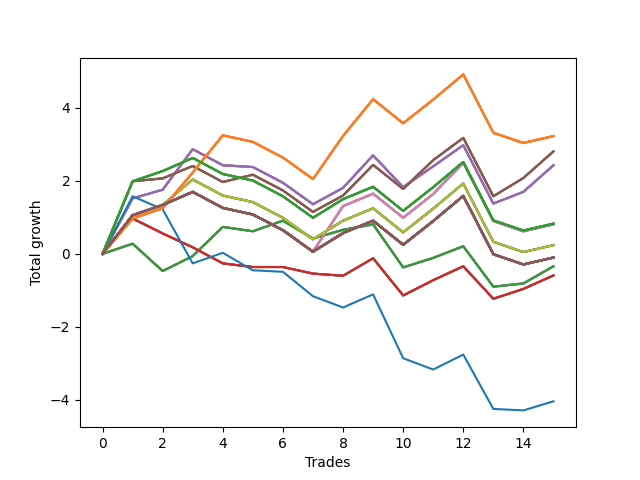

# Long Bulldog 006 
- Symbol: NVDA_Unlimited
- Date Range: 02/08/2022 - 07/08/2022
- Trading Period: 7:20-12:30
- Number of Trades: 15



| Name | Win Percent | Profit | Avg Profit / Trade | Avg Time / Trade |      | Name | Win Percent | Profit | Avg Profit / Trade | Avg Time / Trade |
| ---- | ----------- | ------ | ------------------ | ---------------- | ---- | ---- | ----------- | ------ | ------------------ | ---------------- |
| Sorted By <br> Profit | | | | | | Sorted By <br> Win Percentage ||||
| One Hundred Twenty-Six | 60.00 | 1615.00 | 107.67 | 24:43 |     | Sixty-Seven | 66.67 | 1405.00 | 93.67 | 22:55 |
| One Hundred Twenty-One | 60.00 | 1615.00 | 107.67 | 24:43 |     | Fifty-Nine | 66.67 | 1405.00 | 93.67 | 22:55 |
| One Hundred Sixteen | 60.00 | 1615.00 | 107.67 | 24:43 |     | Fifty-One | 66.67 | 1405.00 | 93.67 | 22:55 |
| One Hundred Eleven | 60.00 | 1615.00 | 107.67 | 24:43 |     | Forty-Three | 66.67 | 1405.00 | 93.67 | 22:55 |
| Eighty-One | 60.00 | 1615.00 | 107.67 | 24:43 |     | Three | 66.67 | 1405.00 | 93.67 | 22:55 |
| Sixty-Seven | 66.67 | 1405.00 | 93.67 | 22:55 |     | Sixty-Four | 66.67 | -170.00 | -11.33 | 09:05 |
| Fifty-Nine | 66.67 | 1405.00 | 93.67 | 22:55 |     | Fifty-Six | 66.67 | -170.00 | -11.33 | 09:05 |
| Fifty-One | 66.67 | 1405.00 | 93.67 | 22:55 |     | Forty-Eight | 66.67 | -170.00 | -11.33 | 09:05 |
| Forty-Three | 66.67 | 1405.00 | 93.67 | 22:55 |     | Forty | 66.67 | -170.00 | -11.33 | 09:05 |
| Three | 66.67 | 1405.00 | 93.67 | 22:55 |     | Zero | 66.67 | -170.00 | -11.33 | 09:05 |
| Sixty-Six | 60.00 | 1215.00 | 81.00 | 21:28 |     | One Hundred Twenty-Six | 60.00 | 1615.00 | 107.67 | 24:43 |
| Fifty-Eight | 60.00 | 1215.00 | 81.00 | 21:28 |     | One Hundred Twenty-One | 60.00 | 1615.00 | 107.67 | 24:43 |
| Fifty | 60.00 | 1215.00 | 81.00 | 21:28 |     | One Hundred Sixteen | 60.00 | 1615.00 | 107.67 | 24:43 |
| Forty-Two | 60.00 | 1215.00 | 81.00 | 21:28 |     | One Hundred Eleven | 60.00 | 1615.00 | 107.67 | 24:43 |
| Two | 60.00 | 1215.00 | 81.00 | 21:28 |     | Eighty-One | 60.00 | 1615.00 | 107.67 | 24:43 |
| One Hundred Twenty-Seven | 53.33 | 415.00 | 27.67 | 28:37 |     | Sixty-Six | 60.00 | 1215.00 | 81.00 | 21:28 |
| One Hundred Twenty-Two | 53.33 | 415.00 | 27.67 | 28:37 |     | Fifty-Eight | 60.00 | 1215.00 | 81.00 | 21:28 |
| One Hundred Seventeen | 53.33 | 415.00 | 27.67 | 28:37 |     | Fifty | 60.00 | 1215.00 | 81.00 | 21:28 |
| One Hundred Twelve | 53.33 | 415.00 | 27.67 | 28:37 |     | Forty-Two | 60.00 | 1215.00 | 81.00 | 21:28 |
| Eighty-Two | 53.33 | 415.00 | 27.67 | 28:37 |     | Two | 60.00 | 1215.00 | 81.00 | 21:28 |
| Sixty-Eight | 53.33 | 405.00 | 27.00 | 29:38 |     | One Hundred Twenty-Seven | 53.33 | 415.00 | 27.67 | 28:37 |
| Sixty | 53.33 | 405.00 | 27.00 | 29:38 |     | One Hundred Twenty-Two | 53.33 | 415.00 | 27.67 | 28:37 |
| Fifty-Two | 53.33 | 405.00 | 27.00 | 29:38 |     | One Hundred Seventeen | 53.33 | 415.00 | 27.67 | 28:37 |
| Forty-Four | 53.33 | 405.00 | 27.00 | 29:38 |     | One Hundred Twelve | 53.33 | 415.00 | 27.67 | 28:37 |
| Four | 53.33 | 405.00 | 27.00 | 29:38 |     | Eighty-Two | 53.33 | 415.00 | 27.67 | 28:37 |
| Seventy | 53.33 | 120.00 | 8.00 | 29:33 |     | Sixty-Eight | 53.33 | 405.00 | 27.00 | 29:38 |
| Sixty-Two | 53.33 | 120.00 | 8.00 | 29:33 |     | Sixty | 53.33 | 405.00 | 27.00 | 29:38 |
| Fifty-Four | 53.33 | 120.00 | 8.00 | 29:33 |     | Fifty-Two | 53.33 | 405.00 | 27.00 | 29:38 |
| Forty-Six | 53.33 | 120.00 | 8.00 | 29:33 |     | Forty-Four | 53.33 | 405.00 | 27.00 | 29:38 |
| Six | 53.33 | 120.00 | 8.00 | 29:33 |     | Four | 53.33 | 405.00 | 27.00 | 29:38 |
| One Hundred Thirty | 53.33 | -50.00 | -3.33 | 29:55 |     | Seventy | 53.33 | 120.00 | 8.00 | 29:33 |
| One Hundred Twenty-Nine | 53.33 | -50.00 | -3.33 | 29:55 |     | Sixty-Two | 53.33 | 120.00 | 8.00 | 29:33 |
| One Hundred Twenty-Eight | 53.33 | -50.00 | -3.33 | 29:55 |     | Fifty-Four | 53.33 | 120.00 | 8.00 | 29:33 |
| One Hundred Twenty-Five | 53.33 | -50.00 | -3.33 | 29:55 |     | Forty-Six | 53.33 | 120.00 | 8.00 | 29:33 |
| One Hundred Twenty-Four | 53.33 | -50.00 | -3.33 | 29:55 |     | Six | 53.33 | 120.00 | 8.00 | 29:33 |
| One Hundred Twenty-Three | 53.33 | -50.00 | -3.33 | 29:55 |     | One Hundred Thirty | 53.33 | -50.00 | -3.33 | 29:55 |
| One Hundred Twenty | 53.33 | -50.00 | -3.33 | 29:55 |     | One Hundred Twenty-Nine | 53.33 | -50.00 | -3.33 | 29:55 |
| One Hundred Ninteen | 53.33 | -50.00 | -3.33 | 29:55 |     | One Hundred Twenty-Eight | 53.33 | -50.00 | -3.33 | 29:55 |
| One Hundred Eighteen | 53.33 | -50.00 | -3.33 | 29:55 |     | One Hundred Twenty-Five | 53.33 | -50.00 | -3.33 | 29:55 |
| One Hundred Fifteen | 53.33 | -50.00 | -3.33 | 29:55 |     | One Hundred Twenty-Four | 53.33 | -50.00 | -3.33 | 29:55 |
| One Hundred Fourteen | 53.33 | -50.00 | -3.33 | 29:55 |     | One Hundred Twenty-Three | 53.33 | -50.00 | -3.33 | 29:55 |
| One Hundred Thirteen | 53.33 | -50.00 | -3.33 | 29:55 |     | One Hundred Twenty | 53.33 | -50.00 | -3.33 | 29:55 |
| Eighty-Five | 53.33 | -50.00 | -3.33 | 29:55 |     | One Hundred Ninteen | 53.33 | -50.00 | -3.33 | 29:55 |
| Eighty-Four | 53.33 | -50.00 | -3.33 | 29:55 |     | One Hundred Eighteen | 53.33 | -50.00 | -3.33 | 29:55 |
| Eighty-Three | 53.33 | -50.00 | -3.33 | 29:55 |     | One Hundred Fifteen | 53.33 | -50.00 | -3.33 | 29:55 |
| Seventy-One | 53.33 | -50.00 | -3.33 | 29:55 |     | One Hundred Fourteen | 53.33 | -50.00 | -3.33 | 29:55 |
| Sixty-Nine | 53.33 | -50.00 | -3.33 | 29:55 |     | One Hundred Thirteen | 53.33 | -50.00 | -3.33 | 29:55 |
| Sixty-Three | 53.33 | -50.00 | -3.33 | 29:55 |     | Eighty-Five | 53.33 | -50.00 | -3.33 | 29:55 |
| Sixty-One | 53.33 | -50.00 | -3.33 | 29:55 |     | Eighty-Four | 53.33 | -50.00 | -3.33 | 29:55 |
| Fifty-Five | 53.33 | -50.00 | -3.33 | 29:55 |     | Eighty-Three | 53.33 | -50.00 | -3.33 | 29:55 |
| Fifty-Three | 53.33 | -50.00 | -3.33 | 29:55 |     | Seventy-One | 53.33 | -50.00 | -3.33 | 29:55 |
| Forty-Seven | 53.33 | -50.00 | -3.33 | 29:55 |     | Sixty-Nine | 53.33 | -50.00 | -3.33 | 29:55 |
| Forty-Five | 53.33 | -50.00 | -3.33 | 29:55 |     | Sixty-Three | 53.33 | -50.00 | -3.33 | 29:55 |
| Seven | 53.33 | -50.00 | -3.33 | 29:55 |     | Sixty-One | 53.33 | -50.00 | -3.33 | 29:55 |
| Five | 53.33 | -50.00 | -3.33 | 29:55 |     | Fifty-Five | 53.33 | -50.00 | -3.33 | 29:55 |
| Sixty-Four | 66.67 | -170.00 | -11.33 | 09:05 |     | Fifty-Three | 53.33 | -50.00 | -3.33 | 29:55 |
| Fifty-Six | 66.67 | -170.00 | -11.33 | 09:05 |     | Forty-Seven | 53.33 | -50.00 | -3.33 | 29:55 |
| Forty-Eight | 66.67 | -170.00 | -11.33 | 09:05 |     | Forty-Five | 53.33 | -50.00 | -3.33 | 29:55 |
| Forty | 66.67 | -170.00 | -11.33 | 09:05 |     | Seven | 53.33 | -50.00 | -3.33 | 29:55 |
| Zero | 66.67 | -170.00 | -11.33 | 09:05 |     | Five | 53.33 | -50.00 | -3.33 | 29:55 |
| Sixty-Five | 46.67 | -295.00 | -19.67 | 17:08 |     | Sixty-Five | 46.67 | -295.00 | -19.67 | 17:08 |
| Fifty-Seven | 46.67 | -295.00 | -19.67 | 17:08 |     | Fifty-Seven | 46.67 | -295.00 | -19.67 | 17:08 |
| Forty-Nine | 46.67 | -295.00 | -19.67 | 17:08 |     | Forty-Nine | 46.67 | -295.00 | -19.67 | 17:08 |
| Forty-One | 46.67 | -295.00 | -19.67 | 17:08 |     | Forty-One | 46.67 | -295.00 | -19.67 | 17:08 |
| One | 46.67 | -295.00 | -19.67 | 17:08 |     | One | 46.67 | -295.00 | -19.67 | 17:08 |
| Seventy-Three | 33.33 | -2020.00 | -134.67 | 11:45 |     | Seventy-Three | 33.33 | -2020.00 | -134.67 | 11:45 |

## NO STOPLOSS

### Test Zero
* Sell when price hits the middle line of the 20p bollinger
* No Stoploss
* Results:
```
Total Trades: 15
Percent Up: 66.67
Percent Down: 33.33
Total Points Moved Up: -0.34
Potential Profit: -170.00
Total Points Ups: 3.31 Count Ups: 10
Total Points Downs: -3.65 Count Downs: 5
```

<details><summary>Trades</summary>

<code>In: 2022-02-10 10:40:00		Out: 2022-02-10 10:40:35		Total Position Time: 00:35		Total Move Up: 0.28		Total to Date: 0.28</code> <br />
<code>In: 2022-02-23 10:18:00		Out: 2022-02-23 10:36:10		Total Position Time: 18:10		Total Move Up: -0.75		Total to Date: -0.47</code> <br />
<code>In: 2022-02-25 11:00:00		Out: 2022-02-25 11:04:10		Total Position Time: 04:10		Total Move Up: 0.41		Total to Date: -0.06</code> <br />
<code>In: 2022-02-28 11:12:00		Out: 2022-02-28 11:19:45		Total Position Time: 07:45		Total Move Up: 0.80		Total to Date: 0.74</code> <br />
<code>In: 2022-03-03 12:11:00		Out: 2022-03-03 12:18:20		Total Position Time: 07:20		Total Move Up: -0.12		Total to Date: 0.62</code> <br />
<code>In: 2022-03-28 08:39:00		Out: 2022-03-28 08:45:05		Total Position Time: 06:05		Total Move Up: 0.29		Total to Date: 0.91</code> <br />
<code>In: 2022-03-30 08:03:00		Out: 2022-03-30 08:14:35		Total Position Time: 11:35		Total Move Up: -0.49		Total to Date: 0.42</code> <br />
<code>In: 2022-03-30 12:07:00		Out: 2022-03-30 12:14:15		Total Position Time: 07:15		Total Move Up: 0.24		Total to Date: 0.66</code> <br />
<code>In: 2022-03-31 10:19:00		Out: 2022-03-31 10:26:20		Total Position Time: 07:20		Total Move Up: 0.15		Total to Date: 0.81</code> <br />
<code>In: 2022-06-08 09:30:00		Out: 2022-06-08 09:50:15		Total Position Time: 20:15		Total Move Up: -1.18		Total to Date: -0.37</code> <br />
<code>In: 2022-06-08 09:42:00		Out: 2022-06-08 09:50:15		Total Position Time: 08:15		Total Move Up: 0.26		Total to Date: -0.11</code> <br />
<code>In: 2022-06-09 10:47:00		Out: 2022-06-09 10:51:05		Total Position Time: 04:05		Total Move Up: 0.32		Total to Date: 0.21</code> <br />
<code>In: 2022-06-09 11:58:00		Out: 2022-06-09 12:18:20		Total Position Time: 20:20		Total Move Up: -1.11		Total to Date: -0.90</code> <br />
<code>In: 2022-06-23 09:07:00		Out: 2022-06-23 09:18:25		Total Position Time: 11:25		Total Move Up: 0.09		Total to Date: -0.81</code> <br />
<code>In: 2022-06-23 10:06:00		Out: 2022-06-23 10:07:40		Total Position Time: 01:40		Total Move Up: 0.47		Total to Date: -0.34</code> <br />


</details>

### Test One
* Sell when the price hits the upper line of the 20p 1std bollinger
* No Stoploss
* Results:
```
Total Trades: 15
Percent Up: 46.67
Percent Down: 53.33
Total Points Moved Up: -0.59
Potential Profit: -295.00
Total Points Ups: 2.89 Count Ups: 7
Total Points Downs: -3.48 Count Downs: 8
```

<details><summary>Trades</summary>

<code>In: 2022-02-10 10:40:00		Out: 2022-02-10 10:43:25		Total Position Time: 03:25		Total Move Up: 0.97		Total to Date: 0.97</code> <br />
<code>In: 2022-02-23 10:18:00		Out: 2022-02-23 10:39:05		Total Position Time: 21:05		Total Move Up: -0.41		Total to Date: 0.56</code> <br />
<code>In: 2022-02-25 11:00:00		Out: 2022-02-25 11:17:50		Total Position Time: 17:50		Total Move Up: -0.38		Total to Date: 0.18</code> <br />
<code>In: 2022-02-28 11:12:00		Out: 2022-02-28 11:41:55		Total Position Time: 29:55		Total Move Up: -0.44		Total to Date: -0.26</code> <br />
<code>In: 2022-03-03 12:11:00		Out: 2022-03-03 12:26:05		Total Position Time: 15:05		Total Move Up: -0.10		Total to Date: -0.36</code> <br />
<code>In: 2022-03-28 08:39:00		Out: 2022-03-28 09:01:50		Total Position Time: 22:50		Total Move Up: 0.00		Total to Date: -0.36</code> <br />
<code>In: 2022-03-30 08:03:00		Out: 2022-03-30 08:19:15		Total Position Time: 16:15		Total Move Up: -0.18		Total to Date: -0.54</code> <br />
<code>In: 2022-03-30 12:07:00		Out: 2022-03-30 12:30:45		Total Position Time: 23:45		Total Move Up: -0.06		Total to Date: -0.60</code> <br />
<code>In: 2022-03-31 10:19:00		Out: 2022-03-31 10:29:05		Total Position Time: 10:05		Total Move Up: 0.48		Total to Date: -0.12</code> <br />
<code>In: 2022-06-08 09:30:00		Out: 2022-06-08 09:54:00		Total Position Time: 24:00		Total Move Up: -1.02		Total to Date: -1.14</code> <br />
<code>In: 2022-06-08 09:42:00		Out: 2022-06-08 09:54:00		Total Position Time: 12:00		Total Move Up: 0.42		Total to Date: -0.72</code> <br />
<code>In: 2022-06-09 10:47:00		Out: 2022-06-09 10:57:10		Total Position Time: 10:10		Total Move Up: 0.38		Total to Date: -0.34</code> <br />
<code>In: 2022-06-09 11:58:00		Out: 2022-06-09 12:19:25		Total Position Time: 21:25		Total Move Up: -0.89		Total to Date: -1.23</code> <br />
<code>In: 2022-06-23 09:07:00		Out: 2022-06-23 09:19:05		Total Position Time: 12:05		Total Move Up: 0.27		Total to Date: -0.96</code> <br />
<code>In: 2022-06-23 10:06:00		Out: 2022-06-23 10:23:10		Total Position Time: 17:10		Total Move Up: 0.37		Total to Date: -0.59</code> <br />


</details>

### Test Two
* Sell when the price hits the upper line of the 20p 2std bollinger
* No Stoploss
* Results:
```
Total Trades: 15
Percent Up: 60.00
Percent Down: 40.00
Total Points Moved Up: 2.43
Potential Profit: 1215.00
Total Points Ups: 6.41 Count Ups: 9
Total Points Downs: -3.98 Count Downs: 6
```

<details><summary>Trades</summary>

<code>In: 2022-02-10 10:40:00		Out: 2022-02-10 10:46:45		Total Position Time: 06:45		Total Move Up: 1.52		Total to Date: 1.52</code> <br />
<code>In: 2022-02-23 10:18:00		Out: 2022-02-23 10:42:50		Total Position Time: 24:50		Total Move Up: 0.24		Total to Date: 1.76</code> <br />
<code>In: 2022-02-25 11:00:00		Out: 2022-02-25 11:25:45		Total Position Time: 25:45		Total Move Up: 1.11		Total to Date: 2.87</code> <br />
<code>In: 2022-02-28 11:12:00		Out: 2022-02-28 11:41:55		Total Position Time: 29:55		Total Move Up: -0.44		Total to Date: 2.43</code> <br />
<code>In: 2022-03-03 12:11:00		Out: 2022-03-03 12:27:10		Total Position Time: 16:10		Total Move Up: -0.05		Total to Date: 2.38</code> <br />
<code>In: 2022-03-28 08:39:00		Out: 2022-03-28 09:08:55		Total Position Time: 29:55		Total Move Up: -0.43		Total to Date: 1.95</code> <br />
<code>In: 2022-03-30 08:03:00		Out: 2022-03-30 08:32:55		Total Position Time: 29:55		Total Move Up: -0.59		Total to Date: 1.36</code> <br />
<code>In: 2022-03-30 12:07:00		Out: 2022-03-30 12:31:35		Total Position Time: 24:35		Total Move Up: 0.45		Total to Date: 1.81</code> <br />
<code>In: 2022-03-31 10:19:00		Out: 2022-03-31 10:31:20		Total Position Time: 12:20		Total Move Up: 0.89		Total to Date: 2.70</code> <br />
<code>In: 2022-06-08 09:30:00		Out: 2022-06-08 09:56:45		Total Position Time: 26:45		Total Move Up: -0.87		Total to Date: 1.83</code> <br />
<code>In: 2022-06-08 09:42:00		Out: 2022-06-08 09:56:45		Total Position Time: 14:45		Total Move Up: 0.57		Total to Date: 2.40</code> <br />
<code>In: 2022-06-09 10:47:00		Out: 2022-06-09 10:59:30		Total Position Time: 12:30		Total Move Up: 0.58		Total to Date: 2.98</code> <br />
<code>In: 2022-06-09 11:58:00		Out: 2022-06-09 12:27:55		Total Position Time: 29:55		Total Move Up: -1.60		Total to Date: 1.38</code> <br />
<code>In: 2022-06-23 09:07:00		Out: 2022-06-23 09:27:35		Total Position Time: 20:35		Total Move Up: 0.32		Total to Date: 1.70</code> <br />
<code>In: 2022-06-23 10:06:00		Out: 2022-06-23 10:23:20		Total Position Time: 17:20		Total Move Up: 0.73		Total to Date: 2.43</code> <br />


</details>

### Test Three
* Sell when price hits the middle line of the 50p bollinger
* No Stoploss
* Results:
```
Total Trades: 15
Percent Up: 66.67
Percent Down: 33.33
Total Points Moved Up: 2.81
Potential Profit: 1405.00
Total Points Ups: 6.53 Count Ups: 10
Total Points Downs: -3.72 Count Downs: 5
```

<details><summary>Trades</summary>

<code>In: 2022-02-10 10:40:00		Out: 2022-02-10 10:50:30		Total Position Time: 10:30		Total Move Up: 1.99		Total to Date: 1.99</code> <br />
<code>In: 2022-02-23 10:18:00		Out: 2022-02-23 10:47:05		Total Position Time: 29:05		Total Move Up: 0.08		Total to Date: 2.07</code> <br />
<code>In: 2022-02-25 11:00:00		Out: 2022-02-25 11:21:35		Total Position Time: 21:35		Total Move Up: 0.34		Total to Date: 2.41</code> <br />
<code>In: 2022-02-28 11:12:00		Out: 2022-02-28 11:41:55		Total Position Time: 29:55		Total Move Up: -0.44		Total to Date: 1.97</code> <br />
<code>In: 2022-03-03 12:11:00		Out: 2022-03-03 12:28:05		Total Position Time: 17:05		Total Move Up: 0.20		Total to Date: 2.17</code> <br />
<code>In: 2022-03-28 08:39:00		Out: 2022-03-28 09:08:55		Total Position Time: 29:55		Total Move Up: -0.43		Total to Date: 1.74</code> <br />
<code>In: 2022-03-30 08:03:00		Out: 2022-03-30 08:32:55		Total Position Time: 29:55		Total Move Up: -0.59		Total to Date: 1.15</code> <br />
<code>In: 2022-03-30 12:07:00		Out: 2022-03-30 12:31:35		Total Position Time: 24:35		Total Move Up: 0.45		Total to Date: 1.60</code> <br />
<code>In: 2022-03-31 10:19:00		Out: 2022-03-31 10:29:40		Total Position Time: 10:40		Total Move Up: 0.84		Total to Date: 2.44</code> <br />
<code>In: 2022-06-08 09:30:00		Out: 2022-06-08 09:59:55		Total Position Time: 29:55		Total Move Up: -0.66		Total to Date: 1.78</code> <br />
<code>In: 2022-06-08 09:42:00		Out: 2022-06-08 10:04:30		Total Position Time: 22:30		Total Move Up: 0.79		Total to Date: 2.57</code> <br />
<code>In: 2022-06-09 10:47:00		Out: 2022-06-09 11:07:05		Total Position Time: 20:05		Total Move Up: 0.61		Total to Date: 3.18</code> <br />
<code>In: 2022-06-09 11:58:00		Out: 2022-06-09 12:27:55		Total Position Time: 29:55		Total Move Up: -1.60		Total to Date: 1.58</code> <br />
<code>In: 2022-06-23 09:07:00		Out: 2022-06-23 09:27:55		Total Position Time: 20:55		Total Move Up: 0.50		Total to Date: 2.08</code> <br />
<code>In: 2022-06-23 10:06:00		Out: 2022-06-23 10:23:20		Total Position Time: 17:20		Total Move Up: 0.73		Total to Date: 2.81</code> <br />


</details>

### Test Four
* Sell when the price hits the upper line of the 50p 1std bollinger
* No Stoploss
* Results:
```
Total Trades: 15
Percent Up: 53.33
Percent Down: 46.67
Total Points Moved Up: 0.81
Potential Profit: 405.00
Total Points Ups: 4.99 Count Ups: 8
Total Points Downs: -4.18 Count Downs: 7
```

<details><summary>Trades</summary>

<code>In: 2022-02-10 10:40:00		Out: 2022-02-10 11:09:55		Total Position Time: 29:55		Total Move Up: 1.06		Total to Date: 1.06</code> <br />
<code>In: 2022-02-23 10:18:00		Out: 2022-02-23 10:47:55		Total Position Time: 29:55		Total Move Up: 0.28		Total to Date: 1.34</code> <br />
<code>In: 2022-02-25 11:00:00		Out: 2022-02-25 11:29:55		Total Position Time: 29:55		Total Move Up: 0.36		Total to Date: 1.70</code> <br />
<code>In: 2022-02-28 11:12:00		Out: 2022-02-28 11:41:55		Total Position Time: 29:55		Total Move Up: -0.44		Total to Date: 1.26</code> <br />
<code>In: 2022-03-03 12:11:00		Out: 2022-03-03 12:40:55		Total Position Time: 29:55		Total Move Up: -0.18		Total to Date: 1.08</code> <br />
<code>In: 2022-03-28 08:39:00		Out: 2022-03-28 09:08:55		Total Position Time: 29:55		Total Move Up: -0.43		Total to Date: 0.65</code> <br />
<code>In: 2022-03-30 08:03:00		Out: 2022-03-30 08:32:55		Total Position Time: 29:55		Total Move Up: -0.59		Total to Date: 0.06</code> <br />
<code>In: 2022-03-30 12:07:00		Out: 2022-03-30 12:33:45		Total Position Time: 26:45		Total Move Up: 1.25		Total to Date: 1.31</code> <br />
<code>In: 2022-03-31 10:19:00		Out: 2022-03-31 10:48:55		Total Position Time: 29:55		Total Move Up: 0.34		Total to Date: 1.65</code> <br />
<code>In: 2022-06-08 09:30:00		Out: 2022-06-08 09:59:55		Total Position Time: 29:55		Total Move Up: -0.66		Total to Date: 0.99</code> <br />
<code>In: 2022-06-08 09:42:00		Out: 2022-06-08 10:11:55		Total Position Time: 29:55		Total Move Up: 0.65		Total to Date: 1.64</code> <br />
<code>In: 2022-06-09 10:47:00		Out: 2022-06-09 11:15:50		Total Position Time: 28:50		Total Move Up: 0.86		Total to Date: 2.50</code> <br />
<code>In: 2022-06-09 11:58:00		Out: 2022-06-09 12:27:55		Total Position Time: 29:55		Total Move Up: -1.60		Total to Date: 0.90</code> <br />
<code>In: 2022-06-23 09:07:00		Out: 2022-06-23 09:36:55		Total Position Time: 29:55		Total Move Up: -0.28		Total to Date: 0.62</code> <br />
<code>In: 2022-06-23 10:06:00		Out: 2022-06-23 10:35:55		Total Position Time: 29:55		Total Move Up: 0.19		Total to Date: 0.81</code> <br />


</details>

### Test Five
* Sell when the price hits the upper line of the 50p 2std bollinger
* No Stoploss
* Results:
```
Total Trades: 15
Percent Up: 53.33
Percent Down: 46.67
Total Points Moved Up: -0.10
Potential Profit: -50.00
Total Points Ups: 4.08 Count Ups: 8
Total Points Downs: -4.18 Count Downs: 7
```

<details><summary>Trades</summary>

<code>In: 2022-02-10 10:40:00		Out: 2022-02-10 11:09:55		Total Position Time: 29:55		Total Move Up: 1.06		Total to Date: 1.06</code> <br />
<code>In: 2022-02-23 10:18:00		Out: 2022-02-23 10:47:55		Total Position Time: 29:55		Total Move Up: 0.28		Total to Date: 1.34</code> <br />
<code>In: 2022-02-25 11:00:00		Out: 2022-02-25 11:29:55		Total Position Time: 29:55		Total Move Up: 0.36		Total to Date: 1.70</code> <br />
<code>In: 2022-02-28 11:12:00		Out: 2022-02-28 11:41:55		Total Position Time: 29:55		Total Move Up: -0.44		Total to Date: 1.26</code> <br />
<code>In: 2022-03-03 12:11:00		Out: 2022-03-03 12:40:55		Total Position Time: 29:55		Total Move Up: -0.18		Total to Date: 1.08</code> <br />
<code>In: 2022-03-28 08:39:00		Out: 2022-03-28 09:08:55		Total Position Time: 29:55		Total Move Up: -0.43		Total to Date: 0.65</code> <br />
<code>In: 2022-03-30 08:03:00		Out: 2022-03-30 08:32:55		Total Position Time: 29:55		Total Move Up: -0.59		Total to Date: 0.06</code> <br />
<code>In: 2022-03-30 12:07:00		Out: 2022-03-30 12:36:55		Total Position Time: 29:55		Total Move Up: 0.51		Total to Date: 0.57</code> <br />
<code>In: 2022-03-31 10:19:00		Out: 2022-03-31 10:48:55		Total Position Time: 29:55		Total Move Up: 0.34		Total to Date: 0.91</code> <br />
<code>In: 2022-06-08 09:30:00		Out: 2022-06-08 09:59:55		Total Position Time: 29:55		Total Move Up: -0.66		Total to Date: 0.25</code> <br />
<code>In: 2022-06-08 09:42:00		Out: 2022-06-08 10:11:55		Total Position Time: 29:55		Total Move Up: 0.65		Total to Date: 0.90</code> <br />
<code>In: 2022-06-09 10:47:00		Out: 2022-06-09 11:16:55		Total Position Time: 29:55		Total Move Up: 0.69		Total to Date: 1.59</code> <br />
<code>In: 2022-06-09 11:58:00		Out: 2022-06-09 12:27:55		Total Position Time: 29:55		Total Move Up: -1.60		Total to Date: -0.01</code> <br />
<code>In: 2022-06-23 09:07:00		Out: 2022-06-23 09:36:55		Total Position Time: 29:55		Total Move Up: -0.28		Total to Date: -0.29</code> <br />
<code>In: 2022-06-23 10:06:00		Out: 2022-06-23 10:35:55		Total Position Time: 29:55		Total Move Up: 0.19		Total to Date: -0.10</code> <br />


</details>

### Test Six
* Sell when the price hits the middle line of the 1std VWAP
* No Stoploss
* Results:
```
Total Trades: 15
Percent Up: 53.33
Percent Down: 46.67
Total Points Moved Up: 0.24
Potential Profit: 120.00
Total Points Ups: 4.42 Count Ups: 8
Total Points Downs: -4.18 Count Downs: 7
```

<details><summary>Trades</summary>

<code>In: 2022-02-10 10:40:00		Out: 2022-02-10 11:09:55		Total Position Time: 29:55		Total Move Up: 1.06		Total to Date: 1.06</code> <br />
<code>In: 2022-02-23 10:18:00		Out: 2022-02-23 10:47:55		Total Position Time: 29:55		Total Move Up: 0.28		Total to Date: 1.34</code> <br />
<code>In: 2022-02-25 11:00:00		Out: 2022-02-25 11:24:30		Total Position Time: 24:30		Total Move Up: 0.70		Total to Date: 2.04</code> <br />
<code>In: 2022-02-28 11:12:00		Out: 2022-02-28 11:41:55		Total Position Time: 29:55		Total Move Up: -0.44		Total to Date: 1.60</code> <br />
<code>In: 2022-03-03 12:11:00		Out: 2022-03-03 12:40:55		Total Position Time: 29:55		Total Move Up: -0.18		Total to Date: 1.42</code> <br />
<code>In: 2022-03-28 08:39:00		Out: 2022-03-28 09:08:55		Total Position Time: 29:55		Total Move Up: -0.43		Total to Date: 0.99</code> <br />
<code>In: 2022-03-30 08:03:00		Out: 2022-03-30 08:32:55		Total Position Time: 29:55		Total Move Up: -0.59		Total to Date: 0.40</code> <br />
<code>In: 2022-03-30 12:07:00		Out: 2022-03-30 12:36:55		Total Position Time: 29:55		Total Move Up: 0.51		Total to Date: 0.91</code> <br />
<code>In: 2022-03-31 10:19:00		Out: 2022-03-31 10:48:55		Total Position Time: 29:55		Total Move Up: 0.34		Total to Date: 1.25</code> <br />
<code>In: 2022-06-08 09:30:00		Out: 2022-06-08 09:59:55		Total Position Time: 29:55		Total Move Up: -0.66		Total to Date: 0.59</code> <br />
<code>In: 2022-06-08 09:42:00		Out: 2022-06-08 10:11:55		Total Position Time: 29:55		Total Move Up: 0.65		Total to Date: 1.24</code> <br />
<code>In: 2022-06-09 10:47:00		Out: 2022-06-09 11:16:55		Total Position Time: 29:55		Total Move Up: 0.69		Total to Date: 1.93</code> <br />
<code>In: 2022-06-09 11:58:00		Out: 2022-06-09 12:27:55		Total Position Time: 29:55		Total Move Up: -1.60		Total to Date: 0.33</code> <br />
<code>In: 2022-06-23 09:07:00		Out: 2022-06-23 09:36:55		Total Position Time: 29:55		Total Move Up: -0.28		Total to Date: 0.05</code> <br />
<code>In: 2022-06-23 10:06:00		Out: 2022-06-23 10:35:55		Total Position Time: 29:55		Total Move Up: 0.19		Total to Date: 0.24</code> <br />


</details>

### Test Seven
* Sell when the price hits the upper line of the 1std VWAP
* No Stoploss
* Results:
```
Total Trades: 15
Percent Up: 53.33
Percent Down: 46.67
Total Points Moved Up: -0.10
Potential Profit: -50.00
Total Points Ups: 4.08 Count Ups: 8
Total Points Downs: -4.18 Count Downs: 7
```

<details><summary>Trades</summary>

<code>In: 2022-02-10 10:40:00		Out: 2022-02-10 11:09:55		Total Position Time: 29:55		Total Move Up: 1.06		Total to Date: 1.06</code> <br />
<code>In: 2022-02-23 10:18:00		Out: 2022-02-23 10:47:55		Total Position Time: 29:55		Total Move Up: 0.28		Total to Date: 1.34</code> <br />
<code>In: 2022-02-25 11:00:00		Out: 2022-02-25 11:29:55		Total Position Time: 29:55		Total Move Up: 0.36		Total to Date: 1.70</code> <br />
<code>In: 2022-02-28 11:12:00		Out: 2022-02-28 11:41:55		Total Position Time: 29:55		Total Move Up: -0.44		Total to Date: 1.26</code> <br />
<code>In: 2022-03-03 12:11:00		Out: 2022-03-03 12:40:55		Total Position Time: 29:55		Total Move Up: -0.18		Total to Date: 1.08</code> <br />
<code>In: 2022-03-28 08:39:00		Out: 2022-03-28 09:08:55		Total Position Time: 29:55		Total Move Up: -0.43		Total to Date: 0.65</code> <br />
<code>In: 2022-03-30 08:03:00		Out: 2022-03-30 08:32:55		Total Position Time: 29:55		Total Move Up: -0.59		Total to Date: 0.06</code> <br />
<code>In: 2022-03-30 12:07:00		Out: 2022-03-30 12:36:55		Total Position Time: 29:55		Total Move Up: 0.51		Total to Date: 0.57</code> <br />
<code>In: 2022-03-31 10:19:00		Out: 2022-03-31 10:48:55		Total Position Time: 29:55		Total Move Up: 0.34		Total to Date: 0.91</code> <br />
<code>In: 2022-06-08 09:30:00		Out: 2022-06-08 09:59:55		Total Position Time: 29:55		Total Move Up: -0.66		Total to Date: 0.25</code> <br />
<code>In: 2022-06-08 09:42:00		Out: 2022-06-08 10:11:55		Total Position Time: 29:55		Total Move Up: 0.65		Total to Date: 0.90</code> <br />
<code>In: 2022-06-09 10:47:00		Out: 2022-06-09 11:16:55		Total Position Time: 29:55		Total Move Up: 0.69		Total to Date: 1.59</code> <br />
<code>In: 2022-06-09 11:58:00		Out: 2022-06-09 12:27:55		Total Position Time: 29:55		Total Move Up: -1.60		Total to Date: -0.01</code> <br />
<code>In: 2022-06-23 09:07:00		Out: 2022-06-23 09:36:55		Total Position Time: 29:55		Total Move Up: -0.28		Total to Date: -0.29</code> <br />
<code>In: 2022-06-23 10:06:00		Out: 2022-06-23 10:35:55		Total Position Time: 29:55		Total Move Up: 0.19		Total to Date: -0.10</code> <br />


</details>

## STOPLOSS OF 5

### Test Forty
* Sell when price hits the middle line of the 20p bollinger
* Stoploss is 5 points
* Results:
```
Total Trades: 15
Percent Up: 66.67
Percent Down: 33.33
Total Points Moved Up: -0.34
Potential Profit: -170.00
Total Points Ups: 3.31 Count Ups: 10
Total Points Downs: -3.65 Count Downs: 5
```

<details><summary>Trades</summary>

<code>In: 2022-02-10 10:40:00		Out: 2022-02-10 10:40:35		Total Position Time: 00:35		Total Move Up: 0.28		Total to Date: 0.28</code> <br />
<code>In: 2022-02-23 10:18:00		Out: 2022-02-23 10:36:10		Total Position Time: 18:10		Total Move Up: -0.75		Total to Date: -0.47</code> <br />
<code>In: 2022-02-25 11:00:00		Out: 2022-02-25 11:04:10		Total Position Time: 04:10		Total Move Up: 0.41		Total to Date: -0.06</code> <br />
<code>In: 2022-02-28 11:12:00		Out: 2022-02-28 11:19:45		Total Position Time: 07:45		Total Move Up: 0.80		Total to Date: 0.74</code> <br />
<code>In: 2022-03-03 12:11:00		Out: 2022-03-03 12:18:20		Total Position Time: 07:20		Total Move Up: -0.12		Total to Date: 0.62</code> <br />
<code>In: 2022-03-28 08:39:00		Out: 2022-03-28 08:45:05		Total Position Time: 06:05		Total Move Up: 0.29		Total to Date: 0.91</code> <br />
<code>In: 2022-03-30 08:03:00		Out: 2022-03-30 08:14:35		Total Position Time: 11:35		Total Move Up: -0.49		Total to Date: 0.42</code> <br />
<code>In: 2022-03-30 12:07:00		Out: 2022-03-30 12:14:15		Total Position Time: 07:15		Total Move Up: 0.24		Total to Date: 0.66</code> <br />
<code>In: 2022-03-31 10:19:00		Out: 2022-03-31 10:26:20		Total Position Time: 07:20		Total Move Up: 0.15		Total to Date: 0.81</code> <br />
<code>In: 2022-06-08 09:30:00		Out: 2022-06-08 09:50:15		Total Position Time: 20:15		Total Move Up: -1.18		Total to Date: -0.37</code> <br />
<code>In: 2022-06-08 09:42:00		Out: 2022-06-08 09:50:15		Total Position Time: 08:15		Total Move Up: 0.26		Total to Date: -0.11</code> <br />
<code>In: 2022-06-09 10:47:00		Out: 2022-06-09 10:51:05		Total Position Time: 04:05		Total Move Up: 0.32		Total to Date: 0.21</code> <br />
<code>In: 2022-06-09 11:58:00		Out: 2022-06-09 12:18:20		Total Position Time: 20:20		Total Move Up: -1.11		Total to Date: -0.90</code> <br />
<code>In: 2022-06-23 09:07:00		Out: 2022-06-23 09:18:25		Total Position Time: 11:25		Total Move Up: 0.09		Total to Date: -0.81</code> <br />
<code>In: 2022-06-23 10:06:00		Out: 2022-06-23 10:07:40		Total Position Time: 01:40		Total Move Up: 0.47		Total to Date: -0.34</code> <br />


</details>

### Test Forty-One
* Sell when the price hits the upper line of the 20p 1std bollinger
* Stoploss is 5 points
* Results:
```
Total Trades: 15
Percent Up: 46.67
Percent Down: 53.33
Total Points Moved Up: -0.59
Potential Profit: -295.00
Total Points Ups: 2.89 Count Ups: 7
Total Points Downs: -3.48 Count Downs: 8
```

<details><summary>Trades</summary>

<code>In: 2022-02-10 10:40:00		Out: 2022-02-10 10:43:25		Total Position Time: 03:25		Total Move Up: 0.97		Total to Date: 0.97</code> <br />
<code>In: 2022-02-23 10:18:00		Out: 2022-02-23 10:39:05		Total Position Time: 21:05		Total Move Up: -0.41		Total to Date: 0.56</code> <br />
<code>In: 2022-02-25 11:00:00		Out: 2022-02-25 11:17:50		Total Position Time: 17:50		Total Move Up: -0.38		Total to Date: 0.18</code> <br />
<code>In: 2022-02-28 11:12:00		Out: 2022-02-28 11:41:55		Total Position Time: 29:55		Total Move Up: -0.44		Total to Date: -0.26</code> <br />
<code>In: 2022-03-03 12:11:00		Out: 2022-03-03 12:26:05		Total Position Time: 15:05		Total Move Up: -0.10		Total to Date: -0.36</code> <br />
<code>In: 2022-03-28 08:39:00		Out: 2022-03-28 09:01:50		Total Position Time: 22:50		Total Move Up: 0.00		Total to Date: -0.36</code> <br />
<code>In: 2022-03-30 08:03:00		Out: 2022-03-30 08:19:15		Total Position Time: 16:15		Total Move Up: -0.18		Total to Date: -0.54</code> <br />
<code>In: 2022-03-30 12:07:00		Out: 2022-03-30 12:30:45		Total Position Time: 23:45		Total Move Up: -0.06		Total to Date: -0.60</code> <br />
<code>In: 2022-03-31 10:19:00		Out: 2022-03-31 10:29:05		Total Position Time: 10:05		Total Move Up: 0.48		Total to Date: -0.12</code> <br />
<code>In: 2022-06-08 09:30:00		Out: 2022-06-08 09:54:00		Total Position Time: 24:00		Total Move Up: -1.02		Total to Date: -1.14</code> <br />
<code>In: 2022-06-08 09:42:00		Out: 2022-06-08 09:54:00		Total Position Time: 12:00		Total Move Up: 0.42		Total to Date: -0.72</code> <br />
<code>In: 2022-06-09 10:47:00		Out: 2022-06-09 10:57:10		Total Position Time: 10:10		Total Move Up: 0.38		Total to Date: -0.34</code> <br />
<code>In: 2022-06-09 11:58:00		Out: 2022-06-09 12:19:25		Total Position Time: 21:25		Total Move Up: -0.89		Total to Date: -1.23</code> <br />
<code>In: 2022-06-23 09:07:00		Out: 2022-06-23 09:19:05		Total Position Time: 12:05		Total Move Up: 0.27		Total to Date: -0.96</code> <br />
<code>In: 2022-06-23 10:06:00		Out: 2022-06-23 10:23:10		Total Position Time: 17:10		Total Move Up: 0.37		Total to Date: -0.59</code> <br />


</details>

### Test Forty-Two
* Sell when the price hits the upper line of the 20p 2std bollinger
* Stoploss is 5 points
* Results:
```
Total Trades: 15
Percent Up: 60.00
Percent Down: 40.00
Total Points Moved Up: 2.43
Potential Profit: 1215.00
Total Points Ups: 6.41 Count Ups: 9
Total Points Downs: -3.98 Count Downs: 6
```

<details><summary>Trades</summary>

<code>In: 2022-02-10 10:40:00		Out: 2022-02-10 10:46:45		Total Position Time: 06:45		Total Move Up: 1.52		Total to Date: 1.52</code> <br />
<code>In: 2022-02-23 10:18:00		Out: 2022-02-23 10:42:50		Total Position Time: 24:50		Total Move Up: 0.24		Total to Date: 1.76</code> <br />
<code>In: 2022-02-25 11:00:00		Out: 2022-02-25 11:25:45		Total Position Time: 25:45		Total Move Up: 1.11		Total to Date: 2.87</code> <br />
<code>In: 2022-02-28 11:12:00		Out: 2022-02-28 11:41:55		Total Position Time: 29:55		Total Move Up: -0.44		Total to Date: 2.43</code> <br />
<code>In: 2022-03-03 12:11:00		Out: 2022-03-03 12:27:10		Total Position Time: 16:10		Total Move Up: -0.05		Total to Date: 2.38</code> <br />
<code>In: 2022-03-28 08:39:00		Out: 2022-03-28 09:08:55		Total Position Time: 29:55		Total Move Up: -0.43		Total to Date: 1.95</code> <br />
<code>In: 2022-03-30 08:03:00		Out: 2022-03-30 08:32:55		Total Position Time: 29:55		Total Move Up: -0.59		Total to Date: 1.36</code> <br />
<code>In: 2022-03-30 12:07:00		Out: 2022-03-30 12:31:35		Total Position Time: 24:35		Total Move Up: 0.45		Total to Date: 1.81</code> <br />
<code>In: 2022-03-31 10:19:00		Out: 2022-03-31 10:31:20		Total Position Time: 12:20		Total Move Up: 0.89		Total to Date: 2.70</code> <br />
<code>In: 2022-06-08 09:30:00		Out: 2022-06-08 09:56:45		Total Position Time: 26:45		Total Move Up: -0.87		Total to Date: 1.83</code> <br />
<code>In: 2022-06-08 09:42:00		Out: 2022-06-08 09:56:45		Total Position Time: 14:45		Total Move Up: 0.57		Total to Date: 2.40</code> <br />
<code>In: 2022-06-09 10:47:00		Out: 2022-06-09 10:59:30		Total Position Time: 12:30		Total Move Up: 0.58		Total to Date: 2.98</code> <br />
<code>In: 2022-06-09 11:58:00		Out: 2022-06-09 12:27:55		Total Position Time: 29:55		Total Move Up: -1.60		Total to Date: 1.38</code> <br />
<code>In: 2022-06-23 09:07:00		Out: 2022-06-23 09:27:35		Total Position Time: 20:35		Total Move Up: 0.32		Total to Date: 1.70</code> <br />
<code>In: 2022-06-23 10:06:00		Out: 2022-06-23 10:23:20		Total Position Time: 17:20		Total Move Up: 0.73		Total to Date: 2.43</code> <br />


</details>

### Test Forty-Three
* Sell when price hits the middle line of the 50p bollinger
* Stoploss is 5 points
* Results:
```
Total Trades: 15
Percent Up: 66.67
Percent Down: 33.33
Total Points Moved Up: 2.81
Potential Profit: 1405.00
Total Points Ups: 6.53 Count Ups: 10
Total Points Downs: -3.72 Count Downs: 5
```

<details><summary>Trades</summary>

<code>In: 2022-02-10 10:40:00		Out: 2022-02-10 10:50:30		Total Position Time: 10:30		Total Move Up: 1.99		Total to Date: 1.99</code> <br />
<code>In: 2022-02-23 10:18:00		Out: 2022-02-23 10:47:05		Total Position Time: 29:05		Total Move Up: 0.08		Total to Date: 2.07</code> <br />
<code>In: 2022-02-25 11:00:00		Out: 2022-02-25 11:21:35		Total Position Time: 21:35		Total Move Up: 0.34		Total to Date: 2.41</code> <br />
<code>In: 2022-02-28 11:12:00		Out: 2022-02-28 11:41:55		Total Position Time: 29:55		Total Move Up: -0.44		Total to Date: 1.97</code> <br />
<code>In: 2022-03-03 12:11:00		Out: 2022-03-03 12:28:05		Total Position Time: 17:05		Total Move Up: 0.20		Total to Date: 2.17</code> <br />
<code>In: 2022-03-28 08:39:00		Out: 2022-03-28 09:08:55		Total Position Time: 29:55		Total Move Up: -0.43		Total to Date: 1.74</code> <br />
<code>In: 2022-03-30 08:03:00		Out: 2022-03-30 08:32:55		Total Position Time: 29:55		Total Move Up: -0.59		Total to Date: 1.15</code> <br />
<code>In: 2022-03-30 12:07:00		Out: 2022-03-30 12:31:35		Total Position Time: 24:35		Total Move Up: 0.45		Total to Date: 1.60</code> <br />
<code>In: 2022-03-31 10:19:00		Out: 2022-03-31 10:29:40		Total Position Time: 10:40		Total Move Up: 0.84		Total to Date: 2.44</code> <br />
<code>In: 2022-06-08 09:30:00		Out: 2022-06-08 09:59:55		Total Position Time: 29:55		Total Move Up: -0.66		Total to Date: 1.78</code> <br />
<code>In: 2022-06-08 09:42:00		Out: 2022-06-08 10:04:30		Total Position Time: 22:30		Total Move Up: 0.79		Total to Date: 2.57</code> <br />
<code>In: 2022-06-09 10:47:00		Out: 2022-06-09 11:07:05		Total Position Time: 20:05		Total Move Up: 0.61		Total to Date: 3.18</code> <br />
<code>In: 2022-06-09 11:58:00		Out: 2022-06-09 12:27:55		Total Position Time: 29:55		Total Move Up: -1.60		Total to Date: 1.58</code> <br />
<code>In: 2022-06-23 09:07:00		Out: 2022-06-23 09:27:55		Total Position Time: 20:55		Total Move Up: 0.50		Total to Date: 2.08</code> <br />
<code>In: 2022-06-23 10:06:00		Out: 2022-06-23 10:23:20		Total Position Time: 17:20		Total Move Up: 0.73		Total to Date: 2.81</code> <br />


</details>

### Test Forty-Four
* Sell when the price hits the upper line of the 50p 1std bollinger
* Stoploss is 5 points
* Results:
```
Total Trades: 15
Percent Up: 53.33
Percent Down: 46.67
Total Points Moved Up: 0.81
Potential Profit: 405.00
Total Points Ups: 4.99 Count Ups: 8
Total Points Downs: -4.18 Count Downs: 7
```

<details><summary>Trades</summary>

<code>In: 2022-02-10 10:40:00		Out: 2022-02-10 11:09:55		Total Position Time: 29:55		Total Move Up: 1.06		Total to Date: 1.06</code> <br />
<code>In: 2022-02-23 10:18:00		Out: 2022-02-23 10:47:55		Total Position Time: 29:55		Total Move Up: 0.28		Total to Date: 1.34</code> <br />
<code>In: 2022-02-25 11:00:00		Out: 2022-02-25 11:29:55		Total Position Time: 29:55		Total Move Up: 0.36		Total to Date: 1.70</code> <br />
<code>In: 2022-02-28 11:12:00		Out: 2022-02-28 11:41:55		Total Position Time: 29:55		Total Move Up: -0.44		Total to Date: 1.26</code> <br />
<code>In: 2022-03-03 12:11:00		Out: 2022-03-03 12:40:55		Total Position Time: 29:55		Total Move Up: -0.18		Total to Date: 1.08</code> <br />
<code>In: 2022-03-28 08:39:00		Out: 2022-03-28 09:08:55		Total Position Time: 29:55		Total Move Up: -0.43		Total to Date: 0.65</code> <br />
<code>In: 2022-03-30 08:03:00		Out: 2022-03-30 08:32:55		Total Position Time: 29:55		Total Move Up: -0.59		Total to Date: 0.06</code> <br />
<code>In: 2022-03-30 12:07:00		Out: 2022-03-30 12:33:45		Total Position Time: 26:45		Total Move Up: 1.25		Total to Date: 1.31</code> <br />
<code>In: 2022-03-31 10:19:00		Out: 2022-03-31 10:48:55		Total Position Time: 29:55		Total Move Up: 0.34		Total to Date: 1.65</code> <br />
<code>In: 2022-06-08 09:30:00		Out: 2022-06-08 09:59:55		Total Position Time: 29:55		Total Move Up: -0.66		Total to Date: 0.99</code> <br />
<code>In: 2022-06-08 09:42:00		Out: 2022-06-08 10:11:55		Total Position Time: 29:55		Total Move Up: 0.65		Total to Date: 1.64</code> <br />
<code>In: 2022-06-09 10:47:00		Out: 2022-06-09 11:15:50		Total Position Time: 28:50		Total Move Up: 0.86		Total to Date: 2.50</code> <br />
<code>In: 2022-06-09 11:58:00		Out: 2022-06-09 12:27:55		Total Position Time: 29:55		Total Move Up: -1.60		Total to Date: 0.90</code> <br />
<code>In: 2022-06-23 09:07:00		Out: 2022-06-23 09:36:55		Total Position Time: 29:55		Total Move Up: -0.28		Total to Date: 0.62</code> <br />
<code>In: 2022-06-23 10:06:00		Out: 2022-06-23 10:35:55		Total Position Time: 29:55		Total Move Up: 0.19		Total to Date: 0.81</code> <br />


</details>

### Test Forty-Five
* Sell when the price hits the upper line of the 50p 2std bollinger
* Stoploss is 5 points
* Results:
```
Total Trades: 15
Percent Up: 53.33
Percent Down: 46.67
Total Points Moved Up: -0.10
Potential Profit: -50.00
Total Points Ups: 4.08 Count Ups: 8
Total Points Downs: -4.18 Count Downs: 7
```

<details><summary>Trades</summary>

<code>In: 2022-02-10 10:40:00		Out: 2022-02-10 11:09:55		Total Position Time: 29:55		Total Move Up: 1.06		Total to Date: 1.06</code> <br />
<code>In: 2022-02-23 10:18:00		Out: 2022-02-23 10:47:55		Total Position Time: 29:55		Total Move Up: 0.28		Total to Date: 1.34</code> <br />
<code>In: 2022-02-25 11:00:00		Out: 2022-02-25 11:29:55		Total Position Time: 29:55		Total Move Up: 0.36		Total to Date: 1.70</code> <br />
<code>In: 2022-02-28 11:12:00		Out: 2022-02-28 11:41:55		Total Position Time: 29:55		Total Move Up: -0.44		Total to Date: 1.26</code> <br />
<code>In: 2022-03-03 12:11:00		Out: 2022-03-03 12:40:55		Total Position Time: 29:55		Total Move Up: -0.18		Total to Date: 1.08</code> <br />
<code>In: 2022-03-28 08:39:00		Out: 2022-03-28 09:08:55		Total Position Time: 29:55		Total Move Up: -0.43		Total to Date: 0.65</code> <br />
<code>In: 2022-03-30 08:03:00		Out: 2022-03-30 08:32:55		Total Position Time: 29:55		Total Move Up: -0.59		Total to Date: 0.06</code> <br />
<code>In: 2022-03-30 12:07:00		Out: 2022-03-30 12:36:55		Total Position Time: 29:55		Total Move Up: 0.51		Total to Date: 0.57</code> <br />
<code>In: 2022-03-31 10:19:00		Out: 2022-03-31 10:48:55		Total Position Time: 29:55		Total Move Up: 0.34		Total to Date: 0.91</code> <br />
<code>In: 2022-06-08 09:30:00		Out: 2022-06-08 09:59:55		Total Position Time: 29:55		Total Move Up: -0.66		Total to Date: 0.25</code> <br />
<code>In: 2022-06-08 09:42:00		Out: 2022-06-08 10:11:55		Total Position Time: 29:55		Total Move Up: 0.65		Total to Date: 0.90</code> <br />
<code>In: 2022-06-09 10:47:00		Out: 2022-06-09 11:16:55		Total Position Time: 29:55		Total Move Up: 0.69		Total to Date: 1.59</code> <br />
<code>In: 2022-06-09 11:58:00		Out: 2022-06-09 12:27:55		Total Position Time: 29:55		Total Move Up: -1.60		Total to Date: -0.01</code> <br />
<code>In: 2022-06-23 09:07:00		Out: 2022-06-23 09:36:55		Total Position Time: 29:55		Total Move Up: -0.28		Total to Date: -0.29</code> <br />
<code>In: 2022-06-23 10:06:00		Out: 2022-06-23 10:35:55		Total Position Time: 29:55		Total Move Up: 0.19		Total to Date: -0.10</code> <br />


</details>

### Test Forty-Six
* Sell when the price hits the middle line of the 1std VWAP
* Stoploss is 5 points
* Results:
```
Total Trades: 15
Percent Up: 53.33
Percent Down: 46.67
Total Points Moved Up: 0.24
Potential Profit: 120.00
Total Points Ups: 4.42 Count Ups: 8
Total Points Downs: -4.18 Count Downs: 7
```

<details><summary>Trades</summary>

<code>In: 2022-02-10 10:40:00		Out: 2022-02-10 11:09:55		Total Position Time: 29:55		Total Move Up: 1.06		Total to Date: 1.06</code> <br />
<code>In: 2022-02-23 10:18:00		Out: 2022-02-23 10:47:55		Total Position Time: 29:55		Total Move Up: 0.28		Total to Date: 1.34</code> <br />
<code>In: 2022-02-25 11:00:00		Out: 2022-02-25 11:24:30		Total Position Time: 24:30		Total Move Up: 0.70		Total to Date: 2.04</code> <br />
<code>In: 2022-02-28 11:12:00		Out: 2022-02-28 11:41:55		Total Position Time: 29:55		Total Move Up: -0.44		Total to Date: 1.60</code> <br />
<code>In: 2022-03-03 12:11:00		Out: 2022-03-03 12:40:55		Total Position Time: 29:55		Total Move Up: -0.18		Total to Date: 1.42</code> <br />
<code>In: 2022-03-28 08:39:00		Out: 2022-03-28 09:08:55		Total Position Time: 29:55		Total Move Up: -0.43		Total to Date: 0.99</code> <br />
<code>In: 2022-03-30 08:03:00		Out: 2022-03-30 08:32:55		Total Position Time: 29:55		Total Move Up: -0.59		Total to Date: 0.40</code> <br />
<code>In: 2022-03-30 12:07:00		Out: 2022-03-30 12:36:55		Total Position Time: 29:55		Total Move Up: 0.51		Total to Date: 0.91</code> <br />
<code>In: 2022-03-31 10:19:00		Out: 2022-03-31 10:48:55		Total Position Time: 29:55		Total Move Up: 0.34		Total to Date: 1.25</code> <br />
<code>In: 2022-06-08 09:30:00		Out: 2022-06-08 09:59:55		Total Position Time: 29:55		Total Move Up: -0.66		Total to Date: 0.59</code> <br />
<code>In: 2022-06-08 09:42:00		Out: 2022-06-08 10:11:55		Total Position Time: 29:55		Total Move Up: 0.65		Total to Date: 1.24</code> <br />
<code>In: 2022-06-09 10:47:00		Out: 2022-06-09 11:16:55		Total Position Time: 29:55		Total Move Up: 0.69		Total to Date: 1.93</code> <br />
<code>In: 2022-06-09 11:58:00		Out: 2022-06-09 12:27:55		Total Position Time: 29:55		Total Move Up: -1.60		Total to Date: 0.33</code> <br />
<code>In: 2022-06-23 09:07:00		Out: 2022-06-23 09:36:55		Total Position Time: 29:55		Total Move Up: -0.28		Total to Date: 0.05</code> <br />
<code>In: 2022-06-23 10:06:00		Out: 2022-06-23 10:35:55		Total Position Time: 29:55		Total Move Up: 0.19		Total to Date: 0.24</code> <br />


</details>

### Test Forty-Seven
* Sell when the price hits the upper line of the 1std VWAP
* Stoploss is 5 points
* Results:
```
Total Trades: 15
Percent Up: 53.33
Percent Down: 46.67
Total Points Moved Up: -0.10
Potential Profit: -50.00
Total Points Ups: 4.08 Count Ups: 8
Total Points Downs: -4.18 Count Downs: 7
```

<details><summary>Trades</summary>

<code>In: 2022-02-10 10:40:00		Out: 2022-02-10 11:09:55		Total Position Time: 29:55		Total Move Up: 1.06		Total to Date: 1.06</code> <br />
<code>In: 2022-02-23 10:18:00		Out: 2022-02-23 10:47:55		Total Position Time: 29:55		Total Move Up: 0.28		Total to Date: 1.34</code> <br />
<code>In: 2022-02-25 11:00:00		Out: 2022-02-25 11:29:55		Total Position Time: 29:55		Total Move Up: 0.36		Total to Date: 1.70</code> <br />
<code>In: 2022-02-28 11:12:00		Out: 2022-02-28 11:41:55		Total Position Time: 29:55		Total Move Up: -0.44		Total to Date: 1.26</code> <br />
<code>In: 2022-03-03 12:11:00		Out: 2022-03-03 12:40:55		Total Position Time: 29:55		Total Move Up: -0.18		Total to Date: 1.08</code> <br />
<code>In: 2022-03-28 08:39:00		Out: 2022-03-28 09:08:55		Total Position Time: 29:55		Total Move Up: -0.43		Total to Date: 0.65</code> <br />
<code>In: 2022-03-30 08:03:00		Out: 2022-03-30 08:32:55		Total Position Time: 29:55		Total Move Up: -0.59		Total to Date: 0.06</code> <br />
<code>In: 2022-03-30 12:07:00		Out: 2022-03-30 12:36:55		Total Position Time: 29:55		Total Move Up: 0.51		Total to Date: 0.57</code> <br />
<code>In: 2022-03-31 10:19:00		Out: 2022-03-31 10:48:55		Total Position Time: 29:55		Total Move Up: 0.34		Total to Date: 0.91</code> <br />
<code>In: 2022-06-08 09:30:00		Out: 2022-06-08 09:59:55		Total Position Time: 29:55		Total Move Up: -0.66		Total to Date: 0.25</code> <br />
<code>In: 2022-06-08 09:42:00		Out: 2022-06-08 10:11:55		Total Position Time: 29:55		Total Move Up: 0.65		Total to Date: 0.90</code> <br />
<code>In: 2022-06-09 10:47:00		Out: 2022-06-09 11:16:55		Total Position Time: 29:55		Total Move Up: 0.69		Total to Date: 1.59</code> <br />
<code>In: 2022-06-09 11:58:00		Out: 2022-06-09 12:27:55		Total Position Time: 29:55		Total Move Up: -1.60		Total to Date: -0.01</code> <br />
<code>In: 2022-06-23 09:07:00		Out: 2022-06-23 09:36:55		Total Position Time: 29:55		Total Move Up: -0.28		Total to Date: -0.29</code> <br />
<code>In: 2022-06-23 10:06:00		Out: 2022-06-23 10:35:55		Total Position Time: 29:55		Total Move Up: 0.19		Total to Date: -0.10</code> <br />


</details>

## TRAIL STOP OF 5

### Test Forty-Eight
* Sell when price hits the middle line of the 20p bollinger
* Trailing Stop is 5 points
* Results:
```
Total Trades: 15
Percent Up: 66.67
Percent Down: 33.33
Total Points Moved Up: -0.34
Potential Profit: -170.00
Total Points Ups: 3.31 Count Ups: 10
Total Points Downs: -3.65 Count Downs: 5
```

<details><summary>Trades</summary>

<code>In: 2022-02-10 10:40:00		Out: 2022-02-10 10:40:35		Total Position Time: 00:35		Total Move Up: 0.28		Total to Date: 0.28</code> <br />
<code>In: 2022-02-23 10:18:00		Out: 2022-02-23 10:36:10		Total Position Time: 18:10		Total Move Up: -0.75		Total to Date: -0.47</code> <br />
<code>In: 2022-02-25 11:00:00		Out: 2022-02-25 11:04:10		Total Position Time: 04:10		Total Move Up: 0.41		Total to Date: -0.06</code> <br />
<code>In: 2022-02-28 11:12:00		Out: 2022-02-28 11:19:45		Total Position Time: 07:45		Total Move Up: 0.80		Total to Date: 0.74</code> <br />
<code>In: 2022-03-03 12:11:00		Out: 2022-03-03 12:18:20		Total Position Time: 07:20		Total Move Up: -0.12		Total to Date: 0.62</code> <br />
<code>In: 2022-03-28 08:39:00		Out: 2022-03-28 08:45:05		Total Position Time: 06:05		Total Move Up: 0.29		Total to Date: 0.91</code> <br />
<code>In: 2022-03-30 08:03:00		Out: 2022-03-30 08:14:35		Total Position Time: 11:35		Total Move Up: -0.49		Total to Date: 0.42</code> <br />
<code>In: 2022-03-30 12:07:00		Out: 2022-03-30 12:14:15		Total Position Time: 07:15		Total Move Up: 0.24		Total to Date: 0.66</code> <br />
<code>In: 2022-03-31 10:19:00		Out: 2022-03-31 10:26:20		Total Position Time: 07:20		Total Move Up: 0.15		Total to Date: 0.81</code> <br />
<code>In: 2022-06-08 09:30:00		Out: 2022-06-08 09:50:15		Total Position Time: 20:15		Total Move Up: -1.18		Total to Date: -0.37</code> <br />
<code>In: 2022-06-08 09:42:00		Out: 2022-06-08 09:50:15		Total Position Time: 08:15		Total Move Up: 0.26		Total to Date: -0.11</code> <br />
<code>In: 2022-06-09 10:47:00		Out: 2022-06-09 10:51:05		Total Position Time: 04:05		Total Move Up: 0.32		Total to Date: 0.21</code> <br />
<code>In: 2022-06-09 11:58:00		Out: 2022-06-09 12:18:20		Total Position Time: 20:20		Total Move Up: -1.11		Total to Date: -0.90</code> <br />
<code>In: 2022-06-23 09:07:00		Out: 2022-06-23 09:18:25		Total Position Time: 11:25		Total Move Up: 0.09		Total to Date: -0.81</code> <br />
<code>In: 2022-06-23 10:06:00		Out: 2022-06-23 10:07:40		Total Position Time: 01:40		Total Move Up: 0.47		Total to Date: -0.34</code> <br />


</details>

### Test Forty-Nine
* Sell when the price hits the upper line of the 20p 1std bollinger
* Trailing Stop is 5 points
* Results:
```
Total Trades: 15
Percent Up: 46.67
Percent Down: 53.33
Total Points Moved Up: -0.59
Potential Profit: -295.00
Total Points Ups: 2.89 Count Ups: 7
Total Points Downs: -3.48 Count Downs: 8
```

<details><summary>Trades</summary>

<code>In: 2022-02-10 10:40:00		Out: 2022-02-10 10:43:25		Total Position Time: 03:25		Total Move Up: 0.97		Total to Date: 0.97</code> <br />
<code>In: 2022-02-23 10:18:00		Out: 2022-02-23 10:39:05		Total Position Time: 21:05		Total Move Up: -0.41		Total to Date: 0.56</code> <br />
<code>In: 2022-02-25 11:00:00		Out: 2022-02-25 11:17:50		Total Position Time: 17:50		Total Move Up: -0.38		Total to Date: 0.18</code> <br />
<code>In: 2022-02-28 11:12:00		Out: 2022-02-28 11:41:55		Total Position Time: 29:55		Total Move Up: -0.44		Total to Date: -0.26</code> <br />
<code>In: 2022-03-03 12:11:00		Out: 2022-03-03 12:26:05		Total Position Time: 15:05		Total Move Up: -0.10		Total to Date: -0.36</code> <br />
<code>In: 2022-03-28 08:39:00		Out: 2022-03-28 09:01:50		Total Position Time: 22:50		Total Move Up: 0.00		Total to Date: -0.36</code> <br />
<code>In: 2022-03-30 08:03:00		Out: 2022-03-30 08:19:15		Total Position Time: 16:15		Total Move Up: -0.18		Total to Date: -0.54</code> <br />
<code>In: 2022-03-30 12:07:00		Out: 2022-03-30 12:30:45		Total Position Time: 23:45		Total Move Up: -0.06		Total to Date: -0.60</code> <br />
<code>In: 2022-03-31 10:19:00		Out: 2022-03-31 10:29:05		Total Position Time: 10:05		Total Move Up: 0.48		Total to Date: -0.12</code> <br />
<code>In: 2022-06-08 09:30:00		Out: 2022-06-08 09:54:00		Total Position Time: 24:00		Total Move Up: -1.02		Total to Date: -1.14</code> <br />
<code>In: 2022-06-08 09:42:00		Out: 2022-06-08 09:54:00		Total Position Time: 12:00		Total Move Up: 0.42		Total to Date: -0.72</code> <br />
<code>In: 2022-06-09 10:47:00		Out: 2022-06-09 10:57:10		Total Position Time: 10:10		Total Move Up: 0.38		Total to Date: -0.34</code> <br />
<code>In: 2022-06-09 11:58:00		Out: 2022-06-09 12:19:25		Total Position Time: 21:25		Total Move Up: -0.89		Total to Date: -1.23</code> <br />
<code>In: 2022-06-23 09:07:00		Out: 2022-06-23 09:19:05		Total Position Time: 12:05		Total Move Up: 0.27		Total to Date: -0.96</code> <br />
<code>In: 2022-06-23 10:06:00		Out: 2022-06-23 10:23:10		Total Position Time: 17:10		Total Move Up: 0.37		Total to Date: -0.59</code> <br />


</details>

### Test Fifty
* Sell when the price hits the upper line of the 20p 2std bollinger
* Trailing Stop is 5 points
* Results:
```
Total Trades: 15
Percent Up: 60.00
Percent Down: 40.00
Total Points Moved Up: 2.43
Potential Profit: 1215.00
Total Points Ups: 6.41 Count Ups: 9
Total Points Downs: -3.98 Count Downs: 6
```

<details><summary>Trades</summary>

<code>In: 2022-02-10 10:40:00		Out: 2022-02-10 10:46:45		Total Position Time: 06:45		Total Move Up: 1.52		Total to Date: 1.52</code> <br />
<code>In: 2022-02-23 10:18:00		Out: 2022-02-23 10:42:50		Total Position Time: 24:50		Total Move Up: 0.24		Total to Date: 1.76</code> <br />
<code>In: 2022-02-25 11:00:00		Out: 2022-02-25 11:25:45		Total Position Time: 25:45		Total Move Up: 1.11		Total to Date: 2.87</code> <br />
<code>In: 2022-02-28 11:12:00		Out: 2022-02-28 11:41:55		Total Position Time: 29:55		Total Move Up: -0.44		Total to Date: 2.43</code> <br />
<code>In: 2022-03-03 12:11:00		Out: 2022-03-03 12:27:10		Total Position Time: 16:10		Total Move Up: -0.05		Total to Date: 2.38</code> <br />
<code>In: 2022-03-28 08:39:00		Out: 2022-03-28 09:08:55		Total Position Time: 29:55		Total Move Up: -0.43		Total to Date: 1.95</code> <br />
<code>In: 2022-03-30 08:03:00		Out: 2022-03-30 08:32:55		Total Position Time: 29:55		Total Move Up: -0.59		Total to Date: 1.36</code> <br />
<code>In: 2022-03-30 12:07:00		Out: 2022-03-30 12:31:35		Total Position Time: 24:35		Total Move Up: 0.45		Total to Date: 1.81</code> <br />
<code>In: 2022-03-31 10:19:00		Out: 2022-03-31 10:31:20		Total Position Time: 12:20		Total Move Up: 0.89		Total to Date: 2.70</code> <br />
<code>In: 2022-06-08 09:30:00		Out: 2022-06-08 09:56:45		Total Position Time: 26:45		Total Move Up: -0.87		Total to Date: 1.83</code> <br />
<code>In: 2022-06-08 09:42:00		Out: 2022-06-08 09:56:45		Total Position Time: 14:45		Total Move Up: 0.57		Total to Date: 2.40</code> <br />
<code>In: 2022-06-09 10:47:00		Out: 2022-06-09 10:59:30		Total Position Time: 12:30		Total Move Up: 0.58		Total to Date: 2.98</code> <br />
<code>In: 2022-06-09 11:58:00		Out: 2022-06-09 12:27:55		Total Position Time: 29:55		Total Move Up: -1.60		Total to Date: 1.38</code> <br />
<code>In: 2022-06-23 09:07:00		Out: 2022-06-23 09:27:35		Total Position Time: 20:35		Total Move Up: 0.32		Total to Date: 1.70</code> <br />
<code>In: 2022-06-23 10:06:00		Out: 2022-06-23 10:23:20		Total Position Time: 17:20		Total Move Up: 0.73		Total to Date: 2.43</code> <br />


</details>

### Test Fifty-One
* Sell when price hits the middle line of the 50p bollinger
* Trailing Stop is 5 points
* Results:
```
Total Trades: 15
Percent Up: 66.67
Percent Down: 33.33
Total Points Moved Up: 2.81
Potential Profit: 1405.00
Total Points Ups: 6.53 Count Ups: 10
Total Points Downs: -3.72 Count Downs: 5
```

<details><summary>Trades</summary>

<code>In: 2022-02-10 10:40:00		Out: 2022-02-10 10:50:30		Total Position Time: 10:30		Total Move Up: 1.99		Total to Date: 1.99</code> <br />
<code>In: 2022-02-23 10:18:00		Out: 2022-02-23 10:47:05		Total Position Time: 29:05		Total Move Up: 0.08		Total to Date: 2.07</code> <br />
<code>In: 2022-02-25 11:00:00		Out: 2022-02-25 11:21:35		Total Position Time: 21:35		Total Move Up: 0.34		Total to Date: 2.41</code> <br />
<code>In: 2022-02-28 11:12:00		Out: 2022-02-28 11:41:55		Total Position Time: 29:55		Total Move Up: -0.44		Total to Date: 1.97</code> <br />
<code>In: 2022-03-03 12:11:00		Out: 2022-03-03 12:28:05		Total Position Time: 17:05		Total Move Up: 0.20		Total to Date: 2.17</code> <br />
<code>In: 2022-03-28 08:39:00		Out: 2022-03-28 09:08:55		Total Position Time: 29:55		Total Move Up: -0.43		Total to Date: 1.74</code> <br />
<code>In: 2022-03-30 08:03:00		Out: 2022-03-30 08:32:55		Total Position Time: 29:55		Total Move Up: -0.59		Total to Date: 1.15</code> <br />
<code>In: 2022-03-30 12:07:00		Out: 2022-03-30 12:31:35		Total Position Time: 24:35		Total Move Up: 0.45		Total to Date: 1.60</code> <br />
<code>In: 2022-03-31 10:19:00		Out: 2022-03-31 10:29:40		Total Position Time: 10:40		Total Move Up: 0.84		Total to Date: 2.44</code> <br />
<code>In: 2022-06-08 09:30:00		Out: 2022-06-08 09:59:55		Total Position Time: 29:55		Total Move Up: -0.66		Total to Date: 1.78</code> <br />
<code>In: 2022-06-08 09:42:00		Out: 2022-06-08 10:04:30		Total Position Time: 22:30		Total Move Up: 0.79		Total to Date: 2.57</code> <br />
<code>In: 2022-06-09 10:47:00		Out: 2022-06-09 11:07:05		Total Position Time: 20:05		Total Move Up: 0.61		Total to Date: 3.18</code> <br />
<code>In: 2022-06-09 11:58:00		Out: 2022-06-09 12:27:55		Total Position Time: 29:55		Total Move Up: -1.60		Total to Date: 1.58</code> <br />
<code>In: 2022-06-23 09:07:00		Out: 2022-06-23 09:27:55		Total Position Time: 20:55		Total Move Up: 0.50		Total to Date: 2.08</code> <br />
<code>In: 2022-06-23 10:06:00		Out: 2022-06-23 10:23:20		Total Position Time: 17:20		Total Move Up: 0.73		Total to Date: 2.81</code> <br />


</details>

### Test Fifty-Two
* Sell when the price hits the upper line of the 50p 1std bollinger
* Trailing Stop is 5 points
* Results:
```
Total Trades: 15
Percent Up: 53.33
Percent Down: 46.67
Total Points Moved Up: 0.81
Potential Profit: 405.00
Total Points Ups: 4.99 Count Ups: 8
Total Points Downs: -4.18 Count Downs: 7
```

<details><summary>Trades</summary>

<code>In: 2022-02-10 10:40:00		Out: 2022-02-10 11:09:55		Total Position Time: 29:55		Total Move Up: 1.06		Total to Date: 1.06</code> <br />
<code>In: 2022-02-23 10:18:00		Out: 2022-02-23 10:47:55		Total Position Time: 29:55		Total Move Up: 0.28		Total to Date: 1.34</code> <br />
<code>In: 2022-02-25 11:00:00		Out: 2022-02-25 11:29:55		Total Position Time: 29:55		Total Move Up: 0.36		Total to Date: 1.70</code> <br />
<code>In: 2022-02-28 11:12:00		Out: 2022-02-28 11:41:55		Total Position Time: 29:55		Total Move Up: -0.44		Total to Date: 1.26</code> <br />
<code>In: 2022-03-03 12:11:00		Out: 2022-03-03 12:40:55		Total Position Time: 29:55		Total Move Up: -0.18		Total to Date: 1.08</code> <br />
<code>In: 2022-03-28 08:39:00		Out: 2022-03-28 09:08:55		Total Position Time: 29:55		Total Move Up: -0.43		Total to Date: 0.65</code> <br />
<code>In: 2022-03-30 08:03:00		Out: 2022-03-30 08:32:55		Total Position Time: 29:55		Total Move Up: -0.59		Total to Date: 0.06</code> <br />
<code>In: 2022-03-30 12:07:00		Out: 2022-03-30 12:33:45		Total Position Time: 26:45		Total Move Up: 1.25		Total to Date: 1.31</code> <br />
<code>In: 2022-03-31 10:19:00		Out: 2022-03-31 10:48:55		Total Position Time: 29:55		Total Move Up: 0.34		Total to Date: 1.65</code> <br />
<code>In: 2022-06-08 09:30:00		Out: 2022-06-08 09:59:55		Total Position Time: 29:55		Total Move Up: -0.66		Total to Date: 0.99</code> <br />
<code>In: 2022-06-08 09:42:00		Out: 2022-06-08 10:11:55		Total Position Time: 29:55		Total Move Up: 0.65		Total to Date: 1.64</code> <br />
<code>In: 2022-06-09 10:47:00		Out: 2022-06-09 11:15:50		Total Position Time: 28:50		Total Move Up: 0.86		Total to Date: 2.50</code> <br />
<code>In: 2022-06-09 11:58:00		Out: 2022-06-09 12:27:55		Total Position Time: 29:55		Total Move Up: -1.60		Total to Date: 0.90</code> <br />
<code>In: 2022-06-23 09:07:00		Out: 2022-06-23 09:36:55		Total Position Time: 29:55		Total Move Up: -0.28		Total to Date: 0.62</code> <br />
<code>In: 2022-06-23 10:06:00		Out: 2022-06-23 10:35:55		Total Position Time: 29:55		Total Move Up: 0.19		Total to Date: 0.81</code> <br />


</details>

### Test Fifty-Three
* Sell when the price hits the upper line of the 50p 2std bollinger
* Trailing Stop is 5 points
* Results:
```
Total Trades: 15
Percent Up: 53.33
Percent Down: 46.67
Total Points Moved Up: -0.10
Potential Profit: -50.00
Total Points Ups: 4.08 Count Ups: 8
Total Points Downs: -4.18 Count Downs: 7
```

<details><summary>Trades</summary>

<code>In: 2022-02-10 10:40:00		Out: 2022-02-10 11:09:55		Total Position Time: 29:55		Total Move Up: 1.06		Total to Date: 1.06</code> <br />
<code>In: 2022-02-23 10:18:00		Out: 2022-02-23 10:47:55		Total Position Time: 29:55		Total Move Up: 0.28		Total to Date: 1.34</code> <br />
<code>In: 2022-02-25 11:00:00		Out: 2022-02-25 11:29:55		Total Position Time: 29:55		Total Move Up: 0.36		Total to Date: 1.70</code> <br />
<code>In: 2022-02-28 11:12:00		Out: 2022-02-28 11:41:55		Total Position Time: 29:55		Total Move Up: -0.44		Total to Date: 1.26</code> <br />
<code>In: 2022-03-03 12:11:00		Out: 2022-03-03 12:40:55		Total Position Time: 29:55		Total Move Up: -0.18		Total to Date: 1.08</code> <br />
<code>In: 2022-03-28 08:39:00		Out: 2022-03-28 09:08:55		Total Position Time: 29:55		Total Move Up: -0.43		Total to Date: 0.65</code> <br />
<code>In: 2022-03-30 08:03:00		Out: 2022-03-30 08:32:55		Total Position Time: 29:55		Total Move Up: -0.59		Total to Date: 0.06</code> <br />
<code>In: 2022-03-30 12:07:00		Out: 2022-03-30 12:36:55		Total Position Time: 29:55		Total Move Up: 0.51		Total to Date: 0.57</code> <br />
<code>In: 2022-03-31 10:19:00		Out: 2022-03-31 10:48:55		Total Position Time: 29:55		Total Move Up: 0.34		Total to Date: 0.91</code> <br />
<code>In: 2022-06-08 09:30:00		Out: 2022-06-08 09:59:55		Total Position Time: 29:55		Total Move Up: -0.66		Total to Date: 0.25</code> <br />
<code>In: 2022-06-08 09:42:00		Out: 2022-06-08 10:11:55		Total Position Time: 29:55		Total Move Up: 0.65		Total to Date: 0.90</code> <br />
<code>In: 2022-06-09 10:47:00		Out: 2022-06-09 11:16:55		Total Position Time: 29:55		Total Move Up: 0.69		Total to Date: 1.59</code> <br />
<code>In: 2022-06-09 11:58:00		Out: 2022-06-09 12:27:55		Total Position Time: 29:55		Total Move Up: -1.60		Total to Date: -0.01</code> <br />
<code>In: 2022-06-23 09:07:00		Out: 2022-06-23 09:36:55		Total Position Time: 29:55		Total Move Up: -0.28		Total to Date: -0.29</code> <br />
<code>In: 2022-06-23 10:06:00		Out: 2022-06-23 10:35:55		Total Position Time: 29:55		Total Move Up: 0.19		Total to Date: -0.10</code> <br />


</details>

### Test Fifty-Four
* Sell when the price hits the middle line of the 1std VWAP
* Trailing Stop is 5 points
* Results:
```
Total Trades: 15
Percent Up: 53.33
Percent Down: 46.67
Total Points Moved Up: 0.24
Potential Profit: 120.00
Total Points Ups: 4.42 Count Ups: 8
Total Points Downs: -4.18 Count Downs: 7
```

<details><summary>Trades</summary>

<code>In: 2022-02-10 10:40:00		Out: 2022-02-10 11:09:55		Total Position Time: 29:55		Total Move Up: 1.06		Total to Date: 1.06</code> <br />
<code>In: 2022-02-23 10:18:00		Out: 2022-02-23 10:47:55		Total Position Time: 29:55		Total Move Up: 0.28		Total to Date: 1.34</code> <br />
<code>In: 2022-02-25 11:00:00		Out: 2022-02-25 11:24:30		Total Position Time: 24:30		Total Move Up: 0.70		Total to Date: 2.04</code> <br />
<code>In: 2022-02-28 11:12:00		Out: 2022-02-28 11:41:55		Total Position Time: 29:55		Total Move Up: -0.44		Total to Date: 1.60</code> <br />
<code>In: 2022-03-03 12:11:00		Out: 2022-03-03 12:40:55		Total Position Time: 29:55		Total Move Up: -0.18		Total to Date: 1.42</code> <br />
<code>In: 2022-03-28 08:39:00		Out: 2022-03-28 09:08:55		Total Position Time: 29:55		Total Move Up: -0.43		Total to Date: 0.99</code> <br />
<code>In: 2022-03-30 08:03:00		Out: 2022-03-30 08:32:55		Total Position Time: 29:55		Total Move Up: -0.59		Total to Date: 0.40</code> <br />
<code>In: 2022-03-30 12:07:00		Out: 2022-03-30 12:36:55		Total Position Time: 29:55		Total Move Up: 0.51		Total to Date: 0.91</code> <br />
<code>In: 2022-03-31 10:19:00		Out: 2022-03-31 10:48:55		Total Position Time: 29:55		Total Move Up: 0.34		Total to Date: 1.25</code> <br />
<code>In: 2022-06-08 09:30:00		Out: 2022-06-08 09:59:55		Total Position Time: 29:55		Total Move Up: -0.66		Total to Date: 0.59</code> <br />
<code>In: 2022-06-08 09:42:00		Out: 2022-06-08 10:11:55		Total Position Time: 29:55		Total Move Up: 0.65		Total to Date: 1.24</code> <br />
<code>In: 2022-06-09 10:47:00		Out: 2022-06-09 11:16:55		Total Position Time: 29:55		Total Move Up: 0.69		Total to Date: 1.93</code> <br />
<code>In: 2022-06-09 11:58:00		Out: 2022-06-09 12:27:55		Total Position Time: 29:55		Total Move Up: -1.60		Total to Date: 0.33</code> <br />
<code>In: 2022-06-23 09:07:00		Out: 2022-06-23 09:36:55		Total Position Time: 29:55		Total Move Up: -0.28		Total to Date: 0.05</code> <br />
<code>In: 2022-06-23 10:06:00		Out: 2022-06-23 10:35:55		Total Position Time: 29:55		Total Move Up: 0.19		Total to Date: 0.24</code> <br />


</details>

### Test Fifty-Five
* Sell when the price hits the upper line of the 1std VWAP
* Trailing Stop is 5 points
* Results:
```
Total Trades: 15
Percent Up: 53.33
Percent Down: 46.67
Total Points Moved Up: -0.10
Potential Profit: -50.00
Total Points Ups: 4.08 Count Ups: 8
Total Points Downs: -4.18 Count Downs: 7
```

<details><summary>Trades</summary>

<code>In: 2022-02-10 10:40:00		Out: 2022-02-10 11:09:55		Total Position Time: 29:55		Total Move Up: 1.06		Total to Date: 1.06</code> <br />
<code>In: 2022-02-23 10:18:00		Out: 2022-02-23 10:47:55		Total Position Time: 29:55		Total Move Up: 0.28		Total to Date: 1.34</code> <br />
<code>In: 2022-02-25 11:00:00		Out: 2022-02-25 11:29:55		Total Position Time: 29:55		Total Move Up: 0.36		Total to Date: 1.70</code> <br />
<code>In: 2022-02-28 11:12:00		Out: 2022-02-28 11:41:55		Total Position Time: 29:55		Total Move Up: -0.44		Total to Date: 1.26</code> <br />
<code>In: 2022-03-03 12:11:00		Out: 2022-03-03 12:40:55		Total Position Time: 29:55		Total Move Up: -0.18		Total to Date: 1.08</code> <br />
<code>In: 2022-03-28 08:39:00		Out: 2022-03-28 09:08:55		Total Position Time: 29:55		Total Move Up: -0.43		Total to Date: 0.65</code> <br />
<code>In: 2022-03-30 08:03:00		Out: 2022-03-30 08:32:55		Total Position Time: 29:55		Total Move Up: -0.59		Total to Date: 0.06</code> <br />
<code>In: 2022-03-30 12:07:00		Out: 2022-03-30 12:36:55		Total Position Time: 29:55		Total Move Up: 0.51		Total to Date: 0.57</code> <br />
<code>In: 2022-03-31 10:19:00		Out: 2022-03-31 10:48:55		Total Position Time: 29:55		Total Move Up: 0.34		Total to Date: 0.91</code> <br />
<code>In: 2022-06-08 09:30:00		Out: 2022-06-08 09:59:55		Total Position Time: 29:55		Total Move Up: -0.66		Total to Date: 0.25</code> <br />
<code>In: 2022-06-08 09:42:00		Out: 2022-06-08 10:11:55		Total Position Time: 29:55		Total Move Up: 0.65		Total to Date: 0.90</code> <br />
<code>In: 2022-06-09 10:47:00		Out: 2022-06-09 11:16:55		Total Position Time: 29:55		Total Move Up: 0.69		Total to Date: 1.59</code> <br />
<code>In: 2022-06-09 11:58:00		Out: 2022-06-09 12:27:55		Total Position Time: 29:55		Total Move Up: -1.60		Total to Date: -0.01</code> <br />
<code>In: 2022-06-23 09:07:00		Out: 2022-06-23 09:36:55		Total Position Time: 29:55		Total Move Up: -0.28		Total to Date: -0.29</code> <br />
<code>In: 2022-06-23 10:06:00		Out: 2022-06-23 10:35:55		Total Position Time: 29:55		Total Move Up: 0.19		Total to Date: -0.10</code> <br />


</details>

## STOPLOSS OF 10

### Test Fifty-Six
* Sell when price hits the middle line of the 20p bollinger
* Stoploss is 10 points
* Results:
```
Total Trades: 15
Percent Up: 66.67
Percent Down: 33.33
Total Points Moved Up: -0.34
Potential Profit: -170.00
Total Points Ups: 3.31 Count Ups: 10
Total Points Downs: -3.65 Count Downs: 5
```

<details><summary>Trades</summary>

<code>In: 2022-02-10 10:40:00		Out: 2022-02-10 10:40:35		Total Position Time: 00:35		Total Move Up: 0.28		Total to Date: 0.28</code> <br />
<code>In: 2022-02-23 10:18:00		Out: 2022-02-23 10:36:10		Total Position Time: 18:10		Total Move Up: -0.75		Total to Date: -0.47</code> <br />
<code>In: 2022-02-25 11:00:00		Out: 2022-02-25 11:04:10		Total Position Time: 04:10		Total Move Up: 0.41		Total to Date: -0.06</code> <br />
<code>In: 2022-02-28 11:12:00		Out: 2022-02-28 11:19:45		Total Position Time: 07:45		Total Move Up: 0.80		Total to Date: 0.74</code> <br />
<code>In: 2022-03-03 12:11:00		Out: 2022-03-03 12:18:20		Total Position Time: 07:20		Total Move Up: -0.12		Total to Date: 0.62</code> <br />
<code>In: 2022-03-28 08:39:00		Out: 2022-03-28 08:45:05		Total Position Time: 06:05		Total Move Up: 0.29		Total to Date: 0.91</code> <br />
<code>In: 2022-03-30 08:03:00		Out: 2022-03-30 08:14:35		Total Position Time: 11:35		Total Move Up: -0.49		Total to Date: 0.42</code> <br />
<code>In: 2022-03-30 12:07:00		Out: 2022-03-30 12:14:15		Total Position Time: 07:15		Total Move Up: 0.24		Total to Date: 0.66</code> <br />
<code>In: 2022-03-31 10:19:00		Out: 2022-03-31 10:26:20		Total Position Time: 07:20		Total Move Up: 0.15		Total to Date: 0.81</code> <br />
<code>In: 2022-06-08 09:30:00		Out: 2022-06-08 09:50:15		Total Position Time: 20:15		Total Move Up: -1.18		Total to Date: -0.37</code> <br />
<code>In: 2022-06-08 09:42:00		Out: 2022-06-08 09:50:15		Total Position Time: 08:15		Total Move Up: 0.26		Total to Date: -0.11</code> <br />
<code>In: 2022-06-09 10:47:00		Out: 2022-06-09 10:51:05		Total Position Time: 04:05		Total Move Up: 0.32		Total to Date: 0.21</code> <br />
<code>In: 2022-06-09 11:58:00		Out: 2022-06-09 12:18:20		Total Position Time: 20:20		Total Move Up: -1.11		Total to Date: -0.90</code> <br />
<code>In: 2022-06-23 09:07:00		Out: 2022-06-23 09:18:25		Total Position Time: 11:25		Total Move Up: 0.09		Total to Date: -0.81</code> <br />
<code>In: 2022-06-23 10:06:00		Out: 2022-06-23 10:07:40		Total Position Time: 01:40		Total Move Up: 0.47		Total to Date: -0.34</code> <br />


</details>

### Test Fifty-Seven
* Sell when the price hits the upper line of the 20p 1std bollinger
* Stoploss is 10 points
* Results:
```
Total Trades: 15
Percent Up: 46.67
Percent Down: 53.33
Total Points Moved Up: -0.59
Potential Profit: -295.00
Total Points Ups: 2.89 Count Ups: 7
Total Points Downs: -3.48 Count Downs: 8
```

<details><summary>Trades</summary>

<code>In: 2022-02-10 10:40:00		Out: 2022-02-10 10:43:25		Total Position Time: 03:25		Total Move Up: 0.97		Total to Date: 0.97</code> <br />
<code>In: 2022-02-23 10:18:00		Out: 2022-02-23 10:39:05		Total Position Time: 21:05		Total Move Up: -0.41		Total to Date: 0.56</code> <br />
<code>In: 2022-02-25 11:00:00		Out: 2022-02-25 11:17:50		Total Position Time: 17:50		Total Move Up: -0.38		Total to Date: 0.18</code> <br />
<code>In: 2022-02-28 11:12:00		Out: 2022-02-28 11:41:55		Total Position Time: 29:55		Total Move Up: -0.44		Total to Date: -0.26</code> <br />
<code>In: 2022-03-03 12:11:00		Out: 2022-03-03 12:26:05		Total Position Time: 15:05		Total Move Up: -0.10		Total to Date: -0.36</code> <br />
<code>In: 2022-03-28 08:39:00		Out: 2022-03-28 09:01:50		Total Position Time: 22:50		Total Move Up: 0.00		Total to Date: -0.36</code> <br />
<code>In: 2022-03-30 08:03:00		Out: 2022-03-30 08:19:15		Total Position Time: 16:15		Total Move Up: -0.18		Total to Date: -0.54</code> <br />
<code>In: 2022-03-30 12:07:00		Out: 2022-03-30 12:30:45		Total Position Time: 23:45		Total Move Up: -0.06		Total to Date: -0.60</code> <br />
<code>In: 2022-03-31 10:19:00		Out: 2022-03-31 10:29:05		Total Position Time: 10:05		Total Move Up: 0.48		Total to Date: -0.12</code> <br />
<code>In: 2022-06-08 09:30:00		Out: 2022-06-08 09:54:00		Total Position Time: 24:00		Total Move Up: -1.02		Total to Date: -1.14</code> <br />
<code>In: 2022-06-08 09:42:00		Out: 2022-06-08 09:54:00		Total Position Time: 12:00		Total Move Up: 0.42		Total to Date: -0.72</code> <br />
<code>In: 2022-06-09 10:47:00		Out: 2022-06-09 10:57:10		Total Position Time: 10:10		Total Move Up: 0.38		Total to Date: -0.34</code> <br />
<code>In: 2022-06-09 11:58:00		Out: 2022-06-09 12:19:25		Total Position Time: 21:25		Total Move Up: -0.89		Total to Date: -1.23</code> <br />
<code>In: 2022-06-23 09:07:00		Out: 2022-06-23 09:19:05		Total Position Time: 12:05		Total Move Up: 0.27		Total to Date: -0.96</code> <br />
<code>In: 2022-06-23 10:06:00		Out: 2022-06-23 10:23:10		Total Position Time: 17:10		Total Move Up: 0.37		Total to Date: -0.59</code> <br />


</details>

### Test Fifty-Eight
* Sell when the price hits the upper line of the 20p 2std bollinger
* Stoploss is 10 points
* Results:
```
Total Trades: 15
Percent Up: 60.00
Percent Down: 40.00
Total Points Moved Up: 2.43
Potential Profit: 1215.00
Total Points Ups: 6.41 Count Ups: 9
Total Points Downs: -3.98 Count Downs: 6
```

<details><summary>Trades</summary>

<code>In: 2022-02-10 10:40:00		Out: 2022-02-10 10:46:45		Total Position Time: 06:45		Total Move Up: 1.52		Total to Date: 1.52</code> <br />
<code>In: 2022-02-23 10:18:00		Out: 2022-02-23 10:42:50		Total Position Time: 24:50		Total Move Up: 0.24		Total to Date: 1.76</code> <br />
<code>In: 2022-02-25 11:00:00		Out: 2022-02-25 11:25:45		Total Position Time: 25:45		Total Move Up: 1.11		Total to Date: 2.87</code> <br />
<code>In: 2022-02-28 11:12:00		Out: 2022-02-28 11:41:55		Total Position Time: 29:55		Total Move Up: -0.44		Total to Date: 2.43</code> <br />
<code>In: 2022-03-03 12:11:00		Out: 2022-03-03 12:27:10		Total Position Time: 16:10		Total Move Up: -0.05		Total to Date: 2.38</code> <br />
<code>In: 2022-03-28 08:39:00		Out: 2022-03-28 09:08:55		Total Position Time: 29:55		Total Move Up: -0.43		Total to Date: 1.95</code> <br />
<code>In: 2022-03-30 08:03:00		Out: 2022-03-30 08:32:55		Total Position Time: 29:55		Total Move Up: -0.59		Total to Date: 1.36</code> <br />
<code>In: 2022-03-30 12:07:00		Out: 2022-03-30 12:31:35		Total Position Time: 24:35		Total Move Up: 0.45		Total to Date: 1.81</code> <br />
<code>In: 2022-03-31 10:19:00		Out: 2022-03-31 10:31:20		Total Position Time: 12:20		Total Move Up: 0.89		Total to Date: 2.70</code> <br />
<code>In: 2022-06-08 09:30:00		Out: 2022-06-08 09:56:45		Total Position Time: 26:45		Total Move Up: -0.87		Total to Date: 1.83</code> <br />
<code>In: 2022-06-08 09:42:00		Out: 2022-06-08 09:56:45		Total Position Time: 14:45		Total Move Up: 0.57		Total to Date: 2.40</code> <br />
<code>In: 2022-06-09 10:47:00		Out: 2022-06-09 10:59:30		Total Position Time: 12:30		Total Move Up: 0.58		Total to Date: 2.98</code> <br />
<code>In: 2022-06-09 11:58:00		Out: 2022-06-09 12:27:55		Total Position Time: 29:55		Total Move Up: -1.60		Total to Date: 1.38</code> <br />
<code>In: 2022-06-23 09:07:00		Out: 2022-06-23 09:27:35		Total Position Time: 20:35		Total Move Up: 0.32		Total to Date: 1.70</code> <br />
<code>In: 2022-06-23 10:06:00		Out: 2022-06-23 10:23:20		Total Position Time: 17:20		Total Move Up: 0.73		Total to Date: 2.43</code> <br />


</details>

### Test Fifty-Nine
* Sell when price hits the middle line of the 50p bollinger
* Stoploss is 10 points
* Results:
```
Total Trades: 15
Percent Up: 66.67
Percent Down: 33.33
Total Points Moved Up: 2.81
Potential Profit: 1405.00
Total Points Ups: 6.53 Count Ups: 10
Total Points Downs: -3.72 Count Downs: 5
```

<details><summary>Trades</summary>

<code>In: 2022-02-10 10:40:00		Out: 2022-02-10 10:50:30		Total Position Time: 10:30		Total Move Up: 1.99		Total to Date: 1.99</code> <br />
<code>In: 2022-02-23 10:18:00		Out: 2022-02-23 10:47:05		Total Position Time: 29:05		Total Move Up: 0.08		Total to Date: 2.07</code> <br />
<code>In: 2022-02-25 11:00:00		Out: 2022-02-25 11:21:35		Total Position Time: 21:35		Total Move Up: 0.34		Total to Date: 2.41</code> <br />
<code>In: 2022-02-28 11:12:00		Out: 2022-02-28 11:41:55		Total Position Time: 29:55		Total Move Up: -0.44		Total to Date: 1.97</code> <br />
<code>In: 2022-03-03 12:11:00		Out: 2022-03-03 12:28:05		Total Position Time: 17:05		Total Move Up: 0.20		Total to Date: 2.17</code> <br />
<code>In: 2022-03-28 08:39:00		Out: 2022-03-28 09:08:55		Total Position Time: 29:55		Total Move Up: -0.43		Total to Date: 1.74</code> <br />
<code>In: 2022-03-30 08:03:00		Out: 2022-03-30 08:32:55		Total Position Time: 29:55		Total Move Up: -0.59		Total to Date: 1.15</code> <br />
<code>In: 2022-03-30 12:07:00		Out: 2022-03-30 12:31:35		Total Position Time: 24:35		Total Move Up: 0.45		Total to Date: 1.60</code> <br />
<code>In: 2022-03-31 10:19:00		Out: 2022-03-31 10:29:40		Total Position Time: 10:40		Total Move Up: 0.84		Total to Date: 2.44</code> <br />
<code>In: 2022-06-08 09:30:00		Out: 2022-06-08 09:59:55		Total Position Time: 29:55		Total Move Up: -0.66		Total to Date: 1.78</code> <br />
<code>In: 2022-06-08 09:42:00		Out: 2022-06-08 10:04:30		Total Position Time: 22:30		Total Move Up: 0.79		Total to Date: 2.57</code> <br />
<code>In: 2022-06-09 10:47:00		Out: 2022-06-09 11:07:05		Total Position Time: 20:05		Total Move Up: 0.61		Total to Date: 3.18</code> <br />
<code>In: 2022-06-09 11:58:00		Out: 2022-06-09 12:27:55		Total Position Time: 29:55		Total Move Up: -1.60		Total to Date: 1.58</code> <br />
<code>In: 2022-06-23 09:07:00		Out: 2022-06-23 09:27:55		Total Position Time: 20:55		Total Move Up: 0.50		Total to Date: 2.08</code> <br />
<code>In: 2022-06-23 10:06:00		Out: 2022-06-23 10:23:20		Total Position Time: 17:20		Total Move Up: 0.73		Total to Date: 2.81</code> <br />


</details>

### Test Sixty
* Sell when the price hits the upper line of the 50p 1std bollinger
* Stoploss is 10 points
* Results:
```
Total Trades: 15
Percent Up: 53.33
Percent Down: 46.67
Total Points Moved Up: 0.81
Potential Profit: 405.00
Total Points Ups: 4.99 Count Ups: 8
Total Points Downs: -4.18 Count Downs: 7
```

<details><summary>Trades</summary>

<code>In: 2022-02-10 10:40:00		Out: 2022-02-10 11:09:55		Total Position Time: 29:55		Total Move Up: 1.06		Total to Date: 1.06</code> <br />
<code>In: 2022-02-23 10:18:00		Out: 2022-02-23 10:47:55		Total Position Time: 29:55		Total Move Up: 0.28		Total to Date: 1.34</code> <br />
<code>In: 2022-02-25 11:00:00		Out: 2022-02-25 11:29:55		Total Position Time: 29:55		Total Move Up: 0.36		Total to Date: 1.70</code> <br />
<code>In: 2022-02-28 11:12:00		Out: 2022-02-28 11:41:55		Total Position Time: 29:55		Total Move Up: -0.44		Total to Date: 1.26</code> <br />
<code>In: 2022-03-03 12:11:00		Out: 2022-03-03 12:40:55		Total Position Time: 29:55		Total Move Up: -0.18		Total to Date: 1.08</code> <br />
<code>In: 2022-03-28 08:39:00		Out: 2022-03-28 09:08:55		Total Position Time: 29:55		Total Move Up: -0.43		Total to Date: 0.65</code> <br />
<code>In: 2022-03-30 08:03:00		Out: 2022-03-30 08:32:55		Total Position Time: 29:55		Total Move Up: -0.59		Total to Date: 0.06</code> <br />
<code>In: 2022-03-30 12:07:00		Out: 2022-03-30 12:33:45		Total Position Time: 26:45		Total Move Up: 1.25		Total to Date: 1.31</code> <br />
<code>In: 2022-03-31 10:19:00		Out: 2022-03-31 10:48:55		Total Position Time: 29:55		Total Move Up: 0.34		Total to Date: 1.65</code> <br />
<code>In: 2022-06-08 09:30:00		Out: 2022-06-08 09:59:55		Total Position Time: 29:55		Total Move Up: -0.66		Total to Date: 0.99</code> <br />
<code>In: 2022-06-08 09:42:00		Out: 2022-06-08 10:11:55		Total Position Time: 29:55		Total Move Up: 0.65		Total to Date: 1.64</code> <br />
<code>In: 2022-06-09 10:47:00		Out: 2022-06-09 11:15:50		Total Position Time: 28:50		Total Move Up: 0.86		Total to Date: 2.50</code> <br />
<code>In: 2022-06-09 11:58:00		Out: 2022-06-09 12:27:55		Total Position Time: 29:55		Total Move Up: -1.60		Total to Date: 0.90</code> <br />
<code>In: 2022-06-23 09:07:00		Out: 2022-06-23 09:36:55		Total Position Time: 29:55		Total Move Up: -0.28		Total to Date: 0.62</code> <br />
<code>In: 2022-06-23 10:06:00		Out: 2022-06-23 10:35:55		Total Position Time: 29:55		Total Move Up: 0.19		Total to Date: 0.81</code> <br />


</details>

### Test Sixty-One
* Sell when the price hits the upper line of the 50p 2std bollinger
* Stoploss is 10 points
* Results:
```
Total Trades: 15
Percent Up: 53.33
Percent Down: 46.67
Total Points Moved Up: -0.10
Potential Profit: -50.00
Total Points Ups: 4.08 Count Ups: 8
Total Points Downs: -4.18 Count Downs: 7
```

<details><summary>Trades</summary>

<code>In: 2022-02-10 10:40:00		Out: 2022-02-10 11:09:55		Total Position Time: 29:55		Total Move Up: 1.06		Total to Date: 1.06</code> <br />
<code>In: 2022-02-23 10:18:00		Out: 2022-02-23 10:47:55		Total Position Time: 29:55		Total Move Up: 0.28		Total to Date: 1.34</code> <br />
<code>In: 2022-02-25 11:00:00		Out: 2022-02-25 11:29:55		Total Position Time: 29:55		Total Move Up: 0.36		Total to Date: 1.70</code> <br />
<code>In: 2022-02-28 11:12:00		Out: 2022-02-28 11:41:55		Total Position Time: 29:55		Total Move Up: -0.44		Total to Date: 1.26</code> <br />
<code>In: 2022-03-03 12:11:00		Out: 2022-03-03 12:40:55		Total Position Time: 29:55		Total Move Up: -0.18		Total to Date: 1.08</code> <br />
<code>In: 2022-03-28 08:39:00		Out: 2022-03-28 09:08:55		Total Position Time: 29:55		Total Move Up: -0.43		Total to Date: 0.65</code> <br />
<code>In: 2022-03-30 08:03:00		Out: 2022-03-30 08:32:55		Total Position Time: 29:55		Total Move Up: -0.59		Total to Date: 0.06</code> <br />
<code>In: 2022-03-30 12:07:00		Out: 2022-03-30 12:36:55		Total Position Time: 29:55		Total Move Up: 0.51		Total to Date: 0.57</code> <br />
<code>In: 2022-03-31 10:19:00		Out: 2022-03-31 10:48:55		Total Position Time: 29:55		Total Move Up: 0.34		Total to Date: 0.91</code> <br />
<code>In: 2022-06-08 09:30:00		Out: 2022-06-08 09:59:55		Total Position Time: 29:55		Total Move Up: -0.66		Total to Date: 0.25</code> <br />
<code>In: 2022-06-08 09:42:00		Out: 2022-06-08 10:11:55		Total Position Time: 29:55		Total Move Up: 0.65		Total to Date: 0.90</code> <br />
<code>In: 2022-06-09 10:47:00		Out: 2022-06-09 11:16:55		Total Position Time: 29:55		Total Move Up: 0.69		Total to Date: 1.59</code> <br />
<code>In: 2022-06-09 11:58:00		Out: 2022-06-09 12:27:55		Total Position Time: 29:55		Total Move Up: -1.60		Total to Date: -0.01</code> <br />
<code>In: 2022-06-23 09:07:00		Out: 2022-06-23 09:36:55		Total Position Time: 29:55		Total Move Up: -0.28		Total to Date: -0.29</code> <br />
<code>In: 2022-06-23 10:06:00		Out: 2022-06-23 10:35:55		Total Position Time: 29:55		Total Move Up: 0.19		Total to Date: -0.10</code> <br />


</details>

### Test Sixty-Two
* Sell when the price hits the middle line of the 1std VWAP
* Stoploss is 10 points
* Results:
```
Total Trades: 15
Percent Up: 53.33
Percent Down: 46.67
Total Points Moved Up: 0.24
Potential Profit: 120.00
Total Points Ups: 4.42 Count Ups: 8
Total Points Downs: -4.18 Count Downs: 7
```

<details><summary>Trades</summary>

<code>In: 2022-02-10 10:40:00		Out: 2022-02-10 11:09:55		Total Position Time: 29:55		Total Move Up: 1.06		Total to Date: 1.06</code> <br />
<code>In: 2022-02-23 10:18:00		Out: 2022-02-23 10:47:55		Total Position Time: 29:55		Total Move Up: 0.28		Total to Date: 1.34</code> <br />
<code>In: 2022-02-25 11:00:00		Out: 2022-02-25 11:24:30		Total Position Time: 24:30		Total Move Up: 0.70		Total to Date: 2.04</code> <br />
<code>In: 2022-02-28 11:12:00		Out: 2022-02-28 11:41:55		Total Position Time: 29:55		Total Move Up: -0.44		Total to Date: 1.60</code> <br />
<code>In: 2022-03-03 12:11:00		Out: 2022-03-03 12:40:55		Total Position Time: 29:55		Total Move Up: -0.18		Total to Date: 1.42</code> <br />
<code>In: 2022-03-28 08:39:00		Out: 2022-03-28 09:08:55		Total Position Time: 29:55		Total Move Up: -0.43		Total to Date: 0.99</code> <br />
<code>In: 2022-03-30 08:03:00		Out: 2022-03-30 08:32:55		Total Position Time: 29:55		Total Move Up: -0.59		Total to Date: 0.40</code> <br />
<code>In: 2022-03-30 12:07:00		Out: 2022-03-30 12:36:55		Total Position Time: 29:55		Total Move Up: 0.51		Total to Date: 0.91</code> <br />
<code>In: 2022-03-31 10:19:00		Out: 2022-03-31 10:48:55		Total Position Time: 29:55		Total Move Up: 0.34		Total to Date: 1.25</code> <br />
<code>In: 2022-06-08 09:30:00		Out: 2022-06-08 09:59:55		Total Position Time: 29:55		Total Move Up: -0.66		Total to Date: 0.59</code> <br />
<code>In: 2022-06-08 09:42:00		Out: 2022-06-08 10:11:55		Total Position Time: 29:55		Total Move Up: 0.65		Total to Date: 1.24</code> <br />
<code>In: 2022-06-09 10:47:00		Out: 2022-06-09 11:16:55		Total Position Time: 29:55		Total Move Up: 0.69		Total to Date: 1.93</code> <br />
<code>In: 2022-06-09 11:58:00		Out: 2022-06-09 12:27:55		Total Position Time: 29:55		Total Move Up: -1.60		Total to Date: 0.33</code> <br />
<code>In: 2022-06-23 09:07:00		Out: 2022-06-23 09:36:55		Total Position Time: 29:55		Total Move Up: -0.28		Total to Date: 0.05</code> <br />
<code>In: 2022-06-23 10:06:00		Out: 2022-06-23 10:35:55		Total Position Time: 29:55		Total Move Up: 0.19		Total to Date: 0.24</code> <br />


</details>

### Test Sixty-Three
* Sell when the price hits the upper line of the 1std VWAP
* Stoploss is 10 points
* Results:
```
Total Trades: 15
Percent Up: 53.33
Percent Down: 46.67
Total Points Moved Up: -0.10
Potential Profit: -50.00
Total Points Ups: 4.08 Count Ups: 8
Total Points Downs: -4.18 Count Downs: 7
```

<details><summary>Trades</summary>

<code>In: 2022-02-10 10:40:00		Out: 2022-02-10 11:09:55		Total Position Time: 29:55		Total Move Up: 1.06		Total to Date: 1.06</code> <br />
<code>In: 2022-02-23 10:18:00		Out: 2022-02-23 10:47:55		Total Position Time: 29:55		Total Move Up: 0.28		Total to Date: 1.34</code> <br />
<code>In: 2022-02-25 11:00:00		Out: 2022-02-25 11:29:55		Total Position Time: 29:55		Total Move Up: 0.36		Total to Date: 1.70</code> <br />
<code>In: 2022-02-28 11:12:00		Out: 2022-02-28 11:41:55		Total Position Time: 29:55		Total Move Up: -0.44		Total to Date: 1.26</code> <br />
<code>In: 2022-03-03 12:11:00		Out: 2022-03-03 12:40:55		Total Position Time: 29:55		Total Move Up: -0.18		Total to Date: 1.08</code> <br />
<code>In: 2022-03-28 08:39:00		Out: 2022-03-28 09:08:55		Total Position Time: 29:55		Total Move Up: -0.43		Total to Date: 0.65</code> <br />
<code>In: 2022-03-30 08:03:00		Out: 2022-03-30 08:32:55		Total Position Time: 29:55		Total Move Up: -0.59		Total to Date: 0.06</code> <br />
<code>In: 2022-03-30 12:07:00		Out: 2022-03-30 12:36:55		Total Position Time: 29:55		Total Move Up: 0.51		Total to Date: 0.57</code> <br />
<code>In: 2022-03-31 10:19:00		Out: 2022-03-31 10:48:55		Total Position Time: 29:55		Total Move Up: 0.34		Total to Date: 0.91</code> <br />
<code>In: 2022-06-08 09:30:00		Out: 2022-06-08 09:59:55		Total Position Time: 29:55		Total Move Up: -0.66		Total to Date: 0.25</code> <br />
<code>In: 2022-06-08 09:42:00		Out: 2022-06-08 10:11:55		Total Position Time: 29:55		Total Move Up: 0.65		Total to Date: 0.90</code> <br />
<code>In: 2022-06-09 10:47:00		Out: 2022-06-09 11:16:55		Total Position Time: 29:55		Total Move Up: 0.69		Total to Date: 1.59</code> <br />
<code>In: 2022-06-09 11:58:00		Out: 2022-06-09 12:27:55		Total Position Time: 29:55		Total Move Up: -1.60		Total to Date: -0.01</code> <br />
<code>In: 2022-06-23 09:07:00		Out: 2022-06-23 09:36:55		Total Position Time: 29:55		Total Move Up: -0.28		Total to Date: -0.29</code> <br />
<code>In: 2022-06-23 10:06:00		Out: 2022-06-23 10:35:55		Total Position Time: 29:55		Total Move Up: 0.19		Total to Date: -0.10</code> <br />


</details>

## TRAIL STOP OF 10

### Test Sixty-Four
* Sell when price hits the middle line of the 20p bollinger
* Trailing Stop is 10 points
* Results:
```
Total Trades: 15
Percent Up: 66.67
Percent Down: 33.33
Total Points Moved Up: -0.34
Potential Profit: -170.00
Total Points Ups: 3.31 Count Ups: 10
Total Points Downs: -3.65 Count Downs: 5
```

<details><summary>Trades</summary>

<code>In: 2022-02-10 10:40:00		Out: 2022-02-10 10:40:35		Total Position Time: 00:35		Total Move Up: 0.28		Total to Date: 0.28</code> <br />
<code>In: 2022-02-23 10:18:00		Out: 2022-02-23 10:36:10		Total Position Time: 18:10		Total Move Up: -0.75		Total to Date: -0.47</code> <br />
<code>In: 2022-02-25 11:00:00		Out: 2022-02-25 11:04:10		Total Position Time: 04:10		Total Move Up: 0.41		Total to Date: -0.06</code> <br />
<code>In: 2022-02-28 11:12:00		Out: 2022-02-28 11:19:45		Total Position Time: 07:45		Total Move Up: 0.80		Total to Date: 0.74</code> <br />
<code>In: 2022-03-03 12:11:00		Out: 2022-03-03 12:18:20		Total Position Time: 07:20		Total Move Up: -0.12		Total to Date: 0.62</code> <br />
<code>In: 2022-03-28 08:39:00		Out: 2022-03-28 08:45:05		Total Position Time: 06:05		Total Move Up: 0.29		Total to Date: 0.91</code> <br />
<code>In: 2022-03-30 08:03:00		Out: 2022-03-30 08:14:35		Total Position Time: 11:35		Total Move Up: -0.49		Total to Date: 0.42</code> <br />
<code>In: 2022-03-30 12:07:00		Out: 2022-03-30 12:14:15		Total Position Time: 07:15		Total Move Up: 0.24		Total to Date: 0.66</code> <br />
<code>In: 2022-03-31 10:19:00		Out: 2022-03-31 10:26:20		Total Position Time: 07:20		Total Move Up: 0.15		Total to Date: 0.81</code> <br />
<code>In: 2022-06-08 09:30:00		Out: 2022-06-08 09:50:15		Total Position Time: 20:15		Total Move Up: -1.18		Total to Date: -0.37</code> <br />
<code>In: 2022-06-08 09:42:00		Out: 2022-06-08 09:50:15		Total Position Time: 08:15		Total Move Up: 0.26		Total to Date: -0.11</code> <br />
<code>In: 2022-06-09 10:47:00		Out: 2022-06-09 10:51:05		Total Position Time: 04:05		Total Move Up: 0.32		Total to Date: 0.21</code> <br />
<code>In: 2022-06-09 11:58:00		Out: 2022-06-09 12:18:20		Total Position Time: 20:20		Total Move Up: -1.11		Total to Date: -0.90</code> <br />
<code>In: 2022-06-23 09:07:00		Out: 2022-06-23 09:18:25		Total Position Time: 11:25		Total Move Up: 0.09		Total to Date: -0.81</code> <br />
<code>In: 2022-06-23 10:06:00		Out: 2022-06-23 10:07:40		Total Position Time: 01:40		Total Move Up: 0.47		Total to Date: -0.34</code> <br />


</details>

### Test Sixty-Five
* Sell when the price hits the upper line of the 20p 1std bollinger
* Trailing Stop is 10 points
* Results:
```
Total Trades: 15
Percent Up: 46.67
Percent Down: 53.33
Total Points Moved Up: -0.59
Potential Profit: -295.00
Total Points Ups: 2.89 Count Ups: 7
Total Points Downs: -3.48 Count Downs: 8
```

<details><summary>Trades</summary>

<code>In: 2022-02-10 10:40:00		Out: 2022-02-10 10:43:25		Total Position Time: 03:25		Total Move Up: 0.97		Total to Date: 0.97</code> <br />
<code>In: 2022-02-23 10:18:00		Out: 2022-02-23 10:39:05		Total Position Time: 21:05		Total Move Up: -0.41		Total to Date: 0.56</code> <br />
<code>In: 2022-02-25 11:00:00		Out: 2022-02-25 11:17:50		Total Position Time: 17:50		Total Move Up: -0.38		Total to Date: 0.18</code> <br />
<code>In: 2022-02-28 11:12:00		Out: 2022-02-28 11:41:55		Total Position Time: 29:55		Total Move Up: -0.44		Total to Date: -0.26</code> <br />
<code>In: 2022-03-03 12:11:00		Out: 2022-03-03 12:26:05		Total Position Time: 15:05		Total Move Up: -0.10		Total to Date: -0.36</code> <br />
<code>In: 2022-03-28 08:39:00		Out: 2022-03-28 09:01:50		Total Position Time: 22:50		Total Move Up: 0.00		Total to Date: -0.36</code> <br />
<code>In: 2022-03-30 08:03:00		Out: 2022-03-30 08:19:15		Total Position Time: 16:15		Total Move Up: -0.18		Total to Date: -0.54</code> <br />
<code>In: 2022-03-30 12:07:00		Out: 2022-03-30 12:30:45		Total Position Time: 23:45		Total Move Up: -0.06		Total to Date: -0.60</code> <br />
<code>In: 2022-03-31 10:19:00		Out: 2022-03-31 10:29:05		Total Position Time: 10:05		Total Move Up: 0.48		Total to Date: -0.12</code> <br />
<code>In: 2022-06-08 09:30:00		Out: 2022-06-08 09:54:00		Total Position Time: 24:00		Total Move Up: -1.02		Total to Date: -1.14</code> <br />
<code>In: 2022-06-08 09:42:00		Out: 2022-06-08 09:54:00		Total Position Time: 12:00		Total Move Up: 0.42		Total to Date: -0.72</code> <br />
<code>In: 2022-06-09 10:47:00		Out: 2022-06-09 10:57:10		Total Position Time: 10:10		Total Move Up: 0.38		Total to Date: -0.34</code> <br />
<code>In: 2022-06-09 11:58:00		Out: 2022-06-09 12:19:25		Total Position Time: 21:25		Total Move Up: -0.89		Total to Date: -1.23</code> <br />
<code>In: 2022-06-23 09:07:00		Out: 2022-06-23 09:19:05		Total Position Time: 12:05		Total Move Up: 0.27		Total to Date: -0.96</code> <br />
<code>In: 2022-06-23 10:06:00		Out: 2022-06-23 10:23:10		Total Position Time: 17:10		Total Move Up: 0.37		Total to Date: -0.59</code> <br />


</details>

### Test Sixty-Six
* Sell when the price hits the upper line of the 20p 2std bollinger
* Trailing Stop is 10 points
* Results:
```
Total Trades: 15
Percent Up: 60.00
Percent Down: 40.00
Total Points Moved Up: 2.43
Potential Profit: 1215.00
Total Points Ups: 6.41 Count Ups: 9
Total Points Downs: -3.98 Count Downs: 6
```

<details><summary>Trades</summary>

<code>In: 2022-02-10 10:40:00		Out: 2022-02-10 10:46:45		Total Position Time: 06:45		Total Move Up: 1.52		Total to Date: 1.52</code> <br />
<code>In: 2022-02-23 10:18:00		Out: 2022-02-23 10:42:50		Total Position Time: 24:50		Total Move Up: 0.24		Total to Date: 1.76</code> <br />
<code>In: 2022-02-25 11:00:00		Out: 2022-02-25 11:25:45		Total Position Time: 25:45		Total Move Up: 1.11		Total to Date: 2.87</code> <br />
<code>In: 2022-02-28 11:12:00		Out: 2022-02-28 11:41:55		Total Position Time: 29:55		Total Move Up: -0.44		Total to Date: 2.43</code> <br />
<code>In: 2022-03-03 12:11:00		Out: 2022-03-03 12:27:10		Total Position Time: 16:10		Total Move Up: -0.05		Total to Date: 2.38</code> <br />
<code>In: 2022-03-28 08:39:00		Out: 2022-03-28 09:08:55		Total Position Time: 29:55		Total Move Up: -0.43		Total to Date: 1.95</code> <br />
<code>In: 2022-03-30 08:03:00		Out: 2022-03-30 08:32:55		Total Position Time: 29:55		Total Move Up: -0.59		Total to Date: 1.36</code> <br />
<code>In: 2022-03-30 12:07:00		Out: 2022-03-30 12:31:35		Total Position Time: 24:35		Total Move Up: 0.45		Total to Date: 1.81</code> <br />
<code>In: 2022-03-31 10:19:00		Out: 2022-03-31 10:31:20		Total Position Time: 12:20		Total Move Up: 0.89		Total to Date: 2.70</code> <br />
<code>In: 2022-06-08 09:30:00		Out: 2022-06-08 09:56:45		Total Position Time: 26:45		Total Move Up: -0.87		Total to Date: 1.83</code> <br />
<code>In: 2022-06-08 09:42:00		Out: 2022-06-08 09:56:45		Total Position Time: 14:45		Total Move Up: 0.57		Total to Date: 2.40</code> <br />
<code>In: 2022-06-09 10:47:00		Out: 2022-06-09 10:59:30		Total Position Time: 12:30		Total Move Up: 0.58		Total to Date: 2.98</code> <br />
<code>In: 2022-06-09 11:58:00		Out: 2022-06-09 12:27:55		Total Position Time: 29:55		Total Move Up: -1.60		Total to Date: 1.38</code> <br />
<code>In: 2022-06-23 09:07:00		Out: 2022-06-23 09:27:35		Total Position Time: 20:35		Total Move Up: 0.32		Total to Date: 1.70</code> <br />
<code>In: 2022-06-23 10:06:00		Out: 2022-06-23 10:23:20		Total Position Time: 17:20		Total Move Up: 0.73		Total to Date: 2.43</code> <br />


</details>

### Test Sixty-Seven
* Sell when price hits the middle line of the 50p bollinger
* Trailing Stop is 10 points
* Results:
```
Total Trades: 15
Percent Up: 66.67
Percent Down: 33.33
Total Points Moved Up: 2.81
Potential Profit: 1405.00
Total Points Ups: 6.53 Count Ups: 10
Total Points Downs: -3.72 Count Downs: 5
```

<details><summary>Trades</summary>

<code>In: 2022-02-10 10:40:00		Out: 2022-02-10 10:50:30		Total Position Time: 10:30		Total Move Up: 1.99		Total to Date: 1.99</code> <br />
<code>In: 2022-02-23 10:18:00		Out: 2022-02-23 10:47:05		Total Position Time: 29:05		Total Move Up: 0.08		Total to Date: 2.07</code> <br />
<code>In: 2022-02-25 11:00:00		Out: 2022-02-25 11:21:35		Total Position Time: 21:35		Total Move Up: 0.34		Total to Date: 2.41</code> <br />
<code>In: 2022-02-28 11:12:00		Out: 2022-02-28 11:41:55		Total Position Time: 29:55		Total Move Up: -0.44		Total to Date: 1.97</code> <br />
<code>In: 2022-03-03 12:11:00		Out: 2022-03-03 12:28:05		Total Position Time: 17:05		Total Move Up: 0.20		Total to Date: 2.17</code> <br />
<code>In: 2022-03-28 08:39:00		Out: 2022-03-28 09:08:55		Total Position Time: 29:55		Total Move Up: -0.43		Total to Date: 1.74</code> <br />
<code>In: 2022-03-30 08:03:00		Out: 2022-03-30 08:32:55		Total Position Time: 29:55		Total Move Up: -0.59		Total to Date: 1.15</code> <br />
<code>In: 2022-03-30 12:07:00		Out: 2022-03-30 12:31:35		Total Position Time: 24:35		Total Move Up: 0.45		Total to Date: 1.60</code> <br />
<code>In: 2022-03-31 10:19:00		Out: 2022-03-31 10:29:40		Total Position Time: 10:40		Total Move Up: 0.84		Total to Date: 2.44</code> <br />
<code>In: 2022-06-08 09:30:00		Out: 2022-06-08 09:59:55		Total Position Time: 29:55		Total Move Up: -0.66		Total to Date: 1.78</code> <br />
<code>In: 2022-06-08 09:42:00		Out: 2022-06-08 10:04:30		Total Position Time: 22:30		Total Move Up: 0.79		Total to Date: 2.57</code> <br />
<code>In: 2022-06-09 10:47:00		Out: 2022-06-09 11:07:05		Total Position Time: 20:05		Total Move Up: 0.61		Total to Date: 3.18</code> <br />
<code>In: 2022-06-09 11:58:00		Out: 2022-06-09 12:27:55		Total Position Time: 29:55		Total Move Up: -1.60		Total to Date: 1.58</code> <br />
<code>In: 2022-06-23 09:07:00		Out: 2022-06-23 09:27:55		Total Position Time: 20:55		Total Move Up: 0.50		Total to Date: 2.08</code> <br />
<code>In: 2022-06-23 10:06:00		Out: 2022-06-23 10:23:20		Total Position Time: 17:20		Total Move Up: 0.73		Total to Date: 2.81</code> <br />


</details>

### Test Sixty-Eight
* Sell when the price hits the upper line of the 50p 1std bollinger
* Trailing Stop is 10 points
* Results:
```
Total Trades: 15
Percent Up: 53.33
Percent Down: 46.67
Total Points Moved Up: 0.81
Potential Profit: 405.00
Total Points Ups: 4.99 Count Ups: 8
Total Points Downs: -4.18 Count Downs: 7
```

<details><summary>Trades</summary>

<code>In: 2022-02-10 10:40:00		Out: 2022-02-10 11:09:55		Total Position Time: 29:55		Total Move Up: 1.06		Total to Date: 1.06</code> <br />
<code>In: 2022-02-23 10:18:00		Out: 2022-02-23 10:47:55		Total Position Time: 29:55		Total Move Up: 0.28		Total to Date: 1.34</code> <br />
<code>In: 2022-02-25 11:00:00		Out: 2022-02-25 11:29:55		Total Position Time: 29:55		Total Move Up: 0.36		Total to Date: 1.70</code> <br />
<code>In: 2022-02-28 11:12:00		Out: 2022-02-28 11:41:55		Total Position Time: 29:55		Total Move Up: -0.44		Total to Date: 1.26</code> <br />
<code>In: 2022-03-03 12:11:00		Out: 2022-03-03 12:40:55		Total Position Time: 29:55		Total Move Up: -0.18		Total to Date: 1.08</code> <br />
<code>In: 2022-03-28 08:39:00		Out: 2022-03-28 09:08:55		Total Position Time: 29:55		Total Move Up: -0.43		Total to Date: 0.65</code> <br />
<code>In: 2022-03-30 08:03:00		Out: 2022-03-30 08:32:55		Total Position Time: 29:55		Total Move Up: -0.59		Total to Date: 0.06</code> <br />
<code>In: 2022-03-30 12:07:00		Out: 2022-03-30 12:33:45		Total Position Time: 26:45		Total Move Up: 1.25		Total to Date: 1.31</code> <br />
<code>In: 2022-03-31 10:19:00		Out: 2022-03-31 10:48:55		Total Position Time: 29:55		Total Move Up: 0.34		Total to Date: 1.65</code> <br />
<code>In: 2022-06-08 09:30:00		Out: 2022-06-08 09:59:55		Total Position Time: 29:55		Total Move Up: -0.66		Total to Date: 0.99</code> <br />
<code>In: 2022-06-08 09:42:00		Out: 2022-06-08 10:11:55		Total Position Time: 29:55		Total Move Up: 0.65		Total to Date: 1.64</code> <br />
<code>In: 2022-06-09 10:47:00		Out: 2022-06-09 11:15:50		Total Position Time: 28:50		Total Move Up: 0.86		Total to Date: 2.50</code> <br />
<code>In: 2022-06-09 11:58:00		Out: 2022-06-09 12:27:55		Total Position Time: 29:55		Total Move Up: -1.60		Total to Date: 0.90</code> <br />
<code>In: 2022-06-23 09:07:00		Out: 2022-06-23 09:36:55		Total Position Time: 29:55		Total Move Up: -0.28		Total to Date: 0.62</code> <br />
<code>In: 2022-06-23 10:06:00		Out: 2022-06-23 10:35:55		Total Position Time: 29:55		Total Move Up: 0.19		Total to Date: 0.81</code> <br />


</details>

### Test Sixty-Nine
* Sell when the price hits the upper line of the 50p 2std bollinger
* Trailing Stop is 10 points
* Results:
```
Total Trades: 15
Percent Up: 53.33
Percent Down: 46.67
Total Points Moved Up: -0.10
Potential Profit: -50.00
Total Points Ups: 4.08 Count Ups: 8
Total Points Downs: -4.18 Count Downs: 7
```

<details><summary>Trades</summary>

<code>In: 2022-02-10 10:40:00		Out: 2022-02-10 11:09:55		Total Position Time: 29:55		Total Move Up: 1.06		Total to Date: 1.06</code> <br />
<code>In: 2022-02-23 10:18:00		Out: 2022-02-23 10:47:55		Total Position Time: 29:55		Total Move Up: 0.28		Total to Date: 1.34</code> <br />
<code>In: 2022-02-25 11:00:00		Out: 2022-02-25 11:29:55		Total Position Time: 29:55		Total Move Up: 0.36		Total to Date: 1.70</code> <br />
<code>In: 2022-02-28 11:12:00		Out: 2022-02-28 11:41:55		Total Position Time: 29:55		Total Move Up: -0.44		Total to Date: 1.26</code> <br />
<code>In: 2022-03-03 12:11:00		Out: 2022-03-03 12:40:55		Total Position Time: 29:55		Total Move Up: -0.18		Total to Date: 1.08</code> <br />
<code>In: 2022-03-28 08:39:00		Out: 2022-03-28 09:08:55		Total Position Time: 29:55		Total Move Up: -0.43		Total to Date: 0.65</code> <br />
<code>In: 2022-03-30 08:03:00		Out: 2022-03-30 08:32:55		Total Position Time: 29:55		Total Move Up: -0.59		Total to Date: 0.06</code> <br />
<code>In: 2022-03-30 12:07:00		Out: 2022-03-30 12:36:55		Total Position Time: 29:55		Total Move Up: 0.51		Total to Date: 0.57</code> <br />
<code>In: 2022-03-31 10:19:00		Out: 2022-03-31 10:48:55		Total Position Time: 29:55		Total Move Up: 0.34		Total to Date: 0.91</code> <br />
<code>In: 2022-06-08 09:30:00		Out: 2022-06-08 09:59:55		Total Position Time: 29:55		Total Move Up: -0.66		Total to Date: 0.25</code> <br />
<code>In: 2022-06-08 09:42:00		Out: 2022-06-08 10:11:55		Total Position Time: 29:55		Total Move Up: 0.65		Total to Date: 0.90</code> <br />
<code>In: 2022-06-09 10:47:00		Out: 2022-06-09 11:16:55		Total Position Time: 29:55		Total Move Up: 0.69		Total to Date: 1.59</code> <br />
<code>In: 2022-06-09 11:58:00		Out: 2022-06-09 12:27:55		Total Position Time: 29:55		Total Move Up: -1.60		Total to Date: -0.01</code> <br />
<code>In: 2022-06-23 09:07:00		Out: 2022-06-23 09:36:55		Total Position Time: 29:55		Total Move Up: -0.28		Total to Date: -0.29</code> <br />
<code>In: 2022-06-23 10:06:00		Out: 2022-06-23 10:35:55		Total Position Time: 29:55		Total Move Up: 0.19		Total to Date: -0.10</code> <br />


</details>

### Test Seventy
* Sell when the price hits the middle line of the 1std VWAP
* Trailing Stop is 10 points
* Results:
```
Total Trades: 15
Percent Up: 53.33
Percent Down: 46.67
Total Points Moved Up: 0.24
Potential Profit: 120.00
Total Points Ups: 4.42 Count Ups: 8
Total Points Downs: -4.18 Count Downs: 7
```

<details><summary>Trades</summary>

<code>In: 2022-02-10 10:40:00		Out: 2022-02-10 11:09:55		Total Position Time: 29:55		Total Move Up: 1.06		Total to Date: 1.06</code> <br />
<code>In: 2022-02-23 10:18:00		Out: 2022-02-23 10:47:55		Total Position Time: 29:55		Total Move Up: 0.28		Total to Date: 1.34</code> <br />
<code>In: 2022-02-25 11:00:00		Out: 2022-02-25 11:24:30		Total Position Time: 24:30		Total Move Up: 0.70		Total to Date: 2.04</code> <br />
<code>In: 2022-02-28 11:12:00		Out: 2022-02-28 11:41:55		Total Position Time: 29:55		Total Move Up: -0.44		Total to Date: 1.60</code> <br />
<code>In: 2022-03-03 12:11:00		Out: 2022-03-03 12:40:55		Total Position Time: 29:55		Total Move Up: -0.18		Total to Date: 1.42</code> <br />
<code>In: 2022-03-28 08:39:00		Out: 2022-03-28 09:08:55		Total Position Time: 29:55		Total Move Up: -0.43		Total to Date: 0.99</code> <br />
<code>In: 2022-03-30 08:03:00		Out: 2022-03-30 08:32:55		Total Position Time: 29:55		Total Move Up: -0.59		Total to Date: 0.40</code> <br />
<code>In: 2022-03-30 12:07:00		Out: 2022-03-30 12:36:55		Total Position Time: 29:55		Total Move Up: 0.51		Total to Date: 0.91</code> <br />
<code>In: 2022-03-31 10:19:00		Out: 2022-03-31 10:48:55		Total Position Time: 29:55		Total Move Up: 0.34		Total to Date: 1.25</code> <br />
<code>In: 2022-06-08 09:30:00		Out: 2022-06-08 09:59:55		Total Position Time: 29:55		Total Move Up: -0.66		Total to Date: 0.59</code> <br />
<code>In: 2022-06-08 09:42:00		Out: 2022-06-08 10:11:55		Total Position Time: 29:55		Total Move Up: 0.65		Total to Date: 1.24</code> <br />
<code>In: 2022-06-09 10:47:00		Out: 2022-06-09 11:16:55		Total Position Time: 29:55		Total Move Up: 0.69		Total to Date: 1.93</code> <br />
<code>In: 2022-06-09 11:58:00		Out: 2022-06-09 12:27:55		Total Position Time: 29:55		Total Move Up: -1.60		Total to Date: 0.33</code> <br />
<code>In: 2022-06-23 09:07:00		Out: 2022-06-23 09:36:55		Total Position Time: 29:55		Total Move Up: -0.28		Total to Date: 0.05</code> <br />
<code>In: 2022-06-23 10:06:00		Out: 2022-06-23 10:35:55		Total Position Time: 29:55		Total Move Up: 0.19		Total to Date: 0.24</code> <br />


</details>

### Test Seventy-One
* Sell when the price hits the upper line of the 1std VWAP
* Trailing Stop is 10 points
* Results:
```
Total Trades: 15
Percent Up: 53.33
Percent Down: 46.67
Total Points Moved Up: -0.10
Potential Profit: -50.00
Total Points Ups: 4.08 Count Ups: 8
Total Points Downs: -4.18 Count Downs: 7
```

<details><summary>Trades</summary>

<code>In: 2022-02-10 10:40:00		Out: 2022-02-10 11:09:55		Total Position Time: 29:55		Total Move Up: 1.06		Total to Date: 1.06</code> <br />
<code>In: 2022-02-23 10:18:00		Out: 2022-02-23 10:47:55		Total Position Time: 29:55		Total Move Up: 0.28		Total to Date: 1.34</code> <br />
<code>In: 2022-02-25 11:00:00		Out: 2022-02-25 11:29:55		Total Position Time: 29:55		Total Move Up: 0.36		Total to Date: 1.70</code> <br />
<code>In: 2022-02-28 11:12:00		Out: 2022-02-28 11:41:55		Total Position Time: 29:55		Total Move Up: -0.44		Total to Date: 1.26</code> <br />
<code>In: 2022-03-03 12:11:00		Out: 2022-03-03 12:40:55		Total Position Time: 29:55		Total Move Up: -0.18		Total to Date: 1.08</code> <br />
<code>In: 2022-03-28 08:39:00		Out: 2022-03-28 09:08:55		Total Position Time: 29:55		Total Move Up: -0.43		Total to Date: 0.65</code> <br />
<code>In: 2022-03-30 08:03:00		Out: 2022-03-30 08:32:55		Total Position Time: 29:55		Total Move Up: -0.59		Total to Date: 0.06</code> <br />
<code>In: 2022-03-30 12:07:00		Out: 2022-03-30 12:36:55		Total Position Time: 29:55		Total Move Up: 0.51		Total to Date: 0.57</code> <br />
<code>In: 2022-03-31 10:19:00		Out: 2022-03-31 10:48:55		Total Position Time: 29:55		Total Move Up: 0.34		Total to Date: 0.91</code> <br />
<code>In: 2022-06-08 09:30:00		Out: 2022-06-08 09:59:55		Total Position Time: 29:55		Total Move Up: -0.66		Total to Date: 0.25</code> <br />
<code>In: 2022-06-08 09:42:00		Out: 2022-06-08 10:11:55		Total Position Time: 29:55		Total Move Up: 0.65		Total to Date: 0.90</code> <br />
<code>In: 2022-06-09 10:47:00		Out: 2022-06-09 11:16:55		Total Position Time: 29:55		Total Move Up: 0.69		Total to Date: 1.59</code> <br />
<code>In: 2022-06-09 11:58:00		Out: 2022-06-09 12:27:55		Total Position Time: 29:55		Total Move Up: -1.60		Total to Date: -0.01</code> <br />
<code>In: 2022-06-23 09:07:00		Out: 2022-06-23 09:36:55		Total Position Time: 29:55		Total Move Up: -0.28		Total to Date: -0.29</code> <br />
<code>In: 2022-06-23 10:06:00		Out: 2022-06-23 10:35:55		Total Position Time: 29:55		Total Move Up: 0.19		Total to Date: -0.10</code> <br />


</details>

## SPECIAL EXIT CONDITIONS 

### Test Seventy-Three
* Sell when the linear regression slope changes to negative
* No Stoploss
* Results:
```
Total Trades: 15
Percent Up: 33.33
Percent Down: 66.67
Total Points Moved Up: -4.04
Potential Profit: -2020.00
Total Points Ups: 2.89 Count Ups: 5
Total Points Downs: -6.93 Count Downs: 10
```

<details><summary>Trades</summary>

<code>In: 2022-02-10 10:40:00		Out: 2022-02-10 10:52:05		Total Position Time: 12:05		Total Move Up: 1.58		Total to Date: 1.58</code> <br />
<code>In: 2022-02-23 10:18:00		Out: 2022-02-23 10:20:05		Total Position Time: 02:05		Total Move Up: -0.36		Total to Date: 1.22</code> <br />
<code>In: 2022-02-25 11:00:00		Out: 2022-02-25 11:07:05		Total Position Time: 07:05		Total Move Up: -1.48		Total to Date: -0.26</code> <br />
<code>In: 2022-02-28 11:12:00		Out: 2022-02-28 11:23:05		Total Position Time: 11:05		Total Move Up: 0.29		Total to Date: 0.03</code> <br />
<code>In: 2022-03-03 12:11:00		Out: 2022-03-03 12:22:05		Total Position Time: 11:05		Total Move Up: -0.48		Total to Date: -0.45</code> <br />
<code>In: 2022-03-28 08:39:00		Out: 2022-03-28 08:49:05		Total Position Time: 10:05		Total Move Up: -0.04		Total to Date: -0.49</code> <br />
<code>In: 2022-03-30 08:03:00		Out: 2022-03-30 08:23:05		Total Position Time: 20:05		Total Move Up: -0.67		Total to Date: -1.16</code> <br />
<code>In: 2022-03-30 12:07:00		Out: 2022-03-30 12:17:05		Total Position Time: 10:05		Total Move Up: -0.31		Total to Date: -1.47</code> <br />
<code>In: 2022-03-31 10:19:00		Out: 2022-03-31 10:36:05		Total Position Time: 17:05		Total Move Up: 0.36		Total to Date: -1.11</code> <br />
<code>In: 2022-06-08 09:30:00		Out: 2022-06-08 09:45:05		Total Position Time: 15:05		Total Move Up: -1.75		Total to Date: -2.86</code> <br />
<code>In: 2022-06-08 09:42:00		Out: 2022-06-08 09:45:05		Total Position Time: 03:05		Total Move Up: -0.31		Total to Date: -3.17</code> <br />
<code>In: 2022-06-09 10:47:00		Out: 2022-06-09 11:01:05		Total Position Time: 14:05		Total Move Up: 0.41		Total to Date: -2.76</code> <br />
<code>In: 2022-06-09 11:58:00		Out: 2022-06-09 12:14:05		Total Position Time: 16:05		Total Move Up: -1.49		Total to Date: -4.25</code> <br />
<code>In: 2022-06-23 09:07:00		Out: 2022-06-23 09:24:05		Total Position Time: 17:05		Total Move Up: -0.04		Total to Date: -4.29</code> <br />
<code>In: 2022-06-23 10:06:00		Out: 2022-06-23 10:16:05		Total Position Time: 10:05		Total Move Up: 0.25		Total to Date: -4.04</code> <br />


</details>

## TAKE PROFIT

### Test Eighty-One
* Take Profit of 1 Point
* No Stoploss
* Results:
```
Total Trades: 15
Percent Up: 60.00
Percent Down: 40.00
Total Points Moved Up: 3.23
Potential Profit: 1615.00
Total Points Ups: 6.97 Count Ups: 9
Total Points Downs: -3.74 Count Downs: 6
```

<details><summary>Trades</summary>

<code>In: 2022-02-10 10:40:00		Out: 2022-02-10 10:43:25		Total Position Time: 03:25		Total Move Up: 0.97		Total to Date: 0.97</code> <br />
<code>In: 2022-02-23 10:18:00		Out: 2022-02-23 10:47:55		Total Position Time: 29:55		Total Move Up: 0.28		Total to Date: 1.25</code> <br />
<code>In: 2022-02-25 11:00:00		Out: 2022-02-25 11:25:30		Total Position Time: 25:30		Total Move Up: 0.98		Total to Date: 2.23</code> <br />
<code>In: 2022-02-28 11:12:00		Out: 2022-02-28 11:15:20		Total Position Time: 03:20		Total Move Up: 1.02		Total to Date: 3.25</code> <br />
<code>In: 2022-03-03 12:11:00		Out: 2022-03-03 12:40:55		Total Position Time: 29:55		Total Move Up: -0.18		Total to Date: 3.07</code> <br />
<code>In: 2022-03-28 08:39:00		Out: 2022-03-28 09:08:55		Total Position Time: 29:55		Total Move Up: -0.43		Total to Date: 2.64</code> <br />
<code>In: 2022-03-30 08:03:00		Out: 2022-03-30 08:32:55		Total Position Time: 29:55		Total Move Up: -0.59		Total to Date: 2.05</code> <br />
<code>In: 2022-03-30 12:07:00		Out: 2022-03-30 12:33:40		Total Position Time: 26:40		Total Move Up: 1.18		Total to Date: 3.23</code> <br />
<code>In: 2022-03-31 10:19:00		Out: 2022-03-31 10:31:45		Total Position Time: 12:45		Total Move Up: 1.01		Total to Date: 4.24</code> <br />
<code>In: 2022-06-08 09:30:00		Out: 2022-06-08 09:59:55		Total Position Time: 29:55		Total Move Up: -0.66		Total to Date: 3.58</code> <br />
<code>In: 2022-06-08 09:42:00		Out: 2022-06-08 10:11:55		Total Position Time: 29:55		Total Move Up: 0.65		Total to Date: 4.23</code> <br />
<code>In: 2022-06-09 10:47:00		Out: 2022-06-09 11:16:55		Total Position Time: 29:55		Total Move Up: 0.69		Total to Date: 4.92</code> <br />
<code>In: 2022-06-09 11:58:00		Out: 2022-06-09 12:27:55		Total Position Time: 29:55		Total Move Up: -1.60		Total to Date: 3.32</code> <br />
<code>In: 2022-06-23 09:07:00		Out: 2022-06-23 09:36:55		Total Position Time: 29:55		Total Move Up: -0.28		Total to Date: 3.04</code> <br />
<code>In: 2022-06-23 10:06:00		Out: 2022-06-23 10:35:55		Total Position Time: 29:55		Total Move Up: 0.19		Total to Date: 3.23</code> <br />


</details>

### Test Eighty-Two
* Take Profit of 2 Point
* No Stoploss
* Results:
```
Total Trades: 15
Percent Up: 53.33
Percent Down: 46.67
Total Points Moved Up: 0.83
Potential Profit: 415.00
Total Points Ups: 5.01 Count Ups: 8
Total Points Downs: -4.18 Count Downs: 7
```

<details><summary>Trades</summary>

<code>In: 2022-02-10 10:40:00		Out: 2022-02-10 10:50:30		Total Position Time: 10:30		Total Move Up: 1.99		Total to Date: 1.99</code> <br />
<code>In: 2022-02-23 10:18:00		Out: 2022-02-23 10:47:55		Total Position Time: 29:55		Total Move Up: 0.28		Total to Date: 2.27</code> <br />
<code>In: 2022-02-25 11:00:00		Out: 2022-02-25 11:29:55		Total Position Time: 29:55		Total Move Up: 0.36		Total to Date: 2.63</code> <br />
<code>In: 2022-02-28 11:12:00		Out: 2022-02-28 11:41:55		Total Position Time: 29:55		Total Move Up: -0.44		Total to Date: 2.19</code> <br />
<code>In: 2022-03-03 12:11:00		Out: 2022-03-03 12:40:55		Total Position Time: 29:55		Total Move Up: -0.18		Total to Date: 2.01</code> <br />
<code>In: 2022-03-28 08:39:00		Out: 2022-03-28 09:08:55		Total Position Time: 29:55		Total Move Up: -0.43		Total to Date: 1.58</code> <br />
<code>In: 2022-03-30 08:03:00		Out: 2022-03-30 08:32:55		Total Position Time: 29:55		Total Move Up: -0.59		Total to Date: 0.99</code> <br />
<code>In: 2022-03-30 12:07:00		Out: 2022-03-30 12:36:55		Total Position Time: 29:55		Total Move Up: 0.51		Total to Date: 1.50</code> <br />
<code>In: 2022-03-31 10:19:00		Out: 2022-03-31 10:48:55		Total Position Time: 29:55		Total Move Up: 0.34		Total to Date: 1.84</code> <br />
<code>In: 2022-06-08 09:30:00		Out: 2022-06-08 09:59:55		Total Position Time: 29:55		Total Move Up: -0.66		Total to Date: 1.18</code> <br />
<code>In: 2022-06-08 09:42:00		Out: 2022-06-08 10:11:55		Total Position Time: 29:55		Total Move Up: 0.65		Total to Date: 1.83</code> <br />
<code>In: 2022-06-09 10:47:00		Out: 2022-06-09 11:16:55		Total Position Time: 29:55		Total Move Up: 0.69		Total to Date: 2.52</code> <br />
<code>In: 2022-06-09 11:58:00		Out: 2022-06-09 12:27:55		Total Position Time: 29:55		Total Move Up: -1.60		Total to Date: 0.92</code> <br />
<code>In: 2022-06-23 09:07:00		Out: 2022-06-23 09:36:55		Total Position Time: 29:55		Total Move Up: -0.28		Total to Date: 0.64</code> <br />
<code>In: 2022-06-23 10:06:00		Out: 2022-06-23 10:35:55		Total Position Time: 29:55		Total Move Up: 0.19		Total to Date: 0.83</code> <br />


</details>

### Test Eighty-Three
* Take Profit of 3 Point
* No Stoploss
* Results:
```
Total Trades: 15
Percent Up: 53.33
Percent Down: 46.67
Total Points Moved Up: -0.10
Potential Profit: -50.00
Total Points Ups: 4.08 Count Ups: 8
Total Points Downs: -4.18 Count Downs: 7
```

<details><summary>Trades</summary>

<code>In: 2022-02-10 10:40:00		Out: 2022-02-10 11:09:55		Total Position Time: 29:55		Total Move Up: 1.06		Total to Date: 1.06</code> <br />
<code>In: 2022-02-23 10:18:00		Out: 2022-02-23 10:47:55		Total Position Time: 29:55		Total Move Up: 0.28		Total to Date: 1.34</code> <br />
<code>In: 2022-02-25 11:00:00		Out: 2022-02-25 11:29:55		Total Position Time: 29:55		Total Move Up: 0.36		Total to Date: 1.70</code> <br />
<code>In: 2022-02-28 11:12:00		Out: 2022-02-28 11:41:55		Total Position Time: 29:55		Total Move Up: -0.44		Total to Date: 1.26</code> <br />
<code>In: 2022-03-03 12:11:00		Out: 2022-03-03 12:40:55		Total Position Time: 29:55		Total Move Up: -0.18		Total to Date: 1.08</code> <br />
<code>In: 2022-03-28 08:39:00		Out: 2022-03-28 09:08:55		Total Position Time: 29:55		Total Move Up: -0.43		Total to Date: 0.65</code> <br />
<code>In: 2022-03-30 08:03:00		Out: 2022-03-30 08:32:55		Total Position Time: 29:55		Total Move Up: -0.59		Total to Date: 0.06</code> <br />
<code>In: 2022-03-30 12:07:00		Out: 2022-03-30 12:36:55		Total Position Time: 29:55		Total Move Up: 0.51		Total to Date: 0.57</code> <br />
<code>In: 2022-03-31 10:19:00		Out: 2022-03-31 10:48:55		Total Position Time: 29:55		Total Move Up: 0.34		Total to Date: 0.91</code> <br />
<code>In: 2022-06-08 09:30:00		Out: 2022-06-08 09:59:55		Total Position Time: 29:55		Total Move Up: -0.66		Total to Date: 0.25</code> <br />
<code>In: 2022-06-08 09:42:00		Out: 2022-06-08 10:11:55		Total Position Time: 29:55		Total Move Up: 0.65		Total to Date: 0.90</code> <br />
<code>In: 2022-06-09 10:47:00		Out: 2022-06-09 11:16:55		Total Position Time: 29:55		Total Move Up: 0.69		Total to Date: 1.59</code> <br />
<code>In: 2022-06-09 11:58:00		Out: 2022-06-09 12:27:55		Total Position Time: 29:55		Total Move Up: -1.60		Total to Date: -0.01</code> <br />
<code>In: 2022-06-23 09:07:00		Out: 2022-06-23 09:36:55		Total Position Time: 29:55		Total Move Up: -0.28		Total to Date: -0.29</code> <br />
<code>In: 2022-06-23 10:06:00		Out: 2022-06-23 10:35:55		Total Position Time: 29:55		Total Move Up: 0.19		Total to Date: -0.10</code> <br />


</details>

### Test Eighty-Four
* Take Profit of 4 Point
* No Stoploss
* Results:
```
Total Trades: 15
Percent Up: 53.33
Percent Down: 46.67
Total Points Moved Up: -0.10
Potential Profit: -50.00
Total Points Ups: 4.08 Count Ups: 8
Total Points Downs: -4.18 Count Downs: 7
```

<details><summary>Trades</summary>

<code>In: 2022-02-10 10:40:00		Out: 2022-02-10 11:09:55		Total Position Time: 29:55		Total Move Up: 1.06		Total to Date: 1.06</code> <br />
<code>In: 2022-02-23 10:18:00		Out: 2022-02-23 10:47:55		Total Position Time: 29:55		Total Move Up: 0.28		Total to Date: 1.34</code> <br />
<code>In: 2022-02-25 11:00:00		Out: 2022-02-25 11:29:55		Total Position Time: 29:55		Total Move Up: 0.36		Total to Date: 1.70</code> <br />
<code>In: 2022-02-28 11:12:00		Out: 2022-02-28 11:41:55		Total Position Time: 29:55		Total Move Up: -0.44		Total to Date: 1.26</code> <br />
<code>In: 2022-03-03 12:11:00		Out: 2022-03-03 12:40:55		Total Position Time: 29:55		Total Move Up: -0.18		Total to Date: 1.08</code> <br />
<code>In: 2022-03-28 08:39:00		Out: 2022-03-28 09:08:55		Total Position Time: 29:55		Total Move Up: -0.43		Total to Date: 0.65</code> <br />
<code>In: 2022-03-30 08:03:00		Out: 2022-03-30 08:32:55		Total Position Time: 29:55		Total Move Up: -0.59		Total to Date: 0.06</code> <br />
<code>In: 2022-03-30 12:07:00		Out: 2022-03-30 12:36:55		Total Position Time: 29:55		Total Move Up: 0.51		Total to Date: 0.57</code> <br />
<code>In: 2022-03-31 10:19:00		Out: 2022-03-31 10:48:55		Total Position Time: 29:55		Total Move Up: 0.34		Total to Date: 0.91</code> <br />
<code>In: 2022-06-08 09:30:00		Out: 2022-06-08 09:59:55		Total Position Time: 29:55		Total Move Up: -0.66		Total to Date: 0.25</code> <br />
<code>In: 2022-06-08 09:42:00		Out: 2022-06-08 10:11:55		Total Position Time: 29:55		Total Move Up: 0.65		Total to Date: 0.90</code> <br />
<code>In: 2022-06-09 10:47:00		Out: 2022-06-09 11:16:55		Total Position Time: 29:55		Total Move Up: 0.69		Total to Date: 1.59</code> <br />
<code>In: 2022-06-09 11:58:00		Out: 2022-06-09 12:27:55		Total Position Time: 29:55		Total Move Up: -1.60		Total to Date: -0.01</code> <br />
<code>In: 2022-06-23 09:07:00		Out: 2022-06-23 09:36:55		Total Position Time: 29:55		Total Move Up: -0.28		Total to Date: -0.29</code> <br />
<code>In: 2022-06-23 10:06:00		Out: 2022-06-23 10:35:55		Total Position Time: 29:55		Total Move Up: 0.19		Total to Date: -0.10</code> <br />


</details>

### Test Eighty-Five
* Take Profit of 5 Point
* No Stoploss
* Results:
```
Total Trades: 15
Percent Up: 53.33
Percent Down: 46.67
Total Points Moved Up: -0.10
Potential Profit: -50.00
Total Points Ups: 4.08 Count Ups: 8
Total Points Downs: -4.18 Count Downs: 7
```

<details><summary>Trades</summary>

<code>In: 2022-02-10 10:40:00		Out: 2022-02-10 11:09:55		Total Position Time: 29:55		Total Move Up: 1.06		Total to Date: 1.06</code> <br />
<code>In: 2022-02-23 10:18:00		Out: 2022-02-23 10:47:55		Total Position Time: 29:55		Total Move Up: 0.28		Total to Date: 1.34</code> <br />
<code>In: 2022-02-25 11:00:00		Out: 2022-02-25 11:29:55		Total Position Time: 29:55		Total Move Up: 0.36		Total to Date: 1.70</code> <br />
<code>In: 2022-02-28 11:12:00		Out: 2022-02-28 11:41:55		Total Position Time: 29:55		Total Move Up: -0.44		Total to Date: 1.26</code> <br />
<code>In: 2022-03-03 12:11:00		Out: 2022-03-03 12:40:55		Total Position Time: 29:55		Total Move Up: -0.18		Total to Date: 1.08</code> <br />
<code>In: 2022-03-28 08:39:00		Out: 2022-03-28 09:08:55		Total Position Time: 29:55		Total Move Up: -0.43		Total to Date: 0.65</code> <br />
<code>In: 2022-03-30 08:03:00		Out: 2022-03-30 08:32:55		Total Position Time: 29:55		Total Move Up: -0.59		Total to Date: 0.06</code> <br />
<code>In: 2022-03-30 12:07:00		Out: 2022-03-30 12:36:55		Total Position Time: 29:55		Total Move Up: 0.51		Total to Date: 0.57</code> <br />
<code>In: 2022-03-31 10:19:00		Out: 2022-03-31 10:48:55		Total Position Time: 29:55		Total Move Up: 0.34		Total to Date: 0.91</code> <br />
<code>In: 2022-06-08 09:30:00		Out: 2022-06-08 09:59:55		Total Position Time: 29:55		Total Move Up: -0.66		Total to Date: 0.25</code> <br />
<code>In: 2022-06-08 09:42:00		Out: 2022-06-08 10:11:55		Total Position Time: 29:55		Total Move Up: 0.65		Total to Date: 0.90</code> <br />
<code>In: 2022-06-09 10:47:00		Out: 2022-06-09 11:16:55		Total Position Time: 29:55		Total Move Up: 0.69		Total to Date: 1.59</code> <br />
<code>In: 2022-06-09 11:58:00		Out: 2022-06-09 12:27:55		Total Position Time: 29:55		Total Move Up: -1.60		Total to Date: -0.01</code> <br />
<code>In: 2022-06-23 09:07:00		Out: 2022-06-23 09:36:55		Total Position Time: 29:55		Total Move Up: -0.28		Total to Date: -0.29</code> <br />
<code>In: 2022-06-23 10:06:00		Out: 2022-06-23 10:35:55		Total Position Time: 29:55		Total Move Up: 0.19		Total to Date: -0.10</code> <br />


</details>

## TAKE PROFIT Stoploss of Five

### Test One Hundred Eleven
* Take Profit of 1 Point
* Stoploss is 5 points
* Results:
```
Total Trades: 15
Percent Up: 60.00
Percent Down: 40.00
Total Points Moved Up: 3.23
Potential Profit: 1615.00
Total Points Ups: 6.97 Count Ups: 9
Total Points Downs: -3.74 Count Downs: 6
```

<details><summary>Trades</summary>

<code>In: 2022-02-10 10:40:00		Out: 2022-02-10 10:43:25		Total Position Time: 03:25		Total Move Up: 0.97		Total to Date: 0.97</code> <br />
<code>In: 2022-02-23 10:18:00		Out: 2022-02-23 10:47:55		Total Position Time: 29:55		Total Move Up: 0.28		Total to Date: 1.25</code> <br />
<code>In: 2022-02-25 11:00:00		Out: 2022-02-25 11:25:30		Total Position Time: 25:30		Total Move Up: 0.98		Total to Date: 2.23</code> <br />
<code>In: 2022-02-28 11:12:00		Out: 2022-02-28 11:15:20		Total Position Time: 03:20		Total Move Up: 1.02		Total to Date: 3.25</code> <br />
<code>In: 2022-03-03 12:11:00		Out: 2022-03-03 12:40:55		Total Position Time: 29:55		Total Move Up: -0.18		Total to Date: 3.07</code> <br />
<code>In: 2022-03-28 08:39:00		Out: 2022-03-28 09:08:55		Total Position Time: 29:55		Total Move Up: -0.43		Total to Date: 2.64</code> <br />
<code>In: 2022-03-30 08:03:00		Out: 2022-03-30 08:32:55		Total Position Time: 29:55		Total Move Up: -0.59		Total to Date: 2.05</code> <br />
<code>In: 2022-03-30 12:07:00		Out: 2022-03-30 12:33:40		Total Position Time: 26:40		Total Move Up: 1.18		Total to Date: 3.23</code> <br />
<code>In: 2022-03-31 10:19:00		Out: 2022-03-31 10:31:45		Total Position Time: 12:45		Total Move Up: 1.01		Total to Date: 4.24</code> <br />
<code>In: 2022-06-08 09:30:00		Out: 2022-06-08 09:59:55		Total Position Time: 29:55		Total Move Up: -0.66		Total to Date: 3.58</code> <br />
<code>In: 2022-06-08 09:42:00		Out: 2022-06-08 10:11:55		Total Position Time: 29:55		Total Move Up: 0.65		Total to Date: 4.23</code> <br />
<code>In: 2022-06-09 10:47:00		Out: 2022-06-09 11:16:55		Total Position Time: 29:55		Total Move Up: 0.69		Total to Date: 4.92</code> <br />
<code>In: 2022-06-09 11:58:00		Out: 2022-06-09 12:27:55		Total Position Time: 29:55		Total Move Up: -1.60		Total to Date: 3.32</code> <br />
<code>In: 2022-06-23 09:07:00		Out: 2022-06-23 09:36:55		Total Position Time: 29:55		Total Move Up: -0.28		Total to Date: 3.04</code> <br />
<code>In: 2022-06-23 10:06:00		Out: 2022-06-23 10:35:55		Total Position Time: 29:55		Total Move Up: 0.19		Total to Date: 3.23</code> <br />


</details>

### Test One Hundred Twelve
* Take Profit of 2 Point
* Stoploss is 5 points
* Results:
```
Total Trades: 15
Percent Up: 53.33
Percent Down: 46.67
Total Points Moved Up: 0.83
Potential Profit: 415.00
Total Points Ups: 5.01 Count Ups: 8
Total Points Downs: -4.18 Count Downs: 7
```

<details><summary>Trades</summary>

<code>In: 2022-02-10 10:40:00		Out: 2022-02-10 10:50:30		Total Position Time: 10:30		Total Move Up: 1.99		Total to Date: 1.99</code> <br />
<code>In: 2022-02-23 10:18:00		Out: 2022-02-23 10:47:55		Total Position Time: 29:55		Total Move Up: 0.28		Total to Date: 2.27</code> <br />
<code>In: 2022-02-25 11:00:00		Out: 2022-02-25 11:29:55		Total Position Time: 29:55		Total Move Up: 0.36		Total to Date: 2.63</code> <br />
<code>In: 2022-02-28 11:12:00		Out: 2022-02-28 11:41:55		Total Position Time: 29:55		Total Move Up: -0.44		Total to Date: 2.19</code> <br />
<code>In: 2022-03-03 12:11:00		Out: 2022-03-03 12:40:55		Total Position Time: 29:55		Total Move Up: -0.18		Total to Date: 2.01</code> <br />
<code>In: 2022-03-28 08:39:00		Out: 2022-03-28 09:08:55		Total Position Time: 29:55		Total Move Up: -0.43		Total to Date: 1.58</code> <br />
<code>In: 2022-03-30 08:03:00		Out: 2022-03-30 08:32:55		Total Position Time: 29:55		Total Move Up: -0.59		Total to Date: 0.99</code> <br />
<code>In: 2022-03-30 12:07:00		Out: 2022-03-30 12:36:55		Total Position Time: 29:55		Total Move Up: 0.51		Total to Date: 1.50</code> <br />
<code>In: 2022-03-31 10:19:00		Out: 2022-03-31 10:48:55		Total Position Time: 29:55		Total Move Up: 0.34		Total to Date: 1.84</code> <br />
<code>In: 2022-06-08 09:30:00		Out: 2022-06-08 09:59:55		Total Position Time: 29:55		Total Move Up: -0.66		Total to Date: 1.18</code> <br />
<code>In: 2022-06-08 09:42:00		Out: 2022-06-08 10:11:55		Total Position Time: 29:55		Total Move Up: 0.65		Total to Date: 1.83</code> <br />
<code>In: 2022-06-09 10:47:00		Out: 2022-06-09 11:16:55		Total Position Time: 29:55		Total Move Up: 0.69		Total to Date: 2.52</code> <br />
<code>In: 2022-06-09 11:58:00		Out: 2022-06-09 12:27:55		Total Position Time: 29:55		Total Move Up: -1.60		Total to Date: 0.92</code> <br />
<code>In: 2022-06-23 09:07:00		Out: 2022-06-23 09:36:55		Total Position Time: 29:55		Total Move Up: -0.28		Total to Date: 0.64</code> <br />
<code>In: 2022-06-23 10:06:00		Out: 2022-06-23 10:35:55		Total Position Time: 29:55		Total Move Up: 0.19		Total to Date: 0.83</code> <br />


</details>

### Test One Hundred Thirteen
* Take Profit of 3 Point
* Stoploss is 5 points
* Results:
```
Total Trades: 15
Percent Up: 53.33
Percent Down: 46.67
Total Points Moved Up: -0.10
Potential Profit: -50.00
Total Points Ups: 4.08 Count Ups: 8
Total Points Downs: -4.18 Count Downs: 7
```

<details><summary>Trades</summary>

<code>In: 2022-02-10 10:40:00		Out: 2022-02-10 11:09:55		Total Position Time: 29:55		Total Move Up: 1.06		Total to Date: 1.06</code> <br />
<code>In: 2022-02-23 10:18:00		Out: 2022-02-23 10:47:55		Total Position Time: 29:55		Total Move Up: 0.28		Total to Date: 1.34</code> <br />
<code>In: 2022-02-25 11:00:00		Out: 2022-02-25 11:29:55		Total Position Time: 29:55		Total Move Up: 0.36		Total to Date: 1.70</code> <br />
<code>In: 2022-02-28 11:12:00		Out: 2022-02-28 11:41:55		Total Position Time: 29:55		Total Move Up: -0.44		Total to Date: 1.26</code> <br />
<code>In: 2022-03-03 12:11:00		Out: 2022-03-03 12:40:55		Total Position Time: 29:55		Total Move Up: -0.18		Total to Date: 1.08</code> <br />
<code>In: 2022-03-28 08:39:00		Out: 2022-03-28 09:08:55		Total Position Time: 29:55		Total Move Up: -0.43		Total to Date: 0.65</code> <br />
<code>In: 2022-03-30 08:03:00		Out: 2022-03-30 08:32:55		Total Position Time: 29:55		Total Move Up: -0.59		Total to Date: 0.06</code> <br />
<code>In: 2022-03-30 12:07:00		Out: 2022-03-30 12:36:55		Total Position Time: 29:55		Total Move Up: 0.51		Total to Date: 0.57</code> <br />
<code>In: 2022-03-31 10:19:00		Out: 2022-03-31 10:48:55		Total Position Time: 29:55		Total Move Up: 0.34		Total to Date: 0.91</code> <br />
<code>In: 2022-06-08 09:30:00		Out: 2022-06-08 09:59:55		Total Position Time: 29:55		Total Move Up: -0.66		Total to Date: 0.25</code> <br />
<code>In: 2022-06-08 09:42:00		Out: 2022-06-08 10:11:55		Total Position Time: 29:55		Total Move Up: 0.65		Total to Date: 0.90</code> <br />
<code>In: 2022-06-09 10:47:00		Out: 2022-06-09 11:16:55		Total Position Time: 29:55		Total Move Up: 0.69		Total to Date: 1.59</code> <br />
<code>In: 2022-06-09 11:58:00		Out: 2022-06-09 12:27:55		Total Position Time: 29:55		Total Move Up: -1.60		Total to Date: -0.01</code> <br />
<code>In: 2022-06-23 09:07:00		Out: 2022-06-23 09:36:55		Total Position Time: 29:55		Total Move Up: -0.28		Total to Date: -0.29</code> <br />
<code>In: 2022-06-23 10:06:00		Out: 2022-06-23 10:35:55		Total Position Time: 29:55		Total Move Up: 0.19		Total to Date: -0.10</code> <br />


</details>

### Test One Hundred Fourteen
* Take Profit of 4 Point
* Stoploss is 5 points
* Results:
```
Total Trades: 15
Percent Up: 53.33
Percent Down: 46.67
Total Points Moved Up: -0.10
Potential Profit: -50.00
Total Points Ups: 4.08 Count Ups: 8
Total Points Downs: -4.18 Count Downs: 7
```

<details><summary>Trades</summary>

<code>In: 2022-02-10 10:40:00		Out: 2022-02-10 11:09:55		Total Position Time: 29:55		Total Move Up: 1.06		Total to Date: 1.06</code> <br />
<code>In: 2022-02-23 10:18:00		Out: 2022-02-23 10:47:55		Total Position Time: 29:55		Total Move Up: 0.28		Total to Date: 1.34</code> <br />
<code>In: 2022-02-25 11:00:00		Out: 2022-02-25 11:29:55		Total Position Time: 29:55		Total Move Up: 0.36		Total to Date: 1.70</code> <br />
<code>In: 2022-02-28 11:12:00		Out: 2022-02-28 11:41:55		Total Position Time: 29:55		Total Move Up: -0.44		Total to Date: 1.26</code> <br />
<code>In: 2022-03-03 12:11:00		Out: 2022-03-03 12:40:55		Total Position Time: 29:55		Total Move Up: -0.18		Total to Date: 1.08</code> <br />
<code>In: 2022-03-28 08:39:00		Out: 2022-03-28 09:08:55		Total Position Time: 29:55		Total Move Up: -0.43		Total to Date: 0.65</code> <br />
<code>In: 2022-03-30 08:03:00		Out: 2022-03-30 08:32:55		Total Position Time: 29:55		Total Move Up: -0.59		Total to Date: 0.06</code> <br />
<code>In: 2022-03-30 12:07:00		Out: 2022-03-30 12:36:55		Total Position Time: 29:55		Total Move Up: 0.51		Total to Date: 0.57</code> <br />
<code>In: 2022-03-31 10:19:00		Out: 2022-03-31 10:48:55		Total Position Time: 29:55		Total Move Up: 0.34		Total to Date: 0.91</code> <br />
<code>In: 2022-06-08 09:30:00		Out: 2022-06-08 09:59:55		Total Position Time: 29:55		Total Move Up: -0.66		Total to Date: 0.25</code> <br />
<code>In: 2022-06-08 09:42:00		Out: 2022-06-08 10:11:55		Total Position Time: 29:55		Total Move Up: 0.65		Total to Date: 0.90</code> <br />
<code>In: 2022-06-09 10:47:00		Out: 2022-06-09 11:16:55		Total Position Time: 29:55		Total Move Up: 0.69		Total to Date: 1.59</code> <br />
<code>In: 2022-06-09 11:58:00		Out: 2022-06-09 12:27:55		Total Position Time: 29:55		Total Move Up: -1.60		Total to Date: -0.01</code> <br />
<code>In: 2022-06-23 09:07:00		Out: 2022-06-23 09:36:55		Total Position Time: 29:55		Total Move Up: -0.28		Total to Date: -0.29</code> <br />
<code>In: 2022-06-23 10:06:00		Out: 2022-06-23 10:35:55		Total Position Time: 29:55		Total Move Up: 0.19		Total to Date: -0.10</code> <br />


</details>

### Test One Hundred Fifteen
* Take Profit of 5 Point
* Stoploss is 5 points
* Results:
```
Total Trades: 15
Percent Up: 53.33
Percent Down: 46.67
Total Points Moved Up: -0.10
Potential Profit: -50.00
Total Points Ups: 4.08 Count Ups: 8
Total Points Downs: -4.18 Count Downs: 7
```

<details><summary>Trades</summary>

<code>In: 2022-02-10 10:40:00		Out: 2022-02-10 11:09:55		Total Position Time: 29:55		Total Move Up: 1.06		Total to Date: 1.06</code> <br />
<code>In: 2022-02-23 10:18:00		Out: 2022-02-23 10:47:55		Total Position Time: 29:55		Total Move Up: 0.28		Total to Date: 1.34</code> <br />
<code>In: 2022-02-25 11:00:00		Out: 2022-02-25 11:29:55		Total Position Time: 29:55		Total Move Up: 0.36		Total to Date: 1.70</code> <br />
<code>In: 2022-02-28 11:12:00		Out: 2022-02-28 11:41:55		Total Position Time: 29:55		Total Move Up: -0.44		Total to Date: 1.26</code> <br />
<code>In: 2022-03-03 12:11:00		Out: 2022-03-03 12:40:55		Total Position Time: 29:55		Total Move Up: -0.18		Total to Date: 1.08</code> <br />
<code>In: 2022-03-28 08:39:00		Out: 2022-03-28 09:08:55		Total Position Time: 29:55		Total Move Up: -0.43		Total to Date: 0.65</code> <br />
<code>In: 2022-03-30 08:03:00		Out: 2022-03-30 08:32:55		Total Position Time: 29:55		Total Move Up: -0.59		Total to Date: 0.06</code> <br />
<code>In: 2022-03-30 12:07:00		Out: 2022-03-30 12:36:55		Total Position Time: 29:55		Total Move Up: 0.51		Total to Date: 0.57</code> <br />
<code>In: 2022-03-31 10:19:00		Out: 2022-03-31 10:48:55		Total Position Time: 29:55		Total Move Up: 0.34		Total to Date: 0.91</code> <br />
<code>In: 2022-06-08 09:30:00		Out: 2022-06-08 09:59:55		Total Position Time: 29:55		Total Move Up: -0.66		Total to Date: 0.25</code> <br />
<code>In: 2022-06-08 09:42:00		Out: 2022-06-08 10:11:55		Total Position Time: 29:55		Total Move Up: 0.65		Total to Date: 0.90</code> <br />
<code>In: 2022-06-09 10:47:00		Out: 2022-06-09 11:16:55		Total Position Time: 29:55		Total Move Up: 0.69		Total to Date: 1.59</code> <br />
<code>In: 2022-06-09 11:58:00		Out: 2022-06-09 12:27:55		Total Position Time: 29:55		Total Move Up: -1.60		Total to Date: -0.01</code> <br />
<code>In: 2022-06-23 09:07:00		Out: 2022-06-23 09:36:55		Total Position Time: 29:55		Total Move Up: -0.28		Total to Date: -0.29</code> <br />
<code>In: 2022-06-23 10:06:00		Out: 2022-06-23 10:35:55		Total Position Time: 29:55		Total Move Up: 0.19		Total to Date: -0.10</code> <br />


</details>

## TAKE PROFIT Trailstop of Five

### Test One Hundred Sixteen
* Take Profit of 1 Point
* Trailing stop is 5 points
* Results:
```
Total Trades: 15
Percent Up: 60.00
Percent Down: 40.00
Total Points Moved Up: 3.23
Potential Profit: 1615.00
Total Points Ups: 6.97 Count Ups: 9
Total Points Downs: -3.74 Count Downs: 6
```

<details><summary>Trades</summary>

<code>In: 2022-02-10 10:40:00		Out: 2022-02-10 10:43:25		Total Position Time: 03:25		Total Move Up: 0.97		Total to Date: 0.97</code> <br />
<code>In: 2022-02-23 10:18:00		Out: 2022-02-23 10:47:55		Total Position Time: 29:55		Total Move Up: 0.28		Total to Date: 1.25</code> <br />
<code>In: 2022-02-25 11:00:00		Out: 2022-02-25 11:25:30		Total Position Time: 25:30		Total Move Up: 0.98		Total to Date: 2.23</code> <br />
<code>In: 2022-02-28 11:12:00		Out: 2022-02-28 11:15:20		Total Position Time: 03:20		Total Move Up: 1.02		Total to Date: 3.25</code> <br />
<code>In: 2022-03-03 12:11:00		Out: 2022-03-03 12:40:55		Total Position Time: 29:55		Total Move Up: -0.18		Total to Date: 3.07</code> <br />
<code>In: 2022-03-28 08:39:00		Out: 2022-03-28 09:08:55		Total Position Time: 29:55		Total Move Up: -0.43		Total to Date: 2.64</code> <br />
<code>In: 2022-03-30 08:03:00		Out: 2022-03-30 08:32:55		Total Position Time: 29:55		Total Move Up: -0.59		Total to Date: 2.05</code> <br />
<code>In: 2022-03-30 12:07:00		Out: 2022-03-30 12:33:40		Total Position Time: 26:40		Total Move Up: 1.18		Total to Date: 3.23</code> <br />
<code>In: 2022-03-31 10:19:00		Out: 2022-03-31 10:31:45		Total Position Time: 12:45		Total Move Up: 1.01		Total to Date: 4.24</code> <br />
<code>In: 2022-06-08 09:30:00		Out: 2022-06-08 09:59:55		Total Position Time: 29:55		Total Move Up: -0.66		Total to Date: 3.58</code> <br />
<code>In: 2022-06-08 09:42:00		Out: 2022-06-08 10:11:55		Total Position Time: 29:55		Total Move Up: 0.65		Total to Date: 4.23</code> <br />
<code>In: 2022-06-09 10:47:00		Out: 2022-06-09 11:16:55		Total Position Time: 29:55		Total Move Up: 0.69		Total to Date: 4.92</code> <br />
<code>In: 2022-06-09 11:58:00		Out: 2022-06-09 12:27:55		Total Position Time: 29:55		Total Move Up: -1.60		Total to Date: 3.32</code> <br />
<code>In: 2022-06-23 09:07:00		Out: 2022-06-23 09:36:55		Total Position Time: 29:55		Total Move Up: -0.28		Total to Date: 3.04</code> <br />
<code>In: 2022-06-23 10:06:00		Out: 2022-06-23 10:35:55		Total Position Time: 29:55		Total Move Up: 0.19		Total to Date: 3.23</code> <br />


</details>

### Test One Hundred Seventeen
* Take Profit of 2 Point
* Trailing stop is 5 points
* Results:
```
Total Trades: 15
Percent Up: 53.33
Percent Down: 46.67
Total Points Moved Up: 0.83
Potential Profit: 415.00
Total Points Ups: 5.01 Count Ups: 8
Total Points Downs: -4.18 Count Downs: 7
```

<details><summary>Trades</summary>

<code>In: 2022-02-10 10:40:00		Out: 2022-02-10 10:50:30		Total Position Time: 10:30		Total Move Up: 1.99		Total to Date: 1.99</code> <br />
<code>In: 2022-02-23 10:18:00		Out: 2022-02-23 10:47:55		Total Position Time: 29:55		Total Move Up: 0.28		Total to Date: 2.27</code> <br />
<code>In: 2022-02-25 11:00:00		Out: 2022-02-25 11:29:55		Total Position Time: 29:55		Total Move Up: 0.36		Total to Date: 2.63</code> <br />
<code>In: 2022-02-28 11:12:00		Out: 2022-02-28 11:41:55		Total Position Time: 29:55		Total Move Up: -0.44		Total to Date: 2.19</code> <br />
<code>In: 2022-03-03 12:11:00		Out: 2022-03-03 12:40:55		Total Position Time: 29:55		Total Move Up: -0.18		Total to Date: 2.01</code> <br />
<code>In: 2022-03-28 08:39:00		Out: 2022-03-28 09:08:55		Total Position Time: 29:55		Total Move Up: -0.43		Total to Date: 1.58</code> <br />
<code>In: 2022-03-30 08:03:00		Out: 2022-03-30 08:32:55		Total Position Time: 29:55		Total Move Up: -0.59		Total to Date: 0.99</code> <br />
<code>In: 2022-03-30 12:07:00		Out: 2022-03-30 12:36:55		Total Position Time: 29:55		Total Move Up: 0.51		Total to Date: 1.50</code> <br />
<code>In: 2022-03-31 10:19:00		Out: 2022-03-31 10:48:55		Total Position Time: 29:55		Total Move Up: 0.34		Total to Date: 1.84</code> <br />
<code>In: 2022-06-08 09:30:00		Out: 2022-06-08 09:59:55		Total Position Time: 29:55		Total Move Up: -0.66		Total to Date: 1.18</code> <br />
<code>In: 2022-06-08 09:42:00		Out: 2022-06-08 10:11:55		Total Position Time: 29:55		Total Move Up: 0.65		Total to Date: 1.83</code> <br />
<code>In: 2022-06-09 10:47:00		Out: 2022-06-09 11:16:55		Total Position Time: 29:55		Total Move Up: 0.69		Total to Date: 2.52</code> <br />
<code>In: 2022-06-09 11:58:00		Out: 2022-06-09 12:27:55		Total Position Time: 29:55		Total Move Up: -1.60		Total to Date: 0.92</code> <br />
<code>In: 2022-06-23 09:07:00		Out: 2022-06-23 09:36:55		Total Position Time: 29:55		Total Move Up: -0.28		Total to Date: 0.64</code> <br />
<code>In: 2022-06-23 10:06:00		Out: 2022-06-23 10:35:55		Total Position Time: 29:55		Total Move Up: 0.19		Total to Date: 0.83</code> <br />


</details>

### Test One Hundred Eighteen
* Take Profit of 3 Point
* Trailing stop is 5 points
* Results:
```
Total Trades: 15
Percent Up: 53.33
Percent Down: 46.67
Total Points Moved Up: -0.10
Potential Profit: -50.00
Total Points Ups: 4.08 Count Ups: 8
Total Points Downs: -4.18 Count Downs: 7
```

<details><summary>Trades</summary>

<code>In: 2022-02-10 10:40:00		Out: 2022-02-10 11:09:55		Total Position Time: 29:55		Total Move Up: 1.06		Total to Date: 1.06</code> <br />
<code>In: 2022-02-23 10:18:00		Out: 2022-02-23 10:47:55		Total Position Time: 29:55		Total Move Up: 0.28		Total to Date: 1.34</code> <br />
<code>In: 2022-02-25 11:00:00		Out: 2022-02-25 11:29:55		Total Position Time: 29:55		Total Move Up: 0.36		Total to Date: 1.70</code> <br />
<code>In: 2022-02-28 11:12:00		Out: 2022-02-28 11:41:55		Total Position Time: 29:55		Total Move Up: -0.44		Total to Date: 1.26</code> <br />
<code>In: 2022-03-03 12:11:00		Out: 2022-03-03 12:40:55		Total Position Time: 29:55		Total Move Up: -0.18		Total to Date: 1.08</code> <br />
<code>In: 2022-03-28 08:39:00		Out: 2022-03-28 09:08:55		Total Position Time: 29:55		Total Move Up: -0.43		Total to Date: 0.65</code> <br />
<code>In: 2022-03-30 08:03:00		Out: 2022-03-30 08:32:55		Total Position Time: 29:55		Total Move Up: -0.59		Total to Date: 0.06</code> <br />
<code>In: 2022-03-30 12:07:00		Out: 2022-03-30 12:36:55		Total Position Time: 29:55		Total Move Up: 0.51		Total to Date: 0.57</code> <br />
<code>In: 2022-03-31 10:19:00		Out: 2022-03-31 10:48:55		Total Position Time: 29:55		Total Move Up: 0.34		Total to Date: 0.91</code> <br />
<code>In: 2022-06-08 09:30:00		Out: 2022-06-08 09:59:55		Total Position Time: 29:55		Total Move Up: -0.66		Total to Date: 0.25</code> <br />
<code>In: 2022-06-08 09:42:00		Out: 2022-06-08 10:11:55		Total Position Time: 29:55		Total Move Up: 0.65		Total to Date: 0.90</code> <br />
<code>In: 2022-06-09 10:47:00		Out: 2022-06-09 11:16:55		Total Position Time: 29:55		Total Move Up: 0.69		Total to Date: 1.59</code> <br />
<code>In: 2022-06-09 11:58:00		Out: 2022-06-09 12:27:55		Total Position Time: 29:55		Total Move Up: -1.60		Total to Date: -0.01</code> <br />
<code>In: 2022-06-23 09:07:00		Out: 2022-06-23 09:36:55		Total Position Time: 29:55		Total Move Up: -0.28		Total to Date: -0.29</code> <br />
<code>In: 2022-06-23 10:06:00		Out: 2022-06-23 10:35:55		Total Position Time: 29:55		Total Move Up: 0.19		Total to Date: -0.10</code> <br />


</details>

### Test One Hundred Ninteen
* Take Profit of 4 Point
* Trailing stop is 5 points
* Results:
```
Total Trades: 15
Percent Up: 53.33
Percent Down: 46.67
Total Points Moved Up: -0.10
Potential Profit: -50.00
Total Points Ups: 4.08 Count Ups: 8
Total Points Downs: -4.18 Count Downs: 7
```

<details><summary>Trades</summary>

<code>In: 2022-02-10 10:40:00		Out: 2022-02-10 11:09:55		Total Position Time: 29:55		Total Move Up: 1.06		Total to Date: 1.06</code> <br />
<code>In: 2022-02-23 10:18:00		Out: 2022-02-23 10:47:55		Total Position Time: 29:55		Total Move Up: 0.28		Total to Date: 1.34</code> <br />
<code>In: 2022-02-25 11:00:00		Out: 2022-02-25 11:29:55		Total Position Time: 29:55		Total Move Up: 0.36		Total to Date: 1.70</code> <br />
<code>In: 2022-02-28 11:12:00		Out: 2022-02-28 11:41:55		Total Position Time: 29:55		Total Move Up: -0.44		Total to Date: 1.26</code> <br />
<code>In: 2022-03-03 12:11:00		Out: 2022-03-03 12:40:55		Total Position Time: 29:55		Total Move Up: -0.18		Total to Date: 1.08</code> <br />
<code>In: 2022-03-28 08:39:00		Out: 2022-03-28 09:08:55		Total Position Time: 29:55		Total Move Up: -0.43		Total to Date: 0.65</code> <br />
<code>In: 2022-03-30 08:03:00		Out: 2022-03-30 08:32:55		Total Position Time: 29:55		Total Move Up: -0.59		Total to Date: 0.06</code> <br />
<code>In: 2022-03-30 12:07:00		Out: 2022-03-30 12:36:55		Total Position Time: 29:55		Total Move Up: 0.51		Total to Date: 0.57</code> <br />
<code>In: 2022-03-31 10:19:00		Out: 2022-03-31 10:48:55		Total Position Time: 29:55		Total Move Up: 0.34		Total to Date: 0.91</code> <br />
<code>In: 2022-06-08 09:30:00		Out: 2022-06-08 09:59:55		Total Position Time: 29:55		Total Move Up: -0.66		Total to Date: 0.25</code> <br />
<code>In: 2022-06-08 09:42:00		Out: 2022-06-08 10:11:55		Total Position Time: 29:55		Total Move Up: 0.65		Total to Date: 0.90</code> <br />
<code>In: 2022-06-09 10:47:00		Out: 2022-06-09 11:16:55		Total Position Time: 29:55		Total Move Up: 0.69		Total to Date: 1.59</code> <br />
<code>In: 2022-06-09 11:58:00		Out: 2022-06-09 12:27:55		Total Position Time: 29:55		Total Move Up: -1.60		Total to Date: -0.01</code> <br />
<code>In: 2022-06-23 09:07:00		Out: 2022-06-23 09:36:55		Total Position Time: 29:55		Total Move Up: -0.28		Total to Date: -0.29</code> <br />
<code>In: 2022-06-23 10:06:00		Out: 2022-06-23 10:35:55		Total Position Time: 29:55		Total Move Up: 0.19		Total to Date: -0.10</code> <br />


</details>

### Test One Hundred Twenty
* Take Profit of 5 Point
* Trailing stop is 5 points
* Results:
```
Total Trades: 15
Percent Up: 53.33
Percent Down: 46.67
Total Points Moved Up: -0.10
Potential Profit: -50.00
Total Points Ups: 4.08 Count Ups: 8
Total Points Downs: -4.18 Count Downs: 7
```

<details><summary>Trades</summary>

<code>In: 2022-02-10 10:40:00		Out: 2022-02-10 11:09:55		Total Position Time: 29:55		Total Move Up: 1.06		Total to Date: 1.06</code> <br />
<code>In: 2022-02-23 10:18:00		Out: 2022-02-23 10:47:55		Total Position Time: 29:55		Total Move Up: 0.28		Total to Date: 1.34</code> <br />
<code>In: 2022-02-25 11:00:00		Out: 2022-02-25 11:29:55		Total Position Time: 29:55		Total Move Up: 0.36		Total to Date: 1.70</code> <br />
<code>In: 2022-02-28 11:12:00		Out: 2022-02-28 11:41:55		Total Position Time: 29:55		Total Move Up: -0.44		Total to Date: 1.26</code> <br />
<code>In: 2022-03-03 12:11:00		Out: 2022-03-03 12:40:55		Total Position Time: 29:55		Total Move Up: -0.18		Total to Date: 1.08</code> <br />
<code>In: 2022-03-28 08:39:00		Out: 2022-03-28 09:08:55		Total Position Time: 29:55		Total Move Up: -0.43		Total to Date: 0.65</code> <br />
<code>In: 2022-03-30 08:03:00		Out: 2022-03-30 08:32:55		Total Position Time: 29:55		Total Move Up: -0.59		Total to Date: 0.06</code> <br />
<code>In: 2022-03-30 12:07:00		Out: 2022-03-30 12:36:55		Total Position Time: 29:55		Total Move Up: 0.51		Total to Date: 0.57</code> <br />
<code>In: 2022-03-31 10:19:00		Out: 2022-03-31 10:48:55		Total Position Time: 29:55		Total Move Up: 0.34		Total to Date: 0.91</code> <br />
<code>In: 2022-06-08 09:30:00		Out: 2022-06-08 09:59:55		Total Position Time: 29:55		Total Move Up: -0.66		Total to Date: 0.25</code> <br />
<code>In: 2022-06-08 09:42:00		Out: 2022-06-08 10:11:55		Total Position Time: 29:55		Total Move Up: 0.65		Total to Date: 0.90</code> <br />
<code>In: 2022-06-09 10:47:00		Out: 2022-06-09 11:16:55		Total Position Time: 29:55		Total Move Up: 0.69		Total to Date: 1.59</code> <br />
<code>In: 2022-06-09 11:58:00		Out: 2022-06-09 12:27:55		Total Position Time: 29:55		Total Move Up: -1.60		Total to Date: -0.01</code> <br />
<code>In: 2022-06-23 09:07:00		Out: 2022-06-23 09:36:55		Total Position Time: 29:55		Total Move Up: -0.28		Total to Date: -0.29</code> <br />
<code>In: 2022-06-23 10:06:00		Out: 2022-06-23 10:35:55		Total Position Time: 29:55		Total Move Up: 0.19		Total to Date: -0.10</code> <br />


</details>

## TAKE PROFIT Stoploss of Ten

### Test One Hundred Twenty-One
* Take Profit of 1 Point
* Stoploss is 10 points
* Results:
```
Total Trades: 15
Percent Up: 60.00
Percent Down: 40.00
Total Points Moved Up: 3.23
Potential Profit: 1615.00
Total Points Ups: 6.97 Count Ups: 9
Total Points Downs: -3.74 Count Downs: 6
```

<details><summary>Trades</summary>

<code>In: 2022-02-10 10:40:00		Out: 2022-02-10 10:43:25		Total Position Time: 03:25		Total Move Up: 0.97		Total to Date: 0.97</code> <br />
<code>In: 2022-02-23 10:18:00		Out: 2022-02-23 10:47:55		Total Position Time: 29:55		Total Move Up: 0.28		Total to Date: 1.25</code> <br />
<code>In: 2022-02-25 11:00:00		Out: 2022-02-25 11:25:30		Total Position Time: 25:30		Total Move Up: 0.98		Total to Date: 2.23</code> <br />
<code>In: 2022-02-28 11:12:00		Out: 2022-02-28 11:15:20		Total Position Time: 03:20		Total Move Up: 1.02		Total to Date: 3.25</code> <br />
<code>In: 2022-03-03 12:11:00		Out: 2022-03-03 12:40:55		Total Position Time: 29:55		Total Move Up: -0.18		Total to Date: 3.07</code> <br />
<code>In: 2022-03-28 08:39:00		Out: 2022-03-28 09:08:55		Total Position Time: 29:55		Total Move Up: -0.43		Total to Date: 2.64</code> <br />
<code>In: 2022-03-30 08:03:00		Out: 2022-03-30 08:32:55		Total Position Time: 29:55		Total Move Up: -0.59		Total to Date: 2.05</code> <br />
<code>In: 2022-03-30 12:07:00		Out: 2022-03-30 12:33:40		Total Position Time: 26:40		Total Move Up: 1.18		Total to Date: 3.23</code> <br />
<code>In: 2022-03-31 10:19:00		Out: 2022-03-31 10:31:45		Total Position Time: 12:45		Total Move Up: 1.01		Total to Date: 4.24</code> <br />
<code>In: 2022-06-08 09:30:00		Out: 2022-06-08 09:59:55		Total Position Time: 29:55		Total Move Up: -0.66		Total to Date: 3.58</code> <br />
<code>In: 2022-06-08 09:42:00		Out: 2022-06-08 10:11:55		Total Position Time: 29:55		Total Move Up: 0.65		Total to Date: 4.23</code> <br />
<code>In: 2022-06-09 10:47:00		Out: 2022-06-09 11:16:55		Total Position Time: 29:55		Total Move Up: 0.69		Total to Date: 4.92</code> <br />
<code>In: 2022-06-09 11:58:00		Out: 2022-06-09 12:27:55		Total Position Time: 29:55		Total Move Up: -1.60		Total to Date: 3.32</code> <br />
<code>In: 2022-06-23 09:07:00		Out: 2022-06-23 09:36:55		Total Position Time: 29:55		Total Move Up: -0.28		Total to Date: 3.04</code> <br />
<code>In: 2022-06-23 10:06:00		Out: 2022-06-23 10:35:55		Total Position Time: 29:55		Total Move Up: 0.19		Total to Date: 3.23</code> <br />


</details>

### Test One Hundred Twenty-Two
* Take Profit of 2 Point
* Stoploss is 10 points
* Results:
```
Total Trades: 15
Percent Up: 53.33
Percent Down: 46.67
Total Points Moved Up: 0.83
Potential Profit: 415.00
Total Points Ups: 5.01 Count Ups: 8
Total Points Downs: -4.18 Count Downs: 7
```

<details><summary>Trades</summary>

<code>In: 2022-02-10 10:40:00		Out: 2022-02-10 10:50:30		Total Position Time: 10:30		Total Move Up: 1.99		Total to Date: 1.99</code> <br />
<code>In: 2022-02-23 10:18:00		Out: 2022-02-23 10:47:55		Total Position Time: 29:55		Total Move Up: 0.28		Total to Date: 2.27</code> <br />
<code>In: 2022-02-25 11:00:00		Out: 2022-02-25 11:29:55		Total Position Time: 29:55		Total Move Up: 0.36		Total to Date: 2.63</code> <br />
<code>In: 2022-02-28 11:12:00		Out: 2022-02-28 11:41:55		Total Position Time: 29:55		Total Move Up: -0.44		Total to Date: 2.19</code> <br />
<code>In: 2022-03-03 12:11:00		Out: 2022-03-03 12:40:55		Total Position Time: 29:55		Total Move Up: -0.18		Total to Date: 2.01</code> <br />
<code>In: 2022-03-28 08:39:00		Out: 2022-03-28 09:08:55		Total Position Time: 29:55		Total Move Up: -0.43		Total to Date: 1.58</code> <br />
<code>In: 2022-03-30 08:03:00		Out: 2022-03-30 08:32:55		Total Position Time: 29:55		Total Move Up: -0.59		Total to Date: 0.99</code> <br />
<code>In: 2022-03-30 12:07:00		Out: 2022-03-30 12:36:55		Total Position Time: 29:55		Total Move Up: 0.51		Total to Date: 1.50</code> <br />
<code>In: 2022-03-31 10:19:00		Out: 2022-03-31 10:48:55		Total Position Time: 29:55		Total Move Up: 0.34		Total to Date: 1.84</code> <br />
<code>In: 2022-06-08 09:30:00		Out: 2022-06-08 09:59:55		Total Position Time: 29:55		Total Move Up: -0.66		Total to Date: 1.18</code> <br />
<code>In: 2022-06-08 09:42:00		Out: 2022-06-08 10:11:55		Total Position Time: 29:55		Total Move Up: 0.65		Total to Date: 1.83</code> <br />
<code>In: 2022-06-09 10:47:00		Out: 2022-06-09 11:16:55		Total Position Time: 29:55		Total Move Up: 0.69		Total to Date: 2.52</code> <br />
<code>In: 2022-06-09 11:58:00		Out: 2022-06-09 12:27:55		Total Position Time: 29:55		Total Move Up: -1.60		Total to Date: 0.92</code> <br />
<code>In: 2022-06-23 09:07:00		Out: 2022-06-23 09:36:55		Total Position Time: 29:55		Total Move Up: -0.28		Total to Date: 0.64</code> <br />
<code>In: 2022-06-23 10:06:00		Out: 2022-06-23 10:35:55		Total Position Time: 29:55		Total Move Up: 0.19		Total to Date: 0.83</code> <br />


</details>

### Test One Hundred Twenty-Three
* Take Profit of 3 Point
* Stoploss is 10 points
* Results:
```
Total Trades: 15
Percent Up: 53.33
Percent Down: 46.67
Total Points Moved Up: -0.10
Potential Profit: -50.00
Total Points Ups: 4.08 Count Ups: 8
Total Points Downs: -4.18 Count Downs: 7
```

<details><summary>Trades</summary>

<code>In: 2022-02-10 10:40:00		Out: 2022-02-10 11:09:55		Total Position Time: 29:55		Total Move Up: 1.06		Total to Date: 1.06</code> <br />
<code>In: 2022-02-23 10:18:00		Out: 2022-02-23 10:47:55		Total Position Time: 29:55		Total Move Up: 0.28		Total to Date: 1.34</code> <br />
<code>In: 2022-02-25 11:00:00		Out: 2022-02-25 11:29:55		Total Position Time: 29:55		Total Move Up: 0.36		Total to Date: 1.70</code> <br />
<code>In: 2022-02-28 11:12:00		Out: 2022-02-28 11:41:55		Total Position Time: 29:55		Total Move Up: -0.44		Total to Date: 1.26</code> <br />
<code>In: 2022-03-03 12:11:00		Out: 2022-03-03 12:40:55		Total Position Time: 29:55		Total Move Up: -0.18		Total to Date: 1.08</code> <br />
<code>In: 2022-03-28 08:39:00		Out: 2022-03-28 09:08:55		Total Position Time: 29:55		Total Move Up: -0.43		Total to Date: 0.65</code> <br />
<code>In: 2022-03-30 08:03:00		Out: 2022-03-30 08:32:55		Total Position Time: 29:55		Total Move Up: -0.59		Total to Date: 0.06</code> <br />
<code>In: 2022-03-30 12:07:00		Out: 2022-03-30 12:36:55		Total Position Time: 29:55		Total Move Up: 0.51		Total to Date: 0.57</code> <br />
<code>In: 2022-03-31 10:19:00		Out: 2022-03-31 10:48:55		Total Position Time: 29:55		Total Move Up: 0.34		Total to Date: 0.91</code> <br />
<code>In: 2022-06-08 09:30:00		Out: 2022-06-08 09:59:55		Total Position Time: 29:55		Total Move Up: -0.66		Total to Date: 0.25</code> <br />
<code>In: 2022-06-08 09:42:00		Out: 2022-06-08 10:11:55		Total Position Time: 29:55		Total Move Up: 0.65		Total to Date: 0.90</code> <br />
<code>In: 2022-06-09 10:47:00		Out: 2022-06-09 11:16:55		Total Position Time: 29:55		Total Move Up: 0.69		Total to Date: 1.59</code> <br />
<code>In: 2022-06-09 11:58:00		Out: 2022-06-09 12:27:55		Total Position Time: 29:55		Total Move Up: -1.60		Total to Date: -0.01</code> <br />
<code>In: 2022-06-23 09:07:00		Out: 2022-06-23 09:36:55		Total Position Time: 29:55		Total Move Up: -0.28		Total to Date: -0.29</code> <br />
<code>In: 2022-06-23 10:06:00		Out: 2022-06-23 10:35:55		Total Position Time: 29:55		Total Move Up: 0.19		Total to Date: -0.10</code> <br />


</details>

### Test One Hundred Twenty-Four
* Take Profit of 4 Point
* Stoploss is 10 points
* Results:
```
Total Trades: 15
Percent Up: 53.33
Percent Down: 46.67
Total Points Moved Up: -0.10
Potential Profit: -50.00
Total Points Ups: 4.08 Count Ups: 8
Total Points Downs: -4.18 Count Downs: 7
```

<details><summary>Trades</summary>

<code>In: 2022-02-10 10:40:00		Out: 2022-02-10 11:09:55		Total Position Time: 29:55		Total Move Up: 1.06		Total to Date: 1.06</code> <br />
<code>In: 2022-02-23 10:18:00		Out: 2022-02-23 10:47:55		Total Position Time: 29:55		Total Move Up: 0.28		Total to Date: 1.34</code> <br />
<code>In: 2022-02-25 11:00:00		Out: 2022-02-25 11:29:55		Total Position Time: 29:55		Total Move Up: 0.36		Total to Date: 1.70</code> <br />
<code>In: 2022-02-28 11:12:00		Out: 2022-02-28 11:41:55		Total Position Time: 29:55		Total Move Up: -0.44		Total to Date: 1.26</code> <br />
<code>In: 2022-03-03 12:11:00		Out: 2022-03-03 12:40:55		Total Position Time: 29:55		Total Move Up: -0.18		Total to Date: 1.08</code> <br />
<code>In: 2022-03-28 08:39:00		Out: 2022-03-28 09:08:55		Total Position Time: 29:55		Total Move Up: -0.43		Total to Date: 0.65</code> <br />
<code>In: 2022-03-30 08:03:00		Out: 2022-03-30 08:32:55		Total Position Time: 29:55		Total Move Up: -0.59		Total to Date: 0.06</code> <br />
<code>In: 2022-03-30 12:07:00		Out: 2022-03-30 12:36:55		Total Position Time: 29:55		Total Move Up: 0.51		Total to Date: 0.57</code> <br />
<code>In: 2022-03-31 10:19:00		Out: 2022-03-31 10:48:55		Total Position Time: 29:55		Total Move Up: 0.34		Total to Date: 0.91</code> <br />
<code>In: 2022-06-08 09:30:00		Out: 2022-06-08 09:59:55		Total Position Time: 29:55		Total Move Up: -0.66		Total to Date: 0.25</code> <br />
<code>In: 2022-06-08 09:42:00		Out: 2022-06-08 10:11:55		Total Position Time: 29:55		Total Move Up: 0.65		Total to Date: 0.90</code> <br />
<code>In: 2022-06-09 10:47:00		Out: 2022-06-09 11:16:55		Total Position Time: 29:55		Total Move Up: 0.69		Total to Date: 1.59</code> <br />
<code>In: 2022-06-09 11:58:00		Out: 2022-06-09 12:27:55		Total Position Time: 29:55		Total Move Up: -1.60		Total to Date: -0.01</code> <br />
<code>In: 2022-06-23 09:07:00		Out: 2022-06-23 09:36:55		Total Position Time: 29:55		Total Move Up: -0.28		Total to Date: -0.29</code> <br />
<code>In: 2022-06-23 10:06:00		Out: 2022-06-23 10:35:55		Total Position Time: 29:55		Total Move Up: 0.19		Total to Date: -0.10</code> <br />


</details>

### Test One Hundred Twenty-Five
* Take Profit of 5 Point
* Stoploss is 10 points
* Results:
```
Total Trades: 15
Percent Up: 53.33
Percent Down: 46.67
Total Points Moved Up: -0.10
Potential Profit: -50.00
Total Points Ups: 4.08 Count Ups: 8
Total Points Downs: -4.18 Count Downs: 7
```

<details><summary>Trades</summary>

<code>In: 2022-02-10 10:40:00		Out: 2022-02-10 11:09:55		Total Position Time: 29:55		Total Move Up: 1.06		Total to Date: 1.06</code> <br />
<code>In: 2022-02-23 10:18:00		Out: 2022-02-23 10:47:55		Total Position Time: 29:55		Total Move Up: 0.28		Total to Date: 1.34</code> <br />
<code>In: 2022-02-25 11:00:00		Out: 2022-02-25 11:29:55		Total Position Time: 29:55		Total Move Up: 0.36		Total to Date: 1.70</code> <br />
<code>In: 2022-02-28 11:12:00		Out: 2022-02-28 11:41:55		Total Position Time: 29:55		Total Move Up: -0.44		Total to Date: 1.26</code> <br />
<code>In: 2022-03-03 12:11:00		Out: 2022-03-03 12:40:55		Total Position Time: 29:55		Total Move Up: -0.18		Total to Date: 1.08</code> <br />
<code>In: 2022-03-28 08:39:00		Out: 2022-03-28 09:08:55		Total Position Time: 29:55		Total Move Up: -0.43		Total to Date: 0.65</code> <br />
<code>In: 2022-03-30 08:03:00		Out: 2022-03-30 08:32:55		Total Position Time: 29:55		Total Move Up: -0.59		Total to Date: 0.06</code> <br />
<code>In: 2022-03-30 12:07:00		Out: 2022-03-30 12:36:55		Total Position Time: 29:55		Total Move Up: 0.51		Total to Date: 0.57</code> <br />
<code>In: 2022-03-31 10:19:00		Out: 2022-03-31 10:48:55		Total Position Time: 29:55		Total Move Up: 0.34		Total to Date: 0.91</code> <br />
<code>In: 2022-06-08 09:30:00		Out: 2022-06-08 09:59:55		Total Position Time: 29:55		Total Move Up: -0.66		Total to Date: 0.25</code> <br />
<code>In: 2022-06-08 09:42:00		Out: 2022-06-08 10:11:55		Total Position Time: 29:55		Total Move Up: 0.65		Total to Date: 0.90</code> <br />
<code>In: 2022-06-09 10:47:00		Out: 2022-06-09 11:16:55		Total Position Time: 29:55		Total Move Up: 0.69		Total to Date: 1.59</code> <br />
<code>In: 2022-06-09 11:58:00		Out: 2022-06-09 12:27:55		Total Position Time: 29:55		Total Move Up: -1.60		Total to Date: -0.01</code> <br />
<code>In: 2022-06-23 09:07:00		Out: 2022-06-23 09:36:55		Total Position Time: 29:55		Total Move Up: -0.28		Total to Date: -0.29</code> <br />
<code>In: 2022-06-23 10:06:00		Out: 2022-06-23 10:35:55		Total Position Time: 29:55		Total Move Up: 0.19		Total to Date: -0.10</code> <br />


</details>

## TAKE PROFIT Trailstop of Ten

### Test One Hundred Twenty-Six
* Take Profit of 1 Point
* Trailing stop is 10 points
* Results:
```
Total Trades: 15
Percent Up: 60.00
Percent Down: 40.00
Total Points Moved Up: 3.23
Potential Profit: 1615.00
Total Points Ups: 6.97 Count Ups: 9
Total Points Downs: -3.74 Count Downs: 6
```

<details><summary>Trades</summary>

<code>In: 2022-02-10 10:40:00		Out: 2022-02-10 10:43:25		Total Position Time: 03:25		Total Move Up: 0.97		Total to Date: 0.97</code> <br />
<code>In: 2022-02-23 10:18:00		Out: 2022-02-23 10:47:55		Total Position Time: 29:55		Total Move Up: 0.28		Total to Date: 1.25</code> <br />
<code>In: 2022-02-25 11:00:00		Out: 2022-02-25 11:25:30		Total Position Time: 25:30		Total Move Up: 0.98		Total to Date: 2.23</code> <br />
<code>In: 2022-02-28 11:12:00		Out: 2022-02-28 11:15:20		Total Position Time: 03:20		Total Move Up: 1.02		Total to Date: 3.25</code> <br />
<code>In: 2022-03-03 12:11:00		Out: 2022-03-03 12:40:55		Total Position Time: 29:55		Total Move Up: -0.18		Total to Date: 3.07</code> <br />
<code>In: 2022-03-28 08:39:00		Out: 2022-03-28 09:08:55		Total Position Time: 29:55		Total Move Up: -0.43		Total to Date: 2.64</code> <br />
<code>In: 2022-03-30 08:03:00		Out: 2022-03-30 08:32:55		Total Position Time: 29:55		Total Move Up: -0.59		Total to Date: 2.05</code> <br />
<code>In: 2022-03-30 12:07:00		Out: 2022-03-30 12:33:40		Total Position Time: 26:40		Total Move Up: 1.18		Total to Date: 3.23</code> <br />
<code>In: 2022-03-31 10:19:00		Out: 2022-03-31 10:31:45		Total Position Time: 12:45		Total Move Up: 1.01		Total to Date: 4.24</code> <br />
<code>In: 2022-06-08 09:30:00		Out: 2022-06-08 09:59:55		Total Position Time: 29:55		Total Move Up: -0.66		Total to Date: 3.58</code> <br />
<code>In: 2022-06-08 09:42:00		Out: 2022-06-08 10:11:55		Total Position Time: 29:55		Total Move Up: 0.65		Total to Date: 4.23</code> <br />
<code>In: 2022-06-09 10:47:00		Out: 2022-06-09 11:16:55		Total Position Time: 29:55		Total Move Up: 0.69		Total to Date: 4.92</code> <br />
<code>In: 2022-06-09 11:58:00		Out: 2022-06-09 12:27:55		Total Position Time: 29:55		Total Move Up: -1.60		Total to Date: 3.32</code> <br />
<code>In: 2022-06-23 09:07:00		Out: 2022-06-23 09:36:55		Total Position Time: 29:55		Total Move Up: -0.28		Total to Date: 3.04</code> <br />
<code>In: 2022-06-23 10:06:00		Out: 2022-06-23 10:35:55		Total Position Time: 29:55		Total Move Up: 0.19		Total to Date: 3.23</code> <br />


</details>

### Test One Hundred Twenty-Seven
* Take Profit of 2 Point
* Trailing stop is 10 points
* Results:
```
Total Trades: 15
Percent Up: 53.33
Percent Down: 46.67
Total Points Moved Up: 0.83
Potential Profit: 415.00
Total Points Ups: 5.01 Count Ups: 8
Total Points Downs: -4.18 Count Downs: 7
```

<details><summary>Trades</summary>

<code>In: 2022-02-10 10:40:00		Out: 2022-02-10 10:50:30		Total Position Time: 10:30		Total Move Up: 1.99		Total to Date: 1.99</code> <br />
<code>In: 2022-02-23 10:18:00		Out: 2022-02-23 10:47:55		Total Position Time: 29:55		Total Move Up: 0.28		Total to Date: 2.27</code> <br />
<code>In: 2022-02-25 11:00:00		Out: 2022-02-25 11:29:55		Total Position Time: 29:55		Total Move Up: 0.36		Total to Date: 2.63</code> <br />
<code>In: 2022-02-28 11:12:00		Out: 2022-02-28 11:41:55		Total Position Time: 29:55		Total Move Up: -0.44		Total to Date: 2.19</code> <br />
<code>In: 2022-03-03 12:11:00		Out: 2022-03-03 12:40:55		Total Position Time: 29:55		Total Move Up: -0.18		Total to Date: 2.01</code> <br />
<code>In: 2022-03-28 08:39:00		Out: 2022-03-28 09:08:55		Total Position Time: 29:55		Total Move Up: -0.43		Total to Date: 1.58</code> <br />
<code>In: 2022-03-30 08:03:00		Out: 2022-03-30 08:32:55		Total Position Time: 29:55		Total Move Up: -0.59		Total to Date: 0.99</code> <br />
<code>In: 2022-03-30 12:07:00		Out: 2022-03-30 12:36:55		Total Position Time: 29:55		Total Move Up: 0.51		Total to Date: 1.50</code> <br />
<code>In: 2022-03-31 10:19:00		Out: 2022-03-31 10:48:55		Total Position Time: 29:55		Total Move Up: 0.34		Total to Date: 1.84</code> <br />
<code>In: 2022-06-08 09:30:00		Out: 2022-06-08 09:59:55		Total Position Time: 29:55		Total Move Up: -0.66		Total to Date: 1.18</code> <br />
<code>In: 2022-06-08 09:42:00		Out: 2022-06-08 10:11:55		Total Position Time: 29:55		Total Move Up: 0.65		Total to Date: 1.83</code> <br />
<code>In: 2022-06-09 10:47:00		Out: 2022-06-09 11:16:55		Total Position Time: 29:55		Total Move Up: 0.69		Total to Date: 2.52</code> <br />
<code>In: 2022-06-09 11:58:00		Out: 2022-06-09 12:27:55		Total Position Time: 29:55		Total Move Up: -1.60		Total to Date: 0.92</code> <br />
<code>In: 2022-06-23 09:07:00		Out: 2022-06-23 09:36:55		Total Position Time: 29:55		Total Move Up: -0.28		Total to Date: 0.64</code> <br />
<code>In: 2022-06-23 10:06:00		Out: 2022-06-23 10:35:55		Total Position Time: 29:55		Total Move Up: 0.19		Total to Date: 0.83</code> <br />


</details>

### Test One Hundred Twenty-Eight
* Take Profit of 3 Point
* Trailing stop is 10 points
* Results:
```
Total Trades: 15
Percent Up: 53.33
Percent Down: 46.67
Total Points Moved Up: -0.10
Potential Profit: -50.00
Total Points Ups: 4.08 Count Ups: 8
Total Points Downs: -4.18 Count Downs: 7
```

<details><summary>Trades</summary>

<code>In: 2022-02-10 10:40:00		Out: 2022-02-10 11:09:55		Total Position Time: 29:55		Total Move Up: 1.06		Total to Date: 1.06</code> <br />
<code>In: 2022-02-23 10:18:00		Out: 2022-02-23 10:47:55		Total Position Time: 29:55		Total Move Up: 0.28		Total to Date: 1.34</code> <br />
<code>In: 2022-02-25 11:00:00		Out: 2022-02-25 11:29:55		Total Position Time: 29:55		Total Move Up: 0.36		Total to Date: 1.70</code> <br />
<code>In: 2022-02-28 11:12:00		Out: 2022-02-28 11:41:55		Total Position Time: 29:55		Total Move Up: -0.44		Total to Date: 1.26</code> <br />
<code>In: 2022-03-03 12:11:00		Out: 2022-03-03 12:40:55		Total Position Time: 29:55		Total Move Up: -0.18		Total to Date: 1.08</code> <br />
<code>In: 2022-03-28 08:39:00		Out: 2022-03-28 09:08:55		Total Position Time: 29:55		Total Move Up: -0.43		Total to Date: 0.65</code> <br />
<code>In: 2022-03-30 08:03:00		Out: 2022-03-30 08:32:55		Total Position Time: 29:55		Total Move Up: -0.59		Total to Date: 0.06</code> <br />
<code>In: 2022-03-30 12:07:00		Out: 2022-03-30 12:36:55		Total Position Time: 29:55		Total Move Up: 0.51		Total to Date: 0.57</code> <br />
<code>In: 2022-03-31 10:19:00		Out: 2022-03-31 10:48:55		Total Position Time: 29:55		Total Move Up: 0.34		Total to Date: 0.91</code> <br />
<code>In: 2022-06-08 09:30:00		Out: 2022-06-08 09:59:55		Total Position Time: 29:55		Total Move Up: -0.66		Total to Date: 0.25</code> <br />
<code>In: 2022-06-08 09:42:00		Out: 2022-06-08 10:11:55		Total Position Time: 29:55		Total Move Up: 0.65		Total to Date: 0.90</code> <br />
<code>In: 2022-06-09 10:47:00		Out: 2022-06-09 11:16:55		Total Position Time: 29:55		Total Move Up: 0.69		Total to Date: 1.59</code> <br />
<code>In: 2022-06-09 11:58:00		Out: 2022-06-09 12:27:55		Total Position Time: 29:55		Total Move Up: -1.60		Total to Date: -0.01</code> <br />
<code>In: 2022-06-23 09:07:00		Out: 2022-06-23 09:36:55		Total Position Time: 29:55		Total Move Up: -0.28		Total to Date: -0.29</code> <br />
<code>In: 2022-06-23 10:06:00		Out: 2022-06-23 10:35:55		Total Position Time: 29:55		Total Move Up: 0.19		Total to Date: -0.10</code> <br />


</details>

### Test One Hundred Twenty-Nine
* Take Profit of 4 Point
* Trailing stop is 10 points
* Results:
```
Total Trades: 15
Percent Up: 53.33
Percent Down: 46.67
Total Points Moved Up: -0.10
Potential Profit: -50.00
Total Points Ups: 4.08 Count Ups: 8
Total Points Downs: -4.18 Count Downs: 7
```

<details><summary>Trades</summary>

<code>In: 2022-02-10 10:40:00		Out: 2022-02-10 11:09:55		Total Position Time: 29:55		Total Move Up: 1.06		Total to Date: 1.06</code> <br />
<code>In: 2022-02-23 10:18:00		Out: 2022-02-23 10:47:55		Total Position Time: 29:55		Total Move Up: 0.28		Total to Date: 1.34</code> <br />
<code>In: 2022-02-25 11:00:00		Out: 2022-02-25 11:29:55		Total Position Time: 29:55		Total Move Up: 0.36		Total to Date: 1.70</code> <br />
<code>In: 2022-02-28 11:12:00		Out: 2022-02-28 11:41:55		Total Position Time: 29:55		Total Move Up: -0.44		Total to Date: 1.26</code> <br />
<code>In: 2022-03-03 12:11:00		Out: 2022-03-03 12:40:55		Total Position Time: 29:55		Total Move Up: -0.18		Total to Date: 1.08</code> <br />
<code>In: 2022-03-28 08:39:00		Out: 2022-03-28 09:08:55		Total Position Time: 29:55		Total Move Up: -0.43		Total to Date: 0.65</code> <br />
<code>In: 2022-03-30 08:03:00		Out: 2022-03-30 08:32:55		Total Position Time: 29:55		Total Move Up: -0.59		Total to Date: 0.06</code> <br />
<code>In: 2022-03-30 12:07:00		Out: 2022-03-30 12:36:55		Total Position Time: 29:55		Total Move Up: 0.51		Total to Date: 0.57</code> <br />
<code>In: 2022-03-31 10:19:00		Out: 2022-03-31 10:48:55		Total Position Time: 29:55		Total Move Up: 0.34		Total to Date: 0.91</code> <br />
<code>In: 2022-06-08 09:30:00		Out: 2022-06-08 09:59:55		Total Position Time: 29:55		Total Move Up: -0.66		Total to Date: 0.25</code> <br />
<code>In: 2022-06-08 09:42:00		Out: 2022-06-08 10:11:55		Total Position Time: 29:55		Total Move Up: 0.65		Total to Date: 0.90</code> <br />
<code>In: 2022-06-09 10:47:00		Out: 2022-06-09 11:16:55		Total Position Time: 29:55		Total Move Up: 0.69		Total to Date: 1.59</code> <br />
<code>In: 2022-06-09 11:58:00		Out: 2022-06-09 12:27:55		Total Position Time: 29:55		Total Move Up: -1.60		Total to Date: -0.01</code> <br />
<code>In: 2022-06-23 09:07:00		Out: 2022-06-23 09:36:55		Total Position Time: 29:55		Total Move Up: -0.28		Total to Date: -0.29</code> <br />
<code>In: 2022-06-23 10:06:00		Out: 2022-06-23 10:35:55		Total Position Time: 29:55		Total Move Up: 0.19		Total to Date: -0.10</code> <br />


</details>

### Test One Hundred Thirty
* Take Profit of 5 Point
* Trailing stop is 10 points
* Results:
```
Total Trades: 15
Percent Up: 53.33
Percent Down: 46.67
Total Points Moved Up: -0.10
Potential Profit: -50.00
Total Points Ups: 4.08 Count Ups: 8
Total Points Downs: -4.18 Count Downs: 7
```

<details><summary>Trades</summary>

<code>In: 2022-02-10 10:40:00		Out: 2022-02-10 11:09:55		Total Position Time: 29:55		Total Move Up: 1.06		Total to Date: 1.06</code> <br />
<code>In: 2022-02-23 10:18:00		Out: 2022-02-23 10:47:55		Total Position Time: 29:55		Total Move Up: 0.28		Total to Date: 1.34</code> <br />
<code>In: 2022-02-25 11:00:00		Out: 2022-02-25 11:29:55		Total Position Time: 29:55		Total Move Up: 0.36		Total to Date: 1.70</code> <br />
<code>In: 2022-02-28 11:12:00		Out: 2022-02-28 11:41:55		Total Position Time: 29:55		Total Move Up: -0.44		Total to Date: 1.26</code> <br />
<code>In: 2022-03-03 12:11:00		Out: 2022-03-03 12:40:55		Total Position Time: 29:55		Total Move Up: -0.18		Total to Date: 1.08</code> <br />
<code>In: 2022-03-28 08:39:00		Out: 2022-03-28 09:08:55		Total Position Time: 29:55		Total Move Up: -0.43		Total to Date: 0.65</code> <br />
<code>In: 2022-03-30 08:03:00		Out: 2022-03-30 08:32:55		Total Position Time: 29:55		Total Move Up: -0.59		Total to Date: 0.06</code> <br />
<code>In: 2022-03-30 12:07:00		Out: 2022-03-30 12:36:55		Total Position Time: 29:55		Total Move Up: 0.51		Total to Date: 0.57</code> <br />
<code>In: 2022-03-31 10:19:00		Out: 2022-03-31 10:48:55		Total Position Time: 29:55		Total Move Up: 0.34		Total to Date: 0.91</code> <br />
<code>In: 2022-06-08 09:30:00		Out: 2022-06-08 09:59:55		Total Position Time: 29:55		Total Move Up: -0.66		Total to Date: 0.25</code> <br />
<code>In: 2022-06-08 09:42:00		Out: 2022-06-08 10:11:55		Total Position Time: 29:55		Total Move Up: 0.65		Total to Date: 0.90</code> <br />
<code>In: 2022-06-09 10:47:00		Out: 2022-06-09 11:16:55		Total Position Time: 29:55		Total Move Up: 0.69		Total to Date: 1.59</code> <br />
<code>In: 2022-06-09 11:58:00		Out: 2022-06-09 12:27:55		Total Position Time: 29:55		Total Move Up: -1.60		Total to Date: -0.01</code> <br />
<code>In: 2022-06-23 09:07:00		Out: 2022-06-23 09:36:55		Total Position Time: 29:55		Total Move Up: -0.28		Total to Date: -0.29</code> <br />
<code>In: 2022-06-23 10:06:00		Out: 2022-06-23 10:35:55		Total Position Time: 29:55		Total Move Up: 0.19		Total to Date: -0.10</code> <br />


</details>