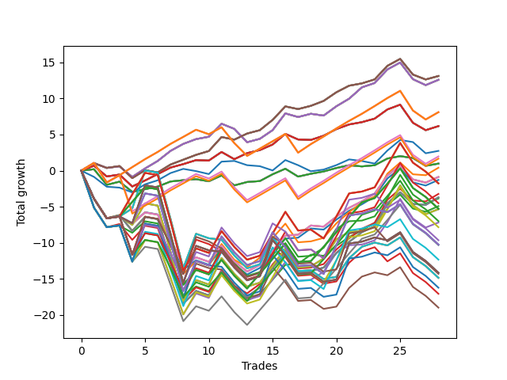

# Long Pointer 001 
- Symbol: NVDA_Unlimited
- Date Range: 02/08/2022 - 07/08/2022
- Trading Period: 7:20-12:30
- Number of Trades: 28



| Name | Win Percent | Profit | Avg Profit / Trade | Avg Time / Trade |      | Name | Win Percent | Profit | Avg Profit / Trade | Avg Time / Trade |
| ---- | ----------- | ------ | ------------------ | ---------------- | ---- | ---- | ----------- | ------ | ------------------ | ---------------- |
| Sorted By <br> Profit | | | | | | Sorted By <br> Win Percentage ||||
| Sixty-Seven | 75.00 | 6555.00 | 234.11 | 20:12 |     | Sixty-Seven | 75.00 | 6555.00 | 234.11 | 20:12 |
| Fifty-Nine | 75.00 | 6555.00 | 234.11 | 20:12 |     | Fifty-Nine | 75.00 | 6555.00 | 234.11 | 20:12 |
| Fifty-One | 75.00 | 6555.00 | 234.11 | 20:12 |     | Fifty-One | 75.00 | 6555.00 | 234.11 | 20:12 |
| Forty-Three | 75.00 | 6555.00 | 234.11 | 20:12 |     | Forty-Three | 75.00 | 6555.00 | 234.11 | 20:12 |
| Three | 75.00 | 6555.00 | 234.11 | 20:12 |     | Three | 75.00 | 6555.00 | 234.11 | 20:12 |
| Sixty-Six | 71.43 | 6290.00 | 224.64 | 22:22 |     | One Hundred Twenty-Six | 75.00 | 4050.00 | 144.64 | 52:33 |
| Fifty-Eight | 71.43 | 6290.00 | 224.64 | 22:22 |     | One Hundred Twenty-One | 75.00 | 4050.00 | 144.64 | 52:33 |
| Fifty | 71.43 | 6290.00 | 224.64 | 22:22 |     | Eighty-One | 75.00 | 4050.00 | 144.64 | 52:33 |
| Forty-Two | 71.43 | 6290.00 | 224.64 | 22:22 |     | Sixty-Six | 71.43 | 6290.00 | 224.64 | 22:22 |
| Two | 71.43 | 6290.00 | 224.64 | 22:22 |     | Fifty-Eight | 71.43 | 6290.00 | 224.64 | 22:22 |
| One Hundred Twenty-Six | 75.00 | 4050.00 | 144.64 | 52:33 |     | Fifty | 71.43 | 6290.00 | 224.64 | 22:22 |
| One Hundred Twenty-One | 75.00 | 4050.00 | 144.64 | 52:33 |     | Forty-Two | 71.43 | 6290.00 | 224.64 | 22:22 |
| Eighty-One | 75.00 | 4050.00 | 144.64 | 52:33 |     | Two | 71.43 | 6290.00 | 224.64 | 22:22 |
| Sixty-Five | 71.43 | 3085.00 | 110.18 | 14:28 |     | Sixty-Five | 71.43 | 3085.00 | 110.18 | 14:28 |
| Fifty-Seven | 71.43 | 3085.00 | 110.18 | 14:28 |     | Fifty-Seven | 71.43 | 3085.00 | 110.18 | 14:28 |
| Forty-Nine | 71.43 | 3085.00 | 110.18 | 14:28 |     | Forty-Nine | 71.43 | 3085.00 | 110.18 | 14:28 |
| Forty-One | 71.43 | 3085.00 | 110.18 | 14:28 |     | Forty-One | 71.43 | 3085.00 | 110.18 | 14:28 |
| One | 71.43 | 3085.00 | 110.18 | 14:28 |     | One | 71.43 | 3085.00 | 110.18 | 14:28 |
| Seventy-Three | 46.43 | 1370.00 | 48.93 | 10:43 |     | One Hundred Eleven | 71.43 | 985.00 | 35.18 | 50:55 |
| One Hundred Eleven | 71.43 | 985.00 | 35.18 | 50:55 |     | One Hundred Sixteen | 71.43 | 830.00 | 29.64 | 51:02 |
| One Hundred Sixteen | 71.43 | 830.00 | 29.64 | 51:02 |     | Sixty-Four | 71.43 | 490.00 | 17.50 | 08:21 |
| Sixty-Four | 71.43 | 490.00 | 17.50 | 08:21 |     | Fifty-Six | 71.43 | 490.00 | 17.50 | 08:21 |
| Fifty-Six | 71.43 | 490.00 | 17.50 | 08:21 |     | Forty-Eight | 71.43 | 490.00 | 17.50 | 08:21 |
| Forty-Eight | 71.43 | 490.00 | 17.50 | 08:21 |     | Forty | 71.43 | 490.00 | 17.50 | 08:21 |
| Forty | 71.43 | 490.00 | 17.50 | 08:21 |     | Zero | 71.43 | 490.00 | 17.50 | 08:21 |
| Zero | 71.43 | 490.00 | 17.50 | 08:21 |     | Fifty-Three | 57.14 | 205.00 | 7.32 | 46:37 |
| Fifty-Three | 57.14 | 205.00 | 7.32 | 46:37 |     | Sixty-Eight | 57.14 | -435.00 | -15.54 | 42:13 |
| Sixty-Eight | 57.14 | -435.00 | -15.54 | 42:13 |     | Sixty | 57.14 | -435.00 | -15.54 | 42:13 |
| Sixty | 57.14 | -435.00 | -15.54 | 42:13 |     | Four | 57.14 | -435.00 | -15.54 | 42:13 |
| Four | 57.14 | -435.00 | -15.54 | 42:13 |     | Fifty-Two | 57.14 | -640.00 | -22.86 | 36:16 |
| Fifty-Two | 57.14 | -640.00 | -22.86 | 36:16 |     | Forty-Five | 57.14 | -1610.00 | -57.50 | 48:42 |
| One Hundred Twenty-Eight | 53.57 | -880.00 | -31.43 | 114:27 |     | Sixty-Nine | 57.14 | -1850.00 | -66.07 | 59:07 |
| One Hundred Twenty-Three | 53.57 | -880.00 | -31.43 | 114:27 |     | Sixty-One | 57.14 | -1850.00 | -66.07 | 59:07 |
| Eighty-Three | 53.57 | -880.00 | -31.43 | 114:27 |     | Five | 57.14 | -1850.00 | -66.07 | 59:07 |
| Forty-Five | 57.14 | -1610.00 | -57.50 | 48:42 |     | Fifty-Four | 57.14 | -1930.00 | -68.93 | 82:07 |
| Sixty-Nine | 57.14 | -1850.00 | -66.07 | 59:07 |     | Forty-Four | 57.14 | -2455.00 | -87.68 | 38:21 |
| Sixty-One | 57.14 | -1850.00 | -66.07 | 59:07 |     | One Hundred Twenty-Seven | 57.14 | -2635.00 | -94.11 | 97:24 |
| Five | 57.14 | -1850.00 | -66.07 | 59:07 |     | One Hundred Twenty-Two | 57.14 | -2635.00 | -94.11 | 97:24 |
| Fifty-Four | 57.14 | -1930.00 | -68.93 | 82:07 |     | Eighty-Two | 57.14 | -2635.00 | -94.11 | 97:24 |
| One Hundred Eighteen | 50.00 | -2255.00 | -80.54 | 94:05 |     | Seventy | 57.14 | -2665.00 | -95.18 | 101:22 |
| Forty-Four | 57.14 | -2455.00 | -87.68 | 38:21 |     | Sixty-Two | 57.14 | -2665.00 | -95.18 | 101:22 |
| One Hundred Twenty-Seven | 57.14 | -2635.00 | -94.11 | 97:24 |     | Six | 57.14 | -2665.00 | -95.18 | 101:22 |
| One Hundred Twenty-Two | 57.14 | -2635.00 | -94.11 | 97:24 |     | Forty-Six | 57.14 | -3590.00 | -128.21 | 84:05 |
| Eighty-Two | 57.14 | -2635.00 | -94.11 | 97:24 |     | One Hundred Twenty-Eight | 53.57 | -880.00 | -31.43 | 114:27 |
| Seventy | 57.14 | -2665.00 | -95.18 | 101:22 |     | One Hundred Twenty-Three | 53.57 | -880.00 | -31.43 | 114:27 |
| Sixty-Two | 57.14 | -2665.00 | -95.18 | 101:22 |     | Eighty-Three | 53.57 | -880.00 | -31.43 | 114:27 |
| Six | 57.14 | -2665.00 | -95.18 | 101:22 |     | One Hundred Seventeen | 53.57 | -3495.00 | -124.82 | 77:17 |
| One Hundred Seventeen | 53.57 | -3495.00 | -124.82 | 77:17 |     | One Hundred Twelve | 53.57 | -5155.00 | -184.11 | 79:15 |
| Forty-Six | 57.14 | -3590.00 | -128.21 | 84:05 |     | One Hundred Eighteen | 50.00 | -2255.00 | -80.54 | 94:05 |
| One Hundred Thirteen | 50.00 | -3915.00 | -139.82 | 96:03 |     | One Hundred Thirteen | 50.00 | -3915.00 | -139.82 | 96:03 |
| One Hundred Ninteen | 42.86 | -4815.00 | -171.96 | 115:29 |     | Seventy-Three | 46.43 | 1370.00 | 48.93 | 10:43 |
| One Hundred Twenty-Nine | 42.86 | -5120.00 | -182.86 | 148:31 |     | One Hundred Ninteen | 42.86 | -4815.00 | -171.96 | 115:29 |
| One Hundred Twenty-Four | 42.86 | -5120.00 | -182.86 | 148:31 |     | One Hundred Twenty-Nine | 42.86 | -5120.00 | -182.86 | 148:31 |
| Eighty-Four | 42.86 | -5120.00 | -182.86 | 148:31 |     | One Hundred Twenty-Four | 42.86 | -5120.00 | -182.86 | 148:31 |
| One Hundred Twelve | 53.57 | -5155.00 | -184.11 | 79:15 |     | Eighty-Four | 42.86 | -5120.00 | -182.86 | 148:31 |
| One Hundred Fourteen | 42.86 | -6160.00 | -220.00 | 128:33 |     | One Hundred Fourteen | 42.86 | -6160.00 | -220.00 | 128:33 |
| One Hundred Thirty | 39.29 | -7065.00 | -252.32 | 158:11 |     | Seventy-One | 42.86 | -7420.00 | -265.00 | 151:29 |
| One Hundred Twenty-Five | 39.29 | -7065.00 | -252.32 | 158:11 |     | Sixty-Three | 42.86 | -7420.00 | -265.00 | 151:29 |
| Eighty-Five | 39.29 | -7065.00 | -252.32 | 158:11 |     | Seven | 42.86 | -7420.00 | -265.00 | 151:29 |
| One Hundred Twenty | 39.29 | -7145.00 | -255.18 | 121:49 |     | One Hundred Thirty | 39.29 | -7065.00 | -252.32 | 158:11 |
| Seventy-One | 42.86 | -7420.00 | -265.00 | 151:29 |     | One Hundred Twenty-Five | 39.29 | -7065.00 | -252.32 | 158:11 |
| Sixty-Three | 42.86 | -7420.00 | -265.00 | 151:29 |     | Eighty-Five | 39.29 | -7065.00 | -252.32 | 158:11 |
| Seven | 42.86 | -7420.00 | -265.00 | 151:29 |     | One Hundred Twenty | 39.29 | -7145.00 | -255.18 | 121:49 |
| One Hundred Fifteen | 39.29 | -8105.00 | -289.46 | 138:12 |     | One Hundred Fifteen | 39.29 | -8105.00 | -289.46 | 138:12 |
| Fifty-Five | 39.29 | -8525.00 | -304.46 | 117:02 |     | Fifty-Five | 39.29 | -8525.00 | -304.46 | 117:02 |
| Forty-Seven | 39.29 | -9485.00 | -338.75 | 133:25 |     | Forty-Seven | 39.29 | -9485.00 | -338.75 | 133:25 |

## NO STOPLOSS

### Test Zero
* Sell when price hits the middle line of the 20p bollinger
* No Stoploss
* Results:
```
Total Trades: 28
Percent Up: 71.43
Percent Down: 28.57
Total Points Moved Up: 0.98
Potential Profit: 490.00
Total Points Ups: 8.81 Count Ups: 20
Total Points Downs: -7.83 Count Downs: 8
```

<details><summary>Trades</summary>

<code>In: 2022-02-11 11:05:00		Out: 2022-02-11 11:15:15		Total Position Time: 10:15		Total Move Up: 0.20		Total to Date: 0.20</code> <br />
<code>In: 2022-02-11 11:34:00		Out: 2022-02-11 12:00:30		Total Position Time: 26:30		Total Move Up: -2.16		Total to Date: -1.96</code> <br />
<code>In: 2022-02-17 10:25:00		Out: 2022-02-17 10:31:30		Total Position Time: 06:30		Total Move Up: 0.44		Total to Date: -1.52</code> <br />
<code>In: 2022-02-22 08:02:00		Out: 2022-02-22 08:26:50		Total Position Time: 24:50		Total Move Up: -1.41		Total to Date: -2.93</code> <br />
<code>In: 2022-02-22 09:18:00		Out: 2022-02-22 09:25:40		Total Position Time: 07:40		Total Move Up: 0.36		Total to Date: -2.57</code> <br />
<code>In: 2022-02-23 12:25:00		Out: 2022-02-23 12:26:10		Total Position Time: 01:10		Total Move Up: 0.37		Total to Date: -2.20</code> <br />
<code>In: 2022-03-01 08:01:00		Out: 2022-03-01 08:04:05		Total Position Time: 03:05		Total Move Up: 0.70		Total to Date: -1.50</code> <br />
<code>In: 2022-03-01 08:04:00		Out: 2022-03-01 08:05:15		Total Position Time: 01:15		Total Move Up: 0.18		Total to Date: -1.32</code> <br />
<code>In: 2022-03-03 08:02:00		Out: 2022-03-03 08:03:15		Total Position Time: 01:15		Total Move Up: 0.14		Total to Date: -1.18</code> <br />
<code>In: 2022-03-03 12:11:00		Out: 2022-03-03 12:24:40		Total Position Time: 13:40		Total Move Up: -0.29		Total to Date: -1.47</code> <br />
<code>In: 2022-03-04 08:15:00		Out: 2022-03-04 08:18:05		Total Position Time: 03:05		Total Move Up: 0.81		Total to Date: -0.66</code> <br />
<code>In: 2022-03-07 11:56:00		Out: 2022-03-07 12:23:50		Total Position Time: 27:50		Total Move Up: -1.38		Total to Date: -2.04</code> <br />
<code>In: 2022-03-14 09:37:00		Out: 2022-03-14 09:40:45		Total Position Time: 03:45		Total Move Up: 0.47		Total to Date: -1.57</code> <br />
<code>In: 2022-03-14 10:35:00		Out: 2022-03-14 10:43:50		Total Position Time: 08:50		Total Move Up: 0.13		Total to Date: -1.44</code> <br />
<code>In: 2022-03-17 07:56:00		Out: 2022-03-17 07:59:35		Total Position Time: 03:35		Total Move Up: 0.94		Total to Date: -0.50</code> <br />
<code>In: 2022-03-30 08:30:00		Out: 2022-03-30 08:32:15		Total Position Time: 02:15		Total Move Up: 0.77		Total to Date: 0.27</code> <br />
<code>In: 2022-03-30 11:04:00		Out: 2022-03-30 11:29:20		Total Position Time: 25:20		Total Move Up: -1.09		Total to Date: -0.82</code> <br />
<code>In: 2022-03-30 12:07:00		Out: 2022-03-30 12:14:35		Total Position Time: 07:35		Total Move Up: 0.39		Total to Date: -0.43</code> <br />
<code>In: 2022-03-31 09:37:00		Out: 2022-03-31 09:38:10		Total Position Time: 01:10		Total Move Up: 0.32		Total to Date: -0.11</code> <br />
<code>In: 2022-03-31 10:18:00		Out: 2022-03-31 10:26:30		Total Position Time: 08:30		Total Move Up: 0.48		Total to Date: 0.37</code> <br />
<code>In: 2022-04-13 10:57:00		Out: 2022-04-13 10:59:35		Total Position Time: 02:35		Total Move Up: 0.38		Total to Date: 0.75</code> <br />
<code>In: 2022-05-03 11:45:00		Out: 2022-05-03 11:46:10		Total Position Time: 01:10		Total Move Up: -0.16		Total to Date: 0.59</code> <br />
<code>In: 2022-05-06 11:41:00		Out: 2022-05-06 11:43:05		Total Position Time: 02:05		Total Move Up: 0.16		Total to Date: 0.75</code> <br />
<code>In: 2022-06-01 07:39:00		Out: 2022-06-01 07:40:10		Total Position Time: 01:10		Total Move Up: 0.93		Total to Date: 1.68</code> <br />
<code>In: 2022-06-06 09:33:00		Out: 2022-06-06 09:34:10		Total Position Time: 01:10		Total Move Up: 0.33		Total to Date: 2.01</code> <br />
<code>In: 2022-06-08 08:47:00		Out: 2022-06-08 09:02:30		Total Position Time: 15:30		Total Move Up: -0.25		Total to Date: 1.76</code> <br />
<code>In: 2022-06-08 09:30:00		Out: 2022-06-08 09:50:40		Total Position Time: 20:40		Total Move Up: -1.09		Total to Date: 0.67</code> <br />
<code>In: 2022-06-21 09:13:00		Out: 2022-06-21 09:14:45		Total Position Time: 01:45		Total Move Up: 0.31		Total to Date: 0.98</code> <br />


</details>

### Test One
* Sell when the price hits the upper line of the 20p 1std bollinger
* No Stoploss
* Results:
```
Total Trades: 28
Percent Up: 71.43
Percent Down: 28.57
Total Points Moved Up: 6.17
Potential Profit: 3085.00
Total Points Ups: 14.73 Count Ups: 20
Total Points Downs: -8.56 Count Downs: 8
```

<details><summary>Trades</summary>

<code>In: 2022-02-11 11:05:00		Out: 2022-02-11 11:18:20		Total Position Time: 13:20		Total Move Up: 0.68		Total to Date: 0.68</code> <br />
<code>In: 2022-02-11 11:34:00		Out: 2022-02-11 12:03:05		Total Position Time: 29:05		Total Move Up: -1.48		Total to Date: -0.80</code> <br />
<code>In: 2022-02-17 10:25:00		Out: 2022-02-17 10:54:05		Total Position Time: 29:05		Total Move Up: 0.26		Total to Date: -0.54</code> <br />
<code>In: 2022-02-22 08:02:00		Out: 2022-02-22 08:33:50		Total Position Time: 31:50		Total Move Up: -1.65		Total to Date: -2.19</code> <br />
<code>In: 2022-02-22 09:18:00		Out: 2022-02-22 09:26:35		Total Position Time: 08:35		Total Move Up: 0.83		Total to Date: -1.36</code> <br />
<code>In: 2022-02-23 12:25:00		Out: 2022-02-23 12:27:10		Total Position Time: 02:10		Total Move Up: 0.89		Total to Date: -0.47</code> <br />
<code>In: 2022-03-01 08:01:00		Out: 2022-03-01 08:08:05		Total Position Time: 07:05		Total Move Up: 0.90		Total to Date: 0.43</code> <br />
<code>In: 2022-03-01 08:04:00		Out: 2022-03-01 08:08:05		Total Position Time: 04:05		Total Move Up: 0.48		Total to Date: 0.91</code> <br />
<code>In: 2022-03-03 08:02:00		Out: 2022-03-03 08:05:30		Total Position Time: 03:30		Total Move Up: 0.55		Total to Date: 1.46</code> <br />
<code>In: 2022-03-03 12:11:00		Out: 2022-03-03 12:26:10		Total Position Time: 15:10		Total Move Up: -0.06		Total to Date: 1.40</code> <br />
<code>In: 2022-03-04 08:15:00		Out: 2022-03-04 08:23:05		Total Position Time: 08:05		Total Move Up: 1.19		Total to Date: 2.59</code> <br />
<code>In: 2022-03-07 11:56:00		Out: 2022-03-07 12:25:10		Total Position Time: 29:10		Total Move Up: -1.00		Total to Date: 1.59</code> <br />
<code>In: 2022-03-14 09:37:00		Out: 2022-03-14 09:42:05		Total Position Time: 05:05		Total Move Up: 0.84		Total to Date: 2.43</code> <br />
<code>In: 2022-03-14 10:35:00		Out: 2022-03-14 10:45:55		Total Position Time: 10:55		Total Move Up: 0.42		Total to Date: 2.85</code> <br />
<code>In: 2022-03-17 07:56:00		Out: 2022-03-17 08:08:20		Total Position Time: 12:20		Total Move Up: 0.77		Total to Date: 3.62</code> <br />
<code>In: 2022-03-30 08:30:00		Out: 2022-03-30 08:33:30		Total Position Time: 03:30		Total Move Up: 1.48		Total to Date: 5.10</code> <br />
<code>In: 2022-03-30 11:04:00		Out: 2022-03-30 11:30:55		Total Position Time: 26:55		Total Move Up: -0.78		Total to Date: 4.32</code> <br />
<code>In: 2022-03-30 12:07:00		Out: 2022-03-30 12:30:45		Total Position Time: 23:45		Total Move Up: -0.06		Total to Date: 4.26</code> <br />
<code>In: 2022-03-31 09:37:00		Out: 2022-03-31 09:41:05		Total Position Time: 04:05		Total Move Up: 0.58		Total to Date: 4.84</code> <br />
<code>In: 2022-03-31 10:18:00		Out: 2022-03-31 10:29:20		Total Position Time: 11:20		Total Move Up: 0.92		Total to Date: 5.76</code> <br />
<code>In: 2022-04-13 10:57:00		Out: 2022-04-13 11:03:35		Total Position Time: 06:35		Total Move Up: 0.64		Total to Date: 6.40</code> <br />
<code>In: 2022-05-03 11:45:00		Out: 2022-05-03 11:48:05		Total Position Time: 03:05		Total Move Up: 0.32		Total to Date: 6.72</code> <br />
<code>In: 2022-05-06 11:41:00		Out: 2022-05-06 11:49:25		Total Position Time: 08:25		Total Move Up: 0.49		Total to Date: 7.21</code> <br />
<code>In: 2022-06-01 07:39:00		Out: 2022-06-01 07:43:35		Total Position Time: 04:35		Total Move Up: 1.27		Total to Date: 8.48</code> <br />
<code>In: 2022-06-06 09:33:00		Out: 2022-06-06 09:37:35		Total Position Time: 04:35		Total Move Up: 0.66		Total to Date: 9.14</code> <br />
<code>In: 2022-06-08 08:47:00		Out: 2022-06-08 09:56:20		Total Position Time: 69:20		Total Move Up: -2.51		Total to Date: 6.63</code> <br />
<code>In: 2022-06-08 09:30:00		Out: 2022-06-08 09:56:20		Total Position Time: 26:20		Total Move Up: -1.02		Total to Date: 5.61</code> <br />
<code>In: 2022-06-21 09:13:00		Out: 2022-06-21 09:16:15		Total Position Time: 03:15		Total Move Up: 0.56		Total to Date: 6.17</code> <br />


</details>

### Test Two
* Sell when the price hits the upper line of the 20p 2std bollinger
* No Stoploss
* Results:
```
Total Trades: 28
Percent Up: 71.43
Percent Down: 28.57
Total Points Moved Up: 12.58
Potential Profit: 6290.00
Total Points Ups: 21.16 Count Ups: 20
Total Points Downs: -8.58 Count Downs: 8
```

<details><summary>Trades</summary>

<code>In: 2022-02-11 11:05:00		Out: 2022-02-11 11:20:15		Total Position Time: 15:15		Total Move Up: 1.05		Total to Date: 1.05</code> <br />
<code>In: 2022-02-11 11:34:00		Out: 2022-02-11 12:03:45		Total Position Time: 29:45		Total Move Up: -0.67		Total to Date: 0.38</code> <br />
<code>In: 2022-02-17 10:25:00		Out: 2022-02-17 10:58:10		Total Position Time: 33:10		Total Move Up: 0.22		Total to Date: 0.60</code> <br />
<code>In: 2022-02-22 08:02:00		Out: 2022-02-22 08:48:30		Total Position Time: 46:30		Total Move Up: -1.47		Total to Date: -0.87</code> <br />
<code>In: 2022-02-22 09:18:00		Out: 2022-02-22 09:27:45		Total Position Time: 09:45		Total Move Up: 1.17		Total to Date: 0.30</code> <br />
<code>In: 2022-02-23 12:25:00		Out: 2022-02-23 12:31:20		Total Position Time: 06:20		Total Move Up: 1.05		Total to Date: 1.35</code> <br />
<code>In: 2022-03-01 08:01:00		Out: 2022-03-01 08:14:20		Total Position Time: 13:20		Total Move Up: 1.39		Total to Date: 2.74</code> <br />
<code>In: 2022-03-01 08:04:00		Out: 2022-03-01 08:14:20		Total Position Time: 10:20		Total Move Up: 0.97		Total to Date: 3.71</code> <br />
<code>In: 2022-03-03 08:02:00		Out: 2022-03-03 08:09:55		Total Position Time: 07:55		Total Move Up: 0.66		Total to Date: 4.37</code> <br />
<code>In: 2022-03-03 12:11:00		Out: 2022-03-03 12:28:00		Total Position Time: 17:00		Total Move Up: 0.33		Total to Date: 4.70</code> <br />
<code>In: 2022-03-04 08:15:00		Out: 2022-03-04 08:27:10		Total Position Time: 12:10		Total Move Up: 1.80		Total to Date: 6.50</code> <br />
<code>In: 2022-03-07 11:56:00		Out: 2022-03-07 12:26:20		Total Position Time: 30:20		Total Move Up: -0.71		Total to Date: 5.79</code> <br />
<code>In: 2022-03-14 09:37:00		Out: 2022-03-14 10:50:25		Total Position Time: 73:25		Total Move Up: -1.85		Total to Date: 3.94</code> <br />
<code>In: 2022-03-14 10:35:00		Out: 2022-03-14 10:50:25		Total Position Time: 15:25		Total Move Up: 0.47		Total to Date: 4.41</code> <br />
<code>In: 2022-03-17 07:56:00		Out: 2022-03-17 08:10:55		Total Position Time: 14:55		Total Move Up: 1.20		Total to Date: 5.61</code> <br />
<code>In: 2022-03-30 08:30:00		Out: 2022-03-30 08:35:30		Total Position Time: 05:30		Total Move Up: 2.32		Total to Date: 7.93</code> <br />
<code>In: 2022-03-30 11:04:00		Out: 2022-03-30 11:31:15		Total Position Time: 27:15		Total Move Up: -0.50		Total to Date: 7.43</code> <br />
<code>In: 2022-03-30 12:07:00		Out: 2022-03-30 12:31:35		Total Position Time: 24:35		Total Move Up: 0.45		Total to Date: 7.88</code> <br />
<code>In: 2022-03-31 09:37:00		Out: 2022-03-31 10:31:45		Total Position Time: 54:45		Total Move Up: -0.25		Total to Date: 7.63</code> <br />
<code>In: 2022-03-31 10:18:00		Out: 2022-03-31 10:31:45		Total Position Time: 13:45		Total Move Up: 1.29		Total to Date: 8.92</code> <br />
<code>In: 2022-04-13 10:57:00		Out: 2022-04-13 11:06:20		Total Position Time: 09:20		Total Move Up: 1.05		Total to Date: 9.97</code> <br />
<code>In: 2022-05-03 11:45:00		Out: 2022-05-03 11:59:20		Total Position Time: 14:20		Total Move Up: 1.57		Total to Date: 11.54</code> <br />
<code>In: 2022-05-06 11:41:00		Out: 2022-05-06 11:49:35		Total Position Time: 08:35		Total Move Up: 0.60		Total to Date: 12.14</code> <br />
<code>In: 2022-06-01 07:39:00		Out: 2022-06-01 07:45:05		Total Position Time: 06:05		Total Move Up: 1.88		Total to Date: 14.02</code> <br />
<code>In: 2022-06-06 09:33:00		Out: 2022-06-06 09:40:35		Total Position Time: 07:35		Total Move Up: 0.96		Total to Date: 14.98</code> <br />
<code>In: 2022-06-08 08:47:00		Out: 2022-06-08 09:57:05		Total Position Time: 70:05		Total Move Up: -2.31		Total to Date: 12.67</code> <br />
<code>In: 2022-06-08 09:30:00		Out: 2022-06-08 09:57:05		Total Position Time: 27:05		Total Move Up: -0.82		Total to Date: 11.85</code> <br />
<code>In: 2022-06-21 09:13:00		Out: 2022-06-21 09:35:05		Total Position Time: 22:05		Total Move Up: 0.73		Total to Date: 12.58</code> <br />


</details>

### Test Three
* Sell when price hits the middle line of the 50p bollinger
* No Stoploss
* Results:
```
Total Trades: 28
Percent Up: 75.00
Percent Down: 25.00
Total Points Moved Up: 13.11
Potential Profit: 6555.00
Total Points Ups: 19.34 Count Ups: 21
Total Points Downs: -6.23 Count Downs: 7
```

<details><summary>Trades</summary>

<code>In: 2022-02-11 11:05:00		Out: 2022-02-11 11:20:15		Total Position Time: 15:15		Total Move Up: 1.05		Total to Date: 1.05</code> <br />
<code>In: 2022-02-11 11:34:00		Out: 2022-02-11 12:03:45		Total Position Time: 29:45		Total Move Up: -0.67		Total to Date: 0.38</code> <br />
<code>In: 2022-02-17 10:25:00		Out: 2022-02-17 10:54:05		Total Position Time: 29:05		Total Move Up: 0.26		Total to Date: 0.64</code> <br />
<code>In: 2022-02-22 08:02:00		Out: 2022-02-22 08:48:05		Total Position Time: 46:05		Total Move Up: -1.67		Total to Date: -1.03</code> <br />
<code>In: 2022-02-22 09:18:00		Out: 2022-02-22 09:27:40		Total Position Time: 09:40		Total Move Up: 1.10		Total to Date: 0.07</code> <br />
<code>In: 2022-02-23 12:25:00		Out: 2022-02-23 12:47:00		Total Position Time: 22:00		Total Move Up: -0.31		Total to Date: -0.24</code> <br />
<code>In: 2022-03-01 08:01:00		Out: 2022-03-01 08:24:15		Total Position Time: 23:15		Total Move Up: 1.09		Total to Date: 0.85</code> <br />
<code>In: 2022-03-01 08:04:00		Out: 2022-03-01 08:24:15		Total Position Time: 20:15		Total Move Up: 0.67		Total to Date: 1.52</code> <br />
<code>In: 2022-03-03 08:02:00		Out: 2022-03-03 08:20:45		Total Position Time: 18:45		Total Move Up: 0.67		Total to Date: 2.19</code> <br />
<code>In: 2022-03-03 12:11:00		Out: 2022-03-03 12:29:30		Total Position Time: 18:30		Total Move Up: 0.53		Total to Date: 2.72</code> <br />
<code>In: 2022-03-04 08:15:00		Out: 2022-03-04 08:28:40		Total Position Time: 13:40		Total Move Up: 1.94		Total to Date: 4.66</code> <br />
<code>In: 2022-03-07 11:56:00		Out: 2022-03-07 12:26:50		Total Position Time: 30:50		Total Move Up: -0.36		Total to Date: 4.30</code> <br />
<code>In: 2022-03-14 09:37:00		Out: 2022-03-14 09:42:05		Total Position Time: 05:05		Total Move Up: 0.84		Total to Date: 5.14</code> <br />
<code>In: 2022-03-14 10:35:00		Out: 2022-03-14 10:50:25		Total Position Time: 15:25		Total Move Up: 0.47		Total to Date: 5.61</code> <br />
<code>In: 2022-03-17 07:56:00		Out: 2022-03-17 08:11:05		Total Position Time: 15:05		Total Move Up: 1.42		Total to Date: 7.03</code> <br />
<code>In: 2022-03-30 08:30:00		Out: 2022-03-30 08:35:00		Total Position Time: 05:00		Total Move Up: 1.87		Total to Date: 8.90</code> <br />
<code>In: 2022-03-30 11:04:00		Out: 2022-03-30 11:31:30		Total Position Time: 27:30		Total Move Up: -0.37		Total to Date: 8.53</code> <br />
<code>In: 2022-03-30 12:07:00		Out: 2022-03-30 12:31:35		Total Position Time: 24:35		Total Move Up: 0.45		Total to Date: 8.98</code> <br />
<code>In: 2022-03-31 09:37:00		Out: 2022-03-31 09:49:25		Total Position Time: 12:25		Total Move Up: 0.68		Total to Date: 9.66</code> <br />
<code>In: 2022-03-31 10:18:00		Out: 2022-03-31 10:29:50		Total Position Time: 11:50		Total Move Up: 1.20		Total to Date: 10.86</code> <br />
<code>In: 2022-04-13 10:57:00		Out: 2022-04-13 11:05:25		Total Position Time: 08:25		Total Move Up: 0.91		Total to Date: 11.77</code> <br />
<code>In: 2022-05-03 11:45:00		Out: 2022-05-03 11:48:05		Total Position Time: 03:05		Total Move Up: 0.32		Total to Date: 12.09</code> <br />
<code>In: 2022-05-06 11:41:00		Out: 2022-05-06 11:49:30		Total Position Time: 08:30		Total Move Up: 0.55		Total to Date: 12.64</code> <br />
<code>In: 2022-06-01 07:39:00		Out: 2022-06-01 07:45:05		Total Position Time: 06:05		Total Move Up: 1.88		Total to Date: 14.52</code> <br />
<code>In: 2022-06-06 09:33:00		Out: 2022-06-06 09:40:35		Total Position Time: 07:35		Total Move Up: 0.96		Total to Date: 15.48</code> <br />
<code>In: 2022-06-08 08:47:00		Out: 2022-06-08 10:07:05		Total Position Time: 80:05		Total Move Up: -2.17		Total to Date: 13.31</code> <br />
<code>In: 2022-06-08 09:30:00		Out: 2022-06-08 10:07:05		Total Position Time: 37:05		Total Move Up: -0.68		Total to Date: 12.63</code> <br />
<code>In: 2022-06-21 09:13:00		Out: 2022-06-21 09:34:00		Total Position Time: 21:00		Total Move Up: 0.48		Total to Date: 13.11</code> <br />


</details>

### Test Four
* Sell when the price hits the upper line of the 50p 1std bollinger
* No Stoploss
* Results:
```
Total Trades: 28
Percent Up: 57.14
Percent Down: 42.86
Total Points Moved Up: -0.87
Potential Profit: -435.00
Total Points Ups: 20.96 Count Ups: 16
Total Points Downs: -21.83 Count Downs: 12
```

<details><summary>Trades</summary>

<code>In: 2022-02-11 11:05:00		Out: 2022-02-11 12:47:00		Total Position Time: 102:00		Total Move Up: -3.89		Total to Date: -3.89</code> <br />
<code>In: 2022-02-11 11:34:00		Out: 2022-02-11 12:47:00		Total Position Time: 73:00		Total Move Up: -2.71		Total to Date: -6.60</code> <br />
<code>In: 2022-02-17 10:25:00		Out: 2022-02-17 11:12:20		Total Position Time: 47:20		Total Move Up: 0.22		Total to Date: -6.38</code> <br />
<code>In: 2022-02-22 08:02:00		Out: 2022-02-22 08:50:40		Total Position Time: 48:40		Total Move Up: -0.99		Total to Date: -7.37</code> <br />
<code>In: 2022-02-22 09:18:00		Out: 2022-02-22 09:37:05		Total Position Time: 19:05		Total Move Up: 1.59		Total to Date: -5.78</code> <br />
<code>In: 2022-02-23 12:25:00		Out: 2022-02-23 12:47:00		Total Position Time: 22:00		Total Move Up: -0.31		Total to Date: -6.09</code> <br />
<code>In: 2022-03-01 08:01:00		Out: 2022-03-01 09:50:45		Total Position Time: 109:45		Total Move Up: -3.38		Total to Date: -9.47</code> <br />
<code>In: 2022-03-01 08:04:00		Out: 2022-03-01 09:50:45		Total Position Time: 106:45		Total Move Up: -3.80		Total to Date: -13.27</code> <br />
<code>In: 2022-03-03 08:02:00		Out: 2022-03-03 08:23:40		Total Position Time: 21:40		Total Move Up: 1.27		Total to Date: -12.00</code> <br />
<code>In: 2022-03-03 12:11:00		Out: 2022-03-03 12:47:00		Total Position Time: 36:00		Total Move Up: -0.62		Total to Date: -12.62</code> <br />
<code>In: 2022-03-04 08:15:00		Out: 2022-03-04 08:39:25		Total Position Time: 24:25		Total Move Up: 2.25		Total to Date: -10.37</code> <br />
<code>In: 2022-03-07 11:56:00		Out: 2022-03-07 12:47:00		Total Position Time: 51:00		Total Move Up: -2.19		Total to Date: -12.56</code> <br />
<code>In: 2022-03-14 09:37:00		Out: 2022-03-14 10:51:10		Total Position Time: 74:10		Total Move Up: -1.41		Total to Date: -13.97</code> <br />
<code>In: 2022-03-14 10:35:00		Out: 2022-03-14 10:51:10		Total Position Time: 16:10		Total Move Up: 0.91		Total to Date: -13.06</code> <br />
<code>In: 2022-03-17 07:56:00		Out: 2022-03-17 08:20:00		Total Position Time: 24:00		Total Move Up: 2.00		Total to Date: -11.06</code> <br />
<code>In: 2022-03-30 08:30:00		Out: 2022-03-30 08:46:05		Total Position Time: 16:05		Total Move Up: 2.06		Total to Date: -9.00</code> <br />
<code>In: 2022-03-30 11:04:00		Out: 2022-03-30 11:36:10		Total Position Time: 32:10		Total Move Up: 0.13		Total to Date: -8.87</code> <br />
<code>In: 2022-03-30 12:07:00		Out: 2022-03-30 12:34:05		Total Position Time: 27:05		Total Move Up: 1.28		Total to Date: -7.59</code> <br />
<code>In: 2022-03-31 09:37:00		Out: 2022-03-31 10:50:20		Total Position Time: 73:20		Total Move Up: -0.16		Total to Date: -7.75</code> <br />
<code>In: 2022-03-31 10:18:00		Out: 2022-03-31 10:50:20		Total Position Time: 32:20		Total Move Up: 1.38		Total to Date: -6.37</code> <br />
<code>In: 2022-04-13 10:57:00		Out: 2022-04-13 11:16:30		Total Position Time: 19:30		Total Move Up: 1.23		Total to Date: -5.14</code> <br />
<code>In: 2022-05-03 11:45:00		Out: 2022-05-03 11:52:05		Total Position Time: 07:05		Total Move Up: 0.89		Total to Date: -4.25</code> <br />
<code>In: 2022-05-06 11:41:00		Out: 2022-05-06 11:50:10		Total Position Time: 09:10		Total Move Up: 1.07		Total to Date: -3.18</code> <br />
<code>In: 2022-06-01 07:39:00		Out: 2022-06-01 07:54:05		Total Position Time: 15:05		Total Move Up: 2.51		Total to Date: -0.67</code> <br />
<code>In: 2022-06-06 09:33:00		Out: 2022-06-06 09:48:10		Total Position Time: 15:10		Total Move Up: 1.39		Total to Date: 0.72</code> <br />
<code>In: 2022-06-08 08:47:00		Out: 2022-06-08 10:15:40		Total Position Time: 88:40		Total Move Up: -1.93		Total to Date: -1.21</code> <br />
<code>In: 2022-06-08 09:30:00		Out: 2022-06-08 10:15:40		Total Position Time: 45:40		Total Move Up: -0.44		Total to Date: -1.65</code> <br />
<code>In: 2022-06-21 09:13:00		Out: 2022-06-21 09:37:55		Total Position Time: 24:55		Total Move Up: 0.78		Total to Date: -0.87</code> <br />


</details>

### Test Five
* Sell when the price hits the upper line of the 50p 2std bollinger
* No Stoploss
* Results:
```
Total Trades: 28
Percent Up: 57.14
Percent Down: 42.86
Total Points Moved Up: -3.70
Potential Profit: -1850.00
Total Points Ups: 25.27 Count Ups: 16
Total Points Downs: -28.97 Count Downs: 12
```

<details><summary>Trades</summary>

<code>In: 2022-02-11 11:05:00		Out: 2022-02-11 12:47:00		Total Position Time: 102:00		Total Move Up: -3.89		Total to Date: -3.89</code> <br />
<code>In: 2022-02-11 11:34:00		Out: 2022-02-11 12:47:00		Total Position Time: 73:00		Total Move Up: -2.71		Total to Date: -6.60</code> <br />
<code>In: 2022-02-17 10:25:00		Out: 2022-02-17 11:12:55		Total Position Time: 47:55		Total Move Up: 0.44		Total to Date: -6.16</code> <br />
<code>In: 2022-02-22 08:02:00		Out: 2022-02-22 09:42:10		Total Position Time: 100:10		Total Move Up: -2.19		Total to Date: -8.35</code> <br />
<code>In: 2022-02-22 09:18:00		Out: 2022-02-22 09:42:10		Total Position Time: 24:10		Total Move Up: 1.95		Total to Date: -6.40</code> <br />
<code>In: 2022-02-23 12:25:00		Out: 2022-02-23 12:47:00		Total Position Time: 22:00		Total Move Up: -0.31		Total to Date: -6.71</code> <br />
<code>In: 2022-03-01 08:01:00		Out: 2022-03-01 11:22:30		Total Position Time: 201:30		Total Move Up: -5.64		Total to Date: -12.35</code> <br />
<code>In: 2022-03-01 08:04:00		Out: 2022-03-01 11:22:30		Total Position Time: 198:30		Total Move Up: -6.06		Total to Date: -18.41</code> <br />
<code>In: 2022-03-03 08:02:00		Out: 2022-03-03 08:26:05		Total Position Time: 24:05		Total Move Up: 1.76		Total to Date: -16.65</code> <br />
<code>In: 2022-03-03 12:11:00		Out: 2022-03-03 12:47:00		Total Position Time: 36:00		Total Move Up: -0.62		Total to Date: -17.27</code> <br />
<code>In: 2022-03-04 08:15:00		Out: 2022-03-04 08:41:50		Total Position Time: 26:50		Total Move Up: 3.01		Total to Date: -14.26</code> <br />
<code>In: 2022-03-07 11:56:00		Out: 2022-03-07 12:47:00		Total Position Time: 51:00		Total Move Up: -2.19		Total to Date: -16.45</code> <br />
<code>In: 2022-03-14 09:37:00		Out: 2022-03-14 10:52:20		Total Position Time: 75:20		Total Move Up: -1.02		Total to Date: -17.47</code> <br />
<code>In: 2022-03-14 10:35:00		Out: 2022-03-14 10:52:20		Total Position Time: 17:20		Total Move Up: 1.30		Total to Date: -16.17</code> <br />
<code>In: 2022-03-17 07:56:00		Out: 2022-03-17 08:24:15		Total Position Time: 28:15		Total Move Up: 2.71		Total to Date: -13.46</code> <br />
<code>In: 2022-03-30 08:30:00		Out: 2022-03-30 09:34:25		Total Position Time: 64:25		Total Move Up: 2.02		Total to Date: -11.44</code> <br />
<code>In: 2022-03-30 11:04:00		Out: 2022-03-30 12:47:00		Total Position Time: 103:00		Total Move Up: -2.59		Total to Date: -14.03</code> <br />
<code>In: 2022-03-30 12:07:00		Out: 2022-03-30 12:47:00		Total Position Time: 40:00		Total Move Up: 0.13		Total to Date: -13.90</code> <br />
<code>In: 2022-03-31 09:37:00		Out: 2022-03-31 10:51:30		Total Position Time: 74:30		Total Move Up: 0.48		Total to Date: -13.42</code> <br />
<code>In: 2022-03-31 10:18:00		Out: 2022-03-31 10:51:30		Total Position Time: 33:30		Total Move Up: 2.02		Total to Date: -11.40</code> <br />
<code>In: 2022-04-13 10:57:00		Out: 2022-04-13 11:28:15		Total Position Time: 31:15		Total Move Up: 1.55		Total to Date: -9.85</code> <br />
<code>In: 2022-05-03 11:45:00		Out: 2022-05-03 11:59:05		Total Position Time: 14:05		Total Move Up: 1.33		Total to Date: -8.52</code> <br />
<code>In: 2022-05-06 11:41:00		Out: 2022-05-06 12:39:05		Total Position Time: 58:05		Total Move Up: 0.81		Total to Date: -7.71</code> <br />
<code>In: 2022-06-01 07:39:00		Out: 2022-06-01 07:56:00		Total Position Time: 17:00		Total Move Up: 3.19		Total to Date: -4.52</code> <br />
<code>In: 2022-06-06 09:33:00		Out: 2022-06-06 09:54:50		Total Position Time: 21:50		Total Move Up: 1.53		Total to Date: -2.99</code> <br />
<code>In: 2022-06-08 08:47:00		Out: 2022-06-08 10:19:45		Total Position Time: 92:45		Total Move Up: -1.62		Total to Date: -4.61</code> <br />
<code>In: 2022-06-08 09:30:00		Out: 2022-06-08 10:19:45		Total Position Time: 49:45		Total Move Up: -0.13		Total to Date: -4.74</code> <br />
<code>In: 2022-06-21 09:13:00		Out: 2022-06-21 09:40:15		Total Position Time: 27:15		Total Move Up: 1.04		Total to Date: -3.70</code> <br />


</details>

### Test Six
* Sell when the price hits the middle line of the 1std VWAP
* No Stoploss
* Results:
```
Total Trades: 28
Percent Up: 57.14
Percent Down: 42.86
Total Points Moved Up: -5.33
Potential Profit: -2665.00
Total Points Ups: 27.10 Count Ups: 16
Total Points Downs: -32.43 Count Downs: 12
```

<details><summary>Trades</summary>

<code>In: 2022-02-11 11:05:00		Out: 2022-02-11 12:47:00		Total Position Time: 102:00		Total Move Up: -3.89		Total to Date: -3.89</code> <br />
<code>In: 2022-02-11 11:34:00		Out: 2022-02-11 12:47:00		Total Position Time: 73:00		Total Move Up: -2.71		Total to Date: -6.60</code> <br />
<code>In: 2022-02-17 10:25:00		Out: 2022-02-17 12:47:00		Total Position Time: 142:00		Total Move Up: 0.25		Total to Date: -6.35</code> <br />
<code>In: 2022-02-22 08:02:00		Out: 2022-02-22 11:31:50		Total Position Time: 209:50		Total Move Up: -1.16		Total to Date: -7.51</code> <br />
<code>In: 2022-02-22 09:18:00		Out: 2022-02-22 11:31:50		Total Position Time: 133:50		Total Move Up: 2.98		Total to Date: -4.53</code> <br />
<code>In: 2022-02-23 12:25:00		Out: 2022-02-23 12:47:00		Total Position Time: 22:00		Total Move Up: -0.31		Total to Date: -4.84</code> <br />
<code>In: 2022-03-01 08:01:00		Out: 2022-03-01 12:47:00		Total Position Time: 286:00		Total Move Up: -6.40		Total to Date: -11.24</code> <br />
<code>In: 2022-03-01 08:04:00		Out: 2022-03-01 12:47:00		Total Position Time: 283:00		Total Move Up: -6.82		Total to Date: -18.06</code> <br />
<code>In: 2022-03-03 08:02:00		Out: 2022-03-03 08:43:30		Total Position Time: 41:30		Total Move Up: 2.91		Total to Date: -15.15</code> <br />
<code>In: 2022-03-03 12:11:00		Out: 2022-03-03 12:47:00		Total Position Time: 36:00		Total Move Up: -0.62		Total to Date: -15.77</code> <br />
<code>In: 2022-03-04 08:15:00		Out: 2022-03-04 10:01:25		Total Position Time: 106:25		Total Move Up: 3.67		Total to Date: -12.10</code> <br />
<code>In: 2022-03-07 11:56:00		Out: 2022-03-07 12:47:00		Total Position Time: 51:00		Total Move Up: -2.19		Total to Date: -14.29</code> <br />
<code>In: 2022-03-14 09:37:00		Out: 2022-03-14 12:47:00		Total Position Time: 190:00		Total Move Up: -1.77		Total to Date: -16.06</code> <br />
<code>In: 2022-03-14 10:35:00		Out: 2022-03-14 12:47:00		Total Position Time: 132:00		Total Move Up: 0.55		Total to Date: -15.51</code> <br />
<code>In: 2022-03-17 07:56:00		Out: 2022-03-17 08:23:30		Total Position Time: 27:30		Total Move Up: 2.30		Total to Date: -13.21</code> <br />
<code>In: 2022-03-30 08:30:00		Out: 2022-03-30 09:43:55		Total Position Time: 73:55		Total Move Up: 2.41		Total to Date: -10.80</code> <br />
<code>In: 2022-03-30 11:04:00		Out: 2022-03-30 12:47:00		Total Position Time: 103:00		Total Move Up: -2.59		Total to Date: -13.39</code> <br />
<code>In: 2022-03-30 12:07:00		Out: 2022-03-30 12:47:00		Total Position Time: 40:00		Total Move Up: 0.13		Total to Date: -13.26</code> <br />
<code>In: 2022-03-31 09:37:00		Out: 2022-03-31 11:20:55		Total Position Time: 103:55		Total Move Up: 1.10		Total to Date: -12.16</code> <br />
<code>In: 2022-03-31 10:18:00		Out: 2022-03-31 11:20:55		Total Position Time: 62:55		Total Move Up: 2.64		Total to Date: -9.52</code> <br />
<code>In: 2022-04-13 10:57:00		Out: 2022-04-13 11:06:20		Total Position Time: 09:20		Total Move Up: 1.05		Total to Date: -8.47</code> <br />
<code>In: 2022-05-03 11:45:00		Out: 2022-05-03 11:47:05		Total Position Time: 02:05		Total Move Up: 0.09		Total to Date: -8.38</code> <br />
<code>In: 2022-05-06 11:41:00		Out: 2022-05-06 12:47:00		Total Position Time: 66:00		Total Move Up: 0.58		Total to Date: -7.80</code> <br />
<code>In: 2022-06-01 07:39:00		Out: 2022-06-01 07:54:05		Total Position Time: 15:05		Total Move Up: 2.51		Total to Date: -5.29</code> <br />
<code>In: 2022-06-06 09:33:00		Out: 2022-06-06 10:55:10		Total Position Time: 82:10		Total Move Up: 3.24		Total to Date: -2.05</code> <br />
<code>In: 2022-06-08 08:47:00		Out: 2022-06-08 12:47:00		Total Position Time: 240:00		Total Move Up: -2.73		Total to Date: -4.78</code> <br />
<code>In: 2022-06-08 09:30:00		Out: 2022-06-08 12:47:00		Total Position Time: 197:00		Total Move Up: -1.24		Total to Date: -6.02</code> <br />
<code>In: 2022-06-21 09:13:00		Out: 2022-06-21 09:20:10		Total Position Time: 07:10		Total Move Up: 0.69		Total to Date: -5.33</code> <br />


</details>

### Test Seven
* Sell when the price hits the upper line of the 1std VWAP
* No Stoploss
* Results:
```
Total Trades: 28
Percent Up: 42.86
Percent Down: 57.14
Total Points Moved Up: -14.84
Potential Profit: -7420.00
Total Points Ups: 21.96 Count Ups: 12
Total Points Downs: -36.80 Count Downs: 16
```

<details><summary>Trades</summary>

<code>In: 2022-02-11 11:05:00		Out: 2022-02-11 12:47:00		Total Position Time: 102:00		Total Move Up: -3.89		Total to Date: -3.89</code> <br />
<code>In: 2022-02-11 11:34:00		Out: 2022-02-11 12:47:00		Total Position Time: 73:00		Total Move Up: -2.71		Total to Date: -6.60</code> <br />
<code>In: 2022-02-17 10:25:00		Out: 2022-02-17 12:47:00		Total Position Time: 142:00		Total Move Up: 0.25		Total to Date: -6.35</code> <br />
<code>In: 2022-02-22 08:02:00		Out: 2022-02-22 11:53:40		Total Position Time: 231:40		Total Move Up: 1.12		Total to Date: -5.23</code> <br />
<code>In: 2022-02-22 09:18:00		Out: 2022-02-22 11:53:40		Total Position Time: 155:40		Total Move Up: 5.26		Total to Date: 0.03</code> <br />
<code>In: 2022-02-23 12:25:00		Out: 2022-02-23 12:47:00		Total Position Time: 22:00		Total Move Up: -0.31		Total to Date: -0.28</code> <br />
<code>In: 2022-03-01 08:01:00		Out: 2022-03-01 12:47:00		Total Position Time: 286:00		Total Move Up: -6.40		Total to Date: -6.68</code> <br />
<code>In: 2022-03-01 08:04:00		Out: 2022-03-01 12:47:00		Total Position Time: 283:00		Total Move Up: -6.82		Total to Date: -13.50</code> <br />
<code>In: 2022-03-03 08:02:00		Out: 2022-03-03 09:35:55		Total Position Time: 93:55		Total Move Up: 4.76		Total to Date: -8.74</code> <br />
<code>In: 2022-03-03 12:11:00		Out: 2022-03-03 12:47:00		Total Position Time: 36:00		Total Move Up: -0.62		Total to Date: -9.36</code> <br />
<code>In: 2022-03-04 08:15:00		Out: 2022-03-04 12:47:00		Total Position Time: 272:00		Total Move Up: -0.20		Total to Date: -9.56</code> <br />
<code>In: 2022-03-07 11:56:00		Out: 2022-03-07 12:47:00		Total Position Time: 51:00		Total Move Up: -2.19		Total to Date: -11.75</code> <br />
<code>In: 2022-03-14 09:37:00		Out: 2022-03-14 12:47:00		Total Position Time: 190:00		Total Move Up: -1.77		Total to Date: -13.52</code> <br />
<code>In: 2022-03-14 10:35:00		Out: 2022-03-14 12:47:00		Total Position Time: 132:00		Total Move Up: 0.55		Total to Date: -12.97</code> <br />
<code>In: 2022-03-17 07:56:00		Out: 2022-03-17 10:27:05		Total Position Time: 151:05		Total Move Up: 3.73		Total to Date: -9.24</code> <br />
<code>In: 2022-03-30 08:30:00		Out: 2022-03-30 12:47:00		Total Position Time: 257:00		Total Move Up: -2.08		Total to Date: -11.32</code> <br />
<code>In: 2022-03-30 11:04:00		Out: 2022-03-30 12:47:00		Total Position Time: 103:00		Total Move Up: -2.59		Total to Date: -13.91</code> <br />
<code>In: 2022-03-30 12:07:00		Out: 2022-03-30 12:47:00		Total Position Time: 40:00		Total Move Up: 0.13		Total to Date: -13.78</code> <br />
<code>In: 2022-03-31 09:37:00		Out: 2022-03-31 12:47:00		Total Position Time: 190:00		Total Move Up: -1.23		Total to Date: -15.01</code> <br />
<code>In: 2022-03-31 10:18:00		Out: 2022-03-31 12:47:00		Total Position Time: 149:00		Total Move Up: 0.31		Total to Date: -14.70</code> <br />
<code>In: 2022-04-13 10:57:00		Out: 2022-04-13 11:45:10		Total Position Time: 48:10		Total Move Up: 2.59		Total to Date: -12.11</code> <br />
<code>In: 2022-05-03 11:45:00		Out: 2022-05-03 11:59:20		Total Position Time: 14:20		Total Move Up: 1.57		Total to Date: -10.54</code> <br />
<code>In: 2022-05-06 11:41:00		Out: 2022-05-06 12:47:00		Total Position Time: 66:00		Total Move Up: 0.58		Total to Date: -9.96</code> <br />
<code>In: 2022-06-01 07:39:00		Out: 2022-06-01 12:47:00		Total Position Time: 308:00		Total Move Up: -0.39		Total to Date: -10.35</code> <br />
<code>In: 2022-06-06 09:33:00		Out: 2022-06-06 12:47:00		Total Position Time: 194:00		Total Move Up: 1.11		Total to Date: -9.24</code> <br />
<code>In: 2022-06-08 08:47:00		Out: 2022-06-08 12:47:00		Total Position Time: 240:00		Total Move Up: -2.73		Total to Date: -11.97</code> <br />
<code>In: 2022-06-08 09:30:00		Out: 2022-06-08 12:47:00		Total Position Time: 197:00		Total Move Up: -1.24		Total to Date: -13.21</code> <br />
<code>In: 2022-06-21 09:13:00		Out: 2022-06-21 12:47:00		Total Position Time: 214:00		Total Move Up: -1.63		Total to Date: -14.84</code> <br />


</details>

## STOPLOSS OF 5

### Test Forty
* Sell when price hits the middle line of the 20p bollinger
* Stoploss is 5 points
* Results:
```
Total Trades: 28
Percent Up: 71.43
Percent Down: 28.57
Total Points Moved Up: 0.98
Potential Profit: 490.00
Total Points Ups: 8.81 Count Ups: 20
Total Points Downs: -7.83 Count Downs: 8
```

<details><summary>Trades</summary>

<code>In: 2022-02-11 11:05:00		Out: 2022-02-11 11:15:15		Total Position Time: 10:15		Total Move Up: 0.20		Total to Date: 0.20</code> <br />
<code>In: 2022-02-11 11:34:00		Out: 2022-02-11 12:00:30		Total Position Time: 26:30		Total Move Up: -2.16		Total to Date: -1.96</code> <br />
<code>In: 2022-02-17 10:25:00		Out: 2022-02-17 10:31:30		Total Position Time: 06:30		Total Move Up: 0.44		Total to Date: -1.52</code> <br />
<code>In: 2022-02-22 08:02:00		Out: 2022-02-22 08:26:50		Total Position Time: 24:50		Total Move Up: -1.41		Total to Date: -2.93</code> <br />
<code>In: 2022-02-22 09:18:00		Out: 2022-02-22 09:25:40		Total Position Time: 07:40		Total Move Up: 0.36		Total to Date: -2.57</code> <br />
<code>In: 2022-02-23 12:25:00		Out: 2022-02-23 12:26:10		Total Position Time: 01:10		Total Move Up: 0.37		Total to Date: -2.20</code> <br />
<code>In: 2022-03-01 08:01:00		Out: 2022-03-01 08:04:05		Total Position Time: 03:05		Total Move Up: 0.70		Total to Date: -1.50</code> <br />
<code>In: 2022-03-01 08:04:00		Out: 2022-03-01 08:05:15		Total Position Time: 01:15		Total Move Up: 0.18		Total to Date: -1.32</code> <br />
<code>In: 2022-03-03 08:02:00		Out: 2022-03-03 08:03:15		Total Position Time: 01:15		Total Move Up: 0.14		Total to Date: -1.18</code> <br />
<code>In: 2022-03-03 12:11:00		Out: 2022-03-03 12:24:40		Total Position Time: 13:40		Total Move Up: -0.29		Total to Date: -1.47</code> <br />
<code>In: 2022-03-04 08:15:00		Out: 2022-03-04 08:18:05		Total Position Time: 03:05		Total Move Up: 0.81		Total to Date: -0.66</code> <br />
<code>In: 2022-03-07 11:56:00		Out: 2022-03-07 12:23:50		Total Position Time: 27:50		Total Move Up: -1.38		Total to Date: -2.04</code> <br />
<code>In: 2022-03-14 09:37:00		Out: 2022-03-14 09:40:45		Total Position Time: 03:45		Total Move Up: 0.47		Total to Date: -1.57</code> <br />
<code>In: 2022-03-14 10:35:00		Out: 2022-03-14 10:43:50		Total Position Time: 08:50		Total Move Up: 0.13		Total to Date: -1.44</code> <br />
<code>In: 2022-03-17 07:56:00		Out: 2022-03-17 07:59:35		Total Position Time: 03:35		Total Move Up: 0.94		Total to Date: -0.50</code> <br />
<code>In: 2022-03-30 08:30:00		Out: 2022-03-30 08:32:15		Total Position Time: 02:15		Total Move Up: 0.77		Total to Date: 0.27</code> <br />
<code>In: 2022-03-30 11:04:00		Out: 2022-03-30 11:29:20		Total Position Time: 25:20		Total Move Up: -1.09		Total to Date: -0.82</code> <br />
<code>In: 2022-03-30 12:07:00		Out: 2022-03-30 12:14:35		Total Position Time: 07:35		Total Move Up: 0.39		Total to Date: -0.43</code> <br />
<code>In: 2022-03-31 09:37:00		Out: 2022-03-31 09:38:10		Total Position Time: 01:10		Total Move Up: 0.32		Total to Date: -0.11</code> <br />
<code>In: 2022-03-31 10:18:00		Out: 2022-03-31 10:26:30		Total Position Time: 08:30		Total Move Up: 0.48		Total to Date: 0.37</code> <br />
<code>In: 2022-04-13 10:57:00		Out: 2022-04-13 10:59:35		Total Position Time: 02:35		Total Move Up: 0.38		Total to Date: 0.75</code> <br />
<code>In: 2022-05-03 11:45:00		Out: 2022-05-03 11:46:10		Total Position Time: 01:10		Total Move Up: -0.16		Total to Date: 0.59</code> <br />
<code>In: 2022-05-06 11:41:00		Out: 2022-05-06 11:43:05		Total Position Time: 02:05		Total Move Up: 0.16		Total to Date: 0.75</code> <br />
<code>In: 2022-06-01 07:39:00		Out: 2022-06-01 07:40:10		Total Position Time: 01:10		Total Move Up: 0.93		Total to Date: 1.68</code> <br />
<code>In: 2022-06-06 09:33:00		Out: 2022-06-06 09:34:10		Total Position Time: 01:10		Total Move Up: 0.33		Total to Date: 2.01</code> <br />
<code>In: 2022-06-08 08:47:00		Out: 2022-06-08 09:02:30		Total Position Time: 15:30		Total Move Up: -0.25		Total to Date: 1.76</code> <br />
<code>In: 2022-06-08 09:30:00		Out: 2022-06-08 09:50:40		Total Position Time: 20:40		Total Move Up: -1.09		Total to Date: 0.67</code> <br />
<code>In: 2022-06-21 09:13:00		Out: 2022-06-21 09:14:45		Total Position Time: 01:45		Total Move Up: 0.31		Total to Date: 0.98</code> <br />


</details>

### Test Forty-One
* Sell when the price hits the upper line of the 20p 1std bollinger
* Stoploss is 5 points
* Results:
```
Total Trades: 28
Percent Up: 71.43
Percent Down: 28.57
Total Points Moved Up: 6.17
Potential Profit: 3085.00
Total Points Ups: 14.73 Count Ups: 20
Total Points Downs: -8.56 Count Downs: 8
```

<details><summary>Trades</summary>

<code>In: 2022-02-11 11:05:00		Out: 2022-02-11 11:18:20		Total Position Time: 13:20		Total Move Up: 0.68		Total to Date: 0.68</code> <br />
<code>In: 2022-02-11 11:34:00		Out: 2022-02-11 12:03:05		Total Position Time: 29:05		Total Move Up: -1.48		Total to Date: -0.80</code> <br />
<code>In: 2022-02-17 10:25:00		Out: 2022-02-17 10:54:05		Total Position Time: 29:05		Total Move Up: 0.26		Total to Date: -0.54</code> <br />
<code>In: 2022-02-22 08:02:00		Out: 2022-02-22 08:33:50		Total Position Time: 31:50		Total Move Up: -1.65		Total to Date: -2.19</code> <br />
<code>In: 2022-02-22 09:18:00		Out: 2022-02-22 09:26:35		Total Position Time: 08:35		Total Move Up: 0.83		Total to Date: -1.36</code> <br />
<code>In: 2022-02-23 12:25:00		Out: 2022-02-23 12:27:10		Total Position Time: 02:10		Total Move Up: 0.89		Total to Date: -0.47</code> <br />
<code>In: 2022-03-01 08:01:00		Out: 2022-03-01 08:08:05		Total Position Time: 07:05		Total Move Up: 0.90		Total to Date: 0.43</code> <br />
<code>In: 2022-03-01 08:04:00		Out: 2022-03-01 08:08:05		Total Position Time: 04:05		Total Move Up: 0.48		Total to Date: 0.91</code> <br />
<code>In: 2022-03-03 08:02:00		Out: 2022-03-03 08:05:30		Total Position Time: 03:30		Total Move Up: 0.55		Total to Date: 1.46</code> <br />
<code>In: 2022-03-03 12:11:00		Out: 2022-03-03 12:26:10		Total Position Time: 15:10		Total Move Up: -0.06		Total to Date: 1.40</code> <br />
<code>In: 2022-03-04 08:15:00		Out: 2022-03-04 08:23:05		Total Position Time: 08:05		Total Move Up: 1.19		Total to Date: 2.59</code> <br />
<code>In: 2022-03-07 11:56:00		Out: 2022-03-07 12:25:10		Total Position Time: 29:10		Total Move Up: -1.00		Total to Date: 1.59</code> <br />
<code>In: 2022-03-14 09:37:00		Out: 2022-03-14 09:42:05		Total Position Time: 05:05		Total Move Up: 0.84		Total to Date: 2.43</code> <br />
<code>In: 2022-03-14 10:35:00		Out: 2022-03-14 10:45:55		Total Position Time: 10:55		Total Move Up: 0.42		Total to Date: 2.85</code> <br />
<code>In: 2022-03-17 07:56:00		Out: 2022-03-17 08:08:20		Total Position Time: 12:20		Total Move Up: 0.77		Total to Date: 3.62</code> <br />
<code>In: 2022-03-30 08:30:00		Out: 2022-03-30 08:33:30		Total Position Time: 03:30		Total Move Up: 1.48		Total to Date: 5.10</code> <br />
<code>In: 2022-03-30 11:04:00		Out: 2022-03-30 11:30:55		Total Position Time: 26:55		Total Move Up: -0.78		Total to Date: 4.32</code> <br />
<code>In: 2022-03-30 12:07:00		Out: 2022-03-30 12:30:45		Total Position Time: 23:45		Total Move Up: -0.06		Total to Date: 4.26</code> <br />
<code>In: 2022-03-31 09:37:00		Out: 2022-03-31 09:41:05		Total Position Time: 04:05		Total Move Up: 0.58		Total to Date: 4.84</code> <br />
<code>In: 2022-03-31 10:18:00		Out: 2022-03-31 10:29:20		Total Position Time: 11:20		Total Move Up: 0.92		Total to Date: 5.76</code> <br />
<code>In: 2022-04-13 10:57:00		Out: 2022-04-13 11:03:35		Total Position Time: 06:35		Total Move Up: 0.64		Total to Date: 6.40</code> <br />
<code>In: 2022-05-03 11:45:00		Out: 2022-05-03 11:48:05		Total Position Time: 03:05		Total Move Up: 0.32		Total to Date: 6.72</code> <br />
<code>In: 2022-05-06 11:41:00		Out: 2022-05-06 11:49:25		Total Position Time: 08:25		Total Move Up: 0.49		Total to Date: 7.21</code> <br />
<code>In: 2022-06-01 07:39:00		Out: 2022-06-01 07:43:35		Total Position Time: 04:35		Total Move Up: 1.27		Total to Date: 8.48</code> <br />
<code>In: 2022-06-06 09:33:00		Out: 2022-06-06 09:37:35		Total Position Time: 04:35		Total Move Up: 0.66		Total to Date: 9.14</code> <br />
<code>In: 2022-06-08 08:47:00		Out: 2022-06-08 09:56:20		Total Position Time: 69:20		Total Move Up: -2.51		Total to Date: 6.63</code> <br />
<code>In: 2022-06-08 09:30:00		Out: 2022-06-08 09:56:20		Total Position Time: 26:20		Total Move Up: -1.02		Total to Date: 5.61</code> <br />
<code>In: 2022-06-21 09:13:00		Out: 2022-06-21 09:16:15		Total Position Time: 03:15		Total Move Up: 0.56		Total to Date: 6.17</code> <br />


</details>

### Test Forty-Two
* Sell when the price hits the upper line of the 20p 2std bollinger
* Stoploss is 5 points
* Results:
```
Total Trades: 28
Percent Up: 71.43
Percent Down: 28.57
Total Points Moved Up: 12.58
Potential Profit: 6290.00
Total Points Ups: 21.16 Count Ups: 20
Total Points Downs: -8.58 Count Downs: 8
```

<details><summary>Trades</summary>

<code>In: 2022-02-11 11:05:00		Out: 2022-02-11 11:20:15		Total Position Time: 15:15		Total Move Up: 1.05		Total to Date: 1.05</code> <br />
<code>In: 2022-02-11 11:34:00		Out: 2022-02-11 12:03:45		Total Position Time: 29:45		Total Move Up: -0.67		Total to Date: 0.38</code> <br />
<code>In: 2022-02-17 10:25:00		Out: 2022-02-17 10:58:10		Total Position Time: 33:10		Total Move Up: 0.22		Total to Date: 0.60</code> <br />
<code>In: 2022-02-22 08:02:00		Out: 2022-02-22 08:48:30		Total Position Time: 46:30		Total Move Up: -1.47		Total to Date: -0.87</code> <br />
<code>In: 2022-02-22 09:18:00		Out: 2022-02-22 09:27:45		Total Position Time: 09:45		Total Move Up: 1.17		Total to Date: 0.30</code> <br />
<code>In: 2022-02-23 12:25:00		Out: 2022-02-23 12:31:20		Total Position Time: 06:20		Total Move Up: 1.05		Total to Date: 1.35</code> <br />
<code>In: 2022-03-01 08:01:00		Out: 2022-03-01 08:14:20		Total Position Time: 13:20		Total Move Up: 1.39		Total to Date: 2.74</code> <br />
<code>In: 2022-03-01 08:04:00		Out: 2022-03-01 08:14:20		Total Position Time: 10:20		Total Move Up: 0.97		Total to Date: 3.71</code> <br />
<code>In: 2022-03-03 08:02:00		Out: 2022-03-03 08:09:55		Total Position Time: 07:55		Total Move Up: 0.66		Total to Date: 4.37</code> <br />
<code>In: 2022-03-03 12:11:00		Out: 2022-03-03 12:28:00		Total Position Time: 17:00		Total Move Up: 0.33		Total to Date: 4.70</code> <br />
<code>In: 2022-03-04 08:15:00		Out: 2022-03-04 08:27:10		Total Position Time: 12:10		Total Move Up: 1.80		Total to Date: 6.50</code> <br />
<code>In: 2022-03-07 11:56:00		Out: 2022-03-07 12:26:20		Total Position Time: 30:20		Total Move Up: -0.71		Total to Date: 5.79</code> <br />
<code>In: 2022-03-14 09:37:00		Out: 2022-03-14 10:50:25		Total Position Time: 73:25		Total Move Up: -1.85		Total to Date: 3.94</code> <br />
<code>In: 2022-03-14 10:35:00		Out: 2022-03-14 10:50:25		Total Position Time: 15:25		Total Move Up: 0.47		Total to Date: 4.41</code> <br />
<code>In: 2022-03-17 07:56:00		Out: 2022-03-17 08:10:55		Total Position Time: 14:55		Total Move Up: 1.20		Total to Date: 5.61</code> <br />
<code>In: 2022-03-30 08:30:00		Out: 2022-03-30 08:35:30		Total Position Time: 05:30		Total Move Up: 2.32		Total to Date: 7.93</code> <br />
<code>In: 2022-03-30 11:04:00		Out: 2022-03-30 11:31:15		Total Position Time: 27:15		Total Move Up: -0.50		Total to Date: 7.43</code> <br />
<code>In: 2022-03-30 12:07:00		Out: 2022-03-30 12:31:35		Total Position Time: 24:35		Total Move Up: 0.45		Total to Date: 7.88</code> <br />
<code>In: 2022-03-31 09:37:00		Out: 2022-03-31 10:31:45		Total Position Time: 54:45		Total Move Up: -0.25		Total to Date: 7.63</code> <br />
<code>In: 2022-03-31 10:18:00		Out: 2022-03-31 10:31:45		Total Position Time: 13:45		Total Move Up: 1.29		Total to Date: 8.92</code> <br />
<code>In: 2022-04-13 10:57:00		Out: 2022-04-13 11:06:20		Total Position Time: 09:20		Total Move Up: 1.05		Total to Date: 9.97</code> <br />
<code>In: 2022-05-03 11:45:00		Out: 2022-05-03 11:59:20		Total Position Time: 14:20		Total Move Up: 1.57		Total to Date: 11.54</code> <br />
<code>In: 2022-05-06 11:41:00		Out: 2022-05-06 11:49:35		Total Position Time: 08:35		Total Move Up: 0.60		Total to Date: 12.14</code> <br />
<code>In: 2022-06-01 07:39:00		Out: 2022-06-01 07:45:05		Total Position Time: 06:05		Total Move Up: 1.88		Total to Date: 14.02</code> <br />
<code>In: 2022-06-06 09:33:00		Out: 2022-06-06 09:40:35		Total Position Time: 07:35		Total Move Up: 0.96		Total to Date: 14.98</code> <br />
<code>In: 2022-06-08 08:47:00		Out: 2022-06-08 09:57:05		Total Position Time: 70:05		Total Move Up: -2.31		Total to Date: 12.67</code> <br />
<code>In: 2022-06-08 09:30:00		Out: 2022-06-08 09:57:05		Total Position Time: 27:05		Total Move Up: -0.82		Total to Date: 11.85</code> <br />
<code>In: 2022-06-21 09:13:00		Out: 2022-06-21 09:35:05		Total Position Time: 22:05		Total Move Up: 0.73		Total to Date: 12.58</code> <br />


</details>

### Test Forty-Three
* Sell when price hits the middle line of the 50p bollinger
* Stoploss is 5 points
* Results:
```
Total Trades: 28
Percent Up: 75.00
Percent Down: 25.00
Total Points Moved Up: 13.11
Potential Profit: 6555.00
Total Points Ups: 19.34 Count Ups: 21
Total Points Downs: -6.23 Count Downs: 7
```

<details><summary>Trades</summary>

<code>In: 2022-02-11 11:05:00		Out: 2022-02-11 11:20:15		Total Position Time: 15:15		Total Move Up: 1.05		Total to Date: 1.05</code> <br />
<code>In: 2022-02-11 11:34:00		Out: 2022-02-11 12:03:45		Total Position Time: 29:45		Total Move Up: -0.67		Total to Date: 0.38</code> <br />
<code>In: 2022-02-17 10:25:00		Out: 2022-02-17 10:54:05		Total Position Time: 29:05		Total Move Up: 0.26		Total to Date: 0.64</code> <br />
<code>In: 2022-02-22 08:02:00		Out: 2022-02-22 08:48:05		Total Position Time: 46:05		Total Move Up: -1.67		Total to Date: -1.03</code> <br />
<code>In: 2022-02-22 09:18:00		Out: 2022-02-22 09:27:40		Total Position Time: 09:40		Total Move Up: 1.10		Total to Date: 0.07</code> <br />
<code>In: 2022-02-23 12:25:00		Out: 2022-02-23 12:47:00		Total Position Time: 22:00		Total Move Up: -0.31		Total to Date: -0.24</code> <br />
<code>In: 2022-03-01 08:01:00		Out: 2022-03-01 08:24:15		Total Position Time: 23:15		Total Move Up: 1.09		Total to Date: 0.85</code> <br />
<code>In: 2022-03-01 08:04:00		Out: 2022-03-01 08:24:15		Total Position Time: 20:15		Total Move Up: 0.67		Total to Date: 1.52</code> <br />
<code>In: 2022-03-03 08:02:00		Out: 2022-03-03 08:20:45		Total Position Time: 18:45		Total Move Up: 0.67		Total to Date: 2.19</code> <br />
<code>In: 2022-03-03 12:11:00		Out: 2022-03-03 12:29:30		Total Position Time: 18:30		Total Move Up: 0.53		Total to Date: 2.72</code> <br />
<code>In: 2022-03-04 08:15:00		Out: 2022-03-04 08:28:40		Total Position Time: 13:40		Total Move Up: 1.94		Total to Date: 4.66</code> <br />
<code>In: 2022-03-07 11:56:00		Out: 2022-03-07 12:26:50		Total Position Time: 30:50		Total Move Up: -0.36		Total to Date: 4.30</code> <br />
<code>In: 2022-03-14 09:37:00		Out: 2022-03-14 09:42:05		Total Position Time: 05:05		Total Move Up: 0.84		Total to Date: 5.14</code> <br />
<code>In: 2022-03-14 10:35:00		Out: 2022-03-14 10:50:25		Total Position Time: 15:25		Total Move Up: 0.47		Total to Date: 5.61</code> <br />
<code>In: 2022-03-17 07:56:00		Out: 2022-03-17 08:11:05		Total Position Time: 15:05		Total Move Up: 1.42		Total to Date: 7.03</code> <br />
<code>In: 2022-03-30 08:30:00		Out: 2022-03-30 08:35:00		Total Position Time: 05:00		Total Move Up: 1.87		Total to Date: 8.90</code> <br />
<code>In: 2022-03-30 11:04:00		Out: 2022-03-30 11:31:30		Total Position Time: 27:30		Total Move Up: -0.37		Total to Date: 8.53</code> <br />
<code>In: 2022-03-30 12:07:00		Out: 2022-03-30 12:31:35		Total Position Time: 24:35		Total Move Up: 0.45		Total to Date: 8.98</code> <br />
<code>In: 2022-03-31 09:37:00		Out: 2022-03-31 09:49:25		Total Position Time: 12:25		Total Move Up: 0.68		Total to Date: 9.66</code> <br />
<code>In: 2022-03-31 10:18:00		Out: 2022-03-31 10:29:50		Total Position Time: 11:50		Total Move Up: 1.20		Total to Date: 10.86</code> <br />
<code>In: 2022-04-13 10:57:00		Out: 2022-04-13 11:05:25		Total Position Time: 08:25		Total Move Up: 0.91		Total to Date: 11.77</code> <br />
<code>In: 2022-05-03 11:45:00		Out: 2022-05-03 11:48:05		Total Position Time: 03:05		Total Move Up: 0.32		Total to Date: 12.09</code> <br />
<code>In: 2022-05-06 11:41:00		Out: 2022-05-06 11:49:30		Total Position Time: 08:30		Total Move Up: 0.55		Total to Date: 12.64</code> <br />
<code>In: 2022-06-01 07:39:00		Out: 2022-06-01 07:45:05		Total Position Time: 06:05		Total Move Up: 1.88		Total to Date: 14.52</code> <br />
<code>In: 2022-06-06 09:33:00		Out: 2022-06-06 09:40:35		Total Position Time: 07:35		Total Move Up: 0.96		Total to Date: 15.48</code> <br />
<code>In: 2022-06-08 08:47:00		Out: 2022-06-08 10:07:05		Total Position Time: 80:05		Total Move Up: -2.17		Total to Date: 13.31</code> <br />
<code>In: 2022-06-08 09:30:00		Out: 2022-06-08 10:07:05		Total Position Time: 37:05		Total Move Up: -0.68		Total to Date: 12.63</code> <br />
<code>In: 2022-06-21 09:13:00		Out: 2022-06-21 09:34:00		Total Position Time: 21:00		Total Move Up: 0.48		Total to Date: 13.11</code> <br />


</details>

### Test Forty-Four
* Sell when the price hits the upper line of the 50p 1std bollinger
* Stoploss is 5 points
* Results:
```
Total Trades: 28
Percent Up: 57.14
Percent Down: 42.86
Total Points Moved Up: -4.91
Potential Profit: -2455.00
Total Points Ups: 20.96 Count Ups: 16
Total Points Downs: -25.87 Count Downs: 12
```

<details><summary>Trades</summary>

<code>In: 2022-02-11 11:05:00		Out: 2022-02-11 11:53:00		Total Position Time: 48:00		Total Move Up: -5.12		Total to Date: -5.12</code> <br />
<code>In: 2022-02-11 11:34:00		Out: 2022-02-11 12:47:00		Total Position Time: 73:00		Total Move Up: -2.71		Total to Date: -7.83</code> <br />
<code>In: 2022-02-17 10:25:00		Out: 2022-02-17 11:12:20		Total Position Time: 47:20		Total Move Up: 0.22		Total to Date: -7.61</code> <br />
<code>In: 2022-02-22 08:02:00		Out: 2022-02-22 08:50:40		Total Position Time: 48:40		Total Move Up: -0.99		Total to Date: -8.60</code> <br />
<code>In: 2022-02-22 09:18:00		Out: 2022-02-22 09:37:05		Total Position Time: 19:05		Total Move Up: 1.59		Total to Date: -7.01</code> <br />
<code>In: 2022-02-23 12:25:00		Out: 2022-02-23 12:47:00		Total Position Time: 22:00		Total Move Up: -0.31		Total to Date: -7.32</code> <br />
<code>In: 2022-03-01 08:01:00		Out: 2022-03-01 09:38:40		Total Position Time: 97:40		Total Move Up: -4.93		Total to Date: -12.25</code> <br />
<code>In: 2022-03-01 08:04:00		Out: 2022-03-01 09:08:50		Total Position Time: 64:50		Total Move Up: -5.06		Total to Date: -17.31</code> <br />
<code>In: 2022-03-03 08:02:00		Out: 2022-03-03 08:23:40		Total Position Time: 21:40		Total Move Up: 1.27		Total to Date: -16.04</code> <br />
<code>In: 2022-03-03 12:11:00		Out: 2022-03-03 12:47:00		Total Position Time: 36:00		Total Move Up: -0.62		Total to Date: -16.66</code> <br />
<code>In: 2022-03-04 08:15:00		Out: 2022-03-04 08:39:25		Total Position Time: 24:25		Total Move Up: 2.25		Total to Date: -14.41</code> <br />
<code>In: 2022-03-07 11:56:00		Out: 2022-03-07 12:47:00		Total Position Time: 51:00		Total Move Up: -2.19		Total to Date: -16.60</code> <br />
<code>In: 2022-03-14 09:37:00		Out: 2022-03-14 10:51:10		Total Position Time: 74:10		Total Move Up: -1.41		Total to Date: -18.01</code> <br />
<code>In: 2022-03-14 10:35:00		Out: 2022-03-14 10:51:10		Total Position Time: 16:10		Total Move Up: 0.91		Total to Date: -17.10</code> <br />
<code>In: 2022-03-17 07:56:00		Out: 2022-03-17 08:20:00		Total Position Time: 24:00		Total Move Up: 2.00		Total to Date: -15.10</code> <br />
<code>In: 2022-03-30 08:30:00		Out: 2022-03-30 08:46:05		Total Position Time: 16:05		Total Move Up: 2.06		Total to Date: -13.04</code> <br />
<code>In: 2022-03-30 11:04:00		Out: 2022-03-30 11:36:10		Total Position Time: 32:10		Total Move Up: 0.13		Total to Date: -12.91</code> <br />
<code>In: 2022-03-30 12:07:00		Out: 2022-03-30 12:34:05		Total Position Time: 27:05		Total Move Up: 1.28		Total to Date: -11.63</code> <br />
<code>In: 2022-03-31 09:37:00		Out: 2022-03-31 10:50:20		Total Position Time: 73:20		Total Move Up: -0.16		Total to Date: -11.79</code> <br />
<code>In: 2022-03-31 10:18:00		Out: 2022-03-31 10:50:20		Total Position Time: 32:20		Total Move Up: 1.38		Total to Date: -10.41</code> <br />
<code>In: 2022-04-13 10:57:00		Out: 2022-04-13 11:16:30		Total Position Time: 19:30		Total Move Up: 1.23		Total to Date: -9.18</code> <br />
<code>In: 2022-05-03 11:45:00		Out: 2022-05-03 11:52:05		Total Position Time: 07:05		Total Move Up: 0.89		Total to Date: -8.29</code> <br />
<code>In: 2022-05-06 11:41:00		Out: 2022-05-06 11:50:10		Total Position Time: 09:10		Total Move Up: 1.07		Total to Date: -7.22</code> <br />
<code>In: 2022-06-01 07:39:00		Out: 2022-06-01 07:54:05		Total Position Time: 15:05		Total Move Up: 2.51		Total to Date: -4.71</code> <br />
<code>In: 2022-06-06 09:33:00		Out: 2022-06-06 09:48:10		Total Position Time: 15:10		Total Move Up: 1.39		Total to Date: -3.32</code> <br />
<code>In: 2022-06-08 08:47:00		Out: 2022-06-08 10:15:40		Total Position Time: 88:40		Total Move Up: -1.93		Total to Date: -5.25</code> <br />
<code>In: 2022-06-08 09:30:00		Out: 2022-06-08 10:15:40		Total Position Time: 45:40		Total Move Up: -0.44		Total to Date: -5.69</code> <br />
<code>In: 2022-06-21 09:13:00		Out: 2022-06-21 09:37:55		Total Position Time: 24:55		Total Move Up: 0.78		Total to Date: -4.91</code> <br />


</details>

### Test Forty-Five
* Sell when the price hits the upper line of the 50p 2std bollinger
* Stoploss is 5 points
* Results:
```
Total Trades: 28
Percent Up: 57.14
Percent Down: 42.86
Total Points Moved Up: -3.22
Potential Profit: -1610.00
Total Points Ups: 25.27 Count Ups: 16
Total Points Downs: -28.49 Count Downs: 12
```

<details><summary>Trades</summary>

<code>In: 2022-02-11 11:05:00		Out: 2022-02-11 11:53:00		Total Position Time: 48:00		Total Move Up: -5.12		Total to Date: -5.12</code> <br />
<code>In: 2022-02-11 11:34:00		Out: 2022-02-11 12:47:00		Total Position Time: 73:00		Total Move Up: -2.71		Total to Date: -7.83</code> <br />
<code>In: 2022-02-17 10:25:00		Out: 2022-02-17 11:12:55		Total Position Time: 47:55		Total Move Up: 0.44		Total to Date: -7.39</code> <br />
<code>In: 2022-02-22 08:02:00		Out: 2022-02-22 09:42:10		Total Position Time: 100:10		Total Move Up: -2.19		Total to Date: -9.58</code> <br />
<code>In: 2022-02-22 09:18:00		Out: 2022-02-22 09:42:10		Total Position Time: 24:10		Total Move Up: 1.95		Total to Date: -7.63</code> <br />
<code>In: 2022-02-23 12:25:00		Out: 2022-02-23 12:47:00		Total Position Time: 22:00		Total Move Up: -0.31		Total to Date: -7.94</code> <br />
<code>In: 2022-03-01 08:01:00		Out: 2022-03-01 09:38:40		Total Position Time: 97:40		Total Move Up: -4.93		Total to Date: -12.87</code> <br />
<code>In: 2022-03-01 08:04:00		Out: 2022-03-01 09:08:50		Total Position Time: 64:50		Total Move Up: -5.06		Total to Date: -17.93</code> <br />
<code>In: 2022-03-03 08:02:00		Out: 2022-03-03 08:26:05		Total Position Time: 24:05		Total Move Up: 1.76		Total to Date: -16.17</code> <br />
<code>In: 2022-03-03 12:11:00		Out: 2022-03-03 12:47:00		Total Position Time: 36:00		Total Move Up: -0.62		Total to Date: -16.79</code> <br />
<code>In: 2022-03-04 08:15:00		Out: 2022-03-04 08:41:50		Total Position Time: 26:50		Total Move Up: 3.01		Total to Date: -13.78</code> <br />
<code>In: 2022-03-07 11:56:00		Out: 2022-03-07 12:47:00		Total Position Time: 51:00		Total Move Up: -2.19		Total to Date: -15.97</code> <br />
<code>In: 2022-03-14 09:37:00		Out: 2022-03-14 10:52:20		Total Position Time: 75:20		Total Move Up: -1.02		Total to Date: -16.99</code> <br />
<code>In: 2022-03-14 10:35:00		Out: 2022-03-14 10:52:20		Total Position Time: 17:20		Total Move Up: 1.30		Total to Date: -15.69</code> <br />
<code>In: 2022-03-17 07:56:00		Out: 2022-03-17 08:24:15		Total Position Time: 28:15		Total Move Up: 2.71		Total to Date: -12.98</code> <br />
<code>In: 2022-03-30 08:30:00		Out: 2022-03-30 09:34:25		Total Position Time: 64:25		Total Move Up: 2.02		Total to Date: -10.96</code> <br />
<code>In: 2022-03-30 11:04:00		Out: 2022-03-30 12:47:00		Total Position Time: 103:00		Total Move Up: -2.59		Total to Date: -13.55</code> <br />
<code>In: 2022-03-30 12:07:00		Out: 2022-03-30 12:47:00		Total Position Time: 40:00		Total Move Up: 0.13		Total to Date: -13.42</code> <br />
<code>In: 2022-03-31 09:37:00		Out: 2022-03-31 10:51:30		Total Position Time: 74:30		Total Move Up: 0.48		Total to Date: -12.94</code> <br />
<code>In: 2022-03-31 10:18:00		Out: 2022-03-31 10:51:30		Total Position Time: 33:30		Total Move Up: 2.02		Total to Date: -10.92</code> <br />
<code>In: 2022-04-13 10:57:00		Out: 2022-04-13 11:28:15		Total Position Time: 31:15		Total Move Up: 1.55		Total to Date: -9.37</code> <br />
<code>In: 2022-05-03 11:45:00		Out: 2022-05-03 11:59:05		Total Position Time: 14:05		Total Move Up: 1.33		Total to Date: -8.04</code> <br />
<code>In: 2022-05-06 11:41:00		Out: 2022-05-06 12:39:05		Total Position Time: 58:05		Total Move Up: 0.81		Total to Date: -7.23</code> <br />
<code>In: 2022-06-01 07:39:00		Out: 2022-06-01 07:56:00		Total Position Time: 17:00		Total Move Up: 3.19		Total to Date: -4.04</code> <br />
<code>In: 2022-06-06 09:33:00		Out: 2022-06-06 09:54:50		Total Position Time: 21:50		Total Move Up: 1.53		Total to Date: -2.51</code> <br />
<code>In: 2022-06-08 08:47:00		Out: 2022-06-08 10:19:45		Total Position Time: 92:45		Total Move Up: -1.62		Total to Date: -4.13</code> <br />
<code>In: 2022-06-08 09:30:00		Out: 2022-06-08 10:19:45		Total Position Time: 49:45		Total Move Up: -0.13		Total to Date: -4.26</code> <br />
<code>In: 2022-06-21 09:13:00		Out: 2022-06-21 09:40:15		Total Position Time: 27:15		Total Move Up: 1.04		Total to Date: -3.22</code> <br />


</details>

### Test Forty-Six
* Sell when the price hits the middle line of the 1std VWAP
* Stoploss is 5 points
* Results:
```
Total Trades: 28
Percent Up: 57.14
Percent Down: 42.86
Total Points Moved Up: -7.18
Potential Profit: -3590.00
Total Points Ups: 27.10 Count Ups: 16
Total Points Downs: -34.28 Count Downs: 12
```

<details><summary>Trades</summary>

<code>In: 2022-02-11 11:05:00		Out: 2022-02-11 11:53:00		Total Position Time: 48:00		Total Move Up: -5.12		Total to Date: -5.12</code> <br />
<code>In: 2022-02-11 11:34:00		Out: 2022-02-11 12:47:00		Total Position Time: 73:00		Total Move Up: -2.71		Total to Date: -7.83</code> <br />
<code>In: 2022-02-17 10:25:00		Out: 2022-02-17 12:47:00		Total Position Time: 142:00		Total Move Up: 0.25		Total to Date: -7.58</code> <br />
<code>In: 2022-02-22 08:02:00		Out: 2022-02-22 11:08:10		Total Position Time: 186:10		Total Move Up: -5.01		Total to Date: -12.59</code> <br />
<code>In: 2022-02-22 09:18:00		Out: 2022-02-22 11:31:50		Total Position Time: 133:50		Total Move Up: 2.98		Total to Date: -9.61</code> <br />
<code>In: 2022-02-23 12:25:00		Out: 2022-02-23 12:47:00		Total Position Time: 22:00		Total Move Up: -0.31		Total to Date: -9.92</code> <br />
<code>In: 2022-03-01 08:01:00		Out: 2022-03-01 09:38:40		Total Position Time: 97:40		Total Move Up: -4.93		Total to Date: -14.85</code> <br />
<code>In: 2022-03-01 08:04:00		Out: 2022-03-01 09:08:50		Total Position Time: 64:50		Total Move Up: -5.06		Total to Date: -19.91</code> <br />
<code>In: 2022-03-03 08:02:00		Out: 2022-03-03 08:43:30		Total Position Time: 41:30		Total Move Up: 2.91		Total to Date: -17.00</code> <br />
<code>In: 2022-03-03 12:11:00		Out: 2022-03-03 12:47:00		Total Position Time: 36:00		Total Move Up: -0.62		Total to Date: -17.62</code> <br />
<code>In: 2022-03-04 08:15:00		Out: 2022-03-04 10:01:25		Total Position Time: 106:25		Total Move Up: 3.67		Total to Date: -13.95</code> <br />
<code>In: 2022-03-07 11:56:00		Out: 2022-03-07 12:47:00		Total Position Time: 51:00		Total Move Up: -2.19		Total to Date: -16.14</code> <br />
<code>In: 2022-03-14 09:37:00		Out: 2022-03-14 12:47:00		Total Position Time: 190:00		Total Move Up: -1.77		Total to Date: -17.91</code> <br />
<code>In: 2022-03-14 10:35:00		Out: 2022-03-14 12:47:00		Total Position Time: 132:00		Total Move Up: 0.55		Total to Date: -17.36</code> <br />
<code>In: 2022-03-17 07:56:00		Out: 2022-03-17 08:23:30		Total Position Time: 27:30		Total Move Up: 2.30		Total to Date: -15.06</code> <br />
<code>In: 2022-03-30 08:30:00		Out: 2022-03-30 09:43:55		Total Position Time: 73:55		Total Move Up: 2.41		Total to Date: -12.65</code> <br />
<code>In: 2022-03-30 11:04:00		Out: 2022-03-30 12:47:00		Total Position Time: 103:00		Total Move Up: -2.59		Total to Date: -15.24</code> <br />
<code>In: 2022-03-30 12:07:00		Out: 2022-03-30 12:47:00		Total Position Time: 40:00		Total Move Up: 0.13		Total to Date: -15.11</code> <br />
<code>In: 2022-03-31 09:37:00		Out: 2022-03-31 11:20:55		Total Position Time: 103:55		Total Move Up: 1.10		Total to Date: -14.01</code> <br />
<code>In: 2022-03-31 10:18:00		Out: 2022-03-31 11:20:55		Total Position Time: 62:55		Total Move Up: 2.64		Total to Date: -11.37</code> <br />
<code>In: 2022-04-13 10:57:00		Out: 2022-04-13 11:06:20		Total Position Time: 09:20		Total Move Up: 1.05		Total to Date: -10.32</code> <br />
<code>In: 2022-05-03 11:45:00		Out: 2022-05-03 11:47:05		Total Position Time: 02:05		Total Move Up: 0.09		Total to Date: -10.23</code> <br />
<code>In: 2022-05-06 11:41:00		Out: 2022-05-06 12:47:00		Total Position Time: 66:00		Total Move Up: 0.58		Total to Date: -9.65</code> <br />
<code>In: 2022-06-01 07:39:00		Out: 2022-06-01 07:54:05		Total Position Time: 15:05		Total Move Up: 2.51		Total to Date: -7.14</code> <br />
<code>In: 2022-06-06 09:33:00		Out: 2022-06-06 10:55:10		Total Position Time: 82:10		Total Move Up: 3.24		Total to Date: -3.90</code> <br />
<code>In: 2022-06-08 08:47:00		Out: 2022-06-08 12:47:00		Total Position Time: 240:00		Total Move Up: -2.73		Total to Date: -6.63</code> <br />
<code>In: 2022-06-08 09:30:00		Out: 2022-06-08 12:47:00		Total Position Time: 197:00		Total Move Up: -1.24		Total to Date: -7.87</code> <br />
<code>In: 2022-06-21 09:13:00		Out: 2022-06-21 09:20:10		Total Position Time: 07:10		Total Move Up: 0.69		Total to Date: -7.18</code> <br />


</details>

### Test Forty-Seven
* Sell when the price hits the upper line of the 1std VWAP
* Stoploss is 5 points
* Results:
```
Total Trades: 28
Percent Up: 39.29
Percent Down: 60.71
Total Points Moved Up: -18.97
Potential Profit: -9485.00
Total Points Ups: 20.84 Count Ups: 11
Total Points Downs: -39.81 Count Downs: 17
```

<details><summary>Trades</summary>

<code>In: 2022-02-11 11:05:00		Out: 2022-02-11 11:53:00		Total Position Time: 48:00		Total Move Up: -5.12		Total to Date: -5.12</code> <br />
<code>In: 2022-02-11 11:34:00		Out: 2022-02-11 12:47:00		Total Position Time: 73:00		Total Move Up: -2.71		Total to Date: -7.83</code> <br />
<code>In: 2022-02-17 10:25:00		Out: 2022-02-17 12:47:00		Total Position Time: 142:00		Total Move Up: 0.25		Total to Date: -7.58</code> <br />
<code>In: 2022-02-22 08:02:00		Out: 2022-02-22 11:08:10		Total Position Time: 186:10		Total Move Up: -5.01		Total to Date: -12.59</code> <br />
<code>In: 2022-02-22 09:18:00		Out: 2022-02-22 11:53:40		Total Position Time: 155:40		Total Move Up: 5.26		Total to Date: -7.33</code> <br />
<code>In: 2022-02-23 12:25:00		Out: 2022-02-23 12:47:00		Total Position Time: 22:00		Total Move Up: -0.31		Total to Date: -7.64</code> <br />
<code>In: 2022-03-01 08:01:00		Out: 2022-03-01 09:38:40		Total Position Time: 97:40		Total Move Up: -4.93		Total to Date: -12.57</code> <br />
<code>In: 2022-03-01 08:04:00		Out: 2022-03-01 09:08:50		Total Position Time: 64:50		Total Move Up: -5.06		Total to Date: -17.63</code> <br />
<code>In: 2022-03-03 08:02:00		Out: 2022-03-03 09:35:55		Total Position Time: 93:55		Total Move Up: 4.76		Total to Date: -12.87</code> <br />
<code>In: 2022-03-03 12:11:00		Out: 2022-03-03 12:47:00		Total Position Time: 36:00		Total Move Up: -0.62		Total to Date: -13.49</code> <br />
<code>In: 2022-03-04 08:15:00		Out: 2022-03-04 12:47:00		Total Position Time: 272:00		Total Move Up: -0.20		Total to Date: -13.69</code> <br />
<code>In: 2022-03-07 11:56:00		Out: 2022-03-07 12:47:00		Total Position Time: 51:00		Total Move Up: -2.19		Total to Date: -15.88</code> <br />
<code>In: 2022-03-14 09:37:00		Out: 2022-03-14 12:47:00		Total Position Time: 190:00		Total Move Up: -1.77		Total to Date: -17.65</code> <br />
<code>In: 2022-03-14 10:35:00		Out: 2022-03-14 12:47:00		Total Position Time: 132:00		Total Move Up: 0.55		Total to Date: -17.10</code> <br />
<code>In: 2022-03-17 07:56:00		Out: 2022-03-17 10:27:05		Total Position Time: 151:05		Total Move Up: 3.73		Total to Date: -13.37</code> <br />
<code>In: 2022-03-30 08:30:00		Out: 2022-03-30 12:47:00		Total Position Time: 257:00		Total Move Up: -2.08		Total to Date: -15.45</code> <br />
<code>In: 2022-03-30 11:04:00		Out: 2022-03-30 12:47:00		Total Position Time: 103:00		Total Move Up: -2.59		Total to Date: -18.04</code> <br />
<code>In: 2022-03-30 12:07:00		Out: 2022-03-30 12:47:00		Total Position Time: 40:00		Total Move Up: 0.13		Total to Date: -17.91</code> <br />
<code>In: 2022-03-31 09:37:00		Out: 2022-03-31 12:47:00		Total Position Time: 190:00		Total Move Up: -1.23		Total to Date: -19.14</code> <br />
<code>In: 2022-03-31 10:18:00		Out: 2022-03-31 12:47:00		Total Position Time: 149:00		Total Move Up: 0.31		Total to Date: -18.83</code> <br />
<code>In: 2022-04-13 10:57:00		Out: 2022-04-13 11:45:10		Total Position Time: 48:10		Total Move Up: 2.59		Total to Date: -16.24</code> <br />
<code>In: 2022-05-03 11:45:00		Out: 2022-05-03 11:59:20		Total Position Time: 14:20		Total Move Up: 1.57		Total to Date: -14.67</code> <br />
<code>In: 2022-05-06 11:41:00		Out: 2022-05-06 12:47:00		Total Position Time: 66:00		Total Move Up: 0.58		Total to Date: -14.09</code> <br />
<code>In: 2022-06-01 07:39:00		Out: 2022-06-01 12:47:00		Total Position Time: 308:00		Total Move Up: -0.39		Total to Date: -14.48</code> <br />
<code>In: 2022-06-06 09:33:00		Out: 2022-06-06 12:47:00		Total Position Time: 194:00		Total Move Up: 1.11		Total to Date: -13.37</code> <br />
<code>In: 2022-06-08 08:47:00		Out: 2022-06-08 12:47:00		Total Position Time: 240:00		Total Move Up: -2.73		Total to Date: -16.10</code> <br />
<code>In: 2022-06-08 09:30:00		Out: 2022-06-08 12:47:00		Total Position Time: 197:00		Total Move Up: -1.24		Total to Date: -17.34</code> <br />
<code>In: 2022-06-21 09:13:00		Out: 2022-06-21 12:47:00		Total Position Time: 214:00		Total Move Up: -1.63		Total to Date: -18.97</code> <br />


</details>

## TRAIL STOP OF 5

### Test Forty-Eight
* Sell when price hits the middle line of the 20p bollinger
* Trailing Stop is 5 points
* Results:
```
Total Trades: 28
Percent Up: 71.43
Percent Down: 28.57
Total Points Moved Up: 0.98
Potential Profit: 490.00
Total Points Ups: 8.81 Count Ups: 20
Total Points Downs: -7.83 Count Downs: 8
```

<details><summary>Trades</summary>

<code>In: 2022-02-11 11:05:00		Out: 2022-02-11 11:15:15		Total Position Time: 10:15		Total Move Up: 0.20		Total to Date: 0.20</code> <br />
<code>In: 2022-02-11 11:34:00		Out: 2022-02-11 12:00:30		Total Position Time: 26:30		Total Move Up: -2.16		Total to Date: -1.96</code> <br />
<code>In: 2022-02-17 10:25:00		Out: 2022-02-17 10:31:30		Total Position Time: 06:30		Total Move Up: 0.44		Total to Date: -1.52</code> <br />
<code>In: 2022-02-22 08:02:00		Out: 2022-02-22 08:26:50		Total Position Time: 24:50		Total Move Up: -1.41		Total to Date: -2.93</code> <br />
<code>In: 2022-02-22 09:18:00		Out: 2022-02-22 09:25:40		Total Position Time: 07:40		Total Move Up: 0.36		Total to Date: -2.57</code> <br />
<code>In: 2022-02-23 12:25:00		Out: 2022-02-23 12:26:10		Total Position Time: 01:10		Total Move Up: 0.37		Total to Date: -2.20</code> <br />
<code>In: 2022-03-01 08:01:00		Out: 2022-03-01 08:04:05		Total Position Time: 03:05		Total Move Up: 0.70		Total to Date: -1.50</code> <br />
<code>In: 2022-03-01 08:04:00		Out: 2022-03-01 08:05:15		Total Position Time: 01:15		Total Move Up: 0.18		Total to Date: -1.32</code> <br />
<code>In: 2022-03-03 08:02:00		Out: 2022-03-03 08:03:15		Total Position Time: 01:15		Total Move Up: 0.14		Total to Date: -1.18</code> <br />
<code>In: 2022-03-03 12:11:00		Out: 2022-03-03 12:24:40		Total Position Time: 13:40		Total Move Up: -0.29		Total to Date: -1.47</code> <br />
<code>In: 2022-03-04 08:15:00		Out: 2022-03-04 08:18:05		Total Position Time: 03:05		Total Move Up: 0.81		Total to Date: -0.66</code> <br />
<code>In: 2022-03-07 11:56:00		Out: 2022-03-07 12:23:50		Total Position Time: 27:50		Total Move Up: -1.38		Total to Date: -2.04</code> <br />
<code>In: 2022-03-14 09:37:00		Out: 2022-03-14 09:40:45		Total Position Time: 03:45		Total Move Up: 0.47		Total to Date: -1.57</code> <br />
<code>In: 2022-03-14 10:35:00		Out: 2022-03-14 10:43:50		Total Position Time: 08:50		Total Move Up: 0.13		Total to Date: -1.44</code> <br />
<code>In: 2022-03-17 07:56:00		Out: 2022-03-17 07:59:35		Total Position Time: 03:35		Total Move Up: 0.94		Total to Date: -0.50</code> <br />
<code>In: 2022-03-30 08:30:00		Out: 2022-03-30 08:32:15		Total Position Time: 02:15		Total Move Up: 0.77		Total to Date: 0.27</code> <br />
<code>In: 2022-03-30 11:04:00		Out: 2022-03-30 11:29:20		Total Position Time: 25:20		Total Move Up: -1.09		Total to Date: -0.82</code> <br />
<code>In: 2022-03-30 12:07:00		Out: 2022-03-30 12:14:35		Total Position Time: 07:35		Total Move Up: 0.39		Total to Date: -0.43</code> <br />
<code>In: 2022-03-31 09:37:00		Out: 2022-03-31 09:38:10		Total Position Time: 01:10		Total Move Up: 0.32		Total to Date: -0.11</code> <br />
<code>In: 2022-03-31 10:18:00		Out: 2022-03-31 10:26:30		Total Position Time: 08:30		Total Move Up: 0.48		Total to Date: 0.37</code> <br />
<code>In: 2022-04-13 10:57:00		Out: 2022-04-13 10:59:35		Total Position Time: 02:35		Total Move Up: 0.38		Total to Date: 0.75</code> <br />
<code>In: 2022-05-03 11:45:00		Out: 2022-05-03 11:46:10		Total Position Time: 01:10		Total Move Up: -0.16		Total to Date: 0.59</code> <br />
<code>In: 2022-05-06 11:41:00		Out: 2022-05-06 11:43:05		Total Position Time: 02:05		Total Move Up: 0.16		Total to Date: 0.75</code> <br />
<code>In: 2022-06-01 07:39:00		Out: 2022-06-01 07:40:10		Total Position Time: 01:10		Total Move Up: 0.93		Total to Date: 1.68</code> <br />
<code>In: 2022-06-06 09:33:00		Out: 2022-06-06 09:34:10		Total Position Time: 01:10		Total Move Up: 0.33		Total to Date: 2.01</code> <br />
<code>In: 2022-06-08 08:47:00		Out: 2022-06-08 09:02:30		Total Position Time: 15:30		Total Move Up: -0.25		Total to Date: 1.76</code> <br />
<code>In: 2022-06-08 09:30:00		Out: 2022-06-08 09:50:40		Total Position Time: 20:40		Total Move Up: -1.09		Total to Date: 0.67</code> <br />
<code>In: 2022-06-21 09:13:00		Out: 2022-06-21 09:14:45		Total Position Time: 01:45		Total Move Up: 0.31		Total to Date: 0.98</code> <br />


</details>

### Test Forty-Nine
* Sell when the price hits the upper line of the 20p 1std bollinger
* Trailing Stop is 5 points
* Results:
```
Total Trades: 28
Percent Up: 71.43
Percent Down: 28.57
Total Points Moved Up: 6.17
Potential Profit: 3085.00
Total Points Ups: 14.73 Count Ups: 20
Total Points Downs: -8.56 Count Downs: 8
```

<details><summary>Trades</summary>

<code>In: 2022-02-11 11:05:00		Out: 2022-02-11 11:18:20		Total Position Time: 13:20		Total Move Up: 0.68		Total to Date: 0.68</code> <br />
<code>In: 2022-02-11 11:34:00		Out: 2022-02-11 12:03:05		Total Position Time: 29:05		Total Move Up: -1.48		Total to Date: -0.80</code> <br />
<code>In: 2022-02-17 10:25:00		Out: 2022-02-17 10:54:05		Total Position Time: 29:05		Total Move Up: 0.26		Total to Date: -0.54</code> <br />
<code>In: 2022-02-22 08:02:00		Out: 2022-02-22 08:33:50		Total Position Time: 31:50		Total Move Up: -1.65		Total to Date: -2.19</code> <br />
<code>In: 2022-02-22 09:18:00		Out: 2022-02-22 09:26:35		Total Position Time: 08:35		Total Move Up: 0.83		Total to Date: -1.36</code> <br />
<code>In: 2022-02-23 12:25:00		Out: 2022-02-23 12:27:10		Total Position Time: 02:10		Total Move Up: 0.89		Total to Date: -0.47</code> <br />
<code>In: 2022-03-01 08:01:00		Out: 2022-03-01 08:08:05		Total Position Time: 07:05		Total Move Up: 0.90		Total to Date: 0.43</code> <br />
<code>In: 2022-03-01 08:04:00		Out: 2022-03-01 08:08:05		Total Position Time: 04:05		Total Move Up: 0.48		Total to Date: 0.91</code> <br />
<code>In: 2022-03-03 08:02:00		Out: 2022-03-03 08:05:30		Total Position Time: 03:30		Total Move Up: 0.55		Total to Date: 1.46</code> <br />
<code>In: 2022-03-03 12:11:00		Out: 2022-03-03 12:26:10		Total Position Time: 15:10		Total Move Up: -0.06		Total to Date: 1.40</code> <br />
<code>In: 2022-03-04 08:15:00		Out: 2022-03-04 08:23:05		Total Position Time: 08:05		Total Move Up: 1.19		Total to Date: 2.59</code> <br />
<code>In: 2022-03-07 11:56:00		Out: 2022-03-07 12:25:10		Total Position Time: 29:10		Total Move Up: -1.00		Total to Date: 1.59</code> <br />
<code>In: 2022-03-14 09:37:00		Out: 2022-03-14 09:42:05		Total Position Time: 05:05		Total Move Up: 0.84		Total to Date: 2.43</code> <br />
<code>In: 2022-03-14 10:35:00		Out: 2022-03-14 10:45:55		Total Position Time: 10:55		Total Move Up: 0.42		Total to Date: 2.85</code> <br />
<code>In: 2022-03-17 07:56:00		Out: 2022-03-17 08:08:20		Total Position Time: 12:20		Total Move Up: 0.77		Total to Date: 3.62</code> <br />
<code>In: 2022-03-30 08:30:00		Out: 2022-03-30 08:33:30		Total Position Time: 03:30		Total Move Up: 1.48		Total to Date: 5.10</code> <br />
<code>In: 2022-03-30 11:04:00		Out: 2022-03-30 11:30:55		Total Position Time: 26:55		Total Move Up: -0.78		Total to Date: 4.32</code> <br />
<code>In: 2022-03-30 12:07:00		Out: 2022-03-30 12:30:45		Total Position Time: 23:45		Total Move Up: -0.06		Total to Date: 4.26</code> <br />
<code>In: 2022-03-31 09:37:00		Out: 2022-03-31 09:41:05		Total Position Time: 04:05		Total Move Up: 0.58		Total to Date: 4.84</code> <br />
<code>In: 2022-03-31 10:18:00		Out: 2022-03-31 10:29:20		Total Position Time: 11:20		Total Move Up: 0.92		Total to Date: 5.76</code> <br />
<code>In: 2022-04-13 10:57:00		Out: 2022-04-13 11:03:35		Total Position Time: 06:35		Total Move Up: 0.64		Total to Date: 6.40</code> <br />
<code>In: 2022-05-03 11:45:00		Out: 2022-05-03 11:48:05		Total Position Time: 03:05		Total Move Up: 0.32		Total to Date: 6.72</code> <br />
<code>In: 2022-05-06 11:41:00		Out: 2022-05-06 11:49:25		Total Position Time: 08:25		Total Move Up: 0.49		Total to Date: 7.21</code> <br />
<code>In: 2022-06-01 07:39:00		Out: 2022-06-01 07:43:35		Total Position Time: 04:35		Total Move Up: 1.27		Total to Date: 8.48</code> <br />
<code>In: 2022-06-06 09:33:00		Out: 2022-06-06 09:37:35		Total Position Time: 04:35		Total Move Up: 0.66		Total to Date: 9.14</code> <br />
<code>In: 2022-06-08 08:47:00		Out: 2022-06-08 09:56:20		Total Position Time: 69:20		Total Move Up: -2.51		Total to Date: 6.63</code> <br />
<code>In: 2022-06-08 09:30:00		Out: 2022-06-08 09:56:20		Total Position Time: 26:20		Total Move Up: -1.02		Total to Date: 5.61</code> <br />
<code>In: 2022-06-21 09:13:00		Out: 2022-06-21 09:16:15		Total Position Time: 03:15		Total Move Up: 0.56		Total to Date: 6.17</code> <br />


</details>

### Test Fifty
* Sell when the price hits the upper line of the 20p 2std bollinger
* Trailing Stop is 5 points
* Results:
```
Total Trades: 28
Percent Up: 71.43
Percent Down: 28.57
Total Points Moved Up: 12.58
Potential Profit: 6290.00
Total Points Ups: 21.16 Count Ups: 20
Total Points Downs: -8.58 Count Downs: 8
```

<details><summary>Trades</summary>

<code>In: 2022-02-11 11:05:00		Out: 2022-02-11 11:20:15		Total Position Time: 15:15		Total Move Up: 1.05		Total to Date: 1.05</code> <br />
<code>In: 2022-02-11 11:34:00		Out: 2022-02-11 12:03:45		Total Position Time: 29:45		Total Move Up: -0.67		Total to Date: 0.38</code> <br />
<code>In: 2022-02-17 10:25:00		Out: 2022-02-17 10:58:10		Total Position Time: 33:10		Total Move Up: 0.22		Total to Date: 0.60</code> <br />
<code>In: 2022-02-22 08:02:00		Out: 2022-02-22 08:48:30		Total Position Time: 46:30		Total Move Up: -1.47		Total to Date: -0.87</code> <br />
<code>In: 2022-02-22 09:18:00		Out: 2022-02-22 09:27:45		Total Position Time: 09:45		Total Move Up: 1.17		Total to Date: 0.30</code> <br />
<code>In: 2022-02-23 12:25:00		Out: 2022-02-23 12:31:20		Total Position Time: 06:20		Total Move Up: 1.05		Total to Date: 1.35</code> <br />
<code>In: 2022-03-01 08:01:00		Out: 2022-03-01 08:14:20		Total Position Time: 13:20		Total Move Up: 1.39		Total to Date: 2.74</code> <br />
<code>In: 2022-03-01 08:04:00		Out: 2022-03-01 08:14:20		Total Position Time: 10:20		Total Move Up: 0.97		Total to Date: 3.71</code> <br />
<code>In: 2022-03-03 08:02:00		Out: 2022-03-03 08:09:55		Total Position Time: 07:55		Total Move Up: 0.66		Total to Date: 4.37</code> <br />
<code>In: 2022-03-03 12:11:00		Out: 2022-03-03 12:28:00		Total Position Time: 17:00		Total Move Up: 0.33		Total to Date: 4.70</code> <br />
<code>In: 2022-03-04 08:15:00		Out: 2022-03-04 08:27:10		Total Position Time: 12:10		Total Move Up: 1.80		Total to Date: 6.50</code> <br />
<code>In: 2022-03-07 11:56:00		Out: 2022-03-07 12:26:20		Total Position Time: 30:20		Total Move Up: -0.71		Total to Date: 5.79</code> <br />
<code>In: 2022-03-14 09:37:00		Out: 2022-03-14 10:50:25		Total Position Time: 73:25		Total Move Up: -1.85		Total to Date: 3.94</code> <br />
<code>In: 2022-03-14 10:35:00		Out: 2022-03-14 10:50:25		Total Position Time: 15:25		Total Move Up: 0.47		Total to Date: 4.41</code> <br />
<code>In: 2022-03-17 07:56:00		Out: 2022-03-17 08:10:55		Total Position Time: 14:55		Total Move Up: 1.20		Total to Date: 5.61</code> <br />
<code>In: 2022-03-30 08:30:00		Out: 2022-03-30 08:35:30		Total Position Time: 05:30		Total Move Up: 2.32		Total to Date: 7.93</code> <br />
<code>In: 2022-03-30 11:04:00		Out: 2022-03-30 11:31:15		Total Position Time: 27:15		Total Move Up: -0.50		Total to Date: 7.43</code> <br />
<code>In: 2022-03-30 12:07:00		Out: 2022-03-30 12:31:35		Total Position Time: 24:35		Total Move Up: 0.45		Total to Date: 7.88</code> <br />
<code>In: 2022-03-31 09:37:00		Out: 2022-03-31 10:31:45		Total Position Time: 54:45		Total Move Up: -0.25		Total to Date: 7.63</code> <br />
<code>In: 2022-03-31 10:18:00		Out: 2022-03-31 10:31:45		Total Position Time: 13:45		Total Move Up: 1.29		Total to Date: 8.92</code> <br />
<code>In: 2022-04-13 10:57:00		Out: 2022-04-13 11:06:20		Total Position Time: 09:20		Total Move Up: 1.05		Total to Date: 9.97</code> <br />
<code>In: 2022-05-03 11:45:00		Out: 2022-05-03 11:59:20		Total Position Time: 14:20		Total Move Up: 1.57		Total to Date: 11.54</code> <br />
<code>In: 2022-05-06 11:41:00		Out: 2022-05-06 11:49:35		Total Position Time: 08:35		Total Move Up: 0.60		Total to Date: 12.14</code> <br />
<code>In: 2022-06-01 07:39:00		Out: 2022-06-01 07:45:05		Total Position Time: 06:05		Total Move Up: 1.88		Total to Date: 14.02</code> <br />
<code>In: 2022-06-06 09:33:00		Out: 2022-06-06 09:40:35		Total Position Time: 07:35		Total Move Up: 0.96		Total to Date: 14.98</code> <br />
<code>In: 2022-06-08 08:47:00		Out: 2022-06-08 09:57:05		Total Position Time: 70:05		Total Move Up: -2.31		Total to Date: 12.67</code> <br />
<code>In: 2022-06-08 09:30:00		Out: 2022-06-08 09:57:05		Total Position Time: 27:05		Total Move Up: -0.82		Total to Date: 11.85</code> <br />
<code>In: 2022-06-21 09:13:00		Out: 2022-06-21 09:35:05		Total Position Time: 22:05		Total Move Up: 0.73		Total to Date: 12.58</code> <br />


</details>

### Test Fifty-One
* Sell when price hits the middle line of the 50p bollinger
* Trailing Stop is 5 points
* Results:
```
Total Trades: 28
Percent Up: 75.00
Percent Down: 25.00
Total Points Moved Up: 13.11
Potential Profit: 6555.00
Total Points Ups: 19.34 Count Ups: 21
Total Points Downs: -6.23 Count Downs: 7
```

<details><summary>Trades</summary>

<code>In: 2022-02-11 11:05:00		Out: 2022-02-11 11:20:15		Total Position Time: 15:15		Total Move Up: 1.05		Total to Date: 1.05</code> <br />
<code>In: 2022-02-11 11:34:00		Out: 2022-02-11 12:03:45		Total Position Time: 29:45		Total Move Up: -0.67		Total to Date: 0.38</code> <br />
<code>In: 2022-02-17 10:25:00		Out: 2022-02-17 10:54:05		Total Position Time: 29:05		Total Move Up: 0.26		Total to Date: 0.64</code> <br />
<code>In: 2022-02-22 08:02:00		Out: 2022-02-22 08:48:05		Total Position Time: 46:05		Total Move Up: -1.67		Total to Date: -1.03</code> <br />
<code>In: 2022-02-22 09:18:00		Out: 2022-02-22 09:27:40		Total Position Time: 09:40		Total Move Up: 1.10		Total to Date: 0.07</code> <br />
<code>In: 2022-02-23 12:25:00		Out: 2022-02-23 12:47:00		Total Position Time: 22:00		Total Move Up: -0.31		Total to Date: -0.24</code> <br />
<code>In: 2022-03-01 08:01:00		Out: 2022-03-01 08:24:15		Total Position Time: 23:15		Total Move Up: 1.09		Total to Date: 0.85</code> <br />
<code>In: 2022-03-01 08:04:00		Out: 2022-03-01 08:24:15		Total Position Time: 20:15		Total Move Up: 0.67		Total to Date: 1.52</code> <br />
<code>In: 2022-03-03 08:02:00		Out: 2022-03-03 08:20:45		Total Position Time: 18:45		Total Move Up: 0.67		Total to Date: 2.19</code> <br />
<code>In: 2022-03-03 12:11:00		Out: 2022-03-03 12:29:30		Total Position Time: 18:30		Total Move Up: 0.53		Total to Date: 2.72</code> <br />
<code>In: 2022-03-04 08:15:00		Out: 2022-03-04 08:28:40		Total Position Time: 13:40		Total Move Up: 1.94		Total to Date: 4.66</code> <br />
<code>In: 2022-03-07 11:56:00		Out: 2022-03-07 12:26:50		Total Position Time: 30:50		Total Move Up: -0.36		Total to Date: 4.30</code> <br />
<code>In: 2022-03-14 09:37:00		Out: 2022-03-14 09:42:05		Total Position Time: 05:05		Total Move Up: 0.84		Total to Date: 5.14</code> <br />
<code>In: 2022-03-14 10:35:00		Out: 2022-03-14 10:50:25		Total Position Time: 15:25		Total Move Up: 0.47		Total to Date: 5.61</code> <br />
<code>In: 2022-03-17 07:56:00		Out: 2022-03-17 08:11:05		Total Position Time: 15:05		Total Move Up: 1.42		Total to Date: 7.03</code> <br />
<code>In: 2022-03-30 08:30:00		Out: 2022-03-30 08:35:00		Total Position Time: 05:00		Total Move Up: 1.87		Total to Date: 8.90</code> <br />
<code>In: 2022-03-30 11:04:00		Out: 2022-03-30 11:31:30		Total Position Time: 27:30		Total Move Up: -0.37		Total to Date: 8.53</code> <br />
<code>In: 2022-03-30 12:07:00		Out: 2022-03-30 12:31:35		Total Position Time: 24:35		Total Move Up: 0.45		Total to Date: 8.98</code> <br />
<code>In: 2022-03-31 09:37:00		Out: 2022-03-31 09:49:25		Total Position Time: 12:25		Total Move Up: 0.68		Total to Date: 9.66</code> <br />
<code>In: 2022-03-31 10:18:00		Out: 2022-03-31 10:29:50		Total Position Time: 11:50		Total Move Up: 1.20		Total to Date: 10.86</code> <br />
<code>In: 2022-04-13 10:57:00		Out: 2022-04-13 11:05:25		Total Position Time: 08:25		Total Move Up: 0.91		Total to Date: 11.77</code> <br />
<code>In: 2022-05-03 11:45:00		Out: 2022-05-03 11:48:05		Total Position Time: 03:05		Total Move Up: 0.32		Total to Date: 12.09</code> <br />
<code>In: 2022-05-06 11:41:00		Out: 2022-05-06 11:49:30		Total Position Time: 08:30		Total Move Up: 0.55		Total to Date: 12.64</code> <br />
<code>In: 2022-06-01 07:39:00		Out: 2022-06-01 07:45:05		Total Position Time: 06:05		Total Move Up: 1.88		Total to Date: 14.52</code> <br />
<code>In: 2022-06-06 09:33:00		Out: 2022-06-06 09:40:35		Total Position Time: 07:35		Total Move Up: 0.96		Total to Date: 15.48</code> <br />
<code>In: 2022-06-08 08:47:00		Out: 2022-06-08 10:07:05		Total Position Time: 80:05		Total Move Up: -2.17		Total to Date: 13.31</code> <br />
<code>In: 2022-06-08 09:30:00		Out: 2022-06-08 10:07:05		Total Position Time: 37:05		Total Move Up: -0.68		Total to Date: 12.63</code> <br />
<code>In: 2022-06-21 09:13:00		Out: 2022-06-21 09:34:00		Total Position Time: 21:00		Total Move Up: 0.48		Total to Date: 13.11</code> <br />


</details>

### Test Fifty-Two
* Sell when the price hits the upper line of the 50p 1std bollinger
* Trailing Stop is 5 points
* Results:
```
Total Trades: 28
Percent Up: 57.14
Percent Down: 42.86
Total Points Moved Up: -1.28
Potential Profit: -640.00
Total Points Ups: 20.96 Count Ups: 16
Total Points Downs: -22.24 Count Downs: 12
```

<details><summary>Trades</summary>

<code>In: 2022-02-11 11:05:00		Out: 2022-02-11 11:50:15		Total Position Time: 45:15		Total Move Up: -3.86		Total to Date: -3.86</code> <br />
<code>In: 2022-02-11 11:34:00		Out: 2022-02-11 12:47:00		Total Position Time: 73:00		Total Move Up: -2.71		Total to Date: -6.57</code> <br />
<code>In: 2022-02-17 10:25:00		Out: 2022-02-17 11:12:20		Total Position Time: 47:20		Total Move Up: 0.22		Total to Date: -6.35</code> <br />
<code>In: 2022-02-22 08:02:00		Out: 2022-02-22 08:50:40		Total Position Time: 48:40		Total Move Up: -0.99		Total to Date: -7.34</code> <br />
<code>In: 2022-02-22 09:18:00		Out: 2022-02-22 09:37:05		Total Position Time: 19:05		Total Move Up: 1.59		Total to Date: -5.75</code> <br />
<code>In: 2022-02-23 12:25:00		Out: 2022-02-23 12:47:00		Total Position Time: 22:00		Total Move Up: -0.31		Total to Date: -6.06</code> <br />
<code>In: 2022-03-01 08:01:00		Out: 2022-03-01 08:55:55		Total Position Time: 54:55		Total Move Up: -3.60		Total to Date: -9.66</code> <br />
<code>In: 2022-03-01 08:04:00		Out: 2022-03-01 08:55:55		Total Position Time: 51:55		Total Move Up: -4.02		Total to Date: -13.68</code> <br />
<code>In: 2022-03-03 08:02:00		Out: 2022-03-03 08:23:40		Total Position Time: 21:40		Total Move Up: 1.27		Total to Date: -12.41</code> <br />
<code>In: 2022-03-03 12:11:00		Out: 2022-03-03 12:47:00		Total Position Time: 36:00		Total Move Up: -0.62		Total to Date: -13.03</code> <br />
<code>In: 2022-03-04 08:15:00		Out: 2022-03-04 08:39:25		Total Position Time: 24:25		Total Move Up: 2.25		Total to Date: -10.78</code> <br />
<code>In: 2022-03-07 11:56:00		Out: 2022-03-07 12:47:00		Total Position Time: 51:00		Total Move Up: -2.19		Total to Date: -12.97</code> <br />
<code>In: 2022-03-14 09:37:00		Out: 2022-03-14 10:51:10		Total Position Time: 74:10		Total Move Up: -1.41		Total to Date: -14.38</code> <br />
<code>In: 2022-03-14 10:35:00		Out: 2022-03-14 10:51:10		Total Position Time: 16:10		Total Move Up: 0.91		Total to Date: -13.47</code> <br />
<code>In: 2022-03-17 07:56:00		Out: 2022-03-17 08:20:00		Total Position Time: 24:00		Total Move Up: 2.00		Total to Date: -11.47</code> <br />
<code>In: 2022-03-30 08:30:00		Out: 2022-03-30 08:46:05		Total Position Time: 16:05		Total Move Up: 2.06		Total to Date: -9.41</code> <br />
<code>In: 2022-03-30 11:04:00		Out: 2022-03-30 11:36:10		Total Position Time: 32:10		Total Move Up: 0.13		Total to Date: -9.28</code> <br />
<code>In: 2022-03-30 12:07:00		Out: 2022-03-30 12:34:05		Total Position Time: 27:05		Total Move Up: 1.28		Total to Date: -8.00</code> <br />
<code>In: 2022-03-31 09:37:00		Out: 2022-03-31 10:50:20		Total Position Time: 73:20		Total Move Up: -0.16		Total to Date: -8.16</code> <br />
<code>In: 2022-03-31 10:18:00		Out: 2022-03-31 10:50:20		Total Position Time: 32:20		Total Move Up: 1.38		Total to Date: -6.78</code> <br />
<code>In: 2022-04-13 10:57:00		Out: 2022-04-13 11:16:30		Total Position Time: 19:30		Total Move Up: 1.23		Total to Date: -5.55</code> <br />
<code>In: 2022-05-03 11:45:00		Out: 2022-05-03 11:52:05		Total Position Time: 07:05		Total Move Up: 0.89		Total to Date: -4.66</code> <br />
<code>In: 2022-05-06 11:41:00		Out: 2022-05-06 11:50:10		Total Position Time: 09:10		Total Move Up: 1.07		Total to Date: -3.59</code> <br />
<code>In: 2022-06-01 07:39:00		Out: 2022-06-01 07:54:05		Total Position Time: 15:05		Total Move Up: 2.51		Total to Date: -1.08</code> <br />
<code>In: 2022-06-06 09:33:00		Out: 2022-06-06 09:48:10		Total Position Time: 15:10		Total Move Up: 1.39		Total to Date: 0.31</code> <br />
<code>In: 2022-06-08 08:47:00		Out: 2022-06-08 10:15:40		Total Position Time: 88:40		Total Move Up: -1.93		Total to Date: -1.62</code> <br />
<code>In: 2022-06-08 09:30:00		Out: 2022-06-08 10:15:40		Total Position Time: 45:40		Total Move Up: -0.44		Total to Date: -2.06</code> <br />
<code>In: 2022-06-21 09:13:00		Out: 2022-06-21 09:37:55		Total Position Time: 24:55		Total Move Up: 0.78		Total to Date: -1.28</code> <br />


</details>

### Test Fifty-Three
* Sell when the price hits the upper line of the 50p 2std bollinger
* Trailing Stop is 5 points
* Results:
```
Total Trades: 28
Percent Up: 57.14
Percent Down: 42.86
Total Points Moved Up: 0.41
Potential Profit: 205.00
Total Points Ups: 25.27 Count Ups: 16
Total Points Downs: -24.86 Count Downs: 12
```

<details><summary>Trades</summary>

<code>In: 2022-02-11 11:05:00		Out: 2022-02-11 11:50:15		Total Position Time: 45:15		Total Move Up: -3.86		Total to Date: -3.86</code> <br />
<code>In: 2022-02-11 11:34:00		Out: 2022-02-11 12:47:00		Total Position Time: 73:00		Total Move Up: -2.71		Total to Date: -6.57</code> <br />
<code>In: 2022-02-17 10:25:00		Out: 2022-02-17 11:12:55		Total Position Time: 47:55		Total Move Up: 0.44		Total to Date: -6.13</code> <br />
<code>In: 2022-02-22 08:02:00		Out: 2022-02-22 09:42:10		Total Position Time: 100:10		Total Move Up: -2.19		Total to Date: -8.32</code> <br />
<code>In: 2022-02-22 09:18:00		Out: 2022-02-22 09:42:10		Total Position Time: 24:10		Total Move Up: 1.95		Total to Date: -6.37</code> <br />
<code>In: 2022-02-23 12:25:00		Out: 2022-02-23 12:47:00		Total Position Time: 22:00		Total Move Up: -0.31		Total to Date: -6.68</code> <br />
<code>In: 2022-03-01 08:01:00		Out: 2022-03-01 08:55:55		Total Position Time: 54:55		Total Move Up: -3.60		Total to Date: -10.28</code> <br />
<code>In: 2022-03-01 08:04:00		Out: 2022-03-01 08:55:55		Total Position Time: 51:55		Total Move Up: -4.02		Total to Date: -14.30</code> <br />
<code>In: 2022-03-03 08:02:00		Out: 2022-03-03 08:26:05		Total Position Time: 24:05		Total Move Up: 1.76		Total to Date: -12.54</code> <br />
<code>In: 2022-03-03 12:11:00		Out: 2022-03-03 12:47:00		Total Position Time: 36:00		Total Move Up: -0.62		Total to Date: -13.16</code> <br />
<code>In: 2022-03-04 08:15:00		Out: 2022-03-04 08:41:50		Total Position Time: 26:50		Total Move Up: 3.01		Total to Date: -10.15</code> <br />
<code>In: 2022-03-07 11:56:00		Out: 2022-03-07 12:47:00		Total Position Time: 51:00		Total Move Up: -2.19		Total to Date: -12.34</code> <br />
<code>In: 2022-03-14 09:37:00		Out: 2022-03-14 10:52:20		Total Position Time: 75:20		Total Move Up: -1.02		Total to Date: -13.36</code> <br />
<code>In: 2022-03-14 10:35:00		Out: 2022-03-14 10:52:20		Total Position Time: 17:20		Total Move Up: 1.30		Total to Date: -12.06</code> <br />
<code>In: 2022-03-17 07:56:00		Out: 2022-03-17 08:24:15		Total Position Time: 28:15		Total Move Up: 2.71		Total to Date: -9.35</code> <br />
<code>In: 2022-03-30 08:30:00		Out: 2022-03-30 09:34:25		Total Position Time: 64:25		Total Move Up: 2.02		Total to Date: -7.33</code> <br />
<code>In: 2022-03-30 11:04:00		Out: 2022-03-30 12:47:00		Total Position Time: 103:00		Total Move Up: -2.59		Total to Date: -9.92</code> <br />
<code>In: 2022-03-30 12:07:00		Out: 2022-03-30 12:47:00		Total Position Time: 40:00		Total Move Up: 0.13		Total to Date: -9.79</code> <br />
<code>In: 2022-03-31 09:37:00		Out: 2022-03-31 10:51:30		Total Position Time: 74:30		Total Move Up: 0.48		Total to Date: -9.31</code> <br />
<code>In: 2022-03-31 10:18:00		Out: 2022-03-31 10:51:30		Total Position Time: 33:30		Total Move Up: 2.02		Total to Date: -7.29</code> <br />
<code>In: 2022-04-13 10:57:00		Out: 2022-04-13 11:28:15		Total Position Time: 31:15		Total Move Up: 1.55		Total to Date: -5.74</code> <br />
<code>In: 2022-05-03 11:45:00		Out: 2022-05-03 11:59:05		Total Position Time: 14:05		Total Move Up: 1.33		Total to Date: -4.41</code> <br />
<code>In: 2022-05-06 11:41:00		Out: 2022-05-06 12:39:05		Total Position Time: 58:05		Total Move Up: 0.81		Total to Date: -3.60</code> <br />
<code>In: 2022-06-01 07:39:00		Out: 2022-06-01 07:56:00		Total Position Time: 17:00		Total Move Up: 3.19		Total to Date: -0.41</code> <br />
<code>In: 2022-06-06 09:33:00		Out: 2022-06-06 09:54:50		Total Position Time: 21:50		Total Move Up: 1.53		Total to Date: 1.12</code> <br />
<code>In: 2022-06-08 08:47:00		Out: 2022-06-08 10:19:45		Total Position Time: 92:45		Total Move Up: -1.62		Total to Date: -0.50</code> <br />
<code>In: 2022-06-08 09:30:00		Out: 2022-06-08 10:19:45		Total Position Time: 49:45		Total Move Up: -0.13		Total to Date: -0.63</code> <br />
<code>In: 2022-06-21 09:13:00		Out: 2022-06-21 09:40:15		Total Position Time: 27:15		Total Move Up: 1.04		Total to Date: 0.41</code> <br />


</details>

### Test Fifty-Four
* Sell when the price hits the middle line of the 1std VWAP
* Trailing Stop is 5 points
* Results:
```
Total Trades: 28
Percent Up: 57.14
Percent Down: 42.86
Total Points Moved Up: -3.86
Potential Profit: -1930.00
Total Points Ups: 27.10 Count Ups: 16
Total Points Downs: -30.96 Count Downs: 12
```

<details><summary>Trades</summary>

<code>In: 2022-02-11 11:05:00		Out: 2022-02-11 11:50:15		Total Position Time: 45:15		Total Move Up: -3.86		Total to Date: -3.86</code> <br />
<code>In: 2022-02-11 11:34:00		Out: 2022-02-11 12:47:00		Total Position Time: 73:00		Total Move Up: -2.71		Total to Date: -6.57</code> <br />
<code>In: 2022-02-17 10:25:00		Out: 2022-02-17 12:47:00		Total Position Time: 142:00		Total Move Up: 0.25		Total to Date: -6.32</code> <br />
<code>In: 2022-02-22 08:02:00		Out: 2022-02-22 11:11:25		Total Position Time: 189:25		Total Move Up: -5.32		Total to Date: -11.64</code> <br />
<code>In: 2022-02-22 09:18:00		Out: 2022-02-22 11:31:50		Total Position Time: 133:50		Total Move Up: 2.98		Total to Date: -8.66</code> <br />
<code>In: 2022-02-23 12:25:00		Out: 2022-02-23 12:47:00		Total Position Time: 22:00		Total Move Up: -0.31		Total to Date: -8.97</code> <br />
<code>In: 2022-03-01 08:01:00		Out: 2022-03-01 08:55:55		Total Position Time: 54:55		Total Move Up: -3.60		Total to Date: -12.57</code> <br />
<code>In: 2022-03-01 08:04:00		Out: 2022-03-01 08:55:55		Total Position Time: 51:55		Total Move Up: -4.02		Total to Date: -16.59</code> <br />
<code>In: 2022-03-03 08:02:00		Out: 2022-03-03 08:43:30		Total Position Time: 41:30		Total Move Up: 2.91		Total to Date: -13.68</code> <br />
<code>In: 2022-03-03 12:11:00		Out: 2022-03-03 12:47:00		Total Position Time: 36:00		Total Move Up: -0.62		Total to Date: -14.30</code> <br />
<code>In: 2022-03-04 08:15:00		Out: 2022-03-04 10:01:25		Total Position Time: 106:25		Total Move Up: 3.67		Total to Date: -10.63</code> <br />
<code>In: 2022-03-07 11:56:00		Out: 2022-03-07 12:47:00		Total Position Time: 51:00		Total Move Up: -2.19		Total to Date: -12.82</code> <br />
<code>In: 2022-03-14 09:37:00		Out: 2022-03-14 12:47:00		Total Position Time: 190:00		Total Move Up: -1.77		Total to Date: -14.59</code> <br />
<code>In: 2022-03-14 10:35:00		Out: 2022-03-14 12:47:00		Total Position Time: 132:00		Total Move Up: 0.55		Total to Date: -14.04</code> <br />
<code>In: 2022-03-17 07:56:00		Out: 2022-03-17 08:23:30		Total Position Time: 27:30		Total Move Up: 2.30		Total to Date: -11.74</code> <br />
<code>In: 2022-03-30 08:30:00		Out: 2022-03-30 09:43:55		Total Position Time: 73:55		Total Move Up: 2.41		Total to Date: -9.33</code> <br />
<code>In: 2022-03-30 11:04:00		Out: 2022-03-30 12:47:00		Total Position Time: 103:00		Total Move Up: -2.59		Total to Date: -11.92</code> <br />
<code>In: 2022-03-30 12:07:00		Out: 2022-03-30 12:47:00		Total Position Time: 40:00		Total Move Up: 0.13		Total to Date: -11.79</code> <br />
<code>In: 2022-03-31 09:37:00		Out: 2022-03-31 11:20:55		Total Position Time: 103:55		Total Move Up: 1.10		Total to Date: -10.69</code> <br />
<code>In: 2022-03-31 10:18:00		Out: 2022-03-31 11:20:55		Total Position Time: 62:55		Total Move Up: 2.64		Total to Date: -8.05</code> <br />
<code>In: 2022-04-13 10:57:00		Out: 2022-04-13 11:06:20		Total Position Time: 09:20		Total Move Up: 1.05		Total to Date: -7.00</code> <br />
<code>In: 2022-05-03 11:45:00		Out: 2022-05-03 11:47:05		Total Position Time: 02:05		Total Move Up: 0.09		Total to Date: -6.91</code> <br />
<code>In: 2022-05-06 11:41:00		Out: 2022-05-06 12:47:00		Total Position Time: 66:00		Total Move Up: 0.58		Total to Date: -6.33</code> <br />
<code>In: 2022-06-01 07:39:00		Out: 2022-06-01 07:54:05		Total Position Time: 15:05		Total Move Up: 2.51		Total to Date: -3.82</code> <br />
<code>In: 2022-06-06 09:33:00		Out: 2022-06-06 10:55:10		Total Position Time: 82:10		Total Move Up: 3.24		Total to Date: -0.58</code> <br />
<code>In: 2022-06-08 08:47:00		Out: 2022-06-08 12:47:00		Total Position Time: 240:00		Total Move Up: -2.73		Total to Date: -3.31</code> <br />
<code>In: 2022-06-08 09:30:00		Out: 2022-06-08 12:47:00		Total Position Time: 197:00		Total Move Up: -1.24		Total to Date: -4.55</code> <br />
<code>In: 2022-06-21 09:13:00		Out: 2022-06-21 09:20:10		Total Position Time: 07:10		Total Move Up: 0.69		Total to Date: -3.86</code> <br />


</details>

### Test Fifty-Five
* Sell when the price hits the upper line of the 1std VWAP
* Trailing Stop is 5 points
* Results:
```
Total Trades: 28
Percent Up: 39.29
Percent Down: 60.71
Total Points Moved Up: -17.05
Potential Profit: -8525.00
Total Points Ups: 20.84 Count Ups: 11
Total Points Downs: -37.89 Count Downs: 17
```

<details><summary>Trades</summary>

<code>In: 2022-02-11 11:05:00		Out: 2022-02-11 11:50:15		Total Position Time: 45:15		Total Move Up: -3.86		Total to Date: -3.86</code> <br />
<code>In: 2022-02-11 11:34:00		Out: 2022-02-11 12:47:00		Total Position Time: 73:00		Total Move Up: -2.71		Total to Date: -6.57</code> <br />
<code>In: 2022-02-17 10:25:00		Out: 2022-02-17 12:47:00		Total Position Time: 142:00		Total Move Up: 0.25		Total to Date: -6.32</code> <br />
<code>In: 2022-02-22 08:02:00		Out: 2022-02-22 11:11:25		Total Position Time: 189:25		Total Move Up: -5.32		Total to Date: -11.64</code> <br />
<code>In: 2022-02-22 09:18:00		Out: 2022-02-22 11:53:40		Total Position Time: 155:40		Total Move Up: 5.26		Total to Date: -6.38</code> <br />
<code>In: 2022-02-23 12:25:00		Out: 2022-02-23 12:47:00		Total Position Time: 22:00		Total Move Up: -0.31		Total to Date: -6.69</code> <br />
<code>In: 2022-03-01 08:01:00		Out: 2022-03-01 08:55:55		Total Position Time: 54:55		Total Move Up: -3.60		Total to Date: -10.29</code> <br />
<code>In: 2022-03-01 08:04:00		Out: 2022-03-01 08:55:55		Total Position Time: 51:55		Total Move Up: -4.02		Total to Date: -14.31</code> <br />
<code>In: 2022-03-03 08:02:00		Out: 2022-03-03 09:35:55		Total Position Time: 93:55		Total Move Up: 4.76		Total to Date: -9.55</code> <br />
<code>In: 2022-03-03 12:11:00		Out: 2022-03-03 12:47:00		Total Position Time: 36:00		Total Move Up: -0.62		Total to Date: -10.17</code> <br />
<code>In: 2022-03-04 08:15:00		Out: 2022-03-04 11:14:05		Total Position Time: 179:05		Total Move Up: -0.97		Total to Date: -11.14</code> <br />
<code>In: 2022-03-07 11:56:00		Out: 2022-03-07 12:47:00		Total Position Time: 51:00		Total Move Up: -2.19		Total to Date: -13.33</code> <br />
<code>In: 2022-03-14 09:37:00		Out: 2022-03-14 12:47:00		Total Position Time: 190:00		Total Move Up: -1.77		Total to Date: -15.10</code> <br />
<code>In: 2022-03-14 10:35:00		Out: 2022-03-14 12:47:00		Total Position Time: 132:00		Total Move Up: 0.55		Total to Date: -14.55</code> <br />
<code>In: 2022-03-17 07:56:00		Out: 2022-03-17 10:27:05		Total Position Time: 151:05		Total Move Up: 3.73		Total to Date: -10.82</code> <br />
<code>In: 2022-03-30 08:30:00		Out: 2022-03-30 11:24:30		Total Position Time: 174:30		Total Move Up: -1.14		Total to Date: -11.96</code> <br />
<code>In: 2022-03-30 11:04:00		Out: 2022-03-30 12:47:00		Total Position Time: 103:00		Total Move Up: -2.59		Total to Date: -14.55</code> <br />
<code>In: 2022-03-30 12:07:00		Out: 2022-03-30 12:47:00		Total Position Time: 40:00		Total Move Up: 0.13		Total to Date: -14.42</code> <br />
<code>In: 2022-03-31 09:37:00		Out: 2022-03-31 12:47:00		Total Position Time: 190:00		Total Move Up: -1.23		Total to Date: -15.65</code> <br />
<code>In: 2022-03-31 10:18:00		Out: 2022-03-31 12:47:00		Total Position Time: 149:00		Total Move Up: 0.31		Total to Date: -15.34</code> <br />
<code>In: 2022-04-13 10:57:00		Out: 2022-04-13 11:45:10		Total Position Time: 48:10		Total Move Up: 2.59		Total to Date: -12.75</code> <br />
<code>In: 2022-05-03 11:45:00		Out: 2022-05-03 11:59:20		Total Position Time: 14:20		Total Move Up: 1.57		Total to Date: -11.18</code> <br />
<code>In: 2022-05-06 11:41:00		Out: 2022-05-06 12:47:00		Total Position Time: 66:00		Total Move Up: 0.58		Total to Date: -10.60</code> <br />
<code>In: 2022-06-01 07:39:00		Out: 2022-06-01 08:58:55		Total Position Time: 79:55		Total Move Up: -1.96		Total to Date: -12.56</code> <br />
<code>In: 2022-06-06 09:33:00		Out: 2022-06-06 12:47:00		Total Position Time: 194:00		Total Move Up: 1.11		Total to Date: -11.45</code> <br />
<code>In: 2022-06-08 08:47:00		Out: 2022-06-08 12:47:00		Total Position Time: 240:00		Total Move Up: -2.73		Total to Date: -14.18</code> <br />
<code>In: 2022-06-08 09:30:00		Out: 2022-06-08 12:47:00		Total Position Time: 197:00		Total Move Up: -1.24		Total to Date: -15.42</code> <br />
<code>In: 2022-06-21 09:13:00		Out: 2022-06-21 12:47:00		Total Position Time: 214:00		Total Move Up: -1.63		Total to Date: -17.05</code> <br />


</details>

## STOPLOSS OF 10

### Test Fifty-Six
* Sell when price hits the middle line of the 20p bollinger
* Stoploss is 10 points
* Results:
```
Total Trades: 28
Percent Up: 71.43
Percent Down: 28.57
Total Points Moved Up: 0.98
Potential Profit: 490.00
Total Points Ups: 8.81 Count Ups: 20
Total Points Downs: -7.83 Count Downs: 8
```

<details><summary>Trades</summary>

<code>In: 2022-02-11 11:05:00		Out: 2022-02-11 11:15:15		Total Position Time: 10:15		Total Move Up: 0.20		Total to Date: 0.20</code> <br />
<code>In: 2022-02-11 11:34:00		Out: 2022-02-11 12:00:30		Total Position Time: 26:30		Total Move Up: -2.16		Total to Date: -1.96</code> <br />
<code>In: 2022-02-17 10:25:00		Out: 2022-02-17 10:31:30		Total Position Time: 06:30		Total Move Up: 0.44		Total to Date: -1.52</code> <br />
<code>In: 2022-02-22 08:02:00		Out: 2022-02-22 08:26:50		Total Position Time: 24:50		Total Move Up: -1.41		Total to Date: -2.93</code> <br />
<code>In: 2022-02-22 09:18:00		Out: 2022-02-22 09:25:40		Total Position Time: 07:40		Total Move Up: 0.36		Total to Date: -2.57</code> <br />
<code>In: 2022-02-23 12:25:00		Out: 2022-02-23 12:26:10		Total Position Time: 01:10		Total Move Up: 0.37		Total to Date: -2.20</code> <br />
<code>In: 2022-03-01 08:01:00		Out: 2022-03-01 08:04:05		Total Position Time: 03:05		Total Move Up: 0.70		Total to Date: -1.50</code> <br />
<code>In: 2022-03-01 08:04:00		Out: 2022-03-01 08:05:15		Total Position Time: 01:15		Total Move Up: 0.18		Total to Date: -1.32</code> <br />
<code>In: 2022-03-03 08:02:00		Out: 2022-03-03 08:03:15		Total Position Time: 01:15		Total Move Up: 0.14		Total to Date: -1.18</code> <br />
<code>In: 2022-03-03 12:11:00		Out: 2022-03-03 12:24:40		Total Position Time: 13:40		Total Move Up: -0.29		Total to Date: -1.47</code> <br />
<code>In: 2022-03-04 08:15:00		Out: 2022-03-04 08:18:05		Total Position Time: 03:05		Total Move Up: 0.81		Total to Date: -0.66</code> <br />
<code>In: 2022-03-07 11:56:00		Out: 2022-03-07 12:23:50		Total Position Time: 27:50		Total Move Up: -1.38		Total to Date: -2.04</code> <br />
<code>In: 2022-03-14 09:37:00		Out: 2022-03-14 09:40:45		Total Position Time: 03:45		Total Move Up: 0.47		Total to Date: -1.57</code> <br />
<code>In: 2022-03-14 10:35:00		Out: 2022-03-14 10:43:50		Total Position Time: 08:50		Total Move Up: 0.13		Total to Date: -1.44</code> <br />
<code>In: 2022-03-17 07:56:00		Out: 2022-03-17 07:59:35		Total Position Time: 03:35		Total Move Up: 0.94		Total to Date: -0.50</code> <br />
<code>In: 2022-03-30 08:30:00		Out: 2022-03-30 08:32:15		Total Position Time: 02:15		Total Move Up: 0.77		Total to Date: 0.27</code> <br />
<code>In: 2022-03-30 11:04:00		Out: 2022-03-30 11:29:20		Total Position Time: 25:20		Total Move Up: -1.09		Total to Date: -0.82</code> <br />
<code>In: 2022-03-30 12:07:00		Out: 2022-03-30 12:14:35		Total Position Time: 07:35		Total Move Up: 0.39		Total to Date: -0.43</code> <br />
<code>In: 2022-03-31 09:37:00		Out: 2022-03-31 09:38:10		Total Position Time: 01:10		Total Move Up: 0.32		Total to Date: -0.11</code> <br />
<code>In: 2022-03-31 10:18:00		Out: 2022-03-31 10:26:30		Total Position Time: 08:30		Total Move Up: 0.48		Total to Date: 0.37</code> <br />
<code>In: 2022-04-13 10:57:00		Out: 2022-04-13 10:59:35		Total Position Time: 02:35		Total Move Up: 0.38		Total to Date: 0.75</code> <br />
<code>In: 2022-05-03 11:45:00		Out: 2022-05-03 11:46:10		Total Position Time: 01:10		Total Move Up: -0.16		Total to Date: 0.59</code> <br />
<code>In: 2022-05-06 11:41:00		Out: 2022-05-06 11:43:05		Total Position Time: 02:05		Total Move Up: 0.16		Total to Date: 0.75</code> <br />
<code>In: 2022-06-01 07:39:00		Out: 2022-06-01 07:40:10		Total Position Time: 01:10		Total Move Up: 0.93		Total to Date: 1.68</code> <br />
<code>In: 2022-06-06 09:33:00		Out: 2022-06-06 09:34:10		Total Position Time: 01:10		Total Move Up: 0.33		Total to Date: 2.01</code> <br />
<code>In: 2022-06-08 08:47:00		Out: 2022-06-08 09:02:30		Total Position Time: 15:30		Total Move Up: -0.25		Total to Date: 1.76</code> <br />
<code>In: 2022-06-08 09:30:00		Out: 2022-06-08 09:50:40		Total Position Time: 20:40		Total Move Up: -1.09		Total to Date: 0.67</code> <br />
<code>In: 2022-06-21 09:13:00		Out: 2022-06-21 09:14:45		Total Position Time: 01:45		Total Move Up: 0.31		Total to Date: 0.98</code> <br />


</details>

### Test Fifty-Seven
* Sell when the price hits the upper line of the 20p 1std bollinger
* Stoploss is 10 points
* Results:
```
Total Trades: 28
Percent Up: 71.43
Percent Down: 28.57
Total Points Moved Up: 6.17
Potential Profit: 3085.00
Total Points Ups: 14.73 Count Ups: 20
Total Points Downs: -8.56 Count Downs: 8
```

<details><summary>Trades</summary>

<code>In: 2022-02-11 11:05:00		Out: 2022-02-11 11:18:20		Total Position Time: 13:20		Total Move Up: 0.68		Total to Date: 0.68</code> <br />
<code>In: 2022-02-11 11:34:00		Out: 2022-02-11 12:03:05		Total Position Time: 29:05		Total Move Up: -1.48		Total to Date: -0.80</code> <br />
<code>In: 2022-02-17 10:25:00		Out: 2022-02-17 10:54:05		Total Position Time: 29:05		Total Move Up: 0.26		Total to Date: -0.54</code> <br />
<code>In: 2022-02-22 08:02:00		Out: 2022-02-22 08:33:50		Total Position Time: 31:50		Total Move Up: -1.65		Total to Date: -2.19</code> <br />
<code>In: 2022-02-22 09:18:00		Out: 2022-02-22 09:26:35		Total Position Time: 08:35		Total Move Up: 0.83		Total to Date: -1.36</code> <br />
<code>In: 2022-02-23 12:25:00		Out: 2022-02-23 12:27:10		Total Position Time: 02:10		Total Move Up: 0.89		Total to Date: -0.47</code> <br />
<code>In: 2022-03-01 08:01:00		Out: 2022-03-01 08:08:05		Total Position Time: 07:05		Total Move Up: 0.90		Total to Date: 0.43</code> <br />
<code>In: 2022-03-01 08:04:00		Out: 2022-03-01 08:08:05		Total Position Time: 04:05		Total Move Up: 0.48		Total to Date: 0.91</code> <br />
<code>In: 2022-03-03 08:02:00		Out: 2022-03-03 08:05:30		Total Position Time: 03:30		Total Move Up: 0.55		Total to Date: 1.46</code> <br />
<code>In: 2022-03-03 12:11:00		Out: 2022-03-03 12:26:10		Total Position Time: 15:10		Total Move Up: -0.06		Total to Date: 1.40</code> <br />
<code>In: 2022-03-04 08:15:00		Out: 2022-03-04 08:23:05		Total Position Time: 08:05		Total Move Up: 1.19		Total to Date: 2.59</code> <br />
<code>In: 2022-03-07 11:56:00		Out: 2022-03-07 12:25:10		Total Position Time: 29:10		Total Move Up: -1.00		Total to Date: 1.59</code> <br />
<code>In: 2022-03-14 09:37:00		Out: 2022-03-14 09:42:05		Total Position Time: 05:05		Total Move Up: 0.84		Total to Date: 2.43</code> <br />
<code>In: 2022-03-14 10:35:00		Out: 2022-03-14 10:45:55		Total Position Time: 10:55		Total Move Up: 0.42		Total to Date: 2.85</code> <br />
<code>In: 2022-03-17 07:56:00		Out: 2022-03-17 08:08:20		Total Position Time: 12:20		Total Move Up: 0.77		Total to Date: 3.62</code> <br />
<code>In: 2022-03-30 08:30:00		Out: 2022-03-30 08:33:30		Total Position Time: 03:30		Total Move Up: 1.48		Total to Date: 5.10</code> <br />
<code>In: 2022-03-30 11:04:00		Out: 2022-03-30 11:30:55		Total Position Time: 26:55		Total Move Up: -0.78		Total to Date: 4.32</code> <br />
<code>In: 2022-03-30 12:07:00		Out: 2022-03-30 12:30:45		Total Position Time: 23:45		Total Move Up: -0.06		Total to Date: 4.26</code> <br />
<code>In: 2022-03-31 09:37:00		Out: 2022-03-31 09:41:05		Total Position Time: 04:05		Total Move Up: 0.58		Total to Date: 4.84</code> <br />
<code>In: 2022-03-31 10:18:00		Out: 2022-03-31 10:29:20		Total Position Time: 11:20		Total Move Up: 0.92		Total to Date: 5.76</code> <br />
<code>In: 2022-04-13 10:57:00		Out: 2022-04-13 11:03:35		Total Position Time: 06:35		Total Move Up: 0.64		Total to Date: 6.40</code> <br />
<code>In: 2022-05-03 11:45:00		Out: 2022-05-03 11:48:05		Total Position Time: 03:05		Total Move Up: 0.32		Total to Date: 6.72</code> <br />
<code>In: 2022-05-06 11:41:00		Out: 2022-05-06 11:49:25		Total Position Time: 08:25		Total Move Up: 0.49		Total to Date: 7.21</code> <br />
<code>In: 2022-06-01 07:39:00		Out: 2022-06-01 07:43:35		Total Position Time: 04:35		Total Move Up: 1.27		Total to Date: 8.48</code> <br />
<code>In: 2022-06-06 09:33:00		Out: 2022-06-06 09:37:35		Total Position Time: 04:35		Total Move Up: 0.66		Total to Date: 9.14</code> <br />
<code>In: 2022-06-08 08:47:00		Out: 2022-06-08 09:56:20		Total Position Time: 69:20		Total Move Up: -2.51		Total to Date: 6.63</code> <br />
<code>In: 2022-06-08 09:30:00		Out: 2022-06-08 09:56:20		Total Position Time: 26:20		Total Move Up: -1.02		Total to Date: 5.61</code> <br />
<code>In: 2022-06-21 09:13:00		Out: 2022-06-21 09:16:15		Total Position Time: 03:15		Total Move Up: 0.56		Total to Date: 6.17</code> <br />


</details>

### Test Fifty-Eight
* Sell when the price hits the upper line of the 20p 2std bollinger
* Stoploss is 10 points
* Results:
```
Total Trades: 28
Percent Up: 71.43
Percent Down: 28.57
Total Points Moved Up: 12.58
Potential Profit: 6290.00
Total Points Ups: 21.16 Count Ups: 20
Total Points Downs: -8.58 Count Downs: 8
```

<details><summary>Trades</summary>

<code>In: 2022-02-11 11:05:00		Out: 2022-02-11 11:20:15		Total Position Time: 15:15		Total Move Up: 1.05		Total to Date: 1.05</code> <br />
<code>In: 2022-02-11 11:34:00		Out: 2022-02-11 12:03:45		Total Position Time: 29:45		Total Move Up: -0.67		Total to Date: 0.38</code> <br />
<code>In: 2022-02-17 10:25:00		Out: 2022-02-17 10:58:10		Total Position Time: 33:10		Total Move Up: 0.22		Total to Date: 0.60</code> <br />
<code>In: 2022-02-22 08:02:00		Out: 2022-02-22 08:48:30		Total Position Time: 46:30		Total Move Up: -1.47		Total to Date: -0.87</code> <br />
<code>In: 2022-02-22 09:18:00		Out: 2022-02-22 09:27:45		Total Position Time: 09:45		Total Move Up: 1.17		Total to Date: 0.30</code> <br />
<code>In: 2022-02-23 12:25:00		Out: 2022-02-23 12:31:20		Total Position Time: 06:20		Total Move Up: 1.05		Total to Date: 1.35</code> <br />
<code>In: 2022-03-01 08:01:00		Out: 2022-03-01 08:14:20		Total Position Time: 13:20		Total Move Up: 1.39		Total to Date: 2.74</code> <br />
<code>In: 2022-03-01 08:04:00		Out: 2022-03-01 08:14:20		Total Position Time: 10:20		Total Move Up: 0.97		Total to Date: 3.71</code> <br />
<code>In: 2022-03-03 08:02:00		Out: 2022-03-03 08:09:55		Total Position Time: 07:55		Total Move Up: 0.66		Total to Date: 4.37</code> <br />
<code>In: 2022-03-03 12:11:00		Out: 2022-03-03 12:28:00		Total Position Time: 17:00		Total Move Up: 0.33		Total to Date: 4.70</code> <br />
<code>In: 2022-03-04 08:15:00		Out: 2022-03-04 08:27:10		Total Position Time: 12:10		Total Move Up: 1.80		Total to Date: 6.50</code> <br />
<code>In: 2022-03-07 11:56:00		Out: 2022-03-07 12:26:20		Total Position Time: 30:20		Total Move Up: -0.71		Total to Date: 5.79</code> <br />
<code>In: 2022-03-14 09:37:00		Out: 2022-03-14 10:50:25		Total Position Time: 73:25		Total Move Up: -1.85		Total to Date: 3.94</code> <br />
<code>In: 2022-03-14 10:35:00		Out: 2022-03-14 10:50:25		Total Position Time: 15:25		Total Move Up: 0.47		Total to Date: 4.41</code> <br />
<code>In: 2022-03-17 07:56:00		Out: 2022-03-17 08:10:55		Total Position Time: 14:55		Total Move Up: 1.20		Total to Date: 5.61</code> <br />
<code>In: 2022-03-30 08:30:00		Out: 2022-03-30 08:35:30		Total Position Time: 05:30		Total Move Up: 2.32		Total to Date: 7.93</code> <br />
<code>In: 2022-03-30 11:04:00		Out: 2022-03-30 11:31:15		Total Position Time: 27:15		Total Move Up: -0.50		Total to Date: 7.43</code> <br />
<code>In: 2022-03-30 12:07:00		Out: 2022-03-30 12:31:35		Total Position Time: 24:35		Total Move Up: 0.45		Total to Date: 7.88</code> <br />
<code>In: 2022-03-31 09:37:00		Out: 2022-03-31 10:31:45		Total Position Time: 54:45		Total Move Up: -0.25		Total to Date: 7.63</code> <br />
<code>In: 2022-03-31 10:18:00		Out: 2022-03-31 10:31:45		Total Position Time: 13:45		Total Move Up: 1.29		Total to Date: 8.92</code> <br />
<code>In: 2022-04-13 10:57:00		Out: 2022-04-13 11:06:20		Total Position Time: 09:20		Total Move Up: 1.05		Total to Date: 9.97</code> <br />
<code>In: 2022-05-03 11:45:00		Out: 2022-05-03 11:59:20		Total Position Time: 14:20		Total Move Up: 1.57		Total to Date: 11.54</code> <br />
<code>In: 2022-05-06 11:41:00		Out: 2022-05-06 11:49:35		Total Position Time: 08:35		Total Move Up: 0.60		Total to Date: 12.14</code> <br />
<code>In: 2022-06-01 07:39:00		Out: 2022-06-01 07:45:05		Total Position Time: 06:05		Total Move Up: 1.88		Total to Date: 14.02</code> <br />
<code>In: 2022-06-06 09:33:00		Out: 2022-06-06 09:40:35		Total Position Time: 07:35		Total Move Up: 0.96		Total to Date: 14.98</code> <br />
<code>In: 2022-06-08 08:47:00		Out: 2022-06-08 09:57:05		Total Position Time: 70:05		Total Move Up: -2.31		Total to Date: 12.67</code> <br />
<code>In: 2022-06-08 09:30:00		Out: 2022-06-08 09:57:05		Total Position Time: 27:05		Total Move Up: -0.82		Total to Date: 11.85</code> <br />
<code>In: 2022-06-21 09:13:00		Out: 2022-06-21 09:35:05		Total Position Time: 22:05		Total Move Up: 0.73		Total to Date: 12.58</code> <br />


</details>

### Test Fifty-Nine
* Sell when price hits the middle line of the 50p bollinger
* Stoploss is 10 points
* Results:
```
Total Trades: 28
Percent Up: 75.00
Percent Down: 25.00
Total Points Moved Up: 13.11
Potential Profit: 6555.00
Total Points Ups: 19.34 Count Ups: 21
Total Points Downs: -6.23 Count Downs: 7
```

<details><summary>Trades</summary>

<code>In: 2022-02-11 11:05:00		Out: 2022-02-11 11:20:15		Total Position Time: 15:15		Total Move Up: 1.05		Total to Date: 1.05</code> <br />
<code>In: 2022-02-11 11:34:00		Out: 2022-02-11 12:03:45		Total Position Time: 29:45		Total Move Up: -0.67		Total to Date: 0.38</code> <br />
<code>In: 2022-02-17 10:25:00		Out: 2022-02-17 10:54:05		Total Position Time: 29:05		Total Move Up: 0.26		Total to Date: 0.64</code> <br />
<code>In: 2022-02-22 08:02:00		Out: 2022-02-22 08:48:05		Total Position Time: 46:05		Total Move Up: -1.67		Total to Date: -1.03</code> <br />
<code>In: 2022-02-22 09:18:00		Out: 2022-02-22 09:27:40		Total Position Time: 09:40		Total Move Up: 1.10		Total to Date: 0.07</code> <br />
<code>In: 2022-02-23 12:25:00		Out: 2022-02-23 12:47:00		Total Position Time: 22:00		Total Move Up: -0.31		Total to Date: -0.24</code> <br />
<code>In: 2022-03-01 08:01:00		Out: 2022-03-01 08:24:15		Total Position Time: 23:15		Total Move Up: 1.09		Total to Date: 0.85</code> <br />
<code>In: 2022-03-01 08:04:00		Out: 2022-03-01 08:24:15		Total Position Time: 20:15		Total Move Up: 0.67		Total to Date: 1.52</code> <br />
<code>In: 2022-03-03 08:02:00		Out: 2022-03-03 08:20:45		Total Position Time: 18:45		Total Move Up: 0.67		Total to Date: 2.19</code> <br />
<code>In: 2022-03-03 12:11:00		Out: 2022-03-03 12:29:30		Total Position Time: 18:30		Total Move Up: 0.53		Total to Date: 2.72</code> <br />
<code>In: 2022-03-04 08:15:00		Out: 2022-03-04 08:28:40		Total Position Time: 13:40		Total Move Up: 1.94		Total to Date: 4.66</code> <br />
<code>In: 2022-03-07 11:56:00		Out: 2022-03-07 12:26:50		Total Position Time: 30:50		Total Move Up: -0.36		Total to Date: 4.30</code> <br />
<code>In: 2022-03-14 09:37:00		Out: 2022-03-14 09:42:05		Total Position Time: 05:05		Total Move Up: 0.84		Total to Date: 5.14</code> <br />
<code>In: 2022-03-14 10:35:00		Out: 2022-03-14 10:50:25		Total Position Time: 15:25		Total Move Up: 0.47		Total to Date: 5.61</code> <br />
<code>In: 2022-03-17 07:56:00		Out: 2022-03-17 08:11:05		Total Position Time: 15:05		Total Move Up: 1.42		Total to Date: 7.03</code> <br />
<code>In: 2022-03-30 08:30:00		Out: 2022-03-30 08:35:00		Total Position Time: 05:00		Total Move Up: 1.87		Total to Date: 8.90</code> <br />
<code>In: 2022-03-30 11:04:00		Out: 2022-03-30 11:31:30		Total Position Time: 27:30		Total Move Up: -0.37		Total to Date: 8.53</code> <br />
<code>In: 2022-03-30 12:07:00		Out: 2022-03-30 12:31:35		Total Position Time: 24:35		Total Move Up: 0.45		Total to Date: 8.98</code> <br />
<code>In: 2022-03-31 09:37:00		Out: 2022-03-31 09:49:25		Total Position Time: 12:25		Total Move Up: 0.68		Total to Date: 9.66</code> <br />
<code>In: 2022-03-31 10:18:00		Out: 2022-03-31 10:29:50		Total Position Time: 11:50		Total Move Up: 1.20		Total to Date: 10.86</code> <br />
<code>In: 2022-04-13 10:57:00		Out: 2022-04-13 11:05:25		Total Position Time: 08:25		Total Move Up: 0.91		Total to Date: 11.77</code> <br />
<code>In: 2022-05-03 11:45:00		Out: 2022-05-03 11:48:05		Total Position Time: 03:05		Total Move Up: 0.32		Total to Date: 12.09</code> <br />
<code>In: 2022-05-06 11:41:00		Out: 2022-05-06 11:49:30		Total Position Time: 08:30		Total Move Up: 0.55		Total to Date: 12.64</code> <br />
<code>In: 2022-06-01 07:39:00		Out: 2022-06-01 07:45:05		Total Position Time: 06:05		Total Move Up: 1.88		Total to Date: 14.52</code> <br />
<code>In: 2022-06-06 09:33:00		Out: 2022-06-06 09:40:35		Total Position Time: 07:35		Total Move Up: 0.96		Total to Date: 15.48</code> <br />
<code>In: 2022-06-08 08:47:00		Out: 2022-06-08 10:07:05		Total Position Time: 80:05		Total Move Up: -2.17		Total to Date: 13.31</code> <br />
<code>In: 2022-06-08 09:30:00		Out: 2022-06-08 10:07:05		Total Position Time: 37:05		Total Move Up: -0.68		Total to Date: 12.63</code> <br />
<code>In: 2022-06-21 09:13:00		Out: 2022-06-21 09:34:00		Total Position Time: 21:00		Total Move Up: 0.48		Total to Date: 13.11</code> <br />


</details>

### Test Sixty
* Sell when the price hits the upper line of the 50p 1std bollinger
* Stoploss is 10 points
* Results:
```
Total Trades: 28
Percent Up: 57.14
Percent Down: 42.86
Total Points Moved Up: -0.87
Potential Profit: -435.00
Total Points Ups: 20.96 Count Ups: 16
Total Points Downs: -21.83 Count Downs: 12
```

<details><summary>Trades</summary>

<code>In: 2022-02-11 11:05:00		Out: 2022-02-11 12:47:00		Total Position Time: 102:00		Total Move Up: -3.89		Total to Date: -3.89</code> <br />
<code>In: 2022-02-11 11:34:00		Out: 2022-02-11 12:47:00		Total Position Time: 73:00		Total Move Up: -2.71		Total to Date: -6.60</code> <br />
<code>In: 2022-02-17 10:25:00		Out: 2022-02-17 11:12:20		Total Position Time: 47:20		Total Move Up: 0.22		Total to Date: -6.38</code> <br />
<code>In: 2022-02-22 08:02:00		Out: 2022-02-22 08:50:40		Total Position Time: 48:40		Total Move Up: -0.99		Total to Date: -7.37</code> <br />
<code>In: 2022-02-22 09:18:00		Out: 2022-02-22 09:37:05		Total Position Time: 19:05		Total Move Up: 1.59		Total to Date: -5.78</code> <br />
<code>In: 2022-02-23 12:25:00		Out: 2022-02-23 12:47:00		Total Position Time: 22:00		Total Move Up: -0.31		Total to Date: -6.09</code> <br />
<code>In: 2022-03-01 08:01:00		Out: 2022-03-01 09:50:45		Total Position Time: 109:45		Total Move Up: -3.38		Total to Date: -9.47</code> <br />
<code>In: 2022-03-01 08:04:00		Out: 2022-03-01 09:50:45		Total Position Time: 106:45		Total Move Up: -3.80		Total to Date: -13.27</code> <br />
<code>In: 2022-03-03 08:02:00		Out: 2022-03-03 08:23:40		Total Position Time: 21:40		Total Move Up: 1.27		Total to Date: -12.00</code> <br />
<code>In: 2022-03-03 12:11:00		Out: 2022-03-03 12:47:00		Total Position Time: 36:00		Total Move Up: -0.62		Total to Date: -12.62</code> <br />
<code>In: 2022-03-04 08:15:00		Out: 2022-03-04 08:39:25		Total Position Time: 24:25		Total Move Up: 2.25		Total to Date: -10.37</code> <br />
<code>In: 2022-03-07 11:56:00		Out: 2022-03-07 12:47:00		Total Position Time: 51:00		Total Move Up: -2.19		Total to Date: -12.56</code> <br />
<code>In: 2022-03-14 09:37:00		Out: 2022-03-14 10:51:10		Total Position Time: 74:10		Total Move Up: -1.41		Total to Date: -13.97</code> <br />
<code>In: 2022-03-14 10:35:00		Out: 2022-03-14 10:51:10		Total Position Time: 16:10		Total Move Up: 0.91		Total to Date: -13.06</code> <br />
<code>In: 2022-03-17 07:56:00		Out: 2022-03-17 08:20:00		Total Position Time: 24:00		Total Move Up: 2.00		Total to Date: -11.06</code> <br />
<code>In: 2022-03-30 08:30:00		Out: 2022-03-30 08:46:05		Total Position Time: 16:05		Total Move Up: 2.06		Total to Date: -9.00</code> <br />
<code>In: 2022-03-30 11:04:00		Out: 2022-03-30 11:36:10		Total Position Time: 32:10		Total Move Up: 0.13		Total to Date: -8.87</code> <br />
<code>In: 2022-03-30 12:07:00		Out: 2022-03-30 12:34:05		Total Position Time: 27:05		Total Move Up: 1.28		Total to Date: -7.59</code> <br />
<code>In: 2022-03-31 09:37:00		Out: 2022-03-31 10:50:20		Total Position Time: 73:20		Total Move Up: -0.16		Total to Date: -7.75</code> <br />
<code>In: 2022-03-31 10:18:00		Out: 2022-03-31 10:50:20		Total Position Time: 32:20		Total Move Up: 1.38		Total to Date: -6.37</code> <br />
<code>In: 2022-04-13 10:57:00		Out: 2022-04-13 11:16:30		Total Position Time: 19:30		Total Move Up: 1.23		Total to Date: -5.14</code> <br />
<code>In: 2022-05-03 11:45:00		Out: 2022-05-03 11:52:05		Total Position Time: 07:05		Total Move Up: 0.89		Total to Date: -4.25</code> <br />
<code>In: 2022-05-06 11:41:00		Out: 2022-05-06 11:50:10		Total Position Time: 09:10		Total Move Up: 1.07		Total to Date: -3.18</code> <br />
<code>In: 2022-06-01 07:39:00		Out: 2022-06-01 07:54:05		Total Position Time: 15:05		Total Move Up: 2.51		Total to Date: -0.67</code> <br />
<code>In: 2022-06-06 09:33:00		Out: 2022-06-06 09:48:10		Total Position Time: 15:10		Total Move Up: 1.39		Total to Date: 0.72</code> <br />
<code>In: 2022-06-08 08:47:00		Out: 2022-06-08 10:15:40		Total Position Time: 88:40		Total Move Up: -1.93		Total to Date: -1.21</code> <br />
<code>In: 2022-06-08 09:30:00		Out: 2022-06-08 10:15:40		Total Position Time: 45:40		Total Move Up: -0.44		Total to Date: -1.65</code> <br />
<code>In: 2022-06-21 09:13:00		Out: 2022-06-21 09:37:55		Total Position Time: 24:55		Total Move Up: 0.78		Total to Date: -0.87</code> <br />


</details>

### Test Sixty-One
* Sell when the price hits the upper line of the 50p 2std bollinger
* Stoploss is 10 points
* Results:
```
Total Trades: 28
Percent Up: 57.14
Percent Down: 42.86
Total Points Moved Up: -3.70
Potential Profit: -1850.00
Total Points Ups: 25.27 Count Ups: 16
Total Points Downs: -28.97 Count Downs: 12
```

<details><summary>Trades</summary>

<code>In: 2022-02-11 11:05:00		Out: 2022-02-11 12:47:00		Total Position Time: 102:00		Total Move Up: -3.89		Total to Date: -3.89</code> <br />
<code>In: 2022-02-11 11:34:00		Out: 2022-02-11 12:47:00		Total Position Time: 73:00		Total Move Up: -2.71		Total to Date: -6.60</code> <br />
<code>In: 2022-02-17 10:25:00		Out: 2022-02-17 11:12:55		Total Position Time: 47:55		Total Move Up: 0.44		Total to Date: -6.16</code> <br />
<code>In: 2022-02-22 08:02:00		Out: 2022-02-22 09:42:10		Total Position Time: 100:10		Total Move Up: -2.19		Total to Date: -8.35</code> <br />
<code>In: 2022-02-22 09:18:00		Out: 2022-02-22 09:42:10		Total Position Time: 24:10		Total Move Up: 1.95		Total to Date: -6.40</code> <br />
<code>In: 2022-02-23 12:25:00		Out: 2022-02-23 12:47:00		Total Position Time: 22:00		Total Move Up: -0.31		Total to Date: -6.71</code> <br />
<code>In: 2022-03-01 08:01:00		Out: 2022-03-01 11:22:30		Total Position Time: 201:30		Total Move Up: -5.64		Total to Date: -12.35</code> <br />
<code>In: 2022-03-01 08:04:00		Out: 2022-03-01 11:22:30		Total Position Time: 198:30		Total Move Up: -6.06		Total to Date: -18.41</code> <br />
<code>In: 2022-03-03 08:02:00		Out: 2022-03-03 08:26:05		Total Position Time: 24:05		Total Move Up: 1.76		Total to Date: -16.65</code> <br />
<code>In: 2022-03-03 12:11:00		Out: 2022-03-03 12:47:00		Total Position Time: 36:00		Total Move Up: -0.62		Total to Date: -17.27</code> <br />
<code>In: 2022-03-04 08:15:00		Out: 2022-03-04 08:41:50		Total Position Time: 26:50		Total Move Up: 3.01		Total to Date: -14.26</code> <br />
<code>In: 2022-03-07 11:56:00		Out: 2022-03-07 12:47:00		Total Position Time: 51:00		Total Move Up: -2.19		Total to Date: -16.45</code> <br />
<code>In: 2022-03-14 09:37:00		Out: 2022-03-14 10:52:20		Total Position Time: 75:20		Total Move Up: -1.02		Total to Date: -17.47</code> <br />
<code>In: 2022-03-14 10:35:00		Out: 2022-03-14 10:52:20		Total Position Time: 17:20		Total Move Up: 1.30		Total to Date: -16.17</code> <br />
<code>In: 2022-03-17 07:56:00		Out: 2022-03-17 08:24:15		Total Position Time: 28:15		Total Move Up: 2.71		Total to Date: -13.46</code> <br />
<code>In: 2022-03-30 08:30:00		Out: 2022-03-30 09:34:25		Total Position Time: 64:25		Total Move Up: 2.02		Total to Date: -11.44</code> <br />
<code>In: 2022-03-30 11:04:00		Out: 2022-03-30 12:47:00		Total Position Time: 103:00		Total Move Up: -2.59		Total to Date: -14.03</code> <br />
<code>In: 2022-03-30 12:07:00		Out: 2022-03-30 12:47:00		Total Position Time: 40:00		Total Move Up: 0.13		Total to Date: -13.90</code> <br />
<code>In: 2022-03-31 09:37:00		Out: 2022-03-31 10:51:30		Total Position Time: 74:30		Total Move Up: 0.48		Total to Date: -13.42</code> <br />
<code>In: 2022-03-31 10:18:00		Out: 2022-03-31 10:51:30		Total Position Time: 33:30		Total Move Up: 2.02		Total to Date: -11.40</code> <br />
<code>In: 2022-04-13 10:57:00		Out: 2022-04-13 11:28:15		Total Position Time: 31:15		Total Move Up: 1.55		Total to Date: -9.85</code> <br />
<code>In: 2022-05-03 11:45:00		Out: 2022-05-03 11:59:05		Total Position Time: 14:05		Total Move Up: 1.33		Total to Date: -8.52</code> <br />
<code>In: 2022-05-06 11:41:00		Out: 2022-05-06 12:39:05		Total Position Time: 58:05		Total Move Up: 0.81		Total to Date: -7.71</code> <br />
<code>In: 2022-06-01 07:39:00		Out: 2022-06-01 07:56:00		Total Position Time: 17:00		Total Move Up: 3.19		Total to Date: -4.52</code> <br />
<code>In: 2022-06-06 09:33:00		Out: 2022-06-06 09:54:50		Total Position Time: 21:50		Total Move Up: 1.53		Total to Date: -2.99</code> <br />
<code>In: 2022-06-08 08:47:00		Out: 2022-06-08 10:19:45		Total Position Time: 92:45		Total Move Up: -1.62		Total to Date: -4.61</code> <br />
<code>In: 2022-06-08 09:30:00		Out: 2022-06-08 10:19:45		Total Position Time: 49:45		Total Move Up: -0.13		Total to Date: -4.74</code> <br />
<code>In: 2022-06-21 09:13:00		Out: 2022-06-21 09:40:15		Total Position Time: 27:15		Total Move Up: 1.04		Total to Date: -3.70</code> <br />


</details>

### Test Sixty-Two
* Sell when the price hits the middle line of the 1std VWAP
* Stoploss is 10 points
* Results:
```
Total Trades: 28
Percent Up: 57.14
Percent Down: 42.86
Total Points Moved Up: -5.33
Potential Profit: -2665.00
Total Points Ups: 27.10 Count Ups: 16
Total Points Downs: -32.43 Count Downs: 12
```

<details><summary>Trades</summary>

<code>In: 2022-02-11 11:05:00		Out: 2022-02-11 12:47:00		Total Position Time: 102:00		Total Move Up: -3.89		Total to Date: -3.89</code> <br />
<code>In: 2022-02-11 11:34:00		Out: 2022-02-11 12:47:00		Total Position Time: 73:00		Total Move Up: -2.71		Total to Date: -6.60</code> <br />
<code>In: 2022-02-17 10:25:00		Out: 2022-02-17 12:47:00		Total Position Time: 142:00		Total Move Up: 0.25		Total to Date: -6.35</code> <br />
<code>In: 2022-02-22 08:02:00		Out: 2022-02-22 11:31:50		Total Position Time: 209:50		Total Move Up: -1.16		Total to Date: -7.51</code> <br />
<code>In: 2022-02-22 09:18:00		Out: 2022-02-22 11:31:50		Total Position Time: 133:50		Total Move Up: 2.98		Total to Date: -4.53</code> <br />
<code>In: 2022-02-23 12:25:00		Out: 2022-02-23 12:47:00		Total Position Time: 22:00		Total Move Up: -0.31		Total to Date: -4.84</code> <br />
<code>In: 2022-03-01 08:01:00		Out: 2022-03-01 12:47:00		Total Position Time: 286:00		Total Move Up: -6.40		Total to Date: -11.24</code> <br />
<code>In: 2022-03-01 08:04:00		Out: 2022-03-01 12:47:00		Total Position Time: 283:00		Total Move Up: -6.82		Total to Date: -18.06</code> <br />
<code>In: 2022-03-03 08:02:00		Out: 2022-03-03 08:43:30		Total Position Time: 41:30		Total Move Up: 2.91		Total to Date: -15.15</code> <br />
<code>In: 2022-03-03 12:11:00		Out: 2022-03-03 12:47:00		Total Position Time: 36:00		Total Move Up: -0.62		Total to Date: -15.77</code> <br />
<code>In: 2022-03-04 08:15:00		Out: 2022-03-04 10:01:25		Total Position Time: 106:25		Total Move Up: 3.67		Total to Date: -12.10</code> <br />
<code>In: 2022-03-07 11:56:00		Out: 2022-03-07 12:47:00		Total Position Time: 51:00		Total Move Up: -2.19		Total to Date: -14.29</code> <br />
<code>In: 2022-03-14 09:37:00		Out: 2022-03-14 12:47:00		Total Position Time: 190:00		Total Move Up: -1.77		Total to Date: -16.06</code> <br />
<code>In: 2022-03-14 10:35:00		Out: 2022-03-14 12:47:00		Total Position Time: 132:00		Total Move Up: 0.55		Total to Date: -15.51</code> <br />
<code>In: 2022-03-17 07:56:00		Out: 2022-03-17 08:23:30		Total Position Time: 27:30		Total Move Up: 2.30		Total to Date: -13.21</code> <br />
<code>In: 2022-03-30 08:30:00		Out: 2022-03-30 09:43:55		Total Position Time: 73:55		Total Move Up: 2.41		Total to Date: -10.80</code> <br />
<code>In: 2022-03-30 11:04:00		Out: 2022-03-30 12:47:00		Total Position Time: 103:00		Total Move Up: -2.59		Total to Date: -13.39</code> <br />
<code>In: 2022-03-30 12:07:00		Out: 2022-03-30 12:47:00		Total Position Time: 40:00		Total Move Up: 0.13		Total to Date: -13.26</code> <br />
<code>In: 2022-03-31 09:37:00		Out: 2022-03-31 11:20:55		Total Position Time: 103:55		Total Move Up: 1.10		Total to Date: -12.16</code> <br />
<code>In: 2022-03-31 10:18:00		Out: 2022-03-31 11:20:55		Total Position Time: 62:55		Total Move Up: 2.64		Total to Date: -9.52</code> <br />
<code>In: 2022-04-13 10:57:00		Out: 2022-04-13 11:06:20		Total Position Time: 09:20		Total Move Up: 1.05		Total to Date: -8.47</code> <br />
<code>In: 2022-05-03 11:45:00		Out: 2022-05-03 11:47:05		Total Position Time: 02:05		Total Move Up: 0.09		Total to Date: -8.38</code> <br />
<code>In: 2022-05-06 11:41:00		Out: 2022-05-06 12:47:00		Total Position Time: 66:00		Total Move Up: 0.58		Total to Date: -7.80</code> <br />
<code>In: 2022-06-01 07:39:00		Out: 2022-06-01 07:54:05		Total Position Time: 15:05		Total Move Up: 2.51		Total to Date: -5.29</code> <br />
<code>In: 2022-06-06 09:33:00		Out: 2022-06-06 10:55:10		Total Position Time: 82:10		Total Move Up: 3.24		Total to Date: -2.05</code> <br />
<code>In: 2022-06-08 08:47:00		Out: 2022-06-08 12:47:00		Total Position Time: 240:00		Total Move Up: -2.73		Total to Date: -4.78</code> <br />
<code>In: 2022-06-08 09:30:00		Out: 2022-06-08 12:47:00		Total Position Time: 197:00		Total Move Up: -1.24		Total to Date: -6.02</code> <br />
<code>In: 2022-06-21 09:13:00		Out: 2022-06-21 09:20:10		Total Position Time: 07:10		Total Move Up: 0.69		Total to Date: -5.33</code> <br />


</details>

### Test Sixty-Three
* Sell when the price hits the upper line of the 1std VWAP
* Stoploss is 10 points
* Results:
```
Total Trades: 28
Percent Up: 42.86
Percent Down: 57.14
Total Points Moved Up: -14.84
Potential Profit: -7420.00
Total Points Ups: 21.96 Count Ups: 12
Total Points Downs: -36.80 Count Downs: 16
```

<details><summary>Trades</summary>

<code>In: 2022-02-11 11:05:00		Out: 2022-02-11 12:47:00		Total Position Time: 102:00		Total Move Up: -3.89		Total to Date: -3.89</code> <br />
<code>In: 2022-02-11 11:34:00		Out: 2022-02-11 12:47:00		Total Position Time: 73:00		Total Move Up: -2.71		Total to Date: -6.60</code> <br />
<code>In: 2022-02-17 10:25:00		Out: 2022-02-17 12:47:00		Total Position Time: 142:00		Total Move Up: 0.25		Total to Date: -6.35</code> <br />
<code>In: 2022-02-22 08:02:00		Out: 2022-02-22 11:53:40		Total Position Time: 231:40		Total Move Up: 1.12		Total to Date: -5.23</code> <br />
<code>In: 2022-02-22 09:18:00		Out: 2022-02-22 11:53:40		Total Position Time: 155:40		Total Move Up: 5.26		Total to Date: 0.03</code> <br />
<code>In: 2022-02-23 12:25:00		Out: 2022-02-23 12:47:00		Total Position Time: 22:00		Total Move Up: -0.31		Total to Date: -0.28</code> <br />
<code>In: 2022-03-01 08:01:00		Out: 2022-03-01 12:47:00		Total Position Time: 286:00		Total Move Up: -6.40		Total to Date: -6.68</code> <br />
<code>In: 2022-03-01 08:04:00		Out: 2022-03-01 12:47:00		Total Position Time: 283:00		Total Move Up: -6.82		Total to Date: -13.50</code> <br />
<code>In: 2022-03-03 08:02:00		Out: 2022-03-03 09:35:55		Total Position Time: 93:55		Total Move Up: 4.76		Total to Date: -8.74</code> <br />
<code>In: 2022-03-03 12:11:00		Out: 2022-03-03 12:47:00		Total Position Time: 36:00		Total Move Up: -0.62		Total to Date: -9.36</code> <br />
<code>In: 2022-03-04 08:15:00		Out: 2022-03-04 12:47:00		Total Position Time: 272:00		Total Move Up: -0.20		Total to Date: -9.56</code> <br />
<code>In: 2022-03-07 11:56:00		Out: 2022-03-07 12:47:00		Total Position Time: 51:00		Total Move Up: -2.19		Total to Date: -11.75</code> <br />
<code>In: 2022-03-14 09:37:00		Out: 2022-03-14 12:47:00		Total Position Time: 190:00		Total Move Up: -1.77		Total to Date: -13.52</code> <br />
<code>In: 2022-03-14 10:35:00		Out: 2022-03-14 12:47:00		Total Position Time: 132:00		Total Move Up: 0.55		Total to Date: -12.97</code> <br />
<code>In: 2022-03-17 07:56:00		Out: 2022-03-17 10:27:05		Total Position Time: 151:05		Total Move Up: 3.73		Total to Date: -9.24</code> <br />
<code>In: 2022-03-30 08:30:00		Out: 2022-03-30 12:47:00		Total Position Time: 257:00		Total Move Up: -2.08		Total to Date: -11.32</code> <br />
<code>In: 2022-03-30 11:04:00		Out: 2022-03-30 12:47:00		Total Position Time: 103:00		Total Move Up: -2.59		Total to Date: -13.91</code> <br />
<code>In: 2022-03-30 12:07:00		Out: 2022-03-30 12:47:00		Total Position Time: 40:00		Total Move Up: 0.13		Total to Date: -13.78</code> <br />
<code>In: 2022-03-31 09:37:00		Out: 2022-03-31 12:47:00		Total Position Time: 190:00		Total Move Up: -1.23		Total to Date: -15.01</code> <br />
<code>In: 2022-03-31 10:18:00		Out: 2022-03-31 12:47:00		Total Position Time: 149:00		Total Move Up: 0.31		Total to Date: -14.70</code> <br />
<code>In: 2022-04-13 10:57:00		Out: 2022-04-13 11:45:10		Total Position Time: 48:10		Total Move Up: 2.59		Total to Date: -12.11</code> <br />
<code>In: 2022-05-03 11:45:00		Out: 2022-05-03 11:59:20		Total Position Time: 14:20		Total Move Up: 1.57		Total to Date: -10.54</code> <br />
<code>In: 2022-05-06 11:41:00		Out: 2022-05-06 12:47:00		Total Position Time: 66:00		Total Move Up: 0.58		Total to Date: -9.96</code> <br />
<code>In: 2022-06-01 07:39:00		Out: 2022-06-01 12:47:00		Total Position Time: 308:00		Total Move Up: -0.39		Total to Date: -10.35</code> <br />
<code>In: 2022-06-06 09:33:00		Out: 2022-06-06 12:47:00		Total Position Time: 194:00		Total Move Up: 1.11		Total to Date: -9.24</code> <br />
<code>In: 2022-06-08 08:47:00		Out: 2022-06-08 12:47:00		Total Position Time: 240:00		Total Move Up: -2.73		Total to Date: -11.97</code> <br />
<code>In: 2022-06-08 09:30:00		Out: 2022-06-08 12:47:00		Total Position Time: 197:00		Total Move Up: -1.24		Total to Date: -13.21</code> <br />
<code>In: 2022-06-21 09:13:00		Out: 2022-06-21 12:47:00		Total Position Time: 214:00		Total Move Up: -1.63		Total to Date: -14.84</code> <br />


</details>

## TRAIL STOP OF 10

### Test Sixty-Four
* Sell when price hits the middle line of the 20p bollinger
* Trailing Stop is 10 points
* Results:
```
Total Trades: 28
Percent Up: 71.43
Percent Down: 28.57
Total Points Moved Up: 0.98
Potential Profit: 490.00
Total Points Ups: 8.81 Count Ups: 20
Total Points Downs: -7.83 Count Downs: 8
```

<details><summary>Trades</summary>

<code>In: 2022-02-11 11:05:00		Out: 2022-02-11 11:15:15		Total Position Time: 10:15		Total Move Up: 0.20		Total to Date: 0.20</code> <br />
<code>In: 2022-02-11 11:34:00		Out: 2022-02-11 12:00:30		Total Position Time: 26:30		Total Move Up: -2.16		Total to Date: -1.96</code> <br />
<code>In: 2022-02-17 10:25:00		Out: 2022-02-17 10:31:30		Total Position Time: 06:30		Total Move Up: 0.44		Total to Date: -1.52</code> <br />
<code>In: 2022-02-22 08:02:00		Out: 2022-02-22 08:26:50		Total Position Time: 24:50		Total Move Up: -1.41		Total to Date: -2.93</code> <br />
<code>In: 2022-02-22 09:18:00		Out: 2022-02-22 09:25:40		Total Position Time: 07:40		Total Move Up: 0.36		Total to Date: -2.57</code> <br />
<code>In: 2022-02-23 12:25:00		Out: 2022-02-23 12:26:10		Total Position Time: 01:10		Total Move Up: 0.37		Total to Date: -2.20</code> <br />
<code>In: 2022-03-01 08:01:00		Out: 2022-03-01 08:04:05		Total Position Time: 03:05		Total Move Up: 0.70		Total to Date: -1.50</code> <br />
<code>In: 2022-03-01 08:04:00		Out: 2022-03-01 08:05:15		Total Position Time: 01:15		Total Move Up: 0.18		Total to Date: -1.32</code> <br />
<code>In: 2022-03-03 08:02:00		Out: 2022-03-03 08:03:15		Total Position Time: 01:15		Total Move Up: 0.14		Total to Date: -1.18</code> <br />
<code>In: 2022-03-03 12:11:00		Out: 2022-03-03 12:24:40		Total Position Time: 13:40		Total Move Up: -0.29		Total to Date: -1.47</code> <br />
<code>In: 2022-03-04 08:15:00		Out: 2022-03-04 08:18:05		Total Position Time: 03:05		Total Move Up: 0.81		Total to Date: -0.66</code> <br />
<code>In: 2022-03-07 11:56:00		Out: 2022-03-07 12:23:50		Total Position Time: 27:50		Total Move Up: -1.38		Total to Date: -2.04</code> <br />
<code>In: 2022-03-14 09:37:00		Out: 2022-03-14 09:40:45		Total Position Time: 03:45		Total Move Up: 0.47		Total to Date: -1.57</code> <br />
<code>In: 2022-03-14 10:35:00		Out: 2022-03-14 10:43:50		Total Position Time: 08:50		Total Move Up: 0.13		Total to Date: -1.44</code> <br />
<code>In: 2022-03-17 07:56:00		Out: 2022-03-17 07:59:35		Total Position Time: 03:35		Total Move Up: 0.94		Total to Date: -0.50</code> <br />
<code>In: 2022-03-30 08:30:00		Out: 2022-03-30 08:32:15		Total Position Time: 02:15		Total Move Up: 0.77		Total to Date: 0.27</code> <br />
<code>In: 2022-03-30 11:04:00		Out: 2022-03-30 11:29:20		Total Position Time: 25:20		Total Move Up: -1.09		Total to Date: -0.82</code> <br />
<code>In: 2022-03-30 12:07:00		Out: 2022-03-30 12:14:35		Total Position Time: 07:35		Total Move Up: 0.39		Total to Date: -0.43</code> <br />
<code>In: 2022-03-31 09:37:00		Out: 2022-03-31 09:38:10		Total Position Time: 01:10		Total Move Up: 0.32		Total to Date: -0.11</code> <br />
<code>In: 2022-03-31 10:18:00		Out: 2022-03-31 10:26:30		Total Position Time: 08:30		Total Move Up: 0.48		Total to Date: 0.37</code> <br />
<code>In: 2022-04-13 10:57:00		Out: 2022-04-13 10:59:35		Total Position Time: 02:35		Total Move Up: 0.38		Total to Date: 0.75</code> <br />
<code>In: 2022-05-03 11:45:00		Out: 2022-05-03 11:46:10		Total Position Time: 01:10		Total Move Up: -0.16		Total to Date: 0.59</code> <br />
<code>In: 2022-05-06 11:41:00		Out: 2022-05-06 11:43:05		Total Position Time: 02:05		Total Move Up: 0.16		Total to Date: 0.75</code> <br />
<code>In: 2022-06-01 07:39:00		Out: 2022-06-01 07:40:10		Total Position Time: 01:10		Total Move Up: 0.93		Total to Date: 1.68</code> <br />
<code>In: 2022-06-06 09:33:00		Out: 2022-06-06 09:34:10		Total Position Time: 01:10		Total Move Up: 0.33		Total to Date: 2.01</code> <br />
<code>In: 2022-06-08 08:47:00		Out: 2022-06-08 09:02:30		Total Position Time: 15:30		Total Move Up: -0.25		Total to Date: 1.76</code> <br />
<code>In: 2022-06-08 09:30:00		Out: 2022-06-08 09:50:40		Total Position Time: 20:40		Total Move Up: -1.09		Total to Date: 0.67</code> <br />
<code>In: 2022-06-21 09:13:00		Out: 2022-06-21 09:14:45		Total Position Time: 01:45		Total Move Up: 0.31		Total to Date: 0.98</code> <br />


</details>

### Test Sixty-Five
* Sell when the price hits the upper line of the 20p 1std bollinger
* Trailing Stop is 10 points
* Results:
```
Total Trades: 28
Percent Up: 71.43
Percent Down: 28.57
Total Points Moved Up: 6.17
Potential Profit: 3085.00
Total Points Ups: 14.73 Count Ups: 20
Total Points Downs: -8.56 Count Downs: 8
```

<details><summary>Trades</summary>

<code>In: 2022-02-11 11:05:00		Out: 2022-02-11 11:18:20		Total Position Time: 13:20		Total Move Up: 0.68		Total to Date: 0.68</code> <br />
<code>In: 2022-02-11 11:34:00		Out: 2022-02-11 12:03:05		Total Position Time: 29:05		Total Move Up: -1.48		Total to Date: -0.80</code> <br />
<code>In: 2022-02-17 10:25:00		Out: 2022-02-17 10:54:05		Total Position Time: 29:05		Total Move Up: 0.26		Total to Date: -0.54</code> <br />
<code>In: 2022-02-22 08:02:00		Out: 2022-02-22 08:33:50		Total Position Time: 31:50		Total Move Up: -1.65		Total to Date: -2.19</code> <br />
<code>In: 2022-02-22 09:18:00		Out: 2022-02-22 09:26:35		Total Position Time: 08:35		Total Move Up: 0.83		Total to Date: -1.36</code> <br />
<code>In: 2022-02-23 12:25:00		Out: 2022-02-23 12:27:10		Total Position Time: 02:10		Total Move Up: 0.89		Total to Date: -0.47</code> <br />
<code>In: 2022-03-01 08:01:00		Out: 2022-03-01 08:08:05		Total Position Time: 07:05		Total Move Up: 0.90		Total to Date: 0.43</code> <br />
<code>In: 2022-03-01 08:04:00		Out: 2022-03-01 08:08:05		Total Position Time: 04:05		Total Move Up: 0.48		Total to Date: 0.91</code> <br />
<code>In: 2022-03-03 08:02:00		Out: 2022-03-03 08:05:30		Total Position Time: 03:30		Total Move Up: 0.55		Total to Date: 1.46</code> <br />
<code>In: 2022-03-03 12:11:00		Out: 2022-03-03 12:26:10		Total Position Time: 15:10		Total Move Up: -0.06		Total to Date: 1.40</code> <br />
<code>In: 2022-03-04 08:15:00		Out: 2022-03-04 08:23:05		Total Position Time: 08:05		Total Move Up: 1.19		Total to Date: 2.59</code> <br />
<code>In: 2022-03-07 11:56:00		Out: 2022-03-07 12:25:10		Total Position Time: 29:10		Total Move Up: -1.00		Total to Date: 1.59</code> <br />
<code>In: 2022-03-14 09:37:00		Out: 2022-03-14 09:42:05		Total Position Time: 05:05		Total Move Up: 0.84		Total to Date: 2.43</code> <br />
<code>In: 2022-03-14 10:35:00		Out: 2022-03-14 10:45:55		Total Position Time: 10:55		Total Move Up: 0.42		Total to Date: 2.85</code> <br />
<code>In: 2022-03-17 07:56:00		Out: 2022-03-17 08:08:20		Total Position Time: 12:20		Total Move Up: 0.77		Total to Date: 3.62</code> <br />
<code>In: 2022-03-30 08:30:00		Out: 2022-03-30 08:33:30		Total Position Time: 03:30		Total Move Up: 1.48		Total to Date: 5.10</code> <br />
<code>In: 2022-03-30 11:04:00		Out: 2022-03-30 11:30:55		Total Position Time: 26:55		Total Move Up: -0.78		Total to Date: 4.32</code> <br />
<code>In: 2022-03-30 12:07:00		Out: 2022-03-30 12:30:45		Total Position Time: 23:45		Total Move Up: -0.06		Total to Date: 4.26</code> <br />
<code>In: 2022-03-31 09:37:00		Out: 2022-03-31 09:41:05		Total Position Time: 04:05		Total Move Up: 0.58		Total to Date: 4.84</code> <br />
<code>In: 2022-03-31 10:18:00		Out: 2022-03-31 10:29:20		Total Position Time: 11:20		Total Move Up: 0.92		Total to Date: 5.76</code> <br />
<code>In: 2022-04-13 10:57:00		Out: 2022-04-13 11:03:35		Total Position Time: 06:35		Total Move Up: 0.64		Total to Date: 6.40</code> <br />
<code>In: 2022-05-03 11:45:00		Out: 2022-05-03 11:48:05		Total Position Time: 03:05		Total Move Up: 0.32		Total to Date: 6.72</code> <br />
<code>In: 2022-05-06 11:41:00		Out: 2022-05-06 11:49:25		Total Position Time: 08:25		Total Move Up: 0.49		Total to Date: 7.21</code> <br />
<code>In: 2022-06-01 07:39:00		Out: 2022-06-01 07:43:35		Total Position Time: 04:35		Total Move Up: 1.27		Total to Date: 8.48</code> <br />
<code>In: 2022-06-06 09:33:00		Out: 2022-06-06 09:37:35		Total Position Time: 04:35		Total Move Up: 0.66		Total to Date: 9.14</code> <br />
<code>In: 2022-06-08 08:47:00		Out: 2022-06-08 09:56:20		Total Position Time: 69:20		Total Move Up: -2.51		Total to Date: 6.63</code> <br />
<code>In: 2022-06-08 09:30:00		Out: 2022-06-08 09:56:20		Total Position Time: 26:20		Total Move Up: -1.02		Total to Date: 5.61</code> <br />
<code>In: 2022-06-21 09:13:00		Out: 2022-06-21 09:16:15		Total Position Time: 03:15		Total Move Up: 0.56		Total to Date: 6.17</code> <br />


</details>

### Test Sixty-Six
* Sell when the price hits the upper line of the 20p 2std bollinger
* Trailing Stop is 10 points
* Results:
```
Total Trades: 28
Percent Up: 71.43
Percent Down: 28.57
Total Points Moved Up: 12.58
Potential Profit: 6290.00
Total Points Ups: 21.16 Count Ups: 20
Total Points Downs: -8.58 Count Downs: 8
```

<details><summary>Trades</summary>

<code>In: 2022-02-11 11:05:00		Out: 2022-02-11 11:20:15		Total Position Time: 15:15		Total Move Up: 1.05		Total to Date: 1.05</code> <br />
<code>In: 2022-02-11 11:34:00		Out: 2022-02-11 12:03:45		Total Position Time: 29:45		Total Move Up: -0.67		Total to Date: 0.38</code> <br />
<code>In: 2022-02-17 10:25:00		Out: 2022-02-17 10:58:10		Total Position Time: 33:10		Total Move Up: 0.22		Total to Date: 0.60</code> <br />
<code>In: 2022-02-22 08:02:00		Out: 2022-02-22 08:48:30		Total Position Time: 46:30		Total Move Up: -1.47		Total to Date: -0.87</code> <br />
<code>In: 2022-02-22 09:18:00		Out: 2022-02-22 09:27:45		Total Position Time: 09:45		Total Move Up: 1.17		Total to Date: 0.30</code> <br />
<code>In: 2022-02-23 12:25:00		Out: 2022-02-23 12:31:20		Total Position Time: 06:20		Total Move Up: 1.05		Total to Date: 1.35</code> <br />
<code>In: 2022-03-01 08:01:00		Out: 2022-03-01 08:14:20		Total Position Time: 13:20		Total Move Up: 1.39		Total to Date: 2.74</code> <br />
<code>In: 2022-03-01 08:04:00		Out: 2022-03-01 08:14:20		Total Position Time: 10:20		Total Move Up: 0.97		Total to Date: 3.71</code> <br />
<code>In: 2022-03-03 08:02:00		Out: 2022-03-03 08:09:55		Total Position Time: 07:55		Total Move Up: 0.66		Total to Date: 4.37</code> <br />
<code>In: 2022-03-03 12:11:00		Out: 2022-03-03 12:28:00		Total Position Time: 17:00		Total Move Up: 0.33		Total to Date: 4.70</code> <br />
<code>In: 2022-03-04 08:15:00		Out: 2022-03-04 08:27:10		Total Position Time: 12:10		Total Move Up: 1.80		Total to Date: 6.50</code> <br />
<code>In: 2022-03-07 11:56:00		Out: 2022-03-07 12:26:20		Total Position Time: 30:20		Total Move Up: -0.71		Total to Date: 5.79</code> <br />
<code>In: 2022-03-14 09:37:00		Out: 2022-03-14 10:50:25		Total Position Time: 73:25		Total Move Up: -1.85		Total to Date: 3.94</code> <br />
<code>In: 2022-03-14 10:35:00		Out: 2022-03-14 10:50:25		Total Position Time: 15:25		Total Move Up: 0.47		Total to Date: 4.41</code> <br />
<code>In: 2022-03-17 07:56:00		Out: 2022-03-17 08:10:55		Total Position Time: 14:55		Total Move Up: 1.20		Total to Date: 5.61</code> <br />
<code>In: 2022-03-30 08:30:00		Out: 2022-03-30 08:35:30		Total Position Time: 05:30		Total Move Up: 2.32		Total to Date: 7.93</code> <br />
<code>In: 2022-03-30 11:04:00		Out: 2022-03-30 11:31:15		Total Position Time: 27:15		Total Move Up: -0.50		Total to Date: 7.43</code> <br />
<code>In: 2022-03-30 12:07:00		Out: 2022-03-30 12:31:35		Total Position Time: 24:35		Total Move Up: 0.45		Total to Date: 7.88</code> <br />
<code>In: 2022-03-31 09:37:00		Out: 2022-03-31 10:31:45		Total Position Time: 54:45		Total Move Up: -0.25		Total to Date: 7.63</code> <br />
<code>In: 2022-03-31 10:18:00		Out: 2022-03-31 10:31:45		Total Position Time: 13:45		Total Move Up: 1.29		Total to Date: 8.92</code> <br />
<code>In: 2022-04-13 10:57:00		Out: 2022-04-13 11:06:20		Total Position Time: 09:20		Total Move Up: 1.05		Total to Date: 9.97</code> <br />
<code>In: 2022-05-03 11:45:00		Out: 2022-05-03 11:59:20		Total Position Time: 14:20		Total Move Up: 1.57		Total to Date: 11.54</code> <br />
<code>In: 2022-05-06 11:41:00		Out: 2022-05-06 11:49:35		Total Position Time: 08:35		Total Move Up: 0.60		Total to Date: 12.14</code> <br />
<code>In: 2022-06-01 07:39:00		Out: 2022-06-01 07:45:05		Total Position Time: 06:05		Total Move Up: 1.88		Total to Date: 14.02</code> <br />
<code>In: 2022-06-06 09:33:00		Out: 2022-06-06 09:40:35		Total Position Time: 07:35		Total Move Up: 0.96		Total to Date: 14.98</code> <br />
<code>In: 2022-06-08 08:47:00		Out: 2022-06-08 09:57:05		Total Position Time: 70:05		Total Move Up: -2.31		Total to Date: 12.67</code> <br />
<code>In: 2022-06-08 09:30:00		Out: 2022-06-08 09:57:05		Total Position Time: 27:05		Total Move Up: -0.82		Total to Date: 11.85</code> <br />
<code>In: 2022-06-21 09:13:00		Out: 2022-06-21 09:35:05		Total Position Time: 22:05		Total Move Up: 0.73		Total to Date: 12.58</code> <br />


</details>

### Test Sixty-Seven
* Sell when price hits the middle line of the 50p bollinger
* Trailing Stop is 10 points
* Results:
```
Total Trades: 28
Percent Up: 75.00
Percent Down: 25.00
Total Points Moved Up: 13.11
Potential Profit: 6555.00
Total Points Ups: 19.34 Count Ups: 21
Total Points Downs: -6.23 Count Downs: 7
```

<details><summary>Trades</summary>

<code>In: 2022-02-11 11:05:00		Out: 2022-02-11 11:20:15		Total Position Time: 15:15		Total Move Up: 1.05		Total to Date: 1.05</code> <br />
<code>In: 2022-02-11 11:34:00		Out: 2022-02-11 12:03:45		Total Position Time: 29:45		Total Move Up: -0.67		Total to Date: 0.38</code> <br />
<code>In: 2022-02-17 10:25:00		Out: 2022-02-17 10:54:05		Total Position Time: 29:05		Total Move Up: 0.26		Total to Date: 0.64</code> <br />
<code>In: 2022-02-22 08:02:00		Out: 2022-02-22 08:48:05		Total Position Time: 46:05		Total Move Up: -1.67		Total to Date: -1.03</code> <br />
<code>In: 2022-02-22 09:18:00		Out: 2022-02-22 09:27:40		Total Position Time: 09:40		Total Move Up: 1.10		Total to Date: 0.07</code> <br />
<code>In: 2022-02-23 12:25:00		Out: 2022-02-23 12:47:00		Total Position Time: 22:00		Total Move Up: -0.31		Total to Date: -0.24</code> <br />
<code>In: 2022-03-01 08:01:00		Out: 2022-03-01 08:24:15		Total Position Time: 23:15		Total Move Up: 1.09		Total to Date: 0.85</code> <br />
<code>In: 2022-03-01 08:04:00		Out: 2022-03-01 08:24:15		Total Position Time: 20:15		Total Move Up: 0.67		Total to Date: 1.52</code> <br />
<code>In: 2022-03-03 08:02:00		Out: 2022-03-03 08:20:45		Total Position Time: 18:45		Total Move Up: 0.67		Total to Date: 2.19</code> <br />
<code>In: 2022-03-03 12:11:00		Out: 2022-03-03 12:29:30		Total Position Time: 18:30		Total Move Up: 0.53		Total to Date: 2.72</code> <br />
<code>In: 2022-03-04 08:15:00		Out: 2022-03-04 08:28:40		Total Position Time: 13:40		Total Move Up: 1.94		Total to Date: 4.66</code> <br />
<code>In: 2022-03-07 11:56:00		Out: 2022-03-07 12:26:50		Total Position Time: 30:50		Total Move Up: -0.36		Total to Date: 4.30</code> <br />
<code>In: 2022-03-14 09:37:00		Out: 2022-03-14 09:42:05		Total Position Time: 05:05		Total Move Up: 0.84		Total to Date: 5.14</code> <br />
<code>In: 2022-03-14 10:35:00		Out: 2022-03-14 10:50:25		Total Position Time: 15:25		Total Move Up: 0.47		Total to Date: 5.61</code> <br />
<code>In: 2022-03-17 07:56:00		Out: 2022-03-17 08:11:05		Total Position Time: 15:05		Total Move Up: 1.42		Total to Date: 7.03</code> <br />
<code>In: 2022-03-30 08:30:00		Out: 2022-03-30 08:35:00		Total Position Time: 05:00		Total Move Up: 1.87		Total to Date: 8.90</code> <br />
<code>In: 2022-03-30 11:04:00		Out: 2022-03-30 11:31:30		Total Position Time: 27:30		Total Move Up: -0.37		Total to Date: 8.53</code> <br />
<code>In: 2022-03-30 12:07:00		Out: 2022-03-30 12:31:35		Total Position Time: 24:35		Total Move Up: 0.45		Total to Date: 8.98</code> <br />
<code>In: 2022-03-31 09:37:00		Out: 2022-03-31 09:49:25		Total Position Time: 12:25		Total Move Up: 0.68		Total to Date: 9.66</code> <br />
<code>In: 2022-03-31 10:18:00		Out: 2022-03-31 10:29:50		Total Position Time: 11:50		Total Move Up: 1.20		Total to Date: 10.86</code> <br />
<code>In: 2022-04-13 10:57:00		Out: 2022-04-13 11:05:25		Total Position Time: 08:25		Total Move Up: 0.91		Total to Date: 11.77</code> <br />
<code>In: 2022-05-03 11:45:00		Out: 2022-05-03 11:48:05		Total Position Time: 03:05		Total Move Up: 0.32		Total to Date: 12.09</code> <br />
<code>In: 2022-05-06 11:41:00		Out: 2022-05-06 11:49:30		Total Position Time: 08:30		Total Move Up: 0.55		Total to Date: 12.64</code> <br />
<code>In: 2022-06-01 07:39:00		Out: 2022-06-01 07:45:05		Total Position Time: 06:05		Total Move Up: 1.88		Total to Date: 14.52</code> <br />
<code>In: 2022-06-06 09:33:00		Out: 2022-06-06 09:40:35		Total Position Time: 07:35		Total Move Up: 0.96		Total to Date: 15.48</code> <br />
<code>In: 2022-06-08 08:47:00		Out: 2022-06-08 10:07:05		Total Position Time: 80:05		Total Move Up: -2.17		Total to Date: 13.31</code> <br />
<code>In: 2022-06-08 09:30:00		Out: 2022-06-08 10:07:05		Total Position Time: 37:05		Total Move Up: -0.68		Total to Date: 12.63</code> <br />
<code>In: 2022-06-21 09:13:00		Out: 2022-06-21 09:34:00		Total Position Time: 21:00		Total Move Up: 0.48		Total to Date: 13.11</code> <br />


</details>

### Test Sixty-Eight
* Sell when the price hits the upper line of the 50p 1std bollinger
* Trailing Stop is 10 points
* Results:
```
Total Trades: 28
Percent Up: 57.14
Percent Down: 42.86
Total Points Moved Up: -0.87
Potential Profit: -435.00
Total Points Ups: 20.96 Count Ups: 16
Total Points Downs: -21.83 Count Downs: 12
```

<details><summary>Trades</summary>

<code>In: 2022-02-11 11:05:00		Out: 2022-02-11 12:47:00		Total Position Time: 102:00		Total Move Up: -3.89		Total to Date: -3.89</code> <br />
<code>In: 2022-02-11 11:34:00		Out: 2022-02-11 12:47:00		Total Position Time: 73:00		Total Move Up: -2.71		Total to Date: -6.60</code> <br />
<code>In: 2022-02-17 10:25:00		Out: 2022-02-17 11:12:20		Total Position Time: 47:20		Total Move Up: 0.22		Total to Date: -6.38</code> <br />
<code>In: 2022-02-22 08:02:00		Out: 2022-02-22 08:50:40		Total Position Time: 48:40		Total Move Up: -0.99		Total to Date: -7.37</code> <br />
<code>In: 2022-02-22 09:18:00		Out: 2022-02-22 09:37:05		Total Position Time: 19:05		Total Move Up: 1.59		Total to Date: -5.78</code> <br />
<code>In: 2022-02-23 12:25:00		Out: 2022-02-23 12:47:00		Total Position Time: 22:00		Total Move Up: -0.31		Total to Date: -6.09</code> <br />
<code>In: 2022-03-01 08:01:00		Out: 2022-03-01 09:50:45		Total Position Time: 109:45		Total Move Up: -3.38		Total to Date: -9.47</code> <br />
<code>In: 2022-03-01 08:04:00		Out: 2022-03-01 09:50:45		Total Position Time: 106:45		Total Move Up: -3.80		Total to Date: -13.27</code> <br />
<code>In: 2022-03-03 08:02:00		Out: 2022-03-03 08:23:40		Total Position Time: 21:40		Total Move Up: 1.27		Total to Date: -12.00</code> <br />
<code>In: 2022-03-03 12:11:00		Out: 2022-03-03 12:47:00		Total Position Time: 36:00		Total Move Up: -0.62		Total to Date: -12.62</code> <br />
<code>In: 2022-03-04 08:15:00		Out: 2022-03-04 08:39:25		Total Position Time: 24:25		Total Move Up: 2.25		Total to Date: -10.37</code> <br />
<code>In: 2022-03-07 11:56:00		Out: 2022-03-07 12:47:00		Total Position Time: 51:00		Total Move Up: -2.19		Total to Date: -12.56</code> <br />
<code>In: 2022-03-14 09:37:00		Out: 2022-03-14 10:51:10		Total Position Time: 74:10		Total Move Up: -1.41		Total to Date: -13.97</code> <br />
<code>In: 2022-03-14 10:35:00		Out: 2022-03-14 10:51:10		Total Position Time: 16:10		Total Move Up: 0.91		Total to Date: -13.06</code> <br />
<code>In: 2022-03-17 07:56:00		Out: 2022-03-17 08:20:00		Total Position Time: 24:00		Total Move Up: 2.00		Total to Date: -11.06</code> <br />
<code>In: 2022-03-30 08:30:00		Out: 2022-03-30 08:46:05		Total Position Time: 16:05		Total Move Up: 2.06		Total to Date: -9.00</code> <br />
<code>In: 2022-03-30 11:04:00		Out: 2022-03-30 11:36:10		Total Position Time: 32:10		Total Move Up: 0.13		Total to Date: -8.87</code> <br />
<code>In: 2022-03-30 12:07:00		Out: 2022-03-30 12:34:05		Total Position Time: 27:05		Total Move Up: 1.28		Total to Date: -7.59</code> <br />
<code>In: 2022-03-31 09:37:00		Out: 2022-03-31 10:50:20		Total Position Time: 73:20		Total Move Up: -0.16		Total to Date: -7.75</code> <br />
<code>In: 2022-03-31 10:18:00		Out: 2022-03-31 10:50:20		Total Position Time: 32:20		Total Move Up: 1.38		Total to Date: -6.37</code> <br />
<code>In: 2022-04-13 10:57:00		Out: 2022-04-13 11:16:30		Total Position Time: 19:30		Total Move Up: 1.23		Total to Date: -5.14</code> <br />
<code>In: 2022-05-03 11:45:00		Out: 2022-05-03 11:52:05		Total Position Time: 07:05		Total Move Up: 0.89		Total to Date: -4.25</code> <br />
<code>In: 2022-05-06 11:41:00		Out: 2022-05-06 11:50:10		Total Position Time: 09:10		Total Move Up: 1.07		Total to Date: -3.18</code> <br />
<code>In: 2022-06-01 07:39:00		Out: 2022-06-01 07:54:05		Total Position Time: 15:05		Total Move Up: 2.51		Total to Date: -0.67</code> <br />
<code>In: 2022-06-06 09:33:00		Out: 2022-06-06 09:48:10		Total Position Time: 15:10		Total Move Up: 1.39		Total to Date: 0.72</code> <br />
<code>In: 2022-06-08 08:47:00		Out: 2022-06-08 10:15:40		Total Position Time: 88:40		Total Move Up: -1.93		Total to Date: -1.21</code> <br />
<code>In: 2022-06-08 09:30:00		Out: 2022-06-08 10:15:40		Total Position Time: 45:40		Total Move Up: -0.44		Total to Date: -1.65</code> <br />
<code>In: 2022-06-21 09:13:00		Out: 2022-06-21 09:37:55		Total Position Time: 24:55		Total Move Up: 0.78		Total to Date: -0.87</code> <br />


</details>

### Test Sixty-Nine
* Sell when the price hits the upper line of the 50p 2std bollinger
* Trailing Stop is 10 points
* Results:
```
Total Trades: 28
Percent Up: 57.14
Percent Down: 42.86
Total Points Moved Up: -3.70
Potential Profit: -1850.00
Total Points Ups: 25.27 Count Ups: 16
Total Points Downs: -28.97 Count Downs: 12
```

<details><summary>Trades</summary>

<code>In: 2022-02-11 11:05:00		Out: 2022-02-11 12:47:00		Total Position Time: 102:00		Total Move Up: -3.89		Total to Date: -3.89</code> <br />
<code>In: 2022-02-11 11:34:00		Out: 2022-02-11 12:47:00		Total Position Time: 73:00		Total Move Up: -2.71		Total to Date: -6.60</code> <br />
<code>In: 2022-02-17 10:25:00		Out: 2022-02-17 11:12:55		Total Position Time: 47:55		Total Move Up: 0.44		Total to Date: -6.16</code> <br />
<code>In: 2022-02-22 08:02:00		Out: 2022-02-22 09:42:10		Total Position Time: 100:10		Total Move Up: -2.19		Total to Date: -8.35</code> <br />
<code>In: 2022-02-22 09:18:00		Out: 2022-02-22 09:42:10		Total Position Time: 24:10		Total Move Up: 1.95		Total to Date: -6.40</code> <br />
<code>In: 2022-02-23 12:25:00		Out: 2022-02-23 12:47:00		Total Position Time: 22:00		Total Move Up: -0.31		Total to Date: -6.71</code> <br />
<code>In: 2022-03-01 08:01:00		Out: 2022-03-01 11:22:30		Total Position Time: 201:30		Total Move Up: -5.64		Total to Date: -12.35</code> <br />
<code>In: 2022-03-01 08:04:00		Out: 2022-03-01 11:22:30		Total Position Time: 198:30		Total Move Up: -6.06		Total to Date: -18.41</code> <br />
<code>In: 2022-03-03 08:02:00		Out: 2022-03-03 08:26:05		Total Position Time: 24:05		Total Move Up: 1.76		Total to Date: -16.65</code> <br />
<code>In: 2022-03-03 12:11:00		Out: 2022-03-03 12:47:00		Total Position Time: 36:00		Total Move Up: -0.62		Total to Date: -17.27</code> <br />
<code>In: 2022-03-04 08:15:00		Out: 2022-03-04 08:41:50		Total Position Time: 26:50		Total Move Up: 3.01		Total to Date: -14.26</code> <br />
<code>In: 2022-03-07 11:56:00		Out: 2022-03-07 12:47:00		Total Position Time: 51:00		Total Move Up: -2.19		Total to Date: -16.45</code> <br />
<code>In: 2022-03-14 09:37:00		Out: 2022-03-14 10:52:20		Total Position Time: 75:20		Total Move Up: -1.02		Total to Date: -17.47</code> <br />
<code>In: 2022-03-14 10:35:00		Out: 2022-03-14 10:52:20		Total Position Time: 17:20		Total Move Up: 1.30		Total to Date: -16.17</code> <br />
<code>In: 2022-03-17 07:56:00		Out: 2022-03-17 08:24:15		Total Position Time: 28:15		Total Move Up: 2.71		Total to Date: -13.46</code> <br />
<code>In: 2022-03-30 08:30:00		Out: 2022-03-30 09:34:25		Total Position Time: 64:25		Total Move Up: 2.02		Total to Date: -11.44</code> <br />
<code>In: 2022-03-30 11:04:00		Out: 2022-03-30 12:47:00		Total Position Time: 103:00		Total Move Up: -2.59		Total to Date: -14.03</code> <br />
<code>In: 2022-03-30 12:07:00		Out: 2022-03-30 12:47:00		Total Position Time: 40:00		Total Move Up: 0.13		Total to Date: -13.90</code> <br />
<code>In: 2022-03-31 09:37:00		Out: 2022-03-31 10:51:30		Total Position Time: 74:30		Total Move Up: 0.48		Total to Date: -13.42</code> <br />
<code>In: 2022-03-31 10:18:00		Out: 2022-03-31 10:51:30		Total Position Time: 33:30		Total Move Up: 2.02		Total to Date: -11.40</code> <br />
<code>In: 2022-04-13 10:57:00		Out: 2022-04-13 11:28:15		Total Position Time: 31:15		Total Move Up: 1.55		Total to Date: -9.85</code> <br />
<code>In: 2022-05-03 11:45:00		Out: 2022-05-03 11:59:05		Total Position Time: 14:05		Total Move Up: 1.33		Total to Date: -8.52</code> <br />
<code>In: 2022-05-06 11:41:00		Out: 2022-05-06 12:39:05		Total Position Time: 58:05		Total Move Up: 0.81		Total to Date: -7.71</code> <br />
<code>In: 2022-06-01 07:39:00		Out: 2022-06-01 07:56:00		Total Position Time: 17:00		Total Move Up: 3.19		Total to Date: -4.52</code> <br />
<code>In: 2022-06-06 09:33:00		Out: 2022-06-06 09:54:50		Total Position Time: 21:50		Total Move Up: 1.53		Total to Date: -2.99</code> <br />
<code>In: 2022-06-08 08:47:00		Out: 2022-06-08 10:19:45		Total Position Time: 92:45		Total Move Up: -1.62		Total to Date: -4.61</code> <br />
<code>In: 2022-06-08 09:30:00		Out: 2022-06-08 10:19:45		Total Position Time: 49:45		Total Move Up: -0.13		Total to Date: -4.74</code> <br />
<code>In: 2022-06-21 09:13:00		Out: 2022-06-21 09:40:15		Total Position Time: 27:15		Total Move Up: 1.04		Total to Date: -3.70</code> <br />


</details>

### Test Seventy
* Sell when the price hits the middle line of the 1std VWAP
* Trailing Stop is 10 points
* Results:
```
Total Trades: 28
Percent Up: 57.14
Percent Down: 42.86
Total Points Moved Up: -5.33
Potential Profit: -2665.00
Total Points Ups: 27.10 Count Ups: 16
Total Points Downs: -32.43 Count Downs: 12
```

<details><summary>Trades</summary>

<code>In: 2022-02-11 11:05:00		Out: 2022-02-11 12:47:00		Total Position Time: 102:00		Total Move Up: -3.89		Total to Date: -3.89</code> <br />
<code>In: 2022-02-11 11:34:00		Out: 2022-02-11 12:47:00		Total Position Time: 73:00		Total Move Up: -2.71		Total to Date: -6.60</code> <br />
<code>In: 2022-02-17 10:25:00		Out: 2022-02-17 12:47:00		Total Position Time: 142:00		Total Move Up: 0.25		Total to Date: -6.35</code> <br />
<code>In: 2022-02-22 08:02:00		Out: 2022-02-22 11:31:50		Total Position Time: 209:50		Total Move Up: -1.16		Total to Date: -7.51</code> <br />
<code>In: 2022-02-22 09:18:00		Out: 2022-02-22 11:31:50		Total Position Time: 133:50		Total Move Up: 2.98		Total to Date: -4.53</code> <br />
<code>In: 2022-02-23 12:25:00		Out: 2022-02-23 12:47:00		Total Position Time: 22:00		Total Move Up: -0.31		Total to Date: -4.84</code> <br />
<code>In: 2022-03-01 08:01:00		Out: 2022-03-01 12:47:00		Total Position Time: 286:00		Total Move Up: -6.40		Total to Date: -11.24</code> <br />
<code>In: 2022-03-01 08:04:00		Out: 2022-03-01 12:47:00		Total Position Time: 283:00		Total Move Up: -6.82		Total to Date: -18.06</code> <br />
<code>In: 2022-03-03 08:02:00		Out: 2022-03-03 08:43:30		Total Position Time: 41:30		Total Move Up: 2.91		Total to Date: -15.15</code> <br />
<code>In: 2022-03-03 12:11:00		Out: 2022-03-03 12:47:00		Total Position Time: 36:00		Total Move Up: -0.62		Total to Date: -15.77</code> <br />
<code>In: 2022-03-04 08:15:00		Out: 2022-03-04 10:01:25		Total Position Time: 106:25		Total Move Up: 3.67		Total to Date: -12.10</code> <br />
<code>In: 2022-03-07 11:56:00		Out: 2022-03-07 12:47:00		Total Position Time: 51:00		Total Move Up: -2.19		Total to Date: -14.29</code> <br />
<code>In: 2022-03-14 09:37:00		Out: 2022-03-14 12:47:00		Total Position Time: 190:00		Total Move Up: -1.77		Total to Date: -16.06</code> <br />
<code>In: 2022-03-14 10:35:00		Out: 2022-03-14 12:47:00		Total Position Time: 132:00		Total Move Up: 0.55		Total to Date: -15.51</code> <br />
<code>In: 2022-03-17 07:56:00		Out: 2022-03-17 08:23:30		Total Position Time: 27:30		Total Move Up: 2.30		Total to Date: -13.21</code> <br />
<code>In: 2022-03-30 08:30:00		Out: 2022-03-30 09:43:55		Total Position Time: 73:55		Total Move Up: 2.41		Total to Date: -10.80</code> <br />
<code>In: 2022-03-30 11:04:00		Out: 2022-03-30 12:47:00		Total Position Time: 103:00		Total Move Up: -2.59		Total to Date: -13.39</code> <br />
<code>In: 2022-03-30 12:07:00		Out: 2022-03-30 12:47:00		Total Position Time: 40:00		Total Move Up: 0.13		Total to Date: -13.26</code> <br />
<code>In: 2022-03-31 09:37:00		Out: 2022-03-31 11:20:55		Total Position Time: 103:55		Total Move Up: 1.10		Total to Date: -12.16</code> <br />
<code>In: 2022-03-31 10:18:00		Out: 2022-03-31 11:20:55		Total Position Time: 62:55		Total Move Up: 2.64		Total to Date: -9.52</code> <br />
<code>In: 2022-04-13 10:57:00		Out: 2022-04-13 11:06:20		Total Position Time: 09:20		Total Move Up: 1.05		Total to Date: -8.47</code> <br />
<code>In: 2022-05-03 11:45:00		Out: 2022-05-03 11:47:05		Total Position Time: 02:05		Total Move Up: 0.09		Total to Date: -8.38</code> <br />
<code>In: 2022-05-06 11:41:00		Out: 2022-05-06 12:47:00		Total Position Time: 66:00		Total Move Up: 0.58		Total to Date: -7.80</code> <br />
<code>In: 2022-06-01 07:39:00		Out: 2022-06-01 07:54:05		Total Position Time: 15:05		Total Move Up: 2.51		Total to Date: -5.29</code> <br />
<code>In: 2022-06-06 09:33:00		Out: 2022-06-06 10:55:10		Total Position Time: 82:10		Total Move Up: 3.24		Total to Date: -2.05</code> <br />
<code>In: 2022-06-08 08:47:00		Out: 2022-06-08 12:47:00		Total Position Time: 240:00		Total Move Up: -2.73		Total to Date: -4.78</code> <br />
<code>In: 2022-06-08 09:30:00		Out: 2022-06-08 12:47:00		Total Position Time: 197:00		Total Move Up: -1.24		Total to Date: -6.02</code> <br />
<code>In: 2022-06-21 09:13:00		Out: 2022-06-21 09:20:10		Total Position Time: 07:10		Total Move Up: 0.69		Total to Date: -5.33</code> <br />


</details>

### Test Seventy-One
* Sell when the price hits the upper line of the 1std VWAP
* Trailing Stop is 10 points
* Results:
```
Total Trades: 28
Percent Up: 42.86
Percent Down: 57.14
Total Points Moved Up: -14.84
Potential Profit: -7420.00
Total Points Ups: 21.96 Count Ups: 12
Total Points Downs: -36.80 Count Downs: 16
```

<details><summary>Trades</summary>

<code>In: 2022-02-11 11:05:00		Out: 2022-02-11 12:47:00		Total Position Time: 102:00		Total Move Up: -3.89		Total to Date: -3.89</code> <br />
<code>In: 2022-02-11 11:34:00		Out: 2022-02-11 12:47:00		Total Position Time: 73:00		Total Move Up: -2.71		Total to Date: -6.60</code> <br />
<code>In: 2022-02-17 10:25:00		Out: 2022-02-17 12:47:00		Total Position Time: 142:00		Total Move Up: 0.25		Total to Date: -6.35</code> <br />
<code>In: 2022-02-22 08:02:00		Out: 2022-02-22 11:53:40		Total Position Time: 231:40		Total Move Up: 1.12		Total to Date: -5.23</code> <br />
<code>In: 2022-02-22 09:18:00		Out: 2022-02-22 11:53:40		Total Position Time: 155:40		Total Move Up: 5.26		Total to Date: 0.03</code> <br />
<code>In: 2022-02-23 12:25:00		Out: 2022-02-23 12:47:00		Total Position Time: 22:00		Total Move Up: -0.31		Total to Date: -0.28</code> <br />
<code>In: 2022-03-01 08:01:00		Out: 2022-03-01 12:47:00		Total Position Time: 286:00		Total Move Up: -6.40		Total to Date: -6.68</code> <br />
<code>In: 2022-03-01 08:04:00		Out: 2022-03-01 12:47:00		Total Position Time: 283:00		Total Move Up: -6.82		Total to Date: -13.50</code> <br />
<code>In: 2022-03-03 08:02:00		Out: 2022-03-03 09:35:55		Total Position Time: 93:55		Total Move Up: 4.76		Total to Date: -8.74</code> <br />
<code>In: 2022-03-03 12:11:00		Out: 2022-03-03 12:47:00		Total Position Time: 36:00		Total Move Up: -0.62		Total to Date: -9.36</code> <br />
<code>In: 2022-03-04 08:15:00		Out: 2022-03-04 12:47:00		Total Position Time: 272:00		Total Move Up: -0.20		Total to Date: -9.56</code> <br />
<code>In: 2022-03-07 11:56:00		Out: 2022-03-07 12:47:00		Total Position Time: 51:00		Total Move Up: -2.19		Total to Date: -11.75</code> <br />
<code>In: 2022-03-14 09:37:00		Out: 2022-03-14 12:47:00		Total Position Time: 190:00		Total Move Up: -1.77		Total to Date: -13.52</code> <br />
<code>In: 2022-03-14 10:35:00		Out: 2022-03-14 12:47:00		Total Position Time: 132:00		Total Move Up: 0.55		Total to Date: -12.97</code> <br />
<code>In: 2022-03-17 07:56:00		Out: 2022-03-17 10:27:05		Total Position Time: 151:05		Total Move Up: 3.73		Total to Date: -9.24</code> <br />
<code>In: 2022-03-30 08:30:00		Out: 2022-03-30 12:47:00		Total Position Time: 257:00		Total Move Up: -2.08		Total to Date: -11.32</code> <br />
<code>In: 2022-03-30 11:04:00		Out: 2022-03-30 12:47:00		Total Position Time: 103:00		Total Move Up: -2.59		Total to Date: -13.91</code> <br />
<code>In: 2022-03-30 12:07:00		Out: 2022-03-30 12:47:00		Total Position Time: 40:00		Total Move Up: 0.13		Total to Date: -13.78</code> <br />
<code>In: 2022-03-31 09:37:00		Out: 2022-03-31 12:47:00		Total Position Time: 190:00		Total Move Up: -1.23		Total to Date: -15.01</code> <br />
<code>In: 2022-03-31 10:18:00		Out: 2022-03-31 12:47:00		Total Position Time: 149:00		Total Move Up: 0.31		Total to Date: -14.70</code> <br />
<code>In: 2022-04-13 10:57:00		Out: 2022-04-13 11:45:10		Total Position Time: 48:10		Total Move Up: 2.59		Total to Date: -12.11</code> <br />
<code>In: 2022-05-03 11:45:00		Out: 2022-05-03 11:59:20		Total Position Time: 14:20		Total Move Up: 1.57		Total to Date: -10.54</code> <br />
<code>In: 2022-05-06 11:41:00		Out: 2022-05-06 12:47:00		Total Position Time: 66:00		Total Move Up: 0.58		Total to Date: -9.96</code> <br />
<code>In: 2022-06-01 07:39:00		Out: 2022-06-01 12:47:00		Total Position Time: 308:00		Total Move Up: -0.39		Total to Date: -10.35</code> <br />
<code>In: 2022-06-06 09:33:00		Out: 2022-06-06 12:47:00		Total Position Time: 194:00		Total Move Up: 1.11		Total to Date: -9.24</code> <br />
<code>In: 2022-06-08 08:47:00		Out: 2022-06-08 12:47:00		Total Position Time: 240:00		Total Move Up: -2.73		Total to Date: -11.97</code> <br />
<code>In: 2022-06-08 09:30:00		Out: 2022-06-08 12:47:00		Total Position Time: 197:00		Total Move Up: -1.24		Total to Date: -13.21</code> <br />
<code>In: 2022-06-21 09:13:00		Out: 2022-06-21 12:47:00		Total Position Time: 214:00		Total Move Up: -1.63		Total to Date: -14.84</code> <br />


</details>

## SPECIAL EXIT CONDITIONS 

### Test Seventy-Three
* Sell when the linear regression slope changes to negative
* No Stoploss
* Results:
```
Total Trades: 28
Percent Up: 46.43
Percent Down: 53.57
Total Points Moved Up: 2.74
Potential Profit: 1370.00
Total Points Ups: 11.76 Count Ups: 13
Total Points Downs: -9.02 Count Downs: 15
```

<details><summary>Trades</summary>

<code>In: 2022-02-11 11:05:00		Out: 2022-02-11 11:12:05		Total Position Time: 07:05		Total Move Up: -0.86		Total to Date: -0.86</code> <br />
<code>In: 2022-02-11 11:34:00		Out: 2022-02-11 11:42:05		Total Position Time: 08:05		Total Move Up: -1.36		Total to Date: -2.22</code> <br />
<code>In: 2022-02-17 10:25:00		Out: 2022-02-17 10:39:05		Total Position Time: 14:05		Total Move Up: -0.13		Total to Date: -2.35</code> <br />
<code>In: 2022-02-22 08:02:00		Out: 2022-02-22 08:05:05		Total Position Time: 03:05		Total Move Up: -0.66		Total to Date: -3.01</code> <br />
<code>In: 2022-02-22 09:18:00		Out: 2022-02-22 09:36:05		Total Position Time: 18:05		Total Move Up: 1.12		Total to Date: -1.89</code> <br />
<code>In: 2022-02-23 12:25:00		Out: 2022-02-23 12:30:05		Total Position Time: 05:05		Total Move Up: 0.56		Total to Date: -1.33</code> <br />
<code>In: 2022-03-01 08:01:00		Out: 2022-03-01 08:14:05		Total Position Time: 13:05		Total Move Up: 1.00		Total to Date: -0.33</code> <br />
<code>In: 2022-03-01 08:04:00		Out: 2022-03-01 08:14:05		Total Position Time: 10:05		Total Move Up: 0.58		Total to Date: 0.25</code> <br />
<code>In: 2022-03-03 08:02:00		Out: 2022-03-03 08:14:05		Total Position Time: 12:05		Total Move Up: -0.31		Total to Date: -0.06</code> <br />
<code>In: 2022-03-03 12:11:00		Out: 2022-03-03 12:24:05		Total Position Time: 13:05		Total Move Up: -0.41		Total to Date: -0.47</code> <br />
<code>In: 2022-03-04 08:15:00		Out: 2022-03-04 08:30:05		Total Position Time: 15:05		Total Move Up: 1.72		Total to Date: 1.25</code> <br />
<code>In: 2022-03-07 11:56:00		Out: 2022-03-07 12:01:05		Total Position Time: 05:05		Total Move Up: 0.10		Total to Date: 1.35</code> <br />
<code>In: 2022-03-14 09:37:00		Out: 2022-03-14 09:48:05		Total Position Time: 11:05		Total Move Up: -0.59		Total to Date: 0.76</code> <br />
<code>In: 2022-03-14 10:35:00		Out: 2022-03-14 10:43:05		Total Position Time: 08:05		Total Move Up: -0.14		Total to Date: 0.62</code> <br />
<code>In: 2022-03-17 07:56:00		Out: 2022-03-17 08:04:05		Total Position Time: 08:05		Total Move Up: -0.59		Total to Date: 0.03</code> <br />
<code>In: 2022-03-30 08:30:00		Out: 2022-03-30 08:43:05		Total Position Time: 13:05		Total Move Up: 1.44		Total to Date: 1.47</code> <br />
<code>In: 2022-03-30 11:04:00		Out: 2022-03-30 11:08:05		Total Position Time: 04:05		Total Move Up: -0.71		Total to Date: 0.76</code> <br />
<code>In: 2022-03-30 12:07:00		Out: 2022-03-30 12:19:05		Total Position Time: 12:05		Total Move Up: -0.84		Total to Date: -0.08</code> <br />
<code>In: 2022-03-31 09:37:00		Out: 2022-03-31 09:44:05		Total Position Time: 07:05		Total Move Up: 0.23		Total to Date: 0.15</code> <br />
<code>In: 2022-03-31 10:18:00		Out: 2022-03-31 10:38:05		Total Position Time: 20:05		Total Move Up: 0.62		Total to Date: 0.77</code> <br />
<code>In: 2022-04-13 10:57:00		Out: 2022-04-13 11:14:05		Total Position Time: 17:05		Total Move Up: 0.79		Total to Date: 1.56</code> <br />
<code>In: 2022-05-03 11:45:00		Out: 2022-05-03 11:49:05		Total Position Time: 04:05		Total Move Up: -0.22		Total to Date: 1.34</code> <br />
<code>In: 2022-05-06 11:41:00		Out: 2022-05-06 11:47:05		Total Position Time: 06:05		Total Move Up: -0.36		Total to Date: 0.98</code> <br />
<code>In: 2022-06-01 07:39:00		Out: 2022-06-01 07:52:05		Total Position Time: 13:05		Total Move Up: 1.81		Total to Date: 2.79</code> <br />
<code>In: 2022-06-06 09:33:00		Out: 2022-06-06 09:53:05		Total Position Time: 20:05		Total Move Up: 1.46		Total to Date: 4.25</code> <br />
<code>In: 2022-06-08 08:47:00		Out: 2022-06-08 08:50:05		Total Position Time: 03:05		Total Move Up: -0.29		Total to Date: 3.96</code> <br />
<code>In: 2022-06-08 09:30:00		Out: 2022-06-08 09:47:05		Total Position Time: 17:05		Total Move Up: -1.55		Total to Date: 2.41</code> <br />
<code>In: 2022-06-21 09:13:00		Out: 2022-06-21 09:25:05		Total Position Time: 12:05		Total Move Up: 0.33		Total to Date: 2.74</code> <br />


</details>

## TAKE PROFIT

### Test Eighty-One
* Take Profit of 1 Point
* No Stoploss
* Results:
```
Total Trades: 28
Percent Up: 75.00
Percent Down: 25.00
Total Points Moved Up: 8.10
Potential Profit: 4050.00
Total Points Ups: 21.95 Count Ups: 21
Total Points Downs: -13.85 Count Downs: 7
```

<details><summary>Trades</summary>

<code>In: 2022-02-11 11:05:00		Out: 2022-02-11 11:18:50		Total Position Time: 13:50		Total Move Up: 1.08		Total to Date: 1.08</code> <br />
<code>In: 2022-02-11 11:34:00		Out: 2022-02-11 12:47:00		Total Position Time: 73:00		Total Move Up: -2.71		Total to Date: -1.63</code> <br />
<code>In: 2022-02-17 10:25:00		Out: 2022-02-17 11:13:30		Total Position Time: 48:30		Total Move Up: 1.00		Total to Date: -0.63</code> <br />
<code>In: 2022-02-22 08:02:00		Out: 2022-02-22 11:53:40		Total Position Time: 231:40		Total Move Up: 1.12		Total to Date: 0.49</code> <br />
<code>In: 2022-02-22 09:18:00		Out: 2022-02-22 09:27:40		Total Position Time: 09:40		Total Move Up: 1.10		Total to Date: 1.59</code> <br />
<code>In: 2022-02-23 12:25:00		Out: 2022-02-23 12:31:10		Total Position Time: 06:10		Total Move Up: 1.01		Total to Date: 2.60</code> <br />
<code>In: 2022-03-01 08:01:00		Out: 2022-03-01 08:09:00		Total Position Time: 08:00		Total Move Up: 1.11		Total to Date: 3.71</code> <br />
<code>In: 2022-03-01 08:04:00		Out: 2022-03-01 08:15:00		Total Position Time: 11:00		Total Move Up: 0.97		Total to Date: 4.68</code> <br />
<code>In: 2022-03-03 08:02:00		Out: 2022-03-03 08:21:45		Total Position Time: 19:45		Total Move Up: 0.99		Total to Date: 5.67</code> <br />
<code>In: 2022-03-03 12:11:00		Out: 2022-03-03 12:47:00		Total Position Time: 36:00		Total Move Up: -0.62		Total to Date: 5.05</code> <br />
<code>In: 2022-03-04 08:15:00		Out: 2022-03-04 08:18:45		Total Position Time: 03:45		Total Move Up: 0.96		Total to Date: 6.01</code> <br />
<code>In: 2022-03-07 11:56:00		Out: 2022-03-07 12:47:00		Total Position Time: 51:00		Total Move Up: -2.19		Total to Date: 3.82</code> <br />
<code>In: 2022-03-14 09:37:00		Out: 2022-03-14 12:47:00		Total Position Time: 190:00		Total Move Up: -1.77		Total to Date: 2.05</code> <br />
<code>In: 2022-03-14 10:35:00		Out: 2022-03-14 10:52:05		Total Position Time: 17:05		Total Move Up: 1.00		Total to Date: 3.05</code> <br />
<code>In: 2022-03-17 07:56:00		Out: 2022-03-17 07:59:40		Total Position Time: 03:40		Total Move Up: 1.02		Total to Date: 4.07</code> <br />
<code>In: 2022-03-30 08:30:00		Out: 2022-03-30 08:32:50		Total Position Time: 02:50		Total Move Up: 1.02		Total to Date: 5.09</code> <br />
<code>In: 2022-03-30 11:04:00		Out: 2022-03-30 12:47:00		Total Position Time: 103:00		Total Move Up: -2.59		Total to Date: 2.50</code> <br />
<code>In: 2022-03-30 12:07:00		Out: 2022-03-30 12:33:40		Total Position Time: 26:40		Total Move Up: 1.18		Total to Date: 3.68</code> <br />
<code>In: 2022-03-31 09:37:00		Out: 2022-03-31 11:20:35		Total Position Time: 103:35		Total Move Up: 1.05		Total to Date: 4.73</code> <br />
<code>In: 2022-03-31 10:18:00		Out: 2022-03-31 10:29:40		Total Position Time: 11:40		Total Move Up: 1.12		Total to Date: 5.85</code> <br />
<code>In: 2022-04-13 10:57:00		Out: 2022-04-13 11:06:20		Total Position Time: 09:20		Total Move Up: 1.05		Total to Date: 6.90</code> <br />
<code>In: 2022-05-03 11:45:00		Out: 2022-05-03 11:52:15		Total Position Time: 07:15		Total Move Up: 0.98		Total to Date: 7.88</code> <br />
<code>In: 2022-05-06 11:41:00		Out: 2022-05-06 11:50:10		Total Position Time: 09:10		Total Move Up: 1.07		Total to Date: 8.95</code> <br />
<code>In: 2022-06-01 07:39:00		Out: 2022-06-01 07:41:15		Total Position Time: 02:15		Total Move Up: 1.11		Total to Date: 10.06</code> <br />
<code>In: 2022-06-06 09:33:00		Out: 2022-06-06 09:41:35		Total Position Time: 08:35		Total Move Up: 1.00		Total to Date: 11.06</code> <br />
<code>In: 2022-06-08 08:47:00		Out: 2022-06-08 12:47:00		Total Position Time: 240:00		Total Move Up: -2.73		Total to Date: 8.33</code> <br />
<code>In: 2022-06-08 09:30:00		Out: 2022-06-08 12:47:00		Total Position Time: 197:00		Total Move Up: -1.24		Total to Date: 7.09</code> <br />
<code>In: 2022-06-21 09:13:00		Out: 2022-06-21 09:40:10		Total Position Time: 27:10		Total Move Up: 1.01		Total to Date: 8.10</code> <br />


</details>

### Test Eighty-Two
* Take Profit of 2 Point
* No Stoploss
* Results:
```
Total Trades: 28
Percent Up: 57.14
Percent Down: 42.86
Total Points Moved Up: -5.27
Potential Profit: -2635.00
Total Points Ups: 27.63 Count Ups: 16
Total Points Downs: -32.90 Count Downs: 12
```

<details><summary>Trades</summary>

<code>In: 2022-02-11 11:05:00		Out: 2022-02-11 12:47:00		Total Position Time: 102:00		Total Move Up: -3.89		Total to Date: -3.89</code> <br />
<code>In: 2022-02-11 11:34:00		Out: 2022-02-11 12:47:00		Total Position Time: 73:00		Total Move Up: -2.71		Total to Date: -6.60</code> <br />
<code>In: 2022-02-17 10:25:00		Out: 2022-02-17 12:47:00		Total Position Time: 142:00		Total Move Up: 0.25		Total to Date: -6.35</code> <br />
<code>In: 2022-02-22 08:02:00		Out: 2022-02-22 11:56:05		Total Position Time: 234:05		Total Move Up: 2.03		Total to Date: -4.32</code> <br />
<code>In: 2022-02-22 09:18:00		Out: 2022-02-22 09:42:15		Total Position Time: 24:15		Total Move Up: 2.05		Total to Date: -2.27</code> <br />
<code>In: 2022-02-23 12:25:00		Out: 2022-02-23 12:47:00		Total Position Time: 22:00		Total Move Up: -0.31		Total to Date: -2.58</code> <br />
<code>In: 2022-03-01 08:01:00		Out: 2022-03-01 12:47:00		Total Position Time: 286:00		Total Move Up: -6.40		Total to Date: -8.98</code> <br />
<code>In: 2022-03-01 08:04:00		Out: 2022-03-01 12:47:00		Total Position Time: 283:00		Total Move Up: -6.82		Total to Date: -15.80</code> <br />
<code>In: 2022-03-03 08:02:00		Out: 2022-03-03 08:27:45		Total Position Time: 25:45		Total Move Up: 2.06		Total to Date: -13.74</code> <br />
<code>In: 2022-03-03 12:11:00		Out: 2022-03-03 12:47:00		Total Position Time: 36:00		Total Move Up: -0.62		Total to Date: -14.36</code> <br />
<code>In: 2022-03-04 08:15:00		Out: 2022-03-04 08:29:35		Total Position Time: 14:35		Total Move Up: 2.00		Total to Date: -12.36</code> <br />
<code>In: 2022-03-07 11:56:00		Out: 2022-03-07 12:47:00		Total Position Time: 51:00		Total Move Up: -2.19		Total to Date: -14.55</code> <br />
<code>In: 2022-03-14 09:37:00		Out: 2022-03-14 12:47:00		Total Position Time: 190:00		Total Move Up: -1.77		Total to Date: -16.32</code> <br />
<code>In: 2022-03-14 10:35:00		Out: 2022-03-14 12:02:20		Total Position Time: 87:20		Total Move Up: 2.06		Total to Date: -14.26</code> <br />
<code>In: 2022-03-17 07:56:00		Out: 2022-03-17 08:18:30		Total Position Time: 22:30		Total Move Up: 2.05		Total to Date: -12.21</code> <br />
<code>In: 2022-03-30 08:30:00		Out: 2022-03-30 08:35:15		Total Position Time: 05:15		Total Move Up: 2.15		Total to Date: -10.06</code> <br />
<code>In: 2022-03-30 11:04:00		Out: 2022-03-30 12:47:00		Total Position Time: 103:00		Total Move Up: -2.59		Total to Date: -12.65</code> <br />
<code>In: 2022-03-30 12:07:00		Out: 2022-03-30 12:47:00		Total Position Time: 40:00		Total Move Up: 0.13		Total to Date: -12.52</code> <br />
<code>In: 2022-03-31 09:37:00		Out: 2022-03-31 11:25:10		Total Position Time: 108:10		Total Move Up: 1.98		Total to Date: -10.54</code> <br />
<code>In: 2022-03-31 10:18:00		Out: 2022-03-31 10:51:30		Total Position Time: 33:30		Total Move Up: 2.02		Total to Date: -8.52</code> <br />
<code>In: 2022-04-13 10:57:00		Out: 2022-04-13 11:36:40		Total Position Time: 39:40		Total Move Up: 2.10		Total to Date: -6.42</code> <br />
<code>In: 2022-05-03 11:45:00		Out: 2022-05-03 12:08:00		Total Position Time: 23:00		Total Move Up: 2.04		Total to Date: -4.38</code> <br />
<code>In: 2022-05-06 11:41:00		Out: 2022-05-06 12:47:00		Total Position Time: 66:00		Total Move Up: 0.58		Total to Date: -3.80</code> <br />
<code>In: 2022-06-01 07:39:00		Out: 2022-06-01 07:45:15		Total Position Time: 06:15		Total Move Up: 2.01		Total to Date: -1.79</code> <br />
<code>In: 2022-06-06 09:33:00		Out: 2022-06-06 10:31:15		Total Position Time: 58:15		Total Move Up: 2.12		Total to Date: 0.33</code> <br />
<code>In: 2022-06-08 08:47:00		Out: 2022-06-08 12:47:00		Total Position Time: 240:00		Total Move Up: -2.73		Total to Date: -2.40</code> <br />
<code>In: 2022-06-08 09:30:00		Out: 2022-06-08 12:47:00		Total Position Time: 197:00		Total Move Up: -1.24		Total to Date: -3.64</code> <br />
<code>In: 2022-06-21 09:13:00		Out: 2022-06-21 12:47:00		Total Position Time: 214:00		Total Move Up: -1.63		Total to Date: -5.27</code> <br />


</details>

### Test Eighty-Three
* Take Profit of 3 Point
* No Stoploss
* Results:
```
Total Trades: 28
Percent Up: 53.57
Percent Down: 46.43
Total Points Moved Up: -1.76
Potential Profit: -880.00
Total Points Ups: 32.37 Count Ups: 15
Total Points Downs: -34.13 Count Downs: 13
```

<details><summary>Trades</summary>

<code>In: 2022-02-11 11:05:00		Out: 2022-02-11 12:47:00		Total Position Time: 102:00		Total Move Up: -3.89		Total to Date: -3.89</code> <br />
<code>In: 2022-02-11 11:34:00		Out: 2022-02-11 12:47:00		Total Position Time: 73:00		Total Move Up: -2.71		Total to Date: -6.60</code> <br />
<code>In: 2022-02-17 10:25:00		Out: 2022-02-17 12:47:00		Total Position Time: 142:00		Total Move Up: 0.25		Total to Date: -6.35</code> <br />
<code>In: 2022-02-22 08:02:00		Out: 2022-02-22 12:02:50		Total Position Time: 240:50		Total Move Up: 3.06		Total to Date: -3.29</code> <br />
<code>In: 2022-02-22 09:18:00		Out: 2022-02-22 11:31:50		Total Position Time: 133:50		Total Move Up: 2.98		Total to Date: -0.31</code> <br />
<code>In: 2022-02-23 12:25:00		Out: 2022-02-23 12:47:00		Total Position Time: 22:00		Total Move Up: -0.31		Total to Date: -0.62</code> <br />
<code>In: 2022-03-01 08:01:00		Out: 2022-03-01 12:47:00		Total Position Time: 286:00		Total Move Up: -6.40		Total to Date: -7.02</code> <br />
<code>In: 2022-03-01 08:04:00		Out: 2022-03-01 12:47:00		Total Position Time: 283:00		Total Move Up: -6.82		Total to Date: -13.84</code> <br />
<code>In: 2022-03-03 08:02:00		Out: 2022-03-03 08:43:55		Total Position Time: 41:55		Total Move Up: 3.08		Total to Date: -10.76</code> <br />
<code>In: 2022-03-03 12:11:00		Out: 2022-03-03 12:47:00		Total Position Time: 36:00		Total Move Up: -0.62		Total to Date: -11.38</code> <br />
<code>In: 2022-03-04 08:15:00		Out: 2022-03-04 08:41:50		Total Position Time: 26:50		Total Move Up: 3.01		Total to Date: -8.37</code> <br />
<code>In: 2022-03-07 11:56:00		Out: 2022-03-07 12:47:00		Total Position Time: 51:00		Total Move Up: -2.19		Total to Date: -10.56</code> <br />
<code>In: 2022-03-14 09:37:00		Out: 2022-03-14 12:47:00		Total Position Time: 190:00		Total Move Up: -1.77		Total to Date: -12.33</code> <br />
<code>In: 2022-03-14 10:35:00		Out: 2022-03-14 12:47:00		Total Position Time: 132:00		Total Move Up: 0.55		Total to Date: -11.78</code> <br />
<code>In: 2022-03-17 07:56:00		Out: 2022-03-17 08:39:55		Total Position Time: 43:55		Total Move Up: 3.08		Total to Date: -8.70</code> <br />
<code>In: 2022-03-30 08:30:00		Out: 2022-03-30 09:47:50		Total Position Time: 77:50		Total Move Up: 3.00		Total to Date: -5.70</code> <br />
<code>In: 2022-03-30 11:04:00		Out: 2022-03-30 12:47:00		Total Position Time: 103:00		Total Move Up: -2.59		Total to Date: -8.29</code> <br />
<code>In: 2022-03-30 12:07:00		Out: 2022-03-30 12:47:00		Total Position Time: 40:00		Total Move Up: 0.13		Total to Date: -8.16</code> <br />
<code>In: 2022-03-31 09:37:00		Out: 2022-03-31 12:47:00		Total Position Time: 190:00		Total Move Up: -1.23		Total to Date: -9.39</code> <br />
<code>In: 2022-03-31 10:18:00		Out: 2022-03-31 11:22:40		Total Position Time: 64:40		Total Move Up: 3.06		Total to Date: -6.33</code> <br />
<code>In: 2022-04-13 10:57:00		Out: 2022-04-13 11:48:45		Total Position Time: 51:45		Total Move Up: 3.18		Total to Date: -3.15</code> <br />
<code>In: 2022-05-03 11:45:00		Out: 2022-05-03 12:47:00		Total Position Time: 62:00		Total Move Up: 0.26		Total to Date: -2.89</code> <br />
<code>In: 2022-05-06 11:41:00		Out: 2022-05-06 12:47:00		Total Position Time: 66:00		Total Move Up: 0.58		Total to Date: -2.31</code> <br />
<code>In: 2022-06-01 07:39:00		Out: 2022-06-01 07:54:50		Total Position Time: 15:50		Total Move Up: 3.04		Total to Date: 0.73</code> <br />
<code>In: 2022-06-06 09:33:00		Out: 2022-06-06 10:51:20		Total Position Time: 78:20		Total Move Up: 3.11		Total to Date: 3.84</code> <br />
<code>In: 2022-06-08 08:47:00		Out: 2022-06-08 12:47:00		Total Position Time: 240:00		Total Move Up: -2.73		Total to Date: 1.11</code> <br />
<code>In: 2022-06-08 09:30:00		Out: 2022-06-08 12:47:00		Total Position Time: 197:00		Total Move Up: -1.24		Total to Date: -0.13</code> <br />
<code>In: 2022-06-21 09:13:00		Out: 2022-06-21 12:47:00		Total Position Time: 214:00		Total Move Up: -1.63		Total to Date: -1.76</code> <br />


</details>

### Test Eighty-Four
* Take Profit of 4 Point
* No Stoploss
* Results:
```
Total Trades: 28
Percent Up: 42.86
Percent Down: 57.14
Total Points Moved Up: -10.24
Potential Profit: -5120.00
Total Points Ups: 27.29 Count Ups: 12
Total Points Downs: -37.53 Count Downs: 16
```

<details><summary>Trades</summary>

<code>In: 2022-02-11 11:05:00		Out: 2022-02-11 12:47:00		Total Position Time: 102:00		Total Move Up: -3.89		Total to Date: -3.89</code> <br />
<code>In: 2022-02-11 11:34:00		Out: 2022-02-11 12:47:00		Total Position Time: 73:00		Total Move Up: -2.71		Total to Date: -6.60</code> <br />
<code>In: 2022-02-17 10:25:00		Out: 2022-02-17 12:47:00		Total Position Time: 142:00		Total Move Up: 0.25		Total to Date: -6.35</code> <br />
<code>In: 2022-02-22 08:02:00		Out: 2022-02-22 12:47:00		Total Position Time: 285:00		Total Move Up: -0.93		Total to Date: -7.28</code> <br />
<code>In: 2022-02-22 09:18:00		Out: 2022-02-22 11:50:15		Total Position Time: 152:15		Total Move Up: 4.13		Total to Date: -3.15</code> <br />
<code>In: 2022-02-23 12:25:00		Out: 2022-02-23 12:47:00		Total Position Time: 22:00		Total Move Up: -0.31		Total to Date: -3.46</code> <br />
<code>In: 2022-03-01 08:01:00		Out: 2022-03-01 12:47:00		Total Position Time: 286:00		Total Move Up: -6.40		Total to Date: -9.86</code> <br />
<code>In: 2022-03-01 08:04:00		Out: 2022-03-01 12:47:00		Total Position Time: 283:00		Total Move Up: -6.82		Total to Date: -16.68</code> <br />
<code>In: 2022-03-03 08:02:00		Out: 2022-03-03 09:11:30		Total Position Time: 69:30		Total Move Up: 4.18		Total to Date: -12.50</code> <br />
<code>In: 2022-03-03 12:11:00		Out: 2022-03-03 12:47:00		Total Position Time: 36:00		Total Move Up: -0.62		Total to Date: -13.12</code> <br />
<code>In: 2022-03-04 08:15:00		Out: 2022-03-04 10:07:30		Total Position Time: 112:30		Total Move Up: 4.01		Total to Date: -9.11</code> <br />
<code>In: 2022-03-07 11:56:00		Out: 2022-03-07 12:47:00		Total Position Time: 51:00		Total Move Up: -2.19		Total to Date: -11.30</code> <br />
<code>In: 2022-03-14 09:37:00		Out: 2022-03-14 12:47:00		Total Position Time: 190:00		Total Move Up: -1.77		Total to Date: -13.07</code> <br />
<code>In: 2022-03-14 10:35:00		Out: 2022-03-14 12:47:00		Total Position Time: 132:00		Total Move Up: 0.55		Total to Date: -12.52</code> <br />
<code>In: 2022-03-17 07:56:00		Out: 2022-03-17 10:29:05		Total Position Time: 153:05		Total Move Up: 3.98		Total to Date: -8.54</code> <br />
<code>In: 2022-03-30 08:30:00		Out: 2022-03-30 12:47:00		Total Position Time: 257:00		Total Move Up: -2.08		Total to Date: -10.62</code> <br />
<code>In: 2022-03-30 11:04:00		Out: 2022-03-30 12:47:00		Total Position Time: 103:00		Total Move Up: -2.59		Total to Date: -13.21</code> <br />
<code>In: 2022-03-30 12:07:00		Out: 2022-03-30 12:47:00		Total Position Time: 40:00		Total Move Up: 0.13		Total to Date: -13.08</code> <br />
<code>In: 2022-03-31 09:37:00		Out: 2022-03-31 12:47:00		Total Position Time: 190:00		Total Move Up: -1.23		Total to Date: -14.31</code> <br />
<code>In: 2022-03-31 10:18:00		Out: 2022-03-31 12:02:15		Total Position Time: 104:15		Total Move Up: 3.99		Total to Date: -10.32</code> <br />
<code>In: 2022-04-13 10:57:00		Out: 2022-04-13 12:31:10		Total Position Time: 94:10		Total Move Up: 4.12		Total to Date: -6.20</code> <br />
<code>In: 2022-05-03 11:45:00		Out: 2022-05-03 12:47:00		Total Position Time: 62:00		Total Move Up: 0.26		Total to Date: -5.94</code> <br />
<code>In: 2022-05-06 11:41:00		Out: 2022-05-06 12:47:00		Total Position Time: 66:00		Total Move Up: 0.58		Total to Date: -5.36</code> <br />
<code>In: 2022-06-01 07:39:00		Out: 2022-06-01 12:47:00		Total Position Time: 308:00		Total Move Up: -0.39		Total to Date: -5.75</code> <br />
<code>In: 2022-06-06 09:33:00		Out: 2022-06-06 12:47:00		Total Position Time: 194:00		Total Move Up: 1.11		Total to Date: -4.64</code> <br />
<code>In: 2022-06-08 08:47:00		Out: 2022-06-08 12:47:00		Total Position Time: 240:00		Total Move Up: -2.73		Total to Date: -7.37</code> <br />
<code>In: 2022-06-08 09:30:00		Out: 2022-06-08 12:47:00		Total Position Time: 197:00		Total Move Up: -1.24		Total to Date: -8.61</code> <br />
<code>In: 2022-06-21 09:13:00		Out: 2022-06-21 12:47:00		Total Position Time: 214:00		Total Move Up: -1.63		Total to Date: -10.24</code> <br />


</details>

### Test Eighty-Five
* Take Profit of 5 Point
* No Stoploss
* Results:
```
Total Trades: 28
Percent Up: 39.29
Percent Down: 60.71
Total Points Moved Up: -14.13
Potential Profit: -7065.00
Total Points Ups: 23.60 Count Ups: 11
Total Points Downs: -37.73 Count Downs: 17
```

<details><summary>Trades</summary>

<code>In: 2022-02-11 11:05:00		Out: 2022-02-11 12:47:00		Total Position Time: 102:00		Total Move Up: -3.89		Total to Date: -3.89</code> <br />
<code>In: 2022-02-11 11:34:00		Out: 2022-02-11 12:47:00		Total Position Time: 73:00		Total Move Up: -2.71		Total to Date: -6.60</code> <br />
<code>In: 2022-02-17 10:25:00		Out: 2022-02-17 12:47:00		Total Position Time: 142:00		Total Move Up: 0.25		Total to Date: -6.35</code> <br />
<code>In: 2022-02-22 08:02:00		Out: 2022-02-22 12:47:00		Total Position Time: 285:00		Total Move Up: -0.93		Total to Date: -7.28</code> <br />
<code>In: 2022-02-22 09:18:00		Out: 2022-02-22 11:53:40		Total Position Time: 155:40		Total Move Up: 5.26		Total to Date: -2.02</code> <br />
<code>In: 2022-02-23 12:25:00		Out: 2022-02-23 12:47:00		Total Position Time: 22:00		Total Move Up: -0.31		Total to Date: -2.33</code> <br />
<code>In: 2022-03-01 08:01:00		Out: 2022-03-01 12:47:00		Total Position Time: 286:00		Total Move Up: -6.40		Total to Date: -8.73</code> <br />
<code>In: 2022-03-01 08:04:00		Out: 2022-03-01 12:47:00		Total Position Time: 283:00		Total Move Up: -6.82		Total to Date: -15.55</code> <br />
<code>In: 2022-03-03 08:02:00		Out: 2022-03-03 09:36:05		Total Position Time: 94:05		Total Move Up: 5.14		Total to Date: -10.41</code> <br />
<code>In: 2022-03-03 12:11:00		Out: 2022-03-03 12:47:00		Total Position Time: 36:00		Total Move Up: -0.62		Total to Date: -11.03</code> <br />
<code>In: 2022-03-04 08:15:00		Out: 2022-03-04 12:47:00		Total Position Time: 272:00		Total Move Up: -0.20		Total to Date: -11.23</code> <br />
<code>In: 2022-03-07 11:56:00		Out: 2022-03-07 12:47:00		Total Position Time: 51:00		Total Move Up: -2.19		Total to Date: -13.42</code> <br />
<code>In: 2022-03-14 09:37:00		Out: 2022-03-14 12:47:00		Total Position Time: 190:00		Total Move Up: -1.77		Total to Date: -15.19</code> <br />
<code>In: 2022-03-14 10:35:00		Out: 2022-03-14 12:47:00		Total Position Time: 132:00		Total Move Up: 0.55		Total to Date: -14.64</code> <br />
<code>In: 2022-03-17 07:56:00		Out: 2022-03-17 10:52:35		Total Position Time: 176:35		Total Move Up: 5.02		Total to Date: -9.62</code> <br />
<code>In: 2022-03-30 08:30:00		Out: 2022-03-30 12:47:00		Total Position Time: 257:00		Total Move Up: -2.08		Total to Date: -11.70</code> <br />
<code>In: 2022-03-30 11:04:00		Out: 2022-03-30 12:47:00		Total Position Time: 103:00		Total Move Up: -2.59		Total to Date: -14.29</code> <br />
<code>In: 2022-03-30 12:07:00		Out: 2022-03-30 12:47:00		Total Position Time: 40:00		Total Move Up: 0.13		Total to Date: -14.16</code> <br />
<code>In: 2022-03-31 09:37:00		Out: 2022-03-31 12:47:00		Total Position Time: 190:00		Total Move Up: -1.23		Total to Date: -15.39</code> <br />
<code>In: 2022-03-31 10:18:00		Out: 2022-03-31 12:47:00		Total Position Time: 149:00		Total Move Up: 0.31		Total to Date: -15.08</code> <br />
<code>In: 2022-04-13 10:57:00		Out: 2022-04-13 12:45:55		Total Position Time: 108:55		Total Move Up: 4.99		Total to Date: -10.09</code> <br />
<code>In: 2022-05-03 11:45:00		Out: 2022-05-03 12:47:00		Total Position Time: 62:00		Total Move Up: 0.26		Total to Date: -9.83</code> <br />
<code>In: 2022-05-06 11:41:00		Out: 2022-05-06 12:47:00		Total Position Time: 66:00		Total Move Up: 0.58		Total to Date: -9.25</code> <br />
<code>In: 2022-06-01 07:39:00		Out: 2022-06-01 12:47:00		Total Position Time: 308:00		Total Move Up: -0.39		Total to Date: -9.64</code> <br />
<code>In: 2022-06-06 09:33:00		Out: 2022-06-06 12:47:00		Total Position Time: 194:00		Total Move Up: 1.11		Total to Date: -8.53</code> <br />
<code>In: 2022-06-08 08:47:00		Out: 2022-06-08 12:47:00		Total Position Time: 240:00		Total Move Up: -2.73		Total to Date: -11.26</code> <br />
<code>In: 2022-06-08 09:30:00		Out: 2022-06-08 12:47:00		Total Position Time: 197:00		Total Move Up: -1.24		Total to Date: -12.50</code> <br />
<code>In: 2022-06-21 09:13:00		Out: 2022-06-21 12:47:00		Total Position Time: 214:00		Total Move Up: -1.63		Total to Date: -14.13</code> <br />


</details>

## TAKE PROFIT Stoploss of Five

### Test One Hundred Eleven
* Take Profit of 1 Point
* Stoploss is 5 points
* Results:
```
Total Trades: 28
Percent Up: 71.43
Percent Down: 28.57
Total Points Moved Up: 1.97
Potential Profit: 985.00
Total Points Ups: 20.83 Count Ups: 20
Total Points Downs: -18.86 Count Downs: 8
```

<details><summary>Trades</summary>

<code>In: 2022-02-11 11:05:00		Out: 2022-02-11 11:18:50		Total Position Time: 13:50		Total Move Up: 1.08		Total to Date: 1.08</code> <br />
<code>In: 2022-02-11 11:34:00		Out: 2022-02-11 12:47:00		Total Position Time: 73:00		Total Move Up: -2.71		Total to Date: -1.63</code> <br />
<code>In: 2022-02-17 10:25:00		Out: 2022-02-17 11:13:30		Total Position Time: 48:30		Total Move Up: 1.00		Total to Date: -0.63</code> <br />
<code>In: 2022-02-22 08:02:00		Out: 2022-02-22 11:08:10		Total Position Time: 186:10		Total Move Up: -5.01		Total to Date: -5.64</code> <br />
<code>In: 2022-02-22 09:18:00		Out: 2022-02-22 09:27:40		Total Position Time: 09:40		Total Move Up: 1.10		Total to Date: -4.54</code> <br />
<code>In: 2022-02-23 12:25:00		Out: 2022-02-23 12:31:10		Total Position Time: 06:10		Total Move Up: 1.01		Total to Date: -3.53</code> <br />
<code>In: 2022-03-01 08:01:00		Out: 2022-03-01 08:09:00		Total Position Time: 08:00		Total Move Up: 1.11		Total to Date: -2.42</code> <br />
<code>In: 2022-03-01 08:04:00		Out: 2022-03-01 08:15:00		Total Position Time: 11:00		Total Move Up: 0.97		Total to Date: -1.45</code> <br />
<code>In: 2022-03-03 08:02:00		Out: 2022-03-03 08:21:45		Total Position Time: 19:45		Total Move Up: 0.99		Total to Date: -0.46</code> <br />
<code>In: 2022-03-03 12:11:00		Out: 2022-03-03 12:47:00		Total Position Time: 36:00		Total Move Up: -0.62		Total to Date: -1.08</code> <br />
<code>In: 2022-03-04 08:15:00		Out: 2022-03-04 08:18:45		Total Position Time: 03:45		Total Move Up: 0.96		Total to Date: -0.12</code> <br />
<code>In: 2022-03-07 11:56:00		Out: 2022-03-07 12:47:00		Total Position Time: 51:00		Total Move Up: -2.19		Total to Date: -2.31</code> <br />
<code>In: 2022-03-14 09:37:00		Out: 2022-03-14 12:47:00		Total Position Time: 190:00		Total Move Up: -1.77		Total to Date: -4.08</code> <br />
<code>In: 2022-03-14 10:35:00		Out: 2022-03-14 10:52:05		Total Position Time: 17:05		Total Move Up: 1.00		Total to Date: -3.08</code> <br />
<code>In: 2022-03-17 07:56:00		Out: 2022-03-17 07:59:40		Total Position Time: 03:40		Total Move Up: 1.02		Total to Date: -2.06</code> <br />
<code>In: 2022-03-30 08:30:00		Out: 2022-03-30 08:32:50		Total Position Time: 02:50		Total Move Up: 1.02		Total to Date: -1.04</code> <br />
<code>In: 2022-03-30 11:04:00		Out: 2022-03-30 12:47:00		Total Position Time: 103:00		Total Move Up: -2.59		Total to Date: -3.63</code> <br />
<code>In: 2022-03-30 12:07:00		Out: 2022-03-30 12:33:40		Total Position Time: 26:40		Total Move Up: 1.18		Total to Date: -2.45</code> <br />
<code>In: 2022-03-31 09:37:00		Out: 2022-03-31 11:20:35		Total Position Time: 103:35		Total Move Up: 1.05		Total to Date: -1.40</code> <br />
<code>In: 2022-03-31 10:18:00		Out: 2022-03-31 10:29:40		Total Position Time: 11:40		Total Move Up: 1.12		Total to Date: -0.28</code> <br />
<code>In: 2022-04-13 10:57:00		Out: 2022-04-13 11:06:20		Total Position Time: 09:20		Total Move Up: 1.05		Total to Date: 0.77</code> <br />
<code>In: 2022-05-03 11:45:00		Out: 2022-05-03 11:52:15		Total Position Time: 07:15		Total Move Up: 0.98		Total to Date: 1.75</code> <br />
<code>In: 2022-05-06 11:41:00		Out: 2022-05-06 11:50:10		Total Position Time: 09:10		Total Move Up: 1.07		Total to Date: 2.82</code> <br />
<code>In: 2022-06-01 07:39:00		Out: 2022-06-01 07:41:15		Total Position Time: 02:15		Total Move Up: 1.11		Total to Date: 3.93</code> <br />
<code>In: 2022-06-06 09:33:00		Out: 2022-06-06 09:41:35		Total Position Time: 08:35		Total Move Up: 1.00		Total to Date: 4.93</code> <br />
<code>In: 2022-06-08 08:47:00		Out: 2022-06-08 12:47:00		Total Position Time: 240:00		Total Move Up: -2.73		Total to Date: 2.20</code> <br />
<code>In: 2022-06-08 09:30:00		Out: 2022-06-08 12:47:00		Total Position Time: 197:00		Total Move Up: -1.24		Total to Date: 0.96</code> <br />
<code>In: 2022-06-21 09:13:00		Out: 2022-06-21 09:40:10		Total Position Time: 27:10		Total Move Up: 1.01		Total to Date: 1.97</code> <br />


</details>

### Test One Hundred Twelve
* Take Profit of 2 Point
* Stoploss is 5 points
* Results:
```
Total Trades: 28
Percent Up: 53.57
Percent Down: 46.43
Total Points Moved Up: -10.31
Potential Profit: -5155.00
Total Points Ups: 25.60 Count Ups: 15
Total Points Downs: -35.91 Count Downs: 13
```

<details><summary>Trades</summary>

<code>In: 2022-02-11 11:05:00		Out: 2022-02-11 11:53:00		Total Position Time: 48:00		Total Move Up: -5.12		Total to Date: -5.12</code> <br />
<code>In: 2022-02-11 11:34:00		Out: 2022-02-11 12:47:00		Total Position Time: 73:00		Total Move Up: -2.71		Total to Date: -7.83</code> <br />
<code>In: 2022-02-17 10:25:00		Out: 2022-02-17 12:47:00		Total Position Time: 142:00		Total Move Up: 0.25		Total to Date: -7.58</code> <br />
<code>In: 2022-02-22 08:02:00		Out: 2022-02-22 11:08:10		Total Position Time: 186:10		Total Move Up: -5.01		Total to Date: -12.59</code> <br />
<code>In: 2022-02-22 09:18:00		Out: 2022-02-22 09:42:15		Total Position Time: 24:15		Total Move Up: 2.05		Total to Date: -10.54</code> <br />
<code>In: 2022-02-23 12:25:00		Out: 2022-02-23 12:47:00		Total Position Time: 22:00		Total Move Up: -0.31		Total to Date: -10.85</code> <br />
<code>In: 2022-03-01 08:01:00		Out: 2022-03-01 09:38:40		Total Position Time: 97:40		Total Move Up: -4.93		Total to Date: -15.78</code> <br />
<code>In: 2022-03-01 08:04:00		Out: 2022-03-01 09:08:50		Total Position Time: 64:50		Total Move Up: -5.06		Total to Date: -20.84</code> <br />
<code>In: 2022-03-03 08:02:00		Out: 2022-03-03 08:27:45		Total Position Time: 25:45		Total Move Up: 2.06		Total to Date: -18.78</code> <br />
<code>In: 2022-03-03 12:11:00		Out: 2022-03-03 12:47:00		Total Position Time: 36:00		Total Move Up: -0.62		Total to Date: -19.40</code> <br />
<code>In: 2022-03-04 08:15:00		Out: 2022-03-04 08:29:35		Total Position Time: 14:35		Total Move Up: 2.00		Total to Date: -17.40</code> <br />
<code>In: 2022-03-07 11:56:00		Out: 2022-03-07 12:47:00		Total Position Time: 51:00		Total Move Up: -2.19		Total to Date: -19.59</code> <br />
<code>In: 2022-03-14 09:37:00		Out: 2022-03-14 12:47:00		Total Position Time: 190:00		Total Move Up: -1.77		Total to Date: -21.36</code> <br />
<code>In: 2022-03-14 10:35:00		Out: 2022-03-14 12:02:20		Total Position Time: 87:20		Total Move Up: 2.06		Total to Date: -19.30</code> <br />
<code>In: 2022-03-17 07:56:00		Out: 2022-03-17 08:18:30		Total Position Time: 22:30		Total Move Up: 2.05		Total to Date: -17.25</code> <br />
<code>In: 2022-03-30 08:30:00		Out: 2022-03-30 08:35:15		Total Position Time: 05:15		Total Move Up: 2.15		Total to Date: -15.10</code> <br />
<code>In: 2022-03-30 11:04:00		Out: 2022-03-30 12:47:00		Total Position Time: 103:00		Total Move Up: -2.59		Total to Date: -17.69</code> <br />
<code>In: 2022-03-30 12:07:00		Out: 2022-03-30 12:47:00		Total Position Time: 40:00		Total Move Up: 0.13		Total to Date: -17.56</code> <br />
<code>In: 2022-03-31 09:37:00		Out: 2022-03-31 11:25:10		Total Position Time: 108:10		Total Move Up: 1.98		Total to Date: -15.58</code> <br />
<code>In: 2022-03-31 10:18:00		Out: 2022-03-31 10:51:30		Total Position Time: 33:30		Total Move Up: 2.02		Total to Date: -13.56</code> <br />
<code>In: 2022-04-13 10:57:00		Out: 2022-04-13 11:36:40		Total Position Time: 39:40		Total Move Up: 2.10		Total to Date: -11.46</code> <br />
<code>In: 2022-05-03 11:45:00		Out: 2022-05-03 12:08:00		Total Position Time: 23:00		Total Move Up: 2.04		Total to Date: -9.42</code> <br />
<code>In: 2022-05-06 11:41:00		Out: 2022-05-06 12:47:00		Total Position Time: 66:00		Total Move Up: 0.58		Total to Date: -8.84</code> <br />
<code>In: 2022-06-01 07:39:00		Out: 2022-06-01 07:45:15		Total Position Time: 06:15		Total Move Up: 2.01		Total to Date: -6.83</code> <br />
<code>In: 2022-06-06 09:33:00		Out: 2022-06-06 10:31:15		Total Position Time: 58:15		Total Move Up: 2.12		Total to Date: -4.71</code> <br />
<code>In: 2022-06-08 08:47:00		Out: 2022-06-08 12:47:00		Total Position Time: 240:00		Total Move Up: -2.73		Total to Date: -7.44</code> <br />
<code>In: 2022-06-08 09:30:00		Out: 2022-06-08 12:47:00		Total Position Time: 197:00		Total Move Up: -1.24		Total to Date: -8.68</code> <br />
<code>In: 2022-06-21 09:13:00		Out: 2022-06-21 12:47:00		Total Position Time: 214:00		Total Move Up: -1.63		Total to Date: -10.31</code> <br />


</details>

### Test One Hundred Thirteen
* Take Profit of 3 Point
* Stoploss is 5 points
* Results:
```
Total Trades: 28
Percent Up: 50.00
Percent Down: 50.00
Total Points Moved Up: -7.83
Potential Profit: -3915.00
Total Points Ups: 29.31 Count Ups: 14
Total Points Downs: -37.14 Count Downs: 14
```

<details><summary>Trades</summary>

<code>In: 2022-02-11 11:05:00		Out: 2022-02-11 11:53:00		Total Position Time: 48:00		Total Move Up: -5.12		Total to Date: -5.12</code> <br />
<code>In: 2022-02-11 11:34:00		Out: 2022-02-11 12:47:00		Total Position Time: 73:00		Total Move Up: -2.71		Total to Date: -7.83</code> <br />
<code>In: 2022-02-17 10:25:00		Out: 2022-02-17 12:47:00		Total Position Time: 142:00		Total Move Up: 0.25		Total to Date: -7.58</code> <br />
<code>In: 2022-02-22 08:02:00		Out: 2022-02-22 11:08:10		Total Position Time: 186:10		Total Move Up: -5.01		Total to Date: -12.59</code> <br />
<code>In: 2022-02-22 09:18:00		Out: 2022-02-22 11:31:50		Total Position Time: 133:50		Total Move Up: 2.98		Total to Date: -9.61</code> <br />
<code>In: 2022-02-23 12:25:00		Out: 2022-02-23 12:47:00		Total Position Time: 22:00		Total Move Up: -0.31		Total to Date: -9.92</code> <br />
<code>In: 2022-03-01 08:01:00		Out: 2022-03-01 09:38:40		Total Position Time: 97:40		Total Move Up: -4.93		Total to Date: -14.85</code> <br />
<code>In: 2022-03-01 08:04:00		Out: 2022-03-01 09:08:50		Total Position Time: 64:50		Total Move Up: -5.06		Total to Date: -19.91</code> <br />
<code>In: 2022-03-03 08:02:00		Out: 2022-03-03 08:43:55		Total Position Time: 41:55		Total Move Up: 3.08		Total to Date: -16.83</code> <br />
<code>In: 2022-03-03 12:11:00		Out: 2022-03-03 12:47:00		Total Position Time: 36:00		Total Move Up: -0.62		Total to Date: -17.45</code> <br />
<code>In: 2022-03-04 08:15:00		Out: 2022-03-04 08:41:50		Total Position Time: 26:50		Total Move Up: 3.01		Total to Date: -14.44</code> <br />
<code>In: 2022-03-07 11:56:00		Out: 2022-03-07 12:47:00		Total Position Time: 51:00		Total Move Up: -2.19		Total to Date: -16.63</code> <br />
<code>In: 2022-03-14 09:37:00		Out: 2022-03-14 12:47:00		Total Position Time: 190:00		Total Move Up: -1.77		Total to Date: -18.40</code> <br />
<code>In: 2022-03-14 10:35:00		Out: 2022-03-14 12:47:00		Total Position Time: 132:00		Total Move Up: 0.55		Total to Date: -17.85</code> <br />
<code>In: 2022-03-17 07:56:00		Out: 2022-03-17 08:39:55		Total Position Time: 43:55		Total Move Up: 3.08		Total to Date: -14.77</code> <br />
<code>In: 2022-03-30 08:30:00		Out: 2022-03-30 09:47:50		Total Position Time: 77:50		Total Move Up: 3.00		Total to Date: -11.77</code> <br />
<code>In: 2022-03-30 11:04:00		Out: 2022-03-30 12:47:00		Total Position Time: 103:00		Total Move Up: -2.59		Total to Date: -14.36</code> <br />
<code>In: 2022-03-30 12:07:00		Out: 2022-03-30 12:47:00		Total Position Time: 40:00		Total Move Up: 0.13		Total to Date: -14.23</code> <br />
<code>In: 2022-03-31 09:37:00		Out: 2022-03-31 12:47:00		Total Position Time: 190:00		Total Move Up: -1.23		Total to Date: -15.46</code> <br />
<code>In: 2022-03-31 10:18:00		Out: 2022-03-31 11:22:40		Total Position Time: 64:40		Total Move Up: 3.06		Total to Date: -12.40</code> <br />
<code>In: 2022-04-13 10:57:00		Out: 2022-04-13 11:48:45		Total Position Time: 51:45		Total Move Up: 3.18		Total to Date: -9.22</code> <br />
<code>In: 2022-05-03 11:45:00		Out: 2022-05-03 12:47:00		Total Position Time: 62:00		Total Move Up: 0.26		Total to Date: -8.96</code> <br />
<code>In: 2022-05-06 11:41:00		Out: 2022-05-06 12:47:00		Total Position Time: 66:00		Total Move Up: 0.58		Total to Date: -8.38</code> <br />
<code>In: 2022-06-01 07:39:00		Out: 2022-06-01 07:54:50		Total Position Time: 15:50		Total Move Up: 3.04		Total to Date: -5.34</code> <br />
<code>In: 2022-06-06 09:33:00		Out: 2022-06-06 10:51:20		Total Position Time: 78:20		Total Move Up: 3.11		Total to Date: -2.23</code> <br />
<code>In: 2022-06-08 08:47:00		Out: 2022-06-08 12:47:00		Total Position Time: 240:00		Total Move Up: -2.73		Total to Date: -4.96</code> <br />
<code>In: 2022-06-08 09:30:00		Out: 2022-06-08 12:47:00		Total Position Time: 197:00		Total Move Up: -1.24		Total to Date: -6.20</code> <br />
<code>In: 2022-06-21 09:13:00		Out: 2022-06-21 12:47:00		Total Position Time: 214:00		Total Move Up: -1.63		Total to Date: -7.83</code> <br />


</details>

### Test One Hundred Fourteen
* Take Profit of 4 Point
* Stoploss is 5 points
* Results:
```
Total Trades: 28
Percent Up: 42.86
Percent Down: 57.14
Total Points Moved Up: -12.32
Potential Profit: -6160.00
Total Points Ups: 27.29 Count Ups: 12
Total Points Downs: -39.61 Count Downs: 16
```

<details><summary>Trades</summary>

<code>In: 2022-02-11 11:05:00		Out: 2022-02-11 11:53:00		Total Position Time: 48:00		Total Move Up: -5.12		Total to Date: -5.12</code> <br />
<code>In: 2022-02-11 11:34:00		Out: 2022-02-11 12:47:00		Total Position Time: 73:00		Total Move Up: -2.71		Total to Date: -7.83</code> <br />
<code>In: 2022-02-17 10:25:00		Out: 2022-02-17 12:47:00		Total Position Time: 142:00		Total Move Up: 0.25		Total to Date: -7.58</code> <br />
<code>In: 2022-02-22 08:02:00		Out: 2022-02-22 11:08:10		Total Position Time: 186:10		Total Move Up: -5.01		Total to Date: -12.59</code> <br />
<code>In: 2022-02-22 09:18:00		Out: 2022-02-22 11:50:15		Total Position Time: 152:15		Total Move Up: 4.13		Total to Date: -8.46</code> <br />
<code>In: 2022-02-23 12:25:00		Out: 2022-02-23 12:47:00		Total Position Time: 22:00		Total Move Up: -0.31		Total to Date: -8.77</code> <br />
<code>In: 2022-03-01 08:01:00		Out: 2022-03-01 09:38:40		Total Position Time: 97:40		Total Move Up: -4.93		Total to Date: -13.70</code> <br />
<code>In: 2022-03-01 08:04:00		Out: 2022-03-01 09:08:50		Total Position Time: 64:50		Total Move Up: -5.06		Total to Date: -18.76</code> <br />
<code>In: 2022-03-03 08:02:00		Out: 2022-03-03 09:11:30		Total Position Time: 69:30		Total Move Up: 4.18		Total to Date: -14.58</code> <br />
<code>In: 2022-03-03 12:11:00		Out: 2022-03-03 12:47:00		Total Position Time: 36:00		Total Move Up: -0.62		Total to Date: -15.20</code> <br />
<code>In: 2022-03-04 08:15:00		Out: 2022-03-04 10:07:30		Total Position Time: 112:30		Total Move Up: 4.01		Total to Date: -11.19</code> <br />
<code>In: 2022-03-07 11:56:00		Out: 2022-03-07 12:47:00		Total Position Time: 51:00		Total Move Up: -2.19		Total to Date: -13.38</code> <br />
<code>In: 2022-03-14 09:37:00		Out: 2022-03-14 12:47:00		Total Position Time: 190:00		Total Move Up: -1.77		Total to Date: -15.15</code> <br />
<code>In: 2022-03-14 10:35:00		Out: 2022-03-14 12:47:00		Total Position Time: 132:00		Total Move Up: 0.55		Total to Date: -14.60</code> <br />
<code>In: 2022-03-17 07:56:00		Out: 2022-03-17 10:29:05		Total Position Time: 153:05		Total Move Up: 3.98		Total to Date: -10.62</code> <br />
<code>In: 2022-03-30 08:30:00		Out: 2022-03-30 12:47:00		Total Position Time: 257:00		Total Move Up: -2.08		Total to Date: -12.70</code> <br />
<code>In: 2022-03-30 11:04:00		Out: 2022-03-30 12:47:00		Total Position Time: 103:00		Total Move Up: -2.59		Total to Date: -15.29</code> <br />
<code>In: 2022-03-30 12:07:00		Out: 2022-03-30 12:47:00		Total Position Time: 40:00		Total Move Up: 0.13		Total to Date: -15.16</code> <br />
<code>In: 2022-03-31 09:37:00		Out: 2022-03-31 12:47:00		Total Position Time: 190:00		Total Move Up: -1.23		Total to Date: -16.39</code> <br />
<code>In: 2022-03-31 10:18:00		Out: 2022-03-31 12:02:15		Total Position Time: 104:15		Total Move Up: 3.99		Total to Date: -12.40</code> <br />
<code>In: 2022-04-13 10:57:00		Out: 2022-04-13 12:31:10		Total Position Time: 94:10		Total Move Up: 4.12		Total to Date: -8.28</code> <br />
<code>In: 2022-05-03 11:45:00		Out: 2022-05-03 12:47:00		Total Position Time: 62:00		Total Move Up: 0.26		Total to Date: -8.02</code> <br />
<code>In: 2022-05-06 11:41:00		Out: 2022-05-06 12:47:00		Total Position Time: 66:00		Total Move Up: 0.58		Total to Date: -7.44</code> <br />
<code>In: 2022-06-01 07:39:00		Out: 2022-06-01 12:47:00		Total Position Time: 308:00		Total Move Up: -0.39		Total to Date: -7.83</code> <br />
<code>In: 2022-06-06 09:33:00		Out: 2022-06-06 12:47:00		Total Position Time: 194:00		Total Move Up: 1.11		Total to Date: -6.72</code> <br />
<code>In: 2022-06-08 08:47:00		Out: 2022-06-08 12:47:00		Total Position Time: 240:00		Total Move Up: -2.73		Total to Date: -9.45</code> <br />
<code>In: 2022-06-08 09:30:00		Out: 2022-06-08 12:47:00		Total Position Time: 197:00		Total Move Up: -1.24		Total to Date: -10.69</code> <br />
<code>In: 2022-06-21 09:13:00		Out: 2022-06-21 12:47:00		Total Position Time: 214:00		Total Move Up: -1.63		Total to Date: -12.32</code> <br />


</details>

### Test One Hundred Fifteen
* Take Profit of 5 Point
* Stoploss is 5 points
* Results:
```
Total Trades: 28
Percent Up: 39.29
Percent Down: 60.71
Total Points Moved Up: -16.21
Potential Profit: -8105.00
Total Points Ups: 23.60 Count Ups: 11
Total Points Downs: -39.81 Count Downs: 17
```

<details><summary>Trades</summary>

<code>In: 2022-02-11 11:05:00		Out: 2022-02-11 11:53:00		Total Position Time: 48:00		Total Move Up: -5.12		Total to Date: -5.12</code> <br />
<code>In: 2022-02-11 11:34:00		Out: 2022-02-11 12:47:00		Total Position Time: 73:00		Total Move Up: -2.71		Total to Date: -7.83</code> <br />
<code>In: 2022-02-17 10:25:00		Out: 2022-02-17 12:47:00		Total Position Time: 142:00		Total Move Up: 0.25		Total to Date: -7.58</code> <br />
<code>In: 2022-02-22 08:02:00		Out: 2022-02-22 11:08:10		Total Position Time: 186:10		Total Move Up: -5.01		Total to Date: -12.59</code> <br />
<code>In: 2022-02-22 09:18:00		Out: 2022-02-22 11:53:40		Total Position Time: 155:40		Total Move Up: 5.26		Total to Date: -7.33</code> <br />
<code>In: 2022-02-23 12:25:00		Out: 2022-02-23 12:47:00		Total Position Time: 22:00		Total Move Up: -0.31		Total to Date: -7.64</code> <br />
<code>In: 2022-03-01 08:01:00		Out: 2022-03-01 09:38:40		Total Position Time: 97:40		Total Move Up: -4.93		Total to Date: -12.57</code> <br />
<code>In: 2022-03-01 08:04:00		Out: 2022-03-01 09:08:50		Total Position Time: 64:50		Total Move Up: -5.06		Total to Date: -17.63</code> <br />
<code>In: 2022-03-03 08:02:00		Out: 2022-03-03 09:36:05		Total Position Time: 94:05		Total Move Up: 5.14		Total to Date: -12.49</code> <br />
<code>In: 2022-03-03 12:11:00		Out: 2022-03-03 12:47:00		Total Position Time: 36:00		Total Move Up: -0.62		Total to Date: -13.11</code> <br />
<code>In: 2022-03-04 08:15:00		Out: 2022-03-04 12:47:00		Total Position Time: 272:00		Total Move Up: -0.20		Total to Date: -13.31</code> <br />
<code>In: 2022-03-07 11:56:00		Out: 2022-03-07 12:47:00		Total Position Time: 51:00		Total Move Up: -2.19		Total to Date: -15.50</code> <br />
<code>In: 2022-03-14 09:37:00		Out: 2022-03-14 12:47:00		Total Position Time: 190:00		Total Move Up: -1.77		Total to Date: -17.27</code> <br />
<code>In: 2022-03-14 10:35:00		Out: 2022-03-14 12:47:00		Total Position Time: 132:00		Total Move Up: 0.55		Total to Date: -16.72</code> <br />
<code>In: 2022-03-17 07:56:00		Out: 2022-03-17 10:52:35		Total Position Time: 176:35		Total Move Up: 5.02		Total to Date: -11.70</code> <br />
<code>In: 2022-03-30 08:30:00		Out: 2022-03-30 12:47:00		Total Position Time: 257:00		Total Move Up: -2.08		Total to Date: -13.78</code> <br />
<code>In: 2022-03-30 11:04:00		Out: 2022-03-30 12:47:00		Total Position Time: 103:00		Total Move Up: -2.59		Total to Date: -16.37</code> <br />
<code>In: 2022-03-30 12:07:00		Out: 2022-03-30 12:47:00		Total Position Time: 40:00		Total Move Up: 0.13		Total to Date: -16.24</code> <br />
<code>In: 2022-03-31 09:37:00		Out: 2022-03-31 12:47:00		Total Position Time: 190:00		Total Move Up: -1.23		Total to Date: -17.47</code> <br />
<code>In: 2022-03-31 10:18:00		Out: 2022-03-31 12:47:00		Total Position Time: 149:00		Total Move Up: 0.31		Total to Date: -17.16</code> <br />
<code>In: 2022-04-13 10:57:00		Out: 2022-04-13 12:45:55		Total Position Time: 108:55		Total Move Up: 4.99		Total to Date: -12.17</code> <br />
<code>In: 2022-05-03 11:45:00		Out: 2022-05-03 12:47:00		Total Position Time: 62:00		Total Move Up: 0.26		Total to Date: -11.91</code> <br />
<code>In: 2022-05-06 11:41:00		Out: 2022-05-06 12:47:00		Total Position Time: 66:00		Total Move Up: 0.58		Total to Date: -11.33</code> <br />
<code>In: 2022-06-01 07:39:00		Out: 2022-06-01 12:47:00		Total Position Time: 308:00		Total Move Up: -0.39		Total to Date: -11.72</code> <br />
<code>In: 2022-06-06 09:33:00		Out: 2022-06-06 12:47:00		Total Position Time: 194:00		Total Move Up: 1.11		Total to Date: -10.61</code> <br />
<code>In: 2022-06-08 08:47:00		Out: 2022-06-08 12:47:00		Total Position Time: 240:00		Total Move Up: -2.73		Total to Date: -13.34</code> <br />
<code>In: 2022-06-08 09:30:00		Out: 2022-06-08 12:47:00		Total Position Time: 197:00		Total Move Up: -1.24		Total to Date: -14.58</code> <br />
<code>In: 2022-06-21 09:13:00		Out: 2022-06-21 12:47:00		Total Position Time: 214:00		Total Move Up: -1.63		Total to Date: -16.21</code> <br />


</details>

## TAKE PROFIT Trailstop of Five

### Test One Hundred Sixteen
* Take Profit of 1 Point
* Trailing stop is 5 points
* Results:
```
Total Trades: 28
Percent Up: 71.43
Percent Down: 28.57
Total Points Moved Up: 1.66
Potential Profit: 830.00
Total Points Ups: 20.83 Count Ups: 20
Total Points Downs: -19.17 Count Downs: 8
```

<details><summary>Trades</summary>

<code>In: 2022-02-11 11:05:00		Out: 2022-02-11 11:18:50		Total Position Time: 13:50		Total Move Up: 1.08		Total to Date: 1.08</code> <br />
<code>In: 2022-02-11 11:34:00		Out: 2022-02-11 12:47:00		Total Position Time: 73:00		Total Move Up: -2.71		Total to Date: -1.63</code> <br />
<code>In: 2022-02-17 10:25:00		Out: 2022-02-17 11:13:30		Total Position Time: 48:30		Total Move Up: 1.00		Total to Date: -0.63</code> <br />
<code>In: 2022-02-22 08:02:00		Out: 2022-02-22 11:11:25		Total Position Time: 189:25		Total Move Up: -5.32		Total to Date: -5.95</code> <br />
<code>In: 2022-02-22 09:18:00		Out: 2022-02-22 09:27:40		Total Position Time: 09:40		Total Move Up: 1.10		Total to Date: -4.85</code> <br />
<code>In: 2022-02-23 12:25:00		Out: 2022-02-23 12:31:10		Total Position Time: 06:10		Total Move Up: 1.01		Total to Date: -3.84</code> <br />
<code>In: 2022-03-01 08:01:00		Out: 2022-03-01 08:09:00		Total Position Time: 08:00		Total Move Up: 1.11		Total to Date: -2.73</code> <br />
<code>In: 2022-03-01 08:04:00		Out: 2022-03-01 08:15:00		Total Position Time: 11:00		Total Move Up: 0.97		Total to Date: -1.76</code> <br />
<code>In: 2022-03-03 08:02:00		Out: 2022-03-03 08:21:45		Total Position Time: 19:45		Total Move Up: 0.99		Total to Date: -0.77</code> <br />
<code>In: 2022-03-03 12:11:00		Out: 2022-03-03 12:47:00		Total Position Time: 36:00		Total Move Up: -0.62		Total to Date: -1.39</code> <br />
<code>In: 2022-03-04 08:15:00		Out: 2022-03-04 08:18:45		Total Position Time: 03:45		Total Move Up: 0.96		Total to Date: -0.43</code> <br />
<code>In: 2022-03-07 11:56:00		Out: 2022-03-07 12:47:00		Total Position Time: 51:00		Total Move Up: -2.19		Total to Date: -2.62</code> <br />
<code>In: 2022-03-14 09:37:00		Out: 2022-03-14 12:47:00		Total Position Time: 190:00		Total Move Up: -1.77		Total to Date: -4.39</code> <br />
<code>In: 2022-03-14 10:35:00		Out: 2022-03-14 10:52:05		Total Position Time: 17:05		Total Move Up: 1.00		Total to Date: -3.39</code> <br />
<code>In: 2022-03-17 07:56:00		Out: 2022-03-17 07:59:40		Total Position Time: 03:40		Total Move Up: 1.02		Total to Date: -2.37</code> <br />
<code>In: 2022-03-30 08:30:00		Out: 2022-03-30 08:32:50		Total Position Time: 02:50		Total Move Up: 1.02		Total to Date: -1.35</code> <br />
<code>In: 2022-03-30 11:04:00		Out: 2022-03-30 12:47:00		Total Position Time: 103:00		Total Move Up: -2.59		Total to Date: -3.94</code> <br />
<code>In: 2022-03-30 12:07:00		Out: 2022-03-30 12:33:40		Total Position Time: 26:40		Total Move Up: 1.18		Total to Date: -2.76</code> <br />
<code>In: 2022-03-31 09:37:00		Out: 2022-03-31 11:20:35		Total Position Time: 103:35		Total Move Up: 1.05		Total to Date: -1.71</code> <br />
<code>In: 2022-03-31 10:18:00		Out: 2022-03-31 10:29:40		Total Position Time: 11:40		Total Move Up: 1.12		Total to Date: -0.59</code> <br />
<code>In: 2022-04-13 10:57:00		Out: 2022-04-13 11:06:20		Total Position Time: 09:20		Total Move Up: 1.05		Total to Date: 0.46</code> <br />
<code>In: 2022-05-03 11:45:00		Out: 2022-05-03 11:52:15		Total Position Time: 07:15		Total Move Up: 0.98		Total to Date: 1.44</code> <br />
<code>In: 2022-05-06 11:41:00		Out: 2022-05-06 11:50:10		Total Position Time: 09:10		Total Move Up: 1.07		Total to Date: 2.51</code> <br />
<code>In: 2022-06-01 07:39:00		Out: 2022-06-01 07:41:15		Total Position Time: 02:15		Total Move Up: 1.11		Total to Date: 3.62</code> <br />
<code>In: 2022-06-06 09:33:00		Out: 2022-06-06 09:41:35		Total Position Time: 08:35		Total Move Up: 1.00		Total to Date: 4.62</code> <br />
<code>In: 2022-06-08 08:47:00		Out: 2022-06-08 12:47:00		Total Position Time: 240:00		Total Move Up: -2.73		Total to Date: 1.89</code> <br />
<code>In: 2022-06-08 09:30:00		Out: 2022-06-08 12:47:00		Total Position Time: 197:00		Total Move Up: -1.24		Total to Date: 0.65</code> <br />
<code>In: 2022-06-21 09:13:00		Out: 2022-06-21 09:40:10		Total Position Time: 27:10		Total Move Up: 1.01		Total to Date: 1.66</code> <br />


</details>

### Test One Hundred Seventeen
* Take Profit of 2 Point
* Trailing stop is 5 points
* Results:
```
Total Trades: 28
Percent Up: 53.57
Percent Down: 46.43
Total Points Moved Up: -6.99
Potential Profit: -3495.00
Total Points Ups: 25.60 Count Ups: 15
Total Points Downs: -32.59 Count Downs: 13
```

<details><summary>Trades</summary>

<code>In: 2022-02-11 11:05:00		Out: 2022-02-11 11:50:15		Total Position Time: 45:15		Total Move Up: -3.86		Total to Date: -3.86</code> <br />
<code>In: 2022-02-11 11:34:00		Out: 2022-02-11 12:47:00		Total Position Time: 73:00		Total Move Up: -2.71		Total to Date: -6.57</code> <br />
<code>In: 2022-02-17 10:25:00		Out: 2022-02-17 12:47:00		Total Position Time: 142:00		Total Move Up: 0.25		Total to Date: -6.32</code> <br />
<code>In: 2022-02-22 08:02:00		Out: 2022-02-22 11:11:25		Total Position Time: 189:25		Total Move Up: -5.32		Total to Date: -11.64</code> <br />
<code>In: 2022-02-22 09:18:00		Out: 2022-02-22 09:42:15		Total Position Time: 24:15		Total Move Up: 2.05		Total to Date: -9.59</code> <br />
<code>In: 2022-02-23 12:25:00		Out: 2022-02-23 12:47:00		Total Position Time: 22:00		Total Move Up: -0.31		Total to Date: -9.90</code> <br />
<code>In: 2022-03-01 08:01:00		Out: 2022-03-01 08:55:55		Total Position Time: 54:55		Total Move Up: -3.60		Total to Date: -13.50</code> <br />
<code>In: 2022-03-01 08:04:00		Out: 2022-03-01 08:55:55		Total Position Time: 51:55		Total Move Up: -4.02		Total to Date: -17.52</code> <br />
<code>In: 2022-03-03 08:02:00		Out: 2022-03-03 08:27:45		Total Position Time: 25:45		Total Move Up: 2.06		Total to Date: -15.46</code> <br />
<code>In: 2022-03-03 12:11:00		Out: 2022-03-03 12:47:00		Total Position Time: 36:00		Total Move Up: -0.62		Total to Date: -16.08</code> <br />
<code>In: 2022-03-04 08:15:00		Out: 2022-03-04 08:29:35		Total Position Time: 14:35		Total Move Up: 2.00		Total to Date: -14.08</code> <br />
<code>In: 2022-03-07 11:56:00		Out: 2022-03-07 12:47:00		Total Position Time: 51:00		Total Move Up: -2.19		Total to Date: -16.27</code> <br />
<code>In: 2022-03-14 09:37:00		Out: 2022-03-14 12:47:00		Total Position Time: 190:00		Total Move Up: -1.77		Total to Date: -18.04</code> <br />
<code>In: 2022-03-14 10:35:00		Out: 2022-03-14 12:02:20		Total Position Time: 87:20		Total Move Up: 2.06		Total to Date: -15.98</code> <br />
<code>In: 2022-03-17 07:56:00		Out: 2022-03-17 08:18:30		Total Position Time: 22:30		Total Move Up: 2.05		Total to Date: -13.93</code> <br />
<code>In: 2022-03-30 08:30:00		Out: 2022-03-30 08:35:15		Total Position Time: 05:15		Total Move Up: 2.15		Total to Date: -11.78</code> <br />
<code>In: 2022-03-30 11:04:00		Out: 2022-03-30 12:47:00		Total Position Time: 103:00		Total Move Up: -2.59		Total to Date: -14.37</code> <br />
<code>In: 2022-03-30 12:07:00		Out: 2022-03-30 12:47:00		Total Position Time: 40:00		Total Move Up: 0.13		Total to Date: -14.24</code> <br />
<code>In: 2022-03-31 09:37:00		Out: 2022-03-31 11:25:10		Total Position Time: 108:10		Total Move Up: 1.98		Total to Date: -12.26</code> <br />
<code>In: 2022-03-31 10:18:00		Out: 2022-03-31 10:51:30		Total Position Time: 33:30		Total Move Up: 2.02		Total to Date: -10.24</code> <br />
<code>In: 2022-04-13 10:57:00		Out: 2022-04-13 11:36:40		Total Position Time: 39:40		Total Move Up: 2.10		Total to Date: -8.14</code> <br />
<code>In: 2022-05-03 11:45:00		Out: 2022-05-03 12:08:00		Total Position Time: 23:00		Total Move Up: 2.04		Total to Date: -6.10</code> <br />
<code>In: 2022-05-06 11:41:00		Out: 2022-05-06 12:47:00		Total Position Time: 66:00		Total Move Up: 0.58		Total to Date: -5.52</code> <br />
<code>In: 2022-06-01 07:39:00		Out: 2022-06-01 07:45:15		Total Position Time: 06:15		Total Move Up: 2.01		Total to Date: -3.51</code> <br />
<code>In: 2022-06-06 09:33:00		Out: 2022-06-06 10:31:15		Total Position Time: 58:15		Total Move Up: 2.12		Total to Date: -1.39</code> <br />
<code>In: 2022-06-08 08:47:00		Out: 2022-06-08 12:47:00		Total Position Time: 240:00		Total Move Up: -2.73		Total to Date: -4.12</code> <br />
<code>In: 2022-06-08 09:30:00		Out: 2022-06-08 12:47:00		Total Position Time: 197:00		Total Move Up: -1.24		Total to Date: -5.36</code> <br />
<code>In: 2022-06-21 09:13:00		Out: 2022-06-21 12:47:00		Total Position Time: 214:00		Total Move Up: -1.63		Total to Date: -6.99</code> <br />


</details>

### Test One Hundred Eighteen
* Take Profit of 3 Point
* Trailing stop is 5 points
* Results:
```
Total Trades: 28
Percent Up: 50.00
Percent Down: 50.00
Total Points Moved Up: -4.51
Potential Profit: -2255.00
Total Points Ups: 29.31 Count Ups: 14
Total Points Downs: -33.82 Count Downs: 14
```

<details><summary>Trades</summary>

<code>In: 2022-02-11 11:05:00		Out: 2022-02-11 11:50:15		Total Position Time: 45:15		Total Move Up: -3.86		Total to Date: -3.86</code> <br />
<code>In: 2022-02-11 11:34:00		Out: 2022-02-11 12:47:00		Total Position Time: 73:00		Total Move Up: -2.71		Total to Date: -6.57</code> <br />
<code>In: 2022-02-17 10:25:00		Out: 2022-02-17 12:47:00		Total Position Time: 142:00		Total Move Up: 0.25		Total to Date: -6.32</code> <br />
<code>In: 2022-02-22 08:02:00		Out: 2022-02-22 11:11:25		Total Position Time: 189:25		Total Move Up: -5.32		Total to Date: -11.64</code> <br />
<code>In: 2022-02-22 09:18:00		Out: 2022-02-22 11:31:50		Total Position Time: 133:50		Total Move Up: 2.98		Total to Date: -8.66</code> <br />
<code>In: 2022-02-23 12:25:00		Out: 2022-02-23 12:47:00		Total Position Time: 22:00		Total Move Up: -0.31		Total to Date: -8.97</code> <br />
<code>In: 2022-03-01 08:01:00		Out: 2022-03-01 08:55:55		Total Position Time: 54:55		Total Move Up: -3.60		Total to Date: -12.57</code> <br />
<code>In: 2022-03-01 08:04:00		Out: 2022-03-01 08:55:55		Total Position Time: 51:55		Total Move Up: -4.02		Total to Date: -16.59</code> <br />
<code>In: 2022-03-03 08:02:00		Out: 2022-03-03 08:43:55		Total Position Time: 41:55		Total Move Up: 3.08		Total to Date: -13.51</code> <br />
<code>In: 2022-03-03 12:11:00		Out: 2022-03-03 12:47:00		Total Position Time: 36:00		Total Move Up: -0.62		Total to Date: -14.13</code> <br />
<code>In: 2022-03-04 08:15:00		Out: 2022-03-04 08:41:50		Total Position Time: 26:50		Total Move Up: 3.01		Total to Date: -11.12</code> <br />
<code>In: 2022-03-07 11:56:00		Out: 2022-03-07 12:47:00		Total Position Time: 51:00		Total Move Up: -2.19		Total to Date: -13.31</code> <br />
<code>In: 2022-03-14 09:37:00		Out: 2022-03-14 12:47:00		Total Position Time: 190:00		Total Move Up: -1.77		Total to Date: -15.08</code> <br />
<code>In: 2022-03-14 10:35:00		Out: 2022-03-14 12:47:00		Total Position Time: 132:00		Total Move Up: 0.55		Total to Date: -14.53</code> <br />
<code>In: 2022-03-17 07:56:00		Out: 2022-03-17 08:39:55		Total Position Time: 43:55		Total Move Up: 3.08		Total to Date: -11.45</code> <br />
<code>In: 2022-03-30 08:30:00		Out: 2022-03-30 09:47:50		Total Position Time: 77:50		Total Move Up: 3.00		Total to Date: -8.45</code> <br />
<code>In: 2022-03-30 11:04:00		Out: 2022-03-30 12:47:00		Total Position Time: 103:00		Total Move Up: -2.59		Total to Date: -11.04</code> <br />
<code>In: 2022-03-30 12:07:00		Out: 2022-03-30 12:47:00		Total Position Time: 40:00		Total Move Up: 0.13		Total to Date: -10.91</code> <br />
<code>In: 2022-03-31 09:37:00		Out: 2022-03-31 12:47:00		Total Position Time: 190:00		Total Move Up: -1.23		Total to Date: -12.14</code> <br />
<code>In: 2022-03-31 10:18:00		Out: 2022-03-31 11:22:40		Total Position Time: 64:40		Total Move Up: 3.06		Total to Date: -9.08</code> <br />
<code>In: 2022-04-13 10:57:00		Out: 2022-04-13 11:48:45		Total Position Time: 51:45		Total Move Up: 3.18		Total to Date: -5.90</code> <br />
<code>In: 2022-05-03 11:45:00		Out: 2022-05-03 12:47:00		Total Position Time: 62:00		Total Move Up: 0.26		Total to Date: -5.64</code> <br />
<code>In: 2022-05-06 11:41:00		Out: 2022-05-06 12:47:00		Total Position Time: 66:00		Total Move Up: 0.58		Total to Date: -5.06</code> <br />
<code>In: 2022-06-01 07:39:00		Out: 2022-06-01 07:54:50		Total Position Time: 15:50		Total Move Up: 3.04		Total to Date: -2.02</code> <br />
<code>In: 2022-06-06 09:33:00		Out: 2022-06-06 10:51:20		Total Position Time: 78:20		Total Move Up: 3.11		Total to Date: 1.09</code> <br />
<code>In: 2022-06-08 08:47:00		Out: 2022-06-08 12:47:00		Total Position Time: 240:00		Total Move Up: -2.73		Total to Date: -1.64</code> <br />
<code>In: 2022-06-08 09:30:00		Out: 2022-06-08 12:47:00		Total Position Time: 197:00		Total Move Up: -1.24		Total to Date: -2.88</code> <br />
<code>In: 2022-06-21 09:13:00		Out: 2022-06-21 12:47:00		Total Position Time: 214:00		Total Move Up: -1.63		Total to Date: -4.51</code> <br />


</details>

### Test One Hundred Ninteen
* Take Profit of 4 Point
* Trailing stop is 5 points
* Results:
```
Total Trades: 28
Percent Up: 42.86
Percent Down: 57.14
Total Points Moved Up: -9.63
Potential Profit: -4815.00
Total Points Ups: 27.29 Count Ups: 12
Total Points Downs: -36.92 Count Downs: 16
```

<details><summary>Trades</summary>

<code>In: 2022-02-11 11:05:00		Out: 2022-02-11 11:50:15		Total Position Time: 45:15		Total Move Up: -3.86		Total to Date: -3.86</code> <br />
<code>In: 2022-02-11 11:34:00		Out: 2022-02-11 12:47:00		Total Position Time: 73:00		Total Move Up: -2.71		Total to Date: -6.57</code> <br />
<code>In: 2022-02-17 10:25:00		Out: 2022-02-17 12:47:00		Total Position Time: 142:00		Total Move Up: 0.25		Total to Date: -6.32</code> <br />
<code>In: 2022-02-22 08:02:00		Out: 2022-02-22 11:11:25		Total Position Time: 189:25		Total Move Up: -5.32		Total to Date: -11.64</code> <br />
<code>In: 2022-02-22 09:18:00		Out: 2022-02-22 11:50:15		Total Position Time: 152:15		Total Move Up: 4.13		Total to Date: -7.51</code> <br />
<code>In: 2022-02-23 12:25:00		Out: 2022-02-23 12:47:00		Total Position Time: 22:00		Total Move Up: -0.31		Total to Date: -7.82</code> <br />
<code>In: 2022-03-01 08:01:00		Out: 2022-03-01 08:55:55		Total Position Time: 54:55		Total Move Up: -3.60		Total to Date: -11.42</code> <br />
<code>In: 2022-03-01 08:04:00		Out: 2022-03-01 08:55:55		Total Position Time: 51:55		Total Move Up: -4.02		Total to Date: -15.44</code> <br />
<code>In: 2022-03-03 08:02:00		Out: 2022-03-03 09:11:30		Total Position Time: 69:30		Total Move Up: 4.18		Total to Date: -11.26</code> <br />
<code>In: 2022-03-03 12:11:00		Out: 2022-03-03 12:47:00		Total Position Time: 36:00		Total Move Up: -0.62		Total to Date: -11.88</code> <br />
<code>In: 2022-03-04 08:15:00		Out: 2022-03-04 10:07:30		Total Position Time: 112:30		Total Move Up: 4.01		Total to Date: -7.87</code> <br />
<code>In: 2022-03-07 11:56:00		Out: 2022-03-07 12:47:00		Total Position Time: 51:00		Total Move Up: -2.19		Total to Date: -10.06</code> <br />
<code>In: 2022-03-14 09:37:00		Out: 2022-03-14 12:47:00		Total Position Time: 190:00		Total Move Up: -1.77		Total to Date: -11.83</code> <br />
<code>In: 2022-03-14 10:35:00		Out: 2022-03-14 12:47:00		Total Position Time: 132:00		Total Move Up: 0.55		Total to Date: -11.28</code> <br />
<code>In: 2022-03-17 07:56:00		Out: 2022-03-17 10:29:05		Total Position Time: 153:05		Total Move Up: 3.98		Total to Date: -7.30</code> <br />
<code>In: 2022-03-30 08:30:00		Out: 2022-03-30 11:24:30		Total Position Time: 174:30		Total Move Up: -1.14		Total to Date: -8.44</code> <br />
<code>In: 2022-03-30 11:04:00		Out: 2022-03-30 12:47:00		Total Position Time: 103:00		Total Move Up: -2.59		Total to Date: -11.03</code> <br />
<code>In: 2022-03-30 12:07:00		Out: 2022-03-30 12:47:00		Total Position Time: 40:00		Total Move Up: 0.13		Total to Date: -10.90</code> <br />
<code>In: 2022-03-31 09:37:00		Out: 2022-03-31 12:47:00		Total Position Time: 190:00		Total Move Up: -1.23		Total to Date: -12.13</code> <br />
<code>In: 2022-03-31 10:18:00		Out: 2022-03-31 12:02:15		Total Position Time: 104:15		Total Move Up: 3.99		Total to Date: -8.14</code> <br />
<code>In: 2022-04-13 10:57:00		Out: 2022-04-13 12:31:10		Total Position Time: 94:10		Total Move Up: 4.12		Total to Date: -4.02</code> <br />
<code>In: 2022-05-03 11:45:00		Out: 2022-05-03 12:47:00		Total Position Time: 62:00		Total Move Up: 0.26		Total to Date: -3.76</code> <br />
<code>In: 2022-05-06 11:41:00		Out: 2022-05-06 12:47:00		Total Position Time: 66:00		Total Move Up: 0.58		Total to Date: -3.18</code> <br />
<code>In: 2022-06-01 07:39:00		Out: 2022-06-01 08:58:55		Total Position Time: 79:55		Total Move Up: -1.96		Total to Date: -5.14</code> <br />
<code>In: 2022-06-06 09:33:00		Out: 2022-06-06 12:47:00		Total Position Time: 194:00		Total Move Up: 1.11		Total to Date: -4.03</code> <br />
<code>In: 2022-06-08 08:47:00		Out: 2022-06-08 12:47:00		Total Position Time: 240:00		Total Move Up: -2.73		Total to Date: -6.76</code> <br />
<code>In: 2022-06-08 09:30:00		Out: 2022-06-08 12:47:00		Total Position Time: 197:00		Total Move Up: -1.24		Total to Date: -8.00</code> <br />
<code>In: 2022-06-21 09:13:00		Out: 2022-06-21 12:47:00		Total Position Time: 214:00		Total Move Up: -1.63		Total to Date: -9.63</code> <br />


</details>

### Test One Hundred Twenty
* Take Profit of 5 Point
* Trailing stop is 5 points
* Results:
```
Total Trades: 28
Percent Up: 39.29
Percent Down: 60.71
Total Points Moved Up: -14.29
Potential Profit: -7145.00
Total Points Ups: 23.60 Count Ups: 11
Total Points Downs: -37.89 Count Downs: 17
```

<details><summary>Trades</summary>

<code>In: 2022-02-11 11:05:00		Out: 2022-02-11 11:50:15		Total Position Time: 45:15		Total Move Up: -3.86		Total to Date: -3.86</code> <br />
<code>In: 2022-02-11 11:34:00		Out: 2022-02-11 12:47:00		Total Position Time: 73:00		Total Move Up: -2.71		Total to Date: -6.57</code> <br />
<code>In: 2022-02-17 10:25:00		Out: 2022-02-17 12:47:00		Total Position Time: 142:00		Total Move Up: 0.25		Total to Date: -6.32</code> <br />
<code>In: 2022-02-22 08:02:00		Out: 2022-02-22 11:11:25		Total Position Time: 189:25		Total Move Up: -5.32		Total to Date: -11.64</code> <br />
<code>In: 2022-02-22 09:18:00		Out: 2022-02-22 11:53:40		Total Position Time: 155:40		Total Move Up: 5.26		Total to Date: -6.38</code> <br />
<code>In: 2022-02-23 12:25:00		Out: 2022-02-23 12:47:00		Total Position Time: 22:00		Total Move Up: -0.31		Total to Date: -6.69</code> <br />
<code>In: 2022-03-01 08:01:00		Out: 2022-03-01 08:55:55		Total Position Time: 54:55		Total Move Up: -3.60		Total to Date: -10.29</code> <br />
<code>In: 2022-03-01 08:04:00		Out: 2022-03-01 08:55:55		Total Position Time: 51:55		Total Move Up: -4.02		Total to Date: -14.31</code> <br />
<code>In: 2022-03-03 08:02:00		Out: 2022-03-03 09:36:05		Total Position Time: 94:05		Total Move Up: 5.14		Total to Date: -9.17</code> <br />
<code>In: 2022-03-03 12:11:00		Out: 2022-03-03 12:47:00		Total Position Time: 36:00		Total Move Up: -0.62		Total to Date: -9.79</code> <br />
<code>In: 2022-03-04 08:15:00		Out: 2022-03-04 11:14:05		Total Position Time: 179:05		Total Move Up: -0.97		Total to Date: -10.76</code> <br />
<code>In: 2022-03-07 11:56:00		Out: 2022-03-07 12:47:00		Total Position Time: 51:00		Total Move Up: -2.19		Total to Date: -12.95</code> <br />
<code>In: 2022-03-14 09:37:00		Out: 2022-03-14 12:47:00		Total Position Time: 190:00		Total Move Up: -1.77		Total to Date: -14.72</code> <br />
<code>In: 2022-03-14 10:35:00		Out: 2022-03-14 12:47:00		Total Position Time: 132:00		Total Move Up: 0.55		Total to Date: -14.17</code> <br />
<code>In: 2022-03-17 07:56:00		Out: 2022-03-17 10:52:35		Total Position Time: 176:35		Total Move Up: 5.02		Total to Date: -9.15</code> <br />
<code>In: 2022-03-30 08:30:00		Out: 2022-03-30 11:24:30		Total Position Time: 174:30		Total Move Up: -1.14		Total to Date: -10.29</code> <br />
<code>In: 2022-03-30 11:04:00		Out: 2022-03-30 12:47:00		Total Position Time: 103:00		Total Move Up: -2.59		Total to Date: -12.88</code> <br />
<code>In: 2022-03-30 12:07:00		Out: 2022-03-30 12:47:00		Total Position Time: 40:00		Total Move Up: 0.13		Total to Date: -12.75</code> <br />
<code>In: 2022-03-31 09:37:00		Out: 2022-03-31 12:47:00		Total Position Time: 190:00		Total Move Up: -1.23		Total to Date: -13.98</code> <br />
<code>In: 2022-03-31 10:18:00		Out: 2022-03-31 12:47:00		Total Position Time: 149:00		Total Move Up: 0.31		Total to Date: -13.67</code> <br />
<code>In: 2022-04-13 10:57:00		Out: 2022-04-13 12:45:55		Total Position Time: 108:55		Total Move Up: 4.99		Total to Date: -8.68</code> <br />
<code>In: 2022-05-03 11:45:00		Out: 2022-05-03 12:47:00		Total Position Time: 62:00		Total Move Up: 0.26		Total to Date: -8.42</code> <br />
<code>In: 2022-05-06 11:41:00		Out: 2022-05-06 12:47:00		Total Position Time: 66:00		Total Move Up: 0.58		Total to Date: -7.84</code> <br />
<code>In: 2022-06-01 07:39:00		Out: 2022-06-01 08:58:55		Total Position Time: 79:55		Total Move Up: -1.96		Total to Date: -9.80</code> <br />
<code>In: 2022-06-06 09:33:00		Out: 2022-06-06 12:47:00		Total Position Time: 194:00		Total Move Up: 1.11		Total to Date: -8.69</code> <br />
<code>In: 2022-06-08 08:47:00		Out: 2022-06-08 12:47:00		Total Position Time: 240:00		Total Move Up: -2.73		Total to Date: -11.42</code> <br />
<code>In: 2022-06-08 09:30:00		Out: 2022-06-08 12:47:00		Total Position Time: 197:00		Total Move Up: -1.24		Total to Date: -12.66</code> <br />
<code>In: 2022-06-21 09:13:00		Out: 2022-06-21 12:47:00		Total Position Time: 214:00		Total Move Up: -1.63		Total to Date: -14.29</code> <br />


</details>

## TAKE PROFIT Stoploss of Ten

### Test One Hundred Twenty-One
* Take Profit of 1 Point
* Stoploss is 10 points
* Results:
```
Total Trades: 28
Percent Up: 75.00
Percent Down: 25.00
Total Points Moved Up: 8.10
Potential Profit: 4050.00
Total Points Ups: 21.95 Count Ups: 21
Total Points Downs: -13.85 Count Downs: 7
```

<details><summary>Trades</summary>

<code>In: 2022-02-11 11:05:00		Out: 2022-02-11 11:18:50		Total Position Time: 13:50		Total Move Up: 1.08		Total to Date: 1.08</code> <br />
<code>In: 2022-02-11 11:34:00		Out: 2022-02-11 12:47:00		Total Position Time: 73:00		Total Move Up: -2.71		Total to Date: -1.63</code> <br />
<code>In: 2022-02-17 10:25:00		Out: 2022-02-17 11:13:30		Total Position Time: 48:30		Total Move Up: 1.00		Total to Date: -0.63</code> <br />
<code>In: 2022-02-22 08:02:00		Out: 2022-02-22 11:53:40		Total Position Time: 231:40		Total Move Up: 1.12		Total to Date: 0.49</code> <br />
<code>In: 2022-02-22 09:18:00		Out: 2022-02-22 09:27:40		Total Position Time: 09:40		Total Move Up: 1.10		Total to Date: 1.59</code> <br />
<code>In: 2022-02-23 12:25:00		Out: 2022-02-23 12:31:10		Total Position Time: 06:10		Total Move Up: 1.01		Total to Date: 2.60</code> <br />
<code>In: 2022-03-01 08:01:00		Out: 2022-03-01 08:09:00		Total Position Time: 08:00		Total Move Up: 1.11		Total to Date: 3.71</code> <br />
<code>In: 2022-03-01 08:04:00		Out: 2022-03-01 08:15:00		Total Position Time: 11:00		Total Move Up: 0.97		Total to Date: 4.68</code> <br />
<code>In: 2022-03-03 08:02:00		Out: 2022-03-03 08:21:45		Total Position Time: 19:45		Total Move Up: 0.99		Total to Date: 5.67</code> <br />
<code>In: 2022-03-03 12:11:00		Out: 2022-03-03 12:47:00		Total Position Time: 36:00		Total Move Up: -0.62		Total to Date: 5.05</code> <br />
<code>In: 2022-03-04 08:15:00		Out: 2022-03-04 08:18:45		Total Position Time: 03:45		Total Move Up: 0.96		Total to Date: 6.01</code> <br />
<code>In: 2022-03-07 11:56:00		Out: 2022-03-07 12:47:00		Total Position Time: 51:00		Total Move Up: -2.19		Total to Date: 3.82</code> <br />
<code>In: 2022-03-14 09:37:00		Out: 2022-03-14 12:47:00		Total Position Time: 190:00		Total Move Up: -1.77		Total to Date: 2.05</code> <br />
<code>In: 2022-03-14 10:35:00		Out: 2022-03-14 10:52:05		Total Position Time: 17:05		Total Move Up: 1.00		Total to Date: 3.05</code> <br />
<code>In: 2022-03-17 07:56:00		Out: 2022-03-17 07:59:40		Total Position Time: 03:40		Total Move Up: 1.02		Total to Date: 4.07</code> <br />
<code>In: 2022-03-30 08:30:00		Out: 2022-03-30 08:32:50		Total Position Time: 02:50		Total Move Up: 1.02		Total to Date: 5.09</code> <br />
<code>In: 2022-03-30 11:04:00		Out: 2022-03-30 12:47:00		Total Position Time: 103:00		Total Move Up: -2.59		Total to Date: 2.50</code> <br />
<code>In: 2022-03-30 12:07:00		Out: 2022-03-30 12:33:40		Total Position Time: 26:40		Total Move Up: 1.18		Total to Date: 3.68</code> <br />
<code>In: 2022-03-31 09:37:00		Out: 2022-03-31 11:20:35		Total Position Time: 103:35		Total Move Up: 1.05		Total to Date: 4.73</code> <br />
<code>In: 2022-03-31 10:18:00		Out: 2022-03-31 10:29:40		Total Position Time: 11:40		Total Move Up: 1.12		Total to Date: 5.85</code> <br />
<code>In: 2022-04-13 10:57:00		Out: 2022-04-13 11:06:20		Total Position Time: 09:20		Total Move Up: 1.05		Total to Date: 6.90</code> <br />
<code>In: 2022-05-03 11:45:00		Out: 2022-05-03 11:52:15		Total Position Time: 07:15		Total Move Up: 0.98		Total to Date: 7.88</code> <br />
<code>In: 2022-05-06 11:41:00		Out: 2022-05-06 11:50:10		Total Position Time: 09:10		Total Move Up: 1.07		Total to Date: 8.95</code> <br />
<code>In: 2022-06-01 07:39:00		Out: 2022-06-01 07:41:15		Total Position Time: 02:15		Total Move Up: 1.11		Total to Date: 10.06</code> <br />
<code>In: 2022-06-06 09:33:00		Out: 2022-06-06 09:41:35		Total Position Time: 08:35		Total Move Up: 1.00		Total to Date: 11.06</code> <br />
<code>In: 2022-06-08 08:47:00		Out: 2022-06-08 12:47:00		Total Position Time: 240:00		Total Move Up: -2.73		Total to Date: 8.33</code> <br />
<code>In: 2022-06-08 09:30:00		Out: 2022-06-08 12:47:00		Total Position Time: 197:00		Total Move Up: -1.24		Total to Date: 7.09</code> <br />
<code>In: 2022-06-21 09:13:00		Out: 2022-06-21 09:40:10		Total Position Time: 27:10		Total Move Up: 1.01		Total to Date: 8.10</code> <br />


</details>

### Test One Hundred Twenty-Two
* Take Profit of 2 Point
* Stoploss is 10 points
* Results:
```
Total Trades: 28
Percent Up: 57.14
Percent Down: 42.86
Total Points Moved Up: -5.27
Potential Profit: -2635.00
Total Points Ups: 27.63 Count Ups: 16
Total Points Downs: -32.90 Count Downs: 12
```

<details><summary>Trades</summary>

<code>In: 2022-02-11 11:05:00		Out: 2022-02-11 12:47:00		Total Position Time: 102:00		Total Move Up: -3.89		Total to Date: -3.89</code> <br />
<code>In: 2022-02-11 11:34:00		Out: 2022-02-11 12:47:00		Total Position Time: 73:00		Total Move Up: -2.71		Total to Date: -6.60</code> <br />
<code>In: 2022-02-17 10:25:00		Out: 2022-02-17 12:47:00		Total Position Time: 142:00		Total Move Up: 0.25		Total to Date: -6.35</code> <br />
<code>In: 2022-02-22 08:02:00		Out: 2022-02-22 11:56:05		Total Position Time: 234:05		Total Move Up: 2.03		Total to Date: -4.32</code> <br />
<code>In: 2022-02-22 09:18:00		Out: 2022-02-22 09:42:15		Total Position Time: 24:15		Total Move Up: 2.05		Total to Date: -2.27</code> <br />
<code>In: 2022-02-23 12:25:00		Out: 2022-02-23 12:47:00		Total Position Time: 22:00		Total Move Up: -0.31		Total to Date: -2.58</code> <br />
<code>In: 2022-03-01 08:01:00		Out: 2022-03-01 12:47:00		Total Position Time: 286:00		Total Move Up: -6.40		Total to Date: -8.98</code> <br />
<code>In: 2022-03-01 08:04:00		Out: 2022-03-01 12:47:00		Total Position Time: 283:00		Total Move Up: -6.82		Total to Date: -15.80</code> <br />
<code>In: 2022-03-03 08:02:00		Out: 2022-03-03 08:27:45		Total Position Time: 25:45		Total Move Up: 2.06		Total to Date: -13.74</code> <br />
<code>In: 2022-03-03 12:11:00		Out: 2022-03-03 12:47:00		Total Position Time: 36:00		Total Move Up: -0.62		Total to Date: -14.36</code> <br />
<code>In: 2022-03-04 08:15:00		Out: 2022-03-04 08:29:35		Total Position Time: 14:35		Total Move Up: 2.00		Total to Date: -12.36</code> <br />
<code>In: 2022-03-07 11:56:00		Out: 2022-03-07 12:47:00		Total Position Time: 51:00		Total Move Up: -2.19		Total to Date: -14.55</code> <br />
<code>In: 2022-03-14 09:37:00		Out: 2022-03-14 12:47:00		Total Position Time: 190:00		Total Move Up: -1.77		Total to Date: -16.32</code> <br />
<code>In: 2022-03-14 10:35:00		Out: 2022-03-14 12:02:20		Total Position Time: 87:20		Total Move Up: 2.06		Total to Date: -14.26</code> <br />
<code>In: 2022-03-17 07:56:00		Out: 2022-03-17 08:18:30		Total Position Time: 22:30		Total Move Up: 2.05		Total to Date: -12.21</code> <br />
<code>In: 2022-03-30 08:30:00		Out: 2022-03-30 08:35:15		Total Position Time: 05:15		Total Move Up: 2.15		Total to Date: -10.06</code> <br />
<code>In: 2022-03-30 11:04:00		Out: 2022-03-30 12:47:00		Total Position Time: 103:00		Total Move Up: -2.59		Total to Date: -12.65</code> <br />
<code>In: 2022-03-30 12:07:00		Out: 2022-03-30 12:47:00		Total Position Time: 40:00		Total Move Up: 0.13		Total to Date: -12.52</code> <br />
<code>In: 2022-03-31 09:37:00		Out: 2022-03-31 11:25:10		Total Position Time: 108:10		Total Move Up: 1.98		Total to Date: -10.54</code> <br />
<code>In: 2022-03-31 10:18:00		Out: 2022-03-31 10:51:30		Total Position Time: 33:30		Total Move Up: 2.02		Total to Date: -8.52</code> <br />
<code>In: 2022-04-13 10:57:00		Out: 2022-04-13 11:36:40		Total Position Time: 39:40		Total Move Up: 2.10		Total to Date: -6.42</code> <br />
<code>In: 2022-05-03 11:45:00		Out: 2022-05-03 12:08:00		Total Position Time: 23:00		Total Move Up: 2.04		Total to Date: -4.38</code> <br />
<code>In: 2022-05-06 11:41:00		Out: 2022-05-06 12:47:00		Total Position Time: 66:00		Total Move Up: 0.58		Total to Date: -3.80</code> <br />
<code>In: 2022-06-01 07:39:00		Out: 2022-06-01 07:45:15		Total Position Time: 06:15		Total Move Up: 2.01		Total to Date: -1.79</code> <br />
<code>In: 2022-06-06 09:33:00		Out: 2022-06-06 10:31:15		Total Position Time: 58:15		Total Move Up: 2.12		Total to Date: 0.33</code> <br />
<code>In: 2022-06-08 08:47:00		Out: 2022-06-08 12:47:00		Total Position Time: 240:00		Total Move Up: -2.73		Total to Date: -2.40</code> <br />
<code>In: 2022-06-08 09:30:00		Out: 2022-06-08 12:47:00		Total Position Time: 197:00		Total Move Up: -1.24		Total to Date: -3.64</code> <br />
<code>In: 2022-06-21 09:13:00		Out: 2022-06-21 12:47:00		Total Position Time: 214:00		Total Move Up: -1.63		Total to Date: -5.27</code> <br />


</details>

### Test One Hundred Twenty-Three
* Take Profit of 3 Point
* Stoploss is 10 points
* Results:
```
Total Trades: 28
Percent Up: 53.57
Percent Down: 46.43
Total Points Moved Up: -1.76
Potential Profit: -880.00
Total Points Ups: 32.37 Count Ups: 15
Total Points Downs: -34.13 Count Downs: 13
```

<details><summary>Trades</summary>

<code>In: 2022-02-11 11:05:00		Out: 2022-02-11 12:47:00		Total Position Time: 102:00		Total Move Up: -3.89		Total to Date: -3.89</code> <br />
<code>In: 2022-02-11 11:34:00		Out: 2022-02-11 12:47:00		Total Position Time: 73:00		Total Move Up: -2.71		Total to Date: -6.60</code> <br />
<code>In: 2022-02-17 10:25:00		Out: 2022-02-17 12:47:00		Total Position Time: 142:00		Total Move Up: 0.25		Total to Date: -6.35</code> <br />
<code>In: 2022-02-22 08:02:00		Out: 2022-02-22 12:02:50		Total Position Time: 240:50		Total Move Up: 3.06		Total to Date: -3.29</code> <br />
<code>In: 2022-02-22 09:18:00		Out: 2022-02-22 11:31:50		Total Position Time: 133:50		Total Move Up: 2.98		Total to Date: -0.31</code> <br />
<code>In: 2022-02-23 12:25:00		Out: 2022-02-23 12:47:00		Total Position Time: 22:00		Total Move Up: -0.31		Total to Date: -0.62</code> <br />
<code>In: 2022-03-01 08:01:00		Out: 2022-03-01 12:47:00		Total Position Time: 286:00		Total Move Up: -6.40		Total to Date: -7.02</code> <br />
<code>In: 2022-03-01 08:04:00		Out: 2022-03-01 12:47:00		Total Position Time: 283:00		Total Move Up: -6.82		Total to Date: -13.84</code> <br />
<code>In: 2022-03-03 08:02:00		Out: 2022-03-03 08:43:55		Total Position Time: 41:55		Total Move Up: 3.08		Total to Date: -10.76</code> <br />
<code>In: 2022-03-03 12:11:00		Out: 2022-03-03 12:47:00		Total Position Time: 36:00		Total Move Up: -0.62		Total to Date: -11.38</code> <br />
<code>In: 2022-03-04 08:15:00		Out: 2022-03-04 08:41:50		Total Position Time: 26:50		Total Move Up: 3.01		Total to Date: -8.37</code> <br />
<code>In: 2022-03-07 11:56:00		Out: 2022-03-07 12:47:00		Total Position Time: 51:00		Total Move Up: -2.19		Total to Date: -10.56</code> <br />
<code>In: 2022-03-14 09:37:00		Out: 2022-03-14 12:47:00		Total Position Time: 190:00		Total Move Up: -1.77		Total to Date: -12.33</code> <br />
<code>In: 2022-03-14 10:35:00		Out: 2022-03-14 12:47:00		Total Position Time: 132:00		Total Move Up: 0.55		Total to Date: -11.78</code> <br />
<code>In: 2022-03-17 07:56:00		Out: 2022-03-17 08:39:55		Total Position Time: 43:55		Total Move Up: 3.08		Total to Date: -8.70</code> <br />
<code>In: 2022-03-30 08:30:00		Out: 2022-03-30 09:47:50		Total Position Time: 77:50		Total Move Up: 3.00		Total to Date: -5.70</code> <br />
<code>In: 2022-03-30 11:04:00		Out: 2022-03-30 12:47:00		Total Position Time: 103:00		Total Move Up: -2.59		Total to Date: -8.29</code> <br />
<code>In: 2022-03-30 12:07:00		Out: 2022-03-30 12:47:00		Total Position Time: 40:00		Total Move Up: 0.13		Total to Date: -8.16</code> <br />
<code>In: 2022-03-31 09:37:00		Out: 2022-03-31 12:47:00		Total Position Time: 190:00		Total Move Up: -1.23		Total to Date: -9.39</code> <br />
<code>In: 2022-03-31 10:18:00		Out: 2022-03-31 11:22:40		Total Position Time: 64:40		Total Move Up: 3.06		Total to Date: -6.33</code> <br />
<code>In: 2022-04-13 10:57:00		Out: 2022-04-13 11:48:45		Total Position Time: 51:45		Total Move Up: 3.18		Total to Date: -3.15</code> <br />
<code>In: 2022-05-03 11:45:00		Out: 2022-05-03 12:47:00		Total Position Time: 62:00		Total Move Up: 0.26		Total to Date: -2.89</code> <br />
<code>In: 2022-05-06 11:41:00		Out: 2022-05-06 12:47:00		Total Position Time: 66:00		Total Move Up: 0.58		Total to Date: -2.31</code> <br />
<code>In: 2022-06-01 07:39:00		Out: 2022-06-01 07:54:50		Total Position Time: 15:50		Total Move Up: 3.04		Total to Date: 0.73</code> <br />
<code>In: 2022-06-06 09:33:00		Out: 2022-06-06 10:51:20		Total Position Time: 78:20		Total Move Up: 3.11		Total to Date: 3.84</code> <br />
<code>In: 2022-06-08 08:47:00		Out: 2022-06-08 12:47:00		Total Position Time: 240:00		Total Move Up: -2.73		Total to Date: 1.11</code> <br />
<code>In: 2022-06-08 09:30:00		Out: 2022-06-08 12:47:00		Total Position Time: 197:00		Total Move Up: -1.24		Total to Date: -0.13</code> <br />
<code>In: 2022-06-21 09:13:00		Out: 2022-06-21 12:47:00		Total Position Time: 214:00		Total Move Up: -1.63		Total to Date: -1.76</code> <br />


</details>

### Test One Hundred Twenty-Four
* Take Profit of 4 Point
* Stoploss is 10 points
* Results:
```
Total Trades: 28
Percent Up: 42.86
Percent Down: 57.14
Total Points Moved Up: -10.24
Potential Profit: -5120.00
Total Points Ups: 27.29 Count Ups: 12
Total Points Downs: -37.53 Count Downs: 16
```

<details><summary>Trades</summary>

<code>In: 2022-02-11 11:05:00		Out: 2022-02-11 12:47:00		Total Position Time: 102:00		Total Move Up: -3.89		Total to Date: -3.89</code> <br />
<code>In: 2022-02-11 11:34:00		Out: 2022-02-11 12:47:00		Total Position Time: 73:00		Total Move Up: -2.71		Total to Date: -6.60</code> <br />
<code>In: 2022-02-17 10:25:00		Out: 2022-02-17 12:47:00		Total Position Time: 142:00		Total Move Up: 0.25		Total to Date: -6.35</code> <br />
<code>In: 2022-02-22 08:02:00		Out: 2022-02-22 12:47:00		Total Position Time: 285:00		Total Move Up: -0.93		Total to Date: -7.28</code> <br />
<code>In: 2022-02-22 09:18:00		Out: 2022-02-22 11:50:15		Total Position Time: 152:15		Total Move Up: 4.13		Total to Date: -3.15</code> <br />
<code>In: 2022-02-23 12:25:00		Out: 2022-02-23 12:47:00		Total Position Time: 22:00		Total Move Up: -0.31		Total to Date: -3.46</code> <br />
<code>In: 2022-03-01 08:01:00		Out: 2022-03-01 12:47:00		Total Position Time: 286:00		Total Move Up: -6.40		Total to Date: -9.86</code> <br />
<code>In: 2022-03-01 08:04:00		Out: 2022-03-01 12:47:00		Total Position Time: 283:00		Total Move Up: -6.82		Total to Date: -16.68</code> <br />
<code>In: 2022-03-03 08:02:00		Out: 2022-03-03 09:11:30		Total Position Time: 69:30		Total Move Up: 4.18		Total to Date: -12.50</code> <br />
<code>In: 2022-03-03 12:11:00		Out: 2022-03-03 12:47:00		Total Position Time: 36:00		Total Move Up: -0.62		Total to Date: -13.12</code> <br />
<code>In: 2022-03-04 08:15:00		Out: 2022-03-04 10:07:30		Total Position Time: 112:30		Total Move Up: 4.01		Total to Date: -9.11</code> <br />
<code>In: 2022-03-07 11:56:00		Out: 2022-03-07 12:47:00		Total Position Time: 51:00		Total Move Up: -2.19		Total to Date: -11.30</code> <br />
<code>In: 2022-03-14 09:37:00		Out: 2022-03-14 12:47:00		Total Position Time: 190:00		Total Move Up: -1.77		Total to Date: -13.07</code> <br />
<code>In: 2022-03-14 10:35:00		Out: 2022-03-14 12:47:00		Total Position Time: 132:00		Total Move Up: 0.55		Total to Date: -12.52</code> <br />
<code>In: 2022-03-17 07:56:00		Out: 2022-03-17 10:29:05		Total Position Time: 153:05		Total Move Up: 3.98		Total to Date: -8.54</code> <br />
<code>In: 2022-03-30 08:30:00		Out: 2022-03-30 12:47:00		Total Position Time: 257:00		Total Move Up: -2.08		Total to Date: -10.62</code> <br />
<code>In: 2022-03-30 11:04:00		Out: 2022-03-30 12:47:00		Total Position Time: 103:00		Total Move Up: -2.59		Total to Date: -13.21</code> <br />
<code>In: 2022-03-30 12:07:00		Out: 2022-03-30 12:47:00		Total Position Time: 40:00		Total Move Up: 0.13		Total to Date: -13.08</code> <br />
<code>In: 2022-03-31 09:37:00		Out: 2022-03-31 12:47:00		Total Position Time: 190:00		Total Move Up: -1.23		Total to Date: -14.31</code> <br />
<code>In: 2022-03-31 10:18:00		Out: 2022-03-31 12:02:15		Total Position Time: 104:15		Total Move Up: 3.99		Total to Date: -10.32</code> <br />
<code>In: 2022-04-13 10:57:00		Out: 2022-04-13 12:31:10		Total Position Time: 94:10		Total Move Up: 4.12		Total to Date: -6.20</code> <br />
<code>In: 2022-05-03 11:45:00		Out: 2022-05-03 12:47:00		Total Position Time: 62:00		Total Move Up: 0.26		Total to Date: -5.94</code> <br />
<code>In: 2022-05-06 11:41:00		Out: 2022-05-06 12:47:00		Total Position Time: 66:00		Total Move Up: 0.58		Total to Date: -5.36</code> <br />
<code>In: 2022-06-01 07:39:00		Out: 2022-06-01 12:47:00		Total Position Time: 308:00		Total Move Up: -0.39		Total to Date: -5.75</code> <br />
<code>In: 2022-06-06 09:33:00		Out: 2022-06-06 12:47:00		Total Position Time: 194:00		Total Move Up: 1.11		Total to Date: -4.64</code> <br />
<code>In: 2022-06-08 08:47:00		Out: 2022-06-08 12:47:00		Total Position Time: 240:00		Total Move Up: -2.73		Total to Date: -7.37</code> <br />
<code>In: 2022-06-08 09:30:00		Out: 2022-06-08 12:47:00		Total Position Time: 197:00		Total Move Up: -1.24		Total to Date: -8.61</code> <br />
<code>In: 2022-06-21 09:13:00		Out: 2022-06-21 12:47:00		Total Position Time: 214:00		Total Move Up: -1.63		Total to Date: -10.24</code> <br />


</details>

### Test One Hundred Twenty-Five
* Take Profit of 5 Point
* Stoploss is 10 points
* Results:
```
Total Trades: 28
Percent Up: 39.29
Percent Down: 60.71
Total Points Moved Up: -14.13
Potential Profit: -7065.00
Total Points Ups: 23.60 Count Ups: 11
Total Points Downs: -37.73 Count Downs: 17
```

<details><summary>Trades</summary>

<code>In: 2022-02-11 11:05:00		Out: 2022-02-11 12:47:00		Total Position Time: 102:00		Total Move Up: -3.89		Total to Date: -3.89</code> <br />
<code>In: 2022-02-11 11:34:00		Out: 2022-02-11 12:47:00		Total Position Time: 73:00		Total Move Up: -2.71		Total to Date: -6.60</code> <br />
<code>In: 2022-02-17 10:25:00		Out: 2022-02-17 12:47:00		Total Position Time: 142:00		Total Move Up: 0.25		Total to Date: -6.35</code> <br />
<code>In: 2022-02-22 08:02:00		Out: 2022-02-22 12:47:00		Total Position Time: 285:00		Total Move Up: -0.93		Total to Date: -7.28</code> <br />
<code>In: 2022-02-22 09:18:00		Out: 2022-02-22 11:53:40		Total Position Time: 155:40		Total Move Up: 5.26		Total to Date: -2.02</code> <br />
<code>In: 2022-02-23 12:25:00		Out: 2022-02-23 12:47:00		Total Position Time: 22:00		Total Move Up: -0.31		Total to Date: -2.33</code> <br />
<code>In: 2022-03-01 08:01:00		Out: 2022-03-01 12:47:00		Total Position Time: 286:00		Total Move Up: -6.40		Total to Date: -8.73</code> <br />
<code>In: 2022-03-01 08:04:00		Out: 2022-03-01 12:47:00		Total Position Time: 283:00		Total Move Up: -6.82		Total to Date: -15.55</code> <br />
<code>In: 2022-03-03 08:02:00		Out: 2022-03-03 09:36:05		Total Position Time: 94:05		Total Move Up: 5.14		Total to Date: -10.41</code> <br />
<code>In: 2022-03-03 12:11:00		Out: 2022-03-03 12:47:00		Total Position Time: 36:00		Total Move Up: -0.62		Total to Date: -11.03</code> <br />
<code>In: 2022-03-04 08:15:00		Out: 2022-03-04 12:47:00		Total Position Time: 272:00		Total Move Up: -0.20		Total to Date: -11.23</code> <br />
<code>In: 2022-03-07 11:56:00		Out: 2022-03-07 12:47:00		Total Position Time: 51:00		Total Move Up: -2.19		Total to Date: -13.42</code> <br />
<code>In: 2022-03-14 09:37:00		Out: 2022-03-14 12:47:00		Total Position Time: 190:00		Total Move Up: -1.77		Total to Date: -15.19</code> <br />
<code>In: 2022-03-14 10:35:00		Out: 2022-03-14 12:47:00		Total Position Time: 132:00		Total Move Up: 0.55		Total to Date: -14.64</code> <br />
<code>In: 2022-03-17 07:56:00		Out: 2022-03-17 10:52:35		Total Position Time: 176:35		Total Move Up: 5.02		Total to Date: -9.62</code> <br />
<code>In: 2022-03-30 08:30:00		Out: 2022-03-30 12:47:00		Total Position Time: 257:00		Total Move Up: -2.08		Total to Date: -11.70</code> <br />
<code>In: 2022-03-30 11:04:00		Out: 2022-03-30 12:47:00		Total Position Time: 103:00		Total Move Up: -2.59		Total to Date: -14.29</code> <br />
<code>In: 2022-03-30 12:07:00		Out: 2022-03-30 12:47:00		Total Position Time: 40:00		Total Move Up: 0.13		Total to Date: -14.16</code> <br />
<code>In: 2022-03-31 09:37:00		Out: 2022-03-31 12:47:00		Total Position Time: 190:00		Total Move Up: -1.23		Total to Date: -15.39</code> <br />
<code>In: 2022-03-31 10:18:00		Out: 2022-03-31 12:47:00		Total Position Time: 149:00		Total Move Up: 0.31		Total to Date: -15.08</code> <br />
<code>In: 2022-04-13 10:57:00		Out: 2022-04-13 12:45:55		Total Position Time: 108:55		Total Move Up: 4.99		Total to Date: -10.09</code> <br />
<code>In: 2022-05-03 11:45:00		Out: 2022-05-03 12:47:00		Total Position Time: 62:00		Total Move Up: 0.26		Total to Date: -9.83</code> <br />
<code>In: 2022-05-06 11:41:00		Out: 2022-05-06 12:47:00		Total Position Time: 66:00		Total Move Up: 0.58		Total to Date: -9.25</code> <br />
<code>In: 2022-06-01 07:39:00		Out: 2022-06-01 12:47:00		Total Position Time: 308:00		Total Move Up: -0.39		Total to Date: -9.64</code> <br />
<code>In: 2022-06-06 09:33:00		Out: 2022-06-06 12:47:00		Total Position Time: 194:00		Total Move Up: 1.11		Total to Date: -8.53</code> <br />
<code>In: 2022-06-08 08:47:00		Out: 2022-06-08 12:47:00		Total Position Time: 240:00		Total Move Up: -2.73		Total to Date: -11.26</code> <br />
<code>In: 2022-06-08 09:30:00		Out: 2022-06-08 12:47:00		Total Position Time: 197:00		Total Move Up: -1.24		Total to Date: -12.50</code> <br />
<code>In: 2022-06-21 09:13:00		Out: 2022-06-21 12:47:00		Total Position Time: 214:00		Total Move Up: -1.63		Total to Date: -14.13</code> <br />


</details>

## TAKE PROFIT Trailstop of Ten

### Test One Hundred Twenty-Six
* Take Profit of 1 Point
* Trailing stop is 10 points
* Results:
```
Total Trades: 28
Percent Up: 75.00
Percent Down: 25.00
Total Points Moved Up: 8.10
Potential Profit: 4050.00
Total Points Ups: 21.95 Count Ups: 21
Total Points Downs: -13.85 Count Downs: 7
```

<details><summary>Trades</summary>

<code>In: 2022-02-11 11:05:00		Out: 2022-02-11 11:18:50		Total Position Time: 13:50		Total Move Up: 1.08		Total to Date: 1.08</code> <br />
<code>In: 2022-02-11 11:34:00		Out: 2022-02-11 12:47:00		Total Position Time: 73:00		Total Move Up: -2.71		Total to Date: -1.63</code> <br />
<code>In: 2022-02-17 10:25:00		Out: 2022-02-17 11:13:30		Total Position Time: 48:30		Total Move Up: 1.00		Total to Date: -0.63</code> <br />
<code>In: 2022-02-22 08:02:00		Out: 2022-02-22 11:53:40		Total Position Time: 231:40		Total Move Up: 1.12		Total to Date: 0.49</code> <br />
<code>In: 2022-02-22 09:18:00		Out: 2022-02-22 09:27:40		Total Position Time: 09:40		Total Move Up: 1.10		Total to Date: 1.59</code> <br />
<code>In: 2022-02-23 12:25:00		Out: 2022-02-23 12:31:10		Total Position Time: 06:10		Total Move Up: 1.01		Total to Date: 2.60</code> <br />
<code>In: 2022-03-01 08:01:00		Out: 2022-03-01 08:09:00		Total Position Time: 08:00		Total Move Up: 1.11		Total to Date: 3.71</code> <br />
<code>In: 2022-03-01 08:04:00		Out: 2022-03-01 08:15:00		Total Position Time: 11:00		Total Move Up: 0.97		Total to Date: 4.68</code> <br />
<code>In: 2022-03-03 08:02:00		Out: 2022-03-03 08:21:45		Total Position Time: 19:45		Total Move Up: 0.99		Total to Date: 5.67</code> <br />
<code>In: 2022-03-03 12:11:00		Out: 2022-03-03 12:47:00		Total Position Time: 36:00		Total Move Up: -0.62		Total to Date: 5.05</code> <br />
<code>In: 2022-03-04 08:15:00		Out: 2022-03-04 08:18:45		Total Position Time: 03:45		Total Move Up: 0.96		Total to Date: 6.01</code> <br />
<code>In: 2022-03-07 11:56:00		Out: 2022-03-07 12:47:00		Total Position Time: 51:00		Total Move Up: -2.19		Total to Date: 3.82</code> <br />
<code>In: 2022-03-14 09:37:00		Out: 2022-03-14 12:47:00		Total Position Time: 190:00		Total Move Up: -1.77		Total to Date: 2.05</code> <br />
<code>In: 2022-03-14 10:35:00		Out: 2022-03-14 10:52:05		Total Position Time: 17:05		Total Move Up: 1.00		Total to Date: 3.05</code> <br />
<code>In: 2022-03-17 07:56:00		Out: 2022-03-17 07:59:40		Total Position Time: 03:40		Total Move Up: 1.02		Total to Date: 4.07</code> <br />
<code>In: 2022-03-30 08:30:00		Out: 2022-03-30 08:32:50		Total Position Time: 02:50		Total Move Up: 1.02		Total to Date: 5.09</code> <br />
<code>In: 2022-03-30 11:04:00		Out: 2022-03-30 12:47:00		Total Position Time: 103:00		Total Move Up: -2.59		Total to Date: 2.50</code> <br />
<code>In: 2022-03-30 12:07:00		Out: 2022-03-30 12:33:40		Total Position Time: 26:40		Total Move Up: 1.18		Total to Date: 3.68</code> <br />
<code>In: 2022-03-31 09:37:00		Out: 2022-03-31 11:20:35		Total Position Time: 103:35		Total Move Up: 1.05		Total to Date: 4.73</code> <br />
<code>In: 2022-03-31 10:18:00		Out: 2022-03-31 10:29:40		Total Position Time: 11:40		Total Move Up: 1.12		Total to Date: 5.85</code> <br />
<code>In: 2022-04-13 10:57:00		Out: 2022-04-13 11:06:20		Total Position Time: 09:20		Total Move Up: 1.05		Total to Date: 6.90</code> <br />
<code>In: 2022-05-03 11:45:00		Out: 2022-05-03 11:52:15		Total Position Time: 07:15		Total Move Up: 0.98		Total to Date: 7.88</code> <br />
<code>In: 2022-05-06 11:41:00		Out: 2022-05-06 11:50:10		Total Position Time: 09:10		Total Move Up: 1.07		Total to Date: 8.95</code> <br />
<code>In: 2022-06-01 07:39:00		Out: 2022-06-01 07:41:15		Total Position Time: 02:15		Total Move Up: 1.11		Total to Date: 10.06</code> <br />
<code>In: 2022-06-06 09:33:00		Out: 2022-06-06 09:41:35		Total Position Time: 08:35		Total Move Up: 1.00		Total to Date: 11.06</code> <br />
<code>In: 2022-06-08 08:47:00		Out: 2022-06-08 12:47:00		Total Position Time: 240:00		Total Move Up: -2.73		Total to Date: 8.33</code> <br />
<code>In: 2022-06-08 09:30:00		Out: 2022-06-08 12:47:00		Total Position Time: 197:00		Total Move Up: -1.24		Total to Date: 7.09</code> <br />
<code>In: 2022-06-21 09:13:00		Out: 2022-06-21 09:40:10		Total Position Time: 27:10		Total Move Up: 1.01		Total to Date: 8.10</code> <br />


</details>

### Test One Hundred Twenty-Seven
* Take Profit of 2 Point
* Trailing stop is 10 points
* Results:
```
Total Trades: 28
Percent Up: 57.14
Percent Down: 42.86
Total Points Moved Up: -5.27
Potential Profit: -2635.00
Total Points Ups: 27.63 Count Ups: 16
Total Points Downs: -32.90 Count Downs: 12
```

<details><summary>Trades</summary>

<code>In: 2022-02-11 11:05:00		Out: 2022-02-11 12:47:00		Total Position Time: 102:00		Total Move Up: -3.89		Total to Date: -3.89</code> <br />
<code>In: 2022-02-11 11:34:00		Out: 2022-02-11 12:47:00		Total Position Time: 73:00		Total Move Up: -2.71		Total to Date: -6.60</code> <br />
<code>In: 2022-02-17 10:25:00		Out: 2022-02-17 12:47:00		Total Position Time: 142:00		Total Move Up: 0.25		Total to Date: -6.35</code> <br />
<code>In: 2022-02-22 08:02:00		Out: 2022-02-22 11:56:05		Total Position Time: 234:05		Total Move Up: 2.03		Total to Date: -4.32</code> <br />
<code>In: 2022-02-22 09:18:00		Out: 2022-02-22 09:42:15		Total Position Time: 24:15		Total Move Up: 2.05		Total to Date: -2.27</code> <br />
<code>In: 2022-02-23 12:25:00		Out: 2022-02-23 12:47:00		Total Position Time: 22:00		Total Move Up: -0.31		Total to Date: -2.58</code> <br />
<code>In: 2022-03-01 08:01:00		Out: 2022-03-01 12:47:00		Total Position Time: 286:00		Total Move Up: -6.40		Total to Date: -8.98</code> <br />
<code>In: 2022-03-01 08:04:00		Out: 2022-03-01 12:47:00		Total Position Time: 283:00		Total Move Up: -6.82		Total to Date: -15.80</code> <br />
<code>In: 2022-03-03 08:02:00		Out: 2022-03-03 08:27:45		Total Position Time: 25:45		Total Move Up: 2.06		Total to Date: -13.74</code> <br />
<code>In: 2022-03-03 12:11:00		Out: 2022-03-03 12:47:00		Total Position Time: 36:00		Total Move Up: -0.62		Total to Date: -14.36</code> <br />
<code>In: 2022-03-04 08:15:00		Out: 2022-03-04 08:29:35		Total Position Time: 14:35		Total Move Up: 2.00		Total to Date: -12.36</code> <br />
<code>In: 2022-03-07 11:56:00		Out: 2022-03-07 12:47:00		Total Position Time: 51:00		Total Move Up: -2.19		Total to Date: -14.55</code> <br />
<code>In: 2022-03-14 09:37:00		Out: 2022-03-14 12:47:00		Total Position Time: 190:00		Total Move Up: -1.77		Total to Date: -16.32</code> <br />
<code>In: 2022-03-14 10:35:00		Out: 2022-03-14 12:02:20		Total Position Time: 87:20		Total Move Up: 2.06		Total to Date: -14.26</code> <br />
<code>In: 2022-03-17 07:56:00		Out: 2022-03-17 08:18:30		Total Position Time: 22:30		Total Move Up: 2.05		Total to Date: -12.21</code> <br />
<code>In: 2022-03-30 08:30:00		Out: 2022-03-30 08:35:15		Total Position Time: 05:15		Total Move Up: 2.15		Total to Date: -10.06</code> <br />
<code>In: 2022-03-30 11:04:00		Out: 2022-03-30 12:47:00		Total Position Time: 103:00		Total Move Up: -2.59		Total to Date: -12.65</code> <br />
<code>In: 2022-03-30 12:07:00		Out: 2022-03-30 12:47:00		Total Position Time: 40:00		Total Move Up: 0.13		Total to Date: -12.52</code> <br />
<code>In: 2022-03-31 09:37:00		Out: 2022-03-31 11:25:10		Total Position Time: 108:10		Total Move Up: 1.98		Total to Date: -10.54</code> <br />
<code>In: 2022-03-31 10:18:00		Out: 2022-03-31 10:51:30		Total Position Time: 33:30		Total Move Up: 2.02		Total to Date: -8.52</code> <br />
<code>In: 2022-04-13 10:57:00		Out: 2022-04-13 11:36:40		Total Position Time: 39:40		Total Move Up: 2.10		Total to Date: -6.42</code> <br />
<code>In: 2022-05-03 11:45:00		Out: 2022-05-03 12:08:00		Total Position Time: 23:00		Total Move Up: 2.04		Total to Date: -4.38</code> <br />
<code>In: 2022-05-06 11:41:00		Out: 2022-05-06 12:47:00		Total Position Time: 66:00		Total Move Up: 0.58		Total to Date: -3.80</code> <br />
<code>In: 2022-06-01 07:39:00		Out: 2022-06-01 07:45:15		Total Position Time: 06:15		Total Move Up: 2.01		Total to Date: -1.79</code> <br />
<code>In: 2022-06-06 09:33:00		Out: 2022-06-06 10:31:15		Total Position Time: 58:15		Total Move Up: 2.12		Total to Date: 0.33</code> <br />
<code>In: 2022-06-08 08:47:00		Out: 2022-06-08 12:47:00		Total Position Time: 240:00		Total Move Up: -2.73		Total to Date: -2.40</code> <br />
<code>In: 2022-06-08 09:30:00		Out: 2022-06-08 12:47:00		Total Position Time: 197:00		Total Move Up: -1.24		Total to Date: -3.64</code> <br />
<code>In: 2022-06-21 09:13:00		Out: 2022-06-21 12:47:00		Total Position Time: 214:00		Total Move Up: -1.63		Total to Date: -5.27</code> <br />


</details>

### Test One Hundred Twenty-Eight
* Take Profit of 3 Point
* Trailing stop is 10 points
* Results:
```
Total Trades: 28
Percent Up: 53.57
Percent Down: 46.43
Total Points Moved Up: -1.76
Potential Profit: -880.00
Total Points Ups: 32.37 Count Ups: 15
Total Points Downs: -34.13 Count Downs: 13
```

<details><summary>Trades</summary>

<code>In: 2022-02-11 11:05:00		Out: 2022-02-11 12:47:00		Total Position Time: 102:00		Total Move Up: -3.89		Total to Date: -3.89</code> <br />
<code>In: 2022-02-11 11:34:00		Out: 2022-02-11 12:47:00		Total Position Time: 73:00		Total Move Up: -2.71		Total to Date: -6.60</code> <br />
<code>In: 2022-02-17 10:25:00		Out: 2022-02-17 12:47:00		Total Position Time: 142:00		Total Move Up: 0.25		Total to Date: -6.35</code> <br />
<code>In: 2022-02-22 08:02:00		Out: 2022-02-22 12:02:50		Total Position Time: 240:50		Total Move Up: 3.06		Total to Date: -3.29</code> <br />
<code>In: 2022-02-22 09:18:00		Out: 2022-02-22 11:31:50		Total Position Time: 133:50		Total Move Up: 2.98		Total to Date: -0.31</code> <br />
<code>In: 2022-02-23 12:25:00		Out: 2022-02-23 12:47:00		Total Position Time: 22:00		Total Move Up: -0.31		Total to Date: -0.62</code> <br />
<code>In: 2022-03-01 08:01:00		Out: 2022-03-01 12:47:00		Total Position Time: 286:00		Total Move Up: -6.40		Total to Date: -7.02</code> <br />
<code>In: 2022-03-01 08:04:00		Out: 2022-03-01 12:47:00		Total Position Time: 283:00		Total Move Up: -6.82		Total to Date: -13.84</code> <br />
<code>In: 2022-03-03 08:02:00		Out: 2022-03-03 08:43:55		Total Position Time: 41:55		Total Move Up: 3.08		Total to Date: -10.76</code> <br />
<code>In: 2022-03-03 12:11:00		Out: 2022-03-03 12:47:00		Total Position Time: 36:00		Total Move Up: -0.62		Total to Date: -11.38</code> <br />
<code>In: 2022-03-04 08:15:00		Out: 2022-03-04 08:41:50		Total Position Time: 26:50		Total Move Up: 3.01		Total to Date: -8.37</code> <br />
<code>In: 2022-03-07 11:56:00		Out: 2022-03-07 12:47:00		Total Position Time: 51:00		Total Move Up: -2.19		Total to Date: -10.56</code> <br />
<code>In: 2022-03-14 09:37:00		Out: 2022-03-14 12:47:00		Total Position Time: 190:00		Total Move Up: -1.77		Total to Date: -12.33</code> <br />
<code>In: 2022-03-14 10:35:00		Out: 2022-03-14 12:47:00		Total Position Time: 132:00		Total Move Up: 0.55		Total to Date: -11.78</code> <br />
<code>In: 2022-03-17 07:56:00		Out: 2022-03-17 08:39:55		Total Position Time: 43:55		Total Move Up: 3.08		Total to Date: -8.70</code> <br />
<code>In: 2022-03-30 08:30:00		Out: 2022-03-30 09:47:50		Total Position Time: 77:50		Total Move Up: 3.00		Total to Date: -5.70</code> <br />
<code>In: 2022-03-30 11:04:00		Out: 2022-03-30 12:47:00		Total Position Time: 103:00		Total Move Up: -2.59		Total to Date: -8.29</code> <br />
<code>In: 2022-03-30 12:07:00		Out: 2022-03-30 12:47:00		Total Position Time: 40:00		Total Move Up: 0.13		Total to Date: -8.16</code> <br />
<code>In: 2022-03-31 09:37:00		Out: 2022-03-31 12:47:00		Total Position Time: 190:00		Total Move Up: -1.23		Total to Date: -9.39</code> <br />
<code>In: 2022-03-31 10:18:00		Out: 2022-03-31 11:22:40		Total Position Time: 64:40		Total Move Up: 3.06		Total to Date: -6.33</code> <br />
<code>In: 2022-04-13 10:57:00		Out: 2022-04-13 11:48:45		Total Position Time: 51:45		Total Move Up: 3.18		Total to Date: -3.15</code> <br />
<code>In: 2022-05-03 11:45:00		Out: 2022-05-03 12:47:00		Total Position Time: 62:00		Total Move Up: 0.26		Total to Date: -2.89</code> <br />
<code>In: 2022-05-06 11:41:00		Out: 2022-05-06 12:47:00		Total Position Time: 66:00		Total Move Up: 0.58		Total to Date: -2.31</code> <br />
<code>In: 2022-06-01 07:39:00		Out: 2022-06-01 07:54:50		Total Position Time: 15:50		Total Move Up: 3.04		Total to Date: 0.73</code> <br />
<code>In: 2022-06-06 09:33:00		Out: 2022-06-06 10:51:20		Total Position Time: 78:20		Total Move Up: 3.11		Total to Date: 3.84</code> <br />
<code>In: 2022-06-08 08:47:00		Out: 2022-06-08 12:47:00		Total Position Time: 240:00		Total Move Up: -2.73		Total to Date: 1.11</code> <br />
<code>In: 2022-06-08 09:30:00		Out: 2022-06-08 12:47:00		Total Position Time: 197:00		Total Move Up: -1.24		Total to Date: -0.13</code> <br />
<code>In: 2022-06-21 09:13:00		Out: 2022-06-21 12:47:00		Total Position Time: 214:00		Total Move Up: -1.63		Total to Date: -1.76</code> <br />


</details>

### Test One Hundred Twenty-Nine
* Take Profit of 4 Point
* Trailing stop is 10 points
* Results:
```
Total Trades: 28
Percent Up: 42.86
Percent Down: 57.14
Total Points Moved Up: -10.24
Potential Profit: -5120.00
Total Points Ups: 27.29 Count Ups: 12
Total Points Downs: -37.53 Count Downs: 16
```

<details><summary>Trades</summary>

<code>In: 2022-02-11 11:05:00		Out: 2022-02-11 12:47:00		Total Position Time: 102:00		Total Move Up: -3.89		Total to Date: -3.89</code> <br />
<code>In: 2022-02-11 11:34:00		Out: 2022-02-11 12:47:00		Total Position Time: 73:00		Total Move Up: -2.71		Total to Date: -6.60</code> <br />
<code>In: 2022-02-17 10:25:00		Out: 2022-02-17 12:47:00		Total Position Time: 142:00		Total Move Up: 0.25		Total to Date: -6.35</code> <br />
<code>In: 2022-02-22 08:02:00		Out: 2022-02-22 12:47:00		Total Position Time: 285:00		Total Move Up: -0.93		Total to Date: -7.28</code> <br />
<code>In: 2022-02-22 09:18:00		Out: 2022-02-22 11:50:15		Total Position Time: 152:15		Total Move Up: 4.13		Total to Date: -3.15</code> <br />
<code>In: 2022-02-23 12:25:00		Out: 2022-02-23 12:47:00		Total Position Time: 22:00		Total Move Up: -0.31		Total to Date: -3.46</code> <br />
<code>In: 2022-03-01 08:01:00		Out: 2022-03-01 12:47:00		Total Position Time: 286:00		Total Move Up: -6.40		Total to Date: -9.86</code> <br />
<code>In: 2022-03-01 08:04:00		Out: 2022-03-01 12:47:00		Total Position Time: 283:00		Total Move Up: -6.82		Total to Date: -16.68</code> <br />
<code>In: 2022-03-03 08:02:00		Out: 2022-03-03 09:11:30		Total Position Time: 69:30		Total Move Up: 4.18		Total to Date: -12.50</code> <br />
<code>In: 2022-03-03 12:11:00		Out: 2022-03-03 12:47:00		Total Position Time: 36:00		Total Move Up: -0.62		Total to Date: -13.12</code> <br />
<code>In: 2022-03-04 08:15:00		Out: 2022-03-04 10:07:30		Total Position Time: 112:30		Total Move Up: 4.01		Total to Date: -9.11</code> <br />
<code>In: 2022-03-07 11:56:00		Out: 2022-03-07 12:47:00		Total Position Time: 51:00		Total Move Up: -2.19		Total to Date: -11.30</code> <br />
<code>In: 2022-03-14 09:37:00		Out: 2022-03-14 12:47:00		Total Position Time: 190:00		Total Move Up: -1.77		Total to Date: -13.07</code> <br />
<code>In: 2022-03-14 10:35:00		Out: 2022-03-14 12:47:00		Total Position Time: 132:00		Total Move Up: 0.55		Total to Date: -12.52</code> <br />
<code>In: 2022-03-17 07:56:00		Out: 2022-03-17 10:29:05		Total Position Time: 153:05		Total Move Up: 3.98		Total to Date: -8.54</code> <br />
<code>In: 2022-03-30 08:30:00		Out: 2022-03-30 12:47:00		Total Position Time: 257:00		Total Move Up: -2.08		Total to Date: -10.62</code> <br />
<code>In: 2022-03-30 11:04:00		Out: 2022-03-30 12:47:00		Total Position Time: 103:00		Total Move Up: -2.59		Total to Date: -13.21</code> <br />
<code>In: 2022-03-30 12:07:00		Out: 2022-03-30 12:47:00		Total Position Time: 40:00		Total Move Up: 0.13		Total to Date: -13.08</code> <br />
<code>In: 2022-03-31 09:37:00		Out: 2022-03-31 12:47:00		Total Position Time: 190:00		Total Move Up: -1.23		Total to Date: -14.31</code> <br />
<code>In: 2022-03-31 10:18:00		Out: 2022-03-31 12:02:15		Total Position Time: 104:15		Total Move Up: 3.99		Total to Date: -10.32</code> <br />
<code>In: 2022-04-13 10:57:00		Out: 2022-04-13 12:31:10		Total Position Time: 94:10		Total Move Up: 4.12		Total to Date: -6.20</code> <br />
<code>In: 2022-05-03 11:45:00		Out: 2022-05-03 12:47:00		Total Position Time: 62:00		Total Move Up: 0.26		Total to Date: -5.94</code> <br />
<code>In: 2022-05-06 11:41:00		Out: 2022-05-06 12:47:00		Total Position Time: 66:00		Total Move Up: 0.58		Total to Date: -5.36</code> <br />
<code>In: 2022-06-01 07:39:00		Out: 2022-06-01 12:47:00		Total Position Time: 308:00		Total Move Up: -0.39		Total to Date: -5.75</code> <br />
<code>In: 2022-06-06 09:33:00		Out: 2022-06-06 12:47:00		Total Position Time: 194:00		Total Move Up: 1.11		Total to Date: -4.64</code> <br />
<code>In: 2022-06-08 08:47:00		Out: 2022-06-08 12:47:00		Total Position Time: 240:00		Total Move Up: -2.73		Total to Date: -7.37</code> <br />
<code>In: 2022-06-08 09:30:00		Out: 2022-06-08 12:47:00		Total Position Time: 197:00		Total Move Up: -1.24		Total to Date: -8.61</code> <br />
<code>In: 2022-06-21 09:13:00		Out: 2022-06-21 12:47:00		Total Position Time: 214:00		Total Move Up: -1.63		Total to Date: -10.24</code> <br />


</details>

### Test One Hundred Thirty
* Take Profit of 5 Point
* Trailing stop is 10 points
* Results:
```
Total Trades: 28
Percent Up: 39.29
Percent Down: 60.71
Total Points Moved Up: -14.13
Potential Profit: -7065.00
Total Points Ups: 23.60 Count Ups: 11
Total Points Downs: -37.73 Count Downs: 17
```

<details><summary>Trades</summary>

<code>In: 2022-02-11 11:05:00		Out: 2022-02-11 12:47:00		Total Position Time: 102:00		Total Move Up: -3.89		Total to Date: -3.89</code> <br />
<code>In: 2022-02-11 11:34:00		Out: 2022-02-11 12:47:00		Total Position Time: 73:00		Total Move Up: -2.71		Total to Date: -6.60</code> <br />
<code>In: 2022-02-17 10:25:00		Out: 2022-02-17 12:47:00		Total Position Time: 142:00		Total Move Up: 0.25		Total to Date: -6.35</code> <br />
<code>In: 2022-02-22 08:02:00		Out: 2022-02-22 12:47:00		Total Position Time: 285:00		Total Move Up: -0.93		Total to Date: -7.28</code> <br />
<code>In: 2022-02-22 09:18:00		Out: 2022-02-22 11:53:40		Total Position Time: 155:40		Total Move Up: 5.26		Total to Date: -2.02</code> <br />
<code>In: 2022-02-23 12:25:00		Out: 2022-02-23 12:47:00		Total Position Time: 22:00		Total Move Up: -0.31		Total to Date: -2.33</code> <br />
<code>In: 2022-03-01 08:01:00		Out: 2022-03-01 12:47:00		Total Position Time: 286:00		Total Move Up: -6.40		Total to Date: -8.73</code> <br />
<code>In: 2022-03-01 08:04:00		Out: 2022-03-01 12:47:00		Total Position Time: 283:00		Total Move Up: -6.82		Total to Date: -15.55</code> <br />
<code>In: 2022-03-03 08:02:00		Out: 2022-03-03 09:36:05		Total Position Time: 94:05		Total Move Up: 5.14		Total to Date: -10.41</code> <br />
<code>In: 2022-03-03 12:11:00		Out: 2022-03-03 12:47:00		Total Position Time: 36:00		Total Move Up: -0.62		Total to Date: -11.03</code> <br />
<code>In: 2022-03-04 08:15:00		Out: 2022-03-04 12:47:00		Total Position Time: 272:00		Total Move Up: -0.20		Total to Date: -11.23</code> <br />
<code>In: 2022-03-07 11:56:00		Out: 2022-03-07 12:47:00		Total Position Time: 51:00		Total Move Up: -2.19		Total to Date: -13.42</code> <br />
<code>In: 2022-03-14 09:37:00		Out: 2022-03-14 12:47:00		Total Position Time: 190:00		Total Move Up: -1.77		Total to Date: -15.19</code> <br />
<code>In: 2022-03-14 10:35:00		Out: 2022-03-14 12:47:00		Total Position Time: 132:00		Total Move Up: 0.55		Total to Date: -14.64</code> <br />
<code>In: 2022-03-17 07:56:00		Out: 2022-03-17 10:52:35		Total Position Time: 176:35		Total Move Up: 5.02		Total to Date: -9.62</code> <br />
<code>In: 2022-03-30 08:30:00		Out: 2022-03-30 12:47:00		Total Position Time: 257:00		Total Move Up: -2.08		Total to Date: -11.70</code> <br />
<code>In: 2022-03-30 11:04:00		Out: 2022-03-30 12:47:00		Total Position Time: 103:00		Total Move Up: -2.59		Total to Date: -14.29</code> <br />
<code>In: 2022-03-30 12:07:00		Out: 2022-03-30 12:47:00		Total Position Time: 40:00		Total Move Up: 0.13		Total to Date: -14.16</code> <br />
<code>In: 2022-03-31 09:37:00		Out: 2022-03-31 12:47:00		Total Position Time: 190:00		Total Move Up: -1.23		Total to Date: -15.39</code> <br />
<code>In: 2022-03-31 10:18:00		Out: 2022-03-31 12:47:00		Total Position Time: 149:00		Total Move Up: 0.31		Total to Date: -15.08</code> <br />
<code>In: 2022-04-13 10:57:00		Out: 2022-04-13 12:45:55		Total Position Time: 108:55		Total Move Up: 4.99		Total to Date: -10.09</code> <br />
<code>In: 2022-05-03 11:45:00		Out: 2022-05-03 12:47:00		Total Position Time: 62:00		Total Move Up: 0.26		Total to Date: -9.83</code> <br />
<code>In: 2022-05-06 11:41:00		Out: 2022-05-06 12:47:00		Total Position Time: 66:00		Total Move Up: 0.58		Total to Date: -9.25</code> <br />
<code>In: 2022-06-01 07:39:00		Out: 2022-06-01 12:47:00		Total Position Time: 308:00		Total Move Up: -0.39		Total to Date: -9.64</code> <br />
<code>In: 2022-06-06 09:33:00		Out: 2022-06-06 12:47:00		Total Position Time: 194:00		Total Move Up: 1.11		Total to Date: -8.53</code> <br />
<code>In: 2022-06-08 08:47:00		Out: 2022-06-08 12:47:00		Total Position Time: 240:00		Total Move Up: -2.73		Total to Date: -11.26</code> <br />
<code>In: 2022-06-08 09:30:00		Out: 2022-06-08 12:47:00		Total Position Time: 197:00		Total Move Up: -1.24		Total to Date: -12.50</code> <br />
<code>In: 2022-06-21 09:13:00		Out: 2022-06-21 12:47:00		Total Position Time: 214:00		Total Move Up: -1.63		Total to Date: -14.13</code> <br />


</details>