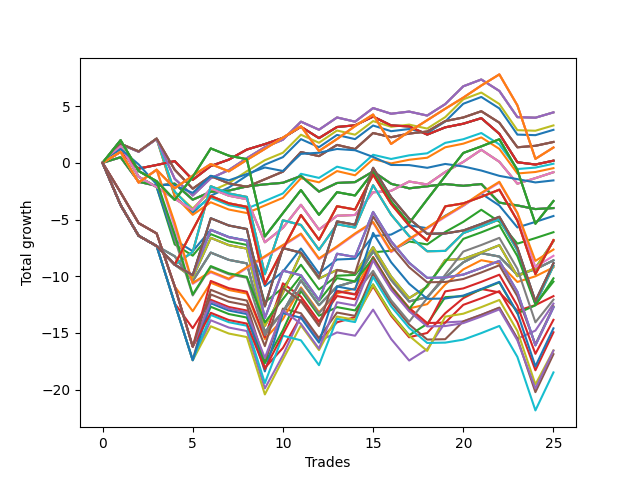

# Long Pointer 002 
- Symbol: NVDA_Unlimited
- Date Range: 02/08/2022 - 07/08/2022
- Trading Period: 7:20-12:30
- Number of Trades: 25



| Name | Win Percent | Profit | Avg Profit / Trade | Avg Time / Trade |      | Name | Win Percent | Profit | Avg Profit / Trade | Avg Time / Trade |
| ---- | ----------- | ------ | ------------------ | ---------------- | ---- | ---- | ----------- | ------ | ------------------ | ---------------- |
| Sorted By <br> Profit | | | | | | Sorted By <br> Win Percentage ||||
| Sixty-Six | 60.00 | 2225.00 | 89.00 | 21:32 |     | One Hundred Twenty-Six | 72.00 | 675.00 | 27.00 | 65:02 |
| Fifty-Eight | 60.00 | 2225.00 | 89.00 | 21:32 |     | One Hundred Twenty-One | 72.00 | 675.00 | 27.00 | 65:02 |
| Two | 60.00 | 2225.00 | 89.00 | 21:32 |     | Eighty-One | 72.00 | 675.00 | 27.00 | 65:02 |
| Fifty | 60.00 | 1650.00 | 66.00 | 20:46 |     | One Hundred Sixteen | 68.00 | -3825.00 | -153.00 | 58:21 |
| Forty-Two | 60.00 | 1455.00 | 58.20 | 20:49 |     | One Hundred Eleven | 68.00 | -4100.00 | -164.00 | 59:00 |
| Sixty-Seven | 60.00 | 920.00 | 36.80 | 23:53 |     | Sixty-Five | 64.00 | 95.00 | 3.80 | 16:17 |
| Fifty-Nine | 60.00 | 920.00 | 36.80 | 23:53 |     | Fifty-Seven | 64.00 | 95.00 | 3.80 | 16:17 |
| Three | 60.00 | 920.00 | 36.80 | 23:53 |     | Forty-Nine | 64.00 | 95.00 | 3.80 | 16:17 |
| One Hundred Twenty-Six | 72.00 | 675.00 | 27.00 | 65:02 |     | Forty-One | 64.00 | 95.00 | 3.80 | 16:17 |
| One Hundred Twenty-One | 72.00 | 675.00 | 27.00 | 65:02 |     | One | 64.00 | 95.00 | 3.80 | 16:17 |
| Eighty-One | 72.00 | 675.00 | 27.00 | 65:02 |     | Sixty-Six | 60.00 | 2225.00 | 89.00 | 21:32 |
| Sixty-Five | 64.00 | 95.00 | 3.80 | 16:17 |     | Fifty-Eight | 60.00 | 2225.00 | 89.00 | 21:32 |
| Fifty-Seven | 64.00 | 95.00 | 3.80 | 16:17 |     | Two | 60.00 | 2225.00 | 89.00 | 21:32 |
| Forty-Nine | 64.00 | 95.00 | 3.80 | 16:17 |     | Fifty | 60.00 | 1650.00 | 66.00 | 20:46 |
| Forty-One | 64.00 | 95.00 | 3.80 | 16:17 |     | Forty-Two | 60.00 | 1455.00 | 58.20 | 20:49 |
| One | 64.00 | 95.00 | 3.80 | 16:17 |     | Sixty-Seven | 60.00 | 920.00 | 36.80 | 23:53 |
| Fifty-One | 60.00 | -40.00 | -1.60 | 22:44 |     | Fifty-Nine | 60.00 | 920.00 | 36.80 | 23:53 |
| Forty-Three | 60.00 | -235.00 | -9.40 | 22:48 |     | Three | 60.00 | 920.00 | 36.80 | 23:53 |
| Sixty-Eight | 56.00 | -415.00 | -16.60 | 39:55 |     | Fifty-One | 60.00 | -40.00 | -1.60 | 22:44 |
| Sixty | 56.00 | -415.00 | -16.60 | 39:55 |     | Forty-Three | 60.00 | -235.00 | -9.40 | 22:48 |
| Four | 56.00 | -415.00 | -16.60 | 39:55 |     | Sixty-Four | 60.00 | -1995.00 | -79.80 | 09:44 |
| Seventy-Three | 36.00 | -775.00 | -31.00 | 06:55 |     | Fifty-Six | 60.00 | -1995.00 | -79.80 | 09:44 |
| One Hundred Twenty-Seven | 52.00 | -1685.00 | -67.40 | 99:29 |     | Forty-Eight | 60.00 | -1995.00 | -79.80 | 09:44 |
| One Hundred Twenty-Two | 52.00 | -1685.00 | -67.40 | 99:29 |     | Forty | 60.00 | -1995.00 | -79.80 | 09:44 |
| Eighty-Two | 52.00 | -1685.00 | -67.40 | 99:29 |     | Zero | 60.00 | -1995.00 | -79.80 | 09:44 |
| Sixty-Four | 60.00 | -1995.00 | -79.80 | 09:44 |     | Sixty-Eight | 56.00 | -415.00 | -16.60 | 39:55 |
| Fifty-Six | 60.00 | -1995.00 | -79.80 | 09:44 |     | Sixty | 56.00 | -415.00 | -16.60 | 39:55 |
| Forty-Eight | 60.00 | -1995.00 | -79.80 | 09:44 |     | Four | 56.00 | -415.00 | -16.60 | 39:55 |
| Forty | 60.00 | -1995.00 | -79.80 | 09:44 |     | Fifty-Two | 56.00 | -2345.00 | -93.80 | 36:33 |
| Zero | 60.00 | -1995.00 | -79.80 | 09:44 |     | Forty-Four | 56.00 | -3060.00 | -122.40 | 37:08 |
| Fifty-Two | 56.00 | -2345.00 | -93.80 | 36:33 |     | One Hundred Twenty-Seven | 52.00 | -1685.00 | -67.40 | 99:29 |
| Forty-Four | 56.00 | -3060.00 | -122.40 | 37:08 |     | One Hundred Twenty-Two | 52.00 | -1685.00 | -67.40 | 99:29 |
| One Hundred Twenty-Eight | 44.00 | -3410.00 | -136.40 | 112:10 |     | Eighty-Two | 52.00 | -1685.00 | -67.40 | 99:29 |
| One Hundred Twenty-Three | 44.00 | -3410.00 | -136.40 | 112:10 |     | Seventy | 48.00 | -3455.00 | -138.20 | 94:25 |
| Eighty-Three | 44.00 | -3410.00 | -136.40 | 112:10 |     | Sixty-Two | 48.00 | -3455.00 | -138.20 | 94:25 |
| Seventy | 48.00 | -3455.00 | -138.20 | 94:25 |     | Six | 48.00 | -3455.00 | -138.20 | 94:25 |
| Sixty-Two | 48.00 | -3455.00 | -138.20 | 94:25 |     | Sixty-Nine | 48.00 | -4300.00 | -172.00 | 59:28 |
| Six | 48.00 | -3455.00 | -138.20 | 94:25 |     | Sixty-One | 48.00 | -4300.00 | -172.00 | 59:28 |
| One Hundred Sixteen | 68.00 | -3825.00 | -153.00 | 58:21 |     | Five | 48.00 | -4300.00 | -172.00 | 59:28 |
| One Hundred Eleven | 68.00 | -4100.00 | -164.00 | 59:00 |     | Fifty-Three | 48.00 | -4610.00 | -184.40 | 51:22 |
| Sixty-Nine | 48.00 | -4300.00 | -172.00 | 59:28 |     | Fifty-Four | 48.00 | -5095.00 | -203.80 | 79:28 |
| Sixty-One | 48.00 | -4300.00 | -172.00 | 59:28 |     | One Hundred Seventeen | 48.00 | -5240.00 | -209.60 | 83:27 |
| Five | 48.00 | -4300.00 | -172.00 | 59:28 |     | Forty-Five | 48.00 | -5880.00 | -235.20 | 52:33 |
| One Hundred Thirty | 36.00 | -4430.00 | -177.20 | 137:52 |     | One Hundred Twelve | 48.00 | -6035.00 | -241.40 | 84:37 |
| One Hundred Twenty-Five | 36.00 | -4430.00 | -177.20 | 137:52 |     | Forty-Six | 48.00 | -6210.00 | -248.40 | 80:32 |
| Eighty-Five | 36.00 | -4430.00 | -177.20 | 137:52 |     | One Hundred Twenty-Eight | 44.00 | -3410.00 | -136.40 | 112:10 |
| Seventy-One | 40.00 | -4545.00 | -181.80 | 129:22 |     | One Hundred Twenty-Three | 44.00 | -3410.00 | -136.40 | 112:10 |
| Sixty-Three | 40.00 | -4545.00 | -181.80 | 129:22 |     | Eighty-Three | 44.00 | -3410.00 | -136.40 | 112:10 |
| Seven | 40.00 | -4545.00 | -181.80 | 129:22 |     | Seventy-One | 40.00 | -4545.00 | -181.80 | 129:22 |
| Fifty-Three | 48.00 | -4610.00 | -184.40 | 51:22 |     | Sixty-Three | 40.00 | -4545.00 | -181.80 | 129:22 |
| Fifty-Four | 48.00 | -5095.00 | -203.80 | 79:28 |     | Seven | 40.00 | -4545.00 | -181.80 | 129:22 |
| One Hundred Seventeen | 48.00 | -5240.00 | -209.60 | 83:27 |     | One Hundred Eighteen | 40.00 | -6925.00 | -277.00 | 95:15 |
| Forty-Five | 48.00 | -5880.00 | -235.20 | 52:33 |     | One Hundred Thirteen | 40.00 | -8275.00 | -331.00 | 97:02 |
| One Hundred Twelve | 48.00 | -6035.00 | -241.40 | 84:37 |     | Seventy-Three | 36.00 | -775.00 | -31.00 | 06:55 |
| Forty-Six | 48.00 | -6210.00 | -248.40 | 80:32 |     | One Hundred Thirty | 36.00 | -4430.00 | -177.20 | 137:52 |
| One Hundred Twenty | 36.00 | -6335.00 | -253.40 | 115:29 |     | One Hundred Twenty-Five | 36.00 | -4430.00 | -177.20 | 137:52 |
| One Hundred Twenty-Nine | 36.00 | -6375.00 | -255.00 | 133:00 |     | Eighty-Five | 36.00 | -4430.00 | -177.20 | 137:52 |
| One Hundred Twenty-Four | 36.00 | -6375.00 | -255.00 | 133:00 |     | One Hundred Twenty | 36.00 | -6335.00 | -253.40 | 115:29 |
| Eighty-Four | 36.00 | -6375.00 | -255.00 | 133:00 |     | One Hundred Twenty-Nine | 36.00 | -6375.00 | -255.00 | 133:00 |
| One Hundred Eighteen | 40.00 | -6925.00 | -277.00 | 95:15 |     | One Hundred Twenty-Four | 36.00 | -6375.00 | -255.00 | 133:00 |
| One Hundred Fifteen | 36.00 | -7300.00 | -292.00 | 120:59 |     | Eighty-Four | 36.00 | -6375.00 | -255.00 | 133:00 |
| Fifty-Five | 36.00 | -7475.00 | -299.00 | 109:07 |     | One Hundred Fifteen | 36.00 | -7300.00 | -292.00 | 120:59 |
| One Hundred Thirteen | 40.00 | -8275.00 | -331.00 | 97:02 |     | Fifty-Five | 36.00 | -7475.00 | -299.00 | 109:07 |
| One Hundred Ninteen | 36.00 | -8280.00 | -331.20 | 110:37 |     | One Hundred Ninteen | 36.00 | -8280.00 | -331.20 | 110:37 |
| Forty-Seven | 36.00 | -8440.00 | -337.60 | 114:37 |     | Forty-Seven | 36.00 | -8440.00 | -337.60 | 114:37 |
| One Hundred Fourteen | 36.00 | -9245.00 | -369.80 | 116:06 |     | One Hundred Fourteen | 36.00 | -9245.00 | -369.80 | 116:06 |

## NO STOPLOSS

### Test Zero
* Sell when price hits the middle line of the 20p bollinger
* No Stoploss
* Results:
```
Total Trades: 25
Percent Up: 60.00
Percent Down: 40.00
Total Points Moved Up: -3.99
Potential Profit: -1995.00
Total Points Ups: 5.18 Count Ups: 15
Total Points Downs: -9.17 Count Downs: 10
```

<details><summary>Trades</summary>

<code>In: 2022-02-10 10:40:00		Out: 2022-02-10 10:41:10		Total Position Time: 01:10		Total Move Up: 0.49		Total to Date: 0.49</code> <br />
<code>In: 2022-02-11 11:34:00		Out: 2022-02-11 12:00:30		Total Position Time: 26:30		Total Move Up: -2.16		Total to Date: -1.67</code> <br />
<code>In: 2022-02-11 11:49:00		Out: 2022-02-11 12:00:30		Total Position Time: 11:30		Total Move Up: -0.36		Total to Date: -2.03</code> <br />
<code>In: 2022-02-14 10:34:00		Out: 2022-02-14 10:42:10		Total Position Time: 08:10		Total Move Up: 0.19		Total to Date: -1.84</code> <br />
<code>In: 2022-02-22 08:02:00		Out: 2022-02-22 08:26:50		Total Position Time: 24:50		Total Move Up: -1.41		Total to Date: -3.25</code> <br />
<code>In: 2022-02-22 11:13:00		Out: 2022-02-22 11:15:40		Total Position Time: 02:40		Total Move Up: 0.69		Total to Date: -2.56</code> <br />
<code>In: 2022-02-23 12:15:00		Out: 2022-02-23 12:26:05		Total Position Time: 11:05		Total Move Up: 0.11		Total to Date: -2.45</code> <br />
<code>In: 2022-02-23 12:25:00		Out: 2022-02-23 12:26:10		Total Position Time: 01:10		Total Move Up: 0.37		Total to Date: -2.08</code> <br />
<code>In: 2022-03-01 08:04:00		Out: 2022-03-01 08:05:15		Total Position Time: 01:15		Total Move Up: 0.18		Total to Date: -1.90</code> <br />
<code>In: 2022-03-03 08:02:00		Out: 2022-03-03 08:03:15		Total Position Time: 01:15		Total Move Up: 0.14		Total to Date: -1.76</code> <br />
<code>In: 2022-03-04 08:16:00		Out: 2022-03-04 08:18:05		Total Position Time: 02:05		Total Move Up: 0.60		Total to Date: -1.16</code> <br />
<code>In: 2022-03-07 11:56:00		Out: 2022-03-07 12:23:50		Total Position Time: 27:50		Total Move Up: -1.38		Total to Date: -2.54</code> <br />
<code>In: 2022-03-09 08:14:00		Out: 2022-03-09 08:18:35		Total Position Time: 04:35		Total Move Up: 0.76		Total to Date: -1.78</code> <br />
<code>In: 2022-03-14 10:12:00		Out: 2022-03-14 10:19:10		Total Position Time: 07:10		Total Move Up: 0.08		Total to Date: -1.70</code> <br />
<code>In: 2022-03-17 07:56:00		Out: 2022-03-17 07:59:35		Total Position Time: 03:35		Total Move Up: 0.94		Total to Date: -0.76</code> <br />
<code>In: 2022-03-30 11:04:00		Out: 2022-03-30 11:29:20		Total Position Time: 25:20		Total Move Up: -1.09		Total to Date: -1.85</code> <br />
<code>In: 2022-03-30 11:10:00		Out: 2022-03-30 11:29:20		Total Position Time: 19:20		Total Move Up: -0.40		Total to Date: -2.25</code> <br />
<code>In: 2022-03-31 10:02:00		Out: 2022-03-31 10:03:10		Total Position Time: 01:10		Total Move Up: 0.18		Total to Date: -2.07</code> <br />
<code>In: 2022-03-31 10:19:00		Out: 2022-03-31 10:26:30		Total Position Time: 07:30		Total Move Up: 0.20		Total to Date: -1.87</code> <br />
<code>In: 2022-05-03 11:45:00		Out: 2022-05-03 11:46:10		Total Position Time: 01:10		Total Move Up: -0.16		Total to Date: -2.03</code> <br />
<code>In: 2022-05-06 11:41:00		Out: 2022-05-06 11:43:05		Total Position Time: 02:05		Total Move Up: 0.16		Total to Date: -1.87</code> <br />
<code>In: 2022-06-01 08:55:00		Out: 2022-06-01 09:16:05		Total Position Time: 21:05		Total Move Up: -1.64		Total to Date: -3.51</code> <br />
<code>In: 2022-06-08 08:47:00		Out: 2022-06-08 09:02:30		Total Position Time: 15:30		Total Move Up: -0.25		Total to Date: -3.76</code> <br />
<code>In: 2022-06-09 08:11:00		Out: 2022-06-09 08:25:00		Total Position Time: 14:00		Total Move Up: -0.32		Total to Date: -4.08</code> <br />
<code>In: 2022-06-23 10:45:00		Out: 2022-06-23 10:46:30		Total Position Time: 01:30		Total Move Up: 0.09		Total to Date: -3.99</code> <br />


</details>

### Test One
* Sell when the price hits the upper line of the 20p 1std bollinger
* No Stoploss
* Results:
```
Total Trades: 25
Percent Up: 64.00
Percent Down: 36.00
Total Points Moved Up: 0.19
Potential Profit: 95.00
Total Points Ups: 10.00 Count Ups: 16
Total Points Downs: -9.81 Count Downs: 9
```

<details><summary>Trades</summary>

<code>In: 2022-02-10 10:40:00		Out: 2022-02-10 10:43:25		Total Position Time: 03:25		Total Move Up: 0.97		Total to Date: 0.97</code> <br />
<code>In: 2022-02-11 11:34:00		Out: 2022-02-11 12:03:05		Total Position Time: 29:05		Total Move Up: -1.48		Total to Date: -0.51</code> <br />
<code>In: 2022-02-11 11:49:00		Out: 2022-02-11 12:03:05		Total Position Time: 14:05		Total Move Up: 0.32		Total to Date: -0.19</code> <br />
<code>In: 2022-02-14 10:34:00		Out: 2022-02-14 10:47:05		Total Position Time: 13:05		Total Move Up: 0.34		Total to Date: 0.15</code> <br />
<code>In: 2022-02-22 08:02:00		Out: 2022-02-22 08:33:50		Total Position Time: 31:50		Total Move Up: -1.65		Total to Date: -1.50</code> <br />
<code>In: 2022-02-22 11:13:00		Out: 2022-02-22 11:20:05		Total Position Time: 07:05		Total Move Up: 1.22		Total to Date: -0.28</code> <br />
<code>In: 2022-02-23 12:15:00		Out: 2022-02-23 12:27:10		Total Position Time: 12:10		Total Move Up: 0.56		Total to Date: 0.28</code> <br />
<code>In: 2022-02-23 12:25:00		Out: 2022-02-23 12:27:10		Total Position Time: 02:10		Total Move Up: 0.89		Total to Date: 1.17</code> <br />
<code>In: 2022-03-01 08:04:00		Out: 2022-03-01 08:08:05		Total Position Time: 04:05		Total Move Up: 0.48		Total to Date: 1.65</code> <br />
<code>In: 2022-03-03 08:02:00		Out: 2022-03-03 08:05:30		Total Position Time: 03:30		Total Move Up: 0.55		Total to Date: 2.20</code> <br />
<code>In: 2022-03-04 08:16:00		Out: 2022-03-04 08:23:05		Total Position Time: 07:05		Total Move Up: 0.98		Total to Date: 3.18</code> <br />
<code>In: 2022-03-07 11:56:00		Out: 2022-03-07 12:25:10		Total Position Time: 29:10		Total Move Up: -1.00		Total to Date: 2.18</code> <br />
<code>In: 2022-03-09 08:14:00		Out: 2022-03-09 08:20:25		Total Position Time: 06:25		Total Move Up: 0.98		Total to Date: 3.16</code> <br />
<code>In: 2022-03-14 10:12:00		Out: 2022-03-14 10:24:45		Total Position Time: 12:45		Total Move Up: 0.15		Total to Date: 3.31</code> <br />
<code>In: 2022-03-17 07:56:00		Out: 2022-03-17 08:08:20		Total Position Time: 12:20		Total Move Up: 0.77		Total to Date: 4.08</code> <br />
<code>In: 2022-03-30 11:04:00		Out: 2022-03-30 11:30:55		Total Position Time: 26:55		Total Move Up: -0.78		Total to Date: 3.30</code> <br />
<code>In: 2022-03-30 11:10:00		Out: 2022-03-30 11:30:55		Total Position Time: 20:55		Total Move Up: -0.09		Total to Date: 3.21</code> <br />
<code>In: 2022-03-31 10:02:00		Out: 2022-03-31 10:29:20		Total Position Time: 27:20		Total Move Up: -0.72		Total to Date: 2.49</code> <br />
<code>In: 2022-03-31 10:19:00		Out: 2022-03-31 10:29:20		Total Position Time: 10:20		Total Move Up: 0.64		Total to Date: 3.13</code> <br />
<code>In: 2022-05-03 11:45:00		Out: 2022-05-03 11:48:05		Total Position Time: 03:05		Total Move Up: 0.32		Total to Date: 3.45</code> <br />
<code>In: 2022-05-06 11:41:00		Out: 2022-05-06 11:49:25		Total Position Time: 08:25		Total Move Up: 0.49		Total to Date: 3.94</code> <br />
<code>In: 2022-06-01 08:55:00		Out: 2022-06-01 09:19:55		Total Position Time: 24:55		Total Move Up: -1.38		Total to Date: 2.56</code> <br />
<code>In: 2022-06-08 08:47:00		Out: 2022-06-08 09:56:20		Total Position Time: 69:20		Total Move Up: -2.51		Total to Date: 0.05</code> <br />
<code>In: 2022-06-09 08:11:00		Out: 2022-06-09 08:33:25		Total Position Time: 22:25		Total Move Up: -0.20		Total to Date: -0.15</code> <br />
<code>In: 2022-06-23 10:45:00		Out: 2022-06-23 10:50:10		Total Position Time: 05:10		Total Move Up: 0.34		Total to Date: 0.19</code> <br />


</details>

### Test Two
* Sell when the price hits the upper line of the 20p 2std bollinger
* No Stoploss
* Results:
```
Total Trades: 25
Percent Up: 60.00
Percent Down: 40.00
Total Points Moved Up: 4.45
Potential Profit: 2225.00
Total Points Ups: 15.41 Count Ups: 15
Total Points Downs: -10.96 Count Downs: 10
```

<details><summary>Trades</summary>

<code>In: 2022-02-10 10:40:00		Out: 2022-02-10 10:46:50		Total Position Time: 06:50		Total Move Up: 1.65		Total to Date: 1.65</code> <br />
<code>In: 2022-02-11 11:34:00		Out: 2022-02-11 12:03:45		Total Position Time: 29:45		Total Move Up: -0.67		Total to Date: 0.98</code> <br />
<code>In: 2022-02-11 11:49:00		Out: 2022-02-11 12:03:45		Total Position Time: 14:45		Total Move Up: 1.13		Total to Date: 2.11</code> <br />
<code>In: 2022-02-14 10:34:00		Out: 2022-02-14 11:19:15		Total Position Time: 45:15		Total Move Up: -3.52		Total to Date: -1.41</code> <br />
<code>In: 2022-02-22 08:02:00		Out: 2022-02-22 08:48:30		Total Position Time: 46:30		Total Move Up: -1.47		Total to Date: -2.88</code> <br />
<code>In: 2022-02-22 11:13:00		Out: 2022-02-22 11:21:15		Total Position Time: 08:15		Total Move Up: 1.52		Total to Date: -1.36</code> <br />
<code>In: 2022-02-23 12:15:00		Out: 2022-02-23 12:31:20		Total Position Time: 16:20		Total Move Up: 0.72		Total to Date: -0.64</code> <br />
<code>In: 2022-02-23 12:25:00		Out: 2022-02-23 12:31:20		Total Position Time: 06:20		Total Move Up: 1.05		Total to Date: 0.41</code> <br />
<code>In: 2022-03-01 08:04:00		Out: 2022-03-01 08:14:20		Total Position Time: 10:20		Total Move Up: 0.97		Total to Date: 1.38</code> <br />
<code>In: 2022-03-03 08:02:00		Out: 2022-03-03 08:09:55		Total Position Time: 07:55		Total Move Up: 0.66		Total to Date: 2.04</code> <br />
<code>In: 2022-03-04 08:16:00		Out: 2022-03-04 08:27:10		Total Position Time: 11:10		Total Move Up: 1.59		Total to Date: 3.63</code> <br />
<code>In: 2022-03-07 11:56:00		Out: 2022-03-07 12:26:20		Total Position Time: 30:20		Total Move Up: -0.71		Total to Date: 2.92</code> <br />
<code>In: 2022-03-09 08:14:00		Out: 2022-03-09 08:24:00		Total Position Time: 10:00		Total Move Up: 1.08		Total to Date: 4.00</code> <br />
<code>In: 2022-03-14 10:12:00		Out: 2022-03-14 10:50:25		Total Position Time: 38:25		Total Move Up: -0.37		Total to Date: 3.63</code> <br />
<code>In: 2022-03-17 07:56:00		Out: 2022-03-17 08:10:55		Total Position Time: 14:55		Total Move Up: 1.20		Total to Date: 4.83</code> <br />
<code>In: 2022-03-30 11:04:00		Out: 2022-03-30 11:31:15		Total Position Time: 27:15		Total Move Up: -0.50		Total to Date: 4.33</code> <br />
<code>In: 2022-03-30 11:10:00		Out: 2022-03-30 11:31:15		Total Position Time: 21:15		Total Move Up: 0.19		Total to Date: 4.52</code> <br />
<code>In: 2022-03-31 10:02:00		Out: 2022-03-31 10:31:45		Total Position Time: 29:45		Total Move Up: -0.35		Total to Date: 4.17</code> <br />
<code>In: 2022-03-31 10:19:00		Out: 2022-03-31 10:31:45		Total Position Time: 12:45		Total Move Up: 1.01		Total to Date: 5.18</code> <br />
<code>In: 2022-05-03 11:45:00		Out: 2022-05-03 11:59:20		Total Position Time: 14:20		Total Move Up: 1.57		Total to Date: 6.75</code> <br />
<code>In: 2022-05-06 11:41:00		Out: 2022-05-06 11:49:35		Total Position Time: 08:35		Total Move Up: 0.60		Total to Date: 7.35</code> <br />
<code>In: 2022-06-01 08:55:00		Out: 2022-06-01 09:21:00		Total Position Time: 26:00		Total Move Up: -1.01		Total to Date: 6.34</code> <br />
<code>In: 2022-06-08 08:47:00		Out: 2022-06-08 09:57:05		Total Position Time: 70:05		Total Move Up: -2.31		Total to Date: 4.03</code> <br />
<code>In: 2022-06-09 08:11:00		Out: 2022-06-09 08:35:10		Total Position Time: 24:10		Total Move Up: -0.05		Total to Date: 3.98</code> <br />
<code>In: 2022-06-23 10:45:00		Out: 2022-06-23 10:52:10		Total Position Time: 07:10		Total Move Up: 0.47		Total to Date: 4.45</code> <br />


</details>

### Test Three
* Sell when price hits the middle line of the 50p bollinger
* No Stoploss
* Results:
```
Total Trades: 25
Percent Up: 60.00
Percent Down: 40.00
Total Points Moved Up: 1.84
Potential Profit: 920.00
Total Points Ups: 12.16 Count Ups: 15
Total Points Downs: -10.32 Count Downs: 10
```

<details><summary>Trades</summary>

<code>In: 2022-02-10 10:40:00		Out: 2022-02-10 10:58:20		Total Position Time: 18:20		Total Move Up: 1.68		Total to Date: 1.68</code> <br />
<code>In: 2022-02-11 11:34:00		Out: 2022-02-11 12:03:45		Total Position Time: 29:45		Total Move Up: -0.67		Total to Date: 1.01</code> <br />
<code>In: 2022-02-11 11:49:00		Out: 2022-02-11 12:03:45		Total Position Time: 14:45		Total Move Up: 1.13		Total to Date: 2.14</code> <br />
<code>In: 2022-02-14 10:34:00		Out: 2022-02-14 11:28:50		Total Position Time: 54:50		Total Move Up: -2.75		Total to Date: -0.61</code> <br />
<code>In: 2022-02-22 08:02:00		Out: 2022-02-22 08:48:05		Total Position Time: 46:05		Total Move Up: -1.67		Total to Date: -2.28</code> <br />
<code>In: 2022-02-22 11:13:00		Out: 2022-02-22 11:16:05		Total Position Time: 03:05		Total Move Up: 1.11		Total to Date: -1.17</code> <br />
<code>In: 2022-02-23 12:15:00		Out: 2022-02-23 12:47:00		Total Position Time: 32:00		Total Move Up: -0.64		Total to Date: -1.81</code> <br />
<code>In: 2022-02-23 12:25:00		Out: 2022-02-23 12:47:00		Total Position Time: 22:00		Total Move Up: -0.31		Total to Date: -2.12</code> <br />
<code>In: 2022-03-01 08:04:00		Out: 2022-03-01 08:24:15		Total Position Time: 20:15		Total Move Up: 0.67		Total to Date: -1.45</code> <br />
<code>In: 2022-03-03 08:02:00		Out: 2022-03-03 08:20:45		Total Position Time: 18:45		Total Move Up: 0.67		Total to Date: -0.78</code> <br />
<code>In: 2022-03-04 08:16:00		Out: 2022-03-04 08:28:40		Total Position Time: 12:40		Total Move Up: 1.73		Total to Date: 0.95</code> <br />
<code>In: 2022-03-07 11:56:00		Out: 2022-03-07 12:26:50		Total Position Time: 30:50		Total Move Up: -0.36		Total to Date: 0.59</code> <br />
<code>In: 2022-03-09 08:14:00		Out: 2022-03-09 08:35:00		Total Position Time: 21:00		Total Move Up: 0.99		Total to Date: 1.58</code> <br />
<code>In: 2022-03-14 10:12:00		Out: 2022-03-14 10:50:25		Total Position Time: 38:25		Total Move Up: -0.37		Total to Date: 1.21</code> <br />
<code>In: 2022-03-17 07:56:00		Out: 2022-03-17 08:11:05		Total Position Time: 15:05		Total Move Up: 1.42		Total to Date: 2.63</code> <br />
<code>In: 2022-03-30 11:04:00		Out: 2022-03-30 11:31:30		Total Position Time: 27:30		Total Move Up: -0.37		Total to Date: 2.26</code> <br />
<code>In: 2022-03-30 11:10:00		Out: 2022-03-30 11:31:30		Total Position Time: 21:30		Total Move Up: 0.32		Total to Date: 2.58</code> <br />
<code>In: 2022-03-31 10:02:00		Out: 2022-03-31 10:03:10		Total Position Time: 01:10		Total Move Up: 0.18		Total to Date: 2.76</code> <br />
<code>In: 2022-03-31 10:19:00		Out: 2022-03-31 10:29:50		Total Position Time: 10:50		Total Move Up: 0.92		Total to Date: 3.68</code> <br />
<code>In: 2022-05-03 11:45:00		Out: 2022-05-03 11:48:05		Total Position Time: 03:05		Total Move Up: 0.32		Total to Date: 4.00</code> <br />
<code>In: 2022-05-06 11:41:00		Out: 2022-05-06 11:49:30		Total Position Time: 08:30		Total Move Up: 0.55		Total to Date: 4.55</code> <br />
<code>In: 2022-06-01 08:55:00		Out: 2022-06-01 09:31:30		Total Position Time: 36:30		Total Move Up: -1.01		Total to Date: 3.54</code> <br />
<code>In: 2022-06-08 08:47:00		Out: 2022-06-08 10:07:05		Total Position Time: 80:05		Total Move Up: -2.17		Total to Date: 1.37</code> <br />
<code>In: 2022-06-09 08:11:00		Out: 2022-06-09 08:36:05		Total Position Time: 25:05		Total Move Up: 0.13		Total to Date: 1.50</code> <br />
<code>In: 2022-06-23 10:45:00		Out: 2022-06-23 10:50:10		Total Position Time: 05:10		Total Move Up: 0.34		Total to Date: 1.84</code> <br />


</details>

### Test Four
* Sell when the price hits the upper line of the 50p 1std bollinger
* No Stoploss
* Results:
```
Total Trades: 25
Percent Up: 56.00
Percent Down: 44.00
Total Points Moved Up: -0.83
Potential Profit: -415.00
Total Points Ups: 15.00 Count Ups: 14
Total Points Downs: -15.83 Count Downs: 11
```

<details><summary>Trades</summary>

<code>In: 2022-02-10 10:40:00		Out: 2022-02-10 11:36:45		Total Position Time: 56:45		Total Move Up: 1.48		Total to Date: 1.48</code> <br />
<code>In: 2022-02-11 11:34:00		Out: 2022-02-11 12:47:00		Total Position Time: 73:00		Total Move Up: -2.71		Total to Date: -1.23</code> <br />
<code>In: 2022-02-11 11:49:00		Out: 2022-02-11 12:47:00		Total Position Time: 58:00		Total Move Up: -0.91		Total to Date: -2.14</code> <br />
<code>In: 2022-02-14 10:34:00		Out: 2022-02-14 11:29:20		Total Position Time: 55:20		Total Move Up: -1.03		Total to Date: -3.17</code> <br />
<code>In: 2022-02-22 08:02:00		Out: 2022-02-22 08:50:40		Total Position Time: 48:40		Total Move Up: -0.99		Total to Date: -4.16</code> <br />
<code>In: 2022-02-22 11:13:00		Out: 2022-02-22 11:25:20		Total Position Time: 12:20		Total Move Up: 1.90		Total to Date: -2.26</code> <br />
<code>In: 2022-02-23 12:15:00		Out: 2022-02-23 12:47:00		Total Position Time: 32:00		Total Move Up: -0.64		Total to Date: -2.90</code> <br />
<code>In: 2022-02-23 12:25:00		Out: 2022-02-23 12:47:00		Total Position Time: 22:00		Total Move Up: -0.31		Total to Date: -3.21</code> <br />
<code>In: 2022-03-01 08:04:00		Out: 2022-03-01 09:50:45		Total Position Time: 106:45		Total Move Up: -3.80		Total to Date: -7.01</code> <br />
<code>In: 2022-03-03 08:02:00		Out: 2022-03-03 08:23:40		Total Position Time: 21:40		Total Move Up: 1.27		Total to Date: -5.74</code> <br />
<code>In: 2022-03-04 08:16:00		Out: 2022-03-04 08:39:25		Total Position Time: 23:25		Total Move Up: 2.04		Total to Date: -3.70</code> <br />
<code>In: 2022-03-07 11:56:00		Out: 2022-03-07 12:47:00		Total Position Time: 51:00		Total Move Up: -2.19		Total to Date: -5.89</code> <br />
<code>In: 2022-03-09 08:14:00		Out: 2022-03-09 08:45:30		Total Position Time: 31:30		Total Move Up: 1.22		Total to Date: -4.67</code> <br />
<code>In: 2022-03-14 10:12:00		Out: 2022-03-14 10:51:10		Total Position Time: 39:10		Total Move Up: 0.07		Total to Date: -4.60</code> <br />
<code>In: 2022-03-17 07:56:00		Out: 2022-03-17 08:20:00		Total Position Time: 24:00		Total Move Up: 2.00		Total to Date: -2.60</code> <br />
<code>In: 2022-03-30 11:04:00		Out: 2022-03-30 11:36:10		Total Position Time: 32:10		Total Move Up: 0.13		Total to Date: -2.47</code> <br />
<code>In: 2022-03-30 11:10:00		Out: 2022-03-30 11:36:10		Total Position Time: 26:10		Total Move Up: 0.82		Total to Date: -1.65</code> <br />
<code>In: 2022-03-31 10:02:00		Out: 2022-03-31 10:50:20		Total Position Time: 48:20		Total Move Up: -0.26		Total to Date: -1.91</code> <br />
<code>In: 2022-03-31 10:19:00		Out: 2022-03-31 10:50:20		Total Position Time: 31:20		Total Move Up: 1.10		Total to Date: -0.81</code> <br />
<code>In: 2022-05-03 11:45:00		Out: 2022-05-03 11:52:05		Total Position Time: 07:05		Total Move Up: 0.89		Total to Date: 0.08</code> <br />
<code>In: 2022-05-06 11:41:00		Out: 2022-05-06 11:50:10		Total Position Time: 09:10		Total Move Up: 1.07		Total to Date: 1.15</code> <br />
<code>In: 2022-06-01 08:55:00		Out: 2022-06-01 09:53:50		Total Position Time: 58:50		Total Move Up: -1.06		Total to Date: 0.09</code> <br />
<code>In: 2022-06-08 08:47:00		Out: 2022-06-08 10:15:40		Total Position Time: 88:40		Total Move Up: -1.93		Total to Date: -1.84</code> <br />
<code>In: 2022-06-09 08:11:00		Out: 2022-06-09 08:43:15		Total Position Time: 32:15		Total Move Up: 0.49		Total to Date: -1.35</code> <br />
<code>In: 2022-06-23 10:45:00		Out: 2022-06-23 10:53:35		Total Position Time: 08:35		Total Move Up: 0.52		Total to Date: -0.83</code> <br />


</details>

### Test Five
* Sell when the price hits the upper line of the 50p 2std bollinger
* No Stoploss
* Results:
```
Total Trades: 25
Percent Up: 48.00
Percent Down: 52.00
Total Points Moved Up: -8.60
Potential Profit: -4300.00
Total Points Ups: 17.44 Count Ups: 12
Total Points Downs: -26.04 Count Downs: 13
```

<details><summary>Trades</summary>

<code>In: 2022-02-10 10:40:00		Out: 2022-02-10 12:47:00		Total Position Time: 127:00		Total Move Up: -3.72		Total to Date: -3.72</code> <br />
<code>In: 2022-02-11 11:34:00		Out: 2022-02-11 12:47:00		Total Position Time: 73:00		Total Move Up: -2.71		Total to Date: -6.43</code> <br />
<code>In: 2022-02-11 11:49:00		Out: 2022-02-11 12:47:00		Total Position Time: 58:00		Total Move Up: -0.91		Total to Date: -7.34</code> <br />
<code>In: 2022-02-14 10:34:00		Out: 2022-02-14 11:40:45		Total Position Time: 66:45		Total Move Up: -0.90		Total to Date: -8.24</code> <br />
<code>In: 2022-02-22 08:02:00		Out: 2022-02-22 09:42:10		Total Position Time: 100:10		Total Move Up: -2.19		Total to Date: -10.43</code> <br />
<code>In: 2022-02-22 11:13:00		Out: 2022-02-22 11:25:25		Total Position Time: 12:25		Total Move Up: 2.51		Total to Date: -7.92</code> <br />
<code>In: 2022-02-23 12:15:00		Out: 2022-02-23 12:47:00		Total Position Time: 32:00		Total Move Up: -0.64		Total to Date: -8.56</code> <br />
<code>In: 2022-02-23 12:25:00		Out: 2022-02-23 12:47:00		Total Position Time: 22:00		Total Move Up: -0.31		Total to Date: -8.87</code> <br />
<code>In: 2022-03-01 08:04:00		Out: 2022-03-01 11:22:30		Total Position Time: 198:30		Total Move Up: -6.06		Total to Date: -14.93</code> <br />
<code>In: 2022-03-03 08:02:00		Out: 2022-03-03 08:26:05		Total Position Time: 24:05		Total Move Up: 1.76		Total to Date: -13.17</code> <br />
<code>In: 2022-03-04 08:16:00		Out: 2022-03-04 08:41:50		Total Position Time: 25:50		Total Move Up: 2.80		Total to Date: -10.37</code> <br />
<code>In: 2022-03-07 11:56:00		Out: 2022-03-07 12:47:00		Total Position Time: 51:00		Total Move Up: -2.19		Total to Date: -12.56</code> <br />
<code>In: 2022-03-09 08:14:00		Out: 2022-03-09 09:00:00		Total Position Time: 46:00		Total Move Up: 1.65		Total to Date: -10.91</code> <br />
<code>In: 2022-03-14 10:12:00		Out: 2022-03-14 10:52:20		Total Position Time: 40:20		Total Move Up: 0.46		Total to Date: -10.45</code> <br />
<code>In: 2022-03-17 07:56:00		Out: 2022-03-17 08:24:15		Total Position Time: 28:15		Total Move Up: 2.71		Total to Date: -7.74</code> <br />
<code>In: 2022-03-30 11:04:00		Out: 2022-03-30 12:47:00		Total Position Time: 103:00		Total Move Up: -2.59		Total to Date: -10.33</code> <br />
<code>In: 2022-03-30 11:10:00		Out: 2022-03-30 12:47:00		Total Position Time: 97:00		Total Move Up: -1.90		Total to Date: -12.23</code> <br />
<code>In: 2022-03-31 10:02:00		Out: 2022-03-31 10:51:30		Total Position Time: 49:30		Total Move Up: 0.38		Total to Date: -11.85</code> <br />
<code>In: 2022-03-31 10:19:00		Out: 2022-03-31 10:51:30		Total Position Time: 32:30		Total Move Up: 1.74		Total to Date: -10.11</code> <br />
<code>In: 2022-05-03 11:45:00		Out: 2022-05-03 11:59:05		Total Position Time: 14:05		Total Move Up: 1.33		Total to Date: -8.78</code> <br />
<code>In: 2022-05-06 11:41:00		Out: 2022-05-06 12:39:05		Total Position Time: 58:05		Total Move Up: 0.81		Total to Date: -7.97</code> <br />
<code>In: 2022-06-01 08:55:00		Out: 2022-06-01 10:08:10		Total Position Time: 73:10		Total Move Up: -0.30		Total to Date: -8.27</code> <br />
<code>In: 2022-06-08 08:47:00		Out: 2022-06-08 10:19:45		Total Position Time: 92:45		Total Move Up: -1.62		Total to Date: -9.89</code> <br />
<code>In: 2022-06-09 08:11:00		Out: 2022-06-09 09:01:25		Total Position Time: 50:25		Total Move Up: 0.50		Total to Date: -9.39</code> <br />
<code>In: 2022-06-23 10:45:00		Out: 2022-06-23 10:56:05		Total Position Time: 11:05		Total Move Up: 0.79		Total to Date: -8.60</code> <br />


</details>

### Test Six
* Sell when the price hits the middle line of the 1std VWAP
* No Stoploss
* Results:
```
Total Trades: 25
Percent Up: 48.00
Percent Down: 52.00
Total Points Moved Up: -6.91
Potential Profit: -3455.00
Total Points Ups: 20.70 Count Ups: 12
Total Points Downs: -27.61 Count Downs: 13
```

<details><summary>Trades</summary>

<code>In: 2022-02-10 10:40:00		Out: 2022-02-10 12:47:00		Total Position Time: 127:00		Total Move Up: -3.72		Total to Date: -3.72</code> <br />
<code>In: 2022-02-11 11:34:00		Out: 2022-02-11 12:47:00		Total Position Time: 73:00		Total Move Up: -2.71		Total to Date: -6.43</code> <br />
<code>In: 2022-02-11 11:49:00		Out: 2022-02-11 12:47:00		Total Position Time: 58:00		Total Move Up: -0.91		Total to Date: -7.34</code> <br />
<code>In: 2022-02-14 10:34:00		Out: 2022-02-14 12:47:00		Total Position Time: 133:00		Total Move Up: -1.64		Total to Date: -8.98</code> <br />
<code>In: 2022-02-22 08:02:00		Out: 2022-02-22 11:31:50		Total Position Time: 209:50		Total Move Up: -1.16		Total to Date: -10.14</code> <br />
<code>In: 2022-02-22 11:13:00		Out: 2022-02-22 11:31:50		Total Position Time: 18:50		Total Move Up: 3.52		Total to Date: -6.62</code> <br />
<code>In: 2022-02-23 12:15:00		Out: 2022-02-23 12:47:00		Total Position Time: 32:00		Total Move Up: -0.64		Total to Date: -7.26</code> <br />
<code>In: 2022-02-23 12:25:00		Out: 2022-02-23 12:47:00		Total Position Time: 22:00		Total Move Up: -0.31		Total to Date: -7.57</code> <br />
<code>In: 2022-03-01 08:04:00		Out: 2022-03-01 12:47:00		Total Position Time: 283:00		Total Move Up: -6.82		Total to Date: -14.39</code> <br />
<code>In: 2022-03-03 08:02:00		Out: 2022-03-03 08:43:30		Total Position Time: 41:30		Total Move Up: 2.91		Total to Date: -11.48</code> <br />
<code>In: 2022-03-04 08:16:00		Out: 2022-03-04 10:01:25		Total Position Time: 105:25		Total Move Up: 3.46		Total to Date: -8.02</code> <br />
<code>In: 2022-03-07 11:56:00		Out: 2022-03-07 12:47:00		Total Position Time: 51:00		Total Move Up: -2.19		Total to Date: -10.21</code> <br />
<code>In: 2022-03-09 08:14:00		Out: 2022-03-09 08:18:35		Total Position Time: 04:35		Total Move Up: 0.76		Total to Date: -9.45</code> <br />
<code>In: 2022-03-14 10:12:00		Out: 2022-03-14 12:47:00		Total Position Time: 155:00		Total Move Up: -0.29		Total to Date: -9.74</code> <br />
<code>In: 2022-03-17 07:56:00		Out: 2022-03-17 08:23:30		Total Position Time: 27:30		Total Move Up: 2.30		Total to Date: -7.44</code> <br />
<code>In: 2022-03-30 11:04:00		Out: 2022-03-30 12:47:00		Total Position Time: 103:00		Total Move Up: -2.59		Total to Date: -10.03</code> <br />
<code>In: 2022-03-30 11:10:00		Out: 2022-03-30 12:47:00		Total Position Time: 97:00		Total Move Up: -1.90		Total to Date: -11.93</code> <br />
<code>In: 2022-03-31 10:02:00		Out: 2022-03-31 11:20:55		Total Position Time: 78:55		Total Move Up: 1.00		Total to Date: -10.93</code> <br />
<code>In: 2022-03-31 10:19:00		Out: 2022-03-31 11:20:55		Total Position Time: 61:55		Total Move Up: 2.36		Total to Date: -8.57</code> <br />
<code>In: 2022-05-03 11:45:00		Out: 2022-05-03 11:47:05		Total Position Time: 02:05		Total Move Up: 0.09		Total to Date: -8.48</code> <br />
<code>In: 2022-05-06 11:41:00		Out: 2022-05-06 12:47:00		Total Position Time: 66:00		Total Move Up: 0.58		Total to Date: -7.90</code> <br />
<code>In: 2022-06-01 08:55:00		Out: 2022-06-01 12:47:00		Total Position Time: 232:00		Total Move Up: 0.63		Total to Date: -7.27</code> <br />
<code>In: 2022-06-08 08:47:00		Out: 2022-06-08 12:47:00		Total Position Time: 240:00		Total Move Up: -2.73		Total to Date: -10.00</code> <br />
<code>In: 2022-06-09 08:11:00		Out: 2022-06-09 08:43:50		Total Position Time: 32:50		Total Move Up: 0.71		Total to Date: -9.29</code> <br />
<code>In: 2022-06-23 10:45:00		Out: 2022-06-23 12:30:15		Total Position Time: 105:15		Total Move Up: 2.38		Total to Date: -6.91</code> <br />


</details>

### Test Seven
* Sell when the price hits the upper line of the 1std VWAP
* No Stoploss
* Results:
```
Total Trades: 25
Percent Up: 40.00
Percent Down: 60.00
Total Points Moved Up: -9.09
Potential Profit: -4545.00
Total Points Ups: 23.82 Count Ups: 10
Total Points Downs: -32.91 Count Downs: 15
```

<details><summary>Trades</summary>

<code>In: 2022-02-10 10:40:00		Out: 2022-02-10 12:47:00		Total Position Time: 127:00		Total Move Up: -3.72		Total to Date: -3.72</code> <br />
<code>In: 2022-02-11 11:34:00		Out: 2022-02-11 12:47:00		Total Position Time: 73:00		Total Move Up: -2.71		Total to Date: -6.43</code> <br />
<code>In: 2022-02-11 11:49:00		Out: 2022-02-11 12:47:00		Total Position Time: 58:00		Total Move Up: -0.91		Total to Date: -7.34</code> <br />
<code>In: 2022-02-14 10:34:00		Out: 2022-02-14 12:47:00		Total Position Time: 133:00		Total Move Up: -1.64		Total to Date: -8.98</code> <br />
<code>In: 2022-02-22 08:02:00		Out: 2022-02-22 11:53:40		Total Position Time: 231:40		Total Move Up: 1.12		Total to Date: -7.86</code> <br />
<code>In: 2022-02-22 11:13:00		Out: 2022-02-22 11:53:40		Total Position Time: 40:40		Total Move Up: 5.80		Total to Date: -2.06</code> <br />
<code>In: 2022-02-23 12:15:00		Out: 2022-02-23 12:47:00		Total Position Time: 32:00		Total Move Up: -0.64		Total to Date: -2.70</code> <br />
<code>In: 2022-02-23 12:25:00		Out: 2022-02-23 12:47:00		Total Position Time: 22:00		Total Move Up: -0.31		Total to Date: -3.01</code> <br />
<code>In: 2022-03-01 08:04:00		Out: 2022-03-01 12:47:00		Total Position Time: 283:00		Total Move Up: -6.82		Total to Date: -9.83</code> <br />
<code>In: 2022-03-03 08:02:00		Out: 2022-03-03 09:35:55		Total Position Time: 93:55		Total Move Up: 4.76		Total to Date: -5.07</code> <br />
<code>In: 2022-03-04 08:16:00		Out: 2022-03-04 12:47:00		Total Position Time: 271:00		Total Move Up: -0.41		Total to Date: -5.48</code> <br />
<code>In: 2022-03-07 11:56:00		Out: 2022-03-07 12:47:00		Total Position Time: 51:00		Total Move Up: -2.19		Total to Date: -7.67</code> <br />
<code>In: 2022-03-09 08:14:00		Out: 2022-03-09 09:02:50		Total Position Time: 48:50		Total Move Up: 2.25		Total to Date: -5.42</code> <br />
<code>In: 2022-03-14 10:12:00		Out: 2022-03-14 12:47:00		Total Position Time: 155:00		Total Move Up: -0.29		Total to Date: -5.71</code> <br />
<code>In: 2022-03-17 07:56:00		Out: 2022-03-17 10:27:05		Total Position Time: 151:05		Total Move Up: 3.73		Total to Date: -1.98</code> <br />
<code>In: 2022-03-30 11:04:00		Out: 2022-03-30 12:47:00		Total Position Time: 103:00		Total Move Up: -2.59		Total to Date: -4.57</code> <br />
<code>In: 2022-03-30 11:10:00		Out: 2022-03-30 12:47:00		Total Position Time: 97:00		Total Move Up: -1.90		Total to Date: -6.47</code> <br />
<code>In: 2022-03-31 10:02:00		Out: 2022-03-31 12:47:00		Total Position Time: 165:00		Total Move Up: -1.33		Total to Date: -7.80</code> <br />
<code>In: 2022-03-31 10:19:00		Out: 2022-03-31 12:47:00		Total Position Time: 148:00		Total Move Up: 0.03		Total to Date: -7.77</code> <br />
<code>In: 2022-05-03 11:45:00		Out: 2022-05-03 11:59:20		Total Position Time: 14:20		Total Move Up: 1.57		Total to Date: -6.20</code> <br />
<code>In: 2022-05-06 11:41:00		Out: 2022-05-06 12:47:00		Total Position Time: 66:00		Total Move Up: 0.58		Total to Date: -5.62</code> <br />
<code>In: 2022-06-01 08:55:00		Out: 2022-06-01 12:47:00		Total Position Time: 232:00		Total Move Up: 0.63		Total to Date: -4.99</code> <br />
<code>In: 2022-06-08 08:47:00		Out: 2022-06-08 12:47:00		Total Position Time: 240:00		Total Move Up: -2.73		Total to Date: -7.72</code> <br />
<code>In: 2022-06-09 08:11:00		Out: 2022-06-09 12:47:00		Total Position Time: 276:00		Total Move Up: -4.72		Total to Date: -12.44</code> <br />
<code>In: 2022-06-23 10:45:00		Out: 2022-06-23 12:47:00		Total Position Time: 122:00		Total Move Up: 3.35		Total to Date: -9.09</code> <br />


</details>

## STOPLOSS OF 5

### Test Forty
* Sell when price hits the middle line of the 20p bollinger
* Stoploss is 5 points
* Results:
```
Total Trades: 25
Percent Up: 60.00
Percent Down: 40.00
Total Points Moved Up: -3.99
Potential Profit: -1995.00
Total Points Ups: 5.18 Count Ups: 15
Total Points Downs: -9.17 Count Downs: 10
```

<details><summary>Trades</summary>

<code>In: 2022-02-10 10:40:00		Out: 2022-02-10 10:41:10		Total Position Time: 01:10		Total Move Up: 0.49		Total to Date: 0.49</code> <br />
<code>In: 2022-02-11 11:34:00		Out: 2022-02-11 12:00:30		Total Position Time: 26:30		Total Move Up: -2.16		Total to Date: -1.67</code> <br />
<code>In: 2022-02-11 11:49:00		Out: 2022-02-11 12:00:30		Total Position Time: 11:30		Total Move Up: -0.36		Total to Date: -2.03</code> <br />
<code>In: 2022-02-14 10:34:00		Out: 2022-02-14 10:42:10		Total Position Time: 08:10		Total Move Up: 0.19		Total to Date: -1.84</code> <br />
<code>In: 2022-02-22 08:02:00		Out: 2022-02-22 08:26:50		Total Position Time: 24:50		Total Move Up: -1.41		Total to Date: -3.25</code> <br />
<code>In: 2022-02-22 11:13:00		Out: 2022-02-22 11:15:40		Total Position Time: 02:40		Total Move Up: 0.69		Total to Date: -2.56</code> <br />
<code>In: 2022-02-23 12:15:00		Out: 2022-02-23 12:26:05		Total Position Time: 11:05		Total Move Up: 0.11		Total to Date: -2.45</code> <br />
<code>In: 2022-02-23 12:25:00		Out: 2022-02-23 12:26:10		Total Position Time: 01:10		Total Move Up: 0.37		Total to Date: -2.08</code> <br />
<code>In: 2022-03-01 08:04:00		Out: 2022-03-01 08:05:15		Total Position Time: 01:15		Total Move Up: 0.18		Total to Date: -1.90</code> <br />
<code>In: 2022-03-03 08:02:00		Out: 2022-03-03 08:03:15		Total Position Time: 01:15		Total Move Up: 0.14		Total to Date: -1.76</code> <br />
<code>In: 2022-03-04 08:16:00		Out: 2022-03-04 08:18:05		Total Position Time: 02:05		Total Move Up: 0.60		Total to Date: -1.16</code> <br />
<code>In: 2022-03-07 11:56:00		Out: 2022-03-07 12:23:50		Total Position Time: 27:50		Total Move Up: -1.38		Total to Date: -2.54</code> <br />
<code>In: 2022-03-09 08:14:00		Out: 2022-03-09 08:18:35		Total Position Time: 04:35		Total Move Up: 0.76		Total to Date: -1.78</code> <br />
<code>In: 2022-03-14 10:12:00		Out: 2022-03-14 10:19:10		Total Position Time: 07:10		Total Move Up: 0.08		Total to Date: -1.70</code> <br />
<code>In: 2022-03-17 07:56:00		Out: 2022-03-17 07:59:35		Total Position Time: 03:35		Total Move Up: 0.94		Total to Date: -0.76</code> <br />
<code>In: 2022-03-30 11:04:00		Out: 2022-03-30 11:29:20		Total Position Time: 25:20		Total Move Up: -1.09		Total to Date: -1.85</code> <br />
<code>In: 2022-03-30 11:10:00		Out: 2022-03-30 11:29:20		Total Position Time: 19:20		Total Move Up: -0.40		Total to Date: -2.25</code> <br />
<code>In: 2022-03-31 10:02:00		Out: 2022-03-31 10:03:10		Total Position Time: 01:10		Total Move Up: 0.18		Total to Date: -2.07</code> <br />
<code>In: 2022-03-31 10:19:00		Out: 2022-03-31 10:26:30		Total Position Time: 07:30		Total Move Up: 0.20		Total to Date: -1.87</code> <br />
<code>In: 2022-05-03 11:45:00		Out: 2022-05-03 11:46:10		Total Position Time: 01:10		Total Move Up: -0.16		Total to Date: -2.03</code> <br />
<code>In: 2022-05-06 11:41:00		Out: 2022-05-06 11:43:05		Total Position Time: 02:05		Total Move Up: 0.16		Total to Date: -1.87</code> <br />
<code>In: 2022-06-01 08:55:00		Out: 2022-06-01 09:16:05		Total Position Time: 21:05		Total Move Up: -1.64		Total to Date: -3.51</code> <br />
<code>In: 2022-06-08 08:47:00		Out: 2022-06-08 09:02:30		Total Position Time: 15:30		Total Move Up: -0.25		Total to Date: -3.76</code> <br />
<code>In: 2022-06-09 08:11:00		Out: 2022-06-09 08:25:00		Total Position Time: 14:00		Total Move Up: -0.32		Total to Date: -4.08</code> <br />
<code>In: 2022-06-23 10:45:00		Out: 2022-06-23 10:46:30		Total Position Time: 01:30		Total Move Up: 0.09		Total to Date: -3.99</code> <br />


</details>

### Test Forty-One
* Sell when the price hits the upper line of the 20p 1std bollinger
* Stoploss is 5 points
* Results:
```
Total Trades: 25
Percent Up: 64.00
Percent Down: 36.00
Total Points Moved Up: 0.19
Potential Profit: 95.00
Total Points Ups: 10.00 Count Ups: 16
Total Points Downs: -9.81 Count Downs: 9
```

<details><summary>Trades</summary>

<code>In: 2022-02-10 10:40:00		Out: 2022-02-10 10:43:25		Total Position Time: 03:25		Total Move Up: 0.97		Total to Date: 0.97</code> <br />
<code>In: 2022-02-11 11:34:00		Out: 2022-02-11 12:03:05		Total Position Time: 29:05		Total Move Up: -1.48		Total to Date: -0.51</code> <br />
<code>In: 2022-02-11 11:49:00		Out: 2022-02-11 12:03:05		Total Position Time: 14:05		Total Move Up: 0.32		Total to Date: -0.19</code> <br />
<code>In: 2022-02-14 10:34:00		Out: 2022-02-14 10:47:05		Total Position Time: 13:05		Total Move Up: 0.34		Total to Date: 0.15</code> <br />
<code>In: 2022-02-22 08:02:00		Out: 2022-02-22 08:33:50		Total Position Time: 31:50		Total Move Up: -1.65		Total to Date: -1.50</code> <br />
<code>In: 2022-02-22 11:13:00		Out: 2022-02-22 11:20:05		Total Position Time: 07:05		Total Move Up: 1.22		Total to Date: -0.28</code> <br />
<code>In: 2022-02-23 12:15:00		Out: 2022-02-23 12:27:10		Total Position Time: 12:10		Total Move Up: 0.56		Total to Date: 0.28</code> <br />
<code>In: 2022-02-23 12:25:00		Out: 2022-02-23 12:27:10		Total Position Time: 02:10		Total Move Up: 0.89		Total to Date: 1.17</code> <br />
<code>In: 2022-03-01 08:04:00		Out: 2022-03-01 08:08:05		Total Position Time: 04:05		Total Move Up: 0.48		Total to Date: 1.65</code> <br />
<code>In: 2022-03-03 08:02:00		Out: 2022-03-03 08:05:30		Total Position Time: 03:30		Total Move Up: 0.55		Total to Date: 2.20</code> <br />
<code>In: 2022-03-04 08:16:00		Out: 2022-03-04 08:23:05		Total Position Time: 07:05		Total Move Up: 0.98		Total to Date: 3.18</code> <br />
<code>In: 2022-03-07 11:56:00		Out: 2022-03-07 12:25:10		Total Position Time: 29:10		Total Move Up: -1.00		Total to Date: 2.18</code> <br />
<code>In: 2022-03-09 08:14:00		Out: 2022-03-09 08:20:25		Total Position Time: 06:25		Total Move Up: 0.98		Total to Date: 3.16</code> <br />
<code>In: 2022-03-14 10:12:00		Out: 2022-03-14 10:24:45		Total Position Time: 12:45		Total Move Up: 0.15		Total to Date: 3.31</code> <br />
<code>In: 2022-03-17 07:56:00		Out: 2022-03-17 08:08:20		Total Position Time: 12:20		Total Move Up: 0.77		Total to Date: 4.08</code> <br />
<code>In: 2022-03-30 11:04:00		Out: 2022-03-30 11:30:55		Total Position Time: 26:55		Total Move Up: -0.78		Total to Date: 3.30</code> <br />
<code>In: 2022-03-30 11:10:00		Out: 2022-03-30 11:30:55		Total Position Time: 20:55		Total Move Up: -0.09		Total to Date: 3.21</code> <br />
<code>In: 2022-03-31 10:02:00		Out: 2022-03-31 10:29:20		Total Position Time: 27:20		Total Move Up: -0.72		Total to Date: 2.49</code> <br />
<code>In: 2022-03-31 10:19:00		Out: 2022-03-31 10:29:20		Total Position Time: 10:20		Total Move Up: 0.64		Total to Date: 3.13</code> <br />
<code>In: 2022-05-03 11:45:00		Out: 2022-05-03 11:48:05		Total Position Time: 03:05		Total Move Up: 0.32		Total to Date: 3.45</code> <br />
<code>In: 2022-05-06 11:41:00		Out: 2022-05-06 11:49:25		Total Position Time: 08:25		Total Move Up: 0.49		Total to Date: 3.94</code> <br />
<code>In: 2022-06-01 08:55:00		Out: 2022-06-01 09:19:55		Total Position Time: 24:55		Total Move Up: -1.38		Total to Date: 2.56</code> <br />
<code>In: 2022-06-08 08:47:00		Out: 2022-06-08 09:56:20		Total Position Time: 69:20		Total Move Up: -2.51		Total to Date: 0.05</code> <br />
<code>In: 2022-06-09 08:11:00		Out: 2022-06-09 08:33:25		Total Position Time: 22:25		Total Move Up: -0.20		Total to Date: -0.15</code> <br />
<code>In: 2022-06-23 10:45:00		Out: 2022-06-23 10:50:10		Total Position Time: 05:10		Total Move Up: 0.34		Total to Date: 0.19</code> <br />


</details>

### Test Forty-Two
* Sell when the price hits the upper line of the 20p 2std bollinger
* Stoploss is 5 points
* Results:
```
Total Trades: 25
Percent Up: 60.00
Percent Down: 40.00
Total Points Moved Up: 2.91
Potential Profit: 1455.00
Total Points Ups: 15.41 Count Ups: 15
Total Points Downs: -12.50 Count Downs: 10
```

<details><summary>Trades</summary>

<code>In: 2022-02-10 10:40:00		Out: 2022-02-10 10:46:50		Total Position Time: 06:50		Total Move Up: 1.65		Total to Date: 1.65</code> <br />
<code>In: 2022-02-11 11:34:00		Out: 2022-02-11 12:03:45		Total Position Time: 29:45		Total Move Up: -0.67		Total to Date: 0.98</code> <br />
<code>In: 2022-02-11 11:49:00		Out: 2022-02-11 12:03:45		Total Position Time: 14:45		Total Move Up: 1.13		Total to Date: 2.11</code> <br />
<code>In: 2022-02-14 10:34:00		Out: 2022-02-14 11:01:35		Total Position Time: 27:35		Total Move Up: -5.06		Total to Date: -2.95</code> <br />
<code>In: 2022-02-22 08:02:00		Out: 2022-02-22 08:48:30		Total Position Time: 46:30		Total Move Up: -1.47		Total to Date: -4.42</code> <br />
<code>In: 2022-02-22 11:13:00		Out: 2022-02-22 11:21:15		Total Position Time: 08:15		Total Move Up: 1.52		Total to Date: -2.90</code> <br />
<code>In: 2022-02-23 12:15:00		Out: 2022-02-23 12:31:20		Total Position Time: 16:20		Total Move Up: 0.72		Total to Date: -2.18</code> <br />
<code>In: 2022-02-23 12:25:00		Out: 2022-02-23 12:31:20		Total Position Time: 06:20		Total Move Up: 1.05		Total to Date: -1.13</code> <br />
<code>In: 2022-03-01 08:04:00		Out: 2022-03-01 08:14:20		Total Position Time: 10:20		Total Move Up: 0.97		Total to Date: -0.16</code> <br />
<code>In: 2022-03-03 08:02:00		Out: 2022-03-03 08:09:55		Total Position Time: 07:55		Total Move Up: 0.66		Total to Date: 0.50</code> <br />
<code>In: 2022-03-04 08:16:00		Out: 2022-03-04 08:27:10		Total Position Time: 11:10		Total Move Up: 1.59		Total to Date: 2.09</code> <br />
<code>In: 2022-03-07 11:56:00		Out: 2022-03-07 12:26:20		Total Position Time: 30:20		Total Move Up: -0.71		Total to Date: 1.38</code> <br />
<code>In: 2022-03-09 08:14:00		Out: 2022-03-09 08:24:00		Total Position Time: 10:00		Total Move Up: 1.08		Total to Date: 2.46</code> <br />
<code>In: 2022-03-14 10:12:00		Out: 2022-03-14 10:50:25		Total Position Time: 38:25		Total Move Up: -0.37		Total to Date: 2.09</code> <br />
<code>In: 2022-03-17 07:56:00		Out: 2022-03-17 08:10:55		Total Position Time: 14:55		Total Move Up: 1.20		Total to Date: 3.29</code> <br />
<code>In: 2022-03-30 11:04:00		Out: 2022-03-30 11:31:15		Total Position Time: 27:15		Total Move Up: -0.50		Total to Date: 2.79</code> <br />
<code>In: 2022-03-30 11:10:00		Out: 2022-03-30 11:31:15		Total Position Time: 21:15		Total Move Up: 0.19		Total to Date: 2.98</code> <br />
<code>In: 2022-03-31 10:02:00		Out: 2022-03-31 10:31:45		Total Position Time: 29:45		Total Move Up: -0.35		Total to Date: 2.63</code> <br />
<code>In: 2022-03-31 10:19:00		Out: 2022-03-31 10:31:45		Total Position Time: 12:45		Total Move Up: 1.01		Total to Date: 3.64</code> <br />
<code>In: 2022-05-03 11:45:00		Out: 2022-05-03 11:59:20		Total Position Time: 14:20		Total Move Up: 1.57		Total to Date: 5.21</code> <br />
<code>In: 2022-05-06 11:41:00		Out: 2022-05-06 11:49:35		Total Position Time: 08:35		Total Move Up: 0.60		Total to Date: 5.81</code> <br />
<code>In: 2022-06-01 08:55:00		Out: 2022-06-01 09:21:00		Total Position Time: 26:00		Total Move Up: -1.01		Total to Date: 4.80</code> <br />
<code>In: 2022-06-08 08:47:00		Out: 2022-06-08 09:57:05		Total Position Time: 70:05		Total Move Up: -2.31		Total to Date: 2.49</code> <br />
<code>In: 2022-06-09 08:11:00		Out: 2022-06-09 08:35:10		Total Position Time: 24:10		Total Move Up: -0.05		Total to Date: 2.44</code> <br />
<code>In: 2022-06-23 10:45:00		Out: 2022-06-23 10:52:10		Total Position Time: 07:10		Total Move Up: 0.47		Total to Date: 2.91</code> <br />


</details>

### Test Forty-Three
* Sell when price hits the middle line of the 50p bollinger
* Stoploss is 5 points
* Results:
```
Total Trades: 25
Percent Up: 60.00
Percent Down: 40.00
Total Points Moved Up: -0.47
Potential Profit: -235.00
Total Points Ups: 12.16 Count Ups: 15
Total Points Downs: -12.63 Count Downs: 10
```

<details><summary>Trades</summary>

<code>In: 2022-02-10 10:40:00		Out: 2022-02-10 10:58:20		Total Position Time: 18:20		Total Move Up: 1.68		Total to Date: 1.68</code> <br />
<code>In: 2022-02-11 11:34:00		Out: 2022-02-11 12:03:45		Total Position Time: 29:45		Total Move Up: -0.67		Total to Date: 1.01</code> <br />
<code>In: 2022-02-11 11:49:00		Out: 2022-02-11 12:03:45		Total Position Time: 14:45		Total Move Up: 1.13		Total to Date: 2.14</code> <br />
<code>In: 2022-02-14 10:34:00		Out: 2022-02-14 11:01:35		Total Position Time: 27:35		Total Move Up: -5.06		Total to Date: -2.92</code> <br />
<code>In: 2022-02-22 08:02:00		Out: 2022-02-22 08:48:05		Total Position Time: 46:05		Total Move Up: -1.67		Total to Date: -4.59</code> <br />
<code>In: 2022-02-22 11:13:00		Out: 2022-02-22 11:16:05		Total Position Time: 03:05		Total Move Up: 1.11		Total to Date: -3.48</code> <br />
<code>In: 2022-02-23 12:15:00		Out: 2022-02-23 12:47:00		Total Position Time: 32:00		Total Move Up: -0.64		Total to Date: -4.12</code> <br />
<code>In: 2022-02-23 12:25:00		Out: 2022-02-23 12:47:00		Total Position Time: 22:00		Total Move Up: -0.31		Total to Date: -4.43</code> <br />
<code>In: 2022-03-01 08:04:00		Out: 2022-03-01 08:24:15		Total Position Time: 20:15		Total Move Up: 0.67		Total to Date: -3.76</code> <br />
<code>In: 2022-03-03 08:02:00		Out: 2022-03-03 08:20:45		Total Position Time: 18:45		Total Move Up: 0.67		Total to Date: -3.09</code> <br />
<code>In: 2022-03-04 08:16:00		Out: 2022-03-04 08:28:40		Total Position Time: 12:40		Total Move Up: 1.73		Total to Date: -1.36</code> <br />
<code>In: 2022-03-07 11:56:00		Out: 2022-03-07 12:26:50		Total Position Time: 30:50		Total Move Up: -0.36		Total to Date: -1.72</code> <br />
<code>In: 2022-03-09 08:14:00		Out: 2022-03-09 08:35:00		Total Position Time: 21:00		Total Move Up: 0.99		Total to Date: -0.73</code> <br />
<code>In: 2022-03-14 10:12:00		Out: 2022-03-14 10:50:25		Total Position Time: 38:25		Total Move Up: -0.37		Total to Date: -1.10</code> <br />
<code>In: 2022-03-17 07:56:00		Out: 2022-03-17 08:11:05		Total Position Time: 15:05		Total Move Up: 1.42		Total to Date: 0.32</code> <br />
<code>In: 2022-03-30 11:04:00		Out: 2022-03-30 11:31:30		Total Position Time: 27:30		Total Move Up: -0.37		Total to Date: -0.05</code> <br />
<code>In: 2022-03-30 11:10:00		Out: 2022-03-30 11:31:30		Total Position Time: 21:30		Total Move Up: 0.32		Total to Date: 0.27</code> <br />
<code>In: 2022-03-31 10:02:00		Out: 2022-03-31 10:03:10		Total Position Time: 01:10		Total Move Up: 0.18		Total to Date: 0.45</code> <br />
<code>In: 2022-03-31 10:19:00		Out: 2022-03-31 10:29:50		Total Position Time: 10:50		Total Move Up: 0.92		Total to Date: 1.37</code> <br />
<code>In: 2022-05-03 11:45:00		Out: 2022-05-03 11:48:05		Total Position Time: 03:05		Total Move Up: 0.32		Total to Date: 1.69</code> <br />
<code>In: 2022-05-06 11:41:00		Out: 2022-05-06 11:49:30		Total Position Time: 08:30		Total Move Up: 0.55		Total to Date: 2.24</code> <br />
<code>In: 2022-06-01 08:55:00		Out: 2022-06-01 09:31:30		Total Position Time: 36:30		Total Move Up: -1.01		Total to Date: 1.23</code> <br />
<code>In: 2022-06-08 08:47:00		Out: 2022-06-08 10:07:05		Total Position Time: 80:05		Total Move Up: -2.17		Total to Date: -0.94</code> <br />
<code>In: 2022-06-09 08:11:00		Out: 2022-06-09 08:36:05		Total Position Time: 25:05		Total Move Up: 0.13		Total to Date: -0.81</code> <br />
<code>In: 2022-06-23 10:45:00		Out: 2022-06-23 10:50:10		Total Position Time: 05:10		Total Move Up: 0.34		Total to Date: -0.47</code> <br />


</details>

### Test Forty-Four
* Sell when the price hits the upper line of the 50p 1std bollinger
* Stoploss is 5 points
* Results:
```
Total Trades: 25
Percent Up: 56.00
Percent Down: 44.00
Total Points Moved Up: -6.12
Potential Profit: -3060.00
Total Points Ups: 15.00 Count Ups: 14
Total Points Downs: -21.12 Count Downs: 11
```

<details><summary>Trades</summary>

<code>In: 2022-02-10 10:40:00		Out: 2022-02-10 11:36:45		Total Position Time: 56:45		Total Move Up: 1.48		Total to Date: 1.48</code> <br />
<code>In: 2022-02-11 11:34:00		Out: 2022-02-11 12:47:00		Total Position Time: 73:00		Total Move Up: -2.71		Total to Date: -1.23</code> <br />
<code>In: 2022-02-11 11:49:00		Out: 2022-02-11 12:47:00		Total Position Time: 58:00		Total Move Up: -0.91		Total to Date: -2.14</code> <br />
<code>In: 2022-02-14 10:34:00		Out: 2022-02-14 11:01:35		Total Position Time: 27:35		Total Move Up: -5.06		Total to Date: -7.20</code> <br />
<code>In: 2022-02-22 08:02:00		Out: 2022-02-22 08:50:40		Total Position Time: 48:40		Total Move Up: -0.99		Total to Date: -8.19</code> <br />
<code>In: 2022-02-22 11:13:00		Out: 2022-02-22 11:25:20		Total Position Time: 12:20		Total Move Up: 1.90		Total to Date: -6.29</code> <br />
<code>In: 2022-02-23 12:15:00		Out: 2022-02-23 12:47:00		Total Position Time: 32:00		Total Move Up: -0.64		Total to Date: -6.93</code> <br />
<code>In: 2022-02-23 12:25:00		Out: 2022-02-23 12:47:00		Total Position Time: 22:00		Total Move Up: -0.31		Total to Date: -7.24</code> <br />
<code>In: 2022-03-01 08:04:00		Out: 2022-03-01 09:08:50		Total Position Time: 64:50		Total Move Up: -5.06		Total to Date: -12.30</code> <br />
<code>In: 2022-03-03 08:02:00		Out: 2022-03-03 08:23:40		Total Position Time: 21:40		Total Move Up: 1.27		Total to Date: -11.03</code> <br />
<code>In: 2022-03-04 08:16:00		Out: 2022-03-04 08:39:25		Total Position Time: 23:25		Total Move Up: 2.04		Total to Date: -8.99</code> <br />
<code>In: 2022-03-07 11:56:00		Out: 2022-03-07 12:47:00		Total Position Time: 51:00		Total Move Up: -2.19		Total to Date: -11.18</code> <br />
<code>In: 2022-03-09 08:14:00		Out: 2022-03-09 08:45:30		Total Position Time: 31:30		Total Move Up: 1.22		Total to Date: -9.96</code> <br />
<code>In: 2022-03-14 10:12:00		Out: 2022-03-14 10:51:10		Total Position Time: 39:10		Total Move Up: 0.07		Total to Date: -9.89</code> <br />
<code>In: 2022-03-17 07:56:00		Out: 2022-03-17 08:20:00		Total Position Time: 24:00		Total Move Up: 2.00		Total to Date: -7.89</code> <br />
<code>In: 2022-03-30 11:04:00		Out: 2022-03-30 11:36:10		Total Position Time: 32:10		Total Move Up: 0.13		Total to Date: -7.76</code> <br />
<code>In: 2022-03-30 11:10:00		Out: 2022-03-30 11:36:10		Total Position Time: 26:10		Total Move Up: 0.82		Total to Date: -6.94</code> <br />
<code>In: 2022-03-31 10:02:00		Out: 2022-03-31 10:50:20		Total Position Time: 48:20		Total Move Up: -0.26		Total to Date: -7.20</code> <br />
<code>In: 2022-03-31 10:19:00		Out: 2022-03-31 10:50:20		Total Position Time: 31:20		Total Move Up: 1.10		Total to Date: -6.10</code> <br />
<code>In: 2022-05-03 11:45:00		Out: 2022-05-03 11:52:05		Total Position Time: 07:05		Total Move Up: 0.89		Total to Date: -5.21</code> <br />
<code>In: 2022-05-06 11:41:00		Out: 2022-05-06 11:50:10		Total Position Time: 09:10		Total Move Up: 1.07		Total to Date: -4.14</code> <br />
<code>In: 2022-06-01 08:55:00		Out: 2022-06-01 09:53:50		Total Position Time: 58:50		Total Move Up: -1.06		Total to Date: -5.20</code> <br />
<code>In: 2022-06-08 08:47:00		Out: 2022-06-08 10:15:40		Total Position Time: 88:40		Total Move Up: -1.93		Total to Date: -7.13</code> <br />
<code>In: 2022-06-09 08:11:00		Out: 2022-06-09 08:43:15		Total Position Time: 32:15		Total Move Up: 0.49		Total to Date: -6.64</code> <br />
<code>In: 2022-06-23 10:45:00		Out: 2022-06-23 10:53:35		Total Position Time: 08:35		Total Move Up: 0.52		Total to Date: -6.12</code> <br />


</details>

### Test Forty-Five
* Sell when the price hits the upper line of the 50p 2std bollinger
* Stoploss is 5 points
* Results:
```
Total Trades: 25
Percent Up: 48.00
Percent Down: 52.00
Total Points Moved Up: -11.76
Potential Profit: -5880.00
Total Points Ups: 17.44 Count Ups: 12
Total Points Downs: -29.20 Count Downs: 13
```

<details><summary>Trades</summary>

<code>In: 2022-02-10 10:40:00		Out: 2022-02-10 12:47:00		Total Position Time: 127:00		Total Move Up: -3.72		Total to Date: -3.72</code> <br />
<code>In: 2022-02-11 11:34:00		Out: 2022-02-11 12:47:00		Total Position Time: 73:00		Total Move Up: -2.71		Total to Date: -6.43</code> <br />
<code>In: 2022-02-11 11:49:00		Out: 2022-02-11 12:47:00		Total Position Time: 58:00		Total Move Up: -0.91		Total to Date: -7.34</code> <br />
<code>In: 2022-02-14 10:34:00		Out: 2022-02-14 11:01:35		Total Position Time: 27:35		Total Move Up: -5.06		Total to Date: -12.40</code> <br />
<code>In: 2022-02-22 08:02:00		Out: 2022-02-22 09:42:10		Total Position Time: 100:10		Total Move Up: -2.19		Total to Date: -14.59</code> <br />
<code>In: 2022-02-22 11:13:00		Out: 2022-02-22 11:25:25		Total Position Time: 12:25		Total Move Up: 2.51		Total to Date: -12.08</code> <br />
<code>In: 2022-02-23 12:15:00		Out: 2022-02-23 12:47:00		Total Position Time: 32:00		Total Move Up: -0.64		Total to Date: -12.72</code> <br />
<code>In: 2022-02-23 12:25:00		Out: 2022-02-23 12:47:00		Total Position Time: 22:00		Total Move Up: -0.31		Total to Date: -13.03</code> <br />
<code>In: 2022-03-01 08:04:00		Out: 2022-03-01 09:08:50		Total Position Time: 64:50		Total Move Up: -5.06		Total to Date: -18.09</code> <br />
<code>In: 2022-03-03 08:02:00		Out: 2022-03-03 08:26:05		Total Position Time: 24:05		Total Move Up: 1.76		Total to Date: -16.33</code> <br />
<code>In: 2022-03-04 08:16:00		Out: 2022-03-04 08:41:50		Total Position Time: 25:50		Total Move Up: 2.80		Total to Date: -13.53</code> <br />
<code>In: 2022-03-07 11:56:00		Out: 2022-03-07 12:47:00		Total Position Time: 51:00		Total Move Up: -2.19		Total to Date: -15.72</code> <br />
<code>In: 2022-03-09 08:14:00		Out: 2022-03-09 09:00:00		Total Position Time: 46:00		Total Move Up: 1.65		Total to Date: -14.07</code> <br />
<code>In: 2022-03-14 10:12:00		Out: 2022-03-14 10:52:20		Total Position Time: 40:20		Total Move Up: 0.46		Total to Date: -13.61</code> <br />
<code>In: 2022-03-17 07:56:00		Out: 2022-03-17 08:24:15		Total Position Time: 28:15		Total Move Up: 2.71		Total to Date: -10.90</code> <br />
<code>In: 2022-03-30 11:04:00		Out: 2022-03-30 12:47:00		Total Position Time: 103:00		Total Move Up: -2.59		Total to Date: -13.49</code> <br />
<code>In: 2022-03-30 11:10:00		Out: 2022-03-30 12:47:00		Total Position Time: 97:00		Total Move Up: -1.90		Total to Date: -15.39</code> <br />
<code>In: 2022-03-31 10:02:00		Out: 2022-03-31 10:51:30		Total Position Time: 49:30		Total Move Up: 0.38		Total to Date: -15.01</code> <br />
<code>In: 2022-03-31 10:19:00		Out: 2022-03-31 10:51:30		Total Position Time: 32:30		Total Move Up: 1.74		Total to Date: -13.27</code> <br />
<code>In: 2022-05-03 11:45:00		Out: 2022-05-03 11:59:05		Total Position Time: 14:05		Total Move Up: 1.33		Total to Date: -11.94</code> <br />
<code>In: 2022-05-06 11:41:00		Out: 2022-05-06 12:39:05		Total Position Time: 58:05		Total Move Up: 0.81		Total to Date: -11.13</code> <br />
<code>In: 2022-06-01 08:55:00		Out: 2022-06-01 10:08:10		Total Position Time: 73:10		Total Move Up: -0.30		Total to Date: -11.43</code> <br />
<code>In: 2022-06-08 08:47:00		Out: 2022-06-08 10:19:45		Total Position Time: 92:45		Total Move Up: -1.62		Total to Date: -13.05</code> <br />
<code>In: 2022-06-09 08:11:00		Out: 2022-06-09 09:01:25		Total Position Time: 50:25		Total Move Up: 0.50		Total to Date: -12.55</code> <br />
<code>In: 2022-06-23 10:45:00		Out: 2022-06-23 10:56:05		Total Position Time: 11:05		Total Move Up: 0.79		Total to Date: -11.76</code> <br />


</details>

### Test Forty-Six
* Sell when the price hits the middle line of the 1std VWAP
* Stoploss is 5 points
* Results:
```
Total Trades: 25
Percent Up: 48.00
Percent Down: 52.00
Total Points Moved Up: -12.42
Potential Profit: -6210.00
Total Points Ups: 20.70 Count Ups: 12
Total Points Downs: -33.12 Count Downs: 13
```

<details><summary>Trades</summary>

<code>In: 2022-02-10 10:40:00		Out: 2022-02-10 12:47:00		Total Position Time: 127:00		Total Move Up: -3.72		Total to Date: -3.72</code> <br />
<code>In: 2022-02-11 11:34:00		Out: 2022-02-11 12:47:00		Total Position Time: 73:00		Total Move Up: -2.71		Total to Date: -6.43</code> <br />
<code>In: 2022-02-11 11:49:00		Out: 2022-02-11 12:47:00		Total Position Time: 58:00		Total Move Up: -0.91		Total to Date: -7.34</code> <br />
<code>In: 2022-02-14 10:34:00		Out: 2022-02-14 11:01:35		Total Position Time: 27:35		Total Move Up: -5.06		Total to Date: -12.40</code> <br />
<code>In: 2022-02-22 08:02:00		Out: 2022-02-22 11:08:10		Total Position Time: 186:10		Total Move Up: -5.01		Total to Date: -17.41</code> <br />
<code>In: 2022-02-22 11:13:00		Out: 2022-02-22 11:31:50		Total Position Time: 18:50		Total Move Up: 3.52		Total to Date: -13.89</code> <br />
<code>In: 2022-02-23 12:15:00		Out: 2022-02-23 12:47:00		Total Position Time: 32:00		Total Move Up: -0.64		Total to Date: -14.53</code> <br />
<code>In: 2022-02-23 12:25:00		Out: 2022-02-23 12:47:00		Total Position Time: 22:00		Total Move Up: -0.31		Total to Date: -14.84</code> <br />
<code>In: 2022-03-01 08:04:00		Out: 2022-03-01 09:08:50		Total Position Time: 64:50		Total Move Up: -5.06		Total to Date: -19.90</code> <br />
<code>In: 2022-03-03 08:02:00		Out: 2022-03-03 08:43:30		Total Position Time: 41:30		Total Move Up: 2.91		Total to Date: -16.99</code> <br />
<code>In: 2022-03-04 08:16:00		Out: 2022-03-04 10:01:25		Total Position Time: 105:25		Total Move Up: 3.46		Total to Date: -13.53</code> <br />
<code>In: 2022-03-07 11:56:00		Out: 2022-03-07 12:47:00		Total Position Time: 51:00		Total Move Up: -2.19		Total to Date: -15.72</code> <br />
<code>In: 2022-03-09 08:14:00		Out: 2022-03-09 08:18:35		Total Position Time: 04:35		Total Move Up: 0.76		Total to Date: -14.96</code> <br />
<code>In: 2022-03-14 10:12:00		Out: 2022-03-14 12:47:00		Total Position Time: 155:00		Total Move Up: -0.29		Total to Date: -15.25</code> <br />
<code>In: 2022-03-17 07:56:00		Out: 2022-03-17 08:23:30		Total Position Time: 27:30		Total Move Up: 2.30		Total to Date: -12.95</code> <br />
<code>In: 2022-03-30 11:04:00		Out: 2022-03-30 12:47:00		Total Position Time: 103:00		Total Move Up: -2.59		Total to Date: -15.54</code> <br />
<code>In: 2022-03-30 11:10:00		Out: 2022-03-30 12:47:00		Total Position Time: 97:00		Total Move Up: -1.90		Total to Date: -17.44</code> <br />
<code>In: 2022-03-31 10:02:00		Out: 2022-03-31 11:20:55		Total Position Time: 78:55		Total Move Up: 1.00		Total to Date: -16.44</code> <br />
<code>In: 2022-03-31 10:19:00		Out: 2022-03-31 11:20:55		Total Position Time: 61:55		Total Move Up: 2.36		Total to Date: -14.08</code> <br />
<code>In: 2022-05-03 11:45:00		Out: 2022-05-03 11:47:05		Total Position Time: 02:05		Total Move Up: 0.09		Total to Date: -13.99</code> <br />
<code>In: 2022-05-06 11:41:00		Out: 2022-05-06 12:47:00		Total Position Time: 66:00		Total Move Up: 0.58		Total to Date: -13.41</code> <br />
<code>In: 2022-06-01 08:55:00		Out: 2022-06-01 12:47:00		Total Position Time: 232:00		Total Move Up: 0.63		Total to Date: -12.78</code> <br />
<code>In: 2022-06-08 08:47:00		Out: 2022-06-08 12:47:00		Total Position Time: 240:00		Total Move Up: -2.73		Total to Date: -15.51</code> <br />
<code>In: 2022-06-09 08:11:00		Out: 2022-06-09 08:43:50		Total Position Time: 32:50		Total Move Up: 0.71		Total to Date: -14.80</code> <br />
<code>In: 2022-06-23 10:45:00		Out: 2022-06-23 12:30:15		Total Position Time: 105:15		Total Move Up: 2.38		Total to Date: -12.42</code> <br />


</details>

### Test Forty-Seven
* Sell when the price hits the upper line of the 1std VWAP
* Stoploss is 5 points
* Results:
```
Total Trades: 25
Percent Up: 36.00
Percent Down: 64.00
Total Points Moved Up: -16.88
Potential Profit: -8440.00
Total Points Ups: 22.70 Count Ups: 9
Total Points Downs: -39.58 Count Downs: 16
```

<details><summary>Trades</summary>

<code>In: 2022-02-10 10:40:00		Out: 2022-02-10 12:47:00		Total Position Time: 127:00		Total Move Up: -3.72		Total to Date: -3.72</code> <br />
<code>In: 2022-02-11 11:34:00		Out: 2022-02-11 12:47:00		Total Position Time: 73:00		Total Move Up: -2.71		Total to Date: -6.43</code> <br />
<code>In: 2022-02-11 11:49:00		Out: 2022-02-11 12:47:00		Total Position Time: 58:00		Total Move Up: -0.91		Total to Date: -7.34</code> <br />
<code>In: 2022-02-14 10:34:00		Out: 2022-02-14 11:01:35		Total Position Time: 27:35		Total Move Up: -5.06		Total to Date: -12.40</code> <br />
<code>In: 2022-02-22 08:02:00		Out: 2022-02-22 11:08:10		Total Position Time: 186:10		Total Move Up: -5.01		Total to Date: -17.41</code> <br />
<code>In: 2022-02-22 11:13:00		Out: 2022-02-22 11:53:40		Total Position Time: 40:40		Total Move Up: 5.80		Total to Date: -11.61</code> <br />
<code>In: 2022-02-23 12:15:00		Out: 2022-02-23 12:47:00		Total Position Time: 32:00		Total Move Up: -0.64		Total to Date: -12.25</code> <br />
<code>In: 2022-02-23 12:25:00		Out: 2022-02-23 12:47:00		Total Position Time: 22:00		Total Move Up: -0.31		Total to Date: -12.56</code> <br />
<code>In: 2022-03-01 08:04:00		Out: 2022-03-01 09:08:50		Total Position Time: 64:50		Total Move Up: -5.06		Total to Date: -17.62</code> <br />
<code>In: 2022-03-03 08:02:00		Out: 2022-03-03 09:35:55		Total Position Time: 93:55		Total Move Up: 4.76		Total to Date: -12.86</code> <br />
<code>In: 2022-03-04 08:16:00		Out: 2022-03-04 12:47:00		Total Position Time: 271:00		Total Move Up: -0.41		Total to Date: -13.27</code> <br />
<code>In: 2022-03-07 11:56:00		Out: 2022-03-07 12:47:00		Total Position Time: 51:00		Total Move Up: -2.19		Total to Date: -15.46</code> <br />
<code>In: 2022-03-09 08:14:00		Out: 2022-03-09 09:02:50		Total Position Time: 48:50		Total Move Up: 2.25		Total to Date: -13.21</code> <br />
<code>In: 2022-03-14 10:12:00		Out: 2022-03-14 12:47:00		Total Position Time: 155:00		Total Move Up: -0.29		Total to Date: -13.50</code> <br />
<code>In: 2022-03-17 07:56:00		Out: 2022-03-17 10:27:05		Total Position Time: 151:05		Total Move Up: 3.73		Total to Date: -9.77</code> <br />
<code>In: 2022-03-30 11:04:00		Out: 2022-03-30 12:47:00		Total Position Time: 103:00		Total Move Up: -2.59		Total to Date: -12.36</code> <br />
<code>In: 2022-03-30 11:10:00		Out: 2022-03-30 12:47:00		Total Position Time: 97:00		Total Move Up: -1.90		Total to Date: -14.26</code> <br />
<code>In: 2022-03-31 10:02:00		Out: 2022-03-31 12:47:00		Total Position Time: 165:00		Total Move Up: -1.33		Total to Date: -15.59</code> <br />
<code>In: 2022-03-31 10:19:00		Out: 2022-03-31 12:47:00		Total Position Time: 148:00		Total Move Up: 0.03		Total to Date: -15.56</code> <br />
<code>In: 2022-05-03 11:45:00		Out: 2022-05-03 11:59:20		Total Position Time: 14:20		Total Move Up: 1.57		Total to Date: -13.99</code> <br />
<code>In: 2022-05-06 11:41:00		Out: 2022-05-06 12:47:00		Total Position Time: 66:00		Total Move Up: 0.58		Total to Date: -13.41</code> <br />
<code>In: 2022-06-01 08:55:00		Out: 2022-06-01 12:47:00		Total Position Time: 232:00		Total Move Up: 0.63		Total to Date: -12.78</code> <br />
<code>In: 2022-06-08 08:47:00		Out: 2022-06-08 12:47:00		Total Position Time: 240:00		Total Move Up: -2.73		Total to Date: -15.51</code> <br />
<code>In: 2022-06-09 08:11:00		Out: 2022-06-09 12:47:00		Total Position Time: 276:00		Total Move Up: -4.72		Total to Date: -20.23</code> <br />
<code>In: 2022-06-23 10:45:00		Out: 2022-06-23 12:47:00		Total Position Time: 122:00		Total Move Up: 3.35		Total to Date: -16.88</code> <br />


</details>

## TRAIL STOP OF 5

### Test Forty-Eight
* Sell when price hits the middle line of the 20p bollinger
* Trailing Stop is 5 points
* Results:
```
Total Trades: 25
Percent Up: 60.00
Percent Down: 40.00
Total Points Moved Up: -3.99
Potential Profit: -1995.00
Total Points Ups: 5.18 Count Ups: 15
Total Points Downs: -9.17 Count Downs: 10
```

<details><summary>Trades</summary>

<code>In: 2022-02-10 10:40:00		Out: 2022-02-10 10:41:10		Total Position Time: 01:10		Total Move Up: 0.49		Total to Date: 0.49</code> <br />
<code>In: 2022-02-11 11:34:00		Out: 2022-02-11 12:00:30		Total Position Time: 26:30		Total Move Up: -2.16		Total to Date: -1.67</code> <br />
<code>In: 2022-02-11 11:49:00		Out: 2022-02-11 12:00:30		Total Position Time: 11:30		Total Move Up: -0.36		Total to Date: -2.03</code> <br />
<code>In: 2022-02-14 10:34:00		Out: 2022-02-14 10:42:10		Total Position Time: 08:10		Total Move Up: 0.19		Total to Date: -1.84</code> <br />
<code>In: 2022-02-22 08:02:00		Out: 2022-02-22 08:26:50		Total Position Time: 24:50		Total Move Up: -1.41		Total to Date: -3.25</code> <br />
<code>In: 2022-02-22 11:13:00		Out: 2022-02-22 11:15:40		Total Position Time: 02:40		Total Move Up: 0.69		Total to Date: -2.56</code> <br />
<code>In: 2022-02-23 12:15:00		Out: 2022-02-23 12:26:05		Total Position Time: 11:05		Total Move Up: 0.11		Total to Date: -2.45</code> <br />
<code>In: 2022-02-23 12:25:00		Out: 2022-02-23 12:26:10		Total Position Time: 01:10		Total Move Up: 0.37		Total to Date: -2.08</code> <br />
<code>In: 2022-03-01 08:04:00		Out: 2022-03-01 08:05:15		Total Position Time: 01:15		Total Move Up: 0.18		Total to Date: -1.90</code> <br />
<code>In: 2022-03-03 08:02:00		Out: 2022-03-03 08:03:15		Total Position Time: 01:15		Total Move Up: 0.14		Total to Date: -1.76</code> <br />
<code>In: 2022-03-04 08:16:00		Out: 2022-03-04 08:18:05		Total Position Time: 02:05		Total Move Up: 0.60		Total to Date: -1.16</code> <br />
<code>In: 2022-03-07 11:56:00		Out: 2022-03-07 12:23:50		Total Position Time: 27:50		Total Move Up: -1.38		Total to Date: -2.54</code> <br />
<code>In: 2022-03-09 08:14:00		Out: 2022-03-09 08:18:35		Total Position Time: 04:35		Total Move Up: 0.76		Total to Date: -1.78</code> <br />
<code>In: 2022-03-14 10:12:00		Out: 2022-03-14 10:19:10		Total Position Time: 07:10		Total Move Up: 0.08		Total to Date: -1.70</code> <br />
<code>In: 2022-03-17 07:56:00		Out: 2022-03-17 07:59:35		Total Position Time: 03:35		Total Move Up: 0.94		Total to Date: -0.76</code> <br />
<code>In: 2022-03-30 11:04:00		Out: 2022-03-30 11:29:20		Total Position Time: 25:20		Total Move Up: -1.09		Total to Date: -1.85</code> <br />
<code>In: 2022-03-30 11:10:00		Out: 2022-03-30 11:29:20		Total Position Time: 19:20		Total Move Up: -0.40		Total to Date: -2.25</code> <br />
<code>In: 2022-03-31 10:02:00		Out: 2022-03-31 10:03:10		Total Position Time: 01:10		Total Move Up: 0.18		Total to Date: -2.07</code> <br />
<code>In: 2022-03-31 10:19:00		Out: 2022-03-31 10:26:30		Total Position Time: 07:30		Total Move Up: 0.20		Total to Date: -1.87</code> <br />
<code>In: 2022-05-03 11:45:00		Out: 2022-05-03 11:46:10		Total Position Time: 01:10		Total Move Up: -0.16		Total to Date: -2.03</code> <br />
<code>In: 2022-05-06 11:41:00		Out: 2022-05-06 11:43:05		Total Position Time: 02:05		Total Move Up: 0.16		Total to Date: -1.87</code> <br />
<code>In: 2022-06-01 08:55:00		Out: 2022-06-01 09:16:05		Total Position Time: 21:05		Total Move Up: -1.64		Total to Date: -3.51</code> <br />
<code>In: 2022-06-08 08:47:00		Out: 2022-06-08 09:02:30		Total Position Time: 15:30		Total Move Up: -0.25		Total to Date: -3.76</code> <br />
<code>In: 2022-06-09 08:11:00		Out: 2022-06-09 08:25:00		Total Position Time: 14:00		Total Move Up: -0.32		Total to Date: -4.08</code> <br />
<code>In: 2022-06-23 10:45:00		Out: 2022-06-23 10:46:30		Total Position Time: 01:30		Total Move Up: 0.09		Total to Date: -3.99</code> <br />


</details>

### Test Forty-Nine
* Sell when the price hits the upper line of the 20p 1std bollinger
* Trailing Stop is 5 points
* Results:
```
Total Trades: 25
Percent Up: 64.00
Percent Down: 36.00
Total Points Moved Up: 0.19
Potential Profit: 95.00
Total Points Ups: 10.00 Count Ups: 16
Total Points Downs: -9.81 Count Downs: 9
```

<details><summary>Trades</summary>

<code>In: 2022-02-10 10:40:00		Out: 2022-02-10 10:43:25		Total Position Time: 03:25		Total Move Up: 0.97		Total to Date: 0.97</code> <br />
<code>In: 2022-02-11 11:34:00		Out: 2022-02-11 12:03:05		Total Position Time: 29:05		Total Move Up: -1.48		Total to Date: -0.51</code> <br />
<code>In: 2022-02-11 11:49:00		Out: 2022-02-11 12:03:05		Total Position Time: 14:05		Total Move Up: 0.32		Total to Date: -0.19</code> <br />
<code>In: 2022-02-14 10:34:00		Out: 2022-02-14 10:47:05		Total Position Time: 13:05		Total Move Up: 0.34		Total to Date: 0.15</code> <br />
<code>In: 2022-02-22 08:02:00		Out: 2022-02-22 08:33:50		Total Position Time: 31:50		Total Move Up: -1.65		Total to Date: -1.50</code> <br />
<code>In: 2022-02-22 11:13:00		Out: 2022-02-22 11:20:05		Total Position Time: 07:05		Total Move Up: 1.22		Total to Date: -0.28</code> <br />
<code>In: 2022-02-23 12:15:00		Out: 2022-02-23 12:27:10		Total Position Time: 12:10		Total Move Up: 0.56		Total to Date: 0.28</code> <br />
<code>In: 2022-02-23 12:25:00		Out: 2022-02-23 12:27:10		Total Position Time: 02:10		Total Move Up: 0.89		Total to Date: 1.17</code> <br />
<code>In: 2022-03-01 08:04:00		Out: 2022-03-01 08:08:05		Total Position Time: 04:05		Total Move Up: 0.48		Total to Date: 1.65</code> <br />
<code>In: 2022-03-03 08:02:00		Out: 2022-03-03 08:05:30		Total Position Time: 03:30		Total Move Up: 0.55		Total to Date: 2.20</code> <br />
<code>In: 2022-03-04 08:16:00		Out: 2022-03-04 08:23:05		Total Position Time: 07:05		Total Move Up: 0.98		Total to Date: 3.18</code> <br />
<code>In: 2022-03-07 11:56:00		Out: 2022-03-07 12:25:10		Total Position Time: 29:10		Total Move Up: -1.00		Total to Date: 2.18</code> <br />
<code>In: 2022-03-09 08:14:00		Out: 2022-03-09 08:20:25		Total Position Time: 06:25		Total Move Up: 0.98		Total to Date: 3.16</code> <br />
<code>In: 2022-03-14 10:12:00		Out: 2022-03-14 10:24:45		Total Position Time: 12:45		Total Move Up: 0.15		Total to Date: 3.31</code> <br />
<code>In: 2022-03-17 07:56:00		Out: 2022-03-17 08:08:20		Total Position Time: 12:20		Total Move Up: 0.77		Total to Date: 4.08</code> <br />
<code>In: 2022-03-30 11:04:00		Out: 2022-03-30 11:30:55		Total Position Time: 26:55		Total Move Up: -0.78		Total to Date: 3.30</code> <br />
<code>In: 2022-03-30 11:10:00		Out: 2022-03-30 11:30:55		Total Position Time: 20:55		Total Move Up: -0.09		Total to Date: 3.21</code> <br />
<code>In: 2022-03-31 10:02:00		Out: 2022-03-31 10:29:20		Total Position Time: 27:20		Total Move Up: -0.72		Total to Date: 2.49</code> <br />
<code>In: 2022-03-31 10:19:00		Out: 2022-03-31 10:29:20		Total Position Time: 10:20		Total Move Up: 0.64		Total to Date: 3.13</code> <br />
<code>In: 2022-05-03 11:45:00		Out: 2022-05-03 11:48:05		Total Position Time: 03:05		Total Move Up: 0.32		Total to Date: 3.45</code> <br />
<code>In: 2022-05-06 11:41:00		Out: 2022-05-06 11:49:25		Total Position Time: 08:25		Total Move Up: 0.49		Total to Date: 3.94</code> <br />
<code>In: 2022-06-01 08:55:00		Out: 2022-06-01 09:19:55		Total Position Time: 24:55		Total Move Up: -1.38		Total to Date: 2.56</code> <br />
<code>In: 2022-06-08 08:47:00		Out: 2022-06-08 09:56:20		Total Position Time: 69:20		Total Move Up: -2.51		Total to Date: 0.05</code> <br />
<code>In: 2022-06-09 08:11:00		Out: 2022-06-09 08:33:25		Total Position Time: 22:25		Total Move Up: -0.20		Total to Date: -0.15</code> <br />
<code>In: 2022-06-23 10:45:00		Out: 2022-06-23 10:50:10		Total Position Time: 05:10		Total Move Up: 0.34		Total to Date: 0.19</code> <br />


</details>

### Test Fifty
* Sell when the price hits the upper line of the 20p 2std bollinger
* Trailing Stop is 5 points
* Results:
```
Total Trades: 25
Percent Up: 60.00
Percent Down: 40.00
Total Points Moved Up: 3.30
Potential Profit: 1650.00
Total Points Ups: 15.41 Count Ups: 15
Total Points Downs: -12.11 Count Downs: 10
```

<details><summary>Trades</summary>

<code>In: 2022-02-10 10:40:00		Out: 2022-02-10 10:46:50		Total Position Time: 06:50		Total Move Up: 1.65		Total to Date: 1.65</code> <br />
<code>In: 2022-02-11 11:34:00		Out: 2022-02-11 12:03:45		Total Position Time: 29:45		Total Move Up: -0.67		Total to Date: 0.98</code> <br />
<code>In: 2022-02-11 11:49:00		Out: 2022-02-11 12:03:45		Total Position Time: 14:45		Total Move Up: 1.13		Total to Date: 2.11</code> <br />
<code>In: 2022-02-14 10:34:00		Out: 2022-02-14 11:00:00		Total Position Time: 26:00		Total Move Up: -4.67		Total to Date: -2.56</code> <br />
<code>In: 2022-02-22 08:02:00		Out: 2022-02-22 08:48:30		Total Position Time: 46:30		Total Move Up: -1.47		Total to Date: -4.03</code> <br />
<code>In: 2022-02-22 11:13:00		Out: 2022-02-22 11:21:15		Total Position Time: 08:15		Total Move Up: 1.52		Total to Date: -2.51</code> <br />
<code>In: 2022-02-23 12:15:00		Out: 2022-02-23 12:31:20		Total Position Time: 16:20		Total Move Up: 0.72		Total to Date: -1.79</code> <br />
<code>In: 2022-02-23 12:25:00		Out: 2022-02-23 12:31:20		Total Position Time: 06:20		Total Move Up: 1.05		Total to Date: -0.74</code> <br />
<code>In: 2022-03-01 08:04:00		Out: 2022-03-01 08:14:20		Total Position Time: 10:20		Total Move Up: 0.97		Total to Date: 0.23</code> <br />
<code>In: 2022-03-03 08:02:00		Out: 2022-03-03 08:09:55		Total Position Time: 07:55		Total Move Up: 0.66		Total to Date: 0.89</code> <br />
<code>In: 2022-03-04 08:16:00		Out: 2022-03-04 08:27:10		Total Position Time: 11:10		Total Move Up: 1.59		Total to Date: 2.48</code> <br />
<code>In: 2022-03-07 11:56:00		Out: 2022-03-07 12:26:20		Total Position Time: 30:20		Total Move Up: -0.71		Total to Date: 1.77</code> <br />
<code>In: 2022-03-09 08:14:00		Out: 2022-03-09 08:24:00		Total Position Time: 10:00		Total Move Up: 1.08		Total to Date: 2.85</code> <br />
<code>In: 2022-03-14 10:12:00		Out: 2022-03-14 10:50:25		Total Position Time: 38:25		Total Move Up: -0.37		Total to Date: 2.48</code> <br />
<code>In: 2022-03-17 07:56:00		Out: 2022-03-17 08:10:55		Total Position Time: 14:55		Total Move Up: 1.20		Total to Date: 3.68</code> <br />
<code>In: 2022-03-30 11:04:00		Out: 2022-03-30 11:31:15		Total Position Time: 27:15		Total Move Up: -0.50		Total to Date: 3.18</code> <br />
<code>In: 2022-03-30 11:10:00		Out: 2022-03-30 11:31:15		Total Position Time: 21:15		Total Move Up: 0.19		Total to Date: 3.37</code> <br />
<code>In: 2022-03-31 10:02:00		Out: 2022-03-31 10:31:45		Total Position Time: 29:45		Total Move Up: -0.35		Total to Date: 3.02</code> <br />
<code>In: 2022-03-31 10:19:00		Out: 2022-03-31 10:31:45		Total Position Time: 12:45		Total Move Up: 1.01		Total to Date: 4.03</code> <br />
<code>In: 2022-05-03 11:45:00		Out: 2022-05-03 11:59:20		Total Position Time: 14:20		Total Move Up: 1.57		Total to Date: 5.60</code> <br />
<code>In: 2022-05-06 11:41:00		Out: 2022-05-06 11:49:35		Total Position Time: 08:35		Total Move Up: 0.60		Total to Date: 6.20</code> <br />
<code>In: 2022-06-01 08:55:00		Out: 2022-06-01 09:21:00		Total Position Time: 26:00		Total Move Up: -1.01		Total to Date: 5.19</code> <br />
<code>In: 2022-06-08 08:47:00		Out: 2022-06-08 09:57:05		Total Position Time: 70:05		Total Move Up: -2.31		Total to Date: 2.88</code> <br />
<code>In: 2022-06-09 08:11:00		Out: 2022-06-09 08:35:10		Total Position Time: 24:10		Total Move Up: -0.05		Total to Date: 2.83</code> <br />
<code>In: 2022-06-23 10:45:00		Out: 2022-06-23 10:52:10		Total Position Time: 07:10		Total Move Up: 0.47		Total to Date: 3.30</code> <br />


</details>

### Test Fifty-One
* Sell when price hits the middle line of the 50p bollinger
* Trailing Stop is 5 points
* Results:
```
Total Trades: 25
Percent Up: 60.00
Percent Down: 40.00
Total Points Moved Up: -0.08
Potential Profit: -40.00
Total Points Ups: 12.16 Count Ups: 15
Total Points Downs: -12.24 Count Downs: 10
```

<details><summary>Trades</summary>

<code>In: 2022-02-10 10:40:00		Out: 2022-02-10 10:58:20		Total Position Time: 18:20		Total Move Up: 1.68		Total to Date: 1.68</code> <br />
<code>In: 2022-02-11 11:34:00		Out: 2022-02-11 12:03:45		Total Position Time: 29:45		Total Move Up: -0.67		Total to Date: 1.01</code> <br />
<code>In: 2022-02-11 11:49:00		Out: 2022-02-11 12:03:45		Total Position Time: 14:45		Total Move Up: 1.13		Total to Date: 2.14</code> <br />
<code>In: 2022-02-14 10:34:00		Out: 2022-02-14 11:00:00		Total Position Time: 26:00		Total Move Up: -4.67		Total to Date: -2.53</code> <br />
<code>In: 2022-02-22 08:02:00		Out: 2022-02-22 08:48:05		Total Position Time: 46:05		Total Move Up: -1.67		Total to Date: -4.20</code> <br />
<code>In: 2022-02-22 11:13:00		Out: 2022-02-22 11:16:05		Total Position Time: 03:05		Total Move Up: 1.11		Total to Date: -3.09</code> <br />
<code>In: 2022-02-23 12:15:00		Out: 2022-02-23 12:47:00		Total Position Time: 32:00		Total Move Up: -0.64		Total to Date: -3.73</code> <br />
<code>In: 2022-02-23 12:25:00		Out: 2022-02-23 12:47:00		Total Position Time: 22:00		Total Move Up: -0.31		Total to Date: -4.04</code> <br />
<code>In: 2022-03-01 08:04:00		Out: 2022-03-01 08:24:15		Total Position Time: 20:15		Total Move Up: 0.67		Total to Date: -3.37</code> <br />
<code>In: 2022-03-03 08:02:00		Out: 2022-03-03 08:20:45		Total Position Time: 18:45		Total Move Up: 0.67		Total to Date: -2.70</code> <br />
<code>In: 2022-03-04 08:16:00		Out: 2022-03-04 08:28:40		Total Position Time: 12:40		Total Move Up: 1.73		Total to Date: -0.97</code> <br />
<code>In: 2022-03-07 11:56:00		Out: 2022-03-07 12:26:50		Total Position Time: 30:50		Total Move Up: -0.36		Total to Date: -1.33</code> <br />
<code>In: 2022-03-09 08:14:00		Out: 2022-03-09 08:35:00		Total Position Time: 21:00		Total Move Up: 0.99		Total to Date: -0.34</code> <br />
<code>In: 2022-03-14 10:12:00		Out: 2022-03-14 10:50:25		Total Position Time: 38:25		Total Move Up: -0.37		Total to Date: -0.71</code> <br />
<code>In: 2022-03-17 07:56:00		Out: 2022-03-17 08:11:05		Total Position Time: 15:05		Total Move Up: 1.42		Total to Date: 0.71</code> <br />
<code>In: 2022-03-30 11:04:00		Out: 2022-03-30 11:31:30		Total Position Time: 27:30		Total Move Up: -0.37		Total to Date: 0.34</code> <br />
<code>In: 2022-03-30 11:10:00		Out: 2022-03-30 11:31:30		Total Position Time: 21:30		Total Move Up: 0.32		Total to Date: 0.66</code> <br />
<code>In: 2022-03-31 10:02:00		Out: 2022-03-31 10:03:10		Total Position Time: 01:10		Total Move Up: 0.18		Total to Date: 0.84</code> <br />
<code>In: 2022-03-31 10:19:00		Out: 2022-03-31 10:29:50		Total Position Time: 10:50		Total Move Up: 0.92		Total to Date: 1.76</code> <br />
<code>In: 2022-05-03 11:45:00		Out: 2022-05-03 11:48:05		Total Position Time: 03:05		Total Move Up: 0.32		Total to Date: 2.08</code> <br />
<code>In: 2022-05-06 11:41:00		Out: 2022-05-06 11:49:30		Total Position Time: 08:30		Total Move Up: 0.55		Total to Date: 2.63</code> <br />
<code>In: 2022-06-01 08:55:00		Out: 2022-06-01 09:31:30		Total Position Time: 36:30		Total Move Up: -1.01		Total to Date: 1.62</code> <br />
<code>In: 2022-06-08 08:47:00		Out: 2022-06-08 10:07:05		Total Position Time: 80:05		Total Move Up: -2.17		Total to Date: -0.55</code> <br />
<code>In: 2022-06-09 08:11:00		Out: 2022-06-09 08:36:05		Total Position Time: 25:05		Total Move Up: 0.13		Total to Date: -0.42</code> <br />
<code>In: 2022-06-23 10:45:00		Out: 2022-06-23 10:50:10		Total Position Time: 05:10		Total Move Up: 0.34		Total to Date: -0.08</code> <br />


</details>

### Test Fifty-Two
* Sell when the price hits the upper line of the 50p 1std bollinger
* Trailing Stop is 5 points
* Results:
```
Total Trades: 25
Percent Up: 56.00
Percent Down: 44.00
Total Points Moved Up: -4.69
Potential Profit: -2345.00
Total Points Ups: 15.00 Count Ups: 14
Total Points Downs: -19.69 Count Downs: 11
```

<details><summary>Trades</summary>

<code>In: 2022-02-10 10:40:00		Out: 2022-02-10 11:36:45		Total Position Time: 56:45		Total Move Up: 1.48		Total to Date: 1.48</code> <br />
<code>In: 2022-02-11 11:34:00		Out: 2022-02-11 12:47:00		Total Position Time: 73:00		Total Move Up: -2.71		Total to Date: -1.23</code> <br />
<code>In: 2022-02-11 11:49:00		Out: 2022-02-11 12:47:00		Total Position Time: 58:00		Total Move Up: -0.91		Total to Date: -2.14</code> <br />
<code>In: 2022-02-14 10:34:00		Out: 2022-02-14 11:00:00		Total Position Time: 26:00		Total Move Up: -4.67		Total to Date: -6.81</code> <br />
<code>In: 2022-02-22 08:02:00		Out: 2022-02-22 08:50:40		Total Position Time: 48:40		Total Move Up: -0.99		Total to Date: -7.80</code> <br />
<code>In: 2022-02-22 11:13:00		Out: 2022-02-22 11:25:20		Total Position Time: 12:20		Total Move Up: 1.90		Total to Date: -5.90</code> <br />
<code>In: 2022-02-23 12:15:00		Out: 2022-02-23 12:47:00		Total Position Time: 32:00		Total Move Up: -0.64		Total to Date: -6.54</code> <br />
<code>In: 2022-02-23 12:25:00		Out: 2022-02-23 12:47:00		Total Position Time: 22:00		Total Move Up: -0.31		Total to Date: -6.85</code> <br />
<code>In: 2022-03-01 08:04:00		Out: 2022-03-01 08:55:55		Total Position Time: 51:55		Total Move Up: -4.02		Total to Date: -10.87</code> <br />
<code>In: 2022-03-03 08:02:00		Out: 2022-03-03 08:23:40		Total Position Time: 21:40		Total Move Up: 1.27		Total to Date: -9.60</code> <br />
<code>In: 2022-03-04 08:16:00		Out: 2022-03-04 08:39:25		Total Position Time: 23:25		Total Move Up: 2.04		Total to Date: -7.56</code> <br />
<code>In: 2022-03-07 11:56:00		Out: 2022-03-07 12:47:00		Total Position Time: 51:00		Total Move Up: -2.19		Total to Date: -9.75</code> <br />
<code>In: 2022-03-09 08:14:00		Out: 2022-03-09 08:45:30		Total Position Time: 31:30		Total Move Up: 1.22		Total to Date: -8.53</code> <br />
<code>In: 2022-03-14 10:12:00		Out: 2022-03-14 10:51:10		Total Position Time: 39:10		Total Move Up: 0.07		Total to Date: -8.46</code> <br />
<code>In: 2022-03-17 07:56:00		Out: 2022-03-17 08:20:00		Total Position Time: 24:00		Total Move Up: 2.00		Total to Date: -6.46</code> <br />
<code>In: 2022-03-30 11:04:00		Out: 2022-03-30 11:36:10		Total Position Time: 32:10		Total Move Up: 0.13		Total to Date: -6.33</code> <br />
<code>In: 2022-03-30 11:10:00		Out: 2022-03-30 11:36:10		Total Position Time: 26:10		Total Move Up: 0.82		Total to Date: -5.51</code> <br />
<code>In: 2022-03-31 10:02:00		Out: 2022-03-31 10:50:20		Total Position Time: 48:20		Total Move Up: -0.26		Total to Date: -5.77</code> <br />
<code>In: 2022-03-31 10:19:00		Out: 2022-03-31 10:50:20		Total Position Time: 31:20		Total Move Up: 1.10		Total to Date: -4.67</code> <br />
<code>In: 2022-05-03 11:45:00		Out: 2022-05-03 11:52:05		Total Position Time: 07:05		Total Move Up: 0.89		Total to Date: -3.78</code> <br />
<code>In: 2022-05-06 11:41:00		Out: 2022-05-06 11:50:10		Total Position Time: 09:10		Total Move Up: 1.07		Total to Date: -2.71</code> <br />
<code>In: 2022-06-01 08:55:00		Out: 2022-06-01 09:53:50		Total Position Time: 58:50		Total Move Up: -1.06		Total to Date: -3.77</code> <br />
<code>In: 2022-06-08 08:47:00		Out: 2022-06-08 10:15:40		Total Position Time: 88:40		Total Move Up: -1.93		Total to Date: -5.70</code> <br />
<code>In: 2022-06-09 08:11:00		Out: 2022-06-09 08:43:15		Total Position Time: 32:15		Total Move Up: 0.49		Total to Date: -5.21</code> <br />
<code>In: 2022-06-23 10:45:00		Out: 2022-06-23 10:53:35		Total Position Time: 08:35		Total Move Up: 0.52		Total to Date: -4.69</code> <br />


</details>

### Test Fifty-Three
* Sell when the price hits the upper line of the 50p 2std bollinger
* Trailing Stop is 5 points
* Results:
```
Total Trades: 25
Percent Up: 48.00
Percent Down: 52.00
Total Points Moved Up: -9.22
Potential Profit: -4610.00
Total Points Ups: 17.44 Count Ups: 12
Total Points Downs: -26.66 Count Downs: 13
```

<details><summary>Trades</summary>

<code>In: 2022-02-10 10:40:00		Out: 2022-02-10 12:31:50		Total Position Time: 111:50		Total Move Up: -2.61		Total to Date: -2.61</code> <br />
<code>In: 2022-02-11 11:34:00		Out: 2022-02-11 12:47:00		Total Position Time: 73:00		Total Move Up: -2.71		Total to Date: -5.32</code> <br />
<code>In: 2022-02-11 11:49:00		Out: 2022-02-11 12:47:00		Total Position Time: 58:00		Total Move Up: -0.91		Total to Date: -6.23</code> <br />
<code>In: 2022-02-14 10:34:00		Out: 2022-02-14 11:00:00		Total Position Time: 26:00		Total Move Up: -4.67		Total to Date: -10.90</code> <br />
<code>In: 2022-02-22 08:02:00		Out: 2022-02-22 09:42:10		Total Position Time: 100:10		Total Move Up: -2.19		Total to Date: -13.09</code> <br />
<code>In: 2022-02-22 11:13:00		Out: 2022-02-22 11:25:25		Total Position Time: 12:25		Total Move Up: 2.51		Total to Date: -10.58</code> <br />
<code>In: 2022-02-23 12:15:00		Out: 2022-02-23 12:47:00		Total Position Time: 32:00		Total Move Up: -0.64		Total to Date: -11.22</code> <br />
<code>In: 2022-02-23 12:25:00		Out: 2022-02-23 12:47:00		Total Position Time: 22:00		Total Move Up: -0.31		Total to Date: -11.53</code> <br />
<code>In: 2022-03-01 08:04:00		Out: 2022-03-01 08:55:55		Total Position Time: 51:55		Total Move Up: -4.02		Total to Date: -15.55</code> <br />
<code>In: 2022-03-03 08:02:00		Out: 2022-03-03 08:26:05		Total Position Time: 24:05		Total Move Up: 1.76		Total to Date: -13.79</code> <br />
<code>In: 2022-03-04 08:16:00		Out: 2022-03-04 08:41:50		Total Position Time: 25:50		Total Move Up: 2.80		Total to Date: -10.99</code> <br />
<code>In: 2022-03-07 11:56:00		Out: 2022-03-07 12:47:00		Total Position Time: 51:00		Total Move Up: -2.19		Total to Date: -13.18</code> <br />
<code>In: 2022-03-09 08:14:00		Out: 2022-03-09 09:00:00		Total Position Time: 46:00		Total Move Up: 1.65		Total to Date: -11.53</code> <br />
<code>In: 2022-03-14 10:12:00		Out: 2022-03-14 10:52:20		Total Position Time: 40:20		Total Move Up: 0.46		Total to Date: -11.07</code> <br />
<code>In: 2022-03-17 07:56:00		Out: 2022-03-17 08:24:15		Total Position Time: 28:15		Total Move Up: 2.71		Total to Date: -8.36</code> <br />
<code>In: 2022-03-30 11:04:00		Out: 2022-03-30 12:47:00		Total Position Time: 103:00		Total Move Up: -2.59		Total to Date: -10.95</code> <br />
<code>In: 2022-03-30 11:10:00		Out: 2022-03-30 12:47:00		Total Position Time: 97:00		Total Move Up: -1.90		Total to Date: -12.85</code> <br />
<code>In: 2022-03-31 10:02:00		Out: 2022-03-31 10:51:30		Total Position Time: 49:30		Total Move Up: 0.38		Total to Date: -12.47</code> <br />
<code>In: 2022-03-31 10:19:00		Out: 2022-03-31 10:51:30		Total Position Time: 32:30		Total Move Up: 1.74		Total to Date: -10.73</code> <br />
<code>In: 2022-05-03 11:45:00		Out: 2022-05-03 11:59:05		Total Position Time: 14:05		Total Move Up: 1.33		Total to Date: -9.40</code> <br />
<code>In: 2022-05-06 11:41:00		Out: 2022-05-06 12:39:05		Total Position Time: 58:05		Total Move Up: 0.81		Total to Date: -8.59</code> <br />
<code>In: 2022-06-01 08:55:00		Out: 2022-06-01 10:08:10		Total Position Time: 73:10		Total Move Up: -0.30		Total to Date: -8.89</code> <br />
<code>In: 2022-06-08 08:47:00		Out: 2022-06-08 10:19:45		Total Position Time: 92:45		Total Move Up: -1.62		Total to Date: -10.51</code> <br />
<code>In: 2022-06-09 08:11:00		Out: 2022-06-09 09:01:25		Total Position Time: 50:25		Total Move Up: 0.50		Total to Date: -10.01</code> <br />
<code>In: 2022-06-23 10:45:00		Out: 2022-06-23 10:56:05		Total Position Time: 11:05		Total Move Up: 0.79		Total to Date: -9.22</code> <br />


</details>

### Test Fifty-Four
* Sell when the price hits the middle line of the 1std VWAP
* Trailing Stop is 5 points
* Results:
```
Total Trades: 25
Percent Up: 48.00
Percent Down: 52.00
Total Points Moved Up: -10.19
Potential Profit: -5095.00
Total Points Ups: 20.70 Count Ups: 12
Total Points Downs: -30.89 Count Downs: 13
```

<details><summary>Trades</summary>

<code>In: 2022-02-10 10:40:00		Out: 2022-02-10 12:31:50		Total Position Time: 111:50		Total Move Up: -2.61		Total to Date: -2.61</code> <br />
<code>In: 2022-02-11 11:34:00		Out: 2022-02-11 12:47:00		Total Position Time: 73:00		Total Move Up: -2.71		Total to Date: -5.32</code> <br />
<code>In: 2022-02-11 11:49:00		Out: 2022-02-11 12:47:00		Total Position Time: 58:00		Total Move Up: -0.91		Total to Date: -6.23</code> <br />
<code>In: 2022-02-14 10:34:00		Out: 2022-02-14 11:00:00		Total Position Time: 26:00		Total Move Up: -4.67		Total to Date: -10.90</code> <br />
<code>In: 2022-02-22 08:02:00		Out: 2022-02-22 11:11:25		Total Position Time: 189:25		Total Move Up: -5.32		Total to Date: -16.22</code> <br />
<code>In: 2022-02-22 11:13:00		Out: 2022-02-22 11:31:50		Total Position Time: 18:50		Total Move Up: 3.52		Total to Date: -12.70</code> <br />
<code>In: 2022-02-23 12:15:00		Out: 2022-02-23 12:47:00		Total Position Time: 32:00		Total Move Up: -0.64		Total to Date: -13.34</code> <br />
<code>In: 2022-02-23 12:25:00		Out: 2022-02-23 12:47:00		Total Position Time: 22:00		Total Move Up: -0.31		Total to Date: -13.65</code> <br />
<code>In: 2022-03-01 08:04:00		Out: 2022-03-01 08:55:55		Total Position Time: 51:55		Total Move Up: -4.02		Total to Date: -17.67</code> <br />
<code>In: 2022-03-03 08:02:00		Out: 2022-03-03 08:43:30		Total Position Time: 41:30		Total Move Up: 2.91		Total to Date: -14.76</code> <br />
<code>In: 2022-03-04 08:16:00		Out: 2022-03-04 10:01:25		Total Position Time: 105:25		Total Move Up: 3.46		Total to Date: -11.30</code> <br />
<code>In: 2022-03-07 11:56:00		Out: 2022-03-07 12:47:00		Total Position Time: 51:00		Total Move Up: -2.19		Total to Date: -13.49</code> <br />
<code>In: 2022-03-09 08:14:00		Out: 2022-03-09 08:18:35		Total Position Time: 04:35		Total Move Up: 0.76		Total to Date: -12.73</code> <br />
<code>In: 2022-03-14 10:12:00		Out: 2022-03-14 12:47:00		Total Position Time: 155:00		Total Move Up: -0.29		Total to Date: -13.02</code> <br />
<code>In: 2022-03-17 07:56:00		Out: 2022-03-17 08:23:30		Total Position Time: 27:30		Total Move Up: 2.30		Total to Date: -10.72</code> <br />
<code>In: 2022-03-30 11:04:00		Out: 2022-03-30 12:47:00		Total Position Time: 103:00		Total Move Up: -2.59		Total to Date: -13.31</code> <br />
<code>In: 2022-03-30 11:10:00		Out: 2022-03-30 12:47:00		Total Position Time: 97:00		Total Move Up: -1.90		Total to Date: -15.21</code> <br />
<code>In: 2022-03-31 10:02:00		Out: 2022-03-31 11:20:55		Total Position Time: 78:55		Total Move Up: 1.00		Total to Date: -14.21</code> <br />
<code>In: 2022-03-31 10:19:00		Out: 2022-03-31 11:20:55		Total Position Time: 61:55		Total Move Up: 2.36		Total to Date: -11.85</code> <br />
<code>In: 2022-05-03 11:45:00		Out: 2022-05-03 11:47:05		Total Position Time: 02:05		Total Move Up: 0.09		Total to Date: -11.76</code> <br />
<code>In: 2022-05-06 11:41:00		Out: 2022-05-06 12:47:00		Total Position Time: 66:00		Total Move Up: 0.58		Total to Date: -11.18</code> <br />
<code>In: 2022-06-01 08:55:00		Out: 2022-06-01 12:47:00		Total Position Time: 232:00		Total Move Up: 0.63		Total to Date: -10.55</code> <br />
<code>In: 2022-06-08 08:47:00		Out: 2022-06-08 12:47:00		Total Position Time: 240:00		Total Move Up: -2.73		Total to Date: -13.28</code> <br />
<code>In: 2022-06-09 08:11:00		Out: 2022-06-09 08:43:50		Total Position Time: 32:50		Total Move Up: 0.71		Total to Date: -12.57</code> <br />
<code>In: 2022-06-23 10:45:00		Out: 2022-06-23 12:30:15		Total Position Time: 105:15		Total Move Up: 2.38		Total to Date: -10.19</code> <br />


</details>

### Test Fifty-Five
* Sell when the price hits the upper line of the 1std VWAP
* Trailing Stop is 5 points
* Results:
```
Total Trades: 25
Percent Up: 36.00
Percent Down: 64.00
Total Points Moved Up: -14.95
Potential Profit: -7475.00
Total Points Ups: 22.70 Count Ups: 9
Total Points Downs: -37.65 Count Downs: 16
```

<details><summary>Trades</summary>

<code>In: 2022-02-10 10:40:00		Out: 2022-02-10 12:31:50		Total Position Time: 111:50		Total Move Up: -2.61		Total to Date: -2.61</code> <br />
<code>In: 2022-02-11 11:34:00		Out: 2022-02-11 12:47:00		Total Position Time: 73:00		Total Move Up: -2.71		Total to Date: -5.32</code> <br />
<code>In: 2022-02-11 11:49:00		Out: 2022-02-11 12:47:00		Total Position Time: 58:00		Total Move Up: -0.91		Total to Date: -6.23</code> <br />
<code>In: 2022-02-14 10:34:00		Out: 2022-02-14 11:00:00		Total Position Time: 26:00		Total Move Up: -4.67		Total to Date: -10.90</code> <br />
<code>In: 2022-02-22 08:02:00		Out: 2022-02-22 11:11:25		Total Position Time: 189:25		Total Move Up: -5.32		Total to Date: -16.22</code> <br />
<code>In: 2022-02-22 11:13:00		Out: 2022-02-22 11:53:40		Total Position Time: 40:40		Total Move Up: 5.80		Total to Date: -10.42</code> <br />
<code>In: 2022-02-23 12:15:00		Out: 2022-02-23 12:47:00		Total Position Time: 32:00		Total Move Up: -0.64		Total to Date: -11.06</code> <br />
<code>In: 2022-02-23 12:25:00		Out: 2022-02-23 12:47:00		Total Position Time: 22:00		Total Move Up: -0.31		Total to Date: -11.37</code> <br />
<code>In: 2022-03-01 08:04:00		Out: 2022-03-01 08:55:55		Total Position Time: 51:55		Total Move Up: -4.02		Total to Date: -15.39</code> <br />
<code>In: 2022-03-03 08:02:00		Out: 2022-03-03 09:35:55		Total Position Time: 93:55		Total Move Up: 4.76		Total to Date: -10.63</code> <br />
<code>In: 2022-03-04 08:16:00		Out: 2022-03-04 11:14:05		Total Position Time: 178:05		Total Move Up: -1.18		Total to Date: -11.81</code> <br />
<code>In: 2022-03-07 11:56:00		Out: 2022-03-07 12:47:00		Total Position Time: 51:00		Total Move Up: -2.19		Total to Date: -14.00</code> <br />
<code>In: 2022-03-09 08:14:00		Out: 2022-03-09 09:02:50		Total Position Time: 48:50		Total Move Up: 2.25		Total to Date: -11.75</code> <br />
<code>In: 2022-03-14 10:12:00		Out: 2022-03-14 12:47:00		Total Position Time: 155:00		Total Move Up: -0.29		Total to Date: -12.04</code> <br />
<code>In: 2022-03-17 07:56:00		Out: 2022-03-17 10:27:05		Total Position Time: 151:05		Total Move Up: 3.73		Total to Date: -8.31</code> <br />
<code>In: 2022-03-30 11:04:00		Out: 2022-03-30 12:47:00		Total Position Time: 103:00		Total Move Up: -2.59		Total to Date: -10.90</code> <br />
<code>In: 2022-03-30 11:10:00		Out: 2022-03-30 12:47:00		Total Position Time: 97:00		Total Move Up: -1.90		Total to Date: -12.80</code> <br />
<code>In: 2022-03-31 10:02:00		Out: 2022-03-31 12:47:00		Total Position Time: 165:00		Total Move Up: -1.33		Total to Date: -14.13</code> <br />
<code>In: 2022-03-31 10:19:00		Out: 2022-03-31 12:47:00		Total Position Time: 148:00		Total Move Up: 0.03		Total to Date: -14.10</code> <br />
<code>In: 2022-05-03 11:45:00		Out: 2022-05-03 11:59:20		Total Position Time: 14:20		Total Move Up: 1.57		Total to Date: -12.53</code> <br />
<code>In: 2022-05-06 11:41:00		Out: 2022-05-06 12:47:00		Total Position Time: 66:00		Total Move Up: 0.58		Total to Date: -11.95</code> <br />
<code>In: 2022-06-01 08:55:00		Out: 2022-06-01 12:47:00		Total Position Time: 232:00		Total Move Up: 0.63		Total to Date: -11.32</code> <br />
<code>In: 2022-06-08 08:47:00		Out: 2022-06-08 12:47:00		Total Position Time: 240:00		Total Move Up: -2.73		Total to Date: -14.05</code> <br />
<code>In: 2022-06-09 08:11:00		Out: 2022-06-09 12:29:00		Total Position Time: 258:00		Total Move Up: -4.25		Total to Date: -18.30</code> <br />
<code>In: 2022-06-23 10:45:00		Out: 2022-06-23 12:47:00		Total Position Time: 122:00		Total Move Up: 3.35		Total to Date: -14.95</code> <br />


</details>

## STOPLOSS OF 10

### Test Fifty-Six
* Sell when price hits the middle line of the 20p bollinger
* Stoploss is 10 points
* Results:
```
Total Trades: 25
Percent Up: 60.00
Percent Down: 40.00
Total Points Moved Up: -3.99
Potential Profit: -1995.00
Total Points Ups: 5.18 Count Ups: 15
Total Points Downs: -9.17 Count Downs: 10
```

<details><summary>Trades</summary>

<code>In: 2022-02-10 10:40:00		Out: 2022-02-10 10:41:10		Total Position Time: 01:10		Total Move Up: 0.49		Total to Date: 0.49</code> <br />
<code>In: 2022-02-11 11:34:00		Out: 2022-02-11 12:00:30		Total Position Time: 26:30		Total Move Up: -2.16		Total to Date: -1.67</code> <br />
<code>In: 2022-02-11 11:49:00		Out: 2022-02-11 12:00:30		Total Position Time: 11:30		Total Move Up: -0.36		Total to Date: -2.03</code> <br />
<code>In: 2022-02-14 10:34:00		Out: 2022-02-14 10:42:10		Total Position Time: 08:10		Total Move Up: 0.19		Total to Date: -1.84</code> <br />
<code>In: 2022-02-22 08:02:00		Out: 2022-02-22 08:26:50		Total Position Time: 24:50		Total Move Up: -1.41		Total to Date: -3.25</code> <br />
<code>In: 2022-02-22 11:13:00		Out: 2022-02-22 11:15:40		Total Position Time: 02:40		Total Move Up: 0.69		Total to Date: -2.56</code> <br />
<code>In: 2022-02-23 12:15:00		Out: 2022-02-23 12:26:05		Total Position Time: 11:05		Total Move Up: 0.11		Total to Date: -2.45</code> <br />
<code>In: 2022-02-23 12:25:00		Out: 2022-02-23 12:26:10		Total Position Time: 01:10		Total Move Up: 0.37		Total to Date: -2.08</code> <br />
<code>In: 2022-03-01 08:04:00		Out: 2022-03-01 08:05:15		Total Position Time: 01:15		Total Move Up: 0.18		Total to Date: -1.90</code> <br />
<code>In: 2022-03-03 08:02:00		Out: 2022-03-03 08:03:15		Total Position Time: 01:15		Total Move Up: 0.14		Total to Date: -1.76</code> <br />
<code>In: 2022-03-04 08:16:00		Out: 2022-03-04 08:18:05		Total Position Time: 02:05		Total Move Up: 0.60		Total to Date: -1.16</code> <br />
<code>In: 2022-03-07 11:56:00		Out: 2022-03-07 12:23:50		Total Position Time: 27:50		Total Move Up: -1.38		Total to Date: -2.54</code> <br />
<code>In: 2022-03-09 08:14:00		Out: 2022-03-09 08:18:35		Total Position Time: 04:35		Total Move Up: 0.76		Total to Date: -1.78</code> <br />
<code>In: 2022-03-14 10:12:00		Out: 2022-03-14 10:19:10		Total Position Time: 07:10		Total Move Up: 0.08		Total to Date: -1.70</code> <br />
<code>In: 2022-03-17 07:56:00		Out: 2022-03-17 07:59:35		Total Position Time: 03:35		Total Move Up: 0.94		Total to Date: -0.76</code> <br />
<code>In: 2022-03-30 11:04:00		Out: 2022-03-30 11:29:20		Total Position Time: 25:20		Total Move Up: -1.09		Total to Date: -1.85</code> <br />
<code>In: 2022-03-30 11:10:00		Out: 2022-03-30 11:29:20		Total Position Time: 19:20		Total Move Up: -0.40		Total to Date: -2.25</code> <br />
<code>In: 2022-03-31 10:02:00		Out: 2022-03-31 10:03:10		Total Position Time: 01:10		Total Move Up: 0.18		Total to Date: -2.07</code> <br />
<code>In: 2022-03-31 10:19:00		Out: 2022-03-31 10:26:30		Total Position Time: 07:30		Total Move Up: 0.20		Total to Date: -1.87</code> <br />
<code>In: 2022-05-03 11:45:00		Out: 2022-05-03 11:46:10		Total Position Time: 01:10		Total Move Up: -0.16		Total to Date: -2.03</code> <br />
<code>In: 2022-05-06 11:41:00		Out: 2022-05-06 11:43:05		Total Position Time: 02:05		Total Move Up: 0.16		Total to Date: -1.87</code> <br />
<code>In: 2022-06-01 08:55:00		Out: 2022-06-01 09:16:05		Total Position Time: 21:05		Total Move Up: -1.64		Total to Date: -3.51</code> <br />
<code>In: 2022-06-08 08:47:00		Out: 2022-06-08 09:02:30		Total Position Time: 15:30		Total Move Up: -0.25		Total to Date: -3.76</code> <br />
<code>In: 2022-06-09 08:11:00		Out: 2022-06-09 08:25:00		Total Position Time: 14:00		Total Move Up: -0.32		Total to Date: -4.08</code> <br />
<code>In: 2022-06-23 10:45:00		Out: 2022-06-23 10:46:30		Total Position Time: 01:30		Total Move Up: 0.09		Total to Date: -3.99</code> <br />


</details>

### Test Fifty-Seven
* Sell when the price hits the upper line of the 20p 1std bollinger
* Stoploss is 10 points
* Results:
```
Total Trades: 25
Percent Up: 64.00
Percent Down: 36.00
Total Points Moved Up: 0.19
Potential Profit: 95.00
Total Points Ups: 10.00 Count Ups: 16
Total Points Downs: -9.81 Count Downs: 9
```

<details><summary>Trades</summary>

<code>In: 2022-02-10 10:40:00		Out: 2022-02-10 10:43:25		Total Position Time: 03:25		Total Move Up: 0.97		Total to Date: 0.97</code> <br />
<code>In: 2022-02-11 11:34:00		Out: 2022-02-11 12:03:05		Total Position Time: 29:05		Total Move Up: -1.48		Total to Date: -0.51</code> <br />
<code>In: 2022-02-11 11:49:00		Out: 2022-02-11 12:03:05		Total Position Time: 14:05		Total Move Up: 0.32		Total to Date: -0.19</code> <br />
<code>In: 2022-02-14 10:34:00		Out: 2022-02-14 10:47:05		Total Position Time: 13:05		Total Move Up: 0.34		Total to Date: 0.15</code> <br />
<code>In: 2022-02-22 08:02:00		Out: 2022-02-22 08:33:50		Total Position Time: 31:50		Total Move Up: -1.65		Total to Date: -1.50</code> <br />
<code>In: 2022-02-22 11:13:00		Out: 2022-02-22 11:20:05		Total Position Time: 07:05		Total Move Up: 1.22		Total to Date: -0.28</code> <br />
<code>In: 2022-02-23 12:15:00		Out: 2022-02-23 12:27:10		Total Position Time: 12:10		Total Move Up: 0.56		Total to Date: 0.28</code> <br />
<code>In: 2022-02-23 12:25:00		Out: 2022-02-23 12:27:10		Total Position Time: 02:10		Total Move Up: 0.89		Total to Date: 1.17</code> <br />
<code>In: 2022-03-01 08:04:00		Out: 2022-03-01 08:08:05		Total Position Time: 04:05		Total Move Up: 0.48		Total to Date: 1.65</code> <br />
<code>In: 2022-03-03 08:02:00		Out: 2022-03-03 08:05:30		Total Position Time: 03:30		Total Move Up: 0.55		Total to Date: 2.20</code> <br />
<code>In: 2022-03-04 08:16:00		Out: 2022-03-04 08:23:05		Total Position Time: 07:05		Total Move Up: 0.98		Total to Date: 3.18</code> <br />
<code>In: 2022-03-07 11:56:00		Out: 2022-03-07 12:25:10		Total Position Time: 29:10		Total Move Up: -1.00		Total to Date: 2.18</code> <br />
<code>In: 2022-03-09 08:14:00		Out: 2022-03-09 08:20:25		Total Position Time: 06:25		Total Move Up: 0.98		Total to Date: 3.16</code> <br />
<code>In: 2022-03-14 10:12:00		Out: 2022-03-14 10:24:45		Total Position Time: 12:45		Total Move Up: 0.15		Total to Date: 3.31</code> <br />
<code>In: 2022-03-17 07:56:00		Out: 2022-03-17 08:08:20		Total Position Time: 12:20		Total Move Up: 0.77		Total to Date: 4.08</code> <br />
<code>In: 2022-03-30 11:04:00		Out: 2022-03-30 11:30:55		Total Position Time: 26:55		Total Move Up: -0.78		Total to Date: 3.30</code> <br />
<code>In: 2022-03-30 11:10:00		Out: 2022-03-30 11:30:55		Total Position Time: 20:55		Total Move Up: -0.09		Total to Date: 3.21</code> <br />
<code>In: 2022-03-31 10:02:00		Out: 2022-03-31 10:29:20		Total Position Time: 27:20		Total Move Up: -0.72		Total to Date: 2.49</code> <br />
<code>In: 2022-03-31 10:19:00		Out: 2022-03-31 10:29:20		Total Position Time: 10:20		Total Move Up: 0.64		Total to Date: 3.13</code> <br />
<code>In: 2022-05-03 11:45:00		Out: 2022-05-03 11:48:05		Total Position Time: 03:05		Total Move Up: 0.32		Total to Date: 3.45</code> <br />
<code>In: 2022-05-06 11:41:00		Out: 2022-05-06 11:49:25		Total Position Time: 08:25		Total Move Up: 0.49		Total to Date: 3.94</code> <br />
<code>In: 2022-06-01 08:55:00		Out: 2022-06-01 09:19:55		Total Position Time: 24:55		Total Move Up: -1.38		Total to Date: 2.56</code> <br />
<code>In: 2022-06-08 08:47:00		Out: 2022-06-08 09:56:20		Total Position Time: 69:20		Total Move Up: -2.51		Total to Date: 0.05</code> <br />
<code>In: 2022-06-09 08:11:00		Out: 2022-06-09 08:33:25		Total Position Time: 22:25		Total Move Up: -0.20		Total to Date: -0.15</code> <br />
<code>In: 2022-06-23 10:45:00		Out: 2022-06-23 10:50:10		Total Position Time: 05:10		Total Move Up: 0.34		Total to Date: 0.19</code> <br />


</details>

### Test Fifty-Eight
* Sell when the price hits the upper line of the 20p 2std bollinger
* Stoploss is 10 points
* Results:
```
Total Trades: 25
Percent Up: 60.00
Percent Down: 40.00
Total Points Moved Up: 4.45
Potential Profit: 2225.00
Total Points Ups: 15.41 Count Ups: 15
Total Points Downs: -10.96 Count Downs: 10
```

<details><summary>Trades</summary>

<code>In: 2022-02-10 10:40:00		Out: 2022-02-10 10:46:50		Total Position Time: 06:50		Total Move Up: 1.65		Total to Date: 1.65</code> <br />
<code>In: 2022-02-11 11:34:00		Out: 2022-02-11 12:03:45		Total Position Time: 29:45		Total Move Up: -0.67		Total to Date: 0.98</code> <br />
<code>In: 2022-02-11 11:49:00		Out: 2022-02-11 12:03:45		Total Position Time: 14:45		Total Move Up: 1.13		Total to Date: 2.11</code> <br />
<code>In: 2022-02-14 10:34:00		Out: 2022-02-14 11:19:15		Total Position Time: 45:15		Total Move Up: -3.52		Total to Date: -1.41</code> <br />
<code>In: 2022-02-22 08:02:00		Out: 2022-02-22 08:48:30		Total Position Time: 46:30		Total Move Up: -1.47		Total to Date: -2.88</code> <br />
<code>In: 2022-02-22 11:13:00		Out: 2022-02-22 11:21:15		Total Position Time: 08:15		Total Move Up: 1.52		Total to Date: -1.36</code> <br />
<code>In: 2022-02-23 12:15:00		Out: 2022-02-23 12:31:20		Total Position Time: 16:20		Total Move Up: 0.72		Total to Date: -0.64</code> <br />
<code>In: 2022-02-23 12:25:00		Out: 2022-02-23 12:31:20		Total Position Time: 06:20		Total Move Up: 1.05		Total to Date: 0.41</code> <br />
<code>In: 2022-03-01 08:04:00		Out: 2022-03-01 08:14:20		Total Position Time: 10:20		Total Move Up: 0.97		Total to Date: 1.38</code> <br />
<code>In: 2022-03-03 08:02:00		Out: 2022-03-03 08:09:55		Total Position Time: 07:55		Total Move Up: 0.66		Total to Date: 2.04</code> <br />
<code>In: 2022-03-04 08:16:00		Out: 2022-03-04 08:27:10		Total Position Time: 11:10		Total Move Up: 1.59		Total to Date: 3.63</code> <br />
<code>In: 2022-03-07 11:56:00		Out: 2022-03-07 12:26:20		Total Position Time: 30:20		Total Move Up: -0.71		Total to Date: 2.92</code> <br />
<code>In: 2022-03-09 08:14:00		Out: 2022-03-09 08:24:00		Total Position Time: 10:00		Total Move Up: 1.08		Total to Date: 4.00</code> <br />
<code>In: 2022-03-14 10:12:00		Out: 2022-03-14 10:50:25		Total Position Time: 38:25		Total Move Up: -0.37		Total to Date: 3.63</code> <br />
<code>In: 2022-03-17 07:56:00		Out: 2022-03-17 08:10:55		Total Position Time: 14:55		Total Move Up: 1.20		Total to Date: 4.83</code> <br />
<code>In: 2022-03-30 11:04:00		Out: 2022-03-30 11:31:15		Total Position Time: 27:15		Total Move Up: -0.50		Total to Date: 4.33</code> <br />
<code>In: 2022-03-30 11:10:00		Out: 2022-03-30 11:31:15		Total Position Time: 21:15		Total Move Up: 0.19		Total to Date: 4.52</code> <br />
<code>In: 2022-03-31 10:02:00		Out: 2022-03-31 10:31:45		Total Position Time: 29:45		Total Move Up: -0.35		Total to Date: 4.17</code> <br />
<code>In: 2022-03-31 10:19:00		Out: 2022-03-31 10:31:45		Total Position Time: 12:45		Total Move Up: 1.01		Total to Date: 5.18</code> <br />
<code>In: 2022-05-03 11:45:00		Out: 2022-05-03 11:59:20		Total Position Time: 14:20		Total Move Up: 1.57		Total to Date: 6.75</code> <br />
<code>In: 2022-05-06 11:41:00		Out: 2022-05-06 11:49:35		Total Position Time: 08:35		Total Move Up: 0.60		Total to Date: 7.35</code> <br />
<code>In: 2022-06-01 08:55:00		Out: 2022-06-01 09:21:00		Total Position Time: 26:00		Total Move Up: -1.01		Total to Date: 6.34</code> <br />
<code>In: 2022-06-08 08:47:00		Out: 2022-06-08 09:57:05		Total Position Time: 70:05		Total Move Up: -2.31		Total to Date: 4.03</code> <br />
<code>In: 2022-06-09 08:11:00		Out: 2022-06-09 08:35:10		Total Position Time: 24:10		Total Move Up: -0.05		Total to Date: 3.98</code> <br />
<code>In: 2022-06-23 10:45:00		Out: 2022-06-23 10:52:10		Total Position Time: 07:10		Total Move Up: 0.47		Total to Date: 4.45</code> <br />


</details>

### Test Fifty-Nine
* Sell when price hits the middle line of the 50p bollinger
* Stoploss is 10 points
* Results:
```
Total Trades: 25
Percent Up: 60.00
Percent Down: 40.00
Total Points Moved Up: 1.84
Potential Profit: 920.00
Total Points Ups: 12.16 Count Ups: 15
Total Points Downs: -10.32 Count Downs: 10
```

<details><summary>Trades</summary>

<code>In: 2022-02-10 10:40:00		Out: 2022-02-10 10:58:20		Total Position Time: 18:20		Total Move Up: 1.68		Total to Date: 1.68</code> <br />
<code>In: 2022-02-11 11:34:00		Out: 2022-02-11 12:03:45		Total Position Time: 29:45		Total Move Up: -0.67		Total to Date: 1.01</code> <br />
<code>In: 2022-02-11 11:49:00		Out: 2022-02-11 12:03:45		Total Position Time: 14:45		Total Move Up: 1.13		Total to Date: 2.14</code> <br />
<code>In: 2022-02-14 10:34:00		Out: 2022-02-14 11:28:50		Total Position Time: 54:50		Total Move Up: -2.75		Total to Date: -0.61</code> <br />
<code>In: 2022-02-22 08:02:00		Out: 2022-02-22 08:48:05		Total Position Time: 46:05		Total Move Up: -1.67		Total to Date: -2.28</code> <br />
<code>In: 2022-02-22 11:13:00		Out: 2022-02-22 11:16:05		Total Position Time: 03:05		Total Move Up: 1.11		Total to Date: -1.17</code> <br />
<code>In: 2022-02-23 12:15:00		Out: 2022-02-23 12:47:00		Total Position Time: 32:00		Total Move Up: -0.64		Total to Date: -1.81</code> <br />
<code>In: 2022-02-23 12:25:00		Out: 2022-02-23 12:47:00		Total Position Time: 22:00		Total Move Up: -0.31		Total to Date: -2.12</code> <br />
<code>In: 2022-03-01 08:04:00		Out: 2022-03-01 08:24:15		Total Position Time: 20:15		Total Move Up: 0.67		Total to Date: -1.45</code> <br />
<code>In: 2022-03-03 08:02:00		Out: 2022-03-03 08:20:45		Total Position Time: 18:45		Total Move Up: 0.67		Total to Date: -0.78</code> <br />
<code>In: 2022-03-04 08:16:00		Out: 2022-03-04 08:28:40		Total Position Time: 12:40		Total Move Up: 1.73		Total to Date: 0.95</code> <br />
<code>In: 2022-03-07 11:56:00		Out: 2022-03-07 12:26:50		Total Position Time: 30:50		Total Move Up: -0.36		Total to Date: 0.59</code> <br />
<code>In: 2022-03-09 08:14:00		Out: 2022-03-09 08:35:00		Total Position Time: 21:00		Total Move Up: 0.99		Total to Date: 1.58</code> <br />
<code>In: 2022-03-14 10:12:00		Out: 2022-03-14 10:50:25		Total Position Time: 38:25		Total Move Up: -0.37		Total to Date: 1.21</code> <br />
<code>In: 2022-03-17 07:56:00		Out: 2022-03-17 08:11:05		Total Position Time: 15:05		Total Move Up: 1.42		Total to Date: 2.63</code> <br />
<code>In: 2022-03-30 11:04:00		Out: 2022-03-30 11:31:30		Total Position Time: 27:30		Total Move Up: -0.37		Total to Date: 2.26</code> <br />
<code>In: 2022-03-30 11:10:00		Out: 2022-03-30 11:31:30		Total Position Time: 21:30		Total Move Up: 0.32		Total to Date: 2.58</code> <br />
<code>In: 2022-03-31 10:02:00		Out: 2022-03-31 10:03:10		Total Position Time: 01:10		Total Move Up: 0.18		Total to Date: 2.76</code> <br />
<code>In: 2022-03-31 10:19:00		Out: 2022-03-31 10:29:50		Total Position Time: 10:50		Total Move Up: 0.92		Total to Date: 3.68</code> <br />
<code>In: 2022-05-03 11:45:00		Out: 2022-05-03 11:48:05		Total Position Time: 03:05		Total Move Up: 0.32		Total to Date: 4.00</code> <br />
<code>In: 2022-05-06 11:41:00		Out: 2022-05-06 11:49:30		Total Position Time: 08:30		Total Move Up: 0.55		Total to Date: 4.55</code> <br />
<code>In: 2022-06-01 08:55:00		Out: 2022-06-01 09:31:30		Total Position Time: 36:30		Total Move Up: -1.01		Total to Date: 3.54</code> <br />
<code>In: 2022-06-08 08:47:00		Out: 2022-06-08 10:07:05		Total Position Time: 80:05		Total Move Up: -2.17		Total to Date: 1.37</code> <br />
<code>In: 2022-06-09 08:11:00		Out: 2022-06-09 08:36:05		Total Position Time: 25:05		Total Move Up: 0.13		Total to Date: 1.50</code> <br />
<code>In: 2022-06-23 10:45:00		Out: 2022-06-23 10:50:10		Total Position Time: 05:10		Total Move Up: 0.34		Total to Date: 1.84</code> <br />


</details>

### Test Sixty
* Sell when the price hits the upper line of the 50p 1std bollinger
* Stoploss is 10 points
* Results:
```
Total Trades: 25
Percent Up: 56.00
Percent Down: 44.00
Total Points Moved Up: -0.83
Potential Profit: -415.00
Total Points Ups: 15.00 Count Ups: 14
Total Points Downs: -15.83 Count Downs: 11
```

<details><summary>Trades</summary>

<code>In: 2022-02-10 10:40:00		Out: 2022-02-10 11:36:45		Total Position Time: 56:45		Total Move Up: 1.48		Total to Date: 1.48</code> <br />
<code>In: 2022-02-11 11:34:00		Out: 2022-02-11 12:47:00		Total Position Time: 73:00		Total Move Up: -2.71		Total to Date: -1.23</code> <br />
<code>In: 2022-02-11 11:49:00		Out: 2022-02-11 12:47:00		Total Position Time: 58:00		Total Move Up: -0.91		Total to Date: -2.14</code> <br />
<code>In: 2022-02-14 10:34:00		Out: 2022-02-14 11:29:20		Total Position Time: 55:20		Total Move Up: -1.03		Total to Date: -3.17</code> <br />
<code>In: 2022-02-22 08:02:00		Out: 2022-02-22 08:50:40		Total Position Time: 48:40		Total Move Up: -0.99		Total to Date: -4.16</code> <br />
<code>In: 2022-02-22 11:13:00		Out: 2022-02-22 11:25:20		Total Position Time: 12:20		Total Move Up: 1.90		Total to Date: -2.26</code> <br />
<code>In: 2022-02-23 12:15:00		Out: 2022-02-23 12:47:00		Total Position Time: 32:00		Total Move Up: -0.64		Total to Date: -2.90</code> <br />
<code>In: 2022-02-23 12:25:00		Out: 2022-02-23 12:47:00		Total Position Time: 22:00		Total Move Up: -0.31		Total to Date: -3.21</code> <br />
<code>In: 2022-03-01 08:04:00		Out: 2022-03-01 09:50:45		Total Position Time: 106:45		Total Move Up: -3.80		Total to Date: -7.01</code> <br />
<code>In: 2022-03-03 08:02:00		Out: 2022-03-03 08:23:40		Total Position Time: 21:40		Total Move Up: 1.27		Total to Date: -5.74</code> <br />
<code>In: 2022-03-04 08:16:00		Out: 2022-03-04 08:39:25		Total Position Time: 23:25		Total Move Up: 2.04		Total to Date: -3.70</code> <br />
<code>In: 2022-03-07 11:56:00		Out: 2022-03-07 12:47:00		Total Position Time: 51:00		Total Move Up: -2.19		Total to Date: -5.89</code> <br />
<code>In: 2022-03-09 08:14:00		Out: 2022-03-09 08:45:30		Total Position Time: 31:30		Total Move Up: 1.22		Total to Date: -4.67</code> <br />
<code>In: 2022-03-14 10:12:00		Out: 2022-03-14 10:51:10		Total Position Time: 39:10		Total Move Up: 0.07		Total to Date: -4.60</code> <br />
<code>In: 2022-03-17 07:56:00		Out: 2022-03-17 08:20:00		Total Position Time: 24:00		Total Move Up: 2.00		Total to Date: -2.60</code> <br />
<code>In: 2022-03-30 11:04:00		Out: 2022-03-30 11:36:10		Total Position Time: 32:10		Total Move Up: 0.13		Total to Date: -2.47</code> <br />
<code>In: 2022-03-30 11:10:00		Out: 2022-03-30 11:36:10		Total Position Time: 26:10		Total Move Up: 0.82		Total to Date: -1.65</code> <br />
<code>In: 2022-03-31 10:02:00		Out: 2022-03-31 10:50:20		Total Position Time: 48:20		Total Move Up: -0.26		Total to Date: -1.91</code> <br />
<code>In: 2022-03-31 10:19:00		Out: 2022-03-31 10:50:20		Total Position Time: 31:20		Total Move Up: 1.10		Total to Date: -0.81</code> <br />
<code>In: 2022-05-03 11:45:00		Out: 2022-05-03 11:52:05		Total Position Time: 07:05		Total Move Up: 0.89		Total to Date: 0.08</code> <br />
<code>In: 2022-05-06 11:41:00		Out: 2022-05-06 11:50:10		Total Position Time: 09:10		Total Move Up: 1.07		Total to Date: 1.15</code> <br />
<code>In: 2022-06-01 08:55:00		Out: 2022-06-01 09:53:50		Total Position Time: 58:50		Total Move Up: -1.06		Total to Date: 0.09</code> <br />
<code>In: 2022-06-08 08:47:00		Out: 2022-06-08 10:15:40		Total Position Time: 88:40		Total Move Up: -1.93		Total to Date: -1.84</code> <br />
<code>In: 2022-06-09 08:11:00		Out: 2022-06-09 08:43:15		Total Position Time: 32:15		Total Move Up: 0.49		Total to Date: -1.35</code> <br />
<code>In: 2022-06-23 10:45:00		Out: 2022-06-23 10:53:35		Total Position Time: 08:35		Total Move Up: 0.52		Total to Date: -0.83</code> <br />


</details>

### Test Sixty-One
* Sell when the price hits the upper line of the 50p 2std bollinger
* Stoploss is 10 points
* Results:
```
Total Trades: 25
Percent Up: 48.00
Percent Down: 52.00
Total Points Moved Up: -8.60
Potential Profit: -4300.00
Total Points Ups: 17.44 Count Ups: 12
Total Points Downs: -26.04 Count Downs: 13
```

<details><summary>Trades</summary>

<code>In: 2022-02-10 10:40:00		Out: 2022-02-10 12:47:00		Total Position Time: 127:00		Total Move Up: -3.72		Total to Date: -3.72</code> <br />
<code>In: 2022-02-11 11:34:00		Out: 2022-02-11 12:47:00		Total Position Time: 73:00		Total Move Up: -2.71		Total to Date: -6.43</code> <br />
<code>In: 2022-02-11 11:49:00		Out: 2022-02-11 12:47:00		Total Position Time: 58:00		Total Move Up: -0.91		Total to Date: -7.34</code> <br />
<code>In: 2022-02-14 10:34:00		Out: 2022-02-14 11:40:45		Total Position Time: 66:45		Total Move Up: -0.90		Total to Date: -8.24</code> <br />
<code>In: 2022-02-22 08:02:00		Out: 2022-02-22 09:42:10		Total Position Time: 100:10		Total Move Up: -2.19		Total to Date: -10.43</code> <br />
<code>In: 2022-02-22 11:13:00		Out: 2022-02-22 11:25:25		Total Position Time: 12:25		Total Move Up: 2.51		Total to Date: -7.92</code> <br />
<code>In: 2022-02-23 12:15:00		Out: 2022-02-23 12:47:00		Total Position Time: 32:00		Total Move Up: -0.64		Total to Date: -8.56</code> <br />
<code>In: 2022-02-23 12:25:00		Out: 2022-02-23 12:47:00		Total Position Time: 22:00		Total Move Up: -0.31		Total to Date: -8.87</code> <br />
<code>In: 2022-03-01 08:04:00		Out: 2022-03-01 11:22:30		Total Position Time: 198:30		Total Move Up: -6.06		Total to Date: -14.93</code> <br />
<code>In: 2022-03-03 08:02:00		Out: 2022-03-03 08:26:05		Total Position Time: 24:05		Total Move Up: 1.76		Total to Date: -13.17</code> <br />
<code>In: 2022-03-04 08:16:00		Out: 2022-03-04 08:41:50		Total Position Time: 25:50		Total Move Up: 2.80		Total to Date: -10.37</code> <br />
<code>In: 2022-03-07 11:56:00		Out: 2022-03-07 12:47:00		Total Position Time: 51:00		Total Move Up: -2.19		Total to Date: -12.56</code> <br />
<code>In: 2022-03-09 08:14:00		Out: 2022-03-09 09:00:00		Total Position Time: 46:00		Total Move Up: 1.65		Total to Date: -10.91</code> <br />
<code>In: 2022-03-14 10:12:00		Out: 2022-03-14 10:52:20		Total Position Time: 40:20		Total Move Up: 0.46		Total to Date: -10.45</code> <br />
<code>In: 2022-03-17 07:56:00		Out: 2022-03-17 08:24:15		Total Position Time: 28:15		Total Move Up: 2.71		Total to Date: -7.74</code> <br />
<code>In: 2022-03-30 11:04:00		Out: 2022-03-30 12:47:00		Total Position Time: 103:00		Total Move Up: -2.59		Total to Date: -10.33</code> <br />
<code>In: 2022-03-30 11:10:00		Out: 2022-03-30 12:47:00		Total Position Time: 97:00		Total Move Up: -1.90		Total to Date: -12.23</code> <br />
<code>In: 2022-03-31 10:02:00		Out: 2022-03-31 10:51:30		Total Position Time: 49:30		Total Move Up: 0.38		Total to Date: -11.85</code> <br />
<code>In: 2022-03-31 10:19:00		Out: 2022-03-31 10:51:30		Total Position Time: 32:30		Total Move Up: 1.74		Total to Date: -10.11</code> <br />
<code>In: 2022-05-03 11:45:00		Out: 2022-05-03 11:59:05		Total Position Time: 14:05		Total Move Up: 1.33		Total to Date: -8.78</code> <br />
<code>In: 2022-05-06 11:41:00		Out: 2022-05-06 12:39:05		Total Position Time: 58:05		Total Move Up: 0.81		Total to Date: -7.97</code> <br />
<code>In: 2022-06-01 08:55:00		Out: 2022-06-01 10:08:10		Total Position Time: 73:10		Total Move Up: -0.30		Total to Date: -8.27</code> <br />
<code>In: 2022-06-08 08:47:00		Out: 2022-06-08 10:19:45		Total Position Time: 92:45		Total Move Up: -1.62		Total to Date: -9.89</code> <br />
<code>In: 2022-06-09 08:11:00		Out: 2022-06-09 09:01:25		Total Position Time: 50:25		Total Move Up: 0.50		Total to Date: -9.39</code> <br />
<code>In: 2022-06-23 10:45:00		Out: 2022-06-23 10:56:05		Total Position Time: 11:05		Total Move Up: 0.79		Total to Date: -8.60</code> <br />


</details>

### Test Sixty-Two
* Sell when the price hits the middle line of the 1std VWAP
* Stoploss is 10 points
* Results:
```
Total Trades: 25
Percent Up: 48.00
Percent Down: 52.00
Total Points Moved Up: -6.91
Potential Profit: -3455.00
Total Points Ups: 20.70 Count Ups: 12
Total Points Downs: -27.61 Count Downs: 13
```

<details><summary>Trades</summary>

<code>In: 2022-02-10 10:40:00		Out: 2022-02-10 12:47:00		Total Position Time: 127:00		Total Move Up: -3.72		Total to Date: -3.72</code> <br />
<code>In: 2022-02-11 11:34:00		Out: 2022-02-11 12:47:00		Total Position Time: 73:00		Total Move Up: -2.71		Total to Date: -6.43</code> <br />
<code>In: 2022-02-11 11:49:00		Out: 2022-02-11 12:47:00		Total Position Time: 58:00		Total Move Up: -0.91		Total to Date: -7.34</code> <br />
<code>In: 2022-02-14 10:34:00		Out: 2022-02-14 12:47:00		Total Position Time: 133:00		Total Move Up: -1.64		Total to Date: -8.98</code> <br />
<code>In: 2022-02-22 08:02:00		Out: 2022-02-22 11:31:50		Total Position Time: 209:50		Total Move Up: -1.16		Total to Date: -10.14</code> <br />
<code>In: 2022-02-22 11:13:00		Out: 2022-02-22 11:31:50		Total Position Time: 18:50		Total Move Up: 3.52		Total to Date: -6.62</code> <br />
<code>In: 2022-02-23 12:15:00		Out: 2022-02-23 12:47:00		Total Position Time: 32:00		Total Move Up: -0.64		Total to Date: -7.26</code> <br />
<code>In: 2022-02-23 12:25:00		Out: 2022-02-23 12:47:00		Total Position Time: 22:00		Total Move Up: -0.31		Total to Date: -7.57</code> <br />
<code>In: 2022-03-01 08:04:00		Out: 2022-03-01 12:47:00		Total Position Time: 283:00		Total Move Up: -6.82		Total to Date: -14.39</code> <br />
<code>In: 2022-03-03 08:02:00		Out: 2022-03-03 08:43:30		Total Position Time: 41:30		Total Move Up: 2.91		Total to Date: -11.48</code> <br />
<code>In: 2022-03-04 08:16:00		Out: 2022-03-04 10:01:25		Total Position Time: 105:25		Total Move Up: 3.46		Total to Date: -8.02</code> <br />
<code>In: 2022-03-07 11:56:00		Out: 2022-03-07 12:47:00		Total Position Time: 51:00		Total Move Up: -2.19		Total to Date: -10.21</code> <br />
<code>In: 2022-03-09 08:14:00		Out: 2022-03-09 08:18:35		Total Position Time: 04:35		Total Move Up: 0.76		Total to Date: -9.45</code> <br />
<code>In: 2022-03-14 10:12:00		Out: 2022-03-14 12:47:00		Total Position Time: 155:00		Total Move Up: -0.29		Total to Date: -9.74</code> <br />
<code>In: 2022-03-17 07:56:00		Out: 2022-03-17 08:23:30		Total Position Time: 27:30		Total Move Up: 2.30		Total to Date: -7.44</code> <br />
<code>In: 2022-03-30 11:04:00		Out: 2022-03-30 12:47:00		Total Position Time: 103:00		Total Move Up: -2.59		Total to Date: -10.03</code> <br />
<code>In: 2022-03-30 11:10:00		Out: 2022-03-30 12:47:00		Total Position Time: 97:00		Total Move Up: -1.90		Total to Date: -11.93</code> <br />
<code>In: 2022-03-31 10:02:00		Out: 2022-03-31 11:20:55		Total Position Time: 78:55		Total Move Up: 1.00		Total to Date: -10.93</code> <br />
<code>In: 2022-03-31 10:19:00		Out: 2022-03-31 11:20:55		Total Position Time: 61:55		Total Move Up: 2.36		Total to Date: -8.57</code> <br />
<code>In: 2022-05-03 11:45:00		Out: 2022-05-03 11:47:05		Total Position Time: 02:05		Total Move Up: 0.09		Total to Date: -8.48</code> <br />
<code>In: 2022-05-06 11:41:00		Out: 2022-05-06 12:47:00		Total Position Time: 66:00		Total Move Up: 0.58		Total to Date: -7.90</code> <br />
<code>In: 2022-06-01 08:55:00		Out: 2022-06-01 12:47:00		Total Position Time: 232:00		Total Move Up: 0.63		Total to Date: -7.27</code> <br />
<code>In: 2022-06-08 08:47:00		Out: 2022-06-08 12:47:00		Total Position Time: 240:00		Total Move Up: -2.73		Total to Date: -10.00</code> <br />
<code>In: 2022-06-09 08:11:00		Out: 2022-06-09 08:43:50		Total Position Time: 32:50		Total Move Up: 0.71		Total to Date: -9.29</code> <br />
<code>In: 2022-06-23 10:45:00		Out: 2022-06-23 12:30:15		Total Position Time: 105:15		Total Move Up: 2.38		Total to Date: -6.91</code> <br />


</details>

### Test Sixty-Three
* Sell when the price hits the upper line of the 1std VWAP
* Stoploss is 10 points
* Results:
```
Total Trades: 25
Percent Up: 40.00
Percent Down: 60.00
Total Points Moved Up: -9.09
Potential Profit: -4545.00
Total Points Ups: 23.82 Count Ups: 10
Total Points Downs: -32.91 Count Downs: 15
```

<details><summary>Trades</summary>

<code>In: 2022-02-10 10:40:00		Out: 2022-02-10 12:47:00		Total Position Time: 127:00		Total Move Up: -3.72		Total to Date: -3.72</code> <br />
<code>In: 2022-02-11 11:34:00		Out: 2022-02-11 12:47:00		Total Position Time: 73:00		Total Move Up: -2.71		Total to Date: -6.43</code> <br />
<code>In: 2022-02-11 11:49:00		Out: 2022-02-11 12:47:00		Total Position Time: 58:00		Total Move Up: -0.91		Total to Date: -7.34</code> <br />
<code>In: 2022-02-14 10:34:00		Out: 2022-02-14 12:47:00		Total Position Time: 133:00		Total Move Up: -1.64		Total to Date: -8.98</code> <br />
<code>In: 2022-02-22 08:02:00		Out: 2022-02-22 11:53:40		Total Position Time: 231:40		Total Move Up: 1.12		Total to Date: -7.86</code> <br />
<code>In: 2022-02-22 11:13:00		Out: 2022-02-22 11:53:40		Total Position Time: 40:40		Total Move Up: 5.80		Total to Date: -2.06</code> <br />
<code>In: 2022-02-23 12:15:00		Out: 2022-02-23 12:47:00		Total Position Time: 32:00		Total Move Up: -0.64		Total to Date: -2.70</code> <br />
<code>In: 2022-02-23 12:25:00		Out: 2022-02-23 12:47:00		Total Position Time: 22:00		Total Move Up: -0.31		Total to Date: -3.01</code> <br />
<code>In: 2022-03-01 08:04:00		Out: 2022-03-01 12:47:00		Total Position Time: 283:00		Total Move Up: -6.82		Total to Date: -9.83</code> <br />
<code>In: 2022-03-03 08:02:00		Out: 2022-03-03 09:35:55		Total Position Time: 93:55		Total Move Up: 4.76		Total to Date: -5.07</code> <br />
<code>In: 2022-03-04 08:16:00		Out: 2022-03-04 12:47:00		Total Position Time: 271:00		Total Move Up: -0.41		Total to Date: -5.48</code> <br />
<code>In: 2022-03-07 11:56:00		Out: 2022-03-07 12:47:00		Total Position Time: 51:00		Total Move Up: -2.19		Total to Date: -7.67</code> <br />
<code>In: 2022-03-09 08:14:00		Out: 2022-03-09 09:02:50		Total Position Time: 48:50		Total Move Up: 2.25		Total to Date: -5.42</code> <br />
<code>In: 2022-03-14 10:12:00		Out: 2022-03-14 12:47:00		Total Position Time: 155:00		Total Move Up: -0.29		Total to Date: -5.71</code> <br />
<code>In: 2022-03-17 07:56:00		Out: 2022-03-17 10:27:05		Total Position Time: 151:05		Total Move Up: 3.73		Total to Date: -1.98</code> <br />
<code>In: 2022-03-30 11:04:00		Out: 2022-03-30 12:47:00		Total Position Time: 103:00		Total Move Up: -2.59		Total to Date: -4.57</code> <br />
<code>In: 2022-03-30 11:10:00		Out: 2022-03-30 12:47:00		Total Position Time: 97:00		Total Move Up: -1.90		Total to Date: -6.47</code> <br />
<code>In: 2022-03-31 10:02:00		Out: 2022-03-31 12:47:00		Total Position Time: 165:00		Total Move Up: -1.33		Total to Date: -7.80</code> <br />
<code>In: 2022-03-31 10:19:00		Out: 2022-03-31 12:47:00		Total Position Time: 148:00		Total Move Up: 0.03		Total to Date: -7.77</code> <br />
<code>In: 2022-05-03 11:45:00		Out: 2022-05-03 11:59:20		Total Position Time: 14:20		Total Move Up: 1.57		Total to Date: -6.20</code> <br />
<code>In: 2022-05-06 11:41:00		Out: 2022-05-06 12:47:00		Total Position Time: 66:00		Total Move Up: 0.58		Total to Date: -5.62</code> <br />
<code>In: 2022-06-01 08:55:00		Out: 2022-06-01 12:47:00		Total Position Time: 232:00		Total Move Up: 0.63		Total to Date: -4.99</code> <br />
<code>In: 2022-06-08 08:47:00		Out: 2022-06-08 12:47:00		Total Position Time: 240:00		Total Move Up: -2.73		Total to Date: -7.72</code> <br />
<code>In: 2022-06-09 08:11:00		Out: 2022-06-09 12:47:00		Total Position Time: 276:00		Total Move Up: -4.72		Total to Date: -12.44</code> <br />
<code>In: 2022-06-23 10:45:00		Out: 2022-06-23 12:47:00		Total Position Time: 122:00		Total Move Up: 3.35		Total to Date: -9.09</code> <br />


</details>

## TRAIL STOP OF 10

### Test Sixty-Four
* Sell when price hits the middle line of the 20p bollinger
* Trailing Stop is 10 points
* Results:
```
Total Trades: 25
Percent Up: 60.00
Percent Down: 40.00
Total Points Moved Up: -3.99
Potential Profit: -1995.00
Total Points Ups: 5.18 Count Ups: 15
Total Points Downs: -9.17 Count Downs: 10
```

<details><summary>Trades</summary>

<code>In: 2022-02-10 10:40:00		Out: 2022-02-10 10:41:10		Total Position Time: 01:10		Total Move Up: 0.49		Total to Date: 0.49</code> <br />
<code>In: 2022-02-11 11:34:00		Out: 2022-02-11 12:00:30		Total Position Time: 26:30		Total Move Up: -2.16		Total to Date: -1.67</code> <br />
<code>In: 2022-02-11 11:49:00		Out: 2022-02-11 12:00:30		Total Position Time: 11:30		Total Move Up: -0.36		Total to Date: -2.03</code> <br />
<code>In: 2022-02-14 10:34:00		Out: 2022-02-14 10:42:10		Total Position Time: 08:10		Total Move Up: 0.19		Total to Date: -1.84</code> <br />
<code>In: 2022-02-22 08:02:00		Out: 2022-02-22 08:26:50		Total Position Time: 24:50		Total Move Up: -1.41		Total to Date: -3.25</code> <br />
<code>In: 2022-02-22 11:13:00		Out: 2022-02-22 11:15:40		Total Position Time: 02:40		Total Move Up: 0.69		Total to Date: -2.56</code> <br />
<code>In: 2022-02-23 12:15:00		Out: 2022-02-23 12:26:05		Total Position Time: 11:05		Total Move Up: 0.11		Total to Date: -2.45</code> <br />
<code>In: 2022-02-23 12:25:00		Out: 2022-02-23 12:26:10		Total Position Time: 01:10		Total Move Up: 0.37		Total to Date: -2.08</code> <br />
<code>In: 2022-03-01 08:04:00		Out: 2022-03-01 08:05:15		Total Position Time: 01:15		Total Move Up: 0.18		Total to Date: -1.90</code> <br />
<code>In: 2022-03-03 08:02:00		Out: 2022-03-03 08:03:15		Total Position Time: 01:15		Total Move Up: 0.14		Total to Date: -1.76</code> <br />
<code>In: 2022-03-04 08:16:00		Out: 2022-03-04 08:18:05		Total Position Time: 02:05		Total Move Up: 0.60		Total to Date: -1.16</code> <br />
<code>In: 2022-03-07 11:56:00		Out: 2022-03-07 12:23:50		Total Position Time: 27:50		Total Move Up: -1.38		Total to Date: -2.54</code> <br />
<code>In: 2022-03-09 08:14:00		Out: 2022-03-09 08:18:35		Total Position Time: 04:35		Total Move Up: 0.76		Total to Date: -1.78</code> <br />
<code>In: 2022-03-14 10:12:00		Out: 2022-03-14 10:19:10		Total Position Time: 07:10		Total Move Up: 0.08		Total to Date: -1.70</code> <br />
<code>In: 2022-03-17 07:56:00		Out: 2022-03-17 07:59:35		Total Position Time: 03:35		Total Move Up: 0.94		Total to Date: -0.76</code> <br />
<code>In: 2022-03-30 11:04:00		Out: 2022-03-30 11:29:20		Total Position Time: 25:20		Total Move Up: -1.09		Total to Date: -1.85</code> <br />
<code>In: 2022-03-30 11:10:00		Out: 2022-03-30 11:29:20		Total Position Time: 19:20		Total Move Up: -0.40		Total to Date: -2.25</code> <br />
<code>In: 2022-03-31 10:02:00		Out: 2022-03-31 10:03:10		Total Position Time: 01:10		Total Move Up: 0.18		Total to Date: -2.07</code> <br />
<code>In: 2022-03-31 10:19:00		Out: 2022-03-31 10:26:30		Total Position Time: 07:30		Total Move Up: 0.20		Total to Date: -1.87</code> <br />
<code>In: 2022-05-03 11:45:00		Out: 2022-05-03 11:46:10		Total Position Time: 01:10		Total Move Up: -0.16		Total to Date: -2.03</code> <br />
<code>In: 2022-05-06 11:41:00		Out: 2022-05-06 11:43:05		Total Position Time: 02:05		Total Move Up: 0.16		Total to Date: -1.87</code> <br />
<code>In: 2022-06-01 08:55:00		Out: 2022-06-01 09:16:05		Total Position Time: 21:05		Total Move Up: -1.64		Total to Date: -3.51</code> <br />
<code>In: 2022-06-08 08:47:00		Out: 2022-06-08 09:02:30		Total Position Time: 15:30		Total Move Up: -0.25		Total to Date: -3.76</code> <br />
<code>In: 2022-06-09 08:11:00		Out: 2022-06-09 08:25:00		Total Position Time: 14:00		Total Move Up: -0.32		Total to Date: -4.08</code> <br />
<code>In: 2022-06-23 10:45:00		Out: 2022-06-23 10:46:30		Total Position Time: 01:30		Total Move Up: 0.09		Total to Date: -3.99</code> <br />


</details>

### Test Sixty-Five
* Sell when the price hits the upper line of the 20p 1std bollinger
* Trailing Stop is 10 points
* Results:
```
Total Trades: 25
Percent Up: 64.00
Percent Down: 36.00
Total Points Moved Up: 0.19
Potential Profit: 95.00
Total Points Ups: 10.00 Count Ups: 16
Total Points Downs: -9.81 Count Downs: 9
```

<details><summary>Trades</summary>

<code>In: 2022-02-10 10:40:00		Out: 2022-02-10 10:43:25		Total Position Time: 03:25		Total Move Up: 0.97		Total to Date: 0.97</code> <br />
<code>In: 2022-02-11 11:34:00		Out: 2022-02-11 12:03:05		Total Position Time: 29:05		Total Move Up: -1.48		Total to Date: -0.51</code> <br />
<code>In: 2022-02-11 11:49:00		Out: 2022-02-11 12:03:05		Total Position Time: 14:05		Total Move Up: 0.32		Total to Date: -0.19</code> <br />
<code>In: 2022-02-14 10:34:00		Out: 2022-02-14 10:47:05		Total Position Time: 13:05		Total Move Up: 0.34		Total to Date: 0.15</code> <br />
<code>In: 2022-02-22 08:02:00		Out: 2022-02-22 08:33:50		Total Position Time: 31:50		Total Move Up: -1.65		Total to Date: -1.50</code> <br />
<code>In: 2022-02-22 11:13:00		Out: 2022-02-22 11:20:05		Total Position Time: 07:05		Total Move Up: 1.22		Total to Date: -0.28</code> <br />
<code>In: 2022-02-23 12:15:00		Out: 2022-02-23 12:27:10		Total Position Time: 12:10		Total Move Up: 0.56		Total to Date: 0.28</code> <br />
<code>In: 2022-02-23 12:25:00		Out: 2022-02-23 12:27:10		Total Position Time: 02:10		Total Move Up: 0.89		Total to Date: 1.17</code> <br />
<code>In: 2022-03-01 08:04:00		Out: 2022-03-01 08:08:05		Total Position Time: 04:05		Total Move Up: 0.48		Total to Date: 1.65</code> <br />
<code>In: 2022-03-03 08:02:00		Out: 2022-03-03 08:05:30		Total Position Time: 03:30		Total Move Up: 0.55		Total to Date: 2.20</code> <br />
<code>In: 2022-03-04 08:16:00		Out: 2022-03-04 08:23:05		Total Position Time: 07:05		Total Move Up: 0.98		Total to Date: 3.18</code> <br />
<code>In: 2022-03-07 11:56:00		Out: 2022-03-07 12:25:10		Total Position Time: 29:10		Total Move Up: -1.00		Total to Date: 2.18</code> <br />
<code>In: 2022-03-09 08:14:00		Out: 2022-03-09 08:20:25		Total Position Time: 06:25		Total Move Up: 0.98		Total to Date: 3.16</code> <br />
<code>In: 2022-03-14 10:12:00		Out: 2022-03-14 10:24:45		Total Position Time: 12:45		Total Move Up: 0.15		Total to Date: 3.31</code> <br />
<code>In: 2022-03-17 07:56:00		Out: 2022-03-17 08:08:20		Total Position Time: 12:20		Total Move Up: 0.77		Total to Date: 4.08</code> <br />
<code>In: 2022-03-30 11:04:00		Out: 2022-03-30 11:30:55		Total Position Time: 26:55		Total Move Up: -0.78		Total to Date: 3.30</code> <br />
<code>In: 2022-03-30 11:10:00		Out: 2022-03-30 11:30:55		Total Position Time: 20:55		Total Move Up: -0.09		Total to Date: 3.21</code> <br />
<code>In: 2022-03-31 10:02:00		Out: 2022-03-31 10:29:20		Total Position Time: 27:20		Total Move Up: -0.72		Total to Date: 2.49</code> <br />
<code>In: 2022-03-31 10:19:00		Out: 2022-03-31 10:29:20		Total Position Time: 10:20		Total Move Up: 0.64		Total to Date: 3.13</code> <br />
<code>In: 2022-05-03 11:45:00		Out: 2022-05-03 11:48:05		Total Position Time: 03:05		Total Move Up: 0.32		Total to Date: 3.45</code> <br />
<code>In: 2022-05-06 11:41:00		Out: 2022-05-06 11:49:25		Total Position Time: 08:25		Total Move Up: 0.49		Total to Date: 3.94</code> <br />
<code>In: 2022-06-01 08:55:00		Out: 2022-06-01 09:19:55		Total Position Time: 24:55		Total Move Up: -1.38		Total to Date: 2.56</code> <br />
<code>In: 2022-06-08 08:47:00		Out: 2022-06-08 09:56:20		Total Position Time: 69:20		Total Move Up: -2.51		Total to Date: 0.05</code> <br />
<code>In: 2022-06-09 08:11:00		Out: 2022-06-09 08:33:25		Total Position Time: 22:25		Total Move Up: -0.20		Total to Date: -0.15</code> <br />
<code>In: 2022-06-23 10:45:00		Out: 2022-06-23 10:50:10		Total Position Time: 05:10		Total Move Up: 0.34		Total to Date: 0.19</code> <br />


</details>

### Test Sixty-Six
* Sell when the price hits the upper line of the 20p 2std bollinger
* Trailing Stop is 10 points
* Results:
```
Total Trades: 25
Percent Up: 60.00
Percent Down: 40.00
Total Points Moved Up: 4.45
Potential Profit: 2225.00
Total Points Ups: 15.41 Count Ups: 15
Total Points Downs: -10.96 Count Downs: 10
```

<details><summary>Trades</summary>

<code>In: 2022-02-10 10:40:00		Out: 2022-02-10 10:46:50		Total Position Time: 06:50		Total Move Up: 1.65		Total to Date: 1.65</code> <br />
<code>In: 2022-02-11 11:34:00		Out: 2022-02-11 12:03:45		Total Position Time: 29:45		Total Move Up: -0.67		Total to Date: 0.98</code> <br />
<code>In: 2022-02-11 11:49:00		Out: 2022-02-11 12:03:45		Total Position Time: 14:45		Total Move Up: 1.13		Total to Date: 2.11</code> <br />
<code>In: 2022-02-14 10:34:00		Out: 2022-02-14 11:19:15		Total Position Time: 45:15		Total Move Up: -3.52		Total to Date: -1.41</code> <br />
<code>In: 2022-02-22 08:02:00		Out: 2022-02-22 08:48:30		Total Position Time: 46:30		Total Move Up: -1.47		Total to Date: -2.88</code> <br />
<code>In: 2022-02-22 11:13:00		Out: 2022-02-22 11:21:15		Total Position Time: 08:15		Total Move Up: 1.52		Total to Date: -1.36</code> <br />
<code>In: 2022-02-23 12:15:00		Out: 2022-02-23 12:31:20		Total Position Time: 16:20		Total Move Up: 0.72		Total to Date: -0.64</code> <br />
<code>In: 2022-02-23 12:25:00		Out: 2022-02-23 12:31:20		Total Position Time: 06:20		Total Move Up: 1.05		Total to Date: 0.41</code> <br />
<code>In: 2022-03-01 08:04:00		Out: 2022-03-01 08:14:20		Total Position Time: 10:20		Total Move Up: 0.97		Total to Date: 1.38</code> <br />
<code>In: 2022-03-03 08:02:00		Out: 2022-03-03 08:09:55		Total Position Time: 07:55		Total Move Up: 0.66		Total to Date: 2.04</code> <br />
<code>In: 2022-03-04 08:16:00		Out: 2022-03-04 08:27:10		Total Position Time: 11:10		Total Move Up: 1.59		Total to Date: 3.63</code> <br />
<code>In: 2022-03-07 11:56:00		Out: 2022-03-07 12:26:20		Total Position Time: 30:20		Total Move Up: -0.71		Total to Date: 2.92</code> <br />
<code>In: 2022-03-09 08:14:00		Out: 2022-03-09 08:24:00		Total Position Time: 10:00		Total Move Up: 1.08		Total to Date: 4.00</code> <br />
<code>In: 2022-03-14 10:12:00		Out: 2022-03-14 10:50:25		Total Position Time: 38:25		Total Move Up: -0.37		Total to Date: 3.63</code> <br />
<code>In: 2022-03-17 07:56:00		Out: 2022-03-17 08:10:55		Total Position Time: 14:55		Total Move Up: 1.20		Total to Date: 4.83</code> <br />
<code>In: 2022-03-30 11:04:00		Out: 2022-03-30 11:31:15		Total Position Time: 27:15		Total Move Up: -0.50		Total to Date: 4.33</code> <br />
<code>In: 2022-03-30 11:10:00		Out: 2022-03-30 11:31:15		Total Position Time: 21:15		Total Move Up: 0.19		Total to Date: 4.52</code> <br />
<code>In: 2022-03-31 10:02:00		Out: 2022-03-31 10:31:45		Total Position Time: 29:45		Total Move Up: -0.35		Total to Date: 4.17</code> <br />
<code>In: 2022-03-31 10:19:00		Out: 2022-03-31 10:31:45		Total Position Time: 12:45		Total Move Up: 1.01		Total to Date: 5.18</code> <br />
<code>In: 2022-05-03 11:45:00		Out: 2022-05-03 11:59:20		Total Position Time: 14:20		Total Move Up: 1.57		Total to Date: 6.75</code> <br />
<code>In: 2022-05-06 11:41:00		Out: 2022-05-06 11:49:35		Total Position Time: 08:35		Total Move Up: 0.60		Total to Date: 7.35</code> <br />
<code>In: 2022-06-01 08:55:00		Out: 2022-06-01 09:21:00		Total Position Time: 26:00		Total Move Up: -1.01		Total to Date: 6.34</code> <br />
<code>In: 2022-06-08 08:47:00		Out: 2022-06-08 09:57:05		Total Position Time: 70:05		Total Move Up: -2.31		Total to Date: 4.03</code> <br />
<code>In: 2022-06-09 08:11:00		Out: 2022-06-09 08:35:10		Total Position Time: 24:10		Total Move Up: -0.05		Total to Date: 3.98</code> <br />
<code>In: 2022-06-23 10:45:00		Out: 2022-06-23 10:52:10		Total Position Time: 07:10		Total Move Up: 0.47		Total to Date: 4.45</code> <br />


</details>

### Test Sixty-Seven
* Sell when price hits the middle line of the 50p bollinger
* Trailing Stop is 10 points
* Results:
```
Total Trades: 25
Percent Up: 60.00
Percent Down: 40.00
Total Points Moved Up: 1.84
Potential Profit: 920.00
Total Points Ups: 12.16 Count Ups: 15
Total Points Downs: -10.32 Count Downs: 10
```

<details><summary>Trades</summary>

<code>In: 2022-02-10 10:40:00		Out: 2022-02-10 10:58:20		Total Position Time: 18:20		Total Move Up: 1.68		Total to Date: 1.68</code> <br />
<code>In: 2022-02-11 11:34:00		Out: 2022-02-11 12:03:45		Total Position Time: 29:45		Total Move Up: -0.67		Total to Date: 1.01</code> <br />
<code>In: 2022-02-11 11:49:00		Out: 2022-02-11 12:03:45		Total Position Time: 14:45		Total Move Up: 1.13		Total to Date: 2.14</code> <br />
<code>In: 2022-02-14 10:34:00		Out: 2022-02-14 11:28:50		Total Position Time: 54:50		Total Move Up: -2.75		Total to Date: -0.61</code> <br />
<code>In: 2022-02-22 08:02:00		Out: 2022-02-22 08:48:05		Total Position Time: 46:05		Total Move Up: -1.67		Total to Date: -2.28</code> <br />
<code>In: 2022-02-22 11:13:00		Out: 2022-02-22 11:16:05		Total Position Time: 03:05		Total Move Up: 1.11		Total to Date: -1.17</code> <br />
<code>In: 2022-02-23 12:15:00		Out: 2022-02-23 12:47:00		Total Position Time: 32:00		Total Move Up: -0.64		Total to Date: -1.81</code> <br />
<code>In: 2022-02-23 12:25:00		Out: 2022-02-23 12:47:00		Total Position Time: 22:00		Total Move Up: -0.31		Total to Date: -2.12</code> <br />
<code>In: 2022-03-01 08:04:00		Out: 2022-03-01 08:24:15		Total Position Time: 20:15		Total Move Up: 0.67		Total to Date: -1.45</code> <br />
<code>In: 2022-03-03 08:02:00		Out: 2022-03-03 08:20:45		Total Position Time: 18:45		Total Move Up: 0.67		Total to Date: -0.78</code> <br />
<code>In: 2022-03-04 08:16:00		Out: 2022-03-04 08:28:40		Total Position Time: 12:40		Total Move Up: 1.73		Total to Date: 0.95</code> <br />
<code>In: 2022-03-07 11:56:00		Out: 2022-03-07 12:26:50		Total Position Time: 30:50		Total Move Up: -0.36		Total to Date: 0.59</code> <br />
<code>In: 2022-03-09 08:14:00		Out: 2022-03-09 08:35:00		Total Position Time: 21:00		Total Move Up: 0.99		Total to Date: 1.58</code> <br />
<code>In: 2022-03-14 10:12:00		Out: 2022-03-14 10:50:25		Total Position Time: 38:25		Total Move Up: -0.37		Total to Date: 1.21</code> <br />
<code>In: 2022-03-17 07:56:00		Out: 2022-03-17 08:11:05		Total Position Time: 15:05		Total Move Up: 1.42		Total to Date: 2.63</code> <br />
<code>In: 2022-03-30 11:04:00		Out: 2022-03-30 11:31:30		Total Position Time: 27:30		Total Move Up: -0.37		Total to Date: 2.26</code> <br />
<code>In: 2022-03-30 11:10:00		Out: 2022-03-30 11:31:30		Total Position Time: 21:30		Total Move Up: 0.32		Total to Date: 2.58</code> <br />
<code>In: 2022-03-31 10:02:00		Out: 2022-03-31 10:03:10		Total Position Time: 01:10		Total Move Up: 0.18		Total to Date: 2.76</code> <br />
<code>In: 2022-03-31 10:19:00		Out: 2022-03-31 10:29:50		Total Position Time: 10:50		Total Move Up: 0.92		Total to Date: 3.68</code> <br />
<code>In: 2022-05-03 11:45:00		Out: 2022-05-03 11:48:05		Total Position Time: 03:05		Total Move Up: 0.32		Total to Date: 4.00</code> <br />
<code>In: 2022-05-06 11:41:00		Out: 2022-05-06 11:49:30		Total Position Time: 08:30		Total Move Up: 0.55		Total to Date: 4.55</code> <br />
<code>In: 2022-06-01 08:55:00		Out: 2022-06-01 09:31:30		Total Position Time: 36:30		Total Move Up: -1.01		Total to Date: 3.54</code> <br />
<code>In: 2022-06-08 08:47:00		Out: 2022-06-08 10:07:05		Total Position Time: 80:05		Total Move Up: -2.17		Total to Date: 1.37</code> <br />
<code>In: 2022-06-09 08:11:00		Out: 2022-06-09 08:36:05		Total Position Time: 25:05		Total Move Up: 0.13		Total to Date: 1.50</code> <br />
<code>In: 2022-06-23 10:45:00		Out: 2022-06-23 10:50:10		Total Position Time: 05:10		Total Move Up: 0.34		Total to Date: 1.84</code> <br />


</details>

### Test Sixty-Eight
* Sell when the price hits the upper line of the 50p 1std bollinger
* Trailing Stop is 10 points
* Results:
```
Total Trades: 25
Percent Up: 56.00
Percent Down: 44.00
Total Points Moved Up: -0.83
Potential Profit: -415.00
Total Points Ups: 15.00 Count Ups: 14
Total Points Downs: -15.83 Count Downs: 11
```

<details><summary>Trades</summary>

<code>In: 2022-02-10 10:40:00		Out: 2022-02-10 11:36:45		Total Position Time: 56:45		Total Move Up: 1.48		Total to Date: 1.48</code> <br />
<code>In: 2022-02-11 11:34:00		Out: 2022-02-11 12:47:00		Total Position Time: 73:00		Total Move Up: -2.71		Total to Date: -1.23</code> <br />
<code>In: 2022-02-11 11:49:00		Out: 2022-02-11 12:47:00		Total Position Time: 58:00		Total Move Up: -0.91		Total to Date: -2.14</code> <br />
<code>In: 2022-02-14 10:34:00		Out: 2022-02-14 11:29:20		Total Position Time: 55:20		Total Move Up: -1.03		Total to Date: -3.17</code> <br />
<code>In: 2022-02-22 08:02:00		Out: 2022-02-22 08:50:40		Total Position Time: 48:40		Total Move Up: -0.99		Total to Date: -4.16</code> <br />
<code>In: 2022-02-22 11:13:00		Out: 2022-02-22 11:25:20		Total Position Time: 12:20		Total Move Up: 1.90		Total to Date: -2.26</code> <br />
<code>In: 2022-02-23 12:15:00		Out: 2022-02-23 12:47:00		Total Position Time: 32:00		Total Move Up: -0.64		Total to Date: -2.90</code> <br />
<code>In: 2022-02-23 12:25:00		Out: 2022-02-23 12:47:00		Total Position Time: 22:00		Total Move Up: -0.31		Total to Date: -3.21</code> <br />
<code>In: 2022-03-01 08:04:00		Out: 2022-03-01 09:50:45		Total Position Time: 106:45		Total Move Up: -3.80		Total to Date: -7.01</code> <br />
<code>In: 2022-03-03 08:02:00		Out: 2022-03-03 08:23:40		Total Position Time: 21:40		Total Move Up: 1.27		Total to Date: -5.74</code> <br />
<code>In: 2022-03-04 08:16:00		Out: 2022-03-04 08:39:25		Total Position Time: 23:25		Total Move Up: 2.04		Total to Date: -3.70</code> <br />
<code>In: 2022-03-07 11:56:00		Out: 2022-03-07 12:47:00		Total Position Time: 51:00		Total Move Up: -2.19		Total to Date: -5.89</code> <br />
<code>In: 2022-03-09 08:14:00		Out: 2022-03-09 08:45:30		Total Position Time: 31:30		Total Move Up: 1.22		Total to Date: -4.67</code> <br />
<code>In: 2022-03-14 10:12:00		Out: 2022-03-14 10:51:10		Total Position Time: 39:10		Total Move Up: 0.07		Total to Date: -4.60</code> <br />
<code>In: 2022-03-17 07:56:00		Out: 2022-03-17 08:20:00		Total Position Time: 24:00		Total Move Up: 2.00		Total to Date: -2.60</code> <br />
<code>In: 2022-03-30 11:04:00		Out: 2022-03-30 11:36:10		Total Position Time: 32:10		Total Move Up: 0.13		Total to Date: -2.47</code> <br />
<code>In: 2022-03-30 11:10:00		Out: 2022-03-30 11:36:10		Total Position Time: 26:10		Total Move Up: 0.82		Total to Date: -1.65</code> <br />
<code>In: 2022-03-31 10:02:00		Out: 2022-03-31 10:50:20		Total Position Time: 48:20		Total Move Up: -0.26		Total to Date: -1.91</code> <br />
<code>In: 2022-03-31 10:19:00		Out: 2022-03-31 10:50:20		Total Position Time: 31:20		Total Move Up: 1.10		Total to Date: -0.81</code> <br />
<code>In: 2022-05-03 11:45:00		Out: 2022-05-03 11:52:05		Total Position Time: 07:05		Total Move Up: 0.89		Total to Date: 0.08</code> <br />
<code>In: 2022-05-06 11:41:00		Out: 2022-05-06 11:50:10		Total Position Time: 09:10		Total Move Up: 1.07		Total to Date: 1.15</code> <br />
<code>In: 2022-06-01 08:55:00		Out: 2022-06-01 09:53:50		Total Position Time: 58:50		Total Move Up: -1.06		Total to Date: 0.09</code> <br />
<code>In: 2022-06-08 08:47:00		Out: 2022-06-08 10:15:40		Total Position Time: 88:40		Total Move Up: -1.93		Total to Date: -1.84</code> <br />
<code>In: 2022-06-09 08:11:00		Out: 2022-06-09 08:43:15		Total Position Time: 32:15		Total Move Up: 0.49		Total to Date: -1.35</code> <br />
<code>In: 2022-06-23 10:45:00		Out: 2022-06-23 10:53:35		Total Position Time: 08:35		Total Move Up: 0.52		Total to Date: -0.83</code> <br />


</details>

### Test Sixty-Nine
* Sell when the price hits the upper line of the 50p 2std bollinger
* Trailing Stop is 10 points
* Results:
```
Total Trades: 25
Percent Up: 48.00
Percent Down: 52.00
Total Points Moved Up: -8.60
Potential Profit: -4300.00
Total Points Ups: 17.44 Count Ups: 12
Total Points Downs: -26.04 Count Downs: 13
```

<details><summary>Trades</summary>

<code>In: 2022-02-10 10:40:00		Out: 2022-02-10 12:47:00		Total Position Time: 127:00		Total Move Up: -3.72		Total to Date: -3.72</code> <br />
<code>In: 2022-02-11 11:34:00		Out: 2022-02-11 12:47:00		Total Position Time: 73:00		Total Move Up: -2.71		Total to Date: -6.43</code> <br />
<code>In: 2022-02-11 11:49:00		Out: 2022-02-11 12:47:00		Total Position Time: 58:00		Total Move Up: -0.91		Total to Date: -7.34</code> <br />
<code>In: 2022-02-14 10:34:00		Out: 2022-02-14 11:40:45		Total Position Time: 66:45		Total Move Up: -0.90		Total to Date: -8.24</code> <br />
<code>In: 2022-02-22 08:02:00		Out: 2022-02-22 09:42:10		Total Position Time: 100:10		Total Move Up: -2.19		Total to Date: -10.43</code> <br />
<code>In: 2022-02-22 11:13:00		Out: 2022-02-22 11:25:25		Total Position Time: 12:25		Total Move Up: 2.51		Total to Date: -7.92</code> <br />
<code>In: 2022-02-23 12:15:00		Out: 2022-02-23 12:47:00		Total Position Time: 32:00		Total Move Up: -0.64		Total to Date: -8.56</code> <br />
<code>In: 2022-02-23 12:25:00		Out: 2022-02-23 12:47:00		Total Position Time: 22:00		Total Move Up: -0.31		Total to Date: -8.87</code> <br />
<code>In: 2022-03-01 08:04:00		Out: 2022-03-01 11:22:30		Total Position Time: 198:30		Total Move Up: -6.06		Total to Date: -14.93</code> <br />
<code>In: 2022-03-03 08:02:00		Out: 2022-03-03 08:26:05		Total Position Time: 24:05		Total Move Up: 1.76		Total to Date: -13.17</code> <br />
<code>In: 2022-03-04 08:16:00		Out: 2022-03-04 08:41:50		Total Position Time: 25:50		Total Move Up: 2.80		Total to Date: -10.37</code> <br />
<code>In: 2022-03-07 11:56:00		Out: 2022-03-07 12:47:00		Total Position Time: 51:00		Total Move Up: -2.19		Total to Date: -12.56</code> <br />
<code>In: 2022-03-09 08:14:00		Out: 2022-03-09 09:00:00		Total Position Time: 46:00		Total Move Up: 1.65		Total to Date: -10.91</code> <br />
<code>In: 2022-03-14 10:12:00		Out: 2022-03-14 10:52:20		Total Position Time: 40:20		Total Move Up: 0.46		Total to Date: -10.45</code> <br />
<code>In: 2022-03-17 07:56:00		Out: 2022-03-17 08:24:15		Total Position Time: 28:15		Total Move Up: 2.71		Total to Date: -7.74</code> <br />
<code>In: 2022-03-30 11:04:00		Out: 2022-03-30 12:47:00		Total Position Time: 103:00		Total Move Up: -2.59		Total to Date: -10.33</code> <br />
<code>In: 2022-03-30 11:10:00		Out: 2022-03-30 12:47:00		Total Position Time: 97:00		Total Move Up: -1.90		Total to Date: -12.23</code> <br />
<code>In: 2022-03-31 10:02:00		Out: 2022-03-31 10:51:30		Total Position Time: 49:30		Total Move Up: 0.38		Total to Date: -11.85</code> <br />
<code>In: 2022-03-31 10:19:00		Out: 2022-03-31 10:51:30		Total Position Time: 32:30		Total Move Up: 1.74		Total to Date: -10.11</code> <br />
<code>In: 2022-05-03 11:45:00		Out: 2022-05-03 11:59:05		Total Position Time: 14:05		Total Move Up: 1.33		Total to Date: -8.78</code> <br />
<code>In: 2022-05-06 11:41:00		Out: 2022-05-06 12:39:05		Total Position Time: 58:05		Total Move Up: 0.81		Total to Date: -7.97</code> <br />
<code>In: 2022-06-01 08:55:00		Out: 2022-06-01 10:08:10		Total Position Time: 73:10		Total Move Up: -0.30		Total to Date: -8.27</code> <br />
<code>In: 2022-06-08 08:47:00		Out: 2022-06-08 10:19:45		Total Position Time: 92:45		Total Move Up: -1.62		Total to Date: -9.89</code> <br />
<code>In: 2022-06-09 08:11:00		Out: 2022-06-09 09:01:25		Total Position Time: 50:25		Total Move Up: 0.50		Total to Date: -9.39</code> <br />
<code>In: 2022-06-23 10:45:00		Out: 2022-06-23 10:56:05		Total Position Time: 11:05		Total Move Up: 0.79		Total to Date: -8.60</code> <br />


</details>

### Test Seventy
* Sell when the price hits the middle line of the 1std VWAP
* Trailing Stop is 10 points
* Results:
```
Total Trades: 25
Percent Up: 48.00
Percent Down: 52.00
Total Points Moved Up: -6.91
Potential Profit: -3455.00
Total Points Ups: 20.70 Count Ups: 12
Total Points Downs: -27.61 Count Downs: 13
```

<details><summary>Trades</summary>

<code>In: 2022-02-10 10:40:00		Out: 2022-02-10 12:47:00		Total Position Time: 127:00		Total Move Up: -3.72		Total to Date: -3.72</code> <br />
<code>In: 2022-02-11 11:34:00		Out: 2022-02-11 12:47:00		Total Position Time: 73:00		Total Move Up: -2.71		Total to Date: -6.43</code> <br />
<code>In: 2022-02-11 11:49:00		Out: 2022-02-11 12:47:00		Total Position Time: 58:00		Total Move Up: -0.91		Total to Date: -7.34</code> <br />
<code>In: 2022-02-14 10:34:00		Out: 2022-02-14 12:47:00		Total Position Time: 133:00		Total Move Up: -1.64		Total to Date: -8.98</code> <br />
<code>In: 2022-02-22 08:02:00		Out: 2022-02-22 11:31:50		Total Position Time: 209:50		Total Move Up: -1.16		Total to Date: -10.14</code> <br />
<code>In: 2022-02-22 11:13:00		Out: 2022-02-22 11:31:50		Total Position Time: 18:50		Total Move Up: 3.52		Total to Date: -6.62</code> <br />
<code>In: 2022-02-23 12:15:00		Out: 2022-02-23 12:47:00		Total Position Time: 32:00		Total Move Up: -0.64		Total to Date: -7.26</code> <br />
<code>In: 2022-02-23 12:25:00		Out: 2022-02-23 12:47:00		Total Position Time: 22:00		Total Move Up: -0.31		Total to Date: -7.57</code> <br />
<code>In: 2022-03-01 08:04:00		Out: 2022-03-01 12:47:00		Total Position Time: 283:00		Total Move Up: -6.82		Total to Date: -14.39</code> <br />
<code>In: 2022-03-03 08:02:00		Out: 2022-03-03 08:43:30		Total Position Time: 41:30		Total Move Up: 2.91		Total to Date: -11.48</code> <br />
<code>In: 2022-03-04 08:16:00		Out: 2022-03-04 10:01:25		Total Position Time: 105:25		Total Move Up: 3.46		Total to Date: -8.02</code> <br />
<code>In: 2022-03-07 11:56:00		Out: 2022-03-07 12:47:00		Total Position Time: 51:00		Total Move Up: -2.19		Total to Date: -10.21</code> <br />
<code>In: 2022-03-09 08:14:00		Out: 2022-03-09 08:18:35		Total Position Time: 04:35		Total Move Up: 0.76		Total to Date: -9.45</code> <br />
<code>In: 2022-03-14 10:12:00		Out: 2022-03-14 12:47:00		Total Position Time: 155:00		Total Move Up: -0.29		Total to Date: -9.74</code> <br />
<code>In: 2022-03-17 07:56:00		Out: 2022-03-17 08:23:30		Total Position Time: 27:30		Total Move Up: 2.30		Total to Date: -7.44</code> <br />
<code>In: 2022-03-30 11:04:00		Out: 2022-03-30 12:47:00		Total Position Time: 103:00		Total Move Up: -2.59		Total to Date: -10.03</code> <br />
<code>In: 2022-03-30 11:10:00		Out: 2022-03-30 12:47:00		Total Position Time: 97:00		Total Move Up: -1.90		Total to Date: -11.93</code> <br />
<code>In: 2022-03-31 10:02:00		Out: 2022-03-31 11:20:55		Total Position Time: 78:55		Total Move Up: 1.00		Total to Date: -10.93</code> <br />
<code>In: 2022-03-31 10:19:00		Out: 2022-03-31 11:20:55		Total Position Time: 61:55		Total Move Up: 2.36		Total to Date: -8.57</code> <br />
<code>In: 2022-05-03 11:45:00		Out: 2022-05-03 11:47:05		Total Position Time: 02:05		Total Move Up: 0.09		Total to Date: -8.48</code> <br />
<code>In: 2022-05-06 11:41:00		Out: 2022-05-06 12:47:00		Total Position Time: 66:00		Total Move Up: 0.58		Total to Date: -7.90</code> <br />
<code>In: 2022-06-01 08:55:00		Out: 2022-06-01 12:47:00		Total Position Time: 232:00		Total Move Up: 0.63		Total to Date: -7.27</code> <br />
<code>In: 2022-06-08 08:47:00		Out: 2022-06-08 12:47:00		Total Position Time: 240:00		Total Move Up: -2.73		Total to Date: -10.00</code> <br />
<code>In: 2022-06-09 08:11:00		Out: 2022-06-09 08:43:50		Total Position Time: 32:50		Total Move Up: 0.71		Total to Date: -9.29</code> <br />
<code>In: 2022-06-23 10:45:00		Out: 2022-06-23 12:30:15		Total Position Time: 105:15		Total Move Up: 2.38		Total to Date: -6.91</code> <br />


</details>

### Test Seventy-One
* Sell when the price hits the upper line of the 1std VWAP
* Trailing Stop is 10 points
* Results:
```
Total Trades: 25
Percent Up: 40.00
Percent Down: 60.00
Total Points Moved Up: -9.09
Potential Profit: -4545.00
Total Points Ups: 23.82 Count Ups: 10
Total Points Downs: -32.91 Count Downs: 15
```

<details><summary>Trades</summary>

<code>In: 2022-02-10 10:40:00		Out: 2022-02-10 12:47:00		Total Position Time: 127:00		Total Move Up: -3.72		Total to Date: -3.72</code> <br />
<code>In: 2022-02-11 11:34:00		Out: 2022-02-11 12:47:00		Total Position Time: 73:00		Total Move Up: -2.71		Total to Date: -6.43</code> <br />
<code>In: 2022-02-11 11:49:00		Out: 2022-02-11 12:47:00		Total Position Time: 58:00		Total Move Up: -0.91		Total to Date: -7.34</code> <br />
<code>In: 2022-02-14 10:34:00		Out: 2022-02-14 12:47:00		Total Position Time: 133:00		Total Move Up: -1.64		Total to Date: -8.98</code> <br />
<code>In: 2022-02-22 08:02:00		Out: 2022-02-22 11:53:40		Total Position Time: 231:40		Total Move Up: 1.12		Total to Date: -7.86</code> <br />
<code>In: 2022-02-22 11:13:00		Out: 2022-02-22 11:53:40		Total Position Time: 40:40		Total Move Up: 5.80		Total to Date: -2.06</code> <br />
<code>In: 2022-02-23 12:15:00		Out: 2022-02-23 12:47:00		Total Position Time: 32:00		Total Move Up: -0.64		Total to Date: -2.70</code> <br />
<code>In: 2022-02-23 12:25:00		Out: 2022-02-23 12:47:00		Total Position Time: 22:00		Total Move Up: -0.31		Total to Date: -3.01</code> <br />
<code>In: 2022-03-01 08:04:00		Out: 2022-03-01 12:47:00		Total Position Time: 283:00		Total Move Up: -6.82		Total to Date: -9.83</code> <br />
<code>In: 2022-03-03 08:02:00		Out: 2022-03-03 09:35:55		Total Position Time: 93:55		Total Move Up: 4.76		Total to Date: -5.07</code> <br />
<code>In: 2022-03-04 08:16:00		Out: 2022-03-04 12:47:00		Total Position Time: 271:00		Total Move Up: -0.41		Total to Date: -5.48</code> <br />
<code>In: 2022-03-07 11:56:00		Out: 2022-03-07 12:47:00		Total Position Time: 51:00		Total Move Up: -2.19		Total to Date: -7.67</code> <br />
<code>In: 2022-03-09 08:14:00		Out: 2022-03-09 09:02:50		Total Position Time: 48:50		Total Move Up: 2.25		Total to Date: -5.42</code> <br />
<code>In: 2022-03-14 10:12:00		Out: 2022-03-14 12:47:00		Total Position Time: 155:00		Total Move Up: -0.29		Total to Date: -5.71</code> <br />
<code>In: 2022-03-17 07:56:00		Out: 2022-03-17 10:27:05		Total Position Time: 151:05		Total Move Up: 3.73		Total to Date: -1.98</code> <br />
<code>In: 2022-03-30 11:04:00		Out: 2022-03-30 12:47:00		Total Position Time: 103:00		Total Move Up: -2.59		Total to Date: -4.57</code> <br />
<code>In: 2022-03-30 11:10:00		Out: 2022-03-30 12:47:00		Total Position Time: 97:00		Total Move Up: -1.90		Total to Date: -6.47</code> <br />
<code>In: 2022-03-31 10:02:00		Out: 2022-03-31 12:47:00		Total Position Time: 165:00		Total Move Up: -1.33		Total to Date: -7.80</code> <br />
<code>In: 2022-03-31 10:19:00		Out: 2022-03-31 12:47:00		Total Position Time: 148:00		Total Move Up: 0.03		Total to Date: -7.77</code> <br />
<code>In: 2022-05-03 11:45:00		Out: 2022-05-03 11:59:20		Total Position Time: 14:20		Total Move Up: 1.57		Total to Date: -6.20</code> <br />
<code>In: 2022-05-06 11:41:00		Out: 2022-05-06 12:47:00		Total Position Time: 66:00		Total Move Up: 0.58		Total to Date: -5.62</code> <br />
<code>In: 2022-06-01 08:55:00		Out: 2022-06-01 12:47:00		Total Position Time: 232:00		Total Move Up: 0.63		Total to Date: -4.99</code> <br />
<code>In: 2022-06-08 08:47:00		Out: 2022-06-08 12:47:00		Total Position Time: 240:00		Total Move Up: -2.73		Total to Date: -7.72</code> <br />
<code>In: 2022-06-09 08:11:00		Out: 2022-06-09 12:47:00		Total Position Time: 276:00		Total Move Up: -4.72		Total to Date: -12.44</code> <br />
<code>In: 2022-06-23 10:45:00		Out: 2022-06-23 12:47:00		Total Position Time: 122:00		Total Move Up: 3.35		Total to Date: -9.09</code> <br />


</details>

## SPECIAL EXIT CONDITIONS 

### Test Seventy-Three
* Sell when the linear regression slope changes to negative
* No Stoploss
* Results:
```
Total Trades: 25
Percent Up: 36.00
Percent Down: 64.00
Total Points Moved Up: -1.55
Potential Profit: -775.00
Total Points Ups: 6.33 Count Ups: 9
Total Points Downs: -7.88 Count Downs: 16
```

<details><summary>Trades</summary>

<code>In: 2022-02-10 10:40:00		Out: 2022-02-10 10:54:05		Total Position Time: 14:05		Total Move Up: 1.22		Total to Date: 1.22</code> <br />
<code>In: 2022-02-11 11:34:00		Out: 2022-02-11 11:42:05		Total Position Time: 08:05		Total Move Up: -1.36		Total to Date: -0.14</code> <br />
<code>In: 2022-02-11 11:49:00		Out: 2022-02-11 11:52:05		Total Position Time: 03:05		Total Move Up: -1.77		Total to Date: -1.91</code> <br />
<code>In: 2022-02-14 10:34:00		Out: 2022-02-14 10:39:05		Total Position Time: 05:05		Total Move Up: -0.08		Total to Date: -1.99</code> <br />
<code>In: 2022-02-22 08:02:00		Out: 2022-02-22 08:05:05		Total Position Time: 03:05		Total Move Up: -0.66		Total to Date: -2.65</code> <br />
<code>In: 2022-02-22 11:13:00		Out: 2022-02-22 11:26:05		Total Position Time: 13:05		Total Move Up: 1.51		Total to Date: -1.14</code> <br />
<code>In: 2022-02-23 12:15:00		Out: 2022-02-23 12:21:05		Total Position Time: 06:05		Total Move Up: -0.41		Total to Date: -1.55</code> <br />
<code>In: 2022-02-23 12:25:00		Out: 2022-02-23 12:30:05		Total Position Time: 05:05		Total Move Up: 0.56		Total to Date: -0.99</code> <br />
<code>In: 2022-03-01 08:04:00		Out: 2022-03-01 08:14:05		Total Position Time: 10:05		Total Move Up: 0.58		Total to Date: -0.41</code> <br />
<code>In: 2022-03-03 08:02:00		Out: 2022-03-03 08:14:05		Total Position Time: 12:05		Total Move Up: -0.31		Total to Date: -0.72</code> <br />
<code>In: 2022-03-04 08:16:00		Out: 2022-03-04 08:30:05		Total Position Time: 14:05		Total Move Up: 1.51		Total to Date: 0.79</code> <br />
<code>In: 2022-03-07 11:56:00		Out: 2022-03-07 12:01:05		Total Position Time: 05:05		Total Move Up: 0.10		Total to Date: 0.89</code> <br />
<code>In: 2022-03-09 08:14:00		Out: 2022-03-09 08:18:05		Total Position Time: 04:05		Total Move Up: 0.33		Total to Date: 1.22</code> <br />
<code>In: 2022-03-14 10:12:00		Out: 2022-03-14 10:16:05		Total Position Time: 04:05		Total Move Up: -0.11		Total to Date: 1.11</code> <br />
<code>In: 2022-03-17 07:56:00		Out: 2022-03-17 08:04:05		Total Position Time: 08:05		Total Move Up: -0.59		Total to Date: 0.52</code> <br />
<code>In: 2022-03-30 11:04:00		Out: 2022-03-30 11:08:05		Total Position Time: 04:05		Total Move Up: -0.71		Total to Date: -0.19</code> <br />
<code>In: 2022-03-30 11:10:00		Out: 2022-03-30 11:14:05		Total Position Time: 04:05		Total Move Up: -0.01		Total to Date: -0.20</code> <br />
<code>In: 2022-03-31 10:02:00		Out: 2022-03-31 10:09:05		Total Position Time: 07:05		Total Move Up: -0.24		Total to Date: -0.44</code> <br />
<code>In: 2022-03-31 10:19:00		Out: 2022-03-31 10:38:05		Total Position Time: 19:05		Total Move Up: 0.34		Total to Date: -0.10</code> <br />
<code>In: 2022-05-03 11:45:00		Out: 2022-05-03 11:49:05		Total Position Time: 04:05		Total Move Up: -0.22		Total to Date: -0.32</code> <br />
<code>In: 2022-05-06 11:41:00		Out: 2022-05-06 11:47:05		Total Position Time: 06:05		Total Move Up: -0.36		Total to Date: -0.68</code> <br />
<code>In: 2022-06-01 08:55:00		Out: 2022-06-01 08:58:05		Total Position Time: 03:05		Total Move Up: -0.47		Total to Date: -1.15</code> <br />
<code>In: 2022-06-08 08:47:00		Out: 2022-06-08 08:50:05		Total Position Time: 03:05		Total Move Up: -0.29		Total to Date: -1.44</code> <br />
<code>In: 2022-06-09 08:11:00		Out: 2022-06-09 08:15:05		Total Position Time: 04:05		Total Move Up: -0.29		Total to Date: -1.73</code> <br />
<code>In: 2022-06-23 10:45:00		Out: 2022-06-23 10:48:05		Total Position Time: 03:05		Total Move Up: 0.18		Total to Date: -1.55</code> <br />


</details>

## TAKE PROFIT

### Test Eighty-One
* Take Profit of 1 Point
* No Stoploss
* Results:
```
Total Trades: 25
Percent Up: 72.00
Percent Down: 28.00
Total Points Moved Up: 1.35
Potential Profit: 675.00
Total Points Ups: 18.57 Count Ups: 18
Total Points Downs: -17.22 Count Downs: 7
```

<details><summary>Trades</summary>

<code>In: 2022-02-10 10:40:00		Out: 2022-02-10 10:43:25		Total Position Time: 03:25		Total Move Up: 0.97		Total to Date: 0.97</code> <br />
<code>In: 2022-02-11 11:34:00		Out: 2022-02-11 12:47:00		Total Position Time: 73:00		Total Move Up: -2.71		Total to Date: -1.74</code> <br />
<code>In: 2022-02-11 11:49:00		Out: 2022-02-11 12:03:45		Total Position Time: 14:45		Total Move Up: 1.13		Total to Date: -0.61</code> <br />
<code>In: 2022-02-14 10:34:00		Out: 2022-02-14 12:47:00		Total Position Time: 133:00		Total Move Up: -1.64		Total to Date: -2.25</code> <br />
<code>In: 2022-02-22 08:02:00		Out: 2022-02-22 11:53:40		Total Position Time: 231:40		Total Move Up: 1.12		Total to Date: -1.13</code> <br />
<code>In: 2022-02-22 11:13:00		Out: 2022-02-22 11:15:55		Total Position Time: 02:55		Total Move Up: 1.02		Total to Date: -0.11</code> <br />
<code>In: 2022-02-23 12:15:00		Out: 2022-02-23 12:47:00		Total Position Time: 32:00		Total Move Up: -0.64		Total to Date: -0.75</code> <br />
<code>In: 2022-02-23 12:25:00		Out: 2022-02-23 12:31:10		Total Position Time: 06:10		Total Move Up: 1.01		Total to Date: 0.26</code> <br />
<code>In: 2022-03-01 08:04:00		Out: 2022-03-01 08:15:00		Total Position Time: 11:00		Total Move Up: 0.97		Total to Date: 1.23</code> <br />
<code>In: 2022-03-03 08:02:00		Out: 2022-03-03 08:21:45		Total Position Time: 19:45		Total Move Up: 0.99		Total to Date: 2.22</code> <br />
<code>In: 2022-03-04 08:16:00		Out: 2022-03-04 08:19:25		Total Position Time: 03:25		Total Move Up: 1.01		Total to Date: 3.23</code> <br />
<code>In: 2022-03-07 11:56:00		Out: 2022-03-07 12:47:00		Total Position Time: 51:00		Total Move Up: -2.19		Total to Date: 1.04</code> <br />
<code>In: 2022-03-09 08:14:00		Out: 2022-03-09 08:20:30		Total Position Time: 06:30		Total Move Up: 1.06		Total to Date: 2.10</code> <br />
<code>In: 2022-03-14 10:12:00		Out: 2022-03-14 12:02:10		Total Position Time: 110:10		Total Move Up: 1.14		Total to Date: 3.24</code> <br />
<code>In: 2022-03-17 07:56:00		Out: 2022-03-17 07:59:40		Total Position Time: 03:40		Total Move Up: 1.02		Total to Date: 4.26</code> <br />
<code>In: 2022-03-30 11:04:00		Out: 2022-03-30 12:47:00		Total Position Time: 103:00		Total Move Up: -2.59		Total to Date: 1.67</code> <br />
<code>In: 2022-03-30 11:10:00		Out: 2022-03-30 11:38:05		Total Position Time: 28:05		Total Move Up: 1.09		Total to Date: 2.76</code> <br />
<code>In: 2022-03-31 10:02:00		Out: 2022-03-31 11:20:55		Total Position Time: 78:55		Total Move Up: 1.00		Total to Date: 3.76</code> <br />
<code>In: 2022-03-31 10:19:00		Out: 2022-03-31 10:31:45		Total Position Time: 12:45		Total Move Up: 1.01		Total to Date: 4.77</code> <br />
<code>In: 2022-05-03 11:45:00		Out: 2022-05-03 11:52:15		Total Position Time: 07:15		Total Move Up: 0.98		Total to Date: 5.75</code> <br />
<code>In: 2022-05-06 11:41:00		Out: 2022-05-06 11:50:10		Total Position Time: 09:10		Total Move Up: 1.07		Total to Date: 6.82</code> <br />
<code>In: 2022-06-01 08:55:00		Out: 2022-06-01 11:26:35		Total Position Time: 151:35		Total Move Up: 0.98		Total to Date: 7.80</code> <br />
<code>In: 2022-06-08 08:47:00		Out: 2022-06-08 12:47:00		Total Position Time: 240:00		Total Move Up: -2.73		Total to Date: 5.07</code> <br />
<code>In: 2022-06-09 08:11:00		Out: 2022-06-09 12:47:00		Total Position Time: 276:00		Total Move Up: -4.72		Total to Date: 0.35</code> <br />
<code>In: 2022-06-23 10:45:00		Out: 2022-06-23 11:02:00		Total Position Time: 17:00		Total Move Up: 1.00		Total to Date: 1.35</code> <br />


</details>

### Test Eighty-Two
* Take Profit of 2 Point
* No Stoploss
* Results:
```
Total Trades: 25
Percent Up: 52.00
Percent Down: 48.00
Total Points Moved Up: -3.37
Potential Profit: -1685.00
Total Points Ups: 24.08 Count Ups: 13
Total Points Downs: -27.45 Count Downs: 12
```

<details><summary>Trades</summary>

<code>In: 2022-02-10 10:40:00		Out: 2022-02-10 10:50:30		Total Position Time: 10:30		Total Move Up: 1.99		Total to Date: 1.99</code> <br />
<code>In: 2022-02-11 11:34:00		Out: 2022-02-11 12:47:00		Total Position Time: 73:00		Total Move Up: -2.71		Total to Date: -0.72</code> <br />
<code>In: 2022-02-11 11:49:00		Out: 2022-02-11 12:47:00		Total Position Time: 58:00		Total Move Up: -0.91		Total to Date: -1.63</code> <br />
<code>In: 2022-02-14 10:34:00		Out: 2022-02-14 12:47:00		Total Position Time: 133:00		Total Move Up: -1.64		Total to Date: -3.27</code> <br />
<code>In: 2022-02-22 08:02:00		Out: 2022-02-22 11:56:05		Total Position Time: 234:05		Total Move Up: 2.03		Total to Date: -1.24</code> <br />
<code>In: 2022-02-22 11:13:00		Out: 2022-02-22 11:25:25		Total Position Time: 12:25		Total Move Up: 2.51		Total to Date: 1.27</code> <br />
<code>In: 2022-02-23 12:15:00		Out: 2022-02-23 12:47:00		Total Position Time: 32:00		Total Move Up: -0.64		Total to Date: 0.63</code> <br />
<code>In: 2022-02-23 12:25:00		Out: 2022-02-23 12:47:00		Total Position Time: 22:00		Total Move Up: -0.31		Total to Date: 0.32</code> <br />
<code>In: 2022-03-01 08:04:00		Out: 2022-03-01 12:47:00		Total Position Time: 283:00		Total Move Up: -6.82		Total to Date: -6.50</code> <br />
<code>In: 2022-03-03 08:02:00		Out: 2022-03-03 08:27:45		Total Position Time: 25:45		Total Move Up: 2.06		Total to Date: -4.44</code> <br />
<code>In: 2022-03-04 08:16:00		Out: 2022-03-04 08:39:25		Total Position Time: 23:25		Total Move Up: 2.04		Total to Date: -2.40</code> <br />
<code>In: 2022-03-07 11:56:00		Out: 2022-03-07 12:47:00		Total Position Time: 51:00		Total Move Up: -2.19		Total to Date: -4.59</code> <br />
<code>In: 2022-03-09 08:14:00		Out: 2022-03-09 09:01:00		Total Position Time: 47:00		Total Move Up: 2.00		Total to Date: -2.59</code> <br />
<code>In: 2022-03-14 10:12:00		Out: 2022-03-14 12:47:00		Total Position Time: 155:00		Total Move Up: -0.29		Total to Date: -2.88</code> <br />
<code>In: 2022-03-17 07:56:00		Out: 2022-03-17 08:18:30		Total Position Time: 22:30		Total Move Up: 2.05		Total to Date: -0.83</code> <br />
<code>In: 2022-03-30 11:04:00		Out: 2022-03-30 12:47:00		Total Position Time: 103:00		Total Move Up: -2.59		Total to Date: -3.42</code> <br />
<code>In: 2022-03-30 11:10:00		Out: 2022-03-30 12:47:00		Total Position Time: 97:00		Total Move Up: -1.90		Total to Date: -5.32</code> <br />
<code>In: 2022-03-31 10:02:00		Out: 2022-03-31 12:01:05		Total Position Time: 119:05		Total Move Up: 2.09		Total to Date: -3.23</code> <br />
<code>In: 2022-03-31 10:19:00		Out: 2022-03-31 11:19:40		Total Position Time: 60:40		Total Move Up: 2.06		Total to Date: -1.17</code> <br />
<code>In: 2022-05-03 11:45:00		Out: 2022-05-03 12:08:00		Total Position Time: 23:00		Total Move Up: 2.04		Total to Date: 0.87</code> <br />
<code>In: 2022-05-06 11:41:00		Out: 2022-05-06 12:47:00		Total Position Time: 66:00		Total Move Up: 0.58		Total to Date: 1.45</code> <br />
<code>In: 2022-06-01 08:55:00		Out: 2022-06-01 12:47:00		Total Position Time: 232:00		Total Move Up: 0.63		Total to Date: 2.08</code> <br />
<code>In: 2022-06-08 08:47:00		Out: 2022-06-08 12:47:00		Total Position Time: 240:00		Total Move Up: -2.73		Total to Date: -0.65</code> <br />
<code>In: 2022-06-09 08:11:00		Out: 2022-06-09 12:47:00		Total Position Time: 276:00		Total Move Up: -4.72		Total to Date: -5.37</code> <br />
<code>In: 2022-06-23 10:45:00		Out: 2022-06-23 12:12:50		Total Position Time: 87:50		Total Move Up: 2.00		Total to Date: -3.37</code> <br />


</details>

### Test Eighty-Three
* Take Profit of 3 Point
* No Stoploss
* Results:
```
Total Trades: 25
Percent Up: 44.00
Percent Down: 56.00
Total Points Moved Up: -6.82
Potential Profit: -3410.00
Total Points Ups: 25.68 Count Ups: 11
Total Points Downs: -32.50 Count Downs: 14
```

<details><summary>Trades</summary>

<code>In: 2022-02-10 10:40:00		Out: 2022-02-10 12:47:00		Total Position Time: 127:00		Total Move Up: -3.72		Total to Date: -3.72</code> <br />
<code>In: 2022-02-11 11:34:00		Out: 2022-02-11 12:47:00		Total Position Time: 73:00		Total Move Up: -2.71		Total to Date: -6.43</code> <br />
<code>In: 2022-02-11 11:49:00		Out: 2022-02-11 12:47:00		Total Position Time: 58:00		Total Move Up: -0.91		Total to Date: -7.34</code> <br />
<code>In: 2022-02-14 10:34:00		Out: 2022-02-14 12:47:00		Total Position Time: 133:00		Total Move Up: -1.64		Total to Date: -8.98</code> <br />
<code>In: 2022-02-22 08:02:00		Out: 2022-02-22 12:02:50		Total Position Time: 240:50		Total Move Up: 3.06		Total to Date: -5.92</code> <br />
<code>In: 2022-02-22 11:13:00		Out: 2022-02-22 11:31:30		Total Position Time: 18:30		Total Move Up: 2.99		Total to Date: -2.93</code> <br />
<code>In: 2022-02-23 12:15:00		Out: 2022-02-23 12:47:00		Total Position Time: 32:00		Total Move Up: -0.64		Total to Date: -3.57</code> <br />
<code>In: 2022-02-23 12:25:00		Out: 2022-02-23 12:47:00		Total Position Time: 22:00		Total Move Up: -0.31		Total to Date: -3.88</code> <br />
<code>In: 2022-03-01 08:04:00		Out: 2022-03-01 12:47:00		Total Position Time: 283:00		Total Move Up: -6.82		Total to Date: -10.70</code> <br />
<code>In: 2022-03-03 08:02:00		Out: 2022-03-03 08:43:55		Total Position Time: 41:55		Total Move Up: 3.08		Total to Date: -7.62</code> <br />
<code>In: 2022-03-04 08:16:00		Out: 2022-03-04 08:45:45		Total Position Time: 29:45		Total Move Up: 3.02		Total to Date: -4.60</code> <br />
<code>In: 2022-03-07 11:56:00		Out: 2022-03-07 12:47:00		Total Position Time: 51:00		Total Move Up: -2.19		Total to Date: -6.79</code> <br />
<code>In: 2022-03-09 08:14:00		Out: 2022-03-09 09:33:50		Total Position Time: 79:50		Total Move Up: 2.96		Total to Date: -3.83</code> <br />
<code>In: 2022-03-14 10:12:00		Out: 2022-03-14 12:47:00		Total Position Time: 155:00		Total Move Up: -0.29		Total to Date: -4.12</code> <br />
<code>In: 2022-03-17 07:56:00		Out: 2022-03-17 08:39:55		Total Position Time: 43:55		Total Move Up: 3.08		Total to Date: -1.04</code> <br />
<code>In: 2022-03-30 11:04:00		Out: 2022-03-30 12:47:00		Total Position Time: 103:00		Total Move Up: -2.59		Total to Date: -3.63</code> <br />
<code>In: 2022-03-30 11:10:00		Out: 2022-03-30 12:47:00		Total Position Time: 97:00		Total Move Up: -1.90		Total to Date: -5.53</code> <br />
<code>In: 2022-03-31 10:02:00		Out: 2022-03-31 12:47:00		Total Position Time: 165:00		Total Move Up: -1.33		Total to Date: -6.86</code> <br />
<code>In: 2022-03-31 10:19:00		Out: 2022-03-31 11:24:10		Total Position Time: 65:10		Total Move Up: 3.02		Total to Date: -3.84</code> <br />
<code>In: 2022-05-03 11:45:00		Out: 2022-05-03 12:47:00		Total Position Time: 62:00		Total Move Up: 0.26		Total to Date: -3.58</code> <br />
<code>In: 2022-05-06 11:41:00		Out: 2022-05-06 12:47:00		Total Position Time: 66:00		Total Move Up: 0.58		Total to Date: -3.00</code> <br />
<code>In: 2022-06-01 08:55:00		Out: 2022-06-01 12:47:00		Total Position Time: 232:00		Total Move Up: 0.63		Total to Date: -2.37</code> <br />
<code>In: 2022-06-08 08:47:00		Out: 2022-06-08 12:47:00		Total Position Time: 240:00		Total Move Up: -2.73		Total to Date: -5.10</code> <br />
<code>In: 2022-06-09 08:11:00		Out: 2022-06-09 12:47:00		Total Position Time: 276:00		Total Move Up: -4.72		Total to Date: -9.82</code> <br />
<code>In: 2022-06-23 10:45:00		Out: 2022-06-23 12:34:15		Total Position Time: 109:15		Total Move Up: 3.00		Total to Date: -6.82</code> <br />


</details>

### Test Eighty-Four
* Take Profit of 4 Point
* No Stoploss
* Results:
```
Total Trades: 25
Percent Up: 36.00
Percent Down: 64.00
Total Points Moved Up: -12.75
Potential Profit: -6375.00
Total Points Ups: 21.09 Count Ups: 9
Total Points Downs: -33.84 Count Downs: 16
```

<details><summary>Trades</summary>

<code>In: 2022-02-10 10:40:00		Out: 2022-02-10 12:47:00		Total Position Time: 127:00		Total Move Up: -3.72		Total to Date: -3.72</code> <br />
<code>In: 2022-02-11 11:34:00		Out: 2022-02-11 12:47:00		Total Position Time: 73:00		Total Move Up: -2.71		Total to Date: -6.43</code> <br />
<code>In: 2022-02-11 11:49:00		Out: 2022-02-11 12:47:00		Total Position Time: 58:00		Total Move Up: -0.91		Total to Date: -7.34</code> <br />
<code>In: 2022-02-14 10:34:00		Out: 2022-02-14 12:47:00		Total Position Time: 133:00		Total Move Up: -1.64		Total to Date: -8.98</code> <br />
<code>In: 2022-02-22 08:02:00		Out: 2022-02-22 12:47:00		Total Position Time: 285:00		Total Move Up: -0.93		Total to Date: -9.91</code> <br />
<code>In: 2022-02-22 11:13:00		Out: 2022-02-22 11:32:15		Total Position Time: 19:15		Total Move Up: 3.99		Total to Date: -5.92</code> <br />
<code>In: 2022-02-23 12:15:00		Out: 2022-02-23 12:47:00		Total Position Time: 32:00		Total Move Up: -0.64		Total to Date: -6.56</code> <br />
<code>In: 2022-02-23 12:25:00		Out: 2022-02-23 12:47:00		Total Position Time: 22:00		Total Move Up: -0.31		Total to Date: -6.87</code> <br />
<code>In: 2022-03-01 08:04:00		Out: 2022-03-01 12:47:00		Total Position Time: 283:00		Total Move Up: -6.82		Total to Date: -13.69</code> <br />
<code>In: 2022-03-03 08:02:00		Out: 2022-03-03 09:11:30		Total Position Time: 69:30		Total Move Up: 4.18		Total to Date: -9.51</code> <br />
<code>In: 2022-03-04 08:16:00		Out: 2022-03-04 12:47:00		Total Position Time: 271:00		Total Move Up: -0.41		Total to Date: -9.92</code> <br />
<code>In: 2022-03-07 11:56:00		Out: 2022-03-07 12:47:00		Total Position Time: 51:00		Total Move Up: -2.19		Total to Date: -12.11</code> <br />
<code>In: 2022-03-09 08:14:00		Out: 2022-03-09 09:36:25		Total Position Time: 82:25		Total Move Up: 4.09		Total to Date: -8.02</code> <br />
<code>In: 2022-03-14 10:12:00		Out: 2022-03-14 12:47:00		Total Position Time: 155:00		Total Move Up: -0.29		Total to Date: -8.31</code> <br />
<code>In: 2022-03-17 07:56:00		Out: 2022-03-17 10:29:05		Total Position Time: 153:05		Total Move Up: 3.98		Total to Date: -4.33</code> <br />
<code>In: 2022-03-30 11:04:00		Out: 2022-03-30 12:47:00		Total Position Time: 103:00		Total Move Up: -2.59		Total to Date: -6.92</code> <br />
<code>In: 2022-03-30 11:10:00		Out: 2022-03-30 12:47:00		Total Position Time: 97:00		Total Move Up: -1.90		Total to Date: -8.82</code> <br />
<code>In: 2022-03-31 10:02:00		Out: 2022-03-31 12:47:00		Total Position Time: 165:00		Total Move Up: -1.33		Total to Date: -10.15</code> <br />
<code>In: 2022-03-31 10:19:00		Out: 2022-03-31 12:47:00		Total Position Time: 148:00		Total Move Up: 0.03		Total to Date: -10.12</code> <br />
<code>In: 2022-05-03 11:45:00		Out: 2022-05-03 12:47:00		Total Position Time: 62:00		Total Move Up: 0.26		Total to Date: -9.86</code> <br />
<code>In: 2022-05-06 11:41:00		Out: 2022-05-06 12:47:00		Total Position Time: 66:00		Total Move Up: 0.58		Total to Date: -9.28</code> <br />
<code>In: 2022-06-01 08:55:00		Out: 2022-06-01 12:47:00		Total Position Time: 232:00		Total Move Up: 0.63		Total to Date: -8.65</code> <br />
<code>In: 2022-06-08 08:47:00		Out: 2022-06-08 12:47:00		Total Position Time: 240:00		Total Move Up: -2.73		Total to Date: -11.38</code> <br />
<code>In: 2022-06-09 08:11:00		Out: 2022-06-09 12:47:00		Total Position Time: 276:00		Total Move Up: -4.72		Total to Date: -16.10</code> <br />
<code>In: 2022-06-23 10:45:00		Out: 2022-06-23 12:47:00		Total Position Time: 122:00		Total Move Up: 3.35		Total to Date: -12.75</code> <br />


</details>

### Test Eighty-Five
* Take Profit of 5 Point
* No Stoploss
* Results:
```
Total Trades: 25
Percent Up: 36.00
Percent Down: 64.00
Total Points Moved Up: -8.86
Potential Profit: -4430.00
Total Points Ups: 24.98 Count Ups: 9
Total Points Downs: -33.84 Count Downs: 16
```

<details><summary>Trades</summary>

<code>In: 2022-02-10 10:40:00		Out: 2022-02-10 12:47:00		Total Position Time: 127:00		Total Move Up: -3.72		Total to Date: -3.72</code> <br />
<code>In: 2022-02-11 11:34:00		Out: 2022-02-11 12:47:00		Total Position Time: 73:00		Total Move Up: -2.71		Total to Date: -6.43</code> <br />
<code>In: 2022-02-11 11:49:00		Out: 2022-02-11 12:47:00		Total Position Time: 58:00		Total Move Up: -0.91		Total to Date: -7.34</code> <br />
<code>In: 2022-02-14 10:34:00		Out: 2022-02-14 12:47:00		Total Position Time: 133:00		Total Move Up: -1.64		Total to Date: -8.98</code> <br />
<code>In: 2022-02-22 08:02:00		Out: 2022-02-22 12:47:00		Total Position Time: 285:00		Total Move Up: -0.93		Total to Date: -9.91</code> <br />
<code>In: 2022-02-22 11:13:00		Out: 2022-02-22 11:52:55		Total Position Time: 39:55		Total Move Up: 5.02		Total to Date: -4.89</code> <br />
<code>In: 2022-02-23 12:15:00		Out: 2022-02-23 12:47:00		Total Position Time: 32:00		Total Move Up: -0.64		Total to Date: -5.53</code> <br />
<code>In: 2022-02-23 12:25:00		Out: 2022-02-23 12:47:00		Total Position Time: 22:00		Total Move Up: -0.31		Total to Date: -5.84</code> <br />
<code>In: 2022-03-01 08:04:00		Out: 2022-03-01 12:47:00		Total Position Time: 283:00		Total Move Up: -6.82		Total to Date: -12.66</code> <br />
<code>In: 2022-03-03 08:02:00		Out: 2022-03-03 09:36:05		Total Position Time: 94:05		Total Move Up: 5.14		Total to Date: -7.52</code> <br />
<code>In: 2022-03-04 08:16:00		Out: 2022-03-04 12:47:00		Total Position Time: 271:00		Total Move Up: -0.41		Total to Date: -7.93</code> <br />
<code>In: 2022-03-07 11:56:00		Out: 2022-03-07 12:47:00		Total Position Time: 51:00		Total Move Up: -2.19		Total to Date: -10.12</code> <br />
<code>In: 2022-03-09 08:14:00		Out: 2022-03-09 10:29:25		Total Position Time: 135:25		Total Move Up: 4.95		Total to Date: -5.17</code> <br />
<code>In: 2022-03-14 10:12:00		Out: 2022-03-14 12:47:00		Total Position Time: 155:00		Total Move Up: -0.29		Total to Date: -5.46</code> <br />
<code>In: 2022-03-17 07:56:00		Out: 2022-03-17 10:52:35		Total Position Time: 176:35		Total Move Up: 5.02		Total to Date: -0.44</code> <br />
<code>In: 2022-03-30 11:04:00		Out: 2022-03-30 12:47:00		Total Position Time: 103:00		Total Move Up: -2.59		Total to Date: -3.03</code> <br />
<code>In: 2022-03-30 11:10:00		Out: 2022-03-30 12:47:00		Total Position Time: 97:00		Total Move Up: -1.90		Total to Date: -4.93</code> <br />
<code>In: 2022-03-31 10:02:00		Out: 2022-03-31 12:47:00		Total Position Time: 165:00		Total Move Up: -1.33		Total to Date: -6.26</code> <br />
<code>In: 2022-03-31 10:19:00		Out: 2022-03-31 12:47:00		Total Position Time: 148:00		Total Move Up: 0.03		Total to Date: -6.23</code> <br />
<code>In: 2022-05-03 11:45:00		Out: 2022-05-03 12:47:00		Total Position Time: 62:00		Total Move Up: 0.26		Total to Date: -5.97</code> <br />
<code>In: 2022-05-06 11:41:00		Out: 2022-05-06 12:47:00		Total Position Time: 66:00		Total Move Up: 0.58		Total to Date: -5.39</code> <br />
<code>In: 2022-06-01 08:55:00		Out: 2022-06-01 12:47:00		Total Position Time: 232:00		Total Move Up: 0.63		Total to Date: -4.76</code> <br />
<code>In: 2022-06-08 08:47:00		Out: 2022-06-08 12:47:00		Total Position Time: 240:00		Total Move Up: -2.73		Total to Date: -7.49</code> <br />
<code>In: 2022-06-09 08:11:00		Out: 2022-06-09 12:47:00		Total Position Time: 276:00		Total Move Up: -4.72		Total to Date: -12.21</code> <br />
<code>In: 2022-06-23 10:45:00		Out: 2022-06-23 12:47:00		Total Position Time: 122:00		Total Move Up: 3.35		Total to Date: -8.86</code> <br />


</details>

## TAKE PROFIT Stoploss of Five

### Test One Hundred Eleven
* Take Profit of 1 Point
* Stoploss is 5 points
* Results:
```
Total Trades: 25
Percent Up: 68.00
Percent Down: 32.00
Total Points Moved Up: -8.20
Potential Profit: -4100.00
Total Points Ups: 17.45 Count Ups: 17
Total Points Downs: -25.65 Count Downs: 8
```

<details><summary>Trades</summary>

<code>In: 2022-02-10 10:40:00		Out: 2022-02-10 10:43:25		Total Position Time: 03:25		Total Move Up: 0.97		Total to Date: 0.97</code> <br />
<code>In: 2022-02-11 11:34:00		Out: 2022-02-11 12:47:00		Total Position Time: 73:00		Total Move Up: -2.71		Total to Date: -1.74</code> <br />
<code>In: 2022-02-11 11:49:00		Out: 2022-02-11 12:03:45		Total Position Time: 14:45		Total Move Up: 1.13		Total to Date: -0.61</code> <br />
<code>In: 2022-02-14 10:34:00		Out: 2022-02-14 11:01:35		Total Position Time: 27:35		Total Move Up: -5.06		Total to Date: -5.67</code> <br />
<code>In: 2022-02-22 08:02:00		Out: 2022-02-22 11:08:10		Total Position Time: 186:10		Total Move Up: -5.01		Total to Date: -10.68</code> <br />
<code>In: 2022-02-22 11:13:00		Out: 2022-02-22 11:15:55		Total Position Time: 02:55		Total Move Up: 1.02		Total to Date: -9.66</code> <br />
<code>In: 2022-02-23 12:15:00		Out: 2022-02-23 12:47:00		Total Position Time: 32:00		Total Move Up: -0.64		Total to Date: -10.30</code> <br />
<code>In: 2022-02-23 12:25:00		Out: 2022-02-23 12:31:10		Total Position Time: 06:10		Total Move Up: 1.01		Total to Date: -9.29</code> <br />
<code>In: 2022-03-01 08:04:00		Out: 2022-03-01 08:15:00		Total Position Time: 11:00		Total Move Up: 0.97		Total to Date: -8.32</code> <br />
<code>In: 2022-03-03 08:02:00		Out: 2022-03-03 08:21:45		Total Position Time: 19:45		Total Move Up: 0.99		Total to Date: -7.33</code> <br />
<code>In: 2022-03-04 08:16:00		Out: 2022-03-04 08:19:25		Total Position Time: 03:25		Total Move Up: 1.01		Total to Date: -6.32</code> <br />
<code>In: 2022-03-07 11:56:00		Out: 2022-03-07 12:47:00		Total Position Time: 51:00		Total Move Up: -2.19		Total to Date: -8.51</code> <br />
<code>In: 2022-03-09 08:14:00		Out: 2022-03-09 08:20:30		Total Position Time: 06:30		Total Move Up: 1.06		Total to Date: -7.45</code> <br />
<code>In: 2022-03-14 10:12:00		Out: 2022-03-14 12:02:10		Total Position Time: 110:10		Total Move Up: 1.14		Total to Date: -6.31</code> <br />
<code>In: 2022-03-17 07:56:00		Out: 2022-03-17 07:59:40		Total Position Time: 03:40		Total Move Up: 1.02		Total to Date: -5.29</code> <br />
<code>In: 2022-03-30 11:04:00		Out: 2022-03-30 12:47:00		Total Position Time: 103:00		Total Move Up: -2.59		Total to Date: -7.88</code> <br />
<code>In: 2022-03-30 11:10:00		Out: 2022-03-30 11:38:05		Total Position Time: 28:05		Total Move Up: 1.09		Total to Date: -6.79</code> <br />
<code>In: 2022-03-31 10:02:00		Out: 2022-03-31 11:20:55		Total Position Time: 78:55		Total Move Up: 1.00		Total to Date: -5.79</code> <br />
<code>In: 2022-03-31 10:19:00		Out: 2022-03-31 10:31:45		Total Position Time: 12:45		Total Move Up: 1.01		Total to Date: -4.78</code> <br />
<code>In: 2022-05-03 11:45:00		Out: 2022-05-03 11:52:15		Total Position Time: 07:15		Total Move Up: 0.98		Total to Date: -3.80</code> <br />
<code>In: 2022-05-06 11:41:00		Out: 2022-05-06 11:50:10		Total Position Time: 09:10		Total Move Up: 1.07		Total to Date: -2.73</code> <br />
<code>In: 2022-06-01 08:55:00		Out: 2022-06-01 11:26:35		Total Position Time: 151:35		Total Move Up: 0.98		Total to Date: -1.75</code> <br />
<code>In: 2022-06-08 08:47:00		Out: 2022-06-08 12:47:00		Total Position Time: 240:00		Total Move Up: -2.73		Total to Date: -4.48</code> <br />
<code>In: 2022-06-09 08:11:00		Out: 2022-06-09 12:47:00		Total Position Time: 276:00		Total Move Up: -4.72		Total to Date: -9.20</code> <br />
<code>In: 2022-06-23 10:45:00		Out: 2022-06-23 11:02:00		Total Position Time: 17:00		Total Move Up: 1.00		Total to Date: -8.20</code> <br />


</details>

### Test One Hundred Twelve
* Take Profit of 2 Point
* Stoploss is 5 points
* Results:
```
Total Trades: 25
Percent Up: 48.00
Percent Down: 52.00
Total Points Moved Up: -12.07
Potential Profit: -6035.00
Total Points Ups: 22.05 Count Ups: 12
Total Points Downs: -34.12 Count Downs: 13
```

<details><summary>Trades</summary>

<code>In: 2022-02-10 10:40:00		Out: 2022-02-10 10:50:30		Total Position Time: 10:30		Total Move Up: 1.99		Total to Date: 1.99</code> <br />
<code>In: 2022-02-11 11:34:00		Out: 2022-02-11 12:47:00		Total Position Time: 73:00		Total Move Up: -2.71		Total to Date: -0.72</code> <br />
<code>In: 2022-02-11 11:49:00		Out: 2022-02-11 12:47:00		Total Position Time: 58:00		Total Move Up: -0.91		Total to Date: -1.63</code> <br />
<code>In: 2022-02-14 10:34:00		Out: 2022-02-14 11:01:35		Total Position Time: 27:35		Total Move Up: -5.06		Total to Date: -6.69</code> <br />
<code>In: 2022-02-22 08:02:00		Out: 2022-02-22 11:08:10		Total Position Time: 186:10		Total Move Up: -5.01		Total to Date: -11.70</code> <br />
<code>In: 2022-02-22 11:13:00		Out: 2022-02-22 11:25:25		Total Position Time: 12:25		Total Move Up: 2.51		Total to Date: -9.19</code> <br />
<code>In: 2022-02-23 12:15:00		Out: 2022-02-23 12:47:00		Total Position Time: 32:00		Total Move Up: -0.64		Total to Date: -9.83</code> <br />
<code>In: 2022-02-23 12:25:00		Out: 2022-02-23 12:47:00		Total Position Time: 22:00		Total Move Up: -0.31		Total to Date: -10.14</code> <br />
<code>In: 2022-03-01 08:04:00		Out: 2022-03-01 09:08:50		Total Position Time: 64:50		Total Move Up: -5.06		Total to Date: -15.20</code> <br />
<code>In: 2022-03-03 08:02:00		Out: 2022-03-03 08:27:45		Total Position Time: 25:45		Total Move Up: 2.06		Total to Date: -13.14</code> <br />
<code>In: 2022-03-04 08:16:00		Out: 2022-03-04 08:39:25		Total Position Time: 23:25		Total Move Up: 2.04		Total to Date: -11.10</code> <br />
<code>In: 2022-03-07 11:56:00		Out: 2022-03-07 12:47:00		Total Position Time: 51:00		Total Move Up: -2.19		Total to Date: -13.29</code> <br />
<code>In: 2022-03-09 08:14:00		Out: 2022-03-09 09:01:00		Total Position Time: 47:00		Total Move Up: 2.00		Total to Date: -11.29</code> <br />
<code>In: 2022-03-14 10:12:00		Out: 2022-03-14 12:47:00		Total Position Time: 155:00		Total Move Up: -0.29		Total to Date: -11.58</code> <br />
<code>In: 2022-03-17 07:56:00		Out: 2022-03-17 08:18:30		Total Position Time: 22:30		Total Move Up: 2.05		Total to Date: -9.53</code> <br />
<code>In: 2022-03-30 11:04:00		Out: 2022-03-30 12:47:00		Total Position Time: 103:00		Total Move Up: -2.59		Total to Date: -12.12</code> <br />
<code>In: 2022-03-30 11:10:00		Out: 2022-03-30 12:47:00		Total Position Time: 97:00		Total Move Up: -1.90		Total to Date: -14.02</code> <br />
<code>In: 2022-03-31 10:02:00		Out: 2022-03-31 12:01:05		Total Position Time: 119:05		Total Move Up: 2.09		Total to Date: -11.93</code> <br />
<code>In: 2022-03-31 10:19:00		Out: 2022-03-31 11:19:40		Total Position Time: 60:40		Total Move Up: 2.06		Total to Date: -9.87</code> <br />
<code>In: 2022-05-03 11:45:00		Out: 2022-05-03 12:08:00		Total Position Time: 23:00		Total Move Up: 2.04		Total to Date: -7.83</code> <br />
<code>In: 2022-05-06 11:41:00		Out: 2022-05-06 12:47:00		Total Position Time: 66:00		Total Move Up: 0.58		Total to Date: -7.25</code> <br />
<code>In: 2022-06-01 08:55:00		Out: 2022-06-01 12:47:00		Total Position Time: 232:00		Total Move Up: 0.63		Total to Date: -6.62</code> <br />
<code>In: 2022-06-08 08:47:00		Out: 2022-06-08 12:47:00		Total Position Time: 240:00		Total Move Up: -2.73		Total to Date: -9.35</code> <br />
<code>In: 2022-06-09 08:11:00		Out: 2022-06-09 12:47:00		Total Position Time: 276:00		Total Move Up: -4.72		Total to Date: -14.07</code> <br />
<code>In: 2022-06-23 10:45:00		Out: 2022-06-23 12:12:50		Total Position Time: 87:50		Total Move Up: 2.00		Total to Date: -12.07</code> <br />


</details>

### Test One Hundred Thirteen
* Take Profit of 3 Point
* Stoploss is 5 points
* Results:
```
Total Trades: 25
Percent Up: 40.00
Percent Down: 60.00
Total Points Moved Up: -16.55
Potential Profit: -8275.00
Total Points Ups: 22.62 Count Ups: 10
Total Points Downs: -39.17 Count Downs: 15
```

<details><summary>Trades</summary>

<code>In: 2022-02-10 10:40:00		Out: 2022-02-10 12:47:00		Total Position Time: 127:00		Total Move Up: -3.72		Total to Date: -3.72</code> <br />
<code>In: 2022-02-11 11:34:00		Out: 2022-02-11 12:47:00		Total Position Time: 73:00		Total Move Up: -2.71		Total to Date: -6.43</code> <br />
<code>In: 2022-02-11 11:49:00		Out: 2022-02-11 12:47:00		Total Position Time: 58:00		Total Move Up: -0.91		Total to Date: -7.34</code> <br />
<code>In: 2022-02-14 10:34:00		Out: 2022-02-14 11:01:35		Total Position Time: 27:35		Total Move Up: -5.06		Total to Date: -12.40</code> <br />
<code>In: 2022-02-22 08:02:00		Out: 2022-02-22 11:08:10		Total Position Time: 186:10		Total Move Up: -5.01		Total to Date: -17.41</code> <br />
<code>In: 2022-02-22 11:13:00		Out: 2022-02-22 11:31:30		Total Position Time: 18:30		Total Move Up: 2.99		Total to Date: -14.42</code> <br />
<code>In: 2022-02-23 12:15:00		Out: 2022-02-23 12:47:00		Total Position Time: 32:00		Total Move Up: -0.64		Total to Date: -15.06</code> <br />
<code>In: 2022-02-23 12:25:00		Out: 2022-02-23 12:47:00		Total Position Time: 22:00		Total Move Up: -0.31		Total to Date: -15.37</code> <br />
<code>In: 2022-03-01 08:04:00		Out: 2022-03-01 09:08:50		Total Position Time: 64:50		Total Move Up: -5.06		Total to Date: -20.43</code> <br />
<code>In: 2022-03-03 08:02:00		Out: 2022-03-03 08:43:55		Total Position Time: 41:55		Total Move Up: 3.08		Total to Date: -17.35</code> <br />
<code>In: 2022-03-04 08:16:00		Out: 2022-03-04 08:45:45		Total Position Time: 29:45		Total Move Up: 3.02		Total to Date: -14.33</code> <br />
<code>In: 2022-03-07 11:56:00		Out: 2022-03-07 12:47:00		Total Position Time: 51:00		Total Move Up: -2.19		Total to Date: -16.52</code> <br />
<code>In: 2022-03-09 08:14:00		Out: 2022-03-09 09:33:50		Total Position Time: 79:50		Total Move Up: 2.96		Total to Date: -13.56</code> <br />
<code>In: 2022-03-14 10:12:00		Out: 2022-03-14 12:47:00		Total Position Time: 155:00		Total Move Up: -0.29		Total to Date: -13.85</code> <br />
<code>In: 2022-03-17 07:56:00		Out: 2022-03-17 08:39:55		Total Position Time: 43:55		Total Move Up: 3.08		Total to Date: -10.77</code> <br />
<code>In: 2022-03-30 11:04:00		Out: 2022-03-30 12:47:00		Total Position Time: 103:00		Total Move Up: -2.59		Total to Date: -13.36</code> <br />
<code>In: 2022-03-30 11:10:00		Out: 2022-03-30 12:47:00		Total Position Time: 97:00		Total Move Up: -1.90		Total to Date: -15.26</code> <br />
<code>In: 2022-03-31 10:02:00		Out: 2022-03-31 12:47:00		Total Position Time: 165:00		Total Move Up: -1.33		Total to Date: -16.59</code> <br />
<code>In: 2022-03-31 10:19:00		Out: 2022-03-31 11:24:10		Total Position Time: 65:10		Total Move Up: 3.02		Total to Date: -13.57</code> <br />
<code>In: 2022-05-03 11:45:00		Out: 2022-05-03 12:47:00		Total Position Time: 62:00		Total Move Up: 0.26		Total to Date: -13.31</code> <br />
<code>In: 2022-05-06 11:41:00		Out: 2022-05-06 12:47:00		Total Position Time: 66:00		Total Move Up: 0.58		Total to Date: -12.73</code> <br />
<code>In: 2022-06-01 08:55:00		Out: 2022-06-01 12:47:00		Total Position Time: 232:00		Total Move Up: 0.63		Total to Date: -12.10</code> <br />
<code>In: 2022-06-08 08:47:00		Out: 2022-06-08 12:47:00		Total Position Time: 240:00		Total Move Up: -2.73		Total to Date: -14.83</code> <br />
<code>In: 2022-06-09 08:11:00		Out: 2022-06-09 12:47:00		Total Position Time: 276:00		Total Move Up: -4.72		Total to Date: -19.55</code> <br />
<code>In: 2022-06-23 10:45:00		Out: 2022-06-23 12:34:15		Total Position Time: 109:15		Total Move Up: 3.00		Total to Date: -16.55</code> <br />


</details>

### Test One Hundred Fourteen
* Take Profit of 4 Point
* Stoploss is 5 points
* Results:
```
Total Trades: 25
Percent Up: 36.00
Percent Down: 64.00
Total Points Moved Up: -18.49
Potential Profit: -9245.00
Total Points Ups: 21.09 Count Ups: 9
Total Points Downs: -39.58 Count Downs: 16
```

<details><summary>Trades</summary>

<code>In: 2022-02-10 10:40:00		Out: 2022-02-10 12:47:00		Total Position Time: 127:00		Total Move Up: -3.72		Total to Date: -3.72</code> <br />
<code>In: 2022-02-11 11:34:00		Out: 2022-02-11 12:47:00		Total Position Time: 73:00		Total Move Up: -2.71		Total to Date: -6.43</code> <br />
<code>In: 2022-02-11 11:49:00		Out: 2022-02-11 12:47:00		Total Position Time: 58:00		Total Move Up: -0.91		Total to Date: -7.34</code> <br />
<code>In: 2022-02-14 10:34:00		Out: 2022-02-14 11:01:35		Total Position Time: 27:35		Total Move Up: -5.06		Total to Date: -12.40</code> <br />
<code>In: 2022-02-22 08:02:00		Out: 2022-02-22 11:08:10		Total Position Time: 186:10		Total Move Up: -5.01		Total to Date: -17.41</code> <br />
<code>In: 2022-02-22 11:13:00		Out: 2022-02-22 11:32:15		Total Position Time: 19:15		Total Move Up: 3.99		Total to Date: -13.42</code> <br />
<code>In: 2022-02-23 12:15:00		Out: 2022-02-23 12:47:00		Total Position Time: 32:00		Total Move Up: -0.64		Total to Date: -14.06</code> <br />
<code>In: 2022-02-23 12:25:00		Out: 2022-02-23 12:47:00		Total Position Time: 22:00		Total Move Up: -0.31		Total to Date: -14.37</code> <br />
<code>In: 2022-03-01 08:04:00		Out: 2022-03-01 09:08:50		Total Position Time: 64:50		Total Move Up: -5.06		Total to Date: -19.43</code> <br />
<code>In: 2022-03-03 08:02:00		Out: 2022-03-03 09:11:30		Total Position Time: 69:30		Total Move Up: 4.18		Total to Date: -15.25</code> <br />
<code>In: 2022-03-04 08:16:00		Out: 2022-03-04 12:47:00		Total Position Time: 271:00		Total Move Up: -0.41		Total to Date: -15.66</code> <br />
<code>In: 2022-03-07 11:56:00		Out: 2022-03-07 12:47:00		Total Position Time: 51:00		Total Move Up: -2.19		Total to Date: -17.85</code> <br />
<code>In: 2022-03-09 08:14:00		Out: 2022-03-09 09:36:25		Total Position Time: 82:25		Total Move Up: 4.09		Total to Date: -13.76</code> <br />
<code>In: 2022-03-14 10:12:00		Out: 2022-03-14 12:47:00		Total Position Time: 155:00		Total Move Up: -0.29		Total to Date: -14.05</code> <br />
<code>In: 2022-03-17 07:56:00		Out: 2022-03-17 10:29:05		Total Position Time: 153:05		Total Move Up: 3.98		Total to Date: -10.07</code> <br />
<code>In: 2022-03-30 11:04:00		Out: 2022-03-30 12:47:00		Total Position Time: 103:00		Total Move Up: -2.59		Total to Date: -12.66</code> <br />
<code>In: 2022-03-30 11:10:00		Out: 2022-03-30 12:47:00		Total Position Time: 97:00		Total Move Up: -1.90		Total to Date: -14.56</code> <br />
<code>In: 2022-03-31 10:02:00		Out: 2022-03-31 12:47:00		Total Position Time: 165:00		Total Move Up: -1.33		Total to Date: -15.89</code> <br />
<code>In: 2022-03-31 10:19:00		Out: 2022-03-31 12:47:00		Total Position Time: 148:00		Total Move Up: 0.03		Total to Date: -15.86</code> <br />
<code>In: 2022-05-03 11:45:00		Out: 2022-05-03 12:47:00		Total Position Time: 62:00		Total Move Up: 0.26		Total to Date: -15.60</code> <br />
<code>In: 2022-05-06 11:41:00		Out: 2022-05-06 12:47:00		Total Position Time: 66:00		Total Move Up: 0.58		Total to Date: -15.02</code> <br />
<code>In: 2022-06-01 08:55:00		Out: 2022-06-01 12:47:00		Total Position Time: 232:00		Total Move Up: 0.63		Total to Date: -14.39</code> <br />
<code>In: 2022-06-08 08:47:00		Out: 2022-06-08 12:47:00		Total Position Time: 240:00		Total Move Up: -2.73		Total to Date: -17.12</code> <br />
<code>In: 2022-06-09 08:11:00		Out: 2022-06-09 12:47:00		Total Position Time: 276:00		Total Move Up: -4.72		Total to Date: -21.84</code> <br />
<code>In: 2022-06-23 10:45:00		Out: 2022-06-23 12:47:00		Total Position Time: 122:00		Total Move Up: 3.35		Total to Date: -18.49</code> <br />


</details>

### Test One Hundred Fifteen
* Take Profit of 5 Point
* Stoploss is 5 points
* Results:
```
Total Trades: 25
Percent Up: 36.00
Percent Down: 64.00
Total Points Moved Up: -14.60
Potential Profit: -7300.00
Total Points Ups: 24.98 Count Ups: 9
Total Points Downs: -39.58 Count Downs: 16
```

<details><summary>Trades</summary>

<code>In: 2022-02-10 10:40:00		Out: 2022-02-10 12:47:00		Total Position Time: 127:00		Total Move Up: -3.72		Total to Date: -3.72</code> <br />
<code>In: 2022-02-11 11:34:00		Out: 2022-02-11 12:47:00		Total Position Time: 73:00		Total Move Up: -2.71		Total to Date: -6.43</code> <br />
<code>In: 2022-02-11 11:49:00		Out: 2022-02-11 12:47:00		Total Position Time: 58:00		Total Move Up: -0.91		Total to Date: -7.34</code> <br />
<code>In: 2022-02-14 10:34:00		Out: 2022-02-14 11:01:35		Total Position Time: 27:35		Total Move Up: -5.06		Total to Date: -12.40</code> <br />
<code>In: 2022-02-22 08:02:00		Out: 2022-02-22 11:08:10		Total Position Time: 186:10		Total Move Up: -5.01		Total to Date: -17.41</code> <br />
<code>In: 2022-02-22 11:13:00		Out: 2022-02-22 11:52:55		Total Position Time: 39:55		Total Move Up: 5.02		Total to Date: -12.39</code> <br />
<code>In: 2022-02-23 12:15:00		Out: 2022-02-23 12:47:00		Total Position Time: 32:00		Total Move Up: -0.64		Total to Date: -13.03</code> <br />
<code>In: 2022-02-23 12:25:00		Out: 2022-02-23 12:47:00		Total Position Time: 22:00		Total Move Up: -0.31		Total to Date: -13.34</code> <br />
<code>In: 2022-03-01 08:04:00		Out: 2022-03-01 09:08:50		Total Position Time: 64:50		Total Move Up: -5.06		Total to Date: -18.40</code> <br />
<code>In: 2022-03-03 08:02:00		Out: 2022-03-03 09:36:05		Total Position Time: 94:05		Total Move Up: 5.14		Total to Date: -13.26</code> <br />
<code>In: 2022-03-04 08:16:00		Out: 2022-03-04 12:47:00		Total Position Time: 271:00		Total Move Up: -0.41		Total to Date: -13.67</code> <br />
<code>In: 2022-03-07 11:56:00		Out: 2022-03-07 12:47:00		Total Position Time: 51:00		Total Move Up: -2.19		Total to Date: -15.86</code> <br />
<code>In: 2022-03-09 08:14:00		Out: 2022-03-09 10:29:25		Total Position Time: 135:25		Total Move Up: 4.95		Total to Date: -10.91</code> <br />
<code>In: 2022-03-14 10:12:00		Out: 2022-03-14 12:47:00		Total Position Time: 155:00		Total Move Up: -0.29		Total to Date: -11.20</code> <br />
<code>In: 2022-03-17 07:56:00		Out: 2022-03-17 10:52:35		Total Position Time: 176:35		Total Move Up: 5.02		Total to Date: -6.18</code> <br />
<code>In: 2022-03-30 11:04:00		Out: 2022-03-30 12:47:00		Total Position Time: 103:00		Total Move Up: -2.59		Total to Date: -8.77</code> <br />
<code>In: 2022-03-30 11:10:00		Out: 2022-03-30 12:47:00		Total Position Time: 97:00		Total Move Up: -1.90		Total to Date: -10.67</code> <br />
<code>In: 2022-03-31 10:02:00		Out: 2022-03-31 12:47:00		Total Position Time: 165:00		Total Move Up: -1.33		Total to Date: -12.00</code> <br />
<code>In: 2022-03-31 10:19:00		Out: 2022-03-31 12:47:00		Total Position Time: 148:00		Total Move Up: 0.03		Total to Date: -11.97</code> <br />
<code>In: 2022-05-03 11:45:00		Out: 2022-05-03 12:47:00		Total Position Time: 62:00		Total Move Up: 0.26		Total to Date: -11.71</code> <br />
<code>In: 2022-05-06 11:41:00		Out: 2022-05-06 12:47:00		Total Position Time: 66:00		Total Move Up: 0.58		Total to Date: -11.13</code> <br />
<code>In: 2022-06-01 08:55:00		Out: 2022-06-01 12:47:00		Total Position Time: 232:00		Total Move Up: 0.63		Total to Date: -10.50</code> <br />
<code>In: 2022-06-08 08:47:00		Out: 2022-06-08 12:47:00		Total Position Time: 240:00		Total Move Up: -2.73		Total to Date: -13.23</code> <br />
<code>In: 2022-06-09 08:11:00		Out: 2022-06-09 12:47:00		Total Position Time: 276:00		Total Move Up: -4.72		Total to Date: -17.95</code> <br />
<code>In: 2022-06-23 10:45:00		Out: 2022-06-23 12:47:00		Total Position Time: 122:00		Total Move Up: 3.35		Total to Date: -14.60</code> <br />


</details>

## TAKE PROFIT Trailstop of Five

### Test One Hundred Sixteen
* Take Profit of 1 Point
* Trailing stop is 5 points
* Results:
```
Total Trades: 25
Percent Up: 68.00
Percent Down: 32.00
Total Points Moved Up: -7.65
Potential Profit: -3825.00
Total Points Ups: 17.45 Count Ups: 17
Total Points Downs: -25.10 Count Downs: 8
```

<details><summary>Trades</summary>

<code>In: 2022-02-10 10:40:00		Out: 2022-02-10 10:43:25		Total Position Time: 03:25		Total Move Up: 0.97		Total to Date: 0.97</code> <br />
<code>In: 2022-02-11 11:34:00		Out: 2022-02-11 12:47:00		Total Position Time: 73:00		Total Move Up: -2.71		Total to Date: -1.74</code> <br />
<code>In: 2022-02-11 11:49:00		Out: 2022-02-11 12:03:45		Total Position Time: 14:45		Total Move Up: 1.13		Total to Date: -0.61</code> <br />
<code>In: 2022-02-14 10:34:00		Out: 2022-02-14 11:00:00		Total Position Time: 26:00		Total Move Up: -4.67		Total to Date: -5.28</code> <br />
<code>In: 2022-02-22 08:02:00		Out: 2022-02-22 11:11:25		Total Position Time: 189:25		Total Move Up: -5.32		Total to Date: -10.60</code> <br />
<code>In: 2022-02-22 11:13:00		Out: 2022-02-22 11:15:55		Total Position Time: 02:55		Total Move Up: 1.02		Total to Date: -9.58</code> <br />
<code>In: 2022-02-23 12:15:00		Out: 2022-02-23 12:47:00		Total Position Time: 32:00		Total Move Up: -0.64		Total to Date: -10.22</code> <br />
<code>In: 2022-02-23 12:25:00		Out: 2022-02-23 12:31:10		Total Position Time: 06:10		Total Move Up: 1.01		Total to Date: -9.21</code> <br />
<code>In: 2022-03-01 08:04:00		Out: 2022-03-01 08:15:00		Total Position Time: 11:00		Total Move Up: 0.97		Total to Date: -8.24</code> <br />
<code>In: 2022-03-03 08:02:00		Out: 2022-03-03 08:21:45		Total Position Time: 19:45		Total Move Up: 0.99		Total to Date: -7.25</code> <br />
<code>In: 2022-03-04 08:16:00		Out: 2022-03-04 08:19:25		Total Position Time: 03:25		Total Move Up: 1.01		Total to Date: -6.24</code> <br />
<code>In: 2022-03-07 11:56:00		Out: 2022-03-07 12:47:00		Total Position Time: 51:00		Total Move Up: -2.19		Total to Date: -8.43</code> <br />
<code>In: 2022-03-09 08:14:00		Out: 2022-03-09 08:20:30		Total Position Time: 06:30		Total Move Up: 1.06		Total to Date: -7.37</code> <br />
<code>In: 2022-03-14 10:12:00		Out: 2022-03-14 12:02:10		Total Position Time: 110:10		Total Move Up: 1.14		Total to Date: -6.23</code> <br />
<code>In: 2022-03-17 07:56:00		Out: 2022-03-17 07:59:40		Total Position Time: 03:40		Total Move Up: 1.02		Total to Date: -5.21</code> <br />
<code>In: 2022-03-30 11:04:00		Out: 2022-03-30 12:47:00		Total Position Time: 103:00		Total Move Up: -2.59		Total to Date: -7.80</code> <br />
<code>In: 2022-03-30 11:10:00		Out: 2022-03-30 11:38:05		Total Position Time: 28:05		Total Move Up: 1.09		Total to Date: -6.71</code> <br />
<code>In: 2022-03-31 10:02:00		Out: 2022-03-31 11:20:55		Total Position Time: 78:55		Total Move Up: 1.00		Total to Date: -5.71</code> <br />
<code>In: 2022-03-31 10:19:00		Out: 2022-03-31 10:31:45		Total Position Time: 12:45		Total Move Up: 1.01		Total to Date: -4.70</code> <br />
<code>In: 2022-05-03 11:45:00		Out: 2022-05-03 11:52:15		Total Position Time: 07:15		Total Move Up: 0.98		Total to Date: -3.72</code> <br />
<code>In: 2022-05-06 11:41:00		Out: 2022-05-06 11:50:10		Total Position Time: 09:10		Total Move Up: 1.07		Total to Date: -2.65</code> <br />
<code>In: 2022-06-01 08:55:00		Out: 2022-06-01 11:26:35		Total Position Time: 151:35		Total Move Up: 0.98		Total to Date: -1.67</code> <br />
<code>In: 2022-06-08 08:47:00		Out: 2022-06-08 12:47:00		Total Position Time: 240:00		Total Move Up: -2.73		Total to Date: -4.40</code> <br />
<code>In: 2022-06-09 08:11:00		Out: 2022-06-09 12:29:00		Total Position Time: 258:00		Total Move Up: -4.25		Total to Date: -8.65</code> <br />
<code>In: 2022-06-23 10:45:00		Out: 2022-06-23 11:02:00		Total Position Time: 17:00		Total Move Up: 1.00		Total to Date: -7.65</code> <br />


</details>

### Test One Hundred Seventeen
* Take Profit of 2 Point
* Trailing stop is 5 points
* Results:
```
Total Trades: 25
Percent Up: 48.00
Percent Down: 52.00
Total Points Moved Up: -10.48
Potential Profit: -5240.00
Total Points Ups: 22.05 Count Ups: 12
Total Points Downs: -32.53 Count Downs: 13
```

<details><summary>Trades</summary>

<code>In: 2022-02-10 10:40:00		Out: 2022-02-10 10:50:30		Total Position Time: 10:30		Total Move Up: 1.99		Total to Date: 1.99</code> <br />
<code>In: 2022-02-11 11:34:00		Out: 2022-02-11 12:47:00		Total Position Time: 73:00		Total Move Up: -2.71		Total to Date: -0.72</code> <br />
<code>In: 2022-02-11 11:49:00		Out: 2022-02-11 12:47:00		Total Position Time: 58:00		Total Move Up: -0.91		Total to Date: -1.63</code> <br />
<code>In: 2022-02-14 10:34:00		Out: 2022-02-14 11:00:00		Total Position Time: 26:00		Total Move Up: -4.67		Total to Date: -6.30</code> <br />
<code>In: 2022-02-22 08:02:00		Out: 2022-02-22 11:11:25		Total Position Time: 189:25		Total Move Up: -5.32		Total to Date: -11.62</code> <br />
<code>In: 2022-02-22 11:13:00		Out: 2022-02-22 11:25:25		Total Position Time: 12:25		Total Move Up: 2.51		Total to Date: -9.11</code> <br />
<code>In: 2022-02-23 12:15:00		Out: 2022-02-23 12:47:00		Total Position Time: 32:00		Total Move Up: -0.64		Total to Date: -9.75</code> <br />
<code>In: 2022-02-23 12:25:00		Out: 2022-02-23 12:47:00		Total Position Time: 22:00		Total Move Up: -0.31		Total to Date: -10.06</code> <br />
<code>In: 2022-03-01 08:04:00		Out: 2022-03-01 08:55:55		Total Position Time: 51:55		Total Move Up: -4.02		Total to Date: -14.08</code> <br />
<code>In: 2022-03-03 08:02:00		Out: 2022-03-03 08:27:45		Total Position Time: 25:45		Total Move Up: 2.06		Total to Date: -12.02</code> <br />
<code>In: 2022-03-04 08:16:00		Out: 2022-03-04 08:39:25		Total Position Time: 23:25		Total Move Up: 2.04		Total to Date: -9.98</code> <br />
<code>In: 2022-03-07 11:56:00		Out: 2022-03-07 12:47:00		Total Position Time: 51:00		Total Move Up: -2.19		Total to Date: -12.17</code> <br />
<code>In: 2022-03-09 08:14:00		Out: 2022-03-09 09:01:00		Total Position Time: 47:00		Total Move Up: 2.00		Total to Date: -10.17</code> <br />
<code>In: 2022-03-14 10:12:00		Out: 2022-03-14 12:47:00		Total Position Time: 155:00		Total Move Up: -0.29		Total to Date: -10.46</code> <br />
<code>In: 2022-03-17 07:56:00		Out: 2022-03-17 08:18:30		Total Position Time: 22:30		Total Move Up: 2.05		Total to Date: -8.41</code> <br />
<code>In: 2022-03-30 11:04:00		Out: 2022-03-30 12:47:00		Total Position Time: 103:00		Total Move Up: -2.59		Total to Date: -11.00</code> <br />
<code>In: 2022-03-30 11:10:00		Out: 2022-03-30 12:47:00		Total Position Time: 97:00		Total Move Up: -1.90		Total to Date: -12.90</code> <br />
<code>In: 2022-03-31 10:02:00		Out: 2022-03-31 12:01:05		Total Position Time: 119:05		Total Move Up: 2.09		Total to Date: -10.81</code> <br />
<code>In: 2022-03-31 10:19:00		Out: 2022-03-31 11:19:40		Total Position Time: 60:40		Total Move Up: 2.06		Total to Date: -8.75</code> <br />
<code>In: 2022-05-03 11:45:00		Out: 2022-05-03 12:08:00		Total Position Time: 23:00		Total Move Up: 2.04		Total to Date: -6.71</code> <br />
<code>In: 2022-05-06 11:41:00		Out: 2022-05-06 12:47:00		Total Position Time: 66:00		Total Move Up: 0.58		Total to Date: -6.13</code> <br />
<code>In: 2022-06-01 08:55:00		Out: 2022-06-01 12:47:00		Total Position Time: 232:00		Total Move Up: 0.63		Total to Date: -5.50</code> <br />
<code>In: 2022-06-08 08:47:00		Out: 2022-06-08 12:47:00		Total Position Time: 240:00		Total Move Up: -2.73		Total to Date: -8.23</code> <br />
<code>In: 2022-06-09 08:11:00		Out: 2022-06-09 12:29:00		Total Position Time: 258:00		Total Move Up: -4.25		Total to Date: -12.48</code> <br />
<code>In: 2022-06-23 10:45:00		Out: 2022-06-23 12:12:50		Total Position Time: 87:50		Total Move Up: 2.00		Total to Date: -10.48</code> <br />


</details>

### Test One Hundred Eighteen
* Take Profit of 3 Point
* Trailing stop is 5 points
* Results:
```
Total Trades: 25
Percent Up: 40.00
Percent Down: 60.00
Total Points Moved Up: -13.85
Potential Profit: -6925.00
Total Points Ups: 22.62 Count Ups: 10
Total Points Downs: -36.47 Count Downs: 15
```

<details><summary>Trades</summary>

<code>In: 2022-02-10 10:40:00		Out: 2022-02-10 12:31:50		Total Position Time: 111:50		Total Move Up: -2.61		Total to Date: -2.61</code> <br />
<code>In: 2022-02-11 11:34:00		Out: 2022-02-11 12:47:00		Total Position Time: 73:00		Total Move Up: -2.71		Total to Date: -5.32</code> <br />
<code>In: 2022-02-11 11:49:00		Out: 2022-02-11 12:47:00		Total Position Time: 58:00		Total Move Up: -0.91		Total to Date: -6.23</code> <br />
<code>In: 2022-02-14 10:34:00		Out: 2022-02-14 11:00:00		Total Position Time: 26:00		Total Move Up: -4.67		Total to Date: -10.90</code> <br />
<code>In: 2022-02-22 08:02:00		Out: 2022-02-22 11:11:25		Total Position Time: 189:25		Total Move Up: -5.32		Total to Date: -16.22</code> <br />
<code>In: 2022-02-22 11:13:00		Out: 2022-02-22 11:31:30		Total Position Time: 18:30		Total Move Up: 2.99		Total to Date: -13.23</code> <br />
<code>In: 2022-02-23 12:15:00		Out: 2022-02-23 12:47:00		Total Position Time: 32:00		Total Move Up: -0.64		Total to Date: -13.87</code> <br />
<code>In: 2022-02-23 12:25:00		Out: 2022-02-23 12:47:00		Total Position Time: 22:00		Total Move Up: -0.31		Total to Date: -14.18</code> <br />
<code>In: 2022-03-01 08:04:00		Out: 2022-03-01 08:55:55		Total Position Time: 51:55		Total Move Up: -4.02		Total to Date: -18.20</code> <br />
<code>In: 2022-03-03 08:02:00		Out: 2022-03-03 08:43:55		Total Position Time: 41:55		Total Move Up: 3.08		Total to Date: -15.12</code> <br />
<code>In: 2022-03-04 08:16:00		Out: 2022-03-04 08:45:45		Total Position Time: 29:45		Total Move Up: 3.02		Total to Date: -12.10</code> <br />
<code>In: 2022-03-07 11:56:00		Out: 2022-03-07 12:47:00		Total Position Time: 51:00		Total Move Up: -2.19		Total to Date: -14.29</code> <br />
<code>In: 2022-03-09 08:14:00		Out: 2022-03-09 09:33:50		Total Position Time: 79:50		Total Move Up: 2.96		Total to Date: -11.33</code> <br />
<code>In: 2022-03-14 10:12:00		Out: 2022-03-14 12:47:00		Total Position Time: 155:00		Total Move Up: -0.29		Total to Date: -11.62</code> <br />
<code>In: 2022-03-17 07:56:00		Out: 2022-03-17 08:39:55		Total Position Time: 43:55		Total Move Up: 3.08		Total to Date: -8.54</code> <br />
<code>In: 2022-03-30 11:04:00		Out: 2022-03-30 12:47:00		Total Position Time: 103:00		Total Move Up: -2.59		Total to Date: -11.13</code> <br />
<code>In: 2022-03-30 11:10:00		Out: 2022-03-30 12:47:00		Total Position Time: 97:00		Total Move Up: -1.90		Total to Date: -13.03</code> <br />
<code>In: 2022-03-31 10:02:00		Out: 2022-03-31 12:47:00		Total Position Time: 165:00		Total Move Up: -1.33		Total to Date: -14.36</code> <br />
<code>In: 2022-03-31 10:19:00		Out: 2022-03-31 11:24:10		Total Position Time: 65:10		Total Move Up: 3.02		Total to Date: -11.34</code> <br />
<code>In: 2022-05-03 11:45:00		Out: 2022-05-03 12:47:00		Total Position Time: 62:00		Total Move Up: 0.26		Total to Date: -11.08</code> <br />
<code>In: 2022-05-06 11:41:00		Out: 2022-05-06 12:47:00		Total Position Time: 66:00		Total Move Up: 0.58		Total to Date: -10.50</code> <br />
<code>In: 2022-06-01 08:55:00		Out: 2022-06-01 12:47:00		Total Position Time: 232:00		Total Move Up: 0.63		Total to Date: -9.87</code> <br />
<code>In: 2022-06-08 08:47:00		Out: 2022-06-08 12:47:00		Total Position Time: 240:00		Total Move Up: -2.73		Total to Date: -12.60</code> <br />
<code>In: 2022-06-09 08:11:00		Out: 2022-06-09 12:29:00		Total Position Time: 258:00		Total Move Up: -4.25		Total to Date: -16.85</code> <br />
<code>In: 2022-06-23 10:45:00		Out: 2022-06-23 12:34:15		Total Position Time: 109:15		Total Move Up: 3.00		Total to Date: -13.85</code> <br />


</details>

### Test One Hundred Ninteen
* Take Profit of 4 Point
* Trailing stop is 5 points
* Results:
```
Total Trades: 25
Percent Up: 36.00
Percent Down: 64.00
Total Points Moved Up: -16.56
Potential Profit: -8280.00
Total Points Ups: 21.09 Count Ups: 9
Total Points Downs: -37.65 Count Downs: 16
```

<details><summary>Trades</summary>

<code>In: 2022-02-10 10:40:00		Out: 2022-02-10 12:31:50		Total Position Time: 111:50		Total Move Up: -2.61		Total to Date: -2.61</code> <br />
<code>In: 2022-02-11 11:34:00		Out: 2022-02-11 12:47:00		Total Position Time: 73:00		Total Move Up: -2.71		Total to Date: -5.32</code> <br />
<code>In: 2022-02-11 11:49:00		Out: 2022-02-11 12:47:00		Total Position Time: 58:00		Total Move Up: -0.91		Total to Date: -6.23</code> <br />
<code>In: 2022-02-14 10:34:00		Out: 2022-02-14 11:00:00		Total Position Time: 26:00		Total Move Up: -4.67		Total to Date: -10.90</code> <br />
<code>In: 2022-02-22 08:02:00		Out: 2022-02-22 11:11:25		Total Position Time: 189:25		Total Move Up: -5.32		Total to Date: -16.22</code> <br />
<code>In: 2022-02-22 11:13:00		Out: 2022-02-22 11:32:15		Total Position Time: 19:15		Total Move Up: 3.99		Total to Date: -12.23</code> <br />
<code>In: 2022-02-23 12:15:00		Out: 2022-02-23 12:47:00		Total Position Time: 32:00		Total Move Up: -0.64		Total to Date: -12.87</code> <br />
<code>In: 2022-02-23 12:25:00		Out: 2022-02-23 12:47:00		Total Position Time: 22:00		Total Move Up: -0.31		Total to Date: -13.18</code> <br />
<code>In: 2022-03-01 08:04:00		Out: 2022-03-01 08:55:55		Total Position Time: 51:55		Total Move Up: -4.02		Total to Date: -17.20</code> <br />
<code>In: 2022-03-03 08:02:00		Out: 2022-03-03 09:11:30		Total Position Time: 69:30		Total Move Up: 4.18		Total to Date: -13.02</code> <br />
<code>In: 2022-03-04 08:16:00		Out: 2022-03-04 11:14:05		Total Position Time: 178:05		Total Move Up: -1.18		Total to Date: -14.20</code> <br />
<code>In: 2022-03-07 11:56:00		Out: 2022-03-07 12:47:00		Total Position Time: 51:00		Total Move Up: -2.19		Total to Date: -16.39</code> <br />
<code>In: 2022-03-09 08:14:00		Out: 2022-03-09 09:36:25		Total Position Time: 82:25		Total Move Up: 4.09		Total to Date: -12.30</code> <br />
<code>In: 2022-03-14 10:12:00		Out: 2022-03-14 12:47:00		Total Position Time: 155:00		Total Move Up: -0.29		Total to Date: -12.59</code> <br />
<code>In: 2022-03-17 07:56:00		Out: 2022-03-17 10:29:05		Total Position Time: 153:05		Total Move Up: 3.98		Total to Date: -8.61</code> <br />
<code>In: 2022-03-30 11:04:00		Out: 2022-03-30 12:47:00		Total Position Time: 103:00		Total Move Up: -2.59		Total to Date: -11.20</code> <br />
<code>In: 2022-03-30 11:10:00		Out: 2022-03-30 12:47:00		Total Position Time: 97:00		Total Move Up: -1.90		Total to Date: -13.10</code> <br />
<code>In: 2022-03-31 10:02:00		Out: 2022-03-31 12:47:00		Total Position Time: 165:00		Total Move Up: -1.33		Total to Date: -14.43</code> <br />
<code>In: 2022-03-31 10:19:00		Out: 2022-03-31 12:47:00		Total Position Time: 148:00		Total Move Up: 0.03		Total to Date: -14.40</code> <br />
<code>In: 2022-05-03 11:45:00		Out: 2022-05-03 12:47:00		Total Position Time: 62:00		Total Move Up: 0.26		Total to Date: -14.14</code> <br />
<code>In: 2022-05-06 11:41:00		Out: 2022-05-06 12:47:00		Total Position Time: 66:00		Total Move Up: 0.58		Total to Date: -13.56</code> <br />
<code>In: 2022-06-01 08:55:00		Out: 2022-06-01 12:47:00		Total Position Time: 232:00		Total Move Up: 0.63		Total to Date: -12.93</code> <br />
<code>In: 2022-06-08 08:47:00		Out: 2022-06-08 12:47:00		Total Position Time: 240:00		Total Move Up: -2.73		Total to Date: -15.66</code> <br />
<code>In: 2022-06-09 08:11:00		Out: 2022-06-09 12:29:00		Total Position Time: 258:00		Total Move Up: -4.25		Total to Date: -19.91</code> <br />
<code>In: 2022-06-23 10:45:00		Out: 2022-06-23 12:47:00		Total Position Time: 122:00		Total Move Up: 3.35		Total to Date: -16.56</code> <br />


</details>

### Test One Hundred Twenty
* Take Profit of 5 Point
* Trailing stop is 5 points
* Results:
```
Total Trades: 25
Percent Up: 36.00
Percent Down: 64.00
Total Points Moved Up: -12.67
Potential Profit: -6335.00
Total Points Ups: 24.98 Count Ups: 9
Total Points Downs: -37.65 Count Downs: 16
```

<details><summary>Trades</summary>

<code>In: 2022-02-10 10:40:00		Out: 2022-02-10 12:31:50		Total Position Time: 111:50		Total Move Up: -2.61		Total to Date: -2.61</code> <br />
<code>In: 2022-02-11 11:34:00		Out: 2022-02-11 12:47:00		Total Position Time: 73:00		Total Move Up: -2.71		Total to Date: -5.32</code> <br />
<code>In: 2022-02-11 11:49:00		Out: 2022-02-11 12:47:00		Total Position Time: 58:00		Total Move Up: -0.91		Total to Date: -6.23</code> <br />
<code>In: 2022-02-14 10:34:00		Out: 2022-02-14 11:00:00		Total Position Time: 26:00		Total Move Up: -4.67		Total to Date: -10.90</code> <br />
<code>In: 2022-02-22 08:02:00		Out: 2022-02-22 11:11:25		Total Position Time: 189:25		Total Move Up: -5.32		Total to Date: -16.22</code> <br />
<code>In: 2022-02-22 11:13:00		Out: 2022-02-22 11:52:55		Total Position Time: 39:55		Total Move Up: 5.02		Total to Date: -11.20</code> <br />
<code>In: 2022-02-23 12:15:00		Out: 2022-02-23 12:47:00		Total Position Time: 32:00		Total Move Up: -0.64		Total to Date: -11.84</code> <br />
<code>In: 2022-02-23 12:25:00		Out: 2022-02-23 12:47:00		Total Position Time: 22:00		Total Move Up: -0.31		Total to Date: -12.15</code> <br />
<code>In: 2022-03-01 08:04:00		Out: 2022-03-01 08:55:55		Total Position Time: 51:55		Total Move Up: -4.02		Total to Date: -16.17</code> <br />
<code>In: 2022-03-03 08:02:00		Out: 2022-03-03 09:36:05		Total Position Time: 94:05		Total Move Up: 5.14		Total to Date: -11.03</code> <br />
<code>In: 2022-03-04 08:16:00		Out: 2022-03-04 11:14:05		Total Position Time: 178:05		Total Move Up: -1.18		Total to Date: -12.21</code> <br />
<code>In: 2022-03-07 11:56:00		Out: 2022-03-07 12:47:00		Total Position Time: 51:00		Total Move Up: -2.19		Total to Date: -14.40</code> <br />
<code>In: 2022-03-09 08:14:00		Out: 2022-03-09 10:29:25		Total Position Time: 135:25		Total Move Up: 4.95		Total to Date: -9.45</code> <br />
<code>In: 2022-03-14 10:12:00		Out: 2022-03-14 12:47:00		Total Position Time: 155:00		Total Move Up: -0.29		Total to Date: -9.74</code> <br />
<code>In: 2022-03-17 07:56:00		Out: 2022-03-17 10:52:35		Total Position Time: 176:35		Total Move Up: 5.02		Total to Date: -4.72</code> <br />
<code>In: 2022-03-30 11:04:00		Out: 2022-03-30 12:47:00		Total Position Time: 103:00		Total Move Up: -2.59		Total to Date: -7.31</code> <br />
<code>In: 2022-03-30 11:10:00		Out: 2022-03-30 12:47:00		Total Position Time: 97:00		Total Move Up: -1.90		Total to Date: -9.21</code> <br />
<code>In: 2022-03-31 10:02:00		Out: 2022-03-31 12:47:00		Total Position Time: 165:00		Total Move Up: -1.33		Total to Date: -10.54</code> <br />
<code>In: 2022-03-31 10:19:00		Out: 2022-03-31 12:47:00		Total Position Time: 148:00		Total Move Up: 0.03		Total to Date: -10.51</code> <br />
<code>In: 2022-05-03 11:45:00		Out: 2022-05-03 12:47:00		Total Position Time: 62:00		Total Move Up: 0.26		Total to Date: -10.25</code> <br />
<code>In: 2022-05-06 11:41:00		Out: 2022-05-06 12:47:00		Total Position Time: 66:00		Total Move Up: 0.58		Total to Date: -9.67</code> <br />
<code>In: 2022-06-01 08:55:00		Out: 2022-06-01 12:47:00		Total Position Time: 232:00		Total Move Up: 0.63		Total to Date: -9.04</code> <br />
<code>In: 2022-06-08 08:47:00		Out: 2022-06-08 12:47:00		Total Position Time: 240:00		Total Move Up: -2.73		Total to Date: -11.77</code> <br />
<code>In: 2022-06-09 08:11:00		Out: 2022-06-09 12:29:00		Total Position Time: 258:00		Total Move Up: -4.25		Total to Date: -16.02</code> <br />
<code>In: 2022-06-23 10:45:00		Out: 2022-06-23 12:47:00		Total Position Time: 122:00		Total Move Up: 3.35		Total to Date: -12.67</code> <br />


</details>

## TAKE PROFIT Stoploss of Ten

### Test One Hundred Twenty-One
* Take Profit of 1 Point
* Stoploss is 10 points
* Results:
```
Total Trades: 25
Percent Up: 72.00
Percent Down: 28.00
Total Points Moved Up: 1.35
Potential Profit: 675.00
Total Points Ups: 18.57 Count Ups: 18
Total Points Downs: -17.22 Count Downs: 7
```

<details><summary>Trades</summary>

<code>In: 2022-02-10 10:40:00		Out: 2022-02-10 10:43:25		Total Position Time: 03:25		Total Move Up: 0.97		Total to Date: 0.97</code> <br />
<code>In: 2022-02-11 11:34:00		Out: 2022-02-11 12:47:00		Total Position Time: 73:00		Total Move Up: -2.71		Total to Date: -1.74</code> <br />
<code>In: 2022-02-11 11:49:00		Out: 2022-02-11 12:03:45		Total Position Time: 14:45		Total Move Up: 1.13		Total to Date: -0.61</code> <br />
<code>In: 2022-02-14 10:34:00		Out: 2022-02-14 12:47:00		Total Position Time: 133:00		Total Move Up: -1.64		Total to Date: -2.25</code> <br />
<code>In: 2022-02-22 08:02:00		Out: 2022-02-22 11:53:40		Total Position Time: 231:40		Total Move Up: 1.12		Total to Date: -1.13</code> <br />
<code>In: 2022-02-22 11:13:00		Out: 2022-02-22 11:15:55		Total Position Time: 02:55		Total Move Up: 1.02		Total to Date: -0.11</code> <br />
<code>In: 2022-02-23 12:15:00		Out: 2022-02-23 12:47:00		Total Position Time: 32:00		Total Move Up: -0.64		Total to Date: -0.75</code> <br />
<code>In: 2022-02-23 12:25:00		Out: 2022-02-23 12:31:10		Total Position Time: 06:10		Total Move Up: 1.01		Total to Date: 0.26</code> <br />
<code>In: 2022-03-01 08:04:00		Out: 2022-03-01 08:15:00		Total Position Time: 11:00		Total Move Up: 0.97		Total to Date: 1.23</code> <br />
<code>In: 2022-03-03 08:02:00		Out: 2022-03-03 08:21:45		Total Position Time: 19:45		Total Move Up: 0.99		Total to Date: 2.22</code> <br />
<code>In: 2022-03-04 08:16:00		Out: 2022-03-04 08:19:25		Total Position Time: 03:25		Total Move Up: 1.01		Total to Date: 3.23</code> <br />
<code>In: 2022-03-07 11:56:00		Out: 2022-03-07 12:47:00		Total Position Time: 51:00		Total Move Up: -2.19		Total to Date: 1.04</code> <br />
<code>In: 2022-03-09 08:14:00		Out: 2022-03-09 08:20:30		Total Position Time: 06:30		Total Move Up: 1.06		Total to Date: 2.10</code> <br />
<code>In: 2022-03-14 10:12:00		Out: 2022-03-14 12:02:10		Total Position Time: 110:10		Total Move Up: 1.14		Total to Date: 3.24</code> <br />
<code>In: 2022-03-17 07:56:00		Out: 2022-03-17 07:59:40		Total Position Time: 03:40		Total Move Up: 1.02		Total to Date: 4.26</code> <br />
<code>In: 2022-03-30 11:04:00		Out: 2022-03-30 12:47:00		Total Position Time: 103:00		Total Move Up: -2.59		Total to Date: 1.67</code> <br />
<code>In: 2022-03-30 11:10:00		Out: 2022-03-30 11:38:05		Total Position Time: 28:05		Total Move Up: 1.09		Total to Date: 2.76</code> <br />
<code>In: 2022-03-31 10:02:00		Out: 2022-03-31 11:20:55		Total Position Time: 78:55		Total Move Up: 1.00		Total to Date: 3.76</code> <br />
<code>In: 2022-03-31 10:19:00		Out: 2022-03-31 10:31:45		Total Position Time: 12:45		Total Move Up: 1.01		Total to Date: 4.77</code> <br />
<code>In: 2022-05-03 11:45:00		Out: 2022-05-03 11:52:15		Total Position Time: 07:15		Total Move Up: 0.98		Total to Date: 5.75</code> <br />
<code>In: 2022-05-06 11:41:00		Out: 2022-05-06 11:50:10		Total Position Time: 09:10		Total Move Up: 1.07		Total to Date: 6.82</code> <br />
<code>In: 2022-06-01 08:55:00		Out: 2022-06-01 11:26:35		Total Position Time: 151:35		Total Move Up: 0.98		Total to Date: 7.80</code> <br />
<code>In: 2022-06-08 08:47:00		Out: 2022-06-08 12:47:00		Total Position Time: 240:00		Total Move Up: -2.73		Total to Date: 5.07</code> <br />
<code>In: 2022-06-09 08:11:00		Out: 2022-06-09 12:47:00		Total Position Time: 276:00		Total Move Up: -4.72		Total to Date: 0.35</code> <br />
<code>In: 2022-06-23 10:45:00		Out: 2022-06-23 11:02:00		Total Position Time: 17:00		Total Move Up: 1.00		Total to Date: 1.35</code> <br />


</details>

### Test One Hundred Twenty-Two
* Take Profit of 2 Point
* Stoploss is 10 points
* Results:
```
Total Trades: 25
Percent Up: 52.00
Percent Down: 48.00
Total Points Moved Up: -3.37
Potential Profit: -1685.00
Total Points Ups: 24.08 Count Ups: 13
Total Points Downs: -27.45 Count Downs: 12
```

<details><summary>Trades</summary>

<code>In: 2022-02-10 10:40:00		Out: 2022-02-10 10:50:30		Total Position Time: 10:30		Total Move Up: 1.99		Total to Date: 1.99</code> <br />
<code>In: 2022-02-11 11:34:00		Out: 2022-02-11 12:47:00		Total Position Time: 73:00		Total Move Up: -2.71		Total to Date: -0.72</code> <br />
<code>In: 2022-02-11 11:49:00		Out: 2022-02-11 12:47:00		Total Position Time: 58:00		Total Move Up: -0.91		Total to Date: -1.63</code> <br />
<code>In: 2022-02-14 10:34:00		Out: 2022-02-14 12:47:00		Total Position Time: 133:00		Total Move Up: -1.64		Total to Date: -3.27</code> <br />
<code>In: 2022-02-22 08:02:00		Out: 2022-02-22 11:56:05		Total Position Time: 234:05		Total Move Up: 2.03		Total to Date: -1.24</code> <br />
<code>In: 2022-02-22 11:13:00		Out: 2022-02-22 11:25:25		Total Position Time: 12:25		Total Move Up: 2.51		Total to Date: 1.27</code> <br />
<code>In: 2022-02-23 12:15:00		Out: 2022-02-23 12:47:00		Total Position Time: 32:00		Total Move Up: -0.64		Total to Date: 0.63</code> <br />
<code>In: 2022-02-23 12:25:00		Out: 2022-02-23 12:47:00		Total Position Time: 22:00		Total Move Up: -0.31		Total to Date: 0.32</code> <br />
<code>In: 2022-03-01 08:04:00		Out: 2022-03-01 12:47:00		Total Position Time: 283:00		Total Move Up: -6.82		Total to Date: -6.50</code> <br />
<code>In: 2022-03-03 08:02:00		Out: 2022-03-03 08:27:45		Total Position Time: 25:45		Total Move Up: 2.06		Total to Date: -4.44</code> <br />
<code>In: 2022-03-04 08:16:00		Out: 2022-03-04 08:39:25		Total Position Time: 23:25		Total Move Up: 2.04		Total to Date: -2.40</code> <br />
<code>In: 2022-03-07 11:56:00		Out: 2022-03-07 12:47:00		Total Position Time: 51:00		Total Move Up: -2.19		Total to Date: -4.59</code> <br />
<code>In: 2022-03-09 08:14:00		Out: 2022-03-09 09:01:00		Total Position Time: 47:00		Total Move Up: 2.00		Total to Date: -2.59</code> <br />
<code>In: 2022-03-14 10:12:00		Out: 2022-03-14 12:47:00		Total Position Time: 155:00		Total Move Up: -0.29		Total to Date: -2.88</code> <br />
<code>In: 2022-03-17 07:56:00		Out: 2022-03-17 08:18:30		Total Position Time: 22:30		Total Move Up: 2.05		Total to Date: -0.83</code> <br />
<code>In: 2022-03-30 11:04:00		Out: 2022-03-30 12:47:00		Total Position Time: 103:00		Total Move Up: -2.59		Total to Date: -3.42</code> <br />
<code>In: 2022-03-30 11:10:00		Out: 2022-03-30 12:47:00		Total Position Time: 97:00		Total Move Up: -1.90		Total to Date: -5.32</code> <br />
<code>In: 2022-03-31 10:02:00		Out: 2022-03-31 12:01:05		Total Position Time: 119:05		Total Move Up: 2.09		Total to Date: -3.23</code> <br />
<code>In: 2022-03-31 10:19:00		Out: 2022-03-31 11:19:40		Total Position Time: 60:40		Total Move Up: 2.06		Total to Date: -1.17</code> <br />
<code>In: 2022-05-03 11:45:00		Out: 2022-05-03 12:08:00		Total Position Time: 23:00		Total Move Up: 2.04		Total to Date: 0.87</code> <br />
<code>In: 2022-05-06 11:41:00		Out: 2022-05-06 12:47:00		Total Position Time: 66:00		Total Move Up: 0.58		Total to Date: 1.45</code> <br />
<code>In: 2022-06-01 08:55:00		Out: 2022-06-01 12:47:00		Total Position Time: 232:00		Total Move Up: 0.63		Total to Date: 2.08</code> <br />
<code>In: 2022-06-08 08:47:00		Out: 2022-06-08 12:47:00		Total Position Time: 240:00		Total Move Up: -2.73		Total to Date: -0.65</code> <br />
<code>In: 2022-06-09 08:11:00		Out: 2022-06-09 12:47:00		Total Position Time: 276:00		Total Move Up: -4.72		Total to Date: -5.37</code> <br />
<code>In: 2022-06-23 10:45:00		Out: 2022-06-23 12:12:50		Total Position Time: 87:50		Total Move Up: 2.00		Total to Date: -3.37</code> <br />


</details>

### Test One Hundred Twenty-Three
* Take Profit of 3 Point
* Stoploss is 10 points
* Results:
```
Total Trades: 25
Percent Up: 44.00
Percent Down: 56.00
Total Points Moved Up: -6.82
Potential Profit: -3410.00
Total Points Ups: 25.68 Count Ups: 11
Total Points Downs: -32.50 Count Downs: 14
```

<details><summary>Trades</summary>

<code>In: 2022-02-10 10:40:00		Out: 2022-02-10 12:47:00		Total Position Time: 127:00		Total Move Up: -3.72		Total to Date: -3.72</code> <br />
<code>In: 2022-02-11 11:34:00		Out: 2022-02-11 12:47:00		Total Position Time: 73:00		Total Move Up: -2.71		Total to Date: -6.43</code> <br />
<code>In: 2022-02-11 11:49:00		Out: 2022-02-11 12:47:00		Total Position Time: 58:00		Total Move Up: -0.91		Total to Date: -7.34</code> <br />
<code>In: 2022-02-14 10:34:00		Out: 2022-02-14 12:47:00		Total Position Time: 133:00		Total Move Up: -1.64		Total to Date: -8.98</code> <br />
<code>In: 2022-02-22 08:02:00		Out: 2022-02-22 12:02:50		Total Position Time: 240:50		Total Move Up: 3.06		Total to Date: -5.92</code> <br />
<code>In: 2022-02-22 11:13:00		Out: 2022-02-22 11:31:30		Total Position Time: 18:30		Total Move Up: 2.99		Total to Date: -2.93</code> <br />
<code>In: 2022-02-23 12:15:00		Out: 2022-02-23 12:47:00		Total Position Time: 32:00		Total Move Up: -0.64		Total to Date: -3.57</code> <br />
<code>In: 2022-02-23 12:25:00		Out: 2022-02-23 12:47:00		Total Position Time: 22:00		Total Move Up: -0.31		Total to Date: -3.88</code> <br />
<code>In: 2022-03-01 08:04:00		Out: 2022-03-01 12:47:00		Total Position Time: 283:00		Total Move Up: -6.82		Total to Date: -10.70</code> <br />
<code>In: 2022-03-03 08:02:00		Out: 2022-03-03 08:43:55		Total Position Time: 41:55		Total Move Up: 3.08		Total to Date: -7.62</code> <br />
<code>In: 2022-03-04 08:16:00		Out: 2022-03-04 08:45:45		Total Position Time: 29:45		Total Move Up: 3.02		Total to Date: -4.60</code> <br />
<code>In: 2022-03-07 11:56:00		Out: 2022-03-07 12:47:00		Total Position Time: 51:00		Total Move Up: -2.19		Total to Date: -6.79</code> <br />
<code>In: 2022-03-09 08:14:00		Out: 2022-03-09 09:33:50		Total Position Time: 79:50		Total Move Up: 2.96		Total to Date: -3.83</code> <br />
<code>In: 2022-03-14 10:12:00		Out: 2022-03-14 12:47:00		Total Position Time: 155:00		Total Move Up: -0.29		Total to Date: -4.12</code> <br />
<code>In: 2022-03-17 07:56:00		Out: 2022-03-17 08:39:55		Total Position Time: 43:55		Total Move Up: 3.08		Total to Date: -1.04</code> <br />
<code>In: 2022-03-30 11:04:00		Out: 2022-03-30 12:47:00		Total Position Time: 103:00		Total Move Up: -2.59		Total to Date: -3.63</code> <br />
<code>In: 2022-03-30 11:10:00		Out: 2022-03-30 12:47:00		Total Position Time: 97:00		Total Move Up: -1.90		Total to Date: -5.53</code> <br />
<code>In: 2022-03-31 10:02:00		Out: 2022-03-31 12:47:00		Total Position Time: 165:00		Total Move Up: -1.33		Total to Date: -6.86</code> <br />
<code>In: 2022-03-31 10:19:00		Out: 2022-03-31 11:24:10		Total Position Time: 65:10		Total Move Up: 3.02		Total to Date: -3.84</code> <br />
<code>In: 2022-05-03 11:45:00		Out: 2022-05-03 12:47:00		Total Position Time: 62:00		Total Move Up: 0.26		Total to Date: -3.58</code> <br />
<code>In: 2022-05-06 11:41:00		Out: 2022-05-06 12:47:00		Total Position Time: 66:00		Total Move Up: 0.58		Total to Date: -3.00</code> <br />
<code>In: 2022-06-01 08:55:00		Out: 2022-06-01 12:47:00		Total Position Time: 232:00		Total Move Up: 0.63		Total to Date: -2.37</code> <br />
<code>In: 2022-06-08 08:47:00		Out: 2022-06-08 12:47:00		Total Position Time: 240:00		Total Move Up: -2.73		Total to Date: -5.10</code> <br />
<code>In: 2022-06-09 08:11:00		Out: 2022-06-09 12:47:00		Total Position Time: 276:00		Total Move Up: -4.72		Total to Date: -9.82</code> <br />
<code>In: 2022-06-23 10:45:00		Out: 2022-06-23 12:34:15		Total Position Time: 109:15		Total Move Up: 3.00		Total to Date: -6.82</code> <br />


</details>

### Test One Hundred Twenty-Four
* Take Profit of 4 Point
* Stoploss is 10 points
* Results:
```
Total Trades: 25
Percent Up: 36.00
Percent Down: 64.00
Total Points Moved Up: -12.75
Potential Profit: -6375.00
Total Points Ups: 21.09 Count Ups: 9
Total Points Downs: -33.84 Count Downs: 16
```

<details><summary>Trades</summary>

<code>In: 2022-02-10 10:40:00		Out: 2022-02-10 12:47:00		Total Position Time: 127:00		Total Move Up: -3.72		Total to Date: -3.72</code> <br />
<code>In: 2022-02-11 11:34:00		Out: 2022-02-11 12:47:00		Total Position Time: 73:00		Total Move Up: -2.71		Total to Date: -6.43</code> <br />
<code>In: 2022-02-11 11:49:00		Out: 2022-02-11 12:47:00		Total Position Time: 58:00		Total Move Up: -0.91		Total to Date: -7.34</code> <br />
<code>In: 2022-02-14 10:34:00		Out: 2022-02-14 12:47:00		Total Position Time: 133:00		Total Move Up: -1.64		Total to Date: -8.98</code> <br />
<code>In: 2022-02-22 08:02:00		Out: 2022-02-22 12:47:00		Total Position Time: 285:00		Total Move Up: -0.93		Total to Date: -9.91</code> <br />
<code>In: 2022-02-22 11:13:00		Out: 2022-02-22 11:32:15		Total Position Time: 19:15		Total Move Up: 3.99		Total to Date: -5.92</code> <br />
<code>In: 2022-02-23 12:15:00		Out: 2022-02-23 12:47:00		Total Position Time: 32:00		Total Move Up: -0.64		Total to Date: -6.56</code> <br />
<code>In: 2022-02-23 12:25:00		Out: 2022-02-23 12:47:00		Total Position Time: 22:00		Total Move Up: -0.31		Total to Date: -6.87</code> <br />
<code>In: 2022-03-01 08:04:00		Out: 2022-03-01 12:47:00		Total Position Time: 283:00		Total Move Up: -6.82		Total to Date: -13.69</code> <br />
<code>In: 2022-03-03 08:02:00		Out: 2022-03-03 09:11:30		Total Position Time: 69:30		Total Move Up: 4.18		Total to Date: -9.51</code> <br />
<code>In: 2022-03-04 08:16:00		Out: 2022-03-04 12:47:00		Total Position Time: 271:00		Total Move Up: -0.41		Total to Date: -9.92</code> <br />
<code>In: 2022-03-07 11:56:00		Out: 2022-03-07 12:47:00		Total Position Time: 51:00		Total Move Up: -2.19		Total to Date: -12.11</code> <br />
<code>In: 2022-03-09 08:14:00		Out: 2022-03-09 09:36:25		Total Position Time: 82:25		Total Move Up: 4.09		Total to Date: -8.02</code> <br />
<code>In: 2022-03-14 10:12:00		Out: 2022-03-14 12:47:00		Total Position Time: 155:00		Total Move Up: -0.29		Total to Date: -8.31</code> <br />
<code>In: 2022-03-17 07:56:00		Out: 2022-03-17 10:29:05		Total Position Time: 153:05		Total Move Up: 3.98		Total to Date: -4.33</code> <br />
<code>In: 2022-03-30 11:04:00		Out: 2022-03-30 12:47:00		Total Position Time: 103:00		Total Move Up: -2.59		Total to Date: -6.92</code> <br />
<code>In: 2022-03-30 11:10:00		Out: 2022-03-30 12:47:00		Total Position Time: 97:00		Total Move Up: -1.90		Total to Date: -8.82</code> <br />
<code>In: 2022-03-31 10:02:00		Out: 2022-03-31 12:47:00		Total Position Time: 165:00		Total Move Up: -1.33		Total to Date: -10.15</code> <br />
<code>In: 2022-03-31 10:19:00		Out: 2022-03-31 12:47:00		Total Position Time: 148:00		Total Move Up: 0.03		Total to Date: -10.12</code> <br />
<code>In: 2022-05-03 11:45:00		Out: 2022-05-03 12:47:00		Total Position Time: 62:00		Total Move Up: 0.26		Total to Date: -9.86</code> <br />
<code>In: 2022-05-06 11:41:00		Out: 2022-05-06 12:47:00		Total Position Time: 66:00		Total Move Up: 0.58		Total to Date: -9.28</code> <br />
<code>In: 2022-06-01 08:55:00		Out: 2022-06-01 12:47:00		Total Position Time: 232:00		Total Move Up: 0.63		Total to Date: -8.65</code> <br />
<code>In: 2022-06-08 08:47:00		Out: 2022-06-08 12:47:00		Total Position Time: 240:00		Total Move Up: -2.73		Total to Date: -11.38</code> <br />
<code>In: 2022-06-09 08:11:00		Out: 2022-06-09 12:47:00		Total Position Time: 276:00		Total Move Up: -4.72		Total to Date: -16.10</code> <br />
<code>In: 2022-06-23 10:45:00		Out: 2022-06-23 12:47:00		Total Position Time: 122:00		Total Move Up: 3.35		Total to Date: -12.75</code> <br />


</details>

### Test One Hundred Twenty-Five
* Take Profit of 5 Point
* Stoploss is 10 points
* Results:
```
Total Trades: 25
Percent Up: 36.00
Percent Down: 64.00
Total Points Moved Up: -8.86
Potential Profit: -4430.00
Total Points Ups: 24.98 Count Ups: 9
Total Points Downs: -33.84 Count Downs: 16
```

<details><summary>Trades</summary>

<code>In: 2022-02-10 10:40:00		Out: 2022-02-10 12:47:00		Total Position Time: 127:00		Total Move Up: -3.72		Total to Date: -3.72</code> <br />
<code>In: 2022-02-11 11:34:00		Out: 2022-02-11 12:47:00		Total Position Time: 73:00		Total Move Up: -2.71		Total to Date: -6.43</code> <br />
<code>In: 2022-02-11 11:49:00		Out: 2022-02-11 12:47:00		Total Position Time: 58:00		Total Move Up: -0.91		Total to Date: -7.34</code> <br />
<code>In: 2022-02-14 10:34:00		Out: 2022-02-14 12:47:00		Total Position Time: 133:00		Total Move Up: -1.64		Total to Date: -8.98</code> <br />
<code>In: 2022-02-22 08:02:00		Out: 2022-02-22 12:47:00		Total Position Time: 285:00		Total Move Up: -0.93		Total to Date: -9.91</code> <br />
<code>In: 2022-02-22 11:13:00		Out: 2022-02-22 11:52:55		Total Position Time: 39:55		Total Move Up: 5.02		Total to Date: -4.89</code> <br />
<code>In: 2022-02-23 12:15:00		Out: 2022-02-23 12:47:00		Total Position Time: 32:00		Total Move Up: -0.64		Total to Date: -5.53</code> <br />
<code>In: 2022-02-23 12:25:00		Out: 2022-02-23 12:47:00		Total Position Time: 22:00		Total Move Up: -0.31		Total to Date: -5.84</code> <br />
<code>In: 2022-03-01 08:04:00		Out: 2022-03-01 12:47:00		Total Position Time: 283:00		Total Move Up: -6.82		Total to Date: -12.66</code> <br />
<code>In: 2022-03-03 08:02:00		Out: 2022-03-03 09:36:05		Total Position Time: 94:05		Total Move Up: 5.14		Total to Date: -7.52</code> <br />
<code>In: 2022-03-04 08:16:00		Out: 2022-03-04 12:47:00		Total Position Time: 271:00		Total Move Up: -0.41		Total to Date: -7.93</code> <br />
<code>In: 2022-03-07 11:56:00		Out: 2022-03-07 12:47:00		Total Position Time: 51:00		Total Move Up: -2.19		Total to Date: -10.12</code> <br />
<code>In: 2022-03-09 08:14:00		Out: 2022-03-09 10:29:25		Total Position Time: 135:25		Total Move Up: 4.95		Total to Date: -5.17</code> <br />
<code>In: 2022-03-14 10:12:00		Out: 2022-03-14 12:47:00		Total Position Time: 155:00		Total Move Up: -0.29		Total to Date: -5.46</code> <br />
<code>In: 2022-03-17 07:56:00		Out: 2022-03-17 10:52:35		Total Position Time: 176:35		Total Move Up: 5.02		Total to Date: -0.44</code> <br />
<code>In: 2022-03-30 11:04:00		Out: 2022-03-30 12:47:00		Total Position Time: 103:00		Total Move Up: -2.59		Total to Date: -3.03</code> <br />
<code>In: 2022-03-30 11:10:00		Out: 2022-03-30 12:47:00		Total Position Time: 97:00		Total Move Up: -1.90		Total to Date: -4.93</code> <br />
<code>In: 2022-03-31 10:02:00		Out: 2022-03-31 12:47:00		Total Position Time: 165:00		Total Move Up: -1.33		Total to Date: -6.26</code> <br />
<code>In: 2022-03-31 10:19:00		Out: 2022-03-31 12:47:00		Total Position Time: 148:00		Total Move Up: 0.03		Total to Date: -6.23</code> <br />
<code>In: 2022-05-03 11:45:00		Out: 2022-05-03 12:47:00		Total Position Time: 62:00		Total Move Up: 0.26		Total to Date: -5.97</code> <br />
<code>In: 2022-05-06 11:41:00		Out: 2022-05-06 12:47:00		Total Position Time: 66:00		Total Move Up: 0.58		Total to Date: -5.39</code> <br />
<code>In: 2022-06-01 08:55:00		Out: 2022-06-01 12:47:00		Total Position Time: 232:00		Total Move Up: 0.63		Total to Date: -4.76</code> <br />
<code>In: 2022-06-08 08:47:00		Out: 2022-06-08 12:47:00		Total Position Time: 240:00		Total Move Up: -2.73		Total to Date: -7.49</code> <br />
<code>In: 2022-06-09 08:11:00		Out: 2022-06-09 12:47:00		Total Position Time: 276:00		Total Move Up: -4.72		Total to Date: -12.21</code> <br />
<code>In: 2022-06-23 10:45:00		Out: 2022-06-23 12:47:00		Total Position Time: 122:00		Total Move Up: 3.35		Total to Date: -8.86</code> <br />


</details>

## TAKE PROFIT Trailstop of Ten

### Test One Hundred Twenty-Six
* Take Profit of 1 Point
* Trailing stop is 10 points
* Results:
```
Total Trades: 25
Percent Up: 72.00
Percent Down: 28.00
Total Points Moved Up: 1.35
Potential Profit: 675.00
Total Points Ups: 18.57 Count Ups: 18
Total Points Downs: -17.22 Count Downs: 7
```

<details><summary>Trades</summary>

<code>In: 2022-02-10 10:40:00		Out: 2022-02-10 10:43:25		Total Position Time: 03:25		Total Move Up: 0.97		Total to Date: 0.97</code> <br />
<code>In: 2022-02-11 11:34:00		Out: 2022-02-11 12:47:00		Total Position Time: 73:00		Total Move Up: -2.71		Total to Date: -1.74</code> <br />
<code>In: 2022-02-11 11:49:00		Out: 2022-02-11 12:03:45		Total Position Time: 14:45		Total Move Up: 1.13		Total to Date: -0.61</code> <br />
<code>In: 2022-02-14 10:34:00		Out: 2022-02-14 12:47:00		Total Position Time: 133:00		Total Move Up: -1.64		Total to Date: -2.25</code> <br />
<code>In: 2022-02-22 08:02:00		Out: 2022-02-22 11:53:40		Total Position Time: 231:40		Total Move Up: 1.12		Total to Date: -1.13</code> <br />
<code>In: 2022-02-22 11:13:00		Out: 2022-02-22 11:15:55		Total Position Time: 02:55		Total Move Up: 1.02		Total to Date: -0.11</code> <br />
<code>In: 2022-02-23 12:15:00		Out: 2022-02-23 12:47:00		Total Position Time: 32:00		Total Move Up: -0.64		Total to Date: -0.75</code> <br />
<code>In: 2022-02-23 12:25:00		Out: 2022-02-23 12:31:10		Total Position Time: 06:10		Total Move Up: 1.01		Total to Date: 0.26</code> <br />
<code>In: 2022-03-01 08:04:00		Out: 2022-03-01 08:15:00		Total Position Time: 11:00		Total Move Up: 0.97		Total to Date: 1.23</code> <br />
<code>In: 2022-03-03 08:02:00		Out: 2022-03-03 08:21:45		Total Position Time: 19:45		Total Move Up: 0.99		Total to Date: 2.22</code> <br />
<code>In: 2022-03-04 08:16:00		Out: 2022-03-04 08:19:25		Total Position Time: 03:25		Total Move Up: 1.01		Total to Date: 3.23</code> <br />
<code>In: 2022-03-07 11:56:00		Out: 2022-03-07 12:47:00		Total Position Time: 51:00		Total Move Up: -2.19		Total to Date: 1.04</code> <br />
<code>In: 2022-03-09 08:14:00		Out: 2022-03-09 08:20:30		Total Position Time: 06:30		Total Move Up: 1.06		Total to Date: 2.10</code> <br />
<code>In: 2022-03-14 10:12:00		Out: 2022-03-14 12:02:10		Total Position Time: 110:10		Total Move Up: 1.14		Total to Date: 3.24</code> <br />
<code>In: 2022-03-17 07:56:00		Out: 2022-03-17 07:59:40		Total Position Time: 03:40		Total Move Up: 1.02		Total to Date: 4.26</code> <br />
<code>In: 2022-03-30 11:04:00		Out: 2022-03-30 12:47:00		Total Position Time: 103:00		Total Move Up: -2.59		Total to Date: 1.67</code> <br />
<code>In: 2022-03-30 11:10:00		Out: 2022-03-30 11:38:05		Total Position Time: 28:05		Total Move Up: 1.09		Total to Date: 2.76</code> <br />
<code>In: 2022-03-31 10:02:00		Out: 2022-03-31 11:20:55		Total Position Time: 78:55		Total Move Up: 1.00		Total to Date: 3.76</code> <br />
<code>In: 2022-03-31 10:19:00		Out: 2022-03-31 10:31:45		Total Position Time: 12:45		Total Move Up: 1.01		Total to Date: 4.77</code> <br />
<code>In: 2022-05-03 11:45:00		Out: 2022-05-03 11:52:15		Total Position Time: 07:15		Total Move Up: 0.98		Total to Date: 5.75</code> <br />
<code>In: 2022-05-06 11:41:00		Out: 2022-05-06 11:50:10		Total Position Time: 09:10		Total Move Up: 1.07		Total to Date: 6.82</code> <br />
<code>In: 2022-06-01 08:55:00		Out: 2022-06-01 11:26:35		Total Position Time: 151:35		Total Move Up: 0.98		Total to Date: 7.80</code> <br />
<code>In: 2022-06-08 08:47:00		Out: 2022-06-08 12:47:00		Total Position Time: 240:00		Total Move Up: -2.73		Total to Date: 5.07</code> <br />
<code>In: 2022-06-09 08:11:00		Out: 2022-06-09 12:47:00		Total Position Time: 276:00		Total Move Up: -4.72		Total to Date: 0.35</code> <br />
<code>In: 2022-06-23 10:45:00		Out: 2022-06-23 11:02:00		Total Position Time: 17:00		Total Move Up: 1.00		Total to Date: 1.35</code> <br />


</details>

### Test One Hundred Twenty-Seven
* Take Profit of 2 Point
* Trailing stop is 10 points
* Results:
```
Total Trades: 25
Percent Up: 52.00
Percent Down: 48.00
Total Points Moved Up: -3.37
Potential Profit: -1685.00
Total Points Ups: 24.08 Count Ups: 13
Total Points Downs: -27.45 Count Downs: 12
```

<details><summary>Trades</summary>

<code>In: 2022-02-10 10:40:00		Out: 2022-02-10 10:50:30		Total Position Time: 10:30		Total Move Up: 1.99		Total to Date: 1.99</code> <br />
<code>In: 2022-02-11 11:34:00		Out: 2022-02-11 12:47:00		Total Position Time: 73:00		Total Move Up: -2.71		Total to Date: -0.72</code> <br />
<code>In: 2022-02-11 11:49:00		Out: 2022-02-11 12:47:00		Total Position Time: 58:00		Total Move Up: -0.91		Total to Date: -1.63</code> <br />
<code>In: 2022-02-14 10:34:00		Out: 2022-02-14 12:47:00		Total Position Time: 133:00		Total Move Up: -1.64		Total to Date: -3.27</code> <br />
<code>In: 2022-02-22 08:02:00		Out: 2022-02-22 11:56:05		Total Position Time: 234:05		Total Move Up: 2.03		Total to Date: -1.24</code> <br />
<code>In: 2022-02-22 11:13:00		Out: 2022-02-22 11:25:25		Total Position Time: 12:25		Total Move Up: 2.51		Total to Date: 1.27</code> <br />
<code>In: 2022-02-23 12:15:00		Out: 2022-02-23 12:47:00		Total Position Time: 32:00		Total Move Up: -0.64		Total to Date: 0.63</code> <br />
<code>In: 2022-02-23 12:25:00		Out: 2022-02-23 12:47:00		Total Position Time: 22:00		Total Move Up: -0.31		Total to Date: 0.32</code> <br />
<code>In: 2022-03-01 08:04:00		Out: 2022-03-01 12:47:00		Total Position Time: 283:00		Total Move Up: -6.82		Total to Date: -6.50</code> <br />
<code>In: 2022-03-03 08:02:00		Out: 2022-03-03 08:27:45		Total Position Time: 25:45		Total Move Up: 2.06		Total to Date: -4.44</code> <br />
<code>In: 2022-03-04 08:16:00		Out: 2022-03-04 08:39:25		Total Position Time: 23:25		Total Move Up: 2.04		Total to Date: -2.40</code> <br />
<code>In: 2022-03-07 11:56:00		Out: 2022-03-07 12:47:00		Total Position Time: 51:00		Total Move Up: -2.19		Total to Date: -4.59</code> <br />
<code>In: 2022-03-09 08:14:00		Out: 2022-03-09 09:01:00		Total Position Time: 47:00		Total Move Up: 2.00		Total to Date: -2.59</code> <br />
<code>In: 2022-03-14 10:12:00		Out: 2022-03-14 12:47:00		Total Position Time: 155:00		Total Move Up: -0.29		Total to Date: -2.88</code> <br />
<code>In: 2022-03-17 07:56:00		Out: 2022-03-17 08:18:30		Total Position Time: 22:30		Total Move Up: 2.05		Total to Date: -0.83</code> <br />
<code>In: 2022-03-30 11:04:00		Out: 2022-03-30 12:47:00		Total Position Time: 103:00		Total Move Up: -2.59		Total to Date: -3.42</code> <br />
<code>In: 2022-03-30 11:10:00		Out: 2022-03-30 12:47:00		Total Position Time: 97:00		Total Move Up: -1.90		Total to Date: -5.32</code> <br />
<code>In: 2022-03-31 10:02:00		Out: 2022-03-31 12:01:05		Total Position Time: 119:05		Total Move Up: 2.09		Total to Date: -3.23</code> <br />
<code>In: 2022-03-31 10:19:00		Out: 2022-03-31 11:19:40		Total Position Time: 60:40		Total Move Up: 2.06		Total to Date: -1.17</code> <br />
<code>In: 2022-05-03 11:45:00		Out: 2022-05-03 12:08:00		Total Position Time: 23:00		Total Move Up: 2.04		Total to Date: 0.87</code> <br />
<code>In: 2022-05-06 11:41:00		Out: 2022-05-06 12:47:00		Total Position Time: 66:00		Total Move Up: 0.58		Total to Date: 1.45</code> <br />
<code>In: 2022-06-01 08:55:00		Out: 2022-06-01 12:47:00		Total Position Time: 232:00		Total Move Up: 0.63		Total to Date: 2.08</code> <br />
<code>In: 2022-06-08 08:47:00		Out: 2022-06-08 12:47:00		Total Position Time: 240:00		Total Move Up: -2.73		Total to Date: -0.65</code> <br />
<code>In: 2022-06-09 08:11:00		Out: 2022-06-09 12:47:00		Total Position Time: 276:00		Total Move Up: -4.72		Total to Date: -5.37</code> <br />
<code>In: 2022-06-23 10:45:00		Out: 2022-06-23 12:12:50		Total Position Time: 87:50		Total Move Up: 2.00		Total to Date: -3.37</code> <br />


</details>

### Test One Hundred Twenty-Eight
* Take Profit of 3 Point
* Trailing stop is 10 points
* Results:
```
Total Trades: 25
Percent Up: 44.00
Percent Down: 56.00
Total Points Moved Up: -6.82
Potential Profit: -3410.00
Total Points Ups: 25.68 Count Ups: 11
Total Points Downs: -32.50 Count Downs: 14
```

<details><summary>Trades</summary>

<code>In: 2022-02-10 10:40:00		Out: 2022-02-10 12:47:00		Total Position Time: 127:00		Total Move Up: -3.72		Total to Date: -3.72</code> <br />
<code>In: 2022-02-11 11:34:00		Out: 2022-02-11 12:47:00		Total Position Time: 73:00		Total Move Up: -2.71		Total to Date: -6.43</code> <br />
<code>In: 2022-02-11 11:49:00		Out: 2022-02-11 12:47:00		Total Position Time: 58:00		Total Move Up: -0.91		Total to Date: -7.34</code> <br />
<code>In: 2022-02-14 10:34:00		Out: 2022-02-14 12:47:00		Total Position Time: 133:00		Total Move Up: -1.64		Total to Date: -8.98</code> <br />
<code>In: 2022-02-22 08:02:00		Out: 2022-02-22 12:02:50		Total Position Time: 240:50		Total Move Up: 3.06		Total to Date: -5.92</code> <br />
<code>In: 2022-02-22 11:13:00		Out: 2022-02-22 11:31:30		Total Position Time: 18:30		Total Move Up: 2.99		Total to Date: -2.93</code> <br />
<code>In: 2022-02-23 12:15:00		Out: 2022-02-23 12:47:00		Total Position Time: 32:00		Total Move Up: -0.64		Total to Date: -3.57</code> <br />
<code>In: 2022-02-23 12:25:00		Out: 2022-02-23 12:47:00		Total Position Time: 22:00		Total Move Up: -0.31		Total to Date: -3.88</code> <br />
<code>In: 2022-03-01 08:04:00		Out: 2022-03-01 12:47:00		Total Position Time: 283:00		Total Move Up: -6.82		Total to Date: -10.70</code> <br />
<code>In: 2022-03-03 08:02:00		Out: 2022-03-03 08:43:55		Total Position Time: 41:55		Total Move Up: 3.08		Total to Date: -7.62</code> <br />
<code>In: 2022-03-04 08:16:00		Out: 2022-03-04 08:45:45		Total Position Time: 29:45		Total Move Up: 3.02		Total to Date: -4.60</code> <br />
<code>In: 2022-03-07 11:56:00		Out: 2022-03-07 12:47:00		Total Position Time: 51:00		Total Move Up: -2.19		Total to Date: -6.79</code> <br />
<code>In: 2022-03-09 08:14:00		Out: 2022-03-09 09:33:50		Total Position Time: 79:50		Total Move Up: 2.96		Total to Date: -3.83</code> <br />
<code>In: 2022-03-14 10:12:00		Out: 2022-03-14 12:47:00		Total Position Time: 155:00		Total Move Up: -0.29		Total to Date: -4.12</code> <br />
<code>In: 2022-03-17 07:56:00		Out: 2022-03-17 08:39:55		Total Position Time: 43:55		Total Move Up: 3.08		Total to Date: -1.04</code> <br />
<code>In: 2022-03-30 11:04:00		Out: 2022-03-30 12:47:00		Total Position Time: 103:00		Total Move Up: -2.59		Total to Date: -3.63</code> <br />
<code>In: 2022-03-30 11:10:00		Out: 2022-03-30 12:47:00		Total Position Time: 97:00		Total Move Up: -1.90		Total to Date: -5.53</code> <br />
<code>In: 2022-03-31 10:02:00		Out: 2022-03-31 12:47:00		Total Position Time: 165:00		Total Move Up: -1.33		Total to Date: -6.86</code> <br />
<code>In: 2022-03-31 10:19:00		Out: 2022-03-31 11:24:10		Total Position Time: 65:10		Total Move Up: 3.02		Total to Date: -3.84</code> <br />
<code>In: 2022-05-03 11:45:00		Out: 2022-05-03 12:47:00		Total Position Time: 62:00		Total Move Up: 0.26		Total to Date: -3.58</code> <br />
<code>In: 2022-05-06 11:41:00		Out: 2022-05-06 12:47:00		Total Position Time: 66:00		Total Move Up: 0.58		Total to Date: -3.00</code> <br />
<code>In: 2022-06-01 08:55:00		Out: 2022-06-01 12:47:00		Total Position Time: 232:00		Total Move Up: 0.63		Total to Date: -2.37</code> <br />
<code>In: 2022-06-08 08:47:00		Out: 2022-06-08 12:47:00		Total Position Time: 240:00		Total Move Up: -2.73		Total to Date: -5.10</code> <br />
<code>In: 2022-06-09 08:11:00		Out: 2022-06-09 12:47:00		Total Position Time: 276:00		Total Move Up: -4.72		Total to Date: -9.82</code> <br />
<code>In: 2022-06-23 10:45:00		Out: 2022-06-23 12:34:15		Total Position Time: 109:15		Total Move Up: 3.00		Total to Date: -6.82</code> <br />


</details>

### Test One Hundred Twenty-Nine
* Take Profit of 4 Point
* Trailing stop is 10 points
* Results:
```
Total Trades: 25
Percent Up: 36.00
Percent Down: 64.00
Total Points Moved Up: -12.75
Potential Profit: -6375.00
Total Points Ups: 21.09 Count Ups: 9
Total Points Downs: -33.84 Count Downs: 16
```

<details><summary>Trades</summary>

<code>In: 2022-02-10 10:40:00		Out: 2022-02-10 12:47:00		Total Position Time: 127:00		Total Move Up: -3.72		Total to Date: -3.72</code> <br />
<code>In: 2022-02-11 11:34:00		Out: 2022-02-11 12:47:00		Total Position Time: 73:00		Total Move Up: -2.71		Total to Date: -6.43</code> <br />
<code>In: 2022-02-11 11:49:00		Out: 2022-02-11 12:47:00		Total Position Time: 58:00		Total Move Up: -0.91		Total to Date: -7.34</code> <br />
<code>In: 2022-02-14 10:34:00		Out: 2022-02-14 12:47:00		Total Position Time: 133:00		Total Move Up: -1.64		Total to Date: -8.98</code> <br />
<code>In: 2022-02-22 08:02:00		Out: 2022-02-22 12:47:00		Total Position Time: 285:00		Total Move Up: -0.93		Total to Date: -9.91</code> <br />
<code>In: 2022-02-22 11:13:00		Out: 2022-02-22 11:32:15		Total Position Time: 19:15		Total Move Up: 3.99		Total to Date: -5.92</code> <br />
<code>In: 2022-02-23 12:15:00		Out: 2022-02-23 12:47:00		Total Position Time: 32:00		Total Move Up: -0.64		Total to Date: -6.56</code> <br />
<code>In: 2022-02-23 12:25:00		Out: 2022-02-23 12:47:00		Total Position Time: 22:00		Total Move Up: -0.31		Total to Date: -6.87</code> <br />
<code>In: 2022-03-01 08:04:00		Out: 2022-03-01 12:47:00		Total Position Time: 283:00		Total Move Up: -6.82		Total to Date: -13.69</code> <br />
<code>In: 2022-03-03 08:02:00		Out: 2022-03-03 09:11:30		Total Position Time: 69:30		Total Move Up: 4.18		Total to Date: -9.51</code> <br />
<code>In: 2022-03-04 08:16:00		Out: 2022-03-04 12:47:00		Total Position Time: 271:00		Total Move Up: -0.41		Total to Date: -9.92</code> <br />
<code>In: 2022-03-07 11:56:00		Out: 2022-03-07 12:47:00		Total Position Time: 51:00		Total Move Up: -2.19		Total to Date: -12.11</code> <br />
<code>In: 2022-03-09 08:14:00		Out: 2022-03-09 09:36:25		Total Position Time: 82:25		Total Move Up: 4.09		Total to Date: -8.02</code> <br />
<code>In: 2022-03-14 10:12:00		Out: 2022-03-14 12:47:00		Total Position Time: 155:00		Total Move Up: -0.29		Total to Date: -8.31</code> <br />
<code>In: 2022-03-17 07:56:00		Out: 2022-03-17 10:29:05		Total Position Time: 153:05		Total Move Up: 3.98		Total to Date: -4.33</code> <br />
<code>In: 2022-03-30 11:04:00		Out: 2022-03-30 12:47:00		Total Position Time: 103:00		Total Move Up: -2.59		Total to Date: -6.92</code> <br />
<code>In: 2022-03-30 11:10:00		Out: 2022-03-30 12:47:00		Total Position Time: 97:00		Total Move Up: -1.90		Total to Date: -8.82</code> <br />
<code>In: 2022-03-31 10:02:00		Out: 2022-03-31 12:47:00		Total Position Time: 165:00		Total Move Up: -1.33		Total to Date: -10.15</code> <br />
<code>In: 2022-03-31 10:19:00		Out: 2022-03-31 12:47:00		Total Position Time: 148:00		Total Move Up: 0.03		Total to Date: -10.12</code> <br />
<code>In: 2022-05-03 11:45:00		Out: 2022-05-03 12:47:00		Total Position Time: 62:00		Total Move Up: 0.26		Total to Date: -9.86</code> <br />
<code>In: 2022-05-06 11:41:00		Out: 2022-05-06 12:47:00		Total Position Time: 66:00		Total Move Up: 0.58		Total to Date: -9.28</code> <br />
<code>In: 2022-06-01 08:55:00		Out: 2022-06-01 12:47:00		Total Position Time: 232:00		Total Move Up: 0.63		Total to Date: -8.65</code> <br />
<code>In: 2022-06-08 08:47:00		Out: 2022-06-08 12:47:00		Total Position Time: 240:00		Total Move Up: -2.73		Total to Date: -11.38</code> <br />
<code>In: 2022-06-09 08:11:00		Out: 2022-06-09 12:47:00		Total Position Time: 276:00		Total Move Up: -4.72		Total to Date: -16.10</code> <br />
<code>In: 2022-06-23 10:45:00		Out: 2022-06-23 12:47:00		Total Position Time: 122:00		Total Move Up: 3.35		Total to Date: -12.75</code> <br />


</details>

### Test One Hundred Thirty
* Take Profit of 5 Point
* Trailing stop is 10 points
* Results:
```
Total Trades: 25
Percent Up: 36.00
Percent Down: 64.00
Total Points Moved Up: -8.86
Potential Profit: -4430.00
Total Points Ups: 24.98 Count Ups: 9
Total Points Downs: -33.84 Count Downs: 16
```

<details><summary>Trades</summary>

<code>In: 2022-02-10 10:40:00		Out: 2022-02-10 12:47:00		Total Position Time: 127:00		Total Move Up: -3.72		Total to Date: -3.72</code> <br />
<code>In: 2022-02-11 11:34:00		Out: 2022-02-11 12:47:00		Total Position Time: 73:00		Total Move Up: -2.71		Total to Date: -6.43</code> <br />
<code>In: 2022-02-11 11:49:00		Out: 2022-02-11 12:47:00		Total Position Time: 58:00		Total Move Up: -0.91		Total to Date: -7.34</code> <br />
<code>In: 2022-02-14 10:34:00		Out: 2022-02-14 12:47:00		Total Position Time: 133:00		Total Move Up: -1.64		Total to Date: -8.98</code> <br />
<code>In: 2022-02-22 08:02:00		Out: 2022-02-22 12:47:00		Total Position Time: 285:00		Total Move Up: -0.93		Total to Date: -9.91</code> <br />
<code>In: 2022-02-22 11:13:00		Out: 2022-02-22 11:52:55		Total Position Time: 39:55		Total Move Up: 5.02		Total to Date: -4.89</code> <br />
<code>In: 2022-02-23 12:15:00		Out: 2022-02-23 12:47:00		Total Position Time: 32:00		Total Move Up: -0.64		Total to Date: -5.53</code> <br />
<code>In: 2022-02-23 12:25:00		Out: 2022-02-23 12:47:00		Total Position Time: 22:00		Total Move Up: -0.31		Total to Date: -5.84</code> <br />
<code>In: 2022-03-01 08:04:00		Out: 2022-03-01 12:47:00		Total Position Time: 283:00		Total Move Up: -6.82		Total to Date: -12.66</code> <br />
<code>In: 2022-03-03 08:02:00		Out: 2022-03-03 09:36:05		Total Position Time: 94:05		Total Move Up: 5.14		Total to Date: -7.52</code> <br />
<code>In: 2022-03-04 08:16:00		Out: 2022-03-04 12:47:00		Total Position Time: 271:00		Total Move Up: -0.41		Total to Date: -7.93</code> <br />
<code>In: 2022-03-07 11:56:00		Out: 2022-03-07 12:47:00		Total Position Time: 51:00		Total Move Up: -2.19		Total to Date: -10.12</code> <br />
<code>In: 2022-03-09 08:14:00		Out: 2022-03-09 10:29:25		Total Position Time: 135:25		Total Move Up: 4.95		Total to Date: -5.17</code> <br />
<code>In: 2022-03-14 10:12:00		Out: 2022-03-14 12:47:00		Total Position Time: 155:00		Total Move Up: -0.29		Total to Date: -5.46</code> <br />
<code>In: 2022-03-17 07:56:00		Out: 2022-03-17 10:52:35		Total Position Time: 176:35		Total Move Up: 5.02		Total to Date: -0.44</code> <br />
<code>In: 2022-03-30 11:04:00		Out: 2022-03-30 12:47:00		Total Position Time: 103:00		Total Move Up: -2.59		Total to Date: -3.03</code> <br />
<code>In: 2022-03-30 11:10:00		Out: 2022-03-30 12:47:00		Total Position Time: 97:00		Total Move Up: -1.90		Total to Date: -4.93</code> <br />
<code>In: 2022-03-31 10:02:00		Out: 2022-03-31 12:47:00		Total Position Time: 165:00		Total Move Up: -1.33		Total to Date: -6.26</code> <br />
<code>In: 2022-03-31 10:19:00		Out: 2022-03-31 12:47:00		Total Position Time: 148:00		Total Move Up: 0.03		Total to Date: -6.23</code> <br />
<code>In: 2022-05-03 11:45:00		Out: 2022-05-03 12:47:00		Total Position Time: 62:00		Total Move Up: 0.26		Total to Date: -5.97</code> <br />
<code>In: 2022-05-06 11:41:00		Out: 2022-05-06 12:47:00		Total Position Time: 66:00		Total Move Up: 0.58		Total to Date: -5.39</code> <br />
<code>In: 2022-06-01 08:55:00		Out: 2022-06-01 12:47:00		Total Position Time: 232:00		Total Move Up: 0.63		Total to Date: -4.76</code> <br />
<code>In: 2022-06-08 08:47:00		Out: 2022-06-08 12:47:00		Total Position Time: 240:00		Total Move Up: -2.73		Total to Date: -7.49</code> <br />
<code>In: 2022-06-09 08:11:00		Out: 2022-06-09 12:47:00		Total Position Time: 276:00		Total Move Up: -4.72		Total to Date: -12.21</code> <br />
<code>In: 2022-06-23 10:45:00		Out: 2022-06-23 12:47:00		Total Position Time: 122:00		Total Move Up: 3.35		Total to Date: -8.86</code> <br />


</details>