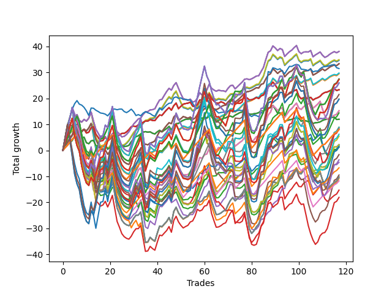

# Long Pointer 003 
- Symbol: NVDA_Unlimited
- Date Range: 02/08/2022 - 07/08/2022
- Trading Period: 7:20-12:30
- Number of Trades: 117



| Name | Win Percent | Profit | Avg Profit / Trade | Avg Time / Trade |      | Name | Win Percent | Profit | Avg Profit / Trade | Avg Time / Trade |
| ---- | ----------- | ------ | ------------------ | ---------------- | ---- | ---- | ----------- | ------ | ------------------ | ---------------- |
| Sorted By <br> Profit | | | | | | Sorted By <br> Win Percentage ||||
| Sixty-Six | 69.23 | 19050.00 | 162.82 | 24:26 |     | One Hundred Twenty-Six | 75.21 | 4015.00 | 34.32 | 59:58 |
| Fifty-Eight | 69.23 | 19050.00 | 162.82 | 24:26 |     | One Hundred Twenty-One | 75.21 | 4015.00 | 34.32 | 59:58 |
| Two | 69.23 | 19050.00 | 162.82 | 24:26 |     | Eighty-One | 75.21 | 4015.00 | 34.32 | 59:58 |
| Fifty | 69.23 | 17470.00 | 149.32 | 24:10 |     | One Hundred Sixteen | 72.65 | -3345.00 | -28.59 | 52:18 |
| Forty-Two | 69.23 | 17320.00 | 148.03 | 24:11 |     | One Hundred Eleven | 72.65 | -5860.00 | -50.09 | 53:12 |
| Sixty-Seven | 70.09 | 16690.00 | 142.65 | 23:36 |     | Sixty-Seven | 70.09 | 16690.00 | 142.65 | 23:36 |
| Fifty-Nine | 70.09 | 16690.00 | 142.65 | 23:36 |     | Fifty-Nine | 70.09 | 16690.00 | 142.65 | 23:36 |
| Three | 70.09 | 16690.00 | 142.65 | 23:36 |     | Three | 70.09 | 16690.00 | 142.65 | 23:36 |
| Seventy-Three | 47.01 | 15760.00 | 134.70 | 11:32 |     | Fifty-One | 70.09 | 14895.00 | 127.31 | 23:16 |
| Fifty-One | 70.09 | 14895.00 | 127.31 | 23:16 |     | Forty-Three | 70.09 | 14745.00 | 126.03 | 23:17 |
| Forty-Three | 70.09 | 14745.00 | 126.03 | 23:17 |     | Sixty-Six | 69.23 | 19050.00 | 162.82 | 24:26 |
| One Hundred Twenty-Seven | 64.10 | 13740.00 | 117.44 | 97:54 |     | Fifty-Eight | 69.23 | 19050.00 | 162.82 | 24:26 |
| One Hundred Twenty-Two | 64.10 | 13740.00 | 117.44 | 97:54 |     | Two | 69.23 | 19050.00 | 162.82 | 24:26 |
| Eighty-Two | 64.10 | 13740.00 | 117.44 | 97:54 |     | Fifty | 69.23 | 17470.00 | 149.32 | 24:10 |
| One Hundred Twenty-Eight | 56.41 | 13660.00 | 116.75 | 120:37 |     | Forty-Two | 69.23 | 17320.00 | 148.03 | 24:11 |
| One Hundred Twenty-Three | 56.41 | 13660.00 | 116.75 | 120:37 |     | Sixty-Four | 69.23 | 5990.00 | 51.20 | 09:02 |
| Eighty-Three | 56.41 | 13660.00 | 116.75 | 120:37 |     | Fifty-Six | 69.23 | 5990.00 | 51.20 | 09:02 |
| One Hundred Twenty-Nine | 52.14 | 12980.00 | 110.94 | 141:55 |     | Forty-Eight | 69.23 | 5990.00 | 51.20 | 09:02 |
| One Hundred Twenty-Four | 52.14 | 12980.00 | 110.94 | 141:55 |     | Forty | 69.23 | 5990.00 | 51.20 | 09:02 |
| Eighty-Four | 52.14 | 12980.00 | 110.94 | 141:55 |     | Zero | 69.23 | 5990.00 | 51.20 | 09:02 |
| Sixty-Five | 66.67 | 11680.00 | 99.83 | 16:06 |     | Sixty-Five | 66.67 | 11680.00 | 99.83 | 16:06 |
| Fifty-Seven | 66.67 | 11680.00 | 99.83 | 16:06 |     | Fifty-Seven | 66.67 | 11680.00 | 99.83 | 16:06 |
| Forty-Nine | 66.67 | 11680.00 | 99.83 | 16:06 |     | Forty-Nine | 66.67 | 11680.00 | 99.83 | 16:06 |
| Forty-One | 66.67 | 11680.00 | 99.83 | 16:06 |     | Forty-One | 66.67 | 11680.00 | 99.83 | 16:06 |
| One | 66.67 | 11680.00 | 99.83 | 16:06 |     | One | 66.67 | 11680.00 | 99.83 | 16:06 |
| One Hundred Thirty | 49.57 | 10770.00 | 92.05 | 151:00 |     | One Hundred Twenty-Seven | 64.10 | 13740.00 | 117.44 | 97:54 |
| One Hundred Twenty-Five | 49.57 | 9870.00 | 84.36 | 151:15 |     | One Hundred Twenty-Two | 64.10 | 13740.00 | 117.44 | 97:54 |
| Eighty-Five | 49.57 | 9870.00 | 84.36 | 151:15 |     | Eighty-Two | 64.10 | 13740.00 | 117.44 | 97:54 |
| Sixty-Eight | 61.54 | 7630.00 | 65.21 | 43:48 |     | Sixty-Eight | 61.54 | 7630.00 | 65.21 | 43:48 |
| Sixty | 61.54 | 7630.00 | 65.21 | 43:48 |     | Sixty | 61.54 | 7630.00 | 65.21 | 43:48 |
| Four | 61.54 | 7630.00 | 65.21 | 43:48 |     | Four | 61.54 | 7630.00 | 65.21 | 43:48 |
| One Hundred Seventeen | 61.54 | 7220.00 | 61.71 | 83:24 |     | One Hundred Seventeen | 61.54 | 7220.00 | 61.71 | 83:24 |
| Sixty-Four | 69.23 | 5990.00 | 51.20 | 09:02 |     | One Hundred Twelve | 61.54 | 4245.00 | 36.28 | 85:55 |
| Fifty-Six | 69.23 | 5990.00 | 51.20 | 09:02 |     | Fifty-Two | 61.54 | 960.00 | 8.21 | 39:58 |
| Forty-Eight | 69.23 | 5990.00 | 51.20 | 09:02 |     | Forty-Four | 61.54 | 695.00 | 5.94 | 41:31 |
| Forty | 69.23 | 5990.00 | 51.20 | 09:02 |     | Sixty-Nine | 60.68 | -5130.00 | -43.85 | 62:40 |
| Zero | 69.23 | 5990.00 | 51.20 | 09:02 |     | Sixty-One | 60.68 | -5130.00 | -43.85 | 62:40 |
| Seventy-One | 53.85 | 4450.00 | 38.03 | 130:38 |     | Five | 60.68 | -5130.00 | -43.85 | 62:40 |
| Sixty-Three | 53.85 | 4450.00 | 38.03 | 130:38 |     | Forty-Five | 60.68 | -7635.00 | -65.26 | 55:36 |
| Seven | 53.85 | 4450.00 | 38.03 | 130:38 |     | Seventy | 59.83 | 1120.00 | 9.57 | 85:28 |
| One Hundred Twelve | 61.54 | 4245.00 | 36.28 | 85:55 |     | Sixty-Two | 59.83 | 1120.00 | 9.57 | 85:28 |
| One Hundred Eighteen | 52.14 | 4080.00 | 34.87 | 102:33 |     | Six | 59.83 | 1120.00 | 9.57 | 85:28 |
| One Hundred Twenty-Six | 75.21 | 4015.00 | 34.32 | 59:58 |     | Forty-Six | 58.97 | -2290.00 | -19.57 | 76:34 |
| One Hundred Twenty-One | 75.21 | 4015.00 | 34.32 | 59:58 |     | Fifty-Three | 58.97 | -5410.00 | -46.24 | 52:03 |
| Eighty-One | 75.21 | 4015.00 | 34.32 | 59:58 |     | Fifty-Four | 58.12 | 615.00 | 5.26 | 74:46 |
| One Hundred Fourteen | 50.43 | 3115.00 | 26.62 | 128:13 |     | One Hundred Twenty-Eight | 56.41 | 13660.00 | 116.75 | 120:37 |
| One Hundred Thirteen | 53.85 | 2740.00 | 23.42 | 107:52 |     | One Hundred Twenty-Three | 56.41 | 13660.00 | 116.75 | 120:37 |
| Seventy | 59.83 | 1120.00 | 9.57 | 85:28 |     | Eighty-Three | 56.41 | 13660.00 | 116.75 | 120:37 |
| Sixty-Two | 59.83 | 1120.00 | 9.57 | 85:28 |     | Seventy-One | 53.85 | 4450.00 | 38.03 | 130:38 |
| Six | 59.83 | 1120.00 | 9.57 | 85:28 |     | Sixty-Three | 53.85 | 4450.00 | 38.03 | 130:38 |
| Fifty-Two | 61.54 | 960.00 | 8.21 | 39:58 |     | Seven | 53.85 | 4450.00 | 38.03 | 130:38 |
| One Hundred Fifteen | 47.86 | 750.00 | 6.41 | 136:53 |     | One Hundred Thirteen | 53.85 | 2740.00 | 23.42 | 107:52 |
| Forty-Four | 61.54 | 695.00 | 5.94 | 41:31 |     | One Hundred Twenty-Nine | 52.14 | 12980.00 | 110.94 | 141:55 |
| Fifty-Four | 58.12 | 615.00 | 5.26 | 74:46 |     | One Hundred Twenty-Four | 52.14 | 12980.00 | 110.94 | 141:55 |
| One Hundred Twenty | 44.44 | -800.00 | -6.84 | 121:58 |     | Eighty-Four | 52.14 | 12980.00 | 110.94 | 141:55 |
| One Hundred Ninteen | 47.01 | -1805.00 | -15.43 | 116:54 |     | One Hundred Eighteen | 52.14 | 4080.00 | 34.87 | 102:33 |
| Forty-Six | 58.97 | -2290.00 | -19.57 | 76:34 |     | Forty-Seven | 51.28 | -4735.00 | -40.47 | 117:56 |
| One Hundred Sixteen | 72.65 | -3345.00 | -28.59 | 52:18 |     | One Hundred Fourteen | 50.43 | 3115.00 | 26.62 | 128:13 |
| Forty-Seven | 51.28 | -4735.00 | -40.47 | 117:56 |     | One Hundred Thirty | 49.57 | 10770.00 | 92.05 | 151:00 |
| Sixty-Nine | 60.68 | -5130.00 | -43.85 | 62:40 |     | One Hundred Twenty-Five | 49.57 | 9870.00 | 84.36 | 151:15 |
| Sixty-One | 60.68 | -5130.00 | -43.85 | 62:40 |     | Eighty-Five | 49.57 | 9870.00 | 84.36 | 151:15 |
| Five | 60.68 | -5130.00 | -43.85 | 62:40 |     | One Hundred Fifteen | 47.86 | 750.00 | 6.41 | 136:53 |
| Fifty-Three | 58.97 | -5410.00 | -46.24 | 52:03 |     | Fifty-Five | 47.86 | -9035.00 | -77.22 | 106:57 |
| One Hundred Eleven | 72.65 | -5860.00 | -50.09 | 53:12 |     | Seventy-Three | 47.01 | 15760.00 | 134.70 | 11:32 |
| Forty-Five | 60.68 | -7635.00 | -65.26 | 55:36 |     | One Hundred Ninteen | 47.01 | -1805.00 | -15.43 | 116:54 |
| Fifty-Five | 47.86 | -9035.00 | -77.22 | 106:57 |     | One Hundred Twenty | 44.44 | -800.00 | -6.84 | 121:58 |

## NO STOPLOSS

### Test Zero
* Sell when price hits the middle line of the 20p bollinger
* No Stoploss
* Results:
```
Total Trades: 117
Percent Up: 69.23
Percent Down: 30.77
Total Points Moved Up: 11.98
Potential Profit: 5990.00
Total Points Ups: 41.06 Count Ups: 81
Total Points Downs: -29.08 Count Downs: 36
```

<details><summary>Trades</summary>

<code>In: 2022-02-08 07:37:00		Out: 2022-02-08 07:42:10		Total Position Time: 05:10		Total Move Up: 1.14		Total to Date: 1.14</code> <br />
<code>In: 2022-02-08 07:38:00		Out: 2022-02-08 07:42:10		Total Position Time: 04:10		Total Move Up: 0.94		Total to Date: 2.08</code> <br />
<code>In: 2022-02-10 08:38:00		Out: 2022-02-10 08:40:10		Total Position Time: 02:10		Total Move Up: 0.93		Total to Date: 3.01</code> <br />
<code>In: 2022-02-10 08:39:00		Out: 2022-02-10 08:40:10		Total Position Time: 01:10		Total Move Up: 0.85		Total to Date: 3.86</code> <br />
<code>In: 2022-02-10 09:53:00		Out: 2022-02-10 10:00:20		Total Position Time: 07:20		Total Move Up: 1.67		Total to Date: 5.53</code> <br />
<code>In: 2022-02-10 10:40:00		Out: 2022-02-10 10:41:10		Total Position Time: 01:10		Total Move Up: 0.49		Total to Date: 6.02</code> <br />
<code>In: 2022-02-10 12:26:00		Out: 2022-02-10 12:41:20		Total Position Time: 15:20		Total Move Up: -1.07		Total to Date: 4.95</code> <br />
<code>In: 2022-02-11 10:41:00		Out: 2022-02-11 10:52:10		Total Position Time: 11:10		Total Move Up: -0.03		Total to Date: 4.92</code> <br />
<code>In: 2022-02-11 11:05:00		Out: 2022-02-11 11:15:15		Total Position Time: 10:15		Total Move Up: 0.20		Total to Date: 5.12</code> <br />
<code>In: 2022-02-11 11:34:00		Out: 2022-02-11 12:00:30		Total Position Time: 26:30		Total Move Up: -2.16		Total to Date: 2.96</code> <br />
<code>In: 2022-02-11 11:49:00		Out: 2022-02-11 12:00:30		Total Position Time: 11:30		Total Move Up: -0.36		Total to Date: 2.60</code> <br />
<code>In: 2022-02-14 07:40:00		Out: 2022-02-14 07:41:25		Total Position Time: 01:25		Total Move Up: 1.08		Total to Date: 3.68</code> <br />
<code>In: 2022-02-14 10:34:00		Out: 2022-02-14 10:42:10		Total Position Time: 08:10		Total Move Up: 0.19		Total to Date: 3.87</code> <br />
<code>In: 2022-02-16 09:03:00		Out: 2022-02-16 09:28:15		Total Position Time: 25:15		Total Move Up: -1.96		Total to Date: 1.91</code> <br />
<code>In: 2022-02-16 09:13:00		Out: 2022-02-16 09:28:15		Total Position Time: 15:15		Total Move Up: -0.43		Total to Date: 1.48</code> <br />
<code>In: 2022-02-16 09:14:00		Out: 2022-02-16 09:28:15		Total Position Time: 14:15		Total Move Up: -0.51		Total to Date: 0.97</code> <br />
<code>In: 2022-02-17 10:25:00		Out: 2022-02-17 10:31:30		Total Position Time: 06:30		Total Move Up: 0.44		Total to Date: 1.41</code> <br />
<code>In: 2022-02-18 07:36:00		Out: 2022-02-18 07:43:55		Total Position Time: 07:55		Total Move Up: 0.68		Total to Date: 2.09</code> <br />
<code>In: 2022-02-22 08:02:00		Out: 2022-02-22 08:26:50		Total Position Time: 24:50		Total Move Up: -1.41		Total to Date: 0.68</code> <br />
<code>In: 2022-02-22 09:18:00		Out: 2022-02-22 09:25:40		Total Position Time: 07:40		Total Move Up: 0.36		Total to Date: 1.04</code> <br />
<code>In: 2022-02-22 11:13:00		Out: 2022-02-22 11:15:40		Total Position Time: 02:40		Total Move Up: 0.69		Total to Date: 1.73</code> <br />
<code>In: 2022-02-23 10:17:00		Out: 2022-02-23 10:36:15		Total Position Time: 19:15		Total Move Up: -0.41		Total to Date: 1.32</code> <br />
<code>In: 2022-02-23 10:18:00		Out: 2022-02-23 10:36:15		Total Position Time: 18:15		Total Move Up: -0.66		Total to Date: 0.66</code> <br />
<code>In: 2022-02-23 11:46:00		Out: 2022-02-23 11:47:50		Total Position Time: 01:50		Total Move Up: 0.82		Total to Date: 1.48</code> <br />
<code>In: 2022-02-23 11:47:00		Out: 2022-02-23 11:48:55		Total Position Time: 01:55		Total Move Up: 0.44		Total to Date: 1.92</code> <br />
<code>In: 2022-02-23 12:11:00		Out: 2022-02-23 12:26:05		Total Position Time: 15:05		Total Move Up: -0.42		Total to Date: 1.50</code> <br />
<code>In: 2022-02-23 12:15:00		Out: 2022-02-23 12:26:05		Total Position Time: 11:05		Total Move Up: 0.11		Total to Date: 1.61</code> <br />
<code>In: 2022-02-23 12:25:00		Out: 2022-02-23 12:26:10		Total Position Time: 01:10		Total Move Up: 0.37		Total to Date: 1.98</code> <br />
<code>In: 2022-02-25 09:57:00		Out: 2022-02-25 10:00:10		Total Position Time: 03:10		Total Move Up: 1.37		Total to Date: 3.35</code> <br />
<code>In: 2022-02-25 10:59:00		Out: 2022-02-25 11:04:15		Total Position Time: 05:15		Total Move Up: 1.21		Total to Date: 4.56</code> <br />
<code>In: 2022-02-25 11:00:00		Out: 2022-02-25 11:04:15		Total Position Time: 04:15		Total Move Up: 0.74		Total to Date: 5.30</code> <br />
<code>In: 2022-02-28 09:49:00		Out: 2022-02-28 09:58:05		Total Position Time: 09:05		Total Move Up: 0.36		Total to Date: 5.66</code> <br />
<code>In: 2022-02-28 11:12:00		Out: 2022-02-28 11:21:20		Total Position Time: 09:20		Total Move Up: 0.70		Total to Date: 6.36</code> <br />
<code>In: 2022-03-01 08:01:00		Out: 2022-03-01 08:04:05		Total Position Time: 03:05		Total Move Up: 0.70		Total to Date: 7.06</code> <br />
<code>In: 2022-03-01 08:04:00		Out: 2022-03-01 08:05:15		Total Position Time: 01:15		Total Move Up: 0.18		Total to Date: 7.24</code> <br />
<code>In: 2022-03-01 10:17:00		Out: 2022-03-01 10:34:00		Total Position Time: 17:00		Total Move Up: -0.22		Total to Date: 7.02</code> <br />
<code>In: 2022-03-03 08:02:00		Out: 2022-03-03 08:03:15		Total Position Time: 01:15		Total Move Up: 0.14		Total to Date: 7.16</code> <br />
<code>In: 2022-03-03 12:06:00		Out: 2022-03-03 12:24:40		Total Position Time: 18:40		Total Move Up: -0.53		Total to Date: 6.63</code> <br />
<code>In: 2022-03-03 12:11:00		Out: 2022-03-03 12:24:40		Total Position Time: 13:40		Total Move Up: -0.29		Total to Date: 6.34</code> <br />
<code>In: 2022-03-04 08:15:00		Out: 2022-03-04 08:18:05		Total Position Time: 03:05		Total Move Up: 0.81		Total to Date: 7.15</code> <br />
<code>In: 2022-03-04 08:16:00		Out: 2022-03-04 08:18:05		Total Position Time: 02:05		Total Move Up: 0.60		Total to Date: 7.75</code> <br />
<code>In: 2022-03-04 11:05:00		Out: 2022-03-04 11:23:50		Total Position Time: 18:50		Total Move Up: -0.61		Total to Date: 7.14</code> <br />
<code>In: 2022-03-04 11:19:00		Out: 2022-03-04 11:23:50		Total Position Time: 04:50		Total Move Up: 0.67		Total to Date: 7.81</code> <br />
<code>In: 2022-03-04 11:20:00		Out: 2022-03-04 11:23:50		Total Position Time: 03:50		Total Move Up: 0.60		Total to Date: 8.41</code> <br />
<code>In: 2022-03-04 12:02:00		Out: 2022-03-04 12:03:10		Total Position Time: 01:10		Total Move Up: 0.85		Total to Date: 9.26</code> <br />
<code>In: 2022-03-07 11:56:00		Out: 2022-03-07 12:23:50		Total Position Time: 27:50		Total Move Up: -1.38		Total to Date: 7.88</code> <br />
<code>In: 2022-03-08 08:35:00		Out: 2022-03-08 08:40:30		Total Position Time: 05:30		Total Move Up: 1.66		Total to Date: 9.54</code> <br />
<code>In: 2022-03-09 08:14:00		Out: 2022-03-09 08:18:35		Total Position Time: 04:35		Total Move Up: 0.76		Total to Date: 10.30</code> <br />
<code>In: 2022-03-11 12:11:00		Out: 2022-03-11 12:18:15		Total Position Time: 07:15		Total Move Up: 0.10		Total to Date: 10.40</code> <br />
<code>In: 2022-03-14 09:16:00		Out: 2022-03-14 09:19:40		Total Position Time: 03:40		Total Move Up: 0.73		Total to Date: 11.13</code> <br />
<code>In: 2022-03-14 09:37:00		Out: 2022-03-14 09:40:45		Total Position Time: 03:45		Total Move Up: 0.47		Total to Date: 11.60</code> <br />
<code>In: 2022-03-14 10:11:00		Out: 2022-03-14 10:12:10		Total Position Time: 01:10		Total Move Up: 0.37		Total to Date: 11.97</code> <br />
<code>In: 2022-03-14 10:12:00		Out: 2022-03-14 10:19:10		Total Position Time: 07:10		Total Move Up: 0.08		Total to Date: 12.05</code> <br />
<code>In: 2022-03-14 10:35:00		Out: 2022-03-14 10:43:50		Total Position Time: 08:50		Total Move Up: 0.13		Total to Date: 12.18</code> <br />
<code>In: 2022-03-17 07:35:00		Out: 2022-03-17 07:59:35		Total Position Time: 24:35		Total Move Up: -1.39		Total to Date: 10.79</code> <br />
<code>In: 2022-03-17 07:50:00		Out: 2022-03-17 07:59:35		Total Position Time: 09:35		Total Move Up: 0.01		Total to Date: 10.80</code> <br />
<code>In: 2022-03-17 07:56:00		Out: 2022-03-17 07:59:35		Total Position Time: 03:35		Total Move Up: 0.94		Total to Date: 11.74</code> <br />
<code>In: 2022-03-28 07:24:00		Out: 2022-03-28 07:29:20		Total Position Time: 05:20		Total Move Up: 1.09		Total to Date: 12.83</code> <br />
<code>In: 2022-03-28 08:39:00		Out: 2022-03-28 09:01:10		Total Position Time: 22:10		Total Move Up: -0.49		Total to Date: 12.34</code> <br />
<code>In: 2022-03-29 09:37:00		Out: 2022-03-29 09:42:50		Total Position Time: 05:50		Total Move Up: 0.51		Total to Date: 12.85</code> <br />
<code>In: 2022-03-30 08:03:00		Out: 2022-03-30 08:15:05		Total Position Time: 12:05		Total Move Up: -0.43		Total to Date: 12.42</code> <br />
<code>In: 2022-03-30 08:30:00		Out: 2022-03-30 08:32:15		Total Position Time: 02:15		Total Move Up: 0.77		Total to Date: 13.19</code> <br />
<code>In: 2022-03-30 10:24:00		Out: 2022-03-30 10:33:25		Total Position Time: 09:25		Total Move Up: 0.37		Total to Date: 13.56</code> <br />
<code>In: 2022-03-30 10:56:00		Out: 2022-03-30 11:29:20		Total Position Time: 33:20		Total Move Up: -1.27		Total to Date: 12.29</code> <br />
<code>In: 2022-03-30 11:04:00		Out: 2022-03-30 11:29:20		Total Position Time: 25:20		Total Move Up: -1.09		Total to Date: 11.20</code> <br />
<code>In: 2022-03-30 12:07:00		Out: 2022-03-30 12:14:35		Total Position Time: 07:35		Total Move Up: 0.39		Total to Date: 11.59</code> <br />
<code>In: 2022-03-31 09:37:00		Out: 2022-03-31 09:38:10		Total Position Time: 01:10		Total Move Up: 0.32		Total to Date: 11.91</code> <br />
<code>In: 2022-03-31 10:01:00		Out: 2022-03-31 10:02:10		Total Position Time: 01:10		Total Move Up: 0.45		Total to Date: 12.36</code> <br />
<code>In: 2022-03-31 10:02:00		Out: 2022-03-31 10:03:10		Total Position Time: 01:10		Total Move Up: 0.18		Total to Date: 12.54</code> <br />
<code>In: 2022-03-31 10:18:00		Out: 2022-03-31 10:26:30		Total Position Time: 08:30		Total Move Up: 0.48		Total to Date: 13.02</code> <br />
<code>In: 2022-03-31 10:19:00		Out: 2022-03-31 10:26:30		Total Position Time: 07:30		Total Move Up: 0.20		Total to Date: 13.22</code> <br />
<code>In: 2022-04-01 10:03:00		Out: 2022-04-01 10:19:40		Total Position Time: 16:40		Total Move Up: -0.41		Total to Date: 12.81</code> <br />
<code>In: 2022-04-07 08:36:00		Out: 2022-04-07 08:40:50		Total Position Time: 04:50		Total Move Up: 0.76		Total to Date: 13.57</code> <br />
<code>In: 2022-04-08 10:37:00		Out: 2022-04-08 10:39:40		Total Position Time: 02:40		Total Move Up: 0.49		Total to Date: 14.06</code> <br />
<code>In: 2022-04-08 10:37:00		Out: 2022-04-08 10:39:40		Total Position Time: 02:40		Total Move Up: 0.49		Total to Date: 14.55</code> <br />
<code>In: 2022-04-12 11:27:00		Out: 2022-04-12 11:36:10		Total Position Time: 09:10		Total Move Up: 0.25		Total to Date: 14.80</code> <br />
<code>In: 2022-04-13 10:57:00		Out: 2022-04-13 10:59:35		Total Position Time: 02:35		Total Move Up: 0.38		Total to Date: 15.18</code> <br />
<code>In: 2022-04-21 09:28:00		Out: 2022-04-21 09:41:50		Total Position Time: 13:50		Total Move Up: -0.18		Total to Date: 15.00</code> <br />
<code>In: 2022-04-21 09:57:00		Out: 2022-04-21 10:13:25		Total Position Time: 16:25		Total Move Up: -1.06		Total to Date: 13.94</code> <br />
<code>In: 2022-04-22 09:01:00		Out: 2022-04-22 09:14:05		Total Position Time: 13:05		Total Move Up: -0.01		Total to Date: 13.93</code> <br />
<code>In: 2022-04-22 11:12:00		Out: 2022-04-22 11:17:15		Total Position Time: 05:15		Total Move Up: 0.19		Total to Date: 14.12</code> <br />
<code>In: 2022-04-22 11:59:00		Out: 2022-04-22 12:07:55		Total Position Time: 08:55		Total Move Up: 0.13		Total to Date: 14.25</code> <br />
<code>In: 2022-05-02 10:24:00		Out: 2022-05-02 10:30:50		Total Position Time: 06:50		Total Move Up: 0.29		Total to Date: 14.54</code> <br />
<code>In: 2022-05-02 10:51:00		Out: 2022-05-02 10:55:45		Total Position Time: 04:45		Total Move Up: 0.75		Total to Date: 15.29</code> <br />
<code>In: 2022-05-03 11:45:00		Out: 2022-05-03 11:46:10		Total Position Time: 01:10		Total Move Up: -0.16		Total to Date: 15.13</code> <br />
<code>In: 2022-05-04 11:36:00		Out: 2022-05-04 11:41:10		Total Position Time: 05:10		Total Move Up: 0.72		Total to Date: 15.85</code> <br />
<code>In: 2022-05-04 11:37:00		Out: 2022-05-04 11:41:10		Total Position Time: 04:10		Total Move Up: 0.42		Total to Date: 16.27</code> <br />
<code>In: 2022-05-06 11:41:00		Out: 2022-05-06 11:43:05		Total Position Time: 02:05		Total Move Up: 0.16		Total to Date: 16.43</code> <br />
<code>In: 2022-06-01 07:39:00		Out: 2022-06-01 07:40:10		Total Position Time: 01:10		Total Move Up: 0.93		Total to Date: 17.36</code> <br />
<code>In: 2022-06-01 08:54:00		Out: 2022-06-01 09:16:05		Total Position Time: 22:05		Total Move Up: -1.42		Total to Date: 15.94</code> <br />
<code>In: 2022-06-01 08:55:00		Out: 2022-06-01 09:16:05		Total Position Time: 21:05		Total Move Up: -1.64		Total to Date: 14.30</code> <br />
<code>In: 2022-06-01 09:06:00		Out: 2022-06-01 09:16:05		Total Position Time: 10:05		Total Move Up: 0.17		Total to Date: 14.47</code> <br />
<code>In: 2022-06-03 08:05:00		Out: 2022-06-03 08:21:10		Total Position Time: 16:10		Total Move Up: -0.64		Total to Date: 13.83</code> <br />
<code>In: 2022-06-06 08:01:00		Out: 2022-06-06 08:30:10		Total Position Time: 29:10		Total Move Up: -2.64		Total to Date: 11.19</code> <br />
<code>In: 2022-06-06 09:33:00		Out: 2022-06-06 09:34:10		Total Position Time: 01:10		Total Move Up: 0.33		Total to Date: 11.52</code> <br />
<code>In: 2022-06-06 09:34:00		Out: 2022-06-06 09:35:10		Total Position Time: 01:10		Total Move Up: 0.26		Total to Date: 11.78</code> <br />
<code>In: 2022-06-06 12:23:00		Out: 2022-06-06 12:28:25		Total Position Time: 05:25		Total Move Up: 0.19		Total to Date: 11.97</code> <br />
<code>In: 2022-06-07 08:51:00		Out: 2022-06-07 08:52:30		Total Position Time: 01:30		Total Move Up: 0.37		Total to Date: 12.34</code> <br />
<code>In: 2022-06-07 08:52:00		Out: 2022-06-07 08:53:15		Total Position Time: 01:15		Total Move Up: 0.24		Total to Date: 12.58</code> <br />
<code>In: 2022-06-08 08:47:00		Out: 2022-06-08 09:02:30		Total Position Time: 15:30		Total Move Up: -0.25		Total to Date: 12.33</code> <br />
<code>In: 2022-06-08 09:30:00		Out: 2022-06-08 09:50:40		Total Position Time: 20:40		Total Move Up: -1.09		Total to Date: 11.24</code> <br />
<code>In: 2022-06-08 09:42:00		Out: 2022-06-08 09:50:40		Total Position Time: 08:40		Total Move Up: 0.35		Total to Date: 11.59</code> <br />
<code>In: 2022-06-09 08:10:00		Out: 2022-06-09 08:25:00		Total Position Time: 15:00		Total Move Up: -0.19		Total to Date: 11.40</code> <br />
<code>In: 2022-06-09 08:11:00		Out: 2022-06-09 08:25:00		Total Position Time: 14:00		Total Move Up: -0.32		Total to Date: 11.08</code> <br />
<code>In: 2022-06-09 10:47:00		Out: 2022-06-09 10:51:55		Total Position Time: 04:55		Total Move Up: 0.36		Total to Date: 11.44</code> <br />
<code>In: 2022-06-09 11:58:00		Out: 2022-06-09 12:18:35		Total Position Time: 20:35		Total Move Up: -1.07		Total to Date: 10.37</code> <br />
<code>In: 2022-06-21 09:13:00		Out: 2022-06-21 09:14:45		Total Position Time: 01:45		Total Move Up: 0.31		Total to Date: 10.68</code> <br />
<code>In: 2022-06-22 08:05:00		Out: 2022-06-22 08:15:25		Total Position Time: 10:25		Total Move Up: 0.06		Total to Date: 10.74</code> <br />
<code>In: 2022-06-22 09:11:00		Out: 2022-06-22 09:17:40		Total Position Time: 06:40		Total Move Up: 0.25		Total to Date: 10.99</code> <br />
<code>In: 2022-06-23 08:08:00		Out: 2022-06-23 08:11:35		Total Position Time: 03:35		Total Move Up: 0.53		Total to Date: 11.52</code> <br />
<code>In: 2022-06-23 08:42:00		Out: 2022-06-23 08:49:25		Total Position Time: 07:25		Total Move Up: 0.37		Total to Date: 11.89</code> <br />
<code>In: 2022-06-23 09:07:00		Out: 2022-06-23 09:18:25		Total Position Time: 11:25		Total Move Up: 0.09		Total to Date: 11.98</code> <br />
<code>In: 2022-06-23 10:06:00		Out: 2022-06-23 10:07:45		Total Position Time: 01:45		Total Move Up: 0.50		Total to Date: 12.48</code> <br />
<code>In: 2022-06-23 10:44:00		Out: 2022-06-23 10:46:30		Total Position Time: 02:30		Total Move Up: 0.22		Total to Date: 12.70</code> <br />
<code>In: 2022-06-23 10:45:00		Out: 2022-06-23 10:46:30		Total Position Time: 01:30		Total Move Up: 0.09		Total to Date: 12.79</code> <br />
<code>In: 2022-06-30 12:02:00		Out: 2022-06-30 12:22:20		Total Position Time: 20:20		Total Move Up: -0.88		Total to Date: 11.91</code> <br />
<code>In: 2022-06-30 12:11:00		Out: 2022-06-30 12:22:20		Total Position Time: 11:20		Total Move Up: 0.07		Total to Date: 11.98</code> <br />


</details>

### Test One
* Sell when the price hits the upper line of the 20p 1std bollinger
* No Stoploss
* Results:
```
Total Trades: 117
Percent Up: 66.67
Percent Down: 33.33
Total Points Moved Up: 23.36
Potential Profit: 11680.00
Total Points Ups: 59.57 Count Ups: 78
Total Points Downs: -36.21 Count Downs: 39
```

<details><summary>Trades</summary>

<code>In: 2022-02-08 07:37:00		Out: 2022-02-08 07:44:20		Total Position Time: 07:20		Total Move Up: 1.72		Total to Date: 1.72</code> <br />
<code>In: 2022-02-08 07:38:00		Out: 2022-02-08 07:44:20		Total Position Time: 06:20		Total Move Up: 1.52		Total to Date: 3.24</code> <br />
<code>In: 2022-02-10 08:38:00		Out: 2022-02-10 08:43:10		Total Position Time: 05:10		Total Move Up: 1.43		Total to Date: 4.67</code> <br />
<code>In: 2022-02-10 08:39:00		Out: 2022-02-10 08:43:10		Total Position Time: 04:10		Total Move Up: 1.35		Total to Date: 6.02</code> <br />
<code>In: 2022-02-10 09:53:00		Out: 2022-02-10 10:05:05		Total Position Time: 12:05		Total Move Up: 2.21		Total to Date: 8.23</code> <br />
<code>In: 2022-02-10 10:40:00		Out: 2022-02-10 10:43:25		Total Position Time: 03:25		Total Move Up: 0.97		Total to Date: 9.20</code> <br />
<code>In: 2022-02-10 12:26:00		Out: 2022-02-10 12:47:00		Total Position Time: 21:00		Total Move Up: -2.28		Total to Date: 6.92</code> <br />
<code>In: 2022-02-11 10:41:00		Out: 2022-02-11 10:54:35		Total Position Time: 13:35		Total Move Up: 0.58		Total to Date: 7.50</code> <br />
<code>In: 2022-02-11 11:05:00		Out: 2022-02-11 11:18:20		Total Position Time: 13:20		Total Move Up: 0.68		Total to Date: 8.18</code> <br />
<code>In: 2022-02-11 11:34:00		Out: 2022-02-11 12:03:05		Total Position Time: 29:05		Total Move Up: -1.48		Total to Date: 6.70</code> <br />
<code>In: 2022-02-11 11:49:00		Out: 2022-02-11 12:03:05		Total Position Time: 14:05		Total Move Up: 0.32		Total to Date: 7.02</code> <br />
<code>In: 2022-02-14 07:40:00		Out: 2022-02-14 07:42:45		Total Position Time: 02:45		Total Move Up: 1.75		Total to Date: 8.77</code> <br />
<code>In: 2022-02-14 10:34:00		Out: 2022-02-14 10:47:05		Total Position Time: 13:05		Total Move Up: 0.34		Total to Date: 9.11</code> <br />
<code>In: 2022-02-16 09:03:00		Out: 2022-02-16 09:49:05		Total Position Time: 46:05		Total Move Up: -2.83		Total to Date: 6.28</code> <br />
<code>In: 2022-02-16 09:13:00		Out: 2022-02-16 09:49:05		Total Position Time: 36:05		Total Move Up: -1.30		Total to Date: 4.98</code> <br />
<code>In: 2022-02-16 09:14:00		Out: 2022-02-16 09:49:05		Total Position Time: 35:05		Total Move Up: -1.38		Total to Date: 3.60</code> <br />
<code>In: 2022-02-17 10:25:00		Out: 2022-02-17 10:54:05		Total Position Time: 29:05		Total Move Up: 0.26		Total to Date: 3.86</code> <br />
<code>In: 2022-02-18 07:36:00		Out: 2022-02-18 07:46:10		Total Position Time: 10:10		Total Move Up: 1.41		Total to Date: 5.27</code> <br />
<code>In: 2022-02-22 08:02:00		Out: 2022-02-22 08:33:50		Total Position Time: 31:50		Total Move Up: -1.65		Total to Date: 3.62</code> <br />
<code>In: 2022-02-22 09:18:00		Out: 2022-02-22 09:26:35		Total Position Time: 08:35		Total Move Up: 0.83		Total to Date: 4.45</code> <br />
<code>In: 2022-02-22 11:13:00		Out: 2022-02-22 11:20:05		Total Position Time: 07:05		Total Move Up: 1.22		Total to Date: 5.67</code> <br />
<code>In: 2022-02-23 10:17:00		Out: 2022-02-23 10:42:05		Total Position Time: 25:05		Total Move Up: -0.07		Total to Date: 5.60</code> <br />
<code>In: 2022-02-23 10:18:00		Out: 2022-02-23 10:42:05		Total Position Time: 24:05		Total Move Up: -0.32		Total to Date: 5.28</code> <br />
<code>In: 2022-02-23 11:46:00		Out: 2022-02-23 12:00:35		Total Position Time: 14:35		Total Move Up: 0.74		Total to Date: 6.02</code> <br />
<code>In: 2022-02-23 11:47:00		Out: 2022-02-23 12:00:35		Total Position Time: 13:35		Total Move Up: 0.52		Total to Date: 6.54</code> <br />
<code>In: 2022-02-23 12:11:00		Out: 2022-02-23 12:27:10		Total Position Time: 16:10		Total Move Up: 0.03		Total to Date: 6.57</code> <br />
<code>In: 2022-02-23 12:15:00		Out: 2022-02-23 12:27:10		Total Position Time: 12:10		Total Move Up: 0.56		Total to Date: 7.13</code> <br />
<code>In: 2022-02-23 12:25:00		Out: 2022-02-23 12:27:10		Total Position Time: 02:10		Total Move Up: 0.89		Total to Date: 8.02</code> <br />
<code>In: 2022-02-25 09:57:00		Out: 2022-02-25 10:24:45		Total Position Time: 27:45		Total Move Up: 1.10		Total to Date: 9.12</code> <br />
<code>In: 2022-02-25 10:59:00		Out: 2022-02-25 11:19:15		Total Position Time: 20:15		Total Move Up: 0.26		Total to Date: 9.38</code> <br />
<code>In: 2022-02-25 11:00:00		Out: 2022-02-25 11:19:15		Total Position Time: 19:15		Total Move Up: -0.21		Total to Date: 9.17</code> <br />
<code>In: 2022-02-28 09:49:00		Out: 2022-02-28 10:00:55		Total Position Time: 11:55		Total Move Up: 0.70		Total to Date: 9.87</code> <br />
<code>In: 2022-02-28 11:12:00		Out: 2022-02-28 11:43:00		Total Position Time: 31:00		Total Move Up: 0.06		Total to Date: 9.93</code> <br />
<code>In: 2022-03-01 08:01:00		Out: 2022-03-01 08:08:05		Total Position Time: 07:05		Total Move Up: 0.90		Total to Date: 10.83</code> <br />
<code>In: 2022-03-01 08:04:00		Out: 2022-03-01 08:08:05		Total Position Time: 04:05		Total Move Up: 0.48		Total to Date: 11.31</code> <br />
<code>In: 2022-03-01 10:17:00		Out: 2022-03-01 10:38:20		Total Position Time: 21:20		Total Move Up: -0.01		Total to Date: 11.30</code> <br />
<code>In: 2022-03-03 08:02:00		Out: 2022-03-03 08:05:30		Total Position Time: 03:30		Total Move Up: 0.55		Total to Date: 11.85</code> <br />
<code>In: 2022-03-03 12:06:00		Out: 2022-03-03 12:26:10		Total Position Time: 20:10		Total Move Up: -0.30		Total to Date: 11.55</code> <br />
<code>In: 2022-03-03 12:11:00		Out: 2022-03-03 12:26:10		Total Position Time: 15:10		Total Move Up: -0.06		Total to Date: 11.49</code> <br />
<code>In: 2022-03-04 08:15:00		Out: 2022-03-04 08:23:05		Total Position Time: 08:05		Total Move Up: 1.19		Total to Date: 12.68</code> <br />
<code>In: 2022-03-04 08:16:00		Out: 2022-03-04 08:23:05		Total Position Time: 07:05		Total Move Up: 0.98		Total to Date: 13.66</code> <br />
<code>In: 2022-03-04 11:05:00		Out: 2022-03-04 11:24:00		Total Position Time: 19:00		Total Move Up: -0.17		Total to Date: 13.49</code> <br />
<code>In: 2022-03-04 11:19:00		Out: 2022-03-04 11:24:00		Total Position Time: 05:00		Total Move Up: 1.11		Total to Date: 14.60</code> <br />
<code>In: 2022-03-04 11:20:00		Out: 2022-03-04 11:24:00		Total Position Time: 04:00		Total Move Up: 1.04		Total to Date: 15.64</code> <br />
<code>In: 2022-03-04 12:02:00		Out: 2022-03-04 12:03:10		Total Position Time: 01:10		Total Move Up: 0.85		Total to Date: 16.49</code> <br />
<code>In: 2022-03-07 11:56:00		Out: 2022-03-07 12:25:10		Total Position Time: 29:10		Total Move Up: -1.00		Total to Date: 15.49</code> <br />
<code>In: 2022-03-08 08:35:00		Out: 2022-03-08 08:46:45		Total Position Time: 11:45		Total Move Up: 1.75		Total to Date: 17.24</code> <br />
<code>In: 2022-03-09 08:14:00		Out: 2022-03-09 08:20:25		Total Position Time: 06:25		Total Move Up: 0.98		Total to Date: 18.22</code> <br />
<code>In: 2022-03-11 12:11:00		Out: 2022-03-11 12:47:00		Total Position Time: 36:00		Total Move Up: -2.16		Total to Date: 16.06</code> <br />
<code>In: 2022-03-14 09:16:00		Out: 2022-03-14 09:24:20		Total Position Time: 08:20		Total Move Up: 0.90		Total to Date: 16.96</code> <br />
<code>In: 2022-03-14 09:37:00		Out: 2022-03-14 09:42:05		Total Position Time: 05:05		Total Move Up: 0.84		Total to Date: 17.80</code> <br />
<code>In: 2022-03-14 10:11:00		Out: 2022-03-14 10:24:45		Total Position Time: 13:45		Total Move Up: 0.24		Total to Date: 18.04</code> <br />
<code>In: 2022-03-14 10:12:00		Out: 2022-03-14 10:24:45		Total Position Time: 12:45		Total Move Up: 0.15		Total to Date: 18.19</code> <br />
<code>In: 2022-03-14 10:35:00		Out: 2022-03-14 10:45:55		Total Position Time: 10:55		Total Move Up: 0.42		Total to Date: 18.61</code> <br />
<code>In: 2022-03-17 07:35:00		Out: 2022-03-17 08:08:20		Total Position Time: 33:20		Total Move Up: -1.56		Total to Date: 17.05</code> <br />
<code>In: 2022-03-17 07:50:00		Out: 2022-03-17 08:08:20		Total Position Time: 18:20		Total Move Up: -0.16		Total to Date: 16.89</code> <br />
<code>In: 2022-03-17 07:56:00		Out: 2022-03-17 08:08:20		Total Position Time: 12:20		Total Move Up: 0.77		Total to Date: 17.66</code> <br />
<code>In: 2022-03-28 07:24:00		Out: 2022-03-28 07:30:20		Total Position Time: 06:20		Total Move Up: 1.79		Total to Date: 19.45</code> <br />
<code>In: 2022-03-28 08:39:00		Out: 2022-03-28 09:02:10		Total Position Time: 23:10		Total Move Up: 0.05		Total to Date: 19.50</code> <br />
<code>In: 2022-03-29 09:37:00		Out: 2022-03-29 09:45:05		Total Position Time: 08:05		Total Move Up: 0.97		Total to Date: 20.47</code> <br />
<code>In: 2022-03-30 08:03:00		Out: 2022-03-30 08:19:20		Total Position Time: 16:20		Total Move Up: -0.13		Total to Date: 20.34</code> <br />
<code>In: 2022-03-30 08:30:00		Out: 2022-03-30 08:33:30		Total Position Time: 03:30		Total Move Up: 1.48		Total to Date: 21.82</code> <br />
<code>In: 2022-03-30 10:24:00		Out: 2022-03-30 11:30:55		Total Position Time: 66:55		Total Move Up: -1.85		Total to Date: 19.97</code> <br />
<code>In: 2022-03-30 10:56:00		Out: 2022-03-30 11:30:55		Total Position Time: 34:55		Total Move Up: -0.96		Total to Date: 19.01</code> <br />
<code>In: 2022-03-30 11:04:00		Out: 2022-03-30 11:30:55		Total Position Time: 26:55		Total Move Up: -0.78		Total to Date: 18.23</code> <br />
<code>In: 2022-03-30 12:07:00		Out: 2022-03-30 12:30:45		Total Position Time: 23:45		Total Move Up: -0.06		Total to Date: 18.17</code> <br />
<code>In: 2022-03-31 09:37:00		Out: 2022-03-31 09:41:05		Total Position Time: 04:05		Total Move Up: 0.58		Total to Date: 18.75</code> <br />
<code>In: 2022-03-31 10:01:00		Out: 2022-03-31 10:29:20		Total Position Time: 28:20		Total Move Up: -0.37		Total to Date: 18.38</code> <br />
<code>In: 2022-03-31 10:02:00		Out: 2022-03-31 10:29:20		Total Position Time: 27:20		Total Move Up: -0.72		Total to Date: 17.66</code> <br />
<code>In: 2022-03-31 10:18:00		Out: 2022-03-31 10:29:20		Total Position Time: 11:20		Total Move Up: 0.92		Total to Date: 18.58</code> <br />
<code>In: 2022-03-31 10:19:00		Out: 2022-03-31 10:29:20		Total Position Time: 10:20		Total Move Up: 0.64		Total to Date: 19.22</code> <br />
<code>In: 2022-04-01 10:03:00		Out: 2022-04-01 10:22:40		Total Position Time: 19:40		Total Move Up: -0.12		Total to Date: 19.10</code> <br />
<code>In: 2022-04-07 08:36:00		Out: 2022-04-07 09:11:00		Total Position Time: 35:00		Total Move Up: -1.40		Total to Date: 17.70</code> <br />
<code>In: 2022-04-08 10:37:00		Out: 2022-04-08 10:43:45		Total Position Time: 06:45		Total Move Up: 0.75		Total to Date: 18.45</code> <br />
<code>In: 2022-04-08 10:37:00		Out: 2022-04-08 10:43:45		Total Position Time: 06:45		Total Move Up: 0.75		Total to Date: 19.20</code> <br />
<code>In: 2022-04-12 11:27:00		Out: 2022-04-12 11:42:00		Total Position Time: 15:00		Total Move Up: 0.47		Total to Date: 19.67</code> <br />
<code>In: 2022-04-13 10:57:00		Out: 2022-04-13 11:03:35		Total Position Time: 06:35		Total Move Up: 0.64		Total to Date: 20.31</code> <br />
<code>In: 2022-04-21 09:28:00		Out: 2022-04-21 09:45:25		Total Position Time: 17:25		Total Move Up: -0.08		Total to Date: 20.23</code> <br />
<code>In: 2022-04-21 09:57:00		Out: 2022-04-21 10:20:30		Total Position Time: 23:30		Total Move Up: -0.76		Total to Date: 19.47</code> <br />
<code>In: 2022-04-22 09:01:00		Out: 2022-04-22 09:25:55		Total Position Time: 24:55		Total Move Up: 0.04		Total to Date: 19.51</code> <br />
<code>In: 2022-04-22 11:12:00		Out: 2022-04-22 11:17:40		Total Position Time: 05:40		Total Move Up: 0.35		Total to Date: 19.86</code> <br />
<code>In: 2022-04-22 11:59:00		Out: 2022-04-22 12:11:50		Total Position Time: 12:50		Total Move Up: 0.56		Total to Date: 20.42</code> <br />
<code>In: 2022-05-02 10:24:00		Out: 2022-05-02 10:58:25		Total Position Time: 34:25		Total Move Up: -0.46		Total to Date: 19.96</code> <br />
<code>In: 2022-05-02 10:51:00		Out: 2022-05-02 10:58:25		Total Position Time: 07:25		Total Move Up: 1.04		Total to Date: 21.00</code> <br />
<code>In: 2022-05-03 11:45:00		Out: 2022-05-03 11:48:05		Total Position Time: 03:05		Total Move Up: 0.32		Total to Date: 21.32</code> <br />
<code>In: 2022-05-04 11:36:00		Out: 2022-05-04 11:41:45		Total Position Time: 05:45		Total Move Up: 1.77		Total to Date: 23.09</code> <br />
<code>In: 2022-05-04 11:37:00		Out: 2022-05-04 11:41:45		Total Position Time: 04:45		Total Move Up: 1.47		Total to Date: 24.56</code> <br />
<code>In: 2022-05-06 11:41:00		Out: 2022-05-06 11:49:25		Total Position Time: 08:25		Total Move Up: 0.49		Total to Date: 25.05</code> <br />
<code>In: 2022-06-01 07:39:00		Out: 2022-06-01 07:43:35		Total Position Time: 04:35		Total Move Up: 1.27		Total to Date: 26.32</code> <br />
<code>In: 2022-06-01 08:54:00		Out: 2022-06-01 09:19:55		Total Position Time: 25:55		Total Move Up: -1.16		Total to Date: 25.16</code> <br />
<code>In: 2022-06-01 08:55:00		Out: 2022-06-01 09:19:55		Total Position Time: 24:55		Total Move Up: -1.38		Total to Date: 23.78</code> <br />
<code>In: 2022-06-01 09:06:00		Out: 2022-06-01 09:19:55		Total Position Time: 13:55		Total Move Up: 0.43		Total to Date: 24.21</code> <br />
<code>In: 2022-06-03 08:05:00		Out: 2022-06-03 08:30:05		Total Position Time: 25:05		Total Move Up: -0.71		Total to Date: 23.50</code> <br />
<code>In: 2022-06-06 08:01:00		Out: 2022-06-06 08:39:15		Total Position Time: 38:15		Total Move Up: -2.82		Total to Date: 20.68</code> <br />
<code>In: 2022-06-06 09:33:00		Out: 2022-06-06 09:37:35		Total Position Time: 04:35		Total Move Up: 0.66		Total to Date: 21.34</code> <br />
<code>In: 2022-06-06 09:34:00		Out: 2022-06-06 09:37:35		Total Position Time: 03:35		Total Move Up: 0.57		Total to Date: 21.91</code> <br />
<code>In: 2022-06-06 12:23:00		Out: 2022-06-06 12:31:40		Total Position Time: 08:40		Total Move Up: 0.44		Total to Date: 22.35</code> <br />
<code>In: 2022-06-07 08:51:00		Out: 2022-06-07 08:56:45		Total Position Time: 05:45		Total Move Up: 0.62		Total to Date: 22.97</code> <br />
<code>In: 2022-06-07 08:52:00		Out: 2022-06-07 08:56:45		Total Position Time: 04:45		Total Move Up: 0.43		Total to Date: 23.40</code> <br />
<code>In: 2022-06-08 08:47:00		Out: 2022-06-08 09:56:20		Total Position Time: 69:20		Total Move Up: -2.51		Total to Date: 20.89</code> <br />
<code>In: 2022-06-08 09:30:00		Out: 2022-06-08 09:56:20		Total Position Time: 26:20		Total Move Up: -1.02		Total to Date: 19.87</code> <br />
<code>In: 2022-06-08 09:42:00		Out: 2022-06-08 09:56:20		Total Position Time: 14:20		Total Move Up: 0.42		Total to Date: 20.29</code> <br />
<code>In: 2022-06-09 08:10:00		Out: 2022-06-09 08:33:25		Total Position Time: 23:25		Total Move Up: -0.07		Total to Date: 20.22</code> <br />
<code>In: 2022-06-09 08:11:00		Out: 2022-06-09 08:33:25		Total Position Time: 22:25		Total Move Up: -0.20		Total to Date: 20.02</code> <br />
<code>In: 2022-06-09 10:47:00		Out: 2022-06-09 10:58:15		Total Position Time: 11:15		Total Move Up: 0.43		Total to Date: 20.45</code> <br />
<code>In: 2022-06-09 11:58:00		Out: 2022-06-09 12:25:00		Total Position Time: 27:00		Total Move Up: -1.05		Total to Date: 19.40</code> <br />
<code>In: 2022-06-21 09:13:00		Out: 2022-06-21 09:16:15		Total Position Time: 03:15		Total Move Up: 0.56		Total to Date: 19.96</code> <br />
<code>In: 2022-06-22 08:05:00		Out: 2022-06-22 08:16:00		Total Position Time: 11:00		Total Move Up: 0.34		Total to Date: 20.30</code> <br />
<code>In: 2022-06-22 09:11:00		Out: 2022-06-22 09:22:15		Total Position Time: 11:15		Total Move Up: 0.52		Total to Date: 20.82</code> <br />
<code>In: 2022-06-23 08:08:00		Out: 2022-06-23 08:13:25		Total Position Time: 05:25		Total Move Up: 0.97		Total to Date: 21.79</code> <br />
<code>In: 2022-06-23 08:42:00		Out: 2022-06-23 08:51:20		Total Position Time: 09:20		Total Move Up: 0.52		Total to Date: 22.31</code> <br />
<code>In: 2022-06-23 09:07:00		Out: 2022-06-23 09:21:15		Total Position Time: 14:15		Total Move Up: 0.17		Total to Date: 22.48</code> <br />
<code>In: 2022-06-23 10:06:00		Out: 2022-06-23 10:23:15		Total Position Time: 17:15		Total Move Up: 0.44		Total to Date: 22.92</code> <br />
<code>In: 2022-06-23 10:44:00		Out: 2022-06-23 10:50:10		Total Position Time: 06:10		Total Move Up: 0.47		Total to Date: 23.39</code> <br />
<code>In: 2022-06-23 10:45:00		Out: 2022-06-23 10:50:10		Total Position Time: 05:10		Total Move Up: 0.34		Total to Date: 23.73</code> <br />
<code>In: 2022-06-30 12:02:00		Out: 2022-06-30 12:25:10		Total Position Time: 23:10		Total Move Up: -0.66		Total to Date: 23.07</code> <br />
<code>In: 2022-06-30 12:11:00		Out: 2022-06-30 12:25:10		Total Position Time: 14:10		Total Move Up: 0.29		Total to Date: 23.36</code> <br />


</details>

### Test Two
* Sell when the price hits the upper line of the 20p 2std bollinger
* No Stoploss
* Results:
```
Total Trades: 117
Percent Up: 69.23
Percent Down: 30.77
Total Points Moved Up: 38.10
Potential Profit: 19050.00
Total Points Ups: 82.58 Count Ups: 81
Total Points Downs: -44.48 Count Downs: 36
```

<details><summary>Trades</summary>

<code>In: 2022-02-08 07:37:00		Out: 2022-02-08 07:45:05		Total Position Time: 08:05		Total Move Up: 2.51		Total to Date: 2.51</code> <br />
<code>In: 2022-02-08 07:38:00		Out: 2022-02-08 07:45:05		Total Position Time: 07:05		Total Move Up: 2.31		Total to Date: 4.82</code> <br />
<code>In: 2022-02-10 08:38:00		Out: 2022-02-10 08:46:05		Total Position Time: 08:05		Total Move Up: 2.46		Total to Date: 7.28</code> <br />
<code>In: 2022-02-10 08:39:00		Out: 2022-02-10 08:46:05		Total Position Time: 07:05		Total Move Up: 2.38		Total to Date: 9.66</code> <br />
<code>In: 2022-02-10 09:53:00		Out: 2022-02-10 10:07:00		Total Position Time: 14:00		Total Move Up: 2.51		Total to Date: 12.17</code> <br />
<code>In: 2022-02-10 10:40:00		Out: 2022-02-10 10:46:50		Total Position Time: 06:50		Total Move Up: 1.65		Total to Date: 13.82</code> <br />
<code>In: 2022-02-10 12:26:00		Out: 2022-02-10 12:47:00		Total Position Time: 21:00		Total Move Up: -2.28		Total to Date: 11.54</code> <br />
<code>In: 2022-02-11 10:41:00		Out: 2022-02-11 11:20:15		Total Position Time: 39:15		Total Move Up: -0.63		Total to Date: 10.91</code> <br />
<code>In: 2022-02-11 11:05:00		Out: 2022-02-11 11:20:15		Total Position Time: 15:15		Total Move Up: 1.05		Total to Date: 11.96</code> <br />
<code>In: 2022-02-11 11:34:00		Out: 2022-02-11 12:03:45		Total Position Time: 29:45		Total Move Up: -0.67		Total to Date: 11.29</code> <br />
<code>In: 2022-02-11 11:49:00		Out: 2022-02-11 12:03:45		Total Position Time: 14:45		Total Move Up: 1.13		Total to Date: 12.42</code> <br />
<code>In: 2022-02-14 07:40:00		Out: 2022-02-14 07:47:50		Total Position Time: 07:50		Total Move Up: 2.37		Total to Date: 14.79</code> <br />
<code>In: 2022-02-14 10:34:00		Out: 2022-02-14 11:19:15		Total Position Time: 45:15		Total Move Up: -3.52		Total to Date: 11.27</code> <br />
<code>In: 2022-02-16 09:03:00		Out: 2022-02-16 10:16:00		Total Position Time: 73:00		Total Move Up: -3.10		Total to Date: 8.17</code> <br />
<code>In: 2022-02-16 09:13:00		Out: 2022-02-16 10:16:00		Total Position Time: 63:00		Total Move Up: -1.57		Total to Date: 6.60</code> <br />
<code>In: 2022-02-16 09:14:00		Out: 2022-02-16 10:16:00		Total Position Time: 62:00		Total Move Up: -1.65		Total to Date: 4.95</code> <br />
<code>In: 2022-02-17 10:25:00		Out: 2022-02-17 10:58:10		Total Position Time: 33:10		Total Move Up: 0.22		Total to Date: 5.17</code> <br />
<code>In: 2022-02-18 07:36:00		Out: 2022-02-18 08:19:50		Total Position Time: 43:50		Total Move Up: 0.09		Total to Date: 5.26</code> <br />
<code>In: 2022-02-22 08:02:00		Out: 2022-02-22 08:48:30		Total Position Time: 46:30		Total Move Up: -1.47		Total to Date: 3.79</code> <br />
<code>In: 2022-02-22 09:18:00		Out: 2022-02-22 09:27:45		Total Position Time: 09:45		Total Move Up: 1.17		Total to Date: 4.96</code> <br />
<code>In: 2022-02-22 11:13:00		Out: 2022-02-22 11:21:15		Total Position Time: 08:15		Total Move Up: 1.52		Total to Date: 6.48</code> <br />
<code>In: 2022-02-23 10:17:00		Out: 2022-02-23 10:42:50		Total Position Time: 25:50		Total Move Up: 0.49		Total to Date: 6.97</code> <br />
<code>In: 2022-02-23 10:18:00		Out: 2022-02-23 10:42:50		Total Position Time: 24:50		Total Move Up: 0.24		Total to Date: 7.21</code> <br />
<code>In: 2022-02-23 11:46:00		Out: 2022-02-23 12:31:20		Total Position Time: 45:20		Total Move Up: -0.88		Total to Date: 6.33</code> <br />
<code>In: 2022-02-23 11:47:00		Out: 2022-02-23 12:31:20		Total Position Time: 44:20		Total Move Up: -1.10		Total to Date: 5.23</code> <br />
<code>In: 2022-02-23 12:11:00		Out: 2022-02-23 12:31:20		Total Position Time: 20:20		Total Move Up: 0.19		Total to Date: 5.42</code> <br />
<code>In: 2022-02-23 12:15:00		Out: 2022-02-23 12:31:20		Total Position Time: 16:20		Total Move Up: 0.72		Total to Date: 6.14</code> <br />
<code>In: 2022-02-23 12:25:00		Out: 2022-02-23 12:31:20		Total Position Time: 06:20		Total Move Up: 1.05		Total to Date: 7.19</code> <br />
<code>In: 2022-02-25 09:57:00		Out: 2022-02-25 10:26:55		Total Position Time: 29:55		Total Move Up: 1.51		Total to Date: 8.70</code> <br />
<code>In: 2022-02-25 10:59:00		Out: 2022-02-25 11:25:30		Total Position Time: 26:30		Total Move Up: 1.45		Total to Date: 10.15</code> <br />
<code>In: 2022-02-25 11:00:00		Out: 2022-02-25 11:25:30		Total Position Time: 25:30		Total Move Up: 0.98		Total to Date: 11.13</code> <br />
<code>In: 2022-02-28 09:49:00		Out: 2022-02-28 10:01:10		Total Position Time: 12:10		Total Move Up: 1.00		Total to Date: 12.13</code> <br />
<code>In: 2022-02-28 11:12:00		Out: 2022-02-28 11:43:05		Total Position Time: 31:05		Total Move Up: 0.32		Total to Date: 12.45</code> <br />
<code>In: 2022-03-01 08:01:00		Out: 2022-03-01 08:14:20		Total Position Time: 13:20		Total Move Up: 1.39		Total to Date: 13.84</code> <br />
<code>In: 2022-03-01 08:04:00		Out: 2022-03-01 08:14:20		Total Position Time: 10:20		Total Move Up: 0.97		Total to Date: 14.81</code> <br />
<code>In: 2022-03-01 10:17:00		Out: 2022-03-01 11:06:30		Total Position Time: 49:30		Total Move Up: 0.14		Total to Date: 14.95</code> <br />
<code>In: 2022-03-03 08:02:00		Out: 2022-03-03 08:09:55		Total Position Time: 07:55		Total Move Up: 0.66		Total to Date: 15.61</code> <br />
<code>In: 2022-03-03 12:06:00		Out: 2022-03-03 12:28:00		Total Position Time: 22:00		Total Move Up: 0.09		Total to Date: 15.70</code> <br />
<code>In: 2022-03-03 12:11:00		Out: 2022-03-03 12:28:00		Total Position Time: 17:00		Total Move Up: 0.33		Total to Date: 16.03</code> <br />
<code>In: 2022-03-04 08:15:00		Out: 2022-03-04 08:27:10		Total Position Time: 12:10		Total Move Up: 1.80		Total to Date: 17.83</code> <br />
<code>In: 2022-03-04 08:16:00		Out: 2022-03-04 08:27:10		Total Position Time: 11:10		Total Move Up: 1.59		Total to Date: 19.42</code> <br />
<code>In: 2022-03-04 11:05:00		Out: 2022-03-04 11:25:50		Total Position Time: 20:50		Total Move Up: 0.26		Total to Date: 19.68</code> <br />
<code>In: 2022-03-04 11:19:00		Out: 2022-03-04 11:25:50		Total Position Time: 06:50		Total Move Up: 1.54		Total to Date: 21.22</code> <br />
<code>In: 2022-03-04 11:20:00		Out: 2022-03-04 11:25:50		Total Position Time: 05:50		Total Move Up: 1.47		Total to Date: 22.69</code> <br />
<code>In: 2022-03-04 12:02:00		Out: 2022-03-04 12:04:05		Total Position Time: 02:05		Total Move Up: 1.22		Total to Date: 23.91</code> <br />
<code>In: 2022-03-07 11:56:00		Out: 2022-03-07 12:26:20		Total Position Time: 30:20		Total Move Up: -0.71		Total to Date: 23.20</code> <br />
<code>In: 2022-03-08 08:35:00		Out: 2022-03-08 08:47:10		Total Position Time: 12:10		Total Move Up: 1.82		Total to Date: 25.02</code> <br />
<code>In: 2022-03-09 08:14:00		Out: 2022-03-09 08:24:00		Total Position Time: 10:00		Total Move Up: 1.08		Total to Date: 26.10</code> <br />
<code>In: 2022-03-11 12:11:00		Out: 2022-03-11 12:47:00		Total Position Time: 36:00		Total Move Up: -2.16		Total to Date: 23.94</code> <br />
<code>In: 2022-03-14 09:16:00		Out: 2022-03-14 10:50:25		Total Position Time: 94:25		Total Move Up: -2.16		Total to Date: 21.78</code> <br />
<code>In: 2022-03-14 09:37:00		Out: 2022-03-14 10:50:25		Total Position Time: 73:25		Total Move Up: -1.85		Total to Date: 19.93</code> <br />
<code>In: 2022-03-14 10:11:00		Out: 2022-03-14 10:50:25		Total Position Time: 39:25		Total Move Up: -0.28		Total to Date: 19.65</code> <br />
<code>In: 2022-03-14 10:12:00		Out: 2022-03-14 10:50:25		Total Position Time: 38:25		Total Move Up: -0.37		Total to Date: 19.28</code> <br />
<code>In: 2022-03-14 10:35:00		Out: 2022-03-14 10:50:25		Total Position Time: 15:25		Total Move Up: 0.47		Total to Date: 19.75</code> <br />
<code>In: 2022-03-17 07:35:00		Out: 2022-03-17 08:10:55		Total Position Time: 35:55		Total Move Up: -1.13		Total to Date: 18.62</code> <br />
<code>In: 2022-03-17 07:50:00		Out: 2022-03-17 08:10:55		Total Position Time: 20:55		Total Move Up: 0.27		Total to Date: 18.89</code> <br />
<code>In: 2022-03-17 07:56:00		Out: 2022-03-17 08:10:55		Total Position Time: 14:55		Total Move Up: 1.20		Total to Date: 20.09</code> <br />
<code>In: 2022-03-28 07:24:00		Out: 2022-03-28 07:45:10		Total Position Time: 21:10		Total Move Up: 2.10		Total to Date: 22.19</code> <br />
<code>In: 2022-03-28 08:39:00		Out: 2022-03-28 09:33:30		Total Position Time: 54:30		Total Move Up: -0.87		Total to Date: 21.32</code> <br />
<code>In: 2022-03-29 09:37:00		Out: 2022-03-29 09:46:55		Total Position Time: 09:55		Total Move Up: 1.31		Total to Date: 22.63</code> <br />
<code>In: 2022-03-30 08:03:00		Out: 2022-03-30 08:35:30		Total Position Time: 32:30		Total Move Up: 0.57		Total to Date: 23.20</code> <br />
<code>In: 2022-03-30 08:30:00		Out: 2022-03-30 08:35:30		Total Position Time: 05:30		Total Move Up: 2.32		Total to Date: 25.52</code> <br />
<code>In: 2022-03-30 10:24:00		Out: 2022-03-30 11:31:15		Total Position Time: 67:15		Total Move Up: -1.57		Total to Date: 23.95</code> <br />
<code>In: 2022-03-30 10:56:00		Out: 2022-03-30 11:31:15		Total Position Time: 35:15		Total Move Up: -0.68		Total to Date: 23.27</code> <br />
<code>In: 2022-03-30 11:04:00		Out: 2022-03-30 11:31:15		Total Position Time: 27:15		Total Move Up: -0.50		Total to Date: 22.77</code> <br />
<code>In: 2022-03-30 12:07:00		Out: 2022-03-30 12:31:35		Total Position Time: 24:35		Total Move Up: 0.45		Total to Date: 23.22</code> <br />
<code>In: 2022-03-31 09:37:00		Out: 2022-03-31 10:31:45		Total Position Time: 54:45		Total Move Up: -0.25		Total to Date: 22.97</code> <br />
<code>In: 2022-03-31 10:01:00		Out: 2022-03-31 10:31:45		Total Position Time: 30:45		Total Move Up: 0.00		Total to Date: 22.97</code> <br />
<code>In: 2022-03-31 10:02:00		Out: 2022-03-31 10:31:45		Total Position Time: 29:45		Total Move Up: -0.35		Total to Date: 22.62</code> <br />
<code>In: 2022-03-31 10:18:00		Out: 2022-03-31 10:31:45		Total Position Time: 13:45		Total Move Up: 1.29		Total to Date: 23.91</code> <br />
<code>In: 2022-03-31 10:19:00		Out: 2022-03-31 10:31:45		Total Position Time: 12:45		Total Move Up: 1.01		Total to Date: 24.92</code> <br />
<code>In: 2022-04-01 10:03:00		Out: 2022-04-01 10:23:05		Total Position Time: 20:05		Total Move Up: 0.16		Total to Date: 25.08</code> <br />
<code>In: 2022-04-07 08:36:00		Out: 2022-04-07 09:15:30		Total Position Time: 39:30		Total Move Up: -1.40		Total to Date: 23.68</code> <br />
<code>In: 2022-04-08 10:37:00		Out: 2022-04-08 10:52:15		Total Position Time: 15:15		Total Move Up: 0.89		Total to Date: 24.57</code> <br />
<code>In: 2022-04-08 10:37:00		Out: 2022-04-08 10:52:15		Total Position Time: 15:15		Total Move Up: 0.89		Total to Date: 25.46</code> <br />
<code>In: 2022-04-12 11:27:00		Out: 2022-04-12 11:45:05		Total Position Time: 18:05		Total Move Up: 0.88		Total to Date: 26.34</code> <br />
<code>In: 2022-04-13 10:57:00		Out: 2022-04-13 11:06:20		Total Position Time: 09:20		Total Move Up: 1.05		Total to Date: 27.39</code> <br />
<code>In: 2022-04-21 09:28:00		Out: 2022-04-21 09:45:35		Total Position Time: 17:35		Total Move Up: 0.16		Total to Date: 27.55</code> <br />
<code>In: 2022-04-21 09:57:00		Out: 2022-04-21 10:21:05		Total Position Time: 24:05		Total Move Up: -0.32		Total to Date: 27.23</code> <br />
<code>In: 2022-04-22 09:01:00		Out: 2022-04-22 09:26:00		Total Position Time: 25:00		Total Move Up: 0.33		Total to Date: 27.56</code> <br />
<code>In: 2022-04-22 11:12:00		Out: 2022-04-22 11:17:45		Total Position Time: 05:45		Total Move Up: 0.51		Total to Date: 28.07</code> <br />
<code>In: 2022-04-22 11:59:00		Out: 2022-04-22 12:11:50		Total Position Time: 12:50		Total Move Up: 0.56		Total to Date: 28.63</code> <br />
<code>In: 2022-05-02 10:24:00		Out: 2022-05-02 11:02:15		Total Position Time: 38:15		Total Move Up: 0.12		Total to Date: 28.75</code> <br />
<code>In: 2022-05-02 10:51:00		Out: 2022-05-02 11:02:15		Total Position Time: 11:15		Total Move Up: 1.62		Total to Date: 30.37</code> <br />
<code>In: 2022-05-03 11:45:00		Out: 2022-05-03 11:59:20		Total Position Time: 14:20		Total Move Up: 1.57		Total to Date: 31.94</code> <br />
<code>In: 2022-05-04 11:36:00		Out: 2022-05-04 11:43:55		Total Position Time: 07:55		Total Move Up: 3.06		Total to Date: 35.00</code> <br />
<code>In: 2022-05-04 11:37:00		Out: 2022-05-04 11:43:55		Total Position Time: 06:55		Total Move Up: 2.76		Total to Date: 37.76</code> <br />
<code>In: 2022-05-06 11:41:00		Out: 2022-05-06 11:49:35		Total Position Time: 08:35		Total Move Up: 0.60		Total to Date: 38.36</code> <br />
<code>In: 2022-06-01 07:39:00		Out: 2022-06-01 07:45:05		Total Position Time: 06:05		Total Move Up: 1.88		Total to Date: 40.24</code> <br />
<code>In: 2022-06-01 08:54:00		Out: 2022-06-01 09:21:00		Total Position Time: 27:00		Total Move Up: -0.79		Total to Date: 39.45</code> <br />
<code>In: 2022-06-01 08:55:00		Out: 2022-06-01 09:21:00		Total Position Time: 26:00		Total Move Up: -1.01		Total to Date: 38.44</code> <br />
<code>In: 2022-06-01 09:06:00		Out: 2022-06-01 09:21:00		Total Position Time: 15:00		Total Move Up: 0.80		Total to Date: 39.24</code> <br />
<code>In: 2022-06-03 08:05:00		Out: 2022-06-03 08:30:30		Total Position Time: 25:30		Total Move Up: -0.41		Total to Date: 38.83</code> <br />
<code>In: 2022-06-06 08:01:00		Out: 2022-06-06 08:39:25		Total Position Time: 38:25		Total Move Up: -2.67		Total to Date: 36.16</code> <br />
<code>In: 2022-06-06 09:33:00		Out: 2022-06-06 09:40:35		Total Position Time: 07:35		Total Move Up: 0.96		Total to Date: 37.12</code> <br />
<code>In: 2022-06-06 09:34:00		Out: 2022-06-06 09:40:35		Total Position Time: 06:35		Total Move Up: 0.87		Total to Date: 37.99</code> <br />
<code>In: 2022-06-06 12:23:00		Out: 2022-06-06 12:42:10		Total Position Time: 19:10		Total Move Up: 0.62		Total to Date: 38.61</code> <br />
<code>In: 2022-06-07 08:51:00		Out: 2022-06-07 08:59:35		Total Position Time: 08:35		Total Move Up: 0.97		Total to Date: 39.58</code> <br />
<code>In: 2022-06-07 08:52:00		Out: 2022-06-07 08:59:35		Total Position Time: 07:35		Total Move Up: 0.78		Total to Date: 40.36</code> <br />
<code>In: 2022-06-08 08:47:00		Out: 2022-06-08 09:57:05		Total Position Time: 70:05		Total Move Up: -2.31		Total to Date: 38.05</code> <br />
<code>In: 2022-06-08 09:30:00		Out: 2022-06-08 09:57:05		Total Position Time: 27:05		Total Move Up: -0.82		Total to Date: 37.23</code> <br />
<code>In: 2022-06-08 09:42:00		Out: 2022-06-08 09:57:05		Total Position Time: 15:05		Total Move Up: 0.62		Total to Date: 37.85</code> <br />
<code>In: 2022-06-09 08:10:00		Out: 2022-06-09 08:35:10		Total Position Time: 25:10		Total Move Up: 0.08		Total to Date: 37.93</code> <br />
<code>In: 2022-06-09 08:11:00		Out: 2022-06-09 08:35:10		Total Position Time: 24:10		Total Move Up: -0.05		Total to Date: 37.88</code> <br />
<code>In: 2022-06-09 10:47:00		Out: 2022-06-09 10:59:30		Total Position Time: 12:30		Total Move Up: 0.58		Total to Date: 38.46</code> <br />
<code>In: 2022-06-09 11:58:00		Out: 2022-06-09 12:47:00		Total Position Time: 49:00		Total Move Up: -2.43		Total to Date: 36.03</code> <br />
<code>In: 2022-06-21 09:13:00		Out: 2022-06-21 09:35:05		Total Position Time: 22:05		Total Move Up: 0.73		Total to Date: 36.76</code> <br />
<code>In: 2022-06-22 08:05:00		Out: 2022-06-22 08:19:30		Total Position Time: 14:30		Total Move Up: 0.54		Total to Date: 37.30</code> <br />
<code>In: 2022-06-22 09:11:00		Out: 2022-06-22 09:23:05		Total Position Time: 12:05		Total Move Up: 0.60		Total to Date: 37.90</code> <br />
<code>In: 2022-06-23 08:08:00		Out: 2022-06-23 09:27:40		Total Position Time: 79:40		Total Move Up: -1.25		Total to Date: 36.65</code> <br />
<code>In: 2022-06-23 08:42:00		Out: 2022-06-23 09:27:40		Total Position Time: 45:40		Total Move Up: -0.83		Total to Date: 35.82</code> <br />
<code>In: 2022-06-23 09:07:00		Out: 2022-06-23 09:27:40		Total Position Time: 20:40		Total Move Up: 0.41		Total to Date: 36.23</code> <br />
<code>In: 2022-06-23 10:06:00		Out: 2022-06-23 10:23:20		Total Position Time: 17:20		Total Move Up: 0.73		Total to Date: 36.96</code> <br />
<code>In: 2022-06-23 10:44:00		Out: 2022-06-23 10:52:10		Total Position Time: 08:10		Total Move Up: 0.60		Total to Date: 37.56</code> <br />
<code>In: 2022-06-23 10:45:00		Out: 2022-06-23 10:52:10		Total Position Time: 07:10		Total Move Up: 0.47		Total to Date: 38.03</code> <br />
<code>In: 2022-06-30 12:02:00		Out: 2022-06-30 12:25:55		Total Position Time: 23:55		Total Move Up: -0.44		Total to Date: 37.59</code> <br />
<code>In: 2022-06-30 12:11:00		Out: 2022-06-30 12:25:55		Total Position Time: 14:55		Total Move Up: 0.51		Total to Date: 38.10</code> <br />


</details>

### Test Three
* Sell when price hits the middle line of the 50p bollinger
* No Stoploss
* Results:
```
Total Trades: 117
Percent Up: 70.09
Percent Down: 29.91
Total Points Moved Up: 33.38
Potential Profit: 16690.00
Total Points Ups: 74.98 Count Ups: 82
Total Points Downs: -41.60 Count Downs: 35
```

<details><summary>Trades</summary>

<code>In: 2022-02-08 07:37:00		Out: 2022-02-08 07:44:15		Total Position Time: 07:15		Total Move Up: 1.61		Total to Date: 1.61</code> <br />
<code>In: 2022-02-08 07:38:00		Out: 2022-02-08 07:44:15		Total Position Time: 06:15		Total Move Up: 1.41		Total to Date: 3.02</code> <br />
<code>In: 2022-02-10 08:38:00		Out: 2022-02-10 08:43:10		Total Position Time: 05:10		Total Move Up: 1.43		Total to Date: 4.45</code> <br />
<code>In: 2022-02-10 08:39:00		Out: 2022-02-10 08:43:10		Total Position Time: 04:10		Total Move Up: 1.35		Total to Date: 5.80</code> <br />
<code>In: 2022-02-10 09:53:00		Out: 2022-02-10 10:07:05		Total Position Time: 14:05		Total Move Up: 2.57		Total to Date: 8.37</code> <br />
<code>In: 2022-02-10 10:40:00		Out: 2022-02-10 10:58:20		Total Position Time: 18:20		Total Move Up: 1.68		Total to Date: 10.05</code> <br />
<code>In: 2022-02-10 12:26:00		Out: 2022-02-10 12:47:00		Total Position Time: 21:00		Total Move Up: -2.28		Total to Date: 7.77</code> <br />
<code>In: 2022-02-11 10:41:00		Out: 2022-02-11 11:20:15		Total Position Time: 39:15		Total Move Up: -0.63		Total to Date: 7.14</code> <br />
<code>In: 2022-02-11 11:05:00		Out: 2022-02-11 11:20:15		Total Position Time: 15:15		Total Move Up: 1.05		Total to Date: 8.19</code> <br />
<code>In: 2022-02-11 11:34:00		Out: 2022-02-11 12:03:45		Total Position Time: 29:45		Total Move Up: -0.67		Total to Date: 7.52</code> <br />
<code>In: 2022-02-11 11:49:00		Out: 2022-02-11 12:03:45		Total Position Time: 14:45		Total Move Up: 1.13		Total to Date: 8.65</code> <br />
<code>In: 2022-02-14 07:40:00		Out: 2022-02-14 07:42:45		Total Position Time: 02:45		Total Move Up: 1.75		Total to Date: 10.40</code> <br />
<code>In: 2022-02-14 10:34:00		Out: 2022-02-14 11:28:50		Total Position Time: 54:50		Total Move Up: -2.75		Total to Date: 7.65</code> <br />
<code>In: 2022-02-16 09:03:00		Out: 2022-02-16 10:15:05		Total Position Time: 72:05		Total Move Up: -3.44		Total to Date: 4.21</code> <br />
<code>In: 2022-02-16 09:13:00		Out: 2022-02-16 10:15:05		Total Position Time: 62:05		Total Move Up: -1.91		Total to Date: 2.30</code> <br />
<code>In: 2022-02-16 09:14:00		Out: 2022-02-16 10:15:05		Total Position Time: 61:05		Total Move Up: -1.99		Total to Date: 0.31</code> <br />
<code>In: 2022-02-17 10:25:00		Out: 2022-02-17 10:54:05		Total Position Time: 29:05		Total Move Up: 0.26		Total to Date: 0.57</code> <br />
<code>In: 2022-02-18 07:36:00		Out: 2022-02-18 08:19:25		Total Position Time: 43:25		Total Move Up: -0.35		Total to Date: 0.22</code> <br />
<code>In: 2022-02-22 08:02:00		Out: 2022-02-22 08:48:05		Total Position Time: 46:05		Total Move Up: -1.67		Total to Date: -1.45</code> <br />
<code>In: 2022-02-22 09:18:00		Out: 2022-02-22 09:27:40		Total Position Time: 09:40		Total Move Up: 1.10		Total to Date: -0.35</code> <br />
<code>In: 2022-02-22 11:13:00		Out: 2022-02-22 11:16:05		Total Position Time: 03:05		Total Move Up: 1.11		Total to Date: 0.76</code> <br />
<code>In: 2022-02-23 10:17:00		Out: 2022-02-23 10:47:15		Total Position Time: 30:15		Total Move Up: 0.47		Total to Date: 1.23</code> <br />
<code>In: 2022-02-23 10:18:00		Out: 2022-02-23 10:47:15		Total Position Time: 29:15		Total Move Up: 0.22		Total to Date: 1.45</code> <br />
<code>In: 2022-02-23 11:46:00		Out: 2022-02-23 12:47:00		Total Position Time: 61:00		Total Move Up: -2.24		Total to Date: -0.79</code> <br />
<code>In: 2022-02-23 11:47:00		Out: 2022-02-23 12:47:00		Total Position Time: 60:00		Total Move Up: -2.46		Total to Date: -3.25</code> <br />
<code>In: 2022-02-23 12:11:00		Out: 2022-02-23 12:47:00		Total Position Time: 36:00		Total Move Up: -1.17		Total to Date: -4.42</code> <br />
<code>In: 2022-02-23 12:15:00		Out: 2022-02-23 12:47:00		Total Position Time: 32:00		Total Move Up: -0.64		Total to Date: -5.06</code> <br />
<code>In: 2022-02-23 12:25:00		Out: 2022-02-23 12:47:00		Total Position Time: 22:00		Total Move Up: -0.31		Total to Date: -5.37</code> <br />
<code>In: 2022-02-25 09:57:00		Out: 2022-02-25 10:03:10		Total Position Time: 06:10		Total Move Up: 1.92		Total to Date: -3.45</code> <br />
<code>In: 2022-02-25 10:59:00		Out: 2022-02-25 11:23:35		Total Position Time: 24:35		Total Move Up: 0.97		Total to Date: -2.48</code> <br />
<code>In: 2022-02-25 11:00:00		Out: 2022-02-25 11:23:35		Total Position Time: 23:35		Total Move Up: 0.50		Total to Date: -1.98</code> <br />
<code>In: 2022-02-28 09:49:00		Out: 2022-02-28 10:03:35		Total Position Time: 14:35		Total Move Up: 1.67		Total to Date: -0.31</code> <br />
<code>In: 2022-02-28 11:12:00		Out: 2022-02-28 11:44:05		Total Position Time: 32:05		Total Move Up: 0.96		Total to Date: 0.65</code> <br />
<code>In: 2022-03-01 08:01:00		Out: 2022-03-01 08:24:15		Total Position Time: 23:15		Total Move Up: 1.09		Total to Date: 1.74</code> <br />
<code>In: 2022-03-01 08:04:00		Out: 2022-03-01 08:24:15		Total Position Time: 20:15		Total Move Up: 0.67		Total to Date: 2.41</code> <br />
<code>In: 2022-03-01 10:17:00		Out: 2022-03-01 10:57:10		Total Position Time: 40:10		Total Move Up: -0.24		Total to Date: 2.17</code> <br />
<code>In: 2022-03-03 08:02:00		Out: 2022-03-03 08:20:45		Total Position Time: 18:45		Total Move Up: 0.67		Total to Date: 2.84</code> <br />
<code>In: 2022-03-03 12:06:00		Out: 2022-03-03 12:29:30		Total Position Time: 23:30		Total Move Up: 0.29		Total to Date: 3.13</code> <br />
<code>In: 2022-03-03 12:11:00		Out: 2022-03-03 12:29:30		Total Position Time: 18:30		Total Move Up: 0.53		Total to Date: 3.66</code> <br />
<code>In: 2022-03-04 08:15:00		Out: 2022-03-04 08:28:40		Total Position Time: 13:40		Total Move Up: 1.94		Total to Date: 5.60</code> <br />
<code>In: 2022-03-04 08:16:00		Out: 2022-03-04 08:28:40		Total Position Time: 12:40		Total Move Up: 1.73		Total to Date: 7.33</code> <br />
<code>In: 2022-03-04 11:05:00		Out: 2022-03-04 11:34:10		Total Position Time: 29:10		Total Move Up: -0.06		Total to Date: 7.27</code> <br />
<code>In: 2022-03-04 11:19:00		Out: 2022-03-04 11:34:10		Total Position Time: 15:10		Total Move Up: 1.22		Total to Date: 8.49</code> <br />
<code>In: 2022-03-04 11:20:00		Out: 2022-03-04 11:34:10		Total Position Time: 14:10		Total Move Up: 1.15		Total to Date: 9.64</code> <br />
<code>In: 2022-03-04 12:02:00		Out: 2022-03-04 12:03:55		Total Position Time: 01:55		Total Move Up: 1.03		Total to Date: 10.67</code> <br />
<code>In: 2022-03-07 11:56:00		Out: 2022-03-07 12:26:50		Total Position Time: 30:50		Total Move Up: -0.36		Total to Date: 10.31</code> <br />
<code>In: 2022-03-08 08:35:00		Out: 2022-03-08 08:49:10		Total Position Time: 14:10		Total Move Up: 2.53		Total to Date: 12.84</code> <br />
<code>In: 2022-03-09 08:14:00		Out: 2022-03-09 08:35:00		Total Position Time: 21:00		Total Move Up: 0.99		Total to Date: 13.83</code> <br />
<code>In: 2022-03-11 12:11:00		Out: 2022-03-11 12:47:00		Total Position Time: 36:00		Total Move Up: -2.16		Total to Date: 11.67</code> <br />
<code>In: 2022-03-14 09:16:00		Out: 2022-03-14 09:42:05		Total Position Time: 26:05		Total Move Up: 0.53		Total to Date: 12.20</code> <br />
<code>In: 2022-03-14 09:37:00		Out: 2022-03-14 09:42:05		Total Position Time: 05:05		Total Move Up: 0.84		Total to Date: 13.04</code> <br />
<code>In: 2022-03-14 10:11:00		Out: 2022-03-14 10:50:25		Total Position Time: 39:25		Total Move Up: -0.28		Total to Date: 12.76</code> <br />
<code>In: 2022-03-14 10:12:00		Out: 2022-03-14 10:50:25		Total Position Time: 38:25		Total Move Up: -0.37		Total to Date: 12.39</code> <br />
<code>In: 2022-03-14 10:35:00		Out: 2022-03-14 10:50:25		Total Position Time: 15:25		Total Move Up: 0.47		Total to Date: 12.86</code> <br />
<code>In: 2022-03-17 07:35:00		Out: 2022-03-17 08:11:05		Total Position Time: 36:05		Total Move Up: -0.91		Total to Date: 11.95</code> <br />
<code>In: 2022-03-17 07:50:00		Out: 2022-03-17 08:11:05		Total Position Time: 21:05		Total Move Up: 0.49		Total to Date: 12.44</code> <br />
<code>In: 2022-03-17 07:56:00		Out: 2022-03-17 08:11:05		Total Position Time: 15:05		Total Move Up: 1.42		Total to Date: 13.86</code> <br />
<code>In: 2022-03-28 07:24:00		Out: 2022-03-28 07:45:10		Total Position Time: 21:10		Total Move Up: 2.10		Total to Date: 15.96</code> <br />
<code>In: 2022-03-28 08:39:00		Out: 2022-03-28 09:33:30		Total Position Time: 54:30		Total Move Up: -0.87		Total to Date: 15.09</code> <br />
<code>In: 2022-03-29 09:37:00		Out: 2022-03-29 09:45:05		Total Position Time: 08:05		Total Move Up: 0.97		Total to Date: 16.06</code> <br />
<code>In: 2022-03-30 08:03:00		Out: 2022-03-30 08:35:00		Total Position Time: 32:00		Total Move Up: 0.12		Total to Date: 16.18</code> <br />
<code>In: 2022-03-30 08:30:00		Out: 2022-03-30 08:35:00		Total Position Time: 05:00		Total Move Up: 1.87		Total to Date: 18.05</code> <br />
<code>In: 2022-03-30 10:24:00		Out: 2022-03-30 11:31:30		Total Position Time: 67:30		Total Move Up: -1.44		Total to Date: 16.61</code> <br />
<code>In: 2022-03-30 10:56:00		Out: 2022-03-30 11:31:30		Total Position Time: 35:30		Total Move Up: -0.55		Total to Date: 16.06</code> <br />
<code>In: 2022-03-30 11:04:00		Out: 2022-03-30 11:31:30		Total Position Time: 27:30		Total Move Up: -0.37		Total to Date: 15.69</code> <br />
<code>In: 2022-03-30 12:07:00		Out: 2022-03-30 12:31:35		Total Position Time: 24:35		Total Move Up: 0.45		Total to Date: 16.14</code> <br />
<code>In: 2022-03-31 09:37:00		Out: 2022-03-31 09:49:25		Total Position Time: 12:25		Total Move Up: 0.68		Total to Date: 16.82</code> <br />
<code>In: 2022-03-31 10:01:00		Out: 2022-03-31 10:02:10		Total Position Time: 01:10		Total Move Up: 0.45		Total to Date: 17.27</code> <br />
<code>In: 2022-03-31 10:02:00		Out: 2022-03-31 10:03:10		Total Position Time: 01:10		Total Move Up: 0.18		Total to Date: 17.45</code> <br />
<code>In: 2022-03-31 10:18:00		Out: 2022-03-31 10:29:50		Total Position Time: 11:50		Total Move Up: 1.20		Total to Date: 18.65</code> <br />
<code>In: 2022-03-31 10:19:00		Out: 2022-03-31 10:29:50		Total Position Time: 10:50		Total Move Up: 0.92		Total to Date: 19.57</code> <br />
<code>In: 2022-04-01 10:03:00		Out: 2022-04-01 10:31:50		Total Position Time: 28:50		Total Move Up: 0.09		Total to Date: 19.66</code> <br />
<code>In: 2022-04-07 08:36:00		Out: 2022-04-07 09:21:10		Total Position Time: 45:10		Total Move Up: -1.06		Total to Date: 18.60</code> <br />
<code>In: 2022-04-08 10:37:00		Out: 2022-04-08 11:01:00		Total Position Time: 24:00		Total Move Up: 0.75		Total to Date: 19.35</code> <br />
<code>In: 2022-04-08 10:37:00		Out: 2022-04-08 11:01:00		Total Position Time: 24:00		Total Move Up: 0.75		Total to Date: 20.10</code> <br />
<code>In: 2022-04-12 11:27:00		Out: 2022-04-12 11:45:25		Total Position Time: 18:25		Total Move Up: 0.98		Total to Date: 21.08</code> <br />
<code>In: 2022-04-13 10:57:00		Out: 2022-04-13 11:05:25		Total Position Time: 08:25		Total Move Up: 0.91		Total to Date: 21.99</code> <br />
<code>In: 2022-04-21 09:28:00		Out: 2022-04-21 09:47:00		Total Position Time: 19:00		Total Move Up: 0.60		Total to Date: 22.59</code> <br />
<code>In: 2022-04-21 09:57:00		Out: 2022-04-21 10:21:15		Total Position Time: 24:15		Total Move Up: 0.17		Total to Date: 22.76</code> <br />
<code>In: 2022-04-22 09:01:00		Out: 2022-04-22 09:26:00		Total Position Time: 25:00		Total Move Up: 0.33		Total to Date: 23.09</code> <br />
<code>In: 2022-04-22 11:12:00		Out: 2022-04-22 11:17:45		Total Position Time: 05:45		Total Move Up: 0.51		Total to Date: 23.60</code> <br />
<code>In: 2022-04-22 11:59:00		Out: 2022-04-22 12:12:50		Total Position Time: 13:50		Total Move Up: 0.56		Total to Date: 24.16</code> <br />
<code>In: 2022-05-02 10:24:00		Out: 2022-05-02 10:59:55		Total Position Time: 35:55		Total Move Up: -0.12		Total to Date: 24.04</code> <br />
<code>In: 2022-05-02 10:51:00		Out: 2022-05-02 10:59:55		Total Position Time: 08:55		Total Move Up: 1.38		Total to Date: 25.42</code> <br />
<code>In: 2022-05-03 11:45:00		Out: 2022-05-03 11:48:05		Total Position Time: 03:05		Total Move Up: 0.32		Total to Date: 25.74</code> <br />
<code>In: 2022-05-04 11:36:00		Out: 2022-05-04 11:41:40		Total Position Time: 05:40		Total Move Up: 1.78		Total to Date: 27.52</code> <br />
<code>In: 2022-05-04 11:37:00		Out: 2022-05-04 11:41:40		Total Position Time: 04:40		Total Move Up: 1.48		Total to Date: 29.00</code> <br />
<code>In: 2022-05-06 11:41:00		Out: 2022-05-06 11:49:30		Total Position Time: 08:30		Total Move Up: 0.55		Total to Date: 29.55</code> <br />
<code>In: 2022-06-01 07:39:00		Out: 2022-06-01 07:45:05		Total Position Time: 06:05		Total Move Up: 1.88		Total to Date: 31.43</code> <br />
<code>In: 2022-06-01 08:54:00		Out: 2022-06-01 09:31:30		Total Position Time: 37:30		Total Move Up: -0.79		Total to Date: 30.64</code> <br />
<code>In: 2022-06-01 08:55:00		Out: 2022-06-01 09:31:30		Total Position Time: 36:30		Total Move Up: -1.01		Total to Date: 29.63</code> <br />
<code>In: 2022-06-01 09:06:00		Out: 2022-06-01 09:31:30		Total Position Time: 25:30		Total Move Up: 0.80		Total to Date: 30.43</code> <br />
<code>In: 2022-06-03 08:05:00		Out: 2022-06-03 08:32:20		Total Position Time: 27:20		Total Move Up: 0.29		Total to Date: 30.72</code> <br />
<code>In: 2022-06-06 08:01:00		Out: 2022-06-06 08:52:30		Total Position Time: 51:30		Total Move Up: -2.36		Total to Date: 28.36</code> <br />
<code>In: 2022-06-06 09:33:00		Out: 2022-06-06 09:40:35		Total Position Time: 07:35		Total Move Up: 0.96		Total to Date: 29.32</code> <br />
<code>In: 2022-06-06 09:34:00		Out: 2022-06-06 09:40:35		Total Position Time: 06:35		Total Move Up: 0.87		Total to Date: 30.19</code> <br />
<code>In: 2022-06-06 12:23:00		Out: 2022-06-06 12:31:40		Total Position Time: 08:40		Total Move Up: 0.44		Total to Date: 30.63</code> <br />
<code>In: 2022-06-07 08:51:00		Out: 2022-06-07 08:59:55		Total Position Time: 08:55		Total Move Up: 1.02		Total to Date: 31.65</code> <br />
<code>In: 2022-06-07 08:52:00		Out: 2022-06-07 08:59:55		Total Position Time: 07:55		Total Move Up: 0.83		Total to Date: 32.48</code> <br />
<code>In: 2022-06-08 08:47:00		Out: 2022-06-08 10:07:05		Total Position Time: 80:05		Total Move Up: -2.17		Total to Date: 30.31</code> <br />
<code>In: 2022-06-08 09:30:00		Out: 2022-06-08 10:07:05		Total Position Time: 37:05		Total Move Up: -0.68		Total to Date: 29.63</code> <br />
<code>In: 2022-06-08 09:42:00		Out: 2022-06-08 10:07:05		Total Position Time: 25:05		Total Move Up: 0.76		Total to Date: 30.39</code> <br />
<code>In: 2022-06-09 08:10:00		Out: 2022-06-09 08:36:05		Total Position Time: 26:05		Total Move Up: 0.26		Total to Date: 30.65</code> <br />
<code>In: 2022-06-09 08:11:00		Out: 2022-06-09 08:36:05		Total Position Time: 25:05		Total Move Up: 0.13		Total to Date: 30.78</code> <br />
<code>In: 2022-06-09 10:47:00		Out: 2022-06-09 11:10:05		Total Position Time: 23:05		Total Move Up: 0.64		Total to Date: 31.42</code> <br />
<code>In: 2022-06-09 11:58:00		Out: 2022-06-09 12:47:00		Total Position Time: 49:00		Total Move Up: -2.43		Total to Date: 28.99</code> <br />
<code>In: 2022-06-21 09:13:00		Out: 2022-06-21 09:34:00		Total Position Time: 21:00		Total Move Up: 0.48		Total to Date: 29.47</code> <br />
<code>In: 2022-06-22 08:05:00		Out: 2022-06-22 08:19:35		Total Position Time: 14:35		Total Move Up: 0.58		Total to Date: 30.05</code> <br />
<code>In: 2022-06-22 09:11:00		Out: 2022-06-22 09:28:10		Total Position Time: 17:10		Total Move Up: 0.63		Total to Date: 30.68</code> <br />
<code>In: 2022-06-23 08:08:00		Out: 2022-06-23 08:11:45		Total Position Time: 03:45		Total Move Up: 0.69		Total to Date: 31.37</code> <br />
<code>In: 2022-06-23 08:42:00		Out: 2022-06-23 09:28:00		Total Position Time: 46:00		Total Move Up: -0.65		Total to Date: 30.72</code> <br />
<code>In: 2022-06-23 09:07:00		Out: 2022-06-23 09:28:00		Total Position Time: 21:00		Total Move Up: 0.59		Total to Date: 31.31</code> <br />
<code>In: 2022-06-23 10:06:00		Out: 2022-06-23 10:23:20		Total Position Time: 17:20		Total Move Up: 0.73		Total to Date: 32.04</code> <br />
<code>In: 2022-06-23 10:44:00		Out: 2022-06-23 10:50:10		Total Position Time: 06:10		Total Move Up: 0.47		Total to Date: 32.51</code> <br />
<code>In: 2022-06-23 10:45:00		Out: 2022-06-23 10:50:10		Total Position Time: 05:10		Total Move Up: 0.34		Total to Date: 32.85</code> <br />
<code>In: 2022-06-30 12:02:00		Out: 2022-06-30 12:27:55		Total Position Time: 25:55		Total Move Up: -0.21		Total to Date: 32.64</code> <br />
<code>In: 2022-06-30 12:11:00		Out: 2022-06-30 12:27:55		Total Position Time: 16:55		Total Move Up: 0.74		Total to Date: 33.38</code> <br />


</details>

### Test Four
* Sell when the price hits the upper line of the 50p 1std bollinger
* No Stoploss
* Results:
```
Total Trades: 117
Percent Up: 61.54
Percent Down: 38.46
Total Points Moved Up: 15.26
Potential Profit: 7630.00
Total Points Ups: 88.11 Count Ups: 72
Total Points Downs: -72.85 Count Downs: 45
```

<details><summary>Trades</summary>

<code>In: 2022-02-08 07:37:00		Out: 2022-02-08 07:45:05		Total Position Time: 08:05		Total Move Up: 2.51		Total to Date: 2.51</code> <br />
<code>In: 2022-02-08 07:38:00		Out: 2022-02-08 07:45:05		Total Position Time: 07:05		Total Move Up: 2.31		Total to Date: 4.82</code> <br />
<code>In: 2022-02-10 08:38:00		Out: 2022-02-10 08:46:05		Total Position Time: 08:05		Total Move Up: 2.46		Total to Date: 7.28</code> <br />
<code>In: 2022-02-10 08:39:00		Out: 2022-02-10 08:46:05		Total Position Time: 07:05		Total Move Up: 2.38		Total to Date: 9.66</code> <br />
<code>In: 2022-02-10 09:53:00		Out: 2022-02-10 11:36:45		Total Position Time: 103:45		Total Move Up: -1.52		Total to Date: 8.14</code> <br />
<code>In: 2022-02-10 10:40:00		Out: 2022-02-10 11:36:45		Total Position Time: 56:45		Total Move Up: 1.48		Total to Date: 9.62</code> <br />
<code>In: 2022-02-10 12:26:00		Out: 2022-02-10 12:47:00		Total Position Time: 21:00		Total Move Up: -2.28		Total to Date: 7.34</code> <br />
<code>In: 2022-02-11 10:41:00		Out: 2022-02-11 12:47:00		Total Position Time: 126:00		Total Move Up: -5.57		Total to Date: 1.77</code> <br />
<code>In: 2022-02-11 11:05:00		Out: 2022-02-11 12:47:00		Total Position Time: 102:00		Total Move Up: -3.89		Total to Date: -2.12</code> <br />
<code>In: 2022-02-11 11:34:00		Out: 2022-02-11 12:47:00		Total Position Time: 73:00		Total Move Up: -2.71		Total to Date: -4.83</code> <br />
<code>In: 2022-02-11 11:49:00		Out: 2022-02-11 12:47:00		Total Position Time: 58:00		Total Move Up: -0.91		Total to Date: -5.74</code> <br />
<code>In: 2022-02-14 07:40:00		Out: 2022-02-14 07:47:50		Total Position Time: 07:50		Total Move Up: 2.37		Total to Date: -3.37</code> <br />
<code>In: 2022-02-14 10:34:00		Out: 2022-02-14 11:29:20		Total Position Time: 55:20		Total Move Up: -1.03		Total to Date: -4.40</code> <br />
<code>In: 2022-02-16 09:03:00		Out: 2022-02-16 10:21:20		Total Position Time: 78:20		Total Move Up: -3.06		Total to Date: -7.46</code> <br />
<code>In: 2022-02-16 09:13:00		Out: 2022-02-16 10:21:20		Total Position Time: 68:20		Total Move Up: -1.53		Total to Date: -8.99</code> <br />
<code>In: 2022-02-16 09:14:00		Out: 2022-02-16 10:21:20		Total Position Time: 67:20		Total Move Up: -1.61		Total to Date: -10.60</code> <br />
<code>In: 2022-02-17 10:25:00		Out: 2022-02-17 11:12:20		Total Position Time: 47:20		Total Move Up: 0.22		Total to Date: -10.38</code> <br />
<code>In: 2022-02-18 07:36:00		Out: 2022-02-18 08:20:20		Total Position Time: 44:20		Total Move Up: 0.41		Total to Date: -9.97</code> <br />
<code>In: 2022-02-22 08:02:00		Out: 2022-02-22 08:50:40		Total Position Time: 48:40		Total Move Up: -0.99		Total to Date: -10.96</code> <br />
<code>In: 2022-02-22 09:18:00		Out: 2022-02-22 09:37:05		Total Position Time: 19:05		Total Move Up: 1.59		Total to Date: -9.37</code> <br />
<code>In: 2022-02-22 11:13:00		Out: 2022-02-22 11:25:20		Total Position Time: 12:20		Total Move Up: 1.90		Total to Date: -7.47</code> <br />
<code>In: 2022-02-23 10:17:00		Out: 2022-02-23 11:10:20		Total Position Time: 53:20		Total Move Up: 0.15		Total to Date: -7.32</code> <br />
<code>In: 2022-02-23 10:18:00		Out: 2022-02-23 11:10:20		Total Position Time: 52:20		Total Move Up: -0.10		Total to Date: -7.42</code> <br />
<code>In: 2022-02-23 11:46:00		Out: 2022-02-23 12:47:00		Total Position Time: 61:00		Total Move Up: -2.24		Total to Date: -9.66</code> <br />
<code>In: 2022-02-23 11:47:00		Out: 2022-02-23 12:47:00		Total Position Time: 60:00		Total Move Up: -2.46		Total to Date: -12.12</code> <br />
<code>In: 2022-02-23 12:11:00		Out: 2022-02-23 12:47:00		Total Position Time: 36:00		Total Move Up: -1.17		Total to Date: -13.29</code> <br />
<code>In: 2022-02-23 12:15:00		Out: 2022-02-23 12:47:00		Total Position Time: 32:00		Total Move Up: -0.64		Total to Date: -13.93</code> <br />
<code>In: 2022-02-23 12:25:00		Out: 2022-02-23 12:47:00		Total Position Time: 22:00		Total Move Up: -0.31		Total to Date: -14.24</code> <br />
<code>In: 2022-02-25 09:57:00		Out: 2022-02-25 10:31:40		Total Position Time: 34:40		Total Move Up: 1.92		Total to Date: -12.32</code> <br />
<code>In: 2022-02-25 10:59:00		Out: 2022-02-25 11:40:10		Total Position Time: 41:10		Total Move Up: 1.41		Total to Date: -10.91</code> <br />
<code>In: 2022-02-25 11:00:00		Out: 2022-02-25 11:40:10		Total Position Time: 40:10		Total Move Up: 0.94		Total to Date: -9.97</code> <br />
<code>In: 2022-02-28 09:49:00		Out: 2022-02-28 10:09:30		Total Position Time: 20:30		Total Move Up: 2.49		Total to Date: -7.48</code> <br />
<code>In: 2022-02-28 11:12:00		Out: 2022-02-28 11:53:05		Total Position Time: 41:05		Total Move Up: 0.80		Total to Date: -6.68</code> <br />
<code>In: 2022-03-01 08:01:00		Out: 2022-03-01 09:50:45		Total Position Time: 109:45		Total Move Up: -3.38		Total to Date: -10.06</code> <br />
<code>In: 2022-03-01 08:04:00		Out: 2022-03-01 09:50:45		Total Position Time: 106:45		Total Move Up: -3.80		Total to Date: -13.86</code> <br />
<code>In: 2022-03-01 10:17:00		Out: 2022-03-01 11:04:45		Total Position Time: 47:45		Total Move Up: -0.04		Total to Date: -13.90</code> <br />
<code>In: 2022-03-03 08:02:00		Out: 2022-03-03 08:23:40		Total Position Time: 21:40		Total Move Up: 1.27		Total to Date: -12.63</code> <br />
<code>In: 2022-03-03 12:06:00		Out: 2022-03-03 12:47:00		Total Position Time: 41:00		Total Move Up: -0.86		Total to Date: -13.49</code> <br />
<code>In: 2022-03-03 12:11:00		Out: 2022-03-03 12:47:00		Total Position Time: 36:00		Total Move Up: -0.62		Total to Date: -14.11</code> <br />
<code>In: 2022-03-04 08:15:00		Out: 2022-03-04 08:39:25		Total Position Time: 24:25		Total Move Up: 2.25		Total to Date: -11.86</code> <br />
<code>In: 2022-03-04 08:16:00		Out: 2022-03-04 08:39:25		Total Position Time: 23:25		Total Move Up: 2.04		Total to Date: -9.82</code> <br />
<code>In: 2022-03-04 11:05:00		Out: 2022-03-04 12:06:10		Total Position Time: 61:10		Total Move Up: -0.23		Total to Date: -10.05</code> <br />
<code>In: 2022-03-04 11:19:00		Out: 2022-03-04 12:06:10		Total Position Time: 47:10		Total Move Up: 1.05		Total to Date: -9.00</code> <br />
<code>In: 2022-03-04 11:20:00		Out: 2022-03-04 12:06:10		Total Position Time: 46:10		Total Move Up: 0.98		Total to Date: -8.02</code> <br />
<code>In: 2022-03-04 12:02:00		Out: 2022-03-04 12:06:10		Total Position Time: 04:10		Total Move Up: 1.53		Total to Date: -6.49</code> <br />
<code>In: 2022-03-07 11:56:00		Out: 2022-03-07 12:47:00		Total Position Time: 51:00		Total Move Up: -2.19		Total to Date: -8.68</code> <br />
<code>In: 2022-03-08 08:35:00		Out: 2022-03-08 09:02:00		Total Position Time: 27:00		Total Move Up: 3.25		Total to Date: -5.43</code> <br />
<code>In: 2022-03-09 08:14:00		Out: 2022-03-09 08:45:30		Total Position Time: 31:30		Total Move Up: 1.22		Total to Date: -4.21</code> <br />
<code>In: 2022-03-11 12:11:00		Out: 2022-03-11 12:47:00		Total Position Time: 36:00		Total Move Up: -2.16		Total to Date: -6.37</code> <br />
<code>In: 2022-03-14 09:16:00		Out: 2022-03-14 10:51:10		Total Position Time: 95:10		Total Move Up: -1.72		Total to Date: -8.09</code> <br />
<code>In: 2022-03-14 09:37:00		Out: 2022-03-14 10:51:10		Total Position Time: 74:10		Total Move Up: -1.41		Total to Date: -9.50</code> <br />
<code>In: 2022-03-14 10:11:00		Out: 2022-03-14 10:51:10		Total Position Time: 40:10		Total Move Up: 0.16		Total to Date: -9.34</code> <br />
<code>In: 2022-03-14 10:12:00		Out: 2022-03-14 10:51:10		Total Position Time: 39:10		Total Move Up: 0.07		Total to Date: -9.27</code> <br />
<code>In: 2022-03-14 10:35:00		Out: 2022-03-14 10:51:10		Total Position Time: 16:10		Total Move Up: 0.91		Total to Date: -8.36</code> <br />
<code>In: 2022-03-17 07:35:00		Out: 2022-03-17 08:20:00		Total Position Time: 45:00		Total Move Up: -0.33		Total to Date: -8.69</code> <br />
<code>In: 2022-03-17 07:50:00		Out: 2022-03-17 08:20:00		Total Position Time: 30:00		Total Move Up: 1.07		Total to Date: -7.62</code> <br />
<code>In: 2022-03-17 07:56:00		Out: 2022-03-17 08:20:00		Total Position Time: 24:00		Total Move Up: 2.00		Total to Date: -5.62</code> <br />
<code>In: 2022-03-28 07:24:00		Out: 2022-03-28 07:49:05		Total Position Time: 25:05		Total Move Up: 2.93		Total to Date: -2.69</code> <br />
<code>In: 2022-03-28 08:39:00		Out: 2022-03-28 09:40:05		Total Position Time: 61:05		Total Move Up: -0.35		Total to Date: -3.04</code> <br />
<code>In: 2022-03-29 09:37:00		Out: 2022-03-29 09:50:00		Total Position Time: 13:00		Total Move Up: 1.37		Total to Date: -1.67</code> <br />
<code>In: 2022-03-30 08:03:00		Out: 2022-03-30 08:46:05		Total Position Time: 43:05		Total Move Up: 0.31		Total to Date: -1.36</code> <br />
<code>In: 2022-03-30 08:30:00		Out: 2022-03-30 08:46:05		Total Position Time: 16:05		Total Move Up: 2.06		Total to Date: 0.70</code> <br />
<code>In: 2022-03-30 10:24:00		Out: 2022-03-30 11:36:10		Total Position Time: 72:10		Total Move Up: -0.94		Total to Date: -0.24</code> <br />
<code>In: 2022-03-30 10:56:00		Out: 2022-03-30 11:36:10		Total Position Time: 40:10		Total Move Up: -0.05		Total to Date: -0.29</code> <br />
<code>In: 2022-03-30 11:04:00		Out: 2022-03-30 11:36:10		Total Position Time: 32:10		Total Move Up: 0.13		Total to Date: -0.16</code> <br />
<code>In: 2022-03-30 12:07:00		Out: 2022-03-30 12:34:05		Total Position Time: 27:05		Total Move Up: 1.28		Total to Date: 1.12</code> <br />
<code>In: 2022-03-31 09:37:00		Out: 2022-03-31 10:50:20		Total Position Time: 73:20		Total Move Up: -0.16		Total to Date: 0.96</code> <br />
<code>In: 2022-03-31 10:01:00		Out: 2022-03-31 10:50:20		Total Position Time: 49:20		Total Move Up: 0.09		Total to Date: 1.05</code> <br />
<code>In: 2022-03-31 10:02:00		Out: 2022-03-31 10:50:20		Total Position Time: 48:20		Total Move Up: -0.26		Total to Date: 0.79</code> <br />
<code>In: 2022-03-31 10:18:00		Out: 2022-03-31 10:50:20		Total Position Time: 32:20		Total Move Up: 1.38		Total to Date: 2.17</code> <br />
<code>In: 2022-03-31 10:19:00		Out: 2022-03-31 10:50:20		Total Position Time: 31:20		Total Move Up: 1.10		Total to Date: 3.27</code> <br />
<code>In: 2022-04-01 10:03:00		Out: 2022-04-01 10:37:40		Total Position Time: 34:40		Total Move Up: 0.57		Total to Date: 3.84</code> <br />
<code>In: 2022-04-07 08:36:00		Out: 2022-04-07 10:12:10		Total Position Time: 96:10		Total Move Up: -2.19		Total to Date: 1.65</code> <br />
<code>In: 2022-04-08 10:37:00		Out: 2022-04-08 11:13:00		Total Position Time: 36:00		Total Move Up: 0.72		Total to Date: 2.37</code> <br />
<code>In: 2022-04-08 10:37:00		Out: 2022-04-08 11:13:00		Total Position Time: 36:00		Total Move Up: 0.72		Total to Date: 3.09</code> <br />
<code>In: 2022-04-12 11:27:00		Out: 2022-04-12 12:39:15		Total Position Time: 72:15		Total Move Up: 0.67		Total to Date: 3.76</code> <br />
<code>In: 2022-04-13 10:57:00		Out: 2022-04-13 11:16:30		Total Position Time: 19:30		Total Move Up: 1.23		Total to Date: 4.99</code> <br />
<code>In: 2022-04-21 09:28:00		Out: 2022-04-21 10:31:20		Total Position Time: 63:20		Total Move Up: -0.93		Total to Date: 4.06</code> <br />
<code>In: 2022-04-21 09:57:00		Out: 2022-04-21 10:31:20		Total Position Time: 34:20		Total Move Up: 1.16		Total to Date: 5.22</code> <br />
<code>In: 2022-04-22 09:01:00		Out: 2022-04-22 11:19:10		Total Position Time: 138:10		Total Move Up: -1.94		Total to Date: 3.28</code> <br />
<code>In: 2022-04-22 11:12:00		Out: 2022-04-22 11:19:10		Total Position Time: 07:10		Total Move Up: 0.81		Total to Date: 4.09</code> <br />
<code>In: 2022-04-22 11:59:00		Out: 2022-04-22 12:14:05		Total Position Time: 15:05		Total Move Up: 1.17		Total to Date: 5.26</code> <br />
<code>In: 2022-05-02 10:24:00		Out: 2022-05-02 11:02:25		Total Position Time: 38:25		Total Move Up: 0.38		Total to Date: 5.64</code> <br />
<code>In: 2022-05-02 10:51:00		Out: 2022-05-02 11:02:25		Total Position Time: 11:25		Total Move Up: 1.88		Total to Date: 7.52</code> <br />
<code>In: 2022-05-03 11:45:00		Out: 2022-05-03 11:52:05		Total Position Time: 07:05		Total Move Up: 0.89		Total to Date: 8.41</code> <br />
<code>In: 2022-05-04 11:36:00		Out: 2022-05-04 11:43:45		Total Position Time: 07:45		Total Move Up: 2.79		Total to Date: 11.20</code> <br />
<code>In: 2022-05-04 11:37:00		Out: 2022-05-04 11:43:45		Total Position Time: 06:45		Total Move Up: 2.49		Total to Date: 13.69</code> <br />
<code>In: 2022-05-06 11:41:00		Out: 2022-05-06 11:50:10		Total Position Time: 09:10		Total Move Up: 1.07		Total to Date: 14.76</code> <br />
<code>In: 2022-06-01 07:39:00		Out: 2022-06-01 07:54:05		Total Position Time: 15:05		Total Move Up: 2.51		Total to Date: 17.27</code> <br />
<code>In: 2022-06-01 08:54:00		Out: 2022-06-01 09:53:50		Total Position Time: 59:50		Total Move Up: -0.84		Total to Date: 16.43</code> <br />
<code>In: 2022-06-01 08:55:00		Out: 2022-06-01 09:53:50		Total Position Time: 58:50		Total Move Up: -1.06		Total to Date: 15.37</code> <br />
<code>In: 2022-06-01 09:06:00		Out: 2022-06-01 09:53:50		Total Position Time: 47:50		Total Move Up: 0.75		Total to Date: 16.12</code> <br />
<code>In: 2022-06-03 08:05:00		Out: 2022-06-03 08:51:35		Total Position Time: 46:35		Total Move Up: 0.28		Total to Date: 16.40</code> <br />
<code>In: 2022-06-06 08:01:00		Out: 2022-06-06 09:48:10		Total Position Time: 107:10		Total Move Up: -3.68		Total to Date: 12.72</code> <br />
<code>In: 2022-06-06 09:33:00		Out: 2022-06-06 09:48:10		Total Position Time: 15:10		Total Move Up: 1.39		Total to Date: 14.11</code> <br />
<code>In: 2022-06-06 09:34:00		Out: 2022-06-06 09:48:10		Total Position Time: 14:10		Total Move Up: 1.30		Total to Date: 15.41</code> <br />
<code>In: 2022-06-06 12:23:00		Out: 2022-06-06 12:42:20		Total Position Time: 19:20		Total Move Up: 0.70		Total to Date: 16.11</code> <br />
<code>In: 2022-06-07 08:51:00		Out: 2022-06-07 09:12:50		Total Position Time: 21:50		Total Move Up: 1.13		Total to Date: 17.24</code> <br />
<code>In: 2022-06-07 08:52:00		Out: 2022-06-07 09:12:50		Total Position Time: 20:50		Total Move Up: 0.94		Total to Date: 18.18</code> <br />
<code>In: 2022-06-08 08:47:00		Out: 2022-06-08 10:15:40		Total Position Time: 88:40		Total Move Up: -1.93		Total to Date: 16.25</code> <br />
<code>In: 2022-06-08 09:30:00		Out: 2022-06-08 10:15:40		Total Position Time: 45:40		Total Move Up: -0.44		Total to Date: 15.81</code> <br />
<code>In: 2022-06-08 09:42:00		Out: 2022-06-08 10:15:40		Total Position Time: 33:40		Total Move Up: 1.00		Total to Date: 16.81</code> <br />
<code>In: 2022-06-09 08:10:00		Out: 2022-06-09 08:43:15		Total Position Time: 33:15		Total Move Up: 0.62		Total to Date: 17.43</code> <br />
<code>In: 2022-06-09 08:11:00		Out: 2022-06-09 08:43:15		Total Position Time: 32:15		Total Move Up: 0.49		Total to Date: 17.92</code> <br />
<code>In: 2022-06-09 10:47:00		Out: 2022-06-09 11:19:45		Total Position Time: 32:45		Total Move Up: 0.74		Total to Date: 18.66</code> <br />
<code>In: 2022-06-09 11:58:00		Out: 2022-06-09 12:47:00		Total Position Time: 49:00		Total Move Up: -2.43		Total to Date: 16.23</code> <br />
<code>In: 2022-06-21 09:13:00		Out: 2022-06-21 09:37:55		Total Position Time: 24:55		Total Move Up: 0.78		Total to Date: 17.01</code> <br />
<code>In: 2022-06-22 08:05:00		Out: 2022-06-22 08:31:30		Total Position Time: 26:30		Total Move Up: 0.82		Total to Date: 17.83</code> <br />
<code>In: 2022-06-22 09:11:00		Out: 2022-06-22 09:33:50		Total Position Time: 22:50		Total Move Up: 1.09		Total to Date: 18.92</code> <br />
<code>In: 2022-06-23 08:08:00		Out: 2022-06-23 10:53:35		Total Position Time: 165:35		Total Move Up: -2.99		Total to Date: 15.93</code> <br />
<code>In: 2022-06-23 08:42:00		Out: 2022-06-23 10:53:35		Total Position Time: 131:35		Total Move Up: -2.57		Total to Date: 13.36</code> <br />
<code>In: 2022-06-23 09:07:00		Out: 2022-06-23 10:53:35		Total Position Time: 106:35		Total Move Up: -1.33		Total to Date: 12.03</code> <br />
<code>In: 2022-06-23 10:06:00		Out: 2022-06-23 10:53:35		Total Position Time: 47:35		Total Move Up: 0.33		Total to Date: 12.36</code> <br />
<code>In: 2022-06-23 10:44:00		Out: 2022-06-23 10:53:35		Total Position Time: 09:35		Total Move Up: 0.65		Total to Date: 13.01</code> <br />
<code>In: 2022-06-23 10:45:00		Out: 2022-06-23 10:53:35		Total Position Time: 08:35		Total Move Up: 0.52		Total to Date: 13.53</code> <br />
<code>In: 2022-06-30 12:02:00		Out: 2022-06-30 12:31:35		Total Position Time: 29:35		Total Move Up: 0.39		Total to Date: 13.92</code> <br />
<code>In: 2022-06-30 12:11:00		Out: 2022-06-30 12:31:35		Total Position Time: 20:35		Total Move Up: 1.34		Total to Date: 15.26</code> <br />


</details>

### Test Five
* Sell when the price hits the upper line of the 50p 2std bollinger
* No Stoploss
* Results:
```
Total Trades: 117
Percent Up: 60.68
Percent Down: 39.32
Total Points Moved Up: -10.26
Potential Profit: -5130.00
Total Points Ups: 105.97 Count Ups: 71
Total Points Downs: -116.23 Count Downs: 46
```

<details><summary>Trades</summary>

<code>In: 2022-02-08 07:37:00		Out: 2022-02-08 07:46:15		Total Position Time: 09:15		Total Move Up: 3.48		Total to Date: 3.48</code> <br />
<code>In: 2022-02-08 07:38:00		Out: 2022-02-08 07:46:15		Total Position Time: 08:15		Total Move Up: 3.28		Total to Date: 6.76</code> <br />
<code>In: 2022-02-10 08:38:00		Out: 2022-02-10 08:46:30		Total Position Time: 08:30		Total Move Up: 2.84		Total to Date: 9.60</code> <br />
<code>In: 2022-02-10 08:39:00		Out: 2022-02-10 08:46:30		Total Position Time: 07:30		Total Move Up: 2.76		Total to Date: 12.36</code> <br />
<code>In: 2022-02-10 09:53:00		Out: 2022-02-10 12:47:00		Total Position Time: 174:00		Total Move Up: -6.72		Total to Date: 5.64</code> <br />
<code>In: 2022-02-10 10:40:00		Out: 2022-02-10 12:47:00		Total Position Time: 127:00		Total Move Up: -3.72		Total to Date: 1.92</code> <br />
<code>In: 2022-02-10 12:26:00		Out: 2022-02-10 12:47:00		Total Position Time: 21:00		Total Move Up: -2.28		Total to Date: -0.36</code> <br />
<code>In: 2022-02-11 10:41:00		Out: 2022-02-11 12:47:00		Total Position Time: 126:00		Total Move Up: -5.57		Total to Date: -5.93</code> <br />
<code>In: 2022-02-11 11:05:00		Out: 2022-02-11 12:47:00		Total Position Time: 102:00		Total Move Up: -3.89		Total to Date: -9.82</code> <br />
<code>In: 2022-02-11 11:34:00		Out: 2022-02-11 12:47:00		Total Position Time: 73:00		Total Move Up: -2.71		Total to Date: -12.53</code> <br />
<code>In: 2022-02-11 11:49:00		Out: 2022-02-11 12:47:00		Total Position Time: 58:00		Total Move Up: -0.91		Total to Date: -13.44</code> <br />
<code>In: 2022-02-14 07:40:00		Out: 2022-02-14 07:49:05		Total Position Time: 09:05		Total Move Up: 3.29		Total to Date: -10.15</code> <br />
<code>In: 2022-02-14 10:34:00		Out: 2022-02-14 11:40:45		Total Position Time: 66:45		Total Move Up: -0.90		Total to Date: -11.05</code> <br />
<code>In: 2022-02-16 09:03:00		Out: 2022-02-16 10:22:55		Total Position Time: 79:55		Total Move Up: -2.56		Total to Date: -13.61</code> <br />
<code>In: 2022-02-16 09:13:00		Out: 2022-02-16 10:22:55		Total Position Time: 69:55		Total Move Up: -1.03		Total to Date: -14.64</code> <br />
<code>In: 2022-02-16 09:14:00		Out: 2022-02-16 10:22:55		Total Position Time: 68:55		Total Move Up: -1.11		Total to Date: -15.75</code> <br />
<code>In: 2022-02-17 10:25:00		Out: 2022-02-17 11:12:55		Total Position Time: 47:55		Total Move Up: 0.44		Total to Date: -15.31</code> <br />
<code>In: 2022-02-18 07:36:00		Out: 2022-02-18 08:25:55		Total Position Time: 49:55		Total Move Up: 1.42		Total to Date: -13.89</code> <br />
<code>In: 2022-02-22 08:02:00		Out: 2022-02-22 09:42:10		Total Position Time: 100:10		Total Move Up: -2.19		Total to Date: -16.08</code> <br />
<code>In: 2022-02-22 09:18:00		Out: 2022-02-22 09:42:10		Total Position Time: 24:10		Total Move Up: 1.95		Total to Date: -14.13</code> <br />
<code>In: 2022-02-22 11:13:00		Out: 2022-02-22 11:25:25		Total Position Time: 12:25		Total Move Up: 2.51		Total to Date: -11.62</code> <br />
<code>In: 2022-02-23 10:17:00		Out: 2022-02-23 12:47:00		Total Position Time: 150:00		Total Move Up: -5.13		Total to Date: -16.75</code> <br />
<code>In: 2022-02-23 10:18:00		Out: 2022-02-23 12:47:00		Total Position Time: 149:00		Total Move Up: -5.38		Total to Date: -22.13</code> <br />
<code>In: 2022-02-23 11:46:00		Out: 2022-02-23 12:47:00		Total Position Time: 61:00		Total Move Up: -2.24		Total to Date: -24.37</code> <br />
<code>In: 2022-02-23 11:47:00		Out: 2022-02-23 12:47:00		Total Position Time: 60:00		Total Move Up: -2.46		Total to Date: -26.83</code> <br />
<code>In: 2022-02-23 12:11:00		Out: 2022-02-23 12:47:00		Total Position Time: 36:00		Total Move Up: -1.17		Total to Date: -28.00</code> <br />
<code>In: 2022-02-23 12:15:00		Out: 2022-02-23 12:47:00		Total Position Time: 32:00		Total Move Up: -0.64		Total to Date: -28.64</code> <br />
<code>In: 2022-02-23 12:25:00		Out: 2022-02-23 12:47:00		Total Position Time: 22:00		Total Move Up: -0.31		Total to Date: -28.95</code> <br />
<code>In: 2022-02-25 09:57:00		Out: 2022-02-25 12:15:55		Total Position Time: 138:55		Total Move Up: 1.13		Total to Date: -27.82</code> <br />
<code>In: 2022-02-25 10:59:00		Out: 2022-02-25 12:15:55		Total Position Time: 76:55		Total Move Up: 1.68		Total to Date: -26.14</code> <br />
<code>In: 2022-02-25 11:00:00		Out: 2022-02-25 12:15:55		Total Position Time: 75:55		Total Move Up: 1.21		Total to Date: -24.93</code> <br />
<code>In: 2022-02-28 09:49:00		Out: 2022-02-28 11:55:20		Total Position Time: 126:20		Total Move Up: 0.03		Total to Date: -24.90</code> <br />
<code>In: 2022-02-28 11:12:00		Out: 2022-02-28 11:55:20		Total Position Time: 43:20		Total Move Up: 1.24		Total to Date: -23.66</code> <br />
<code>In: 2022-03-01 08:01:00		Out: 2022-03-01 11:22:30		Total Position Time: 201:30		Total Move Up: -5.64		Total to Date: -29.30</code> <br />
<code>In: 2022-03-01 08:04:00		Out: 2022-03-01 11:22:30		Total Position Time: 198:30		Total Move Up: -6.06		Total to Date: -35.36</code> <br />
<code>In: 2022-03-01 10:17:00		Out: 2022-03-01 11:22:30		Total Position Time: 65:30		Total Move Up: 0.17		Total to Date: -35.19</code> <br />
<code>In: 2022-03-03 08:02:00		Out: 2022-03-03 08:26:05		Total Position Time: 24:05		Total Move Up: 1.76		Total to Date: -33.43</code> <br />
<code>In: 2022-03-03 12:06:00		Out: 2022-03-03 12:47:00		Total Position Time: 41:00		Total Move Up: -0.86		Total to Date: -34.29</code> <br />
<code>In: 2022-03-03 12:11:00		Out: 2022-03-03 12:47:00		Total Position Time: 36:00		Total Move Up: -0.62		Total to Date: -34.91</code> <br />
<code>In: 2022-03-04 08:15:00		Out: 2022-03-04 08:41:50		Total Position Time: 26:50		Total Move Up: 3.01		Total to Date: -31.90</code> <br />
<code>In: 2022-03-04 08:16:00		Out: 2022-03-04 08:41:50		Total Position Time: 25:50		Total Move Up: 2.80		Total to Date: -29.10</code> <br />
<code>In: 2022-03-04 11:05:00		Out: 2022-03-04 12:27:10		Total Position Time: 82:10		Total Move Up: -0.24		Total to Date: -29.34</code> <br />
<code>In: 2022-03-04 11:19:00		Out: 2022-03-04 12:27:10		Total Position Time: 68:10		Total Move Up: 1.04		Total to Date: -28.30</code> <br />
<code>In: 2022-03-04 11:20:00		Out: 2022-03-04 12:27:10		Total Position Time: 67:10		Total Move Up: 0.97		Total to Date: -27.33</code> <br />
<code>In: 2022-03-04 12:02:00		Out: 2022-03-04 12:27:10		Total Position Time: 25:10		Total Move Up: 1.52		Total to Date: -25.81</code> <br />
<code>In: 2022-03-07 11:56:00		Out: 2022-03-07 12:47:00		Total Position Time: 51:00		Total Move Up: -2.19		Total to Date: -28.00</code> <br />
<code>In: 2022-03-08 08:35:00		Out: 2022-03-08 09:04:00		Total Position Time: 29:00		Total Move Up: 4.51		Total to Date: -23.49</code> <br />
<code>In: 2022-03-09 08:14:00		Out: 2022-03-09 09:00:00		Total Position Time: 46:00		Total Move Up: 1.65		Total to Date: -21.84</code> <br />
<code>In: 2022-03-11 12:11:00		Out: 2022-03-11 12:47:00		Total Position Time: 36:00		Total Move Up: -2.16		Total to Date: -24.00</code> <br />
<code>In: 2022-03-14 09:16:00		Out: 2022-03-14 10:52:20		Total Position Time: 96:20		Total Move Up: -1.33		Total to Date: -25.33</code> <br />
<code>In: 2022-03-14 09:37:00		Out: 2022-03-14 10:52:20		Total Position Time: 75:20		Total Move Up: -1.02		Total to Date: -26.35</code> <br />
<code>In: 2022-03-14 10:11:00		Out: 2022-03-14 10:52:20		Total Position Time: 41:20		Total Move Up: 0.55		Total to Date: -25.80</code> <br />
<code>In: 2022-03-14 10:12:00		Out: 2022-03-14 10:52:20		Total Position Time: 40:20		Total Move Up: 0.46		Total to Date: -25.34</code> <br />
<code>In: 2022-03-14 10:35:00		Out: 2022-03-14 10:52:20		Total Position Time: 17:20		Total Move Up: 1.30		Total to Date: -24.04</code> <br />
<code>In: 2022-03-17 07:35:00		Out: 2022-03-17 08:24:15		Total Position Time: 49:15		Total Move Up: 0.38		Total to Date: -23.66</code> <br />
<code>In: 2022-03-17 07:50:00		Out: 2022-03-17 08:24:15		Total Position Time: 34:15		Total Move Up: 1.78		Total to Date: -21.88</code> <br />
<code>In: 2022-03-17 07:56:00		Out: 2022-03-17 08:24:15		Total Position Time: 28:15		Total Move Up: 2.71		Total to Date: -19.17</code> <br />
<code>In: 2022-03-28 07:24:00		Out: 2022-03-28 09:51:05		Total Position Time: 147:05		Total Move Up: -0.66		Total to Date: -19.83</code> <br />
<code>In: 2022-03-28 08:39:00		Out: 2022-03-28 09:51:05		Total Position Time: 72:05		Total Move Up: 0.43		Total to Date: -19.40</code> <br />
<code>In: 2022-03-29 09:37:00		Out: 2022-03-29 10:28:50		Total Position Time: 51:50		Total Move Up: 1.45		Total to Date: -17.95</code> <br />
<code>In: 2022-03-30 08:03:00		Out: 2022-03-30 09:34:25		Total Position Time: 91:25		Total Move Up: 0.27		Total to Date: -17.68</code> <br />
<code>In: 2022-03-30 08:30:00		Out: 2022-03-30 09:34:25		Total Position Time: 64:25		Total Move Up: 2.02		Total to Date: -15.66</code> <br />
<code>In: 2022-03-30 10:24:00		Out: 2022-03-30 12:47:00		Total Position Time: 143:00		Total Move Up: -3.66		Total to Date: -19.32</code> <br />
<code>In: 2022-03-30 10:56:00		Out: 2022-03-30 12:47:00		Total Position Time: 111:00		Total Move Up: -2.77		Total to Date: -22.09</code> <br />
<code>In: 2022-03-30 11:04:00		Out: 2022-03-30 12:47:00		Total Position Time: 103:00		Total Move Up: -2.59		Total to Date: -24.68</code> <br />
<code>In: 2022-03-30 12:07:00		Out: 2022-03-30 12:47:00		Total Position Time: 40:00		Total Move Up: 0.13		Total to Date: -24.55</code> <br />
<code>In: 2022-03-31 09:37:00		Out: 2022-03-31 10:51:30		Total Position Time: 74:30		Total Move Up: 0.48		Total to Date: -24.07</code> <br />
<code>In: 2022-03-31 10:01:00		Out: 2022-03-31 10:51:30		Total Position Time: 50:30		Total Move Up: 0.73		Total to Date: -23.34</code> <br />
<code>In: 2022-03-31 10:02:00		Out: 2022-03-31 10:51:30		Total Position Time: 49:30		Total Move Up: 0.38		Total to Date: -22.96</code> <br />
<code>In: 2022-03-31 10:18:00		Out: 2022-03-31 10:51:30		Total Position Time: 33:30		Total Move Up: 2.02		Total to Date: -20.94</code> <br />
<code>In: 2022-03-31 10:19:00		Out: 2022-03-31 10:51:30		Total Position Time: 32:30		Total Move Up: 1.74		Total to Date: -19.20</code> <br />
<code>In: 2022-04-01 10:03:00		Out: 2022-04-01 10:41:50		Total Position Time: 38:50		Total Move Up: 1.07		Total to Date: -18.13</code> <br />
<code>In: 2022-04-07 08:36:00		Out: 2022-04-07 10:13:05		Total Position Time: 97:05		Total Move Up: -1.28		Total to Date: -19.41</code> <br />
<code>In: 2022-04-08 10:37:00		Out: 2022-04-08 11:15:25		Total Position Time: 38:25		Total Move Up: 0.89		Total to Date: -18.52</code> <br />
<code>In: 2022-04-08 10:37:00		Out: 2022-04-08 11:15:25		Total Position Time: 38:25		Total Move Up: 0.89		Total to Date: -17.63</code> <br />
<code>In: 2022-04-12 11:27:00		Out: 2022-04-12 12:41:15		Total Position Time: 74:15		Total Move Up: 1.07		Total to Date: -16.56</code> <br />
<code>In: 2022-04-13 10:57:00		Out: 2022-04-13 11:28:15		Total Position Time: 31:15		Total Move Up: 1.55		Total to Date: -15.01</code> <br />
<code>In: 2022-04-21 09:28:00		Out: 2022-04-21 12:47:00		Total Position Time: 199:00		Total Move Up: -8.65		Total to Date: -23.66</code> <br />
<code>In: 2022-04-21 09:57:00		Out: 2022-04-21 12:47:00		Total Position Time: 170:00		Total Move Up: -6.56		Total to Date: -30.22</code> <br />
<code>In: 2022-04-22 09:01:00		Out: 2022-04-22 11:19:20		Total Position Time: 138:20		Total Move Up: -1.72		Total to Date: -31.94</code> <br />
<code>In: 2022-04-22 11:12:00		Out: 2022-04-22 11:19:20		Total Position Time: 07:20		Total Move Up: 1.03		Total to Date: -30.91</code> <br />
<code>In: 2022-04-22 11:59:00		Out: 2022-04-22 12:14:35		Total Position Time: 15:35		Total Move Up: 1.52		Total to Date: -29.39</code> <br />
<code>In: 2022-05-02 10:24:00		Out: 2022-05-02 11:05:00		Total Position Time: 41:00		Total Move Up: 1.06		Total to Date: -28.33</code> <br />
<code>In: 2022-05-02 10:51:00		Out: 2022-05-02 11:05:00		Total Position Time: 14:00		Total Move Up: 2.56		Total to Date: -25.77</code> <br />
<code>In: 2022-05-03 11:45:00		Out: 2022-05-03 11:59:05		Total Position Time: 14:05		Total Move Up: 1.33		Total to Date: -24.44</code> <br />
<code>In: 2022-05-04 11:36:00		Out: 2022-05-04 11:45:30		Total Position Time: 09:30		Total Move Up: 4.27		Total to Date: -20.17</code> <br />
<code>In: 2022-05-04 11:37:00		Out: 2022-05-04 11:45:30		Total Position Time: 08:30		Total Move Up: 3.97		Total to Date: -16.20</code> <br />
<code>In: 2022-05-06 11:41:00		Out: 2022-05-06 12:39:05		Total Position Time: 58:05		Total Move Up: 0.81		Total to Date: -15.39</code> <br />
<code>In: 2022-06-01 07:39:00		Out: 2022-06-01 07:56:00		Total Position Time: 17:00		Total Move Up: 3.19		Total to Date: -12.20</code> <br />
<code>In: 2022-06-01 08:54:00		Out: 2022-06-01 10:08:10		Total Position Time: 74:10		Total Move Up: -0.08		Total to Date: -12.28</code> <br />
<code>In: 2022-06-01 08:55:00		Out: 2022-06-01 10:08:10		Total Position Time: 73:10		Total Move Up: -0.30		Total to Date: -12.58</code> <br />
<code>In: 2022-06-01 09:06:00		Out: 2022-06-01 10:08:10		Total Position Time: 62:10		Total Move Up: 1.51		Total to Date: -11.07</code> <br />
<code>In: 2022-06-03 08:05:00		Out: 2022-06-03 09:01:20		Total Position Time: 56:20		Total Move Up: 0.97		Total to Date: -10.10</code> <br />
<code>In: 2022-06-06 08:01:00		Out: 2022-06-06 09:54:50		Total Position Time: 113:50		Total Move Up: -3.54		Total to Date: -13.64</code> <br />
<code>In: 2022-06-06 09:33:00		Out: 2022-06-06 09:54:50		Total Position Time: 21:50		Total Move Up: 1.53		Total to Date: -12.11</code> <br />
<code>In: 2022-06-06 09:34:00		Out: 2022-06-06 09:54:50		Total Position Time: 20:50		Total Move Up: 1.44		Total to Date: -10.67</code> <br />
<code>In: 2022-06-06 12:23:00		Out: 2022-06-06 12:42:35		Total Position Time: 19:35		Total Move Up: 0.98		Total to Date: -9.69</code> <br />
<code>In: 2022-06-07 08:51:00		Out: 2022-06-07 09:40:40		Total Position Time: 49:40		Total Move Up: 1.33		Total to Date: -8.36</code> <br />
<code>In: 2022-06-07 08:52:00		Out: 2022-06-07 09:40:40		Total Position Time: 48:40		Total Move Up: 1.14		Total to Date: -7.22</code> <br />
<code>In: 2022-06-08 08:47:00		Out: 2022-06-08 10:19:45		Total Position Time: 92:45		Total Move Up: -1.62		Total to Date: -8.84</code> <br />
<code>In: 2022-06-08 09:30:00		Out: 2022-06-08 10:19:45		Total Position Time: 49:45		Total Move Up: -0.13		Total to Date: -8.97</code> <br />
<code>In: 2022-06-08 09:42:00		Out: 2022-06-08 10:19:45		Total Position Time: 37:45		Total Move Up: 1.31		Total to Date: -7.66</code> <br />
<code>In: 2022-06-09 08:10:00		Out: 2022-06-09 09:01:25		Total Position Time: 51:25		Total Move Up: 0.63		Total to Date: -7.03</code> <br />
<code>In: 2022-06-09 08:11:00		Out: 2022-06-09 09:01:25		Total Position Time: 50:25		Total Move Up: 0.50		Total to Date: -6.53</code> <br />
<code>In: 2022-06-09 10:47:00		Out: 2022-06-09 12:47:00		Total Position Time: 120:00		Total Move Up: -3.12		Total to Date: -9.65</code> <br />
<code>In: 2022-06-09 11:58:00		Out: 2022-06-09 12:47:00		Total Position Time: 49:00		Total Move Up: -2.43		Total to Date: -12.08</code> <br />
<code>In: 2022-06-21 09:13:00		Out: 2022-06-21 09:40:15		Total Position Time: 27:15		Total Move Up: 1.04		Total to Date: -11.04</code> <br />
<code>In: 2022-06-22 08:05:00		Out: 2022-06-22 08:32:25		Total Position Time: 27:25		Total Move Up: 1.19		Total to Date: -9.85</code> <br />
<code>In: 2022-06-22 09:11:00		Out: 2022-06-22 09:36:05		Total Position Time: 25:05		Total Move Up: 1.33		Total to Date: -8.52</code> <br />
<code>In: 2022-06-23 08:08:00		Out: 2022-06-23 10:56:05		Total Position Time: 168:05		Total Move Up: -2.72		Total to Date: -11.24</code> <br />
<code>In: 2022-06-23 08:42:00		Out: 2022-06-23 10:56:05		Total Position Time: 134:05		Total Move Up: -2.30		Total to Date: -13.54</code> <br />
<code>In: 2022-06-23 09:07:00		Out: 2022-06-23 10:56:05		Total Position Time: 109:05		Total Move Up: -1.06		Total to Date: -14.60</code> <br />
<code>In: 2022-06-23 10:06:00		Out: 2022-06-23 10:56:05		Total Position Time: 50:05		Total Move Up: 0.60		Total to Date: -14.00</code> <br />
<code>In: 2022-06-23 10:44:00		Out: 2022-06-23 10:56:05		Total Position Time: 12:05		Total Move Up: 0.92		Total to Date: -13.08</code> <br />
<code>In: 2022-06-23 10:45:00		Out: 2022-06-23 10:56:05		Total Position Time: 11:05		Total Move Up: 0.79		Total to Date: -12.29</code> <br />
<code>In: 2022-06-30 12:02:00		Out: 2022-06-30 12:47:00		Total Position Time: 45:00		Total Move Up: 0.54		Total to Date: -11.75</code> <br />
<code>In: 2022-06-30 12:11:00		Out: 2022-06-30 12:47:00		Total Position Time: 36:00		Total Move Up: 1.49		Total to Date: -10.26</code> <br />


</details>

### Test Six
* Sell when the price hits the middle line of the 1std VWAP
* No Stoploss
* Results:
```
Total Trades: 117
Percent Up: 59.83
Percent Down: 40.17
Total Points Moved Up: 2.24
Potential Profit: 1120.00
Total Points Ups: 104.07 Count Ups: 70
Total Points Downs: -101.83 Count Downs: 47
```

<details><summary>Trades</summary>

<code>In: 2022-02-08 07:37:00		Out: 2022-02-08 07:45:35		Total Position Time: 08:35		Total Move Up: 2.90		Total to Date: 2.90</code> <br />
<code>In: 2022-02-08 07:38:00		Out: 2022-02-08 07:45:35		Total Position Time: 07:35		Total Move Up: 2.70		Total to Date: 5.60</code> <br />
<code>In: 2022-02-10 08:38:00		Out: 2022-02-10 08:42:05		Total Position Time: 04:05		Total Move Up: 1.02		Total to Date: 6.62</code> <br />
<code>In: 2022-02-10 08:39:00		Out: 2022-02-10 08:42:05		Total Position Time: 03:05		Total Move Up: 0.94		Total to Date: 7.56</code> <br />
<code>In: 2022-02-10 09:53:00		Out: 2022-02-10 09:54:15		Total Position Time: 01:15		Total Move Up: 0.90		Total to Date: 8.46</code> <br />
<code>In: 2022-02-10 10:40:00		Out: 2022-02-10 12:47:00		Total Position Time: 127:00		Total Move Up: -3.72		Total to Date: 4.74</code> <br />
<code>In: 2022-02-10 12:26:00		Out: 2022-02-10 12:47:00		Total Position Time: 21:00		Total Move Up: -2.28		Total to Date: 2.46</code> <br />
<code>In: 2022-02-11 10:41:00		Out: 2022-02-11 12:47:00		Total Position Time: 126:00		Total Move Up: -5.57		Total to Date: -3.11</code> <br />
<code>In: 2022-02-11 11:05:00		Out: 2022-02-11 12:47:00		Total Position Time: 102:00		Total Move Up: -3.89		Total to Date: -7.00</code> <br />
<code>In: 2022-02-11 11:34:00		Out: 2022-02-11 12:47:00		Total Position Time: 73:00		Total Move Up: -2.71		Total to Date: -9.71</code> <br />
<code>In: 2022-02-11 11:49:00		Out: 2022-02-11 12:47:00		Total Position Time: 58:00		Total Move Up: -0.91		Total to Date: -10.62</code> <br />
<code>In: 2022-02-14 07:40:00		Out: 2022-02-14 07:41:25		Total Position Time: 01:25		Total Move Up: 1.08		Total to Date: -9.54</code> <br />
<code>In: 2022-02-14 10:34:00		Out: 2022-02-14 12:47:00		Total Position Time: 133:00		Total Move Up: -1.64		Total to Date: -11.18</code> <br />
<code>In: 2022-02-16 09:03:00		Out: 2022-02-16 09:04:10		Total Position Time: 01:10		Total Move Up: -0.11		Total to Date: -11.29</code> <br />
<code>In: 2022-02-16 09:13:00		Out: 2022-02-16 11:00:50		Total Position Time: 107:50		Total Move Up: 0.15		Total to Date: -11.14</code> <br />
<code>In: 2022-02-16 09:14:00		Out: 2022-02-16 11:00:50		Total Position Time: 106:50		Total Move Up: 0.07		Total to Date: -11.07</code> <br />
<code>In: 2022-02-17 10:25:00		Out: 2022-02-17 12:47:00		Total Position Time: 142:00		Total Move Up: 0.25		Total to Date: -10.82</code> <br />
<code>In: 2022-02-18 07:36:00		Out: 2022-02-18 09:20:50		Total Position Time: 104:50		Total Move Up: 3.71		Total to Date: -7.11</code> <br />
<code>In: 2022-02-22 08:02:00		Out: 2022-02-22 11:31:50		Total Position Time: 209:50		Total Move Up: -1.16		Total to Date: -8.27</code> <br />
<code>In: 2022-02-22 09:18:00		Out: 2022-02-22 11:31:50		Total Position Time: 133:50		Total Move Up: 2.98		Total to Date: -5.29</code> <br />
<code>In: 2022-02-22 11:13:00		Out: 2022-02-22 11:31:50		Total Position Time: 18:50		Total Move Up: 3.52		Total to Date: -1.77</code> <br />
<code>In: 2022-02-23 10:17:00		Out: 2022-02-23 12:47:00		Total Position Time: 150:00		Total Move Up: -5.13		Total to Date: -6.90</code> <br />
<code>In: 2022-02-23 10:18:00		Out: 2022-02-23 12:47:00		Total Position Time: 149:00		Total Move Up: -5.38		Total to Date: -12.28</code> <br />
<code>In: 2022-02-23 11:46:00		Out: 2022-02-23 12:47:00		Total Position Time: 61:00		Total Move Up: -2.24		Total to Date: -14.52</code> <br />
<code>In: 2022-02-23 11:47:00		Out: 2022-02-23 12:47:00		Total Position Time: 60:00		Total Move Up: -2.46		Total to Date: -16.98</code> <br />
<code>In: 2022-02-23 12:11:00		Out: 2022-02-23 12:47:00		Total Position Time: 36:00		Total Move Up: -1.17		Total to Date: -18.15</code> <br />
<code>In: 2022-02-23 12:15:00		Out: 2022-02-23 12:47:00		Total Position Time: 32:00		Total Move Up: -0.64		Total to Date: -18.79</code> <br />
<code>In: 2022-02-23 12:25:00		Out: 2022-02-23 12:47:00		Total Position Time: 22:00		Total Move Up: -0.31		Total to Date: -19.10</code> <br />
<code>In: 2022-02-25 09:57:00		Out: 2022-02-25 09:59:35		Total Position Time: 02:35		Total Move Up: 0.83		Total to Date: -18.27</code> <br />
<code>In: 2022-02-25 10:59:00		Out: 2022-02-25 11:24:30		Total Position Time: 25:30		Total Move Up: 1.17		Total to Date: -17.10</code> <br />
<code>In: 2022-02-25 11:00:00		Out: 2022-02-25 11:24:30		Total Position Time: 24:30		Total Move Up: 0.70		Total to Date: -16.40</code> <br />
<code>In: 2022-02-28 09:49:00		Out: 2022-02-28 12:47:00		Total Position Time: 178:00		Total Move Up: 1.64		Total to Date: -14.76</code> <br />
<code>In: 2022-02-28 11:12:00		Out: 2022-02-28 12:47:00		Total Position Time: 95:00		Total Move Up: 2.85		Total to Date: -11.91</code> <br />
<code>In: 2022-03-01 08:01:00		Out: 2022-03-01 12:47:00		Total Position Time: 286:00		Total Move Up: -6.40		Total to Date: -18.31</code> <br />
<code>In: 2022-03-01 08:04:00		Out: 2022-03-01 12:47:00		Total Position Time: 283:00		Total Move Up: -6.82		Total to Date: -25.13</code> <br />
<code>In: 2022-03-01 10:17:00		Out: 2022-03-01 12:47:00		Total Position Time: 150:00		Total Move Up: -0.59		Total to Date: -25.72</code> <br />
<code>In: 2022-03-03 08:02:00		Out: 2022-03-03 08:43:30		Total Position Time: 41:30		Total Move Up: 2.91		Total to Date: -22.81</code> <br />
<code>In: 2022-03-03 12:06:00		Out: 2022-03-03 12:47:00		Total Position Time: 41:00		Total Move Up: -0.86		Total to Date: -23.67</code> <br />
<code>In: 2022-03-03 12:11:00		Out: 2022-03-03 12:47:00		Total Position Time: 36:00		Total Move Up: -0.62		Total to Date: -24.29</code> <br />
<code>In: 2022-03-04 08:15:00		Out: 2022-03-04 10:01:25		Total Position Time: 106:25		Total Move Up: 3.67		Total to Date: -20.62</code> <br />
<code>In: 2022-03-04 08:16:00		Out: 2022-03-04 10:01:25		Total Position Time: 105:25		Total Move Up: 3.46		Total to Date: -17.16</code> <br />
<code>In: 2022-03-04 11:05:00		Out: 2022-03-04 12:47:00		Total Position Time: 102:00		Total Move Up: -0.17		Total to Date: -17.33</code> <br />
<code>In: 2022-03-04 11:19:00		Out: 2022-03-04 12:47:00		Total Position Time: 88:00		Total Move Up: 1.11		Total to Date: -16.22</code> <br />
<code>In: 2022-03-04 11:20:00		Out: 2022-03-04 12:47:00		Total Position Time: 87:00		Total Move Up: 1.04		Total to Date: -15.18</code> <br />
<code>In: 2022-03-04 12:02:00		Out: 2022-03-04 12:47:00		Total Position Time: 45:00		Total Move Up: 1.59		Total to Date: -13.59</code> <br />
<code>In: 2022-03-07 11:56:00		Out: 2022-03-07 12:47:00		Total Position Time: 51:00		Total Move Up: -2.19		Total to Date: -15.78</code> <br />
<code>In: 2022-03-08 08:35:00		Out: 2022-03-08 08:36:10		Total Position Time: 01:10		Total Move Up: 0.63		Total to Date: -15.15</code> <br />
<code>In: 2022-03-09 08:14:00		Out: 2022-03-09 08:18:35		Total Position Time: 04:35		Total Move Up: 0.76		Total to Date: -14.39</code> <br />
<code>In: 2022-03-11 12:11:00		Out: 2022-03-11 12:47:00		Total Position Time: 36:00		Total Move Up: -2.16		Total to Date: -16.55</code> <br />
<code>In: 2022-03-14 09:16:00		Out: 2022-03-14 12:47:00		Total Position Time: 211:00		Total Move Up: -2.08		Total to Date: -18.63</code> <br />
<code>In: 2022-03-14 09:37:00		Out: 2022-03-14 12:47:00		Total Position Time: 190:00		Total Move Up: -1.77		Total to Date: -20.40</code> <br />
<code>In: 2022-03-14 10:11:00		Out: 2022-03-14 12:47:00		Total Position Time: 156:00		Total Move Up: -0.20		Total to Date: -20.60</code> <br />
<code>In: 2022-03-14 10:12:00		Out: 2022-03-14 12:47:00		Total Position Time: 155:00		Total Move Up: -0.29		Total to Date: -20.89</code> <br />
<code>In: 2022-03-14 10:35:00		Out: 2022-03-14 12:47:00		Total Position Time: 132:00		Total Move Up: 0.55		Total to Date: -20.34</code> <br />
<code>In: 2022-03-17 07:35:00		Out: 2022-03-17 08:23:30		Total Position Time: 48:30		Total Move Up: -0.03		Total to Date: -20.37</code> <br />
<code>In: 2022-03-17 07:50:00		Out: 2022-03-17 08:23:30		Total Position Time: 33:30		Total Move Up: 1.37		Total to Date: -19.00</code> <br />
<code>In: 2022-03-17 07:56:00		Out: 2022-03-17 08:23:30		Total Position Time: 27:30		Total Move Up: 2.30		Total to Date: -16.70</code> <br />
<code>In: 2022-03-28 07:24:00		Out: 2022-03-28 07:48:05		Total Position Time: 24:05		Total Move Up: 2.54		Total to Date: -14.16</code> <br />
<code>In: 2022-03-28 08:39:00		Out: 2022-03-28 10:24:05		Total Position Time: 105:05		Total Move Up: 2.11		Total to Date: -12.05</code> <br />
<code>In: 2022-03-29 09:37:00		Out: 2022-03-29 10:44:10		Total Position Time: 67:10		Total Move Up: 2.22		Total to Date: -9.83</code> <br />
<code>In: 2022-03-30 08:03:00		Out: 2022-03-30 09:43:55		Total Position Time: 100:55		Total Move Up: 0.66		Total to Date: -9.17</code> <br />
<code>In: 2022-03-30 08:30:00		Out: 2022-03-30 09:43:55		Total Position Time: 73:55		Total Move Up: 2.41		Total to Date: -6.76</code> <br />
<code>In: 2022-03-30 10:24:00		Out: 2022-03-30 12:47:00		Total Position Time: 143:00		Total Move Up: -3.66		Total to Date: -10.42</code> <br />
<code>In: 2022-03-30 10:56:00		Out: 2022-03-30 12:47:00		Total Position Time: 111:00		Total Move Up: -2.77		Total to Date: -13.19</code> <br />
<code>In: 2022-03-30 11:04:00		Out: 2022-03-30 12:47:00		Total Position Time: 103:00		Total Move Up: -2.59		Total to Date: -15.78</code> <br />
<code>In: 2022-03-30 12:07:00		Out: 2022-03-30 12:47:00		Total Position Time: 40:00		Total Move Up: 0.13		Total to Date: -15.65</code> <br />
<code>In: 2022-03-31 09:37:00		Out: 2022-03-31 11:20:55		Total Position Time: 103:55		Total Move Up: 1.10		Total to Date: -14.55</code> <br />
<code>In: 2022-03-31 10:01:00		Out: 2022-03-31 11:20:55		Total Position Time: 79:55		Total Move Up: 1.35		Total to Date: -13.20</code> <br />
<code>In: 2022-03-31 10:02:00		Out: 2022-03-31 11:20:55		Total Position Time: 78:55		Total Move Up: 1.00		Total to Date: -12.20</code> <br />
<code>In: 2022-03-31 10:18:00		Out: 2022-03-31 11:20:55		Total Position Time: 62:55		Total Move Up: 2.64		Total to Date: -9.56</code> <br />
<code>In: 2022-03-31 10:19:00		Out: 2022-03-31 11:20:55		Total Position Time: 61:55		Total Move Up: 2.36		Total to Date: -7.20</code> <br />
<code>In: 2022-04-01 10:03:00		Out: 2022-04-01 12:47:00		Total Position Time: 164:00		Total Move Up: -0.52		Total to Date: -7.72</code> <br />
<code>In: 2022-04-07 08:36:00		Out: 2022-04-07 11:09:55		Total Position Time: 153:55		Total Move Up: 1.23		Total to Date: -6.49</code> <br />
<code>In: 2022-04-08 10:37:00		Out: 2022-04-08 12:47:00		Total Position Time: 130:00		Total Move Up: -0.10		Total to Date: -6.59</code> <br />
<code>In: 2022-04-08 10:37:00		Out: 2022-04-08 12:47:00		Total Position Time: 130:00		Total Move Up: -0.10		Total to Date: -6.69</code> <br />
<code>In: 2022-04-12 11:27:00		Out: 2022-04-12 12:47:00		Total Position Time: 80:00		Total Move Up: 0.55		Total to Date: -6.14</code> <br />
<code>In: 2022-04-13 10:57:00		Out: 2022-04-13 11:06:20		Total Position Time: 09:20		Total Move Up: 1.05		Total to Date: -5.09</code> <br />
<code>In: 2022-04-21 09:28:00		Out: 2022-04-21 12:47:00		Total Position Time: 199:00		Total Move Up: -8.65		Total to Date: -13.74</code> <br />
<code>In: 2022-04-21 09:57:00		Out: 2022-04-21 12:47:00		Total Position Time: 170:00		Total Move Up: -6.56		Total to Date: -20.30</code> <br />
<code>In: 2022-04-22 09:01:00		Out: 2022-04-22 12:47:00		Total Position Time: 226:00		Total Move Up: -3.12		Total to Date: -23.42</code> <br />
<code>In: 2022-04-22 11:12:00		Out: 2022-04-22 12:47:00		Total Position Time: 95:00		Total Move Up: -0.37		Total to Date: -23.79</code> <br />
<code>In: 2022-04-22 11:59:00		Out: 2022-04-22 12:47:00		Total Position Time: 48:00		Total Move Up: 0.38		Total to Date: -23.41</code> <br />
<code>In: 2022-05-02 10:24:00		Out: 2022-05-02 11:45:50		Total Position Time: 81:50		Total Move Up: 1.13		Total to Date: -22.28</code> <br />
<code>In: 2022-05-02 10:51:00		Out: 2022-05-02 11:45:50		Total Position Time: 54:50		Total Move Up: 2.63		Total to Date: -19.65</code> <br />
<code>In: 2022-05-03 11:45:00		Out: 2022-05-03 11:47:05		Total Position Time: 02:05		Total Move Up: 0.09		Total to Date: -19.56</code> <br />
<code>In: 2022-05-04 11:36:00		Out: 2022-05-04 11:41:30		Total Position Time: 05:30		Total Move Up: 1.46		Total to Date: -18.10</code> <br />
<code>In: 2022-05-04 11:37:00		Out: 2022-05-04 11:41:30		Total Position Time: 04:30		Total Move Up: 1.16		Total to Date: -16.94</code> <br />
<code>In: 2022-05-06 11:41:00		Out: 2022-05-06 12:47:00		Total Position Time: 66:00		Total Move Up: 0.58		Total to Date: -16.36</code> <br />
<code>In: 2022-06-01 07:39:00		Out: 2022-06-01 07:54:05		Total Position Time: 15:05		Total Move Up: 2.51		Total to Date: -13.85</code> <br />
<code>In: 2022-06-01 08:54:00		Out: 2022-06-01 12:47:00		Total Position Time: 233:00		Total Move Up: 0.85		Total to Date: -13.00</code> <br />
<code>In: 2022-06-01 08:55:00		Out: 2022-06-01 12:47:00		Total Position Time: 232:00		Total Move Up: 0.63		Total to Date: -12.37</code> <br />
<code>In: 2022-06-01 09:06:00		Out: 2022-06-01 12:47:00		Total Position Time: 221:00		Total Move Up: 2.44		Total to Date: -9.93</code> <br />
<code>In: 2022-06-03 08:05:00		Out: 2022-06-03 09:55:45		Total Position Time: 110:45		Total Move Up: 2.14		Total to Date: -7.79</code> <br />
<code>In: 2022-06-06 08:01:00		Out: 2022-06-06 08:02:10		Total Position Time: 01:10		Total Move Up: -0.06		Total to Date: -7.85</code> <br />
<code>In: 2022-06-06 09:33:00		Out: 2022-06-06 10:55:10		Total Position Time: 82:10		Total Move Up: 3.24		Total to Date: -4.61</code> <br />
<code>In: 2022-06-06 09:34:00		Out: 2022-06-06 10:55:10		Total Position Time: 81:10		Total Move Up: 3.15		Total to Date: -1.46</code> <br />
<code>In: 2022-06-06 12:23:00		Out: 2022-06-06 12:47:00		Total Position Time: 24:00		Total Move Up: 0.41		Total to Date: -1.05</code> <br />
<code>In: 2022-06-07 08:51:00		Out: 2022-06-07 08:52:30		Total Position Time: 01:30		Total Move Up: 0.37		Total to Date: -0.68</code> <br />
<code>In: 2022-06-07 08:52:00		Out: 2022-06-07 08:53:15		Total Position Time: 01:15		Total Move Up: 0.24		Total to Date: -0.44</code> <br />
<code>In: 2022-06-08 08:47:00		Out: 2022-06-08 12:47:00		Total Position Time: 240:00		Total Move Up: -2.73		Total to Date: -3.17</code> <br />
<code>In: 2022-06-08 09:30:00		Out: 2022-06-08 12:47:00		Total Position Time: 197:00		Total Move Up: -1.24		Total to Date: -4.41</code> <br />
<code>In: 2022-06-08 09:42:00		Out: 2022-06-08 12:47:00		Total Position Time: 185:00		Total Move Up: 0.20		Total to Date: -4.21</code> <br />
<code>In: 2022-06-09 08:10:00		Out: 2022-06-09 08:43:50		Total Position Time: 33:50		Total Move Up: 0.84		Total to Date: -3.37</code> <br />
<code>In: 2022-06-09 08:11:00		Out: 2022-06-09 08:43:50		Total Position Time: 32:50		Total Move Up: 0.71		Total to Date: -2.66</code> <br />
<code>In: 2022-06-09 10:47:00		Out: 2022-06-09 12:47:00		Total Position Time: 120:00		Total Move Up: -3.12		Total to Date: -5.78</code> <br />
<code>In: 2022-06-09 11:58:00		Out: 2022-06-09 12:47:00		Total Position Time: 49:00		Total Move Up: -2.43		Total to Date: -8.21</code> <br />
<code>In: 2022-06-21 09:13:00		Out: 2022-06-21 09:20:10		Total Position Time: 07:10		Total Move Up: 0.69		Total to Date: -7.52</code> <br />
<code>In: 2022-06-22 08:05:00		Out: 2022-06-22 08:06:10		Total Position Time: 01:10		Total Move Up: -0.02		Total to Date: -7.54</code> <br />
<code>In: 2022-06-22 09:11:00		Out: 2022-06-22 09:36:05		Total Position Time: 25:05		Total Move Up: 1.33		Total to Date: -6.21</code> <br />
<code>In: 2022-06-23 08:08:00		Out: 2022-06-23 08:09:10		Total Position Time: 01:10		Total Move Up: -0.25		Total to Date: -6.46</code> <br />
<code>In: 2022-06-23 08:42:00		Out: 2022-06-23 08:49:00		Total Position Time: 07:00		Total Move Up: 0.23		Total to Date: -6.23</code> <br />
<code>In: 2022-06-23 09:07:00		Out: 2022-06-23 12:30:15		Total Position Time: 203:15		Total Move Up: 0.53		Total to Date: -5.70</code> <br />
<code>In: 2022-06-23 10:06:00		Out: 2022-06-23 12:30:15		Total Position Time: 144:15		Total Move Up: 2.19		Total to Date: -3.51</code> <br />
<code>In: 2022-06-23 10:44:00		Out: 2022-06-23 12:30:15		Total Position Time: 106:15		Total Move Up: 2.51		Total to Date: -1.00</code> <br />
<code>In: 2022-06-23 10:45:00		Out: 2022-06-23 12:30:15		Total Position Time: 105:15		Total Move Up: 2.38		Total to Date: 1.38</code> <br />
<code>In: 2022-06-30 12:02:00		Out: 2022-06-30 12:03:15		Total Position Time: 01:15		Total Move Up: -0.04		Total to Date: 1.34</code> <br />
<code>In: 2022-06-30 12:11:00		Out: 2022-06-30 12:28:25		Total Position Time: 17:25		Total Move Up: 0.90		Total to Date: 2.24</code> <br />


</details>

### Test Seven
* Sell when the price hits the upper line of the 1std VWAP
* No Stoploss
* Results:
```
Total Trades: 117
Percent Up: 53.85
Percent Down: 46.15
Total Points Moved Up: 8.90
Potential Profit: 4450.00
Total Points Ups: 141.14 Count Ups: 63
Total Points Downs: -132.24 Count Downs: 54
```

<details><summary>Trades</summary>

<code>In: 2022-02-08 07:37:00		Out: 2022-02-08 07:54:05		Total Position Time: 17:05		Total Move Up: 4.91		Total to Date: 4.91</code> <br />
<code>In: 2022-02-08 07:38:00		Out: 2022-02-08 07:54:05		Total Position Time: 16:05		Total Move Up: 4.71		Total to Date: 9.62</code> <br />
<code>In: 2022-02-10 08:38:00		Out: 2022-02-10 08:52:15		Total Position Time: 14:15		Total Move Up: 3.17		Total to Date: 12.79</code> <br />
<code>In: 2022-02-10 08:39:00		Out: 2022-02-10 08:52:15		Total Position Time: 13:15		Total Move Up: 3.09		Total to Date: 15.88</code> <br />
<code>In: 2022-02-10 09:53:00		Out: 2022-02-10 12:47:00		Total Position Time: 174:00		Total Move Up: -6.72		Total to Date: 9.16</code> <br />
<code>In: 2022-02-10 10:40:00		Out: 2022-02-10 12:47:00		Total Position Time: 127:00		Total Move Up: -3.72		Total to Date: 5.44</code> <br />
<code>In: 2022-02-10 12:26:00		Out: 2022-02-10 12:47:00		Total Position Time: 21:00		Total Move Up: -2.28		Total to Date: 3.16</code> <br />
<code>In: 2022-02-11 10:41:00		Out: 2022-02-11 12:47:00		Total Position Time: 126:00		Total Move Up: -5.57		Total to Date: -2.41</code> <br />
<code>In: 2022-02-11 11:05:00		Out: 2022-02-11 12:47:00		Total Position Time: 102:00		Total Move Up: -3.89		Total to Date: -6.30</code> <br />
<code>In: 2022-02-11 11:34:00		Out: 2022-02-11 12:47:00		Total Position Time: 73:00		Total Move Up: -2.71		Total to Date: -9.01</code> <br />
<code>In: 2022-02-11 11:49:00		Out: 2022-02-11 12:47:00		Total Position Time: 58:00		Total Move Up: -0.91		Total to Date: -9.92</code> <br />
<code>In: 2022-02-14 07:40:00		Out: 2022-02-14 07:48:05		Total Position Time: 08:05		Total Move Up: 2.77		Total to Date: -7.15</code> <br />
<code>In: 2022-02-14 10:34:00		Out: 2022-02-14 12:47:00		Total Position Time: 133:00		Total Move Up: -1.64		Total to Date: -8.79</code> <br />
<code>In: 2022-02-16 09:03:00		Out: 2022-02-16 11:23:15		Total Position Time: 140:15		Total Move Up: 0.60		Total to Date: -8.19</code> <br />
<code>In: 2022-02-16 09:13:00		Out: 2022-02-16 11:23:15		Total Position Time: 130:15		Total Move Up: 2.13		Total to Date: -6.06</code> <br />
<code>In: 2022-02-16 09:14:00		Out: 2022-02-16 11:23:15		Total Position Time: 129:15		Total Move Up: 2.05		Total to Date: -4.01</code> <br />
<code>In: 2022-02-17 10:25:00		Out: 2022-02-17 12:47:00		Total Position Time: 142:00		Total Move Up: 0.25		Total to Date: -3.76</code> <br />
<code>In: 2022-02-18 07:36:00		Out: 2022-02-18 12:00:40		Total Position Time: 264:40		Total Move Up: 6.95		Total to Date: 3.19</code> <br />
<code>In: 2022-02-22 08:02:00		Out: 2022-02-22 11:53:40		Total Position Time: 231:40		Total Move Up: 1.12		Total to Date: 4.31</code> <br />
<code>In: 2022-02-22 09:18:00		Out: 2022-02-22 11:53:40		Total Position Time: 155:40		Total Move Up: 5.26		Total to Date: 9.57</code> <br />
<code>In: 2022-02-22 11:13:00		Out: 2022-02-22 11:53:40		Total Position Time: 40:40		Total Move Up: 5.80		Total to Date: 15.37</code> <br />
<code>In: 2022-02-23 10:17:00		Out: 2022-02-23 12:47:00		Total Position Time: 150:00		Total Move Up: -5.13		Total to Date: 10.24</code> <br />
<code>In: 2022-02-23 10:18:00		Out: 2022-02-23 12:47:00		Total Position Time: 149:00		Total Move Up: -5.38		Total to Date: 4.86</code> <br />
<code>In: 2022-02-23 11:46:00		Out: 2022-02-23 12:47:00		Total Position Time: 61:00		Total Move Up: -2.24		Total to Date: 2.62</code> <br />
<code>In: 2022-02-23 11:47:00		Out: 2022-02-23 12:47:00		Total Position Time: 60:00		Total Move Up: -2.46		Total to Date: 0.16</code> <br />
<code>In: 2022-02-23 12:11:00		Out: 2022-02-23 12:47:00		Total Position Time: 36:00		Total Move Up: -1.17		Total to Date: -1.01</code> <br />
<code>In: 2022-02-23 12:15:00		Out: 2022-02-23 12:47:00		Total Position Time: 32:00		Total Move Up: -0.64		Total to Date: -1.65</code> <br />
<code>In: 2022-02-23 12:25:00		Out: 2022-02-23 12:47:00		Total Position Time: 22:00		Total Move Up: -0.31		Total to Date: -1.96</code> <br />
<code>In: 2022-02-25 09:57:00		Out: 2022-02-25 12:24:10		Total Position Time: 147:10		Total Move Up: 2.44		Total to Date: 0.48</code> <br />
<code>In: 2022-02-25 10:59:00		Out: 2022-02-25 12:24:10		Total Position Time: 85:10		Total Move Up: 2.99		Total to Date: 3.47</code> <br />
<code>In: 2022-02-25 11:00:00		Out: 2022-02-25 12:24:10		Total Position Time: 84:10		Total Move Up: 2.52		Total to Date: 5.99</code> <br />
<code>In: 2022-02-28 09:49:00		Out: 2022-02-28 12:47:00		Total Position Time: 178:00		Total Move Up: 1.64		Total to Date: 7.63</code> <br />
<code>In: 2022-02-28 11:12:00		Out: 2022-02-28 12:47:00		Total Position Time: 95:00		Total Move Up: 2.85		Total to Date: 10.48</code> <br />
<code>In: 2022-03-01 08:01:00		Out: 2022-03-01 12:47:00		Total Position Time: 286:00		Total Move Up: -6.40		Total to Date: 4.08</code> <br />
<code>In: 2022-03-01 08:04:00		Out: 2022-03-01 12:47:00		Total Position Time: 283:00		Total Move Up: -6.82		Total to Date: -2.74</code> <br />
<code>In: 2022-03-01 10:17:00		Out: 2022-03-01 12:47:00		Total Position Time: 150:00		Total Move Up: -0.59		Total to Date: -3.33</code> <br />
<code>In: 2022-03-03 08:02:00		Out: 2022-03-03 09:35:55		Total Position Time: 93:55		Total Move Up: 4.76		Total to Date: 1.43</code> <br />
<code>In: 2022-03-03 12:06:00		Out: 2022-03-03 12:47:00		Total Position Time: 41:00		Total Move Up: -0.86		Total to Date: 0.57</code> <br />
<code>In: 2022-03-03 12:11:00		Out: 2022-03-03 12:47:00		Total Position Time: 36:00		Total Move Up: -0.62		Total to Date: -0.05</code> <br />
<code>In: 2022-03-04 08:15:00		Out: 2022-03-04 12:47:00		Total Position Time: 272:00		Total Move Up: -0.20		Total to Date: -0.25</code> <br />
<code>In: 2022-03-04 08:16:00		Out: 2022-03-04 12:47:00		Total Position Time: 271:00		Total Move Up: -0.41		Total to Date: -0.66</code> <br />
<code>In: 2022-03-04 11:05:00		Out: 2022-03-04 12:47:00		Total Position Time: 102:00		Total Move Up: -0.17		Total to Date: -0.83</code> <br />
<code>In: 2022-03-04 11:19:00		Out: 2022-03-04 12:47:00		Total Position Time: 88:00		Total Move Up: 1.11		Total to Date: 0.28</code> <br />
<code>In: 2022-03-04 11:20:00		Out: 2022-03-04 12:47:00		Total Position Time: 87:00		Total Move Up: 1.04		Total to Date: 1.32</code> <br />
<code>In: 2022-03-04 12:02:00		Out: 2022-03-04 12:47:00		Total Position Time: 45:00		Total Move Up: 1.59		Total to Date: 2.91</code> <br />
<code>In: 2022-03-07 11:56:00		Out: 2022-03-07 12:47:00		Total Position Time: 51:00		Total Move Up: -2.19		Total to Date: 0.72</code> <br />
<code>In: 2022-03-08 08:35:00		Out: 2022-03-08 08:54:15		Total Position Time: 19:15		Total Move Up: 3.04		Total to Date: 3.76</code> <br />
<code>In: 2022-03-09 08:14:00		Out: 2022-03-09 09:02:50		Total Position Time: 48:50		Total Move Up: 2.25		Total to Date: 6.01</code> <br />
<code>In: 2022-03-11 12:11:00		Out: 2022-03-11 12:47:00		Total Position Time: 36:00		Total Move Up: -2.16		Total to Date: 3.85</code> <br />
<code>In: 2022-03-14 09:16:00		Out: 2022-03-14 12:47:00		Total Position Time: 211:00		Total Move Up: -2.08		Total to Date: 1.77</code> <br />
<code>In: 2022-03-14 09:37:00		Out: 2022-03-14 12:47:00		Total Position Time: 190:00		Total Move Up: -1.77		Total to Date: 0.00</code> <br />
<code>In: 2022-03-14 10:11:00		Out: 2022-03-14 12:47:00		Total Position Time: 156:00		Total Move Up: -0.20		Total to Date: -0.20</code> <br />
<code>In: 2022-03-14 10:12:00		Out: 2022-03-14 12:47:00		Total Position Time: 155:00		Total Move Up: -0.29		Total to Date: -0.49</code> <br />
<code>In: 2022-03-14 10:35:00		Out: 2022-03-14 12:47:00		Total Position Time: 132:00		Total Move Up: 0.55		Total to Date: 0.06</code> <br />
<code>In: 2022-03-17 07:35:00		Out: 2022-03-17 10:27:05		Total Position Time: 172:05		Total Move Up: 1.40		Total to Date: 1.46</code> <br />
<code>In: 2022-03-17 07:50:00		Out: 2022-03-17 10:27:05		Total Position Time: 157:05		Total Move Up: 2.80		Total to Date: 4.26</code> <br />
<code>In: 2022-03-17 07:56:00		Out: 2022-03-17 10:27:05		Total Position Time: 151:05		Total Move Up: 3.73		Total to Date: 7.99</code> <br />
<code>In: 2022-03-28 07:24:00		Out: 2022-03-28 11:52:35		Total Position Time: 268:35		Total Move Up: 3.04		Total to Date: 11.03</code> <br />
<code>In: 2022-03-28 08:39:00		Out: 2022-03-28 11:52:35		Total Position Time: 193:35		Total Move Up: 4.13		Total to Date: 15.16</code> <br />
<code>In: 2022-03-29 09:37:00		Out: 2022-03-29 11:02:20		Total Position Time: 85:20		Total Move Up: 3.85		Total to Date: 19.01</code> <br />
<code>In: 2022-03-30 08:03:00		Out: 2022-03-30 12:47:00		Total Position Time: 284:00		Total Move Up: -3.83		Total to Date: 15.18</code> <br />
<code>In: 2022-03-30 08:30:00		Out: 2022-03-30 12:47:00		Total Position Time: 257:00		Total Move Up: -2.08		Total to Date: 13.10</code> <br />
<code>In: 2022-03-30 10:24:00		Out: 2022-03-30 12:47:00		Total Position Time: 143:00		Total Move Up: -3.66		Total to Date: 9.44</code> <br />
<code>In: 2022-03-30 10:56:00		Out: 2022-03-30 12:47:00		Total Position Time: 111:00		Total Move Up: -2.77		Total to Date: 6.67</code> <br />
<code>In: 2022-03-30 11:04:00		Out: 2022-03-30 12:47:00		Total Position Time: 103:00		Total Move Up: -2.59		Total to Date: 4.08</code> <br />
<code>In: 2022-03-30 12:07:00		Out: 2022-03-30 12:47:00		Total Position Time: 40:00		Total Move Up: 0.13		Total to Date: 4.21</code> <br />
<code>In: 2022-03-31 09:37:00		Out: 2022-03-31 12:47:00		Total Position Time: 190:00		Total Move Up: -1.23		Total to Date: 2.98</code> <br />
<code>In: 2022-03-31 10:01:00		Out: 2022-03-31 12:47:00		Total Position Time: 166:00		Total Move Up: -0.98		Total to Date: 2.00</code> <br />
<code>In: 2022-03-31 10:02:00		Out: 2022-03-31 12:47:00		Total Position Time: 165:00		Total Move Up: -1.33		Total to Date: 0.67</code> <br />
<code>In: 2022-03-31 10:18:00		Out: 2022-03-31 12:47:00		Total Position Time: 149:00		Total Move Up: 0.31		Total to Date: 0.98</code> <br />
<code>In: 2022-03-31 10:19:00		Out: 2022-03-31 12:47:00		Total Position Time: 148:00		Total Move Up: 0.03		Total to Date: 1.01</code> <br />
<code>In: 2022-04-01 10:03:00		Out: 2022-04-01 12:47:00		Total Position Time: 164:00		Total Move Up: -0.52		Total to Date: 0.49</code> <br />
<code>In: 2022-04-07 08:36:00		Out: 2022-04-07 12:11:25		Total Position Time: 215:25		Total Move Up: 4.22		Total to Date: 4.71</code> <br />
<code>In: 2022-04-08 10:37:00		Out: 2022-04-08 12:47:00		Total Position Time: 130:00		Total Move Up: -0.10		Total to Date: 4.61</code> <br />
<code>In: 2022-04-08 10:37:00		Out: 2022-04-08 12:47:00		Total Position Time: 130:00		Total Move Up: -0.10		Total to Date: 4.51</code> <br />
<code>In: 2022-04-12 11:27:00		Out: 2022-04-12 12:47:00		Total Position Time: 80:00		Total Move Up: 0.55		Total to Date: 5.06</code> <br />
<code>In: 2022-04-13 10:57:00		Out: 2022-04-13 11:45:10		Total Position Time: 48:10		Total Move Up: 2.59		Total to Date: 7.65</code> <br />
<code>In: 2022-04-21 09:28:00		Out: 2022-04-21 12:47:00		Total Position Time: 199:00		Total Move Up: -8.65		Total to Date: -1.00</code> <br />
<code>In: 2022-04-21 09:57:00		Out: 2022-04-21 12:47:00		Total Position Time: 170:00		Total Move Up: -6.56		Total to Date: -7.56</code> <br />
<code>In: 2022-04-22 09:01:00		Out: 2022-04-22 12:47:00		Total Position Time: 226:00		Total Move Up: -3.12		Total to Date: -10.68</code> <br />
<code>In: 2022-04-22 11:12:00		Out: 2022-04-22 12:47:00		Total Position Time: 95:00		Total Move Up: -0.37		Total to Date: -11.05</code> <br />
<code>In: 2022-04-22 11:59:00		Out: 2022-04-22 12:47:00		Total Position Time: 48:00		Total Move Up: 0.38		Total to Date: -10.67</code> <br />
<code>In: 2022-05-02 10:24:00		Out: 2022-05-02 11:53:40		Total Position Time: 89:40		Total Move Up: 2.81		Total to Date: -7.86</code> <br />
<code>In: 2022-05-02 10:51:00		Out: 2022-05-02 11:53:40		Total Position Time: 62:40		Total Move Up: 4.31		Total to Date: -3.55</code> <br />
<code>In: 2022-05-03 11:45:00		Out: 2022-05-03 11:59:20		Total Position Time: 14:20		Total Move Up: 1.57		Total to Date: -1.98</code> <br />
<code>In: 2022-05-04 11:36:00		Out: 2022-05-04 11:44:15		Total Position Time: 08:15		Total Move Up: 3.60		Total to Date: 1.62</code> <br />
<code>In: 2022-05-04 11:37:00		Out: 2022-05-04 11:44:15		Total Position Time: 07:15		Total Move Up: 3.30		Total to Date: 4.92</code> <br />
<code>In: 2022-05-06 11:41:00		Out: 2022-05-06 12:47:00		Total Position Time: 66:00		Total Move Up: 0.58		Total to Date: 5.50</code> <br />
<code>In: 2022-06-01 07:39:00		Out: 2022-06-01 12:47:00		Total Position Time: 308:00		Total Move Up: -0.39		Total to Date: 5.11</code> <br />
<code>In: 2022-06-01 08:54:00		Out: 2022-06-01 12:47:00		Total Position Time: 233:00		Total Move Up: 0.85		Total to Date: 5.96</code> <br />
<code>In: 2022-06-01 08:55:00		Out: 2022-06-01 12:47:00		Total Position Time: 232:00		Total Move Up: 0.63		Total to Date: 6.59</code> <br />
<code>In: 2022-06-01 09:06:00		Out: 2022-06-01 12:47:00		Total Position Time: 221:00		Total Move Up: 2.44		Total to Date: 9.03</code> <br />
<code>In: 2022-06-03 08:05:00		Out: 2022-06-03 12:47:00		Total Position Time: 282:00		Total Move Up: -0.01		Total to Date: 9.02</code> <br />
<code>In: 2022-06-06 08:01:00		Out: 2022-06-06 12:47:00		Total Position Time: 286:00		Total Move Up: -3.96		Total to Date: 5.06</code> <br />
<code>In: 2022-06-06 09:33:00		Out: 2022-06-06 12:47:00		Total Position Time: 194:00		Total Move Up: 1.11		Total to Date: 6.17</code> <br />
<code>In: 2022-06-06 09:34:00		Out: 2022-06-06 12:47:00		Total Position Time: 193:00		Total Move Up: 1.02		Total to Date: 7.19</code> <br />
<code>In: 2022-06-06 12:23:00		Out: 2022-06-06 12:47:00		Total Position Time: 24:00		Total Move Up: 0.41		Total to Date: 7.60</code> <br />
<code>In: 2022-06-07 08:51:00		Out: 2022-06-07 10:04:35		Total Position Time: 73:35		Total Move Up: 1.84		Total to Date: 9.44</code> <br />
<code>In: 2022-06-07 08:52:00		Out: 2022-06-07 10:04:35		Total Position Time: 72:35		Total Move Up: 1.65		Total to Date: 11.09</code> <br />
<code>In: 2022-06-08 08:47:00		Out: 2022-06-08 12:47:00		Total Position Time: 240:00		Total Move Up: -2.73		Total to Date: 8.36</code> <br />
<code>In: 2022-06-08 09:30:00		Out: 2022-06-08 12:47:00		Total Position Time: 197:00		Total Move Up: -1.24		Total to Date: 7.12</code> <br />
<code>In: 2022-06-08 09:42:00		Out: 2022-06-08 12:47:00		Total Position Time: 185:00		Total Move Up: 0.20		Total to Date: 7.32</code> <br />
<code>In: 2022-06-09 08:10:00		Out: 2022-06-09 12:47:00		Total Position Time: 277:00		Total Move Up: -4.59		Total to Date: 2.73</code> <br />
<code>In: 2022-06-09 08:11:00		Out: 2022-06-09 12:47:00		Total Position Time: 276:00		Total Move Up: -4.72		Total to Date: -1.99</code> <br />
<code>In: 2022-06-09 10:47:00		Out: 2022-06-09 12:47:00		Total Position Time: 120:00		Total Move Up: -3.12		Total to Date: -5.11</code> <br />
<code>In: 2022-06-09 11:58:00		Out: 2022-06-09 12:47:00		Total Position Time: 49:00		Total Move Up: -2.43		Total to Date: -7.54</code> <br />
<code>In: 2022-06-21 09:13:00		Out: 2022-06-21 12:47:00		Total Position Time: 214:00		Total Move Up: -1.63		Total to Date: -9.17</code> <br />
<code>In: 2022-06-22 08:05:00		Out: 2022-06-22 08:31:40		Total Position Time: 26:40		Total Move Up: 0.96		Total to Date: -8.21</code> <br />
<code>In: 2022-06-22 09:11:00		Out: 2022-06-22 11:06:10		Total Position Time: 115:10		Total Move Up: 2.36		Total to Date: -5.85</code> <br />
<code>In: 2022-06-23 08:08:00		Out: 2022-06-23 08:13:25		Total Position Time: 05:25		Total Move Up: 0.97		Total to Date: -4.88</code> <br />
<code>In: 2022-06-23 08:42:00		Out: 2022-06-23 12:47:00		Total Position Time: 245:00		Total Move Up: 0.26		Total to Date: -4.62</code> <br />
<code>In: 2022-06-23 09:07:00		Out: 2022-06-23 12:47:00		Total Position Time: 220:00		Total Move Up: 1.50		Total to Date: -3.12</code> <br />
<code>In: 2022-06-23 10:06:00		Out: 2022-06-23 12:47:00		Total Position Time: 161:00		Total Move Up: 3.16		Total to Date: 0.04</code> <br />
<code>In: 2022-06-23 10:44:00		Out: 2022-06-23 12:47:00		Total Position Time: 123:00		Total Move Up: 3.48		Total to Date: 3.52</code> <br />
<code>In: 2022-06-23 10:45:00		Out: 2022-06-23 12:47:00		Total Position Time: 122:00		Total Move Up: 3.35		Total to Date: 6.87</code> <br />
<code>In: 2022-06-30 12:02:00		Out: 2022-06-30 12:47:00		Total Position Time: 45:00		Total Move Up: 0.54		Total to Date: 7.41</code> <br />
<code>In: 2022-06-30 12:11:00		Out: 2022-06-30 12:47:00		Total Position Time: 36:00		Total Move Up: 1.49		Total to Date: 8.90</code> <br />


</details>

## STOPLOSS OF 5

### Test Forty
* Sell when price hits the middle line of the 20p bollinger
* Stoploss is 5 points
* Results:
```
Total Trades: 117
Percent Up: 69.23
Percent Down: 30.77
Total Points Moved Up: 11.98
Potential Profit: 5990.00
Total Points Ups: 41.06 Count Ups: 81
Total Points Downs: -29.08 Count Downs: 36
```

<details><summary>Trades</summary>

<code>In: 2022-02-08 07:37:00		Out: 2022-02-08 07:42:10		Total Position Time: 05:10		Total Move Up: 1.14		Total to Date: 1.14</code> <br />
<code>In: 2022-02-08 07:38:00		Out: 2022-02-08 07:42:10		Total Position Time: 04:10		Total Move Up: 0.94		Total to Date: 2.08</code> <br />
<code>In: 2022-02-10 08:38:00		Out: 2022-02-10 08:40:10		Total Position Time: 02:10		Total Move Up: 0.93		Total to Date: 3.01</code> <br />
<code>In: 2022-02-10 08:39:00		Out: 2022-02-10 08:40:10		Total Position Time: 01:10		Total Move Up: 0.85		Total to Date: 3.86</code> <br />
<code>In: 2022-02-10 09:53:00		Out: 2022-02-10 10:00:20		Total Position Time: 07:20		Total Move Up: 1.67		Total to Date: 5.53</code> <br />
<code>In: 2022-02-10 10:40:00		Out: 2022-02-10 10:41:10		Total Position Time: 01:10		Total Move Up: 0.49		Total to Date: 6.02</code> <br />
<code>In: 2022-02-10 12:26:00		Out: 2022-02-10 12:41:20		Total Position Time: 15:20		Total Move Up: -1.07		Total to Date: 4.95</code> <br />
<code>In: 2022-02-11 10:41:00		Out: 2022-02-11 10:52:10		Total Position Time: 11:10		Total Move Up: -0.03		Total to Date: 4.92</code> <br />
<code>In: 2022-02-11 11:05:00		Out: 2022-02-11 11:15:15		Total Position Time: 10:15		Total Move Up: 0.20		Total to Date: 5.12</code> <br />
<code>In: 2022-02-11 11:34:00		Out: 2022-02-11 12:00:30		Total Position Time: 26:30		Total Move Up: -2.16		Total to Date: 2.96</code> <br />
<code>In: 2022-02-11 11:49:00		Out: 2022-02-11 12:00:30		Total Position Time: 11:30		Total Move Up: -0.36		Total to Date: 2.60</code> <br />
<code>In: 2022-02-14 07:40:00		Out: 2022-02-14 07:41:25		Total Position Time: 01:25		Total Move Up: 1.08		Total to Date: 3.68</code> <br />
<code>In: 2022-02-14 10:34:00		Out: 2022-02-14 10:42:10		Total Position Time: 08:10		Total Move Up: 0.19		Total to Date: 3.87</code> <br />
<code>In: 2022-02-16 09:03:00		Out: 2022-02-16 09:28:15		Total Position Time: 25:15		Total Move Up: -1.96		Total to Date: 1.91</code> <br />
<code>In: 2022-02-16 09:13:00		Out: 2022-02-16 09:28:15		Total Position Time: 15:15		Total Move Up: -0.43		Total to Date: 1.48</code> <br />
<code>In: 2022-02-16 09:14:00		Out: 2022-02-16 09:28:15		Total Position Time: 14:15		Total Move Up: -0.51		Total to Date: 0.97</code> <br />
<code>In: 2022-02-17 10:25:00		Out: 2022-02-17 10:31:30		Total Position Time: 06:30		Total Move Up: 0.44		Total to Date: 1.41</code> <br />
<code>In: 2022-02-18 07:36:00		Out: 2022-02-18 07:43:55		Total Position Time: 07:55		Total Move Up: 0.68		Total to Date: 2.09</code> <br />
<code>In: 2022-02-22 08:02:00		Out: 2022-02-22 08:26:50		Total Position Time: 24:50		Total Move Up: -1.41		Total to Date: 0.68</code> <br />
<code>In: 2022-02-22 09:18:00		Out: 2022-02-22 09:25:40		Total Position Time: 07:40		Total Move Up: 0.36		Total to Date: 1.04</code> <br />
<code>In: 2022-02-22 11:13:00		Out: 2022-02-22 11:15:40		Total Position Time: 02:40		Total Move Up: 0.69		Total to Date: 1.73</code> <br />
<code>In: 2022-02-23 10:17:00		Out: 2022-02-23 10:36:15		Total Position Time: 19:15		Total Move Up: -0.41		Total to Date: 1.32</code> <br />
<code>In: 2022-02-23 10:18:00		Out: 2022-02-23 10:36:15		Total Position Time: 18:15		Total Move Up: -0.66		Total to Date: 0.66</code> <br />
<code>In: 2022-02-23 11:46:00		Out: 2022-02-23 11:47:50		Total Position Time: 01:50		Total Move Up: 0.82		Total to Date: 1.48</code> <br />
<code>In: 2022-02-23 11:47:00		Out: 2022-02-23 11:48:55		Total Position Time: 01:55		Total Move Up: 0.44		Total to Date: 1.92</code> <br />
<code>In: 2022-02-23 12:11:00		Out: 2022-02-23 12:26:05		Total Position Time: 15:05		Total Move Up: -0.42		Total to Date: 1.50</code> <br />
<code>In: 2022-02-23 12:15:00		Out: 2022-02-23 12:26:05		Total Position Time: 11:05		Total Move Up: 0.11		Total to Date: 1.61</code> <br />
<code>In: 2022-02-23 12:25:00		Out: 2022-02-23 12:26:10		Total Position Time: 01:10		Total Move Up: 0.37		Total to Date: 1.98</code> <br />
<code>In: 2022-02-25 09:57:00		Out: 2022-02-25 10:00:10		Total Position Time: 03:10		Total Move Up: 1.37		Total to Date: 3.35</code> <br />
<code>In: 2022-02-25 10:59:00		Out: 2022-02-25 11:04:15		Total Position Time: 05:15		Total Move Up: 1.21		Total to Date: 4.56</code> <br />
<code>In: 2022-02-25 11:00:00		Out: 2022-02-25 11:04:15		Total Position Time: 04:15		Total Move Up: 0.74		Total to Date: 5.30</code> <br />
<code>In: 2022-02-28 09:49:00		Out: 2022-02-28 09:58:05		Total Position Time: 09:05		Total Move Up: 0.36		Total to Date: 5.66</code> <br />
<code>In: 2022-02-28 11:12:00		Out: 2022-02-28 11:21:20		Total Position Time: 09:20		Total Move Up: 0.70		Total to Date: 6.36</code> <br />
<code>In: 2022-03-01 08:01:00		Out: 2022-03-01 08:04:05		Total Position Time: 03:05		Total Move Up: 0.70		Total to Date: 7.06</code> <br />
<code>In: 2022-03-01 08:04:00		Out: 2022-03-01 08:05:15		Total Position Time: 01:15		Total Move Up: 0.18		Total to Date: 7.24</code> <br />
<code>In: 2022-03-01 10:17:00		Out: 2022-03-01 10:34:00		Total Position Time: 17:00		Total Move Up: -0.22		Total to Date: 7.02</code> <br />
<code>In: 2022-03-03 08:02:00		Out: 2022-03-03 08:03:15		Total Position Time: 01:15		Total Move Up: 0.14		Total to Date: 7.16</code> <br />
<code>In: 2022-03-03 12:06:00		Out: 2022-03-03 12:24:40		Total Position Time: 18:40		Total Move Up: -0.53		Total to Date: 6.63</code> <br />
<code>In: 2022-03-03 12:11:00		Out: 2022-03-03 12:24:40		Total Position Time: 13:40		Total Move Up: -0.29		Total to Date: 6.34</code> <br />
<code>In: 2022-03-04 08:15:00		Out: 2022-03-04 08:18:05		Total Position Time: 03:05		Total Move Up: 0.81		Total to Date: 7.15</code> <br />
<code>In: 2022-03-04 08:16:00		Out: 2022-03-04 08:18:05		Total Position Time: 02:05		Total Move Up: 0.60		Total to Date: 7.75</code> <br />
<code>In: 2022-03-04 11:05:00		Out: 2022-03-04 11:23:50		Total Position Time: 18:50		Total Move Up: -0.61		Total to Date: 7.14</code> <br />
<code>In: 2022-03-04 11:19:00		Out: 2022-03-04 11:23:50		Total Position Time: 04:50		Total Move Up: 0.67		Total to Date: 7.81</code> <br />
<code>In: 2022-03-04 11:20:00		Out: 2022-03-04 11:23:50		Total Position Time: 03:50		Total Move Up: 0.60		Total to Date: 8.41</code> <br />
<code>In: 2022-03-04 12:02:00		Out: 2022-03-04 12:03:10		Total Position Time: 01:10		Total Move Up: 0.85		Total to Date: 9.26</code> <br />
<code>In: 2022-03-07 11:56:00		Out: 2022-03-07 12:23:50		Total Position Time: 27:50		Total Move Up: -1.38		Total to Date: 7.88</code> <br />
<code>In: 2022-03-08 08:35:00		Out: 2022-03-08 08:40:30		Total Position Time: 05:30		Total Move Up: 1.66		Total to Date: 9.54</code> <br />
<code>In: 2022-03-09 08:14:00		Out: 2022-03-09 08:18:35		Total Position Time: 04:35		Total Move Up: 0.76		Total to Date: 10.30</code> <br />
<code>In: 2022-03-11 12:11:00		Out: 2022-03-11 12:18:15		Total Position Time: 07:15		Total Move Up: 0.10		Total to Date: 10.40</code> <br />
<code>In: 2022-03-14 09:16:00		Out: 2022-03-14 09:19:40		Total Position Time: 03:40		Total Move Up: 0.73		Total to Date: 11.13</code> <br />
<code>In: 2022-03-14 09:37:00		Out: 2022-03-14 09:40:45		Total Position Time: 03:45		Total Move Up: 0.47		Total to Date: 11.60</code> <br />
<code>In: 2022-03-14 10:11:00		Out: 2022-03-14 10:12:10		Total Position Time: 01:10		Total Move Up: 0.37		Total to Date: 11.97</code> <br />
<code>In: 2022-03-14 10:12:00		Out: 2022-03-14 10:19:10		Total Position Time: 07:10		Total Move Up: 0.08		Total to Date: 12.05</code> <br />
<code>In: 2022-03-14 10:35:00		Out: 2022-03-14 10:43:50		Total Position Time: 08:50		Total Move Up: 0.13		Total to Date: 12.18</code> <br />
<code>In: 2022-03-17 07:35:00		Out: 2022-03-17 07:59:35		Total Position Time: 24:35		Total Move Up: -1.39		Total to Date: 10.79</code> <br />
<code>In: 2022-03-17 07:50:00		Out: 2022-03-17 07:59:35		Total Position Time: 09:35		Total Move Up: 0.01		Total to Date: 10.80</code> <br />
<code>In: 2022-03-17 07:56:00		Out: 2022-03-17 07:59:35		Total Position Time: 03:35		Total Move Up: 0.94		Total to Date: 11.74</code> <br />
<code>In: 2022-03-28 07:24:00		Out: 2022-03-28 07:29:20		Total Position Time: 05:20		Total Move Up: 1.09		Total to Date: 12.83</code> <br />
<code>In: 2022-03-28 08:39:00		Out: 2022-03-28 09:01:10		Total Position Time: 22:10		Total Move Up: -0.49		Total to Date: 12.34</code> <br />
<code>In: 2022-03-29 09:37:00		Out: 2022-03-29 09:42:50		Total Position Time: 05:50		Total Move Up: 0.51		Total to Date: 12.85</code> <br />
<code>In: 2022-03-30 08:03:00		Out: 2022-03-30 08:15:05		Total Position Time: 12:05		Total Move Up: -0.43		Total to Date: 12.42</code> <br />
<code>In: 2022-03-30 08:30:00		Out: 2022-03-30 08:32:15		Total Position Time: 02:15		Total Move Up: 0.77		Total to Date: 13.19</code> <br />
<code>In: 2022-03-30 10:24:00		Out: 2022-03-30 10:33:25		Total Position Time: 09:25		Total Move Up: 0.37		Total to Date: 13.56</code> <br />
<code>In: 2022-03-30 10:56:00		Out: 2022-03-30 11:29:20		Total Position Time: 33:20		Total Move Up: -1.27		Total to Date: 12.29</code> <br />
<code>In: 2022-03-30 11:04:00		Out: 2022-03-30 11:29:20		Total Position Time: 25:20		Total Move Up: -1.09		Total to Date: 11.20</code> <br />
<code>In: 2022-03-30 12:07:00		Out: 2022-03-30 12:14:35		Total Position Time: 07:35		Total Move Up: 0.39		Total to Date: 11.59</code> <br />
<code>In: 2022-03-31 09:37:00		Out: 2022-03-31 09:38:10		Total Position Time: 01:10		Total Move Up: 0.32		Total to Date: 11.91</code> <br />
<code>In: 2022-03-31 10:01:00		Out: 2022-03-31 10:02:10		Total Position Time: 01:10		Total Move Up: 0.45		Total to Date: 12.36</code> <br />
<code>In: 2022-03-31 10:02:00		Out: 2022-03-31 10:03:10		Total Position Time: 01:10		Total Move Up: 0.18		Total to Date: 12.54</code> <br />
<code>In: 2022-03-31 10:18:00		Out: 2022-03-31 10:26:30		Total Position Time: 08:30		Total Move Up: 0.48		Total to Date: 13.02</code> <br />
<code>In: 2022-03-31 10:19:00		Out: 2022-03-31 10:26:30		Total Position Time: 07:30		Total Move Up: 0.20		Total to Date: 13.22</code> <br />
<code>In: 2022-04-01 10:03:00		Out: 2022-04-01 10:19:40		Total Position Time: 16:40		Total Move Up: -0.41		Total to Date: 12.81</code> <br />
<code>In: 2022-04-07 08:36:00		Out: 2022-04-07 08:40:50		Total Position Time: 04:50		Total Move Up: 0.76		Total to Date: 13.57</code> <br />
<code>In: 2022-04-08 10:37:00		Out: 2022-04-08 10:39:40		Total Position Time: 02:40		Total Move Up: 0.49		Total to Date: 14.06</code> <br />
<code>In: 2022-04-08 10:37:00		Out: 2022-04-08 10:39:40		Total Position Time: 02:40		Total Move Up: 0.49		Total to Date: 14.55</code> <br />
<code>In: 2022-04-12 11:27:00		Out: 2022-04-12 11:36:10		Total Position Time: 09:10		Total Move Up: 0.25		Total to Date: 14.80</code> <br />
<code>In: 2022-04-13 10:57:00		Out: 2022-04-13 10:59:35		Total Position Time: 02:35		Total Move Up: 0.38		Total to Date: 15.18</code> <br />
<code>In: 2022-04-21 09:28:00		Out: 2022-04-21 09:41:50		Total Position Time: 13:50		Total Move Up: -0.18		Total to Date: 15.00</code> <br />
<code>In: 2022-04-21 09:57:00		Out: 2022-04-21 10:13:25		Total Position Time: 16:25		Total Move Up: -1.06		Total to Date: 13.94</code> <br />
<code>In: 2022-04-22 09:01:00		Out: 2022-04-22 09:14:05		Total Position Time: 13:05		Total Move Up: -0.01		Total to Date: 13.93</code> <br />
<code>In: 2022-04-22 11:12:00		Out: 2022-04-22 11:17:15		Total Position Time: 05:15		Total Move Up: 0.19		Total to Date: 14.12</code> <br />
<code>In: 2022-04-22 11:59:00		Out: 2022-04-22 12:07:55		Total Position Time: 08:55		Total Move Up: 0.13		Total to Date: 14.25</code> <br />
<code>In: 2022-05-02 10:24:00		Out: 2022-05-02 10:30:50		Total Position Time: 06:50		Total Move Up: 0.29		Total to Date: 14.54</code> <br />
<code>In: 2022-05-02 10:51:00		Out: 2022-05-02 10:55:45		Total Position Time: 04:45		Total Move Up: 0.75		Total to Date: 15.29</code> <br />
<code>In: 2022-05-03 11:45:00		Out: 2022-05-03 11:46:10		Total Position Time: 01:10		Total Move Up: -0.16		Total to Date: 15.13</code> <br />
<code>In: 2022-05-04 11:36:00		Out: 2022-05-04 11:41:10		Total Position Time: 05:10		Total Move Up: 0.72		Total to Date: 15.85</code> <br />
<code>In: 2022-05-04 11:37:00		Out: 2022-05-04 11:41:10		Total Position Time: 04:10		Total Move Up: 0.42		Total to Date: 16.27</code> <br />
<code>In: 2022-05-06 11:41:00		Out: 2022-05-06 11:43:05		Total Position Time: 02:05		Total Move Up: 0.16		Total to Date: 16.43</code> <br />
<code>In: 2022-06-01 07:39:00		Out: 2022-06-01 07:40:10		Total Position Time: 01:10		Total Move Up: 0.93		Total to Date: 17.36</code> <br />
<code>In: 2022-06-01 08:54:00		Out: 2022-06-01 09:16:05		Total Position Time: 22:05		Total Move Up: -1.42		Total to Date: 15.94</code> <br />
<code>In: 2022-06-01 08:55:00		Out: 2022-06-01 09:16:05		Total Position Time: 21:05		Total Move Up: -1.64		Total to Date: 14.30</code> <br />
<code>In: 2022-06-01 09:06:00		Out: 2022-06-01 09:16:05		Total Position Time: 10:05		Total Move Up: 0.17		Total to Date: 14.47</code> <br />
<code>In: 2022-06-03 08:05:00		Out: 2022-06-03 08:21:10		Total Position Time: 16:10		Total Move Up: -0.64		Total to Date: 13.83</code> <br />
<code>In: 2022-06-06 08:01:00		Out: 2022-06-06 08:30:10		Total Position Time: 29:10		Total Move Up: -2.64		Total to Date: 11.19</code> <br />
<code>In: 2022-06-06 09:33:00		Out: 2022-06-06 09:34:10		Total Position Time: 01:10		Total Move Up: 0.33		Total to Date: 11.52</code> <br />
<code>In: 2022-06-06 09:34:00		Out: 2022-06-06 09:35:10		Total Position Time: 01:10		Total Move Up: 0.26		Total to Date: 11.78</code> <br />
<code>In: 2022-06-06 12:23:00		Out: 2022-06-06 12:28:25		Total Position Time: 05:25		Total Move Up: 0.19		Total to Date: 11.97</code> <br />
<code>In: 2022-06-07 08:51:00		Out: 2022-06-07 08:52:30		Total Position Time: 01:30		Total Move Up: 0.37		Total to Date: 12.34</code> <br />
<code>In: 2022-06-07 08:52:00		Out: 2022-06-07 08:53:15		Total Position Time: 01:15		Total Move Up: 0.24		Total to Date: 12.58</code> <br />
<code>In: 2022-06-08 08:47:00		Out: 2022-06-08 09:02:30		Total Position Time: 15:30		Total Move Up: -0.25		Total to Date: 12.33</code> <br />
<code>In: 2022-06-08 09:30:00		Out: 2022-06-08 09:50:40		Total Position Time: 20:40		Total Move Up: -1.09		Total to Date: 11.24</code> <br />
<code>In: 2022-06-08 09:42:00		Out: 2022-06-08 09:50:40		Total Position Time: 08:40		Total Move Up: 0.35		Total to Date: 11.59</code> <br />
<code>In: 2022-06-09 08:10:00		Out: 2022-06-09 08:25:00		Total Position Time: 15:00		Total Move Up: -0.19		Total to Date: 11.40</code> <br />
<code>In: 2022-06-09 08:11:00		Out: 2022-06-09 08:25:00		Total Position Time: 14:00		Total Move Up: -0.32		Total to Date: 11.08</code> <br />
<code>In: 2022-06-09 10:47:00		Out: 2022-06-09 10:51:55		Total Position Time: 04:55		Total Move Up: 0.36		Total to Date: 11.44</code> <br />
<code>In: 2022-06-09 11:58:00		Out: 2022-06-09 12:18:35		Total Position Time: 20:35		Total Move Up: -1.07		Total to Date: 10.37</code> <br />
<code>In: 2022-06-21 09:13:00		Out: 2022-06-21 09:14:45		Total Position Time: 01:45		Total Move Up: 0.31		Total to Date: 10.68</code> <br />
<code>In: 2022-06-22 08:05:00		Out: 2022-06-22 08:15:25		Total Position Time: 10:25		Total Move Up: 0.06		Total to Date: 10.74</code> <br />
<code>In: 2022-06-22 09:11:00		Out: 2022-06-22 09:17:40		Total Position Time: 06:40		Total Move Up: 0.25		Total to Date: 10.99</code> <br />
<code>In: 2022-06-23 08:08:00		Out: 2022-06-23 08:11:35		Total Position Time: 03:35		Total Move Up: 0.53		Total to Date: 11.52</code> <br />
<code>In: 2022-06-23 08:42:00		Out: 2022-06-23 08:49:25		Total Position Time: 07:25		Total Move Up: 0.37		Total to Date: 11.89</code> <br />
<code>In: 2022-06-23 09:07:00		Out: 2022-06-23 09:18:25		Total Position Time: 11:25		Total Move Up: 0.09		Total to Date: 11.98</code> <br />
<code>In: 2022-06-23 10:06:00		Out: 2022-06-23 10:07:45		Total Position Time: 01:45		Total Move Up: 0.50		Total to Date: 12.48</code> <br />
<code>In: 2022-06-23 10:44:00		Out: 2022-06-23 10:46:30		Total Position Time: 02:30		Total Move Up: 0.22		Total to Date: 12.70</code> <br />
<code>In: 2022-06-23 10:45:00		Out: 2022-06-23 10:46:30		Total Position Time: 01:30		Total Move Up: 0.09		Total to Date: 12.79</code> <br />
<code>In: 2022-06-30 12:02:00		Out: 2022-06-30 12:22:20		Total Position Time: 20:20		Total Move Up: -0.88		Total to Date: 11.91</code> <br />
<code>In: 2022-06-30 12:11:00		Out: 2022-06-30 12:22:20		Total Position Time: 11:20		Total Move Up: 0.07		Total to Date: 11.98</code> <br />


</details>

### Test Forty-One
* Sell when the price hits the upper line of the 20p 1std bollinger
* Stoploss is 5 points
* Results:
```
Total Trades: 117
Percent Up: 66.67
Percent Down: 33.33
Total Points Moved Up: 23.36
Potential Profit: 11680.00
Total Points Ups: 59.57 Count Ups: 78
Total Points Downs: -36.21 Count Downs: 39
```

<details><summary>Trades</summary>

<code>In: 2022-02-08 07:37:00		Out: 2022-02-08 07:44:20		Total Position Time: 07:20		Total Move Up: 1.72		Total to Date: 1.72</code> <br />
<code>In: 2022-02-08 07:38:00		Out: 2022-02-08 07:44:20		Total Position Time: 06:20		Total Move Up: 1.52		Total to Date: 3.24</code> <br />
<code>In: 2022-02-10 08:38:00		Out: 2022-02-10 08:43:10		Total Position Time: 05:10		Total Move Up: 1.43		Total to Date: 4.67</code> <br />
<code>In: 2022-02-10 08:39:00		Out: 2022-02-10 08:43:10		Total Position Time: 04:10		Total Move Up: 1.35		Total to Date: 6.02</code> <br />
<code>In: 2022-02-10 09:53:00		Out: 2022-02-10 10:05:05		Total Position Time: 12:05		Total Move Up: 2.21		Total to Date: 8.23</code> <br />
<code>In: 2022-02-10 10:40:00		Out: 2022-02-10 10:43:25		Total Position Time: 03:25		Total Move Up: 0.97		Total to Date: 9.20</code> <br />
<code>In: 2022-02-10 12:26:00		Out: 2022-02-10 12:47:00		Total Position Time: 21:00		Total Move Up: -2.28		Total to Date: 6.92</code> <br />
<code>In: 2022-02-11 10:41:00		Out: 2022-02-11 10:54:35		Total Position Time: 13:35		Total Move Up: 0.58		Total to Date: 7.50</code> <br />
<code>In: 2022-02-11 11:05:00		Out: 2022-02-11 11:18:20		Total Position Time: 13:20		Total Move Up: 0.68		Total to Date: 8.18</code> <br />
<code>In: 2022-02-11 11:34:00		Out: 2022-02-11 12:03:05		Total Position Time: 29:05		Total Move Up: -1.48		Total to Date: 6.70</code> <br />
<code>In: 2022-02-11 11:49:00		Out: 2022-02-11 12:03:05		Total Position Time: 14:05		Total Move Up: 0.32		Total to Date: 7.02</code> <br />
<code>In: 2022-02-14 07:40:00		Out: 2022-02-14 07:42:45		Total Position Time: 02:45		Total Move Up: 1.75		Total to Date: 8.77</code> <br />
<code>In: 2022-02-14 10:34:00		Out: 2022-02-14 10:47:05		Total Position Time: 13:05		Total Move Up: 0.34		Total to Date: 9.11</code> <br />
<code>In: 2022-02-16 09:03:00		Out: 2022-02-16 09:49:05		Total Position Time: 46:05		Total Move Up: -2.83		Total to Date: 6.28</code> <br />
<code>In: 2022-02-16 09:13:00		Out: 2022-02-16 09:49:05		Total Position Time: 36:05		Total Move Up: -1.30		Total to Date: 4.98</code> <br />
<code>In: 2022-02-16 09:14:00		Out: 2022-02-16 09:49:05		Total Position Time: 35:05		Total Move Up: -1.38		Total to Date: 3.60</code> <br />
<code>In: 2022-02-17 10:25:00		Out: 2022-02-17 10:54:05		Total Position Time: 29:05		Total Move Up: 0.26		Total to Date: 3.86</code> <br />
<code>In: 2022-02-18 07:36:00		Out: 2022-02-18 07:46:10		Total Position Time: 10:10		Total Move Up: 1.41		Total to Date: 5.27</code> <br />
<code>In: 2022-02-22 08:02:00		Out: 2022-02-22 08:33:50		Total Position Time: 31:50		Total Move Up: -1.65		Total to Date: 3.62</code> <br />
<code>In: 2022-02-22 09:18:00		Out: 2022-02-22 09:26:35		Total Position Time: 08:35		Total Move Up: 0.83		Total to Date: 4.45</code> <br />
<code>In: 2022-02-22 11:13:00		Out: 2022-02-22 11:20:05		Total Position Time: 07:05		Total Move Up: 1.22		Total to Date: 5.67</code> <br />
<code>In: 2022-02-23 10:17:00		Out: 2022-02-23 10:42:05		Total Position Time: 25:05		Total Move Up: -0.07		Total to Date: 5.60</code> <br />
<code>In: 2022-02-23 10:18:00		Out: 2022-02-23 10:42:05		Total Position Time: 24:05		Total Move Up: -0.32		Total to Date: 5.28</code> <br />
<code>In: 2022-02-23 11:46:00		Out: 2022-02-23 12:00:35		Total Position Time: 14:35		Total Move Up: 0.74		Total to Date: 6.02</code> <br />
<code>In: 2022-02-23 11:47:00		Out: 2022-02-23 12:00:35		Total Position Time: 13:35		Total Move Up: 0.52		Total to Date: 6.54</code> <br />
<code>In: 2022-02-23 12:11:00		Out: 2022-02-23 12:27:10		Total Position Time: 16:10		Total Move Up: 0.03		Total to Date: 6.57</code> <br />
<code>In: 2022-02-23 12:15:00		Out: 2022-02-23 12:27:10		Total Position Time: 12:10		Total Move Up: 0.56		Total to Date: 7.13</code> <br />
<code>In: 2022-02-23 12:25:00		Out: 2022-02-23 12:27:10		Total Position Time: 02:10		Total Move Up: 0.89		Total to Date: 8.02</code> <br />
<code>In: 2022-02-25 09:57:00		Out: 2022-02-25 10:24:45		Total Position Time: 27:45		Total Move Up: 1.10		Total to Date: 9.12</code> <br />
<code>In: 2022-02-25 10:59:00		Out: 2022-02-25 11:19:15		Total Position Time: 20:15		Total Move Up: 0.26		Total to Date: 9.38</code> <br />
<code>In: 2022-02-25 11:00:00		Out: 2022-02-25 11:19:15		Total Position Time: 19:15		Total Move Up: -0.21		Total to Date: 9.17</code> <br />
<code>In: 2022-02-28 09:49:00		Out: 2022-02-28 10:00:55		Total Position Time: 11:55		Total Move Up: 0.70		Total to Date: 9.87</code> <br />
<code>In: 2022-02-28 11:12:00		Out: 2022-02-28 11:43:00		Total Position Time: 31:00		Total Move Up: 0.06		Total to Date: 9.93</code> <br />
<code>In: 2022-03-01 08:01:00		Out: 2022-03-01 08:08:05		Total Position Time: 07:05		Total Move Up: 0.90		Total to Date: 10.83</code> <br />
<code>In: 2022-03-01 08:04:00		Out: 2022-03-01 08:08:05		Total Position Time: 04:05		Total Move Up: 0.48		Total to Date: 11.31</code> <br />
<code>In: 2022-03-01 10:17:00		Out: 2022-03-01 10:38:20		Total Position Time: 21:20		Total Move Up: -0.01		Total to Date: 11.30</code> <br />
<code>In: 2022-03-03 08:02:00		Out: 2022-03-03 08:05:30		Total Position Time: 03:30		Total Move Up: 0.55		Total to Date: 11.85</code> <br />
<code>In: 2022-03-03 12:06:00		Out: 2022-03-03 12:26:10		Total Position Time: 20:10		Total Move Up: -0.30		Total to Date: 11.55</code> <br />
<code>In: 2022-03-03 12:11:00		Out: 2022-03-03 12:26:10		Total Position Time: 15:10		Total Move Up: -0.06		Total to Date: 11.49</code> <br />
<code>In: 2022-03-04 08:15:00		Out: 2022-03-04 08:23:05		Total Position Time: 08:05		Total Move Up: 1.19		Total to Date: 12.68</code> <br />
<code>In: 2022-03-04 08:16:00		Out: 2022-03-04 08:23:05		Total Position Time: 07:05		Total Move Up: 0.98		Total to Date: 13.66</code> <br />
<code>In: 2022-03-04 11:05:00		Out: 2022-03-04 11:24:00		Total Position Time: 19:00		Total Move Up: -0.17		Total to Date: 13.49</code> <br />
<code>In: 2022-03-04 11:19:00		Out: 2022-03-04 11:24:00		Total Position Time: 05:00		Total Move Up: 1.11		Total to Date: 14.60</code> <br />
<code>In: 2022-03-04 11:20:00		Out: 2022-03-04 11:24:00		Total Position Time: 04:00		Total Move Up: 1.04		Total to Date: 15.64</code> <br />
<code>In: 2022-03-04 12:02:00		Out: 2022-03-04 12:03:10		Total Position Time: 01:10		Total Move Up: 0.85		Total to Date: 16.49</code> <br />
<code>In: 2022-03-07 11:56:00		Out: 2022-03-07 12:25:10		Total Position Time: 29:10		Total Move Up: -1.00		Total to Date: 15.49</code> <br />
<code>In: 2022-03-08 08:35:00		Out: 2022-03-08 08:46:45		Total Position Time: 11:45		Total Move Up: 1.75		Total to Date: 17.24</code> <br />
<code>In: 2022-03-09 08:14:00		Out: 2022-03-09 08:20:25		Total Position Time: 06:25		Total Move Up: 0.98		Total to Date: 18.22</code> <br />
<code>In: 2022-03-11 12:11:00		Out: 2022-03-11 12:47:00		Total Position Time: 36:00		Total Move Up: -2.16		Total to Date: 16.06</code> <br />
<code>In: 2022-03-14 09:16:00		Out: 2022-03-14 09:24:20		Total Position Time: 08:20		Total Move Up: 0.90		Total to Date: 16.96</code> <br />
<code>In: 2022-03-14 09:37:00		Out: 2022-03-14 09:42:05		Total Position Time: 05:05		Total Move Up: 0.84		Total to Date: 17.80</code> <br />
<code>In: 2022-03-14 10:11:00		Out: 2022-03-14 10:24:45		Total Position Time: 13:45		Total Move Up: 0.24		Total to Date: 18.04</code> <br />
<code>In: 2022-03-14 10:12:00		Out: 2022-03-14 10:24:45		Total Position Time: 12:45		Total Move Up: 0.15		Total to Date: 18.19</code> <br />
<code>In: 2022-03-14 10:35:00		Out: 2022-03-14 10:45:55		Total Position Time: 10:55		Total Move Up: 0.42		Total to Date: 18.61</code> <br />
<code>In: 2022-03-17 07:35:00		Out: 2022-03-17 08:08:20		Total Position Time: 33:20		Total Move Up: -1.56		Total to Date: 17.05</code> <br />
<code>In: 2022-03-17 07:50:00		Out: 2022-03-17 08:08:20		Total Position Time: 18:20		Total Move Up: -0.16		Total to Date: 16.89</code> <br />
<code>In: 2022-03-17 07:56:00		Out: 2022-03-17 08:08:20		Total Position Time: 12:20		Total Move Up: 0.77		Total to Date: 17.66</code> <br />
<code>In: 2022-03-28 07:24:00		Out: 2022-03-28 07:30:20		Total Position Time: 06:20		Total Move Up: 1.79		Total to Date: 19.45</code> <br />
<code>In: 2022-03-28 08:39:00		Out: 2022-03-28 09:02:10		Total Position Time: 23:10		Total Move Up: 0.05		Total to Date: 19.50</code> <br />
<code>In: 2022-03-29 09:37:00		Out: 2022-03-29 09:45:05		Total Position Time: 08:05		Total Move Up: 0.97		Total to Date: 20.47</code> <br />
<code>In: 2022-03-30 08:03:00		Out: 2022-03-30 08:19:20		Total Position Time: 16:20		Total Move Up: -0.13		Total to Date: 20.34</code> <br />
<code>In: 2022-03-30 08:30:00		Out: 2022-03-30 08:33:30		Total Position Time: 03:30		Total Move Up: 1.48		Total to Date: 21.82</code> <br />
<code>In: 2022-03-30 10:24:00		Out: 2022-03-30 11:30:55		Total Position Time: 66:55		Total Move Up: -1.85		Total to Date: 19.97</code> <br />
<code>In: 2022-03-30 10:56:00		Out: 2022-03-30 11:30:55		Total Position Time: 34:55		Total Move Up: -0.96		Total to Date: 19.01</code> <br />
<code>In: 2022-03-30 11:04:00		Out: 2022-03-30 11:30:55		Total Position Time: 26:55		Total Move Up: -0.78		Total to Date: 18.23</code> <br />
<code>In: 2022-03-30 12:07:00		Out: 2022-03-30 12:30:45		Total Position Time: 23:45		Total Move Up: -0.06		Total to Date: 18.17</code> <br />
<code>In: 2022-03-31 09:37:00		Out: 2022-03-31 09:41:05		Total Position Time: 04:05		Total Move Up: 0.58		Total to Date: 18.75</code> <br />
<code>In: 2022-03-31 10:01:00		Out: 2022-03-31 10:29:20		Total Position Time: 28:20		Total Move Up: -0.37		Total to Date: 18.38</code> <br />
<code>In: 2022-03-31 10:02:00		Out: 2022-03-31 10:29:20		Total Position Time: 27:20		Total Move Up: -0.72		Total to Date: 17.66</code> <br />
<code>In: 2022-03-31 10:18:00		Out: 2022-03-31 10:29:20		Total Position Time: 11:20		Total Move Up: 0.92		Total to Date: 18.58</code> <br />
<code>In: 2022-03-31 10:19:00		Out: 2022-03-31 10:29:20		Total Position Time: 10:20		Total Move Up: 0.64		Total to Date: 19.22</code> <br />
<code>In: 2022-04-01 10:03:00		Out: 2022-04-01 10:22:40		Total Position Time: 19:40		Total Move Up: -0.12		Total to Date: 19.10</code> <br />
<code>In: 2022-04-07 08:36:00		Out: 2022-04-07 09:11:00		Total Position Time: 35:00		Total Move Up: -1.40		Total to Date: 17.70</code> <br />
<code>In: 2022-04-08 10:37:00		Out: 2022-04-08 10:43:45		Total Position Time: 06:45		Total Move Up: 0.75		Total to Date: 18.45</code> <br />
<code>In: 2022-04-08 10:37:00		Out: 2022-04-08 10:43:45		Total Position Time: 06:45		Total Move Up: 0.75		Total to Date: 19.20</code> <br />
<code>In: 2022-04-12 11:27:00		Out: 2022-04-12 11:42:00		Total Position Time: 15:00		Total Move Up: 0.47		Total to Date: 19.67</code> <br />
<code>In: 2022-04-13 10:57:00		Out: 2022-04-13 11:03:35		Total Position Time: 06:35		Total Move Up: 0.64		Total to Date: 20.31</code> <br />
<code>In: 2022-04-21 09:28:00		Out: 2022-04-21 09:45:25		Total Position Time: 17:25		Total Move Up: -0.08		Total to Date: 20.23</code> <br />
<code>In: 2022-04-21 09:57:00		Out: 2022-04-21 10:20:30		Total Position Time: 23:30		Total Move Up: -0.76		Total to Date: 19.47</code> <br />
<code>In: 2022-04-22 09:01:00		Out: 2022-04-22 09:25:55		Total Position Time: 24:55		Total Move Up: 0.04		Total to Date: 19.51</code> <br />
<code>In: 2022-04-22 11:12:00		Out: 2022-04-22 11:17:40		Total Position Time: 05:40		Total Move Up: 0.35		Total to Date: 19.86</code> <br />
<code>In: 2022-04-22 11:59:00		Out: 2022-04-22 12:11:50		Total Position Time: 12:50		Total Move Up: 0.56		Total to Date: 20.42</code> <br />
<code>In: 2022-05-02 10:24:00		Out: 2022-05-02 10:58:25		Total Position Time: 34:25		Total Move Up: -0.46		Total to Date: 19.96</code> <br />
<code>In: 2022-05-02 10:51:00		Out: 2022-05-02 10:58:25		Total Position Time: 07:25		Total Move Up: 1.04		Total to Date: 21.00</code> <br />
<code>In: 2022-05-03 11:45:00		Out: 2022-05-03 11:48:05		Total Position Time: 03:05		Total Move Up: 0.32		Total to Date: 21.32</code> <br />
<code>In: 2022-05-04 11:36:00		Out: 2022-05-04 11:41:45		Total Position Time: 05:45		Total Move Up: 1.77		Total to Date: 23.09</code> <br />
<code>In: 2022-05-04 11:37:00		Out: 2022-05-04 11:41:45		Total Position Time: 04:45		Total Move Up: 1.47		Total to Date: 24.56</code> <br />
<code>In: 2022-05-06 11:41:00		Out: 2022-05-06 11:49:25		Total Position Time: 08:25		Total Move Up: 0.49		Total to Date: 25.05</code> <br />
<code>In: 2022-06-01 07:39:00		Out: 2022-06-01 07:43:35		Total Position Time: 04:35		Total Move Up: 1.27		Total to Date: 26.32</code> <br />
<code>In: 2022-06-01 08:54:00		Out: 2022-06-01 09:19:55		Total Position Time: 25:55		Total Move Up: -1.16		Total to Date: 25.16</code> <br />
<code>In: 2022-06-01 08:55:00		Out: 2022-06-01 09:19:55		Total Position Time: 24:55		Total Move Up: -1.38		Total to Date: 23.78</code> <br />
<code>In: 2022-06-01 09:06:00		Out: 2022-06-01 09:19:55		Total Position Time: 13:55		Total Move Up: 0.43		Total to Date: 24.21</code> <br />
<code>In: 2022-06-03 08:05:00		Out: 2022-06-03 08:30:05		Total Position Time: 25:05		Total Move Up: -0.71		Total to Date: 23.50</code> <br />
<code>In: 2022-06-06 08:01:00		Out: 2022-06-06 08:39:15		Total Position Time: 38:15		Total Move Up: -2.82		Total to Date: 20.68</code> <br />
<code>In: 2022-06-06 09:33:00		Out: 2022-06-06 09:37:35		Total Position Time: 04:35		Total Move Up: 0.66		Total to Date: 21.34</code> <br />
<code>In: 2022-06-06 09:34:00		Out: 2022-06-06 09:37:35		Total Position Time: 03:35		Total Move Up: 0.57		Total to Date: 21.91</code> <br />
<code>In: 2022-06-06 12:23:00		Out: 2022-06-06 12:31:40		Total Position Time: 08:40		Total Move Up: 0.44		Total to Date: 22.35</code> <br />
<code>In: 2022-06-07 08:51:00		Out: 2022-06-07 08:56:45		Total Position Time: 05:45		Total Move Up: 0.62		Total to Date: 22.97</code> <br />
<code>In: 2022-06-07 08:52:00		Out: 2022-06-07 08:56:45		Total Position Time: 04:45		Total Move Up: 0.43		Total to Date: 23.40</code> <br />
<code>In: 2022-06-08 08:47:00		Out: 2022-06-08 09:56:20		Total Position Time: 69:20		Total Move Up: -2.51		Total to Date: 20.89</code> <br />
<code>In: 2022-06-08 09:30:00		Out: 2022-06-08 09:56:20		Total Position Time: 26:20		Total Move Up: -1.02		Total to Date: 19.87</code> <br />
<code>In: 2022-06-08 09:42:00		Out: 2022-06-08 09:56:20		Total Position Time: 14:20		Total Move Up: 0.42		Total to Date: 20.29</code> <br />
<code>In: 2022-06-09 08:10:00		Out: 2022-06-09 08:33:25		Total Position Time: 23:25		Total Move Up: -0.07		Total to Date: 20.22</code> <br />
<code>In: 2022-06-09 08:11:00		Out: 2022-06-09 08:33:25		Total Position Time: 22:25		Total Move Up: -0.20		Total to Date: 20.02</code> <br />
<code>In: 2022-06-09 10:47:00		Out: 2022-06-09 10:58:15		Total Position Time: 11:15		Total Move Up: 0.43		Total to Date: 20.45</code> <br />
<code>In: 2022-06-09 11:58:00		Out: 2022-06-09 12:25:00		Total Position Time: 27:00		Total Move Up: -1.05		Total to Date: 19.40</code> <br />
<code>In: 2022-06-21 09:13:00		Out: 2022-06-21 09:16:15		Total Position Time: 03:15		Total Move Up: 0.56		Total to Date: 19.96</code> <br />
<code>In: 2022-06-22 08:05:00		Out: 2022-06-22 08:16:00		Total Position Time: 11:00		Total Move Up: 0.34		Total to Date: 20.30</code> <br />
<code>In: 2022-06-22 09:11:00		Out: 2022-06-22 09:22:15		Total Position Time: 11:15		Total Move Up: 0.52		Total to Date: 20.82</code> <br />
<code>In: 2022-06-23 08:08:00		Out: 2022-06-23 08:13:25		Total Position Time: 05:25		Total Move Up: 0.97		Total to Date: 21.79</code> <br />
<code>In: 2022-06-23 08:42:00		Out: 2022-06-23 08:51:20		Total Position Time: 09:20		Total Move Up: 0.52		Total to Date: 22.31</code> <br />
<code>In: 2022-06-23 09:07:00		Out: 2022-06-23 09:21:15		Total Position Time: 14:15		Total Move Up: 0.17		Total to Date: 22.48</code> <br />
<code>In: 2022-06-23 10:06:00		Out: 2022-06-23 10:23:15		Total Position Time: 17:15		Total Move Up: 0.44		Total to Date: 22.92</code> <br />
<code>In: 2022-06-23 10:44:00		Out: 2022-06-23 10:50:10		Total Position Time: 06:10		Total Move Up: 0.47		Total to Date: 23.39</code> <br />
<code>In: 2022-06-23 10:45:00		Out: 2022-06-23 10:50:10		Total Position Time: 05:10		Total Move Up: 0.34		Total to Date: 23.73</code> <br />
<code>In: 2022-06-30 12:02:00		Out: 2022-06-30 12:25:10		Total Position Time: 23:10		Total Move Up: -0.66		Total to Date: 23.07</code> <br />
<code>In: 2022-06-30 12:11:00		Out: 2022-06-30 12:25:10		Total Position Time: 14:10		Total Move Up: 0.29		Total to Date: 23.36</code> <br />


</details>

### Test Forty-Two
* Sell when the price hits the upper line of the 20p 2std bollinger
* Stoploss is 5 points
* Results:
```
Total Trades: 117
Percent Up: 69.23
Percent Down: 30.77
Total Points Moved Up: 34.64
Potential Profit: 17320.00
Total Points Ups: 82.58 Count Ups: 81
Total Points Downs: -47.94 Count Downs: 36
```

<details><summary>Trades</summary>

<code>In: 2022-02-08 07:37:00		Out: 2022-02-08 07:45:05		Total Position Time: 08:05		Total Move Up: 2.51		Total to Date: 2.51</code> <br />
<code>In: 2022-02-08 07:38:00		Out: 2022-02-08 07:45:05		Total Position Time: 07:05		Total Move Up: 2.31		Total to Date: 4.82</code> <br />
<code>In: 2022-02-10 08:38:00		Out: 2022-02-10 08:46:05		Total Position Time: 08:05		Total Move Up: 2.46		Total to Date: 7.28</code> <br />
<code>In: 2022-02-10 08:39:00		Out: 2022-02-10 08:46:05		Total Position Time: 07:05		Total Move Up: 2.38		Total to Date: 9.66</code> <br />
<code>In: 2022-02-10 09:53:00		Out: 2022-02-10 10:07:00		Total Position Time: 14:00		Total Move Up: 2.51		Total to Date: 12.17</code> <br />
<code>In: 2022-02-10 10:40:00		Out: 2022-02-10 10:46:50		Total Position Time: 06:50		Total Move Up: 1.65		Total to Date: 13.82</code> <br />
<code>In: 2022-02-10 12:26:00		Out: 2022-02-10 12:47:00		Total Position Time: 21:00		Total Move Up: -2.28		Total to Date: 11.54</code> <br />
<code>In: 2022-02-11 10:41:00		Out: 2022-02-11 11:20:15		Total Position Time: 39:15		Total Move Up: -0.63		Total to Date: 10.91</code> <br />
<code>In: 2022-02-11 11:05:00		Out: 2022-02-11 11:20:15		Total Position Time: 15:15		Total Move Up: 1.05		Total to Date: 11.96</code> <br />
<code>In: 2022-02-11 11:34:00		Out: 2022-02-11 12:03:45		Total Position Time: 29:45		Total Move Up: -0.67		Total to Date: 11.29</code> <br />
<code>In: 2022-02-11 11:49:00		Out: 2022-02-11 12:03:45		Total Position Time: 14:45		Total Move Up: 1.13		Total to Date: 12.42</code> <br />
<code>In: 2022-02-14 07:40:00		Out: 2022-02-14 07:47:50		Total Position Time: 07:50		Total Move Up: 2.37		Total to Date: 14.79</code> <br />
<code>In: 2022-02-14 10:34:00		Out: 2022-02-14 11:01:35		Total Position Time: 27:35		Total Move Up: -5.06		Total to Date: 9.73</code> <br />
<code>In: 2022-02-16 09:03:00		Out: 2022-02-16 10:04:35		Total Position Time: 61:35		Total Move Up: -5.02		Total to Date: 4.71</code> <br />
<code>In: 2022-02-16 09:13:00		Out: 2022-02-16 10:16:00		Total Position Time: 63:00		Total Move Up: -1.57		Total to Date: 3.14</code> <br />
<code>In: 2022-02-16 09:14:00		Out: 2022-02-16 10:16:00		Total Position Time: 62:00		Total Move Up: -1.65		Total to Date: 1.49</code> <br />
<code>In: 2022-02-17 10:25:00		Out: 2022-02-17 10:58:10		Total Position Time: 33:10		Total Move Up: 0.22		Total to Date: 1.71</code> <br />
<code>In: 2022-02-18 07:36:00		Out: 2022-02-18 08:19:50		Total Position Time: 43:50		Total Move Up: 0.09		Total to Date: 1.80</code> <br />
<code>In: 2022-02-22 08:02:00		Out: 2022-02-22 08:48:30		Total Position Time: 46:30		Total Move Up: -1.47		Total to Date: 0.33</code> <br />
<code>In: 2022-02-22 09:18:00		Out: 2022-02-22 09:27:45		Total Position Time: 09:45		Total Move Up: 1.17		Total to Date: 1.50</code> <br />
<code>In: 2022-02-22 11:13:00		Out: 2022-02-22 11:21:15		Total Position Time: 08:15		Total Move Up: 1.52		Total to Date: 3.02</code> <br />
<code>In: 2022-02-23 10:17:00		Out: 2022-02-23 10:42:50		Total Position Time: 25:50		Total Move Up: 0.49		Total to Date: 3.51</code> <br />
<code>In: 2022-02-23 10:18:00		Out: 2022-02-23 10:42:50		Total Position Time: 24:50		Total Move Up: 0.24		Total to Date: 3.75</code> <br />
<code>In: 2022-02-23 11:46:00		Out: 2022-02-23 12:31:20		Total Position Time: 45:20		Total Move Up: -0.88		Total to Date: 2.87</code> <br />
<code>In: 2022-02-23 11:47:00		Out: 2022-02-23 12:31:20		Total Position Time: 44:20		Total Move Up: -1.10		Total to Date: 1.77</code> <br />
<code>In: 2022-02-23 12:11:00		Out: 2022-02-23 12:31:20		Total Position Time: 20:20		Total Move Up: 0.19		Total to Date: 1.96</code> <br />
<code>In: 2022-02-23 12:15:00		Out: 2022-02-23 12:31:20		Total Position Time: 16:20		Total Move Up: 0.72		Total to Date: 2.68</code> <br />
<code>In: 2022-02-23 12:25:00		Out: 2022-02-23 12:31:20		Total Position Time: 06:20		Total Move Up: 1.05		Total to Date: 3.73</code> <br />
<code>In: 2022-02-25 09:57:00		Out: 2022-02-25 10:26:55		Total Position Time: 29:55		Total Move Up: 1.51		Total to Date: 5.24</code> <br />
<code>In: 2022-02-25 10:59:00		Out: 2022-02-25 11:25:30		Total Position Time: 26:30		Total Move Up: 1.45		Total to Date: 6.69</code> <br />
<code>In: 2022-02-25 11:00:00		Out: 2022-02-25 11:25:30		Total Position Time: 25:30		Total Move Up: 0.98		Total to Date: 7.67</code> <br />
<code>In: 2022-02-28 09:49:00		Out: 2022-02-28 10:01:10		Total Position Time: 12:10		Total Move Up: 1.00		Total to Date: 8.67</code> <br />
<code>In: 2022-02-28 11:12:00		Out: 2022-02-28 11:43:05		Total Position Time: 31:05		Total Move Up: 0.32		Total to Date: 8.99</code> <br />
<code>In: 2022-03-01 08:01:00		Out: 2022-03-01 08:14:20		Total Position Time: 13:20		Total Move Up: 1.39		Total to Date: 10.38</code> <br />
<code>In: 2022-03-01 08:04:00		Out: 2022-03-01 08:14:20		Total Position Time: 10:20		Total Move Up: 0.97		Total to Date: 11.35</code> <br />
<code>In: 2022-03-01 10:17:00		Out: 2022-03-01 11:06:30		Total Position Time: 49:30		Total Move Up: 0.14		Total to Date: 11.49</code> <br />
<code>In: 2022-03-03 08:02:00		Out: 2022-03-03 08:09:55		Total Position Time: 07:55		Total Move Up: 0.66		Total to Date: 12.15</code> <br />
<code>In: 2022-03-03 12:06:00		Out: 2022-03-03 12:28:00		Total Position Time: 22:00		Total Move Up: 0.09		Total to Date: 12.24</code> <br />
<code>In: 2022-03-03 12:11:00		Out: 2022-03-03 12:28:00		Total Position Time: 17:00		Total Move Up: 0.33		Total to Date: 12.57</code> <br />
<code>In: 2022-03-04 08:15:00		Out: 2022-03-04 08:27:10		Total Position Time: 12:10		Total Move Up: 1.80		Total to Date: 14.37</code> <br />
<code>In: 2022-03-04 08:16:00		Out: 2022-03-04 08:27:10		Total Position Time: 11:10		Total Move Up: 1.59		Total to Date: 15.96</code> <br />
<code>In: 2022-03-04 11:05:00		Out: 2022-03-04 11:25:50		Total Position Time: 20:50		Total Move Up: 0.26		Total to Date: 16.22</code> <br />
<code>In: 2022-03-04 11:19:00		Out: 2022-03-04 11:25:50		Total Position Time: 06:50		Total Move Up: 1.54		Total to Date: 17.76</code> <br />
<code>In: 2022-03-04 11:20:00		Out: 2022-03-04 11:25:50		Total Position Time: 05:50		Total Move Up: 1.47		Total to Date: 19.23</code> <br />
<code>In: 2022-03-04 12:02:00		Out: 2022-03-04 12:04:05		Total Position Time: 02:05		Total Move Up: 1.22		Total to Date: 20.45</code> <br />
<code>In: 2022-03-07 11:56:00		Out: 2022-03-07 12:26:20		Total Position Time: 30:20		Total Move Up: -0.71		Total to Date: 19.74</code> <br />
<code>In: 2022-03-08 08:35:00		Out: 2022-03-08 08:47:10		Total Position Time: 12:10		Total Move Up: 1.82		Total to Date: 21.56</code> <br />
<code>In: 2022-03-09 08:14:00		Out: 2022-03-09 08:24:00		Total Position Time: 10:00		Total Move Up: 1.08		Total to Date: 22.64</code> <br />
<code>In: 2022-03-11 12:11:00		Out: 2022-03-11 12:47:00		Total Position Time: 36:00		Total Move Up: -2.16		Total to Date: 20.48</code> <br />
<code>In: 2022-03-14 09:16:00		Out: 2022-03-14 10:50:25		Total Position Time: 94:25		Total Move Up: -2.16		Total to Date: 18.32</code> <br />
<code>In: 2022-03-14 09:37:00		Out: 2022-03-14 10:50:25		Total Position Time: 73:25		Total Move Up: -1.85		Total to Date: 16.47</code> <br />
<code>In: 2022-03-14 10:11:00		Out: 2022-03-14 10:50:25		Total Position Time: 39:25		Total Move Up: -0.28		Total to Date: 16.19</code> <br />
<code>In: 2022-03-14 10:12:00		Out: 2022-03-14 10:50:25		Total Position Time: 38:25		Total Move Up: -0.37		Total to Date: 15.82</code> <br />
<code>In: 2022-03-14 10:35:00		Out: 2022-03-14 10:50:25		Total Position Time: 15:25		Total Move Up: 0.47		Total to Date: 16.29</code> <br />
<code>In: 2022-03-17 07:35:00		Out: 2022-03-17 08:10:55		Total Position Time: 35:55		Total Move Up: -1.13		Total to Date: 15.16</code> <br />
<code>In: 2022-03-17 07:50:00		Out: 2022-03-17 08:10:55		Total Position Time: 20:55		Total Move Up: 0.27		Total to Date: 15.43</code> <br />
<code>In: 2022-03-17 07:56:00		Out: 2022-03-17 08:10:55		Total Position Time: 14:55		Total Move Up: 1.20		Total to Date: 16.63</code> <br />
<code>In: 2022-03-28 07:24:00		Out: 2022-03-28 07:45:10		Total Position Time: 21:10		Total Move Up: 2.10		Total to Date: 18.73</code> <br />
<code>In: 2022-03-28 08:39:00		Out: 2022-03-28 09:33:30		Total Position Time: 54:30		Total Move Up: -0.87		Total to Date: 17.86</code> <br />
<code>In: 2022-03-29 09:37:00		Out: 2022-03-29 09:46:55		Total Position Time: 09:55		Total Move Up: 1.31		Total to Date: 19.17</code> <br />
<code>In: 2022-03-30 08:03:00		Out: 2022-03-30 08:35:30		Total Position Time: 32:30		Total Move Up: 0.57		Total to Date: 19.74</code> <br />
<code>In: 2022-03-30 08:30:00		Out: 2022-03-30 08:35:30		Total Position Time: 05:30		Total Move Up: 2.32		Total to Date: 22.06</code> <br />
<code>In: 2022-03-30 10:24:00		Out: 2022-03-30 11:31:15		Total Position Time: 67:15		Total Move Up: -1.57		Total to Date: 20.49</code> <br />
<code>In: 2022-03-30 10:56:00		Out: 2022-03-30 11:31:15		Total Position Time: 35:15		Total Move Up: -0.68		Total to Date: 19.81</code> <br />
<code>In: 2022-03-30 11:04:00		Out: 2022-03-30 11:31:15		Total Position Time: 27:15		Total Move Up: -0.50		Total to Date: 19.31</code> <br />
<code>In: 2022-03-30 12:07:00		Out: 2022-03-30 12:31:35		Total Position Time: 24:35		Total Move Up: 0.45		Total to Date: 19.76</code> <br />
<code>In: 2022-03-31 09:37:00		Out: 2022-03-31 10:31:45		Total Position Time: 54:45		Total Move Up: -0.25		Total to Date: 19.51</code> <br />
<code>In: 2022-03-31 10:01:00		Out: 2022-03-31 10:31:45		Total Position Time: 30:45		Total Move Up: 0.00		Total to Date: 19.51</code> <br />
<code>In: 2022-03-31 10:02:00		Out: 2022-03-31 10:31:45		Total Position Time: 29:45		Total Move Up: -0.35		Total to Date: 19.16</code> <br />
<code>In: 2022-03-31 10:18:00		Out: 2022-03-31 10:31:45		Total Position Time: 13:45		Total Move Up: 1.29		Total to Date: 20.45</code> <br />
<code>In: 2022-03-31 10:19:00		Out: 2022-03-31 10:31:45		Total Position Time: 12:45		Total Move Up: 1.01		Total to Date: 21.46</code> <br />
<code>In: 2022-04-01 10:03:00		Out: 2022-04-01 10:23:05		Total Position Time: 20:05		Total Move Up: 0.16		Total to Date: 21.62</code> <br />
<code>In: 2022-04-07 08:36:00		Out: 2022-04-07 09:15:30		Total Position Time: 39:30		Total Move Up: -1.40		Total to Date: 20.22</code> <br />
<code>In: 2022-04-08 10:37:00		Out: 2022-04-08 10:52:15		Total Position Time: 15:15		Total Move Up: 0.89		Total to Date: 21.11</code> <br />
<code>In: 2022-04-08 10:37:00		Out: 2022-04-08 10:52:15		Total Position Time: 15:15		Total Move Up: 0.89		Total to Date: 22.00</code> <br />
<code>In: 2022-04-12 11:27:00		Out: 2022-04-12 11:45:05		Total Position Time: 18:05		Total Move Up: 0.88		Total to Date: 22.88</code> <br />
<code>In: 2022-04-13 10:57:00		Out: 2022-04-13 11:06:20		Total Position Time: 09:20		Total Move Up: 1.05		Total to Date: 23.93</code> <br />
<code>In: 2022-04-21 09:28:00		Out: 2022-04-21 09:45:35		Total Position Time: 17:35		Total Move Up: 0.16		Total to Date: 24.09</code> <br />
<code>In: 2022-04-21 09:57:00		Out: 2022-04-21 10:21:05		Total Position Time: 24:05		Total Move Up: -0.32		Total to Date: 23.77</code> <br />
<code>In: 2022-04-22 09:01:00		Out: 2022-04-22 09:26:00		Total Position Time: 25:00		Total Move Up: 0.33		Total to Date: 24.10</code> <br />
<code>In: 2022-04-22 11:12:00		Out: 2022-04-22 11:17:45		Total Position Time: 05:45		Total Move Up: 0.51		Total to Date: 24.61</code> <br />
<code>In: 2022-04-22 11:59:00		Out: 2022-04-22 12:11:50		Total Position Time: 12:50		Total Move Up: 0.56		Total to Date: 25.17</code> <br />
<code>In: 2022-05-02 10:24:00		Out: 2022-05-02 11:02:15		Total Position Time: 38:15		Total Move Up: 0.12		Total to Date: 25.29</code> <br />
<code>In: 2022-05-02 10:51:00		Out: 2022-05-02 11:02:15		Total Position Time: 11:15		Total Move Up: 1.62		Total to Date: 26.91</code> <br />
<code>In: 2022-05-03 11:45:00		Out: 2022-05-03 11:59:20		Total Position Time: 14:20		Total Move Up: 1.57		Total to Date: 28.48</code> <br />
<code>In: 2022-05-04 11:36:00		Out: 2022-05-04 11:43:55		Total Position Time: 07:55		Total Move Up: 3.06		Total to Date: 31.54</code> <br />
<code>In: 2022-05-04 11:37:00		Out: 2022-05-04 11:43:55		Total Position Time: 06:55		Total Move Up: 2.76		Total to Date: 34.30</code> <br />
<code>In: 2022-05-06 11:41:00		Out: 2022-05-06 11:49:35		Total Position Time: 08:35		Total Move Up: 0.60		Total to Date: 34.90</code> <br />
<code>In: 2022-06-01 07:39:00		Out: 2022-06-01 07:45:05		Total Position Time: 06:05		Total Move Up: 1.88		Total to Date: 36.78</code> <br />
<code>In: 2022-06-01 08:54:00		Out: 2022-06-01 09:21:00		Total Position Time: 27:00		Total Move Up: -0.79		Total to Date: 35.99</code> <br />
<code>In: 2022-06-01 08:55:00		Out: 2022-06-01 09:21:00		Total Position Time: 26:00		Total Move Up: -1.01		Total to Date: 34.98</code> <br />
<code>In: 2022-06-01 09:06:00		Out: 2022-06-01 09:21:00		Total Position Time: 15:00		Total Move Up: 0.80		Total to Date: 35.78</code> <br />
<code>In: 2022-06-03 08:05:00		Out: 2022-06-03 08:30:30		Total Position Time: 25:30		Total Move Up: -0.41		Total to Date: 35.37</code> <br />
<code>In: 2022-06-06 08:01:00		Out: 2022-06-06 08:39:25		Total Position Time: 38:25		Total Move Up: -2.67		Total to Date: 32.70</code> <br />
<code>In: 2022-06-06 09:33:00		Out: 2022-06-06 09:40:35		Total Position Time: 07:35		Total Move Up: 0.96		Total to Date: 33.66</code> <br />
<code>In: 2022-06-06 09:34:00		Out: 2022-06-06 09:40:35		Total Position Time: 06:35		Total Move Up: 0.87		Total to Date: 34.53</code> <br />
<code>In: 2022-06-06 12:23:00		Out: 2022-06-06 12:42:10		Total Position Time: 19:10		Total Move Up: 0.62		Total to Date: 35.15</code> <br />
<code>In: 2022-06-07 08:51:00		Out: 2022-06-07 08:59:35		Total Position Time: 08:35		Total Move Up: 0.97		Total to Date: 36.12</code> <br />
<code>In: 2022-06-07 08:52:00		Out: 2022-06-07 08:59:35		Total Position Time: 07:35		Total Move Up: 0.78		Total to Date: 36.90</code> <br />
<code>In: 2022-06-08 08:47:00		Out: 2022-06-08 09:57:05		Total Position Time: 70:05		Total Move Up: -2.31		Total to Date: 34.59</code> <br />
<code>In: 2022-06-08 09:30:00		Out: 2022-06-08 09:57:05		Total Position Time: 27:05		Total Move Up: -0.82		Total to Date: 33.77</code> <br />
<code>In: 2022-06-08 09:42:00		Out: 2022-06-08 09:57:05		Total Position Time: 15:05		Total Move Up: 0.62		Total to Date: 34.39</code> <br />
<code>In: 2022-06-09 08:10:00		Out: 2022-06-09 08:35:10		Total Position Time: 25:10		Total Move Up: 0.08		Total to Date: 34.47</code> <br />
<code>In: 2022-06-09 08:11:00		Out: 2022-06-09 08:35:10		Total Position Time: 24:10		Total Move Up: -0.05		Total to Date: 34.42</code> <br />
<code>In: 2022-06-09 10:47:00		Out: 2022-06-09 10:59:30		Total Position Time: 12:30		Total Move Up: 0.58		Total to Date: 35.00</code> <br />
<code>In: 2022-06-09 11:58:00		Out: 2022-06-09 12:47:00		Total Position Time: 49:00		Total Move Up: -2.43		Total to Date: 32.57</code> <br />
<code>In: 2022-06-21 09:13:00		Out: 2022-06-21 09:35:05		Total Position Time: 22:05		Total Move Up: 0.73		Total to Date: 33.30</code> <br />
<code>In: 2022-06-22 08:05:00		Out: 2022-06-22 08:19:30		Total Position Time: 14:30		Total Move Up: 0.54		Total to Date: 33.84</code> <br />
<code>In: 2022-06-22 09:11:00		Out: 2022-06-22 09:23:05		Total Position Time: 12:05		Total Move Up: 0.60		Total to Date: 34.44</code> <br />
<code>In: 2022-06-23 08:08:00		Out: 2022-06-23 09:27:40		Total Position Time: 79:40		Total Move Up: -1.25		Total to Date: 33.19</code> <br />
<code>In: 2022-06-23 08:42:00		Out: 2022-06-23 09:27:40		Total Position Time: 45:40		Total Move Up: -0.83		Total to Date: 32.36</code> <br />
<code>In: 2022-06-23 09:07:00		Out: 2022-06-23 09:27:40		Total Position Time: 20:40		Total Move Up: 0.41		Total to Date: 32.77</code> <br />
<code>In: 2022-06-23 10:06:00		Out: 2022-06-23 10:23:20		Total Position Time: 17:20		Total Move Up: 0.73		Total to Date: 33.50</code> <br />
<code>In: 2022-06-23 10:44:00		Out: 2022-06-23 10:52:10		Total Position Time: 08:10		Total Move Up: 0.60		Total to Date: 34.10</code> <br />
<code>In: 2022-06-23 10:45:00		Out: 2022-06-23 10:52:10		Total Position Time: 07:10		Total Move Up: 0.47		Total to Date: 34.57</code> <br />
<code>In: 2022-06-30 12:02:00		Out: 2022-06-30 12:25:55		Total Position Time: 23:55		Total Move Up: -0.44		Total to Date: 34.13</code> <br />
<code>In: 2022-06-30 12:11:00		Out: 2022-06-30 12:25:55		Total Position Time: 14:55		Total Move Up: 0.51		Total to Date: 34.64</code> <br />


</details>

### Test Forty-Three
* Sell when price hits the middle line of the 50p bollinger
* Stoploss is 5 points
* Results:
```
Total Trades: 117
Percent Up: 70.09
Percent Down: 29.91
Total Points Moved Up: 29.49
Potential Profit: 14745.00
Total Points Ups: 74.98 Count Ups: 82
Total Points Downs: -45.49 Count Downs: 35
```

<details><summary>Trades</summary>

<code>In: 2022-02-08 07:37:00		Out: 2022-02-08 07:44:15		Total Position Time: 07:15		Total Move Up: 1.61		Total to Date: 1.61</code> <br />
<code>In: 2022-02-08 07:38:00		Out: 2022-02-08 07:44:15		Total Position Time: 06:15		Total Move Up: 1.41		Total to Date: 3.02</code> <br />
<code>In: 2022-02-10 08:38:00		Out: 2022-02-10 08:43:10		Total Position Time: 05:10		Total Move Up: 1.43		Total to Date: 4.45</code> <br />
<code>In: 2022-02-10 08:39:00		Out: 2022-02-10 08:43:10		Total Position Time: 04:10		Total Move Up: 1.35		Total to Date: 5.80</code> <br />
<code>In: 2022-02-10 09:53:00		Out: 2022-02-10 10:07:05		Total Position Time: 14:05		Total Move Up: 2.57		Total to Date: 8.37</code> <br />
<code>In: 2022-02-10 10:40:00		Out: 2022-02-10 10:58:20		Total Position Time: 18:20		Total Move Up: 1.68		Total to Date: 10.05</code> <br />
<code>In: 2022-02-10 12:26:00		Out: 2022-02-10 12:47:00		Total Position Time: 21:00		Total Move Up: -2.28		Total to Date: 7.77</code> <br />
<code>In: 2022-02-11 10:41:00		Out: 2022-02-11 11:20:15		Total Position Time: 39:15		Total Move Up: -0.63		Total to Date: 7.14</code> <br />
<code>In: 2022-02-11 11:05:00		Out: 2022-02-11 11:20:15		Total Position Time: 15:15		Total Move Up: 1.05		Total to Date: 8.19</code> <br />
<code>In: 2022-02-11 11:34:00		Out: 2022-02-11 12:03:45		Total Position Time: 29:45		Total Move Up: -0.67		Total to Date: 7.52</code> <br />
<code>In: 2022-02-11 11:49:00		Out: 2022-02-11 12:03:45		Total Position Time: 14:45		Total Move Up: 1.13		Total to Date: 8.65</code> <br />
<code>In: 2022-02-14 07:40:00		Out: 2022-02-14 07:42:45		Total Position Time: 02:45		Total Move Up: 1.75		Total to Date: 10.40</code> <br />
<code>In: 2022-02-14 10:34:00		Out: 2022-02-14 11:01:35		Total Position Time: 27:35		Total Move Up: -5.06		Total to Date: 5.34</code> <br />
<code>In: 2022-02-16 09:03:00		Out: 2022-02-16 10:04:35		Total Position Time: 61:35		Total Move Up: -5.02		Total to Date: 0.32</code> <br />
<code>In: 2022-02-16 09:13:00		Out: 2022-02-16 10:15:05		Total Position Time: 62:05		Total Move Up: -1.91		Total to Date: -1.59</code> <br />
<code>In: 2022-02-16 09:14:00		Out: 2022-02-16 10:15:05		Total Position Time: 61:05		Total Move Up: -1.99		Total to Date: -3.58</code> <br />
<code>In: 2022-02-17 10:25:00		Out: 2022-02-17 10:54:05		Total Position Time: 29:05		Total Move Up: 0.26		Total to Date: -3.32</code> <br />
<code>In: 2022-02-18 07:36:00		Out: 2022-02-18 08:19:25		Total Position Time: 43:25		Total Move Up: -0.35		Total to Date: -3.67</code> <br />
<code>In: 2022-02-22 08:02:00		Out: 2022-02-22 08:48:05		Total Position Time: 46:05		Total Move Up: -1.67		Total to Date: -5.34</code> <br />
<code>In: 2022-02-22 09:18:00		Out: 2022-02-22 09:27:40		Total Position Time: 09:40		Total Move Up: 1.10		Total to Date: -4.24</code> <br />
<code>In: 2022-02-22 11:13:00		Out: 2022-02-22 11:16:05		Total Position Time: 03:05		Total Move Up: 1.11		Total to Date: -3.13</code> <br />
<code>In: 2022-02-23 10:17:00		Out: 2022-02-23 10:47:15		Total Position Time: 30:15		Total Move Up: 0.47		Total to Date: -2.66</code> <br />
<code>In: 2022-02-23 10:18:00		Out: 2022-02-23 10:47:15		Total Position Time: 29:15		Total Move Up: 0.22		Total to Date: -2.44</code> <br />
<code>In: 2022-02-23 11:46:00		Out: 2022-02-23 12:47:00		Total Position Time: 61:00		Total Move Up: -2.24		Total to Date: -4.68</code> <br />
<code>In: 2022-02-23 11:47:00		Out: 2022-02-23 12:47:00		Total Position Time: 60:00		Total Move Up: -2.46		Total to Date: -7.14</code> <br />
<code>In: 2022-02-23 12:11:00		Out: 2022-02-23 12:47:00		Total Position Time: 36:00		Total Move Up: -1.17		Total to Date: -8.31</code> <br />
<code>In: 2022-02-23 12:15:00		Out: 2022-02-23 12:47:00		Total Position Time: 32:00		Total Move Up: -0.64		Total to Date: -8.95</code> <br />
<code>In: 2022-02-23 12:25:00		Out: 2022-02-23 12:47:00		Total Position Time: 22:00		Total Move Up: -0.31		Total to Date: -9.26</code> <br />
<code>In: 2022-02-25 09:57:00		Out: 2022-02-25 10:03:10		Total Position Time: 06:10		Total Move Up: 1.92		Total to Date: -7.34</code> <br />
<code>In: 2022-02-25 10:59:00		Out: 2022-02-25 11:23:35		Total Position Time: 24:35		Total Move Up: 0.97		Total to Date: -6.37</code> <br />
<code>In: 2022-02-25 11:00:00		Out: 2022-02-25 11:23:35		Total Position Time: 23:35		Total Move Up: 0.50		Total to Date: -5.87</code> <br />
<code>In: 2022-02-28 09:49:00		Out: 2022-02-28 10:03:35		Total Position Time: 14:35		Total Move Up: 1.67		Total to Date: -4.20</code> <br />
<code>In: 2022-02-28 11:12:00		Out: 2022-02-28 11:44:05		Total Position Time: 32:05		Total Move Up: 0.96		Total to Date: -3.24</code> <br />
<code>In: 2022-03-01 08:01:00		Out: 2022-03-01 08:24:15		Total Position Time: 23:15		Total Move Up: 1.09		Total to Date: -2.15</code> <br />
<code>In: 2022-03-01 08:04:00		Out: 2022-03-01 08:24:15		Total Position Time: 20:15		Total Move Up: 0.67		Total to Date: -1.48</code> <br />
<code>In: 2022-03-01 10:17:00		Out: 2022-03-01 10:57:10		Total Position Time: 40:10		Total Move Up: -0.24		Total to Date: -1.72</code> <br />
<code>In: 2022-03-03 08:02:00		Out: 2022-03-03 08:20:45		Total Position Time: 18:45		Total Move Up: 0.67		Total to Date: -1.05</code> <br />
<code>In: 2022-03-03 12:06:00		Out: 2022-03-03 12:29:30		Total Position Time: 23:30		Total Move Up: 0.29		Total to Date: -0.76</code> <br />
<code>In: 2022-03-03 12:11:00		Out: 2022-03-03 12:29:30		Total Position Time: 18:30		Total Move Up: 0.53		Total to Date: -0.23</code> <br />
<code>In: 2022-03-04 08:15:00		Out: 2022-03-04 08:28:40		Total Position Time: 13:40		Total Move Up: 1.94		Total to Date: 1.71</code> <br />
<code>In: 2022-03-04 08:16:00		Out: 2022-03-04 08:28:40		Total Position Time: 12:40		Total Move Up: 1.73		Total to Date: 3.44</code> <br />
<code>In: 2022-03-04 11:05:00		Out: 2022-03-04 11:34:10		Total Position Time: 29:10		Total Move Up: -0.06		Total to Date: 3.38</code> <br />
<code>In: 2022-03-04 11:19:00		Out: 2022-03-04 11:34:10		Total Position Time: 15:10		Total Move Up: 1.22		Total to Date: 4.60</code> <br />
<code>In: 2022-03-04 11:20:00		Out: 2022-03-04 11:34:10		Total Position Time: 14:10		Total Move Up: 1.15		Total to Date: 5.75</code> <br />
<code>In: 2022-03-04 12:02:00		Out: 2022-03-04 12:03:55		Total Position Time: 01:55		Total Move Up: 1.03		Total to Date: 6.78</code> <br />
<code>In: 2022-03-07 11:56:00		Out: 2022-03-07 12:26:50		Total Position Time: 30:50		Total Move Up: -0.36		Total to Date: 6.42</code> <br />
<code>In: 2022-03-08 08:35:00		Out: 2022-03-08 08:49:10		Total Position Time: 14:10		Total Move Up: 2.53		Total to Date: 8.95</code> <br />
<code>In: 2022-03-09 08:14:00		Out: 2022-03-09 08:35:00		Total Position Time: 21:00		Total Move Up: 0.99		Total to Date: 9.94</code> <br />
<code>In: 2022-03-11 12:11:00		Out: 2022-03-11 12:47:00		Total Position Time: 36:00		Total Move Up: -2.16		Total to Date: 7.78</code> <br />
<code>In: 2022-03-14 09:16:00		Out: 2022-03-14 09:42:05		Total Position Time: 26:05		Total Move Up: 0.53		Total to Date: 8.31</code> <br />
<code>In: 2022-03-14 09:37:00		Out: 2022-03-14 09:42:05		Total Position Time: 05:05		Total Move Up: 0.84		Total to Date: 9.15</code> <br />
<code>In: 2022-03-14 10:11:00		Out: 2022-03-14 10:50:25		Total Position Time: 39:25		Total Move Up: -0.28		Total to Date: 8.87</code> <br />
<code>In: 2022-03-14 10:12:00		Out: 2022-03-14 10:50:25		Total Position Time: 38:25		Total Move Up: -0.37		Total to Date: 8.50</code> <br />
<code>In: 2022-03-14 10:35:00		Out: 2022-03-14 10:50:25		Total Position Time: 15:25		Total Move Up: 0.47		Total to Date: 8.97</code> <br />
<code>In: 2022-03-17 07:35:00		Out: 2022-03-17 08:11:05		Total Position Time: 36:05		Total Move Up: -0.91		Total to Date: 8.06</code> <br />
<code>In: 2022-03-17 07:50:00		Out: 2022-03-17 08:11:05		Total Position Time: 21:05		Total Move Up: 0.49		Total to Date: 8.55</code> <br />
<code>In: 2022-03-17 07:56:00		Out: 2022-03-17 08:11:05		Total Position Time: 15:05		Total Move Up: 1.42		Total to Date: 9.97</code> <br />
<code>In: 2022-03-28 07:24:00		Out: 2022-03-28 07:45:10		Total Position Time: 21:10		Total Move Up: 2.10		Total to Date: 12.07</code> <br />
<code>In: 2022-03-28 08:39:00		Out: 2022-03-28 09:33:30		Total Position Time: 54:30		Total Move Up: -0.87		Total to Date: 11.20</code> <br />
<code>In: 2022-03-29 09:37:00		Out: 2022-03-29 09:45:05		Total Position Time: 08:05		Total Move Up: 0.97		Total to Date: 12.17</code> <br />
<code>In: 2022-03-30 08:03:00		Out: 2022-03-30 08:35:00		Total Position Time: 32:00		Total Move Up: 0.12		Total to Date: 12.29</code> <br />
<code>In: 2022-03-30 08:30:00		Out: 2022-03-30 08:35:00		Total Position Time: 05:00		Total Move Up: 1.87		Total to Date: 14.16</code> <br />
<code>In: 2022-03-30 10:24:00		Out: 2022-03-30 11:31:30		Total Position Time: 67:30		Total Move Up: -1.44		Total to Date: 12.72</code> <br />
<code>In: 2022-03-30 10:56:00		Out: 2022-03-30 11:31:30		Total Position Time: 35:30		Total Move Up: -0.55		Total to Date: 12.17</code> <br />
<code>In: 2022-03-30 11:04:00		Out: 2022-03-30 11:31:30		Total Position Time: 27:30		Total Move Up: -0.37		Total to Date: 11.80</code> <br />
<code>In: 2022-03-30 12:07:00		Out: 2022-03-30 12:31:35		Total Position Time: 24:35		Total Move Up: 0.45		Total to Date: 12.25</code> <br />
<code>In: 2022-03-31 09:37:00		Out: 2022-03-31 09:49:25		Total Position Time: 12:25		Total Move Up: 0.68		Total to Date: 12.93</code> <br />
<code>In: 2022-03-31 10:01:00		Out: 2022-03-31 10:02:10		Total Position Time: 01:10		Total Move Up: 0.45		Total to Date: 13.38</code> <br />
<code>In: 2022-03-31 10:02:00		Out: 2022-03-31 10:03:10		Total Position Time: 01:10		Total Move Up: 0.18		Total to Date: 13.56</code> <br />
<code>In: 2022-03-31 10:18:00		Out: 2022-03-31 10:29:50		Total Position Time: 11:50		Total Move Up: 1.20		Total to Date: 14.76</code> <br />
<code>In: 2022-03-31 10:19:00		Out: 2022-03-31 10:29:50		Total Position Time: 10:50		Total Move Up: 0.92		Total to Date: 15.68</code> <br />
<code>In: 2022-04-01 10:03:00		Out: 2022-04-01 10:31:50		Total Position Time: 28:50		Total Move Up: 0.09		Total to Date: 15.77</code> <br />
<code>In: 2022-04-07 08:36:00		Out: 2022-04-07 09:21:10		Total Position Time: 45:10		Total Move Up: -1.06		Total to Date: 14.71</code> <br />
<code>In: 2022-04-08 10:37:00		Out: 2022-04-08 11:01:00		Total Position Time: 24:00		Total Move Up: 0.75		Total to Date: 15.46</code> <br />
<code>In: 2022-04-08 10:37:00		Out: 2022-04-08 11:01:00		Total Position Time: 24:00		Total Move Up: 0.75		Total to Date: 16.21</code> <br />
<code>In: 2022-04-12 11:27:00		Out: 2022-04-12 11:45:25		Total Position Time: 18:25		Total Move Up: 0.98		Total to Date: 17.19</code> <br />
<code>In: 2022-04-13 10:57:00		Out: 2022-04-13 11:05:25		Total Position Time: 08:25		Total Move Up: 0.91		Total to Date: 18.10</code> <br />
<code>In: 2022-04-21 09:28:00		Out: 2022-04-21 09:47:00		Total Position Time: 19:00		Total Move Up: 0.60		Total to Date: 18.70</code> <br />
<code>In: 2022-04-21 09:57:00		Out: 2022-04-21 10:21:15		Total Position Time: 24:15		Total Move Up: 0.17		Total to Date: 18.87</code> <br />
<code>In: 2022-04-22 09:01:00		Out: 2022-04-22 09:26:00		Total Position Time: 25:00		Total Move Up: 0.33		Total to Date: 19.20</code> <br />
<code>In: 2022-04-22 11:12:00		Out: 2022-04-22 11:17:45		Total Position Time: 05:45		Total Move Up: 0.51		Total to Date: 19.71</code> <br />
<code>In: 2022-04-22 11:59:00		Out: 2022-04-22 12:12:50		Total Position Time: 13:50		Total Move Up: 0.56		Total to Date: 20.27</code> <br />
<code>In: 2022-05-02 10:24:00		Out: 2022-05-02 10:59:55		Total Position Time: 35:55		Total Move Up: -0.12		Total to Date: 20.15</code> <br />
<code>In: 2022-05-02 10:51:00		Out: 2022-05-02 10:59:55		Total Position Time: 08:55		Total Move Up: 1.38		Total to Date: 21.53</code> <br />
<code>In: 2022-05-03 11:45:00		Out: 2022-05-03 11:48:05		Total Position Time: 03:05		Total Move Up: 0.32		Total to Date: 21.85</code> <br />
<code>In: 2022-05-04 11:36:00		Out: 2022-05-04 11:41:40		Total Position Time: 05:40		Total Move Up: 1.78		Total to Date: 23.63</code> <br />
<code>In: 2022-05-04 11:37:00		Out: 2022-05-04 11:41:40		Total Position Time: 04:40		Total Move Up: 1.48		Total to Date: 25.11</code> <br />
<code>In: 2022-05-06 11:41:00		Out: 2022-05-06 11:49:30		Total Position Time: 08:30		Total Move Up: 0.55		Total to Date: 25.66</code> <br />
<code>In: 2022-06-01 07:39:00		Out: 2022-06-01 07:45:05		Total Position Time: 06:05		Total Move Up: 1.88		Total to Date: 27.54</code> <br />
<code>In: 2022-06-01 08:54:00		Out: 2022-06-01 09:31:30		Total Position Time: 37:30		Total Move Up: -0.79		Total to Date: 26.75</code> <br />
<code>In: 2022-06-01 08:55:00		Out: 2022-06-01 09:31:30		Total Position Time: 36:30		Total Move Up: -1.01		Total to Date: 25.74</code> <br />
<code>In: 2022-06-01 09:06:00		Out: 2022-06-01 09:31:30		Total Position Time: 25:30		Total Move Up: 0.80		Total to Date: 26.54</code> <br />
<code>In: 2022-06-03 08:05:00		Out: 2022-06-03 08:32:20		Total Position Time: 27:20		Total Move Up: 0.29		Total to Date: 26.83</code> <br />
<code>In: 2022-06-06 08:01:00		Out: 2022-06-06 08:52:30		Total Position Time: 51:30		Total Move Up: -2.36		Total to Date: 24.47</code> <br />
<code>In: 2022-06-06 09:33:00		Out: 2022-06-06 09:40:35		Total Position Time: 07:35		Total Move Up: 0.96		Total to Date: 25.43</code> <br />
<code>In: 2022-06-06 09:34:00		Out: 2022-06-06 09:40:35		Total Position Time: 06:35		Total Move Up: 0.87		Total to Date: 26.30</code> <br />
<code>In: 2022-06-06 12:23:00		Out: 2022-06-06 12:31:40		Total Position Time: 08:40		Total Move Up: 0.44		Total to Date: 26.74</code> <br />
<code>In: 2022-06-07 08:51:00		Out: 2022-06-07 08:59:55		Total Position Time: 08:55		Total Move Up: 1.02		Total to Date: 27.76</code> <br />
<code>In: 2022-06-07 08:52:00		Out: 2022-06-07 08:59:55		Total Position Time: 07:55		Total Move Up: 0.83		Total to Date: 28.59</code> <br />
<code>In: 2022-06-08 08:47:00		Out: 2022-06-08 10:07:05		Total Position Time: 80:05		Total Move Up: -2.17		Total to Date: 26.42</code> <br />
<code>In: 2022-06-08 09:30:00		Out: 2022-06-08 10:07:05		Total Position Time: 37:05		Total Move Up: -0.68		Total to Date: 25.74</code> <br />
<code>In: 2022-06-08 09:42:00		Out: 2022-06-08 10:07:05		Total Position Time: 25:05		Total Move Up: 0.76		Total to Date: 26.50</code> <br />
<code>In: 2022-06-09 08:10:00		Out: 2022-06-09 08:36:05		Total Position Time: 26:05		Total Move Up: 0.26		Total to Date: 26.76</code> <br />
<code>In: 2022-06-09 08:11:00		Out: 2022-06-09 08:36:05		Total Position Time: 25:05		Total Move Up: 0.13		Total to Date: 26.89</code> <br />
<code>In: 2022-06-09 10:47:00		Out: 2022-06-09 11:10:05		Total Position Time: 23:05		Total Move Up: 0.64		Total to Date: 27.53</code> <br />
<code>In: 2022-06-09 11:58:00		Out: 2022-06-09 12:47:00		Total Position Time: 49:00		Total Move Up: -2.43		Total to Date: 25.10</code> <br />
<code>In: 2022-06-21 09:13:00		Out: 2022-06-21 09:34:00		Total Position Time: 21:00		Total Move Up: 0.48		Total to Date: 25.58</code> <br />
<code>In: 2022-06-22 08:05:00		Out: 2022-06-22 08:19:35		Total Position Time: 14:35		Total Move Up: 0.58		Total to Date: 26.16</code> <br />
<code>In: 2022-06-22 09:11:00		Out: 2022-06-22 09:28:10		Total Position Time: 17:10		Total Move Up: 0.63		Total to Date: 26.79</code> <br />
<code>In: 2022-06-23 08:08:00		Out: 2022-06-23 08:11:45		Total Position Time: 03:45		Total Move Up: 0.69		Total to Date: 27.48</code> <br />
<code>In: 2022-06-23 08:42:00		Out: 2022-06-23 09:28:00		Total Position Time: 46:00		Total Move Up: -0.65		Total to Date: 26.83</code> <br />
<code>In: 2022-06-23 09:07:00		Out: 2022-06-23 09:28:00		Total Position Time: 21:00		Total Move Up: 0.59		Total to Date: 27.42</code> <br />
<code>In: 2022-06-23 10:06:00		Out: 2022-06-23 10:23:20		Total Position Time: 17:20		Total Move Up: 0.73		Total to Date: 28.15</code> <br />
<code>In: 2022-06-23 10:44:00		Out: 2022-06-23 10:50:10		Total Position Time: 06:10		Total Move Up: 0.47		Total to Date: 28.62</code> <br />
<code>In: 2022-06-23 10:45:00		Out: 2022-06-23 10:50:10		Total Position Time: 05:10		Total Move Up: 0.34		Total to Date: 28.96</code> <br />
<code>In: 2022-06-30 12:02:00		Out: 2022-06-30 12:27:55		Total Position Time: 25:55		Total Move Up: -0.21		Total to Date: 28.75</code> <br />
<code>In: 2022-06-30 12:11:00		Out: 2022-06-30 12:27:55		Total Position Time: 16:55		Total Move Up: 0.74		Total to Date: 29.49</code> <br />


</details>

### Test Forty-Four
* Sell when the price hits the upper line of the 50p 1std bollinger
* Stoploss is 5 points
* Results:
```
Total Trades: 117
Percent Up: 61.54
Percent Down: 38.46
Total Points Moved Up: 1.39
Potential Profit: 695.00
Total Points Ups: 88.11 Count Ups: 72
Total Points Downs: -86.72 Count Downs: 45
```

<details><summary>Trades</summary>

<code>In: 2022-02-08 07:37:00		Out: 2022-02-08 07:45:05		Total Position Time: 08:05		Total Move Up: 2.51		Total to Date: 2.51</code> <br />
<code>In: 2022-02-08 07:38:00		Out: 2022-02-08 07:45:05		Total Position Time: 07:05		Total Move Up: 2.31		Total to Date: 4.82</code> <br />
<code>In: 2022-02-10 08:38:00		Out: 2022-02-10 08:46:05		Total Position Time: 08:05		Total Move Up: 2.46		Total to Date: 7.28</code> <br />
<code>In: 2022-02-10 08:39:00		Out: 2022-02-10 08:46:05		Total Position Time: 07:05		Total Move Up: 2.38		Total to Date: 9.66</code> <br />
<code>In: 2022-02-10 09:53:00		Out: 2022-02-10 11:36:45		Total Position Time: 103:45		Total Move Up: -1.52		Total to Date: 8.14</code> <br />
<code>In: 2022-02-10 10:40:00		Out: 2022-02-10 11:36:45		Total Position Time: 56:45		Total Move Up: 1.48		Total to Date: 9.62</code> <br />
<code>In: 2022-02-10 12:26:00		Out: 2022-02-10 12:47:00		Total Position Time: 21:00		Total Move Up: -2.28		Total to Date: 7.34</code> <br />
<code>In: 2022-02-11 10:41:00		Out: 2022-02-11 11:46:40		Total Position Time: 65:40		Total Move Up: -5.10		Total to Date: 2.24</code> <br />
<code>In: 2022-02-11 11:05:00		Out: 2022-02-11 11:53:00		Total Position Time: 48:00		Total Move Up: -5.12		Total to Date: -2.88</code> <br />
<code>In: 2022-02-11 11:34:00		Out: 2022-02-11 12:47:00		Total Position Time: 73:00		Total Move Up: -2.71		Total to Date: -5.59</code> <br />
<code>In: 2022-02-11 11:49:00		Out: 2022-02-11 12:47:00		Total Position Time: 58:00		Total Move Up: -0.91		Total to Date: -6.50</code> <br />
<code>In: 2022-02-14 07:40:00		Out: 2022-02-14 07:47:50		Total Position Time: 07:50		Total Move Up: 2.37		Total to Date: -4.13</code> <br />
<code>In: 2022-02-14 10:34:00		Out: 2022-02-14 11:01:35		Total Position Time: 27:35		Total Move Up: -5.06		Total to Date: -9.19</code> <br />
<code>In: 2022-02-16 09:03:00		Out: 2022-02-16 10:04:35		Total Position Time: 61:35		Total Move Up: -5.02		Total to Date: -14.21</code> <br />
<code>In: 2022-02-16 09:13:00		Out: 2022-02-16 10:21:20		Total Position Time: 68:20		Total Move Up: -1.53		Total to Date: -15.74</code> <br />
<code>In: 2022-02-16 09:14:00		Out: 2022-02-16 10:21:20		Total Position Time: 67:20		Total Move Up: -1.61		Total to Date: -17.35</code> <br />
<code>In: 2022-02-17 10:25:00		Out: 2022-02-17 11:12:20		Total Position Time: 47:20		Total Move Up: 0.22		Total to Date: -17.13</code> <br />
<code>In: 2022-02-18 07:36:00		Out: 2022-02-18 08:20:20		Total Position Time: 44:20		Total Move Up: 0.41		Total to Date: -16.72</code> <br />
<code>In: 2022-02-22 08:02:00		Out: 2022-02-22 08:50:40		Total Position Time: 48:40		Total Move Up: -0.99		Total to Date: -17.71</code> <br />
<code>In: 2022-02-22 09:18:00		Out: 2022-02-22 09:37:05		Total Position Time: 19:05		Total Move Up: 1.59		Total to Date: -16.12</code> <br />
<code>In: 2022-02-22 11:13:00		Out: 2022-02-22 11:25:20		Total Position Time: 12:20		Total Move Up: 1.90		Total to Date: -14.22</code> <br />
<code>In: 2022-02-23 10:17:00		Out: 2022-02-23 11:10:20		Total Position Time: 53:20		Total Move Up: 0.15		Total to Date: -14.07</code> <br />
<code>In: 2022-02-23 10:18:00		Out: 2022-02-23 11:10:20		Total Position Time: 52:20		Total Move Up: -0.10		Total to Date: -14.17</code> <br />
<code>In: 2022-02-23 11:46:00		Out: 2022-02-23 12:47:00		Total Position Time: 61:00		Total Move Up: -2.24		Total to Date: -16.41</code> <br />
<code>In: 2022-02-23 11:47:00		Out: 2022-02-23 12:47:00		Total Position Time: 60:00		Total Move Up: -2.46		Total to Date: -18.87</code> <br />
<code>In: 2022-02-23 12:11:00		Out: 2022-02-23 12:47:00		Total Position Time: 36:00		Total Move Up: -1.17		Total to Date: -20.04</code> <br />
<code>In: 2022-02-23 12:15:00		Out: 2022-02-23 12:47:00		Total Position Time: 32:00		Total Move Up: -0.64		Total to Date: -20.68</code> <br />
<code>In: 2022-02-23 12:25:00		Out: 2022-02-23 12:47:00		Total Position Time: 22:00		Total Move Up: -0.31		Total to Date: -20.99</code> <br />
<code>In: 2022-02-25 09:57:00		Out: 2022-02-25 10:31:40		Total Position Time: 34:40		Total Move Up: 1.92		Total to Date: -19.07</code> <br />
<code>In: 2022-02-25 10:59:00		Out: 2022-02-25 11:40:10		Total Position Time: 41:10		Total Move Up: 1.41		Total to Date: -17.66</code> <br />
<code>In: 2022-02-25 11:00:00		Out: 2022-02-25 11:40:10		Total Position Time: 40:10		Total Move Up: 0.94		Total to Date: -16.72</code> <br />
<code>In: 2022-02-28 09:49:00		Out: 2022-02-28 10:09:30		Total Position Time: 20:30		Total Move Up: 2.49		Total to Date: -14.23</code> <br />
<code>In: 2022-02-28 11:12:00		Out: 2022-02-28 11:53:05		Total Position Time: 41:05		Total Move Up: 0.80		Total to Date: -13.43</code> <br />
<code>In: 2022-03-01 08:01:00		Out: 2022-03-01 09:38:40		Total Position Time: 97:40		Total Move Up: -4.93		Total to Date: -18.36</code> <br />
<code>In: 2022-03-01 08:04:00		Out: 2022-03-01 09:08:50		Total Position Time: 64:50		Total Move Up: -5.06		Total to Date: -23.42</code> <br />
<code>In: 2022-03-01 10:17:00		Out: 2022-03-01 11:04:45		Total Position Time: 47:45		Total Move Up: -0.04		Total to Date: -23.46</code> <br />
<code>In: 2022-03-03 08:02:00		Out: 2022-03-03 08:23:40		Total Position Time: 21:40		Total Move Up: 1.27		Total to Date: -22.19</code> <br />
<code>In: 2022-03-03 12:06:00		Out: 2022-03-03 12:47:00		Total Position Time: 41:00		Total Move Up: -0.86		Total to Date: -23.05</code> <br />
<code>In: 2022-03-03 12:11:00		Out: 2022-03-03 12:47:00		Total Position Time: 36:00		Total Move Up: -0.62		Total to Date: -23.67</code> <br />
<code>In: 2022-03-04 08:15:00		Out: 2022-03-04 08:39:25		Total Position Time: 24:25		Total Move Up: 2.25		Total to Date: -21.42</code> <br />
<code>In: 2022-03-04 08:16:00		Out: 2022-03-04 08:39:25		Total Position Time: 23:25		Total Move Up: 2.04		Total to Date: -19.38</code> <br />
<code>In: 2022-03-04 11:05:00		Out: 2022-03-04 12:06:10		Total Position Time: 61:10		Total Move Up: -0.23		Total to Date: -19.61</code> <br />
<code>In: 2022-03-04 11:19:00		Out: 2022-03-04 12:06:10		Total Position Time: 47:10		Total Move Up: 1.05		Total to Date: -18.56</code> <br />
<code>In: 2022-03-04 11:20:00		Out: 2022-03-04 12:06:10		Total Position Time: 46:10		Total Move Up: 0.98		Total to Date: -17.58</code> <br />
<code>In: 2022-03-04 12:02:00		Out: 2022-03-04 12:06:10		Total Position Time: 04:10		Total Move Up: 1.53		Total to Date: -16.05</code> <br />
<code>In: 2022-03-07 11:56:00		Out: 2022-03-07 12:47:00		Total Position Time: 51:00		Total Move Up: -2.19		Total to Date: -18.24</code> <br />
<code>In: 2022-03-08 08:35:00		Out: 2022-03-08 09:02:00		Total Position Time: 27:00		Total Move Up: 3.25		Total to Date: -14.99</code> <br />
<code>In: 2022-03-09 08:14:00		Out: 2022-03-09 08:45:30		Total Position Time: 31:30		Total Move Up: 1.22		Total to Date: -13.77</code> <br />
<code>In: 2022-03-11 12:11:00		Out: 2022-03-11 12:47:00		Total Position Time: 36:00		Total Move Up: -2.16		Total to Date: -15.93</code> <br />
<code>In: 2022-03-14 09:16:00		Out: 2022-03-14 10:51:10		Total Position Time: 95:10		Total Move Up: -1.72		Total to Date: -17.65</code> <br />
<code>In: 2022-03-14 09:37:00		Out: 2022-03-14 10:51:10		Total Position Time: 74:10		Total Move Up: -1.41		Total to Date: -19.06</code> <br />
<code>In: 2022-03-14 10:11:00		Out: 2022-03-14 10:51:10		Total Position Time: 40:10		Total Move Up: 0.16		Total to Date: -18.90</code> <br />
<code>In: 2022-03-14 10:12:00		Out: 2022-03-14 10:51:10		Total Position Time: 39:10		Total Move Up: 0.07		Total to Date: -18.83</code> <br />
<code>In: 2022-03-14 10:35:00		Out: 2022-03-14 10:51:10		Total Position Time: 16:10		Total Move Up: 0.91		Total to Date: -17.92</code> <br />
<code>In: 2022-03-17 07:35:00		Out: 2022-03-17 08:20:00		Total Position Time: 45:00		Total Move Up: -0.33		Total to Date: -18.25</code> <br />
<code>In: 2022-03-17 07:50:00		Out: 2022-03-17 08:20:00		Total Position Time: 30:00		Total Move Up: 1.07		Total to Date: -17.18</code> <br />
<code>In: 2022-03-17 07:56:00		Out: 2022-03-17 08:20:00		Total Position Time: 24:00		Total Move Up: 2.00		Total to Date: -15.18</code> <br />
<code>In: 2022-03-28 07:24:00		Out: 2022-03-28 07:49:05		Total Position Time: 25:05		Total Move Up: 2.93		Total to Date: -12.25</code> <br />
<code>In: 2022-03-28 08:39:00		Out: 2022-03-28 09:40:05		Total Position Time: 61:05		Total Move Up: -0.35		Total to Date: -12.60</code> <br />
<code>In: 2022-03-29 09:37:00		Out: 2022-03-29 09:50:00		Total Position Time: 13:00		Total Move Up: 1.37		Total to Date: -11.23</code> <br />
<code>In: 2022-03-30 08:03:00		Out: 2022-03-30 08:46:05		Total Position Time: 43:05		Total Move Up: 0.31		Total to Date: -10.92</code> <br />
<code>In: 2022-03-30 08:30:00		Out: 2022-03-30 08:46:05		Total Position Time: 16:05		Total Move Up: 2.06		Total to Date: -8.86</code> <br />
<code>In: 2022-03-30 10:24:00		Out: 2022-03-30 11:36:10		Total Position Time: 72:10		Total Move Up: -0.94		Total to Date: -9.80</code> <br />
<code>In: 2022-03-30 10:56:00		Out: 2022-03-30 11:36:10		Total Position Time: 40:10		Total Move Up: -0.05		Total to Date: -9.85</code> <br />
<code>In: 2022-03-30 11:04:00		Out: 2022-03-30 11:36:10		Total Position Time: 32:10		Total Move Up: 0.13		Total to Date: -9.72</code> <br />
<code>In: 2022-03-30 12:07:00		Out: 2022-03-30 12:34:05		Total Position Time: 27:05		Total Move Up: 1.28		Total to Date: -8.44</code> <br />
<code>In: 2022-03-31 09:37:00		Out: 2022-03-31 10:50:20		Total Position Time: 73:20		Total Move Up: -0.16		Total to Date: -8.60</code> <br />
<code>In: 2022-03-31 10:01:00		Out: 2022-03-31 10:50:20		Total Position Time: 49:20		Total Move Up: 0.09		Total to Date: -8.51</code> <br />
<code>In: 2022-03-31 10:02:00		Out: 2022-03-31 10:50:20		Total Position Time: 48:20		Total Move Up: -0.26		Total to Date: -8.77</code> <br />
<code>In: 2022-03-31 10:18:00		Out: 2022-03-31 10:50:20		Total Position Time: 32:20		Total Move Up: 1.38		Total to Date: -7.39</code> <br />
<code>In: 2022-03-31 10:19:00		Out: 2022-03-31 10:50:20		Total Position Time: 31:20		Total Move Up: 1.10		Total to Date: -6.29</code> <br />
<code>In: 2022-04-01 10:03:00		Out: 2022-04-01 10:37:40		Total Position Time: 34:40		Total Move Up: 0.57		Total to Date: -5.72</code> <br />
<code>In: 2022-04-07 08:36:00		Out: 2022-04-07 09:50:20		Total Position Time: 74:20		Total Move Up: -5.10		Total to Date: -10.82</code> <br />
<code>In: 2022-04-08 10:37:00		Out: 2022-04-08 11:13:00		Total Position Time: 36:00		Total Move Up: 0.72		Total to Date: -10.10</code> <br />
<code>In: 2022-04-08 10:37:00		Out: 2022-04-08 11:13:00		Total Position Time: 36:00		Total Move Up: 0.72		Total to Date: -9.38</code> <br />
<code>In: 2022-04-12 11:27:00		Out: 2022-04-12 12:39:15		Total Position Time: 72:15		Total Move Up: 0.67		Total to Date: -8.71</code> <br />
<code>In: 2022-04-13 10:57:00		Out: 2022-04-13 11:16:30		Total Position Time: 19:30		Total Move Up: 1.23		Total to Date: -7.48</code> <br />
<code>In: 2022-04-21 09:28:00		Out: 2022-04-21 10:31:20		Total Position Time: 63:20		Total Move Up: -0.93		Total to Date: -8.41</code> <br />
<code>In: 2022-04-21 09:57:00		Out: 2022-04-21 10:31:20		Total Position Time: 34:20		Total Move Up: 1.16		Total to Date: -7.25</code> <br />
<code>In: 2022-04-22 09:01:00		Out: 2022-04-22 11:19:10		Total Position Time: 138:10		Total Move Up: -1.94		Total to Date: -9.19</code> <br />
<code>In: 2022-04-22 11:12:00		Out: 2022-04-22 11:19:10		Total Position Time: 07:10		Total Move Up: 0.81		Total to Date: -8.38</code> <br />
<code>In: 2022-04-22 11:59:00		Out: 2022-04-22 12:14:05		Total Position Time: 15:05		Total Move Up: 1.17		Total to Date: -7.21</code> <br />
<code>In: 2022-05-02 10:24:00		Out: 2022-05-02 11:02:25		Total Position Time: 38:25		Total Move Up: 0.38		Total to Date: -6.83</code> <br />
<code>In: 2022-05-02 10:51:00		Out: 2022-05-02 11:02:25		Total Position Time: 11:25		Total Move Up: 1.88		Total to Date: -4.95</code> <br />
<code>In: 2022-05-03 11:45:00		Out: 2022-05-03 11:52:05		Total Position Time: 07:05		Total Move Up: 0.89		Total to Date: -4.06</code> <br />
<code>In: 2022-05-04 11:36:00		Out: 2022-05-04 11:43:45		Total Position Time: 07:45		Total Move Up: 2.79		Total to Date: -1.27</code> <br />
<code>In: 2022-05-04 11:37:00		Out: 2022-05-04 11:43:45		Total Position Time: 06:45		Total Move Up: 2.49		Total to Date: 1.22</code> <br />
<code>In: 2022-05-06 11:41:00		Out: 2022-05-06 11:50:10		Total Position Time: 09:10		Total Move Up: 1.07		Total to Date: 2.29</code> <br />
<code>In: 2022-06-01 07:39:00		Out: 2022-06-01 07:54:05		Total Position Time: 15:05		Total Move Up: 2.51		Total to Date: 4.80</code> <br />
<code>In: 2022-06-01 08:54:00		Out: 2022-06-01 09:53:50		Total Position Time: 59:50		Total Move Up: -0.84		Total to Date: 3.96</code> <br />
<code>In: 2022-06-01 08:55:00		Out: 2022-06-01 09:53:50		Total Position Time: 58:50		Total Move Up: -1.06		Total to Date: 2.90</code> <br />
<code>In: 2022-06-01 09:06:00		Out: 2022-06-01 09:53:50		Total Position Time: 47:50		Total Move Up: 0.75		Total to Date: 3.65</code> <br />
<code>In: 2022-06-03 08:05:00		Out: 2022-06-03 08:51:35		Total Position Time: 46:35		Total Move Up: 0.28		Total to Date: 3.93</code> <br />
<code>In: 2022-06-06 08:01:00		Out: 2022-06-06 09:15:20		Total Position Time: 74:20		Total Move Up: -5.08		Total to Date: -1.15</code> <br />
<code>In: 2022-06-06 09:33:00		Out: 2022-06-06 09:48:10		Total Position Time: 15:10		Total Move Up: 1.39		Total to Date: 0.24</code> <br />
<code>In: 2022-06-06 09:34:00		Out: 2022-06-06 09:48:10		Total Position Time: 14:10		Total Move Up: 1.30		Total to Date: 1.54</code> <br />
<code>In: 2022-06-06 12:23:00		Out: 2022-06-06 12:42:20		Total Position Time: 19:20		Total Move Up: 0.70		Total to Date: 2.24</code> <br />
<code>In: 2022-06-07 08:51:00		Out: 2022-06-07 09:12:50		Total Position Time: 21:50		Total Move Up: 1.13		Total to Date: 3.37</code> <br />
<code>In: 2022-06-07 08:52:00		Out: 2022-06-07 09:12:50		Total Position Time: 20:50		Total Move Up: 0.94		Total to Date: 4.31</code> <br />
<code>In: 2022-06-08 08:47:00		Out: 2022-06-08 10:15:40		Total Position Time: 88:40		Total Move Up: -1.93		Total to Date: 2.38</code> <br />
<code>In: 2022-06-08 09:30:00		Out: 2022-06-08 10:15:40		Total Position Time: 45:40		Total Move Up: -0.44		Total to Date: 1.94</code> <br />
<code>In: 2022-06-08 09:42:00		Out: 2022-06-08 10:15:40		Total Position Time: 33:40		Total Move Up: 1.00		Total to Date: 2.94</code> <br />
<code>In: 2022-06-09 08:10:00		Out: 2022-06-09 08:43:15		Total Position Time: 33:15		Total Move Up: 0.62		Total to Date: 3.56</code> <br />
<code>In: 2022-06-09 08:11:00		Out: 2022-06-09 08:43:15		Total Position Time: 32:15		Total Move Up: 0.49		Total to Date: 4.05</code> <br />
<code>In: 2022-06-09 10:47:00		Out: 2022-06-09 11:19:45		Total Position Time: 32:45		Total Move Up: 0.74		Total to Date: 4.79</code> <br />
<code>In: 2022-06-09 11:58:00		Out: 2022-06-09 12:47:00		Total Position Time: 49:00		Total Move Up: -2.43		Total to Date: 2.36</code> <br />
<code>In: 2022-06-21 09:13:00		Out: 2022-06-21 09:37:55		Total Position Time: 24:55		Total Move Up: 0.78		Total to Date: 3.14</code> <br />
<code>In: 2022-06-22 08:05:00		Out: 2022-06-22 08:31:30		Total Position Time: 26:30		Total Move Up: 0.82		Total to Date: 3.96</code> <br />
<code>In: 2022-06-22 09:11:00		Out: 2022-06-22 09:33:50		Total Position Time: 22:50		Total Move Up: 1.09		Total to Date: 5.05</code> <br />
<code>In: 2022-06-23 08:08:00		Out: 2022-06-23 10:53:35		Total Position Time: 165:35		Total Move Up: -2.99		Total to Date: 2.06</code> <br />
<code>In: 2022-06-23 08:42:00		Out: 2022-06-23 10:53:35		Total Position Time: 131:35		Total Move Up: -2.57		Total to Date: -0.51</code> <br />
<code>In: 2022-06-23 09:07:00		Out: 2022-06-23 10:53:35		Total Position Time: 106:35		Total Move Up: -1.33		Total to Date: -1.84</code> <br />
<code>In: 2022-06-23 10:06:00		Out: 2022-06-23 10:53:35		Total Position Time: 47:35		Total Move Up: 0.33		Total to Date: -1.51</code> <br />
<code>In: 2022-06-23 10:44:00		Out: 2022-06-23 10:53:35		Total Position Time: 09:35		Total Move Up: 0.65		Total to Date: -0.86</code> <br />
<code>In: 2022-06-23 10:45:00		Out: 2022-06-23 10:53:35		Total Position Time: 08:35		Total Move Up: 0.52		Total to Date: -0.34</code> <br />
<code>In: 2022-06-30 12:02:00		Out: 2022-06-30 12:31:35		Total Position Time: 29:35		Total Move Up: 0.39		Total to Date: 0.05</code> <br />
<code>In: 2022-06-30 12:11:00		Out: 2022-06-30 12:31:35		Total Position Time: 20:35		Total Move Up: 1.34		Total to Date: 1.39</code> <br />


</details>

### Test Forty-Five
* Sell when the price hits the upper line of the 50p 2std bollinger
* Stoploss is 5 points
* Results:
```
Total Trades: 117
Percent Up: 60.68
Percent Down: 39.32
Total Points Moved Up: -15.27
Potential Profit: -7635.00
Total Points Ups: 105.97 Count Ups: 71
Total Points Downs: -121.24 Count Downs: 46
```

<details><summary>Trades</summary>

<code>In: 2022-02-08 07:37:00		Out: 2022-02-08 07:46:15		Total Position Time: 09:15		Total Move Up: 3.48		Total to Date: 3.48</code> <br />
<code>In: 2022-02-08 07:38:00		Out: 2022-02-08 07:46:15		Total Position Time: 08:15		Total Move Up: 3.28		Total to Date: 6.76</code> <br />
<code>In: 2022-02-10 08:38:00		Out: 2022-02-10 08:46:30		Total Position Time: 08:30		Total Move Up: 2.84		Total to Date: 9.60</code> <br />
<code>In: 2022-02-10 08:39:00		Out: 2022-02-10 08:46:30		Total Position Time: 07:30		Total Move Up: 2.76		Total to Date: 12.36</code> <br />
<code>In: 2022-02-10 09:53:00		Out: 2022-02-10 12:02:05		Total Position Time: 129:05		Total Move Up: -5.01		Total to Date: 7.35</code> <br />
<code>In: 2022-02-10 10:40:00		Out: 2022-02-10 12:47:00		Total Position Time: 127:00		Total Move Up: -3.72		Total to Date: 3.63</code> <br />
<code>In: 2022-02-10 12:26:00		Out: 2022-02-10 12:47:00		Total Position Time: 21:00		Total Move Up: -2.28		Total to Date: 1.35</code> <br />
<code>In: 2022-02-11 10:41:00		Out: 2022-02-11 11:46:40		Total Position Time: 65:40		Total Move Up: -5.10		Total to Date: -3.75</code> <br />
<code>In: 2022-02-11 11:05:00		Out: 2022-02-11 11:53:00		Total Position Time: 48:00		Total Move Up: -5.12		Total to Date: -8.87</code> <br />
<code>In: 2022-02-11 11:34:00		Out: 2022-02-11 12:47:00		Total Position Time: 73:00		Total Move Up: -2.71		Total to Date: -11.58</code> <br />
<code>In: 2022-02-11 11:49:00		Out: 2022-02-11 12:47:00		Total Position Time: 58:00		Total Move Up: -0.91		Total to Date: -12.49</code> <br />
<code>In: 2022-02-14 07:40:00		Out: 2022-02-14 07:49:05		Total Position Time: 09:05		Total Move Up: 3.29		Total to Date: -9.20</code> <br />
<code>In: 2022-02-14 10:34:00		Out: 2022-02-14 11:01:35		Total Position Time: 27:35		Total Move Up: -5.06		Total to Date: -14.26</code> <br />
<code>In: 2022-02-16 09:03:00		Out: 2022-02-16 10:04:35		Total Position Time: 61:35		Total Move Up: -5.02		Total to Date: -19.28</code> <br />
<code>In: 2022-02-16 09:13:00		Out: 2022-02-16 10:22:55		Total Position Time: 69:55		Total Move Up: -1.03		Total to Date: -20.31</code> <br />
<code>In: 2022-02-16 09:14:00		Out: 2022-02-16 10:22:55		Total Position Time: 68:55		Total Move Up: -1.11		Total to Date: -21.42</code> <br />
<code>In: 2022-02-17 10:25:00		Out: 2022-02-17 11:12:55		Total Position Time: 47:55		Total Move Up: 0.44		Total to Date: -20.98</code> <br />
<code>In: 2022-02-18 07:36:00		Out: 2022-02-18 08:25:55		Total Position Time: 49:55		Total Move Up: 1.42		Total to Date: -19.56</code> <br />
<code>In: 2022-02-22 08:02:00		Out: 2022-02-22 09:42:10		Total Position Time: 100:10		Total Move Up: -2.19		Total to Date: -21.75</code> <br />
<code>In: 2022-02-22 09:18:00		Out: 2022-02-22 09:42:10		Total Position Time: 24:10		Total Move Up: 1.95		Total to Date: -19.80</code> <br />
<code>In: 2022-02-22 11:13:00		Out: 2022-02-22 11:25:25		Total Position Time: 12:25		Total Move Up: 2.51		Total to Date: -17.29</code> <br />
<code>In: 2022-02-23 10:17:00		Out: 2022-02-23 12:13:10		Total Position Time: 116:10		Total Move Up: -4.99		Total to Date: -22.28</code> <br />
<code>In: 2022-02-23 10:18:00		Out: 2022-02-23 12:12:30		Total Position Time: 114:30		Total Move Up: -5.04		Total to Date: -27.32</code> <br />
<code>In: 2022-02-23 11:46:00		Out: 2022-02-23 12:47:00		Total Position Time: 61:00		Total Move Up: -2.24		Total to Date: -29.56</code> <br />
<code>In: 2022-02-23 11:47:00		Out: 2022-02-23 12:47:00		Total Position Time: 60:00		Total Move Up: -2.46		Total to Date: -32.02</code> <br />
<code>In: 2022-02-23 12:11:00		Out: 2022-02-23 12:47:00		Total Position Time: 36:00		Total Move Up: -1.17		Total to Date: -33.19</code> <br />
<code>In: 2022-02-23 12:15:00		Out: 2022-02-23 12:47:00		Total Position Time: 32:00		Total Move Up: -0.64		Total to Date: -33.83</code> <br />
<code>In: 2022-02-23 12:25:00		Out: 2022-02-23 12:47:00		Total Position Time: 22:00		Total Move Up: -0.31		Total to Date: -34.14</code> <br />
<code>In: 2022-02-25 09:57:00		Out: 2022-02-25 12:15:55		Total Position Time: 138:55		Total Move Up: 1.13		Total to Date: -33.01</code> <br />
<code>In: 2022-02-25 10:59:00		Out: 2022-02-25 12:15:55		Total Position Time: 76:55		Total Move Up: 1.68		Total to Date: -31.33</code> <br />
<code>In: 2022-02-25 11:00:00		Out: 2022-02-25 12:15:55		Total Position Time: 75:55		Total Move Up: 1.21		Total to Date: -30.12</code> <br />
<code>In: 2022-02-28 09:49:00		Out: 2022-02-28 11:55:20		Total Position Time: 126:20		Total Move Up: 0.03		Total to Date: -30.09</code> <br />
<code>In: 2022-02-28 11:12:00		Out: 2022-02-28 11:55:20		Total Position Time: 43:20		Total Move Up: 1.24		Total to Date: -28.85</code> <br />
<code>In: 2022-03-01 08:01:00		Out: 2022-03-01 09:38:40		Total Position Time: 97:40		Total Move Up: -4.93		Total to Date: -33.78</code> <br />
<code>In: 2022-03-01 08:04:00		Out: 2022-03-01 09:08:50		Total Position Time: 64:50		Total Move Up: -5.06		Total to Date: -38.84</code> <br />
<code>In: 2022-03-01 10:17:00		Out: 2022-03-01 11:22:30		Total Position Time: 65:30		Total Move Up: 0.17		Total to Date: -38.67</code> <br />
<code>In: 2022-03-03 08:02:00		Out: 2022-03-03 08:26:05		Total Position Time: 24:05		Total Move Up: 1.76		Total to Date: -36.91</code> <br />
<code>In: 2022-03-03 12:06:00		Out: 2022-03-03 12:47:00		Total Position Time: 41:00		Total Move Up: -0.86		Total to Date: -37.77</code> <br />
<code>In: 2022-03-03 12:11:00		Out: 2022-03-03 12:47:00		Total Position Time: 36:00		Total Move Up: -0.62		Total to Date: -38.39</code> <br />
<code>In: 2022-03-04 08:15:00		Out: 2022-03-04 08:41:50		Total Position Time: 26:50		Total Move Up: 3.01		Total to Date: -35.38</code> <br />
<code>In: 2022-03-04 08:16:00		Out: 2022-03-04 08:41:50		Total Position Time: 25:50		Total Move Up: 2.80		Total to Date: -32.58</code> <br />
<code>In: 2022-03-04 11:05:00		Out: 2022-03-04 12:27:10		Total Position Time: 82:10		Total Move Up: -0.24		Total to Date: -32.82</code> <br />
<code>In: 2022-03-04 11:19:00		Out: 2022-03-04 12:27:10		Total Position Time: 68:10		Total Move Up: 1.04		Total to Date: -31.78</code> <br />
<code>In: 2022-03-04 11:20:00		Out: 2022-03-04 12:27:10		Total Position Time: 67:10		Total Move Up: 0.97		Total to Date: -30.81</code> <br />
<code>In: 2022-03-04 12:02:00		Out: 2022-03-04 12:27:10		Total Position Time: 25:10		Total Move Up: 1.52		Total to Date: -29.29</code> <br />
<code>In: 2022-03-07 11:56:00		Out: 2022-03-07 12:47:00		Total Position Time: 51:00		Total Move Up: -2.19		Total to Date: -31.48</code> <br />
<code>In: 2022-03-08 08:35:00		Out: 2022-03-08 09:04:00		Total Position Time: 29:00		Total Move Up: 4.51		Total to Date: -26.97</code> <br />
<code>In: 2022-03-09 08:14:00		Out: 2022-03-09 09:00:00		Total Position Time: 46:00		Total Move Up: 1.65		Total to Date: -25.32</code> <br />
<code>In: 2022-03-11 12:11:00		Out: 2022-03-11 12:47:00		Total Position Time: 36:00		Total Move Up: -2.16		Total to Date: -27.48</code> <br />
<code>In: 2022-03-14 09:16:00		Out: 2022-03-14 10:52:20		Total Position Time: 96:20		Total Move Up: -1.33		Total to Date: -28.81</code> <br />
<code>In: 2022-03-14 09:37:00		Out: 2022-03-14 10:52:20		Total Position Time: 75:20		Total Move Up: -1.02		Total to Date: -29.83</code> <br />
<code>In: 2022-03-14 10:11:00		Out: 2022-03-14 10:52:20		Total Position Time: 41:20		Total Move Up: 0.55		Total to Date: -29.28</code> <br />
<code>In: 2022-03-14 10:12:00		Out: 2022-03-14 10:52:20		Total Position Time: 40:20		Total Move Up: 0.46		Total to Date: -28.82</code> <br />
<code>In: 2022-03-14 10:35:00		Out: 2022-03-14 10:52:20		Total Position Time: 17:20		Total Move Up: 1.30		Total to Date: -27.52</code> <br />
<code>In: 2022-03-17 07:35:00		Out: 2022-03-17 08:24:15		Total Position Time: 49:15		Total Move Up: 0.38		Total to Date: -27.14</code> <br />
<code>In: 2022-03-17 07:50:00		Out: 2022-03-17 08:24:15		Total Position Time: 34:15		Total Move Up: 1.78		Total to Date: -25.36</code> <br />
<code>In: 2022-03-17 07:56:00		Out: 2022-03-17 08:24:15		Total Position Time: 28:15		Total Move Up: 2.71		Total to Date: -22.65</code> <br />
<code>In: 2022-03-28 07:24:00		Out: 2022-03-28 09:51:05		Total Position Time: 147:05		Total Move Up: -0.66		Total to Date: -23.31</code> <br />
<code>In: 2022-03-28 08:39:00		Out: 2022-03-28 09:51:05		Total Position Time: 72:05		Total Move Up: 0.43		Total to Date: -22.88</code> <br />
<code>In: 2022-03-29 09:37:00		Out: 2022-03-29 10:28:50		Total Position Time: 51:50		Total Move Up: 1.45		Total to Date: -21.43</code> <br />
<code>In: 2022-03-30 08:03:00		Out: 2022-03-30 09:34:25		Total Position Time: 91:25		Total Move Up: 0.27		Total to Date: -21.16</code> <br />
<code>In: 2022-03-30 08:30:00		Out: 2022-03-30 09:34:25		Total Position Time: 64:25		Total Move Up: 2.02		Total to Date: -19.14</code> <br />
<code>In: 2022-03-30 10:24:00		Out: 2022-03-30 12:21:05		Total Position Time: 117:05		Total Move Up: -5.06		Total to Date: -24.20</code> <br />
<code>In: 2022-03-30 10:56:00		Out: 2022-03-30 12:47:00		Total Position Time: 111:00		Total Move Up: -2.77		Total to Date: -26.97</code> <br />
<code>In: 2022-03-30 11:04:00		Out: 2022-03-30 12:47:00		Total Position Time: 103:00		Total Move Up: -2.59		Total to Date: -29.56</code> <br />
<code>In: 2022-03-30 12:07:00		Out: 2022-03-30 12:47:00		Total Position Time: 40:00		Total Move Up: 0.13		Total to Date: -29.43</code> <br />
<code>In: 2022-03-31 09:37:00		Out: 2022-03-31 10:51:30		Total Position Time: 74:30		Total Move Up: 0.48		Total to Date: -28.95</code> <br />
<code>In: 2022-03-31 10:01:00		Out: 2022-03-31 10:51:30		Total Position Time: 50:30		Total Move Up: 0.73		Total to Date: -28.22</code> <br />
<code>In: 2022-03-31 10:02:00		Out: 2022-03-31 10:51:30		Total Position Time: 49:30		Total Move Up: 0.38		Total to Date: -27.84</code> <br />
<code>In: 2022-03-31 10:18:00		Out: 2022-03-31 10:51:30		Total Position Time: 33:30		Total Move Up: 2.02		Total to Date: -25.82</code> <br />
<code>In: 2022-03-31 10:19:00		Out: 2022-03-31 10:51:30		Total Position Time: 32:30		Total Move Up: 1.74		Total to Date: -24.08</code> <br />
<code>In: 2022-04-01 10:03:00		Out: 2022-04-01 10:41:50		Total Position Time: 38:50		Total Move Up: 1.07		Total to Date: -23.01</code> <br />
<code>In: 2022-04-07 08:36:00		Out: 2022-04-07 09:50:20		Total Position Time: 74:20		Total Move Up: -5.10		Total to Date: -28.11</code> <br />
<code>In: 2022-04-08 10:37:00		Out: 2022-04-08 11:15:25		Total Position Time: 38:25		Total Move Up: 0.89		Total to Date: -27.22</code> <br />
<code>In: 2022-04-08 10:37:00		Out: 2022-04-08 11:15:25		Total Position Time: 38:25		Total Move Up: 0.89		Total to Date: -26.33</code> <br />
<code>In: 2022-04-12 11:27:00		Out: 2022-04-12 12:41:15		Total Position Time: 74:15		Total Move Up: 1.07		Total to Date: -25.26</code> <br />
<code>In: 2022-04-13 10:57:00		Out: 2022-04-13 11:28:15		Total Position Time: 31:15		Total Move Up: 1.55		Total to Date: -23.71</code> <br />
<code>In: 2022-04-21 09:28:00		Out: 2022-04-21 10:50:55		Total Position Time: 82:55		Total Move Up: -4.99		Total to Date: -28.70</code> <br />
<code>In: 2022-04-21 09:57:00		Out: 2022-04-21 11:06:40		Total Position Time: 69:40		Total Move Up: -4.99		Total to Date: -33.69</code> <br />
<code>In: 2022-04-22 09:01:00		Out: 2022-04-22 11:19:20		Total Position Time: 138:20		Total Move Up: -1.72		Total to Date: -35.41</code> <br />
<code>In: 2022-04-22 11:12:00		Out: 2022-04-22 11:19:20		Total Position Time: 07:20		Total Move Up: 1.03		Total to Date: -34.38</code> <br />
<code>In: 2022-04-22 11:59:00		Out: 2022-04-22 12:14:35		Total Position Time: 15:35		Total Move Up: 1.52		Total to Date: -32.86</code> <br />
<code>In: 2022-05-02 10:24:00		Out: 2022-05-02 11:05:00		Total Position Time: 41:00		Total Move Up: 1.06		Total to Date: -31.80</code> <br />
<code>In: 2022-05-02 10:51:00		Out: 2022-05-02 11:05:00		Total Position Time: 14:00		Total Move Up: 2.56		Total to Date: -29.24</code> <br />
<code>In: 2022-05-03 11:45:00		Out: 2022-05-03 11:59:05		Total Position Time: 14:05		Total Move Up: 1.33		Total to Date: -27.91</code> <br />
<code>In: 2022-05-04 11:36:00		Out: 2022-05-04 11:45:30		Total Position Time: 09:30		Total Move Up: 4.27		Total to Date: -23.64</code> <br />
<code>In: 2022-05-04 11:37:00		Out: 2022-05-04 11:45:30		Total Position Time: 08:30		Total Move Up: 3.97		Total to Date: -19.67</code> <br />
<code>In: 2022-05-06 11:41:00		Out: 2022-05-06 12:39:05		Total Position Time: 58:05		Total Move Up: 0.81		Total to Date: -18.86</code> <br />
<code>In: 2022-06-01 07:39:00		Out: 2022-06-01 07:56:00		Total Position Time: 17:00		Total Move Up: 3.19		Total to Date: -15.67</code> <br />
<code>In: 2022-06-01 08:54:00		Out: 2022-06-01 10:08:10		Total Position Time: 74:10		Total Move Up: -0.08		Total to Date: -15.75</code> <br />
<code>In: 2022-06-01 08:55:00		Out: 2022-06-01 10:08:10		Total Position Time: 73:10		Total Move Up: -0.30		Total to Date: -16.05</code> <br />
<code>In: 2022-06-01 09:06:00		Out: 2022-06-01 10:08:10		Total Position Time: 62:10		Total Move Up: 1.51		Total to Date: -14.54</code> <br />
<code>In: 2022-06-03 08:05:00		Out: 2022-06-03 09:01:20		Total Position Time: 56:20		Total Move Up: 0.97		Total to Date: -13.57</code> <br />
<code>In: 2022-06-06 08:01:00		Out: 2022-06-06 09:15:20		Total Position Time: 74:20		Total Move Up: -5.08		Total to Date: -18.65</code> <br />
<code>In: 2022-06-06 09:33:00		Out: 2022-06-06 09:54:50		Total Position Time: 21:50		Total Move Up: 1.53		Total to Date: -17.12</code> <br />
<code>In: 2022-06-06 09:34:00		Out: 2022-06-06 09:54:50		Total Position Time: 20:50		Total Move Up: 1.44		Total to Date: -15.68</code> <br />
<code>In: 2022-06-06 12:23:00		Out: 2022-06-06 12:42:35		Total Position Time: 19:35		Total Move Up: 0.98		Total to Date: -14.70</code> <br />
<code>In: 2022-06-07 08:51:00		Out: 2022-06-07 09:40:40		Total Position Time: 49:40		Total Move Up: 1.33		Total to Date: -13.37</code> <br />
<code>In: 2022-06-07 08:52:00		Out: 2022-06-07 09:40:40		Total Position Time: 48:40		Total Move Up: 1.14		Total to Date: -12.23</code> <br />
<code>In: 2022-06-08 08:47:00		Out: 2022-06-08 10:19:45		Total Position Time: 92:45		Total Move Up: -1.62		Total to Date: -13.85</code> <br />
<code>In: 2022-06-08 09:30:00		Out: 2022-06-08 10:19:45		Total Position Time: 49:45		Total Move Up: -0.13		Total to Date: -13.98</code> <br />
<code>In: 2022-06-08 09:42:00		Out: 2022-06-08 10:19:45		Total Position Time: 37:45		Total Move Up: 1.31		Total to Date: -12.67</code> <br />
<code>In: 2022-06-09 08:10:00		Out: 2022-06-09 09:01:25		Total Position Time: 51:25		Total Move Up: 0.63		Total to Date: -12.04</code> <br />
<code>In: 2022-06-09 08:11:00		Out: 2022-06-09 09:01:25		Total Position Time: 50:25		Total Move Up: 0.50		Total to Date: -11.54</code> <br />
<code>In: 2022-06-09 10:47:00		Out: 2022-06-09 12:47:00		Total Position Time: 120:00		Total Move Up: -3.12		Total to Date: -14.66</code> <br />
<code>In: 2022-06-09 11:58:00		Out: 2022-06-09 12:47:00		Total Position Time: 49:00		Total Move Up: -2.43		Total to Date: -17.09</code> <br />
<code>In: 2022-06-21 09:13:00		Out: 2022-06-21 09:40:15		Total Position Time: 27:15		Total Move Up: 1.04		Total to Date: -16.05</code> <br />
<code>In: 2022-06-22 08:05:00		Out: 2022-06-22 08:32:25		Total Position Time: 27:25		Total Move Up: 1.19		Total to Date: -14.86</code> <br />
<code>In: 2022-06-22 09:11:00		Out: 2022-06-22 09:36:05		Total Position Time: 25:05		Total Move Up: 1.33		Total to Date: -13.53</code> <br />
<code>In: 2022-06-23 08:08:00		Out: 2022-06-23 10:56:05		Total Position Time: 168:05		Total Move Up: -2.72		Total to Date: -16.25</code> <br />
<code>In: 2022-06-23 08:42:00		Out: 2022-06-23 10:56:05		Total Position Time: 134:05		Total Move Up: -2.30		Total to Date: -18.55</code> <br />
<code>In: 2022-06-23 09:07:00		Out: 2022-06-23 10:56:05		Total Position Time: 109:05		Total Move Up: -1.06		Total to Date: -19.61</code> <br />
<code>In: 2022-06-23 10:06:00		Out: 2022-06-23 10:56:05		Total Position Time: 50:05		Total Move Up: 0.60		Total to Date: -19.01</code> <br />
<code>In: 2022-06-23 10:44:00		Out: 2022-06-23 10:56:05		Total Position Time: 12:05		Total Move Up: 0.92		Total to Date: -18.09</code> <br />
<code>In: 2022-06-23 10:45:00		Out: 2022-06-23 10:56:05		Total Position Time: 11:05		Total Move Up: 0.79		Total to Date: -17.30</code> <br />
<code>In: 2022-06-30 12:02:00		Out: 2022-06-30 12:47:00		Total Position Time: 45:00		Total Move Up: 0.54		Total to Date: -16.76</code> <br />
<code>In: 2022-06-30 12:11:00		Out: 2022-06-30 12:47:00		Total Position Time: 36:00		Total Move Up: 1.49		Total to Date: -15.27</code> <br />


</details>

### Test Forty-Six
* Sell when the price hits the middle line of the 1std VWAP
* Stoploss is 5 points
* Results:
```
Total Trades: 117
Percent Up: 58.97
Percent Down: 41.03
Total Points Moved Up: -4.58
Potential Profit: -2290.00
Total Points Ups: 102.84 Count Ups: 69
Total Points Downs: -107.42 Count Downs: 48
```

<details><summary>Trades</summary>

<code>In: 2022-02-08 07:37:00		Out: 2022-02-08 07:45:35		Total Position Time: 08:35		Total Move Up: 2.90		Total to Date: 2.90</code> <br />
<code>In: 2022-02-08 07:38:00		Out: 2022-02-08 07:45:35		Total Position Time: 07:35		Total Move Up: 2.70		Total to Date: 5.60</code> <br />
<code>In: 2022-02-10 08:38:00		Out: 2022-02-10 08:42:05		Total Position Time: 04:05		Total Move Up: 1.02		Total to Date: 6.62</code> <br />
<code>In: 2022-02-10 08:39:00		Out: 2022-02-10 08:42:05		Total Position Time: 03:05		Total Move Up: 0.94		Total to Date: 7.56</code> <br />
<code>In: 2022-02-10 09:53:00		Out: 2022-02-10 09:54:15		Total Position Time: 01:15		Total Move Up: 0.90		Total to Date: 8.46</code> <br />
<code>In: 2022-02-10 10:40:00		Out: 2022-02-10 12:47:00		Total Position Time: 127:00		Total Move Up: -3.72		Total to Date: 4.74</code> <br />
<code>In: 2022-02-10 12:26:00		Out: 2022-02-10 12:47:00		Total Position Time: 21:00		Total Move Up: -2.28		Total to Date: 2.46</code> <br />
<code>In: 2022-02-11 10:41:00		Out: 2022-02-11 11:46:40		Total Position Time: 65:40		Total Move Up: -5.10		Total to Date: -2.64</code> <br />
<code>In: 2022-02-11 11:05:00		Out: 2022-02-11 11:53:00		Total Position Time: 48:00		Total Move Up: -5.12		Total to Date: -7.76</code> <br />
<code>In: 2022-02-11 11:34:00		Out: 2022-02-11 12:47:00		Total Position Time: 73:00		Total Move Up: -2.71		Total to Date: -10.47</code> <br />
<code>In: 2022-02-11 11:49:00		Out: 2022-02-11 12:47:00		Total Position Time: 58:00		Total Move Up: -0.91		Total to Date: -11.38</code> <br />
<code>In: 2022-02-14 07:40:00		Out: 2022-02-14 07:41:25		Total Position Time: 01:25		Total Move Up: 1.08		Total to Date: -10.30</code> <br />
<code>In: 2022-02-14 10:34:00		Out: 2022-02-14 11:01:35		Total Position Time: 27:35		Total Move Up: -5.06		Total to Date: -15.36</code> <br />
<code>In: 2022-02-16 09:03:00		Out: 2022-02-16 09:04:10		Total Position Time: 01:10		Total Move Up: -0.11		Total to Date: -15.47</code> <br />
<code>In: 2022-02-16 09:13:00		Out: 2022-02-16 11:00:50		Total Position Time: 107:50		Total Move Up: 0.15		Total to Date: -15.32</code> <br />
<code>In: 2022-02-16 09:14:00		Out: 2022-02-16 11:00:50		Total Position Time: 106:50		Total Move Up: 0.07		Total to Date: -15.25</code> <br />
<code>In: 2022-02-17 10:25:00		Out: 2022-02-17 12:47:00		Total Position Time: 142:00		Total Move Up: 0.25		Total to Date: -15.00</code> <br />
<code>In: 2022-02-18 07:36:00		Out: 2022-02-18 09:20:50		Total Position Time: 104:50		Total Move Up: 3.71		Total to Date: -11.29</code> <br />
<code>In: 2022-02-22 08:02:00		Out: 2022-02-22 11:08:10		Total Position Time: 186:10		Total Move Up: -5.01		Total to Date: -16.30</code> <br />
<code>In: 2022-02-22 09:18:00		Out: 2022-02-22 11:31:50		Total Position Time: 133:50		Total Move Up: 2.98		Total to Date: -13.32</code> <br />
<code>In: 2022-02-22 11:13:00		Out: 2022-02-22 11:31:50		Total Position Time: 18:50		Total Move Up: 3.52		Total to Date: -9.80</code> <br />
<code>In: 2022-02-23 10:17:00		Out: 2022-02-23 12:13:10		Total Position Time: 116:10		Total Move Up: -4.99		Total to Date: -14.79</code> <br />
<code>In: 2022-02-23 10:18:00		Out: 2022-02-23 12:12:30		Total Position Time: 114:30		Total Move Up: -5.04		Total to Date: -19.83</code> <br />
<code>In: 2022-02-23 11:46:00		Out: 2022-02-23 12:47:00		Total Position Time: 61:00		Total Move Up: -2.24		Total to Date: -22.07</code> <br />
<code>In: 2022-02-23 11:47:00		Out: 2022-02-23 12:47:00		Total Position Time: 60:00		Total Move Up: -2.46		Total to Date: -24.53</code> <br />
<code>In: 2022-02-23 12:11:00		Out: 2022-02-23 12:47:00		Total Position Time: 36:00		Total Move Up: -1.17		Total to Date: -25.70</code> <br />
<code>In: 2022-02-23 12:15:00		Out: 2022-02-23 12:47:00		Total Position Time: 32:00		Total Move Up: -0.64		Total to Date: -26.34</code> <br />
<code>In: 2022-02-23 12:25:00		Out: 2022-02-23 12:47:00		Total Position Time: 22:00		Total Move Up: -0.31		Total to Date: -26.65</code> <br />
<code>In: 2022-02-25 09:57:00		Out: 2022-02-25 09:59:35		Total Position Time: 02:35		Total Move Up: 0.83		Total to Date: -25.82</code> <br />
<code>In: 2022-02-25 10:59:00		Out: 2022-02-25 11:24:30		Total Position Time: 25:30		Total Move Up: 1.17		Total to Date: -24.65</code> <br />
<code>In: 2022-02-25 11:00:00		Out: 2022-02-25 11:24:30		Total Position Time: 24:30		Total Move Up: 0.70		Total to Date: -23.95</code> <br />
<code>In: 2022-02-28 09:49:00		Out: 2022-02-28 12:47:00		Total Position Time: 178:00		Total Move Up: 1.64		Total to Date: -22.31</code> <br />
<code>In: 2022-02-28 11:12:00		Out: 2022-02-28 12:47:00		Total Position Time: 95:00		Total Move Up: 2.85		Total to Date: -19.46</code> <br />
<code>In: 2022-03-01 08:01:00		Out: 2022-03-01 09:38:40		Total Position Time: 97:40		Total Move Up: -4.93		Total to Date: -24.39</code> <br />
<code>In: 2022-03-01 08:04:00		Out: 2022-03-01 09:08:50		Total Position Time: 64:50		Total Move Up: -5.06		Total to Date: -29.45</code> <br />
<code>In: 2022-03-01 10:17:00		Out: 2022-03-01 12:47:00		Total Position Time: 150:00		Total Move Up: -0.59		Total to Date: -30.04</code> <br />
<code>In: 2022-03-03 08:02:00		Out: 2022-03-03 08:43:30		Total Position Time: 41:30		Total Move Up: 2.91		Total to Date: -27.13</code> <br />
<code>In: 2022-03-03 12:06:00		Out: 2022-03-03 12:47:00		Total Position Time: 41:00		Total Move Up: -0.86		Total to Date: -27.99</code> <br />
<code>In: 2022-03-03 12:11:00		Out: 2022-03-03 12:47:00		Total Position Time: 36:00		Total Move Up: -0.62		Total to Date: -28.61</code> <br />
<code>In: 2022-03-04 08:15:00		Out: 2022-03-04 10:01:25		Total Position Time: 106:25		Total Move Up: 3.67		Total to Date: -24.94</code> <br />
<code>In: 2022-03-04 08:16:00		Out: 2022-03-04 10:01:25		Total Position Time: 105:25		Total Move Up: 3.46		Total to Date: -21.48</code> <br />
<code>In: 2022-03-04 11:05:00		Out: 2022-03-04 12:47:00		Total Position Time: 102:00		Total Move Up: -0.17		Total to Date: -21.65</code> <br />
<code>In: 2022-03-04 11:19:00		Out: 2022-03-04 12:47:00		Total Position Time: 88:00		Total Move Up: 1.11		Total to Date: -20.54</code> <br />
<code>In: 2022-03-04 11:20:00		Out: 2022-03-04 12:47:00		Total Position Time: 87:00		Total Move Up: 1.04		Total to Date: -19.50</code> <br />
<code>In: 2022-03-04 12:02:00		Out: 2022-03-04 12:47:00		Total Position Time: 45:00		Total Move Up: 1.59		Total to Date: -17.91</code> <br />
<code>In: 2022-03-07 11:56:00		Out: 2022-03-07 12:47:00		Total Position Time: 51:00		Total Move Up: -2.19		Total to Date: -20.10</code> <br />
<code>In: 2022-03-08 08:35:00		Out: 2022-03-08 08:36:10		Total Position Time: 01:10		Total Move Up: 0.63		Total to Date: -19.47</code> <br />
<code>In: 2022-03-09 08:14:00		Out: 2022-03-09 08:18:35		Total Position Time: 04:35		Total Move Up: 0.76		Total to Date: -18.71</code> <br />
<code>In: 2022-03-11 12:11:00		Out: 2022-03-11 12:47:00		Total Position Time: 36:00		Total Move Up: -2.16		Total to Date: -20.87</code> <br />
<code>In: 2022-03-14 09:16:00		Out: 2022-03-14 12:47:00		Total Position Time: 211:00		Total Move Up: -2.08		Total to Date: -22.95</code> <br />
<code>In: 2022-03-14 09:37:00		Out: 2022-03-14 12:47:00		Total Position Time: 190:00		Total Move Up: -1.77		Total to Date: -24.72</code> <br />
<code>In: 2022-03-14 10:11:00		Out: 2022-03-14 12:47:00		Total Position Time: 156:00		Total Move Up: -0.20		Total to Date: -24.92</code> <br />
<code>In: 2022-03-14 10:12:00		Out: 2022-03-14 12:47:00		Total Position Time: 155:00		Total Move Up: -0.29		Total to Date: -25.21</code> <br />
<code>In: 2022-03-14 10:35:00		Out: 2022-03-14 12:47:00		Total Position Time: 132:00		Total Move Up: 0.55		Total to Date: -24.66</code> <br />
<code>In: 2022-03-17 07:35:00		Out: 2022-03-17 08:23:30		Total Position Time: 48:30		Total Move Up: -0.03		Total to Date: -24.69</code> <br />
<code>In: 2022-03-17 07:50:00		Out: 2022-03-17 08:23:30		Total Position Time: 33:30		Total Move Up: 1.37		Total to Date: -23.32</code> <br />
<code>In: 2022-03-17 07:56:00		Out: 2022-03-17 08:23:30		Total Position Time: 27:30		Total Move Up: 2.30		Total to Date: -21.02</code> <br />
<code>In: 2022-03-28 07:24:00		Out: 2022-03-28 07:48:05		Total Position Time: 24:05		Total Move Up: 2.54		Total to Date: -18.48</code> <br />
<code>In: 2022-03-28 08:39:00		Out: 2022-03-28 10:24:05		Total Position Time: 105:05		Total Move Up: 2.11		Total to Date: -16.37</code> <br />
<code>In: 2022-03-29 09:37:00		Out: 2022-03-29 10:44:10		Total Position Time: 67:10		Total Move Up: 2.22		Total to Date: -14.15</code> <br />
<code>In: 2022-03-30 08:03:00		Out: 2022-03-30 09:43:55		Total Position Time: 100:55		Total Move Up: 0.66		Total to Date: -13.49</code> <br />
<code>In: 2022-03-30 08:30:00		Out: 2022-03-30 09:43:55		Total Position Time: 73:55		Total Move Up: 2.41		Total to Date: -11.08</code> <br />
<code>In: 2022-03-30 10:24:00		Out: 2022-03-30 12:21:05		Total Position Time: 117:05		Total Move Up: -5.06		Total to Date: -16.14</code> <br />
<code>In: 2022-03-30 10:56:00		Out: 2022-03-30 12:47:00		Total Position Time: 111:00		Total Move Up: -2.77		Total to Date: -18.91</code> <br />
<code>In: 2022-03-30 11:04:00		Out: 2022-03-30 12:47:00		Total Position Time: 103:00		Total Move Up: -2.59		Total to Date: -21.50</code> <br />
<code>In: 2022-03-30 12:07:00		Out: 2022-03-30 12:47:00		Total Position Time: 40:00		Total Move Up: 0.13		Total to Date: -21.37</code> <br />
<code>In: 2022-03-31 09:37:00		Out: 2022-03-31 11:20:55		Total Position Time: 103:55		Total Move Up: 1.10		Total to Date: -20.27</code> <br />
<code>In: 2022-03-31 10:01:00		Out: 2022-03-31 11:20:55		Total Position Time: 79:55		Total Move Up: 1.35		Total to Date: -18.92</code> <br />
<code>In: 2022-03-31 10:02:00		Out: 2022-03-31 11:20:55		Total Position Time: 78:55		Total Move Up: 1.00		Total to Date: -17.92</code> <br />
<code>In: 2022-03-31 10:18:00		Out: 2022-03-31 11:20:55		Total Position Time: 62:55		Total Move Up: 2.64		Total to Date: -15.28</code> <br />
<code>In: 2022-03-31 10:19:00		Out: 2022-03-31 11:20:55		Total Position Time: 61:55		Total Move Up: 2.36		Total to Date: -12.92</code> <br />
<code>In: 2022-04-01 10:03:00		Out: 2022-04-01 12:47:00		Total Position Time: 164:00		Total Move Up: -0.52		Total to Date: -13.44</code> <br />
<code>In: 2022-04-07 08:36:00		Out: 2022-04-07 09:50:20		Total Position Time: 74:20		Total Move Up: -5.10		Total to Date: -18.54</code> <br />
<code>In: 2022-04-08 10:37:00		Out: 2022-04-08 12:47:00		Total Position Time: 130:00		Total Move Up: -0.10		Total to Date: -18.64</code> <br />
<code>In: 2022-04-08 10:37:00		Out: 2022-04-08 12:47:00		Total Position Time: 130:00		Total Move Up: -0.10		Total to Date: -18.74</code> <br />
<code>In: 2022-04-12 11:27:00		Out: 2022-04-12 12:47:00		Total Position Time: 80:00		Total Move Up: 0.55		Total to Date: -18.19</code> <br />
<code>In: 2022-04-13 10:57:00		Out: 2022-04-13 11:06:20		Total Position Time: 09:20		Total Move Up: 1.05		Total to Date: -17.14</code> <br />
<code>In: 2022-04-21 09:28:00		Out: 2022-04-21 10:50:55		Total Position Time: 82:55		Total Move Up: -4.99		Total to Date: -22.13</code> <br />
<code>In: 2022-04-21 09:57:00		Out: 2022-04-21 11:06:40		Total Position Time: 69:40		Total Move Up: -4.99		Total to Date: -27.12</code> <br />
<code>In: 2022-04-22 09:01:00		Out: 2022-04-22 12:47:00		Total Position Time: 226:00		Total Move Up: -3.12		Total to Date: -30.24</code> <br />
<code>In: 2022-04-22 11:12:00		Out: 2022-04-22 12:47:00		Total Position Time: 95:00		Total Move Up: -0.37		Total to Date: -30.61</code> <br />
<code>In: 2022-04-22 11:59:00		Out: 2022-04-22 12:47:00		Total Position Time: 48:00		Total Move Up: 0.38		Total to Date: -30.23</code> <br />
<code>In: 2022-05-02 10:24:00		Out: 2022-05-02 11:45:50		Total Position Time: 81:50		Total Move Up: 1.13		Total to Date: -29.10</code> <br />
<code>In: 2022-05-02 10:51:00		Out: 2022-05-02 11:45:50		Total Position Time: 54:50		Total Move Up: 2.63		Total to Date: -26.47</code> <br />
<code>In: 2022-05-03 11:45:00		Out: 2022-05-03 11:47:05		Total Position Time: 02:05		Total Move Up: 0.09		Total to Date: -26.38</code> <br />
<code>In: 2022-05-04 11:36:00		Out: 2022-05-04 11:41:30		Total Position Time: 05:30		Total Move Up: 1.46		Total to Date: -24.92</code> <br />
<code>In: 2022-05-04 11:37:00		Out: 2022-05-04 11:41:30		Total Position Time: 04:30		Total Move Up: 1.16		Total to Date: -23.76</code> <br />
<code>In: 2022-05-06 11:41:00		Out: 2022-05-06 12:47:00		Total Position Time: 66:00		Total Move Up: 0.58		Total to Date: -23.18</code> <br />
<code>In: 2022-06-01 07:39:00		Out: 2022-06-01 07:54:05		Total Position Time: 15:05		Total Move Up: 2.51		Total to Date: -20.67</code> <br />
<code>In: 2022-06-01 08:54:00		Out: 2022-06-01 12:47:00		Total Position Time: 233:00		Total Move Up: 0.85		Total to Date: -19.82</code> <br />
<code>In: 2022-06-01 08:55:00		Out: 2022-06-01 12:47:00		Total Position Time: 232:00		Total Move Up: 0.63		Total to Date: -19.19</code> <br />
<code>In: 2022-06-01 09:06:00		Out: 2022-06-01 12:47:00		Total Position Time: 221:00		Total Move Up: 2.44		Total to Date: -16.75</code> <br />
<code>In: 2022-06-03 08:05:00		Out: 2022-06-03 09:55:45		Total Position Time: 110:45		Total Move Up: 2.14		Total to Date: -14.61</code> <br />
<code>In: 2022-06-06 08:01:00		Out: 2022-06-06 08:02:10		Total Position Time: 01:10		Total Move Up: -0.06		Total to Date: -14.67</code> <br />
<code>In: 2022-06-06 09:33:00		Out: 2022-06-06 10:55:10		Total Position Time: 82:10		Total Move Up: 3.24		Total to Date: -11.43</code> <br />
<code>In: 2022-06-06 09:34:00		Out: 2022-06-06 10:55:10		Total Position Time: 81:10		Total Move Up: 3.15		Total to Date: -8.28</code> <br />
<code>In: 2022-06-06 12:23:00		Out: 2022-06-06 12:47:00		Total Position Time: 24:00		Total Move Up: 0.41		Total to Date: -7.87</code> <br />
<code>In: 2022-06-07 08:51:00		Out: 2022-06-07 08:52:30		Total Position Time: 01:30		Total Move Up: 0.37		Total to Date: -7.50</code> <br />
<code>In: 2022-06-07 08:52:00		Out: 2022-06-07 08:53:15		Total Position Time: 01:15		Total Move Up: 0.24		Total to Date: -7.26</code> <br />
<code>In: 2022-06-08 08:47:00		Out: 2022-06-08 12:47:00		Total Position Time: 240:00		Total Move Up: -2.73		Total to Date: -9.99</code> <br />
<code>In: 2022-06-08 09:30:00		Out: 2022-06-08 12:47:00		Total Position Time: 197:00		Total Move Up: -1.24		Total to Date: -11.23</code> <br />
<code>In: 2022-06-08 09:42:00		Out: 2022-06-08 12:47:00		Total Position Time: 185:00		Total Move Up: 0.20		Total to Date: -11.03</code> <br />
<code>In: 2022-06-09 08:10:00		Out: 2022-06-09 08:43:50		Total Position Time: 33:50		Total Move Up: 0.84		Total to Date: -10.19</code> <br />
<code>In: 2022-06-09 08:11:00		Out: 2022-06-09 08:43:50		Total Position Time: 32:50		Total Move Up: 0.71		Total to Date: -9.48</code> <br />
<code>In: 2022-06-09 10:47:00		Out: 2022-06-09 12:47:00		Total Position Time: 120:00		Total Move Up: -3.12		Total to Date: -12.60</code> <br />
<code>In: 2022-06-09 11:58:00		Out: 2022-06-09 12:47:00		Total Position Time: 49:00		Total Move Up: -2.43		Total to Date: -15.03</code> <br />
<code>In: 2022-06-21 09:13:00		Out: 2022-06-21 09:20:10		Total Position Time: 07:10		Total Move Up: 0.69		Total to Date: -14.34</code> <br />
<code>In: 2022-06-22 08:05:00		Out: 2022-06-22 08:06:10		Total Position Time: 01:10		Total Move Up: -0.02		Total to Date: -14.36</code> <br />
<code>In: 2022-06-22 09:11:00		Out: 2022-06-22 09:36:05		Total Position Time: 25:05		Total Move Up: 1.33		Total to Date: -13.03</code> <br />
<code>In: 2022-06-23 08:08:00		Out: 2022-06-23 08:09:10		Total Position Time: 01:10		Total Move Up: -0.25		Total to Date: -13.28</code> <br />
<code>In: 2022-06-23 08:42:00		Out: 2022-06-23 08:49:00		Total Position Time: 07:00		Total Move Up: 0.23		Total to Date: -13.05</code> <br />
<code>In: 2022-06-23 09:07:00		Out: 2022-06-23 12:30:15		Total Position Time: 203:15		Total Move Up: 0.53		Total to Date: -12.52</code> <br />
<code>In: 2022-06-23 10:06:00		Out: 2022-06-23 12:30:15		Total Position Time: 144:15		Total Move Up: 2.19		Total to Date: -10.33</code> <br />
<code>In: 2022-06-23 10:44:00		Out: 2022-06-23 12:30:15		Total Position Time: 106:15		Total Move Up: 2.51		Total to Date: -7.82</code> <br />
<code>In: 2022-06-23 10:45:00		Out: 2022-06-23 12:30:15		Total Position Time: 105:15		Total Move Up: 2.38		Total to Date: -5.44</code> <br />
<code>In: 2022-06-30 12:02:00		Out: 2022-06-30 12:03:15		Total Position Time: 01:15		Total Move Up: -0.04		Total to Date: -5.48</code> <br />
<code>In: 2022-06-30 12:11:00		Out: 2022-06-30 12:28:25		Total Position Time: 17:25		Total Move Up: 0.90		Total to Date: -4.58</code> <br />


</details>

### Test Forty-Seven
* Sell when the price hits the upper line of the 1std VWAP
* Stoploss is 5 points
* Results:
```
Total Trades: 117
Percent Up: 51.28
Percent Down: 48.72
Total Points Moved Up: -9.47
Potential Profit: -4735.00
Total Points Ups: 135.20 Count Ups: 60
Total Points Downs: -144.67 Count Downs: 57
```

<details><summary>Trades</summary>

<code>In: 2022-02-08 07:37:00		Out: 2022-02-08 07:54:05		Total Position Time: 17:05		Total Move Up: 4.91		Total to Date: 4.91</code> <br />
<code>In: 2022-02-08 07:38:00		Out: 2022-02-08 07:54:05		Total Position Time: 16:05		Total Move Up: 4.71		Total to Date: 9.62</code> <br />
<code>In: 2022-02-10 08:38:00		Out: 2022-02-10 08:52:15		Total Position Time: 14:15		Total Move Up: 3.17		Total to Date: 12.79</code> <br />
<code>In: 2022-02-10 08:39:00		Out: 2022-02-10 08:52:15		Total Position Time: 13:15		Total Move Up: 3.09		Total to Date: 15.88</code> <br />
<code>In: 2022-02-10 09:53:00		Out: 2022-02-10 12:02:05		Total Position Time: 129:05		Total Move Up: -5.01		Total to Date: 10.87</code> <br />
<code>In: 2022-02-10 10:40:00		Out: 2022-02-10 12:47:00		Total Position Time: 127:00		Total Move Up: -3.72		Total to Date: 7.15</code> <br />
<code>In: 2022-02-10 12:26:00		Out: 2022-02-10 12:47:00		Total Position Time: 21:00		Total Move Up: -2.28		Total to Date: 4.87</code> <br />
<code>In: 2022-02-11 10:41:00		Out: 2022-02-11 11:46:40		Total Position Time: 65:40		Total Move Up: -5.10		Total to Date: -0.23</code> <br />
<code>In: 2022-02-11 11:05:00		Out: 2022-02-11 11:53:00		Total Position Time: 48:00		Total Move Up: -5.12		Total to Date: -5.35</code> <br />
<code>In: 2022-02-11 11:34:00		Out: 2022-02-11 12:47:00		Total Position Time: 73:00		Total Move Up: -2.71		Total to Date: -8.06</code> <br />
<code>In: 2022-02-11 11:49:00		Out: 2022-02-11 12:47:00		Total Position Time: 58:00		Total Move Up: -0.91		Total to Date: -8.97</code> <br />
<code>In: 2022-02-14 07:40:00		Out: 2022-02-14 07:48:05		Total Position Time: 08:05		Total Move Up: 2.77		Total to Date: -6.20</code> <br />
<code>In: 2022-02-14 10:34:00		Out: 2022-02-14 11:01:35		Total Position Time: 27:35		Total Move Up: -5.06		Total to Date: -11.26</code> <br />
<code>In: 2022-02-16 09:03:00		Out: 2022-02-16 10:04:35		Total Position Time: 61:35		Total Move Up: -5.02		Total to Date: -16.28</code> <br />
<code>In: 2022-02-16 09:13:00		Out: 2022-02-16 11:23:15		Total Position Time: 130:15		Total Move Up: 2.13		Total to Date: -14.15</code> <br />
<code>In: 2022-02-16 09:14:00		Out: 2022-02-16 11:23:15		Total Position Time: 129:15		Total Move Up: 2.05		Total to Date: -12.10</code> <br />
<code>In: 2022-02-17 10:25:00		Out: 2022-02-17 12:47:00		Total Position Time: 142:00		Total Move Up: 0.25		Total to Date: -11.85</code> <br />
<code>In: 2022-02-18 07:36:00		Out: 2022-02-18 12:00:40		Total Position Time: 264:40		Total Move Up: 6.95		Total to Date: -4.90</code> <br />
<code>In: 2022-02-22 08:02:00		Out: 2022-02-22 11:08:10		Total Position Time: 186:10		Total Move Up: -5.01		Total to Date: -9.91</code> <br />
<code>In: 2022-02-22 09:18:00		Out: 2022-02-22 11:53:40		Total Position Time: 155:40		Total Move Up: 5.26		Total to Date: -4.65</code> <br />
<code>In: 2022-02-22 11:13:00		Out: 2022-02-22 11:53:40		Total Position Time: 40:40		Total Move Up: 5.80		Total to Date: 1.15</code> <br />
<code>In: 2022-02-23 10:17:00		Out: 2022-02-23 12:13:10		Total Position Time: 116:10		Total Move Up: -4.99		Total to Date: -3.84</code> <br />
<code>In: 2022-02-23 10:18:00		Out: 2022-02-23 12:12:30		Total Position Time: 114:30		Total Move Up: -5.04		Total to Date: -8.88</code> <br />
<code>In: 2022-02-23 11:46:00		Out: 2022-02-23 12:47:00		Total Position Time: 61:00		Total Move Up: -2.24		Total to Date: -11.12</code> <br />
<code>In: 2022-02-23 11:47:00		Out: 2022-02-23 12:47:00		Total Position Time: 60:00		Total Move Up: -2.46		Total to Date: -13.58</code> <br />
<code>In: 2022-02-23 12:11:00		Out: 2022-02-23 12:47:00		Total Position Time: 36:00		Total Move Up: -1.17		Total to Date: -14.75</code> <br />
<code>In: 2022-02-23 12:15:00		Out: 2022-02-23 12:47:00		Total Position Time: 32:00		Total Move Up: -0.64		Total to Date: -15.39</code> <br />
<code>In: 2022-02-23 12:25:00		Out: 2022-02-23 12:47:00		Total Position Time: 22:00		Total Move Up: -0.31		Total to Date: -15.70</code> <br />
<code>In: 2022-02-25 09:57:00		Out: 2022-02-25 12:24:10		Total Position Time: 147:10		Total Move Up: 2.44		Total to Date: -13.26</code> <br />
<code>In: 2022-02-25 10:59:00		Out: 2022-02-25 12:24:10		Total Position Time: 85:10		Total Move Up: 2.99		Total to Date: -10.27</code> <br />
<code>In: 2022-02-25 11:00:00		Out: 2022-02-25 12:24:10		Total Position Time: 84:10		Total Move Up: 2.52		Total to Date: -7.75</code> <br />
<code>In: 2022-02-28 09:49:00		Out: 2022-02-28 12:47:00		Total Position Time: 178:00		Total Move Up: 1.64		Total to Date: -6.11</code> <br />
<code>In: 2022-02-28 11:12:00		Out: 2022-02-28 12:47:00		Total Position Time: 95:00		Total Move Up: 2.85		Total to Date: -3.26</code> <br />
<code>In: 2022-03-01 08:01:00		Out: 2022-03-01 09:38:40		Total Position Time: 97:40		Total Move Up: -4.93		Total to Date: -8.19</code> <br />
<code>In: 2022-03-01 08:04:00		Out: 2022-03-01 09:08:50		Total Position Time: 64:50		Total Move Up: -5.06		Total to Date: -13.25</code> <br />
<code>In: 2022-03-01 10:17:00		Out: 2022-03-01 12:47:00		Total Position Time: 150:00		Total Move Up: -0.59		Total to Date: -13.84</code> <br />
<code>In: 2022-03-03 08:02:00		Out: 2022-03-03 09:35:55		Total Position Time: 93:55		Total Move Up: 4.76		Total to Date: -9.08</code> <br />
<code>In: 2022-03-03 12:06:00		Out: 2022-03-03 12:47:00		Total Position Time: 41:00		Total Move Up: -0.86		Total to Date: -9.94</code> <br />
<code>In: 2022-03-03 12:11:00		Out: 2022-03-03 12:47:00		Total Position Time: 36:00		Total Move Up: -0.62		Total to Date: -10.56</code> <br />
<code>In: 2022-03-04 08:15:00		Out: 2022-03-04 12:47:00		Total Position Time: 272:00		Total Move Up: -0.20		Total to Date: -10.76</code> <br />
<code>In: 2022-03-04 08:16:00		Out: 2022-03-04 12:47:00		Total Position Time: 271:00		Total Move Up: -0.41		Total to Date: -11.17</code> <br />
<code>In: 2022-03-04 11:05:00		Out: 2022-03-04 12:47:00		Total Position Time: 102:00		Total Move Up: -0.17		Total to Date: -11.34</code> <br />
<code>In: 2022-03-04 11:19:00		Out: 2022-03-04 12:47:00		Total Position Time: 88:00		Total Move Up: 1.11		Total to Date: -10.23</code> <br />
<code>In: 2022-03-04 11:20:00		Out: 2022-03-04 12:47:00		Total Position Time: 87:00		Total Move Up: 1.04		Total to Date: -9.19</code> <br />
<code>In: 2022-03-04 12:02:00		Out: 2022-03-04 12:47:00		Total Position Time: 45:00		Total Move Up: 1.59		Total to Date: -7.60</code> <br />
<code>In: 2022-03-07 11:56:00		Out: 2022-03-07 12:47:00		Total Position Time: 51:00		Total Move Up: -2.19		Total to Date: -9.79</code> <br />
<code>In: 2022-03-08 08:35:00		Out: 2022-03-08 08:54:15		Total Position Time: 19:15		Total Move Up: 3.04		Total to Date: -6.75</code> <br />
<code>In: 2022-03-09 08:14:00		Out: 2022-03-09 09:02:50		Total Position Time: 48:50		Total Move Up: 2.25		Total to Date: -4.50</code> <br />
<code>In: 2022-03-11 12:11:00		Out: 2022-03-11 12:47:00		Total Position Time: 36:00		Total Move Up: -2.16		Total to Date: -6.66</code> <br />
<code>In: 2022-03-14 09:16:00		Out: 2022-03-14 12:47:00		Total Position Time: 211:00		Total Move Up: -2.08		Total to Date: -8.74</code> <br />
<code>In: 2022-03-14 09:37:00		Out: 2022-03-14 12:47:00		Total Position Time: 190:00		Total Move Up: -1.77		Total to Date: -10.51</code> <br />
<code>In: 2022-03-14 10:11:00		Out: 2022-03-14 12:47:00		Total Position Time: 156:00		Total Move Up: -0.20		Total to Date: -10.71</code> <br />
<code>In: 2022-03-14 10:12:00		Out: 2022-03-14 12:47:00		Total Position Time: 155:00		Total Move Up: -0.29		Total to Date: -11.00</code> <br />
<code>In: 2022-03-14 10:35:00		Out: 2022-03-14 12:47:00		Total Position Time: 132:00		Total Move Up: 0.55		Total to Date: -10.45</code> <br />
<code>In: 2022-03-17 07:35:00		Out: 2022-03-17 10:27:05		Total Position Time: 172:05		Total Move Up: 1.40		Total to Date: -9.05</code> <br />
<code>In: 2022-03-17 07:50:00		Out: 2022-03-17 10:27:05		Total Position Time: 157:05		Total Move Up: 2.80		Total to Date: -6.25</code> <br />
<code>In: 2022-03-17 07:56:00		Out: 2022-03-17 10:27:05		Total Position Time: 151:05		Total Move Up: 3.73		Total to Date: -2.52</code> <br />
<code>In: 2022-03-28 07:24:00		Out: 2022-03-28 11:52:35		Total Position Time: 268:35		Total Move Up: 3.04		Total to Date: 0.52</code> <br />
<code>In: 2022-03-28 08:39:00		Out: 2022-03-28 11:52:35		Total Position Time: 193:35		Total Move Up: 4.13		Total to Date: 4.65</code> <br />
<code>In: 2022-03-29 09:37:00		Out: 2022-03-29 11:02:20		Total Position Time: 85:20		Total Move Up: 3.85		Total to Date: 8.50</code> <br />
<code>In: 2022-03-30 08:03:00		Out: 2022-03-30 12:20:55		Total Position Time: 257:55		Total Move Up: -5.08		Total to Date: 3.42</code> <br />
<code>In: 2022-03-30 08:30:00		Out: 2022-03-30 12:47:00		Total Position Time: 257:00		Total Move Up: -2.08		Total to Date: 1.34</code> <br />
<code>In: 2022-03-30 10:24:00		Out: 2022-03-30 12:21:05		Total Position Time: 117:05		Total Move Up: -5.06		Total to Date: -3.72</code> <br />
<code>In: 2022-03-30 10:56:00		Out: 2022-03-30 12:47:00		Total Position Time: 111:00		Total Move Up: -2.77		Total to Date: -6.49</code> <br />
<code>In: 2022-03-30 11:04:00		Out: 2022-03-30 12:47:00		Total Position Time: 103:00		Total Move Up: -2.59		Total to Date: -9.08</code> <br />
<code>In: 2022-03-30 12:07:00		Out: 2022-03-30 12:47:00		Total Position Time: 40:00		Total Move Up: 0.13		Total to Date: -8.95</code> <br />
<code>In: 2022-03-31 09:37:00		Out: 2022-03-31 12:47:00		Total Position Time: 190:00		Total Move Up: -1.23		Total to Date: -10.18</code> <br />
<code>In: 2022-03-31 10:01:00		Out: 2022-03-31 12:47:00		Total Position Time: 166:00		Total Move Up: -0.98		Total to Date: -11.16</code> <br />
<code>In: 2022-03-31 10:02:00		Out: 2022-03-31 12:47:00		Total Position Time: 165:00		Total Move Up: -1.33		Total to Date: -12.49</code> <br />
<code>In: 2022-03-31 10:18:00		Out: 2022-03-31 12:47:00		Total Position Time: 149:00		Total Move Up: 0.31		Total to Date: -12.18</code> <br />
<code>In: 2022-03-31 10:19:00		Out: 2022-03-31 12:47:00		Total Position Time: 148:00		Total Move Up: 0.03		Total to Date: -12.15</code> <br />
<code>In: 2022-04-01 10:03:00		Out: 2022-04-01 12:47:00		Total Position Time: 164:00		Total Move Up: -0.52		Total to Date: -12.67</code> <br />
<code>In: 2022-04-07 08:36:00		Out: 2022-04-07 09:50:20		Total Position Time: 74:20		Total Move Up: -5.10		Total to Date: -17.77</code> <br />
<code>In: 2022-04-08 10:37:00		Out: 2022-04-08 12:47:00		Total Position Time: 130:00		Total Move Up: -0.10		Total to Date: -17.87</code> <br />
<code>In: 2022-04-08 10:37:00		Out: 2022-04-08 12:47:00		Total Position Time: 130:00		Total Move Up: -0.10		Total to Date: -17.97</code> <br />
<code>In: 2022-04-12 11:27:00		Out: 2022-04-12 12:47:00		Total Position Time: 80:00		Total Move Up: 0.55		Total to Date: -17.42</code> <br />
<code>In: 2022-04-13 10:57:00		Out: 2022-04-13 11:45:10		Total Position Time: 48:10		Total Move Up: 2.59		Total to Date: -14.83</code> <br />
<code>In: 2022-04-21 09:28:00		Out: 2022-04-21 10:50:55		Total Position Time: 82:55		Total Move Up: -4.99		Total to Date: -19.82</code> <br />
<code>In: 2022-04-21 09:57:00		Out: 2022-04-21 11:06:40		Total Position Time: 69:40		Total Move Up: -4.99		Total to Date: -24.81</code> <br />
<code>In: 2022-04-22 09:01:00		Out: 2022-04-22 12:47:00		Total Position Time: 226:00		Total Move Up: -3.12		Total to Date: -27.93</code> <br />
<code>In: 2022-04-22 11:12:00		Out: 2022-04-22 12:47:00		Total Position Time: 95:00		Total Move Up: -0.37		Total to Date: -28.30</code> <br />
<code>In: 2022-04-22 11:59:00		Out: 2022-04-22 12:47:00		Total Position Time: 48:00		Total Move Up: 0.38		Total to Date: -27.92</code> <br />
<code>In: 2022-05-02 10:24:00		Out: 2022-05-02 11:53:40		Total Position Time: 89:40		Total Move Up: 2.81		Total to Date: -25.11</code> <br />
<code>In: 2022-05-02 10:51:00		Out: 2022-05-02 11:53:40		Total Position Time: 62:40		Total Move Up: 4.31		Total to Date: -20.80</code> <br />
<code>In: 2022-05-03 11:45:00		Out: 2022-05-03 11:59:20		Total Position Time: 14:20		Total Move Up: 1.57		Total to Date: -19.23</code> <br />
<code>In: 2022-05-04 11:36:00		Out: 2022-05-04 11:44:15		Total Position Time: 08:15		Total Move Up: 3.60		Total to Date: -15.63</code> <br />
<code>In: 2022-05-04 11:37:00		Out: 2022-05-04 11:44:15		Total Position Time: 07:15		Total Move Up: 3.30		Total to Date: -12.33</code> <br />
<code>In: 2022-05-06 11:41:00		Out: 2022-05-06 12:47:00		Total Position Time: 66:00		Total Move Up: 0.58		Total to Date: -11.75</code> <br />
<code>In: 2022-06-01 07:39:00		Out: 2022-06-01 12:47:00		Total Position Time: 308:00		Total Move Up: -0.39		Total to Date: -12.14</code> <br />
<code>In: 2022-06-01 08:54:00		Out: 2022-06-01 12:47:00		Total Position Time: 233:00		Total Move Up: 0.85		Total to Date: -11.29</code> <br />
<code>In: 2022-06-01 08:55:00		Out: 2022-06-01 12:47:00		Total Position Time: 232:00		Total Move Up: 0.63		Total to Date: -10.66</code> <br />
<code>In: 2022-06-01 09:06:00		Out: 2022-06-01 12:47:00		Total Position Time: 221:00		Total Move Up: 2.44		Total to Date: -8.22</code> <br />
<code>In: 2022-06-03 08:05:00		Out: 2022-06-03 12:47:00		Total Position Time: 282:00		Total Move Up: -0.01		Total to Date: -8.23</code> <br />
<code>In: 2022-06-06 08:01:00		Out: 2022-06-06 09:15:20		Total Position Time: 74:20		Total Move Up: -5.08		Total to Date: -13.31</code> <br />
<code>In: 2022-06-06 09:33:00		Out: 2022-06-06 12:47:00		Total Position Time: 194:00		Total Move Up: 1.11		Total to Date: -12.20</code> <br />
<code>In: 2022-06-06 09:34:00		Out: 2022-06-06 12:47:00		Total Position Time: 193:00		Total Move Up: 1.02		Total to Date: -11.18</code> <br />
<code>In: 2022-06-06 12:23:00		Out: 2022-06-06 12:47:00		Total Position Time: 24:00		Total Move Up: 0.41		Total to Date: -10.77</code> <br />
<code>In: 2022-06-07 08:51:00		Out: 2022-06-07 10:04:35		Total Position Time: 73:35		Total Move Up: 1.84		Total to Date: -8.93</code> <br />
<code>In: 2022-06-07 08:52:00		Out: 2022-06-07 10:04:35		Total Position Time: 72:35		Total Move Up: 1.65		Total to Date: -7.28</code> <br />
<code>In: 2022-06-08 08:47:00		Out: 2022-06-08 12:47:00		Total Position Time: 240:00		Total Move Up: -2.73		Total to Date: -10.01</code> <br />
<code>In: 2022-06-08 09:30:00		Out: 2022-06-08 12:47:00		Total Position Time: 197:00		Total Move Up: -1.24		Total to Date: -11.25</code> <br />
<code>In: 2022-06-08 09:42:00		Out: 2022-06-08 12:47:00		Total Position Time: 185:00		Total Move Up: 0.20		Total to Date: -11.05</code> <br />
<code>In: 2022-06-09 08:10:00		Out: 2022-06-09 12:47:00		Total Position Time: 277:00		Total Move Up: -4.59		Total to Date: -15.64</code> <br />
<code>In: 2022-06-09 08:11:00		Out: 2022-06-09 12:47:00		Total Position Time: 276:00		Total Move Up: -4.72		Total to Date: -20.36</code> <br />
<code>In: 2022-06-09 10:47:00		Out: 2022-06-09 12:47:00		Total Position Time: 120:00		Total Move Up: -3.12		Total to Date: -23.48</code> <br />
<code>In: 2022-06-09 11:58:00		Out: 2022-06-09 12:47:00		Total Position Time: 49:00		Total Move Up: -2.43		Total to Date: -25.91</code> <br />
<code>In: 2022-06-21 09:13:00		Out: 2022-06-21 12:47:00		Total Position Time: 214:00		Total Move Up: -1.63		Total to Date: -27.54</code> <br />
<code>In: 2022-06-22 08:05:00		Out: 2022-06-22 08:31:40		Total Position Time: 26:40		Total Move Up: 0.96		Total to Date: -26.58</code> <br />
<code>In: 2022-06-22 09:11:00		Out: 2022-06-22 11:06:10		Total Position Time: 115:10		Total Move Up: 2.36		Total to Date: -24.22</code> <br />
<code>In: 2022-06-23 08:08:00		Out: 2022-06-23 08:13:25		Total Position Time: 05:25		Total Move Up: 0.97		Total to Date: -23.25</code> <br />
<code>In: 2022-06-23 08:42:00		Out: 2022-06-23 12:47:00		Total Position Time: 245:00		Total Move Up: 0.26		Total to Date: -22.99</code> <br />
<code>In: 2022-06-23 09:07:00		Out: 2022-06-23 12:47:00		Total Position Time: 220:00		Total Move Up: 1.50		Total to Date: -21.49</code> <br />
<code>In: 2022-06-23 10:06:00		Out: 2022-06-23 12:47:00		Total Position Time: 161:00		Total Move Up: 3.16		Total to Date: -18.33</code> <br />
<code>In: 2022-06-23 10:44:00		Out: 2022-06-23 12:47:00		Total Position Time: 123:00		Total Move Up: 3.48		Total to Date: -14.85</code> <br />
<code>In: 2022-06-23 10:45:00		Out: 2022-06-23 12:47:00		Total Position Time: 122:00		Total Move Up: 3.35		Total to Date: -11.50</code> <br />
<code>In: 2022-06-30 12:02:00		Out: 2022-06-30 12:47:00		Total Position Time: 45:00		Total Move Up: 0.54		Total to Date: -10.96</code> <br />
<code>In: 2022-06-30 12:11:00		Out: 2022-06-30 12:47:00		Total Position Time: 36:00		Total Move Up: 1.49		Total to Date: -9.47</code> <br />


</details>

## TRAIL STOP OF 5

### Test Forty-Eight
* Sell when price hits the middle line of the 20p bollinger
* Trailing Stop is 5 points
* Results:
```
Total Trades: 117
Percent Up: 69.23
Percent Down: 30.77
Total Points Moved Up: 11.98
Potential Profit: 5990.00
Total Points Ups: 41.06 Count Ups: 81
Total Points Downs: -29.08 Count Downs: 36
```

<details><summary>Trades</summary>

<code>In: 2022-02-08 07:37:00		Out: 2022-02-08 07:42:10		Total Position Time: 05:10		Total Move Up: 1.14		Total to Date: 1.14</code> <br />
<code>In: 2022-02-08 07:38:00		Out: 2022-02-08 07:42:10		Total Position Time: 04:10		Total Move Up: 0.94		Total to Date: 2.08</code> <br />
<code>In: 2022-02-10 08:38:00		Out: 2022-02-10 08:40:10		Total Position Time: 02:10		Total Move Up: 0.93		Total to Date: 3.01</code> <br />
<code>In: 2022-02-10 08:39:00		Out: 2022-02-10 08:40:10		Total Position Time: 01:10		Total Move Up: 0.85		Total to Date: 3.86</code> <br />
<code>In: 2022-02-10 09:53:00		Out: 2022-02-10 10:00:20		Total Position Time: 07:20		Total Move Up: 1.67		Total to Date: 5.53</code> <br />
<code>In: 2022-02-10 10:40:00		Out: 2022-02-10 10:41:10		Total Position Time: 01:10		Total Move Up: 0.49		Total to Date: 6.02</code> <br />
<code>In: 2022-02-10 12:26:00		Out: 2022-02-10 12:41:20		Total Position Time: 15:20		Total Move Up: -1.07		Total to Date: 4.95</code> <br />
<code>In: 2022-02-11 10:41:00		Out: 2022-02-11 10:52:10		Total Position Time: 11:10		Total Move Up: -0.03		Total to Date: 4.92</code> <br />
<code>In: 2022-02-11 11:05:00		Out: 2022-02-11 11:15:15		Total Position Time: 10:15		Total Move Up: 0.20		Total to Date: 5.12</code> <br />
<code>In: 2022-02-11 11:34:00		Out: 2022-02-11 12:00:30		Total Position Time: 26:30		Total Move Up: -2.16		Total to Date: 2.96</code> <br />
<code>In: 2022-02-11 11:49:00		Out: 2022-02-11 12:00:30		Total Position Time: 11:30		Total Move Up: -0.36		Total to Date: 2.60</code> <br />
<code>In: 2022-02-14 07:40:00		Out: 2022-02-14 07:41:25		Total Position Time: 01:25		Total Move Up: 1.08		Total to Date: 3.68</code> <br />
<code>In: 2022-02-14 10:34:00		Out: 2022-02-14 10:42:10		Total Position Time: 08:10		Total Move Up: 0.19		Total to Date: 3.87</code> <br />
<code>In: 2022-02-16 09:03:00		Out: 2022-02-16 09:28:15		Total Position Time: 25:15		Total Move Up: -1.96		Total to Date: 1.91</code> <br />
<code>In: 2022-02-16 09:13:00		Out: 2022-02-16 09:28:15		Total Position Time: 15:15		Total Move Up: -0.43		Total to Date: 1.48</code> <br />
<code>In: 2022-02-16 09:14:00		Out: 2022-02-16 09:28:15		Total Position Time: 14:15		Total Move Up: -0.51		Total to Date: 0.97</code> <br />
<code>In: 2022-02-17 10:25:00		Out: 2022-02-17 10:31:30		Total Position Time: 06:30		Total Move Up: 0.44		Total to Date: 1.41</code> <br />
<code>In: 2022-02-18 07:36:00		Out: 2022-02-18 07:43:55		Total Position Time: 07:55		Total Move Up: 0.68		Total to Date: 2.09</code> <br />
<code>In: 2022-02-22 08:02:00		Out: 2022-02-22 08:26:50		Total Position Time: 24:50		Total Move Up: -1.41		Total to Date: 0.68</code> <br />
<code>In: 2022-02-22 09:18:00		Out: 2022-02-22 09:25:40		Total Position Time: 07:40		Total Move Up: 0.36		Total to Date: 1.04</code> <br />
<code>In: 2022-02-22 11:13:00		Out: 2022-02-22 11:15:40		Total Position Time: 02:40		Total Move Up: 0.69		Total to Date: 1.73</code> <br />
<code>In: 2022-02-23 10:17:00		Out: 2022-02-23 10:36:15		Total Position Time: 19:15		Total Move Up: -0.41		Total to Date: 1.32</code> <br />
<code>In: 2022-02-23 10:18:00		Out: 2022-02-23 10:36:15		Total Position Time: 18:15		Total Move Up: -0.66		Total to Date: 0.66</code> <br />
<code>In: 2022-02-23 11:46:00		Out: 2022-02-23 11:47:50		Total Position Time: 01:50		Total Move Up: 0.82		Total to Date: 1.48</code> <br />
<code>In: 2022-02-23 11:47:00		Out: 2022-02-23 11:48:55		Total Position Time: 01:55		Total Move Up: 0.44		Total to Date: 1.92</code> <br />
<code>In: 2022-02-23 12:11:00		Out: 2022-02-23 12:26:05		Total Position Time: 15:05		Total Move Up: -0.42		Total to Date: 1.50</code> <br />
<code>In: 2022-02-23 12:15:00		Out: 2022-02-23 12:26:05		Total Position Time: 11:05		Total Move Up: 0.11		Total to Date: 1.61</code> <br />
<code>In: 2022-02-23 12:25:00		Out: 2022-02-23 12:26:10		Total Position Time: 01:10		Total Move Up: 0.37		Total to Date: 1.98</code> <br />
<code>In: 2022-02-25 09:57:00		Out: 2022-02-25 10:00:10		Total Position Time: 03:10		Total Move Up: 1.37		Total to Date: 3.35</code> <br />
<code>In: 2022-02-25 10:59:00		Out: 2022-02-25 11:04:15		Total Position Time: 05:15		Total Move Up: 1.21		Total to Date: 4.56</code> <br />
<code>In: 2022-02-25 11:00:00		Out: 2022-02-25 11:04:15		Total Position Time: 04:15		Total Move Up: 0.74		Total to Date: 5.30</code> <br />
<code>In: 2022-02-28 09:49:00		Out: 2022-02-28 09:58:05		Total Position Time: 09:05		Total Move Up: 0.36		Total to Date: 5.66</code> <br />
<code>In: 2022-02-28 11:12:00		Out: 2022-02-28 11:21:20		Total Position Time: 09:20		Total Move Up: 0.70		Total to Date: 6.36</code> <br />
<code>In: 2022-03-01 08:01:00		Out: 2022-03-01 08:04:05		Total Position Time: 03:05		Total Move Up: 0.70		Total to Date: 7.06</code> <br />
<code>In: 2022-03-01 08:04:00		Out: 2022-03-01 08:05:15		Total Position Time: 01:15		Total Move Up: 0.18		Total to Date: 7.24</code> <br />
<code>In: 2022-03-01 10:17:00		Out: 2022-03-01 10:34:00		Total Position Time: 17:00		Total Move Up: -0.22		Total to Date: 7.02</code> <br />
<code>In: 2022-03-03 08:02:00		Out: 2022-03-03 08:03:15		Total Position Time: 01:15		Total Move Up: 0.14		Total to Date: 7.16</code> <br />
<code>In: 2022-03-03 12:06:00		Out: 2022-03-03 12:24:40		Total Position Time: 18:40		Total Move Up: -0.53		Total to Date: 6.63</code> <br />
<code>In: 2022-03-03 12:11:00		Out: 2022-03-03 12:24:40		Total Position Time: 13:40		Total Move Up: -0.29		Total to Date: 6.34</code> <br />
<code>In: 2022-03-04 08:15:00		Out: 2022-03-04 08:18:05		Total Position Time: 03:05		Total Move Up: 0.81		Total to Date: 7.15</code> <br />
<code>In: 2022-03-04 08:16:00		Out: 2022-03-04 08:18:05		Total Position Time: 02:05		Total Move Up: 0.60		Total to Date: 7.75</code> <br />
<code>In: 2022-03-04 11:05:00		Out: 2022-03-04 11:23:50		Total Position Time: 18:50		Total Move Up: -0.61		Total to Date: 7.14</code> <br />
<code>In: 2022-03-04 11:19:00		Out: 2022-03-04 11:23:50		Total Position Time: 04:50		Total Move Up: 0.67		Total to Date: 7.81</code> <br />
<code>In: 2022-03-04 11:20:00		Out: 2022-03-04 11:23:50		Total Position Time: 03:50		Total Move Up: 0.60		Total to Date: 8.41</code> <br />
<code>In: 2022-03-04 12:02:00		Out: 2022-03-04 12:03:10		Total Position Time: 01:10		Total Move Up: 0.85		Total to Date: 9.26</code> <br />
<code>In: 2022-03-07 11:56:00		Out: 2022-03-07 12:23:50		Total Position Time: 27:50		Total Move Up: -1.38		Total to Date: 7.88</code> <br />
<code>In: 2022-03-08 08:35:00		Out: 2022-03-08 08:40:30		Total Position Time: 05:30		Total Move Up: 1.66		Total to Date: 9.54</code> <br />
<code>In: 2022-03-09 08:14:00		Out: 2022-03-09 08:18:35		Total Position Time: 04:35		Total Move Up: 0.76		Total to Date: 10.30</code> <br />
<code>In: 2022-03-11 12:11:00		Out: 2022-03-11 12:18:15		Total Position Time: 07:15		Total Move Up: 0.10		Total to Date: 10.40</code> <br />
<code>In: 2022-03-14 09:16:00		Out: 2022-03-14 09:19:40		Total Position Time: 03:40		Total Move Up: 0.73		Total to Date: 11.13</code> <br />
<code>In: 2022-03-14 09:37:00		Out: 2022-03-14 09:40:45		Total Position Time: 03:45		Total Move Up: 0.47		Total to Date: 11.60</code> <br />
<code>In: 2022-03-14 10:11:00		Out: 2022-03-14 10:12:10		Total Position Time: 01:10		Total Move Up: 0.37		Total to Date: 11.97</code> <br />
<code>In: 2022-03-14 10:12:00		Out: 2022-03-14 10:19:10		Total Position Time: 07:10		Total Move Up: 0.08		Total to Date: 12.05</code> <br />
<code>In: 2022-03-14 10:35:00		Out: 2022-03-14 10:43:50		Total Position Time: 08:50		Total Move Up: 0.13		Total to Date: 12.18</code> <br />
<code>In: 2022-03-17 07:35:00		Out: 2022-03-17 07:59:35		Total Position Time: 24:35		Total Move Up: -1.39		Total to Date: 10.79</code> <br />
<code>In: 2022-03-17 07:50:00		Out: 2022-03-17 07:59:35		Total Position Time: 09:35		Total Move Up: 0.01		Total to Date: 10.80</code> <br />
<code>In: 2022-03-17 07:56:00		Out: 2022-03-17 07:59:35		Total Position Time: 03:35		Total Move Up: 0.94		Total to Date: 11.74</code> <br />
<code>In: 2022-03-28 07:24:00		Out: 2022-03-28 07:29:20		Total Position Time: 05:20		Total Move Up: 1.09		Total to Date: 12.83</code> <br />
<code>In: 2022-03-28 08:39:00		Out: 2022-03-28 09:01:10		Total Position Time: 22:10		Total Move Up: -0.49		Total to Date: 12.34</code> <br />
<code>In: 2022-03-29 09:37:00		Out: 2022-03-29 09:42:50		Total Position Time: 05:50		Total Move Up: 0.51		Total to Date: 12.85</code> <br />
<code>In: 2022-03-30 08:03:00		Out: 2022-03-30 08:15:05		Total Position Time: 12:05		Total Move Up: -0.43		Total to Date: 12.42</code> <br />
<code>In: 2022-03-30 08:30:00		Out: 2022-03-30 08:32:15		Total Position Time: 02:15		Total Move Up: 0.77		Total to Date: 13.19</code> <br />
<code>In: 2022-03-30 10:24:00		Out: 2022-03-30 10:33:25		Total Position Time: 09:25		Total Move Up: 0.37		Total to Date: 13.56</code> <br />
<code>In: 2022-03-30 10:56:00		Out: 2022-03-30 11:29:20		Total Position Time: 33:20		Total Move Up: -1.27		Total to Date: 12.29</code> <br />
<code>In: 2022-03-30 11:04:00		Out: 2022-03-30 11:29:20		Total Position Time: 25:20		Total Move Up: -1.09		Total to Date: 11.20</code> <br />
<code>In: 2022-03-30 12:07:00		Out: 2022-03-30 12:14:35		Total Position Time: 07:35		Total Move Up: 0.39		Total to Date: 11.59</code> <br />
<code>In: 2022-03-31 09:37:00		Out: 2022-03-31 09:38:10		Total Position Time: 01:10		Total Move Up: 0.32		Total to Date: 11.91</code> <br />
<code>In: 2022-03-31 10:01:00		Out: 2022-03-31 10:02:10		Total Position Time: 01:10		Total Move Up: 0.45		Total to Date: 12.36</code> <br />
<code>In: 2022-03-31 10:02:00		Out: 2022-03-31 10:03:10		Total Position Time: 01:10		Total Move Up: 0.18		Total to Date: 12.54</code> <br />
<code>In: 2022-03-31 10:18:00		Out: 2022-03-31 10:26:30		Total Position Time: 08:30		Total Move Up: 0.48		Total to Date: 13.02</code> <br />
<code>In: 2022-03-31 10:19:00		Out: 2022-03-31 10:26:30		Total Position Time: 07:30		Total Move Up: 0.20		Total to Date: 13.22</code> <br />
<code>In: 2022-04-01 10:03:00		Out: 2022-04-01 10:19:40		Total Position Time: 16:40		Total Move Up: -0.41		Total to Date: 12.81</code> <br />
<code>In: 2022-04-07 08:36:00		Out: 2022-04-07 08:40:50		Total Position Time: 04:50		Total Move Up: 0.76		Total to Date: 13.57</code> <br />
<code>In: 2022-04-08 10:37:00		Out: 2022-04-08 10:39:40		Total Position Time: 02:40		Total Move Up: 0.49		Total to Date: 14.06</code> <br />
<code>In: 2022-04-08 10:37:00		Out: 2022-04-08 10:39:40		Total Position Time: 02:40		Total Move Up: 0.49		Total to Date: 14.55</code> <br />
<code>In: 2022-04-12 11:27:00		Out: 2022-04-12 11:36:10		Total Position Time: 09:10		Total Move Up: 0.25		Total to Date: 14.80</code> <br />
<code>In: 2022-04-13 10:57:00		Out: 2022-04-13 10:59:35		Total Position Time: 02:35		Total Move Up: 0.38		Total to Date: 15.18</code> <br />
<code>In: 2022-04-21 09:28:00		Out: 2022-04-21 09:41:50		Total Position Time: 13:50		Total Move Up: -0.18		Total to Date: 15.00</code> <br />
<code>In: 2022-04-21 09:57:00		Out: 2022-04-21 10:13:25		Total Position Time: 16:25		Total Move Up: -1.06		Total to Date: 13.94</code> <br />
<code>In: 2022-04-22 09:01:00		Out: 2022-04-22 09:14:05		Total Position Time: 13:05		Total Move Up: -0.01		Total to Date: 13.93</code> <br />
<code>In: 2022-04-22 11:12:00		Out: 2022-04-22 11:17:15		Total Position Time: 05:15		Total Move Up: 0.19		Total to Date: 14.12</code> <br />
<code>In: 2022-04-22 11:59:00		Out: 2022-04-22 12:07:55		Total Position Time: 08:55		Total Move Up: 0.13		Total to Date: 14.25</code> <br />
<code>In: 2022-05-02 10:24:00		Out: 2022-05-02 10:30:50		Total Position Time: 06:50		Total Move Up: 0.29		Total to Date: 14.54</code> <br />
<code>In: 2022-05-02 10:51:00		Out: 2022-05-02 10:55:45		Total Position Time: 04:45		Total Move Up: 0.75		Total to Date: 15.29</code> <br />
<code>In: 2022-05-03 11:45:00		Out: 2022-05-03 11:46:10		Total Position Time: 01:10		Total Move Up: -0.16		Total to Date: 15.13</code> <br />
<code>In: 2022-05-04 11:36:00		Out: 2022-05-04 11:41:10		Total Position Time: 05:10		Total Move Up: 0.72		Total to Date: 15.85</code> <br />
<code>In: 2022-05-04 11:37:00		Out: 2022-05-04 11:41:10		Total Position Time: 04:10		Total Move Up: 0.42		Total to Date: 16.27</code> <br />
<code>In: 2022-05-06 11:41:00		Out: 2022-05-06 11:43:05		Total Position Time: 02:05		Total Move Up: 0.16		Total to Date: 16.43</code> <br />
<code>In: 2022-06-01 07:39:00		Out: 2022-06-01 07:40:10		Total Position Time: 01:10		Total Move Up: 0.93		Total to Date: 17.36</code> <br />
<code>In: 2022-06-01 08:54:00		Out: 2022-06-01 09:16:05		Total Position Time: 22:05		Total Move Up: -1.42		Total to Date: 15.94</code> <br />
<code>In: 2022-06-01 08:55:00		Out: 2022-06-01 09:16:05		Total Position Time: 21:05		Total Move Up: -1.64		Total to Date: 14.30</code> <br />
<code>In: 2022-06-01 09:06:00		Out: 2022-06-01 09:16:05		Total Position Time: 10:05		Total Move Up: 0.17		Total to Date: 14.47</code> <br />
<code>In: 2022-06-03 08:05:00		Out: 2022-06-03 08:21:10		Total Position Time: 16:10		Total Move Up: -0.64		Total to Date: 13.83</code> <br />
<code>In: 2022-06-06 08:01:00		Out: 2022-06-06 08:30:10		Total Position Time: 29:10		Total Move Up: -2.64		Total to Date: 11.19</code> <br />
<code>In: 2022-06-06 09:33:00		Out: 2022-06-06 09:34:10		Total Position Time: 01:10		Total Move Up: 0.33		Total to Date: 11.52</code> <br />
<code>In: 2022-06-06 09:34:00		Out: 2022-06-06 09:35:10		Total Position Time: 01:10		Total Move Up: 0.26		Total to Date: 11.78</code> <br />
<code>In: 2022-06-06 12:23:00		Out: 2022-06-06 12:28:25		Total Position Time: 05:25		Total Move Up: 0.19		Total to Date: 11.97</code> <br />
<code>In: 2022-06-07 08:51:00		Out: 2022-06-07 08:52:30		Total Position Time: 01:30		Total Move Up: 0.37		Total to Date: 12.34</code> <br />
<code>In: 2022-06-07 08:52:00		Out: 2022-06-07 08:53:15		Total Position Time: 01:15		Total Move Up: 0.24		Total to Date: 12.58</code> <br />
<code>In: 2022-06-08 08:47:00		Out: 2022-06-08 09:02:30		Total Position Time: 15:30		Total Move Up: -0.25		Total to Date: 12.33</code> <br />
<code>In: 2022-06-08 09:30:00		Out: 2022-06-08 09:50:40		Total Position Time: 20:40		Total Move Up: -1.09		Total to Date: 11.24</code> <br />
<code>In: 2022-06-08 09:42:00		Out: 2022-06-08 09:50:40		Total Position Time: 08:40		Total Move Up: 0.35		Total to Date: 11.59</code> <br />
<code>In: 2022-06-09 08:10:00		Out: 2022-06-09 08:25:00		Total Position Time: 15:00		Total Move Up: -0.19		Total to Date: 11.40</code> <br />
<code>In: 2022-06-09 08:11:00		Out: 2022-06-09 08:25:00		Total Position Time: 14:00		Total Move Up: -0.32		Total to Date: 11.08</code> <br />
<code>In: 2022-06-09 10:47:00		Out: 2022-06-09 10:51:55		Total Position Time: 04:55		Total Move Up: 0.36		Total to Date: 11.44</code> <br />
<code>In: 2022-06-09 11:58:00		Out: 2022-06-09 12:18:35		Total Position Time: 20:35		Total Move Up: -1.07		Total to Date: 10.37</code> <br />
<code>In: 2022-06-21 09:13:00		Out: 2022-06-21 09:14:45		Total Position Time: 01:45		Total Move Up: 0.31		Total to Date: 10.68</code> <br />
<code>In: 2022-06-22 08:05:00		Out: 2022-06-22 08:15:25		Total Position Time: 10:25		Total Move Up: 0.06		Total to Date: 10.74</code> <br />
<code>In: 2022-06-22 09:11:00		Out: 2022-06-22 09:17:40		Total Position Time: 06:40		Total Move Up: 0.25		Total to Date: 10.99</code> <br />
<code>In: 2022-06-23 08:08:00		Out: 2022-06-23 08:11:35		Total Position Time: 03:35		Total Move Up: 0.53		Total to Date: 11.52</code> <br />
<code>In: 2022-06-23 08:42:00		Out: 2022-06-23 08:49:25		Total Position Time: 07:25		Total Move Up: 0.37		Total to Date: 11.89</code> <br />
<code>In: 2022-06-23 09:07:00		Out: 2022-06-23 09:18:25		Total Position Time: 11:25		Total Move Up: 0.09		Total to Date: 11.98</code> <br />
<code>In: 2022-06-23 10:06:00		Out: 2022-06-23 10:07:45		Total Position Time: 01:45		Total Move Up: 0.50		Total to Date: 12.48</code> <br />
<code>In: 2022-06-23 10:44:00		Out: 2022-06-23 10:46:30		Total Position Time: 02:30		Total Move Up: 0.22		Total to Date: 12.70</code> <br />
<code>In: 2022-06-23 10:45:00		Out: 2022-06-23 10:46:30		Total Position Time: 01:30		Total Move Up: 0.09		Total to Date: 12.79</code> <br />
<code>In: 2022-06-30 12:02:00		Out: 2022-06-30 12:22:20		Total Position Time: 20:20		Total Move Up: -0.88		Total to Date: 11.91</code> <br />
<code>In: 2022-06-30 12:11:00		Out: 2022-06-30 12:22:20		Total Position Time: 11:20		Total Move Up: 0.07		Total to Date: 11.98</code> <br />


</details>

### Test Forty-Nine
* Sell when the price hits the upper line of the 20p 1std bollinger
* Trailing Stop is 5 points
* Results:
```
Total Trades: 117
Percent Up: 66.67
Percent Down: 33.33
Total Points Moved Up: 23.36
Potential Profit: 11680.00
Total Points Ups: 59.57 Count Ups: 78
Total Points Downs: -36.21 Count Downs: 39
```

<details><summary>Trades</summary>

<code>In: 2022-02-08 07:37:00		Out: 2022-02-08 07:44:20		Total Position Time: 07:20		Total Move Up: 1.72		Total to Date: 1.72</code> <br />
<code>In: 2022-02-08 07:38:00		Out: 2022-02-08 07:44:20		Total Position Time: 06:20		Total Move Up: 1.52		Total to Date: 3.24</code> <br />
<code>In: 2022-02-10 08:38:00		Out: 2022-02-10 08:43:10		Total Position Time: 05:10		Total Move Up: 1.43		Total to Date: 4.67</code> <br />
<code>In: 2022-02-10 08:39:00		Out: 2022-02-10 08:43:10		Total Position Time: 04:10		Total Move Up: 1.35		Total to Date: 6.02</code> <br />
<code>In: 2022-02-10 09:53:00		Out: 2022-02-10 10:05:05		Total Position Time: 12:05		Total Move Up: 2.21		Total to Date: 8.23</code> <br />
<code>In: 2022-02-10 10:40:00		Out: 2022-02-10 10:43:25		Total Position Time: 03:25		Total Move Up: 0.97		Total to Date: 9.20</code> <br />
<code>In: 2022-02-10 12:26:00		Out: 2022-02-10 12:47:00		Total Position Time: 21:00		Total Move Up: -2.28		Total to Date: 6.92</code> <br />
<code>In: 2022-02-11 10:41:00		Out: 2022-02-11 10:54:35		Total Position Time: 13:35		Total Move Up: 0.58		Total to Date: 7.50</code> <br />
<code>In: 2022-02-11 11:05:00		Out: 2022-02-11 11:18:20		Total Position Time: 13:20		Total Move Up: 0.68		Total to Date: 8.18</code> <br />
<code>In: 2022-02-11 11:34:00		Out: 2022-02-11 12:03:05		Total Position Time: 29:05		Total Move Up: -1.48		Total to Date: 6.70</code> <br />
<code>In: 2022-02-11 11:49:00		Out: 2022-02-11 12:03:05		Total Position Time: 14:05		Total Move Up: 0.32		Total to Date: 7.02</code> <br />
<code>In: 2022-02-14 07:40:00		Out: 2022-02-14 07:42:45		Total Position Time: 02:45		Total Move Up: 1.75		Total to Date: 8.77</code> <br />
<code>In: 2022-02-14 10:34:00		Out: 2022-02-14 10:47:05		Total Position Time: 13:05		Total Move Up: 0.34		Total to Date: 9.11</code> <br />
<code>In: 2022-02-16 09:03:00		Out: 2022-02-16 09:49:05		Total Position Time: 46:05		Total Move Up: -2.83		Total to Date: 6.28</code> <br />
<code>In: 2022-02-16 09:13:00		Out: 2022-02-16 09:49:05		Total Position Time: 36:05		Total Move Up: -1.30		Total to Date: 4.98</code> <br />
<code>In: 2022-02-16 09:14:00		Out: 2022-02-16 09:49:05		Total Position Time: 35:05		Total Move Up: -1.38		Total to Date: 3.60</code> <br />
<code>In: 2022-02-17 10:25:00		Out: 2022-02-17 10:54:05		Total Position Time: 29:05		Total Move Up: 0.26		Total to Date: 3.86</code> <br />
<code>In: 2022-02-18 07:36:00		Out: 2022-02-18 07:46:10		Total Position Time: 10:10		Total Move Up: 1.41		Total to Date: 5.27</code> <br />
<code>In: 2022-02-22 08:02:00		Out: 2022-02-22 08:33:50		Total Position Time: 31:50		Total Move Up: -1.65		Total to Date: 3.62</code> <br />
<code>In: 2022-02-22 09:18:00		Out: 2022-02-22 09:26:35		Total Position Time: 08:35		Total Move Up: 0.83		Total to Date: 4.45</code> <br />
<code>In: 2022-02-22 11:13:00		Out: 2022-02-22 11:20:05		Total Position Time: 07:05		Total Move Up: 1.22		Total to Date: 5.67</code> <br />
<code>In: 2022-02-23 10:17:00		Out: 2022-02-23 10:42:05		Total Position Time: 25:05		Total Move Up: -0.07		Total to Date: 5.60</code> <br />
<code>In: 2022-02-23 10:18:00		Out: 2022-02-23 10:42:05		Total Position Time: 24:05		Total Move Up: -0.32		Total to Date: 5.28</code> <br />
<code>In: 2022-02-23 11:46:00		Out: 2022-02-23 12:00:35		Total Position Time: 14:35		Total Move Up: 0.74		Total to Date: 6.02</code> <br />
<code>In: 2022-02-23 11:47:00		Out: 2022-02-23 12:00:35		Total Position Time: 13:35		Total Move Up: 0.52		Total to Date: 6.54</code> <br />
<code>In: 2022-02-23 12:11:00		Out: 2022-02-23 12:27:10		Total Position Time: 16:10		Total Move Up: 0.03		Total to Date: 6.57</code> <br />
<code>In: 2022-02-23 12:15:00		Out: 2022-02-23 12:27:10		Total Position Time: 12:10		Total Move Up: 0.56		Total to Date: 7.13</code> <br />
<code>In: 2022-02-23 12:25:00		Out: 2022-02-23 12:27:10		Total Position Time: 02:10		Total Move Up: 0.89		Total to Date: 8.02</code> <br />
<code>In: 2022-02-25 09:57:00		Out: 2022-02-25 10:24:45		Total Position Time: 27:45		Total Move Up: 1.10		Total to Date: 9.12</code> <br />
<code>In: 2022-02-25 10:59:00		Out: 2022-02-25 11:19:15		Total Position Time: 20:15		Total Move Up: 0.26		Total to Date: 9.38</code> <br />
<code>In: 2022-02-25 11:00:00		Out: 2022-02-25 11:19:15		Total Position Time: 19:15		Total Move Up: -0.21		Total to Date: 9.17</code> <br />
<code>In: 2022-02-28 09:49:00		Out: 2022-02-28 10:00:55		Total Position Time: 11:55		Total Move Up: 0.70		Total to Date: 9.87</code> <br />
<code>In: 2022-02-28 11:12:00		Out: 2022-02-28 11:43:00		Total Position Time: 31:00		Total Move Up: 0.06		Total to Date: 9.93</code> <br />
<code>In: 2022-03-01 08:01:00		Out: 2022-03-01 08:08:05		Total Position Time: 07:05		Total Move Up: 0.90		Total to Date: 10.83</code> <br />
<code>In: 2022-03-01 08:04:00		Out: 2022-03-01 08:08:05		Total Position Time: 04:05		Total Move Up: 0.48		Total to Date: 11.31</code> <br />
<code>In: 2022-03-01 10:17:00		Out: 2022-03-01 10:38:20		Total Position Time: 21:20		Total Move Up: -0.01		Total to Date: 11.30</code> <br />
<code>In: 2022-03-03 08:02:00		Out: 2022-03-03 08:05:30		Total Position Time: 03:30		Total Move Up: 0.55		Total to Date: 11.85</code> <br />
<code>In: 2022-03-03 12:06:00		Out: 2022-03-03 12:26:10		Total Position Time: 20:10		Total Move Up: -0.30		Total to Date: 11.55</code> <br />
<code>In: 2022-03-03 12:11:00		Out: 2022-03-03 12:26:10		Total Position Time: 15:10		Total Move Up: -0.06		Total to Date: 11.49</code> <br />
<code>In: 2022-03-04 08:15:00		Out: 2022-03-04 08:23:05		Total Position Time: 08:05		Total Move Up: 1.19		Total to Date: 12.68</code> <br />
<code>In: 2022-03-04 08:16:00		Out: 2022-03-04 08:23:05		Total Position Time: 07:05		Total Move Up: 0.98		Total to Date: 13.66</code> <br />
<code>In: 2022-03-04 11:05:00		Out: 2022-03-04 11:24:00		Total Position Time: 19:00		Total Move Up: -0.17		Total to Date: 13.49</code> <br />
<code>In: 2022-03-04 11:19:00		Out: 2022-03-04 11:24:00		Total Position Time: 05:00		Total Move Up: 1.11		Total to Date: 14.60</code> <br />
<code>In: 2022-03-04 11:20:00		Out: 2022-03-04 11:24:00		Total Position Time: 04:00		Total Move Up: 1.04		Total to Date: 15.64</code> <br />
<code>In: 2022-03-04 12:02:00		Out: 2022-03-04 12:03:10		Total Position Time: 01:10		Total Move Up: 0.85		Total to Date: 16.49</code> <br />
<code>In: 2022-03-07 11:56:00		Out: 2022-03-07 12:25:10		Total Position Time: 29:10		Total Move Up: -1.00		Total to Date: 15.49</code> <br />
<code>In: 2022-03-08 08:35:00		Out: 2022-03-08 08:46:45		Total Position Time: 11:45		Total Move Up: 1.75		Total to Date: 17.24</code> <br />
<code>In: 2022-03-09 08:14:00		Out: 2022-03-09 08:20:25		Total Position Time: 06:25		Total Move Up: 0.98		Total to Date: 18.22</code> <br />
<code>In: 2022-03-11 12:11:00		Out: 2022-03-11 12:47:00		Total Position Time: 36:00		Total Move Up: -2.16		Total to Date: 16.06</code> <br />
<code>In: 2022-03-14 09:16:00		Out: 2022-03-14 09:24:20		Total Position Time: 08:20		Total Move Up: 0.90		Total to Date: 16.96</code> <br />
<code>In: 2022-03-14 09:37:00		Out: 2022-03-14 09:42:05		Total Position Time: 05:05		Total Move Up: 0.84		Total to Date: 17.80</code> <br />
<code>In: 2022-03-14 10:11:00		Out: 2022-03-14 10:24:45		Total Position Time: 13:45		Total Move Up: 0.24		Total to Date: 18.04</code> <br />
<code>In: 2022-03-14 10:12:00		Out: 2022-03-14 10:24:45		Total Position Time: 12:45		Total Move Up: 0.15		Total to Date: 18.19</code> <br />
<code>In: 2022-03-14 10:35:00		Out: 2022-03-14 10:45:55		Total Position Time: 10:55		Total Move Up: 0.42		Total to Date: 18.61</code> <br />
<code>In: 2022-03-17 07:35:00		Out: 2022-03-17 08:08:20		Total Position Time: 33:20		Total Move Up: -1.56		Total to Date: 17.05</code> <br />
<code>In: 2022-03-17 07:50:00		Out: 2022-03-17 08:08:20		Total Position Time: 18:20		Total Move Up: -0.16		Total to Date: 16.89</code> <br />
<code>In: 2022-03-17 07:56:00		Out: 2022-03-17 08:08:20		Total Position Time: 12:20		Total Move Up: 0.77		Total to Date: 17.66</code> <br />
<code>In: 2022-03-28 07:24:00		Out: 2022-03-28 07:30:20		Total Position Time: 06:20		Total Move Up: 1.79		Total to Date: 19.45</code> <br />
<code>In: 2022-03-28 08:39:00		Out: 2022-03-28 09:02:10		Total Position Time: 23:10		Total Move Up: 0.05		Total to Date: 19.50</code> <br />
<code>In: 2022-03-29 09:37:00		Out: 2022-03-29 09:45:05		Total Position Time: 08:05		Total Move Up: 0.97		Total to Date: 20.47</code> <br />
<code>In: 2022-03-30 08:03:00		Out: 2022-03-30 08:19:20		Total Position Time: 16:20		Total Move Up: -0.13		Total to Date: 20.34</code> <br />
<code>In: 2022-03-30 08:30:00		Out: 2022-03-30 08:33:30		Total Position Time: 03:30		Total Move Up: 1.48		Total to Date: 21.82</code> <br />
<code>In: 2022-03-30 10:24:00		Out: 2022-03-30 11:30:55		Total Position Time: 66:55		Total Move Up: -1.85		Total to Date: 19.97</code> <br />
<code>In: 2022-03-30 10:56:00		Out: 2022-03-30 11:30:55		Total Position Time: 34:55		Total Move Up: -0.96		Total to Date: 19.01</code> <br />
<code>In: 2022-03-30 11:04:00		Out: 2022-03-30 11:30:55		Total Position Time: 26:55		Total Move Up: -0.78		Total to Date: 18.23</code> <br />
<code>In: 2022-03-30 12:07:00		Out: 2022-03-30 12:30:45		Total Position Time: 23:45		Total Move Up: -0.06		Total to Date: 18.17</code> <br />
<code>In: 2022-03-31 09:37:00		Out: 2022-03-31 09:41:05		Total Position Time: 04:05		Total Move Up: 0.58		Total to Date: 18.75</code> <br />
<code>In: 2022-03-31 10:01:00		Out: 2022-03-31 10:29:20		Total Position Time: 28:20		Total Move Up: -0.37		Total to Date: 18.38</code> <br />
<code>In: 2022-03-31 10:02:00		Out: 2022-03-31 10:29:20		Total Position Time: 27:20		Total Move Up: -0.72		Total to Date: 17.66</code> <br />
<code>In: 2022-03-31 10:18:00		Out: 2022-03-31 10:29:20		Total Position Time: 11:20		Total Move Up: 0.92		Total to Date: 18.58</code> <br />
<code>In: 2022-03-31 10:19:00		Out: 2022-03-31 10:29:20		Total Position Time: 10:20		Total Move Up: 0.64		Total to Date: 19.22</code> <br />
<code>In: 2022-04-01 10:03:00		Out: 2022-04-01 10:22:40		Total Position Time: 19:40		Total Move Up: -0.12		Total to Date: 19.10</code> <br />
<code>In: 2022-04-07 08:36:00		Out: 2022-04-07 09:11:00		Total Position Time: 35:00		Total Move Up: -1.40		Total to Date: 17.70</code> <br />
<code>In: 2022-04-08 10:37:00		Out: 2022-04-08 10:43:45		Total Position Time: 06:45		Total Move Up: 0.75		Total to Date: 18.45</code> <br />
<code>In: 2022-04-08 10:37:00		Out: 2022-04-08 10:43:45		Total Position Time: 06:45		Total Move Up: 0.75		Total to Date: 19.20</code> <br />
<code>In: 2022-04-12 11:27:00		Out: 2022-04-12 11:42:00		Total Position Time: 15:00		Total Move Up: 0.47		Total to Date: 19.67</code> <br />
<code>In: 2022-04-13 10:57:00		Out: 2022-04-13 11:03:35		Total Position Time: 06:35		Total Move Up: 0.64		Total to Date: 20.31</code> <br />
<code>In: 2022-04-21 09:28:00		Out: 2022-04-21 09:45:25		Total Position Time: 17:25		Total Move Up: -0.08		Total to Date: 20.23</code> <br />
<code>In: 2022-04-21 09:57:00		Out: 2022-04-21 10:20:30		Total Position Time: 23:30		Total Move Up: -0.76		Total to Date: 19.47</code> <br />
<code>In: 2022-04-22 09:01:00		Out: 2022-04-22 09:25:55		Total Position Time: 24:55		Total Move Up: 0.04		Total to Date: 19.51</code> <br />
<code>In: 2022-04-22 11:12:00		Out: 2022-04-22 11:17:40		Total Position Time: 05:40		Total Move Up: 0.35		Total to Date: 19.86</code> <br />
<code>In: 2022-04-22 11:59:00		Out: 2022-04-22 12:11:50		Total Position Time: 12:50		Total Move Up: 0.56		Total to Date: 20.42</code> <br />
<code>In: 2022-05-02 10:24:00		Out: 2022-05-02 10:58:25		Total Position Time: 34:25		Total Move Up: -0.46		Total to Date: 19.96</code> <br />
<code>In: 2022-05-02 10:51:00		Out: 2022-05-02 10:58:25		Total Position Time: 07:25		Total Move Up: 1.04		Total to Date: 21.00</code> <br />
<code>In: 2022-05-03 11:45:00		Out: 2022-05-03 11:48:05		Total Position Time: 03:05		Total Move Up: 0.32		Total to Date: 21.32</code> <br />
<code>In: 2022-05-04 11:36:00		Out: 2022-05-04 11:41:45		Total Position Time: 05:45		Total Move Up: 1.77		Total to Date: 23.09</code> <br />
<code>In: 2022-05-04 11:37:00		Out: 2022-05-04 11:41:45		Total Position Time: 04:45		Total Move Up: 1.47		Total to Date: 24.56</code> <br />
<code>In: 2022-05-06 11:41:00		Out: 2022-05-06 11:49:25		Total Position Time: 08:25		Total Move Up: 0.49		Total to Date: 25.05</code> <br />
<code>In: 2022-06-01 07:39:00		Out: 2022-06-01 07:43:35		Total Position Time: 04:35		Total Move Up: 1.27		Total to Date: 26.32</code> <br />
<code>In: 2022-06-01 08:54:00		Out: 2022-06-01 09:19:55		Total Position Time: 25:55		Total Move Up: -1.16		Total to Date: 25.16</code> <br />
<code>In: 2022-06-01 08:55:00		Out: 2022-06-01 09:19:55		Total Position Time: 24:55		Total Move Up: -1.38		Total to Date: 23.78</code> <br />
<code>In: 2022-06-01 09:06:00		Out: 2022-06-01 09:19:55		Total Position Time: 13:55		Total Move Up: 0.43		Total to Date: 24.21</code> <br />
<code>In: 2022-06-03 08:05:00		Out: 2022-06-03 08:30:05		Total Position Time: 25:05		Total Move Up: -0.71		Total to Date: 23.50</code> <br />
<code>In: 2022-06-06 08:01:00		Out: 2022-06-06 08:39:15		Total Position Time: 38:15		Total Move Up: -2.82		Total to Date: 20.68</code> <br />
<code>In: 2022-06-06 09:33:00		Out: 2022-06-06 09:37:35		Total Position Time: 04:35		Total Move Up: 0.66		Total to Date: 21.34</code> <br />
<code>In: 2022-06-06 09:34:00		Out: 2022-06-06 09:37:35		Total Position Time: 03:35		Total Move Up: 0.57		Total to Date: 21.91</code> <br />
<code>In: 2022-06-06 12:23:00		Out: 2022-06-06 12:31:40		Total Position Time: 08:40		Total Move Up: 0.44		Total to Date: 22.35</code> <br />
<code>In: 2022-06-07 08:51:00		Out: 2022-06-07 08:56:45		Total Position Time: 05:45		Total Move Up: 0.62		Total to Date: 22.97</code> <br />
<code>In: 2022-06-07 08:52:00		Out: 2022-06-07 08:56:45		Total Position Time: 04:45		Total Move Up: 0.43		Total to Date: 23.40</code> <br />
<code>In: 2022-06-08 08:47:00		Out: 2022-06-08 09:56:20		Total Position Time: 69:20		Total Move Up: -2.51		Total to Date: 20.89</code> <br />
<code>In: 2022-06-08 09:30:00		Out: 2022-06-08 09:56:20		Total Position Time: 26:20		Total Move Up: -1.02		Total to Date: 19.87</code> <br />
<code>In: 2022-06-08 09:42:00		Out: 2022-06-08 09:56:20		Total Position Time: 14:20		Total Move Up: 0.42		Total to Date: 20.29</code> <br />
<code>In: 2022-06-09 08:10:00		Out: 2022-06-09 08:33:25		Total Position Time: 23:25		Total Move Up: -0.07		Total to Date: 20.22</code> <br />
<code>In: 2022-06-09 08:11:00		Out: 2022-06-09 08:33:25		Total Position Time: 22:25		Total Move Up: -0.20		Total to Date: 20.02</code> <br />
<code>In: 2022-06-09 10:47:00		Out: 2022-06-09 10:58:15		Total Position Time: 11:15		Total Move Up: 0.43		Total to Date: 20.45</code> <br />
<code>In: 2022-06-09 11:58:00		Out: 2022-06-09 12:25:00		Total Position Time: 27:00		Total Move Up: -1.05		Total to Date: 19.40</code> <br />
<code>In: 2022-06-21 09:13:00		Out: 2022-06-21 09:16:15		Total Position Time: 03:15		Total Move Up: 0.56		Total to Date: 19.96</code> <br />
<code>In: 2022-06-22 08:05:00		Out: 2022-06-22 08:16:00		Total Position Time: 11:00		Total Move Up: 0.34		Total to Date: 20.30</code> <br />
<code>In: 2022-06-22 09:11:00		Out: 2022-06-22 09:22:15		Total Position Time: 11:15		Total Move Up: 0.52		Total to Date: 20.82</code> <br />
<code>In: 2022-06-23 08:08:00		Out: 2022-06-23 08:13:25		Total Position Time: 05:25		Total Move Up: 0.97		Total to Date: 21.79</code> <br />
<code>In: 2022-06-23 08:42:00		Out: 2022-06-23 08:51:20		Total Position Time: 09:20		Total Move Up: 0.52		Total to Date: 22.31</code> <br />
<code>In: 2022-06-23 09:07:00		Out: 2022-06-23 09:21:15		Total Position Time: 14:15		Total Move Up: 0.17		Total to Date: 22.48</code> <br />
<code>In: 2022-06-23 10:06:00		Out: 2022-06-23 10:23:15		Total Position Time: 17:15		Total Move Up: 0.44		Total to Date: 22.92</code> <br />
<code>In: 2022-06-23 10:44:00		Out: 2022-06-23 10:50:10		Total Position Time: 06:10		Total Move Up: 0.47		Total to Date: 23.39</code> <br />
<code>In: 2022-06-23 10:45:00		Out: 2022-06-23 10:50:10		Total Position Time: 05:10		Total Move Up: 0.34		Total to Date: 23.73</code> <br />
<code>In: 2022-06-30 12:02:00		Out: 2022-06-30 12:25:10		Total Position Time: 23:10		Total Move Up: -0.66		Total to Date: 23.07</code> <br />
<code>In: 2022-06-30 12:11:00		Out: 2022-06-30 12:25:10		Total Position Time: 14:10		Total Move Up: 0.29		Total to Date: 23.36</code> <br />


</details>

### Test Fifty
* Sell when the price hits the upper line of the 20p 2std bollinger
* Trailing Stop is 5 points
* Results:
```
Total Trades: 117
Percent Up: 69.23
Percent Down: 30.77
Total Points Moved Up: 34.94
Potential Profit: 17470.00
Total Points Ups: 82.58 Count Ups: 81
Total Points Downs: -47.64 Count Downs: 36
```

<details><summary>Trades</summary>

<code>In: 2022-02-08 07:37:00		Out: 2022-02-08 07:45:05		Total Position Time: 08:05		Total Move Up: 2.51		Total to Date: 2.51</code> <br />
<code>In: 2022-02-08 07:38:00		Out: 2022-02-08 07:45:05		Total Position Time: 07:05		Total Move Up: 2.31		Total to Date: 4.82</code> <br />
<code>In: 2022-02-10 08:38:00		Out: 2022-02-10 08:46:05		Total Position Time: 08:05		Total Move Up: 2.46		Total to Date: 7.28</code> <br />
<code>In: 2022-02-10 08:39:00		Out: 2022-02-10 08:46:05		Total Position Time: 07:05		Total Move Up: 2.38		Total to Date: 9.66</code> <br />
<code>In: 2022-02-10 09:53:00		Out: 2022-02-10 10:07:00		Total Position Time: 14:00		Total Move Up: 2.51		Total to Date: 12.17</code> <br />
<code>In: 2022-02-10 10:40:00		Out: 2022-02-10 10:46:50		Total Position Time: 06:50		Total Move Up: 1.65		Total to Date: 13.82</code> <br />
<code>In: 2022-02-10 12:26:00		Out: 2022-02-10 12:47:00		Total Position Time: 21:00		Total Move Up: -2.28		Total to Date: 11.54</code> <br />
<code>In: 2022-02-11 10:41:00		Out: 2022-02-11 11:20:15		Total Position Time: 39:15		Total Move Up: -0.63		Total to Date: 10.91</code> <br />
<code>In: 2022-02-11 11:05:00		Out: 2022-02-11 11:20:15		Total Position Time: 15:15		Total Move Up: 1.05		Total to Date: 11.96</code> <br />
<code>In: 2022-02-11 11:34:00		Out: 2022-02-11 12:03:45		Total Position Time: 29:45		Total Move Up: -0.67		Total to Date: 11.29</code> <br />
<code>In: 2022-02-11 11:49:00		Out: 2022-02-11 12:03:45		Total Position Time: 14:45		Total Move Up: 1.13		Total to Date: 12.42</code> <br />
<code>In: 2022-02-14 07:40:00		Out: 2022-02-14 07:47:50		Total Position Time: 07:50		Total Move Up: 2.37		Total to Date: 14.79</code> <br />
<code>In: 2022-02-14 10:34:00		Out: 2022-02-14 11:00:00		Total Position Time: 26:00		Total Move Up: -4.67		Total to Date: 10.12</code> <br />
<code>In: 2022-02-16 09:03:00		Out: 2022-02-16 10:04:45		Total Position Time: 61:45		Total Move Up: -5.11		Total to Date: 5.01</code> <br />
<code>In: 2022-02-16 09:13:00		Out: 2022-02-16 10:16:00		Total Position Time: 63:00		Total Move Up: -1.57		Total to Date: 3.44</code> <br />
<code>In: 2022-02-16 09:14:00		Out: 2022-02-16 10:16:00		Total Position Time: 62:00		Total Move Up: -1.65		Total to Date: 1.79</code> <br />
<code>In: 2022-02-17 10:25:00		Out: 2022-02-17 10:58:10		Total Position Time: 33:10		Total Move Up: 0.22		Total to Date: 2.01</code> <br />
<code>In: 2022-02-18 07:36:00		Out: 2022-02-18 08:19:50		Total Position Time: 43:50		Total Move Up: 0.09		Total to Date: 2.10</code> <br />
<code>In: 2022-02-22 08:02:00		Out: 2022-02-22 08:48:30		Total Position Time: 46:30		Total Move Up: -1.47		Total to Date: 0.63</code> <br />
<code>In: 2022-02-22 09:18:00		Out: 2022-02-22 09:27:45		Total Position Time: 09:45		Total Move Up: 1.17		Total to Date: 1.80</code> <br />
<code>In: 2022-02-22 11:13:00		Out: 2022-02-22 11:21:15		Total Position Time: 08:15		Total Move Up: 1.52		Total to Date: 3.32</code> <br />
<code>In: 2022-02-23 10:17:00		Out: 2022-02-23 10:42:50		Total Position Time: 25:50		Total Move Up: 0.49		Total to Date: 3.81</code> <br />
<code>In: 2022-02-23 10:18:00		Out: 2022-02-23 10:42:50		Total Position Time: 24:50		Total Move Up: 0.24		Total to Date: 4.05</code> <br />
<code>In: 2022-02-23 11:46:00		Out: 2022-02-23 12:31:20		Total Position Time: 45:20		Total Move Up: -0.88		Total to Date: 3.17</code> <br />
<code>In: 2022-02-23 11:47:00		Out: 2022-02-23 12:31:20		Total Position Time: 44:20		Total Move Up: -1.10		Total to Date: 2.07</code> <br />
<code>In: 2022-02-23 12:11:00		Out: 2022-02-23 12:31:20		Total Position Time: 20:20		Total Move Up: 0.19		Total to Date: 2.26</code> <br />
<code>In: 2022-02-23 12:15:00		Out: 2022-02-23 12:31:20		Total Position Time: 16:20		Total Move Up: 0.72		Total to Date: 2.98</code> <br />
<code>In: 2022-02-23 12:25:00		Out: 2022-02-23 12:31:20		Total Position Time: 06:20		Total Move Up: 1.05		Total to Date: 4.03</code> <br />
<code>In: 2022-02-25 09:57:00		Out: 2022-02-25 10:26:55		Total Position Time: 29:55		Total Move Up: 1.51		Total to Date: 5.54</code> <br />
<code>In: 2022-02-25 10:59:00		Out: 2022-02-25 11:25:30		Total Position Time: 26:30		Total Move Up: 1.45		Total to Date: 6.99</code> <br />
<code>In: 2022-02-25 11:00:00		Out: 2022-02-25 11:25:30		Total Position Time: 25:30		Total Move Up: 0.98		Total to Date: 7.97</code> <br />
<code>In: 2022-02-28 09:49:00		Out: 2022-02-28 10:01:10		Total Position Time: 12:10		Total Move Up: 1.00		Total to Date: 8.97</code> <br />
<code>In: 2022-02-28 11:12:00		Out: 2022-02-28 11:43:05		Total Position Time: 31:05		Total Move Up: 0.32		Total to Date: 9.29</code> <br />
<code>In: 2022-03-01 08:01:00		Out: 2022-03-01 08:14:20		Total Position Time: 13:20		Total Move Up: 1.39		Total to Date: 10.68</code> <br />
<code>In: 2022-03-01 08:04:00		Out: 2022-03-01 08:14:20		Total Position Time: 10:20		Total Move Up: 0.97		Total to Date: 11.65</code> <br />
<code>In: 2022-03-01 10:17:00		Out: 2022-03-01 11:06:30		Total Position Time: 49:30		Total Move Up: 0.14		Total to Date: 11.79</code> <br />
<code>In: 2022-03-03 08:02:00		Out: 2022-03-03 08:09:55		Total Position Time: 07:55		Total Move Up: 0.66		Total to Date: 12.45</code> <br />
<code>In: 2022-03-03 12:06:00		Out: 2022-03-03 12:28:00		Total Position Time: 22:00		Total Move Up: 0.09		Total to Date: 12.54</code> <br />
<code>In: 2022-03-03 12:11:00		Out: 2022-03-03 12:28:00		Total Position Time: 17:00		Total Move Up: 0.33		Total to Date: 12.87</code> <br />
<code>In: 2022-03-04 08:15:00		Out: 2022-03-04 08:27:10		Total Position Time: 12:10		Total Move Up: 1.80		Total to Date: 14.67</code> <br />
<code>In: 2022-03-04 08:16:00		Out: 2022-03-04 08:27:10		Total Position Time: 11:10		Total Move Up: 1.59		Total to Date: 16.26</code> <br />
<code>In: 2022-03-04 11:05:00		Out: 2022-03-04 11:25:50		Total Position Time: 20:50		Total Move Up: 0.26		Total to Date: 16.52</code> <br />
<code>In: 2022-03-04 11:19:00		Out: 2022-03-04 11:25:50		Total Position Time: 06:50		Total Move Up: 1.54		Total to Date: 18.06</code> <br />
<code>In: 2022-03-04 11:20:00		Out: 2022-03-04 11:25:50		Total Position Time: 05:50		Total Move Up: 1.47		Total to Date: 19.53</code> <br />
<code>In: 2022-03-04 12:02:00		Out: 2022-03-04 12:04:05		Total Position Time: 02:05		Total Move Up: 1.22		Total to Date: 20.75</code> <br />
<code>In: 2022-03-07 11:56:00		Out: 2022-03-07 12:26:20		Total Position Time: 30:20		Total Move Up: -0.71		Total to Date: 20.04</code> <br />
<code>In: 2022-03-08 08:35:00		Out: 2022-03-08 08:47:10		Total Position Time: 12:10		Total Move Up: 1.82		Total to Date: 21.86</code> <br />
<code>In: 2022-03-09 08:14:00		Out: 2022-03-09 08:24:00		Total Position Time: 10:00		Total Move Up: 1.08		Total to Date: 22.94</code> <br />
<code>In: 2022-03-11 12:11:00		Out: 2022-03-11 12:47:00		Total Position Time: 36:00		Total Move Up: -2.16		Total to Date: 20.78</code> <br />
<code>In: 2022-03-14 09:16:00		Out: 2022-03-14 10:50:25		Total Position Time: 94:25		Total Move Up: -2.16		Total to Date: 18.62</code> <br />
<code>In: 2022-03-14 09:37:00		Out: 2022-03-14 10:50:25		Total Position Time: 73:25		Total Move Up: -1.85		Total to Date: 16.77</code> <br />
<code>In: 2022-03-14 10:11:00		Out: 2022-03-14 10:50:25		Total Position Time: 39:25		Total Move Up: -0.28		Total to Date: 16.49</code> <br />
<code>In: 2022-03-14 10:12:00		Out: 2022-03-14 10:50:25		Total Position Time: 38:25		Total Move Up: -0.37		Total to Date: 16.12</code> <br />
<code>In: 2022-03-14 10:35:00		Out: 2022-03-14 10:50:25		Total Position Time: 15:25		Total Move Up: 0.47		Total to Date: 16.59</code> <br />
<code>In: 2022-03-17 07:35:00		Out: 2022-03-17 08:10:55		Total Position Time: 35:55		Total Move Up: -1.13		Total to Date: 15.46</code> <br />
<code>In: 2022-03-17 07:50:00		Out: 2022-03-17 08:10:55		Total Position Time: 20:55		Total Move Up: 0.27		Total to Date: 15.73</code> <br />
<code>In: 2022-03-17 07:56:00		Out: 2022-03-17 08:10:55		Total Position Time: 14:55		Total Move Up: 1.20		Total to Date: 16.93</code> <br />
<code>In: 2022-03-28 07:24:00		Out: 2022-03-28 07:45:10		Total Position Time: 21:10		Total Move Up: 2.10		Total to Date: 19.03</code> <br />
<code>In: 2022-03-28 08:39:00		Out: 2022-03-28 09:33:30		Total Position Time: 54:30		Total Move Up: -0.87		Total to Date: 18.16</code> <br />
<code>In: 2022-03-29 09:37:00		Out: 2022-03-29 09:46:55		Total Position Time: 09:55		Total Move Up: 1.31		Total to Date: 19.47</code> <br />
<code>In: 2022-03-30 08:03:00		Out: 2022-03-30 08:35:30		Total Position Time: 32:30		Total Move Up: 0.57		Total to Date: 20.04</code> <br />
<code>In: 2022-03-30 08:30:00		Out: 2022-03-30 08:35:30		Total Position Time: 05:30		Total Move Up: 2.32		Total to Date: 22.36</code> <br />
<code>In: 2022-03-30 10:24:00		Out: 2022-03-30 11:31:15		Total Position Time: 67:15		Total Move Up: -1.57		Total to Date: 20.79</code> <br />
<code>In: 2022-03-30 10:56:00		Out: 2022-03-30 11:31:15		Total Position Time: 35:15		Total Move Up: -0.68		Total to Date: 20.11</code> <br />
<code>In: 2022-03-30 11:04:00		Out: 2022-03-30 11:31:15		Total Position Time: 27:15		Total Move Up: -0.50		Total to Date: 19.61</code> <br />
<code>In: 2022-03-30 12:07:00		Out: 2022-03-30 12:31:35		Total Position Time: 24:35		Total Move Up: 0.45		Total to Date: 20.06</code> <br />
<code>In: 2022-03-31 09:37:00		Out: 2022-03-31 10:31:45		Total Position Time: 54:45		Total Move Up: -0.25		Total to Date: 19.81</code> <br />
<code>In: 2022-03-31 10:01:00		Out: 2022-03-31 10:31:45		Total Position Time: 30:45		Total Move Up: 0.00		Total to Date: 19.81</code> <br />
<code>In: 2022-03-31 10:02:00		Out: 2022-03-31 10:31:45		Total Position Time: 29:45		Total Move Up: -0.35		Total to Date: 19.46</code> <br />
<code>In: 2022-03-31 10:18:00		Out: 2022-03-31 10:31:45		Total Position Time: 13:45		Total Move Up: 1.29		Total to Date: 20.75</code> <br />
<code>In: 2022-03-31 10:19:00		Out: 2022-03-31 10:31:45		Total Position Time: 12:45		Total Move Up: 1.01		Total to Date: 21.76</code> <br />
<code>In: 2022-04-01 10:03:00		Out: 2022-04-01 10:23:05		Total Position Time: 20:05		Total Move Up: 0.16		Total to Date: 21.92</code> <br />
<code>In: 2022-04-07 08:36:00		Out: 2022-04-07 09:15:30		Total Position Time: 39:30		Total Move Up: -1.40		Total to Date: 20.52</code> <br />
<code>In: 2022-04-08 10:37:00		Out: 2022-04-08 10:52:15		Total Position Time: 15:15		Total Move Up: 0.89		Total to Date: 21.41</code> <br />
<code>In: 2022-04-08 10:37:00		Out: 2022-04-08 10:52:15		Total Position Time: 15:15		Total Move Up: 0.89		Total to Date: 22.30</code> <br />
<code>In: 2022-04-12 11:27:00		Out: 2022-04-12 11:45:05		Total Position Time: 18:05		Total Move Up: 0.88		Total to Date: 23.18</code> <br />
<code>In: 2022-04-13 10:57:00		Out: 2022-04-13 11:06:20		Total Position Time: 09:20		Total Move Up: 1.05		Total to Date: 24.23</code> <br />
<code>In: 2022-04-21 09:28:00		Out: 2022-04-21 09:45:35		Total Position Time: 17:35		Total Move Up: 0.16		Total to Date: 24.39</code> <br />
<code>In: 2022-04-21 09:57:00		Out: 2022-04-21 10:21:05		Total Position Time: 24:05		Total Move Up: -0.32		Total to Date: 24.07</code> <br />
<code>In: 2022-04-22 09:01:00		Out: 2022-04-22 09:26:00		Total Position Time: 25:00		Total Move Up: 0.33		Total to Date: 24.40</code> <br />
<code>In: 2022-04-22 11:12:00		Out: 2022-04-22 11:17:45		Total Position Time: 05:45		Total Move Up: 0.51		Total to Date: 24.91</code> <br />
<code>In: 2022-04-22 11:59:00		Out: 2022-04-22 12:11:50		Total Position Time: 12:50		Total Move Up: 0.56		Total to Date: 25.47</code> <br />
<code>In: 2022-05-02 10:24:00		Out: 2022-05-02 11:02:15		Total Position Time: 38:15		Total Move Up: 0.12		Total to Date: 25.59</code> <br />
<code>In: 2022-05-02 10:51:00		Out: 2022-05-02 11:02:15		Total Position Time: 11:15		Total Move Up: 1.62		Total to Date: 27.21</code> <br />
<code>In: 2022-05-03 11:45:00		Out: 2022-05-03 11:59:20		Total Position Time: 14:20		Total Move Up: 1.57		Total to Date: 28.78</code> <br />
<code>In: 2022-05-04 11:36:00		Out: 2022-05-04 11:43:55		Total Position Time: 07:55		Total Move Up: 3.06		Total to Date: 31.84</code> <br />
<code>In: 2022-05-04 11:37:00		Out: 2022-05-04 11:43:55		Total Position Time: 06:55		Total Move Up: 2.76		Total to Date: 34.60</code> <br />
<code>In: 2022-05-06 11:41:00		Out: 2022-05-06 11:49:35		Total Position Time: 08:35		Total Move Up: 0.60		Total to Date: 35.20</code> <br />
<code>In: 2022-06-01 07:39:00		Out: 2022-06-01 07:45:05		Total Position Time: 06:05		Total Move Up: 1.88		Total to Date: 37.08</code> <br />
<code>In: 2022-06-01 08:54:00		Out: 2022-06-01 09:21:00		Total Position Time: 27:00		Total Move Up: -0.79		Total to Date: 36.29</code> <br />
<code>In: 2022-06-01 08:55:00		Out: 2022-06-01 09:21:00		Total Position Time: 26:00		Total Move Up: -1.01		Total to Date: 35.28</code> <br />
<code>In: 2022-06-01 09:06:00		Out: 2022-06-01 09:21:00		Total Position Time: 15:00		Total Move Up: 0.80		Total to Date: 36.08</code> <br />
<code>In: 2022-06-03 08:05:00		Out: 2022-06-03 08:30:30		Total Position Time: 25:30		Total Move Up: -0.41		Total to Date: 35.67</code> <br />
<code>In: 2022-06-06 08:01:00		Out: 2022-06-06 08:39:25		Total Position Time: 38:25		Total Move Up: -2.67		Total to Date: 33.00</code> <br />
<code>In: 2022-06-06 09:33:00		Out: 2022-06-06 09:40:35		Total Position Time: 07:35		Total Move Up: 0.96		Total to Date: 33.96</code> <br />
<code>In: 2022-06-06 09:34:00		Out: 2022-06-06 09:40:35		Total Position Time: 06:35		Total Move Up: 0.87		Total to Date: 34.83</code> <br />
<code>In: 2022-06-06 12:23:00		Out: 2022-06-06 12:42:10		Total Position Time: 19:10		Total Move Up: 0.62		Total to Date: 35.45</code> <br />
<code>In: 2022-06-07 08:51:00		Out: 2022-06-07 08:59:35		Total Position Time: 08:35		Total Move Up: 0.97		Total to Date: 36.42</code> <br />
<code>In: 2022-06-07 08:52:00		Out: 2022-06-07 08:59:35		Total Position Time: 07:35		Total Move Up: 0.78		Total to Date: 37.20</code> <br />
<code>In: 2022-06-08 08:47:00		Out: 2022-06-08 09:57:05		Total Position Time: 70:05		Total Move Up: -2.31		Total to Date: 34.89</code> <br />
<code>In: 2022-06-08 09:30:00		Out: 2022-06-08 09:57:05		Total Position Time: 27:05		Total Move Up: -0.82		Total to Date: 34.07</code> <br />
<code>In: 2022-06-08 09:42:00		Out: 2022-06-08 09:57:05		Total Position Time: 15:05		Total Move Up: 0.62		Total to Date: 34.69</code> <br />
<code>In: 2022-06-09 08:10:00		Out: 2022-06-09 08:35:10		Total Position Time: 25:10		Total Move Up: 0.08		Total to Date: 34.77</code> <br />
<code>In: 2022-06-09 08:11:00		Out: 2022-06-09 08:35:10		Total Position Time: 24:10		Total Move Up: -0.05		Total to Date: 34.72</code> <br />
<code>In: 2022-06-09 10:47:00		Out: 2022-06-09 10:59:30		Total Position Time: 12:30		Total Move Up: 0.58		Total to Date: 35.30</code> <br />
<code>In: 2022-06-09 11:58:00		Out: 2022-06-09 12:47:00		Total Position Time: 49:00		Total Move Up: -2.43		Total to Date: 32.87</code> <br />
<code>In: 2022-06-21 09:13:00		Out: 2022-06-21 09:35:05		Total Position Time: 22:05		Total Move Up: 0.73		Total to Date: 33.60</code> <br />
<code>In: 2022-06-22 08:05:00		Out: 2022-06-22 08:19:30		Total Position Time: 14:30		Total Move Up: 0.54		Total to Date: 34.14</code> <br />
<code>In: 2022-06-22 09:11:00		Out: 2022-06-22 09:23:05		Total Position Time: 12:05		Total Move Up: 0.60		Total to Date: 34.74</code> <br />
<code>In: 2022-06-23 08:08:00		Out: 2022-06-23 09:27:40		Total Position Time: 79:40		Total Move Up: -1.25		Total to Date: 33.49</code> <br />
<code>In: 2022-06-23 08:42:00		Out: 2022-06-23 09:27:40		Total Position Time: 45:40		Total Move Up: -0.83		Total to Date: 32.66</code> <br />
<code>In: 2022-06-23 09:07:00		Out: 2022-06-23 09:27:40		Total Position Time: 20:40		Total Move Up: 0.41		Total to Date: 33.07</code> <br />
<code>In: 2022-06-23 10:06:00		Out: 2022-06-23 10:23:20		Total Position Time: 17:20		Total Move Up: 0.73		Total to Date: 33.80</code> <br />
<code>In: 2022-06-23 10:44:00		Out: 2022-06-23 10:52:10		Total Position Time: 08:10		Total Move Up: 0.60		Total to Date: 34.40</code> <br />
<code>In: 2022-06-23 10:45:00		Out: 2022-06-23 10:52:10		Total Position Time: 07:10		Total Move Up: 0.47		Total to Date: 34.87</code> <br />
<code>In: 2022-06-30 12:02:00		Out: 2022-06-30 12:25:55		Total Position Time: 23:55		Total Move Up: -0.44		Total to Date: 34.43</code> <br />
<code>In: 2022-06-30 12:11:00		Out: 2022-06-30 12:25:55		Total Position Time: 14:55		Total Move Up: 0.51		Total to Date: 34.94</code> <br />


</details>

### Test Fifty-One
* Sell when price hits the middle line of the 50p bollinger
* Trailing Stop is 5 points
* Results:
```
Total Trades: 117
Percent Up: 70.09
Percent Down: 29.91
Total Points Moved Up: 29.79
Potential Profit: 14895.00
Total Points Ups: 74.98 Count Ups: 82
Total Points Downs: -45.19 Count Downs: 35
```

<details><summary>Trades</summary>

<code>In: 2022-02-08 07:37:00		Out: 2022-02-08 07:44:15		Total Position Time: 07:15		Total Move Up: 1.61		Total to Date: 1.61</code> <br />
<code>In: 2022-02-08 07:38:00		Out: 2022-02-08 07:44:15		Total Position Time: 06:15		Total Move Up: 1.41		Total to Date: 3.02</code> <br />
<code>In: 2022-02-10 08:38:00		Out: 2022-02-10 08:43:10		Total Position Time: 05:10		Total Move Up: 1.43		Total to Date: 4.45</code> <br />
<code>In: 2022-02-10 08:39:00		Out: 2022-02-10 08:43:10		Total Position Time: 04:10		Total Move Up: 1.35		Total to Date: 5.80</code> <br />
<code>In: 2022-02-10 09:53:00		Out: 2022-02-10 10:07:05		Total Position Time: 14:05		Total Move Up: 2.57		Total to Date: 8.37</code> <br />
<code>In: 2022-02-10 10:40:00		Out: 2022-02-10 10:58:20		Total Position Time: 18:20		Total Move Up: 1.68		Total to Date: 10.05</code> <br />
<code>In: 2022-02-10 12:26:00		Out: 2022-02-10 12:47:00		Total Position Time: 21:00		Total Move Up: -2.28		Total to Date: 7.77</code> <br />
<code>In: 2022-02-11 10:41:00		Out: 2022-02-11 11:20:15		Total Position Time: 39:15		Total Move Up: -0.63		Total to Date: 7.14</code> <br />
<code>In: 2022-02-11 11:05:00		Out: 2022-02-11 11:20:15		Total Position Time: 15:15		Total Move Up: 1.05		Total to Date: 8.19</code> <br />
<code>In: 2022-02-11 11:34:00		Out: 2022-02-11 12:03:45		Total Position Time: 29:45		Total Move Up: -0.67		Total to Date: 7.52</code> <br />
<code>In: 2022-02-11 11:49:00		Out: 2022-02-11 12:03:45		Total Position Time: 14:45		Total Move Up: 1.13		Total to Date: 8.65</code> <br />
<code>In: 2022-02-14 07:40:00		Out: 2022-02-14 07:42:45		Total Position Time: 02:45		Total Move Up: 1.75		Total to Date: 10.40</code> <br />
<code>In: 2022-02-14 10:34:00		Out: 2022-02-14 11:00:00		Total Position Time: 26:00		Total Move Up: -4.67		Total to Date: 5.73</code> <br />
<code>In: 2022-02-16 09:03:00		Out: 2022-02-16 10:04:45		Total Position Time: 61:45		Total Move Up: -5.11		Total to Date: 0.62</code> <br />
<code>In: 2022-02-16 09:13:00		Out: 2022-02-16 10:15:05		Total Position Time: 62:05		Total Move Up: -1.91		Total to Date: -1.29</code> <br />
<code>In: 2022-02-16 09:14:00		Out: 2022-02-16 10:15:05		Total Position Time: 61:05		Total Move Up: -1.99		Total to Date: -3.28</code> <br />
<code>In: 2022-02-17 10:25:00		Out: 2022-02-17 10:54:05		Total Position Time: 29:05		Total Move Up: 0.26		Total to Date: -3.02</code> <br />
<code>In: 2022-02-18 07:36:00		Out: 2022-02-18 08:19:25		Total Position Time: 43:25		Total Move Up: -0.35		Total to Date: -3.37</code> <br />
<code>In: 2022-02-22 08:02:00		Out: 2022-02-22 08:48:05		Total Position Time: 46:05		Total Move Up: -1.67		Total to Date: -5.04</code> <br />
<code>In: 2022-02-22 09:18:00		Out: 2022-02-22 09:27:40		Total Position Time: 09:40		Total Move Up: 1.10		Total to Date: -3.94</code> <br />
<code>In: 2022-02-22 11:13:00		Out: 2022-02-22 11:16:05		Total Position Time: 03:05		Total Move Up: 1.11		Total to Date: -2.83</code> <br />
<code>In: 2022-02-23 10:17:00		Out: 2022-02-23 10:47:15		Total Position Time: 30:15		Total Move Up: 0.47		Total to Date: -2.36</code> <br />
<code>In: 2022-02-23 10:18:00		Out: 2022-02-23 10:47:15		Total Position Time: 29:15		Total Move Up: 0.22		Total to Date: -2.14</code> <br />
<code>In: 2022-02-23 11:46:00		Out: 2022-02-23 12:47:00		Total Position Time: 61:00		Total Move Up: -2.24		Total to Date: -4.38</code> <br />
<code>In: 2022-02-23 11:47:00		Out: 2022-02-23 12:47:00		Total Position Time: 60:00		Total Move Up: -2.46		Total to Date: -6.84</code> <br />
<code>In: 2022-02-23 12:11:00		Out: 2022-02-23 12:47:00		Total Position Time: 36:00		Total Move Up: -1.17		Total to Date: -8.01</code> <br />
<code>In: 2022-02-23 12:15:00		Out: 2022-02-23 12:47:00		Total Position Time: 32:00		Total Move Up: -0.64		Total to Date: -8.65</code> <br />
<code>In: 2022-02-23 12:25:00		Out: 2022-02-23 12:47:00		Total Position Time: 22:00		Total Move Up: -0.31		Total to Date: -8.96</code> <br />
<code>In: 2022-02-25 09:57:00		Out: 2022-02-25 10:03:10		Total Position Time: 06:10		Total Move Up: 1.92		Total to Date: -7.04</code> <br />
<code>In: 2022-02-25 10:59:00		Out: 2022-02-25 11:23:35		Total Position Time: 24:35		Total Move Up: 0.97		Total to Date: -6.07</code> <br />
<code>In: 2022-02-25 11:00:00		Out: 2022-02-25 11:23:35		Total Position Time: 23:35		Total Move Up: 0.50		Total to Date: -5.57</code> <br />
<code>In: 2022-02-28 09:49:00		Out: 2022-02-28 10:03:35		Total Position Time: 14:35		Total Move Up: 1.67		Total to Date: -3.90</code> <br />
<code>In: 2022-02-28 11:12:00		Out: 2022-02-28 11:44:05		Total Position Time: 32:05		Total Move Up: 0.96		Total to Date: -2.94</code> <br />
<code>In: 2022-03-01 08:01:00		Out: 2022-03-01 08:24:15		Total Position Time: 23:15		Total Move Up: 1.09		Total to Date: -1.85</code> <br />
<code>In: 2022-03-01 08:04:00		Out: 2022-03-01 08:24:15		Total Position Time: 20:15		Total Move Up: 0.67		Total to Date: -1.18</code> <br />
<code>In: 2022-03-01 10:17:00		Out: 2022-03-01 10:57:10		Total Position Time: 40:10		Total Move Up: -0.24		Total to Date: -1.42</code> <br />
<code>In: 2022-03-03 08:02:00		Out: 2022-03-03 08:20:45		Total Position Time: 18:45		Total Move Up: 0.67		Total to Date: -0.75</code> <br />
<code>In: 2022-03-03 12:06:00		Out: 2022-03-03 12:29:30		Total Position Time: 23:30		Total Move Up: 0.29		Total to Date: -0.46</code> <br />
<code>In: 2022-03-03 12:11:00		Out: 2022-03-03 12:29:30		Total Position Time: 18:30		Total Move Up: 0.53		Total to Date: 0.07</code> <br />
<code>In: 2022-03-04 08:15:00		Out: 2022-03-04 08:28:40		Total Position Time: 13:40		Total Move Up: 1.94		Total to Date: 2.01</code> <br />
<code>In: 2022-03-04 08:16:00		Out: 2022-03-04 08:28:40		Total Position Time: 12:40		Total Move Up: 1.73		Total to Date: 3.74</code> <br />
<code>In: 2022-03-04 11:05:00		Out: 2022-03-04 11:34:10		Total Position Time: 29:10		Total Move Up: -0.06		Total to Date: 3.68</code> <br />
<code>In: 2022-03-04 11:19:00		Out: 2022-03-04 11:34:10		Total Position Time: 15:10		Total Move Up: 1.22		Total to Date: 4.90</code> <br />
<code>In: 2022-03-04 11:20:00		Out: 2022-03-04 11:34:10		Total Position Time: 14:10		Total Move Up: 1.15		Total to Date: 6.05</code> <br />
<code>In: 2022-03-04 12:02:00		Out: 2022-03-04 12:03:55		Total Position Time: 01:55		Total Move Up: 1.03		Total to Date: 7.08</code> <br />
<code>In: 2022-03-07 11:56:00		Out: 2022-03-07 12:26:50		Total Position Time: 30:50		Total Move Up: -0.36		Total to Date: 6.72</code> <br />
<code>In: 2022-03-08 08:35:00		Out: 2022-03-08 08:49:10		Total Position Time: 14:10		Total Move Up: 2.53		Total to Date: 9.25</code> <br />
<code>In: 2022-03-09 08:14:00		Out: 2022-03-09 08:35:00		Total Position Time: 21:00		Total Move Up: 0.99		Total to Date: 10.24</code> <br />
<code>In: 2022-03-11 12:11:00		Out: 2022-03-11 12:47:00		Total Position Time: 36:00		Total Move Up: -2.16		Total to Date: 8.08</code> <br />
<code>In: 2022-03-14 09:16:00		Out: 2022-03-14 09:42:05		Total Position Time: 26:05		Total Move Up: 0.53		Total to Date: 8.61</code> <br />
<code>In: 2022-03-14 09:37:00		Out: 2022-03-14 09:42:05		Total Position Time: 05:05		Total Move Up: 0.84		Total to Date: 9.45</code> <br />
<code>In: 2022-03-14 10:11:00		Out: 2022-03-14 10:50:25		Total Position Time: 39:25		Total Move Up: -0.28		Total to Date: 9.17</code> <br />
<code>In: 2022-03-14 10:12:00		Out: 2022-03-14 10:50:25		Total Position Time: 38:25		Total Move Up: -0.37		Total to Date: 8.80</code> <br />
<code>In: 2022-03-14 10:35:00		Out: 2022-03-14 10:50:25		Total Position Time: 15:25		Total Move Up: 0.47		Total to Date: 9.27</code> <br />
<code>In: 2022-03-17 07:35:00		Out: 2022-03-17 08:11:05		Total Position Time: 36:05		Total Move Up: -0.91		Total to Date: 8.36</code> <br />
<code>In: 2022-03-17 07:50:00		Out: 2022-03-17 08:11:05		Total Position Time: 21:05		Total Move Up: 0.49		Total to Date: 8.85</code> <br />
<code>In: 2022-03-17 07:56:00		Out: 2022-03-17 08:11:05		Total Position Time: 15:05		Total Move Up: 1.42		Total to Date: 10.27</code> <br />
<code>In: 2022-03-28 07:24:00		Out: 2022-03-28 07:45:10		Total Position Time: 21:10		Total Move Up: 2.10		Total to Date: 12.37</code> <br />
<code>In: 2022-03-28 08:39:00		Out: 2022-03-28 09:33:30		Total Position Time: 54:30		Total Move Up: -0.87		Total to Date: 11.50</code> <br />
<code>In: 2022-03-29 09:37:00		Out: 2022-03-29 09:45:05		Total Position Time: 08:05		Total Move Up: 0.97		Total to Date: 12.47</code> <br />
<code>In: 2022-03-30 08:03:00		Out: 2022-03-30 08:35:00		Total Position Time: 32:00		Total Move Up: 0.12		Total to Date: 12.59</code> <br />
<code>In: 2022-03-30 08:30:00		Out: 2022-03-30 08:35:00		Total Position Time: 05:00		Total Move Up: 1.87		Total to Date: 14.46</code> <br />
<code>In: 2022-03-30 10:24:00		Out: 2022-03-30 11:31:30		Total Position Time: 67:30		Total Move Up: -1.44		Total to Date: 13.02</code> <br />
<code>In: 2022-03-30 10:56:00		Out: 2022-03-30 11:31:30		Total Position Time: 35:30		Total Move Up: -0.55		Total to Date: 12.47</code> <br />
<code>In: 2022-03-30 11:04:00		Out: 2022-03-30 11:31:30		Total Position Time: 27:30		Total Move Up: -0.37		Total to Date: 12.10</code> <br />
<code>In: 2022-03-30 12:07:00		Out: 2022-03-30 12:31:35		Total Position Time: 24:35		Total Move Up: 0.45		Total to Date: 12.55</code> <br />
<code>In: 2022-03-31 09:37:00		Out: 2022-03-31 09:49:25		Total Position Time: 12:25		Total Move Up: 0.68		Total to Date: 13.23</code> <br />
<code>In: 2022-03-31 10:01:00		Out: 2022-03-31 10:02:10		Total Position Time: 01:10		Total Move Up: 0.45		Total to Date: 13.68</code> <br />
<code>In: 2022-03-31 10:02:00		Out: 2022-03-31 10:03:10		Total Position Time: 01:10		Total Move Up: 0.18		Total to Date: 13.86</code> <br />
<code>In: 2022-03-31 10:18:00		Out: 2022-03-31 10:29:50		Total Position Time: 11:50		Total Move Up: 1.20		Total to Date: 15.06</code> <br />
<code>In: 2022-03-31 10:19:00		Out: 2022-03-31 10:29:50		Total Position Time: 10:50		Total Move Up: 0.92		Total to Date: 15.98</code> <br />
<code>In: 2022-04-01 10:03:00		Out: 2022-04-01 10:31:50		Total Position Time: 28:50		Total Move Up: 0.09		Total to Date: 16.07</code> <br />
<code>In: 2022-04-07 08:36:00		Out: 2022-04-07 09:21:10		Total Position Time: 45:10		Total Move Up: -1.06		Total to Date: 15.01</code> <br />
<code>In: 2022-04-08 10:37:00		Out: 2022-04-08 11:01:00		Total Position Time: 24:00		Total Move Up: 0.75		Total to Date: 15.76</code> <br />
<code>In: 2022-04-08 10:37:00		Out: 2022-04-08 11:01:00		Total Position Time: 24:00		Total Move Up: 0.75		Total to Date: 16.51</code> <br />
<code>In: 2022-04-12 11:27:00		Out: 2022-04-12 11:45:25		Total Position Time: 18:25		Total Move Up: 0.98		Total to Date: 17.49</code> <br />
<code>In: 2022-04-13 10:57:00		Out: 2022-04-13 11:05:25		Total Position Time: 08:25		Total Move Up: 0.91		Total to Date: 18.40</code> <br />
<code>In: 2022-04-21 09:28:00		Out: 2022-04-21 09:47:00		Total Position Time: 19:00		Total Move Up: 0.60		Total to Date: 19.00</code> <br />
<code>In: 2022-04-21 09:57:00		Out: 2022-04-21 10:21:15		Total Position Time: 24:15		Total Move Up: 0.17		Total to Date: 19.17</code> <br />
<code>In: 2022-04-22 09:01:00		Out: 2022-04-22 09:26:00		Total Position Time: 25:00		Total Move Up: 0.33		Total to Date: 19.50</code> <br />
<code>In: 2022-04-22 11:12:00		Out: 2022-04-22 11:17:45		Total Position Time: 05:45		Total Move Up: 0.51		Total to Date: 20.01</code> <br />
<code>In: 2022-04-22 11:59:00		Out: 2022-04-22 12:12:50		Total Position Time: 13:50		Total Move Up: 0.56		Total to Date: 20.57</code> <br />
<code>In: 2022-05-02 10:24:00		Out: 2022-05-02 10:59:55		Total Position Time: 35:55		Total Move Up: -0.12		Total to Date: 20.45</code> <br />
<code>In: 2022-05-02 10:51:00		Out: 2022-05-02 10:59:55		Total Position Time: 08:55		Total Move Up: 1.38		Total to Date: 21.83</code> <br />
<code>In: 2022-05-03 11:45:00		Out: 2022-05-03 11:48:05		Total Position Time: 03:05		Total Move Up: 0.32		Total to Date: 22.15</code> <br />
<code>In: 2022-05-04 11:36:00		Out: 2022-05-04 11:41:40		Total Position Time: 05:40		Total Move Up: 1.78		Total to Date: 23.93</code> <br />
<code>In: 2022-05-04 11:37:00		Out: 2022-05-04 11:41:40		Total Position Time: 04:40		Total Move Up: 1.48		Total to Date: 25.41</code> <br />
<code>In: 2022-05-06 11:41:00		Out: 2022-05-06 11:49:30		Total Position Time: 08:30		Total Move Up: 0.55		Total to Date: 25.96</code> <br />
<code>In: 2022-06-01 07:39:00		Out: 2022-06-01 07:45:05		Total Position Time: 06:05		Total Move Up: 1.88		Total to Date: 27.84</code> <br />
<code>In: 2022-06-01 08:54:00		Out: 2022-06-01 09:31:30		Total Position Time: 37:30		Total Move Up: -0.79		Total to Date: 27.05</code> <br />
<code>In: 2022-06-01 08:55:00		Out: 2022-06-01 09:31:30		Total Position Time: 36:30		Total Move Up: -1.01		Total to Date: 26.04</code> <br />
<code>In: 2022-06-01 09:06:00		Out: 2022-06-01 09:31:30		Total Position Time: 25:30		Total Move Up: 0.80		Total to Date: 26.84</code> <br />
<code>In: 2022-06-03 08:05:00		Out: 2022-06-03 08:32:20		Total Position Time: 27:20		Total Move Up: 0.29		Total to Date: 27.13</code> <br />
<code>In: 2022-06-06 08:01:00		Out: 2022-06-06 08:52:30		Total Position Time: 51:30		Total Move Up: -2.36		Total to Date: 24.77</code> <br />
<code>In: 2022-06-06 09:33:00		Out: 2022-06-06 09:40:35		Total Position Time: 07:35		Total Move Up: 0.96		Total to Date: 25.73</code> <br />
<code>In: 2022-06-06 09:34:00		Out: 2022-06-06 09:40:35		Total Position Time: 06:35		Total Move Up: 0.87		Total to Date: 26.60</code> <br />
<code>In: 2022-06-06 12:23:00		Out: 2022-06-06 12:31:40		Total Position Time: 08:40		Total Move Up: 0.44		Total to Date: 27.04</code> <br />
<code>In: 2022-06-07 08:51:00		Out: 2022-06-07 08:59:55		Total Position Time: 08:55		Total Move Up: 1.02		Total to Date: 28.06</code> <br />
<code>In: 2022-06-07 08:52:00		Out: 2022-06-07 08:59:55		Total Position Time: 07:55		Total Move Up: 0.83		Total to Date: 28.89</code> <br />
<code>In: 2022-06-08 08:47:00		Out: 2022-06-08 10:07:05		Total Position Time: 80:05		Total Move Up: -2.17		Total to Date: 26.72</code> <br />
<code>In: 2022-06-08 09:30:00		Out: 2022-06-08 10:07:05		Total Position Time: 37:05		Total Move Up: -0.68		Total to Date: 26.04</code> <br />
<code>In: 2022-06-08 09:42:00		Out: 2022-06-08 10:07:05		Total Position Time: 25:05		Total Move Up: 0.76		Total to Date: 26.80</code> <br />
<code>In: 2022-06-09 08:10:00		Out: 2022-06-09 08:36:05		Total Position Time: 26:05		Total Move Up: 0.26		Total to Date: 27.06</code> <br />
<code>In: 2022-06-09 08:11:00		Out: 2022-06-09 08:36:05		Total Position Time: 25:05		Total Move Up: 0.13		Total to Date: 27.19</code> <br />
<code>In: 2022-06-09 10:47:00		Out: 2022-06-09 11:10:05		Total Position Time: 23:05		Total Move Up: 0.64		Total to Date: 27.83</code> <br />
<code>In: 2022-06-09 11:58:00		Out: 2022-06-09 12:47:00		Total Position Time: 49:00		Total Move Up: -2.43		Total to Date: 25.40</code> <br />
<code>In: 2022-06-21 09:13:00		Out: 2022-06-21 09:34:00		Total Position Time: 21:00		Total Move Up: 0.48		Total to Date: 25.88</code> <br />
<code>In: 2022-06-22 08:05:00		Out: 2022-06-22 08:19:35		Total Position Time: 14:35		Total Move Up: 0.58		Total to Date: 26.46</code> <br />
<code>In: 2022-06-22 09:11:00		Out: 2022-06-22 09:28:10		Total Position Time: 17:10		Total Move Up: 0.63		Total to Date: 27.09</code> <br />
<code>In: 2022-06-23 08:08:00		Out: 2022-06-23 08:11:45		Total Position Time: 03:45		Total Move Up: 0.69		Total to Date: 27.78</code> <br />
<code>In: 2022-06-23 08:42:00		Out: 2022-06-23 09:28:00		Total Position Time: 46:00		Total Move Up: -0.65		Total to Date: 27.13</code> <br />
<code>In: 2022-06-23 09:07:00		Out: 2022-06-23 09:28:00		Total Position Time: 21:00		Total Move Up: 0.59		Total to Date: 27.72</code> <br />
<code>In: 2022-06-23 10:06:00		Out: 2022-06-23 10:23:20		Total Position Time: 17:20		Total Move Up: 0.73		Total to Date: 28.45</code> <br />
<code>In: 2022-06-23 10:44:00		Out: 2022-06-23 10:50:10		Total Position Time: 06:10		Total Move Up: 0.47		Total to Date: 28.92</code> <br />
<code>In: 2022-06-23 10:45:00		Out: 2022-06-23 10:50:10		Total Position Time: 05:10		Total Move Up: 0.34		Total to Date: 29.26</code> <br />
<code>In: 2022-06-30 12:02:00		Out: 2022-06-30 12:27:55		Total Position Time: 25:55		Total Move Up: -0.21		Total to Date: 29.05</code> <br />
<code>In: 2022-06-30 12:11:00		Out: 2022-06-30 12:27:55		Total Position Time: 16:55		Total Move Up: 0.74		Total to Date: 29.79</code> <br />


</details>

### Test Fifty-Two
* Sell when the price hits the upper line of the 50p 1std bollinger
* Trailing Stop is 5 points
* Results:
```
Total Trades: 117
Percent Up: 61.54
Percent Down: 38.46
Total Points Moved Up: 1.92
Potential Profit: 960.00
Total Points Ups: 88.11 Count Ups: 72
Total Points Downs: -86.19 Count Downs: 45
```

<details><summary>Trades</summary>

<code>In: 2022-02-08 07:37:00		Out: 2022-02-08 07:45:05		Total Position Time: 08:05		Total Move Up: 2.51		Total to Date: 2.51</code> <br />
<code>In: 2022-02-08 07:38:00		Out: 2022-02-08 07:45:05		Total Position Time: 07:05		Total Move Up: 2.31		Total to Date: 4.82</code> <br />
<code>In: 2022-02-10 08:38:00		Out: 2022-02-10 08:46:05		Total Position Time: 08:05		Total Move Up: 2.46		Total to Date: 7.28</code> <br />
<code>In: 2022-02-10 08:39:00		Out: 2022-02-10 08:46:05		Total Position Time: 07:05		Total Move Up: 2.38		Total to Date: 9.66</code> <br />
<code>In: 2022-02-10 09:53:00		Out: 2022-02-10 10:29:05		Total Position Time: 36:05		Total Move Up: -2.43		Total to Date: 7.23</code> <br />
<code>In: 2022-02-10 10:40:00		Out: 2022-02-10 11:36:45		Total Position Time: 56:45		Total Move Up: 1.48		Total to Date: 8.71</code> <br />
<code>In: 2022-02-10 12:26:00		Out: 2022-02-10 12:47:00		Total Position Time: 21:00		Total Move Up: -2.28		Total to Date: 6.43</code> <br />
<code>In: 2022-02-11 10:41:00		Out: 2022-02-11 11:42:20		Total Position Time: 61:20		Total Move Up: -4.45		Total to Date: 1.98</code> <br />
<code>In: 2022-02-11 11:05:00		Out: 2022-02-11 11:50:15		Total Position Time: 45:15		Total Move Up: -3.86		Total to Date: -1.88</code> <br />
<code>In: 2022-02-11 11:34:00		Out: 2022-02-11 12:47:00		Total Position Time: 73:00		Total Move Up: -2.71		Total to Date: -4.59</code> <br />
<code>In: 2022-02-11 11:49:00		Out: 2022-02-11 12:47:00		Total Position Time: 58:00		Total Move Up: -0.91		Total to Date: -5.50</code> <br />
<code>In: 2022-02-14 07:40:00		Out: 2022-02-14 07:47:50		Total Position Time: 07:50		Total Move Up: 2.37		Total to Date: -3.13</code> <br />
<code>In: 2022-02-14 10:34:00		Out: 2022-02-14 11:00:00		Total Position Time: 26:00		Total Move Up: -4.67		Total to Date: -7.80</code> <br />
<code>In: 2022-02-16 09:03:00		Out: 2022-02-16 10:04:45		Total Position Time: 61:45		Total Move Up: -5.11		Total to Date: -12.91</code> <br />
<code>In: 2022-02-16 09:13:00		Out: 2022-02-16 10:21:20		Total Position Time: 68:20		Total Move Up: -1.53		Total to Date: -14.44</code> <br />
<code>In: 2022-02-16 09:14:00		Out: 2022-02-16 10:21:20		Total Position Time: 67:20		Total Move Up: -1.61		Total to Date: -16.05</code> <br />
<code>In: 2022-02-17 10:25:00		Out: 2022-02-17 11:12:20		Total Position Time: 47:20		Total Move Up: 0.22		Total to Date: -15.83</code> <br />
<code>In: 2022-02-18 07:36:00		Out: 2022-02-18 08:20:20		Total Position Time: 44:20		Total Move Up: 0.41		Total to Date: -15.42</code> <br />
<code>In: 2022-02-22 08:02:00		Out: 2022-02-22 08:50:40		Total Position Time: 48:40		Total Move Up: -0.99		Total to Date: -16.41</code> <br />
<code>In: 2022-02-22 09:18:00		Out: 2022-02-22 09:37:05		Total Position Time: 19:05		Total Move Up: 1.59		Total to Date: -14.82</code> <br />
<code>In: 2022-02-22 11:13:00		Out: 2022-02-22 11:25:20		Total Position Time: 12:20		Total Move Up: 1.90		Total to Date: -12.92</code> <br />
<code>In: 2022-02-23 10:17:00		Out: 2022-02-23 11:10:20		Total Position Time: 53:20		Total Move Up: 0.15		Total to Date: -12.77</code> <br />
<code>In: 2022-02-23 10:18:00		Out: 2022-02-23 11:10:20		Total Position Time: 52:20		Total Move Up: -0.10		Total to Date: -12.87</code> <br />
<code>In: 2022-02-23 11:46:00		Out: 2022-02-23 12:47:00		Total Position Time: 61:00		Total Move Up: -2.24		Total to Date: -15.11</code> <br />
<code>In: 2022-02-23 11:47:00		Out: 2022-02-23 12:47:00		Total Position Time: 60:00		Total Move Up: -2.46		Total to Date: -17.57</code> <br />
<code>In: 2022-02-23 12:11:00		Out: 2022-02-23 12:47:00		Total Position Time: 36:00		Total Move Up: -1.17		Total to Date: -18.74</code> <br />
<code>In: 2022-02-23 12:15:00		Out: 2022-02-23 12:47:00		Total Position Time: 32:00		Total Move Up: -0.64		Total to Date: -19.38</code> <br />
<code>In: 2022-02-23 12:25:00		Out: 2022-02-23 12:47:00		Total Position Time: 22:00		Total Move Up: -0.31		Total to Date: -19.69</code> <br />
<code>In: 2022-02-25 09:57:00		Out: 2022-02-25 10:31:40		Total Position Time: 34:40		Total Move Up: 1.92		Total to Date: -17.77</code> <br />
<code>In: 2022-02-25 10:59:00		Out: 2022-02-25 11:40:10		Total Position Time: 41:10		Total Move Up: 1.41		Total to Date: -16.36</code> <br />
<code>In: 2022-02-25 11:00:00		Out: 2022-02-25 11:40:10		Total Position Time: 40:10		Total Move Up: 0.94		Total to Date: -15.42</code> <br />
<code>In: 2022-02-28 09:49:00		Out: 2022-02-28 10:09:30		Total Position Time: 20:30		Total Move Up: 2.49		Total to Date: -12.93</code> <br />
<code>In: 2022-02-28 11:12:00		Out: 2022-02-28 11:53:05		Total Position Time: 41:05		Total Move Up: 0.80		Total to Date: -12.13</code> <br />
<code>In: 2022-03-01 08:01:00		Out: 2022-03-01 08:55:55		Total Position Time: 54:55		Total Move Up: -3.60		Total to Date: -15.73</code> <br />
<code>In: 2022-03-01 08:04:00		Out: 2022-03-01 08:55:55		Total Position Time: 51:55		Total Move Up: -4.02		Total to Date: -19.75</code> <br />
<code>In: 2022-03-01 10:17:00		Out: 2022-03-01 11:04:45		Total Position Time: 47:45		Total Move Up: -0.04		Total to Date: -19.79</code> <br />
<code>In: 2022-03-03 08:02:00		Out: 2022-03-03 08:23:40		Total Position Time: 21:40		Total Move Up: 1.27		Total to Date: -18.52</code> <br />
<code>In: 2022-03-03 12:06:00		Out: 2022-03-03 12:47:00		Total Position Time: 41:00		Total Move Up: -0.86		Total to Date: -19.38</code> <br />
<code>In: 2022-03-03 12:11:00		Out: 2022-03-03 12:47:00		Total Position Time: 36:00		Total Move Up: -0.62		Total to Date: -20.00</code> <br />
<code>In: 2022-03-04 08:15:00		Out: 2022-03-04 08:39:25		Total Position Time: 24:25		Total Move Up: 2.25		Total to Date: -17.75</code> <br />
<code>In: 2022-03-04 08:16:00		Out: 2022-03-04 08:39:25		Total Position Time: 23:25		Total Move Up: 2.04		Total to Date: -15.71</code> <br />
<code>In: 2022-03-04 11:05:00		Out: 2022-03-04 12:06:10		Total Position Time: 61:10		Total Move Up: -0.23		Total to Date: -15.94</code> <br />
<code>In: 2022-03-04 11:19:00		Out: 2022-03-04 12:06:10		Total Position Time: 47:10		Total Move Up: 1.05		Total to Date: -14.89</code> <br />
<code>In: 2022-03-04 11:20:00		Out: 2022-03-04 12:06:10		Total Position Time: 46:10		Total Move Up: 0.98		Total to Date: -13.91</code> <br />
<code>In: 2022-03-04 12:02:00		Out: 2022-03-04 12:06:10		Total Position Time: 04:10		Total Move Up: 1.53		Total to Date: -12.38</code> <br />
<code>In: 2022-03-07 11:56:00		Out: 2022-03-07 12:47:00		Total Position Time: 51:00		Total Move Up: -2.19		Total to Date: -14.57</code> <br />
<code>In: 2022-03-08 08:35:00		Out: 2022-03-08 09:02:00		Total Position Time: 27:00		Total Move Up: 3.25		Total to Date: -11.32</code> <br />
<code>In: 2022-03-09 08:14:00		Out: 2022-03-09 08:45:30		Total Position Time: 31:30		Total Move Up: 1.22		Total to Date: -10.10</code> <br />
<code>In: 2022-03-11 12:11:00		Out: 2022-03-11 12:47:00		Total Position Time: 36:00		Total Move Up: -2.16		Total to Date: -12.26</code> <br />
<code>In: 2022-03-14 09:16:00		Out: 2022-03-14 10:51:10		Total Position Time: 95:10		Total Move Up: -1.72		Total to Date: -13.98</code> <br />
<code>In: 2022-03-14 09:37:00		Out: 2022-03-14 10:51:10		Total Position Time: 74:10		Total Move Up: -1.41		Total to Date: -15.39</code> <br />
<code>In: 2022-03-14 10:11:00		Out: 2022-03-14 10:51:10		Total Position Time: 40:10		Total Move Up: 0.16		Total to Date: -15.23</code> <br />
<code>In: 2022-03-14 10:12:00		Out: 2022-03-14 10:51:10		Total Position Time: 39:10		Total Move Up: 0.07		Total to Date: -15.16</code> <br />
<code>In: 2022-03-14 10:35:00		Out: 2022-03-14 10:51:10		Total Position Time: 16:10		Total Move Up: 0.91		Total to Date: -14.25</code> <br />
<code>In: 2022-03-17 07:35:00		Out: 2022-03-17 08:20:00		Total Position Time: 45:00		Total Move Up: -0.33		Total to Date: -14.58</code> <br />
<code>In: 2022-03-17 07:50:00		Out: 2022-03-17 08:20:00		Total Position Time: 30:00		Total Move Up: 1.07		Total to Date: -13.51</code> <br />
<code>In: 2022-03-17 07:56:00		Out: 2022-03-17 08:20:00		Total Position Time: 24:00		Total Move Up: 2.00		Total to Date: -11.51</code> <br />
<code>In: 2022-03-28 07:24:00		Out: 2022-03-28 07:49:05		Total Position Time: 25:05		Total Move Up: 2.93		Total to Date: -8.58</code> <br />
<code>In: 2022-03-28 08:39:00		Out: 2022-03-28 09:40:05		Total Position Time: 61:05		Total Move Up: -0.35		Total to Date: -8.93</code> <br />
<code>In: 2022-03-29 09:37:00		Out: 2022-03-29 09:50:00		Total Position Time: 13:00		Total Move Up: 1.37		Total to Date: -7.56</code> <br />
<code>In: 2022-03-30 08:03:00		Out: 2022-03-30 08:46:05		Total Position Time: 43:05		Total Move Up: 0.31		Total to Date: -7.25</code> <br />
<code>In: 2022-03-30 08:30:00		Out: 2022-03-30 08:46:05		Total Position Time: 16:05		Total Move Up: 2.06		Total to Date: -5.19</code> <br />
<code>In: 2022-03-30 10:24:00		Out: 2022-03-30 11:36:10		Total Position Time: 72:10		Total Move Up: -0.94		Total to Date: -6.13</code> <br />
<code>In: 2022-03-30 10:56:00		Out: 2022-03-30 11:36:10		Total Position Time: 40:10		Total Move Up: -0.05		Total to Date: -6.18</code> <br />
<code>In: 2022-03-30 11:04:00		Out: 2022-03-30 11:36:10		Total Position Time: 32:10		Total Move Up: 0.13		Total to Date: -6.05</code> <br />
<code>In: 2022-03-30 12:07:00		Out: 2022-03-30 12:34:05		Total Position Time: 27:05		Total Move Up: 1.28		Total to Date: -4.77</code> <br />
<code>In: 2022-03-31 09:37:00		Out: 2022-03-31 10:50:20		Total Position Time: 73:20		Total Move Up: -0.16		Total to Date: -4.93</code> <br />
<code>In: 2022-03-31 10:01:00		Out: 2022-03-31 10:50:20		Total Position Time: 49:20		Total Move Up: 0.09		Total to Date: -4.84</code> <br />
<code>In: 2022-03-31 10:02:00		Out: 2022-03-31 10:50:20		Total Position Time: 48:20		Total Move Up: -0.26		Total to Date: -5.10</code> <br />
<code>In: 2022-03-31 10:18:00		Out: 2022-03-31 10:50:20		Total Position Time: 32:20		Total Move Up: 1.38		Total to Date: -3.72</code> <br />
<code>In: 2022-03-31 10:19:00		Out: 2022-03-31 10:50:20		Total Position Time: 31:20		Total Move Up: 1.10		Total to Date: -2.62</code> <br />
<code>In: 2022-04-01 10:03:00		Out: 2022-04-01 10:37:40		Total Position Time: 34:40		Total Move Up: 0.57		Total to Date: -2.05</code> <br />
<code>In: 2022-04-07 08:36:00		Out: 2022-04-07 09:41:15		Total Position Time: 65:15		Total Move Up: -4.15		Total to Date: -6.20</code> <br />
<code>In: 2022-04-08 10:37:00		Out: 2022-04-08 11:13:00		Total Position Time: 36:00		Total Move Up: 0.72		Total to Date: -5.48</code> <br />
<code>In: 2022-04-08 10:37:00		Out: 2022-04-08 11:13:00		Total Position Time: 36:00		Total Move Up: 0.72		Total to Date: -4.76</code> <br />
<code>In: 2022-04-12 11:27:00		Out: 2022-04-12 12:39:15		Total Position Time: 72:15		Total Move Up: 0.67		Total to Date: -4.09</code> <br />
<code>In: 2022-04-13 10:57:00		Out: 2022-04-13 11:16:30		Total Position Time: 19:30		Total Move Up: 1.23		Total to Date: -2.86</code> <br />
<code>In: 2022-04-21 09:28:00		Out: 2022-04-21 10:06:45		Total Position Time: 38:45		Total Move Up: -4.37		Total to Date: -7.23</code> <br />
<code>In: 2022-04-21 09:57:00		Out: 2022-04-21 10:31:20		Total Position Time: 34:20		Total Move Up: 1.16		Total to Date: -6.07</code> <br />
<code>In: 2022-04-22 09:01:00		Out: 2022-04-22 11:19:10		Total Position Time: 138:10		Total Move Up: -1.94		Total to Date: -8.01</code> <br />
<code>In: 2022-04-22 11:12:00		Out: 2022-04-22 11:19:10		Total Position Time: 07:10		Total Move Up: 0.81		Total to Date: -7.20</code> <br />
<code>In: 2022-04-22 11:59:00		Out: 2022-04-22 12:14:05		Total Position Time: 15:05		Total Move Up: 1.17		Total to Date: -6.03</code> <br />
<code>In: 2022-05-02 10:24:00		Out: 2022-05-02 11:02:25		Total Position Time: 38:25		Total Move Up: 0.38		Total to Date: -5.65</code> <br />
<code>In: 2022-05-02 10:51:00		Out: 2022-05-02 11:02:25		Total Position Time: 11:25		Total Move Up: 1.88		Total to Date: -3.77</code> <br />
<code>In: 2022-05-03 11:45:00		Out: 2022-05-03 11:52:05		Total Position Time: 07:05		Total Move Up: 0.89		Total to Date: -2.88</code> <br />
<code>In: 2022-05-04 11:36:00		Out: 2022-05-04 11:43:45		Total Position Time: 07:45		Total Move Up: 2.79		Total to Date: -0.09</code> <br />
<code>In: 2022-05-04 11:37:00		Out: 2022-05-04 11:43:45		Total Position Time: 06:45		Total Move Up: 2.49		Total to Date: 2.40</code> <br />
<code>In: 2022-05-06 11:41:00		Out: 2022-05-06 11:50:10		Total Position Time: 09:10		Total Move Up: 1.07		Total to Date: 3.47</code> <br />
<code>In: 2022-06-01 07:39:00		Out: 2022-06-01 07:54:05		Total Position Time: 15:05		Total Move Up: 2.51		Total to Date: 5.98</code> <br />
<code>In: 2022-06-01 08:54:00		Out: 2022-06-01 09:53:50		Total Position Time: 59:50		Total Move Up: -0.84		Total to Date: 5.14</code> <br />
<code>In: 2022-06-01 08:55:00		Out: 2022-06-01 09:53:50		Total Position Time: 58:50		Total Move Up: -1.06		Total to Date: 4.08</code> <br />
<code>In: 2022-06-01 09:06:00		Out: 2022-06-01 09:53:50		Total Position Time: 47:50		Total Move Up: 0.75		Total to Date: 4.83</code> <br />
<code>In: 2022-06-03 08:05:00		Out: 2022-06-03 08:51:35		Total Position Time: 46:35		Total Move Up: 0.28		Total to Date: 5.11</code> <br />
<code>In: 2022-06-06 08:01:00		Out: 2022-06-06 09:10:45		Total Position Time: 69:45		Total Move Up: -4.84		Total to Date: 0.27</code> <br />
<code>In: 2022-06-06 09:33:00		Out: 2022-06-06 09:48:10		Total Position Time: 15:10		Total Move Up: 1.39		Total to Date: 1.66</code> <br />
<code>In: 2022-06-06 09:34:00		Out: 2022-06-06 09:48:10		Total Position Time: 14:10		Total Move Up: 1.30		Total to Date: 2.96</code> <br />
<code>In: 2022-06-06 12:23:00		Out: 2022-06-06 12:42:20		Total Position Time: 19:20		Total Move Up: 0.70		Total to Date: 3.66</code> <br />
<code>In: 2022-06-07 08:51:00		Out: 2022-06-07 09:12:50		Total Position Time: 21:50		Total Move Up: 1.13		Total to Date: 4.79</code> <br />
<code>In: 2022-06-07 08:52:00		Out: 2022-06-07 09:12:50		Total Position Time: 20:50		Total Move Up: 0.94		Total to Date: 5.73</code> <br />
<code>In: 2022-06-08 08:47:00		Out: 2022-06-08 10:15:40		Total Position Time: 88:40		Total Move Up: -1.93		Total to Date: 3.80</code> <br />
<code>In: 2022-06-08 09:30:00		Out: 2022-06-08 10:15:40		Total Position Time: 45:40		Total Move Up: -0.44		Total to Date: 3.36</code> <br />
<code>In: 2022-06-08 09:42:00		Out: 2022-06-08 10:15:40		Total Position Time: 33:40		Total Move Up: 1.00		Total to Date: 4.36</code> <br />
<code>In: 2022-06-09 08:10:00		Out: 2022-06-09 08:43:15		Total Position Time: 33:15		Total Move Up: 0.62		Total to Date: 4.98</code> <br />
<code>In: 2022-06-09 08:11:00		Out: 2022-06-09 08:43:15		Total Position Time: 32:15		Total Move Up: 0.49		Total to Date: 5.47</code> <br />
<code>In: 2022-06-09 10:47:00		Out: 2022-06-09 11:19:45		Total Position Time: 32:45		Total Move Up: 0.74		Total to Date: 6.21</code> <br />
<code>In: 2022-06-09 11:58:00		Out: 2022-06-09 12:47:00		Total Position Time: 49:00		Total Move Up: -2.43		Total to Date: 3.78</code> <br />
<code>In: 2022-06-21 09:13:00		Out: 2022-06-21 09:37:55		Total Position Time: 24:55		Total Move Up: 0.78		Total to Date: 4.56</code> <br />
<code>In: 2022-06-22 08:05:00		Out: 2022-06-22 08:31:30		Total Position Time: 26:30		Total Move Up: 0.82		Total to Date: 5.38</code> <br />
<code>In: 2022-06-22 09:11:00		Out: 2022-06-22 09:33:50		Total Position Time: 22:50		Total Move Up: 1.09		Total to Date: 6.47</code> <br />
<code>In: 2022-06-23 08:08:00		Out: 2022-06-23 10:42:05		Total Position Time: 154:05		Total Move Up: -3.88		Total to Date: 2.59</code> <br />
<code>In: 2022-06-23 08:42:00		Out: 2022-06-23 10:53:35		Total Position Time: 131:35		Total Move Up: -2.57		Total to Date: 0.02</code> <br />
<code>In: 2022-06-23 09:07:00		Out: 2022-06-23 10:53:35		Total Position Time: 106:35		Total Move Up: -1.33		Total to Date: -1.31</code> <br />
<code>In: 2022-06-23 10:06:00		Out: 2022-06-23 10:53:35		Total Position Time: 47:35		Total Move Up: 0.33		Total to Date: -0.98</code> <br />
<code>In: 2022-06-23 10:44:00		Out: 2022-06-23 10:53:35		Total Position Time: 09:35		Total Move Up: 0.65		Total to Date: -0.33</code> <br />
<code>In: 2022-06-23 10:45:00		Out: 2022-06-23 10:53:35		Total Position Time: 08:35		Total Move Up: 0.52		Total to Date: 0.19</code> <br />
<code>In: 2022-06-30 12:02:00		Out: 2022-06-30 12:31:35		Total Position Time: 29:35		Total Move Up: 0.39		Total to Date: 0.58</code> <br />
<code>In: 2022-06-30 12:11:00		Out: 2022-06-30 12:31:35		Total Position Time: 20:35		Total Move Up: 1.34		Total to Date: 1.92</code> <br />


</details>

### Test Fifty-Three
* Sell when the price hits the upper line of the 50p 2std bollinger
* Trailing Stop is 5 points
* Results:
```
Total Trades: 117
Percent Up: 58.97
Percent Down: 41.03
Total Points Moved Up: -10.82
Potential Profit: -5410.00
Total Points Ups: 104.81 Count Ups: 69
Total Points Downs: -115.63 Count Downs: 48
```

<details><summary>Trades</summary>

<code>In: 2022-02-08 07:37:00		Out: 2022-02-08 07:46:15		Total Position Time: 09:15		Total Move Up: 3.48		Total to Date: 3.48</code> <br />
<code>In: 2022-02-08 07:38:00		Out: 2022-02-08 07:46:15		Total Position Time: 08:15		Total Move Up: 3.28		Total to Date: 6.76</code> <br />
<code>In: 2022-02-10 08:38:00		Out: 2022-02-10 08:46:30		Total Position Time: 08:30		Total Move Up: 2.84		Total to Date: 9.60</code> <br />
<code>In: 2022-02-10 08:39:00		Out: 2022-02-10 08:46:30		Total Position Time: 07:30		Total Move Up: 2.76		Total to Date: 12.36</code> <br />
<code>In: 2022-02-10 09:53:00		Out: 2022-02-10 10:29:05		Total Position Time: 36:05		Total Move Up: -2.43		Total to Date: 9.93</code> <br />
<code>In: 2022-02-10 10:40:00		Out: 2022-02-10 12:31:50		Total Position Time: 111:50		Total Move Up: -2.61		Total to Date: 7.32</code> <br />
<code>In: 2022-02-10 12:26:00		Out: 2022-02-10 12:47:00		Total Position Time: 21:00		Total Move Up: -2.28		Total to Date: 5.04</code> <br />
<code>In: 2022-02-11 10:41:00		Out: 2022-02-11 11:42:20		Total Position Time: 61:20		Total Move Up: -4.45		Total to Date: 0.59</code> <br />
<code>In: 2022-02-11 11:05:00		Out: 2022-02-11 11:50:15		Total Position Time: 45:15		Total Move Up: -3.86		Total to Date: -3.27</code> <br />
<code>In: 2022-02-11 11:34:00		Out: 2022-02-11 12:47:00		Total Position Time: 73:00		Total Move Up: -2.71		Total to Date: -5.98</code> <br />
<code>In: 2022-02-11 11:49:00		Out: 2022-02-11 12:47:00		Total Position Time: 58:00		Total Move Up: -0.91		Total to Date: -6.89</code> <br />
<code>In: 2022-02-14 07:40:00		Out: 2022-02-14 07:49:05		Total Position Time: 09:05		Total Move Up: 3.29		Total to Date: -3.60</code> <br />
<code>In: 2022-02-14 10:34:00		Out: 2022-02-14 11:00:00		Total Position Time: 26:00		Total Move Up: -4.67		Total to Date: -8.27</code> <br />
<code>In: 2022-02-16 09:03:00		Out: 2022-02-16 10:04:45		Total Position Time: 61:45		Total Move Up: -5.11		Total to Date: -13.38</code> <br />
<code>In: 2022-02-16 09:13:00		Out: 2022-02-16 10:22:55		Total Position Time: 69:55		Total Move Up: -1.03		Total to Date: -14.41</code> <br />
<code>In: 2022-02-16 09:14:00		Out: 2022-02-16 10:22:55		Total Position Time: 68:55		Total Move Up: -1.11		Total to Date: -15.52</code> <br />
<code>In: 2022-02-17 10:25:00		Out: 2022-02-17 11:12:55		Total Position Time: 47:55		Total Move Up: 0.44		Total to Date: -15.08</code> <br />
<code>In: 2022-02-18 07:36:00		Out: 2022-02-18 08:25:55		Total Position Time: 49:55		Total Move Up: 1.42		Total to Date: -13.66</code> <br />
<code>In: 2022-02-22 08:02:00		Out: 2022-02-22 09:42:10		Total Position Time: 100:10		Total Move Up: -2.19		Total to Date: -15.85</code> <br />
<code>In: 2022-02-22 09:18:00		Out: 2022-02-22 09:42:10		Total Position Time: 24:10		Total Move Up: 1.95		Total to Date: -13.90</code> <br />
<code>In: 2022-02-22 11:13:00		Out: 2022-02-22 11:25:25		Total Position Time: 12:25		Total Move Up: 2.51		Total to Date: -11.39</code> <br />
<code>In: 2022-02-23 10:17:00		Out: 2022-02-23 12:08:55		Total Position Time: 111:55		Total Move Up: -4.31		Total to Date: -15.70</code> <br />
<code>In: 2022-02-23 10:18:00		Out: 2022-02-23 12:08:55		Total Position Time: 110:55		Total Move Up: -4.56		Total to Date: -20.26</code> <br />
<code>In: 2022-02-23 11:46:00		Out: 2022-02-23 12:47:00		Total Position Time: 61:00		Total Move Up: -2.24		Total to Date: -22.50</code> <br />
<code>In: 2022-02-23 11:47:00		Out: 2022-02-23 12:47:00		Total Position Time: 60:00		Total Move Up: -2.46		Total to Date: -24.96</code> <br />
<code>In: 2022-02-23 12:11:00		Out: 2022-02-23 12:47:00		Total Position Time: 36:00		Total Move Up: -1.17		Total to Date: -26.13</code> <br />
<code>In: 2022-02-23 12:15:00		Out: 2022-02-23 12:47:00		Total Position Time: 32:00		Total Move Up: -0.64		Total to Date: -26.77</code> <br />
<code>In: 2022-02-23 12:25:00		Out: 2022-02-23 12:47:00		Total Position Time: 22:00		Total Move Up: -0.31		Total to Date: -27.08</code> <br />
<code>In: 2022-02-25 09:57:00		Out: 2022-02-25 11:10:25		Total Position Time: 73:25		Total Move Up: -2.69		Total to Date: -29.77</code> <br />
<code>In: 2022-02-25 10:59:00		Out: 2022-02-25 12:15:55		Total Position Time: 76:55		Total Move Up: 1.68		Total to Date: -28.09</code> <br />
<code>In: 2022-02-25 11:00:00		Out: 2022-02-25 12:15:55		Total Position Time: 75:55		Total Move Up: 1.21		Total to Date: -26.88</code> <br />
<code>In: 2022-02-28 09:49:00		Out: 2022-02-28 11:39:10		Total Position Time: 110:10		Total Move Up: -2.24		Total to Date: -29.12</code> <br />
<code>In: 2022-02-28 11:12:00		Out: 2022-02-28 11:55:20		Total Position Time: 43:20		Total Move Up: 1.24		Total to Date: -27.88</code> <br />
<code>In: 2022-03-01 08:01:00		Out: 2022-03-01 08:55:55		Total Position Time: 54:55		Total Move Up: -3.60		Total to Date: -31.48</code> <br />
<code>In: 2022-03-01 08:04:00		Out: 2022-03-01 08:55:55		Total Position Time: 51:55		Total Move Up: -4.02		Total to Date: -35.50</code> <br />
<code>In: 2022-03-01 10:17:00		Out: 2022-03-01 11:22:30		Total Position Time: 65:30		Total Move Up: 0.17		Total to Date: -35.33</code> <br />
<code>In: 2022-03-03 08:02:00		Out: 2022-03-03 08:26:05		Total Position Time: 24:05		Total Move Up: 1.76		Total to Date: -33.57</code> <br />
<code>In: 2022-03-03 12:06:00		Out: 2022-03-03 12:47:00		Total Position Time: 41:00		Total Move Up: -0.86		Total to Date: -34.43</code> <br />
<code>In: 2022-03-03 12:11:00		Out: 2022-03-03 12:47:00		Total Position Time: 36:00		Total Move Up: -0.62		Total to Date: -35.05</code> <br />
<code>In: 2022-03-04 08:15:00		Out: 2022-03-04 08:41:50		Total Position Time: 26:50		Total Move Up: 3.01		Total to Date: -32.04</code> <br />
<code>In: 2022-03-04 08:16:00		Out: 2022-03-04 08:41:50		Total Position Time: 25:50		Total Move Up: 2.80		Total to Date: -29.24</code> <br />
<code>In: 2022-03-04 11:05:00		Out: 2022-03-04 12:27:10		Total Position Time: 82:10		Total Move Up: -0.24		Total to Date: -29.48</code> <br />
<code>In: 2022-03-04 11:19:00		Out: 2022-03-04 12:27:10		Total Position Time: 68:10		Total Move Up: 1.04		Total to Date: -28.44</code> <br />
<code>In: 2022-03-04 11:20:00		Out: 2022-03-04 12:27:10		Total Position Time: 67:10		Total Move Up: 0.97		Total to Date: -27.47</code> <br />
<code>In: 2022-03-04 12:02:00		Out: 2022-03-04 12:27:10		Total Position Time: 25:10		Total Move Up: 1.52		Total to Date: -25.95</code> <br />
<code>In: 2022-03-07 11:56:00		Out: 2022-03-07 12:47:00		Total Position Time: 51:00		Total Move Up: -2.19		Total to Date: -28.14</code> <br />
<code>In: 2022-03-08 08:35:00		Out: 2022-03-08 09:04:00		Total Position Time: 29:00		Total Move Up: 4.51		Total to Date: -23.63</code> <br />
<code>In: 2022-03-09 08:14:00		Out: 2022-03-09 09:00:00		Total Position Time: 46:00		Total Move Up: 1.65		Total to Date: -21.98</code> <br />
<code>In: 2022-03-11 12:11:00		Out: 2022-03-11 12:47:00		Total Position Time: 36:00		Total Move Up: -2.16		Total to Date: -24.14</code> <br />
<code>In: 2022-03-14 09:16:00		Out: 2022-03-14 10:52:20		Total Position Time: 96:20		Total Move Up: -1.33		Total to Date: -25.47</code> <br />
<code>In: 2022-03-14 09:37:00		Out: 2022-03-14 10:52:20		Total Position Time: 75:20		Total Move Up: -1.02		Total to Date: -26.49</code> <br />
<code>In: 2022-03-14 10:11:00		Out: 2022-03-14 10:52:20		Total Position Time: 41:20		Total Move Up: 0.55		Total to Date: -25.94</code> <br />
<code>In: 2022-03-14 10:12:00		Out: 2022-03-14 10:52:20		Total Position Time: 40:20		Total Move Up: 0.46		Total to Date: -25.48</code> <br />
<code>In: 2022-03-14 10:35:00		Out: 2022-03-14 10:52:20		Total Position Time: 17:20		Total Move Up: 1.30		Total to Date: -24.18</code> <br />
<code>In: 2022-03-17 07:35:00		Out: 2022-03-17 08:24:15		Total Position Time: 49:15		Total Move Up: 0.38		Total to Date: -23.80</code> <br />
<code>In: 2022-03-17 07:50:00		Out: 2022-03-17 08:24:15		Total Position Time: 34:15		Total Move Up: 1.78		Total to Date: -22.02</code> <br />
<code>In: 2022-03-17 07:56:00		Out: 2022-03-17 08:24:15		Total Position Time: 28:15		Total Move Up: 2.71		Total to Date: -19.31</code> <br />
<code>In: 2022-03-28 07:24:00		Out: 2022-03-28 08:36:15		Total Position Time: 72:15		Total Move Up: -1.69		Total to Date: -21.00</code> <br />
<code>In: 2022-03-28 08:39:00		Out: 2022-03-28 09:51:05		Total Position Time: 72:05		Total Move Up: 0.43		Total to Date: -20.57</code> <br />
<code>In: 2022-03-29 09:37:00		Out: 2022-03-29 10:28:50		Total Position Time: 51:50		Total Move Up: 1.45		Total to Date: -19.12</code> <br />
<code>In: 2022-03-30 08:03:00		Out: 2022-03-30 09:34:25		Total Position Time: 91:25		Total Move Up: 0.27		Total to Date: -18.85</code> <br />
<code>In: 2022-03-30 08:30:00		Out: 2022-03-30 09:34:25		Total Position Time: 64:25		Total Move Up: 2.02		Total to Date: -16.83</code> <br />
<code>In: 2022-03-30 10:24:00		Out: 2022-03-30 12:18:55		Total Position Time: 114:55		Total Move Up: -4.58		Total to Date: -21.41</code> <br />
<code>In: 2022-03-30 10:56:00		Out: 2022-03-30 12:47:00		Total Position Time: 111:00		Total Move Up: -2.77		Total to Date: -24.18</code> <br />
<code>In: 2022-03-30 11:04:00		Out: 2022-03-30 12:47:00		Total Position Time: 103:00		Total Move Up: -2.59		Total to Date: -26.77</code> <br />
<code>In: 2022-03-30 12:07:00		Out: 2022-03-30 12:47:00		Total Position Time: 40:00		Total Move Up: 0.13		Total to Date: -26.64</code> <br />
<code>In: 2022-03-31 09:37:00		Out: 2022-03-31 10:51:30		Total Position Time: 74:30		Total Move Up: 0.48		Total to Date: -26.16</code> <br />
<code>In: 2022-03-31 10:01:00		Out: 2022-03-31 10:51:30		Total Position Time: 50:30		Total Move Up: 0.73		Total to Date: -25.43</code> <br />
<code>In: 2022-03-31 10:02:00		Out: 2022-03-31 10:51:30		Total Position Time: 49:30		Total Move Up: 0.38		Total to Date: -25.05</code> <br />
<code>In: 2022-03-31 10:18:00		Out: 2022-03-31 10:51:30		Total Position Time: 33:30		Total Move Up: 2.02		Total to Date: -23.03</code> <br />
<code>In: 2022-03-31 10:19:00		Out: 2022-03-31 10:51:30		Total Position Time: 32:30		Total Move Up: 1.74		Total to Date: -21.29</code> <br />
<code>In: 2022-04-01 10:03:00		Out: 2022-04-01 10:41:50		Total Position Time: 38:50		Total Move Up: 1.07		Total to Date: -20.22</code> <br />
<code>In: 2022-04-07 08:36:00		Out: 2022-04-07 09:41:15		Total Position Time: 65:15		Total Move Up: -4.15		Total to Date: -24.37</code> <br />
<code>In: 2022-04-08 10:37:00		Out: 2022-04-08 11:15:25		Total Position Time: 38:25		Total Move Up: 0.89		Total to Date: -23.48</code> <br />
<code>In: 2022-04-08 10:37:00		Out: 2022-04-08 11:15:25		Total Position Time: 38:25		Total Move Up: 0.89		Total to Date: -22.59</code> <br />
<code>In: 2022-04-12 11:27:00		Out: 2022-04-12 12:41:15		Total Position Time: 74:15		Total Move Up: 1.07		Total to Date: -21.52</code> <br />
<code>In: 2022-04-13 10:57:00		Out: 2022-04-13 11:28:15		Total Position Time: 31:15		Total Move Up: 1.55		Total to Date: -19.97</code> <br />
<code>In: 2022-04-21 09:28:00		Out: 2022-04-21 10:06:45		Total Position Time: 38:45		Total Move Up: -4.37		Total to Date: -24.34</code> <br />
<code>In: 2022-04-21 09:57:00		Out: 2022-04-21 11:03:05		Total Position Time: 66:05		Total Move Up: -3.98		Total to Date: -28.32</code> <br />
<code>In: 2022-04-22 09:01:00		Out: 2022-04-22 11:19:20		Total Position Time: 138:20		Total Move Up: -1.72		Total to Date: -30.04</code> <br />
<code>In: 2022-04-22 11:12:00		Out: 2022-04-22 11:19:20		Total Position Time: 07:20		Total Move Up: 1.03		Total to Date: -29.01</code> <br />
<code>In: 2022-04-22 11:59:00		Out: 2022-04-22 12:14:35		Total Position Time: 15:35		Total Move Up: 1.52		Total to Date: -27.49</code> <br />
<code>In: 2022-05-02 10:24:00		Out: 2022-05-02 11:05:00		Total Position Time: 41:00		Total Move Up: 1.06		Total to Date: -26.43</code> <br />
<code>In: 2022-05-02 10:51:00		Out: 2022-05-02 11:05:00		Total Position Time: 14:00		Total Move Up: 2.56		Total to Date: -23.87</code> <br />
<code>In: 2022-05-03 11:45:00		Out: 2022-05-03 11:59:05		Total Position Time: 14:05		Total Move Up: 1.33		Total to Date: -22.54</code> <br />
<code>In: 2022-05-04 11:36:00		Out: 2022-05-04 11:45:30		Total Position Time: 09:30		Total Move Up: 4.27		Total to Date: -18.27</code> <br />
<code>In: 2022-05-04 11:37:00		Out: 2022-05-04 11:45:30		Total Position Time: 08:30		Total Move Up: 3.97		Total to Date: -14.30</code> <br />
<code>In: 2022-05-06 11:41:00		Out: 2022-05-06 12:39:05		Total Position Time: 58:05		Total Move Up: 0.81		Total to Date: -13.49</code> <br />
<code>In: 2022-06-01 07:39:00		Out: 2022-06-01 07:56:00		Total Position Time: 17:00		Total Move Up: 3.19		Total to Date: -10.30</code> <br />
<code>In: 2022-06-01 08:54:00		Out: 2022-06-01 10:08:10		Total Position Time: 74:10		Total Move Up: -0.08		Total to Date: -10.38</code> <br />
<code>In: 2022-06-01 08:55:00		Out: 2022-06-01 10:08:10		Total Position Time: 73:10		Total Move Up: -0.30		Total to Date: -10.68</code> <br />
<code>In: 2022-06-01 09:06:00		Out: 2022-06-01 10:08:10		Total Position Time: 62:10		Total Move Up: 1.51		Total to Date: -9.17</code> <br />
<code>In: 2022-06-03 08:05:00		Out: 2022-06-03 09:01:20		Total Position Time: 56:20		Total Move Up: 0.97		Total to Date: -8.20</code> <br />
<code>In: 2022-06-06 08:01:00		Out: 2022-06-06 09:10:45		Total Position Time: 69:45		Total Move Up: -4.84		Total to Date: -13.04</code> <br />
<code>In: 2022-06-06 09:33:00		Out: 2022-06-06 09:54:50		Total Position Time: 21:50		Total Move Up: 1.53		Total to Date: -11.51</code> <br />
<code>In: 2022-06-06 09:34:00		Out: 2022-06-06 09:54:50		Total Position Time: 20:50		Total Move Up: 1.44		Total to Date: -10.07</code> <br />
<code>In: 2022-06-06 12:23:00		Out: 2022-06-06 12:42:35		Total Position Time: 19:35		Total Move Up: 0.98		Total to Date: -9.09</code> <br />
<code>In: 2022-06-07 08:51:00		Out: 2022-06-07 09:40:40		Total Position Time: 49:40		Total Move Up: 1.33		Total to Date: -7.76</code> <br />
<code>In: 2022-06-07 08:52:00		Out: 2022-06-07 09:40:40		Total Position Time: 48:40		Total Move Up: 1.14		Total to Date: -6.62</code> <br />
<code>In: 2022-06-08 08:47:00		Out: 2022-06-08 10:19:45		Total Position Time: 92:45		Total Move Up: -1.62		Total to Date: -8.24</code> <br />
<code>In: 2022-06-08 09:30:00		Out: 2022-06-08 10:19:45		Total Position Time: 49:45		Total Move Up: -0.13		Total to Date: -8.37</code> <br />
<code>In: 2022-06-08 09:42:00		Out: 2022-06-08 10:19:45		Total Position Time: 37:45		Total Move Up: 1.31		Total to Date: -7.06</code> <br />
<code>In: 2022-06-09 08:10:00		Out: 2022-06-09 09:01:25		Total Position Time: 51:25		Total Move Up: 0.63		Total to Date: -6.43</code> <br />
<code>In: 2022-06-09 08:11:00		Out: 2022-06-09 09:01:25		Total Position Time: 50:25		Total Move Up: 0.50		Total to Date: -5.93</code> <br />
<code>In: 2022-06-09 10:47:00		Out: 2022-06-09 12:47:00		Total Position Time: 120:00		Total Move Up: -3.12		Total to Date: -9.05</code> <br />
<code>In: 2022-06-09 11:58:00		Out: 2022-06-09 12:47:00		Total Position Time: 49:00		Total Move Up: -2.43		Total to Date: -11.48</code> <br />
<code>In: 2022-06-21 09:13:00		Out: 2022-06-21 09:40:15		Total Position Time: 27:15		Total Move Up: 1.04		Total to Date: -10.44</code> <br />
<code>In: 2022-06-22 08:05:00		Out: 2022-06-22 08:32:25		Total Position Time: 27:25		Total Move Up: 1.19		Total to Date: -9.25</code> <br />
<code>In: 2022-06-22 09:11:00		Out: 2022-06-22 09:36:05		Total Position Time: 25:05		Total Move Up: 1.33		Total to Date: -7.92</code> <br />
<code>In: 2022-06-23 08:08:00		Out: 2022-06-23 10:42:05		Total Position Time: 154:05		Total Move Up: -3.88		Total to Date: -11.80</code> <br />
<code>In: 2022-06-23 08:42:00		Out: 2022-06-23 10:56:05		Total Position Time: 134:05		Total Move Up: -2.30		Total to Date: -14.10</code> <br />
<code>In: 2022-06-23 09:07:00		Out: 2022-06-23 10:56:05		Total Position Time: 109:05		Total Move Up: -1.06		Total to Date: -15.16</code> <br />
<code>In: 2022-06-23 10:06:00		Out: 2022-06-23 10:56:05		Total Position Time: 50:05		Total Move Up: 0.60		Total to Date: -14.56</code> <br />
<code>In: 2022-06-23 10:44:00		Out: 2022-06-23 10:56:05		Total Position Time: 12:05		Total Move Up: 0.92		Total to Date: -13.64</code> <br />
<code>In: 2022-06-23 10:45:00		Out: 2022-06-23 10:56:05		Total Position Time: 11:05		Total Move Up: 0.79		Total to Date: -12.85</code> <br />
<code>In: 2022-06-30 12:02:00		Out: 2022-06-30 12:47:00		Total Position Time: 45:00		Total Move Up: 0.54		Total to Date: -12.31</code> <br />
<code>In: 2022-06-30 12:11:00		Out: 2022-06-30 12:47:00		Total Position Time: 36:00		Total Move Up: 1.49		Total to Date: -10.82</code> <br />


</details>

### Test Fifty-Four
* Sell when the price hits the middle line of the 1std VWAP
* Trailing Stop is 5 points
* Results:
```
Total Trades: 117
Percent Up: 58.12
Percent Down: 41.88
Total Points Moved Up: 1.23
Potential Profit: 615.00
Total Points Ups: 101.20 Count Ups: 68
Total Points Downs: -99.97 Count Downs: 49
```

<details><summary>Trades</summary>

<code>In: 2022-02-08 07:37:00		Out: 2022-02-08 07:45:35		Total Position Time: 08:35		Total Move Up: 2.90		Total to Date: 2.90</code> <br />
<code>In: 2022-02-08 07:38:00		Out: 2022-02-08 07:45:35		Total Position Time: 07:35		Total Move Up: 2.70		Total to Date: 5.60</code> <br />
<code>In: 2022-02-10 08:38:00		Out: 2022-02-10 08:42:05		Total Position Time: 04:05		Total Move Up: 1.02		Total to Date: 6.62</code> <br />
<code>In: 2022-02-10 08:39:00		Out: 2022-02-10 08:42:05		Total Position Time: 03:05		Total Move Up: 0.94		Total to Date: 7.56</code> <br />
<code>In: 2022-02-10 09:53:00		Out: 2022-02-10 09:54:15		Total Position Time: 01:15		Total Move Up: 0.90		Total to Date: 8.46</code> <br />
<code>In: 2022-02-10 10:40:00		Out: 2022-02-10 12:31:50		Total Position Time: 111:50		Total Move Up: -2.61		Total to Date: 5.85</code> <br />
<code>In: 2022-02-10 12:26:00		Out: 2022-02-10 12:47:00		Total Position Time: 21:00		Total Move Up: -2.28		Total to Date: 3.57</code> <br />
<code>In: 2022-02-11 10:41:00		Out: 2022-02-11 11:42:20		Total Position Time: 61:20		Total Move Up: -4.45		Total to Date: -0.88</code> <br />
<code>In: 2022-02-11 11:05:00		Out: 2022-02-11 11:50:15		Total Position Time: 45:15		Total Move Up: -3.86		Total to Date: -4.74</code> <br />
<code>In: 2022-02-11 11:34:00		Out: 2022-02-11 12:47:00		Total Position Time: 73:00		Total Move Up: -2.71		Total to Date: -7.45</code> <br />
<code>In: 2022-02-11 11:49:00		Out: 2022-02-11 12:47:00		Total Position Time: 58:00		Total Move Up: -0.91		Total to Date: -8.36</code> <br />
<code>In: 2022-02-14 07:40:00		Out: 2022-02-14 07:41:25		Total Position Time: 01:25		Total Move Up: 1.08		Total to Date: -7.28</code> <br />
<code>In: 2022-02-14 10:34:00		Out: 2022-02-14 11:00:00		Total Position Time: 26:00		Total Move Up: -4.67		Total to Date: -11.95</code> <br />
<code>In: 2022-02-16 09:03:00		Out: 2022-02-16 09:04:10		Total Position Time: 01:10		Total Move Up: -0.11		Total to Date: -12.06</code> <br />
<code>In: 2022-02-16 09:13:00		Out: 2022-02-16 11:00:50		Total Position Time: 107:50		Total Move Up: 0.15		Total to Date: -11.91</code> <br />
<code>In: 2022-02-16 09:14:00		Out: 2022-02-16 11:00:50		Total Position Time: 106:50		Total Move Up: 0.07		Total to Date: -11.84</code> <br />
<code>In: 2022-02-17 10:25:00		Out: 2022-02-17 12:47:00		Total Position Time: 142:00		Total Move Up: 0.25		Total to Date: -11.59</code> <br />
<code>In: 2022-02-18 07:36:00		Out: 2022-02-18 09:20:50		Total Position Time: 104:50		Total Move Up: 3.71		Total to Date: -7.88</code> <br />
<code>In: 2022-02-22 08:02:00		Out: 2022-02-22 11:11:25		Total Position Time: 189:25		Total Move Up: -5.32		Total to Date: -13.20</code> <br />
<code>In: 2022-02-22 09:18:00		Out: 2022-02-22 11:31:50		Total Position Time: 133:50		Total Move Up: 2.98		Total to Date: -10.22</code> <br />
<code>In: 2022-02-22 11:13:00		Out: 2022-02-22 11:31:50		Total Position Time: 18:50		Total Move Up: 3.52		Total to Date: -6.70</code> <br />
<code>In: 2022-02-23 10:17:00		Out: 2022-02-23 12:08:55		Total Position Time: 111:55		Total Move Up: -4.31		Total to Date: -11.01</code> <br />
<code>In: 2022-02-23 10:18:00		Out: 2022-02-23 12:08:55		Total Position Time: 110:55		Total Move Up: -4.56		Total to Date: -15.57</code> <br />
<code>In: 2022-02-23 11:46:00		Out: 2022-02-23 12:47:00		Total Position Time: 61:00		Total Move Up: -2.24		Total to Date: -17.81</code> <br />
<code>In: 2022-02-23 11:47:00		Out: 2022-02-23 12:47:00		Total Position Time: 60:00		Total Move Up: -2.46		Total to Date: -20.27</code> <br />
<code>In: 2022-02-23 12:11:00		Out: 2022-02-23 12:47:00		Total Position Time: 36:00		Total Move Up: -1.17		Total to Date: -21.44</code> <br />
<code>In: 2022-02-23 12:15:00		Out: 2022-02-23 12:47:00		Total Position Time: 32:00		Total Move Up: -0.64		Total to Date: -22.08</code> <br />
<code>In: 2022-02-23 12:25:00		Out: 2022-02-23 12:47:00		Total Position Time: 22:00		Total Move Up: -0.31		Total to Date: -22.39</code> <br />
<code>In: 2022-02-25 09:57:00		Out: 2022-02-25 09:59:35		Total Position Time: 02:35		Total Move Up: 0.83		Total to Date: -21.56</code> <br />
<code>In: 2022-02-25 10:59:00		Out: 2022-02-25 11:24:30		Total Position Time: 25:30		Total Move Up: 1.17		Total to Date: -20.39</code> <br />
<code>In: 2022-02-25 11:00:00		Out: 2022-02-25 11:24:30		Total Position Time: 24:30		Total Move Up: 0.70		Total to Date: -19.69</code> <br />
<code>In: 2022-02-28 09:49:00		Out: 2022-02-28 11:39:10		Total Position Time: 110:10		Total Move Up: -2.24		Total to Date: -21.93</code> <br />
<code>In: 2022-02-28 11:12:00		Out: 2022-02-28 12:47:00		Total Position Time: 95:00		Total Move Up: 2.85		Total to Date: -19.08</code> <br />
<code>In: 2022-03-01 08:01:00		Out: 2022-03-01 08:55:55		Total Position Time: 54:55		Total Move Up: -3.60		Total to Date: -22.68</code> <br />
<code>In: 2022-03-01 08:04:00		Out: 2022-03-01 08:55:55		Total Position Time: 51:55		Total Move Up: -4.02		Total to Date: -26.70</code> <br />
<code>In: 2022-03-01 10:17:00		Out: 2022-03-01 12:47:00		Total Position Time: 150:00		Total Move Up: -0.59		Total to Date: -27.29</code> <br />
<code>In: 2022-03-03 08:02:00		Out: 2022-03-03 08:43:30		Total Position Time: 41:30		Total Move Up: 2.91		Total to Date: -24.38</code> <br />
<code>In: 2022-03-03 12:06:00		Out: 2022-03-03 12:47:00		Total Position Time: 41:00		Total Move Up: -0.86		Total to Date: -25.24</code> <br />
<code>In: 2022-03-03 12:11:00		Out: 2022-03-03 12:47:00		Total Position Time: 36:00		Total Move Up: -0.62		Total to Date: -25.86</code> <br />
<code>In: 2022-03-04 08:15:00		Out: 2022-03-04 10:01:25		Total Position Time: 106:25		Total Move Up: 3.67		Total to Date: -22.19</code> <br />
<code>In: 2022-03-04 08:16:00		Out: 2022-03-04 10:01:25		Total Position Time: 105:25		Total Move Up: 3.46		Total to Date: -18.73</code> <br />
<code>In: 2022-03-04 11:05:00		Out: 2022-03-04 12:47:00		Total Position Time: 102:00		Total Move Up: -0.17		Total to Date: -18.90</code> <br />
<code>In: 2022-03-04 11:19:00		Out: 2022-03-04 12:47:00		Total Position Time: 88:00		Total Move Up: 1.11		Total to Date: -17.79</code> <br />
<code>In: 2022-03-04 11:20:00		Out: 2022-03-04 12:47:00		Total Position Time: 87:00		Total Move Up: 1.04		Total to Date: -16.75</code> <br />
<code>In: 2022-03-04 12:02:00		Out: 2022-03-04 12:47:00		Total Position Time: 45:00		Total Move Up: 1.59		Total to Date: -15.16</code> <br />
<code>In: 2022-03-07 11:56:00		Out: 2022-03-07 12:47:00		Total Position Time: 51:00		Total Move Up: -2.19		Total to Date: -17.35</code> <br />
<code>In: 2022-03-08 08:35:00		Out: 2022-03-08 08:36:10		Total Position Time: 01:10		Total Move Up: 0.63		Total to Date: -16.72</code> <br />
<code>In: 2022-03-09 08:14:00		Out: 2022-03-09 08:18:35		Total Position Time: 04:35		Total Move Up: 0.76		Total to Date: -15.96</code> <br />
<code>In: 2022-03-11 12:11:00		Out: 2022-03-11 12:47:00		Total Position Time: 36:00		Total Move Up: -2.16		Total to Date: -18.12</code> <br />
<code>In: 2022-03-14 09:16:00		Out: 2022-03-14 12:47:00		Total Position Time: 211:00		Total Move Up: -2.08		Total to Date: -20.20</code> <br />
<code>In: 2022-03-14 09:37:00		Out: 2022-03-14 12:47:00		Total Position Time: 190:00		Total Move Up: -1.77		Total to Date: -21.97</code> <br />
<code>In: 2022-03-14 10:11:00		Out: 2022-03-14 12:47:00		Total Position Time: 156:00		Total Move Up: -0.20		Total to Date: -22.17</code> <br />
<code>In: 2022-03-14 10:12:00		Out: 2022-03-14 12:47:00		Total Position Time: 155:00		Total Move Up: -0.29		Total to Date: -22.46</code> <br />
<code>In: 2022-03-14 10:35:00		Out: 2022-03-14 12:47:00		Total Position Time: 132:00		Total Move Up: 0.55		Total to Date: -21.91</code> <br />
<code>In: 2022-03-17 07:35:00		Out: 2022-03-17 08:23:30		Total Position Time: 48:30		Total Move Up: -0.03		Total to Date: -21.94</code> <br />
<code>In: 2022-03-17 07:50:00		Out: 2022-03-17 08:23:30		Total Position Time: 33:30		Total Move Up: 1.37		Total to Date: -20.57</code> <br />
<code>In: 2022-03-17 07:56:00		Out: 2022-03-17 08:23:30		Total Position Time: 27:30		Total Move Up: 2.30		Total to Date: -18.27</code> <br />
<code>In: 2022-03-28 07:24:00		Out: 2022-03-28 07:48:05		Total Position Time: 24:05		Total Move Up: 2.54		Total to Date: -15.73</code> <br />
<code>In: 2022-03-28 08:39:00		Out: 2022-03-28 10:24:05		Total Position Time: 105:05		Total Move Up: 2.11		Total to Date: -13.62</code> <br />
<code>In: 2022-03-29 09:37:00		Out: 2022-03-29 10:44:10		Total Position Time: 67:10		Total Move Up: 2.22		Total to Date: -11.40</code> <br />
<code>In: 2022-03-30 08:03:00		Out: 2022-03-30 09:43:55		Total Position Time: 100:55		Total Move Up: 0.66		Total to Date: -10.74</code> <br />
<code>In: 2022-03-30 08:30:00		Out: 2022-03-30 09:43:55		Total Position Time: 73:55		Total Move Up: 2.41		Total to Date: -8.33</code> <br />
<code>In: 2022-03-30 10:24:00		Out: 2022-03-30 12:18:55		Total Position Time: 114:55		Total Move Up: -4.58		Total to Date: -12.91</code> <br />
<code>In: 2022-03-30 10:56:00		Out: 2022-03-30 12:47:00		Total Position Time: 111:00		Total Move Up: -2.77		Total to Date: -15.68</code> <br />
<code>In: 2022-03-30 11:04:00		Out: 2022-03-30 12:47:00		Total Position Time: 103:00		Total Move Up: -2.59		Total to Date: -18.27</code> <br />
<code>In: 2022-03-30 12:07:00		Out: 2022-03-30 12:47:00		Total Position Time: 40:00		Total Move Up: 0.13		Total to Date: -18.14</code> <br />
<code>In: 2022-03-31 09:37:00		Out: 2022-03-31 11:20:55		Total Position Time: 103:55		Total Move Up: 1.10		Total to Date: -17.04</code> <br />
<code>In: 2022-03-31 10:01:00		Out: 2022-03-31 11:20:55		Total Position Time: 79:55		Total Move Up: 1.35		Total to Date: -15.69</code> <br />
<code>In: 2022-03-31 10:02:00		Out: 2022-03-31 11:20:55		Total Position Time: 78:55		Total Move Up: 1.00		Total to Date: -14.69</code> <br />
<code>In: 2022-03-31 10:18:00		Out: 2022-03-31 11:20:55		Total Position Time: 62:55		Total Move Up: 2.64		Total to Date: -12.05</code> <br />
<code>In: 2022-03-31 10:19:00		Out: 2022-03-31 11:20:55		Total Position Time: 61:55		Total Move Up: 2.36		Total to Date: -9.69</code> <br />
<code>In: 2022-04-01 10:03:00		Out: 2022-04-01 12:47:00		Total Position Time: 164:00		Total Move Up: -0.52		Total to Date: -10.21</code> <br />
<code>In: 2022-04-07 08:36:00		Out: 2022-04-07 09:41:15		Total Position Time: 65:15		Total Move Up: -4.15		Total to Date: -14.36</code> <br />
<code>In: 2022-04-08 10:37:00		Out: 2022-04-08 12:47:00		Total Position Time: 130:00		Total Move Up: -0.10		Total to Date: -14.46</code> <br />
<code>In: 2022-04-08 10:37:00		Out: 2022-04-08 12:47:00		Total Position Time: 130:00		Total Move Up: -0.10		Total to Date: -14.56</code> <br />
<code>In: 2022-04-12 11:27:00		Out: 2022-04-12 12:47:00		Total Position Time: 80:00		Total Move Up: 0.55		Total to Date: -14.01</code> <br />
<code>In: 2022-04-13 10:57:00		Out: 2022-04-13 11:06:20		Total Position Time: 09:20		Total Move Up: 1.05		Total to Date: -12.96</code> <br />
<code>In: 2022-04-21 09:28:00		Out: 2022-04-21 10:06:45		Total Position Time: 38:45		Total Move Up: -4.37		Total to Date: -17.33</code> <br />
<code>In: 2022-04-21 09:57:00		Out: 2022-04-21 11:03:05		Total Position Time: 66:05		Total Move Up: -3.98		Total to Date: -21.31</code> <br />
<code>In: 2022-04-22 09:01:00		Out: 2022-04-22 12:47:00		Total Position Time: 226:00		Total Move Up: -3.12		Total to Date: -24.43</code> <br />
<code>In: 2022-04-22 11:12:00		Out: 2022-04-22 12:47:00		Total Position Time: 95:00		Total Move Up: -0.37		Total to Date: -24.80</code> <br />
<code>In: 2022-04-22 11:59:00		Out: 2022-04-22 12:47:00		Total Position Time: 48:00		Total Move Up: 0.38		Total to Date: -24.42</code> <br />
<code>In: 2022-05-02 10:24:00		Out: 2022-05-02 11:45:50		Total Position Time: 81:50		Total Move Up: 1.13		Total to Date: -23.29</code> <br />
<code>In: 2022-05-02 10:51:00		Out: 2022-05-02 11:45:50		Total Position Time: 54:50		Total Move Up: 2.63		Total to Date: -20.66</code> <br />
<code>In: 2022-05-03 11:45:00		Out: 2022-05-03 11:47:05		Total Position Time: 02:05		Total Move Up: 0.09		Total to Date: -20.57</code> <br />
<code>In: 2022-05-04 11:36:00		Out: 2022-05-04 11:41:30		Total Position Time: 05:30		Total Move Up: 1.46		Total to Date: -19.11</code> <br />
<code>In: 2022-05-04 11:37:00		Out: 2022-05-04 11:41:30		Total Position Time: 04:30		Total Move Up: 1.16		Total to Date: -17.95</code> <br />
<code>In: 2022-05-06 11:41:00		Out: 2022-05-06 12:47:00		Total Position Time: 66:00		Total Move Up: 0.58		Total to Date: -17.37</code> <br />
<code>In: 2022-06-01 07:39:00		Out: 2022-06-01 07:54:05		Total Position Time: 15:05		Total Move Up: 2.51		Total to Date: -14.86</code> <br />
<code>In: 2022-06-01 08:54:00		Out: 2022-06-01 12:47:00		Total Position Time: 233:00		Total Move Up: 0.85		Total to Date: -14.01</code> <br />
<code>In: 2022-06-01 08:55:00		Out: 2022-06-01 12:47:00		Total Position Time: 232:00		Total Move Up: 0.63		Total to Date: -13.38</code> <br />
<code>In: 2022-06-01 09:06:00		Out: 2022-06-01 12:47:00		Total Position Time: 221:00		Total Move Up: 2.44		Total to Date: -10.94</code> <br />
<code>In: 2022-06-03 08:05:00		Out: 2022-06-03 09:55:45		Total Position Time: 110:45		Total Move Up: 2.14		Total to Date: -8.80</code> <br />
<code>In: 2022-06-06 08:01:00		Out: 2022-06-06 08:02:10		Total Position Time: 01:10		Total Move Up: -0.06		Total to Date: -8.86</code> <br />
<code>In: 2022-06-06 09:33:00		Out: 2022-06-06 10:55:10		Total Position Time: 82:10		Total Move Up: 3.24		Total to Date: -5.62</code> <br />
<code>In: 2022-06-06 09:34:00		Out: 2022-06-06 10:55:10		Total Position Time: 81:10		Total Move Up: 3.15		Total to Date: -2.47</code> <br />
<code>In: 2022-06-06 12:23:00		Out: 2022-06-06 12:47:00		Total Position Time: 24:00		Total Move Up: 0.41		Total to Date: -2.06</code> <br />
<code>In: 2022-06-07 08:51:00		Out: 2022-06-07 08:52:30		Total Position Time: 01:30		Total Move Up: 0.37		Total to Date: -1.69</code> <br />
<code>In: 2022-06-07 08:52:00		Out: 2022-06-07 08:53:15		Total Position Time: 01:15		Total Move Up: 0.24		Total to Date: -1.45</code> <br />
<code>In: 2022-06-08 08:47:00		Out: 2022-06-08 12:47:00		Total Position Time: 240:00		Total Move Up: -2.73		Total to Date: -4.18</code> <br />
<code>In: 2022-06-08 09:30:00		Out: 2022-06-08 12:47:00		Total Position Time: 197:00		Total Move Up: -1.24		Total to Date: -5.42</code> <br />
<code>In: 2022-06-08 09:42:00		Out: 2022-06-08 12:47:00		Total Position Time: 185:00		Total Move Up: 0.20		Total to Date: -5.22</code> <br />
<code>In: 2022-06-09 08:10:00		Out: 2022-06-09 08:43:50		Total Position Time: 33:50		Total Move Up: 0.84		Total to Date: -4.38</code> <br />
<code>In: 2022-06-09 08:11:00		Out: 2022-06-09 08:43:50		Total Position Time: 32:50		Total Move Up: 0.71		Total to Date: -3.67</code> <br />
<code>In: 2022-06-09 10:47:00		Out: 2022-06-09 12:47:00		Total Position Time: 120:00		Total Move Up: -3.12		Total to Date: -6.79</code> <br />
<code>In: 2022-06-09 11:58:00		Out: 2022-06-09 12:47:00		Total Position Time: 49:00		Total Move Up: -2.43		Total to Date: -9.22</code> <br />
<code>In: 2022-06-21 09:13:00		Out: 2022-06-21 09:20:10		Total Position Time: 07:10		Total Move Up: 0.69		Total to Date: -8.53</code> <br />
<code>In: 2022-06-22 08:05:00		Out: 2022-06-22 08:06:10		Total Position Time: 01:10		Total Move Up: -0.02		Total to Date: -8.55</code> <br />
<code>In: 2022-06-22 09:11:00		Out: 2022-06-22 09:36:05		Total Position Time: 25:05		Total Move Up: 1.33		Total to Date: -7.22</code> <br />
<code>In: 2022-06-23 08:08:00		Out: 2022-06-23 08:09:10		Total Position Time: 01:10		Total Move Up: -0.25		Total to Date: -7.47</code> <br />
<code>In: 2022-06-23 08:42:00		Out: 2022-06-23 08:49:00		Total Position Time: 07:00		Total Move Up: 0.23		Total to Date: -7.24</code> <br />
<code>In: 2022-06-23 09:07:00		Out: 2022-06-23 12:30:15		Total Position Time: 203:15		Total Move Up: 0.53		Total to Date: -6.71</code> <br />
<code>In: 2022-06-23 10:06:00		Out: 2022-06-23 12:30:15		Total Position Time: 144:15		Total Move Up: 2.19		Total to Date: -4.52</code> <br />
<code>In: 2022-06-23 10:44:00		Out: 2022-06-23 12:30:15		Total Position Time: 106:15		Total Move Up: 2.51		Total to Date: -2.01</code> <br />
<code>In: 2022-06-23 10:45:00		Out: 2022-06-23 12:30:15		Total Position Time: 105:15		Total Move Up: 2.38		Total to Date: 0.37</code> <br />
<code>In: 2022-06-30 12:02:00		Out: 2022-06-30 12:03:15		Total Position Time: 01:15		Total Move Up: -0.04		Total to Date: 0.33</code> <br />
<code>In: 2022-06-30 12:11:00		Out: 2022-06-30 12:28:25		Total Position Time: 17:25		Total Move Up: 0.90		Total to Date: 1.23</code> <br />


</details>

### Test Fifty-Five
* Sell when the price hits the upper line of the 1std VWAP
* Trailing Stop is 5 points
* Results:
```
Total Trades: 117
Percent Up: 47.86
Percent Down: 52.14
Total Points Moved Up: -18.07
Potential Profit: -9035.00
Total Points Ups: 121.13 Count Ups: 56
Total Points Downs: -139.20 Count Downs: 61
```

<details><summary>Trades</summary>

<code>In: 2022-02-08 07:37:00		Out: 2022-02-08 07:54:05		Total Position Time: 17:05		Total Move Up: 4.91		Total to Date: 4.91</code> <br />
<code>In: 2022-02-08 07:38:00		Out: 2022-02-08 07:54:05		Total Position Time: 16:05		Total Move Up: 4.71		Total to Date: 9.62</code> <br />
<code>In: 2022-02-10 08:38:00		Out: 2022-02-10 08:52:15		Total Position Time: 14:15		Total Move Up: 3.17		Total to Date: 12.79</code> <br />
<code>In: 2022-02-10 08:39:00		Out: 2022-02-10 08:52:15		Total Position Time: 13:15		Total Move Up: 3.09		Total to Date: 15.88</code> <br />
<code>In: 2022-02-10 09:53:00		Out: 2022-02-10 10:29:05		Total Position Time: 36:05		Total Move Up: -2.43		Total to Date: 13.45</code> <br />
<code>In: 2022-02-10 10:40:00		Out: 2022-02-10 12:31:50		Total Position Time: 111:50		Total Move Up: -2.61		Total to Date: 10.84</code> <br />
<code>In: 2022-02-10 12:26:00		Out: 2022-02-10 12:47:00		Total Position Time: 21:00		Total Move Up: -2.28		Total to Date: 8.56</code> <br />
<code>In: 2022-02-11 10:41:00		Out: 2022-02-11 11:42:20		Total Position Time: 61:20		Total Move Up: -4.45		Total to Date: 4.11</code> <br />
<code>In: 2022-02-11 11:05:00		Out: 2022-02-11 11:50:15		Total Position Time: 45:15		Total Move Up: -3.86		Total to Date: 0.25</code> <br />
<code>In: 2022-02-11 11:34:00		Out: 2022-02-11 12:47:00		Total Position Time: 73:00		Total Move Up: -2.71		Total to Date: -2.46</code> <br />
<code>In: 2022-02-11 11:49:00		Out: 2022-02-11 12:47:00		Total Position Time: 58:00		Total Move Up: -0.91		Total to Date: -3.37</code> <br />
<code>In: 2022-02-14 07:40:00		Out: 2022-02-14 07:48:05		Total Position Time: 08:05		Total Move Up: 2.77		Total to Date: -0.60</code> <br />
<code>In: 2022-02-14 10:34:00		Out: 2022-02-14 11:00:00		Total Position Time: 26:00		Total Move Up: -4.67		Total to Date: -5.27</code> <br />
<code>In: 2022-02-16 09:03:00		Out: 2022-02-16 10:04:45		Total Position Time: 61:45		Total Move Up: -5.11		Total to Date: -10.38</code> <br />
<code>In: 2022-02-16 09:13:00		Out: 2022-02-16 11:23:15		Total Position Time: 130:15		Total Move Up: 2.13		Total to Date: -8.25</code> <br />
<code>In: 2022-02-16 09:14:00		Out: 2022-02-16 11:23:15		Total Position Time: 129:15		Total Move Up: 2.05		Total to Date: -6.20</code> <br />
<code>In: 2022-02-17 10:25:00		Out: 2022-02-17 12:47:00		Total Position Time: 142:00		Total Move Up: 0.25		Total to Date: -5.95</code> <br />
<code>In: 2022-02-18 07:36:00		Out: 2022-02-18 10:02:00		Total Position Time: 146:00		Total Move Up: -1.29		Total to Date: -7.24</code> <br />
<code>In: 2022-02-22 08:02:00		Out: 2022-02-22 11:11:25		Total Position Time: 189:25		Total Move Up: -5.32		Total to Date: -12.56</code> <br />
<code>In: 2022-02-22 09:18:00		Out: 2022-02-22 11:53:40		Total Position Time: 155:40		Total Move Up: 5.26		Total to Date: -7.30</code> <br />
<code>In: 2022-02-22 11:13:00		Out: 2022-02-22 11:53:40		Total Position Time: 40:40		Total Move Up: 5.80		Total to Date: -1.50</code> <br />
<code>In: 2022-02-23 10:17:00		Out: 2022-02-23 12:08:55		Total Position Time: 111:55		Total Move Up: -4.31		Total to Date: -5.81</code> <br />
<code>In: 2022-02-23 10:18:00		Out: 2022-02-23 12:08:55		Total Position Time: 110:55		Total Move Up: -4.56		Total to Date: -10.37</code> <br />
<code>In: 2022-02-23 11:46:00		Out: 2022-02-23 12:47:00		Total Position Time: 61:00		Total Move Up: -2.24		Total to Date: -12.61</code> <br />
<code>In: 2022-02-23 11:47:00		Out: 2022-02-23 12:47:00		Total Position Time: 60:00		Total Move Up: -2.46		Total to Date: -15.07</code> <br />
<code>In: 2022-02-23 12:11:00		Out: 2022-02-23 12:47:00		Total Position Time: 36:00		Total Move Up: -1.17		Total to Date: -16.24</code> <br />
<code>In: 2022-02-23 12:15:00		Out: 2022-02-23 12:47:00		Total Position Time: 32:00		Total Move Up: -0.64		Total to Date: -16.88</code> <br />
<code>In: 2022-02-23 12:25:00		Out: 2022-02-23 12:47:00		Total Position Time: 22:00		Total Move Up: -0.31		Total to Date: -17.19</code> <br />
<code>In: 2022-02-25 09:57:00		Out: 2022-02-25 11:10:25		Total Position Time: 73:25		Total Move Up: -2.69		Total to Date: -19.88</code> <br />
<code>In: 2022-02-25 10:59:00		Out: 2022-02-25 12:24:10		Total Position Time: 85:10		Total Move Up: 2.99		Total to Date: -16.89</code> <br />
<code>In: 2022-02-25 11:00:00		Out: 2022-02-25 12:24:10		Total Position Time: 84:10		Total Move Up: 2.52		Total to Date: -14.37</code> <br />
<code>In: 2022-02-28 09:49:00		Out: 2022-02-28 11:39:10		Total Position Time: 110:10		Total Move Up: -2.24		Total to Date: -16.61</code> <br />
<code>In: 2022-02-28 11:12:00		Out: 2022-02-28 12:47:00		Total Position Time: 95:00		Total Move Up: 2.85		Total to Date: -13.76</code> <br />
<code>In: 2022-03-01 08:01:00		Out: 2022-03-01 08:55:55		Total Position Time: 54:55		Total Move Up: -3.60		Total to Date: -17.36</code> <br />
<code>In: 2022-03-01 08:04:00		Out: 2022-03-01 08:55:55		Total Position Time: 51:55		Total Move Up: -4.02		Total to Date: -21.38</code> <br />
<code>In: 2022-03-01 10:17:00		Out: 2022-03-01 12:47:00		Total Position Time: 150:00		Total Move Up: -0.59		Total to Date: -21.97</code> <br />
<code>In: 2022-03-03 08:02:00		Out: 2022-03-03 09:35:55		Total Position Time: 93:55		Total Move Up: 4.76		Total to Date: -17.21</code> <br />
<code>In: 2022-03-03 12:06:00		Out: 2022-03-03 12:47:00		Total Position Time: 41:00		Total Move Up: -0.86		Total to Date: -18.07</code> <br />
<code>In: 2022-03-03 12:11:00		Out: 2022-03-03 12:47:00		Total Position Time: 36:00		Total Move Up: -0.62		Total to Date: -18.69</code> <br />
<code>In: 2022-03-04 08:15:00		Out: 2022-03-04 11:14:05		Total Position Time: 179:05		Total Move Up: -0.97		Total to Date: -19.66</code> <br />
<code>In: 2022-03-04 08:16:00		Out: 2022-03-04 11:14:05		Total Position Time: 178:05		Total Move Up: -1.18		Total to Date: -20.84</code> <br />
<code>In: 2022-03-04 11:05:00		Out: 2022-03-04 12:47:00		Total Position Time: 102:00		Total Move Up: -0.17		Total to Date: -21.01</code> <br />
<code>In: 2022-03-04 11:19:00		Out: 2022-03-04 12:47:00		Total Position Time: 88:00		Total Move Up: 1.11		Total to Date: -19.90</code> <br />
<code>In: 2022-03-04 11:20:00		Out: 2022-03-04 12:47:00		Total Position Time: 87:00		Total Move Up: 1.04		Total to Date: -18.86</code> <br />
<code>In: 2022-03-04 12:02:00		Out: 2022-03-04 12:47:00		Total Position Time: 45:00		Total Move Up: 1.59		Total to Date: -17.27</code> <br />
<code>In: 2022-03-07 11:56:00		Out: 2022-03-07 12:47:00		Total Position Time: 51:00		Total Move Up: -2.19		Total to Date: -19.46</code> <br />
<code>In: 2022-03-08 08:35:00		Out: 2022-03-08 08:54:15		Total Position Time: 19:15		Total Move Up: 3.04		Total to Date: -16.42</code> <br />
<code>In: 2022-03-09 08:14:00		Out: 2022-03-09 09:02:50		Total Position Time: 48:50		Total Move Up: 2.25		Total to Date: -14.17</code> <br />
<code>In: 2022-03-11 12:11:00		Out: 2022-03-11 12:47:00		Total Position Time: 36:00		Total Move Up: -2.16		Total to Date: -16.33</code> <br />
<code>In: 2022-03-14 09:16:00		Out: 2022-03-14 12:47:00		Total Position Time: 211:00		Total Move Up: -2.08		Total to Date: -18.41</code> <br />
<code>In: 2022-03-14 09:37:00		Out: 2022-03-14 12:47:00		Total Position Time: 190:00		Total Move Up: -1.77		Total to Date: -20.18</code> <br />
<code>In: 2022-03-14 10:11:00		Out: 2022-03-14 12:47:00		Total Position Time: 156:00		Total Move Up: -0.20		Total to Date: -20.38</code> <br />
<code>In: 2022-03-14 10:12:00		Out: 2022-03-14 12:47:00		Total Position Time: 155:00		Total Move Up: -0.29		Total to Date: -20.67</code> <br />
<code>In: 2022-03-14 10:35:00		Out: 2022-03-14 12:47:00		Total Position Time: 132:00		Total Move Up: 0.55		Total to Date: -20.12</code> <br />
<code>In: 2022-03-17 07:35:00		Out: 2022-03-17 10:27:05		Total Position Time: 172:05		Total Move Up: 1.40		Total to Date: -18.72</code> <br />
<code>In: 2022-03-17 07:50:00		Out: 2022-03-17 10:27:05		Total Position Time: 157:05		Total Move Up: 2.80		Total to Date: -15.92</code> <br />
<code>In: 2022-03-17 07:56:00		Out: 2022-03-17 10:27:05		Total Position Time: 151:05		Total Move Up: 3.73		Total to Date: -12.19</code> <br />
<code>In: 2022-03-28 07:24:00		Out: 2022-03-28 08:36:15		Total Position Time: 72:15		Total Move Up: -1.69		Total to Date: -13.88</code> <br />
<code>In: 2022-03-28 08:39:00		Out: 2022-03-28 11:52:35		Total Position Time: 193:35		Total Move Up: 4.13		Total to Date: -9.75</code> <br />
<code>In: 2022-03-29 09:37:00		Out: 2022-03-29 11:02:20		Total Position Time: 85:20		Total Move Up: 3.85		Total to Date: -5.90</code> <br />
<code>In: 2022-03-30 08:03:00		Out: 2022-03-30 11:24:30		Total Position Time: 201:30		Total Move Up: -2.89		Total to Date: -8.79</code> <br />
<code>In: 2022-03-30 08:30:00		Out: 2022-03-30 11:24:30		Total Position Time: 174:30		Total Move Up: -1.14		Total to Date: -9.93</code> <br />
<code>In: 2022-03-30 10:24:00		Out: 2022-03-30 12:18:55		Total Position Time: 114:55		Total Move Up: -4.58		Total to Date: -14.51</code> <br />
<code>In: 2022-03-30 10:56:00		Out: 2022-03-30 12:47:00		Total Position Time: 111:00		Total Move Up: -2.77		Total to Date: -17.28</code> <br />
<code>In: 2022-03-30 11:04:00		Out: 2022-03-30 12:47:00		Total Position Time: 103:00		Total Move Up: -2.59		Total to Date: -19.87</code> <br />
<code>In: 2022-03-30 12:07:00		Out: 2022-03-30 12:47:00		Total Position Time: 40:00		Total Move Up: 0.13		Total to Date: -19.74</code> <br />
<code>In: 2022-03-31 09:37:00		Out: 2022-03-31 12:47:00		Total Position Time: 190:00		Total Move Up: -1.23		Total to Date: -20.97</code> <br />
<code>In: 2022-03-31 10:01:00		Out: 2022-03-31 12:47:00		Total Position Time: 166:00		Total Move Up: -0.98		Total to Date: -21.95</code> <br />
<code>In: 2022-03-31 10:02:00		Out: 2022-03-31 12:47:00		Total Position Time: 165:00		Total Move Up: -1.33		Total to Date: -23.28</code> <br />
<code>In: 2022-03-31 10:18:00		Out: 2022-03-31 12:47:00		Total Position Time: 149:00		Total Move Up: 0.31		Total to Date: -22.97</code> <br />
<code>In: 2022-03-31 10:19:00		Out: 2022-03-31 12:47:00		Total Position Time: 148:00		Total Move Up: 0.03		Total to Date: -22.94</code> <br />
<code>In: 2022-04-01 10:03:00		Out: 2022-04-01 12:47:00		Total Position Time: 164:00		Total Move Up: -0.52		Total to Date: -23.46</code> <br />
<code>In: 2022-04-07 08:36:00		Out: 2022-04-07 09:41:15		Total Position Time: 65:15		Total Move Up: -4.15		Total to Date: -27.61</code> <br />
<code>In: 2022-04-08 10:37:00		Out: 2022-04-08 12:47:00		Total Position Time: 130:00		Total Move Up: -0.10		Total to Date: -27.71</code> <br />
<code>In: 2022-04-08 10:37:00		Out: 2022-04-08 12:47:00		Total Position Time: 130:00		Total Move Up: -0.10		Total to Date: -27.81</code> <br />
<code>In: 2022-04-12 11:27:00		Out: 2022-04-12 12:47:00		Total Position Time: 80:00		Total Move Up: 0.55		Total to Date: -27.26</code> <br />
<code>In: 2022-04-13 10:57:00		Out: 2022-04-13 11:45:10		Total Position Time: 48:10		Total Move Up: 2.59		Total to Date: -24.67</code> <br />
<code>In: 2022-04-21 09:28:00		Out: 2022-04-21 10:06:45		Total Position Time: 38:45		Total Move Up: -4.37		Total to Date: -29.04</code> <br />
<code>In: 2022-04-21 09:57:00		Out: 2022-04-21 11:03:05		Total Position Time: 66:05		Total Move Up: -3.98		Total to Date: -33.02</code> <br />
<code>In: 2022-04-22 09:01:00		Out: 2022-04-22 12:47:00		Total Position Time: 226:00		Total Move Up: -3.12		Total to Date: -36.14</code> <br />
<code>In: 2022-04-22 11:12:00		Out: 2022-04-22 12:47:00		Total Position Time: 95:00		Total Move Up: -0.37		Total to Date: -36.51</code> <br />
<code>In: 2022-04-22 11:59:00		Out: 2022-04-22 12:47:00		Total Position Time: 48:00		Total Move Up: 0.38		Total to Date: -36.13</code> <br />
<code>In: 2022-05-02 10:24:00		Out: 2022-05-02 11:53:40		Total Position Time: 89:40		Total Move Up: 2.81		Total to Date: -33.32</code> <br />
<code>In: 2022-05-02 10:51:00		Out: 2022-05-02 11:53:40		Total Position Time: 62:40		Total Move Up: 4.31		Total to Date: -29.01</code> <br />
<code>In: 2022-05-03 11:45:00		Out: 2022-05-03 11:59:20		Total Position Time: 14:20		Total Move Up: 1.57		Total to Date: -27.44</code> <br />
<code>In: 2022-05-04 11:36:00		Out: 2022-05-04 11:44:15		Total Position Time: 08:15		Total Move Up: 3.60		Total to Date: -23.84</code> <br />
<code>In: 2022-05-04 11:37:00		Out: 2022-05-04 11:44:15		Total Position Time: 07:15		Total Move Up: 3.30		Total to Date: -20.54</code> <br />
<code>In: 2022-05-06 11:41:00		Out: 2022-05-06 12:47:00		Total Position Time: 66:00		Total Move Up: 0.58		Total to Date: -19.96</code> <br />
<code>In: 2022-06-01 07:39:00		Out: 2022-06-01 08:58:55		Total Position Time: 79:55		Total Move Up: -1.96		Total to Date: -21.92</code> <br />
<code>In: 2022-06-01 08:54:00		Out: 2022-06-01 12:47:00		Total Position Time: 233:00		Total Move Up: 0.85		Total to Date: -21.07</code> <br />
<code>In: 2022-06-01 08:55:00		Out: 2022-06-01 12:47:00		Total Position Time: 232:00		Total Move Up: 0.63		Total to Date: -20.44</code> <br />
<code>In: 2022-06-01 09:06:00		Out: 2022-06-01 12:47:00		Total Position Time: 221:00		Total Move Up: 2.44		Total to Date: -18.00</code> <br />
<code>In: 2022-06-03 08:05:00		Out: 2022-06-03 12:47:00		Total Position Time: 282:00		Total Move Up: -0.01		Total to Date: -18.01</code> <br />
<code>In: 2022-06-06 08:01:00		Out: 2022-06-06 09:10:45		Total Position Time: 69:45		Total Move Up: -4.84		Total to Date: -22.85</code> <br />
<code>In: 2022-06-06 09:33:00		Out: 2022-06-06 12:47:00		Total Position Time: 194:00		Total Move Up: 1.11		Total to Date: -21.74</code> <br />
<code>In: 2022-06-06 09:34:00		Out: 2022-06-06 12:47:00		Total Position Time: 193:00		Total Move Up: 1.02		Total to Date: -20.72</code> <br />
<code>In: 2022-06-06 12:23:00		Out: 2022-06-06 12:47:00		Total Position Time: 24:00		Total Move Up: 0.41		Total to Date: -20.31</code> <br />
<code>In: 2022-06-07 08:51:00		Out: 2022-06-07 10:04:35		Total Position Time: 73:35		Total Move Up: 1.84		Total to Date: -18.47</code> <br />
<code>In: 2022-06-07 08:52:00		Out: 2022-06-07 10:04:35		Total Position Time: 72:35		Total Move Up: 1.65		Total to Date: -16.82</code> <br />
<code>In: 2022-06-08 08:47:00		Out: 2022-06-08 12:47:00		Total Position Time: 240:00		Total Move Up: -2.73		Total to Date: -19.55</code> <br />
<code>In: 2022-06-08 09:30:00		Out: 2022-06-08 12:47:00		Total Position Time: 197:00		Total Move Up: -1.24		Total to Date: -20.79</code> <br />
<code>In: 2022-06-08 09:42:00		Out: 2022-06-08 12:47:00		Total Position Time: 185:00		Total Move Up: 0.20		Total to Date: -20.59</code> <br />
<code>In: 2022-06-09 08:10:00		Out: 2022-06-09 12:29:00		Total Position Time: 259:00		Total Move Up: -4.12		Total to Date: -24.71</code> <br />
<code>In: 2022-06-09 08:11:00		Out: 2022-06-09 12:29:00		Total Position Time: 258:00		Total Move Up: -4.25		Total to Date: -28.96</code> <br />
<code>In: 2022-06-09 10:47:00		Out: 2022-06-09 12:47:00		Total Position Time: 120:00		Total Move Up: -3.12		Total to Date: -32.08</code> <br />
<code>In: 2022-06-09 11:58:00		Out: 2022-06-09 12:47:00		Total Position Time: 49:00		Total Move Up: -2.43		Total to Date: -34.51</code> <br />
<code>In: 2022-06-21 09:13:00		Out: 2022-06-21 12:47:00		Total Position Time: 214:00		Total Move Up: -1.63		Total to Date: -36.14</code> <br />
<code>In: 2022-06-22 08:05:00		Out: 2022-06-22 08:31:40		Total Position Time: 26:40		Total Move Up: 0.96		Total to Date: -35.18</code> <br />
<code>In: 2022-06-22 09:11:00		Out: 2022-06-22 11:06:10		Total Position Time: 115:10		Total Move Up: 2.36		Total to Date: -32.82</code> <br />
<code>In: 2022-06-23 08:08:00		Out: 2022-06-23 08:13:25		Total Position Time: 05:25		Total Move Up: 0.97		Total to Date: -31.85</code> <br />
<code>In: 2022-06-23 08:42:00		Out: 2022-06-23 12:47:00		Total Position Time: 245:00		Total Move Up: 0.26		Total to Date: -31.59</code> <br />
<code>In: 2022-06-23 09:07:00		Out: 2022-06-23 12:47:00		Total Position Time: 220:00		Total Move Up: 1.50		Total to Date: -30.09</code> <br />
<code>In: 2022-06-23 10:06:00		Out: 2022-06-23 12:47:00		Total Position Time: 161:00		Total Move Up: 3.16		Total to Date: -26.93</code> <br />
<code>In: 2022-06-23 10:44:00		Out: 2022-06-23 12:47:00		Total Position Time: 123:00		Total Move Up: 3.48		Total to Date: -23.45</code> <br />
<code>In: 2022-06-23 10:45:00		Out: 2022-06-23 12:47:00		Total Position Time: 122:00		Total Move Up: 3.35		Total to Date: -20.10</code> <br />
<code>In: 2022-06-30 12:02:00		Out: 2022-06-30 12:47:00		Total Position Time: 45:00		Total Move Up: 0.54		Total to Date: -19.56</code> <br />
<code>In: 2022-06-30 12:11:00		Out: 2022-06-30 12:47:00		Total Position Time: 36:00		Total Move Up: 1.49		Total to Date: -18.07</code> <br />


</details>

## STOPLOSS OF 10

### Test Fifty-Six
* Sell when price hits the middle line of the 20p bollinger
* Stoploss is 10 points
* Results:
```
Total Trades: 117
Percent Up: 69.23
Percent Down: 30.77
Total Points Moved Up: 11.98
Potential Profit: 5990.00
Total Points Ups: 41.06 Count Ups: 81
Total Points Downs: -29.08 Count Downs: 36
```

<details><summary>Trades</summary>

<code>In: 2022-02-08 07:37:00		Out: 2022-02-08 07:42:10		Total Position Time: 05:10		Total Move Up: 1.14		Total to Date: 1.14</code> <br />
<code>In: 2022-02-08 07:38:00		Out: 2022-02-08 07:42:10		Total Position Time: 04:10		Total Move Up: 0.94		Total to Date: 2.08</code> <br />
<code>In: 2022-02-10 08:38:00		Out: 2022-02-10 08:40:10		Total Position Time: 02:10		Total Move Up: 0.93		Total to Date: 3.01</code> <br />
<code>In: 2022-02-10 08:39:00		Out: 2022-02-10 08:40:10		Total Position Time: 01:10		Total Move Up: 0.85		Total to Date: 3.86</code> <br />
<code>In: 2022-02-10 09:53:00		Out: 2022-02-10 10:00:20		Total Position Time: 07:20		Total Move Up: 1.67		Total to Date: 5.53</code> <br />
<code>In: 2022-02-10 10:40:00		Out: 2022-02-10 10:41:10		Total Position Time: 01:10		Total Move Up: 0.49		Total to Date: 6.02</code> <br />
<code>In: 2022-02-10 12:26:00		Out: 2022-02-10 12:41:20		Total Position Time: 15:20		Total Move Up: -1.07		Total to Date: 4.95</code> <br />
<code>In: 2022-02-11 10:41:00		Out: 2022-02-11 10:52:10		Total Position Time: 11:10		Total Move Up: -0.03		Total to Date: 4.92</code> <br />
<code>In: 2022-02-11 11:05:00		Out: 2022-02-11 11:15:15		Total Position Time: 10:15		Total Move Up: 0.20		Total to Date: 5.12</code> <br />
<code>In: 2022-02-11 11:34:00		Out: 2022-02-11 12:00:30		Total Position Time: 26:30		Total Move Up: -2.16		Total to Date: 2.96</code> <br />
<code>In: 2022-02-11 11:49:00		Out: 2022-02-11 12:00:30		Total Position Time: 11:30		Total Move Up: -0.36		Total to Date: 2.60</code> <br />
<code>In: 2022-02-14 07:40:00		Out: 2022-02-14 07:41:25		Total Position Time: 01:25		Total Move Up: 1.08		Total to Date: 3.68</code> <br />
<code>In: 2022-02-14 10:34:00		Out: 2022-02-14 10:42:10		Total Position Time: 08:10		Total Move Up: 0.19		Total to Date: 3.87</code> <br />
<code>In: 2022-02-16 09:03:00		Out: 2022-02-16 09:28:15		Total Position Time: 25:15		Total Move Up: -1.96		Total to Date: 1.91</code> <br />
<code>In: 2022-02-16 09:13:00		Out: 2022-02-16 09:28:15		Total Position Time: 15:15		Total Move Up: -0.43		Total to Date: 1.48</code> <br />
<code>In: 2022-02-16 09:14:00		Out: 2022-02-16 09:28:15		Total Position Time: 14:15		Total Move Up: -0.51		Total to Date: 0.97</code> <br />
<code>In: 2022-02-17 10:25:00		Out: 2022-02-17 10:31:30		Total Position Time: 06:30		Total Move Up: 0.44		Total to Date: 1.41</code> <br />
<code>In: 2022-02-18 07:36:00		Out: 2022-02-18 07:43:55		Total Position Time: 07:55		Total Move Up: 0.68		Total to Date: 2.09</code> <br />
<code>In: 2022-02-22 08:02:00		Out: 2022-02-22 08:26:50		Total Position Time: 24:50		Total Move Up: -1.41		Total to Date: 0.68</code> <br />
<code>In: 2022-02-22 09:18:00		Out: 2022-02-22 09:25:40		Total Position Time: 07:40		Total Move Up: 0.36		Total to Date: 1.04</code> <br />
<code>In: 2022-02-22 11:13:00		Out: 2022-02-22 11:15:40		Total Position Time: 02:40		Total Move Up: 0.69		Total to Date: 1.73</code> <br />
<code>In: 2022-02-23 10:17:00		Out: 2022-02-23 10:36:15		Total Position Time: 19:15		Total Move Up: -0.41		Total to Date: 1.32</code> <br />
<code>In: 2022-02-23 10:18:00		Out: 2022-02-23 10:36:15		Total Position Time: 18:15		Total Move Up: -0.66		Total to Date: 0.66</code> <br />
<code>In: 2022-02-23 11:46:00		Out: 2022-02-23 11:47:50		Total Position Time: 01:50		Total Move Up: 0.82		Total to Date: 1.48</code> <br />
<code>In: 2022-02-23 11:47:00		Out: 2022-02-23 11:48:55		Total Position Time: 01:55		Total Move Up: 0.44		Total to Date: 1.92</code> <br />
<code>In: 2022-02-23 12:11:00		Out: 2022-02-23 12:26:05		Total Position Time: 15:05		Total Move Up: -0.42		Total to Date: 1.50</code> <br />
<code>In: 2022-02-23 12:15:00		Out: 2022-02-23 12:26:05		Total Position Time: 11:05		Total Move Up: 0.11		Total to Date: 1.61</code> <br />
<code>In: 2022-02-23 12:25:00		Out: 2022-02-23 12:26:10		Total Position Time: 01:10		Total Move Up: 0.37		Total to Date: 1.98</code> <br />
<code>In: 2022-02-25 09:57:00		Out: 2022-02-25 10:00:10		Total Position Time: 03:10		Total Move Up: 1.37		Total to Date: 3.35</code> <br />
<code>In: 2022-02-25 10:59:00		Out: 2022-02-25 11:04:15		Total Position Time: 05:15		Total Move Up: 1.21		Total to Date: 4.56</code> <br />
<code>In: 2022-02-25 11:00:00		Out: 2022-02-25 11:04:15		Total Position Time: 04:15		Total Move Up: 0.74		Total to Date: 5.30</code> <br />
<code>In: 2022-02-28 09:49:00		Out: 2022-02-28 09:58:05		Total Position Time: 09:05		Total Move Up: 0.36		Total to Date: 5.66</code> <br />
<code>In: 2022-02-28 11:12:00		Out: 2022-02-28 11:21:20		Total Position Time: 09:20		Total Move Up: 0.70		Total to Date: 6.36</code> <br />
<code>In: 2022-03-01 08:01:00		Out: 2022-03-01 08:04:05		Total Position Time: 03:05		Total Move Up: 0.70		Total to Date: 7.06</code> <br />
<code>In: 2022-03-01 08:04:00		Out: 2022-03-01 08:05:15		Total Position Time: 01:15		Total Move Up: 0.18		Total to Date: 7.24</code> <br />
<code>In: 2022-03-01 10:17:00		Out: 2022-03-01 10:34:00		Total Position Time: 17:00		Total Move Up: -0.22		Total to Date: 7.02</code> <br />
<code>In: 2022-03-03 08:02:00		Out: 2022-03-03 08:03:15		Total Position Time: 01:15		Total Move Up: 0.14		Total to Date: 7.16</code> <br />
<code>In: 2022-03-03 12:06:00		Out: 2022-03-03 12:24:40		Total Position Time: 18:40		Total Move Up: -0.53		Total to Date: 6.63</code> <br />
<code>In: 2022-03-03 12:11:00		Out: 2022-03-03 12:24:40		Total Position Time: 13:40		Total Move Up: -0.29		Total to Date: 6.34</code> <br />
<code>In: 2022-03-04 08:15:00		Out: 2022-03-04 08:18:05		Total Position Time: 03:05		Total Move Up: 0.81		Total to Date: 7.15</code> <br />
<code>In: 2022-03-04 08:16:00		Out: 2022-03-04 08:18:05		Total Position Time: 02:05		Total Move Up: 0.60		Total to Date: 7.75</code> <br />
<code>In: 2022-03-04 11:05:00		Out: 2022-03-04 11:23:50		Total Position Time: 18:50		Total Move Up: -0.61		Total to Date: 7.14</code> <br />
<code>In: 2022-03-04 11:19:00		Out: 2022-03-04 11:23:50		Total Position Time: 04:50		Total Move Up: 0.67		Total to Date: 7.81</code> <br />
<code>In: 2022-03-04 11:20:00		Out: 2022-03-04 11:23:50		Total Position Time: 03:50		Total Move Up: 0.60		Total to Date: 8.41</code> <br />
<code>In: 2022-03-04 12:02:00		Out: 2022-03-04 12:03:10		Total Position Time: 01:10		Total Move Up: 0.85		Total to Date: 9.26</code> <br />
<code>In: 2022-03-07 11:56:00		Out: 2022-03-07 12:23:50		Total Position Time: 27:50		Total Move Up: -1.38		Total to Date: 7.88</code> <br />
<code>In: 2022-03-08 08:35:00		Out: 2022-03-08 08:40:30		Total Position Time: 05:30		Total Move Up: 1.66		Total to Date: 9.54</code> <br />
<code>In: 2022-03-09 08:14:00		Out: 2022-03-09 08:18:35		Total Position Time: 04:35		Total Move Up: 0.76		Total to Date: 10.30</code> <br />
<code>In: 2022-03-11 12:11:00		Out: 2022-03-11 12:18:15		Total Position Time: 07:15		Total Move Up: 0.10		Total to Date: 10.40</code> <br />
<code>In: 2022-03-14 09:16:00		Out: 2022-03-14 09:19:40		Total Position Time: 03:40		Total Move Up: 0.73		Total to Date: 11.13</code> <br />
<code>In: 2022-03-14 09:37:00		Out: 2022-03-14 09:40:45		Total Position Time: 03:45		Total Move Up: 0.47		Total to Date: 11.60</code> <br />
<code>In: 2022-03-14 10:11:00		Out: 2022-03-14 10:12:10		Total Position Time: 01:10		Total Move Up: 0.37		Total to Date: 11.97</code> <br />
<code>In: 2022-03-14 10:12:00		Out: 2022-03-14 10:19:10		Total Position Time: 07:10		Total Move Up: 0.08		Total to Date: 12.05</code> <br />
<code>In: 2022-03-14 10:35:00		Out: 2022-03-14 10:43:50		Total Position Time: 08:50		Total Move Up: 0.13		Total to Date: 12.18</code> <br />
<code>In: 2022-03-17 07:35:00		Out: 2022-03-17 07:59:35		Total Position Time: 24:35		Total Move Up: -1.39		Total to Date: 10.79</code> <br />
<code>In: 2022-03-17 07:50:00		Out: 2022-03-17 07:59:35		Total Position Time: 09:35		Total Move Up: 0.01		Total to Date: 10.80</code> <br />
<code>In: 2022-03-17 07:56:00		Out: 2022-03-17 07:59:35		Total Position Time: 03:35		Total Move Up: 0.94		Total to Date: 11.74</code> <br />
<code>In: 2022-03-28 07:24:00		Out: 2022-03-28 07:29:20		Total Position Time: 05:20		Total Move Up: 1.09		Total to Date: 12.83</code> <br />
<code>In: 2022-03-28 08:39:00		Out: 2022-03-28 09:01:10		Total Position Time: 22:10		Total Move Up: -0.49		Total to Date: 12.34</code> <br />
<code>In: 2022-03-29 09:37:00		Out: 2022-03-29 09:42:50		Total Position Time: 05:50		Total Move Up: 0.51		Total to Date: 12.85</code> <br />
<code>In: 2022-03-30 08:03:00		Out: 2022-03-30 08:15:05		Total Position Time: 12:05		Total Move Up: -0.43		Total to Date: 12.42</code> <br />
<code>In: 2022-03-30 08:30:00		Out: 2022-03-30 08:32:15		Total Position Time: 02:15		Total Move Up: 0.77		Total to Date: 13.19</code> <br />
<code>In: 2022-03-30 10:24:00		Out: 2022-03-30 10:33:25		Total Position Time: 09:25		Total Move Up: 0.37		Total to Date: 13.56</code> <br />
<code>In: 2022-03-30 10:56:00		Out: 2022-03-30 11:29:20		Total Position Time: 33:20		Total Move Up: -1.27		Total to Date: 12.29</code> <br />
<code>In: 2022-03-30 11:04:00		Out: 2022-03-30 11:29:20		Total Position Time: 25:20		Total Move Up: -1.09		Total to Date: 11.20</code> <br />
<code>In: 2022-03-30 12:07:00		Out: 2022-03-30 12:14:35		Total Position Time: 07:35		Total Move Up: 0.39		Total to Date: 11.59</code> <br />
<code>In: 2022-03-31 09:37:00		Out: 2022-03-31 09:38:10		Total Position Time: 01:10		Total Move Up: 0.32		Total to Date: 11.91</code> <br />
<code>In: 2022-03-31 10:01:00		Out: 2022-03-31 10:02:10		Total Position Time: 01:10		Total Move Up: 0.45		Total to Date: 12.36</code> <br />
<code>In: 2022-03-31 10:02:00		Out: 2022-03-31 10:03:10		Total Position Time: 01:10		Total Move Up: 0.18		Total to Date: 12.54</code> <br />
<code>In: 2022-03-31 10:18:00		Out: 2022-03-31 10:26:30		Total Position Time: 08:30		Total Move Up: 0.48		Total to Date: 13.02</code> <br />
<code>In: 2022-03-31 10:19:00		Out: 2022-03-31 10:26:30		Total Position Time: 07:30		Total Move Up: 0.20		Total to Date: 13.22</code> <br />
<code>In: 2022-04-01 10:03:00		Out: 2022-04-01 10:19:40		Total Position Time: 16:40		Total Move Up: -0.41		Total to Date: 12.81</code> <br />
<code>In: 2022-04-07 08:36:00		Out: 2022-04-07 08:40:50		Total Position Time: 04:50		Total Move Up: 0.76		Total to Date: 13.57</code> <br />
<code>In: 2022-04-08 10:37:00		Out: 2022-04-08 10:39:40		Total Position Time: 02:40		Total Move Up: 0.49		Total to Date: 14.06</code> <br />
<code>In: 2022-04-08 10:37:00		Out: 2022-04-08 10:39:40		Total Position Time: 02:40		Total Move Up: 0.49		Total to Date: 14.55</code> <br />
<code>In: 2022-04-12 11:27:00		Out: 2022-04-12 11:36:10		Total Position Time: 09:10		Total Move Up: 0.25		Total to Date: 14.80</code> <br />
<code>In: 2022-04-13 10:57:00		Out: 2022-04-13 10:59:35		Total Position Time: 02:35		Total Move Up: 0.38		Total to Date: 15.18</code> <br />
<code>In: 2022-04-21 09:28:00		Out: 2022-04-21 09:41:50		Total Position Time: 13:50		Total Move Up: -0.18		Total to Date: 15.00</code> <br />
<code>In: 2022-04-21 09:57:00		Out: 2022-04-21 10:13:25		Total Position Time: 16:25		Total Move Up: -1.06		Total to Date: 13.94</code> <br />
<code>In: 2022-04-22 09:01:00		Out: 2022-04-22 09:14:05		Total Position Time: 13:05		Total Move Up: -0.01		Total to Date: 13.93</code> <br />
<code>In: 2022-04-22 11:12:00		Out: 2022-04-22 11:17:15		Total Position Time: 05:15		Total Move Up: 0.19		Total to Date: 14.12</code> <br />
<code>In: 2022-04-22 11:59:00		Out: 2022-04-22 12:07:55		Total Position Time: 08:55		Total Move Up: 0.13		Total to Date: 14.25</code> <br />
<code>In: 2022-05-02 10:24:00		Out: 2022-05-02 10:30:50		Total Position Time: 06:50		Total Move Up: 0.29		Total to Date: 14.54</code> <br />
<code>In: 2022-05-02 10:51:00		Out: 2022-05-02 10:55:45		Total Position Time: 04:45		Total Move Up: 0.75		Total to Date: 15.29</code> <br />
<code>In: 2022-05-03 11:45:00		Out: 2022-05-03 11:46:10		Total Position Time: 01:10		Total Move Up: -0.16		Total to Date: 15.13</code> <br />
<code>In: 2022-05-04 11:36:00		Out: 2022-05-04 11:41:10		Total Position Time: 05:10		Total Move Up: 0.72		Total to Date: 15.85</code> <br />
<code>In: 2022-05-04 11:37:00		Out: 2022-05-04 11:41:10		Total Position Time: 04:10		Total Move Up: 0.42		Total to Date: 16.27</code> <br />
<code>In: 2022-05-06 11:41:00		Out: 2022-05-06 11:43:05		Total Position Time: 02:05		Total Move Up: 0.16		Total to Date: 16.43</code> <br />
<code>In: 2022-06-01 07:39:00		Out: 2022-06-01 07:40:10		Total Position Time: 01:10		Total Move Up: 0.93		Total to Date: 17.36</code> <br />
<code>In: 2022-06-01 08:54:00		Out: 2022-06-01 09:16:05		Total Position Time: 22:05		Total Move Up: -1.42		Total to Date: 15.94</code> <br />
<code>In: 2022-06-01 08:55:00		Out: 2022-06-01 09:16:05		Total Position Time: 21:05		Total Move Up: -1.64		Total to Date: 14.30</code> <br />
<code>In: 2022-06-01 09:06:00		Out: 2022-06-01 09:16:05		Total Position Time: 10:05		Total Move Up: 0.17		Total to Date: 14.47</code> <br />
<code>In: 2022-06-03 08:05:00		Out: 2022-06-03 08:21:10		Total Position Time: 16:10		Total Move Up: -0.64		Total to Date: 13.83</code> <br />
<code>In: 2022-06-06 08:01:00		Out: 2022-06-06 08:30:10		Total Position Time: 29:10		Total Move Up: -2.64		Total to Date: 11.19</code> <br />
<code>In: 2022-06-06 09:33:00		Out: 2022-06-06 09:34:10		Total Position Time: 01:10		Total Move Up: 0.33		Total to Date: 11.52</code> <br />
<code>In: 2022-06-06 09:34:00		Out: 2022-06-06 09:35:10		Total Position Time: 01:10		Total Move Up: 0.26		Total to Date: 11.78</code> <br />
<code>In: 2022-06-06 12:23:00		Out: 2022-06-06 12:28:25		Total Position Time: 05:25		Total Move Up: 0.19		Total to Date: 11.97</code> <br />
<code>In: 2022-06-07 08:51:00		Out: 2022-06-07 08:52:30		Total Position Time: 01:30		Total Move Up: 0.37		Total to Date: 12.34</code> <br />
<code>In: 2022-06-07 08:52:00		Out: 2022-06-07 08:53:15		Total Position Time: 01:15		Total Move Up: 0.24		Total to Date: 12.58</code> <br />
<code>In: 2022-06-08 08:47:00		Out: 2022-06-08 09:02:30		Total Position Time: 15:30		Total Move Up: -0.25		Total to Date: 12.33</code> <br />
<code>In: 2022-06-08 09:30:00		Out: 2022-06-08 09:50:40		Total Position Time: 20:40		Total Move Up: -1.09		Total to Date: 11.24</code> <br />
<code>In: 2022-06-08 09:42:00		Out: 2022-06-08 09:50:40		Total Position Time: 08:40		Total Move Up: 0.35		Total to Date: 11.59</code> <br />
<code>In: 2022-06-09 08:10:00		Out: 2022-06-09 08:25:00		Total Position Time: 15:00		Total Move Up: -0.19		Total to Date: 11.40</code> <br />
<code>In: 2022-06-09 08:11:00		Out: 2022-06-09 08:25:00		Total Position Time: 14:00		Total Move Up: -0.32		Total to Date: 11.08</code> <br />
<code>In: 2022-06-09 10:47:00		Out: 2022-06-09 10:51:55		Total Position Time: 04:55		Total Move Up: 0.36		Total to Date: 11.44</code> <br />
<code>In: 2022-06-09 11:58:00		Out: 2022-06-09 12:18:35		Total Position Time: 20:35		Total Move Up: -1.07		Total to Date: 10.37</code> <br />
<code>In: 2022-06-21 09:13:00		Out: 2022-06-21 09:14:45		Total Position Time: 01:45		Total Move Up: 0.31		Total to Date: 10.68</code> <br />
<code>In: 2022-06-22 08:05:00		Out: 2022-06-22 08:15:25		Total Position Time: 10:25		Total Move Up: 0.06		Total to Date: 10.74</code> <br />
<code>In: 2022-06-22 09:11:00		Out: 2022-06-22 09:17:40		Total Position Time: 06:40		Total Move Up: 0.25		Total to Date: 10.99</code> <br />
<code>In: 2022-06-23 08:08:00		Out: 2022-06-23 08:11:35		Total Position Time: 03:35		Total Move Up: 0.53		Total to Date: 11.52</code> <br />
<code>In: 2022-06-23 08:42:00		Out: 2022-06-23 08:49:25		Total Position Time: 07:25		Total Move Up: 0.37		Total to Date: 11.89</code> <br />
<code>In: 2022-06-23 09:07:00		Out: 2022-06-23 09:18:25		Total Position Time: 11:25		Total Move Up: 0.09		Total to Date: 11.98</code> <br />
<code>In: 2022-06-23 10:06:00		Out: 2022-06-23 10:07:45		Total Position Time: 01:45		Total Move Up: 0.50		Total to Date: 12.48</code> <br />
<code>In: 2022-06-23 10:44:00		Out: 2022-06-23 10:46:30		Total Position Time: 02:30		Total Move Up: 0.22		Total to Date: 12.70</code> <br />
<code>In: 2022-06-23 10:45:00		Out: 2022-06-23 10:46:30		Total Position Time: 01:30		Total Move Up: 0.09		Total to Date: 12.79</code> <br />
<code>In: 2022-06-30 12:02:00		Out: 2022-06-30 12:22:20		Total Position Time: 20:20		Total Move Up: -0.88		Total to Date: 11.91</code> <br />
<code>In: 2022-06-30 12:11:00		Out: 2022-06-30 12:22:20		Total Position Time: 11:20		Total Move Up: 0.07		Total to Date: 11.98</code> <br />


</details>

### Test Fifty-Seven
* Sell when the price hits the upper line of the 20p 1std bollinger
* Stoploss is 10 points
* Results:
```
Total Trades: 117
Percent Up: 66.67
Percent Down: 33.33
Total Points Moved Up: 23.36
Potential Profit: 11680.00
Total Points Ups: 59.57 Count Ups: 78
Total Points Downs: -36.21 Count Downs: 39
```

<details><summary>Trades</summary>

<code>In: 2022-02-08 07:37:00		Out: 2022-02-08 07:44:20		Total Position Time: 07:20		Total Move Up: 1.72		Total to Date: 1.72</code> <br />
<code>In: 2022-02-08 07:38:00		Out: 2022-02-08 07:44:20		Total Position Time: 06:20		Total Move Up: 1.52		Total to Date: 3.24</code> <br />
<code>In: 2022-02-10 08:38:00		Out: 2022-02-10 08:43:10		Total Position Time: 05:10		Total Move Up: 1.43		Total to Date: 4.67</code> <br />
<code>In: 2022-02-10 08:39:00		Out: 2022-02-10 08:43:10		Total Position Time: 04:10		Total Move Up: 1.35		Total to Date: 6.02</code> <br />
<code>In: 2022-02-10 09:53:00		Out: 2022-02-10 10:05:05		Total Position Time: 12:05		Total Move Up: 2.21		Total to Date: 8.23</code> <br />
<code>In: 2022-02-10 10:40:00		Out: 2022-02-10 10:43:25		Total Position Time: 03:25		Total Move Up: 0.97		Total to Date: 9.20</code> <br />
<code>In: 2022-02-10 12:26:00		Out: 2022-02-10 12:47:00		Total Position Time: 21:00		Total Move Up: -2.28		Total to Date: 6.92</code> <br />
<code>In: 2022-02-11 10:41:00		Out: 2022-02-11 10:54:35		Total Position Time: 13:35		Total Move Up: 0.58		Total to Date: 7.50</code> <br />
<code>In: 2022-02-11 11:05:00		Out: 2022-02-11 11:18:20		Total Position Time: 13:20		Total Move Up: 0.68		Total to Date: 8.18</code> <br />
<code>In: 2022-02-11 11:34:00		Out: 2022-02-11 12:03:05		Total Position Time: 29:05		Total Move Up: -1.48		Total to Date: 6.70</code> <br />
<code>In: 2022-02-11 11:49:00		Out: 2022-02-11 12:03:05		Total Position Time: 14:05		Total Move Up: 0.32		Total to Date: 7.02</code> <br />
<code>In: 2022-02-14 07:40:00		Out: 2022-02-14 07:42:45		Total Position Time: 02:45		Total Move Up: 1.75		Total to Date: 8.77</code> <br />
<code>In: 2022-02-14 10:34:00		Out: 2022-02-14 10:47:05		Total Position Time: 13:05		Total Move Up: 0.34		Total to Date: 9.11</code> <br />
<code>In: 2022-02-16 09:03:00		Out: 2022-02-16 09:49:05		Total Position Time: 46:05		Total Move Up: -2.83		Total to Date: 6.28</code> <br />
<code>In: 2022-02-16 09:13:00		Out: 2022-02-16 09:49:05		Total Position Time: 36:05		Total Move Up: -1.30		Total to Date: 4.98</code> <br />
<code>In: 2022-02-16 09:14:00		Out: 2022-02-16 09:49:05		Total Position Time: 35:05		Total Move Up: -1.38		Total to Date: 3.60</code> <br />
<code>In: 2022-02-17 10:25:00		Out: 2022-02-17 10:54:05		Total Position Time: 29:05		Total Move Up: 0.26		Total to Date: 3.86</code> <br />
<code>In: 2022-02-18 07:36:00		Out: 2022-02-18 07:46:10		Total Position Time: 10:10		Total Move Up: 1.41		Total to Date: 5.27</code> <br />
<code>In: 2022-02-22 08:02:00		Out: 2022-02-22 08:33:50		Total Position Time: 31:50		Total Move Up: -1.65		Total to Date: 3.62</code> <br />
<code>In: 2022-02-22 09:18:00		Out: 2022-02-22 09:26:35		Total Position Time: 08:35		Total Move Up: 0.83		Total to Date: 4.45</code> <br />
<code>In: 2022-02-22 11:13:00		Out: 2022-02-22 11:20:05		Total Position Time: 07:05		Total Move Up: 1.22		Total to Date: 5.67</code> <br />
<code>In: 2022-02-23 10:17:00		Out: 2022-02-23 10:42:05		Total Position Time: 25:05		Total Move Up: -0.07		Total to Date: 5.60</code> <br />
<code>In: 2022-02-23 10:18:00		Out: 2022-02-23 10:42:05		Total Position Time: 24:05		Total Move Up: -0.32		Total to Date: 5.28</code> <br />
<code>In: 2022-02-23 11:46:00		Out: 2022-02-23 12:00:35		Total Position Time: 14:35		Total Move Up: 0.74		Total to Date: 6.02</code> <br />
<code>In: 2022-02-23 11:47:00		Out: 2022-02-23 12:00:35		Total Position Time: 13:35		Total Move Up: 0.52		Total to Date: 6.54</code> <br />
<code>In: 2022-02-23 12:11:00		Out: 2022-02-23 12:27:10		Total Position Time: 16:10		Total Move Up: 0.03		Total to Date: 6.57</code> <br />
<code>In: 2022-02-23 12:15:00		Out: 2022-02-23 12:27:10		Total Position Time: 12:10		Total Move Up: 0.56		Total to Date: 7.13</code> <br />
<code>In: 2022-02-23 12:25:00		Out: 2022-02-23 12:27:10		Total Position Time: 02:10		Total Move Up: 0.89		Total to Date: 8.02</code> <br />
<code>In: 2022-02-25 09:57:00		Out: 2022-02-25 10:24:45		Total Position Time: 27:45		Total Move Up: 1.10		Total to Date: 9.12</code> <br />
<code>In: 2022-02-25 10:59:00		Out: 2022-02-25 11:19:15		Total Position Time: 20:15		Total Move Up: 0.26		Total to Date: 9.38</code> <br />
<code>In: 2022-02-25 11:00:00		Out: 2022-02-25 11:19:15		Total Position Time: 19:15		Total Move Up: -0.21		Total to Date: 9.17</code> <br />
<code>In: 2022-02-28 09:49:00		Out: 2022-02-28 10:00:55		Total Position Time: 11:55		Total Move Up: 0.70		Total to Date: 9.87</code> <br />
<code>In: 2022-02-28 11:12:00		Out: 2022-02-28 11:43:00		Total Position Time: 31:00		Total Move Up: 0.06		Total to Date: 9.93</code> <br />
<code>In: 2022-03-01 08:01:00		Out: 2022-03-01 08:08:05		Total Position Time: 07:05		Total Move Up: 0.90		Total to Date: 10.83</code> <br />
<code>In: 2022-03-01 08:04:00		Out: 2022-03-01 08:08:05		Total Position Time: 04:05		Total Move Up: 0.48		Total to Date: 11.31</code> <br />
<code>In: 2022-03-01 10:17:00		Out: 2022-03-01 10:38:20		Total Position Time: 21:20		Total Move Up: -0.01		Total to Date: 11.30</code> <br />
<code>In: 2022-03-03 08:02:00		Out: 2022-03-03 08:05:30		Total Position Time: 03:30		Total Move Up: 0.55		Total to Date: 11.85</code> <br />
<code>In: 2022-03-03 12:06:00		Out: 2022-03-03 12:26:10		Total Position Time: 20:10		Total Move Up: -0.30		Total to Date: 11.55</code> <br />
<code>In: 2022-03-03 12:11:00		Out: 2022-03-03 12:26:10		Total Position Time: 15:10		Total Move Up: -0.06		Total to Date: 11.49</code> <br />
<code>In: 2022-03-04 08:15:00		Out: 2022-03-04 08:23:05		Total Position Time: 08:05		Total Move Up: 1.19		Total to Date: 12.68</code> <br />
<code>In: 2022-03-04 08:16:00		Out: 2022-03-04 08:23:05		Total Position Time: 07:05		Total Move Up: 0.98		Total to Date: 13.66</code> <br />
<code>In: 2022-03-04 11:05:00		Out: 2022-03-04 11:24:00		Total Position Time: 19:00		Total Move Up: -0.17		Total to Date: 13.49</code> <br />
<code>In: 2022-03-04 11:19:00		Out: 2022-03-04 11:24:00		Total Position Time: 05:00		Total Move Up: 1.11		Total to Date: 14.60</code> <br />
<code>In: 2022-03-04 11:20:00		Out: 2022-03-04 11:24:00		Total Position Time: 04:00		Total Move Up: 1.04		Total to Date: 15.64</code> <br />
<code>In: 2022-03-04 12:02:00		Out: 2022-03-04 12:03:10		Total Position Time: 01:10		Total Move Up: 0.85		Total to Date: 16.49</code> <br />
<code>In: 2022-03-07 11:56:00		Out: 2022-03-07 12:25:10		Total Position Time: 29:10		Total Move Up: -1.00		Total to Date: 15.49</code> <br />
<code>In: 2022-03-08 08:35:00		Out: 2022-03-08 08:46:45		Total Position Time: 11:45		Total Move Up: 1.75		Total to Date: 17.24</code> <br />
<code>In: 2022-03-09 08:14:00		Out: 2022-03-09 08:20:25		Total Position Time: 06:25		Total Move Up: 0.98		Total to Date: 18.22</code> <br />
<code>In: 2022-03-11 12:11:00		Out: 2022-03-11 12:47:00		Total Position Time: 36:00		Total Move Up: -2.16		Total to Date: 16.06</code> <br />
<code>In: 2022-03-14 09:16:00		Out: 2022-03-14 09:24:20		Total Position Time: 08:20		Total Move Up: 0.90		Total to Date: 16.96</code> <br />
<code>In: 2022-03-14 09:37:00		Out: 2022-03-14 09:42:05		Total Position Time: 05:05		Total Move Up: 0.84		Total to Date: 17.80</code> <br />
<code>In: 2022-03-14 10:11:00		Out: 2022-03-14 10:24:45		Total Position Time: 13:45		Total Move Up: 0.24		Total to Date: 18.04</code> <br />
<code>In: 2022-03-14 10:12:00		Out: 2022-03-14 10:24:45		Total Position Time: 12:45		Total Move Up: 0.15		Total to Date: 18.19</code> <br />
<code>In: 2022-03-14 10:35:00		Out: 2022-03-14 10:45:55		Total Position Time: 10:55		Total Move Up: 0.42		Total to Date: 18.61</code> <br />
<code>In: 2022-03-17 07:35:00		Out: 2022-03-17 08:08:20		Total Position Time: 33:20		Total Move Up: -1.56		Total to Date: 17.05</code> <br />
<code>In: 2022-03-17 07:50:00		Out: 2022-03-17 08:08:20		Total Position Time: 18:20		Total Move Up: -0.16		Total to Date: 16.89</code> <br />
<code>In: 2022-03-17 07:56:00		Out: 2022-03-17 08:08:20		Total Position Time: 12:20		Total Move Up: 0.77		Total to Date: 17.66</code> <br />
<code>In: 2022-03-28 07:24:00		Out: 2022-03-28 07:30:20		Total Position Time: 06:20		Total Move Up: 1.79		Total to Date: 19.45</code> <br />
<code>In: 2022-03-28 08:39:00		Out: 2022-03-28 09:02:10		Total Position Time: 23:10		Total Move Up: 0.05		Total to Date: 19.50</code> <br />
<code>In: 2022-03-29 09:37:00		Out: 2022-03-29 09:45:05		Total Position Time: 08:05		Total Move Up: 0.97		Total to Date: 20.47</code> <br />
<code>In: 2022-03-30 08:03:00		Out: 2022-03-30 08:19:20		Total Position Time: 16:20		Total Move Up: -0.13		Total to Date: 20.34</code> <br />
<code>In: 2022-03-30 08:30:00		Out: 2022-03-30 08:33:30		Total Position Time: 03:30		Total Move Up: 1.48		Total to Date: 21.82</code> <br />
<code>In: 2022-03-30 10:24:00		Out: 2022-03-30 11:30:55		Total Position Time: 66:55		Total Move Up: -1.85		Total to Date: 19.97</code> <br />
<code>In: 2022-03-30 10:56:00		Out: 2022-03-30 11:30:55		Total Position Time: 34:55		Total Move Up: -0.96		Total to Date: 19.01</code> <br />
<code>In: 2022-03-30 11:04:00		Out: 2022-03-30 11:30:55		Total Position Time: 26:55		Total Move Up: -0.78		Total to Date: 18.23</code> <br />
<code>In: 2022-03-30 12:07:00		Out: 2022-03-30 12:30:45		Total Position Time: 23:45		Total Move Up: -0.06		Total to Date: 18.17</code> <br />
<code>In: 2022-03-31 09:37:00		Out: 2022-03-31 09:41:05		Total Position Time: 04:05		Total Move Up: 0.58		Total to Date: 18.75</code> <br />
<code>In: 2022-03-31 10:01:00		Out: 2022-03-31 10:29:20		Total Position Time: 28:20		Total Move Up: -0.37		Total to Date: 18.38</code> <br />
<code>In: 2022-03-31 10:02:00		Out: 2022-03-31 10:29:20		Total Position Time: 27:20		Total Move Up: -0.72		Total to Date: 17.66</code> <br />
<code>In: 2022-03-31 10:18:00		Out: 2022-03-31 10:29:20		Total Position Time: 11:20		Total Move Up: 0.92		Total to Date: 18.58</code> <br />
<code>In: 2022-03-31 10:19:00		Out: 2022-03-31 10:29:20		Total Position Time: 10:20		Total Move Up: 0.64		Total to Date: 19.22</code> <br />
<code>In: 2022-04-01 10:03:00		Out: 2022-04-01 10:22:40		Total Position Time: 19:40		Total Move Up: -0.12		Total to Date: 19.10</code> <br />
<code>In: 2022-04-07 08:36:00		Out: 2022-04-07 09:11:00		Total Position Time: 35:00		Total Move Up: -1.40		Total to Date: 17.70</code> <br />
<code>In: 2022-04-08 10:37:00		Out: 2022-04-08 10:43:45		Total Position Time: 06:45		Total Move Up: 0.75		Total to Date: 18.45</code> <br />
<code>In: 2022-04-08 10:37:00		Out: 2022-04-08 10:43:45		Total Position Time: 06:45		Total Move Up: 0.75		Total to Date: 19.20</code> <br />
<code>In: 2022-04-12 11:27:00		Out: 2022-04-12 11:42:00		Total Position Time: 15:00		Total Move Up: 0.47		Total to Date: 19.67</code> <br />
<code>In: 2022-04-13 10:57:00		Out: 2022-04-13 11:03:35		Total Position Time: 06:35		Total Move Up: 0.64		Total to Date: 20.31</code> <br />
<code>In: 2022-04-21 09:28:00		Out: 2022-04-21 09:45:25		Total Position Time: 17:25		Total Move Up: -0.08		Total to Date: 20.23</code> <br />
<code>In: 2022-04-21 09:57:00		Out: 2022-04-21 10:20:30		Total Position Time: 23:30		Total Move Up: -0.76		Total to Date: 19.47</code> <br />
<code>In: 2022-04-22 09:01:00		Out: 2022-04-22 09:25:55		Total Position Time: 24:55		Total Move Up: 0.04		Total to Date: 19.51</code> <br />
<code>In: 2022-04-22 11:12:00		Out: 2022-04-22 11:17:40		Total Position Time: 05:40		Total Move Up: 0.35		Total to Date: 19.86</code> <br />
<code>In: 2022-04-22 11:59:00		Out: 2022-04-22 12:11:50		Total Position Time: 12:50		Total Move Up: 0.56		Total to Date: 20.42</code> <br />
<code>In: 2022-05-02 10:24:00		Out: 2022-05-02 10:58:25		Total Position Time: 34:25		Total Move Up: -0.46		Total to Date: 19.96</code> <br />
<code>In: 2022-05-02 10:51:00		Out: 2022-05-02 10:58:25		Total Position Time: 07:25		Total Move Up: 1.04		Total to Date: 21.00</code> <br />
<code>In: 2022-05-03 11:45:00		Out: 2022-05-03 11:48:05		Total Position Time: 03:05		Total Move Up: 0.32		Total to Date: 21.32</code> <br />
<code>In: 2022-05-04 11:36:00		Out: 2022-05-04 11:41:45		Total Position Time: 05:45		Total Move Up: 1.77		Total to Date: 23.09</code> <br />
<code>In: 2022-05-04 11:37:00		Out: 2022-05-04 11:41:45		Total Position Time: 04:45		Total Move Up: 1.47		Total to Date: 24.56</code> <br />
<code>In: 2022-05-06 11:41:00		Out: 2022-05-06 11:49:25		Total Position Time: 08:25		Total Move Up: 0.49		Total to Date: 25.05</code> <br />
<code>In: 2022-06-01 07:39:00		Out: 2022-06-01 07:43:35		Total Position Time: 04:35		Total Move Up: 1.27		Total to Date: 26.32</code> <br />
<code>In: 2022-06-01 08:54:00		Out: 2022-06-01 09:19:55		Total Position Time: 25:55		Total Move Up: -1.16		Total to Date: 25.16</code> <br />
<code>In: 2022-06-01 08:55:00		Out: 2022-06-01 09:19:55		Total Position Time: 24:55		Total Move Up: -1.38		Total to Date: 23.78</code> <br />
<code>In: 2022-06-01 09:06:00		Out: 2022-06-01 09:19:55		Total Position Time: 13:55		Total Move Up: 0.43		Total to Date: 24.21</code> <br />
<code>In: 2022-06-03 08:05:00		Out: 2022-06-03 08:30:05		Total Position Time: 25:05		Total Move Up: -0.71		Total to Date: 23.50</code> <br />
<code>In: 2022-06-06 08:01:00		Out: 2022-06-06 08:39:15		Total Position Time: 38:15		Total Move Up: -2.82		Total to Date: 20.68</code> <br />
<code>In: 2022-06-06 09:33:00		Out: 2022-06-06 09:37:35		Total Position Time: 04:35		Total Move Up: 0.66		Total to Date: 21.34</code> <br />
<code>In: 2022-06-06 09:34:00		Out: 2022-06-06 09:37:35		Total Position Time: 03:35		Total Move Up: 0.57		Total to Date: 21.91</code> <br />
<code>In: 2022-06-06 12:23:00		Out: 2022-06-06 12:31:40		Total Position Time: 08:40		Total Move Up: 0.44		Total to Date: 22.35</code> <br />
<code>In: 2022-06-07 08:51:00		Out: 2022-06-07 08:56:45		Total Position Time: 05:45		Total Move Up: 0.62		Total to Date: 22.97</code> <br />
<code>In: 2022-06-07 08:52:00		Out: 2022-06-07 08:56:45		Total Position Time: 04:45		Total Move Up: 0.43		Total to Date: 23.40</code> <br />
<code>In: 2022-06-08 08:47:00		Out: 2022-06-08 09:56:20		Total Position Time: 69:20		Total Move Up: -2.51		Total to Date: 20.89</code> <br />
<code>In: 2022-06-08 09:30:00		Out: 2022-06-08 09:56:20		Total Position Time: 26:20		Total Move Up: -1.02		Total to Date: 19.87</code> <br />
<code>In: 2022-06-08 09:42:00		Out: 2022-06-08 09:56:20		Total Position Time: 14:20		Total Move Up: 0.42		Total to Date: 20.29</code> <br />
<code>In: 2022-06-09 08:10:00		Out: 2022-06-09 08:33:25		Total Position Time: 23:25		Total Move Up: -0.07		Total to Date: 20.22</code> <br />
<code>In: 2022-06-09 08:11:00		Out: 2022-06-09 08:33:25		Total Position Time: 22:25		Total Move Up: -0.20		Total to Date: 20.02</code> <br />
<code>In: 2022-06-09 10:47:00		Out: 2022-06-09 10:58:15		Total Position Time: 11:15		Total Move Up: 0.43		Total to Date: 20.45</code> <br />
<code>In: 2022-06-09 11:58:00		Out: 2022-06-09 12:25:00		Total Position Time: 27:00		Total Move Up: -1.05		Total to Date: 19.40</code> <br />
<code>In: 2022-06-21 09:13:00		Out: 2022-06-21 09:16:15		Total Position Time: 03:15		Total Move Up: 0.56		Total to Date: 19.96</code> <br />
<code>In: 2022-06-22 08:05:00		Out: 2022-06-22 08:16:00		Total Position Time: 11:00		Total Move Up: 0.34		Total to Date: 20.30</code> <br />
<code>In: 2022-06-22 09:11:00		Out: 2022-06-22 09:22:15		Total Position Time: 11:15		Total Move Up: 0.52		Total to Date: 20.82</code> <br />
<code>In: 2022-06-23 08:08:00		Out: 2022-06-23 08:13:25		Total Position Time: 05:25		Total Move Up: 0.97		Total to Date: 21.79</code> <br />
<code>In: 2022-06-23 08:42:00		Out: 2022-06-23 08:51:20		Total Position Time: 09:20		Total Move Up: 0.52		Total to Date: 22.31</code> <br />
<code>In: 2022-06-23 09:07:00		Out: 2022-06-23 09:21:15		Total Position Time: 14:15		Total Move Up: 0.17		Total to Date: 22.48</code> <br />
<code>In: 2022-06-23 10:06:00		Out: 2022-06-23 10:23:15		Total Position Time: 17:15		Total Move Up: 0.44		Total to Date: 22.92</code> <br />
<code>In: 2022-06-23 10:44:00		Out: 2022-06-23 10:50:10		Total Position Time: 06:10		Total Move Up: 0.47		Total to Date: 23.39</code> <br />
<code>In: 2022-06-23 10:45:00		Out: 2022-06-23 10:50:10		Total Position Time: 05:10		Total Move Up: 0.34		Total to Date: 23.73</code> <br />
<code>In: 2022-06-30 12:02:00		Out: 2022-06-30 12:25:10		Total Position Time: 23:10		Total Move Up: -0.66		Total to Date: 23.07</code> <br />
<code>In: 2022-06-30 12:11:00		Out: 2022-06-30 12:25:10		Total Position Time: 14:10		Total Move Up: 0.29		Total to Date: 23.36</code> <br />


</details>

### Test Fifty-Eight
* Sell when the price hits the upper line of the 20p 2std bollinger
* Stoploss is 10 points
* Results:
```
Total Trades: 117
Percent Up: 69.23
Percent Down: 30.77
Total Points Moved Up: 38.10
Potential Profit: 19050.00
Total Points Ups: 82.58 Count Ups: 81
Total Points Downs: -44.48 Count Downs: 36
```

<details><summary>Trades</summary>

<code>In: 2022-02-08 07:37:00		Out: 2022-02-08 07:45:05		Total Position Time: 08:05		Total Move Up: 2.51		Total to Date: 2.51</code> <br />
<code>In: 2022-02-08 07:38:00		Out: 2022-02-08 07:45:05		Total Position Time: 07:05		Total Move Up: 2.31		Total to Date: 4.82</code> <br />
<code>In: 2022-02-10 08:38:00		Out: 2022-02-10 08:46:05		Total Position Time: 08:05		Total Move Up: 2.46		Total to Date: 7.28</code> <br />
<code>In: 2022-02-10 08:39:00		Out: 2022-02-10 08:46:05		Total Position Time: 07:05		Total Move Up: 2.38		Total to Date: 9.66</code> <br />
<code>In: 2022-02-10 09:53:00		Out: 2022-02-10 10:07:00		Total Position Time: 14:00		Total Move Up: 2.51		Total to Date: 12.17</code> <br />
<code>In: 2022-02-10 10:40:00		Out: 2022-02-10 10:46:50		Total Position Time: 06:50		Total Move Up: 1.65		Total to Date: 13.82</code> <br />
<code>In: 2022-02-10 12:26:00		Out: 2022-02-10 12:47:00		Total Position Time: 21:00		Total Move Up: -2.28		Total to Date: 11.54</code> <br />
<code>In: 2022-02-11 10:41:00		Out: 2022-02-11 11:20:15		Total Position Time: 39:15		Total Move Up: -0.63		Total to Date: 10.91</code> <br />
<code>In: 2022-02-11 11:05:00		Out: 2022-02-11 11:20:15		Total Position Time: 15:15		Total Move Up: 1.05		Total to Date: 11.96</code> <br />
<code>In: 2022-02-11 11:34:00		Out: 2022-02-11 12:03:45		Total Position Time: 29:45		Total Move Up: -0.67		Total to Date: 11.29</code> <br />
<code>In: 2022-02-11 11:49:00		Out: 2022-02-11 12:03:45		Total Position Time: 14:45		Total Move Up: 1.13		Total to Date: 12.42</code> <br />
<code>In: 2022-02-14 07:40:00		Out: 2022-02-14 07:47:50		Total Position Time: 07:50		Total Move Up: 2.37		Total to Date: 14.79</code> <br />
<code>In: 2022-02-14 10:34:00		Out: 2022-02-14 11:19:15		Total Position Time: 45:15		Total Move Up: -3.52		Total to Date: 11.27</code> <br />
<code>In: 2022-02-16 09:03:00		Out: 2022-02-16 10:16:00		Total Position Time: 73:00		Total Move Up: -3.10		Total to Date: 8.17</code> <br />
<code>In: 2022-02-16 09:13:00		Out: 2022-02-16 10:16:00		Total Position Time: 63:00		Total Move Up: -1.57		Total to Date: 6.60</code> <br />
<code>In: 2022-02-16 09:14:00		Out: 2022-02-16 10:16:00		Total Position Time: 62:00		Total Move Up: -1.65		Total to Date: 4.95</code> <br />
<code>In: 2022-02-17 10:25:00		Out: 2022-02-17 10:58:10		Total Position Time: 33:10		Total Move Up: 0.22		Total to Date: 5.17</code> <br />
<code>In: 2022-02-18 07:36:00		Out: 2022-02-18 08:19:50		Total Position Time: 43:50		Total Move Up: 0.09		Total to Date: 5.26</code> <br />
<code>In: 2022-02-22 08:02:00		Out: 2022-02-22 08:48:30		Total Position Time: 46:30		Total Move Up: -1.47		Total to Date: 3.79</code> <br />
<code>In: 2022-02-22 09:18:00		Out: 2022-02-22 09:27:45		Total Position Time: 09:45		Total Move Up: 1.17		Total to Date: 4.96</code> <br />
<code>In: 2022-02-22 11:13:00		Out: 2022-02-22 11:21:15		Total Position Time: 08:15		Total Move Up: 1.52		Total to Date: 6.48</code> <br />
<code>In: 2022-02-23 10:17:00		Out: 2022-02-23 10:42:50		Total Position Time: 25:50		Total Move Up: 0.49		Total to Date: 6.97</code> <br />
<code>In: 2022-02-23 10:18:00		Out: 2022-02-23 10:42:50		Total Position Time: 24:50		Total Move Up: 0.24		Total to Date: 7.21</code> <br />
<code>In: 2022-02-23 11:46:00		Out: 2022-02-23 12:31:20		Total Position Time: 45:20		Total Move Up: -0.88		Total to Date: 6.33</code> <br />
<code>In: 2022-02-23 11:47:00		Out: 2022-02-23 12:31:20		Total Position Time: 44:20		Total Move Up: -1.10		Total to Date: 5.23</code> <br />
<code>In: 2022-02-23 12:11:00		Out: 2022-02-23 12:31:20		Total Position Time: 20:20		Total Move Up: 0.19		Total to Date: 5.42</code> <br />
<code>In: 2022-02-23 12:15:00		Out: 2022-02-23 12:31:20		Total Position Time: 16:20		Total Move Up: 0.72		Total to Date: 6.14</code> <br />
<code>In: 2022-02-23 12:25:00		Out: 2022-02-23 12:31:20		Total Position Time: 06:20		Total Move Up: 1.05		Total to Date: 7.19</code> <br />
<code>In: 2022-02-25 09:57:00		Out: 2022-02-25 10:26:55		Total Position Time: 29:55		Total Move Up: 1.51		Total to Date: 8.70</code> <br />
<code>In: 2022-02-25 10:59:00		Out: 2022-02-25 11:25:30		Total Position Time: 26:30		Total Move Up: 1.45		Total to Date: 10.15</code> <br />
<code>In: 2022-02-25 11:00:00		Out: 2022-02-25 11:25:30		Total Position Time: 25:30		Total Move Up: 0.98		Total to Date: 11.13</code> <br />
<code>In: 2022-02-28 09:49:00		Out: 2022-02-28 10:01:10		Total Position Time: 12:10		Total Move Up: 1.00		Total to Date: 12.13</code> <br />
<code>In: 2022-02-28 11:12:00		Out: 2022-02-28 11:43:05		Total Position Time: 31:05		Total Move Up: 0.32		Total to Date: 12.45</code> <br />
<code>In: 2022-03-01 08:01:00		Out: 2022-03-01 08:14:20		Total Position Time: 13:20		Total Move Up: 1.39		Total to Date: 13.84</code> <br />
<code>In: 2022-03-01 08:04:00		Out: 2022-03-01 08:14:20		Total Position Time: 10:20		Total Move Up: 0.97		Total to Date: 14.81</code> <br />
<code>In: 2022-03-01 10:17:00		Out: 2022-03-01 11:06:30		Total Position Time: 49:30		Total Move Up: 0.14		Total to Date: 14.95</code> <br />
<code>In: 2022-03-03 08:02:00		Out: 2022-03-03 08:09:55		Total Position Time: 07:55		Total Move Up: 0.66		Total to Date: 15.61</code> <br />
<code>In: 2022-03-03 12:06:00		Out: 2022-03-03 12:28:00		Total Position Time: 22:00		Total Move Up: 0.09		Total to Date: 15.70</code> <br />
<code>In: 2022-03-03 12:11:00		Out: 2022-03-03 12:28:00		Total Position Time: 17:00		Total Move Up: 0.33		Total to Date: 16.03</code> <br />
<code>In: 2022-03-04 08:15:00		Out: 2022-03-04 08:27:10		Total Position Time: 12:10		Total Move Up: 1.80		Total to Date: 17.83</code> <br />
<code>In: 2022-03-04 08:16:00		Out: 2022-03-04 08:27:10		Total Position Time: 11:10		Total Move Up: 1.59		Total to Date: 19.42</code> <br />
<code>In: 2022-03-04 11:05:00		Out: 2022-03-04 11:25:50		Total Position Time: 20:50		Total Move Up: 0.26		Total to Date: 19.68</code> <br />
<code>In: 2022-03-04 11:19:00		Out: 2022-03-04 11:25:50		Total Position Time: 06:50		Total Move Up: 1.54		Total to Date: 21.22</code> <br />
<code>In: 2022-03-04 11:20:00		Out: 2022-03-04 11:25:50		Total Position Time: 05:50		Total Move Up: 1.47		Total to Date: 22.69</code> <br />
<code>In: 2022-03-04 12:02:00		Out: 2022-03-04 12:04:05		Total Position Time: 02:05		Total Move Up: 1.22		Total to Date: 23.91</code> <br />
<code>In: 2022-03-07 11:56:00		Out: 2022-03-07 12:26:20		Total Position Time: 30:20		Total Move Up: -0.71		Total to Date: 23.20</code> <br />
<code>In: 2022-03-08 08:35:00		Out: 2022-03-08 08:47:10		Total Position Time: 12:10		Total Move Up: 1.82		Total to Date: 25.02</code> <br />
<code>In: 2022-03-09 08:14:00		Out: 2022-03-09 08:24:00		Total Position Time: 10:00		Total Move Up: 1.08		Total to Date: 26.10</code> <br />
<code>In: 2022-03-11 12:11:00		Out: 2022-03-11 12:47:00		Total Position Time: 36:00		Total Move Up: -2.16		Total to Date: 23.94</code> <br />
<code>In: 2022-03-14 09:16:00		Out: 2022-03-14 10:50:25		Total Position Time: 94:25		Total Move Up: -2.16		Total to Date: 21.78</code> <br />
<code>In: 2022-03-14 09:37:00		Out: 2022-03-14 10:50:25		Total Position Time: 73:25		Total Move Up: -1.85		Total to Date: 19.93</code> <br />
<code>In: 2022-03-14 10:11:00		Out: 2022-03-14 10:50:25		Total Position Time: 39:25		Total Move Up: -0.28		Total to Date: 19.65</code> <br />
<code>In: 2022-03-14 10:12:00		Out: 2022-03-14 10:50:25		Total Position Time: 38:25		Total Move Up: -0.37		Total to Date: 19.28</code> <br />
<code>In: 2022-03-14 10:35:00		Out: 2022-03-14 10:50:25		Total Position Time: 15:25		Total Move Up: 0.47		Total to Date: 19.75</code> <br />
<code>In: 2022-03-17 07:35:00		Out: 2022-03-17 08:10:55		Total Position Time: 35:55		Total Move Up: -1.13		Total to Date: 18.62</code> <br />
<code>In: 2022-03-17 07:50:00		Out: 2022-03-17 08:10:55		Total Position Time: 20:55		Total Move Up: 0.27		Total to Date: 18.89</code> <br />
<code>In: 2022-03-17 07:56:00		Out: 2022-03-17 08:10:55		Total Position Time: 14:55		Total Move Up: 1.20		Total to Date: 20.09</code> <br />
<code>In: 2022-03-28 07:24:00		Out: 2022-03-28 07:45:10		Total Position Time: 21:10		Total Move Up: 2.10		Total to Date: 22.19</code> <br />
<code>In: 2022-03-28 08:39:00		Out: 2022-03-28 09:33:30		Total Position Time: 54:30		Total Move Up: -0.87		Total to Date: 21.32</code> <br />
<code>In: 2022-03-29 09:37:00		Out: 2022-03-29 09:46:55		Total Position Time: 09:55		Total Move Up: 1.31		Total to Date: 22.63</code> <br />
<code>In: 2022-03-30 08:03:00		Out: 2022-03-30 08:35:30		Total Position Time: 32:30		Total Move Up: 0.57		Total to Date: 23.20</code> <br />
<code>In: 2022-03-30 08:30:00		Out: 2022-03-30 08:35:30		Total Position Time: 05:30		Total Move Up: 2.32		Total to Date: 25.52</code> <br />
<code>In: 2022-03-30 10:24:00		Out: 2022-03-30 11:31:15		Total Position Time: 67:15		Total Move Up: -1.57		Total to Date: 23.95</code> <br />
<code>In: 2022-03-30 10:56:00		Out: 2022-03-30 11:31:15		Total Position Time: 35:15		Total Move Up: -0.68		Total to Date: 23.27</code> <br />
<code>In: 2022-03-30 11:04:00		Out: 2022-03-30 11:31:15		Total Position Time: 27:15		Total Move Up: -0.50		Total to Date: 22.77</code> <br />
<code>In: 2022-03-30 12:07:00		Out: 2022-03-30 12:31:35		Total Position Time: 24:35		Total Move Up: 0.45		Total to Date: 23.22</code> <br />
<code>In: 2022-03-31 09:37:00		Out: 2022-03-31 10:31:45		Total Position Time: 54:45		Total Move Up: -0.25		Total to Date: 22.97</code> <br />
<code>In: 2022-03-31 10:01:00		Out: 2022-03-31 10:31:45		Total Position Time: 30:45		Total Move Up: 0.00		Total to Date: 22.97</code> <br />
<code>In: 2022-03-31 10:02:00		Out: 2022-03-31 10:31:45		Total Position Time: 29:45		Total Move Up: -0.35		Total to Date: 22.62</code> <br />
<code>In: 2022-03-31 10:18:00		Out: 2022-03-31 10:31:45		Total Position Time: 13:45		Total Move Up: 1.29		Total to Date: 23.91</code> <br />
<code>In: 2022-03-31 10:19:00		Out: 2022-03-31 10:31:45		Total Position Time: 12:45		Total Move Up: 1.01		Total to Date: 24.92</code> <br />
<code>In: 2022-04-01 10:03:00		Out: 2022-04-01 10:23:05		Total Position Time: 20:05		Total Move Up: 0.16		Total to Date: 25.08</code> <br />
<code>In: 2022-04-07 08:36:00		Out: 2022-04-07 09:15:30		Total Position Time: 39:30		Total Move Up: -1.40		Total to Date: 23.68</code> <br />
<code>In: 2022-04-08 10:37:00		Out: 2022-04-08 10:52:15		Total Position Time: 15:15		Total Move Up: 0.89		Total to Date: 24.57</code> <br />
<code>In: 2022-04-08 10:37:00		Out: 2022-04-08 10:52:15		Total Position Time: 15:15		Total Move Up: 0.89		Total to Date: 25.46</code> <br />
<code>In: 2022-04-12 11:27:00		Out: 2022-04-12 11:45:05		Total Position Time: 18:05		Total Move Up: 0.88		Total to Date: 26.34</code> <br />
<code>In: 2022-04-13 10:57:00		Out: 2022-04-13 11:06:20		Total Position Time: 09:20		Total Move Up: 1.05		Total to Date: 27.39</code> <br />
<code>In: 2022-04-21 09:28:00		Out: 2022-04-21 09:45:35		Total Position Time: 17:35		Total Move Up: 0.16		Total to Date: 27.55</code> <br />
<code>In: 2022-04-21 09:57:00		Out: 2022-04-21 10:21:05		Total Position Time: 24:05		Total Move Up: -0.32		Total to Date: 27.23</code> <br />
<code>In: 2022-04-22 09:01:00		Out: 2022-04-22 09:26:00		Total Position Time: 25:00		Total Move Up: 0.33		Total to Date: 27.56</code> <br />
<code>In: 2022-04-22 11:12:00		Out: 2022-04-22 11:17:45		Total Position Time: 05:45		Total Move Up: 0.51		Total to Date: 28.07</code> <br />
<code>In: 2022-04-22 11:59:00		Out: 2022-04-22 12:11:50		Total Position Time: 12:50		Total Move Up: 0.56		Total to Date: 28.63</code> <br />
<code>In: 2022-05-02 10:24:00		Out: 2022-05-02 11:02:15		Total Position Time: 38:15		Total Move Up: 0.12		Total to Date: 28.75</code> <br />
<code>In: 2022-05-02 10:51:00		Out: 2022-05-02 11:02:15		Total Position Time: 11:15		Total Move Up: 1.62		Total to Date: 30.37</code> <br />
<code>In: 2022-05-03 11:45:00		Out: 2022-05-03 11:59:20		Total Position Time: 14:20		Total Move Up: 1.57		Total to Date: 31.94</code> <br />
<code>In: 2022-05-04 11:36:00		Out: 2022-05-04 11:43:55		Total Position Time: 07:55		Total Move Up: 3.06		Total to Date: 35.00</code> <br />
<code>In: 2022-05-04 11:37:00		Out: 2022-05-04 11:43:55		Total Position Time: 06:55		Total Move Up: 2.76		Total to Date: 37.76</code> <br />
<code>In: 2022-05-06 11:41:00		Out: 2022-05-06 11:49:35		Total Position Time: 08:35		Total Move Up: 0.60		Total to Date: 38.36</code> <br />
<code>In: 2022-06-01 07:39:00		Out: 2022-06-01 07:45:05		Total Position Time: 06:05		Total Move Up: 1.88		Total to Date: 40.24</code> <br />
<code>In: 2022-06-01 08:54:00		Out: 2022-06-01 09:21:00		Total Position Time: 27:00		Total Move Up: -0.79		Total to Date: 39.45</code> <br />
<code>In: 2022-06-01 08:55:00		Out: 2022-06-01 09:21:00		Total Position Time: 26:00		Total Move Up: -1.01		Total to Date: 38.44</code> <br />
<code>In: 2022-06-01 09:06:00		Out: 2022-06-01 09:21:00		Total Position Time: 15:00		Total Move Up: 0.80		Total to Date: 39.24</code> <br />
<code>In: 2022-06-03 08:05:00		Out: 2022-06-03 08:30:30		Total Position Time: 25:30		Total Move Up: -0.41		Total to Date: 38.83</code> <br />
<code>In: 2022-06-06 08:01:00		Out: 2022-06-06 08:39:25		Total Position Time: 38:25		Total Move Up: -2.67		Total to Date: 36.16</code> <br />
<code>In: 2022-06-06 09:33:00		Out: 2022-06-06 09:40:35		Total Position Time: 07:35		Total Move Up: 0.96		Total to Date: 37.12</code> <br />
<code>In: 2022-06-06 09:34:00		Out: 2022-06-06 09:40:35		Total Position Time: 06:35		Total Move Up: 0.87		Total to Date: 37.99</code> <br />
<code>In: 2022-06-06 12:23:00		Out: 2022-06-06 12:42:10		Total Position Time: 19:10		Total Move Up: 0.62		Total to Date: 38.61</code> <br />
<code>In: 2022-06-07 08:51:00		Out: 2022-06-07 08:59:35		Total Position Time: 08:35		Total Move Up: 0.97		Total to Date: 39.58</code> <br />
<code>In: 2022-06-07 08:52:00		Out: 2022-06-07 08:59:35		Total Position Time: 07:35		Total Move Up: 0.78		Total to Date: 40.36</code> <br />
<code>In: 2022-06-08 08:47:00		Out: 2022-06-08 09:57:05		Total Position Time: 70:05		Total Move Up: -2.31		Total to Date: 38.05</code> <br />
<code>In: 2022-06-08 09:30:00		Out: 2022-06-08 09:57:05		Total Position Time: 27:05		Total Move Up: -0.82		Total to Date: 37.23</code> <br />
<code>In: 2022-06-08 09:42:00		Out: 2022-06-08 09:57:05		Total Position Time: 15:05		Total Move Up: 0.62		Total to Date: 37.85</code> <br />
<code>In: 2022-06-09 08:10:00		Out: 2022-06-09 08:35:10		Total Position Time: 25:10		Total Move Up: 0.08		Total to Date: 37.93</code> <br />
<code>In: 2022-06-09 08:11:00		Out: 2022-06-09 08:35:10		Total Position Time: 24:10		Total Move Up: -0.05		Total to Date: 37.88</code> <br />
<code>In: 2022-06-09 10:47:00		Out: 2022-06-09 10:59:30		Total Position Time: 12:30		Total Move Up: 0.58		Total to Date: 38.46</code> <br />
<code>In: 2022-06-09 11:58:00		Out: 2022-06-09 12:47:00		Total Position Time: 49:00		Total Move Up: -2.43		Total to Date: 36.03</code> <br />
<code>In: 2022-06-21 09:13:00		Out: 2022-06-21 09:35:05		Total Position Time: 22:05		Total Move Up: 0.73		Total to Date: 36.76</code> <br />
<code>In: 2022-06-22 08:05:00		Out: 2022-06-22 08:19:30		Total Position Time: 14:30		Total Move Up: 0.54		Total to Date: 37.30</code> <br />
<code>In: 2022-06-22 09:11:00		Out: 2022-06-22 09:23:05		Total Position Time: 12:05		Total Move Up: 0.60		Total to Date: 37.90</code> <br />
<code>In: 2022-06-23 08:08:00		Out: 2022-06-23 09:27:40		Total Position Time: 79:40		Total Move Up: -1.25		Total to Date: 36.65</code> <br />
<code>In: 2022-06-23 08:42:00		Out: 2022-06-23 09:27:40		Total Position Time: 45:40		Total Move Up: -0.83		Total to Date: 35.82</code> <br />
<code>In: 2022-06-23 09:07:00		Out: 2022-06-23 09:27:40		Total Position Time: 20:40		Total Move Up: 0.41		Total to Date: 36.23</code> <br />
<code>In: 2022-06-23 10:06:00		Out: 2022-06-23 10:23:20		Total Position Time: 17:20		Total Move Up: 0.73		Total to Date: 36.96</code> <br />
<code>In: 2022-06-23 10:44:00		Out: 2022-06-23 10:52:10		Total Position Time: 08:10		Total Move Up: 0.60		Total to Date: 37.56</code> <br />
<code>In: 2022-06-23 10:45:00		Out: 2022-06-23 10:52:10		Total Position Time: 07:10		Total Move Up: 0.47		Total to Date: 38.03</code> <br />
<code>In: 2022-06-30 12:02:00		Out: 2022-06-30 12:25:55		Total Position Time: 23:55		Total Move Up: -0.44		Total to Date: 37.59</code> <br />
<code>In: 2022-06-30 12:11:00		Out: 2022-06-30 12:25:55		Total Position Time: 14:55		Total Move Up: 0.51		Total to Date: 38.10</code> <br />


</details>

### Test Fifty-Nine
* Sell when price hits the middle line of the 50p bollinger
* Stoploss is 10 points
* Results:
```
Total Trades: 117
Percent Up: 70.09
Percent Down: 29.91
Total Points Moved Up: 33.38
Potential Profit: 16690.00
Total Points Ups: 74.98 Count Ups: 82
Total Points Downs: -41.60 Count Downs: 35
```

<details><summary>Trades</summary>

<code>In: 2022-02-08 07:37:00		Out: 2022-02-08 07:44:15		Total Position Time: 07:15		Total Move Up: 1.61		Total to Date: 1.61</code> <br />
<code>In: 2022-02-08 07:38:00		Out: 2022-02-08 07:44:15		Total Position Time: 06:15		Total Move Up: 1.41		Total to Date: 3.02</code> <br />
<code>In: 2022-02-10 08:38:00		Out: 2022-02-10 08:43:10		Total Position Time: 05:10		Total Move Up: 1.43		Total to Date: 4.45</code> <br />
<code>In: 2022-02-10 08:39:00		Out: 2022-02-10 08:43:10		Total Position Time: 04:10		Total Move Up: 1.35		Total to Date: 5.80</code> <br />
<code>In: 2022-02-10 09:53:00		Out: 2022-02-10 10:07:05		Total Position Time: 14:05		Total Move Up: 2.57		Total to Date: 8.37</code> <br />
<code>In: 2022-02-10 10:40:00		Out: 2022-02-10 10:58:20		Total Position Time: 18:20		Total Move Up: 1.68		Total to Date: 10.05</code> <br />
<code>In: 2022-02-10 12:26:00		Out: 2022-02-10 12:47:00		Total Position Time: 21:00		Total Move Up: -2.28		Total to Date: 7.77</code> <br />
<code>In: 2022-02-11 10:41:00		Out: 2022-02-11 11:20:15		Total Position Time: 39:15		Total Move Up: -0.63		Total to Date: 7.14</code> <br />
<code>In: 2022-02-11 11:05:00		Out: 2022-02-11 11:20:15		Total Position Time: 15:15		Total Move Up: 1.05		Total to Date: 8.19</code> <br />
<code>In: 2022-02-11 11:34:00		Out: 2022-02-11 12:03:45		Total Position Time: 29:45		Total Move Up: -0.67		Total to Date: 7.52</code> <br />
<code>In: 2022-02-11 11:49:00		Out: 2022-02-11 12:03:45		Total Position Time: 14:45		Total Move Up: 1.13		Total to Date: 8.65</code> <br />
<code>In: 2022-02-14 07:40:00		Out: 2022-02-14 07:42:45		Total Position Time: 02:45		Total Move Up: 1.75		Total to Date: 10.40</code> <br />
<code>In: 2022-02-14 10:34:00		Out: 2022-02-14 11:28:50		Total Position Time: 54:50		Total Move Up: -2.75		Total to Date: 7.65</code> <br />
<code>In: 2022-02-16 09:03:00		Out: 2022-02-16 10:15:05		Total Position Time: 72:05		Total Move Up: -3.44		Total to Date: 4.21</code> <br />
<code>In: 2022-02-16 09:13:00		Out: 2022-02-16 10:15:05		Total Position Time: 62:05		Total Move Up: -1.91		Total to Date: 2.30</code> <br />
<code>In: 2022-02-16 09:14:00		Out: 2022-02-16 10:15:05		Total Position Time: 61:05		Total Move Up: -1.99		Total to Date: 0.31</code> <br />
<code>In: 2022-02-17 10:25:00		Out: 2022-02-17 10:54:05		Total Position Time: 29:05		Total Move Up: 0.26		Total to Date: 0.57</code> <br />
<code>In: 2022-02-18 07:36:00		Out: 2022-02-18 08:19:25		Total Position Time: 43:25		Total Move Up: -0.35		Total to Date: 0.22</code> <br />
<code>In: 2022-02-22 08:02:00		Out: 2022-02-22 08:48:05		Total Position Time: 46:05		Total Move Up: -1.67		Total to Date: -1.45</code> <br />
<code>In: 2022-02-22 09:18:00		Out: 2022-02-22 09:27:40		Total Position Time: 09:40		Total Move Up: 1.10		Total to Date: -0.35</code> <br />
<code>In: 2022-02-22 11:13:00		Out: 2022-02-22 11:16:05		Total Position Time: 03:05		Total Move Up: 1.11		Total to Date: 0.76</code> <br />
<code>In: 2022-02-23 10:17:00		Out: 2022-02-23 10:47:15		Total Position Time: 30:15		Total Move Up: 0.47		Total to Date: 1.23</code> <br />
<code>In: 2022-02-23 10:18:00		Out: 2022-02-23 10:47:15		Total Position Time: 29:15		Total Move Up: 0.22		Total to Date: 1.45</code> <br />
<code>In: 2022-02-23 11:46:00		Out: 2022-02-23 12:47:00		Total Position Time: 61:00		Total Move Up: -2.24		Total to Date: -0.79</code> <br />
<code>In: 2022-02-23 11:47:00		Out: 2022-02-23 12:47:00		Total Position Time: 60:00		Total Move Up: -2.46		Total to Date: -3.25</code> <br />
<code>In: 2022-02-23 12:11:00		Out: 2022-02-23 12:47:00		Total Position Time: 36:00		Total Move Up: -1.17		Total to Date: -4.42</code> <br />
<code>In: 2022-02-23 12:15:00		Out: 2022-02-23 12:47:00		Total Position Time: 32:00		Total Move Up: -0.64		Total to Date: -5.06</code> <br />
<code>In: 2022-02-23 12:25:00		Out: 2022-02-23 12:47:00		Total Position Time: 22:00		Total Move Up: -0.31		Total to Date: -5.37</code> <br />
<code>In: 2022-02-25 09:57:00		Out: 2022-02-25 10:03:10		Total Position Time: 06:10		Total Move Up: 1.92		Total to Date: -3.45</code> <br />
<code>In: 2022-02-25 10:59:00		Out: 2022-02-25 11:23:35		Total Position Time: 24:35		Total Move Up: 0.97		Total to Date: -2.48</code> <br />
<code>In: 2022-02-25 11:00:00		Out: 2022-02-25 11:23:35		Total Position Time: 23:35		Total Move Up: 0.50		Total to Date: -1.98</code> <br />
<code>In: 2022-02-28 09:49:00		Out: 2022-02-28 10:03:35		Total Position Time: 14:35		Total Move Up: 1.67		Total to Date: -0.31</code> <br />
<code>In: 2022-02-28 11:12:00		Out: 2022-02-28 11:44:05		Total Position Time: 32:05		Total Move Up: 0.96		Total to Date: 0.65</code> <br />
<code>In: 2022-03-01 08:01:00		Out: 2022-03-01 08:24:15		Total Position Time: 23:15		Total Move Up: 1.09		Total to Date: 1.74</code> <br />
<code>In: 2022-03-01 08:04:00		Out: 2022-03-01 08:24:15		Total Position Time: 20:15		Total Move Up: 0.67		Total to Date: 2.41</code> <br />
<code>In: 2022-03-01 10:17:00		Out: 2022-03-01 10:57:10		Total Position Time: 40:10		Total Move Up: -0.24		Total to Date: 2.17</code> <br />
<code>In: 2022-03-03 08:02:00		Out: 2022-03-03 08:20:45		Total Position Time: 18:45		Total Move Up: 0.67		Total to Date: 2.84</code> <br />
<code>In: 2022-03-03 12:06:00		Out: 2022-03-03 12:29:30		Total Position Time: 23:30		Total Move Up: 0.29		Total to Date: 3.13</code> <br />
<code>In: 2022-03-03 12:11:00		Out: 2022-03-03 12:29:30		Total Position Time: 18:30		Total Move Up: 0.53		Total to Date: 3.66</code> <br />
<code>In: 2022-03-04 08:15:00		Out: 2022-03-04 08:28:40		Total Position Time: 13:40		Total Move Up: 1.94		Total to Date: 5.60</code> <br />
<code>In: 2022-03-04 08:16:00		Out: 2022-03-04 08:28:40		Total Position Time: 12:40		Total Move Up: 1.73		Total to Date: 7.33</code> <br />
<code>In: 2022-03-04 11:05:00		Out: 2022-03-04 11:34:10		Total Position Time: 29:10		Total Move Up: -0.06		Total to Date: 7.27</code> <br />
<code>In: 2022-03-04 11:19:00		Out: 2022-03-04 11:34:10		Total Position Time: 15:10		Total Move Up: 1.22		Total to Date: 8.49</code> <br />
<code>In: 2022-03-04 11:20:00		Out: 2022-03-04 11:34:10		Total Position Time: 14:10		Total Move Up: 1.15		Total to Date: 9.64</code> <br />
<code>In: 2022-03-04 12:02:00		Out: 2022-03-04 12:03:55		Total Position Time: 01:55		Total Move Up: 1.03		Total to Date: 10.67</code> <br />
<code>In: 2022-03-07 11:56:00		Out: 2022-03-07 12:26:50		Total Position Time: 30:50		Total Move Up: -0.36		Total to Date: 10.31</code> <br />
<code>In: 2022-03-08 08:35:00		Out: 2022-03-08 08:49:10		Total Position Time: 14:10		Total Move Up: 2.53		Total to Date: 12.84</code> <br />
<code>In: 2022-03-09 08:14:00		Out: 2022-03-09 08:35:00		Total Position Time: 21:00		Total Move Up: 0.99		Total to Date: 13.83</code> <br />
<code>In: 2022-03-11 12:11:00		Out: 2022-03-11 12:47:00		Total Position Time: 36:00		Total Move Up: -2.16		Total to Date: 11.67</code> <br />
<code>In: 2022-03-14 09:16:00		Out: 2022-03-14 09:42:05		Total Position Time: 26:05		Total Move Up: 0.53		Total to Date: 12.20</code> <br />
<code>In: 2022-03-14 09:37:00		Out: 2022-03-14 09:42:05		Total Position Time: 05:05		Total Move Up: 0.84		Total to Date: 13.04</code> <br />
<code>In: 2022-03-14 10:11:00		Out: 2022-03-14 10:50:25		Total Position Time: 39:25		Total Move Up: -0.28		Total to Date: 12.76</code> <br />
<code>In: 2022-03-14 10:12:00		Out: 2022-03-14 10:50:25		Total Position Time: 38:25		Total Move Up: -0.37		Total to Date: 12.39</code> <br />
<code>In: 2022-03-14 10:35:00		Out: 2022-03-14 10:50:25		Total Position Time: 15:25		Total Move Up: 0.47		Total to Date: 12.86</code> <br />
<code>In: 2022-03-17 07:35:00		Out: 2022-03-17 08:11:05		Total Position Time: 36:05		Total Move Up: -0.91		Total to Date: 11.95</code> <br />
<code>In: 2022-03-17 07:50:00		Out: 2022-03-17 08:11:05		Total Position Time: 21:05		Total Move Up: 0.49		Total to Date: 12.44</code> <br />
<code>In: 2022-03-17 07:56:00		Out: 2022-03-17 08:11:05		Total Position Time: 15:05		Total Move Up: 1.42		Total to Date: 13.86</code> <br />
<code>In: 2022-03-28 07:24:00		Out: 2022-03-28 07:45:10		Total Position Time: 21:10		Total Move Up: 2.10		Total to Date: 15.96</code> <br />
<code>In: 2022-03-28 08:39:00		Out: 2022-03-28 09:33:30		Total Position Time: 54:30		Total Move Up: -0.87		Total to Date: 15.09</code> <br />
<code>In: 2022-03-29 09:37:00		Out: 2022-03-29 09:45:05		Total Position Time: 08:05		Total Move Up: 0.97		Total to Date: 16.06</code> <br />
<code>In: 2022-03-30 08:03:00		Out: 2022-03-30 08:35:00		Total Position Time: 32:00		Total Move Up: 0.12		Total to Date: 16.18</code> <br />
<code>In: 2022-03-30 08:30:00		Out: 2022-03-30 08:35:00		Total Position Time: 05:00		Total Move Up: 1.87		Total to Date: 18.05</code> <br />
<code>In: 2022-03-30 10:24:00		Out: 2022-03-30 11:31:30		Total Position Time: 67:30		Total Move Up: -1.44		Total to Date: 16.61</code> <br />
<code>In: 2022-03-30 10:56:00		Out: 2022-03-30 11:31:30		Total Position Time: 35:30		Total Move Up: -0.55		Total to Date: 16.06</code> <br />
<code>In: 2022-03-30 11:04:00		Out: 2022-03-30 11:31:30		Total Position Time: 27:30		Total Move Up: -0.37		Total to Date: 15.69</code> <br />
<code>In: 2022-03-30 12:07:00		Out: 2022-03-30 12:31:35		Total Position Time: 24:35		Total Move Up: 0.45		Total to Date: 16.14</code> <br />
<code>In: 2022-03-31 09:37:00		Out: 2022-03-31 09:49:25		Total Position Time: 12:25		Total Move Up: 0.68		Total to Date: 16.82</code> <br />
<code>In: 2022-03-31 10:01:00		Out: 2022-03-31 10:02:10		Total Position Time: 01:10		Total Move Up: 0.45		Total to Date: 17.27</code> <br />
<code>In: 2022-03-31 10:02:00		Out: 2022-03-31 10:03:10		Total Position Time: 01:10		Total Move Up: 0.18		Total to Date: 17.45</code> <br />
<code>In: 2022-03-31 10:18:00		Out: 2022-03-31 10:29:50		Total Position Time: 11:50		Total Move Up: 1.20		Total to Date: 18.65</code> <br />
<code>In: 2022-03-31 10:19:00		Out: 2022-03-31 10:29:50		Total Position Time: 10:50		Total Move Up: 0.92		Total to Date: 19.57</code> <br />
<code>In: 2022-04-01 10:03:00		Out: 2022-04-01 10:31:50		Total Position Time: 28:50		Total Move Up: 0.09		Total to Date: 19.66</code> <br />
<code>In: 2022-04-07 08:36:00		Out: 2022-04-07 09:21:10		Total Position Time: 45:10		Total Move Up: -1.06		Total to Date: 18.60</code> <br />
<code>In: 2022-04-08 10:37:00		Out: 2022-04-08 11:01:00		Total Position Time: 24:00		Total Move Up: 0.75		Total to Date: 19.35</code> <br />
<code>In: 2022-04-08 10:37:00		Out: 2022-04-08 11:01:00		Total Position Time: 24:00		Total Move Up: 0.75		Total to Date: 20.10</code> <br />
<code>In: 2022-04-12 11:27:00		Out: 2022-04-12 11:45:25		Total Position Time: 18:25		Total Move Up: 0.98		Total to Date: 21.08</code> <br />
<code>In: 2022-04-13 10:57:00		Out: 2022-04-13 11:05:25		Total Position Time: 08:25		Total Move Up: 0.91		Total to Date: 21.99</code> <br />
<code>In: 2022-04-21 09:28:00		Out: 2022-04-21 09:47:00		Total Position Time: 19:00		Total Move Up: 0.60		Total to Date: 22.59</code> <br />
<code>In: 2022-04-21 09:57:00		Out: 2022-04-21 10:21:15		Total Position Time: 24:15		Total Move Up: 0.17		Total to Date: 22.76</code> <br />
<code>In: 2022-04-22 09:01:00		Out: 2022-04-22 09:26:00		Total Position Time: 25:00		Total Move Up: 0.33		Total to Date: 23.09</code> <br />
<code>In: 2022-04-22 11:12:00		Out: 2022-04-22 11:17:45		Total Position Time: 05:45		Total Move Up: 0.51		Total to Date: 23.60</code> <br />
<code>In: 2022-04-22 11:59:00		Out: 2022-04-22 12:12:50		Total Position Time: 13:50		Total Move Up: 0.56		Total to Date: 24.16</code> <br />
<code>In: 2022-05-02 10:24:00		Out: 2022-05-02 10:59:55		Total Position Time: 35:55		Total Move Up: -0.12		Total to Date: 24.04</code> <br />
<code>In: 2022-05-02 10:51:00		Out: 2022-05-02 10:59:55		Total Position Time: 08:55		Total Move Up: 1.38		Total to Date: 25.42</code> <br />
<code>In: 2022-05-03 11:45:00		Out: 2022-05-03 11:48:05		Total Position Time: 03:05		Total Move Up: 0.32		Total to Date: 25.74</code> <br />
<code>In: 2022-05-04 11:36:00		Out: 2022-05-04 11:41:40		Total Position Time: 05:40		Total Move Up: 1.78		Total to Date: 27.52</code> <br />
<code>In: 2022-05-04 11:37:00		Out: 2022-05-04 11:41:40		Total Position Time: 04:40		Total Move Up: 1.48		Total to Date: 29.00</code> <br />
<code>In: 2022-05-06 11:41:00		Out: 2022-05-06 11:49:30		Total Position Time: 08:30		Total Move Up: 0.55		Total to Date: 29.55</code> <br />
<code>In: 2022-06-01 07:39:00		Out: 2022-06-01 07:45:05		Total Position Time: 06:05		Total Move Up: 1.88		Total to Date: 31.43</code> <br />
<code>In: 2022-06-01 08:54:00		Out: 2022-06-01 09:31:30		Total Position Time: 37:30		Total Move Up: -0.79		Total to Date: 30.64</code> <br />
<code>In: 2022-06-01 08:55:00		Out: 2022-06-01 09:31:30		Total Position Time: 36:30		Total Move Up: -1.01		Total to Date: 29.63</code> <br />
<code>In: 2022-06-01 09:06:00		Out: 2022-06-01 09:31:30		Total Position Time: 25:30		Total Move Up: 0.80		Total to Date: 30.43</code> <br />
<code>In: 2022-06-03 08:05:00		Out: 2022-06-03 08:32:20		Total Position Time: 27:20		Total Move Up: 0.29		Total to Date: 30.72</code> <br />
<code>In: 2022-06-06 08:01:00		Out: 2022-06-06 08:52:30		Total Position Time: 51:30		Total Move Up: -2.36		Total to Date: 28.36</code> <br />
<code>In: 2022-06-06 09:33:00		Out: 2022-06-06 09:40:35		Total Position Time: 07:35		Total Move Up: 0.96		Total to Date: 29.32</code> <br />
<code>In: 2022-06-06 09:34:00		Out: 2022-06-06 09:40:35		Total Position Time: 06:35		Total Move Up: 0.87		Total to Date: 30.19</code> <br />
<code>In: 2022-06-06 12:23:00		Out: 2022-06-06 12:31:40		Total Position Time: 08:40		Total Move Up: 0.44		Total to Date: 30.63</code> <br />
<code>In: 2022-06-07 08:51:00		Out: 2022-06-07 08:59:55		Total Position Time: 08:55		Total Move Up: 1.02		Total to Date: 31.65</code> <br />
<code>In: 2022-06-07 08:52:00		Out: 2022-06-07 08:59:55		Total Position Time: 07:55		Total Move Up: 0.83		Total to Date: 32.48</code> <br />
<code>In: 2022-06-08 08:47:00		Out: 2022-06-08 10:07:05		Total Position Time: 80:05		Total Move Up: -2.17		Total to Date: 30.31</code> <br />
<code>In: 2022-06-08 09:30:00		Out: 2022-06-08 10:07:05		Total Position Time: 37:05		Total Move Up: -0.68		Total to Date: 29.63</code> <br />
<code>In: 2022-06-08 09:42:00		Out: 2022-06-08 10:07:05		Total Position Time: 25:05		Total Move Up: 0.76		Total to Date: 30.39</code> <br />
<code>In: 2022-06-09 08:10:00		Out: 2022-06-09 08:36:05		Total Position Time: 26:05		Total Move Up: 0.26		Total to Date: 30.65</code> <br />
<code>In: 2022-06-09 08:11:00		Out: 2022-06-09 08:36:05		Total Position Time: 25:05		Total Move Up: 0.13		Total to Date: 30.78</code> <br />
<code>In: 2022-06-09 10:47:00		Out: 2022-06-09 11:10:05		Total Position Time: 23:05		Total Move Up: 0.64		Total to Date: 31.42</code> <br />
<code>In: 2022-06-09 11:58:00		Out: 2022-06-09 12:47:00		Total Position Time: 49:00		Total Move Up: -2.43		Total to Date: 28.99</code> <br />
<code>In: 2022-06-21 09:13:00		Out: 2022-06-21 09:34:00		Total Position Time: 21:00		Total Move Up: 0.48		Total to Date: 29.47</code> <br />
<code>In: 2022-06-22 08:05:00		Out: 2022-06-22 08:19:35		Total Position Time: 14:35		Total Move Up: 0.58		Total to Date: 30.05</code> <br />
<code>In: 2022-06-22 09:11:00		Out: 2022-06-22 09:28:10		Total Position Time: 17:10		Total Move Up: 0.63		Total to Date: 30.68</code> <br />
<code>In: 2022-06-23 08:08:00		Out: 2022-06-23 08:11:45		Total Position Time: 03:45		Total Move Up: 0.69		Total to Date: 31.37</code> <br />
<code>In: 2022-06-23 08:42:00		Out: 2022-06-23 09:28:00		Total Position Time: 46:00		Total Move Up: -0.65		Total to Date: 30.72</code> <br />
<code>In: 2022-06-23 09:07:00		Out: 2022-06-23 09:28:00		Total Position Time: 21:00		Total Move Up: 0.59		Total to Date: 31.31</code> <br />
<code>In: 2022-06-23 10:06:00		Out: 2022-06-23 10:23:20		Total Position Time: 17:20		Total Move Up: 0.73		Total to Date: 32.04</code> <br />
<code>In: 2022-06-23 10:44:00		Out: 2022-06-23 10:50:10		Total Position Time: 06:10		Total Move Up: 0.47		Total to Date: 32.51</code> <br />
<code>In: 2022-06-23 10:45:00		Out: 2022-06-23 10:50:10		Total Position Time: 05:10		Total Move Up: 0.34		Total to Date: 32.85</code> <br />
<code>In: 2022-06-30 12:02:00		Out: 2022-06-30 12:27:55		Total Position Time: 25:55		Total Move Up: -0.21		Total to Date: 32.64</code> <br />
<code>In: 2022-06-30 12:11:00		Out: 2022-06-30 12:27:55		Total Position Time: 16:55		Total Move Up: 0.74		Total to Date: 33.38</code> <br />


</details>

### Test Sixty
* Sell when the price hits the upper line of the 50p 1std bollinger
* Stoploss is 10 points
* Results:
```
Total Trades: 117
Percent Up: 61.54
Percent Down: 38.46
Total Points Moved Up: 15.26
Potential Profit: 7630.00
Total Points Ups: 88.11 Count Ups: 72
Total Points Downs: -72.85 Count Downs: 45
```

<details><summary>Trades</summary>

<code>In: 2022-02-08 07:37:00		Out: 2022-02-08 07:45:05		Total Position Time: 08:05		Total Move Up: 2.51		Total to Date: 2.51</code> <br />
<code>In: 2022-02-08 07:38:00		Out: 2022-02-08 07:45:05		Total Position Time: 07:05		Total Move Up: 2.31		Total to Date: 4.82</code> <br />
<code>In: 2022-02-10 08:38:00		Out: 2022-02-10 08:46:05		Total Position Time: 08:05		Total Move Up: 2.46		Total to Date: 7.28</code> <br />
<code>In: 2022-02-10 08:39:00		Out: 2022-02-10 08:46:05		Total Position Time: 07:05		Total Move Up: 2.38		Total to Date: 9.66</code> <br />
<code>In: 2022-02-10 09:53:00		Out: 2022-02-10 11:36:45		Total Position Time: 103:45		Total Move Up: -1.52		Total to Date: 8.14</code> <br />
<code>In: 2022-02-10 10:40:00		Out: 2022-02-10 11:36:45		Total Position Time: 56:45		Total Move Up: 1.48		Total to Date: 9.62</code> <br />
<code>In: 2022-02-10 12:26:00		Out: 2022-02-10 12:47:00		Total Position Time: 21:00		Total Move Up: -2.28		Total to Date: 7.34</code> <br />
<code>In: 2022-02-11 10:41:00		Out: 2022-02-11 12:47:00		Total Position Time: 126:00		Total Move Up: -5.57		Total to Date: 1.77</code> <br />
<code>In: 2022-02-11 11:05:00		Out: 2022-02-11 12:47:00		Total Position Time: 102:00		Total Move Up: -3.89		Total to Date: -2.12</code> <br />
<code>In: 2022-02-11 11:34:00		Out: 2022-02-11 12:47:00		Total Position Time: 73:00		Total Move Up: -2.71		Total to Date: -4.83</code> <br />
<code>In: 2022-02-11 11:49:00		Out: 2022-02-11 12:47:00		Total Position Time: 58:00		Total Move Up: -0.91		Total to Date: -5.74</code> <br />
<code>In: 2022-02-14 07:40:00		Out: 2022-02-14 07:47:50		Total Position Time: 07:50		Total Move Up: 2.37		Total to Date: -3.37</code> <br />
<code>In: 2022-02-14 10:34:00		Out: 2022-02-14 11:29:20		Total Position Time: 55:20		Total Move Up: -1.03		Total to Date: -4.40</code> <br />
<code>In: 2022-02-16 09:03:00		Out: 2022-02-16 10:21:20		Total Position Time: 78:20		Total Move Up: -3.06		Total to Date: -7.46</code> <br />
<code>In: 2022-02-16 09:13:00		Out: 2022-02-16 10:21:20		Total Position Time: 68:20		Total Move Up: -1.53		Total to Date: -8.99</code> <br />
<code>In: 2022-02-16 09:14:00		Out: 2022-02-16 10:21:20		Total Position Time: 67:20		Total Move Up: -1.61		Total to Date: -10.60</code> <br />
<code>In: 2022-02-17 10:25:00		Out: 2022-02-17 11:12:20		Total Position Time: 47:20		Total Move Up: 0.22		Total to Date: -10.38</code> <br />
<code>In: 2022-02-18 07:36:00		Out: 2022-02-18 08:20:20		Total Position Time: 44:20		Total Move Up: 0.41		Total to Date: -9.97</code> <br />
<code>In: 2022-02-22 08:02:00		Out: 2022-02-22 08:50:40		Total Position Time: 48:40		Total Move Up: -0.99		Total to Date: -10.96</code> <br />
<code>In: 2022-02-22 09:18:00		Out: 2022-02-22 09:37:05		Total Position Time: 19:05		Total Move Up: 1.59		Total to Date: -9.37</code> <br />
<code>In: 2022-02-22 11:13:00		Out: 2022-02-22 11:25:20		Total Position Time: 12:20		Total Move Up: 1.90		Total to Date: -7.47</code> <br />
<code>In: 2022-02-23 10:17:00		Out: 2022-02-23 11:10:20		Total Position Time: 53:20		Total Move Up: 0.15		Total to Date: -7.32</code> <br />
<code>In: 2022-02-23 10:18:00		Out: 2022-02-23 11:10:20		Total Position Time: 52:20		Total Move Up: -0.10		Total to Date: -7.42</code> <br />
<code>In: 2022-02-23 11:46:00		Out: 2022-02-23 12:47:00		Total Position Time: 61:00		Total Move Up: -2.24		Total to Date: -9.66</code> <br />
<code>In: 2022-02-23 11:47:00		Out: 2022-02-23 12:47:00		Total Position Time: 60:00		Total Move Up: -2.46		Total to Date: -12.12</code> <br />
<code>In: 2022-02-23 12:11:00		Out: 2022-02-23 12:47:00		Total Position Time: 36:00		Total Move Up: -1.17		Total to Date: -13.29</code> <br />
<code>In: 2022-02-23 12:15:00		Out: 2022-02-23 12:47:00		Total Position Time: 32:00		Total Move Up: -0.64		Total to Date: -13.93</code> <br />
<code>In: 2022-02-23 12:25:00		Out: 2022-02-23 12:47:00		Total Position Time: 22:00		Total Move Up: -0.31		Total to Date: -14.24</code> <br />
<code>In: 2022-02-25 09:57:00		Out: 2022-02-25 10:31:40		Total Position Time: 34:40		Total Move Up: 1.92		Total to Date: -12.32</code> <br />
<code>In: 2022-02-25 10:59:00		Out: 2022-02-25 11:40:10		Total Position Time: 41:10		Total Move Up: 1.41		Total to Date: -10.91</code> <br />
<code>In: 2022-02-25 11:00:00		Out: 2022-02-25 11:40:10		Total Position Time: 40:10		Total Move Up: 0.94		Total to Date: -9.97</code> <br />
<code>In: 2022-02-28 09:49:00		Out: 2022-02-28 10:09:30		Total Position Time: 20:30		Total Move Up: 2.49		Total to Date: -7.48</code> <br />
<code>In: 2022-02-28 11:12:00		Out: 2022-02-28 11:53:05		Total Position Time: 41:05		Total Move Up: 0.80		Total to Date: -6.68</code> <br />
<code>In: 2022-03-01 08:01:00		Out: 2022-03-01 09:50:45		Total Position Time: 109:45		Total Move Up: -3.38		Total to Date: -10.06</code> <br />
<code>In: 2022-03-01 08:04:00		Out: 2022-03-01 09:50:45		Total Position Time: 106:45		Total Move Up: -3.80		Total to Date: -13.86</code> <br />
<code>In: 2022-03-01 10:17:00		Out: 2022-03-01 11:04:45		Total Position Time: 47:45		Total Move Up: -0.04		Total to Date: -13.90</code> <br />
<code>In: 2022-03-03 08:02:00		Out: 2022-03-03 08:23:40		Total Position Time: 21:40		Total Move Up: 1.27		Total to Date: -12.63</code> <br />
<code>In: 2022-03-03 12:06:00		Out: 2022-03-03 12:47:00		Total Position Time: 41:00		Total Move Up: -0.86		Total to Date: -13.49</code> <br />
<code>In: 2022-03-03 12:11:00		Out: 2022-03-03 12:47:00		Total Position Time: 36:00		Total Move Up: -0.62		Total to Date: -14.11</code> <br />
<code>In: 2022-03-04 08:15:00		Out: 2022-03-04 08:39:25		Total Position Time: 24:25		Total Move Up: 2.25		Total to Date: -11.86</code> <br />
<code>In: 2022-03-04 08:16:00		Out: 2022-03-04 08:39:25		Total Position Time: 23:25		Total Move Up: 2.04		Total to Date: -9.82</code> <br />
<code>In: 2022-03-04 11:05:00		Out: 2022-03-04 12:06:10		Total Position Time: 61:10		Total Move Up: -0.23		Total to Date: -10.05</code> <br />
<code>In: 2022-03-04 11:19:00		Out: 2022-03-04 12:06:10		Total Position Time: 47:10		Total Move Up: 1.05		Total to Date: -9.00</code> <br />
<code>In: 2022-03-04 11:20:00		Out: 2022-03-04 12:06:10		Total Position Time: 46:10		Total Move Up: 0.98		Total to Date: -8.02</code> <br />
<code>In: 2022-03-04 12:02:00		Out: 2022-03-04 12:06:10		Total Position Time: 04:10		Total Move Up: 1.53		Total to Date: -6.49</code> <br />
<code>In: 2022-03-07 11:56:00		Out: 2022-03-07 12:47:00		Total Position Time: 51:00		Total Move Up: -2.19		Total to Date: -8.68</code> <br />
<code>In: 2022-03-08 08:35:00		Out: 2022-03-08 09:02:00		Total Position Time: 27:00		Total Move Up: 3.25		Total to Date: -5.43</code> <br />
<code>In: 2022-03-09 08:14:00		Out: 2022-03-09 08:45:30		Total Position Time: 31:30		Total Move Up: 1.22		Total to Date: -4.21</code> <br />
<code>In: 2022-03-11 12:11:00		Out: 2022-03-11 12:47:00		Total Position Time: 36:00		Total Move Up: -2.16		Total to Date: -6.37</code> <br />
<code>In: 2022-03-14 09:16:00		Out: 2022-03-14 10:51:10		Total Position Time: 95:10		Total Move Up: -1.72		Total to Date: -8.09</code> <br />
<code>In: 2022-03-14 09:37:00		Out: 2022-03-14 10:51:10		Total Position Time: 74:10		Total Move Up: -1.41		Total to Date: -9.50</code> <br />
<code>In: 2022-03-14 10:11:00		Out: 2022-03-14 10:51:10		Total Position Time: 40:10		Total Move Up: 0.16		Total to Date: -9.34</code> <br />
<code>In: 2022-03-14 10:12:00		Out: 2022-03-14 10:51:10		Total Position Time: 39:10		Total Move Up: 0.07		Total to Date: -9.27</code> <br />
<code>In: 2022-03-14 10:35:00		Out: 2022-03-14 10:51:10		Total Position Time: 16:10		Total Move Up: 0.91		Total to Date: -8.36</code> <br />
<code>In: 2022-03-17 07:35:00		Out: 2022-03-17 08:20:00		Total Position Time: 45:00		Total Move Up: -0.33		Total to Date: -8.69</code> <br />
<code>In: 2022-03-17 07:50:00		Out: 2022-03-17 08:20:00		Total Position Time: 30:00		Total Move Up: 1.07		Total to Date: -7.62</code> <br />
<code>In: 2022-03-17 07:56:00		Out: 2022-03-17 08:20:00		Total Position Time: 24:00		Total Move Up: 2.00		Total to Date: -5.62</code> <br />
<code>In: 2022-03-28 07:24:00		Out: 2022-03-28 07:49:05		Total Position Time: 25:05		Total Move Up: 2.93		Total to Date: -2.69</code> <br />
<code>In: 2022-03-28 08:39:00		Out: 2022-03-28 09:40:05		Total Position Time: 61:05		Total Move Up: -0.35		Total to Date: -3.04</code> <br />
<code>In: 2022-03-29 09:37:00		Out: 2022-03-29 09:50:00		Total Position Time: 13:00		Total Move Up: 1.37		Total to Date: -1.67</code> <br />
<code>In: 2022-03-30 08:03:00		Out: 2022-03-30 08:46:05		Total Position Time: 43:05		Total Move Up: 0.31		Total to Date: -1.36</code> <br />
<code>In: 2022-03-30 08:30:00		Out: 2022-03-30 08:46:05		Total Position Time: 16:05		Total Move Up: 2.06		Total to Date: 0.70</code> <br />
<code>In: 2022-03-30 10:24:00		Out: 2022-03-30 11:36:10		Total Position Time: 72:10		Total Move Up: -0.94		Total to Date: -0.24</code> <br />
<code>In: 2022-03-30 10:56:00		Out: 2022-03-30 11:36:10		Total Position Time: 40:10		Total Move Up: -0.05		Total to Date: -0.29</code> <br />
<code>In: 2022-03-30 11:04:00		Out: 2022-03-30 11:36:10		Total Position Time: 32:10		Total Move Up: 0.13		Total to Date: -0.16</code> <br />
<code>In: 2022-03-30 12:07:00		Out: 2022-03-30 12:34:05		Total Position Time: 27:05		Total Move Up: 1.28		Total to Date: 1.12</code> <br />
<code>In: 2022-03-31 09:37:00		Out: 2022-03-31 10:50:20		Total Position Time: 73:20		Total Move Up: -0.16		Total to Date: 0.96</code> <br />
<code>In: 2022-03-31 10:01:00		Out: 2022-03-31 10:50:20		Total Position Time: 49:20		Total Move Up: 0.09		Total to Date: 1.05</code> <br />
<code>In: 2022-03-31 10:02:00		Out: 2022-03-31 10:50:20		Total Position Time: 48:20		Total Move Up: -0.26		Total to Date: 0.79</code> <br />
<code>In: 2022-03-31 10:18:00		Out: 2022-03-31 10:50:20		Total Position Time: 32:20		Total Move Up: 1.38		Total to Date: 2.17</code> <br />
<code>In: 2022-03-31 10:19:00		Out: 2022-03-31 10:50:20		Total Position Time: 31:20		Total Move Up: 1.10		Total to Date: 3.27</code> <br />
<code>In: 2022-04-01 10:03:00		Out: 2022-04-01 10:37:40		Total Position Time: 34:40		Total Move Up: 0.57		Total to Date: 3.84</code> <br />
<code>In: 2022-04-07 08:36:00		Out: 2022-04-07 10:12:10		Total Position Time: 96:10		Total Move Up: -2.19		Total to Date: 1.65</code> <br />
<code>In: 2022-04-08 10:37:00		Out: 2022-04-08 11:13:00		Total Position Time: 36:00		Total Move Up: 0.72		Total to Date: 2.37</code> <br />
<code>In: 2022-04-08 10:37:00		Out: 2022-04-08 11:13:00		Total Position Time: 36:00		Total Move Up: 0.72		Total to Date: 3.09</code> <br />
<code>In: 2022-04-12 11:27:00		Out: 2022-04-12 12:39:15		Total Position Time: 72:15		Total Move Up: 0.67		Total to Date: 3.76</code> <br />
<code>In: 2022-04-13 10:57:00		Out: 2022-04-13 11:16:30		Total Position Time: 19:30		Total Move Up: 1.23		Total to Date: 4.99</code> <br />
<code>In: 2022-04-21 09:28:00		Out: 2022-04-21 10:31:20		Total Position Time: 63:20		Total Move Up: -0.93		Total to Date: 4.06</code> <br />
<code>In: 2022-04-21 09:57:00		Out: 2022-04-21 10:31:20		Total Position Time: 34:20		Total Move Up: 1.16		Total to Date: 5.22</code> <br />
<code>In: 2022-04-22 09:01:00		Out: 2022-04-22 11:19:10		Total Position Time: 138:10		Total Move Up: -1.94		Total to Date: 3.28</code> <br />
<code>In: 2022-04-22 11:12:00		Out: 2022-04-22 11:19:10		Total Position Time: 07:10		Total Move Up: 0.81		Total to Date: 4.09</code> <br />
<code>In: 2022-04-22 11:59:00		Out: 2022-04-22 12:14:05		Total Position Time: 15:05		Total Move Up: 1.17		Total to Date: 5.26</code> <br />
<code>In: 2022-05-02 10:24:00		Out: 2022-05-02 11:02:25		Total Position Time: 38:25		Total Move Up: 0.38		Total to Date: 5.64</code> <br />
<code>In: 2022-05-02 10:51:00		Out: 2022-05-02 11:02:25		Total Position Time: 11:25		Total Move Up: 1.88		Total to Date: 7.52</code> <br />
<code>In: 2022-05-03 11:45:00		Out: 2022-05-03 11:52:05		Total Position Time: 07:05		Total Move Up: 0.89		Total to Date: 8.41</code> <br />
<code>In: 2022-05-04 11:36:00		Out: 2022-05-04 11:43:45		Total Position Time: 07:45		Total Move Up: 2.79		Total to Date: 11.20</code> <br />
<code>In: 2022-05-04 11:37:00		Out: 2022-05-04 11:43:45		Total Position Time: 06:45		Total Move Up: 2.49		Total to Date: 13.69</code> <br />
<code>In: 2022-05-06 11:41:00		Out: 2022-05-06 11:50:10		Total Position Time: 09:10		Total Move Up: 1.07		Total to Date: 14.76</code> <br />
<code>In: 2022-06-01 07:39:00		Out: 2022-06-01 07:54:05		Total Position Time: 15:05		Total Move Up: 2.51		Total to Date: 17.27</code> <br />
<code>In: 2022-06-01 08:54:00		Out: 2022-06-01 09:53:50		Total Position Time: 59:50		Total Move Up: -0.84		Total to Date: 16.43</code> <br />
<code>In: 2022-06-01 08:55:00		Out: 2022-06-01 09:53:50		Total Position Time: 58:50		Total Move Up: -1.06		Total to Date: 15.37</code> <br />
<code>In: 2022-06-01 09:06:00		Out: 2022-06-01 09:53:50		Total Position Time: 47:50		Total Move Up: 0.75		Total to Date: 16.12</code> <br />
<code>In: 2022-06-03 08:05:00		Out: 2022-06-03 08:51:35		Total Position Time: 46:35		Total Move Up: 0.28		Total to Date: 16.40</code> <br />
<code>In: 2022-06-06 08:01:00		Out: 2022-06-06 09:48:10		Total Position Time: 107:10		Total Move Up: -3.68		Total to Date: 12.72</code> <br />
<code>In: 2022-06-06 09:33:00		Out: 2022-06-06 09:48:10		Total Position Time: 15:10		Total Move Up: 1.39		Total to Date: 14.11</code> <br />
<code>In: 2022-06-06 09:34:00		Out: 2022-06-06 09:48:10		Total Position Time: 14:10		Total Move Up: 1.30		Total to Date: 15.41</code> <br />
<code>In: 2022-06-06 12:23:00		Out: 2022-06-06 12:42:20		Total Position Time: 19:20		Total Move Up: 0.70		Total to Date: 16.11</code> <br />
<code>In: 2022-06-07 08:51:00		Out: 2022-06-07 09:12:50		Total Position Time: 21:50		Total Move Up: 1.13		Total to Date: 17.24</code> <br />
<code>In: 2022-06-07 08:52:00		Out: 2022-06-07 09:12:50		Total Position Time: 20:50		Total Move Up: 0.94		Total to Date: 18.18</code> <br />
<code>In: 2022-06-08 08:47:00		Out: 2022-06-08 10:15:40		Total Position Time: 88:40		Total Move Up: -1.93		Total to Date: 16.25</code> <br />
<code>In: 2022-06-08 09:30:00		Out: 2022-06-08 10:15:40		Total Position Time: 45:40		Total Move Up: -0.44		Total to Date: 15.81</code> <br />
<code>In: 2022-06-08 09:42:00		Out: 2022-06-08 10:15:40		Total Position Time: 33:40		Total Move Up: 1.00		Total to Date: 16.81</code> <br />
<code>In: 2022-06-09 08:10:00		Out: 2022-06-09 08:43:15		Total Position Time: 33:15		Total Move Up: 0.62		Total to Date: 17.43</code> <br />
<code>In: 2022-06-09 08:11:00		Out: 2022-06-09 08:43:15		Total Position Time: 32:15		Total Move Up: 0.49		Total to Date: 17.92</code> <br />
<code>In: 2022-06-09 10:47:00		Out: 2022-06-09 11:19:45		Total Position Time: 32:45		Total Move Up: 0.74		Total to Date: 18.66</code> <br />
<code>In: 2022-06-09 11:58:00		Out: 2022-06-09 12:47:00		Total Position Time: 49:00		Total Move Up: -2.43		Total to Date: 16.23</code> <br />
<code>In: 2022-06-21 09:13:00		Out: 2022-06-21 09:37:55		Total Position Time: 24:55		Total Move Up: 0.78		Total to Date: 17.01</code> <br />
<code>In: 2022-06-22 08:05:00		Out: 2022-06-22 08:31:30		Total Position Time: 26:30		Total Move Up: 0.82		Total to Date: 17.83</code> <br />
<code>In: 2022-06-22 09:11:00		Out: 2022-06-22 09:33:50		Total Position Time: 22:50		Total Move Up: 1.09		Total to Date: 18.92</code> <br />
<code>In: 2022-06-23 08:08:00		Out: 2022-06-23 10:53:35		Total Position Time: 165:35		Total Move Up: -2.99		Total to Date: 15.93</code> <br />
<code>In: 2022-06-23 08:42:00		Out: 2022-06-23 10:53:35		Total Position Time: 131:35		Total Move Up: -2.57		Total to Date: 13.36</code> <br />
<code>In: 2022-06-23 09:07:00		Out: 2022-06-23 10:53:35		Total Position Time: 106:35		Total Move Up: -1.33		Total to Date: 12.03</code> <br />
<code>In: 2022-06-23 10:06:00		Out: 2022-06-23 10:53:35		Total Position Time: 47:35		Total Move Up: 0.33		Total to Date: 12.36</code> <br />
<code>In: 2022-06-23 10:44:00		Out: 2022-06-23 10:53:35		Total Position Time: 09:35		Total Move Up: 0.65		Total to Date: 13.01</code> <br />
<code>In: 2022-06-23 10:45:00		Out: 2022-06-23 10:53:35		Total Position Time: 08:35		Total Move Up: 0.52		Total to Date: 13.53</code> <br />
<code>In: 2022-06-30 12:02:00		Out: 2022-06-30 12:31:35		Total Position Time: 29:35		Total Move Up: 0.39		Total to Date: 13.92</code> <br />
<code>In: 2022-06-30 12:11:00		Out: 2022-06-30 12:31:35		Total Position Time: 20:35		Total Move Up: 1.34		Total to Date: 15.26</code> <br />


</details>

### Test Sixty-One
* Sell when the price hits the upper line of the 50p 2std bollinger
* Stoploss is 10 points
* Results:
```
Total Trades: 117
Percent Up: 60.68
Percent Down: 39.32
Total Points Moved Up: -10.26
Potential Profit: -5130.00
Total Points Ups: 105.97 Count Ups: 71
Total Points Downs: -116.23 Count Downs: 46
```

<details><summary>Trades</summary>

<code>In: 2022-02-08 07:37:00		Out: 2022-02-08 07:46:15		Total Position Time: 09:15		Total Move Up: 3.48		Total to Date: 3.48</code> <br />
<code>In: 2022-02-08 07:38:00		Out: 2022-02-08 07:46:15		Total Position Time: 08:15		Total Move Up: 3.28		Total to Date: 6.76</code> <br />
<code>In: 2022-02-10 08:38:00		Out: 2022-02-10 08:46:30		Total Position Time: 08:30		Total Move Up: 2.84		Total to Date: 9.60</code> <br />
<code>In: 2022-02-10 08:39:00		Out: 2022-02-10 08:46:30		Total Position Time: 07:30		Total Move Up: 2.76		Total to Date: 12.36</code> <br />
<code>In: 2022-02-10 09:53:00		Out: 2022-02-10 12:47:00		Total Position Time: 174:00		Total Move Up: -6.72		Total to Date: 5.64</code> <br />
<code>In: 2022-02-10 10:40:00		Out: 2022-02-10 12:47:00		Total Position Time: 127:00		Total Move Up: -3.72		Total to Date: 1.92</code> <br />
<code>In: 2022-02-10 12:26:00		Out: 2022-02-10 12:47:00		Total Position Time: 21:00		Total Move Up: -2.28		Total to Date: -0.36</code> <br />
<code>In: 2022-02-11 10:41:00		Out: 2022-02-11 12:47:00		Total Position Time: 126:00		Total Move Up: -5.57		Total to Date: -5.93</code> <br />
<code>In: 2022-02-11 11:05:00		Out: 2022-02-11 12:47:00		Total Position Time: 102:00		Total Move Up: -3.89		Total to Date: -9.82</code> <br />
<code>In: 2022-02-11 11:34:00		Out: 2022-02-11 12:47:00		Total Position Time: 73:00		Total Move Up: -2.71		Total to Date: -12.53</code> <br />
<code>In: 2022-02-11 11:49:00		Out: 2022-02-11 12:47:00		Total Position Time: 58:00		Total Move Up: -0.91		Total to Date: -13.44</code> <br />
<code>In: 2022-02-14 07:40:00		Out: 2022-02-14 07:49:05		Total Position Time: 09:05		Total Move Up: 3.29		Total to Date: -10.15</code> <br />
<code>In: 2022-02-14 10:34:00		Out: 2022-02-14 11:40:45		Total Position Time: 66:45		Total Move Up: -0.90		Total to Date: -11.05</code> <br />
<code>In: 2022-02-16 09:03:00		Out: 2022-02-16 10:22:55		Total Position Time: 79:55		Total Move Up: -2.56		Total to Date: -13.61</code> <br />
<code>In: 2022-02-16 09:13:00		Out: 2022-02-16 10:22:55		Total Position Time: 69:55		Total Move Up: -1.03		Total to Date: -14.64</code> <br />
<code>In: 2022-02-16 09:14:00		Out: 2022-02-16 10:22:55		Total Position Time: 68:55		Total Move Up: -1.11		Total to Date: -15.75</code> <br />
<code>In: 2022-02-17 10:25:00		Out: 2022-02-17 11:12:55		Total Position Time: 47:55		Total Move Up: 0.44		Total to Date: -15.31</code> <br />
<code>In: 2022-02-18 07:36:00		Out: 2022-02-18 08:25:55		Total Position Time: 49:55		Total Move Up: 1.42		Total to Date: -13.89</code> <br />
<code>In: 2022-02-22 08:02:00		Out: 2022-02-22 09:42:10		Total Position Time: 100:10		Total Move Up: -2.19		Total to Date: -16.08</code> <br />
<code>In: 2022-02-22 09:18:00		Out: 2022-02-22 09:42:10		Total Position Time: 24:10		Total Move Up: 1.95		Total to Date: -14.13</code> <br />
<code>In: 2022-02-22 11:13:00		Out: 2022-02-22 11:25:25		Total Position Time: 12:25		Total Move Up: 2.51		Total to Date: -11.62</code> <br />
<code>In: 2022-02-23 10:17:00		Out: 2022-02-23 12:47:00		Total Position Time: 150:00		Total Move Up: -5.13		Total to Date: -16.75</code> <br />
<code>In: 2022-02-23 10:18:00		Out: 2022-02-23 12:47:00		Total Position Time: 149:00		Total Move Up: -5.38		Total to Date: -22.13</code> <br />
<code>In: 2022-02-23 11:46:00		Out: 2022-02-23 12:47:00		Total Position Time: 61:00		Total Move Up: -2.24		Total to Date: -24.37</code> <br />
<code>In: 2022-02-23 11:47:00		Out: 2022-02-23 12:47:00		Total Position Time: 60:00		Total Move Up: -2.46		Total to Date: -26.83</code> <br />
<code>In: 2022-02-23 12:11:00		Out: 2022-02-23 12:47:00		Total Position Time: 36:00		Total Move Up: -1.17		Total to Date: -28.00</code> <br />
<code>In: 2022-02-23 12:15:00		Out: 2022-02-23 12:47:00		Total Position Time: 32:00		Total Move Up: -0.64		Total to Date: -28.64</code> <br />
<code>In: 2022-02-23 12:25:00		Out: 2022-02-23 12:47:00		Total Position Time: 22:00		Total Move Up: -0.31		Total to Date: -28.95</code> <br />
<code>In: 2022-02-25 09:57:00		Out: 2022-02-25 12:15:55		Total Position Time: 138:55		Total Move Up: 1.13		Total to Date: -27.82</code> <br />
<code>In: 2022-02-25 10:59:00		Out: 2022-02-25 12:15:55		Total Position Time: 76:55		Total Move Up: 1.68		Total to Date: -26.14</code> <br />
<code>In: 2022-02-25 11:00:00		Out: 2022-02-25 12:15:55		Total Position Time: 75:55		Total Move Up: 1.21		Total to Date: -24.93</code> <br />
<code>In: 2022-02-28 09:49:00		Out: 2022-02-28 11:55:20		Total Position Time: 126:20		Total Move Up: 0.03		Total to Date: -24.90</code> <br />
<code>In: 2022-02-28 11:12:00		Out: 2022-02-28 11:55:20		Total Position Time: 43:20		Total Move Up: 1.24		Total to Date: -23.66</code> <br />
<code>In: 2022-03-01 08:01:00		Out: 2022-03-01 11:22:30		Total Position Time: 201:30		Total Move Up: -5.64		Total to Date: -29.30</code> <br />
<code>In: 2022-03-01 08:04:00		Out: 2022-03-01 11:22:30		Total Position Time: 198:30		Total Move Up: -6.06		Total to Date: -35.36</code> <br />
<code>In: 2022-03-01 10:17:00		Out: 2022-03-01 11:22:30		Total Position Time: 65:30		Total Move Up: 0.17		Total to Date: -35.19</code> <br />
<code>In: 2022-03-03 08:02:00		Out: 2022-03-03 08:26:05		Total Position Time: 24:05		Total Move Up: 1.76		Total to Date: -33.43</code> <br />
<code>In: 2022-03-03 12:06:00		Out: 2022-03-03 12:47:00		Total Position Time: 41:00		Total Move Up: -0.86		Total to Date: -34.29</code> <br />
<code>In: 2022-03-03 12:11:00		Out: 2022-03-03 12:47:00		Total Position Time: 36:00		Total Move Up: -0.62		Total to Date: -34.91</code> <br />
<code>In: 2022-03-04 08:15:00		Out: 2022-03-04 08:41:50		Total Position Time: 26:50		Total Move Up: 3.01		Total to Date: -31.90</code> <br />
<code>In: 2022-03-04 08:16:00		Out: 2022-03-04 08:41:50		Total Position Time: 25:50		Total Move Up: 2.80		Total to Date: -29.10</code> <br />
<code>In: 2022-03-04 11:05:00		Out: 2022-03-04 12:27:10		Total Position Time: 82:10		Total Move Up: -0.24		Total to Date: -29.34</code> <br />
<code>In: 2022-03-04 11:19:00		Out: 2022-03-04 12:27:10		Total Position Time: 68:10		Total Move Up: 1.04		Total to Date: -28.30</code> <br />
<code>In: 2022-03-04 11:20:00		Out: 2022-03-04 12:27:10		Total Position Time: 67:10		Total Move Up: 0.97		Total to Date: -27.33</code> <br />
<code>In: 2022-03-04 12:02:00		Out: 2022-03-04 12:27:10		Total Position Time: 25:10		Total Move Up: 1.52		Total to Date: -25.81</code> <br />
<code>In: 2022-03-07 11:56:00		Out: 2022-03-07 12:47:00		Total Position Time: 51:00		Total Move Up: -2.19		Total to Date: -28.00</code> <br />
<code>In: 2022-03-08 08:35:00		Out: 2022-03-08 09:04:00		Total Position Time: 29:00		Total Move Up: 4.51		Total to Date: -23.49</code> <br />
<code>In: 2022-03-09 08:14:00		Out: 2022-03-09 09:00:00		Total Position Time: 46:00		Total Move Up: 1.65		Total to Date: -21.84</code> <br />
<code>In: 2022-03-11 12:11:00		Out: 2022-03-11 12:47:00		Total Position Time: 36:00		Total Move Up: -2.16		Total to Date: -24.00</code> <br />
<code>In: 2022-03-14 09:16:00		Out: 2022-03-14 10:52:20		Total Position Time: 96:20		Total Move Up: -1.33		Total to Date: -25.33</code> <br />
<code>In: 2022-03-14 09:37:00		Out: 2022-03-14 10:52:20		Total Position Time: 75:20		Total Move Up: -1.02		Total to Date: -26.35</code> <br />
<code>In: 2022-03-14 10:11:00		Out: 2022-03-14 10:52:20		Total Position Time: 41:20		Total Move Up: 0.55		Total to Date: -25.80</code> <br />
<code>In: 2022-03-14 10:12:00		Out: 2022-03-14 10:52:20		Total Position Time: 40:20		Total Move Up: 0.46		Total to Date: -25.34</code> <br />
<code>In: 2022-03-14 10:35:00		Out: 2022-03-14 10:52:20		Total Position Time: 17:20		Total Move Up: 1.30		Total to Date: -24.04</code> <br />
<code>In: 2022-03-17 07:35:00		Out: 2022-03-17 08:24:15		Total Position Time: 49:15		Total Move Up: 0.38		Total to Date: -23.66</code> <br />
<code>In: 2022-03-17 07:50:00		Out: 2022-03-17 08:24:15		Total Position Time: 34:15		Total Move Up: 1.78		Total to Date: -21.88</code> <br />
<code>In: 2022-03-17 07:56:00		Out: 2022-03-17 08:24:15		Total Position Time: 28:15		Total Move Up: 2.71		Total to Date: -19.17</code> <br />
<code>In: 2022-03-28 07:24:00		Out: 2022-03-28 09:51:05		Total Position Time: 147:05		Total Move Up: -0.66		Total to Date: -19.83</code> <br />
<code>In: 2022-03-28 08:39:00		Out: 2022-03-28 09:51:05		Total Position Time: 72:05		Total Move Up: 0.43		Total to Date: -19.40</code> <br />
<code>In: 2022-03-29 09:37:00		Out: 2022-03-29 10:28:50		Total Position Time: 51:50		Total Move Up: 1.45		Total to Date: -17.95</code> <br />
<code>In: 2022-03-30 08:03:00		Out: 2022-03-30 09:34:25		Total Position Time: 91:25		Total Move Up: 0.27		Total to Date: -17.68</code> <br />
<code>In: 2022-03-30 08:30:00		Out: 2022-03-30 09:34:25		Total Position Time: 64:25		Total Move Up: 2.02		Total to Date: -15.66</code> <br />
<code>In: 2022-03-30 10:24:00		Out: 2022-03-30 12:47:00		Total Position Time: 143:00		Total Move Up: -3.66		Total to Date: -19.32</code> <br />
<code>In: 2022-03-30 10:56:00		Out: 2022-03-30 12:47:00		Total Position Time: 111:00		Total Move Up: -2.77		Total to Date: -22.09</code> <br />
<code>In: 2022-03-30 11:04:00		Out: 2022-03-30 12:47:00		Total Position Time: 103:00		Total Move Up: -2.59		Total to Date: -24.68</code> <br />
<code>In: 2022-03-30 12:07:00		Out: 2022-03-30 12:47:00		Total Position Time: 40:00		Total Move Up: 0.13		Total to Date: -24.55</code> <br />
<code>In: 2022-03-31 09:37:00		Out: 2022-03-31 10:51:30		Total Position Time: 74:30		Total Move Up: 0.48		Total to Date: -24.07</code> <br />
<code>In: 2022-03-31 10:01:00		Out: 2022-03-31 10:51:30		Total Position Time: 50:30		Total Move Up: 0.73		Total to Date: -23.34</code> <br />
<code>In: 2022-03-31 10:02:00		Out: 2022-03-31 10:51:30		Total Position Time: 49:30		Total Move Up: 0.38		Total to Date: -22.96</code> <br />
<code>In: 2022-03-31 10:18:00		Out: 2022-03-31 10:51:30		Total Position Time: 33:30		Total Move Up: 2.02		Total to Date: -20.94</code> <br />
<code>In: 2022-03-31 10:19:00		Out: 2022-03-31 10:51:30		Total Position Time: 32:30		Total Move Up: 1.74		Total to Date: -19.20</code> <br />
<code>In: 2022-04-01 10:03:00		Out: 2022-04-01 10:41:50		Total Position Time: 38:50		Total Move Up: 1.07		Total to Date: -18.13</code> <br />
<code>In: 2022-04-07 08:36:00		Out: 2022-04-07 10:13:05		Total Position Time: 97:05		Total Move Up: -1.28		Total to Date: -19.41</code> <br />
<code>In: 2022-04-08 10:37:00		Out: 2022-04-08 11:15:25		Total Position Time: 38:25		Total Move Up: 0.89		Total to Date: -18.52</code> <br />
<code>In: 2022-04-08 10:37:00		Out: 2022-04-08 11:15:25		Total Position Time: 38:25		Total Move Up: 0.89		Total to Date: -17.63</code> <br />
<code>In: 2022-04-12 11:27:00		Out: 2022-04-12 12:41:15		Total Position Time: 74:15		Total Move Up: 1.07		Total to Date: -16.56</code> <br />
<code>In: 2022-04-13 10:57:00		Out: 2022-04-13 11:28:15		Total Position Time: 31:15		Total Move Up: 1.55		Total to Date: -15.01</code> <br />
<code>In: 2022-04-21 09:28:00		Out: 2022-04-21 12:47:00		Total Position Time: 199:00		Total Move Up: -8.65		Total to Date: -23.66</code> <br />
<code>In: 2022-04-21 09:57:00		Out: 2022-04-21 12:47:00		Total Position Time: 170:00		Total Move Up: -6.56		Total to Date: -30.22</code> <br />
<code>In: 2022-04-22 09:01:00		Out: 2022-04-22 11:19:20		Total Position Time: 138:20		Total Move Up: -1.72		Total to Date: -31.94</code> <br />
<code>In: 2022-04-22 11:12:00		Out: 2022-04-22 11:19:20		Total Position Time: 07:20		Total Move Up: 1.03		Total to Date: -30.91</code> <br />
<code>In: 2022-04-22 11:59:00		Out: 2022-04-22 12:14:35		Total Position Time: 15:35		Total Move Up: 1.52		Total to Date: -29.39</code> <br />
<code>In: 2022-05-02 10:24:00		Out: 2022-05-02 11:05:00		Total Position Time: 41:00		Total Move Up: 1.06		Total to Date: -28.33</code> <br />
<code>In: 2022-05-02 10:51:00		Out: 2022-05-02 11:05:00		Total Position Time: 14:00		Total Move Up: 2.56		Total to Date: -25.77</code> <br />
<code>In: 2022-05-03 11:45:00		Out: 2022-05-03 11:59:05		Total Position Time: 14:05		Total Move Up: 1.33		Total to Date: -24.44</code> <br />
<code>In: 2022-05-04 11:36:00		Out: 2022-05-04 11:45:30		Total Position Time: 09:30		Total Move Up: 4.27		Total to Date: -20.17</code> <br />
<code>In: 2022-05-04 11:37:00		Out: 2022-05-04 11:45:30		Total Position Time: 08:30		Total Move Up: 3.97		Total to Date: -16.20</code> <br />
<code>In: 2022-05-06 11:41:00		Out: 2022-05-06 12:39:05		Total Position Time: 58:05		Total Move Up: 0.81		Total to Date: -15.39</code> <br />
<code>In: 2022-06-01 07:39:00		Out: 2022-06-01 07:56:00		Total Position Time: 17:00		Total Move Up: 3.19		Total to Date: -12.20</code> <br />
<code>In: 2022-06-01 08:54:00		Out: 2022-06-01 10:08:10		Total Position Time: 74:10		Total Move Up: -0.08		Total to Date: -12.28</code> <br />
<code>In: 2022-06-01 08:55:00		Out: 2022-06-01 10:08:10		Total Position Time: 73:10		Total Move Up: -0.30		Total to Date: -12.58</code> <br />
<code>In: 2022-06-01 09:06:00		Out: 2022-06-01 10:08:10		Total Position Time: 62:10		Total Move Up: 1.51		Total to Date: -11.07</code> <br />
<code>In: 2022-06-03 08:05:00		Out: 2022-06-03 09:01:20		Total Position Time: 56:20		Total Move Up: 0.97		Total to Date: -10.10</code> <br />
<code>In: 2022-06-06 08:01:00		Out: 2022-06-06 09:54:50		Total Position Time: 113:50		Total Move Up: -3.54		Total to Date: -13.64</code> <br />
<code>In: 2022-06-06 09:33:00		Out: 2022-06-06 09:54:50		Total Position Time: 21:50		Total Move Up: 1.53		Total to Date: -12.11</code> <br />
<code>In: 2022-06-06 09:34:00		Out: 2022-06-06 09:54:50		Total Position Time: 20:50		Total Move Up: 1.44		Total to Date: -10.67</code> <br />
<code>In: 2022-06-06 12:23:00		Out: 2022-06-06 12:42:35		Total Position Time: 19:35		Total Move Up: 0.98		Total to Date: -9.69</code> <br />
<code>In: 2022-06-07 08:51:00		Out: 2022-06-07 09:40:40		Total Position Time: 49:40		Total Move Up: 1.33		Total to Date: -8.36</code> <br />
<code>In: 2022-06-07 08:52:00		Out: 2022-06-07 09:40:40		Total Position Time: 48:40		Total Move Up: 1.14		Total to Date: -7.22</code> <br />
<code>In: 2022-06-08 08:47:00		Out: 2022-06-08 10:19:45		Total Position Time: 92:45		Total Move Up: -1.62		Total to Date: -8.84</code> <br />
<code>In: 2022-06-08 09:30:00		Out: 2022-06-08 10:19:45		Total Position Time: 49:45		Total Move Up: -0.13		Total to Date: -8.97</code> <br />
<code>In: 2022-06-08 09:42:00		Out: 2022-06-08 10:19:45		Total Position Time: 37:45		Total Move Up: 1.31		Total to Date: -7.66</code> <br />
<code>In: 2022-06-09 08:10:00		Out: 2022-06-09 09:01:25		Total Position Time: 51:25		Total Move Up: 0.63		Total to Date: -7.03</code> <br />
<code>In: 2022-06-09 08:11:00		Out: 2022-06-09 09:01:25		Total Position Time: 50:25		Total Move Up: 0.50		Total to Date: -6.53</code> <br />
<code>In: 2022-06-09 10:47:00		Out: 2022-06-09 12:47:00		Total Position Time: 120:00		Total Move Up: -3.12		Total to Date: -9.65</code> <br />
<code>In: 2022-06-09 11:58:00		Out: 2022-06-09 12:47:00		Total Position Time: 49:00		Total Move Up: -2.43		Total to Date: -12.08</code> <br />
<code>In: 2022-06-21 09:13:00		Out: 2022-06-21 09:40:15		Total Position Time: 27:15		Total Move Up: 1.04		Total to Date: -11.04</code> <br />
<code>In: 2022-06-22 08:05:00		Out: 2022-06-22 08:32:25		Total Position Time: 27:25		Total Move Up: 1.19		Total to Date: -9.85</code> <br />
<code>In: 2022-06-22 09:11:00		Out: 2022-06-22 09:36:05		Total Position Time: 25:05		Total Move Up: 1.33		Total to Date: -8.52</code> <br />
<code>In: 2022-06-23 08:08:00		Out: 2022-06-23 10:56:05		Total Position Time: 168:05		Total Move Up: -2.72		Total to Date: -11.24</code> <br />
<code>In: 2022-06-23 08:42:00		Out: 2022-06-23 10:56:05		Total Position Time: 134:05		Total Move Up: -2.30		Total to Date: -13.54</code> <br />
<code>In: 2022-06-23 09:07:00		Out: 2022-06-23 10:56:05		Total Position Time: 109:05		Total Move Up: -1.06		Total to Date: -14.60</code> <br />
<code>In: 2022-06-23 10:06:00		Out: 2022-06-23 10:56:05		Total Position Time: 50:05		Total Move Up: 0.60		Total to Date: -14.00</code> <br />
<code>In: 2022-06-23 10:44:00		Out: 2022-06-23 10:56:05		Total Position Time: 12:05		Total Move Up: 0.92		Total to Date: -13.08</code> <br />
<code>In: 2022-06-23 10:45:00		Out: 2022-06-23 10:56:05		Total Position Time: 11:05		Total Move Up: 0.79		Total to Date: -12.29</code> <br />
<code>In: 2022-06-30 12:02:00		Out: 2022-06-30 12:47:00		Total Position Time: 45:00		Total Move Up: 0.54		Total to Date: -11.75</code> <br />
<code>In: 2022-06-30 12:11:00		Out: 2022-06-30 12:47:00		Total Position Time: 36:00		Total Move Up: 1.49		Total to Date: -10.26</code> <br />


</details>

### Test Sixty-Two
* Sell when the price hits the middle line of the 1std VWAP
* Stoploss is 10 points
* Results:
```
Total Trades: 117
Percent Up: 59.83
Percent Down: 40.17
Total Points Moved Up: 2.24
Potential Profit: 1120.00
Total Points Ups: 104.07 Count Ups: 70
Total Points Downs: -101.83 Count Downs: 47
```

<details><summary>Trades</summary>

<code>In: 2022-02-08 07:37:00		Out: 2022-02-08 07:45:35		Total Position Time: 08:35		Total Move Up: 2.90		Total to Date: 2.90</code> <br />
<code>In: 2022-02-08 07:38:00		Out: 2022-02-08 07:45:35		Total Position Time: 07:35		Total Move Up: 2.70		Total to Date: 5.60</code> <br />
<code>In: 2022-02-10 08:38:00		Out: 2022-02-10 08:42:05		Total Position Time: 04:05		Total Move Up: 1.02		Total to Date: 6.62</code> <br />
<code>In: 2022-02-10 08:39:00		Out: 2022-02-10 08:42:05		Total Position Time: 03:05		Total Move Up: 0.94		Total to Date: 7.56</code> <br />
<code>In: 2022-02-10 09:53:00		Out: 2022-02-10 09:54:15		Total Position Time: 01:15		Total Move Up: 0.90		Total to Date: 8.46</code> <br />
<code>In: 2022-02-10 10:40:00		Out: 2022-02-10 12:47:00		Total Position Time: 127:00		Total Move Up: -3.72		Total to Date: 4.74</code> <br />
<code>In: 2022-02-10 12:26:00		Out: 2022-02-10 12:47:00		Total Position Time: 21:00		Total Move Up: -2.28		Total to Date: 2.46</code> <br />
<code>In: 2022-02-11 10:41:00		Out: 2022-02-11 12:47:00		Total Position Time: 126:00		Total Move Up: -5.57		Total to Date: -3.11</code> <br />
<code>In: 2022-02-11 11:05:00		Out: 2022-02-11 12:47:00		Total Position Time: 102:00		Total Move Up: -3.89		Total to Date: -7.00</code> <br />
<code>In: 2022-02-11 11:34:00		Out: 2022-02-11 12:47:00		Total Position Time: 73:00		Total Move Up: -2.71		Total to Date: -9.71</code> <br />
<code>In: 2022-02-11 11:49:00		Out: 2022-02-11 12:47:00		Total Position Time: 58:00		Total Move Up: -0.91		Total to Date: -10.62</code> <br />
<code>In: 2022-02-14 07:40:00		Out: 2022-02-14 07:41:25		Total Position Time: 01:25		Total Move Up: 1.08		Total to Date: -9.54</code> <br />
<code>In: 2022-02-14 10:34:00		Out: 2022-02-14 12:47:00		Total Position Time: 133:00		Total Move Up: -1.64		Total to Date: -11.18</code> <br />
<code>In: 2022-02-16 09:03:00		Out: 2022-02-16 09:04:10		Total Position Time: 01:10		Total Move Up: -0.11		Total to Date: -11.29</code> <br />
<code>In: 2022-02-16 09:13:00		Out: 2022-02-16 11:00:50		Total Position Time: 107:50		Total Move Up: 0.15		Total to Date: -11.14</code> <br />
<code>In: 2022-02-16 09:14:00		Out: 2022-02-16 11:00:50		Total Position Time: 106:50		Total Move Up: 0.07		Total to Date: -11.07</code> <br />
<code>In: 2022-02-17 10:25:00		Out: 2022-02-17 12:47:00		Total Position Time: 142:00		Total Move Up: 0.25		Total to Date: -10.82</code> <br />
<code>In: 2022-02-18 07:36:00		Out: 2022-02-18 09:20:50		Total Position Time: 104:50		Total Move Up: 3.71		Total to Date: -7.11</code> <br />
<code>In: 2022-02-22 08:02:00		Out: 2022-02-22 11:31:50		Total Position Time: 209:50		Total Move Up: -1.16		Total to Date: -8.27</code> <br />
<code>In: 2022-02-22 09:18:00		Out: 2022-02-22 11:31:50		Total Position Time: 133:50		Total Move Up: 2.98		Total to Date: -5.29</code> <br />
<code>In: 2022-02-22 11:13:00		Out: 2022-02-22 11:31:50		Total Position Time: 18:50		Total Move Up: 3.52		Total to Date: -1.77</code> <br />
<code>In: 2022-02-23 10:17:00		Out: 2022-02-23 12:47:00		Total Position Time: 150:00		Total Move Up: -5.13		Total to Date: -6.90</code> <br />
<code>In: 2022-02-23 10:18:00		Out: 2022-02-23 12:47:00		Total Position Time: 149:00		Total Move Up: -5.38		Total to Date: -12.28</code> <br />
<code>In: 2022-02-23 11:46:00		Out: 2022-02-23 12:47:00		Total Position Time: 61:00		Total Move Up: -2.24		Total to Date: -14.52</code> <br />
<code>In: 2022-02-23 11:47:00		Out: 2022-02-23 12:47:00		Total Position Time: 60:00		Total Move Up: -2.46		Total to Date: -16.98</code> <br />
<code>In: 2022-02-23 12:11:00		Out: 2022-02-23 12:47:00		Total Position Time: 36:00		Total Move Up: -1.17		Total to Date: -18.15</code> <br />
<code>In: 2022-02-23 12:15:00		Out: 2022-02-23 12:47:00		Total Position Time: 32:00		Total Move Up: -0.64		Total to Date: -18.79</code> <br />
<code>In: 2022-02-23 12:25:00		Out: 2022-02-23 12:47:00		Total Position Time: 22:00		Total Move Up: -0.31		Total to Date: -19.10</code> <br />
<code>In: 2022-02-25 09:57:00		Out: 2022-02-25 09:59:35		Total Position Time: 02:35		Total Move Up: 0.83		Total to Date: -18.27</code> <br />
<code>In: 2022-02-25 10:59:00		Out: 2022-02-25 11:24:30		Total Position Time: 25:30		Total Move Up: 1.17		Total to Date: -17.10</code> <br />
<code>In: 2022-02-25 11:00:00		Out: 2022-02-25 11:24:30		Total Position Time: 24:30		Total Move Up: 0.70		Total to Date: -16.40</code> <br />
<code>In: 2022-02-28 09:49:00		Out: 2022-02-28 12:47:00		Total Position Time: 178:00		Total Move Up: 1.64		Total to Date: -14.76</code> <br />
<code>In: 2022-02-28 11:12:00		Out: 2022-02-28 12:47:00		Total Position Time: 95:00		Total Move Up: 2.85		Total to Date: -11.91</code> <br />
<code>In: 2022-03-01 08:01:00		Out: 2022-03-01 12:47:00		Total Position Time: 286:00		Total Move Up: -6.40		Total to Date: -18.31</code> <br />
<code>In: 2022-03-01 08:04:00		Out: 2022-03-01 12:47:00		Total Position Time: 283:00		Total Move Up: -6.82		Total to Date: -25.13</code> <br />
<code>In: 2022-03-01 10:17:00		Out: 2022-03-01 12:47:00		Total Position Time: 150:00		Total Move Up: -0.59		Total to Date: -25.72</code> <br />
<code>In: 2022-03-03 08:02:00		Out: 2022-03-03 08:43:30		Total Position Time: 41:30		Total Move Up: 2.91		Total to Date: -22.81</code> <br />
<code>In: 2022-03-03 12:06:00		Out: 2022-03-03 12:47:00		Total Position Time: 41:00		Total Move Up: -0.86		Total to Date: -23.67</code> <br />
<code>In: 2022-03-03 12:11:00		Out: 2022-03-03 12:47:00		Total Position Time: 36:00		Total Move Up: -0.62		Total to Date: -24.29</code> <br />
<code>In: 2022-03-04 08:15:00		Out: 2022-03-04 10:01:25		Total Position Time: 106:25		Total Move Up: 3.67		Total to Date: -20.62</code> <br />
<code>In: 2022-03-04 08:16:00		Out: 2022-03-04 10:01:25		Total Position Time: 105:25		Total Move Up: 3.46		Total to Date: -17.16</code> <br />
<code>In: 2022-03-04 11:05:00		Out: 2022-03-04 12:47:00		Total Position Time: 102:00		Total Move Up: -0.17		Total to Date: -17.33</code> <br />
<code>In: 2022-03-04 11:19:00		Out: 2022-03-04 12:47:00		Total Position Time: 88:00		Total Move Up: 1.11		Total to Date: -16.22</code> <br />
<code>In: 2022-03-04 11:20:00		Out: 2022-03-04 12:47:00		Total Position Time: 87:00		Total Move Up: 1.04		Total to Date: -15.18</code> <br />
<code>In: 2022-03-04 12:02:00		Out: 2022-03-04 12:47:00		Total Position Time: 45:00		Total Move Up: 1.59		Total to Date: -13.59</code> <br />
<code>In: 2022-03-07 11:56:00		Out: 2022-03-07 12:47:00		Total Position Time: 51:00		Total Move Up: -2.19		Total to Date: -15.78</code> <br />
<code>In: 2022-03-08 08:35:00		Out: 2022-03-08 08:36:10		Total Position Time: 01:10		Total Move Up: 0.63		Total to Date: -15.15</code> <br />
<code>In: 2022-03-09 08:14:00		Out: 2022-03-09 08:18:35		Total Position Time: 04:35		Total Move Up: 0.76		Total to Date: -14.39</code> <br />
<code>In: 2022-03-11 12:11:00		Out: 2022-03-11 12:47:00		Total Position Time: 36:00		Total Move Up: -2.16		Total to Date: -16.55</code> <br />
<code>In: 2022-03-14 09:16:00		Out: 2022-03-14 12:47:00		Total Position Time: 211:00		Total Move Up: -2.08		Total to Date: -18.63</code> <br />
<code>In: 2022-03-14 09:37:00		Out: 2022-03-14 12:47:00		Total Position Time: 190:00		Total Move Up: -1.77		Total to Date: -20.40</code> <br />
<code>In: 2022-03-14 10:11:00		Out: 2022-03-14 12:47:00		Total Position Time: 156:00		Total Move Up: -0.20		Total to Date: -20.60</code> <br />
<code>In: 2022-03-14 10:12:00		Out: 2022-03-14 12:47:00		Total Position Time: 155:00		Total Move Up: -0.29		Total to Date: -20.89</code> <br />
<code>In: 2022-03-14 10:35:00		Out: 2022-03-14 12:47:00		Total Position Time: 132:00		Total Move Up: 0.55		Total to Date: -20.34</code> <br />
<code>In: 2022-03-17 07:35:00		Out: 2022-03-17 08:23:30		Total Position Time: 48:30		Total Move Up: -0.03		Total to Date: -20.37</code> <br />
<code>In: 2022-03-17 07:50:00		Out: 2022-03-17 08:23:30		Total Position Time: 33:30		Total Move Up: 1.37		Total to Date: -19.00</code> <br />
<code>In: 2022-03-17 07:56:00		Out: 2022-03-17 08:23:30		Total Position Time: 27:30		Total Move Up: 2.30		Total to Date: -16.70</code> <br />
<code>In: 2022-03-28 07:24:00		Out: 2022-03-28 07:48:05		Total Position Time: 24:05		Total Move Up: 2.54		Total to Date: -14.16</code> <br />
<code>In: 2022-03-28 08:39:00		Out: 2022-03-28 10:24:05		Total Position Time: 105:05		Total Move Up: 2.11		Total to Date: -12.05</code> <br />
<code>In: 2022-03-29 09:37:00		Out: 2022-03-29 10:44:10		Total Position Time: 67:10		Total Move Up: 2.22		Total to Date: -9.83</code> <br />
<code>In: 2022-03-30 08:03:00		Out: 2022-03-30 09:43:55		Total Position Time: 100:55		Total Move Up: 0.66		Total to Date: -9.17</code> <br />
<code>In: 2022-03-30 08:30:00		Out: 2022-03-30 09:43:55		Total Position Time: 73:55		Total Move Up: 2.41		Total to Date: -6.76</code> <br />
<code>In: 2022-03-30 10:24:00		Out: 2022-03-30 12:47:00		Total Position Time: 143:00		Total Move Up: -3.66		Total to Date: -10.42</code> <br />
<code>In: 2022-03-30 10:56:00		Out: 2022-03-30 12:47:00		Total Position Time: 111:00		Total Move Up: -2.77		Total to Date: -13.19</code> <br />
<code>In: 2022-03-30 11:04:00		Out: 2022-03-30 12:47:00		Total Position Time: 103:00		Total Move Up: -2.59		Total to Date: -15.78</code> <br />
<code>In: 2022-03-30 12:07:00		Out: 2022-03-30 12:47:00		Total Position Time: 40:00		Total Move Up: 0.13		Total to Date: -15.65</code> <br />
<code>In: 2022-03-31 09:37:00		Out: 2022-03-31 11:20:55		Total Position Time: 103:55		Total Move Up: 1.10		Total to Date: -14.55</code> <br />
<code>In: 2022-03-31 10:01:00		Out: 2022-03-31 11:20:55		Total Position Time: 79:55		Total Move Up: 1.35		Total to Date: -13.20</code> <br />
<code>In: 2022-03-31 10:02:00		Out: 2022-03-31 11:20:55		Total Position Time: 78:55		Total Move Up: 1.00		Total to Date: -12.20</code> <br />
<code>In: 2022-03-31 10:18:00		Out: 2022-03-31 11:20:55		Total Position Time: 62:55		Total Move Up: 2.64		Total to Date: -9.56</code> <br />
<code>In: 2022-03-31 10:19:00		Out: 2022-03-31 11:20:55		Total Position Time: 61:55		Total Move Up: 2.36		Total to Date: -7.20</code> <br />
<code>In: 2022-04-01 10:03:00		Out: 2022-04-01 12:47:00		Total Position Time: 164:00		Total Move Up: -0.52		Total to Date: -7.72</code> <br />
<code>In: 2022-04-07 08:36:00		Out: 2022-04-07 11:09:55		Total Position Time: 153:55		Total Move Up: 1.23		Total to Date: -6.49</code> <br />
<code>In: 2022-04-08 10:37:00		Out: 2022-04-08 12:47:00		Total Position Time: 130:00		Total Move Up: -0.10		Total to Date: -6.59</code> <br />
<code>In: 2022-04-08 10:37:00		Out: 2022-04-08 12:47:00		Total Position Time: 130:00		Total Move Up: -0.10		Total to Date: -6.69</code> <br />
<code>In: 2022-04-12 11:27:00		Out: 2022-04-12 12:47:00		Total Position Time: 80:00		Total Move Up: 0.55		Total to Date: -6.14</code> <br />
<code>In: 2022-04-13 10:57:00		Out: 2022-04-13 11:06:20		Total Position Time: 09:20		Total Move Up: 1.05		Total to Date: -5.09</code> <br />
<code>In: 2022-04-21 09:28:00		Out: 2022-04-21 12:47:00		Total Position Time: 199:00		Total Move Up: -8.65		Total to Date: -13.74</code> <br />
<code>In: 2022-04-21 09:57:00		Out: 2022-04-21 12:47:00		Total Position Time: 170:00		Total Move Up: -6.56		Total to Date: -20.30</code> <br />
<code>In: 2022-04-22 09:01:00		Out: 2022-04-22 12:47:00		Total Position Time: 226:00		Total Move Up: -3.12		Total to Date: -23.42</code> <br />
<code>In: 2022-04-22 11:12:00		Out: 2022-04-22 12:47:00		Total Position Time: 95:00		Total Move Up: -0.37		Total to Date: -23.79</code> <br />
<code>In: 2022-04-22 11:59:00		Out: 2022-04-22 12:47:00		Total Position Time: 48:00		Total Move Up: 0.38		Total to Date: -23.41</code> <br />
<code>In: 2022-05-02 10:24:00		Out: 2022-05-02 11:45:50		Total Position Time: 81:50		Total Move Up: 1.13		Total to Date: -22.28</code> <br />
<code>In: 2022-05-02 10:51:00		Out: 2022-05-02 11:45:50		Total Position Time: 54:50		Total Move Up: 2.63		Total to Date: -19.65</code> <br />
<code>In: 2022-05-03 11:45:00		Out: 2022-05-03 11:47:05		Total Position Time: 02:05		Total Move Up: 0.09		Total to Date: -19.56</code> <br />
<code>In: 2022-05-04 11:36:00		Out: 2022-05-04 11:41:30		Total Position Time: 05:30		Total Move Up: 1.46		Total to Date: -18.10</code> <br />
<code>In: 2022-05-04 11:37:00		Out: 2022-05-04 11:41:30		Total Position Time: 04:30		Total Move Up: 1.16		Total to Date: -16.94</code> <br />
<code>In: 2022-05-06 11:41:00		Out: 2022-05-06 12:47:00		Total Position Time: 66:00		Total Move Up: 0.58		Total to Date: -16.36</code> <br />
<code>In: 2022-06-01 07:39:00		Out: 2022-06-01 07:54:05		Total Position Time: 15:05		Total Move Up: 2.51		Total to Date: -13.85</code> <br />
<code>In: 2022-06-01 08:54:00		Out: 2022-06-01 12:47:00		Total Position Time: 233:00		Total Move Up: 0.85		Total to Date: -13.00</code> <br />
<code>In: 2022-06-01 08:55:00		Out: 2022-06-01 12:47:00		Total Position Time: 232:00		Total Move Up: 0.63		Total to Date: -12.37</code> <br />
<code>In: 2022-06-01 09:06:00		Out: 2022-06-01 12:47:00		Total Position Time: 221:00		Total Move Up: 2.44		Total to Date: -9.93</code> <br />
<code>In: 2022-06-03 08:05:00		Out: 2022-06-03 09:55:45		Total Position Time: 110:45		Total Move Up: 2.14		Total to Date: -7.79</code> <br />
<code>In: 2022-06-06 08:01:00		Out: 2022-06-06 08:02:10		Total Position Time: 01:10		Total Move Up: -0.06		Total to Date: -7.85</code> <br />
<code>In: 2022-06-06 09:33:00		Out: 2022-06-06 10:55:10		Total Position Time: 82:10		Total Move Up: 3.24		Total to Date: -4.61</code> <br />
<code>In: 2022-06-06 09:34:00		Out: 2022-06-06 10:55:10		Total Position Time: 81:10		Total Move Up: 3.15		Total to Date: -1.46</code> <br />
<code>In: 2022-06-06 12:23:00		Out: 2022-06-06 12:47:00		Total Position Time: 24:00		Total Move Up: 0.41		Total to Date: -1.05</code> <br />
<code>In: 2022-06-07 08:51:00		Out: 2022-06-07 08:52:30		Total Position Time: 01:30		Total Move Up: 0.37		Total to Date: -0.68</code> <br />
<code>In: 2022-06-07 08:52:00		Out: 2022-06-07 08:53:15		Total Position Time: 01:15		Total Move Up: 0.24		Total to Date: -0.44</code> <br />
<code>In: 2022-06-08 08:47:00		Out: 2022-06-08 12:47:00		Total Position Time: 240:00		Total Move Up: -2.73		Total to Date: -3.17</code> <br />
<code>In: 2022-06-08 09:30:00		Out: 2022-06-08 12:47:00		Total Position Time: 197:00		Total Move Up: -1.24		Total to Date: -4.41</code> <br />
<code>In: 2022-06-08 09:42:00		Out: 2022-06-08 12:47:00		Total Position Time: 185:00		Total Move Up: 0.20		Total to Date: -4.21</code> <br />
<code>In: 2022-06-09 08:10:00		Out: 2022-06-09 08:43:50		Total Position Time: 33:50		Total Move Up: 0.84		Total to Date: -3.37</code> <br />
<code>In: 2022-06-09 08:11:00		Out: 2022-06-09 08:43:50		Total Position Time: 32:50		Total Move Up: 0.71		Total to Date: -2.66</code> <br />
<code>In: 2022-06-09 10:47:00		Out: 2022-06-09 12:47:00		Total Position Time: 120:00		Total Move Up: -3.12		Total to Date: -5.78</code> <br />
<code>In: 2022-06-09 11:58:00		Out: 2022-06-09 12:47:00		Total Position Time: 49:00		Total Move Up: -2.43		Total to Date: -8.21</code> <br />
<code>In: 2022-06-21 09:13:00		Out: 2022-06-21 09:20:10		Total Position Time: 07:10		Total Move Up: 0.69		Total to Date: -7.52</code> <br />
<code>In: 2022-06-22 08:05:00		Out: 2022-06-22 08:06:10		Total Position Time: 01:10		Total Move Up: -0.02		Total to Date: -7.54</code> <br />
<code>In: 2022-06-22 09:11:00		Out: 2022-06-22 09:36:05		Total Position Time: 25:05		Total Move Up: 1.33		Total to Date: -6.21</code> <br />
<code>In: 2022-06-23 08:08:00		Out: 2022-06-23 08:09:10		Total Position Time: 01:10		Total Move Up: -0.25		Total to Date: -6.46</code> <br />
<code>In: 2022-06-23 08:42:00		Out: 2022-06-23 08:49:00		Total Position Time: 07:00		Total Move Up: 0.23		Total to Date: -6.23</code> <br />
<code>In: 2022-06-23 09:07:00		Out: 2022-06-23 12:30:15		Total Position Time: 203:15		Total Move Up: 0.53		Total to Date: -5.70</code> <br />
<code>In: 2022-06-23 10:06:00		Out: 2022-06-23 12:30:15		Total Position Time: 144:15		Total Move Up: 2.19		Total to Date: -3.51</code> <br />
<code>In: 2022-06-23 10:44:00		Out: 2022-06-23 12:30:15		Total Position Time: 106:15		Total Move Up: 2.51		Total to Date: -1.00</code> <br />
<code>In: 2022-06-23 10:45:00		Out: 2022-06-23 12:30:15		Total Position Time: 105:15		Total Move Up: 2.38		Total to Date: 1.38</code> <br />
<code>In: 2022-06-30 12:02:00		Out: 2022-06-30 12:03:15		Total Position Time: 01:15		Total Move Up: -0.04		Total to Date: 1.34</code> <br />
<code>In: 2022-06-30 12:11:00		Out: 2022-06-30 12:28:25		Total Position Time: 17:25		Total Move Up: 0.90		Total to Date: 2.24</code> <br />


</details>

### Test Sixty-Three
* Sell when the price hits the upper line of the 1std VWAP
* Stoploss is 10 points
* Results:
```
Total Trades: 117
Percent Up: 53.85
Percent Down: 46.15
Total Points Moved Up: 8.90
Potential Profit: 4450.00
Total Points Ups: 141.14 Count Ups: 63
Total Points Downs: -132.24 Count Downs: 54
```

<details><summary>Trades</summary>

<code>In: 2022-02-08 07:37:00		Out: 2022-02-08 07:54:05		Total Position Time: 17:05		Total Move Up: 4.91		Total to Date: 4.91</code> <br />
<code>In: 2022-02-08 07:38:00		Out: 2022-02-08 07:54:05		Total Position Time: 16:05		Total Move Up: 4.71		Total to Date: 9.62</code> <br />
<code>In: 2022-02-10 08:38:00		Out: 2022-02-10 08:52:15		Total Position Time: 14:15		Total Move Up: 3.17		Total to Date: 12.79</code> <br />
<code>In: 2022-02-10 08:39:00		Out: 2022-02-10 08:52:15		Total Position Time: 13:15		Total Move Up: 3.09		Total to Date: 15.88</code> <br />
<code>In: 2022-02-10 09:53:00		Out: 2022-02-10 12:47:00		Total Position Time: 174:00		Total Move Up: -6.72		Total to Date: 9.16</code> <br />
<code>In: 2022-02-10 10:40:00		Out: 2022-02-10 12:47:00		Total Position Time: 127:00		Total Move Up: -3.72		Total to Date: 5.44</code> <br />
<code>In: 2022-02-10 12:26:00		Out: 2022-02-10 12:47:00		Total Position Time: 21:00		Total Move Up: -2.28		Total to Date: 3.16</code> <br />
<code>In: 2022-02-11 10:41:00		Out: 2022-02-11 12:47:00		Total Position Time: 126:00		Total Move Up: -5.57		Total to Date: -2.41</code> <br />
<code>In: 2022-02-11 11:05:00		Out: 2022-02-11 12:47:00		Total Position Time: 102:00		Total Move Up: -3.89		Total to Date: -6.30</code> <br />
<code>In: 2022-02-11 11:34:00		Out: 2022-02-11 12:47:00		Total Position Time: 73:00		Total Move Up: -2.71		Total to Date: -9.01</code> <br />
<code>In: 2022-02-11 11:49:00		Out: 2022-02-11 12:47:00		Total Position Time: 58:00		Total Move Up: -0.91		Total to Date: -9.92</code> <br />
<code>In: 2022-02-14 07:40:00		Out: 2022-02-14 07:48:05		Total Position Time: 08:05		Total Move Up: 2.77		Total to Date: -7.15</code> <br />
<code>In: 2022-02-14 10:34:00		Out: 2022-02-14 12:47:00		Total Position Time: 133:00		Total Move Up: -1.64		Total to Date: -8.79</code> <br />
<code>In: 2022-02-16 09:03:00		Out: 2022-02-16 11:23:15		Total Position Time: 140:15		Total Move Up: 0.60		Total to Date: -8.19</code> <br />
<code>In: 2022-02-16 09:13:00		Out: 2022-02-16 11:23:15		Total Position Time: 130:15		Total Move Up: 2.13		Total to Date: -6.06</code> <br />
<code>In: 2022-02-16 09:14:00		Out: 2022-02-16 11:23:15		Total Position Time: 129:15		Total Move Up: 2.05		Total to Date: -4.01</code> <br />
<code>In: 2022-02-17 10:25:00		Out: 2022-02-17 12:47:00		Total Position Time: 142:00		Total Move Up: 0.25		Total to Date: -3.76</code> <br />
<code>In: 2022-02-18 07:36:00		Out: 2022-02-18 12:00:40		Total Position Time: 264:40		Total Move Up: 6.95		Total to Date: 3.19</code> <br />
<code>In: 2022-02-22 08:02:00		Out: 2022-02-22 11:53:40		Total Position Time: 231:40		Total Move Up: 1.12		Total to Date: 4.31</code> <br />
<code>In: 2022-02-22 09:18:00		Out: 2022-02-22 11:53:40		Total Position Time: 155:40		Total Move Up: 5.26		Total to Date: 9.57</code> <br />
<code>In: 2022-02-22 11:13:00		Out: 2022-02-22 11:53:40		Total Position Time: 40:40		Total Move Up: 5.80		Total to Date: 15.37</code> <br />
<code>In: 2022-02-23 10:17:00		Out: 2022-02-23 12:47:00		Total Position Time: 150:00		Total Move Up: -5.13		Total to Date: 10.24</code> <br />
<code>In: 2022-02-23 10:18:00		Out: 2022-02-23 12:47:00		Total Position Time: 149:00		Total Move Up: -5.38		Total to Date: 4.86</code> <br />
<code>In: 2022-02-23 11:46:00		Out: 2022-02-23 12:47:00		Total Position Time: 61:00		Total Move Up: -2.24		Total to Date: 2.62</code> <br />
<code>In: 2022-02-23 11:47:00		Out: 2022-02-23 12:47:00		Total Position Time: 60:00		Total Move Up: -2.46		Total to Date: 0.16</code> <br />
<code>In: 2022-02-23 12:11:00		Out: 2022-02-23 12:47:00		Total Position Time: 36:00		Total Move Up: -1.17		Total to Date: -1.01</code> <br />
<code>In: 2022-02-23 12:15:00		Out: 2022-02-23 12:47:00		Total Position Time: 32:00		Total Move Up: -0.64		Total to Date: -1.65</code> <br />
<code>In: 2022-02-23 12:25:00		Out: 2022-02-23 12:47:00		Total Position Time: 22:00		Total Move Up: -0.31		Total to Date: -1.96</code> <br />
<code>In: 2022-02-25 09:57:00		Out: 2022-02-25 12:24:10		Total Position Time: 147:10		Total Move Up: 2.44		Total to Date: 0.48</code> <br />
<code>In: 2022-02-25 10:59:00		Out: 2022-02-25 12:24:10		Total Position Time: 85:10		Total Move Up: 2.99		Total to Date: 3.47</code> <br />
<code>In: 2022-02-25 11:00:00		Out: 2022-02-25 12:24:10		Total Position Time: 84:10		Total Move Up: 2.52		Total to Date: 5.99</code> <br />
<code>In: 2022-02-28 09:49:00		Out: 2022-02-28 12:47:00		Total Position Time: 178:00		Total Move Up: 1.64		Total to Date: 7.63</code> <br />
<code>In: 2022-02-28 11:12:00		Out: 2022-02-28 12:47:00		Total Position Time: 95:00		Total Move Up: 2.85		Total to Date: 10.48</code> <br />
<code>In: 2022-03-01 08:01:00		Out: 2022-03-01 12:47:00		Total Position Time: 286:00		Total Move Up: -6.40		Total to Date: 4.08</code> <br />
<code>In: 2022-03-01 08:04:00		Out: 2022-03-01 12:47:00		Total Position Time: 283:00		Total Move Up: -6.82		Total to Date: -2.74</code> <br />
<code>In: 2022-03-01 10:17:00		Out: 2022-03-01 12:47:00		Total Position Time: 150:00		Total Move Up: -0.59		Total to Date: -3.33</code> <br />
<code>In: 2022-03-03 08:02:00		Out: 2022-03-03 09:35:55		Total Position Time: 93:55		Total Move Up: 4.76		Total to Date: 1.43</code> <br />
<code>In: 2022-03-03 12:06:00		Out: 2022-03-03 12:47:00		Total Position Time: 41:00		Total Move Up: -0.86		Total to Date: 0.57</code> <br />
<code>In: 2022-03-03 12:11:00		Out: 2022-03-03 12:47:00		Total Position Time: 36:00		Total Move Up: -0.62		Total to Date: -0.05</code> <br />
<code>In: 2022-03-04 08:15:00		Out: 2022-03-04 12:47:00		Total Position Time: 272:00		Total Move Up: -0.20		Total to Date: -0.25</code> <br />
<code>In: 2022-03-04 08:16:00		Out: 2022-03-04 12:47:00		Total Position Time: 271:00		Total Move Up: -0.41		Total to Date: -0.66</code> <br />
<code>In: 2022-03-04 11:05:00		Out: 2022-03-04 12:47:00		Total Position Time: 102:00		Total Move Up: -0.17		Total to Date: -0.83</code> <br />
<code>In: 2022-03-04 11:19:00		Out: 2022-03-04 12:47:00		Total Position Time: 88:00		Total Move Up: 1.11		Total to Date: 0.28</code> <br />
<code>In: 2022-03-04 11:20:00		Out: 2022-03-04 12:47:00		Total Position Time: 87:00		Total Move Up: 1.04		Total to Date: 1.32</code> <br />
<code>In: 2022-03-04 12:02:00		Out: 2022-03-04 12:47:00		Total Position Time: 45:00		Total Move Up: 1.59		Total to Date: 2.91</code> <br />
<code>In: 2022-03-07 11:56:00		Out: 2022-03-07 12:47:00		Total Position Time: 51:00		Total Move Up: -2.19		Total to Date: 0.72</code> <br />
<code>In: 2022-03-08 08:35:00		Out: 2022-03-08 08:54:15		Total Position Time: 19:15		Total Move Up: 3.04		Total to Date: 3.76</code> <br />
<code>In: 2022-03-09 08:14:00		Out: 2022-03-09 09:02:50		Total Position Time: 48:50		Total Move Up: 2.25		Total to Date: 6.01</code> <br />
<code>In: 2022-03-11 12:11:00		Out: 2022-03-11 12:47:00		Total Position Time: 36:00		Total Move Up: -2.16		Total to Date: 3.85</code> <br />
<code>In: 2022-03-14 09:16:00		Out: 2022-03-14 12:47:00		Total Position Time: 211:00		Total Move Up: -2.08		Total to Date: 1.77</code> <br />
<code>In: 2022-03-14 09:37:00		Out: 2022-03-14 12:47:00		Total Position Time: 190:00		Total Move Up: -1.77		Total to Date: 0.00</code> <br />
<code>In: 2022-03-14 10:11:00		Out: 2022-03-14 12:47:00		Total Position Time: 156:00		Total Move Up: -0.20		Total to Date: -0.20</code> <br />
<code>In: 2022-03-14 10:12:00		Out: 2022-03-14 12:47:00		Total Position Time: 155:00		Total Move Up: -0.29		Total to Date: -0.49</code> <br />
<code>In: 2022-03-14 10:35:00		Out: 2022-03-14 12:47:00		Total Position Time: 132:00		Total Move Up: 0.55		Total to Date: 0.06</code> <br />
<code>In: 2022-03-17 07:35:00		Out: 2022-03-17 10:27:05		Total Position Time: 172:05		Total Move Up: 1.40		Total to Date: 1.46</code> <br />
<code>In: 2022-03-17 07:50:00		Out: 2022-03-17 10:27:05		Total Position Time: 157:05		Total Move Up: 2.80		Total to Date: 4.26</code> <br />
<code>In: 2022-03-17 07:56:00		Out: 2022-03-17 10:27:05		Total Position Time: 151:05		Total Move Up: 3.73		Total to Date: 7.99</code> <br />
<code>In: 2022-03-28 07:24:00		Out: 2022-03-28 11:52:35		Total Position Time: 268:35		Total Move Up: 3.04		Total to Date: 11.03</code> <br />
<code>In: 2022-03-28 08:39:00		Out: 2022-03-28 11:52:35		Total Position Time: 193:35		Total Move Up: 4.13		Total to Date: 15.16</code> <br />
<code>In: 2022-03-29 09:37:00		Out: 2022-03-29 11:02:20		Total Position Time: 85:20		Total Move Up: 3.85		Total to Date: 19.01</code> <br />
<code>In: 2022-03-30 08:03:00		Out: 2022-03-30 12:47:00		Total Position Time: 284:00		Total Move Up: -3.83		Total to Date: 15.18</code> <br />
<code>In: 2022-03-30 08:30:00		Out: 2022-03-30 12:47:00		Total Position Time: 257:00		Total Move Up: -2.08		Total to Date: 13.10</code> <br />
<code>In: 2022-03-30 10:24:00		Out: 2022-03-30 12:47:00		Total Position Time: 143:00		Total Move Up: -3.66		Total to Date: 9.44</code> <br />
<code>In: 2022-03-30 10:56:00		Out: 2022-03-30 12:47:00		Total Position Time: 111:00		Total Move Up: -2.77		Total to Date: 6.67</code> <br />
<code>In: 2022-03-30 11:04:00		Out: 2022-03-30 12:47:00		Total Position Time: 103:00		Total Move Up: -2.59		Total to Date: 4.08</code> <br />
<code>In: 2022-03-30 12:07:00		Out: 2022-03-30 12:47:00		Total Position Time: 40:00		Total Move Up: 0.13		Total to Date: 4.21</code> <br />
<code>In: 2022-03-31 09:37:00		Out: 2022-03-31 12:47:00		Total Position Time: 190:00		Total Move Up: -1.23		Total to Date: 2.98</code> <br />
<code>In: 2022-03-31 10:01:00		Out: 2022-03-31 12:47:00		Total Position Time: 166:00		Total Move Up: -0.98		Total to Date: 2.00</code> <br />
<code>In: 2022-03-31 10:02:00		Out: 2022-03-31 12:47:00		Total Position Time: 165:00		Total Move Up: -1.33		Total to Date: 0.67</code> <br />
<code>In: 2022-03-31 10:18:00		Out: 2022-03-31 12:47:00		Total Position Time: 149:00		Total Move Up: 0.31		Total to Date: 0.98</code> <br />
<code>In: 2022-03-31 10:19:00		Out: 2022-03-31 12:47:00		Total Position Time: 148:00		Total Move Up: 0.03		Total to Date: 1.01</code> <br />
<code>In: 2022-04-01 10:03:00		Out: 2022-04-01 12:47:00		Total Position Time: 164:00		Total Move Up: -0.52		Total to Date: 0.49</code> <br />
<code>In: 2022-04-07 08:36:00		Out: 2022-04-07 12:11:25		Total Position Time: 215:25		Total Move Up: 4.22		Total to Date: 4.71</code> <br />
<code>In: 2022-04-08 10:37:00		Out: 2022-04-08 12:47:00		Total Position Time: 130:00		Total Move Up: -0.10		Total to Date: 4.61</code> <br />
<code>In: 2022-04-08 10:37:00		Out: 2022-04-08 12:47:00		Total Position Time: 130:00		Total Move Up: -0.10		Total to Date: 4.51</code> <br />
<code>In: 2022-04-12 11:27:00		Out: 2022-04-12 12:47:00		Total Position Time: 80:00		Total Move Up: 0.55		Total to Date: 5.06</code> <br />
<code>In: 2022-04-13 10:57:00		Out: 2022-04-13 11:45:10		Total Position Time: 48:10		Total Move Up: 2.59		Total to Date: 7.65</code> <br />
<code>In: 2022-04-21 09:28:00		Out: 2022-04-21 12:47:00		Total Position Time: 199:00		Total Move Up: -8.65		Total to Date: -1.00</code> <br />
<code>In: 2022-04-21 09:57:00		Out: 2022-04-21 12:47:00		Total Position Time: 170:00		Total Move Up: -6.56		Total to Date: -7.56</code> <br />
<code>In: 2022-04-22 09:01:00		Out: 2022-04-22 12:47:00		Total Position Time: 226:00		Total Move Up: -3.12		Total to Date: -10.68</code> <br />
<code>In: 2022-04-22 11:12:00		Out: 2022-04-22 12:47:00		Total Position Time: 95:00		Total Move Up: -0.37		Total to Date: -11.05</code> <br />
<code>In: 2022-04-22 11:59:00		Out: 2022-04-22 12:47:00		Total Position Time: 48:00		Total Move Up: 0.38		Total to Date: -10.67</code> <br />
<code>In: 2022-05-02 10:24:00		Out: 2022-05-02 11:53:40		Total Position Time: 89:40		Total Move Up: 2.81		Total to Date: -7.86</code> <br />
<code>In: 2022-05-02 10:51:00		Out: 2022-05-02 11:53:40		Total Position Time: 62:40		Total Move Up: 4.31		Total to Date: -3.55</code> <br />
<code>In: 2022-05-03 11:45:00		Out: 2022-05-03 11:59:20		Total Position Time: 14:20		Total Move Up: 1.57		Total to Date: -1.98</code> <br />
<code>In: 2022-05-04 11:36:00		Out: 2022-05-04 11:44:15		Total Position Time: 08:15		Total Move Up: 3.60		Total to Date: 1.62</code> <br />
<code>In: 2022-05-04 11:37:00		Out: 2022-05-04 11:44:15		Total Position Time: 07:15		Total Move Up: 3.30		Total to Date: 4.92</code> <br />
<code>In: 2022-05-06 11:41:00		Out: 2022-05-06 12:47:00		Total Position Time: 66:00		Total Move Up: 0.58		Total to Date: 5.50</code> <br />
<code>In: 2022-06-01 07:39:00		Out: 2022-06-01 12:47:00		Total Position Time: 308:00		Total Move Up: -0.39		Total to Date: 5.11</code> <br />
<code>In: 2022-06-01 08:54:00		Out: 2022-06-01 12:47:00		Total Position Time: 233:00		Total Move Up: 0.85		Total to Date: 5.96</code> <br />
<code>In: 2022-06-01 08:55:00		Out: 2022-06-01 12:47:00		Total Position Time: 232:00		Total Move Up: 0.63		Total to Date: 6.59</code> <br />
<code>In: 2022-06-01 09:06:00		Out: 2022-06-01 12:47:00		Total Position Time: 221:00		Total Move Up: 2.44		Total to Date: 9.03</code> <br />
<code>In: 2022-06-03 08:05:00		Out: 2022-06-03 12:47:00		Total Position Time: 282:00		Total Move Up: -0.01		Total to Date: 9.02</code> <br />
<code>In: 2022-06-06 08:01:00		Out: 2022-06-06 12:47:00		Total Position Time: 286:00		Total Move Up: -3.96		Total to Date: 5.06</code> <br />
<code>In: 2022-06-06 09:33:00		Out: 2022-06-06 12:47:00		Total Position Time: 194:00		Total Move Up: 1.11		Total to Date: 6.17</code> <br />
<code>In: 2022-06-06 09:34:00		Out: 2022-06-06 12:47:00		Total Position Time: 193:00		Total Move Up: 1.02		Total to Date: 7.19</code> <br />
<code>In: 2022-06-06 12:23:00		Out: 2022-06-06 12:47:00		Total Position Time: 24:00		Total Move Up: 0.41		Total to Date: 7.60</code> <br />
<code>In: 2022-06-07 08:51:00		Out: 2022-06-07 10:04:35		Total Position Time: 73:35		Total Move Up: 1.84		Total to Date: 9.44</code> <br />
<code>In: 2022-06-07 08:52:00		Out: 2022-06-07 10:04:35		Total Position Time: 72:35		Total Move Up: 1.65		Total to Date: 11.09</code> <br />
<code>In: 2022-06-08 08:47:00		Out: 2022-06-08 12:47:00		Total Position Time: 240:00		Total Move Up: -2.73		Total to Date: 8.36</code> <br />
<code>In: 2022-06-08 09:30:00		Out: 2022-06-08 12:47:00		Total Position Time: 197:00		Total Move Up: -1.24		Total to Date: 7.12</code> <br />
<code>In: 2022-06-08 09:42:00		Out: 2022-06-08 12:47:00		Total Position Time: 185:00		Total Move Up: 0.20		Total to Date: 7.32</code> <br />
<code>In: 2022-06-09 08:10:00		Out: 2022-06-09 12:47:00		Total Position Time: 277:00		Total Move Up: -4.59		Total to Date: 2.73</code> <br />
<code>In: 2022-06-09 08:11:00		Out: 2022-06-09 12:47:00		Total Position Time: 276:00		Total Move Up: -4.72		Total to Date: -1.99</code> <br />
<code>In: 2022-06-09 10:47:00		Out: 2022-06-09 12:47:00		Total Position Time: 120:00		Total Move Up: -3.12		Total to Date: -5.11</code> <br />
<code>In: 2022-06-09 11:58:00		Out: 2022-06-09 12:47:00		Total Position Time: 49:00		Total Move Up: -2.43		Total to Date: -7.54</code> <br />
<code>In: 2022-06-21 09:13:00		Out: 2022-06-21 12:47:00		Total Position Time: 214:00		Total Move Up: -1.63		Total to Date: -9.17</code> <br />
<code>In: 2022-06-22 08:05:00		Out: 2022-06-22 08:31:40		Total Position Time: 26:40		Total Move Up: 0.96		Total to Date: -8.21</code> <br />
<code>In: 2022-06-22 09:11:00		Out: 2022-06-22 11:06:10		Total Position Time: 115:10		Total Move Up: 2.36		Total to Date: -5.85</code> <br />
<code>In: 2022-06-23 08:08:00		Out: 2022-06-23 08:13:25		Total Position Time: 05:25		Total Move Up: 0.97		Total to Date: -4.88</code> <br />
<code>In: 2022-06-23 08:42:00		Out: 2022-06-23 12:47:00		Total Position Time: 245:00		Total Move Up: 0.26		Total to Date: -4.62</code> <br />
<code>In: 2022-06-23 09:07:00		Out: 2022-06-23 12:47:00		Total Position Time: 220:00		Total Move Up: 1.50		Total to Date: -3.12</code> <br />
<code>In: 2022-06-23 10:06:00		Out: 2022-06-23 12:47:00		Total Position Time: 161:00		Total Move Up: 3.16		Total to Date: 0.04</code> <br />
<code>In: 2022-06-23 10:44:00		Out: 2022-06-23 12:47:00		Total Position Time: 123:00		Total Move Up: 3.48		Total to Date: 3.52</code> <br />
<code>In: 2022-06-23 10:45:00		Out: 2022-06-23 12:47:00		Total Position Time: 122:00		Total Move Up: 3.35		Total to Date: 6.87</code> <br />
<code>In: 2022-06-30 12:02:00		Out: 2022-06-30 12:47:00		Total Position Time: 45:00		Total Move Up: 0.54		Total to Date: 7.41</code> <br />
<code>In: 2022-06-30 12:11:00		Out: 2022-06-30 12:47:00		Total Position Time: 36:00		Total Move Up: 1.49		Total to Date: 8.90</code> <br />


</details>

## TRAIL STOP OF 10

### Test Sixty-Four
* Sell when price hits the middle line of the 20p bollinger
* Trailing Stop is 10 points
* Results:
```
Total Trades: 117
Percent Up: 69.23
Percent Down: 30.77
Total Points Moved Up: 11.98
Potential Profit: 5990.00
Total Points Ups: 41.06 Count Ups: 81
Total Points Downs: -29.08 Count Downs: 36
```

<details><summary>Trades</summary>

<code>In: 2022-02-08 07:37:00		Out: 2022-02-08 07:42:10		Total Position Time: 05:10		Total Move Up: 1.14		Total to Date: 1.14</code> <br />
<code>In: 2022-02-08 07:38:00		Out: 2022-02-08 07:42:10		Total Position Time: 04:10		Total Move Up: 0.94		Total to Date: 2.08</code> <br />
<code>In: 2022-02-10 08:38:00		Out: 2022-02-10 08:40:10		Total Position Time: 02:10		Total Move Up: 0.93		Total to Date: 3.01</code> <br />
<code>In: 2022-02-10 08:39:00		Out: 2022-02-10 08:40:10		Total Position Time: 01:10		Total Move Up: 0.85		Total to Date: 3.86</code> <br />
<code>In: 2022-02-10 09:53:00		Out: 2022-02-10 10:00:20		Total Position Time: 07:20		Total Move Up: 1.67		Total to Date: 5.53</code> <br />
<code>In: 2022-02-10 10:40:00		Out: 2022-02-10 10:41:10		Total Position Time: 01:10		Total Move Up: 0.49		Total to Date: 6.02</code> <br />
<code>In: 2022-02-10 12:26:00		Out: 2022-02-10 12:41:20		Total Position Time: 15:20		Total Move Up: -1.07		Total to Date: 4.95</code> <br />
<code>In: 2022-02-11 10:41:00		Out: 2022-02-11 10:52:10		Total Position Time: 11:10		Total Move Up: -0.03		Total to Date: 4.92</code> <br />
<code>In: 2022-02-11 11:05:00		Out: 2022-02-11 11:15:15		Total Position Time: 10:15		Total Move Up: 0.20		Total to Date: 5.12</code> <br />
<code>In: 2022-02-11 11:34:00		Out: 2022-02-11 12:00:30		Total Position Time: 26:30		Total Move Up: -2.16		Total to Date: 2.96</code> <br />
<code>In: 2022-02-11 11:49:00		Out: 2022-02-11 12:00:30		Total Position Time: 11:30		Total Move Up: -0.36		Total to Date: 2.60</code> <br />
<code>In: 2022-02-14 07:40:00		Out: 2022-02-14 07:41:25		Total Position Time: 01:25		Total Move Up: 1.08		Total to Date: 3.68</code> <br />
<code>In: 2022-02-14 10:34:00		Out: 2022-02-14 10:42:10		Total Position Time: 08:10		Total Move Up: 0.19		Total to Date: 3.87</code> <br />
<code>In: 2022-02-16 09:03:00		Out: 2022-02-16 09:28:15		Total Position Time: 25:15		Total Move Up: -1.96		Total to Date: 1.91</code> <br />
<code>In: 2022-02-16 09:13:00		Out: 2022-02-16 09:28:15		Total Position Time: 15:15		Total Move Up: -0.43		Total to Date: 1.48</code> <br />
<code>In: 2022-02-16 09:14:00		Out: 2022-02-16 09:28:15		Total Position Time: 14:15		Total Move Up: -0.51		Total to Date: 0.97</code> <br />
<code>In: 2022-02-17 10:25:00		Out: 2022-02-17 10:31:30		Total Position Time: 06:30		Total Move Up: 0.44		Total to Date: 1.41</code> <br />
<code>In: 2022-02-18 07:36:00		Out: 2022-02-18 07:43:55		Total Position Time: 07:55		Total Move Up: 0.68		Total to Date: 2.09</code> <br />
<code>In: 2022-02-22 08:02:00		Out: 2022-02-22 08:26:50		Total Position Time: 24:50		Total Move Up: -1.41		Total to Date: 0.68</code> <br />
<code>In: 2022-02-22 09:18:00		Out: 2022-02-22 09:25:40		Total Position Time: 07:40		Total Move Up: 0.36		Total to Date: 1.04</code> <br />
<code>In: 2022-02-22 11:13:00		Out: 2022-02-22 11:15:40		Total Position Time: 02:40		Total Move Up: 0.69		Total to Date: 1.73</code> <br />
<code>In: 2022-02-23 10:17:00		Out: 2022-02-23 10:36:15		Total Position Time: 19:15		Total Move Up: -0.41		Total to Date: 1.32</code> <br />
<code>In: 2022-02-23 10:18:00		Out: 2022-02-23 10:36:15		Total Position Time: 18:15		Total Move Up: -0.66		Total to Date: 0.66</code> <br />
<code>In: 2022-02-23 11:46:00		Out: 2022-02-23 11:47:50		Total Position Time: 01:50		Total Move Up: 0.82		Total to Date: 1.48</code> <br />
<code>In: 2022-02-23 11:47:00		Out: 2022-02-23 11:48:55		Total Position Time: 01:55		Total Move Up: 0.44		Total to Date: 1.92</code> <br />
<code>In: 2022-02-23 12:11:00		Out: 2022-02-23 12:26:05		Total Position Time: 15:05		Total Move Up: -0.42		Total to Date: 1.50</code> <br />
<code>In: 2022-02-23 12:15:00		Out: 2022-02-23 12:26:05		Total Position Time: 11:05		Total Move Up: 0.11		Total to Date: 1.61</code> <br />
<code>In: 2022-02-23 12:25:00		Out: 2022-02-23 12:26:10		Total Position Time: 01:10		Total Move Up: 0.37		Total to Date: 1.98</code> <br />
<code>In: 2022-02-25 09:57:00		Out: 2022-02-25 10:00:10		Total Position Time: 03:10		Total Move Up: 1.37		Total to Date: 3.35</code> <br />
<code>In: 2022-02-25 10:59:00		Out: 2022-02-25 11:04:15		Total Position Time: 05:15		Total Move Up: 1.21		Total to Date: 4.56</code> <br />
<code>In: 2022-02-25 11:00:00		Out: 2022-02-25 11:04:15		Total Position Time: 04:15		Total Move Up: 0.74		Total to Date: 5.30</code> <br />
<code>In: 2022-02-28 09:49:00		Out: 2022-02-28 09:58:05		Total Position Time: 09:05		Total Move Up: 0.36		Total to Date: 5.66</code> <br />
<code>In: 2022-02-28 11:12:00		Out: 2022-02-28 11:21:20		Total Position Time: 09:20		Total Move Up: 0.70		Total to Date: 6.36</code> <br />
<code>In: 2022-03-01 08:01:00		Out: 2022-03-01 08:04:05		Total Position Time: 03:05		Total Move Up: 0.70		Total to Date: 7.06</code> <br />
<code>In: 2022-03-01 08:04:00		Out: 2022-03-01 08:05:15		Total Position Time: 01:15		Total Move Up: 0.18		Total to Date: 7.24</code> <br />
<code>In: 2022-03-01 10:17:00		Out: 2022-03-01 10:34:00		Total Position Time: 17:00		Total Move Up: -0.22		Total to Date: 7.02</code> <br />
<code>In: 2022-03-03 08:02:00		Out: 2022-03-03 08:03:15		Total Position Time: 01:15		Total Move Up: 0.14		Total to Date: 7.16</code> <br />
<code>In: 2022-03-03 12:06:00		Out: 2022-03-03 12:24:40		Total Position Time: 18:40		Total Move Up: -0.53		Total to Date: 6.63</code> <br />
<code>In: 2022-03-03 12:11:00		Out: 2022-03-03 12:24:40		Total Position Time: 13:40		Total Move Up: -0.29		Total to Date: 6.34</code> <br />
<code>In: 2022-03-04 08:15:00		Out: 2022-03-04 08:18:05		Total Position Time: 03:05		Total Move Up: 0.81		Total to Date: 7.15</code> <br />
<code>In: 2022-03-04 08:16:00		Out: 2022-03-04 08:18:05		Total Position Time: 02:05		Total Move Up: 0.60		Total to Date: 7.75</code> <br />
<code>In: 2022-03-04 11:05:00		Out: 2022-03-04 11:23:50		Total Position Time: 18:50		Total Move Up: -0.61		Total to Date: 7.14</code> <br />
<code>In: 2022-03-04 11:19:00		Out: 2022-03-04 11:23:50		Total Position Time: 04:50		Total Move Up: 0.67		Total to Date: 7.81</code> <br />
<code>In: 2022-03-04 11:20:00		Out: 2022-03-04 11:23:50		Total Position Time: 03:50		Total Move Up: 0.60		Total to Date: 8.41</code> <br />
<code>In: 2022-03-04 12:02:00		Out: 2022-03-04 12:03:10		Total Position Time: 01:10		Total Move Up: 0.85		Total to Date: 9.26</code> <br />
<code>In: 2022-03-07 11:56:00		Out: 2022-03-07 12:23:50		Total Position Time: 27:50		Total Move Up: -1.38		Total to Date: 7.88</code> <br />
<code>In: 2022-03-08 08:35:00		Out: 2022-03-08 08:40:30		Total Position Time: 05:30		Total Move Up: 1.66		Total to Date: 9.54</code> <br />
<code>In: 2022-03-09 08:14:00		Out: 2022-03-09 08:18:35		Total Position Time: 04:35		Total Move Up: 0.76		Total to Date: 10.30</code> <br />
<code>In: 2022-03-11 12:11:00		Out: 2022-03-11 12:18:15		Total Position Time: 07:15		Total Move Up: 0.10		Total to Date: 10.40</code> <br />
<code>In: 2022-03-14 09:16:00		Out: 2022-03-14 09:19:40		Total Position Time: 03:40		Total Move Up: 0.73		Total to Date: 11.13</code> <br />
<code>In: 2022-03-14 09:37:00		Out: 2022-03-14 09:40:45		Total Position Time: 03:45		Total Move Up: 0.47		Total to Date: 11.60</code> <br />
<code>In: 2022-03-14 10:11:00		Out: 2022-03-14 10:12:10		Total Position Time: 01:10		Total Move Up: 0.37		Total to Date: 11.97</code> <br />
<code>In: 2022-03-14 10:12:00		Out: 2022-03-14 10:19:10		Total Position Time: 07:10		Total Move Up: 0.08		Total to Date: 12.05</code> <br />
<code>In: 2022-03-14 10:35:00		Out: 2022-03-14 10:43:50		Total Position Time: 08:50		Total Move Up: 0.13		Total to Date: 12.18</code> <br />
<code>In: 2022-03-17 07:35:00		Out: 2022-03-17 07:59:35		Total Position Time: 24:35		Total Move Up: -1.39		Total to Date: 10.79</code> <br />
<code>In: 2022-03-17 07:50:00		Out: 2022-03-17 07:59:35		Total Position Time: 09:35		Total Move Up: 0.01		Total to Date: 10.80</code> <br />
<code>In: 2022-03-17 07:56:00		Out: 2022-03-17 07:59:35		Total Position Time: 03:35		Total Move Up: 0.94		Total to Date: 11.74</code> <br />
<code>In: 2022-03-28 07:24:00		Out: 2022-03-28 07:29:20		Total Position Time: 05:20		Total Move Up: 1.09		Total to Date: 12.83</code> <br />
<code>In: 2022-03-28 08:39:00		Out: 2022-03-28 09:01:10		Total Position Time: 22:10		Total Move Up: -0.49		Total to Date: 12.34</code> <br />
<code>In: 2022-03-29 09:37:00		Out: 2022-03-29 09:42:50		Total Position Time: 05:50		Total Move Up: 0.51		Total to Date: 12.85</code> <br />
<code>In: 2022-03-30 08:03:00		Out: 2022-03-30 08:15:05		Total Position Time: 12:05		Total Move Up: -0.43		Total to Date: 12.42</code> <br />
<code>In: 2022-03-30 08:30:00		Out: 2022-03-30 08:32:15		Total Position Time: 02:15		Total Move Up: 0.77		Total to Date: 13.19</code> <br />
<code>In: 2022-03-30 10:24:00		Out: 2022-03-30 10:33:25		Total Position Time: 09:25		Total Move Up: 0.37		Total to Date: 13.56</code> <br />
<code>In: 2022-03-30 10:56:00		Out: 2022-03-30 11:29:20		Total Position Time: 33:20		Total Move Up: -1.27		Total to Date: 12.29</code> <br />
<code>In: 2022-03-30 11:04:00		Out: 2022-03-30 11:29:20		Total Position Time: 25:20		Total Move Up: -1.09		Total to Date: 11.20</code> <br />
<code>In: 2022-03-30 12:07:00		Out: 2022-03-30 12:14:35		Total Position Time: 07:35		Total Move Up: 0.39		Total to Date: 11.59</code> <br />
<code>In: 2022-03-31 09:37:00		Out: 2022-03-31 09:38:10		Total Position Time: 01:10		Total Move Up: 0.32		Total to Date: 11.91</code> <br />
<code>In: 2022-03-31 10:01:00		Out: 2022-03-31 10:02:10		Total Position Time: 01:10		Total Move Up: 0.45		Total to Date: 12.36</code> <br />
<code>In: 2022-03-31 10:02:00		Out: 2022-03-31 10:03:10		Total Position Time: 01:10		Total Move Up: 0.18		Total to Date: 12.54</code> <br />
<code>In: 2022-03-31 10:18:00		Out: 2022-03-31 10:26:30		Total Position Time: 08:30		Total Move Up: 0.48		Total to Date: 13.02</code> <br />
<code>In: 2022-03-31 10:19:00		Out: 2022-03-31 10:26:30		Total Position Time: 07:30		Total Move Up: 0.20		Total to Date: 13.22</code> <br />
<code>In: 2022-04-01 10:03:00		Out: 2022-04-01 10:19:40		Total Position Time: 16:40		Total Move Up: -0.41		Total to Date: 12.81</code> <br />
<code>In: 2022-04-07 08:36:00		Out: 2022-04-07 08:40:50		Total Position Time: 04:50		Total Move Up: 0.76		Total to Date: 13.57</code> <br />
<code>In: 2022-04-08 10:37:00		Out: 2022-04-08 10:39:40		Total Position Time: 02:40		Total Move Up: 0.49		Total to Date: 14.06</code> <br />
<code>In: 2022-04-08 10:37:00		Out: 2022-04-08 10:39:40		Total Position Time: 02:40		Total Move Up: 0.49		Total to Date: 14.55</code> <br />
<code>In: 2022-04-12 11:27:00		Out: 2022-04-12 11:36:10		Total Position Time: 09:10		Total Move Up: 0.25		Total to Date: 14.80</code> <br />
<code>In: 2022-04-13 10:57:00		Out: 2022-04-13 10:59:35		Total Position Time: 02:35		Total Move Up: 0.38		Total to Date: 15.18</code> <br />
<code>In: 2022-04-21 09:28:00		Out: 2022-04-21 09:41:50		Total Position Time: 13:50		Total Move Up: -0.18		Total to Date: 15.00</code> <br />
<code>In: 2022-04-21 09:57:00		Out: 2022-04-21 10:13:25		Total Position Time: 16:25		Total Move Up: -1.06		Total to Date: 13.94</code> <br />
<code>In: 2022-04-22 09:01:00		Out: 2022-04-22 09:14:05		Total Position Time: 13:05		Total Move Up: -0.01		Total to Date: 13.93</code> <br />
<code>In: 2022-04-22 11:12:00		Out: 2022-04-22 11:17:15		Total Position Time: 05:15		Total Move Up: 0.19		Total to Date: 14.12</code> <br />
<code>In: 2022-04-22 11:59:00		Out: 2022-04-22 12:07:55		Total Position Time: 08:55		Total Move Up: 0.13		Total to Date: 14.25</code> <br />
<code>In: 2022-05-02 10:24:00		Out: 2022-05-02 10:30:50		Total Position Time: 06:50		Total Move Up: 0.29		Total to Date: 14.54</code> <br />
<code>In: 2022-05-02 10:51:00		Out: 2022-05-02 10:55:45		Total Position Time: 04:45		Total Move Up: 0.75		Total to Date: 15.29</code> <br />
<code>In: 2022-05-03 11:45:00		Out: 2022-05-03 11:46:10		Total Position Time: 01:10		Total Move Up: -0.16		Total to Date: 15.13</code> <br />
<code>In: 2022-05-04 11:36:00		Out: 2022-05-04 11:41:10		Total Position Time: 05:10		Total Move Up: 0.72		Total to Date: 15.85</code> <br />
<code>In: 2022-05-04 11:37:00		Out: 2022-05-04 11:41:10		Total Position Time: 04:10		Total Move Up: 0.42		Total to Date: 16.27</code> <br />
<code>In: 2022-05-06 11:41:00		Out: 2022-05-06 11:43:05		Total Position Time: 02:05		Total Move Up: 0.16		Total to Date: 16.43</code> <br />
<code>In: 2022-06-01 07:39:00		Out: 2022-06-01 07:40:10		Total Position Time: 01:10		Total Move Up: 0.93		Total to Date: 17.36</code> <br />
<code>In: 2022-06-01 08:54:00		Out: 2022-06-01 09:16:05		Total Position Time: 22:05		Total Move Up: -1.42		Total to Date: 15.94</code> <br />
<code>In: 2022-06-01 08:55:00		Out: 2022-06-01 09:16:05		Total Position Time: 21:05		Total Move Up: -1.64		Total to Date: 14.30</code> <br />
<code>In: 2022-06-01 09:06:00		Out: 2022-06-01 09:16:05		Total Position Time: 10:05		Total Move Up: 0.17		Total to Date: 14.47</code> <br />
<code>In: 2022-06-03 08:05:00		Out: 2022-06-03 08:21:10		Total Position Time: 16:10		Total Move Up: -0.64		Total to Date: 13.83</code> <br />
<code>In: 2022-06-06 08:01:00		Out: 2022-06-06 08:30:10		Total Position Time: 29:10		Total Move Up: -2.64		Total to Date: 11.19</code> <br />
<code>In: 2022-06-06 09:33:00		Out: 2022-06-06 09:34:10		Total Position Time: 01:10		Total Move Up: 0.33		Total to Date: 11.52</code> <br />
<code>In: 2022-06-06 09:34:00		Out: 2022-06-06 09:35:10		Total Position Time: 01:10		Total Move Up: 0.26		Total to Date: 11.78</code> <br />
<code>In: 2022-06-06 12:23:00		Out: 2022-06-06 12:28:25		Total Position Time: 05:25		Total Move Up: 0.19		Total to Date: 11.97</code> <br />
<code>In: 2022-06-07 08:51:00		Out: 2022-06-07 08:52:30		Total Position Time: 01:30		Total Move Up: 0.37		Total to Date: 12.34</code> <br />
<code>In: 2022-06-07 08:52:00		Out: 2022-06-07 08:53:15		Total Position Time: 01:15		Total Move Up: 0.24		Total to Date: 12.58</code> <br />
<code>In: 2022-06-08 08:47:00		Out: 2022-06-08 09:02:30		Total Position Time: 15:30		Total Move Up: -0.25		Total to Date: 12.33</code> <br />
<code>In: 2022-06-08 09:30:00		Out: 2022-06-08 09:50:40		Total Position Time: 20:40		Total Move Up: -1.09		Total to Date: 11.24</code> <br />
<code>In: 2022-06-08 09:42:00		Out: 2022-06-08 09:50:40		Total Position Time: 08:40		Total Move Up: 0.35		Total to Date: 11.59</code> <br />
<code>In: 2022-06-09 08:10:00		Out: 2022-06-09 08:25:00		Total Position Time: 15:00		Total Move Up: -0.19		Total to Date: 11.40</code> <br />
<code>In: 2022-06-09 08:11:00		Out: 2022-06-09 08:25:00		Total Position Time: 14:00		Total Move Up: -0.32		Total to Date: 11.08</code> <br />
<code>In: 2022-06-09 10:47:00		Out: 2022-06-09 10:51:55		Total Position Time: 04:55		Total Move Up: 0.36		Total to Date: 11.44</code> <br />
<code>In: 2022-06-09 11:58:00		Out: 2022-06-09 12:18:35		Total Position Time: 20:35		Total Move Up: -1.07		Total to Date: 10.37</code> <br />
<code>In: 2022-06-21 09:13:00		Out: 2022-06-21 09:14:45		Total Position Time: 01:45		Total Move Up: 0.31		Total to Date: 10.68</code> <br />
<code>In: 2022-06-22 08:05:00		Out: 2022-06-22 08:15:25		Total Position Time: 10:25		Total Move Up: 0.06		Total to Date: 10.74</code> <br />
<code>In: 2022-06-22 09:11:00		Out: 2022-06-22 09:17:40		Total Position Time: 06:40		Total Move Up: 0.25		Total to Date: 10.99</code> <br />
<code>In: 2022-06-23 08:08:00		Out: 2022-06-23 08:11:35		Total Position Time: 03:35		Total Move Up: 0.53		Total to Date: 11.52</code> <br />
<code>In: 2022-06-23 08:42:00		Out: 2022-06-23 08:49:25		Total Position Time: 07:25		Total Move Up: 0.37		Total to Date: 11.89</code> <br />
<code>In: 2022-06-23 09:07:00		Out: 2022-06-23 09:18:25		Total Position Time: 11:25		Total Move Up: 0.09		Total to Date: 11.98</code> <br />
<code>In: 2022-06-23 10:06:00		Out: 2022-06-23 10:07:45		Total Position Time: 01:45		Total Move Up: 0.50		Total to Date: 12.48</code> <br />
<code>In: 2022-06-23 10:44:00		Out: 2022-06-23 10:46:30		Total Position Time: 02:30		Total Move Up: 0.22		Total to Date: 12.70</code> <br />
<code>In: 2022-06-23 10:45:00		Out: 2022-06-23 10:46:30		Total Position Time: 01:30		Total Move Up: 0.09		Total to Date: 12.79</code> <br />
<code>In: 2022-06-30 12:02:00		Out: 2022-06-30 12:22:20		Total Position Time: 20:20		Total Move Up: -0.88		Total to Date: 11.91</code> <br />
<code>In: 2022-06-30 12:11:00		Out: 2022-06-30 12:22:20		Total Position Time: 11:20		Total Move Up: 0.07		Total to Date: 11.98</code> <br />


</details>

### Test Sixty-Five
* Sell when the price hits the upper line of the 20p 1std bollinger
* Trailing Stop is 10 points
* Results:
```
Total Trades: 117
Percent Up: 66.67
Percent Down: 33.33
Total Points Moved Up: 23.36
Potential Profit: 11680.00
Total Points Ups: 59.57 Count Ups: 78
Total Points Downs: -36.21 Count Downs: 39
```

<details><summary>Trades</summary>

<code>In: 2022-02-08 07:37:00		Out: 2022-02-08 07:44:20		Total Position Time: 07:20		Total Move Up: 1.72		Total to Date: 1.72</code> <br />
<code>In: 2022-02-08 07:38:00		Out: 2022-02-08 07:44:20		Total Position Time: 06:20		Total Move Up: 1.52		Total to Date: 3.24</code> <br />
<code>In: 2022-02-10 08:38:00		Out: 2022-02-10 08:43:10		Total Position Time: 05:10		Total Move Up: 1.43		Total to Date: 4.67</code> <br />
<code>In: 2022-02-10 08:39:00		Out: 2022-02-10 08:43:10		Total Position Time: 04:10		Total Move Up: 1.35		Total to Date: 6.02</code> <br />
<code>In: 2022-02-10 09:53:00		Out: 2022-02-10 10:05:05		Total Position Time: 12:05		Total Move Up: 2.21		Total to Date: 8.23</code> <br />
<code>In: 2022-02-10 10:40:00		Out: 2022-02-10 10:43:25		Total Position Time: 03:25		Total Move Up: 0.97		Total to Date: 9.20</code> <br />
<code>In: 2022-02-10 12:26:00		Out: 2022-02-10 12:47:00		Total Position Time: 21:00		Total Move Up: -2.28		Total to Date: 6.92</code> <br />
<code>In: 2022-02-11 10:41:00		Out: 2022-02-11 10:54:35		Total Position Time: 13:35		Total Move Up: 0.58		Total to Date: 7.50</code> <br />
<code>In: 2022-02-11 11:05:00		Out: 2022-02-11 11:18:20		Total Position Time: 13:20		Total Move Up: 0.68		Total to Date: 8.18</code> <br />
<code>In: 2022-02-11 11:34:00		Out: 2022-02-11 12:03:05		Total Position Time: 29:05		Total Move Up: -1.48		Total to Date: 6.70</code> <br />
<code>In: 2022-02-11 11:49:00		Out: 2022-02-11 12:03:05		Total Position Time: 14:05		Total Move Up: 0.32		Total to Date: 7.02</code> <br />
<code>In: 2022-02-14 07:40:00		Out: 2022-02-14 07:42:45		Total Position Time: 02:45		Total Move Up: 1.75		Total to Date: 8.77</code> <br />
<code>In: 2022-02-14 10:34:00		Out: 2022-02-14 10:47:05		Total Position Time: 13:05		Total Move Up: 0.34		Total to Date: 9.11</code> <br />
<code>In: 2022-02-16 09:03:00		Out: 2022-02-16 09:49:05		Total Position Time: 46:05		Total Move Up: -2.83		Total to Date: 6.28</code> <br />
<code>In: 2022-02-16 09:13:00		Out: 2022-02-16 09:49:05		Total Position Time: 36:05		Total Move Up: -1.30		Total to Date: 4.98</code> <br />
<code>In: 2022-02-16 09:14:00		Out: 2022-02-16 09:49:05		Total Position Time: 35:05		Total Move Up: -1.38		Total to Date: 3.60</code> <br />
<code>In: 2022-02-17 10:25:00		Out: 2022-02-17 10:54:05		Total Position Time: 29:05		Total Move Up: 0.26		Total to Date: 3.86</code> <br />
<code>In: 2022-02-18 07:36:00		Out: 2022-02-18 07:46:10		Total Position Time: 10:10		Total Move Up: 1.41		Total to Date: 5.27</code> <br />
<code>In: 2022-02-22 08:02:00		Out: 2022-02-22 08:33:50		Total Position Time: 31:50		Total Move Up: -1.65		Total to Date: 3.62</code> <br />
<code>In: 2022-02-22 09:18:00		Out: 2022-02-22 09:26:35		Total Position Time: 08:35		Total Move Up: 0.83		Total to Date: 4.45</code> <br />
<code>In: 2022-02-22 11:13:00		Out: 2022-02-22 11:20:05		Total Position Time: 07:05		Total Move Up: 1.22		Total to Date: 5.67</code> <br />
<code>In: 2022-02-23 10:17:00		Out: 2022-02-23 10:42:05		Total Position Time: 25:05		Total Move Up: -0.07		Total to Date: 5.60</code> <br />
<code>In: 2022-02-23 10:18:00		Out: 2022-02-23 10:42:05		Total Position Time: 24:05		Total Move Up: -0.32		Total to Date: 5.28</code> <br />
<code>In: 2022-02-23 11:46:00		Out: 2022-02-23 12:00:35		Total Position Time: 14:35		Total Move Up: 0.74		Total to Date: 6.02</code> <br />
<code>In: 2022-02-23 11:47:00		Out: 2022-02-23 12:00:35		Total Position Time: 13:35		Total Move Up: 0.52		Total to Date: 6.54</code> <br />
<code>In: 2022-02-23 12:11:00		Out: 2022-02-23 12:27:10		Total Position Time: 16:10		Total Move Up: 0.03		Total to Date: 6.57</code> <br />
<code>In: 2022-02-23 12:15:00		Out: 2022-02-23 12:27:10		Total Position Time: 12:10		Total Move Up: 0.56		Total to Date: 7.13</code> <br />
<code>In: 2022-02-23 12:25:00		Out: 2022-02-23 12:27:10		Total Position Time: 02:10		Total Move Up: 0.89		Total to Date: 8.02</code> <br />
<code>In: 2022-02-25 09:57:00		Out: 2022-02-25 10:24:45		Total Position Time: 27:45		Total Move Up: 1.10		Total to Date: 9.12</code> <br />
<code>In: 2022-02-25 10:59:00		Out: 2022-02-25 11:19:15		Total Position Time: 20:15		Total Move Up: 0.26		Total to Date: 9.38</code> <br />
<code>In: 2022-02-25 11:00:00		Out: 2022-02-25 11:19:15		Total Position Time: 19:15		Total Move Up: -0.21		Total to Date: 9.17</code> <br />
<code>In: 2022-02-28 09:49:00		Out: 2022-02-28 10:00:55		Total Position Time: 11:55		Total Move Up: 0.70		Total to Date: 9.87</code> <br />
<code>In: 2022-02-28 11:12:00		Out: 2022-02-28 11:43:00		Total Position Time: 31:00		Total Move Up: 0.06		Total to Date: 9.93</code> <br />
<code>In: 2022-03-01 08:01:00		Out: 2022-03-01 08:08:05		Total Position Time: 07:05		Total Move Up: 0.90		Total to Date: 10.83</code> <br />
<code>In: 2022-03-01 08:04:00		Out: 2022-03-01 08:08:05		Total Position Time: 04:05		Total Move Up: 0.48		Total to Date: 11.31</code> <br />
<code>In: 2022-03-01 10:17:00		Out: 2022-03-01 10:38:20		Total Position Time: 21:20		Total Move Up: -0.01		Total to Date: 11.30</code> <br />
<code>In: 2022-03-03 08:02:00		Out: 2022-03-03 08:05:30		Total Position Time: 03:30		Total Move Up: 0.55		Total to Date: 11.85</code> <br />
<code>In: 2022-03-03 12:06:00		Out: 2022-03-03 12:26:10		Total Position Time: 20:10		Total Move Up: -0.30		Total to Date: 11.55</code> <br />
<code>In: 2022-03-03 12:11:00		Out: 2022-03-03 12:26:10		Total Position Time: 15:10		Total Move Up: -0.06		Total to Date: 11.49</code> <br />
<code>In: 2022-03-04 08:15:00		Out: 2022-03-04 08:23:05		Total Position Time: 08:05		Total Move Up: 1.19		Total to Date: 12.68</code> <br />
<code>In: 2022-03-04 08:16:00		Out: 2022-03-04 08:23:05		Total Position Time: 07:05		Total Move Up: 0.98		Total to Date: 13.66</code> <br />
<code>In: 2022-03-04 11:05:00		Out: 2022-03-04 11:24:00		Total Position Time: 19:00		Total Move Up: -0.17		Total to Date: 13.49</code> <br />
<code>In: 2022-03-04 11:19:00		Out: 2022-03-04 11:24:00		Total Position Time: 05:00		Total Move Up: 1.11		Total to Date: 14.60</code> <br />
<code>In: 2022-03-04 11:20:00		Out: 2022-03-04 11:24:00		Total Position Time: 04:00		Total Move Up: 1.04		Total to Date: 15.64</code> <br />
<code>In: 2022-03-04 12:02:00		Out: 2022-03-04 12:03:10		Total Position Time: 01:10		Total Move Up: 0.85		Total to Date: 16.49</code> <br />
<code>In: 2022-03-07 11:56:00		Out: 2022-03-07 12:25:10		Total Position Time: 29:10		Total Move Up: -1.00		Total to Date: 15.49</code> <br />
<code>In: 2022-03-08 08:35:00		Out: 2022-03-08 08:46:45		Total Position Time: 11:45		Total Move Up: 1.75		Total to Date: 17.24</code> <br />
<code>In: 2022-03-09 08:14:00		Out: 2022-03-09 08:20:25		Total Position Time: 06:25		Total Move Up: 0.98		Total to Date: 18.22</code> <br />
<code>In: 2022-03-11 12:11:00		Out: 2022-03-11 12:47:00		Total Position Time: 36:00		Total Move Up: -2.16		Total to Date: 16.06</code> <br />
<code>In: 2022-03-14 09:16:00		Out: 2022-03-14 09:24:20		Total Position Time: 08:20		Total Move Up: 0.90		Total to Date: 16.96</code> <br />
<code>In: 2022-03-14 09:37:00		Out: 2022-03-14 09:42:05		Total Position Time: 05:05		Total Move Up: 0.84		Total to Date: 17.80</code> <br />
<code>In: 2022-03-14 10:11:00		Out: 2022-03-14 10:24:45		Total Position Time: 13:45		Total Move Up: 0.24		Total to Date: 18.04</code> <br />
<code>In: 2022-03-14 10:12:00		Out: 2022-03-14 10:24:45		Total Position Time: 12:45		Total Move Up: 0.15		Total to Date: 18.19</code> <br />
<code>In: 2022-03-14 10:35:00		Out: 2022-03-14 10:45:55		Total Position Time: 10:55		Total Move Up: 0.42		Total to Date: 18.61</code> <br />
<code>In: 2022-03-17 07:35:00		Out: 2022-03-17 08:08:20		Total Position Time: 33:20		Total Move Up: -1.56		Total to Date: 17.05</code> <br />
<code>In: 2022-03-17 07:50:00		Out: 2022-03-17 08:08:20		Total Position Time: 18:20		Total Move Up: -0.16		Total to Date: 16.89</code> <br />
<code>In: 2022-03-17 07:56:00		Out: 2022-03-17 08:08:20		Total Position Time: 12:20		Total Move Up: 0.77		Total to Date: 17.66</code> <br />
<code>In: 2022-03-28 07:24:00		Out: 2022-03-28 07:30:20		Total Position Time: 06:20		Total Move Up: 1.79		Total to Date: 19.45</code> <br />
<code>In: 2022-03-28 08:39:00		Out: 2022-03-28 09:02:10		Total Position Time: 23:10		Total Move Up: 0.05		Total to Date: 19.50</code> <br />
<code>In: 2022-03-29 09:37:00		Out: 2022-03-29 09:45:05		Total Position Time: 08:05		Total Move Up: 0.97		Total to Date: 20.47</code> <br />
<code>In: 2022-03-30 08:03:00		Out: 2022-03-30 08:19:20		Total Position Time: 16:20		Total Move Up: -0.13		Total to Date: 20.34</code> <br />
<code>In: 2022-03-30 08:30:00		Out: 2022-03-30 08:33:30		Total Position Time: 03:30		Total Move Up: 1.48		Total to Date: 21.82</code> <br />
<code>In: 2022-03-30 10:24:00		Out: 2022-03-30 11:30:55		Total Position Time: 66:55		Total Move Up: -1.85		Total to Date: 19.97</code> <br />
<code>In: 2022-03-30 10:56:00		Out: 2022-03-30 11:30:55		Total Position Time: 34:55		Total Move Up: -0.96		Total to Date: 19.01</code> <br />
<code>In: 2022-03-30 11:04:00		Out: 2022-03-30 11:30:55		Total Position Time: 26:55		Total Move Up: -0.78		Total to Date: 18.23</code> <br />
<code>In: 2022-03-30 12:07:00		Out: 2022-03-30 12:30:45		Total Position Time: 23:45		Total Move Up: -0.06		Total to Date: 18.17</code> <br />
<code>In: 2022-03-31 09:37:00		Out: 2022-03-31 09:41:05		Total Position Time: 04:05		Total Move Up: 0.58		Total to Date: 18.75</code> <br />
<code>In: 2022-03-31 10:01:00		Out: 2022-03-31 10:29:20		Total Position Time: 28:20		Total Move Up: -0.37		Total to Date: 18.38</code> <br />
<code>In: 2022-03-31 10:02:00		Out: 2022-03-31 10:29:20		Total Position Time: 27:20		Total Move Up: -0.72		Total to Date: 17.66</code> <br />
<code>In: 2022-03-31 10:18:00		Out: 2022-03-31 10:29:20		Total Position Time: 11:20		Total Move Up: 0.92		Total to Date: 18.58</code> <br />
<code>In: 2022-03-31 10:19:00		Out: 2022-03-31 10:29:20		Total Position Time: 10:20		Total Move Up: 0.64		Total to Date: 19.22</code> <br />
<code>In: 2022-04-01 10:03:00		Out: 2022-04-01 10:22:40		Total Position Time: 19:40		Total Move Up: -0.12		Total to Date: 19.10</code> <br />
<code>In: 2022-04-07 08:36:00		Out: 2022-04-07 09:11:00		Total Position Time: 35:00		Total Move Up: -1.40		Total to Date: 17.70</code> <br />
<code>In: 2022-04-08 10:37:00		Out: 2022-04-08 10:43:45		Total Position Time: 06:45		Total Move Up: 0.75		Total to Date: 18.45</code> <br />
<code>In: 2022-04-08 10:37:00		Out: 2022-04-08 10:43:45		Total Position Time: 06:45		Total Move Up: 0.75		Total to Date: 19.20</code> <br />
<code>In: 2022-04-12 11:27:00		Out: 2022-04-12 11:42:00		Total Position Time: 15:00		Total Move Up: 0.47		Total to Date: 19.67</code> <br />
<code>In: 2022-04-13 10:57:00		Out: 2022-04-13 11:03:35		Total Position Time: 06:35		Total Move Up: 0.64		Total to Date: 20.31</code> <br />
<code>In: 2022-04-21 09:28:00		Out: 2022-04-21 09:45:25		Total Position Time: 17:25		Total Move Up: -0.08		Total to Date: 20.23</code> <br />
<code>In: 2022-04-21 09:57:00		Out: 2022-04-21 10:20:30		Total Position Time: 23:30		Total Move Up: -0.76		Total to Date: 19.47</code> <br />
<code>In: 2022-04-22 09:01:00		Out: 2022-04-22 09:25:55		Total Position Time: 24:55		Total Move Up: 0.04		Total to Date: 19.51</code> <br />
<code>In: 2022-04-22 11:12:00		Out: 2022-04-22 11:17:40		Total Position Time: 05:40		Total Move Up: 0.35		Total to Date: 19.86</code> <br />
<code>In: 2022-04-22 11:59:00		Out: 2022-04-22 12:11:50		Total Position Time: 12:50		Total Move Up: 0.56		Total to Date: 20.42</code> <br />
<code>In: 2022-05-02 10:24:00		Out: 2022-05-02 10:58:25		Total Position Time: 34:25		Total Move Up: -0.46		Total to Date: 19.96</code> <br />
<code>In: 2022-05-02 10:51:00		Out: 2022-05-02 10:58:25		Total Position Time: 07:25		Total Move Up: 1.04		Total to Date: 21.00</code> <br />
<code>In: 2022-05-03 11:45:00		Out: 2022-05-03 11:48:05		Total Position Time: 03:05		Total Move Up: 0.32		Total to Date: 21.32</code> <br />
<code>In: 2022-05-04 11:36:00		Out: 2022-05-04 11:41:45		Total Position Time: 05:45		Total Move Up: 1.77		Total to Date: 23.09</code> <br />
<code>In: 2022-05-04 11:37:00		Out: 2022-05-04 11:41:45		Total Position Time: 04:45		Total Move Up: 1.47		Total to Date: 24.56</code> <br />
<code>In: 2022-05-06 11:41:00		Out: 2022-05-06 11:49:25		Total Position Time: 08:25		Total Move Up: 0.49		Total to Date: 25.05</code> <br />
<code>In: 2022-06-01 07:39:00		Out: 2022-06-01 07:43:35		Total Position Time: 04:35		Total Move Up: 1.27		Total to Date: 26.32</code> <br />
<code>In: 2022-06-01 08:54:00		Out: 2022-06-01 09:19:55		Total Position Time: 25:55		Total Move Up: -1.16		Total to Date: 25.16</code> <br />
<code>In: 2022-06-01 08:55:00		Out: 2022-06-01 09:19:55		Total Position Time: 24:55		Total Move Up: -1.38		Total to Date: 23.78</code> <br />
<code>In: 2022-06-01 09:06:00		Out: 2022-06-01 09:19:55		Total Position Time: 13:55		Total Move Up: 0.43		Total to Date: 24.21</code> <br />
<code>In: 2022-06-03 08:05:00		Out: 2022-06-03 08:30:05		Total Position Time: 25:05		Total Move Up: -0.71		Total to Date: 23.50</code> <br />
<code>In: 2022-06-06 08:01:00		Out: 2022-06-06 08:39:15		Total Position Time: 38:15		Total Move Up: -2.82		Total to Date: 20.68</code> <br />
<code>In: 2022-06-06 09:33:00		Out: 2022-06-06 09:37:35		Total Position Time: 04:35		Total Move Up: 0.66		Total to Date: 21.34</code> <br />
<code>In: 2022-06-06 09:34:00		Out: 2022-06-06 09:37:35		Total Position Time: 03:35		Total Move Up: 0.57		Total to Date: 21.91</code> <br />
<code>In: 2022-06-06 12:23:00		Out: 2022-06-06 12:31:40		Total Position Time: 08:40		Total Move Up: 0.44		Total to Date: 22.35</code> <br />
<code>In: 2022-06-07 08:51:00		Out: 2022-06-07 08:56:45		Total Position Time: 05:45		Total Move Up: 0.62		Total to Date: 22.97</code> <br />
<code>In: 2022-06-07 08:52:00		Out: 2022-06-07 08:56:45		Total Position Time: 04:45		Total Move Up: 0.43		Total to Date: 23.40</code> <br />
<code>In: 2022-06-08 08:47:00		Out: 2022-06-08 09:56:20		Total Position Time: 69:20		Total Move Up: -2.51		Total to Date: 20.89</code> <br />
<code>In: 2022-06-08 09:30:00		Out: 2022-06-08 09:56:20		Total Position Time: 26:20		Total Move Up: -1.02		Total to Date: 19.87</code> <br />
<code>In: 2022-06-08 09:42:00		Out: 2022-06-08 09:56:20		Total Position Time: 14:20		Total Move Up: 0.42		Total to Date: 20.29</code> <br />
<code>In: 2022-06-09 08:10:00		Out: 2022-06-09 08:33:25		Total Position Time: 23:25		Total Move Up: -0.07		Total to Date: 20.22</code> <br />
<code>In: 2022-06-09 08:11:00		Out: 2022-06-09 08:33:25		Total Position Time: 22:25		Total Move Up: -0.20		Total to Date: 20.02</code> <br />
<code>In: 2022-06-09 10:47:00		Out: 2022-06-09 10:58:15		Total Position Time: 11:15		Total Move Up: 0.43		Total to Date: 20.45</code> <br />
<code>In: 2022-06-09 11:58:00		Out: 2022-06-09 12:25:00		Total Position Time: 27:00		Total Move Up: -1.05		Total to Date: 19.40</code> <br />
<code>In: 2022-06-21 09:13:00		Out: 2022-06-21 09:16:15		Total Position Time: 03:15		Total Move Up: 0.56		Total to Date: 19.96</code> <br />
<code>In: 2022-06-22 08:05:00		Out: 2022-06-22 08:16:00		Total Position Time: 11:00		Total Move Up: 0.34		Total to Date: 20.30</code> <br />
<code>In: 2022-06-22 09:11:00		Out: 2022-06-22 09:22:15		Total Position Time: 11:15		Total Move Up: 0.52		Total to Date: 20.82</code> <br />
<code>In: 2022-06-23 08:08:00		Out: 2022-06-23 08:13:25		Total Position Time: 05:25		Total Move Up: 0.97		Total to Date: 21.79</code> <br />
<code>In: 2022-06-23 08:42:00		Out: 2022-06-23 08:51:20		Total Position Time: 09:20		Total Move Up: 0.52		Total to Date: 22.31</code> <br />
<code>In: 2022-06-23 09:07:00		Out: 2022-06-23 09:21:15		Total Position Time: 14:15		Total Move Up: 0.17		Total to Date: 22.48</code> <br />
<code>In: 2022-06-23 10:06:00		Out: 2022-06-23 10:23:15		Total Position Time: 17:15		Total Move Up: 0.44		Total to Date: 22.92</code> <br />
<code>In: 2022-06-23 10:44:00		Out: 2022-06-23 10:50:10		Total Position Time: 06:10		Total Move Up: 0.47		Total to Date: 23.39</code> <br />
<code>In: 2022-06-23 10:45:00		Out: 2022-06-23 10:50:10		Total Position Time: 05:10		Total Move Up: 0.34		Total to Date: 23.73</code> <br />
<code>In: 2022-06-30 12:02:00		Out: 2022-06-30 12:25:10		Total Position Time: 23:10		Total Move Up: -0.66		Total to Date: 23.07</code> <br />
<code>In: 2022-06-30 12:11:00		Out: 2022-06-30 12:25:10		Total Position Time: 14:10		Total Move Up: 0.29		Total to Date: 23.36</code> <br />


</details>

### Test Sixty-Six
* Sell when the price hits the upper line of the 20p 2std bollinger
* Trailing Stop is 10 points
* Results:
```
Total Trades: 117
Percent Up: 69.23
Percent Down: 30.77
Total Points Moved Up: 38.10
Potential Profit: 19050.00
Total Points Ups: 82.58 Count Ups: 81
Total Points Downs: -44.48 Count Downs: 36
```

<details><summary>Trades</summary>

<code>In: 2022-02-08 07:37:00		Out: 2022-02-08 07:45:05		Total Position Time: 08:05		Total Move Up: 2.51		Total to Date: 2.51</code> <br />
<code>In: 2022-02-08 07:38:00		Out: 2022-02-08 07:45:05		Total Position Time: 07:05		Total Move Up: 2.31		Total to Date: 4.82</code> <br />
<code>In: 2022-02-10 08:38:00		Out: 2022-02-10 08:46:05		Total Position Time: 08:05		Total Move Up: 2.46		Total to Date: 7.28</code> <br />
<code>In: 2022-02-10 08:39:00		Out: 2022-02-10 08:46:05		Total Position Time: 07:05		Total Move Up: 2.38		Total to Date: 9.66</code> <br />
<code>In: 2022-02-10 09:53:00		Out: 2022-02-10 10:07:00		Total Position Time: 14:00		Total Move Up: 2.51		Total to Date: 12.17</code> <br />
<code>In: 2022-02-10 10:40:00		Out: 2022-02-10 10:46:50		Total Position Time: 06:50		Total Move Up: 1.65		Total to Date: 13.82</code> <br />
<code>In: 2022-02-10 12:26:00		Out: 2022-02-10 12:47:00		Total Position Time: 21:00		Total Move Up: -2.28		Total to Date: 11.54</code> <br />
<code>In: 2022-02-11 10:41:00		Out: 2022-02-11 11:20:15		Total Position Time: 39:15		Total Move Up: -0.63		Total to Date: 10.91</code> <br />
<code>In: 2022-02-11 11:05:00		Out: 2022-02-11 11:20:15		Total Position Time: 15:15		Total Move Up: 1.05		Total to Date: 11.96</code> <br />
<code>In: 2022-02-11 11:34:00		Out: 2022-02-11 12:03:45		Total Position Time: 29:45		Total Move Up: -0.67		Total to Date: 11.29</code> <br />
<code>In: 2022-02-11 11:49:00		Out: 2022-02-11 12:03:45		Total Position Time: 14:45		Total Move Up: 1.13		Total to Date: 12.42</code> <br />
<code>In: 2022-02-14 07:40:00		Out: 2022-02-14 07:47:50		Total Position Time: 07:50		Total Move Up: 2.37		Total to Date: 14.79</code> <br />
<code>In: 2022-02-14 10:34:00		Out: 2022-02-14 11:19:15		Total Position Time: 45:15		Total Move Up: -3.52		Total to Date: 11.27</code> <br />
<code>In: 2022-02-16 09:03:00		Out: 2022-02-16 10:16:00		Total Position Time: 73:00		Total Move Up: -3.10		Total to Date: 8.17</code> <br />
<code>In: 2022-02-16 09:13:00		Out: 2022-02-16 10:16:00		Total Position Time: 63:00		Total Move Up: -1.57		Total to Date: 6.60</code> <br />
<code>In: 2022-02-16 09:14:00		Out: 2022-02-16 10:16:00		Total Position Time: 62:00		Total Move Up: -1.65		Total to Date: 4.95</code> <br />
<code>In: 2022-02-17 10:25:00		Out: 2022-02-17 10:58:10		Total Position Time: 33:10		Total Move Up: 0.22		Total to Date: 5.17</code> <br />
<code>In: 2022-02-18 07:36:00		Out: 2022-02-18 08:19:50		Total Position Time: 43:50		Total Move Up: 0.09		Total to Date: 5.26</code> <br />
<code>In: 2022-02-22 08:02:00		Out: 2022-02-22 08:48:30		Total Position Time: 46:30		Total Move Up: -1.47		Total to Date: 3.79</code> <br />
<code>In: 2022-02-22 09:18:00		Out: 2022-02-22 09:27:45		Total Position Time: 09:45		Total Move Up: 1.17		Total to Date: 4.96</code> <br />
<code>In: 2022-02-22 11:13:00		Out: 2022-02-22 11:21:15		Total Position Time: 08:15		Total Move Up: 1.52		Total to Date: 6.48</code> <br />
<code>In: 2022-02-23 10:17:00		Out: 2022-02-23 10:42:50		Total Position Time: 25:50		Total Move Up: 0.49		Total to Date: 6.97</code> <br />
<code>In: 2022-02-23 10:18:00		Out: 2022-02-23 10:42:50		Total Position Time: 24:50		Total Move Up: 0.24		Total to Date: 7.21</code> <br />
<code>In: 2022-02-23 11:46:00		Out: 2022-02-23 12:31:20		Total Position Time: 45:20		Total Move Up: -0.88		Total to Date: 6.33</code> <br />
<code>In: 2022-02-23 11:47:00		Out: 2022-02-23 12:31:20		Total Position Time: 44:20		Total Move Up: -1.10		Total to Date: 5.23</code> <br />
<code>In: 2022-02-23 12:11:00		Out: 2022-02-23 12:31:20		Total Position Time: 20:20		Total Move Up: 0.19		Total to Date: 5.42</code> <br />
<code>In: 2022-02-23 12:15:00		Out: 2022-02-23 12:31:20		Total Position Time: 16:20		Total Move Up: 0.72		Total to Date: 6.14</code> <br />
<code>In: 2022-02-23 12:25:00		Out: 2022-02-23 12:31:20		Total Position Time: 06:20		Total Move Up: 1.05		Total to Date: 7.19</code> <br />
<code>In: 2022-02-25 09:57:00		Out: 2022-02-25 10:26:55		Total Position Time: 29:55		Total Move Up: 1.51		Total to Date: 8.70</code> <br />
<code>In: 2022-02-25 10:59:00		Out: 2022-02-25 11:25:30		Total Position Time: 26:30		Total Move Up: 1.45		Total to Date: 10.15</code> <br />
<code>In: 2022-02-25 11:00:00		Out: 2022-02-25 11:25:30		Total Position Time: 25:30		Total Move Up: 0.98		Total to Date: 11.13</code> <br />
<code>In: 2022-02-28 09:49:00		Out: 2022-02-28 10:01:10		Total Position Time: 12:10		Total Move Up: 1.00		Total to Date: 12.13</code> <br />
<code>In: 2022-02-28 11:12:00		Out: 2022-02-28 11:43:05		Total Position Time: 31:05		Total Move Up: 0.32		Total to Date: 12.45</code> <br />
<code>In: 2022-03-01 08:01:00		Out: 2022-03-01 08:14:20		Total Position Time: 13:20		Total Move Up: 1.39		Total to Date: 13.84</code> <br />
<code>In: 2022-03-01 08:04:00		Out: 2022-03-01 08:14:20		Total Position Time: 10:20		Total Move Up: 0.97		Total to Date: 14.81</code> <br />
<code>In: 2022-03-01 10:17:00		Out: 2022-03-01 11:06:30		Total Position Time: 49:30		Total Move Up: 0.14		Total to Date: 14.95</code> <br />
<code>In: 2022-03-03 08:02:00		Out: 2022-03-03 08:09:55		Total Position Time: 07:55		Total Move Up: 0.66		Total to Date: 15.61</code> <br />
<code>In: 2022-03-03 12:06:00		Out: 2022-03-03 12:28:00		Total Position Time: 22:00		Total Move Up: 0.09		Total to Date: 15.70</code> <br />
<code>In: 2022-03-03 12:11:00		Out: 2022-03-03 12:28:00		Total Position Time: 17:00		Total Move Up: 0.33		Total to Date: 16.03</code> <br />
<code>In: 2022-03-04 08:15:00		Out: 2022-03-04 08:27:10		Total Position Time: 12:10		Total Move Up: 1.80		Total to Date: 17.83</code> <br />
<code>In: 2022-03-04 08:16:00		Out: 2022-03-04 08:27:10		Total Position Time: 11:10		Total Move Up: 1.59		Total to Date: 19.42</code> <br />
<code>In: 2022-03-04 11:05:00		Out: 2022-03-04 11:25:50		Total Position Time: 20:50		Total Move Up: 0.26		Total to Date: 19.68</code> <br />
<code>In: 2022-03-04 11:19:00		Out: 2022-03-04 11:25:50		Total Position Time: 06:50		Total Move Up: 1.54		Total to Date: 21.22</code> <br />
<code>In: 2022-03-04 11:20:00		Out: 2022-03-04 11:25:50		Total Position Time: 05:50		Total Move Up: 1.47		Total to Date: 22.69</code> <br />
<code>In: 2022-03-04 12:02:00		Out: 2022-03-04 12:04:05		Total Position Time: 02:05		Total Move Up: 1.22		Total to Date: 23.91</code> <br />
<code>In: 2022-03-07 11:56:00		Out: 2022-03-07 12:26:20		Total Position Time: 30:20		Total Move Up: -0.71		Total to Date: 23.20</code> <br />
<code>In: 2022-03-08 08:35:00		Out: 2022-03-08 08:47:10		Total Position Time: 12:10		Total Move Up: 1.82		Total to Date: 25.02</code> <br />
<code>In: 2022-03-09 08:14:00		Out: 2022-03-09 08:24:00		Total Position Time: 10:00		Total Move Up: 1.08		Total to Date: 26.10</code> <br />
<code>In: 2022-03-11 12:11:00		Out: 2022-03-11 12:47:00		Total Position Time: 36:00		Total Move Up: -2.16		Total to Date: 23.94</code> <br />
<code>In: 2022-03-14 09:16:00		Out: 2022-03-14 10:50:25		Total Position Time: 94:25		Total Move Up: -2.16		Total to Date: 21.78</code> <br />
<code>In: 2022-03-14 09:37:00		Out: 2022-03-14 10:50:25		Total Position Time: 73:25		Total Move Up: -1.85		Total to Date: 19.93</code> <br />
<code>In: 2022-03-14 10:11:00		Out: 2022-03-14 10:50:25		Total Position Time: 39:25		Total Move Up: -0.28		Total to Date: 19.65</code> <br />
<code>In: 2022-03-14 10:12:00		Out: 2022-03-14 10:50:25		Total Position Time: 38:25		Total Move Up: -0.37		Total to Date: 19.28</code> <br />
<code>In: 2022-03-14 10:35:00		Out: 2022-03-14 10:50:25		Total Position Time: 15:25		Total Move Up: 0.47		Total to Date: 19.75</code> <br />
<code>In: 2022-03-17 07:35:00		Out: 2022-03-17 08:10:55		Total Position Time: 35:55		Total Move Up: -1.13		Total to Date: 18.62</code> <br />
<code>In: 2022-03-17 07:50:00		Out: 2022-03-17 08:10:55		Total Position Time: 20:55		Total Move Up: 0.27		Total to Date: 18.89</code> <br />
<code>In: 2022-03-17 07:56:00		Out: 2022-03-17 08:10:55		Total Position Time: 14:55		Total Move Up: 1.20		Total to Date: 20.09</code> <br />
<code>In: 2022-03-28 07:24:00		Out: 2022-03-28 07:45:10		Total Position Time: 21:10		Total Move Up: 2.10		Total to Date: 22.19</code> <br />
<code>In: 2022-03-28 08:39:00		Out: 2022-03-28 09:33:30		Total Position Time: 54:30		Total Move Up: -0.87		Total to Date: 21.32</code> <br />
<code>In: 2022-03-29 09:37:00		Out: 2022-03-29 09:46:55		Total Position Time: 09:55		Total Move Up: 1.31		Total to Date: 22.63</code> <br />
<code>In: 2022-03-30 08:03:00		Out: 2022-03-30 08:35:30		Total Position Time: 32:30		Total Move Up: 0.57		Total to Date: 23.20</code> <br />
<code>In: 2022-03-30 08:30:00		Out: 2022-03-30 08:35:30		Total Position Time: 05:30		Total Move Up: 2.32		Total to Date: 25.52</code> <br />
<code>In: 2022-03-30 10:24:00		Out: 2022-03-30 11:31:15		Total Position Time: 67:15		Total Move Up: -1.57		Total to Date: 23.95</code> <br />
<code>In: 2022-03-30 10:56:00		Out: 2022-03-30 11:31:15		Total Position Time: 35:15		Total Move Up: -0.68		Total to Date: 23.27</code> <br />
<code>In: 2022-03-30 11:04:00		Out: 2022-03-30 11:31:15		Total Position Time: 27:15		Total Move Up: -0.50		Total to Date: 22.77</code> <br />
<code>In: 2022-03-30 12:07:00		Out: 2022-03-30 12:31:35		Total Position Time: 24:35		Total Move Up: 0.45		Total to Date: 23.22</code> <br />
<code>In: 2022-03-31 09:37:00		Out: 2022-03-31 10:31:45		Total Position Time: 54:45		Total Move Up: -0.25		Total to Date: 22.97</code> <br />
<code>In: 2022-03-31 10:01:00		Out: 2022-03-31 10:31:45		Total Position Time: 30:45		Total Move Up: 0.00		Total to Date: 22.97</code> <br />
<code>In: 2022-03-31 10:02:00		Out: 2022-03-31 10:31:45		Total Position Time: 29:45		Total Move Up: -0.35		Total to Date: 22.62</code> <br />
<code>In: 2022-03-31 10:18:00		Out: 2022-03-31 10:31:45		Total Position Time: 13:45		Total Move Up: 1.29		Total to Date: 23.91</code> <br />
<code>In: 2022-03-31 10:19:00		Out: 2022-03-31 10:31:45		Total Position Time: 12:45		Total Move Up: 1.01		Total to Date: 24.92</code> <br />
<code>In: 2022-04-01 10:03:00		Out: 2022-04-01 10:23:05		Total Position Time: 20:05		Total Move Up: 0.16		Total to Date: 25.08</code> <br />
<code>In: 2022-04-07 08:36:00		Out: 2022-04-07 09:15:30		Total Position Time: 39:30		Total Move Up: -1.40		Total to Date: 23.68</code> <br />
<code>In: 2022-04-08 10:37:00		Out: 2022-04-08 10:52:15		Total Position Time: 15:15		Total Move Up: 0.89		Total to Date: 24.57</code> <br />
<code>In: 2022-04-08 10:37:00		Out: 2022-04-08 10:52:15		Total Position Time: 15:15		Total Move Up: 0.89		Total to Date: 25.46</code> <br />
<code>In: 2022-04-12 11:27:00		Out: 2022-04-12 11:45:05		Total Position Time: 18:05		Total Move Up: 0.88		Total to Date: 26.34</code> <br />
<code>In: 2022-04-13 10:57:00		Out: 2022-04-13 11:06:20		Total Position Time: 09:20		Total Move Up: 1.05		Total to Date: 27.39</code> <br />
<code>In: 2022-04-21 09:28:00		Out: 2022-04-21 09:45:35		Total Position Time: 17:35		Total Move Up: 0.16		Total to Date: 27.55</code> <br />
<code>In: 2022-04-21 09:57:00		Out: 2022-04-21 10:21:05		Total Position Time: 24:05		Total Move Up: -0.32		Total to Date: 27.23</code> <br />
<code>In: 2022-04-22 09:01:00		Out: 2022-04-22 09:26:00		Total Position Time: 25:00		Total Move Up: 0.33		Total to Date: 27.56</code> <br />
<code>In: 2022-04-22 11:12:00		Out: 2022-04-22 11:17:45		Total Position Time: 05:45		Total Move Up: 0.51		Total to Date: 28.07</code> <br />
<code>In: 2022-04-22 11:59:00		Out: 2022-04-22 12:11:50		Total Position Time: 12:50		Total Move Up: 0.56		Total to Date: 28.63</code> <br />
<code>In: 2022-05-02 10:24:00		Out: 2022-05-02 11:02:15		Total Position Time: 38:15		Total Move Up: 0.12		Total to Date: 28.75</code> <br />
<code>In: 2022-05-02 10:51:00		Out: 2022-05-02 11:02:15		Total Position Time: 11:15		Total Move Up: 1.62		Total to Date: 30.37</code> <br />
<code>In: 2022-05-03 11:45:00		Out: 2022-05-03 11:59:20		Total Position Time: 14:20		Total Move Up: 1.57		Total to Date: 31.94</code> <br />
<code>In: 2022-05-04 11:36:00		Out: 2022-05-04 11:43:55		Total Position Time: 07:55		Total Move Up: 3.06		Total to Date: 35.00</code> <br />
<code>In: 2022-05-04 11:37:00		Out: 2022-05-04 11:43:55		Total Position Time: 06:55		Total Move Up: 2.76		Total to Date: 37.76</code> <br />
<code>In: 2022-05-06 11:41:00		Out: 2022-05-06 11:49:35		Total Position Time: 08:35		Total Move Up: 0.60		Total to Date: 38.36</code> <br />
<code>In: 2022-06-01 07:39:00		Out: 2022-06-01 07:45:05		Total Position Time: 06:05		Total Move Up: 1.88		Total to Date: 40.24</code> <br />
<code>In: 2022-06-01 08:54:00		Out: 2022-06-01 09:21:00		Total Position Time: 27:00		Total Move Up: -0.79		Total to Date: 39.45</code> <br />
<code>In: 2022-06-01 08:55:00		Out: 2022-06-01 09:21:00		Total Position Time: 26:00		Total Move Up: -1.01		Total to Date: 38.44</code> <br />
<code>In: 2022-06-01 09:06:00		Out: 2022-06-01 09:21:00		Total Position Time: 15:00		Total Move Up: 0.80		Total to Date: 39.24</code> <br />
<code>In: 2022-06-03 08:05:00		Out: 2022-06-03 08:30:30		Total Position Time: 25:30		Total Move Up: -0.41		Total to Date: 38.83</code> <br />
<code>In: 2022-06-06 08:01:00		Out: 2022-06-06 08:39:25		Total Position Time: 38:25		Total Move Up: -2.67		Total to Date: 36.16</code> <br />
<code>In: 2022-06-06 09:33:00		Out: 2022-06-06 09:40:35		Total Position Time: 07:35		Total Move Up: 0.96		Total to Date: 37.12</code> <br />
<code>In: 2022-06-06 09:34:00		Out: 2022-06-06 09:40:35		Total Position Time: 06:35		Total Move Up: 0.87		Total to Date: 37.99</code> <br />
<code>In: 2022-06-06 12:23:00		Out: 2022-06-06 12:42:10		Total Position Time: 19:10		Total Move Up: 0.62		Total to Date: 38.61</code> <br />
<code>In: 2022-06-07 08:51:00		Out: 2022-06-07 08:59:35		Total Position Time: 08:35		Total Move Up: 0.97		Total to Date: 39.58</code> <br />
<code>In: 2022-06-07 08:52:00		Out: 2022-06-07 08:59:35		Total Position Time: 07:35		Total Move Up: 0.78		Total to Date: 40.36</code> <br />
<code>In: 2022-06-08 08:47:00		Out: 2022-06-08 09:57:05		Total Position Time: 70:05		Total Move Up: -2.31		Total to Date: 38.05</code> <br />
<code>In: 2022-06-08 09:30:00		Out: 2022-06-08 09:57:05		Total Position Time: 27:05		Total Move Up: -0.82		Total to Date: 37.23</code> <br />
<code>In: 2022-06-08 09:42:00		Out: 2022-06-08 09:57:05		Total Position Time: 15:05		Total Move Up: 0.62		Total to Date: 37.85</code> <br />
<code>In: 2022-06-09 08:10:00		Out: 2022-06-09 08:35:10		Total Position Time: 25:10		Total Move Up: 0.08		Total to Date: 37.93</code> <br />
<code>In: 2022-06-09 08:11:00		Out: 2022-06-09 08:35:10		Total Position Time: 24:10		Total Move Up: -0.05		Total to Date: 37.88</code> <br />
<code>In: 2022-06-09 10:47:00		Out: 2022-06-09 10:59:30		Total Position Time: 12:30		Total Move Up: 0.58		Total to Date: 38.46</code> <br />
<code>In: 2022-06-09 11:58:00		Out: 2022-06-09 12:47:00		Total Position Time: 49:00		Total Move Up: -2.43		Total to Date: 36.03</code> <br />
<code>In: 2022-06-21 09:13:00		Out: 2022-06-21 09:35:05		Total Position Time: 22:05		Total Move Up: 0.73		Total to Date: 36.76</code> <br />
<code>In: 2022-06-22 08:05:00		Out: 2022-06-22 08:19:30		Total Position Time: 14:30		Total Move Up: 0.54		Total to Date: 37.30</code> <br />
<code>In: 2022-06-22 09:11:00		Out: 2022-06-22 09:23:05		Total Position Time: 12:05		Total Move Up: 0.60		Total to Date: 37.90</code> <br />
<code>In: 2022-06-23 08:08:00		Out: 2022-06-23 09:27:40		Total Position Time: 79:40		Total Move Up: -1.25		Total to Date: 36.65</code> <br />
<code>In: 2022-06-23 08:42:00		Out: 2022-06-23 09:27:40		Total Position Time: 45:40		Total Move Up: -0.83		Total to Date: 35.82</code> <br />
<code>In: 2022-06-23 09:07:00		Out: 2022-06-23 09:27:40		Total Position Time: 20:40		Total Move Up: 0.41		Total to Date: 36.23</code> <br />
<code>In: 2022-06-23 10:06:00		Out: 2022-06-23 10:23:20		Total Position Time: 17:20		Total Move Up: 0.73		Total to Date: 36.96</code> <br />
<code>In: 2022-06-23 10:44:00		Out: 2022-06-23 10:52:10		Total Position Time: 08:10		Total Move Up: 0.60		Total to Date: 37.56</code> <br />
<code>In: 2022-06-23 10:45:00		Out: 2022-06-23 10:52:10		Total Position Time: 07:10		Total Move Up: 0.47		Total to Date: 38.03</code> <br />
<code>In: 2022-06-30 12:02:00		Out: 2022-06-30 12:25:55		Total Position Time: 23:55		Total Move Up: -0.44		Total to Date: 37.59</code> <br />
<code>In: 2022-06-30 12:11:00		Out: 2022-06-30 12:25:55		Total Position Time: 14:55		Total Move Up: 0.51		Total to Date: 38.10</code> <br />


</details>

### Test Sixty-Seven
* Sell when price hits the middle line of the 50p bollinger
* Trailing Stop is 10 points
* Results:
```
Total Trades: 117
Percent Up: 70.09
Percent Down: 29.91
Total Points Moved Up: 33.38
Potential Profit: 16690.00
Total Points Ups: 74.98 Count Ups: 82
Total Points Downs: -41.60 Count Downs: 35
```

<details><summary>Trades</summary>

<code>In: 2022-02-08 07:37:00		Out: 2022-02-08 07:44:15		Total Position Time: 07:15		Total Move Up: 1.61		Total to Date: 1.61</code> <br />
<code>In: 2022-02-08 07:38:00		Out: 2022-02-08 07:44:15		Total Position Time: 06:15		Total Move Up: 1.41		Total to Date: 3.02</code> <br />
<code>In: 2022-02-10 08:38:00		Out: 2022-02-10 08:43:10		Total Position Time: 05:10		Total Move Up: 1.43		Total to Date: 4.45</code> <br />
<code>In: 2022-02-10 08:39:00		Out: 2022-02-10 08:43:10		Total Position Time: 04:10		Total Move Up: 1.35		Total to Date: 5.80</code> <br />
<code>In: 2022-02-10 09:53:00		Out: 2022-02-10 10:07:05		Total Position Time: 14:05		Total Move Up: 2.57		Total to Date: 8.37</code> <br />
<code>In: 2022-02-10 10:40:00		Out: 2022-02-10 10:58:20		Total Position Time: 18:20		Total Move Up: 1.68		Total to Date: 10.05</code> <br />
<code>In: 2022-02-10 12:26:00		Out: 2022-02-10 12:47:00		Total Position Time: 21:00		Total Move Up: -2.28		Total to Date: 7.77</code> <br />
<code>In: 2022-02-11 10:41:00		Out: 2022-02-11 11:20:15		Total Position Time: 39:15		Total Move Up: -0.63		Total to Date: 7.14</code> <br />
<code>In: 2022-02-11 11:05:00		Out: 2022-02-11 11:20:15		Total Position Time: 15:15		Total Move Up: 1.05		Total to Date: 8.19</code> <br />
<code>In: 2022-02-11 11:34:00		Out: 2022-02-11 12:03:45		Total Position Time: 29:45		Total Move Up: -0.67		Total to Date: 7.52</code> <br />
<code>In: 2022-02-11 11:49:00		Out: 2022-02-11 12:03:45		Total Position Time: 14:45		Total Move Up: 1.13		Total to Date: 8.65</code> <br />
<code>In: 2022-02-14 07:40:00		Out: 2022-02-14 07:42:45		Total Position Time: 02:45		Total Move Up: 1.75		Total to Date: 10.40</code> <br />
<code>In: 2022-02-14 10:34:00		Out: 2022-02-14 11:28:50		Total Position Time: 54:50		Total Move Up: -2.75		Total to Date: 7.65</code> <br />
<code>In: 2022-02-16 09:03:00		Out: 2022-02-16 10:15:05		Total Position Time: 72:05		Total Move Up: -3.44		Total to Date: 4.21</code> <br />
<code>In: 2022-02-16 09:13:00		Out: 2022-02-16 10:15:05		Total Position Time: 62:05		Total Move Up: -1.91		Total to Date: 2.30</code> <br />
<code>In: 2022-02-16 09:14:00		Out: 2022-02-16 10:15:05		Total Position Time: 61:05		Total Move Up: -1.99		Total to Date: 0.31</code> <br />
<code>In: 2022-02-17 10:25:00		Out: 2022-02-17 10:54:05		Total Position Time: 29:05		Total Move Up: 0.26		Total to Date: 0.57</code> <br />
<code>In: 2022-02-18 07:36:00		Out: 2022-02-18 08:19:25		Total Position Time: 43:25		Total Move Up: -0.35		Total to Date: 0.22</code> <br />
<code>In: 2022-02-22 08:02:00		Out: 2022-02-22 08:48:05		Total Position Time: 46:05		Total Move Up: -1.67		Total to Date: -1.45</code> <br />
<code>In: 2022-02-22 09:18:00		Out: 2022-02-22 09:27:40		Total Position Time: 09:40		Total Move Up: 1.10		Total to Date: -0.35</code> <br />
<code>In: 2022-02-22 11:13:00		Out: 2022-02-22 11:16:05		Total Position Time: 03:05		Total Move Up: 1.11		Total to Date: 0.76</code> <br />
<code>In: 2022-02-23 10:17:00		Out: 2022-02-23 10:47:15		Total Position Time: 30:15		Total Move Up: 0.47		Total to Date: 1.23</code> <br />
<code>In: 2022-02-23 10:18:00		Out: 2022-02-23 10:47:15		Total Position Time: 29:15		Total Move Up: 0.22		Total to Date: 1.45</code> <br />
<code>In: 2022-02-23 11:46:00		Out: 2022-02-23 12:47:00		Total Position Time: 61:00		Total Move Up: -2.24		Total to Date: -0.79</code> <br />
<code>In: 2022-02-23 11:47:00		Out: 2022-02-23 12:47:00		Total Position Time: 60:00		Total Move Up: -2.46		Total to Date: -3.25</code> <br />
<code>In: 2022-02-23 12:11:00		Out: 2022-02-23 12:47:00		Total Position Time: 36:00		Total Move Up: -1.17		Total to Date: -4.42</code> <br />
<code>In: 2022-02-23 12:15:00		Out: 2022-02-23 12:47:00		Total Position Time: 32:00		Total Move Up: -0.64		Total to Date: -5.06</code> <br />
<code>In: 2022-02-23 12:25:00		Out: 2022-02-23 12:47:00		Total Position Time: 22:00		Total Move Up: -0.31		Total to Date: -5.37</code> <br />
<code>In: 2022-02-25 09:57:00		Out: 2022-02-25 10:03:10		Total Position Time: 06:10		Total Move Up: 1.92		Total to Date: -3.45</code> <br />
<code>In: 2022-02-25 10:59:00		Out: 2022-02-25 11:23:35		Total Position Time: 24:35		Total Move Up: 0.97		Total to Date: -2.48</code> <br />
<code>In: 2022-02-25 11:00:00		Out: 2022-02-25 11:23:35		Total Position Time: 23:35		Total Move Up: 0.50		Total to Date: -1.98</code> <br />
<code>In: 2022-02-28 09:49:00		Out: 2022-02-28 10:03:35		Total Position Time: 14:35		Total Move Up: 1.67		Total to Date: -0.31</code> <br />
<code>In: 2022-02-28 11:12:00		Out: 2022-02-28 11:44:05		Total Position Time: 32:05		Total Move Up: 0.96		Total to Date: 0.65</code> <br />
<code>In: 2022-03-01 08:01:00		Out: 2022-03-01 08:24:15		Total Position Time: 23:15		Total Move Up: 1.09		Total to Date: 1.74</code> <br />
<code>In: 2022-03-01 08:04:00		Out: 2022-03-01 08:24:15		Total Position Time: 20:15		Total Move Up: 0.67		Total to Date: 2.41</code> <br />
<code>In: 2022-03-01 10:17:00		Out: 2022-03-01 10:57:10		Total Position Time: 40:10		Total Move Up: -0.24		Total to Date: 2.17</code> <br />
<code>In: 2022-03-03 08:02:00		Out: 2022-03-03 08:20:45		Total Position Time: 18:45		Total Move Up: 0.67		Total to Date: 2.84</code> <br />
<code>In: 2022-03-03 12:06:00		Out: 2022-03-03 12:29:30		Total Position Time: 23:30		Total Move Up: 0.29		Total to Date: 3.13</code> <br />
<code>In: 2022-03-03 12:11:00		Out: 2022-03-03 12:29:30		Total Position Time: 18:30		Total Move Up: 0.53		Total to Date: 3.66</code> <br />
<code>In: 2022-03-04 08:15:00		Out: 2022-03-04 08:28:40		Total Position Time: 13:40		Total Move Up: 1.94		Total to Date: 5.60</code> <br />
<code>In: 2022-03-04 08:16:00		Out: 2022-03-04 08:28:40		Total Position Time: 12:40		Total Move Up: 1.73		Total to Date: 7.33</code> <br />
<code>In: 2022-03-04 11:05:00		Out: 2022-03-04 11:34:10		Total Position Time: 29:10		Total Move Up: -0.06		Total to Date: 7.27</code> <br />
<code>In: 2022-03-04 11:19:00		Out: 2022-03-04 11:34:10		Total Position Time: 15:10		Total Move Up: 1.22		Total to Date: 8.49</code> <br />
<code>In: 2022-03-04 11:20:00		Out: 2022-03-04 11:34:10		Total Position Time: 14:10		Total Move Up: 1.15		Total to Date: 9.64</code> <br />
<code>In: 2022-03-04 12:02:00		Out: 2022-03-04 12:03:55		Total Position Time: 01:55		Total Move Up: 1.03		Total to Date: 10.67</code> <br />
<code>In: 2022-03-07 11:56:00		Out: 2022-03-07 12:26:50		Total Position Time: 30:50		Total Move Up: -0.36		Total to Date: 10.31</code> <br />
<code>In: 2022-03-08 08:35:00		Out: 2022-03-08 08:49:10		Total Position Time: 14:10		Total Move Up: 2.53		Total to Date: 12.84</code> <br />
<code>In: 2022-03-09 08:14:00		Out: 2022-03-09 08:35:00		Total Position Time: 21:00		Total Move Up: 0.99		Total to Date: 13.83</code> <br />
<code>In: 2022-03-11 12:11:00		Out: 2022-03-11 12:47:00		Total Position Time: 36:00		Total Move Up: -2.16		Total to Date: 11.67</code> <br />
<code>In: 2022-03-14 09:16:00		Out: 2022-03-14 09:42:05		Total Position Time: 26:05		Total Move Up: 0.53		Total to Date: 12.20</code> <br />
<code>In: 2022-03-14 09:37:00		Out: 2022-03-14 09:42:05		Total Position Time: 05:05		Total Move Up: 0.84		Total to Date: 13.04</code> <br />
<code>In: 2022-03-14 10:11:00		Out: 2022-03-14 10:50:25		Total Position Time: 39:25		Total Move Up: -0.28		Total to Date: 12.76</code> <br />
<code>In: 2022-03-14 10:12:00		Out: 2022-03-14 10:50:25		Total Position Time: 38:25		Total Move Up: -0.37		Total to Date: 12.39</code> <br />
<code>In: 2022-03-14 10:35:00		Out: 2022-03-14 10:50:25		Total Position Time: 15:25		Total Move Up: 0.47		Total to Date: 12.86</code> <br />
<code>In: 2022-03-17 07:35:00		Out: 2022-03-17 08:11:05		Total Position Time: 36:05		Total Move Up: -0.91		Total to Date: 11.95</code> <br />
<code>In: 2022-03-17 07:50:00		Out: 2022-03-17 08:11:05		Total Position Time: 21:05		Total Move Up: 0.49		Total to Date: 12.44</code> <br />
<code>In: 2022-03-17 07:56:00		Out: 2022-03-17 08:11:05		Total Position Time: 15:05		Total Move Up: 1.42		Total to Date: 13.86</code> <br />
<code>In: 2022-03-28 07:24:00		Out: 2022-03-28 07:45:10		Total Position Time: 21:10		Total Move Up: 2.10		Total to Date: 15.96</code> <br />
<code>In: 2022-03-28 08:39:00		Out: 2022-03-28 09:33:30		Total Position Time: 54:30		Total Move Up: -0.87		Total to Date: 15.09</code> <br />
<code>In: 2022-03-29 09:37:00		Out: 2022-03-29 09:45:05		Total Position Time: 08:05		Total Move Up: 0.97		Total to Date: 16.06</code> <br />
<code>In: 2022-03-30 08:03:00		Out: 2022-03-30 08:35:00		Total Position Time: 32:00		Total Move Up: 0.12		Total to Date: 16.18</code> <br />
<code>In: 2022-03-30 08:30:00		Out: 2022-03-30 08:35:00		Total Position Time: 05:00		Total Move Up: 1.87		Total to Date: 18.05</code> <br />
<code>In: 2022-03-30 10:24:00		Out: 2022-03-30 11:31:30		Total Position Time: 67:30		Total Move Up: -1.44		Total to Date: 16.61</code> <br />
<code>In: 2022-03-30 10:56:00		Out: 2022-03-30 11:31:30		Total Position Time: 35:30		Total Move Up: -0.55		Total to Date: 16.06</code> <br />
<code>In: 2022-03-30 11:04:00		Out: 2022-03-30 11:31:30		Total Position Time: 27:30		Total Move Up: -0.37		Total to Date: 15.69</code> <br />
<code>In: 2022-03-30 12:07:00		Out: 2022-03-30 12:31:35		Total Position Time: 24:35		Total Move Up: 0.45		Total to Date: 16.14</code> <br />
<code>In: 2022-03-31 09:37:00		Out: 2022-03-31 09:49:25		Total Position Time: 12:25		Total Move Up: 0.68		Total to Date: 16.82</code> <br />
<code>In: 2022-03-31 10:01:00		Out: 2022-03-31 10:02:10		Total Position Time: 01:10		Total Move Up: 0.45		Total to Date: 17.27</code> <br />
<code>In: 2022-03-31 10:02:00		Out: 2022-03-31 10:03:10		Total Position Time: 01:10		Total Move Up: 0.18		Total to Date: 17.45</code> <br />
<code>In: 2022-03-31 10:18:00		Out: 2022-03-31 10:29:50		Total Position Time: 11:50		Total Move Up: 1.20		Total to Date: 18.65</code> <br />
<code>In: 2022-03-31 10:19:00		Out: 2022-03-31 10:29:50		Total Position Time: 10:50		Total Move Up: 0.92		Total to Date: 19.57</code> <br />
<code>In: 2022-04-01 10:03:00		Out: 2022-04-01 10:31:50		Total Position Time: 28:50		Total Move Up: 0.09		Total to Date: 19.66</code> <br />
<code>In: 2022-04-07 08:36:00		Out: 2022-04-07 09:21:10		Total Position Time: 45:10		Total Move Up: -1.06		Total to Date: 18.60</code> <br />
<code>In: 2022-04-08 10:37:00		Out: 2022-04-08 11:01:00		Total Position Time: 24:00		Total Move Up: 0.75		Total to Date: 19.35</code> <br />
<code>In: 2022-04-08 10:37:00		Out: 2022-04-08 11:01:00		Total Position Time: 24:00		Total Move Up: 0.75		Total to Date: 20.10</code> <br />
<code>In: 2022-04-12 11:27:00		Out: 2022-04-12 11:45:25		Total Position Time: 18:25		Total Move Up: 0.98		Total to Date: 21.08</code> <br />
<code>In: 2022-04-13 10:57:00		Out: 2022-04-13 11:05:25		Total Position Time: 08:25		Total Move Up: 0.91		Total to Date: 21.99</code> <br />
<code>In: 2022-04-21 09:28:00		Out: 2022-04-21 09:47:00		Total Position Time: 19:00		Total Move Up: 0.60		Total to Date: 22.59</code> <br />
<code>In: 2022-04-21 09:57:00		Out: 2022-04-21 10:21:15		Total Position Time: 24:15		Total Move Up: 0.17		Total to Date: 22.76</code> <br />
<code>In: 2022-04-22 09:01:00		Out: 2022-04-22 09:26:00		Total Position Time: 25:00		Total Move Up: 0.33		Total to Date: 23.09</code> <br />
<code>In: 2022-04-22 11:12:00		Out: 2022-04-22 11:17:45		Total Position Time: 05:45		Total Move Up: 0.51		Total to Date: 23.60</code> <br />
<code>In: 2022-04-22 11:59:00		Out: 2022-04-22 12:12:50		Total Position Time: 13:50		Total Move Up: 0.56		Total to Date: 24.16</code> <br />
<code>In: 2022-05-02 10:24:00		Out: 2022-05-02 10:59:55		Total Position Time: 35:55		Total Move Up: -0.12		Total to Date: 24.04</code> <br />
<code>In: 2022-05-02 10:51:00		Out: 2022-05-02 10:59:55		Total Position Time: 08:55		Total Move Up: 1.38		Total to Date: 25.42</code> <br />
<code>In: 2022-05-03 11:45:00		Out: 2022-05-03 11:48:05		Total Position Time: 03:05		Total Move Up: 0.32		Total to Date: 25.74</code> <br />
<code>In: 2022-05-04 11:36:00		Out: 2022-05-04 11:41:40		Total Position Time: 05:40		Total Move Up: 1.78		Total to Date: 27.52</code> <br />
<code>In: 2022-05-04 11:37:00		Out: 2022-05-04 11:41:40		Total Position Time: 04:40		Total Move Up: 1.48		Total to Date: 29.00</code> <br />
<code>In: 2022-05-06 11:41:00		Out: 2022-05-06 11:49:30		Total Position Time: 08:30		Total Move Up: 0.55		Total to Date: 29.55</code> <br />
<code>In: 2022-06-01 07:39:00		Out: 2022-06-01 07:45:05		Total Position Time: 06:05		Total Move Up: 1.88		Total to Date: 31.43</code> <br />
<code>In: 2022-06-01 08:54:00		Out: 2022-06-01 09:31:30		Total Position Time: 37:30		Total Move Up: -0.79		Total to Date: 30.64</code> <br />
<code>In: 2022-06-01 08:55:00		Out: 2022-06-01 09:31:30		Total Position Time: 36:30		Total Move Up: -1.01		Total to Date: 29.63</code> <br />
<code>In: 2022-06-01 09:06:00		Out: 2022-06-01 09:31:30		Total Position Time: 25:30		Total Move Up: 0.80		Total to Date: 30.43</code> <br />
<code>In: 2022-06-03 08:05:00		Out: 2022-06-03 08:32:20		Total Position Time: 27:20		Total Move Up: 0.29		Total to Date: 30.72</code> <br />
<code>In: 2022-06-06 08:01:00		Out: 2022-06-06 08:52:30		Total Position Time: 51:30		Total Move Up: -2.36		Total to Date: 28.36</code> <br />
<code>In: 2022-06-06 09:33:00		Out: 2022-06-06 09:40:35		Total Position Time: 07:35		Total Move Up: 0.96		Total to Date: 29.32</code> <br />
<code>In: 2022-06-06 09:34:00		Out: 2022-06-06 09:40:35		Total Position Time: 06:35		Total Move Up: 0.87		Total to Date: 30.19</code> <br />
<code>In: 2022-06-06 12:23:00		Out: 2022-06-06 12:31:40		Total Position Time: 08:40		Total Move Up: 0.44		Total to Date: 30.63</code> <br />
<code>In: 2022-06-07 08:51:00		Out: 2022-06-07 08:59:55		Total Position Time: 08:55		Total Move Up: 1.02		Total to Date: 31.65</code> <br />
<code>In: 2022-06-07 08:52:00		Out: 2022-06-07 08:59:55		Total Position Time: 07:55		Total Move Up: 0.83		Total to Date: 32.48</code> <br />
<code>In: 2022-06-08 08:47:00		Out: 2022-06-08 10:07:05		Total Position Time: 80:05		Total Move Up: -2.17		Total to Date: 30.31</code> <br />
<code>In: 2022-06-08 09:30:00		Out: 2022-06-08 10:07:05		Total Position Time: 37:05		Total Move Up: -0.68		Total to Date: 29.63</code> <br />
<code>In: 2022-06-08 09:42:00		Out: 2022-06-08 10:07:05		Total Position Time: 25:05		Total Move Up: 0.76		Total to Date: 30.39</code> <br />
<code>In: 2022-06-09 08:10:00		Out: 2022-06-09 08:36:05		Total Position Time: 26:05		Total Move Up: 0.26		Total to Date: 30.65</code> <br />
<code>In: 2022-06-09 08:11:00		Out: 2022-06-09 08:36:05		Total Position Time: 25:05		Total Move Up: 0.13		Total to Date: 30.78</code> <br />
<code>In: 2022-06-09 10:47:00		Out: 2022-06-09 11:10:05		Total Position Time: 23:05		Total Move Up: 0.64		Total to Date: 31.42</code> <br />
<code>In: 2022-06-09 11:58:00		Out: 2022-06-09 12:47:00		Total Position Time: 49:00		Total Move Up: -2.43		Total to Date: 28.99</code> <br />
<code>In: 2022-06-21 09:13:00		Out: 2022-06-21 09:34:00		Total Position Time: 21:00		Total Move Up: 0.48		Total to Date: 29.47</code> <br />
<code>In: 2022-06-22 08:05:00		Out: 2022-06-22 08:19:35		Total Position Time: 14:35		Total Move Up: 0.58		Total to Date: 30.05</code> <br />
<code>In: 2022-06-22 09:11:00		Out: 2022-06-22 09:28:10		Total Position Time: 17:10		Total Move Up: 0.63		Total to Date: 30.68</code> <br />
<code>In: 2022-06-23 08:08:00		Out: 2022-06-23 08:11:45		Total Position Time: 03:45		Total Move Up: 0.69		Total to Date: 31.37</code> <br />
<code>In: 2022-06-23 08:42:00		Out: 2022-06-23 09:28:00		Total Position Time: 46:00		Total Move Up: -0.65		Total to Date: 30.72</code> <br />
<code>In: 2022-06-23 09:07:00		Out: 2022-06-23 09:28:00		Total Position Time: 21:00		Total Move Up: 0.59		Total to Date: 31.31</code> <br />
<code>In: 2022-06-23 10:06:00		Out: 2022-06-23 10:23:20		Total Position Time: 17:20		Total Move Up: 0.73		Total to Date: 32.04</code> <br />
<code>In: 2022-06-23 10:44:00		Out: 2022-06-23 10:50:10		Total Position Time: 06:10		Total Move Up: 0.47		Total to Date: 32.51</code> <br />
<code>In: 2022-06-23 10:45:00		Out: 2022-06-23 10:50:10		Total Position Time: 05:10		Total Move Up: 0.34		Total to Date: 32.85</code> <br />
<code>In: 2022-06-30 12:02:00		Out: 2022-06-30 12:27:55		Total Position Time: 25:55		Total Move Up: -0.21		Total to Date: 32.64</code> <br />
<code>In: 2022-06-30 12:11:00		Out: 2022-06-30 12:27:55		Total Position Time: 16:55		Total Move Up: 0.74		Total to Date: 33.38</code> <br />


</details>

### Test Sixty-Eight
* Sell when the price hits the upper line of the 50p 1std bollinger
* Trailing Stop is 10 points
* Results:
```
Total Trades: 117
Percent Up: 61.54
Percent Down: 38.46
Total Points Moved Up: 15.26
Potential Profit: 7630.00
Total Points Ups: 88.11 Count Ups: 72
Total Points Downs: -72.85 Count Downs: 45
```

<details><summary>Trades</summary>

<code>In: 2022-02-08 07:37:00		Out: 2022-02-08 07:45:05		Total Position Time: 08:05		Total Move Up: 2.51		Total to Date: 2.51</code> <br />
<code>In: 2022-02-08 07:38:00		Out: 2022-02-08 07:45:05		Total Position Time: 07:05		Total Move Up: 2.31		Total to Date: 4.82</code> <br />
<code>In: 2022-02-10 08:38:00		Out: 2022-02-10 08:46:05		Total Position Time: 08:05		Total Move Up: 2.46		Total to Date: 7.28</code> <br />
<code>In: 2022-02-10 08:39:00		Out: 2022-02-10 08:46:05		Total Position Time: 07:05		Total Move Up: 2.38		Total to Date: 9.66</code> <br />
<code>In: 2022-02-10 09:53:00		Out: 2022-02-10 11:36:45		Total Position Time: 103:45		Total Move Up: -1.52		Total to Date: 8.14</code> <br />
<code>In: 2022-02-10 10:40:00		Out: 2022-02-10 11:36:45		Total Position Time: 56:45		Total Move Up: 1.48		Total to Date: 9.62</code> <br />
<code>In: 2022-02-10 12:26:00		Out: 2022-02-10 12:47:00		Total Position Time: 21:00		Total Move Up: -2.28		Total to Date: 7.34</code> <br />
<code>In: 2022-02-11 10:41:00		Out: 2022-02-11 12:47:00		Total Position Time: 126:00		Total Move Up: -5.57		Total to Date: 1.77</code> <br />
<code>In: 2022-02-11 11:05:00		Out: 2022-02-11 12:47:00		Total Position Time: 102:00		Total Move Up: -3.89		Total to Date: -2.12</code> <br />
<code>In: 2022-02-11 11:34:00		Out: 2022-02-11 12:47:00		Total Position Time: 73:00		Total Move Up: -2.71		Total to Date: -4.83</code> <br />
<code>In: 2022-02-11 11:49:00		Out: 2022-02-11 12:47:00		Total Position Time: 58:00		Total Move Up: -0.91		Total to Date: -5.74</code> <br />
<code>In: 2022-02-14 07:40:00		Out: 2022-02-14 07:47:50		Total Position Time: 07:50		Total Move Up: 2.37		Total to Date: -3.37</code> <br />
<code>In: 2022-02-14 10:34:00		Out: 2022-02-14 11:29:20		Total Position Time: 55:20		Total Move Up: -1.03		Total to Date: -4.40</code> <br />
<code>In: 2022-02-16 09:03:00		Out: 2022-02-16 10:21:20		Total Position Time: 78:20		Total Move Up: -3.06		Total to Date: -7.46</code> <br />
<code>In: 2022-02-16 09:13:00		Out: 2022-02-16 10:21:20		Total Position Time: 68:20		Total Move Up: -1.53		Total to Date: -8.99</code> <br />
<code>In: 2022-02-16 09:14:00		Out: 2022-02-16 10:21:20		Total Position Time: 67:20		Total Move Up: -1.61		Total to Date: -10.60</code> <br />
<code>In: 2022-02-17 10:25:00		Out: 2022-02-17 11:12:20		Total Position Time: 47:20		Total Move Up: 0.22		Total to Date: -10.38</code> <br />
<code>In: 2022-02-18 07:36:00		Out: 2022-02-18 08:20:20		Total Position Time: 44:20		Total Move Up: 0.41		Total to Date: -9.97</code> <br />
<code>In: 2022-02-22 08:02:00		Out: 2022-02-22 08:50:40		Total Position Time: 48:40		Total Move Up: -0.99		Total to Date: -10.96</code> <br />
<code>In: 2022-02-22 09:18:00		Out: 2022-02-22 09:37:05		Total Position Time: 19:05		Total Move Up: 1.59		Total to Date: -9.37</code> <br />
<code>In: 2022-02-22 11:13:00		Out: 2022-02-22 11:25:20		Total Position Time: 12:20		Total Move Up: 1.90		Total to Date: -7.47</code> <br />
<code>In: 2022-02-23 10:17:00		Out: 2022-02-23 11:10:20		Total Position Time: 53:20		Total Move Up: 0.15		Total to Date: -7.32</code> <br />
<code>In: 2022-02-23 10:18:00		Out: 2022-02-23 11:10:20		Total Position Time: 52:20		Total Move Up: -0.10		Total to Date: -7.42</code> <br />
<code>In: 2022-02-23 11:46:00		Out: 2022-02-23 12:47:00		Total Position Time: 61:00		Total Move Up: -2.24		Total to Date: -9.66</code> <br />
<code>In: 2022-02-23 11:47:00		Out: 2022-02-23 12:47:00		Total Position Time: 60:00		Total Move Up: -2.46		Total to Date: -12.12</code> <br />
<code>In: 2022-02-23 12:11:00		Out: 2022-02-23 12:47:00		Total Position Time: 36:00		Total Move Up: -1.17		Total to Date: -13.29</code> <br />
<code>In: 2022-02-23 12:15:00		Out: 2022-02-23 12:47:00		Total Position Time: 32:00		Total Move Up: -0.64		Total to Date: -13.93</code> <br />
<code>In: 2022-02-23 12:25:00		Out: 2022-02-23 12:47:00		Total Position Time: 22:00		Total Move Up: -0.31		Total to Date: -14.24</code> <br />
<code>In: 2022-02-25 09:57:00		Out: 2022-02-25 10:31:40		Total Position Time: 34:40		Total Move Up: 1.92		Total to Date: -12.32</code> <br />
<code>In: 2022-02-25 10:59:00		Out: 2022-02-25 11:40:10		Total Position Time: 41:10		Total Move Up: 1.41		Total to Date: -10.91</code> <br />
<code>In: 2022-02-25 11:00:00		Out: 2022-02-25 11:40:10		Total Position Time: 40:10		Total Move Up: 0.94		Total to Date: -9.97</code> <br />
<code>In: 2022-02-28 09:49:00		Out: 2022-02-28 10:09:30		Total Position Time: 20:30		Total Move Up: 2.49		Total to Date: -7.48</code> <br />
<code>In: 2022-02-28 11:12:00		Out: 2022-02-28 11:53:05		Total Position Time: 41:05		Total Move Up: 0.80		Total to Date: -6.68</code> <br />
<code>In: 2022-03-01 08:01:00		Out: 2022-03-01 09:50:45		Total Position Time: 109:45		Total Move Up: -3.38		Total to Date: -10.06</code> <br />
<code>In: 2022-03-01 08:04:00		Out: 2022-03-01 09:50:45		Total Position Time: 106:45		Total Move Up: -3.80		Total to Date: -13.86</code> <br />
<code>In: 2022-03-01 10:17:00		Out: 2022-03-01 11:04:45		Total Position Time: 47:45		Total Move Up: -0.04		Total to Date: -13.90</code> <br />
<code>In: 2022-03-03 08:02:00		Out: 2022-03-03 08:23:40		Total Position Time: 21:40		Total Move Up: 1.27		Total to Date: -12.63</code> <br />
<code>In: 2022-03-03 12:06:00		Out: 2022-03-03 12:47:00		Total Position Time: 41:00		Total Move Up: -0.86		Total to Date: -13.49</code> <br />
<code>In: 2022-03-03 12:11:00		Out: 2022-03-03 12:47:00		Total Position Time: 36:00		Total Move Up: -0.62		Total to Date: -14.11</code> <br />
<code>In: 2022-03-04 08:15:00		Out: 2022-03-04 08:39:25		Total Position Time: 24:25		Total Move Up: 2.25		Total to Date: -11.86</code> <br />
<code>In: 2022-03-04 08:16:00		Out: 2022-03-04 08:39:25		Total Position Time: 23:25		Total Move Up: 2.04		Total to Date: -9.82</code> <br />
<code>In: 2022-03-04 11:05:00		Out: 2022-03-04 12:06:10		Total Position Time: 61:10		Total Move Up: -0.23		Total to Date: -10.05</code> <br />
<code>In: 2022-03-04 11:19:00		Out: 2022-03-04 12:06:10		Total Position Time: 47:10		Total Move Up: 1.05		Total to Date: -9.00</code> <br />
<code>In: 2022-03-04 11:20:00		Out: 2022-03-04 12:06:10		Total Position Time: 46:10		Total Move Up: 0.98		Total to Date: -8.02</code> <br />
<code>In: 2022-03-04 12:02:00		Out: 2022-03-04 12:06:10		Total Position Time: 04:10		Total Move Up: 1.53		Total to Date: -6.49</code> <br />
<code>In: 2022-03-07 11:56:00		Out: 2022-03-07 12:47:00		Total Position Time: 51:00		Total Move Up: -2.19		Total to Date: -8.68</code> <br />
<code>In: 2022-03-08 08:35:00		Out: 2022-03-08 09:02:00		Total Position Time: 27:00		Total Move Up: 3.25		Total to Date: -5.43</code> <br />
<code>In: 2022-03-09 08:14:00		Out: 2022-03-09 08:45:30		Total Position Time: 31:30		Total Move Up: 1.22		Total to Date: -4.21</code> <br />
<code>In: 2022-03-11 12:11:00		Out: 2022-03-11 12:47:00		Total Position Time: 36:00		Total Move Up: -2.16		Total to Date: -6.37</code> <br />
<code>In: 2022-03-14 09:16:00		Out: 2022-03-14 10:51:10		Total Position Time: 95:10		Total Move Up: -1.72		Total to Date: -8.09</code> <br />
<code>In: 2022-03-14 09:37:00		Out: 2022-03-14 10:51:10		Total Position Time: 74:10		Total Move Up: -1.41		Total to Date: -9.50</code> <br />
<code>In: 2022-03-14 10:11:00		Out: 2022-03-14 10:51:10		Total Position Time: 40:10		Total Move Up: 0.16		Total to Date: -9.34</code> <br />
<code>In: 2022-03-14 10:12:00		Out: 2022-03-14 10:51:10		Total Position Time: 39:10		Total Move Up: 0.07		Total to Date: -9.27</code> <br />
<code>In: 2022-03-14 10:35:00		Out: 2022-03-14 10:51:10		Total Position Time: 16:10		Total Move Up: 0.91		Total to Date: -8.36</code> <br />
<code>In: 2022-03-17 07:35:00		Out: 2022-03-17 08:20:00		Total Position Time: 45:00		Total Move Up: -0.33		Total to Date: -8.69</code> <br />
<code>In: 2022-03-17 07:50:00		Out: 2022-03-17 08:20:00		Total Position Time: 30:00		Total Move Up: 1.07		Total to Date: -7.62</code> <br />
<code>In: 2022-03-17 07:56:00		Out: 2022-03-17 08:20:00		Total Position Time: 24:00		Total Move Up: 2.00		Total to Date: -5.62</code> <br />
<code>In: 2022-03-28 07:24:00		Out: 2022-03-28 07:49:05		Total Position Time: 25:05		Total Move Up: 2.93		Total to Date: -2.69</code> <br />
<code>In: 2022-03-28 08:39:00		Out: 2022-03-28 09:40:05		Total Position Time: 61:05		Total Move Up: -0.35		Total to Date: -3.04</code> <br />
<code>In: 2022-03-29 09:37:00		Out: 2022-03-29 09:50:00		Total Position Time: 13:00		Total Move Up: 1.37		Total to Date: -1.67</code> <br />
<code>In: 2022-03-30 08:03:00		Out: 2022-03-30 08:46:05		Total Position Time: 43:05		Total Move Up: 0.31		Total to Date: -1.36</code> <br />
<code>In: 2022-03-30 08:30:00		Out: 2022-03-30 08:46:05		Total Position Time: 16:05		Total Move Up: 2.06		Total to Date: 0.70</code> <br />
<code>In: 2022-03-30 10:24:00		Out: 2022-03-30 11:36:10		Total Position Time: 72:10		Total Move Up: -0.94		Total to Date: -0.24</code> <br />
<code>In: 2022-03-30 10:56:00		Out: 2022-03-30 11:36:10		Total Position Time: 40:10		Total Move Up: -0.05		Total to Date: -0.29</code> <br />
<code>In: 2022-03-30 11:04:00		Out: 2022-03-30 11:36:10		Total Position Time: 32:10		Total Move Up: 0.13		Total to Date: -0.16</code> <br />
<code>In: 2022-03-30 12:07:00		Out: 2022-03-30 12:34:05		Total Position Time: 27:05		Total Move Up: 1.28		Total to Date: 1.12</code> <br />
<code>In: 2022-03-31 09:37:00		Out: 2022-03-31 10:50:20		Total Position Time: 73:20		Total Move Up: -0.16		Total to Date: 0.96</code> <br />
<code>In: 2022-03-31 10:01:00		Out: 2022-03-31 10:50:20		Total Position Time: 49:20		Total Move Up: 0.09		Total to Date: 1.05</code> <br />
<code>In: 2022-03-31 10:02:00		Out: 2022-03-31 10:50:20		Total Position Time: 48:20		Total Move Up: -0.26		Total to Date: 0.79</code> <br />
<code>In: 2022-03-31 10:18:00		Out: 2022-03-31 10:50:20		Total Position Time: 32:20		Total Move Up: 1.38		Total to Date: 2.17</code> <br />
<code>In: 2022-03-31 10:19:00		Out: 2022-03-31 10:50:20		Total Position Time: 31:20		Total Move Up: 1.10		Total to Date: 3.27</code> <br />
<code>In: 2022-04-01 10:03:00		Out: 2022-04-01 10:37:40		Total Position Time: 34:40		Total Move Up: 0.57		Total to Date: 3.84</code> <br />
<code>In: 2022-04-07 08:36:00		Out: 2022-04-07 10:12:10		Total Position Time: 96:10		Total Move Up: -2.19		Total to Date: 1.65</code> <br />
<code>In: 2022-04-08 10:37:00		Out: 2022-04-08 11:13:00		Total Position Time: 36:00		Total Move Up: 0.72		Total to Date: 2.37</code> <br />
<code>In: 2022-04-08 10:37:00		Out: 2022-04-08 11:13:00		Total Position Time: 36:00		Total Move Up: 0.72		Total to Date: 3.09</code> <br />
<code>In: 2022-04-12 11:27:00		Out: 2022-04-12 12:39:15		Total Position Time: 72:15		Total Move Up: 0.67		Total to Date: 3.76</code> <br />
<code>In: 2022-04-13 10:57:00		Out: 2022-04-13 11:16:30		Total Position Time: 19:30		Total Move Up: 1.23		Total to Date: 4.99</code> <br />
<code>In: 2022-04-21 09:28:00		Out: 2022-04-21 10:31:20		Total Position Time: 63:20		Total Move Up: -0.93		Total to Date: 4.06</code> <br />
<code>In: 2022-04-21 09:57:00		Out: 2022-04-21 10:31:20		Total Position Time: 34:20		Total Move Up: 1.16		Total to Date: 5.22</code> <br />
<code>In: 2022-04-22 09:01:00		Out: 2022-04-22 11:19:10		Total Position Time: 138:10		Total Move Up: -1.94		Total to Date: 3.28</code> <br />
<code>In: 2022-04-22 11:12:00		Out: 2022-04-22 11:19:10		Total Position Time: 07:10		Total Move Up: 0.81		Total to Date: 4.09</code> <br />
<code>In: 2022-04-22 11:59:00		Out: 2022-04-22 12:14:05		Total Position Time: 15:05		Total Move Up: 1.17		Total to Date: 5.26</code> <br />
<code>In: 2022-05-02 10:24:00		Out: 2022-05-02 11:02:25		Total Position Time: 38:25		Total Move Up: 0.38		Total to Date: 5.64</code> <br />
<code>In: 2022-05-02 10:51:00		Out: 2022-05-02 11:02:25		Total Position Time: 11:25		Total Move Up: 1.88		Total to Date: 7.52</code> <br />
<code>In: 2022-05-03 11:45:00		Out: 2022-05-03 11:52:05		Total Position Time: 07:05		Total Move Up: 0.89		Total to Date: 8.41</code> <br />
<code>In: 2022-05-04 11:36:00		Out: 2022-05-04 11:43:45		Total Position Time: 07:45		Total Move Up: 2.79		Total to Date: 11.20</code> <br />
<code>In: 2022-05-04 11:37:00		Out: 2022-05-04 11:43:45		Total Position Time: 06:45		Total Move Up: 2.49		Total to Date: 13.69</code> <br />
<code>In: 2022-05-06 11:41:00		Out: 2022-05-06 11:50:10		Total Position Time: 09:10		Total Move Up: 1.07		Total to Date: 14.76</code> <br />
<code>In: 2022-06-01 07:39:00		Out: 2022-06-01 07:54:05		Total Position Time: 15:05		Total Move Up: 2.51		Total to Date: 17.27</code> <br />
<code>In: 2022-06-01 08:54:00		Out: 2022-06-01 09:53:50		Total Position Time: 59:50		Total Move Up: -0.84		Total to Date: 16.43</code> <br />
<code>In: 2022-06-01 08:55:00		Out: 2022-06-01 09:53:50		Total Position Time: 58:50		Total Move Up: -1.06		Total to Date: 15.37</code> <br />
<code>In: 2022-06-01 09:06:00		Out: 2022-06-01 09:53:50		Total Position Time: 47:50		Total Move Up: 0.75		Total to Date: 16.12</code> <br />
<code>In: 2022-06-03 08:05:00		Out: 2022-06-03 08:51:35		Total Position Time: 46:35		Total Move Up: 0.28		Total to Date: 16.40</code> <br />
<code>In: 2022-06-06 08:01:00		Out: 2022-06-06 09:48:10		Total Position Time: 107:10		Total Move Up: -3.68		Total to Date: 12.72</code> <br />
<code>In: 2022-06-06 09:33:00		Out: 2022-06-06 09:48:10		Total Position Time: 15:10		Total Move Up: 1.39		Total to Date: 14.11</code> <br />
<code>In: 2022-06-06 09:34:00		Out: 2022-06-06 09:48:10		Total Position Time: 14:10		Total Move Up: 1.30		Total to Date: 15.41</code> <br />
<code>In: 2022-06-06 12:23:00		Out: 2022-06-06 12:42:20		Total Position Time: 19:20		Total Move Up: 0.70		Total to Date: 16.11</code> <br />
<code>In: 2022-06-07 08:51:00		Out: 2022-06-07 09:12:50		Total Position Time: 21:50		Total Move Up: 1.13		Total to Date: 17.24</code> <br />
<code>In: 2022-06-07 08:52:00		Out: 2022-06-07 09:12:50		Total Position Time: 20:50		Total Move Up: 0.94		Total to Date: 18.18</code> <br />
<code>In: 2022-06-08 08:47:00		Out: 2022-06-08 10:15:40		Total Position Time: 88:40		Total Move Up: -1.93		Total to Date: 16.25</code> <br />
<code>In: 2022-06-08 09:30:00		Out: 2022-06-08 10:15:40		Total Position Time: 45:40		Total Move Up: -0.44		Total to Date: 15.81</code> <br />
<code>In: 2022-06-08 09:42:00		Out: 2022-06-08 10:15:40		Total Position Time: 33:40		Total Move Up: 1.00		Total to Date: 16.81</code> <br />
<code>In: 2022-06-09 08:10:00		Out: 2022-06-09 08:43:15		Total Position Time: 33:15		Total Move Up: 0.62		Total to Date: 17.43</code> <br />
<code>In: 2022-06-09 08:11:00		Out: 2022-06-09 08:43:15		Total Position Time: 32:15		Total Move Up: 0.49		Total to Date: 17.92</code> <br />
<code>In: 2022-06-09 10:47:00		Out: 2022-06-09 11:19:45		Total Position Time: 32:45		Total Move Up: 0.74		Total to Date: 18.66</code> <br />
<code>In: 2022-06-09 11:58:00		Out: 2022-06-09 12:47:00		Total Position Time: 49:00		Total Move Up: -2.43		Total to Date: 16.23</code> <br />
<code>In: 2022-06-21 09:13:00		Out: 2022-06-21 09:37:55		Total Position Time: 24:55		Total Move Up: 0.78		Total to Date: 17.01</code> <br />
<code>In: 2022-06-22 08:05:00		Out: 2022-06-22 08:31:30		Total Position Time: 26:30		Total Move Up: 0.82		Total to Date: 17.83</code> <br />
<code>In: 2022-06-22 09:11:00		Out: 2022-06-22 09:33:50		Total Position Time: 22:50		Total Move Up: 1.09		Total to Date: 18.92</code> <br />
<code>In: 2022-06-23 08:08:00		Out: 2022-06-23 10:53:35		Total Position Time: 165:35		Total Move Up: -2.99		Total to Date: 15.93</code> <br />
<code>In: 2022-06-23 08:42:00		Out: 2022-06-23 10:53:35		Total Position Time: 131:35		Total Move Up: -2.57		Total to Date: 13.36</code> <br />
<code>In: 2022-06-23 09:07:00		Out: 2022-06-23 10:53:35		Total Position Time: 106:35		Total Move Up: -1.33		Total to Date: 12.03</code> <br />
<code>In: 2022-06-23 10:06:00		Out: 2022-06-23 10:53:35		Total Position Time: 47:35		Total Move Up: 0.33		Total to Date: 12.36</code> <br />
<code>In: 2022-06-23 10:44:00		Out: 2022-06-23 10:53:35		Total Position Time: 09:35		Total Move Up: 0.65		Total to Date: 13.01</code> <br />
<code>In: 2022-06-23 10:45:00		Out: 2022-06-23 10:53:35		Total Position Time: 08:35		Total Move Up: 0.52		Total to Date: 13.53</code> <br />
<code>In: 2022-06-30 12:02:00		Out: 2022-06-30 12:31:35		Total Position Time: 29:35		Total Move Up: 0.39		Total to Date: 13.92</code> <br />
<code>In: 2022-06-30 12:11:00		Out: 2022-06-30 12:31:35		Total Position Time: 20:35		Total Move Up: 1.34		Total to Date: 15.26</code> <br />


</details>

### Test Sixty-Nine
* Sell when the price hits the upper line of the 50p 2std bollinger
* Trailing Stop is 10 points
* Results:
```
Total Trades: 117
Percent Up: 60.68
Percent Down: 39.32
Total Points Moved Up: -10.26
Potential Profit: -5130.00
Total Points Ups: 105.97 Count Ups: 71
Total Points Downs: -116.23 Count Downs: 46
```

<details><summary>Trades</summary>

<code>In: 2022-02-08 07:37:00		Out: 2022-02-08 07:46:15		Total Position Time: 09:15		Total Move Up: 3.48		Total to Date: 3.48</code> <br />
<code>In: 2022-02-08 07:38:00		Out: 2022-02-08 07:46:15		Total Position Time: 08:15		Total Move Up: 3.28		Total to Date: 6.76</code> <br />
<code>In: 2022-02-10 08:38:00		Out: 2022-02-10 08:46:30		Total Position Time: 08:30		Total Move Up: 2.84		Total to Date: 9.60</code> <br />
<code>In: 2022-02-10 08:39:00		Out: 2022-02-10 08:46:30		Total Position Time: 07:30		Total Move Up: 2.76		Total to Date: 12.36</code> <br />
<code>In: 2022-02-10 09:53:00		Out: 2022-02-10 12:47:00		Total Position Time: 174:00		Total Move Up: -6.72		Total to Date: 5.64</code> <br />
<code>In: 2022-02-10 10:40:00		Out: 2022-02-10 12:47:00		Total Position Time: 127:00		Total Move Up: -3.72		Total to Date: 1.92</code> <br />
<code>In: 2022-02-10 12:26:00		Out: 2022-02-10 12:47:00		Total Position Time: 21:00		Total Move Up: -2.28		Total to Date: -0.36</code> <br />
<code>In: 2022-02-11 10:41:00		Out: 2022-02-11 12:47:00		Total Position Time: 126:00		Total Move Up: -5.57		Total to Date: -5.93</code> <br />
<code>In: 2022-02-11 11:05:00		Out: 2022-02-11 12:47:00		Total Position Time: 102:00		Total Move Up: -3.89		Total to Date: -9.82</code> <br />
<code>In: 2022-02-11 11:34:00		Out: 2022-02-11 12:47:00		Total Position Time: 73:00		Total Move Up: -2.71		Total to Date: -12.53</code> <br />
<code>In: 2022-02-11 11:49:00		Out: 2022-02-11 12:47:00		Total Position Time: 58:00		Total Move Up: -0.91		Total to Date: -13.44</code> <br />
<code>In: 2022-02-14 07:40:00		Out: 2022-02-14 07:49:05		Total Position Time: 09:05		Total Move Up: 3.29		Total to Date: -10.15</code> <br />
<code>In: 2022-02-14 10:34:00		Out: 2022-02-14 11:40:45		Total Position Time: 66:45		Total Move Up: -0.90		Total to Date: -11.05</code> <br />
<code>In: 2022-02-16 09:03:00		Out: 2022-02-16 10:22:55		Total Position Time: 79:55		Total Move Up: -2.56		Total to Date: -13.61</code> <br />
<code>In: 2022-02-16 09:13:00		Out: 2022-02-16 10:22:55		Total Position Time: 69:55		Total Move Up: -1.03		Total to Date: -14.64</code> <br />
<code>In: 2022-02-16 09:14:00		Out: 2022-02-16 10:22:55		Total Position Time: 68:55		Total Move Up: -1.11		Total to Date: -15.75</code> <br />
<code>In: 2022-02-17 10:25:00		Out: 2022-02-17 11:12:55		Total Position Time: 47:55		Total Move Up: 0.44		Total to Date: -15.31</code> <br />
<code>In: 2022-02-18 07:36:00		Out: 2022-02-18 08:25:55		Total Position Time: 49:55		Total Move Up: 1.42		Total to Date: -13.89</code> <br />
<code>In: 2022-02-22 08:02:00		Out: 2022-02-22 09:42:10		Total Position Time: 100:10		Total Move Up: -2.19		Total to Date: -16.08</code> <br />
<code>In: 2022-02-22 09:18:00		Out: 2022-02-22 09:42:10		Total Position Time: 24:10		Total Move Up: 1.95		Total to Date: -14.13</code> <br />
<code>In: 2022-02-22 11:13:00		Out: 2022-02-22 11:25:25		Total Position Time: 12:25		Total Move Up: 2.51		Total to Date: -11.62</code> <br />
<code>In: 2022-02-23 10:17:00		Out: 2022-02-23 12:47:00		Total Position Time: 150:00		Total Move Up: -5.13		Total to Date: -16.75</code> <br />
<code>In: 2022-02-23 10:18:00		Out: 2022-02-23 12:47:00		Total Position Time: 149:00		Total Move Up: -5.38		Total to Date: -22.13</code> <br />
<code>In: 2022-02-23 11:46:00		Out: 2022-02-23 12:47:00		Total Position Time: 61:00		Total Move Up: -2.24		Total to Date: -24.37</code> <br />
<code>In: 2022-02-23 11:47:00		Out: 2022-02-23 12:47:00		Total Position Time: 60:00		Total Move Up: -2.46		Total to Date: -26.83</code> <br />
<code>In: 2022-02-23 12:11:00		Out: 2022-02-23 12:47:00		Total Position Time: 36:00		Total Move Up: -1.17		Total to Date: -28.00</code> <br />
<code>In: 2022-02-23 12:15:00		Out: 2022-02-23 12:47:00		Total Position Time: 32:00		Total Move Up: -0.64		Total to Date: -28.64</code> <br />
<code>In: 2022-02-23 12:25:00		Out: 2022-02-23 12:47:00		Total Position Time: 22:00		Total Move Up: -0.31		Total to Date: -28.95</code> <br />
<code>In: 2022-02-25 09:57:00		Out: 2022-02-25 12:15:55		Total Position Time: 138:55		Total Move Up: 1.13		Total to Date: -27.82</code> <br />
<code>In: 2022-02-25 10:59:00		Out: 2022-02-25 12:15:55		Total Position Time: 76:55		Total Move Up: 1.68		Total to Date: -26.14</code> <br />
<code>In: 2022-02-25 11:00:00		Out: 2022-02-25 12:15:55		Total Position Time: 75:55		Total Move Up: 1.21		Total to Date: -24.93</code> <br />
<code>In: 2022-02-28 09:49:00		Out: 2022-02-28 11:55:20		Total Position Time: 126:20		Total Move Up: 0.03		Total to Date: -24.90</code> <br />
<code>In: 2022-02-28 11:12:00		Out: 2022-02-28 11:55:20		Total Position Time: 43:20		Total Move Up: 1.24		Total to Date: -23.66</code> <br />
<code>In: 2022-03-01 08:01:00		Out: 2022-03-01 11:22:30		Total Position Time: 201:30		Total Move Up: -5.64		Total to Date: -29.30</code> <br />
<code>In: 2022-03-01 08:04:00		Out: 2022-03-01 11:22:30		Total Position Time: 198:30		Total Move Up: -6.06		Total to Date: -35.36</code> <br />
<code>In: 2022-03-01 10:17:00		Out: 2022-03-01 11:22:30		Total Position Time: 65:30		Total Move Up: 0.17		Total to Date: -35.19</code> <br />
<code>In: 2022-03-03 08:02:00		Out: 2022-03-03 08:26:05		Total Position Time: 24:05		Total Move Up: 1.76		Total to Date: -33.43</code> <br />
<code>In: 2022-03-03 12:06:00		Out: 2022-03-03 12:47:00		Total Position Time: 41:00		Total Move Up: -0.86		Total to Date: -34.29</code> <br />
<code>In: 2022-03-03 12:11:00		Out: 2022-03-03 12:47:00		Total Position Time: 36:00		Total Move Up: -0.62		Total to Date: -34.91</code> <br />
<code>In: 2022-03-04 08:15:00		Out: 2022-03-04 08:41:50		Total Position Time: 26:50		Total Move Up: 3.01		Total to Date: -31.90</code> <br />
<code>In: 2022-03-04 08:16:00		Out: 2022-03-04 08:41:50		Total Position Time: 25:50		Total Move Up: 2.80		Total to Date: -29.10</code> <br />
<code>In: 2022-03-04 11:05:00		Out: 2022-03-04 12:27:10		Total Position Time: 82:10		Total Move Up: -0.24		Total to Date: -29.34</code> <br />
<code>In: 2022-03-04 11:19:00		Out: 2022-03-04 12:27:10		Total Position Time: 68:10		Total Move Up: 1.04		Total to Date: -28.30</code> <br />
<code>In: 2022-03-04 11:20:00		Out: 2022-03-04 12:27:10		Total Position Time: 67:10		Total Move Up: 0.97		Total to Date: -27.33</code> <br />
<code>In: 2022-03-04 12:02:00		Out: 2022-03-04 12:27:10		Total Position Time: 25:10		Total Move Up: 1.52		Total to Date: -25.81</code> <br />
<code>In: 2022-03-07 11:56:00		Out: 2022-03-07 12:47:00		Total Position Time: 51:00		Total Move Up: -2.19		Total to Date: -28.00</code> <br />
<code>In: 2022-03-08 08:35:00		Out: 2022-03-08 09:04:00		Total Position Time: 29:00		Total Move Up: 4.51		Total to Date: -23.49</code> <br />
<code>In: 2022-03-09 08:14:00		Out: 2022-03-09 09:00:00		Total Position Time: 46:00		Total Move Up: 1.65		Total to Date: -21.84</code> <br />
<code>In: 2022-03-11 12:11:00		Out: 2022-03-11 12:47:00		Total Position Time: 36:00		Total Move Up: -2.16		Total to Date: -24.00</code> <br />
<code>In: 2022-03-14 09:16:00		Out: 2022-03-14 10:52:20		Total Position Time: 96:20		Total Move Up: -1.33		Total to Date: -25.33</code> <br />
<code>In: 2022-03-14 09:37:00		Out: 2022-03-14 10:52:20		Total Position Time: 75:20		Total Move Up: -1.02		Total to Date: -26.35</code> <br />
<code>In: 2022-03-14 10:11:00		Out: 2022-03-14 10:52:20		Total Position Time: 41:20		Total Move Up: 0.55		Total to Date: -25.80</code> <br />
<code>In: 2022-03-14 10:12:00		Out: 2022-03-14 10:52:20		Total Position Time: 40:20		Total Move Up: 0.46		Total to Date: -25.34</code> <br />
<code>In: 2022-03-14 10:35:00		Out: 2022-03-14 10:52:20		Total Position Time: 17:20		Total Move Up: 1.30		Total to Date: -24.04</code> <br />
<code>In: 2022-03-17 07:35:00		Out: 2022-03-17 08:24:15		Total Position Time: 49:15		Total Move Up: 0.38		Total to Date: -23.66</code> <br />
<code>In: 2022-03-17 07:50:00		Out: 2022-03-17 08:24:15		Total Position Time: 34:15		Total Move Up: 1.78		Total to Date: -21.88</code> <br />
<code>In: 2022-03-17 07:56:00		Out: 2022-03-17 08:24:15		Total Position Time: 28:15		Total Move Up: 2.71		Total to Date: -19.17</code> <br />
<code>In: 2022-03-28 07:24:00		Out: 2022-03-28 09:51:05		Total Position Time: 147:05		Total Move Up: -0.66		Total to Date: -19.83</code> <br />
<code>In: 2022-03-28 08:39:00		Out: 2022-03-28 09:51:05		Total Position Time: 72:05		Total Move Up: 0.43		Total to Date: -19.40</code> <br />
<code>In: 2022-03-29 09:37:00		Out: 2022-03-29 10:28:50		Total Position Time: 51:50		Total Move Up: 1.45		Total to Date: -17.95</code> <br />
<code>In: 2022-03-30 08:03:00		Out: 2022-03-30 09:34:25		Total Position Time: 91:25		Total Move Up: 0.27		Total to Date: -17.68</code> <br />
<code>In: 2022-03-30 08:30:00		Out: 2022-03-30 09:34:25		Total Position Time: 64:25		Total Move Up: 2.02		Total to Date: -15.66</code> <br />
<code>In: 2022-03-30 10:24:00		Out: 2022-03-30 12:47:00		Total Position Time: 143:00		Total Move Up: -3.66		Total to Date: -19.32</code> <br />
<code>In: 2022-03-30 10:56:00		Out: 2022-03-30 12:47:00		Total Position Time: 111:00		Total Move Up: -2.77		Total to Date: -22.09</code> <br />
<code>In: 2022-03-30 11:04:00		Out: 2022-03-30 12:47:00		Total Position Time: 103:00		Total Move Up: -2.59		Total to Date: -24.68</code> <br />
<code>In: 2022-03-30 12:07:00		Out: 2022-03-30 12:47:00		Total Position Time: 40:00		Total Move Up: 0.13		Total to Date: -24.55</code> <br />
<code>In: 2022-03-31 09:37:00		Out: 2022-03-31 10:51:30		Total Position Time: 74:30		Total Move Up: 0.48		Total to Date: -24.07</code> <br />
<code>In: 2022-03-31 10:01:00		Out: 2022-03-31 10:51:30		Total Position Time: 50:30		Total Move Up: 0.73		Total to Date: -23.34</code> <br />
<code>In: 2022-03-31 10:02:00		Out: 2022-03-31 10:51:30		Total Position Time: 49:30		Total Move Up: 0.38		Total to Date: -22.96</code> <br />
<code>In: 2022-03-31 10:18:00		Out: 2022-03-31 10:51:30		Total Position Time: 33:30		Total Move Up: 2.02		Total to Date: -20.94</code> <br />
<code>In: 2022-03-31 10:19:00		Out: 2022-03-31 10:51:30		Total Position Time: 32:30		Total Move Up: 1.74		Total to Date: -19.20</code> <br />
<code>In: 2022-04-01 10:03:00		Out: 2022-04-01 10:41:50		Total Position Time: 38:50		Total Move Up: 1.07		Total to Date: -18.13</code> <br />
<code>In: 2022-04-07 08:36:00		Out: 2022-04-07 10:13:05		Total Position Time: 97:05		Total Move Up: -1.28		Total to Date: -19.41</code> <br />
<code>In: 2022-04-08 10:37:00		Out: 2022-04-08 11:15:25		Total Position Time: 38:25		Total Move Up: 0.89		Total to Date: -18.52</code> <br />
<code>In: 2022-04-08 10:37:00		Out: 2022-04-08 11:15:25		Total Position Time: 38:25		Total Move Up: 0.89		Total to Date: -17.63</code> <br />
<code>In: 2022-04-12 11:27:00		Out: 2022-04-12 12:41:15		Total Position Time: 74:15		Total Move Up: 1.07		Total to Date: -16.56</code> <br />
<code>In: 2022-04-13 10:57:00		Out: 2022-04-13 11:28:15		Total Position Time: 31:15		Total Move Up: 1.55		Total to Date: -15.01</code> <br />
<code>In: 2022-04-21 09:28:00		Out: 2022-04-21 12:47:00		Total Position Time: 199:00		Total Move Up: -8.65		Total to Date: -23.66</code> <br />
<code>In: 2022-04-21 09:57:00		Out: 2022-04-21 12:47:00		Total Position Time: 170:00		Total Move Up: -6.56		Total to Date: -30.22</code> <br />
<code>In: 2022-04-22 09:01:00		Out: 2022-04-22 11:19:20		Total Position Time: 138:20		Total Move Up: -1.72		Total to Date: -31.94</code> <br />
<code>In: 2022-04-22 11:12:00		Out: 2022-04-22 11:19:20		Total Position Time: 07:20		Total Move Up: 1.03		Total to Date: -30.91</code> <br />
<code>In: 2022-04-22 11:59:00		Out: 2022-04-22 12:14:35		Total Position Time: 15:35		Total Move Up: 1.52		Total to Date: -29.39</code> <br />
<code>In: 2022-05-02 10:24:00		Out: 2022-05-02 11:05:00		Total Position Time: 41:00		Total Move Up: 1.06		Total to Date: -28.33</code> <br />
<code>In: 2022-05-02 10:51:00		Out: 2022-05-02 11:05:00		Total Position Time: 14:00		Total Move Up: 2.56		Total to Date: -25.77</code> <br />
<code>In: 2022-05-03 11:45:00		Out: 2022-05-03 11:59:05		Total Position Time: 14:05		Total Move Up: 1.33		Total to Date: -24.44</code> <br />
<code>In: 2022-05-04 11:36:00		Out: 2022-05-04 11:45:30		Total Position Time: 09:30		Total Move Up: 4.27		Total to Date: -20.17</code> <br />
<code>In: 2022-05-04 11:37:00		Out: 2022-05-04 11:45:30		Total Position Time: 08:30		Total Move Up: 3.97		Total to Date: -16.20</code> <br />
<code>In: 2022-05-06 11:41:00		Out: 2022-05-06 12:39:05		Total Position Time: 58:05		Total Move Up: 0.81		Total to Date: -15.39</code> <br />
<code>In: 2022-06-01 07:39:00		Out: 2022-06-01 07:56:00		Total Position Time: 17:00		Total Move Up: 3.19		Total to Date: -12.20</code> <br />
<code>In: 2022-06-01 08:54:00		Out: 2022-06-01 10:08:10		Total Position Time: 74:10		Total Move Up: -0.08		Total to Date: -12.28</code> <br />
<code>In: 2022-06-01 08:55:00		Out: 2022-06-01 10:08:10		Total Position Time: 73:10		Total Move Up: -0.30		Total to Date: -12.58</code> <br />
<code>In: 2022-06-01 09:06:00		Out: 2022-06-01 10:08:10		Total Position Time: 62:10		Total Move Up: 1.51		Total to Date: -11.07</code> <br />
<code>In: 2022-06-03 08:05:00		Out: 2022-06-03 09:01:20		Total Position Time: 56:20		Total Move Up: 0.97		Total to Date: -10.10</code> <br />
<code>In: 2022-06-06 08:01:00		Out: 2022-06-06 09:54:50		Total Position Time: 113:50		Total Move Up: -3.54		Total to Date: -13.64</code> <br />
<code>In: 2022-06-06 09:33:00		Out: 2022-06-06 09:54:50		Total Position Time: 21:50		Total Move Up: 1.53		Total to Date: -12.11</code> <br />
<code>In: 2022-06-06 09:34:00		Out: 2022-06-06 09:54:50		Total Position Time: 20:50		Total Move Up: 1.44		Total to Date: -10.67</code> <br />
<code>In: 2022-06-06 12:23:00		Out: 2022-06-06 12:42:35		Total Position Time: 19:35		Total Move Up: 0.98		Total to Date: -9.69</code> <br />
<code>In: 2022-06-07 08:51:00		Out: 2022-06-07 09:40:40		Total Position Time: 49:40		Total Move Up: 1.33		Total to Date: -8.36</code> <br />
<code>In: 2022-06-07 08:52:00		Out: 2022-06-07 09:40:40		Total Position Time: 48:40		Total Move Up: 1.14		Total to Date: -7.22</code> <br />
<code>In: 2022-06-08 08:47:00		Out: 2022-06-08 10:19:45		Total Position Time: 92:45		Total Move Up: -1.62		Total to Date: -8.84</code> <br />
<code>In: 2022-06-08 09:30:00		Out: 2022-06-08 10:19:45		Total Position Time: 49:45		Total Move Up: -0.13		Total to Date: -8.97</code> <br />
<code>In: 2022-06-08 09:42:00		Out: 2022-06-08 10:19:45		Total Position Time: 37:45		Total Move Up: 1.31		Total to Date: -7.66</code> <br />
<code>In: 2022-06-09 08:10:00		Out: 2022-06-09 09:01:25		Total Position Time: 51:25		Total Move Up: 0.63		Total to Date: -7.03</code> <br />
<code>In: 2022-06-09 08:11:00		Out: 2022-06-09 09:01:25		Total Position Time: 50:25		Total Move Up: 0.50		Total to Date: -6.53</code> <br />
<code>In: 2022-06-09 10:47:00		Out: 2022-06-09 12:47:00		Total Position Time: 120:00		Total Move Up: -3.12		Total to Date: -9.65</code> <br />
<code>In: 2022-06-09 11:58:00		Out: 2022-06-09 12:47:00		Total Position Time: 49:00		Total Move Up: -2.43		Total to Date: -12.08</code> <br />
<code>In: 2022-06-21 09:13:00		Out: 2022-06-21 09:40:15		Total Position Time: 27:15		Total Move Up: 1.04		Total to Date: -11.04</code> <br />
<code>In: 2022-06-22 08:05:00		Out: 2022-06-22 08:32:25		Total Position Time: 27:25		Total Move Up: 1.19		Total to Date: -9.85</code> <br />
<code>In: 2022-06-22 09:11:00		Out: 2022-06-22 09:36:05		Total Position Time: 25:05		Total Move Up: 1.33		Total to Date: -8.52</code> <br />
<code>In: 2022-06-23 08:08:00		Out: 2022-06-23 10:56:05		Total Position Time: 168:05		Total Move Up: -2.72		Total to Date: -11.24</code> <br />
<code>In: 2022-06-23 08:42:00		Out: 2022-06-23 10:56:05		Total Position Time: 134:05		Total Move Up: -2.30		Total to Date: -13.54</code> <br />
<code>In: 2022-06-23 09:07:00		Out: 2022-06-23 10:56:05		Total Position Time: 109:05		Total Move Up: -1.06		Total to Date: -14.60</code> <br />
<code>In: 2022-06-23 10:06:00		Out: 2022-06-23 10:56:05		Total Position Time: 50:05		Total Move Up: 0.60		Total to Date: -14.00</code> <br />
<code>In: 2022-06-23 10:44:00		Out: 2022-06-23 10:56:05		Total Position Time: 12:05		Total Move Up: 0.92		Total to Date: -13.08</code> <br />
<code>In: 2022-06-23 10:45:00		Out: 2022-06-23 10:56:05		Total Position Time: 11:05		Total Move Up: 0.79		Total to Date: -12.29</code> <br />
<code>In: 2022-06-30 12:02:00		Out: 2022-06-30 12:47:00		Total Position Time: 45:00		Total Move Up: 0.54		Total to Date: -11.75</code> <br />
<code>In: 2022-06-30 12:11:00		Out: 2022-06-30 12:47:00		Total Position Time: 36:00		Total Move Up: 1.49		Total to Date: -10.26</code> <br />


</details>

### Test Seventy
* Sell when the price hits the middle line of the 1std VWAP
* Trailing Stop is 10 points
* Results:
```
Total Trades: 117
Percent Up: 59.83
Percent Down: 40.17
Total Points Moved Up: 2.24
Potential Profit: 1120.00
Total Points Ups: 104.07 Count Ups: 70
Total Points Downs: -101.83 Count Downs: 47
```

<details><summary>Trades</summary>

<code>In: 2022-02-08 07:37:00		Out: 2022-02-08 07:45:35		Total Position Time: 08:35		Total Move Up: 2.90		Total to Date: 2.90</code> <br />
<code>In: 2022-02-08 07:38:00		Out: 2022-02-08 07:45:35		Total Position Time: 07:35		Total Move Up: 2.70		Total to Date: 5.60</code> <br />
<code>In: 2022-02-10 08:38:00		Out: 2022-02-10 08:42:05		Total Position Time: 04:05		Total Move Up: 1.02		Total to Date: 6.62</code> <br />
<code>In: 2022-02-10 08:39:00		Out: 2022-02-10 08:42:05		Total Position Time: 03:05		Total Move Up: 0.94		Total to Date: 7.56</code> <br />
<code>In: 2022-02-10 09:53:00		Out: 2022-02-10 09:54:15		Total Position Time: 01:15		Total Move Up: 0.90		Total to Date: 8.46</code> <br />
<code>In: 2022-02-10 10:40:00		Out: 2022-02-10 12:47:00		Total Position Time: 127:00		Total Move Up: -3.72		Total to Date: 4.74</code> <br />
<code>In: 2022-02-10 12:26:00		Out: 2022-02-10 12:47:00		Total Position Time: 21:00		Total Move Up: -2.28		Total to Date: 2.46</code> <br />
<code>In: 2022-02-11 10:41:00		Out: 2022-02-11 12:47:00		Total Position Time: 126:00		Total Move Up: -5.57		Total to Date: -3.11</code> <br />
<code>In: 2022-02-11 11:05:00		Out: 2022-02-11 12:47:00		Total Position Time: 102:00		Total Move Up: -3.89		Total to Date: -7.00</code> <br />
<code>In: 2022-02-11 11:34:00		Out: 2022-02-11 12:47:00		Total Position Time: 73:00		Total Move Up: -2.71		Total to Date: -9.71</code> <br />
<code>In: 2022-02-11 11:49:00		Out: 2022-02-11 12:47:00		Total Position Time: 58:00		Total Move Up: -0.91		Total to Date: -10.62</code> <br />
<code>In: 2022-02-14 07:40:00		Out: 2022-02-14 07:41:25		Total Position Time: 01:25		Total Move Up: 1.08		Total to Date: -9.54</code> <br />
<code>In: 2022-02-14 10:34:00		Out: 2022-02-14 12:47:00		Total Position Time: 133:00		Total Move Up: -1.64		Total to Date: -11.18</code> <br />
<code>In: 2022-02-16 09:03:00		Out: 2022-02-16 09:04:10		Total Position Time: 01:10		Total Move Up: -0.11		Total to Date: -11.29</code> <br />
<code>In: 2022-02-16 09:13:00		Out: 2022-02-16 11:00:50		Total Position Time: 107:50		Total Move Up: 0.15		Total to Date: -11.14</code> <br />
<code>In: 2022-02-16 09:14:00		Out: 2022-02-16 11:00:50		Total Position Time: 106:50		Total Move Up: 0.07		Total to Date: -11.07</code> <br />
<code>In: 2022-02-17 10:25:00		Out: 2022-02-17 12:47:00		Total Position Time: 142:00		Total Move Up: 0.25		Total to Date: -10.82</code> <br />
<code>In: 2022-02-18 07:36:00		Out: 2022-02-18 09:20:50		Total Position Time: 104:50		Total Move Up: 3.71		Total to Date: -7.11</code> <br />
<code>In: 2022-02-22 08:02:00		Out: 2022-02-22 11:31:50		Total Position Time: 209:50		Total Move Up: -1.16		Total to Date: -8.27</code> <br />
<code>In: 2022-02-22 09:18:00		Out: 2022-02-22 11:31:50		Total Position Time: 133:50		Total Move Up: 2.98		Total to Date: -5.29</code> <br />
<code>In: 2022-02-22 11:13:00		Out: 2022-02-22 11:31:50		Total Position Time: 18:50		Total Move Up: 3.52		Total to Date: -1.77</code> <br />
<code>In: 2022-02-23 10:17:00		Out: 2022-02-23 12:47:00		Total Position Time: 150:00		Total Move Up: -5.13		Total to Date: -6.90</code> <br />
<code>In: 2022-02-23 10:18:00		Out: 2022-02-23 12:47:00		Total Position Time: 149:00		Total Move Up: -5.38		Total to Date: -12.28</code> <br />
<code>In: 2022-02-23 11:46:00		Out: 2022-02-23 12:47:00		Total Position Time: 61:00		Total Move Up: -2.24		Total to Date: -14.52</code> <br />
<code>In: 2022-02-23 11:47:00		Out: 2022-02-23 12:47:00		Total Position Time: 60:00		Total Move Up: -2.46		Total to Date: -16.98</code> <br />
<code>In: 2022-02-23 12:11:00		Out: 2022-02-23 12:47:00		Total Position Time: 36:00		Total Move Up: -1.17		Total to Date: -18.15</code> <br />
<code>In: 2022-02-23 12:15:00		Out: 2022-02-23 12:47:00		Total Position Time: 32:00		Total Move Up: -0.64		Total to Date: -18.79</code> <br />
<code>In: 2022-02-23 12:25:00		Out: 2022-02-23 12:47:00		Total Position Time: 22:00		Total Move Up: -0.31		Total to Date: -19.10</code> <br />
<code>In: 2022-02-25 09:57:00		Out: 2022-02-25 09:59:35		Total Position Time: 02:35		Total Move Up: 0.83		Total to Date: -18.27</code> <br />
<code>In: 2022-02-25 10:59:00		Out: 2022-02-25 11:24:30		Total Position Time: 25:30		Total Move Up: 1.17		Total to Date: -17.10</code> <br />
<code>In: 2022-02-25 11:00:00		Out: 2022-02-25 11:24:30		Total Position Time: 24:30		Total Move Up: 0.70		Total to Date: -16.40</code> <br />
<code>In: 2022-02-28 09:49:00		Out: 2022-02-28 12:47:00		Total Position Time: 178:00		Total Move Up: 1.64		Total to Date: -14.76</code> <br />
<code>In: 2022-02-28 11:12:00		Out: 2022-02-28 12:47:00		Total Position Time: 95:00		Total Move Up: 2.85		Total to Date: -11.91</code> <br />
<code>In: 2022-03-01 08:01:00		Out: 2022-03-01 12:47:00		Total Position Time: 286:00		Total Move Up: -6.40		Total to Date: -18.31</code> <br />
<code>In: 2022-03-01 08:04:00		Out: 2022-03-01 12:47:00		Total Position Time: 283:00		Total Move Up: -6.82		Total to Date: -25.13</code> <br />
<code>In: 2022-03-01 10:17:00		Out: 2022-03-01 12:47:00		Total Position Time: 150:00		Total Move Up: -0.59		Total to Date: -25.72</code> <br />
<code>In: 2022-03-03 08:02:00		Out: 2022-03-03 08:43:30		Total Position Time: 41:30		Total Move Up: 2.91		Total to Date: -22.81</code> <br />
<code>In: 2022-03-03 12:06:00		Out: 2022-03-03 12:47:00		Total Position Time: 41:00		Total Move Up: -0.86		Total to Date: -23.67</code> <br />
<code>In: 2022-03-03 12:11:00		Out: 2022-03-03 12:47:00		Total Position Time: 36:00		Total Move Up: -0.62		Total to Date: -24.29</code> <br />
<code>In: 2022-03-04 08:15:00		Out: 2022-03-04 10:01:25		Total Position Time: 106:25		Total Move Up: 3.67		Total to Date: -20.62</code> <br />
<code>In: 2022-03-04 08:16:00		Out: 2022-03-04 10:01:25		Total Position Time: 105:25		Total Move Up: 3.46		Total to Date: -17.16</code> <br />
<code>In: 2022-03-04 11:05:00		Out: 2022-03-04 12:47:00		Total Position Time: 102:00		Total Move Up: -0.17		Total to Date: -17.33</code> <br />
<code>In: 2022-03-04 11:19:00		Out: 2022-03-04 12:47:00		Total Position Time: 88:00		Total Move Up: 1.11		Total to Date: -16.22</code> <br />
<code>In: 2022-03-04 11:20:00		Out: 2022-03-04 12:47:00		Total Position Time: 87:00		Total Move Up: 1.04		Total to Date: -15.18</code> <br />
<code>In: 2022-03-04 12:02:00		Out: 2022-03-04 12:47:00		Total Position Time: 45:00		Total Move Up: 1.59		Total to Date: -13.59</code> <br />
<code>In: 2022-03-07 11:56:00		Out: 2022-03-07 12:47:00		Total Position Time: 51:00		Total Move Up: -2.19		Total to Date: -15.78</code> <br />
<code>In: 2022-03-08 08:35:00		Out: 2022-03-08 08:36:10		Total Position Time: 01:10		Total Move Up: 0.63		Total to Date: -15.15</code> <br />
<code>In: 2022-03-09 08:14:00		Out: 2022-03-09 08:18:35		Total Position Time: 04:35		Total Move Up: 0.76		Total to Date: -14.39</code> <br />
<code>In: 2022-03-11 12:11:00		Out: 2022-03-11 12:47:00		Total Position Time: 36:00		Total Move Up: -2.16		Total to Date: -16.55</code> <br />
<code>In: 2022-03-14 09:16:00		Out: 2022-03-14 12:47:00		Total Position Time: 211:00		Total Move Up: -2.08		Total to Date: -18.63</code> <br />
<code>In: 2022-03-14 09:37:00		Out: 2022-03-14 12:47:00		Total Position Time: 190:00		Total Move Up: -1.77		Total to Date: -20.40</code> <br />
<code>In: 2022-03-14 10:11:00		Out: 2022-03-14 12:47:00		Total Position Time: 156:00		Total Move Up: -0.20		Total to Date: -20.60</code> <br />
<code>In: 2022-03-14 10:12:00		Out: 2022-03-14 12:47:00		Total Position Time: 155:00		Total Move Up: -0.29		Total to Date: -20.89</code> <br />
<code>In: 2022-03-14 10:35:00		Out: 2022-03-14 12:47:00		Total Position Time: 132:00		Total Move Up: 0.55		Total to Date: -20.34</code> <br />
<code>In: 2022-03-17 07:35:00		Out: 2022-03-17 08:23:30		Total Position Time: 48:30		Total Move Up: -0.03		Total to Date: -20.37</code> <br />
<code>In: 2022-03-17 07:50:00		Out: 2022-03-17 08:23:30		Total Position Time: 33:30		Total Move Up: 1.37		Total to Date: -19.00</code> <br />
<code>In: 2022-03-17 07:56:00		Out: 2022-03-17 08:23:30		Total Position Time: 27:30		Total Move Up: 2.30		Total to Date: -16.70</code> <br />
<code>In: 2022-03-28 07:24:00		Out: 2022-03-28 07:48:05		Total Position Time: 24:05		Total Move Up: 2.54		Total to Date: -14.16</code> <br />
<code>In: 2022-03-28 08:39:00		Out: 2022-03-28 10:24:05		Total Position Time: 105:05		Total Move Up: 2.11		Total to Date: -12.05</code> <br />
<code>In: 2022-03-29 09:37:00		Out: 2022-03-29 10:44:10		Total Position Time: 67:10		Total Move Up: 2.22		Total to Date: -9.83</code> <br />
<code>In: 2022-03-30 08:03:00		Out: 2022-03-30 09:43:55		Total Position Time: 100:55		Total Move Up: 0.66		Total to Date: -9.17</code> <br />
<code>In: 2022-03-30 08:30:00		Out: 2022-03-30 09:43:55		Total Position Time: 73:55		Total Move Up: 2.41		Total to Date: -6.76</code> <br />
<code>In: 2022-03-30 10:24:00		Out: 2022-03-30 12:47:00		Total Position Time: 143:00		Total Move Up: -3.66		Total to Date: -10.42</code> <br />
<code>In: 2022-03-30 10:56:00		Out: 2022-03-30 12:47:00		Total Position Time: 111:00		Total Move Up: -2.77		Total to Date: -13.19</code> <br />
<code>In: 2022-03-30 11:04:00		Out: 2022-03-30 12:47:00		Total Position Time: 103:00		Total Move Up: -2.59		Total to Date: -15.78</code> <br />
<code>In: 2022-03-30 12:07:00		Out: 2022-03-30 12:47:00		Total Position Time: 40:00		Total Move Up: 0.13		Total to Date: -15.65</code> <br />
<code>In: 2022-03-31 09:37:00		Out: 2022-03-31 11:20:55		Total Position Time: 103:55		Total Move Up: 1.10		Total to Date: -14.55</code> <br />
<code>In: 2022-03-31 10:01:00		Out: 2022-03-31 11:20:55		Total Position Time: 79:55		Total Move Up: 1.35		Total to Date: -13.20</code> <br />
<code>In: 2022-03-31 10:02:00		Out: 2022-03-31 11:20:55		Total Position Time: 78:55		Total Move Up: 1.00		Total to Date: -12.20</code> <br />
<code>In: 2022-03-31 10:18:00		Out: 2022-03-31 11:20:55		Total Position Time: 62:55		Total Move Up: 2.64		Total to Date: -9.56</code> <br />
<code>In: 2022-03-31 10:19:00		Out: 2022-03-31 11:20:55		Total Position Time: 61:55		Total Move Up: 2.36		Total to Date: -7.20</code> <br />
<code>In: 2022-04-01 10:03:00		Out: 2022-04-01 12:47:00		Total Position Time: 164:00		Total Move Up: -0.52		Total to Date: -7.72</code> <br />
<code>In: 2022-04-07 08:36:00		Out: 2022-04-07 11:09:55		Total Position Time: 153:55		Total Move Up: 1.23		Total to Date: -6.49</code> <br />
<code>In: 2022-04-08 10:37:00		Out: 2022-04-08 12:47:00		Total Position Time: 130:00		Total Move Up: -0.10		Total to Date: -6.59</code> <br />
<code>In: 2022-04-08 10:37:00		Out: 2022-04-08 12:47:00		Total Position Time: 130:00		Total Move Up: -0.10		Total to Date: -6.69</code> <br />
<code>In: 2022-04-12 11:27:00		Out: 2022-04-12 12:47:00		Total Position Time: 80:00		Total Move Up: 0.55		Total to Date: -6.14</code> <br />
<code>In: 2022-04-13 10:57:00		Out: 2022-04-13 11:06:20		Total Position Time: 09:20		Total Move Up: 1.05		Total to Date: -5.09</code> <br />
<code>In: 2022-04-21 09:28:00		Out: 2022-04-21 12:47:00		Total Position Time: 199:00		Total Move Up: -8.65		Total to Date: -13.74</code> <br />
<code>In: 2022-04-21 09:57:00		Out: 2022-04-21 12:47:00		Total Position Time: 170:00		Total Move Up: -6.56		Total to Date: -20.30</code> <br />
<code>In: 2022-04-22 09:01:00		Out: 2022-04-22 12:47:00		Total Position Time: 226:00		Total Move Up: -3.12		Total to Date: -23.42</code> <br />
<code>In: 2022-04-22 11:12:00		Out: 2022-04-22 12:47:00		Total Position Time: 95:00		Total Move Up: -0.37		Total to Date: -23.79</code> <br />
<code>In: 2022-04-22 11:59:00		Out: 2022-04-22 12:47:00		Total Position Time: 48:00		Total Move Up: 0.38		Total to Date: -23.41</code> <br />
<code>In: 2022-05-02 10:24:00		Out: 2022-05-02 11:45:50		Total Position Time: 81:50		Total Move Up: 1.13		Total to Date: -22.28</code> <br />
<code>In: 2022-05-02 10:51:00		Out: 2022-05-02 11:45:50		Total Position Time: 54:50		Total Move Up: 2.63		Total to Date: -19.65</code> <br />
<code>In: 2022-05-03 11:45:00		Out: 2022-05-03 11:47:05		Total Position Time: 02:05		Total Move Up: 0.09		Total to Date: -19.56</code> <br />
<code>In: 2022-05-04 11:36:00		Out: 2022-05-04 11:41:30		Total Position Time: 05:30		Total Move Up: 1.46		Total to Date: -18.10</code> <br />
<code>In: 2022-05-04 11:37:00		Out: 2022-05-04 11:41:30		Total Position Time: 04:30		Total Move Up: 1.16		Total to Date: -16.94</code> <br />
<code>In: 2022-05-06 11:41:00		Out: 2022-05-06 12:47:00		Total Position Time: 66:00		Total Move Up: 0.58		Total to Date: -16.36</code> <br />
<code>In: 2022-06-01 07:39:00		Out: 2022-06-01 07:54:05		Total Position Time: 15:05		Total Move Up: 2.51		Total to Date: -13.85</code> <br />
<code>In: 2022-06-01 08:54:00		Out: 2022-06-01 12:47:00		Total Position Time: 233:00		Total Move Up: 0.85		Total to Date: -13.00</code> <br />
<code>In: 2022-06-01 08:55:00		Out: 2022-06-01 12:47:00		Total Position Time: 232:00		Total Move Up: 0.63		Total to Date: -12.37</code> <br />
<code>In: 2022-06-01 09:06:00		Out: 2022-06-01 12:47:00		Total Position Time: 221:00		Total Move Up: 2.44		Total to Date: -9.93</code> <br />
<code>In: 2022-06-03 08:05:00		Out: 2022-06-03 09:55:45		Total Position Time: 110:45		Total Move Up: 2.14		Total to Date: -7.79</code> <br />
<code>In: 2022-06-06 08:01:00		Out: 2022-06-06 08:02:10		Total Position Time: 01:10		Total Move Up: -0.06		Total to Date: -7.85</code> <br />
<code>In: 2022-06-06 09:33:00		Out: 2022-06-06 10:55:10		Total Position Time: 82:10		Total Move Up: 3.24		Total to Date: -4.61</code> <br />
<code>In: 2022-06-06 09:34:00		Out: 2022-06-06 10:55:10		Total Position Time: 81:10		Total Move Up: 3.15		Total to Date: -1.46</code> <br />
<code>In: 2022-06-06 12:23:00		Out: 2022-06-06 12:47:00		Total Position Time: 24:00		Total Move Up: 0.41		Total to Date: -1.05</code> <br />
<code>In: 2022-06-07 08:51:00		Out: 2022-06-07 08:52:30		Total Position Time: 01:30		Total Move Up: 0.37		Total to Date: -0.68</code> <br />
<code>In: 2022-06-07 08:52:00		Out: 2022-06-07 08:53:15		Total Position Time: 01:15		Total Move Up: 0.24		Total to Date: -0.44</code> <br />
<code>In: 2022-06-08 08:47:00		Out: 2022-06-08 12:47:00		Total Position Time: 240:00		Total Move Up: -2.73		Total to Date: -3.17</code> <br />
<code>In: 2022-06-08 09:30:00		Out: 2022-06-08 12:47:00		Total Position Time: 197:00		Total Move Up: -1.24		Total to Date: -4.41</code> <br />
<code>In: 2022-06-08 09:42:00		Out: 2022-06-08 12:47:00		Total Position Time: 185:00		Total Move Up: 0.20		Total to Date: -4.21</code> <br />
<code>In: 2022-06-09 08:10:00		Out: 2022-06-09 08:43:50		Total Position Time: 33:50		Total Move Up: 0.84		Total to Date: -3.37</code> <br />
<code>In: 2022-06-09 08:11:00		Out: 2022-06-09 08:43:50		Total Position Time: 32:50		Total Move Up: 0.71		Total to Date: -2.66</code> <br />
<code>In: 2022-06-09 10:47:00		Out: 2022-06-09 12:47:00		Total Position Time: 120:00		Total Move Up: -3.12		Total to Date: -5.78</code> <br />
<code>In: 2022-06-09 11:58:00		Out: 2022-06-09 12:47:00		Total Position Time: 49:00		Total Move Up: -2.43		Total to Date: -8.21</code> <br />
<code>In: 2022-06-21 09:13:00		Out: 2022-06-21 09:20:10		Total Position Time: 07:10		Total Move Up: 0.69		Total to Date: -7.52</code> <br />
<code>In: 2022-06-22 08:05:00		Out: 2022-06-22 08:06:10		Total Position Time: 01:10		Total Move Up: -0.02		Total to Date: -7.54</code> <br />
<code>In: 2022-06-22 09:11:00		Out: 2022-06-22 09:36:05		Total Position Time: 25:05		Total Move Up: 1.33		Total to Date: -6.21</code> <br />
<code>In: 2022-06-23 08:08:00		Out: 2022-06-23 08:09:10		Total Position Time: 01:10		Total Move Up: -0.25		Total to Date: -6.46</code> <br />
<code>In: 2022-06-23 08:42:00		Out: 2022-06-23 08:49:00		Total Position Time: 07:00		Total Move Up: 0.23		Total to Date: -6.23</code> <br />
<code>In: 2022-06-23 09:07:00		Out: 2022-06-23 12:30:15		Total Position Time: 203:15		Total Move Up: 0.53		Total to Date: -5.70</code> <br />
<code>In: 2022-06-23 10:06:00		Out: 2022-06-23 12:30:15		Total Position Time: 144:15		Total Move Up: 2.19		Total to Date: -3.51</code> <br />
<code>In: 2022-06-23 10:44:00		Out: 2022-06-23 12:30:15		Total Position Time: 106:15		Total Move Up: 2.51		Total to Date: -1.00</code> <br />
<code>In: 2022-06-23 10:45:00		Out: 2022-06-23 12:30:15		Total Position Time: 105:15		Total Move Up: 2.38		Total to Date: 1.38</code> <br />
<code>In: 2022-06-30 12:02:00		Out: 2022-06-30 12:03:15		Total Position Time: 01:15		Total Move Up: -0.04		Total to Date: 1.34</code> <br />
<code>In: 2022-06-30 12:11:00		Out: 2022-06-30 12:28:25		Total Position Time: 17:25		Total Move Up: 0.90		Total to Date: 2.24</code> <br />


</details>

### Test Seventy-One
* Sell when the price hits the upper line of the 1std VWAP
* Trailing Stop is 10 points
* Results:
```
Total Trades: 117
Percent Up: 53.85
Percent Down: 46.15
Total Points Moved Up: 8.90
Potential Profit: 4450.00
Total Points Ups: 141.14 Count Ups: 63
Total Points Downs: -132.24 Count Downs: 54
```

<details><summary>Trades</summary>

<code>In: 2022-02-08 07:37:00		Out: 2022-02-08 07:54:05		Total Position Time: 17:05		Total Move Up: 4.91		Total to Date: 4.91</code> <br />
<code>In: 2022-02-08 07:38:00		Out: 2022-02-08 07:54:05		Total Position Time: 16:05		Total Move Up: 4.71		Total to Date: 9.62</code> <br />
<code>In: 2022-02-10 08:38:00		Out: 2022-02-10 08:52:15		Total Position Time: 14:15		Total Move Up: 3.17		Total to Date: 12.79</code> <br />
<code>In: 2022-02-10 08:39:00		Out: 2022-02-10 08:52:15		Total Position Time: 13:15		Total Move Up: 3.09		Total to Date: 15.88</code> <br />
<code>In: 2022-02-10 09:53:00		Out: 2022-02-10 12:47:00		Total Position Time: 174:00		Total Move Up: -6.72		Total to Date: 9.16</code> <br />
<code>In: 2022-02-10 10:40:00		Out: 2022-02-10 12:47:00		Total Position Time: 127:00		Total Move Up: -3.72		Total to Date: 5.44</code> <br />
<code>In: 2022-02-10 12:26:00		Out: 2022-02-10 12:47:00		Total Position Time: 21:00		Total Move Up: -2.28		Total to Date: 3.16</code> <br />
<code>In: 2022-02-11 10:41:00		Out: 2022-02-11 12:47:00		Total Position Time: 126:00		Total Move Up: -5.57		Total to Date: -2.41</code> <br />
<code>In: 2022-02-11 11:05:00		Out: 2022-02-11 12:47:00		Total Position Time: 102:00		Total Move Up: -3.89		Total to Date: -6.30</code> <br />
<code>In: 2022-02-11 11:34:00		Out: 2022-02-11 12:47:00		Total Position Time: 73:00		Total Move Up: -2.71		Total to Date: -9.01</code> <br />
<code>In: 2022-02-11 11:49:00		Out: 2022-02-11 12:47:00		Total Position Time: 58:00		Total Move Up: -0.91		Total to Date: -9.92</code> <br />
<code>In: 2022-02-14 07:40:00		Out: 2022-02-14 07:48:05		Total Position Time: 08:05		Total Move Up: 2.77		Total to Date: -7.15</code> <br />
<code>In: 2022-02-14 10:34:00		Out: 2022-02-14 12:47:00		Total Position Time: 133:00		Total Move Up: -1.64		Total to Date: -8.79</code> <br />
<code>In: 2022-02-16 09:03:00		Out: 2022-02-16 11:23:15		Total Position Time: 140:15		Total Move Up: 0.60		Total to Date: -8.19</code> <br />
<code>In: 2022-02-16 09:13:00		Out: 2022-02-16 11:23:15		Total Position Time: 130:15		Total Move Up: 2.13		Total to Date: -6.06</code> <br />
<code>In: 2022-02-16 09:14:00		Out: 2022-02-16 11:23:15		Total Position Time: 129:15		Total Move Up: 2.05		Total to Date: -4.01</code> <br />
<code>In: 2022-02-17 10:25:00		Out: 2022-02-17 12:47:00		Total Position Time: 142:00		Total Move Up: 0.25		Total to Date: -3.76</code> <br />
<code>In: 2022-02-18 07:36:00		Out: 2022-02-18 12:00:40		Total Position Time: 264:40		Total Move Up: 6.95		Total to Date: 3.19</code> <br />
<code>In: 2022-02-22 08:02:00		Out: 2022-02-22 11:53:40		Total Position Time: 231:40		Total Move Up: 1.12		Total to Date: 4.31</code> <br />
<code>In: 2022-02-22 09:18:00		Out: 2022-02-22 11:53:40		Total Position Time: 155:40		Total Move Up: 5.26		Total to Date: 9.57</code> <br />
<code>In: 2022-02-22 11:13:00		Out: 2022-02-22 11:53:40		Total Position Time: 40:40		Total Move Up: 5.80		Total to Date: 15.37</code> <br />
<code>In: 2022-02-23 10:17:00		Out: 2022-02-23 12:47:00		Total Position Time: 150:00		Total Move Up: -5.13		Total to Date: 10.24</code> <br />
<code>In: 2022-02-23 10:18:00		Out: 2022-02-23 12:47:00		Total Position Time: 149:00		Total Move Up: -5.38		Total to Date: 4.86</code> <br />
<code>In: 2022-02-23 11:46:00		Out: 2022-02-23 12:47:00		Total Position Time: 61:00		Total Move Up: -2.24		Total to Date: 2.62</code> <br />
<code>In: 2022-02-23 11:47:00		Out: 2022-02-23 12:47:00		Total Position Time: 60:00		Total Move Up: -2.46		Total to Date: 0.16</code> <br />
<code>In: 2022-02-23 12:11:00		Out: 2022-02-23 12:47:00		Total Position Time: 36:00		Total Move Up: -1.17		Total to Date: -1.01</code> <br />
<code>In: 2022-02-23 12:15:00		Out: 2022-02-23 12:47:00		Total Position Time: 32:00		Total Move Up: -0.64		Total to Date: -1.65</code> <br />
<code>In: 2022-02-23 12:25:00		Out: 2022-02-23 12:47:00		Total Position Time: 22:00		Total Move Up: -0.31		Total to Date: -1.96</code> <br />
<code>In: 2022-02-25 09:57:00		Out: 2022-02-25 12:24:10		Total Position Time: 147:10		Total Move Up: 2.44		Total to Date: 0.48</code> <br />
<code>In: 2022-02-25 10:59:00		Out: 2022-02-25 12:24:10		Total Position Time: 85:10		Total Move Up: 2.99		Total to Date: 3.47</code> <br />
<code>In: 2022-02-25 11:00:00		Out: 2022-02-25 12:24:10		Total Position Time: 84:10		Total Move Up: 2.52		Total to Date: 5.99</code> <br />
<code>In: 2022-02-28 09:49:00		Out: 2022-02-28 12:47:00		Total Position Time: 178:00		Total Move Up: 1.64		Total to Date: 7.63</code> <br />
<code>In: 2022-02-28 11:12:00		Out: 2022-02-28 12:47:00		Total Position Time: 95:00		Total Move Up: 2.85		Total to Date: 10.48</code> <br />
<code>In: 2022-03-01 08:01:00		Out: 2022-03-01 12:47:00		Total Position Time: 286:00		Total Move Up: -6.40		Total to Date: 4.08</code> <br />
<code>In: 2022-03-01 08:04:00		Out: 2022-03-01 12:47:00		Total Position Time: 283:00		Total Move Up: -6.82		Total to Date: -2.74</code> <br />
<code>In: 2022-03-01 10:17:00		Out: 2022-03-01 12:47:00		Total Position Time: 150:00		Total Move Up: -0.59		Total to Date: -3.33</code> <br />
<code>In: 2022-03-03 08:02:00		Out: 2022-03-03 09:35:55		Total Position Time: 93:55		Total Move Up: 4.76		Total to Date: 1.43</code> <br />
<code>In: 2022-03-03 12:06:00		Out: 2022-03-03 12:47:00		Total Position Time: 41:00		Total Move Up: -0.86		Total to Date: 0.57</code> <br />
<code>In: 2022-03-03 12:11:00		Out: 2022-03-03 12:47:00		Total Position Time: 36:00		Total Move Up: -0.62		Total to Date: -0.05</code> <br />
<code>In: 2022-03-04 08:15:00		Out: 2022-03-04 12:47:00		Total Position Time: 272:00		Total Move Up: -0.20		Total to Date: -0.25</code> <br />
<code>In: 2022-03-04 08:16:00		Out: 2022-03-04 12:47:00		Total Position Time: 271:00		Total Move Up: -0.41		Total to Date: -0.66</code> <br />
<code>In: 2022-03-04 11:05:00		Out: 2022-03-04 12:47:00		Total Position Time: 102:00		Total Move Up: -0.17		Total to Date: -0.83</code> <br />
<code>In: 2022-03-04 11:19:00		Out: 2022-03-04 12:47:00		Total Position Time: 88:00		Total Move Up: 1.11		Total to Date: 0.28</code> <br />
<code>In: 2022-03-04 11:20:00		Out: 2022-03-04 12:47:00		Total Position Time: 87:00		Total Move Up: 1.04		Total to Date: 1.32</code> <br />
<code>In: 2022-03-04 12:02:00		Out: 2022-03-04 12:47:00		Total Position Time: 45:00		Total Move Up: 1.59		Total to Date: 2.91</code> <br />
<code>In: 2022-03-07 11:56:00		Out: 2022-03-07 12:47:00		Total Position Time: 51:00		Total Move Up: -2.19		Total to Date: 0.72</code> <br />
<code>In: 2022-03-08 08:35:00		Out: 2022-03-08 08:54:15		Total Position Time: 19:15		Total Move Up: 3.04		Total to Date: 3.76</code> <br />
<code>In: 2022-03-09 08:14:00		Out: 2022-03-09 09:02:50		Total Position Time: 48:50		Total Move Up: 2.25		Total to Date: 6.01</code> <br />
<code>In: 2022-03-11 12:11:00		Out: 2022-03-11 12:47:00		Total Position Time: 36:00		Total Move Up: -2.16		Total to Date: 3.85</code> <br />
<code>In: 2022-03-14 09:16:00		Out: 2022-03-14 12:47:00		Total Position Time: 211:00		Total Move Up: -2.08		Total to Date: 1.77</code> <br />
<code>In: 2022-03-14 09:37:00		Out: 2022-03-14 12:47:00		Total Position Time: 190:00		Total Move Up: -1.77		Total to Date: 0.00</code> <br />
<code>In: 2022-03-14 10:11:00		Out: 2022-03-14 12:47:00		Total Position Time: 156:00		Total Move Up: -0.20		Total to Date: -0.20</code> <br />
<code>In: 2022-03-14 10:12:00		Out: 2022-03-14 12:47:00		Total Position Time: 155:00		Total Move Up: -0.29		Total to Date: -0.49</code> <br />
<code>In: 2022-03-14 10:35:00		Out: 2022-03-14 12:47:00		Total Position Time: 132:00		Total Move Up: 0.55		Total to Date: 0.06</code> <br />
<code>In: 2022-03-17 07:35:00		Out: 2022-03-17 10:27:05		Total Position Time: 172:05		Total Move Up: 1.40		Total to Date: 1.46</code> <br />
<code>In: 2022-03-17 07:50:00		Out: 2022-03-17 10:27:05		Total Position Time: 157:05		Total Move Up: 2.80		Total to Date: 4.26</code> <br />
<code>In: 2022-03-17 07:56:00		Out: 2022-03-17 10:27:05		Total Position Time: 151:05		Total Move Up: 3.73		Total to Date: 7.99</code> <br />
<code>In: 2022-03-28 07:24:00		Out: 2022-03-28 11:52:35		Total Position Time: 268:35		Total Move Up: 3.04		Total to Date: 11.03</code> <br />
<code>In: 2022-03-28 08:39:00		Out: 2022-03-28 11:52:35		Total Position Time: 193:35		Total Move Up: 4.13		Total to Date: 15.16</code> <br />
<code>In: 2022-03-29 09:37:00		Out: 2022-03-29 11:02:20		Total Position Time: 85:20		Total Move Up: 3.85		Total to Date: 19.01</code> <br />
<code>In: 2022-03-30 08:03:00		Out: 2022-03-30 12:47:00		Total Position Time: 284:00		Total Move Up: -3.83		Total to Date: 15.18</code> <br />
<code>In: 2022-03-30 08:30:00		Out: 2022-03-30 12:47:00		Total Position Time: 257:00		Total Move Up: -2.08		Total to Date: 13.10</code> <br />
<code>In: 2022-03-30 10:24:00		Out: 2022-03-30 12:47:00		Total Position Time: 143:00		Total Move Up: -3.66		Total to Date: 9.44</code> <br />
<code>In: 2022-03-30 10:56:00		Out: 2022-03-30 12:47:00		Total Position Time: 111:00		Total Move Up: -2.77		Total to Date: 6.67</code> <br />
<code>In: 2022-03-30 11:04:00		Out: 2022-03-30 12:47:00		Total Position Time: 103:00		Total Move Up: -2.59		Total to Date: 4.08</code> <br />
<code>In: 2022-03-30 12:07:00		Out: 2022-03-30 12:47:00		Total Position Time: 40:00		Total Move Up: 0.13		Total to Date: 4.21</code> <br />
<code>In: 2022-03-31 09:37:00		Out: 2022-03-31 12:47:00		Total Position Time: 190:00		Total Move Up: -1.23		Total to Date: 2.98</code> <br />
<code>In: 2022-03-31 10:01:00		Out: 2022-03-31 12:47:00		Total Position Time: 166:00		Total Move Up: -0.98		Total to Date: 2.00</code> <br />
<code>In: 2022-03-31 10:02:00		Out: 2022-03-31 12:47:00		Total Position Time: 165:00		Total Move Up: -1.33		Total to Date: 0.67</code> <br />
<code>In: 2022-03-31 10:18:00		Out: 2022-03-31 12:47:00		Total Position Time: 149:00		Total Move Up: 0.31		Total to Date: 0.98</code> <br />
<code>In: 2022-03-31 10:19:00		Out: 2022-03-31 12:47:00		Total Position Time: 148:00		Total Move Up: 0.03		Total to Date: 1.01</code> <br />
<code>In: 2022-04-01 10:03:00		Out: 2022-04-01 12:47:00		Total Position Time: 164:00		Total Move Up: -0.52		Total to Date: 0.49</code> <br />
<code>In: 2022-04-07 08:36:00		Out: 2022-04-07 12:11:25		Total Position Time: 215:25		Total Move Up: 4.22		Total to Date: 4.71</code> <br />
<code>In: 2022-04-08 10:37:00		Out: 2022-04-08 12:47:00		Total Position Time: 130:00		Total Move Up: -0.10		Total to Date: 4.61</code> <br />
<code>In: 2022-04-08 10:37:00		Out: 2022-04-08 12:47:00		Total Position Time: 130:00		Total Move Up: -0.10		Total to Date: 4.51</code> <br />
<code>In: 2022-04-12 11:27:00		Out: 2022-04-12 12:47:00		Total Position Time: 80:00		Total Move Up: 0.55		Total to Date: 5.06</code> <br />
<code>In: 2022-04-13 10:57:00		Out: 2022-04-13 11:45:10		Total Position Time: 48:10		Total Move Up: 2.59		Total to Date: 7.65</code> <br />
<code>In: 2022-04-21 09:28:00		Out: 2022-04-21 12:47:00		Total Position Time: 199:00		Total Move Up: -8.65		Total to Date: -1.00</code> <br />
<code>In: 2022-04-21 09:57:00		Out: 2022-04-21 12:47:00		Total Position Time: 170:00		Total Move Up: -6.56		Total to Date: -7.56</code> <br />
<code>In: 2022-04-22 09:01:00		Out: 2022-04-22 12:47:00		Total Position Time: 226:00		Total Move Up: -3.12		Total to Date: -10.68</code> <br />
<code>In: 2022-04-22 11:12:00		Out: 2022-04-22 12:47:00		Total Position Time: 95:00		Total Move Up: -0.37		Total to Date: -11.05</code> <br />
<code>In: 2022-04-22 11:59:00		Out: 2022-04-22 12:47:00		Total Position Time: 48:00		Total Move Up: 0.38		Total to Date: -10.67</code> <br />
<code>In: 2022-05-02 10:24:00		Out: 2022-05-02 11:53:40		Total Position Time: 89:40		Total Move Up: 2.81		Total to Date: -7.86</code> <br />
<code>In: 2022-05-02 10:51:00		Out: 2022-05-02 11:53:40		Total Position Time: 62:40		Total Move Up: 4.31		Total to Date: -3.55</code> <br />
<code>In: 2022-05-03 11:45:00		Out: 2022-05-03 11:59:20		Total Position Time: 14:20		Total Move Up: 1.57		Total to Date: -1.98</code> <br />
<code>In: 2022-05-04 11:36:00		Out: 2022-05-04 11:44:15		Total Position Time: 08:15		Total Move Up: 3.60		Total to Date: 1.62</code> <br />
<code>In: 2022-05-04 11:37:00		Out: 2022-05-04 11:44:15		Total Position Time: 07:15		Total Move Up: 3.30		Total to Date: 4.92</code> <br />
<code>In: 2022-05-06 11:41:00		Out: 2022-05-06 12:47:00		Total Position Time: 66:00		Total Move Up: 0.58		Total to Date: 5.50</code> <br />
<code>In: 2022-06-01 07:39:00		Out: 2022-06-01 12:47:00		Total Position Time: 308:00		Total Move Up: -0.39		Total to Date: 5.11</code> <br />
<code>In: 2022-06-01 08:54:00		Out: 2022-06-01 12:47:00		Total Position Time: 233:00		Total Move Up: 0.85		Total to Date: 5.96</code> <br />
<code>In: 2022-06-01 08:55:00		Out: 2022-06-01 12:47:00		Total Position Time: 232:00		Total Move Up: 0.63		Total to Date: 6.59</code> <br />
<code>In: 2022-06-01 09:06:00		Out: 2022-06-01 12:47:00		Total Position Time: 221:00		Total Move Up: 2.44		Total to Date: 9.03</code> <br />
<code>In: 2022-06-03 08:05:00		Out: 2022-06-03 12:47:00		Total Position Time: 282:00		Total Move Up: -0.01		Total to Date: 9.02</code> <br />
<code>In: 2022-06-06 08:01:00		Out: 2022-06-06 12:47:00		Total Position Time: 286:00		Total Move Up: -3.96		Total to Date: 5.06</code> <br />
<code>In: 2022-06-06 09:33:00		Out: 2022-06-06 12:47:00		Total Position Time: 194:00		Total Move Up: 1.11		Total to Date: 6.17</code> <br />
<code>In: 2022-06-06 09:34:00		Out: 2022-06-06 12:47:00		Total Position Time: 193:00		Total Move Up: 1.02		Total to Date: 7.19</code> <br />
<code>In: 2022-06-06 12:23:00		Out: 2022-06-06 12:47:00		Total Position Time: 24:00		Total Move Up: 0.41		Total to Date: 7.60</code> <br />
<code>In: 2022-06-07 08:51:00		Out: 2022-06-07 10:04:35		Total Position Time: 73:35		Total Move Up: 1.84		Total to Date: 9.44</code> <br />
<code>In: 2022-06-07 08:52:00		Out: 2022-06-07 10:04:35		Total Position Time: 72:35		Total Move Up: 1.65		Total to Date: 11.09</code> <br />
<code>In: 2022-06-08 08:47:00		Out: 2022-06-08 12:47:00		Total Position Time: 240:00		Total Move Up: -2.73		Total to Date: 8.36</code> <br />
<code>In: 2022-06-08 09:30:00		Out: 2022-06-08 12:47:00		Total Position Time: 197:00		Total Move Up: -1.24		Total to Date: 7.12</code> <br />
<code>In: 2022-06-08 09:42:00		Out: 2022-06-08 12:47:00		Total Position Time: 185:00		Total Move Up: 0.20		Total to Date: 7.32</code> <br />
<code>In: 2022-06-09 08:10:00		Out: 2022-06-09 12:47:00		Total Position Time: 277:00		Total Move Up: -4.59		Total to Date: 2.73</code> <br />
<code>In: 2022-06-09 08:11:00		Out: 2022-06-09 12:47:00		Total Position Time: 276:00		Total Move Up: -4.72		Total to Date: -1.99</code> <br />
<code>In: 2022-06-09 10:47:00		Out: 2022-06-09 12:47:00		Total Position Time: 120:00		Total Move Up: -3.12		Total to Date: -5.11</code> <br />
<code>In: 2022-06-09 11:58:00		Out: 2022-06-09 12:47:00		Total Position Time: 49:00		Total Move Up: -2.43		Total to Date: -7.54</code> <br />
<code>In: 2022-06-21 09:13:00		Out: 2022-06-21 12:47:00		Total Position Time: 214:00		Total Move Up: -1.63		Total to Date: -9.17</code> <br />
<code>In: 2022-06-22 08:05:00		Out: 2022-06-22 08:31:40		Total Position Time: 26:40		Total Move Up: 0.96		Total to Date: -8.21</code> <br />
<code>In: 2022-06-22 09:11:00		Out: 2022-06-22 11:06:10		Total Position Time: 115:10		Total Move Up: 2.36		Total to Date: -5.85</code> <br />
<code>In: 2022-06-23 08:08:00		Out: 2022-06-23 08:13:25		Total Position Time: 05:25		Total Move Up: 0.97		Total to Date: -4.88</code> <br />
<code>In: 2022-06-23 08:42:00		Out: 2022-06-23 12:47:00		Total Position Time: 245:00		Total Move Up: 0.26		Total to Date: -4.62</code> <br />
<code>In: 2022-06-23 09:07:00		Out: 2022-06-23 12:47:00		Total Position Time: 220:00		Total Move Up: 1.50		Total to Date: -3.12</code> <br />
<code>In: 2022-06-23 10:06:00		Out: 2022-06-23 12:47:00		Total Position Time: 161:00		Total Move Up: 3.16		Total to Date: 0.04</code> <br />
<code>In: 2022-06-23 10:44:00		Out: 2022-06-23 12:47:00		Total Position Time: 123:00		Total Move Up: 3.48		Total to Date: 3.52</code> <br />
<code>In: 2022-06-23 10:45:00		Out: 2022-06-23 12:47:00		Total Position Time: 122:00		Total Move Up: 3.35		Total to Date: 6.87</code> <br />
<code>In: 2022-06-30 12:02:00		Out: 2022-06-30 12:47:00		Total Position Time: 45:00		Total Move Up: 0.54		Total to Date: 7.41</code> <br />
<code>In: 2022-06-30 12:11:00		Out: 2022-06-30 12:47:00		Total Position Time: 36:00		Total Move Up: 1.49		Total to Date: 8.90</code> <br />


</details>

## SPECIAL EXIT CONDITIONS 

### Test Seventy-Three
* Sell when the linear regression slope changes to negative
* No Stoploss
* Results:
```
Total Trades: 117
Percent Up: 47.01
Percent Down: 52.99
Total Points Moved Up: 31.52
Potential Profit: 15760.00
Total Points Ups: 70.17 Count Ups: 55
Total Points Downs: -38.65 Count Downs: 62
```

<details><summary>Trades</summary>

<code>In: 2022-02-08 07:37:00		Out: 2022-02-08 07:59:05		Total Position Time: 22:05		Total Move Up: 4.52		Total to Date: 4.52</code> <br />
<code>In: 2022-02-08 07:38:00		Out: 2022-02-08 07:59:05		Total Position Time: 21:05		Total Move Up: 4.32		Total to Date: 8.84</code> <br />
<code>In: 2022-02-10 08:38:00		Out: 2022-02-10 08:57:05		Total Position Time: 19:05		Total Move Up: 3.55		Total to Date: 12.39</code> <br />
<code>In: 2022-02-10 08:39:00		Out: 2022-02-10 08:57:05		Total Position Time: 18:05		Total Move Up: 3.47		Total to Date: 15.86</code> <br />
<code>In: 2022-02-10 09:53:00		Out: 2022-02-10 10:08:05		Total Position Time: 15:05		Total Move Up: 2.11		Total to Date: 17.97</code> <br />
<code>In: 2022-02-10 10:40:00		Out: 2022-02-10 10:54:05		Total Position Time: 14:05		Total Move Up: 1.22		Total to Date: 19.19</code> <br />
<code>In: 2022-02-10 12:26:00		Out: 2022-02-10 12:32:05		Total Position Time: 06:05		Total Move Up: -1.38		Total to Date: 17.81</code> <br />
<code>In: 2022-02-11 10:41:00		Out: 2022-02-11 10:48:05		Total Position Time: 07:05		Total Move Up: -0.37		Total to Date: 17.44</code> <br />
<code>In: 2022-02-11 11:05:00		Out: 2022-02-11 11:12:05		Total Position Time: 07:05		Total Move Up: -0.86		Total to Date: 16.58</code> <br />
<code>In: 2022-02-11 11:34:00		Out: 2022-02-11 11:42:05		Total Position Time: 08:05		Total Move Up: -1.36		Total to Date: 15.22</code> <br />
<code>In: 2022-02-11 11:49:00		Out: 2022-02-11 11:52:05		Total Position Time: 03:05		Total Move Up: -1.77		Total to Date: 13.45</code> <br />
<code>In: 2022-02-14 07:40:00		Out: 2022-02-14 07:55:05		Total Position Time: 15:05		Total Move Up: 2.87		Total to Date: 16.32</code> <br />
<code>In: 2022-02-14 10:34:00		Out: 2022-02-14 10:39:05		Total Position Time: 05:05		Total Move Up: -0.08		Total to Date: 16.24</code> <br />
<code>In: 2022-02-16 09:03:00		Out: 2022-02-16 09:08:05		Total Position Time: 05:05		Total Move Up: -0.76		Total to Date: 15.48</code> <br />
<code>In: 2022-02-16 09:13:00		Out: 2022-02-16 09:27:05		Total Position Time: 14:05		Total Move Up: -0.50		Total to Date: 14.98</code> <br />
<code>In: 2022-02-16 09:14:00		Out: 2022-02-16 09:27:05		Total Position Time: 13:05		Total Move Up: -0.58		Total to Date: 14.40</code> <br />
<code>In: 2022-02-17 10:25:00		Out: 2022-02-17 10:39:05		Total Position Time: 14:05		Total Move Up: -0.13		Total to Date: 14.27</code> <br />
<code>In: 2022-02-18 07:36:00		Out: 2022-02-18 07:52:05		Total Position Time: 16:05		Total Move Up: -0.30		Total to Date: 13.97</code> <br />
<code>In: 2022-02-22 08:02:00		Out: 2022-02-22 08:05:05		Total Position Time: 03:05		Total Move Up: -0.66		Total to Date: 13.31</code> <br />
<code>In: 2022-02-22 09:18:00		Out: 2022-02-22 09:36:05		Total Position Time: 18:05		Total Move Up: 1.12		Total to Date: 14.43</code> <br />
<code>In: 2022-02-22 11:13:00		Out: 2022-02-22 11:26:05		Total Position Time: 13:05		Total Move Up: 1.51		Total to Date: 15.94</code> <br />
<code>In: 2022-02-23 10:17:00		Out: 2022-02-23 10:22:05		Total Position Time: 05:05		Total Move Up: -0.01		Total to Date: 15.93</code> <br />
<code>In: 2022-02-23 10:18:00		Out: 2022-02-23 10:22:05		Total Position Time: 04:05		Total Move Up: -0.26		Total to Date: 15.67</code> <br />
<code>In: 2022-02-23 11:46:00		Out: 2022-02-23 11:58:05		Total Position Time: 12:05		Total Move Up: 0.23		Total to Date: 15.90</code> <br />
<code>In: 2022-02-23 11:47:00		Out: 2022-02-23 11:58:05		Total Position Time: 11:05		Total Move Up: 0.01		Total to Date: 15.91</code> <br />
<code>In: 2022-02-23 12:11:00		Out: 2022-02-23 12:21:05		Total Position Time: 10:05		Total Move Up: -0.94		Total to Date: 14.97</code> <br />
<code>In: 2022-02-23 12:15:00		Out: 2022-02-23 12:21:05		Total Position Time: 06:05		Total Move Up: -0.41		Total to Date: 14.56</code> <br />
<code>In: 2022-02-23 12:25:00		Out: 2022-02-23 12:30:05		Total Position Time: 05:05		Total Move Up: 0.56		Total to Date: 15.12</code> <br />
<code>In: 2022-02-25 09:57:00		Out: 2022-02-25 10:09:05		Total Position Time: 12:05		Total Move Up: 0.78		Total to Date: 15.90</code> <br />
<code>In: 2022-02-25 10:59:00		Out: 2022-02-25 11:09:05		Total Position Time: 10:05		Total Move Up: -1.00		Total to Date: 14.90</code> <br />
<code>In: 2022-02-25 11:00:00		Out: 2022-02-25 11:09:05		Total Position Time: 09:05		Total Move Up: -1.47		Total to Date: 13.43</code> <br />
<code>In: 2022-02-28 09:49:00		Out: 2022-02-28 09:58:05		Total Position Time: 09:05		Total Move Up: 0.36		Total to Date: 13.79</code> <br />
<code>In: 2022-02-28 11:12:00		Out: 2022-02-28 11:25:05		Total Position Time: 13:05		Total Move Up: -0.45		Total to Date: 13.34</code> <br />
<code>In: 2022-03-01 08:01:00		Out: 2022-03-01 08:14:05		Total Position Time: 13:05		Total Move Up: 1.00		Total to Date: 14.34</code> <br />
<code>In: 2022-03-01 08:04:00		Out: 2022-03-01 08:14:05		Total Position Time: 10:05		Total Move Up: 0.58		Total to Date: 14.92</code> <br />
<code>In: 2022-03-01 10:17:00		Out: 2022-03-01 10:27:05		Total Position Time: 10:05		Total Move Up: -0.42		Total to Date: 14.50</code> <br />
<code>In: 2022-03-03 08:02:00		Out: 2022-03-03 08:14:05		Total Position Time: 12:05		Total Move Up: -0.31		Total to Date: 14.19</code> <br />
<code>In: 2022-03-03 12:06:00		Out: 2022-03-03 12:24:05		Total Position Time: 18:05		Total Move Up: -0.65		Total to Date: 13.54</code> <br />
<code>In: 2022-03-03 12:11:00		Out: 2022-03-03 12:24:05		Total Position Time: 13:05		Total Move Up: -0.41		Total to Date: 13.13</code> <br />
<code>In: 2022-03-04 08:15:00		Out: 2022-03-04 08:30:05		Total Position Time: 15:05		Total Move Up: 1.72		Total to Date: 14.85</code> <br />
<code>In: 2022-03-04 08:16:00		Out: 2022-03-04 08:30:05		Total Position Time: 14:05		Total Move Up: 1.51		Total to Date: 16.36</code> <br />
<code>In: 2022-03-04 11:05:00		Out: 2022-03-04 11:13:05		Total Position Time: 08:05		Total Move Up: -0.84		Total to Date: 15.52</code> <br />
<code>In: 2022-03-04 11:19:00		Out: 2022-03-04 11:33:05		Total Position Time: 14:05		Total Move Up: 1.03		Total to Date: 16.55</code> <br />
<code>In: 2022-03-04 11:20:00		Out: 2022-03-04 11:33:05		Total Position Time: 13:05		Total Move Up: 0.96		Total to Date: 17.51</code> <br />
<code>In: 2022-03-04 12:02:00		Out: 2022-03-04 12:15:05		Total Position Time: 13:05		Total Move Up: 0.64		Total to Date: 18.15</code> <br />
<code>In: 2022-03-07 11:56:00		Out: 2022-03-07 12:01:05		Total Position Time: 05:05		Total Move Up: 0.10		Total to Date: 18.25</code> <br />
<code>In: 2022-03-08 08:35:00		Out: 2022-03-08 08:59:05		Total Position Time: 24:05		Total Move Up: 2.03		Total to Date: 20.28</code> <br />
<code>In: 2022-03-09 08:14:00		Out: 2022-03-09 08:18:05		Total Position Time: 04:05		Total Move Up: 0.33		Total to Date: 20.61</code> <br />
<code>In: 2022-03-11 12:11:00		Out: 2022-03-11 12:25:05		Total Position Time: 14:05		Total Move Up: -0.56		Total to Date: 20.05</code> <br />
<code>In: 2022-03-14 09:16:00		Out: 2022-03-14 09:29:05		Total Position Time: 13:05		Total Move Up: 0.17		Total to Date: 20.22</code> <br />
<code>In: 2022-03-14 09:37:00		Out: 2022-03-14 09:48:05		Total Position Time: 11:05		Total Move Up: -0.59		Total to Date: 19.63</code> <br />
<code>In: 2022-03-14 10:11:00		Out: 2022-03-14 10:16:05		Total Position Time: 05:05		Total Move Up: -0.02		Total to Date: 19.61</code> <br />
<code>In: 2022-03-14 10:12:00		Out: 2022-03-14 10:16:05		Total Position Time: 04:05		Total Move Up: -0.11		Total to Date: 19.50</code> <br />
<code>In: 2022-03-14 10:35:00		Out: 2022-03-14 10:43:05		Total Position Time: 08:05		Total Move Up: -0.14		Total to Date: 19.36</code> <br />
<code>In: 2022-03-17 07:35:00		Out: 2022-03-17 07:45:05		Total Position Time: 10:05		Total Move Up: -1.18		Total to Date: 18.18</code> <br />
<code>In: 2022-03-17 07:50:00		Out: 2022-03-17 08:04:05		Total Position Time: 14:05		Total Move Up: -1.52		Total to Date: 16.66</code> <br />
<code>In: 2022-03-17 07:56:00		Out: 2022-03-17 08:04:05		Total Position Time: 08:05		Total Move Up: -0.59		Total to Date: 16.07</code> <br />
<code>In: 2022-03-28 07:24:00		Out: 2022-03-28 07:37:05		Total Position Time: 13:05		Total Move Up: 1.07		Total to Date: 17.14</code> <br />
<code>In: 2022-03-28 08:39:00		Out: 2022-03-28 08:51:05		Total Position Time: 12:05		Total Move Up: -0.74		Total to Date: 16.40</code> <br />
<code>In: 2022-03-29 09:37:00		Out: 2022-03-29 09:54:05		Total Position Time: 17:05		Total Move Up: 0.67		Total to Date: 17.07</code> <br />
<code>In: 2022-03-30 08:03:00		Out: 2022-03-30 08:25:05		Total Position Time: 22:05		Total Move Up: -1.38		Total to Date: 15.69</code> <br />
<code>In: 2022-03-30 08:30:00		Out: 2022-03-30 08:43:05		Total Position Time: 13:05		Total Move Up: 1.44		Total to Date: 17.13</code> <br />
<code>In: 2022-03-30 10:24:00		Out: 2022-03-30 10:39:05		Total Position Time: 15:05		Total Move Up: -0.30		Total to Date: 16.83</code> <br />
<code>In: 2022-03-30 10:56:00		Out: 2022-03-30 11:08:05		Total Position Time: 12:05		Total Move Up: -0.89		Total to Date: 15.94</code> <br />
<code>In: 2022-03-30 11:04:00		Out: 2022-03-30 11:08:05		Total Position Time: 04:05		Total Move Up: -0.71		Total to Date: 15.23</code> <br />
<code>In: 2022-03-30 12:07:00		Out: 2022-03-30 12:19:05		Total Position Time: 12:05		Total Move Up: -0.84		Total to Date: 14.39</code> <br />
<code>In: 2022-03-31 09:37:00		Out: 2022-03-31 09:44:05		Total Position Time: 07:05		Total Move Up: 0.23		Total to Date: 14.62</code> <br />
<code>In: 2022-03-31 10:01:00		Out: 2022-03-31 10:09:05		Total Position Time: 08:05		Total Move Up: 0.11		Total to Date: 14.73</code> <br />
<code>In: 2022-03-31 10:02:00		Out: 2022-03-31 10:09:05		Total Position Time: 07:05		Total Move Up: -0.24		Total to Date: 14.49</code> <br />
<code>In: 2022-03-31 10:18:00		Out: 2022-03-31 10:38:05		Total Position Time: 20:05		Total Move Up: 0.62		Total to Date: 15.11</code> <br />
<code>In: 2022-03-31 10:19:00		Out: 2022-03-31 10:38:05		Total Position Time: 19:05		Total Move Up: 0.34		Total to Date: 15.45</code> <br />
<code>In: 2022-04-01 10:03:00		Out: 2022-04-01 10:10:05		Total Position Time: 07:05		Total Move Up: -0.66		Total to Date: 14.79</code> <br />
<code>In: 2022-04-07 08:36:00		Out: 2022-04-07 08:47:05		Total Position Time: 11:05		Total Move Up: 0.35		Total to Date: 15.14</code> <br />
<code>In: 2022-04-08 10:37:00		Out: 2022-04-08 10:49:05		Total Position Time: 12:05		Total Move Up: 0.18		Total to Date: 15.32</code> <br />
<code>In: 2022-04-08 10:37:00		Out: 2022-04-08 10:49:05		Total Position Time: 12:05		Total Move Up: 0.18		Total to Date: 15.50</code> <br />
<code>In: 2022-04-12 11:27:00		Out: 2022-04-12 11:35:05		Total Position Time: 08:05		Total Move Up: -0.21		Total to Date: 15.29</code> <br />
<code>In: 2022-04-13 10:57:00		Out: 2022-04-13 11:14:05		Total Position Time: 17:05		Total Move Up: 0.79		Total to Date: 16.08</code> <br />
<code>In: 2022-04-21 09:28:00		Out: 2022-04-21 09:40:05		Total Position Time: 12:05		Total Move Up: -0.87		Total to Date: 15.21</code> <br />
<code>In: 2022-04-21 09:57:00		Out: 2022-04-21 10:04:05		Total Position Time: 07:05		Total Move Up: -1.57		Total to Date: 13.64</code> <br />
<code>In: 2022-04-22 09:01:00		Out: 2022-04-22 09:11:05		Total Position Time: 10:05		Total Move Up: -0.60		Total to Date: 13.04</code> <br />
<code>In: 2022-04-22 11:12:00		Out: 2022-04-22 11:26:05		Total Position Time: 14:05		Total Move Up: 0.58		Total to Date: 13.62</code> <br />
<code>In: 2022-04-22 11:59:00		Out: 2022-04-22 12:03:05		Total Position Time: 04:05		Total Move Up: -0.21		Total to Date: 13.41</code> <br />
<code>In: 2022-05-02 10:24:00		Out: 2022-05-02 10:29:05		Total Position Time: 05:05		Total Move Up: -0.43		Total to Date: 12.98</code> <br />
<code>In: 2022-05-02 10:51:00		Out: 2022-05-02 11:11:05		Total Position Time: 20:05		Total Move Up: 1.61		Total to Date: 14.59</code> <br />
<code>In: 2022-05-03 11:45:00		Out: 2022-05-03 11:49:05		Total Position Time: 04:05		Total Move Up: -0.22		Total to Date: 14.37</code> <br />
<code>In: 2022-05-04 11:36:00		Out: 2022-05-04 12:00:05		Total Position Time: 24:05		Total Move Up: 8.14		Total to Date: 22.51</code> <br />
<code>In: 2022-05-04 11:37:00		Out: 2022-05-04 12:00:05		Total Position Time: 23:05		Total Move Up: 7.84		Total to Date: 30.35</code> <br />
<code>In: 2022-05-06 11:41:00		Out: 2022-05-06 11:47:05		Total Position Time: 06:05		Total Move Up: -0.36		Total to Date: 29.99</code> <br />
<code>In: 2022-06-01 07:39:00		Out: 2022-06-01 07:52:05		Total Position Time: 13:05		Total Move Up: 1.81		Total to Date: 31.80</code> <br />
<code>In: 2022-06-01 08:54:00		Out: 2022-06-01 08:58:05		Total Position Time: 04:05		Total Move Up: -0.25		Total to Date: 31.55</code> <br />
<code>In: 2022-06-01 08:55:00		Out: 2022-06-01 08:58:05		Total Position Time: 03:05		Total Move Up: -0.47		Total to Date: 31.08</code> <br />
<code>In: 2022-06-01 09:06:00		Out: 2022-06-01 09:29:05		Total Position Time: 23:05		Total Move Up: 0.37		Total to Date: 31.45</code> <br />
<code>In: 2022-06-03 08:05:00		Out: 2022-06-03 08:28:05		Total Position Time: 23:05		Total Move Up: -0.97		Total to Date: 30.48</code> <br />
<code>In: 2022-06-06 08:01:00		Out: 2022-06-06 08:09:05		Total Position Time: 08:05		Total Move Up: -0.97		Total to Date: 29.51</code> <br />
<code>In: 2022-06-06 09:33:00		Out: 2022-06-06 09:53:05		Total Position Time: 20:05		Total Move Up: 1.46		Total to Date: 30.97</code> <br />
<code>In: 2022-06-06 09:34:00		Out: 2022-06-06 09:53:05		Total Position Time: 19:05		Total Move Up: 1.37		Total to Date: 32.34</code> <br />
<code>In: 2022-06-06 12:23:00		Out: 2022-06-06 12:29:05		Total Position Time: 06:05		Total Move Up: -0.01		Total to Date: 32.33</code> <br />
<code>In: 2022-06-07 08:51:00		Out: 2022-06-07 08:57:05		Total Position Time: 06:05		Total Move Up: 0.49		Total to Date: 32.82</code> <br />
<code>In: 2022-06-07 08:52:00		Out: 2022-06-07 08:57:05		Total Position Time: 05:05		Total Move Up: 0.30		Total to Date: 33.12</code> <br />
<code>In: 2022-06-08 08:47:00		Out: 2022-06-08 08:50:05		Total Position Time: 03:05		Total Move Up: -0.29		Total to Date: 32.83</code> <br />
<code>In: 2022-06-08 09:30:00		Out: 2022-06-08 09:47:05		Total Position Time: 17:05		Total Move Up: -1.55		Total to Date: 31.28</code> <br />
<code>In: 2022-06-08 09:42:00		Out: 2022-06-08 09:47:05		Total Position Time: 05:05		Total Move Up: -0.11		Total to Date: 31.17</code> <br />
<code>In: 2022-06-09 08:10:00		Out: 2022-06-09 08:15:05		Total Position Time: 05:05		Total Move Up: -0.16		Total to Date: 31.01</code> <br />
<code>In: 2022-06-09 08:11:00		Out: 2022-06-09 08:15:05		Total Position Time: 04:05		Total Move Up: -0.29		Total to Date: 30.72</code> <br />
<code>In: 2022-06-09 10:47:00		Out: 2022-06-09 11:03:05		Total Position Time: 16:05		Total Move Up: 0.64		Total to Date: 31.36</code> <br />
<code>In: 2022-06-09 11:58:00		Out: 2022-06-09 12:16:05		Total Position Time: 18:05		Total Move Up: -1.14		Total to Date: 30.22</code> <br />
<code>In: 2022-06-21 09:13:00		Out: 2022-06-21 09:25:05		Total Position Time: 12:05		Total Move Up: 0.33		Total to Date: 30.55</code> <br />
<code>In: 2022-06-22 08:05:00		Out: 2022-06-22 08:11:05		Total Position Time: 06:05		Total Move Up: -0.01		Total to Date: 30.54</code> <br />
<code>In: 2022-06-22 09:11:00		Out: 2022-06-22 09:33:05		Total Position Time: 22:05		Total Move Up: 0.90		Total to Date: 31.44</code> <br />
<code>In: 2022-06-23 08:08:00		Out: 2022-06-23 08:23:05		Total Position Time: 15:05		Total Move Up: 0.61		Total to Date: 32.05</code> <br />
<code>In: 2022-06-23 08:42:00		Out: 2022-06-23 08:57:05		Total Position Time: 15:05		Total Move Up: 0.22		Total to Date: 32.27</code> <br />
<code>In: 2022-06-23 09:07:00		Out: 2022-06-23 09:26:05		Total Position Time: 19:05		Total Move Up: 0.09		Total to Date: 32.36</code> <br />
<code>In: 2022-06-23 10:06:00		Out: 2022-06-23 10:18:05		Total Position Time: 12:05		Total Move Up: 0.24		Total to Date: 32.60</code> <br />
<code>In: 2022-06-23 10:44:00		Out: 2022-06-23 10:48:05		Total Position Time: 04:05		Total Move Up: 0.31		Total to Date: 32.91</code> <br />
<code>In: 2022-06-23 10:45:00		Out: 2022-06-23 10:48:05		Total Position Time: 03:05		Total Move Up: 0.18		Total to Date: 33.09</code> <br />
<code>In: 2022-06-30 12:02:00		Out: 2022-06-30 12:18:05		Total Position Time: 16:05		Total Move Up: -1.26		Total to Date: 31.83</code> <br />
<code>In: 2022-06-30 12:11:00		Out: 2022-06-30 12:18:05		Total Position Time: 07:05		Total Move Up: -0.31		Total to Date: 31.52</code> <br />


</details>

## TAKE PROFIT

### Test Eighty-One
* Take Profit of 1 Point
* No Stoploss
* Results:
```
Total Trades: 117
Percent Up: 75.21
Percent Down: 24.79
Total Points Moved Up: 8.03
Potential Profit: 4015.00
Total Points Ups: 90.68 Count Ups: 88
Total Points Downs: -82.65 Count Downs: 29
```

<details><summary>Trades</summary>

<code>In: 2022-02-08 07:37:00		Out: 2022-02-08 07:39:10		Total Position Time: 02:10		Total Move Up: 1.02		Total to Date: 1.02</code> <br />
<code>In: 2022-02-08 07:38:00		Out: 2022-02-08 07:39:20		Total Position Time: 01:20		Total Move Up: 1.02		Total to Date: 2.04</code> <br />
<code>In: 2022-02-10 08:38:00		Out: 2022-02-10 08:43:00		Total Position Time: 05:00		Total Move Up: 1.18		Total to Date: 3.22</code> <br />
<code>In: 2022-02-10 08:39:00		Out: 2022-02-10 08:43:00		Total Position Time: 04:00		Total Move Up: 1.10		Total to Date: 4.32</code> <br />
<code>In: 2022-02-10 09:53:00		Out: 2022-02-10 09:54:20		Total Position Time: 01:20		Total Move Up: 0.98		Total to Date: 5.30</code> <br />
<code>In: 2022-02-10 10:40:00		Out: 2022-02-10 10:43:25		Total Position Time: 03:25		Total Move Up: 0.97		Total to Date: 6.27</code> <br />
<code>In: 2022-02-10 12:26:00		Out: 2022-02-10 12:47:00		Total Position Time: 21:00		Total Move Up: -2.28		Total to Date: 3.99</code> <br />
<code>In: 2022-02-11 10:41:00		Out: 2022-02-11 12:47:00		Total Position Time: 126:00		Total Move Up: -5.57		Total to Date: -1.58</code> <br />
<code>In: 2022-02-11 11:05:00		Out: 2022-02-11 11:18:50		Total Position Time: 13:50		Total Move Up: 1.08		Total to Date: -0.50</code> <br />
<code>In: 2022-02-11 11:34:00		Out: 2022-02-11 12:47:00		Total Position Time: 73:00		Total Move Up: -2.71		Total to Date: -3.21</code> <br />
<code>In: 2022-02-11 11:49:00		Out: 2022-02-11 12:03:45		Total Position Time: 14:45		Total Move Up: 1.13		Total to Date: -2.08</code> <br />
<code>In: 2022-02-14 07:40:00		Out: 2022-02-14 07:41:25		Total Position Time: 01:25		Total Move Up: 1.08		Total to Date: -1.00</code> <br />
<code>In: 2022-02-14 10:34:00		Out: 2022-02-14 12:47:00		Total Position Time: 133:00		Total Move Up: -1.64		Total to Date: -2.64</code> <br />
<code>In: 2022-02-16 09:03:00		Out: 2022-02-16 11:23:50		Total Position Time: 140:50		Total Move Up: 1.12		Total to Date: -1.52</code> <br />
<code>In: 2022-02-16 09:13:00		Out: 2022-02-16 11:00:55		Total Position Time: 107:55		Total Move Up: 1.13		Total to Date: -0.39</code> <br />
<code>In: 2022-02-16 09:14:00		Out: 2022-02-16 11:00:55		Total Position Time: 106:55		Total Move Up: 1.05		Total to Date: 0.66</code> <br />
<code>In: 2022-02-17 10:25:00		Out: 2022-02-17 11:13:30		Total Position Time: 48:30		Total Move Up: 1.00		Total to Date: 1.66</code> <br />
<code>In: 2022-02-18 07:36:00		Out: 2022-02-18 07:44:50		Total Position Time: 08:50		Total Move Up: 1.07		Total to Date: 2.73</code> <br />
<code>In: 2022-02-22 08:02:00		Out: 2022-02-22 11:53:40		Total Position Time: 231:40		Total Move Up: 1.12		Total to Date: 3.85</code> <br />
<code>In: 2022-02-22 09:18:00		Out: 2022-02-22 09:27:40		Total Position Time: 09:40		Total Move Up: 1.10		Total to Date: 4.95</code> <br />
<code>In: 2022-02-22 11:13:00		Out: 2022-02-22 11:15:55		Total Position Time: 02:55		Total Move Up: 1.02		Total to Date: 5.97</code> <br />
<code>In: 2022-02-23 10:17:00		Out: 2022-02-23 12:47:00		Total Position Time: 150:00		Total Move Up: -5.13		Total to Date: 0.84</code> <br />
<code>In: 2022-02-23 10:18:00		Out: 2022-02-23 12:47:00		Total Position Time: 149:00		Total Move Up: -5.38		Total to Date: -4.54</code> <br />
<code>In: 2022-02-23 11:46:00		Out: 2022-02-23 12:47:00		Total Position Time: 61:00		Total Move Up: -2.24		Total to Date: -6.78</code> <br />
<code>In: 2022-02-23 11:47:00		Out: 2022-02-23 12:47:00		Total Position Time: 60:00		Total Move Up: -2.46		Total to Date: -9.24</code> <br />
<code>In: 2022-02-23 12:11:00		Out: 2022-02-23 12:47:00		Total Position Time: 36:00		Total Move Up: -1.17		Total to Date: -10.41</code> <br />
<code>In: 2022-02-23 12:15:00		Out: 2022-02-23 12:47:00		Total Position Time: 32:00		Total Move Up: -0.64		Total to Date: -11.05</code> <br />
<code>In: 2022-02-23 12:25:00		Out: 2022-02-23 12:31:10		Total Position Time: 06:10		Total Move Up: 1.01		Total to Date: -10.04</code> <br />
<code>In: 2022-02-25 09:57:00		Out: 2022-02-25 09:59:45		Total Position Time: 02:45		Total Move Up: 0.97		Total to Date: -9.07</code> <br />
<code>In: 2022-02-25 10:59:00		Out: 2022-02-25 11:04:15		Total Position Time: 05:15		Total Move Up: 1.21		Total to Date: -7.86</code> <br />
<code>In: 2022-02-25 11:00:00		Out: 2022-02-25 11:25:30		Total Position Time: 25:30		Total Move Up: 0.98		Total to Date: -6.88</code> <br />
<code>In: 2022-02-28 09:49:00		Out: 2022-02-28 10:01:20		Total Position Time: 12:20		Total Move Up: 1.14		Total to Date: -5.74</code> <br />
<code>In: 2022-02-28 11:12:00		Out: 2022-02-28 11:15:20		Total Position Time: 03:20		Total Move Up: 1.02		Total to Date: -4.72</code> <br />
<code>In: 2022-03-01 08:01:00		Out: 2022-03-01 08:09:00		Total Position Time: 08:00		Total Move Up: 1.11		Total to Date: -3.61</code> <br />
<code>In: 2022-03-01 08:04:00		Out: 2022-03-01 08:15:00		Total Position Time: 11:00		Total Move Up: 0.97		Total to Date: -2.64</code> <br />
<code>In: 2022-03-01 10:17:00		Out: 2022-03-01 11:39:05		Total Position Time: 82:05		Total Move Up: 0.96		Total to Date: -1.68</code> <br />
<code>In: 2022-03-03 08:02:00		Out: 2022-03-03 08:21:45		Total Position Time: 19:45		Total Move Up: 0.99		Total to Date: -0.69</code> <br />
<code>In: 2022-03-03 12:06:00		Out: 2022-03-03 12:47:00		Total Position Time: 41:00		Total Move Up: -0.86		Total to Date: -1.55</code> <br />
<code>In: 2022-03-03 12:11:00		Out: 2022-03-03 12:47:00		Total Position Time: 36:00		Total Move Up: -0.62		Total to Date: -2.17</code> <br />
<code>In: 2022-03-04 08:15:00		Out: 2022-03-04 08:18:45		Total Position Time: 03:45		Total Move Up: 0.96		Total to Date: -1.21</code> <br />
<code>In: 2022-03-04 08:16:00		Out: 2022-03-04 08:19:25		Total Position Time: 03:25		Total Move Up: 1.01		Total to Date: -0.20</code> <br />
<code>In: 2022-03-04 11:05:00		Out: 2022-03-04 12:47:00		Total Position Time: 102:00		Total Move Up: -0.17		Total to Date: -0.37</code> <br />
<code>In: 2022-03-04 11:19:00		Out: 2022-03-04 11:23:55		Total Position Time: 04:55		Total Move Up: 1.06		Total to Date: 0.69</code> <br />
<code>In: 2022-03-04 11:20:00		Out: 2022-03-04 11:24:00		Total Position Time: 04:00		Total Move Up: 1.04		Total to Date: 1.73</code> <br />
<code>In: 2022-03-04 12:02:00		Out: 2022-03-04 12:03:55		Total Position Time: 01:55		Total Move Up: 1.03		Total to Date: 2.76</code> <br />
<code>In: 2022-03-07 11:56:00		Out: 2022-03-07 12:47:00		Total Position Time: 51:00		Total Move Up: -2.19		Total to Date: 0.57</code> <br />
<code>In: 2022-03-08 08:35:00		Out: 2022-03-08 08:40:25		Total Position Time: 05:25		Total Move Up: 1.09		Total to Date: 1.66</code> <br />
<code>In: 2022-03-09 08:14:00		Out: 2022-03-09 08:20:30		Total Position Time: 06:30		Total Move Up: 1.06		Total to Date: 2.72</code> <br />
<code>In: 2022-03-11 12:11:00		Out: 2022-03-11 12:47:00		Total Position Time: 36:00		Total Move Up: -2.16		Total to Date: 0.56</code> <br />
<code>In: 2022-03-14 09:16:00		Out: 2022-03-14 12:47:00		Total Position Time: 211:00		Total Move Up: -2.08		Total to Date: -1.52</code> <br />
<code>In: 2022-03-14 09:37:00		Out: 2022-03-14 12:47:00		Total Position Time: 190:00		Total Move Up: -1.77		Total to Date: -3.29</code> <br />
<code>In: 2022-03-14 10:11:00		Out: 2022-03-14 10:53:25		Total Position Time: 42:25		Total Move Up: 1.02		Total to Date: -2.27</code> <br />
<code>In: 2022-03-14 10:12:00		Out: 2022-03-14 12:02:10		Total Position Time: 110:10		Total Move Up: 1.14		Total to Date: -1.13</code> <br />
<code>In: 2022-03-14 10:35:00		Out: 2022-03-14 10:52:05		Total Position Time: 17:05		Total Move Up: 1.00		Total to Date: -0.13</code> <br />
<code>In: 2022-03-17 07:35:00		Out: 2022-03-17 08:40:15		Total Position Time: 65:15		Total Move Up: 0.97		Total to Date: 0.84</code> <br />
<code>In: 2022-03-17 07:50:00		Out: 2022-03-17 08:18:30		Total Position Time: 28:30		Total Move Up: 1.12		Total to Date: 1.96</code> <br />
<code>In: 2022-03-17 07:56:00		Out: 2022-03-17 07:59:40		Total Position Time: 03:40		Total Move Up: 1.02		Total to Date: 2.98</code> <br />
<code>In: 2022-03-28 07:24:00		Out: 2022-03-28 07:29:20		Total Position Time: 05:20		Total Move Up: 1.09		Total to Date: 4.07</code> <br />
<code>In: 2022-03-28 08:39:00		Out: 2022-03-28 10:03:00		Total Position Time: 84:00		Total Move Up: 0.99		Total to Date: 5.06</code> <br />
<code>In: 2022-03-29 09:37:00		Out: 2022-03-29 09:45:20		Total Position Time: 08:20		Total Move Up: 1.07		Total to Date: 6.13</code> <br />
<code>In: 2022-03-30 08:03:00		Out: 2022-03-30 09:44:05		Total Position Time: 101:05		Total Move Up: 1.00		Total to Date: 7.13</code> <br />
<code>In: 2022-03-30 08:30:00		Out: 2022-03-30 08:32:50		Total Position Time: 02:50		Total Move Up: 1.02		Total to Date: 8.15</code> <br />
<code>In: 2022-03-30 10:24:00		Out: 2022-03-30 12:47:00		Total Position Time: 143:00		Total Move Up: -3.66		Total to Date: 4.49</code> <br />
<code>In: 2022-03-30 10:56:00		Out: 2022-03-30 12:47:00		Total Position Time: 111:00		Total Move Up: -2.77		Total to Date: 1.72</code> <br />
<code>In: 2022-03-30 11:04:00		Out: 2022-03-30 12:47:00		Total Position Time: 103:00		Total Move Up: -2.59		Total to Date: -0.87</code> <br />
<code>In: 2022-03-30 12:07:00		Out: 2022-03-30 12:33:40		Total Position Time: 26:40		Total Move Up: 1.18		Total to Date: 0.31</code> <br />
<code>In: 2022-03-31 09:37:00		Out: 2022-03-31 11:20:35		Total Position Time: 103:35		Total Move Up: 1.05		Total to Date: 1.36</code> <br />
<code>In: 2022-03-31 10:01:00		Out: 2022-03-31 11:19:40		Total Position Time: 78:40		Total Move Up: 1.05		Total to Date: 2.41</code> <br />
<code>In: 2022-03-31 10:02:00		Out: 2022-03-31 11:20:55		Total Position Time: 78:55		Total Move Up: 1.00		Total to Date: 3.41</code> <br />
<code>In: 2022-03-31 10:18:00		Out: 2022-03-31 10:29:40		Total Position Time: 11:40		Total Move Up: 1.12		Total to Date: 4.53</code> <br />
<code>In: 2022-03-31 10:19:00		Out: 2022-03-31 10:31:45		Total Position Time: 12:45		Total Move Up: 1.01		Total to Date: 5.54</code> <br />
<code>In: 2022-04-01 10:03:00		Out: 2022-04-01 10:41:50		Total Position Time: 38:50		Total Move Up: 1.07		Total to Date: 6.61</code> <br />
<code>In: 2022-04-07 08:36:00		Out: 2022-04-07 11:09:50		Total Position Time: 153:50		Total Move Up: 1.05		Total to Date: 7.66</code> <br />
<code>In: 2022-04-08 10:37:00		Out: 2022-04-08 11:01:10		Total Position Time: 24:10		Total Move Up: 0.98		Total to Date: 8.64</code> <br />
<code>In: 2022-04-08 10:37:00		Out: 2022-04-08 11:01:10		Total Position Time: 24:10		Total Move Up: 0.98		Total to Date: 9.62</code> <br />
<code>In: 2022-04-12 11:27:00		Out: 2022-04-12 11:45:40		Total Position Time: 18:40		Total Move Up: 1.03		Total to Date: 10.65</code> <br />
<code>In: 2022-04-13 10:57:00		Out: 2022-04-13 11:06:20		Total Position Time: 09:20		Total Move Up: 1.05		Total to Date: 11.70</code> <br />
<code>In: 2022-04-21 09:28:00		Out: 2022-04-21 12:47:00		Total Position Time: 199:00		Total Move Up: -8.65		Total to Date: 3.05</code> <br />
<code>In: 2022-04-21 09:57:00		Out: 2022-04-21 10:31:15		Total Position Time: 34:15		Total Move Up: 1.00		Total to Date: 4.05</code> <br />
<code>In: 2022-04-22 09:01:00		Out: 2022-04-22 12:47:00		Total Position Time: 226:00		Total Move Up: -3.12		Total to Date: 0.93</code> <br />
<code>In: 2022-04-22 11:12:00		Out: 2022-04-22 11:19:20		Total Position Time: 07:20		Total Move Up: 1.03		Total to Date: 1.96</code> <br />
<code>In: 2022-04-22 11:59:00		Out: 2022-04-22 12:14:05		Total Position Time: 15:05		Total Move Up: 1.17		Total to Date: 3.13</code> <br />
<code>In: 2022-05-02 10:24:00		Out: 2022-05-02 11:05:00		Total Position Time: 41:00		Total Move Up: 1.06		Total to Date: 4.19</code> <br />
<code>In: 2022-05-02 10:51:00		Out: 2022-05-02 10:58:20		Total Position Time: 07:20		Total Move Up: 0.99		Total to Date: 5.18</code> <br />
<code>In: 2022-05-03 11:45:00		Out: 2022-05-03 11:52:15		Total Position Time: 07:15		Total Move Up: 0.98		Total to Date: 6.16</code> <br />
<code>In: 2022-05-04 11:36:00		Out: 2022-05-04 11:41:15		Total Position Time: 05:15		Total Move Up: 1.09		Total to Date: 7.25</code> <br />
<code>In: 2022-05-04 11:37:00		Out: 2022-05-04 11:41:30		Total Position Time: 04:30		Total Move Up: 1.16		Total to Date: 8.41</code> <br />
<code>In: 2022-05-06 11:41:00		Out: 2022-05-06 11:50:10		Total Position Time: 09:10		Total Move Up: 1.07		Total to Date: 9.48</code> <br />
<code>In: 2022-06-01 07:39:00		Out: 2022-06-01 07:41:15		Total Position Time: 02:15		Total Move Up: 1.11		Total to Date: 10.59</code> <br />
<code>In: 2022-06-01 08:54:00		Out: 2022-06-01 11:26:00		Total Position Time: 152:00		Total Move Up: 1.02		Total to Date: 11.61</code> <br />
<code>In: 2022-06-01 08:55:00		Out: 2022-06-01 11:26:35		Total Position Time: 151:35		Total Move Up: 0.98		Total to Date: 12.59</code> <br />
<code>In: 2022-06-01 09:06:00		Out: 2022-06-01 09:33:00		Total Position Time: 27:00		Total Move Up: 1.09		Total to Date: 13.68</code> <br />
<code>In: 2022-06-03 08:05:00		Out: 2022-06-03 09:01:50		Total Position Time: 56:50		Total Move Up: 1.04		Total to Date: 14.72</code> <br />
<code>In: 2022-06-06 08:01:00		Out: 2022-06-06 12:47:00		Total Position Time: 286:00		Total Move Up: -3.96		Total to Date: 10.76</code> <br />
<code>In: 2022-06-06 09:33:00		Out: 2022-06-06 09:41:35		Total Position Time: 08:35		Total Move Up: 1.00		Total to Date: 11.76</code> <br />
<code>In: 2022-06-06 09:34:00		Out: 2022-06-06 09:41:50		Total Position Time: 07:50		Total Move Up: 1.04		Total to Date: 12.80</code> <br />
<code>In: 2022-06-06 12:23:00		Out: 2022-06-06 12:42:35		Total Position Time: 19:35		Total Move Up: 0.98		Total to Date: 13.78</code> <br />
<code>In: 2022-06-07 08:51:00		Out: 2022-06-07 08:59:55		Total Position Time: 08:55		Total Move Up: 1.02		Total to Date: 14.80</code> <br />
<code>In: 2022-06-07 08:52:00		Out: 2022-06-07 09:00:25		Total Position Time: 08:25		Total Move Up: 1.06		Total to Date: 15.86</code> <br />
<code>In: 2022-06-08 08:47:00		Out: 2022-06-08 12:47:00		Total Position Time: 240:00		Total Move Up: -2.73		Total to Date: 13.13</code> <br />
<code>In: 2022-06-08 09:30:00		Out: 2022-06-08 12:47:00		Total Position Time: 197:00		Total Move Up: -1.24		Total to Date: 11.89</code> <br />
<code>In: 2022-06-08 09:42:00		Out: 2022-06-08 10:15:40		Total Position Time: 33:40		Total Move Up: 1.00		Total to Date: 12.89</code> <br />
<code>In: 2022-06-09 08:10:00		Out: 2022-06-09 12:47:00		Total Position Time: 277:00		Total Move Up: -4.59		Total to Date: 8.30</code> <br />
<code>In: 2022-06-09 08:11:00		Out: 2022-06-09 12:47:00		Total Position Time: 276:00		Total Move Up: -4.72		Total to Date: 3.58</code> <br />
<code>In: 2022-06-09 10:47:00		Out: 2022-06-09 12:47:00		Total Position Time: 120:00		Total Move Up: -3.12		Total to Date: 0.46</code> <br />
<code>In: 2022-06-09 11:58:00		Out: 2022-06-09 12:47:00		Total Position Time: 49:00		Total Move Up: -2.43		Total to Date: -1.97</code> <br />
<code>In: 2022-06-21 09:13:00		Out: 2022-06-21 09:40:10		Total Position Time: 27:10		Total Move Up: 1.01		Total to Date: -0.96</code> <br />
<code>In: 2022-06-22 08:05:00		Out: 2022-06-22 08:32:15		Total Position Time: 27:15		Total Move Up: 1.00		Total to Date: 0.04</code> <br />
<code>In: 2022-06-22 09:11:00		Out: 2022-06-22 09:33:50		Total Position Time: 22:50		Total Move Up: 1.09		Total to Date: 1.13</code> <br />
<code>In: 2022-06-23 08:08:00		Out: 2022-06-23 08:13:35		Total Position Time: 05:35		Total Move Up: 1.00		Total to Date: 2.13</code> <br />
<code>In: 2022-06-23 08:42:00		Out: 2022-06-23 12:47:00		Total Position Time: 245:00		Total Move Up: 0.26		Total to Date: 2.39</code> <br />
<code>In: 2022-06-23 09:07:00		Out: 2022-06-23 12:33:40		Total Position Time: 206:40		Total Move Up: 1.04		Total to Date: 3.43</code> <br />
<code>In: 2022-06-23 10:06:00		Out: 2022-06-23 11:30:50		Total Position Time: 84:50		Total Move Up: 1.04		Total to Date: 4.47</code> <br />
<code>In: 2022-06-23 10:44:00		Out: 2022-06-23 10:59:30		Total Position Time: 15:30		Total Move Up: 1.00		Total to Date: 5.47</code> <br />
<code>In: 2022-06-23 10:45:00		Out: 2022-06-23 11:02:00		Total Position Time: 17:00		Total Move Up: 1.00		Total to Date: 6.47</code> <br />
<code>In: 2022-06-30 12:02:00		Out: 2022-06-30 12:47:00		Total Position Time: 45:00		Total Move Up: 0.54		Total to Date: 7.01</code> <br />
<code>In: 2022-06-30 12:11:00		Out: 2022-06-30 12:28:45		Total Position Time: 17:45		Total Move Up: 1.02		Total to Date: 8.03</code> <br />


</details>

### Test Eighty-Two
* Take Profit of 2 Point
* No Stoploss
* Results:
```
Total Trades: 117
Percent Up: 64.10
Percent Down: 35.90
Total Points Moved Up: 27.48
Potential Profit: 13740.00
Total Points Ups: 137.87 Count Ups: 75
Total Points Downs: -110.39 Count Downs: 42
```

<details><summary>Trades</summary>

<code>In: 2022-02-08 07:37:00		Out: 2022-02-08 07:45:05		Total Position Time: 08:05		Total Move Up: 2.51		Total to Date: 2.51</code> <br />
<code>In: 2022-02-08 07:38:00		Out: 2022-02-08 07:45:05		Total Position Time: 07:05		Total Move Up: 2.31		Total to Date: 4.82</code> <br />
<code>In: 2022-02-10 08:38:00		Out: 2022-02-10 08:45:00		Total Position Time: 07:00		Total Move Up: 1.93		Total to Date: 6.75</code> <br />
<code>In: 2022-02-10 08:39:00		Out: 2022-02-10 08:46:05		Total Position Time: 07:05		Total Move Up: 2.38		Total to Date: 9.13</code> <br />
<code>In: 2022-02-10 09:53:00		Out: 2022-02-10 10:01:40		Total Position Time: 08:40		Total Move Up: 2.05		Total to Date: 11.18</code> <br />
<code>In: 2022-02-10 10:40:00		Out: 2022-02-10 10:50:30		Total Position Time: 10:30		Total Move Up: 1.99		Total to Date: 13.17</code> <br />
<code>In: 2022-02-10 12:26:00		Out: 2022-02-10 12:47:00		Total Position Time: 21:00		Total Move Up: -2.28		Total to Date: 10.89</code> <br />
<code>In: 2022-02-11 10:41:00		Out: 2022-02-11 12:47:00		Total Position Time: 126:00		Total Move Up: -5.57		Total to Date: 5.32</code> <br />
<code>In: 2022-02-11 11:05:00		Out: 2022-02-11 12:47:00		Total Position Time: 102:00		Total Move Up: -3.89		Total to Date: 1.43</code> <br />
<code>In: 2022-02-11 11:34:00		Out: 2022-02-11 12:47:00		Total Position Time: 73:00		Total Move Up: -2.71		Total to Date: -1.28</code> <br />
<code>In: 2022-02-11 11:49:00		Out: 2022-02-11 12:47:00		Total Position Time: 58:00		Total Move Up: -0.91		Total to Date: -2.19</code> <br />
<code>In: 2022-02-14 07:40:00		Out: 2022-02-14 07:43:50		Total Position Time: 03:50		Total Move Up: 1.97		Total to Date: -0.22</code> <br />
<code>In: 2022-02-14 10:34:00		Out: 2022-02-14 12:47:00		Total Position Time: 133:00		Total Move Up: -1.64		Total to Date: -1.86</code> <br />
<code>In: 2022-02-16 09:03:00		Out: 2022-02-16 11:30:05		Total Position Time: 147:05		Total Move Up: 2.10		Total to Date: 0.24</code> <br />
<code>In: 2022-02-16 09:13:00		Out: 2022-02-16 11:23:15		Total Position Time: 130:15		Total Move Up: 2.13		Total to Date: 2.37</code> <br />
<code>In: 2022-02-16 09:14:00		Out: 2022-02-16 11:23:15		Total Position Time: 129:15		Total Move Up: 2.05		Total to Date: 4.42</code> <br />
<code>In: 2022-02-17 10:25:00		Out: 2022-02-17 12:47:00		Total Position Time: 142:00		Total Move Up: 0.25		Total to Date: 4.67</code> <br />
<code>In: 2022-02-18 07:36:00		Out: 2022-02-18 09:16:40		Total Position Time: 100:40		Total Move Up: 1.98		Total to Date: 6.65</code> <br />
<code>In: 2022-02-22 08:02:00		Out: 2022-02-22 11:56:05		Total Position Time: 234:05		Total Move Up: 2.03		Total to Date: 8.68</code> <br />
<code>In: 2022-02-22 09:18:00		Out: 2022-02-22 09:42:15		Total Position Time: 24:15		Total Move Up: 2.05		Total to Date: 10.73</code> <br />
<code>In: 2022-02-22 11:13:00		Out: 2022-02-22 11:25:25		Total Position Time: 12:25		Total Move Up: 2.51		Total to Date: 13.24</code> <br />
<code>In: 2022-02-23 10:17:00		Out: 2022-02-23 12:47:00		Total Position Time: 150:00		Total Move Up: -5.13		Total to Date: 8.11</code> <br />
<code>In: 2022-02-23 10:18:00		Out: 2022-02-23 12:47:00		Total Position Time: 149:00		Total Move Up: -5.38		Total to Date: 2.73</code> <br />
<code>In: 2022-02-23 11:46:00		Out: 2022-02-23 12:47:00		Total Position Time: 61:00		Total Move Up: -2.24		Total to Date: 0.49</code> <br />
<code>In: 2022-02-23 11:47:00		Out: 2022-02-23 12:47:00		Total Position Time: 60:00		Total Move Up: -2.46		Total to Date: -1.97</code> <br />
<code>In: 2022-02-23 12:11:00		Out: 2022-02-23 12:47:00		Total Position Time: 36:00		Total Move Up: -1.17		Total to Date: -3.14</code> <br />
<code>In: 2022-02-23 12:15:00		Out: 2022-02-23 12:47:00		Total Position Time: 32:00		Total Move Up: -0.64		Total to Date: -3.78</code> <br />
<code>In: 2022-02-23 12:25:00		Out: 2022-02-23 12:47:00		Total Position Time: 22:00		Total Move Up: -0.31		Total to Date: -4.09</code> <br />
<code>In: 2022-02-25 09:57:00		Out: 2022-02-25 10:31:45		Total Position Time: 34:45		Total Move Up: 2.03		Total to Date: -2.06</code> <br />
<code>In: 2022-02-25 10:59:00		Out: 2022-02-25 12:16:30		Total Position Time: 77:30		Total Move Up: 2.20		Total to Date: 0.14</code> <br />
<code>In: 2022-02-25 11:00:00		Out: 2022-02-25 12:20:10		Total Position Time: 80:10		Total Move Up: 1.99		Total to Date: 2.13</code> <br />
<code>In: 2022-02-28 09:49:00		Out: 2022-02-28 10:06:40		Total Position Time: 17:40		Total Move Up: 2.06		Total to Date: 4.19</code> <br />
<code>In: 2022-02-28 11:12:00		Out: 2022-02-28 12:04:15		Total Position Time: 52:15		Total Move Up: 1.95		Total to Date: 6.14</code> <br />
<code>In: 2022-03-01 08:01:00		Out: 2022-03-01 12:47:00		Total Position Time: 286:00		Total Move Up: -6.40		Total to Date: -0.26</code> <br />
<code>In: 2022-03-01 08:04:00		Out: 2022-03-01 12:47:00		Total Position Time: 283:00		Total Move Up: -6.82		Total to Date: -7.08</code> <br />
<code>In: 2022-03-01 10:17:00		Out: 2022-03-01 12:05:00		Total Position Time: 108:00		Total Move Up: 2.34		Total to Date: -4.74</code> <br />
<code>In: 2022-03-03 08:02:00		Out: 2022-03-03 08:27:45		Total Position Time: 25:45		Total Move Up: 2.06		Total to Date: -2.68</code> <br />
<code>In: 2022-03-03 12:06:00		Out: 2022-03-03 12:47:00		Total Position Time: 41:00		Total Move Up: -0.86		Total to Date: -3.54</code> <br />
<code>In: 2022-03-03 12:11:00		Out: 2022-03-03 12:47:00		Total Position Time: 36:00		Total Move Up: -0.62		Total to Date: -4.16</code> <br />
<code>In: 2022-03-04 08:15:00		Out: 2022-03-04 08:29:35		Total Position Time: 14:35		Total Move Up: 2.00		Total to Date: -2.16</code> <br />
<code>In: 2022-03-04 08:16:00		Out: 2022-03-04 08:39:25		Total Position Time: 23:25		Total Move Up: 2.04		Total to Date: -0.12</code> <br />
<code>In: 2022-03-04 11:05:00		Out: 2022-03-04 12:47:00		Total Position Time: 102:00		Total Move Up: -0.17		Total to Date: -0.29</code> <br />
<code>In: 2022-03-04 11:19:00		Out: 2022-03-04 12:47:00		Total Position Time: 88:00		Total Move Up: 1.11		Total to Date: 0.82</code> <br />
<code>In: 2022-03-04 11:20:00		Out: 2022-03-04 12:47:00		Total Position Time: 87:00		Total Move Up: 1.04		Total to Date: 1.86</code> <br />
<code>In: 2022-03-04 12:02:00		Out: 2022-03-04 12:47:00		Total Position Time: 45:00		Total Move Up: 1.59		Total to Date: 3.45</code> <br />
<code>In: 2022-03-07 11:56:00		Out: 2022-03-07 12:47:00		Total Position Time: 51:00		Total Move Up: -2.19		Total to Date: 1.26</code> <br />
<code>In: 2022-03-08 08:35:00		Out: 2022-03-08 08:47:15		Total Position Time: 12:15		Total Move Up: 2.20		Total to Date: 3.46</code> <br />
<code>In: 2022-03-09 08:14:00		Out: 2022-03-09 09:01:00		Total Position Time: 47:00		Total Move Up: 2.00		Total to Date: 5.46</code> <br />
<code>In: 2022-03-11 12:11:00		Out: 2022-03-11 12:47:00		Total Position Time: 36:00		Total Move Up: -2.16		Total to Date: 3.30</code> <br />
<code>In: 2022-03-14 09:16:00		Out: 2022-03-14 12:47:00		Total Position Time: 211:00		Total Move Up: -2.08		Total to Date: 1.22</code> <br />
<code>In: 2022-03-14 09:37:00		Out: 2022-03-14 12:47:00		Total Position Time: 190:00		Total Move Up: -1.77		Total to Date: -0.55</code> <br />
<code>In: 2022-03-14 10:11:00		Out: 2022-03-14 12:47:00		Total Position Time: 156:00		Total Move Up: -0.20		Total to Date: -0.75</code> <br />
<code>In: 2022-03-14 10:12:00		Out: 2022-03-14 12:47:00		Total Position Time: 155:00		Total Move Up: -0.29		Total to Date: -1.04</code> <br />
<code>In: 2022-03-14 10:35:00		Out: 2022-03-14 12:02:20		Total Position Time: 87:20		Total Move Up: 2.06		Total to Date: 1.02</code> <br />
<code>In: 2022-03-17 07:35:00		Out: 2022-03-17 10:48:10		Total Position Time: 193:10		Total Move Up: 2.02		Total to Date: 3.04</code> <br />
<code>In: 2022-03-17 07:50:00		Out: 2022-03-17 08:24:45		Total Position Time: 34:45		Total Move Up: 2.03		Total to Date: 5.07</code> <br />
<code>In: 2022-03-17 07:56:00		Out: 2022-03-17 08:18:30		Total Position Time: 22:30		Total Move Up: 2.05		Total to Date: 7.12</code> <br />
<code>In: 2022-03-28 07:24:00		Out: 2022-03-28 07:30:25		Total Position Time: 06:25		Total Move Up: 1.98		Total to Date: 9.10</code> <br />
<code>In: 2022-03-28 08:39:00		Out: 2022-03-28 10:24:05		Total Position Time: 105:05		Total Move Up: 2.11		Total to Date: 11.21</code> <br />
<code>In: 2022-03-29 09:37:00		Out: 2022-03-29 10:44:05		Total Position Time: 67:05		Total Move Up: 2.08		Total to Date: 13.29</code> <br />
<code>In: 2022-03-30 08:03:00		Out: 2022-03-30 09:48:30		Total Position Time: 105:30		Total Move Up: 2.02		Total to Date: 15.31</code> <br />
<code>In: 2022-03-30 08:30:00		Out: 2022-03-30 08:35:15		Total Position Time: 05:15		Total Move Up: 2.15		Total to Date: 17.46</code> <br />
<code>In: 2022-03-30 10:24:00		Out: 2022-03-30 12:47:00		Total Position Time: 143:00		Total Move Up: -3.66		Total to Date: 13.80</code> <br />
<code>In: 2022-03-30 10:56:00		Out: 2022-03-30 12:47:00		Total Position Time: 111:00		Total Move Up: -2.77		Total to Date: 11.03</code> <br />
<code>In: 2022-03-30 11:04:00		Out: 2022-03-30 12:47:00		Total Position Time: 103:00		Total Move Up: -2.59		Total to Date: 8.44</code> <br />
<code>In: 2022-03-30 12:07:00		Out: 2022-03-30 12:47:00		Total Position Time: 40:00		Total Move Up: 0.13		Total to Date: 8.57</code> <br />
<code>In: 2022-03-31 09:37:00		Out: 2022-03-31 11:25:10		Total Position Time: 108:10		Total Move Up: 1.98		Total to Date: 10.55</code> <br />
<code>In: 2022-03-31 10:01:00		Out: 2022-03-31 11:24:20		Total Position Time: 83:20		Total Move Up: 2.03		Total to Date: 12.58</code> <br />
<code>In: 2022-03-31 10:02:00		Out: 2022-03-31 12:01:05		Total Position Time: 119:05		Total Move Up: 2.09		Total to Date: 14.67</code> <br />
<code>In: 2022-03-31 10:18:00		Out: 2022-03-31 10:51:30		Total Position Time: 33:30		Total Move Up: 2.02		Total to Date: 16.69</code> <br />
<code>In: 2022-03-31 10:19:00		Out: 2022-03-31 11:19:40		Total Position Time: 60:40		Total Move Up: 2.06		Total to Date: 18.75</code> <br />
<code>In: 2022-04-01 10:03:00		Out: 2022-04-01 11:45:40		Total Position Time: 102:40		Total Move Up: 2.09		Total to Date: 20.84</code> <br />
<code>In: 2022-04-07 08:36:00		Out: 2022-04-07 11:51:55		Total Position Time: 195:55		Total Move Up: 1.97		Total to Date: 22.81</code> <br />
<code>In: 2022-04-08 10:37:00		Out: 2022-04-08 12:47:00		Total Position Time: 130:00		Total Move Up: -0.10		Total to Date: 22.71</code> <br />
<code>In: 2022-04-08 10:37:00		Out: 2022-04-08 12:47:00		Total Position Time: 130:00		Total Move Up: -0.10		Total to Date: 22.61</code> <br />
<code>In: 2022-04-12 11:27:00		Out: 2022-04-12 12:47:00		Total Position Time: 80:00		Total Move Up: 0.55		Total to Date: 23.16</code> <br />
<code>In: 2022-04-13 10:57:00		Out: 2022-04-13 11:36:40		Total Position Time: 39:40		Total Move Up: 2.10		Total to Date: 25.26</code> <br />
<code>In: 2022-04-21 09:28:00		Out: 2022-04-21 12:47:00		Total Position Time: 199:00		Total Move Up: -8.65		Total to Date: 16.61</code> <br />
<code>In: 2022-04-21 09:57:00		Out: 2022-04-21 12:47:00		Total Position Time: 170:00		Total Move Up: -6.56		Total to Date: 10.05</code> <br />
<code>In: 2022-04-22 09:01:00		Out: 2022-04-22 12:47:00		Total Position Time: 226:00		Total Move Up: -3.12		Total to Date: 6.93</code> <br />
<code>In: 2022-04-22 11:12:00		Out: 2022-04-22 12:47:00		Total Position Time: 95:00		Total Move Up: -0.37		Total to Date: 6.56</code> <br />
<code>In: 2022-04-22 11:59:00		Out: 2022-04-22 12:32:20		Total Position Time: 33:20		Total Move Up: 2.01		Total to Date: 8.57</code> <br />
<code>In: 2022-05-02 10:24:00		Out: 2022-05-02 11:49:15		Total Position Time: 85:15		Total Move Up: 2.13		Total to Date: 10.70</code> <br />
<code>In: 2022-05-02 10:51:00		Out: 2022-05-02 11:02:55		Total Position Time: 11:55		Total Move Up: 2.06		Total to Date: 12.76</code> <br />
<code>In: 2022-05-03 11:45:00		Out: 2022-05-03 12:08:00		Total Position Time: 23:00		Total Move Up: 2.04		Total to Date: 14.80</code> <br />
<code>In: 2022-05-04 11:36:00		Out: 2022-05-04 11:42:00		Total Position Time: 06:00		Total Move Up: 2.19		Total to Date: 16.99</code> <br />
<code>In: 2022-05-04 11:37:00		Out: 2022-05-04 11:43:35		Total Position Time: 06:35		Total Move Up: 2.29		Total to Date: 19.28</code> <br />
<code>In: 2022-05-06 11:41:00		Out: 2022-05-06 12:47:00		Total Position Time: 66:00		Total Move Up: 0.58		Total to Date: 19.86</code> <br />
<code>In: 2022-06-01 07:39:00		Out: 2022-06-01 07:45:15		Total Position Time: 06:15		Total Move Up: 2.01		Total to Date: 21.87</code> <br />
<code>In: 2022-06-01 08:54:00		Out: 2022-06-01 12:47:00		Total Position Time: 233:00		Total Move Up: 0.85		Total to Date: 22.72</code> <br />
<code>In: 2022-06-01 08:55:00		Out: 2022-06-01 12:47:00		Total Position Time: 232:00		Total Move Up: 0.63		Total to Date: 23.35</code> <br />
<code>In: 2022-06-01 09:06:00		Out: 2022-06-01 11:23:10		Total Position Time: 137:10		Total Move Up: 2.18		Total to Date: 25.53</code> <br />
<code>In: 2022-06-03 08:05:00		Out: 2022-06-03 09:55:40		Total Position Time: 110:40		Total Move Up: 2.06		Total to Date: 27.59</code> <br />
<code>In: 2022-06-06 08:01:00		Out: 2022-06-06 12:47:00		Total Position Time: 286:00		Total Move Up: -3.96		Total to Date: 23.63</code> <br />
<code>In: 2022-06-06 09:33:00		Out: 2022-06-06 10:31:15		Total Position Time: 58:15		Total Move Up: 2.12		Total to Date: 25.75</code> <br />
<code>In: 2022-06-06 09:34:00		Out: 2022-06-06 10:31:15		Total Position Time: 57:15		Total Move Up: 2.03		Total to Date: 27.78</code> <br />
<code>In: 2022-06-06 12:23:00		Out: 2022-06-06 12:47:00		Total Position Time: 24:00		Total Move Up: 0.41		Total to Date: 28.19</code> <br />
<code>In: 2022-06-07 08:51:00		Out: 2022-06-07 10:05:30		Total Position Time: 74:30		Total Move Up: 2.00		Total to Date: 30.19</code> <br />
<code>In: 2022-06-07 08:52:00		Out: 2022-06-07 10:09:55		Total Position Time: 77:55		Total Move Up: 2.03		Total to Date: 32.22</code> <br />
<code>In: 2022-06-08 08:47:00		Out: 2022-06-08 12:47:00		Total Position Time: 240:00		Total Move Up: -2.73		Total to Date: 29.49</code> <br />
<code>In: 2022-06-08 09:30:00		Out: 2022-06-08 12:47:00		Total Position Time: 197:00		Total Move Up: -1.24		Total to Date: 28.25</code> <br />
<code>In: 2022-06-08 09:42:00		Out: 2022-06-08 11:03:50		Total Position Time: 81:50		Total Move Up: 2.04		Total to Date: 30.29</code> <br />
<code>In: 2022-06-09 08:10:00		Out: 2022-06-09 12:47:00		Total Position Time: 277:00		Total Move Up: -4.59		Total to Date: 25.70</code> <br />
<code>In: 2022-06-09 08:11:00		Out: 2022-06-09 12:47:00		Total Position Time: 276:00		Total Move Up: -4.72		Total to Date: 20.98</code> <br />
<code>In: 2022-06-09 10:47:00		Out: 2022-06-09 12:47:00		Total Position Time: 120:00		Total Move Up: -3.12		Total to Date: 17.86</code> <br />
<code>In: 2022-06-09 11:58:00		Out: 2022-06-09 12:47:00		Total Position Time: 49:00		Total Move Up: -2.43		Total to Date: 15.43</code> <br />
<code>In: 2022-06-21 09:13:00		Out: 2022-06-21 12:47:00		Total Position Time: 214:00		Total Move Up: -1.63		Total to Date: 13.80</code> <br />
<code>In: 2022-06-22 08:05:00		Out: 2022-06-22 11:18:10		Total Position Time: 193:10		Total Move Up: 2.00		Total to Date: 15.80</code> <br />
<code>In: 2022-06-22 09:11:00		Out: 2022-06-22 10:39:40		Total Position Time: 88:40		Total Move Up: 2.01		Total to Date: 17.81</code> <br />
<code>In: 2022-06-23 08:08:00		Out: 2022-06-23 12:47:00		Total Position Time: 279:00		Total Move Up: -0.16		Total to Date: 17.65</code> <br />
<code>In: 2022-06-23 08:42:00		Out: 2022-06-23 12:47:00		Total Position Time: 245:00		Total Move Up: 0.26		Total to Date: 17.91</code> <br />
<code>In: 2022-06-23 09:07:00		Out: 2022-06-23 12:47:00		Total Position Time: 220:00		Total Move Up: 1.50		Total to Date: 19.41</code> <br />
<code>In: 2022-06-23 10:06:00		Out: 2022-06-23 12:27:35		Total Position Time: 141:35		Total Move Up: 2.03		Total to Date: 21.44</code> <br />
<code>In: 2022-06-23 10:44:00		Out: 2022-06-23 12:07:05		Total Position Time: 83:05		Total Move Up: 2.01		Total to Date: 23.45</code> <br />
<code>In: 2022-06-23 10:45:00		Out: 2022-06-23 12:12:50		Total Position Time: 87:50		Total Move Up: 2.00		Total to Date: 25.45</code> <br />
<code>In: 2022-06-30 12:02:00		Out: 2022-06-30 12:47:00		Total Position Time: 45:00		Total Move Up: 0.54		Total to Date: 25.99</code> <br />
<code>In: 2022-06-30 12:11:00		Out: 2022-06-30 12:47:00		Total Position Time: 36:00		Total Move Up: 1.49		Total to Date: 27.48</code> <br />


</details>

### Test Eighty-Three
* Take Profit of 3 Point
* No Stoploss
* Results:
```
Total Trades: 117
Percent Up: 56.41
Percent Down: 43.59
Total Points Moved Up: 27.32
Potential Profit: 13660.00
Total Points Ups: 157.04 Count Ups: 66
Total Points Downs: -129.72 Count Downs: 51
```

<details><summary>Trades</summary>

<code>In: 2022-02-08 07:37:00		Out: 2022-02-08 07:46:05		Total Position Time: 09:05		Total Move Up: 3.00		Total to Date: 3.00</code> <br />
<code>In: 2022-02-08 07:38:00		Out: 2022-02-08 07:46:10		Total Position Time: 08:10		Total Move Up: 3.11		Total to Date: 6.11</code> <br />
<code>In: 2022-02-10 08:38:00		Out: 2022-02-10 08:52:15		Total Position Time: 14:15		Total Move Up: 3.17		Total to Date: 9.28</code> <br />
<code>In: 2022-02-10 08:39:00		Out: 2022-02-10 08:52:15		Total Position Time: 13:15		Total Move Up: 3.09		Total to Date: 12.37</code> <br />
<code>In: 2022-02-10 09:53:00		Out: 2022-02-10 12:47:00		Total Position Time: 174:00		Total Move Up: -6.72		Total to Date: 5.65</code> <br />
<code>In: 2022-02-10 10:40:00		Out: 2022-02-10 12:47:00		Total Position Time: 127:00		Total Move Up: -3.72		Total to Date: 1.93</code> <br />
<code>In: 2022-02-10 12:26:00		Out: 2022-02-10 12:47:00		Total Position Time: 21:00		Total Move Up: -2.28		Total to Date: -0.35</code> <br />
<code>In: 2022-02-11 10:41:00		Out: 2022-02-11 12:47:00		Total Position Time: 126:00		Total Move Up: -5.57		Total to Date: -5.92</code> <br />
<code>In: 2022-02-11 11:05:00		Out: 2022-02-11 12:47:00		Total Position Time: 102:00		Total Move Up: -3.89		Total to Date: -9.81</code> <br />
<code>In: 2022-02-11 11:34:00		Out: 2022-02-11 12:47:00		Total Position Time: 73:00		Total Move Up: -2.71		Total to Date: -12.52</code> <br />
<code>In: 2022-02-11 11:49:00		Out: 2022-02-11 12:47:00		Total Position Time: 58:00		Total Move Up: -0.91		Total to Date: -13.43</code> <br />
<code>In: 2022-02-14 07:40:00		Out: 2022-02-14 07:48:20		Total Position Time: 08:20		Total Move Up: 3.09		Total to Date: -10.34</code> <br />
<code>In: 2022-02-14 10:34:00		Out: 2022-02-14 12:47:00		Total Position Time: 133:00		Total Move Up: -1.64		Total to Date: -11.98</code> <br />
<code>In: 2022-02-16 09:03:00		Out: 2022-02-16 11:32:45		Total Position Time: 149:45		Total Move Up: 3.06		Total to Date: -8.92</code> <br />
<code>In: 2022-02-16 09:13:00		Out: 2022-02-16 11:24:55		Total Position Time: 131:55		Total Move Up: 3.08		Total to Date: -5.84</code> <br />
<code>In: 2022-02-16 09:14:00		Out: 2022-02-16 11:25:00		Total Position Time: 131:00		Total Move Up: 3.10		Total to Date: -2.74</code> <br />
<code>In: 2022-02-17 10:25:00		Out: 2022-02-17 12:47:00		Total Position Time: 142:00		Total Move Up: 0.25		Total to Date: -2.49</code> <br />
<code>In: 2022-02-18 07:36:00		Out: 2022-02-18 09:18:10		Total Position Time: 102:10		Total Move Up: 3.09		Total to Date: 0.60</code> <br />
<code>In: 2022-02-22 08:02:00		Out: 2022-02-22 12:02:50		Total Position Time: 240:50		Total Move Up: 3.06		Total to Date: 3.66</code> <br />
<code>In: 2022-02-22 09:18:00		Out: 2022-02-22 11:31:50		Total Position Time: 133:50		Total Move Up: 2.98		Total to Date: 6.64</code> <br />
<code>In: 2022-02-22 11:13:00		Out: 2022-02-22 11:31:30		Total Position Time: 18:30		Total Move Up: 2.99		Total to Date: 9.63</code> <br />
<code>In: 2022-02-23 10:17:00		Out: 2022-02-23 12:47:00		Total Position Time: 150:00		Total Move Up: -5.13		Total to Date: 4.50</code> <br />
<code>In: 2022-02-23 10:18:00		Out: 2022-02-23 12:47:00		Total Position Time: 149:00		Total Move Up: -5.38		Total to Date: -0.88</code> <br />
<code>In: 2022-02-23 11:46:00		Out: 2022-02-23 12:47:00		Total Position Time: 61:00		Total Move Up: -2.24		Total to Date: -3.12</code> <br />
<code>In: 2022-02-23 11:47:00		Out: 2022-02-23 12:47:00		Total Position Time: 60:00		Total Move Up: -2.46		Total to Date: -5.58</code> <br />
<code>In: 2022-02-23 12:11:00		Out: 2022-02-23 12:47:00		Total Position Time: 36:00		Total Move Up: -1.17		Total to Date: -6.75</code> <br />
<code>In: 2022-02-23 12:15:00		Out: 2022-02-23 12:47:00		Total Position Time: 32:00		Total Move Up: -0.64		Total to Date: -7.39</code> <br />
<code>In: 2022-02-23 12:25:00		Out: 2022-02-23 12:47:00		Total Position Time: 22:00		Total Move Up: -0.31		Total to Date: -7.70</code> <br />
<code>In: 2022-02-25 09:57:00		Out: 2022-02-25 12:47:00		Total Position Time: 170:00		Total Move Up: 2.58		Total to Date: -5.12</code> <br />
<code>In: 2022-02-25 10:59:00		Out: 2022-02-25 12:24:15		Total Position Time: 85:15		Total Move Up: 3.13		Total to Date: -1.99</code> <br />
<code>In: 2022-02-25 11:00:00		Out: 2022-02-25 12:47:00		Total Position Time: 107:00		Total Move Up: 2.66		Total to Date: 0.67</code> <br />
<code>In: 2022-02-28 09:49:00		Out: 2022-02-28 12:47:00		Total Position Time: 178:00		Total Move Up: 1.64		Total to Date: 2.31</code> <br />
<code>In: 2022-02-28 11:12:00		Out: 2022-02-28 12:22:45		Total Position Time: 70:45		Total Move Up: 2.97		Total to Date: 5.28</code> <br />
<code>In: 2022-03-01 08:01:00		Out: 2022-03-01 12:47:00		Total Position Time: 286:00		Total Move Up: -6.40		Total to Date: -1.12</code> <br />
<code>In: 2022-03-01 08:04:00		Out: 2022-03-01 12:47:00		Total Position Time: 283:00		Total Move Up: -6.82		Total to Date: -7.94</code> <br />
<code>In: 2022-03-01 10:17:00		Out: 2022-03-01 12:05:05		Total Position Time: 108:05		Total Move Up: 3.10		Total to Date: -4.84</code> <br />
<code>In: 2022-03-03 08:02:00		Out: 2022-03-03 08:43:55		Total Position Time: 41:55		Total Move Up: 3.08		Total to Date: -1.76</code> <br />
<code>In: 2022-03-03 12:06:00		Out: 2022-03-03 12:47:00		Total Position Time: 41:00		Total Move Up: -0.86		Total to Date: -2.62</code> <br />
<code>In: 2022-03-03 12:11:00		Out: 2022-03-03 12:47:00		Total Position Time: 36:00		Total Move Up: -0.62		Total to Date: -3.24</code> <br />
<code>In: 2022-03-04 08:15:00		Out: 2022-03-04 08:41:50		Total Position Time: 26:50		Total Move Up: 3.01		Total to Date: -0.23</code> <br />
<code>In: 2022-03-04 08:16:00		Out: 2022-03-04 08:45:45		Total Position Time: 29:45		Total Move Up: 3.02		Total to Date: 2.79</code> <br />
<code>In: 2022-03-04 11:05:00		Out: 2022-03-04 12:47:00		Total Position Time: 102:00		Total Move Up: -0.17		Total to Date: 2.62</code> <br />
<code>In: 2022-03-04 11:19:00		Out: 2022-03-04 12:47:00		Total Position Time: 88:00		Total Move Up: 1.11		Total to Date: 3.73</code> <br />
<code>In: 2022-03-04 11:20:00		Out: 2022-03-04 12:47:00		Total Position Time: 87:00		Total Move Up: 1.04		Total to Date: 4.77</code> <br />
<code>In: 2022-03-04 12:02:00		Out: 2022-03-04 12:47:00		Total Position Time: 45:00		Total Move Up: 1.59		Total to Date: 6.36</code> <br />
<code>In: 2022-03-07 11:56:00		Out: 2022-03-07 12:47:00		Total Position Time: 51:00		Total Move Up: -2.19		Total to Date: 4.17</code> <br />
<code>In: 2022-03-08 08:35:00		Out: 2022-03-08 08:54:15		Total Position Time: 19:15		Total Move Up: 3.04		Total to Date: 7.21</code> <br />
<code>In: 2022-03-09 08:14:00		Out: 2022-03-09 09:33:50		Total Position Time: 79:50		Total Move Up: 2.96		Total to Date: 10.17</code> <br />
<code>In: 2022-03-11 12:11:00		Out: 2022-03-11 12:47:00		Total Position Time: 36:00		Total Move Up: -2.16		Total to Date: 8.01</code> <br />
<code>In: 2022-03-14 09:16:00		Out: 2022-03-14 12:47:00		Total Position Time: 211:00		Total Move Up: -2.08		Total to Date: 5.93</code> <br />
<code>In: 2022-03-14 09:37:00		Out: 2022-03-14 12:47:00		Total Position Time: 190:00		Total Move Up: -1.77		Total to Date: 4.16</code> <br />
<code>In: 2022-03-14 10:11:00		Out: 2022-03-14 12:47:00		Total Position Time: 156:00		Total Move Up: -0.20		Total to Date: 3.96</code> <br />
<code>In: 2022-03-14 10:12:00		Out: 2022-03-14 12:47:00		Total Position Time: 155:00		Total Move Up: -0.29		Total to Date: 3.67</code> <br />
<code>In: 2022-03-14 10:35:00		Out: 2022-03-14 12:47:00		Total Position Time: 132:00		Total Move Up: 0.55		Total to Date: 4.22</code> <br />
<code>In: 2022-03-17 07:35:00		Out: 2022-03-17 12:04:20		Total Position Time: 269:20		Total Move Up: 2.98		Total to Date: 7.20</code> <br />
<code>In: 2022-03-17 07:50:00		Out: 2022-03-17 10:28:10		Total Position Time: 158:10		Total Move Up: 2.99		Total to Date: 10.19</code> <br />
<code>In: 2022-03-17 07:56:00		Out: 2022-03-17 08:39:55		Total Position Time: 43:55		Total Move Up: 3.08		Total to Date: 13.27</code> <br />
<code>In: 2022-03-28 07:24:00		Out: 2022-03-28 07:49:20		Total Position Time: 25:20		Total Move Up: 3.10		Total to Date: 16.37</code> <br />
<code>In: 2022-03-28 08:39:00		Out: 2022-03-28 10:27:40		Total Position Time: 108:40		Total Move Up: 3.13		Total to Date: 19.50</code> <br />
<code>In: 2022-03-29 09:37:00		Out: 2022-03-29 10:48:35		Total Position Time: 71:35		Total Move Up: 3.20		Total to Date: 22.70</code> <br />
<code>In: 2022-03-30 08:03:00		Out: 2022-03-30 12:47:00		Total Position Time: 284:00		Total Move Up: -3.83		Total to Date: 18.87</code> <br />
<code>In: 2022-03-30 08:30:00		Out: 2022-03-30 09:47:50		Total Position Time: 77:50		Total Move Up: 3.00		Total to Date: 21.87</code> <br />
<code>In: 2022-03-30 10:24:00		Out: 2022-03-30 12:47:00		Total Position Time: 143:00		Total Move Up: -3.66		Total to Date: 18.21</code> <br />
<code>In: 2022-03-30 10:56:00		Out: 2022-03-30 12:47:00		Total Position Time: 111:00		Total Move Up: -2.77		Total to Date: 15.44</code> <br />
<code>In: 2022-03-30 11:04:00		Out: 2022-03-30 12:47:00		Total Position Time: 103:00		Total Move Up: -2.59		Total to Date: 12.85</code> <br />
<code>In: 2022-03-30 12:07:00		Out: 2022-03-30 12:47:00		Total Position Time: 40:00		Total Move Up: 0.13		Total to Date: 12.98</code> <br />
<code>In: 2022-03-31 09:37:00		Out: 2022-03-31 12:47:00		Total Position Time: 190:00		Total Move Up: -1.23		Total to Date: 11.75</code> <br />
<code>In: 2022-03-31 10:01:00		Out: 2022-03-31 12:47:00		Total Position Time: 166:00		Total Move Up: -0.98		Total to Date: 10.77</code> <br />
<code>In: 2022-03-31 10:02:00		Out: 2022-03-31 12:47:00		Total Position Time: 165:00		Total Move Up: -1.33		Total to Date: 9.44</code> <br />
<code>In: 2022-03-31 10:18:00		Out: 2022-03-31 11:22:40		Total Position Time: 64:40		Total Move Up: 3.06		Total to Date: 12.50</code> <br />
<code>In: 2022-03-31 10:19:00		Out: 2022-03-31 11:24:10		Total Position Time: 65:10		Total Move Up: 3.02		Total to Date: 15.52</code> <br />
<code>In: 2022-04-01 10:03:00		Out: 2022-04-01 12:47:00		Total Position Time: 164:00		Total Move Up: -0.52		Total to Date: 15.00</code> <br />
<code>In: 2022-04-07 08:36:00		Out: 2022-04-07 11:59:55		Total Position Time: 203:55		Total Move Up: 3.29		Total to Date: 18.29</code> <br />
<code>In: 2022-04-08 10:37:00		Out: 2022-04-08 12:47:00		Total Position Time: 130:00		Total Move Up: -0.10		Total to Date: 18.19</code> <br />
<code>In: 2022-04-08 10:37:00		Out: 2022-04-08 12:47:00		Total Position Time: 130:00		Total Move Up: -0.10		Total to Date: 18.09</code> <br />
<code>In: 2022-04-12 11:27:00		Out: 2022-04-12 12:47:00		Total Position Time: 80:00		Total Move Up: 0.55		Total to Date: 18.64</code> <br />
<code>In: 2022-04-13 10:57:00		Out: 2022-04-13 11:48:45		Total Position Time: 51:45		Total Move Up: 3.18		Total to Date: 21.82</code> <br />
<code>In: 2022-04-21 09:28:00		Out: 2022-04-21 12:47:00		Total Position Time: 199:00		Total Move Up: -8.65		Total to Date: 13.17</code> <br />
<code>In: 2022-04-21 09:57:00		Out: 2022-04-21 12:47:00		Total Position Time: 170:00		Total Move Up: -6.56		Total to Date: 6.61</code> <br />
<code>In: 2022-04-22 09:01:00		Out: 2022-04-22 12:47:00		Total Position Time: 226:00		Total Move Up: -3.12		Total to Date: 3.49</code> <br />
<code>In: 2022-04-22 11:12:00		Out: 2022-04-22 12:47:00		Total Position Time: 95:00		Total Move Up: -0.37		Total to Date: 3.12</code> <br />
<code>In: 2022-04-22 11:59:00		Out: 2022-04-22 12:47:00		Total Position Time: 48:00		Total Move Up: 0.38		Total to Date: 3.50</code> <br />
<code>In: 2022-05-02 10:24:00		Out: 2022-05-02 12:09:40		Total Position Time: 105:40		Total Move Up: 3.00		Total to Date: 6.50</code> <br />
<code>In: 2022-05-02 10:51:00		Out: 2022-05-02 11:45:55		Total Position Time: 54:55		Total Move Up: 3.04		Total to Date: 9.54</code> <br />
<code>In: 2022-05-03 11:45:00		Out: 2022-05-03 12:47:00		Total Position Time: 62:00		Total Move Up: 0.26		Total to Date: 9.80</code> <br />
<code>In: 2022-05-04 11:36:00		Out: 2022-05-04 11:43:55		Total Position Time: 07:55		Total Move Up: 3.06		Total to Date: 12.86</code> <br />
<code>In: 2022-05-04 11:37:00		Out: 2022-05-04 11:44:15		Total Position Time: 07:15		Total Move Up: 3.30		Total to Date: 16.16</code> <br />
<code>In: 2022-05-06 11:41:00		Out: 2022-05-06 12:47:00		Total Position Time: 66:00		Total Move Up: 0.58		Total to Date: 16.74</code> <br />
<code>In: 2022-06-01 07:39:00		Out: 2022-06-01 07:54:50		Total Position Time: 15:50		Total Move Up: 3.04		Total to Date: 19.78</code> <br />
<code>In: 2022-06-01 08:54:00		Out: 2022-06-01 12:47:00		Total Position Time: 233:00		Total Move Up: 0.85		Total to Date: 20.63</code> <br />
<code>In: 2022-06-01 08:55:00		Out: 2022-06-01 12:47:00		Total Position Time: 232:00		Total Move Up: 0.63		Total to Date: 21.26</code> <br />
<code>In: 2022-06-01 09:06:00		Out: 2022-06-01 11:28:05		Total Position Time: 142:05		Total Move Up: 3.02		Total to Date: 24.28</code> <br />
<code>In: 2022-06-03 08:05:00		Out: 2022-06-03 12:47:00		Total Position Time: 282:00		Total Move Up: -0.01		Total to Date: 24.27</code> <br />
<code>In: 2022-06-06 08:01:00		Out: 2022-06-06 12:47:00		Total Position Time: 286:00		Total Move Up: -3.96		Total to Date: 20.31</code> <br />
<code>In: 2022-06-06 09:33:00		Out: 2022-06-06 10:51:20		Total Position Time: 78:20		Total Move Up: 3.11		Total to Date: 23.42</code> <br />
<code>In: 2022-06-06 09:34:00		Out: 2022-06-06 10:51:20		Total Position Time: 77:20		Total Move Up: 3.02		Total to Date: 26.44</code> <br />
<code>In: 2022-06-06 12:23:00		Out: 2022-06-06 12:47:00		Total Position Time: 24:00		Total Move Up: 0.41		Total to Date: 26.85</code> <br />
<code>In: 2022-06-07 08:51:00		Out: 2022-06-07 12:36:50		Total Position Time: 225:50		Total Move Up: 3.03		Total to Date: 29.88</code> <br />
<code>In: 2022-06-07 08:52:00		Out: 2022-06-07 12:37:40		Total Position Time: 225:40		Total Move Up: 3.01		Total to Date: 32.89</code> <br />
<code>In: 2022-06-08 08:47:00		Out: 2022-06-08 12:47:00		Total Position Time: 240:00		Total Move Up: -2.73		Total to Date: 30.16</code> <br />
<code>In: 2022-06-08 09:30:00		Out: 2022-06-08 12:47:00		Total Position Time: 197:00		Total Move Up: -1.24		Total to Date: 28.92</code> <br />
<code>In: 2022-06-08 09:42:00		Out: 2022-06-08 12:47:00		Total Position Time: 185:00		Total Move Up: 0.20		Total to Date: 29.12</code> <br />
<code>In: 2022-06-09 08:10:00		Out: 2022-06-09 12:47:00		Total Position Time: 277:00		Total Move Up: -4.59		Total to Date: 24.53</code> <br />
<code>In: 2022-06-09 08:11:00		Out: 2022-06-09 12:47:00		Total Position Time: 276:00		Total Move Up: -4.72		Total to Date: 19.81</code> <br />
<code>In: 2022-06-09 10:47:00		Out: 2022-06-09 12:47:00		Total Position Time: 120:00		Total Move Up: -3.12		Total to Date: 16.69</code> <br />
<code>In: 2022-06-09 11:58:00		Out: 2022-06-09 12:47:00		Total Position Time: 49:00		Total Move Up: -2.43		Total to Date: 14.26</code> <br />
<code>In: 2022-06-21 09:13:00		Out: 2022-06-21 12:47:00		Total Position Time: 214:00		Total Move Up: -1.63		Total to Date: 12.63</code> <br />
<code>In: 2022-06-22 08:05:00		Out: 2022-06-22 12:47:00		Total Position Time: 282:00		Total Move Up: -0.99		Total to Date: 11.64</code> <br />
<code>In: 2022-06-22 09:11:00		Out: 2022-06-22 11:12:50		Total Position Time: 121:50		Total Move Up: 3.02		Total to Date: 14.66</code> <br />
<code>In: 2022-06-23 08:08:00		Out: 2022-06-23 12:47:00		Total Position Time: 279:00		Total Move Up: -0.16		Total to Date: 14.50</code> <br />
<code>In: 2022-06-23 08:42:00		Out: 2022-06-23 12:47:00		Total Position Time: 245:00		Total Move Up: 0.26		Total to Date: 14.76</code> <br />
<code>In: 2022-06-23 09:07:00		Out: 2022-06-23 12:47:00		Total Position Time: 220:00		Total Move Up: 1.50		Total to Date: 16.26</code> <br />
<code>In: 2022-06-23 10:06:00		Out: 2022-06-23 12:40:35		Total Position Time: 154:35		Total Move Up: 3.01		Total to Date: 19.27</code> <br />
<code>In: 2022-06-23 10:44:00		Out: 2022-06-23 12:33:40		Total Position Time: 109:40		Total Move Up: 3.02		Total to Date: 22.29</code> <br />
<code>In: 2022-06-23 10:45:00		Out: 2022-06-23 12:34:15		Total Position Time: 109:15		Total Move Up: 3.00		Total to Date: 25.29</code> <br />
<code>In: 2022-06-30 12:02:00		Out: 2022-06-30 12:47:00		Total Position Time: 45:00		Total Move Up: 0.54		Total to Date: 25.83</code> <br />
<code>In: 2022-06-30 12:11:00		Out: 2022-06-30 12:47:00		Total Position Time: 36:00		Total Move Up: 1.49		Total to Date: 27.32</code> <br />


</details>

### Test Eighty-Four
* Take Profit of 4 Point
* No Stoploss
* Results:
```
Total Trades: 117
Percent Up: 52.14
Percent Down: 47.86
Total Points Moved Up: 25.96
Potential Profit: 12980.00
Total Points Ups: 160.08 Count Ups: 61
Total Points Downs: -134.12 Count Downs: 56
```

<details><summary>Trades</summary>

<code>In: 2022-02-08 07:37:00		Out: 2022-02-08 07:53:25		Total Position Time: 16:25		Total Move Up: 4.35		Total to Date: 4.35</code> <br />
<code>In: 2022-02-08 07:38:00		Out: 2022-02-08 07:53:25		Total Position Time: 15:25		Total Move Up: 4.15		Total to Date: 8.50</code> <br />
<code>In: 2022-02-10 08:38:00		Out: 2022-02-10 08:59:50		Total Position Time: 21:50		Total Move Up: 4.02		Total to Date: 12.52</code> <br />
<code>In: 2022-02-10 08:39:00		Out: 2022-02-10 09:19:20		Total Position Time: 40:20		Total Move Up: 4.11		Total to Date: 16.63</code> <br />
<code>In: 2022-02-10 09:53:00		Out: 2022-02-10 12:47:00		Total Position Time: 174:00		Total Move Up: -6.72		Total to Date: 9.91</code> <br />
<code>In: 2022-02-10 10:40:00		Out: 2022-02-10 12:47:00		Total Position Time: 127:00		Total Move Up: -3.72		Total to Date: 6.19</code> <br />
<code>In: 2022-02-10 12:26:00		Out: 2022-02-10 12:47:00		Total Position Time: 21:00		Total Move Up: -2.28		Total to Date: 3.91</code> <br />
<code>In: 2022-02-11 10:41:00		Out: 2022-02-11 12:47:00		Total Position Time: 126:00		Total Move Up: -5.57		Total to Date: -1.66</code> <br />
<code>In: 2022-02-11 11:05:00		Out: 2022-02-11 12:47:00		Total Position Time: 102:00		Total Move Up: -3.89		Total to Date: -5.55</code> <br />
<code>In: 2022-02-11 11:34:00		Out: 2022-02-11 12:47:00		Total Position Time: 73:00		Total Move Up: -2.71		Total to Date: -8.26</code> <br />
<code>In: 2022-02-11 11:49:00		Out: 2022-02-11 12:47:00		Total Position Time: 58:00		Total Move Up: -0.91		Total to Date: -9.17</code> <br />
<code>In: 2022-02-14 07:40:00		Out: 2022-02-14 08:16:45		Total Position Time: 36:45		Total Move Up: 4.01		Total to Date: -5.16</code> <br />
<code>In: 2022-02-14 10:34:00		Out: 2022-02-14 12:47:00		Total Position Time: 133:00		Total Move Up: -1.64		Total to Date: -6.80</code> <br />
<code>In: 2022-02-16 09:03:00		Out: 2022-02-16 12:29:30		Total Position Time: 206:30		Total Move Up: 4.20		Total to Date: -2.60</code> <br />
<code>In: 2022-02-16 09:13:00		Out: 2022-02-16 11:31:15		Total Position Time: 138:15		Total Move Up: 4.01		Total to Date: 1.41</code> <br />
<code>In: 2022-02-16 09:14:00		Out: 2022-02-16 11:31:20		Total Position Time: 137:20		Total Move Up: 4.05		Total to Date: 5.46</code> <br />
<code>In: 2022-02-17 10:25:00		Out: 2022-02-17 12:47:00		Total Position Time: 142:00		Total Move Up: 0.25		Total to Date: 5.71</code> <br />
<code>In: 2022-02-18 07:36:00		Out: 2022-02-18 11:27:15		Total Position Time: 231:15		Total Move Up: 4.02		Total to Date: 9.73</code> <br />
<code>In: 2022-02-22 08:02:00		Out: 2022-02-22 12:47:00		Total Position Time: 285:00		Total Move Up: -0.93		Total to Date: 8.80</code> <br />
<code>In: 2022-02-22 09:18:00		Out: 2022-02-22 11:50:15		Total Position Time: 152:15		Total Move Up: 4.13		Total to Date: 12.93</code> <br />
<code>In: 2022-02-22 11:13:00		Out: 2022-02-22 11:32:15		Total Position Time: 19:15		Total Move Up: 3.99		Total to Date: 16.92</code> <br />
<code>In: 2022-02-23 10:17:00		Out: 2022-02-23 12:47:00		Total Position Time: 150:00		Total Move Up: -5.13		Total to Date: 11.79</code> <br />
<code>In: 2022-02-23 10:18:00		Out: 2022-02-23 12:47:00		Total Position Time: 149:00		Total Move Up: -5.38		Total to Date: 6.41</code> <br />
<code>In: 2022-02-23 11:46:00		Out: 2022-02-23 12:47:00		Total Position Time: 61:00		Total Move Up: -2.24		Total to Date: 4.17</code> <br />
<code>In: 2022-02-23 11:47:00		Out: 2022-02-23 12:47:00		Total Position Time: 60:00		Total Move Up: -2.46		Total to Date: 1.71</code> <br />
<code>In: 2022-02-23 12:11:00		Out: 2022-02-23 12:47:00		Total Position Time: 36:00		Total Move Up: -1.17		Total to Date: 0.54</code> <br />
<code>In: 2022-02-23 12:15:00		Out: 2022-02-23 12:47:00		Total Position Time: 32:00		Total Move Up: -0.64		Total to Date: -0.10</code> <br />
<code>In: 2022-02-23 12:25:00		Out: 2022-02-23 12:47:00		Total Position Time: 22:00		Total Move Up: -0.31		Total to Date: -0.41</code> <br />
<code>In: 2022-02-25 09:57:00		Out: 2022-02-25 12:47:00		Total Position Time: 170:00		Total Move Up: 2.58		Total to Date: 2.17</code> <br />
<code>In: 2022-02-25 10:59:00		Out: 2022-02-25 12:47:00		Total Position Time: 108:00		Total Move Up: 3.13		Total to Date: 5.30</code> <br />
<code>In: 2022-02-25 11:00:00		Out: 2022-02-25 12:47:00		Total Position Time: 107:00		Total Move Up: 2.66		Total to Date: 7.96</code> <br />
<code>In: 2022-02-28 09:49:00		Out: 2022-02-28 12:47:00		Total Position Time: 178:00		Total Move Up: 1.64		Total to Date: 9.60</code> <br />
<code>In: 2022-02-28 11:12:00		Out: 2022-02-28 12:47:00		Total Position Time: 95:00		Total Move Up: 2.85		Total to Date: 12.45</code> <br />
<code>In: 2022-03-01 08:01:00		Out: 2022-03-01 12:47:00		Total Position Time: 286:00		Total Move Up: -6.40		Total to Date: 6.05</code> <br />
<code>In: 2022-03-01 08:04:00		Out: 2022-03-01 12:47:00		Total Position Time: 283:00		Total Move Up: -6.82		Total to Date: -0.77</code> <br />
<code>In: 2022-03-01 10:17:00		Out: 2022-03-01 12:47:00		Total Position Time: 150:00		Total Move Up: -0.59		Total to Date: -1.36</code> <br />
<code>In: 2022-03-03 08:02:00		Out: 2022-03-03 09:11:30		Total Position Time: 69:30		Total Move Up: 4.18		Total to Date: 2.82</code> <br />
<code>In: 2022-03-03 12:06:00		Out: 2022-03-03 12:47:00		Total Position Time: 41:00		Total Move Up: -0.86		Total to Date: 1.96</code> <br />
<code>In: 2022-03-03 12:11:00		Out: 2022-03-03 12:47:00		Total Position Time: 36:00		Total Move Up: -0.62		Total to Date: 1.34</code> <br />
<code>In: 2022-03-04 08:15:00		Out: 2022-03-04 10:07:30		Total Position Time: 112:30		Total Move Up: 4.01		Total to Date: 5.35</code> <br />
<code>In: 2022-03-04 08:16:00		Out: 2022-03-04 12:47:00		Total Position Time: 271:00		Total Move Up: -0.41		Total to Date: 4.94</code> <br />
<code>In: 2022-03-04 11:05:00		Out: 2022-03-04 12:47:00		Total Position Time: 102:00		Total Move Up: -0.17		Total to Date: 4.77</code> <br />
<code>In: 2022-03-04 11:19:00		Out: 2022-03-04 12:47:00		Total Position Time: 88:00		Total Move Up: 1.11		Total to Date: 5.88</code> <br />
<code>In: 2022-03-04 11:20:00		Out: 2022-03-04 12:47:00		Total Position Time: 87:00		Total Move Up: 1.04		Total to Date: 6.92</code> <br />
<code>In: 2022-03-04 12:02:00		Out: 2022-03-04 12:47:00		Total Position Time: 45:00		Total Move Up: 1.59		Total to Date: 8.51</code> <br />
<code>In: 2022-03-07 11:56:00		Out: 2022-03-07 12:47:00		Total Position Time: 51:00		Total Move Up: -2.19		Total to Date: 6.32</code> <br />
<code>In: 2022-03-08 08:35:00		Out: 2022-03-08 09:02:55		Total Position Time: 27:55		Total Move Up: 3.96		Total to Date: 10.28</code> <br />
<code>In: 2022-03-09 08:14:00		Out: 2022-03-09 09:36:25		Total Position Time: 82:25		Total Move Up: 4.09		Total to Date: 14.37</code> <br />
<code>In: 2022-03-11 12:11:00		Out: 2022-03-11 12:47:00		Total Position Time: 36:00		Total Move Up: -2.16		Total to Date: 12.21</code> <br />
<code>In: 2022-03-14 09:16:00		Out: 2022-03-14 12:47:00		Total Position Time: 211:00		Total Move Up: -2.08		Total to Date: 10.13</code> <br />
<code>In: 2022-03-14 09:37:00		Out: 2022-03-14 12:47:00		Total Position Time: 190:00		Total Move Up: -1.77		Total to Date: 8.36</code> <br />
<code>In: 2022-03-14 10:11:00		Out: 2022-03-14 12:47:00		Total Position Time: 156:00		Total Move Up: -0.20		Total to Date: 8.16</code> <br />
<code>In: 2022-03-14 10:12:00		Out: 2022-03-14 12:47:00		Total Position Time: 155:00		Total Move Up: -0.29		Total to Date: 7.87</code> <br />
<code>In: 2022-03-14 10:35:00		Out: 2022-03-14 12:47:00		Total Position Time: 132:00		Total Move Up: 0.55		Total to Date: 8.42</code> <br />
<code>In: 2022-03-17 07:35:00		Out: 2022-03-17 12:41:30		Total Position Time: 306:30		Total Move Up: 4.02		Total to Date: 12.44</code> <br />
<code>In: 2022-03-17 07:50:00		Out: 2022-03-17 10:52:10		Total Position Time: 182:10		Total Move Up: 4.02		Total to Date: 16.46</code> <br />
<code>In: 2022-03-17 07:56:00		Out: 2022-03-17 10:29:05		Total Position Time: 153:05		Total Move Up: 3.98		Total to Date: 20.44</code> <br />
<code>In: 2022-03-28 07:24:00		Out: 2022-03-28 12:09:20		Total Position Time: 285:20		Total Move Up: 4.12		Total to Date: 24.56</code> <br />
<code>In: 2022-03-28 08:39:00		Out: 2022-03-28 11:50:10		Total Position Time: 191:10		Total Move Up: 3.92		Total to Date: 28.48</code> <br />
<code>In: 2022-03-29 09:37:00		Out: 2022-03-29 11:57:05		Total Position Time: 140:05		Total Move Up: 3.99		Total to Date: 32.47</code> <br />
<code>In: 2022-03-30 08:03:00		Out: 2022-03-30 12:47:00		Total Position Time: 284:00		Total Move Up: -3.83		Total to Date: 28.64</code> <br />
<code>In: 2022-03-30 08:30:00		Out: 2022-03-30 12:47:00		Total Position Time: 257:00		Total Move Up: -2.08		Total to Date: 26.56</code> <br />
<code>In: 2022-03-30 10:24:00		Out: 2022-03-30 12:47:00		Total Position Time: 143:00		Total Move Up: -3.66		Total to Date: 22.90</code> <br />
<code>In: 2022-03-30 10:56:00		Out: 2022-03-30 12:47:00		Total Position Time: 111:00		Total Move Up: -2.77		Total to Date: 20.13</code> <br />
<code>In: 2022-03-30 11:04:00		Out: 2022-03-30 12:47:00		Total Position Time: 103:00		Total Move Up: -2.59		Total to Date: 17.54</code> <br />
<code>In: 2022-03-30 12:07:00		Out: 2022-03-30 12:47:00		Total Position Time: 40:00		Total Move Up: 0.13		Total to Date: 17.67</code> <br />
<code>In: 2022-03-31 09:37:00		Out: 2022-03-31 12:47:00		Total Position Time: 190:00		Total Move Up: -1.23		Total to Date: 16.44</code> <br />
<code>In: 2022-03-31 10:01:00		Out: 2022-03-31 12:47:00		Total Position Time: 166:00		Total Move Up: -0.98		Total to Date: 15.46</code> <br />
<code>In: 2022-03-31 10:02:00		Out: 2022-03-31 12:47:00		Total Position Time: 165:00		Total Move Up: -1.33		Total to Date: 14.13</code> <br />
<code>In: 2022-03-31 10:18:00		Out: 2022-03-31 12:02:15		Total Position Time: 104:15		Total Move Up: 3.99		Total to Date: 18.12</code> <br />
<code>In: 2022-03-31 10:19:00		Out: 2022-03-31 12:47:00		Total Position Time: 148:00		Total Move Up: 0.03		Total to Date: 18.15</code> <br />
<code>In: 2022-04-01 10:03:00		Out: 2022-04-01 12:47:00		Total Position Time: 164:00		Total Move Up: -0.52		Total to Date: 17.63</code> <br />
<code>In: 2022-04-07 08:36:00		Out: 2022-04-07 12:11:10		Total Position Time: 215:10		Total Move Up: 4.03		Total to Date: 21.66</code> <br />
<code>In: 2022-04-08 10:37:00		Out: 2022-04-08 12:47:00		Total Position Time: 130:00		Total Move Up: -0.10		Total to Date: 21.56</code> <br />
<code>In: 2022-04-08 10:37:00		Out: 2022-04-08 12:47:00		Total Position Time: 130:00		Total Move Up: -0.10		Total to Date: 21.46</code> <br />
<code>In: 2022-04-12 11:27:00		Out: 2022-04-12 12:47:00		Total Position Time: 80:00		Total Move Up: 0.55		Total to Date: 22.01</code> <br />
<code>In: 2022-04-13 10:57:00		Out: 2022-04-13 12:31:10		Total Position Time: 94:10		Total Move Up: 4.12		Total to Date: 26.13</code> <br />
<code>In: 2022-04-21 09:28:00		Out: 2022-04-21 12:47:00		Total Position Time: 199:00		Total Move Up: -8.65		Total to Date: 17.48</code> <br />
<code>In: 2022-04-21 09:57:00		Out: 2022-04-21 12:47:00		Total Position Time: 170:00		Total Move Up: -6.56		Total to Date: 10.92</code> <br />
<code>In: 2022-04-22 09:01:00		Out: 2022-04-22 12:47:00		Total Position Time: 226:00		Total Move Up: -3.12		Total to Date: 7.80</code> <br />
<code>In: 2022-04-22 11:12:00		Out: 2022-04-22 12:47:00		Total Position Time: 95:00		Total Move Up: -0.37		Total to Date: 7.43</code> <br />
<code>In: 2022-04-22 11:59:00		Out: 2022-04-22 12:47:00		Total Position Time: 48:00		Total Move Up: 0.38		Total to Date: 7.81</code> <br />
<code>In: 2022-05-02 10:24:00		Out: 2022-05-02 12:12:25		Total Position Time: 108:25		Total Move Up: 4.02		Total to Date: 11.83</code> <br />
<code>In: 2022-05-02 10:51:00		Out: 2022-05-02 11:53:40		Total Position Time: 62:40		Total Move Up: 4.31		Total to Date: 16.14</code> <br />
<code>In: 2022-05-03 11:45:00		Out: 2022-05-03 12:47:00		Total Position Time: 62:00		Total Move Up: 0.26		Total to Date: 16.40</code> <br />
<code>In: 2022-05-04 11:36:00		Out: 2022-05-04 11:45:25		Total Position Time: 09:25		Total Move Up: 3.97		Total to Date: 20.37</code> <br />
<code>In: 2022-05-04 11:37:00		Out: 2022-05-04 11:45:35		Total Position Time: 08:35		Total Move Up: 4.07		Total to Date: 24.44</code> <br />
<code>In: 2022-05-06 11:41:00		Out: 2022-05-06 12:47:00		Total Position Time: 66:00		Total Move Up: 0.58		Total to Date: 25.02</code> <br />
<code>In: 2022-06-01 07:39:00		Out: 2022-06-01 12:47:00		Total Position Time: 308:00		Total Move Up: -0.39		Total to Date: 24.63</code> <br />
<code>In: 2022-06-01 08:54:00		Out: 2022-06-01 12:47:00		Total Position Time: 233:00		Total Move Up: 0.85		Total to Date: 25.48</code> <br />
<code>In: 2022-06-01 08:55:00		Out: 2022-06-01 12:47:00		Total Position Time: 232:00		Total Move Up: 0.63		Total to Date: 26.11</code> <br />
<code>In: 2022-06-01 09:06:00		Out: 2022-06-01 12:47:00		Total Position Time: 221:00		Total Move Up: 2.44		Total to Date: 28.55</code> <br />
<code>In: 2022-06-03 08:05:00		Out: 2022-06-03 12:47:00		Total Position Time: 282:00		Total Move Up: -0.01		Total to Date: 28.54</code> <br />
<code>In: 2022-06-06 08:01:00		Out: 2022-06-06 12:47:00		Total Position Time: 286:00		Total Move Up: -3.96		Total to Date: 24.58</code> <br />
<code>In: 2022-06-06 09:33:00		Out: 2022-06-06 12:47:00		Total Position Time: 194:00		Total Move Up: 1.11		Total to Date: 25.69</code> <br />
<code>In: 2022-06-06 09:34:00		Out: 2022-06-06 12:47:00		Total Position Time: 193:00		Total Move Up: 1.02		Total to Date: 26.71</code> <br />
<code>In: 2022-06-06 12:23:00		Out: 2022-06-06 12:47:00		Total Position Time: 24:00		Total Move Up: 0.41		Total to Date: 27.12</code> <br />
<code>In: 2022-06-07 08:51:00		Out: 2022-06-07 12:47:00		Total Position Time: 236:00		Total Move Up: 3.03		Total to Date: 30.15</code> <br />
<code>In: 2022-06-07 08:52:00		Out: 2022-06-07 12:47:00		Total Position Time: 235:00		Total Move Up: 2.84		Total to Date: 32.99</code> <br />
<code>In: 2022-06-08 08:47:00		Out: 2022-06-08 12:47:00		Total Position Time: 240:00		Total Move Up: -2.73		Total to Date: 30.26</code> <br />
<code>In: 2022-06-08 09:30:00		Out: 2022-06-08 12:47:00		Total Position Time: 197:00		Total Move Up: -1.24		Total to Date: 29.02</code> <br />
<code>In: 2022-06-08 09:42:00		Out: 2022-06-08 12:47:00		Total Position Time: 185:00		Total Move Up: 0.20		Total to Date: 29.22</code> <br />
<code>In: 2022-06-09 08:10:00		Out: 2022-06-09 12:47:00		Total Position Time: 277:00		Total Move Up: -4.59		Total to Date: 24.63</code> <br />
<code>In: 2022-06-09 08:11:00		Out: 2022-06-09 12:47:00		Total Position Time: 276:00		Total Move Up: -4.72		Total to Date: 19.91</code> <br />
<code>In: 2022-06-09 10:47:00		Out: 2022-06-09 12:47:00		Total Position Time: 120:00		Total Move Up: -3.12		Total to Date: 16.79</code> <br />
<code>In: 2022-06-09 11:58:00		Out: 2022-06-09 12:47:00		Total Position Time: 49:00		Total Move Up: -2.43		Total to Date: 14.36</code> <br />
<code>In: 2022-06-21 09:13:00		Out: 2022-06-21 12:47:00		Total Position Time: 214:00		Total Move Up: -1.63		Total to Date: 12.73</code> <br />
<code>In: 2022-06-22 08:05:00		Out: 2022-06-22 12:47:00		Total Position Time: 282:00		Total Move Up: -0.99		Total to Date: 11.74</code> <br />
<code>In: 2022-06-22 09:11:00		Out: 2022-06-22 12:47:00		Total Position Time: 216:00		Total Move Up: 0.60		Total to Date: 12.34</code> <br />
<code>In: 2022-06-23 08:08:00		Out: 2022-06-23 12:47:00		Total Position Time: 279:00		Total Move Up: -0.16		Total to Date: 12.18</code> <br />
<code>In: 2022-06-23 08:42:00		Out: 2022-06-23 12:47:00		Total Position Time: 245:00		Total Move Up: 0.26		Total to Date: 12.44</code> <br />
<code>In: 2022-06-23 09:07:00		Out: 2022-06-23 12:47:00		Total Position Time: 220:00		Total Move Up: 1.50		Total to Date: 13.94</code> <br />
<code>In: 2022-06-23 10:06:00		Out: 2022-06-23 12:47:00		Total Position Time: 161:00		Total Move Up: 3.16		Total to Date: 17.10</code> <br />
<code>In: 2022-06-23 10:44:00		Out: 2022-06-23 12:47:00		Total Position Time: 123:00		Total Move Up: 3.48		Total to Date: 20.58</code> <br />
<code>In: 2022-06-23 10:45:00		Out: 2022-06-23 12:47:00		Total Position Time: 122:00		Total Move Up: 3.35		Total to Date: 23.93</code> <br />
<code>In: 2022-06-30 12:02:00		Out: 2022-06-30 12:47:00		Total Position Time: 45:00		Total Move Up: 0.54		Total to Date: 24.47</code> <br />
<code>In: 2022-06-30 12:11:00		Out: 2022-06-30 12:47:00		Total Position Time: 36:00		Total Move Up: 1.49		Total to Date: 25.96</code> <br />


</details>

### Test Eighty-Five
* Take Profit of 5 Point
* No Stoploss
* Results:
```
Total Trades: 117
Percent Up: 49.57
Percent Down: 50.43
Total Points Moved Up: 19.74
Potential Profit: 9870.00
Total Points Ups: 166.56 Count Ups: 58
Total Points Downs: -146.82 Count Downs: 59
```

<details><summary>Trades</summary>

<code>In: 2022-02-08 07:37:00		Out: 2022-02-08 07:54:10		Total Position Time: 17:10		Total Move Up: 5.01		Total to Date: 5.01</code> <br />
<code>In: 2022-02-08 07:38:00		Out: 2022-02-08 08:00:50		Total Position Time: 22:50		Total Move Up: 5.10		Total to Date: 10.11</code> <br />
<code>In: 2022-02-10 08:38:00		Out: 2022-02-10 12:47:00		Total Position Time: 249:00		Total Move Up: -6.21		Total to Date: 3.90</code> <br />
<code>In: 2022-02-10 08:39:00		Out: 2022-02-10 12:47:00		Total Position Time: 248:00		Total Move Up: -6.29		Total to Date: -2.39</code> <br />
<code>In: 2022-02-10 09:53:00		Out: 2022-02-10 12:47:00		Total Position Time: 174:00		Total Move Up: -6.72		Total to Date: -9.11</code> <br />
<code>In: 2022-02-10 10:40:00		Out: 2022-02-10 12:47:00		Total Position Time: 127:00		Total Move Up: -3.72		Total to Date: -12.83</code> <br />
<code>In: 2022-02-10 12:26:00		Out: 2022-02-10 12:47:00		Total Position Time: 21:00		Total Move Up: -2.28		Total to Date: -15.11</code> <br />
<code>In: 2022-02-11 10:41:00		Out: 2022-02-11 12:47:00		Total Position Time: 126:00		Total Move Up: -5.57		Total to Date: -20.68</code> <br />
<code>In: 2022-02-11 11:05:00		Out: 2022-02-11 12:47:00		Total Position Time: 102:00		Total Move Up: -3.89		Total to Date: -24.57</code> <br />
<code>In: 2022-02-11 11:34:00		Out: 2022-02-11 12:47:00		Total Position Time: 73:00		Total Move Up: -2.71		Total to Date: -27.28</code> <br />
<code>In: 2022-02-11 11:49:00		Out: 2022-02-11 12:47:00		Total Position Time: 58:00		Total Move Up: -0.91		Total to Date: -28.19</code> <br />
<code>In: 2022-02-14 07:40:00		Out: 2022-02-14 08:21:05		Total Position Time: 41:05		Total Move Up: 4.98		Total to Date: -23.21</code> <br />
<code>In: 2022-02-14 10:34:00		Out: 2022-02-14 12:47:00		Total Position Time: 133:00		Total Move Up: -1.64		Total to Date: -24.85</code> <br />
<code>In: 2022-02-16 09:03:00		Out: 2022-02-16 12:47:00		Total Position Time: 224:00		Total Move Up: 3.95		Total to Date: -20.90</code> <br />
<code>In: 2022-02-16 09:13:00		Out: 2022-02-16 12:04:20		Total Position Time: 171:20		Total Move Up: 5.02		Total to Date: -15.88</code> <br />
<code>In: 2022-02-16 09:14:00		Out: 2022-02-16 12:04:30		Total Position Time: 170:30		Total Move Up: 5.02		Total to Date: -10.86</code> <br />
<code>In: 2022-02-17 10:25:00		Out: 2022-02-17 12:47:00		Total Position Time: 142:00		Total Move Up: 0.25		Total to Date: -10.61</code> <br />
<code>In: 2022-02-18 07:36:00		Out: 2022-02-18 11:29:10		Total Position Time: 233:10		Total Move Up: 4.99		Total to Date: -5.62</code> <br />
<code>In: 2022-02-22 08:02:00		Out: 2022-02-22 12:47:00		Total Position Time: 285:00		Total Move Up: -0.93		Total to Date: -6.55</code> <br />
<code>In: 2022-02-22 09:18:00		Out: 2022-02-22 11:53:40		Total Position Time: 155:40		Total Move Up: 5.26		Total to Date: -1.29</code> <br />
<code>In: 2022-02-22 11:13:00		Out: 2022-02-22 11:52:55		Total Position Time: 39:55		Total Move Up: 5.02		Total to Date: 3.73</code> <br />
<code>In: 2022-02-23 10:17:00		Out: 2022-02-23 12:47:00		Total Position Time: 150:00		Total Move Up: -5.13		Total to Date: -1.40</code> <br />
<code>In: 2022-02-23 10:18:00		Out: 2022-02-23 12:47:00		Total Position Time: 149:00		Total Move Up: -5.38		Total to Date: -6.78</code> <br />
<code>In: 2022-02-23 11:46:00		Out: 2022-02-23 12:47:00		Total Position Time: 61:00		Total Move Up: -2.24		Total to Date: -9.02</code> <br />
<code>In: 2022-02-23 11:47:00		Out: 2022-02-23 12:47:00		Total Position Time: 60:00		Total Move Up: -2.46		Total to Date: -11.48</code> <br />
<code>In: 2022-02-23 12:11:00		Out: 2022-02-23 12:47:00		Total Position Time: 36:00		Total Move Up: -1.17		Total to Date: -12.65</code> <br />
<code>In: 2022-02-23 12:15:00		Out: 2022-02-23 12:47:00		Total Position Time: 32:00		Total Move Up: -0.64		Total to Date: -13.29</code> <br />
<code>In: 2022-02-23 12:25:00		Out: 2022-02-23 12:47:00		Total Position Time: 22:00		Total Move Up: -0.31		Total to Date: -13.60</code> <br />
<code>In: 2022-02-25 09:57:00		Out: 2022-02-25 12:47:00		Total Position Time: 170:00		Total Move Up: 2.58		Total to Date: -11.02</code> <br />
<code>In: 2022-02-25 10:59:00		Out: 2022-02-25 12:47:00		Total Position Time: 108:00		Total Move Up: 3.13		Total to Date: -7.89</code> <br />
<code>In: 2022-02-25 11:00:00		Out: 2022-02-25 12:47:00		Total Position Time: 107:00		Total Move Up: 2.66		Total to Date: -5.23</code> <br />
<code>In: 2022-02-28 09:49:00		Out: 2022-02-28 12:47:00		Total Position Time: 178:00		Total Move Up: 1.64		Total to Date: -3.59</code> <br />
<code>In: 2022-02-28 11:12:00		Out: 2022-02-28 12:47:00		Total Position Time: 95:00		Total Move Up: 2.85		Total to Date: -0.74</code> <br />
<code>In: 2022-03-01 08:01:00		Out: 2022-03-01 12:47:00		Total Position Time: 286:00		Total Move Up: -6.40		Total to Date: -7.14</code> <br />
<code>In: 2022-03-01 08:04:00		Out: 2022-03-01 12:47:00		Total Position Time: 283:00		Total Move Up: -6.82		Total to Date: -13.96</code> <br />
<code>In: 2022-03-01 10:17:00		Out: 2022-03-01 12:47:00		Total Position Time: 150:00		Total Move Up: -0.59		Total to Date: -14.55</code> <br />
<code>In: 2022-03-03 08:02:00		Out: 2022-03-03 09:36:05		Total Position Time: 94:05		Total Move Up: 5.14		Total to Date: -9.41</code> <br />
<code>In: 2022-03-03 12:06:00		Out: 2022-03-03 12:47:00		Total Position Time: 41:00		Total Move Up: -0.86		Total to Date: -10.27</code> <br />
<code>In: 2022-03-03 12:11:00		Out: 2022-03-03 12:47:00		Total Position Time: 36:00		Total Move Up: -0.62		Total to Date: -10.89</code> <br />
<code>In: 2022-03-04 08:15:00		Out: 2022-03-04 12:47:00		Total Position Time: 272:00		Total Move Up: -0.20		Total to Date: -11.09</code> <br />
<code>In: 2022-03-04 08:16:00		Out: 2022-03-04 12:47:00		Total Position Time: 271:00		Total Move Up: -0.41		Total to Date: -11.50</code> <br />
<code>In: 2022-03-04 11:05:00		Out: 2022-03-04 12:47:00		Total Position Time: 102:00		Total Move Up: -0.17		Total to Date: -11.67</code> <br />
<code>In: 2022-03-04 11:19:00		Out: 2022-03-04 12:47:00		Total Position Time: 88:00		Total Move Up: 1.11		Total to Date: -10.56</code> <br />
<code>In: 2022-03-04 11:20:00		Out: 2022-03-04 12:47:00		Total Position Time: 87:00		Total Move Up: 1.04		Total to Date: -9.52</code> <br />
<code>In: 2022-03-04 12:02:00		Out: 2022-03-04 12:47:00		Total Position Time: 45:00		Total Move Up: 1.59		Total to Date: -7.93</code> <br />
<code>In: 2022-03-07 11:56:00		Out: 2022-03-07 12:47:00		Total Position Time: 51:00		Total Move Up: -2.19		Total to Date: -10.12</code> <br />
<code>In: 2022-03-08 08:35:00		Out: 2022-03-08 09:07:20		Total Position Time: 32:20		Total Move Up: 5.19		Total to Date: -4.93</code> <br />
<code>In: 2022-03-09 08:14:00		Out: 2022-03-09 10:29:25		Total Position Time: 135:25		Total Move Up: 4.95		Total to Date: 0.02</code> <br />
<code>In: 2022-03-11 12:11:00		Out: 2022-03-11 12:47:00		Total Position Time: 36:00		Total Move Up: -2.16		Total to Date: -2.14</code> <br />
<code>In: 2022-03-14 09:16:00		Out: 2022-03-14 12:47:00		Total Position Time: 211:00		Total Move Up: -2.08		Total to Date: -4.22</code> <br />
<code>In: 2022-03-14 09:37:00		Out: 2022-03-14 12:47:00		Total Position Time: 190:00		Total Move Up: -1.77		Total to Date: -5.99</code> <br />
<code>In: 2022-03-14 10:11:00		Out: 2022-03-14 12:47:00		Total Position Time: 156:00		Total Move Up: -0.20		Total to Date: -6.19</code> <br />
<code>In: 2022-03-14 10:12:00		Out: 2022-03-14 12:47:00		Total Position Time: 155:00		Total Move Up: -0.29		Total to Date: -6.48</code> <br />
<code>In: 2022-03-14 10:35:00		Out: 2022-03-14 12:47:00		Total Position Time: 132:00		Total Move Up: 0.55		Total to Date: -5.93</code> <br />
<code>In: 2022-03-17 07:35:00		Out: 2022-03-17 12:47:00		Total Position Time: 312:00		Total Move Up: 4.68		Total to Date: -1.25</code> <br />
<code>In: 2022-03-17 07:50:00		Out: 2022-03-17 12:28:00		Total Position Time: 278:00		Total Move Up: 5.10		Total to Date: 3.85</code> <br />
<code>In: 2022-03-17 07:56:00		Out: 2022-03-17 10:52:35		Total Position Time: 176:35		Total Move Up: 5.02		Total to Date: 8.87</code> <br />
<code>In: 2022-03-28 07:24:00		Out: 2022-03-28 12:15:15		Total Position Time: 291:15		Total Move Up: 5.04		Total to Date: 13.91</code> <br />
<code>In: 2022-03-28 08:39:00		Out: 2022-03-28 12:09:15		Total Position Time: 210:15		Total Move Up: 5.06		Total to Date: 18.97</code> <br />
<code>In: 2022-03-29 09:37:00		Out: 2022-03-29 12:20:15		Total Position Time: 163:15		Total Move Up: 5.03		Total to Date: 24.00</code> <br />
<code>In: 2022-03-30 08:03:00		Out: 2022-03-30 12:47:00		Total Position Time: 284:00		Total Move Up: -3.83		Total to Date: 20.17</code> <br />
<code>In: 2022-03-30 08:30:00		Out: 2022-03-30 12:47:00		Total Position Time: 257:00		Total Move Up: -2.08		Total to Date: 18.09</code> <br />
<code>In: 2022-03-30 10:24:00		Out: 2022-03-30 12:47:00		Total Position Time: 143:00		Total Move Up: -3.66		Total to Date: 14.43</code> <br />
<code>In: 2022-03-30 10:56:00		Out: 2022-03-30 12:47:00		Total Position Time: 111:00		Total Move Up: -2.77		Total to Date: 11.66</code> <br />
<code>In: 2022-03-30 11:04:00		Out: 2022-03-30 12:47:00		Total Position Time: 103:00		Total Move Up: -2.59		Total to Date: 9.07</code> <br />
<code>In: 2022-03-30 12:07:00		Out: 2022-03-30 12:47:00		Total Position Time: 40:00		Total Move Up: 0.13		Total to Date: 9.20</code> <br />
<code>In: 2022-03-31 09:37:00		Out: 2022-03-31 12:47:00		Total Position Time: 190:00		Total Move Up: -1.23		Total to Date: 7.97</code> <br />
<code>In: 2022-03-31 10:01:00		Out: 2022-03-31 12:47:00		Total Position Time: 166:00		Total Move Up: -0.98		Total to Date: 6.99</code> <br />
<code>In: 2022-03-31 10:02:00		Out: 2022-03-31 12:47:00		Total Position Time: 165:00		Total Move Up: -1.33		Total to Date: 5.66</code> <br />
<code>In: 2022-03-31 10:18:00		Out: 2022-03-31 12:47:00		Total Position Time: 149:00		Total Move Up: 0.31		Total to Date: 5.97</code> <br />
<code>In: 2022-03-31 10:19:00		Out: 2022-03-31 12:47:00		Total Position Time: 148:00		Total Move Up: 0.03		Total to Date: 6.00</code> <br />
<code>In: 2022-04-01 10:03:00		Out: 2022-04-01 12:47:00		Total Position Time: 164:00		Total Move Up: -0.52		Total to Date: 5.48</code> <br />
<code>In: 2022-04-07 08:36:00		Out: 2022-04-07 12:39:50		Total Position Time: 243:50		Total Move Up: 5.17		Total to Date: 10.65</code> <br />
<code>In: 2022-04-08 10:37:00		Out: 2022-04-08 12:47:00		Total Position Time: 130:00		Total Move Up: -0.10		Total to Date: 10.55</code> <br />
<code>In: 2022-04-08 10:37:00		Out: 2022-04-08 12:47:00		Total Position Time: 130:00		Total Move Up: -0.10		Total to Date: 10.45</code> <br />
<code>In: 2022-04-12 11:27:00		Out: 2022-04-12 12:47:00		Total Position Time: 80:00		Total Move Up: 0.55		Total to Date: 11.00</code> <br />
<code>In: 2022-04-13 10:57:00		Out: 2022-04-13 12:45:55		Total Position Time: 108:55		Total Move Up: 4.99		Total to Date: 15.99</code> <br />
<code>In: 2022-04-21 09:28:00		Out: 2022-04-21 12:47:00		Total Position Time: 199:00		Total Move Up: -8.65		Total to Date: 7.34</code> <br />
<code>In: 2022-04-21 09:57:00		Out: 2022-04-21 12:47:00		Total Position Time: 170:00		Total Move Up: -6.56		Total to Date: 0.78</code> <br />
<code>In: 2022-04-22 09:01:00		Out: 2022-04-22 12:47:00		Total Position Time: 226:00		Total Move Up: -3.12		Total to Date: -2.34</code> <br />
<code>In: 2022-04-22 11:12:00		Out: 2022-04-22 12:47:00		Total Position Time: 95:00		Total Move Up: -0.37		Total to Date: -2.71</code> <br />
<code>In: 2022-04-22 11:59:00		Out: 2022-04-22 12:47:00		Total Position Time: 48:00		Total Move Up: 0.38		Total to Date: -2.33</code> <br />
<code>In: 2022-05-02 10:24:00		Out: 2022-05-02 12:24:50		Total Position Time: 120:50		Total Move Up: 4.99		Total to Date: 2.66</code> <br />
<code>In: 2022-05-02 10:51:00		Out: 2022-05-02 12:10:25		Total Position Time: 79:25		Total Move Up: 5.04		Total to Date: 7.70</code> <br />
<code>In: 2022-05-03 11:45:00		Out: 2022-05-03 12:47:00		Total Position Time: 62:00		Total Move Up: 0.26		Total to Date: 7.96</code> <br />
<code>In: 2022-05-04 11:36:00		Out: 2022-05-04 11:46:50		Total Position Time: 10:50		Total Move Up: 4.93		Total to Date: 12.89</code> <br />
<code>In: 2022-05-04 11:37:00		Out: 2022-05-04 11:47:00		Total Position Time: 10:00		Total Move Up: 5.33		Total to Date: 18.22</code> <br />
<code>In: 2022-05-06 11:41:00		Out: 2022-05-06 12:47:00		Total Position Time: 66:00		Total Move Up: 0.58		Total to Date: 18.80</code> <br />
<code>In: 2022-06-01 07:39:00		Out: 2022-06-01 12:47:00		Total Position Time: 308:00		Total Move Up: -0.39		Total to Date: 18.41</code> <br />
<code>In: 2022-06-01 08:54:00		Out: 2022-06-01 12:47:00		Total Position Time: 233:00		Total Move Up: 0.85		Total to Date: 19.26</code> <br />
<code>In: 2022-06-01 08:55:00		Out: 2022-06-01 12:47:00		Total Position Time: 232:00		Total Move Up: 0.63		Total to Date: 19.89</code> <br />
<code>In: 2022-06-01 09:06:00		Out: 2022-06-01 12:47:00		Total Position Time: 221:00		Total Move Up: 2.44		Total to Date: 22.33</code> <br />
<code>In: 2022-06-03 08:05:00		Out: 2022-06-03 12:47:00		Total Position Time: 282:00		Total Move Up: -0.01		Total to Date: 22.32</code> <br />
<code>In: 2022-06-06 08:01:00		Out: 2022-06-06 12:47:00		Total Position Time: 286:00		Total Move Up: -3.96		Total to Date: 18.36</code> <br />
<code>In: 2022-06-06 09:33:00		Out: 2022-06-06 12:47:00		Total Position Time: 194:00		Total Move Up: 1.11		Total to Date: 19.47</code> <br />
<code>In: 2022-06-06 09:34:00		Out: 2022-06-06 12:47:00		Total Position Time: 193:00		Total Move Up: 1.02		Total to Date: 20.49</code> <br />
<code>In: 2022-06-06 12:23:00		Out: 2022-06-06 12:47:00		Total Position Time: 24:00		Total Move Up: 0.41		Total to Date: 20.90</code> <br />
<code>In: 2022-06-07 08:51:00		Out: 2022-06-07 12:47:00		Total Position Time: 236:00		Total Move Up: 3.03		Total to Date: 23.93</code> <br />
<code>In: 2022-06-07 08:52:00		Out: 2022-06-07 12:47:00		Total Position Time: 235:00		Total Move Up: 2.84		Total to Date: 26.77</code> <br />
<code>In: 2022-06-08 08:47:00		Out: 2022-06-08 12:47:00		Total Position Time: 240:00		Total Move Up: -2.73		Total to Date: 24.04</code> <br />
<code>In: 2022-06-08 09:30:00		Out: 2022-06-08 12:47:00		Total Position Time: 197:00		Total Move Up: -1.24		Total to Date: 22.80</code> <br />
<code>In: 2022-06-08 09:42:00		Out: 2022-06-08 12:47:00		Total Position Time: 185:00		Total Move Up: 0.20		Total to Date: 23.00</code> <br />
<code>In: 2022-06-09 08:10:00		Out: 2022-06-09 12:47:00		Total Position Time: 277:00		Total Move Up: -4.59		Total to Date: 18.41</code> <br />
<code>In: 2022-06-09 08:11:00		Out: 2022-06-09 12:47:00		Total Position Time: 276:00		Total Move Up: -4.72		Total to Date: 13.69</code> <br />
<code>In: 2022-06-09 10:47:00		Out: 2022-06-09 12:47:00		Total Position Time: 120:00		Total Move Up: -3.12		Total to Date: 10.57</code> <br />
<code>In: 2022-06-09 11:58:00		Out: 2022-06-09 12:47:00		Total Position Time: 49:00		Total Move Up: -2.43		Total to Date: 8.14</code> <br />
<code>In: 2022-06-21 09:13:00		Out: 2022-06-21 12:47:00		Total Position Time: 214:00		Total Move Up: -1.63		Total to Date: 6.51</code> <br />
<code>In: 2022-06-22 08:05:00		Out: 2022-06-22 12:47:00		Total Position Time: 282:00		Total Move Up: -0.99		Total to Date: 5.52</code> <br />
<code>In: 2022-06-22 09:11:00		Out: 2022-06-22 12:47:00		Total Position Time: 216:00		Total Move Up: 0.60		Total to Date: 6.12</code> <br />
<code>In: 2022-06-23 08:08:00		Out: 2022-06-23 12:47:00		Total Position Time: 279:00		Total Move Up: -0.16		Total to Date: 5.96</code> <br />
<code>In: 2022-06-23 08:42:00		Out: 2022-06-23 12:47:00		Total Position Time: 245:00		Total Move Up: 0.26		Total to Date: 6.22</code> <br />
<code>In: 2022-06-23 09:07:00		Out: 2022-06-23 12:47:00		Total Position Time: 220:00		Total Move Up: 1.50		Total to Date: 7.72</code> <br />
<code>In: 2022-06-23 10:06:00		Out: 2022-06-23 12:47:00		Total Position Time: 161:00		Total Move Up: 3.16		Total to Date: 10.88</code> <br />
<code>In: 2022-06-23 10:44:00		Out: 2022-06-23 12:47:00		Total Position Time: 123:00		Total Move Up: 3.48		Total to Date: 14.36</code> <br />
<code>In: 2022-06-23 10:45:00		Out: 2022-06-23 12:47:00		Total Position Time: 122:00		Total Move Up: 3.35		Total to Date: 17.71</code> <br />
<code>In: 2022-06-30 12:02:00		Out: 2022-06-30 12:47:00		Total Position Time: 45:00		Total Move Up: 0.54		Total to Date: 18.25</code> <br />
<code>In: 2022-06-30 12:11:00		Out: 2022-06-30 12:47:00		Total Position Time: 36:00		Total Move Up: 1.49		Total to Date: 19.74</code> <br />


</details>

## TAKE PROFIT Stoploss of Five

### Test One Hundred Eleven
* Take Profit of 1 Point
* Stoploss is 5 points
* Results:
```
Total Trades: 117
Percent Up: 72.65
Percent Down: 27.35
Total Points Moved Up: -11.72
Potential Profit: -5860.00
Total Points Ups: 87.39 Count Ups: 85
Total Points Downs: -99.11 Count Downs: 32
```

<details><summary>Trades</summary>

<code>In: 2022-02-08 07:37:00		Out: 2022-02-08 07:39:10		Total Position Time: 02:10		Total Move Up: 1.02		Total to Date: 1.02</code> <br />
<code>In: 2022-02-08 07:38:00		Out: 2022-02-08 07:39:20		Total Position Time: 01:20		Total Move Up: 1.02		Total to Date: 2.04</code> <br />
<code>In: 2022-02-10 08:38:00		Out: 2022-02-10 08:43:00		Total Position Time: 05:00		Total Move Up: 1.18		Total to Date: 3.22</code> <br />
<code>In: 2022-02-10 08:39:00		Out: 2022-02-10 08:43:00		Total Position Time: 04:00		Total Move Up: 1.10		Total to Date: 4.32</code> <br />
<code>In: 2022-02-10 09:53:00		Out: 2022-02-10 09:54:20		Total Position Time: 01:20		Total Move Up: 0.98		Total to Date: 5.30</code> <br />
<code>In: 2022-02-10 10:40:00		Out: 2022-02-10 10:43:25		Total Position Time: 03:25		Total Move Up: 0.97		Total to Date: 6.27</code> <br />
<code>In: 2022-02-10 12:26:00		Out: 2022-02-10 12:47:00		Total Position Time: 21:00		Total Move Up: -2.28		Total to Date: 3.99</code> <br />
<code>In: 2022-02-11 10:41:00		Out: 2022-02-11 11:46:40		Total Position Time: 65:40		Total Move Up: -5.10		Total to Date: -1.11</code> <br />
<code>In: 2022-02-11 11:05:00		Out: 2022-02-11 11:18:50		Total Position Time: 13:50		Total Move Up: 1.08		Total to Date: -0.03</code> <br />
<code>In: 2022-02-11 11:34:00		Out: 2022-02-11 12:47:00		Total Position Time: 73:00		Total Move Up: -2.71		Total to Date: -2.74</code> <br />
<code>In: 2022-02-11 11:49:00		Out: 2022-02-11 12:03:45		Total Position Time: 14:45		Total Move Up: 1.13		Total to Date: -1.61</code> <br />
<code>In: 2022-02-14 07:40:00		Out: 2022-02-14 07:41:25		Total Position Time: 01:25		Total Move Up: 1.08		Total to Date: -0.53</code> <br />
<code>In: 2022-02-14 10:34:00		Out: 2022-02-14 11:01:35		Total Position Time: 27:35		Total Move Up: -5.06		Total to Date: -5.59</code> <br />
<code>In: 2022-02-16 09:03:00		Out: 2022-02-16 10:04:35		Total Position Time: 61:35		Total Move Up: -5.02		Total to Date: -10.61</code> <br />
<code>In: 2022-02-16 09:13:00		Out: 2022-02-16 11:00:55		Total Position Time: 107:55		Total Move Up: 1.13		Total to Date: -9.48</code> <br />
<code>In: 2022-02-16 09:14:00		Out: 2022-02-16 11:00:55		Total Position Time: 106:55		Total Move Up: 1.05		Total to Date: -8.43</code> <br />
<code>In: 2022-02-17 10:25:00		Out: 2022-02-17 11:13:30		Total Position Time: 48:30		Total Move Up: 1.00		Total to Date: -7.43</code> <br />
<code>In: 2022-02-18 07:36:00		Out: 2022-02-18 07:44:50		Total Position Time: 08:50		Total Move Up: 1.07		Total to Date: -6.36</code> <br />
<code>In: 2022-02-22 08:02:00		Out: 2022-02-22 11:08:10		Total Position Time: 186:10		Total Move Up: -5.01		Total to Date: -11.37</code> <br />
<code>In: 2022-02-22 09:18:00		Out: 2022-02-22 09:27:40		Total Position Time: 09:40		Total Move Up: 1.10		Total to Date: -10.27</code> <br />
<code>In: 2022-02-22 11:13:00		Out: 2022-02-22 11:15:55		Total Position Time: 02:55		Total Move Up: 1.02		Total to Date: -9.25</code> <br />
<code>In: 2022-02-23 10:17:00		Out: 2022-02-23 12:13:10		Total Position Time: 116:10		Total Move Up: -4.99		Total to Date: -14.24</code> <br />
<code>In: 2022-02-23 10:18:00		Out: 2022-02-23 12:12:30		Total Position Time: 114:30		Total Move Up: -5.04		Total to Date: -19.28</code> <br />
<code>In: 2022-02-23 11:46:00		Out: 2022-02-23 12:47:00		Total Position Time: 61:00		Total Move Up: -2.24		Total to Date: -21.52</code> <br />
<code>In: 2022-02-23 11:47:00		Out: 2022-02-23 12:47:00		Total Position Time: 60:00		Total Move Up: -2.46		Total to Date: -23.98</code> <br />
<code>In: 2022-02-23 12:11:00		Out: 2022-02-23 12:47:00		Total Position Time: 36:00		Total Move Up: -1.17		Total to Date: -25.15</code> <br />
<code>In: 2022-02-23 12:15:00		Out: 2022-02-23 12:47:00		Total Position Time: 32:00		Total Move Up: -0.64		Total to Date: -25.79</code> <br />
<code>In: 2022-02-23 12:25:00		Out: 2022-02-23 12:31:10		Total Position Time: 06:10		Total Move Up: 1.01		Total to Date: -24.78</code> <br />
<code>In: 2022-02-25 09:57:00		Out: 2022-02-25 09:59:45		Total Position Time: 02:45		Total Move Up: 0.97		Total to Date: -23.81</code> <br />
<code>In: 2022-02-25 10:59:00		Out: 2022-02-25 11:04:15		Total Position Time: 05:15		Total Move Up: 1.21		Total to Date: -22.60</code> <br />
<code>In: 2022-02-25 11:00:00		Out: 2022-02-25 11:25:30		Total Position Time: 25:30		Total Move Up: 0.98		Total to Date: -21.62</code> <br />
<code>In: 2022-02-28 09:49:00		Out: 2022-02-28 10:01:20		Total Position Time: 12:20		Total Move Up: 1.14		Total to Date: -20.48</code> <br />
<code>In: 2022-02-28 11:12:00		Out: 2022-02-28 11:15:20		Total Position Time: 03:20		Total Move Up: 1.02		Total to Date: -19.46</code> <br />
<code>In: 2022-03-01 08:01:00		Out: 2022-03-01 08:09:00		Total Position Time: 08:00		Total Move Up: 1.11		Total to Date: -18.35</code> <br />
<code>In: 2022-03-01 08:04:00		Out: 2022-03-01 08:15:00		Total Position Time: 11:00		Total Move Up: 0.97		Total to Date: -17.38</code> <br />
<code>In: 2022-03-01 10:17:00		Out: 2022-03-01 11:39:05		Total Position Time: 82:05		Total Move Up: 0.96		Total to Date: -16.42</code> <br />
<code>In: 2022-03-03 08:02:00		Out: 2022-03-03 08:21:45		Total Position Time: 19:45		Total Move Up: 0.99		Total to Date: -15.43</code> <br />
<code>In: 2022-03-03 12:06:00		Out: 2022-03-03 12:47:00		Total Position Time: 41:00		Total Move Up: -0.86		Total to Date: -16.29</code> <br />
<code>In: 2022-03-03 12:11:00		Out: 2022-03-03 12:47:00		Total Position Time: 36:00		Total Move Up: -0.62		Total to Date: -16.91</code> <br />
<code>In: 2022-03-04 08:15:00		Out: 2022-03-04 08:18:45		Total Position Time: 03:45		Total Move Up: 0.96		Total to Date: -15.95</code> <br />
<code>In: 2022-03-04 08:16:00		Out: 2022-03-04 08:19:25		Total Position Time: 03:25		Total Move Up: 1.01		Total to Date: -14.94</code> <br />
<code>In: 2022-03-04 11:05:00		Out: 2022-03-04 12:47:00		Total Position Time: 102:00		Total Move Up: -0.17		Total to Date: -15.11</code> <br />
<code>In: 2022-03-04 11:19:00		Out: 2022-03-04 11:23:55		Total Position Time: 04:55		Total Move Up: 1.06		Total to Date: -14.05</code> <br />
<code>In: 2022-03-04 11:20:00		Out: 2022-03-04 11:24:00		Total Position Time: 04:00		Total Move Up: 1.04		Total to Date: -13.01</code> <br />
<code>In: 2022-03-04 12:02:00		Out: 2022-03-04 12:03:55		Total Position Time: 01:55		Total Move Up: 1.03		Total to Date: -11.98</code> <br />
<code>In: 2022-03-07 11:56:00		Out: 2022-03-07 12:47:00		Total Position Time: 51:00		Total Move Up: -2.19		Total to Date: -14.17</code> <br />
<code>In: 2022-03-08 08:35:00		Out: 2022-03-08 08:40:25		Total Position Time: 05:25		Total Move Up: 1.09		Total to Date: -13.08</code> <br />
<code>In: 2022-03-09 08:14:00		Out: 2022-03-09 08:20:30		Total Position Time: 06:30		Total Move Up: 1.06		Total to Date: -12.02</code> <br />
<code>In: 2022-03-11 12:11:00		Out: 2022-03-11 12:47:00		Total Position Time: 36:00		Total Move Up: -2.16		Total to Date: -14.18</code> <br />
<code>In: 2022-03-14 09:16:00		Out: 2022-03-14 12:47:00		Total Position Time: 211:00		Total Move Up: -2.08		Total to Date: -16.26</code> <br />
<code>In: 2022-03-14 09:37:00		Out: 2022-03-14 12:47:00		Total Position Time: 190:00		Total Move Up: -1.77		Total to Date: -18.03</code> <br />
<code>In: 2022-03-14 10:11:00		Out: 2022-03-14 10:53:25		Total Position Time: 42:25		Total Move Up: 1.02		Total to Date: -17.01</code> <br />
<code>In: 2022-03-14 10:12:00		Out: 2022-03-14 12:02:10		Total Position Time: 110:10		Total Move Up: 1.14		Total to Date: -15.87</code> <br />
<code>In: 2022-03-14 10:35:00		Out: 2022-03-14 10:52:05		Total Position Time: 17:05		Total Move Up: 1.00		Total to Date: -14.87</code> <br />
<code>In: 2022-03-17 07:35:00		Out: 2022-03-17 08:40:15		Total Position Time: 65:15		Total Move Up: 0.97		Total to Date: -13.90</code> <br />
<code>In: 2022-03-17 07:50:00		Out: 2022-03-17 08:18:30		Total Position Time: 28:30		Total Move Up: 1.12		Total to Date: -12.78</code> <br />
<code>In: 2022-03-17 07:56:00		Out: 2022-03-17 07:59:40		Total Position Time: 03:40		Total Move Up: 1.02		Total to Date: -11.76</code> <br />
<code>In: 2022-03-28 07:24:00		Out: 2022-03-28 07:29:20		Total Position Time: 05:20		Total Move Up: 1.09		Total to Date: -10.67</code> <br />
<code>In: 2022-03-28 08:39:00		Out: 2022-03-28 10:03:00		Total Position Time: 84:00		Total Move Up: 0.99		Total to Date: -9.68</code> <br />
<code>In: 2022-03-29 09:37:00		Out: 2022-03-29 09:45:20		Total Position Time: 08:20		Total Move Up: 1.07		Total to Date: -8.61</code> <br />
<code>In: 2022-03-30 08:03:00		Out: 2022-03-30 09:44:05		Total Position Time: 101:05		Total Move Up: 1.00		Total to Date: -7.61</code> <br />
<code>In: 2022-03-30 08:30:00		Out: 2022-03-30 08:32:50		Total Position Time: 02:50		Total Move Up: 1.02		Total to Date: -6.59</code> <br />
<code>In: 2022-03-30 10:24:00		Out: 2022-03-30 12:21:05		Total Position Time: 117:05		Total Move Up: -5.06		Total to Date: -11.65</code> <br />
<code>In: 2022-03-30 10:56:00		Out: 2022-03-30 12:47:00		Total Position Time: 111:00		Total Move Up: -2.77		Total to Date: -14.42</code> <br />
<code>In: 2022-03-30 11:04:00		Out: 2022-03-30 12:47:00		Total Position Time: 103:00		Total Move Up: -2.59		Total to Date: -17.01</code> <br />
<code>In: 2022-03-30 12:07:00		Out: 2022-03-30 12:33:40		Total Position Time: 26:40		Total Move Up: 1.18		Total to Date: -15.83</code> <br />
<code>In: 2022-03-31 09:37:00		Out: 2022-03-31 11:20:35		Total Position Time: 103:35		Total Move Up: 1.05		Total to Date: -14.78</code> <br />
<code>In: 2022-03-31 10:01:00		Out: 2022-03-31 11:19:40		Total Position Time: 78:40		Total Move Up: 1.05		Total to Date: -13.73</code> <br />
<code>In: 2022-03-31 10:02:00		Out: 2022-03-31 11:20:55		Total Position Time: 78:55		Total Move Up: 1.00		Total to Date: -12.73</code> <br />
<code>In: 2022-03-31 10:18:00		Out: 2022-03-31 10:29:40		Total Position Time: 11:40		Total Move Up: 1.12		Total to Date: -11.61</code> <br />
<code>In: 2022-03-31 10:19:00		Out: 2022-03-31 10:31:45		Total Position Time: 12:45		Total Move Up: 1.01		Total to Date: -10.60</code> <br />
<code>In: 2022-04-01 10:03:00		Out: 2022-04-01 10:41:50		Total Position Time: 38:50		Total Move Up: 1.07		Total to Date: -9.53</code> <br />
<code>In: 2022-04-07 08:36:00		Out: 2022-04-07 09:50:20		Total Position Time: 74:20		Total Move Up: -5.10		Total to Date: -14.63</code> <br />
<code>In: 2022-04-08 10:37:00		Out: 2022-04-08 11:01:10		Total Position Time: 24:10		Total Move Up: 0.98		Total to Date: -13.65</code> <br />
<code>In: 2022-04-08 10:37:00		Out: 2022-04-08 11:01:10		Total Position Time: 24:10		Total Move Up: 0.98		Total to Date: -12.67</code> <br />
<code>In: 2022-04-12 11:27:00		Out: 2022-04-12 11:45:40		Total Position Time: 18:40		Total Move Up: 1.03		Total to Date: -11.64</code> <br />
<code>In: 2022-04-13 10:57:00		Out: 2022-04-13 11:06:20		Total Position Time: 09:20		Total Move Up: 1.05		Total to Date: -10.59</code> <br />
<code>In: 2022-04-21 09:28:00		Out: 2022-04-21 10:50:55		Total Position Time: 82:55		Total Move Up: -4.99		Total to Date: -15.58</code> <br />
<code>In: 2022-04-21 09:57:00		Out: 2022-04-21 10:31:15		Total Position Time: 34:15		Total Move Up: 1.00		Total to Date: -14.58</code> <br />
<code>In: 2022-04-22 09:01:00		Out: 2022-04-22 12:47:00		Total Position Time: 226:00		Total Move Up: -3.12		Total to Date: -17.70</code> <br />
<code>In: 2022-04-22 11:12:00		Out: 2022-04-22 11:19:20		Total Position Time: 07:20		Total Move Up: 1.03		Total to Date: -16.67</code> <br />
<code>In: 2022-04-22 11:59:00		Out: 2022-04-22 12:14:05		Total Position Time: 15:05		Total Move Up: 1.17		Total to Date: -15.50</code> <br />
<code>In: 2022-05-02 10:24:00		Out: 2022-05-02 11:05:00		Total Position Time: 41:00		Total Move Up: 1.06		Total to Date: -14.44</code> <br />
<code>In: 2022-05-02 10:51:00		Out: 2022-05-02 10:58:20		Total Position Time: 07:20		Total Move Up: 0.99		Total to Date: -13.45</code> <br />
<code>In: 2022-05-03 11:45:00		Out: 2022-05-03 11:52:15		Total Position Time: 07:15		Total Move Up: 0.98		Total to Date: -12.47</code> <br />
<code>In: 2022-05-04 11:36:00		Out: 2022-05-04 11:41:15		Total Position Time: 05:15		Total Move Up: 1.09		Total to Date: -11.38</code> <br />
<code>In: 2022-05-04 11:37:00		Out: 2022-05-04 11:41:30		Total Position Time: 04:30		Total Move Up: 1.16		Total to Date: -10.22</code> <br />
<code>In: 2022-05-06 11:41:00		Out: 2022-05-06 11:50:10		Total Position Time: 09:10		Total Move Up: 1.07		Total to Date: -9.15</code> <br />
<code>In: 2022-06-01 07:39:00		Out: 2022-06-01 07:41:15		Total Position Time: 02:15		Total Move Up: 1.11		Total to Date: -8.04</code> <br />
<code>In: 2022-06-01 08:54:00		Out: 2022-06-01 11:26:00		Total Position Time: 152:00		Total Move Up: 1.02		Total to Date: -7.02</code> <br />
<code>In: 2022-06-01 08:55:00		Out: 2022-06-01 11:26:35		Total Position Time: 151:35		Total Move Up: 0.98		Total to Date: -6.04</code> <br />
<code>In: 2022-06-01 09:06:00		Out: 2022-06-01 09:33:00		Total Position Time: 27:00		Total Move Up: 1.09		Total to Date: -4.95</code> <br />
<code>In: 2022-06-03 08:05:00		Out: 2022-06-03 09:01:50		Total Position Time: 56:50		Total Move Up: 1.04		Total to Date: -3.91</code> <br />
<code>In: 2022-06-06 08:01:00		Out: 2022-06-06 09:15:20		Total Position Time: 74:20		Total Move Up: -5.08		Total to Date: -8.99</code> <br />
<code>In: 2022-06-06 09:33:00		Out: 2022-06-06 09:41:35		Total Position Time: 08:35		Total Move Up: 1.00		Total to Date: -7.99</code> <br />
<code>In: 2022-06-06 09:34:00		Out: 2022-06-06 09:41:50		Total Position Time: 07:50		Total Move Up: 1.04		Total to Date: -6.95</code> <br />
<code>In: 2022-06-06 12:23:00		Out: 2022-06-06 12:42:35		Total Position Time: 19:35		Total Move Up: 0.98		Total to Date: -5.97</code> <br />
<code>In: 2022-06-07 08:51:00		Out: 2022-06-07 08:59:55		Total Position Time: 08:55		Total Move Up: 1.02		Total to Date: -4.95</code> <br />
<code>In: 2022-06-07 08:52:00		Out: 2022-06-07 09:00:25		Total Position Time: 08:25		Total Move Up: 1.06		Total to Date: -3.89</code> <br />
<code>In: 2022-06-08 08:47:00		Out: 2022-06-08 12:47:00		Total Position Time: 240:00		Total Move Up: -2.73		Total to Date: -6.62</code> <br />
<code>In: 2022-06-08 09:30:00		Out: 2022-06-08 12:47:00		Total Position Time: 197:00		Total Move Up: -1.24		Total to Date: -7.86</code> <br />
<code>In: 2022-06-08 09:42:00		Out: 2022-06-08 10:15:40		Total Position Time: 33:40		Total Move Up: 1.00		Total to Date: -6.86</code> <br />
<code>In: 2022-06-09 08:10:00		Out: 2022-06-09 12:47:00		Total Position Time: 277:00		Total Move Up: -4.59		Total to Date: -11.45</code> <br />
<code>In: 2022-06-09 08:11:00		Out: 2022-06-09 12:47:00		Total Position Time: 276:00		Total Move Up: -4.72		Total to Date: -16.17</code> <br />
<code>In: 2022-06-09 10:47:00		Out: 2022-06-09 12:47:00		Total Position Time: 120:00		Total Move Up: -3.12		Total to Date: -19.29</code> <br />
<code>In: 2022-06-09 11:58:00		Out: 2022-06-09 12:47:00		Total Position Time: 49:00		Total Move Up: -2.43		Total to Date: -21.72</code> <br />
<code>In: 2022-06-21 09:13:00		Out: 2022-06-21 09:40:10		Total Position Time: 27:10		Total Move Up: 1.01		Total to Date: -20.71</code> <br />
<code>In: 2022-06-22 08:05:00		Out: 2022-06-22 08:32:15		Total Position Time: 27:15		Total Move Up: 1.00		Total to Date: -19.71</code> <br />
<code>In: 2022-06-22 09:11:00		Out: 2022-06-22 09:33:50		Total Position Time: 22:50		Total Move Up: 1.09		Total to Date: -18.62</code> <br />
<code>In: 2022-06-23 08:08:00		Out: 2022-06-23 08:13:35		Total Position Time: 05:35		Total Move Up: 1.00		Total to Date: -17.62</code> <br />
<code>In: 2022-06-23 08:42:00		Out: 2022-06-23 12:47:00		Total Position Time: 245:00		Total Move Up: 0.26		Total to Date: -17.36</code> <br />
<code>In: 2022-06-23 09:07:00		Out: 2022-06-23 12:33:40		Total Position Time: 206:40		Total Move Up: 1.04		Total to Date: -16.32</code> <br />
<code>In: 2022-06-23 10:06:00		Out: 2022-06-23 11:30:50		Total Position Time: 84:50		Total Move Up: 1.04		Total to Date: -15.28</code> <br />
<code>In: 2022-06-23 10:44:00		Out: 2022-06-23 10:59:30		Total Position Time: 15:30		Total Move Up: 1.00		Total to Date: -14.28</code> <br />
<code>In: 2022-06-23 10:45:00		Out: 2022-06-23 11:02:00		Total Position Time: 17:00		Total Move Up: 1.00		Total to Date: -13.28</code> <br />
<code>In: 2022-06-30 12:02:00		Out: 2022-06-30 12:47:00		Total Position Time: 45:00		Total Move Up: 0.54		Total to Date: -12.74</code> <br />
<code>In: 2022-06-30 12:11:00		Out: 2022-06-30 12:28:45		Total Position Time: 17:45		Total Move Up: 1.02		Total to Date: -11.72</code> <br />


</details>

### Test One Hundred Twelve
* Take Profit of 2 Point
* Stoploss is 5 points
* Results:
```
Total Trades: 117
Percent Up: 61.54
Percent Down: 38.46
Total Points Moved Up: 8.49
Potential Profit: 4245.00
Total Points Ups: 131.77 Count Ups: 72
Total Points Downs: -123.28 Count Downs: 45
```

<details><summary>Trades</summary>

<code>In: 2022-02-08 07:37:00		Out: 2022-02-08 07:45:05		Total Position Time: 08:05		Total Move Up: 2.51		Total to Date: 2.51</code> <br />
<code>In: 2022-02-08 07:38:00		Out: 2022-02-08 07:45:05		Total Position Time: 07:05		Total Move Up: 2.31		Total to Date: 4.82</code> <br />
<code>In: 2022-02-10 08:38:00		Out: 2022-02-10 08:45:00		Total Position Time: 07:00		Total Move Up: 1.93		Total to Date: 6.75</code> <br />
<code>In: 2022-02-10 08:39:00		Out: 2022-02-10 08:46:05		Total Position Time: 07:05		Total Move Up: 2.38		Total to Date: 9.13</code> <br />
<code>In: 2022-02-10 09:53:00		Out: 2022-02-10 10:01:40		Total Position Time: 08:40		Total Move Up: 2.05		Total to Date: 11.18</code> <br />
<code>In: 2022-02-10 10:40:00		Out: 2022-02-10 10:50:30		Total Position Time: 10:30		Total Move Up: 1.99		Total to Date: 13.17</code> <br />
<code>In: 2022-02-10 12:26:00		Out: 2022-02-10 12:47:00		Total Position Time: 21:00		Total Move Up: -2.28		Total to Date: 10.89</code> <br />
<code>In: 2022-02-11 10:41:00		Out: 2022-02-11 11:46:40		Total Position Time: 65:40		Total Move Up: -5.10		Total to Date: 5.79</code> <br />
<code>In: 2022-02-11 11:05:00		Out: 2022-02-11 11:53:00		Total Position Time: 48:00		Total Move Up: -5.12		Total to Date: 0.67</code> <br />
<code>In: 2022-02-11 11:34:00		Out: 2022-02-11 12:47:00		Total Position Time: 73:00		Total Move Up: -2.71		Total to Date: -2.04</code> <br />
<code>In: 2022-02-11 11:49:00		Out: 2022-02-11 12:47:00		Total Position Time: 58:00		Total Move Up: -0.91		Total to Date: -2.95</code> <br />
<code>In: 2022-02-14 07:40:00		Out: 2022-02-14 07:43:50		Total Position Time: 03:50		Total Move Up: 1.97		Total to Date: -0.98</code> <br />
<code>In: 2022-02-14 10:34:00		Out: 2022-02-14 11:01:35		Total Position Time: 27:35		Total Move Up: -5.06		Total to Date: -6.04</code> <br />
<code>In: 2022-02-16 09:03:00		Out: 2022-02-16 10:04:35		Total Position Time: 61:35		Total Move Up: -5.02		Total to Date: -11.06</code> <br />
<code>In: 2022-02-16 09:13:00		Out: 2022-02-16 11:23:15		Total Position Time: 130:15		Total Move Up: 2.13		Total to Date: -8.93</code> <br />
<code>In: 2022-02-16 09:14:00		Out: 2022-02-16 11:23:15		Total Position Time: 129:15		Total Move Up: 2.05		Total to Date: -6.88</code> <br />
<code>In: 2022-02-17 10:25:00		Out: 2022-02-17 12:47:00		Total Position Time: 142:00		Total Move Up: 0.25		Total to Date: -6.63</code> <br />
<code>In: 2022-02-18 07:36:00		Out: 2022-02-18 09:16:40		Total Position Time: 100:40		Total Move Up: 1.98		Total to Date: -4.65</code> <br />
<code>In: 2022-02-22 08:02:00		Out: 2022-02-22 11:08:10		Total Position Time: 186:10		Total Move Up: -5.01		Total to Date: -9.66</code> <br />
<code>In: 2022-02-22 09:18:00		Out: 2022-02-22 09:42:15		Total Position Time: 24:15		Total Move Up: 2.05		Total to Date: -7.61</code> <br />
<code>In: 2022-02-22 11:13:00		Out: 2022-02-22 11:25:25		Total Position Time: 12:25		Total Move Up: 2.51		Total to Date: -5.10</code> <br />
<code>In: 2022-02-23 10:17:00		Out: 2022-02-23 12:13:10		Total Position Time: 116:10		Total Move Up: -4.99		Total to Date: -10.09</code> <br />
<code>In: 2022-02-23 10:18:00		Out: 2022-02-23 12:12:30		Total Position Time: 114:30		Total Move Up: -5.04		Total to Date: -15.13</code> <br />
<code>In: 2022-02-23 11:46:00		Out: 2022-02-23 12:47:00		Total Position Time: 61:00		Total Move Up: -2.24		Total to Date: -17.37</code> <br />
<code>In: 2022-02-23 11:47:00		Out: 2022-02-23 12:47:00		Total Position Time: 60:00		Total Move Up: -2.46		Total to Date: -19.83</code> <br />
<code>In: 2022-02-23 12:11:00		Out: 2022-02-23 12:47:00		Total Position Time: 36:00		Total Move Up: -1.17		Total to Date: -21.00</code> <br />
<code>In: 2022-02-23 12:15:00		Out: 2022-02-23 12:47:00		Total Position Time: 32:00		Total Move Up: -0.64		Total to Date: -21.64</code> <br />
<code>In: 2022-02-23 12:25:00		Out: 2022-02-23 12:47:00		Total Position Time: 22:00		Total Move Up: -0.31		Total to Date: -21.95</code> <br />
<code>In: 2022-02-25 09:57:00		Out: 2022-02-25 10:31:45		Total Position Time: 34:45		Total Move Up: 2.03		Total to Date: -19.92</code> <br />
<code>In: 2022-02-25 10:59:00		Out: 2022-02-25 12:16:30		Total Position Time: 77:30		Total Move Up: 2.20		Total to Date: -17.72</code> <br />
<code>In: 2022-02-25 11:00:00		Out: 2022-02-25 12:20:10		Total Position Time: 80:10		Total Move Up: 1.99		Total to Date: -15.73</code> <br />
<code>In: 2022-02-28 09:49:00		Out: 2022-02-28 10:06:40		Total Position Time: 17:40		Total Move Up: 2.06		Total to Date: -13.67</code> <br />
<code>In: 2022-02-28 11:12:00		Out: 2022-02-28 12:04:15		Total Position Time: 52:15		Total Move Up: 1.95		Total to Date: -11.72</code> <br />
<code>In: 2022-03-01 08:01:00		Out: 2022-03-01 09:38:40		Total Position Time: 97:40		Total Move Up: -4.93		Total to Date: -16.65</code> <br />
<code>In: 2022-03-01 08:04:00		Out: 2022-03-01 09:08:50		Total Position Time: 64:50		Total Move Up: -5.06		Total to Date: -21.71</code> <br />
<code>In: 2022-03-01 10:17:00		Out: 2022-03-01 12:05:00		Total Position Time: 108:00		Total Move Up: 2.34		Total to Date: -19.37</code> <br />
<code>In: 2022-03-03 08:02:00		Out: 2022-03-03 08:27:45		Total Position Time: 25:45		Total Move Up: 2.06		Total to Date: -17.31</code> <br />
<code>In: 2022-03-03 12:06:00		Out: 2022-03-03 12:47:00		Total Position Time: 41:00		Total Move Up: -0.86		Total to Date: -18.17</code> <br />
<code>In: 2022-03-03 12:11:00		Out: 2022-03-03 12:47:00		Total Position Time: 36:00		Total Move Up: -0.62		Total to Date: -18.79</code> <br />
<code>In: 2022-03-04 08:15:00		Out: 2022-03-04 08:29:35		Total Position Time: 14:35		Total Move Up: 2.00		Total to Date: -16.79</code> <br />
<code>In: 2022-03-04 08:16:00		Out: 2022-03-04 08:39:25		Total Position Time: 23:25		Total Move Up: 2.04		Total to Date: -14.75</code> <br />
<code>In: 2022-03-04 11:05:00		Out: 2022-03-04 12:47:00		Total Position Time: 102:00		Total Move Up: -0.17		Total to Date: -14.92</code> <br />
<code>In: 2022-03-04 11:19:00		Out: 2022-03-04 12:47:00		Total Position Time: 88:00		Total Move Up: 1.11		Total to Date: -13.81</code> <br />
<code>In: 2022-03-04 11:20:00		Out: 2022-03-04 12:47:00		Total Position Time: 87:00		Total Move Up: 1.04		Total to Date: -12.77</code> <br />
<code>In: 2022-03-04 12:02:00		Out: 2022-03-04 12:47:00		Total Position Time: 45:00		Total Move Up: 1.59		Total to Date: -11.18</code> <br />
<code>In: 2022-03-07 11:56:00		Out: 2022-03-07 12:47:00		Total Position Time: 51:00		Total Move Up: -2.19		Total to Date: -13.37</code> <br />
<code>In: 2022-03-08 08:35:00		Out: 2022-03-08 08:47:15		Total Position Time: 12:15		Total Move Up: 2.20		Total to Date: -11.17</code> <br />
<code>In: 2022-03-09 08:14:00		Out: 2022-03-09 09:01:00		Total Position Time: 47:00		Total Move Up: 2.00		Total to Date: -9.17</code> <br />
<code>In: 2022-03-11 12:11:00		Out: 2022-03-11 12:47:00		Total Position Time: 36:00		Total Move Up: -2.16		Total to Date: -11.33</code> <br />
<code>In: 2022-03-14 09:16:00		Out: 2022-03-14 12:47:00		Total Position Time: 211:00		Total Move Up: -2.08		Total to Date: -13.41</code> <br />
<code>In: 2022-03-14 09:37:00		Out: 2022-03-14 12:47:00		Total Position Time: 190:00		Total Move Up: -1.77		Total to Date: -15.18</code> <br />
<code>In: 2022-03-14 10:11:00		Out: 2022-03-14 12:47:00		Total Position Time: 156:00		Total Move Up: -0.20		Total to Date: -15.38</code> <br />
<code>In: 2022-03-14 10:12:00		Out: 2022-03-14 12:47:00		Total Position Time: 155:00		Total Move Up: -0.29		Total to Date: -15.67</code> <br />
<code>In: 2022-03-14 10:35:00		Out: 2022-03-14 12:02:20		Total Position Time: 87:20		Total Move Up: 2.06		Total to Date: -13.61</code> <br />
<code>In: 2022-03-17 07:35:00		Out: 2022-03-17 10:48:10		Total Position Time: 193:10		Total Move Up: 2.02		Total to Date: -11.59</code> <br />
<code>In: 2022-03-17 07:50:00		Out: 2022-03-17 08:24:45		Total Position Time: 34:45		Total Move Up: 2.03		Total to Date: -9.56</code> <br />
<code>In: 2022-03-17 07:56:00		Out: 2022-03-17 08:18:30		Total Position Time: 22:30		Total Move Up: 2.05		Total to Date: -7.51</code> <br />
<code>In: 2022-03-28 07:24:00		Out: 2022-03-28 07:30:25		Total Position Time: 06:25		Total Move Up: 1.98		Total to Date: -5.53</code> <br />
<code>In: 2022-03-28 08:39:00		Out: 2022-03-28 10:24:05		Total Position Time: 105:05		Total Move Up: 2.11		Total to Date: -3.42</code> <br />
<code>In: 2022-03-29 09:37:00		Out: 2022-03-29 10:44:05		Total Position Time: 67:05		Total Move Up: 2.08		Total to Date: -1.34</code> <br />
<code>In: 2022-03-30 08:03:00		Out: 2022-03-30 09:48:30		Total Position Time: 105:30		Total Move Up: 2.02		Total to Date: 0.68</code> <br />
<code>In: 2022-03-30 08:30:00		Out: 2022-03-30 08:35:15		Total Position Time: 05:15		Total Move Up: 2.15		Total to Date: 2.83</code> <br />
<code>In: 2022-03-30 10:24:00		Out: 2022-03-30 12:21:05		Total Position Time: 117:05		Total Move Up: -5.06		Total to Date: -2.23</code> <br />
<code>In: 2022-03-30 10:56:00		Out: 2022-03-30 12:47:00		Total Position Time: 111:00		Total Move Up: -2.77		Total to Date: -5.00</code> <br />
<code>In: 2022-03-30 11:04:00		Out: 2022-03-30 12:47:00		Total Position Time: 103:00		Total Move Up: -2.59		Total to Date: -7.59</code> <br />
<code>In: 2022-03-30 12:07:00		Out: 2022-03-30 12:47:00		Total Position Time: 40:00		Total Move Up: 0.13		Total to Date: -7.46</code> <br />
<code>In: 2022-03-31 09:37:00		Out: 2022-03-31 11:25:10		Total Position Time: 108:10		Total Move Up: 1.98		Total to Date: -5.48</code> <br />
<code>In: 2022-03-31 10:01:00		Out: 2022-03-31 11:24:20		Total Position Time: 83:20		Total Move Up: 2.03		Total to Date: -3.45</code> <br />
<code>In: 2022-03-31 10:02:00		Out: 2022-03-31 12:01:05		Total Position Time: 119:05		Total Move Up: 2.09		Total to Date: -1.36</code> <br />
<code>In: 2022-03-31 10:18:00		Out: 2022-03-31 10:51:30		Total Position Time: 33:30		Total Move Up: 2.02		Total to Date: 0.66</code> <br />
<code>In: 2022-03-31 10:19:00		Out: 2022-03-31 11:19:40		Total Position Time: 60:40		Total Move Up: 2.06		Total to Date: 2.72</code> <br />
<code>In: 2022-04-01 10:03:00		Out: 2022-04-01 11:45:40		Total Position Time: 102:40		Total Move Up: 2.09		Total to Date: 4.81</code> <br />
<code>In: 2022-04-07 08:36:00		Out: 2022-04-07 09:50:20		Total Position Time: 74:20		Total Move Up: -5.10		Total to Date: -0.29</code> <br />
<code>In: 2022-04-08 10:37:00		Out: 2022-04-08 12:47:00		Total Position Time: 130:00		Total Move Up: -0.10		Total to Date: -0.39</code> <br />
<code>In: 2022-04-08 10:37:00		Out: 2022-04-08 12:47:00		Total Position Time: 130:00		Total Move Up: -0.10		Total to Date: -0.49</code> <br />
<code>In: 2022-04-12 11:27:00		Out: 2022-04-12 12:47:00		Total Position Time: 80:00		Total Move Up: 0.55		Total to Date: 0.06</code> <br />
<code>In: 2022-04-13 10:57:00		Out: 2022-04-13 11:36:40		Total Position Time: 39:40		Total Move Up: 2.10		Total to Date: 2.16</code> <br />
<code>In: 2022-04-21 09:28:00		Out: 2022-04-21 10:50:55		Total Position Time: 82:55		Total Move Up: -4.99		Total to Date: -2.83</code> <br />
<code>In: 2022-04-21 09:57:00		Out: 2022-04-21 11:06:40		Total Position Time: 69:40		Total Move Up: -4.99		Total to Date: -7.82</code> <br />
<code>In: 2022-04-22 09:01:00		Out: 2022-04-22 12:47:00		Total Position Time: 226:00		Total Move Up: -3.12		Total to Date: -10.94</code> <br />
<code>In: 2022-04-22 11:12:00		Out: 2022-04-22 12:47:00		Total Position Time: 95:00		Total Move Up: -0.37		Total to Date: -11.31</code> <br />
<code>In: 2022-04-22 11:59:00		Out: 2022-04-22 12:32:20		Total Position Time: 33:20		Total Move Up: 2.01		Total to Date: -9.30</code> <br />
<code>In: 2022-05-02 10:24:00		Out: 2022-05-02 11:49:15		Total Position Time: 85:15		Total Move Up: 2.13		Total to Date: -7.17</code> <br />
<code>In: 2022-05-02 10:51:00		Out: 2022-05-02 11:02:55		Total Position Time: 11:55		Total Move Up: 2.06		Total to Date: -5.11</code> <br />
<code>In: 2022-05-03 11:45:00		Out: 2022-05-03 12:08:00		Total Position Time: 23:00		Total Move Up: 2.04		Total to Date: -3.07</code> <br />
<code>In: 2022-05-04 11:36:00		Out: 2022-05-04 11:42:00		Total Position Time: 06:00		Total Move Up: 2.19		Total to Date: -0.88</code> <br />
<code>In: 2022-05-04 11:37:00		Out: 2022-05-04 11:43:35		Total Position Time: 06:35		Total Move Up: 2.29		Total to Date: 1.41</code> <br />
<code>In: 2022-05-06 11:41:00		Out: 2022-05-06 12:47:00		Total Position Time: 66:00		Total Move Up: 0.58		Total to Date: 1.99</code> <br />
<code>In: 2022-06-01 07:39:00		Out: 2022-06-01 07:45:15		Total Position Time: 06:15		Total Move Up: 2.01		Total to Date: 4.00</code> <br />
<code>In: 2022-06-01 08:54:00		Out: 2022-06-01 12:47:00		Total Position Time: 233:00		Total Move Up: 0.85		Total to Date: 4.85</code> <br />
<code>In: 2022-06-01 08:55:00		Out: 2022-06-01 12:47:00		Total Position Time: 232:00		Total Move Up: 0.63		Total to Date: 5.48</code> <br />
<code>In: 2022-06-01 09:06:00		Out: 2022-06-01 11:23:10		Total Position Time: 137:10		Total Move Up: 2.18		Total to Date: 7.66</code> <br />
<code>In: 2022-06-03 08:05:00		Out: 2022-06-03 09:55:40		Total Position Time: 110:40		Total Move Up: 2.06		Total to Date: 9.72</code> <br />
<code>In: 2022-06-06 08:01:00		Out: 2022-06-06 09:15:20		Total Position Time: 74:20		Total Move Up: -5.08		Total to Date: 4.64</code> <br />
<code>In: 2022-06-06 09:33:00		Out: 2022-06-06 10:31:15		Total Position Time: 58:15		Total Move Up: 2.12		Total to Date: 6.76</code> <br />
<code>In: 2022-06-06 09:34:00		Out: 2022-06-06 10:31:15		Total Position Time: 57:15		Total Move Up: 2.03		Total to Date: 8.79</code> <br />
<code>In: 2022-06-06 12:23:00		Out: 2022-06-06 12:47:00		Total Position Time: 24:00		Total Move Up: 0.41		Total to Date: 9.20</code> <br />
<code>In: 2022-06-07 08:51:00		Out: 2022-06-07 10:05:30		Total Position Time: 74:30		Total Move Up: 2.00		Total to Date: 11.20</code> <br />
<code>In: 2022-06-07 08:52:00		Out: 2022-06-07 10:09:55		Total Position Time: 77:55		Total Move Up: 2.03		Total to Date: 13.23</code> <br />
<code>In: 2022-06-08 08:47:00		Out: 2022-06-08 12:47:00		Total Position Time: 240:00		Total Move Up: -2.73		Total to Date: 10.50</code> <br />
<code>In: 2022-06-08 09:30:00		Out: 2022-06-08 12:47:00		Total Position Time: 197:00		Total Move Up: -1.24		Total to Date: 9.26</code> <br />
<code>In: 2022-06-08 09:42:00		Out: 2022-06-08 11:03:50		Total Position Time: 81:50		Total Move Up: 2.04		Total to Date: 11.30</code> <br />
<code>In: 2022-06-09 08:10:00		Out: 2022-06-09 12:47:00		Total Position Time: 277:00		Total Move Up: -4.59		Total to Date: 6.71</code> <br />
<code>In: 2022-06-09 08:11:00		Out: 2022-06-09 12:47:00		Total Position Time: 276:00		Total Move Up: -4.72		Total to Date: 1.99</code> <br />
<code>In: 2022-06-09 10:47:00		Out: 2022-06-09 12:47:00		Total Position Time: 120:00		Total Move Up: -3.12		Total to Date: -1.13</code> <br />
<code>In: 2022-06-09 11:58:00		Out: 2022-06-09 12:47:00		Total Position Time: 49:00		Total Move Up: -2.43		Total to Date: -3.56</code> <br />
<code>In: 2022-06-21 09:13:00		Out: 2022-06-21 12:47:00		Total Position Time: 214:00		Total Move Up: -1.63		Total to Date: -5.19</code> <br />
<code>In: 2022-06-22 08:05:00		Out: 2022-06-22 11:18:10		Total Position Time: 193:10		Total Move Up: 2.00		Total to Date: -3.19</code> <br />
<code>In: 2022-06-22 09:11:00		Out: 2022-06-22 10:39:40		Total Position Time: 88:40		Total Move Up: 2.01		Total to Date: -1.18</code> <br />
<code>In: 2022-06-23 08:08:00		Out: 2022-06-23 12:47:00		Total Position Time: 279:00		Total Move Up: -0.16		Total to Date: -1.34</code> <br />
<code>In: 2022-06-23 08:42:00		Out: 2022-06-23 12:47:00		Total Position Time: 245:00		Total Move Up: 0.26		Total to Date: -1.08</code> <br />
<code>In: 2022-06-23 09:07:00		Out: 2022-06-23 12:47:00		Total Position Time: 220:00		Total Move Up: 1.50		Total to Date: 0.42</code> <br />
<code>In: 2022-06-23 10:06:00		Out: 2022-06-23 12:27:35		Total Position Time: 141:35		Total Move Up: 2.03		Total to Date: 2.45</code> <br />
<code>In: 2022-06-23 10:44:00		Out: 2022-06-23 12:07:05		Total Position Time: 83:05		Total Move Up: 2.01		Total to Date: 4.46</code> <br />
<code>In: 2022-06-23 10:45:00		Out: 2022-06-23 12:12:50		Total Position Time: 87:50		Total Move Up: 2.00		Total to Date: 6.46</code> <br />
<code>In: 2022-06-30 12:02:00		Out: 2022-06-30 12:47:00		Total Position Time: 45:00		Total Move Up: 0.54		Total to Date: 7.00</code> <br />
<code>In: 2022-06-30 12:11:00		Out: 2022-06-30 12:47:00		Total Position Time: 36:00		Total Move Up: 1.49		Total to Date: 8.49</code> <br />


</details>

### Test One Hundred Thirteen
* Take Profit of 3 Point
* Stoploss is 5 points
* Results:
```
Total Trades: 117
Percent Up: 53.85
Percent Down: 46.15
Total Points Moved Up: 5.48
Potential Profit: 2740.00
Total Points Ups: 147.63 Count Ups: 63
Total Points Downs: -142.15 Count Downs: 54
```

<details><summary>Trades</summary>

<code>In: 2022-02-08 07:37:00		Out: 2022-02-08 07:46:05		Total Position Time: 09:05		Total Move Up: 3.00		Total to Date: 3.00</code> <br />
<code>In: 2022-02-08 07:38:00		Out: 2022-02-08 07:46:10		Total Position Time: 08:10		Total Move Up: 3.11		Total to Date: 6.11</code> <br />
<code>In: 2022-02-10 08:38:00		Out: 2022-02-10 08:52:15		Total Position Time: 14:15		Total Move Up: 3.17		Total to Date: 9.28</code> <br />
<code>In: 2022-02-10 08:39:00		Out: 2022-02-10 08:52:15		Total Position Time: 13:15		Total Move Up: 3.09		Total to Date: 12.37</code> <br />
<code>In: 2022-02-10 09:53:00		Out: 2022-02-10 12:02:05		Total Position Time: 129:05		Total Move Up: -5.01		Total to Date: 7.36</code> <br />
<code>In: 2022-02-10 10:40:00		Out: 2022-02-10 12:47:00		Total Position Time: 127:00		Total Move Up: -3.72		Total to Date: 3.64</code> <br />
<code>In: 2022-02-10 12:26:00		Out: 2022-02-10 12:47:00		Total Position Time: 21:00		Total Move Up: -2.28		Total to Date: 1.36</code> <br />
<code>In: 2022-02-11 10:41:00		Out: 2022-02-11 11:46:40		Total Position Time: 65:40		Total Move Up: -5.10		Total to Date: -3.74</code> <br />
<code>In: 2022-02-11 11:05:00		Out: 2022-02-11 11:53:00		Total Position Time: 48:00		Total Move Up: -5.12		Total to Date: -8.86</code> <br />
<code>In: 2022-02-11 11:34:00		Out: 2022-02-11 12:47:00		Total Position Time: 73:00		Total Move Up: -2.71		Total to Date: -11.57</code> <br />
<code>In: 2022-02-11 11:49:00		Out: 2022-02-11 12:47:00		Total Position Time: 58:00		Total Move Up: -0.91		Total to Date: -12.48</code> <br />
<code>In: 2022-02-14 07:40:00		Out: 2022-02-14 07:48:20		Total Position Time: 08:20		Total Move Up: 3.09		Total to Date: -9.39</code> <br />
<code>In: 2022-02-14 10:34:00		Out: 2022-02-14 11:01:35		Total Position Time: 27:35		Total Move Up: -5.06		Total to Date: -14.45</code> <br />
<code>In: 2022-02-16 09:03:00		Out: 2022-02-16 10:04:35		Total Position Time: 61:35		Total Move Up: -5.02		Total to Date: -19.47</code> <br />
<code>In: 2022-02-16 09:13:00		Out: 2022-02-16 11:24:55		Total Position Time: 131:55		Total Move Up: 3.08		Total to Date: -16.39</code> <br />
<code>In: 2022-02-16 09:14:00		Out: 2022-02-16 11:25:00		Total Position Time: 131:00		Total Move Up: 3.10		Total to Date: -13.29</code> <br />
<code>In: 2022-02-17 10:25:00		Out: 2022-02-17 12:47:00		Total Position Time: 142:00		Total Move Up: 0.25		Total to Date: -13.04</code> <br />
<code>In: 2022-02-18 07:36:00		Out: 2022-02-18 09:18:10		Total Position Time: 102:10		Total Move Up: 3.09		Total to Date: -9.95</code> <br />
<code>In: 2022-02-22 08:02:00		Out: 2022-02-22 11:08:10		Total Position Time: 186:10		Total Move Up: -5.01		Total to Date: -14.96</code> <br />
<code>In: 2022-02-22 09:18:00		Out: 2022-02-22 11:31:50		Total Position Time: 133:50		Total Move Up: 2.98		Total to Date: -11.98</code> <br />
<code>In: 2022-02-22 11:13:00		Out: 2022-02-22 11:31:30		Total Position Time: 18:30		Total Move Up: 2.99		Total to Date: -8.99</code> <br />
<code>In: 2022-02-23 10:17:00		Out: 2022-02-23 12:13:10		Total Position Time: 116:10		Total Move Up: -4.99		Total to Date: -13.98</code> <br />
<code>In: 2022-02-23 10:18:00		Out: 2022-02-23 12:12:30		Total Position Time: 114:30		Total Move Up: -5.04		Total to Date: -19.02</code> <br />
<code>In: 2022-02-23 11:46:00		Out: 2022-02-23 12:47:00		Total Position Time: 61:00		Total Move Up: -2.24		Total to Date: -21.26</code> <br />
<code>In: 2022-02-23 11:47:00		Out: 2022-02-23 12:47:00		Total Position Time: 60:00		Total Move Up: -2.46		Total to Date: -23.72</code> <br />
<code>In: 2022-02-23 12:11:00		Out: 2022-02-23 12:47:00		Total Position Time: 36:00		Total Move Up: -1.17		Total to Date: -24.89</code> <br />
<code>In: 2022-02-23 12:15:00		Out: 2022-02-23 12:47:00		Total Position Time: 32:00		Total Move Up: -0.64		Total to Date: -25.53</code> <br />
<code>In: 2022-02-23 12:25:00		Out: 2022-02-23 12:47:00		Total Position Time: 22:00		Total Move Up: -0.31		Total to Date: -25.84</code> <br />
<code>In: 2022-02-25 09:57:00		Out: 2022-02-25 12:47:00		Total Position Time: 170:00		Total Move Up: 2.58		Total to Date: -23.26</code> <br />
<code>In: 2022-02-25 10:59:00		Out: 2022-02-25 12:24:15		Total Position Time: 85:15		Total Move Up: 3.13		Total to Date: -20.13</code> <br />
<code>In: 2022-02-25 11:00:00		Out: 2022-02-25 12:47:00		Total Position Time: 107:00		Total Move Up: 2.66		Total to Date: -17.47</code> <br />
<code>In: 2022-02-28 09:49:00		Out: 2022-02-28 12:47:00		Total Position Time: 178:00		Total Move Up: 1.64		Total to Date: -15.83</code> <br />
<code>In: 2022-02-28 11:12:00		Out: 2022-02-28 12:22:45		Total Position Time: 70:45		Total Move Up: 2.97		Total to Date: -12.86</code> <br />
<code>In: 2022-03-01 08:01:00		Out: 2022-03-01 09:38:40		Total Position Time: 97:40		Total Move Up: -4.93		Total to Date: -17.79</code> <br />
<code>In: 2022-03-01 08:04:00		Out: 2022-03-01 09:08:50		Total Position Time: 64:50		Total Move Up: -5.06		Total to Date: -22.85</code> <br />
<code>In: 2022-03-01 10:17:00		Out: 2022-03-01 12:05:05		Total Position Time: 108:05		Total Move Up: 3.10		Total to Date: -19.75</code> <br />
<code>In: 2022-03-03 08:02:00		Out: 2022-03-03 08:43:55		Total Position Time: 41:55		Total Move Up: 3.08		Total to Date: -16.67</code> <br />
<code>In: 2022-03-03 12:06:00		Out: 2022-03-03 12:47:00		Total Position Time: 41:00		Total Move Up: -0.86		Total to Date: -17.53</code> <br />
<code>In: 2022-03-03 12:11:00		Out: 2022-03-03 12:47:00		Total Position Time: 36:00		Total Move Up: -0.62		Total to Date: -18.15</code> <br />
<code>In: 2022-03-04 08:15:00		Out: 2022-03-04 08:41:50		Total Position Time: 26:50		Total Move Up: 3.01		Total to Date: -15.14</code> <br />
<code>In: 2022-03-04 08:16:00		Out: 2022-03-04 08:45:45		Total Position Time: 29:45		Total Move Up: 3.02		Total to Date: -12.12</code> <br />
<code>In: 2022-03-04 11:05:00		Out: 2022-03-04 12:47:00		Total Position Time: 102:00		Total Move Up: -0.17		Total to Date: -12.29</code> <br />
<code>In: 2022-03-04 11:19:00		Out: 2022-03-04 12:47:00		Total Position Time: 88:00		Total Move Up: 1.11		Total to Date: -11.18</code> <br />
<code>In: 2022-03-04 11:20:00		Out: 2022-03-04 12:47:00		Total Position Time: 87:00		Total Move Up: 1.04		Total to Date: -10.14</code> <br />
<code>In: 2022-03-04 12:02:00		Out: 2022-03-04 12:47:00		Total Position Time: 45:00		Total Move Up: 1.59		Total to Date: -8.55</code> <br />
<code>In: 2022-03-07 11:56:00		Out: 2022-03-07 12:47:00		Total Position Time: 51:00		Total Move Up: -2.19		Total to Date: -10.74</code> <br />
<code>In: 2022-03-08 08:35:00		Out: 2022-03-08 08:54:15		Total Position Time: 19:15		Total Move Up: 3.04		Total to Date: -7.70</code> <br />
<code>In: 2022-03-09 08:14:00		Out: 2022-03-09 09:33:50		Total Position Time: 79:50		Total Move Up: 2.96		Total to Date: -4.74</code> <br />
<code>In: 2022-03-11 12:11:00		Out: 2022-03-11 12:47:00		Total Position Time: 36:00		Total Move Up: -2.16		Total to Date: -6.90</code> <br />
<code>In: 2022-03-14 09:16:00		Out: 2022-03-14 12:47:00		Total Position Time: 211:00		Total Move Up: -2.08		Total to Date: -8.98</code> <br />
<code>In: 2022-03-14 09:37:00		Out: 2022-03-14 12:47:00		Total Position Time: 190:00		Total Move Up: -1.77		Total to Date: -10.75</code> <br />
<code>In: 2022-03-14 10:11:00		Out: 2022-03-14 12:47:00		Total Position Time: 156:00		Total Move Up: -0.20		Total to Date: -10.95</code> <br />
<code>In: 2022-03-14 10:12:00		Out: 2022-03-14 12:47:00		Total Position Time: 155:00		Total Move Up: -0.29		Total to Date: -11.24</code> <br />
<code>In: 2022-03-14 10:35:00		Out: 2022-03-14 12:47:00		Total Position Time: 132:00		Total Move Up: 0.55		Total to Date: -10.69</code> <br />
<code>In: 2022-03-17 07:35:00		Out: 2022-03-17 12:04:20		Total Position Time: 269:20		Total Move Up: 2.98		Total to Date: -7.71</code> <br />
<code>In: 2022-03-17 07:50:00		Out: 2022-03-17 10:28:10		Total Position Time: 158:10		Total Move Up: 2.99		Total to Date: -4.72</code> <br />
<code>In: 2022-03-17 07:56:00		Out: 2022-03-17 08:39:55		Total Position Time: 43:55		Total Move Up: 3.08		Total to Date: -1.64</code> <br />
<code>In: 2022-03-28 07:24:00		Out: 2022-03-28 07:49:20		Total Position Time: 25:20		Total Move Up: 3.10		Total to Date: 1.46</code> <br />
<code>In: 2022-03-28 08:39:00		Out: 2022-03-28 10:27:40		Total Position Time: 108:40		Total Move Up: 3.13		Total to Date: 4.59</code> <br />
<code>In: 2022-03-29 09:37:00		Out: 2022-03-29 10:48:35		Total Position Time: 71:35		Total Move Up: 3.20		Total to Date: 7.79</code> <br />
<code>In: 2022-03-30 08:03:00		Out: 2022-03-30 12:20:55		Total Position Time: 257:55		Total Move Up: -5.08		Total to Date: 2.71</code> <br />
<code>In: 2022-03-30 08:30:00		Out: 2022-03-30 09:47:50		Total Position Time: 77:50		Total Move Up: 3.00		Total to Date: 5.71</code> <br />
<code>In: 2022-03-30 10:24:00		Out: 2022-03-30 12:21:05		Total Position Time: 117:05		Total Move Up: -5.06		Total to Date: 0.65</code> <br />
<code>In: 2022-03-30 10:56:00		Out: 2022-03-30 12:47:00		Total Position Time: 111:00		Total Move Up: -2.77		Total to Date: -2.12</code> <br />
<code>In: 2022-03-30 11:04:00		Out: 2022-03-30 12:47:00		Total Position Time: 103:00		Total Move Up: -2.59		Total to Date: -4.71</code> <br />
<code>In: 2022-03-30 12:07:00		Out: 2022-03-30 12:47:00		Total Position Time: 40:00		Total Move Up: 0.13		Total to Date: -4.58</code> <br />
<code>In: 2022-03-31 09:37:00		Out: 2022-03-31 12:47:00		Total Position Time: 190:00		Total Move Up: -1.23		Total to Date: -5.81</code> <br />
<code>In: 2022-03-31 10:01:00		Out: 2022-03-31 12:47:00		Total Position Time: 166:00		Total Move Up: -0.98		Total to Date: -6.79</code> <br />
<code>In: 2022-03-31 10:02:00		Out: 2022-03-31 12:47:00		Total Position Time: 165:00		Total Move Up: -1.33		Total to Date: -8.12</code> <br />
<code>In: 2022-03-31 10:18:00		Out: 2022-03-31 11:22:40		Total Position Time: 64:40		Total Move Up: 3.06		Total to Date: -5.06</code> <br />
<code>In: 2022-03-31 10:19:00		Out: 2022-03-31 11:24:10		Total Position Time: 65:10		Total Move Up: 3.02		Total to Date: -2.04</code> <br />
<code>In: 2022-04-01 10:03:00		Out: 2022-04-01 12:47:00		Total Position Time: 164:00		Total Move Up: -0.52		Total to Date: -2.56</code> <br />
<code>In: 2022-04-07 08:36:00		Out: 2022-04-07 09:50:20		Total Position Time: 74:20		Total Move Up: -5.10		Total to Date: -7.66</code> <br />
<code>In: 2022-04-08 10:37:00		Out: 2022-04-08 12:47:00		Total Position Time: 130:00		Total Move Up: -0.10		Total to Date: -7.76</code> <br />
<code>In: 2022-04-08 10:37:00		Out: 2022-04-08 12:47:00		Total Position Time: 130:00		Total Move Up: -0.10		Total to Date: -7.86</code> <br />
<code>In: 2022-04-12 11:27:00		Out: 2022-04-12 12:47:00		Total Position Time: 80:00		Total Move Up: 0.55		Total to Date: -7.31</code> <br />
<code>In: 2022-04-13 10:57:00		Out: 2022-04-13 11:48:45		Total Position Time: 51:45		Total Move Up: 3.18		Total to Date: -4.13</code> <br />
<code>In: 2022-04-21 09:28:00		Out: 2022-04-21 10:50:55		Total Position Time: 82:55		Total Move Up: -4.99		Total to Date: -9.12</code> <br />
<code>In: 2022-04-21 09:57:00		Out: 2022-04-21 11:06:40		Total Position Time: 69:40		Total Move Up: -4.99		Total to Date: -14.11</code> <br />
<code>In: 2022-04-22 09:01:00		Out: 2022-04-22 12:47:00		Total Position Time: 226:00		Total Move Up: -3.12		Total to Date: -17.23</code> <br />
<code>In: 2022-04-22 11:12:00		Out: 2022-04-22 12:47:00		Total Position Time: 95:00		Total Move Up: -0.37		Total to Date: -17.60</code> <br />
<code>In: 2022-04-22 11:59:00		Out: 2022-04-22 12:47:00		Total Position Time: 48:00		Total Move Up: 0.38		Total to Date: -17.22</code> <br />
<code>In: 2022-05-02 10:24:00		Out: 2022-05-02 12:09:40		Total Position Time: 105:40		Total Move Up: 3.00		Total to Date: -14.22</code> <br />
<code>In: 2022-05-02 10:51:00		Out: 2022-05-02 11:45:55		Total Position Time: 54:55		Total Move Up: 3.04		Total to Date: -11.18</code> <br />
<code>In: 2022-05-03 11:45:00		Out: 2022-05-03 12:47:00		Total Position Time: 62:00		Total Move Up: 0.26		Total to Date: -10.92</code> <br />
<code>In: 2022-05-04 11:36:00		Out: 2022-05-04 11:43:55		Total Position Time: 07:55		Total Move Up: 3.06		Total to Date: -7.86</code> <br />
<code>In: 2022-05-04 11:37:00		Out: 2022-05-04 11:44:15		Total Position Time: 07:15		Total Move Up: 3.30		Total to Date: -4.56</code> <br />
<code>In: 2022-05-06 11:41:00		Out: 2022-05-06 12:47:00		Total Position Time: 66:00		Total Move Up: 0.58		Total to Date: -3.98</code> <br />
<code>In: 2022-06-01 07:39:00		Out: 2022-06-01 07:54:50		Total Position Time: 15:50		Total Move Up: 3.04		Total to Date: -0.94</code> <br />
<code>In: 2022-06-01 08:54:00		Out: 2022-06-01 12:47:00		Total Position Time: 233:00		Total Move Up: 0.85		Total to Date: -0.09</code> <br />
<code>In: 2022-06-01 08:55:00		Out: 2022-06-01 12:47:00		Total Position Time: 232:00		Total Move Up: 0.63		Total to Date: 0.54</code> <br />
<code>In: 2022-06-01 09:06:00		Out: 2022-06-01 11:28:05		Total Position Time: 142:05		Total Move Up: 3.02		Total to Date: 3.56</code> <br />
<code>In: 2022-06-03 08:05:00		Out: 2022-06-03 12:47:00		Total Position Time: 282:00		Total Move Up: -0.01		Total to Date: 3.55</code> <br />
<code>In: 2022-06-06 08:01:00		Out: 2022-06-06 09:15:20		Total Position Time: 74:20		Total Move Up: -5.08		Total to Date: -1.53</code> <br />
<code>In: 2022-06-06 09:33:00		Out: 2022-06-06 10:51:20		Total Position Time: 78:20		Total Move Up: 3.11		Total to Date: 1.58</code> <br />
<code>In: 2022-06-06 09:34:00		Out: 2022-06-06 10:51:20		Total Position Time: 77:20		Total Move Up: 3.02		Total to Date: 4.60</code> <br />
<code>In: 2022-06-06 12:23:00		Out: 2022-06-06 12:47:00		Total Position Time: 24:00		Total Move Up: 0.41		Total to Date: 5.01</code> <br />
<code>In: 2022-06-07 08:51:00		Out: 2022-06-07 12:36:50		Total Position Time: 225:50		Total Move Up: 3.03		Total to Date: 8.04</code> <br />
<code>In: 2022-06-07 08:52:00		Out: 2022-06-07 12:37:40		Total Position Time: 225:40		Total Move Up: 3.01		Total to Date: 11.05</code> <br />
<code>In: 2022-06-08 08:47:00		Out: 2022-06-08 12:47:00		Total Position Time: 240:00		Total Move Up: -2.73		Total to Date: 8.32</code> <br />
<code>In: 2022-06-08 09:30:00		Out: 2022-06-08 12:47:00		Total Position Time: 197:00		Total Move Up: -1.24		Total to Date: 7.08</code> <br />
<code>In: 2022-06-08 09:42:00		Out: 2022-06-08 12:47:00		Total Position Time: 185:00		Total Move Up: 0.20		Total to Date: 7.28</code> <br />
<code>In: 2022-06-09 08:10:00		Out: 2022-06-09 12:47:00		Total Position Time: 277:00		Total Move Up: -4.59		Total to Date: 2.69</code> <br />
<code>In: 2022-06-09 08:11:00		Out: 2022-06-09 12:47:00		Total Position Time: 276:00		Total Move Up: -4.72		Total to Date: -2.03</code> <br />
<code>In: 2022-06-09 10:47:00		Out: 2022-06-09 12:47:00		Total Position Time: 120:00		Total Move Up: -3.12		Total to Date: -5.15</code> <br />
<code>In: 2022-06-09 11:58:00		Out: 2022-06-09 12:47:00		Total Position Time: 49:00		Total Move Up: -2.43		Total to Date: -7.58</code> <br />
<code>In: 2022-06-21 09:13:00		Out: 2022-06-21 12:47:00		Total Position Time: 214:00		Total Move Up: -1.63		Total to Date: -9.21</code> <br />
<code>In: 2022-06-22 08:05:00		Out: 2022-06-22 12:47:00		Total Position Time: 282:00		Total Move Up: -0.99		Total to Date: -10.20</code> <br />
<code>In: 2022-06-22 09:11:00		Out: 2022-06-22 11:12:50		Total Position Time: 121:50		Total Move Up: 3.02		Total to Date: -7.18</code> <br />
<code>In: 2022-06-23 08:08:00		Out: 2022-06-23 12:47:00		Total Position Time: 279:00		Total Move Up: -0.16		Total to Date: -7.34</code> <br />
<code>In: 2022-06-23 08:42:00		Out: 2022-06-23 12:47:00		Total Position Time: 245:00		Total Move Up: 0.26		Total to Date: -7.08</code> <br />
<code>In: 2022-06-23 09:07:00		Out: 2022-06-23 12:47:00		Total Position Time: 220:00		Total Move Up: 1.50		Total to Date: -5.58</code> <br />
<code>In: 2022-06-23 10:06:00		Out: 2022-06-23 12:40:35		Total Position Time: 154:35		Total Move Up: 3.01		Total to Date: -2.57</code> <br />
<code>In: 2022-06-23 10:44:00		Out: 2022-06-23 12:33:40		Total Position Time: 109:40		Total Move Up: 3.02		Total to Date: 0.45</code> <br />
<code>In: 2022-06-23 10:45:00		Out: 2022-06-23 12:34:15		Total Position Time: 109:15		Total Move Up: 3.00		Total to Date: 3.45</code> <br />
<code>In: 2022-06-30 12:02:00		Out: 2022-06-30 12:47:00		Total Position Time: 45:00		Total Move Up: 0.54		Total to Date: 3.99</code> <br />
<code>In: 2022-06-30 12:11:00		Out: 2022-06-30 12:47:00		Total Position Time: 36:00		Total Move Up: 1.49		Total to Date: 5.48</code> <br />


</details>

### Test One Hundred Fourteen
* Take Profit of 4 Point
* Stoploss is 5 points
* Results:
```
Total Trades: 117
Percent Up: 50.43
Percent Down: 49.57
Total Points Moved Up: 6.23
Potential Profit: 3115.00
Total Points Ups: 151.85 Count Ups: 59
Total Points Downs: -145.62 Count Downs: 58
```

<details><summary>Trades</summary>

<code>In: 2022-02-08 07:37:00		Out: 2022-02-08 07:53:25		Total Position Time: 16:25		Total Move Up: 4.35		Total to Date: 4.35</code> <br />
<code>In: 2022-02-08 07:38:00		Out: 2022-02-08 07:53:25		Total Position Time: 15:25		Total Move Up: 4.15		Total to Date: 8.50</code> <br />
<code>In: 2022-02-10 08:38:00		Out: 2022-02-10 08:59:50		Total Position Time: 21:50		Total Move Up: 4.02		Total to Date: 12.52</code> <br />
<code>In: 2022-02-10 08:39:00		Out: 2022-02-10 09:19:20		Total Position Time: 40:20		Total Move Up: 4.11		Total to Date: 16.63</code> <br />
<code>In: 2022-02-10 09:53:00		Out: 2022-02-10 12:02:05		Total Position Time: 129:05		Total Move Up: -5.01		Total to Date: 11.62</code> <br />
<code>In: 2022-02-10 10:40:00		Out: 2022-02-10 12:47:00		Total Position Time: 127:00		Total Move Up: -3.72		Total to Date: 7.90</code> <br />
<code>In: 2022-02-10 12:26:00		Out: 2022-02-10 12:47:00		Total Position Time: 21:00		Total Move Up: -2.28		Total to Date: 5.62</code> <br />
<code>In: 2022-02-11 10:41:00		Out: 2022-02-11 11:46:40		Total Position Time: 65:40		Total Move Up: -5.10		Total to Date: 0.52</code> <br />
<code>In: 2022-02-11 11:05:00		Out: 2022-02-11 11:53:00		Total Position Time: 48:00		Total Move Up: -5.12		Total to Date: -4.60</code> <br />
<code>In: 2022-02-11 11:34:00		Out: 2022-02-11 12:47:00		Total Position Time: 73:00		Total Move Up: -2.71		Total to Date: -7.31</code> <br />
<code>In: 2022-02-11 11:49:00		Out: 2022-02-11 12:47:00		Total Position Time: 58:00		Total Move Up: -0.91		Total to Date: -8.22</code> <br />
<code>In: 2022-02-14 07:40:00		Out: 2022-02-14 08:16:45		Total Position Time: 36:45		Total Move Up: 4.01		Total to Date: -4.21</code> <br />
<code>In: 2022-02-14 10:34:00		Out: 2022-02-14 11:01:35		Total Position Time: 27:35		Total Move Up: -5.06		Total to Date: -9.27</code> <br />
<code>In: 2022-02-16 09:03:00		Out: 2022-02-16 10:04:35		Total Position Time: 61:35		Total Move Up: -5.02		Total to Date: -14.29</code> <br />
<code>In: 2022-02-16 09:13:00		Out: 2022-02-16 11:31:15		Total Position Time: 138:15		Total Move Up: 4.01		Total to Date: -10.28</code> <br />
<code>In: 2022-02-16 09:14:00		Out: 2022-02-16 11:31:20		Total Position Time: 137:20		Total Move Up: 4.05		Total to Date: -6.23</code> <br />
<code>In: 2022-02-17 10:25:00		Out: 2022-02-17 12:47:00		Total Position Time: 142:00		Total Move Up: 0.25		Total to Date: -5.98</code> <br />
<code>In: 2022-02-18 07:36:00		Out: 2022-02-18 11:27:15		Total Position Time: 231:15		Total Move Up: 4.02		Total to Date: -1.96</code> <br />
<code>In: 2022-02-22 08:02:00		Out: 2022-02-22 11:08:10		Total Position Time: 186:10		Total Move Up: -5.01		Total to Date: -6.97</code> <br />
<code>In: 2022-02-22 09:18:00		Out: 2022-02-22 11:50:15		Total Position Time: 152:15		Total Move Up: 4.13		Total to Date: -2.84</code> <br />
<code>In: 2022-02-22 11:13:00		Out: 2022-02-22 11:32:15		Total Position Time: 19:15		Total Move Up: 3.99		Total to Date: 1.15</code> <br />
<code>In: 2022-02-23 10:17:00		Out: 2022-02-23 12:13:10		Total Position Time: 116:10		Total Move Up: -4.99		Total to Date: -3.84</code> <br />
<code>In: 2022-02-23 10:18:00		Out: 2022-02-23 12:12:30		Total Position Time: 114:30		Total Move Up: -5.04		Total to Date: -8.88</code> <br />
<code>In: 2022-02-23 11:46:00		Out: 2022-02-23 12:47:00		Total Position Time: 61:00		Total Move Up: -2.24		Total to Date: -11.12</code> <br />
<code>In: 2022-02-23 11:47:00		Out: 2022-02-23 12:47:00		Total Position Time: 60:00		Total Move Up: -2.46		Total to Date: -13.58</code> <br />
<code>In: 2022-02-23 12:11:00		Out: 2022-02-23 12:47:00		Total Position Time: 36:00		Total Move Up: -1.17		Total to Date: -14.75</code> <br />
<code>In: 2022-02-23 12:15:00		Out: 2022-02-23 12:47:00		Total Position Time: 32:00		Total Move Up: -0.64		Total to Date: -15.39</code> <br />
<code>In: 2022-02-23 12:25:00		Out: 2022-02-23 12:47:00		Total Position Time: 22:00		Total Move Up: -0.31		Total to Date: -15.70</code> <br />
<code>In: 2022-02-25 09:57:00		Out: 2022-02-25 12:47:00		Total Position Time: 170:00		Total Move Up: 2.58		Total to Date: -13.12</code> <br />
<code>In: 2022-02-25 10:59:00		Out: 2022-02-25 12:47:00		Total Position Time: 108:00		Total Move Up: 3.13		Total to Date: -9.99</code> <br />
<code>In: 2022-02-25 11:00:00		Out: 2022-02-25 12:47:00		Total Position Time: 107:00		Total Move Up: 2.66		Total to Date: -7.33</code> <br />
<code>In: 2022-02-28 09:49:00		Out: 2022-02-28 12:47:00		Total Position Time: 178:00		Total Move Up: 1.64		Total to Date: -5.69</code> <br />
<code>In: 2022-02-28 11:12:00		Out: 2022-02-28 12:47:00		Total Position Time: 95:00		Total Move Up: 2.85		Total to Date: -2.84</code> <br />
<code>In: 2022-03-01 08:01:00		Out: 2022-03-01 09:38:40		Total Position Time: 97:40		Total Move Up: -4.93		Total to Date: -7.77</code> <br />
<code>In: 2022-03-01 08:04:00		Out: 2022-03-01 09:08:50		Total Position Time: 64:50		Total Move Up: -5.06		Total to Date: -12.83</code> <br />
<code>In: 2022-03-01 10:17:00		Out: 2022-03-01 12:47:00		Total Position Time: 150:00		Total Move Up: -0.59		Total to Date: -13.42</code> <br />
<code>In: 2022-03-03 08:02:00		Out: 2022-03-03 09:11:30		Total Position Time: 69:30		Total Move Up: 4.18		Total to Date: -9.24</code> <br />
<code>In: 2022-03-03 12:06:00		Out: 2022-03-03 12:47:00		Total Position Time: 41:00		Total Move Up: -0.86		Total to Date: -10.10</code> <br />
<code>In: 2022-03-03 12:11:00		Out: 2022-03-03 12:47:00		Total Position Time: 36:00		Total Move Up: -0.62		Total to Date: -10.72</code> <br />
<code>In: 2022-03-04 08:15:00		Out: 2022-03-04 10:07:30		Total Position Time: 112:30		Total Move Up: 4.01		Total to Date: -6.71</code> <br />
<code>In: 2022-03-04 08:16:00		Out: 2022-03-04 12:47:00		Total Position Time: 271:00		Total Move Up: -0.41		Total to Date: -7.12</code> <br />
<code>In: 2022-03-04 11:05:00		Out: 2022-03-04 12:47:00		Total Position Time: 102:00		Total Move Up: -0.17		Total to Date: -7.29</code> <br />
<code>In: 2022-03-04 11:19:00		Out: 2022-03-04 12:47:00		Total Position Time: 88:00		Total Move Up: 1.11		Total to Date: -6.18</code> <br />
<code>In: 2022-03-04 11:20:00		Out: 2022-03-04 12:47:00		Total Position Time: 87:00		Total Move Up: 1.04		Total to Date: -5.14</code> <br />
<code>In: 2022-03-04 12:02:00		Out: 2022-03-04 12:47:00		Total Position Time: 45:00		Total Move Up: 1.59		Total to Date: -3.55</code> <br />
<code>In: 2022-03-07 11:56:00		Out: 2022-03-07 12:47:00		Total Position Time: 51:00		Total Move Up: -2.19		Total to Date: -5.74</code> <br />
<code>In: 2022-03-08 08:35:00		Out: 2022-03-08 09:02:55		Total Position Time: 27:55		Total Move Up: 3.96		Total to Date: -1.78</code> <br />
<code>In: 2022-03-09 08:14:00		Out: 2022-03-09 09:36:25		Total Position Time: 82:25		Total Move Up: 4.09		Total to Date: 2.31</code> <br />
<code>In: 2022-03-11 12:11:00		Out: 2022-03-11 12:47:00		Total Position Time: 36:00		Total Move Up: -2.16		Total to Date: 0.15</code> <br />
<code>In: 2022-03-14 09:16:00		Out: 2022-03-14 12:47:00		Total Position Time: 211:00		Total Move Up: -2.08		Total to Date: -1.93</code> <br />
<code>In: 2022-03-14 09:37:00		Out: 2022-03-14 12:47:00		Total Position Time: 190:00		Total Move Up: -1.77		Total to Date: -3.70</code> <br />
<code>In: 2022-03-14 10:11:00		Out: 2022-03-14 12:47:00		Total Position Time: 156:00		Total Move Up: -0.20		Total to Date: -3.90</code> <br />
<code>In: 2022-03-14 10:12:00		Out: 2022-03-14 12:47:00		Total Position Time: 155:00		Total Move Up: -0.29		Total to Date: -4.19</code> <br />
<code>In: 2022-03-14 10:35:00		Out: 2022-03-14 12:47:00		Total Position Time: 132:00		Total Move Up: 0.55		Total to Date: -3.64</code> <br />
<code>In: 2022-03-17 07:35:00		Out: 2022-03-17 12:41:30		Total Position Time: 306:30		Total Move Up: 4.02		Total to Date: 0.38</code> <br />
<code>In: 2022-03-17 07:50:00		Out: 2022-03-17 10:52:10		Total Position Time: 182:10		Total Move Up: 4.02		Total to Date: 4.40</code> <br />
<code>In: 2022-03-17 07:56:00		Out: 2022-03-17 10:29:05		Total Position Time: 153:05		Total Move Up: 3.98		Total to Date: 8.38</code> <br />
<code>In: 2022-03-28 07:24:00		Out: 2022-03-28 12:09:20		Total Position Time: 285:20		Total Move Up: 4.12		Total to Date: 12.50</code> <br />
<code>In: 2022-03-28 08:39:00		Out: 2022-03-28 11:50:10		Total Position Time: 191:10		Total Move Up: 3.92		Total to Date: 16.42</code> <br />
<code>In: 2022-03-29 09:37:00		Out: 2022-03-29 11:57:05		Total Position Time: 140:05		Total Move Up: 3.99		Total to Date: 20.41</code> <br />
<code>In: 2022-03-30 08:03:00		Out: 2022-03-30 12:20:55		Total Position Time: 257:55		Total Move Up: -5.08		Total to Date: 15.33</code> <br />
<code>In: 2022-03-30 08:30:00		Out: 2022-03-30 12:47:00		Total Position Time: 257:00		Total Move Up: -2.08		Total to Date: 13.25</code> <br />
<code>In: 2022-03-30 10:24:00		Out: 2022-03-30 12:21:05		Total Position Time: 117:05		Total Move Up: -5.06		Total to Date: 8.19</code> <br />
<code>In: 2022-03-30 10:56:00		Out: 2022-03-30 12:47:00		Total Position Time: 111:00		Total Move Up: -2.77		Total to Date: 5.42</code> <br />
<code>In: 2022-03-30 11:04:00		Out: 2022-03-30 12:47:00		Total Position Time: 103:00		Total Move Up: -2.59		Total to Date: 2.83</code> <br />
<code>In: 2022-03-30 12:07:00		Out: 2022-03-30 12:47:00		Total Position Time: 40:00		Total Move Up: 0.13		Total to Date: 2.96</code> <br />
<code>In: 2022-03-31 09:37:00		Out: 2022-03-31 12:47:00		Total Position Time: 190:00		Total Move Up: -1.23		Total to Date: 1.73</code> <br />
<code>In: 2022-03-31 10:01:00		Out: 2022-03-31 12:47:00		Total Position Time: 166:00		Total Move Up: -0.98		Total to Date: 0.75</code> <br />
<code>In: 2022-03-31 10:02:00		Out: 2022-03-31 12:47:00		Total Position Time: 165:00		Total Move Up: -1.33		Total to Date: -0.58</code> <br />
<code>In: 2022-03-31 10:18:00		Out: 2022-03-31 12:02:15		Total Position Time: 104:15		Total Move Up: 3.99		Total to Date: 3.41</code> <br />
<code>In: 2022-03-31 10:19:00		Out: 2022-03-31 12:47:00		Total Position Time: 148:00		Total Move Up: 0.03		Total to Date: 3.44</code> <br />
<code>In: 2022-04-01 10:03:00		Out: 2022-04-01 12:47:00		Total Position Time: 164:00		Total Move Up: -0.52		Total to Date: 2.92</code> <br />
<code>In: 2022-04-07 08:36:00		Out: 2022-04-07 09:50:20		Total Position Time: 74:20		Total Move Up: -5.10		Total to Date: -2.18</code> <br />
<code>In: 2022-04-08 10:37:00		Out: 2022-04-08 12:47:00		Total Position Time: 130:00		Total Move Up: -0.10		Total to Date: -2.28</code> <br />
<code>In: 2022-04-08 10:37:00		Out: 2022-04-08 12:47:00		Total Position Time: 130:00		Total Move Up: -0.10		Total to Date: -2.38</code> <br />
<code>In: 2022-04-12 11:27:00		Out: 2022-04-12 12:47:00		Total Position Time: 80:00		Total Move Up: 0.55		Total to Date: -1.83</code> <br />
<code>In: 2022-04-13 10:57:00		Out: 2022-04-13 12:31:10		Total Position Time: 94:10		Total Move Up: 4.12		Total to Date: 2.29</code> <br />
<code>In: 2022-04-21 09:28:00		Out: 2022-04-21 10:50:55		Total Position Time: 82:55		Total Move Up: -4.99		Total to Date: -2.70</code> <br />
<code>In: 2022-04-21 09:57:00		Out: 2022-04-21 11:06:40		Total Position Time: 69:40		Total Move Up: -4.99		Total to Date: -7.69</code> <br />
<code>In: 2022-04-22 09:01:00		Out: 2022-04-22 12:47:00		Total Position Time: 226:00		Total Move Up: -3.12		Total to Date: -10.81</code> <br />
<code>In: 2022-04-22 11:12:00		Out: 2022-04-22 12:47:00		Total Position Time: 95:00		Total Move Up: -0.37		Total to Date: -11.18</code> <br />
<code>In: 2022-04-22 11:59:00		Out: 2022-04-22 12:47:00		Total Position Time: 48:00		Total Move Up: 0.38		Total to Date: -10.80</code> <br />
<code>In: 2022-05-02 10:24:00		Out: 2022-05-02 12:12:25		Total Position Time: 108:25		Total Move Up: 4.02		Total to Date: -6.78</code> <br />
<code>In: 2022-05-02 10:51:00		Out: 2022-05-02 11:53:40		Total Position Time: 62:40		Total Move Up: 4.31		Total to Date: -2.47</code> <br />
<code>In: 2022-05-03 11:45:00		Out: 2022-05-03 12:47:00		Total Position Time: 62:00		Total Move Up: 0.26		Total to Date: -2.21</code> <br />
<code>In: 2022-05-04 11:36:00		Out: 2022-05-04 11:45:25		Total Position Time: 09:25		Total Move Up: 3.97		Total to Date: 1.76</code> <br />
<code>In: 2022-05-04 11:37:00		Out: 2022-05-04 11:45:35		Total Position Time: 08:35		Total Move Up: 4.07		Total to Date: 5.83</code> <br />
<code>In: 2022-05-06 11:41:00		Out: 2022-05-06 12:47:00		Total Position Time: 66:00		Total Move Up: 0.58		Total to Date: 6.41</code> <br />
<code>In: 2022-06-01 07:39:00		Out: 2022-06-01 12:47:00		Total Position Time: 308:00		Total Move Up: -0.39		Total to Date: 6.02</code> <br />
<code>In: 2022-06-01 08:54:00		Out: 2022-06-01 12:47:00		Total Position Time: 233:00		Total Move Up: 0.85		Total to Date: 6.87</code> <br />
<code>In: 2022-06-01 08:55:00		Out: 2022-06-01 12:47:00		Total Position Time: 232:00		Total Move Up: 0.63		Total to Date: 7.50</code> <br />
<code>In: 2022-06-01 09:06:00		Out: 2022-06-01 12:47:00		Total Position Time: 221:00		Total Move Up: 2.44		Total to Date: 9.94</code> <br />
<code>In: 2022-06-03 08:05:00		Out: 2022-06-03 12:47:00		Total Position Time: 282:00		Total Move Up: -0.01		Total to Date: 9.93</code> <br />
<code>In: 2022-06-06 08:01:00		Out: 2022-06-06 09:15:20		Total Position Time: 74:20		Total Move Up: -5.08		Total to Date: 4.85</code> <br />
<code>In: 2022-06-06 09:33:00		Out: 2022-06-06 12:47:00		Total Position Time: 194:00		Total Move Up: 1.11		Total to Date: 5.96</code> <br />
<code>In: 2022-06-06 09:34:00		Out: 2022-06-06 12:47:00		Total Position Time: 193:00		Total Move Up: 1.02		Total to Date: 6.98</code> <br />
<code>In: 2022-06-06 12:23:00		Out: 2022-06-06 12:47:00		Total Position Time: 24:00		Total Move Up: 0.41		Total to Date: 7.39</code> <br />
<code>In: 2022-06-07 08:51:00		Out: 2022-06-07 12:47:00		Total Position Time: 236:00		Total Move Up: 3.03		Total to Date: 10.42</code> <br />
<code>In: 2022-06-07 08:52:00		Out: 2022-06-07 12:47:00		Total Position Time: 235:00		Total Move Up: 2.84		Total to Date: 13.26</code> <br />
<code>In: 2022-06-08 08:47:00		Out: 2022-06-08 12:47:00		Total Position Time: 240:00		Total Move Up: -2.73		Total to Date: 10.53</code> <br />
<code>In: 2022-06-08 09:30:00		Out: 2022-06-08 12:47:00		Total Position Time: 197:00		Total Move Up: -1.24		Total to Date: 9.29</code> <br />
<code>In: 2022-06-08 09:42:00		Out: 2022-06-08 12:47:00		Total Position Time: 185:00		Total Move Up: 0.20		Total to Date: 9.49</code> <br />
<code>In: 2022-06-09 08:10:00		Out: 2022-06-09 12:47:00		Total Position Time: 277:00		Total Move Up: -4.59		Total to Date: 4.90</code> <br />
<code>In: 2022-06-09 08:11:00		Out: 2022-06-09 12:47:00		Total Position Time: 276:00		Total Move Up: -4.72		Total to Date: 0.18</code> <br />
<code>In: 2022-06-09 10:47:00		Out: 2022-06-09 12:47:00		Total Position Time: 120:00		Total Move Up: -3.12		Total to Date: -2.94</code> <br />
<code>In: 2022-06-09 11:58:00		Out: 2022-06-09 12:47:00		Total Position Time: 49:00		Total Move Up: -2.43		Total to Date: -5.37</code> <br />
<code>In: 2022-06-21 09:13:00		Out: 2022-06-21 12:47:00		Total Position Time: 214:00		Total Move Up: -1.63		Total to Date: -7.00</code> <br />
<code>In: 2022-06-22 08:05:00		Out: 2022-06-22 12:47:00		Total Position Time: 282:00		Total Move Up: -0.99		Total to Date: -7.99</code> <br />
<code>In: 2022-06-22 09:11:00		Out: 2022-06-22 12:47:00		Total Position Time: 216:00		Total Move Up: 0.60		Total to Date: -7.39</code> <br />
<code>In: 2022-06-23 08:08:00		Out: 2022-06-23 12:47:00		Total Position Time: 279:00		Total Move Up: -0.16		Total to Date: -7.55</code> <br />
<code>In: 2022-06-23 08:42:00		Out: 2022-06-23 12:47:00		Total Position Time: 245:00		Total Move Up: 0.26		Total to Date: -7.29</code> <br />
<code>In: 2022-06-23 09:07:00		Out: 2022-06-23 12:47:00		Total Position Time: 220:00		Total Move Up: 1.50		Total to Date: -5.79</code> <br />
<code>In: 2022-06-23 10:06:00		Out: 2022-06-23 12:47:00		Total Position Time: 161:00		Total Move Up: 3.16		Total to Date: -2.63</code> <br />
<code>In: 2022-06-23 10:44:00		Out: 2022-06-23 12:47:00		Total Position Time: 123:00		Total Move Up: 3.48		Total to Date: 0.85</code> <br />
<code>In: 2022-06-23 10:45:00		Out: 2022-06-23 12:47:00		Total Position Time: 122:00		Total Move Up: 3.35		Total to Date: 4.20</code> <br />
<code>In: 2022-06-30 12:02:00		Out: 2022-06-30 12:47:00		Total Position Time: 45:00		Total Move Up: 0.54		Total to Date: 4.74</code> <br />
<code>In: 2022-06-30 12:11:00		Out: 2022-06-30 12:47:00		Total Position Time: 36:00		Total Move Up: 1.49		Total to Date: 6.23</code> <br />


</details>

### Test One Hundred Fifteen
* Take Profit of 5 Point
* Stoploss is 5 points
* Results:
```
Total Trades: 117
Percent Up: 47.86
Percent Down: 52.14
Total Points Moved Up: 1.50
Potential Profit: 750.00
Total Points Ups: 157.44 Count Ups: 56
Total Points Downs: -155.94 Count Downs: 61
```

<details><summary>Trades</summary>

<code>In: 2022-02-08 07:37:00		Out: 2022-02-08 07:54:10		Total Position Time: 17:10		Total Move Up: 5.01		Total to Date: 5.01</code> <br />
<code>In: 2022-02-08 07:38:00		Out: 2022-02-08 08:00:50		Total Position Time: 22:50		Total Move Up: 5.10		Total to Date: 10.11</code> <br />
<code>In: 2022-02-10 08:38:00		Out: 2022-02-10 12:31:40		Total Position Time: 233:40		Total Move Up: -5.02		Total to Date: 5.09</code> <br />
<code>In: 2022-02-10 08:39:00		Out: 2022-02-10 12:31:40		Total Position Time: 232:40		Total Move Up: -5.10		Total to Date: -0.01</code> <br />
<code>In: 2022-02-10 09:53:00		Out: 2022-02-10 12:02:05		Total Position Time: 129:05		Total Move Up: -5.01		Total to Date: -5.02</code> <br />
<code>In: 2022-02-10 10:40:00		Out: 2022-02-10 12:47:00		Total Position Time: 127:00		Total Move Up: -3.72		Total to Date: -8.74</code> <br />
<code>In: 2022-02-10 12:26:00		Out: 2022-02-10 12:47:00		Total Position Time: 21:00		Total Move Up: -2.28		Total to Date: -11.02</code> <br />
<code>In: 2022-02-11 10:41:00		Out: 2022-02-11 11:46:40		Total Position Time: 65:40		Total Move Up: -5.10		Total to Date: -16.12</code> <br />
<code>In: 2022-02-11 11:05:00		Out: 2022-02-11 11:53:00		Total Position Time: 48:00		Total Move Up: -5.12		Total to Date: -21.24</code> <br />
<code>In: 2022-02-11 11:34:00		Out: 2022-02-11 12:47:00		Total Position Time: 73:00		Total Move Up: -2.71		Total to Date: -23.95</code> <br />
<code>In: 2022-02-11 11:49:00		Out: 2022-02-11 12:47:00		Total Position Time: 58:00		Total Move Up: -0.91		Total to Date: -24.86</code> <br />
<code>In: 2022-02-14 07:40:00		Out: 2022-02-14 08:21:05		Total Position Time: 41:05		Total Move Up: 4.98		Total to Date: -19.88</code> <br />
<code>In: 2022-02-14 10:34:00		Out: 2022-02-14 11:01:35		Total Position Time: 27:35		Total Move Up: -5.06		Total to Date: -24.94</code> <br />
<code>In: 2022-02-16 09:03:00		Out: 2022-02-16 10:04:35		Total Position Time: 61:35		Total Move Up: -5.02		Total to Date: -29.96</code> <br />
<code>In: 2022-02-16 09:13:00		Out: 2022-02-16 12:04:20		Total Position Time: 171:20		Total Move Up: 5.02		Total to Date: -24.94</code> <br />
<code>In: 2022-02-16 09:14:00		Out: 2022-02-16 12:04:30		Total Position Time: 170:30		Total Move Up: 5.02		Total to Date: -19.92</code> <br />
<code>In: 2022-02-17 10:25:00		Out: 2022-02-17 12:47:00		Total Position Time: 142:00		Total Move Up: 0.25		Total to Date: -19.67</code> <br />
<code>In: 2022-02-18 07:36:00		Out: 2022-02-18 11:29:10		Total Position Time: 233:10		Total Move Up: 4.99		Total to Date: -14.68</code> <br />
<code>In: 2022-02-22 08:02:00		Out: 2022-02-22 11:08:10		Total Position Time: 186:10		Total Move Up: -5.01		Total to Date: -19.69</code> <br />
<code>In: 2022-02-22 09:18:00		Out: 2022-02-22 11:53:40		Total Position Time: 155:40		Total Move Up: 5.26		Total to Date: -14.43</code> <br />
<code>In: 2022-02-22 11:13:00		Out: 2022-02-22 11:52:55		Total Position Time: 39:55		Total Move Up: 5.02		Total to Date: -9.41</code> <br />
<code>In: 2022-02-23 10:17:00		Out: 2022-02-23 12:13:10		Total Position Time: 116:10		Total Move Up: -4.99		Total to Date: -14.40</code> <br />
<code>In: 2022-02-23 10:18:00		Out: 2022-02-23 12:12:30		Total Position Time: 114:30		Total Move Up: -5.04		Total to Date: -19.44</code> <br />
<code>In: 2022-02-23 11:46:00		Out: 2022-02-23 12:47:00		Total Position Time: 61:00		Total Move Up: -2.24		Total to Date: -21.68</code> <br />
<code>In: 2022-02-23 11:47:00		Out: 2022-02-23 12:47:00		Total Position Time: 60:00		Total Move Up: -2.46		Total to Date: -24.14</code> <br />
<code>In: 2022-02-23 12:11:00		Out: 2022-02-23 12:47:00		Total Position Time: 36:00		Total Move Up: -1.17		Total to Date: -25.31</code> <br />
<code>In: 2022-02-23 12:15:00		Out: 2022-02-23 12:47:00		Total Position Time: 32:00		Total Move Up: -0.64		Total to Date: -25.95</code> <br />
<code>In: 2022-02-23 12:25:00		Out: 2022-02-23 12:47:00		Total Position Time: 22:00		Total Move Up: -0.31		Total to Date: -26.26</code> <br />
<code>In: 2022-02-25 09:57:00		Out: 2022-02-25 12:47:00		Total Position Time: 170:00		Total Move Up: 2.58		Total to Date: -23.68</code> <br />
<code>In: 2022-02-25 10:59:00		Out: 2022-02-25 12:47:00		Total Position Time: 108:00		Total Move Up: 3.13		Total to Date: -20.55</code> <br />
<code>In: 2022-02-25 11:00:00		Out: 2022-02-25 12:47:00		Total Position Time: 107:00		Total Move Up: 2.66		Total to Date: -17.89</code> <br />
<code>In: 2022-02-28 09:49:00		Out: 2022-02-28 12:47:00		Total Position Time: 178:00		Total Move Up: 1.64		Total to Date: -16.25</code> <br />
<code>In: 2022-02-28 11:12:00		Out: 2022-02-28 12:47:00		Total Position Time: 95:00		Total Move Up: 2.85		Total to Date: -13.40</code> <br />
<code>In: 2022-03-01 08:01:00		Out: 2022-03-01 09:38:40		Total Position Time: 97:40		Total Move Up: -4.93		Total to Date: -18.33</code> <br />
<code>In: 2022-03-01 08:04:00		Out: 2022-03-01 09:08:50		Total Position Time: 64:50		Total Move Up: -5.06		Total to Date: -23.39</code> <br />
<code>In: 2022-03-01 10:17:00		Out: 2022-03-01 12:47:00		Total Position Time: 150:00		Total Move Up: -0.59		Total to Date: -23.98</code> <br />
<code>In: 2022-03-03 08:02:00		Out: 2022-03-03 09:36:05		Total Position Time: 94:05		Total Move Up: 5.14		Total to Date: -18.84</code> <br />
<code>In: 2022-03-03 12:06:00		Out: 2022-03-03 12:47:00		Total Position Time: 41:00		Total Move Up: -0.86		Total to Date: -19.70</code> <br />
<code>In: 2022-03-03 12:11:00		Out: 2022-03-03 12:47:00		Total Position Time: 36:00		Total Move Up: -0.62		Total to Date: -20.32</code> <br />
<code>In: 2022-03-04 08:15:00		Out: 2022-03-04 12:47:00		Total Position Time: 272:00		Total Move Up: -0.20		Total to Date: -20.52</code> <br />
<code>In: 2022-03-04 08:16:00		Out: 2022-03-04 12:47:00		Total Position Time: 271:00		Total Move Up: -0.41		Total to Date: -20.93</code> <br />
<code>In: 2022-03-04 11:05:00		Out: 2022-03-04 12:47:00		Total Position Time: 102:00		Total Move Up: -0.17		Total to Date: -21.10</code> <br />
<code>In: 2022-03-04 11:19:00		Out: 2022-03-04 12:47:00		Total Position Time: 88:00		Total Move Up: 1.11		Total to Date: -19.99</code> <br />
<code>In: 2022-03-04 11:20:00		Out: 2022-03-04 12:47:00		Total Position Time: 87:00		Total Move Up: 1.04		Total to Date: -18.95</code> <br />
<code>In: 2022-03-04 12:02:00		Out: 2022-03-04 12:47:00		Total Position Time: 45:00		Total Move Up: 1.59		Total to Date: -17.36</code> <br />
<code>In: 2022-03-07 11:56:00		Out: 2022-03-07 12:47:00		Total Position Time: 51:00		Total Move Up: -2.19		Total to Date: -19.55</code> <br />
<code>In: 2022-03-08 08:35:00		Out: 2022-03-08 09:07:20		Total Position Time: 32:20		Total Move Up: 5.19		Total to Date: -14.36</code> <br />
<code>In: 2022-03-09 08:14:00		Out: 2022-03-09 10:29:25		Total Position Time: 135:25		Total Move Up: 4.95		Total to Date: -9.41</code> <br />
<code>In: 2022-03-11 12:11:00		Out: 2022-03-11 12:47:00		Total Position Time: 36:00		Total Move Up: -2.16		Total to Date: -11.57</code> <br />
<code>In: 2022-03-14 09:16:00		Out: 2022-03-14 12:47:00		Total Position Time: 211:00		Total Move Up: -2.08		Total to Date: -13.65</code> <br />
<code>In: 2022-03-14 09:37:00		Out: 2022-03-14 12:47:00		Total Position Time: 190:00		Total Move Up: -1.77		Total to Date: -15.42</code> <br />
<code>In: 2022-03-14 10:11:00		Out: 2022-03-14 12:47:00		Total Position Time: 156:00		Total Move Up: -0.20		Total to Date: -15.62</code> <br />
<code>In: 2022-03-14 10:12:00		Out: 2022-03-14 12:47:00		Total Position Time: 155:00		Total Move Up: -0.29		Total to Date: -15.91</code> <br />
<code>In: 2022-03-14 10:35:00		Out: 2022-03-14 12:47:00		Total Position Time: 132:00		Total Move Up: 0.55		Total to Date: -15.36</code> <br />
<code>In: 2022-03-17 07:35:00		Out: 2022-03-17 12:47:00		Total Position Time: 312:00		Total Move Up: 4.68		Total to Date: -10.68</code> <br />
<code>In: 2022-03-17 07:50:00		Out: 2022-03-17 12:28:00		Total Position Time: 278:00		Total Move Up: 5.10		Total to Date: -5.58</code> <br />
<code>In: 2022-03-17 07:56:00		Out: 2022-03-17 10:52:35		Total Position Time: 176:35		Total Move Up: 5.02		Total to Date: -0.56</code> <br />
<code>In: 2022-03-28 07:24:00		Out: 2022-03-28 12:15:15		Total Position Time: 291:15		Total Move Up: 5.04		Total to Date: 4.48</code> <br />
<code>In: 2022-03-28 08:39:00		Out: 2022-03-28 12:09:15		Total Position Time: 210:15		Total Move Up: 5.06		Total to Date: 9.54</code> <br />
<code>In: 2022-03-29 09:37:00		Out: 2022-03-29 12:20:15		Total Position Time: 163:15		Total Move Up: 5.03		Total to Date: 14.57</code> <br />
<code>In: 2022-03-30 08:03:00		Out: 2022-03-30 12:20:55		Total Position Time: 257:55		Total Move Up: -5.08		Total to Date: 9.49</code> <br />
<code>In: 2022-03-30 08:30:00		Out: 2022-03-30 12:47:00		Total Position Time: 257:00		Total Move Up: -2.08		Total to Date: 7.41</code> <br />
<code>In: 2022-03-30 10:24:00		Out: 2022-03-30 12:21:05		Total Position Time: 117:05		Total Move Up: -5.06		Total to Date: 2.35</code> <br />
<code>In: 2022-03-30 10:56:00		Out: 2022-03-30 12:47:00		Total Position Time: 111:00		Total Move Up: -2.77		Total to Date: -0.42</code> <br />
<code>In: 2022-03-30 11:04:00		Out: 2022-03-30 12:47:00		Total Position Time: 103:00		Total Move Up: -2.59		Total to Date: -3.01</code> <br />
<code>In: 2022-03-30 12:07:00		Out: 2022-03-30 12:47:00		Total Position Time: 40:00		Total Move Up: 0.13		Total to Date: -2.88</code> <br />
<code>In: 2022-03-31 09:37:00		Out: 2022-03-31 12:47:00		Total Position Time: 190:00		Total Move Up: -1.23		Total to Date: -4.11</code> <br />
<code>In: 2022-03-31 10:01:00		Out: 2022-03-31 12:47:00		Total Position Time: 166:00		Total Move Up: -0.98		Total to Date: -5.09</code> <br />
<code>In: 2022-03-31 10:02:00		Out: 2022-03-31 12:47:00		Total Position Time: 165:00		Total Move Up: -1.33		Total to Date: -6.42</code> <br />
<code>In: 2022-03-31 10:18:00		Out: 2022-03-31 12:47:00		Total Position Time: 149:00		Total Move Up: 0.31		Total to Date: -6.11</code> <br />
<code>In: 2022-03-31 10:19:00		Out: 2022-03-31 12:47:00		Total Position Time: 148:00		Total Move Up: 0.03		Total to Date: -6.08</code> <br />
<code>In: 2022-04-01 10:03:00		Out: 2022-04-01 12:47:00		Total Position Time: 164:00		Total Move Up: -0.52		Total to Date: -6.60</code> <br />
<code>In: 2022-04-07 08:36:00		Out: 2022-04-07 09:50:20		Total Position Time: 74:20		Total Move Up: -5.10		Total to Date: -11.70</code> <br />
<code>In: 2022-04-08 10:37:00		Out: 2022-04-08 12:47:00		Total Position Time: 130:00		Total Move Up: -0.10		Total to Date: -11.80</code> <br />
<code>In: 2022-04-08 10:37:00		Out: 2022-04-08 12:47:00		Total Position Time: 130:00		Total Move Up: -0.10		Total to Date: -11.90</code> <br />
<code>In: 2022-04-12 11:27:00		Out: 2022-04-12 12:47:00		Total Position Time: 80:00		Total Move Up: 0.55		Total to Date: -11.35</code> <br />
<code>In: 2022-04-13 10:57:00		Out: 2022-04-13 12:45:55		Total Position Time: 108:55		Total Move Up: 4.99		Total to Date: -6.36</code> <br />
<code>In: 2022-04-21 09:28:00		Out: 2022-04-21 10:50:55		Total Position Time: 82:55		Total Move Up: -4.99		Total to Date: -11.35</code> <br />
<code>In: 2022-04-21 09:57:00		Out: 2022-04-21 11:06:40		Total Position Time: 69:40		Total Move Up: -4.99		Total to Date: -16.34</code> <br />
<code>In: 2022-04-22 09:01:00		Out: 2022-04-22 12:47:00		Total Position Time: 226:00		Total Move Up: -3.12		Total to Date: -19.46</code> <br />
<code>In: 2022-04-22 11:12:00		Out: 2022-04-22 12:47:00		Total Position Time: 95:00		Total Move Up: -0.37		Total to Date: -19.83</code> <br />
<code>In: 2022-04-22 11:59:00		Out: 2022-04-22 12:47:00		Total Position Time: 48:00		Total Move Up: 0.38		Total to Date: -19.45</code> <br />
<code>In: 2022-05-02 10:24:00		Out: 2022-05-02 12:24:50		Total Position Time: 120:50		Total Move Up: 4.99		Total to Date: -14.46</code> <br />
<code>In: 2022-05-02 10:51:00		Out: 2022-05-02 12:10:25		Total Position Time: 79:25		Total Move Up: 5.04		Total to Date: -9.42</code> <br />
<code>In: 2022-05-03 11:45:00		Out: 2022-05-03 12:47:00		Total Position Time: 62:00		Total Move Up: 0.26		Total to Date: -9.16</code> <br />
<code>In: 2022-05-04 11:36:00		Out: 2022-05-04 11:46:50		Total Position Time: 10:50		Total Move Up: 4.93		Total to Date: -4.23</code> <br />
<code>In: 2022-05-04 11:37:00		Out: 2022-05-04 11:47:00		Total Position Time: 10:00		Total Move Up: 5.33		Total to Date: 1.10</code> <br />
<code>In: 2022-05-06 11:41:00		Out: 2022-05-06 12:47:00		Total Position Time: 66:00		Total Move Up: 0.58		Total to Date: 1.68</code> <br />
<code>In: 2022-06-01 07:39:00		Out: 2022-06-01 12:47:00		Total Position Time: 308:00		Total Move Up: -0.39		Total to Date: 1.29</code> <br />
<code>In: 2022-06-01 08:54:00		Out: 2022-06-01 12:47:00		Total Position Time: 233:00		Total Move Up: 0.85		Total to Date: 2.14</code> <br />
<code>In: 2022-06-01 08:55:00		Out: 2022-06-01 12:47:00		Total Position Time: 232:00		Total Move Up: 0.63		Total to Date: 2.77</code> <br />
<code>In: 2022-06-01 09:06:00		Out: 2022-06-01 12:47:00		Total Position Time: 221:00		Total Move Up: 2.44		Total to Date: 5.21</code> <br />
<code>In: 2022-06-03 08:05:00		Out: 2022-06-03 12:47:00		Total Position Time: 282:00		Total Move Up: -0.01		Total to Date: 5.20</code> <br />
<code>In: 2022-06-06 08:01:00		Out: 2022-06-06 09:15:20		Total Position Time: 74:20		Total Move Up: -5.08		Total to Date: 0.12</code> <br />
<code>In: 2022-06-06 09:33:00		Out: 2022-06-06 12:47:00		Total Position Time: 194:00		Total Move Up: 1.11		Total to Date: 1.23</code> <br />
<code>In: 2022-06-06 09:34:00		Out: 2022-06-06 12:47:00		Total Position Time: 193:00		Total Move Up: 1.02		Total to Date: 2.25</code> <br />
<code>In: 2022-06-06 12:23:00		Out: 2022-06-06 12:47:00		Total Position Time: 24:00		Total Move Up: 0.41		Total to Date: 2.66</code> <br />
<code>In: 2022-06-07 08:51:00		Out: 2022-06-07 12:47:00		Total Position Time: 236:00		Total Move Up: 3.03		Total to Date: 5.69</code> <br />
<code>In: 2022-06-07 08:52:00		Out: 2022-06-07 12:47:00		Total Position Time: 235:00		Total Move Up: 2.84		Total to Date: 8.53</code> <br />
<code>In: 2022-06-08 08:47:00		Out: 2022-06-08 12:47:00		Total Position Time: 240:00		Total Move Up: -2.73		Total to Date: 5.80</code> <br />
<code>In: 2022-06-08 09:30:00		Out: 2022-06-08 12:47:00		Total Position Time: 197:00		Total Move Up: -1.24		Total to Date: 4.56</code> <br />
<code>In: 2022-06-08 09:42:00		Out: 2022-06-08 12:47:00		Total Position Time: 185:00		Total Move Up: 0.20		Total to Date: 4.76</code> <br />
<code>In: 2022-06-09 08:10:00		Out: 2022-06-09 12:47:00		Total Position Time: 277:00		Total Move Up: -4.59		Total to Date: 0.17</code> <br />
<code>In: 2022-06-09 08:11:00		Out: 2022-06-09 12:47:00		Total Position Time: 276:00		Total Move Up: -4.72		Total to Date: -4.55</code> <br />
<code>In: 2022-06-09 10:47:00		Out: 2022-06-09 12:47:00		Total Position Time: 120:00		Total Move Up: -3.12		Total to Date: -7.67</code> <br />
<code>In: 2022-06-09 11:58:00		Out: 2022-06-09 12:47:00		Total Position Time: 49:00		Total Move Up: -2.43		Total to Date: -10.10</code> <br />
<code>In: 2022-06-21 09:13:00		Out: 2022-06-21 12:47:00		Total Position Time: 214:00		Total Move Up: -1.63		Total to Date: -11.73</code> <br />
<code>In: 2022-06-22 08:05:00		Out: 2022-06-22 12:47:00		Total Position Time: 282:00		Total Move Up: -0.99		Total to Date: -12.72</code> <br />
<code>In: 2022-06-22 09:11:00		Out: 2022-06-22 12:47:00		Total Position Time: 216:00		Total Move Up: 0.60		Total to Date: -12.12</code> <br />
<code>In: 2022-06-23 08:08:00		Out: 2022-06-23 12:47:00		Total Position Time: 279:00		Total Move Up: -0.16		Total to Date: -12.28</code> <br />
<code>In: 2022-06-23 08:42:00		Out: 2022-06-23 12:47:00		Total Position Time: 245:00		Total Move Up: 0.26		Total to Date: -12.02</code> <br />
<code>In: 2022-06-23 09:07:00		Out: 2022-06-23 12:47:00		Total Position Time: 220:00		Total Move Up: 1.50		Total to Date: -10.52</code> <br />
<code>In: 2022-06-23 10:06:00		Out: 2022-06-23 12:47:00		Total Position Time: 161:00		Total Move Up: 3.16		Total to Date: -7.36</code> <br />
<code>In: 2022-06-23 10:44:00		Out: 2022-06-23 12:47:00		Total Position Time: 123:00		Total Move Up: 3.48		Total to Date: -3.88</code> <br />
<code>In: 2022-06-23 10:45:00		Out: 2022-06-23 12:47:00		Total Position Time: 122:00		Total Move Up: 3.35		Total to Date: -0.53</code> <br />
<code>In: 2022-06-30 12:02:00		Out: 2022-06-30 12:47:00		Total Position Time: 45:00		Total Move Up: 0.54		Total to Date: 0.01</code> <br />
<code>In: 2022-06-30 12:11:00		Out: 2022-06-30 12:47:00		Total Position Time: 36:00		Total Move Up: 1.49		Total to Date: 1.50</code> <br />


</details>

## TAKE PROFIT Trailstop of Five

### Test One Hundred Sixteen
* Take Profit of 1 Point
* Trailing stop is 5 points
* Results:
```
Total Trades: 117
Percent Up: 72.65
Percent Down: 27.35
Total Points Moved Up: -6.69
Potential Profit: -3345.00
Total Points Ups: 87.39 Count Ups: 85
Total Points Downs: -94.08 Count Downs: 32
```

<details><summary>Trades</summary>

<code>In: 2022-02-08 07:37:00		Out: 2022-02-08 07:39:10		Total Position Time: 02:10		Total Move Up: 1.02		Total to Date: 1.02</code> <br />
<code>In: 2022-02-08 07:38:00		Out: 2022-02-08 07:39:20		Total Position Time: 01:20		Total Move Up: 1.02		Total to Date: 2.04</code> <br />
<code>In: 2022-02-10 08:38:00		Out: 2022-02-10 08:43:00		Total Position Time: 05:00		Total Move Up: 1.18		Total to Date: 3.22</code> <br />
<code>In: 2022-02-10 08:39:00		Out: 2022-02-10 08:43:00		Total Position Time: 04:00		Total Move Up: 1.10		Total to Date: 4.32</code> <br />
<code>In: 2022-02-10 09:53:00		Out: 2022-02-10 09:54:20		Total Position Time: 01:20		Total Move Up: 0.98		Total to Date: 5.30</code> <br />
<code>In: 2022-02-10 10:40:00		Out: 2022-02-10 10:43:25		Total Position Time: 03:25		Total Move Up: 0.97		Total to Date: 6.27</code> <br />
<code>In: 2022-02-10 12:26:00		Out: 2022-02-10 12:47:00		Total Position Time: 21:00		Total Move Up: -2.28		Total to Date: 3.99</code> <br />
<code>In: 2022-02-11 10:41:00		Out: 2022-02-11 11:42:20		Total Position Time: 61:20		Total Move Up: -4.45		Total to Date: -0.46</code> <br />
<code>In: 2022-02-11 11:05:00		Out: 2022-02-11 11:18:50		Total Position Time: 13:50		Total Move Up: 1.08		Total to Date: 0.62</code> <br />
<code>In: 2022-02-11 11:34:00		Out: 2022-02-11 12:47:00		Total Position Time: 73:00		Total Move Up: -2.71		Total to Date: -2.09</code> <br />
<code>In: 2022-02-11 11:49:00		Out: 2022-02-11 12:03:45		Total Position Time: 14:45		Total Move Up: 1.13		Total to Date: -0.96</code> <br />
<code>In: 2022-02-14 07:40:00		Out: 2022-02-14 07:41:25		Total Position Time: 01:25		Total Move Up: 1.08		Total to Date: 0.12</code> <br />
<code>In: 2022-02-14 10:34:00		Out: 2022-02-14 11:00:00		Total Position Time: 26:00		Total Move Up: -4.67		Total to Date: -4.55</code> <br />
<code>In: 2022-02-16 09:03:00		Out: 2022-02-16 10:04:45		Total Position Time: 61:45		Total Move Up: -5.11		Total to Date: -9.66</code> <br />
<code>In: 2022-02-16 09:13:00		Out: 2022-02-16 11:00:55		Total Position Time: 107:55		Total Move Up: 1.13		Total to Date: -8.53</code> <br />
<code>In: 2022-02-16 09:14:00		Out: 2022-02-16 11:00:55		Total Position Time: 106:55		Total Move Up: 1.05		Total to Date: -7.48</code> <br />
<code>In: 2022-02-17 10:25:00		Out: 2022-02-17 11:13:30		Total Position Time: 48:30		Total Move Up: 1.00		Total to Date: -6.48</code> <br />
<code>In: 2022-02-18 07:36:00		Out: 2022-02-18 07:44:50		Total Position Time: 08:50		Total Move Up: 1.07		Total to Date: -5.41</code> <br />
<code>In: 2022-02-22 08:02:00		Out: 2022-02-22 11:11:25		Total Position Time: 189:25		Total Move Up: -5.32		Total to Date: -10.73</code> <br />
<code>In: 2022-02-22 09:18:00		Out: 2022-02-22 09:27:40		Total Position Time: 09:40		Total Move Up: 1.10		Total to Date: -9.63</code> <br />
<code>In: 2022-02-22 11:13:00		Out: 2022-02-22 11:15:55		Total Position Time: 02:55		Total Move Up: 1.02		Total to Date: -8.61</code> <br />
<code>In: 2022-02-23 10:17:00		Out: 2022-02-23 12:08:55		Total Position Time: 111:55		Total Move Up: -4.31		Total to Date: -12.92</code> <br />
<code>In: 2022-02-23 10:18:00		Out: 2022-02-23 12:08:55		Total Position Time: 110:55		Total Move Up: -4.56		Total to Date: -17.48</code> <br />
<code>In: 2022-02-23 11:46:00		Out: 2022-02-23 12:47:00		Total Position Time: 61:00		Total Move Up: -2.24		Total to Date: -19.72</code> <br />
<code>In: 2022-02-23 11:47:00		Out: 2022-02-23 12:47:00		Total Position Time: 60:00		Total Move Up: -2.46		Total to Date: -22.18</code> <br />
<code>In: 2022-02-23 12:11:00		Out: 2022-02-23 12:47:00		Total Position Time: 36:00		Total Move Up: -1.17		Total to Date: -23.35</code> <br />
<code>In: 2022-02-23 12:15:00		Out: 2022-02-23 12:47:00		Total Position Time: 32:00		Total Move Up: -0.64		Total to Date: -23.99</code> <br />
<code>In: 2022-02-23 12:25:00		Out: 2022-02-23 12:31:10		Total Position Time: 06:10		Total Move Up: 1.01		Total to Date: -22.98</code> <br />
<code>In: 2022-02-25 09:57:00		Out: 2022-02-25 09:59:45		Total Position Time: 02:45		Total Move Up: 0.97		Total to Date: -22.01</code> <br />
<code>In: 2022-02-25 10:59:00		Out: 2022-02-25 11:04:15		Total Position Time: 05:15		Total Move Up: 1.21		Total to Date: -20.80</code> <br />
<code>In: 2022-02-25 11:00:00		Out: 2022-02-25 11:25:30		Total Position Time: 25:30		Total Move Up: 0.98		Total to Date: -19.82</code> <br />
<code>In: 2022-02-28 09:49:00		Out: 2022-02-28 10:01:20		Total Position Time: 12:20		Total Move Up: 1.14		Total to Date: -18.68</code> <br />
<code>In: 2022-02-28 11:12:00		Out: 2022-02-28 11:15:20		Total Position Time: 03:20		Total Move Up: 1.02		Total to Date: -17.66</code> <br />
<code>In: 2022-03-01 08:01:00		Out: 2022-03-01 08:09:00		Total Position Time: 08:00		Total Move Up: 1.11		Total to Date: -16.55</code> <br />
<code>In: 2022-03-01 08:04:00		Out: 2022-03-01 08:15:00		Total Position Time: 11:00		Total Move Up: 0.97		Total to Date: -15.58</code> <br />
<code>In: 2022-03-01 10:17:00		Out: 2022-03-01 11:39:05		Total Position Time: 82:05		Total Move Up: 0.96		Total to Date: -14.62</code> <br />
<code>In: 2022-03-03 08:02:00		Out: 2022-03-03 08:21:45		Total Position Time: 19:45		Total Move Up: 0.99		Total to Date: -13.63</code> <br />
<code>In: 2022-03-03 12:06:00		Out: 2022-03-03 12:47:00		Total Position Time: 41:00		Total Move Up: -0.86		Total to Date: -14.49</code> <br />
<code>In: 2022-03-03 12:11:00		Out: 2022-03-03 12:47:00		Total Position Time: 36:00		Total Move Up: -0.62		Total to Date: -15.11</code> <br />
<code>In: 2022-03-04 08:15:00		Out: 2022-03-04 08:18:45		Total Position Time: 03:45		Total Move Up: 0.96		Total to Date: -14.15</code> <br />
<code>In: 2022-03-04 08:16:00		Out: 2022-03-04 08:19:25		Total Position Time: 03:25		Total Move Up: 1.01		Total to Date: -13.14</code> <br />
<code>In: 2022-03-04 11:05:00		Out: 2022-03-04 12:47:00		Total Position Time: 102:00		Total Move Up: -0.17		Total to Date: -13.31</code> <br />
<code>In: 2022-03-04 11:19:00		Out: 2022-03-04 11:23:55		Total Position Time: 04:55		Total Move Up: 1.06		Total to Date: -12.25</code> <br />
<code>In: 2022-03-04 11:20:00		Out: 2022-03-04 11:24:00		Total Position Time: 04:00		Total Move Up: 1.04		Total to Date: -11.21</code> <br />
<code>In: 2022-03-04 12:02:00		Out: 2022-03-04 12:03:55		Total Position Time: 01:55		Total Move Up: 1.03		Total to Date: -10.18</code> <br />
<code>In: 2022-03-07 11:56:00		Out: 2022-03-07 12:47:00		Total Position Time: 51:00		Total Move Up: -2.19		Total to Date: -12.37</code> <br />
<code>In: 2022-03-08 08:35:00		Out: 2022-03-08 08:40:25		Total Position Time: 05:25		Total Move Up: 1.09		Total to Date: -11.28</code> <br />
<code>In: 2022-03-09 08:14:00		Out: 2022-03-09 08:20:30		Total Position Time: 06:30		Total Move Up: 1.06		Total to Date: -10.22</code> <br />
<code>In: 2022-03-11 12:11:00		Out: 2022-03-11 12:47:00		Total Position Time: 36:00		Total Move Up: -2.16		Total to Date: -12.38</code> <br />
<code>In: 2022-03-14 09:16:00		Out: 2022-03-14 12:47:00		Total Position Time: 211:00		Total Move Up: -2.08		Total to Date: -14.46</code> <br />
<code>In: 2022-03-14 09:37:00		Out: 2022-03-14 12:47:00		Total Position Time: 190:00		Total Move Up: -1.77		Total to Date: -16.23</code> <br />
<code>In: 2022-03-14 10:11:00		Out: 2022-03-14 10:53:25		Total Position Time: 42:25		Total Move Up: 1.02		Total to Date: -15.21</code> <br />
<code>In: 2022-03-14 10:12:00		Out: 2022-03-14 12:02:10		Total Position Time: 110:10		Total Move Up: 1.14		Total to Date: -14.07</code> <br />
<code>In: 2022-03-14 10:35:00		Out: 2022-03-14 10:52:05		Total Position Time: 17:05		Total Move Up: 1.00		Total to Date: -13.07</code> <br />
<code>In: 2022-03-17 07:35:00		Out: 2022-03-17 08:40:15		Total Position Time: 65:15		Total Move Up: 0.97		Total to Date: -12.10</code> <br />
<code>In: 2022-03-17 07:50:00		Out: 2022-03-17 08:18:30		Total Position Time: 28:30		Total Move Up: 1.12		Total to Date: -10.98</code> <br />
<code>In: 2022-03-17 07:56:00		Out: 2022-03-17 07:59:40		Total Position Time: 03:40		Total Move Up: 1.02		Total to Date: -9.96</code> <br />
<code>In: 2022-03-28 07:24:00		Out: 2022-03-28 07:29:20		Total Position Time: 05:20		Total Move Up: 1.09		Total to Date: -8.87</code> <br />
<code>In: 2022-03-28 08:39:00		Out: 2022-03-28 10:03:00		Total Position Time: 84:00		Total Move Up: 0.99		Total to Date: -7.88</code> <br />
<code>In: 2022-03-29 09:37:00		Out: 2022-03-29 09:45:20		Total Position Time: 08:20		Total Move Up: 1.07		Total to Date: -6.81</code> <br />
<code>In: 2022-03-30 08:03:00		Out: 2022-03-30 09:44:05		Total Position Time: 101:05		Total Move Up: 1.00		Total to Date: -5.81</code> <br />
<code>In: 2022-03-30 08:30:00		Out: 2022-03-30 08:32:50		Total Position Time: 02:50		Total Move Up: 1.02		Total to Date: -4.79</code> <br />
<code>In: 2022-03-30 10:24:00		Out: 2022-03-30 12:18:55		Total Position Time: 114:55		Total Move Up: -4.58		Total to Date: -9.37</code> <br />
<code>In: 2022-03-30 10:56:00		Out: 2022-03-30 12:47:00		Total Position Time: 111:00		Total Move Up: -2.77		Total to Date: -12.14</code> <br />
<code>In: 2022-03-30 11:04:00		Out: 2022-03-30 12:47:00		Total Position Time: 103:00		Total Move Up: -2.59		Total to Date: -14.73</code> <br />
<code>In: 2022-03-30 12:07:00		Out: 2022-03-30 12:33:40		Total Position Time: 26:40		Total Move Up: 1.18		Total to Date: -13.55</code> <br />
<code>In: 2022-03-31 09:37:00		Out: 2022-03-31 11:20:35		Total Position Time: 103:35		Total Move Up: 1.05		Total to Date: -12.50</code> <br />
<code>In: 2022-03-31 10:01:00		Out: 2022-03-31 11:19:40		Total Position Time: 78:40		Total Move Up: 1.05		Total to Date: -11.45</code> <br />
<code>In: 2022-03-31 10:02:00		Out: 2022-03-31 11:20:55		Total Position Time: 78:55		Total Move Up: 1.00		Total to Date: -10.45</code> <br />
<code>In: 2022-03-31 10:18:00		Out: 2022-03-31 10:29:40		Total Position Time: 11:40		Total Move Up: 1.12		Total to Date: -9.33</code> <br />
<code>In: 2022-03-31 10:19:00		Out: 2022-03-31 10:31:45		Total Position Time: 12:45		Total Move Up: 1.01		Total to Date: -8.32</code> <br />
<code>In: 2022-04-01 10:03:00		Out: 2022-04-01 10:41:50		Total Position Time: 38:50		Total Move Up: 1.07		Total to Date: -7.25</code> <br />
<code>In: 2022-04-07 08:36:00		Out: 2022-04-07 09:41:15		Total Position Time: 65:15		Total Move Up: -4.15		Total to Date: -11.40</code> <br />
<code>In: 2022-04-08 10:37:00		Out: 2022-04-08 11:01:10		Total Position Time: 24:10		Total Move Up: 0.98		Total to Date: -10.42</code> <br />
<code>In: 2022-04-08 10:37:00		Out: 2022-04-08 11:01:10		Total Position Time: 24:10		Total Move Up: 0.98		Total to Date: -9.44</code> <br />
<code>In: 2022-04-12 11:27:00		Out: 2022-04-12 11:45:40		Total Position Time: 18:40		Total Move Up: 1.03		Total to Date: -8.41</code> <br />
<code>In: 2022-04-13 10:57:00		Out: 2022-04-13 11:06:20		Total Position Time: 09:20		Total Move Up: 1.05		Total to Date: -7.36</code> <br />
<code>In: 2022-04-21 09:28:00		Out: 2022-04-21 10:06:45		Total Position Time: 38:45		Total Move Up: -4.37		Total to Date: -11.73</code> <br />
<code>In: 2022-04-21 09:57:00		Out: 2022-04-21 10:31:15		Total Position Time: 34:15		Total Move Up: 1.00		Total to Date: -10.73</code> <br />
<code>In: 2022-04-22 09:01:00		Out: 2022-04-22 12:47:00		Total Position Time: 226:00		Total Move Up: -3.12		Total to Date: -13.85</code> <br />
<code>In: 2022-04-22 11:12:00		Out: 2022-04-22 11:19:20		Total Position Time: 07:20		Total Move Up: 1.03		Total to Date: -12.82</code> <br />
<code>In: 2022-04-22 11:59:00		Out: 2022-04-22 12:14:05		Total Position Time: 15:05		Total Move Up: 1.17		Total to Date: -11.65</code> <br />
<code>In: 2022-05-02 10:24:00		Out: 2022-05-02 11:05:00		Total Position Time: 41:00		Total Move Up: 1.06		Total to Date: -10.59</code> <br />
<code>In: 2022-05-02 10:51:00		Out: 2022-05-02 10:58:20		Total Position Time: 07:20		Total Move Up: 0.99		Total to Date: -9.60</code> <br />
<code>In: 2022-05-03 11:45:00		Out: 2022-05-03 11:52:15		Total Position Time: 07:15		Total Move Up: 0.98		Total to Date: -8.62</code> <br />
<code>In: 2022-05-04 11:36:00		Out: 2022-05-04 11:41:15		Total Position Time: 05:15		Total Move Up: 1.09		Total to Date: -7.53</code> <br />
<code>In: 2022-05-04 11:37:00		Out: 2022-05-04 11:41:30		Total Position Time: 04:30		Total Move Up: 1.16		Total to Date: -6.37</code> <br />
<code>In: 2022-05-06 11:41:00		Out: 2022-05-06 11:50:10		Total Position Time: 09:10		Total Move Up: 1.07		Total to Date: -5.30</code> <br />
<code>In: 2022-06-01 07:39:00		Out: 2022-06-01 07:41:15		Total Position Time: 02:15		Total Move Up: 1.11		Total to Date: -4.19</code> <br />
<code>In: 2022-06-01 08:54:00		Out: 2022-06-01 11:26:00		Total Position Time: 152:00		Total Move Up: 1.02		Total to Date: -3.17</code> <br />
<code>In: 2022-06-01 08:55:00		Out: 2022-06-01 11:26:35		Total Position Time: 151:35		Total Move Up: 0.98		Total to Date: -2.19</code> <br />
<code>In: 2022-06-01 09:06:00		Out: 2022-06-01 09:33:00		Total Position Time: 27:00		Total Move Up: 1.09		Total to Date: -1.10</code> <br />
<code>In: 2022-06-03 08:05:00		Out: 2022-06-03 09:01:50		Total Position Time: 56:50		Total Move Up: 1.04		Total to Date: -0.06</code> <br />
<code>In: 2022-06-06 08:01:00		Out: 2022-06-06 09:10:45		Total Position Time: 69:45		Total Move Up: -4.84		Total to Date: -4.90</code> <br />
<code>In: 2022-06-06 09:33:00		Out: 2022-06-06 09:41:35		Total Position Time: 08:35		Total Move Up: 1.00		Total to Date: -3.90</code> <br />
<code>In: 2022-06-06 09:34:00		Out: 2022-06-06 09:41:50		Total Position Time: 07:50		Total Move Up: 1.04		Total to Date: -2.86</code> <br />
<code>In: 2022-06-06 12:23:00		Out: 2022-06-06 12:42:35		Total Position Time: 19:35		Total Move Up: 0.98		Total to Date: -1.88</code> <br />
<code>In: 2022-06-07 08:51:00		Out: 2022-06-07 08:59:55		Total Position Time: 08:55		Total Move Up: 1.02		Total to Date: -0.86</code> <br />
<code>In: 2022-06-07 08:52:00		Out: 2022-06-07 09:00:25		Total Position Time: 08:25		Total Move Up: 1.06		Total to Date: 0.20</code> <br />
<code>In: 2022-06-08 08:47:00		Out: 2022-06-08 12:47:00		Total Position Time: 240:00		Total Move Up: -2.73		Total to Date: -2.53</code> <br />
<code>In: 2022-06-08 09:30:00		Out: 2022-06-08 12:47:00		Total Position Time: 197:00		Total Move Up: -1.24		Total to Date: -3.77</code> <br />
<code>In: 2022-06-08 09:42:00		Out: 2022-06-08 10:15:40		Total Position Time: 33:40		Total Move Up: 1.00		Total to Date: -2.77</code> <br />
<code>In: 2022-06-09 08:10:00		Out: 2022-06-09 12:29:00		Total Position Time: 259:00		Total Move Up: -4.12		Total to Date: -6.89</code> <br />
<code>In: 2022-06-09 08:11:00		Out: 2022-06-09 12:29:00		Total Position Time: 258:00		Total Move Up: -4.25		Total to Date: -11.14</code> <br />
<code>In: 2022-06-09 10:47:00		Out: 2022-06-09 12:47:00		Total Position Time: 120:00		Total Move Up: -3.12		Total to Date: -14.26</code> <br />
<code>In: 2022-06-09 11:58:00		Out: 2022-06-09 12:47:00		Total Position Time: 49:00		Total Move Up: -2.43		Total to Date: -16.69</code> <br />
<code>In: 2022-06-21 09:13:00		Out: 2022-06-21 09:40:10		Total Position Time: 27:10		Total Move Up: 1.01		Total to Date: -15.68</code> <br />
<code>In: 2022-06-22 08:05:00		Out: 2022-06-22 08:32:15		Total Position Time: 27:15		Total Move Up: 1.00		Total to Date: -14.68</code> <br />
<code>In: 2022-06-22 09:11:00		Out: 2022-06-22 09:33:50		Total Position Time: 22:50		Total Move Up: 1.09		Total to Date: -13.59</code> <br />
<code>In: 2022-06-23 08:08:00		Out: 2022-06-23 08:13:35		Total Position Time: 05:35		Total Move Up: 1.00		Total to Date: -12.59</code> <br />
<code>In: 2022-06-23 08:42:00		Out: 2022-06-23 12:47:00		Total Position Time: 245:00		Total Move Up: 0.26		Total to Date: -12.33</code> <br />
<code>In: 2022-06-23 09:07:00		Out: 2022-06-23 12:33:40		Total Position Time: 206:40		Total Move Up: 1.04		Total to Date: -11.29</code> <br />
<code>In: 2022-06-23 10:06:00		Out: 2022-06-23 11:30:50		Total Position Time: 84:50		Total Move Up: 1.04		Total to Date: -10.25</code> <br />
<code>In: 2022-06-23 10:44:00		Out: 2022-06-23 10:59:30		Total Position Time: 15:30		Total Move Up: 1.00		Total to Date: -9.25</code> <br />
<code>In: 2022-06-23 10:45:00		Out: 2022-06-23 11:02:00		Total Position Time: 17:00		Total Move Up: 1.00		Total to Date: -8.25</code> <br />
<code>In: 2022-06-30 12:02:00		Out: 2022-06-30 12:47:00		Total Position Time: 45:00		Total Move Up: 0.54		Total to Date: -7.71</code> <br />
<code>In: 2022-06-30 12:11:00		Out: 2022-06-30 12:28:45		Total Position Time: 17:45		Total Move Up: 1.02		Total to Date: -6.69</code> <br />


</details>

### Test One Hundred Seventeen
* Take Profit of 2 Point
* Trailing stop is 5 points
* Results:
```
Total Trades: 117
Percent Up: 61.54
Percent Down: 38.46
Total Points Moved Up: 14.44
Potential Profit: 7220.00
Total Points Ups: 131.77 Count Ups: 72
Total Points Downs: -117.33 Count Downs: 45
```

<details><summary>Trades</summary>

<code>In: 2022-02-08 07:37:00		Out: 2022-02-08 07:45:05		Total Position Time: 08:05		Total Move Up: 2.51		Total to Date: 2.51</code> <br />
<code>In: 2022-02-08 07:38:00		Out: 2022-02-08 07:45:05		Total Position Time: 07:05		Total Move Up: 2.31		Total to Date: 4.82</code> <br />
<code>In: 2022-02-10 08:38:00		Out: 2022-02-10 08:45:00		Total Position Time: 07:00		Total Move Up: 1.93		Total to Date: 6.75</code> <br />
<code>In: 2022-02-10 08:39:00		Out: 2022-02-10 08:46:05		Total Position Time: 07:05		Total Move Up: 2.38		Total to Date: 9.13</code> <br />
<code>In: 2022-02-10 09:53:00		Out: 2022-02-10 10:01:40		Total Position Time: 08:40		Total Move Up: 2.05		Total to Date: 11.18</code> <br />
<code>In: 2022-02-10 10:40:00		Out: 2022-02-10 10:50:30		Total Position Time: 10:30		Total Move Up: 1.99		Total to Date: 13.17</code> <br />
<code>In: 2022-02-10 12:26:00		Out: 2022-02-10 12:47:00		Total Position Time: 21:00		Total Move Up: -2.28		Total to Date: 10.89</code> <br />
<code>In: 2022-02-11 10:41:00		Out: 2022-02-11 11:42:20		Total Position Time: 61:20		Total Move Up: -4.45		Total to Date: 6.44</code> <br />
<code>In: 2022-02-11 11:05:00		Out: 2022-02-11 11:50:15		Total Position Time: 45:15		Total Move Up: -3.86		Total to Date: 2.58</code> <br />
<code>In: 2022-02-11 11:34:00		Out: 2022-02-11 12:47:00		Total Position Time: 73:00		Total Move Up: -2.71		Total to Date: -0.13</code> <br />
<code>In: 2022-02-11 11:49:00		Out: 2022-02-11 12:47:00		Total Position Time: 58:00		Total Move Up: -0.91		Total to Date: -1.04</code> <br />
<code>In: 2022-02-14 07:40:00		Out: 2022-02-14 07:43:50		Total Position Time: 03:50		Total Move Up: 1.97		Total to Date: 0.93</code> <br />
<code>In: 2022-02-14 10:34:00		Out: 2022-02-14 11:00:00		Total Position Time: 26:00		Total Move Up: -4.67		Total to Date: -3.74</code> <br />
<code>In: 2022-02-16 09:03:00		Out: 2022-02-16 10:04:45		Total Position Time: 61:45		Total Move Up: -5.11		Total to Date: -8.85</code> <br />
<code>In: 2022-02-16 09:13:00		Out: 2022-02-16 11:23:15		Total Position Time: 130:15		Total Move Up: 2.13		Total to Date: -6.72</code> <br />
<code>In: 2022-02-16 09:14:00		Out: 2022-02-16 11:23:15		Total Position Time: 129:15		Total Move Up: 2.05		Total to Date: -4.67</code> <br />
<code>In: 2022-02-17 10:25:00		Out: 2022-02-17 12:47:00		Total Position Time: 142:00		Total Move Up: 0.25		Total to Date: -4.42</code> <br />
<code>In: 2022-02-18 07:36:00		Out: 2022-02-18 09:16:40		Total Position Time: 100:40		Total Move Up: 1.98		Total to Date: -2.44</code> <br />
<code>In: 2022-02-22 08:02:00		Out: 2022-02-22 11:11:25		Total Position Time: 189:25		Total Move Up: -5.32		Total to Date: -7.76</code> <br />
<code>In: 2022-02-22 09:18:00		Out: 2022-02-22 09:42:15		Total Position Time: 24:15		Total Move Up: 2.05		Total to Date: -5.71</code> <br />
<code>In: 2022-02-22 11:13:00		Out: 2022-02-22 11:25:25		Total Position Time: 12:25		Total Move Up: 2.51		Total to Date: -3.20</code> <br />
<code>In: 2022-02-23 10:17:00		Out: 2022-02-23 12:08:55		Total Position Time: 111:55		Total Move Up: -4.31		Total to Date: -7.51</code> <br />
<code>In: 2022-02-23 10:18:00		Out: 2022-02-23 12:08:55		Total Position Time: 110:55		Total Move Up: -4.56		Total to Date: -12.07</code> <br />
<code>In: 2022-02-23 11:46:00		Out: 2022-02-23 12:47:00		Total Position Time: 61:00		Total Move Up: -2.24		Total to Date: -14.31</code> <br />
<code>In: 2022-02-23 11:47:00		Out: 2022-02-23 12:47:00		Total Position Time: 60:00		Total Move Up: -2.46		Total to Date: -16.77</code> <br />
<code>In: 2022-02-23 12:11:00		Out: 2022-02-23 12:47:00		Total Position Time: 36:00		Total Move Up: -1.17		Total to Date: -17.94</code> <br />
<code>In: 2022-02-23 12:15:00		Out: 2022-02-23 12:47:00		Total Position Time: 32:00		Total Move Up: -0.64		Total to Date: -18.58</code> <br />
<code>In: 2022-02-23 12:25:00		Out: 2022-02-23 12:47:00		Total Position Time: 22:00		Total Move Up: -0.31		Total to Date: -18.89</code> <br />
<code>In: 2022-02-25 09:57:00		Out: 2022-02-25 10:31:45		Total Position Time: 34:45		Total Move Up: 2.03		Total to Date: -16.86</code> <br />
<code>In: 2022-02-25 10:59:00		Out: 2022-02-25 12:16:30		Total Position Time: 77:30		Total Move Up: 2.20		Total to Date: -14.66</code> <br />
<code>In: 2022-02-25 11:00:00		Out: 2022-02-25 12:20:10		Total Position Time: 80:10		Total Move Up: 1.99		Total to Date: -12.67</code> <br />
<code>In: 2022-02-28 09:49:00		Out: 2022-02-28 10:06:40		Total Position Time: 17:40		Total Move Up: 2.06		Total to Date: -10.61</code> <br />
<code>In: 2022-02-28 11:12:00		Out: 2022-02-28 12:04:15		Total Position Time: 52:15		Total Move Up: 1.95		Total to Date: -8.66</code> <br />
<code>In: 2022-03-01 08:01:00		Out: 2022-03-01 08:55:55		Total Position Time: 54:55		Total Move Up: -3.60		Total to Date: -12.26</code> <br />
<code>In: 2022-03-01 08:04:00		Out: 2022-03-01 08:55:55		Total Position Time: 51:55		Total Move Up: -4.02		Total to Date: -16.28</code> <br />
<code>In: 2022-03-01 10:17:00		Out: 2022-03-01 12:05:00		Total Position Time: 108:00		Total Move Up: 2.34		Total to Date: -13.94</code> <br />
<code>In: 2022-03-03 08:02:00		Out: 2022-03-03 08:27:45		Total Position Time: 25:45		Total Move Up: 2.06		Total to Date: -11.88</code> <br />
<code>In: 2022-03-03 12:06:00		Out: 2022-03-03 12:47:00		Total Position Time: 41:00		Total Move Up: -0.86		Total to Date: -12.74</code> <br />
<code>In: 2022-03-03 12:11:00		Out: 2022-03-03 12:47:00		Total Position Time: 36:00		Total Move Up: -0.62		Total to Date: -13.36</code> <br />
<code>In: 2022-03-04 08:15:00		Out: 2022-03-04 08:29:35		Total Position Time: 14:35		Total Move Up: 2.00		Total to Date: -11.36</code> <br />
<code>In: 2022-03-04 08:16:00		Out: 2022-03-04 08:39:25		Total Position Time: 23:25		Total Move Up: 2.04		Total to Date: -9.32</code> <br />
<code>In: 2022-03-04 11:05:00		Out: 2022-03-04 12:47:00		Total Position Time: 102:00		Total Move Up: -0.17		Total to Date: -9.49</code> <br />
<code>In: 2022-03-04 11:19:00		Out: 2022-03-04 12:47:00		Total Position Time: 88:00		Total Move Up: 1.11		Total to Date: -8.38</code> <br />
<code>In: 2022-03-04 11:20:00		Out: 2022-03-04 12:47:00		Total Position Time: 87:00		Total Move Up: 1.04		Total to Date: -7.34</code> <br />
<code>In: 2022-03-04 12:02:00		Out: 2022-03-04 12:47:00		Total Position Time: 45:00		Total Move Up: 1.59		Total to Date: -5.75</code> <br />
<code>In: 2022-03-07 11:56:00		Out: 2022-03-07 12:47:00		Total Position Time: 51:00		Total Move Up: -2.19		Total to Date: -7.94</code> <br />
<code>In: 2022-03-08 08:35:00		Out: 2022-03-08 08:47:15		Total Position Time: 12:15		Total Move Up: 2.20		Total to Date: -5.74</code> <br />
<code>In: 2022-03-09 08:14:00		Out: 2022-03-09 09:01:00		Total Position Time: 47:00		Total Move Up: 2.00		Total to Date: -3.74</code> <br />
<code>In: 2022-03-11 12:11:00		Out: 2022-03-11 12:47:00		Total Position Time: 36:00		Total Move Up: -2.16		Total to Date: -5.90</code> <br />
<code>In: 2022-03-14 09:16:00		Out: 2022-03-14 12:47:00		Total Position Time: 211:00		Total Move Up: -2.08		Total to Date: -7.98</code> <br />
<code>In: 2022-03-14 09:37:00		Out: 2022-03-14 12:47:00		Total Position Time: 190:00		Total Move Up: -1.77		Total to Date: -9.75</code> <br />
<code>In: 2022-03-14 10:11:00		Out: 2022-03-14 12:47:00		Total Position Time: 156:00		Total Move Up: -0.20		Total to Date: -9.95</code> <br />
<code>In: 2022-03-14 10:12:00		Out: 2022-03-14 12:47:00		Total Position Time: 155:00		Total Move Up: -0.29		Total to Date: -10.24</code> <br />
<code>In: 2022-03-14 10:35:00		Out: 2022-03-14 12:02:20		Total Position Time: 87:20		Total Move Up: 2.06		Total to Date: -8.18</code> <br />
<code>In: 2022-03-17 07:35:00		Out: 2022-03-17 10:48:10		Total Position Time: 193:10		Total Move Up: 2.02		Total to Date: -6.16</code> <br />
<code>In: 2022-03-17 07:50:00		Out: 2022-03-17 08:24:45		Total Position Time: 34:45		Total Move Up: 2.03		Total to Date: -4.13</code> <br />
<code>In: 2022-03-17 07:56:00		Out: 2022-03-17 08:18:30		Total Position Time: 22:30		Total Move Up: 2.05		Total to Date: -2.08</code> <br />
<code>In: 2022-03-28 07:24:00		Out: 2022-03-28 07:30:25		Total Position Time: 06:25		Total Move Up: 1.98		Total to Date: -0.10</code> <br />
<code>In: 2022-03-28 08:39:00		Out: 2022-03-28 10:24:05		Total Position Time: 105:05		Total Move Up: 2.11		Total to Date: 2.01</code> <br />
<code>In: 2022-03-29 09:37:00		Out: 2022-03-29 10:44:05		Total Position Time: 67:05		Total Move Up: 2.08		Total to Date: 4.09</code> <br />
<code>In: 2022-03-30 08:03:00		Out: 2022-03-30 09:48:30		Total Position Time: 105:30		Total Move Up: 2.02		Total to Date: 6.11</code> <br />
<code>In: 2022-03-30 08:30:00		Out: 2022-03-30 08:35:15		Total Position Time: 05:15		Total Move Up: 2.15		Total to Date: 8.26</code> <br />
<code>In: 2022-03-30 10:24:00		Out: 2022-03-30 12:18:55		Total Position Time: 114:55		Total Move Up: -4.58		Total to Date: 3.68</code> <br />
<code>In: 2022-03-30 10:56:00		Out: 2022-03-30 12:47:00		Total Position Time: 111:00		Total Move Up: -2.77		Total to Date: 0.91</code> <br />
<code>In: 2022-03-30 11:04:00		Out: 2022-03-30 12:47:00		Total Position Time: 103:00		Total Move Up: -2.59		Total to Date: -1.68</code> <br />
<code>In: 2022-03-30 12:07:00		Out: 2022-03-30 12:47:00		Total Position Time: 40:00		Total Move Up: 0.13		Total to Date: -1.55</code> <br />
<code>In: 2022-03-31 09:37:00		Out: 2022-03-31 11:25:10		Total Position Time: 108:10		Total Move Up: 1.98		Total to Date: 0.43</code> <br />
<code>In: 2022-03-31 10:01:00		Out: 2022-03-31 11:24:20		Total Position Time: 83:20		Total Move Up: 2.03		Total to Date: 2.46</code> <br />
<code>In: 2022-03-31 10:02:00		Out: 2022-03-31 12:01:05		Total Position Time: 119:05		Total Move Up: 2.09		Total to Date: 4.55</code> <br />
<code>In: 2022-03-31 10:18:00		Out: 2022-03-31 10:51:30		Total Position Time: 33:30		Total Move Up: 2.02		Total to Date: 6.57</code> <br />
<code>In: 2022-03-31 10:19:00		Out: 2022-03-31 11:19:40		Total Position Time: 60:40		Total Move Up: 2.06		Total to Date: 8.63</code> <br />
<code>In: 2022-04-01 10:03:00		Out: 2022-04-01 11:45:40		Total Position Time: 102:40		Total Move Up: 2.09		Total to Date: 10.72</code> <br />
<code>In: 2022-04-07 08:36:00		Out: 2022-04-07 09:41:15		Total Position Time: 65:15		Total Move Up: -4.15		Total to Date: 6.57</code> <br />
<code>In: 2022-04-08 10:37:00		Out: 2022-04-08 12:47:00		Total Position Time: 130:00		Total Move Up: -0.10		Total to Date: 6.47</code> <br />
<code>In: 2022-04-08 10:37:00		Out: 2022-04-08 12:47:00		Total Position Time: 130:00		Total Move Up: -0.10		Total to Date: 6.37</code> <br />
<code>In: 2022-04-12 11:27:00		Out: 2022-04-12 12:47:00		Total Position Time: 80:00		Total Move Up: 0.55		Total to Date: 6.92</code> <br />
<code>In: 2022-04-13 10:57:00		Out: 2022-04-13 11:36:40		Total Position Time: 39:40		Total Move Up: 2.10		Total to Date: 9.02</code> <br />
<code>In: 2022-04-21 09:28:00		Out: 2022-04-21 10:06:45		Total Position Time: 38:45		Total Move Up: -4.37		Total to Date: 4.65</code> <br />
<code>In: 2022-04-21 09:57:00		Out: 2022-04-21 11:03:05		Total Position Time: 66:05		Total Move Up: -3.98		Total to Date: 0.67</code> <br />
<code>In: 2022-04-22 09:01:00		Out: 2022-04-22 12:47:00		Total Position Time: 226:00		Total Move Up: -3.12		Total to Date: -2.45</code> <br />
<code>In: 2022-04-22 11:12:00		Out: 2022-04-22 12:47:00		Total Position Time: 95:00		Total Move Up: -0.37		Total to Date: -2.82</code> <br />
<code>In: 2022-04-22 11:59:00		Out: 2022-04-22 12:32:20		Total Position Time: 33:20		Total Move Up: 2.01		Total to Date: -0.81</code> <br />
<code>In: 2022-05-02 10:24:00		Out: 2022-05-02 11:49:15		Total Position Time: 85:15		Total Move Up: 2.13		Total to Date: 1.32</code> <br />
<code>In: 2022-05-02 10:51:00		Out: 2022-05-02 11:02:55		Total Position Time: 11:55		Total Move Up: 2.06		Total to Date: 3.38</code> <br />
<code>In: 2022-05-03 11:45:00		Out: 2022-05-03 12:08:00		Total Position Time: 23:00		Total Move Up: 2.04		Total to Date: 5.42</code> <br />
<code>In: 2022-05-04 11:36:00		Out: 2022-05-04 11:42:00		Total Position Time: 06:00		Total Move Up: 2.19		Total to Date: 7.61</code> <br />
<code>In: 2022-05-04 11:37:00		Out: 2022-05-04 11:43:35		Total Position Time: 06:35		Total Move Up: 2.29		Total to Date: 9.90</code> <br />
<code>In: 2022-05-06 11:41:00		Out: 2022-05-06 12:47:00		Total Position Time: 66:00		Total Move Up: 0.58		Total to Date: 10.48</code> <br />
<code>In: 2022-06-01 07:39:00		Out: 2022-06-01 07:45:15		Total Position Time: 06:15		Total Move Up: 2.01		Total to Date: 12.49</code> <br />
<code>In: 2022-06-01 08:54:00		Out: 2022-06-01 12:47:00		Total Position Time: 233:00		Total Move Up: 0.85		Total to Date: 13.34</code> <br />
<code>In: 2022-06-01 08:55:00		Out: 2022-06-01 12:47:00		Total Position Time: 232:00		Total Move Up: 0.63		Total to Date: 13.97</code> <br />
<code>In: 2022-06-01 09:06:00		Out: 2022-06-01 11:23:10		Total Position Time: 137:10		Total Move Up: 2.18		Total to Date: 16.15</code> <br />
<code>In: 2022-06-03 08:05:00		Out: 2022-06-03 09:55:40		Total Position Time: 110:40		Total Move Up: 2.06		Total to Date: 18.21</code> <br />
<code>In: 2022-06-06 08:01:00		Out: 2022-06-06 09:10:45		Total Position Time: 69:45		Total Move Up: -4.84		Total to Date: 13.37</code> <br />
<code>In: 2022-06-06 09:33:00		Out: 2022-06-06 10:31:15		Total Position Time: 58:15		Total Move Up: 2.12		Total to Date: 15.49</code> <br />
<code>In: 2022-06-06 09:34:00		Out: 2022-06-06 10:31:15		Total Position Time: 57:15		Total Move Up: 2.03		Total to Date: 17.52</code> <br />
<code>In: 2022-06-06 12:23:00		Out: 2022-06-06 12:47:00		Total Position Time: 24:00		Total Move Up: 0.41		Total to Date: 17.93</code> <br />
<code>In: 2022-06-07 08:51:00		Out: 2022-06-07 10:05:30		Total Position Time: 74:30		Total Move Up: 2.00		Total to Date: 19.93</code> <br />
<code>In: 2022-06-07 08:52:00		Out: 2022-06-07 10:09:55		Total Position Time: 77:55		Total Move Up: 2.03		Total to Date: 21.96</code> <br />
<code>In: 2022-06-08 08:47:00		Out: 2022-06-08 12:47:00		Total Position Time: 240:00		Total Move Up: -2.73		Total to Date: 19.23</code> <br />
<code>In: 2022-06-08 09:30:00		Out: 2022-06-08 12:47:00		Total Position Time: 197:00		Total Move Up: -1.24		Total to Date: 17.99</code> <br />
<code>In: 2022-06-08 09:42:00		Out: 2022-06-08 11:03:50		Total Position Time: 81:50		Total Move Up: 2.04		Total to Date: 20.03</code> <br />
<code>In: 2022-06-09 08:10:00		Out: 2022-06-09 12:29:00		Total Position Time: 259:00		Total Move Up: -4.12		Total to Date: 15.91</code> <br />
<code>In: 2022-06-09 08:11:00		Out: 2022-06-09 12:29:00		Total Position Time: 258:00		Total Move Up: -4.25		Total to Date: 11.66</code> <br />
<code>In: 2022-06-09 10:47:00		Out: 2022-06-09 12:47:00		Total Position Time: 120:00		Total Move Up: -3.12		Total to Date: 8.54</code> <br />
<code>In: 2022-06-09 11:58:00		Out: 2022-06-09 12:47:00		Total Position Time: 49:00		Total Move Up: -2.43		Total to Date: 6.11</code> <br />
<code>In: 2022-06-21 09:13:00		Out: 2022-06-21 12:47:00		Total Position Time: 214:00		Total Move Up: -1.63		Total to Date: 4.48</code> <br />
<code>In: 2022-06-22 08:05:00		Out: 2022-06-22 11:18:10		Total Position Time: 193:10		Total Move Up: 2.00		Total to Date: 6.48</code> <br />
<code>In: 2022-06-22 09:11:00		Out: 2022-06-22 10:39:40		Total Position Time: 88:40		Total Move Up: 2.01		Total to Date: 8.49</code> <br />
<code>In: 2022-06-23 08:08:00		Out: 2022-06-23 10:42:05		Total Position Time: 154:05		Total Move Up: -3.88		Total to Date: 4.61</code> <br />
<code>In: 2022-06-23 08:42:00		Out: 2022-06-23 12:47:00		Total Position Time: 245:00		Total Move Up: 0.26		Total to Date: 4.87</code> <br />
<code>In: 2022-06-23 09:07:00		Out: 2022-06-23 12:47:00		Total Position Time: 220:00		Total Move Up: 1.50		Total to Date: 6.37</code> <br />
<code>In: 2022-06-23 10:06:00		Out: 2022-06-23 12:27:35		Total Position Time: 141:35		Total Move Up: 2.03		Total to Date: 8.40</code> <br />
<code>In: 2022-06-23 10:44:00		Out: 2022-06-23 12:07:05		Total Position Time: 83:05		Total Move Up: 2.01		Total to Date: 10.41</code> <br />
<code>In: 2022-06-23 10:45:00		Out: 2022-06-23 12:12:50		Total Position Time: 87:50		Total Move Up: 2.00		Total to Date: 12.41</code> <br />
<code>In: 2022-06-30 12:02:00		Out: 2022-06-30 12:47:00		Total Position Time: 45:00		Total Move Up: 0.54		Total to Date: 12.95</code> <br />
<code>In: 2022-06-30 12:11:00		Out: 2022-06-30 12:47:00		Total Position Time: 36:00		Total Move Up: 1.49		Total to Date: 14.44</code> <br />


</details>

### Test One Hundred Eighteen
* Take Profit of 3 Point
* Trailing stop is 5 points
* Results:
```
Total Trades: 117
Percent Up: 52.14
Percent Down: 47.86
Total Points Moved Up: 8.16
Potential Profit: 4080.00
Total Points Ups: 143.41 Count Ups: 61
Total Points Downs: -135.25 Count Downs: 56
```

<details><summary>Trades</summary>

<code>In: 2022-02-08 07:37:00		Out: 2022-02-08 07:46:05		Total Position Time: 09:05		Total Move Up: 3.00		Total to Date: 3.00</code> <br />
<code>In: 2022-02-08 07:38:00		Out: 2022-02-08 07:46:10		Total Position Time: 08:10		Total Move Up: 3.11		Total to Date: 6.11</code> <br />
<code>In: 2022-02-10 08:38:00		Out: 2022-02-10 08:52:15		Total Position Time: 14:15		Total Move Up: 3.17		Total to Date: 9.28</code> <br />
<code>In: 2022-02-10 08:39:00		Out: 2022-02-10 08:52:15		Total Position Time: 13:15		Total Move Up: 3.09		Total to Date: 12.37</code> <br />
<code>In: 2022-02-10 09:53:00		Out: 2022-02-10 10:29:05		Total Position Time: 36:05		Total Move Up: -2.43		Total to Date: 9.94</code> <br />
<code>In: 2022-02-10 10:40:00		Out: 2022-02-10 12:31:50		Total Position Time: 111:50		Total Move Up: -2.61		Total to Date: 7.33</code> <br />
<code>In: 2022-02-10 12:26:00		Out: 2022-02-10 12:47:00		Total Position Time: 21:00		Total Move Up: -2.28		Total to Date: 5.05</code> <br />
<code>In: 2022-02-11 10:41:00		Out: 2022-02-11 11:42:20		Total Position Time: 61:20		Total Move Up: -4.45		Total to Date: 0.60</code> <br />
<code>In: 2022-02-11 11:05:00		Out: 2022-02-11 11:50:15		Total Position Time: 45:15		Total Move Up: -3.86		Total to Date: -3.26</code> <br />
<code>In: 2022-02-11 11:34:00		Out: 2022-02-11 12:47:00		Total Position Time: 73:00		Total Move Up: -2.71		Total to Date: -5.97</code> <br />
<code>In: 2022-02-11 11:49:00		Out: 2022-02-11 12:47:00		Total Position Time: 58:00		Total Move Up: -0.91		Total to Date: -6.88</code> <br />
<code>In: 2022-02-14 07:40:00		Out: 2022-02-14 07:48:20		Total Position Time: 08:20		Total Move Up: 3.09		Total to Date: -3.79</code> <br />
<code>In: 2022-02-14 10:34:00		Out: 2022-02-14 11:00:00		Total Position Time: 26:00		Total Move Up: -4.67		Total to Date: -8.46</code> <br />
<code>In: 2022-02-16 09:03:00		Out: 2022-02-16 10:04:45		Total Position Time: 61:45		Total Move Up: -5.11		Total to Date: -13.57</code> <br />
<code>In: 2022-02-16 09:13:00		Out: 2022-02-16 11:24:55		Total Position Time: 131:55		Total Move Up: 3.08		Total to Date: -10.49</code> <br />
<code>In: 2022-02-16 09:14:00		Out: 2022-02-16 11:25:00		Total Position Time: 131:00		Total Move Up: 3.10		Total to Date: -7.39</code> <br />
<code>In: 2022-02-17 10:25:00		Out: 2022-02-17 12:47:00		Total Position Time: 142:00		Total Move Up: 0.25		Total to Date: -7.14</code> <br />
<code>In: 2022-02-18 07:36:00		Out: 2022-02-18 09:18:10		Total Position Time: 102:10		Total Move Up: 3.09		Total to Date: -4.05</code> <br />
<code>In: 2022-02-22 08:02:00		Out: 2022-02-22 11:11:25		Total Position Time: 189:25		Total Move Up: -5.32		Total to Date: -9.37</code> <br />
<code>In: 2022-02-22 09:18:00		Out: 2022-02-22 11:31:50		Total Position Time: 133:50		Total Move Up: 2.98		Total to Date: -6.39</code> <br />
<code>In: 2022-02-22 11:13:00		Out: 2022-02-22 11:31:30		Total Position Time: 18:30		Total Move Up: 2.99		Total to Date: -3.40</code> <br />
<code>In: 2022-02-23 10:17:00		Out: 2022-02-23 12:08:55		Total Position Time: 111:55		Total Move Up: -4.31		Total to Date: -7.71</code> <br />
<code>In: 2022-02-23 10:18:00		Out: 2022-02-23 12:08:55		Total Position Time: 110:55		Total Move Up: -4.56		Total to Date: -12.27</code> <br />
<code>In: 2022-02-23 11:46:00		Out: 2022-02-23 12:47:00		Total Position Time: 61:00		Total Move Up: -2.24		Total to Date: -14.51</code> <br />
<code>In: 2022-02-23 11:47:00		Out: 2022-02-23 12:47:00		Total Position Time: 60:00		Total Move Up: -2.46		Total to Date: -16.97</code> <br />
<code>In: 2022-02-23 12:11:00		Out: 2022-02-23 12:47:00		Total Position Time: 36:00		Total Move Up: -1.17		Total to Date: -18.14</code> <br />
<code>In: 2022-02-23 12:15:00		Out: 2022-02-23 12:47:00		Total Position Time: 32:00		Total Move Up: -0.64		Total to Date: -18.78</code> <br />
<code>In: 2022-02-23 12:25:00		Out: 2022-02-23 12:47:00		Total Position Time: 22:00		Total Move Up: -0.31		Total to Date: -19.09</code> <br />
<code>In: 2022-02-25 09:57:00		Out: 2022-02-25 11:10:25		Total Position Time: 73:25		Total Move Up: -2.69		Total to Date: -21.78</code> <br />
<code>In: 2022-02-25 10:59:00		Out: 2022-02-25 12:24:15		Total Position Time: 85:15		Total Move Up: 3.13		Total to Date: -18.65</code> <br />
<code>In: 2022-02-25 11:00:00		Out: 2022-02-25 12:47:00		Total Position Time: 107:00		Total Move Up: 2.66		Total to Date: -15.99</code> <br />
<code>In: 2022-02-28 09:49:00		Out: 2022-02-28 11:39:10		Total Position Time: 110:10		Total Move Up: -2.24		Total to Date: -18.23</code> <br />
<code>In: 2022-02-28 11:12:00		Out: 2022-02-28 12:22:45		Total Position Time: 70:45		Total Move Up: 2.97		Total to Date: -15.26</code> <br />
<code>In: 2022-03-01 08:01:00		Out: 2022-03-01 08:55:55		Total Position Time: 54:55		Total Move Up: -3.60		Total to Date: -18.86</code> <br />
<code>In: 2022-03-01 08:04:00		Out: 2022-03-01 08:55:55		Total Position Time: 51:55		Total Move Up: -4.02		Total to Date: -22.88</code> <br />
<code>In: 2022-03-01 10:17:00		Out: 2022-03-01 12:05:05		Total Position Time: 108:05		Total Move Up: 3.10		Total to Date: -19.78</code> <br />
<code>In: 2022-03-03 08:02:00		Out: 2022-03-03 08:43:55		Total Position Time: 41:55		Total Move Up: 3.08		Total to Date: -16.70</code> <br />
<code>In: 2022-03-03 12:06:00		Out: 2022-03-03 12:47:00		Total Position Time: 41:00		Total Move Up: -0.86		Total to Date: -17.56</code> <br />
<code>In: 2022-03-03 12:11:00		Out: 2022-03-03 12:47:00		Total Position Time: 36:00		Total Move Up: -0.62		Total to Date: -18.18</code> <br />
<code>In: 2022-03-04 08:15:00		Out: 2022-03-04 08:41:50		Total Position Time: 26:50		Total Move Up: 3.01		Total to Date: -15.17</code> <br />
<code>In: 2022-03-04 08:16:00		Out: 2022-03-04 08:45:45		Total Position Time: 29:45		Total Move Up: 3.02		Total to Date: -12.15</code> <br />
<code>In: 2022-03-04 11:05:00		Out: 2022-03-04 12:47:00		Total Position Time: 102:00		Total Move Up: -0.17		Total to Date: -12.32</code> <br />
<code>In: 2022-03-04 11:19:00		Out: 2022-03-04 12:47:00		Total Position Time: 88:00		Total Move Up: 1.11		Total to Date: -11.21</code> <br />
<code>In: 2022-03-04 11:20:00		Out: 2022-03-04 12:47:00		Total Position Time: 87:00		Total Move Up: 1.04		Total to Date: -10.17</code> <br />
<code>In: 2022-03-04 12:02:00		Out: 2022-03-04 12:47:00		Total Position Time: 45:00		Total Move Up: 1.59		Total to Date: -8.58</code> <br />
<code>In: 2022-03-07 11:56:00		Out: 2022-03-07 12:47:00		Total Position Time: 51:00		Total Move Up: -2.19		Total to Date: -10.77</code> <br />
<code>In: 2022-03-08 08:35:00		Out: 2022-03-08 08:54:15		Total Position Time: 19:15		Total Move Up: 3.04		Total to Date: -7.73</code> <br />
<code>In: 2022-03-09 08:14:00		Out: 2022-03-09 09:33:50		Total Position Time: 79:50		Total Move Up: 2.96		Total to Date: -4.77</code> <br />
<code>In: 2022-03-11 12:11:00		Out: 2022-03-11 12:47:00		Total Position Time: 36:00		Total Move Up: -2.16		Total to Date: -6.93</code> <br />
<code>In: 2022-03-14 09:16:00		Out: 2022-03-14 12:47:00		Total Position Time: 211:00		Total Move Up: -2.08		Total to Date: -9.01</code> <br />
<code>In: 2022-03-14 09:37:00		Out: 2022-03-14 12:47:00		Total Position Time: 190:00		Total Move Up: -1.77		Total to Date: -10.78</code> <br />
<code>In: 2022-03-14 10:11:00		Out: 2022-03-14 12:47:00		Total Position Time: 156:00		Total Move Up: -0.20		Total to Date: -10.98</code> <br />
<code>In: 2022-03-14 10:12:00		Out: 2022-03-14 12:47:00		Total Position Time: 155:00		Total Move Up: -0.29		Total to Date: -11.27</code> <br />
<code>In: 2022-03-14 10:35:00		Out: 2022-03-14 12:47:00		Total Position Time: 132:00		Total Move Up: 0.55		Total to Date: -10.72</code> <br />
<code>In: 2022-03-17 07:35:00		Out: 2022-03-17 12:04:20		Total Position Time: 269:20		Total Move Up: 2.98		Total to Date: -7.74</code> <br />
<code>In: 2022-03-17 07:50:00		Out: 2022-03-17 10:28:10		Total Position Time: 158:10		Total Move Up: 2.99		Total to Date: -4.75</code> <br />
<code>In: 2022-03-17 07:56:00		Out: 2022-03-17 08:39:55		Total Position Time: 43:55		Total Move Up: 3.08		Total to Date: -1.67</code> <br />
<code>In: 2022-03-28 07:24:00		Out: 2022-03-28 07:49:20		Total Position Time: 25:20		Total Move Up: 3.10		Total to Date: 1.43</code> <br />
<code>In: 2022-03-28 08:39:00		Out: 2022-03-28 10:27:40		Total Position Time: 108:40		Total Move Up: 3.13		Total to Date: 4.56</code> <br />
<code>In: 2022-03-29 09:37:00		Out: 2022-03-29 10:48:35		Total Position Time: 71:35		Total Move Up: 3.20		Total to Date: 7.76</code> <br />
<code>In: 2022-03-30 08:03:00		Out: 2022-03-30 11:24:30		Total Position Time: 201:30		Total Move Up: -2.89		Total to Date: 4.87</code> <br />
<code>In: 2022-03-30 08:30:00		Out: 2022-03-30 09:47:50		Total Position Time: 77:50		Total Move Up: 3.00		Total to Date: 7.87</code> <br />
<code>In: 2022-03-30 10:24:00		Out: 2022-03-30 12:18:55		Total Position Time: 114:55		Total Move Up: -4.58		Total to Date: 3.29</code> <br />
<code>In: 2022-03-30 10:56:00		Out: 2022-03-30 12:47:00		Total Position Time: 111:00		Total Move Up: -2.77		Total to Date: 0.52</code> <br />
<code>In: 2022-03-30 11:04:00		Out: 2022-03-30 12:47:00		Total Position Time: 103:00		Total Move Up: -2.59		Total to Date: -2.07</code> <br />
<code>In: 2022-03-30 12:07:00		Out: 2022-03-30 12:47:00		Total Position Time: 40:00		Total Move Up: 0.13		Total to Date: -1.94</code> <br />
<code>In: 2022-03-31 09:37:00		Out: 2022-03-31 12:47:00		Total Position Time: 190:00		Total Move Up: -1.23		Total to Date: -3.17</code> <br />
<code>In: 2022-03-31 10:01:00		Out: 2022-03-31 12:47:00		Total Position Time: 166:00		Total Move Up: -0.98		Total to Date: -4.15</code> <br />
<code>In: 2022-03-31 10:02:00		Out: 2022-03-31 12:47:00		Total Position Time: 165:00		Total Move Up: -1.33		Total to Date: -5.48</code> <br />
<code>In: 2022-03-31 10:18:00		Out: 2022-03-31 11:22:40		Total Position Time: 64:40		Total Move Up: 3.06		Total to Date: -2.42</code> <br />
<code>In: 2022-03-31 10:19:00		Out: 2022-03-31 11:24:10		Total Position Time: 65:10		Total Move Up: 3.02		Total to Date: 0.60</code> <br />
<code>In: 2022-04-01 10:03:00		Out: 2022-04-01 12:47:00		Total Position Time: 164:00		Total Move Up: -0.52		Total to Date: 0.08</code> <br />
<code>In: 2022-04-07 08:36:00		Out: 2022-04-07 09:41:15		Total Position Time: 65:15		Total Move Up: -4.15		Total to Date: -4.07</code> <br />
<code>In: 2022-04-08 10:37:00		Out: 2022-04-08 12:47:00		Total Position Time: 130:00		Total Move Up: -0.10		Total to Date: -4.17</code> <br />
<code>In: 2022-04-08 10:37:00		Out: 2022-04-08 12:47:00		Total Position Time: 130:00		Total Move Up: -0.10		Total to Date: -4.27</code> <br />
<code>In: 2022-04-12 11:27:00		Out: 2022-04-12 12:47:00		Total Position Time: 80:00		Total Move Up: 0.55		Total to Date: -3.72</code> <br />
<code>In: 2022-04-13 10:57:00		Out: 2022-04-13 11:48:45		Total Position Time: 51:45		Total Move Up: 3.18		Total to Date: -0.54</code> <br />
<code>In: 2022-04-21 09:28:00		Out: 2022-04-21 10:06:45		Total Position Time: 38:45		Total Move Up: -4.37		Total to Date: -4.91</code> <br />
<code>In: 2022-04-21 09:57:00		Out: 2022-04-21 11:03:05		Total Position Time: 66:05		Total Move Up: -3.98		Total to Date: -8.89</code> <br />
<code>In: 2022-04-22 09:01:00		Out: 2022-04-22 12:47:00		Total Position Time: 226:00		Total Move Up: -3.12		Total to Date: -12.01</code> <br />
<code>In: 2022-04-22 11:12:00		Out: 2022-04-22 12:47:00		Total Position Time: 95:00		Total Move Up: -0.37		Total to Date: -12.38</code> <br />
<code>In: 2022-04-22 11:59:00		Out: 2022-04-22 12:47:00		Total Position Time: 48:00		Total Move Up: 0.38		Total to Date: -12.00</code> <br />
<code>In: 2022-05-02 10:24:00		Out: 2022-05-02 12:09:40		Total Position Time: 105:40		Total Move Up: 3.00		Total to Date: -9.00</code> <br />
<code>In: 2022-05-02 10:51:00		Out: 2022-05-02 11:45:55		Total Position Time: 54:55		Total Move Up: 3.04		Total to Date: -5.96</code> <br />
<code>In: 2022-05-03 11:45:00		Out: 2022-05-03 12:47:00		Total Position Time: 62:00		Total Move Up: 0.26		Total to Date: -5.70</code> <br />
<code>In: 2022-05-04 11:36:00		Out: 2022-05-04 11:43:55		Total Position Time: 07:55		Total Move Up: 3.06		Total to Date: -2.64</code> <br />
<code>In: 2022-05-04 11:37:00		Out: 2022-05-04 11:44:15		Total Position Time: 07:15		Total Move Up: 3.30		Total to Date: 0.66</code> <br />
<code>In: 2022-05-06 11:41:00		Out: 2022-05-06 12:47:00		Total Position Time: 66:00		Total Move Up: 0.58		Total to Date: 1.24</code> <br />
<code>In: 2022-06-01 07:39:00		Out: 2022-06-01 07:54:50		Total Position Time: 15:50		Total Move Up: 3.04		Total to Date: 4.28</code> <br />
<code>In: 2022-06-01 08:54:00		Out: 2022-06-01 12:47:00		Total Position Time: 233:00		Total Move Up: 0.85		Total to Date: 5.13</code> <br />
<code>In: 2022-06-01 08:55:00		Out: 2022-06-01 12:47:00		Total Position Time: 232:00		Total Move Up: 0.63		Total to Date: 5.76</code> <br />
<code>In: 2022-06-01 09:06:00		Out: 2022-06-01 11:28:05		Total Position Time: 142:05		Total Move Up: 3.02		Total to Date: 8.78</code> <br />
<code>In: 2022-06-03 08:05:00		Out: 2022-06-03 12:47:00		Total Position Time: 282:00		Total Move Up: -0.01		Total to Date: 8.77</code> <br />
<code>In: 2022-06-06 08:01:00		Out: 2022-06-06 09:10:45		Total Position Time: 69:45		Total Move Up: -4.84		Total to Date: 3.93</code> <br />
<code>In: 2022-06-06 09:33:00		Out: 2022-06-06 10:51:20		Total Position Time: 78:20		Total Move Up: 3.11		Total to Date: 7.04</code> <br />
<code>In: 2022-06-06 09:34:00		Out: 2022-06-06 10:51:20		Total Position Time: 77:20		Total Move Up: 3.02		Total to Date: 10.06</code> <br />
<code>In: 2022-06-06 12:23:00		Out: 2022-06-06 12:47:00		Total Position Time: 24:00		Total Move Up: 0.41		Total to Date: 10.47</code> <br />
<code>In: 2022-06-07 08:51:00		Out: 2022-06-07 12:36:50		Total Position Time: 225:50		Total Move Up: 3.03		Total to Date: 13.50</code> <br />
<code>In: 2022-06-07 08:52:00		Out: 2022-06-07 12:37:40		Total Position Time: 225:40		Total Move Up: 3.01		Total to Date: 16.51</code> <br />
<code>In: 2022-06-08 08:47:00		Out: 2022-06-08 12:47:00		Total Position Time: 240:00		Total Move Up: -2.73		Total to Date: 13.78</code> <br />
<code>In: 2022-06-08 09:30:00		Out: 2022-06-08 12:47:00		Total Position Time: 197:00		Total Move Up: -1.24		Total to Date: 12.54</code> <br />
<code>In: 2022-06-08 09:42:00		Out: 2022-06-08 12:47:00		Total Position Time: 185:00		Total Move Up: 0.20		Total to Date: 12.74</code> <br />
<code>In: 2022-06-09 08:10:00		Out: 2022-06-09 12:29:00		Total Position Time: 259:00		Total Move Up: -4.12		Total to Date: 8.62</code> <br />
<code>In: 2022-06-09 08:11:00		Out: 2022-06-09 12:29:00		Total Position Time: 258:00		Total Move Up: -4.25		Total to Date: 4.37</code> <br />
<code>In: 2022-06-09 10:47:00		Out: 2022-06-09 12:47:00		Total Position Time: 120:00		Total Move Up: -3.12		Total to Date: 1.25</code> <br />
<code>In: 2022-06-09 11:58:00		Out: 2022-06-09 12:47:00		Total Position Time: 49:00		Total Move Up: -2.43		Total to Date: -1.18</code> <br />
<code>In: 2022-06-21 09:13:00		Out: 2022-06-21 12:47:00		Total Position Time: 214:00		Total Move Up: -1.63		Total to Date: -2.81</code> <br />
<code>In: 2022-06-22 08:05:00		Out: 2022-06-22 12:47:00		Total Position Time: 282:00		Total Move Up: -0.99		Total to Date: -3.80</code> <br />
<code>In: 2022-06-22 09:11:00		Out: 2022-06-22 11:12:50		Total Position Time: 121:50		Total Move Up: 3.02		Total to Date: -0.78</code> <br />
<code>In: 2022-06-23 08:08:00		Out: 2022-06-23 10:42:05		Total Position Time: 154:05		Total Move Up: -3.88		Total to Date: -4.66</code> <br />
<code>In: 2022-06-23 08:42:00		Out: 2022-06-23 12:47:00		Total Position Time: 245:00		Total Move Up: 0.26		Total to Date: -4.40</code> <br />
<code>In: 2022-06-23 09:07:00		Out: 2022-06-23 12:47:00		Total Position Time: 220:00		Total Move Up: 1.50		Total to Date: -2.90</code> <br />
<code>In: 2022-06-23 10:06:00		Out: 2022-06-23 12:40:35		Total Position Time: 154:35		Total Move Up: 3.01		Total to Date: 0.11</code> <br />
<code>In: 2022-06-23 10:44:00		Out: 2022-06-23 12:33:40		Total Position Time: 109:40		Total Move Up: 3.02		Total to Date: 3.13</code> <br />
<code>In: 2022-06-23 10:45:00		Out: 2022-06-23 12:34:15		Total Position Time: 109:15		Total Move Up: 3.00		Total to Date: 6.13</code> <br />
<code>In: 2022-06-30 12:02:00		Out: 2022-06-30 12:47:00		Total Position Time: 45:00		Total Move Up: 0.54		Total to Date: 6.67</code> <br />
<code>In: 2022-06-30 12:11:00		Out: 2022-06-30 12:47:00		Total Position Time: 36:00		Total Move Up: 1.49		Total to Date: 8.16</code> <br />


</details>

### Test One Hundred Ninteen
* Take Profit of 4 Point
* Trailing stop is 5 points
* Results:
```
Total Trades: 117
Percent Up: 47.01
Percent Down: 52.99
Total Points Moved Up: -3.61
Potential Profit: -1805.00
Total Points Ups: 139.49 Count Ups: 55
Total Points Downs: -143.10 Count Downs: 62
```

<details><summary>Trades</summary>

<code>In: 2022-02-08 07:37:00		Out: 2022-02-08 07:53:25		Total Position Time: 16:25		Total Move Up: 4.35		Total to Date: 4.35</code> <br />
<code>In: 2022-02-08 07:38:00		Out: 2022-02-08 07:53:25		Total Position Time: 15:25		Total Move Up: 4.15		Total to Date: 8.50</code> <br />
<code>In: 2022-02-10 08:38:00		Out: 2022-02-10 08:59:50		Total Position Time: 21:50		Total Move Up: 4.02		Total to Date: 12.52</code> <br />
<code>In: 2022-02-10 08:39:00		Out: 2022-02-10 09:19:20		Total Position Time: 40:20		Total Move Up: 4.11		Total to Date: 16.63</code> <br />
<code>In: 2022-02-10 09:53:00		Out: 2022-02-10 10:29:05		Total Position Time: 36:05		Total Move Up: -2.43		Total to Date: 14.20</code> <br />
<code>In: 2022-02-10 10:40:00		Out: 2022-02-10 12:31:50		Total Position Time: 111:50		Total Move Up: -2.61		Total to Date: 11.59</code> <br />
<code>In: 2022-02-10 12:26:00		Out: 2022-02-10 12:47:00		Total Position Time: 21:00		Total Move Up: -2.28		Total to Date: 9.31</code> <br />
<code>In: 2022-02-11 10:41:00		Out: 2022-02-11 11:42:20		Total Position Time: 61:20		Total Move Up: -4.45		Total to Date: 4.86</code> <br />
<code>In: 2022-02-11 11:05:00		Out: 2022-02-11 11:50:15		Total Position Time: 45:15		Total Move Up: -3.86		Total to Date: 1.00</code> <br />
<code>In: 2022-02-11 11:34:00		Out: 2022-02-11 12:47:00		Total Position Time: 73:00		Total Move Up: -2.71		Total to Date: -1.71</code> <br />
<code>In: 2022-02-11 11:49:00		Out: 2022-02-11 12:47:00		Total Position Time: 58:00		Total Move Up: -0.91		Total to Date: -2.62</code> <br />
<code>In: 2022-02-14 07:40:00		Out: 2022-02-14 08:16:45		Total Position Time: 36:45		Total Move Up: 4.01		Total to Date: 1.39</code> <br />
<code>In: 2022-02-14 10:34:00		Out: 2022-02-14 11:00:00		Total Position Time: 26:00		Total Move Up: -4.67		Total to Date: -3.28</code> <br />
<code>In: 2022-02-16 09:03:00		Out: 2022-02-16 10:04:45		Total Position Time: 61:45		Total Move Up: -5.11		Total to Date: -8.39</code> <br />
<code>In: 2022-02-16 09:13:00		Out: 2022-02-16 11:31:15		Total Position Time: 138:15		Total Move Up: 4.01		Total to Date: -4.38</code> <br />
<code>In: 2022-02-16 09:14:00		Out: 2022-02-16 11:31:20		Total Position Time: 137:20		Total Move Up: 4.05		Total to Date: -0.33</code> <br />
<code>In: 2022-02-17 10:25:00		Out: 2022-02-17 12:47:00		Total Position Time: 142:00		Total Move Up: 0.25		Total to Date: -0.08</code> <br />
<code>In: 2022-02-18 07:36:00		Out: 2022-02-18 10:02:00		Total Position Time: 146:00		Total Move Up: -1.29		Total to Date: -1.37</code> <br />
<code>In: 2022-02-22 08:02:00		Out: 2022-02-22 11:11:25		Total Position Time: 189:25		Total Move Up: -5.32		Total to Date: -6.69</code> <br />
<code>In: 2022-02-22 09:18:00		Out: 2022-02-22 11:50:15		Total Position Time: 152:15		Total Move Up: 4.13		Total to Date: -2.56</code> <br />
<code>In: 2022-02-22 11:13:00		Out: 2022-02-22 11:32:15		Total Position Time: 19:15		Total Move Up: 3.99		Total to Date: 1.43</code> <br />
<code>In: 2022-02-23 10:17:00		Out: 2022-02-23 12:08:55		Total Position Time: 111:55		Total Move Up: -4.31		Total to Date: -2.88</code> <br />
<code>In: 2022-02-23 10:18:00		Out: 2022-02-23 12:08:55		Total Position Time: 110:55		Total Move Up: -4.56		Total to Date: -7.44</code> <br />
<code>In: 2022-02-23 11:46:00		Out: 2022-02-23 12:47:00		Total Position Time: 61:00		Total Move Up: -2.24		Total to Date: -9.68</code> <br />
<code>In: 2022-02-23 11:47:00		Out: 2022-02-23 12:47:00		Total Position Time: 60:00		Total Move Up: -2.46		Total to Date: -12.14</code> <br />
<code>In: 2022-02-23 12:11:00		Out: 2022-02-23 12:47:00		Total Position Time: 36:00		Total Move Up: -1.17		Total to Date: -13.31</code> <br />
<code>In: 2022-02-23 12:15:00		Out: 2022-02-23 12:47:00		Total Position Time: 32:00		Total Move Up: -0.64		Total to Date: -13.95</code> <br />
<code>In: 2022-02-23 12:25:00		Out: 2022-02-23 12:47:00		Total Position Time: 22:00		Total Move Up: -0.31		Total to Date: -14.26</code> <br />
<code>In: 2022-02-25 09:57:00		Out: 2022-02-25 11:10:25		Total Position Time: 73:25		Total Move Up: -2.69		Total to Date: -16.95</code> <br />
<code>In: 2022-02-25 10:59:00		Out: 2022-02-25 12:47:00		Total Position Time: 108:00		Total Move Up: 3.13		Total to Date: -13.82</code> <br />
<code>In: 2022-02-25 11:00:00		Out: 2022-02-25 12:47:00		Total Position Time: 107:00		Total Move Up: 2.66		Total to Date: -11.16</code> <br />
<code>In: 2022-02-28 09:49:00		Out: 2022-02-28 11:39:10		Total Position Time: 110:10		Total Move Up: -2.24		Total to Date: -13.40</code> <br />
<code>In: 2022-02-28 11:12:00		Out: 2022-02-28 12:47:00		Total Position Time: 95:00		Total Move Up: 2.85		Total to Date: -10.55</code> <br />
<code>In: 2022-03-01 08:01:00		Out: 2022-03-01 08:55:55		Total Position Time: 54:55		Total Move Up: -3.60		Total to Date: -14.15</code> <br />
<code>In: 2022-03-01 08:04:00		Out: 2022-03-01 08:55:55		Total Position Time: 51:55		Total Move Up: -4.02		Total to Date: -18.17</code> <br />
<code>In: 2022-03-01 10:17:00		Out: 2022-03-01 12:47:00		Total Position Time: 150:00		Total Move Up: -0.59		Total to Date: -18.76</code> <br />
<code>In: 2022-03-03 08:02:00		Out: 2022-03-03 09:11:30		Total Position Time: 69:30		Total Move Up: 4.18		Total to Date: -14.58</code> <br />
<code>In: 2022-03-03 12:06:00		Out: 2022-03-03 12:47:00		Total Position Time: 41:00		Total Move Up: -0.86		Total to Date: -15.44</code> <br />
<code>In: 2022-03-03 12:11:00		Out: 2022-03-03 12:47:00		Total Position Time: 36:00		Total Move Up: -0.62		Total to Date: -16.06</code> <br />
<code>In: 2022-03-04 08:15:00		Out: 2022-03-04 10:07:30		Total Position Time: 112:30		Total Move Up: 4.01		Total to Date: -12.05</code> <br />
<code>In: 2022-03-04 08:16:00		Out: 2022-03-04 11:14:05		Total Position Time: 178:05		Total Move Up: -1.18		Total to Date: -13.23</code> <br />
<code>In: 2022-03-04 11:05:00		Out: 2022-03-04 12:47:00		Total Position Time: 102:00		Total Move Up: -0.17		Total to Date: -13.40</code> <br />
<code>In: 2022-03-04 11:19:00		Out: 2022-03-04 12:47:00		Total Position Time: 88:00		Total Move Up: 1.11		Total to Date: -12.29</code> <br />
<code>In: 2022-03-04 11:20:00		Out: 2022-03-04 12:47:00		Total Position Time: 87:00		Total Move Up: 1.04		Total to Date: -11.25</code> <br />
<code>In: 2022-03-04 12:02:00		Out: 2022-03-04 12:47:00		Total Position Time: 45:00		Total Move Up: 1.59		Total to Date: -9.66</code> <br />
<code>In: 2022-03-07 11:56:00		Out: 2022-03-07 12:47:00		Total Position Time: 51:00		Total Move Up: -2.19		Total to Date: -11.85</code> <br />
<code>In: 2022-03-08 08:35:00		Out: 2022-03-08 09:02:55		Total Position Time: 27:55		Total Move Up: 3.96		Total to Date: -7.89</code> <br />
<code>In: 2022-03-09 08:14:00		Out: 2022-03-09 09:36:25		Total Position Time: 82:25		Total Move Up: 4.09		Total to Date: -3.80</code> <br />
<code>In: 2022-03-11 12:11:00		Out: 2022-03-11 12:47:00		Total Position Time: 36:00		Total Move Up: -2.16		Total to Date: -5.96</code> <br />
<code>In: 2022-03-14 09:16:00		Out: 2022-03-14 12:47:00		Total Position Time: 211:00		Total Move Up: -2.08		Total to Date: -8.04</code> <br />
<code>In: 2022-03-14 09:37:00		Out: 2022-03-14 12:47:00		Total Position Time: 190:00		Total Move Up: -1.77		Total to Date: -9.81</code> <br />
<code>In: 2022-03-14 10:11:00		Out: 2022-03-14 12:47:00		Total Position Time: 156:00		Total Move Up: -0.20		Total to Date: -10.01</code> <br />
<code>In: 2022-03-14 10:12:00		Out: 2022-03-14 12:47:00		Total Position Time: 155:00		Total Move Up: -0.29		Total to Date: -10.30</code> <br />
<code>In: 2022-03-14 10:35:00		Out: 2022-03-14 12:47:00		Total Position Time: 132:00		Total Move Up: 0.55		Total to Date: -9.75</code> <br />
<code>In: 2022-03-17 07:35:00		Out: 2022-03-17 12:41:30		Total Position Time: 306:30		Total Move Up: 4.02		Total to Date: -5.73</code> <br />
<code>In: 2022-03-17 07:50:00		Out: 2022-03-17 10:52:10		Total Position Time: 182:10		Total Move Up: 4.02		Total to Date: -1.71</code> <br />
<code>In: 2022-03-17 07:56:00		Out: 2022-03-17 10:29:05		Total Position Time: 153:05		Total Move Up: 3.98		Total to Date: 2.27</code> <br />
<code>In: 2022-03-28 07:24:00		Out: 2022-03-28 08:36:15		Total Position Time: 72:15		Total Move Up: -1.69		Total to Date: 0.58</code> <br />
<code>In: 2022-03-28 08:39:00		Out: 2022-03-28 11:50:10		Total Position Time: 191:10		Total Move Up: 3.92		Total to Date: 4.50</code> <br />
<code>In: 2022-03-29 09:37:00		Out: 2022-03-29 11:57:05		Total Position Time: 140:05		Total Move Up: 3.99		Total to Date: 8.49</code> <br />
<code>In: 2022-03-30 08:03:00		Out: 2022-03-30 11:24:30		Total Position Time: 201:30		Total Move Up: -2.89		Total to Date: 5.60</code> <br />
<code>In: 2022-03-30 08:30:00		Out: 2022-03-30 11:24:30		Total Position Time: 174:30		Total Move Up: -1.14		Total to Date: 4.46</code> <br />
<code>In: 2022-03-30 10:24:00		Out: 2022-03-30 12:18:55		Total Position Time: 114:55		Total Move Up: -4.58		Total to Date: -0.12</code> <br />
<code>In: 2022-03-30 10:56:00		Out: 2022-03-30 12:47:00		Total Position Time: 111:00		Total Move Up: -2.77		Total to Date: -2.89</code> <br />
<code>In: 2022-03-30 11:04:00		Out: 2022-03-30 12:47:00		Total Position Time: 103:00		Total Move Up: -2.59		Total to Date: -5.48</code> <br />
<code>In: 2022-03-30 12:07:00		Out: 2022-03-30 12:47:00		Total Position Time: 40:00		Total Move Up: 0.13		Total to Date: -5.35</code> <br />
<code>In: 2022-03-31 09:37:00		Out: 2022-03-31 12:47:00		Total Position Time: 190:00		Total Move Up: -1.23		Total to Date: -6.58</code> <br />
<code>In: 2022-03-31 10:01:00		Out: 2022-03-31 12:47:00		Total Position Time: 166:00		Total Move Up: -0.98		Total to Date: -7.56</code> <br />
<code>In: 2022-03-31 10:02:00		Out: 2022-03-31 12:47:00		Total Position Time: 165:00		Total Move Up: -1.33		Total to Date: -8.89</code> <br />
<code>In: 2022-03-31 10:18:00		Out: 2022-03-31 12:02:15		Total Position Time: 104:15		Total Move Up: 3.99		Total to Date: -4.90</code> <br />
<code>In: 2022-03-31 10:19:00		Out: 2022-03-31 12:47:00		Total Position Time: 148:00		Total Move Up: 0.03		Total to Date: -4.87</code> <br />
<code>In: 2022-04-01 10:03:00		Out: 2022-04-01 12:47:00		Total Position Time: 164:00		Total Move Up: -0.52		Total to Date: -5.39</code> <br />
<code>In: 2022-04-07 08:36:00		Out: 2022-04-07 09:41:15		Total Position Time: 65:15		Total Move Up: -4.15		Total to Date: -9.54</code> <br />
<code>In: 2022-04-08 10:37:00		Out: 2022-04-08 12:47:00		Total Position Time: 130:00		Total Move Up: -0.10		Total to Date: -9.64</code> <br />
<code>In: 2022-04-08 10:37:00		Out: 2022-04-08 12:47:00		Total Position Time: 130:00		Total Move Up: -0.10		Total to Date: -9.74</code> <br />
<code>In: 2022-04-12 11:27:00		Out: 2022-04-12 12:47:00		Total Position Time: 80:00		Total Move Up: 0.55		Total to Date: -9.19</code> <br />
<code>In: 2022-04-13 10:57:00		Out: 2022-04-13 12:31:10		Total Position Time: 94:10		Total Move Up: 4.12		Total to Date: -5.07</code> <br />
<code>In: 2022-04-21 09:28:00		Out: 2022-04-21 10:06:45		Total Position Time: 38:45		Total Move Up: -4.37		Total to Date: -9.44</code> <br />
<code>In: 2022-04-21 09:57:00		Out: 2022-04-21 11:03:05		Total Position Time: 66:05		Total Move Up: -3.98		Total to Date: -13.42</code> <br />
<code>In: 2022-04-22 09:01:00		Out: 2022-04-22 12:47:00		Total Position Time: 226:00		Total Move Up: -3.12		Total to Date: -16.54</code> <br />
<code>In: 2022-04-22 11:12:00		Out: 2022-04-22 12:47:00		Total Position Time: 95:00		Total Move Up: -0.37		Total to Date: -16.91</code> <br />
<code>In: 2022-04-22 11:59:00		Out: 2022-04-22 12:47:00		Total Position Time: 48:00		Total Move Up: 0.38		Total to Date: -16.53</code> <br />
<code>In: 2022-05-02 10:24:00		Out: 2022-05-02 12:12:25		Total Position Time: 108:25		Total Move Up: 4.02		Total to Date: -12.51</code> <br />
<code>In: 2022-05-02 10:51:00		Out: 2022-05-02 11:53:40		Total Position Time: 62:40		Total Move Up: 4.31		Total to Date: -8.20</code> <br />
<code>In: 2022-05-03 11:45:00		Out: 2022-05-03 12:47:00		Total Position Time: 62:00		Total Move Up: 0.26		Total to Date: -7.94</code> <br />
<code>In: 2022-05-04 11:36:00		Out: 2022-05-04 11:45:25		Total Position Time: 09:25		Total Move Up: 3.97		Total to Date: -3.97</code> <br />
<code>In: 2022-05-04 11:37:00		Out: 2022-05-04 11:45:35		Total Position Time: 08:35		Total Move Up: 4.07		Total to Date: 0.10</code> <br />
<code>In: 2022-05-06 11:41:00		Out: 2022-05-06 12:47:00		Total Position Time: 66:00		Total Move Up: 0.58		Total to Date: 0.68</code> <br />
<code>In: 2022-06-01 07:39:00		Out: 2022-06-01 08:58:55		Total Position Time: 79:55		Total Move Up: -1.96		Total to Date: -1.28</code> <br />
<code>In: 2022-06-01 08:54:00		Out: 2022-06-01 12:47:00		Total Position Time: 233:00		Total Move Up: 0.85		Total to Date: -0.43</code> <br />
<code>In: 2022-06-01 08:55:00		Out: 2022-06-01 12:47:00		Total Position Time: 232:00		Total Move Up: 0.63		Total to Date: 0.20</code> <br />
<code>In: 2022-06-01 09:06:00		Out: 2022-06-01 12:47:00		Total Position Time: 221:00		Total Move Up: 2.44		Total to Date: 2.64</code> <br />
<code>In: 2022-06-03 08:05:00		Out: 2022-06-03 12:47:00		Total Position Time: 282:00		Total Move Up: -0.01		Total to Date: 2.63</code> <br />
<code>In: 2022-06-06 08:01:00		Out: 2022-06-06 09:10:45		Total Position Time: 69:45		Total Move Up: -4.84		Total to Date: -2.21</code> <br />
<code>In: 2022-06-06 09:33:00		Out: 2022-06-06 12:47:00		Total Position Time: 194:00		Total Move Up: 1.11		Total to Date: -1.10</code> <br />
<code>In: 2022-06-06 09:34:00		Out: 2022-06-06 12:47:00		Total Position Time: 193:00		Total Move Up: 1.02		Total to Date: -0.08</code> <br />
<code>In: 2022-06-06 12:23:00		Out: 2022-06-06 12:47:00		Total Position Time: 24:00		Total Move Up: 0.41		Total to Date: 0.33</code> <br />
<code>In: 2022-06-07 08:51:00		Out: 2022-06-07 12:47:00		Total Position Time: 236:00		Total Move Up: 3.03		Total to Date: 3.36</code> <br />
<code>In: 2022-06-07 08:52:00		Out: 2022-06-07 12:47:00		Total Position Time: 235:00		Total Move Up: 2.84		Total to Date: 6.20</code> <br />
<code>In: 2022-06-08 08:47:00		Out: 2022-06-08 12:47:00		Total Position Time: 240:00		Total Move Up: -2.73		Total to Date: 3.47</code> <br />
<code>In: 2022-06-08 09:30:00		Out: 2022-06-08 12:47:00		Total Position Time: 197:00		Total Move Up: -1.24		Total to Date: 2.23</code> <br />
<code>In: 2022-06-08 09:42:00		Out: 2022-06-08 12:47:00		Total Position Time: 185:00		Total Move Up: 0.20		Total to Date: 2.43</code> <br />
<code>In: 2022-06-09 08:10:00		Out: 2022-06-09 12:29:00		Total Position Time: 259:00		Total Move Up: -4.12		Total to Date: -1.69</code> <br />
<code>In: 2022-06-09 08:11:00		Out: 2022-06-09 12:29:00		Total Position Time: 258:00		Total Move Up: -4.25		Total to Date: -5.94</code> <br />
<code>In: 2022-06-09 10:47:00		Out: 2022-06-09 12:47:00		Total Position Time: 120:00		Total Move Up: -3.12		Total to Date: -9.06</code> <br />
<code>In: 2022-06-09 11:58:00		Out: 2022-06-09 12:47:00		Total Position Time: 49:00		Total Move Up: -2.43		Total to Date: -11.49</code> <br />
<code>In: 2022-06-21 09:13:00		Out: 2022-06-21 12:47:00		Total Position Time: 214:00		Total Move Up: -1.63		Total to Date: -13.12</code> <br />
<code>In: 2022-06-22 08:05:00		Out: 2022-06-22 12:47:00		Total Position Time: 282:00		Total Move Up: -0.99		Total to Date: -14.11</code> <br />
<code>In: 2022-06-22 09:11:00		Out: 2022-06-22 12:47:00		Total Position Time: 216:00		Total Move Up: 0.60		Total to Date: -13.51</code> <br />
<code>In: 2022-06-23 08:08:00		Out: 2022-06-23 10:42:05		Total Position Time: 154:05		Total Move Up: -3.88		Total to Date: -17.39</code> <br />
<code>In: 2022-06-23 08:42:00		Out: 2022-06-23 12:47:00		Total Position Time: 245:00		Total Move Up: 0.26		Total to Date: -17.13</code> <br />
<code>In: 2022-06-23 09:07:00		Out: 2022-06-23 12:47:00		Total Position Time: 220:00		Total Move Up: 1.50		Total to Date: -15.63</code> <br />
<code>In: 2022-06-23 10:06:00		Out: 2022-06-23 12:47:00		Total Position Time: 161:00		Total Move Up: 3.16		Total to Date: -12.47</code> <br />
<code>In: 2022-06-23 10:44:00		Out: 2022-06-23 12:47:00		Total Position Time: 123:00		Total Move Up: 3.48		Total to Date: -8.99</code> <br />
<code>In: 2022-06-23 10:45:00		Out: 2022-06-23 12:47:00		Total Position Time: 122:00		Total Move Up: 3.35		Total to Date: -5.64</code> <br />
<code>In: 2022-06-30 12:02:00		Out: 2022-06-30 12:47:00		Total Position Time: 45:00		Total Move Up: 0.54		Total to Date: -5.10</code> <br />
<code>In: 2022-06-30 12:11:00		Out: 2022-06-30 12:47:00		Total Position Time: 36:00		Total Move Up: 1.49		Total to Date: -3.61</code> <br />


</details>

### Test One Hundred Twenty
* Take Profit of 5 Point
* Trailing stop is 5 points
* Results:
```
Total Trades: 117
Percent Up: 44.44
Percent Down: 55.56
Total Points Moved Up: -1.60
Potential Profit: -800.00
Total Points Ups: 143.19 Count Ups: 52
Total Points Downs: -144.79 Count Downs: 65
```

<details><summary>Trades</summary>

<code>In: 2022-02-08 07:37:00		Out: 2022-02-08 07:54:10		Total Position Time: 17:10		Total Move Up: 5.01		Total to Date: 5.01</code> <br />
<code>In: 2022-02-08 07:38:00		Out: 2022-02-08 08:00:50		Total Position Time: 22:50		Total Move Up: 5.10		Total to Date: 10.11</code> <br />
<code>In: 2022-02-10 08:38:00		Out: 2022-02-10 09:51:45		Total Position Time: 73:45		Total Move Up: -0.32		Total to Date: 9.79</code> <br />
<code>In: 2022-02-10 08:39:00		Out: 2022-02-10 09:51:45		Total Position Time: 72:45		Total Move Up: -0.40		Total to Date: 9.39</code> <br />
<code>In: 2022-02-10 09:53:00		Out: 2022-02-10 10:29:05		Total Position Time: 36:05		Total Move Up: -2.43		Total to Date: 6.96</code> <br />
<code>In: 2022-02-10 10:40:00		Out: 2022-02-10 12:31:50		Total Position Time: 111:50		Total Move Up: -2.61		Total to Date: 4.35</code> <br />
<code>In: 2022-02-10 12:26:00		Out: 2022-02-10 12:47:00		Total Position Time: 21:00		Total Move Up: -2.28		Total to Date: 2.07</code> <br />
<code>In: 2022-02-11 10:41:00		Out: 2022-02-11 11:42:20		Total Position Time: 61:20		Total Move Up: -4.45		Total to Date: -2.38</code> <br />
<code>In: 2022-02-11 11:05:00		Out: 2022-02-11 11:50:15		Total Position Time: 45:15		Total Move Up: -3.86		Total to Date: -6.24</code> <br />
<code>In: 2022-02-11 11:34:00		Out: 2022-02-11 12:47:00		Total Position Time: 73:00		Total Move Up: -2.71		Total to Date: -8.95</code> <br />
<code>In: 2022-02-11 11:49:00		Out: 2022-02-11 12:47:00		Total Position Time: 58:00		Total Move Up: -0.91		Total to Date: -9.86</code> <br />
<code>In: 2022-02-14 07:40:00		Out: 2022-02-14 08:21:05		Total Position Time: 41:05		Total Move Up: 4.98		Total to Date: -4.88</code> <br />
<code>In: 2022-02-14 10:34:00		Out: 2022-02-14 11:00:00		Total Position Time: 26:00		Total Move Up: -4.67		Total to Date: -9.55</code> <br />
<code>In: 2022-02-16 09:03:00		Out: 2022-02-16 10:04:45		Total Position Time: 61:45		Total Move Up: -5.11		Total to Date: -14.66</code> <br />
<code>In: 2022-02-16 09:13:00		Out: 2022-02-16 12:04:20		Total Position Time: 171:20		Total Move Up: 5.02		Total to Date: -9.64</code> <br />
<code>In: 2022-02-16 09:14:00		Out: 2022-02-16 12:04:30		Total Position Time: 170:30		Total Move Up: 5.02		Total to Date: -4.62</code> <br />
<code>In: 2022-02-17 10:25:00		Out: 2022-02-17 12:47:00		Total Position Time: 142:00		Total Move Up: 0.25		Total to Date: -4.37</code> <br />
<code>In: 2022-02-18 07:36:00		Out: 2022-02-18 10:02:00		Total Position Time: 146:00		Total Move Up: -1.29		Total to Date: -5.66</code> <br />
<code>In: 2022-02-22 08:02:00		Out: 2022-02-22 11:11:25		Total Position Time: 189:25		Total Move Up: -5.32		Total to Date: -10.98</code> <br />
<code>In: 2022-02-22 09:18:00		Out: 2022-02-22 11:53:40		Total Position Time: 155:40		Total Move Up: 5.26		Total to Date: -5.72</code> <br />
<code>In: 2022-02-22 11:13:00		Out: 2022-02-22 11:52:55		Total Position Time: 39:55		Total Move Up: 5.02		Total to Date: -0.70</code> <br />
<code>In: 2022-02-23 10:17:00		Out: 2022-02-23 12:08:55		Total Position Time: 111:55		Total Move Up: -4.31		Total to Date: -5.01</code> <br />
<code>In: 2022-02-23 10:18:00		Out: 2022-02-23 12:08:55		Total Position Time: 110:55		Total Move Up: -4.56		Total to Date: -9.57</code> <br />
<code>In: 2022-02-23 11:46:00		Out: 2022-02-23 12:47:00		Total Position Time: 61:00		Total Move Up: -2.24		Total to Date: -11.81</code> <br />
<code>In: 2022-02-23 11:47:00		Out: 2022-02-23 12:47:00		Total Position Time: 60:00		Total Move Up: -2.46		Total to Date: -14.27</code> <br />
<code>In: 2022-02-23 12:11:00		Out: 2022-02-23 12:47:00		Total Position Time: 36:00		Total Move Up: -1.17		Total to Date: -15.44</code> <br />
<code>In: 2022-02-23 12:15:00		Out: 2022-02-23 12:47:00		Total Position Time: 32:00		Total Move Up: -0.64		Total to Date: -16.08</code> <br />
<code>In: 2022-02-23 12:25:00		Out: 2022-02-23 12:47:00		Total Position Time: 22:00		Total Move Up: -0.31		Total to Date: -16.39</code> <br />
<code>In: 2022-02-25 09:57:00		Out: 2022-02-25 11:10:25		Total Position Time: 73:25		Total Move Up: -2.69		Total to Date: -19.08</code> <br />
<code>In: 2022-02-25 10:59:00		Out: 2022-02-25 12:47:00		Total Position Time: 108:00		Total Move Up: 3.13		Total to Date: -15.95</code> <br />
<code>In: 2022-02-25 11:00:00		Out: 2022-02-25 12:47:00		Total Position Time: 107:00		Total Move Up: 2.66		Total to Date: -13.29</code> <br />
<code>In: 2022-02-28 09:49:00		Out: 2022-02-28 11:39:10		Total Position Time: 110:10		Total Move Up: -2.24		Total to Date: -15.53</code> <br />
<code>In: 2022-02-28 11:12:00		Out: 2022-02-28 12:47:00		Total Position Time: 95:00		Total Move Up: 2.85		Total to Date: -12.68</code> <br />
<code>In: 2022-03-01 08:01:00		Out: 2022-03-01 08:55:55		Total Position Time: 54:55		Total Move Up: -3.60		Total to Date: -16.28</code> <br />
<code>In: 2022-03-01 08:04:00		Out: 2022-03-01 08:55:55		Total Position Time: 51:55		Total Move Up: -4.02		Total to Date: -20.30</code> <br />
<code>In: 2022-03-01 10:17:00		Out: 2022-03-01 12:47:00		Total Position Time: 150:00		Total Move Up: -0.59		Total to Date: -20.89</code> <br />
<code>In: 2022-03-03 08:02:00		Out: 2022-03-03 09:36:05		Total Position Time: 94:05		Total Move Up: 5.14		Total to Date: -15.75</code> <br />
<code>In: 2022-03-03 12:06:00		Out: 2022-03-03 12:47:00		Total Position Time: 41:00		Total Move Up: -0.86		Total to Date: -16.61</code> <br />
<code>In: 2022-03-03 12:11:00		Out: 2022-03-03 12:47:00		Total Position Time: 36:00		Total Move Up: -0.62		Total to Date: -17.23</code> <br />
<code>In: 2022-03-04 08:15:00		Out: 2022-03-04 11:14:05		Total Position Time: 179:05		Total Move Up: -0.97		Total to Date: -18.20</code> <br />
<code>In: 2022-03-04 08:16:00		Out: 2022-03-04 11:14:05		Total Position Time: 178:05		Total Move Up: -1.18		Total to Date: -19.38</code> <br />
<code>In: 2022-03-04 11:05:00		Out: 2022-03-04 12:47:00		Total Position Time: 102:00		Total Move Up: -0.17		Total to Date: -19.55</code> <br />
<code>In: 2022-03-04 11:19:00		Out: 2022-03-04 12:47:00		Total Position Time: 88:00		Total Move Up: 1.11		Total to Date: -18.44</code> <br />
<code>In: 2022-03-04 11:20:00		Out: 2022-03-04 12:47:00		Total Position Time: 87:00		Total Move Up: 1.04		Total to Date: -17.40</code> <br />
<code>In: 2022-03-04 12:02:00		Out: 2022-03-04 12:47:00		Total Position Time: 45:00		Total Move Up: 1.59		Total to Date: -15.81</code> <br />
<code>In: 2022-03-07 11:56:00		Out: 2022-03-07 12:47:00		Total Position Time: 51:00		Total Move Up: -2.19		Total to Date: -18.00</code> <br />
<code>In: 2022-03-08 08:35:00		Out: 2022-03-08 09:07:20		Total Position Time: 32:20		Total Move Up: 5.19		Total to Date: -12.81</code> <br />
<code>In: 2022-03-09 08:14:00		Out: 2022-03-09 10:29:25		Total Position Time: 135:25		Total Move Up: 4.95		Total to Date: -7.86</code> <br />
<code>In: 2022-03-11 12:11:00		Out: 2022-03-11 12:47:00		Total Position Time: 36:00		Total Move Up: -2.16		Total to Date: -10.02</code> <br />
<code>In: 2022-03-14 09:16:00		Out: 2022-03-14 12:47:00		Total Position Time: 211:00		Total Move Up: -2.08		Total to Date: -12.10</code> <br />
<code>In: 2022-03-14 09:37:00		Out: 2022-03-14 12:47:00		Total Position Time: 190:00		Total Move Up: -1.77		Total to Date: -13.87</code> <br />
<code>In: 2022-03-14 10:11:00		Out: 2022-03-14 12:47:00		Total Position Time: 156:00		Total Move Up: -0.20		Total to Date: -14.07</code> <br />
<code>In: 2022-03-14 10:12:00		Out: 2022-03-14 12:47:00		Total Position Time: 155:00		Total Move Up: -0.29		Total to Date: -14.36</code> <br />
<code>In: 2022-03-14 10:35:00		Out: 2022-03-14 12:47:00		Total Position Time: 132:00		Total Move Up: 0.55		Total to Date: -13.81</code> <br />
<code>In: 2022-03-17 07:35:00		Out: 2022-03-17 12:47:00		Total Position Time: 312:00		Total Move Up: 4.68		Total to Date: -9.13</code> <br />
<code>In: 2022-03-17 07:50:00		Out: 2022-03-17 12:28:00		Total Position Time: 278:00		Total Move Up: 5.10		Total to Date: -4.03</code> <br />
<code>In: 2022-03-17 07:56:00		Out: 2022-03-17 10:52:35		Total Position Time: 176:35		Total Move Up: 5.02		Total to Date: 0.99</code> <br />
<code>In: 2022-03-28 07:24:00		Out: 2022-03-28 08:36:15		Total Position Time: 72:15		Total Move Up: -1.69		Total to Date: -0.70</code> <br />
<code>In: 2022-03-28 08:39:00		Out: 2022-03-28 12:09:15		Total Position Time: 210:15		Total Move Up: 5.06		Total to Date: 4.36</code> <br />
<code>In: 2022-03-29 09:37:00		Out: 2022-03-29 12:20:15		Total Position Time: 163:15		Total Move Up: 5.03		Total to Date: 9.39</code> <br />
<code>In: 2022-03-30 08:03:00		Out: 2022-03-30 11:24:30		Total Position Time: 201:30		Total Move Up: -2.89		Total to Date: 6.50</code> <br />
<code>In: 2022-03-30 08:30:00		Out: 2022-03-30 11:24:30		Total Position Time: 174:30		Total Move Up: -1.14		Total to Date: 5.36</code> <br />
<code>In: 2022-03-30 10:24:00		Out: 2022-03-30 12:18:55		Total Position Time: 114:55		Total Move Up: -4.58		Total to Date: 0.78</code> <br />
<code>In: 2022-03-30 10:56:00		Out: 2022-03-30 12:47:00		Total Position Time: 111:00		Total Move Up: -2.77		Total to Date: -1.99</code> <br />
<code>In: 2022-03-30 11:04:00		Out: 2022-03-30 12:47:00		Total Position Time: 103:00		Total Move Up: -2.59		Total to Date: -4.58</code> <br />
<code>In: 2022-03-30 12:07:00		Out: 2022-03-30 12:47:00		Total Position Time: 40:00		Total Move Up: 0.13		Total to Date: -4.45</code> <br />
<code>In: 2022-03-31 09:37:00		Out: 2022-03-31 12:47:00		Total Position Time: 190:00		Total Move Up: -1.23		Total to Date: -5.68</code> <br />
<code>In: 2022-03-31 10:01:00		Out: 2022-03-31 12:47:00		Total Position Time: 166:00		Total Move Up: -0.98		Total to Date: -6.66</code> <br />
<code>In: 2022-03-31 10:02:00		Out: 2022-03-31 12:47:00		Total Position Time: 165:00		Total Move Up: -1.33		Total to Date: -7.99</code> <br />
<code>In: 2022-03-31 10:18:00		Out: 2022-03-31 12:47:00		Total Position Time: 149:00		Total Move Up: 0.31		Total to Date: -7.68</code> <br />
<code>In: 2022-03-31 10:19:00		Out: 2022-03-31 12:47:00		Total Position Time: 148:00		Total Move Up: 0.03		Total to Date: -7.65</code> <br />
<code>In: 2022-04-01 10:03:00		Out: 2022-04-01 12:47:00		Total Position Time: 164:00		Total Move Up: -0.52		Total to Date: -8.17</code> <br />
<code>In: 2022-04-07 08:36:00		Out: 2022-04-07 09:41:15		Total Position Time: 65:15		Total Move Up: -4.15		Total to Date: -12.32</code> <br />
<code>In: 2022-04-08 10:37:00		Out: 2022-04-08 12:47:00		Total Position Time: 130:00		Total Move Up: -0.10		Total to Date: -12.42</code> <br />
<code>In: 2022-04-08 10:37:00		Out: 2022-04-08 12:47:00		Total Position Time: 130:00		Total Move Up: -0.10		Total to Date: -12.52</code> <br />
<code>In: 2022-04-12 11:27:00		Out: 2022-04-12 12:47:00		Total Position Time: 80:00		Total Move Up: 0.55		Total to Date: -11.97</code> <br />
<code>In: 2022-04-13 10:57:00		Out: 2022-04-13 12:45:55		Total Position Time: 108:55		Total Move Up: 4.99		Total to Date: -6.98</code> <br />
<code>In: 2022-04-21 09:28:00		Out: 2022-04-21 10:06:45		Total Position Time: 38:45		Total Move Up: -4.37		Total to Date: -11.35</code> <br />
<code>In: 2022-04-21 09:57:00		Out: 2022-04-21 11:03:05		Total Position Time: 66:05		Total Move Up: -3.98		Total to Date: -15.33</code> <br />
<code>In: 2022-04-22 09:01:00		Out: 2022-04-22 12:47:00		Total Position Time: 226:00		Total Move Up: -3.12		Total to Date: -18.45</code> <br />
<code>In: 2022-04-22 11:12:00		Out: 2022-04-22 12:47:00		Total Position Time: 95:00		Total Move Up: -0.37		Total to Date: -18.82</code> <br />
<code>In: 2022-04-22 11:59:00		Out: 2022-04-22 12:47:00		Total Position Time: 48:00		Total Move Up: 0.38		Total to Date: -18.44</code> <br />
<code>In: 2022-05-02 10:24:00		Out: 2022-05-02 12:24:50		Total Position Time: 120:50		Total Move Up: 4.99		Total to Date: -13.45</code> <br />
<code>In: 2022-05-02 10:51:00		Out: 2022-05-02 12:10:25		Total Position Time: 79:25		Total Move Up: 5.04		Total to Date: -8.41</code> <br />
<code>In: 2022-05-03 11:45:00		Out: 2022-05-03 12:47:00		Total Position Time: 62:00		Total Move Up: 0.26		Total to Date: -8.15</code> <br />
<code>In: 2022-05-04 11:36:00		Out: 2022-05-04 11:46:50		Total Position Time: 10:50		Total Move Up: 4.93		Total to Date: -3.22</code> <br />
<code>In: 2022-05-04 11:37:00		Out: 2022-05-04 11:47:00		Total Position Time: 10:00		Total Move Up: 5.33		Total to Date: 2.11</code> <br />
<code>In: 2022-05-06 11:41:00		Out: 2022-05-06 12:47:00		Total Position Time: 66:00		Total Move Up: 0.58		Total to Date: 2.69</code> <br />
<code>In: 2022-06-01 07:39:00		Out: 2022-06-01 08:58:55		Total Position Time: 79:55		Total Move Up: -1.96		Total to Date: 0.73</code> <br />
<code>In: 2022-06-01 08:54:00		Out: 2022-06-01 12:47:00		Total Position Time: 233:00		Total Move Up: 0.85		Total to Date: 1.58</code> <br />
<code>In: 2022-06-01 08:55:00		Out: 2022-06-01 12:47:00		Total Position Time: 232:00		Total Move Up: 0.63		Total to Date: 2.21</code> <br />
<code>In: 2022-06-01 09:06:00		Out: 2022-06-01 12:47:00		Total Position Time: 221:00		Total Move Up: 2.44		Total to Date: 4.65</code> <br />
<code>In: 2022-06-03 08:05:00		Out: 2022-06-03 12:47:00		Total Position Time: 282:00		Total Move Up: -0.01		Total to Date: 4.64</code> <br />
<code>In: 2022-06-06 08:01:00		Out: 2022-06-06 09:10:45		Total Position Time: 69:45		Total Move Up: -4.84		Total to Date: -0.20</code> <br />
<code>In: 2022-06-06 09:33:00		Out: 2022-06-06 12:47:00		Total Position Time: 194:00		Total Move Up: 1.11		Total to Date: 0.91</code> <br />
<code>In: 2022-06-06 09:34:00		Out: 2022-06-06 12:47:00		Total Position Time: 193:00		Total Move Up: 1.02		Total to Date: 1.93</code> <br />
<code>In: 2022-06-06 12:23:00		Out: 2022-06-06 12:47:00		Total Position Time: 24:00		Total Move Up: 0.41		Total to Date: 2.34</code> <br />
<code>In: 2022-06-07 08:51:00		Out: 2022-06-07 12:47:00		Total Position Time: 236:00		Total Move Up: 3.03		Total to Date: 5.37</code> <br />
<code>In: 2022-06-07 08:52:00		Out: 2022-06-07 12:47:00		Total Position Time: 235:00		Total Move Up: 2.84		Total to Date: 8.21</code> <br />
<code>In: 2022-06-08 08:47:00		Out: 2022-06-08 12:47:00		Total Position Time: 240:00		Total Move Up: -2.73		Total to Date: 5.48</code> <br />
<code>In: 2022-06-08 09:30:00		Out: 2022-06-08 12:47:00		Total Position Time: 197:00		Total Move Up: -1.24		Total to Date: 4.24</code> <br />
<code>In: 2022-06-08 09:42:00		Out: 2022-06-08 12:47:00		Total Position Time: 185:00		Total Move Up: 0.20		Total to Date: 4.44</code> <br />
<code>In: 2022-06-09 08:10:00		Out: 2022-06-09 12:29:00		Total Position Time: 259:00		Total Move Up: -4.12		Total to Date: 0.32</code> <br />
<code>In: 2022-06-09 08:11:00		Out: 2022-06-09 12:29:00		Total Position Time: 258:00		Total Move Up: -4.25		Total to Date: -3.93</code> <br />
<code>In: 2022-06-09 10:47:00		Out: 2022-06-09 12:47:00		Total Position Time: 120:00		Total Move Up: -3.12		Total to Date: -7.05</code> <br />
<code>In: 2022-06-09 11:58:00		Out: 2022-06-09 12:47:00		Total Position Time: 49:00		Total Move Up: -2.43		Total to Date: -9.48</code> <br />
<code>In: 2022-06-21 09:13:00		Out: 2022-06-21 12:47:00		Total Position Time: 214:00		Total Move Up: -1.63		Total to Date: -11.11</code> <br />
<code>In: 2022-06-22 08:05:00		Out: 2022-06-22 12:47:00		Total Position Time: 282:00		Total Move Up: -0.99		Total to Date: -12.10</code> <br />
<code>In: 2022-06-22 09:11:00		Out: 2022-06-22 12:47:00		Total Position Time: 216:00		Total Move Up: 0.60		Total to Date: -11.50</code> <br />
<code>In: 2022-06-23 08:08:00		Out: 2022-06-23 10:42:05		Total Position Time: 154:05		Total Move Up: -3.88		Total to Date: -15.38</code> <br />
<code>In: 2022-06-23 08:42:00		Out: 2022-06-23 12:47:00		Total Position Time: 245:00		Total Move Up: 0.26		Total to Date: -15.12</code> <br />
<code>In: 2022-06-23 09:07:00		Out: 2022-06-23 12:47:00		Total Position Time: 220:00		Total Move Up: 1.50		Total to Date: -13.62</code> <br />
<code>In: 2022-06-23 10:06:00		Out: 2022-06-23 12:47:00		Total Position Time: 161:00		Total Move Up: 3.16		Total to Date: -10.46</code> <br />
<code>In: 2022-06-23 10:44:00		Out: 2022-06-23 12:47:00		Total Position Time: 123:00		Total Move Up: 3.48		Total to Date: -6.98</code> <br />
<code>In: 2022-06-23 10:45:00		Out: 2022-06-23 12:47:00		Total Position Time: 122:00		Total Move Up: 3.35		Total to Date: -3.63</code> <br />
<code>In: 2022-06-30 12:02:00		Out: 2022-06-30 12:47:00		Total Position Time: 45:00		Total Move Up: 0.54		Total to Date: -3.09</code> <br />
<code>In: 2022-06-30 12:11:00		Out: 2022-06-30 12:47:00		Total Position Time: 36:00		Total Move Up: 1.49		Total to Date: -1.60</code> <br />


</details>

## TAKE PROFIT Stoploss of Ten

### Test One Hundred Twenty-One
* Take Profit of 1 Point
* Stoploss is 10 points
* Results:
```
Total Trades: 117
Percent Up: 75.21
Percent Down: 24.79
Total Points Moved Up: 8.03
Potential Profit: 4015.00
Total Points Ups: 90.68 Count Ups: 88
Total Points Downs: -82.65 Count Downs: 29
```

<details><summary>Trades</summary>

<code>In: 2022-02-08 07:37:00		Out: 2022-02-08 07:39:10		Total Position Time: 02:10		Total Move Up: 1.02		Total to Date: 1.02</code> <br />
<code>In: 2022-02-08 07:38:00		Out: 2022-02-08 07:39:20		Total Position Time: 01:20		Total Move Up: 1.02		Total to Date: 2.04</code> <br />
<code>In: 2022-02-10 08:38:00		Out: 2022-02-10 08:43:00		Total Position Time: 05:00		Total Move Up: 1.18		Total to Date: 3.22</code> <br />
<code>In: 2022-02-10 08:39:00		Out: 2022-02-10 08:43:00		Total Position Time: 04:00		Total Move Up: 1.10		Total to Date: 4.32</code> <br />
<code>In: 2022-02-10 09:53:00		Out: 2022-02-10 09:54:20		Total Position Time: 01:20		Total Move Up: 0.98		Total to Date: 5.30</code> <br />
<code>In: 2022-02-10 10:40:00		Out: 2022-02-10 10:43:25		Total Position Time: 03:25		Total Move Up: 0.97		Total to Date: 6.27</code> <br />
<code>In: 2022-02-10 12:26:00		Out: 2022-02-10 12:47:00		Total Position Time: 21:00		Total Move Up: -2.28		Total to Date: 3.99</code> <br />
<code>In: 2022-02-11 10:41:00		Out: 2022-02-11 12:47:00		Total Position Time: 126:00		Total Move Up: -5.57		Total to Date: -1.58</code> <br />
<code>In: 2022-02-11 11:05:00		Out: 2022-02-11 11:18:50		Total Position Time: 13:50		Total Move Up: 1.08		Total to Date: -0.50</code> <br />
<code>In: 2022-02-11 11:34:00		Out: 2022-02-11 12:47:00		Total Position Time: 73:00		Total Move Up: -2.71		Total to Date: -3.21</code> <br />
<code>In: 2022-02-11 11:49:00		Out: 2022-02-11 12:03:45		Total Position Time: 14:45		Total Move Up: 1.13		Total to Date: -2.08</code> <br />
<code>In: 2022-02-14 07:40:00		Out: 2022-02-14 07:41:25		Total Position Time: 01:25		Total Move Up: 1.08		Total to Date: -1.00</code> <br />
<code>In: 2022-02-14 10:34:00		Out: 2022-02-14 12:47:00		Total Position Time: 133:00		Total Move Up: -1.64		Total to Date: -2.64</code> <br />
<code>In: 2022-02-16 09:03:00		Out: 2022-02-16 11:23:50		Total Position Time: 140:50		Total Move Up: 1.12		Total to Date: -1.52</code> <br />
<code>In: 2022-02-16 09:13:00		Out: 2022-02-16 11:00:55		Total Position Time: 107:55		Total Move Up: 1.13		Total to Date: -0.39</code> <br />
<code>In: 2022-02-16 09:14:00		Out: 2022-02-16 11:00:55		Total Position Time: 106:55		Total Move Up: 1.05		Total to Date: 0.66</code> <br />
<code>In: 2022-02-17 10:25:00		Out: 2022-02-17 11:13:30		Total Position Time: 48:30		Total Move Up: 1.00		Total to Date: 1.66</code> <br />
<code>In: 2022-02-18 07:36:00		Out: 2022-02-18 07:44:50		Total Position Time: 08:50		Total Move Up: 1.07		Total to Date: 2.73</code> <br />
<code>In: 2022-02-22 08:02:00		Out: 2022-02-22 11:53:40		Total Position Time: 231:40		Total Move Up: 1.12		Total to Date: 3.85</code> <br />
<code>In: 2022-02-22 09:18:00		Out: 2022-02-22 09:27:40		Total Position Time: 09:40		Total Move Up: 1.10		Total to Date: 4.95</code> <br />
<code>In: 2022-02-22 11:13:00		Out: 2022-02-22 11:15:55		Total Position Time: 02:55		Total Move Up: 1.02		Total to Date: 5.97</code> <br />
<code>In: 2022-02-23 10:17:00		Out: 2022-02-23 12:47:00		Total Position Time: 150:00		Total Move Up: -5.13		Total to Date: 0.84</code> <br />
<code>In: 2022-02-23 10:18:00		Out: 2022-02-23 12:47:00		Total Position Time: 149:00		Total Move Up: -5.38		Total to Date: -4.54</code> <br />
<code>In: 2022-02-23 11:46:00		Out: 2022-02-23 12:47:00		Total Position Time: 61:00		Total Move Up: -2.24		Total to Date: -6.78</code> <br />
<code>In: 2022-02-23 11:47:00		Out: 2022-02-23 12:47:00		Total Position Time: 60:00		Total Move Up: -2.46		Total to Date: -9.24</code> <br />
<code>In: 2022-02-23 12:11:00		Out: 2022-02-23 12:47:00		Total Position Time: 36:00		Total Move Up: -1.17		Total to Date: -10.41</code> <br />
<code>In: 2022-02-23 12:15:00		Out: 2022-02-23 12:47:00		Total Position Time: 32:00		Total Move Up: -0.64		Total to Date: -11.05</code> <br />
<code>In: 2022-02-23 12:25:00		Out: 2022-02-23 12:31:10		Total Position Time: 06:10		Total Move Up: 1.01		Total to Date: -10.04</code> <br />
<code>In: 2022-02-25 09:57:00		Out: 2022-02-25 09:59:45		Total Position Time: 02:45		Total Move Up: 0.97		Total to Date: -9.07</code> <br />
<code>In: 2022-02-25 10:59:00		Out: 2022-02-25 11:04:15		Total Position Time: 05:15		Total Move Up: 1.21		Total to Date: -7.86</code> <br />
<code>In: 2022-02-25 11:00:00		Out: 2022-02-25 11:25:30		Total Position Time: 25:30		Total Move Up: 0.98		Total to Date: -6.88</code> <br />
<code>In: 2022-02-28 09:49:00		Out: 2022-02-28 10:01:20		Total Position Time: 12:20		Total Move Up: 1.14		Total to Date: -5.74</code> <br />
<code>In: 2022-02-28 11:12:00		Out: 2022-02-28 11:15:20		Total Position Time: 03:20		Total Move Up: 1.02		Total to Date: -4.72</code> <br />
<code>In: 2022-03-01 08:01:00		Out: 2022-03-01 08:09:00		Total Position Time: 08:00		Total Move Up: 1.11		Total to Date: -3.61</code> <br />
<code>In: 2022-03-01 08:04:00		Out: 2022-03-01 08:15:00		Total Position Time: 11:00		Total Move Up: 0.97		Total to Date: -2.64</code> <br />
<code>In: 2022-03-01 10:17:00		Out: 2022-03-01 11:39:05		Total Position Time: 82:05		Total Move Up: 0.96		Total to Date: -1.68</code> <br />
<code>In: 2022-03-03 08:02:00		Out: 2022-03-03 08:21:45		Total Position Time: 19:45		Total Move Up: 0.99		Total to Date: -0.69</code> <br />
<code>In: 2022-03-03 12:06:00		Out: 2022-03-03 12:47:00		Total Position Time: 41:00		Total Move Up: -0.86		Total to Date: -1.55</code> <br />
<code>In: 2022-03-03 12:11:00		Out: 2022-03-03 12:47:00		Total Position Time: 36:00		Total Move Up: -0.62		Total to Date: -2.17</code> <br />
<code>In: 2022-03-04 08:15:00		Out: 2022-03-04 08:18:45		Total Position Time: 03:45		Total Move Up: 0.96		Total to Date: -1.21</code> <br />
<code>In: 2022-03-04 08:16:00		Out: 2022-03-04 08:19:25		Total Position Time: 03:25		Total Move Up: 1.01		Total to Date: -0.20</code> <br />
<code>In: 2022-03-04 11:05:00		Out: 2022-03-04 12:47:00		Total Position Time: 102:00		Total Move Up: -0.17		Total to Date: -0.37</code> <br />
<code>In: 2022-03-04 11:19:00		Out: 2022-03-04 11:23:55		Total Position Time: 04:55		Total Move Up: 1.06		Total to Date: 0.69</code> <br />
<code>In: 2022-03-04 11:20:00		Out: 2022-03-04 11:24:00		Total Position Time: 04:00		Total Move Up: 1.04		Total to Date: 1.73</code> <br />
<code>In: 2022-03-04 12:02:00		Out: 2022-03-04 12:03:55		Total Position Time: 01:55		Total Move Up: 1.03		Total to Date: 2.76</code> <br />
<code>In: 2022-03-07 11:56:00		Out: 2022-03-07 12:47:00		Total Position Time: 51:00		Total Move Up: -2.19		Total to Date: 0.57</code> <br />
<code>In: 2022-03-08 08:35:00		Out: 2022-03-08 08:40:25		Total Position Time: 05:25		Total Move Up: 1.09		Total to Date: 1.66</code> <br />
<code>In: 2022-03-09 08:14:00		Out: 2022-03-09 08:20:30		Total Position Time: 06:30		Total Move Up: 1.06		Total to Date: 2.72</code> <br />
<code>In: 2022-03-11 12:11:00		Out: 2022-03-11 12:47:00		Total Position Time: 36:00		Total Move Up: -2.16		Total to Date: 0.56</code> <br />
<code>In: 2022-03-14 09:16:00		Out: 2022-03-14 12:47:00		Total Position Time: 211:00		Total Move Up: -2.08		Total to Date: -1.52</code> <br />
<code>In: 2022-03-14 09:37:00		Out: 2022-03-14 12:47:00		Total Position Time: 190:00		Total Move Up: -1.77		Total to Date: -3.29</code> <br />
<code>In: 2022-03-14 10:11:00		Out: 2022-03-14 10:53:25		Total Position Time: 42:25		Total Move Up: 1.02		Total to Date: -2.27</code> <br />
<code>In: 2022-03-14 10:12:00		Out: 2022-03-14 12:02:10		Total Position Time: 110:10		Total Move Up: 1.14		Total to Date: -1.13</code> <br />
<code>In: 2022-03-14 10:35:00		Out: 2022-03-14 10:52:05		Total Position Time: 17:05		Total Move Up: 1.00		Total to Date: -0.13</code> <br />
<code>In: 2022-03-17 07:35:00		Out: 2022-03-17 08:40:15		Total Position Time: 65:15		Total Move Up: 0.97		Total to Date: 0.84</code> <br />
<code>In: 2022-03-17 07:50:00		Out: 2022-03-17 08:18:30		Total Position Time: 28:30		Total Move Up: 1.12		Total to Date: 1.96</code> <br />
<code>In: 2022-03-17 07:56:00		Out: 2022-03-17 07:59:40		Total Position Time: 03:40		Total Move Up: 1.02		Total to Date: 2.98</code> <br />
<code>In: 2022-03-28 07:24:00		Out: 2022-03-28 07:29:20		Total Position Time: 05:20		Total Move Up: 1.09		Total to Date: 4.07</code> <br />
<code>In: 2022-03-28 08:39:00		Out: 2022-03-28 10:03:00		Total Position Time: 84:00		Total Move Up: 0.99		Total to Date: 5.06</code> <br />
<code>In: 2022-03-29 09:37:00		Out: 2022-03-29 09:45:20		Total Position Time: 08:20		Total Move Up: 1.07		Total to Date: 6.13</code> <br />
<code>In: 2022-03-30 08:03:00		Out: 2022-03-30 09:44:05		Total Position Time: 101:05		Total Move Up: 1.00		Total to Date: 7.13</code> <br />
<code>In: 2022-03-30 08:30:00		Out: 2022-03-30 08:32:50		Total Position Time: 02:50		Total Move Up: 1.02		Total to Date: 8.15</code> <br />
<code>In: 2022-03-30 10:24:00		Out: 2022-03-30 12:47:00		Total Position Time: 143:00		Total Move Up: -3.66		Total to Date: 4.49</code> <br />
<code>In: 2022-03-30 10:56:00		Out: 2022-03-30 12:47:00		Total Position Time: 111:00		Total Move Up: -2.77		Total to Date: 1.72</code> <br />
<code>In: 2022-03-30 11:04:00		Out: 2022-03-30 12:47:00		Total Position Time: 103:00		Total Move Up: -2.59		Total to Date: -0.87</code> <br />
<code>In: 2022-03-30 12:07:00		Out: 2022-03-30 12:33:40		Total Position Time: 26:40		Total Move Up: 1.18		Total to Date: 0.31</code> <br />
<code>In: 2022-03-31 09:37:00		Out: 2022-03-31 11:20:35		Total Position Time: 103:35		Total Move Up: 1.05		Total to Date: 1.36</code> <br />
<code>In: 2022-03-31 10:01:00		Out: 2022-03-31 11:19:40		Total Position Time: 78:40		Total Move Up: 1.05		Total to Date: 2.41</code> <br />
<code>In: 2022-03-31 10:02:00		Out: 2022-03-31 11:20:55		Total Position Time: 78:55		Total Move Up: 1.00		Total to Date: 3.41</code> <br />
<code>In: 2022-03-31 10:18:00		Out: 2022-03-31 10:29:40		Total Position Time: 11:40		Total Move Up: 1.12		Total to Date: 4.53</code> <br />
<code>In: 2022-03-31 10:19:00		Out: 2022-03-31 10:31:45		Total Position Time: 12:45		Total Move Up: 1.01		Total to Date: 5.54</code> <br />
<code>In: 2022-04-01 10:03:00		Out: 2022-04-01 10:41:50		Total Position Time: 38:50		Total Move Up: 1.07		Total to Date: 6.61</code> <br />
<code>In: 2022-04-07 08:36:00		Out: 2022-04-07 11:09:50		Total Position Time: 153:50		Total Move Up: 1.05		Total to Date: 7.66</code> <br />
<code>In: 2022-04-08 10:37:00		Out: 2022-04-08 11:01:10		Total Position Time: 24:10		Total Move Up: 0.98		Total to Date: 8.64</code> <br />
<code>In: 2022-04-08 10:37:00		Out: 2022-04-08 11:01:10		Total Position Time: 24:10		Total Move Up: 0.98		Total to Date: 9.62</code> <br />
<code>In: 2022-04-12 11:27:00		Out: 2022-04-12 11:45:40		Total Position Time: 18:40		Total Move Up: 1.03		Total to Date: 10.65</code> <br />
<code>In: 2022-04-13 10:57:00		Out: 2022-04-13 11:06:20		Total Position Time: 09:20		Total Move Up: 1.05		Total to Date: 11.70</code> <br />
<code>In: 2022-04-21 09:28:00		Out: 2022-04-21 12:47:00		Total Position Time: 199:00		Total Move Up: -8.65		Total to Date: 3.05</code> <br />
<code>In: 2022-04-21 09:57:00		Out: 2022-04-21 10:31:15		Total Position Time: 34:15		Total Move Up: 1.00		Total to Date: 4.05</code> <br />
<code>In: 2022-04-22 09:01:00		Out: 2022-04-22 12:47:00		Total Position Time: 226:00		Total Move Up: -3.12		Total to Date: 0.93</code> <br />
<code>In: 2022-04-22 11:12:00		Out: 2022-04-22 11:19:20		Total Position Time: 07:20		Total Move Up: 1.03		Total to Date: 1.96</code> <br />
<code>In: 2022-04-22 11:59:00		Out: 2022-04-22 12:14:05		Total Position Time: 15:05		Total Move Up: 1.17		Total to Date: 3.13</code> <br />
<code>In: 2022-05-02 10:24:00		Out: 2022-05-02 11:05:00		Total Position Time: 41:00		Total Move Up: 1.06		Total to Date: 4.19</code> <br />
<code>In: 2022-05-02 10:51:00		Out: 2022-05-02 10:58:20		Total Position Time: 07:20		Total Move Up: 0.99		Total to Date: 5.18</code> <br />
<code>In: 2022-05-03 11:45:00		Out: 2022-05-03 11:52:15		Total Position Time: 07:15		Total Move Up: 0.98		Total to Date: 6.16</code> <br />
<code>In: 2022-05-04 11:36:00		Out: 2022-05-04 11:41:15		Total Position Time: 05:15		Total Move Up: 1.09		Total to Date: 7.25</code> <br />
<code>In: 2022-05-04 11:37:00		Out: 2022-05-04 11:41:30		Total Position Time: 04:30		Total Move Up: 1.16		Total to Date: 8.41</code> <br />
<code>In: 2022-05-06 11:41:00		Out: 2022-05-06 11:50:10		Total Position Time: 09:10		Total Move Up: 1.07		Total to Date: 9.48</code> <br />
<code>In: 2022-06-01 07:39:00		Out: 2022-06-01 07:41:15		Total Position Time: 02:15		Total Move Up: 1.11		Total to Date: 10.59</code> <br />
<code>In: 2022-06-01 08:54:00		Out: 2022-06-01 11:26:00		Total Position Time: 152:00		Total Move Up: 1.02		Total to Date: 11.61</code> <br />
<code>In: 2022-06-01 08:55:00		Out: 2022-06-01 11:26:35		Total Position Time: 151:35		Total Move Up: 0.98		Total to Date: 12.59</code> <br />
<code>In: 2022-06-01 09:06:00		Out: 2022-06-01 09:33:00		Total Position Time: 27:00		Total Move Up: 1.09		Total to Date: 13.68</code> <br />
<code>In: 2022-06-03 08:05:00		Out: 2022-06-03 09:01:50		Total Position Time: 56:50		Total Move Up: 1.04		Total to Date: 14.72</code> <br />
<code>In: 2022-06-06 08:01:00		Out: 2022-06-06 12:47:00		Total Position Time: 286:00		Total Move Up: -3.96		Total to Date: 10.76</code> <br />
<code>In: 2022-06-06 09:33:00		Out: 2022-06-06 09:41:35		Total Position Time: 08:35		Total Move Up: 1.00		Total to Date: 11.76</code> <br />
<code>In: 2022-06-06 09:34:00		Out: 2022-06-06 09:41:50		Total Position Time: 07:50		Total Move Up: 1.04		Total to Date: 12.80</code> <br />
<code>In: 2022-06-06 12:23:00		Out: 2022-06-06 12:42:35		Total Position Time: 19:35		Total Move Up: 0.98		Total to Date: 13.78</code> <br />
<code>In: 2022-06-07 08:51:00		Out: 2022-06-07 08:59:55		Total Position Time: 08:55		Total Move Up: 1.02		Total to Date: 14.80</code> <br />
<code>In: 2022-06-07 08:52:00		Out: 2022-06-07 09:00:25		Total Position Time: 08:25		Total Move Up: 1.06		Total to Date: 15.86</code> <br />
<code>In: 2022-06-08 08:47:00		Out: 2022-06-08 12:47:00		Total Position Time: 240:00		Total Move Up: -2.73		Total to Date: 13.13</code> <br />
<code>In: 2022-06-08 09:30:00		Out: 2022-06-08 12:47:00		Total Position Time: 197:00		Total Move Up: -1.24		Total to Date: 11.89</code> <br />
<code>In: 2022-06-08 09:42:00		Out: 2022-06-08 10:15:40		Total Position Time: 33:40		Total Move Up: 1.00		Total to Date: 12.89</code> <br />
<code>In: 2022-06-09 08:10:00		Out: 2022-06-09 12:47:00		Total Position Time: 277:00		Total Move Up: -4.59		Total to Date: 8.30</code> <br />
<code>In: 2022-06-09 08:11:00		Out: 2022-06-09 12:47:00		Total Position Time: 276:00		Total Move Up: -4.72		Total to Date: 3.58</code> <br />
<code>In: 2022-06-09 10:47:00		Out: 2022-06-09 12:47:00		Total Position Time: 120:00		Total Move Up: -3.12		Total to Date: 0.46</code> <br />
<code>In: 2022-06-09 11:58:00		Out: 2022-06-09 12:47:00		Total Position Time: 49:00		Total Move Up: -2.43		Total to Date: -1.97</code> <br />
<code>In: 2022-06-21 09:13:00		Out: 2022-06-21 09:40:10		Total Position Time: 27:10		Total Move Up: 1.01		Total to Date: -0.96</code> <br />
<code>In: 2022-06-22 08:05:00		Out: 2022-06-22 08:32:15		Total Position Time: 27:15		Total Move Up: 1.00		Total to Date: 0.04</code> <br />
<code>In: 2022-06-22 09:11:00		Out: 2022-06-22 09:33:50		Total Position Time: 22:50		Total Move Up: 1.09		Total to Date: 1.13</code> <br />
<code>In: 2022-06-23 08:08:00		Out: 2022-06-23 08:13:35		Total Position Time: 05:35		Total Move Up: 1.00		Total to Date: 2.13</code> <br />
<code>In: 2022-06-23 08:42:00		Out: 2022-06-23 12:47:00		Total Position Time: 245:00		Total Move Up: 0.26		Total to Date: 2.39</code> <br />
<code>In: 2022-06-23 09:07:00		Out: 2022-06-23 12:33:40		Total Position Time: 206:40		Total Move Up: 1.04		Total to Date: 3.43</code> <br />
<code>In: 2022-06-23 10:06:00		Out: 2022-06-23 11:30:50		Total Position Time: 84:50		Total Move Up: 1.04		Total to Date: 4.47</code> <br />
<code>In: 2022-06-23 10:44:00		Out: 2022-06-23 10:59:30		Total Position Time: 15:30		Total Move Up: 1.00		Total to Date: 5.47</code> <br />
<code>In: 2022-06-23 10:45:00		Out: 2022-06-23 11:02:00		Total Position Time: 17:00		Total Move Up: 1.00		Total to Date: 6.47</code> <br />
<code>In: 2022-06-30 12:02:00		Out: 2022-06-30 12:47:00		Total Position Time: 45:00		Total Move Up: 0.54		Total to Date: 7.01</code> <br />
<code>In: 2022-06-30 12:11:00		Out: 2022-06-30 12:28:45		Total Position Time: 17:45		Total Move Up: 1.02		Total to Date: 8.03</code> <br />


</details>

### Test One Hundred Twenty-Two
* Take Profit of 2 Point
* Stoploss is 10 points
* Results:
```
Total Trades: 117
Percent Up: 64.10
Percent Down: 35.90
Total Points Moved Up: 27.48
Potential Profit: 13740.00
Total Points Ups: 137.87 Count Ups: 75
Total Points Downs: -110.39 Count Downs: 42
```

<details><summary>Trades</summary>

<code>In: 2022-02-08 07:37:00		Out: 2022-02-08 07:45:05		Total Position Time: 08:05		Total Move Up: 2.51		Total to Date: 2.51</code> <br />
<code>In: 2022-02-08 07:38:00		Out: 2022-02-08 07:45:05		Total Position Time: 07:05		Total Move Up: 2.31		Total to Date: 4.82</code> <br />
<code>In: 2022-02-10 08:38:00		Out: 2022-02-10 08:45:00		Total Position Time: 07:00		Total Move Up: 1.93		Total to Date: 6.75</code> <br />
<code>In: 2022-02-10 08:39:00		Out: 2022-02-10 08:46:05		Total Position Time: 07:05		Total Move Up: 2.38		Total to Date: 9.13</code> <br />
<code>In: 2022-02-10 09:53:00		Out: 2022-02-10 10:01:40		Total Position Time: 08:40		Total Move Up: 2.05		Total to Date: 11.18</code> <br />
<code>In: 2022-02-10 10:40:00		Out: 2022-02-10 10:50:30		Total Position Time: 10:30		Total Move Up: 1.99		Total to Date: 13.17</code> <br />
<code>In: 2022-02-10 12:26:00		Out: 2022-02-10 12:47:00		Total Position Time: 21:00		Total Move Up: -2.28		Total to Date: 10.89</code> <br />
<code>In: 2022-02-11 10:41:00		Out: 2022-02-11 12:47:00		Total Position Time: 126:00		Total Move Up: -5.57		Total to Date: 5.32</code> <br />
<code>In: 2022-02-11 11:05:00		Out: 2022-02-11 12:47:00		Total Position Time: 102:00		Total Move Up: -3.89		Total to Date: 1.43</code> <br />
<code>In: 2022-02-11 11:34:00		Out: 2022-02-11 12:47:00		Total Position Time: 73:00		Total Move Up: -2.71		Total to Date: -1.28</code> <br />
<code>In: 2022-02-11 11:49:00		Out: 2022-02-11 12:47:00		Total Position Time: 58:00		Total Move Up: -0.91		Total to Date: -2.19</code> <br />
<code>In: 2022-02-14 07:40:00		Out: 2022-02-14 07:43:50		Total Position Time: 03:50		Total Move Up: 1.97		Total to Date: -0.22</code> <br />
<code>In: 2022-02-14 10:34:00		Out: 2022-02-14 12:47:00		Total Position Time: 133:00		Total Move Up: -1.64		Total to Date: -1.86</code> <br />
<code>In: 2022-02-16 09:03:00		Out: 2022-02-16 11:30:05		Total Position Time: 147:05		Total Move Up: 2.10		Total to Date: 0.24</code> <br />
<code>In: 2022-02-16 09:13:00		Out: 2022-02-16 11:23:15		Total Position Time: 130:15		Total Move Up: 2.13		Total to Date: 2.37</code> <br />
<code>In: 2022-02-16 09:14:00		Out: 2022-02-16 11:23:15		Total Position Time: 129:15		Total Move Up: 2.05		Total to Date: 4.42</code> <br />
<code>In: 2022-02-17 10:25:00		Out: 2022-02-17 12:47:00		Total Position Time: 142:00		Total Move Up: 0.25		Total to Date: 4.67</code> <br />
<code>In: 2022-02-18 07:36:00		Out: 2022-02-18 09:16:40		Total Position Time: 100:40		Total Move Up: 1.98		Total to Date: 6.65</code> <br />
<code>In: 2022-02-22 08:02:00		Out: 2022-02-22 11:56:05		Total Position Time: 234:05		Total Move Up: 2.03		Total to Date: 8.68</code> <br />
<code>In: 2022-02-22 09:18:00		Out: 2022-02-22 09:42:15		Total Position Time: 24:15		Total Move Up: 2.05		Total to Date: 10.73</code> <br />
<code>In: 2022-02-22 11:13:00		Out: 2022-02-22 11:25:25		Total Position Time: 12:25		Total Move Up: 2.51		Total to Date: 13.24</code> <br />
<code>In: 2022-02-23 10:17:00		Out: 2022-02-23 12:47:00		Total Position Time: 150:00		Total Move Up: -5.13		Total to Date: 8.11</code> <br />
<code>In: 2022-02-23 10:18:00		Out: 2022-02-23 12:47:00		Total Position Time: 149:00		Total Move Up: -5.38		Total to Date: 2.73</code> <br />
<code>In: 2022-02-23 11:46:00		Out: 2022-02-23 12:47:00		Total Position Time: 61:00		Total Move Up: -2.24		Total to Date: 0.49</code> <br />
<code>In: 2022-02-23 11:47:00		Out: 2022-02-23 12:47:00		Total Position Time: 60:00		Total Move Up: -2.46		Total to Date: -1.97</code> <br />
<code>In: 2022-02-23 12:11:00		Out: 2022-02-23 12:47:00		Total Position Time: 36:00		Total Move Up: -1.17		Total to Date: -3.14</code> <br />
<code>In: 2022-02-23 12:15:00		Out: 2022-02-23 12:47:00		Total Position Time: 32:00		Total Move Up: -0.64		Total to Date: -3.78</code> <br />
<code>In: 2022-02-23 12:25:00		Out: 2022-02-23 12:47:00		Total Position Time: 22:00		Total Move Up: -0.31		Total to Date: -4.09</code> <br />
<code>In: 2022-02-25 09:57:00		Out: 2022-02-25 10:31:45		Total Position Time: 34:45		Total Move Up: 2.03		Total to Date: -2.06</code> <br />
<code>In: 2022-02-25 10:59:00		Out: 2022-02-25 12:16:30		Total Position Time: 77:30		Total Move Up: 2.20		Total to Date: 0.14</code> <br />
<code>In: 2022-02-25 11:00:00		Out: 2022-02-25 12:20:10		Total Position Time: 80:10		Total Move Up: 1.99		Total to Date: 2.13</code> <br />
<code>In: 2022-02-28 09:49:00		Out: 2022-02-28 10:06:40		Total Position Time: 17:40		Total Move Up: 2.06		Total to Date: 4.19</code> <br />
<code>In: 2022-02-28 11:12:00		Out: 2022-02-28 12:04:15		Total Position Time: 52:15		Total Move Up: 1.95		Total to Date: 6.14</code> <br />
<code>In: 2022-03-01 08:01:00		Out: 2022-03-01 12:47:00		Total Position Time: 286:00		Total Move Up: -6.40		Total to Date: -0.26</code> <br />
<code>In: 2022-03-01 08:04:00		Out: 2022-03-01 12:47:00		Total Position Time: 283:00		Total Move Up: -6.82		Total to Date: -7.08</code> <br />
<code>In: 2022-03-01 10:17:00		Out: 2022-03-01 12:05:00		Total Position Time: 108:00		Total Move Up: 2.34		Total to Date: -4.74</code> <br />
<code>In: 2022-03-03 08:02:00		Out: 2022-03-03 08:27:45		Total Position Time: 25:45		Total Move Up: 2.06		Total to Date: -2.68</code> <br />
<code>In: 2022-03-03 12:06:00		Out: 2022-03-03 12:47:00		Total Position Time: 41:00		Total Move Up: -0.86		Total to Date: -3.54</code> <br />
<code>In: 2022-03-03 12:11:00		Out: 2022-03-03 12:47:00		Total Position Time: 36:00		Total Move Up: -0.62		Total to Date: -4.16</code> <br />
<code>In: 2022-03-04 08:15:00		Out: 2022-03-04 08:29:35		Total Position Time: 14:35		Total Move Up: 2.00		Total to Date: -2.16</code> <br />
<code>In: 2022-03-04 08:16:00		Out: 2022-03-04 08:39:25		Total Position Time: 23:25		Total Move Up: 2.04		Total to Date: -0.12</code> <br />
<code>In: 2022-03-04 11:05:00		Out: 2022-03-04 12:47:00		Total Position Time: 102:00		Total Move Up: -0.17		Total to Date: -0.29</code> <br />
<code>In: 2022-03-04 11:19:00		Out: 2022-03-04 12:47:00		Total Position Time: 88:00		Total Move Up: 1.11		Total to Date: 0.82</code> <br />
<code>In: 2022-03-04 11:20:00		Out: 2022-03-04 12:47:00		Total Position Time: 87:00		Total Move Up: 1.04		Total to Date: 1.86</code> <br />
<code>In: 2022-03-04 12:02:00		Out: 2022-03-04 12:47:00		Total Position Time: 45:00		Total Move Up: 1.59		Total to Date: 3.45</code> <br />
<code>In: 2022-03-07 11:56:00		Out: 2022-03-07 12:47:00		Total Position Time: 51:00		Total Move Up: -2.19		Total to Date: 1.26</code> <br />
<code>In: 2022-03-08 08:35:00		Out: 2022-03-08 08:47:15		Total Position Time: 12:15		Total Move Up: 2.20		Total to Date: 3.46</code> <br />
<code>In: 2022-03-09 08:14:00		Out: 2022-03-09 09:01:00		Total Position Time: 47:00		Total Move Up: 2.00		Total to Date: 5.46</code> <br />
<code>In: 2022-03-11 12:11:00		Out: 2022-03-11 12:47:00		Total Position Time: 36:00		Total Move Up: -2.16		Total to Date: 3.30</code> <br />
<code>In: 2022-03-14 09:16:00		Out: 2022-03-14 12:47:00		Total Position Time: 211:00		Total Move Up: -2.08		Total to Date: 1.22</code> <br />
<code>In: 2022-03-14 09:37:00		Out: 2022-03-14 12:47:00		Total Position Time: 190:00		Total Move Up: -1.77		Total to Date: -0.55</code> <br />
<code>In: 2022-03-14 10:11:00		Out: 2022-03-14 12:47:00		Total Position Time: 156:00		Total Move Up: -0.20		Total to Date: -0.75</code> <br />
<code>In: 2022-03-14 10:12:00		Out: 2022-03-14 12:47:00		Total Position Time: 155:00		Total Move Up: -0.29		Total to Date: -1.04</code> <br />
<code>In: 2022-03-14 10:35:00		Out: 2022-03-14 12:02:20		Total Position Time: 87:20		Total Move Up: 2.06		Total to Date: 1.02</code> <br />
<code>In: 2022-03-17 07:35:00		Out: 2022-03-17 10:48:10		Total Position Time: 193:10		Total Move Up: 2.02		Total to Date: 3.04</code> <br />
<code>In: 2022-03-17 07:50:00		Out: 2022-03-17 08:24:45		Total Position Time: 34:45		Total Move Up: 2.03		Total to Date: 5.07</code> <br />
<code>In: 2022-03-17 07:56:00		Out: 2022-03-17 08:18:30		Total Position Time: 22:30		Total Move Up: 2.05		Total to Date: 7.12</code> <br />
<code>In: 2022-03-28 07:24:00		Out: 2022-03-28 07:30:25		Total Position Time: 06:25		Total Move Up: 1.98		Total to Date: 9.10</code> <br />
<code>In: 2022-03-28 08:39:00		Out: 2022-03-28 10:24:05		Total Position Time: 105:05		Total Move Up: 2.11		Total to Date: 11.21</code> <br />
<code>In: 2022-03-29 09:37:00		Out: 2022-03-29 10:44:05		Total Position Time: 67:05		Total Move Up: 2.08		Total to Date: 13.29</code> <br />
<code>In: 2022-03-30 08:03:00		Out: 2022-03-30 09:48:30		Total Position Time: 105:30		Total Move Up: 2.02		Total to Date: 15.31</code> <br />
<code>In: 2022-03-30 08:30:00		Out: 2022-03-30 08:35:15		Total Position Time: 05:15		Total Move Up: 2.15		Total to Date: 17.46</code> <br />
<code>In: 2022-03-30 10:24:00		Out: 2022-03-30 12:47:00		Total Position Time: 143:00		Total Move Up: -3.66		Total to Date: 13.80</code> <br />
<code>In: 2022-03-30 10:56:00		Out: 2022-03-30 12:47:00		Total Position Time: 111:00		Total Move Up: -2.77		Total to Date: 11.03</code> <br />
<code>In: 2022-03-30 11:04:00		Out: 2022-03-30 12:47:00		Total Position Time: 103:00		Total Move Up: -2.59		Total to Date: 8.44</code> <br />
<code>In: 2022-03-30 12:07:00		Out: 2022-03-30 12:47:00		Total Position Time: 40:00		Total Move Up: 0.13		Total to Date: 8.57</code> <br />
<code>In: 2022-03-31 09:37:00		Out: 2022-03-31 11:25:10		Total Position Time: 108:10		Total Move Up: 1.98		Total to Date: 10.55</code> <br />
<code>In: 2022-03-31 10:01:00		Out: 2022-03-31 11:24:20		Total Position Time: 83:20		Total Move Up: 2.03		Total to Date: 12.58</code> <br />
<code>In: 2022-03-31 10:02:00		Out: 2022-03-31 12:01:05		Total Position Time: 119:05		Total Move Up: 2.09		Total to Date: 14.67</code> <br />
<code>In: 2022-03-31 10:18:00		Out: 2022-03-31 10:51:30		Total Position Time: 33:30		Total Move Up: 2.02		Total to Date: 16.69</code> <br />
<code>In: 2022-03-31 10:19:00		Out: 2022-03-31 11:19:40		Total Position Time: 60:40		Total Move Up: 2.06		Total to Date: 18.75</code> <br />
<code>In: 2022-04-01 10:03:00		Out: 2022-04-01 11:45:40		Total Position Time: 102:40		Total Move Up: 2.09		Total to Date: 20.84</code> <br />
<code>In: 2022-04-07 08:36:00		Out: 2022-04-07 11:51:55		Total Position Time: 195:55		Total Move Up: 1.97		Total to Date: 22.81</code> <br />
<code>In: 2022-04-08 10:37:00		Out: 2022-04-08 12:47:00		Total Position Time: 130:00		Total Move Up: -0.10		Total to Date: 22.71</code> <br />
<code>In: 2022-04-08 10:37:00		Out: 2022-04-08 12:47:00		Total Position Time: 130:00		Total Move Up: -0.10		Total to Date: 22.61</code> <br />
<code>In: 2022-04-12 11:27:00		Out: 2022-04-12 12:47:00		Total Position Time: 80:00		Total Move Up: 0.55		Total to Date: 23.16</code> <br />
<code>In: 2022-04-13 10:57:00		Out: 2022-04-13 11:36:40		Total Position Time: 39:40		Total Move Up: 2.10		Total to Date: 25.26</code> <br />
<code>In: 2022-04-21 09:28:00		Out: 2022-04-21 12:47:00		Total Position Time: 199:00		Total Move Up: -8.65		Total to Date: 16.61</code> <br />
<code>In: 2022-04-21 09:57:00		Out: 2022-04-21 12:47:00		Total Position Time: 170:00		Total Move Up: -6.56		Total to Date: 10.05</code> <br />
<code>In: 2022-04-22 09:01:00		Out: 2022-04-22 12:47:00		Total Position Time: 226:00		Total Move Up: -3.12		Total to Date: 6.93</code> <br />
<code>In: 2022-04-22 11:12:00		Out: 2022-04-22 12:47:00		Total Position Time: 95:00		Total Move Up: -0.37		Total to Date: 6.56</code> <br />
<code>In: 2022-04-22 11:59:00		Out: 2022-04-22 12:32:20		Total Position Time: 33:20		Total Move Up: 2.01		Total to Date: 8.57</code> <br />
<code>In: 2022-05-02 10:24:00		Out: 2022-05-02 11:49:15		Total Position Time: 85:15		Total Move Up: 2.13		Total to Date: 10.70</code> <br />
<code>In: 2022-05-02 10:51:00		Out: 2022-05-02 11:02:55		Total Position Time: 11:55		Total Move Up: 2.06		Total to Date: 12.76</code> <br />
<code>In: 2022-05-03 11:45:00		Out: 2022-05-03 12:08:00		Total Position Time: 23:00		Total Move Up: 2.04		Total to Date: 14.80</code> <br />
<code>In: 2022-05-04 11:36:00		Out: 2022-05-04 11:42:00		Total Position Time: 06:00		Total Move Up: 2.19		Total to Date: 16.99</code> <br />
<code>In: 2022-05-04 11:37:00		Out: 2022-05-04 11:43:35		Total Position Time: 06:35		Total Move Up: 2.29		Total to Date: 19.28</code> <br />
<code>In: 2022-05-06 11:41:00		Out: 2022-05-06 12:47:00		Total Position Time: 66:00		Total Move Up: 0.58		Total to Date: 19.86</code> <br />
<code>In: 2022-06-01 07:39:00		Out: 2022-06-01 07:45:15		Total Position Time: 06:15		Total Move Up: 2.01		Total to Date: 21.87</code> <br />
<code>In: 2022-06-01 08:54:00		Out: 2022-06-01 12:47:00		Total Position Time: 233:00		Total Move Up: 0.85		Total to Date: 22.72</code> <br />
<code>In: 2022-06-01 08:55:00		Out: 2022-06-01 12:47:00		Total Position Time: 232:00		Total Move Up: 0.63		Total to Date: 23.35</code> <br />
<code>In: 2022-06-01 09:06:00		Out: 2022-06-01 11:23:10		Total Position Time: 137:10		Total Move Up: 2.18		Total to Date: 25.53</code> <br />
<code>In: 2022-06-03 08:05:00		Out: 2022-06-03 09:55:40		Total Position Time: 110:40		Total Move Up: 2.06		Total to Date: 27.59</code> <br />
<code>In: 2022-06-06 08:01:00		Out: 2022-06-06 12:47:00		Total Position Time: 286:00		Total Move Up: -3.96		Total to Date: 23.63</code> <br />
<code>In: 2022-06-06 09:33:00		Out: 2022-06-06 10:31:15		Total Position Time: 58:15		Total Move Up: 2.12		Total to Date: 25.75</code> <br />
<code>In: 2022-06-06 09:34:00		Out: 2022-06-06 10:31:15		Total Position Time: 57:15		Total Move Up: 2.03		Total to Date: 27.78</code> <br />
<code>In: 2022-06-06 12:23:00		Out: 2022-06-06 12:47:00		Total Position Time: 24:00		Total Move Up: 0.41		Total to Date: 28.19</code> <br />
<code>In: 2022-06-07 08:51:00		Out: 2022-06-07 10:05:30		Total Position Time: 74:30		Total Move Up: 2.00		Total to Date: 30.19</code> <br />
<code>In: 2022-06-07 08:52:00		Out: 2022-06-07 10:09:55		Total Position Time: 77:55		Total Move Up: 2.03		Total to Date: 32.22</code> <br />
<code>In: 2022-06-08 08:47:00		Out: 2022-06-08 12:47:00		Total Position Time: 240:00		Total Move Up: -2.73		Total to Date: 29.49</code> <br />
<code>In: 2022-06-08 09:30:00		Out: 2022-06-08 12:47:00		Total Position Time: 197:00		Total Move Up: -1.24		Total to Date: 28.25</code> <br />
<code>In: 2022-06-08 09:42:00		Out: 2022-06-08 11:03:50		Total Position Time: 81:50		Total Move Up: 2.04		Total to Date: 30.29</code> <br />
<code>In: 2022-06-09 08:10:00		Out: 2022-06-09 12:47:00		Total Position Time: 277:00		Total Move Up: -4.59		Total to Date: 25.70</code> <br />
<code>In: 2022-06-09 08:11:00		Out: 2022-06-09 12:47:00		Total Position Time: 276:00		Total Move Up: -4.72		Total to Date: 20.98</code> <br />
<code>In: 2022-06-09 10:47:00		Out: 2022-06-09 12:47:00		Total Position Time: 120:00		Total Move Up: -3.12		Total to Date: 17.86</code> <br />
<code>In: 2022-06-09 11:58:00		Out: 2022-06-09 12:47:00		Total Position Time: 49:00		Total Move Up: -2.43		Total to Date: 15.43</code> <br />
<code>In: 2022-06-21 09:13:00		Out: 2022-06-21 12:47:00		Total Position Time: 214:00		Total Move Up: -1.63		Total to Date: 13.80</code> <br />
<code>In: 2022-06-22 08:05:00		Out: 2022-06-22 11:18:10		Total Position Time: 193:10		Total Move Up: 2.00		Total to Date: 15.80</code> <br />
<code>In: 2022-06-22 09:11:00		Out: 2022-06-22 10:39:40		Total Position Time: 88:40		Total Move Up: 2.01		Total to Date: 17.81</code> <br />
<code>In: 2022-06-23 08:08:00		Out: 2022-06-23 12:47:00		Total Position Time: 279:00		Total Move Up: -0.16		Total to Date: 17.65</code> <br />
<code>In: 2022-06-23 08:42:00		Out: 2022-06-23 12:47:00		Total Position Time: 245:00		Total Move Up: 0.26		Total to Date: 17.91</code> <br />
<code>In: 2022-06-23 09:07:00		Out: 2022-06-23 12:47:00		Total Position Time: 220:00		Total Move Up: 1.50		Total to Date: 19.41</code> <br />
<code>In: 2022-06-23 10:06:00		Out: 2022-06-23 12:27:35		Total Position Time: 141:35		Total Move Up: 2.03		Total to Date: 21.44</code> <br />
<code>In: 2022-06-23 10:44:00		Out: 2022-06-23 12:07:05		Total Position Time: 83:05		Total Move Up: 2.01		Total to Date: 23.45</code> <br />
<code>In: 2022-06-23 10:45:00		Out: 2022-06-23 12:12:50		Total Position Time: 87:50		Total Move Up: 2.00		Total to Date: 25.45</code> <br />
<code>In: 2022-06-30 12:02:00		Out: 2022-06-30 12:47:00		Total Position Time: 45:00		Total Move Up: 0.54		Total to Date: 25.99</code> <br />
<code>In: 2022-06-30 12:11:00		Out: 2022-06-30 12:47:00		Total Position Time: 36:00		Total Move Up: 1.49		Total to Date: 27.48</code> <br />


</details>

### Test One Hundred Twenty-Three
* Take Profit of 3 Point
* Stoploss is 10 points
* Results:
```
Total Trades: 117
Percent Up: 56.41
Percent Down: 43.59
Total Points Moved Up: 27.32
Potential Profit: 13660.00
Total Points Ups: 157.04 Count Ups: 66
Total Points Downs: -129.72 Count Downs: 51
```

<details><summary>Trades</summary>

<code>In: 2022-02-08 07:37:00		Out: 2022-02-08 07:46:05		Total Position Time: 09:05		Total Move Up: 3.00		Total to Date: 3.00</code> <br />
<code>In: 2022-02-08 07:38:00		Out: 2022-02-08 07:46:10		Total Position Time: 08:10		Total Move Up: 3.11		Total to Date: 6.11</code> <br />
<code>In: 2022-02-10 08:38:00		Out: 2022-02-10 08:52:15		Total Position Time: 14:15		Total Move Up: 3.17		Total to Date: 9.28</code> <br />
<code>In: 2022-02-10 08:39:00		Out: 2022-02-10 08:52:15		Total Position Time: 13:15		Total Move Up: 3.09		Total to Date: 12.37</code> <br />
<code>In: 2022-02-10 09:53:00		Out: 2022-02-10 12:47:00		Total Position Time: 174:00		Total Move Up: -6.72		Total to Date: 5.65</code> <br />
<code>In: 2022-02-10 10:40:00		Out: 2022-02-10 12:47:00		Total Position Time: 127:00		Total Move Up: -3.72		Total to Date: 1.93</code> <br />
<code>In: 2022-02-10 12:26:00		Out: 2022-02-10 12:47:00		Total Position Time: 21:00		Total Move Up: -2.28		Total to Date: -0.35</code> <br />
<code>In: 2022-02-11 10:41:00		Out: 2022-02-11 12:47:00		Total Position Time: 126:00		Total Move Up: -5.57		Total to Date: -5.92</code> <br />
<code>In: 2022-02-11 11:05:00		Out: 2022-02-11 12:47:00		Total Position Time: 102:00		Total Move Up: -3.89		Total to Date: -9.81</code> <br />
<code>In: 2022-02-11 11:34:00		Out: 2022-02-11 12:47:00		Total Position Time: 73:00		Total Move Up: -2.71		Total to Date: -12.52</code> <br />
<code>In: 2022-02-11 11:49:00		Out: 2022-02-11 12:47:00		Total Position Time: 58:00		Total Move Up: -0.91		Total to Date: -13.43</code> <br />
<code>In: 2022-02-14 07:40:00		Out: 2022-02-14 07:48:20		Total Position Time: 08:20		Total Move Up: 3.09		Total to Date: -10.34</code> <br />
<code>In: 2022-02-14 10:34:00		Out: 2022-02-14 12:47:00		Total Position Time: 133:00		Total Move Up: -1.64		Total to Date: -11.98</code> <br />
<code>In: 2022-02-16 09:03:00		Out: 2022-02-16 11:32:45		Total Position Time: 149:45		Total Move Up: 3.06		Total to Date: -8.92</code> <br />
<code>In: 2022-02-16 09:13:00		Out: 2022-02-16 11:24:55		Total Position Time: 131:55		Total Move Up: 3.08		Total to Date: -5.84</code> <br />
<code>In: 2022-02-16 09:14:00		Out: 2022-02-16 11:25:00		Total Position Time: 131:00		Total Move Up: 3.10		Total to Date: -2.74</code> <br />
<code>In: 2022-02-17 10:25:00		Out: 2022-02-17 12:47:00		Total Position Time: 142:00		Total Move Up: 0.25		Total to Date: -2.49</code> <br />
<code>In: 2022-02-18 07:36:00		Out: 2022-02-18 09:18:10		Total Position Time: 102:10		Total Move Up: 3.09		Total to Date: 0.60</code> <br />
<code>In: 2022-02-22 08:02:00		Out: 2022-02-22 12:02:50		Total Position Time: 240:50		Total Move Up: 3.06		Total to Date: 3.66</code> <br />
<code>In: 2022-02-22 09:18:00		Out: 2022-02-22 11:31:50		Total Position Time: 133:50		Total Move Up: 2.98		Total to Date: 6.64</code> <br />
<code>In: 2022-02-22 11:13:00		Out: 2022-02-22 11:31:30		Total Position Time: 18:30		Total Move Up: 2.99		Total to Date: 9.63</code> <br />
<code>In: 2022-02-23 10:17:00		Out: 2022-02-23 12:47:00		Total Position Time: 150:00		Total Move Up: -5.13		Total to Date: 4.50</code> <br />
<code>In: 2022-02-23 10:18:00		Out: 2022-02-23 12:47:00		Total Position Time: 149:00		Total Move Up: -5.38		Total to Date: -0.88</code> <br />
<code>In: 2022-02-23 11:46:00		Out: 2022-02-23 12:47:00		Total Position Time: 61:00		Total Move Up: -2.24		Total to Date: -3.12</code> <br />
<code>In: 2022-02-23 11:47:00		Out: 2022-02-23 12:47:00		Total Position Time: 60:00		Total Move Up: -2.46		Total to Date: -5.58</code> <br />
<code>In: 2022-02-23 12:11:00		Out: 2022-02-23 12:47:00		Total Position Time: 36:00		Total Move Up: -1.17		Total to Date: -6.75</code> <br />
<code>In: 2022-02-23 12:15:00		Out: 2022-02-23 12:47:00		Total Position Time: 32:00		Total Move Up: -0.64		Total to Date: -7.39</code> <br />
<code>In: 2022-02-23 12:25:00		Out: 2022-02-23 12:47:00		Total Position Time: 22:00		Total Move Up: -0.31		Total to Date: -7.70</code> <br />
<code>In: 2022-02-25 09:57:00		Out: 2022-02-25 12:47:00		Total Position Time: 170:00		Total Move Up: 2.58		Total to Date: -5.12</code> <br />
<code>In: 2022-02-25 10:59:00		Out: 2022-02-25 12:24:15		Total Position Time: 85:15		Total Move Up: 3.13		Total to Date: -1.99</code> <br />
<code>In: 2022-02-25 11:00:00		Out: 2022-02-25 12:47:00		Total Position Time: 107:00		Total Move Up: 2.66		Total to Date: 0.67</code> <br />
<code>In: 2022-02-28 09:49:00		Out: 2022-02-28 12:47:00		Total Position Time: 178:00		Total Move Up: 1.64		Total to Date: 2.31</code> <br />
<code>In: 2022-02-28 11:12:00		Out: 2022-02-28 12:22:45		Total Position Time: 70:45		Total Move Up: 2.97		Total to Date: 5.28</code> <br />
<code>In: 2022-03-01 08:01:00		Out: 2022-03-01 12:47:00		Total Position Time: 286:00		Total Move Up: -6.40		Total to Date: -1.12</code> <br />
<code>In: 2022-03-01 08:04:00		Out: 2022-03-01 12:47:00		Total Position Time: 283:00		Total Move Up: -6.82		Total to Date: -7.94</code> <br />
<code>In: 2022-03-01 10:17:00		Out: 2022-03-01 12:05:05		Total Position Time: 108:05		Total Move Up: 3.10		Total to Date: -4.84</code> <br />
<code>In: 2022-03-03 08:02:00		Out: 2022-03-03 08:43:55		Total Position Time: 41:55		Total Move Up: 3.08		Total to Date: -1.76</code> <br />
<code>In: 2022-03-03 12:06:00		Out: 2022-03-03 12:47:00		Total Position Time: 41:00		Total Move Up: -0.86		Total to Date: -2.62</code> <br />
<code>In: 2022-03-03 12:11:00		Out: 2022-03-03 12:47:00		Total Position Time: 36:00		Total Move Up: -0.62		Total to Date: -3.24</code> <br />
<code>In: 2022-03-04 08:15:00		Out: 2022-03-04 08:41:50		Total Position Time: 26:50		Total Move Up: 3.01		Total to Date: -0.23</code> <br />
<code>In: 2022-03-04 08:16:00		Out: 2022-03-04 08:45:45		Total Position Time: 29:45		Total Move Up: 3.02		Total to Date: 2.79</code> <br />
<code>In: 2022-03-04 11:05:00		Out: 2022-03-04 12:47:00		Total Position Time: 102:00		Total Move Up: -0.17		Total to Date: 2.62</code> <br />
<code>In: 2022-03-04 11:19:00		Out: 2022-03-04 12:47:00		Total Position Time: 88:00		Total Move Up: 1.11		Total to Date: 3.73</code> <br />
<code>In: 2022-03-04 11:20:00		Out: 2022-03-04 12:47:00		Total Position Time: 87:00		Total Move Up: 1.04		Total to Date: 4.77</code> <br />
<code>In: 2022-03-04 12:02:00		Out: 2022-03-04 12:47:00		Total Position Time: 45:00		Total Move Up: 1.59		Total to Date: 6.36</code> <br />
<code>In: 2022-03-07 11:56:00		Out: 2022-03-07 12:47:00		Total Position Time: 51:00		Total Move Up: -2.19		Total to Date: 4.17</code> <br />
<code>In: 2022-03-08 08:35:00		Out: 2022-03-08 08:54:15		Total Position Time: 19:15		Total Move Up: 3.04		Total to Date: 7.21</code> <br />
<code>In: 2022-03-09 08:14:00		Out: 2022-03-09 09:33:50		Total Position Time: 79:50		Total Move Up: 2.96		Total to Date: 10.17</code> <br />
<code>In: 2022-03-11 12:11:00		Out: 2022-03-11 12:47:00		Total Position Time: 36:00		Total Move Up: -2.16		Total to Date: 8.01</code> <br />
<code>In: 2022-03-14 09:16:00		Out: 2022-03-14 12:47:00		Total Position Time: 211:00		Total Move Up: -2.08		Total to Date: 5.93</code> <br />
<code>In: 2022-03-14 09:37:00		Out: 2022-03-14 12:47:00		Total Position Time: 190:00		Total Move Up: -1.77		Total to Date: 4.16</code> <br />
<code>In: 2022-03-14 10:11:00		Out: 2022-03-14 12:47:00		Total Position Time: 156:00		Total Move Up: -0.20		Total to Date: 3.96</code> <br />
<code>In: 2022-03-14 10:12:00		Out: 2022-03-14 12:47:00		Total Position Time: 155:00		Total Move Up: -0.29		Total to Date: 3.67</code> <br />
<code>In: 2022-03-14 10:35:00		Out: 2022-03-14 12:47:00		Total Position Time: 132:00		Total Move Up: 0.55		Total to Date: 4.22</code> <br />
<code>In: 2022-03-17 07:35:00		Out: 2022-03-17 12:04:20		Total Position Time: 269:20		Total Move Up: 2.98		Total to Date: 7.20</code> <br />
<code>In: 2022-03-17 07:50:00		Out: 2022-03-17 10:28:10		Total Position Time: 158:10		Total Move Up: 2.99		Total to Date: 10.19</code> <br />
<code>In: 2022-03-17 07:56:00		Out: 2022-03-17 08:39:55		Total Position Time: 43:55		Total Move Up: 3.08		Total to Date: 13.27</code> <br />
<code>In: 2022-03-28 07:24:00		Out: 2022-03-28 07:49:20		Total Position Time: 25:20		Total Move Up: 3.10		Total to Date: 16.37</code> <br />
<code>In: 2022-03-28 08:39:00		Out: 2022-03-28 10:27:40		Total Position Time: 108:40		Total Move Up: 3.13		Total to Date: 19.50</code> <br />
<code>In: 2022-03-29 09:37:00		Out: 2022-03-29 10:48:35		Total Position Time: 71:35		Total Move Up: 3.20		Total to Date: 22.70</code> <br />
<code>In: 2022-03-30 08:03:00		Out: 2022-03-30 12:47:00		Total Position Time: 284:00		Total Move Up: -3.83		Total to Date: 18.87</code> <br />
<code>In: 2022-03-30 08:30:00		Out: 2022-03-30 09:47:50		Total Position Time: 77:50		Total Move Up: 3.00		Total to Date: 21.87</code> <br />
<code>In: 2022-03-30 10:24:00		Out: 2022-03-30 12:47:00		Total Position Time: 143:00		Total Move Up: -3.66		Total to Date: 18.21</code> <br />
<code>In: 2022-03-30 10:56:00		Out: 2022-03-30 12:47:00		Total Position Time: 111:00		Total Move Up: -2.77		Total to Date: 15.44</code> <br />
<code>In: 2022-03-30 11:04:00		Out: 2022-03-30 12:47:00		Total Position Time: 103:00		Total Move Up: -2.59		Total to Date: 12.85</code> <br />
<code>In: 2022-03-30 12:07:00		Out: 2022-03-30 12:47:00		Total Position Time: 40:00		Total Move Up: 0.13		Total to Date: 12.98</code> <br />
<code>In: 2022-03-31 09:37:00		Out: 2022-03-31 12:47:00		Total Position Time: 190:00		Total Move Up: -1.23		Total to Date: 11.75</code> <br />
<code>In: 2022-03-31 10:01:00		Out: 2022-03-31 12:47:00		Total Position Time: 166:00		Total Move Up: -0.98		Total to Date: 10.77</code> <br />
<code>In: 2022-03-31 10:02:00		Out: 2022-03-31 12:47:00		Total Position Time: 165:00		Total Move Up: -1.33		Total to Date: 9.44</code> <br />
<code>In: 2022-03-31 10:18:00		Out: 2022-03-31 11:22:40		Total Position Time: 64:40		Total Move Up: 3.06		Total to Date: 12.50</code> <br />
<code>In: 2022-03-31 10:19:00		Out: 2022-03-31 11:24:10		Total Position Time: 65:10		Total Move Up: 3.02		Total to Date: 15.52</code> <br />
<code>In: 2022-04-01 10:03:00		Out: 2022-04-01 12:47:00		Total Position Time: 164:00		Total Move Up: -0.52		Total to Date: 15.00</code> <br />
<code>In: 2022-04-07 08:36:00		Out: 2022-04-07 11:59:55		Total Position Time: 203:55		Total Move Up: 3.29		Total to Date: 18.29</code> <br />
<code>In: 2022-04-08 10:37:00		Out: 2022-04-08 12:47:00		Total Position Time: 130:00		Total Move Up: -0.10		Total to Date: 18.19</code> <br />
<code>In: 2022-04-08 10:37:00		Out: 2022-04-08 12:47:00		Total Position Time: 130:00		Total Move Up: -0.10		Total to Date: 18.09</code> <br />
<code>In: 2022-04-12 11:27:00		Out: 2022-04-12 12:47:00		Total Position Time: 80:00		Total Move Up: 0.55		Total to Date: 18.64</code> <br />
<code>In: 2022-04-13 10:57:00		Out: 2022-04-13 11:48:45		Total Position Time: 51:45		Total Move Up: 3.18		Total to Date: 21.82</code> <br />
<code>In: 2022-04-21 09:28:00		Out: 2022-04-21 12:47:00		Total Position Time: 199:00		Total Move Up: -8.65		Total to Date: 13.17</code> <br />
<code>In: 2022-04-21 09:57:00		Out: 2022-04-21 12:47:00		Total Position Time: 170:00		Total Move Up: -6.56		Total to Date: 6.61</code> <br />
<code>In: 2022-04-22 09:01:00		Out: 2022-04-22 12:47:00		Total Position Time: 226:00		Total Move Up: -3.12		Total to Date: 3.49</code> <br />
<code>In: 2022-04-22 11:12:00		Out: 2022-04-22 12:47:00		Total Position Time: 95:00		Total Move Up: -0.37		Total to Date: 3.12</code> <br />
<code>In: 2022-04-22 11:59:00		Out: 2022-04-22 12:47:00		Total Position Time: 48:00		Total Move Up: 0.38		Total to Date: 3.50</code> <br />
<code>In: 2022-05-02 10:24:00		Out: 2022-05-02 12:09:40		Total Position Time: 105:40		Total Move Up: 3.00		Total to Date: 6.50</code> <br />
<code>In: 2022-05-02 10:51:00		Out: 2022-05-02 11:45:55		Total Position Time: 54:55		Total Move Up: 3.04		Total to Date: 9.54</code> <br />
<code>In: 2022-05-03 11:45:00		Out: 2022-05-03 12:47:00		Total Position Time: 62:00		Total Move Up: 0.26		Total to Date: 9.80</code> <br />
<code>In: 2022-05-04 11:36:00		Out: 2022-05-04 11:43:55		Total Position Time: 07:55		Total Move Up: 3.06		Total to Date: 12.86</code> <br />
<code>In: 2022-05-04 11:37:00		Out: 2022-05-04 11:44:15		Total Position Time: 07:15		Total Move Up: 3.30		Total to Date: 16.16</code> <br />
<code>In: 2022-05-06 11:41:00		Out: 2022-05-06 12:47:00		Total Position Time: 66:00		Total Move Up: 0.58		Total to Date: 16.74</code> <br />
<code>In: 2022-06-01 07:39:00		Out: 2022-06-01 07:54:50		Total Position Time: 15:50		Total Move Up: 3.04		Total to Date: 19.78</code> <br />
<code>In: 2022-06-01 08:54:00		Out: 2022-06-01 12:47:00		Total Position Time: 233:00		Total Move Up: 0.85		Total to Date: 20.63</code> <br />
<code>In: 2022-06-01 08:55:00		Out: 2022-06-01 12:47:00		Total Position Time: 232:00		Total Move Up: 0.63		Total to Date: 21.26</code> <br />
<code>In: 2022-06-01 09:06:00		Out: 2022-06-01 11:28:05		Total Position Time: 142:05		Total Move Up: 3.02		Total to Date: 24.28</code> <br />
<code>In: 2022-06-03 08:05:00		Out: 2022-06-03 12:47:00		Total Position Time: 282:00		Total Move Up: -0.01		Total to Date: 24.27</code> <br />
<code>In: 2022-06-06 08:01:00		Out: 2022-06-06 12:47:00		Total Position Time: 286:00		Total Move Up: -3.96		Total to Date: 20.31</code> <br />
<code>In: 2022-06-06 09:33:00		Out: 2022-06-06 10:51:20		Total Position Time: 78:20		Total Move Up: 3.11		Total to Date: 23.42</code> <br />
<code>In: 2022-06-06 09:34:00		Out: 2022-06-06 10:51:20		Total Position Time: 77:20		Total Move Up: 3.02		Total to Date: 26.44</code> <br />
<code>In: 2022-06-06 12:23:00		Out: 2022-06-06 12:47:00		Total Position Time: 24:00		Total Move Up: 0.41		Total to Date: 26.85</code> <br />
<code>In: 2022-06-07 08:51:00		Out: 2022-06-07 12:36:50		Total Position Time: 225:50		Total Move Up: 3.03		Total to Date: 29.88</code> <br />
<code>In: 2022-06-07 08:52:00		Out: 2022-06-07 12:37:40		Total Position Time: 225:40		Total Move Up: 3.01		Total to Date: 32.89</code> <br />
<code>In: 2022-06-08 08:47:00		Out: 2022-06-08 12:47:00		Total Position Time: 240:00		Total Move Up: -2.73		Total to Date: 30.16</code> <br />
<code>In: 2022-06-08 09:30:00		Out: 2022-06-08 12:47:00		Total Position Time: 197:00		Total Move Up: -1.24		Total to Date: 28.92</code> <br />
<code>In: 2022-06-08 09:42:00		Out: 2022-06-08 12:47:00		Total Position Time: 185:00		Total Move Up: 0.20		Total to Date: 29.12</code> <br />
<code>In: 2022-06-09 08:10:00		Out: 2022-06-09 12:47:00		Total Position Time: 277:00		Total Move Up: -4.59		Total to Date: 24.53</code> <br />
<code>In: 2022-06-09 08:11:00		Out: 2022-06-09 12:47:00		Total Position Time: 276:00		Total Move Up: -4.72		Total to Date: 19.81</code> <br />
<code>In: 2022-06-09 10:47:00		Out: 2022-06-09 12:47:00		Total Position Time: 120:00		Total Move Up: -3.12		Total to Date: 16.69</code> <br />
<code>In: 2022-06-09 11:58:00		Out: 2022-06-09 12:47:00		Total Position Time: 49:00		Total Move Up: -2.43		Total to Date: 14.26</code> <br />
<code>In: 2022-06-21 09:13:00		Out: 2022-06-21 12:47:00		Total Position Time: 214:00		Total Move Up: -1.63		Total to Date: 12.63</code> <br />
<code>In: 2022-06-22 08:05:00		Out: 2022-06-22 12:47:00		Total Position Time: 282:00		Total Move Up: -0.99		Total to Date: 11.64</code> <br />
<code>In: 2022-06-22 09:11:00		Out: 2022-06-22 11:12:50		Total Position Time: 121:50		Total Move Up: 3.02		Total to Date: 14.66</code> <br />
<code>In: 2022-06-23 08:08:00		Out: 2022-06-23 12:47:00		Total Position Time: 279:00		Total Move Up: -0.16		Total to Date: 14.50</code> <br />
<code>In: 2022-06-23 08:42:00		Out: 2022-06-23 12:47:00		Total Position Time: 245:00		Total Move Up: 0.26		Total to Date: 14.76</code> <br />
<code>In: 2022-06-23 09:07:00		Out: 2022-06-23 12:47:00		Total Position Time: 220:00		Total Move Up: 1.50		Total to Date: 16.26</code> <br />
<code>In: 2022-06-23 10:06:00		Out: 2022-06-23 12:40:35		Total Position Time: 154:35		Total Move Up: 3.01		Total to Date: 19.27</code> <br />
<code>In: 2022-06-23 10:44:00		Out: 2022-06-23 12:33:40		Total Position Time: 109:40		Total Move Up: 3.02		Total to Date: 22.29</code> <br />
<code>In: 2022-06-23 10:45:00		Out: 2022-06-23 12:34:15		Total Position Time: 109:15		Total Move Up: 3.00		Total to Date: 25.29</code> <br />
<code>In: 2022-06-30 12:02:00		Out: 2022-06-30 12:47:00		Total Position Time: 45:00		Total Move Up: 0.54		Total to Date: 25.83</code> <br />
<code>In: 2022-06-30 12:11:00		Out: 2022-06-30 12:47:00		Total Position Time: 36:00		Total Move Up: 1.49		Total to Date: 27.32</code> <br />


</details>

### Test One Hundred Twenty-Four
* Take Profit of 4 Point
* Stoploss is 10 points
* Results:
```
Total Trades: 117
Percent Up: 52.14
Percent Down: 47.86
Total Points Moved Up: 25.96
Potential Profit: 12980.00
Total Points Ups: 160.08 Count Ups: 61
Total Points Downs: -134.12 Count Downs: 56
```

<details><summary>Trades</summary>

<code>In: 2022-02-08 07:37:00		Out: 2022-02-08 07:53:25		Total Position Time: 16:25		Total Move Up: 4.35		Total to Date: 4.35</code> <br />
<code>In: 2022-02-08 07:38:00		Out: 2022-02-08 07:53:25		Total Position Time: 15:25		Total Move Up: 4.15		Total to Date: 8.50</code> <br />
<code>In: 2022-02-10 08:38:00		Out: 2022-02-10 08:59:50		Total Position Time: 21:50		Total Move Up: 4.02		Total to Date: 12.52</code> <br />
<code>In: 2022-02-10 08:39:00		Out: 2022-02-10 09:19:20		Total Position Time: 40:20		Total Move Up: 4.11		Total to Date: 16.63</code> <br />
<code>In: 2022-02-10 09:53:00		Out: 2022-02-10 12:47:00		Total Position Time: 174:00		Total Move Up: -6.72		Total to Date: 9.91</code> <br />
<code>In: 2022-02-10 10:40:00		Out: 2022-02-10 12:47:00		Total Position Time: 127:00		Total Move Up: -3.72		Total to Date: 6.19</code> <br />
<code>In: 2022-02-10 12:26:00		Out: 2022-02-10 12:47:00		Total Position Time: 21:00		Total Move Up: -2.28		Total to Date: 3.91</code> <br />
<code>In: 2022-02-11 10:41:00		Out: 2022-02-11 12:47:00		Total Position Time: 126:00		Total Move Up: -5.57		Total to Date: -1.66</code> <br />
<code>In: 2022-02-11 11:05:00		Out: 2022-02-11 12:47:00		Total Position Time: 102:00		Total Move Up: -3.89		Total to Date: -5.55</code> <br />
<code>In: 2022-02-11 11:34:00		Out: 2022-02-11 12:47:00		Total Position Time: 73:00		Total Move Up: -2.71		Total to Date: -8.26</code> <br />
<code>In: 2022-02-11 11:49:00		Out: 2022-02-11 12:47:00		Total Position Time: 58:00		Total Move Up: -0.91		Total to Date: -9.17</code> <br />
<code>In: 2022-02-14 07:40:00		Out: 2022-02-14 08:16:45		Total Position Time: 36:45		Total Move Up: 4.01		Total to Date: -5.16</code> <br />
<code>In: 2022-02-14 10:34:00		Out: 2022-02-14 12:47:00		Total Position Time: 133:00		Total Move Up: -1.64		Total to Date: -6.80</code> <br />
<code>In: 2022-02-16 09:03:00		Out: 2022-02-16 12:29:30		Total Position Time: 206:30		Total Move Up: 4.20		Total to Date: -2.60</code> <br />
<code>In: 2022-02-16 09:13:00		Out: 2022-02-16 11:31:15		Total Position Time: 138:15		Total Move Up: 4.01		Total to Date: 1.41</code> <br />
<code>In: 2022-02-16 09:14:00		Out: 2022-02-16 11:31:20		Total Position Time: 137:20		Total Move Up: 4.05		Total to Date: 5.46</code> <br />
<code>In: 2022-02-17 10:25:00		Out: 2022-02-17 12:47:00		Total Position Time: 142:00		Total Move Up: 0.25		Total to Date: 5.71</code> <br />
<code>In: 2022-02-18 07:36:00		Out: 2022-02-18 11:27:15		Total Position Time: 231:15		Total Move Up: 4.02		Total to Date: 9.73</code> <br />
<code>In: 2022-02-22 08:02:00		Out: 2022-02-22 12:47:00		Total Position Time: 285:00		Total Move Up: -0.93		Total to Date: 8.80</code> <br />
<code>In: 2022-02-22 09:18:00		Out: 2022-02-22 11:50:15		Total Position Time: 152:15		Total Move Up: 4.13		Total to Date: 12.93</code> <br />
<code>In: 2022-02-22 11:13:00		Out: 2022-02-22 11:32:15		Total Position Time: 19:15		Total Move Up: 3.99		Total to Date: 16.92</code> <br />
<code>In: 2022-02-23 10:17:00		Out: 2022-02-23 12:47:00		Total Position Time: 150:00		Total Move Up: -5.13		Total to Date: 11.79</code> <br />
<code>In: 2022-02-23 10:18:00		Out: 2022-02-23 12:47:00		Total Position Time: 149:00		Total Move Up: -5.38		Total to Date: 6.41</code> <br />
<code>In: 2022-02-23 11:46:00		Out: 2022-02-23 12:47:00		Total Position Time: 61:00		Total Move Up: -2.24		Total to Date: 4.17</code> <br />
<code>In: 2022-02-23 11:47:00		Out: 2022-02-23 12:47:00		Total Position Time: 60:00		Total Move Up: -2.46		Total to Date: 1.71</code> <br />
<code>In: 2022-02-23 12:11:00		Out: 2022-02-23 12:47:00		Total Position Time: 36:00		Total Move Up: -1.17		Total to Date: 0.54</code> <br />
<code>In: 2022-02-23 12:15:00		Out: 2022-02-23 12:47:00		Total Position Time: 32:00		Total Move Up: -0.64		Total to Date: -0.10</code> <br />
<code>In: 2022-02-23 12:25:00		Out: 2022-02-23 12:47:00		Total Position Time: 22:00		Total Move Up: -0.31		Total to Date: -0.41</code> <br />
<code>In: 2022-02-25 09:57:00		Out: 2022-02-25 12:47:00		Total Position Time: 170:00		Total Move Up: 2.58		Total to Date: 2.17</code> <br />
<code>In: 2022-02-25 10:59:00		Out: 2022-02-25 12:47:00		Total Position Time: 108:00		Total Move Up: 3.13		Total to Date: 5.30</code> <br />
<code>In: 2022-02-25 11:00:00		Out: 2022-02-25 12:47:00		Total Position Time: 107:00		Total Move Up: 2.66		Total to Date: 7.96</code> <br />
<code>In: 2022-02-28 09:49:00		Out: 2022-02-28 12:47:00		Total Position Time: 178:00		Total Move Up: 1.64		Total to Date: 9.60</code> <br />
<code>In: 2022-02-28 11:12:00		Out: 2022-02-28 12:47:00		Total Position Time: 95:00		Total Move Up: 2.85		Total to Date: 12.45</code> <br />
<code>In: 2022-03-01 08:01:00		Out: 2022-03-01 12:47:00		Total Position Time: 286:00		Total Move Up: -6.40		Total to Date: 6.05</code> <br />
<code>In: 2022-03-01 08:04:00		Out: 2022-03-01 12:47:00		Total Position Time: 283:00		Total Move Up: -6.82		Total to Date: -0.77</code> <br />
<code>In: 2022-03-01 10:17:00		Out: 2022-03-01 12:47:00		Total Position Time: 150:00		Total Move Up: -0.59		Total to Date: -1.36</code> <br />
<code>In: 2022-03-03 08:02:00		Out: 2022-03-03 09:11:30		Total Position Time: 69:30		Total Move Up: 4.18		Total to Date: 2.82</code> <br />
<code>In: 2022-03-03 12:06:00		Out: 2022-03-03 12:47:00		Total Position Time: 41:00		Total Move Up: -0.86		Total to Date: 1.96</code> <br />
<code>In: 2022-03-03 12:11:00		Out: 2022-03-03 12:47:00		Total Position Time: 36:00		Total Move Up: -0.62		Total to Date: 1.34</code> <br />
<code>In: 2022-03-04 08:15:00		Out: 2022-03-04 10:07:30		Total Position Time: 112:30		Total Move Up: 4.01		Total to Date: 5.35</code> <br />
<code>In: 2022-03-04 08:16:00		Out: 2022-03-04 12:47:00		Total Position Time: 271:00		Total Move Up: -0.41		Total to Date: 4.94</code> <br />
<code>In: 2022-03-04 11:05:00		Out: 2022-03-04 12:47:00		Total Position Time: 102:00		Total Move Up: -0.17		Total to Date: 4.77</code> <br />
<code>In: 2022-03-04 11:19:00		Out: 2022-03-04 12:47:00		Total Position Time: 88:00		Total Move Up: 1.11		Total to Date: 5.88</code> <br />
<code>In: 2022-03-04 11:20:00		Out: 2022-03-04 12:47:00		Total Position Time: 87:00		Total Move Up: 1.04		Total to Date: 6.92</code> <br />
<code>In: 2022-03-04 12:02:00		Out: 2022-03-04 12:47:00		Total Position Time: 45:00		Total Move Up: 1.59		Total to Date: 8.51</code> <br />
<code>In: 2022-03-07 11:56:00		Out: 2022-03-07 12:47:00		Total Position Time: 51:00		Total Move Up: -2.19		Total to Date: 6.32</code> <br />
<code>In: 2022-03-08 08:35:00		Out: 2022-03-08 09:02:55		Total Position Time: 27:55		Total Move Up: 3.96		Total to Date: 10.28</code> <br />
<code>In: 2022-03-09 08:14:00		Out: 2022-03-09 09:36:25		Total Position Time: 82:25		Total Move Up: 4.09		Total to Date: 14.37</code> <br />
<code>In: 2022-03-11 12:11:00		Out: 2022-03-11 12:47:00		Total Position Time: 36:00		Total Move Up: -2.16		Total to Date: 12.21</code> <br />
<code>In: 2022-03-14 09:16:00		Out: 2022-03-14 12:47:00		Total Position Time: 211:00		Total Move Up: -2.08		Total to Date: 10.13</code> <br />
<code>In: 2022-03-14 09:37:00		Out: 2022-03-14 12:47:00		Total Position Time: 190:00		Total Move Up: -1.77		Total to Date: 8.36</code> <br />
<code>In: 2022-03-14 10:11:00		Out: 2022-03-14 12:47:00		Total Position Time: 156:00		Total Move Up: -0.20		Total to Date: 8.16</code> <br />
<code>In: 2022-03-14 10:12:00		Out: 2022-03-14 12:47:00		Total Position Time: 155:00		Total Move Up: -0.29		Total to Date: 7.87</code> <br />
<code>In: 2022-03-14 10:35:00		Out: 2022-03-14 12:47:00		Total Position Time: 132:00		Total Move Up: 0.55		Total to Date: 8.42</code> <br />
<code>In: 2022-03-17 07:35:00		Out: 2022-03-17 12:41:30		Total Position Time: 306:30		Total Move Up: 4.02		Total to Date: 12.44</code> <br />
<code>In: 2022-03-17 07:50:00		Out: 2022-03-17 10:52:10		Total Position Time: 182:10		Total Move Up: 4.02		Total to Date: 16.46</code> <br />
<code>In: 2022-03-17 07:56:00		Out: 2022-03-17 10:29:05		Total Position Time: 153:05		Total Move Up: 3.98		Total to Date: 20.44</code> <br />
<code>In: 2022-03-28 07:24:00		Out: 2022-03-28 12:09:20		Total Position Time: 285:20		Total Move Up: 4.12		Total to Date: 24.56</code> <br />
<code>In: 2022-03-28 08:39:00		Out: 2022-03-28 11:50:10		Total Position Time: 191:10		Total Move Up: 3.92		Total to Date: 28.48</code> <br />
<code>In: 2022-03-29 09:37:00		Out: 2022-03-29 11:57:05		Total Position Time: 140:05		Total Move Up: 3.99		Total to Date: 32.47</code> <br />
<code>In: 2022-03-30 08:03:00		Out: 2022-03-30 12:47:00		Total Position Time: 284:00		Total Move Up: -3.83		Total to Date: 28.64</code> <br />
<code>In: 2022-03-30 08:30:00		Out: 2022-03-30 12:47:00		Total Position Time: 257:00		Total Move Up: -2.08		Total to Date: 26.56</code> <br />
<code>In: 2022-03-30 10:24:00		Out: 2022-03-30 12:47:00		Total Position Time: 143:00		Total Move Up: -3.66		Total to Date: 22.90</code> <br />
<code>In: 2022-03-30 10:56:00		Out: 2022-03-30 12:47:00		Total Position Time: 111:00		Total Move Up: -2.77		Total to Date: 20.13</code> <br />
<code>In: 2022-03-30 11:04:00		Out: 2022-03-30 12:47:00		Total Position Time: 103:00		Total Move Up: -2.59		Total to Date: 17.54</code> <br />
<code>In: 2022-03-30 12:07:00		Out: 2022-03-30 12:47:00		Total Position Time: 40:00		Total Move Up: 0.13		Total to Date: 17.67</code> <br />
<code>In: 2022-03-31 09:37:00		Out: 2022-03-31 12:47:00		Total Position Time: 190:00		Total Move Up: -1.23		Total to Date: 16.44</code> <br />
<code>In: 2022-03-31 10:01:00		Out: 2022-03-31 12:47:00		Total Position Time: 166:00		Total Move Up: -0.98		Total to Date: 15.46</code> <br />
<code>In: 2022-03-31 10:02:00		Out: 2022-03-31 12:47:00		Total Position Time: 165:00		Total Move Up: -1.33		Total to Date: 14.13</code> <br />
<code>In: 2022-03-31 10:18:00		Out: 2022-03-31 12:02:15		Total Position Time: 104:15		Total Move Up: 3.99		Total to Date: 18.12</code> <br />
<code>In: 2022-03-31 10:19:00		Out: 2022-03-31 12:47:00		Total Position Time: 148:00		Total Move Up: 0.03		Total to Date: 18.15</code> <br />
<code>In: 2022-04-01 10:03:00		Out: 2022-04-01 12:47:00		Total Position Time: 164:00		Total Move Up: -0.52		Total to Date: 17.63</code> <br />
<code>In: 2022-04-07 08:36:00		Out: 2022-04-07 12:11:10		Total Position Time: 215:10		Total Move Up: 4.03		Total to Date: 21.66</code> <br />
<code>In: 2022-04-08 10:37:00		Out: 2022-04-08 12:47:00		Total Position Time: 130:00		Total Move Up: -0.10		Total to Date: 21.56</code> <br />
<code>In: 2022-04-08 10:37:00		Out: 2022-04-08 12:47:00		Total Position Time: 130:00		Total Move Up: -0.10		Total to Date: 21.46</code> <br />
<code>In: 2022-04-12 11:27:00		Out: 2022-04-12 12:47:00		Total Position Time: 80:00		Total Move Up: 0.55		Total to Date: 22.01</code> <br />
<code>In: 2022-04-13 10:57:00		Out: 2022-04-13 12:31:10		Total Position Time: 94:10		Total Move Up: 4.12		Total to Date: 26.13</code> <br />
<code>In: 2022-04-21 09:28:00		Out: 2022-04-21 12:47:00		Total Position Time: 199:00		Total Move Up: -8.65		Total to Date: 17.48</code> <br />
<code>In: 2022-04-21 09:57:00		Out: 2022-04-21 12:47:00		Total Position Time: 170:00		Total Move Up: -6.56		Total to Date: 10.92</code> <br />
<code>In: 2022-04-22 09:01:00		Out: 2022-04-22 12:47:00		Total Position Time: 226:00		Total Move Up: -3.12		Total to Date: 7.80</code> <br />
<code>In: 2022-04-22 11:12:00		Out: 2022-04-22 12:47:00		Total Position Time: 95:00		Total Move Up: -0.37		Total to Date: 7.43</code> <br />
<code>In: 2022-04-22 11:59:00		Out: 2022-04-22 12:47:00		Total Position Time: 48:00		Total Move Up: 0.38		Total to Date: 7.81</code> <br />
<code>In: 2022-05-02 10:24:00		Out: 2022-05-02 12:12:25		Total Position Time: 108:25		Total Move Up: 4.02		Total to Date: 11.83</code> <br />
<code>In: 2022-05-02 10:51:00		Out: 2022-05-02 11:53:40		Total Position Time: 62:40		Total Move Up: 4.31		Total to Date: 16.14</code> <br />
<code>In: 2022-05-03 11:45:00		Out: 2022-05-03 12:47:00		Total Position Time: 62:00		Total Move Up: 0.26		Total to Date: 16.40</code> <br />
<code>In: 2022-05-04 11:36:00		Out: 2022-05-04 11:45:25		Total Position Time: 09:25		Total Move Up: 3.97		Total to Date: 20.37</code> <br />
<code>In: 2022-05-04 11:37:00		Out: 2022-05-04 11:45:35		Total Position Time: 08:35		Total Move Up: 4.07		Total to Date: 24.44</code> <br />
<code>In: 2022-05-06 11:41:00		Out: 2022-05-06 12:47:00		Total Position Time: 66:00		Total Move Up: 0.58		Total to Date: 25.02</code> <br />
<code>In: 2022-06-01 07:39:00		Out: 2022-06-01 12:47:00		Total Position Time: 308:00		Total Move Up: -0.39		Total to Date: 24.63</code> <br />
<code>In: 2022-06-01 08:54:00		Out: 2022-06-01 12:47:00		Total Position Time: 233:00		Total Move Up: 0.85		Total to Date: 25.48</code> <br />
<code>In: 2022-06-01 08:55:00		Out: 2022-06-01 12:47:00		Total Position Time: 232:00		Total Move Up: 0.63		Total to Date: 26.11</code> <br />
<code>In: 2022-06-01 09:06:00		Out: 2022-06-01 12:47:00		Total Position Time: 221:00		Total Move Up: 2.44		Total to Date: 28.55</code> <br />
<code>In: 2022-06-03 08:05:00		Out: 2022-06-03 12:47:00		Total Position Time: 282:00		Total Move Up: -0.01		Total to Date: 28.54</code> <br />
<code>In: 2022-06-06 08:01:00		Out: 2022-06-06 12:47:00		Total Position Time: 286:00		Total Move Up: -3.96		Total to Date: 24.58</code> <br />
<code>In: 2022-06-06 09:33:00		Out: 2022-06-06 12:47:00		Total Position Time: 194:00		Total Move Up: 1.11		Total to Date: 25.69</code> <br />
<code>In: 2022-06-06 09:34:00		Out: 2022-06-06 12:47:00		Total Position Time: 193:00		Total Move Up: 1.02		Total to Date: 26.71</code> <br />
<code>In: 2022-06-06 12:23:00		Out: 2022-06-06 12:47:00		Total Position Time: 24:00		Total Move Up: 0.41		Total to Date: 27.12</code> <br />
<code>In: 2022-06-07 08:51:00		Out: 2022-06-07 12:47:00		Total Position Time: 236:00		Total Move Up: 3.03		Total to Date: 30.15</code> <br />
<code>In: 2022-06-07 08:52:00		Out: 2022-06-07 12:47:00		Total Position Time: 235:00		Total Move Up: 2.84		Total to Date: 32.99</code> <br />
<code>In: 2022-06-08 08:47:00		Out: 2022-06-08 12:47:00		Total Position Time: 240:00		Total Move Up: -2.73		Total to Date: 30.26</code> <br />
<code>In: 2022-06-08 09:30:00		Out: 2022-06-08 12:47:00		Total Position Time: 197:00		Total Move Up: -1.24		Total to Date: 29.02</code> <br />
<code>In: 2022-06-08 09:42:00		Out: 2022-06-08 12:47:00		Total Position Time: 185:00		Total Move Up: 0.20		Total to Date: 29.22</code> <br />
<code>In: 2022-06-09 08:10:00		Out: 2022-06-09 12:47:00		Total Position Time: 277:00		Total Move Up: -4.59		Total to Date: 24.63</code> <br />
<code>In: 2022-06-09 08:11:00		Out: 2022-06-09 12:47:00		Total Position Time: 276:00		Total Move Up: -4.72		Total to Date: 19.91</code> <br />
<code>In: 2022-06-09 10:47:00		Out: 2022-06-09 12:47:00		Total Position Time: 120:00		Total Move Up: -3.12		Total to Date: 16.79</code> <br />
<code>In: 2022-06-09 11:58:00		Out: 2022-06-09 12:47:00		Total Position Time: 49:00		Total Move Up: -2.43		Total to Date: 14.36</code> <br />
<code>In: 2022-06-21 09:13:00		Out: 2022-06-21 12:47:00		Total Position Time: 214:00		Total Move Up: -1.63		Total to Date: 12.73</code> <br />
<code>In: 2022-06-22 08:05:00		Out: 2022-06-22 12:47:00		Total Position Time: 282:00		Total Move Up: -0.99		Total to Date: 11.74</code> <br />
<code>In: 2022-06-22 09:11:00		Out: 2022-06-22 12:47:00		Total Position Time: 216:00		Total Move Up: 0.60		Total to Date: 12.34</code> <br />
<code>In: 2022-06-23 08:08:00		Out: 2022-06-23 12:47:00		Total Position Time: 279:00		Total Move Up: -0.16		Total to Date: 12.18</code> <br />
<code>In: 2022-06-23 08:42:00		Out: 2022-06-23 12:47:00		Total Position Time: 245:00		Total Move Up: 0.26		Total to Date: 12.44</code> <br />
<code>In: 2022-06-23 09:07:00		Out: 2022-06-23 12:47:00		Total Position Time: 220:00		Total Move Up: 1.50		Total to Date: 13.94</code> <br />
<code>In: 2022-06-23 10:06:00		Out: 2022-06-23 12:47:00		Total Position Time: 161:00		Total Move Up: 3.16		Total to Date: 17.10</code> <br />
<code>In: 2022-06-23 10:44:00		Out: 2022-06-23 12:47:00		Total Position Time: 123:00		Total Move Up: 3.48		Total to Date: 20.58</code> <br />
<code>In: 2022-06-23 10:45:00		Out: 2022-06-23 12:47:00		Total Position Time: 122:00		Total Move Up: 3.35		Total to Date: 23.93</code> <br />
<code>In: 2022-06-30 12:02:00		Out: 2022-06-30 12:47:00		Total Position Time: 45:00		Total Move Up: 0.54		Total to Date: 24.47</code> <br />
<code>In: 2022-06-30 12:11:00		Out: 2022-06-30 12:47:00		Total Position Time: 36:00		Total Move Up: 1.49		Total to Date: 25.96</code> <br />


</details>

### Test One Hundred Twenty-Five
* Take Profit of 5 Point
* Stoploss is 10 points
* Results:
```
Total Trades: 117
Percent Up: 49.57
Percent Down: 50.43
Total Points Moved Up: 19.74
Potential Profit: 9870.00
Total Points Ups: 166.56 Count Ups: 58
Total Points Downs: -146.82 Count Downs: 59
```

<details><summary>Trades</summary>

<code>In: 2022-02-08 07:37:00		Out: 2022-02-08 07:54:10		Total Position Time: 17:10		Total Move Up: 5.01		Total to Date: 5.01</code> <br />
<code>In: 2022-02-08 07:38:00		Out: 2022-02-08 08:00:50		Total Position Time: 22:50		Total Move Up: 5.10		Total to Date: 10.11</code> <br />
<code>In: 2022-02-10 08:38:00		Out: 2022-02-10 12:47:00		Total Position Time: 249:00		Total Move Up: -6.21		Total to Date: 3.90</code> <br />
<code>In: 2022-02-10 08:39:00		Out: 2022-02-10 12:47:00		Total Position Time: 248:00		Total Move Up: -6.29		Total to Date: -2.39</code> <br />
<code>In: 2022-02-10 09:53:00		Out: 2022-02-10 12:47:00		Total Position Time: 174:00		Total Move Up: -6.72		Total to Date: -9.11</code> <br />
<code>In: 2022-02-10 10:40:00		Out: 2022-02-10 12:47:00		Total Position Time: 127:00		Total Move Up: -3.72		Total to Date: -12.83</code> <br />
<code>In: 2022-02-10 12:26:00		Out: 2022-02-10 12:47:00		Total Position Time: 21:00		Total Move Up: -2.28		Total to Date: -15.11</code> <br />
<code>In: 2022-02-11 10:41:00		Out: 2022-02-11 12:47:00		Total Position Time: 126:00		Total Move Up: -5.57		Total to Date: -20.68</code> <br />
<code>In: 2022-02-11 11:05:00		Out: 2022-02-11 12:47:00		Total Position Time: 102:00		Total Move Up: -3.89		Total to Date: -24.57</code> <br />
<code>In: 2022-02-11 11:34:00		Out: 2022-02-11 12:47:00		Total Position Time: 73:00		Total Move Up: -2.71		Total to Date: -27.28</code> <br />
<code>In: 2022-02-11 11:49:00		Out: 2022-02-11 12:47:00		Total Position Time: 58:00		Total Move Up: -0.91		Total to Date: -28.19</code> <br />
<code>In: 2022-02-14 07:40:00		Out: 2022-02-14 08:21:05		Total Position Time: 41:05		Total Move Up: 4.98		Total to Date: -23.21</code> <br />
<code>In: 2022-02-14 10:34:00		Out: 2022-02-14 12:47:00		Total Position Time: 133:00		Total Move Up: -1.64		Total to Date: -24.85</code> <br />
<code>In: 2022-02-16 09:03:00		Out: 2022-02-16 12:47:00		Total Position Time: 224:00		Total Move Up: 3.95		Total to Date: -20.90</code> <br />
<code>In: 2022-02-16 09:13:00		Out: 2022-02-16 12:04:20		Total Position Time: 171:20		Total Move Up: 5.02		Total to Date: -15.88</code> <br />
<code>In: 2022-02-16 09:14:00		Out: 2022-02-16 12:04:30		Total Position Time: 170:30		Total Move Up: 5.02		Total to Date: -10.86</code> <br />
<code>In: 2022-02-17 10:25:00		Out: 2022-02-17 12:47:00		Total Position Time: 142:00		Total Move Up: 0.25		Total to Date: -10.61</code> <br />
<code>In: 2022-02-18 07:36:00		Out: 2022-02-18 11:29:10		Total Position Time: 233:10		Total Move Up: 4.99		Total to Date: -5.62</code> <br />
<code>In: 2022-02-22 08:02:00		Out: 2022-02-22 12:47:00		Total Position Time: 285:00		Total Move Up: -0.93		Total to Date: -6.55</code> <br />
<code>In: 2022-02-22 09:18:00		Out: 2022-02-22 11:53:40		Total Position Time: 155:40		Total Move Up: 5.26		Total to Date: -1.29</code> <br />
<code>In: 2022-02-22 11:13:00		Out: 2022-02-22 11:52:55		Total Position Time: 39:55		Total Move Up: 5.02		Total to Date: 3.73</code> <br />
<code>In: 2022-02-23 10:17:00		Out: 2022-02-23 12:47:00		Total Position Time: 150:00		Total Move Up: -5.13		Total to Date: -1.40</code> <br />
<code>In: 2022-02-23 10:18:00		Out: 2022-02-23 12:47:00		Total Position Time: 149:00		Total Move Up: -5.38		Total to Date: -6.78</code> <br />
<code>In: 2022-02-23 11:46:00		Out: 2022-02-23 12:47:00		Total Position Time: 61:00		Total Move Up: -2.24		Total to Date: -9.02</code> <br />
<code>In: 2022-02-23 11:47:00		Out: 2022-02-23 12:47:00		Total Position Time: 60:00		Total Move Up: -2.46		Total to Date: -11.48</code> <br />
<code>In: 2022-02-23 12:11:00		Out: 2022-02-23 12:47:00		Total Position Time: 36:00		Total Move Up: -1.17		Total to Date: -12.65</code> <br />
<code>In: 2022-02-23 12:15:00		Out: 2022-02-23 12:47:00		Total Position Time: 32:00		Total Move Up: -0.64		Total to Date: -13.29</code> <br />
<code>In: 2022-02-23 12:25:00		Out: 2022-02-23 12:47:00		Total Position Time: 22:00		Total Move Up: -0.31		Total to Date: -13.60</code> <br />
<code>In: 2022-02-25 09:57:00		Out: 2022-02-25 12:47:00		Total Position Time: 170:00		Total Move Up: 2.58		Total to Date: -11.02</code> <br />
<code>In: 2022-02-25 10:59:00		Out: 2022-02-25 12:47:00		Total Position Time: 108:00		Total Move Up: 3.13		Total to Date: -7.89</code> <br />
<code>In: 2022-02-25 11:00:00		Out: 2022-02-25 12:47:00		Total Position Time: 107:00		Total Move Up: 2.66		Total to Date: -5.23</code> <br />
<code>In: 2022-02-28 09:49:00		Out: 2022-02-28 12:47:00		Total Position Time: 178:00		Total Move Up: 1.64		Total to Date: -3.59</code> <br />
<code>In: 2022-02-28 11:12:00		Out: 2022-02-28 12:47:00		Total Position Time: 95:00		Total Move Up: 2.85		Total to Date: -0.74</code> <br />
<code>In: 2022-03-01 08:01:00		Out: 2022-03-01 12:47:00		Total Position Time: 286:00		Total Move Up: -6.40		Total to Date: -7.14</code> <br />
<code>In: 2022-03-01 08:04:00		Out: 2022-03-01 12:47:00		Total Position Time: 283:00		Total Move Up: -6.82		Total to Date: -13.96</code> <br />
<code>In: 2022-03-01 10:17:00		Out: 2022-03-01 12:47:00		Total Position Time: 150:00		Total Move Up: -0.59		Total to Date: -14.55</code> <br />
<code>In: 2022-03-03 08:02:00		Out: 2022-03-03 09:36:05		Total Position Time: 94:05		Total Move Up: 5.14		Total to Date: -9.41</code> <br />
<code>In: 2022-03-03 12:06:00		Out: 2022-03-03 12:47:00		Total Position Time: 41:00		Total Move Up: -0.86		Total to Date: -10.27</code> <br />
<code>In: 2022-03-03 12:11:00		Out: 2022-03-03 12:47:00		Total Position Time: 36:00		Total Move Up: -0.62		Total to Date: -10.89</code> <br />
<code>In: 2022-03-04 08:15:00		Out: 2022-03-04 12:47:00		Total Position Time: 272:00		Total Move Up: -0.20		Total to Date: -11.09</code> <br />
<code>In: 2022-03-04 08:16:00		Out: 2022-03-04 12:47:00		Total Position Time: 271:00		Total Move Up: -0.41		Total to Date: -11.50</code> <br />
<code>In: 2022-03-04 11:05:00		Out: 2022-03-04 12:47:00		Total Position Time: 102:00		Total Move Up: -0.17		Total to Date: -11.67</code> <br />
<code>In: 2022-03-04 11:19:00		Out: 2022-03-04 12:47:00		Total Position Time: 88:00		Total Move Up: 1.11		Total to Date: -10.56</code> <br />
<code>In: 2022-03-04 11:20:00		Out: 2022-03-04 12:47:00		Total Position Time: 87:00		Total Move Up: 1.04		Total to Date: -9.52</code> <br />
<code>In: 2022-03-04 12:02:00		Out: 2022-03-04 12:47:00		Total Position Time: 45:00		Total Move Up: 1.59		Total to Date: -7.93</code> <br />
<code>In: 2022-03-07 11:56:00		Out: 2022-03-07 12:47:00		Total Position Time: 51:00		Total Move Up: -2.19		Total to Date: -10.12</code> <br />
<code>In: 2022-03-08 08:35:00		Out: 2022-03-08 09:07:20		Total Position Time: 32:20		Total Move Up: 5.19		Total to Date: -4.93</code> <br />
<code>In: 2022-03-09 08:14:00		Out: 2022-03-09 10:29:25		Total Position Time: 135:25		Total Move Up: 4.95		Total to Date: 0.02</code> <br />
<code>In: 2022-03-11 12:11:00		Out: 2022-03-11 12:47:00		Total Position Time: 36:00		Total Move Up: -2.16		Total to Date: -2.14</code> <br />
<code>In: 2022-03-14 09:16:00		Out: 2022-03-14 12:47:00		Total Position Time: 211:00		Total Move Up: -2.08		Total to Date: -4.22</code> <br />
<code>In: 2022-03-14 09:37:00		Out: 2022-03-14 12:47:00		Total Position Time: 190:00		Total Move Up: -1.77		Total to Date: -5.99</code> <br />
<code>In: 2022-03-14 10:11:00		Out: 2022-03-14 12:47:00		Total Position Time: 156:00		Total Move Up: -0.20		Total to Date: -6.19</code> <br />
<code>In: 2022-03-14 10:12:00		Out: 2022-03-14 12:47:00		Total Position Time: 155:00		Total Move Up: -0.29		Total to Date: -6.48</code> <br />
<code>In: 2022-03-14 10:35:00		Out: 2022-03-14 12:47:00		Total Position Time: 132:00		Total Move Up: 0.55		Total to Date: -5.93</code> <br />
<code>In: 2022-03-17 07:35:00		Out: 2022-03-17 12:47:00		Total Position Time: 312:00		Total Move Up: 4.68		Total to Date: -1.25</code> <br />
<code>In: 2022-03-17 07:50:00		Out: 2022-03-17 12:28:00		Total Position Time: 278:00		Total Move Up: 5.10		Total to Date: 3.85</code> <br />
<code>In: 2022-03-17 07:56:00		Out: 2022-03-17 10:52:35		Total Position Time: 176:35		Total Move Up: 5.02		Total to Date: 8.87</code> <br />
<code>In: 2022-03-28 07:24:00		Out: 2022-03-28 12:15:15		Total Position Time: 291:15		Total Move Up: 5.04		Total to Date: 13.91</code> <br />
<code>In: 2022-03-28 08:39:00		Out: 2022-03-28 12:09:15		Total Position Time: 210:15		Total Move Up: 5.06		Total to Date: 18.97</code> <br />
<code>In: 2022-03-29 09:37:00		Out: 2022-03-29 12:20:15		Total Position Time: 163:15		Total Move Up: 5.03		Total to Date: 24.00</code> <br />
<code>In: 2022-03-30 08:03:00		Out: 2022-03-30 12:47:00		Total Position Time: 284:00		Total Move Up: -3.83		Total to Date: 20.17</code> <br />
<code>In: 2022-03-30 08:30:00		Out: 2022-03-30 12:47:00		Total Position Time: 257:00		Total Move Up: -2.08		Total to Date: 18.09</code> <br />
<code>In: 2022-03-30 10:24:00		Out: 2022-03-30 12:47:00		Total Position Time: 143:00		Total Move Up: -3.66		Total to Date: 14.43</code> <br />
<code>In: 2022-03-30 10:56:00		Out: 2022-03-30 12:47:00		Total Position Time: 111:00		Total Move Up: -2.77		Total to Date: 11.66</code> <br />
<code>In: 2022-03-30 11:04:00		Out: 2022-03-30 12:47:00		Total Position Time: 103:00		Total Move Up: -2.59		Total to Date: 9.07</code> <br />
<code>In: 2022-03-30 12:07:00		Out: 2022-03-30 12:47:00		Total Position Time: 40:00		Total Move Up: 0.13		Total to Date: 9.20</code> <br />
<code>In: 2022-03-31 09:37:00		Out: 2022-03-31 12:47:00		Total Position Time: 190:00		Total Move Up: -1.23		Total to Date: 7.97</code> <br />
<code>In: 2022-03-31 10:01:00		Out: 2022-03-31 12:47:00		Total Position Time: 166:00		Total Move Up: -0.98		Total to Date: 6.99</code> <br />
<code>In: 2022-03-31 10:02:00		Out: 2022-03-31 12:47:00		Total Position Time: 165:00		Total Move Up: -1.33		Total to Date: 5.66</code> <br />
<code>In: 2022-03-31 10:18:00		Out: 2022-03-31 12:47:00		Total Position Time: 149:00		Total Move Up: 0.31		Total to Date: 5.97</code> <br />
<code>In: 2022-03-31 10:19:00		Out: 2022-03-31 12:47:00		Total Position Time: 148:00		Total Move Up: 0.03		Total to Date: 6.00</code> <br />
<code>In: 2022-04-01 10:03:00		Out: 2022-04-01 12:47:00		Total Position Time: 164:00		Total Move Up: -0.52		Total to Date: 5.48</code> <br />
<code>In: 2022-04-07 08:36:00		Out: 2022-04-07 12:39:50		Total Position Time: 243:50		Total Move Up: 5.17		Total to Date: 10.65</code> <br />
<code>In: 2022-04-08 10:37:00		Out: 2022-04-08 12:47:00		Total Position Time: 130:00		Total Move Up: -0.10		Total to Date: 10.55</code> <br />
<code>In: 2022-04-08 10:37:00		Out: 2022-04-08 12:47:00		Total Position Time: 130:00		Total Move Up: -0.10		Total to Date: 10.45</code> <br />
<code>In: 2022-04-12 11:27:00		Out: 2022-04-12 12:47:00		Total Position Time: 80:00		Total Move Up: 0.55		Total to Date: 11.00</code> <br />
<code>In: 2022-04-13 10:57:00		Out: 2022-04-13 12:45:55		Total Position Time: 108:55		Total Move Up: 4.99		Total to Date: 15.99</code> <br />
<code>In: 2022-04-21 09:28:00		Out: 2022-04-21 12:47:00		Total Position Time: 199:00		Total Move Up: -8.65		Total to Date: 7.34</code> <br />
<code>In: 2022-04-21 09:57:00		Out: 2022-04-21 12:47:00		Total Position Time: 170:00		Total Move Up: -6.56		Total to Date: 0.78</code> <br />
<code>In: 2022-04-22 09:01:00		Out: 2022-04-22 12:47:00		Total Position Time: 226:00		Total Move Up: -3.12		Total to Date: -2.34</code> <br />
<code>In: 2022-04-22 11:12:00		Out: 2022-04-22 12:47:00		Total Position Time: 95:00		Total Move Up: -0.37		Total to Date: -2.71</code> <br />
<code>In: 2022-04-22 11:59:00		Out: 2022-04-22 12:47:00		Total Position Time: 48:00		Total Move Up: 0.38		Total to Date: -2.33</code> <br />
<code>In: 2022-05-02 10:24:00		Out: 2022-05-02 12:24:50		Total Position Time: 120:50		Total Move Up: 4.99		Total to Date: 2.66</code> <br />
<code>In: 2022-05-02 10:51:00		Out: 2022-05-02 12:10:25		Total Position Time: 79:25		Total Move Up: 5.04		Total to Date: 7.70</code> <br />
<code>In: 2022-05-03 11:45:00		Out: 2022-05-03 12:47:00		Total Position Time: 62:00		Total Move Up: 0.26		Total to Date: 7.96</code> <br />
<code>In: 2022-05-04 11:36:00		Out: 2022-05-04 11:46:50		Total Position Time: 10:50		Total Move Up: 4.93		Total to Date: 12.89</code> <br />
<code>In: 2022-05-04 11:37:00		Out: 2022-05-04 11:47:00		Total Position Time: 10:00		Total Move Up: 5.33		Total to Date: 18.22</code> <br />
<code>In: 2022-05-06 11:41:00		Out: 2022-05-06 12:47:00		Total Position Time: 66:00		Total Move Up: 0.58		Total to Date: 18.80</code> <br />
<code>In: 2022-06-01 07:39:00		Out: 2022-06-01 12:47:00		Total Position Time: 308:00		Total Move Up: -0.39		Total to Date: 18.41</code> <br />
<code>In: 2022-06-01 08:54:00		Out: 2022-06-01 12:47:00		Total Position Time: 233:00		Total Move Up: 0.85		Total to Date: 19.26</code> <br />
<code>In: 2022-06-01 08:55:00		Out: 2022-06-01 12:47:00		Total Position Time: 232:00		Total Move Up: 0.63		Total to Date: 19.89</code> <br />
<code>In: 2022-06-01 09:06:00		Out: 2022-06-01 12:47:00		Total Position Time: 221:00		Total Move Up: 2.44		Total to Date: 22.33</code> <br />
<code>In: 2022-06-03 08:05:00		Out: 2022-06-03 12:47:00		Total Position Time: 282:00		Total Move Up: -0.01		Total to Date: 22.32</code> <br />
<code>In: 2022-06-06 08:01:00		Out: 2022-06-06 12:47:00		Total Position Time: 286:00		Total Move Up: -3.96		Total to Date: 18.36</code> <br />
<code>In: 2022-06-06 09:33:00		Out: 2022-06-06 12:47:00		Total Position Time: 194:00		Total Move Up: 1.11		Total to Date: 19.47</code> <br />
<code>In: 2022-06-06 09:34:00		Out: 2022-06-06 12:47:00		Total Position Time: 193:00		Total Move Up: 1.02		Total to Date: 20.49</code> <br />
<code>In: 2022-06-06 12:23:00		Out: 2022-06-06 12:47:00		Total Position Time: 24:00		Total Move Up: 0.41		Total to Date: 20.90</code> <br />
<code>In: 2022-06-07 08:51:00		Out: 2022-06-07 12:47:00		Total Position Time: 236:00		Total Move Up: 3.03		Total to Date: 23.93</code> <br />
<code>In: 2022-06-07 08:52:00		Out: 2022-06-07 12:47:00		Total Position Time: 235:00		Total Move Up: 2.84		Total to Date: 26.77</code> <br />
<code>In: 2022-06-08 08:47:00		Out: 2022-06-08 12:47:00		Total Position Time: 240:00		Total Move Up: -2.73		Total to Date: 24.04</code> <br />
<code>In: 2022-06-08 09:30:00		Out: 2022-06-08 12:47:00		Total Position Time: 197:00		Total Move Up: -1.24		Total to Date: 22.80</code> <br />
<code>In: 2022-06-08 09:42:00		Out: 2022-06-08 12:47:00		Total Position Time: 185:00		Total Move Up: 0.20		Total to Date: 23.00</code> <br />
<code>In: 2022-06-09 08:10:00		Out: 2022-06-09 12:47:00		Total Position Time: 277:00		Total Move Up: -4.59		Total to Date: 18.41</code> <br />
<code>In: 2022-06-09 08:11:00		Out: 2022-06-09 12:47:00		Total Position Time: 276:00		Total Move Up: -4.72		Total to Date: 13.69</code> <br />
<code>In: 2022-06-09 10:47:00		Out: 2022-06-09 12:47:00		Total Position Time: 120:00		Total Move Up: -3.12		Total to Date: 10.57</code> <br />
<code>In: 2022-06-09 11:58:00		Out: 2022-06-09 12:47:00		Total Position Time: 49:00		Total Move Up: -2.43		Total to Date: 8.14</code> <br />
<code>In: 2022-06-21 09:13:00		Out: 2022-06-21 12:47:00		Total Position Time: 214:00		Total Move Up: -1.63		Total to Date: 6.51</code> <br />
<code>In: 2022-06-22 08:05:00		Out: 2022-06-22 12:47:00		Total Position Time: 282:00		Total Move Up: -0.99		Total to Date: 5.52</code> <br />
<code>In: 2022-06-22 09:11:00		Out: 2022-06-22 12:47:00		Total Position Time: 216:00		Total Move Up: 0.60		Total to Date: 6.12</code> <br />
<code>In: 2022-06-23 08:08:00		Out: 2022-06-23 12:47:00		Total Position Time: 279:00		Total Move Up: -0.16		Total to Date: 5.96</code> <br />
<code>In: 2022-06-23 08:42:00		Out: 2022-06-23 12:47:00		Total Position Time: 245:00		Total Move Up: 0.26		Total to Date: 6.22</code> <br />
<code>In: 2022-06-23 09:07:00		Out: 2022-06-23 12:47:00		Total Position Time: 220:00		Total Move Up: 1.50		Total to Date: 7.72</code> <br />
<code>In: 2022-06-23 10:06:00		Out: 2022-06-23 12:47:00		Total Position Time: 161:00		Total Move Up: 3.16		Total to Date: 10.88</code> <br />
<code>In: 2022-06-23 10:44:00		Out: 2022-06-23 12:47:00		Total Position Time: 123:00		Total Move Up: 3.48		Total to Date: 14.36</code> <br />
<code>In: 2022-06-23 10:45:00		Out: 2022-06-23 12:47:00		Total Position Time: 122:00		Total Move Up: 3.35		Total to Date: 17.71</code> <br />
<code>In: 2022-06-30 12:02:00		Out: 2022-06-30 12:47:00		Total Position Time: 45:00		Total Move Up: 0.54		Total to Date: 18.25</code> <br />
<code>In: 2022-06-30 12:11:00		Out: 2022-06-30 12:47:00		Total Position Time: 36:00		Total Move Up: 1.49		Total to Date: 19.74</code> <br />


</details>

## TAKE PROFIT Trailstop of Ten

### Test One Hundred Twenty-Six
* Take Profit of 1 Point
* Trailing stop is 10 points
* Results:
```
Total Trades: 117
Percent Up: 75.21
Percent Down: 24.79
Total Points Moved Up: 8.03
Potential Profit: 4015.00
Total Points Ups: 90.68 Count Ups: 88
Total Points Downs: -82.65 Count Downs: 29
```

<details><summary>Trades</summary>

<code>In: 2022-02-08 07:37:00		Out: 2022-02-08 07:39:10		Total Position Time: 02:10		Total Move Up: 1.02		Total to Date: 1.02</code> <br />
<code>In: 2022-02-08 07:38:00		Out: 2022-02-08 07:39:20		Total Position Time: 01:20		Total Move Up: 1.02		Total to Date: 2.04</code> <br />
<code>In: 2022-02-10 08:38:00		Out: 2022-02-10 08:43:00		Total Position Time: 05:00		Total Move Up: 1.18		Total to Date: 3.22</code> <br />
<code>In: 2022-02-10 08:39:00		Out: 2022-02-10 08:43:00		Total Position Time: 04:00		Total Move Up: 1.10		Total to Date: 4.32</code> <br />
<code>In: 2022-02-10 09:53:00		Out: 2022-02-10 09:54:20		Total Position Time: 01:20		Total Move Up: 0.98		Total to Date: 5.30</code> <br />
<code>In: 2022-02-10 10:40:00		Out: 2022-02-10 10:43:25		Total Position Time: 03:25		Total Move Up: 0.97		Total to Date: 6.27</code> <br />
<code>In: 2022-02-10 12:26:00		Out: 2022-02-10 12:47:00		Total Position Time: 21:00		Total Move Up: -2.28		Total to Date: 3.99</code> <br />
<code>In: 2022-02-11 10:41:00		Out: 2022-02-11 12:47:00		Total Position Time: 126:00		Total Move Up: -5.57		Total to Date: -1.58</code> <br />
<code>In: 2022-02-11 11:05:00		Out: 2022-02-11 11:18:50		Total Position Time: 13:50		Total Move Up: 1.08		Total to Date: -0.50</code> <br />
<code>In: 2022-02-11 11:34:00		Out: 2022-02-11 12:47:00		Total Position Time: 73:00		Total Move Up: -2.71		Total to Date: -3.21</code> <br />
<code>In: 2022-02-11 11:49:00		Out: 2022-02-11 12:03:45		Total Position Time: 14:45		Total Move Up: 1.13		Total to Date: -2.08</code> <br />
<code>In: 2022-02-14 07:40:00		Out: 2022-02-14 07:41:25		Total Position Time: 01:25		Total Move Up: 1.08		Total to Date: -1.00</code> <br />
<code>In: 2022-02-14 10:34:00		Out: 2022-02-14 12:47:00		Total Position Time: 133:00		Total Move Up: -1.64		Total to Date: -2.64</code> <br />
<code>In: 2022-02-16 09:03:00		Out: 2022-02-16 11:23:50		Total Position Time: 140:50		Total Move Up: 1.12		Total to Date: -1.52</code> <br />
<code>In: 2022-02-16 09:13:00		Out: 2022-02-16 11:00:55		Total Position Time: 107:55		Total Move Up: 1.13		Total to Date: -0.39</code> <br />
<code>In: 2022-02-16 09:14:00		Out: 2022-02-16 11:00:55		Total Position Time: 106:55		Total Move Up: 1.05		Total to Date: 0.66</code> <br />
<code>In: 2022-02-17 10:25:00		Out: 2022-02-17 11:13:30		Total Position Time: 48:30		Total Move Up: 1.00		Total to Date: 1.66</code> <br />
<code>In: 2022-02-18 07:36:00		Out: 2022-02-18 07:44:50		Total Position Time: 08:50		Total Move Up: 1.07		Total to Date: 2.73</code> <br />
<code>In: 2022-02-22 08:02:00		Out: 2022-02-22 11:53:40		Total Position Time: 231:40		Total Move Up: 1.12		Total to Date: 3.85</code> <br />
<code>In: 2022-02-22 09:18:00		Out: 2022-02-22 09:27:40		Total Position Time: 09:40		Total Move Up: 1.10		Total to Date: 4.95</code> <br />
<code>In: 2022-02-22 11:13:00		Out: 2022-02-22 11:15:55		Total Position Time: 02:55		Total Move Up: 1.02		Total to Date: 5.97</code> <br />
<code>In: 2022-02-23 10:17:00		Out: 2022-02-23 12:47:00		Total Position Time: 150:00		Total Move Up: -5.13		Total to Date: 0.84</code> <br />
<code>In: 2022-02-23 10:18:00		Out: 2022-02-23 12:47:00		Total Position Time: 149:00		Total Move Up: -5.38		Total to Date: -4.54</code> <br />
<code>In: 2022-02-23 11:46:00		Out: 2022-02-23 12:47:00		Total Position Time: 61:00		Total Move Up: -2.24		Total to Date: -6.78</code> <br />
<code>In: 2022-02-23 11:47:00		Out: 2022-02-23 12:47:00		Total Position Time: 60:00		Total Move Up: -2.46		Total to Date: -9.24</code> <br />
<code>In: 2022-02-23 12:11:00		Out: 2022-02-23 12:47:00		Total Position Time: 36:00		Total Move Up: -1.17		Total to Date: -10.41</code> <br />
<code>In: 2022-02-23 12:15:00		Out: 2022-02-23 12:47:00		Total Position Time: 32:00		Total Move Up: -0.64		Total to Date: -11.05</code> <br />
<code>In: 2022-02-23 12:25:00		Out: 2022-02-23 12:31:10		Total Position Time: 06:10		Total Move Up: 1.01		Total to Date: -10.04</code> <br />
<code>In: 2022-02-25 09:57:00		Out: 2022-02-25 09:59:45		Total Position Time: 02:45		Total Move Up: 0.97		Total to Date: -9.07</code> <br />
<code>In: 2022-02-25 10:59:00		Out: 2022-02-25 11:04:15		Total Position Time: 05:15		Total Move Up: 1.21		Total to Date: -7.86</code> <br />
<code>In: 2022-02-25 11:00:00		Out: 2022-02-25 11:25:30		Total Position Time: 25:30		Total Move Up: 0.98		Total to Date: -6.88</code> <br />
<code>In: 2022-02-28 09:49:00		Out: 2022-02-28 10:01:20		Total Position Time: 12:20		Total Move Up: 1.14		Total to Date: -5.74</code> <br />
<code>In: 2022-02-28 11:12:00		Out: 2022-02-28 11:15:20		Total Position Time: 03:20		Total Move Up: 1.02		Total to Date: -4.72</code> <br />
<code>In: 2022-03-01 08:01:00		Out: 2022-03-01 08:09:00		Total Position Time: 08:00		Total Move Up: 1.11		Total to Date: -3.61</code> <br />
<code>In: 2022-03-01 08:04:00		Out: 2022-03-01 08:15:00		Total Position Time: 11:00		Total Move Up: 0.97		Total to Date: -2.64</code> <br />
<code>In: 2022-03-01 10:17:00		Out: 2022-03-01 11:39:05		Total Position Time: 82:05		Total Move Up: 0.96		Total to Date: -1.68</code> <br />
<code>In: 2022-03-03 08:02:00		Out: 2022-03-03 08:21:45		Total Position Time: 19:45		Total Move Up: 0.99		Total to Date: -0.69</code> <br />
<code>In: 2022-03-03 12:06:00		Out: 2022-03-03 12:47:00		Total Position Time: 41:00		Total Move Up: -0.86		Total to Date: -1.55</code> <br />
<code>In: 2022-03-03 12:11:00		Out: 2022-03-03 12:47:00		Total Position Time: 36:00		Total Move Up: -0.62		Total to Date: -2.17</code> <br />
<code>In: 2022-03-04 08:15:00		Out: 2022-03-04 08:18:45		Total Position Time: 03:45		Total Move Up: 0.96		Total to Date: -1.21</code> <br />
<code>In: 2022-03-04 08:16:00		Out: 2022-03-04 08:19:25		Total Position Time: 03:25		Total Move Up: 1.01		Total to Date: -0.20</code> <br />
<code>In: 2022-03-04 11:05:00		Out: 2022-03-04 12:47:00		Total Position Time: 102:00		Total Move Up: -0.17		Total to Date: -0.37</code> <br />
<code>In: 2022-03-04 11:19:00		Out: 2022-03-04 11:23:55		Total Position Time: 04:55		Total Move Up: 1.06		Total to Date: 0.69</code> <br />
<code>In: 2022-03-04 11:20:00		Out: 2022-03-04 11:24:00		Total Position Time: 04:00		Total Move Up: 1.04		Total to Date: 1.73</code> <br />
<code>In: 2022-03-04 12:02:00		Out: 2022-03-04 12:03:55		Total Position Time: 01:55		Total Move Up: 1.03		Total to Date: 2.76</code> <br />
<code>In: 2022-03-07 11:56:00		Out: 2022-03-07 12:47:00		Total Position Time: 51:00		Total Move Up: -2.19		Total to Date: 0.57</code> <br />
<code>In: 2022-03-08 08:35:00		Out: 2022-03-08 08:40:25		Total Position Time: 05:25		Total Move Up: 1.09		Total to Date: 1.66</code> <br />
<code>In: 2022-03-09 08:14:00		Out: 2022-03-09 08:20:30		Total Position Time: 06:30		Total Move Up: 1.06		Total to Date: 2.72</code> <br />
<code>In: 2022-03-11 12:11:00		Out: 2022-03-11 12:47:00		Total Position Time: 36:00		Total Move Up: -2.16		Total to Date: 0.56</code> <br />
<code>In: 2022-03-14 09:16:00		Out: 2022-03-14 12:47:00		Total Position Time: 211:00		Total Move Up: -2.08		Total to Date: -1.52</code> <br />
<code>In: 2022-03-14 09:37:00		Out: 2022-03-14 12:47:00		Total Position Time: 190:00		Total Move Up: -1.77		Total to Date: -3.29</code> <br />
<code>In: 2022-03-14 10:11:00		Out: 2022-03-14 10:53:25		Total Position Time: 42:25		Total Move Up: 1.02		Total to Date: -2.27</code> <br />
<code>In: 2022-03-14 10:12:00		Out: 2022-03-14 12:02:10		Total Position Time: 110:10		Total Move Up: 1.14		Total to Date: -1.13</code> <br />
<code>In: 2022-03-14 10:35:00		Out: 2022-03-14 10:52:05		Total Position Time: 17:05		Total Move Up: 1.00		Total to Date: -0.13</code> <br />
<code>In: 2022-03-17 07:35:00		Out: 2022-03-17 08:40:15		Total Position Time: 65:15		Total Move Up: 0.97		Total to Date: 0.84</code> <br />
<code>In: 2022-03-17 07:50:00		Out: 2022-03-17 08:18:30		Total Position Time: 28:30		Total Move Up: 1.12		Total to Date: 1.96</code> <br />
<code>In: 2022-03-17 07:56:00		Out: 2022-03-17 07:59:40		Total Position Time: 03:40		Total Move Up: 1.02		Total to Date: 2.98</code> <br />
<code>In: 2022-03-28 07:24:00		Out: 2022-03-28 07:29:20		Total Position Time: 05:20		Total Move Up: 1.09		Total to Date: 4.07</code> <br />
<code>In: 2022-03-28 08:39:00		Out: 2022-03-28 10:03:00		Total Position Time: 84:00		Total Move Up: 0.99		Total to Date: 5.06</code> <br />
<code>In: 2022-03-29 09:37:00		Out: 2022-03-29 09:45:20		Total Position Time: 08:20		Total Move Up: 1.07		Total to Date: 6.13</code> <br />
<code>In: 2022-03-30 08:03:00		Out: 2022-03-30 09:44:05		Total Position Time: 101:05		Total Move Up: 1.00		Total to Date: 7.13</code> <br />
<code>In: 2022-03-30 08:30:00		Out: 2022-03-30 08:32:50		Total Position Time: 02:50		Total Move Up: 1.02		Total to Date: 8.15</code> <br />
<code>In: 2022-03-30 10:24:00		Out: 2022-03-30 12:47:00		Total Position Time: 143:00		Total Move Up: -3.66		Total to Date: 4.49</code> <br />
<code>In: 2022-03-30 10:56:00		Out: 2022-03-30 12:47:00		Total Position Time: 111:00		Total Move Up: -2.77		Total to Date: 1.72</code> <br />
<code>In: 2022-03-30 11:04:00		Out: 2022-03-30 12:47:00		Total Position Time: 103:00		Total Move Up: -2.59		Total to Date: -0.87</code> <br />
<code>In: 2022-03-30 12:07:00		Out: 2022-03-30 12:33:40		Total Position Time: 26:40		Total Move Up: 1.18		Total to Date: 0.31</code> <br />
<code>In: 2022-03-31 09:37:00		Out: 2022-03-31 11:20:35		Total Position Time: 103:35		Total Move Up: 1.05		Total to Date: 1.36</code> <br />
<code>In: 2022-03-31 10:01:00		Out: 2022-03-31 11:19:40		Total Position Time: 78:40		Total Move Up: 1.05		Total to Date: 2.41</code> <br />
<code>In: 2022-03-31 10:02:00		Out: 2022-03-31 11:20:55		Total Position Time: 78:55		Total Move Up: 1.00		Total to Date: 3.41</code> <br />
<code>In: 2022-03-31 10:18:00		Out: 2022-03-31 10:29:40		Total Position Time: 11:40		Total Move Up: 1.12		Total to Date: 4.53</code> <br />
<code>In: 2022-03-31 10:19:00		Out: 2022-03-31 10:31:45		Total Position Time: 12:45		Total Move Up: 1.01		Total to Date: 5.54</code> <br />
<code>In: 2022-04-01 10:03:00		Out: 2022-04-01 10:41:50		Total Position Time: 38:50		Total Move Up: 1.07		Total to Date: 6.61</code> <br />
<code>In: 2022-04-07 08:36:00		Out: 2022-04-07 11:09:50		Total Position Time: 153:50		Total Move Up: 1.05		Total to Date: 7.66</code> <br />
<code>In: 2022-04-08 10:37:00		Out: 2022-04-08 11:01:10		Total Position Time: 24:10		Total Move Up: 0.98		Total to Date: 8.64</code> <br />
<code>In: 2022-04-08 10:37:00		Out: 2022-04-08 11:01:10		Total Position Time: 24:10		Total Move Up: 0.98		Total to Date: 9.62</code> <br />
<code>In: 2022-04-12 11:27:00		Out: 2022-04-12 11:45:40		Total Position Time: 18:40		Total Move Up: 1.03		Total to Date: 10.65</code> <br />
<code>In: 2022-04-13 10:57:00		Out: 2022-04-13 11:06:20		Total Position Time: 09:20		Total Move Up: 1.05		Total to Date: 11.70</code> <br />
<code>In: 2022-04-21 09:28:00		Out: 2022-04-21 12:47:00		Total Position Time: 199:00		Total Move Up: -8.65		Total to Date: 3.05</code> <br />
<code>In: 2022-04-21 09:57:00		Out: 2022-04-21 10:31:15		Total Position Time: 34:15		Total Move Up: 1.00		Total to Date: 4.05</code> <br />
<code>In: 2022-04-22 09:01:00		Out: 2022-04-22 12:47:00		Total Position Time: 226:00		Total Move Up: -3.12		Total to Date: 0.93</code> <br />
<code>In: 2022-04-22 11:12:00		Out: 2022-04-22 11:19:20		Total Position Time: 07:20		Total Move Up: 1.03		Total to Date: 1.96</code> <br />
<code>In: 2022-04-22 11:59:00		Out: 2022-04-22 12:14:05		Total Position Time: 15:05		Total Move Up: 1.17		Total to Date: 3.13</code> <br />
<code>In: 2022-05-02 10:24:00		Out: 2022-05-02 11:05:00		Total Position Time: 41:00		Total Move Up: 1.06		Total to Date: 4.19</code> <br />
<code>In: 2022-05-02 10:51:00		Out: 2022-05-02 10:58:20		Total Position Time: 07:20		Total Move Up: 0.99		Total to Date: 5.18</code> <br />
<code>In: 2022-05-03 11:45:00		Out: 2022-05-03 11:52:15		Total Position Time: 07:15		Total Move Up: 0.98		Total to Date: 6.16</code> <br />
<code>In: 2022-05-04 11:36:00		Out: 2022-05-04 11:41:15		Total Position Time: 05:15		Total Move Up: 1.09		Total to Date: 7.25</code> <br />
<code>In: 2022-05-04 11:37:00		Out: 2022-05-04 11:41:30		Total Position Time: 04:30		Total Move Up: 1.16		Total to Date: 8.41</code> <br />
<code>In: 2022-05-06 11:41:00		Out: 2022-05-06 11:50:10		Total Position Time: 09:10		Total Move Up: 1.07		Total to Date: 9.48</code> <br />
<code>In: 2022-06-01 07:39:00		Out: 2022-06-01 07:41:15		Total Position Time: 02:15		Total Move Up: 1.11		Total to Date: 10.59</code> <br />
<code>In: 2022-06-01 08:54:00		Out: 2022-06-01 11:26:00		Total Position Time: 152:00		Total Move Up: 1.02		Total to Date: 11.61</code> <br />
<code>In: 2022-06-01 08:55:00		Out: 2022-06-01 11:26:35		Total Position Time: 151:35		Total Move Up: 0.98		Total to Date: 12.59</code> <br />
<code>In: 2022-06-01 09:06:00		Out: 2022-06-01 09:33:00		Total Position Time: 27:00		Total Move Up: 1.09		Total to Date: 13.68</code> <br />
<code>In: 2022-06-03 08:05:00		Out: 2022-06-03 09:01:50		Total Position Time: 56:50		Total Move Up: 1.04		Total to Date: 14.72</code> <br />
<code>In: 2022-06-06 08:01:00		Out: 2022-06-06 12:47:00		Total Position Time: 286:00		Total Move Up: -3.96		Total to Date: 10.76</code> <br />
<code>In: 2022-06-06 09:33:00		Out: 2022-06-06 09:41:35		Total Position Time: 08:35		Total Move Up: 1.00		Total to Date: 11.76</code> <br />
<code>In: 2022-06-06 09:34:00		Out: 2022-06-06 09:41:50		Total Position Time: 07:50		Total Move Up: 1.04		Total to Date: 12.80</code> <br />
<code>In: 2022-06-06 12:23:00		Out: 2022-06-06 12:42:35		Total Position Time: 19:35		Total Move Up: 0.98		Total to Date: 13.78</code> <br />
<code>In: 2022-06-07 08:51:00		Out: 2022-06-07 08:59:55		Total Position Time: 08:55		Total Move Up: 1.02		Total to Date: 14.80</code> <br />
<code>In: 2022-06-07 08:52:00		Out: 2022-06-07 09:00:25		Total Position Time: 08:25		Total Move Up: 1.06		Total to Date: 15.86</code> <br />
<code>In: 2022-06-08 08:47:00		Out: 2022-06-08 12:47:00		Total Position Time: 240:00		Total Move Up: -2.73		Total to Date: 13.13</code> <br />
<code>In: 2022-06-08 09:30:00		Out: 2022-06-08 12:47:00		Total Position Time: 197:00		Total Move Up: -1.24		Total to Date: 11.89</code> <br />
<code>In: 2022-06-08 09:42:00		Out: 2022-06-08 10:15:40		Total Position Time: 33:40		Total Move Up: 1.00		Total to Date: 12.89</code> <br />
<code>In: 2022-06-09 08:10:00		Out: 2022-06-09 12:47:00		Total Position Time: 277:00		Total Move Up: -4.59		Total to Date: 8.30</code> <br />
<code>In: 2022-06-09 08:11:00		Out: 2022-06-09 12:47:00		Total Position Time: 276:00		Total Move Up: -4.72		Total to Date: 3.58</code> <br />
<code>In: 2022-06-09 10:47:00		Out: 2022-06-09 12:47:00		Total Position Time: 120:00		Total Move Up: -3.12		Total to Date: 0.46</code> <br />
<code>In: 2022-06-09 11:58:00		Out: 2022-06-09 12:47:00		Total Position Time: 49:00		Total Move Up: -2.43		Total to Date: -1.97</code> <br />
<code>In: 2022-06-21 09:13:00		Out: 2022-06-21 09:40:10		Total Position Time: 27:10		Total Move Up: 1.01		Total to Date: -0.96</code> <br />
<code>In: 2022-06-22 08:05:00		Out: 2022-06-22 08:32:15		Total Position Time: 27:15		Total Move Up: 1.00		Total to Date: 0.04</code> <br />
<code>In: 2022-06-22 09:11:00		Out: 2022-06-22 09:33:50		Total Position Time: 22:50		Total Move Up: 1.09		Total to Date: 1.13</code> <br />
<code>In: 2022-06-23 08:08:00		Out: 2022-06-23 08:13:35		Total Position Time: 05:35		Total Move Up: 1.00		Total to Date: 2.13</code> <br />
<code>In: 2022-06-23 08:42:00		Out: 2022-06-23 12:47:00		Total Position Time: 245:00		Total Move Up: 0.26		Total to Date: 2.39</code> <br />
<code>In: 2022-06-23 09:07:00		Out: 2022-06-23 12:33:40		Total Position Time: 206:40		Total Move Up: 1.04		Total to Date: 3.43</code> <br />
<code>In: 2022-06-23 10:06:00		Out: 2022-06-23 11:30:50		Total Position Time: 84:50		Total Move Up: 1.04		Total to Date: 4.47</code> <br />
<code>In: 2022-06-23 10:44:00		Out: 2022-06-23 10:59:30		Total Position Time: 15:30		Total Move Up: 1.00		Total to Date: 5.47</code> <br />
<code>In: 2022-06-23 10:45:00		Out: 2022-06-23 11:02:00		Total Position Time: 17:00		Total Move Up: 1.00		Total to Date: 6.47</code> <br />
<code>In: 2022-06-30 12:02:00		Out: 2022-06-30 12:47:00		Total Position Time: 45:00		Total Move Up: 0.54		Total to Date: 7.01</code> <br />
<code>In: 2022-06-30 12:11:00		Out: 2022-06-30 12:28:45		Total Position Time: 17:45		Total Move Up: 1.02		Total to Date: 8.03</code> <br />


</details>

### Test One Hundred Twenty-Seven
* Take Profit of 2 Point
* Trailing stop is 10 points
* Results:
```
Total Trades: 117
Percent Up: 64.10
Percent Down: 35.90
Total Points Moved Up: 27.48
Potential Profit: 13740.00
Total Points Ups: 137.87 Count Ups: 75
Total Points Downs: -110.39 Count Downs: 42
```

<details><summary>Trades</summary>

<code>In: 2022-02-08 07:37:00		Out: 2022-02-08 07:45:05		Total Position Time: 08:05		Total Move Up: 2.51		Total to Date: 2.51</code> <br />
<code>In: 2022-02-08 07:38:00		Out: 2022-02-08 07:45:05		Total Position Time: 07:05		Total Move Up: 2.31		Total to Date: 4.82</code> <br />
<code>In: 2022-02-10 08:38:00		Out: 2022-02-10 08:45:00		Total Position Time: 07:00		Total Move Up: 1.93		Total to Date: 6.75</code> <br />
<code>In: 2022-02-10 08:39:00		Out: 2022-02-10 08:46:05		Total Position Time: 07:05		Total Move Up: 2.38		Total to Date: 9.13</code> <br />
<code>In: 2022-02-10 09:53:00		Out: 2022-02-10 10:01:40		Total Position Time: 08:40		Total Move Up: 2.05		Total to Date: 11.18</code> <br />
<code>In: 2022-02-10 10:40:00		Out: 2022-02-10 10:50:30		Total Position Time: 10:30		Total Move Up: 1.99		Total to Date: 13.17</code> <br />
<code>In: 2022-02-10 12:26:00		Out: 2022-02-10 12:47:00		Total Position Time: 21:00		Total Move Up: -2.28		Total to Date: 10.89</code> <br />
<code>In: 2022-02-11 10:41:00		Out: 2022-02-11 12:47:00		Total Position Time: 126:00		Total Move Up: -5.57		Total to Date: 5.32</code> <br />
<code>In: 2022-02-11 11:05:00		Out: 2022-02-11 12:47:00		Total Position Time: 102:00		Total Move Up: -3.89		Total to Date: 1.43</code> <br />
<code>In: 2022-02-11 11:34:00		Out: 2022-02-11 12:47:00		Total Position Time: 73:00		Total Move Up: -2.71		Total to Date: -1.28</code> <br />
<code>In: 2022-02-11 11:49:00		Out: 2022-02-11 12:47:00		Total Position Time: 58:00		Total Move Up: -0.91		Total to Date: -2.19</code> <br />
<code>In: 2022-02-14 07:40:00		Out: 2022-02-14 07:43:50		Total Position Time: 03:50		Total Move Up: 1.97		Total to Date: -0.22</code> <br />
<code>In: 2022-02-14 10:34:00		Out: 2022-02-14 12:47:00		Total Position Time: 133:00		Total Move Up: -1.64		Total to Date: -1.86</code> <br />
<code>In: 2022-02-16 09:03:00		Out: 2022-02-16 11:30:05		Total Position Time: 147:05		Total Move Up: 2.10		Total to Date: 0.24</code> <br />
<code>In: 2022-02-16 09:13:00		Out: 2022-02-16 11:23:15		Total Position Time: 130:15		Total Move Up: 2.13		Total to Date: 2.37</code> <br />
<code>In: 2022-02-16 09:14:00		Out: 2022-02-16 11:23:15		Total Position Time: 129:15		Total Move Up: 2.05		Total to Date: 4.42</code> <br />
<code>In: 2022-02-17 10:25:00		Out: 2022-02-17 12:47:00		Total Position Time: 142:00		Total Move Up: 0.25		Total to Date: 4.67</code> <br />
<code>In: 2022-02-18 07:36:00		Out: 2022-02-18 09:16:40		Total Position Time: 100:40		Total Move Up: 1.98		Total to Date: 6.65</code> <br />
<code>In: 2022-02-22 08:02:00		Out: 2022-02-22 11:56:05		Total Position Time: 234:05		Total Move Up: 2.03		Total to Date: 8.68</code> <br />
<code>In: 2022-02-22 09:18:00		Out: 2022-02-22 09:42:15		Total Position Time: 24:15		Total Move Up: 2.05		Total to Date: 10.73</code> <br />
<code>In: 2022-02-22 11:13:00		Out: 2022-02-22 11:25:25		Total Position Time: 12:25		Total Move Up: 2.51		Total to Date: 13.24</code> <br />
<code>In: 2022-02-23 10:17:00		Out: 2022-02-23 12:47:00		Total Position Time: 150:00		Total Move Up: -5.13		Total to Date: 8.11</code> <br />
<code>In: 2022-02-23 10:18:00		Out: 2022-02-23 12:47:00		Total Position Time: 149:00		Total Move Up: -5.38		Total to Date: 2.73</code> <br />
<code>In: 2022-02-23 11:46:00		Out: 2022-02-23 12:47:00		Total Position Time: 61:00		Total Move Up: -2.24		Total to Date: 0.49</code> <br />
<code>In: 2022-02-23 11:47:00		Out: 2022-02-23 12:47:00		Total Position Time: 60:00		Total Move Up: -2.46		Total to Date: -1.97</code> <br />
<code>In: 2022-02-23 12:11:00		Out: 2022-02-23 12:47:00		Total Position Time: 36:00		Total Move Up: -1.17		Total to Date: -3.14</code> <br />
<code>In: 2022-02-23 12:15:00		Out: 2022-02-23 12:47:00		Total Position Time: 32:00		Total Move Up: -0.64		Total to Date: -3.78</code> <br />
<code>In: 2022-02-23 12:25:00		Out: 2022-02-23 12:47:00		Total Position Time: 22:00		Total Move Up: -0.31		Total to Date: -4.09</code> <br />
<code>In: 2022-02-25 09:57:00		Out: 2022-02-25 10:31:45		Total Position Time: 34:45		Total Move Up: 2.03		Total to Date: -2.06</code> <br />
<code>In: 2022-02-25 10:59:00		Out: 2022-02-25 12:16:30		Total Position Time: 77:30		Total Move Up: 2.20		Total to Date: 0.14</code> <br />
<code>In: 2022-02-25 11:00:00		Out: 2022-02-25 12:20:10		Total Position Time: 80:10		Total Move Up: 1.99		Total to Date: 2.13</code> <br />
<code>In: 2022-02-28 09:49:00		Out: 2022-02-28 10:06:40		Total Position Time: 17:40		Total Move Up: 2.06		Total to Date: 4.19</code> <br />
<code>In: 2022-02-28 11:12:00		Out: 2022-02-28 12:04:15		Total Position Time: 52:15		Total Move Up: 1.95		Total to Date: 6.14</code> <br />
<code>In: 2022-03-01 08:01:00		Out: 2022-03-01 12:47:00		Total Position Time: 286:00		Total Move Up: -6.40		Total to Date: -0.26</code> <br />
<code>In: 2022-03-01 08:04:00		Out: 2022-03-01 12:47:00		Total Position Time: 283:00		Total Move Up: -6.82		Total to Date: -7.08</code> <br />
<code>In: 2022-03-01 10:17:00		Out: 2022-03-01 12:05:00		Total Position Time: 108:00		Total Move Up: 2.34		Total to Date: -4.74</code> <br />
<code>In: 2022-03-03 08:02:00		Out: 2022-03-03 08:27:45		Total Position Time: 25:45		Total Move Up: 2.06		Total to Date: -2.68</code> <br />
<code>In: 2022-03-03 12:06:00		Out: 2022-03-03 12:47:00		Total Position Time: 41:00		Total Move Up: -0.86		Total to Date: -3.54</code> <br />
<code>In: 2022-03-03 12:11:00		Out: 2022-03-03 12:47:00		Total Position Time: 36:00		Total Move Up: -0.62		Total to Date: -4.16</code> <br />
<code>In: 2022-03-04 08:15:00		Out: 2022-03-04 08:29:35		Total Position Time: 14:35		Total Move Up: 2.00		Total to Date: -2.16</code> <br />
<code>In: 2022-03-04 08:16:00		Out: 2022-03-04 08:39:25		Total Position Time: 23:25		Total Move Up: 2.04		Total to Date: -0.12</code> <br />
<code>In: 2022-03-04 11:05:00		Out: 2022-03-04 12:47:00		Total Position Time: 102:00		Total Move Up: -0.17		Total to Date: -0.29</code> <br />
<code>In: 2022-03-04 11:19:00		Out: 2022-03-04 12:47:00		Total Position Time: 88:00		Total Move Up: 1.11		Total to Date: 0.82</code> <br />
<code>In: 2022-03-04 11:20:00		Out: 2022-03-04 12:47:00		Total Position Time: 87:00		Total Move Up: 1.04		Total to Date: 1.86</code> <br />
<code>In: 2022-03-04 12:02:00		Out: 2022-03-04 12:47:00		Total Position Time: 45:00		Total Move Up: 1.59		Total to Date: 3.45</code> <br />
<code>In: 2022-03-07 11:56:00		Out: 2022-03-07 12:47:00		Total Position Time: 51:00		Total Move Up: -2.19		Total to Date: 1.26</code> <br />
<code>In: 2022-03-08 08:35:00		Out: 2022-03-08 08:47:15		Total Position Time: 12:15		Total Move Up: 2.20		Total to Date: 3.46</code> <br />
<code>In: 2022-03-09 08:14:00		Out: 2022-03-09 09:01:00		Total Position Time: 47:00		Total Move Up: 2.00		Total to Date: 5.46</code> <br />
<code>In: 2022-03-11 12:11:00		Out: 2022-03-11 12:47:00		Total Position Time: 36:00		Total Move Up: -2.16		Total to Date: 3.30</code> <br />
<code>In: 2022-03-14 09:16:00		Out: 2022-03-14 12:47:00		Total Position Time: 211:00		Total Move Up: -2.08		Total to Date: 1.22</code> <br />
<code>In: 2022-03-14 09:37:00		Out: 2022-03-14 12:47:00		Total Position Time: 190:00		Total Move Up: -1.77		Total to Date: -0.55</code> <br />
<code>In: 2022-03-14 10:11:00		Out: 2022-03-14 12:47:00		Total Position Time: 156:00		Total Move Up: -0.20		Total to Date: -0.75</code> <br />
<code>In: 2022-03-14 10:12:00		Out: 2022-03-14 12:47:00		Total Position Time: 155:00		Total Move Up: -0.29		Total to Date: -1.04</code> <br />
<code>In: 2022-03-14 10:35:00		Out: 2022-03-14 12:02:20		Total Position Time: 87:20		Total Move Up: 2.06		Total to Date: 1.02</code> <br />
<code>In: 2022-03-17 07:35:00		Out: 2022-03-17 10:48:10		Total Position Time: 193:10		Total Move Up: 2.02		Total to Date: 3.04</code> <br />
<code>In: 2022-03-17 07:50:00		Out: 2022-03-17 08:24:45		Total Position Time: 34:45		Total Move Up: 2.03		Total to Date: 5.07</code> <br />
<code>In: 2022-03-17 07:56:00		Out: 2022-03-17 08:18:30		Total Position Time: 22:30		Total Move Up: 2.05		Total to Date: 7.12</code> <br />
<code>In: 2022-03-28 07:24:00		Out: 2022-03-28 07:30:25		Total Position Time: 06:25		Total Move Up: 1.98		Total to Date: 9.10</code> <br />
<code>In: 2022-03-28 08:39:00		Out: 2022-03-28 10:24:05		Total Position Time: 105:05		Total Move Up: 2.11		Total to Date: 11.21</code> <br />
<code>In: 2022-03-29 09:37:00		Out: 2022-03-29 10:44:05		Total Position Time: 67:05		Total Move Up: 2.08		Total to Date: 13.29</code> <br />
<code>In: 2022-03-30 08:03:00		Out: 2022-03-30 09:48:30		Total Position Time: 105:30		Total Move Up: 2.02		Total to Date: 15.31</code> <br />
<code>In: 2022-03-30 08:30:00		Out: 2022-03-30 08:35:15		Total Position Time: 05:15		Total Move Up: 2.15		Total to Date: 17.46</code> <br />
<code>In: 2022-03-30 10:24:00		Out: 2022-03-30 12:47:00		Total Position Time: 143:00		Total Move Up: -3.66		Total to Date: 13.80</code> <br />
<code>In: 2022-03-30 10:56:00		Out: 2022-03-30 12:47:00		Total Position Time: 111:00		Total Move Up: -2.77		Total to Date: 11.03</code> <br />
<code>In: 2022-03-30 11:04:00		Out: 2022-03-30 12:47:00		Total Position Time: 103:00		Total Move Up: -2.59		Total to Date: 8.44</code> <br />
<code>In: 2022-03-30 12:07:00		Out: 2022-03-30 12:47:00		Total Position Time: 40:00		Total Move Up: 0.13		Total to Date: 8.57</code> <br />
<code>In: 2022-03-31 09:37:00		Out: 2022-03-31 11:25:10		Total Position Time: 108:10		Total Move Up: 1.98		Total to Date: 10.55</code> <br />
<code>In: 2022-03-31 10:01:00		Out: 2022-03-31 11:24:20		Total Position Time: 83:20		Total Move Up: 2.03		Total to Date: 12.58</code> <br />
<code>In: 2022-03-31 10:02:00		Out: 2022-03-31 12:01:05		Total Position Time: 119:05		Total Move Up: 2.09		Total to Date: 14.67</code> <br />
<code>In: 2022-03-31 10:18:00		Out: 2022-03-31 10:51:30		Total Position Time: 33:30		Total Move Up: 2.02		Total to Date: 16.69</code> <br />
<code>In: 2022-03-31 10:19:00		Out: 2022-03-31 11:19:40		Total Position Time: 60:40		Total Move Up: 2.06		Total to Date: 18.75</code> <br />
<code>In: 2022-04-01 10:03:00		Out: 2022-04-01 11:45:40		Total Position Time: 102:40		Total Move Up: 2.09		Total to Date: 20.84</code> <br />
<code>In: 2022-04-07 08:36:00		Out: 2022-04-07 11:51:55		Total Position Time: 195:55		Total Move Up: 1.97		Total to Date: 22.81</code> <br />
<code>In: 2022-04-08 10:37:00		Out: 2022-04-08 12:47:00		Total Position Time: 130:00		Total Move Up: -0.10		Total to Date: 22.71</code> <br />
<code>In: 2022-04-08 10:37:00		Out: 2022-04-08 12:47:00		Total Position Time: 130:00		Total Move Up: -0.10		Total to Date: 22.61</code> <br />
<code>In: 2022-04-12 11:27:00		Out: 2022-04-12 12:47:00		Total Position Time: 80:00		Total Move Up: 0.55		Total to Date: 23.16</code> <br />
<code>In: 2022-04-13 10:57:00		Out: 2022-04-13 11:36:40		Total Position Time: 39:40		Total Move Up: 2.10		Total to Date: 25.26</code> <br />
<code>In: 2022-04-21 09:28:00		Out: 2022-04-21 12:47:00		Total Position Time: 199:00		Total Move Up: -8.65		Total to Date: 16.61</code> <br />
<code>In: 2022-04-21 09:57:00		Out: 2022-04-21 12:47:00		Total Position Time: 170:00		Total Move Up: -6.56		Total to Date: 10.05</code> <br />
<code>In: 2022-04-22 09:01:00		Out: 2022-04-22 12:47:00		Total Position Time: 226:00		Total Move Up: -3.12		Total to Date: 6.93</code> <br />
<code>In: 2022-04-22 11:12:00		Out: 2022-04-22 12:47:00		Total Position Time: 95:00		Total Move Up: -0.37		Total to Date: 6.56</code> <br />
<code>In: 2022-04-22 11:59:00		Out: 2022-04-22 12:32:20		Total Position Time: 33:20		Total Move Up: 2.01		Total to Date: 8.57</code> <br />
<code>In: 2022-05-02 10:24:00		Out: 2022-05-02 11:49:15		Total Position Time: 85:15		Total Move Up: 2.13		Total to Date: 10.70</code> <br />
<code>In: 2022-05-02 10:51:00		Out: 2022-05-02 11:02:55		Total Position Time: 11:55		Total Move Up: 2.06		Total to Date: 12.76</code> <br />
<code>In: 2022-05-03 11:45:00		Out: 2022-05-03 12:08:00		Total Position Time: 23:00		Total Move Up: 2.04		Total to Date: 14.80</code> <br />
<code>In: 2022-05-04 11:36:00		Out: 2022-05-04 11:42:00		Total Position Time: 06:00		Total Move Up: 2.19		Total to Date: 16.99</code> <br />
<code>In: 2022-05-04 11:37:00		Out: 2022-05-04 11:43:35		Total Position Time: 06:35		Total Move Up: 2.29		Total to Date: 19.28</code> <br />
<code>In: 2022-05-06 11:41:00		Out: 2022-05-06 12:47:00		Total Position Time: 66:00		Total Move Up: 0.58		Total to Date: 19.86</code> <br />
<code>In: 2022-06-01 07:39:00		Out: 2022-06-01 07:45:15		Total Position Time: 06:15		Total Move Up: 2.01		Total to Date: 21.87</code> <br />
<code>In: 2022-06-01 08:54:00		Out: 2022-06-01 12:47:00		Total Position Time: 233:00		Total Move Up: 0.85		Total to Date: 22.72</code> <br />
<code>In: 2022-06-01 08:55:00		Out: 2022-06-01 12:47:00		Total Position Time: 232:00		Total Move Up: 0.63		Total to Date: 23.35</code> <br />
<code>In: 2022-06-01 09:06:00		Out: 2022-06-01 11:23:10		Total Position Time: 137:10		Total Move Up: 2.18		Total to Date: 25.53</code> <br />
<code>In: 2022-06-03 08:05:00		Out: 2022-06-03 09:55:40		Total Position Time: 110:40		Total Move Up: 2.06		Total to Date: 27.59</code> <br />
<code>In: 2022-06-06 08:01:00		Out: 2022-06-06 12:47:00		Total Position Time: 286:00		Total Move Up: -3.96		Total to Date: 23.63</code> <br />
<code>In: 2022-06-06 09:33:00		Out: 2022-06-06 10:31:15		Total Position Time: 58:15		Total Move Up: 2.12		Total to Date: 25.75</code> <br />
<code>In: 2022-06-06 09:34:00		Out: 2022-06-06 10:31:15		Total Position Time: 57:15		Total Move Up: 2.03		Total to Date: 27.78</code> <br />
<code>In: 2022-06-06 12:23:00		Out: 2022-06-06 12:47:00		Total Position Time: 24:00		Total Move Up: 0.41		Total to Date: 28.19</code> <br />
<code>In: 2022-06-07 08:51:00		Out: 2022-06-07 10:05:30		Total Position Time: 74:30		Total Move Up: 2.00		Total to Date: 30.19</code> <br />
<code>In: 2022-06-07 08:52:00		Out: 2022-06-07 10:09:55		Total Position Time: 77:55		Total Move Up: 2.03		Total to Date: 32.22</code> <br />
<code>In: 2022-06-08 08:47:00		Out: 2022-06-08 12:47:00		Total Position Time: 240:00		Total Move Up: -2.73		Total to Date: 29.49</code> <br />
<code>In: 2022-06-08 09:30:00		Out: 2022-06-08 12:47:00		Total Position Time: 197:00		Total Move Up: -1.24		Total to Date: 28.25</code> <br />
<code>In: 2022-06-08 09:42:00		Out: 2022-06-08 11:03:50		Total Position Time: 81:50		Total Move Up: 2.04		Total to Date: 30.29</code> <br />
<code>In: 2022-06-09 08:10:00		Out: 2022-06-09 12:47:00		Total Position Time: 277:00		Total Move Up: -4.59		Total to Date: 25.70</code> <br />
<code>In: 2022-06-09 08:11:00		Out: 2022-06-09 12:47:00		Total Position Time: 276:00		Total Move Up: -4.72		Total to Date: 20.98</code> <br />
<code>In: 2022-06-09 10:47:00		Out: 2022-06-09 12:47:00		Total Position Time: 120:00		Total Move Up: -3.12		Total to Date: 17.86</code> <br />
<code>In: 2022-06-09 11:58:00		Out: 2022-06-09 12:47:00		Total Position Time: 49:00		Total Move Up: -2.43		Total to Date: 15.43</code> <br />
<code>In: 2022-06-21 09:13:00		Out: 2022-06-21 12:47:00		Total Position Time: 214:00		Total Move Up: -1.63		Total to Date: 13.80</code> <br />
<code>In: 2022-06-22 08:05:00		Out: 2022-06-22 11:18:10		Total Position Time: 193:10		Total Move Up: 2.00		Total to Date: 15.80</code> <br />
<code>In: 2022-06-22 09:11:00		Out: 2022-06-22 10:39:40		Total Position Time: 88:40		Total Move Up: 2.01		Total to Date: 17.81</code> <br />
<code>In: 2022-06-23 08:08:00		Out: 2022-06-23 12:47:00		Total Position Time: 279:00		Total Move Up: -0.16		Total to Date: 17.65</code> <br />
<code>In: 2022-06-23 08:42:00		Out: 2022-06-23 12:47:00		Total Position Time: 245:00		Total Move Up: 0.26		Total to Date: 17.91</code> <br />
<code>In: 2022-06-23 09:07:00		Out: 2022-06-23 12:47:00		Total Position Time: 220:00		Total Move Up: 1.50		Total to Date: 19.41</code> <br />
<code>In: 2022-06-23 10:06:00		Out: 2022-06-23 12:27:35		Total Position Time: 141:35		Total Move Up: 2.03		Total to Date: 21.44</code> <br />
<code>In: 2022-06-23 10:44:00		Out: 2022-06-23 12:07:05		Total Position Time: 83:05		Total Move Up: 2.01		Total to Date: 23.45</code> <br />
<code>In: 2022-06-23 10:45:00		Out: 2022-06-23 12:12:50		Total Position Time: 87:50		Total Move Up: 2.00		Total to Date: 25.45</code> <br />
<code>In: 2022-06-30 12:02:00		Out: 2022-06-30 12:47:00		Total Position Time: 45:00		Total Move Up: 0.54		Total to Date: 25.99</code> <br />
<code>In: 2022-06-30 12:11:00		Out: 2022-06-30 12:47:00		Total Position Time: 36:00		Total Move Up: 1.49		Total to Date: 27.48</code> <br />


</details>

### Test One Hundred Twenty-Eight
* Take Profit of 3 Point
* Trailing stop is 10 points
* Results:
```
Total Trades: 117
Percent Up: 56.41
Percent Down: 43.59
Total Points Moved Up: 27.32
Potential Profit: 13660.00
Total Points Ups: 157.04 Count Ups: 66
Total Points Downs: -129.72 Count Downs: 51
```

<details><summary>Trades</summary>

<code>In: 2022-02-08 07:37:00		Out: 2022-02-08 07:46:05		Total Position Time: 09:05		Total Move Up: 3.00		Total to Date: 3.00</code> <br />
<code>In: 2022-02-08 07:38:00		Out: 2022-02-08 07:46:10		Total Position Time: 08:10		Total Move Up: 3.11		Total to Date: 6.11</code> <br />
<code>In: 2022-02-10 08:38:00		Out: 2022-02-10 08:52:15		Total Position Time: 14:15		Total Move Up: 3.17		Total to Date: 9.28</code> <br />
<code>In: 2022-02-10 08:39:00		Out: 2022-02-10 08:52:15		Total Position Time: 13:15		Total Move Up: 3.09		Total to Date: 12.37</code> <br />
<code>In: 2022-02-10 09:53:00		Out: 2022-02-10 12:47:00		Total Position Time: 174:00		Total Move Up: -6.72		Total to Date: 5.65</code> <br />
<code>In: 2022-02-10 10:40:00		Out: 2022-02-10 12:47:00		Total Position Time: 127:00		Total Move Up: -3.72		Total to Date: 1.93</code> <br />
<code>In: 2022-02-10 12:26:00		Out: 2022-02-10 12:47:00		Total Position Time: 21:00		Total Move Up: -2.28		Total to Date: -0.35</code> <br />
<code>In: 2022-02-11 10:41:00		Out: 2022-02-11 12:47:00		Total Position Time: 126:00		Total Move Up: -5.57		Total to Date: -5.92</code> <br />
<code>In: 2022-02-11 11:05:00		Out: 2022-02-11 12:47:00		Total Position Time: 102:00		Total Move Up: -3.89		Total to Date: -9.81</code> <br />
<code>In: 2022-02-11 11:34:00		Out: 2022-02-11 12:47:00		Total Position Time: 73:00		Total Move Up: -2.71		Total to Date: -12.52</code> <br />
<code>In: 2022-02-11 11:49:00		Out: 2022-02-11 12:47:00		Total Position Time: 58:00		Total Move Up: -0.91		Total to Date: -13.43</code> <br />
<code>In: 2022-02-14 07:40:00		Out: 2022-02-14 07:48:20		Total Position Time: 08:20		Total Move Up: 3.09		Total to Date: -10.34</code> <br />
<code>In: 2022-02-14 10:34:00		Out: 2022-02-14 12:47:00		Total Position Time: 133:00		Total Move Up: -1.64		Total to Date: -11.98</code> <br />
<code>In: 2022-02-16 09:03:00		Out: 2022-02-16 11:32:45		Total Position Time: 149:45		Total Move Up: 3.06		Total to Date: -8.92</code> <br />
<code>In: 2022-02-16 09:13:00		Out: 2022-02-16 11:24:55		Total Position Time: 131:55		Total Move Up: 3.08		Total to Date: -5.84</code> <br />
<code>In: 2022-02-16 09:14:00		Out: 2022-02-16 11:25:00		Total Position Time: 131:00		Total Move Up: 3.10		Total to Date: -2.74</code> <br />
<code>In: 2022-02-17 10:25:00		Out: 2022-02-17 12:47:00		Total Position Time: 142:00		Total Move Up: 0.25		Total to Date: -2.49</code> <br />
<code>In: 2022-02-18 07:36:00		Out: 2022-02-18 09:18:10		Total Position Time: 102:10		Total Move Up: 3.09		Total to Date: 0.60</code> <br />
<code>In: 2022-02-22 08:02:00		Out: 2022-02-22 12:02:50		Total Position Time: 240:50		Total Move Up: 3.06		Total to Date: 3.66</code> <br />
<code>In: 2022-02-22 09:18:00		Out: 2022-02-22 11:31:50		Total Position Time: 133:50		Total Move Up: 2.98		Total to Date: 6.64</code> <br />
<code>In: 2022-02-22 11:13:00		Out: 2022-02-22 11:31:30		Total Position Time: 18:30		Total Move Up: 2.99		Total to Date: 9.63</code> <br />
<code>In: 2022-02-23 10:17:00		Out: 2022-02-23 12:47:00		Total Position Time: 150:00		Total Move Up: -5.13		Total to Date: 4.50</code> <br />
<code>In: 2022-02-23 10:18:00		Out: 2022-02-23 12:47:00		Total Position Time: 149:00		Total Move Up: -5.38		Total to Date: -0.88</code> <br />
<code>In: 2022-02-23 11:46:00		Out: 2022-02-23 12:47:00		Total Position Time: 61:00		Total Move Up: -2.24		Total to Date: -3.12</code> <br />
<code>In: 2022-02-23 11:47:00		Out: 2022-02-23 12:47:00		Total Position Time: 60:00		Total Move Up: -2.46		Total to Date: -5.58</code> <br />
<code>In: 2022-02-23 12:11:00		Out: 2022-02-23 12:47:00		Total Position Time: 36:00		Total Move Up: -1.17		Total to Date: -6.75</code> <br />
<code>In: 2022-02-23 12:15:00		Out: 2022-02-23 12:47:00		Total Position Time: 32:00		Total Move Up: -0.64		Total to Date: -7.39</code> <br />
<code>In: 2022-02-23 12:25:00		Out: 2022-02-23 12:47:00		Total Position Time: 22:00		Total Move Up: -0.31		Total to Date: -7.70</code> <br />
<code>In: 2022-02-25 09:57:00		Out: 2022-02-25 12:47:00		Total Position Time: 170:00		Total Move Up: 2.58		Total to Date: -5.12</code> <br />
<code>In: 2022-02-25 10:59:00		Out: 2022-02-25 12:24:15		Total Position Time: 85:15		Total Move Up: 3.13		Total to Date: -1.99</code> <br />
<code>In: 2022-02-25 11:00:00		Out: 2022-02-25 12:47:00		Total Position Time: 107:00		Total Move Up: 2.66		Total to Date: 0.67</code> <br />
<code>In: 2022-02-28 09:49:00		Out: 2022-02-28 12:47:00		Total Position Time: 178:00		Total Move Up: 1.64		Total to Date: 2.31</code> <br />
<code>In: 2022-02-28 11:12:00		Out: 2022-02-28 12:22:45		Total Position Time: 70:45		Total Move Up: 2.97		Total to Date: 5.28</code> <br />
<code>In: 2022-03-01 08:01:00		Out: 2022-03-01 12:47:00		Total Position Time: 286:00		Total Move Up: -6.40		Total to Date: -1.12</code> <br />
<code>In: 2022-03-01 08:04:00		Out: 2022-03-01 12:47:00		Total Position Time: 283:00		Total Move Up: -6.82		Total to Date: -7.94</code> <br />
<code>In: 2022-03-01 10:17:00		Out: 2022-03-01 12:05:05		Total Position Time: 108:05		Total Move Up: 3.10		Total to Date: -4.84</code> <br />
<code>In: 2022-03-03 08:02:00		Out: 2022-03-03 08:43:55		Total Position Time: 41:55		Total Move Up: 3.08		Total to Date: -1.76</code> <br />
<code>In: 2022-03-03 12:06:00		Out: 2022-03-03 12:47:00		Total Position Time: 41:00		Total Move Up: -0.86		Total to Date: -2.62</code> <br />
<code>In: 2022-03-03 12:11:00		Out: 2022-03-03 12:47:00		Total Position Time: 36:00		Total Move Up: -0.62		Total to Date: -3.24</code> <br />
<code>In: 2022-03-04 08:15:00		Out: 2022-03-04 08:41:50		Total Position Time: 26:50		Total Move Up: 3.01		Total to Date: -0.23</code> <br />
<code>In: 2022-03-04 08:16:00		Out: 2022-03-04 08:45:45		Total Position Time: 29:45		Total Move Up: 3.02		Total to Date: 2.79</code> <br />
<code>In: 2022-03-04 11:05:00		Out: 2022-03-04 12:47:00		Total Position Time: 102:00		Total Move Up: -0.17		Total to Date: 2.62</code> <br />
<code>In: 2022-03-04 11:19:00		Out: 2022-03-04 12:47:00		Total Position Time: 88:00		Total Move Up: 1.11		Total to Date: 3.73</code> <br />
<code>In: 2022-03-04 11:20:00		Out: 2022-03-04 12:47:00		Total Position Time: 87:00		Total Move Up: 1.04		Total to Date: 4.77</code> <br />
<code>In: 2022-03-04 12:02:00		Out: 2022-03-04 12:47:00		Total Position Time: 45:00		Total Move Up: 1.59		Total to Date: 6.36</code> <br />
<code>In: 2022-03-07 11:56:00		Out: 2022-03-07 12:47:00		Total Position Time: 51:00		Total Move Up: -2.19		Total to Date: 4.17</code> <br />
<code>In: 2022-03-08 08:35:00		Out: 2022-03-08 08:54:15		Total Position Time: 19:15		Total Move Up: 3.04		Total to Date: 7.21</code> <br />
<code>In: 2022-03-09 08:14:00		Out: 2022-03-09 09:33:50		Total Position Time: 79:50		Total Move Up: 2.96		Total to Date: 10.17</code> <br />
<code>In: 2022-03-11 12:11:00		Out: 2022-03-11 12:47:00		Total Position Time: 36:00		Total Move Up: -2.16		Total to Date: 8.01</code> <br />
<code>In: 2022-03-14 09:16:00		Out: 2022-03-14 12:47:00		Total Position Time: 211:00		Total Move Up: -2.08		Total to Date: 5.93</code> <br />
<code>In: 2022-03-14 09:37:00		Out: 2022-03-14 12:47:00		Total Position Time: 190:00		Total Move Up: -1.77		Total to Date: 4.16</code> <br />
<code>In: 2022-03-14 10:11:00		Out: 2022-03-14 12:47:00		Total Position Time: 156:00		Total Move Up: -0.20		Total to Date: 3.96</code> <br />
<code>In: 2022-03-14 10:12:00		Out: 2022-03-14 12:47:00		Total Position Time: 155:00		Total Move Up: -0.29		Total to Date: 3.67</code> <br />
<code>In: 2022-03-14 10:35:00		Out: 2022-03-14 12:47:00		Total Position Time: 132:00		Total Move Up: 0.55		Total to Date: 4.22</code> <br />
<code>In: 2022-03-17 07:35:00		Out: 2022-03-17 12:04:20		Total Position Time: 269:20		Total Move Up: 2.98		Total to Date: 7.20</code> <br />
<code>In: 2022-03-17 07:50:00		Out: 2022-03-17 10:28:10		Total Position Time: 158:10		Total Move Up: 2.99		Total to Date: 10.19</code> <br />
<code>In: 2022-03-17 07:56:00		Out: 2022-03-17 08:39:55		Total Position Time: 43:55		Total Move Up: 3.08		Total to Date: 13.27</code> <br />
<code>In: 2022-03-28 07:24:00		Out: 2022-03-28 07:49:20		Total Position Time: 25:20		Total Move Up: 3.10		Total to Date: 16.37</code> <br />
<code>In: 2022-03-28 08:39:00		Out: 2022-03-28 10:27:40		Total Position Time: 108:40		Total Move Up: 3.13		Total to Date: 19.50</code> <br />
<code>In: 2022-03-29 09:37:00		Out: 2022-03-29 10:48:35		Total Position Time: 71:35		Total Move Up: 3.20		Total to Date: 22.70</code> <br />
<code>In: 2022-03-30 08:03:00		Out: 2022-03-30 12:47:00		Total Position Time: 284:00		Total Move Up: -3.83		Total to Date: 18.87</code> <br />
<code>In: 2022-03-30 08:30:00		Out: 2022-03-30 09:47:50		Total Position Time: 77:50		Total Move Up: 3.00		Total to Date: 21.87</code> <br />
<code>In: 2022-03-30 10:24:00		Out: 2022-03-30 12:47:00		Total Position Time: 143:00		Total Move Up: -3.66		Total to Date: 18.21</code> <br />
<code>In: 2022-03-30 10:56:00		Out: 2022-03-30 12:47:00		Total Position Time: 111:00		Total Move Up: -2.77		Total to Date: 15.44</code> <br />
<code>In: 2022-03-30 11:04:00		Out: 2022-03-30 12:47:00		Total Position Time: 103:00		Total Move Up: -2.59		Total to Date: 12.85</code> <br />
<code>In: 2022-03-30 12:07:00		Out: 2022-03-30 12:47:00		Total Position Time: 40:00		Total Move Up: 0.13		Total to Date: 12.98</code> <br />
<code>In: 2022-03-31 09:37:00		Out: 2022-03-31 12:47:00		Total Position Time: 190:00		Total Move Up: -1.23		Total to Date: 11.75</code> <br />
<code>In: 2022-03-31 10:01:00		Out: 2022-03-31 12:47:00		Total Position Time: 166:00		Total Move Up: -0.98		Total to Date: 10.77</code> <br />
<code>In: 2022-03-31 10:02:00		Out: 2022-03-31 12:47:00		Total Position Time: 165:00		Total Move Up: -1.33		Total to Date: 9.44</code> <br />
<code>In: 2022-03-31 10:18:00		Out: 2022-03-31 11:22:40		Total Position Time: 64:40		Total Move Up: 3.06		Total to Date: 12.50</code> <br />
<code>In: 2022-03-31 10:19:00		Out: 2022-03-31 11:24:10		Total Position Time: 65:10		Total Move Up: 3.02		Total to Date: 15.52</code> <br />
<code>In: 2022-04-01 10:03:00		Out: 2022-04-01 12:47:00		Total Position Time: 164:00		Total Move Up: -0.52		Total to Date: 15.00</code> <br />
<code>In: 2022-04-07 08:36:00		Out: 2022-04-07 11:59:55		Total Position Time: 203:55		Total Move Up: 3.29		Total to Date: 18.29</code> <br />
<code>In: 2022-04-08 10:37:00		Out: 2022-04-08 12:47:00		Total Position Time: 130:00		Total Move Up: -0.10		Total to Date: 18.19</code> <br />
<code>In: 2022-04-08 10:37:00		Out: 2022-04-08 12:47:00		Total Position Time: 130:00		Total Move Up: -0.10		Total to Date: 18.09</code> <br />
<code>In: 2022-04-12 11:27:00		Out: 2022-04-12 12:47:00		Total Position Time: 80:00		Total Move Up: 0.55		Total to Date: 18.64</code> <br />
<code>In: 2022-04-13 10:57:00		Out: 2022-04-13 11:48:45		Total Position Time: 51:45		Total Move Up: 3.18		Total to Date: 21.82</code> <br />
<code>In: 2022-04-21 09:28:00		Out: 2022-04-21 12:47:00		Total Position Time: 199:00		Total Move Up: -8.65		Total to Date: 13.17</code> <br />
<code>In: 2022-04-21 09:57:00		Out: 2022-04-21 12:47:00		Total Position Time: 170:00		Total Move Up: -6.56		Total to Date: 6.61</code> <br />
<code>In: 2022-04-22 09:01:00		Out: 2022-04-22 12:47:00		Total Position Time: 226:00		Total Move Up: -3.12		Total to Date: 3.49</code> <br />
<code>In: 2022-04-22 11:12:00		Out: 2022-04-22 12:47:00		Total Position Time: 95:00		Total Move Up: -0.37		Total to Date: 3.12</code> <br />
<code>In: 2022-04-22 11:59:00		Out: 2022-04-22 12:47:00		Total Position Time: 48:00		Total Move Up: 0.38		Total to Date: 3.50</code> <br />
<code>In: 2022-05-02 10:24:00		Out: 2022-05-02 12:09:40		Total Position Time: 105:40		Total Move Up: 3.00		Total to Date: 6.50</code> <br />
<code>In: 2022-05-02 10:51:00		Out: 2022-05-02 11:45:55		Total Position Time: 54:55		Total Move Up: 3.04		Total to Date: 9.54</code> <br />
<code>In: 2022-05-03 11:45:00		Out: 2022-05-03 12:47:00		Total Position Time: 62:00		Total Move Up: 0.26		Total to Date: 9.80</code> <br />
<code>In: 2022-05-04 11:36:00		Out: 2022-05-04 11:43:55		Total Position Time: 07:55		Total Move Up: 3.06		Total to Date: 12.86</code> <br />
<code>In: 2022-05-04 11:37:00		Out: 2022-05-04 11:44:15		Total Position Time: 07:15		Total Move Up: 3.30		Total to Date: 16.16</code> <br />
<code>In: 2022-05-06 11:41:00		Out: 2022-05-06 12:47:00		Total Position Time: 66:00		Total Move Up: 0.58		Total to Date: 16.74</code> <br />
<code>In: 2022-06-01 07:39:00		Out: 2022-06-01 07:54:50		Total Position Time: 15:50		Total Move Up: 3.04		Total to Date: 19.78</code> <br />
<code>In: 2022-06-01 08:54:00		Out: 2022-06-01 12:47:00		Total Position Time: 233:00		Total Move Up: 0.85		Total to Date: 20.63</code> <br />
<code>In: 2022-06-01 08:55:00		Out: 2022-06-01 12:47:00		Total Position Time: 232:00		Total Move Up: 0.63		Total to Date: 21.26</code> <br />
<code>In: 2022-06-01 09:06:00		Out: 2022-06-01 11:28:05		Total Position Time: 142:05		Total Move Up: 3.02		Total to Date: 24.28</code> <br />
<code>In: 2022-06-03 08:05:00		Out: 2022-06-03 12:47:00		Total Position Time: 282:00		Total Move Up: -0.01		Total to Date: 24.27</code> <br />
<code>In: 2022-06-06 08:01:00		Out: 2022-06-06 12:47:00		Total Position Time: 286:00		Total Move Up: -3.96		Total to Date: 20.31</code> <br />
<code>In: 2022-06-06 09:33:00		Out: 2022-06-06 10:51:20		Total Position Time: 78:20		Total Move Up: 3.11		Total to Date: 23.42</code> <br />
<code>In: 2022-06-06 09:34:00		Out: 2022-06-06 10:51:20		Total Position Time: 77:20		Total Move Up: 3.02		Total to Date: 26.44</code> <br />
<code>In: 2022-06-06 12:23:00		Out: 2022-06-06 12:47:00		Total Position Time: 24:00		Total Move Up: 0.41		Total to Date: 26.85</code> <br />
<code>In: 2022-06-07 08:51:00		Out: 2022-06-07 12:36:50		Total Position Time: 225:50		Total Move Up: 3.03		Total to Date: 29.88</code> <br />
<code>In: 2022-06-07 08:52:00		Out: 2022-06-07 12:37:40		Total Position Time: 225:40		Total Move Up: 3.01		Total to Date: 32.89</code> <br />
<code>In: 2022-06-08 08:47:00		Out: 2022-06-08 12:47:00		Total Position Time: 240:00		Total Move Up: -2.73		Total to Date: 30.16</code> <br />
<code>In: 2022-06-08 09:30:00		Out: 2022-06-08 12:47:00		Total Position Time: 197:00		Total Move Up: -1.24		Total to Date: 28.92</code> <br />
<code>In: 2022-06-08 09:42:00		Out: 2022-06-08 12:47:00		Total Position Time: 185:00		Total Move Up: 0.20		Total to Date: 29.12</code> <br />
<code>In: 2022-06-09 08:10:00		Out: 2022-06-09 12:47:00		Total Position Time: 277:00		Total Move Up: -4.59		Total to Date: 24.53</code> <br />
<code>In: 2022-06-09 08:11:00		Out: 2022-06-09 12:47:00		Total Position Time: 276:00		Total Move Up: -4.72		Total to Date: 19.81</code> <br />
<code>In: 2022-06-09 10:47:00		Out: 2022-06-09 12:47:00		Total Position Time: 120:00		Total Move Up: -3.12		Total to Date: 16.69</code> <br />
<code>In: 2022-06-09 11:58:00		Out: 2022-06-09 12:47:00		Total Position Time: 49:00		Total Move Up: -2.43		Total to Date: 14.26</code> <br />
<code>In: 2022-06-21 09:13:00		Out: 2022-06-21 12:47:00		Total Position Time: 214:00		Total Move Up: -1.63		Total to Date: 12.63</code> <br />
<code>In: 2022-06-22 08:05:00		Out: 2022-06-22 12:47:00		Total Position Time: 282:00		Total Move Up: -0.99		Total to Date: 11.64</code> <br />
<code>In: 2022-06-22 09:11:00		Out: 2022-06-22 11:12:50		Total Position Time: 121:50		Total Move Up: 3.02		Total to Date: 14.66</code> <br />
<code>In: 2022-06-23 08:08:00		Out: 2022-06-23 12:47:00		Total Position Time: 279:00		Total Move Up: -0.16		Total to Date: 14.50</code> <br />
<code>In: 2022-06-23 08:42:00		Out: 2022-06-23 12:47:00		Total Position Time: 245:00		Total Move Up: 0.26		Total to Date: 14.76</code> <br />
<code>In: 2022-06-23 09:07:00		Out: 2022-06-23 12:47:00		Total Position Time: 220:00		Total Move Up: 1.50		Total to Date: 16.26</code> <br />
<code>In: 2022-06-23 10:06:00		Out: 2022-06-23 12:40:35		Total Position Time: 154:35		Total Move Up: 3.01		Total to Date: 19.27</code> <br />
<code>In: 2022-06-23 10:44:00		Out: 2022-06-23 12:33:40		Total Position Time: 109:40		Total Move Up: 3.02		Total to Date: 22.29</code> <br />
<code>In: 2022-06-23 10:45:00		Out: 2022-06-23 12:34:15		Total Position Time: 109:15		Total Move Up: 3.00		Total to Date: 25.29</code> <br />
<code>In: 2022-06-30 12:02:00		Out: 2022-06-30 12:47:00		Total Position Time: 45:00		Total Move Up: 0.54		Total to Date: 25.83</code> <br />
<code>In: 2022-06-30 12:11:00		Out: 2022-06-30 12:47:00		Total Position Time: 36:00		Total Move Up: 1.49		Total to Date: 27.32</code> <br />


</details>

### Test One Hundred Twenty-Nine
* Take Profit of 4 Point
* Trailing stop is 10 points
* Results:
```
Total Trades: 117
Percent Up: 52.14
Percent Down: 47.86
Total Points Moved Up: 25.96
Potential Profit: 12980.00
Total Points Ups: 160.08 Count Ups: 61
Total Points Downs: -134.12 Count Downs: 56
```

<details><summary>Trades</summary>

<code>In: 2022-02-08 07:37:00		Out: 2022-02-08 07:53:25		Total Position Time: 16:25		Total Move Up: 4.35		Total to Date: 4.35</code> <br />
<code>In: 2022-02-08 07:38:00		Out: 2022-02-08 07:53:25		Total Position Time: 15:25		Total Move Up: 4.15		Total to Date: 8.50</code> <br />
<code>In: 2022-02-10 08:38:00		Out: 2022-02-10 08:59:50		Total Position Time: 21:50		Total Move Up: 4.02		Total to Date: 12.52</code> <br />
<code>In: 2022-02-10 08:39:00		Out: 2022-02-10 09:19:20		Total Position Time: 40:20		Total Move Up: 4.11		Total to Date: 16.63</code> <br />
<code>In: 2022-02-10 09:53:00		Out: 2022-02-10 12:47:00		Total Position Time: 174:00		Total Move Up: -6.72		Total to Date: 9.91</code> <br />
<code>In: 2022-02-10 10:40:00		Out: 2022-02-10 12:47:00		Total Position Time: 127:00		Total Move Up: -3.72		Total to Date: 6.19</code> <br />
<code>In: 2022-02-10 12:26:00		Out: 2022-02-10 12:47:00		Total Position Time: 21:00		Total Move Up: -2.28		Total to Date: 3.91</code> <br />
<code>In: 2022-02-11 10:41:00		Out: 2022-02-11 12:47:00		Total Position Time: 126:00		Total Move Up: -5.57		Total to Date: -1.66</code> <br />
<code>In: 2022-02-11 11:05:00		Out: 2022-02-11 12:47:00		Total Position Time: 102:00		Total Move Up: -3.89		Total to Date: -5.55</code> <br />
<code>In: 2022-02-11 11:34:00		Out: 2022-02-11 12:47:00		Total Position Time: 73:00		Total Move Up: -2.71		Total to Date: -8.26</code> <br />
<code>In: 2022-02-11 11:49:00		Out: 2022-02-11 12:47:00		Total Position Time: 58:00		Total Move Up: -0.91		Total to Date: -9.17</code> <br />
<code>In: 2022-02-14 07:40:00		Out: 2022-02-14 08:16:45		Total Position Time: 36:45		Total Move Up: 4.01		Total to Date: -5.16</code> <br />
<code>In: 2022-02-14 10:34:00		Out: 2022-02-14 12:47:00		Total Position Time: 133:00		Total Move Up: -1.64		Total to Date: -6.80</code> <br />
<code>In: 2022-02-16 09:03:00		Out: 2022-02-16 12:29:30		Total Position Time: 206:30		Total Move Up: 4.20		Total to Date: -2.60</code> <br />
<code>In: 2022-02-16 09:13:00		Out: 2022-02-16 11:31:15		Total Position Time: 138:15		Total Move Up: 4.01		Total to Date: 1.41</code> <br />
<code>In: 2022-02-16 09:14:00		Out: 2022-02-16 11:31:20		Total Position Time: 137:20		Total Move Up: 4.05		Total to Date: 5.46</code> <br />
<code>In: 2022-02-17 10:25:00		Out: 2022-02-17 12:47:00		Total Position Time: 142:00		Total Move Up: 0.25		Total to Date: 5.71</code> <br />
<code>In: 2022-02-18 07:36:00		Out: 2022-02-18 11:27:15		Total Position Time: 231:15		Total Move Up: 4.02		Total to Date: 9.73</code> <br />
<code>In: 2022-02-22 08:02:00		Out: 2022-02-22 12:47:00		Total Position Time: 285:00		Total Move Up: -0.93		Total to Date: 8.80</code> <br />
<code>In: 2022-02-22 09:18:00		Out: 2022-02-22 11:50:15		Total Position Time: 152:15		Total Move Up: 4.13		Total to Date: 12.93</code> <br />
<code>In: 2022-02-22 11:13:00		Out: 2022-02-22 11:32:15		Total Position Time: 19:15		Total Move Up: 3.99		Total to Date: 16.92</code> <br />
<code>In: 2022-02-23 10:17:00		Out: 2022-02-23 12:47:00		Total Position Time: 150:00		Total Move Up: -5.13		Total to Date: 11.79</code> <br />
<code>In: 2022-02-23 10:18:00		Out: 2022-02-23 12:47:00		Total Position Time: 149:00		Total Move Up: -5.38		Total to Date: 6.41</code> <br />
<code>In: 2022-02-23 11:46:00		Out: 2022-02-23 12:47:00		Total Position Time: 61:00		Total Move Up: -2.24		Total to Date: 4.17</code> <br />
<code>In: 2022-02-23 11:47:00		Out: 2022-02-23 12:47:00		Total Position Time: 60:00		Total Move Up: -2.46		Total to Date: 1.71</code> <br />
<code>In: 2022-02-23 12:11:00		Out: 2022-02-23 12:47:00		Total Position Time: 36:00		Total Move Up: -1.17		Total to Date: 0.54</code> <br />
<code>In: 2022-02-23 12:15:00		Out: 2022-02-23 12:47:00		Total Position Time: 32:00		Total Move Up: -0.64		Total to Date: -0.10</code> <br />
<code>In: 2022-02-23 12:25:00		Out: 2022-02-23 12:47:00		Total Position Time: 22:00		Total Move Up: -0.31		Total to Date: -0.41</code> <br />
<code>In: 2022-02-25 09:57:00		Out: 2022-02-25 12:47:00		Total Position Time: 170:00		Total Move Up: 2.58		Total to Date: 2.17</code> <br />
<code>In: 2022-02-25 10:59:00		Out: 2022-02-25 12:47:00		Total Position Time: 108:00		Total Move Up: 3.13		Total to Date: 5.30</code> <br />
<code>In: 2022-02-25 11:00:00		Out: 2022-02-25 12:47:00		Total Position Time: 107:00		Total Move Up: 2.66		Total to Date: 7.96</code> <br />
<code>In: 2022-02-28 09:49:00		Out: 2022-02-28 12:47:00		Total Position Time: 178:00		Total Move Up: 1.64		Total to Date: 9.60</code> <br />
<code>In: 2022-02-28 11:12:00		Out: 2022-02-28 12:47:00		Total Position Time: 95:00		Total Move Up: 2.85		Total to Date: 12.45</code> <br />
<code>In: 2022-03-01 08:01:00		Out: 2022-03-01 12:47:00		Total Position Time: 286:00		Total Move Up: -6.40		Total to Date: 6.05</code> <br />
<code>In: 2022-03-01 08:04:00		Out: 2022-03-01 12:47:00		Total Position Time: 283:00		Total Move Up: -6.82		Total to Date: -0.77</code> <br />
<code>In: 2022-03-01 10:17:00		Out: 2022-03-01 12:47:00		Total Position Time: 150:00		Total Move Up: -0.59		Total to Date: -1.36</code> <br />
<code>In: 2022-03-03 08:02:00		Out: 2022-03-03 09:11:30		Total Position Time: 69:30		Total Move Up: 4.18		Total to Date: 2.82</code> <br />
<code>In: 2022-03-03 12:06:00		Out: 2022-03-03 12:47:00		Total Position Time: 41:00		Total Move Up: -0.86		Total to Date: 1.96</code> <br />
<code>In: 2022-03-03 12:11:00		Out: 2022-03-03 12:47:00		Total Position Time: 36:00		Total Move Up: -0.62		Total to Date: 1.34</code> <br />
<code>In: 2022-03-04 08:15:00		Out: 2022-03-04 10:07:30		Total Position Time: 112:30		Total Move Up: 4.01		Total to Date: 5.35</code> <br />
<code>In: 2022-03-04 08:16:00		Out: 2022-03-04 12:47:00		Total Position Time: 271:00		Total Move Up: -0.41		Total to Date: 4.94</code> <br />
<code>In: 2022-03-04 11:05:00		Out: 2022-03-04 12:47:00		Total Position Time: 102:00		Total Move Up: -0.17		Total to Date: 4.77</code> <br />
<code>In: 2022-03-04 11:19:00		Out: 2022-03-04 12:47:00		Total Position Time: 88:00		Total Move Up: 1.11		Total to Date: 5.88</code> <br />
<code>In: 2022-03-04 11:20:00		Out: 2022-03-04 12:47:00		Total Position Time: 87:00		Total Move Up: 1.04		Total to Date: 6.92</code> <br />
<code>In: 2022-03-04 12:02:00		Out: 2022-03-04 12:47:00		Total Position Time: 45:00		Total Move Up: 1.59		Total to Date: 8.51</code> <br />
<code>In: 2022-03-07 11:56:00		Out: 2022-03-07 12:47:00		Total Position Time: 51:00		Total Move Up: -2.19		Total to Date: 6.32</code> <br />
<code>In: 2022-03-08 08:35:00		Out: 2022-03-08 09:02:55		Total Position Time: 27:55		Total Move Up: 3.96		Total to Date: 10.28</code> <br />
<code>In: 2022-03-09 08:14:00		Out: 2022-03-09 09:36:25		Total Position Time: 82:25		Total Move Up: 4.09		Total to Date: 14.37</code> <br />
<code>In: 2022-03-11 12:11:00		Out: 2022-03-11 12:47:00		Total Position Time: 36:00		Total Move Up: -2.16		Total to Date: 12.21</code> <br />
<code>In: 2022-03-14 09:16:00		Out: 2022-03-14 12:47:00		Total Position Time: 211:00		Total Move Up: -2.08		Total to Date: 10.13</code> <br />
<code>In: 2022-03-14 09:37:00		Out: 2022-03-14 12:47:00		Total Position Time: 190:00		Total Move Up: -1.77		Total to Date: 8.36</code> <br />
<code>In: 2022-03-14 10:11:00		Out: 2022-03-14 12:47:00		Total Position Time: 156:00		Total Move Up: -0.20		Total to Date: 8.16</code> <br />
<code>In: 2022-03-14 10:12:00		Out: 2022-03-14 12:47:00		Total Position Time: 155:00		Total Move Up: -0.29		Total to Date: 7.87</code> <br />
<code>In: 2022-03-14 10:35:00		Out: 2022-03-14 12:47:00		Total Position Time: 132:00		Total Move Up: 0.55		Total to Date: 8.42</code> <br />
<code>In: 2022-03-17 07:35:00		Out: 2022-03-17 12:41:30		Total Position Time: 306:30		Total Move Up: 4.02		Total to Date: 12.44</code> <br />
<code>In: 2022-03-17 07:50:00		Out: 2022-03-17 10:52:10		Total Position Time: 182:10		Total Move Up: 4.02		Total to Date: 16.46</code> <br />
<code>In: 2022-03-17 07:56:00		Out: 2022-03-17 10:29:05		Total Position Time: 153:05		Total Move Up: 3.98		Total to Date: 20.44</code> <br />
<code>In: 2022-03-28 07:24:00		Out: 2022-03-28 12:09:20		Total Position Time: 285:20		Total Move Up: 4.12		Total to Date: 24.56</code> <br />
<code>In: 2022-03-28 08:39:00		Out: 2022-03-28 11:50:10		Total Position Time: 191:10		Total Move Up: 3.92		Total to Date: 28.48</code> <br />
<code>In: 2022-03-29 09:37:00		Out: 2022-03-29 11:57:05		Total Position Time: 140:05		Total Move Up: 3.99		Total to Date: 32.47</code> <br />
<code>In: 2022-03-30 08:03:00		Out: 2022-03-30 12:47:00		Total Position Time: 284:00		Total Move Up: -3.83		Total to Date: 28.64</code> <br />
<code>In: 2022-03-30 08:30:00		Out: 2022-03-30 12:47:00		Total Position Time: 257:00		Total Move Up: -2.08		Total to Date: 26.56</code> <br />
<code>In: 2022-03-30 10:24:00		Out: 2022-03-30 12:47:00		Total Position Time: 143:00		Total Move Up: -3.66		Total to Date: 22.90</code> <br />
<code>In: 2022-03-30 10:56:00		Out: 2022-03-30 12:47:00		Total Position Time: 111:00		Total Move Up: -2.77		Total to Date: 20.13</code> <br />
<code>In: 2022-03-30 11:04:00		Out: 2022-03-30 12:47:00		Total Position Time: 103:00		Total Move Up: -2.59		Total to Date: 17.54</code> <br />
<code>In: 2022-03-30 12:07:00		Out: 2022-03-30 12:47:00		Total Position Time: 40:00		Total Move Up: 0.13		Total to Date: 17.67</code> <br />
<code>In: 2022-03-31 09:37:00		Out: 2022-03-31 12:47:00		Total Position Time: 190:00		Total Move Up: -1.23		Total to Date: 16.44</code> <br />
<code>In: 2022-03-31 10:01:00		Out: 2022-03-31 12:47:00		Total Position Time: 166:00		Total Move Up: -0.98		Total to Date: 15.46</code> <br />
<code>In: 2022-03-31 10:02:00		Out: 2022-03-31 12:47:00		Total Position Time: 165:00		Total Move Up: -1.33		Total to Date: 14.13</code> <br />
<code>In: 2022-03-31 10:18:00		Out: 2022-03-31 12:02:15		Total Position Time: 104:15		Total Move Up: 3.99		Total to Date: 18.12</code> <br />
<code>In: 2022-03-31 10:19:00		Out: 2022-03-31 12:47:00		Total Position Time: 148:00		Total Move Up: 0.03		Total to Date: 18.15</code> <br />
<code>In: 2022-04-01 10:03:00		Out: 2022-04-01 12:47:00		Total Position Time: 164:00		Total Move Up: -0.52		Total to Date: 17.63</code> <br />
<code>In: 2022-04-07 08:36:00		Out: 2022-04-07 12:11:10		Total Position Time: 215:10		Total Move Up: 4.03		Total to Date: 21.66</code> <br />
<code>In: 2022-04-08 10:37:00		Out: 2022-04-08 12:47:00		Total Position Time: 130:00		Total Move Up: -0.10		Total to Date: 21.56</code> <br />
<code>In: 2022-04-08 10:37:00		Out: 2022-04-08 12:47:00		Total Position Time: 130:00		Total Move Up: -0.10		Total to Date: 21.46</code> <br />
<code>In: 2022-04-12 11:27:00		Out: 2022-04-12 12:47:00		Total Position Time: 80:00		Total Move Up: 0.55		Total to Date: 22.01</code> <br />
<code>In: 2022-04-13 10:57:00		Out: 2022-04-13 12:31:10		Total Position Time: 94:10		Total Move Up: 4.12		Total to Date: 26.13</code> <br />
<code>In: 2022-04-21 09:28:00		Out: 2022-04-21 12:47:00		Total Position Time: 199:00		Total Move Up: -8.65		Total to Date: 17.48</code> <br />
<code>In: 2022-04-21 09:57:00		Out: 2022-04-21 12:47:00		Total Position Time: 170:00		Total Move Up: -6.56		Total to Date: 10.92</code> <br />
<code>In: 2022-04-22 09:01:00		Out: 2022-04-22 12:47:00		Total Position Time: 226:00		Total Move Up: -3.12		Total to Date: 7.80</code> <br />
<code>In: 2022-04-22 11:12:00		Out: 2022-04-22 12:47:00		Total Position Time: 95:00		Total Move Up: -0.37		Total to Date: 7.43</code> <br />
<code>In: 2022-04-22 11:59:00		Out: 2022-04-22 12:47:00		Total Position Time: 48:00		Total Move Up: 0.38		Total to Date: 7.81</code> <br />
<code>In: 2022-05-02 10:24:00		Out: 2022-05-02 12:12:25		Total Position Time: 108:25		Total Move Up: 4.02		Total to Date: 11.83</code> <br />
<code>In: 2022-05-02 10:51:00		Out: 2022-05-02 11:53:40		Total Position Time: 62:40		Total Move Up: 4.31		Total to Date: 16.14</code> <br />
<code>In: 2022-05-03 11:45:00		Out: 2022-05-03 12:47:00		Total Position Time: 62:00		Total Move Up: 0.26		Total to Date: 16.40</code> <br />
<code>In: 2022-05-04 11:36:00		Out: 2022-05-04 11:45:25		Total Position Time: 09:25		Total Move Up: 3.97		Total to Date: 20.37</code> <br />
<code>In: 2022-05-04 11:37:00		Out: 2022-05-04 11:45:35		Total Position Time: 08:35		Total Move Up: 4.07		Total to Date: 24.44</code> <br />
<code>In: 2022-05-06 11:41:00		Out: 2022-05-06 12:47:00		Total Position Time: 66:00		Total Move Up: 0.58		Total to Date: 25.02</code> <br />
<code>In: 2022-06-01 07:39:00		Out: 2022-06-01 12:47:00		Total Position Time: 308:00		Total Move Up: -0.39		Total to Date: 24.63</code> <br />
<code>In: 2022-06-01 08:54:00		Out: 2022-06-01 12:47:00		Total Position Time: 233:00		Total Move Up: 0.85		Total to Date: 25.48</code> <br />
<code>In: 2022-06-01 08:55:00		Out: 2022-06-01 12:47:00		Total Position Time: 232:00		Total Move Up: 0.63		Total to Date: 26.11</code> <br />
<code>In: 2022-06-01 09:06:00		Out: 2022-06-01 12:47:00		Total Position Time: 221:00		Total Move Up: 2.44		Total to Date: 28.55</code> <br />
<code>In: 2022-06-03 08:05:00		Out: 2022-06-03 12:47:00		Total Position Time: 282:00		Total Move Up: -0.01		Total to Date: 28.54</code> <br />
<code>In: 2022-06-06 08:01:00		Out: 2022-06-06 12:47:00		Total Position Time: 286:00		Total Move Up: -3.96		Total to Date: 24.58</code> <br />
<code>In: 2022-06-06 09:33:00		Out: 2022-06-06 12:47:00		Total Position Time: 194:00		Total Move Up: 1.11		Total to Date: 25.69</code> <br />
<code>In: 2022-06-06 09:34:00		Out: 2022-06-06 12:47:00		Total Position Time: 193:00		Total Move Up: 1.02		Total to Date: 26.71</code> <br />
<code>In: 2022-06-06 12:23:00		Out: 2022-06-06 12:47:00		Total Position Time: 24:00		Total Move Up: 0.41		Total to Date: 27.12</code> <br />
<code>In: 2022-06-07 08:51:00		Out: 2022-06-07 12:47:00		Total Position Time: 236:00		Total Move Up: 3.03		Total to Date: 30.15</code> <br />
<code>In: 2022-06-07 08:52:00		Out: 2022-06-07 12:47:00		Total Position Time: 235:00		Total Move Up: 2.84		Total to Date: 32.99</code> <br />
<code>In: 2022-06-08 08:47:00		Out: 2022-06-08 12:47:00		Total Position Time: 240:00		Total Move Up: -2.73		Total to Date: 30.26</code> <br />
<code>In: 2022-06-08 09:30:00		Out: 2022-06-08 12:47:00		Total Position Time: 197:00		Total Move Up: -1.24		Total to Date: 29.02</code> <br />
<code>In: 2022-06-08 09:42:00		Out: 2022-06-08 12:47:00		Total Position Time: 185:00		Total Move Up: 0.20		Total to Date: 29.22</code> <br />
<code>In: 2022-06-09 08:10:00		Out: 2022-06-09 12:47:00		Total Position Time: 277:00		Total Move Up: -4.59		Total to Date: 24.63</code> <br />
<code>In: 2022-06-09 08:11:00		Out: 2022-06-09 12:47:00		Total Position Time: 276:00		Total Move Up: -4.72		Total to Date: 19.91</code> <br />
<code>In: 2022-06-09 10:47:00		Out: 2022-06-09 12:47:00		Total Position Time: 120:00		Total Move Up: -3.12		Total to Date: 16.79</code> <br />
<code>In: 2022-06-09 11:58:00		Out: 2022-06-09 12:47:00		Total Position Time: 49:00		Total Move Up: -2.43		Total to Date: 14.36</code> <br />
<code>In: 2022-06-21 09:13:00		Out: 2022-06-21 12:47:00		Total Position Time: 214:00		Total Move Up: -1.63		Total to Date: 12.73</code> <br />
<code>In: 2022-06-22 08:05:00		Out: 2022-06-22 12:47:00		Total Position Time: 282:00		Total Move Up: -0.99		Total to Date: 11.74</code> <br />
<code>In: 2022-06-22 09:11:00		Out: 2022-06-22 12:47:00		Total Position Time: 216:00		Total Move Up: 0.60		Total to Date: 12.34</code> <br />
<code>In: 2022-06-23 08:08:00		Out: 2022-06-23 12:47:00		Total Position Time: 279:00		Total Move Up: -0.16		Total to Date: 12.18</code> <br />
<code>In: 2022-06-23 08:42:00		Out: 2022-06-23 12:47:00		Total Position Time: 245:00		Total Move Up: 0.26		Total to Date: 12.44</code> <br />
<code>In: 2022-06-23 09:07:00		Out: 2022-06-23 12:47:00		Total Position Time: 220:00		Total Move Up: 1.50		Total to Date: 13.94</code> <br />
<code>In: 2022-06-23 10:06:00		Out: 2022-06-23 12:47:00		Total Position Time: 161:00		Total Move Up: 3.16		Total to Date: 17.10</code> <br />
<code>In: 2022-06-23 10:44:00		Out: 2022-06-23 12:47:00		Total Position Time: 123:00		Total Move Up: 3.48		Total to Date: 20.58</code> <br />
<code>In: 2022-06-23 10:45:00		Out: 2022-06-23 12:47:00		Total Position Time: 122:00		Total Move Up: 3.35		Total to Date: 23.93</code> <br />
<code>In: 2022-06-30 12:02:00		Out: 2022-06-30 12:47:00		Total Position Time: 45:00		Total Move Up: 0.54		Total to Date: 24.47</code> <br />
<code>In: 2022-06-30 12:11:00		Out: 2022-06-30 12:47:00		Total Position Time: 36:00		Total Move Up: 1.49		Total to Date: 25.96</code> <br />


</details>

### Test One Hundred Thirty
* Take Profit of 5 Point
* Trailing stop is 10 points
* Results:
```
Total Trades: 117
Percent Up: 49.57
Percent Down: 50.43
Total Points Moved Up: 21.54
Potential Profit: 10770.00
Total Points Ups: 166.56 Count Ups: 58
Total Points Downs: -145.02 Count Downs: 59
```

<details><summary>Trades</summary>

<code>In: 2022-02-08 07:37:00		Out: 2022-02-08 07:54:10		Total Position Time: 17:10		Total Move Up: 5.01		Total to Date: 5.01</code> <br />
<code>In: 2022-02-08 07:38:00		Out: 2022-02-08 08:00:50		Total Position Time: 22:50		Total Move Up: 5.10		Total to Date: 10.11</code> <br />
<code>In: 2022-02-10 08:38:00		Out: 2022-02-10 12:32:05		Total Position Time: 234:05		Total Move Up: -5.31		Total to Date: 4.80</code> <br />
<code>In: 2022-02-10 08:39:00		Out: 2022-02-10 12:32:05		Total Position Time: 233:05		Total Move Up: -5.39		Total to Date: -0.59</code> <br />
<code>In: 2022-02-10 09:53:00		Out: 2022-02-10 12:47:00		Total Position Time: 174:00		Total Move Up: -6.72		Total to Date: -7.31</code> <br />
<code>In: 2022-02-10 10:40:00		Out: 2022-02-10 12:47:00		Total Position Time: 127:00		Total Move Up: -3.72		Total to Date: -11.03</code> <br />
<code>In: 2022-02-10 12:26:00		Out: 2022-02-10 12:47:00		Total Position Time: 21:00		Total Move Up: -2.28		Total to Date: -13.31</code> <br />
<code>In: 2022-02-11 10:41:00		Out: 2022-02-11 12:47:00		Total Position Time: 126:00		Total Move Up: -5.57		Total to Date: -18.88</code> <br />
<code>In: 2022-02-11 11:05:00		Out: 2022-02-11 12:47:00		Total Position Time: 102:00		Total Move Up: -3.89		Total to Date: -22.77</code> <br />
<code>In: 2022-02-11 11:34:00		Out: 2022-02-11 12:47:00		Total Position Time: 73:00		Total Move Up: -2.71		Total to Date: -25.48</code> <br />
<code>In: 2022-02-11 11:49:00		Out: 2022-02-11 12:47:00		Total Position Time: 58:00		Total Move Up: -0.91		Total to Date: -26.39</code> <br />
<code>In: 2022-02-14 07:40:00		Out: 2022-02-14 08:21:05		Total Position Time: 41:05		Total Move Up: 4.98		Total to Date: -21.41</code> <br />
<code>In: 2022-02-14 10:34:00		Out: 2022-02-14 12:47:00		Total Position Time: 133:00		Total Move Up: -1.64		Total to Date: -23.05</code> <br />
<code>In: 2022-02-16 09:03:00		Out: 2022-02-16 12:47:00		Total Position Time: 224:00		Total Move Up: 3.95		Total to Date: -19.10</code> <br />
<code>In: 2022-02-16 09:13:00		Out: 2022-02-16 12:04:20		Total Position Time: 171:20		Total Move Up: 5.02		Total to Date: -14.08</code> <br />
<code>In: 2022-02-16 09:14:00		Out: 2022-02-16 12:04:30		Total Position Time: 170:30		Total Move Up: 5.02		Total to Date: -9.06</code> <br />
<code>In: 2022-02-17 10:25:00		Out: 2022-02-17 12:47:00		Total Position Time: 142:00		Total Move Up: 0.25		Total to Date: -8.81</code> <br />
<code>In: 2022-02-18 07:36:00		Out: 2022-02-18 11:29:10		Total Position Time: 233:10		Total Move Up: 4.99		Total to Date: -3.82</code> <br />
<code>In: 2022-02-22 08:02:00		Out: 2022-02-22 12:47:00		Total Position Time: 285:00		Total Move Up: -0.93		Total to Date: -4.75</code> <br />
<code>In: 2022-02-22 09:18:00		Out: 2022-02-22 11:53:40		Total Position Time: 155:40		Total Move Up: 5.26		Total to Date: 0.51</code> <br />
<code>In: 2022-02-22 11:13:00		Out: 2022-02-22 11:52:55		Total Position Time: 39:55		Total Move Up: 5.02		Total to Date: 5.53</code> <br />
<code>In: 2022-02-23 10:17:00		Out: 2022-02-23 12:47:00		Total Position Time: 150:00		Total Move Up: -5.13		Total to Date: 0.40</code> <br />
<code>In: 2022-02-23 10:18:00		Out: 2022-02-23 12:47:00		Total Position Time: 149:00		Total Move Up: -5.38		Total to Date: -4.98</code> <br />
<code>In: 2022-02-23 11:46:00		Out: 2022-02-23 12:47:00		Total Position Time: 61:00		Total Move Up: -2.24		Total to Date: -7.22</code> <br />
<code>In: 2022-02-23 11:47:00		Out: 2022-02-23 12:47:00		Total Position Time: 60:00		Total Move Up: -2.46		Total to Date: -9.68</code> <br />
<code>In: 2022-02-23 12:11:00		Out: 2022-02-23 12:47:00		Total Position Time: 36:00		Total Move Up: -1.17		Total to Date: -10.85</code> <br />
<code>In: 2022-02-23 12:15:00		Out: 2022-02-23 12:47:00		Total Position Time: 32:00		Total Move Up: -0.64		Total to Date: -11.49</code> <br />
<code>In: 2022-02-23 12:25:00		Out: 2022-02-23 12:47:00		Total Position Time: 22:00		Total Move Up: -0.31		Total to Date: -11.80</code> <br />
<code>In: 2022-02-25 09:57:00		Out: 2022-02-25 12:47:00		Total Position Time: 170:00		Total Move Up: 2.58		Total to Date: -9.22</code> <br />
<code>In: 2022-02-25 10:59:00		Out: 2022-02-25 12:47:00		Total Position Time: 108:00		Total Move Up: 3.13		Total to Date: -6.09</code> <br />
<code>In: 2022-02-25 11:00:00		Out: 2022-02-25 12:47:00		Total Position Time: 107:00		Total Move Up: 2.66		Total to Date: -3.43</code> <br />
<code>In: 2022-02-28 09:49:00		Out: 2022-02-28 12:47:00		Total Position Time: 178:00		Total Move Up: 1.64		Total to Date: -1.79</code> <br />
<code>In: 2022-02-28 11:12:00		Out: 2022-02-28 12:47:00		Total Position Time: 95:00		Total Move Up: 2.85		Total to Date: 1.06</code> <br />
<code>In: 2022-03-01 08:01:00		Out: 2022-03-01 12:47:00		Total Position Time: 286:00		Total Move Up: -6.40		Total to Date: -5.34</code> <br />
<code>In: 2022-03-01 08:04:00		Out: 2022-03-01 12:47:00		Total Position Time: 283:00		Total Move Up: -6.82		Total to Date: -12.16</code> <br />
<code>In: 2022-03-01 10:17:00		Out: 2022-03-01 12:47:00		Total Position Time: 150:00		Total Move Up: -0.59		Total to Date: -12.75</code> <br />
<code>In: 2022-03-03 08:02:00		Out: 2022-03-03 09:36:05		Total Position Time: 94:05		Total Move Up: 5.14		Total to Date: -7.61</code> <br />
<code>In: 2022-03-03 12:06:00		Out: 2022-03-03 12:47:00		Total Position Time: 41:00		Total Move Up: -0.86		Total to Date: -8.47</code> <br />
<code>In: 2022-03-03 12:11:00		Out: 2022-03-03 12:47:00		Total Position Time: 36:00		Total Move Up: -0.62		Total to Date: -9.09</code> <br />
<code>In: 2022-03-04 08:15:00		Out: 2022-03-04 12:47:00		Total Position Time: 272:00		Total Move Up: -0.20		Total to Date: -9.29</code> <br />
<code>In: 2022-03-04 08:16:00		Out: 2022-03-04 12:47:00		Total Position Time: 271:00		Total Move Up: -0.41		Total to Date: -9.70</code> <br />
<code>In: 2022-03-04 11:05:00		Out: 2022-03-04 12:47:00		Total Position Time: 102:00		Total Move Up: -0.17		Total to Date: -9.87</code> <br />
<code>In: 2022-03-04 11:19:00		Out: 2022-03-04 12:47:00		Total Position Time: 88:00		Total Move Up: 1.11		Total to Date: -8.76</code> <br />
<code>In: 2022-03-04 11:20:00		Out: 2022-03-04 12:47:00		Total Position Time: 87:00		Total Move Up: 1.04		Total to Date: -7.72</code> <br />
<code>In: 2022-03-04 12:02:00		Out: 2022-03-04 12:47:00		Total Position Time: 45:00		Total Move Up: 1.59		Total to Date: -6.13</code> <br />
<code>In: 2022-03-07 11:56:00		Out: 2022-03-07 12:47:00		Total Position Time: 51:00		Total Move Up: -2.19		Total to Date: -8.32</code> <br />
<code>In: 2022-03-08 08:35:00		Out: 2022-03-08 09:07:20		Total Position Time: 32:20		Total Move Up: 5.19		Total to Date: -3.13</code> <br />
<code>In: 2022-03-09 08:14:00		Out: 2022-03-09 10:29:25		Total Position Time: 135:25		Total Move Up: 4.95		Total to Date: 1.82</code> <br />
<code>In: 2022-03-11 12:11:00		Out: 2022-03-11 12:47:00		Total Position Time: 36:00		Total Move Up: -2.16		Total to Date: -0.34</code> <br />
<code>In: 2022-03-14 09:16:00		Out: 2022-03-14 12:47:00		Total Position Time: 211:00		Total Move Up: -2.08		Total to Date: -2.42</code> <br />
<code>In: 2022-03-14 09:37:00		Out: 2022-03-14 12:47:00		Total Position Time: 190:00		Total Move Up: -1.77		Total to Date: -4.19</code> <br />
<code>In: 2022-03-14 10:11:00		Out: 2022-03-14 12:47:00		Total Position Time: 156:00		Total Move Up: -0.20		Total to Date: -4.39</code> <br />
<code>In: 2022-03-14 10:12:00		Out: 2022-03-14 12:47:00		Total Position Time: 155:00		Total Move Up: -0.29		Total to Date: -4.68</code> <br />
<code>In: 2022-03-14 10:35:00		Out: 2022-03-14 12:47:00		Total Position Time: 132:00		Total Move Up: 0.55		Total to Date: -4.13</code> <br />
<code>In: 2022-03-17 07:35:00		Out: 2022-03-17 12:47:00		Total Position Time: 312:00		Total Move Up: 4.68		Total to Date: 0.55</code> <br />
<code>In: 2022-03-17 07:50:00		Out: 2022-03-17 12:28:00		Total Position Time: 278:00		Total Move Up: 5.10		Total to Date: 5.65</code> <br />
<code>In: 2022-03-17 07:56:00		Out: 2022-03-17 10:52:35		Total Position Time: 176:35		Total Move Up: 5.02		Total to Date: 10.67</code> <br />
<code>In: 2022-03-28 07:24:00		Out: 2022-03-28 12:15:15		Total Position Time: 291:15		Total Move Up: 5.04		Total to Date: 15.71</code> <br />
<code>In: 2022-03-28 08:39:00		Out: 2022-03-28 12:09:15		Total Position Time: 210:15		Total Move Up: 5.06		Total to Date: 20.77</code> <br />
<code>In: 2022-03-29 09:37:00		Out: 2022-03-29 12:20:15		Total Position Time: 163:15		Total Move Up: 5.03		Total to Date: 25.80</code> <br />
<code>In: 2022-03-30 08:03:00		Out: 2022-03-30 12:47:00		Total Position Time: 284:00		Total Move Up: -3.83		Total to Date: 21.97</code> <br />
<code>In: 2022-03-30 08:30:00		Out: 2022-03-30 12:47:00		Total Position Time: 257:00		Total Move Up: -2.08		Total to Date: 19.89</code> <br />
<code>In: 2022-03-30 10:24:00		Out: 2022-03-30 12:47:00		Total Position Time: 143:00		Total Move Up: -3.66		Total to Date: 16.23</code> <br />
<code>In: 2022-03-30 10:56:00		Out: 2022-03-30 12:47:00		Total Position Time: 111:00		Total Move Up: -2.77		Total to Date: 13.46</code> <br />
<code>In: 2022-03-30 11:04:00		Out: 2022-03-30 12:47:00		Total Position Time: 103:00		Total Move Up: -2.59		Total to Date: 10.87</code> <br />
<code>In: 2022-03-30 12:07:00		Out: 2022-03-30 12:47:00		Total Position Time: 40:00		Total Move Up: 0.13		Total to Date: 11.00</code> <br />
<code>In: 2022-03-31 09:37:00		Out: 2022-03-31 12:47:00		Total Position Time: 190:00		Total Move Up: -1.23		Total to Date: 9.77</code> <br />
<code>In: 2022-03-31 10:01:00		Out: 2022-03-31 12:47:00		Total Position Time: 166:00		Total Move Up: -0.98		Total to Date: 8.79</code> <br />
<code>In: 2022-03-31 10:02:00		Out: 2022-03-31 12:47:00		Total Position Time: 165:00		Total Move Up: -1.33		Total to Date: 7.46</code> <br />
<code>In: 2022-03-31 10:18:00		Out: 2022-03-31 12:47:00		Total Position Time: 149:00		Total Move Up: 0.31		Total to Date: 7.77</code> <br />
<code>In: 2022-03-31 10:19:00		Out: 2022-03-31 12:47:00		Total Position Time: 148:00		Total Move Up: 0.03		Total to Date: 7.80</code> <br />
<code>In: 2022-04-01 10:03:00		Out: 2022-04-01 12:47:00		Total Position Time: 164:00		Total Move Up: -0.52		Total to Date: 7.28</code> <br />
<code>In: 2022-04-07 08:36:00		Out: 2022-04-07 12:39:50		Total Position Time: 243:50		Total Move Up: 5.17		Total to Date: 12.45</code> <br />
<code>In: 2022-04-08 10:37:00		Out: 2022-04-08 12:47:00		Total Position Time: 130:00		Total Move Up: -0.10		Total to Date: 12.35</code> <br />
<code>In: 2022-04-08 10:37:00		Out: 2022-04-08 12:47:00		Total Position Time: 130:00		Total Move Up: -0.10		Total to Date: 12.25</code> <br />
<code>In: 2022-04-12 11:27:00		Out: 2022-04-12 12:47:00		Total Position Time: 80:00		Total Move Up: 0.55		Total to Date: 12.80</code> <br />
<code>In: 2022-04-13 10:57:00		Out: 2022-04-13 12:45:55		Total Position Time: 108:55		Total Move Up: 4.99		Total to Date: 17.79</code> <br />
<code>In: 2022-04-21 09:28:00		Out: 2022-04-21 12:47:00		Total Position Time: 199:00		Total Move Up: -8.65		Total to Date: 9.14</code> <br />
<code>In: 2022-04-21 09:57:00		Out: 2022-04-21 12:47:00		Total Position Time: 170:00		Total Move Up: -6.56		Total to Date: 2.58</code> <br />
<code>In: 2022-04-22 09:01:00		Out: 2022-04-22 12:47:00		Total Position Time: 226:00		Total Move Up: -3.12		Total to Date: -0.54</code> <br />
<code>In: 2022-04-22 11:12:00		Out: 2022-04-22 12:47:00		Total Position Time: 95:00		Total Move Up: -0.37		Total to Date: -0.91</code> <br />
<code>In: 2022-04-22 11:59:00		Out: 2022-04-22 12:47:00		Total Position Time: 48:00		Total Move Up: 0.38		Total to Date: -0.53</code> <br />
<code>In: 2022-05-02 10:24:00		Out: 2022-05-02 12:24:50		Total Position Time: 120:50		Total Move Up: 4.99		Total to Date: 4.46</code> <br />
<code>In: 2022-05-02 10:51:00		Out: 2022-05-02 12:10:25		Total Position Time: 79:25		Total Move Up: 5.04		Total to Date: 9.50</code> <br />
<code>In: 2022-05-03 11:45:00		Out: 2022-05-03 12:47:00		Total Position Time: 62:00		Total Move Up: 0.26		Total to Date: 9.76</code> <br />
<code>In: 2022-05-04 11:36:00		Out: 2022-05-04 11:46:50		Total Position Time: 10:50		Total Move Up: 4.93		Total to Date: 14.69</code> <br />
<code>In: 2022-05-04 11:37:00		Out: 2022-05-04 11:47:00		Total Position Time: 10:00		Total Move Up: 5.33		Total to Date: 20.02</code> <br />
<code>In: 2022-05-06 11:41:00		Out: 2022-05-06 12:47:00		Total Position Time: 66:00		Total Move Up: 0.58		Total to Date: 20.60</code> <br />
<code>In: 2022-06-01 07:39:00		Out: 2022-06-01 12:47:00		Total Position Time: 308:00		Total Move Up: -0.39		Total to Date: 20.21</code> <br />
<code>In: 2022-06-01 08:54:00		Out: 2022-06-01 12:47:00		Total Position Time: 233:00		Total Move Up: 0.85		Total to Date: 21.06</code> <br />
<code>In: 2022-06-01 08:55:00		Out: 2022-06-01 12:47:00		Total Position Time: 232:00		Total Move Up: 0.63		Total to Date: 21.69</code> <br />
<code>In: 2022-06-01 09:06:00		Out: 2022-06-01 12:47:00		Total Position Time: 221:00		Total Move Up: 2.44		Total to Date: 24.13</code> <br />
<code>In: 2022-06-03 08:05:00		Out: 2022-06-03 12:47:00		Total Position Time: 282:00		Total Move Up: -0.01		Total to Date: 24.12</code> <br />
<code>In: 2022-06-06 08:01:00		Out: 2022-06-06 12:47:00		Total Position Time: 286:00		Total Move Up: -3.96		Total to Date: 20.16</code> <br />
<code>In: 2022-06-06 09:33:00		Out: 2022-06-06 12:47:00		Total Position Time: 194:00		Total Move Up: 1.11		Total to Date: 21.27</code> <br />
<code>In: 2022-06-06 09:34:00		Out: 2022-06-06 12:47:00		Total Position Time: 193:00		Total Move Up: 1.02		Total to Date: 22.29</code> <br />
<code>In: 2022-06-06 12:23:00		Out: 2022-06-06 12:47:00		Total Position Time: 24:00		Total Move Up: 0.41		Total to Date: 22.70</code> <br />
<code>In: 2022-06-07 08:51:00		Out: 2022-06-07 12:47:00		Total Position Time: 236:00		Total Move Up: 3.03		Total to Date: 25.73</code> <br />
<code>In: 2022-06-07 08:52:00		Out: 2022-06-07 12:47:00		Total Position Time: 235:00		Total Move Up: 2.84		Total to Date: 28.57</code> <br />
<code>In: 2022-06-08 08:47:00		Out: 2022-06-08 12:47:00		Total Position Time: 240:00		Total Move Up: -2.73		Total to Date: 25.84</code> <br />
<code>In: 2022-06-08 09:30:00		Out: 2022-06-08 12:47:00		Total Position Time: 197:00		Total Move Up: -1.24		Total to Date: 24.60</code> <br />
<code>In: 2022-06-08 09:42:00		Out: 2022-06-08 12:47:00		Total Position Time: 185:00		Total Move Up: 0.20		Total to Date: 24.80</code> <br />
<code>In: 2022-06-09 08:10:00		Out: 2022-06-09 12:47:00		Total Position Time: 277:00		Total Move Up: -4.59		Total to Date: 20.21</code> <br />
<code>In: 2022-06-09 08:11:00		Out: 2022-06-09 12:47:00		Total Position Time: 276:00		Total Move Up: -4.72		Total to Date: 15.49</code> <br />
<code>In: 2022-06-09 10:47:00		Out: 2022-06-09 12:47:00		Total Position Time: 120:00		Total Move Up: -3.12		Total to Date: 12.37</code> <br />
<code>In: 2022-06-09 11:58:00		Out: 2022-06-09 12:47:00		Total Position Time: 49:00		Total Move Up: -2.43		Total to Date: 9.94</code> <br />
<code>In: 2022-06-21 09:13:00		Out: 2022-06-21 12:47:00		Total Position Time: 214:00		Total Move Up: -1.63		Total to Date: 8.31</code> <br />
<code>In: 2022-06-22 08:05:00		Out: 2022-06-22 12:47:00		Total Position Time: 282:00		Total Move Up: -0.99		Total to Date: 7.32</code> <br />
<code>In: 2022-06-22 09:11:00		Out: 2022-06-22 12:47:00		Total Position Time: 216:00		Total Move Up: 0.60		Total to Date: 7.92</code> <br />
<code>In: 2022-06-23 08:08:00		Out: 2022-06-23 12:47:00		Total Position Time: 279:00		Total Move Up: -0.16		Total to Date: 7.76</code> <br />
<code>In: 2022-06-23 08:42:00		Out: 2022-06-23 12:47:00		Total Position Time: 245:00		Total Move Up: 0.26		Total to Date: 8.02</code> <br />
<code>In: 2022-06-23 09:07:00		Out: 2022-06-23 12:47:00		Total Position Time: 220:00		Total Move Up: 1.50		Total to Date: 9.52</code> <br />
<code>In: 2022-06-23 10:06:00		Out: 2022-06-23 12:47:00		Total Position Time: 161:00		Total Move Up: 3.16		Total to Date: 12.68</code> <br />
<code>In: 2022-06-23 10:44:00		Out: 2022-06-23 12:47:00		Total Position Time: 123:00		Total Move Up: 3.48		Total to Date: 16.16</code> <br />
<code>In: 2022-06-23 10:45:00		Out: 2022-06-23 12:47:00		Total Position Time: 122:00		Total Move Up: 3.35		Total to Date: 19.51</code> <br />
<code>In: 2022-06-30 12:02:00		Out: 2022-06-30 12:47:00		Total Position Time: 45:00		Total Move Up: 0.54		Total to Date: 20.05</code> <br />
<code>In: 2022-06-30 12:11:00		Out: 2022-06-30 12:47:00		Total Position Time: 36:00		Total Move Up: 1.49		Total to Date: 21.54</code> <br />


</details>