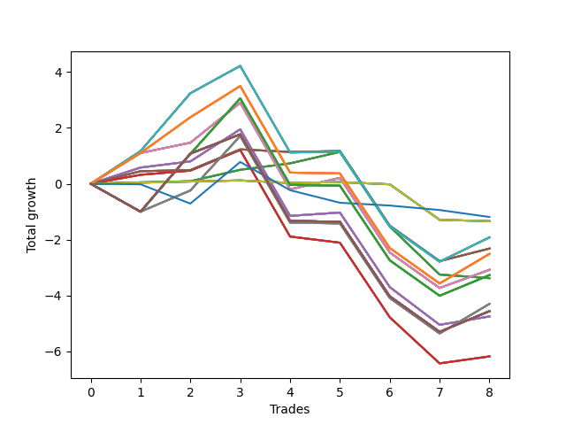

# Long Pointer 004 
- Symbol: NVDA_Unlimited
- Date Range: 02/08/2022 - 07/08/2022
- Trading Period: 7:20-12:30
- Number of Trades: 8



| Name | Win Percent | Profit | Avg Profit / Trade | Avg Time / Trade |      | Name | Win Percent | Profit | Avg Profit / Trade | Avg Time / Trade |
| ---- | ----------- | ------ | ------------------ | ---------------- | ---- | ---- | ----------- | ------ | ------------------ | ---------------- |
| Sorted By <br> Profit | | | | | | Sorted By <br> Win Percentage ||||
| Seventy-Three | 12.50 | -595.00 | -74.37 | 04:20 |     | Seventy-One | 62.50 | -960.00 | -120.00 | 19:20 |
| Seventy | 50.00 | -670.00 | -83.75 | 03:53 |     | Sixty-Three | 62.50 | -960.00 | -120.00 | 19:20 |
| Sixty-Two | 50.00 | -670.00 | -83.75 | 03:53 |     | Fifty-Five | 62.50 | -960.00 | -120.00 | 19:20 |
| Fifty-Four | 50.00 | -670.00 | -83.75 | 03:53 |     | Forty-Seven | 62.50 | -960.00 | -120.00 | 19:20 |
| Forty-Six | 50.00 | -670.00 | -83.75 | 03:53 |     | Seven | 62.50 | -960.00 | -120.00 | 19:20 |
| Six | 50.00 | -670.00 | -83.75 | 03:53 |     | Sixty-Seven | 62.50 | -1160.00 | -145.00 | 09:49 |
| Seventy-One | 62.50 | -960.00 | -120.00 | 19:20 |     | Fifty-Nine | 62.50 | -1160.00 | -145.00 | 09:49 |
| Sixty-Three | 62.50 | -960.00 | -120.00 | 19:20 |     | Fifty-One | 62.50 | -1160.00 | -145.00 | 09:49 |
| Fifty-Five | 62.50 | -960.00 | -120.00 | 19:20 |     | Forty-Three | 62.50 | -1160.00 | -145.00 | 09:49 |
| Forty-Seven | 62.50 | -960.00 | -120.00 | 19:20 |     | Three | 62.50 | -1160.00 | -145.00 | 09:49 |
| Seven | 62.50 | -960.00 | -120.00 | 19:20 |     | Sixty-Eight | 62.50 | -1540.00 | -192.50 | 18:35 |
| Sixty-Seven | 62.50 | -1160.00 | -145.00 | 09:49 |     | Sixty | 62.50 | -1540.00 | -192.50 | 18:35 |
| Fifty-Nine | 62.50 | -1160.00 | -145.00 | 09:49 |     | Fifty-Two | 62.50 | -1540.00 | -192.50 | 18:35 |
| Fifty-One | 62.50 | -1160.00 | -145.00 | 09:49 |     | Forty-Four | 62.50 | -1540.00 | -192.50 | 18:35 |
| Forty-Three | 62.50 | -1160.00 | -145.00 | 09:49 |     | Four | 62.50 | -1540.00 | -192.50 | 18:35 |
| Three | 62.50 | -1160.00 | -145.00 | 09:49 |     | Sixty-Four | 62.50 | -1690.00 | -211.25 | 08:28 |
| One Hundred Twenty-Six | 50.00 | -1255.00 | -156.87 | 22:24 |     | Fifty-Six | 62.50 | -1690.00 | -211.25 | 08:28 |
| One Hundred Twenty-One | 50.00 | -1255.00 | -156.87 | 22:24 |     | Forty-Eight | 62.50 | -1690.00 | -211.25 | 08:28 |
| One Hundred Sixteen | 50.00 | -1255.00 | -156.87 | 22:24 |     | Forty | 62.50 | -1690.00 | -211.25 | 08:28 |
| One Hundred Eleven | 50.00 | -1255.00 | -156.87 | 22:24 |     | Zero | 62.50 | -1690.00 | -211.25 | 08:28 |
| Eighty-One | 50.00 | -1255.00 | -156.87 | 22:24 |     | Sixty-Six | 62.50 | -2375.00 | -296.87 | 18:19 |
| Sixty-Eight | 62.50 | -1540.00 | -192.50 | 18:35 |     | Fifty-Eight | 62.50 | -2375.00 | -296.87 | 18:19 |
| Sixty | 62.50 | -1540.00 | -192.50 | 18:35 |     | Fifty | 62.50 | -2375.00 | -296.87 | 18:19 |
| Fifty-Two | 62.50 | -1540.00 | -192.50 | 18:35 |     | Forty-Two | 62.50 | -2375.00 | -296.87 | 18:19 |
| Forty-Four | 62.50 | -1540.00 | -192.50 | 18:35 |     | Two | 62.50 | -2375.00 | -296.87 | 18:19 |
| Four | 62.50 | -1540.00 | -192.50 | 18:35 |     | Seventy | 50.00 | -670.00 | -83.75 | 03:53 |
| One Hundred Twenty-Seven | 37.50 | -1635.00 | -204.37 | 26:58 |     | Sixty-Two | 50.00 | -670.00 | -83.75 | 03:53 |
| One Hundred Twenty-Two | 37.50 | -1635.00 | -204.37 | 26:58 |     | Fifty-Four | 50.00 | -670.00 | -83.75 | 03:53 |
| One Hundred Seventeen | 37.50 | -1635.00 | -204.37 | 26:58 |     | Forty-Six | 50.00 | -670.00 | -83.75 | 03:53 |
| One Hundred Twelve | 37.50 | -1635.00 | -204.37 | 26:58 |     | Six | 50.00 | -670.00 | -83.75 | 03:53 |
| Eighty-Two | 37.50 | -1635.00 | -204.37 | 26:58 |     | One Hundred Twenty-Six | 50.00 | -1255.00 | -156.87 | 22:24 |
| Sixty-Four | 62.50 | -1690.00 | -211.25 | 08:28 |     | One Hundred Twenty-One | 50.00 | -1255.00 | -156.87 | 22:24 |
| Fifty-Six | 62.50 | -1690.00 | -211.25 | 08:28 |     | One Hundred Sixteen | 50.00 | -1255.00 | -156.87 | 22:24 |
| Forty-Eight | 62.50 | -1690.00 | -211.25 | 08:28 |     | One Hundred Eleven | 50.00 | -1255.00 | -156.87 | 22:24 |
| Forty | 62.50 | -1690.00 | -211.25 | 08:28 |     | Eighty-One | 50.00 | -1255.00 | -156.87 | 22:24 |
| Zero | 62.50 | -1690.00 | -211.25 | 08:28 |     | Sixty-Five | 50.00 | -3090.00 | -386.25 | 16:00 |
| Sixty-Nine | 37.50 | -2150.00 | -268.75 | 25:21 |     | Fifty-Seven | 50.00 | -3090.00 | -386.25 | 16:00 |
| Sixty-One | 37.50 | -2150.00 | -268.75 | 25:21 |     | Forty-Nine | 50.00 | -3090.00 | -386.25 | 16:00 |
| Fifty-Three | 37.50 | -2150.00 | -268.75 | 25:21 |     | Forty-One | 50.00 | -3090.00 | -386.25 | 16:00 |
| Forty-Five | 37.50 | -2150.00 | -268.75 | 25:21 |     | One | 50.00 | -3090.00 | -386.25 | 16:00 |
| Five | 37.50 | -2150.00 | -268.75 | 25:21 |     | One Hundred Twenty-Seven | 37.50 | -1635.00 | -204.37 | 26:58 |
| One Hundred Thirty | 37.50 | -2280.00 | -285.00 | 29:55 |     | One Hundred Twenty-Two | 37.50 | -1635.00 | -204.37 | 26:58 |
| One Hundred Twenty-Nine | 37.50 | -2280.00 | -285.00 | 29:55 |     | One Hundred Seventeen | 37.50 | -1635.00 | -204.37 | 26:58 |
| One Hundred Twenty-Eight | 37.50 | -2280.00 | -285.00 | 29:55 |     | One Hundred Twelve | 37.50 | -1635.00 | -204.37 | 26:58 |
| One Hundred Twenty-Five | 37.50 | -2280.00 | -285.00 | 29:55 |     | Eighty-Two | 37.50 | -1635.00 | -204.37 | 26:58 |
| One Hundred Twenty-Four | 37.50 | -2280.00 | -285.00 | 29:55 |     | Sixty-Nine | 37.50 | -2150.00 | -268.75 | 25:21 |
| One Hundred Twenty-Three | 37.50 | -2280.00 | -285.00 | 29:55 |     | Sixty-One | 37.50 | -2150.00 | -268.75 | 25:21 |
| One Hundred Twenty | 37.50 | -2280.00 | -285.00 | 29:55 |     | Fifty-Three | 37.50 | -2150.00 | -268.75 | 25:21 |
| One Hundred Ninteen | 37.50 | -2280.00 | -285.00 | 29:55 |     | Forty-Five | 37.50 | -2150.00 | -268.75 | 25:21 |
| One Hundred Eighteen | 37.50 | -2280.00 | -285.00 | 29:55 |     | Five | 37.50 | -2150.00 | -268.75 | 25:21 |
| One Hundred Fifteen | 37.50 | -2280.00 | -285.00 | 29:55 |     | One Hundred Thirty | 37.50 | -2280.00 | -285.00 | 29:55 |
| One Hundred Fourteen | 37.50 | -2280.00 | -285.00 | 29:55 |     | One Hundred Twenty-Nine | 37.50 | -2280.00 | -285.00 | 29:55 |
| One Hundred Thirteen | 37.50 | -2280.00 | -285.00 | 29:55 |     | One Hundred Twenty-Eight | 37.50 | -2280.00 | -285.00 | 29:55 |
| Eighty-Five | 37.50 | -2280.00 | -285.00 | 29:55 |     | One Hundred Twenty-Five | 37.50 | -2280.00 | -285.00 | 29:55 |
| Eighty-Four | 37.50 | -2280.00 | -285.00 | 29:55 |     | One Hundred Twenty-Four | 37.50 | -2280.00 | -285.00 | 29:55 |
| Eighty-Three | 37.50 | -2280.00 | -285.00 | 29:55 |     | One Hundred Twenty-Three | 37.50 | -2280.00 | -285.00 | 29:55 |
| Sixty-Six | 62.50 | -2375.00 | -296.87 | 18:19 |     | One Hundred Twenty | 37.50 | -2280.00 | -285.00 | 29:55 |
| Fifty-Eight | 62.50 | -2375.00 | -296.87 | 18:19 |     | One Hundred Ninteen | 37.50 | -2280.00 | -285.00 | 29:55 |
| Fifty | 62.50 | -2375.00 | -296.87 | 18:19 |     | One Hundred Eighteen | 37.50 | -2280.00 | -285.00 | 29:55 |
| Forty-Two | 62.50 | -2375.00 | -296.87 | 18:19 |     | One Hundred Fifteen | 37.50 | -2280.00 | -285.00 | 29:55 |
| Two | 62.50 | -2375.00 | -296.87 | 18:19 |     | One Hundred Fourteen | 37.50 | -2280.00 | -285.00 | 29:55 |
| Sixty-Five | 50.00 | -3090.00 | -386.25 | 16:00 |     | One Hundred Thirteen | 37.50 | -2280.00 | -285.00 | 29:55 |
| Fifty-Seven | 50.00 | -3090.00 | -386.25 | 16:00 |     | Eighty-Five | 37.50 | -2280.00 | -285.00 | 29:55 |
| Forty-Nine | 50.00 | -3090.00 | -386.25 | 16:00 |     | Eighty-Four | 37.50 | -2280.00 | -285.00 | 29:55 |
| Forty-One | 50.00 | -3090.00 | -386.25 | 16:00 |     | Eighty-Three | 37.50 | -2280.00 | -285.00 | 29:55 |
| One | 50.00 | -3090.00 | -386.25 | 16:00 |     | Seventy-Three | 12.50 | -595.00 | -74.37 | 04:20 |

## NO STOPLOSS

### Test Zero
* Sell when price hits the middle line of the 20p bollinger
* No Stoploss
* Results:
```
Total Trades: 8
Percent Up: 62.50
Percent Down: 37.50
Total Points Moved Up: -3.38
Potential Profit: -1690.00
Total Points Ups: 1.14 Count Ups: 5
Total Points Downs: -4.52 Count Downs: 3
```

<details><summary>Trades</summary>

<code>In: 2022-02-08 10:57:00		Out: 2022-02-08 10:58:15		Total Position Time: 01:15		Total Move Up: 0.05		Total to Date: 0.05</code> <br />
<code>In: 2022-02-25 11:58:00		Out: 2022-02-25 11:58:10		Total Position Time: 00:10		Total Move Up: 0.04		Total to Date: 0.09</code> <br />
<code>In: 2022-03-15 09:54:00		Out: 2022-03-15 09:54:35		Total Position Time: 00:35		Total Move Up: 0.41		Total to Date: 0.50</code> <br />
<code>In: 2022-03-17 07:22:00		Out: 2022-03-17 07:28:05		Total Position Time: 06:05		Total Move Up: 0.23		Total to Date: 0.73</code> <br />
<code>In: 2022-03-31 08:06:00		Out: 2022-03-31 08:06:35		Total Position Time: 00:35		Total Move Up: 0.41		Total to Date: 1.14</code> <br />
<code>In: 2022-05-31 11:31:00		Out: 2022-05-31 12:00:55		Total Position Time: 29:55		Total Move Up: -2.67		Total to Date: -1.53</code> <br />
<code>In: 2022-05-31 11:39:00		Out: 2022-05-31 12:01:15		Total Position Time: 22:15		Total Move Up: -1.72		Total to Date: -3.25</code> <br />
<code>In: 2022-06-22 08:07:00		Out: 2022-06-22 08:14:00		Total Position Time: 07:00		Total Move Up: -0.13		Total to Date: -3.38</code> <br />


</details>

### Test One
* Sell when the price hits the upper line of the 20p 1std bollinger
* No Stoploss
* Results:
```
Total Trades: 8
Percent Up: 50.00
Percent Down: 50.00
Total Points Moved Up: -6.18
Potential Profit: -3090.00
Total Points Ups: 1.46 Count Ups: 4
Total Points Downs: -7.64 Count Downs: 4
```

<details><summary>Trades</summary>

<code>In: 2022-02-08 10:57:00		Out: 2022-02-08 10:59:15		Total Position Time: 02:15		Total Move Up: 0.32		Total to Date: 0.32</code> <br />
<code>In: 2022-02-25 11:58:00		Out: 2022-02-25 12:09:05		Total Position Time: 11:05		Total Move Up: 0.15		Total to Date: 0.47</code> <br />
<code>In: 2022-03-15 09:54:00		Out: 2022-03-15 09:56:35		Total Position Time: 02:35		Total Move Up: 0.74		Total to Date: 1.21</code> <br />
<code>In: 2022-03-17 07:22:00		Out: 2022-03-17 07:51:55		Total Position Time: 29:55		Total Move Up: -3.10		Total to Date: -1.89</code> <br />
<code>In: 2022-03-31 08:06:00		Out: 2022-03-31 08:21:15		Total Position Time: 15:15		Total Move Up: -0.22		Total to Date: -2.11</code> <br />
<code>In: 2022-05-31 11:31:00		Out: 2022-05-31 12:00:55		Total Position Time: 29:55		Total Move Up: -2.67		Total to Date: -4.78</code> <br />
<code>In: 2022-05-31 11:39:00		Out: 2022-05-31 12:07:00		Total Position Time: 28:00		Total Move Up: -1.65		Total to Date: -6.43</code> <br />
<code>In: 2022-06-22 08:07:00		Out: 2022-06-22 08:16:00		Total Position Time: 09:00		Total Move Up: 0.25		Total to Date: -6.18</code> <br />


</details>

### Test Two
* Sell when the price hits the upper line of the 20p 2std bollinger
* No Stoploss
* Results:
```
Total Trades: 8
Percent Up: 62.50
Percent Down: 37.50
Total Points Moved Up: -4.75
Potential Profit: -2375.00
Total Points Ups: 2.37 Count Ups: 5
Total Points Downs: -7.12 Count Downs: 3
```

<details><summary>Trades</summary>

<code>In: 2022-02-08 10:57:00		Out: 2022-02-08 11:04:20		Total Position Time: 07:20		Total Move Up: 0.58		Total to Date: 0.58</code> <br />
<code>In: 2022-02-25 11:58:00		Out: 2022-02-25 12:14:55		Total Position Time: 16:55		Total Move Up: 0.22		Total to Date: 0.80</code> <br />
<code>In: 2022-03-15 09:54:00		Out: 2022-03-15 09:59:55		Total Position Time: 05:55		Total Move Up: 1.15		Total to Date: 1.95</code> <br />
<code>In: 2022-03-17 07:22:00		Out: 2022-03-17 07:51:55		Total Position Time: 29:55		Total Move Up: -3.10		Total to Date: -1.15</code> <br />
<code>In: 2022-03-31 08:06:00		Out: 2022-03-31 08:21:35		Total Position Time: 15:35		Total Move Up: 0.12		Total to Date: -1.03</code> <br />
<code>In: 2022-05-31 11:31:00		Out: 2022-05-31 12:00:55		Total Position Time: 29:55		Total Move Up: -2.67		Total to Date: -3.70</code> <br />
<code>In: 2022-05-31 11:39:00		Out: 2022-05-31 12:07:45		Total Position Time: 28:45		Total Move Up: -1.35		Total to Date: -5.05</code> <br />
<code>In: 2022-06-22 08:07:00		Out: 2022-06-22 08:19:15		Total Position Time: 12:15		Total Move Up: 0.30		Total to Date: -4.75</code> <br />


</details>

### Test Three
* Sell when price hits the middle line of the 50p bollinger
* No Stoploss
* Results:
```
Total Trades: 8
Percent Up: 62.50
Percent Down: 37.50
Total Points Moved Up: -2.32
Potential Profit: -1160.00
Total Points Ups: 1.71 Count Ups: 5
Total Points Downs: -4.03 Count Downs: 3
```

<details><summary>Trades</summary>

<code>In: 2022-02-08 10:57:00		Out: 2022-02-08 11:00:10		Total Position Time: 03:10		Total Move Up: 0.45		Total to Date: 0.45</code> <br />
<code>In: 2022-02-25 11:58:00		Out: 2022-02-25 11:58:10		Total Position Time: 00:10		Total Move Up: 0.04		Total to Date: 0.49</code> <br />
<code>In: 2022-03-15 09:54:00		Out: 2022-03-15 09:56:35		Total Position Time: 02:35		Total Move Up: 0.74		Total to Date: 1.23</code> <br />
<code>In: 2022-03-17 07:22:00		Out: 2022-03-17 07:22:10		Total Position Time: 00:10		Total Move Up: -0.09		Total to Date: 1.14</code> <br />
<code>In: 2022-03-31 08:06:00		Out: 2022-03-31 08:06:10		Total Position Time: 00:10		Total Move Up: 0.03		Total to Date: 1.17</code> <br />
<code>In: 2022-05-31 11:31:00		Out: 2022-05-31 12:00:55		Total Position Time: 29:55		Total Move Up: -2.67		Total to Date: -1.50</code> <br />
<code>In: 2022-05-31 11:39:00		Out: 2022-05-31 12:08:55		Total Position Time: 29:55		Total Move Up: -1.27		Total to Date: -2.77</code> <br />
<code>In: 2022-06-22 08:07:00		Out: 2022-06-22 08:19:30		Total Position Time: 12:30		Total Move Up: 0.45		Total to Date: -2.32</code> <br />


</details>

### Test Four
* Sell when the price hits the upper line of the 50p 1std bollinger
* No Stoploss
* Results:
```
Total Trades: 8
Percent Up: 62.50
Percent Down: 37.50
Total Points Moved Up: -3.08
Potential Profit: -1540.00
Total Points Ups: 3.96 Count Ups: 5
Total Points Downs: -7.04 Count Downs: 3
```

<details><summary>Trades</summary>

<code>In: 2022-02-08 10:57:00		Out: 2022-02-08 11:07:05		Total Position Time: 10:05		Total Move Up: 1.10		Total to Date: 1.10</code> <br />
<code>In: 2022-02-25 11:58:00		Out: 2022-02-25 12:15:00		Total Position Time: 17:00		Total Move Up: 0.37		Total to Date: 1.47</code> <br />
<code>In: 2022-03-15 09:54:00		Out: 2022-03-15 10:01:05		Total Position Time: 07:05		Total Move Up: 1.43		Total to Date: 2.90</code> <br />
<code>In: 2022-03-17 07:22:00		Out: 2022-03-17 07:51:55		Total Position Time: 29:55		Total Move Up: -3.10		Total to Date: -0.20</code> <br />
<code>In: 2022-03-31 08:06:00		Out: 2022-03-31 08:06:35		Total Position Time: 00:35		Total Move Up: 0.41		Total to Date: 0.21</code> <br />
<code>In: 2022-05-31 11:31:00		Out: 2022-05-31 12:00:55		Total Position Time: 29:55		Total Move Up: -2.67		Total to Date: -2.46</code> <br />
<code>In: 2022-05-31 11:39:00		Out: 2022-05-31 12:08:55		Total Position Time: 29:55		Total Move Up: -1.27		Total to Date: -3.73</code> <br />
<code>In: 2022-06-22 08:07:00		Out: 2022-06-22 08:31:10		Total Position Time: 24:10		Total Move Up: 0.65		Total to Date: -3.08</code> <br />


</details>

### Test Five
* Sell when the price hits the upper line of the 50p 2std bollinger
* No Stoploss
* Results:
```
Total Trades: 8
Percent Up: 37.50
Percent Down: 62.50
Total Points Moved Up: -4.30
Potential Profit: -2150.00
Total Points Ups: 3.77 Count Ups: 3
Total Points Downs: -8.07 Count Downs: 5
```

<details><summary>Trades</summary>

<code>In: 2022-02-08 10:57:00		Out: 2022-02-08 11:26:55		Total Position Time: 29:55		Total Move Up: -1.00		Total to Date: -1.00</code> <br />
<code>In: 2022-02-25 11:58:00		Out: 2022-02-25 12:15:55		Total Position Time: 17:55		Total Move Up: 0.76		Total to Date: -0.24</code> <br />
<code>In: 2022-03-15 09:54:00		Out: 2022-03-15 10:04:00		Total Position Time: 10:00		Total Move Up: 1.95		Total to Date: 1.71</code> <br />
<code>In: 2022-03-17 07:22:00		Out: 2022-03-17 07:51:55		Total Position Time: 29:55		Total Move Up: -3.10		Total to Date: -1.39</code> <br />
<code>In: 2022-03-31 08:06:00		Out: 2022-03-31 08:35:55		Total Position Time: 29:55		Total Move Up: -0.03		Total to Date: -1.42</code> <br />
<code>In: 2022-05-31 11:31:00		Out: 2022-05-31 12:00:55		Total Position Time: 29:55		Total Move Up: -2.67		Total to Date: -4.09</code> <br />
<code>In: 2022-05-31 11:39:00		Out: 2022-05-31 12:08:55		Total Position Time: 29:55		Total Move Up: -1.27		Total to Date: -5.36</code> <br />
<code>In: 2022-06-22 08:07:00		Out: 2022-06-22 08:32:20		Total Position Time: 25:20		Total Move Up: 1.06		Total to Date: -4.30</code> <br />


</details>

### Test Six
* Sell when the price hits the middle line of the 1std VWAP
* No Stoploss
* Results:
```
Total Trades: 8
Percent Up: 50.00
Percent Down: 50.00
Total Points Moved Up: -1.34
Potential Profit: -670.00
Total Points Ups: 0.15 Count Ups: 4
Total Points Downs: -1.49 Count Downs: 4
```

<details><summary>Trades</summary>

<code>In: 2022-02-08 10:57:00		Out: 2022-02-08 10:57:10		Total Position Time: 00:10		Total Move Up: 0.04		Total to Date: 0.04</code> <br />
<code>In: 2022-02-25 11:58:00		Out: 2022-02-25 11:58:10		Total Position Time: 00:10		Total Move Up: 0.04		Total to Date: 0.08</code> <br />
<code>In: 2022-03-15 09:54:00		Out: 2022-03-15 09:54:10		Total Position Time: 00:10		Total Move Up: 0.04		Total to Date: 0.12</code> <br />
<code>In: 2022-03-17 07:22:00		Out: 2022-03-17 07:22:10		Total Position Time: 00:10		Total Move Up: -0.09		Total to Date: 0.03</code> <br />
<code>In: 2022-03-31 08:06:00		Out: 2022-03-31 08:06:10		Total Position Time: 00:10		Total Move Up: 0.03		Total to Date: 0.06</code> <br />
<code>In: 2022-05-31 11:31:00		Out: 2022-05-31 11:31:10		Total Position Time: 00:10		Total Move Up: -0.08		Total to Date: -0.02</code> <br />
<code>In: 2022-05-31 11:39:00		Out: 2022-05-31 12:08:55		Total Position Time: 29:55		Total Move Up: -1.27		Total to Date: -1.29</code> <br />
<code>In: 2022-06-22 08:07:00		Out: 2022-06-22 08:07:10		Total Position Time: 00:10		Total Move Up: -0.05		Total to Date: -1.34</code> <br />


</details>

### Test Seven
* Sell when the price hits the upper line of the 1std VWAP
* No Stoploss
* Results:
```
Total Trades: 8
Percent Up: 62.50
Percent Down: 37.50
Total Points Moved Up: -1.92
Potential Profit: -960.00
Total Points Ups: 5.12 Count Ups: 5
Total Points Downs: -7.04 Count Downs: 3
```

<details><summary>Trades</summary>

<code>In: 2022-02-08 10:57:00		Out: 2022-02-08 11:07:10		Total Position Time: 10:10		Total Move Up: 1.17		Total to Date: 1.17</code> <br />
<code>In: 2022-02-25 11:58:00		Out: 2022-02-25 12:24:10		Total Position Time: 26:10		Total Move Up: 2.07		Total to Date: 3.24</code> <br />
<code>In: 2022-03-15 09:54:00		Out: 2022-03-15 09:57:45		Total Position Time: 03:45		Total Move Up: 0.98		Total to Date: 4.22</code> <br />
<code>In: 2022-03-17 07:22:00		Out: 2022-03-17 07:51:55		Total Position Time: 29:55		Total Move Up: -3.10		Total to Date: 1.12</code> <br />
<code>In: 2022-03-31 08:06:00		Out: 2022-03-31 08:06:10		Total Position Time: 00:10		Total Move Up: 0.03		Total to Date: 1.15</code> <br />
<code>In: 2022-05-31 11:31:00		Out: 2022-05-31 12:00:55		Total Position Time: 29:55		Total Move Up: -2.67		Total to Date: -1.52</code> <br />
<code>In: 2022-05-31 11:39:00		Out: 2022-05-31 12:08:55		Total Position Time: 29:55		Total Move Up: -1.27		Total to Date: -2.79</code> <br />
<code>In: 2022-06-22 08:07:00		Out: 2022-06-22 08:31:40		Total Position Time: 24:40		Total Move Up: 0.87		Total to Date: -1.92</code> <br />


</details>

## STOPLOSS OF 5

### Test Forty
* Sell when price hits the middle line of the 20p bollinger
* Stoploss is 5 points
* Results:
```
Total Trades: 8
Percent Up: 62.50
Percent Down: 37.50
Total Points Moved Up: -3.38
Potential Profit: -1690.00
Total Points Ups: 1.14 Count Ups: 5
Total Points Downs: -4.52 Count Downs: 3
```

<details><summary>Trades</summary>

<code>In: 2022-02-08 10:57:00		Out: 2022-02-08 10:58:15		Total Position Time: 01:15		Total Move Up: 0.05		Total to Date: 0.05</code> <br />
<code>In: 2022-02-25 11:58:00		Out: 2022-02-25 11:58:10		Total Position Time: 00:10		Total Move Up: 0.04		Total to Date: 0.09</code> <br />
<code>In: 2022-03-15 09:54:00		Out: 2022-03-15 09:54:35		Total Position Time: 00:35		Total Move Up: 0.41		Total to Date: 0.50</code> <br />
<code>In: 2022-03-17 07:22:00		Out: 2022-03-17 07:28:05		Total Position Time: 06:05		Total Move Up: 0.23		Total to Date: 0.73</code> <br />
<code>In: 2022-03-31 08:06:00		Out: 2022-03-31 08:06:35		Total Position Time: 00:35		Total Move Up: 0.41		Total to Date: 1.14</code> <br />
<code>In: 2022-05-31 11:31:00		Out: 2022-05-31 12:00:55		Total Position Time: 29:55		Total Move Up: -2.67		Total to Date: -1.53</code> <br />
<code>In: 2022-05-31 11:39:00		Out: 2022-05-31 12:01:15		Total Position Time: 22:15		Total Move Up: -1.72		Total to Date: -3.25</code> <br />
<code>In: 2022-06-22 08:07:00		Out: 2022-06-22 08:14:00		Total Position Time: 07:00		Total Move Up: -0.13		Total to Date: -3.38</code> <br />


</details>

### Test Forty-One
* Sell when the price hits the upper line of the 20p 1std bollinger
* Stoploss is 5 points
* Results:
```
Total Trades: 8
Percent Up: 50.00
Percent Down: 50.00
Total Points Moved Up: -6.18
Potential Profit: -3090.00
Total Points Ups: 1.46 Count Ups: 4
Total Points Downs: -7.64 Count Downs: 4
```

<details><summary>Trades</summary>

<code>In: 2022-02-08 10:57:00		Out: 2022-02-08 10:59:15		Total Position Time: 02:15		Total Move Up: 0.32		Total to Date: 0.32</code> <br />
<code>In: 2022-02-25 11:58:00		Out: 2022-02-25 12:09:05		Total Position Time: 11:05		Total Move Up: 0.15		Total to Date: 0.47</code> <br />
<code>In: 2022-03-15 09:54:00		Out: 2022-03-15 09:56:35		Total Position Time: 02:35		Total Move Up: 0.74		Total to Date: 1.21</code> <br />
<code>In: 2022-03-17 07:22:00		Out: 2022-03-17 07:51:55		Total Position Time: 29:55		Total Move Up: -3.10		Total to Date: -1.89</code> <br />
<code>In: 2022-03-31 08:06:00		Out: 2022-03-31 08:21:15		Total Position Time: 15:15		Total Move Up: -0.22		Total to Date: -2.11</code> <br />
<code>In: 2022-05-31 11:31:00		Out: 2022-05-31 12:00:55		Total Position Time: 29:55		Total Move Up: -2.67		Total to Date: -4.78</code> <br />
<code>In: 2022-05-31 11:39:00		Out: 2022-05-31 12:07:00		Total Position Time: 28:00		Total Move Up: -1.65		Total to Date: -6.43</code> <br />
<code>In: 2022-06-22 08:07:00		Out: 2022-06-22 08:16:00		Total Position Time: 09:00		Total Move Up: 0.25		Total to Date: -6.18</code> <br />


</details>

### Test Forty-Two
* Sell when the price hits the upper line of the 20p 2std bollinger
* Stoploss is 5 points
* Results:
```
Total Trades: 8
Percent Up: 62.50
Percent Down: 37.50
Total Points Moved Up: -4.75
Potential Profit: -2375.00
Total Points Ups: 2.37 Count Ups: 5
Total Points Downs: -7.12 Count Downs: 3
```

<details><summary>Trades</summary>

<code>In: 2022-02-08 10:57:00		Out: 2022-02-08 11:04:20		Total Position Time: 07:20		Total Move Up: 0.58		Total to Date: 0.58</code> <br />
<code>In: 2022-02-25 11:58:00		Out: 2022-02-25 12:14:55		Total Position Time: 16:55		Total Move Up: 0.22		Total to Date: 0.80</code> <br />
<code>In: 2022-03-15 09:54:00		Out: 2022-03-15 09:59:55		Total Position Time: 05:55		Total Move Up: 1.15		Total to Date: 1.95</code> <br />
<code>In: 2022-03-17 07:22:00		Out: 2022-03-17 07:51:55		Total Position Time: 29:55		Total Move Up: -3.10		Total to Date: -1.15</code> <br />
<code>In: 2022-03-31 08:06:00		Out: 2022-03-31 08:21:35		Total Position Time: 15:35		Total Move Up: 0.12		Total to Date: -1.03</code> <br />
<code>In: 2022-05-31 11:31:00		Out: 2022-05-31 12:00:55		Total Position Time: 29:55		Total Move Up: -2.67		Total to Date: -3.70</code> <br />
<code>In: 2022-05-31 11:39:00		Out: 2022-05-31 12:07:45		Total Position Time: 28:45		Total Move Up: -1.35		Total to Date: -5.05</code> <br />
<code>In: 2022-06-22 08:07:00		Out: 2022-06-22 08:19:15		Total Position Time: 12:15		Total Move Up: 0.30		Total to Date: -4.75</code> <br />


</details>

### Test Forty-Three
* Sell when price hits the middle line of the 50p bollinger
* Stoploss is 5 points
* Results:
```
Total Trades: 8
Percent Up: 62.50
Percent Down: 37.50
Total Points Moved Up: -2.32
Potential Profit: -1160.00
Total Points Ups: 1.71 Count Ups: 5
Total Points Downs: -4.03 Count Downs: 3
```

<details><summary>Trades</summary>

<code>In: 2022-02-08 10:57:00		Out: 2022-02-08 11:00:10		Total Position Time: 03:10		Total Move Up: 0.45		Total to Date: 0.45</code> <br />
<code>In: 2022-02-25 11:58:00		Out: 2022-02-25 11:58:10		Total Position Time: 00:10		Total Move Up: 0.04		Total to Date: 0.49</code> <br />
<code>In: 2022-03-15 09:54:00		Out: 2022-03-15 09:56:35		Total Position Time: 02:35		Total Move Up: 0.74		Total to Date: 1.23</code> <br />
<code>In: 2022-03-17 07:22:00		Out: 2022-03-17 07:22:10		Total Position Time: 00:10		Total Move Up: -0.09		Total to Date: 1.14</code> <br />
<code>In: 2022-03-31 08:06:00		Out: 2022-03-31 08:06:10		Total Position Time: 00:10		Total Move Up: 0.03		Total to Date: 1.17</code> <br />
<code>In: 2022-05-31 11:31:00		Out: 2022-05-31 12:00:55		Total Position Time: 29:55		Total Move Up: -2.67		Total to Date: -1.50</code> <br />
<code>In: 2022-05-31 11:39:00		Out: 2022-05-31 12:08:55		Total Position Time: 29:55		Total Move Up: -1.27		Total to Date: -2.77</code> <br />
<code>In: 2022-06-22 08:07:00		Out: 2022-06-22 08:19:30		Total Position Time: 12:30		Total Move Up: 0.45		Total to Date: -2.32</code> <br />


</details>

### Test Forty-Four
* Sell when the price hits the upper line of the 50p 1std bollinger
* Stoploss is 5 points
* Results:
```
Total Trades: 8
Percent Up: 62.50
Percent Down: 37.50
Total Points Moved Up: -3.08
Potential Profit: -1540.00
Total Points Ups: 3.96 Count Ups: 5
Total Points Downs: -7.04 Count Downs: 3
```

<details><summary>Trades</summary>

<code>In: 2022-02-08 10:57:00		Out: 2022-02-08 11:07:05		Total Position Time: 10:05		Total Move Up: 1.10		Total to Date: 1.10</code> <br />
<code>In: 2022-02-25 11:58:00		Out: 2022-02-25 12:15:00		Total Position Time: 17:00		Total Move Up: 0.37		Total to Date: 1.47</code> <br />
<code>In: 2022-03-15 09:54:00		Out: 2022-03-15 10:01:05		Total Position Time: 07:05		Total Move Up: 1.43		Total to Date: 2.90</code> <br />
<code>In: 2022-03-17 07:22:00		Out: 2022-03-17 07:51:55		Total Position Time: 29:55		Total Move Up: -3.10		Total to Date: -0.20</code> <br />
<code>In: 2022-03-31 08:06:00		Out: 2022-03-31 08:06:35		Total Position Time: 00:35		Total Move Up: 0.41		Total to Date: 0.21</code> <br />
<code>In: 2022-05-31 11:31:00		Out: 2022-05-31 12:00:55		Total Position Time: 29:55		Total Move Up: -2.67		Total to Date: -2.46</code> <br />
<code>In: 2022-05-31 11:39:00		Out: 2022-05-31 12:08:55		Total Position Time: 29:55		Total Move Up: -1.27		Total to Date: -3.73</code> <br />
<code>In: 2022-06-22 08:07:00		Out: 2022-06-22 08:31:10		Total Position Time: 24:10		Total Move Up: 0.65		Total to Date: -3.08</code> <br />


</details>

### Test Forty-Five
* Sell when the price hits the upper line of the 50p 2std bollinger
* Stoploss is 5 points
* Results:
```
Total Trades: 8
Percent Up: 37.50
Percent Down: 62.50
Total Points Moved Up: -4.30
Potential Profit: -2150.00
Total Points Ups: 3.77 Count Ups: 3
Total Points Downs: -8.07 Count Downs: 5
```

<details><summary>Trades</summary>

<code>In: 2022-02-08 10:57:00		Out: 2022-02-08 11:26:55		Total Position Time: 29:55		Total Move Up: -1.00		Total to Date: -1.00</code> <br />
<code>In: 2022-02-25 11:58:00		Out: 2022-02-25 12:15:55		Total Position Time: 17:55		Total Move Up: 0.76		Total to Date: -0.24</code> <br />
<code>In: 2022-03-15 09:54:00		Out: 2022-03-15 10:04:00		Total Position Time: 10:00		Total Move Up: 1.95		Total to Date: 1.71</code> <br />
<code>In: 2022-03-17 07:22:00		Out: 2022-03-17 07:51:55		Total Position Time: 29:55		Total Move Up: -3.10		Total to Date: -1.39</code> <br />
<code>In: 2022-03-31 08:06:00		Out: 2022-03-31 08:35:55		Total Position Time: 29:55		Total Move Up: -0.03		Total to Date: -1.42</code> <br />
<code>In: 2022-05-31 11:31:00		Out: 2022-05-31 12:00:55		Total Position Time: 29:55		Total Move Up: -2.67		Total to Date: -4.09</code> <br />
<code>In: 2022-05-31 11:39:00		Out: 2022-05-31 12:08:55		Total Position Time: 29:55		Total Move Up: -1.27		Total to Date: -5.36</code> <br />
<code>In: 2022-06-22 08:07:00		Out: 2022-06-22 08:32:20		Total Position Time: 25:20		Total Move Up: 1.06		Total to Date: -4.30</code> <br />


</details>

### Test Forty-Six
* Sell when the price hits the middle line of the 1std VWAP
* Stoploss is 5 points
* Results:
```
Total Trades: 8
Percent Up: 50.00
Percent Down: 50.00
Total Points Moved Up: -1.34
Potential Profit: -670.00
Total Points Ups: 0.15 Count Ups: 4
Total Points Downs: -1.49 Count Downs: 4
```

<details><summary>Trades</summary>

<code>In: 2022-02-08 10:57:00		Out: 2022-02-08 10:57:10		Total Position Time: 00:10		Total Move Up: 0.04		Total to Date: 0.04</code> <br />
<code>In: 2022-02-25 11:58:00		Out: 2022-02-25 11:58:10		Total Position Time: 00:10		Total Move Up: 0.04		Total to Date: 0.08</code> <br />
<code>In: 2022-03-15 09:54:00		Out: 2022-03-15 09:54:10		Total Position Time: 00:10		Total Move Up: 0.04		Total to Date: 0.12</code> <br />
<code>In: 2022-03-17 07:22:00		Out: 2022-03-17 07:22:10		Total Position Time: 00:10		Total Move Up: -0.09		Total to Date: 0.03</code> <br />
<code>In: 2022-03-31 08:06:00		Out: 2022-03-31 08:06:10		Total Position Time: 00:10		Total Move Up: 0.03		Total to Date: 0.06</code> <br />
<code>In: 2022-05-31 11:31:00		Out: 2022-05-31 11:31:10		Total Position Time: 00:10		Total Move Up: -0.08		Total to Date: -0.02</code> <br />
<code>In: 2022-05-31 11:39:00		Out: 2022-05-31 12:08:55		Total Position Time: 29:55		Total Move Up: -1.27		Total to Date: -1.29</code> <br />
<code>In: 2022-06-22 08:07:00		Out: 2022-06-22 08:07:10		Total Position Time: 00:10		Total Move Up: -0.05		Total to Date: -1.34</code> <br />


</details>

### Test Forty-Seven
* Sell when the price hits the upper line of the 1std VWAP
* Stoploss is 5 points
* Results:
```
Total Trades: 8
Percent Up: 62.50
Percent Down: 37.50
Total Points Moved Up: -1.92
Potential Profit: -960.00
Total Points Ups: 5.12 Count Ups: 5
Total Points Downs: -7.04 Count Downs: 3
```

<details><summary>Trades</summary>

<code>In: 2022-02-08 10:57:00		Out: 2022-02-08 11:07:10		Total Position Time: 10:10		Total Move Up: 1.17		Total to Date: 1.17</code> <br />
<code>In: 2022-02-25 11:58:00		Out: 2022-02-25 12:24:10		Total Position Time: 26:10		Total Move Up: 2.07		Total to Date: 3.24</code> <br />
<code>In: 2022-03-15 09:54:00		Out: 2022-03-15 09:57:45		Total Position Time: 03:45		Total Move Up: 0.98		Total to Date: 4.22</code> <br />
<code>In: 2022-03-17 07:22:00		Out: 2022-03-17 07:51:55		Total Position Time: 29:55		Total Move Up: -3.10		Total to Date: 1.12</code> <br />
<code>In: 2022-03-31 08:06:00		Out: 2022-03-31 08:06:10		Total Position Time: 00:10		Total Move Up: 0.03		Total to Date: 1.15</code> <br />
<code>In: 2022-05-31 11:31:00		Out: 2022-05-31 12:00:55		Total Position Time: 29:55		Total Move Up: -2.67		Total to Date: -1.52</code> <br />
<code>In: 2022-05-31 11:39:00		Out: 2022-05-31 12:08:55		Total Position Time: 29:55		Total Move Up: -1.27		Total to Date: -2.79</code> <br />
<code>In: 2022-06-22 08:07:00		Out: 2022-06-22 08:31:40		Total Position Time: 24:40		Total Move Up: 0.87		Total to Date: -1.92</code> <br />


</details>

## TRAIL STOP OF 5

### Test Forty-Eight
* Sell when price hits the middle line of the 20p bollinger
* Trailing Stop is 5 points
* Results:
```
Total Trades: 8
Percent Up: 62.50
Percent Down: 37.50
Total Points Moved Up: -3.38
Potential Profit: -1690.00
Total Points Ups: 1.14 Count Ups: 5
Total Points Downs: -4.52 Count Downs: 3
```

<details><summary>Trades</summary>

<code>In: 2022-02-08 10:57:00		Out: 2022-02-08 10:58:15		Total Position Time: 01:15		Total Move Up: 0.05		Total to Date: 0.05</code> <br />
<code>In: 2022-02-25 11:58:00		Out: 2022-02-25 11:58:10		Total Position Time: 00:10		Total Move Up: 0.04		Total to Date: 0.09</code> <br />
<code>In: 2022-03-15 09:54:00		Out: 2022-03-15 09:54:35		Total Position Time: 00:35		Total Move Up: 0.41		Total to Date: 0.50</code> <br />
<code>In: 2022-03-17 07:22:00		Out: 2022-03-17 07:28:05		Total Position Time: 06:05		Total Move Up: 0.23		Total to Date: 0.73</code> <br />
<code>In: 2022-03-31 08:06:00		Out: 2022-03-31 08:06:35		Total Position Time: 00:35		Total Move Up: 0.41		Total to Date: 1.14</code> <br />
<code>In: 2022-05-31 11:31:00		Out: 2022-05-31 12:00:55		Total Position Time: 29:55		Total Move Up: -2.67		Total to Date: -1.53</code> <br />
<code>In: 2022-05-31 11:39:00		Out: 2022-05-31 12:01:15		Total Position Time: 22:15		Total Move Up: -1.72		Total to Date: -3.25</code> <br />
<code>In: 2022-06-22 08:07:00		Out: 2022-06-22 08:14:00		Total Position Time: 07:00		Total Move Up: -0.13		Total to Date: -3.38</code> <br />


</details>

### Test Forty-Nine
* Sell when the price hits the upper line of the 20p 1std bollinger
* Trailing Stop is 5 points
* Results:
```
Total Trades: 8
Percent Up: 50.00
Percent Down: 50.00
Total Points Moved Up: -6.18
Potential Profit: -3090.00
Total Points Ups: 1.46 Count Ups: 4
Total Points Downs: -7.64 Count Downs: 4
```

<details><summary>Trades</summary>

<code>In: 2022-02-08 10:57:00		Out: 2022-02-08 10:59:15		Total Position Time: 02:15		Total Move Up: 0.32		Total to Date: 0.32</code> <br />
<code>In: 2022-02-25 11:58:00		Out: 2022-02-25 12:09:05		Total Position Time: 11:05		Total Move Up: 0.15		Total to Date: 0.47</code> <br />
<code>In: 2022-03-15 09:54:00		Out: 2022-03-15 09:56:35		Total Position Time: 02:35		Total Move Up: 0.74		Total to Date: 1.21</code> <br />
<code>In: 2022-03-17 07:22:00		Out: 2022-03-17 07:51:55		Total Position Time: 29:55		Total Move Up: -3.10		Total to Date: -1.89</code> <br />
<code>In: 2022-03-31 08:06:00		Out: 2022-03-31 08:21:15		Total Position Time: 15:15		Total Move Up: -0.22		Total to Date: -2.11</code> <br />
<code>In: 2022-05-31 11:31:00		Out: 2022-05-31 12:00:55		Total Position Time: 29:55		Total Move Up: -2.67		Total to Date: -4.78</code> <br />
<code>In: 2022-05-31 11:39:00		Out: 2022-05-31 12:07:00		Total Position Time: 28:00		Total Move Up: -1.65		Total to Date: -6.43</code> <br />
<code>In: 2022-06-22 08:07:00		Out: 2022-06-22 08:16:00		Total Position Time: 09:00		Total Move Up: 0.25		Total to Date: -6.18</code> <br />


</details>

### Test Fifty
* Sell when the price hits the upper line of the 20p 2std bollinger
* Trailing Stop is 5 points
* Results:
```
Total Trades: 8
Percent Up: 62.50
Percent Down: 37.50
Total Points Moved Up: -4.75
Potential Profit: -2375.00
Total Points Ups: 2.37 Count Ups: 5
Total Points Downs: -7.12 Count Downs: 3
```

<details><summary>Trades</summary>

<code>In: 2022-02-08 10:57:00		Out: 2022-02-08 11:04:20		Total Position Time: 07:20		Total Move Up: 0.58		Total to Date: 0.58</code> <br />
<code>In: 2022-02-25 11:58:00		Out: 2022-02-25 12:14:55		Total Position Time: 16:55		Total Move Up: 0.22		Total to Date: 0.80</code> <br />
<code>In: 2022-03-15 09:54:00		Out: 2022-03-15 09:59:55		Total Position Time: 05:55		Total Move Up: 1.15		Total to Date: 1.95</code> <br />
<code>In: 2022-03-17 07:22:00		Out: 2022-03-17 07:51:55		Total Position Time: 29:55		Total Move Up: -3.10		Total to Date: -1.15</code> <br />
<code>In: 2022-03-31 08:06:00		Out: 2022-03-31 08:21:35		Total Position Time: 15:35		Total Move Up: 0.12		Total to Date: -1.03</code> <br />
<code>In: 2022-05-31 11:31:00		Out: 2022-05-31 12:00:55		Total Position Time: 29:55		Total Move Up: -2.67		Total to Date: -3.70</code> <br />
<code>In: 2022-05-31 11:39:00		Out: 2022-05-31 12:07:45		Total Position Time: 28:45		Total Move Up: -1.35		Total to Date: -5.05</code> <br />
<code>In: 2022-06-22 08:07:00		Out: 2022-06-22 08:19:15		Total Position Time: 12:15		Total Move Up: 0.30		Total to Date: -4.75</code> <br />


</details>

### Test Fifty-One
* Sell when price hits the middle line of the 50p bollinger
* Trailing Stop is 5 points
* Results:
```
Total Trades: 8
Percent Up: 62.50
Percent Down: 37.50
Total Points Moved Up: -2.32
Potential Profit: -1160.00
Total Points Ups: 1.71 Count Ups: 5
Total Points Downs: -4.03 Count Downs: 3
```

<details><summary>Trades</summary>

<code>In: 2022-02-08 10:57:00		Out: 2022-02-08 11:00:10		Total Position Time: 03:10		Total Move Up: 0.45		Total to Date: 0.45</code> <br />
<code>In: 2022-02-25 11:58:00		Out: 2022-02-25 11:58:10		Total Position Time: 00:10		Total Move Up: 0.04		Total to Date: 0.49</code> <br />
<code>In: 2022-03-15 09:54:00		Out: 2022-03-15 09:56:35		Total Position Time: 02:35		Total Move Up: 0.74		Total to Date: 1.23</code> <br />
<code>In: 2022-03-17 07:22:00		Out: 2022-03-17 07:22:10		Total Position Time: 00:10		Total Move Up: -0.09		Total to Date: 1.14</code> <br />
<code>In: 2022-03-31 08:06:00		Out: 2022-03-31 08:06:10		Total Position Time: 00:10		Total Move Up: 0.03		Total to Date: 1.17</code> <br />
<code>In: 2022-05-31 11:31:00		Out: 2022-05-31 12:00:55		Total Position Time: 29:55		Total Move Up: -2.67		Total to Date: -1.50</code> <br />
<code>In: 2022-05-31 11:39:00		Out: 2022-05-31 12:08:55		Total Position Time: 29:55		Total Move Up: -1.27		Total to Date: -2.77</code> <br />
<code>In: 2022-06-22 08:07:00		Out: 2022-06-22 08:19:30		Total Position Time: 12:30		Total Move Up: 0.45		Total to Date: -2.32</code> <br />


</details>

### Test Fifty-Two
* Sell when the price hits the upper line of the 50p 1std bollinger
* Trailing Stop is 5 points
* Results:
```
Total Trades: 8
Percent Up: 62.50
Percent Down: 37.50
Total Points Moved Up: -3.08
Potential Profit: -1540.00
Total Points Ups: 3.96 Count Ups: 5
Total Points Downs: -7.04 Count Downs: 3
```

<details><summary>Trades</summary>

<code>In: 2022-02-08 10:57:00		Out: 2022-02-08 11:07:05		Total Position Time: 10:05		Total Move Up: 1.10		Total to Date: 1.10</code> <br />
<code>In: 2022-02-25 11:58:00		Out: 2022-02-25 12:15:00		Total Position Time: 17:00		Total Move Up: 0.37		Total to Date: 1.47</code> <br />
<code>In: 2022-03-15 09:54:00		Out: 2022-03-15 10:01:05		Total Position Time: 07:05		Total Move Up: 1.43		Total to Date: 2.90</code> <br />
<code>In: 2022-03-17 07:22:00		Out: 2022-03-17 07:51:55		Total Position Time: 29:55		Total Move Up: -3.10		Total to Date: -0.20</code> <br />
<code>In: 2022-03-31 08:06:00		Out: 2022-03-31 08:06:35		Total Position Time: 00:35		Total Move Up: 0.41		Total to Date: 0.21</code> <br />
<code>In: 2022-05-31 11:31:00		Out: 2022-05-31 12:00:55		Total Position Time: 29:55		Total Move Up: -2.67		Total to Date: -2.46</code> <br />
<code>In: 2022-05-31 11:39:00		Out: 2022-05-31 12:08:55		Total Position Time: 29:55		Total Move Up: -1.27		Total to Date: -3.73</code> <br />
<code>In: 2022-06-22 08:07:00		Out: 2022-06-22 08:31:10		Total Position Time: 24:10		Total Move Up: 0.65		Total to Date: -3.08</code> <br />


</details>

### Test Fifty-Three
* Sell when the price hits the upper line of the 50p 2std bollinger
* Trailing Stop is 5 points
* Results:
```
Total Trades: 8
Percent Up: 37.50
Percent Down: 62.50
Total Points Moved Up: -4.30
Potential Profit: -2150.00
Total Points Ups: 3.77 Count Ups: 3
Total Points Downs: -8.07 Count Downs: 5
```

<details><summary>Trades</summary>

<code>In: 2022-02-08 10:57:00		Out: 2022-02-08 11:26:55		Total Position Time: 29:55		Total Move Up: -1.00		Total to Date: -1.00</code> <br />
<code>In: 2022-02-25 11:58:00		Out: 2022-02-25 12:15:55		Total Position Time: 17:55		Total Move Up: 0.76		Total to Date: -0.24</code> <br />
<code>In: 2022-03-15 09:54:00		Out: 2022-03-15 10:04:00		Total Position Time: 10:00		Total Move Up: 1.95		Total to Date: 1.71</code> <br />
<code>In: 2022-03-17 07:22:00		Out: 2022-03-17 07:51:55		Total Position Time: 29:55		Total Move Up: -3.10		Total to Date: -1.39</code> <br />
<code>In: 2022-03-31 08:06:00		Out: 2022-03-31 08:35:55		Total Position Time: 29:55		Total Move Up: -0.03		Total to Date: -1.42</code> <br />
<code>In: 2022-05-31 11:31:00		Out: 2022-05-31 12:00:55		Total Position Time: 29:55		Total Move Up: -2.67		Total to Date: -4.09</code> <br />
<code>In: 2022-05-31 11:39:00		Out: 2022-05-31 12:08:55		Total Position Time: 29:55		Total Move Up: -1.27		Total to Date: -5.36</code> <br />
<code>In: 2022-06-22 08:07:00		Out: 2022-06-22 08:32:20		Total Position Time: 25:20		Total Move Up: 1.06		Total to Date: -4.30</code> <br />


</details>

### Test Fifty-Four
* Sell when the price hits the middle line of the 1std VWAP
* Trailing Stop is 5 points
* Results:
```
Total Trades: 8
Percent Up: 50.00
Percent Down: 50.00
Total Points Moved Up: -1.34
Potential Profit: -670.00
Total Points Ups: 0.15 Count Ups: 4
Total Points Downs: -1.49 Count Downs: 4
```

<details><summary>Trades</summary>

<code>In: 2022-02-08 10:57:00		Out: 2022-02-08 10:57:10		Total Position Time: 00:10		Total Move Up: 0.04		Total to Date: 0.04</code> <br />
<code>In: 2022-02-25 11:58:00		Out: 2022-02-25 11:58:10		Total Position Time: 00:10		Total Move Up: 0.04		Total to Date: 0.08</code> <br />
<code>In: 2022-03-15 09:54:00		Out: 2022-03-15 09:54:10		Total Position Time: 00:10		Total Move Up: 0.04		Total to Date: 0.12</code> <br />
<code>In: 2022-03-17 07:22:00		Out: 2022-03-17 07:22:10		Total Position Time: 00:10		Total Move Up: -0.09		Total to Date: 0.03</code> <br />
<code>In: 2022-03-31 08:06:00		Out: 2022-03-31 08:06:10		Total Position Time: 00:10		Total Move Up: 0.03		Total to Date: 0.06</code> <br />
<code>In: 2022-05-31 11:31:00		Out: 2022-05-31 11:31:10		Total Position Time: 00:10		Total Move Up: -0.08		Total to Date: -0.02</code> <br />
<code>In: 2022-05-31 11:39:00		Out: 2022-05-31 12:08:55		Total Position Time: 29:55		Total Move Up: -1.27		Total to Date: -1.29</code> <br />
<code>In: 2022-06-22 08:07:00		Out: 2022-06-22 08:07:10		Total Position Time: 00:10		Total Move Up: -0.05		Total to Date: -1.34</code> <br />


</details>

### Test Fifty-Five
* Sell when the price hits the upper line of the 1std VWAP
* Trailing Stop is 5 points
* Results:
```
Total Trades: 8
Percent Up: 62.50
Percent Down: 37.50
Total Points Moved Up: -1.92
Potential Profit: -960.00
Total Points Ups: 5.12 Count Ups: 5
Total Points Downs: -7.04 Count Downs: 3
```

<details><summary>Trades</summary>

<code>In: 2022-02-08 10:57:00		Out: 2022-02-08 11:07:10		Total Position Time: 10:10		Total Move Up: 1.17		Total to Date: 1.17</code> <br />
<code>In: 2022-02-25 11:58:00		Out: 2022-02-25 12:24:10		Total Position Time: 26:10		Total Move Up: 2.07		Total to Date: 3.24</code> <br />
<code>In: 2022-03-15 09:54:00		Out: 2022-03-15 09:57:45		Total Position Time: 03:45		Total Move Up: 0.98		Total to Date: 4.22</code> <br />
<code>In: 2022-03-17 07:22:00		Out: 2022-03-17 07:51:55		Total Position Time: 29:55		Total Move Up: -3.10		Total to Date: 1.12</code> <br />
<code>In: 2022-03-31 08:06:00		Out: 2022-03-31 08:06:10		Total Position Time: 00:10		Total Move Up: 0.03		Total to Date: 1.15</code> <br />
<code>In: 2022-05-31 11:31:00		Out: 2022-05-31 12:00:55		Total Position Time: 29:55		Total Move Up: -2.67		Total to Date: -1.52</code> <br />
<code>In: 2022-05-31 11:39:00		Out: 2022-05-31 12:08:55		Total Position Time: 29:55		Total Move Up: -1.27		Total to Date: -2.79</code> <br />
<code>In: 2022-06-22 08:07:00		Out: 2022-06-22 08:31:40		Total Position Time: 24:40		Total Move Up: 0.87		Total to Date: -1.92</code> <br />


</details>

## STOPLOSS OF 10

### Test Fifty-Six
* Sell when price hits the middle line of the 20p bollinger
* Stoploss is 10 points
* Results:
```
Total Trades: 8
Percent Up: 62.50
Percent Down: 37.50
Total Points Moved Up: -3.38
Potential Profit: -1690.00
Total Points Ups: 1.14 Count Ups: 5
Total Points Downs: -4.52 Count Downs: 3
```

<details><summary>Trades</summary>

<code>In: 2022-02-08 10:57:00		Out: 2022-02-08 10:58:15		Total Position Time: 01:15		Total Move Up: 0.05		Total to Date: 0.05</code> <br />
<code>In: 2022-02-25 11:58:00		Out: 2022-02-25 11:58:10		Total Position Time: 00:10		Total Move Up: 0.04		Total to Date: 0.09</code> <br />
<code>In: 2022-03-15 09:54:00		Out: 2022-03-15 09:54:35		Total Position Time: 00:35		Total Move Up: 0.41		Total to Date: 0.50</code> <br />
<code>In: 2022-03-17 07:22:00		Out: 2022-03-17 07:28:05		Total Position Time: 06:05		Total Move Up: 0.23		Total to Date: 0.73</code> <br />
<code>In: 2022-03-31 08:06:00		Out: 2022-03-31 08:06:35		Total Position Time: 00:35		Total Move Up: 0.41		Total to Date: 1.14</code> <br />
<code>In: 2022-05-31 11:31:00		Out: 2022-05-31 12:00:55		Total Position Time: 29:55		Total Move Up: -2.67		Total to Date: -1.53</code> <br />
<code>In: 2022-05-31 11:39:00		Out: 2022-05-31 12:01:15		Total Position Time: 22:15		Total Move Up: -1.72		Total to Date: -3.25</code> <br />
<code>In: 2022-06-22 08:07:00		Out: 2022-06-22 08:14:00		Total Position Time: 07:00		Total Move Up: -0.13		Total to Date: -3.38</code> <br />


</details>

### Test Fifty-Seven
* Sell when the price hits the upper line of the 20p 1std bollinger
* Stoploss is 10 points
* Results:
```
Total Trades: 8
Percent Up: 50.00
Percent Down: 50.00
Total Points Moved Up: -6.18
Potential Profit: -3090.00
Total Points Ups: 1.46 Count Ups: 4
Total Points Downs: -7.64 Count Downs: 4
```

<details><summary>Trades</summary>

<code>In: 2022-02-08 10:57:00		Out: 2022-02-08 10:59:15		Total Position Time: 02:15		Total Move Up: 0.32		Total to Date: 0.32</code> <br />
<code>In: 2022-02-25 11:58:00		Out: 2022-02-25 12:09:05		Total Position Time: 11:05		Total Move Up: 0.15		Total to Date: 0.47</code> <br />
<code>In: 2022-03-15 09:54:00		Out: 2022-03-15 09:56:35		Total Position Time: 02:35		Total Move Up: 0.74		Total to Date: 1.21</code> <br />
<code>In: 2022-03-17 07:22:00		Out: 2022-03-17 07:51:55		Total Position Time: 29:55		Total Move Up: -3.10		Total to Date: -1.89</code> <br />
<code>In: 2022-03-31 08:06:00		Out: 2022-03-31 08:21:15		Total Position Time: 15:15		Total Move Up: -0.22		Total to Date: -2.11</code> <br />
<code>In: 2022-05-31 11:31:00		Out: 2022-05-31 12:00:55		Total Position Time: 29:55		Total Move Up: -2.67		Total to Date: -4.78</code> <br />
<code>In: 2022-05-31 11:39:00		Out: 2022-05-31 12:07:00		Total Position Time: 28:00		Total Move Up: -1.65		Total to Date: -6.43</code> <br />
<code>In: 2022-06-22 08:07:00		Out: 2022-06-22 08:16:00		Total Position Time: 09:00		Total Move Up: 0.25		Total to Date: -6.18</code> <br />


</details>

### Test Fifty-Eight
* Sell when the price hits the upper line of the 20p 2std bollinger
* Stoploss is 10 points
* Results:
```
Total Trades: 8
Percent Up: 62.50
Percent Down: 37.50
Total Points Moved Up: -4.75
Potential Profit: -2375.00
Total Points Ups: 2.37 Count Ups: 5
Total Points Downs: -7.12 Count Downs: 3
```

<details><summary>Trades</summary>

<code>In: 2022-02-08 10:57:00		Out: 2022-02-08 11:04:20		Total Position Time: 07:20		Total Move Up: 0.58		Total to Date: 0.58</code> <br />
<code>In: 2022-02-25 11:58:00		Out: 2022-02-25 12:14:55		Total Position Time: 16:55		Total Move Up: 0.22		Total to Date: 0.80</code> <br />
<code>In: 2022-03-15 09:54:00		Out: 2022-03-15 09:59:55		Total Position Time: 05:55		Total Move Up: 1.15		Total to Date: 1.95</code> <br />
<code>In: 2022-03-17 07:22:00		Out: 2022-03-17 07:51:55		Total Position Time: 29:55		Total Move Up: -3.10		Total to Date: -1.15</code> <br />
<code>In: 2022-03-31 08:06:00		Out: 2022-03-31 08:21:35		Total Position Time: 15:35		Total Move Up: 0.12		Total to Date: -1.03</code> <br />
<code>In: 2022-05-31 11:31:00		Out: 2022-05-31 12:00:55		Total Position Time: 29:55		Total Move Up: -2.67		Total to Date: -3.70</code> <br />
<code>In: 2022-05-31 11:39:00		Out: 2022-05-31 12:07:45		Total Position Time: 28:45		Total Move Up: -1.35		Total to Date: -5.05</code> <br />
<code>In: 2022-06-22 08:07:00		Out: 2022-06-22 08:19:15		Total Position Time: 12:15		Total Move Up: 0.30		Total to Date: -4.75</code> <br />


</details>

### Test Fifty-Nine
* Sell when price hits the middle line of the 50p bollinger
* Stoploss is 10 points
* Results:
```
Total Trades: 8
Percent Up: 62.50
Percent Down: 37.50
Total Points Moved Up: -2.32
Potential Profit: -1160.00
Total Points Ups: 1.71 Count Ups: 5
Total Points Downs: -4.03 Count Downs: 3
```

<details><summary>Trades</summary>

<code>In: 2022-02-08 10:57:00		Out: 2022-02-08 11:00:10		Total Position Time: 03:10		Total Move Up: 0.45		Total to Date: 0.45</code> <br />
<code>In: 2022-02-25 11:58:00		Out: 2022-02-25 11:58:10		Total Position Time: 00:10		Total Move Up: 0.04		Total to Date: 0.49</code> <br />
<code>In: 2022-03-15 09:54:00		Out: 2022-03-15 09:56:35		Total Position Time: 02:35		Total Move Up: 0.74		Total to Date: 1.23</code> <br />
<code>In: 2022-03-17 07:22:00		Out: 2022-03-17 07:22:10		Total Position Time: 00:10		Total Move Up: -0.09		Total to Date: 1.14</code> <br />
<code>In: 2022-03-31 08:06:00		Out: 2022-03-31 08:06:10		Total Position Time: 00:10		Total Move Up: 0.03		Total to Date: 1.17</code> <br />
<code>In: 2022-05-31 11:31:00		Out: 2022-05-31 12:00:55		Total Position Time: 29:55		Total Move Up: -2.67		Total to Date: -1.50</code> <br />
<code>In: 2022-05-31 11:39:00		Out: 2022-05-31 12:08:55		Total Position Time: 29:55		Total Move Up: -1.27		Total to Date: -2.77</code> <br />
<code>In: 2022-06-22 08:07:00		Out: 2022-06-22 08:19:30		Total Position Time: 12:30		Total Move Up: 0.45		Total to Date: -2.32</code> <br />


</details>

### Test Sixty
* Sell when the price hits the upper line of the 50p 1std bollinger
* Stoploss is 10 points
* Results:
```
Total Trades: 8
Percent Up: 62.50
Percent Down: 37.50
Total Points Moved Up: -3.08
Potential Profit: -1540.00
Total Points Ups: 3.96 Count Ups: 5
Total Points Downs: -7.04 Count Downs: 3
```

<details><summary>Trades</summary>

<code>In: 2022-02-08 10:57:00		Out: 2022-02-08 11:07:05		Total Position Time: 10:05		Total Move Up: 1.10		Total to Date: 1.10</code> <br />
<code>In: 2022-02-25 11:58:00		Out: 2022-02-25 12:15:00		Total Position Time: 17:00		Total Move Up: 0.37		Total to Date: 1.47</code> <br />
<code>In: 2022-03-15 09:54:00		Out: 2022-03-15 10:01:05		Total Position Time: 07:05		Total Move Up: 1.43		Total to Date: 2.90</code> <br />
<code>In: 2022-03-17 07:22:00		Out: 2022-03-17 07:51:55		Total Position Time: 29:55		Total Move Up: -3.10		Total to Date: -0.20</code> <br />
<code>In: 2022-03-31 08:06:00		Out: 2022-03-31 08:06:35		Total Position Time: 00:35		Total Move Up: 0.41		Total to Date: 0.21</code> <br />
<code>In: 2022-05-31 11:31:00		Out: 2022-05-31 12:00:55		Total Position Time: 29:55		Total Move Up: -2.67		Total to Date: -2.46</code> <br />
<code>In: 2022-05-31 11:39:00		Out: 2022-05-31 12:08:55		Total Position Time: 29:55		Total Move Up: -1.27		Total to Date: -3.73</code> <br />
<code>In: 2022-06-22 08:07:00		Out: 2022-06-22 08:31:10		Total Position Time: 24:10		Total Move Up: 0.65		Total to Date: -3.08</code> <br />


</details>

### Test Sixty-One
* Sell when the price hits the upper line of the 50p 2std bollinger
* Stoploss is 10 points
* Results:
```
Total Trades: 8
Percent Up: 37.50
Percent Down: 62.50
Total Points Moved Up: -4.30
Potential Profit: -2150.00
Total Points Ups: 3.77 Count Ups: 3
Total Points Downs: -8.07 Count Downs: 5
```

<details><summary>Trades</summary>

<code>In: 2022-02-08 10:57:00		Out: 2022-02-08 11:26:55		Total Position Time: 29:55		Total Move Up: -1.00		Total to Date: -1.00</code> <br />
<code>In: 2022-02-25 11:58:00		Out: 2022-02-25 12:15:55		Total Position Time: 17:55		Total Move Up: 0.76		Total to Date: -0.24</code> <br />
<code>In: 2022-03-15 09:54:00		Out: 2022-03-15 10:04:00		Total Position Time: 10:00		Total Move Up: 1.95		Total to Date: 1.71</code> <br />
<code>In: 2022-03-17 07:22:00		Out: 2022-03-17 07:51:55		Total Position Time: 29:55		Total Move Up: -3.10		Total to Date: -1.39</code> <br />
<code>In: 2022-03-31 08:06:00		Out: 2022-03-31 08:35:55		Total Position Time: 29:55		Total Move Up: -0.03		Total to Date: -1.42</code> <br />
<code>In: 2022-05-31 11:31:00		Out: 2022-05-31 12:00:55		Total Position Time: 29:55		Total Move Up: -2.67		Total to Date: -4.09</code> <br />
<code>In: 2022-05-31 11:39:00		Out: 2022-05-31 12:08:55		Total Position Time: 29:55		Total Move Up: -1.27		Total to Date: -5.36</code> <br />
<code>In: 2022-06-22 08:07:00		Out: 2022-06-22 08:32:20		Total Position Time: 25:20		Total Move Up: 1.06		Total to Date: -4.30</code> <br />


</details>

### Test Sixty-Two
* Sell when the price hits the middle line of the 1std VWAP
* Stoploss is 10 points
* Results:
```
Total Trades: 8
Percent Up: 50.00
Percent Down: 50.00
Total Points Moved Up: -1.34
Potential Profit: -670.00
Total Points Ups: 0.15 Count Ups: 4
Total Points Downs: -1.49 Count Downs: 4
```

<details><summary>Trades</summary>

<code>In: 2022-02-08 10:57:00		Out: 2022-02-08 10:57:10		Total Position Time: 00:10		Total Move Up: 0.04		Total to Date: 0.04</code> <br />
<code>In: 2022-02-25 11:58:00		Out: 2022-02-25 11:58:10		Total Position Time: 00:10		Total Move Up: 0.04		Total to Date: 0.08</code> <br />
<code>In: 2022-03-15 09:54:00		Out: 2022-03-15 09:54:10		Total Position Time: 00:10		Total Move Up: 0.04		Total to Date: 0.12</code> <br />
<code>In: 2022-03-17 07:22:00		Out: 2022-03-17 07:22:10		Total Position Time: 00:10		Total Move Up: -0.09		Total to Date: 0.03</code> <br />
<code>In: 2022-03-31 08:06:00		Out: 2022-03-31 08:06:10		Total Position Time: 00:10		Total Move Up: 0.03		Total to Date: 0.06</code> <br />
<code>In: 2022-05-31 11:31:00		Out: 2022-05-31 11:31:10		Total Position Time: 00:10		Total Move Up: -0.08		Total to Date: -0.02</code> <br />
<code>In: 2022-05-31 11:39:00		Out: 2022-05-31 12:08:55		Total Position Time: 29:55		Total Move Up: -1.27		Total to Date: -1.29</code> <br />
<code>In: 2022-06-22 08:07:00		Out: 2022-06-22 08:07:10		Total Position Time: 00:10		Total Move Up: -0.05		Total to Date: -1.34</code> <br />


</details>

### Test Sixty-Three
* Sell when the price hits the upper line of the 1std VWAP
* Stoploss is 10 points
* Results:
```
Total Trades: 8
Percent Up: 62.50
Percent Down: 37.50
Total Points Moved Up: -1.92
Potential Profit: -960.00
Total Points Ups: 5.12 Count Ups: 5
Total Points Downs: -7.04 Count Downs: 3
```

<details><summary>Trades</summary>

<code>In: 2022-02-08 10:57:00		Out: 2022-02-08 11:07:10		Total Position Time: 10:10		Total Move Up: 1.17		Total to Date: 1.17</code> <br />
<code>In: 2022-02-25 11:58:00		Out: 2022-02-25 12:24:10		Total Position Time: 26:10		Total Move Up: 2.07		Total to Date: 3.24</code> <br />
<code>In: 2022-03-15 09:54:00		Out: 2022-03-15 09:57:45		Total Position Time: 03:45		Total Move Up: 0.98		Total to Date: 4.22</code> <br />
<code>In: 2022-03-17 07:22:00		Out: 2022-03-17 07:51:55		Total Position Time: 29:55		Total Move Up: -3.10		Total to Date: 1.12</code> <br />
<code>In: 2022-03-31 08:06:00		Out: 2022-03-31 08:06:10		Total Position Time: 00:10		Total Move Up: 0.03		Total to Date: 1.15</code> <br />
<code>In: 2022-05-31 11:31:00		Out: 2022-05-31 12:00:55		Total Position Time: 29:55		Total Move Up: -2.67		Total to Date: -1.52</code> <br />
<code>In: 2022-05-31 11:39:00		Out: 2022-05-31 12:08:55		Total Position Time: 29:55		Total Move Up: -1.27		Total to Date: -2.79</code> <br />
<code>In: 2022-06-22 08:07:00		Out: 2022-06-22 08:31:40		Total Position Time: 24:40		Total Move Up: 0.87		Total to Date: -1.92</code> <br />


</details>

## TRAIL STOP OF 10

### Test Sixty-Four
* Sell when price hits the middle line of the 20p bollinger
* Trailing Stop is 10 points
* Results:
```
Total Trades: 8
Percent Up: 62.50
Percent Down: 37.50
Total Points Moved Up: -3.38
Potential Profit: -1690.00
Total Points Ups: 1.14 Count Ups: 5
Total Points Downs: -4.52 Count Downs: 3
```

<details><summary>Trades</summary>

<code>In: 2022-02-08 10:57:00		Out: 2022-02-08 10:58:15		Total Position Time: 01:15		Total Move Up: 0.05		Total to Date: 0.05</code> <br />
<code>In: 2022-02-25 11:58:00		Out: 2022-02-25 11:58:10		Total Position Time: 00:10		Total Move Up: 0.04		Total to Date: 0.09</code> <br />
<code>In: 2022-03-15 09:54:00		Out: 2022-03-15 09:54:35		Total Position Time: 00:35		Total Move Up: 0.41		Total to Date: 0.50</code> <br />
<code>In: 2022-03-17 07:22:00		Out: 2022-03-17 07:28:05		Total Position Time: 06:05		Total Move Up: 0.23		Total to Date: 0.73</code> <br />
<code>In: 2022-03-31 08:06:00		Out: 2022-03-31 08:06:35		Total Position Time: 00:35		Total Move Up: 0.41		Total to Date: 1.14</code> <br />
<code>In: 2022-05-31 11:31:00		Out: 2022-05-31 12:00:55		Total Position Time: 29:55		Total Move Up: -2.67		Total to Date: -1.53</code> <br />
<code>In: 2022-05-31 11:39:00		Out: 2022-05-31 12:01:15		Total Position Time: 22:15		Total Move Up: -1.72		Total to Date: -3.25</code> <br />
<code>In: 2022-06-22 08:07:00		Out: 2022-06-22 08:14:00		Total Position Time: 07:00		Total Move Up: -0.13		Total to Date: -3.38</code> <br />


</details>

### Test Sixty-Five
* Sell when the price hits the upper line of the 20p 1std bollinger
* Trailing Stop is 10 points
* Results:
```
Total Trades: 8
Percent Up: 50.00
Percent Down: 50.00
Total Points Moved Up: -6.18
Potential Profit: -3090.00
Total Points Ups: 1.46 Count Ups: 4
Total Points Downs: -7.64 Count Downs: 4
```

<details><summary>Trades</summary>

<code>In: 2022-02-08 10:57:00		Out: 2022-02-08 10:59:15		Total Position Time: 02:15		Total Move Up: 0.32		Total to Date: 0.32</code> <br />
<code>In: 2022-02-25 11:58:00		Out: 2022-02-25 12:09:05		Total Position Time: 11:05		Total Move Up: 0.15		Total to Date: 0.47</code> <br />
<code>In: 2022-03-15 09:54:00		Out: 2022-03-15 09:56:35		Total Position Time: 02:35		Total Move Up: 0.74		Total to Date: 1.21</code> <br />
<code>In: 2022-03-17 07:22:00		Out: 2022-03-17 07:51:55		Total Position Time: 29:55		Total Move Up: -3.10		Total to Date: -1.89</code> <br />
<code>In: 2022-03-31 08:06:00		Out: 2022-03-31 08:21:15		Total Position Time: 15:15		Total Move Up: -0.22		Total to Date: -2.11</code> <br />
<code>In: 2022-05-31 11:31:00		Out: 2022-05-31 12:00:55		Total Position Time: 29:55		Total Move Up: -2.67		Total to Date: -4.78</code> <br />
<code>In: 2022-05-31 11:39:00		Out: 2022-05-31 12:07:00		Total Position Time: 28:00		Total Move Up: -1.65		Total to Date: -6.43</code> <br />
<code>In: 2022-06-22 08:07:00		Out: 2022-06-22 08:16:00		Total Position Time: 09:00		Total Move Up: 0.25		Total to Date: -6.18</code> <br />


</details>

### Test Sixty-Six
* Sell when the price hits the upper line of the 20p 2std bollinger
* Trailing Stop is 10 points
* Results:
```
Total Trades: 8
Percent Up: 62.50
Percent Down: 37.50
Total Points Moved Up: -4.75
Potential Profit: -2375.00
Total Points Ups: 2.37 Count Ups: 5
Total Points Downs: -7.12 Count Downs: 3
```

<details><summary>Trades</summary>

<code>In: 2022-02-08 10:57:00		Out: 2022-02-08 11:04:20		Total Position Time: 07:20		Total Move Up: 0.58		Total to Date: 0.58</code> <br />
<code>In: 2022-02-25 11:58:00		Out: 2022-02-25 12:14:55		Total Position Time: 16:55		Total Move Up: 0.22		Total to Date: 0.80</code> <br />
<code>In: 2022-03-15 09:54:00		Out: 2022-03-15 09:59:55		Total Position Time: 05:55		Total Move Up: 1.15		Total to Date: 1.95</code> <br />
<code>In: 2022-03-17 07:22:00		Out: 2022-03-17 07:51:55		Total Position Time: 29:55		Total Move Up: -3.10		Total to Date: -1.15</code> <br />
<code>In: 2022-03-31 08:06:00		Out: 2022-03-31 08:21:35		Total Position Time: 15:35		Total Move Up: 0.12		Total to Date: -1.03</code> <br />
<code>In: 2022-05-31 11:31:00		Out: 2022-05-31 12:00:55		Total Position Time: 29:55		Total Move Up: -2.67		Total to Date: -3.70</code> <br />
<code>In: 2022-05-31 11:39:00		Out: 2022-05-31 12:07:45		Total Position Time: 28:45		Total Move Up: -1.35		Total to Date: -5.05</code> <br />
<code>In: 2022-06-22 08:07:00		Out: 2022-06-22 08:19:15		Total Position Time: 12:15		Total Move Up: 0.30		Total to Date: -4.75</code> <br />


</details>

### Test Sixty-Seven
* Sell when price hits the middle line of the 50p bollinger
* Trailing Stop is 10 points
* Results:
```
Total Trades: 8
Percent Up: 62.50
Percent Down: 37.50
Total Points Moved Up: -2.32
Potential Profit: -1160.00
Total Points Ups: 1.71 Count Ups: 5
Total Points Downs: -4.03 Count Downs: 3
```

<details><summary>Trades</summary>

<code>In: 2022-02-08 10:57:00		Out: 2022-02-08 11:00:10		Total Position Time: 03:10		Total Move Up: 0.45		Total to Date: 0.45</code> <br />
<code>In: 2022-02-25 11:58:00		Out: 2022-02-25 11:58:10		Total Position Time: 00:10		Total Move Up: 0.04		Total to Date: 0.49</code> <br />
<code>In: 2022-03-15 09:54:00		Out: 2022-03-15 09:56:35		Total Position Time: 02:35		Total Move Up: 0.74		Total to Date: 1.23</code> <br />
<code>In: 2022-03-17 07:22:00		Out: 2022-03-17 07:22:10		Total Position Time: 00:10		Total Move Up: -0.09		Total to Date: 1.14</code> <br />
<code>In: 2022-03-31 08:06:00		Out: 2022-03-31 08:06:10		Total Position Time: 00:10		Total Move Up: 0.03		Total to Date: 1.17</code> <br />
<code>In: 2022-05-31 11:31:00		Out: 2022-05-31 12:00:55		Total Position Time: 29:55		Total Move Up: -2.67		Total to Date: -1.50</code> <br />
<code>In: 2022-05-31 11:39:00		Out: 2022-05-31 12:08:55		Total Position Time: 29:55		Total Move Up: -1.27		Total to Date: -2.77</code> <br />
<code>In: 2022-06-22 08:07:00		Out: 2022-06-22 08:19:30		Total Position Time: 12:30		Total Move Up: 0.45		Total to Date: -2.32</code> <br />


</details>

### Test Sixty-Eight
* Sell when the price hits the upper line of the 50p 1std bollinger
* Trailing Stop is 10 points
* Results:
```
Total Trades: 8
Percent Up: 62.50
Percent Down: 37.50
Total Points Moved Up: -3.08
Potential Profit: -1540.00
Total Points Ups: 3.96 Count Ups: 5
Total Points Downs: -7.04 Count Downs: 3
```

<details><summary>Trades</summary>

<code>In: 2022-02-08 10:57:00		Out: 2022-02-08 11:07:05		Total Position Time: 10:05		Total Move Up: 1.10		Total to Date: 1.10</code> <br />
<code>In: 2022-02-25 11:58:00		Out: 2022-02-25 12:15:00		Total Position Time: 17:00		Total Move Up: 0.37		Total to Date: 1.47</code> <br />
<code>In: 2022-03-15 09:54:00		Out: 2022-03-15 10:01:05		Total Position Time: 07:05		Total Move Up: 1.43		Total to Date: 2.90</code> <br />
<code>In: 2022-03-17 07:22:00		Out: 2022-03-17 07:51:55		Total Position Time: 29:55		Total Move Up: -3.10		Total to Date: -0.20</code> <br />
<code>In: 2022-03-31 08:06:00		Out: 2022-03-31 08:06:35		Total Position Time: 00:35		Total Move Up: 0.41		Total to Date: 0.21</code> <br />
<code>In: 2022-05-31 11:31:00		Out: 2022-05-31 12:00:55		Total Position Time: 29:55		Total Move Up: -2.67		Total to Date: -2.46</code> <br />
<code>In: 2022-05-31 11:39:00		Out: 2022-05-31 12:08:55		Total Position Time: 29:55		Total Move Up: -1.27		Total to Date: -3.73</code> <br />
<code>In: 2022-06-22 08:07:00		Out: 2022-06-22 08:31:10		Total Position Time: 24:10		Total Move Up: 0.65		Total to Date: -3.08</code> <br />


</details>

### Test Sixty-Nine
* Sell when the price hits the upper line of the 50p 2std bollinger
* Trailing Stop is 10 points
* Results:
```
Total Trades: 8
Percent Up: 37.50
Percent Down: 62.50
Total Points Moved Up: -4.30
Potential Profit: -2150.00
Total Points Ups: 3.77 Count Ups: 3
Total Points Downs: -8.07 Count Downs: 5
```

<details><summary>Trades</summary>

<code>In: 2022-02-08 10:57:00		Out: 2022-02-08 11:26:55		Total Position Time: 29:55		Total Move Up: -1.00		Total to Date: -1.00</code> <br />
<code>In: 2022-02-25 11:58:00		Out: 2022-02-25 12:15:55		Total Position Time: 17:55		Total Move Up: 0.76		Total to Date: -0.24</code> <br />
<code>In: 2022-03-15 09:54:00		Out: 2022-03-15 10:04:00		Total Position Time: 10:00		Total Move Up: 1.95		Total to Date: 1.71</code> <br />
<code>In: 2022-03-17 07:22:00		Out: 2022-03-17 07:51:55		Total Position Time: 29:55		Total Move Up: -3.10		Total to Date: -1.39</code> <br />
<code>In: 2022-03-31 08:06:00		Out: 2022-03-31 08:35:55		Total Position Time: 29:55		Total Move Up: -0.03		Total to Date: -1.42</code> <br />
<code>In: 2022-05-31 11:31:00		Out: 2022-05-31 12:00:55		Total Position Time: 29:55		Total Move Up: -2.67		Total to Date: -4.09</code> <br />
<code>In: 2022-05-31 11:39:00		Out: 2022-05-31 12:08:55		Total Position Time: 29:55		Total Move Up: -1.27		Total to Date: -5.36</code> <br />
<code>In: 2022-06-22 08:07:00		Out: 2022-06-22 08:32:20		Total Position Time: 25:20		Total Move Up: 1.06		Total to Date: -4.30</code> <br />


</details>

### Test Seventy
* Sell when the price hits the middle line of the 1std VWAP
* Trailing Stop is 10 points
* Results:
```
Total Trades: 8
Percent Up: 50.00
Percent Down: 50.00
Total Points Moved Up: -1.34
Potential Profit: -670.00
Total Points Ups: 0.15 Count Ups: 4
Total Points Downs: -1.49 Count Downs: 4
```

<details><summary>Trades</summary>

<code>In: 2022-02-08 10:57:00		Out: 2022-02-08 10:57:10		Total Position Time: 00:10		Total Move Up: 0.04		Total to Date: 0.04</code> <br />
<code>In: 2022-02-25 11:58:00		Out: 2022-02-25 11:58:10		Total Position Time: 00:10		Total Move Up: 0.04		Total to Date: 0.08</code> <br />
<code>In: 2022-03-15 09:54:00		Out: 2022-03-15 09:54:10		Total Position Time: 00:10		Total Move Up: 0.04		Total to Date: 0.12</code> <br />
<code>In: 2022-03-17 07:22:00		Out: 2022-03-17 07:22:10		Total Position Time: 00:10		Total Move Up: -0.09		Total to Date: 0.03</code> <br />
<code>In: 2022-03-31 08:06:00		Out: 2022-03-31 08:06:10		Total Position Time: 00:10		Total Move Up: 0.03		Total to Date: 0.06</code> <br />
<code>In: 2022-05-31 11:31:00		Out: 2022-05-31 11:31:10		Total Position Time: 00:10		Total Move Up: -0.08		Total to Date: -0.02</code> <br />
<code>In: 2022-05-31 11:39:00		Out: 2022-05-31 12:08:55		Total Position Time: 29:55		Total Move Up: -1.27		Total to Date: -1.29</code> <br />
<code>In: 2022-06-22 08:07:00		Out: 2022-06-22 08:07:10		Total Position Time: 00:10		Total Move Up: -0.05		Total to Date: -1.34</code> <br />


</details>

### Test Seventy-One
* Sell when the price hits the upper line of the 1std VWAP
* Trailing Stop is 10 points
* Results:
```
Total Trades: 8
Percent Up: 62.50
Percent Down: 37.50
Total Points Moved Up: -1.92
Potential Profit: -960.00
Total Points Ups: 5.12 Count Ups: 5
Total Points Downs: -7.04 Count Downs: 3
```

<details><summary>Trades</summary>

<code>In: 2022-02-08 10:57:00		Out: 2022-02-08 11:07:10		Total Position Time: 10:10		Total Move Up: 1.17		Total to Date: 1.17</code> <br />
<code>In: 2022-02-25 11:58:00		Out: 2022-02-25 12:24:10		Total Position Time: 26:10		Total Move Up: 2.07		Total to Date: 3.24</code> <br />
<code>In: 2022-03-15 09:54:00		Out: 2022-03-15 09:57:45		Total Position Time: 03:45		Total Move Up: 0.98		Total to Date: 4.22</code> <br />
<code>In: 2022-03-17 07:22:00		Out: 2022-03-17 07:51:55		Total Position Time: 29:55		Total Move Up: -3.10		Total to Date: 1.12</code> <br />
<code>In: 2022-03-31 08:06:00		Out: 2022-03-31 08:06:10		Total Position Time: 00:10		Total Move Up: 0.03		Total to Date: 1.15</code> <br />
<code>In: 2022-05-31 11:31:00		Out: 2022-05-31 12:00:55		Total Position Time: 29:55		Total Move Up: -2.67		Total to Date: -1.52</code> <br />
<code>In: 2022-05-31 11:39:00		Out: 2022-05-31 12:08:55		Total Position Time: 29:55		Total Move Up: -1.27		Total to Date: -2.79</code> <br />
<code>In: 2022-06-22 08:07:00		Out: 2022-06-22 08:31:40		Total Position Time: 24:40		Total Move Up: 0.87		Total to Date: -1.92</code> <br />


</details>

## SPECIAL EXIT CONDITIONS 

### Test Seventy-Three
* Sell when the linear regression slope changes to negative
* No Stoploss
* Results:
```
Total Trades: 8
Percent Up: 12.50
Percent Down: 87.50
Total Points Moved Up: -1.19
Potential Profit: -595.00
Total Points Ups: 1.49 Count Ups: 1
Total Points Downs: -2.68 Count Downs: 7
```

<details><summary>Trades</summary>

<code>In: 2022-02-08 10:57:00		Out: 2022-02-08 10:58:05		Total Position Time: 01:05		Total Move Up: -0.02		Total to Date: -0.02</code> <br />
<code>In: 2022-02-25 11:58:00		Out: 2022-02-25 12:03:05		Total Position Time: 05:05		Total Move Up: -0.69		Total to Date: -0.71</code> <br />
<code>In: 2022-03-15 09:54:00		Out: 2022-03-15 10:07:05		Total Position Time: 13:05		Total Move Up: 1.49		Total to Date: 0.78</code> <br />
<code>In: 2022-03-17 07:22:00		Out: 2022-03-17 07:31:05		Total Position Time: 09:05		Total Move Up: -1.01		Total to Date: -0.23</code> <br />
<code>In: 2022-03-31 08:06:00		Out: 2022-03-31 08:08:05		Total Position Time: 02:05		Total Move Up: -0.45		Total to Date: -0.68</code> <br />
<code>In: 2022-05-31 11:31:00		Out: 2022-05-31 11:32:05		Total Position Time: 01:05		Total Move Up: -0.10		Total to Date: -0.78</code> <br />
<code>In: 2022-05-31 11:39:00		Out: 2022-05-31 11:40:05		Total Position Time: 01:05		Total Move Up: -0.16		Total to Date: -0.94</code> <br />
<code>In: 2022-06-22 08:07:00		Out: 2022-06-22 08:09:05		Total Position Time: 02:05		Total Move Up: -0.25		Total to Date: -1.19</code> <br />


</details>

## TAKE PROFIT

### Test Eighty-One
* Take Profit of 1 Point
* No Stoploss
* Results:
```
Total Trades: 8
Percent Up: 50.00
Percent Down: 50.00
Total Points Moved Up: -2.51
Potential Profit: -1255.00
Total Points Ups: 4.56 Count Ups: 4
Total Points Downs: -7.07 Count Downs: 4
```

<details><summary>Trades</summary>

<code>In: 2022-02-08 10:57:00		Out: 2022-02-08 11:07:05		Total Position Time: 10:05		Total Move Up: 1.10		Total to Date: 1.10</code> <br />
<code>In: 2022-02-25 11:58:00		Out: 2022-02-25 12:16:30		Total Position Time: 18:30		Total Move Up: 1.28		Total to Date: 2.38</code> <br />
<code>In: 2022-03-15 09:54:00		Out: 2022-03-15 09:59:40		Total Position Time: 05:40		Total Move Up: 1.12		Total to Date: 3.50</code> <br />
<code>In: 2022-03-17 07:22:00		Out: 2022-03-17 07:51:55		Total Position Time: 29:55		Total Move Up: -3.10		Total to Date: 0.40</code> <br />
<code>In: 2022-03-31 08:06:00		Out: 2022-03-31 08:35:55		Total Position Time: 29:55		Total Move Up: -0.03		Total to Date: 0.37</code> <br />
<code>In: 2022-05-31 11:31:00		Out: 2022-05-31 12:00:55		Total Position Time: 29:55		Total Move Up: -2.67		Total to Date: -2.30</code> <br />
<code>In: 2022-05-31 11:39:00		Out: 2022-05-31 12:08:55		Total Position Time: 29:55		Total Move Up: -1.27		Total to Date: -3.57</code> <br />
<code>In: 2022-06-22 08:07:00		Out: 2022-06-22 08:32:20		Total Position Time: 25:20		Total Move Up: 1.06		Total to Date: -2.51</code> <br />


</details>

### Test Eighty-Two
* Take Profit of 2 Point
* No Stoploss
* Results:
```
Total Trades: 8
Percent Up: 37.50
Percent Down: 62.50
Total Points Moved Up: -3.27
Potential Profit: -1635.00
Total Points Ups: 4.80 Count Ups: 3
Total Points Downs: -8.07 Count Downs: 5
```

<details><summary>Trades</summary>

<code>In: 2022-02-08 10:57:00		Out: 2022-02-08 11:26:55		Total Position Time: 29:55		Total Move Up: -1.00		Total to Date: -1.00</code> <br />
<code>In: 2022-02-25 11:58:00		Out: 2022-02-25 12:24:10		Total Position Time: 26:10		Total Move Up: 2.07		Total to Date: 1.07</code> <br />
<code>In: 2022-03-15 09:54:00		Out: 2022-03-15 10:04:10		Total Position Time: 10:10		Total Move Up: 1.99		Total to Date: 3.06</code> <br />
<code>In: 2022-03-17 07:22:00		Out: 2022-03-17 07:51:55		Total Position Time: 29:55		Total Move Up: -3.10		Total to Date: -0.04</code> <br />
<code>In: 2022-03-31 08:06:00		Out: 2022-03-31 08:35:55		Total Position Time: 29:55		Total Move Up: -0.03		Total to Date: -0.07</code> <br />
<code>In: 2022-05-31 11:31:00		Out: 2022-05-31 12:00:55		Total Position Time: 29:55		Total Move Up: -2.67		Total to Date: -2.74</code> <br />
<code>In: 2022-05-31 11:39:00		Out: 2022-05-31 12:08:55		Total Position Time: 29:55		Total Move Up: -1.27		Total to Date: -4.01</code> <br />
<code>In: 2022-06-22 08:07:00		Out: 2022-06-22 08:36:55		Total Position Time: 29:55		Total Move Up: 0.74		Total to Date: -3.27</code> <br />


</details>

### Test Eighty-Three
* Take Profit of 3 Point
* No Stoploss
* Results:
```
Total Trades: 8
Percent Up: 37.50
Percent Down: 62.50
Total Points Moved Up: -4.56
Potential Profit: -2280.00
Total Points Ups: 3.51 Count Ups: 3
Total Points Downs: -8.07 Count Downs: 5
```

<details><summary>Trades</summary>

<code>In: 2022-02-08 10:57:00		Out: 2022-02-08 11:26:55		Total Position Time: 29:55		Total Move Up: -1.00		Total to Date: -1.00</code> <br />
<code>In: 2022-02-25 11:58:00		Out: 2022-02-25 12:27:55		Total Position Time: 29:55		Total Move Up: 2.08		Total to Date: 1.08</code> <br />
<code>In: 2022-03-15 09:54:00		Out: 2022-03-15 10:23:55		Total Position Time: 29:55		Total Move Up: 0.69		Total to Date: 1.77</code> <br />
<code>In: 2022-03-17 07:22:00		Out: 2022-03-17 07:51:55		Total Position Time: 29:55		Total Move Up: -3.10		Total to Date: -1.33</code> <br />
<code>In: 2022-03-31 08:06:00		Out: 2022-03-31 08:35:55		Total Position Time: 29:55		Total Move Up: -0.03		Total to Date: -1.36</code> <br />
<code>In: 2022-05-31 11:31:00		Out: 2022-05-31 12:00:55		Total Position Time: 29:55		Total Move Up: -2.67		Total to Date: -4.03</code> <br />
<code>In: 2022-05-31 11:39:00		Out: 2022-05-31 12:08:55		Total Position Time: 29:55		Total Move Up: -1.27		Total to Date: -5.30</code> <br />
<code>In: 2022-06-22 08:07:00		Out: 2022-06-22 08:36:55		Total Position Time: 29:55		Total Move Up: 0.74		Total to Date: -4.56</code> <br />


</details>

### Test Eighty-Four
* Take Profit of 4 Point
* No Stoploss
* Results:
```
Total Trades: 8
Percent Up: 37.50
Percent Down: 62.50
Total Points Moved Up: -4.56
Potential Profit: -2280.00
Total Points Ups: 3.51 Count Ups: 3
Total Points Downs: -8.07 Count Downs: 5
```

<details><summary>Trades</summary>

<code>In: 2022-02-08 10:57:00		Out: 2022-02-08 11:26:55		Total Position Time: 29:55		Total Move Up: -1.00		Total to Date: -1.00</code> <br />
<code>In: 2022-02-25 11:58:00		Out: 2022-02-25 12:27:55		Total Position Time: 29:55		Total Move Up: 2.08		Total to Date: 1.08</code> <br />
<code>In: 2022-03-15 09:54:00		Out: 2022-03-15 10:23:55		Total Position Time: 29:55		Total Move Up: 0.69		Total to Date: 1.77</code> <br />
<code>In: 2022-03-17 07:22:00		Out: 2022-03-17 07:51:55		Total Position Time: 29:55		Total Move Up: -3.10		Total to Date: -1.33</code> <br />
<code>In: 2022-03-31 08:06:00		Out: 2022-03-31 08:35:55		Total Position Time: 29:55		Total Move Up: -0.03		Total to Date: -1.36</code> <br />
<code>In: 2022-05-31 11:31:00		Out: 2022-05-31 12:00:55		Total Position Time: 29:55		Total Move Up: -2.67		Total to Date: -4.03</code> <br />
<code>In: 2022-05-31 11:39:00		Out: 2022-05-31 12:08:55		Total Position Time: 29:55		Total Move Up: -1.27		Total to Date: -5.30</code> <br />
<code>In: 2022-06-22 08:07:00		Out: 2022-06-22 08:36:55		Total Position Time: 29:55		Total Move Up: 0.74		Total to Date: -4.56</code> <br />


</details>

### Test Eighty-Five
* Take Profit of 5 Point
* No Stoploss
* Results:
```
Total Trades: 8
Percent Up: 37.50
Percent Down: 62.50
Total Points Moved Up: -4.56
Potential Profit: -2280.00
Total Points Ups: 3.51 Count Ups: 3
Total Points Downs: -8.07 Count Downs: 5
```

<details><summary>Trades</summary>

<code>In: 2022-02-08 10:57:00		Out: 2022-02-08 11:26:55		Total Position Time: 29:55		Total Move Up: -1.00		Total to Date: -1.00</code> <br />
<code>In: 2022-02-25 11:58:00		Out: 2022-02-25 12:27:55		Total Position Time: 29:55		Total Move Up: 2.08		Total to Date: 1.08</code> <br />
<code>In: 2022-03-15 09:54:00		Out: 2022-03-15 10:23:55		Total Position Time: 29:55		Total Move Up: 0.69		Total to Date: 1.77</code> <br />
<code>In: 2022-03-17 07:22:00		Out: 2022-03-17 07:51:55		Total Position Time: 29:55		Total Move Up: -3.10		Total to Date: -1.33</code> <br />
<code>In: 2022-03-31 08:06:00		Out: 2022-03-31 08:35:55		Total Position Time: 29:55		Total Move Up: -0.03		Total to Date: -1.36</code> <br />
<code>In: 2022-05-31 11:31:00		Out: 2022-05-31 12:00:55		Total Position Time: 29:55		Total Move Up: -2.67		Total to Date: -4.03</code> <br />
<code>In: 2022-05-31 11:39:00		Out: 2022-05-31 12:08:55		Total Position Time: 29:55		Total Move Up: -1.27		Total to Date: -5.30</code> <br />
<code>In: 2022-06-22 08:07:00		Out: 2022-06-22 08:36:55		Total Position Time: 29:55		Total Move Up: 0.74		Total to Date: -4.56</code> <br />


</details>

## TAKE PROFIT Stoploss of Five

### Test One Hundred Eleven
* Take Profit of 1 Point
* Stoploss is 5 points
* Results:
```
Total Trades: 8
Percent Up: 50.00
Percent Down: 50.00
Total Points Moved Up: -2.51
Potential Profit: -1255.00
Total Points Ups: 4.56 Count Ups: 4
Total Points Downs: -7.07 Count Downs: 4
```

<details><summary>Trades</summary>

<code>In: 2022-02-08 10:57:00		Out: 2022-02-08 11:07:05		Total Position Time: 10:05		Total Move Up: 1.10		Total to Date: 1.10</code> <br />
<code>In: 2022-02-25 11:58:00		Out: 2022-02-25 12:16:30		Total Position Time: 18:30		Total Move Up: 1.28		Total to Date: 2.38</code> <br />
<code>In: 2022-03-15 09:54:00		Out: 2022-03-15 09:59:40		Total Position Time: 05:40		Total Move Up: 1.12		Total to Date: 3.50</code> <br />
<code>In: 2022-03-17 07:22:00		Out: 2022-03-17 07:51:55		Total Position Time: 29:55		Total Move Up: -3.10		Total to Date: 0.40</code> <br />
<code>In: 2022-03-31 08:06:00		Out: 2022-03-31 08:35:55		Total Position Time: 29:55		Total Move Up: -0.03		Total to Date: 0.37</code> <br />
<code>In: 2022-05-31 11:31:00		Out: 2022-05-31 12:00:55		Total Position Time: 29:55		Total Move Up: -2.67		Total to Date: -2.30</code> <br />
<code>In: 2022-05-31 11:39:00		Out: 2022-05-31 12:08:55		Total Position Time: 29:55		Total Move Up: -1.27		Total to Date: -3.57</code> <br />
<code>In: 2022-06-22 08:07:00		Out: 2022-06-22 08:32:20		Total Position Time: 25:20		Total Move Up: 1.06		Total to Date: -2.51</code> <br />


</details>

### Test One Hundred Twelve
* Take Profit of 2 Point
* Stoploss is 5 points
* Results:
```
Total Trades: 8
Percent Up: 37.50
Percent Down: 62.50
Total Points Moved Up: -3.27
Potential Profit: -1635.00
Total Points Ups: 4.80 Count Ups: 3
Total Points Downs: -8.07 Count Downs: 5
```

<details><summary>Trades</summary>

<code>In: 2022-02-08 10:57:00		Out: 2022-02-08 11:26:55		Total Position Time: 29:55		Total Move Up: -1.00		Total to Date: -1.00</code> <br />
<code>In: 2022-02-25 11:58:00		Out: 2022-02-25 12:24:10		Total Position Time: 26:10		Total Move Up: 2.07		Total to Date: 1.07</code> <br />
<code>In: 2022-03-15 09:54:00		Out: 2022-03-15 10:04:10		Total Position Time: 10:10		Total Move Up: 1.99		Total to Date: 3.06</code> <br />
<code>In: 2022-03-17 07:22:00		Out: 2022-03-17 07:51:55		Total Position Time: 29:55		Total Move Up: -3.10		Total to Date: -0.04</code> <br />
<code>In: 2022-03-31 08:06:00		Out: 2022-03-31 08:35:55		Total Position Time: 29:55		Total Move Up: -0.03		Total to Date: -0.07</code> <br />
<code>In: 2022-05-31 11:31:00		Out: 2022-05-31 12:00:55		Total Position Time: 29:55		Total Move Up: -2.67		Total to Date: -2.74</code> <br />
<code>In: 2022-05-31 11:39:00		Out: 2022-05-31 12:08:55		Total Position Time: 29:55		Total Move Up: -1.27		Total to Date: -4.01</code> <br />
<code>In: 2022-06-22 08:07:00		Out: 2022-06-22 08:36:55		Total Position Time: 29:55		Total Move Up: 0.74		Total to Date: -3.27</code> <br />


</details>

### Test One Hundred Thirteen
* Take Profit of 3 Point
* Stoploss is 5 points
* Results:
```
Total Trades: 8
Percent Up: 37.50
Percent Down: 62.50
Total Points Moved Up: -4.56
Potential Profit: -2280.00
Total Points Ups: 3.51 Count Ups: 3
Total Points Downs: -8.07 Count Downs: 5
```

<details><summary>Trades</summary>

<code>In: 2022-02-08 10:57:00		Out: 2022-02-08 11:26:55		Total Position Time: 29:55		Total Move Up: -1.00		Total to Date: -1.00</code> <br />
<code>In: 2022-02-25 11:58:00		Out: 2022-02-25 12:27:55		Total Position Time: 29:55		Total Move Up: 2.08		Total to Date: 1.08</code> <br />
<code>In: 2022-03-15 09:54:00		Out: 2022-03-15 10:23:55		Total Position Time: 29:55		Total Move Up: 0.69		Total to Date: 1.77</code> <br />
<code>In: 2022-03-17 07:22:00		Out: 2022-03-17 07:51:55		Total Position Time: 29:55		Total Move Up: -3.10		Total to Date: -1.33</code> <br />
<code>In: 2022-03-31 08:06:00		Out: 2022-03-31 08:35:55		Total Position Time: 29:55		Total Move Up: -0.03		Total to Date: -1.36</code> <br />
<code>In: 2022-05-31 11:31:00		Out: 2022-05-31 12:00:55		Total Position Time: 29:55		Total Move Up: -2.67		Total to Date: -4.03</code> <br />
<code>In: 2022-05-31 11:39:00		Out: 2022-05-31 12:08:55		Total Position Time: 29:55		Total Move Up: -1.27		Total to Date: -5.30</code> <br />
<code>In: 2022-06-22 08:07:00		Out: 2022-06-22 08:36:55		Total Position Time: 29:55		Total Move Up: 0.74		Total to Date: -4.56</code> <br />


</details>

### Test One Hundred Fourteen
* Take Profit of 4 Point
* Stoploss is 5 points
* Results:
```
Total Trades: 8
Percent Up: 37.50
Percent Down: 62.50
Total Points Moved Up: -4.56
Potential Profit: -2280.00
Total Points Ups: 3.51 Count Ups: 3
Total Points Downs: -8.07 Count Downs: 5
```

<details><summary>Trades</summary>

<code>In: 2022-02-08 10:57:00		Out: 2022-02-08 11:26:55		Total Position Time: 29:55		Total Move Up: -1.00		Total to Date: -1.00</code> <br />
<code>In: 2022-02-25 11:58:00		Out: 2022-02-25 12:27:55		Total Position Time: 29:55		Total Move Up: 2.08		Total to Date: 1.08</code> <br />
<code>In: 2022-03-15 09:54:00		Out: 2022-03-15 10:23:55		Total Position Time: 29:55		Total Move Up: 0.69		Total to Date: 1.77</code> <br />
<code>In: 2022-03-17 07:22:00		Out: 2022-03-17 07:51:55		Total Position Time: 29:55		Total Move Up: -3.10		Total to Date: -1.33</code> <br />
<code>In: 2022-03-31 08:06:00		Out: 2022-03-31 08:35:55		Total Position Time: 29:55		Total Move Up: -0.03		Total to Date: -1.36</code> <br />
<code>In: 2022-05-31 11:31:00		Out: 2022-05-31 12:00:55		Total Position Time: 29:55		Total Move Up: -2.67		Total to Date: -4.03</code> <br />
<code>In: 2022-05-31 11:39:00		Out: 2022-05-31 12:08:55		Total Position Time: 29:55		Total Move Up: -1.27		Total to Date: -5.30</code> <br />
<code>In: 2022-06-22 08:07:00		Out: 2022-06-22 08:36:55		Total Position Time: 29:55		Total Move Up: 0.74		Total to Date: -4.56</code> <br />


</details>

### Test One Hundred Fifteen
* Take Profit of 5 Point
* Stoploss is 5 points
* Results:
```
Total Trades: 8
Percent Up: 37.50
Percent Down: 62.50
Total Points Moved Up: -4.56
Potential Profit: -2280.00
Total Points Ups: 3.51 Count Ups: 3
Total Points Downs: -8.07 Count Downs: 5
```

<details><summary>Trades</summary>

<code>In: 2022-02-08 10:57:00		Out: 2022-02-08 11:26:55		Total Position Time: 29:55		Total Move Up: -1.00		Total to Date: -1.00</code> <br />
<code>In: 2022-02-25 11:58:00		Out: 2022-02-25 12:27:55		Total Position Time: 29:55		Total Move Up: 2.08		Total to Date: 1.08</code> <br />
<code>In: 2022-03-15 09:54:00		Out: 2022-03-15 10:23:55		Total Position Time: 29:55		Total Move Up: 0.69		Total to Date: 1.77</code> <br />
<code>In: 2022-03-17 07:22:00		Out: 2022-03-17 07:51:55		Total Position Time: 29:55		Total Move Up: -3.10		Total to Date: -1.33</code> <br />
<code>In: 2022-03-31 08:06:00		Out: 2022-03-31 08:35:55		Total Position Time: 29:55		Total Move Up: -0.03		Total to Date: -1.36</code> <br />
<code>In: 2022-05-31 11:31:00		Out: 2022-05-31 12:00:55		Total Position Time: 29:55		Total Move Up: -2.67		Total to Date: -4.03</code> <br />
<code>In: 2022-05-31 11:39:00		Out: 2022-05-31 12:08:55		Total Position Time: 29:55		Total Move Up: -1.27		Total to Date: -5.30</code> <br />
<code>In: 2022-06-22 08:07:00		Out: 2022-06-22 08:36:55		Total Position Time: 29:55		Total Move Up: 0.74		Total to Date: -4.56</code> <br />


</details>

## TAKE PROFIT Trailstop of Five

### Test One Hundred Sixteen
* Take Profit of 1 Point
* Trailing stop is 5 points
* Results:
```
Total Trades: 8
Percent Up: 50.00
Percent Down: 50.00
Total Points Moved Up: -2.51
Potential Profit: -1255.00
Total Points Ups: 4.56 Count Ups: 4
Total Points Downs: -7.07 Count Downs: 4
```

<details><summary>Trades</summary>

<code>In: 2022-02-08 10:57:00		Out: 2022-02-08 11:07:05		Total Position Time: 10:05		Total Move Up: 1.10		Total to Date: 1.10</code> <br />
<code>In: 2022-02-25 11:58:00		Out: 2022-02-25 12:16:30		Total Position Time: 18:30		Total Move Up: 1.28		Total to Date: 2.38</code> <br />
<code>In: 2022-03-15 09:54:00		Out: 2022-03-15 09:59:40		Total Position Time: 05:40		Total Move Up: 1.12		Total to Date: 3.50</code> <br />
<code>In: 2022-03-17 07:22:00		Out: 2022-03-17 07:51:55		Total Position Time: 29:55		Total Move Up: -3.10		Total to Date: 0.40</code> <br />
<code>In: 2022-03-31 08:06:00		Out: 2022-03-31 08:35:55		Total Position Time: 29:55		Total Move Up: -0.03		Total to Date: 0.37</code> <br />
<code>In: 2022-05-31 11:31:00		Out: 2022-05-31 12:00:55		Total Position Time: 29:55		Total Move Up: -2.67		Total to Date: -2.30</code> <br />
<code>In: 2022-05-31 11:39:00		Out: 2022-05-31 12:08:55		Total Position Time: 29:55		Total Move Up: -1.27		Total to Date: -3.57</code> <br />
<code>In: 2022-06-22 08:07:00		Out: 2022-06-22 08:32:20		Total Position Time: 25:20		Total Move Up: 1.06		Total to Date: -2.51</code> <br />


</details>

### Test One Hundred Seventeen
* Take Profit of 2 Point
* Trailing stop is 5 points
* Results:
```
Total Trades: 8
Percent Up: 37.50
Percent Down: 62.50
Total Points Moved Up: -3.27
Potential Profit: -1635.00
Total Points Ups: 4.80 Count Ups: 3
Total Points Downs: -8.07 Count Downs: 5
```

<details><summary>Trades</summary>

<code>In: 2022-02-08 10:57:00		Out: 2022-02-08 11:26:55		Total Position Time: 29:55		Total Move Up: -1.00		Total to Date: -1.00</code> <br />
<code>In: 2022-02-25 11:58:00		Out: 2022-02-25 12:24:10		Total Position Time: 26:10		Total Move Up: 2.07		Total to Date: 1.07</code> <br />
<code>In: 2022-03-15 09:54:00		Out: 2022-03-15 10:04:10		Total Position Time: 10:10		Total Move Up: 1.99		Total to Date: 3.06</code> <br />
<code>In: 2022-03-17 07:22:00		Out: 2022-03-17 07:51:55		Total Position Time: 29:55		Total Move Up: -3.10		Total to Date: -0.04</code> <br />
<code>In: 2022-03-31 08:06:00		Out: 2022-03-31 08:35:55		Total Position Time: 29:55		Total Move Up: -0.03		Total to Date: -0.07</code> <br />
<code>In: 2022-05-31 11:31:00		Out: 2022-05-31 12:00:55		Total Position Time: 29:55		Total Move Up: -2.67		Total to Date: -2.74</code> <br />
<code>In: 2022-05-31 11:39:00		Out: 2022-05-31 12:08:55		Total Position Time: 29:55		Total Move Up: -1.27		Total to Date: -4.01</code> <br />
<code>In: 2022-06-22 08:07:00		Out: 2022-06-22 08:36:55		Total Position Time: 29:55		Total Move Up: 0.74		Total to Date: -3.27</code> <br />


</details>

### Test One Hundred Eighteen
* Take Profit of 3 Point
* Trailing stop is 5 points
* Results:
```
Total Trades: 8
Percent Up: 37.50
Percent Down: 62.50
Total Points Moved Up: -4.56
Potential Profit: -2280.00
Total Points Ups: 3.51 Count Ups: 3
Total Points Downs: -8.07 Count Downs: 5
```

<details><summary>Trades</summary>

<code>In: 2022-02-08 10:57:00		Out: 2022-02-08 11:26:55		Total Position Time: 29:55		Total Move Up: -1.00		Total to Date: -1.00</code> <br />
<code>In: 2022-02-25 11:58:00		Out: 2022-02-25 12:27:55		Total Position Time: 29:55		Total Move Up: 2.08		Total to Date: 1.08</code> <br />
<code>In: 2022-03-15 09:54:00		Out: 2022-03-15 10:23:55		Total Position Time: 29:55		Total Move Up: 0.69		Total to Date: 1.77</code> <br />
<code>In: 2022-03-17 07:22:00		Out: 2022-03-17 07:51:55		Total Position Time: 29:55		Total Move Up: -3.10		Total to Date: -1.33</code> <br />
<code>In: 2022-03-31 08:06:00		Out: 2022-03-31 08:35:55		Total Position Time: 29:55		Total Move Up: -0.03		Total to Date: -1.36</code> <br />
<code>In: 2022-05-31 11:31:00		Out: 2022-05-31 12:00:55		Total Position Time: 29:55		Total Move Up: -2.67		Total to Date: -4.03</code> <br />
<code>In: 2022-05-31 11:39:00		Out: 2022-05-31 12:08:55		Total Position Time: 29:55		Total Move Up: -1.27		Total to Date: -5.30</code> <br />
<code>In: 2022-06-22 08:07:00		Out: 2022-06-22 08:36:55		Total Position Time: 29:55		Total Move Up: 0.74		Total to Date: -4.56</code> <br />


</details>

### Test One Hundred Ninteen
* Take Profit of 4 Point
* Trailing stop is 5 points
* Results:
```
Total Trades: 8
Percent Up: 37.50
Percent Down: 62.50
Total Points Moved Up: -4.56
Potential Profit: -2280.00
Total Points Ups: 3.51 Count Ups: 3
Total Points Downs: -8.07 Count Downs: 5
```

<details><summary>Trades</summary>

<code>In: 2022-02-08 10:57:00		Out: 2022-02-08 11:26:55		Total Position Time: 29:55		Total Move Up: -1.00		Total to Date: -1.00</code> <br />
<code>In: 2022-02-25 11:58:00		Out: 2022-02-25 12:27:55		Total Position Time: 29:55		Total Move Up: 2.08		Total to Date: 1.08</code> <br />
<code>In: 2022-03-15 09:54:00		Out: 2022-03-15 10:23:55		Total Position Time: 29:55		Total Move Up: 0.69		Total to Date: 1.77</code> <br />
<code>In: 2022-03-17 07:22:00		Out: 2022-03-17 07:51:55		Total Position Time: 29:55		Total Move Up: -3.10		Total to Date: -1.33</code> <br />
<code>In: 2022-03-31 08:06:00		Out: 2022-03-31 08:35:55		Total Position Time: 29:55		Total Move Up: -0.03		Total to Date: -1.36</code> <br />
<code>In: 2022-05-31 11:31:00		Out: 2022-05-31 12:00:55		Total Position Time: 29:55		Total Move Up: -2.67		Total to Date: -4.03</code> <br />
<code>In: 2022-05-31 11:39:00		Out: 2022-05-31 12:08:55		Total Position Time: 29:55		Total Move Up: -1.27		Total to Date: -5.30</code> <br />
<code>In: 2022-06-22 08:07:00		Out: 2022-06-22 08:36:55		Total Position Time: 29:55		Total Move Up: 0.74		Total to Date: -4.56</code> <br />


</details>

### Test One Hundred Twenty
* Take Profit of 5 Point
* Trailing stop is 5 points
* Results:
```
Total Trades: 8
Percent Up: 37.50
Percent Down: 62.50
Total Points Moved Up: -4.56
Potential Profit: -2280.00
Total Points Ups: 3.51 Count Ups: 3
Total Points Downs: -8.07 Count Downs: 5
```

<details><summary>Trades</summary>

<code>In: 2022-02-08 10:57:00		Out: 2022-02-08 11:26:55		Total Position Time: 29:55		Total Move Up: -1.00		Total to Date: -1.00</code> <br />
<code>In: 2022-02-25 11:58:00		Out: 2022-02-25 12:27:55		Total Position Time: 29:55		Total Move Up: 2.08		Total to Date: 1.08</code> <br />
<code>In: 2022-03-15 09:54:00		Out: 2022-03-15 10:23:55		Total Position Time: 29:55		Total Move Up: 0.69		Total to Date: 1.77</code> <br />
<code>In: 2022-03-17 07:22:00		Out: 2022-03-17 07:51:55		Total Position Time: 29:55		Total Move Up: -3.10		Total to Date: -1.33</code> <br />
<code>In: 2022-03-31 08:06:00		Out: 2022-03-31 08:35:55		Total Position Time: 29:55		Total Move Up: -0.03		Total to Date: -1.36</code> <br />
<code>In: 2022-05-31 11:31:00		Out: 2022-05-31 12:00:55		Total Position Time: 29:55		Total Move Up: -2.67		Total to Date: -4.03</code> <br />
<code>In: 2022-05-31 11:39:00		Out: 2022-05-31 12:08:55		Total Position Time: 29:55		Total Move Up: -1.27		Total to Date: -5.30</code> <br />
<code>In: 2022-06-22 08:07:00		Out: 2022-06-22 08:36:55		Total Position Time: 29:55		Total Move Up: 0.74		Total to Date: -4.56</code> <br />


</details>

## TAKE PROFIT Stoploss of Ten

### Test One Hundred Twenty-One
* Take Profit of 1 Point
* Stoploss is 10 points
* Results:
```
Total Trades: 8
Percent Up: 50.00
Percent Down: 50.00
Total Points Moved Up: -2.51
Potential Profit: -1255.00
Total Points Ups: 4.56 Count Ups: 4
Total Points Downs: -7.07 Count Downs: 4
```

<details><summary>Trades</summary>

<code>In: 2022-02-08 10:57:00		Out: 2022-02-08 11:07:05		Total Position Time: 10:05		Total Move Up: 1.10		Total to Date: 1.10</code> <br />
<code>In: 2022-02-25 11:58:00		Out: 2022-02-25 12:16:30		Total Position Time: 18:30		Total Move Up: 1.28		Total to Date: 2.38</code> <br />
<code>In: 2022-03-15 09:54:00		Out: 2022-03-15 09:59:40		Total Position Time: 05:40		Total Move Up: 1.12		Total to Date: 3.50</code> <br />
<code>In: 2022-03-17 07:22:00		Out: 2022-03-17 07:51:55		Total Position Time: 29:55		Total Move Up: -3.10		Total to Date: 0.40</code> <br />
<code>In: 2022-03-31 08:06:00		Out: 2022-03-31 08:35:55		Total Position Time: 29:55		Total Move Up: -0.03		Total to Date: 0.37</code> <br />
<code>In: 2022-05-31 11:31:00		Out: 2022-05-31 12:00:55		Total Position Time: 29:55		Total Move Up: -2.67		Total to Date: -2.30</code> <br />
<code>In: 2022-05-31 11:39:00		Out: 2022-05-31 12:08:55		Total Position Time: 29:55		Total Move Up: -1.27		Total to Date: -3.57</code> <br />
<code>In: 2022-06-22 08:07:00		Out: 2022-06-22 08:32:20		Total Position Time: 25:20		Total Move Up: 1.06		Total to Date: -2.51</code> <br />


</details>

### Test One Hundred Twenty-Two
* Take Profit of 2 Point
* Stoploss is 10 points
* Results:
```
Total Trades: 8
Percent Up: 37.50
Percent Down: 62.50
Total Points Moved Up: -3.27
Potential Profit: -1635.00
Total Points Ups: 4.80 Count Ups: 3
Total Points Downs: -8.07 Count Downs: 5
```

<details><summary>Trades</summary>

<code>In: 2022-02-08 10:57:00		Out: 2022-02-08 11:26:55		Total Position Time: 29:55		Total Move Up: -1.00		Total to Date: -1.00</code> <br />
<code>In: 2022-02-25 11:58:00		Out: 2022-02-25 12:24:10		Total Position Time: 26:10		Total Move Up: 2.07		Total to Date: 1.07</code> <br />
<code>In: 2022-03-15 09:54:00		Out: 2022-03-15 10:04:10		Total Position Time: 10:10		Total Move Up: 1.99		Total to Date: 3.06</code> <br />
<code>In: 2022-03-17 07:22:00		Out: 2022-03-17 07:51:55		Total Position Time: 29:55		Total Move Up: -3.10		Total to Date: -0.04</code> <br />
<code>In: 2022-03-31 08:06:00		Out: 2022-03-31 08:35:55		Total Position Time: 29:55		Total Move Up: -0.03		Total to Date: -0.07</code> <br />
<code>In: 2022-05-31 11:31:00		Out: 2022-05-31 12:00:55		Total Position Time: 29:55		Total Move Up: -2.67		Total to Date: -2.74</code> <br />
<code>In: 2022-05-31 11:39:00		Out: 2022-05-31 12:08:55		Total Position Time: 29:55		Total Move Up: -1.27		Total to Date: -4.01</code> <br />
<code>In: 2022-06-22 08:07:00		Out: 2022-06-22 08:36:55		Total Position Time: 29:55		Total Move Up: 0.74		Total to Date: -3.27</code> <br />


</details>

### Test One Hundred Twenty-Three
* Take Profit of 3 Point
* Stoploss is 10 points
* Results:
```
Total Trades: 8
Percent Up: 37.50
Percent Down: 62.50
Total Points Moved Up: -4.56
Potential Profit: -2280.00
Total Points Ups: 3.51 Count Ups: 3
Total Points Downs: -8.07 Count Downs: 5
```

<details><summary>Trades</summary>

<code>In: 2022-02-08 10:57:00		Out: 2022-02-08 11:26:55		Total Position Time: 29:55		Total Move Up: -1.00		Total to Date: -1.00</code> <br />
<code>In: 2022-02-25 11:58:00		Out: 2022-02-25 12:27:55		Total Position Time: 29:55		Total Move Up: 2.08		Total to Date: 1.08</code> <br />
<code>In: 2022-03-15 09:54:00		Out: 2022-03-15 10:23:55		Total Position Time: 29:55		Total Move Up: 0.69		Total to Date: 1.77</code> <br />
<code>In: 2022-03-17 07:22:00		Out: 2022-03-17 07:51:55		Total Position Time: 29:55		Total Move Up: -3.10		Total to Date: -1.33</code> <br />
<code>In: 2022-03-31 08:06:00		Out: 2022-03-31 08:35:55		Total Position Time: 29:55		Total Move Up: -0.03		Total to Date: -1.36</code> <br />
<code>In: 2022-05-31 11:31:00		Out: 2022-05-31 12:00:55		Total Position Time: 29:55		Total Move Up: -2.67		Total to Date: -4.03</code> <br />
<code>In: 2022-05-31 11:39:00		Out: 2022-05-31 12:08:55		Total Position Time: 29:55		Total Move Up: -1.27		Total to Date: -5.30</code> <br />
<code>In: 2022-06-22 08:07:00		Out: 2022-06-22 08:36:55		Total Position Time: 29:55		Total Move Up: 0.74		Total to Date: -4.56</code> <br />


</details>

### Test One Hundred Twenty-Four
* Take Profit of 4 Point
* Stoploss is 10 points
* Results:
```
Total Trades: 8
Percent Up: 37.50
Percent Down: 62.50
Total Points Moved Up: -4.56
Potential Profit: -2280.00
Total Points Ups: 3.51 Count Ups: 3
Total Points Downs: -8.07 Count Downs: 5
```

<details><summary>Trades</summary>

<code>In: 2022-02-08 10:57:00		Out: 2022-02-08 11:26:55		Total Position Time: 29:55		Total Move Up: -1.00		Total to Date: -1.00</code> <br />
<code>In: 2022-02-25 11:58:00		Out: 2022-02-25 12:27:55		Total Position Time: 29:55		Total Move Up: 2.08		Total to Date: 1.08</code> <br />
<code>In: 2022-03-15 09:54:00		Out: 2022-03-15 10:23:55		Total Position Time: 29:55		Total Move Up: 0.69		Total to Date: 1.77</code> <br />
<code>In: 2022-03-17 07:22:00		Out: 2022-03-17 07:51:55		Total Position Time: 29:55		Total Move Up: -3.10		Total to Date: -1.33</code> <br />
<code>In: 2022-03-31 08:06:00		Out: 2022-03-31 08:35:55		Total Position Time: 29:55		Total Move Up: -0.03		Total to Date: -1.36</code> <br />
<code>In: 2022-05-31 11:31:00		Out: 2022-05-31 12:00:55		Total Position Time: 29:55		Total Move Up: -2.67		Total to Date: -4.03</code> <br />
<code>In: 2022-05-31 11:39:00		Out: 2022-05-31 12:08:55		Total Position Time: 29:55		Total Move Up: -1.27		Total to Date: -5.30</code> <br />
<code>In: 2022-06-22 08:07:00		Out: 2022-06-22 08:36:55		Total Position Time: 29:55		Total Move Up: 0.74		Total to Date: -4.56</code> <br />


</details>

### Test One Hundred Twenty-Five
* Take Profit of 5 Point
* Stoploss is 10 points
* Results:
```
Total Trades: 8
Percent Up: 37.50
Percent Down: 62.50
Total Points Moved Up: -4.56
Potential Profit: -2280.00
Total Points Ups: 3.51 Count Ups: 3
Total Points Downs: -8.07 Count Downs: 5
```

<details><summary>Trades</summary>

<code>In: 2022-02-08 10:57:00		Out: 2022-02-08 11:26:55		Total Position Time: 29:55		Total Move Up: -1.00		Total to Date: -1.00</code> <br />
<code>In: 2022-02-25 11:58:00		Out: 2022-02-25 12:27:55		Total Position Time: 29:55		Total Move Up: 2.08		Total to Date: 1.08</code> <br />
<code>In: 2022-03-15 09:54:00		Out: 2022-03-15 10:23:55		Total Position Time: 29:55		Total Move Up: 0.69		Total to Date: 1.77</code> <br />
<code>In: 2022-03-17 07:22:00		Out: 2022-03-17 07:51:55		Total Position Time: 29:55		Total Move Up: -3.10		Total to Date: -1.33</code> <br />
<code>In: 2022-03-31 08:06:00		Out: 2022-03-31 08:35:55		Total Position Time: 29:55		Total Move Up: -0.03		Total to Date: -1.36</code> <br />
<code>In: 2022-05-31 11:31:00		Out: 2022-05-31 12:00:55		Total Position Time: 29:55		Total Move Up: -2.67		Total to Date: -4.03</code> <br />
<code>In: 2022-05-31 11:39:00		Out: 2022-05-31 12:08:55		Total Position Time: 29:55		Total Move Up: -1.27		Total to Date: -5.30</code> <br />
<code>In: 2022-06-22 08:07:00		Out: 2022-06-22 08:36:55		Total Position Time: 29:55		Total Move Up: 0.74		Total to Date: -4.56</code> <br />


</details>

## TAKE PROFIT Trailstop of Ten

### Test One Hundred Twenty-Six
* Take Profit of 1 Point
* Trailing stop is 10 points
* Results:
```
Total Trades: 8
Percent Up: 50.00
Percent Down: 50.00
Total Points Moved Up: -2.51
Potential Profit: -1255.00
Total Points Ups: 4.56 Count Ups: 4
Total Points Downs: -7.07 Count Downs: 4
```

<details><summary>Trades</summary>

<code>In: 2022-02-08 10:57:00		Out: 2022-02-08 11:07:05		Total Position Time: 10:05		Total Move Up: 1.10		Total to Date: 1.10</code> <br />
<code>In: 2022-02-25 11:58:00		Out: 2022-02-25 12:16:30		Total Position Time: 18:30		Total Move Up: 1.28		Total to Date: 2.38</code> <br />
<code>In: 2022-03-15 09:54:00		Out: 2022-03-15 09:59:40		Total Position Time: 05:40		Total Move Up: 1.12		Total to Date: 3.50</code> <br />
<code>In: 2022-03-17 07:22:00		Out: 2022-03-17 07:51:55		Total Position Time: 29:55		Total Move Up: -3.10		Total to Date: 0.40</code> <br />
<code>In: 2022-03-31 08:06:00		Out: 2022-03-31 08:35:55		Total Position Time: 29:55		Total Move Up: -0.03		Total to Date: 0.37</code> <br />
<code>In: 2022-05-31 11:31:00		Out: 2022-05-31 12:00:55		Total Position Time: 29:55		Total Move Up: -2.67		Total to Date: -2.30</code> <br />
<code>In: 2022-05-31 11:39:00		Out: 2022-05-31 12:08:55		Total Position Time: 29:55		Total Move Up: -1.27		Total to Date: -3.57</code> <br />
<code>In: 2022-06-22 08:07:00		Out: 2022-06-22 08:32:20		Total Position Time: 25:20		Total Move Up: 1.06		Total to Date: -2.51</code> <br />


</details>

### Test One Hundred Twenty-Seven
* Take Profit of 2 Point
* Trailing stop is 10 points
* Results:
```
Total Trades: 8
Percent Up: 37.50
Percent Down: 62.50
Total Points Moved Up: -3.27
Potential Profit: -1635.00
Total Points Ups: 4.80 Count Ups: 3
Total Points Downs: -8.07 Count Downs: 5
```

<details><summary>Trades</summary>

<code>In: 2022-02-08 10:57:00		Out: 2022-02-08 11:26:55		Total Position Time: 29:55		Total Move Up: -1.00		Total to Date: -1.00</code> <br />
<code>In: 2022-02-25 11:58:00		Out: 2022-02-25 12:24:10		Total Position Time: 26:10		Total Move Up: 2.07		Total to Date: 1.07</code> <br />
<code>In: 2022-03-15 09:54:00		Out: 2022-03-15 10:04:10		Total Position Time: 10:10		Total Move Up: 1.99		Total to Date: 3.06</code> <br />
<code>In: 2022-03-17 07:22:00		Out: 2022-03-17 07:51:55		Total Position Time: 29:55		Total Move Up: -3.10		Total to Date: -0.04</code> <br />
<code>In: 2022-03-31 08:06:00		Out: 2022-03-31 08:35:55		Total Position Time: 29:55		Total Move Up: -0.03		Total to Date: -0.07</code> <br />
<code>In: 2022-05-31 11:31:00		Out: 2022-05-31 12:00:55		Total Position Time: 29:55		Total Move Up: -2.67		Total to Date: -2.74</code> <br />
<code>In: 2022-05-31 11:39:00		Out: 2022-05-31 12:08:55		Total Position Time: 29:55		Total Move Up: -1.27		Total to Date: -4.01</code> <br />
<code>In: 2022-06-22 08:07:00		Out: 2022-06-22 08:36:55		Total Position Time: 29:55		Total Move Up: 0.74		Total to Date: -3.27</code> <br />


</details>

### Test One Hundred Twenty-Eight
* Take Profit of 3 Point
* Trailing stop is 10 points
* Results:
```
Total Trades: 8
Percent Up: 37.50
Percent Down: 62.50
Total Points Moved Up: -4.56
Potential Profit: -2280.00
Total Points Ups: 3.51 Count Ups: 3
Total Points Downs: -8.07 Count Downs: 5
```

<details><summary>Trades</summary>

<code>In: 2022-02-08 10:57:00		Out: 2022-02-08 11:26:55		Total Position Time: 29:55		Total Move Up: -1.00		Total to Date: -1.00</code> <br />
<code>In: 2022-02-25 11:58:00		Out: 2022-02-25 12:27:55		Total Position Time: 29:55		Total Move Up: 2.08		Total to Date: 1.08</code> <br />
<code>In: 2022-03-15 09:54:00		Out: 2022-03-15 10:23:55		Total Position Time: 29:55		Total Move Up: 0.69		Total to Date: 1.77</code> <br />
<code>In: 2022-03-17 07:22:00		Out: 2022-03-17 07:51:55		Total Position Time: 29:55		Total Move Up: -3.10		Total to Date: -1.33</code> <br />
<code>In: 2022-03-31 08:06:00		Out: 2022-03-31 08:35:55		Total Position Time: 29:55		Total Move Up: -0.03		Total to Date: -1.36</code> <br />
<code>In: 2022-05-31 11:31:00		Out: 2022-05-31 12:00:55		Total Position Time: 29:55		Total Move Up: -2.67		Total to Date: -4.03</code> <br />
<code>In: 2022-05-31 11:39:00		Out: 2022-05-31 12:08:55		Total Position Time: 29:55		Total Move Up: -1.27		Total to Date: -5.30</code> <br />
<code>In: 2022-06-22 08:07:00		Out: 2022-06-22 08:36:55		Total Position Time: 29:55		Total Move Up: 0.74		Total to Date: -4.56</code> <br />


</details>

### Test One Hundred Twenty-Nine
* Take Profit of 4 Point
* Trailing stop is 10 points
* Results:
```
Total Trades: 8
Percent Up: 37.50
Percent Down: 62.50
Total Points Moved Up: -4.56
Potential Profit: -2280.00
Total Points Ups: 3.51 Count Ups: 3
Total Points Downs: -8.07 Count Downs: 5
```

<details><summary>Trades</summary>

<code>In: 2022-02-08 10:57:00		Out: 2022-02-08 11:26:55		Total Position Time: 29:55		Total Move Up: -1.00		Total to Date: -1.00</code> <br />
<code>In: 2022-02-25 11:58:00		Out: 2022-02-25 12:27:55		Total Position Time: 29:55		Total Move Up: 2.08		Total to Date: 1.08</code> <br />
<code>In: 2022-03-15 09:54:00		Out: 2022-03-15 10:23:55		Total Position Time: 29:55		Total Move Up: 0.69		Total to Date: 1.77</code> <br />
<code>In: 2022-03-17 07:22:00		Out: 2022-03-17 07:51:55		Total Position Time: 29:55		Total Move Up: -3.10		Total to Date: -1.33</code> <br />
<code>In: 2022-03-31 08:06:00		Out: 2022-03-31 08:35:55		Total Position Time: 29:55		Total Move Up: -0.03		Total to Date: -1.36</code> <br />
<code>In: 2022-05-31 11:31:00		Out: 2022-05-31 12:00:55		Total Position Time: 29:55		Total Move Up: -2.67		Total to Date: -4.03</code> <br />
<code>In: 2022-05-31 11:39:00		Out: 2022-05-31 12:08:55		Total Position Time: 29:55		Total Move Up: -1.27		Total to Date: -5.30</code> <br />
<code>In: 2022-06-22 08:07:00		Out: 2022-06-22 08:36:55		Total Position Time: 29:55		Total Move Up: 0.74		Total to Date: -4.56</code> <br />


</details>

### Test One Hundred Thirty
* Take Profit of 5 Point
* Trailing stop is 10 points
* Results:
```
Total Trades: 8
Percent Up: 37.50
Percent Down: 62.50
Total Points Moved Up: -4.56
Potential Profit: -2280.00
Total Points Ups: 3.51 Count Ups: 3
Total Points Downs: -8.07 Count Downs: 5
```

<details><summary>Trades</summary>

<code>In: 2022-02-08 10:57:00		Out: 2022-02-08 11:26:55		Total Position Time: 29:55		Total Move Up: -1.00		Total to Date: -1.00</code> <br />
<code>In: 2022-02-25 11:58:00		Out: 2022-02-25 12:27:55		Total Position Time: 29:55		Total Move Up: 2.08		Total to Date: 1.08</code> <br />
<code>In: 2022-03-15 09:54:00		Out: 2022-03-15 10:23:55		Total Position Time: 29:55		Total Move Up: 0.69		Total to Date: 1.77</code> <br />
<code>In: 2022-03-17 07:22:00		Out: 2022-03-17 07:51:55		Total Position Time: 29:55		Total Move Up: -3.10		Total to Date: -1.33</code> <br />
<code>In: 2022-03-31 08:06:00		Out: 2022-03-31 08:35:55		Total Position Time: 29:55		Total Move Up: -0.03		Total to Date: -1.36</code> <br />
<code>In: 2022-05-31 11:31:00		Out: 2022-05-31 12:00:55		Total Position Time: 29:55		Total Move Up: -2.67		Total to Date: -4.03</code> <br />
<code>In: 2022-05-31 11:39:00		Out: 2022-05-31 12:08:55		Total Position Time: 29:55		Total Move Up: -1.27		Total to Date: -5.30</code> <br />
<code>In: 2022-06-22 08:07:00		Out: 2022-06-22 08:36:55		Total Position Time: 29:55		Total Move Up: 0.74		Total to Date: -4.56</code> <br />


</details>