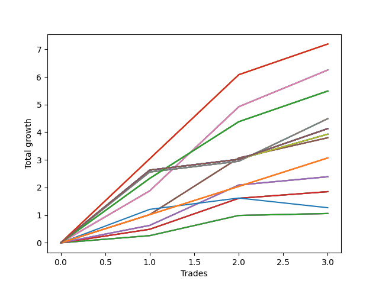

# Long Pointer 007 
- Symbol: NVDA_Unlimited
- Date Range: 02/08/2022 - 07/08/2022
- Trading Period: 7:20-12:30
- Number of Trades: 3



| Name | Win Percent | Profit | Avg Profit / Trade | Avg Time / Trade |      | Name | Win Percent | Profit | Avg Profit / Trade | Avg Time / Trade |
| ---- | ----------- | ------ | ------------------ | ---------------- | ---- | ---- | ----------- | ------ | ------------------ | ---------------- |
| Sorted By <br> Profit | | | | | | Sorted By <br> Win Percentage ||||
| One Hundred Twenty-Eight | 100.00 | 3595.00 | 1198.33 | 26:11 |     | One Hundred Twenty-Eight | 100.00 | 3595.00 | 1198.33 | 26:11 |
| One Hundred Twenty-Three | 100.00 | 3595.00 | 1198.33 | 26:11 |     | One Hundred Twenty-Three | 100.00 | 3595.00 | 1198.33 | 26:11 |
| One Hundred Eighteen | 100.00 | 3595.00 | 1198.33 | 26:11 |     | One Hundred Eighteen | 100.00 | 3595.00 | 1198.33 | 26:11 |
| One Hundred Thirteen | 100.00 | 3595.00 | 1198.33 | 26:11 |     | One Hundred Thirteen | 100.00 | 3595.00 | 1198.33 | 26:11 |
| Eighty-Three | 100.00 | 3595.00 | 1198.33 | 26:11 |     | Eighty-Three | 100.00 | 3595.00 | 1198.33 | 26:11 |
| Sixty-Eight | 100.00 | 3125.00 | 1041.67 | 18:58 |     | Sixty-Eight | 100.00 | 3125.00 | 1041.67 | 18:58 |
| Sixty | 100.00 | 3125.00 | 1041.67 | 18:58 |     | Sixty | 100.00 | 3125.00 | 1041.67 | 18:58 |
| Fifty-Two | 100.00 | 3125.00 | 1041.67 | 18:58 |     | Fifty-Two | 100.00 | 3125.00 | 1041.67 | 18:58 |
| Forty-Four | 100.00 | 3125.00 | 1041.67 | 18:58 |     | Forty-Four | 100.00 | 3125.00 | 1041.67 | 18:58 |
| Four | 100.00 | 3125.00 | 1041.67 | 18:58 |     | Four | 100.00 | 3125.00 | 1041.67 | 18:58 |
| One Hundred Twenty-Seven | 100.00 | 2745.00 | 915.00 | 20:08 |     | One Hundred Twenty-Seven | 100.00 | 2745.00 | 915.00 | 20:08 |
| One Hundred Twenty-Two | 100.00 | 2745.00 | 915.00 | 20:08 |     | One Hundred Twenty-Two | 100.00 | 2745.00 | 915.00 | 20:08 |
| One Hundred Seventeen | 100.00 | 2745.00 | 915.00 | 20:08 |     | One Hundred Seventeen | 100.00 | 2745.00 | 915.00 | 20:08 |
| One Hundred Twelve | 100.00 | 2745.00 | 915.00 | 20:08 |     | One Hundred Twelve | 100.00 | 2745.00 | 915.00 | 20:08 |
| Eighty-Two | 100.00 | 2745.00 | 915.00 | 20:08 |     | Eighty-Two | 100.00 | 2745.00 | 915.00 | 20:08 |
| Sixty-Nine | 100.00 | 2245.00 | 748.33 | 25:28 |     | Sixty-Nine | 100.00 | 2245.00 | 748.33 | 25:28 |
| Sixty-One | 100.00 | 2245.00 | 748.33 | 25:28 |     | Sixty-One | 100.00 | 2245.00 | 748.33 | 25:28 |
| Fifty-Three | 100.00 | 2245.00 | 748.33 | 25:28 |     | Fifty-Three | 100.00 | 2245.00 | 748.33 | 25:28 |
| Forty-Five | 100.00 | 2245.00 | 748.33 | 25:28 |     | Forty-Five | 100.00 | 2245.00 | 748.33 | 25:28 |
| Five | 100.00 | 2245.00 | 748.33 | 25:28 |     | Five | 100.00 | 2245.00 | 748.33 | 25:28 |
| One Hundred Thirty | 100.00 | 2065.00 | 688.33 | 29:55 |     | One Hundred Thirty | 100.00 | 2065.00 | 688.33 | 29:55 |
| One Hundred Twenty-Nine | 100.00 | 2065.00 | 688.33 | 29:55 |     | One Hundred Twenty-Nine | 100.00 | 2065.00 | 688.33 | 29:55 |
| One Hundred Twenty-Five | 100.00 | 2065.00 | 688.33 | 29:55 |     | One Hundred Twenty-Five | 100.00 | 2065.00 | 688.33 | 29:55 |
| One Hundred Twenty-Four | 100.00 | 2065.00 | 688.33 | 29:55 |     | One Hundred Twenty-Four | 100.00 | 2065.00 | 688.33 | 29:55 |
| One Hundred Twenty | 100.00 | 2065.00 | 688.33 | 29:55 |     | One Hundred Twenty | 100.00 | 2065.00 | 688.33 | 29:55 |
| One Hundred Ninteen | 100.00 | 2065.00 | 688.33 | 29:55 |     | One Hundred Ninteen | 100.00 | 2065.00 | 688.33 | 29:55 |
| One Hundred Fifteen | 100.00 | 2065.00 | 688.33 | 29:55 |     | One Hundred Fifteen | 100.00 | 2065.00 | 688.33 | 29:55 |
| One Hundred Fourteen | 100.00 | 2065.00 | 688.33 | 29:55 |     | One Hundred Fourteen | 100.00 | 2065.00 | 688.33 | 29:55 |
| Eighty-Five | 100.00 | 2065.00 | 688.33 | 29:55 |     | Eighty-Five | 100.00 | 2065.00 | 688.33 | 29:55 |
| Eighty-Four | 100.00 | 2065.00 | 688.33 | 29:55 |     | Eighty-Four | 100.00 | 2065.00 | 688.33 | 29:55 |
| Seventy-One | 100.00 | 2065.00 | 688.33 | 29:55 |     | Seventy-One | 100.00 | 2065.00 | 688.33 | 29:55 |
| Sixty-Three | 100.00 | 2065.00 | 688.33 | 29:55 |     | Sixty-Three | 100.00 | 2065.00 | 688.33 | 29:55 |
| Fifty-Five | 100.00 | 2065.00 | 688.33 | 29:55 |     | Fifty-Five | 100.00 | 2065.00 | 688.33 | 29:55 |
| Forty-Seven | 100.00 | 2065.00 | 688.33 | 29:55 |     | Forty-Seven | 100.00 | 2065.00 | 688.33 | 29:55 |
| Seven | 100.00 | 2065.00 | 688.33 | 29:55 |     | Seven | 100.00 | 2065.00 | 688.33 | 29:55 |
| Seventy | 100.00 | 1965.00 | 655.00 | 24:25 |     | Seventy | 100.00 | 1965.00 | 655.00 | 24:25 |
| Sixty-Two | 100.00 | 1965.00 | 655.00 | 24:25 |     | Sixty-Two | 100.00 | 1965.00 | 655.00 | 24:25 |
| Fifty-Four | 100.00 | 1965.00 | 655.00 | 24:25 |     | Fifty-Four | 100.00 | 1965.00 | 655.00 | 24:25 |
| Forty-Six | 100.00 | 1965.00 | 655.00 | 24:25 |     | Forty-Six | 100.00 | 1965.00 | 655.00 | 24:25 |
| Six | 100.00 | 1965.00 | 655.00 | 24:25 |     | Six | 100.00 | 1965.00 | 655.00 | 24:25 |
| Sixty-Seven | 100.00 | 1900.00 | 633.33 | 11:15 |     | Sixty-Seven | 100.00 | 1900.00 | 633.33 | 11:15 |
| Fifty-Nine | 100.00 | 1900.00 | 633.33 | 11:15 |     | Fifty-Nine | 100.00 | 1900.00 | 633.33 | 11:15 |
| Fifty-One | 100.00 | 1900.00 | 633.33 | 11:15 |     | Fifty-One | 100.00 | 1900.00 | 633.33 | 11:15 |
| Forty-Three | 100.00 | 1900.00 | 633.33 | 11:15 |     | Forty-Three | 100.00 | 1900.00 | 633.33 | 11:15 |
| Three | 100.00 | 1900.00 | 633.33 | 11:15 |     | Three | 100.00 | 1900.00 | 633.33 | 11:15 |
| One Hundred Twenty-Six | 100.00 | 1535.00 | 511.67 | 09:01 |     | One Hundred Twenty-Six | 100.00 | 1535.00 | 511.67 | 09:01 |
| One Hundred Twenty-One | 100.00 | 1535.00 | 511.67 | 09:01 |     | One Hundred Twenty-One | 100.00 | 1535.00 | 511.67 | 09:01 |
| One Hundred Sixteen | 100.00 | 1535.00 | 511.67 | 09:01 |     | One Hundred Sixteen | 100.00 | 1535.00 | 511.67 | 09:01 |
| One Hundred Eleven | 100.00 | 1535.00 | 511.67 | 09:01 |     | One Hundred Eleven | 100.00 | 1535.00 | 511.67 | 09:01 |
| Eighty-One | 100.00 | 1535.00 | 511.67 | 09:01 |     | Eighty-One | 100.00 | 1535.00 | 511.67 | 09:01 |
| Sixty-Six | 100.00 | 1195.00 | 398.33 | 09:01 |     | Sixty-Six | 100.00 | 1195.00 | 398.33 | 09:01 |
| Fifty-Eight | 100.00 | 1195.00 | 398.33 | 09:01 |     | Fifty-Eight | 100.00 | 1195.00 | 398.33 | 09:01 |
| Fifty | 100.00 | 1195.00 | 398.33 | 09:01 |     | Fifty | 100.00 | 1195.00 | 398.33 | 09:01 |
| Forty-Two | 100.00 | 1195.00 | 398.33 | 09:01 |     | Forty-Two | 100.00 | 1195.00 | 398.33 | 09:01 |
| Two | 100.00 | 1195.00 | 398.33 | 09:01 |     | Two | 100.00 | 1195.00 | 398.33 | 09:01 |
| Sixty-Five | 100.00 | 925.00 | 308.33 | 07:36 |     | Sixty-Five | 100.00 | 925.00 | 308.33 | 07:36 |
| Fifty-Seven | 100.00 | 925.00 | 308.33 | 07:36 |     | Fifty-Seven | 100.00 | 925.00 | 308.33 | 07:36 |
| Forty-Nine | 100.00 | 925.00 | 308.33 | 07:36 |     | Forty-Nine | 100.00 | 925.00 | 308.33 | 07:36 |
| Forty-One | 100.00 | 925.00 | 308.33 | 07:36 |     | Forty-One | 100.00 | 925.00 | 308.33 | 07:36 |
| One | 100.00 | 925.00 | 308.33 | 07:36 |     | One | 100.00 | 925.00 | 308.33 | 07:36 |
| Seventy-Three | 66.67 | 635.00 | 211.67 | 09:45 |     | Sixty-Four | 100.00 | 530.00 | 176.67 | 03:06 |
| Sixty-Four | 100.00 | 530.00 | 176.67 | 03:06 |     | Fifty-Six | 100.00 | 530.00 | 176.67 | 03:06 |
| Fifty-Six | 100.00 | 530.00 | 176.67 | 03:06 |     | Forty-Eight | 100.00 | 530.00 | 176.67 | 03:06 |
| Forty-Eight | 100.00 | 530.00 | 176.67 | 03:06 |     | Forty | 100.00 | 530.00 | 176.67 | 03:06 |
| Forty | 100.00 | 530.00 | 176.67 | 03:06 |     | Zero | 100.00 | 530.00 | 176.67 | 03:06 |
| Zero | 100.00 | 530.00 | 176.67 | 03:06 |     | Seventy-Three | 66.67 | 635.00 | 211.67 | 09:45 |

## NO STOPLOSS

### Test Zero
* Sell when price hits the middle line of the 20p bollinger
* No Stoploss
* Results:
```
Total Trades: 3
Percent Up: 100.00
Percent Down: 0.00
Total Points Moved Up: 1.06
Potential Profit: 530.00
Total Points Ups: 1.06 Count Ups: 3
Total Points Downs: 0.00 Count Downs: 0
```

<details><summary>Trades</summary>

<code>In: 2022-04-07 09:52:00		Out: 2022-04-07 09:52:20		Total Position Time: 00:20		Total Move Up: 0.26		Total to Date: 0.26</code> <br />
<code>In: 2022-04-21 10:11:00		Out: 2022-04-21 10:13:15		Total Position Time: 02:15		Total Move Up: 0.73		Total to Date: 0.99</code> <br />
<code>In: 2022-06-30 12:15:00		Out: 2022-06-30 12:21:45		Total Position Time: 06:45		Total Move Up: 0.07		Total to Date: 1.06</code> <br />


</details>

### Test One
* Sell when the price hits the upper line of the 20p 1std bollinger
* No Stoploss
* Results:
```
Total Trades: 3
Percent Up: 100.00
Percent Down: 0.00
Total Points Moved Up: 1.85
Potential Profit: 925.00
Total Points Ups: 1.85 Count Ups: 3
Total Points Downs: 0.00 Count Downs: 0
```

<details><summary>Trades</summary>

<code>In: 2022-04-07 09:52:00		Out: 2022-04-07 09:56:10		Total Position Time: 04:10		Total Move Up: 0.49		Total to Date: 0.49</code> <br />
<code>In: 2022-04-21 10:11:00		Out: 2022-04-21 10:20:30		Total Position Time: 09:30		Total Move Up: 1.12		Total to Date: 1.61</code> <br />
<code>In: 2022-06-30 12:15:00		Out: 2022-06-30 12:24:10		Total Position Time: 09:10		Total Move Up: 0.24		Total to Date: 1.85</code> <br />


</details>

### Test Two
* Sell when the price hits the upper line of the 20p 2std bollinger
* No Stoploss
* Results:
```
Total Trades: 3
Percent Up: 100.00
Percent Down: 0.00
Total Points Moved Up: 2.39
Potential Profit: 1195.00
Total Points Ups: 2.39 Count Ups: 3
Total Points Downs: 0.00 Count Downs: 0
```

<details><summary>Trades</summary>

<code>In: 2022-04-07 09:52:00		Out: 2022-04-07 09:59:10		Total Position Time: 07:10		Total Move Up: 0.63		Total to Date: 0.63</code> <br />
<code>In: 2022-04-21 10:11:00		Out: 2022-04-21 10:20:45		Total Position Time: 09:45		Total Move Up: 1.46		Total to Date: 2.09</code> <br />
<code>In: 2022-06-30 12:15:00		Out: 2022-06-30 12:25:10		Total Position Time: 10:10		Total Move Up: 0.30		Total to Date: 2.39</code> <br />


</details>

### Test Three
* Sell when price hits the middle line of the 50p bollinger
* No Stoploss
* Results:
```
Total Trades: 3
Percent Up: 100.00
Percent Down: 0.00
Total Points Moved Up: 3.80
Potential Profit: 1900.00
Total Points Ups: 3.80 Count Ups: 3
Total Points Downs: 0.00 Count Downs: 0
```

<details><summary>Trades</summary>

<code>In: 2022-04-07 09:52:00		Out: 2022-04-07 10:02:40		Total Position Time: 10:40		Total Move Up: 1.02		Total to Date: 1.02</code> <br />
<code>In: 2022-04-21 10:11:00		Out: 2022-04-21 10:21:15		Total Position Time: 10:15		Total Move Up: 2.05		Total to Date: 3.07</code> <br />
<code>In: 2022-06-30 12:15:00		Out: 2022-06-30 12:27:50		Total Position Time: 12:50		Total Move Up: 0.73		Total to Date: 3.80</code> <br />


</details>

### Test Four
* Sell when the price hits the upper line of the 50p 1std bollinger
* No Stoploss
* Results:
```
Total Trades: 3
Percent Up: 100.00
Percent Down: 0.00
Total Points Moved Up: 6.25
Potential Profit: 3125.00
Total Points Ups: 6.25 Count Ups: 3
Total Points Downs: 0.00 Count Downs: 0
```

<details><summary>Trades</summary>

<code>In: 2022-04-07 09:52:00		Out: 2022-04-07 10:12:10		Total Position Time: 20:10		Total Move Up: 1.88		Total to Date: 1.88</code> <br />
<code>In: 2022-04-21 10:11:00		Out: 2022-04-21 10:31:20		Total Position Time: 20:20		Total Move Up: 3.04		Total to Date: 4.92</code> <br />
<code>In: 2022-06-30 12:15:00		Out: 2022-06-30 12:31:25		Total Position Time: 16:25		Total Move Up: 1.33		Total to Date: 6.25</code> <br />


</details>

### Test Five
* Sell when the price hits the upper line of the 50p 2std bollinger
* No Stoploss
* Results:
```
Total Trades: 3
Percent Up: 100.00
Percent Down: 0.00
Total Points Moved Up: 4.49
Potential Profit: 2245.00
Total Points Ups: 4.49 Count Ups: 3
Total Points Downs: 0.00 Count Downs: 0
```

<details><summary>Trades</summary>

<code>In: 2022-04-07 09:52:00		Out: 2022-04-07 10:13:00		Total Position Time: 21:00		Total Move Up: 2.56		Total to Date: 2.56</code> <br />
<code>In: 2022-04-21 10:11:00		Out: 2022-04-21 10:40:55		Total Position Time: 29:55		Total Move Up: 0.39		Total to Date: 2.95</code> <br />
<code>In: 2022-06-30 12:15:00		Out: 2022-06-30 12:40:30		Total Position Time: 25:30		Total Move Up: 1.54		Total to Date: 4.49</code> <br />


</details>

### Test Six
* Sell when the price hits the middle line of the 1std VWAP
* No Stoploss
* Results:
```
Total Trades: 3
Percent Up: 100.00
Percent Down: 0.00
Total Points Moved Up: 3.93
Potential Profit: 1965.00
Total Points Ups: 3.93 Count Ups: 3
Total Points Downs: 0.00 Count Downs: 0
```

<details><summary>Trades</summary>

<code>In: 2022-04-07 09:52:00		Out: 2022-04-07 10:21:55		Total Position Time: 29:55		Total Move Up: 2.63		Total to Date: 2.63</code> <br />
<code>In: 2022-04-21 10:11:00		Out: 2022-04-21 10:40:55		Total Position Time: 29:55		Total Move Up: 0.39		Total to Date: 3.02</code> <br />
<code>In: 2022-06-30 12:15:00		Out: 2022-06-30 12:28:25		Total Position Time: 13:25		Total Move Up: 0.91		Total to Date: 3.93</code> <br />


</details>

### Test Seven
* Sell when the price hits the upper line of the 1std VWAP
* No Stoploss
* Results:
```
Total Trades: 3
Percent Up: 100.00
Percent Down: 0.00
Total Points Moved Up: 4.13
Potential Profit: 2065.00
Total Points Ups: 4.13 Count Ups: 3
Total Points Downs: 0.00 Count Downs: 0
```

<details><summary>Trades</summary>

<code>In: 2022-04-07 09:52:00		Out: 2022-04-07 10:21:55		Total Position Time: 29:55		Total Move Up: 2.63		Total to Date: 2.63</code> <br />
<code>In: 2022-04-21 10:11:00		Out: 2022-04-21 10:40:55		Total Position Time: 29:55		Total Move Up: 0.39		Total to Date: 3.02</code> <br />
<code>In: 2022-06-30 12:15:00		Out: 2022-06-30 12:44:55		Total Position Time: 29:55		Total Move Up: 1.11		Total to Date: 4.13</code> <br />


</details>

## STOPLOSS OF 5

### Test Forty
* Sell when price hits the middle line of the 20p bollinger
* Stoploss is 5 points
* Results:
```
Total Trades: 3
Percent Up: 100.00
Percent Down: 0.00
Total Points Moved Up: 1.06
Potential Profit: 530.00
Total Points Ups: 1.06 Count Ups: 3
Total Points Downs: 0.00 Count Downs: 0
```

<details><summary>Trades</summary>

<code>In: 2022-04-07 09:52:00		Out: 2022-04-07 09:52:20		Total Position Time: 00:20		Total Move Up: 0.26		Total to Date: 0.26</code> <br />
<code>In: 2022-04-21 10:11:00		Out: 2022-04-21 10:13:15		Total Position Time: 02:15		Total Move Up: 0.73		Total to Date: 0.99</code> <br />
<code>In: 2022-06-30 12:15:00		Out: 2022-06-30 12:21:45		Total Position Time: 06:45		Total Move Up: 0.07		Total to Date: 1.06</code> <br />


</details>

### Test Forty-One
* Sell when the price hits the upper line of the 20p 1std bollinger
* Stoploss is 5 points
* Results:
```
Total Trades: 3
Percent Up: 100.00
Percent Down: 0.00
Total Points Moved Up: 1.85
Potential Profit: 925.00
Total Points Ups: 1.85 Count Ups: 3
Total Points Downs: 0.00 Count Downs: 0
```

<details><summary>Trades</summary>

<code>In: 2022-04-07 09:52:00		Out: 2022-04-07 09:56:10		Total Position Time: 04:10		Total Move Up: 0.49		Total to Date: 0.49</code> <br />
<code>In: 2022-04-21 10:11:00		Out: 2022-04-21 10:20:30		Total Position Time: 09:30		Total Move Up: 1.12		Total to Date: 1.61</code> <br />
<code>In: 2022-06-30 12:15:00		Out: 2022-06-30 12:24:10		Total Position Time: 09:10		Total Move Up: 0.24		Total to Date: 1.85</code> <br />


</details>

### Test Forty-Two
* Sell when the price hits the upper line of the 20p 2std bollinger
* Stoploss is 5 points
* Results:
```
Total Trades: 3
Percent Up: 100.00
Percent Down: 0.00
Total Points Moved Up: 2.39
Potential Profit: 1195.00
Total Points Ups: 2.39 Count Ups: 3
Total Points Downs: 0.00 Count Downs: 0
```

<details><summary>Trades</summary>

<code>In: 2022-04-07 09:52:00		Out: 2022-04-07 09:59:10		Total Position Time: 07:10		Total Move Up: 0.63		Total to Date: 0.63</code> <br />
<code>In: 2022-04-21 10:11:00		Out: 2022-04-21 10:20:45		Total Position Time: 09:45		Total Move Up: 1.46		Total to Date: 2.09</code> <br />
<code>In: 2022-06-30 12:15:00		Out: 2022-06-30 12:25:10		Total Position Time: 10:10		Total Move Up: 0.30		Total to Date: 2.39</code> <br />


</details>

### Test Forty-Three
* Sell when price hits the middle line of the 50p bollinger
* Stoploss is 5 points
* Results:
```
Total Trades: 3
Percent Up: 100.00
Percent Down: 0.00
Total Points Moved Up: 3.80
Potential Profit: 1900.00
Total Points Ups: 3.80 Count Ups: 3
Total Points Downs: 0.00 Count Downs: 0
```

<details><summary>Trades</summary>

<code>In: 2022-04-07 09:52:00		Out: 2022-04-07 10:02:40		Total Position Time: 10:40		Total Move Up: 1.02		Total to Date: 1.02</code> <br />
<code>In: 2022-04-21 10:11:00		Out: 2022-04-21 10:21:15		Total Position Time: 10:15		Total Move Up: 2.05		Total to Date: 3.07</code> <br />
<code>In: 2022-06-30 12:15:00		Out: 2022-06-30 12:27:50		Total Position Time: 12:50		Total Move Up: 0.73		Total to Date: 3.80</code> <br />


</details>

### Test Forty-Four
* Sell when the price hits the upper line of the 50p 1std bollinger
* Stoploss is 5 points
* Results:
```
Total Trades: 3
Percent Up: 100.00
Percent Down: 0.00
Total Points Moved Up: 6.25
Potential Profit: 3125.00
Total Points Ups: 6.25 Count Ups: 3
Total Points Downs: 0.00 Count Downs: 0
```

<details><summary>Trades</summary>

<code>In: 2022-04-07 09:52:00		Out: 2022-04-07 10:12:10		Total Position Time: 20:10		Total Move Up: 1.88		Total to Date: 1.88</code> <br />
<code>In: 2022-04-21 10:11:00		Out: 2022-04-21 10:31:20		Total Position Time: 20:20		Total Move Up: 3.04		Total to Date: 4.92</code> <br />
<code>In: 2022-06-30 12:15:00		Out: 2022-06-30 12:31:25		Total Position Time: 16:25		Total Move Up: 1.33		Total to Date: 6.25</code> <br />


</details>

### Test Forty-Five
* Sell when the price hits the upper line of the 50p 2std bollinger
* Stoploss is 5 points
* Results:
```
Total Trades: 3
Percent Up: 100.00
Percent Down: 0.00
Total Points Moved Up: 4.49
Potential Profit: 2245.00
Total Points Ups: 4.49 Count Ups: 3
Total Points Downs: 0.00 Count Downs: 0
```

<details><summary>Trades</summary>

<code>In: 2022-04-07 09:52:00		Out: 2022-04-07 10:13:00		Total Position Time: 21:00		Total Move Up: 2.56		Total to Date: 2.56</code> <br />
<code>In: 2022-04-21 10:11:00		Out: 2022-04-21 10:40:55		Total Position Time: 29:55		Total Move Up: 0.39		Total to Date: 2.95</code> <br />
<code>In: 2022-06-30 12:15:00		Out: 2022-06-30 12:40:30		Total Position Time: 25:30		Total Move Up: 1.54		Total to Date: 4.49</code> <br />


</details>

### Test Forty-Six
* Sell when the price hits the middle line of the 1std VWAP
* Stoploss is 5 points
* Results:
```
Total Trades: 3
Percent Up: 100.00
Percent Down: 0.00
Total Points Moved Up: 3.93
Potential Profit: 1965.00
Total Points Ups: 3.93 Count Ups: 3
Total Points Downs: 0.00 Count Downs: 0
```

<details><summary>Trades</summary>

<code>In: 2022-04-07 09:52:00		Out: 2022-04-07 10:21:55		Total Position Time: 29:55		Total Move Up: 2.63		Total to Date: 2.63</code> <br />
<code>In: 2022-04-21 10:11:00		Out: 2022-04-21 10:40:55		Total Position Time: 29:55		Total Move Up: 0.39		Total to Date: 3.02</code> <br />
<code>In: 2022-06-30 12:15:00		Out: 2022-06-30 12:28:25		Total Position Time: 13:25		Total Move Up: 0.91		Total to Date: 3.93</code> <br />


</details>

### Test Forty-Seven
* Sell when the price hits the upper line of the 1std VWAP
* Stoploss is 5 points
* Results:
```
Total Trades: 3
Percent Up: 100.00
Percent Down: 0.00
Total Points Moved Up: 4.13
Potential Profit: 2065.00
Total Points Ups: 4.13 Count Ups: 3
Total Points Downs: 0.00 Count Downs: 0
```

<details><summary>Trades</summary>

<code>In: 2022-04-07 09:52:00		Out: 2022-04-07 10:21:55		Total Position Time: 29:55		Total Move Up: 2.63		Total to Date: 2.63</code> <br />
<code>In: 2022-04-21 10:11:00		Out: 2022-04-21 10:40:55		Total Position Time: 29:55		Total Move Up: 0.39		Total to Date: 3.02</code> <br />
<code>In: 2022-06-30 12:15:00		Out: 2022-06-30 12:44:55		Total Position Time: 29:55		Total Move Up: 1.11		Total to Date: 4.13</code> <br />


</details>

## TRAIL STOP OF 5

### Test Forty-Eight
* Sell when price hits the middle line of the 20p bollinger
* Trailing Stop is 5 points
* Results:
```
Total Trades: 3
Percent Up: 100.00
Percent Down: 0.00
Total Points Moved Up: 1.06
Potential Profit: 530.00
Total Points Ups: 1.06 Count Ups: 3
Total Points Downs: 0.00 Count Downs: 0
```

<details><summary>Trades</summary>

<code>In: 2022-04-07 09:52:00		Out: 2022-04-07 09:52:20		Total Position Time: 00:20		Total Move Up: 0.26		Total to Date: 0.26</code> <br />
<code>In: 2022-04-21 10:11:00		Out: 2022-04-21 10:13:15		Total Position Time: 02:15		Total Move Up: 0.73		Total to Date: 0.99</code> <br />
<code>In: 2022-06-30 12:15:00		Out: 2022-06-30 12:21:45		Total Position Time: 06:45		Total Move Up: 0.07		Total to Date: 1.06</code> <br />


</details>

### Test Forty-Nine
* Sell when the price hits the upper line of the 20p 1std bollinger
* Trailing Stop is 5 points
* Results:
```
Total Trades: 3
Percent Up: 100.00
Percent Down: 0.00
Total Points Moved Up: 1.85
Potential Profit: 925.00
Total Points Ups: 1.85 Count Ups: 3
Total Points Downs: 0.00 Count Downs: 0
```

<details><summary>Trades</summary>

<code>In: 2022-04-07 09:52:00		Out: 2022-04-07 09:56:10		Total Position Time: 04:10		Total Move Up: 0.49		Total to Date: 0.49</code> <br />
<code>In: 2022-04-21 10:11:00		Out: 2022-04-21 10:20:30		Total Position Time: 09:30		Total Move Up: 1.12		Total to Date: 1.61</code> <br />
<code>In: 2022-06-30 12:15:00		Out: 2022-06-30 12:24:10		Total Position Time: 09:10		Total Move Up: 0.24		Total to Date: 1.85</code> <br />


</details>

### Test Fifty
* Sell when the price hits the upper line of the 20p 2std bollinger
* Trailing Stop is 5 points
* Results:
```
Total Trades: 3
Percent Up: 100.00
Percent Down: 0.00
Total Points Moved Up: 2.39
Potential Profit: 1195.00
Total Points Ups: 2.39 Count Ups: 3
Total Points Downs: 0.00 Count Downs: 0
```

<details><summary>Trades</summary>

<code>In: 2022-04-07 09:52:00		Out: 2022-04-07 09:59:10		Total Position Time: 07:10		Total Move Up: 0.63		Total to Date: 0.63</code> <br />
<code>In: 2022-04-21 10:11:00		Out: 2022-04-21 10:20:45		Total Position Time: 09:45		Total Move Up: 1.46		Total to Date: 2.09</code> <br />
<code>In: 2022-06-30 12:15:00		Out: 2022-06-30 12:25:10		Total Position Time: 10:10		Total Move Up: 0.30		Total to Date: 2.39</code> <br />


</details>

### Test Fifty-One
* Sell when price hits the middle line of the 50p bollinger
* Trailing Stop is 5 points
* Results:
```
Total Trades: 3
Percent Up: 100.00
Percent Down: 0.00
Total Points Moved Up: 3.80
Potential Profit: 1900.00
Total Points Ups: 3.80 Count Ups: 3
Total Points Downs: 0.00 Count Downs: 0
```

<details><summary>Trades</summary>

<code>In: 2022-04-07 09:52:00		Out: 2022-04-07 10:02:40		Total Position Time: 10:40		Total Move Up: 1.02		Total to Date: 1.02</code> <br />
<code>In: 2022-04-21 10:11:00		Out: 2022-04-21 10:21:15		Total Position Time: 10:15		Total Move Up: 2.05		Total to Date: 3.07</code> <br />
<code>In: 2022-06-30 12:15:00		Out: 2022-06-30 12:27:50		Total Position Time: 12:50		Total Move Up: 0.73		Total to Date: 3.80</code> <br />


</details>

### Test Fifty-Two
* Sell when the price hits the upper line of the 50p 1std bollinger
* Trailing Stop is 5 points
* Results:
```
Total Trades: 3
Percent Up: 100.00
Percent Down: 0.00
Total Points Moved Up: 6.25
Potential Profit: 3125.00
Total Points Ups: 6.25 Count Ups: 3
Total Points Downs: 0.00 Count Downs: 0
```

<details><summary>Trades</summary>

<code>In: 2022-04-07 09:52:00		Out: 2022-04-07 10:12:10		Total Position Time: 20:10		Total Move Up: 1.88		Total to Date: 1.88</code> <br />
<code>In: 2022-04-21 10:11:00		Out: 2022-04-21 10:31:20		Total Position Time: 20:20		Total Move Up: 3.04		Total to Date: 4.92</code> <br />
<code>In: 2022-06-30 12:15:00		Out: 2022-06-30 12:31:25		Total Position Time: 16:25		Total Move Up: 1.33		Total to Date: 6.25</code> <br />


</details>

### Test Fifty-Three
* Sell when the price hits the upper line of the 50p 2std bollinger
* Trailing Stop is 5 points
* Results:
```
Total Trades: 3
Percent Up: 100.00
Percent Down: 0.00
Total Points Moved Up: 4.49
Potential Profit: 2245.00
Total Points Ups: 4.49 Count Ups: 3
Total Points Downs: 0.00 Count Downs: 0
```

<details><summary>Trades</summary>

<code>In: 2022-04-07 09:52:00		Out: 2022-04-07 10:13:00		Total Position Time: 21:00		Total Move Up: 2.56		Total to Date: 2.56</code> <br />
<code>In: 2022-04-21 10:11:00		Out: 2022-04-21 10:40:55		Total Position Time: 29:55		Total Move Up: 0.39		Total to Date: 2.95</code> <br />
<code>In: 2022-06-30 12:15:00		Out: 2022-06-30 12:40:30		Total Position Time: 25:30		Total Move Up: 1.54		Total to Date: 4.49</code> <br />


</details>

### Test Fifty-Four
* Sell when the price hits the middle line of the 1std VWAP
* Trailing Stop is 5 points
* Results:
```
Total Trades: 3
Percent Up: 100.00
Percent Down: 0.00
Total Points Moved Up: 3.93
Potential Profit: 1965.00
Total Points Ups: 3.93 Count Ups: 3
Total Points Downs: 0.00 Count Downs: 0
```

<details><summary>Trades</summary>

<code>In: 2022-04-07 09:52:00		Out: 2022-04-07 10:21:55		Total Position Time: 29:55		Total Move Up: 2.63		Total to Date: 2.63</code> <br />
<code>In: 2022-04-21 10:11:00		Out: 2022-04-21 10:40:55		Total Position Time: 29:55		Total Move Up: 0.39		Total to Date: 3.02</code> <br />
<code>In: 2022-06-30 12:15:00		Out: 2022-06-30 12:28:25		Total Position Time: 13:25		Total Move Up: 0.91		Total to Date: 3.93</code> <br />


</details>

### Test Fifty-Five
* Sell when the price hits the upper line of the 1std VWAP
* Trailing Stop is 5 points
* Results:
```
Total Trades: 3
Percent Up: 100.00
Percent Down: 0.00
Total Points Moved Up: 4.13
Potential Profit: 2065.00
Total Points Ups: 4.13 Count Ups: 3
Total Points Downs: 0.00 Count Downs: 0
```

<details><summary>Trades</summary>

<code>In: 2022-04-07 09:52:00		Out: 2022-04-07 10:21:55		Total Position Time: 29:55		Total Move Up: 2.63		Total to Date: 2.63</code> <br />
<code>In: 2022-04-21 10:11:00		Out: 2022-04-21 10:40:55		Total Position Time: 29:55		Total Move Up: 0.39		Total to Date: 3.02</code> <br />
<code>In: 2022-06-30 12:15:00		Out: 2022-06-30 12:44:55		Total Position Time: 29:55		Total Move Up: 1.11		Total to Date: 4.13</code> <br />


</details>

## STOPLOSS OF 10

### Test Fifty-Six
* Sell when price hits the middle line of the 20p bollinger
* Stoploss is 10 points
* Results:
```
Total Trades: 3
Percent Up: 100.00
Percent Down: 0.00
Total Points Moved Up: 1.06
Potential Profit: 530.00
Total Points Ups: 1.06 Count Ups: 3
Total Points Downs: 0.00 Count Downs: 0
```

<details><summary>Trades</summary>

<code>In: 2022-04-07 09:52:00		Out: 2022-04-07 09:52:20		Total Position Time: 00:20		Total Move Up: 0.26		Total to Date: 0.26</code> <br />
<code>In: 2022-04-21 10:11:00		Out: 2022-04-21 10:13:15		Total Position Time: 02:15		Total Move Up: 0.73		Total to Date: 0.99</code> <br />
<code>In: 2022-06-30 12:15:00		Out: 2022-06-30 12:21:45		Total Position Time: 06:45		Total Move Up: 0.07		Total to Date: 1.06</code> <br />


</details>

### Test Fifty-Seven
* Sell when the price hits the upper line of the 20p 1std bollinger
* Stoploss is 10 points
* Results:
```
Total Trades: 3
Percent Up: 100.00
Percent Down: 0.00
Total Points Moved Up: 1.85
Potential Profit: 925.00
Total Points Ups: 1.85 Count Ups: 3
Total Points Downs: 0.00 Count Downs: 0
```

<details><summary>Trades</summary>

<code>In: 2022-04-07 09:52:00		Out: 2022-04-07 09:56:10		Total Position Time: 04:10		Total Move Up: 0.49		Total to Date: 0.49</code> <br />
<code>In: 2022-04-21 10:11:00		Out: 2022-04-21 10:20:30		Total Position Time: 09:30		Total Move Up: 1.12		Total to Date: 1.61</code> <br />
<code>In: 2022-06-30 12:15:00		Out: 2022-06-30 12:24:10		Total Position Time: 09:10		Total Move Up: 0.24		Total to Date: 1.85</code> <br />


</details>

### Test Fifty-Eight
* Sell when the price hits the upper line of the 20p 2std bollinger
* Stoploss is 10 points
* Results:
```
Total Trades: 3
Percent Up: 100.00
Percent Down: 0.00
Total Points Moved Up: 2.39
Potential Profit: 1195.00
Total Points Ups: 2.39 Count Ups: 3
Total Points Downs: 0.00 Count Downs: 0
```

<details><summary>Trades</summary>

<code>In: 2022-04-07 09:52:00		Out: 2022-04-07 09:59:10		Total Position Time: 07:10		Total Move Up: 0.63		Total to Date: 0.63</code> <br />
<code>In: 2022-04-21 10:11:00		Out: 2022-04-21 10:20:45		Total Position Time: 09:45		Total Move Up: 1.46		Total to Date: 2.09</code> <br />
<code>In: 2022-06-30 12:15:00		Out: 2022-06-30 12:25:10		Total Position Time: 10:10		Total Move Up: 0.30		Total to Date: 2.39</code> <br />


</details>

### Test Fifty-Nine
* Sell when price hits the middle line of the 50p bollinger
* Stoploss is 10 points
* Results:
```
Total Trades: 3
Percent Up: 100.00
Percent Down: 0.00
Total Points Moved Up: 3.80
Potential Profit: 1900.00
Total Points Ups: 3.80 Count Ups: 3
Total Points Downs: 0.00 Count Downs: 0
```

<details><summary>Trades</summary>

<code>In: 2022-04-07 09:52:00		Out: 2022-04-07 10:02:40		Total Position Time: 10:40		Total Move Up: 1.02		Total to Date: 1.02</code> <br />
<code>In: 2022-04-21 10:11:00		Out: 2022-04-21 10:21:15		Total Position Time: 10:15		Total Move Up: 2.05		Total to Date: 3.07</code> <br />
<code>In: 2022-06-30 12:15:00		Out: 2022-06-30 12:27:50		Total Position Time: 12:50		Total Move Up: 0.73		Total to Date: 3.80</code> <br />


</details>

### Test Sixty
* Sell when the price hits the upper line of the 50p 1std bollinger
* Stoploss is 10 points
* Results:
```
Total Trades: 3
Percent Up: 100.00
Percent Down: 0.00
Total Points Moved Up: 6.25
Potential Profit: 3125.00
Total Points Ups: 6.25 Count Ups: 3
Total Points Downs: 0.00 Count Downs: 0
```

<details><summary>Trades</summary>

<code>In: 2022-04-07 09:52:00		Out: 2022-04-07 10:12:10		Total Position Time: 20:10		Total Move Up: 1.88		Total to Date: 1.88</code> <br />
<code>In: 2022-04-21 10:11:00		Out: 2022-04-21 10:31:20		Total Position Time: 20:20		Total Move Up: 3.04		Total to Date: 4.92</code> <br />
<code>In: 2022-06-30 12:15:00		Out: 2022-06-30 12:31:25		Total Position Time: 16:25		Total Move Up: 1.33		Total to Date: 6.25</code> <br />


</details>

### Test Sixty-One
* Sell when the price hits the upper line of the 50p 2std bollinger
* Stoploss is 10 points
* Results:
```
Total Trades: 3
Percent Up: 100.00
Percent Down: 0.00
Total Points Moved Up: 4.49
Potential Profit: 2245.00
Total Points Ups: 4.49 Count Ups: 3
Total Points Downs: 0.00 Count Downs: 0
```

<details><summary>Trades</summary>

<code>In: 2022-04-07 09:52:00		Out: 2022-04-07 10:13:00		Total Position Time: 21:00		Total Move Up: 2.56		Total to Date: 2.56</code> <br />
<code>In: 2022-04-21 10:11:00		Out: 2022-04-21 10:40:55		Total Position Time: 29:55		Total Move Up: 0.39		Total to Date: 2.95</code> <br />
<code>In: 2022-06-30 12:15:00		Out: 2022-06-30 12:40:30		Total Position Time: 25:30		Total Move Up: 1.54		Total to Date: 4.49</code> <br />


</details>

### Test Sixty-Two
* Sell when the price hits the middle line of the 1std VWAP
* Stoploss is 10 points
* Results:
```
Total Trades: 3
Percent Up: 100.00
Percent Down: 0.00
Total Points Moved Up: 3.93
Potential Profit: 1965.00
Total Points Ups: 3.93 Count Ups: 3
Total Points Downs: 0.00 Count Downs: 0
```

<details><summary>Trades</summary>

<code>In: 2022-04-07 09:52:00		Out: 2022-04-07 10:21:55		Total Position Time: 29:55		Total Move Up: 2.63		Total to Date: 2.63</code> <br />
<code>In: 2022-04-21 10:11:00		Out: 2022-04-21 10:40:55		Total Position Time: 29:55		Total Move Up: 0.39		Total to Date: 3.02</code> <br />
<code>In: 2022-06-30 12:15:00		Out: 2022-06-30 12:28:25		Total Position Time: 13:25		Total Move Up: 0.91		Total to Date: 3.93</code> <br />


</details>

### Test Sixty-Three
* Sell when the price hits the upper line of the 1std VWAP
* Stoploss is 10 points
* Results:
```
Total Trades: 3
Percent Up: 100.00
Percent Down: 0.00
Total Points Moved Up: 4.13
Potential Profit: 2065.00
Total Points Ups: 4.13 Count Ups: 3
Total Points Downs: 0.00 Count Downs: 0
```

<details><summary>Trades</summary>

<code>In: 2022-04-07 09:52:00		Out: 2022-04-07 10:21:55		Total Position Time: 29:55		Total Move Up: 2.63		Total to Date: 2.63</code> <br />
<code>In: 2022-04-21 10:11:00		Out: 2022-04-21 10:40:55		Total Position Time: 29:55		Total Move Up: 0.39		Total to Date: 3.02</code> <br />
<code>In: 2022-06-30 12:15:00		Out: 2022-06-30 12:44:55		Total Position Time: 29:55		Total Move Up: 1.11		Total to Date: 4.13</code> <br />


</details>

## TRAIL STOP OF 10

### Test Sixty-Four
* Sell when price hits the middle line of the 20p bollinger
* Trailing Stop is 10 points
* Results:
```
Total Trades: 3
Percent Up: 100.00
Percent Down: 0.00
Total Points Moved Up: 1.06
Potential Profit: 530.00
Total Points Ups: 1.06 Count Ups: 3
Total Points Downs: 0.00 Count Downs: 0
```

<details><summary>Trades</summary>

<code>In: 2022-04-07 09:52:00		Out: 2022-04-07 09:52:20		Total Position Time: 00:20		Total Move Up: 0.26		Total to Date: 0.26</code> <br />
<code>In: 2022-04-21 10:11:00		Out: 2022-04-21 10:13:15		Total Position Time: 02:15		Total Move Up: 0.73		Total to Date: 0.99</code> <br />
<code>In: 2022-06-30 12:15:00		Out: 2022-06-30 12:21:45		Total Position Time: 06:45		Total Move Up: 0.07		Total to Date: 1.06</code> <br />


</details>

### Test Sixty-Five
* Sell when the price hits the upper line of the 20p 1std bollinger
* Trailing Stop is 10 points
* Results:
```
Total Trades: 3
Percent Up: 100.00
Percent Down: 0.00
Total Points Moved Up: 1.85
Potential Profit: 925.00
Total Points Ups: 1.85 Count Ups: 3
Total Points Downs: 0.00 Count Downs: 0
```

<details><summary>Trades</summary>

<code>In: 2022-04-07 09:52:00		Out: 2022-04-07 09:56:10		Total Position Time: 04:10		Total Move Up: 0.49		Total to Date: 0.49</code> <br />
<code>In: 2022-04-21 10:11:00		Out: 2022-04-21 10:20:30		Total Position Time: 09:30		Total Move Up: 1.12		Total to Date: 1.61</code> <br />
<code>In: 2022-06-30 12:15:00		Out: 2022-06-30 12:24:10		Total Position Time: 09:10		Total Move Up: 0.24		Total to Date: 1.85</code> <br />


</details>

### Test Sixty-Six
* Sell when the price hits the upper line of the 20p 2std bollinger
* Trailing Stop is 10 points
* Results:
```
Total Trades: 3
Percent Up: 100.00
Percent Down: 0.00
Total Points Moved Up: 2.39
Potential Profit: 1195.00
Total Points Ups: 2.39 Count Ups: 3
Total Points Downs: 0.00 Count Downs: 0
```

<details><summary>Trades</summary>

<code>In: 2022-04-07 09:52:00		Out: 2022-04-07 09:59:10		Total Position Time: 07:10		Total Move Up: 0.63		Total to Date: 0.63</code> <br />
<code>In: 2022-04-21 10:11:00		Out: 2022-04-21 10:20:45		Total Position Time: 09:45		Total Move Up: 1.46		Total to Date: 2.09</code> <br />
<code>In: 2022-06-30 12:15:00		Out: 2022-06-30 12:25:10		Total Position Time: 10:10		Total Move Up: 0.30		Total to Date: 2.39</code> <br />


</details>

### Test Sixty-Seven
* Sell when price hits the middle line of the 50p bollinger
* Trailing Stop is 10 points
* Results:
```
Total Trades: 3
Percent Up: 100.00
Percent Down: 0.00
Total Points Moved Up: 3.80
Potential Profit: 1900.00
Total Points Ups: 3.80 Count Ups: 3
Total Points Downs: 0.00 Count Downs: 0
```

<details><summary>Trades</summary>

<code>In: 2022-04-07 09:52:00		Out: 2022-04-07 10:02:40		Total Position Time: 10:40		Total Move Up: 1.02		Total to Date: 1.02</code> <br />
<code>In: 2022-04-21 10:11:00		Out: 2022-04-21 10:21:15		Total Position Time: 10:15		Total Move Up: 2.05		Total to Date: 3.07</code> <br />
<code>In: 2022-06-30 12:15:00		Out: 2022-06-30 12:27:50		Total Position Time: 12:50		Total Move Up: 0.73		Total to Date: 3.80</code> <br />


</details>

### Test Sixty-Eight
* Sell when the price hits the upper line of the 50p 1std bollinger
* Trailing Stop is 10 points
* Results:
```
Total Trades: 3
Percent Up: 100.00
Percent Down: 0.00
Total Points Moved Up: 6.25
Potential Profit: 3125.00
Total Points Ups: 6.25 Count Ups: 3
Total Points Downs: 0.00 Count Downs: 0
```

<details><summary>Trades</summary>

<code>In: 2022-04-07 09:52:00		Out: 2022-04-07 10:12:10		Total Position Time: 20:10		Total Move Up: 1.88		Total to Date: 1.88</code> <br />
<code>In: 2022-04-21 10:11:00		Out: 2022-04-21 10:31:20		Total Position Time: 20:20		Total Move Up: 3.04		Total to Date: 4.92</code> <br />
<code>In: 2022-06-30 12:15:00		Out: 2022-06-30 12:31:25		Total Position Time: 16:25		Total Move Up: 1.33		Total to Date: 6.25</code> <br />


</details>

### Test Sixty-Nine
* Sell when the price hits the upper line of the 50p 2std bollinger
* Trailing Stop is 10 points
* Results:
```
Total Trades: 3
Percent Up: 100.00
Percent Down: 0.00
Total Points Moved Up: 4.49
Potential Profit: 2245.00
Total Points Ups: 4.49 Count Ups: 3
Total Points Downs: 0.00 Count Downs: 0
```

<details><summary>Trades</summary>

<code>In: 2022-04-07 09:52:00		Out: 2022-04-07 10:13:00		Total Position Time: 21:00		Total Move Up: 2.56		Total to Date: 2.56</code> <br />
<code>In: 2022-04-21 10:11:00		Out: 2022-04-21 10:40:55		Total Position Time: 29:55		Total Move Up: 0.39		Total to Date: 2.95</code> <br />
<code>In: 2022-06-30 12:15:00		Out: 2022-06-30 12:40:30		Total Position Time: 25:30		Total Move Up: 1.54		Total to Date: 4.49</code> <br />


</details>

### Test Seventy
* Sell when the price hits the middle line of the 1std VWAP
* Trailing Stop is 10 points
* Results:
```
Total Trades: 3
Percent Up: 100.00
Percent Down: 0.00
Total Points Moved Up: 3.93
Potential Profit: 1965.00
Total Points Ups: 3.93 Count Ups: 3
Total Points Downs: 0.00 Count Downs: 0
```

<details><summary>Trades</summary>

<code>In: 2022-04-07 09:52:00		Out: 2022-04-07 10:21:55		Total Position Time: 29:55		Total Move Up: 2.63		Total to Date: 2.63</code> <br />
<code>In: 2022-04-21 10:11:00		Out: 2022-04-21 10:40:55		Total Position Time: 29:55		Total Move Up: 0.39		Total to Date: 3.02</code> <br />
<code>In: 2022-06-30 12:15:00		Out: 2022-06-30 12:28:25		Total Position Time: 13:25		Total Move Up: 0.91		Total to Date: 3.93</code> <br />


</details>

### Test Seventy-One
* Sell when the price hits the upper line of the 1std VWAP
* Trailing Stop is 10 points
* Results:
```
Total Trades: 3
Percent Up: 100.00
Percent Down: 0.00
Total Points Moved Up: 4.13
Potential Profit: 2065.00
Total Points Ups: 4.13 Count Ups: 3
Total Points Downs: 0.00 Count Downs: 0
```

<details><summary>Trades</summary>

<code>In: 2022-04-07 09:52:00		Out: 2022-04-07 10:21:55		Total Position Time: 29:55		Total Move Up: 2.63		Total to Date: 2.63</code> <br />
<code>In: 2022-04-21 10:11:00		Out: 2022-04-21 10:40:55		Total Position Time: 29:55		Total Move Up: 0.39		Total to Date: 3.02</code> <br />
<code>In: 2022-06-30 12:15:00		Out: 2022-06-30 12:44:55		Total Position Time: 29:55		Total Move Up: 1.11		Total to Date: 4.13</code> <br />


</details>

## SPECIAL EXIT CONDITIONS 

### Test Seventy-Three
* Sell when the linear regression slope changes to negative
* No Stoploss
* Results:
```
Total Trades: 3
Percent Up: 66.67
Percent Down: 33.33
Total Points Moved Up: 1.27
Potential Profit: 635.00
Total Points Ups: 1.62 Count Ups: 2
Total Points Downs: -0.35 Count Downs: 1
```

<details><summary>Trades</summary>

<code>In: 2022-04-07 09:52:00		Out: 2022-04-07 10:11:05		Total Position Time: 19:05		Total Move Up: 1.21		Total to Date: 1.21</code> <br />
<code>In: 2022-04-21 10:11:00		Out: 2022-04-21 10:20:05		Total Position Time: 09:05		Total Move Up: 0.41		Total to Date: 1.62</code> <br />
<code>In: 2022-06-30 12:15:00		Out: 2022-06-30 12:16:05		Total Position Time: 01:05		Total Move Up: -0.35		Total to Date: 1.27</code> <br />


</details>

## TAKE PROFIT

### Test Eighty-One
* Take Profit of 1 Point
* No Stoploss
* Results:
```
Total Trades: 3
Percent Up: 100.00
Percent Down: 0.00
Total Points Moved Up: 3.07
Potential Profit: 1535.00
Total Points Ups: 3.07 Count Ups: 3
Total Points Downs: 0.00 Count Downs: 0
```

<details><summary>Trades</summary>

<code>In: 2022-04-07 09:52:00		Out: 2022-04-07 10:02:35		Total Position Time: 10:35		Total Move Up: 1.02		Total to Date: 1.02</code> <br />
<code>In: 2022-04-21 10:11:00		Out: 2022-04-21 10:13:45		Total Position Time: 02:45		Total Move Up: 1.02		Total to Date: 2.04</code> <br />
<code>In: 2022-06-30 12:15:00		Out: 2022-06-30 12:28:45		Total Position Time: 13:45		Total Move Up: 1.03		Total to Date: 3.07</code> <br />


</details>

### Test Eighty-Two
* Take Profit of 2 Point
* No Stoploss
* Results:
```
Total Trades: 3
Percent Up: 100.00
Percent Down: 0.00
Total Points Moved Up: 5.49
Potential Profit: 2745.00
Total Points Ups: 5.49 Count Ups: 3
Total Points Downs: 0.00 Count Downs: 0
```

<details><summary>Trades</summary>

<code>In: 2022-04-07 09:52:00		Out: 2022-04-07 10:12:15		Total Position Time: 20:15		Total Move Up: 2.33		Total to Date: 2.33</code> <br />
<code>In: 2022-04-21 10:11:00		Out: 2022-04-21 10:21:15		Total Position Time: 10:15		Total Move Up: 2.05		Total to Date: 4.38</code> <br />
<code>In: 2022-06-30 12:15:00		Out: 2022-06-30 12:44:55		Total Position Time: 29:55		Total Move Up: 1.11		Total to Date: 5.49</code> <br />


</details>

### Test Eighty-Three
* Take Profit of 3 Point
* No Stoploss
* Results:
```
Total Trades: 3
Percent Up: 100.00
Percent Down: 0.00
Total Points Moved Up: 7.19
Potential Profit: 3595.00
Total Points Ups: 7.19 Count Ups: 3
Total Points Downs: 0.00 Count Downs: 0
```

<details><summary>Trades</summary>

<code>In: 2022-04-07 09:52:00		Out: 2022-04-07 10:20:20		Total Position Time: 28:20		Total Move Up: 3.04		Total to Date: 3.04</code> <br />
<code>In: 2022-04-21 10:11:00		Out: 2022-04-21 10:31:20		Total Position Time: 20:20		Total Move Up: 3.04		Total to Date: 6.08</code> <br />
<code>In: 2022-06-30 12:15:00		Out: 2022-06-30 12:44:55		Total Position Time: 29:55		Total Move Up: 1.11		Total to Date: 7.19</code> <br />


</details>

### Test Eighty-Four
* Take Profit of 4 Point
* No Stoploss
* Results:
```
Total Trades: 3
Percent Up: 100.00
Percent Down: 0.00
Total Points Moved Up: 4.13
Potential Profit: 2065.00
Total Points Ups: 4.13 Count Ups: 3
Total Points Downs: 0.00 Count Downs: 0
```

<details><summary>Trades</summary>

<code>In: 2022-04-07 09:52:00		Out: 2022-04-07 10:21:55		Total Position Time: 29:55		Total Move Up: 2.63		Total to Date: 2.63</code> <br />
<code>In: 2022-04-21 10:11:00		Out: 2022-04-21 10:40:55		Total Position Time: 29:55		Total Move Up: 0.39		Total to Date: 3.02</code> <br />
<code>In: 2022-06-30 12:15:00		Out: 2022-06-30 12:44:55		Total Position Time: 29:55		Total Move Up: 1.11		Total to Date: 4.13</code> <br />


</details>

### Test Eighty-Five
* Take Profit of 5 Point
* No Stoploss
* Results:
```
Total Trades: 3
Percent Up: 100.00
Percent Down: 0.00
Total Points Moved Up: 4.13
Potential Profit: 2065.00
Total Points Ups: 4.13 Count Ups: 3
Total Points Downs: 0.00 Count Downs: 0
```

<details><summary>Trades</summary>

<code>In: 2022-04-07 09:52:00		Out: 2022-04-07 10:21:55		Total Position Time: 29:55		Total Move Up: 2.63		Total to Date: 2.63</code> <br />
<code>In: 2022-04-21 10:11:00		Out: 2022-04-21 10:40:55		Total Position Time: 29:55		Total Move Up: 0.39		Total to Date: 3.02</code> <br />
<code>In: 2022-06-30 12:15:00		Out: 2022-06-30 12:44:55		Total Position Time: 29:55		Total Move Up: 1.11		Total to Date: 4.13</code> <br />


</details>

## TAKE PROFIT Stoploss of Five

### Test One Hundred Eleven
* Take Profit of 1 Point
* Stoploss is 5 points
* Results:
```
Total Trades: 3
Percent Up: 100.00
Percent Down: 0.00
Total Points Moved Up: 3.07
Potential Profit: 1535.00
Total Points Ups: 3.07 Count Ups: 3
Total Points Downs: 0.00 Count Downs: 0
```

<details><summary>Trades</summary>

<code>In: 2022-04-07 09:52:00		Out: 2022-04-07 10:02:35		Total Position Time: 10:35		Total Move Up: 1.02		Total to Date: 1.02</code> <br />
<code>In: 2022-04-21 10:11:00		Out: 2022-04-21 10:13:45		Total Position Time: 02:45		Total Move Up: 1.02		Total to Date: 2.04</code> <br />
<code>In: 2022-06-30 12:15:00		Out: 2022-06-30 12:28:45		Total Position Time: 13:45		Total Move Up: 1.03		Total to Date: 3.07</code> <br />


</details>

### Test One Hundred Twelve
* Take Profit of 2 Point
* Stoploss is 5 points
* Results:
```
Total Trades: 3
Percent Up: 100.00
Percent Down: 0.00
Total Points Moved Up: 5.49
Potential Profit: 2745.00
Total Points Ups: 5.49 Count Ups: 3
Total Points Downs: 0.00 Count Downs: 0
```

<details><summary>Trades</summary>

<code>In: 2022-04-07 09:52:00		Out: 2022-04-07 10:12:15		Total Position Time: 20:15		Total Move Up: 2.33		Total to Date: 2.33</code> <br />
<code>In: 2022-04-21 10:11:00		Out: 2022-04-21 10:21:15		Total Position Time: 10:15		Total Move Up: 2.05		Total to Date: 4.38</code> <br />
<code>In: 2022-06-30 12:15:00		Out: 2022-06-30 12:44:55		Total Position Time: 29:55		Total Move Up: 1.11		Total to Date: 5.49</code> <br />


</details>

### Test One Hundred Thirteen
* Take Profit of 3 Point
* Stoploss is 5 points
* Results:
```
Total Trades: 3
Percent Up: 100.00
Percent Down: 0.00
Total Points Moved Up: 7.19
Potential Profit: 3595.00
Total Points Ups: 7.19 Count Ups: 3
Total Points Downs: 0.00 Count Downs: 0
```

<details><summary>Trades</summary>

<code>In: 2022-04-07 09:52:00		Out: 2022-04-07 10:20:20		Total Position Time: 28:20		Total Move Up: 3.04		Total to Date: 3.04</code> <br />
<code>In: 2022-04-21 10:11:00		Out: 2022-04-21 10:31:20		Total Position Time: 20:20		Total Move Up: 3.04		Total to Date: 6.08</code> <br />
<code>In: 2022-06-30 12:15:00		Out: 2022-06-30 12:44:55		Total Position Time: 29:55		Total Move Up: 1.11		Total to Date: 7.19</code> <br />


</details>

### Test One Hundred Fourteen
* Take Profit of 4 Point
* Stoploss is 5 points
* Results:
```
Total Trades: 3
Percent Up: 100.00
Percent Down: 0.00
Total Points Moved Up: 4.13
Potential Profit: 2065.00
Total Points Ups: 4.13 Count Ups: 3
Total Points Downs: 0.00 Count Downs: 0
```

<details><summary>Trades</summary>

<code>In: 2022-04-07 09:52:00		Out: 2022-04-07 10:21:55		Total Position Time: 29:55		Total Move Up: 2.63		Total to Date: 2.63</code> <br />
<code>In: 2022-04-21 10:11:00		Out: 2022-04-21 10:40:55		Total Position Time: 29:55		Total Move Up: 0.39		Total to Date: 3.02</code> <br />
<code>In: 2022-06-30 12:15:00		Out: 2022-06-30 12:44:55		Total Position Time: 29:55		Total Move Up: 1.11		Total to Date: 4.13</code> <br />


</details>

### Test One Hundred Fifteen
* Take Profit of 5 Point
* Stoploss is 5 points
* Results:
```
Total Trades: 3
Percent Up: 100.00
Percent Down: 0.00
Total Points Moved Up: 4.13
Potential Profit: 2065.00
Total Points Ups: 4.13 Count Ups: 3
Total Points Downs: 0.00 Count Downs: 0
```

<details><summary>Trades</summary>

<code>In: 2022-04-07 09:52:00		Out: 2022-04-07 10:21:55		Total Position Time: 29:55		Total Move Up: 2.63		Total to Date: 2.63</code> <br />
<code>In: 2022-04-21 10:11:00		Out: 2022-04-21 10:40:55		Total Position Time: 29:55		Total Move Up: 0.39		Total to Date: 3.02</code> <br />
<code>In: 2022-06-30 12:15:00		Out: 2022-06-30 12:44:55		Total Position Time: 29:55		Total Move Up: 1.11		Total to Date: 4.13</code> <br />


</details>

## TAKE PROFIT Trailstop of Five

### Test One Hundred Sixteen
* Take Profit of 1 Point
* Trailing stop is 5 points
* Results:
```
Total Trades: 3
Percent Up: 100.00
Percent Down: 0.00
Total Points Moved Up: 3.07
Potential Profit: 1535.00
Total Points Ups: 3.07 Count Ups: 3
Total Points Downs: 0.00 Count Downs: 0
```

<details><summary>Trades</summary>

<code>In: 2022-04-07 09:52:00		Out: 2022-04-07 10:02:35		Total Position Time: 10:35		Total Move Up: 1.02		Total to Date: 1.02</code> <br />
<code>In: 2022-04-21 10:11:00		Out: 2022-04-21 10:13:45		Total Position Time: 02:45		Total Move Up: 1.02		Total to Date: 2.04</code> <br />
<code>In: 2022-06-30 12:15:00		Out: 2022-06-30 12:28:45		Total Position Time: 13:45		Total Move Up: 1.03		Total to Date: 3.07</code> <br />


</details>

### Test One Hundred Seventeen
* Take Profit of 2 Point
* Trailing stop is 5 points
* Results:
```
Total Trades: 3
Percent Up: 100.00
Percent Down: 0.00
Total Points Moved Up: 5.49
Potential Profit: 2745.00
Total Points Ups: 5.49 Count Ups: 3
Total Points Downs: 0.00 Count Downs: 0
```

<details><summary>Trades</summary>

<code>In: 2022-04-07 09:52:00		Out: 2022-04-07 10:12:15		Total Position Time: 20:15		Total Move Up: 2.33		Total to Date: 2.33</code> <br />
<code>In: 2022-04-21 10:11:00		Out: 2022-04-21 10:21:15		Total Position Time: 10:15		Total Move Up: 2.05		Total to Date: 4.38</code> <br />
<code>In: 2022-06-30 12:15:00		Out: 2022-06-30 12:44:55		Total Position Time: 29:55		Total Move Up: 1.11		Total to Date: 5.49</code> <br />


</details>

### Test One Hundred Eighteen
* Take Profit of 3 Point
* Trailing stop is 5 points
* Results:
```
Total Trades: 3
Percent Up: 100.00
Percent Down: 0.00
Total Points Moved Up: 7.19
Potential Profit: 3595.00
Total Points Ups: 7.19 Count Ups: 3
Total Points Downs: 0.00 Count Downs: 0
```

<details><summary>Trades</summary>

<code>In: 2022-04-07 09:52:00		Out: 2022-04-07 10:20:20		Total Position Time: 28:20		Total Move Up: 3.04		Total to Date: 3.04</code> <br />
<code>In: 2022-04-21 10:11:00		Out: 2022-04-21 10:31:20		Total Position Time: 20:20		Total Move Up: 3.04		Total to Date: 6.08</code> <br />
<code>In: 2022-06-30 12:15:00		Out: 2022-06-30 12:44:55		Total Position Time: 29:55		Total Move Up: 1.11		Total to Date: 7.19</code> <br />


</details>

### Test One Hundred Ninteen
* Take Profit of 4 Point
* Trailing stop is 5 points
* Results:
```
Total Trades: 3
Percent Up: 100.00
Percent Down: 0.00
Total Points Moved Up: 4.13
Potential Profit: 2065.00
Total Points Ups: 4.13 Count Ups: 3
Total Points Downs: 0.00 Count Downs: 0
```

<details><summary>Trades</summary>

<code>In: 2022-04-07 09:52:00		Out: 2022-04-07 10:21:55		Total Position Time: 29:55		Total Move Up: 2.63		Total to Date: 2.63</code> <br />
<code>In: 2022-04-21 10:11:00		Out: 2022-04-21 10:40:55		Total Position Time: 29:55		Total Move Up: 0.39		Total to Date: 3.02</code> <br />
<code>In: 2022-06-30 12:15:00		Out: 2022-06-30 12:44:55		Total Position Time: 29:55		Total Move Up: 1.11		Total to Date: 4.13</code> <br />


</details>

### Test One Hundred Twenty
* Take Profit of 5 Point
* Trailing stop is 5 points
* Results:
```
Total Trades: 3
Percent Up: 100.00
Percent Down: 0.00
Total Points Moved Up: 4.13
Potential Profit: 2065.00
Total Points Ups: 4.13 Count Ups: 3
Total Points Downs: 0.00 Count Downs: 0
```

<details><summary>Trades</summary>

<code>In: 2022-04-07 09:52:00		Out: 2022-04-07 10:21:55		Total Position Time: 29:55		Total Move Up: 2.63		Total to Date: 2.63</code> <br />
<code>In: 2022-04-21 10:11:00		Out: 2022-04-21 10:40:55		Total Position Time: 29:55		Total Move Up: 0.39		Total to Date: 3.02</code> <br />
<code>In: 2022-06-30 12:15:00		Out: 2022-06-30 12:44:55		Total Position Time: 29:55		Total Move Up: 1.11		Total to Date: 4.13</code> <br />


</details>

## TAKE PROFIT Stoploss of Ten

### Test One Hundred Twenty-One
* Take Profit of 1 Point
* Stoploss is 10 points
* Results:
```
Total Trades: 3
Percent Up: 100.00
Percent Down: 0.00
Total Points Moved Up: 3.07
Potential Profit: 1535.00
Total Points Ups: 3.07 Count Ups: 3
Total Points Downs: 0.00 Count Downs: 0
```

<details><summary>Trades</summary>

<code>In: 2022-04-07 09:52:00		Out: 2022-04-07 10:02:35		Total Position Time: 10:35		Total Move Up: 1.02		Total to Date: 1.02</code> <br />
<code>In: 2022-04-21 10:11:00		Out: 2022-04-21 10:13:45		Total Position Time: 02:45		Total Move Up: 1.02		Total to Date: 2.04</code> <br />
<code>In: 2022-06-30 12:15:00		Out: 2022-06-30 12:28:45		Total Position Time: 13:45		Total Move Up: 1.03		Total to Date: 3.07</code> <br />


</details>

### Test One Hundred Twenty-Two
* Take Profit of 2 Point
* Stoploss is 10 points
* Results:
```
Total Trades: 3
Percent Up: 100.00
Percent Down: 0.00
Total Points Moved Up: 5.49
Potential Profit: 2745.00
Total Points Ups: 5.49 Count Ups: 3
Total Points Downs: 0.00 Count Downs: 0
```

<details><summary>Trades</summary>

<code>In: 2022-04-07 09:52:00		Out: 2022-04-07 10:12:15		Total Position Time: 20:15		Total Move Up: 2.33		Total to Date: 2.33</code> <br />
<code>In: 2022-04-21 10:11:00		Out: 2022-04-21 10:21:15		Total Position Time: 10:15		Total Move Up: 2.05		Total to Date: 4.38</code> <br />
<code>In: 2022-06-30 12:15:00		Out: 2022-06-30 12:44:55		Total Position Time: 29:55		Total Move Up: 1.11		Total to Date: 5.49</code> <br />


</details>

### Test One Hundred Twenty-Three
* Take Profit of 3 Point
* Stoploss is 10 points
* Results:
```
Total Trades: 3
Percent Up: 100.00
Percent Down: 0.00
Total Points Moved Up: 7.19
Potential Profit: 3595.00
Total Points Ups: 7.19 Count Ups: 3
Total Points Downs: 0.00 Count Downs: 0
```

<details><summary>Trades</summary>

<code>In: 2022-04-07 09:52:00		Out: 2022-04-07 10:20:20		Total Position Time: 28:20		Total Move Up: 3.04		Total to Date: 3.04</code> <br />
<code>In: 2022-04-21 10:11:00		Out: 2022-04-21 10:31:20		Total Position Time: 20:20		Total Move Up: 3.04		Total to Date: 6.08</code> <br />
<code>In: 2022-06-30 12:15:00		Out: 2022-06-30 12:44:55		Total Position Time: 29:55		Total Move Up: 1.11		Total to Date: 7.19</code> <br />


</details>

### Test One Hundred Twenty-Four
* Take Profit of 4 Point
* Stoploss is 10 points
* Results:
```
Total Trades: 3
Percent Up: 100.00
Percent Down: 0.00
Total Points Moved Up: 4.13
Potential Profit: 2065.00
Total Points Ups: 4.13 Count Ups: 3
Total Points Downs: 0.00 Count Downs: 0
```

<details><summary>Trades</summary>

<code>In: 2022-04-07 09:52:00		Out: 2022-04-07 10:21:55		Total Position Time: 29:55		Total Move Up: 2.63		Total to Date: 2.63</code> <br />
<code>In: 2022-04-21 10:11:00		Out: 2022-04-21 10:40:55		Total Position Time: 29:55		Total Move Up: 0.39		Total to Date: 3.02</code> <br />
<code>In: 2022-06-30 12:15:00		Out: 2022-06-30 12:44:55		Total Position Time: 29:55		Total Move Up: 1.11		Total to Date: 4.13</code> <br />


</details>

### Test One Hundred Twenty-Five
* Take Profit of 5 Point
* Stoploss is 10 points
* Results:
```
Total Trades: 3
Percent Up: 100.00
Percent Down: 0.00
Total Points Moved Up: 4.13
Potential Profit: 2065.00
Total Points Ups: 4.13 Count Ups: 3
Total Points Downs: 0.00 Count Downs: 0
```

<details><summary>Trades</summary>

<code>In: 2022-04-07 09:52:00		Out: 2022-04-07 10:21:55		Total Position Time: 29:55		Total Move Up: 2.63		Total to Date: 2.63</code> <br />
<code>In: 2022-04-21 10:11:00		Out: 2022-04-21 10:40:55		Total Position Time: 29:55		Total Move Up: 0.39		Total to Date: 3.02</code> <br />
<code>In: 2022-06-30 12:15:00		Out: 2022-06-30 12:44:55		Total Position Time: 29:55		Total Move Up: 1.11		Total to Date: 4.13</code> <br />


</details>

## TAKE PROFIT Trailstop of Ten

### Test One Hundred Twenty-Six
* Take Profit of 1 Point
* Trailing stop is 10 points
* Results:
```
Total Trades: 3
Percent Up: 100.00
Percent Down: 0.00
Total Points Moved Up: 3.07
Potential Profit: 1535.00
Total Points Ups: 3.07 Count Ups: 3
Total Points Downs: 0.00 Count Downs: 0
```

<details><summary>Trades</summary>

<code>In: 2022-04-07 09:52:00		Out: 2022-04-07 10:02:35		Total Position Time: 10:35		Total Move Up: 1.02		Total to Date: 1.02</code> <br />
<code>In: 2022-04-21 10:11:00		Out: 2022-04-21 10:13:45		Total Position Time: 02:45		Total Move Up: 1.02		Total to Date: 2.04</code> <br />
<code>In: 2022-06-30 12:15:00		Out: 2022-06-30 12:28:45		Total Position Time: 13:45		Total Move Up: 1.03		Total to Date: 3.07</code> <br />


</details>

### Test One Hundred Twenty-Seven
* Take Profit of 2 Point
* Trailing stop is 10 points
* Results:
```
Total Trades: 3
Percent Up: 100.00
Percent Down: 0.00
Total Points Moved Up: 5.49
Potential Profit: 2745.00
Total Points Ups: 5.49 Count Ups: 3
Total Points Downs: 0.00 Count Downs: 0
```

<details><summary>Trades</summary>

<code>In: 2022-04-07 09:52:00		Out: 2022-04-07 10:12:15		Total Position Time: 20:15		Total Move Up: 2.33		Total to Date: 2.33</code> <br />
<code>In: 2022-04-21 10:11:00		Out: 2022-04-21 10:21:15		Total Position Time: 10:15		Total Move Up: 2.05		Total to Date: 4.38</code> <br />
<code>In: 2022-06-30 12:15:00		Out: 2022-06-30 12:44:55		Total Position Time: 29:55		Total Move Up: 1.11		Total to Date: 5.49</code> <br />


</details>

### Test One Hundred Twenty-Eight
* Take Profit of 3 Point
* Trailing stop is 10 points
* Results:
```
Total Trades: 3
Percent Up: 100.00
Percent Down: 0.00
Total Points Moved Up: 7.19
Potential Profit: 3595.00
Total Points Ups: 7.19 Count Ups: 3
Total Points Downs: 0.00 Count Downs: 0
```

<details><summary>Trades</summary>

<code>In: 2022-04-07 09:52:00		Out: 2022-04-07 10:20:20		Total Position Time: 28:20		Total Move Up: 3.04		Total to Date: 3.04</code> <br />
<code>In: 2022-04-21 10:11:00		Out: 2022-04-21 10:31:20		Total Position Time: 20:20		Total Move Up: 3.04		Total to Date: 6.08</code> <br />
<code>In: 2022-06-30 12:15:00		Out: 2022-06-30 12:44:55		Total Position Time: 29:55		Total Move Up: 1.11		Total to Date: 7.19</code> <br />


</details>

### Test One Hundred Twenty-Nine
* Take Profit of 4 Point
* Trailing stop is 10 points
* Results:
```
Total Trades: 3
Percent Up: 100.00
Percent Down: 0.00
Total Points Moved Up: 4.13
Potential Profit: 2065.00
Total Points Ups: 4.13 Count Ups: 3
Total Points Downs: 0.00 Count Downs: 0
```

<details><summary>Trades</summary>

<code>In: 2022-04-07 09:52:00		Out: 2022-04-07 10:21:55		Total Position Time: 29:55		Total Move Up: 2.63		Total to Date: 2.63</code> <br />
<code>In: 2022-04-21 10:11:00		Out: 2022-04-21 10:40:55		Total Position Time: 29:55		Total Move Up: 0.39		Total to Date: 3.02</code> <br />
<code>In: 2022-06-30 12:15:00		Out: 2022-06-30 12:44:55		Total Position Time: 29:55		Total Move Up: 1.11		Total to Date: 4.13</code> <br />


</details>

### Test One Hundred Thirty
* Take Profit of 5 Point
* Trailing stop is 10 points
* Results:
```
Total Trades: 3
Percent Up: 100.00
Percent Down: 0.00
Total Points Moved Up: 4.13
Potential Profit: 2065.00
Total Points Ups: 4.13 Count Ups: 3
Total Points Downs: 0.00 Count Downs: 0
```

<details><summary>Trades</summary>

<code>In: 2022-04-07 09:52:00		Out: 2022-04-07 10:21:55		Total Position Time: 29:55		Total Move Up: 2.63		Total to Date: 2.63</code> <br />
<code>In: 2022-04-21 10:11:00		Out: 2022-04-21 10:40:55		Total Position Time: 29:55		Total Move Up: 0.39		Total to Date: 3.02</code> <br />
<code>In: 2022-06-30 12:15:00		Out: 2022-06-30 12:44:55		Total Position Time: 29:55		Total Move Up: 1.11		Total to Date: 4.13</code> <br />


</details>