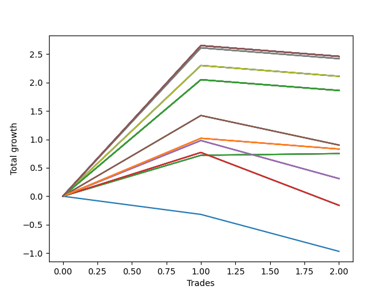

# Long Pointer 008 
- Symbol: NVDA_Unlimited
- Date Range: 02/08/2022 - 07/08/2022
- Trading Period: 7:20-12:30
- Number of Trades: 2



| Name | Win Percent | Profit | Avg Profit / Trade | Avg Time / Trade |      | Name | Win Percent | Profit | Avg Profit / Trade | Avg Time / Trade |
| ---- | ----------- | ------ | ------------------ | ---------------- | ---- | ---- | ----------- | ------ | ------------------ | ---------------- |
| Sorted By <br> Profit | | | | | | Sorted By <br> Win Percentage ||||
| One Hundred Thirty | 50.00 | 1230.00 | 615.00 | 29:55 |     | Sixty-Four | 100.00 | 375.00 | 187.50 | 01:47 |
| One Hundred Twenty-Nine | 50.00 | 1230.00 | 615.00 | 29:55 |     | Fifty-Six | 100.00 | 375.00 | 187.50 | 01:47 |
| One Hundred Twenty-Eight | 50.00 | 1230.00 | 615.00 | 29:55 |     | Forty-Eight | 100.00 | 375.00 | 187.50 | 01:47 |
| One Hundred Twenty-Five | 50.00 | 1230.00 | 615.00 | 29:55 |     | Forty | 100.00 | 375.00 | 187.50 | 01:47 |
| One Hundred Twenty-Four | 50.00 | 1230.00 | 615.00 | 29:55 |     | Zero | 100.00 | 375.00 | 187.50 | 01:47 |
| One Hundred Twenty-Three | 50.00 | 1230.00 | 615.00 | 29:55 |     | One Hundred Thirty | 50.00 | 1230.00 | 615.00 | 29:55 |
| One Hundred Twenty | 50.00 | 1230.00 | 615.00 | 29:55 |     | One Hundred Twenty-Nine | 50.00 | 1230.00 | 615.00 | 29:55 |
| One Hundred Ninteen | 50.00 | 1230.00 | 615.00 | 29:55 |     | One Hundred Twenty-Eight | 50.00 | 1230.00 | 615.00 | 29:55 |
| One Hundred Eighteen | 50.00 | 1230.00 | 615.00 | 29:55 |     | One Hundred Twenty-Five | 50.00 | 1230.00 | 615.00 | 29:55 |
| One Hundred Fifteen | 50.00 | 1230.00 | 615.00 | 29:55 |     | One Hundred Twenty-Four | 50.00 | 1230.00 | 615.00 | 29:55 |
| One Hundred Fourteen | 50.00 | 1230.00 | 615.00 | 29:55 |     | One Hundred Twenty-Three | 50.00 | 1230.00 | 615.00 | 29:55 |
| One Hundred Thirteen | 50.00 | 1230.00 | 615.00 | 29:55 |     | One Hundred Twenty | 50.00 | 1230.00 | 615.00 | 29:55 |
| Eighty-Five | 50.00 | 1230.00 | 615.00 | 29:55 |     | One Hundred Ninteen | 50.00 | 1230.00 | 615.00 | 29:55 |
| Eighty-Four | 50.00 | 1230.00 | 615.00 | 29:55 |     | One Hundred Eighteen | 50.00 | 1230.00 | 615.00 | 29:55 |
| Eighty-Three | 50.00 | 1230.00 | 615.00 | 29:55 |     | One Hundred Fifteen | 50.00 | 1230.00 | 615.00 | 29:55 |
| Seventy-One | 50.00 | 1230.00 | 615.00 | 29:55 |     | One Hundred Fourteen | 50.00 | 1230.00 | 615.00 | 29:55 |
| Sixty-Three | 50.00 | 1230.00 | 615.00 | 29:55 |     | One Hundred Thirteen | 50.00 | 1230.00 | 615.00 | 29:55 |
| Fifty-Five | 50.00 | 1230.00 | 615.00 | 29:55 |     | Eighty-Five | 50.00 | 1230.00 | 615.00 | 29:55 |
| Forty-Seven | 50.00 | 1230.00 | 615.00 | 29:55 |     | Eighty-Four | 50.00 | 1230.00 | 615.00 | 29:55 |
| Seven | 50.00 | 1230.00 | 615.00 | 29:55 |     | Eighty-Three | 50.00 | 1230.00 | 615.00 | 29:55 |
| Sixty-Nine | 50.00 | 1210.00 | 605.00 | 29:02 |     | Seventy-One | 50.00 | 1230.00 | 615.00 | 29:55 |
| Sixty-One | 50.00 | 1210.00 | 605.00 | 29:02 |     | Sixty-Three | 50.00 | 1230.00 | 615.00 | 29:55 |
| Fifty-Three | 50.00 | 1210.00 | 605.00 | 29:02 |     | Fifty-Five | 50.00 | 1230.00 | 615.00 | 29:55 |
| Forty-Five | 50.00 | 1210.00 | 605.00 | 29:02 |     | Forty-Seven | 50.00 | 1230.00 | 615.00 | 29:55 |
| Five | 50.00 | 1210.00 | 605.00 | 29:02 |     | Seven | 50.00 | 1230.00 | 615.00 | 29:55 |
| Seventy | 50.00 | 1055.00 | 527.50 | 28:42 |     | Sixty-Nine | 50.00 | 1210.00 | 605.00 | 29:02 |
| Sixty-Two | 50.00 | 1055.00 | 527.50 | 28:42 |     | Sixty-One | 50.00 | 1210.00 | 605.00 | 29:02 |
| Fifty-Four | 50.00 | 1055.00 | 527.50 | 28:42 |     | Fifty-Three | 50.00 | 1210.00 | 605.00 | 29:02 |
| Forty-Six | 50.00 | 1055.00 | 527.50 | 28:42 |     | Forty-Five | 50.00 | 1210.00 | 605.00 | 29:02 |
| Six | 50.00 | 1055.00 | 527.50 | 28:42 |     | Five | 50.00 | 1210.00 | 605.00 | 29:02 |
| One Hundred Twenty-Seven | 50.00 | 930.00 | 465.00 | 26:12 |     | Seventy | 50.00 | 1055.00 | 527.50 | 28:42 |
| One Hundred Twenty-Two | 50.00 | 930.00 | 465.00 | 26:12 |     | Sixty-Two | 50.00 | 1055.00 | 527.50 | 28:42 |
| One Hundred Seventeen | 50.00 | 930.00 | 465.00 | 26:12 |     | Fifty-Four | 50.00 | 1055.00 | 527.50 | 28:42 |
| One Hundred Twelve | 50.00 | 930.00 | 465.00 | 26:12 |     | Forty-Six | 50.00 | 1055.00 | 527.50 | 28:42 |
| Eighty-Two | 50.00 | 930.00 | 465.00 | 26:12 |     | Six | 50.00 | 1055.00 | 527.50 | 28:42 |
| Sixty-Eight | 50.00 | 930.00 | 465.00 | 26:12 |     | One Hundred Twenty-Seven | 50.00 | 930.00 | 465.00 | 26:12 |
| Sixty | 50.00 | 930.00 | 465.00 | 26:12 |     | One Hundred Twenty-Two | 50.00 | 930.00 | 465.00 | 26:12 |
| Fifty-Two | 50.00 | 930.00 | 465.00 | 26:12 |     | One Hundred Seventeen | 50.00 | 930.00 | 465.00 | 26:12 |
| Forty-Four | 50.00 | 930.00 | 465.00 | 26:12 |     | One Hundred Twelve | 50.00 | 930.00 | 465.00 | 26:12 |
| Four | 50.00 | 930.00 | 465.00 | 26:12 |     | Eighty-Two | 50.00 | 930.00 | 465.00 | 26:12 |
| Sixty-Seven | 50.00 | 450.00 | 225.00 | 21:15 |     | Sixty-Eight | 50.00 | 930.00 | 465.00 | 26:12 |
| Fifty-Nine | 50.00 | 450.00 | 225.00 | 21:15 |     | Sixty | 50.00 | 930.00 | 465.00 | 26:12 |
| Fifty-One | 50.00 | 450.00 | 225.00 | 21:15 |     | Fifty-Two | 50.00 | 930.00 | 465.00 | 26:12 |
| Forty-Three | 50.00 | 450.00 | 225.00 | 21:15 |     | Forty-Four | 50.00 | 930.00 | 465.00 | 26:12 |
| Three | 50.00 | 450.00 | 225.00 | 21:15 |     | Four | 50.00 | 930.00 | 465.00 | 26:12 |
| One Hundred Twenty-Six | 50.00 | 415.00 | 207.50 | 16:47 |     | Sixty-Seven | 50.00 | 450.00 | 225.00 | 21:15 |
| One Hundred Twenty-One | 50.00 | 415.00 | 207.50 | 16:47 |     | Fifty-Nine | 50.00 | 450.00 | 225.00 | 21:15 |
| One Hundred Sixteen | 50.00 | 415.00 | 207.50 | 16:47 |     | Fifty-One | 50.00 | 450.00 | 225.00 | 21:15 |
| One Hundred Eleven | 50.00 | 415.00 | 207.50 | 16:47 |     | Forty-Three | 50.00 | 450.00 | 225.00 | 21:15 |
| Eighty-One | 50.00 | 415.00 | 207.50 | 16:47 |     | Three | 50.00 | 450.00 | 225.00 | 21:15 |
| Sixty-Four | 100.00 | 375.00 | 187.50 | 01:47 |     | One Hundred Twenty-Six | 50.00 | 415.00 | 207.50 | 16:47 |
| Fifty-Six | 100.00 | 375.00 | 187.50 | 01:47 |     | One Hundred Twenty-One | 50.00 | 415.00 | 207.50 | 16:47 |
| Forty-Eight | 100.00 | 375.00 | 187.50 | 01:47 |     | One Hundred Sixteen | 50.00 | 415.00 | 207.50 | 16:47 |
| Forty | 100.00 | 375.00 | 187.50 | 01:47 |     | One Hundred Eleven | 50.00 | 415.00 | 207.50 | 16:47 |
| Zero | 100.00 | 375.00 | 187.50 | 01:47 |     | Eighty-One | 50.00 | 415.00 | 207.50 | 16:47 |
| Sixty-Six | 50.00 | 155.00 | 77.50 | 20:40 |     | Sixty-Six | 50.00 | 155.00 | 77.50 | 20:40 |
| Fifty-Eight | 50.00 | 155.00 | 77.50 | 20:40 |     | Fifty-Eight | 50.00 | 155.00 | 77.50 | 20:40 |
| Fifty | 50.00 | 155.00 | 77.50 | 20:40 |     | Fifty | 50.00 | 155.00 | 77.50 | 20:40 |
| Forty-Two | 50.00 | 155.00 | 77.50 | 20:40 |     | Forty-Two | 50.00 | 155.00 | 77.50 | 20:40 |
| Two | 50.00 | 155.00 | 77.50 | 20:40 |     | Two | 50.00 | 155.00 | 77.50 | 20:40 |
| Sixty-Five | 50.00 | -80.00 | -40.00 | 19:35 |     | Sixty-Five | 50.00 | -80.00 | -40.00 | 19:35 |
| Fifty-Seven | 50.00 | -80.00 | -40.00 | 19:35 |     | Fifty-Seven | 50.00 | -80.00 | -40.00 | 19:35 |
| Forty-Nine | 50.00 | -80.00 | -40.00 | 19:35 |     | Forty-Nine | 50.00 | -80.00 | -40.00 | 19:35 |
| Forty-One | 50.00 | -80.00 | -40.00 | 19:35 |     | Forty-One | 50.00 | -80.00 | -40.00 | 19:35 |
| One | 50.00 | -80.00 | -40.00 | 19:35 |     | One | 50.00 | -80.00 | -40.00 | 19:35 |
| Seventy-Three | 0.00 | -485.00 | -242.50 | 04:05 |     | Seventy-Three | 0.00 | -485.00 | -242.50 | 04:05 |

## NO STOPLOSS

### Test Zero
* Sell when price hits the middle line of the 20p bollinger
* No Stoploss
* Results:
```
Total Trades: 2
Percent Up: 100.00
Percent Down: 0.00
Total Points Moved Up: 0.75
Potential Profit: 375.00
Total Points Ups: 0.75 Count Ups: 2
Total Points Downs: 0.00 Count Downs: 0
```

<details><summary>Trades</summary>

<code>In: 2022-03-17 07:56:00		Out: 2022-03-17 07:59:20		Total Position Time: 03:20		Total Move Up: 0.72		Total to Date: 0.72</code> <br />
<code>In: 2022-03-30 11:04:00		Out: 2022-03-30 11:04:15		Total Position Time: 00:15		Total Move Up: 0.03		Total to Date: 0.75</code> <br />


</details>

### Test One
* Sell when the price hits the upper line of the 20p 1std bollinger
* No Stoploss
* Results:
```
Total Trades: 2
Percent Up: 50.00
Percent Down: 50.00
Total Points Moved Up: -0.16
Potential Profit: -80.00
Total Points Ups: 0.77 Count Ups: 1
Total Points Downs: -0.93 Count Downs: 1
```

<details><summary>Trades</summary>

<code>In: 2022-03-17 07:56:00		Out: 2022-03-17 08:08:20		Total Position Time: 12:20		Total Move Up: 0.77		Total to Date: 0.77</code> <br />
<code>In: 2022-03-30 11:04:00		Out: 2022-03-30 11:30:50		Total Position Time: 26:50		Total Move Up: -0.93		Total to Date: -0.16</code> <br />


</details>

### Test Two
* Sell when the price hits the upper line of the 20p 2std bollinger
* No Stoploss
* Results:
```
Total Trades: 2
Percent Up: 50.00
Percent Down: 50.00
Total Points Moved Up: 0.31
Potential Profit: 155.00
Total Points Ups: 0.98 Count Ups: 1
Total Points Downs: -0.67 Count Downs: 1
```

<details><summary>Trades</summary>

<code>In: 2022-03-17 07:56:00		Out: 2022-03-17 08:10:10		Total Position Time: 14:10		Total Move Up: 0.98		Total to Date: 0.98</code> <br />
<code>In: 2022-03-30 11:04:00		Out: 2022-03-30 11:31:10		Total Position Time: 27:10		Total Move Up: -0.67		Total to Date: 0.31</code> <br />


</details>

### Test Three
* Sell when price hits the middle line of the 50p bollinger
* No Stoploss
* Results:
```
Total Trades: 2
Percent Up: 50.00
Percent Down: 50.00
Total Points Moved Up: 0.90
Potential Profit: 450.00
Total Points Ups: 1.42 Count Ups: 1
Total Points Downs: -0.52 Count Downs: 1
```

<details><summary>Trades</summary>

<code>In: 2022-03-17 07:56:00		Out: 2022-03-17 08:11:05		Total Position Time: 15:05		Total Move Up: 1.42		Total to Date: 1.42</code> <br />
<code>In: 2022-03-30 11:04:00		Out: 2022-03-30 11:31:25		Total Position Time: 27:25		Total Move Up: -0.52		Total to Date: 0.90</code> <br />


</details>

### Test Four
* Sell when the price hits the upper line of the 50p 1std bollinger
* No Stoploss
* Results:
```
Total Trades: 2
Percent Up: 50.00
Percent Down: 50.00
Total Points Moved Up: 1.86
Potential Profit: 930.00
Total Points Ups: 2.05 Count Ups: 1
Total Points Downs: -0.19 Count Downs: 1
```

<details><summary>Trades</summary>

<code>In: 2022-03-17 07:56:00		Out: 2022-03-17 08:18:30		Total Position Time: 22:30		Total Move Up: 2.05		Total to Date: 2.05</code> <br />
<code>In: 2022-03-30 11:04:00		Out: 2022-03-30 11:33:55		Total Position Time: 29:55		Total Move Up: -0.19		Total to Date: 1.86</code> <br />


</details>

### Test Five
* Sell when the price hits the upper line of the 50p 2std bollinger
* No Stoploss
* Results:
```
Total Trades: 2
Percent Up: 50.00
Percent Down: 50.00
Total Points Moved Up: 2.42
Potential Profit: 1210.00
Total Points Ups: 2.61 Count Ups: 1
Total Points Downs: -0.19 Count Downs: 1
```

<details><summary>Trades</summary>

<code>In: 2022-03-17 07:56:00		Out: 2022-03-17 08:24:10		Total Position Time: 28:10		Total Move Up: 2.61		Total to Date: 2.61</code> <br />
<code>In: 2022-03-30 11:04:00		Out: 2022-03-30 11:33:55		Total Position Time: 29:55		Total Move Up: -0.19		Total to Date: 2.42</code> <br />


</details>

### Test Six
* Sell when the price hits the middle line of the 1std VWAP
* No Stoploss
* Results:
```
Total Trades: 2
Percent Up: 50.00
Percent Down: 50.00
Total Points Moved Up: 2.11
Potential Profit: 1055.00
Total Points Ups: 2.30 Count Ups: 1
Total Points Downs: -0.19 Count Downs: 1
```

<details><summary>Trades</summary>

<code>In: 2022-03-17 07:56:00		Out: 2022-03-17 08:23:30		Total Position Time: 27:30		Total Move Up: 2.30		Total to Date: 2.30</code> <br />
<code>In: 2022-03-30 11:04:00		Out: 2022-03-30 11:33:55		Total Position Time: 29:55		Total Move Up: -0.19		Total to Date: 2.11</code> <br />


</details>

### Test Seven
* Sell when the price hits the upper line of the 1std VWAP
* No Stoploss
* Results:
```
Total Trades: 2
Percent Up: 50.00
Percent Down: 50.00
Total Points Moved Up: 2.46
Potential Profit: 1230.00
Total Points Ups: 2.65 Count Ups: 1
Total Points Downs: -0.19 Count Downs: 1
```

<details><summary>Trades</summary>

<code>In: 2022-03-17 07:56:00		Out: 2022-03-17 08:25:55		Total Position Time: 29:55		Total Move Up: 2.65		Total to Date: 2.65</code> <br />
<code>In: 2022-03-30 11:04:00		Out: 2022-03-30 11:33:55		Total Position Time: 29:55		Total Move Up: -0.19		Total to Date: 2.46</code> <br />


</details>

## STOPLOSS OF 5

### Test Forty
* Sell when price hits the middle line of the 20p bollinger
* Stoploss is 5 points
* Results:
```
Total Trades: 2
Percent Up: 100.00
Percent Down: 0.00
Total Points Moved Up: 0.75
Potential Profit: 375.00
Total Points Ups: 0.75 Count Ups: 2
Total Points Downs: 0.00 Count Downs: 0
```

<details><summary>Trades</summary>

<code>In: 2022-03-17 07:56:00		Out: 2022-03-17 07:59:20		Total Position Time: 03:20		Total Move Up: 0.72		Total to Date: 0.72</code> <br />
<code>In: 2022-03-30 11:04:00		Out: 2022-03-30 11:04:15		Total Position Time: 00:15		Total Move Up: 0.03		Total to Date: 0.75</code> <br />


</details>

### Test Forty-One
* Sell when the price hits the upper line of the 20p 1std bollinger
* Stoploss is 5 points
* Results:
```
Total Trades: 2
Percent Up: 50.00
Percent Down: 50.00
Total Points Moved Up: -0.16
Potential Profit: -80.00
Total Points Ups: 0.77 Count Ups: 1
Total Points Downs: -0.93 Count Downs: 1
```

<details><summary>Trades</summary>

<code>In: 2022-03-17 07:56:00		Out: 2022-03-17 08:08:20		Total Position Time: 12:20		Total Move Up: 0.77		Total to Date: 0.77</code> <br />
<code>In: 2022-03-30 11:04:00		Out: 2022-03-30 11:30:50		Total Position Time: 26:50		Total Move Up: -0.93		Total to Date: -0.16</code> <br />


</details>

### Test Forty-Two
* Sell when the price hits the upper line of the 20p 2std bollinger
* Stoploss is 5 points
* Results:
```
Total Trades: 2
Percent Up: 50.00
Percent Down: 50.00
Total Points Moved Up: 0.31
Potential Profit: 155.00
Total Points Ups: 0.98 Count Ups: 1
Total Points Downs: -0.67 Count Downs: 1
```

<details><summary>Trades</summary>

<code>In: 2022-03-17 07:56:00		Out: 2022-03-17 08:10:10		Total Position Time: 14:10		Total Move Up: 0.98		Total to Date: 0.98</code> <br />
<code>In: 2022-03-30 11:04:00		Out: 2022-03-30 11:31:10		Total Position Time: 27:10		Total Move Up: -0.67		Total to Date: 0.31</code> <br />


</details>

### Test Forty-Three
* Sell when price hits the middle line of the 50p bollinger
* Stoploss is 5 points
* Results:
```
Total Trades: 2
Percent Up: 50.00
Percent Down: 50.00
Total Points Moved Up: 0.90
Potential Profit: 450.00
Total Points Ups: 1.42 Count Ups: 1
Total Points Downs: -0.52 Count Downs: 1
```

<details><summary>Trades</summary>

<code>In: 2022-03-17 07:56:00		Out: 2022-03-17 08:11:05		Total Position Time: 15:05		Total Move Up: 1.42		Total to Date: 1.42</code> <br />
<code>In: 2022-03-30 11:04:00		Out: 2022-03-30 11:31:25		Total Position Time: 27:25		Total Move Up: -0.52		Total to Date: 0.90</code> <br />


</details>

### Test Forty-Four
* Sell when the price hits the upper line of the 50p 1std bollinger
* Stoploss is 5 points
* Results:
```
Total Trades: 2
Percent Up: 50.00
Percent Down: 50.00
Total Points Moved Up: 1.86
Potential Profit: 930.00
Total Points Ups: 2.05 Count Ups: 1
Total Points Downs: -0.19 Count Downs: 1
```

<details><summary>Trades</summary>

<code>In: 2022-03-17 07:56:00		Out: 2022-03-17 08:18:30		Total Position Time: 22:30		Total Move Up: 2.05		Total to Date: 2.05</code> <br />
<code>In: 2022-03-30 11:04:00		Out: 2022-03-30 11:33:55		Total Position Time: 29:55		Total Move Up: -0.19		Total to Date: 1.86</code> <br />


</details>

### Test Forty-Five
* Sell when the price hits the upper line of the 50p 2std bollinger
* Stoploss is 5 points
* Results:
```
Total Trades: 2
Percent Up: 50.00
Percent Down: 50.00
Total Points Moved Up: 2.42
Potential Profit: 1210.00
Total Points Ups: 2.61 Count Ups: 1
Total Points Downs: -0.19 Count Downs: 1
```

<details><summary>Trades</summary>

<code>In: 2022-03-17 07:56:00		Out: 2022-03-17 08:24:10		Total Position Time: 28:10		Total Move Up: 2.61		Total to Date: 2.61</code> <br />
<code>In: 2022-03-30 11:04:00		Out: 2022-03-30 11:33:55		Total Position Time: 29:55		Total Move Up: -0.19		Total to Date: 2.42</code> <br />


</details>

### Test Forty-Six
* Sell when the price hits the middle line of the 1std VWAP
* Stoploss is 5 points
* Results:
```
Total Trades: 2
Percent Up: 50.00
Percent Down: 50.00
Total Points Moved Up: 2.11
Potential Profit: 1055.00
Total Points Ups: 2.30 Count Ups: 1
Total Points Downs: -0.19 Count Downs: 1
```

<details><summary>Trades</summary>

<code>In: 2022-03-17 07:56:00		Out: 2022-03-17 08:23:30		Total Position Time: 27:30		Total Move Up: 2.30		Total to Date: 2.30</code> <br />
<code>In: 2022-03-30 11:04:00		Out: 2022-03-30 11:33:55		Total Position Time: 29:55		Total Move Up: -0.19		Total to Date: 2.11</code> <br />


</details>

### Test Forty-Seven
* Sell when the price hits the upper line of the 1std VWAP
* Stoploss is 5 points
* Results:
```
Total Trades: 2
Percent Up: 50.00
Percent Down: 50.00
Total Points Moved Up: 2.46
Potential Profit: 1230.00
Total Points Ups: 2.65 Count Ups: 1
Total Points Downs: -0.19 Count Downs: 1
```

<details><summary>Trades</summary>

<code>In: 2022-03-17 07:56:00		Out: 2022-03-17 08:25:55		Total Position Time: 29:55		Total Move Up: 2.65		Total to Date: 2.65</code> <br />
<code>In: 2022-03-30 11:04:00		Out: 2022-03-30 11:33:55		Total Position Time: 29:55		Total Move Up: -0.19		Total to Date: 2.46</code> <br />


</details>

## TRAIL STOP OF 5

### Test Forty-Eight
* Sell when price hits the middle line of the 20p bollinger
* Trailing Stop is 5 points
* Results:
```
Total Trades: 2
Percent Up: 100.00
Percent Down: 0.00
Total Points Moved Up: 0.75
Potential Profit: 375.00
Total Points Ups: 0.75 Count Ups: 2
Total Points Downs: 0.00 Count Downs: 0
```

<details><summary>Trades</summary>

<code>In: 2022-03-17 07:56:00		Out: 2022-03-17 07:59:20		Total Position Time: 03:20		Total Move Up: 0.72		Total to Date: 0.72</code> <br />
<code>In: 2022-03-30 11:04:00		Out: 2022-03-30 11:04:15		Total Position Time: 00:15		Total Move Up: 0.03		Total to Date: 0.75</code> <br />


</details>

### Test Forty-Nine
* Sell when the price hits the upper line of the 20p 1std bollinger
* Trailing Stop is 5 points
* Results:
```
Total Trades: 2
Percent Up: 50.00
Percent Down: 50.00
Total Points Moved Up: -0.16
Potential Profit: -80.00
Total Points Ups: 0.77 Count Ups: 1
Total Points Downs: -0.93 Count Downs: 1
```

<details><summary>Trades</summary>

<code>In: 2022-03-17 07:56:00		Out: 2022-03-17 08:08:20		Total Position Time: 12:20		Total Move Up: 0.77		Total to Date: 0.77</code> <br />
<code>In: 2022-03-30 11:04:00		Out: 2022-03-30 11:30:50		Total Position Time: 26:50		Total Move Up: -0.93		Total to Date: -0.16</code> <br />


</details>

### Test Fifty
* Sell when the price hits the upper line of the 20p 2std bollinger
* Trailing Stop is 5 points
* Results:
```
Total Trades: 2
Percent Up: 50.00
Percent Down: 50.00
Total Points Moved Up: 0.31
Potential Profit: 155.00
Total Points Ups: 0.98 Count Ups: 1
Total Points Downs: -0.67 Count Downs: 1
```

<details><summary>Trades</summary>

<code>In: 2022-03-17 07:56:00		Out: 2022-03-17 08:10:10		Total Position Time: 14:10		Total Move Up: 0.98		Total to Date: 0.98</code> <br />
<code>In: 2022-03-30 11:04:00		Out: 2022-03-30 11:31:10		Total Position Time: 27:10		Total Move Up: -0.67		Total to Date: 0.31</code> <br />


</details>

### Test Fifty-One
* Sell when price hits the middle line of the 50p bollinger
* Trailing Stop is 5 points
* Results:
```
Total Trades: 2
Percent Up: 50.00
Percent Down: 50.00
Total Points Moved Up: 0.90
Potential Profit: 450.00
Total Points Ups: 1.42 Count Ups: 1
Total Points Downs: -0.52 Count Downs: 1
```

<details><summary>Trades</summary>

<code>In: 2022-03-17 07:56:00		Out: 2022-03-17 08:11:05		Total Position Time: 15:05		Total Move Up: 1.42		Total to Date: 1.42</code> <br />
<code>In: 2022-03-30 11:04:00		Out: 2022-03-30 11:31:25		Total Position Time: 27:25		Total Move Up: -0.52		Total to Date: 0.90</code> <br />


</details>

### Test Fifty-Two
* Sell when the price hits the upper line of the 50p 1std bollinger
* Trailing Stop is 5 points
* Results:
```
Total Trades: 2
Percent Up: 50.00
Percent Down: 50.00
Total Points Moved Up: 1.86
Potential Profit: 930.00
Total Points Ups: 2.05 Count Ups: 1
Total Points Downs: -0.19 Count Downs: 1
```

<details><summary>Trades</summary>

<code>In: 2022-03-17 07:56:00		Out: 2022-03-17 08:18:30		Total Position Time: 22:30		Total Move Up: 2.05		Total to Date: 2.05</code> <br />
<code>In: 2022-03-30 11:04:00		Out: 2022-03-30 11:33:55		Total Position Time: 29:55		Total Move Up: -0.19		Total to Date: 1.86</code> <br />


</details>

### Test Fifty-Three
* Sell when the price hits the upper line of the 50p 2std bollinger
* Trailing Stop is 5 points
* Results:
```
Total Trades: 2
Percent Up: 50.00
Percent Down: 50.00
Total Points Moved Up: 2.42
Potential Profit: 1210.00
Total Points Ups: 2.61 Count Ups: 1
Total Points Downs: -0.19 Count Downs: 1
```

<details><summary>Trades</summary>

<code>In: 2022-03-17 07:56:00		Out: 2022-03-17 08:24:10		Total Position Time: 28:10		Total Move Up: 2.61		Total to Date: 2.61</code> <br />
<code>In: 2022-03-30 11:04:00		Out: 2022-03-30 11:33:55		Total Position Time: 29:55		Total Move Up: -0.19		Total to Date: 2.42</code> <br />


</details>

### Test Fifty-Four
* Sell when the price hits the middle line of the 1std VWAP
* Trailing Stop is 5 points
* Results:
```
Total Trades: 2
Percent Up: 50.00
Percent Down: 50.00
Total Points Moved Up: 2.11
Potential Profit: 1055.00
Total Points Ups: 2.30 Count Ups: 1
Total Points Downs: -0.19 Count Downs: 1
```

<details><summary>Trades</summary>

<code>In: 2022-03-17 07:56:00		Out: 2022-03-17 08:23:30		Total Position Time: 27:30		Total Move Up: 2.30		Total to Date: 2.30</code> <br />
<code>In: 2022-03-30 11:04:00		Out: 2022-03-30 11:33:55		Total Position Time: 29:55		Total Move Up: -0.19		Total to Date: 2.11</code> <br />


</details>

### Test Fifty-Five
* Sell when the price hits the upper line of the 1std VWAP
* Trailing Stop is 5 points
* Results:
```
Total Trades: 2
Percent Up: 50.00
Percent Down: 50.00
Total Points Moved Up: 2.46
Potential Profit: 1230.00
Total Points Ups: 2.65 Count Ups: 1
Total Points Downs: -0.19 Count Downs: 1
```

<details><summary>Trades</summary>

<code>In: 2022-03-17 07:56:00		Out: 2022-03-17 08:25:55		Total Position Time: 29:55		Total Move Up: 2.65		Total to Date: 2.65</code> <br />
<code>In: 2022-03-30 11:04:00		Out: 2022-03-30 11:33:55		Total Position Time: 29:55		Total Move Up: -0.19		Total to Date: 2.46</code> <br />


</details>

## STOPLOSS OF 10

### Test Fifty-Six
* Sell when price hits the middle line of the 20p bollinger
* Stoploss is 10 points
* Results:
```
Total Trades: 2
Percent Up: 100.00
Percent Down: 0.00
Total Points Moved Up: 0.75
Potential Profit: 375.00
Total Points Ups: 0.75 Count Ups: 2
Total Points Downs: 0.00 Count Downs: 0
```

<details><summary>Trades</summary>

<code>In: 2022-03-17 07:56:00		Out: 2022-03-17 07:59:20		Total Position Time: 03:20		Total Move Up: 0.72		Total to Date: 0.72</code> <br />
<code>In: 2022-03-30 11:04:00		Out: 2022-03-30 11:04:15		Total Position Time: 00:15		Total Move Up: 0.03		Total to Date: 0.75</code> <br />


</details>

### Test Fifty-Seven
* Sell when the price hits the upper line of the 20p 1std bollinger
* Stoploss is 10 points
* Results:
```
Total Trades: 2
Percent Up: 50.00
Percent Down: 50.00
Total Points Moved Up: -0.16
Potential Profit: -80.00
Total Points Ups: 0.77 Count Ups: 1
Total Points Downs: -0.93 Count Downs: 1
```

<details><summary>Trades</summary>

<code>In: 2022-03-17 07:56:00		Out: 2022-03-17 08:08:20		Total Position Time: 12:20		Total Move Up: 0.77		Total to Date: 0.77</code> <br />
<code>In: 2022-03-30 11:04:00		Out: 2022-03-30 11:30:50		Total Position Time: 26:50		Total Move Up: -0.93		Total to Date: -0.16</code> <br />


</details>

### Test Fifty-Eight
* Sell when the price hits the upper line of the 20p 2std bollinger
* Stoploss is 10 points
* Results:
```
Total Trades: 2
Percent Up: 50.00
Percent Down: 50.00
Total Points Moved Up: 0.31
Potential Profit: 155.00
Total Points Ups: 0.98 Count Ups: 1
Total Points Downs: -0.67 Count Downs: 1
```

<details><summary>Trades</summary>

<code>In: 2022-03-17 07:56:00		Out: 2022-03-17 08:10:10		Total Position Time: 14:10		Total Move Up: 0.98		Total to Date: 0.98</code> <br />
<code>In: 2022-03-30 11:04:00		Out: 2022-03-30 11:31:10		Total Position Time: 27:10		Total Move Up: -0.67		Total to Date: 0.31</code> <br />


</details>

### Test Fifty-Nine
* Sell when price hits the middle line of the 50p bollinger
* Stoploss is 10 points
* Results:
```
Total Trades: 2
Percent Up: 50.00
Percent Down: 50.00
Total Points Moved Up: 0.90
Potential Profit: 450.00
Total Points Ups: 1.42 Count Ups: 1
Total Points Downs: -0.52 Count Downs: 1
```

<details><summary>Trades</summary>

<code>In: 2022-03-17 07:56:00		Out: 2022-03-17 08:11:05		Total Position Time: 15:05		Total Move Up: 1.42		Total to Date: 1.42</code> <br />
<code>In: 2022-03-30 11:04:00		Out: 2022-03-30 11:31:25		Total Position Time: 27:25		Total Move Up: -0.52		Total to Date: 0.90</code> <br />


</details>

### Test Sixty
* Sell when the price hits the upper line of the 50p 1std bollinger
* Stoploss is 10 points
* Results:
```
Total Trades: 2
Percent Up: 50.00
Percent Down: 50.00
Total Points Moved Up: 1.86
Potential Profit: 930.00
Total Points Ups: 2.05 Count Ups: 1
Total Points Downs: -0.19 Count Downs: 1
```

<details><summary>Trades</summary>

<code>In: 2022-03-17 07:56:00		Out: 2022-03-17 08:18:30		Total Position Time: 22:30		Total Move Up: 2.05		Total to Date: 2.05</code> <br />
<code>In: 2022-03-30 11:04:00		Out: 2022-03-30 11:33:55		Total Position Time: 29:55		Total Move Up: -0.19		Total to Date: 1.86</code> <br />


</details>

### Test Sixty-One
* Sell when the price hits the upper line of the 50p 2std bollinger
* Stoploss is 10 points
* Results:
```
Total Trades: 2
Percent Up: 50.00
Percent Down: 50.00
Total Points Moved Up: 2.42
Potential Profit: 1210.00
Total Points Ups: 2.61 Count Ups: 1
Total Points Downs: -0.19 Count Downs: 1
```

<details><summary>Trades</summary>

<code>In: 2022-03-17 07:56:00		Out: 2022-03-17 08:24:10		Total Position Time: 28:10		Total Move Up: 2.61		Total to Date: 2.61</code> <br />
<code>In: 2022-03-30 11:04:00		Out: 2022-03-30 11:33:55		Total Position Time: 29:55		Total Move Up: -0.19		Total to Date: 2.42</code> <br />


</details>

### Test Sixty-Two
* Sell when the price hits the middle line of the 1std VWAP
* Stoploss is 10 points
* Results:
```
Total Trades: 2
Percent Up: 50.00
Percent Down: 50.00
Total Points Moved Up: 2.11
Potential Profit: 1055.00
Total Points Ups: 2.30 Count Ups: 1
Total Points Downs: -0.19 Count Downs: 1
```

<details><summary>Trades</summary>

<code>In: 2022-03-17 07:56:00		Out: 2022-03-17 08:23:30		Total Position Time: 27:30		Total Move Up: 2.30		Total to Date: 2.30</code> <br />
<code>In: 2022-03-30 11:04:00		Out: 2022-03-30 11:33:55		Total Position Time: 29:55		Total Move Up: -0.19		Total to Date: 2.11</code> <br />


</details>

### Test Sixty-Three
* Sell when the price hits the upper line of the 1std VWAP
* Stoploss is 10 points
* Results:
```
Total Trades: 2
Percent Up: 50.00
Percent Down: 50.00
Total Points Moved Up: 2.46
Potential Profit: 1230.00
Total Points Ups: 2.65 Count Ups: 1
Total Points Downs: -0.19 Count Downs: 1
```

<details><summary>Trades</summary>

<code>In: 2022-03-17 07:56:00		Out: 2022-03-17 08:25:55		Total Position Time: 29:55		Total Move Up: 2.65		Total to Date: 2.65</code> <br />
<code>In: 2022-03-30 11:04:00		Out: 2022-03-30 11:33:55		Total Position Time: 29:55		Total Move Up: -0.19		Total to Date: 2.46</code> <br />


</details>

## TRAIL STOP OF 10

### Test Sixty-Four
* Sell when price hits the middle line of the 20p bollinger
* Trailing Stop is 10 points
* Results:
```
Total Trades: 2
Percent Up: 100.00
Percent Down: 0.00
Total Points Moved Up: 0.75
Potential Profit: 375.00
Total Points Ups: 0.75 Count Ups: 2
Total Points Downs: 0.00 Count Downs: 0
```

<details><summary>Trades</summary>

<code>In: 2022-03-17 07:56:00		Out: 2022-03-17 07:59:20		Total Position Time: 03:20		Total Move Up: 0.72		Total to Date: 0.72</code> <br />
<code>In: 2022-03-30 11:04:00		Out: 2022-03-30 11:04:15		Total Position Time: 00:15		Total Move Up: 0.03		Total to Date: 0.75</code> <br />


</details>

### Test Sixty-Five
* Sell when the price hits the upper line of the 20p 1std bollinger
* Trailing Stop is 10 points
* Results:
```
Total Trades: 2
Percent Up: 50.00
Percent Down: 50.00
Total Points Moved Up: -0.16
Potential Profit: -80.00
Total Points Ups: 0.77 Count Ups: 1
Total Points Downs: -0.93 Count Downs: 1
```

<details><summary>Trades</summary>

<code>In: 2022-03-17 07:56:00		Out: 2022-03-17 08:08:20		Total Position Time: 12:20		Total Move Up: 0.77		Total to Date: 0.77</code> <br />
<code>In: 2022-03-30 11:04:00		Out: 2022-03-30 11:30:50		Total Position Time: 26:50		Total Move Up: -0.93		Total to Date: -0.16</code> <br />


</details>

### Test Sixty-Six
* Sell when the price hits the upper line of the 20p 2std bollinger
* Trailing Stop is 10 points
* Results:
```
Total Trades: 2
Percent Up: 50.00
Percent Down: 50.00
Total Points Moved Up: 0.31
Potential Profit: 155.00
Total Points Ups: 0.98 Count Ups: 1
Total Points Downs: -0.67 Count Downs: 1
```

<details><summary>Trades</summary>

<code>In: 2022-03-17 07:56:00		Out: 2022-03-17 08:10:10		Total Position Time: 14:10		Total Move Up: 0.98		Total to Date: 0.98</code> <br />
<code>In: 2022-03-30 11:04:00		Out: 2022-03-30 11:31:10		Total Position Time: 27:10		Total Move Up: -0.67		Total to Date: 0.31</code> <br />


</details>

### Test Sixty-Seven
* Sell when price hits the middle line of the 50p bollinger
* Trailing Stop is 10 points
* Results:
```
Total Trades: 2
Percent Up: 50.00
Percent Down: 50.00
Total Points Moved Up: 0.90
Potential Profit: 450.00
Total Points Ups: 1.42 Count Ups: 1
Total Points Downs: -0.52 Count Downs: 1
```

<details><summary>Trades</summary>

<code>In: 2022-03-17 07:56:00		Out: 2022-03-17 08:11:05		Total Position Time: 15:05		Total Move Up: 1.42		Total to Date: 1.42</code> <br />
<code>In: 2022-03-30 11:04:00		Out: 2022-03-30 11:31:25		Total Position Time: 27:25		Total Move Up: -0.52		Total to Date: 0.90</code> <br />


</details>

### Test Sixty-Eight
* Sell when the price hits the upper line of the 50p 1std bollinger
* Trailing Stop is 10 points
* Results:
```
Total Trades: 2
Percent Up: 50.00
Percent Down: 50.00
Total Points Moved Up: 1.86
Potential Profit: 930.00
Total Points Ups: 2.05 Count Ups: 1
Total Points Downs: -0.19 Count Downs: 1
```

<details><summary>Trades</summary>

<code>In: 2022-03-17 07:56:00		Out: 2022-03-17 08:18:30		Total Position Time: 22:30		Total Move Up: 2.05		Total to Date: 2.05</code> <br />
<code>In: 2022-03-30 11:04:00		Out: 2022-03-30 11:33:55		Total Position Time: 29:55		Total Move Up: -0.19		Total to Date: 1.86</code> <br />


</details>

### Test Sixty-Nine
* Sell when the price hits the upper line of the 50p 2std bollinger
* Trailing Stop is 10 points
* Results:
```
Total Trades: 2
Percent Up: 50.00
Percent Down: 50.00
Total Points Moved Up: 2.42
Potential Profit: 1210.00
Total Points Ups: 2.61 Count Ups: 1
Total Points Downs: -0.19 Count Downs: 1
```

<details><summary>Trades</summary>

<code>In: 2022-03-17 07:56:00		Out: 2022-03-17 08:24:10		Total Position Time: 28:10		Total Move Up: 2.61		Total to Date: 2.61</code> <br />
<code>In: 2022-03-30 11:04:00		Out: 2022-03-30 11:33:55		Total Position Time: 29:55		Total Move Up: -0.19		Total to Date: 2.42</code> <br />


</details>

### Test Seventy
* Sell when the price hits the middle line of the 1std VWAP
* Trailing Stop is 10 points
* Results:
```
Total Trades: 2
Percent Up: 50.00
Percent Down: 50.00
Total Points Moved Up: 2.11
Potential Profit: 1055.00
Total Points Ups: 2.30 Count Ups: 1
Total Points Downs: -0.19 Count Downs: 1
```

<details><summary>Trades</summary>

<code>In: 2022-03-17 07:56:00		Out: 2022-03-17 08:23:30		Total Position Time: 27:30		Total Move Up: 2.30		Total to Date: 2.30</code> <br />
<code>In: 2022-03-30 11:04:00		Out: 2022-03-30 11:33:55		Total Position Time: 29:55		Total Move Up: -0.19		Total to Date: 2.11</code> <br />


</details>

### Test Seventy-One
* Sell when the price hits the upper line of the 1std VWAP
* Trailing Stop is 10 points
* Results:
```
Total Trades: 2
Percent Up: 50.00
Percent Down: 50.00
Total Points Moved Up: 2.46
Potential Profit: 1230.00
Total Points Ups: 2.65 Count Ups: 1
Total Points Downs: -0.19 Count Downs: 1
```

<details><summary>Trades</summary>

<code>In: 2022-03-17 07:56:00		Out: 2022-03-17 08:25:55		Total Position Time: 29:55		Total Move Up: 2.65		Total to Date: 2.65</code> <br />
<code>In: 2022-03-30 11:04:00		Out: 2022-03-30 11:33:55		Total Position Time: 29:55		Total Move Up: -0.19		Total to Date: 2.46</code> <br />


</details>

## SPECIAL EXIT CONDITIONS 

### Test Seventy-Three
* Sell when the linear regression slope changes to negative
* No Stoploss
* Results:
```
Total Trades: 2
Percent Up: 0.00
Percent Down: 100.00
Total Points Moved Up: -0.97
Potential Profit: -485.00
Total Points Ups: 0.00 Count Ups: 0
Total Points Downs: -0.97 Count Downs: 2
```

<details><summary>Trades</summary>

<code>In: 2022-03-17 07:56:00		Out: 2022-03-17 08:02:05		Total Position Time: 06:05		Total Move Up: -0.32		Total to Date: -0.32</code> <br />
<code>In: 2022-03-30 11:04:00		Out: 2022-03-30 11:06:05		Total Position Time: 02:05		Total Move Up: -0.65		Total to Date: -0.97</code> <br />


</details>

## TAKE PROFIT

### Test Eighty-One
* Take Profit of 1 Point
* No Stoploss
* Results:
```
Total Trades: 2
Percent Up: 50.00
Percent Down: 50.00
Total Points Moved Up: 0.83
Potential Profit: 415.00
Total Points Ups: 1.02 Count Ups: 1
Total Points Downs: -0.19 Count Downs: 1
```

<details><summary>Trades</summary>

<code>In: 2022-03-17 07:56:00		Out: 2022-03-17 07:59:40		Total Position Time: 03:40		Total Move Up: 1.02		Total to Date: 1.02</code> <br />
<code>In: 2022-03-30 11:04:00		Out: 2022-03-30 11:33:55		Total Position Time: 29:55		Total Move Up: -0.19		Total to Date: 0.83</code> <br />


</details>

### Test Eighty-Two
* Take Profit of 2 Point
* No Stoploss
* Results:
```
Total Trades: 2
Percent Up: 50.00
Percent Down: 50.00
Total Points Moved Up: 1.86
Potential Profit: 930.00
Total Points Ups: 2.05 Count Ups: 1
Total Points Downs: -0.19 Count Downs: 1
```

<details><summary>Trades</summary>

<code>In: 2022-03-17 07:56:00		Out: 2022-03-17 08:18:30		Total Position Time: 22:30		Total Move Up: 2.05		Total to Date: 2.05</code> <br />
<code>In: 2022-03-30 11:04:00		Out: 2022-03-30 11:33:55		Total Position Time: 29:55		Total Move Up: -0.19		Total to Date: 1.86</code> <br />


</details>

### Test Eighty-Three
* Take Profit of 3 Point
* No Stoploss
* Results:
```
Total Trades: 2
Percent Up: 50.00
Percent Down: 50.00
Total Points Moved Up: 2.46
Potential Profit: 1230.00
Total Points Ups: 2.65 Count Ups: 1
Total Points Downs: -0.19 Count Downs: 1
```

<details><summary>Trades</summary>

<code>In: 2022-03-17 07:56:00		Out: 2022-03-17 08:25:55		Total Position Time: 29:55		Total Move Up: 2.65		Total to Date: 2.65</code> <br />
<code>In: 2022-03-30 11:04:00		Out: 2022-03-30 11:33:55		Total Position Time: 29:55		Total Move Up: -0.19		Total to Date: 2.46</code> <br />


</details>

### Test Eighty-Four
* Take Profit of 4 Point
* No Stoploss
* Results:
```
Total Trades: 2
Percent Up: 50.00
Percent Down: 50.00
Total Points Moved Up: 2.46
Potential Profit: 1230.00
Total Points Ups: 2.65 Count Ups: 1
Total Points Downs: -0.19 Count Downs: 1
```

<details><summary>Trades</summary>

<code>In: 2022-03-17 07:56:00		Out: 2022-03-17 08:25:55		Total Position Time: 29:55		Total Move Up: 2.65		Total to Date: 2.65</code> <br />
<code>In: 2022-03-30 11:04:00		Out: 2022-03-30 11:33:55		Total Position Time: 29:55		Total Move Up: -0.19		Total to Date: 2.46</code> <br />


</details>

### Test Eighty-Five
* Take Profit of 5 Point
* No Stoploss
* Results:
```
Total Trades: 2
Percent Up: 50.00
Percent Down: 50.00
Total Points Moved Up: 2.46
Potential Profit: 1230.00
Total Points Ups: 2.65 Count Ups: 1
Total Points Downs: -0.19 Count Downs: 1
```

<details><summary>Trades</summary>

<code>In: 2022-03-17 07:56:00		Out: 2022-03-17 08:25:55		Total Position Time: 29:55		Total Move Up: 2.65		Total to Date: 2.65</code> <br />
<code>In: 2022-03-30 11:04:00		Out: 2022-03-30 11:33:55		Total Position Time: 29:55		Total Move Up: -0.19		Total to Date: 2.46</code> <br />


</details>

## TAKE PROFIT Stoploss of Five

### Test One Hundred Eleven
* Take Profit of 1 Point
* Stoploss is 5 points
* Results:
```
Total Trades: 2
Percent Up: 50.00
Percent Down: 50.00
Total Points Moved Up: 0.83
Potential Profit: 415.00
Total Points Ups: 1.02 Count Ups: 1
Total Points Downs: -0.19 Count Downs: 1
```

<details><summary>Trades</summary>

<code>In: 2022-03-17 07:56:00		Out: 2022-03-17 07:59:40		Total Position Time: 03:40		Total Move Up: 1.02		Total to Date: 1.02</code> <br />
<code>In: 2022-03-30 11:04:00		Out: 2022-03-30 11:33:55		Total Position Time: 29:55		Total Move Up: -0.19		Total to Date: 0.83</code> <br />


</details>

### Test One Hundred Twelve
* Take Profit of 2 Point
* Stoploss is 5 points
* Results:
```
Total Trades: 2
Percent Up: 50.00
Percent Down: 50.00
Total Points Moved Up: 1.86
Potential Profit: 930.00
Total Points Ups: 2.05 Count Ups: 1
Total Points Downs: -0.19 Count Downs: 1
```

<details><summary>Trades</summary>

<code>In: 2022-03-17 07:56:00		Out: 2022-03-17 08:18:30		Total Position Time: 22:30		Total Move Up: 2.05		Total to Date: 2.05</code> <br />
<code>In: 2022-03-30 11:04:00		Out: 2022-03-30 11:33:55		Total Position Time: 29:55		Total Move Up: -0.19		Total to Date: 1.86</code> <br />


</details>

### Test One Hundred Thirteen
* Take Profit of 3 Point
* Stoploss is 5 points
* Results:
```
Total Trades: 2
Percent Up: 50.00
Percent Down: 50.00
Total Points Moved Up: 2.46
Potential Profit: 1230.00
Total Points Ups: 2.65 Count Ups: 1
Total Points Downs: -0.19 Count Downs: 1
```

<details><summary>Trades</summary>

<code>In: 2022-03-17 07:56:00		Out: 2022-03-17 08:25:55		Total Position Time: 29:55		Total Move Up: 2.65		Total to Date: 2.65</code> <br />
<code>In: 2022-03-30 11:04:00		Out: 2022-03-30 11:33:55		Total Position Time: 29:55		Total Move Up: -0.19		Total to Date: 2.46</code> <br />


</details>

### Test One Hundred Fourteen
* Take Profit of 4 Point
* Stoploss is 5 points
* Results:
```
Total Trades: 2
Percent Up: 50.00
Percent Down: 50.00
Total Points Moved Up: 2.46
Potential Profit: 1230.00
Total Points Ups: 2.65 Count Ups: 1
Total Points Downs: -0.19 Count Downs: 1
```

<details><summary>Trades</summary>

<code>In: 2022-03-17 07:56:00		Out: 2022-03-17 08:25:55		Total Position Time: 29:55		Total Move Up: 2.65		Total to Date: 2.65</code> <br />
<code>In: 2022-03-30 11:04:00		Out: 2022-03-30 11:33:55		Total Position Time: 29:55		Total Move Up: -0.19		Total to Date: 2.46</code> <br />


</details>

### Test One Hundred Fifteen
* Take Profit of 5 Point
* Stoploss is 5 points
* Results:
```
Total Trades: 2
Percent Up: 50.00
Percent Down: 50.00
Total Points Moved Up: 2.46
Potential Profit: 1230.00
Total Points Ups: 2.65 Count Ups: 1
Total Points Downs: -0.19 Count Downs: 1
```

<details><summary>Trades</summary>

<code>In: 2022-03-17 07:56:00		Out: 2022-03-17 08:25:55		Total Position Time: 29:55		Total Move Up: 2.65		Total to Date: 2.65</code> <br />
<code>In: 2022-03-30 11:04:00		Out: 2022-03-30 11:33:55		Total Position Time: 29:55		Total Move Up: -0.19		Total to Date: 2.46</code> <br />


</details>

## TAKE PROFIT Trailstop of Five

### Test One Hundred Sixteen
* Take Profit of 1 Point
* Trailing stop is 5 points
* Results:
```
Total Trades: 2
Percent Up: 50.00
Percent Down: 50.00
Total Points Moved Up: 0.83
Potential Profit: 415.00
Total Points Ups: 1.02 Count Ups: 1
Total Points Downs: -0.19 Count Downs: 1
```

<details><summary>Trades</summary>

<code>In: 2022-03-17 07:56:00		Out: 2022-03-17 07:59:40		Total Position Time: 03:40		Total Move Up: 1.02		Total to Date: 1.02</code> <br />
<code>In: 2022-03-30 11:04:00		Out: 2022-03-30 11:33:55		Total Position Time: 29:55		Total Move Up: -0.19		Total to Date: 0.83</code> <br />


</details>

### Test One Hundred Seventeen
* Take Profit of 2 Point
* Trailing stop is 5 points
* Results:
```
Total Trades: 2
Percent Up: 50.00
Percent Down: 50.00
Total Points Moved Up: 1.86
Potential Profit: 930.00
Total Points Ups: 2.05 Count Ups: 1
Total Points Downs: -0.19 Count Downs: 1
```

<details><summary>Trades</summary>

<code>In: 2022-03-17 07:56:00		Out: 2022-03-17 08:18:30		Total Position Time: 22:30		Total Move Up: 2.05		Total to Date: 2.05</code> <br />
<code>In: 2022-03-30 11:04:00		Out: 2022-03-30 11:33:55		Total Position Time: 29:55		Total Move Up: -0.19		Total to Date: 1.86</code> <br />


</details>

### Test One Hundred Eighteen
* Take Profit of 3 Point
* Trailing stop is 5 points
* Results:
```
Total Trades: 2
Percent Up: 50.00
Percent Down: 50.00
Total Points Moved Up: 2.46
Potential Profit: 1230.00
Total Points Ups: 2.65 Count Ups: 1
Total Points Downs: -0.19 Count Downs: 1
```

<details><summary>Trades</summary>

<code>In: 2022-03-17 07:56:00		Out: 2022-03-17 08:25:55		Total Position Time: 29:55		Total Move Up: 2.65		Total to Date: 2.65</code> <br />
<code>In: 2022-03-30 11:04:00		Out: 2022-03-30 11:33:55		Total Position Time: 29:55		Total Move Up: -0.19		Total to Date: 2.46</code> <br />


</details>

### Test One Hundred Ninteen
* Take Profit of 4 Point
* Trailing stop is 5 points
* Results:
```
Total Trades: 2
Percent Up: 50.00
Percent Down: 50.00
Total Points Moved Up: 2.46
Potential Profit: 1230.00
Total Points Ups: 2.65 Count Ups: 1
Total Points Downs: -0.19 Count Downs: 1
```

<details><summary>Trades</summary>

<code>In: 2022-03-17 07:56:00		Out: 2022-03-17 08:25:55		Total Position Time: 29:55		Total Move Up: 2.65		Total to Date: 2.65</code> <br />
<code>In: 2022-03-30 11:04:00		Out: 2022-03-30 11:33:55		Total Position Time: 29:55		Total Move Up: -0.19		Total to Date: 2.46</code> <br />


</details>

### Test One Hundred Twenty
* Take Profit of 5 Point
* Trailing stop is 5 points
* Results:
```
Total Trades: 2
Percent Up: 50.00
Percent Down: 50.00
Total Points Moved Up: 2.46
Potential Profit: 1230.00
Total Points Ups: 2.65 Count Ups: 1
Total Points Downs: -0.19 Count Downs: 1
```

<details><summary>Trades</summary>

<code>In: 2022-03-17 07:56:00		Out: 2022-03-17 08:25:55		Total Position Time: 29:55		Total Move Up: 2.65		Total to Date: 2.65</code> <br />
<code>In: 2022-03-30 11:04:00		Out: 2022-03-30 11:33:55		Total Position Time: 29:55		Total Move Up: -0.19		Total to Date: 2.46</code> <br />


</details>

## TAKE PROFIT Stoploss of Ten

### Test One Hundred Twenty-One
* Take Profit of 1 Point
* Stoploss is 10 points
* Results:
```
Total Trades: 2
Percent Up: 50.00
Percent Down: 50.00
Total Points Moved Up: 0.83
Potential Profit: 415.00
Total Points Ups: 1.02 Count Ups: 1
Total Points Downs: -0.19 Count Downs: 1
```

<details><summary>Trades</summary>

<code>In: 2022-03-17 07:56:00		Out: 2022-03-17 07:59:40		Total Position Time: 03:40		Total Move Up: 1.02		Total to Date: 1.02</code> <br />
<code>In: 2022-03-30 11:04:00		Out: 2022-03-30 11:33:55		Total Position Time: 29:55		Total Move Up: -0.19		Total to Date: 0.83</code> <br />


</details>

### Test One Hundred Twenty-Two
* Take Profit of 2 Point
* Stoploss is 10 points
* Results:
```
Total Trades: 2
Percent Up: 50.00
Percent Down: 50.00
Total Points Moved Up: 1.86
Potential Profit: 930.00
Total Points Ups: 2.05 Count Ups: 1
Total Points Downs: -0.19 Count Downs: 1
```

<details><summary>Trades</summary>

<code>In: 2022-03-17 07:56:00		Out: 2022-03-17 08:18:30		Total Position Time: 22:30		Total Move Up: 2.05		Total to Date: 2.05</code> <br />
<code>In: 2022-03-30 11:04:00		Out: 2022-03-30 11:33:55		Total Position Time: 29:55		Total Move Up: -0.19		Total to Date: 1.86</code> <br />


</details>

### Test One Hundred Twenty-Three
* Take Profit of 3 Point
* Stoploss is 10 points
* Results:
```
Total Trades: 2
Percent Up: 50.00
Percent Down: 50.00
Total Points Moved Up: 2.46
Potential Profit: 1230.00
Total Points Ups: 2.65 Count Ups: 1
Total Points Downs: -0.19 Count Downs: 1
```

<details><summary>Trades</summary>

<code>In: 2022-03-17 07:56:00		Out: 2022-03-17 08:25:55		Total Position Time: 29:55		Total Move Up: 2.65		Total to Date: 2.65</code> <br />
<code>In: 2022-03-30 11:04:00		Out: 2022-03-30 11:33:55		Total Position Time: 29:55		Total Move Up: -0.19		Total to Date: 2.46</code> <br />


</details>

### Test One Hundred Twenty-Four
* Take Profit of 4 Point
* Stoploss is 10 points
* Results:
```
Total Trades: 2
Percent Up: 50.00
Percent Down: 50.00
Total Points Moved Up: 2.46
Potential Profit: 1230.00
Total Points Ups: 2.65 Count Ups: 1
Total Points Downs: -0.19 Count Downs: 1
```

<details><summary>Trades</summary>

<code>In: 2022-03-17 07:56:00		Out: 2022-03-17 08:25:55		Total Position Time: 29:55		Total Move Up: 2.65		Total to Date: 2.65</code> <br />
<code>In: 2022-03-30 11:04:00		Out: 2022-03-30 11:33:55		Total Position Time: 29:55		Total Move Up: -0.19		Total to Date: 2.46</code> <br />


</details>

### Test One Hundred Twenty-Five
* Take Profit of 5 Point
* Stoploss is 10 points
* Results:
```
Total Trades: 2
Percent Up: 50.00
Percent Down: 50.00
Total Points Moved Up: 2.46
Potential Profit: 1230.00
Total Points Ups: 2.65 Count Ups: 1
Total Points Downs: -0.19 Count Downs: 1
```

<details><summary>Trades</summary>

<code>In: 2022-03-17 07:56:00		Out: 2022-03-17 08:25:55		Total Position Time: 29:55		Total Move Up: 2.65		Total to Date: 2.65</code> <br />
<code>In: 2022-03-30 11:04:00		Out: 2022-03-30 11:33:55		Total Position Time: 29:55		Total Move Up: -0.19		Total to Date: 2.46</code> <br />


</details>

## TAKE PROFIT Trailstop of Ten

### Test One Hundred Twenty-Six
* Take Profit of 1 Point
* Trailing stop is 10 points
* Results:
```
Total Trades: 2
Percent Up: 50.00
Percent Down: 50.00
Total Points Moved Up: 0.83
Potential Profit: 415.00
Total Points Ups: 1.02 Count Ups: 1
Total Points Downs: -0.19 Count Downs: 1
```

<details><summary>Trades</summary>

<code>In: 2022-03-17 07:56:00		Out: 2022-03-17 07:59:40		Total Position Time: 03:40		Total Move Up: 1.02		Total to Date: 1.02</code> <br />
<code>In: 2022-03-30 11:04:00		Out: 2022-03-30 11:33:55		Total Position Time: 29:55		Total Move Up: -0.19		Total to Date: 0.83</code> <br />


</details>

### Test One Hundred Twenty-Seven
* Take Profit of 2 Point
* Trailing stop is 10 points
* Results:
```
Total Trades: 2
Percent Up: 50.00
Percent Down: 50.00
Total Points Moved Up: 1.86
Potential Profit: 930.00
Total Points Ups: 2.05 Count Ups: 1
Total Points Downs: -0.19 Count Downs: 1
```

<details><summary>Trades</summary>

<code>In: 2022-03-17 07:56:00		Out: 2022-03-17 08:18:30		Total Position Time: 22:30		Total Move Up: 2.05		Total to Date: 2.05</code> <br />
<code>In: 2022-03-30 11:04:00		Out: 2022-03-30 11:33:55		Total Position Time: 29:55		Total Move Up: -0.19		Total to Date: 1.86</code> <br />


</details>

### Test One Hundred Twenty-Eight
* Take Profit of 3 Point
* Trailing stop is 10 points
* Results:
```
Total Trades: 2
Percent Up: 50.00
Percent Down: 50.00
Total Points Moved Up: 2.46
Potential Profit: 1230.00
Total Points Ups: 2.65 Count Ups: 1
Total Points Downs: -0.19 Count Downs: 1
```

<details><summary>Trades</summary>

<code>In: 2022-03-17 07:56:00		Out: 2022-03-17 08:25:55		Total Position Time: 29:55		Total Move Up: 2.65		Total to Date: 2.65</code> <br />
<code>In: 2022-03-30 11:04:00		Out: 2022-03-30 11:33:55		Total Position Time: 29:55		Total Move Up: -0.19		Total to Date: 2.46</code> <br />


</details>

### Test One Hundred Twenty-Nine
* Take Profit of 4 Point
* Trailing stop is 10 points
* Results:
```
Total Trades: 2
Percent Up: 50.00
Percent Down: 50.00
Total Points Moved Up: 2.46
Potential Profit: 1230.00
Total Points Ups: 2.65 Count Ups: 1
Total Points Downs: -0.19 Count Downs: 1
```

<details><summary>Trades</summary>

<code>In: 2022-03-17 07:56:00		Out: 2022-03-17 08:25:55		Total Position Time: 29:55		Total Move Up: 2.65		Total to Date: 2.65</code> <br />
<code>In: 2022-03-30 11:04:00		Out: 2022-03-30 11:33:55		Total Position Time: 29:55		Total Move Up: -0.19		Total to Date: 2.46</code> <br />


</details>

### Test One Hundred Thirty
* Take Profit of 5 Point
* Trailing stop is 10 points
* Results:
```
Total Trades: 2
Percent Up: 50.00
Percent Down: 50.00
Total Points Moved Up: 2.46
Potential Profit: 1230.00
Total Points Ups: 2.65 Count Ups: 1
Total Points Downs: -0.19 Count Downs: 1
```

<details><summary>Trades</summary>

<code>In: 2022-03-17 07:56:00		Out: 2022-03-17 08:25:55		Total Position Time: 29:55		Total Move Up: 2.65		Total to Date: 2.65</code> <br />
<code>In: 2022-03-30 11:04:00		Out: 2022-03-30 11:33:55		Total Position Time: 29:55		Total Move Up: -0.19		Total to Date: 2.46</code> <br />


</details>