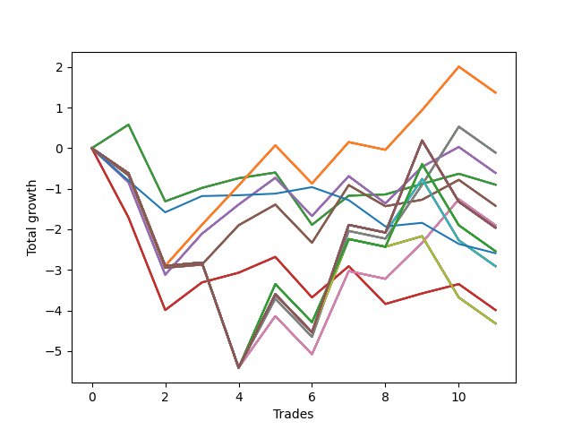

# Long Pointer 009 
- Symbol: NVDA_Unlimited
- Date Range: 02/08/2022 - 07/08/2022
- Trading Period: 7:20-12:30
- Number of Trades: 11



| Name | Win Percent | Profit | Avg Profit / Trade | Avg Time / Trade |      | Name | Win Percent | Profit | Avg Profit / Trade | Avg Time / Trade |
| ---- | ----------- | ------ | ------------------ | ---------------- | ---- | ---- | ----------- | ------ | ------------------ | ---------------- |
| Sorted By <br> Profit | | | | | | Sorted By <br> Win Percentage ||||
| One Hundred Twenty-Six | 54.55 | 685.00 | 62.27 | 18:46 |     | Sixty-Four | 72.73 | -450.00 | -40.91 | 06:25 |
| One Hundred Twenty-One | 54.55 | 685.00 | 62.27 | 18:46 |     | Fifty-Six | 72.73 | -450.00 | -40.91 | 06:25 |
| One Hundred Sixteen | 54.55 | 685.00 | 62.27 | 18:46 |     | Forty-Eight | 72.73 | -450.00 | -40.91 | 06:25 |
| One Hundred Eleven | 54.55 | 685.00 | 62.27 | 18:46 |     | Forty | 72.73 | -450.00 | -40.91 | 06:25 |
| Eighty-One | 54.55 | 685.00 | 62.27 | 18:46 |     | Zero | 72.73 | -450.00 | -40.91 | 06:25 |
| Sixty-Nine | 45.45 | -55.00 | -5.00 | 25:06 |     | One Hundred Twenty-Six | 54.55 | 685.00 | 62.27 | 18:46 |
| Sixty-One | 45.45 | -55.00 | -5.00 | 25:06 |     | One Hundred Twenty-One | 54.55 | 685.00 | 62.27 | 18:46 |
| Fifty-Three | 45.45 | -55.00 | -5.00 | 25:06 |     | One Hundred Sixteen | 54.55 | 685.00 | 62.27 | 18:46 |
| Forty-Five | 45.45 | -55.00 | -5.00 | 25:06 |     | One Hundred Eleven | 54.55 | 685.00 | 62.27 | 18:46 |
| Five | 45.45 | -55.00 | -5.00 | 25:06 |     | Eighty-One | 54.55 | 685.00 | 62.27 | 18:46 |
| Sixty-Six | 54.55 | -305.00 | -27.73 | 18:10 |     | Sixty-Six | 54.55 | -305.00 | -27.73 | 18:10 |
| Fifty-Eight | 54.55 | -305.00 | -27.73 | 18:10 |     | Fifty-Eight | 54.55 | -305.00 | -27.73 | 18:10 |
| Fifty | 54.55 | -305.00 | -27.73 | 18:10 |     | Fifty | 54.55 | -305.00 | -27.73 | 18:10 |
| Forty-Two | 54.55 | -305.00 | -27.73 | 18:10 |     | Forty-Two | 54.55 | -305.00 | -27.73 | 18:10 |
| Two | 54.55 | -305.00 | -27.73 | 18:10 |     | Two | 54.55 | -305.00 | -27.73 | 18:10 |
| Sixty-Four | 72.73 | -450.00 | -40.91 | 06:25 |     | Sixty-Seven | 54.55 | -710.00 | -64.55 | 20:10 |
| Fifty-Six | 72.73 | -450.00 | -40.91 | 06:25 |     | Fifty-Nine | 54.55 | -710.00 | -64.55 | 20:10 |
| Forty-Eight | 72.73 | -450.00 | -40.91 | 06:25 |     | Fifty-One | 54.55 | -710.00 | -64.55 | 20:10 |
| Forty | 72.73 | -450.00 | -40.91 | 06:25 |     | Forty-Three | 54.55 | -710.00 | -64.55 | 20:10 |
| Zero | 72.73 | -450.00 | -40.91 | 06:25 |     | Three | 54.55 | -710.00 | -64.55 | 20:10 |
| Sixty-Seven | 54.55 | -710.00 | -64.55 | 20:10 |     | Sixty-Five | 54.55 | -1995.00 | -181.36 | 15:30 |
| Fifty-Nine | 54.55 | -710.00 | -64.55 | 20:10 |     | Fifty-Seven | 54.55 | -1995.00 | -181.36 | 15:30 |
| Fifty-One | 54.55 | -710.00 | -64.55 | 20:10 |     | Forty-Nine | 54.55 | -1995.00 | -181.36 | 15:30 |
| Forty-Three | 54.55 | -710.00 | -64.55 | 20:10 |     | Forty-One | 54.55 | -1995.00 | -181.36 | 15:30 |
| Three | 54.55 | -710.00 | -64.55 | 20:10 |     | One | 54.55 | -1995.00 | -181.36 | 15:30 |
| Sixty-Eight | 45.45 | -950.00 | -86.36 | 23:43 |     | Sixty-Nine | 45.45 | -55.00 | -5.00 | 25:06 |
| Sixty | 45.45 | -950.00 | -86.36 | 23:43 |     | Sixty-One | 45.45 | -55.00 | -5.00 | 25:06 |
| Fifty-Two | 45.45 | -950.00 | -86.36 | 23:43 |     | Fifty-Three | 45.45 | -55.00 | -5.00 | 25:06 |
| Forty-Four | 45.45 | -950.00 | -86.36 | 23:43 |     | Forty-Five | 45.45 | -55.00 | -5.00 | 25:06 |
| Four | 45.45 | -950.00 | -86.36 | 23:43 |     | Five | 45.45 | -55.00 | -5.00 | 25:06 |
| One Hundred Thirty | 36.36 | -980.00 | -89.09 | 29:06 |     | Sixty-Eight | 45.45 | -950.00 | -86.36 | 23:43 |
| One Hundred Twenty-Nine | 36.36 | -980.00 | -89.09 | 29:06 |     | Sixty | 45.45 | -950.00 | -86.36 | 23:43 |
| One Hundred Twenty-Eight | 36.36 | -980.00 | -89.09 | 29:06 |     | Fifty-Two | 45.45 | -950.00 | -86.36 | 23:43 |
| One Hundred Twenty-Five | 36.36 | -980.00 | -89.09 | 29:06 |     | Forty-Four | 45.45 | -950.00 | -86.36 | 23:43 |
| One Hundred Twenty-Four | 36.36 | -980.00 | -89.09 | 29:06 |     | Four | 45.45 | -950.00 | -86.36 | 23:43 |
| One Hundred Twenty-Three | 36.36 | -980.00 | -89.09 | 29:06 |     | Seventy-Three | 45.45 | -1295.00 | -117.73 | 04:15 |
| One Hundred Twenty | 36.36 | -980.00 | -89.09 | 29:06 |     | One Hundred Thirty | 36.36 | -980.00 | -89.09 | 29:06 |
| One Hundred Ninteen | 36.36 | -980.00 | -89.09 | 29:06 |     | One Hundred Twenty-Nine | 36.36 | -980.00 | -89.09 | 29:06 |
| One Hundred Eighteen | 36.36 | -980.00 | -89.09 | 29:06 |     | One Hundred Twenty-Eight | 36.36 | -980.00 | -89.09 | 29:06 |
| One Hundred Fifteen | 36.36 | -980.00 | -89.09 | 29:06 |     | One Hundred Twenty-Five | 36.36 | -980.00 | -89.09 | 29:06 |
| One Hundred Fourteen | 36.36 | -980.00 | -89.09 | 29:06 |     | One Hundred Twenty-Four | 36.36 | -980.00 | -89.09 | 29:06 |
| One Hundred Thirteen | 36.36 | -980.00 | -89.09 | 29:06 |     | One Hundred Twenty-Three | 36.36 | -980.00 | -89.09 | 29:06 |
| Eighty-Five | 36.36 | -980.00 | -89.09 | 29:06 |     | One Hundred Twenty | 36.36 | -980.00 | -89.09 | 29:06 |
| Eighty-Four | 36.36 | -980.00 | -89.09 | 29:06 |     | One Hundred Ninteen | 36.36 | -980.00 | -89.09 | 29:06 |
| Eighty-Three | 36.36 | -980.00 | -89.09 | 29:06 |     | One Hundred Eighteen | 36.36 | -980.00 | -89.09 | 29:06 |
| One Hundred Twenty-Seven | 36.36 | -1270.00 | -115.45 | 27:25 |     | One Hundred Fifteen | 36.36 | -980.00 | -89.09 | 29:06 |
| One Hundred Twenty-Two | 36.36 | -1270.00 | -115.45 | 27:25 |     | One Hundred Fourteen | 36.36 | -980.00 | -89.09 | 29:06 |
| One Hundred Seventeen | 36.36 | -1270.00 | -115.45 | 27:25 |     | One Hundred Thirteen | 36.36 | -980.00 | -89.09 | 29:06 |
| One Hundred Twelve | 36.36 | -1270.00 | -115.45 | 27:25 |     | Eighty-Five | 36.36 | -980.00 | -89.09 | 29:06 |
| Eighty-Two | 36.36 | -1270.00 | -115.45 | 27:25 |     | Eighty-Four | 36.36 | -980.00 | -89.09 | 29:06 |
| Seventy-Three | 45.45 | -1295.00 | -117.73 | 04:15 |     | Eighty-Three | 36.36 | -980.00 | -89.09 | 29:06 |
| Seventy-One | 36.36 | -1455.00 | -132.27 | 27:40 |     | One Hundred Twenty-Seven | 36.36 | -1270.00 | -115.45 | 27:25 |
| Sixty-Three | 36.36 | -1455.00 | -132.27 | 27:40 |     | One Hundred Twenty-Two | 36.36 | -1270.00 | -115.45 | 27:25 |
| Fifty-Five | 36.36 | -1455.00 | -132.27 | 27:40 |     | One Hundred Seventeen | 36.36 | -1270.00 | -115.45 | 27:25 |
| Forty-Seven | 36.36 | -1455.00 | -132.27 | 27:40 |     | One Hundred Twelve | 36.36 | -1270.00 | -115.45 | 27:25 |
| Seven | 36.36 | -1455.00 | -132.27 | 27:40 |     | Eighty-Two | 36.36 | -1270.00 | -115.45 | 27:25 |
| Sixty-Five | 54.55 | -1995.00 | -181.36 | 15:30 |     | Seventy-One | 36.36 | -1455.00 | -132.27 | 27:40 |
| Fifty-Seven | 54.55 | -1995.00 | -181.36 | 15:30 |     | Sixty-Three | 36.36 | -1455.00 | -132.27 | 27:40 |
| Forty-Nine | 54.55 | -1995.00 | -181.36 | 15:30 |     | Fifty-Five | 36.36 | -1455.00 | -132.27 | 27:40 |
| Forty-One | 54.55 | -1995.00 | -181.36 | 15:30 |     | Forty-Seven | 36.36 | -1455.00 | -132.27 | 27:40 |
| One | 54.55 | -1995.00 | -181.36 | 15:30 |     | Seven | 36.36 | -1455.00 | -132.27 | 27:40 |
| Seventy | 36.36 | -2160.00 | -196.36 | 26:10 |     | Seventy | 36.36 | -2160.00 | -196.36 | 26:10 |
| Sixty-Two | 36.36 | -2160.00 | -196.36 | 26:10 |     | Sixty-Two | 36.36 | -2160.00 | -196.36 | 26:10 |
| Fifty-Four | 36.36 | -2160.00 | -196.36 | 26:10 |     | Fifty-Four | 36.36 | -2160.00 | -196.36 | 26:10 |
| Forty-Six | 36.36 | -2160.00 | -196.36 | 26:10 |     | Forty-Six | 36.36 | -2160.00 | -196.36 | 26:10 |
| Six | 36.36 | -2160.00 | -196.36 | 26:10 |     | Six | 36.36 | -2160.00 | -196.36 | 26:10 |

## NO STOPLOSS

### Test Zero
* Sell when price hits the middle line of the 20p bollinger
* No Stoploss
* Results:
```
Total Trades: 11
Percent Up: 72.73
Percent Down: 27.27
Total Points Moved Up: -0.90
Potential Profit: -450.00
Total Points Ups: 2.55 Count Ups: 8
Total Points Downs: -3.45 Count Downs: 3
```

<details><summary>Trades</summary>

<code>In: 2022-02-11 11:34:00		Out: 2022-02-11 11:34:20		Total Position Time: 00:20		Total Move Up: 0.58		Total to Date: 0.58</code> <br />
<code>In: 2022-02-22 08:02:00		Out: 2022-02-22 08:26:40		Total Position Time: 24:40		Total Move Up: -1.89		Total to Date: -1.31</code> <br />
<code>In: 2022-02-23 12:25:00		Out: 2022-02-23 12:25:55		Total Position Time: 00:55		Total Move Up: 0.33		Total to Date: -0.98</code> <br />
<code>In: 2022-03-01 08:04:00		Out: 2022-03-01 08:04:10		Total Position Time: 00:10		Total Move Up: 0.24		Total to Date: -0.74</code> <br />
<code>In: 2022-03-03 08:02:00		Out: 2022-03-03 08:03:15		Total Position Time: 01:15		Total Move Up: 0.14		Total to Date: -0.60</code> <br />
<code>In: 2022-03-07 11:56:00		Out: 2022-03-07 12:21:10		Total Position Time: 25:10		Total Move Up: -1.29		Total to Date: -1.89</code> <br />
<code>In: 2022-03-17 07:56:00		Out: 2022-03-17 07:59:20		Total Position Time: 03:20		Total Move Up: 0.72		Total to Date: -1.17</code> <br />
<code>In: 2022-03-30 11:04:00		Out: 2022-03-30 11:04:15		Total Position Time: 00:15		Total Move Up: 0.03		Total to Date: -1.14</code> <br />
<code>In: 2022-05-03 11:45:00		Out: 2022-05-03 11:45:10		Total Position Time: 00:10		Total Move Up: 0.26		Total to Date: -0.88</code> <br />
<code>In: 2022-05-06 11:41:00		Out: 2022-05-06 11:41:10		Total Position Time: 00:10		Total Move Up: 0.25		Total to Date: -0.63</code> <br />
<code>In: 2022-06-08 08:47:00		Out: 2022-06-08 09:01:10		Total Position Time: 14:10		Total Move Up: -0.27		Total to Date: -0.90</code> <br />


</details>

### Test One
* Sell when the price hits the upper line of the 20p 1std bollinger
* No Stoploss
* Results:
```
Total Trades: 11
Percent Up: 54.55
Percent Down: 45.45
Total Points Moved Up: -3.99
Potential Profit: -1995.00
Total Points Ups: 2.57 Count Ups: 6
Total Points Downs: -6.56 Count Downs: 5
```

<details><summary>Trades</summary>

<code>In: 2022-02-11 11:34:00		Out: 2022-02-11 12:02:45		Total Position Time: 28:45		Total Move Up: -1.71		Total to Date: -1.71</code> <br />
<code>In: 2022-02-22 08:02:00		Out: 2022-02-22 08:31:55		Total Position Time: 29:55		Total Move Up: -2.28		Total to Date: -3.99</code> <br />
<code>In: 2022-02-23 12:25:00		Out: 2022-02-23 12:27:05		Total Position Time: 02:05		Total Move Up: 0.68		Total to Date: -3.31</code> <br />
<code>In: 2022-03-01 08:04:00		Out: 2022-03-01 08:04:10		Total Position Time: 00:10		Total Move Up: 0.24		Total to Date: -3.07</code> <br />
<code>In: 2022-03-03 08:02:00		Out: 2022-03-03 08:05:10		Total Position Time: 03:10		Total Move Up: 0.39		Total to Date: -2.68</code> <br />
<code>In: 2022-03-07 11:56:00		Out: 2022-03-07 12:25:10		Total Position Time: 29:10		Total Move Up: -1.00		Total to Date: -3.68</code> <br />
<code>In: 2022-03-17 07:56:00		Out: 2022-03-17 08:08:20		Total Position Time: 12:20		Total Move Up: 0.77		Total to Date: -2.91</code> <br />
<code>In: 2022-03-30 11:04:00		Out: 2022-03-30 11:30:50		Total Position Time: 26:50		Total Move Up: -0.93		Total to Date: -3.84</code> <br />
<code>In: 2022-05-03 11:45:00		Out: 2022-05-03 11:45:10		Total Position Time: 00:10		Total Move Up: 0.26		Total to Date: -3.58</code> <br />
<code>In: 2022-05-06 11:41:00		Out: 2022-05-06 11:49:10		Total Position Time: 08:10		Total Move Up: 0.23		Total to Date: -3.35</code> <br />
<code>In: 2022-06-08 08:47:00		Out: 2022-06-08 09:16:55		Total Position Time: 29:55		Total Move Up: -0.64		Total to Date: -3.99</code> <br />


</details>

### Test Two
* Sell when the price hits the upper line of the 20p 2std bollinger
* No Stoploss
* Results:
```
Total Trades: 11
Percent Up: 54.55
Percent Down: 45.45
Total Points Moved Up: -0.61
Potential Profit: -305.00
Total Points Ups: 4.76 Count Ups: 6
Total Points Downs: -5.37 Count Downs: 5
```

<details><summary>Trades</summary>

<code>In: 2022-02-11 11:34:00		Out: 2022-02-11 12:03:40		Total Position Time: 29:40		Total Move Up: -0.84		Total to Date: -0.84</code> <br />
<code>In: 2022-02-22 08:02:00		Out: 2022-02-22 08:31:55		Total Position Time: 29:55		Total Move Up: -2.28		Total to Date: -3.12</code> <br />
<code>In: 2022-02-23 12:25:00		Out: 2022-02-23 12:31:10		Total Position Time: 06:10		Total Move Up: 1.01		Total to Date: -2.11</code> <br />
<code>In: 2022-03-01 08:04:00		Out: 2022-03-01 08:13:20		Total Position Time: 09:20		Total Move Up: 0.72		Total to Date: -1.39</code> <br />
<code>In: 2022-03-03 08:02:00		Out: 2022-03-03 08:09:55		Total Position Time: 07:55		Total Move Up: 0.66		Total to Date: -0.73</code> <br />
<code>In: 2022-03-07 11:56:00		Out: 2022-03-07 12:25:55		Total Position Time: 29:55		Total Move Up: -0.94		Total to Date: -1.67</code> <br />
<code>In: 2022-03-17 07:56:00		Out: 2022-03-17 08:10:10		Total Position Time: 14:10		Total Move Up: 0.98		Total to Date: -0.69</code> <br />
<code>In: 2022-03-30 11:04:00		Out: 2022-03-30 11:31:10		Total Position Time: 27:10		Total Move Up: -0.67		Total to Date: -1.36</code> <br />
<code>In: 2022-05-03 11:45:00		Out: 2022-05-03 11:52:20		Total Position Time: 07:20		Total Move Up: 0.90		Total to Date: -0.46</code> <br />
<code>In: 2022-05-06 11:41:00		Out: 2022-05-06 11:49:25		Total Position Time: 08:25		Total Move Up: 0.49		Total to Date: 0.03</code> <br />
<code>In: 2022-06-08 08:47:00		Out: 2022-06-08 09:16:55		Total Position Time: 29:55		Total Move Up: -0.64		Total to Date: -0.61</code> <br />


</details>

### Test Three
* Sell when price hits the middle line of the 50p bollinger
* No Stoploss
* Results:
```
Total Trades: 11
Percent Up: 54.55
Percent Down: 45.45
Total Points Moved Up: -1.42
Potential Profit: -710.00
Total Points Ups: 3.63 Count Ups: 6
Total Points Downs: -5.05 Count Downs: 5
```

<details><summary>Trades</summary>

<code>In: 2022-02-11 11:34:00		Out: 2022-02-11 12:03:45		Total Position Time: 29:45		Total Move Up: -0.67		Total to Date: -0.67</code> <br />
<code>In: 2022-02-22 08:02:00		Out: 2022-02-22 08:31:55		Total Position Time: 29:55		Total Move Up: -2.28		Total to Date: -2.95</code> <br />
<code>In: 2022-02-23 12:25:00		Out: 2022-02-23 12:46:00		Total Position Time: 21:00		Total Move Up: 0.08		Total to Date: -2.87</code> <br />
<code>In: 2022-03-01 08:04:00		Out: 2022-03-01 08:15:30		Total Position Time: 11:30		Total Move Up: 0.97		Total to Date: -1.90</code> <br />
<code>In: 2022-03-03 08:02:00		Out: 2022-03-03 08:20:40		Total Position Time: 18:40		Total Move Up: 0.51		Total to Date: -1.39</code> <br />
<code>In: 2022-03-07 11:56:00		Out: 2022-03-07 12:25:55		Total Position Time: 29:55		Total Move Up: -0.94		Total to Date: -2.33</code> <br />
<code>In: 2022-03-17 07:56:00		Out: 2022-03-17 08:11:05		Total Position Time: 15:05		Total Move Up: 1.42		Total to Date: -0.91</code> <br />
<code>In: 2022-03-30 11:04:00		Out: 2022-03-30 11:31:25		Total Position Time: 27:25		Total Move Up: -0.52		Total to Date: -1.43</code> <br />
<code>In: 2022-05-03 11:45:00		Out: 2022-05-03 11:45:15		Total Position Time: 00:15		Total Move Up: 0.16		Total to Date: -1.27</code> <br />
<code>In: 2022-05-06 11:41:00		Out: 2022-05-06 11:49:25		Total Position Time: 08:25		Total Move Up: 0.49		Total to Date: -0.78</code> <br />
<code>In: 2022-06-08 08:47:00		Out: 2022-06-08 09:16:55		Total Position Time: 29:55		Total Move Up: -0.64		Total to Date: -1.42</code> <br />


</details>

### Test Four
* Sell when the price hits the upper line of the 50p 1std bollinger
* No Stoploss
* Results:
```
Total Trades: 11
Percent Up: 45.45
Percent Down: 54.55
Total Points Moved Up: -1.90
Potential Profit: -950.00
Total Points Ups: 5.36 Count Ups: 5
Total Points Downs: -7.26 Count Downs: 6
```

<details><summary>Trades</summary>

<code>In: 2022-02-11 11:34:00		Out: 2022-02-11 12:03:55		Total Position Time: 29:55		Total Move Up: -0.62		Total to Date: -0.62</code> <br />
<code>In: 2022-02-22 08:02:00		Out: 2022-02-22 08:31:55		Total Position Time: 29:55		Total Move Up: -2.28		Total to Date: -2.90</code> <br />
<code>In: 2022-02-23 12:25:00		Out: 2022-02-23 12:46:00		Total Position Time: 21:00		Total Move Up: 0.08		Total to Date: -2.82</code> <br />
<code>In: 2022-03-01 08:04:00		Out: 2022-03-01 08:33:55		Total Position Time: 29:55		Total Move Up: -2.59		Total to Date: -5.41</code> <br />
<code>In: 2022-03-03 08:02:00		Out: 2022-03-03 08:23:40		Total Position Time: 21:40		Total Move Up: 1.27		Total to Date: -4.14</code> <br />
<code>In: 2022-03-07 11:56:00		Out: 2022-03-07 12:25:55		Total Position Time: 29:55		Total Move Up: -0.94		Total to Date: -5.08</code> <br />
<code>In: 2022-03-17 07:56:00		Out: 2022-03-17 08:18:30		Total Position Time: 22:30		Total Move Up: 2.05		Total to Date: -3.03</code> <br />
<code>In: 2022-03-30 11:04:00		Out: 2022-03-30 11:33:55		Total Position Time: 29:55		Total Move Up: -0.19		Total to Date: -3.22</code> <br />
<code>In: 2022-05-03 11:45:00		Out: 2022-05-03 11:52:05		Total Position Time: 07:05		Total Move Up: 0.89		Total to Date: -2.33</code> <br />
<code>In: 2022-05-06 11:41:00		Out: 2022-05-06 11:50:10		Total Position Time: 09:10		Total Move Up: 1.07		Total to Date: -1.26</code> <br />
<code>In: 2022-06-08 08:47:00		Out: 2022-06-08 09:16:55		Total Position Time: 29:55		Total Move Up: -0.64		Total to Date: -1.90</code> <br />


</details>

### Test Five
* Sell when the price hits the upper line of the 50p 2std bollinger
* No Stoploss
* Results:
```
Total Trades: 11
Percent Up: 45.45
Percent Down: 54.55
Total Points Moved Up: -0.11
Potential Profit: -55.00
Total Points Ups: 7.15 Count Ups: 5
Total Points Downs: -7.26 Count Downs: 6
```

<details><summary>Trades</summary>

<code>In: 2022-02-11 11:34:00		Out: 2022-02-11 12:03:55		Total Position Time: 29:55		Total Move Up: -0.62		Total to Date: -0.62</code> <br />
<code>In: 2022-02-22 08:02:00		Out: 2022-02-22 08:31:55		Total Position Time: 29:55		Total Move Up: -2.28		Total to Date: -2.90</code> <br />
<code>In: 2022-02-23 12:25:00		Out: 2022-02-23 12:46:00		Total Position Time: 21:00		Total Move Up: 0.08		Total to Date: -2.82</code> <br />
<code>In: 2022-03-01 08:04:00		Out: 2022-03-01 08:33:55		Total Position Time: 29:55		Total Move Up: -2.59		Total to Date: -5.41</code> <br />
<code>In: 2022-03-03 08:02:00		Out: 2022-03-03 08:25:55		Total Position Time: 23:55		Total Move Up: 1.70		Total to Date: -3.71</code> <br />
<code>In: 2022-03-07 11:56:00		Out: 2022-03-07 12:25:55		Total Position Time: 29:55		Total Move Up: -0.94		Total to Date: -4.65</code> <br />
<code>In: 2022-03-17 07:56:00		Out: 2022-03-17 08:24:10		Total Position Time: 28:10		Total Move Up: 2.61		Total to Date: -2.04</code> <br />
<code>In: 2022-03-30 11:04:00		Out: 2022-03-30 11:33:55		Total Position Time: 29:55		Total Move Up: -0.19		Total to Date: -2.23</code> <br />
<code>In: 2022-05-03 11:45:00		Out: 2022-05-03 11:59:05		Total Position Time: 14:05		Total Move Up: 1.33		Total to Date: -0.90</code> <br />
<code>In: 2022-05-06 11:41:00		Out: 2022-05-06 11:50:35		Total Position Time: 09:35		Total Move Up: 1.43		Total to Date: 0.53</code> <br />
<code>In: 2022-06-08 08:47:00		Out: 2022-06-08 09:16:55		Total Position Time: 29:55		Total Move Up: -0.64		Total to Date: -0.11</code> <br />


</details>

### Test Six
* Sell when the price hits the middle line of the 1std VWAP
* No Stoploss
* Results:
```
Total Trades: 11
Percent Up: 36.36
Percent Down: 63.64
Total Points Moved Up: -4.32
Potential Profit: -2160.00
Total Points Ups: 4.45 Count Ups: 4
Total Points Downs: -8.77 Count Downs: 7
```

<details><summary>Trades</summary>

<code>In: 2022-02-11 11:34:00		Out: 2022-02-11 12:03:55		Total Position Time: 29:55		Total Move Up: -0.62		Total to Date: -0.62</code> <br />
<code>In: 2022-02-22 08:02:00		Out: 2022-02-22 08:31:55		Total Position Time: 29:55		Total Move Up: -2.28		Total to Date: -2.90</code> <br />
<code>In: 2022-02-23 12:25:00		Out: 2022-02-23 12:46:00		Total Position Time: 21:00		Total Move Up: 0.08		Total to Date: -2.82</code> <br />
<code>In: 2022-03-01 08:04:00		Out: 2022-03-01 08:33:55		Total Position Time: 29:55		Total Move Up: -2.59		Total to Date: -5.41</code> <br />
<code>In: 2022-03-03 08:02:00		Out: 2022-03-03 08:31:55		Total Position Time: 29:55		Total Move Up: 1.81		Total to Date: -3.60</code> <br />
<code>In: 2022-03-07 11:56:00		Out: 2022-03-07 12:25:55		Total Position Time: 29:55		Total Move Up: -0.94		Total to Date: -4.54</code> <br />
<code>In: 2022-03-17 07:56:00		Out: 2022-03-17 08:23:30		Total Position Time: 27:30		Total Move Up: 2.30		Total to Date: -2.24</code> <br />
<code>In: 2022-03-30 11:04:00		Out: 2022-03-30 11:33:55		Total Position Time: 29:55		Total Move Up: -0.19		Total to Date: -2.43</code> <br />
<code>In: 2022-05-03 11:45:00		Out: 2022-05-03 11:45:10		Total Position Time: 00:10		Total Move Up: 0.26		Total to Date: -2.17</code> <br />
<code>In: 2022-05-06 11:41:00		Out: 2022-05-06 12:10:55		Total Position Time: 29:55		Total Move Up: -1.51		Total to Date: -3.68</code> <br />
<code>In: 2022-06-08 08:47:00		Out: 2022-06-08 09:16:55		Total Position Time: 29:55		Total Move Up: -0.64		Total to Date: -4.32</code> <br />


</details>

### Test Seven
* Sell when the price hits the upper line of the 1std VWAP
* No Stoploss
* Results:
```
Total Trades: 11
Percent Up: 36.36
Percent Down: 63.64
Total Points Moved Up: -2.91
Potential Profit: -1455.00
Total Points Ups: 5.86 Count Ups: 4
Total Points Downs: -8.77 Count Downs: 7
```

<details><summary>Trades</summary>

<code>In: 2022-02-11 11:34:00		Out: 2022-02-11 12:03:55		Total Position Time: 29:55		Total Move Up: -0.62		Total to Date: -0.62</code> <br />
<code>In: 2022-02-22 08:02:00		Out: 2022-02-22 08:31:55		Total Position Time: 29:55		Total Move Up: -2.28		Total to Date: -2.90</code> <br />
<code>In: 2022-02-23 12:25:00		Out: 2022-02-23 12:46:00		Total Position Time: 21:00		Total Move Up: 0.08		Total to Date: -2.82</code> <br />
<code>In: 2022-03-01 08:04:00		Out: 2022-03-01 08:33:55		Total Position Time: 29:55		Total Move Up: -2.59		Total to Date: -5.41</code> <br />
<code>In: 2022-03-03 08:02:00		Out: 2022-03-03 08:31:55		Total Position Time: 29:55		Total Move Up: 1.81		Total to Date: -3.60</code> <br />
<code>In: 2022-03-07 11:56:00		Out: 2022-03-07 12:25:55		Total Position Time: 29:55		Total Move Up: -0.94		Total to Date: -4.54</code> <br />
<code>In: 2022-03-17 07:56:00		Out: 2022-03-17 08:25:55		Total Position Time: 29:55		Total Move Up: 2.65		Total to Date: -1.89</code> <br />
<code>In: 2022-03-30 11:04:00		Out: 2022-03-30 11:33:55		Total Position Time: 29:55		Total Move Up: -0.19		Total to Date: -2.08</code> <br />
<code>In: 2022-05-03 11:45:00		Out: 2022-05-03 11:59:10		Total Position Time: 14:10		Total Move Up: 1.32		Total to Date: -0.76</code> <br />
<code>In: 2022-05-06 11:41:00		Out: 2022-05-06 12:10:55		Total Position Time: 29:55		Total Move Up: -1.51		Total to Date: -2.27</code> <br />
<code>In: 2022-06-08 08:47:00		Out: 2022-06-08 09:16:55		Total Position Time: 29:55		Total Move Up: -0.64		Total to Date: -2.91</code> <br />


</details>

## STOPLOSS OF 5

### Test Forty
* Sell when price hits the middle line of the 20p bollinger
* Stoploss is 5 points
* Results:
```
Total Trades: 11
Percent Up: 72.73
Percent Down: 27.27
Total Points Moved Up: -0.90
Potential Profit: -450.00
Total Points Ups: 2.55 Count Ups: 8
Total Points Downs: -3.45 Count Downs: 3
```

<details><summary>Trades</summary>

<code>In: 2022-02-11 11:34:00		Out: 2022-02-11 11:34:20		Total Position Time: 00:20		Total Move Up: 0.58		Total to Date: 0.58</code> <br />
<code>In: 2022-02-22 08:02:00		Out: 2022-02-22 08:26:40		Total Position Time: 24:40		Total Move Up: -1.89		Total to Date: -1.31</code> <br />
<code>In: 2022-02-23 12:25:00		Out: 2022-02-23 12:25:55		Total Position Time: 00:55		Total Move Up: 0.33		Total to Date: -0.98</code> <br />
<code>In: 2022-03-01 08:04:00		Out: 2022-03-01 08:04:10		Total Position Time: 00:10		Total Move Up: 0.24		Total to Date: -0.74</code> <br />
<code>In: 2022-03-03 08:02:00		Out: 2022-03-03 08:03:15		Total Position Time: 01:15		Total Move Up: 0.14		Total to Date: -0.60</code> <br />
<code>In: 2022-03-07 11:56:00		Out: 2022-03-07 12:21:10		Total Position Time: 25:10		Total Move Up: -1.29		Total to Date: -1.89</code> <br />
<code>In: 2022-03-17 07:56:00		Out: 2022-03-17 07:59:20		Total Position Time: 03:20		Total Move Up: 0.72		Total to Date: -1.17</code> <br />
<code>In: 2022-03-30 11:04:00		Out: 2022-03-30 11:04:15		Total Position Time: 00:15		Total Move Up: 0.03		Total to Date: -1.14</code> <br />
<code>In: 2022-05-03 11:45:00		Out: 2022-05-03 11:45:10		Total Position Time: 00:10		Total Move Up: 0.26		Total to Date: -0.88</code> <br />
<code>In: 2022-05-06 11:41:00		Out: 2022-05-06 11:41:10		Total Position Time: 00:10		Total Move Up: 0.25		Total to Date: -0.63</code> <br />
<code>In: 2022-06-08 08:47:00		Out: 2022-06-08 09:01:10		Total Position Time: 14:10		Total Move Up: -0.27		Total to Date: -0.90</code> <br />


</details>

### Test Forty-One
* Sell when the price hits the upper line of the 20p 1std bollinger
* Stoploss is 5 points
* Results:
```
Total Trades: 11
Percent Up: 54.55
Percent Down: 45.45
Total Points Moved Up: -3.99
Potential Profit: -1995.00
Total Points Ups: 2.57 Count Ups: 6
Total Points Downs: -6.56 Count Downs: 5
```

<details><summary>Trades</summary>

<code>In: 2022-02-11 11:34:00		Out: 2022-02-11 12:02:45		Total Position Time: 28:45		Total Move Up: -1.71		Total to Date: -1.71</code> <br />
<code>In: 2022-02-22 08:02:00		Out: 2022-02-22 08:31:55		Total Position Time: 29:55		Total Move Up: -2.28		Total to Date: -3.99</code> <br />
<code>In: 2022-02-23 12:25:00		Out: 2022-02-23 12:27:05		Total Position Time: 02:05		Total Move Up: 0.68		Total to Date: -3.31</code> <br />
<code>In: 2022-03-01 08:04:00		Out: 2022-03-01 08:04:10		Total Position Time: 00:10		Total Move Up: 0.24		Total to Date: -3.07</code> <br />
<code>In: 2022-03-03 08:02:00		Out: 2022-03-03 08:05:10		Total Position Time: 03:10		Total Move Up: 0.39		Total to Date: -2.68</code> <br />
<code>In: 2022-03-07 11:56:00		Out: 2022-03-07 12:25:10		Total Position Time: 29:10		Total Move Up: -1.00		Total to Date: -3.68</code> <br />
<code>In: 2022-03-17 07:56:00		Out: 2022-03-17 08:08:20		Total Position Time: 12:20		Total Move Up: 0.77		Total to Date: -2.91</code> <br />
<code>In: 2022-03-30 11:04:00		Out: 2022-03-30 11:30:50		Total Position Time: 26:50		Total Move Up: -0.93		Total to Date: -3.84</code> <br />
<code>In: 2022-05-03 11:45:00		Out: 2022-05-03 11:45:10		Total Position Time: 00:10		Total Move Up: 0.26		Total to Date: -3.58</code> <br />
<code>In: 2022-05-06 11:41:00		Out: 2022-05-06 11:49:10		Total Position Time: 08:10		Total Move Up: 0.23		Total to Date: -3.35</code> <br />
<code>In: 2022-06-08 08:47:00		Out: 2022-06-08 09:16:55		Total Position Time: 29:55		Total Move Up: -0.64		Total to Date: -3.99</code> <br />


</details>

### Test Forty-Two
* Sell when the price hits the upper line of the 20p 2std bollinger
* Stoploss is 5 points
* Results:
```
Total Trades: 11
Percent Up: 54.55
Percent Down: 45.45
Total Points Moved Up: -0.61
Potential Profit: -305.00
Total Points Ups: 4.76 Count Ups: 6
Total Points Downs: -5.37 Count Downs: 5
```

<details><summary>Trades</summary>

<code>In: 2022-02-11 11:34:00		Out: 2022-02-11 12:03:40		Total Position Time: 29:40		Total Move Up: -0.84		Total to Date: -0.84</code> <br />
<code>In: 2022-02-22 08:02:00		Out: 2022-02-22 08:31:55		Total Position Time: 29:55		Total Move Up: -2.28		Total to Date: -3.12</code> <br />
<code>In: 2022-02-23 12:25:00		Out: 2022-02-23 12:31:10		Total Position Time: 06:10		Total Move Up: 1.01		Total to Date: -2.11</code> <br />
<code>In: 2022-03-01 08:04:00		Out: 2022-03-01 08:13:20		Total Position Time: 09:20		Total Move Up: 0.72		Total to Date: -1.39</code> <br />
<code>In: 2022-03-03 08:02:00		Out: 2022-03-03 08:09:55		Total Position Time: 07:55		Total Move Up: 0.66		Total to Date: -0.73</code> <br />
<code>In: 2022-03-07 11:56:00		Out: 2022-03-07 12:25:55		Total Position Time: 29:55		Total Move Up: -0.94		Total to Date: -1.67</code> <br />
<code>In: 2022-03-17 07:56:00		Out: 2022-03-17 08:10:10		Total Position Time: 14:10		Total Move Up: 0.98		Total to Date: -0.69</code> <br />
<code>In: 2022-03-30 11:04:00		Out: 2022-03-30 11:31:10		Total Position Time: 27:10		Total Move Up: -0.67		Total to Date: -1.36</code> <br />
<code>In: 2022-05-03 11:45:00		Out: 2022-05-03 11:52:20		Total Position Time: 07:20		Total Move Up: 0.90		Total to Date: -0.46</code> <br />
<code>In: 2022-05-06 11:41:00		Out: 2022-05-06 11:49:25		Total Position Time: 08:25		Total Move Up: 0.49		Total to Date: 0.03</code> <br />
<code>In: 2022-06-08 08:47:00		Out: 2022-06-08 09:16:55		Total Position Time: 29:55		Total Move Up: -0.64		Total to Date: -0.61</code> <br />


</details>

### Test Forty-Three
* Sell when price hits the middle line of the 50p bollinger
* Stoploss is 5 points
* Results:
```
Total Trades: 11
Percent Up: 54.55
Percent Down: 45.45
Total Points Moved Up: -1.42
Potential Profit: -710.00
Total Points Ups: 3.63 Count Ups: 6
Total Points Downs: -5.05 Count Downs: 5
```

<details><summary>Trades</summary>

<code>In: 2022-02-11 11:34:00		Out: 2022-02-11 12:03:45		Total Position Time: 29:45		Total Move Up: -0.67		Total to Date: -0.67</code> <br />
<code>In: 2022-02-22 08:02:00		Out: 2022-02-22 08:31:55		Total Position Time: 29:55		Total Move Up: -2.28		Total to Date: -2.95</code> <br />
<code>In: 2022-02-23 12:25:00		Out: 2022-02-23 12:46:00		Total Position Time: 21:00		Total Move Up: 0.08		Total to Date: -2.87</code> <br />
<code>In: 2022-03-01 08:04:00		Out: 2022-03-01 08:15:30		Total Position Time: 11:30		Total Move Up: 0.97		Total to Date: -1.90</code> <br />
<code>In: 2022-03-03 08:02:00		Out: 2022-03-03 08:20:40		Total Position Time: 18:40		Total Move Up: 0.51		Total to Date: -1.39</code> <br />
<code>In: 2022-03-07 11:56:00		Out: 2022-03-07 12:25:55		Total Position Time: 29:55		Total Move Up: -0.94		Total to Date: -2.33</code> <br />
<code>In: 2022-03-17 07:56:00		Out: 2022-03-17 08:11:05		Total Position Time: 15:05		Total Move Up: 1.42		Total to Date: -0.91</code> <br />
<code>In: 2022-03-30 11:04:00		Out: 2022-03-30 11:31:25		Total Position Time: 27:25		Total Move Up: -0.52		Total to Date: -1.43</code> <br />
<code>In: 2022-05-03 11:45:00		Out: 2022-05-03 11:45:15		Total Position Time: 00:15		Total Move Up: 0.16		Total to Date: -1.27</code> <br />
<code>In: 2022-05-06 11:41:00		Out: 2022-05-06 11:49:25		Total Position Time: 08:25		Total Move Up: 0.49		Total to Date: -0.78</code> <br />
<code>In: 2022-06-08 08:47:00		Out: 2022-06-08 09:16:55		Total Position Time: 29:55		Total Move Up: -0.64		Total to Date: -1.42</code> <br />


</details>

### Test Forty-Four
* Sell when the price hits the upper line of the 50p 1std bollinger
* Stoploss is 5 points
* Results:
```
Total Trades: 11
Percent Up: 45.45
Percent Down: 54.55
Total Points Moved Up: -1.90
Potential Profit: -950.00
Total Points Ups: 5.36 Count Ups: 5
Total Points Downs: -7.26 Count Downs: 6
```

<details><summary>Trades</summary>

<code>In: 2022-02-11 11:34:00		Out: 2022-02-11 12:03:55		Total Position Time: 29:55		Total Move Up: -0.62		Total to Date: -0.62</code> <br />
<code>In: 2022-02-22 08:02:00		Out: 2022-02-22 08:31:55		Total Position Time: 29:55		Total Move Up: -2.28		Total to Date: -2.90</code> <br />
<code>In: 2022-02-23 12:25:00		Out: 2022-02-23 12:46:00		Total Position Time: 21:00		Total Move Up: 0.08		Total to Date: -2.82</code> <br />
<code>In: 2022-03-01 08:04:00		Out: 2022-03-01 08:33:55		Total Position Time: 29:55		Total Move Up: -2.59		Total to Date: -5.41</code> <br />
<code>In: 2022-03-03 08:02:00		Out: 2022-03-03 08:23:40		Total Position Time: 21:40		Total Move Up: 1.27		Total to Date: -4.14</code> <br />
<code>In: 2022-03-07 11:56:00		Out: 2022-03-07 12:25:55		Total Position Time: 29:55		Total Move Up: -0.94		Total to Date: -5.08</code> <br />
<code>In: 2022-03-17 07:56:00		Out: 2022-03-17 08:18:30		Total Position Time: 22:30		Total Move Up: 2.05		Total to Date: -3.03</code> <br />
<code>In: 2022-03-30 11:04:00		Out: 2022-03-30 11:33:55		Total Position Time: 29:55		Total Move Up: -0.19		Total to Date: -3.22</code> <br />
<code>In: 2022-05-03 11:45:00		Out: 2022-05-03 11:52:05		Total Position Time: 07:05		Total Move Up: 0.89		Total to Date: -2.33</code> <br />
<code>In: 2022-05-06 11:41:00		Out: 2022-05-06 11:50:10		Total Position Time: 09:10		Total Move Up: 1.07		Total to Date: -1.26</code> <br />
<code>In: 2022-06-08 08:47:00		Out: 2022-06-08 09:16:55		Total Position Time: 29:55		Total Move Up: -0.64		Total to Date: -1.90</code> <br />


</details>

### Test Forty-Five
* Sell when the price hits the upper line of the 50p 2std bollinger
* Stoploss is 5 points
* Results:
```
Total Trades: 11
Percent Up: 45.45
Percent Down: 54.55
Total Points Moved Up: -0.11
Potential Profit: -55.00
Total Points Ups: 7.15 Count Ups: 5
Total Points Downs: -7.26 Count Downs: 6
```

<details><summary>Trades</summary>

<code>In: 2022-02-11 11:34:00		Out: 2022-02-11 12:03:55		Total Position Time: 29:55		Total Move Up: -0.62		Total to Date: -0.62</code> <br />
<code>In: 2022-02-22 08:02:00		Out: 2022-02-22 08:31:55		Total Position Time: 29:55		Total Move Up: -2.28		Total to Date: -2.90</code> <br />
<code>In: 2022-02-23 12:25:00		Out: 2022-02-23 12:46:00		Total Position Time: 21:00		Total Move Up: 0.08		Total to Date: -2.82</code> <br />
<code>In: 2022-03-01 08:04:00		Out: 2022-03-01 08:33:55		Total Position Time: 29:55		Total Move Up: -2.59		Total to Date: -5.41</code> <br />
<code>In: 2022-03-03 08:02:00		Out: 2022-03-03 08:25:55		Total Position Time: 23:55		Total Move Up: 1.70		Total to Date: -3.71</code> <br />
<code>In: 2022-03-07 11:56:00		Out: 2022-03-07 12:25:55		Total Position Time: 29:55		Total Move Up: -0.94		Total to Date: -4.65</code> <br />
<code>In: 2022-03-17 07:56:00		Out: 2022-03-17 08:24:10		Total Position Time: 28:10		Total Move Up: 2.61		Total to Date: -2.04</code> <br />
<code>In: 2022-03-30 11:04:00		Out: 2022-03-30 11:33:55		Total Position Time: 29:55		Total Move Up: -0.19		Total to Date: -2.23</code> <br />
<code>In: 2022-05-03 11:45:00		Out: 2022-05-03 11:59:05		Total Position Time: 14:05		Total Move Up: 1.33		Total to Date: -0.90</code> <br />
<code>In: 2022-05-06 11:41:00		Out: 2022-05-06 11:50:35		Total Position Time: 09:35		Total Move Up: 1.43		Total to Date: 0.53</code> <br />
<code>In: 2022-06-08 08:47:00		Out: 2022-06-08 09:16:55		Total Position Time: 29:55		Total Move Up: -0.64		Total to Date: -0.11</code> <br />


</details>

### Test Forty-Six
* Sell when the price hits the middle line of the 1std VWAP
* Stoploss is 5 points
* Results:
```
Total Trades: 11
Percent Up: 36.36
Percent Down: 63.64
Total Points Moved Up: -4.32
Potential Profit: -2160.00
Total Points Ups: 4.45 Count Ups: 4
Total Points Downs: -8.77 Count Downs: 7
```

<details><summary>Trades</summary>

<code>In: 2022-02-11 11:34:00		Out: 2022-02-11 12:03:55		Total Position Time: 29:55		Total Move Up: -0.62		Total to Date: -0.62</code> <br />
<code>In: 2022-02-22 08:02:00		Out: 2022-02-22 08:31:55		Total Position Time: 29:55		Total Move Up: -2.28		Total to Date: -2.90</code> <br />
<code>In: 2022-02-23 12:25:00		Out: 2022-02-23 12:46:00		Total Position Time: 21:00		Total Move Up: 0.08		Total to Date: -2.82</code> <br />
<code>In: 2022-03-01 08:04:00		Out: 2022-03-01 08:33:55		Total Position Time: 29:55		Total Move Up: -2.59		Total to Date: -5.41</code> <br />
<code>In: 2022-03-03 08:02:00		Out: 2022-03-03 08:31:55		Total Position Time: 29:55		Total Move Up: 1.81		Total to Date: -3.60</code> <br />
<code>In: 2022-03-07 11:56:00		Out: 2022-03-07 12:25:55		Total Position Time: 29:55		Total Move Up: -0.94		Total to Date: -4.54</code> <br />
<code>In: 2022-03-17 07:56:00		Out: 2022-03-17 08:23:30		Total Position Time: 27:30		Total Move Up: 2.30		Total to Date: -2.24</code> <br />
<code>In: 2022-03-30 11:04:00		Out: 2022-03-30 11:33:55		Total Position Time: 29:55		Total Move Up: -0.19		Total to Date: -2.43</code> <br />
<code>In: 2022-05-03 11:45:00		Out: 2022-05-03 11:45:10		Total Position Time: 00:10		Total Move Up: 0.26		Total to Date: -2.17</code> <br />
<code>In: 2022-05-06 11:41:00		Out: 2022-05-06 12:10:55		Total Position Time: 29:55		Total Move Up: -1.51		Total to Date: -3.68</code> <br />
<code>In: 2022-06-08 08:47:00		Out: 2022-06-08 09:16:55		Total Position Time: 29:55		Total Move Up: -0.64		Total to Date: -4.32</code> <br />


</details>

### Test Forty-Seven
* Sell when the price hits the upper line of the 1std VWAP
* Stoploss is 5 points
* Results:
```
Total Trades: 11
Percent Up: 36.36
Percent Down: 63.64
Total Points Moved Up: -2.91
Potential Profit: -1455.00
Total Points Ups: 5.86 Count Ups: 4
Total Points Downs: -8.77 Count Downs: 7
```

<details><summary>Trades</summary>

<code>In: 2022-02-11 11:34:00		Out: 2022-02-11 12:03:55		Total Position Time: 29:55		Total Move Up: -0.62		Total to Date: -0.62</code> <br />
<code>In: 2022-02-22 08:02:00		Out: 2022-02-22 08:31:55		Total Position Time: 29:55		Total Move Up: -2.28		Total to Date: -2.90</code> <br />
<code>In: 2022-02-23 12:25:00		Out: 2022-02-23 12:46:00		Total Position Time: 21:00		Total Move Up: 0.08		Total to Date: -2.82</code> <br />
<code>In: 2022-03-01 08:04:00		Out: 2022-03-01 08:33:55		Total Position Time: 29:55		Total Move Up: -2.59		Total to Date: -5.41</code> <br />
<code>In: 2022-03-03 08:02:00		Out: 2022-03-03 08:31:55		Total Position Time: 29:55		Total Move Up: 1.81		Total to Date: -3.60</code> <br />
<code>In: 2022-03-07 11:56:00		Out: 2022-03-07 12:25:55		Total Position Time: 29:55		Total Move Up: -0.94		Total to Date: -4.54</code> <br />
<code>In: 2022-03-17 07:56:00		Out: 2022-03-17 08:25:55		Total Position Time: 29:55		Total Move Up: 2.65		Total to Date: -1.89</code> <br />
<code>In: 2022-03-30 11:04:00		Out: 2022-03-30 11:33:55		Total Position Time: 29:55		Total Move Up: -0.19		Total to Date: -2.08</code> <br />
<code>In: 2022-05-03 11:45:00		Out: 2022-05-03 11:59:10		Total Position Time: 14:10		Total Move Up: 1.32		Total to Date: -0.76</code> <br />
<code>In: 2022-05-06 11:41:00		Out: 2022-05-06 12:10:55		Total Position Time: 29:55		Total Move Up: -1.51		Total to Date: -2.27</code> <br />
<code>In: 2022-06-08 08:47:00		Out: 2022-06-08 09:16:55		Total Position Time: 29:55		Total Move Up: -0.64		Total to Date: -2.91</code> <br />


</details>

## TRAIL STOP OF 5

### Test Forty-Eight
* Sell when price hits the middle line of the 20p bollinger
* Trailing Stop is 5 points
* Results:
```
Total Trades: 11
Percent Up: 72.73
Percent Down: 27.27
Total Points Moved Up: -0.90
Potential Profit: -450.00
Total Points Ups: 2.55 Count Ups: 8
Total Points Downs: -3.45 Count Downs: 3
```

<details><summary>Trades</summary>

<code>In: 2022-02-11 11:34:00		Out: 2022-02-11 11:34:20		Total Position Time: 00:20		Total Move Up: 0.58		Total to Date: 0.58</code> <br />
<code>In: 2022-02-22 08:02:00		Out: 2022-02-22 08:26:40		Total Position Time: 24:40		Total Move Up: -1.89		Total to Date: -1.31</code> <br />
<code>In: 2022-02-23 12:25:00		Out: 2022-02-23 12:25:55		Total Position Time: 00:55		Total Move Up: 0.33		Total to Date: -0.98</code> <br />
<code>In: 2022-03-01 08:04:00		Out: 2022-03-01 08:04:10		Total Position Time: 00:10		Total Move Up: 0.24		Total to Date: -0.74</code> <br />
<code>In: 2022-03-03 08:02:00		Out: 2022-03-03 08:03:15		Total Position Time: 01:15		Total Move Up: 0.14		Total to Date: -0.60</code> <br />
<code>In: 2022-03-07 11:56:00		Out: 2022-03-07 12:21:10		Total Position Time: 25:10		Total Move Up: -1.29		Total to Date: -1.89</code> <br />
<code>In: 2022-03-17 07:56:00		Out: 2022-03-17 07:59:20		Total Position Time: 03:20		Total Move Up: 0.72		Total to Date: -1.17</code> <br />
<code>In: 2022-03-30 11:04:00		Out: 2022-03-30 11:04:15		Total Position Time: 00:15		Total Move Up: 0.03		Total to Date: -1.14</code> <br />
<code>In: 2022-05-03 11:45:00		Out: 2022-05-03 11:45:10		Total Position Time: 00:10		Total Move Up: 0.26		Total to Date: -0.88</code> <br />
<code>In: 2022-05-06 11:41:00		Out: 2022-05-06 11:41:10		Total Position Time: 00:10		Total Move Up: 0.25		Total to Date: -0.63</code> <br />
<code>In: 2022-06-08 08:47:00		Out: 2022-06-08 09:01:10		Total Position Time: 14:10		Total Move Up: -0.27		Total to Date: -0.90</code> <br />


</details>

### Test Forty-Nine
* Sell when the price hits the upper line of the 20p 1std bollinger
* Trailing Stop is 5 points
* Results:
```
Total Trades: 11
Percent Up: 54.55
Percent Down: 45.45
Total Points Moved Up: -3.99
Potential Profit: -1995.00
Total Points Ups: 2.57 Count Ups: 6
Total Points Downs: -6.56 Count Downs: 5
```

<details><summary>Trades</summary>

<code>In: 2022-02-11 11:34:00		Out: 2022-02-11 12:02:45		Total Position Time: 28:45		Total Move Up: -1.71		Total to Date: -1.71</code> <br />
<code>In: 2022-02-22 08:02:00		Out: 2022-02-22 08:31:55		Total Position Time: 29:55		Total Move Up: -2.28		Total to Date: -3.99</code> <br />
<code>In: 2022-02-23 12:25:00		Out: 2022-02-23 12:27:05		Total Position Time: 02:05		Total Move Up: 0.68		Total to Date: -3.31</code> <br />
<code>In: 2022-03-01 08:04:00		Out: 2022-03-01 08:04:10		Total Position Time: 00:10		Total Move Up: 0.24		Total to Date: -3.07</code> <br />
<code>In: 2022-03-03 08:02:00		Out: 2022-03-03 08:05:10		Total Position Time: 03:10		Total Move Up: 0.39		Total to Date: -2.68</code> <br />
<code>In: 2022-03-07 11:56:00		Out: 2022-03-07 12:25:10		Total Position Time: 29:10		Total Move Up: -1.00		Total to Date: -3.68</code> <br />
<code>In: 2022-03-17 07:56:00		Out: 2022-03-17 08:08:20		Total Position Time: 12:20		Total Move Up: 0.77		Total to Date: -2.91</code> <br />
<code>In: 2022-03-30 11:04:00		Out: 2022-03-30 11:30:50		Total Position Time: 26:50		Total Move Up: -0.93		Total to Date: -3.84</code> <br />
<code>In: 2022-05-03 11:45:00		Out: 2022-05-03 11:45:10		Total Position Time: 00:10		Total Move Up: 0.26		Total to Date: -3.58</code> <br />
<code>In: 2022-05-06 11:41:00		Out: 2022-05-06 11:49:10		Total Position Time: 08:10		Total Move Up: 0.23		Total to Date: -3.35</code> <br />
<code>In: 2022-06-08 08:47:00		Out: 2022-06-08 09:16:55		Total Position Time: 29:55		Total Move Up: -0.64		Total to Date: -3.99</code> <br />


</details>

### Test Fifty
* Sell when the price hits the upper line of the 20p 2std bollinger
* Trailing Stop is 5 points
* Results:
```
Total Trades: 11
Percent Up: 54.55
Percent Down: 45.45
Total Points Moved Up: -0.61
Potential Profit: -305.00
Total Points Ups: 4.76 Count Ups: 6
Total Points Downs: -5.37 Count Downs: 5
```

<details><summary>Trades</summary>

<code>In: 2022-02-11 11:34:00		Out: 2022-02-11 12:03:40		Total Position Time: 29:40		Total Move Up: -0.84		Total to Date: -0.84</code> <br />
<code>In: 2022-02-22 08:02:00		Out: 2022-02-22 08:31:55		Total Position Time: 29:55		Total Move Up: -2.28		Total to Date: -3.12</code> <br />
<code>In: 2022-02-23 12:25:00		Out: 2022-02-23 12:31:10		Total Position Time: 06:10		Total Move Up: 1.01		Total to Date: -2.11</code> <br />
<code>In: 2022-03-01 08:04:00		Out: 2022-03-01 08:13:20		Total Position Time: 09:20		Total Move Up: 0.72		Total to Date: -1.39</code> <br />
<code>In: 2022-03-03 08:02:00		Out: 2022-03-03 08:09:55		Total Position Time: 07:55		Total Move Up: 0.66		Total to Date: -0.73</code> <br />
<code>In: 2022-03-07 11:56:00		Out: 2022-03-07 12:25:55		Total Position Time: 29:55		Total Move Up: -0.94		Total to Date: -1.67</code> <br />
<code>In: 2022-03-17 07:56:00		Out: 2022-03-17 08:10:10		Total Position Time: 14:10		Total Move Up: 0.98		Total to Date: -0.69</code> <br />
<code>In: 2022-03-30 11:04:00		Out: 2022-03-30 11:31:10		Total Position Time: 27:10		Total Move Up: -0.67		Total to Date: -1.36</code> <br />
<code>In: 2022-05-03 11:45:00		Out: 2022-05-03 11:52:20		Total Position Time: 07:20		Total Move Up: 0.90		Total to Date: -0.46</code> <br />
<code>In: 2022-05-06 11:41:00		Out: 2022-05-06 11:49:25		Total Position Time: 08:25		Total Move Up: 0.49		Total to Date: 0.03</code> <br />
<code>In: 2022-06-08 08:47:00		Out: 2022-06-08 09:16:55		Total Position Time: 29:55		Total Move Up: -0.64		Total to Date: -0.61</code> <br />


</details>

### Test Fifty-One
* Sell when price hits the middle line of the 50p bollinger
* Trailing Stop is 5 points
* Results:
```
Total Trades: 11
Percent Up: 54.55
Percent Down: 45.45
Total Points Moved Up: -1.42
Potential Profit: -710.00
Total Points Ups: 3.63 Count Ups: 6
Total Points Downs: -5.05 Count Downs: 5
```

<details><summary>Trades</summary>

<code>In: 2022-02-11 11:34:00		Out: 2022-02-11 12:03:45		Total Position Time: 29:45		Total Move Up: -0.67		Total to Date: -0.67</code> <br />
<code>In: 2022-02-22 08:02:00		Out: 2022-02-22 08:31:55		Total Position Time: 29:55		Total Move Up: -2.28		Total to Date: -2.95</code> <br />
<code>In: 2022-02-23 12:25:00		Out: 2022-02-23 12:46:00		Total Position Time: 21:00		Total Move Up: 0.08		Total to Date: -2.87</code> <br />
<code>In: 2022-03-01 08:04:00		Out: 2022-03-01 08:15:30		Total Position Time: 11:30		Total Move Up: 0.97		Total to Date: -1.90</code> <br />
<code>In: 2022-03-03 08:02:00		Out: 2022-03-03 08:20:40		Total Position Time: 18:40		Total Move Up: 0.51		Total to Date: -1.39</code> <br />
<code>In: 2022-03-07 11:56:00		Out: 2022-03-07 12:25:55		Total Position Time: 29:55		Total Move Up: -0.94		Total to Date: -2.33</code> <br />
<code>In: 2022-03-17 07:56:00		Out: 2022-03-17 08:11:05		Total Position Time: 15:05		Total Move Up: 1.42		Total to Date: -0.91</code> <br />
<code>In: 2022-03-30 11:04:00		Out: 2022-03-30 11:31:25		Total Position Time: 27:25		Total Move Up: -0.52		Total to Date: -1.43</code> <br />
<code>In: 2022-05-03 11:45:00		Out: 2022-05-03 11:45:15		Total Position Time: 00:15		Total Move Up: 0.16		Total to Date: -1.27</code> <br />
<code>In: 2022-05-06 11:41:00		Out: 2022-05-06 11:49:25		Total Position Time: 08:25		Total Move Up: 0.49		Total to Date: -0.78</code> <br />
<code>In: 2022-06-08 08:47:00		Out: 2022-06-08 09:16:55		Total Position Time: 29:55		Total Move Up: -0.64		Total to Date: -1.42</code> <br />


</details>

### Test Fifty-Two
* Sell when the price hits the upper line of the 50p 1std bollinger
* Trailing Stop is 5 points
* Results:
```
Total Trades: 11
Percent Up: 45.45
Percent Down: 54.55
Total Points Moved Up: -1.90
Potential Profit: -950.00
Total Points Ups: 5.36 Count Ups: 5
Total Points Downs: -7.26 Count Downs: 6
```

<details><summary>Trades</summary>

<code>In: 2022-02-11 11:34:00		Out: 2022-02-11 12:03:55		Total Position Time: 29:55		Total Move Up: -0.62		Total to Date: -0.62</code> <br />
<code>In: 2022-02-22 08:02:00		Out: 2022-02-22 08:31:55		Total Position Time: 29:55		Total Move Up: -2.28		Total to Date: -2.90</code> <br />
<code>In: 2022-02-23 12:25:00		Out: 2022-02-23 12:46:00		Total Position Time: 21:00		Total Move Up: 0.08		Total to Date: -2.82</code> <br />
<code>In: 2022-03-01 08:04:00		Out: 2022-03-01 08:33:55		Total Position Time: 29:55		Total Move Up: -2.59		Total to Date: -5.41</code> <br />
<code>In: 2022-03-03 08:02:00		Out: 2022-03-03 08:23:40		Total Position Time: 21:40		Total Move Up: 1.27		Total to Date: -4.14</code> <br />
<code>In: 2022-03-07 11:56:00		Out: 2022-03-07 12:25:55		Total Position Time: 29:55		Total Move Up: -0.94		Total to Date: -5.08</code> <br />
<code>In: 2022-03-17 07:56:00		Out: 2022-03-17 08:18:30		Total Position Time: 22:30		Total Move Up: 2.05		Total to Date: -3.03</code> <br />
<code>In: 2022-03-30 11:04:00		Out: 2022-03-30 11:33:55		Total Position Time: 29:55		Total Move Up: -0.19		Total to Date: -3.22</code> <br />
<code>In: 2022-05-03 11:45:00		Out: 2022-05-03 11:52:05		Total Position Time: 07:05		Total Move Up: 0.89		Total to Date: -2.33</code> <br />
<code>In: 2022-05-06 11:41:00		Out: 2022-05-06 11:50:10		Total Position Time: 09:10		Total Move Up: 1.07		Total to Date: -1.26</code> <br />
<code>In: 2022-06-08 08:47:00		Out: 2022-06-08 09:16:55		Total Position Time: 29:55		Total Move Up: -0.64		Total to Date: -1.90</code> <br />


</details>

### Test Fifty-Three
* Sell when the price hits the upper line of the 50p 2std bollinger
* Trailing Stop is 5 points
* Results:
```
Total Trades: 11
Percent Up: 45.45
Percent Down: 54.55
Total Points Moved Up: -0.11
Potential Profit: -55.00
Total Points Ups: 7.15 Count Ups: 5
Total Points Downs: -7.26 Count Downs: 6
```

<details><summary>Trades</summary>

<code>In: 2022-02-11 11:34:00		Out: 2022-02-11 12:03:55		Total Position Time: 29:55		Total Move Up: -0.62		Total to Date: -0.62</code> <br />
<code>In: 2022-02-22 08:02:00		Out: 2022-02-22 08:31:55		Total Position Time: 29:55		Total Move Up: -2.28		Total to Date: -2.90</code> <br />
<code>In: 2022-02-23 12:25:00		Out: 2022-02-23 12:46:00		Total Position Time: 21:00		Total Move Up: 0.08		Total to Date: -2.82</code> <br />
<code>In: 2022-03-01 08:04:00		Out: 2022-03-01 08:33:55		Total Position Time: 29:55		Total Move Up: -2.59		Total to Date: -5.41</code> <br />
<code>In: 2022-03-03 08:02:00		Out: 2022-03-03 08:25:55		Total Position Time: 23:55		Total Move Up: 1.70		Total to Date: -3.71</code> <br />
<code>In: 2022-03-07 11:56:00		Out: 2022-03-07 12:25:55		Total Position Time: 29:55		Total Move Up: -0.94		Total to Date: -4.65</code> <br />
<code>In: 2022-03-17 07:56:00		Out: 2022-03-17 08:24:10		Total Position Time: 28:10		Total Move Up: 2.61		Total to Date: -2.04</code> <br />
<code>In: 2022-03-30 11:04:00		Out: 2022-03-30 11:33:55		Total Position Time: 29:55		Total Move Up: -0.19		Total to Date: -2.23</code> <br />
<code>In: 2022-05-03 11:45:00		Out: 2022-05-03 11:59:05		Total Position Time: 14:05		Total Move Up: 1.33		Total to Date: -0.90</code> <br />
<code>In: 2022-05-06 11:41:00		Out: 2022-05-06 11:50:35		Total Position Time: 09:35		Total Move Up: 1.43		Total to Date: 0.53</code> <br />
<code>In: 2022-06-08 08:47:00		Out: 2022-06-08 09:16:55		Total Position Time: 29:55		Total Move Up: -0.64		Total to Date: -0.11</code> <br />


</details>

### Test Fifty-Four
* Sell when the price hits the middle line of the 1std VWAP
* Trailing Stop is 5 points
* Results:
```
Total Trades: 11
Percent Up: 36.36
Percent Down: 63.64
Total Points Moved Up: -4.32
Potential Profit: -2160.00
Total Points Ups: 4.45 Count Ups: 4
Total Points Downs: -8.77 Count Downs: 7
```

<details><summary>Trades</summary>

<code>In: 2022-02-11 11:34:00		Out: 2022-02-11 12:03:55		Total Position Time: 29:55		Total Move Up: -0.62		Total to Date: -0.62</code> <br />
<code>In: 2022-02-22 08:02:00		Out: 2022-02-22 08:31:55		Total Position Time: 29:55		Total Move Up: -2.28		Total to Date: -2.90</code> <br />
<code>In: 2022-02-23 12:25:00		Out: 2022-02-23 12:46:00		Total Position Time: 21:00		Total Move Up: 0.08		Total to Date: -2.82</code> <br />
<code>In: 2022-03-01 08:04:00		Out: 2022-03-01 08:33:55		Total Position Time: 29:55		Total Move Up: -2.59		Total to Date: -5.41</code> <br />
<code>In: 2022-03-03 08:02:00		Out: 2022-03-03 08:31:55		Total Position Time: 29:55		Total Move Up: 1.81		Total to Date: -3.60</code> <br />
<code>In: 2022-03-07 11:56:00		Out: 2022-03-07 12:25:55		Total Position Time: 29:55		Total Move Up: -0.94		Total to Date: -4.54</code> <br />
<code>In: 2022-03-17 07:56:00		Out: 2022-03-17 08:23:30		Total Position Time: 27:30		Total Move Up: 2.30		Total to Date: -2.24</code> <br />
<code>In: 2022-03-30 11:04:00		Out: 2022-03-30 11:33:55		Total Position Time: 29:55		Total Move Up: -0.19		Total to Date: -2.43</code> <br />
<code>In: 2022-05-03 11:45:00		Out: 2022-05-03 11:45:10		Total Position Time: 00:10		Total Move Up: 0.26		Total to Date: -2.17</code> <br />
<code>In: 2022-05-06 11:41:00		Out: 2022-05-06 12:10:55		Total Position Time: 29:55		Total Move Up: -1.51		Total to Date: -3.68</code> <br />
<code>In: 2022-06-08 08:47:00		Out: 2022-06-08 09:16:55		Total Position Time: 29:55		Total Move Up: -0.64		Total to Date: -4.32</code> <br />


</details>

### Test Fifty-Five
* Sell when the price hits the upper line of the 1std VWAP
* Trailing Stop is 5 points
* Results:
```
Total Trades: 11
Percent Up: 36.36
Percent Down: 63.64
Total Points Moved Up: -2.91
Potential Profit: -1455.00
Total Points Ups: 5.86 Count Ups: 4
Total Points Downs: -8.77 Count Downs: 7
```

<details><summary>Trades</summary>

<code>In: 2022-02-11 11:34:00		Out: 2022-02-11 12:03:55		Total Position Time: 29:55		Total Move Up: -0.62		Total to Date: -0.62</code> <br />
<code>In: 2022-02-22 08:02:00		Out: 2022-02-22 08:31:55		Total Position Time: 29:55		Total Move Up: -2.28		Total to Date: -2.90</code> <br />
<code>In: 2022-02-23 12:25:00		Out: 2022-02-23 12:46:00		Total Position Time: 21:00		Total Move Up: 0.08		Total to Date: -2.82</code> <br />
<code>In: 2022-03-01 08:04:00		Out: 2022-03-01 08:33:55		Total Position Time: 29:55		Total Move Up: -2.59		Total to Date: -5.41</code> <br />
<code>In: 2022-03-03 08:02:00		Out: 2022-03-03 08:31:55		Total Position Time: 29:55		Total Move Up: 1.81		Total to Date: -3.60</code> <br />
<code>In: 2022-03-07 11:56:00		Out: 2022-03-07 12:25:55		Total Position Time: 29:55		Total Move Up: -0.94		Total to Date: -4.54</code> <br />
<code>In: 2022-03-17 07:56:00		Out: 2022-03-17 08:25:55		Total Position Time: 29:55		Total Move Up: 2.65		Total to Date: -1.89</code> <br />
<code>In: 2022-03-30 11:04:00		Out: 2022-03-30 11:33:55		Total Position Time: 29:55		Total Move Up: -0.19		Total to Date: -2.08</code> <br />
<code>In: 2022-05-03 11:45:00		Out: 2022-05-03 11:59:10		Total Position Time: 14:10		Total Move Up: 1.32		Total to Date: -0.76</code> <br />
<code>In: 2022-05-06 11:41:00		Out: 2022-05-06 12:10:55		Total Position Time: 29:55		Total Move Up: -1.51		Total to Date: -2.27</code> <br />
<code>In: 2022-06-08 08:47:00		Out: 2022-06-08 09:16:55		Total Position Time: 29:55		Total Move Up: -0.64		Total to Date: -2.91</code> <br />


</details>

## STOPLOSS OF 10

### Test Fifty-Six
* Sell when price hits the middle line of the 20p bollinger
* Stoploss is 10 points
* Results:
```
Total Trades: 11
Percent Up: 72.73
Percent Down: 27.27
Total Points Moved Up: -0.90
Potential Profit: -450.00
Total Points Ups: 2.55 Count Ups: 8
Total Points Downs: -3.45 Count Downs: 3
```

<details><summary>Trades</summary>

<code>In: 2022-02-11 11:34:00		Out: 2022-02-11 11:34:20		Total Position Time: 00:20		Total Move Up: 0.58		Total to Date: 0.58</code> <br />
<code>In: 2022-02-22 08:02:00		Out: 2022-02-22 08:26:40		Total Position Time: 24:40		Total Move Up: -1.89		Total to Date: -1.31</code> <br />
<code>In: 2022-02-23 12:25:00		Out: 2022-02-23 12:25:55		Total Position Time: 00:55		Total Move Up: 0.33		Total to Date: -0.98</code> <br />
<code>In: 2022-03-01 08:04:00		Out: 2022-03-01 08:04:10		Total Position Time: 00:10		Total Move Up: 0.24		Total to Date: -0.74</code> <br />
<code>In: 2022-03-03 08:02:00		Out: 2022-03-03 08:03:15		Total Position Time: 01:15		Total Move Up: 0.14		Total to Date: -0.60</code> <br />
<code>In: 2022-03-07 11:56:00		Out: 2022-03-07 12:21:10		Total Position Time: 25:10		Total Move Up: -1.29		Total to Date: -1.89</code> <br />
<code>In: 2022-03-17 07:56:00		Out: 2022-03-17 07:59:20		Total Position Time: 03:20		Total Move Up: 0.72		Total to Date: -1.17</code> <br />
<code>In: 2022-03-30 11:04:00		Out: 2022-03-30 11:04:15		Total Position Time: 00:15		Total Move Up: 0.03		Total to Date: -1.14</code> <br />
<code>In: 2022-05-03 11:45:00		Out: 2022-05-03 11:45:10		Total Position Time: 00:10		Total Move Up: 0.26		Total to Date: -0.88</code> <br />
<code>In: 2022-05-06 11:41:00		Out: 2022-05-06 11:41:10		Total Position Time: 00:10		Total Move Up: 0.25		Total to Date: -0.63</code> <br />
<code>In: 2022-06-08 08:47:00		Out: 2022-06-08 09:01:10		Total Position Time: 14:10		Total Move Up: -0.27		Total to Date: -0.90</code> <br />


</details>

### Test Fifty-Seven
* Sell when the price hits the upper line of the 20p 1std bollinger
* Stoploss is 10 points
* Results:
```
Total Trades: 11
Percent Up: 54.55
Percent Down: 45.45
Total Points Moved Up: -3.99
Potential Profit: -1995.00
Total Points Ups: 2.57 Count Ups: 6
Total Points Downs: -6.56 Count Downs: 5
```

<details><summary>Trades</summary>

<code>In: 2022-02-11 11:34:00		Out: 2022-02-11 12:02:45		Total Position Time: 28:45		Total Move Up: -1.71		Total to Date: -1.71</code> <br />
<code>In: 2022-02-22 08:02:00		Out: 2022-02-22 08:31:55		Total Position Time: 29:55		Total Move Up: -2.28		Total to Date: -3.99</code> <br />
<code>In: 2022-02-23 12:25:00		Out: 2022-02-23 12:27:05		Total Position Time: 02:05		Total Move Up: 0.68		Total to Date: -3.31</code> <br />
<code>In: 2022-03-01 08:04:00		Out: 2022-03-01 08:04:10		Total Position Time: 00:10		Total Move Up: 0.24		Total to Date: -3.07</code> <br />
<code>In: 2022-03-03 08:02:00		Out: 2022-03-03 08:05:10		Total Position Time: 03:10		Total Move Up: 0.39		Total to Date: -2.68</code> <br />
<code>In: 2022-03-07 11:56:00		Out: 2022-03-07 12:25:10		Total Position Time: 29:10		Total Move Up: -1.00		Total to Date: -3.68</code> <br />
<code>In: 2022-03-17 07:56:00		Out: 2022-03-17 08:08:20		Total Position Time: 12:20		Total Move Up: 0.77		Total to Date: -2.91</code> <br />
<code>In: 2022-03-30 11:04:00		Out: 2022-03-30 11:30:50		Total Position Time: 26:50		Total Move Up: -0.93		Total to Date: -3.84</code> <br />
<code>In: 2022-05-03 11:45:00		Out: 2022-05-03 11:45:10		Total Position Time: 00:10		Total Move Up: 0.26		Total to Date: -3.58</code> <br />
<code>In: 2022-05-06 11:41:00		Out: 2022-05-06 11:49:10		Total Position Time: 08:10		Total Move Up: 0.23		Total to Date: -3.35</code> <br />
<code>In: 2022-06-08 08:47:00		Out: 2022-06-08 09:16:55		Total Position Time: 29:55		Total Move Up: -0.64		Total to Date: -3.99</code> <br />


</details>

### Test Fifty-Eight
* Sell when the price hits the upper line of the 20p 2std bollinger
* Stoploss is 10 points
* Results:
```
Total Trades: 11
Percent Up: 54.55
Percent Down: 45.45
Total Points Moved Up: -0.61
Potential Profit: -305.00
Total Points Ups: 4.76 Count Ups: 6
Total Points Downs: -5.37 Count Downs: 5
```

<details><summary>Trades</summary>

<code>In: 2022-02-11 11:34:00		Out: 2022-02-11 12:03:40		Total Position Time: 29:40		Total Move Up: -0.84		Total to Date: -0.84</code> <br />
<code>In: 2022-02-22 08:02:00		Out: 2022-02-22 08:31:55		Total Position Time: 29:55		Total Move Up: -2.28		Total to Date: -3.12</code> <br />
<code>In: 2022-02-23 12:25:00		Out: 2022-02-23 12:31:10		Total Position Time: 06:10		Total Move Up: 1.01		Total to Date: -2.11</code> <br />
<code>In: 2022-03-01 08:04:00		Out: 2022-03-01 08:13:20		Total Position Time: 09:20		Total Move Up: 0.72		Total to Date: -1.39</code> <br />
<code>In: 2022-03-03 08:02:00		Out: 2022-03-03 08:09:55		Total Position Time: 07:55		Total Move Up: 0.66		Total to Date: -0.73</code> <br />
<code>In: 2022-03-07 11:56:00		Out: 2022-03-07 12:25:55		Total Position Time: 29:55		Total Move Up: -0.94		Total to Date: -1.67</code> <br />
<code>In: 2022-03-17 07:56:00		Out: 2022-03-17 08:10:10		Total Position Time: 14:10		Total Move Up: 0.98		Total to Date: -0.69</code> <br />
<code>In: 2022-03-30 11:04:00		Out: 2022-03-30 11:31:10		Total Position Time: 27:10		Total Move Up: -0.67		Total to Date: -1.36</code> <br />
<code>In: 2022-05-03 11:45:00		Out: 2022-05-03 11:52:20		Total Position Time: 07:20		Total Move Up: 0.90		Total to Date: -0.46</code> <br />
<code>In: 2022-05-06 11:41:00		Out: 2022-05-06 11:49:25		Total Position Time: 08:25		Total Move Up: 0.49		Total to Date: 0.03</code> <br />
<code>In: 2022-06-08 08:47:00		Out: 2022-06-08 09:16:55		Total Position Time: 29:55		Total Move Up: -0.64		Total to Date: -0.61</code> <br />


</details>

### Test Fifty-Nine
* Sell when price hits the middle line of the 50p bollinger
* Stoploss is 10 points
* Results:
```
Total Trades: 11
Percent Up: 54.55
Percent Down: 45.45
Total Points Moved Up: -1.42
Potential Profit: -710.00
Total Points Ups: 3.63 Count Ups: 6
Total Points Downs: -5.05 Count Downs: 5
```

<details><summary>Trades</summary>

<code>In: 2022-02-11 11:34:00		Out: 2022-02-11 12:03:45		Total Position Time: 29:45		Total Move Up: -0.67		Total to Date: -0.67</code> <br />
<code>In: 2022-02-22 08:02:00		Out: 2022-02-22 08:31:55		Total Position Time: 29:55		Total Move Up: -2.28		Total to Date: -2.95</code> <br />
<code>In: 2022-02-23 12:25:00		Out: 2022-02-23 12:46:00		Total Position Time: 21:00		Total Move Up: 0.08		Total to Date: -2.87</code> <br />
<code>In: 2022-03-01 08:04:00		Out: 2022-03-01 08:15:30		Total Position Time: 11:30		Total Move Up: 0.97		Total to Date: -1.90</code> <br />
<code>In: 2022-03-03 08:02:00		Out: 2022-03-03 08:20:40		Total Position Time: 18:40		Total Move Up: 0.51		Total to Date: -1.39</code> <br />
<code>In: 2022-03-07 11:56:00		Out: 2022-03-07 12:25:55		Total Position Time: 29:55		Total Move Up: -0.94		Total to Date: -2.33</code> <br />
<code>In: 2022-03-17 07:56:00		Out: 2022-03-17 08:11:05		Total Position Time: 15:05		Total Move Up: 1.42		Total to Date: -0.91</code> <br />
<code>In: 2022-03-30 11:04:00		Out: 2022-03-30 11:31:25		Total Position Time: 27:25		Total Move Up: -0.52		Total to Date: -1.43</code> <br />
<code>In: 2022-05-03 11:45:00		Out: 2022-05-03 11:45:15		Total Position Time: 00:15		Total Move Up: 0.16		Total to Date: -1.27</code> <br />
<code>In: 2022-05-06 11:41:00		Out: 2022-05-06 11:49:25		Total Position Time: 08:25		Total Move Up: 0.49		Total to Date: -0.78</code> <br />
<code>In: 2022-06-08 08:47:00		Out: 2022-06-08 09:16:55		Total Position Time: 29:55		Total Move Up: -0.64		Total to Date: -1.42</code> <br />


</details>

### Test Sixty
* Sell when the price hits the upper line of the 50p 1std bollinger
* Stoploss is 10 points
* Results:
```
Total Trades: 11
Percent Up: 45.45
Percent Down: 54.55
Total Points Moved Up: -1.90
Potential Profit: -950.00
Total Points Ups: 5.36 Count Ups: 5
Total Points Downs: -7.26 Count Downs: 6
```

<details><summary>Trades</summary>

<code>In: 2022-02-11 11:34:00		Out: 2022-02-11 12:03:55		Total Position Time: 29:55		Total Move Up: -0.62		Total to Date: -0.62</code> <br />
<code>In: 2022-02-22 08:02:00		Out: 2022-02-22 08:31:55		Total Position Time: 29:55		Total Move Up: -2.28		Total to Date: -2.90</code> <br />
<code>In: 2022-02-23 12:25:00		Out: 2022-02-23 12:46:00		Total Position Time: 21:00		Total Move Up: 0.08		Total to Date: -2.82</code> <br />
<code>In: 2022-03-01 08:04:00		Out: 2022-03-01 08:33:55		Total Position Time: 29:55		Total Move Up: -2.59		Total to Date: -5.41</code> <br />
<code>In: 2022-03-03 08:02:00		Out: 2022-03-03 08:23:40		Total Position Time: 21:40		Total Move Up: 1.27		Total to Date: -4.14</code> <br />
<code>In: 2022-03-07 11:56:00		Out: 2022-03-07 12:25:55		Total Position Time: 29:55		Total Move Up: -0.94		Total to Date: -5.08</code> <br />
<code>In: 2022-03-17 07:56:00		Out: 2022-03-17 08:18:30		Total Position Time: 22:30		Total Move Up: 2.05		Total to Date: -3.03</code> <br />
<code>In: 2022-03-30 11:04:00		Out: 2022-03-30 11:33:55		Total Position Time: 29:55		Total Move Up: -0.19		Total to Date: -3.22</code> <br />
<code>In: 2022-05-03 11:45:00		Out: 2022-05-03 11:52:05		Total Position Time: 07:05		Total Move Up: 0.89		Total to Date: -2.33</code> <br />
<code>In: 2022-05-06 11:41:00		Out: 2022-05-06 11:50:10		Total Position Time: 09:10		Total Move Up: 1.07		Total to Date: -1.26</code> <br />
<code>In: 2022-06-08 08:47:00		Out: 2022-06-08 09:16:55		Total Position Time: 29:55		Total Move Up: -0.64		Total to Date: -1.90</code> <br />


</details>

### Test Sixty-One
* Sell when the price hits the upper line of the 50p 2std bollinger
* Stoploss is 10 points
* Results:
```
Total Trades: 11
Percent Up: 45.45
Percent Down: 54.55
Total Points Moved Up: -0.11
Potential Profit: -55.00
Total Points Ups: 7.15 Count Ups: 5
Total Points Downs: -7.26 Count Downs: 6
```

<details><summary>Trades</summary>

<code>In: 2022-02-11 11:34:00		Out: 2022-02-11 12:03:55		Total Position Time: 29:55		Total Move Up: -0.62		Total to Date: -0.62</code> <br />
<code>In: 2022-02-22 08:02:00		Out: 2022-02-22 08:31:55		Total Position Time: 29:55		Total Move Up: -2.28		Total to Date: -2.90</code> <br />
<code>In: 2022-02-23 12:25:00		Out: 2022-02-23 12:46:00		Total Position Time: 21:00		Total Move Up: 0.08		Total to Date: -2.82</code> <br />
<code>In: 2022-03-01 08:04:00		Out: 2022-03-01 08:33:55		Total Position Time: 29:55		Total Move Up: -2.59		Total to Date: -5.41</code> <br />
<code>In: 2022-03-03 08:02:00		Out: 2022-03-03 08:25:55		Total Position Time: 23:55		Total Move Up: 1.70		Total to Date: -3.71</code> <br />
<code>In: 2022-03-07 11:56:00		Out: 2022-03-07 12:25:55		Total Position Time: 29:55		Total Move Up: -0.94		Total to Date: -4.65</code> <br />
<code>In: 2022-03-17 07:56:00		Out: 2022-03-17 08:24:10		Total Position Time: 28:10		Total Move Up: 2.61		Total to Date: -2.04</code> <br />
<code>In: 2022-03-30 11:04:00		Out: 2022-03-30 11:33:55		Total Position Time: 29:55		Total Move Up: -0.19		Total to Date: -2.23</code> <br />
<code>In: 2022-05-03 11:45:00		Out: 2022-05-03 11:59:05		Total Position Time: 14:05		Total Move Up: 1.33		Total to Date: -0.90</code> <br />
<code>In: 2022-05-06 11:41:00		Out: 2022-05-06 11:50:35		Total Position Time: 09:35		Total Move Up: 1.43		Total to Date: 0.53</code> <br />
<code>In: 2022-06-08 08:47:00		Out: 2022-06-08 09:16:55		Total Position Time: 29:55		Total Move Up: -0.64		Total to Date: -0.11</code> <br />


</details>

### Test Sixty-Two
* Sell when the price hits the middle line of the 1std VWAP
* Stoploss is 10 points
* Results:
```
Total Trades: 11
Percent Up: 36.36
Percent Down: 63.64
Total Points Moved Up: -4.32
Potential Profit: -2160.00
Total Points Ups: 4.45 Count Ups: 4
Total Points Downs: -8.77 Count Downs: 7
```

<details><summary>Trades</summary>

<code>In: 2022-02-11 11:34:00		Out: 2022-02-11 12:03:55		Total Position Time: 29:55		Total Move Up: -0.62		Total to Date: -0.62</code> <br />
<code>In: 2022-02-22 08:02:00		Out: 2022-02-22 08:31:55		Total Position Time: 29:55		Total Move Up: -2.28		Total to Date: -2.90</code> <br />
<code>In: 2022-02-23 12:25:00		Out: 2022-02-23 12:46:00		Total Position Time: 21:00		Total Move Up: 0.08		Total to Date: -2.82</code> <br />
<code>In: 2022-03-01 08:04:00		Out: 2022-03-01 08:33:55		Total Position Time: 29:55		Total Move Up: -2.59		Total to Date: -5.41</code> <br />
<code>In: 2022-03-03 08:02:00		Out: 2022-03-03 08:31:55		Total Position Time: 29:55		Total Move Up: 1.81		Total to Date: -3.60</code> <br />
<code>In: 2022-03-07 11:56:00		Out: 2022-03-07 12:25:55		Total Position Time: 29:55		Total Move Up: -0.94		Total to Date: -4.54</code> <br />
<code>In: 2022-03-17 07:56:00		Out: 2022-03-17 08:23:30		Total Position Time: 27:30		Total Move Up: 2.30		Total to Date: -2.24</code> <br />
<code>In: 2022-03-30 11:04:00		Out: 2022-03-30 11:33:55		Total Position Time: 29:55		Total Move Up: -0.19		Total to Date: -2.43</code> <br />
<code>In: 2022-05-03 11:45:00		Out: 2022-05-03 11:45:10		Total Position Time: 00:10		Total Move Up: 0.26		Total to Date: -2.17</code> <br />
<code>In: 2022-05-06 11:41:00		Out: 2022-05-06 12:10:55		Total Position Time: 29:55		Total Move Up: -1.51		Total to Date: -3.68</code> <br />
<code>In: 2022-06-08 08:47:00		Out: 2022-06-08 09:16:55		Total Position Time: 29:55		Total Move Up: -0.64		Total to Date: -4.32</code> <br />


</details>

### Test Sixty-Three
* Sell when the price hits the upper line of the 1std VWAP
* Stoploss is 10 points
* Results:
```
Total Trades: 11
Percent Up: 36.36
Percent Down: 63.64
Total Points Moved Up: -2.91
Potential Profit: -1455.00
Total Points Ups: 5.86 Count Ups: 4
Total Points Downs: -8.77 Count Downs: 7
```

<details><summary>Trades</summary>

<code>In: 2022-02-11 11:34:00		Out: 2022-02-11 12:03:55		Total Position Time: 29:55		Total Move Up: -0.62		Total to Date: -0.62</code> <br />
<code>In: 2022-02-22 08:02:00		Out: 2022-02-22 08:31:55		Total Position Time: 29:55		Total Move Up: -2.28		Total to Date: -2.90</code> <br />
<code>In: 2022-02-23 12:25:00		Out: 2022-02-23 12:46:00		Total Position Time: 21:00		Total Move Up: 0.08		Total to Date: -2.82</code> <br />
<code>In: 2022-03-01 08:04:00		Out: 2022-03-01 08:33:55		Total Position Time: 29:55		Total Move Up: -2.59		Total to Date: -5.41</code> <br />
<code>In: 2022-03-03 08:02:00		Out: 2022-03-03 08:31:55		Total Position Time: 29:55		Total Move Up: 1.81		Total to Date: -3.60</code> <br />
<code>In: 2022-03-07 11:56:00		Out: 2022-03-07 12:25:55		Total Position Time: 29:55		Total Move Up: -0.94		Total to Date: -4.54</code> <br />
<code>In: 2022-03-17 07:56:00		Out: 2022-03-17 08:25:55		Total Position Time: 29:55		Total Move Up: 2.65		Total to Date: -1.89</code> <br />
<code>In: 2022-03-30 11:04:00		Out: 2022-03-30 11:33:55		Total Position Time: 29:55		Total Move Up: -0.19		Total to Date: -2.08</code> <br />
<code>In: 2022-05-03 11:45:00		Out: 2022-05-03 11:59:10		Total Position Time: 14:10		Total Move Up: 1.32		Total to Date: -0.76</code> <br />
<code>In: 2022-05-06 11:41:00		Out: 2022-05-06 12:10:55		Total Position Time: 29:55		Total Move Up: -1.51		Total to Date: -2.27</code> <br />
<code>In: 2022-06-08 08:47:00		Out: 2022-06-08 09:16:55		Total Position Time: 29:55		Total Move Up: -0.64		Total to Date: -2.91</code> <br />


</details>

## TRAIL STOP OF 10

### Test Sixty-Four
* Sell when price hits the middle line of the 20p bollinger
* Trailing Stop is 10 points
* Results:
```
Total Trades: 11
Percent Up: 72.73
Percent Down: 27.27
Total Points Moved Up: -0.90
Potential Profit: -450.00
Total Points Ups: 2.55 Count Ups: 8
Total Points Downs: -3.45 Count Downs: 3
```

<details><summary>Trades</summary>

<code>In: 2022-02-11 11:34:00		Out: 2022-02-11 11:34:20		Total Position Time: 00:20		Total Move Up: 0.58		Total to Date: 0.58</code> <br />
<code>In: 2022-02-22 08:02:00		Out: 2022-02-22 08:26:40		Total Position Time: 24:40		Total Move Up: -1.89		Total to Date: -1.31</code> <br />
<code>In: 2022-02-23 12:25:00		Out: 2022-02-23 12:25:55		Total Position Time: 00:55		Total Move Up: 0.33		Total to Date: -0.98</code> <br />
<code>In: 2022-03-01 08:04:00		Out: 2022-03-01 08:04:10		Total Position Time: 00:10		Total Move Up: 0.24		Total to Date: -0.74</code> <br />
<code>In: 2022-03-03 08:02:00		Out: 2022-03-03 08:03:15		Total Position Time: 01:15		Total Move Up: 0.14		Total to Date: -0.60</code> <br />
<code>In: 2022-03-07 11:56:00		Out: 2022-03-07 12:21:10		Total Position Time: 25:10		Total Move Up: -1.29		Total to Date: -1.89</code> <br />
<code>In: 2022-03-17 07:56:00		Out: 2022-03-17 07:59:20		Total Position Time: 03:20		Total Move Up: 0.72		Total to Date: -1.17</code> <br />
<code>In: 2022-03-30 11:04:00		Out: 2022-03-30 11:04:15		Total Position Time: 00:15		Total Move Up: 0.03		Total to Date: -1.14</code> <br />
<code>In: 2022-05-03 11:45:00		Out: 2022-05-03 11:45:10		Total Position Time: 00:10		Total Move Up: 0.26		Total to Date: -0.88</code> <br />
<code>In: 2022-05-06 11:41:00		Out: 2022-05-06 11:41:10		Total Position Time: 00:10		Total Move Up: 0.25		Total to Date: -0.63</code> <br />
<code>In: 2022-06-08 08:47:00		Out: 2022-06-08 09:01:10		Total Position Time: 14:10		Total Move Up: -0.27		Total to Date: -0.90</code> <br />


</details>

### Test Sixty-Five
* Sell when the price hits the upper line of the 20p 1std bollinger
* Trailing Stop is 10 points
* Results:
```
Total Trades: 11
Percent Up: 54.55
Percent Down: 45.45
Total Points Moved Up: -3.99
Potential Profit: -1995.00
Total Points Ups: 2.57 Count Ups: 6
Total Points Downs: -6.56 Count Downs: 5
```

<details><summary>Trades</summary>

<code>In: 2022-02-11 11:34:00		Out: 2022-02-11 12:02:45		Total Position Time: 28:45		Total Move Up: -1.71		Total to Date: -1.71</code> <br />
<code>In: 2022-02-22 08:02:00		Out: 2022-02-22 08:31:55		Total Position Time: 29:55		Total Move Up: -2.28		Total to Date: -3.99</code> <br />
<code>In: 2022-02-23 12:25:00		Out: 2022-02-23 12:27:05		Total Position Time: 02:05		Total Move Up: 0.68		Total to Date: -3.31</code> <br />
<code>In: 2022-03-01 08:04:00		Out: 2022-03-01 08:04:10		Total Position Time: 00:10		Total Move Up: 0.24		Total to Date: -3.07</code> <br />
<code>In: 2022-03-03 08:02:00		Out: 2022-03-03 08:05:10		Total Position Time: 03:10		Total Move Up: 0.39		Total to Date: -2.68</code> <br />
<code>In: 2022-03-07 11:56:00		Out: 2022-03-07 12:25:10		Total Position Time: 29:10		Total Move Up: -1.00		Total to Date: -3.68</code> <br />
<code>In: 2022-03-17 07:56:00		Out: 2022-03-17 08:08:20		Total Position Time: 12:20		Total Move Up: 0.77		Total to Date: -2.91</code> <br />
<code>In: 2022-03-30 11:04:00		Out: 2022-03-30 11:30:50		Total Position Time: 26:50		Total Move Up: -0.93		Total to Date: -3.84</code> <br />
<code>In: 2022-05-03 11:45:00		Out: 2022-05-03 11:45:10		Total Position Time: 00:10		Total Move Up: 0.26		Total to Date: -3.58</code> <br />
<code>In: 2022-05-06 11:41:00		Out: 2022-05-06 11:49:10		Total Position Time: 08:10		Total Move Up: 0.23		Total to Date: -3.35</code> <br />
<code>In: 2022-06-08 08:47:00		Out: 2022-06-08 09:16:55		Total Position Time: 29:55		Total Move Up: -0.64		Total to Date: -3.99</code> <br />


</details>

### Test Sixty-Six
* Sell when the price hits the upper line of the 20p 2std bollinger
* Trailing Stop is 10 points
* Results:
```
Total Trades: 11
Percent Up: 54.55
Percent Down: 45.45
Total Points Moved Up: -0.61
Potential Profit: -305.00
Total Points Ups: 4.76 Count Ups: 6
Total Points Downs: -5.37 Count Downs: 5
```

<details><summary>Trades</summary>

<code>In: 2022-02-11 11:34:00		Out: 2022-02-11 12:03:40		Total Position Time: 29:40		Total Move Up: -0.84		Total to Date: -0.84</code> <br />
<code>In: 2022-02-22 08:02:00		Out: 2022-02-22 08:31:55		Total Position Time: 29:55		Total Move Up: -2.28		Total to Date: -3.12</code> <br />
<code>In: 2022-02-23 12:25:00		Out: 2022-02-23 12:31:10		Total Position Time: 06:10		Total Move Up: 1.01		Total to Date: -2.11</code> <br />
<code>In: 2022-03-01 08:04:00		Out: 2022-03-01 08:13:20		Total Position Time: 09:20		Total Move Up: 0.72		Total to Date: -1.39</code> <br />
<code>In: 2022-03-03 08:02:00		Out: 2022-03-03 08:09:55		Total Position Time: 07:55		Total Move Up: 0.66		Total to Date: -0.73</code> <br />
<code>In: 2022-03-07 11:56:00		Out: 2022-03-07 12:25:55		Total Position Time: 29:55		Total Move Up: -0.94		Total to Date: -1.67</code> <br />
<code>In: 2022-03-17 07:56:00		Out: 2022-03-17 08:10:10		Total Position Time: 14:10		Total Move Up: 0.98		Total to Date: -0.69</code> <br />
<code>In: 2022-03-30 11:04:00		Out: 2022-03-30 11:31:10		Total Position Time: 27:10		Total Move Up: -0.67		Total to Date: -1.36</code> <br />
<code>In: 2022-05-03 11:45:00		Out: 2022-05-03 11:52:20		Total Position Time: 07:20		Total Move Up: 0.90		Total to Date: -0.46</code> <br />
<code>In: 2022-05-06 11:41:00		Out: 2022-05-06 11:49:25		Total Position Time: 08:25		Total Move Up: 0.49		Total to Date: 0.03</code> <br />
<code>In: 2022-06-08 08:47:00		Out: 2022-06-08 09:16:55		Total Position Time: 29:55		Total Move Up: -0.64		Total to Date: -0.61</code> <br />


</details>

### Test Sixty-Seven
* Sell when price hits the middle line of the 50p bollinger
* Trailing Stop is 10 points
* Results:
```
Total Trades: 11
Percent Up: 54.55
Percent Down: 45.45
Total Points Moved Up: -1.42
Potential Profit: -710.00
Total Points Ups: 3.63 Count Ups: 6
Total Points Downs: -5.05 Count Downs: 5
```

<details><summary>Trades</summary>

<code>In: 2022-02-11 11:34:00		Out: 2022-02-11 12:03:45		Total Position Time: 29:45		Total Move Up: -0.67		Total to Date: -0.67</code> <br />
<code>In: 2022-02-22 08:02:00		Out: 2022-02-22 08:31:55		Total Position Time: 29:55		Total Move Up: -2.28		Total to Date: -2.95</code> <br />
<code>In: 2022-02-23 12:25:00		Out: 2022-02-23 12:46:00		Total Position Time: 21:00		Total Move Up: 0.08		Total to Date: -2.87</code> <br />
<code>In: 2022-03-01 08:04:00		Out: 2022-03-01 08:15:30		Total Position Time: 11:30		Total Move Up: 0.97		Total to Date: -1.90</code> <br />
<code>In: 2022-03-03 08:02:00		Out: 2022-03-03 08:20:40		Total Position Time: 18:40		Total Move Up: 0.51		Total to Date: -1.39</code> <br />
<code>In: 2022-03-07 11:56:00		Out: 2022-03-07 12:25:55		Total Position Time: 29:55		Total Move Up: -0.94		Total to Date: -2.33</code> <br />
<code>In: 2022-03-17 07:56:00		Out: 2022-03-17 08:11:05		Total Position Time: 15:05		Total Move Up: 1.42		Total to Date: -0.91</code> <br />
<code>In: 2022-03-30 11:04:00		Out: 2022-03-30 11:31:25		Total Position Time: 27:25		Total Move Up: -0.52		Total to Date: -1.43</code> <br />
<code>In: 2022-05-03 11:45:00		Out: 2022-05-03 11:45:15		Total Position Time: 00:15		Total Move Up: 0.16		Total to Date: -1.27</code> <br />
<code>In: 2022-05-06 11:41:00		Out: 2022-05-06 11:49:25		Total Position Time: 08:25		Total Move Up: 0.49		Total to Date: -0.78</code> <br />
<code>In: 2022-06-08 08:47:00		Out: 2022-06-08 09:16:55		Total Position Time: 29:55		Total Move Up: -0.64		Total to Date: -1.42</code> <br />


</details>

### Test Sixty-Eight
* Sell when the price hits the upper line of the 50p 1std bollinger
* Trailing Stop is 10 points
* Results:
```
Total Trades: 11
Percent Up: 45.45
Percent Down: 54.55
Total Points Moved Up: -1.90
Potential Profit: -950.00
Total Points Ups: 5.36 Count Ups: 5
Total Points Downs: -7.26 Count Downs: 6
```

<details><summary>Trades</summary>

<code>In: 2022-02-11 11:34:00		Out: 2022-02-11 12:03:55		Total Position Time: 29:55		Total Move Up: -0.62		Total to Date: -0.62</code> <br />
<code>In: 2022-02-22 08:02:00		Out: 2022-02-22 08:31:55		Total Position Time: 29:55		Total Move Up: -2.28		Total to Date: -2.90</code> <br />
<code>In: 2022-02-23 12:25:00		Out: 2022-02-23 12:46:00		Total Position Time: 21:00		Total Move Up: 0.08		Total to Date: -2.82</code> <br />
<code>In: 2022-03-01 08:04:00		Out: 2022-03-01 08:33:55		Total Position Time: 29:55		Total Move Up: -2.59		Total to Date: -5.41</code> <br />
<code>In: 2022-03-03 08:02:00		Out: 2022-03-03 08:23:40		Total Position Time: 21:40		Total Move Up: 1.27		Total to Date: -4.14</code> <br />
<code>In: 2022-03-07 11:56:00		Out: 2022-03-07 12:25:55		Total Position Time: 29:55		Total Move Up: -0.94		Total to Date: -5.08</code> <br />
<code>In: 2022-03-17 07:56:00		Out: 2022-03-17 08:18:30		Total Position Time: 22:30		Total Move Up: 2.05		Total to Date: -3.03</code> <br />
<code>In: 2022-03-30 11:04:00		Out: 2022-03-30 11:33:55		Total Position Time: 29:55		Total Move Up: -0.19		Total to Date: -3.22</code> <br />
<code>In: 2022-05-03 11:45:00		Out: 2022-05-03 11:52:05		Total Position Time: 07:05		Total Move Up: 0.89		Total to Date: -2.33</code> <br />
<code>In: 2022-05-06 11:41:00		Out: 2022-05-06 11:50:10		Total Position Time: 09:10		Total Move Up: 1.07		Total to Date: -1.26</code> <br />
<code>In: 2022-06-08 08:47:00		Out: 2022-06-08 09:16:55		Total Position Time: 29:55		Total Move Up: -0.64		Total to Date: -1.90</code> <br />


</details>

### Test Sixty-Nine
* Sell when the price hits the upper line of the 50p 2std bollinger
* Trailing Stop is 10 points
* Results:
```
Total Trades: 11
Percent Up: 45.45
Percent Down: 54.55
Total Points Moved Up: -0.11
Potential Profit: -55.00
Total Points Ups: 7.15 Count Ups: 5
Total Points Downs: -7.26 Count Downs: 6
```

<details><summary>Trades</summary>

<code>In: 2022-02-11 11:34:00		Out: 2022-02-11 12:03:55		Total Position Time: 29:55		Total Move Up: -0.62		Total to Date: -0.62</code> <br />
<code>In: 2022-02-22 08:02:00		Out: 2022-02-22 08:31:55		Total Position Time: 29:55		Total Move Up: -2.28		Total to Date: -2.90</code> <br />
<code>In: 2022-02-23 12:25:00		Out: 2022-02-23 12:46:00		Total Position Time: 21:00		Total Move Up: 0.08		Total to Date: -2.82</code> <br />
<code>In: 2022-03-01 08:04:00		Out: 2022-03-01 08:33:55		Total Position Time: 29:55		Total Move Up: -2.59		Total to Date: -5.41</code> <br />
<code>In: 2022-03-03 08:02:00		Out: 2022-03-03 08:25:55		Total Position Time: 23:55		Total Move Up: 1.70		Total to Date: -3.71</code> <br />
<code>In: 2022-03-07 11:56:00		Out: 2022-03-07 12:25:55		Total Position Time: 29:55		Total Move Up: -0.94		Total to Date: -4.65</code> <br />
<code>In: 2022-03-17 07:56:00		Out: 2022-03-17 08:24:10		Total Position Time: 28:10		Total Move Up: 2.61		Total to Date: -2.04</code> <br />
<code>In: 2022-03-30 11:04:00		Out: 2022-03-30 11:33:55		Total Position Time: 29:55		Total Move Up: -0.19		Total to Date: -2.23</code> <br />
<code>In: 2022-05-03 11:45:00		Out: 2022-05-03 11:59:05		Total Position Time: 14:05		Total Move Up: 1.33		Total to Date: -0.90</code> <br />
<code>In: 2022-05-06 11:41:00		Out: 2022-05-06 11:50:35		Total Position Time: 09:35		Total Move Up: 1.43		Total to Date: 0.53</code> <br />
<code>In: 2022-06-08 08:47:00		Out: 2022-06-08 09:16:55		Total Position Time: 29:55		Total Move Up: -0.64		Total to Date: -0.11</code> <br />


</details>

### Test Seventy
* Sell when the price hits the middle line of the 1std VWAP
* Trailing Stop is 10 points
* Results:
```
Total Trades: 11
Percent Up: 36.36
Percent Down: 63.64
Total Points Moved Up: -4.32
Potential Profit: -2160.00
Total Points Ups: 4.45 Count Ups: 4
Total Points Downs: -8.77 Count Downs: 7
```

<details><summary>Trades</summary>

<code>In: 2022-02-11 11:34:00		Out: 2022-02-11 12:03:55		Total Position Time: 29:55		Total Move Up: -0.62		Total to Date: -0.62</code> <br />
<code>In: 2022-02-22 08:02:00		Out: 2022-02-22 08:31:55		Total Position Time: 29:55		Total Move Up: -2.28		Total to Date: -2.90</code> <br />
<code>In: 2022-02-23 12:25:00		Out: 2022-02-23 12:46:00		Total Position Time: 21:00		Total Move Up: 0.08		Total to Date: -2.82</code> <br />
<code>In: 2022-03-01 08:04:00		Out: 2022-03-01 08:33:55		Total Position Time: 29:55		Total Move Up: -2.59		Total to Date: -5.41</code> <br />
<code>In: 2022-03-03 08:02:00		Out: 2022-03-03 08:31:55		Total Position Time: 29:55		Total Move Up: 1.81		Total to Date: -3.60</code> <br />
<code>In: 2022-03-07 11:56:00		Out: 2022-03-07 12:25:55		Total Position Time: 29:55		Total Move Up: -0.94		Total to Date: -4.54</code> <br />
<code>In: 2022-03-17 07:56:00		Out: 2022-03-17 08:23:30		Total Position Time: 27:30		Total Move Up: 2.30		Total to Date: -2.24</code> <br />
<code>In: 2022-03-30 11:04:00		Out: 2022-03-30 11:33:55		Total Position Time: 29:55		Total Move Up: -0.19		Total to Date: -2.43</code> <br />
<code>In: 2022-05-03 11:45:00		Out: 2022-05-03 11:45:10		Total Position Time: 00:10		Total Move Up: 0.26		Total to Date: -2.17</code> <br />
<code>In: 2022-05-06 11:41:00		Out: 2022-05-06 12:10:55		Total Position Time: 29:55		Total Move Up: -1.51		Total to Date: -3.68</code> <br />
<code>In: 2022-06-08 08:47:00		Out: 2022-06-08 09:16:55		Total Position Time: 29:55		Total Move Up: -0.64		Total to Date: -4.32</code> <br />


</details>

### Test Seventy-One
* Sell when the price hits the upper line of the 1std VWAP
* Trailing Stop is 10 points
* Results:
```
Total Trades: 11
Percent Up: 36.36
Percent Down: 63.64
Total Points Moved Up: -2.91
Potential Profit: -1455.00
Total Points Ups: 5.86 Count Ups: 4
Total Points Downs: -8.77 Count Downs: 7
```

<details><summary>Trades</summary>

<code>In: 2022-02-11 11:34:00		Out: 2022-02-11 12:03:55		Total Position Time: 29:55		Total Move Up: -0.62		Total to Date: -0.62</code> <br />
<code>In: 2022-02-22 08:02:00		Out: 2022-02-22 08:31:55		Total Position Time: 29:55		Total Move Up: -2.28		Total to Date: -2.90</code> <br />
<code>In: 2022-02-23 12:25:00		Out: 2022-02-23 12:46:00		Total Position Time: 21:00		Total Move Up: 0.08		Total to Date: -2.82</code> <br />
<code>In: 2022-03-01 08:04:00		Out: 2022-03-01 08:33:55		Total Position Time: 29:55		Total Move Up: -2.59		Total to Date: -5.41</code> <br />
<code>In: 2022-03-03 08:02:00		Out: 2022-03-03 08:31:55		Total Position Time: 29:55		Total Move Up: 1.81		Total to Date: -3.60</code> <br />
<code>In: 2022-03-07 11:56:00		Out: 2022-03-07 12:25:55		Total Position Time: 29:55		Total Move Up: -0.94		Total to Date: -4.54</code> <br />
<code>In: 2022-03-17 07:56:00		Out: 2022-03-17 08:25:55		Total Position Time: 29:55		Total Move Up: 2.65		Total to Date: -1.89</code> <br />
<code>In: 2022-03-30 11:04:00		Out: 2022-03-30 11:33:55		Total Position Time: 29:55		Total Move Up: -0.19		Total to Date: -2.08</code> <br />
<code>In: 2022-05-03 11:45:00		Out: 2022-05-03 11:59:10		Total Position Time: 14:10		Total Move Up: 1.32		Total to Date: -0.76</code> <br />
<code>In: 2022-05-06 11:41:00		Out: 2022-05-06 12:10:55		Total Position Time: 29:55		Total Move Up: -1.51		Total to Date: -2.27</code> <br />
<code>In: 2022-06-08 08:47:00		Out: 2022-06-08 09:16:55		Total Position Time: 29:55		Total Move Up: -0.64		Total to Date: -2.91</code> <br />


</details>

## SPECIAL EXIT CONDITIONS 

### Test Seventy-Three
* Sell when the linear regression slope changes to negative
* No Stoploss
* Results:
```
Total Trades: 11
Percent Up: 45.45
Percent Down: 54.55
Total Points Moved Up: -2.59
Potential Profit: -1295.00
Total Points Ups: 0.71 Count Ups: 5
Total Points Downs: -3.30 Count Downs: 6
```

<details><summary>Trades</summary>

<code>In: 2022-02-11 11:34:00		Out: 2022-02-11 11:40:05		Total Position Time: 06:05		Total Move Up: -0.80		Total to Date: -0.80</code> <br />
<code>In: 2022-02-22 08:02:00		Out: 2022-02-22 08:03:05		Total Position Time: 01:05		Total Move Up: -0.78		Total to Date: -1.58</code> <br />
<code>In: 2022-02-23 12:25:00		Out: 2022-02-23 12:28:05		Total Position Time: 03:05		Total Move Up: 0.40		Total to Date: -1.18</code> <br />
<code>In: 2022-03-01 08:04:00		Out: 2022-03-01 08:12:05		Total Position Time: 08:05		Total Move Up: 0.02		Total to Date: -1.16</code> <br />
<code>In: 2022-03-03 08:02:00		Out: 2022-03-03 08:12:05		Total Position Time: 10:05		Total Move Up: 0.04		Total to Date: -1.12</code> <br />
<code>In: 2022-03-07 11:56:00		Out: 2022-03-07 11:59:05		Total Position Time: 03:05		Total Move Up: 0.16		Total to Date: -0.96</code> <br />
<code>In: 2022-03-17 07:56:00		Out: 2022-03-17 08:02:05		Total Position Time: 06:05		Total Move Up: -0.32		Total to Date: -1.28</code> <br />
<code>In: 2022-03-30 11:04:00		Out: 2022-03-30 11:06:05		Total Position Time: 02:05		Total Move Up: -0.65		Total to Date: -1.93</code> <br />
<code>In: 2022-05-03 11:45:00		Out: 2022-05-03 11:47:05		Total Position Time: 02:05		Total Move Up: 0.09		Total to Date: -1.84</code> <br />
<code>In: 2022-05-06 11:41:00		Out: 2022-05-06 11:45:05		Total Position Time: 04:05		Total Move Up: -0.52		Total to Date: -2.36</code> <br />
<code>In: 2022-06-08 08:47:00		Out: 2022-06-08 08:48:05		Total Position Time: 01:05		Total Move Up: -0.23		Total to Date: -2.59</code> <br />


</details>

## TAKE PROFIT

### Test Eighty-One
* Take Profit of 1 Point
* No Stoploss
* Results:
```
Total Trades: 11
Percent Up: 54.55
Percent Down: 45.45
Total Points Moved Up: 1.37
Potential Profit: 685.00
Total Points Ups: 6.04 Count Ups: 6
Total Points Downs: -4.67 Count Downs: 5
```

<details><summary>Trades</summary>

<code>In: 2022-02-11 11:34:00		Out: 2022-02-11 12:03:55		Total Position Time: 29:55		Total Move Up: -0.62		Total to Date: -0.62</code> <br />
<code>In: 2022-02-22 08:02:00		Out: 2022-02-22 08:31:55		Total Position Time: 29:55		Total Move Up: -2.28		Total to Date: -2.90</code> <br />
<code>In: 2022-02-23 12:25:00		Out: 2022-02-23 12:31:10		Total Position Time: 06:10		Total Move Up: 1.01		Total to Date: -1.89</code> <br />
<code>In: 2022-03-01 08:04:00		Out: 2022-03-01 08:15:00		Total Position Time: 11:00		Total Move Up: 0.97		Total to Date: -0.92</code> <br />
<code>In: 2022-03-03 08:02:00		Out: 2022-03-03 08:21:45		Total Position Time: 19:45		Total Move Up: 0.99		Total to Date: 0.07</code> <br />
<code>In: 2022-03-07 11:56:00		Out: 2022-03-07 12:25:55		Total Position Time: 29:55		Total Move Up: -0.94		Total to Date: -0.87</code> <br />
<code>In: 2022-03-17 07:56:00		Out: 2022-03-17 07:59:40		Total Position Time: 03:40		Total Move Up: 1.02		Total to Date: 0.15</code> <br />
<code>In: 2022-03-30 11:04:00		Out: 2022-03-30 11:33:55		Total Position Time: 29:55		Total Move Up: -0.19		Total to Date: -0.04</code> <br />
<code>In: 2022-05-03 11:45:00		Out: 2022-05-03 11:52:15		Total Position Time: 07:15		Total Move Up: 0.98		Total to Date: 0.94</code> <br />
<code>In: 2022-05-06 11:41:00		Out: 2022-05-06 11:50:10		Total Position Time: 09:10		Total Move Up: 1.07		Total to Date: 2.01</code> <br />
<code>In: 2022-06-08 08:47:00		Out: 2022-06-08 09:16:55		Total Position Time: 29:55		Total Move Up: -0.64		Total to Date: 1.37</code> <br />


</details>

### Test Eighty-Two
* Take Profit of 2 Point
* No Stoploss
* Results:
```
Total Trades: 11
Percent Up: 36.36
Percent Down: 63.64
Total Points Moved Up: -2.54
Potential Profit: -1270.00
Total Points Ups: 6.23 Count Ups: 4
Total Points Downs: -8.77 Count Downs: 7
```

<details><summary>Trades</summary>

<code>In: 2022-02-11 11:34:00		Out: 2022-02-11 12:03:55		Total Position Time: 29:55		Total Move Up: -0.62		Total to Date: -0.62</code> <br />
<code>In: 2022-02-22 08:02:00		Out: 2022-02-22 08:31:55		Total Position Time: 29:55		Total Move Up: -2.28		Total to Date: -2.90</code> <br />
<code>In: 2022-02-23 12:25:00		Out: 2022-02-23 12:46:00		Total Position Time: 21:00		Total Move Up: 0.08		Total to Date: -2.82</code> <br />
<code>In: 2022-03-01 08:04:00		Out: 2022-03-01 08:33:55		Total Position Time: 29:55		Total Move Up: -2.59		Total to Date: -5.41</code> <br />
<code>In: 2022-03-03 08:02:00		Out: 2022-03-03 08:27:45		Total Position Time: 25:45		Total Move Up: 2.06		Total to Date: -3.35</code> <br />
<code>In: 2022-03-07 11:56:00		Out: 2022-03-07 12:25:55		Total Position Time: 29:55		Total Move Up: -0.94		Total to Date: -4.29</code> <br />
<code>In: 2022-03-17 07:56:00		Out: 2022-03-17 08:18:30		Total Position Time: 22:30		Total Move Up: 2.05		Total to Date: -2.24</code> <br />
<code>In: 2022-03-30 11:04:00		Out: 2022-03-30 11:33:55		Total Position Time: 29:55		Total Move Up: -0.19		Total to Date: -2.43</code> <br />
<code>In: 2022-05-03 11:45:00		Out: 2022-05-03 12:08:00		Total Position Time: 23:00		Total Move Up: 2.04		Total to Date: -0.39</code> <br />
<code>In: 2022-05-06 11:41:00		Out: 2022-05-06 12:10:55		Total Position Time: 29:55		Total Move Up: -1.51		Total to Date: -1.90</code> <br />
<code>In: 2022-06-08 08:47:00		Out: 2022-06-08 09:16:55		Total Position Time: 29:55		Total Move Up: -0.64		Total to Date: -2.54</code> <br />


</details>

### Test Eighty-Three
* Take Profit of 3 Point
* No Stoploss
* Results:
```
Total Trades: 11
Percent Up: 36.36
Percent Down: 63.64
Total Points Moved Up: -1.96
Potential Profit: -980.00
Total Points Ups: 6.81 Count Ups: 4
Total Points Downs: -8.77 Count Downs: 7
```

<details><summary>Trades</summary>

<code>In: 2022-02-11 11:34:00		Out: 2022-02-11 12:03:55		Total Position Time: 29:55		Total Move Up: -0.62		Total to Date: -0.62</code> <br />
<code>In: 2022-02-22 08:02:00		Out: 2022-02-22 08:31:55		Total Position Time: 29:55		Total Move Up: -2.28		Total to Date: -2.90</code> <br />
<code>In: 2022-02-23 12:25:00		Out: 2022-02-23 12:46:00		Total Position Time: 21:00		Total Move Up: 0.08		Total to Date: -2.82</code> <br />
<code>In: 2022-03-01 08:04:00		Out: 2022-03-01 08:33:55		Total Position Time: 29:55		Total Move Up: -2.59		Total to Date: -5.41</code> <br />
<code>In: 2022-03-03 08:02:00		Out: 2022-03-03 08:31:55		Total Position Time: 29:55		Total Move Up: 1.81		Total to Date: -3.60</code> <br />
<code>In: 2022-03-07 11:56:00		Out: 2022-03-07 12:25:55		Total Position Time: 29:55		Total Move Up: -0.94		Total to Date: -4.54</code> <br />
<code>In: 2022-03-17 07:56:00		Out: 2022-03-17 08:25:55		Total Position Time: 29:55		Total Move Up: 2.65		Total to Date: -1.89</code> <br />
<code>In: 2022-03-30 11:04:00		Out: 2022-03-30 11:33:55		Total Position Time: 29:55		Total Move Up: -0.19		Total to Date: -2.08</code> <br />
<code>In: 2022-05-03 11:45:00		Out: 2022-05-03 12:14:55		Total Position Time: 29:55		Total Move Up: 2.27		Total to Date: 0.19</code> <br />
<code>In: 2022-05-06 11:41:00		Out: 2022-05-06 12:10:55		Total Position Time: 29:55		Total Move Up: -1.51		Total to Date: -1.32</code> <br />
<code>In: 2022-06-08 08:47:00		Out: 2022-06-08 09:16:55		Total Position Time: 29:55		Total Move Up: -0.64		Total to Date: -1.96</code> <br />


</details>

### Test Eighty-Four
* Take Profit of 4 Point
* No Stoploss
* Results:
```
Total Trades: 11
Percent Up: 36.36
Percent Down: 63.64
Total Points Moved Up: -1.96
Potential Profit: -980.00
Total Points Ups: 6.81 Count Ups: 4
Total Points Downs: -8.77 Count Downs: 7
```

<details><summary>Trades</summary>

<code>In: 2022-02-11 11:34:00		Out: 2022-02-11 12:03:55		Total Position Time: 29:55		Total Move Up: -0.62		Total to Date: -0.62</code> <br />
<code>In: 2022-02-22 08:02:00		Out: 2022-02-22 08:31:55		Total Position Time: 29:55		Total Move Up: -2.28		Total to Date: -2.90</code> <br />
<code>In: 2022-02-23 12:25:00		Out: 2022-02-23 12:46:00		Total Position Time: 21:00		Total Move Up: 0.08		Total to Date: -2.82</code> <br />
<code>In: 2022-03-01 08:04:00		Out: 2022-03-01 08:33:55		Total Position Time: 29:55		Total Move Up: -2.59		Total to Date: -5.41</code> <br />
<code>In: 2022-03-03 08:02:00		Out: 2022-03-03 08:31:55		Total Position Time: 29:55		Total Move Up: 1.81		Total to Date: -3.60</code> <br />
<code>In: 2022-03-07 11:56:00		Out: 2022-03-07 12:25:55		Total Position Time: 29:55		Total Move Up: -0.94		Total to Date: -4.54</code> <br />
<code>In: 2022-03-17 07:56:00		Out: 2022-03-17 08:25:55		Total Position Time: 29:55		Total Move Up: 2.65		Total to Date: -1.89</code> <br />
<code>In: 2022-03-30 11:04:00		Out: 2022-03-30 11:33:55		Total Position Time: 29:55		Total Move Up: -0.19		Total to Date: -2.08</code> <br />
<code>In: 2022-05-03 11:45:00		Out: 2022-05-03 12:14:55		Total Position Time: 29:55		Total Move Up: 2.27		Total to Date: 0.19</code> <br />
<code>In: 2022-05-06 11:41:00		Out: 2022-05-06 12:10:55		Total Position Time: 29:55		Total Move Up: -1.51		Total to Date: -1.32</code> <br />
<code>In: 2022-06-08 08:47:00		Out: 2022-06-08 09:16:55		Total Position Time: 29:55		Total Move Up: -0.64		Total to Date: -1.96</code> <br />


</details>

### Test Eighty-Five
* Take Profit of 5 Point
* No Stoploss
* Results:
```
Total Trades: 11
Percent Up: 36.36
Percent Down: 63.64
Total Points Moved Up: -1.96
Potential Profit: -980.00
Total Points Ups: 6.81 Count Ups: 4
Total Points Downs: -8.77 Count Downs: 7
```

<details><summary>Trades</summary>

<code>In: 2022-02-11 11:34:00		Out: 2022-02-11 12:03:55		Total Position Time: 29:55		Total Move Up: -0.62		Total to Date: -0.62</code> <br />
<code>In: 2022-02-22 08:02:00		Out: 2022-02-22 08:31:55		Total Position Time: 29:55		Total Move Up: -2.28		Total to Date: -2.90</code> <br />
<code>In: 2022-02-23 12:25:00		Out: 2022-02-23 12:46:00		Total Position Time: 21:00		Total Move Up: 0.08		Total to Date: -2.82</code> <br />
<code>In: 2022-03-01 08:04:00		Out: 2022-03-01 08:33:55		Total Position Time: 29:55		Total Move Up: -2.59		Total to Date: -5.41</code> <br />
<code>In: 2022-03-03 08:02:00		Out: 2022-03-03 08:31:55		Total Position Time: 29:55		Total Move Up: 1.81		Total to Date: -3.60</code> <br />
<code>In: 2022-03-07 11:56:00		Out: 2022-03-07 12:25:55		Total Position Time: 29:55		Total Move Up: -0.94		Total to Date: -4.54</code> <br />
<code>In: 2022-03-17 07:56:00		Out: 2022-03-17 08:25:55		Total Position Time: 29:55		Total Move Up: 2.65		Total to Date: -1.89</code> <br />
<code>In: 2022-03-30 11:04:00		Out: 2022-03-30 11:33:55		Total Position Time: 29:55		Total Move Up: -0.19		Total to Date: -2.08</code> <br />
<code>In: 2022-05-03 11:45:00		Out: 2022-05-03 12:14:55		Total Position Time: 29:55		Total Move Up: 2.27		Total to Date: 0.19</code> <br />
<code>In: 2022-05-06 11:41:00		Out: 2022-05-06 12:10:55		Total Position Time: 29:55		Total Move Up: -1.51		Total to Date: -1.32</code> <br />
<code>In: 2022-06-08 08:47:00		Out: 2022-06-08 09:16:55		Total Position Time: 29:55		Total Move Up: -0.64		Total to Date: -1.96</code> <br />


</details>

## TAKE PROFIT Stoploss of Five

### Test One Hundred Eleven
* Take Profit of 1 Point
* Stoploss is 5 points
* Results:
```
Total Trades: 11
Percent Up: 54.55
Percent Down: 45.45
Total Points Moved Up: 1.37
Potential Profit: 685.00
Total Points Ups: 6.04 Count Ups: 6
Total Points Downs: -4.67 Count Downs: 5
```

<details><summary>Trades</summary>

<code>In: 2022-02-11 11:34:00		Out: 2022-02-11 12:03:55		Total Position Time: 29:55		Total Move Up: -0.62		Total to Date: -0.62</code> <br />
<code>In: 2022-02-22 08:02:00		Out: 2022-02-22 08:31:55		Total Position Time: 29:55		Total Move Up: -2.28		Total to Date: -2.90</code> <br />
<code>In: 2022-02-23 12:25:00		Out: 2022-02-23 12:31:10		Total Position Time: 06:10		Total Move Up: 1.01		Total to Date: -1.89</code> <br />
<code>In: 2022-03-01 08:04:00		Out: 2022-03-01 08:15:00		Total Position Time: 11:00		Total Move Up: 0.97		Total to Date: -0.92</code> <br />
<code>In: 2022-03-03 08:02:00		Out: 2022-03-03 08:21:45		Total Position Time: 19:45		Total Move Up: 0.99		Total to Date: 0.07</code> <br />
<code>In: 2022-03-07 11:56:00		Out: 2022-03-07 12:25:55		Total Position Time: 29:55		Total Move Up: -0.94		Total to Date: -0.87</code> <br />
<code>In: 2022-03-17 07:56:00		Out: 2022-03-17 07:59:40		Total Position Time: 03:40		Total Move Up: 1.02		Total to Date: 0.15</code> <br />
<code>In: 2022-03-30 11:04:00		Out: 2022-03-30 11:33:55		Total Position Time: 29:55		Total Move Up: -0.19		Total to Date: -0.04</code> <br />
<code>In: 2022-05-03 11:45:00		Out: 2022-05-03 11:52:15		Total Position Time: 07:15		Total Move Up: 0.98		Total to Date: 0.94</code> <br />
<code>In: 2022-05-06 11:41:00		Out: 2022-05-06 11:50:10		Total Position Time: 09:10		Total Move Up: 1.07		Total to Date: 2.01</code> <br />
<code>In: 2022-06-08 08:47:00		Out: 2022-06-08 09:16:55		Total Position Time: 29:55		Total Move Up: -0.64		Total to Date: 1.37</code> <br />


</details>

### Test One Hundred Twelve
* Take Profit of 2 Point
* Stoploss is 5 points
* Results:
```
Total Trades: 11
Percent Up: 36.36
Percent Down: 63.64
Total Points Moved Up: -2.54
Potential Profit: -1270.00
Total Points Ups: 6.23 Count Ups: 4
Total Points Downs: -8.77 Count Downs: 7
```

<details><summary>Trades</summary>

<code>In: 2022-02-11 11:34:00		Out: 2022-02-11 12:03:55		Total Position Time: 29:55		Total Move Up: -0.62		Total to Date: -0.62</code> <br />
<code>In: 2022-02-22 08:02:00		Out: 2022-02-22 08:31:55		Total Position Time: 29:55		Total Move Up: -2.28		Total to Date: -2.90</code> <br />
<code>In: 2022-02-23 12:25:00		Out: 2022-02-23 12:46:00		Total Position Time: 21:00		Total Move Up: 0.08		Total to Date: -2.82</code> <br />
<code>In: 2022-03-01 08:04:00		Out: 2022-03-01 08:33:55		Total Position Time: 29:55		Total Move Up: -2.59		Total to Date: -5.41</code> <br />
<code>In: 2022-03-03 08:02:00		Out: 2022-03-03 08:27:45		Total Position Time: 25:45		Total Move Up: 2.06		Total to Date: -3.35</code> <br />
<code>In: 2022-03-07 11:56:00		Out: 2022-03-07 12:25:55		Total Position Time: 29:55		Total Move Up: -0.94		Total to Date: -4.29</code> <br />
<code>In: 2022-03-17 07:56:00		Out: 2022-03-17 08:18:30		Total Position Time: 22:30		Total Move Up: 2.05		Total to Date: -2.24</code> <br />
<code>In: 2022-03-30 11:04:00		Out: 2022-03-30 11:33:55		Total Position Time: 29:55		Total Move Up: -0.19		Total to Date: -2.43</code> <br />
<code>In: 2022-05-03 11:45:00		Out: 2022-05-03 12:08:00		Total Position Time: 23:00		Total Move Up: 2.04		Total to Date: -0.39</code> <br />
<code>In: 2022-05-06 11:41:00		Out: 2022-05-06 12:10:55		Total Position Time: 29:55		Total Move Up: -1.51		Total to Date: -1.90</code> <br />
<code>In: 2022-06-08 08:47:00		Out: 2022-06-08 09:16:55		Total Position Time: 29:55		Total Move Up: -0.64		Total to Date: -2.54</code> <br />


</details>

### Test One Hundred Thirteen
* Take Profit of 3 Point
* Stoploss is 5 points
* Results:
```
Total Trades: 11
Percent Up: 36.36
Percent Down: 63.64
Total Points Moved Up: -1.96
Potential Profit: -980.00
Total Points Ups: 6.81 Count Ups: 4
Total Points Downs: -8.77 Count Downs: 7
```

<details><summary>Trades</summary>

<code>In: 2022-02-11 11:34:00		Out: 2022-02-11 12:03:55		Total Position Time: 29:55		Total Move Up: -0.62		Total to Date: -0.62</code> <br />
<code>In: 2022-02-22 08:02:00		Out: 2022-02-22 08:31:55		Total Position Time: 29:55		Total Move Up: -2.28		Total to Date: -2.90</code> <br />
<code>In: 2022-02-23 12:25:00		Out: 2022-02-23 12:46:00		Total Position Time: 21:00		Total Move Up: 0.08		Total to Date: -2.82</code> <br />
<code>In: 2022-03-01 08:04:00		Out: 2022-03-01 08:33:55		Total Position Time: 29:55		Total Move Up: -2.59		Total to Date: -5.41</code> <br />
<code>In: 2022-03-03 08:02:00		Out: 2022-03-03 08:31:55		Total Position Time: 29:55		Total Move Up: 1.81		Total to Date: -3.60</code> <br />
<code>In: 2022-03-07 11:56:00		Out: 2022-03-07 12:25:55		Total Position Time: 29:55		Total Move Up: -0.94		Total to Date: -4.54</code> <br />
<code>In: 2022-03-17 07:56:00		Out: 2022-03-17 08:25:55		Total Position Time: 29:55		Total Move Up: 2.65		Total to Date: -1.89</code> <br />
<code>In: 2022-03-30 11:04:00		Out: 2022-03-30 11:33:55		Total Position Time: 29:55		Total Move Up: -0.19		Total to Date: -2.08</code> <br />
<code>In: 2022-05-03 11:45:00		Out: 2022-05-03 12:14:55		Total Position Time: 29:55		Total Move Up: 2.27		Total to Date: 0.19</code> <br />
<code>In: 2022-05-06 11:41:00		Out: 2022-05-06 12:10:55		Total Position Time: 29:55		Total Move Up: -1.51		Total to Date: -1.32</code> <br />
<code>In: 2022-06-08 08:47:00		Out: 2022-06-08 09:16:55		Total Position Time: 29:55		Total Move Up: -0.64		Total to Date: -1.96</code> <br />


</details>

### Test One Hundred Fourteen
* Take Profit of 4 Point
* Stoploss is 5 points
* Results:
```
Total Trades: 11
Percent Up: 36.36
Percent Down: 63.64
Total Points Moved Up: -1.96
Potential Profit: -980.00
Total Points Ups: 6.81 Count Ups: 4
Total Points Downs: -8.77 Count Downs: 7
```

<details><summary>Trades</summary>

<code>In: 2022-02-11 11:34:00		Out: 2022-02-11 12:03:55		Total Position Time: 29:55		Total Move Up: -0.62		Total to Date: -0.62</code> <br />
<code>In: 2022-02-22 08:02:00		Out: 2022-02-22 08:31:55		Total Position Time: 29:55		Total Move Up: -2.28		Total to Date: -2.90</code> <br />
<code>In: 2022-02-23 12:25:00		Out: 2022-02-23 12:46:00		Total Position Time: 21:00		Total Move Up: 0.08		Total to Date: -2.82</code> <br />
<code>In: 2022-03-01 08:04:00		Out: 2022-03-01 08:33:55		Total Position Time: 29:55		Total Move Up: -2.59		Total to Date: -5.41</code> <br />
<code>In: 2022-03-03 08:02:00		Out: 2022-03-03 08:31:55		Total Position Time: 29:55		Total Move Up: 1.81		Total to Date: -3.60</code> <br />
<code>In: 2022-03-07 11:56:00		Out: 2022-03-07 12:25:55		Total Position Time: 29:55		Total Move Up: -0.94		Total to Date: -4.54</code> <br />
<code>In: 2022-03-17 07:56:00		Out: 2022-03-17 08:25:55		Total Position Time: 29:55		Total Move Up: 2.65		Total to Date: -1.89</code> <br />
<code>In: 2022-03-30 11:04:00		Out: 2022-03-30 11:33:55		Total Position Time: 29:55		Total Move Up: -0.19		Total to Date: -2.08</code> <br />
<code>In: 2022-05-03 11:45:00		Out: 2022-05-03 12:14:55		Total Position Time: 29:55		Total Move Up: 2.27		Total to Date: 0.19</code> <br />
<code>In: 2022-05-06 11:41:00		Out: 2022-05-06 12:10:55		Total Position Time: 29:55		Total Move Up: -1.51		Total to Date: -1.32</code> <br />
<code>In: 2022-06-08 08:47:00		Out: 2022-06-08 09:16:55		Total Position Time: 29:55		Total Move Up: -0.64		Total to Date: -1.96</code> <br />


</details>

### Test One Hundred Fifteen
* Take Profit of 5 Point
* Stoploss is 5 points
* Results:
```
Total Trades: 11
Percent Up: 36.36
Percent Down: 63.64
Total Points Moved Up: -1.96
Potential Profit: -980.00
Total Points Ups: 6.81 Count Ups: 4
Total Points Downs: -8.77 Count Downs: 7
```

<details><summary>Trades</summary>

<code>In: 2022-02-11 11:34:00		Out: 2022-02-11 12:03:55		Total Position Time: 29:55		Total Move Up: -0.62		Total to Date: -0.62</code> <br />
<code>In: 2022-02-22 08:02:00		Out: 2022-02-22 08:31:55		Total Position Time: 29:55		Total Move Up: -2.28		Total to Date: -2.90</code> <br />
<code>In: 2022-02-23 12:25:00		Out: 2022-02-23 12:46:00		Total Position Time: 21:00		Total Move Up: 0.08		Total to Date: -2.82</code> <br />
<code>In: 2022-03-01 08:04:00		Out: 2022-03-01 08:33:55		Total Position Time: 29:55		Total Move Up: -2.59		Total to Date: -5.41</code> <br />
<code>In: 2022-03-03 08:02:00		Out: 2022-03-03 08:31:55		Total Position Time: 29:55		Total Move Up: 1.81		Total to Date: -3.60</code> <br />
<code>In: 2022-03-07 11:56:00		Out: 2022-03-07 12:25:55		Total Position Time: 29:55		Total Move Up: -0.94		Total to Date: -4.54</code> <br />
<code>In: 2022-03-17 07:56:00		Out: 2022-03-17 08:25:55		Total Position Time: 29:55		Total Move Up: 2.65		Total to Date: -1.89</code> <br />
<code>In: 2022-03-30 11:04:00		Out: 2022-03-30 11:33:55		Total Position Time: 29:55		Total Move Up: -0.19		Total to Date: -2.08</code> <br />
<code>In: 2022-05-03 11:45:00		Out: 2022-05-03 12:14:55		Total Position Time: 29:55		Total Move Up: 2.27		Total to Date: 0.19</code> <br />
<code>In: 2022-05-06 11:41:00		Out: 2022-05-06 12:10:55		Total Position Time: 29:55		Total Move Up: -1.51		Total to Date: -1.32</code> <br />
<code>In: 2022-06-08 08:47:00		Out: 2022-06-08 09:16:55		Total Position Time: 29:55		Total Move Up: -0.64		Total to Date: -1.96</code> <br />


</details>

## TAKE PROFIT Trailstop of Five

### Test One Hundred Sixteen
* Take Profit of 1 Point
* Trailing stop is 5 points
* Results:
```
Total Trades: 11
Percent Up: 54.55
Percent Down: 45.45
Total Points Moved Up: 1.37
Potential Profit: 685.00
Total Points Ups: 6.04 Count Ups: 6
Total Points Downs: -4.67 Count Downs: 5
```

<details><summary>Trades</summary>

<code>In: 2022-02-11 11:34:00		Out: 2022-02-11 12:03:55		Total Position Time: 29:55		Total Move Up: -0.62		Total to Date: -0.62</code> <br />
<code>In: 2022-02-22 08:02:00		Out: 2022-02-22 08:31:55		Total Position Time: 29:55		Total Move Up: -2.28		Total to Date: -2.90</code> <br />
<code>In: 2022-02-23 12:25:00		Out: 2022-02-23 12:31:10		Total Position Time: 06:10		Total Move Up: 1.01		Total to Date: -1.89</code> <br />
<code>In: 2022-03-01 08:04:00		Out: 2022-03-01 08:15:00		Total Position Time: 11:00		Total Move Up: 0.97		Total to Date: -0.92</code> <br />
<code>In: 2022-03-03 08:02:00		Out: 2022-03-03 08:21:45		Total Position Time: 19:45		Total Move Up: 0.99		Total to Date: 0.07</code> <br />
<code>In: 2022-03-07 11:56:00		Out: 2022-03-07 12:25:55		Total Position Time: 29:55		Total Move Up: -0.94		Total to Date: -0.87</code> <br />
<code>In: 2022-03-17 07:56:00		Out: 2022-03-17 07:59:40		Total Position Time: 03:40		Total Move Up: 1.02		Total to Date: 0.15</code> <br />
<code>In: 2022-03-30 11:04:00		Out: 2022-03-30 11:33:55		Total Position Time: 29:55		Total Move Up: -0.19		Total to Date: -0.04</code> <br />
<code>In: 2022-05-03 11:45:00		Out: 2022-05-03 11:52:15		Total Position Time: 07:15		Total Move Up: 0.98		Total to Date: 0.94</code> <br />
<code>In: 2022-05-06 11:41:00		Out: 2022-05-06 11:50:10		Total Position Time: 09:10		Total Move Up: 1.07		Total to Date: 2.01</code> <br />
<code>In: 2022-06-08 08:47:00		Out: 2022-06-08 09:16:55		Total Position Time: 29:55		Total Move Up: -0.64		Total to Date: 1.37</code> <br />


</details>

### Test One Hundred Seventeen
* Take Profit of 2 Point
* Trailing stop is 5 points
* Results:
```
Total Trades: 11
Percent Up: 36.36
Percent Down: 63.64
Total Points Moved Up: -2.54
Potential Profit: -1270.00
Total Points Ups: 6.23 Count Ups: 4
Total Points Downs: -8.77 Count Downs: 7
```

<details><summary>Trades</summary>

<code>In: 2022-02-11 11:34:00		Out: 2022-02-11 12:03:55		Total Position Time: 29:55		Total Move Up: -0.62		Total to Date: -0.62</code> <br />
<code>In: 2022-02-22 08:02:00		Out: 2022-02-22 08:31:55		Total Position Time: 29:55		Total Move Up: -2.28		Total to Date: -2.90</code> <br />
<code>In: 2022-02-23 12:25:00		Out: 2022-02-23 12:46:00		Total Position Time: 21:00		Total Move Up: 0.08		Total to Date: -2.82</code> <br />
<code>In: 2022-03-01 08:04:00		Out: 2022-03-01 08:33:55		Total Position Time: 29:55		Total Move Up: -2.59		Total to Date: -5.41</code> <br />
<code>In: 2022-03-03 08:02:00		Out: 2022-03-03 08:27:45		Total Position Time: 25:45		Total Move Up: 2.06		Total to Date: -3.35</code> <br />
<code>In: 2022-03-07 11:56:00		Out: 2022-03-07 12:25:55		Total Position Time: 29:55		Total Move Up: -0.94		Total to Date: -4.29</code> <br />
<code>In: 2022-03-17 07:56:00		Out: 2022-03-17 08:18:30		Total Position Time: 22:30		Total Move Up: 2.05		Total to Date: -2.24</code> <br />
<code>In: 2022-03-30 11:04:00		Out: 2022-03-30 11:33:55		Total Position Time: 29:55		Total Move Up: -0.19		Total to Date: -2.43</code> <br />
<code>In: 2022-05-03 11:45:00		Out: 2022-05-03 12:08:00		Total Position Time: 23:00		Total Move Up: 2.04		Total to Date: -0.39</code> <br />
<code>In: 2022-05-06 11:41:00		Out: 2022-05-06 12:10:55		Total Position Time: 29:55		Total Move Up: -1.51		Total to Date: -1.90</code> <br />
<code>In: 2022-06-08 08:47:00		Out: 2022-06-08 09:16:55		Total Position Time: 29:55		Total Move Up: -0.64		Total to Date: -2.54</code> <br />


</details>

### Test One Hundred Eighteen
* Take Profit of 3 Point
* Trailing stop is 5 points
* Results:
```
Total Trades: 11
Percent Up: 36.36
Percent Down: 63.64
Total Points Moved Up: -1.96
Potential Profit: -980.00
Total Points Ups: 6.81 Count Ups: 4
Total Points Downs: -8.77 Count Downs: 7
```

<details><summary>Trades</summary>

<code>In: 2022-02-11 11:34:00		Out: 2022-02-11 12:03:55		Total Position Time: 29:55		Total Move Up: -0.62		Total to Date: -0.62</code> <br />
<code>In: 2022-02-22 08:02:00		Out: 2022-02-22 08:31:55		Total Position Time: 29:55		Total Move Up: -2.28		Total to Date: -2.90</code> <br />
<code>In: 2022-02-23 12:25:00		Out: 2022-02-23 12:46:00		Total Position Time: 21:00		Total Move Up: 0.08		Total to Date: -2.82</code> <br />
<code>In: 2022-03-01 08:04:00		Out: 2022-03-01 08:33:55		Total Position Time: 29:55		Total Move Up: -2.59		Total to Date: -5.41</code> <br />
<code>In: 2022-03-03 08:02:00		Out: 2022-03-03 08:31:55		Total Position Time: 29:55		Total Move Up: 1.81		Total to Date: -3.60</code> <br />
<code>In: 2022-03-07 11:56:00		Out: 2022-03-07 12:25:55		Total Position Time: 29:55		Total Move Up: -0.94		Total to Date: -4.54</code> <br />
<code>In: 2022-03-17 07:56:00		Out: 2022-03-17 08:25:55		Total Position Time: 29:55		Total Move Up: 2.65		Total to Date: -1.89</code> <br />
<code>In: 2022-03-30 11:04:00		Out: 2022-03-30 11:33:55		Total Position Time: 29:55		Total Move Up: -0.19		Total to Date: -2.08</code> <br />
<code>In: 2022-05-03 11:45:00		Out: 2022-05-03 12:14:55		Total Position Time: 29:55		Total Move Up: 2.27		Total to Date: 0.19</code> <br />
<code>In: 2022-05-06 11:41:00		Out: 2022-05-06 12:10:55		Total Position Time: 29:55		Total Move Up: -1.51		Total to Date: -1.32</code> <br />
<code>In: 2022-06-08 08:47:00		Out: 2022-06-08 09:16:55		Total Position Time: 29:55		Total Move Up: -0.64		Total to Date: -1.96</code> <br />


</details>

### Test One Hundred Ninteen
* Take Profit of 4 Point
* Trailing stop is 5 points
* Results:
```
Total Trades: 11
Percent Up: 36.36
Percent Down: 63.64
Total Points Moved Up: -1.96
Potential Profit: -980.00
Total Points Ups: 6.81 Count Ups: 4
Total Points Downs: -8.77 Count Downs: 7
```

<details><summary>Trades</summary>

<code>In: 2022-02-11 11:34:00		Out: 2022-02-11 12:03:55		Total Position Time: 29:55		Total Move Up: -0.62		Total to Date: -0.62</code> <br />
<code>In: 2022-02-22 08:02:00		Out: 2022-02-22 08:31:55		Total Position Time: 29:55		Total Move Up: -2.28		Total to Date: -2.90</code> <br />
<code>In: 2022-02-23 12:25:00		Out: 2022-02-23 12:46:00		Total Position Time: 21:00		Total Move Up: 0.08		Total to Date: -2.82</code> <br />
<code>In: 2022-03-01 08:04:00		Out: 2022-03-01 08:33:55		Total Position Time: 29:55		Total Move Up: -2.59		Total to Date: -5.41</code> <br />
<code>In: 2022-03-03 08:02:00		Out: 2022-03-03 08:31:55		Total Position Time: 29:55		Total Move Up: 1.81		Total to Date: -3.60</code> <br />
<code>In: 2022-03-07 11:56:00		Out: 2022-03-07 12:25:55		Total Position Time: 29:55		Total Move Up: -0.94		Total to Date: -4.54</code> <br />
<code>In: 2022-03-17 07:56:00		Out: 2022-03-17 08:25:55		Total Position Time: 29:55		Total Move Up: 2.65		Total to Date: -1.89</code> <br />
<code>In: 2022-03-30 11:04:00		Out: 2022-03-30 11:33:55		Total Position Time: 29:55		Total Move Up: -0.19		Total to Date: -2.08</code> <br />
<code>In: 2022-05-03 11:45:00		Out: 2022-05-03 12:14:55		Total Position Time: 29:55		Total Move Up: 2.27		Total to Date: 0.19</code> <br />
<code>In: 2022-05-06 11:41:00		Out: 2022-05-06 12:10:55		Total Position Time: 29:55		Total Move Up: -1.51		Total to Date: -1.32</code> <br />
<code>In: 2022-06-08 08:47:00		Out: 2022-06-08 09:16:55		Total Position Time: 29:55		Total Move Up: -0.64		Total to Date: -1.96</code> <br />


</details>

### Test One Hundred Twenty
* Take Profit of 5 Point
* Trailing stop is 5 points
* Results:
```
Total Trades: 11
Percent Up: 36.36
Percent Down: 63.64
Total Points Moved Up: -1.96
Potential Profit: -980.00
Total Points Ups: 6.81 Count Ups: 4
Total Points Downs: -8.77 Count Downs: 7
```

<details><summary>Trades</summary>

<code>In: 2022-02-11 11:34:00		Out: 2022-02-11 12:03:55		Total Position Time: 29:55		Total Move Up: -0.62		Total to Date: -0.62</code> <br />
<code>In: 2022-02-22 08:02:00		Out: 2022-02-22 08:31:55		Total Position Time: 29:55		Total Move Up: -2.28		Total to Date: -2.90</code> <br />
<code>In: 2022-02-23 12:25:00		Out: 2022-02-23 12:46:00		Total Position Time: 21:00		Total Move Up: 0.08		Total to Date: -2.82</code> <br />
<code>In: 2022-03-01 08:04:00		Out: 2022-03-01 08:33:55		Total Position Time: 29:55		Total Move Up: -2.59		Total to Date: -5.41</code> <br />
<code>In: 2022-03-03 08:02:00		Out: 2022-03-03 08:31:55		Total Position Time: 29:55		Total Move Up: 1.81		Total to Date: -3.60</code> <br />
<code>In: 2022-03-07 11:56:00		Out: 2022-03-07 12:25:55		Total Position Time: 29:55		Total Move Up: -0.94		Total to Date: -4.54</code> <br />
<code>In: 2022-03-17 07:56:00		Out: 2022-03-17 08:25:55		Total Position Time: 29:55		Total Move Up: 2.65		Total to Date: -1.89</code> <br />
<code>In: 2022-03-30 11:04:00		Out: 2022-03-30 11:33:55		Total Position Time: 29:55		Total Move Up: -0.19		Total to Date: -2.08</code> <br />
<code>In: 2022-05-03 11:45:00		Out: 2022-05-03 12:14:55		Total Position Time: 29:55		Total Move Up: 2.27		Total to Date: 0.19</code> <br />
<code>In: 2022-05-06 11:41:00		Out: 2022-05-06 12:10:55		Total Position Time: 29:55		Total Move Up: -1.51		Total to Date: -1.32</code> <br />
<code>In: 2022-06-08 08:47:00		Out: 2022-06-08 09:16:55		Total Position Time: 29:55		Total Move Up: -0.64		Total to Date: -1.96</code> <br />


</details>

## TAKE PROFIT Stoploss of Ten

### Test One Hundred Twenty-One
* Take Profit of 1 Point
* Stoploss is 10 points
* Results:
```
Total Trades: 11
Percent Up: 54.55
Percent Down: 45.45
Total Points Moved Up: 1.37
Potential Profit: 685.00
Total Points Ups: 6.04 Count Ups: 6
Total Points Downs: -4.67 Count Downs: 5
```

<details><summary>Trades</summary>

<code>In: 2022-02-11 11:34:00		Out: 2022-02-11 12:03:55		Total Position Time: 29:55		Total Move Up: -0.62		Total to Date: -0.62</code> <br />
<code>In: 2022-02-22 08:02:00		Out: 2022-02-22 08:31:55		Total Position Time: 29:55		Total Move Up: -2.28		Total to Date: -2.90</code> <br />
<code>In: 2022-02-23 12:25:00		Out: 2022-02-23 12:31:10		Total Position Time: 06:10		Total Move Up: 1.01		Total to Date: -1.89</code> <br />
<code>In: 2022-03-01 08:04:00		Out: 2022-03-01 08:15:00		Total Position Time: 11:00		Total Move Up: 0.97		Total to Date: -0.92</code> <br />
<code>In: 2022-03-03 08:02:00		Out: 2022-03-03 08:21:45		Total Position Time: 19:45		Total Move Up: 0.99		Total to Date: 0.07</code> <br />
<code>In: 2022-03-07 11:56:00		Out: 2022-03-07 12:25:55		Total Position Time: 29:55		Total Move Up: -0.94		Total to Date: -0.87</code> <br />
<code>In: 2022-03-17 07:56:00		Out: 2022-03-17 07:59:40		Total Position Time: 03:40		Total Move Up: 1.02		Total to Date: 0.15</code> <br />
<code>In: 2022-03-30 11:04:00		Out: 2022-03-30 11:33:55		Total Position Time: 29:55		Total Move Up: -0.19		Total to Date: -0.04</code> <br />
<code>In: 2022-05-03 11:45:00		Out: 2022-05-03 11:52:15		Total Position Time: 07:15		Total Move Up: 0.98		Total to Date: 0.94</code> <br />
<code>In: 2022-05-06 11:41:00		Out: 2022-05-06 11:50:10		Total Position Time: 09:10		Total Move Up: 1.07		Total to Date: 2.01</code> <br />
<code>In: 2022-06-08 08:47:00		Out: 2022-06-08 09:16:55		Total Position Time: 29:55		Total Move Up: -0.64		Total to Date: 1.37</code> <br />


</details>

### Test One Hundred Twenty-Two
* Take Profit of 2 Point
* Stoploss is 10 points
* Results:
```
Total Trades: 11
Percent Up: 36.36
Percent Down: 63.64
Total Points Moved Up: -2.54
Potential Profit: -1270.00
Total Points Ups: 6.23 Count Ups: 4
Total Points Downs: -8.77 Count Downs: 7
```

<details><summary>Trades</summary>

<code>In: 2022-02-11 11:34:00		Out: 2022-02-11 12:03:55		Total Position Time: 29:55		Total Move Up: -0.62		Total to Date: -0.62</code> <br />
<code>In: 2022-02-22 08:02:00		Out: 2022-02-22 08:31:55		Total Position Time: 29:55		Total Move Up: -2.28		Total to Date: -2.90</code> <br />
<code>In: 2022-02-23 12:25:00		Out: 2022-02-23 12:46:00		Total Position Time: 21:00		Total Move Up: 0.08		Total to Date: -2.82</code> <br />
<code>In: 2022-03-01 08:04:00		Out: 2022-03-01 08:33:55		Total Position Time: 29:55		Total Move Up: -2.59		Total to Date: -5.41</code> <br />
<code>In: 2022-03-03 08:02:00		Out: 2022-03-03 08:27:45		Total Position Time: 25:45		Total Move Up: 2.06		Total to Date: -3.35</code> <br />
<code>In: 2022-03-07 11:56:00		Out: 2022-03-07 12:25:55		Total Position Time: 29:55		Total Move Up: -0.94		Total to Date: -4.29</code> <br />
<code>In: 2022-03-17 07:56:00		Out: 2022-03-17 08:18:30		Total Position Time: 22:30		Total Move Up: 2.05		Total to Date: -2.24</code> <br />
<code>In: 2022-03-30 11:04:00		Out: 2022-03-30 11:33:55		Total Position Time: 29:55		Total Move Up: -0.19		Total to Date: -2.43</code> <br />
<code>In: 2022-05-03 11:45:00		Out: 2022-05-03 12:08:00		Total Position Time: 23:00		Total Move Up: 2.04		Total to Date: -0.39</code> <br />
<code>In: 2022-05-06 11:41:00		Out: 2022-05-06 12:10:55		Total Position Time: 29:55		Total Move Up: -1.51		Total to Date: -1.90</code> <br />
<code>In: 2022-06-08 08:47:00		Out: 2022-06-08 09:16:55		Total Position Time: 29:55		Total Move Up: -0.64		Total to Date: -2.54</code> <br />


</details>

### Test One Hundred Twenty-Three
* Take Profit of 3 Point
* Stoploss is 10 points
* Results:
```
Total Trades: 11
Percent Up: 36.36
Percent Down: 63.64
Total Points Moved Up: -1.96
Potential Profit: -980.00
Total Points Ups: 6.81 Count Ups: 4
Total Points Downs: -8.77 Count Downs: 7
```

<details><summary>Trades</summary>

<code>In: 2022-02-11 11:34:00		Out: 2022-02-11 12:03:55		Total Position Time: 29:55		Total Move Up: -0.62		Total to Date: -0.62</code> <br />
<code>In: 2022-02-22 08:02:00		Out: 2022-02-22 08:31:55		Total Position Time: 29:55		Total Move Up: -2.28		Total to Date: -2.90</code> <br />
<code>In: 2022-02-23 12:25:00		Out: 2022-02-23 12:46:00		Total Position Time: 21:00		Total Move Up: 0.08		Total to Date: -2.82</code> <br />
<code>In: 2022-03-01 08:04:00		Out: 2022-03-01 08:33:55		Total Position Time: 29:55		Total Move Up: -2.59		Total to Date: -5.41</code> <br />
<code>In: 2022-03-03 08:02:00		Out: 2022-03-03 08:31:55		Total Position Time: 29:55		Total Move Up: 1.81		Total to Date: -3.60</code> <br />
<code>In: 2022-03-07 11:56:00		Out: 2022-03-07 12:25:55		Total Position Time: 29:55		Total Move Up: -0.94		Total to Date: -4.54</code> <br />
<code>In: 2022-03-17 07:56:00		Out: 2022-03-17 08:25:55		Total Position Time: 29:55		Total Move Up: 2.65		Total to Date: -1.89</code> <br />
<code>In: 2022-03-30 11:04:00		Out: 2022-03-30 11:33:55		Total Position Time: 29:55		Total Move Up: -0.19		Total to Date: -2.08</code> <br />
<code>In: 2022-05-03 11:45:00		Out: 2022-05-03 12:14:55		Total Position Time: 29:55		Total Move Up: 2.27		Total to Date: 0.19</code> <br />
<code>In: 2022-05-06 11:41:00		Out: 2022-05-06 12:10:55		Total Position Time: 29:55		Total Move Up: -1.51		Total to Date: -1.32</code> <br />
<code>In: 2022-06-08 08:47:00		Out: 2022-06-08 09:16:55		Total Position Time: 29:55		Total Move Up: -0.64		Total to Date: -1.96</code> <br />


</details>

### Test One Hundred Twenty-Four
* Take Profit of 4 Point
* Stoploss is 10 points
* Results:
```
Total Trades: 11
Percent Up: 36.36
Percent Down: 63.64
Total Points Moved Up: -1.96
Potential Profit: -980.00
Total Points Ups: 6.81 Count Ups: 4
Total Points Downs: -8.77 Count Downs: 7
```

<details><summary>Trades</summary>

<code>In: 2022-02-11 11:34:00		Out: 2022-02-11 12:03:55		Total Position Time: 29:55		Total Move Up: -0.62		Total to Date: -0.62</code> <br />
<code>In: 2022-02-22 08:02:00		Out: 2022-02-22 08:31:55		Total Position Time: 29:55		Total Move Up: -2.28		Total to Date: -2.90</code> <br />
<code>In: 2022-02-23 12:25:00		Out: 2022-02-23 12:46:00		Total Position Time: 21:00		Total Move Up: 0.08		Total to Date: -2.82</code> <br />
<code>In: 2022-03-01 08:04:00		Out: 2022-03-01 08:33:55		Total Position Time: 29:55		Total Move Up: -2.59		Total to Date: -5.41</code> <br />
<code>In: 2022-03-03 08:02:00		Out: 2022-03-03 08:31:55		Total Position Time: 29:55		Total Move Up: 1.81		Total to Date: -3.60</code> <br />
<code>In: 2022-03-07 11:56:00		Out: 2022-03-07 12:25:55		Total Position Time: 29:55		Total Move Up: -0.94		Total to Date: -4.54</code> <br />
<code>In: 2022-03-17 07:56:00		Out: 2022-03-17 08:25:55		Total Position Time: 29:55		Total Move Up: 2.65		Total to Date: -1.89</code> <br />
<code>In: 2022-03-30 11:04:00		Out: 2022-03-30 11:33:55		Total Position Time: 29:55		Total Move Up: -0.19		Total to Date: -2.08</code> <br />
<code>In: 2022-05-03 11:45:00		Out: 2022-05-03 12:14:55		Total Position Time: 29:55		Total Move Up: 2.27		Total to Date: 0.19</code> <br />
<code>In: 2022-05-06 11:41:00		Out: 2022-05-06 12:10:55		Total Position Time: 29:55		Total Move Up: -1.51		Total to Date: -1.32</code> <br />
<code>In: 2022-06-08 08:47:00		Out: 2022-06-08 09:16:55		Total Position Time: 29:55		Total Move Up: -0.64		Total to Date: -1.96</code> <br />


</details>

### Test One Hundred Twenty-Five
* Take Profit of 5 Point
* Stoploss is 10 points
* Results:
```
Total Trades: 11
Percent Up: 36.36
Percent Down: 63.64
Total Points Moved Up: -1.96
Potential Profit: -980.00
Total Points Ups: 6.81 Count Ups: 4
Total Points Downs: -8.77 Count Downs: 7
```

<details><summary>Trades</summary>

<code>In: 2022-02-11 11:34:00		Out: 2022-02-11 12:03:55		Total Position Time: 29:55		Total Move Up: -0.62		Total to Date: -0.62</code> <br />
<code>In: 2022-02-22 08:02:00		Out: 2022-02-22 08:31:55		Total Position Time: 29:55		Total Move Up: -2.28		Total to Date: -2.90</code> <br />
<code>In: 2022-02-23 12:25:00		Out: 2022-02-23 12:46:00		Total Position Time: 21:00		Total Move Up: 0.08		Total to Date: -2.82</code> <br />
<code>In: 2022-03-01 08:04:00		Out: 2022-03-01 08:33:55		Total Position Time: 29:55		Total Move Up: -2.59		Total to Date: -5.41</code> <br />
<code>In: 2022-03-03 08:02:00		Out: 2022-03-03 08:31:55		Total Position Time: 29:55		Total Move Up: 1.81		Total to Date: -3.60</code> <br />
<code>In: 2022-03-07 11:56:00		Out: 2022-03-07 12:25:55		Total Position Time: 29:55		Total Move Up: -0.94		Total to Date: -4.54</code> <br />
<code>In: 2022-03-17 07:56:00		Out: 2022-03-17 08:25:55		Total Position Time: 29:55		Total Move Up: 2.65		Total to Date: -1.89</code> <br />
<code>In: 2022-03-30 11:04:00		Out: 2022-03-30 11:33:55		Total Position Time: 29:55		Total Move Up: -0.19		Total to Date: -2.08</code> <br />
<code>In: 2022-05-03 11:45:00		Out: 2022-05-03 12:14:55		Total Position Time: 29:55		Total Move Up: 2.27		Total to Date: 0.19</code> <br />
<code>In: 2022-05-06 11:41:00		Out: 2022-05-06 12:10:55		Total Position Time: 29:55		Total Move Up: -1.51		Total to Date: -1.32</code> <br />
<code>In: 2022-06-08 08:47:00		Out: 2022-06-08 09:16:55		Total Position Time: 29:55		Total Move Up: -0.64		Total to Date: -1.96</code> <br />


</details>

## TAKE PROFIT Trailstop of Ten

### Test One Hundred Twenty-Six
* Take Profit of 1 Point
* Trailing stop is 10 points
* Results:
```
Total Trades: 11
Percent Up: 54.55
Percent Down: 45.45
Total Points Moved Up: 1.37
Potential Profit: 685.00
Total Points Ups: 6.04 Count Ups: 6
Total Points Downs: -4.67 Count Downs: 5
```

<details><summary>Trades</summary>

<code>In: 2022-02-11 11:34:00		Out: 2022-02-11 12:03:55		Total Position Time: 29:55		Total Move Up: -0.62		Total to Date: -0.62</code> <br />
<code>In: 2022-02-22 08:02:00		Out: 2022-02-22 08:31:55		Total Position Time: 29:55		Total Move Up: -2.28		Total to Date: -2.90</code> <br />
<code>In: 2022-02-23 12:25:00		Out: 2022-02-23 12:31:10		Total Position Time: 06:10		Total Move Up: 1.01		Total to Date: -1.89</code> <br />
<code>In: 2022-03-01 08:04:00		Out: 2022-03-01 08:15:00		Total Position Time: 11:00		Total Move Up: 0.97		Total to Date: -0.92</code> <br />
<code>In: 2022-03-03 08:02:00		Out: 2022-03-03 08:21:45		Total Position Time: 19:45		Total Move Up: 0.99		Total to Date: 0.07</code> <br />
<code>In: 2022-03-07 11:56:00		Out: 2022-03-07 12:25:55		Total Position Time: 29:55		Total Move Up: -0.94		Total to Date: -0.87</code> <br />
<code>In: 2022-03-17 07:56:00		Out: 2022-03-17 07:59:40		Total Position Time: 03:40		Total Move Up: 1.02		Total to Date: 0.15</code> <br />
<code>In: 2022-03-30 11:04:00		Out: 2022-03-30 11:33:55		Total Position Time: 29:55		Total Move Up: -0.19		Total to Date: -0.04</code> <br />
<code>In: 2022-05-03 11:45:00		Out: 2022-05-03 11:52:15		Total Position Time: 07:15		Total Move Up: 0.98		Total to Date: 0.94</code> <br />
<code>In: 2022-05-06 11:41:00		Out: 2022-05-06 11:50:10		Total Position Time: 09:10		Total Move Up: 1.07		Total to Date: 2.01</code> <br />
<code>In: 2022-06-08 08:47:00		Out: 2022-06-08 09:16:55		Total Position Time: 29:55		Total Move Up: -0.64		Total to Date: 1.37</code> <br />


</details>

### Test One Hundred Twenty-Seven
* Take Profit of 2 Point
* Trailing stop is 10 points
* Results:
```
Total Trades: 11
Percent Up: 36.36
Percent Down: 63.64
Total Points Moved Up: -2.54
Potential Profit: -1270.00
Total Points Ups: 6.23 Count Ups: 4
Total Points Downs: -8.77 Count Downs: 7
```

<details><summary>Trades</summary>

<code>In: 2022-02-11 11:34:00		Out: 2022-02-11 12:03:55		Total Position Time: 29:55		Total Move Up: -0.62		Total to Date: -0.62</code> <br />
<code>In: 2022-02-22 08:02:00		Out: 2022-02-22 08:31:55		Total Position Time: 29:55		Total Move Up: -2.28		Total to Date: -2.90</code> <br />
<code>In: 2022-02-23 12:25:00		Out: 2022-02-23 12:46:00		Total Position Time: 21:00		Total Move Up: 0.08		Total to Date: -2.82</code> <br />
<code>In: 2022-03-01 08:04:00		Out: 2022-03-01 08:33:55		Total Position Time: 29:55		Total Move Up: -2.59		Total to Date: -5.41</code> <br />
<code>In: 2022-03-03 08:02:00		Out: 2022-03-03 08:27:45		Total Position Time: 25:45		Total Move Up: 2.06		Total to Date: -3.35</code> <br />
<code>In: 2022-03-07 11:56:00		Out: 2022-03-07 12:25:55		Total Position Time: 29:55		Total Move Up: -0.94		Total to Date: -4.29</code> <br />
<code>In: 2022-03-17 07:56:00		Out: 2022-03-17 08:18:30		Total Position Time: 22:30		Total Move Up: 2.05		Total to Date: -2.24</code> <br />
<code>In: 2022-03-30 11:04:00		Out: 2022-03-30 11:33:55		Total Position Time: 29:55		Total Move Up: -0.19		Total to Date: -2.43</code> <br />
<code>In: 2022-05-03 11:45:00		Out: 2022-05-03 12:08:00		Total Position Time: 23:00		Total Move Up: 2.04		Total to Date: -0.39</code> <br />
<code>In: 2022-05-06 11:41:00		Out: 2022-05-06 12:10:55		Total Position Time: 29:55		Total Move Up: -1.51		Total to Date: -1.90</code> <br />
<code>In: 2022-06-08 08:47:00		Out: 2022-06-08 09:16:55		Total Position Time: 29:55		Total Move Up: -0.64		Total to Date: -2.54</code> <br />


</details>

### Test One Hundred Twenty-Eight
* Take Profit of 3 Point
* Trailing stop is 10 points
* Results:
```
Total Trades: 11
Percent Up: 36.36
Percent Down: 63.64
Total Points Moved Up: -1.96
Potential Profit: -980.00
Total Points Ups: 6.81 Count Ups: 4
Total Points Downs: -8.77 Count Downs: 7
```

<details><summary>Trades</summary>

<code>In: 2022-02-11 11:34:00		Out: 2022-02-11 12:03:55		Total Position Time: 29:55		Total Move Up: -0.62		Total to Date: -0.62</code> <br />
<code>In: 2022-02-22 08:02:00		Out: 2022-02-22 08:31:55		Total Position Time: 29:55		Total Move Up: -2.28		Total to Date: -2.90</code> <br />
<code>In: 2022-02-23 12:25:00		Out: 2022-02-23 12:46:00		Total Position Time: 21:00		Total Move Up: 0.08		Total to Date: -2.82</code> <br />
<code>In: 2022-03-01 08:04:00		Out: 2022-03-01 08:33:55		Total Position Time: 29:55		Total Move Up: -2.59		Total to Date: -5.41</code> <br />
<code>In: 2022-03-03 08:02:00		Out: 2022-03-03 08:31:55		Total Position Time: 29:55		Total Move Up: 1.81		Total to Date: -3.60</code> <br />
<code>In: 2022-03-07 11:56:00		Out: 2022-03-07 12:25:55		Total Position Time: 29:55		Total Move Up: -0.94		Total to Date: -4.54</code> <br />
<code>In: 2022-03-17 07:56:00		Out: 2022-03-17 08:25:55		Total Position Time: 29:55		Total Move Up: 2.65		Total to Date: -1.89</code> <br />
<code>In: 2022-03-30 11:04:00		Out: 2022-03-30 11:33:55		Total Position Time: 29:55		Total Move Up: -0.19		Total to Date: -2.08</code> <br />
<code>In: 2022-05-03 11:45:00		Out: 2022-05-03 12:14:55		Total Position Time: 29:55		Total Move Up: 2.27		Total to Date: 0.19</code> <br />
<code>In: 2022-05-06 11:41:00		Out: 2022-05-06 12:10:55		Total Position Time: 29:55		Total Move Up: -1.51		Total to Date: -1.32</code> <br />
<code>In: 2022-06-08 08:47:00		Out: 2022-06-08 09:16:55		Total Position Time: 29:55		Total Move Up: -0.64		Total to Date: -1.96</code> <br />


</details>

### Test One Hundred Twenty-Nine
* Take Profit of 4 Point
* Trailing stop is 10 points
* Results:
```
Total Trades: 11
Percent Up: 36.36
Percent Down: 63.64
Total Points Moved Up: -1.96
Potential Profit: -980.00
Total Points Ups: 6.81 Count Ups: 4
Total Points Downs: -8.77 Count Downs: 7
```

<details><summary>Trades</summary>

<code>In: 2022-02-11 11:34:00		Out: 2022-02-11 12:03:55		Total Position Time: 29:55		Total Move Up: -0.62		Total to Date: -0.62</code> <br />
<code>In: 2022-02-22 08:02:00		Out: 2022-02-22 08:31:55		Total Position Time: 29:55		Total Move Up: -2.28		Total to Date: -2.90</code> <br />
<code>In: 2022-02-23 12:25:00		Out: 2022-02-23 12:46:00		Total Position Time: 21:00		Total Move Up: 0.08		Total to Date: -2.82</code> <br />
<code>In: 2022-03-01 08:04:00		Out: 2022-03-01 08:33:55		Total Position Time: 29:55		Total Move Up: -2.59		Total to Date: -5.41</code> <br />
<code>In: 2022-03-03 08:02:00		Out: 2022-03-03 08:31:55		Total Position Time: 29:55		Total Move Up: 1.81		Total to Date: -3.60</code> <br />
<code>In: 2022-03-07 11:56:00		Out: 2022-03-07 12:25:55		Total Position Time: 29:55		Total Move Up: -0.94		Total to Date: -4.54</code> <br />
<code>In: 2022-03-17 07:56:00		Out: 2022-03-17 08:25:55		Total Position Time: 29:55		Total Move Up: 2.65		Total to Date: -1.89</code> <br />
<code>In: 2022-03-30 11:04:00		Out: 2022-03-30 11:33:55		Total Position Time: 29:55		Total Move Up: -0.19		Total to Date: -2.08</code> <br />
<code>In: 2022-05-03 11:45:00		Out: 2022-05-03 12:14:55		Total Position Time: 29:55		Total Move Up: 2.27		Total to Date: 0.19</code> <br />
<code>In: 2022-05-06 11:41:00		Out: 2022-05-06 12:10:55		Total Position Time: 29:55		Total Move Up: -1.51		Total to Date: -1.32</code> <br />
<code>In: 2022-06-08 08:47:00		Out: 2022-06-08 09:16:55		Total Position Time: 29:55		Total Move Up: -0.64		Total to Date: -1.96</code> <br />


</details>

### Test One Hundred Thirty
* Take Profit of 5 Point
* Trailing stop is 10 points
* Results:
```
Total Trades: 11
Percent Up: 36.36
Percent Down: 63.64
Total Points Moved Up: -1.96
Potential Profit: -980.00
Total Points Ups: 6.81 Count Ups: 4
Total Points Downs: -8.77 Count Downs: 7
```

<details><summary>Trades</summary>

<code>In: 2022-02-11 11:34:00		Out: 2022-02-11 12:03:55		Total Position Time: 29:55		Total Move Up: -0.62		Total to Date: -0.62</code> <br />
<code>In: 2022-02-22 08:02:00		Out: 2022-02-22 08:31:55		Total Position Time: 29:55		Total Move Up: -2.28		Total to Date: -2.90</code> <br />
<code>In: 2022-02-23 12:25:00		Out: 2022-02-23 12:46:00		Total Position Time: 21:00		Total Move Up: 0.08		Total to Date: -2.82</code> <br />
<code>In: 2022-03-01 08:04:00		Out: 2022-03-01 08:33:55		Total Position Time: 29:55		Total Move Up: -2.59		Total to Date: -5.41</code> <br />
<code>In: 2022-03-03 08:02:00		Out: 2022-03-03 08:31:55		Total Position Time: 29:55		Total Move Up: 1.81		Total to Date: -3.60</code> <br />
<code>In: 2022-03-07 11:56:00		Out: 2022-03-07 12:25:55		Total Position Time: 29:55		Total Move Up: -0.94		Total to Date: -4.54</code> <br />
<code>In: 2022-03-17 07:56:00		Out: 2022-03-17 08:25:55		Total Position Time: 29:55		Total Move Up: 2.65		Total to Date: -1.89</code> <br />
<code>In: 2022-03-30 11:04:00		Out: 2022-03-30 11:33:55		Total Position Time: 29:55		Total Move Up: -0.19		Total to Date: -2.08</code> <br />
<code>In: 2022-05-03 11:45:00		Out: 2022-05-03 12:14:55		Total Position Time: 29:55		Total Move Up: 2.27		Total to Date: 0.19</code> <br />
<code>In: 2022-05-06 11:41:00		Out: 2022-05-06 12:10:55		Total Position Time: 29:55		Total Move Up: -1.51		Total to Date: -1.32</code> <br />
<code>In: 2022-06-08 08:47:00		Out: 2022-06-08 09:16:55		Total Position Time: 29:55		Total Move Up: -0.64		Total to Date: -1.96</code> <br />


</details>