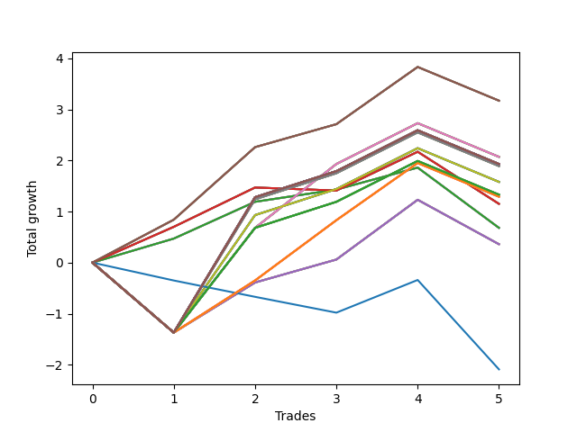

# Long Pointer 010 
- Symbol: NVDA_Unlimited
- Date Range: 02/08/2022 - 07/08/2022
- Trading Period: 7:20-12:30
- Number of Trades: 5



| Name | Win Percent | Profit | Avg Profit / Trade | Avg Time / Trade |      | Name | Win Percent | Profit | Avg Profit / Trade | Avg Time / Trade |
| ---- | ----------- | ------ | ------------------ | ---------------- | ---- | ---- | ----------- | ------ | ------------------ | ---------------- |
| Sorted By <br> Profit | | | | | | Sorted By <br> Win Percentage ||||
| Sixty-Seven | 80.00 | 1585.00 | 317.00 | 17:16 |     | Sixty-Seven | 80.00 | 1585.00 | 317.00 | 17:16 |
| Fifty-Nine | 80.00 | 1585.00 | 317.00 | 17:16 |     | Fifty-Nine | 80.00 | 1585.00 | 317.00 | 17:16 |
| Fifty-One | 80.00 | 1585.00 | 317.00 | 17:16 |     | Fifty-One | 80.00 | 1585.00 | 317.00 | 17:16 |
| Forty-Three | 80.00 | 1585.00 | 317.00 | 17:16 |     | Forty-Three | 80.00 | 1585.00 | 317.00 | 17:16 |
| Three | 80.00 | 1585.00 | 317.00 | 17:16 |     | Three | 80.00 | 1585.00 | 317.00 | 17:16 |
| Sixty-Eight | 60.00 | 1035.00 | 207.00 | 27:48 |     | Sixty-Four | 80.00 | 340.00 | 68.00 | 08:35 |
| Sixty | 60.00 | 1035.00 | 207.00 | 27:48 |     | Fifty-Six | 80.00 | 340.00 | 68.00 | 08:35 |
| Fifty-Two | 60.00 | 1035.00 | 207.00 | 27:48 |     | Forty-Eight | 80.00 | 340.00 | 68.00 | 08:35 |
| Forty-Four | 60.00 | 1035.00 | 207.00 | 27:48 |     | Forty | 80.00 | 340.00 | 68.00 | 08:35 |
| Four | 60.00 | 1035.00 | 207.00 | 27:48 |     | Zero | 80.00 | 340.00 | 68.00 | 08:35 |
| One Hundred Thirty | 60.00 | 965.00 | 193.00 | 29:55 |     | Sixty-Eight | 60.00 | 1035.00 | 207.00 | 27:48 |
| One Hundred Twenty-Nine | 60.00 | 965.00 | 193.00 | 29:55 |     | Sixty | 60.00 | 1035.00 | 207.00 | 27:48 |
| One Hundred Twenty-Eight | 60.00 | 965.00 | 193.00 | 29:55 |     | Fifty-Two | 60.00 | 1035.00 | 207.00 | 27:48 |
| One Hundred Twenty-Five | 60.00 | 965.00 | 193.00 | 29:55 |     | Forty-Four | 60.00 | 1035.00 | 207.00 | 27:48 |
| One Hundred Twenty-Four | 60.00 | 965.00 | 193.00 | 29:55 |     | Four | 60.00 | 1035.00 | 207.00 | 27:48 |
| One Hundred Twenty-Three | 60.00 | 965.00 | 193.00 | 29:55 |     | One Hundred Thirty | 60.00 | 965.00 | 193.00 | 29:55 |
| One Hundred Twenty | 60.00 | 965.00 | 193.00 | 29:55 |     | One Hundred Twenty-Nine | 60.00 | 965.00 | 193.00 | 29:55 |
| One Hundred Ninteen | 60.00 | 965.00 | 193.00 | 29:55 |     | One Hundred Twenty-Eight | 60.00 | 965.00 | 193.00 | 29:55 |
| One Hundred Eighteen | 60.00 | 965.00 | 193.00 | 29:55 |     | One Hundred Twenty-Five | 60.00 | 965.00 | 193.00 | 29:55 |
| One Hundred Fifteen | 60.00 | 965.00 | 193.00 | 29:55 |     | One Hundred Twenty-Four | 60.00 | 965.00 | 193.00 | 29:55 |
| One Hundred Fourteen | 60.00 | 965.00 | 193.00 | 29:55 |     | One Hundred Twenty-Three | 60.00 | 965.00 | 193.00 | 29:55 |
| One Hundred Thirteen | 60.00 | 965.00 | 193.00 | 29:55 |     | One Hundred Twenty | 60.00 | 965.00 | 193.00 | 29:55 |
| Eighty-Five | 60.00 | 965.00 | 193.00 | 29:55 |     | One Hundred Ninteen | 60.00 | 965.00 | 193.00 | 29:55 |
| Eighty-Four | 60.00 | 965.00 | 193.00 | 29:55 |     | One Hundred Eighteen | 60.00 | 965.00 | 193.00 | 29:55 |
| Eighty-Three | 60.00 | 965.00 | 193.00 | 29:55 |     | One Hundred Fifteen | 60.00 | 965.00 | 193.00 | 29:55 |
| Seventy-One | 60.00 | 965.00 | 193.00 | 29:55 |     | One Hundred Fourteen | 60.00 | 965.00 | 193.00 | 29:55 |
| Sixty-Three | 60.00 | 965.00 | 193.00 | 29:55 |     | One Hundred Thirteen | 60.00 | 965.00 | 193.00 | 29:55 |
| Fifty-Five | 60.00 | 965.00 | 193.00 | 29:55 |     | Eighty-Five | 60.00 | 965.00 | 193.00 | 29:55 |
| Forty-Seven | 60.00 | 965.00 | 193.00 | 29:55 |     | Eighty-Four | 60.00 | 965.00 | 193.00 | 29:55 |
| Seven | 60.00 | 965.00 | 193.00 | 29:55 |     | Eighty-Three | 60.00 | 965.00 | 193.00 | 29:55 |
| Sixty-Nine | 60.00 | 945.00 | 189.00 | 29:34 |     | Seventy-One | 60.00 | 965.00 | 193.00 | 29:55 |
| Sixty-One | 60.00 | 945.00 | 189.00 | 29:34 |     | Sixty-Three | 60.00 | 965.00 | 193.00 | 29:55 |
| Fifty-Three | 60.00 | 945.00 | 189.00 | 29:34 |     | Fifty-Five | 60.00 | 965.00 | 193.00 | 29:55 |
| Forty-Five | 60.00 | 945.00 | 189.00 | 29:34 |     | Forty-Seven | 60.00 | 965.00 | 193.00 | 29:55 |
| Five | 60.00 | 945.00 | 189.00 | 29:34 |     | Seven | 60.00 | 965.00 | 193.00 | 29:55 |
| Seventy | 60.00 | 790.00 | 158.00 | 29:26 |     | Sixty-Nine | 60.00 | 945.00 | 189.00 | 29:34 |
| Sixty-Two | 60.00 | 790.00 | 158.00 | 29:26 |     | Sixty-One | 60.00 | 945.00 | 189.00 | 29:34 |
| Fifty-Four | 60.00 | 790.00 | 158.00 | 29:26 |     | Fifty-Three | 60.00 | 945.00 | 189.00 | 29:34 |
| Forty-Six | 60.00 | 790.00 | 158.00 | 29:26 |     | Forty-Five | 60.00 | 945.00 | 189.00 | 29:34 |
| Six | 60.00 | 790.00 | 158.00 | 29:26 |     | Five | 60.00 | 945.00 | 189.00 | 29:34 |
| One Hundred Twenty-Seven | 60.00 | 665.00 | 133.00 | 28:26 |     | Seventy | 60.00 | 790.00 | 158.00 | 29:26 |
| One Hundred Twenty-Two | 60.00 | 665.00 | 133.00 | 28:26 |     | Sixty-Two | 60.00 | 790.00 | 158.00 | 29:26 |
| One Hundred Seventeen | 60.00 | 665.00 | 133.00 | 28:26 |     | Fifty-Four | 60.00 | 790.00 | 158.00 | 29:26 |
| One Hundred Twelve | 60.00 | 665.00 | 133.00 | 28:26 |     | Forty-Six | 60.00 | 790.00 | 158.00 | 29:26 |
| Eighty-Two | 60.00 | 665.00 | 133.00 | 28:26 |     | Six | 60.00 | 790.00 | 158.00 | 29:26 |
| One Hundred Twenty-Six | 60.00 | 645.00 | 129.00 | 20:22 |     | One Hundred Twenty-Seven | 60.00 | 665.00 | 133.00 | 28:26 |
| One Hundred Twenty-One | 60.00 | 645.00 | 129.00 | 20:22 |     | One Hundred Twenty-Two | 60.00 | 665.00 | 133.00 | 28:26 |
| One Hundred Sixteen | 60.00 | 645.00 | 129.00 | 20:22 |     | One Hundred Seventeen | 60.00 | 665.00 | 133.00 | 28:26 |
| One Hundred Eleven | 60.00 | 645.00 | 129.00 | 20:22 |     | One Hundred Twelve | 60.00 | 665.00 | 133.00 | 28:26 |
| Eighty-One | 60.00 | 645.00 | 129.00 | 20:22 |     | Eighty-Two | 60.00 | 665.00 | 133.00 | 28:26 |
| Sixty-Five | 60.00 | 575.00 | 115.00 | 15:14 |     | One Hundred Twenty-Six | 60.00 | 645.00 | 129.00 | 20:22 |
| Fifty-Seven | 60.00 | 575.00 | 115.00 | 15:14 |     | One Hundred Twenty-One | 60.00 | 645.00 | 129.00 | 20:22 |
| Forty-Nine | 60.00 | 575.00 | 115.00 | 15:14 |     | One Hundred Sixteen | 60.00 | 645.00 | 129.00 | 20:22 |
| Forty-One | 60.00 | 575.00 | 115.00 | 15:14 |     | One Hundred Eleven | 60.00 | 645.00 | 129.00 | 20:22 |
| One | 60.00 | 575.00 | 115.00 | 15:14 |     | Eighty-One | 60.00 | 645.00 | 129.00 | 20:22 |
| Sixty-Four | 80.00 | 340.00 | 68.00 | 08:35 |     | Sixty-Five | 60.00 | 575.00 | 115.00 | 15:14 |
| Fifty-Six | 80.00 | 340.00 | 68.00 | 08:35 |     | Fifty-Seven | 60.00 | 575.00 | 115.00 | 15:14 |
| Forty-Eight | 80.00 | 340.00 | 68.00 | 08:35 |     | Forty-Nine | 60.00 | 575.00 | 115.00 | 15:14 |
| Forty | 80.00 | 340.00 | 68.00 | 08:35 |     | Forty-One | 60.00 | 575.00 | 115.00 | 15:14 |
| Zero | 80.00 | 340.00 | 68.00 | 08:35 |     | One | 60.00 | 575.00 | 115.00 | 15:14 |
| Sixty-Six | 60.00 | 180.00 | 36.00 | 21:45 |     | Sixty-Six | 60.00 | 180.00 | 36.00 | 21:45 |
| Fifty-Eight | 60.00 | 180.00 | 36.00 | 21:45 |     | Fifty-Eight | 60.00 | 180.00 | 36.00 | 21:45 |
| Fifty | 60.00 | 180.00 | 36.00 | 21:45 |     | Fifty | 60.00 | 180.00 | 36.00 | 21:45 |
| Forty-Two | 60.00 | 180.00 | 36.00 | 21:45 |     | Forty-Two | 60.00 | 180.00 | 36.00 | 21:45 |
| Two | 60.00 | 180.00 | 36.00 | 21:45 |     | Two | 60.00 | 180.00 | 36.00 | 21:45 |
| Seventy-Three | 20.00 | -1045.00 | -209.00 | 11:41 |     | Seventy-Three | 20.00 | -1045.00 | -209.00 | 11:41 |

## NO STOPLOSS

### Test Zero
* Sell when price hits the middle line of the 20p bollinger
* No Stoploss
* Results:
```
Total Trades: 5
Percent Up: 80.00
Percent Down: 20.00
Total Points Moved Up: 0.68
Potential Profit: 340.00
Total Points Ups: 1.86 Count Ups: 4
Total Points Downs: -1.18 Count Downs: 1
```

<details><summary>Trades</summary>

<code>In: 2022-03-14 09:37:00		Out: 2022-03-14 09:40:45		Total Position Time: 03:45		Total Move Up: 0.47		Total to Date: 0.47</code> <br />
<code>In: 2022-03-17 07:56:00		Out: 2022-03-17 07:59:20		Total Position Time: 03:20		Total Move Up: 0.72		Total to Date: 1.19</code> <br />
<code>In: 2022-03-30 12:07:00		Out: 2022-03-30 12:14:15		Total Position Time: 07:15		Total Move Up: 0.24		Total to Date: 1.43</code> <br />
<code>In: 2022-03-31 10:18:00		Out: 2022-03-31 10:26:20		Total Position Time: 08:20		Total Move Up: 0.43		Total to Date: 1.86</code> <br />
<code>In: 2022-06-08 09:30:00		Out: 2022-06-08 09:50:15		Total Position Time: 20:15		Total Move Up: -1.18		Total to Date: 0.68</code> <br />


</details>

### Test One
* Sell when the price hits the upper line of the 20p 1std bollinger
* No Stoploss
* Results:
```
Total Trades: 5
Percent Up: 60.00
Percent Down: 40.00
Total Points Moved Up: 1.15
Potential Profit: 575.00
Total Points Ups: 2.23 Count Ups: 3
Total Points Downs: -1.08 Count Downs: 2
```

<details><summary>Trades</summary>

<code>In: 2022-03-14 09:37:00		Out: 2022-03-14 09:42:00		Total Position Time: 05:00		Total Move Up: 0.70		Total to Date: 0.70</code> <br />
<code>In: 2022-03-17 07:56:00		Out: 2022-03-17 08:08:20		Total Position Time: 12:20		Total Move Up: 0.77		Total to Date: 1.47</code> <br />
<code>In: 2022-03-30 12:07:00		Out: 2022-03-30 12:30:45		Total Position Time: 23:45		Total Move Up: -0.06		Total to Date: 1.41</code> <br />
<code>In: 2022-03-31 10:18:00		Out: 2022-03-31 10:29:05		Total Position Time: 11:05		Total Move Up: 0.76		Total to Date: 2.17</code> <br />
<code>In: 2022-06-08 09:30:00		Out: 2022-06-08 09:54:00		Total Position Time: 24:00		Total Move Up: -1.02		Total to Date: 1.15</code> <br />


</details>

### Test Two
* Sell when the price hits the upper line of the 20p 2std bollinger
* No Stoploss
* Results:
```
Total Trades: 5
Percent Up: 60.00
Percent Down: 40.00
Total Points Moved Up: 0.36
Potential Profit: 180.00
Total Points Ups: 2.60 Count Ups: 3
Total Points Downs: -2.24 Count Downs: 2
```

<details><summary>Trades</summary>

<code>In: 2022-03-14 09:37:00		Out: 2022-03-14 10:06:55		Total Position Time: 29:55		Total Move Up: -1.37		Total to Date: -1.37</code> <br />
<code>In: 2022-03-17 07:56:00		Out: 2022-03-17 08:10:10		Total Position Time: 14:10		Total Move Up: 0.98		Total to Date: -0.39</code> <br />
<code>In: 2022-03-30 12:07:00		Out: 2022-03-30 12:31:35		Total Position Time: 24:35		Total Move Up: 0.45		Total to Date: 0.06</code> <br />
<code>In: 2022-03-31 10:18:00		Out: 2022-03-31 10:31:20		Total Position Time: 13:20		Total Move Up: 1.17		Total to Date: 1.23</code> <br />
<code>In: 2022-06-08 09:30:00		Out: 2022-06-08 09:56:45		Total Position Time: 26:45		Total Move Up: -0.87		Total to Date: 0.36</code> <br />


</details>

### Test Three
* Sell when price hits the middle line of the 50p bollinger
* No Stoploss
* Results:
```
Total Trades: 5
Percent Up: 80.00
Percent Down: 20.00
Total Points Moved Up: 3.17
Potential Profit: 1585.00
Total Points Ups: 3.83 Count Ups: 4
Total Points Downs: -0.66 Count Downs: 1
```

<details><summary>Trades</summary>

<code>In: 2022-03-14 09:37:00		Out: 2022-03-14 09:42:05		Total Position Time: 05:05		Total Move Up: 0.84		Total to Date: 0.84</code> <br />
<code>In: 2022-03-17 07:56:00		Out: 2022-03-17 08:11:05		Total Position Time: 15:05		Total Move Up: 1.42		Total to Date: 2.26</code> <br />
<code>In: 2022-03-30 12:07:00		Out: 2022-03-30 12:31:35		Total Position Time: 24:35		Total Move Up: 0.45		Total to Date: 2.71</code> <br />
<code>In: 2022-03-31 10:18:00		Out: 2022-03-31 10:29:40		Total Position Time: 11:40		Total Move Up: 1.12		Total to Date: 3.83</code> <br />
<code>In: 2022-06-08 09:30:00		Out: 2022-06-08 09:59:55		Total Position Time: 29:55		Total Move Up: -0.66		Total to Date: 3.17</code> <br />


</details>

### Test Four
* Sell when the price hits the upper line of the 50p 1std bollinger
* No Stoploss
* Results:
```
Total Trades: 5
Percent Up: 60.00
Percent Down: 40.00
Total Points Moved Up: 2.07
Potential Profit: 1035.00
Total Points Ups: 4.10 Count Ups: 3
Total Points Downs: -2.03 Count Downs: 2
```

<details><summary>Trades</summary>

<code>In: 2022-03-14 09:37:00		Out: 2022-03-14 10:06:55		Total Position Time: 29:55		Total Move Up: -1.37		Total to Date: -1.37</code> <br />
<code>In: 2022-03-17 07:56:00		Out: 2022-03-17 08:18:30		Total Position Time: 22:30		Total Move Up: 2.05		Total to Date: 0.68</code> <br />
<code>In: 2022-03-30 12:07:00		Out: 2022-03-30 12:33:45		Total Position Time: 26:45		Total Move Up: 1.25		Total to Date: 1.93</code> <br />
<code>In: 2022-03-31 10:18:00		Out: 2022-03-31 10:47:55		Total Position Time: 29:55		Total Move Up: 0.80		Total to Date: 2.73</code> <br />
<code>In: 2022-06-08 09:30:00		Out: 2022-06-08 09:59:55		Total Position Time: 29:55		Total Move Up: -0.66		Total to Date: 2.07</code> <br />


</details>

### Test Five
* Sell when the price hits the upper line of the 50p 2std bollinger
* No Stoploss
* Results:
```
Total Trades: 5
Percent Up: 60.00
Percent Down: 40.00
Total Points Moved Up: 1.89
Potential Profit: 945.00
Total Points Ups: 3.92 Count Ups: 3
Total Points Downs: -2.03 Count Downs: 2
```

<details><summary>Trades</summary>

<code>In: 2022-03-14 09:37:00		Out: 2022-03-14 10:06:55		Total Position Time: 29:55		Total Move Up: -1.37		Total to Date: -1.37</code> <br />
<code>In: 2022-03-17 07:56:00		Out: 2022-03-17 08:24:10		Total Position Time: 28:10		Total Move Up: 2.61		Total to Date: 1.24</code> <br />
<code>In: 2022-03-30 12:07:00		Out: 2022-03-30 12:36:55		Total Position Time: 29:55		Total Move Up: 0.51		Total to Date: 1.75</code> <br />
<code>In: 2022-03-31 10:18:00		Out: 2022-03-31 10:47:55		Total Position Time: 29:55		Total Move Up: 0.80		Total to Date: 2.55</code> <br />
<code>In: 2022-06-08 09:30:00		Out: 2022-06-08 09:59:55		Total Position Time: 29:55		Total Move Up: -0.66		Total to Date: 1.89</code> <br />


</details>

### Test Six
* Sell when the price hits the middle line of the 1std VWAP
* No Stoploss
* Results:
```
Total Trades: 5
Percent Up: 60.00
Percent Down: 40.00
Total Points Moved Up: 1.58
Potential Profit: 790.00
Total Points Ups: 3.61 Count Ups: 3
Total Points Downs: -2.03 Count Downs: 2
```

<details><summary>Trades</summary>

<code>In: 2022-03-14 09:37:00		Out: 2022-03-14 10:06:55		Total Position Time: 29:55		Total Move Up: -1.37		Total to Date: -1.37</code> <br />
<code>In: 2022-03-17 07:56:00		Out: 2022-03-17 08:23:30		Total Position Time: 27:30		Total Move Up: 2.30		Total to Date: 0.93</code> <br />
<code>In: 2022-03-30 12:07:00		Out: 2022-03-30 12:36:55		Total Position Time: 29:55		Total Move Up: 0.51		Total to Date: 1.44</code> <br />
<code>In: 2022-03-31 10:18:00		Out: 2022-03-31 10:47:55		Total Position Time: 29:55		Total Move Up: 0.80		Total to Date: 2.24</code> <br />
<code>In: 2022-06-08 09:30:00		Out: 2022-06-08 09:59:55		Total Position Time: 29:55		Total Move Up: -0.66		Total to Date: 1.58</code> <br />


</details>

### Test Seven
* Sell when the price hits the upper line of the 1std VWAP
* No Stoploss
* Results:
```
Total Trades: 5
Percent Up: 60.00
Percent Down: 40.00
Total Points Moved Up: 1.93
Potential Profit: 965.00
Total Points Ups: 3.96 Count Ups: 3
Total Points Downs: -2.03 Count Downs: 2
```

<details><summary>Trades</summary>

<code>In: 2022-03-14 09:37:00		Out: 2022-03-14 10:06:55		Total Position Time: 29:55		Total Move Up: -1.37		Total to Date: -1.37</code> <br />
<code>In: 2022-03-17 07:56:00		Out: 2022-03-17 08:25:55		Total Position Time: 29:55		Total Move Up: 2.65		Total to Date: 1.28</code> <br />
<code>In: 2022-03-30 12:07:00		Out: 2022-03-30 12:36:55		Total Position Time: 29:55		Total Move Up: 0.51		Total to Date: 1.79</code> <br />
<code>In: 2022-03-31 10:18:00		Out: 2022-03-31 10:47:55		Total Position Time: 29:55		Total Move Up: 0.80		Total to Date: 2.59</code> <br />
<code>In: 2022-06-08 09:30:00		Out: 2022-06-08 09:59:55		Total Position Time: 29:55		Total Move Up: -0.66		Total to Date: 1.93</code> <br />


</details>

## STOPLOSS OF 5

### Test Forty
* Sell when price hits the middle line of the 20p bollinger
* Stoploss is 5 points
* Results:
```
Total Trades: 5
Percent Up: 80.00
Percent Down: 20.00
Total Points Moved Up: 0.68
Potential Profit: 340.00
Total Points Ups: 1.86 Count Ups: 4
Total Points Downs: -1.18 Count Downs: 1
```

<details><summary>Trades</summary>

<code>In: 2022-03-14 09:37:00		Out: 2022-03-14 09:40:45		Total Position Time: 03:45		Total Move Up: 0.47		Total to Date: 0.47</code> <br />
<code>In: 2022-03-17 07:56:00		Out: 2022-03-17 07:59:20		Total Position Time: 03:20		Total Move Up: 0.72		Total to Date: 1.19</code> <br />
<code>In: 2022-03-30 12:07:00		Out: 2022-03-30 12:14:15		Total Position Time: 07:15		Total Move Up: 0.24		Total to Date: 1.43</code> <br />
<code>In: 2022-03-31 10:18:00		Out: 2022-03-31 10:26:20		Total Position Time: 08:20		Total Move Up: 0.43		Total to Date: 1.86</code> <br />
<code>In: 2022-06-08 09:30:00		Out: 2022-06-08 09:50:15		Total Position Time: 20:15		Total Move Up: -1.18		Total to Date: 0.68</code> <br />


</details>

### Test Forty-One
* Sell when the price hits the upper line of the 20p 1std bollinger
* Stoploss is 5 points
* Results:
```
Total Trades: 5
Percent Up: 60.00
Percent Down: 40.00
Total Points Moved Up: 1.15
Potential Profit: 575.00
Total Points Ups: 2.23 Count Ups: 3
Total Points Downs: -1.08 Count Downs: 2
```

<details><summary>Trades</summary>

<code>In: 2022-03-14 09:37:00		Out: 2022-03-14 09:42:00		Total Position Time: 05:00		Total Move Up: 0.70		Total to Date: 0.70</code> <br />
<code>In: 2022-03-17 07:56:00		Out: 2022-03-17 08:08:20		Total Position Time: 12:20		Total Move Up: 0.77		Total to Date: 1.47</code> <br />
<code>In: 2022-03-30 12:07:00		Out: 2022-03-30 12:30:45		Total Position Time: 23:45		Total Move Up: -0.06		Total to Date: 1.41</code> <br />
<code>In: 2022-03-31 10:18:00		Out: 2022-03-31 10:29:05		Total Position Time: 11:05		Total Move Up: 0.76		Total to Date: 2.17</code> <br />
<code>In: 2022-06-08 09:30:00		Out: 2022-06-08 09:54:00		Total Position Time: 24:00		Total Move Up: -1.02		Total to Date: 1.15</code> <br />


</details>

### Test Forty-Two
* Sell when the price hits the upper line of the 20p 2std bollinger
* Stoploss is 5 points
* Results:
```
Total Trades: 5
Percent Up: 60.00
Percent Down: 40.00
Total Points Moved Up: 0.36
Potential Profit: 180.00
Total Points Ups: 2.60 Count Ups: 3
Total Points Downs: -2.24 Count Downs: 2
```

<details><summary>Trades</summary>

<code>In: 2022-03-14 09:37:00		Out: 2022-03-14 10:06:55		Total Position Time: 29:55		Total Move Up: -1.37		Total to Date: -1.37</code> <br />
<code>In: 2022-03-17 07:56:00		Out: 2022-03-17 08:10:10		Total Position Time: 14:10		Total Move Up: 0.98		Total to Date: -0.39</code> <br />
<code>In: 2022-03-30 12:07:00		Out: 2022-03-30 12:31:35		Total Position Time: 24:35		Total Move Up: 0.45		Total to Date: 0.06</code> <br />
<code>In: 2022-03-31 10:18:00		Out: 2022-03-31 10:31:20		Total Position Time: 13:20		Total Move Up: 1.17		Total to Date: 1.23</code> <br />
<code>In: 2022-06-08 09:30:00		Out: 2022-06-08 09:56:45		Total Position Time: 26:45		Total Move Up: -0.87		Total to Date: 0.36</code> <br />


</details>

### Test Forty-Three
* Sell when price hits the middle line of the 50p bollinger
* Stoploss is 5 points
* Results:
```
Total Trades: 5
Percent Up: 80.00
Percent Down: 20.00
Total Points Moved Up: 3.17
Potential Profit: 1585.00
Total Points Ups: 3.83 Count Ups: 4
Total Points Downs: -0.66 Count Downs: 1
```

<details><summary>Trades</summary>

<code>In: 2022-03-14 09:37:00		Out: 2022-03-14 09:42:05		Total Position Time: 05:05		Total Move Up: 0.84		Total to Date: 0.84</code> <br />
<code>In: 2022-03-17 07:56:00		Out: 2022-03-17 08:11:05		Total Position Time: 15:05		Total Move Up: 1.42		Total to Date: 2.26</code> <br />
<code>In: 2022-03-30 12:07:00		Out: 2022-03-30 12:31:35		Total Position Time: 24:35		Total Move Up: 0.45		Total to Date: 2.71</code> <br />
<code>In: 2022-03-31 10:18:00		Out: 2022-03-31 10:29:40		Total Position Time: 11:40		Total Move Up: 1.12		Total to Date: 3.83</code> <br />
<code>In: 2022-06-08 09:30:00		Out: 2022-06-08 09:59:55		Total Position Time: 29:55		Total Move Up: -0.66		Total to Date: 3.17</code> <br />


</details>

### Test Forty-Four
* Sell when the price hits the upper line of the 50p 1std bollinger
* Stoploss is 5 points
* Results:
```
Total Trades: 5
Percent Up: 60.00
Percent Down: 40.00
Total Points Moved Up: 2.07
Potential Profit: 1035.00
Total Points Ups: 4.10 Count Ups: 3
Total Points Downs: -2.03 Count Downs: 2
```

<details><summary>Trades</summary>

<code>In: 2022-03-14 09:37:00		Out: 2022-03-14 10:06:55		Total Position Time: 29:55		Total Move Up: -1.37		Total to Date: -1.37</code> <br />
<code>In: 2022-03-17 07:56:00		Out: 2022-03-17 08:18:30		Total Position Time: 22:30		Total Move Up: 2.05		Total to Date: 0.68</code> <br />
<code>In: 2022-03-30 12:07:00		Out: 2022-03-30 12:33:45		Total Position Time: 26:45		Total Move Up: 1.25		Total to Date: 1.93</code> <br />
<code>In: 2022-03-31 10:18:00		Out: 2022-03-31 10:47:55		Total Position Time: 29:55		Total Move Up: 0.80		Total to Date: 2.73</code> <br />
<code>In: 2022-06-08 09:30:00		Out: 2022-06-08 09:59:55		Total Position Time: 29:55		Total Move Up: -0.66		Total to Date: 2.07</code> <br />


</details>

### Test Forty-Five
* Sell when the price hits the upper line of the 50p 2std bollinger
* Stoploss is 5 points
* Results:
```
Total Trades: 5
Percent Up: 60.00
Percent Down: 40.00
Total Points Moved Up: 1.89
Potential Profit: 945.00
Total Points Ups: 3.92 Count Ups: 3
Total Points Downs: -2.03 Count Downs: 2
```

<details><summary>Trades</summary>

<code>In: 2022-03-14 09:37:00		Out: 2022-03-14 10:06:55		Total Position Time: 29:55		Total Move Up: -1.37		Total to Date: -1.37</code> <br />
<code>In: 2022-03-17 07:56:00		Out: 2022-03-17 08:24:10		Total Position Time: 28:10		Total Move Up: 2.61		Total to Date: 1.24</code> <br />
<code>In: 2022-03-30 12:07:00		Out: 2022-03-30 12:36:55		Total Position Time: 29:55		Total Move Up: 0.51		Total to Date: 1.75</code> <br />
<code>In: 2022-03-31 10:18:00		Out: 2022-03-31 10:47:55		Total Position Time: 29:55		Total Move Up: 0.80		Total to Date: 2.55</code> <br />
<code>In: 2022-06-08 09:30:00		Out: 2022-06-08 09:59:55		Total Position Time: 29:55		Total Move Up: -0.66		Total to Date: 1.89</code> <br />


</details>

### Test Forty-Six
* Sell when the price hits the middle line of the 1std VWAP
* Stoploss is 5 points
* Results:
```
Total Trades: 5
Percent Up: 60.00
Percent Down: 40.00
Total Points Moved Up: 1.58
Potential Profit: 790.00
Total Points Ups: 3.61 Count Ups: 3
Total Points Downs: -2.03 Count Downs: 2
```

<details><summary>Trades</summary>

<code>In: 2022-03-14 09:37:00		Out: 2022-03-14 10:06:55		Total Position Time: 29:55		Total Move Up: -1.37		Total to Date: -1.37</code> <br />
<code>In: 2022-03-17 07:56:00		Out: 2022-03-17 08:23:30		Total Position Time: 27:30		Total Move Up: 2.30		Total to Date: 0.93</code> <br />
<code>In: 2022-03-30 12:07:00		Out: 2022-03-30 12:36:55		Total Position Time: 29:55		Total Move Up: 0.51		Total to Date: 1.44</code> <br />
<code>In: 2022-03-31 10:18:00		Out: 2022-03-31 10:47:55		Total Position Time: 29:55		Total Move Up: 0.80		Total to Date: 2.24</code> <br />
<code>In: 2022-06-08 09:30:00		Out: 2022-06-08 09:59:55		Total Position Time: 29:55		Total Move Up: -0.66		Total to Date: 1.58</code> <br />


</details>

### Test Forty-Seven
* Sell when the price hits the upper line of the 1std VWAP
* Stoploss is 5 points
* Results:
```
Total Trades: 5
Percent Up: 60.00
Percent Down: 40.00
Total Points Moved Up: 1.93
Potential Profit: 965.00
Total Points Ups: 3.96 Count Ups: 3
Total Points Downs: -2.03 Count Downs: 2
```

<details><summary>Trades</summary>

<code>In: 2022-03-14 09:37:00		Out: 2022-03-14 10:06:55		Total Position Time: 29:55		Total Move Up: -1.37		Total to Date: -1.37</code> <br />
<code>In: 2022-03-17 07:56:00		Out: 2022-03-17 08:25:55		Total Position Time: 29:55		Total Move Up: 2.65		Total to Date: 1.28</code> <br />
<code>In: 2022-03-30 12:07:00		Out: 2022-03-30 12:36:55		Total Position Time: 29:55		Total Move Up: 0.51		Total to Date: 1.79</code> <br />
<code>In: 2022-03-31 10:18:00		Out: 2022-03-31 10:47:55		Total Position Time: 29:55		Total Move Up: 0.80		Total to Date: 2.59</code> <br />
<code>In: 2022-06-08 09:30:00		Out: 2022-06-08 09:59:55		Total Position Time: 29:55		Total Move Up: -0.66		Total to Date: 1.93</code> <br />


</details>

## TRAIL STOP OF 5

### Test Forty-Eight
* Sell when price hits the middle line of the 20p bollinger
* Trailing Stop is 5 points
* Results:
```
Total Trades: 5
Percent Up: 80.00
Percent Down: 20.00
Total Points Moved Up: 0.68
Potential Profit: 340.00
Total Points Ups: 1.86 Count Ups: 4
Total Points Downs: -1.18 Count Downs: 1
```

<details><summary>Trades</summary>

<code>In: 2022-03-14 09:37:00		Out: 2022-03-14 09:40:45		Total Position Time: 03:45		Total Move Up: 0.47		Total to Date: 0.47</code> <br />
<code>In: 2022-03-17 07:56:00		Out: 2022-03-17 07:59:20		Total Position Time: 03:20		Total Move Up: 0.72		Total to Date: 1.19</code> <br />
<code>In: 2022-03-30 12:07:00		Out: 2022-03-30 12:14:15		Total Position Time: 07:15		Total Move Up: 0.24		Total to Date: 1.43</code> <br />
<code>In: 2022-03-31 10:18:00		Out: 2022-03-31 10:26:20		Total Position Time: 08:20		Total Move Up: 0.43		Total to Date: 1.86</code> <br />
<code>In: 2022-06-08 09:30:00		Out: 2022-06-08 09:50:15		Total Position Time: 20:15		Total Move Up: -1.18		Total to Date: 0.68</code> <br />


</details>

### Test Forty-Nine
* Sell when the price hits the upper line of the 20p 1std bollinger
* Trailing Stop is 5 points
* Results:
```
Total Trades: 5
Percent Up: 60.00
Percent Down: 40.00
Total Points Moved Up: 1.15
Potential Profit: 575.00
Total Points Ups: 2.23 Count Ups: 3
Total Points Downs: -1.08 Count Downs: 2
```

<details><summary>Trades</summary>

<code>In: 2022-03-14 09:37:00		Out: 2022-03-14 09:42:00		Total Position Time: 05:00		Total Move Up: 0.70		Total to Date: 0.70</code> <br />
<code>In: 2022-03-17 07:56:00		Out: 2022-03-17 08:08:20		Total Position Time: 12:20		Total Move Up: 0.77		Total to Date: 1.47</code> <br />
<code>In: 2022-03-30 12:07:00		Out: 2022-03-30 12:30:45		Total Position Time: 23:45		Total Move Up: -0.06		Total to Date: 1.41</code> <br />
<code>In: 2022-03-31 10:18:00		Out: 2022-03-31 10:29:05		Total Position Time: 11:05		Total Move Up: 0.76		Total to Date: 2.17</code> <br />
<code>In: 2022-06-08 09:30:00		Out: 2022-06-08 09:54:00		Total Position Time: 24:00		Total Move Up: -1.02		Total to Date: 1.15</code> <br />


</details>

### Test Fifty
* Sell when the price hits the upper line of the 20p 2std bollinger
* Trailing Stop is 5 points
* Results:
```
Total Trades: 5
Percent Up: 60.00
Percent Down: 40.00
Total Points Moved Up: 0.36
Potential Profit: 180.00
Total Points Ups: 2.60 Count Ups: 3
Total Points Downs: -2.24 Count Downs: 2
```

<details><summary>Trades</summary>

<code>In: 2022-03-14 09:37:00		Out: 2022-03-14 10:06:55		Total Position Time: 29:55		Total Move Up: -1.37		Total to Date: -1.37</code> <br />
<code>In: 2022-03-17 07:56:00		Out: 2022-03-17 08:10:10		Total Position Time: 14:10		Total Move Up: 0.98		Total to Date: -0.39</code> <br />
<code>In: 2022-03-30 12:07:00		Out: 2022-03-30 12:31:35		Total Position Time: 24:35		Total Move Up: 0.45		Total to Date: 0.06</code> <br />
<code>In: 2022-03-31 10:18:00		Out: 2022-03-31 10:31:20		Total Position Time: 13:20		Total Move Up: 1.17		Total to Date: 1.23</code> <br />
<code>In: 2022-06-08 09:30:00		Out: 2022-06-08 09:56:45		Total Position Time: 26:45		Total Move Up: -0.87		Total to Date: 0.36</code> <br />


</details>

### Test Fifty-One
* Sell when price hits the middle line of the 50p bollinger
* Trailing Stop is 5 points
* Results:
```
Total Trades: 5
Percent Up: 80.00
Percent Down: 20.00
Total Points Moved Up: 3.17
Potential Profit: 1585.00
Total Points Ups: 3.83 Count Ups: 4
Total Points Downs: -0.66 Count Downs: 1
```

<details><summary>Trades</summary>

<code>In: 2022-03-14 09:37:00		Out: 2022-03-14 09:42:05		Total Position Time: 05:05		Total Move Up: 0.84		Total to Date: 0.84</code> <br />
<code>In: 2022-03-17 07:56:00		Out: 2022-03-17 08:11:05		Total Position Time: 15:05		Total Move Up: 1.42		Total to Date: 2.26</code> <br />
<code>In: 2022-03-30 12:07:00		Out: 2022-03-30 12:31:35		Total Position Time: 24:35		Total Move Up: 0.45		Total to Date: 2.71</code> <br />
<code>In: 2022-03-31 10:18:00		Out: 2022-03-31 10:29:40		Total Position Time: 11:40		Total Move Up: 1.12		Total to Date: 3.83</code> <br />
<code>In: 2022-06-08 09:30:00		Out: 2022-06-08 09:59:55		Total Position Time: 29:55		Total Move Up: -0.66		Total to Date: 3.17</code> <br />


</details>

### Test Fifty-Two
* Sell when the price hits the upper line of the 50p 1std bollinger
* Trailing Stop is 5 points
* Results:
```
Total Trades: 5
Percent Up: 60.00
Percent Down: 40.00
Total Points Moved Up: 2.07
Potential Profit: 1035.00
Total Points Ups: 4.10 Count Ups: 3
Total Points Downs: -2.03 Count Downs: 2
```

<details><summary>Trades</summary>

<code>In: 2022-03-14 09:37:00		Out: 2022-03-14 10:06:55		Total Position Time: 29:55		Total Move Up: -1.37		Total to Date: -1.37</code> <br />
<code>In: 2022-03-17 07:56:00		Out: 2022-03-17 08:18:30		Total Position Time: 22:30		Total Move Up: 2.05		Total to Date: 0.68</code> <br />
<code>In: 2022-03-30 12:07:00		Out: 2022-03-30 12:33:45		Total Position Time: 26:45		Total Move Up: 1.25		Total to Date: 1.93</code> <br />
<code>In: 2022-03-31 10:18:00		Out: 2022-03-31 10:47:55		Total Position Time: 29:55		Total Move Up: 0.80		Total to Date: 2.73</code> <br />
<code>In: 2022-06-08 09:30:00		Out: 2022-06-08 09:59:55		Total Position Time: 29:55		Total Move Up: -0.66		Total to Date: 2.07</code> <br />


</details>

### Test Fifty-Three
* Sell when the price hits the upper line of the 50p 2std bollinger
* Trailing Stop is 5 points
* Results:
```
Total Trades: 5
Percent Up: 60.00
Percent Down: 40.00
Total Points Moved Up: 1.89
Potential Profit: 945.00
Total Points Ups: 3.92 Count Ups: 3
Total Points Downs: -2.03 Count Downs: 2
```

<details><summary>Trades</summary>

<code>In: 2022-03-14 09:37:00		Out: 2022-03-14 10:06:55		Total Position Time: 29:55		Total Move Up: -1.37		Total to Date: -1.37</code> <br />
<code>In: 2022-03-17 07:56:00		Out: 2022-03-17 08:24:10		Total Position Time: 28:10		Total Move Up: 2.61		Total to Date: 1.24</code> <br />
<code>In: 2022-03-30 12:07:00		Out: 2022-03-30 12:36:55		Total Position Time: 29:55		Total Move Up: 0.51		Total to Date: 1.75</code> <br />
<code>In: 2022-03-31 10:18:00		Out: 2022-03-31 10:47:55		Total Position Time: 29:55		Total Move Up: 0.80		Total to Date: 2.55</code> <br />
<code>In: 2022-06-08 09:30:00		Out: 2022-06-08 09:59:55		Total Position Time: 29:55		Total Move Up: -0.66		Total to Date: 1.89</code> <br />


</details>

### Test Fifty-Four
* Sell when the price hits the middle line of the 1std VWAP
* Trailing Stop is 5 points
* Results:
```
Total Trades: 5
Percent Up: 60.00
Percent Down: 40.00
Total Points Moved Up: 1.58
Potential Profit: 790.00
Total Points Ups: 3.61 Count Ups: 3
Total Points Downs: -2.03 Count Downs: 2
```

<details><summary>Trades</summary>

<code>In: 2022-03-14 09:37:00		Out: 2022-03-14 10:06:55		Total Position Time: 29:55		Total Move Up: -1.37		Total to Date: -1.37</code> <br />
<code>In: 2022-03-17 07:56:00		Out: 2022-03-17 08:23:30		Total Position Time: 27:30		Total Move Up: 2.30		Total to Date: 0.93</code> <br />
<code>In: 2022-03-30 12:07:00		Out: 2022-03-30 12:36:55		Total Position Time: 29:55		Total Move Up: 0.51		Total to Date: 1.44</code> <br />
<code>In: 2022-03-31 10:18:00		Out: 2022-03-31 10:47:55		Total Position Time: 29:55		Total Move Up: 0.80		Total to Date: 2.24</code> <br />
<code>In: 2022-06-08 09:30:00		Out: 2022-06-08 09:59:55		Total Position Time: 29:55		Total Move Up: -0.66		Total to Date: 1.58</code> <br />


</details>

### Test Fifty-Five
* Sell when the price hits the upper line of the 1std VWAP
* Trailing Stop is 5 points
* Results:
```
Total Trades: 5
Percent Up: 60.00
Percent Down: 40.00
Total Points Moved Up: 1.93
Potential Profit: 965.00
Total Points Ups: 3.96 Count Ups: 3
Total Points Downs: -2.03 Count Downs: 2
```

<details><summary>Trades</summary>

<code>In: 2022-03-14 09:37:00		Out: 2022-03-14 10:06:55		Total Position Time: 29:55		Total Move Up: -1.37		Total to Date: -1.37</code> <br />
<code>In: 2022-03-17 07:56:00		Out: 2022-03-17 08:25:55		Total Position Time: 29:55		Total Move Up: 2.65		Total to Date: 1.28</code> <br />
<code>In: 2022-03-30 12:07:00		Out: 2022-03-30 12:36:55		Total Position Time: 29:55		Total Move Up: 0.51		Total to Date: 1.79</code> <br />
<code>In: 2022-03-31 10:18:00		Out: 2022-03-31 10:47:55		Total Position Time: 29:55		Total Move Up: 0.80		Total to Date: 2.59</code> <br />
<code>In: 2022-06-08 09:30:00		Out: 2022-06-08 09:59:55		Total Position Time: 29:55		Total Move Up: -0.66		Total to Date: 1.93</code> <br />


</details>

## STOPLOSS OF 10

### Test Fifty-Six
* Sell when price hits the middle line of the 20p bollinger
* Stoploss is 10 points
* Results:
```
Total Trades: 5
Percent Up: 80.00
Percent Down: 20.00
Total Points Moved Up: 0.68
Potential Profit: 340.00
Total Points Ups: 1.86 Count Ups: 4
Total Points Downs: -1.18 Count Downs: 1
```

<details><summary>Trades</summary>

<code>In: 2022-03-14 09:37:00		Out: 2022-03-14 09:40:45		Total Position Time: 03:45		Total Move Up: 0.47		Total to Date: 0.47</code> <br />
<code>In: 2022-03-17 07:56:00		Out: 2022-03-17 07:59:20		Total Position Time: 03:20		Total Move Up: 0.72		Total to Date: 1.19</code> <br />
<code>In: 2022-03-30 12:07:00		Out: 2022-03-30 12:14:15		Total Position Time: 07:15		Total Move Up: 0.24		Total to Date: 1.43</code> <br />
<code>In: 2022-03-31 10:18:00		Out: 2022-03-31 10:26:20		Total Position Time: 08:20		Total Move Up: 0.43		Total to Date: 1.86</code> <br />
<code>In: 2022-06-08 09:30:00		Out: 2022-06-08 09:50:15		Total Position Time: 20:15		Total Move Up: -1.18		Total to Date: 0.68</code> <br />


</details>

### Test Fifty-Seven
* Sell when the price hits the upper line of the 20p 1std bollinger
* Stoploss is 10 points
* Results:
```
Total Trades: 5
Percent Up: 60.00
Percent Down: 40.00
Total Points Moved Up: 1.15
Potential Profit: 575.00
Total Points Ups: 2.23 Count Ups: 3
Total Points Downs: -1.08 Count Downs: 2
```

<details><summary>Trades</summary>

<code>In: 2022-03-14 09:37:00		Out: 2022-03-14 09:42:00		Total Position Time: 05:00		Total Move Up: 0.70		Total to Date: 0.70</code> <br />
<code>In: 2022-03-17 07:56:00		Out: 2022-03-17 08:08:20		Total Position Time: 12:20		Total Move Up: 0.77		Total to Date: 1.47</code> <br />
<code>In: 2022-03-30 12:07:00		Out: 2022-03-30 12:30:45		Total Position Time: 23:45		Total Move Up: -0.06		Total to Date: 1.41</code> <br />
<code>In: 2022-03-31 10:18:00		Out: 2022-03-31 10:29:05		Total Position Time: 11:05		Total Move Up: 0.76		Total to Date: 2.17</code> <br />
<code>In: 2022-06-08 09:30:00		Out: 2022-06-08 09:54:00		Total Position Time: 24:00		Total Move Up: -1.02		Total to Date: 1.15</code> <br />


</details>

### Test Fifty-Eight
* Sell when the price hits the upper line of the 20p 2std bollinger
* Stoploss is 10 points
* Results:
```
Total Trades: 5
Percent Up: 60.00
Percent Down: 40.00
Total Points Moved Up: 0.36
Potential Profit: 180.00
Total Points Ups: 2.60 Count Ups: 3
Total Points Downs: -2.24 Count Downs: 2
```

<details><summary>Trades</summary>

<code>In: 2022-03-14 09:37:00		Out: 2022-03-14 10:06:55		Total Position Time: 29:55		Total Move Up: -1.37		Total to Date: -1.37</code> <br />
<code>In: 2022-03-17 07:56:00		Out: 2022-03-17 08:10:10		Total Position Time: 14:10		Total Move Up: 0.98		Total to Date: -0.39</code> <br />
<code>In: 2022-03-30 12:07:00		Out: 2022-03-30 12:31:35		Total Position Time: 24:35		Total Move Up: 0.45		Total to Date: 0.06</code> <br />
<code>In: 2022-03-31 10:18:00		Out: 2022-03-31 10:31:20		Total Position Time: 13:20		Total Move Up: 1.17		Total to Date: 1.23</code> <br />
<code>In: 2022-06-08 09:30:00		Out: 2022-06-08 09:56:45		Total Position Time: 26:45		Total Move Up: -0.87		Total to Date: 0.36</code> <br />


</details>

### Test Fifty-Nine
* Sell when price hits the middle line of the 50p bollinger
* Stoploss is 10 points
* Results:
```
Total Trades: 5
Percent Up: 80.00
Percent Down: 20.00
Total Points Moved Up: 3.17
Potential Profit: 1585.00
Total Points Ups: 3.83 Count Ups: 4
Total Points Downs: -0.66 Count Downs: 1
```

<details><summary>Trades</summary>

<code>In: 2022-03-14 09:37:00		Out: 2022-03-14 09:42:05		Total Position Time: 05:05		Total Move Up: 0.84		Total to Date: 0.84</code> <br />
<code>In: 2022-03-17 07:56:00		Out: 2022-03-17 08:11:05		Total Position Time: 15:05		Total Move Up: 1.42		Total to Date: 2.26</code> <br />
<code>In: 2022-03-30 12:07:00		Out: 2022-03-30 12:31:35		Total Position Time: 24:35		Total Move Up: 0.45		Total to Date: 2.71</code> <br />
<code>In: 2022-03-31 10:18:00		Out: 2022-03-31 10:29:40		Total Position Time: 11:40		Total Move Up: 1.12		Total to Date: 3.83</code> <br />
<code>In: 2022-06-08 09:30:00		Out: 2022-06-08 09:59:55		Total Position Time: 29:55		Total Move Up: -0.66		Total to Date: 3.17</code> <br />


</details>

### Test Sixty
* Sell when the price hits the upper line of the 50p 1std bollinger
* Stoploss is 10 points
* Results:
```
Total Trades: 5
Percent Up: 60.00
Percent Down: 40.00
Total Points Moved Up: 2.07
Potential Profit: 1035.00
Total Points Ups: 4.10 Count Ups: 3
Total Points Downs: -2.03 Count Downs: 2
```

<details><summary>Trades</summary>

<code>In: 2022-03-14 09:37:00		Out: 2022-03-14 10:06:55		Total Position Time: 29:55		Total Move Up: -1.37		Total to Date: -1.37</code> <br />
<code>In: 2022-03-17 07:56:00		Out: 2022-03-17 08:18:30		Total Position Time: 22:30		Total Move Up: 2.05		Total to Date: 0.68</code> <br />
<code>In: 2022-03-30 12:07:00		Out: 2022-03-30 12:33:45		Total Position Time: 26:45		Total Move Up: 1.25		Total to Date: 1.93</code> <br />
<code>In: 2022-03-31 10:18:00		Out: 2022-03-31 10:47:55		Total Position Time: 29:55		Total Move Up: 0.80		Total to Date: 2.73</code> <br />
<code>In: 2022-06-08 09:30:00		Out: 2022-06-08 09:59:55		Total Position Time: 29:55		Total Move Up: -0.66		Total to Date: 2.07</code> <br />


</details>

### Test Sixty-One
* Sell when the price hits the upper line of the 50p 2std bollinger
* Stoploss is 10 points
* Results:
```
Total Trades: 5
Percent Up: 60.00
Percent Down: 40.00
Total Points Moved Up: 1.89
Potential Profit: 945.00
Total Points Ups: 3.92 Count Ups: 3
Total Points Downs: -2.03 Count Downs: 2
```

<details><summary>Trades</summary>

<code>In: 2022-03-14 09:37:00		Out: 2022-03-14 10:06:55		Total Position Time: 29:55		Total Move Up: -1.37		Total to Date: -1.37</code> <br />
<code>In: 2022-03-17 07:56:00		Out: 2022-03-17 08:24:10		Total Position Time: 28:10		Total Move Up: 2.61		Total to Date: 1.24</code> <br />
<code>In: 2022-03-30 12:07:00		Out: 2022-03-30 12:36:55		Total Position Time: 29:55		Total Move Up: 0.51		Total to Date: 1.75</code> <br />
<code>In: 2022-03-31 10:18:00		Out: 2022-03-31 10:47:55		Total Position Time: 29:55		Total Move Up: 0.80		Total to Date: 2.55</code> <br />
<code>In: 2022-06-08 09:30:00		Out: 2022-06-08 09:59:55		Total Position Time: 29:55		Total Move Up: -0.66		Total to Date: 1.89</code> <br />


</details>

### Test Sixty-Two
* Sell when the price hits the middle line of the 1std VWAP
* Stoploss is 10 points
* Results:
```
Total Trades: 5
Percent Up: 60.00
Percent Down: 40.00
Total Points Moved Up: 1.58
Potential Profit: 790.00
Total Points Ups: 3.61 Count Ups: 3
Total Points Downs: -2.03 Count Downs: 2
```

<details><summary>Trades</summary>

<code>In: 2022-03-14 09:37:00		Out: 2022-03-14 10:06:55		Total Position Time: 29:55		Total Move Up: -1.37		Total to Date: -1.37</code> <br />
<code>In: 2022-03-17 07:56:00		Out: 2022-03-17 08:23:30		Total Position Time: 27:30		Total Move Up: 2.30		Total to Date: 0.93</code> <br />
<code>In: 2022-03-30 12:07:00		Out: 2022-03-30 12:36:55		Total Position Time: 29:55		Total Move Up: 0.51		Total to Date: 1.44</code> <br />
<code>In: 2022-03-31 10:18:00		Out: 2022-03-31 10:47:55		Total Position Time: 29:55		Total Move Up: 0.80		Total to Date: 2.24</code> <br />
<code>In: 2022-06-08 09:30:00		Out: 2022-06-08 09:59:55		Total Position Time: 29:55		Total Move Up: -0.66		Total to Date: 1.58</code> <br />


</details>

### Test Sixty-Three
* Sell when the price hits the upper line of the 1std VWAP
* Stoploss is 10 points
* Results:
```
Total Trades: 5
Percent Up: 60.00
Percent Down: 40.00
Total Points Moved Up: 1.93
Potential Profit: 965.00
Total Points Ups: 3.96 Count Ups: 3
Total Points Downs: -2.03 Count Downs: 2
```

<details><summary>Trades</summary>

<code>In: 2022-03-14 09:37:00		Out: 2022-03-14 10:06:55		Total Position Time: 29:55		Total Move Up: -1.37		Total to Date: -1.37</code> <br />
<code>In: 2022-03-17 07:56:00		Out: 2022-03-17 08:25:55		Total Position Time: 29:55		Total Move Up: 2.65		Total to Date: 1.28</code> <br />
<code>In: 2022-03-30 12:07:00		Out: 2022-03-30 12:36:55		Total Position Time: 29:55		Total Move Up: 0.51		Total to Date: 1.79</code> <br />
<code>In: 2022-03-31 10:18:00		Out: 2022-03-31 10:47:55		Total Position Time: 29:55		Total Move Up: 0.80		Total to Date: 2.59</code> <br />
<code>In: 2022-06-08 09:30:00		Out: 2022-06-08 09:59:55		Total Position Time: 29:55		Total Move Up: -0.66		Total to Date: 1.93</code> <br />


</details>

## TRAIL STOP OF 10

### Test Sixty-Four
* Sell when price hits the middle line of the 20p bollinger
* Trailing Stop is 10 points
* Results:
```
Total Trades: 5
Percent Up: 80.00
Percent Down: 20.00
Total Points Moved Up: 0.68
Potential Profit: 340.00
Total Points Ups: 1.86 Count Ups: 4
Total Points Downs: -1.18 Count Downs: 1
```

<details><summary>Trades</summary>

<code>In: 2022-03-14 09:37:00		Out: 2022-03-14 09:40:45		Total Position Time: 03:45		Total Move Up: 0.47		Total to Date: 0.47</code> <br />
<code>In: 2022-03-17 07:56:00		Out: 2022-03-17 07:59:20		Total Position Time: 03:20		Total Move Up: 0.72		Total to Date: 1.19</code> <br />
<code>In: 2022-03-30 12:07:00		Out: 2022-03-30 12:14:15		Total Position Time: 07:15		Total Move Up: 0.24		Total to Date: 1.43</code> <br />
<code>In: 2022-03-31 10:18:00		Out: 2022-03-31 10:26:20		Total Position Time: 08:20		Total Move Up: 0.43		Total to Date: 1.86</code> <br />
<code>In: 2022-06-08 09:30:00		Out: 2022-06-08 09:50:15		Total Position Time: 20:15		Total Move Up: -1.18		Total to Date: 0.68</code> <br />


</details>

### Test Sixty-Five
* Sell when the price hits the upper line of the 20p 1std bollinger
* Trailing Stop is 10 points
* Results:
```
Total Trades: 5
Percent Up: 60.00
Percent Down: 40.00
Total Points Moved Up: 1.15
Potential Profit: 575.00
Total Points Ups: 2.23 Count Ups: 3
Total Points Downs: -1.08 Count Downs: 2
```

<details><summary>Trades</summary>

<code>In: 2022-03-14 09:37:00		Out: 2022-03-14 09:42:00		Total Position Time: 05:00		Total Move Up: 0.70		Total to Date: 0.70</code> <br />
<code>In: 2022-03-17 07:56:00		Out: 2022-03-17 08:08:20		Total Position Time: 12:20		Total Move Up: 0.77		Total to Date: 1.47</code> <br />
<code>In: 2022-03-30 12:07:00		Out: 2022-03-30 12:30:45		Total Position Time: 23:45		Total Move Up: -0.06		Total to Date: 1.41</code> <br />
<code>In: 2022-03-31 10:18:00		Out: 2022-03-31 10:29:05		Total Position Time: 11:05		Total Move Up: 0.76		Total to Date: 2.17</code> <br />
<code>In: 2022-06-08 09:30:00		Out: 2022-06-08 09:54:00		Total Position Time: 24:00		Total Move Up: -1.02		Total to Date: 1.15</code> <br />


</details>

### Test Sixty-Six
* Sell when the price hits the upper line of the 20p 2std bollinger
* Trailing Stop is 10 points
* Results:
```
Total Trades: 5
Percent Up: 60.00
Percent Down: 40.00
Total Points Moved Up: 0.36
Potential Profit: 180.00
Total Points Ups: 2.60 Count Ups: 3
Total Points Downs: -2.24 Count Downs: 2
```

<details><summary>Trades</summary>

<code>In: 2022-03-14 09:37:00		Out: 2022-03-14 10:06:55		Total Position Time: 29:55		Total Move Up: -1.37		Total to Date: -1.37</code> <br />
<code>In: 2022-03-17 07:56:00		Out: 2022-03-17 08:10:10		Total Position Time: 14:10		Total Move Up: 0.98		Total to Date: -0.39</code> <br />
<code>In: 2022-03-30 12:07:00		Out: 2022-03-30 12:31:35		Total Position Time: 24:35		Total Move Up: 0.45		Total to Date: 0.06</code> <br />
<code>In: 2022-03-31 10:18:00		Out: 2022-03-31 10:31:20		Total Position Time: 13:20		Total Move Up: 1.17		Total to Date: 1.23</code> <br />
<code>In: 2022-06-08 09:30:00		Out: 2022-06-08 09:56:45		Total Position Time: 26:45		Total Move Up: -0.87		Total to Date: 0.36</code> <br />


</details>

### Test Sixty-Seven
* Sell when price hits the middle line of the 50p bollinger
* Trailing Stop is 10 points
* Results:
```
Total Trades: 5
Percent Up: 80.00
Percent Down: 20.00
Total Points Moved Up: 3.17
Potential Profit: 1585.00
Total Points Ups: 3.83 Count Ups: 4
Total Points Downs: -0.66 Count Downs: 1
```

<details><summary>Trades</summary>

<code>In: 2022-03-14 09:37:00		Out: 2022-03-14 09:42:05		Total Position Time: 05:05		Total Move Up: 0.84		Total to Date: 0.84</code> <br />
<code>In: 2022-03-17 07:56:00		Out: 2022-03-17 08:11:05		Total Position Time: 15:05		Total Move Up: 1.42		Total to Date: 2.26</code> <br />
<code>In: 2022-03-30 12:07:00		Out: 2022-03-30 12:31:35		Total Position Time: 24:35		Total Move Up: 0.45		Total to Date: 2.71</code> <br />
<code>In: 2022-03-31 10:18:00		Out: 2022-03-31 10:29:40		Total Position Time: 11:40		Total Move Up: 1.12		Total to Date: 3.83</code> <br />
<code>In: 2022-06-08 09:30:00		Out: 2022-06-08 09:59:55		Total Position Time: 29:55		Total Move Up: -0.66		Total to Date: 3.17</code> <br />


</details>

### Test Sixty-Eight
* Sell when the price hits the upper line of the 50p 1std bollinger
* Trailing Stop is 10 points
* Results:
```
Total Trades: 5
Percent Up: 60.00
Percent Down: 40.00
Total Points Moved Up: 2.07
Potential Profit: 1035.00
Total Points Ups: 4.10 Count Ups: 3
Total Points Downs: -2.03 Count Downs: 2
```

<details><summary>Trades</summary>

<code>In: 2022-03-14 09:37:00		Out: 2022-03-14 10:06:55		Total Position Time: 29:55		Total Move Up: -1.37		Total to Date: -1.37</code> <br />
<code>In: 2022-03-17 07:56:00		Out: 2022-03-17 08:18:30		Total Position Time: 22:30		Total Move Up: 2.05		Total to Date: 0.68</code> <br />
<code>In: 2022-03-30 12:07:00		Out: 2022-03-30 12:33:45		Total Position Time: 26:45		Total Move Up: 1.25		Total to Date: 1.93</code> <br />
<code>In: 2022-03-31 10:18:00		Out: 2022-03-31 10:47:55		Total Position Time: 29:55		Total Move Up: 0.80		Total to Date: 2.73</code> <br />
<code>In: 2022-06-08 09:30:00		Out: 2022-06-08 09:59:55		Total Position Time: 29:55		Total Move Up: -0.66		Total to Date: 2.07</code> <br />


</details>

### Test Sixty-Nine
* Sell when the price hits the upper line of the 50p 2std bollinger
* Trailing Stop is 10 points
* Results:
```
Total Trades: 5
Percent Up: 60.00
Percent Down: 40.00
Total Points Moved Up: 1.89
Potential Profit: 945.00
Total Points Ups: 3.92 Count Ups: 3
Total Points Downs: -2.03 Count Downs: 2
```

<details><summary>Trades</summary>

<code>In: 2022-03-14 09:37:00		Out: 2022-03-14 10:06:55		Total Position Time: 29:55		Total Move Up: -1.37		Total to Date: -1.37</code> <br />
<code>In: 2022-03-17 07:56:00		Out: 2022-03-17 08:24:10		Total Position Time: 28:10		Total Move Up: 2.61		Total to Date: 1.24</code> <br />
<code>In: 2022-03-30 12:07:00		Out: 2022-03-30 12:36:55		Total Position Time: 29:55		Total Move Up: 0.51		Total to Date: 1.75</code> <br />
<code>In: 2022-03-31 10:18:00		Out: 2022-03-31 10:47:55		Total Position Time: 29:55		Total Move Up: 0.80		Total to Date: 2.55</code> <br />
<code>In: 2022-06-08 09:30:00		Out: 2022-06-08 09:59:55		Total Position Time: 29:55		Total Move Up: -0.66		Total to Date: 1.89</code> <br />


</details>

### Test Seventy
* Sell when the price hits the middle line of the 1std VWAP
* Trailing Stop is 10 points
* Results:
```
Total Trades: 5
Percent Up: 60.00
Percent Down: 40.00
Total Points Moved Up: 1.58
Potential Profit: 790.00
Total Points Ups: 3.61 Count Ups: 3
Total Points Downs: -2.03 Count Downs: 2
```

<details><summary>Trades</summary>

<code>In: 2022-03-14 09:37:00		Out: 2022-03-14 10:06:55		Total Position Time: 29:55		Total Move Up: -1.37		Total to Date: -1.37</code> <br />
<code>In: 2022-03-17 07:56:00		Out: 2022-03-17 08:23:30		Total Position Time: 27:30		Total Move Up: 2.30		Total to Date: 0.93</code> <br />
<code>In: 2022-03-30 12:07:00		Out: 2022-03-30 12:36:55		Total Position Time: 29:55		Total Move Up: 0.51		Total to Date: 1.44</code> <br />
<code>In: 2022-03-31 10:18:00		Out: 2022-03-31 10:47:55		Total Position Time: 29:55		Total Move Up: 0.80		Total to Date: 2.24</code> <br />
<code>In: 2022-06-08 09:30:00		Out: 2022-06-08 09:59:55		Total Position Time: 29:55		Total Move Up: -0.66		Total to Date: 1.58</code> <br />


</details>

### Test Seventy-One
* Sell when the price hits the upper line of the 1std VWAP
* Trailing Stop is 10 points
* Results:
```
Total Trades: 5
Percent Up: 60.00
Percent Down: 40.00
Total Points Moved Up: 1.93
Potential Profit: 965.00
Total Points Ups: 3.96 Count Ups: 3
Total Points Downs: -2.03 Count Downs: 2
```

<details><summary>Trades</summary>

<code>In: 2022-03-14 09:37:00		Out: 2022-03-14 10:06:55		Total Position Time: 29:55		Total Move Up: -1.37		Total to Date: -1.37</code> <br />
<code>In: 2022-03-17 07:56:00		Out: 2022-03-17 08:25:55		Total Position Time: 29:55		Total Move Up: 2.65		Total to Date: 1.28</code> <br />
<code>In: 2022-03-30 12:07:00		Out: 2022-03-30 12:36:55		Total Position Time: 29:55		Total Move Up: 0.51		Total to Date: 1.79</code> <br />
<code>In: 2022-03-31 10:18:00		Out: 2022-03-31 10:47:55		Total Position Time: 29:55		Total Move Up: 0.80		Total to Date: 2.59</code> <br />
<code>In: 2022-06-08 09:30:00		Out: 2022-06-08 09:59:55		Total Position Time: 29:55		Total Move Up: -0.66		Total to Date: 1.93</code> <br />


</details>

## SPECIAL EXIT CONDITIONS 

### Test Seventy-Three
* Sell when the linear regression slope changes to negative
* No Stoploss
* Results:
```
Total Trades: 5
Percent Up: 20.00
Percent Down: 80.00
Total Points Moved Up: -2.09
Potential Profit: -1045.00
Total Points Ups: 0.64 Count Ups: 1
Total Points Downs: -2.73 Count Downs: 4
```

<details><summary>Trades</summary>

<code>In: 2022-03-14 09:37:00		Out: 2022-03-14 09:46:05		Total Position Time: 09:05		Total Move Up: -0.35		Total to Date: -0.35</code> <br />
<code>In: 2022-03-17 07:56:00		Out: 2022-03-17 08:02:05		Total Position Time: 06:05		Total Move Up: -0.32		Total to Date: -0.67</code> <br />
<code>In: 2022-03-30 12:07:00		Out: 2022-03-30 12:17:05		Total Position Time: 10:05		Total Move Up: -0.31		Total to Date: -0.98</code> <br />
<code>In: 2022-03-31 10:18:00		Out: 2022-03-31 10:36:05		Total Position Time: 18:05		Total Move Up: 0.64		Total to Date: -0.34</code> <br />
<code>In: 2022-06-08 09:30:00		Out: 2022-06-08 09:45:05		Total Position Time: 15:05		Total Move Up: -1.75		Total to Date: -2.09</code> <br />


</details>

## TAKE PROFIT

### Test Eighty-One
* Take Profit of 1 Point
* No Stoploss
* Results:
```
Total Trades: 5
Percent Up: 60.00
Percent Down: 40.00
Total Points Moved Up: 1.29
Potential Profit: 645.00
Total Points Ups: 3.32 Count Ups: 3
Total Points Downs: -2.03 Count Downs: 2
```

<details><summary>Trades</summary>

<code>In: 2022-03-14 09:37:00		Out: 2022-03-14 10:06:55		Total Position Time: 29:55		Total Move Up: -1.37		Total to Date: -1.37</code> <br />
<code>In: 2022-03-17 07:56:00		Out: 2022-03-17 07:59:40		Total Position Time: 03:40		Total Move Up: 1.02		Total to Date: -0.35</code> <br />
<code>In: 2022-03-30 12:07:00		Out: 2022-03-30 12:33:40		Total Position Time: 26:40		Total Move Up: 1.18		Total to Date: 0.83</code> <br />
<code>In: 2022-03-31 10:18:00		Out: 2022-03-31 10:29:40		Total Position Time: 11:40		Total Move Up: 1.12		Total to Date: 1.95</code> <br />
<code>In: 2022-06-08 09:30:00		Out: 2022-06-08 09:59:55		Total Position Time: 29:55		Total Move Up: -0.66		Total to Date: 1.29</code> <br />


</details>

### Test Eighty-Two
* Take Profit of 2 Point
* No Stoploss
* Results:
```
Total Trades: 5
Percent Up: 60.00
Percent Down: 40.00
Total Points Moved Up: 1.33
Potential Profit: 665.00
Total Points Ups: 3.36 Count Ups: 3
Total Points Downs: -2.03 Count Downs: 2
```

<details><summary>Trades</summary>

<code>In: 2022-03-14 09:37:00		Out: 2022-03-14 10:06:55		Total Position Time: 29:55		Total Move Up: -1.37		Total to Date: -1.37</code> <br />
<code>In: 2022-03-17 07:56:00		Out: 2022-03-17 08:18:30		Total Position Time: 22:30		Total Move Up: 2.05		Total to Date: 0.68</code> <br />
<code>In: 2022-03-30 12:07:00		Out: 2022-03-30 12:36:55		Total Position Time: 29:55		Total Move Up: 0.51		Total to Date: 1.19</code> <br />
<code>In: 2022-03-31 10:18:00		Out: 2022-03-31 10:47:55		Total Position Time: 29:55		Total Move Up: 0.80		Total to Date: 1.99</code> <br />
<code>In: 2022-06-08 09:30:00		Out: 2022-06-08 09:59:55		Total Position Time: 29:55		Total Move Up: -0.66		Total to Date: 1.33</code> <br />


</details>

### Test Eighty-Three
* Take Profit of 3 Point
* No Stoploss
* Results:
```
Total Trades: 5
Percent Up: 60.00
Percent Down: 40.00
Total Points Moved Up: 1.93
Potential Profit: 965.00
Total Points Ups: 3.96 Count Ups: 3
Total Points Downs: -2.03 Count Downs: 2
```

<details><summary>Trades</summary>

<code>In: 2022-03-14 09:37:00		Out: 2022-03-14 10:06:55		Total Position Time: 29:55		Total Move Up: -1.37		Total to Date: -1.37</code> <br />
<code>In: 2022-03-17 07:56:00		Out: 2022-03-17 08:25:55		Total Position Time: 29:55		Total Move Up: 2.65		Total to Date: 1.28</code> <br />
<code>In: 2022-03-30 12:07:00		Out: 2022-03-30 12:36:55		Total Position Time: 29:55		Total Move Up: 0.51		Total to Date: 1.79</code> <br />
<code>In: 2022-03-31 10:18:00		Out: 2022-03-31 10:47:55		Total Position Time: 29:55		Total Move Up: 0.80		Total to Date: 2.59</code> <br />
<code>In: 2022-06-08 09:30:00		Out: 2022-06-08 09:59:55		Total Position Time: 29:55		Total Move Up: -0.66		Total to Date: 1.93</code> <br />


</details>

### Test Eighty-Four
* Take Profit of 4 Point
* No Stoploss
* Results:
```
Total Trades: 5
Percent Up: 60.00
Percent Down: 40.00
Total Points Moved Up: 1.93
Potential Profit: 965.00
Total Points Ups: 3.96 Count Ups: 3
Total Points Downs: -2.03 Count Downs: 2
```

<details><summary>Trades</summary>

<code>In: 2022-03-14 09:37:00		Out: 2022-03-14 10:06:55		Total Position Time: 29:55		Total Move Up: -1.37		Total to Date: -1.37</code> <br />
<code>In: 2022-03-17 07:56:00		Out: 2022-03-17 08:25:55		Total Position Time: 29:55		Total Move Up: 2.65		Total to Date: 1.28</code> <br />
<code>In: 2022-03-30 12:07:00		Out: 2022-03-30 12:36:55		Total Position Time: 29:55		Total Move Up: 0.51		Total to Date: 1.79</code> <br />
<code>In: 2022-03-31 10:18:00		Out: 2022-03-31 10:47:55		Total Position Time: 29:55		Total Move Up: 0.80		Total to Date: 2.59</code> <br />
<code>In: 2022-06-08 09:30:00		Out: 2022-06-08 09:59:55		Total Position Time: 29:55		Total Move Up: -0.66		Total to Date: 1.93</code> <br />


</details>

### Test Eighty-Five
* Take Profit of 5 Point
* No Stoploss
* Results:
```
Total Trades: 5
Percent Up: 60.00
Percent Down: 40.00
Total Points Moved Up: 1.93
Potential Profit: 965.00
Total Points Ups: 3.96 Count Ups: 3
Total Points Downs: -2.03 Count Downs: 2
```

<details><summary>Trades</summary>

<code>In: 2022-03-14 09:37:00		Out: 2022-03-14 10:06:55		Total Position Time: 29:55		Total Move Up: -1.37		Total to Date: -1.37</code> <br />
<code>In: 2022-03-17 07:56:00		Out: 2022-03-17 08:25:55		Total Position Time: 29:55		Total Move Up: 2.65		Total to Date: 1.28</code> <br />
<code>In: 2022-03-30 12:07:00		Out: 2022-03-30 12:36:55		Total Position Time: 29:55		Total Move Up: 0.51		Total to Date: 1.79</code> <br />
<code>In: 2022-03-31 10:18:00		Out: 2022-03-31 10:47:55		Total Position Time: 29:55		Total Move Up: 0.80		Total to Date: 2.59</code> <br />
<code>In: 2022-06-08 09:30:00		Out: 2022-06-08 09:59:55		Total Position Time: 29:55		Total Move Up: -0.66		Total to Date: 1.93</code> <br />


</details>

## TAKE PROFIT Stoploss of Five

### Test One Hundred Eleven
* Take Profit of 1 Point
* Stoploss is 5 points
* Results:
```
Total Trades: 5
Percent Up: 60.00
Percent Down: 40.00
Total Points Moved Up: 1.29
Potential Profit: 645.00
Total Points Ups: 3.32 Count Ups: 3
Total Points Downs: -2.03 Count Downs: 2
```

<details><summary>Trades</summary>

<code>In: 2022-03-14 09:37:00		Out: 2022-03-14 10:06:55		Total Position Time: 29:55		Total Move Up: -1.37		Total to Date: -1.37</code> <br />
<code>In: 2022-03-17 07:56:00		Out: 2022-03-17 07:59:40		Total Position Time: 03:40		Total Move Up: 1.02		Total to Date: -0.35</code> <br />
<code>In: 2022-03-30 12:07:00		Out: 2022-03-30 12:33:40		Total Position Time: 26:40		Total Move Up: 1.18		Total to Date: 0.83</code> <br />
<code>In: 2022-03-31 10:18:00		Out: 2022-03-31 10:29:40		Total Position Time: 11:40		Total Move Up: 1.12		Total to Date: 1.95</code> <br />
<code>In: 2022-06-08 09:30:00		Out: 2022-06-08 09:59:55		Total Position Time: 29:55		Total Move Up: -0.66		Total to Date: 1.29</code> <br />


</details>

### Test One Hundred Twelve
* Take Profit of 2 Point
* Stoploss is 5 points
* Results:
```
Total Trades: 5
Percent Up: 60.00
Percent Down: 40.00
Total Points Moved Up: 1.33
Potential Profit: 665.00
Total Points Ups: 3.36 Count Ups: 3
Total Points Downs: -2.03 Count Downs: 2
```

<details><summary>Trades</summary>

<code>In: 2022-03-14 09:37:00		Out: 2022-03-14 10:06:55		Total Position Time: 29:55		Total Move Up: -1.37		Total to Date: -1.37</code> <br />
<code>In: 2022-03-17 07:56:00		Out: 2022-03-17 08:18:30		Total Position Time: 22:30		Total Move Up: 2.05		Total to Date: 0.68</code> <br />
<code>In: 2022-03-30 12:07:00		Out: 2022-03-30 12:36:55		Total Position Time: 29:55		Total Move Up: 0.51		Total to Date: 1.19</code> <br />
<code>In: 2022-03-31 10:18:00		Out: 2022-03-31 10:47:55		Total Position Time: 29:55		Total Move Up: 0.80		Total to Date: 1.99</code> <br />
<code>In: 2022-06-08 09:30:00		Out: 2022-06-08 09:59:55		Total Position Time: 29:55		Total Move Up: -0.66		Total to Date: 1.33</code> <br />


</details>

### Test One Hundred Thirteen
* Take Profit of 3 Point
* Stoploss is 5 points
* Results:
```
Total Trades: 5
Percent Up: 60.00
Percent Down: 40.00
Total Points Moved Up: 1.93
Potential Profit: 965.00
Total Points Ups: 3.96 Count Ups: 3
Total Points Downs: -2.03 Count Downs: 2
```

<details><summary>Trades</summary>

<code>In: 2022-03-14 09:37:00		Out: 2022-03-14 10:06:55		Total Position Time: 29:55		Total Move Up: -1.37		Total to Date: -1.37</code> <br />
<code>In: 2022-03-17 07:56:00		Out: 2022-03-17 08:25:55		Total Position Time: 29:55		Total Move Up: 2.65		Total to Date: 1.28</code> <br />
<code>In: 2022-03-30 12:07:00		Out: 2022-03-30 12:36:55		Total Position Time: 29:55		Total Move Up: 0.51		Total to Date: 1.79</code> <br />
<code>In: 2022-03-31 10:18:00		Out: 2022-03-31 10:47:55		Total Position Time: 29:55		Total Move Up: 0.80		Total to Date: 2.59</code> <br />
<code>In: 2022-06-08 09:30:00		Out: 2022-06-08 09:59:55		Total Position Time: 29:55		Total Move Up: -0.66		Total to Date: 1.93</code> <br />


</details>

### Test One Hundred Fourteen
* Take Profit of 4 Point
* Stoploss is 5 points
* Results:
```
Total Trades: 5
Percent Up: 60.00
Percent Down: 40.00
Total Points Moved Up: 1.93
Potential Profit: 965.00
Total Points Ups: 3.96 Count Ups: 3
Total Points Downs: -2.03 Count Downs: 2
```

<details><summary>Trades</summary>

<code>In: 2022-03-14 09:37:00		Out: 2022-03-14 10:06:55		Total Position Time: 29:55		Total Move Up: -1.37		Total to Date: -1.37</code> <br />
<code>In: 2022-03-17 07:56:00		Out: 2022-03-17 08:25:55		Total Position Time: 29:55		Total Move Up: 2.65		Total to Date: 1.28</code> <br />
<code>In: 2022-03-30 12:07:00		Out: 2022-03-30 12:36:55		Total Position Time: 29:55		Total Move Up: 0.51		Total to Date: 1.79</code> <br />
<code>In: 2022-03-31 10:18:00		Out: 2022-03-31 10:47:55		Total Position Time: 29:55		Total Move Up: 0.80		Total to Date: 2.59</code> <br />
<code>In: 2022-06-08 09:30:00		Out: 2022-06-08 09:59:55		Total Position Time: 29:55		Total Move Up: -0.66		Total to Date: 1.93</code> <br />


</details>

### Test One Hundred Fifteen
* Take Profit of 5 Point
* Stoploss is 5 points
* Results:
```
Total Trades: 5
Percent Up: 60.00
Percent Down: 40.00
Total Points Moved Up: 1.93
Potential Profit: 965.00
Total Points Ups: 3.96 Count Ups: 3
Total Points Downs: -2.03 Count Downs: 2
```

<details><summary>Trades</summary>

<code>In: 2022-03-14 09:37:00		Out: 2022-03-14 10:06:55		Total Position Time: 29:55		Total Move Up: -1.37		Total to Date: -1.37</code> <br />
<code>In: 2022-03-17 07:56:00		Out: 2022-03-17 08:25:55		Total Position Time: 29:55		Total Move Up: 2.65		Total to Date: 1.28</code> <br />
<code>In: 2022-03-30 12:07:00		Out: 2022-03-30 12:36:55		Total Position Time: 29:55		Total Move Up: 0.51		Total to Date: 1.79</code> <br />
<code>In: 2022-03-31 10:18:00		Out: 2022-03-31 10:47:55		Total Position Time: 29:55		Total Move Up: 0.80		Total to Date: 2.59</code> <br />
<code>In: 2022-06-08 09:30:00		Out: 2022-06-08 09:59:55		Total Position Time: 29:55		Total Move Up: -0.66		Total to Date: 1.93</code> <br />


</details>

## TAKE PROFIT Trailstop of Five

### Test One Hundred Sixteen
* Take Profit of 1 Point
* Trailing stop is 5 points
* Results:
```
Total Trades: 5
Percent Up: 60.00
Percent Down: 40.00
Total Points Moved Up: 1.29
Potential Profit: 645.00
Total Points Ups: 3.32 Count Ups: 3
Total Points Downs: -2.03 Count Downs: 2
```

<details><summary>Trades</summary>

<code>In: 2022-03-14 09:37:00		Out: 2022-03-14 10:06:55		Total Position Time: 29:55		Total Move Up: -1.37		Total to Date: -1.37</code> <br />
<code>In: 2022-03-17 07:56:00		Out: 2022-03-17 07:59:40		Total Position Time: 03:40		Total Move Up: 1.02		Total to Date: -0.35</code> <br />
<code>In: 2022-03-30 12:07:00		Out: 2022-03-30 12:33:40		Total Position Time: 26:40		Total Move Up: 1.18		Total to Date: 0.83</code> <br />
<code>In: 2022-03-31 10:18:00		Out: 2022-03-31 10:29:40		Total Position Time: 11:40		Total Move Up: 1.12		Total to Date: 1.95</code> <br />
<code>In: 2022-06-08 09:30:00		Out: 2022-06-08 09:59:55		Total Position Time: 29:55		Total Move Up: -0.66		Total to Date: 1.29</code> <br />


</details>

### Test One Hundred Seventeen
* Take Profit of 2 Point
* Trailing stop is 5 points
* Results:
```
Total Trades: 5
Percent Up: 60.00
Percent Down: 40.00
Total Points Moved Up: 1.33
Potential Profit: 665.00
Total Points Ups: 3.36 Count Ups: 3
Total Points Downs: -2.03 Count Downs: 2
```

<details><summary>Trades</summary>

<code>In: 2022-03-14 09:37:00		Out: 2022-03-14 10:06:55		Total Position Time: 29:55		Total Move Up: -1.37		Total to Date: -1.37</code> <br />
<code>In: 2022-03-17 07:56:00		Out: 2022-03-17 08:18:30		Total Position Time: 22:30		Total Move Up: 2.05		Total to Date: 0.68</code> <br />
<code>In: 2022-03-30 12:07:00		Out: 2022-03-30 12:36:55		Total Position Time: 29:55		Total Move Up: 0.51		Total to Date: 1.19</code> <br />
<code>In: 2022-03-31 10:18:00		Out: 2022-03-31 10:47:55		Total Position Time: 29:55		Total Move Up: 0.80		Total to Date: 1.99</code> <br />
<code>In: 2022-06-08 09:30:00		Out: 2022-06-08 09:59:55		Total Position Time: 29:55		Total Move Up: -0.66		Total to Date: 1.33</code> <br />


</details>

### Test One Hundred Eighteen
* Take Profit of 3 Point
* Trailing stop is 5 points
* Results:
```
Total Trades: 5
Percent Up: 60.00
Percent Down: 40.00
Total Points Moved Up: 1.93
Potential Profit: 965.00
Total Points Ups: 3.96 Count Ups: 3
Total Points Downs: -2.03 Count Downs: 2
```

<details><summary>Trades</summary>

<code>In: 2022-03-14 09:37:00		Out: 2022-03-14 10:06:55		Total Position Time: 29:55		Total Move Up: -1.37		Total to Date: -1.37</code> <br />
<code>In: 2022-03-17 07:56:00		Out: 2022-03-17 08:25:55		Total Position Time: 29:55		Total Move Up: 2.65		Total to Date: 1.28</code> <br />
<code>In: 2022-03-30 12:07:00		Out: 2022-03-30 12:36:55		Total Position Time: 29:55		Total Move Up: 0.51		Total to Date: 1.79</code> <br />
<code>In: 2022-03-31 10:18:00		Out: 2022-03-31 10:47:55		Total Position Time: 29:55		Total Move Up: 0.80		Total to Date: 2.59</code> <br />
<code>In: 2022-06-08 09:30:00		Out: 2022-06-08 09:59:55		Total Position Time: 29:55		Total Move Up: -0.66		Total to Date: 1.93</code> <br />


</details>

### Test One Hundred Ninteen
* Take Profit of 4 Point
* Trailing stop is 5 points
* Results:
```
Total Trades: 5
Percent Up: 60.00
Percent Down: 40.00
Total Points Moved Up: 1.93
Potential Profit: 965.00
Total Points Ups: 3.96 Count Ups: 3
Total Points Downs: -2.03 Count Downs: 2
```

<details><summary>Trades</summary>

<code>In: 2022-03-14 09:37:00		Out: 2022-03-14 10:06:55		Total Position Time: 29:55		Total Move Up: -1.37		Total to Date: -1.37</code> <br />
<code>In: 2022-03-17 07:56:00		Out: 2022-03-17 08:25:55		Total Position Time: 29:55		Total Move Up: 2.65		Total to Date: 1.28</code> <br />
<code>In: 2022-03-30 12:07:00		Out: 2022-03-30 12:36:55		Total Position Time: 29:55		Total Move Up: 0.51		Total to Date: 1.79</code> <br />
<code>In: 2022-03-31 10:18:00		Out: 2022-03-31 10:47:55		Total Position Time: 29:55		Total Move Up: 0.80		Total to Date: 2.59</code> <br />
<code>In: 2022-06-08 09:30:00		Out: 2022-06-08 09:59:55		Total Position Time: 29:55		Total Move Up: -0.66		Total to Date: 1.93</code> <br />


</details>

### Test One Hundred Twenty
* Take Profit of 5 Point
* Trailing stop is 5 points
* Results:
```
Total Trades: 5
Percent Up: 60.00
Percent Down: 40.00
Total Points Moved Up: 1.93
Potential Profit: 965.00
Total Points Ups: 3.96 Count Ups: 3
Total Points Downs: -2.03 Count Downs: 2
```

<details><summary>Trades</summary>

<code>In: 2022-03-14 09:37:00		Out: 2022-03-14 10:06:55		Total Position Time: 29:55		Total Move Up: -1.37		Total to Date: -1.37</code> <br />
<code>In: 2022-03-17 07:56:00		Out: 2022-03-17 08:25:55		Total Position Time: 29:55		Total Move Up: 2.65		Total to Date: 1.28</code> <br />
<code>In: 2022-03-30 12:07:00		Out: 2022-03-30 12:36:55		Total Position Time: 29:55		Total Move Up: 0.51		Total to Date: 1.79</code> <br />
<code>In: 2022-03-31 10:18:00		Out: 2022-03-31 10:47:55		Total Position Time: 29:55		Total Move Up: 0.80		Total to Date: 2.59</code> <br />
<code>In: 2022-06-08 09:30:00		Out: 2022-06-08 09:59:55		Total Position Time: 29:55		Total Move Up: -0.66		Total to Date: 1.93</code> <br />


</details>

## TAKE PROFIT Stoploss of Ten

### Test One Hundred Twenty-One
* Take Profit of 1 Point
* Stoploss is 10 points
* Results:
```
Total Trades: 5
Percent Up: 60.00
Percent Down: 40.00
Total Points Moved Up: 1.29
Potential Profit: 645.00
Total Points Ups: 3.32 Count Ups: 3
Total Points Downs: -2.03 Count Downs: 2
```

<details><summary>Trades</summary>

<code>In: 2022-03-14 09:37:00		Out: 2022-03-14 10:06:55		Total Position Time: 29:55		Total Move Up: -1.37		Total to Date: -1.37</code> <br />
<code>In: 2022-03-17 07:56:00		Out: 2022-03-17 07:59:40		Total Position Time: 03:40		Total Move Up: 1.02		Total to Date: -0.35</code> <br />
<code>In: 2022-03-30 12:07:00		Out: 2022-03-30 12:33:40		Total Position Time: 26:40		Total Move Up: 1.18		Total to Date: 0.83</code> <br />
<code>In: 2022-03-31 10:18:00		Out: 2022-03-31 10:29:40		Total Position Time: 11:40		Total Move Up: 1.12		Total to Date: 1.95</code> <br />
<code>In: 2022-06-08 09:30:00		Out: 2022-06-08 09:59:55		Total Position Time: 29:55		Total Move Up: -0.66		Total to Date: 1.29</code> <br />


</details>

### Test One Hundred Twenty-Two
* Take Profit of 2 Point
* Stoploss is 10 points
* Results:
```
Total Trades: 5
Percent Up: 60.00
Percent Down: 40.00
Total Points Moved Up: 1.33
Potential Profit: 665.00
Total Points Ups: 3.36 Count Ups: 3
Total Points Downs: -2.03 Count Downs: 2
```

<details><summary>Trades</summary>

<code>In: 2022-03-14 09:37:00		Out: 2022-03-14 10:06:55		Total Position Time: 29:55		Total Move Up: -1.37		Total to Date: -1.37</code> <br />
<code>In: 2022-03-17 07:56:00		Out: 2022-03-17 08:18:30		Total Position Time: 22:30		Total Move Up: 2.05		Total to Date: 0.68</code> <br />
<code>In: 2022-03-30 12:07:00		Out: 2022-03-30 12:36:55		Total Position Time: 29:55		Total Move Up: 0.51		Total to Date: 1.19</code> <br />
<code>In: 2022-03-31 10:18:00		Out: 2022-03-31 10:47:55		Total Position Time: 29:55		Total Move Up: 0.80		Total to Date: 1.99</code> <br />
<code>In: 2022-06-08 09:30:00		Out: 2022-06-08 09:59:55		Total Position Time: 29:55		Total Move Up: -0.66		Total to Date: 1.33</code> <br />


</details>

### Test One Hundred Twenty-Three
* Take Profit of 3 Point
* Stoploss is 10 points
* Results:
```
Total Trades: 5
Percent Up: 60.00
Percent Down: 40.00
Total Points Moved Up: 1.93
Potential Profit: 965.00
Total Points Ups: 3.96 Count Ups: 3
Total Points Downs: -2.03 Count Downs: 2
```

<details><summary>Trades</summary>

<code>In: 2022-03-14 09:37:00		Out: 2022-03-14 10:06:55		Total Position Time: 29:55		Total Move Up: -1.37		Total to Date: -1.37</code> <br />
<code>In: 2022-03-17 07:56:00		Out: 2022-03-17 08:25:55		Total Position Time: 29:55		Total Move Up: 2.65		Total to Date: 1.28</code> <br />
<code>In: 2022-03-30 12:07:00		Out: 2022-03-30 12:36:55		Total Position Time: 29:55		Total Move Up: 0.51		Total to Date: 1.79</code> <br />
<code>In: 2022-03-31 10:18:00		Out: 2022-03-31 10:47:55		Total Position Time: 29:55		Total Move Up: 0.80		Total to Date: 2.59</code> <br />
<code>In: 2022-06-08 09:30:00		Out: 2022-06-08 09:59:55		Total Position Time: 29:55		Total Move Up: -0.66		Total to Date: 1.93</code> <br />


</details>

### Test One Hundred Twenty-Four
* Take Profit of 4 Point
* Stoploss is 10 points
* Results:
```
Total Trades: 5
Percent Up: 60.00
Percent Down: 40.00
Total Points Moved Up: 1.93
Potential Profit: 965.00
Total Points Ups: 3.96 Count Ups: 3
Total Points Downs: -2.03 Count Downs: 2
```

<details><summary>Trades</summary>

<code>In: 2022-03-14 09:37:00		Out: 2022-03-14 10:06:55		Total Position Time: 29:55		Total Move Up: -1.37		Total to Date: -1.37</code> <br />
<code>In: 2022-03-17 07:56:00		Out: 2022-03-17 08:25:55		Total Position Time: 29:55		Total Move Up: 2.65		Total to Date: 1.28</code> <br />
<code>In: 2022-03-30 12:07:00		Out: 2022-03-30 12:36:55		Total Position Time: 29:55		Total Move Up: 0.51		Total to Date: 1.79</code> <br />
<code>In: 2022-03-31 10:18:00		Out: 2022-03-31 10:47:55		Total Position Time: 29:55		Total Move Up: 0.80		Total to Date: 2.59</code> <br />
<code>In: 2022-06-08 09:30:00		Out: 2022-06-08 09:59:55		Total Position Time: 29:55		Total Move Up: -0.66		Total to Date: 1.93</code> <br />


</details>

### Test One Hundred Twenty-Five
* Take Profit of 5 Point
* Stoploss is 10 points
* Results:
```
Total Trades: 5
Percent Up: 60.00
Percent Down: 40.00
Total Points Moved Up: 1.93
Potential Profit: 965.00
Total Points Ups: 3.96 Count Ups: 3
Total Points Downs: -2.03 Count Downs: 2
```

<details><summary>Trades</summary>

<code>In: 2022-03-14 09:37:00		Out: 2022-03-14 10:06:55		Total Position Time: 29:55		Total Move Up: -1.37		Total to Date: -1.37</code> <br />
<code>In: 2022-03-17 07:56:00		Out: 2022-03-17 08:25:55		Total Position Time: 29:55		Total Move Up: 2.65		Total to Date: 1.28</code> <br />
<code>In: 2022-03-30 12:07:00		Out: 2022-03-30 12:36:55		Total Position Time: 29:55		Total Move Up: 0.51		Total to Date: 1.79</code> <br />
<code>In: 2022-03-31 10:18:00		Out: 2022-03-31 10:47:55		Total Position Time: 29:55		Total Move Up: 0.80		Total to Date: 2.59</code> <br />
<code>In: 2022-06-08 09:30:00		Out: 2022-06-08 09:59:55		Total Position Time: 29:55		Total Move Up: -0.66		Total to Date: 1.93</code> <br />


</details>

## TAKE PROFIT Trailstop of Ten

### Test One Hundred Twenty-Six
* Take Profit of 1 Point
* Trailing stop is 10 points
* Results:
```
Total Trades: 5
Percent Up: 60.00
Percent Down: 40.00
Total Points Moved Up: 1.29
Potential Profit: 645.00
Total Points Ups: 3.32 Count Ups: 3
Total Points Downs: -2.03 Count Downs: 2
```

<details><summary>Trades</summary>

<code>In: 2022-03-14 09:37:00		Out: 2022-03-14 10:06:55		Total Position Time: 29:55		Total Move Up: -1.37		Total to Date: -1.37</code> <br />
<code>In: 2022-03-17 07:56:00		Out: 2022-03-17 07:59:40		Total Position Time: 03:40		Total Move Up: 1.02		Total to Date: -0.35</code> <br />
<code>In: 2022-03-30 12:07:00		Out: 2022-03-30 12:33:40		Total Position Time: 26:40		Total Move Up: 1.18		Total to Date: 0.83</code> <br />
<code>In: 2022-03-31 10:18:00		Out: 2022-03-31 10:29:40		Total Position Time: 11:40		Total Move Up: 1.12		Total to Date: 1.95</code> <br />
<code>In: 2022-06-08 09:30:00		Out: 2022-06-08 09:59:55		Total Position Time: 29:55		Total Move Up: -0.66		Total to Date: 1.29</code> <br />


</details>

### Test One Hundred Twenty-Seven
* Take Profit of 2 Point
* Trailing stop is 10 points
* Results:
```
Total Trades: 5
Percent Up: 60.00
Percent Down: 40.00
Total Points Moved Up: 1.33
Potential Profit: 665.00
Total Points Ups: 3.36 Count Ups: 3
Total Points Downs: -2.03 Count Downs: 2
```

<details><summary>Trades</summary>

<code>In: 2022-03-14 09:37:00		Out: 2022-03-14 10:06:55		Total Position Time: 29:55		Total Move Up: -1.37		Total to Date: -1.37</code> <br />
<code>In: 2022-03-17 07:56:00		Out: 2022-03-17 08:18:30		Total Position Time: 22:30		Total Move Up: 2.05		Total to Date: 0.68</code> <br />
<code>In: 2022-03-30 12:07:00		Out: 2022-03-30 12:36:55		Total Position Time: 29:55		Total Move Up: 0.51		Total to Date: 1.19</code> <br />
<code>In: 2022-03-31 10:18:00		Out: 2022-03-31 10:47:55		Total Position Time: 29:55		Total Move Up: 0.80		Total to Date: 1.99</code> <br />
<code>In: 2022-06-08 09:30:00		Out: 2022-06-08 09:59:55		Total Position Time: 29:55		Total Move Up: -0.66		Total to Date: 1.33</code> <br />


</details>

### Test One Hundred Twenty-Eight
* Take Profit of 3 Point
* Trailing stop is 10 points
* Results:
```
Total Trades: 5
Percent Up: 60.00
Percent Down: 40.00
Total Points Moved Up: 1.93
Potential Profit: 965.00
Total Points Ups: 3.96 Count Ups: 3
Total Points Downs: -2.03 Count Downs: 2
```

<details><summary>Trades</summary>

<code>In: 2022-03-14 09:37:00		Out: 2022-03-14 10:06:55		Total Position Time: 29:55		Total Move Up: -1.37		Total to Date: -1.37</code> <br />
<code>In: 2022-03-17 07:56:00		Out: 2022-03-17 08:25:55		Total Position Time: 29:55		Total Move Up: 2.65		Total to Date: 1.28</code> <br />
<code>In: 2022-03-30 12:07:00		Out: 2022-03-30 12:36:55		Total Position Time: 29:55		Total Move Up: 0.51		Total to Date: 1.79</code> <br />
<code>In: 2022-03-31 10:18:00		Out: 2022-03-31 10:47:55		Total Position Time: 29:55		Total Move Up: 0.80		Total to Date: 2.59</code> <br />
<code>In: 2022-06-08 09:30:00		Out: 2022-06-08 09:59:55		Total Position Time: 29:55		Total Move Up: -0.66		Total to Date: 1.93</code> <br />


</details>

### Test One Hundred Twenty-Nine
* Take Profit of 4 Point
* Trailing stop is 10 points
* Results:
```
Total Trades: 5
Percent Up: 60.00
Percent Down: 40.00
Total Points Moved Up: 1.93
Potential Profit: 965.00
Total Points Ups: 3.96 Count Ups: 3
Total Points Downs: -2.03 Count Downs: 2
```

<details><summary>Trades</summary>

<code>In: 2022-03-14 09:37:00		Out: 2022-03-14 10:06:55		Total Position Time: 29:55		Total Move Up: -1.37		Total to Date: -1.37</code> <br />
<code>In: 2022-03-17 07:56:00		Out: 2022-03-17 08:25:55		Total Position Time: 29:55		Total Move Up: 2.65		Total to Date: 1.28</code> <br />
<code>In: 2022-03-30 12:07:00		Out: 2022-03-30 12:36:55		Total Position Time: 29:55		Total Move Up: 0.51		Total to Date: 1.79</code> <br />
<code>In: 2022-03-31 10:18:00		Out: 2022-03-31 10:47:55		Total Position Time: 29:55		Total Move Up: 0.80		Total to Date: 2.59</code> <br />
<code>In: 2022-06-08 09:30:00		Out: 2022-06-08 09:59:55		Total Position Time: 29:55		Total Move Up: -0.66		Total to Date: 1.93</code> <br />


</details>

### Test One Hundred Thirty
* Take Profit of 5 Point
* Trailing stop is 10 points
* Results:
```
Total Trades: 5
Percent Up: 60.00
Percent Down: 40.00
Total Points Moved Up: 1.93
Potential Profit: 965.00
Total Points Ups: 3.96 Count Ups: 3
Total Points Downs: -2.03 Count Downs: 2
```

<details><summary>Trades</summary>

<code>In: 2022-03-14 09:37:00		Out: 2022-03-14 10:06:55		Total Position Time: 29:55		Total Move Up: -1.37		Total to Date: -1.37</code> <br />
<code>In: 2022-03-17 07:56:00		Out: 2022-03-17 08:25:55		Total Position Time: 29:55		Total Move Up: 2.65		Total to Date: 1.28</code> <br />
<code>In: 2022-03-30 12:07:00		Out: 2022-03-30 12:36:55		Total Position Time: 29:55		Total Move Up: 0.51		Total to Date: 1.79</code> <br />
<code>In: 2022-03-31 10:18:00		Out: 2022-03-31 10:47:55		Total Position Time: 29:55		Total Move Up: 0.80		Total to Date: 2.59</code> <br />
<code>In: 2022-06-08 09:30:00		Out: 2022-06-08 09:59:55		Total Position Time: 29:55		Total Move Up: -0.66		Total to Date: 1.93</code> <br />


</details>